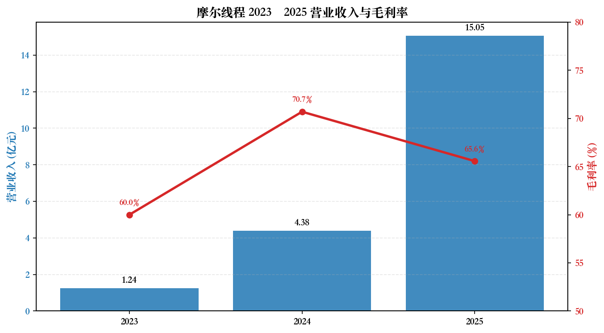
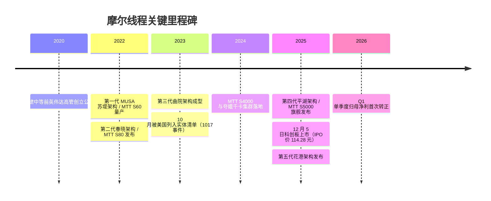
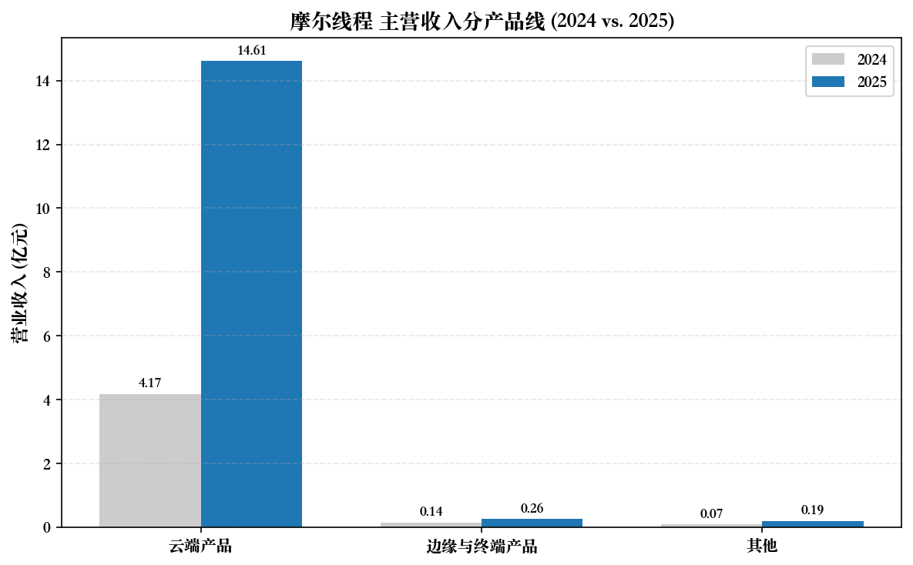
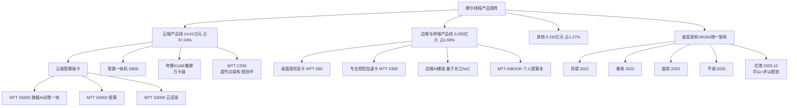
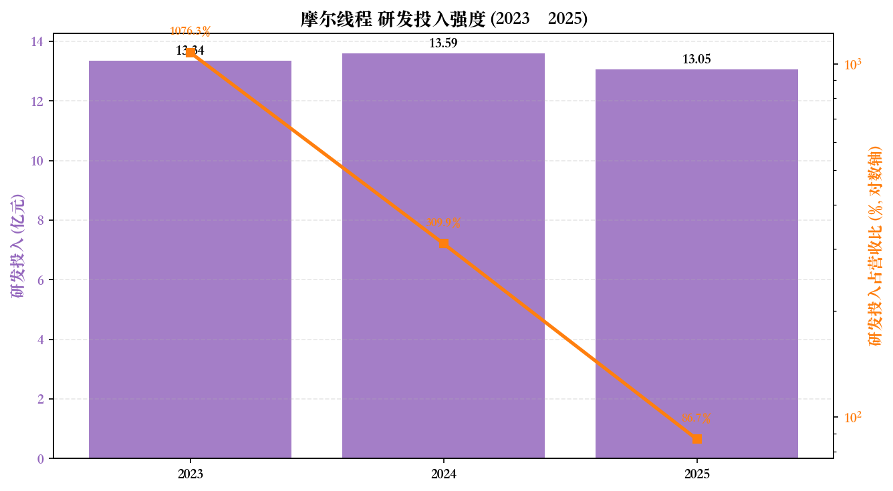
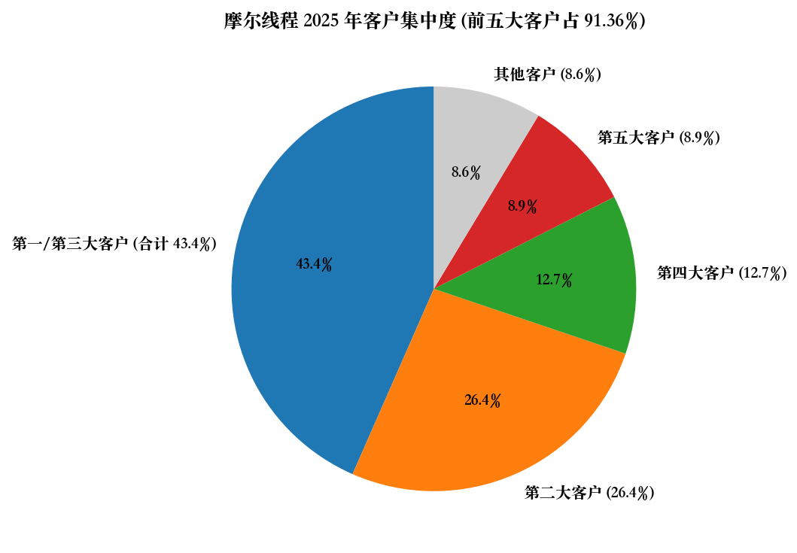
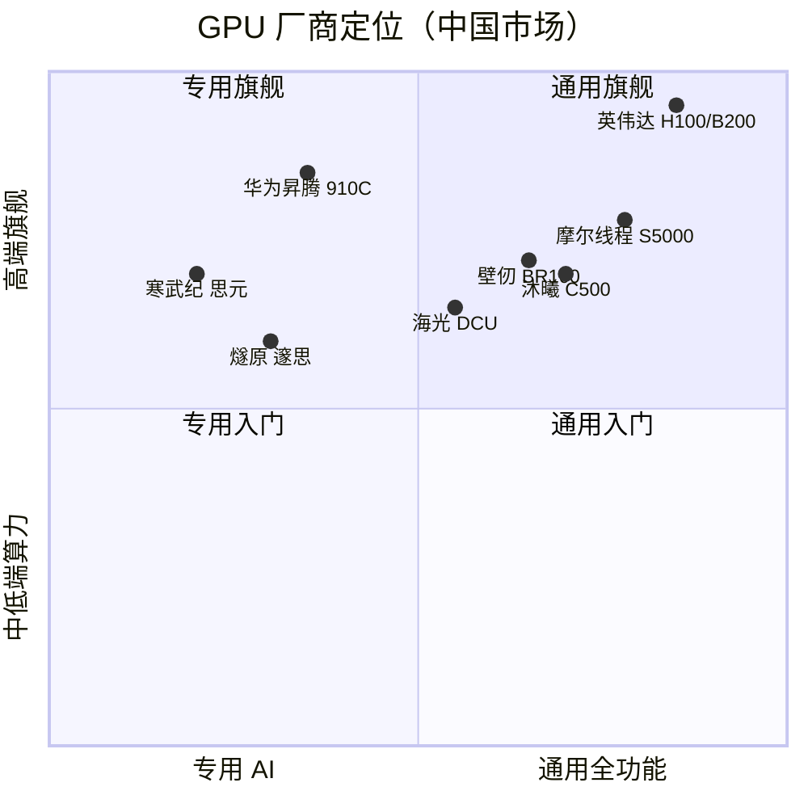
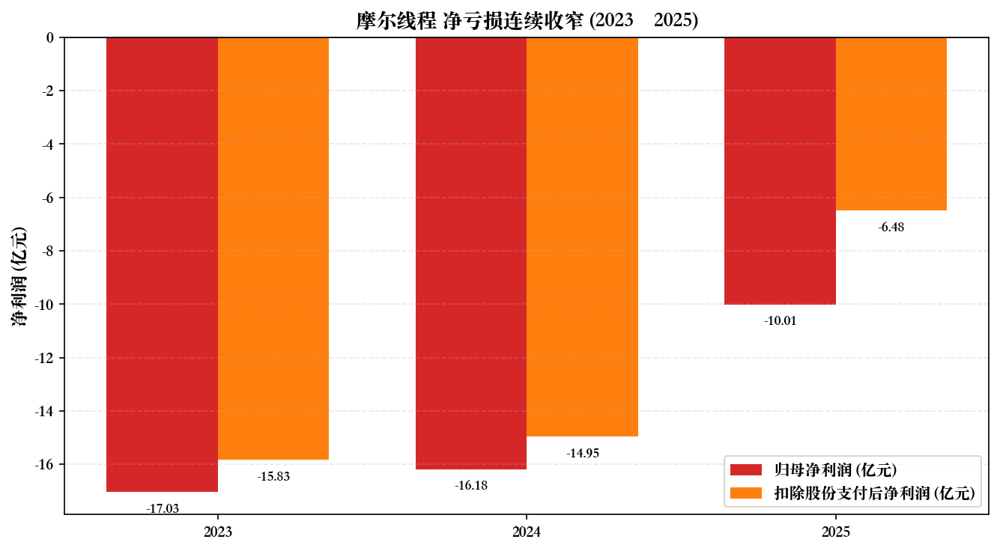
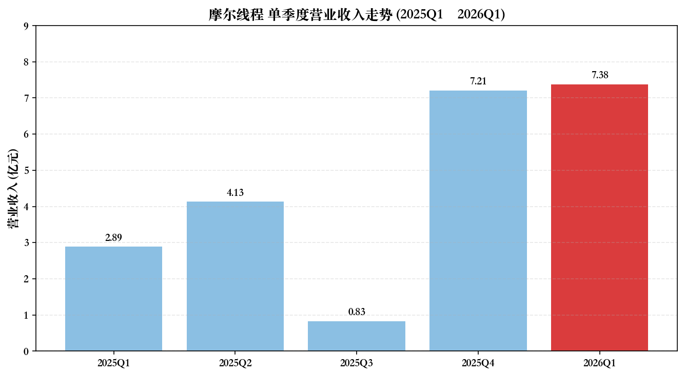

# 摩尔线程智能科技（北京）股份有限公司 — 公司研究报告

**股票代码：** SSE:688795（上海证券交易所科创板）
**公司简称：** 摩尔线程-U（"U" 表示尚未盈利）
**外文名称：** Moore Threads Technology Co., Ltd.
**报告日期：** 2026 年 5 月 20 日
**报告语言：** 简体中文
**核心数据来源：** 公司 [2025 年年度报告](https://static.cninfo.com.cn/finalpage/2026-04-27/1225197717.PDF)（2026-04-26 披露）、[2026 年第一季度报告](https://static.cninfo.com.cn/finalpage/2026-04-27/1225197642.PDF)（2026-04-26 披露）。

---

## 报告摘要

摩尔线程是中国大陆少数几家能够实现全功能 GPU（full-feature GPU，兼具 AI 计算、图形渲染、物理仿真和视频编解码）大规模量产量销的厂商，于 2025 年 12 月 5 日登陆上海证券交易所科创板。公司创始人张建中曾任英伟达全球副总裁、大中华区总经理，2020 年 10 月联合创立摩尔线程，团队具备显著的"英伟达基因"。

公司 2025 年实现营业收入 15.05 亿元，同比增长 243.37%；归母净利润 -10.01 亿元，同比减亏 6.18 亿元；扣除股份支付影响后的净利润为 -6.48 亿元，同比减亏 8.47 亿元，减亏比例 56.65%。研发投入 13.05 亿元，研发投入占营业收入比例 86.68%。2026 年第一季度公司首次实现单季度归母净利润转正：营业收入 7.38 亿元（同比 +155%），归母净利润 0.29 亿元，扣非净利润 -0.54 亿元（接近盈亏平衡）。

风险层面，公司于 2023 年 10 月 17 日被美国商务部 BIS 列入"实体清单"，供应链承压；同时客户集中度极高（前五大客户合计占年度销售总额 91.36%），且公司截至 2025 年末未弥补亏损 14.29 亿元，估值高度依赖未来算力国产替代节奏与公司产品迭代能力。

---

## 目录

1. [公司概览](#1-公司概览)
2. [公司历史](#2-公司历史)
3. [管理团队](#3-管理团队)
4. [产品与服务](#4-产品与服务)
5. [客户与上市策略](#5-客户与上市策略)
6. [行业概览](#6-行业概览)
7. [竞争格局](#7-竞争格局)
8. [市场机会](#8-市场机会)
9. [风险评估](#9-风险评估)
10. [参考资料](#10-参考资料)

---

## 1. 公司概览

摩尔线程智能科技（北京）股份有限公司（以下简称"摩尔线程"或"公司"）是一家专注于全功能 GPU 设计与研发的集成电路企业，致力于为人工智能（AI / 人工智能）、数字孪生、科学计算、专业图形渲染等场景提供国产高性能算力底座。公司于 2020 年 10 月在北京海淀区成立，注册地址北京市海淀区翠微中里 14 号楼四层 B655，办公地址位于北京市朝阳区望京东路 6 号望京国际研发园 I 座 3 层，官方网站为 https://www.mthreads.com/。截至 2025 年末，公司总资产 153.39 亿元，归属于上市公司股东的净资产 114.59 亿元，员工总数 1,274 人，其中研发人员 1,009 人，占员工总数的 79.20%（数据来源：[2025 年年度报告](https://static.cninfo.com.cn/finalpage/2026-04-27/1225197717.PDF), 第 13、32 页）。

公司核心产品为基于自主研发 MUSA（Meta-computing Unified System Architecture, 元计算统一系统架构）统一架构的云端 AI 训推一体智算卡、智算一体机、智算集群以及边缘与终端 SoC（System-on-Chip, 系统级芯片）芯片。**全功能 GPU 是公司最大的差异化定位**：与海光信息（GPGPU）、寒武纪（专用 ASIC）、华为昇腾（NPU）等以 AI 张量计算为主的国产算力厂商不同，摩尔线程在单芯片架构上同时支持 AI 计算加速、图形渲染、物理仿真和科学计算、超高清视频编解码四项核心能力，是中国大陆唯一一家在全功能维度上对标英伟达（NVIDIA）数据中心 GPU + 消费级 GPU + 工作站 GPU 全产品矩阵的厂商。

公司于 2025 年 12 月 5 日在上海证券交易所科创板成功上市，IPO 发行价 114.28 元/股（2025 年全年最高发行价），发行 7,000 万股，发行后总股本 4.7003 亿股；上市首日开盘大涨 469%，盘中最高触及 650 元，收盘价 600.50 元（[Yicai Global, 2025-12-05](https://www.yicaiglobal.com/news/chinas-first-gpu-stock-moore-threads-soars-over-fivefold-on-shanghai-debut)）。**估值快照**（截至 2026-05-14）：股价约 692.79 元/股，总市值约 3,375 亿元人民币（约 470 亿美元）。由于 2025 年公司仍处于亏损状态，归母净利润 -10.01 亿元，TTM 市盈率为负（不适用），属于典型"市梦率"驱动的国产替代叙事溢价；TTM 市销率（P/S）按 2025 年营收 15.05 亿元、当前市值 3,375 亿元计算约为 **224 倍**，按 2026Q1 单季营收年化（约 30 亿元/年）计算约为 113 倍 — 远高于科创板半导体板块中位数（约 8–12 倍 P/S）与寒武纪（约 50–80 倍 P/S 区间）。

**估值溢价归因**：摩尔线程的极端高估值反映三条逻辑共振：（1）"中国英伟达"叙事 — 公司是 A 股市场上首个全功能 GPU 标的，稀缺性溢价显著；（2）国产替代政策红利 — 美国 BIS 实体清单收紧美国 AI 芯片对华出口，国产算力替代迫切；（3）2025 年下半年至 2026Q1 业绩拐点验证 — 单季度营收从 2025Q3 的 0.83 亿元跃升至 2025Q4 的 7.21 亿元和 2026Q1 的 7.38 亿元，2026Q1 归母净利润首次转正（2,936 万元）。该估值已透支大量未来增长，若 2026–2027 年实际业绩不及预期或地缘政治进一步恶化，存在重大估值压缩风险（参见第 9 节）。

*来源：[摩尔线程 2025 年年度报告, 第 13、36 页](https://static.cninfo.com.cn/finalpage/2026-04-27/1225197717.PDF)。2023 年毛利率为估算（按营业收入 1.24 亿与营业成本约 0.50 亿测算），2024、2025 年为公司披露值。*

---

## 2. 公司历史

摩尔线程的历史虽然短暂，但节奏极为密集，是中国"硬科技"创业的典型样本之一。公司主要里程碑如下：

- **2020 年 10 月** — 创始人张建中从英伟达离职后，与周苑、张钰勃、王越等多名前英伟达资深员工在北京联合创立摩尔线程智能科技（北京）有限公司，定位"全功能 GPU"赛道（来源：[2025 年年度报告, 第 51 页](https://static.cninfo.com.cn/finalpage/2026-04-27/1225197717.PDF)；[腾讯新闻, 2025-12-07](https://news.qq.com/rain/a/20251207A0496K00)）。
- **2021 年** — 完成首轮融资。公司在创立后约 100 天即完成 Pre-A 轮融资，估值快速攀升；红杉中国、深创投、招商局创投、中移基金、腾讯创业投资、联想长江、和谐健康保险等知名机构均出现在股东名单（来源：[2025 年年度报告, 第 7–10 页释义部分](https://static.cninfo.com.cn/finalpage/2026-04-27/1225197717.PDF)）。
- **2022 年 3 月** — 发布第一代 MUSA 架构"苏堤"，并推出首款 GPU 产品 MTT S60 与 MTT S2000（消费级 + 服务器），实现"零的突破"。
- **2022 年 11 月** — 发布第二代架构"春晓"与 MTT S80（中国大陆首款支持 Windows 与 DirectX 11/12 的消费级独显）。
- **2023 年 10 月 17 日** — 被美国商务部工业与安全局（BIS）以"获取或试图获取来自美国的原产物项以支持中国军事现代化"等理由列入"实体清单"，与壁仞科技等共 13 家中国 AI / GPU 企业一同被制裁。此事被业内称为"1017 事件"，对公司供应链造成重大冲击，张建中在内部信中承认"整个国产 GPU / AI 芯片行业都受到了重创"，并启动组织优化（来源：[21 世纪经济报道, 2023-10-18](https://www.21jingji.com/article/20231018/herald/7bb8ba4d3605bef8562b34c890ec5d87.html)；[经济观察网, 2023-11-06](https://www.eeo.com.cn/2023/1106/612313.shtml)）。
- **2024 年初** — 完成供应链国产化切换的关键阶段，第三代架构"曲院"芯片定型。
- **2024 年 7 月** — 发布 MTT S4000 与基于其搭建的夸娥（KUAE）千卡 / 万卡级智算集群方案，开始大规模商业化交付。
- **2025 年** — 发布基于第四代"平湖"架构的旗舰 AI 训推一体智算卡 MTT S5000，单卡稠密 AI 算力达 1,000 TFLOPS，配备 80GB 显存、1.6TB/s 显存带宽与约 800GB/s 卡间互联带宽（来源：[2025 年年度报告, 第 4 页董事长致辞](https://static.cninfo.com.cn/finalpage/2026-04-27/1225197717.PDF)）。当年营业收入暴增至 15.05 亿元，同比增长 243.37%。
- **2025 年 12 月 5 日** — 公司在上海证券交易所科创板正式挂牌交易，证券简称"摩尔线程-U"，首日大涨 469%（来源：[Yicai Global, 2025-12-05](https://www.yicaiglobal.com/news/chinas-first-gpu-stock-moore-threads-soars-over-fivefold-on-shanghai-debut)）。
- **2025 年 12 月** — 上市后不到 20 天，公司正式发布第五代芯片架构"花港"，并公布基于"花港"的"华山"（高性能 AI 训推一体）与"庐山"（高性能图形渲染）芯片规划。同月举办首届 MUSA 开发者大会，吸引数千名产学研专业人士与开发者参与（来源：[21 世纪经济报道, 2025-12-20](https://www.21jingji.com/article/20251220/herald/4d2c3d7f86c81484c30d5197f0b1989a.html)）。
- **2026 年 4 月** — 披露 2025 年年报与 2026Q1 季报，单季度归母净利润首次转正。

**架构命名特色 — "西湖十景"**：从苏堤、春晓、曲院、平湖到花港，摩尔线程将连续五代 GPU 架构以杭州西湖十景命名，下一步规划的两款芯片"华山"与"庐山"开始转向中国名山系列（来源：[新浪财经, 2025-12-26](https://k.sina.cn/article_7096020377_1a6f4ad9901901dl1u.html)）。这种命名策略与英伟达的"科学家系列"（Tesla / Fermi / Kepler / Maxwell / Pascal / Volta / Turing / Ampere / Hopper / Blackwell）形成有意呼应的文化对称。

---

## 3. 管理团队

摩尔线程的管理层与核心技术团队的最显著特征是 **"英伟达系"高度集中**：从董事长、联合创始人到多位副总经理与核心技术人员，绝大多数有英伟达背景，与公司"对标英伟达"的产品定位高度一致。

### 3.1 创始人 / 董事长 / 总经理 — 张建中（59 岁）

张建中是公司毫无争议的灵魂人物，也是单一第一大自然人股东。他出生于 1966 年前后，高级工程师职称，职业履历跨越科研、PC 巨头与全球芯片龙头三阶段：

- **1990 年 5 月 – 1992 年 3 月**：冶金自动化研究设计院国家计算机实验室部门，高级研究员。
- **1992 年 4 月 – 2001 年 5 月**：中国惠普有限公司，产品总经理（HP 中国 9 年）。
- **2001 年 6 月 – 2006 年 3 月**：戴尔（中国）有限公司全球客户部，总经理。
- **2006 年 4 月 – 2020 年 9 月**：**英伟达全球副总裁、大中华区总经理（14 年半）**。任期内，张建中负责英伟达在大中华区的销售、市场、运营与生态建设，亲历了英伟达从游戏 GPU 业务为主向数据中心 / AI 龙头跃迁的全过程，对英伟达 CUDA 软件生态与客户网络有深度第一手认知。据黄仁勋在张建中离职时的公开表述，他对张建中的离开表示惋惜，但理解后者的决定（来源：[腾讯新闻, 2025-12-07](https://news.qq.com/rain/a/20251207A0496K00)）。
- **2020 年 10 月至今**：以实际控制人身份创立并经营摩尔线程；2024 年 10 月正式出任董事长、总经理至 2027 年 10 月（来源：[2025 年年度报告, 第 50–51 页](https://static.cninfo.com.cn/finalpage/2026-04-27/1225197717.PDF)）。

**股权与控制权**：张建中直接持有公司 44,242,122 股，占公司总股本 9.41%；通过与南京神傲管理咨询合伙企业（持股 12.38%）、杭州华傲管理咨询合伙企业（持股 5.73%）签署一致行动人协议，并担任杭州华傲、杭州众傲（1.71%）、杭州京傲（1.71%）三家员工持股平台的执行事务合伙人，张建中合计控制公司 **30.94% 股份的表决权**，为公司唯一实际控制人。公司不存在持股 30% 以上的单一控股股东（来源：[2025 年年度报告, 第 111、115 页](https://static.cninfo.com.cn/finalpage/2026-04-27/1225197717.PDF)）。2025 年度从公司领取税前薪酬 720.00 万元。锁定期：自上市之日起 36 个月（至 2028 年 12 月 5 日）。

**评价**：张建中是中国半导体行业极少数同时具备**国际一线 GPU 公司高管经验、长期大中华区客户与渠道运营经验、且具有创业实际控制人身份**的人物。他在英伟达任内 14.5 年的客户网络与生态认知，是摩尔线程能够在创立 5 年内实现千亿级估值的关键无形资产。但风险层面，公司目前对张建中个人的依赖度极高，任何健康、声誉或离任风险都将构成重大公司治理事件。

### 3.2 联合创始人 / 职工董事 — 周苑（53 岁）

周苑曾任中国惠普渠道经理、PHOENIX TECHNOLOGIES 大客户总监；2004 年 10 月至 2020 年 9 月在英伟达任市场生态高级总监（16 年），与张建中长期搭档；2020 年作为联合创始人参与摩尔线程，历任非职工董事、财务负责人，2025 年 5 月起任职工董事。2025 年度薪酬 580.00 万元（来源：[2025 年年度报告, 第 51 页](https://static.cninfo.com.cn/finalpage/2026-04-27/1225197717.PDF)）。她也是南京神傲管理咨询合伙企业（公司第一大股东持股平台）的执行事务合伙人，在治理结构中扮演稳定一致行动人的角色。

### 3.3 联合创始人 / 董事 / 副总经理 — 张钰勃（41 岁）

张钰勃是公司技术线核心人物之一。**2013 年 10 月 – 2017 年 11 月**：英伟达 GPU 架构师（4 年，硅谷总部）；**2017 年 11 月 – 2020 年 9 月**：小马智行（Pony.AI）基础架构部门主任工程师；**2020 年至今**：联合创立摩尔线程，历任监事，现任董事、副总经理、核心技术人员。他在英伟达直接参与 GPU 微架构设计，是公司"MUSA 统一架构"自主研发能力的重要担当。2025 年度薪酬 601.54 万元（来源：[2025 年年度报告, 第 51 页](https://static.cninfo.com.cn/finalpage/2026-04-27/1225197717.PDF)）。

### 3.4 财务负责人 / 董事会秘书 — 薛岩松（52 岁）

薛岩松是公司在 IPO 前夕（2023 年 9 月）招募的成熟 CFO，拥有完整的跨国公司 + 中国上市公司 IPO 财务负责人履历：广州宝洁财务分析师 → 朗讯科技 / 壳牌 / 惠而浦中国 / 索尼爱立信中国（业务计划与控制负责人 + CFO）→ 2013–2022 年担任多家公司财务负责人，参与投融资与上市筹备 → 2023 年 9 月加入摩尔线程任财务副总裁 → 2024 年 10 月任财务负责人 → 2025 年 3 月起兼任董事会秘书。2025 年度薪酬 199.97 万元（来源：[2025 年年度报告, 第 52 页](https://static.cninfo.com.cn/finalpage/2026-04-27/1225197717.PDF)）。其完整的 IPO 经验是公司从 D 轮融资到科创板挂牌仅用约 18 个月的关键支持。

### 3.5 其他关键高管

- **王东（50 岁，副总经理）**：曾任英伟达销售总监 12 年（2007–2019），是公司销售体系负责人。
- **宋学军（51 岁，副总经理 / 战略合作部总经理）**：英伟达高级销售经理出身，国科微高级销售总监履历。
- **杨上山（41 岁，副总经理 / 软件研发部总经理）**：英伟达 GPU 架构师 8 年（2012–2020），主管软件研发。
- **常玉保（45 岁，副总经理 / 芯片验证部总经理）**：中星微电子 → 楷登（Cadence）资深技术支持经理 → 智云芯 CTO 履历，主管芯片验证。
- **马凤翔（50 岁，核心技术人员 / 芯片研发部总经理）**：中星微 10 年芯片设计经理 + 地平线芯片研发总监 4 年，主管芯片设计。
- **王华（47 岁，核心技术人员 / 云计算与人工智能事业部总经理）**：威睿（VMware）高级研发经理 → 华为云网络高级专家 → 深信服 CTO 履历，主管云与 AI 业务（来源：[2025 年年度报告, 第 52 页](https://static.cninfo.com.cn/finalpage/2026-04-27/1225197717.PDF)）。

### 3.6 治理结构与独立董事

公司董事会由 7 名董事组成，其中独立董事 3 名：

- **房巧玲（50 岁）**：中国海洋大学教授（1999 年至今）、中国会计学会理事，承担审计委员会主任职责。
- **武永卫（51 岁）**：清华大学计算机系教授，2025 年 3 月起任独立董事，提供技术战略视角。
- **汪国平（61 岁）**：北京大学计算机系教授（1999 年至今），同样提供学术与技术战略支持（来源：[2025 年年度报告, 第 50、53 页](https://static.cninfo.com.cn/finalpage/2026-04-27/1225197717.PDF)）。

独立董事中两位来自国内顶尖大学计算机系，与公司技术属性匹配度高，但缺少国际产业界独立董事。

**报告期末公司全体董事与高级管理人员实际获得的薪酬合计 3,284.04 万元，核心技术人员合计 1,369.31 万元**（来源：[2025 年年度报告, 第 54 页](https://static.cninfo.com.cn/finalpage/2026-04-27/1225197717.PDF)）。

**团队评价**：摩尔线程管理层的英伟达基因极为浓厚 — 张建中（销售 / 大中华区总经理 14 年）、张钰勃（架构 4 年）、杨上山（架构 8 年）、王东（销售 12 年）、宋学军（销售）、周苑（市场生态 16 年）合计英伟达背景超过 60 人年，这在中国 GPU 创业公司中绝无仅有。该团队的优势在于：（1）深度理解英伟达的客户运营、生态构建与产品迭代节奏；（2）对 CUDA 生态既了解又有差异化构建 MUSA 生态的能力；（3）在中国大陆 GPU 客户侧的渠道与品牌识别度极高。劣势在于：（1）团队整体偏销售与生态导向，先进制程晶圆代工与封装方面的本土经验相对较弱；（2）实际控制人张建中股权与表决权高度集中，缺少机构化制衡。

---

## 4. 产品与服务

公司主营业务围绕"全功能 GPU"展开，2025 年营业收入按产品线分布为：**云端产品 14.61 亿元（占比 97.04%）、边缘与终端产品 0.255 亿元（占比 1.69%）、其他 0.191 亿元（占比 1.27%）**。云端产品毛利率 70.32%，边缘与终端产品毛利率 39.99%，整体毛利率 65.57%（来源：[2025 年年度报告, 第 36 页](https://static.cninfo.com.cn/finalpage/2026-04-27/1225197717.PDF)）。境内销售占比 99.87%，境外销售仅 190.5 万元（受实体清单出口限制影响）。直销与经销并存，直销占 72.86%，经销占 27.14%。

*来源：[摩尔线程 2025 年年度报告, 第 36 页](https://static.cninfo.com.cn/finalpage/2026-04-27/1225197717.PDF)。2024 年分产品数据为按公司披露的同比增长率反推。*

### 4.1 云端产品线（核心业务）

**云端产品线**是公司绝对主力，2025 年同比增长 250.30%，由三层构成：

1. **云端智算板卡**（核心计算单元）：旗舰为 **MTT S5000**（基于第四代"平湖"架构），面向 MoE 混合专家模型、多模态模型、世界模型预训练及集群化推理优化设计 — 单卡稠密 AI 算力 1,000 TFLOPS，FP4 到 FP64 全精度算力支持，80GB 显存，1.6TB/s 显存带宽，约 800GB/s 卡间互联带宽。中端产品线包括 **MTT S4000**（智算训推）与 **MTT S3000**（云原生 + 数字孪生，硬件级虚拟化能力强）。在与硅基流动（SiliconFlow）的实测中，MTT S5000 在 DeepSeek R1 671B 全模型上单卡 Prefill 吞吐超过 4000 tokens/s、Decode 吞吐超过 1000 tokens/s（来源：[mthreads.com — MTT S5000 产品页](https://www.mthreads.com/product/S5000)）。

2. **智算一体机**（服务器层）：代表型号 **D800** — 大规模 AI 训练与推理场景，通过高密度算力集成和创新散热设计实现单节点多卡高效协同。

3. **智算集群**（系统层）：**夸娥（KUAE）集群**可扩展至万卡及以上规模。基于 MTT S5000 搭建的夸娥万卡级集群已完成部署并实现上线服务，浮点运算能力达 10 Exa-Flops，Dense 大模型训练算力利用率（MFU, Model FLOPs Utilization）达 60%，MoE 大模型训练算力利用率 40%，有效训练时间占比超过 90%，训练线性扩展效率 95%（来源：[2025 年年度报告, 第 4 页董事长致辞](https://static.cninfo.com.cn/finalpage/2026-04-27/1225197717.PDF)）。公司同时发布了下一代 **MTT C256 超节点架构**规划，对标英伟达 GB200 / GB300 NVL72 超节点架构。

### 4.2 边缘与终端产品线

**边缘与终端产品线**当前体量较小（2025 年仅 0.255 亿元），但战略意义重大，被视为公司在 Agentic AI 时代的第二增长曲线：

1. **桌面图形加速显卡**：**MTT S80** — 中国大陆首款支持 Windows 操作系统及 DirectX 11/12 图形 API 的消费级独显，对标 NVIDIA GeForce 入门级产品（如 GTX 1660 / RTX 3050）。
2. **专业视觉加速卡**：**MTT X300** — 面向 GIS（地理信息系统）、CAD（计算机辅助设计）、BIM（建筑信息模型）及非线性编辑等专业应用，对标 NVIDIA Quadro / RTX A 系列工作站显卡。
3. **边缘 AI 计算模组**：基于自研 **"长江" SoC**（异构集成 CPU+GPU+NPU+VPU），面向机器人与边缘计算市场。
4. **个人智算终端**：**MTT AIBOOK** — 搭载"长江" SoC 的 AI 算力本，面向 AI 学习与开发者场景，预装智能体应用生态、深度集成端云协同 Agent 运行环境。

### 4.3 自主芯片架构（核心技术资产）

公司基于自主研发的 MUSA 统一架构，迄今已迭代五代芯片架构（数据来源：[2025 年年度报告, 第 4、31–32 页](https://static.cninfo.com.cn/finalpage/2026-04-27/1225197717.PDF)）：

| 代次 | 架构代号 | 推出时间 | 关键产品 | 当前状态 |
|---|---|---|---|---|
| 第一代 | 苏堤 | 2022 | MTT S60 / S2000 | 已完成 |
| 第二代 | 春晓 | 2022 | MTT S80 / S3000 | 已完成 |
| 第三代 | 曲院 | 2023–2024 | MTT S4000 | 已完成 |
| 第四代 | 平湖 / 平湖 1S | 2025 | MTT S5000 | 在研（持续迭代） |
| 第五代 | 花港 | 2025 年 12 月发布 | "华山"（AI 训推）/ "庐山"（图形渲染）芯片规划 | 在研 |

"花港"架构相对"平湖"算力密度提升 50%，运算效能提升 10 倍，支持 FP4 到 FP64 全精度计算，新一代指令集。截至 2025 年末，公司累计专利申请 1,854 项，其中发明专利 1,743 项；累计获授权专利 646 项，其中发明专利 590 项（来源：[2025 年年度报告, 第 31 页](https://static.cninfo.com.cn/finalpage/2026-04-27/1225197717.PDF)）。

### 4.4 在研项目与研发投入

2025 年公司研发投入 13.05 亿元（同比 -3.95%，主要因 2024 年存在较大股份支付影响），研发投入占营业收入比例 86.68%（2024 年为 309.88%，2023 年为 1,076.31%）。研发投入资本化比例为 0%，全部费用化。10 项主要在研项目累计投入 44.57 亿元，其中：

- **平湖 1S 芯片**：本期投入 1.88 亿元，累计 3.70 亿元
- **华山芯片**：本期投入 2.88 亿元，累计 3.30 亿元
- **庐山芯片**：本期投入 1.39 亿元，累计 1.39 亿元（2025 年新立项）
- **新一代推理芯片**：本期投入 0.13 亿元
- **KUAE 智算集群**：累计 4.28 亿元，已完成

*来源：[摩尔线程 2025 年年度报告, 第 14、31 页](https://static.cninfo.com.cn/finalpage/2026-04-27/1225197717.PDF)。研发投入占营收比为对数轴。*

研发团队结构：1,009 名研发人员中，博士 47 人，硕士 732 人，本科及以下 230 人；30 岁以下 350 人，30–40 岁 494 人，40 岁以上 165 人（来源：[2025 年年度报告, 第 32–33 页](https://static.cninfo.com.cn/finalpage/2026-04-27/1225197717.PDF)）。研发人员平均薪酬 71.89 万元/年，高于行业平均水平，显示公司在算力研发人才上的高强度投入。

### 4.5 开发者生态与 MUSA

公司高度重视开发者生态建设。2025 年 12 月，首届 **MUSA 开发者大会**成功举办，吸引数千名产学研专业人士与开发者参与。自成立以来，公司通过"摩尔学院"平台聚集了 **超过 45 万名开发者与学习者**，并通过"国产计算生态与 AI 教育共建行动"将前沿技术与产业实践引入全国逾 200 所高校（来源：[2025 年年度报告, 第 5 页](https://static.cninfo.com.cn/finalpage/2026-04-27/1225197717.PDF)）。

公司与 **DeepSeek、智谱（Zhipu）、MiniMax、月之暗面（Moonshot）、阿里巴巴** 等国内主要大模型公司持续开展技术合作，并实现"发布即适配"（Day-0 适配）常态化支持。在具身智能（embodied AI）场景，公司发挥全功能 GPU 优势，初步建立了从模型训练、仿真模拟到端侧部署的全国产具身智能计算软硬件技术栈。

---

## 5. 客户与上市策略

### 5.1 客户集中度（重大风险）

摩尔线程客户集中度处于**极端高位**，根据 2025 年年报披露：

- **前五名客户销售额合计 13.755 亿元，占年度销售总额 91.36%**，其中关联方销售额为 0。
- 第一、第三名客户为公司长期合作伙伴；第二、第四、第五名客户为本期新增。
- 第二大客户销售额 **3.973 亿元（占 26.39%）**，第四大客户 1.911 亿元（占 12.69%），第五大客户 1.334 亿元（占 8.86%）。
- 由 91.36% 减去已披露的第二、四、五（共 47.94%），**第一与第三大客户合计约 43.42%**，但年报未对前五大客户单独披露名称（来源：[2025 年年度报告, 第 38 页](https://static.cninfo.com.cn/finalpage/2026-04-27/1225197717.PDF)）。

*来源：[摩尔线程 2025 年年度报告, 第 38 页](https://static.cninfo.com.cn/finalpage/2026-04-27/1225197717.PDF)。第一、三大客户具体占比未单独披露，按总数 91.36% 倒推合计 43.42%。*

附注 — 财务报表附注（[2025 年年度报告, 第 208 页](https://static.cninfo.com.cn/finalpage/2026-04-27/1225197717.PDF)）披露：截至 2025 年 12 月 31 日，**应收账款的 33.05% 来源于应收账款余额最大客户，99.07% 来源于前五大客户**。应收账款 4.34 亿元（同比 +455.07%），与营收同步快速放大。这一客户集中度结构暗示主要客户大概率为：（1）有大规模国产算力采购需求的运营商（如中国移动 — 公司股东之一 [北京中移数字新经济产业基金合伙企业](https://static.cninfo.com.cn/finalpage/2026-04-27/1225197717.PDF) 持股 1.81%）；（2）头部大模型与互联网公司；（3）地方政府主导的智算中心项目。公司在年报中明确将"客户集中度较高"列为重大经营风险之一。

### 5.2 供应商集中度与"实体清单"约束

供应商端，**前五名供应商采购额 14.11 亿元，占年度采购总额 63.83%**，其中关联方采购额 4.78 亿元，占年度采购总额 21.63%。第三、四、五名为新增供应商，采购金额分别为 1.50 亿元、1.37 亿元、0.88 亿元（来源：[2025 年年度报告, 第 38 页](https://static.cninfo.com.cn/finalpage/2026-04-27/1225197717.PDF)）。供应商集中度同样较高，叠加 2023 年 10 月实体清单制裁的持续影响，公司在先进制程晶圆代工与高端封装（CoWoS 等）方面的供应链稳定性是核心瓶颈。公司年报披露已积极调整供应链策略，构建多元化供应链体系，加强与国内及非受限地区供应商的战略合作。

### 5.3 IPO 与上市策略

公司 IPO 是科创板 2025 年度标志性事件之一：

| 项目 | 数据 |
|---|---|
| 上市地 | 上海证券交易所科创板 |
| 上市日期 | 2025 年 12 月 5 日 |
| 发行价 | 114.28 元/股（2025 年最高发行价） |
| 发行规模 | 7,000 万股 |
| 募集资金 | 约 80 亿元 |
| 发行后总股本 | 4.7003 亿股 |
| 保荐机构 | 中信证券 |
| 会计师事务所 | 安永华明 |
| 首日开盘价 | 650 元 / 涨幅 +469% |
| 首日收盘价 | 600.50 元 / 涨幅 +425% |
| 首日总市值 | 约 2,820 亿元 |

数据来源：[2025 年年度报告, 第 109 页](https://static.cninfo.com.cn/finalpage/2026-04-27/1225197717.PDF)、[Yicai Global, 2025-12-05](https://www.yicaiglobal.com/news/chinas-first-gpu-stock-moore-threads-soars-over-fivefold-on-shanghai-debut)。

公司选择科创板第五套上市标准（允许未盈利企业上市），因其归母净利润、归母扣非净利润、母公司未分配利润均为负。**上市未盈利锁定承诺**：公司全体董事、高管、核心技术人员及实际控制人承诺，在公司实现盈利前，自上市之日起 3 个完整会计年度内不得减持首发前股份；锁定期满后 4 年内每年转让不超过其持股的 25%（来源：[2025 年年度报告, 第 74 页](https://static.cninfo.com.cn/finalpage/2026-04-27/1225197717.PDF)）。

**前十大股东结构**（截至 2025 年末，来源：[2025 年年度报告, 第 111 页](https://static.cninfo.com.cn/finalpage/2026-04-27/1225197717.PDF)）：

| 排名 | 股东名称 | 持股数（股） | 比例 |
|---|---|---|---|
| 1 | 南京神傲管理咨询合伙企业（实控人控制） | 58,186,082 | 12.38% |
| 2 | 张建中 | 44,242,122 | 9.41% |
| 3 | 杭州华傲管理咨询合伙企业（员工持股 / 实控人控制） | 26,927,569 | 5.73% |
| 4 | 深圳市明皓新科技合伙企业 | 19,922,698 | 4.24% |
| 5 | 国盛资本-盛芯启程 | 19,588,689 | 4.17% |
| 6 | 红杉资本（红杉优品） | 19,154,406 | 4.08% |
| 7 | 沛县乾曜兴 | 16,998,680 | 3.62% |
| 8 | 闻名泉丰 | 11,555,696 | 2.46% |
| 9 | 中移基金（中国移动旗下） | 8,495,555 | 1.81% |
| 10 | 杭州众傲管理咨询（员工持股 / 实控人控制） | 8,042,239 | 1.71% |

实际控制人张建中通过直接持股 + 神傲 / 华傲 / 众傲 / 京傲合计控制约 **30.94% 的表决权**。机构股东中红杉中国、深创投、招商局创投、腾讯创业投资、中国移动旗下基金、和谐健康保险、联想长江等均出现在股东名册中（持股 5% 以下，[2025 年年度报告, 第 7–10 页释义部分](https://static.cninfo.com.cn/finalpage/2026-04-27/1225197717.PDF)），机构覆盖度极高。

---

## 6. 行业概览

### 6.1 行业定义与价值链定位

摩尔线程归属于**集成电路设计行业**（中国证监会行业分类：C39 计算机、通信和其他电子设备制造业；细分赛道：GPU / 通用计算芯片）。在 AI 算力产业链中，公司位于**上游芯片设计环节**（Fabless 模式），下游对接智算中心、服务器厂商、互联网与运营商、政府智算项目以及消费 / 工业终端厂商。

### 6.2 三个技术门槛与市场细分

公司年报将 GPU 产业划分为三个技术门槛极高的方向（来源：[2025 年年度报告, 第 20 页](https://static.cninfo.com.cn/finalpage/2026-04-27/1225197717.PDF)）：

1. **第一代智算中心方向（大模型训练）**：算力竞争已从单卡演变为系统级万卡 / 十万卡集群能力 — 涉及超大规模无损组网、高带宽低延迟通信、长周期高负载系统级容错、复杂并行计算策略与显存管理、FP8 / FP4 低精度硬件级加速等。代表性需求方为大模型公司、互联网巨头与电信运营商。
2. **新一代通用超智算中心方向（具身智能 + AI4S）**：要求"全功能"架构 — 同一硬件底层与软件生态上无缝协同 AI 张量计算、物理仿真和大规模 3D 渲染；FP64 双精度浮点能力、AI 生成式渲染、硬件级光线追踪等。这正是摩尔线程相对寒武纪、华为昇腾等专用 AI 芯片厂商的最大差异化。
3. **个人智算与边缘计算方向（AI Agent）**：异构计算高度集成与极致能效比 — CPU + GPU + NPU 异构融合、SoC 模块化设计与封装、轻量化推理软件栈。

### 6.3 市场规模与增长预期

国产 AI 芯片市场正经历高速增长。根据搜索结果，**国产通用 GPU 产品占比由 2022 年的 8.3% 提升至 2024 年的 17.4%，预计到 2029 年将超过 50%**（来源：[investing.com 转载时代周报, 2025](https://cn.investing.com/news/stock-market-news/article-3142786)）。这一国产替代趋势的核心驱动力来自：

1. **美国出口管制持续收紧**：从 2022 年 10 月的 A100 / H100 禁运，到 2023 年 10 月的 H800 / L40S 禁运及 A800 / H800 中国特供版禁运，到 2024–2025 年对 H20 等推理特供卡的进一步限制，英伟达高端 GPU 在中国市场的可获得性持续下降。
2. **中国国家战略层面的"算力即国力"政策**：东数西算、智算中心建设、"十四五"信息化规划、新质生产力等政策均将国产算力作为重点支持方向。
3. **大模型与具身智能需求爆发**：DeepSeek、Kimi、智谱、阿里通义、腾讯混元等国产大模型对国产算力的需求与适配意愿持续提升。

中国 AI 服务器市场规模 2024 年已超过 200 亿美元，预计 2027 年突破 600 亿美元（IDC 等机构口径），其中 GPU 占 AI 服务器成本 60–70%，因此国产 GPU TAM（Total Addressable Market）保守估计在 2027 年可达 1,500–2,500 亿元人民币（基于若国产化率达到 30%–50%）。

### 6.4 行业结构性特征

- **高研发资本投入**：单一架构研发周期通常 2–3 年，单代芯片研发投入 5–10 亿元起步。
- **生态壁垒极高**：英伟达 CUDA 生态经过近 20 年积累，全球开发者超过 500 万人；国产 GPU 厂商均面临 CUDA 替代的生态构建挑战，这是软件栈层面最大瓶颈。
- **晶圆代工依赖度高**：先进制程（7nm 及以下）目前仍主要依赖台积电（境外）或中芯国际（境内），后者受限于 EUV 光刻机出口管制。
- **客户集中度高**：智算中心建设以央国企、运营商与头部互联网公司为主，单笔订单金额大、客户数量有限。

---

## 7. 竞争格局

### 7.1 国产 GPU "四小龙"格局

中国 GPU 行业目前形成了"四小龙"格局 — **摩尔线程、沐曦（Metax）、壁仞科技（Biren Tech）、燧原科技（Enflame）**，叠加海光信息、寒武纪、华为昇腾等专用 AI 算力厂商，构成完整竞争图谱（来源：[investing.com 转载时代周报, 2025](https://cn.investing.com/news/stock-market-news/article-3142786)；[知乎 — 国产 GPU 厂商盘点, 2024](https://zhuanlan.zhihu.com/p/11109717054)）。

| 厂商 | 上市状态 | 技术路线 | 核心定位 | 关键产品 |
|---|---|---|---|---|
| **摩尔线程** | 已上市（科创板 688795） | 自研全功能 GPU（MUSA） | 全场景 GPU（AI + 渲染 + 仿真） | MTT S5000、夸娥集群 |
| **沐曦** | 已申报科创板（2025 年受理） | 通用 GPGPU | 训推一体，CUDA 兼容（6,000+ 应用） | 曦云 C 系列 |
| **壁仞科技** | 已申报科创板 | 通用 GPGPU | 训练为主 | BR100、BR104 |
| **燧原科技** | 准备科创板 | AI 加速卡（DSA + GPU 混合） | 训推一体 | 邃思系列 |
| **海光信息** | 已上市（科创板 688041） | DCU（GPGPU 架构，AMD CDNA 授权） | x86 生态兼容 | 深算系列 |
| **寒武纪** | 已上市（科创板 688256） | ASIC / DSA 专用 | AI 推理与训练专用 | 思元 / 玄思系列 |
| **华为昇腾** | 母公司未上市 | NPU（DSA） | 自有生态闭环 | 昇腾 910B / 910C |

**摩尔线程的差异化**：在所有国产玩家中，摩尔线程是**唯一一家在同一颗芯片上同时支持 AI 计算、图形渲染、物理仿真和科学计算的厂商**，这种全功能定位与英伟达的产品路线最为接近 — 即"游戏 → 工作站 → 数据中心 → AI" 的演化路径（来源：[知乎 — 国产 GPU 大时代, 2025](https://zhuanlan.zhihu.com/p/1986411998930548677)）。

### 7.2 直接对标 — 英伟达

公司明确以英伟达全产品矩阵为对标对象。MTT S5000（1,000 TFLOPS FP16 稠密算力）大致对标英伟达 H100（约 1,000 TFLOPS FP16 稠密算力，但配 80GB HBM3 与 3.35TB/s 带宽）与 H800 中国特供版。在显存带宽（1.6TB/s vs. 英伟达 H100 的 3.35TB/s）与卡间互联（约 800GB/s vs. NVLink 4 的 900GB/s）等关键指标上，摩尔线程仍存在一定差距，但已是国产厂商中最接近英伟达水平的产品。生态层面，MUSA 架构通过提供 CUDA 代码迁移工具（即 CUDA → MUSA 的转换路径），尽力降低用户从英伟达切换的迁移成本（来源：[证券时报, 2025-12-20](https://www.stcn.com/article/detail/3550661.html)）。

### 7.3 竞争优势与脆弱性

**摩尔线程的核心竞争优势**：
1. **创始团队的英伟达背景** — 是国内创业团队中最能"复制英伟达打法"的团队。
2. **全功能 GPU 唯一性** — A 股市场上唯一一家全功能 GPU 标的，稀缺性溢价显著。
3. **MUSA 生态雏形** — 45 万开发者 + 200 所高校 + Day-0 适配国内主要大模型，生态构建快于多数同行。
4. **量产量销能力** — 国产 GPU 厂商中少数实现万卡级集群规模化商业交付的厂商。
5. **资本充裕** — IPO 募资约 80 亿元，加上自身现金类资产（货币资金 91.76 亿元 + 交易性金融资产 1.79 亿元 + 其他流动资产含大额存单 14.86 亿元），合计 100 亿元以上现金储备，可支撑 5–7 年高强度研发。

**主要脆弱性**：
1. **实体清单制约** — 先进制程晶圆代工、EDA 工具、HBM 高带宽显存等关键供应链承压。
2. **客户集中度极高** — 前五大客户占 91.36%，单一客户流失或砍单将带来巨大业绩波动。
3. **CUDA 生态护城河** — 英伟达 CUDA 生态护城河极宽，MUSA 在生态深度上仍需 5–10 年追赶。
4. **持续亏损 + 极高估值** — 2025 年仍亏损 10.01 亿元，TTM P/S 约 224 倍，估值对预期业绩兑现的敏感度极高。
5. **国产竞争同样激烈** — 沐曦、壁仞、燧原均在准备科创板上市，未来 12–24 个月国产 GPU 板块供给将显著增加。

---

## 8. 市场机会

### 8.1 国产替代 — 核心增长引擎

中国 AI 算力国产替代的紧迫性在 2025 年达到新高。根据美国 BIS 在 2022 年 10 月、2023 年 10 月、2024 年 12 月连续三轮出口管制升级，英伟达对华出口的最高规格 AI 芯片性能不断下调，迫使中国头部用户加速国产化进程。摩尔线程作为已上市、有量产能力、有全功能定位的标杆企业，最有望承接此轮替代红利。

**国产化率预测**：国产通用 GPU 占比 2024 年 17.4% → 2029 年 50%+（来源：[investing.com 转载时代周报, 2025](https://cn.investing.com/news/stock-market-news/article-3142786)）。若 2027 年国产化率达 35%、中国 AI GPU 市场规模达 1,500 亿元，摩尔线程若占据国产份额 15%，则对应营收 78 亿元（相对 2025 年 15.05 亿元有约 5 倍增长空间）。该测算高度依赖：（a）2027 年市场总量与渗透率，（b）公司份额假设，均需重大兑现验证（标记为 **est.，仅作敏感性分析**）。

### 8.2 三大增量场景

1. **第一代智算中心扩容**：互联网公司与运营商主导的万卡 / 十万卡级训练集群仍处于建设高峰，MTT S5000 + 夸娥集群方案直接承接。
2. **新一代通用超智算中心（具身智能 + AI4S）**：随着人形机器人、自动驾驶训练、量子计算仿真、AI for Science 等场景对全功能算力的需求兴起，公司全功能 GPU 路线优势凸显。年报董事长致辞中明确将"具身智能产业高质量发展"列为重点方向。
3. **Agentic AI 时代的个人智算终端**：MTT AIBOOK 与"长江"SoC 切入端侧 Agent 市场，体量虽小（2025 年仅 0.255 亿元），但毛利率仍达 39.99%，且有望伴随 Agent 普及实现指数级增长。

### 8.3 出海机会（受限）

由于实体清单约束，公司境外销售 2025 年仅 190.5 万元，占比 0.13%。中长期出海机会主要在：（1）非美国限制清单覆盖的"一带一路"沿线国家；（2）通过 AIBOOK 等终端产品在消费市场曲线出海。出海空间在中短期内仍非常有限。

### 8.4 政府智算项目与新基建

"东数西算"工程一体化算力网建设、各省市智算中心建设潮（贵州、内蒙古、宁夏、甘肃、青海等"东数西算"枢纽节点）以及高校与科研院所的算力采购，均是公司直销渠道的重点目标客户。中移基金作为公司股东亦反映了与运营商体系合作的深度。

---

## 9. 风险评估

公司年报已主动披露多项重大风险（来源：[2025 年年度报告, 第 33–35 页](https://static.cninfo.com.cn/finalpage/2026-04-27/1225197717.PDF)）。综合公司层面、行业层面、财务层面、宏观层面四大维度，整理 11 项核心风险：

### A. 公司层面风险

**A1. 持续亏损与未弥补亏损风险（高）**
2025 年公司归母净利润 -10.01 亿元，扣非归母净利润 -10.88 亿元；截至 2025 年末母公司报表未分配利润 -14.29 亿元。虽 2026Q1 归母净利首次转正（0.29 亿元），但扣非净利仍亏损 0.54 亿元，全年仍存在持续亏损可能。公司本年度不进行利润分配。

**A2. 客户集中度极高风险（高）**
前五大客户占年度销售额 91.36%；应收账款余额 99.07% 来自前五大客户；最大单一客户占应收账款 33.05%。任何主要客户的砍单、延期付款或破产，都将对当期业绩与现金流产生重大影响。缓释措施：公司表示将拓展新客户、优化客户结构。

**A3. 实际控制人单一依赖风险（中高）**
张建中合计控制约 30.94% 表决权，且公司核心创始团队、销售渠道、品牌识别度高度依赖其个人。任何健康、声誉或离任事件都将构成重大公司治理风险。

**A4. 技术与产品迭代风险（中）**
集成电路设计是技术密集型行业，公司若未能精准把握技术演变方向，可能丧失市场竞争力。"花港"架构 + "华山"+ "庐山"芯片能否如期落地是 2026–2027 年关键观察点。

### B. 行业 / 市场层面风险

**B1. 美国实体清单与地缘政治风险（极高）**
公司 2023 年 10 月被列入 BIS 实体清单，对美国生产原材料采购、含美技术知识产权与研发工具使用产生限制。若美国进一步扩大制裁（如全面禁止台积电等代工厂为公司流片、禁止使用美系 EDA 工具），公司可能面临**营业收入大幅下滑的极端情形**。这是公司明确披露的最大风险（来源：[2025 年年度报告, 第 34 页](https://static.cninfo.com.cn/finalpage/2026-04-27/1225197717.PDF)；[21 世纪经济报道, 2023-10-18](https://www.21jingji.com/article/20231018/herald/7bb8ba4d3605bef8562b34c890ec5d87.html)）。

**B2. 国产 GPU 厂商竞争加剧风险（中高）**
沐曦、壁仞、燧原均在准备 IPO，未来 12–24 个月国产 GPU 板块供给将显著增加，可能引发价格战与客户分流。

**B3. CUDA 生态壁垒难以跨越风险（中高）**
英伟达 CUDA 生态护城河极宽。MUSA 虽推进 Day-0 适配，但开发者生态深度仍远落后于 CUDA。客户从英伟达切换的隐性成本（人才、工具链、性能调优）仍极高。

### C. 财务层面风险

**C1. 预付账款与存货跌价风险（中）**
2025 年末预付账款 17.82 亿元（同比 +214.24%），主要为业务采购预付款；存货 13.32 亿元（同比 +105.87%）。若主要客户砍单或终端需求不及预期，将面临存货跌价与预付款减值风险。

**C2. 估值压缩风险（高）**
按 2026-05-14 市值 3,375 亿元、2025 年营收 15.05 亿元计算，TTM P/S 约 224 倍，远高于科创板半导体板块中位数与同行（寒武纪 50–80 倍）。任何业绩不及预期、地缘政治恶化或解禁减持，均可能引发估值大幅压缩。**首发限售股将在 2026 年 12 月 5 日（IPO 网下发行限售 + 部分战略配售）与 2028 年 12 月 5 日（实控人及一致行动人 + 三年锁定股东）迎来两个关键解禁窗口**（来源：[2025 年年度报告, 第 109–110、112 页](https://static.cninfo.com.cn/finalpage/2026-04-27/1225197717.PDF)）。

**C3. 经营活动现金流持续为负风险（中）**
2025 年经营活动现金流净额 -29.56 亿元（同比 -51%），主因业务规模扩大与采购支出增加。虽公司账上现金类资产合计超百亿，但若经营性现金流持续大幅为负，可能压缩研发投入弹性。

### D. 宏观层面风险

**D1. 中美科技博弈持续升级风险（高）**
中美在半导体、AI 领域的博弈仍处于上升通道，存在进一步出口管制、二级制裁（覆盖代工厂、EDA、HBM 供应商）、投资限制、人员限制等多维度升级可能。这一宏观风险无法通过公司层面缓释。

**D2. 国家算力补贴政策变化风险（中）**
"东数西算"、智算中心建设、AI for Science 等政策若节奏放缓或补贴力度下调，将影响央国企与地方政府的算力采购意愿。

### 风险评级汇总

| 风险等级 | 风险项 |
|---|---|
| 极高 | B1（实体清单/地缘政治） |
| 高 | A1（持续亏损）、A2（客户集中）、B2（国产竞争）、B3（CUDA 壁垒）、C2（估值压缩）、D1（中美博弈） |
| 中高 | A3（实控人依赖） |
| 中 | A4（迭代）、C1（存货跌价）、C3（现金流）、D2（政策） |

*来源：[摩尔线程 2025 年年度报告, 第 13 页](https://static.cninfo.com.cn/finalpage/2026-04-27/1225197717.PDF)。扣除股份支付影响后净利润数据来源同年报第 17 页。*

*来源：[摩尔线程 2025 年年度报告, 第 14 页](https://static.cninfo.com.cn/finalpage/2026-04-27/1225197717.PDF) + [2026 年第一季度报告, 第 1 页](https://static.cninfo.com.cn/finalpage/2026-04-27/1225197642.PDF)。注：2025Q3 单季营收仅 0.83 亿元，主要因部分大额订单交付节奏向 Q4 集中。*

---

## 10. 投资逻辑与小结

摩尔线程是一家典型的"高增长 + 高亏损 + 高估值 + 高风险"四高型硬科技公司，其投资逻辑可总结为三层：

**正面逻辑**
- 创始团队是中国 GPU 创业团队中最具英伟达基因的组合，张建中本人是核心稀缺资产；
- 全功能 GPU 定位在 A 股市场具备唯一性，承接国产替代红利节奏领先；
- 2025 年营收同比 +243%、2026Q1 单季归母净利润转正，业绩拐点已现；
- IPO 募资 80 亿 + 自有现金合计百亿以上，研发资金充裕；
- 第五代"花港"架构 + "华山"+ "庐山"芯片产品节奏清晰；
- MUSA 开发者生态超 45 万人，Day-0 适配国内主要大模型。

**核心担忧**
- TTM P/S 高达约 224 倍，估值对业绩兑现高度敏感；
- 客户集中度极高（前五客户 91.36%），单一客户风险足以颠覆季度业绩；
- 美国实体清单未解除，先进制程、EDA、HBM 供应链承压；
- 国产 GPU 板块未来 12–24 个月新供给（沐曦、壁仞、燧原 IPO）将稀释估值溢价；
- 首发限售股解禁窗口（2026 年 12 月 + 2028 年 12 月）对股价构成压力。

**结论**：摩尔线程是中国 AI 算力国产替代叙事的核心标的之一，从产品力、团队、资本充裕度上均具备成为"中国英伟达"的雏形，但当前估值已大幅透支未来 3–5 年增长预期，且面临极高的地缘政治、客户集中度与解禁减持风险。本报告不构成投资建议，投资者应基于自身风险偏好与持续跟踪公司季度业绩、产品迭代、客户结构变化、地缘政治进展等核心变量，独立判断。

---

## 11. 参考资料

### A. 公司公告（一手资料 — 权威优先）

1. [摩尔线程智能科技（北京）股份有限公司 2025 年年度报告（2026-04-26 披露）](https://static.cninfo.com.cn/finalpage/2026-04-27/1225197717.PDF)
2. [摩尔线程智能科技（北京）股份有限公司 2025 年年度报告摘要（2026-04-26）](https://static.cninfo.com.cn/finalpage/2026-04-27/1225197443.PDF)
3. [摩尔线程智能科技（北京）股份有限公司 2026 年第一季度报告（2026-04-26）](https://static.cninfo.com.cn/finalpage/2026-04-27/1225197642.PDF)
4. [摩尔线程关于召开 2025 年年度暨 2026 年第一季度业绩说明会的公告（2026-04-19）](https://www.cninfo.com.cn/new/disclosure/stock?stockCode=688795&orgId=)

### B. 公司官网与产品资料

5. [摩尔线程官方网站](https://www.mthreads.com/)
6. [MTT S5000 训推一体全功能 GPU 智算卡产品页](https://www.mthreads.com/product/S5000)

### C. 二级新闻与行业研究（近 12 个月优先）

7. [Yicai Global, 2025-12-05 — Moore Threads Soars Over Fivefold as 'China's Nvidia' Makes Shanghai Trading Debut](https://www.yicaiglobal.com/news/chinas-first-gpu-stock-moore-threads-soars-over-fivefold-on-shanghai-debut)
8. [Pandaily — China's First Domestic GPU Maker Moore Threads Launches IPO on STAR Market](https://pandaily.com/china-s-first-domestic-gpu-maker-moore-threads-launches-ipo-on-star-market)
9. [21 世纪经济报道, 2025-12-20 — 摩尔线程发布"花港"架构，力推国产万卡智算生态](https://www.21jingji.com/article/20251220/herald/4d2c3d7f86c81484c30d5197f0b1989a.html)
10. [证券时报, 2025-12-20 — 摩尔线程首次公开全功能 GPU 技术路线图](https://www.stcn.com/article/detail/3550271.html)
11. [证券时报, 2025-12-21 — 上市后首战即指生态，摩尔线程想拿什么挑战英伟达 CUDA 护城河？](https://www.stcn.com/article/detail/3550661.html)
12. [腾讯新闻 / 字母榜, 2025-12-07 — 张建中与摩尔线程如何铸就千亿 GPU 帝国](https://news.qq.com/rain/a/20251207A0496K00)
13. [新浪财经 / 量子位, 2025-12-26 — 摩尔线程：五年"长考"，筑起全功能算力的硬核长城](https://k.sina.cn/article_7096020377_1a6f4ad9901901dl1u.html)
14. [量子位, 2025-12 — 摩尔线程的野心，不藏了](https://www.qbitai.com/2025/12/363227.html)
15. [21 世纪经济报道, 2023-10-18 — 美国芯片禁令变本加厉：壁仞、摩尔线程等被列入"实体清单"](https://www.21jingji.com/article/20231018/herald/7bb8ba4d3605bef8562b34c890ec5d87.html)
16. [证券时报 / 张建中内部信, 2023 — 摩尔线程创始人张建中：将进行岗位优化 中国 GPU 不存在"至暗时刻"](https://www.stcn.com/article/detail/1027759.html)
17. [经济观察网, 2023-11-06 — 被列入 AI 芯片实体清单半月后，摩尔线程开启组织优化](https://www.eeo.com.cn/2023/1106/612313.shtml)
18. [investing.com 转载时代周报, 2025 — 争夺"中国英伟达"之位！国产 GPU 占有率冲击 50%](https://cn.investing.com/news/stock-market-news/article-3142786)
19. [知乎 — 国产 GPU 大时代, 2025](https://zhuanlan.zhihu.com/p/1986411998930548677)
20. [知乎 — 浅谈国产 GPU 芯片全景图, 2024](https://zhuanlan.zhihu.com/p/2008418709350417631)
21. [知乎 — GPU 赛道中的那些国产芯片公司大盘点, 2024](https://zhuanlan.zhihu.com/p/11109717054)

### D. 行情数据来源

22. [雪球 — 摩尔线程-U (SH688795) 股价行情](https://xueqiu.com/S/SH688795)
23. [东方财富 — 摩尔线程-U (688795) 股票数据](https://data.eastmoney.com/stockdata/688795.html)
24. [腾讯证券 — 摩尔线程-U](https://gu.qq.com/sh688795)

---

**报告免责声明**：本报告基于公开披露的公司公告与可信第三方信息源整理。本报告不构成投资建议，不对任何投资决策直接负责，投资者应基于自身风险承受能力独立判断。报告中标注 "est."、"按 ... 测算"、"约" 等字样的数据为估算值，敬请审慎参考。本报告引用的所有股价、市值数据截至 2026-05-14 或更早（IPO 数据为 2025-12-05），实际市场数据请以最新交易所披露为准。

**报告版本**：v1.0，完成日期 2026-05-20。
