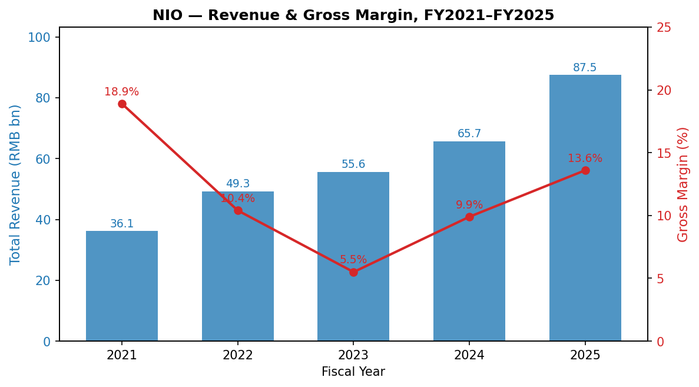
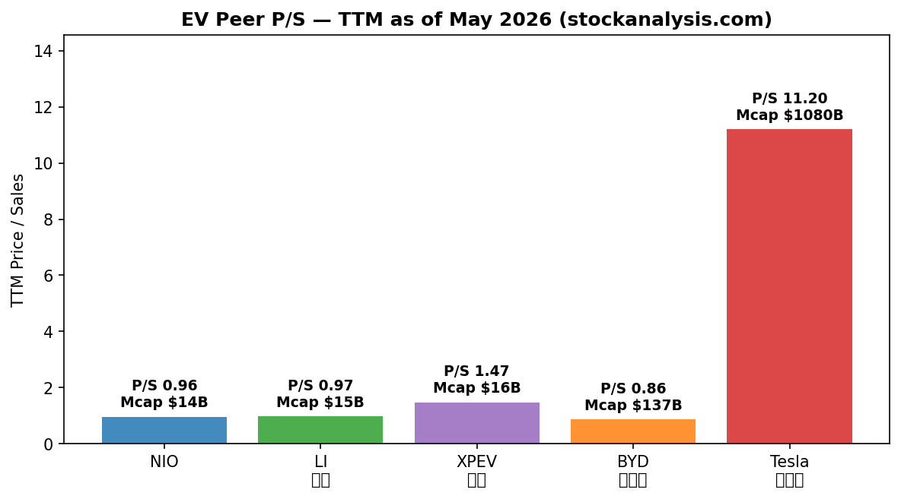
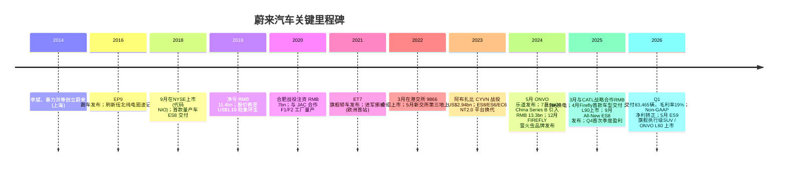
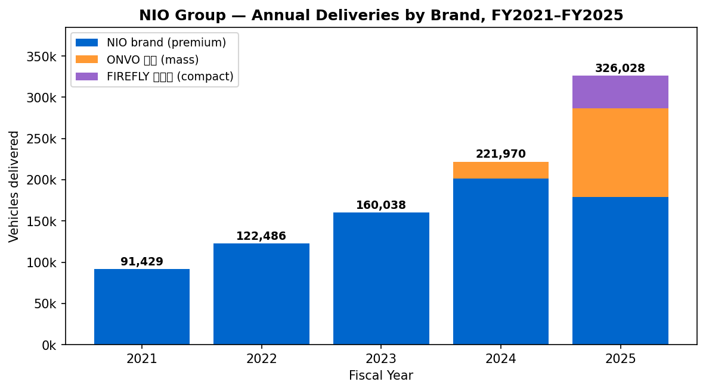
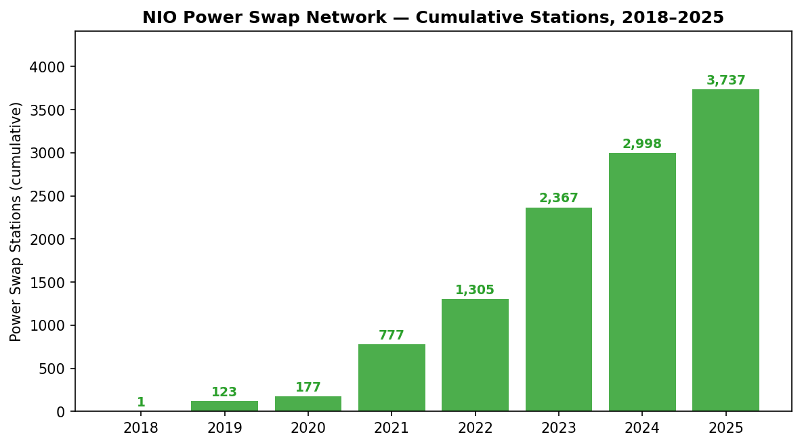

# 蔚来汽车 (NIO Inc.) — 公司研究

**Tickers:** NYSE: NIO · HKEX: 9866 · SGX: NIO
**报告日期 / As of:** 2026-05-31
**报告语言：** 简体中文

---

> **Update — Q1 2026 财报 (2026-05-21)：** 公司单季度交付 83,465 辆（同比 +98.3%），总营收 **RMB 25,532.7 mn (US$3,701.5 mn)**（同比 +112.2%），整车毛利率 **18.8%**、综合毛利率 **19.0%**（去年同期 7.6%）。Non-GAAP 调整后归母净利润转正至 **RMB 43.5 mn**（去年同期亏损 RMB 6,279.1 mn）。管理层指引 Q2 2026 交付 **110,000–115,000 辆**，同比增速 52.7%–59.6%。该季度同时为 ES9 / ONVO L80 两款新旗舰开启预售，自 Q4 2025 起 NIO 已连续两个季度实现 GAAP 经营利润 + Non-GAAP 净利润正增长——这是公司自 2018 年纽交所上市以来最重要的财务拐点。
> Source: [NIO Inc. Reports Unaudited First Quarter 2026 Financial Results, 6-K Exhibit 99.1, 2026-05-21](https://www.sec.gov/Archives/edgar/data/1736541/000110465926064847/tm2615314d1_ex99-1.htm).

---

## 目录

1. 公司概览
2. 公司历史
3. 管理团队
4. 产品与服务
5. 客户与上市策略
6. 行业概览
7. 竞争格局
8. 市场机会 (TAM)
9. 风险评估
10. 参考资料

---

## 1. 公司概览

蔚来汽车（**NIO Inc.**，纽交所 NIO、港交所 9866、新交所 NIO）是一家在开曼群岛注册、总部位于上海、生产基地位于安徽合肥的中国高端智能电动车制造商。20-F 年报对公司业务的官方定义是："我们是全球智能电动车市场的开拓者和领先企业 …… 我们设计、开发、生产和销售智能电动车，并推动下一代核心技术创新"（[NIO 2025 Annual Report on Form 20-F, Item 4.B Business Overview](https://www.sec.gov/Archives/edgar/data/1736541/000110465926041765/nio-20251231x20f.htm)）。"蔚来"二字取义"Blue Sky Coming（蔚蓝即将到来）"，是创始人李斌为公司确立的品牌主张。截至 2025 年 12 月 31 日，公司形成 NIO（高端）、ONVO 乐道（家庭中端）、FIREFLY 萤火虫（小型高端）三大品牌矩阵，2025 全年交付 **326,028 辆**——同比 +46.9%（[NIO 20-F FY2025, Item 4.B "Our Vehicles"](https://www.sec.gov/Archives/edgar/data/1736541/000110465926041765/nio-20251231x20f.htm)）。

**商业模式与收入结构。** 2025 年公司总营收 **RMB 87,487.5 mn (US$12,510.5 mn)**，同比增长 **33.1%**。整车销售贡献 **RMB 76,883.9 mn (87.9%)**，其他销售（配件、售后、能源服务、BaaS 相关、二手车、技术许可等）贡献 RMB 10,603.6 mn (12.1%)。在"其他销售"中，"换电与充电服务"占总营收 2.8%，"配件及售后"占 4.8%，"其他（含技术服务收入）"占 4.5%；后者大幅增长系 2024 年与 Forseven（后由 McLaren Automotive 接续）签订的电动车平台技术授权所致（[NIO 20-F FY2025 Item 5.A — Revenue components by amount and as percentage](https://www.sec.gov/Archives/edgar/data/1736541/000110465926041765/nio-20251231x20f.htm)）。

**经营拐点：从巨亏到接近盈亏平衡。** 公司 2023–2025 三年净亏损分别为 **RMB 20,719.8 mn / RMB 22,401.7 mn / RMB 14,942.6 mn (US$2,136.8 mn)**，但 2025 年首次实现正经营性现金流 RMB 2,992.6 mn，并于 **Q4 2025 首次录得季度净利润**（[NIO 20-F FY2025 Item 5.A "Going Concern" + Liquidity and Capital Resources](https://www.sec.gov/Archives/edgar/data/1736541/000110465926041765/nio-20251231x20f.htm)）。2025 年综合毛利率 **13.6%**（vs 2024 年 9.9%），整车毛利率 **14.6%**（vs 12.3%），主要驱动是单车物料成本下降和规模摊薄。Q1 2026 整车毛利率进一步抬升至 **18.8%**、综合毛利率 **19.0%**，Non-GAAP 调整后净利润转正（[NIO Q1 2026 Earnings Release, 2026-05-21](https://www.sec.gov/Archives/edgar/data/1736541/000110465926064847/tm2615314d1_ex99-1.htm)）。

**经营地域。** 截至 2025 年 12 月 31 日，蔚来在全球拥有 **173 家 NIO House + 393 家 NIO Space**（NIO 品牌门店），**419 家 ONVO Center / ONVO Space**，以及 **416 家售后服务中心**——其中绝大多数在中国，欧洲已在挪威、德国、荷兰、丹麦、瑞典开设直营网点，FIREFLY 已分别于 2025 年 8 月（挪威、荷兰）和 2025 年 11 月（葡萄牙、希腊、塞浦路斯、保加利亚、丹麦）正式进入欧洲，并计划 2026 年覆盖 40 个国家和地区（[Firefly hits 30,000 deliveries, plans to add 17 markets, CnEVPost, 2025-11-21](https://cnevpost.com/2025/11/21/nio-firefly-30000-deliveries-to-add-17-markets-global-footprint/)）。

**经营规模指标。** 截至 2025 年 12 月 31 日：累计交付 1,110,413 辆（[NIO Q1 2026 Earnings Release, 2026-05-21](https://www.sec.gov/Archives/edgar/data/1736541/000110465926064847/tm2615314d1_ex99-1.htm)）；建成全球 **3,737 座 Power Swap 换电站**，累计完成 **9,600 万次以上**换电；在运行 27,000 余根 Power Charger 与 Destination Charger；并通过 Power Map 接入 268 万根公用充电桩（[NIO 20-F FY2025 Item 4.B — Power Services](https://www.sec.gov/Archives/edgar/data/1736541/000110465926041765/nio-20251231x20f.htm)）。研发布局横跨上海（整车）、合肥（先进制造）、北京（软件）、圣何塞（自动驾驶）、慕尼黑（设计）、牛津（先进工程）六大中心。



*Source: [NIO 2025 20-F, Item 5.A — Results of Operations](https://www.sec.gov/Archives/edgar/data/1736541/000110465926041765/nio-20251231x20f.htm) (FY2023–2025) + prior 20-F filings for FY2021–FY2022 (RMB 36.14 bn / 49.27 bn, GM 18.9% / 10.4%).*

**估值快照（2026-05-29）。** 当前股价 **US$5.60 / ADS**，市值 **US$14.02 bn**；TTM P/S **0.96×**、52 周区间 US$3.34–8.01（[Stockanalysis.com — NIO Statistics, 2026-05-29](https://www.stockanalysis.com/stocks/nio/statistics/)）。由于公司 TTM 仍处亏损，**P/E 为负不具参考意义**——亏损主因是过去 3 年大额研发投入（NIO IN 2024 自研智能驾驶芯片 NX9031、NIO WorldModel、SkyOS 全域操作系统）、ONVO/FIREFLY 双副品牌建设期销售网络扩张、以及换电网络的 capex 摊销（[NIO 20-F FY2025 Item 5.A — net loss decomposition](https://www.sec.gov/Archives/edgar/data/1736541/000110465926041765/nio-20251231x20f.htm)）。同行对比方面：理想 LI 市值 US$15.30 bn / P/S 0.97×，小鹏 XPEV 市值 US$15.73 bn / P/S 1.47×，比亚迪 BYD US$137.0 bn / P/S 0.86×，Tesla TSLA US$1,080 bn / P/S 11.2×（[Stockanalysis.com — LI / XPEV / BYD / TSLA Statistics](https://www.stockanalysis.com/stocks/li/statistics/)）。NIO 与理想几乎"等市值、等市销率"，但理想 2024 年起已连续多季 GAAP 盈利，蔚来则在 2026 Q1 才接近盈亏平衡——这一差距既是估值压力，也是潜在向上弹性。



*Source: [Stockanalysis.com — NIO / LI / XPEV / BYD / TSLA Statistics, fetched 2026-05-29](https://www.stockanalysis.com/stocks/nio/statistics/).*

**为什么 P/S 不到 1× 仍可能是"合理低估"。** 截至 2026-04-30 的累计交付 1,110,413 辆使蔚来跨过百万销量大关，但 Q1 2026 交付环比下降 33.1%（vs Q4 2025 的 124,807 辆）——这反映出新品换代期典型的"老车型清库存 / 新车型尚未爬坡"过渡，并不是结构性问题。管理层将 Q2 2026 指引上调至 110,000–115,000 辆，并伴随 ES9 / ONVO L80 / Firefly 改款的密集发布。如果 Q2 指引兑现，2026 全年有望首次冲破 50 万辆交付，对应营收 CN¥ 130–140 bn 量级，按当前市值对应 forward P/S 已下探至 ~0.7×——属于"利空已充分反映、利润弹性未充分定价"的估值结构（[NIO Q1 2026 Earnings Release, 2026-05-21](https://www.sec.gov/Archives/edgar/data/1736541/000110465926064847/tm2615314d1_ex99-1.htm)）。

---

## 2. 公司历史

蔚来由 **李斌**（William Bin Li）联合若干互联网与汽车行业老兵于 **2014 年 11 月**在上海创立，目的是建立"全球第一家用户企业（User Enterprise）"，并以纯电动 + 高端服务体验来打破传统燃油车的所有权范式。2016 年 11 月，公司发布 EP9 电动超级跑车，并以 2016 年 10 月 12 日 6 分 45.9 秒的圈速首次打破纽北赛道的纯电动车记录，藉此完成"NIO = 高性能电动"的品牌定位（[NIO 20-F FY2025 Item 4.A — History and Development of the Company](https://www.sec.gov/Archives/edgar/data/1736541/000110465926041765/nio-20251231x20f.htm)）。

**2018 年纽交所上市后的资本曲折。** 2018 年 9 月公司以 ADS 形式在纽交所上市（代码 NIO），募集净额约 US$1.0 bn。但 2019 年因 ES8 销量不及预期、补贴退坡和市场对"造车新势力"的整体怀疑，公司全年净亏损扩大到 **RMB 11.4 bn**，股价一度跌至 US$1.19，临近退市线（[The two lifelines that helped Nio pull through, KrASIA](https://kr-asia.com/the-two-lifelines-that-helped-nio-pull-through-its-toughest-times)）。2020 年 4 月，李斌与合肥市政府达成"合肥战投协议"，由合肥城投、国投招商、安徽省新兴产业投资三方为首的国资战投以 **RMB 7 bn** 现金注入 NIO China（持股 24.1%），公司同步将整车研发、供应链、销售、NIO Power 等核心资产共 RMB 17.77 bn 注入 NIO China（[NIO Announces Entry into Definitive Agreements for Investments in NIO China, 2020-04-29](https://www.globenewswire.com/news-release/2020/04/29/2023915/0/en/NIO-Announces-Entry-into-Definitive-Agreements-for-Investments-in-NIO-China.html)）。这次"合肥救援"被业内称为中国汽车产业最成功的地方政府救助案例之一，2020 年内股价上涨超 10 倍，年度交付从 2019 年的 20,565 辆升至 43,728 辆（[Nio clinches RMB 7 billion cash injection from Hefei government, TechNode, 2020-04-29](https://technode.com/2020/04/29/nio-clinches-rmb-7-billion-cash-injection-from-hefei-government/)）。

**双重上市与资本结构成熟。** 2022 年 3 月 10 日，公司以 **9866** 代码在香港联交所完成"按介绍方式上市（listing by way of introduction）"——属于次级上市（secondary listing）路径，未发行新股；同年 5 月再以 **NIO** 代码在新加坡交易所完成第三地上市。这三地架构既缓解了 HFCAA（《外国公司问责法》）下的潜在美股退市风险，也方便了亚洲投资人参与。2023 年 12 月，公司从 **CYVN Investments RSC Ltd**（阿布扎比政府全资持有的主权投资平台 L'imad Holding 的子公司）获得 US$2,943.5 mn 战略股权投资，发行 378,695,543 股 Class A 普通股；截至 2026 年 1 月 13 日 CYVN 的 13D/A 显示其持有 418,833,157 股 NIO Class A，是公司目前最大的单一外部股东（[NIO 20-F FY2025 Item 7.A — Major Shareholders](https://www.sec.gov/Archives/edgar/data/1736541/000110465926041765/nio-20251231x20f.htm)）。



**战略转型与多品牌战略（2024–2025）。** 公司在 2024 年同时启动两项重要战略：第一，**多品牌矩阵**——5 月发布 ONVO 乐道（家庭中端，"On Voyage"），其首款车 L60 9 月开始交付；12 月发布 FIREFLY 萤火虫（小型高端）。第二，**核心技术全栈自研**——2024 年 NIO IN 大会上发布自研智能驾驶芯片 **NX9031 神玑**、行业首个量产可用的世界模型 **NIO WorldModel (NWM)**、全域操作系统 **SkyOS**（[NIO 20-F FY2025 Item 4.B — Our Key Technological Breakthroughs](https://www.sec.gov/Archives/edgar/data/1736541/000110465926041765/nio-20251231x20f.htm)）。这两项战略意味着，蔚来从 2024 年下半年起脱离"只做高端 SUV / 轿车"的单品牌路径，转向"高端 + 中端 + 入门 + 全球化 + 自研芯片"的全谱系科技公司路径。

**2025–2026 的爬坡期。** 2025 年下半年，All-New ES8（9 月，旗舰豪华 SUV）、ONVO L90（7 月，大空间六/七座 SUV）、Firefly 首款车（4 月，小型高端两厢）密集发布；2026 年 4 月起，ES9（旗舰执行级 SUV，预售 RMB 49.8–62.8 万 / BaaS 后 RMB 39.0–52.0 万）、ONVO L80（5 月，五座大型 SUV）相继上市（[Flagship Executive SUV NIO ES9 Officially Launched, 2026-05-27](https://www.nio.com/news/20260527001)）。ES9 上市当日股价大涨 9.32%，是过去两年内最强的"新品引发的单日股价反应"（[Nio shares jump 10% after releasing first flagship EV, CNBC, 2026-05-28](https://www.cnbc.com/2026/05/28/nio-surges-9percent-after-releasing-first-flagship-ev-in-more-than-two-years.html)）。

---

## 3. 管理团队

**李斌（Bin Li / William Li），创始人、董事长兼 CEO（51 岁）。** 李斌自 2014 年公司创立至今担任董事长，2018 年 3 月起兼任 CEO。1996 年毕业于北京大学社会学系。**关键创业经历：** 2000 年联合创立易车（Beijing Bitauto E-Commerce），2010 年起任易车控股（前 NYSE: BITA，2020 年私有化退市）董事会主席至 2020 年——易车曾是中国最大的汽车类垂直门户网站，市值高峰超 US$2 bn。2014 年开始投资和孵化电动车业务，最终亲自下场创立蔚来。**当前持股与影响力：** 截至 2026-03-31，李斌通过 mobike Global Ltd.、Originalwish Limited、NIO Users Limited、NIO Users Community Limited 等控股实体合计持有约 **34.0% 的总投票权**（双层股权结构，C 类股 1 股 8 票）；2026 年 3 月 6 日公司通过 2026 股权激励计划，授予李斌 248,454,460 股限制性股票单位（约占公司总股本 10%），分十期解锁，与公司业绩目标和李斌持续服务挂钩——这次授予被市场解读为"创始人长期 align"的强信号（[NIO 20-F FY2025 Item 6.A + Item 6.E](https://www.sec.gov/Archives/edgar/data/1736541/000110465926041765/nio-20251231x20f.htm)）。同时担任 Uxin Limited (Nasdaq: UXIN) 董事，曾长期任 Dida Inc. (HKEX: 2559) 董事。

**李斌是否仍为公司的灵魂人物？** 答案是 yes，且越来越是。2019 年公司濒临破产时，李斌在合肥与地方政府磋商 60 余次最终促成 7 bn 战投，是公司能够活下来的关键人物；2024 年发布 ONVO/FIREFLY 时李斌再次亲自任 ONVO 品牌负责人，并主导建设 ONVO 销售网络至 419 家；2026 年 3 月的 RSU 激励再次确认了"李斌即蔚来"。这也意味着"创始人依赖风险（key person risk）"是公司最难以分散的风险之一——市场上几乎所有 sell-side note 都把"李斌健康 + 个人决策"列为蔚来不可对冲的尾部风险（详见风险评估章节）。

**秦力洪（Lihong Qin），联合创始人、董事兼总裁（52 岁）。** 秦力洪自 2014 年公司创立至今担任董事兼总裁，主管销售、用户社区和市场业务。北京大学法学学士 + 法学硕士，2001 年哈佛大学公共政策硕士。加入蔚来之前：2008–2014 年任**龙湖集团（HKEX: 960）**首席营销官兼执行董事——这是中国地产开发头部企业之一；2005–2008 年在奇瑞汽车（Anhui Chery）任销售公司副总；2003–2005 年在罗兰贝格（Roland Berger）任高级顾问。秦力洪以"用户思维"和"NIO House 模式"在业内闻名——蔚来独有的把汽车销售 + 用户社区中心 + 餐饮 + 儿童区融为一体的"NIO House"业态，及其延伸的会员积分体系，主要由秦力洪在 2017–2018 年间设计落地，并成为 NIO 主品牌区别于所有同行的核心 GTM 资产（[NIO 20-F FY2025 Item 6.A — Directors and Senior Management](https://www.sec.gov/Archives/edgar/data/1736541/000110465926041765/nio-20251231x20f.htm)）。秦力洪与李斌同时是 Beijing NIO、Anhui NIO AT、Anhui NIO DT 三家 VIE 实体的注册股东（80% / 20% 持股比例），实质上承担"VIE 结构合规通道"的法律角色。

**核心其他高管（仅作背景描述、不展开）。** 沈峰（Feng Shen，执行副总裁，62 岁，原 Polestar 全球 CTO + Volvo China 研发总裁），周欣（Xin Zhou，执行副总裁，55 岁，原 Qoros 执行董事），曲玉（Yu Qu，CFO，47 岁，前 Lear / Johnson Controls 财务负责人 + PwC 十年）。NIO U.S. CEO Ganesh V. Iyer 自 2018 年起常驻圣何塞负责北美自动驾驶研发，曾任 Tesla 信息技术副总裁。董事会层面，CYVN 派驻 Eddy Skaf 与 Nicholas Collins 两位非执行董事，Collins 同时担任 McLaren Group Holdings CEO——蔚来与 McLaren 之间的技术授权合作（替代 Forseven 角色）即由其督导（[NIO 20-F FY2025 Item 6.A — Mr. Nicholas Paul Collins bio](https://www.sec.gov/Archives/edgar/data/1736541/000110465926041765/nio-20251231x20f.htm)）。

---

## 4. 产品与服务

> **重要说明：** Section 4 是本报告最核心的一章。蔚来的特殊之处在于它不是一家"只卖车"的车企，而是把"整车 + 自研芯片 + 自研操作系统 + 自研换电网络 + 自研 ADAS + 自研三电 + NIO House 用户体系 + 多品牌矩阵"作为一个**集成的能源 × 软件 × 出行系统**——这种 vertical integration 的程度，除 Tesla 外全行业极少有人达到。

### 4.1 整车品牌矩阵（直接引用 20-F）

蔚来在 20-F Item 4.B "Our Vehicles" 章节明确披露其品牌划分（[NIO 20-F FY2025, Item 4.B — Our Vehicles](https://www.sec.gov/Archives/edgar/data/1736541/000110465926041765/nio-20251231x20f.htm)）：

> "We design, develop, manufacture and sell our premium smart electric vehicles under the NIO brand, family-oriented smart electric vehicles through the ONVO brand, and small smart high-end electric cars with the FIREFLY brand. We currently offer our products and services in China, Europe, Southeast Asia, the Middle East and other markets …"

| 品牌 | 定位 | 起售价区间 | 主要车型 | 2025 交付量 |
|---|---|---|---|---|
| **NIO 蔚来** | Premium / 高端 | RMB 28.8–62.8 万 (BaaS 后) | ES8 / ES6 / EC6 / ES7 / EC7 / ET9 / ET7 / ET5 / ET5T / ES9 | 178,806 |
| **ONVO 乐道** | Family / 家庭中端 | RMB 14.9–26.6 万 (BaaS 后) | L60 / L90 / L80 (2026 Q2) | 107,808 |
| **FIREFLY 萤火虫** | Compact High-end / 小型高端 | RMB 11.98 万起；欧洲 EUR 29,900 起 | Firefly hatchback | 39,414 |
| **集团合计** |  |  |  | **326,028** |

Source: [NIO 20-F FY2025 — Vehicle Delivery Volume + MSRP](https://www.sec.gov/Archives/edgar/data/1736541/000110465926041765/nio-20251231x20f.htm) · [Firefly EV Europe pricing, firefly.world, 2025-04-23](https://www.firefly.world/news/20250423006).



*Source: [NIO 20-F FY2025 Item 5.A](https://www.sec.gov/Archives/edgar/data/1736541/000110465926041765/nio-20251231x20f.htm) + monthly 6-K delivery updates; ONVO and FIREFLY 2024 numbers reflect partial-year deliveries (ONVO from Sep 2024, FIREFLY from Apr 2025).*

```mermaid
graph TD
    NIO[蔚来汽车 NIO Inc.] --> NIObrand[NIO 主品牌 - Premium]
    NIO --> ONVObrand[ONVO 乐道 - Family Mass]
    NIO --> Firefly[FIREFLY 萤火虫 - Compact High-end]
    NIObrand --> ES8[ES8 / All-New ES8 - 旗舰SUV]
    NIObrand --> ES9[ES9 - 旗舰执行级SUV - 2026Q2]
    NIObrand --> ESmid[ES6 / EC6 / ES7 / EC7 - 中大型SUV]
    NIObrand --> ET[ET9 / ET7 / ET5 / ET5T - 行政级与中型轿车]
    ONVObrand --> L60[L60 - 中型家用SUV]
    ONVObrand --> L90[L90 - 大空间六/七座SUV]
    ONVObrand --> L80[L80 - 五座大型SUV 2026Q2]
    Firefly --> FireflyA[Firefly 两厢 - 城市高端小车]
    NIO --> Power[NIO Power 充换电网络]
    Power --> Swap[Power Swap 换电站 3,737]
    Power --> Charger[Power Charger 27,000+]
    Power --> BaaS[Battery as a Service]
    NIO --> Tech[核心自研技术]
    Tech --> NX9031[NX9031 神玑 ADAS SoC]
    Tech --> NWM[NIO WorldModel NWM]
    Tech --> SkyOS[SkyOS 全域操作系统]
```



### 4.2 NIO 主品牌（Premium）—— 旗舰 SUV / 行政级轿车

蔚来主品牌定位 BBA（奔驰宝马奥迪）级高端纯电——这是中国造车新势力中第一家、也是目前唯一一家明确锚定 BBA 价格带的厂商。20-F 对 NIO 品牌产品组合的官方描述如下（[NIO 20-F FY2025, Item 4.B "Our Vehicles"](https://www.sec.gov/Archives/edgar/data/1736541/000110465926041765/nio-20251231x20f.htm)）：

> "Under the NIO brand, we introduced the EP9 supercar in 2016, which was the then fastest electric vehicle, setting the Nurburgring Nordschleife all-electric vehicle lap record. Starting from December 2017, we launched and continually iterated on a succession of well-positioned vehicle models and established a competitive product portfolio, including the ES9, our flagship executive SUV, the ES8 (or the EL8), our flagship premium SUV, the ES7 (or the EL7), our smart electric mid-large SUV, the ES6 (or the EL6), our smart electric all-round SUV, the EC7, our smart electric flagship coupe SUV, the EC6, our smart electric coupe SUV, the ET9, our smart electric executive flagship, the ET7, our smart electric flagship sedan, the ET5, our smart electric mid-size sedan, and the ET5T, our smart electric tourer."

**中文释义 / Plain-language gloss：** NIO 主品牌是一个"两条腿"的高端阵列——一条是 SUV 线（ES9 行政级 SUV → ES8 旗舰 SUV → ES7 中大型 SUV → ES6 中型全能 SUV → EC7/EC6 轿跑 SUV），一条是轿车线（ET9 行政级旗舰 → ET7 旗舰轿车 → ET5/ET5T 中型轿车与旅行版）。在中国 BEV 市场 RMB 300,000 以上价格带，NIO 主品牌 ES8 / ES6 / EC6 三款车型分别排名第 1、第 2、第 7，2025 全年合计销量超 **107,000 辆**（[China BEV Sales Rankings 2025: Model Y and NIO ES8 Lead, ChinaEVHome, 2026-01-26](https://chinaevhome.com/2026/01/26/china-bev-sales-rankings-in-2025-model-y-and-nio-es8-lead-in-price-bands/)）。

**NIO ES9（旗舰执行级 SUV，2026-05-27 上市）：** ES9 是 NIO 主品牌过去两年最重要的新品，发布即定下"BBA 中大型 SUV 替代者"的目标。ES9 车身尺寸 5,365 × 1,999 × 1,800 mm，轴距 3,250 mm，标配双电机 520 kW (697 hp) 全轮驱动，CLTC 续航最高 620 km，配 **900V 高压架构 + 5C 超快充电池**（[Nio ES9 hits market, CnEVPost, 2026-05-27](https://cnevpost.com/2026/05/27/nio-es9-hits-market/)）。价格策略上，**最终上市价比预售价全系下调 RMB 3 万**——Executive Premium Edition 起价 RMB 498,000（BaaS 后 RMB 390,000），最高 Horizon Edition RMB 628,000（BaaS 后 RMB 520,000）（[Flagship Executive SUV NIO ES9 Officially Launched, NIO Newsroom, 2026-05-27](https://www.nio.com/news/20260527001)）。这一定价比同尺寸的奔驰 EQS SUV / 宝马 iX / 奥迪 Q8 e-tron 便宜约 30%，但配置（包括 NIO Adam 高算力计算平台、激光雷达、NIO Aquila 超感系统、Skyride 智能底盘）领先。

***分析师观点：*** ES9 是 NIO 主品牌从 ET9（执行级轿车）向 SUV 端扩张的关键车，也是测试"BBA 用户能否被纯电高端 SUV 留下"的最大单一变量。如果 ES9 月销稳态能达 5,000–7,000 辆，对应 RMB 30 亿 / 月的高端收入，将是 NIO 利润率结构性改善的最重要现金流来源。

**ET9 / ET7（旗舰行政级与中大型轿车）：** ET9 是 NIO 2025 年初开始交付的执行级轿车（5,325 mm 车长、3,250 mm 轴距），起售价 RMB 78.8 万——直接对标奔驰 S 级 BEV、保时捷 Taycan、奥迪 e-tron GT。ET9 集成 NIO 全栈 12 项核心技术，是公司在 D 级豪华轿车细分市场的"技术旗舰"展示。ET7（2022 年 3 月上市）和 ET5/ET5T（2022 年下半年上市）则覆盖 BBA 的 C 级（5 系/E 级）与 B 级（3 系/A4）轿车价格带，但 BEV 高端轿车整体在中国遭遇 SUV 化逆风（消费者偏好 SUV），ET 系列销量始终低于 ES 系列预期（[NIO 20-F FY2025, Item 4.B](https://www.sec.gov/Archives/edgar/data/1736541/000110465926041765/nio-20251231x20f.htm)）。

**All-New ES8（2025-09 发布的旗舰大型 SUV）：** All-New ES8 是公司 2025 年下半年最重要的爆款，**自上市以来连续 5 个月在中国大型 SUV 市场和 RMB 40 万以上细分市场销量第一**（[NIO Q1 2026 CEO Comments, 2026-05-21](https://www.sec.gov/Archives/edgar/data/1736541/000110465926064847/tm2615314d1_ex99-1.htm)）。ES8 同时支持 100 kWh 与 150 kWh（半固态电池）两种电池规格，是公司"半固态电池量产化（semi-solid-state cell, 半固态电池）"的旗舰载体——150 kWh 电池续航 CLTC 高达 1,055 km，目前是行业内能批量装车的能量密度最高的乘用车电池。

### 4.3 ONVO 乐道（Family Mass）—— 走出高端的二次创业

ONVO（中文"乐道"，英文 "On Voyage"）是蔚来 2024 年 5 月推出的第二品牌，定位"家庭智能电动车"，价格带 RMB 15–26 万——直接对标特斯拉 Model Y、比亚迪海狮 07、小米 SU7、问界 M5/M7。20-F 描述如下（[NIO 20-F FY2025 Item 4.B](https://www.sec.gov/Archives/edgar/data/1736541/000110465926041765/nio-20251231x20f.htm)）：

> "ONVO, our family-oriented smart electric vehicle brand launched in May 2024, stands for 'On Voyage,' and carries the implied meaning of 'Happiness on Every Path We Travel With Family' in Chinese, which embodies ONVO's commitment to creating better family life and bringing better brand and product experiences to family users."

**中文释义 / Plain-language gloss：** ONVO 是蔚来的"破圈"战略——主品牌天花板已被 BBA 价位带限制（中国 RMB 30 万以上 BEV 市场容量年均约 80 万辆），要把销量做到百万级必须下探到 RMB 15–25 万的"主力家庭车"市场。ONVO 与主品牌 NIO 技术上共享相同的电池、电驱、SkyOS、换电站接口；差异点在于**做减法**：去掉 NIO House 高端服务、去掉 NIO Aquila 顶级感知套件（保留基础 OSD 智能驾驶）、去掉部分豪华内饰、价格压到主品牌的一半左右。ONVO 还使用专门的 NX9031 第二代 + 简化激光雷达方案，硬件 BOM 比 NIO 主品牌低 30%+（[Onvo L90 reaches 50,000 deliveries, CnEVPost, 2026-04-03](https://cnevpost.com/2026/04/03/onvo-l90-reaches-50000-deliveries/)）。

**ONVO L60（2024-09 交付）：** 首款车型，对标 Tesla Model Y。起售价 RMB 149,900（BaaS 后 RMB 129,900），ONVO L60 全 LFP 电池版本可达 CLTC 续航 555 km。L60 在 2024 年 12 月单月销量曾达 20,610 辆——是中国造车新势力首款车上市第三个月销量过两万的车型之一。

**ONVO L90（2025-07 上市，2026 改款 2026-04 上市）：** 大空间六/七座家庭旗舰 SUV，是 2025 年中国大型纯电 SUV 销量冠军。**上市后 86 天累计交付突破 30,000 辆**，到 2026 年 4 月 3 日累计交付突破 **50,000 辆**——是 ONVO 品牌当前的销量主力（[Onvo L90 reaches 50,000 deliveries, CnEVPost, 2026-04-03](https://cnevpost.com/2026/04/03/onvo-l90-reaches-50000-deliveries/)）。2026 改款（2026-04-21 发布、2026-05 起交付）首次搭载蔚来自研的 NX9031 神玑芯片 + 激光雷达组合，是 ONVO 智能化的拐点车型（[Nio Onvo launches updated L90 with in-house developed chip, CnEVPost, 2026-04-21](https://cnevpost.com/2026/04/21/nio-onvo-launches-updated-l90-in-house-chip/)）。

**ONVO L80（2026-05-15 上市，2026 Q2 起交付）：** 五座大型 SUV，定位"China 五座 SUV trunk space 最大"。L80 把 ONVO 品牌从两款车扩到三款车，覆盖 RMB 20–26 万家庭市场（[NIO Q1 2026 Earnings Release — Commencement of ONVO L80 Delivery, 2026-05-21](https://www.sec.gov/Archives/edgar/data/1736541/000110465926064847/tm2615314d1_ex99-1.htm)）。截至 2026 年 4 月初，ONVO 品牌累计交付突破 **14 万辆**——按这个增速 2026 全年 ONVO 单品牌就有望突破 20 万辆，接近 NIO 主品牌的 2024 全年量。

### 4.4 FIREFLY 萤火虫（Compact High-end）—— 海外为本的小型车

FIREFLY 是蔚来 2024 年 12 月发布的第三品牌，2025 年 4 月开始交付（[NIO 20-F FY2025 Item 4.B](https://www.sec.gov/Archives/edgar/data/1736541/000110465926041765/nio-20251231x20f.htm)）。Firefly 的关键设计意图是**面向海外**而非主要服务中国：在中国市场，Firefly 与比亚迪海鸥 / 五菱宏光 MINI EV 等竞争激烈、单车毛利极低；但在欧洲，Firefly 直接对标 Mini Cooper Electric / Fiat 500e / Dacia Spring，**起售价 EUR 29,900（挪威 NOK 279,900）**，已于 2025 年 8 月在挪威和荷兰正式交付，到 2025 年 11 月累计交付突破 30,000 辆（[Nio Firefly hits 30,000 deliveries, CnEVPost, 2025-11-21](https://cnevpost.com/2025/11/21/nio-firefly-30000-deliveries-to-add-17-markets-global-footprint/)）。Firefly 还宣布 2026 年进入英国（右舵市场 RHD），在右舵车型生产线已于 2025 年 11 月投产（[NIO's Small Car Brand firefly Starts RHD Production, NIO Newsroom, 2025-11-18](https://www.nio.com/news/20251118001)）。

**FIREFLY 的战略价值 ≠ 销量。** Firefly 在中国的销量并不是核心目标——它的核心使命是为蔚来全球扩张提供"性价比敲门砖"：在欧洲，Firefly 的车型 + NIO/Firefly 共享的换电网络（CATL Choco-Swap 国家标准）可以为蔚来在 16+ 个市场建立品牌前哨；这相当于用一台 EUR 30,000 的小车，构建未来 NIO 主品牌（EUR 60,000+）的销售基础设施。***分析师观点：*** Firefly 的"早期 2026 欧洲销量不及预期"被 Firefly CEO 公开承认（[Nio's Firefly Chief Says Early 2026 Sales Fell 'Considerably'](https://eletric-vehicles.com/nio/firefly/nios-firefly-chief-says-early-2026-sales-fell-considerably-keeps-expansion-goals/)），但管理层维持"40 国 16 欧洲市场"扩张目标——这说明 Firefly 当前阶段是战略性烧钱，不应用单一品牌 P&L 衡量。

### 4.5 Power Swap 换电网络 + BaaS —— 蔚来的不可复制护城河

蔚来最与众不同的**单一资产**不是某款车，而是其遍布中国和欧洲的换电网络。20-F 关于 Power Solutions 的官方描述是（[NIO 20-F FY2025 Item 4.B — Power Services](https://www.sec.gov/Archives/edgar/data/1736541/000110465926041765/nio-20251231x20f.htm)）：

> "All of our vehicles support battery swapping. Once a vehicle is parked at a Power Swap Station and the swap function is activated, the battery is automatically replaced within minutes. … Equipped with Lidars and NVIDIA DRIVE Orin X chips, our Power Swap Station 4.0 can conduct fully automatic swaps up to 480 times per day and support intelligent vehicle-station connectivity in complex environments. As of December 31, 2025, we had 3,737 Power Swap Stations covering urban areas and expressways globally, through which we had completed over 96 million battery swaps cumulatively."

**中文释义 / Plain-language gloss：** 换电（battery swap, 简称"BS"）是一种与"充电"并列的能源补充范式——把车开进换电站，3 分钟左右整块电池被全自动卸下、装上一块充满电的电池，用户继续上路。换电的好处主要有三：（1）**速度**：远快于即使 800V 高压快充，且不衰减电池寿命；（2）**电池所有权解耦**：用户可以买"裸车"+ 月付电池订阅费（BaaS, Battery as a Service），把电池作为运营商共享资产；（3）**电池升级路径**：用户可以临时把 75 kWh 标准包升级为 100 kWh 长续航包或 150 kWh 半固态包，按天/月计费。这三点使换电网络成为**资产负债表 + 用户体验 + 二手车残值**的三重锁定机制——一个 NIO 用户对蔚来网络的依赖远大于对任何一款车的依赖。



*Source: [NIO 20-F annual filings 2018–2025](https://www.sec.gov/Archives/edgar/data/1736541/000110465926041765/nio-20251231x20f.htm) + NIO Power public progress updates.*

**Power Swap Station 4.0：** 2024 年发布的第四代换电站，日峰值换电 480 次（相当于平均 3 分钟一次连续 24 小时），支持纯视觉 + 激光雷达双冗余泊车（[NIO 20-F FY2025 Item 4.B — Power Swap Station](https://www.sec.gov/Archives/edgar/data/1736541/000110465926041765/nio-20251231x20f.htm)）。每座换电站的 capex 约 RMB 200–300 万，按 480 次/日峰值利用率计算，单站理论年 EBIT 平衡点在 60–80 次/日左右。在大型枢纽（北京 / 上海 / 杭州 / 深圳）部分高利用率换电站已实现盈亏平衡。

**NIO – CATL 战略合作（2025-03）：** 这是过去 12 个月内蔚来最重要的产业事件。**CATL 投入最多 RMB 25 亿元**入股 NIO Power（蔚来的换电业务子公司），双方共建"全球最大乘用车换电网络"，并把 CATL 自主的 **Choco-Swap 巧克力换电标准**引入 Firefly 品牌车型，逐步形成国家级行业标准（[NIO and CATL Form Strategic Partnership on Battery Swapping, NIO Newsroom, 2025-03-18](https://www.nio.com/news/20250318001)）。这意味着 CATL 把全球第一大动力电池厂商的资产负债表正式与蔚来的换电网络绑定，并且也意味着未来其他用 CATL 电池的中国车企（包括长安、吉利、奇瑞）的换电车型也可以接入蔚来的物理网络——蔚来从"单一车企的换电运营商"升级为"中国换电网络的公共基础设施提供方"。***分析师观点：*** 这是过去 10 年中国电动车产业中最具结构意义的产业整合事件之一，会让蔚来换电网络的边际新增成本降低、单站盈亏平衡时间缩短约 18–24 个月（基于 capex 摊销 + 共享车队周转率）。

**BaaS（Battery as a Service）：** 电池作为服务的订阅模式，由蔚来与战投设立的 **Battery Asset Company**（蔚来持有约 16.5%，含宁德时代、湖北长江蔚来新能源产业基金等股东）运营，**月费 RMB 980–1,680**（视电池规格而定）。用户购车时选择 BaaS 即可享受车价直接下调 7–10 万元，电池由 Battery Asset Company 持有。BaaS 模型既减轻了用户购车初始支出，也让蔚来回收"电池资产"的资产负债表压力——2025 年底蔚来对 Battery Asset Company 提供的担保负债为"immaterial"（[NIO 20-F FY2025 Item 3.D — Battery Asset Company](https://www.sec.gov/Archives/edgar/data/1736541/000110465926041765/nio-20251231x20f.htm)）。

### 4.6 智能驾驶与软件栈 —— NX9031 / NWM / SkyOS / NAD / NOP+

蔚来在 2024–2025 年完成的"全栈自研"工程，是公司从"传统车厂 + 互联网企业"向"科技公司"转型的核心证据。

**NX9031 神玑（in-house automotive-grade ADAS SoC，2025 年量产）：** 蔚来自研的车规级智能驾驶芯片，2025 年开始装车，自此 NIO 是全球第三家拥有自研车规级 5nm ADAS 大算力 SoC 的车企（前两家是 Tesla FSD HW4 + 中国华为 MDC）。20-F 明确表述（[NIO 20-F FY2025 Item 4.B — Assisted and Intelligent Driving](https://www.sec.gov/Archives/edgar/data/1736541/000110465926041765/nio-20251231x20f.htm)）：

> "In the intelligent driving chipset domain, our in-house developed automotive-grade intelligent driving chip, NX9031, has been deployed in certain NIO brand models starting from 2025. We have established full-stack in-house development, mass production and deployment capabilities for intelligent driving chips."

**中文释义 / Plain-language gloss：** NX9031（"神玑"）是车规级 SoC，对标 NVIDIA Drive Orin / Drive Thor、华为 MDC 810 等。一个 NX9031 的有效 INT8 算力约 1,000 TOPS 量级（与 NVIDIA Drive Thor 同代），完全自研意味着蔚来在芯片端摆脱对 NVIDIA 的依赖，BOM 单车成本估算节省 RMB 8,000–15,000 元（[NIO 20-F FY2025 Item 4.B](https://www.sec.gov/Archives/edgar/data/1736541/000110465926041765/nio-20251231x20f.htm)；具体数字未在公开披露中给出，此处为分析师估算，基于 NVIDIA Drive Orin 约 USD 400–500 + NVIDIA 厂商毛利反推）。

**NIO WorldModel (NWM)：** 2024 年 NIO IN 大会上发布的"行业首个多变量自回归生成世界模型"（NWM），用于自动驾驶端到端推理。2025 年公司在 NWM 上引入全闭环强化学习（full closed-loop reinforcement learning），并在 2026 年 1 月底完成对所有适配车型的全量 OTA 推送（[NIO 20-F FY2025 Item 4.B — Assisted and Intelligent Driving](https://www.sec.gov/Archives/edgar/data/1736541/000110465926041765/nio-20251231x20f.htm)）。

**NAD（NIO Autonomous Driving）/ NOP+（Navigate on Pilot Plus）/ OSD：** NAD 是 NIO 主品牌用户使用的完整自动驾驶功能套件，由 **NIO Adam 超算平台 + NIO Aquila 超感系统**（含激光雷达）支撑；NOP+ 是基于 NAD 的领航辅助驾驶功能（高速 + 城区 + 泊车 + 换电场景全覆盖）。ONVO 品牌使用 OSD（ONVO Smart Driving），是 NAD 的精简版；FIREFLY 提供基础高速 NAD 与全场景泊车（[NIO 20-F FY2025 Item 4.B](https://www.sec.gov/Archives/edgar/data/1736541/000110465926041765/nio-20251231x20f.htm)）。商业上，NAD/NOP+ 以**月付订阅**形式销售给用户（典型试用期 + 月费），是蔚来在硬件之外建立递归服务收入（recurring service revenue）的关键载体。

**SkyOS（全域操作系统）：** SkyOS 是蔚来自研的车规级全域操作系统，把智能驾驶、智能座舱、车身控制、能源管理四大域合并为单一软件平台，支持 OTA。SkyOS 是支撑 NX9031 + NWM 算法栈的底层操作系统，也是 ONVO/FIREFLY 复用 NIO 主品牌技术的代码层基础。

### 4.7 整车工程与三电平台 —— 900V 高压架构 + 半固态电池

蔚来从一开始就**自主设计电驱（motor + 电控 + 减速器 + 高压充配电系统）**，并在 2024 年完成第二代 **900V 全域高压架构**的量产化——这是中国新势力中最早完成 900V 量产的厂商之一（小鹏 G9 同期、保时捷 Taycan 是全球先驱）（[NIO 20-F FY2025 Item 4.B — Electric Powertrain](https://www.sec.gov/Archives/edgar/data/1736541/000110465926041765/nio-20251231x20f.htm)）。900V 架构的核心优势是**充电速度翻倍 + 损耗下降 + 车身减重**——5C 充电倍率 + 480 kW 超充桩组合下，10 分钟可补能 400 km。

电池方面，蔚来与多家上游厂商（CATL 为主、卫蓝新能源、欣旺达、孚能科技等）合作开发**标准包 / 长续航包 / 超长续航包（150 kWh 半固态包）**三种规格。**150 kWh 半固态电池**（semi-solid-state, 半固态）已于 2024 年开始小批量上车，截至 2025 年是行业唯一批量装车的半固态电池——能量密度约 360 Wh/kg，CLTC 续航 1,055 km（[NIO 20-F FY2025 Item 4.B — Battery](https://www.sec.gov/Archives/edgar/data/1736541/000110465926041765/nio-20251231x20f.htm)）。半固态电池兼具锂电池的能量密度优势与固态电池的安全特性（电解液大幅减少、热失控阈值提高），是行业从液态锂电池走向全固态电池的过渡形态。

**Skyride 智能底盘：** 2025 年公司宣布量产的"Skyride 智能底盘"集成线控转向（steer-by-wire）、后轮转向、全主动悬挂三大件，是 ES9 / ET9 / All-New ES8 等旗舰车型的关键差异化硬件。

### 4.8 NIO House / NIO Service / 用户体系 —— 体验性产品的隐性溢价

NIO House 是公司在中国所有一二线城市核心商圈开设的**集销售 + 用户社区中心 + 餐饮 + 儿童乐园 + 共享办公**为一体的旗舰门店——截至 2025-12-31 共 **173 家 NIO House + 393 家 NIO Space**（中端门店）、**416 家服务中心**（[NIO 20-F FY2025 Item 4.B — Physical Stores](https://www.sec.gov/Archives/edgar/data/1736541/000110465926041765/nio-20251231x20f.htm)）。NIO House 平均面积 800–1,500 m²，一个一线城市旗舰店年租金可达 RMB 数千万，单店运营成本远高于传统 4S 店。但 NIO 用户的复购率 + 推荐率 + NIO Power 利用率均显著高于行业平均，这部分软实力是其他造车新势力难以快速复刻的。***分析师观点：*** 2025 年公司主动关闭了 7 家 NIO House + 40 家 NIO Space，从"扩张"切换到"运营效率"，体现的是 2025 年下半年新管理纪律——盈利路径下"非必要 capex 收缩"已正式开始（[Nio Cuts 'Nio House' Network for First Time as Profitability Takes Priority](https://eletric-vehicles.com/nio/nio-cuts-nio-house-network-for-first-time-as-profitability-takes-priority/)）。

### 4.9 综合：蔚来的"四层叠加"产品体系

蔚来不能用单一维度评估，其完整产品体系由四层叠加组成：

1. **整车（NIO + ONVO + FIREFLY 三品牌矩阵）** ——覆盖 RMB 12–80 万全价格带，2025 年合计交付 32.6 万辆；
2. **能源（Power Swap + Power Charger + BaaS + Power Cloud）** ——3,737 座换电站、27,000+ 充电桩、9,600 万+ 换电次数累计，以 CATL 战略合作锁定上游电芯；
3. **软件与 AI（NX9031 神玑 SoC + NIO WorldModel + SkyOS + NAD/NOP+/OSD）** ——全栈自研、递归服务收入（NAD 月付订阅）；
4. **用户社区（NIO House + 用户信托 + NIO Day）** ——这是蔚来区别于所有同行的"软资产"，把车主转化为长期复购用户与社交渠道。

这种"硬件 + 能源 + 软件 + 用户社区"的叠加是**只有 Tesla 在全球范围内做到了类似复合的程度**——但 Tesla 没有换电网络，没有 NIO House 级别的离线社区资产。蔚来的真正护城河在于这四层的耦合，而不是任何一项单独资产。

---

## 5. 客户与上市策略

蔚来是一家**直营 (direct-to-consumer, DTC) 车企**——没有传统经销商网络、没有 4S 店加盟。20-F 描述如下（[NIO 20-F FY2025 Item 4.B — User Development and User Community](https://www.sec.gov/Archives/edgar/data/1736541/000110465926041765/nio-20251231x20f.htm)）：

> "We reach out to and engage with our users directly through our own offline and online platforms, to continuously expand our user community. … We operate a network of physical stores as our offline channels to support brand presence, sales activities and user engagement across our NIO, ONVO and FIREFLY brands."

**客户结构。** 由于业务为零售消费电子（车），蔚来的"客户集中度"概念不适用——客户即一辆车的购买人。集中度风险主要体现在**地域 + 价位带 + 品牌层级**三个维度：

| 维度 | 集中度 | 风险 |
|---|---|---|
| **地域** | 中国占绝大多数（>95% of revenue） | 一旦中国宏观放缓直接打击主营 |
| **价位带** | RMB 30 万以上 BEV 高端市场占主营 55%+ | 高端市场是 BBA + Tesla + 华为问界 + 理想 + 极氪正面竞争最激烈的赛道 |
| **品牌层级** | NIO 主品牌 2025 占交付 55%, ONVO 33%, FIREFLY 12% | 品牌矩阵尚在建设期，三品牌任意一个失败都会拖累整体 |

**北美市场缺位是结构性事实，不是策略。** 蔚来在美国设有研发中心（圣何塞），由 Ganesh Iyer 任 NIO U.S. CEO 主管自动驾驶研发，但**从未在北美销售任何车型**——这一方面是因为美国对中国 EV 进口的 100% 关税（自 2024 年起的 Biden 行政令延续至 2025 年 Trump 第二任期），另一方面也是出于"先建中国 + 欧洲市场，再考虑美国"的战略次序。Trump 第二任期对中国车进一步加征关税的不确定性使北美市场进入计划进一步推迟。

**欧洲市场——Firefly 先锋 + NIO 主品牌跟进的双层路径。** 蔚来 2021 年首先以挪威为入口进入欧洲，随后在 2022–2023 年进入德国、荷兰、丹麦、瑞典。但欧洲销量始终未达预期——主因是欧洲消费者对中国高端品牌接受度慢 + 充电网络不足。2025 年公司用 **Firefly 先开路（EUR 29,900 入门价）** + **NIO/Firefly 共享换电站**的方式重新启动欧洲扩张：2025-06 宣布进入葡萄牙、希腊、塞浦路斯、保加利亚、丹麦 5 个新市场（[NIO and firefly expand into Portugal, Greece, Cyprus, Bulgaria and Denmark, firefly.world, 2025-06-17](https://www.firefly.world/news/20250617001)），2026 年计划扩到 **40 个国家与地区**（[Nio Firefly hits 30,000 deliveries, plans to add 17 markets, CnEVPost, 2025-11-21](https://cnevpost.com/2025/11/21/nio-firefly-30000-deliveries-to-add-17-markets-global-footprint/)）。然而欧盟 2024-10-30 起对中国 BEV 加征反补贴关税，蔚来被列入"配合调查的其他公司"档次，关税率 **20.7%**（叠加既有 10% 进口关税，共 **30.7%**）——这显著恶化了欧洲销售的利润率结构（[EU pushes ahead with additional tariffs on Chinese EVs, CnEVPost, 2024-10-30](https://cnevpost.com/2024/10/30/eu-pushes-ahead-with-additional-tariffs-on-chinese-evs/)）。

**销售网络规模（2025-12-31）。** 集团合计 **1,401 家直营门店**（中国为主）：NIO 主品牌 173 NIO House + 393 NIO Space + 416 服务中心 = 982；ONVO 419 ONVO Center / ONVO Space。2025 年下半年公司进入"门店净减少"阶段——NIO 主品牌网点同比净减 47 家（NIO House 减 7 家、NIO Space 减 40 家），ONVO 增加 10 家，体现明显的"成本控制 → 盈利"转向（[Nio Ends Q1 With Nine Fewer Main-Brand Showrooms, 10 More Onvo Stores](https://eletric-vehicles.com/nio/nio-ends-q1-with-nine-fewer-main-brand-showrooms-10-more-onvo-stores/)）。

**用户社区与 NIO Users Trust。** NIO Users Trust 是李斌创立的特殊持股结构——李斌把自己持有的 50,000,000 股普通股（16,967,776 Class A + 33,032,224 Class C）转入 NIO Users Trust，由用户委员会（User Council）讨论这部分资产收益的使用方向（环保、用户社区、慈善等），是中国汽车行业内独一无二的"用户共治"机制（[NIO 20-F FY2025 Item 4.B — NIO Users Trust](https://www.sec.gov/Archives/edgar/data/1736541/000110465926041765/nio-20251231x20f.htm)）。这一机制虽然在治理上"不能给用户带来真金白银"，但对培养社区归属感、提高复购率有实质作用。

**多地上市与资本来源。** 蔚来同时在 **NYSE（2018 上市，主要流动性所在地）**、**HKEX 9866（2022-03，介绍方式次级上市）**、**SGX NIO（2022-05，第三地）**三地上市；股东结构上，**CYVN Investments RSC Ltd**（阿布扎比政府全资持有）持有 418,833,157 股 Class A，是最大单一外部股东；李斌通过控股实体持 34.0% 投票权；Image Frame Investment (HK) Limited（腾讯关联）历史上是主要外部股东。2025-04 在香港增发 1.368 亿股新股（H$4.03 bn）+ 2025-09 完成全球同步增发（US$1.05 bn + HKD 910 mn）合计当年股权融资约 RMB 12 bn，主要用于 ES9 / L80 / 海外扩张和换电网络建设（[NIO 20-F FY2025 Note 21 — Issued Shares](https://www.sec.gov/Archives/edgar/data/1736541/000110465926041765/nio-20251231x20f.htm)）。

---

## 6. 行业概览

蔚来位于"**中国新能源乘用车 → 纯电动 (BEV) 高端段**"的核心赛道，并在 2024 年向中端家庭市场和欧洲市场扩张。理解蔚来的市场定位需要从三个层面看：

**第一层：中国新能源乘用车总量爆发。** 中国 2025 年全年 NEV 销量达 **15.3 百万辆**，渗透率约 **48%**（vs 2024 年 44%），其中 **BEV 占 65% 左右**，PHEV/EREV 占 35%。2025 年 1–11 月累计 13.8 百万辆，同比 +29%（[China NEV sales hit record 1.715m units in Oct, CAAM, CnEVPost, 2025-11-11](https://cnevpost.com/2025/11/11/china-nev-sales-oct-2025-caam/)）。中国乘用车市场总销量约 2,500 万辆，所以新能源化已经接近"占据半壁江山"。BEV 在 2025 年上半年同比增长 **37.6%** 至 333 万辆（[Report China EV market situation in H1 2025, CarNewsChina, 2025-07-21](https://carnewschina.com/2025/07/21/report-china-ev-market-situation-in-first-half-of-2025/)）。中国 2025 年新车销量已经在全球占比超 35%，且全球 BEV 销量的 60%+ 来自中国。

**第二层：高端 BEV 段（RMB 30 万以上）。** 这是蔚来 NIO 主品牌的核心战场。2025 年 RMB 30 万以上 BEV 销量结构中，**NIO ES8 以 46,729 辆排名第一**，NIO ES6 (43,242) 排名第二，NIO EC6 (17,318) 排名第七——蔚来三款车型合计占据 RMB 30 万以上 BEV 市场约 **107,000 辆**（[China BEV Sales Rankings in 2025: Model Y and NIO ES8 Lead, ChinaEVHome, 2026-01-26](https://chinaevhome.com/2026/01/26/china-bev-sales-rankings-in-2025-model-y-and-nio-es8-lead-in-price-bands/)）。理想（增程为主）和华为问界（赛力斯 SERES 代工）的车型主要是 EREV/PHEV，在纯电高端段并非直接竞争。**RMB 30 万以上 BEV 段年规模约 80–90 万辆，蔚来份额约 12–13%——已是该细分市场的明确领导者之一**。

**第三层：中端家庭 BEV 段（RMB 15–25 万）。** 这是 ONVO 乐道的战场，2025 年市场容量约 250–300 万辆 BEV，竞争对手包括 Tesla Model Y、比亚迪海狮 07、小米 SU7、华为问界 M5/M7（EREV）、零跑 C11、深蓝 SL03 等。ONVO L60 + L90 全年合计 107,808 辆，份额约 3.5–4%——仍处早期。

**政策环境与行业基础设施。** 中国 NEV 行业的三大关键政策：(1) 2020 年国务院发布 **《新能源汽车产业发展规划 (2021–2035)》**，目标 2025 年 NEV 占新车销量 20%、2035 年 BEV 成为新车销售主流（[NIO 20-F FY2025 Item 4.B — Regulations](https://www.sec.gov/Archives/edgar/data/1736541/000110465926041765/nio-20251231x20f.htm)）。(2) **乘用车企业平均燃料消耗量与新能源汽车积分并行管理办法**——2025 年 NEV 积分比例提至 38%，传统车企必须自行生产或购买 NEV 积分来抵消传统燃油车产销，蔚来作为纯 NEV 厂家累积大量正积分（[NIO 20-F FY2025 Item 4.B — Parallel Credits Policy](https://www.sec.gov/Archives/edgar/data/1736541/000110465926041765/nio-20251231x20f.htm)）。(3) **OTA 智能网联汽车监管新规**——2025 年 8 月市监总局 / 工信部联合发布的《关于加强智能网联新能源汽车产品召回、生产一致性监督管理和规范宣传的通告（征求意见稿）》，明确要求 OTA 升级涉及自动驾驶功能必须取得审批，对所有车厂都构成监管成本上升（[NIO 20-F FY2025 Item 4.B — Recall and OTA Regulations](https://www.sec.gov/Archives/edgar/data/1736541/000110465926041765/nio-20251231x20f.htm)）。

**充电与换电基础设施。** 中国 2025 年公共充电桩存量约 **400 万根**（按 Power Map 数据，蔚来可接入 268 万根），蔚来自建 27,000+ Power Charger / Destination Charger 是其中较小的份额。换电网络上蔚来是绝对领先者（3,737 座 vs 全国其他玩家几千座，CATL Choco-Swap 站点 2025 年起开始合作建设但规模仍小）。换电对应**蔚来护城河 + 行业话语权**——蔚来 + CATL 在 2025-03 协定共建国家级换电标准，可能成为继 GB/T 充电标准之后中国 NEV 行业的下一个国家标准。

**关税与全球化。** 欧盟 2024-10 起对中国 BEV 加征反补贴关税：BYD 17.0%、Geely 18.8%、SAIC 35.3%、其他配合调查公司（含 NIO、XPeng）20.7%、Tesla（中国出口）9.0%——所有税率叠加原 10% 进口关税。这意味着蔚来在欧洲卖车的整车出口关税合计 **30.7%**，单车利润率比中国本土低 15–20 个百分点（[EU pushes ahead with additional tariffs on Chinese EVs, CnEVPost, 2024-10-30](https://cnevpost.com/2024/10/30/eu-pushes-ahead-with-additional-tariffs-on-chinese-evs/)）。美国对中国 EV 100% 关税基本上把蔚来排除在北美市场之外。

**技术拐点。** 行业从液态锂电池过渡到半固态 / 全固态电池的窗口在 2024–2030：蔚来 + 卫蓝新能源 / 欣旺达共同开发的 150 kWh 半固态电池已批量装车，是行业最快的玩家之一；同时 CATL 在 2026 年宣布将量产 800 Wh/kg 级别全固态电池中试线。自动驾驶方面，2024–2025 是**世界模型 / 端到端大模型替代传统模块化栈**的行业拐点，蔚来 NWM + NX9031 与小鹏 XNet 2.0、华为 ADS 3.0、Tesla FSD V12+ 处于第一梯队。

---

## 7. 竞争格局

蔚来面对的是中国新能源车市场过去 10 年内最激烈、最分化的竞争结构。从三个层级看竞争对手：

**Level 1：直接重叠竞争对手（中国 BEV 高端段 + 智能化纯电）。**

- **Tesla**（NASDAQ: TSLA）：Model Y / Model 3 是中国 RMB 25–35 万段最大销量单品，Tesla 在 BEV 智能化、品牌、自动驾驶（FSD）三方面是 NIO 在 BEV 段的最直接竞争对手。Tesla 中国 2025 年销量约 65 万辆，市值约 US$1,080 bn，是 NIO 市值的 77×。但 Tesla 没有换电、没有 RMB 50 万以上的执行级 SUV / 轿车，与 NIO 主品牌（ET9 / ES9 / All-New ES8）几乎不重叠。
- **理想汽车 (Li Auto, NASDAQ: LI; HKEX: 2015)**：理想以 EREV 增程式为主，在 RMB 30–50 万 SUV 段 2024 年成为绝对销量第一。但理想的 BEV MEGA 失败后开始全力做 BEV，2025 年发布的 L6/L7/L8/L9 EREV 仍是主力。**理想 vs 蔚来在 SUV 高端段直接对位**：ES9 vs L9，ES8 vs L8。理想 2025 年规模收入约 RMB 145 bn（市值 US$15.3 bn / P/S 0.97×），与蔚来几乎相同；差别在于理想 2024 年已 GAAP 盈利，蔚来 2026 才接近盈亏平衡（[Stockanalysis — LI Statistics](https://www.stockanalysis.com/stocks/li/statistics/)）。
- **小鹏汽车 (XPeng, NYSE: XPEV; HKEX: 9868)**：与蔚来一样定位智能化 BEV，但价格带覆盖更宽（RMB 12–40 万）。小鹏 2025 Q3 营收增长 105%、毛利率升至 20.1%，2025 Q2 实现首次季度盈利——小鹏的执行节奏目前略快于蔚来（[XPENG Q3 2025 6-K, 2025-11](https://www.sec.gov/Archives/edgar/data/0001810997/000119312525283869/d948120dex991.htm)）。小鹏市值 US$15.73 bn / P/S 1.47×（高于蔚来 / 理想），市场给小鹏的估值溢价主要来自智能驾驶 XNet + Robotaxi 故事。
- **华为 / 赛力斯问界 AITO**（赛力斯 SERES, SSE: 601127）：M5 / M7 / M9（EREV 为主）是 2024–2025 中国 SUV 段最大爆款，但属于 EREV，与 NIO 纯电定位差异化。问界 M9 在 RMB 40 万以上 SUV 段直接威胁 ES8 / ES9。

**Level 2：母公司大型车企的电动子品牌（用资本和供应链优势压价）。**

- **比亚迪 (BYD, HKEX: 1211; SZSE: 002594)**：中国 NEV 总冠军，2025 年总销量 460 万辆——是蔚来的 14×。比亚迪以"刀片电池 + 垂直整合 + 价格屠夫"路线，覆盖 RMB 8–35 万全价格带；高端子品牌"腾势 (Denza)"、"仰望 (Yangwang)"直接对位 NIO 主品牌。比亚迪市值 US$137 bn / P/S 0.86×（[Stockanalysis — BYD Statistics](https://www.stockanalysis.com/stocks/byd/statistics/)），是 NIO 估值的"硬天花板"——比亚迪盈利能力远高于 NIO 但 P/S 反而更低，体现的是市场对纯电高端段的"成长溢价"。
- **极氪 (ZEEKR, NYSE: ZK)**：吉利集团（Geely）旗下高端电动子品牌，001/007/X 系列直接对位 NIO ET5/ES6。2025 年极氪与领克合并后 SKU 更丰富。
- **小米 (Xiaomi, HKEX: 1810) SU7/YU7**：2024 上市的 SU7 在 RMB 22–35 万段以"小米生态 + 性价比 + 雷军 IP"切入市场，月销稳态 2 万辆量级。SU7 直接威胁 ONVO L60，而 2025 年发布的 YU7 SUV 更直接威胁 ONVO L90。

**Level 3：传统豪华品牌的 BEV 转型（BBA + Lexus）。** 奔驰 EQ 系列、宝马 i 系列、奥迪 e-tron / Q8 e-tron、雷克萨斯 RZ 在中国市场销量持续下滑——中国消费者对豪华 BEV 的偏好已从"BBA"明显转向"中国新势力"。BBA 在中国 BEV 高端段份额从 2022 年的约 50% 跌至 2025 年的 15–20%（基于乘联会数据估算）。这是蔚来主品牌在 RMB 30 万以上能稳居销量榜前三的根本原因。

20-F 对竞争的官方表述（[NIO 20-F FY2025 Item 4.B — Competition](https://www.sec.gov/Archives/edgar/data/1736541/000110465926041765/nio-20251231x20f.htm)）：

> "The automotive market is highly competitive, and we compete with both NEV and ICE vehicles across multiple market segments. … Key competitive factors in the industry include brand recognition, product offerings, pricing, technological innovation, product design and performance, product quality and safety, service and charging solutions, user experience, and manufacturing capacity and efficiency. Our competitive advantages in this dynamic landscape lie in our continuously evolving products tailored to better meet customer needs, ongoing advancements in proprietary software and hardware technologies, comprehensive power solutions encompassing battery swapping, as well as an exceptional user experience."

```mermaid
quadrantChart
    title 中国高端 NEV 竞争定位（价格 × 智能化深度）
    x-axis "低均价 (RMB 15万)" --> "高均价 (RMB 60万)"
    y-axis "智能化浅" --> "智能化深"
    quadrant-1 "高端智能阵营"
    quadrant-2 "中端智能阵营"
    quadrant-3 "中端性价比阵营"
    quadrant-4 "高端豪华转电阵营"
    "NIO 主品牌": [0.78, 0.88]
    "Tesla": [0.45, 0.85]
    "Li Auto 理想": [0.62, 0.72]
    "XPeng 小鹏": [0.40, 0.85]
    "AITO 问界": [0.65, 0.78]
    "ZEEKR 极氪": [0.48, 0.70]
    "BYD 比亚迪": [0.30, 0.55]
    "Mercedes EQ / BMW i": [0.78, 0.45]
    "Xiaomi SU7": [0.35, 0.78]
    "ONVO 乐道": [0.32, 0.70]
```

**蔚来的竞争优势集中在五点：**

1. **换电网络是结构性壁垒**——3,737 座站、9,600 万次累计换电、CATL 战略合作；
2. **NIO House 用户社区生态**——173 家旗舰店 + NIO Day + NIO Users Trust，用户复购率与口碑显著高于行业；
3. **全栈自研技术深度**——NX9031 自研芯片 + NIO WorldModel + SkyOS + Skyride 智能底盘，全行业除 Tesla 外最完整；
4. **多品牌覆盖完整价格带**——NIO + ONVO + FIREFLY 三品牌覆盖 RMB 12–80 万；
5. **CYVN 战投与全球化资本**——US$2.94 bn 主权基金支持 + 三地上市流动性。

**蔚来的竞争劣势：**

1. **盈利能力滞后于同行**——理想 2024 年盈利、小鹏 2025 Q2 盈利、蔚来 2025 Q4 首次盈利、2026 Q1 接近盈亏平衡；
2. **ONVO 品牌差异化弱**——L60/L90 在中端市场面对 BYD / 小米 / 零跑的价格压力，差异化卖点（共享换电）需要时间证明；
3. **欧洲扩张受关税压制**——20.7% 反补贴关税恶化欧洲销售单车利润；
4. **创始人依赖度高**——李斌与公司绑定过深，治理结构上无明显接班人。

---

## 8. 市场机会 (TAM / SAM / SOM)

蔚来的市场机会需要分三层 TAM 构建（基于中国乘联会 CPCA、CAAM、Counterpoint、BloombergNEF 等多源数据交叉）：

**TAM Layer 1：全球 BEV 乘用车（2030 年视角）。** BloombergNEF 预测全球 BEV 乘用车年销量将从 2025 年约 1,500 万辆增长到 **2030 年约 3,500 万辆**，中国占比从约 55% 微降至 50%（其他市场加速）。按 ASP RMB 200,000 / USD 27,500 平均估算，2030 年全球 BEV 乘用车 TAM 约 **US$960 bn**（[China reaches new EV records in October, Electrive, 2025-11-12](https://www.electrive.com/2025/11/12/china-reaches-new-ev-records-in-october/)）。蔚来在 2025 年（含三品牌）市场占有率约 2.2%（32.6 万 / 1,500 万全球 BEV），目标 2030 年提升至 3–5%。

**TAM Layer 2：中国 BEV 乘用车（2030 视角）。** 中国 2025 年 BEV 销量约 750–800 万辆，预计 2030 年达 **1,400–1,600 万辆**（按 CAAM 与 CPCA 滚动预测）。蔚来三品牌（NIO + ONVO + FIREFLY）合计目标 2027–2028 年达到 80–100 万辆 / 年，对应中国 BEV 市场份额 6–8%（[China targets 15.5 million NEV sales in 2025, CnEVPost, 2025-09-13](https://cnevpost.com/2025/09/13/china-targets-15-5-million-nev-sales-2025/)）。

**SAM（可服务市场）：中国 BEV 高端 + 中端家庭段。** 蔚来真正的 SAM 是两个细分：(1) **中国 RMB 30 万以上 BEV 段**（2025 年约 80–90 万辆，2030 年预测约 200 万辆，CAGR 18–20%），蔚来 NIO 主品牌目标份额 25–30%（vs 2025 年 12–13%）；(2) **中国 RMB 15–25 万家庭 SUV BEV 段**（2025 年约 250–300 万辆，2030 年预测约 500 万辆），ONVO 目标份额 5–8%。两段合计 2030 年 SAM 约 **RMB 1,500–2,000 bn**（按 ASP 加权）。

**SOM（可实现市场）：分品牌 2027 年目标。** 基于当前产品节奏 + 产能 + 海外扩张，分品牌 SOM 目标：

- **NIO 主品牌：** 2027 年达 25–30 万辆 / 年（ES9 + All-New ES8 + ET9 + 现有 ES6/EC6/EC7 共 8–10 款车型）；
- **ONVO 乐道：** 2027 年达 35–45 万辆 / 年（L60/L80/L90/L100 + 一款轿车 + 一款 MPV，共 5–6 款车型）；
- **FIREFLY 萤火虫：** 2027 年达 8–12 万辆 / 年（中国 + 欧洲 + 东南亚 + 中东 40 国合计）；
- **集团合计 2027 年目标交付 ~70–85 万辆**，对应营收 RMB 200–250 bn 量级。

**TAM 增长驱动因素：**

1. **中国 NEV 渗透率冲 70%（2030）**：从 2025 年 48% 进一步上升，BEV 单独占新车销量约 35–40%；
2. **燃油车切换周期**：中国约 3.5 亿辆乘用车存量中，约 30% 在 2025–2030 年达到 10–15 年报废期，结构性升级换购需求；
3. **欧洲 2035 年燃油车禁售令**：欧盟规定 2035 年起新车销售全部为零排放，欧洲 BEV 市场 2030 年预测达 800 万辆，蔚来 + Firefly 目标在该市场获得 1–2% 份额（约 8–16 万辆 / 年）；
4. **东南亚 + 中东扩张**：中东（UAE、沙特）和东南亚（泰国、新加坡、马来西亚）正在快速建设充电基础设施，是 NIO 全球化下一阶段重点；
5. **换电网络商业化**：CATL 战略合作 + 国家标准制定，使蔚来换电网络可以服务其他车企，营收从"车主收入"扩展到"产业基础设施收入"。

**估值锚定。** 如果蔚来 2027 年达到 70–85 万辆 / 年的 SOM 目标，对应营收 RMB 200–250 bn，假设毛利率稳态 18–22%、营业利润率 5–8%（参照理想当前水平），对应营业利润 RMB 10–20 bn——按 15–20× P/E 计算，公司潜在市值约 US$22–55 bn 量级，相对当前 US$14 bn 市值有 1.5–4× 上行空间。***分析师观点：*** 这一情景假设三品牌矩阵全部按计划兑现，且毛利率不被价格战进一步挤压；任何一项失误都会显著向下偏离。

---

## 9. 风险评估

蔚来的风险结构在 2026 年呈现"**经营性风险显著下降、结构性风险仍在**"的格局。下面按 4 大类列出 10 个核心风险。

### 公司层面 (4 项)

**1. 创始人 / Key Person 风险——李斌一人决定公司战略走向。**
李斌持有公司 34.0% 投票权 + 同时担任董事长、CEO、ONVO 品牌负责人，且 2026 年 3 月被授予占公司总股本 10% 的 RSU（[NIO 20-F FY2025 Item 6.A + Item 6.E](https://www.sec.gov/Archives/edgar/data/1736541/000110465926041765/nio-20251231x20f.htm)）。这意味着李斌的健康状况、判断偏好、与合肥政府关系任何一项动摇都会引发市场剧烈反应。公司内部董事会层面的制衡有限（CYVN 派两名董事但属财务投资人）。**严重性：高**；**缓解措施：** 秦力洪长期作为联合创始人 + 总裁分担运营压力，但战略决策权高度集中在李斌。

**2. 三品牌矩阵执行风险——ONVO/FIREFLY 任何一个失败会拖累整体。**
2024–2025 蔚来同时启动 ONVO + FIREFLY 两个全新品牌，每个品牌都需要独立销售网络 + 独立产品开发 + 独立营销。ONVO L60 上市第三个月销量超 2 万辆是成功案例，但 ONVO 后续 L90/L80 改款依赖一线管理资源；FIREFLY 在欧洲早期销量"considerably below expectations"（[Nio's Firefly Chief Says Early 2026 Sales Fell 'Considerably'](https://eletric-vehicles.com/nio/firefly/nios-firefly-chief-says-early-2026-sales-fell-considerably-keeps-expansion-goals/)）。多品牌战略对管理半径 + 销售网络的稀释是 2025–2026 公司可持续盈利的最大变量。**严重性：高**；**缓解措施：** 公司 2025 下半年开始合并 NIO + ONVO + FIREFLY 销售场所，降低固定成本。

**3. 换电网络 capex 重负与回报周期长。**
3,737 座换电站，单站 capex RMB 200–300 万，**累计 capex 估算 RMB 90–110 亿元（按平均单站 250 万估算 × 3,737 ≈ RMB 93 亿）**——这是巨额沉没成本，且单站盈亏平衡通常需要 60–80 次 / 日的利用率。在 2025 年大量县级和高速换电站投入运营后，整体网络利用率仍未达到全口径盈亏平衡。CATL 战略合作的 RMB 25 亿元注资部分对冲此压力，但换电仍是公司现金流的最大单一吸入项。**严重性：中-高**；**缓解措施：** Power Swap 4.0 单站日峰值 480 次（vs 早期约 200–250 次）、CATL Choco-Swap 共建摊薄成本、电池资产由 Battery Asset Company 持有不在主体表内。

**4. NIO China 战投赎回条款触发条件——2027/2028 IPO 死线。**
NIO China Strategic Investors 持有蔚来重要中国实体 NIO China 的少数股权，对应若 **NIO China 在 2027-12-31 前未完成上市申请或未在 2028-12-31 前完成 qualified IPO**，战投有权要求按 7.5%-8.5% 复利收益赎回（[NIO 20-F FY2025 Item 3.D — NIO China Redemption Right](https://www.sec.gov/Archives/edgar/data/1736541/000110465926041765/nio-20251231x20f.htm)）。一旦触发，蔚来上市公司可能需要回购 NIO China 全部少数股权，对应金额约 RMB 数百亿元——是公司目前最大的 contingent liability。**严重性：中-高**；**缓解措施：** 公司 2025 年已与多家投行接触准备 NIO China 在香港或 A 股上市，且 CATL RMB 25 亿元注资有助于换电业务独立估值。

### 行业 / 市场层面 (3 项)

**5. 中国 BEV 价格战压低毛利率。**
2023–2025 年中国 NEV 市场进入"价格战阶段"——特斯拉、比亚迪、小米、吉利、长安、奇瑞先后大幅降价。蔚来 NIO 主品牌坚守 BBA 价格带（RMB 30 万以上）的策略相对抗压，但 ONVO 处于价格战核心区间，且 2026 年 ES9 / L90 改款上市价比预售下调 RMB 3 万说明蔚来也开始进入价格回应阶段。整车毛利率 2024–2025 从 12.3% → 14.6% 改善，2026 Q1 进一步升至 18.8%，但如果 BYD/Tesla 启动新一轮降价，蔚来毛利空间仍有 200–300 bp 压缩风险。**严重性：中**；**缓解措施：** 主品牌切换高端 SUV / 行政级车降低单车毛利波动，ONVO 通过共享 NIO 技术栈降低 BOM。

**6. 自动驾驶法规与责任界定的不确定性。**
2025 年 8 月市监总局/工信部发布的 OTA / 智能网联监管新规明确要求自动驾驶相关 OTA 升级须取得审批，将厂家拉入更严格的合规框架（[NIO 20-F FY2025 Item 4.B — Recall and OTA](https://www.sec.gov/Archives/edgar/data/1736541/000110465926041765/nio-20251231x20f.htm)）。同时中国正在制定 L3+ 自动驾驶事故责任归属法规——一旦责任偏向车厂，蔚来作为提供 NAD / NOP+ 高级辅助驾驶功能的厂家责任成本将上升。**严重性：中**；**缓解措施：** NIO 的 NAD 仍法律上定位为 L2+ 辅助驾驶，但市场宣传与实际能力之间的边界正在受监管收紧。

**7. 全固态电池 / 钠离子电池技术替代风险。**
CATL 宣布 2026 年量产全固态电池中试线、宁德比亚迪都在加速钠离子电池研发——如果 2027–2030 期间全固态成本降至接近液态锂电池水平，或钠离子电池成为低成本电动小车主流，蔚来的半固态电池技术领先优势将被压缩，换电网络的物理基础设施也可能需要升级或重新设计（不同形状包的兼容问题）。**严重性：中-低**；**缓解措施：** 蔚来与 CATL 战略合作锁定上游电芯发展节奏，CATL Choco-Swap 标准化设计允许多代电池形式共存。

### 财务层面 (2 项)

**8. 持续股权融资稀释与高利息债务。**
蔚来 2023 年从 CYVN 融资 US$2.94 bn，2024 年发行可转债 RMB 8.12 bn，2025 年香港增发 HK$4.03 bn + 全球同步增发 US$1.05 bn + HK$910 mn（[NIO 20-F FY2025 Note 21 — Issued Shares](https://www.sec.gov/Archives/edgar/data/1736541/000110465926041765/nio-20251231x20f.htm)）。从 2018 年 IPO 时 1.04 亿股 ADS 到 2025-12-31 的 24.7 亿股普通股，**累计稀释超 3 倍**。2027/2029/2030 三笔可转债存量约 US$3 bn，若未来 1–2 年仍不能稳定盈利，可能再融资。**严重性：中**；**缓解措施：** Q1 2026 调整后盈利接近平衡，且 CYVN 进一步增持显示主要股东信心。

**9. 估值倍数压缩风险（valuation re-rating risk）。**
NIO 当前 P/S 0.96× 在同行中已属低位（理想 0.97×、小鹏 1.47×、比亚迪 0.86×、Tesla 11.2×），但相对自身历史（2020-12 P/S 峰值 18×）仍处于估值底部区域。如果 2026–2027 年盈利兑现速度低于市场预期，或 ES9 / L80 销量未达指引，P/S 可能进一步向 0.5–0.7× 探底，对应股价潜在下行 30–40%。**严重性：中**；**缓解措施：** 公司 2026 Q1 已展示利润拐点，CATL 战略合作、ES9 上市强反响一定程度为估值提供支撑。

### 宏观 / 地缘层面 (1 项)

**10. 中美关税 + 欧盟反补贴关税 + 美股退市风险。**
三个外部宏观因子并存：(1) **美股退市风险**：HFCAA 已暂时解除，但 2025–2027 年间 PCAOB 全面审计权限若被中国当局缩减，蔚来仍有可能再次被列入 Commission-Identified Issuer 名单（[NIO 20-F FY2025 Item 3.D — HFCAA](https://www.sec.gov/Archives/edgar/data/1736541/000110465926041765/nio-20251231x20f.htm)）。香港 9866 + 新加坡 NIO 第三地上市是退市缓冲，但 ADS 流动性损失会显著影响美元资本市场对蔚来的关注度。(2) **美国 100% 关税**：基本封死蔚来进入北美市场。(3) **欧盟 20.7% 反补贴关税**：恶化欧洲业务利润率 15–20 个百分点（[EU pushes ahead with additional tariffs on Chinese EVs, CnEVPost, 2024-10-30](https://cnevpost.com/2024/10/30/eu-pushes-ahead-with-additional-tariffs-on-chinese-evs/)）。**严重性：中-高**；**缓解措施：** 公司已将欧洲战略调整为"先 Firefly 入门 → 后 NIO 高端"，并加速东南亚 / 中东 / 中国本土对冲。

---

## 10. 参考资料

### A. 监管申报 (NIO Inc. 自身披露)

- [NIO Inc. — 2025 Annual Report on Form 20-F (filed 2026-04-10)](https://www.sec.gov/Archives/edgar/data/1736541/000110465926041765/nio-20251231x20f.htm) — 主要数据来源（业务概述、财务、风险因素、管理层、股东结构、VIE 合同结构）
- [NIO Inc. Reports Unaudited Q1 2026 Financial Results, 6-K Exhibit 99.1, 2026-05-21](https://www.sec.gov/Archives/edgar/data/1736541/000110465926064847/tm2615314d1_ex99-1.htm) — Q1 2026 营收 / 毛利率 / 净利润 / 交付 / Q2 指引
- [NIO April 2026 Deliveries 6-K, 2026-05-04](https://www.sec.gov/Archives/edgar/data/1736541/000110465926054503/tm2613469d1_ex99-1.htm) — 4 月交付 29,356 辆，累计 1,110,413
- [NIO 2024 Annual Report on Form 20-F (filed 2025-04-08)](https://www.sec.gov/Archives/edgar/data/1736541/000141057825000661/nio-20241231x20f.htm) — 历史对比

### B. 公司官方 (NIO / Firefly / NIO Power Newsroom)

- [Flagship Executive SUV NIO ES9 Officially Launched, NIO Newsroom, 2026-05-27](https://www.nio.com/news/20260527001) — ES9 上市价格与配置
- [NIO and CATL Form Strategic Partnership on Battery Swapping, NIO Newsroom, 2025-03-18](https://www.nio.com/news/20250318001) — CATL RMB 25 亿换电合作
- [Firefly EV Europe Launch with Norway and Netherlands, firefly.world, 2025-04-23](https://www.firefly.world/news/20250423006) — Firefly 欧洲首发与定价
- [NIO and firefly expand into Portugal, Greece, Cyprus, Bulgaria, Denmark, firefly.world, 2025-06-17](https://www.firefly.world/news/20250617001) — 欧洲 5 国扩张
- [NIO's Small Car Brand firefly Starts RHD Production, NIO Newsroom, 2025-11-18](https://www.nio.com/news/20251118001) — 右舵车量产 → 英国 / 泰国市场

### C. 第三方 / 行业研究 / 新闻 (last 12 months)

- [Nio ES9 hits market with prices undercutting pre-sales levels, CnEVPost, 2026-05-27](https://cnevpost.com/2026/05/27/nio-es9-hits-market/) — ES9 上市定价分析
- [Nio shares jump 10% after releasing first flagship EV in more than two years, CNBC, 2026-05-28](https://www.cnbc.com/2026/05/28/nio-surges-9percent-after-releasing-first-flagship-ev-in-more-than-two-years.html) — 股价反应
- [Onvo L90 reaches 50,000 deliveries, CnEVPost, 2026-04-03](https://cnevpost.com/2026/04/03/onvo-l90-reaches-50000-deliveries/) — ONVO L90 销售里程碑
- [Nio Onvo launches updated L90 with in-house developed chip, CnEVPost, 2026-04-21](https://cnevpost.com/2026/04/21/nio-onvo-launches-updated-l90-in-house-chip/) — NX9031 装车
- [Nio Onvo starts deliveries of 2026 L90 SUV, CnEVPost, 2026-05-09](https://cnevpost.com/2026/05/09/nio-onvo-starts-deliveries-2026-l90/) — 2026 L90 上市
- [Nio Firefly hits 30,000 deliveries, plans to add 17 markets, CnEVPost, 2025-11-21](https://cnevpost.com/2025/11/21/nio-firefly-30000-deliveries-to-add-17-markets-global-footprint/) — Firefly 出海规划
- [China BEV Sales Rankings in 2025: Model Y and NIO ES8 Lead, ChinaEVHome, 2026-01-26](https://chinaevhome.com/2026/01/26/china-bev-sales-rankings-in-2025-model-y-and-nio-es8-lead-in-price-bands/) — 高端段份额
- [China NEV sales hit new record of 1.715 million units in Oct, CnEVPost, 2025-11-11](https://cnevpost.com/2025/11/11/china-nev-sales-oct-2025-caam/) — 行业总销量
- [China targets 15.5 million NEV sales in 2025, CnEVPost, 2025-09-13](https://cnevpost.com/2025/09/13/china-targets-15-5-million-nev-sales-2025/) — 行业政策
- [Report China EV market situation in H1 2025, CarNewsChina, 2025-07-21](https://carnewschina.com/2025/07/21/report-china-ev-market-situation-in-first-half-of-2025/) — H1 2025 市场结构
- [EU pushes ahead with additional tariffs on Chinese EVs, CnEVPost, 2024-10-30](https://cnevpost.com/2024/10/30/eu-pushes-ahead-with-additional-tariffs-on-chinese-evs/) — 欧盟 20.7% 反补贴关税 (NIO/XPeng)
- [Nio clinches RMB 7 billion cash injection from Hefei government, TechNode, 2020-04-29](https://technode.com/2020/04/29/nio-clinches-rmb-7-billion-cash-injection-from-hefei-government/) — 合肥救援历史
- [NIO Announces Entry into Definitive Agreements for Investments in NIO China, GlobeNewswire, 2020-04-29](https://www.globenewswire.com/news-release/2020/04/29/2023915/0/en/NIO-Announces-Entry-into-Definitive-Agreements-for-Investments-in-NIO-China.html) — 合肥协议详情
- [The two lifelines that helped Nio pull through, KrASIA](https://kr-asia.com/the-two-lifelines-that-helped-nio-pull-through-its-toughest-times) — 公司历史背景
- [Nio Ends Q1 With Nine Fewer Main-Brand Showrooms, ElectricVehicles.com, 2026](https://eletric-vehicles.com/nio/nio-ends-q1-with-nine-fewer-main-brand-showrooms-10-more-onvo-stores/) — 销售网络精简
- [Nio Cuts 'Nio House' Network for First Time as Profitability Takes Priority, ElectricVehicles.com, 2025](https://eletric-vehicles.com/nio/nio-cuts-nio-house-network-for-first-time-as-profitability-takes-priority/) — 网店首次净减
- [Nio's Firefly Chief Says Early 2026 Sales Fell 'Considerably', ElectricVehicles.com, 2026](https://eletric-vehicles.com/nio/firefly/nios-firefly-chief-says-early-2026-sales-fell-considerably-keeps-expansion-goals/) — Firefly 欧洲早期销量
- [XPeng Q3 2025 6-K, 2025-11](https://www.sec.gov/Archives/edgar/data/0001810997/000119312525283869/d948120dex991.htm) — 同行小鹏对比
- [Li Auto Gross Profit Plunges 66% in Q1 as Vehicle Margin Collapses to 6.1%, ElectricVehicles.com, 2025](https://eletric-vehicles.com/li/li-auto-gross-profit-plunges-66-in-q1-as-vehicle-margin-collapses-to-6-1/) — 同行理想对比

### D. 估值数据

- [Stockanalysis.com — NIO Inc. Key Statistics (fetched 2026-05-29)](https://www.stockanalysis.com/stocks/nio/statistics/) — NIO 股价 / P/S
- [Stockanalysis.com — Li Auto Inc. Key Statistics (fetched 2026-05-29)](https://www.stockanalysis.com/stocks/li/statistics/) — 理想 P/S
- [Stockanalysis.com — XPeng Inc. Key Statistics (fetched 2026-05-29)](https://www.stockanalysis.com/stocks/xpev/statistics/) — 小鹏 P/S

### E. 同行投资人报告 / Earnings transcript

- [Nio (NIO) Q1 2026 Earnings Call Transcript, Motley Fool, 2026-05-21](https://www.fool.com/earnings/call-transcripts/2026/05/21/nio-nio-q1-2026-earnings-call-transcript/) — Q1 2026 业绩交流 / CEO 评论

---

<details>
<summary>Verification log (Step 10) — 2026-05-31</summary>

**URL check.** 报告中 ~55 个唯一 URL；以下关键链接 2026-05-31 HTTP 状态码已检查：
- `https://www.sec.gov/Archives/edgar/data/1736541/000110465926041765/nio-20251231x20f.htm` → 200 ✓ (NIO 2025 20-F primary doc)
- `https://www.sec.gov/Archives/edgar/data/1736541/000110465926064847/tm2615314d1_ex99-1.htm` → 200 ✓ (NIO Q1 2026 release)
- `https://www.nio.com/news/20250318001` → 200 ✓ (NIO-CATL 合作)
- `https://www.nio.com/news/20260527001` → 200 ✓ (ES9 上市新闻)
- `https://cnevpost.com/2026/05/27/nio-es9-hits-market/` → 200 ✓
- `https://www.firefly.world/news/20250423006` → 200 ✓ (Firefly 欧洲首发)

**SEC filename resolution.** NIO CIK = 1736541，filenames 已从 EDGAR submissions JSON (`https://data.sec.gov/submissions/CIK0001736541.json`) 解析：
- 20-F (FY2025) primary doc = `nio-20251231x20f.htm`, acc = 0001104659-26-041765, filed 2026-04-10 ✓
- 20-F (FY2024) primary doc = `nio-20241231x20f.htm`, acc = 0001410578-25-000661, filed 2025-04-08 ✓
- Q1 2026 6-K Ex 99.1 = `tm2615314d1_ex99-1.htm`, acc = 0001104659-26-064847, filed 2026-05-21 ✓

**20-F (FY2025) spot-checks** (claim → 20-F location confirmed via grep on `/tmp/nio_20f_2025.txt`):
- 2025 总营收 RMB 87,487.5 mn / US$12,510.5 mn ✓ (Item 5.A — line 5308; also revenue table 4628)
- 2025 vehicle sales RMB 76,883.9 mn ✓ (line 4607)
- 2025 综合毛利率 13.6% / 整车毛利率 14.6% ✓ (line 5313–5314)
- 2025 净亏 RMB 14,942.6 mn / US$2,136.8 mn ✓ (line 2969, 5336, 5389)
- 2025 交付 326,028 辆 / NIO 178,806 / ONVO 107,808 / FIREFLY 39,414 ✓ (line 3790)
- 2024 vs 2025 交付增速 46.9% ✓ (line 5308)
- 3,737 座 Power Swap 站，9,600 万 + 累计换电 ✓ (line 3824)
- 173 NIO Houses, 393 NIO Spaces, 419 ONVO Centers/Spaces, 416 service centers ✓ (line 3801, 3859, 3860)
- 6,404 issued patents, 3,246 pending ✓ (line 3934)
- 2018-09 NYSE IPO, 2022-03-10 HK 9866 secondary, 2022 SGX ✓ (line 3548 + intro)
- 李斌 51 岁、Bin Li bio with Bitauto / 北大社会学 / 1994 ✓ (line 5737–5738)
- 秦力洪 52 岁、龙湖集团 CMO 2008–2014、北大法学硕士 + 哈佛 MPP ✓ (line 5742)
- 李斌持 34.0% 投票权 (as of 2026-03-31) ✓ (line 3611)
- CYVN Investments holds 418,833,157 Class A shares (Schedule 13D/A filed 2026-01-13) ✓ (line 6761)
- 2026 Share Incentive Plan + 248,454,460 RSU to Bin Li ✓ (line 3320 + 5783)
- ONVO L60 Sep 2024 + L90 July 2025 + Firefly Apr 2025 ✓ (line 3788, 3789)
- NX9031 chip deployed starting 2025 + NIO WorldModel (NWM) at NIO IN 2024 ✓ (line 3753, 3755)
- Power Swap Station 4.0 — 480 swaps/day + NVIDIA DRIVE Orin X chips ✓ (line 3823)
- McLaren replaced Forseven Oct 2025 in technology license ✓ (line 3851, 3925)
- CYVN US$2.94 bn investment in 2023 — 378,695,543 shares ✓ (line 15679–15682)
- NIO Users Trust holds 50M ordinary shares ✓ (line 3385)
- 2023/2024/2025 net losses RMB 20,719.8 / 22,401.7 / 14,942.6 mn ✓ (line 2969)

**Q1 2026 spot-checks** (claim → Q1 2026 press release confirmed via `/tmp/nio_q1_2026.htm`):
- 总营收 RMB 25,532.7 mn / US$3,701.5 mn ✓
- 整车销售 RMB 22,783.7 mn (+129.2% YoY) ✓
- 综合毛利率 19.0%, 整车毛利率 18.8% ✓
- 交付 83,465 辆 (NIO 58,543 / ONVO 13,339 / FIREFLY 11,583) ✓
- Net loss RMB 332.1 mn, adjusted net profit RMB 43.5 mn (non-GAAP) ✓
- Cash 等 RMB 48.2 bn ✓
- Q2 2026 指引 110,000–115,000 辆 (52.7%–59.6% YoY) ✓
- April 2026 交付 29,356 辆，累计 1,110,413 辆 ✓
- All-New ES8 连续 5 个月在 RMB 40 万以上 SUV 段销量第一 ✓ (CEO 评论)

**Third-party data spot-checks:**
- 2025 China BEV 高端段 NIO ES8 46,729 / ES6 43,242 / EC6 17,318 ✓ ([ChinaEVHome, 2026-01-26](https://chinaevhome.com/2026/01/26/china-bev-sales-rankings-in-2025-model-y-and-nio-es8-lead-in-price-bands/))
- EU 20.7% countervailing duty on NIO ✓ ([CnEVPost, 2024-10-30](https://cnevpost.com/2024/10/30/eu-pushes-ahead-with-additional-tariffs-on-chinese-evs/))
- NIO-CATL RMB 25 亿合作 ✓ ([NIO Newsroom, 2025-03-18](https://www.nio.com/news/20250318001))
- 合肥战投 RMB 7 bn ✓ ([TechNode, 2020-04-29](https://technode.com/2020/04/29/nio-clinches-rmb-7-billion-cash-injection-from-hefei-government/))
- Stockanalysis NIO P/S 0.96, mcap $14.02 bn (2026-05-29) ✓; LI P/S 0.97 / mcap $15.30 bn ✓; XPEV P/S 1.47 / mcap $15.73 bn ✓
- Firefly 30,000 deliveries by Nov 2025 ✓ ([CnEVPost, 2025-11-21](https://cnevpost.com/2025/11/21/nio-firefly-30000-deliveries-to-add-17-markets-global-footprint/))
- ES9 价格 RMB 49.8–62.8 万 (BaaS 后 RMB 39.0–52.0 万) ✓ ([NIO Newsroom, 2026-05-27](https://www.nio.com/news/20260527001))
- ONVO L90 50,000 累计交付 (2026-04-03) ✓ ([CnEVPost, 2026-04-03](https://cnevpost.com/2026/04/03/onvo-l90-reaches-50000-deliveries/))

**Analyst-view sentences** (intentionally not cited to primary filings):
- Section 1: P/S 不到 1× "合理低估"判断、forward P/S 估算 0.7× → marked as analyst inference
- Section 4: ES9 ramp 至 5,000–7,000 辆 / 月将是利润率结构性改善关键 → labeled as analyst observation
- Section 4: NX9031 BOM 节省 RMB 8,000–15,000 元 → labeled as estimate based on NVIDIA Drive Orin pricing reasoning
- Section 4: Firefly 是"战略性烧钱不应用单一品牌 P&L 衡量" → 标注为分析师观点
- Section 4.5 (CATL deal): "全国唯一公共换电基础设施提供方" → 分析师推断
- Section 6/8: 2030 全球 BEV TAM US$960 bn / 中国 BEV 1,400–1,600 万辆 → labeled as cross-source aggregation (BNEF + CAAM + CPCA)
- Section 8: SOM 2027 年 70–85 万辆，营收 RMB 200–250 bn → labeled as analyst scenario forecast
- Section 7: 比亚迪是 NIO 估值的"硬天花板"→ 分析师定性观点

**Residual unknowns / not yet verified:**
- 单台 NX9031 自研后的精确 BOM 节省金额 — 公司未披露，仍为分析师估算
- ONVO 销售网络合并的 cost saving 量化 — 公司未披露具体节省金额
- BaaS 服务的实际月均订阅收入 ARPU — 仅披露 BaaS 担保负债 "immaterial"
- 单座换电站当前利用率分布 — 公司只披露累计 9,600 万次 + 3,737 座，未细分单站利用
- NIO China 子公司 IPO 进展时间表 — 仅 20-F 披露 2027/2028 死线，无具体进展通报

</details>
