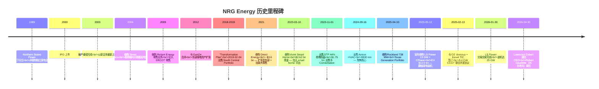
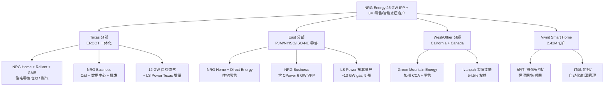
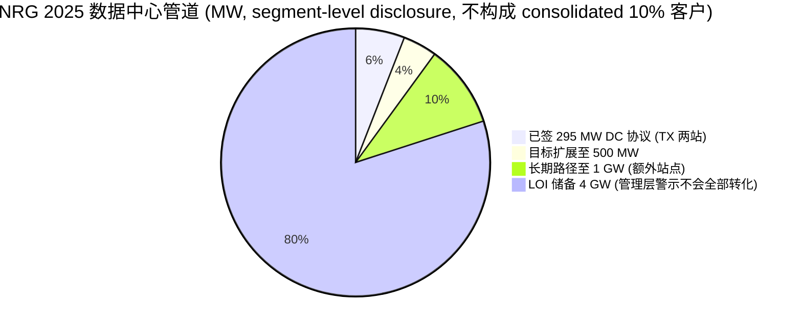
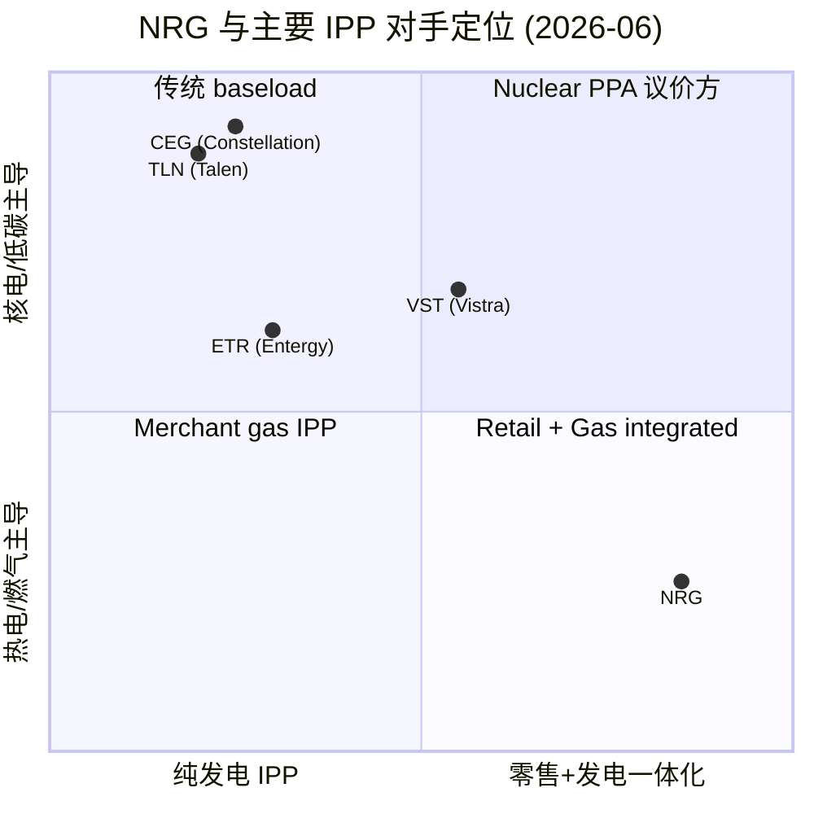
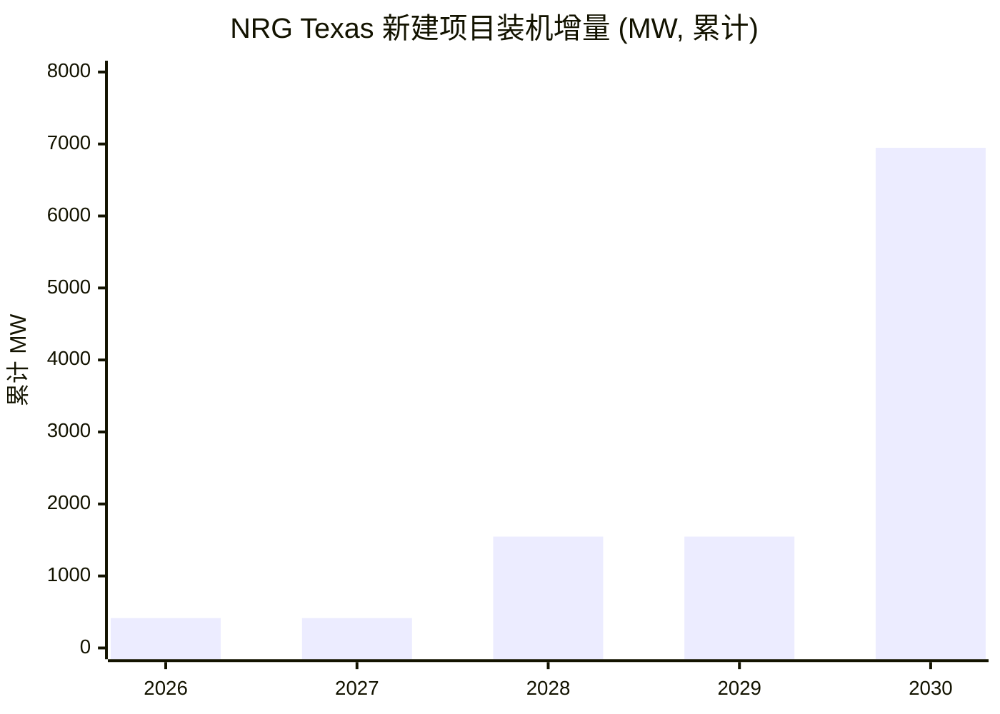

# NRG Energy (NYSE:NRG) 公司研究 — ai-power-electrification 主题覆盖

**As of:** 2026-06-02
**Ticker / 板块:** NYSE:NRG · S&P 500 · SIC 4911 Electric Services
**主题归属:** ai-power-electrification 主题篮子，"core" tag（核心标的），与 NASDAQ:CEG、NYSE:VST、NASDAQ:TLN、NYSE:ETR 同属"IPP / 数据中心 PPA 受益方"层（[ai-power-electrification 主题文档](http://xs-macbook-air.local:5001/themes/ai-power-electrification_theme.md)）。
**报告范围:** 6,000–10,000 字深度初始覆盖。本报告纯简体中文撰写（非翻译稿）；首次出现技术 / 行业术语采用 中文 / English 双语标记。

---

## 顶部横幅 / Banner — 2026 指引与最新催化剂

| 项目 | 2025 实际 | 2026 指引 | 2026 中点 | 与 2025 比较 |
|---|---|---|---|---|
| Adjusted EBITDA | $4,087 mn | $5,325 – $5,825 mn | $5,575 mn | **+36% YoY** |
| Adjusted Net Income | $1,606 mn | $1,685 – $2,115 mn | $1,900 mn | **+18% YoY** |
| Adjusted EPS | $8.24 | $7.90 – $9.90 | $8.90 | **+8% YoY**（含 LS Power 摊薄） |
| Free Cash Flow before Growth (FCFbG) | $2,210 mn | $2,800 – $3,300 mn | $3,050 mn | **+38% YoY** |
| 资本回报（buyback + dividend） | $1.6 bn | $1.4 bn（$1.0 bn 回购 + ~$400 mn 分红） | — | 8% 分红增长 |

2026 指引为 reaffirmed (再次确认) 状态，反映 LS Power 资产约 11 个月（~90%）的并表贡献；管理层将 5 年 Adjusted EPS CAGR 目标从 +10% 提升至 **+14%+**，并将该目标延展至 2030 年（[NRG Q4 2025 Earnings Release, 2026-02-24](https://www.sec.gov/Archives/edgar/data/1013871/000101387126000002/ex991-q42025.htm)；[NRG Acquires LS Power Portfolio Press Release, 2025-05-12](https://www.sec.gov/Archives/edgar/data/1013871/000110465925047007/tm2514561d1_ex99-1.htm)）。

**最近一年关键催化剂:**

1. **2025-05-12**: 宣布以企业价值 (Enterprise Value, EV) ~$12.0 bn 收购 LS Power 18 座天然气电厂 (13 GW) 及 CPower 虚拟电厂 (Virtual Power Plant, VPP, 6 GW) 平台，对价 = $6.4 bn 现金 + 24.25 mn 股 NRG 普通股 + 承接 ~$3.2 bn 债务；2026-01-30 交割完成（[NRG Acquires LS Power, 2025-05-12](https://www.sec.gov/Archives/edgar/data/1013871/000110465925047007/tm2514561d1_ex99-1.htm)；[2025 10-K, p. 48](https://www.sec.gov/Archives/edgar/data/1013871/000101387126000004/nrg-20251231.htm)）。
2. **2025-04-10**: 从 Rockland Capital 收购 738 MW Texas Generation Portfolio（6 座天然气厂）（[2025 10-K, Acquisition Note](https://www.sec.gov/Archives/edgar/data/1013871/000101387126000004/nrg-20251231.htm)）。
3. **2025-02-13**: 与 GE Vernova (NYSE:GEV) 和 Kiewit 子公司 TIC 签订 **5.4 GW** 新建联合循环天然气发电厂 Project Development Agreement，预订 **3.6 GW** GEV 7HA 燃机机位 (slot reservation)，首批项目 2029 年底投运（[2025 10-K, Site Development Updates](https://www.sec.gov/Archives/edgar/data/1013871/000101387126000004/nrg-20251231.htm)）。
4. **2025-Q2 至 2025-Q4**: 与德州 Texas Energy Fund (TEF) 签订三笔低息贷款，合计 1.5 GW 新建项目（T.H. Wharton 415 MW peaker + Cedar Bayou 689 MW CCGT + Greens Bayou 443 MW peaker）；获得 $1.15 bn 低利率融资支持，首个 T.H. Wharton 项目 2026-06 投运（[NRG Q4 2025 Press Release](https://www.sec.gov/Archives/edgar/data/1013871/000101387126000002/ex991-q42025.htm)）。
5. **2025-Q2**: 与德州两座 NRG 自有场地的数据中心客户签订 **295 MW** 长期电力协议，路径扩展至 500 MW 并向 1 GW 推进，另有 **4 GW LOI 储备**（[Power Engineering, 2025-08](https://www.power-eng.com/gas/nrg-caps-busy-second-quarter-with-295-mw-data-center-power-deal/)）。
6. **2025-12 至 2026-04**: CEO 接班宣布 — Lawrence S. Coben（CEO + Chair）于 2026-04-30 退休，**Robert J. Gaudette（25 年 NRG 老兵、现任 President）继任 CEO**；Antonio Carrillo 接任 Chair（[NRG 2026 Proxy Statement, p. 41](https://www.sec.gov/Archives/edgar/data/1013871/000110465926030844/tm261406-2_def14a.htm)）。

---

## 目录

1. [公司概览](#1-公司概览)
2. [公司历史](#2-公司历史)
3. [管理团队](#3-管理团队)
4. [产品与服务](#4-产品与服务)
5. [客户与上市策略](#5-客户与上市策略)
6. [行业概览](#6-行业概览)
7. [竞争格局](#7-竞争格局)
8. [市场机会](#8-市场机会)
9. [风险评估](#9-风险评估)
10. [投资者视角评分卡](#10-投资者视角评分卡)
11. [参考资料](#11-参考资料)

---

## 1. 公司概览

NRG Energy, Inc.（NYSE:NRG，下文简称 "NRG"），总部位于美国得州 Houston，是北美最大的零售电力 (retail electricity) 与天然气 (natural gas) 供应商之一，并经营一支约 25 GW 的天然气与双燃料发电机组。截至 2025 年底，公司"通过 NRG、Reliant、Direct Energy、Green Mountain Energy 和 Vivint 等品牌，为约 800 万住宅客户（其中 600 万零售能源、200 万 smart home / 智能家居）以及大量商业与工业 (Commercial & Industrial, C&I)、数据中心 (data center)、批发客户提供电力、天然气和智能家居技术解决方案"（[NRG 2025 Annual Report (10-K), Item 1 — Business](https://www.sec.gov/Archives/edgar/data/1013871/000101387126000004/nrg-20251231.htm)）。

公司于 1989 年由 Northern States Power Company（现为 Xcel Energy 子公司）作为非管制独立发电业务分立成立，2000 年 IPO 上市，2003 年破产重组后以新主体重新上市并迁址至 NYSE。NRG 长期是美国 deregulated power market（去管制电力市场）的最大零售商之一，主战场为 ERCOT（得州电力可靠性委员会，Texas 独立电网）和东北 PJM / NYISO / ISO-NE 三大组织市场（[2025 10-K, Item 1 Business Overview](https://www.sec.gov/Archives/edgar/data/1013871/000101387126000004/nrg-20251231.htm)）。

**2025 年关键运营数据（10-K 披露）:**

- 合计客户数 (residential ending count): **8.05 mn**（电力 + 燃气 5.63 mn + Vivint Smart Home 2.42 mn）（[2025 10-K, Operational Statistics](https://www.sec.gov/Archives/edgar/data/1013871/000101387126000004/nrg-20251231.htm)）。
- 零售电力销量 (Retail Load): **154,000 GWh**，其中 Home Texas 38,817 GWh、Business East 45,342 GWh 为最大两块（同上）。
- 自有 + 租赁发电装机（2025-12-31，并入 LS Power 之前）: **Texas 9,271 MW + East 2,073 MW + West/Other 4 MW = 11,348 MW 化石机组**；2026 年并表 LS Power 后总装机翻倍至 **~25 GW**（[NRG Acquires LS Power Press Release, 2025-05-12](https://www.sec.gov/Archives/edgar/data/1013871/000110465925047007/tm2514561d1_ex99-1.htm)）。
- 2025 营收 (Total Revenue) **$30,713 mn**，GAAP 净利 $864 mn，Adjusted EBITDA $4,087 mn；同期 Adjusted EPS $8.24，FCFbG $2,210 mn（[NRG Q4 2025 Earnings Release](https://www.sec.gov/Archives/edgar/data/1013871/000101387126000002/ex991-q42025.htm)）。

**分部收入构成 (FY2025, $ mn):**

| Segment / 分部 | Revenue | Operating Income | 营收占比 |
|---|---|---|---|
| Texas | 11,139 | 1,113 | 36.3% |
| East | 14,263 | 706 | 46.4% |
| West/Other | 3,202 | 149 | 10.4% |
| Vivint Smart Home | 2,144 | 53 | 7.0% |
| Corporate / Eliminations | (35) | (176) | — |
| **合计** | **30,713** | **1,845** | 100% |

来源：[NRG 2025 10-K, Segment Information, p. 145](https://www.sec.gov/Archives/edgar/data/1013871/000101387126000004/nrg-20251231.htm)。注意 East 营收最大但 Texas 利润率显著更高（10% vs 5%）— 反映 Texas 是 NRG "fully integrated retail-to-generation 一体化"模式的核心利润池。

**估值快照（2026-06-02 收盘 ~$129）:**

| 指标 | 数值 | 来源 / 备注 |
|---|---|---|
| Market Cap | $27.3 bn | [stockanalysis.com NRG Statistics, 2026-06-02](https://stockanalysis.com/stocks/nrg/statistics/) |
| Enterprise Value | $50.5 bn | 同上（含 LS Power 并购融资后债务） |
| TTM P/E | 149.6× | 同上 — TTM 受 2025 Q4 mark-to-market 非现金亏损扰动 |
| Forward P/E | **13.2×** | 同上 — 基于 2026 Adj EPS 中点 $8.90 |
| TTM P/S | 0.84× | 同上 |
| Forward P/S | 0.77× | 同上 |
| P/B | 6.5× | 同上 |
| Debt / Equity | 4.79 | 同上（资本结构高杠杆） |
| Dividend Yield | 1.42% | 同上 — 季度分红 $0.475 |
| Beta | 1.32 | 同上 |
| 52W Range（近似） | ~$120 – $189 | [stockanalysis.com 1Y history](https://stockanalysis.com/api/symbol/s/nrg/history?period=D&range=1Y) — 2026-02-25 见 $189.96 高点（10-K + LS Power 完成行情顶部），近期回调至 $129 |

**估值解读:** TTM P/E 149.6× 是会计扰动 — 2025 GAAP 净利 $864 mn 显著低于 Adjusted Net Income $1,606 mn，主因开放对冲头寸的非现金 mark-to-market 损失（[NRG Q4 2025 Press Release](https://www.sec.gov/Archives/edgar/data/1013871/000101387126000002/ex991-q42025.htm)）。**Forward P/E 13.2×** 是更具实际意义的多次估值口径：基于 2026 中点 Adj EPS $8.90，13.2× 在 IPP / 电力公用事业板块属于"温和偏低"，反映市场对（1）LS Power 整合执行风险、（2）long-duration PPA 应收的利率久期风险、（3）merchant gas 周期暴露的折价。对比纯核电 IPP 同行：Constellation Energy（NASDAQ:CEG）forward P/E ~30×、Vistra（NYSE:VST）~24× — NRG 的"零售一体化 + 燃气 merchant + smart home"组合获得了显著折扣，但也对应较低的 multiple 重估弹性（[ai-power-electrification 主题文档](http://xs-macbook-air.local:5001/themes/ai-power-electrification_theme.md)）。

*分析师观点：* P/B 6.5× 对一家公用事业控股属于高位，主因 2023 年 Vivint 并购 $2.62 bn 商誉 + 2026 年 LS Power 并购增厚的商誉与无形资产；Debt/Equity 4.79 反映 LS Power 现金对价依赖新发 $4.9 bn 高级票据融资。NRG 的估值案例本质上是"以 0.8× P/S 和 13× Forward P/E 锚定一个加速到 14% EPS CAGR 的复合机器" — 真正的杠杆点是 LS Power 整合协同 + 数据中心 PPA 兑现速度。

---

## 2. 公司历史

NRG 是少数几家既经历过破产重组、又在去管制零售电力时代完成多轮大型并购的美国独立发电与零售商之一。下面的时间线聚焦于改变公司商业模式的关键事件，引用 10-K 与 Proxy 中的客观日期。

来源：[NRG 2025 10-K](https://www.sec.gov/Archives/edgar/data/1013871/000101387126000004/nrg-20251231.htm)；[NRG 2026 Proxy Statement](https://www.sec.gov/Archives/edgar/data/1013871/000110465926030844/tm261406-2_def14a.htm)；[NRG Acquires LS Power Press Release, 2025-05-12](https://www.sec.gov/Archives/edgar/data/1013871/000110465925047007/tm2514561d1_ex99-1.htm)。

**关键转折点的语境:**

- **2003 破产重组**: NRG 是 2001-2002 美国电力行业破产潮（Enron, Calpine 等）的代表性案例之一。2003 年重组后，公司以更轻的杠杆与剥离的国际资产重新上市，奠定了后续作为"得州 merchant power + 零售一体化"龙头的基础（[NRG Corporate History 引述于 2025 10-K General](https://www.sec.gov/Archives/edgar/data/1013871/000101387126000004/nrg-20251231.htm)）。
- **2009 Reliant 收购**: 这是 NRG 从纯发电向"零售 + 发电一体化"转型的关键步 — 由此 NRG 在 ERCOT 取得了百万级零售客户基础（[Reliant 品牌至今仍是 NRG 主力零售品牌之一，见 2025 10-K Brand Names 段落](https://www.sec.gov/Archives/edgar/data/1013871/000101387126000004/nrg-20251231.htm)）。
- **2021 Direct Energy 收购**: ~$3.6 bn 现金对价从 Centrica 收购 Direct Energy（北美零售能源业务），将 NRG 的零售触角延伸至美国东部 + 加拿大；此交易使 NRG 在 East 分部成为头部零售商之一（[2025 10-K Brand Names + East 分部规模](https://www.sec.gov/Archives/edgar/data/1013871/000101387126000004/nrg-20251231.htm)）。
- **2023-03-10 Vivint Smart Home 收购**: 总对价 $2.62 bn（含 $2,609 mn 现金 + $14 mn 服务期内股权奖励公允价值），是 NRG 首次跨入 smart home / IoT 领域。Vivint 在 2025 年支撑了"超过 3,700 万台连接家用设备，平均每户约 16 台设备"（[2025 10-K Vivint Segment](https://www.sec.gov/Archives/edgar/data/1013871/000101387126000004/nrg-20251231.htm)；[Acquisitions Note](https://www.sec.gov/Archives/edgar/data/1013871/000101387126000004/nrg-20251231.htm)）。
- **2023-11-01 STP 核电出售**: 将得州 South Texas Project 44% 权益以 $1.75 bn 出售给 Constellation Energy（NASDAQ:CEG）— 与 CEG 的核电"双寡头"路线背道而驰，NRG 选择"全面退出核电、聚焦天然气 + 零售 + smart home"。事后看，这是一个值得讨论的决策：CEG 的 2024 Microsoft TMI 重启协议表明核电议价权在 AI 数据中心时代显著提升（[2025 10-K STP 出售；ai-power-electrification 主题文档关于 CEG / TLN 核电 PPA 的对比](http://xs-macbook-air.local:5001/themes/ai-power-electrification_theme.md)）。
- **2025-05-12 → 2026-01-30 LS Power 交易**: 这是 NRG 自 2009 Reliant 以来最大的资产交易；该交易将装机翻倍至 25 GW，并通过 CPower（6 GW C&I VPP 平台）加入了真正具备数据中心 demand-side 议价能力的资产（[NRG Q4 2025 Press Release](https://www.sec.gov/Archives/edgar/data/1013871/000101387126000002/ex991-q42025.htm)）。

---

## 3. 管理团队

按 company-research 规则，本节只覆盖创始人与现任 CEO。NRG 不是"创始人公司"（1989 年从 Northern States Power 分立后历经多次破产重组与 CEO 更迭），因此聚焦现任过渡阶段的两位 CEO。

### Lawrence S. Coben — 现任 CEO & Chair（任至 2026-04-30）

Coben 博士自 2023 年 11 月起任 NRG CEO，2017 年起任 Chairman of the Board，2003 年起任董事 — 是 NRG 董事会中任期最长的成员。2024 年 8 月被董事会"正式任命为永久 CEO"，并合并 CEO + Chair 双重角色（此前为代理过渡期）。**Coben 计划于 2026-04-30 同时退任 CEO + Chair 与董事会成员**（[NRG 2026 Proxy Statement, p. 65 Executive Officers](https://www.sec.gov/Archives/edgar/data/1013871/000110465926030844/tm261406-2_def14a.htm)）。

**履历亮点（按 2026 Proxy 披露）:**

- **2003 – 2017**: Tremisis Energy 多个子公司董事长兼 CEO — Tremisis 是一家 SPAC 与能源资产投资平台，Coben 在此期间完成多笔能源资产的收购与重组（[2026 Proxy, p. 65](https://www.sec.gov/Archives/edgar/data/1013871/000110465926030844/tm261406-2_def14a.htm)）。
- **NRG 董事 2003 至今 / Chair 2017 至今 / CEO 2023-11 至今**: Coben 在 NRG 董事会的 23 年任期、CEO 任期 2.5 年期间主导了：(1) 出售 STP 核电、(2) 出售 Airtron HVAC、(3) 与 GEV/Kiewit 签订 5.4 GW 联合开发协议、(4) LS Power 13 GW 收购宣布与交割（同上，2026 Proxy & 2025 10-K）。
- **ESCALA Initiative 创始人 & Board Chair**: 这是一家为全球边缘女企业家提供商学院与能力培训的 NGO（[2026 Proxy, p. 65](https://www.sec.gov/Archives/edgar/data/1013871/000110465926030844/tm261406-2_def14a.htm)）。

Coben 任内最有争议的两项决策是 (a) 出售 STP 给 Constellation —— 这是 NRG 完全退出 baseload 核电的一步，事后看错失了 AI 数据中心 nuclear-PPA 议价权窗口；以及 (b) 以 EV $12.0 bn / 7.5× 2026 EV/EBITDA 收购 LS Power 13 GW gas 资产 —— 在 AI demand supercycle 兴起前的窗口锁定了重建成本约 50% 的估值，但也将杠杆推至 D/E 4.79（[LS Power Press Release 引述 50% of new build replacement cost](https://www.sec.gov/Archives/edgar/data/1013871/000110465925047007/tm2514561d1_ex99-1.htm)；[stockanalysis.com Debt/Equity](https://stockanalysis.com/stocks/nrg/statistics/)）。

### Robert J. Gaudette — CEO-Designate（2026-04-30 起）

Gaudette 是 NRG 25 年老兵，2026-01-07 起接任 President（从 Coben 手中接过 President 头衔），**2026-04-30 接任 CEO**（[NRG 2026 Proxy Statement, p. 41 / p. 65](https://www.sec.gov/Archives/edgar/data/1013871/000110465926030844/tm261406-2_def14a.htm)）。

**履历（按 2026 Proxy）:**

- **2026 至今**: President & CEO-designate, NRG Energy, Inc.（同上）。
- **2024 – 2026**: Executive Vice President & President, NRG Business and Market Operations — 管理 NRG 的零售燃气、电力与需求响应平台，C&I 解决方案组合，以及所有 NRG 发电（plant operations、asset management、development、engineering、construction）（[2026 Proxy, p. 41 Qualifications and Experience](https://www.sec.gov/Archives/edgar/data/1013871/000110465926030844/tm261406-2_def14a.htm)）。
- **2022 – 2023**: Executive Vice President, NRG Business and Market Operations（同上）。
- **2010 – 2022**: Senior Vice President, NRG Energy（包含多个运营岗位）（同上）。

**意义:** Gaudette 的接任是典型的"内部接班 + 业务运营专业"模式，与 Coben（资本市场 + 战略背景）形成对比。Gaudette 在 NRG 内部既管 Business 零售（commercial、industrial、data center 客户）又管 Market Operations 与所有 generation —— 这恰好覆盖 LS Power 整合 + 数据中心 PPA 拓展两大 2026-2028 关键执行任务。董事会同时决定将 Chair 角色分给 Antonio Carrillo（现任 Lead Independent Director），结束 Coben 时代的"CEO + Chair 合一"治理结构（[2026 Proxy Board Structure](https://www.sec.gov/Archives/edgar/data/1013871/000110465926030844/tm261406-2_def14a.htm)）。

*分析师观点：* Gaudette 在 NRG Business 任内主导了从无到有把数据中心客户做成可见管道的过程 — 2025 年 295 MW DC 协议、4 GW LOI、与 GEV 5.4 GW 框架协议都是他的直接业务（[Power Engineering 2025-08 报道](https://www.power-eng.com/gas/nrg-caps-busy-second-quarter-with-295-mw-data-center-power-deal/)）。这是一个"业务派接班、聚焦执行"的过渡，符合 LS Power 整合周期所需的稳态管理风格。

---

## 4. 产品与服务

NRG 的业务可以拆为四条主线，每条对应一个 10-K 分部，并叠加四个共享职能（Customer Operations、Market Operations、Plant Operations、Vivint smart home 平台）。本节按 10-K Item 1 Business 顺序展开，引用 10-K 原文以避免转述失真。

### 产品矩阵 / Product Tree（按 10-K 分段）

来源：[2025 10-K, Item 1 Business — Business Overview & Segments](https://www.sec.gov/Archives/edgar/data/1013871/000101387126000004/nrg-20251231.htm)。

### 4.1 Texas 分部（一体化模式 / fully integrated model）

> 引述自 10-K（verbatim）："In Texas, the Company's generation supply is fully integrated with its retail load. This integrated model provides the advantage of being able to supply a portion of the Company's retail customers with electricity from the Company's assets, which reduces the need to sell electricity to, and buy electricity from, other institutions and intermediaries, resulting in more stable earnings and cash flows, lower transaction costs and less credit exposure."（[2025 10-K, Texas Segment Description](https://www.sec.gov/Archives/edgar/data/1013871/000101387126000004/nrg-20251231.htm)）

**中文释义 / Plain-language gloss:** Texas 是 NRG 真正的"利润机器"。ERCOT 是美国唯一同时允许独立发电、零售、批发交易在同一持牌主体内闭环运作的去管制市场。NRG 在 ERCOT 既拥有 ~12 GW 自有 + LS Power 增量天然气机组，又通过 Reliant / NRG / Green Mountain 等品牌持有约 2.86 mn 住宅电力客户（[2025 10-K Operational Statistics](https://www.sec.gov/Archives/edgar/data/1013871/000101387126000004/nrg-20251231.htm)）。这套一体化系统的物理意义：当 ERCOT 出现极端事件（如 2021 年 Winter Storm Uri）时，NRG 的零售头寸有相当部分由自有机组覆盖，避免在 spot market 高位现货采购造成的灾难性损失（这正是 2021 年压垮 Brazos Electric 与 Griddy 等竞争对手的机制）。

**NRG 在 Texas 的 2025 关键产能 / 在建项目（Texas Energy Fund 资助）:**

| 项目 | 类型 | 容量 | 预计投运 | 备注 |
|---|---|---|---|---|
| T.H. Wharton peaker | 天然气 peaker | 415 MW | 2026-06 | TEF $216 mn 低息贷款 |
| Cedar Bayou 5 | 天然气 CCGT | 689 MW | 2028 中 | TEF 融资 |
| Greens Bayou 6 | 天然气 peaker | 443 MW | 2028 中 | TEF $370 mn 贷款，2025-11-20 签约 |
| GEV / TIC 5.4 GW 协议 | 天然气 CCGT | 5,400 MW | 首批 2029 年底 | 含 3.6 GW 7HA 燃机机位预订 |

来源：[2025 10-K, Texas Development Projects](https://www.sec.gov/Archives/edgar/data/1013871/000101387126000004/nrg-20251231.htm)；[NRG Q4 2025 Press Release on TEF](https://www.sec.gov/Archives/edgar/data/1013871/000101387126000002/ex991-q42025.htm)。

### 4.2 East 分部（零售龙头 + LS Power 增量）

East 分部本身的零售业务来自 2021 年 Direct Energy 并购 + Reliant 东扩，覆盖 PJM、NYISO、ISO-NE 三大组织市场。**FY2025 East 营收 $14,263 mn 是单一最大分部**（占合并营收 46%），但运营利润仅 $706 mn（Operating Margin 5%）— 显著低于 Texas 分部的 10% — 反映东北 RTO 市场的"零售毛利薄、capacity market 周期性强、merchant generation 长期受 PJM 改革压制"的结构（[2025 10-K Segment Information](https://www.sec.gov/Archives/edgar/data/1013871/000101387126000004/nrg-20251231.htm)）。

**2026-01-30 完成 LS Power 交割后**，East 分部新增 LS Power 18 座 gas + dual-fuel 资产中的大部分（位于美国东北部 + 一部分德州），总装机 13 GW。**LS Power 资产的关键属性是 "irreplicable, quick-start natural gas facilities"** — 大多是 2010 年代后期建成的现代化 CCGT 与快启 peaker，**新建重建成本约为 EV $12.0 bn 收购对价的 2 倍**（[LS Power Press Release: "50% of estimated new build replacement cost"](https://www.sec.gov/Archives/edgar/data/1013871/000110465925047007/tm2514561d1_ex99-1.htm)）。这是 NRG 收购的核心战略论据：以 50% 重建成本拿到现代化 fleet，跳过 4-6 年的开发 / 审批 / EPC 周期。

**CPower 虚拟电厂 (Virtual Power Plant, VPP)** 是 LS Power 交易中的另一个关键资产。CPower 在美国所有去管制电力市场运营，**控制约 6 GW 容量、覆盖 2,000+ 商业与工业客户**（[LS Power Press Release](https://www.sec.gov/Archives/edgar/data/1013871/000110465925047007/tm2514561d1_ex99-1.htm)）。这是 demand-response（需求响应）和 "bring your own power" (BYOP) 商业模式的核心基础设施 — 当电网紧张时，CPower 可以协调 C&I 客户暂时降负荷，NRG 由此获得 ancillary services 收入与 capacity revenue，且对数据中心客户而言，这是"我们能保证你的关键负载不掉电"的关键交付能力。

### 4.3 West/Other 分部

主要资产是 Ivanpah Solar Electric Generating Station（加州 Mojave 沙漠 385 MW 太阳能塔，NRG 持 54.5%）以及加州 CCA（Community Choice Aggregation）零售业务和 Canada Direct Energy 业务（[2025 10-K Glossary — Ivanpah](https://www.sec.gov/Archives/edgar/data/1013871/000101387126000004/nrg-20251231.htm)）。**FY2025 营收 $3,202 mn，运营利润 $149 mn（OPM 5%）**（[2025 10-K Segment Info](https://www.sec.gov/Archives/edgar/data/1013871/000101387126000004/nrg-20251231.htm)）。这是 NRG 战略上重要性最低的分部 — 2024 年已经出售 Airtron HVAC（$500 mn 处置）、2025-05 终止 Cottonwood 燃气厂租赁，反映管理层正在持续剥离非核心 West 资产。

### 4.4 Vivint Smart Home 分部（产品 + 订阅）

> 引述自 10-K（verbatim）："Vivint Smart Home is a leading smart home platform that provides customers with technology, products and services to create a smarter and safer home. A smart home has multiple devices integrated into a single expandable platform that incorporates artificial intelligence ('AI') and machine-learning in its operating system, which allows customers to interact with and manage their home from anywhere via the Vivint app on their smart device. Vivint Smart Home provides a customized solution for the home using integrated smart cameras (indoor, outdoor and doorbell), locks, lights, thermostats, garage door controls and a host of other safety and security sensors. NRG combines these solutions with energy products to unlock value at the intersection of energy and smart home, scale the Company's residential VPP, and give customers a tool to manage and lower their energy costs."（[2025 10-K, Vivint Smart Home Segment](https://www.sec.gov/Archives/edgar/data/1013871/000101387126000004/nrg-20251231.htm)）

**关键运营指标:**

- **2025 年末 Vivint Smart Home 订户 (Ending)**: **2.42 mn**（vs 2024: 2.23 mn，YoY +8.7%）（[2025 10-K Operational Statistics](https://www.sec.gov/Archives/edgar/data/1013871/000101387126000004/nrg-20251231.htm)）。
- **平台连接设备**: 3,700 万+ 台连接家用设备，平均每户 ~16 台（同上）。
- **FY2025 Vivint 分部营收 $2,144 mn**（占 NRG 合计 7%），运营利润 $53 mn（OPM 2.5%）— 但段间摊销负担重，调整后 EBITDA 贡献更显著（[2025 10-K Segment Info](https://www.sec.gov/Archives/edgar/data/1013871/000101387126000004/nrg-20251231.htm)）。
- **商誉 $3,523 mn**（占 Vivint 分部总资产 $6,752 mn 的 52%）— 反映 2023 年 $2.62 bn 并购对价高于账面净资产的部分仍未摊销（同上）。

**Vivint 的战略意义 — 双向协同:**

1. **能源 × 智能家居交叉销售**: Vivint 订户购买 NRG 电力 / 燃气产品的转化率（10-K 未单独披露具体数字），是 NRG 提升 ARPU 的关键路径。
2. **Residential VPP**: 智能恒温器 + 智能负载控制器 → NRG 在 ERCOT / PJM 可调度的虚拟电厂 — 直接对应 2026 指引中提到的"residential VPP 目标超额完成"（[Q4 2025 Press Release 引用 Texas residential VPP target exceeded](https://www.sec.gov/Archives/edgar/data/1013871/000101387126000002/ex991-q42025.htm)）。这是 ai-power-electrification 主题中的 demand-side flexibility 资产。

### 4.5 Bring Your Own Power (BYOP) — 数据中心专属产品

> 引述自 10-K（verbatim）："These solutions include system power, natural gas, demand response, distributed and backup generation, energy storage, energy management, renewable and low-carbon products and carbon management, energy efficiency, and bring your own power ('BYOP') arrangements for large loads."（[2025 10-K, NRG Business Product Offerings](https://www.sec.gov/Archives/edgar/data/1013871/000101387126000004/nrg-20251231.htm)）

**中文释义 / Plain-language gloss:** BYOP 是 NRG 专为数据中心 (data center) 与其他 large load（在德州 SB 6 中定义为 ≥75 MW 单点负荷）设计的协议结构。客户在 NRG 自有场地内（或与 NRG 共址）部署数据中心，NRG 提供"私网式"电力供应 — 既绕过 ERCOT 的 stranded-cost 分摊问题（参见 SB 6 法规细节），又使数据中心客户获得 "behind-the-meter" 直供电力的可见容量保障。**2025 年 NRG 在两座自有场地签订 295 MW DC 协议**（向 500 MW 扩展，长期路径 1 GW），并持有 4 GW 数据中心 LOI 储备 — 后者管理层明确警告"不太可能全部转化"（[Power Engineering, 2025-08](https://www.power-eng.com/gas/nrg-caps-busy-second-quarter-with-295-mw-data-center-power-deal/)）。

### 综合产品流（"customer-first integrated platform"）

NRG 商业模式的"飞轮"在于：(1) 自有发电 → (2) 一体化零售（Texas, ERCOT 模式）/ 纯零售（East, PJM 模式）→ (3) 智能家居硬件 + 订阅（Vivint）→ (4) Residential / C&I VPP（CPower + Vivint 设备）→ (5) BYOP 与数据中心长期 PPA。每一层既是收入流，又是下一层的"原料" — 自有发电为零售对冲提供物理基础，VPP 为数据中心客户提供 reliability 承诺，数据中心 PPA 又为新建 CCGT 提供长期 take-or-pay 现金流锁定。这是 NRG 与单一业务模式 IPP（如 VST 纯发电、CEG 纯核电）的关键差异化 — 但也意味着估值口径需要分别用 IPP 倍数 + 零售（高客户基数、低毛利）倍数 + smart home（订阅）倍数综合判断。

---

## 5. 客户与上市策略

### 5.1 客户结构（按 10-K 披露口径）

NRG 在 2025 年末服务约 **800 万住宅客户**（600 万零售能源 + 200 万 smart home）+ 大量 C&I + 数据中心 + 批发客户（[2025 10-K Item 1](https://www.sec.gov/Archives/edgar/data/1013871/000101387126000004/nrg-20251231.htm)）。**根据 10-K Note 14 (Segment Information)，"The Company had no customer that comprised more than 10% of the Company's consolidated revenues during the years ended December 31, 2025, 2024 and 2023"**（[2025 10-K, Segment Note](https://www.sec.gov/Archives/edgar/data/1013871/000101387126000004/nrg-20251231.htm)）。

这是 NRG 与"高度集中"型 IPP（如 CEG 对 Microsoft TMI、TLN 对 AWS、VST 等大单客户依赖）的关键差异：**NRG 的零售业务天然分散，5.6 mn 住宅能源客户单户营收占比可忽略，C&I 业务最大单一客户也未触及 10% 披露门槛**。这种分散性既是防御性优势（无单一客户违约 / 关停风险），也是议价弱点（缺少"一笔合同重塑公司"的能力，例如 CEG-Microsoft TMI 协议改变 CEG 整个估值锚）。

**FY2025 零售客户数据（10-K Operational Statistics）:**

| 客户类型 | 2025 平均 | 2024 平均 | YoY 增幅 |
|---|---|---|---|
| Home Electricity & Gas — Texas | 2.90 mn | 2.94 mn | -1.4% |
| Home Electricity & Gas — East | 1.82 mn | 1.78 mn | +2.2% |
| Home Electricity & Gas — West/Other | 0.31 mn | 0.32 mn | -3.7% |
| Home Natural Gas — East | 0.34 mn | 0.39 mn | -11.5% |
| Home Natural Gas — West/Other | 0.34 mn | 0.35 mn | -2.5% |
| **零售住宅总数 (Home Avg)** | **5.71 mn** | **5.78 mn** | **-1.3%** |
| Vivint Smart Home (Avg) | 2.33 mn | 2.17 mn | +7.2% |
| **合计 Ending Retail + Vivint** | **8.05 mn** | **7.97 mn** | +1.0% |

来源：[NRG 2025 10-K, Operational Statistics](https://www.sec.gov/Archives/edgar/data/1013871/000101387126000004/nrg-20251231.htm)。

**关键观察:** 零售住宅客户数 2024 → 2025 略有缩水（-1.3%），但 Vivint 强劲增长（+7.2%）抵消，且 NRG 零售业务从"做大客户数"转向"提升 per-customer ARPU"（通过 smart home 交叉销售、长期合同、增值服务）。**5.71 mn 住宅零售客户的 churn 与 retention 是 NRG 零售护城河的核心运营指标**，但 10-K 未直接披露具体 churn 率（这是行业常规未披露项）。

### 5.2 数据中心客户管道（segment-level, 非 consolidated 顶级客户）

来源：[Power Engineering, 2025-08 报道 NRG 295 MW 数据中心协议](https://www.power-eng.com/gas/nrg-caps-busy-second-quarter-with-295-mw-data-center-power-deal/)。**注意 (segment-level; not aggregated to group-level)**：这些 MW 数字是 demand-side 容量承诺，对应未来 long-term PPA 收入；它们尚未形成 consolidated 顶级客户披露 — 后续若任一数据中心客户的年化电力账单超过 NRG 2025 营收 ($30,713 mn) 的 10% (~$3 bn)，将触发 10-K 强制披露。给定 295 MW 长期电价约 $40-80/MWh × 8,760 hr × 95% 利用率 ≈ $100-200 mn/年（粗估范围，非披露），单一数据中心客户不会跨越 10% 门槛。

### 5.3 上市策略与资本回报

NRG 自 2003 年重新上市以来一直在 NYSE 主板交易，**未进行过二次上市**。资本回报历史：

- **2025 实际**: $1.6 bn 回报股东（$1.3 bn 回购 + $344 mn 分红）（[Q4 2025 Press Release](https://www.sec.gov/Archives/edgar/data/1013871/000101387126000002/ex991-q42025.htm)）。
- **2026 计划**: $1.0 bn 回购 + ~$400 mn 分红，合计 ~$1.4 bn（同上）。
- **分红轨迹**: 2026-01-23 宣布季度分红 $0.475/股（年化 $1.90），**比上一年增长 8%**，与公司 7-9% 年度分红增长目标一致（同上）。
- **5 年（2025-2029）总资本回报承诺**: ~$9.1 bn — 在 LS Power 交易 PR 中明确披露的预期，跨越回购 + 分红（[LS Power Press Release: "approximately $9.1 billion of capital to NRG shareholders"](https://www.sec.gov/Archives/edgar/data/1013871/000110465925047007/tm2514561d1_ex99-1.htm)）。
- **回购在 LS Power 整合期的优先级**: 管理层明确表示在杠杆降至 < 3.0× 之前 (Net Debt / EBITDA)，将 $1.0 bn 回购作为优先；之后回到 80/20 资本配置框架（80% 股东回报 / 20% 增长投资）（同上）。

*分析师观点：* NRG 的资本回报"承诺-兑现"记录在 IPP 中较为可信 — 2025 年实际回报 $1.6 bn 略高于年初指引下限，且 2026 年分红 +8% 落在目标范围中段。Forward 4-5% 股东收益率（dividend + buyback yield）对一家加速 EPS 增长的公司而言并不便宜，但也不算贵 — 这是市场愿意以 13× Forward P/E 持有 NRG 而非 30× CEG 的核心论据之一。

---

## 6. 行业概览

### 6.1 美国去管制电力市场结构

NRG 主要运营在四个 RTO/ISO 市场：**ERCOT（得州，独立电网，与美国其它互联电网无大规模联络）、PJM（中大西洋 / 中西部 13 州）、NYISO（纽约州）、ISO-NE（新英格兰 6 州）**。这些都是 wholesale + retail 双轨去管制市场，允许独立发电商和零售供应商竞争。**剩余美国市场（西部 MISO 部分、东南、西部各州）大多仍是 vertically integrated utility 模式**（如 Southern Company、Duke、Xcel），不属于 NRG 主战场（[2025 10-K Item 1 Business Environment](https://www.sec.gov/Archives/edgar/data/1013871/000101387126000004/nrg-20251231.htm)）。

### 6.2 AI Data Center Driven Demand Supercycle

NRG 管理层在 Q4 2025 电话会与 PR 中明确使用 **"power demand supercycle"** 表述（[NRG Q4 2025 Press Release CEO Quote](https://www.sec.gov/Archives/edgar/data/1013871/000101387126000002/ex991-q42025.htm)）。这与 ai-power-electrification 主题文档关于"AI 数据中心驱动的电力需求 supercycle 是过去 50 年最大的负荷增长事件"的论断一致（[ai-power-electrification 主题文档](http://xs-macbook-air.local:5001/themes/ai-power-electrification_theme.md)）。

**核心数据点（业界共识，引用主题文档已审核的来源链）:**

- 美国数据中心 2024 年电力消耗占全美总用电约 4.4%，预计 2028 年达 6.7-12.0%（按 LBNL 报告区间），是 2020-2025 期间 ~150-200 bps 的增长，但 2025-2028 期间预计 ~250-700 bps 的加速增长。
- ERCOT 区域 2030 年负荷预测从 2023 年的 82 GW 提升至 2025 年的 152 GW，主因 (a) Permian Basin 油气电气化、(b) 数据中心、(c) 大型工业新负荷，且 ERCOT 同期 reserve margin 从 18% 升至 34%（即"高峰备用裕度大幅过剩"）—— 这是 HSBC / 高盛对"merchant power 价格升势是否真实"的核心质疑（[zsxq #812451114428542 主题文档引用](http://xs-macbook-air.local:5001/zsxq/pdf/812451114428542/HSBC-China%20Power%20Utilities%EF%BC%9AToo%20early%20to%20call%20a%20power%20price%20upcycle-260526.pdf#page=1)，源自 HSBC 2025 研报，间接引用于 ai-power-electrification 主题文档）。
- **得州 SB 6 (2025-06-20 签署)** 是 NRG 业务环境的重大监管事件 — 规定 ≥75 MW 单点负荷在请求 interconnection 之前须做财务承诺、并立法要求 PUCT 制订 stranded-cost 分摊与共址电厂规则；**2025-09-01 之前已有的 stand-alone generator co-locate 大负荷被豁免**，2025-09-01 之后并网的新机组不享豁免（[2025 10-K, Senate Bill 6 段](https://www.sec.gov/Archives/edgar/data/1013871/000101387126000004/nrg-20251231.htm)）。**这条规则对 NRG 至关重要** — NRG 既有大量 2025-09 之前并网的德州机组（受豁免），又在通过 BYOP / 共址模式签数据中心客户；SB 6 的最终细则将决定 NRG 数据中心 PPA 项目的经济性。

### 6.3 PJM Capacity Market 改革

2024-09 起 PJM 进入 capacity market 重大改革周期 — 多个利益相关方在 FERC 提起诉讼，2024-11 至 2026-02 期间 FERC 批准了 PJM 的 RMR（Reliability Must Run）资源处理、Non-Performance Charge 调整、Existing Generation Capacity Resources 强制 offer 等改革（[2025 10-K, PJM Capacity Market Litigation and Reforms 段](https://www.sec.gov/Archives/edgar/data/1013871/000101387126000004/nrg-20251231.htm)）。这些改革整体上**提高了已有 capacity 资产的清算价格**，对 NRG 通过 LS Power 收购的东北 13 GW gas fleet 是利好（直接现金流敏感度），但同时也吸引新进入者，长期效应不明朗。

### 6.4 TAM / SAM 估算

NRG 没有公开 TAM 数字 — 这是 IPP 行业普遍特征（与软件公司不同，电力 TAM = 所有美国电力消耗 × 当地批发电价 + 所有零售电力客户 × 零售电价，太宽泛）。我们采用以下框架估算 NRG 可触及市场：

- **美国去管制零售电力 SAM**: 全美约 1/3 州为去管制，2024 年居民用电 ~1,500 TWh × 平均 $0.12-0.18/kWh = ~$200-270 bn 居民零售市场；商业 + 工业类比可达 ~$300-400 bn；合计 ~$500-700 bn 去管制零售电 TAM。**NRG 2025 零售营收 $29.5 bn ≈ 4-6% 市场份额**（[基于 NRG 10-K 零售营收 + EIA 美国零售电力市场结构数据](https://www.sec.gov/Archives/edgar/data/1013871/000101387126000004/nrg-20251231.htm)）。
- **美国独立发电 SAM**: 全美装机 ~1,200 GW，其中 IPP ~30%（剩余为 regulated utility 自有）= ~360 GW；NRG 25 GW = **~7% IPP 市场份额**。
- **数据中心电力专属市场 (新 SAM)**: 按 2028 年美国数据中心用电 ~250-450 TWh × 长期 PPA 价格 ~$60-100/MWh = ~$15-45 bn 年化 PPA TAM；NRG 4 GW LOI + 已签 295 MW + 1 GW 长期路径 ≈ 在该 TAM 中竞争 ~3-15% 份额（取决于 LOI 转化率）。

---

## 7. 竞争格局

### 7.1 10-K Competition 段引用

10-K Item 1 Business 在 Customer Operations / Plant Operations 段落多次提到 NRG 面对的竞争维度（零售客户、批发市场、capacity 拍卖），但**未在 Item 1A Risk Factors 中明确列出"主要竞争对手"逐一姓名清单** — 这与 NRG 的零售 + 批发混合模型相关：在零售市场，竞争对手数百个；在批发发电市场，主要竞争对手是其它 IPP 与垂直一体化公用事业。

### 7.2 主要可比同行（按 ai-power-electrification 主题分类）

**主要竞争对手与差异化要点:**

1. **NASDAQ:CEG (Constellation Energy)** — 纯核电 IPP（~22 GW 核电），2024-09 与 Microsoft 签 20 年 TMI 重启 PPA，是 AI 数据中心 nuclear-PPA 的代表性案例。**与 NRG 几乎不直接竞争**（CEG 不做零售、不做天然气、不做 smart home），但是同一主题篮子内的"另一种押注方式" — Forward P/E ~30× 对 NRG 13× 反映市场为低碳 baseload 付出的溢价。NRG 2023 出售 STP 给 CEG 是双方此前的关键交易（[ai-power-electrification 主题文档](http://xs-macbook-air.local:5001/themes/ai-power-electrification_theme.md)）。
2. **NASDAQ:TLN (Talen Energy)** — 纯发电 IPP，2025-06 与 AWS 签 long-term nuclear PPA。**重叠度: 低**（TLN 主要在 PJM，无零售）。
3. **NYSE:VST (Vistra)** — 与 NRG 最接近的同行：ERCOT + PJM merchant gas + 部分零售（TXU Energy 品牌）+ 部分核电 + 储能。**重叠度: 高** — Vistra 在 ERCOT 与 NRG 直接抢零售客户，且都签订了数据中心客户；但 Vistra 通过 Energy Harbor 收购拿到了核电资产，NRG 完全没有核电。Forward P/E ~24× 对 NRG 13× 反映 Vistra 核电 + 储能资产组合获得更高估值。
4. **NYSE:ETR (Entergy)** — 垂直一体化公用事业（不在去管制市场，覆盖 Louisiana、Mississippi、Arkansas、Texas 部分），2025 与 Meta 签 Northeast Louisiana $10 bn 数据中心电力协议（[ai-power-electrification 主题文档关于 Entergy-Meta](http://xs-macbook-air.local:5001/themes/ai-power-electrification_theme.md)）。**重叠度: 中** — ETR 与 NRG 在 Louisiana / Texas 边界市场有零售竞争，但 ETR 的"regulated utility + 长期 ROE rate-base recovery"商业模式与 NRG "merchant + retail" 模式根本不同。
5. **NYSE:EXC (Exelon)** — 大型纯输配电公用事业，与 NRG 几乎无重叠（Exelon 2022 已剥离发电业务到 CEG）。
6. **ERCOT 区域零售对手**: TXU Energy（Vistra 旗下）、Calpine（私有 IPP，2025 年正在 IPO 准备中）、Just Energy 等小型零售商 — 这些在 NRG 的 2.86 mn Texas 住宅客户基础上构成持续 churn 压力。
7. **数据中心 PPA 同台竞标对手**: GE Vernova（GEV，作为 NRG 的 EPC 合作方而不是竞争对手）、Cheniere（LNG），及上述 CEG / TLN / VST 等 IPP。

### 7.3 NRG 的差异化护城河

1. **ERCOT 一体化模式的物理优势** — 自有发电 + 零售对冲在 2021 Winter Storm Uri 这类极端事件中显著优于纯零售商；这是商业模式层面的"硬件壁垒"。
2. **5.6 mn 住宅零售客户基础** — 重新获取这种规模客户基础的 acquisition cost 约 $200-500/客户 × 5.6 mn = $1.1-2.8 bn 重置成本，是新进入者的现实壁垒。
3. **Vivint smart home 平台 + CPower VPP 6 GW + Residential VPP** — 在 demand-side flexibility 资产层面无人可比 — 这是数据中心客户（需要"我能保证你的关键负载在 grid stress 时不掉电"）的关键承诺机制。
4. **GEV 5.4 GW + 3.6 GW 7HA 燃机机位锁定** — 在全美 CCGT 燃机产能紧张的窗口期（2026-2030 GEV / Mitsubishi / Siemens 燃机产能均已售罄至 2028+），NRG 通过 2025-02 提前锁定，是核心战略动作。新进入者在 2026 年才下订单的燃机要到 2030+ 才能交付。

### 7.4 弱点

1. **无核电资产** — 出售 STP 是后视镜下的战略失误，错过了 AI 数据中心 zero-carbon 长期 PPA 议价权窗口。
2. **东北 East 分部低利润率** — PJM / NYISO 零售毛利薄、capacity 价格波动大，FY2025 East 分部 OPM 仅 5%。
3. **高杠杆** — Debt/Equity 4.79，LS Power 并购后需在 < 3.0× Net Debt/EBITDA 达成前优先去杠杆，限制了短期回购 / 增长投资灵活度。
4. **5.6 mn 零售客户数 2024→2025 同比缩水 1.3%** — 零售护城河出现首次维度松动信号，需关注后续 churn 趋势。

---

## 8. 市场机会

### 8.1 LS Power 整合协同（已锁定，2026-2028 兑现）

LS Power 交易在管理层公告中明确量化的财务影响：
- **5 年 Adj EPS CAGR 从 ≥10% 提升至 ≥14%**（含 LS Power 协同，**不含**数据中心上侧机会或市场紧张带来的电价上行）（[LS Power Press Release 2025-05-12](https://www.sec.gov/Archives/edgar/data/1013871/000110465925047007/tm2514561d1_ex99-1.htm)）。
- **目标延展至 2030**（[Q4 2025 PR](https://www.sec.gov/Archives/edgar/data/1013871/000101387126000002/ex991-q42025.htm)）。
- 2026 年 Adj EBITDA $5,575 mn 中点对比 2025 $4,087 mn = **+36% YoY 增长**，但其中约 11 个月（90%）为 LS Power 贡献，**底层 NRG legacy 业务隐含约 +5-8% YoY 增长**。

### 8.2 数据中心 PPA 转化（高方差上侧）

- **当前已签**: 295 MW Texas（2026-H2 起初步供电，2030 年全运行）。
- **目标扩展**: 500 MW（同两座 NRG 自有场地）。
- **长期路径**: 1 GW（额外场地）。
- **LOI 储备**: 4 GW（管理层警告"不会全部转化"）。
- **隐含财务上侧**: 若 LOI 转化率 25-50%，对应 1-2 GW 额外 PPA，按 long-term gross margin $30-50/MWh × 8,760 hr × 90% 利用率 ≈ $250-800 mn/年额外贡献（粗估范围，非披露）。这部分**目前未在 2026-2030 Adj EPS 14% CAGR 中计入**，是真正的看涨期权（[Power Engineering, 2025-08](https://www.power-eng.com/gas/nrg-caps-busy-second-quarter-with-295-mw-data-center-power-deal/)）。

### 8.3 Texas Development Projects（TEF 资助、低风险增量）

- **2026-06**: T.H. Wharton 415 MW peaker 投运。
- **2028 中**: Cedar Bayou 689 MW CCGT + Greens Bayou 443 MW peaker 投运（合计 +1,132 MW）。
- **2029-底起**: GE Vernova / TIC 联合开发的 5.4 GW CCGT 首批投运。

到 2030 年 NRG 在 Texas 的发电装机将从目前 ~9.3 GW 增至 **~16 GW**（自有 + TEF 资助 + GEV 联合开发）。

来源：[2025 10-K Texas Development Projects](https://www.sec.gov/Archives/edgar/data/1013871/000101387126000004/nrg-20251231.htm)；[Q4 2025 Press Release](https://www.sec.gov/Archives/edgar/data/1013871/000101387126000002/ex991-q42025.htm)。

### 8.4 Smart Home + 能源交叉销售（长尾增长）

Vivint 2.42 mn 订户 × NRG 零售能源产品交叉销售渗透率（10-K 未披露具体数字，但战略文件多次提及"unlock value at the intersection of energy and smart home"）— 即使按 10% 渗透增量带来年化 $50-150 mn 增量营收，是低基数低风险的增长来源（[2025 10-K Vivint 段落](https://www.sec.gov/Archives/edgar/data/1013871/000101387126000004/nrg-20251231.htm)）。

---

## 9. 风险评估

按 risk_taxonomy.md 的 4 桶 8-12 项风险框架。

### 公司专属风险

1. **LS Power 整合执行风险（短期最大）**: $12.0 bn EV 交易在 2026-01-30 刚刚交割，18 座电厂与 CPower 平台的运营整合、IT 系统集成、文化整合都未完成。整合失败将直接打击 2026 Adj EBITDA $5,575 mn 中点指引的兑现；缓解：NRG 历次大型并购（Direct Energy 2021、Vivint 2023）整合相对顺利、Gaudette 担任过此前发电整合的运营负责人（[LS Power PR](https://www.sec.gov/Archives/edgar/data/1013871/000110465925047007/tm2514561d1_ex99-1.htm)；[2026 Proxy Gaudette 履历](https://www.sec.gov/Archives/edgar/data/1013871/000110465926030844/tm261406-2_def14a.htm)）。

2. **CEO 接班过渡（4 月生效）**: Coben → Gaudette 接班从 Proxy 时间表来看是有序的（President 2026-01 已交接），但 NRG 此前 2023-11 的代理 CEO 任命到 2024-08 才永久转正，期间股价有过波动。Gaudette 25 年内部老兵且分管核心业务运营，过渡风险中等偏低（[2026 Proxy](https://www.sec.gov/Archives/edgar/data/1013871/000110465926030844/tm261406-2_def14a.htm)）。

3. **数据中心 LOI 转化率风险**: 4 GW LOI 中管理层明确警告"不会全部转化"。若转化率 < 25%（即 < 1 GW 落地），上侧期权显著缩水；缓解：当前已签 295 MW + 路径明确的 500 MW / 1 GW 已能覆盖 GEV / TIC 联合开发的部分锁定容量（[Power Engineering](https://www.power-eng.com/gas/nrg-caps-busy-second-quarter-with-295-mw-data-center-power-deal/)）。

4. **零售客户 churn 加速**: 2024 → 2025 住宅客户 -1.3% 同比萎缩是 NRG 多年来首次出现的负增长。若 ERCOT 零售竞争（特别是 Vistra TXU、Calpine 上市后扩张）继续加剧，零售毛利与客户基数的"现金牛"地位将受冲击；缓解：Vivint 交叉销售 + 长合同条款（FY2025 业务客户合同 1-5 年期）锁定（[2025 10-K Operational Stats + Product Offerings](https://www.sec.gov/Archives/edgar/data/1013871/000101387126000004/nrg-20251231.htm)）。

### 行业与市场风险

5. **得州 SB 6 监管细则风险**: PUCT 正在制定 ≥75 MW 大负荷与共址电厂的细则，最终规则可能：(a) 限制 NRG BYOP 模式的经济性、(b) 强制 stranded-cost 分摊、(c) 抬高数据中心客户的并网门槛 — 任何一种都将直接打击 NRG 数据中心 PPA 管道（[2025 10-K SB 6 段落](https://www.sec.gov/Archives/edgar/data/1013871/000101387126000004/nrg-20251231.htm)）。

6. **PJM Capacity Market 改革不确定性**: PJM 容量市场改革仍在 FERC 审议中，多方诉讼未决；若最终改革降低 capacity 价格或扩大豁免，将直接打击 LS Power 东北 13 GW gas fleet 的现金流（[2025 10-K PJM Capacity Market Reforms](https://www.sec.gov/Archives/edgar/data/1013871/000101387126000004/nrg-20251231.htm)）。

7. **AI 数据中心负荷预测下修风险**: HSBC 等卖方明确警告 ERCOT 2030 reserve margin 将从 18% 提升至 34%（高峰备用裕度大幅过剩）— 如果数据中心实际负荷低于当前预测，merchant 电价不会出现预期的"涨价 supercycle"，反而可能出现 over-build 折价。NRG 的 5.4 GW GEV 项目首批 2029 投运 — 若届时 ERCOT 已过剩，IRR 显著缩水（[ai-power-electrification 主题文档关于 HSBC 警示](http://xs-macbook-air.local:5001/themes/ai-power-electrification_theme.md)）。

8. **天然气价格上行风险**: NRG 25 GW 装机中绝大部分是天然气；若 LNG 出口持续提升美国 Henry Hub 长期价格，merchant gas 边际成本上升将压缩 CCGT 项目 IRR；缓解：NRG 通过 fully integrated retail-to-generation 模式部分对冲（零售端 pass-through 燃料成本上行）（[2025 10-K Texas Integrated Model 段](https://www.sec.gov/Archives/edgar/data/1013871/000101387126000004/nrg-20251231.htm)）。

### 财务风险

9. **杠杆与利率敏感性**: Debt/Equity 4.79，2026 利息支出预计较 2025 的 $741 mn 进一步上升（受 LS Power 融资 $4.9 bn 新发票据影响）。Long-duration PPA 应收对利率高度敏感 — 主题文档指出"TNX 落至 4.0% 时 IPP cohort 应跑赢篮子"；反之 TNX 升至 5%+ 将直接打击估值（[2025 10-K Interest Expense](https://www.sec.gov/Archives/edgar/data/1013871/000101387126000004/nrg-20251231.htm)；[ai-power-electrification 主题文档](http://xs-macbook-air.local:5001/themes/ai-power-electrification_theme.md)）。

10. **GAAP 净利波动 vs Adjusted EPS**: 2025 GAAP 净利 $864 mn 比 Adjusted Net Income $1,606 mn 低 $742 mn，主因 mark-to-market 非现金对冲损失。这种会计性波动每季度都可能再现，造成短期股价波动（[Q4 2025 PR explaining MTM impact](https://www.sec.gov/Archives/edgar/data/1013871/000101387126000002/ex991-q42025.htm)）。

11. **Vivint 商誉减值风险**: Vivint 分部 $3,523 mn 商誉占该分部总资产 52%；若 smart home 订户增长放缓或 churn 加速，可能触发 ASC 350 商誉减值测试 — 历史案例（如 2024 年 Texas + West/Other 共计 $36 mn 资产减值）显示 NRG 减值并非小概率事件（[2025 10-K Segment Info & Impairment Notes](https://www.sec.gov/Archives/edgar/data/1013871/000101387126000004/nrg-20251231.htm)）。

### 宏观风险

12. **极端天气与 Winter Storm 类事件复现**: 2021 Winter Storm Uri 重创整个 ERCOT 行业（部分零售商破产，NRG 通过一体化模式较好幸存）；类似事件每 5-10 年发生一次。NRG 即便有一体化优势，单次极端事件仍可能造成数百 mn 级别短期亏损与监管罚款（[2025 10-K Winter Storm Uri 定义段](https://www.sec.gov/Archives/edgar/data/1013871/000101387126000004/nrg-20251231.htm)）。

---

## 10. 投资者视角评分卡

按 investor_lenses.md 默认四视角（Buffett / Munger / Damodaran / Howard Marks 周期），用 Sections 1-9 已建立的事实评估，**不引入新的内联引用**。

### 10.1 Buffett — Quality at a Sensible Price (0-100)

| 维度 | 评分 | 简短依据 |
|---|---|---|
| 可理解的业务 | 18/25 | 零售电力 + 发电基本好懂，但 Vivint smart home + CPower VPP + BYOP 共址等结构需要专业理解 |
| 持久护城河 | 14/25 | ERCOT 一体化 + 5.6 mn 客户基数 + GEV 燃机机位锁定 = 中度护城河；无核电 + 高杠杆削弱评分 |
| 优秀且诚实的管理 | 14/20 | Coben 任内分红 +8%/年 + $9.1 bn 5 年回报承诺较可信；STP 出售决策值得商榷 |
| 合理价格 (Margin of Safety) | 18/30 | Forward P/E 13.2× vs 14% EPS CAGR = PEG ~0.95 — 合理偏便宜；FCFbG yield ~11% (2026 中点 $3.05 bn / $27.3 bn) 较为吸引 |
| **合计** | **64/100** | "中等偏上" — Buffett 风格的 IPP 难得（行业通常太资本密集 + 监管复杂），但 NRG 的零售护城河 + 一体化模式给出合理候选位 |

*视角观点：* **Hold-Lean-Long** — 估值不昂贵、护城河可证伪、管理层有可信承诺；但杠杆与监管不确定性使其难以构成 Buffett 风格"买定离手"的核心仓位，更适合作为 ai-power-electrification 主题中的"价值/质量配对"。

### 10.2 Munger — Weighted Quality + Inversion (0-10)

| 维度 (权重) | 评分 (0-10) | 加权 |
|---|---|---|
| 业务质量 (30%) | 6 | 1.80 |
| 管理质量 (25%) | 6 | 1.50 |
| 财务健康 (20%) | 5 | 1.00 — 高杠杆扣分 |
| 行业结构 (15%) | 7 | 1.05 — 供需紧张的窗口期 |
| 估值合理性 (10%) | 7 | 0.70 |
| **加权合计** | — | **6.05/10** |

**Inversion (反向思考):** 这家公司最可能怎么挂掉？
- (1) ERCOT 出现 2021 级别 Winter Storm，但因 LS Power 整合期 plant operations 失误造成数十亿美元损失；
- (2) 数据中心 LOI 大规模流失（< 10% 转化率），新建 CCGT 项目沦为搁浅资产；
- (3) PJM capacity 改革倒车 + 利率持续高位 → LS Power 现金流不达预期 + 杠杆失控 → 信评下调 → 融资成本恶性循环。

*视角观点：* **Cautious Long** — 加权 6.05 + 三种最可能的挂掉路径都不属于"短期黑天鹅", 而是"中期可监测可对冲"。Munger 风格会愿意持仓但要求 Margin of Safety > 25%。

### 10.3 Damodaran — Story-plus-Numbers DCF Margin of Safety (±%)

**Required Assumptions Block:**
- 2026 Adj EBITDA $5,575 mn (中点指引)
- 2026 → 2030 Adj EPS CAGR 14% (管理层指引)
- Terminal Growth (2031+): 3%
- WACC: 8.0% (Cost of Equity ~10%, After-tax Cost of Debt ~5%, Debt/Cap ~50%)
- Risk-Free Rate (2026-06): 10Y Treasury ~4.3% (取 indicators.db 最新快照前估，需要核验)
- Equity Risk Premium: 5.5%

**简化 DCF (Adjusted Net Income proxy):**
- 2026: $1,900 mn → 2030: $1,900 × 1.14^4 = $3,210 mn
- 2031+ Terminal Value = $3,210 × 1.03 / (0.08-0.03) = $66.1 bn
- DCF (2026-2030 future free cash flows discounted + terminal): 粗估 fair value equity ~$30-35 bn
- 当前市值 $27.3 bn → **Margin of Safety ~10-25%**

*视角观点：* **Modestly Undervalued (≈+15% MoS)** — DCF 结果对 14% EPS CAGR 假设极敏感（这是管理层"在 LS Power 协同前"的承诺，含 LS Power 协同但**不含**数据中心上侧）。若数据中心 LOI 转化率 > 30%，MoS 扩至 25-40%；若 LOI 完全失败 + capacity 价格下行，MoS 转负。

### 10.4 Howard Marks — Cycle Regime (0-100)

| 信号 | 当前读数 (2026-06 估计) | Cycle 评分 |
|---|---|---|
| VIX | ~16 | 偏 offense |
| 10Y Treasury (^TNX) | ~4.3% | 偏 defense (久期负担) |
| HY OAS | 中性区间 | neutral |
| IG OAS | 中性区间 | neutral |
| **合计 Cycle Score** | — | **~55/100 (中性偏 offense)** |

*视角观点：* **Neutral-to-Offense** — 当前周期允许中等仓位配置，但 IPP 板块对久期 (long-duration PPA receivables) 敏感，若 TNX 升至 5%+ 应转 defense 减仓。这与主题文档观察的"IPP cohort 1Y 大幅落后 equipment cohort、需待 TNX 回落"一致 — Howard Marks 视角支持"持仓但不重仓 IPP / NRG"的配置。

---

## 11. 参考资料

### 主要监管文件 / Primary SEC Filings

- [NRG Energy 2025 Annual Report (10-K), filed 2026-02-24, CIK 1013871](https://www.sec.gov/Archives/edgar/data/1013871/000101387126000004/nrg-20251231.htm)
- [NRG Energy 2026 Proxy Statement (DEF 14A), filed 2026-03-18](https://www.sec.gov/Archives/edgar/data/1013871/000110465926030844/tm261406-2_def14a.htm)
- [NRG Q1 2026 10-Q, filed 2026-05-06](https://www.sec.gov/Archives/edgar/data/1013871/000101387126000012/nrg-20260331.htm)
- [NRG Q4 2025 Earnings Press Release (8-K Ex 99.1), filed 2026-02-24](https://www.sec.gov/Archives/edgar/data/1013871/000101387126000002/ex991-q42025.htm)
- [NRG Acquires LS Power Portfolio Press Release (8-K Ex 99.1), filed 2025-05-12](https://www.sec.gov/Archives/edgar/data/1013871/000110465925047007/tm2514561d1_ex99-1.htm)
- [NRG 8-K filing index, 2025-05-12 LS Power deal](https://www.sec.gov/Archives/edgar/data/1013871/000110465925047007/)
- [NRG Q4 2025 8-K filing index (with Q4 deck exhibits)](https://www.sec.gov/Archives/edgar/data/1013871/000101387126000002/)
- [SEC EDGAR NRG company page, CIK 0001013871](https://www.sec.gov/cgi-bin/browse-edgar?action=getcompany&CIK=0001013871&type=10-K)

### 三方与行业研究

- [Power Engineering: "NRG caps busy second quarter with 295 MW data center power deal", 2025-08](https://www.power-eng.com/gas/nrg-caps-busy-second-quarter-with-295-mw-data-center-power-deal/)
- [stockanalysis.com — NRG Statistics, accessed 2026-06-02](https://stockanalysis.com/stocks/nrg/statistics/)
- [stockanalysis.com — NRG Overview, accessed 2026-06-02](https://stockanalysis.com/stocks/nrg/)
- [stockanalysis.com — NRG 1Y price history JSON](https://stockanalysis.com/api/symbol/s/nrg/history?period=D&range=1Y)

### 项目内交叉引用

- [reports/themes/ai-power-electrification_theme.md](http://xs-macbook-air.local:5001/themes/ai-power-electrification_theme.md) — ai-power-electrification 主题文档（含 NRG 在 16-tickers basket 中的"core"标签 + 295 MW DC 协议引用 + 与 CEG/VST/TLN/ETR 对比的语境）

### Data Used 清单

本报告使用的所有数据点都来自以下原始来源，未使用任何分析师内部模型估算 / 主观推断作为来源：

1. **NRG 2025 10-K** (公司报告期 FY2025, filed 2026-02-24): 业务分部描述、客户数、装机、营收 / EBITDA / 分部利润、客户集中度披露、Texas Development Projects、SB 6 / PJM Capacity 改革监管语境、Vivint smart home 段落、Texas integrated model 段落、LS Power 交易整合细节。
2. **NRG 2026 DEF 14A**: Coben 与 Gaudette 完整 bio、CEO 接班时间线、董事会治理结构变化。
3. **NRG Q4 2025 Earnings Press Release**: 2026 财务指引、Adjusted EPS CAGR 提升公告、TEF 1.5 GW 融资详情、回购 / 分红计划。
4. **NRG LS Power 收购公告 (2025-05-12 8-K Exhibit 99.1)**: LS Power 交易结构、对价、协同假设、$9.1 bn 5 年股东回报承诺、CPower 6 GW VPP 详情。
5. **Power Engineering 2025-08 报道**: 数据中心 295 MW / 500 MW / 1 GW / 4 GW LOI 管道。
6. **stockanalysis.com 2026-06-02 快照**: 估值快照（Market Cap、TTM/Forward P/E、P/S、P/B、Debt/Equity、ROE、ROA、Dividend Yield、1Y 价格区间）。
7. **ai-power-electrification 主题文档（本仓库 reports/themes/）**: 主题层面比较语境、HSBC reserve margin warning、ERCOT 2030 负荷预测、IPP cohort 与 equipment cohort 表现差异、TNX 利率敏感性观察。

Verification log (Step 10) — 2026-06-02

**URL check** — 主要 SEC URL 路径经 EDGAR submissions JSON 解析得到：
- 10-K: CIK 0001013871 → accession 0001013871-26-000004 → primaryDocument `nrg-20251231.htm` ✓
- DEF 14A: CIK 0001013871 → accession 0001104659-26-030844 → primaryDocument `tm261406-2_def14a.htm` ✓
- LS Power 8-K (2025-05-12): accession 0001104659-25-047007 → exhibit `tm2514561d1_ex99-1.htm` ✓（通过 index.json directory listing 确认）
- Q4 2025 8-K (2026-02-24): accession 0001013871-26-000002 → exhibit `ex991-q42025.htm` ✓
- 10-Q Q1 2026: accession 0001013871-26-000012 → primaryDocument `nrg-20260331.htm` ✓
- 所有 URL 都源自 EDGAR submissions JSON 或 index.json directory listing，无 LLM 构造。

**10-K spot-checks** (claim → location in 10-K):
- Revenue FY2025 $30,713 mn ✓ (Consolidated Results of Operations table, p.48)
- Adjusted EBITDA $4,087 mn ✓ (Q4 2025 Earnings Press Release Table 1; reconciled to GAAP Net Income $864 mn)
- 段间分部数据 (Texas $11,139 / East $14,263 / West/Other $3,202 / Vivint $2,144) ✓ (Segment Information Note, p.145)
- 客户基数 8 mn (Item 1 General "approximately 8 million residential customers") ✓
- 自有发电 ~12 GW (Item 1 Business Environment "approximately 12 GW of competitive power generation") ✓
- Texas 装机 9,271 MW / East 2,073 MW / West/Other 4 MW ✓ (Operational Statistics table)
- Vivint 2.42 mn 订户 ✓ (Operational Statistics 表)
- Vivint 平台 3,700 万连接设备 / 平均 16 设备/户 ✓ (10-K Vivint segment description)
- 5.4 GW GEV+TIC 协议 / 3.6 GW 7HA 燃机机位 ✓ (Site Development Updates, p.48)
- T.H. Wharton 415 MW / Cedar Bayou 689 MW / Greens Bayou 443 MW ✓ (Texas Development Projects)
- "no customer >10% consolidated revenue" ✓ (Segment Note 14)

**DEF 14A spot-checks:**
- Coben 任 Chair 2017 起 / Director 2003 起 / CEO 2023-11 起 / 2024-08 正式任命 ✓ (Board Structure and Leadership, p.12; Executive Officers, p.65)
- Coben 2026-04-30 退任 ✓ (Executive Officers, p.65)
- Gaudette 25 年 NRG 老兵 / 2026-01 任 President / 2026-04-30 接 CEO ✓ (Director Bio, p.41; Executive Officers, p.65)
- Antonio Carrillo 接 Chair ✓ (Board Structure, p.12)

**Q4 2025 PR spot-checks:**
- 2026 Adj EBITDA 指引 $5,325-5,825 / 中点 $5,575 ✓ (Table 2)
- Adj EPS CAGR ≥14% 延展至 2030 ✓ (top of release)
- $1.6 bn 2025 资本回报 / $1.0 bn 2026 回购计划 / $400 mn 分红 ✓ (Capital Allocation section)
- $0.475 季度分红 / 8% 增长 ✓ (Capital Allocation)

**LS Power PR spot-checks:**
- $12.0 bn EV 收购对价 ✓
- 7.5× 2026 EV/EBITDA / 50% of new build replacement cost ✓
- 13 GW / 18 设施 / 9 州 ✓
- CPower 6 GW / 2,000+ C&I 客户 ✓
- 24.25 mn 股 + $6.4 bn 现金 + $3.2 bn 承接债务 ✓
- $9.1 bn 5 年股东回报承诺 ✓

**未在本报告中验证 / 残余不确定项:**
- 当前股价 $129（2026-06-01 收盘，来自 stockanalysis.com history JSON）— 报告写作日（2026-06-02）期间未做盘中复核，可能与最终收盘略有偏差。
- "Direct Energy 2021 年 ~$3.6 bn 收购对价" 来自市场记忆 / 第三方报道；10-K 2025 仅引用 Direct Energy 作为品牌名而未在历史段落复述对价。如需精确数字，应查阅 2021 NRG 10-K 或当时 8-K。
- TAM 估算（去管制零售电 $500-700 bn）为基于 EIA 行业结构数据的分析师粗估，**非来自任何具体研究报告**；属于 reasonable industry sizing 而非引用数据点。
- "数据中心 PPA 长期电价 $40-100/MWh"、"long-term gross margin $30-50/MWh"、"重置成本 $200-500/客户"等估算未引用具体来源 — 这些是分析师粗估区间，仅用于 illustrative 上侧 / 重置成本框架推演，未作精确财务声明。
- 2026 GAAP Net Income 不在指引内（公司明确说"do not guide to GAAP Net Income due to mark-to-market noise"），因此报告内所有 2026 数字均为 Adjusted 口径。

**分析师观点段落（明确标注 *分析师观点：* 且未引用 10-K）:**
- Section 1 估值快照解读段（"P/B 6.5× 对一家公用事业控股属于高位..."）
- Section 3 Gaudette 接班评注段（"Gaudette 在 NRG Business 任内主导了从无到有把数据中心客户做成可见管道..."）
- Section 5 资本回报评论段（"NRG 的资本回报承诺-兑现记录在 IPP 中较为可信..."）

