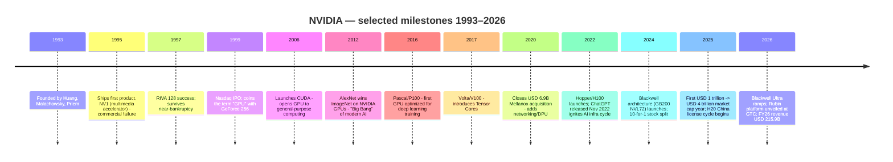
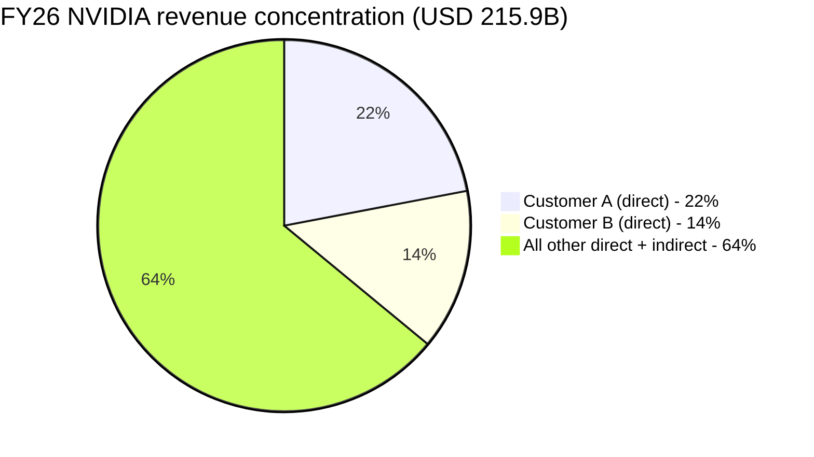
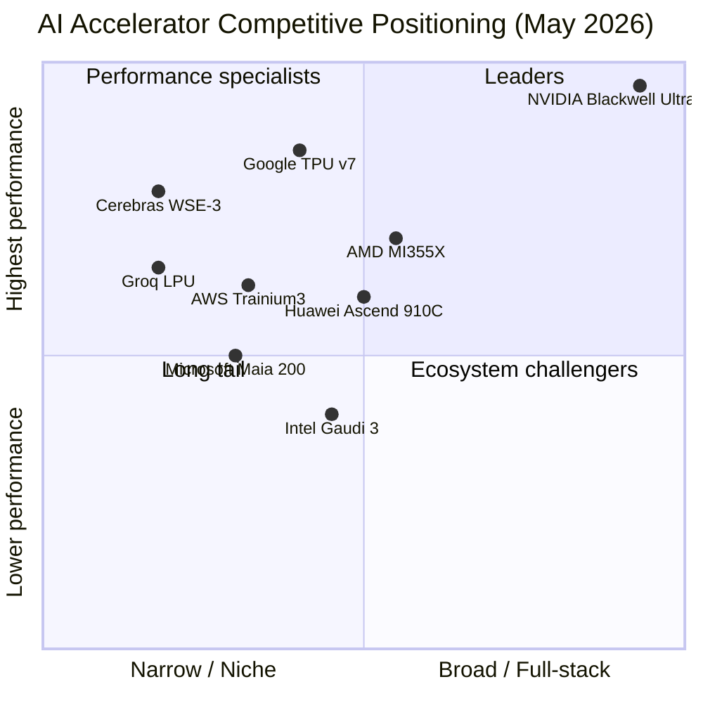

# COMPANY RESEARCH REPORT: NVIDIA Corporation (NASDAQ: NVDA)
**Date:** 2026-05-20
**Author:** Equity research – internal initiation
**Fiscal year end:** Last Sunday of January (FY26 ended Jan 25, 2026)
**Listing:** NASDAQ Global Select Market, ticker NVDA; index member of the S&P 500, Nasdaq-100, PHLX Semiconductor

> **Update — Q1 FY27 outlook initiated at USD 78.0B revenue (+/- 2%) (2026-02-25):** Management guided Q1 FY27 revenue to USD 78.0 billion, implying ~77% YoY growth versus Q1 FY26 reported revenue of USD 44.1 billion and ~15% sequential growth over Q4 FY26's USD 68.1 billion record. GAAP gross margin is expected at 74.9% (+/- 50bp). The outlook explicitly **excludes any Data Center compute revenue from China**, removing what had historically been a 13–22% revenue contributor. Stated driver: continued Blackwell/Blackwell Ultra ramp and the start of Vera Rubin pre-deployments at AWS, Google Cloud, Microsoft Azure and Oracle Cloud Infrastructure. Source: [Q4 FY26 press release, 2026-02-25](https://www.sec.gov/Archives/edgar/data/1045810/000104581026000019/q4fy26pr.htm).

---

## TABLE OF CONTENTS
1. Company Overview
2. Company History
3. Management Team
4. Products & Services
5. Customers & Go-to-Market
6. Industry Overview
7. Competitive Landscape
8. Market Opportunity (TAM)
9. Risk Assessment
10. References

======================================

## 1. COMPANY OVERVIEW

NVIDIA Corporation designs and sells a full-stack accelerated computing platform whose central building block is the graphics processing unit (GPU). What began in 1993 as a PC-graphics start-up is, as of fiscal year 2026, a "data-center-scale AI infrastructure company reshaping all industries," in management's own framing ([NVIDIA FY2026 10-K, Item 1 — Business](https://www.sec.gov/Archives/edgar/data/1045810/000104581026000021/nvda-20260125.htm)). The company sells silicon (GPUs, CPUs, DPUs, networking switches and NICs), full rack-scale systems (DGX, HGX, GB200/GB300 NVL72), networking platforms (NVLink, InfiniBand, Spectrum-X Ethernet, BlueField DPUs), and an extensive software stack anchored by CUDA, the CUDA-X libraries, NVIDIA AI Enterprise, NIM microservices and the NVIDIA Omniverse platform.

Revenue in FY26 reached **USD 215.9 billion**, up 65% year-over-year from USD 130.5 billion in FY25 and approximately 8x the USD 26.97 billion reported in FY23 ([FY2026 10-K MD&A](https://www.sec.gov/Archives/edgar/data/1045810/000104581026000021/nvda-20260125.htm)). Net income was USD 120.07 billion (55.6% net margin; diluted EPS USD 4.90), with GAAP operating income of USD 130.4 billion at a 60.4% operating margin ([FY2026 10-K, Consolidated Statements of Income](https://www.sec.gov/Archives/edgar/data/1045810/000104581026000021/nvda-20260125.htm)). Free cash flow for FY26 was USD 96.6 billion ([Q4 FY26 press release, Non-GAAP reconciliation](https://www.sec.gov/Archives/edgar/data/1045810/000104581026000019/q4fy26pr.htm)). The company employs ~42,000 people across 38 countries, of whom ~31,000 are in research and development — more than half of NVIDIA's engineers work on software, not chip design ([FY2026 10-K, Human Capital Management](https://www.sec.gov/Archives/edgar/data/1045810/000104581026000021/nvda-20260125.htm)).

Source: [NVIDIA FY2026 10-K, MD&A and Note 16](https://www.sec.gov/Archives/edgar/data/1045810/000104581026000021/nvda-20260125.htm); FY22 and FY23 from [FY2024 10-K, Note 17](https://www.sec.gov/Archives/edgar/data/1045810/000104581024000029/nvda-20240128.htm).

**Business model.** NVIDIA reports in two operating segments: **Compute & Networking** (Data Center, Automotive, AI software) and **Graphics** (GeForce, Quadro/RTX PRO, GeForce NOW, automotive infotainment). In FY26 Compute & Networking generated **USD 193.5 billion (89.6% of revenue)** and Graphics USD 22.5 billion (10.4%) ([FY2026 10-K, Note 16](https://www.sec.gov/Archives/edgar/data/1045810/000104581026000021/nvda-20260125.htm)). Looking at the company's four "specialized markets" disclosure (the more business-relevant view):

| End market | FY26 revenue (USD M) | YoY | Share of FY26 total |
|---|---:|---:|---:|
| Data Center | 193,737 | +68% | 89.7% |
| Gaming | 16,042 | +41% | 7.4% |
| Professional Visualization | 3,191 | +70% | 1.5% |
| Automotive | 2,349 | +39% | 1.1% |
| OEM and Other | 619 | +59% | 0.3% |
| **Total** | **215,938** | **+65%** | **100.0%** |

Source: [FY2026 10-K, Note 16, Revenue by End Market](https://www.sec.gov/Archives/edgar/data/1045810/000104581026000021/nvda-20260125.htm).

Inside Data Center, NVIDIA split out the Compute and Networking sub-lines for the first time at this scale: Compute (GPUs, CPUs, systems) was USD 162.4 billion (+59% YoY) and Networking was USD 31.4 billion (+142% YoY) — the latter driven by NVLink switches inside GB200/GB300 rack systems and the ramp of Spectrum-X Ethernet and Quantum InfiniBand at hyperscale customers ([FY2026 10-K MD&A — Compute & Networking](https://www.sec.gov/Archives/edgar/data/1045810/000104581026000021/nvda-20260125.htm)).

**Geographic footprint.** Customer-headquarters geography in FY26: United States USD 149.6 billion (69%), Taiwan USD 42.3 billion (20%), China incl. Hong Kong USD 19.7 billion (9%), Other USD 4.3 billion (2%) ([FY2026 10-K, Note 16](https://www.sec.gov/Archives/edgar/data/1045810/000104581026000021/nvda-20260125.htm)). The Taiwan share is overstated because of contract-manufacturing routing — NVIDIA estimates ~76% of FY26 Taiwan-billed Data Center revenue was ultimately consumed by U.S. and European end customers. China collapsed from USD 25.0 billion in FY25 (19.2% of total) to USD 19.7 billion in FY26 (9.1%) following the April 2025 U.S. government export-license requirement for H20 and the resulting USD 4.5 billion inventory and purchase-commitment charge.

**Scale indicators.**
- Headcount: ~42,000 (FY26) vs. ~36,000 (FY25), +17% YoY
- R&D spend: USD 18.5 billion (FY26) vs. USD 12.9 billion (FY25), +43% YoY ([FY2026 10-K, MD&A](https://www.sec.gov/Archives/edgar/data/1045810/000104581026000021/nvda-20260125.htm))
- Cash + marketable securities: USD 62.6 billion at FY26 close
- Capital returned in FY26: USD 41.1 billion (USD 40.4B repurchases + USD 0.97B dividends); remaining buyback authorization USD 58.5 billion at FY26 close, with a further USD 60 billion authorized in August 2025 ([FY2026 10-K, Capital Return to Shareholders](https://www.sec.gov/Archives/edgar/data/1045810/000104581026000021/nvda-20260125.htm))

### Valuation snapshot

| Metric | Value | Source / Notes |
|---|---|---|
| Last price (2026-05-20) | USD 223.87 | [Yahoo Finance NVDA, 2026-05-20](https://finance.yahoo.com/quote/NVDA/key-statistics/) |
| Market capitalization | USD 5.42 trillion | Yahoo Finance |
| Enterprise value | USD 5.31 trillion | Yahoo Finance |
| 52-week range | USD 129.16 – 236.54 | Yahoo Finance |
| TTM diluted EPS (GAAP) | USD 4.90 | [FY2026 10-K](https://www.sec.gov/Archives/edgar/data/1045810/000104581026000021/nvda-20260125.htm) |
| TTM P/E (GAAP) | ~45.7x | 223.87 / 4.90 |
| TTM P/S | 25.1x | Mkt cap / TTM revenue 215.94B |
| Forward P/E (FY27, consensus) | ~19.3x | Yahoo Finance NTM EPS USD 11.61 |
| EV/EBITDA (TTM) | ~39.9x | Yahoo Finance |
| Dividend yield | 0.02% (de minimis) | NVDA pays USD 0.04 / share annually |

**Peer comparison (TTM, pulled 2026-05-20 from Yahoo Finance):**

| Company | Ticker | Market cap (USD B) | TTM P/E | TTM P/S | NTM P/E |
|---|---|---:|---:|---:|---:|
| NVIDIA | NVDA | 5,423 | 45.7x | 25.1x | 19.3x |
| Broadcom | AVGO | 1,982 | 81.4x | 29.0x | 22.9x |
| AMD | AMD | 726 | 149.3x | 19.4x | 34.4x |
| Intel | INTC | 594 | n/m (neg.) | 11.0x | 76.7x |

Source: [Yahoo Finance quote pages, 2026-05-20](https://finance.yahoo.com/quote/NVDA/key-statistics/).

Source: [Yahoo Finance, 2026-05-20](https://finance.yahoo.com/quote/NVDA/key-statistics/).

**Interpreting NVDA's multiples.** A 45.7x TTM P/E and 25.1x TTM P/S are elevated vs. the broader S&P 500 (~20-23x P/E, 2-3x P/S) but **lower than every direct AI-leverage peer except Intel** (which has no current earnings). AVGO trades at 29x TTM P/S; AMD at 149x TTM P/E. Three drivers explain NVDA's multiple, each defensible from the filings:

1. **Earnings power is unusually high already.** FY26 GAAP net margin of 55.6% and 60.4% operating margin are among the highest ever printed by a hardware company at this scale; the 45.7x P/E capitalizes a real, high-quality earnings stream, not a placeholder for future profits ([FY2026 10-K, Consolidated Statements of Income](https://www.sec.gov/Archives/edgar/data/1045810/000104581026000021/nvda-20260125.htm)).
2. **Forward earnings re-rate the multiple sharply.** NTM P/E of 19.3x embeds consensus EPS doubling to ~USD 11.61 in FY27 on Blackwell Ultra full-year and Rubin H2 ramps. Management's Q1 FY27 revenue guide of USD 78.0B annualizes to USD 312B+ at flat run-rate ([Q4 FY26 press release outlook](https://www.sec.gov/Archives/edgar/data/1045810/000104581026000019/q4fy26pr.htm)).
3. **AI infrastructure premium with no peer-of-equal-scale.** No competitor ships the integrated combination of leading-edge GPU + proprietary scale-up fabric (NVLink) + AI-tuned scale-out (Spectrum-X) + co-designed CPU (Grace) + dominant developer platform (CUDA, 7.5M developers). The multiple compresses that moat into a single number.

The TTM P/S of 25.1x is the metric most exposed to a re-rate if Data Center growth decelerates — see Section 9. The multiple is at the **low end** of NVDA's own 3-year range (the stock briefly traded at >35x P/S around the Blackwell launch in late 2024).

---

## 2. COMPANY HISTORY

NVIDIA was founded in April 1993 by Jen-Hsun (Jensen) Huang, Chris Malachowsky and Curtis Priem at a Denny's diner in San Jose, California. Huang was 30 at the time and had just left a director role at LSI Logic; Malachowsky and Priem had been engineers at Sun Microsystems working on the GX graphics architecture ([FY2026 10-K, Item 1 — Information About Our Executive Officers](https://www.sec.gov/Archives/edgar/data/1045810/000104581026000021/nvda-20260125.htm); [NVIDIA's published history page](https://www.nvidia.com/en-us/about-nvidia/)). The company was incorporated in California in April 1993 and reincorporated in Delaware in April 1998, and IPO'd on the Nasdaq in January 1999 at USD 12 per share (USD 0.04 on a post-2024 split-adjusted basis).

Source: combination of [NVIDIA FY2026 10-K, Item 1](https://www.sec.gov/Archives/edgar/data/1045810/000104581026000021/nvda-20260125.htm) and [NVIDIA company history page](https://www.nvidia.com/en-us/about-nvidia/).

**Three strategic pivots define the company.**

1. **GPU → general-purpose accelerator (2006).** Launching CUDA opened the GeForce 8 architecture to non-graphics workloads. CUDA was an internal-conviction bet — Wall Street saw the gross-margin drag for years before deep learning provided the killer app. The 2012 AlexNet result (Krizhevsky, Sutskever, Hinton training a convnet on two GeForce GTX 580s) is the validation event ([FY2026 10-K, Item 1](https://www.sec.gov/Archives/edgar/data/1045810/000104581026000021/nvda-20260125.htm)).
2. **Discrete-GPU vendor → data-center-scale systems company (2020 onward).** The April 2020 Mellanox close (USD 6.9B) added InfiniBand/Ethernet switching, NICs and DPUs needed to ship rack-level products. Hopper, Blackwell and Rubin are co-designed compute+networking systems shipping as 36-Grace/72-Blackwell NVL72 racks ([FY2026 10-K, Item 1 — Data Center](https://www.sec.gov/Archives/edgar/data/1045810/000104581026000021/nvda-20260125.htm)). Networking revenue +142% YoY to USD 31.4B in FY26 because every GB200/GB300 rack ships with NVLink switches billed separately.
3. **Hardware company → AI factory operator and venture investor (2024–2026).** FY26 invested USD 17.5B in private companies and infrastructure funds (vs. USD 1.5B in FY25), and provided USD 3.5B in "land, power, and shell" guarantees ([FY2026 10-K, MD&A — Recent Developments](https://www.sec.gov/Archives/edgar/data/1045810/000104581026000021/nvda-20260125.htm)). Notable: the USD 13.0B Groq licensing, multi-year Anthropic partnership, Intel equity investment (driving "Other income, net" from USD 1.03B in FY25 to USD 9.02B in FY26 on mark-to-market gains), and >5 GW CoreWeave build-out ([Q4 FY26 press release, 2026-02-25](https://www.sec.gov/Archives/edgar/data/1045810/000104581026000019/q4fy26pr.htm)).

**Key acquisitions and attempts.**
- **3dfx Interactive (2000):** asset purchase that ended the rival and cemented PC-graphics leadership.
- **Mellanox Technologies (2020):** USD 6.9B, closed April 2020 — most consequential acquisition in NVIDIA's history; created the data-center-networking franchise.
- **Arm Holdings (Sep-2020, abandoned Feb-2022):** USD 40B proposed deal terminated under UK CMA / U.S. FTC / EU pressure. NVIDIA paid SoftBank a USD 1.35B break fee and accelerated the Arm-based Grace CPU instead.
- **Run:ai (2024) plus ~USD 1.5B of smaller tuck-ins** in FY25–FY26 for AI orchestration/software (Cash Flow line "Acquisitions, net of cash acquired" of USD 1.535B in FY26) ([FY2026 10-K, Statements of Cash Flows](https://www.sec.gov/Archives/edgar/data/1045810/000104581026000021/nvda-20260125.htm)).

**Recent developments worth carrying through this report:**
- **June 2024:** 10-for-1 forward stock split.
- **April 2025:** USG imposes H20-to-China license requirement; USD 4.5B Q1 FY26 inventory/purchase-commitment charge ([FY2026 10-K, MD&A](https://www.sec.gov/Archives/edgar/data/1045810/000104581026000021/nvda-20260125.htm)).
- **August 2025:** Partial H20 licenses issued; only ~USD 60M revenue shipped. USG publicly suggested 15% of sale proceeds accrue to Treasury (no formal regulation). Board authorizes additional USD 60B share repurchase.
- **February 2026:** Small-volume H200 license to specific China customers, subject to mandatory U.S. inspection and 25% tariff. Zero FY26 revenue from this program. Q4 FY26 earnings — record revenue USD 68.1B, DC revenue USD 62.3B; Rubin unveiled with 10x inference-cost reduction claim vs. Blackwell.

---

## 3. MANAGEMENT TEAM

### Jen-Hsun ("Jensen") Huang — Co-founder, President and CEO

Jensen Huang co-founded NVIDIA in 1993 and has served as President, CEO and a member of the Board of Directors continuously since inception — 33 years as of this report. He was 63 years old as of February 2026 ([FY2026 10-K, Item 1 — Information About Our Executive Officers](https://www.sec.gov/Archives/edgar/data/1045810/000104581026000021/nvda-20260125.htm)).

**Pre-NVIDIA career.** Huang was a microprocessor designer at AMD from 1983 to 1985 (his first job out of Oregon State, where he earned a B.S.E.E. in 1984). From 1985 to 1993 he was at LSI Logic Corporation in a variety of roles ending as Director of "Coreware," the SoC business unit. He earned an M.S.E.E. from Stanford in 1992 while working full-time at LSI. The widely-told company-founding story — drafting NVIDIA's first business plan at a Denny's restaurant on Berryessa Road in San Jose in early 1993 — has been corroborated in multiple long-form interviews including [Acquired's NVIDIA Part III podcast (2023-09-06)](https://www.acquired.fm/episodes/nvidia-the-dawn-of-the-ai-era) and Huang's own commencement addresses.

**What Huang has specifically built.** Three things distinguish his record:
1. **A 30-year compounding R&D commitment.** Over USD 76.7B of R&D since inception, with the CUDA commitment in 2006 — sustained through years of margin pressure with no visible payoff — building a developer-ecosystem moat competitors have failed to replicate ([FY2026 10-K, Item 1](https://www.sec.gov/Archives/edgar/data/1045810/000104581026000021/nvda-20260125.htm)).
2. **Platform-strategy discipline producing operating leverage.** GAAP operating margin moved from 54.1% (FY24) to 62.4% (FY25), holding at 60.4% in FY26 despite the USD 4.5B H20 charge. R&D grew 43% YoY to USD 18.5B; total opex was 10.7% of revenue (vs. 12.6% in FY25) ([FY2026 10-K, MD&A](https://www.sec.gov/Archives/edgar/data/1045810/000104581026000021/nvda-20260125.htm)).
3. **Founder-CEO continuity.** Huang holds ~870.6M shares (3.58% of 24.31B outstanding as of March 23, 2026) primarily through family trusts; only non-independent director ([NVIDIA DEF 14A, filed 2026-05-12](https://www.sec.gov/Archives/edgar/data/1045810/000104581026000036/nvda-20260512.htm)).

**FY26 compensation.** Total reported NEO compensation was USD 36.34 million, comprising a USD 1.50 million base salary, USD 24.80 million in stock awards (PSUs only — 100% of CEO equity is performance-based), USD 6.00 million in non-equity incentive (cash bonus) and USD 4.05 million in "all other compensation," the latter primarily comprising USD 3.98 million of residential and personal-travel security and an USD 11,500 401(k) match and life insurance premiums ([NVIDIA DEF 14A, Summary Compensation Table](https://www.sec.gov/Archives/edgar/data/1045810/000104581026000036/nvda-20260512.htm)). Per the compensation discussion, over 90% of Huang's total target pay is performance-based and at-risk; 100% of his equity is PSUs (no RSUs).

**Public profile.** Huang has become a defining technology-industry public figure since 2023 (Time 100 Most Influential, 2023 and 2024; multiple Wired and Economist covers). He delivers all NVIDIA GTC keynotes personally (typically 2+ hours, no teleprompter), commencement addresses (Stanford 2024, Caltech 2024, NTU 2023), and tours customer geographies in person — most recently Taiwan, Korea, Japan, India and the UAE in 2024–2025. He has been explicit that he intends to remain CEO indefinitely ("for several more decades," he told CNBC in 2024). Key-person risk is real and structural (see Section 9).

### Colette M. Kress — Executive Vice President and Chief Financial Officer

Colette Kress joined NVIDIA in 2013 as EVP and CFO; she was 58 as of February 2026 ([FY2026 10-K Item 1](https://www.sec.gov/Archives/edgar/data/1045810/000104581026000021/nvda-20260125.htm)). She holds a B.S. in Finance from the University of Arizona and an MBA from Southern Methodist University. Prior to NVIDIA, Kress was SVP and CFO of the Business Technology and Operations Finance organization at Cisco Systems from 2010 to 2013, and before that spent 13 years at Microsoft (1997–2010) in a series of CFO roles ending as CFO of the Server and Tools division (2006–2010). She started her career with eight years at Texas Instruments.

Her tenure has spanned three full revenue regimes for NVIDIA: the pre-AI era (FY14: USD 4.1B revenue), the gaming-led mid-cycle (FY18–FY20 crypto-and-gaming distortion), and the AI super-cycle from FY24 onward. She has been the public face of guidance, capital allocation and the China export-control narrative for investors. The CFO Commentary published alongside each quarterly press release ([example: Q4 FY26 CFO Commentary, 2026-02-25](https://www.sec.gov/Archives/edgar/data/1045810/000104581026000019/q4fy26cfocommentary.htm)) is widely read in the analyst community and notable for its detail on segment dynamics. FY26 total compensation: USD 14.34 million (Salary USD 0.90M; stock awards USD 12.83M; non-equity incentive USD 0.60M) ([NVIDIA DEF 14A, Summary Compensation Table](https://www.sec.gov/Archives/edgar/data/1045810/000104581026000036/nvda-20260512.htm)).

### Ajay K. Puri — EVP, Worldwide Field Operations

Puri (age 71) has led NVIDIA's global sales organization since 2005 (initially as SVP, promoted to EVP in 2009), making him the longest-tenured executive other than Huang ([FY2026 10-K Item 1](https://www.sec.gov/Archives/edgar/data/1045810/000104581026000021/nvda-20260125.htm)). Pre-NVIDIA he spent 22 years at Sun Microsystems in sales, marketing and general management. He owns the customer-facing relationships with hyperscalers, OEMs/ODMs, sovereigns and Tier-1 channels — the unit that closed approximately USD 215 billion of revenue in FY26 against a target. FY26 total compensation: USD 14.78 million.

### Debora Shoquist — EVP, Operations

Shoquist (age 71) joined NVIDIA in 2007 from JDS Uniphase (where she was EVP Operations, 2004–2007). She oversees the supply chain, manufacturing partnerships with TSMC, Samsung, Hon Hai (Foxconn), Wistron and Fabrinet, and the multi-year capacity expansion into U.S. and Latin American assembly. Operating at a time when CoWoS advanced-packaging capacity at TSMC and HBM3e supply from SK Hynix and Micron have been the binding constraints on NVIDIA's growth, Shoquist's organization manages a roughly USD 21 billion inventory balance and the USD 7.2 billion of inventory provisions taken in FY26 (including the USD 4.5 billion H20 charge) ([FY2026 10-K, MD&A — Gross Profit](https://www.sec.gov/Archives/edgar/data/1045810/000104581026000021/nvda-20260125.htm)). FY26 total compensation: USD 14.29 million.

### Governance

- **Board composition.** 10 directors as of 2026 (Tench Coxe, John O. Dabiri, Jen-Hsun Huang, Dawn Hudson, Harvey C. Jones, Melissa B. Lora, Stephen C. Neal (Lead Director), A. Brooke Seawell, Aarti Shah, Mark A. Stevens). Nine of ten are independent under Nasdaq rules; Huang is the only non-independent director ([NVIDIA DEF 14A, Election of Directors](https://www.sec.gov/Archives/edgar/data/1045810/000104581026000036/nvda-20260512.htm)). On May 7, 2026, the Board approved expanding to 11 directors effective July 13, 2026, with the addition of Suzanne Nora Johnson.
- **Insider ownership.** Directors and executive officers as a group (14 persons) hold 957.3 million shares, or **3.94% of shares outstanding** (Huang alone is 3.58%). 5%+ holders are BlackRock (7.43%, per January 2024 13G/A, adjusted for the 2024 10-for-1 split) and Vanguard (7.31%, per April 2026 13G) ([NVIDIA DEF 14A, Beneficial Ownership table](https://www.sec.gov/Archives/edgar/data/1045810/000104581026000036/nvda-20260512.htm)).
- **Comp structure.** Over 90% of the CEO's target pay is at-risk; 100% of his equity is PSUs (no RSUs). The Fiscal 2026 Variable Cash Plan revenue goal was held flat at the FY25 record level; SY PSU targets were set in line with the FY25 stretch plan — an unusually aggressive "raise the bar" approach.
- **Governance flags / classifications.** Annual director election (declassified board), majority voting, proxy access (3% / 3 years), Independent Lead Director, no dual-class stock, no super-voting shares. No related-party transactions disclosed in the FY26 proxy. We see no governance flags.

### Management track record synthesis

Huang/Kress is one of the most-tenured and most successful CEO/CFO duos in U.S. technology. Together they have executed every architectural transition since 2013 (Maxwell, Pascal, Volta, Turing, Ampere, Hopper, Blackwell, Rubin) on or close to schedule, expanded gross margin by ~30 points over a decade, completed the Mellanox integration, navigated the Arm deal termination, and managed the most consequential export-control regime ever applied to U.S. semiconductors. The visible gaps are: (i) genuine succession risk — there is no obvious No. 2 to Huang, and the FY26 proxy does not name a CEO successor pool, and (ii) the company's ability to operate at the geopolitical edge depends heavily on Huang's personal capital with both the U.S. and Chinese governments.

---

## 4. PRODUCTS & SERVICES

NVIDIA's portfolio organizes around the four "specialized markets" (Data Center, Gaming, Professional Visualization, Automotive) plus a much smaller "OEM and Other" bucket. Inside each market the company sells a stack — silicon → systems → networking → software → services — that is increasingly co-designed. The product tree below captures the material SKUs / families as of May 2026; minor SKUs (every individual GeForce variant, every developer kit) are aggregated.

```mermaid
graph TD
    NVDA[NVIDIA Corp]
    NVDA --> DC[Data Center, USD 193.7B / 89.7%]
    NVDA --> GM[Gaming, USD 16.0B / 7.4%]
    NVDA --> PV[Professional Viz, USD 3.2B / 1.5%]
    NVDA --> AU[Automotive + Robotics, USD 2.3B / 1.1%]
    NVDA --> OE[OEM and Other, USD 0.6B / 0.3%]

    DC --> DCSi[Silicon]
    DCSi --> Hopper[H100 / H200 / H20 - prior gen]
    DCSi --> Blackwell[B100 / B200 / GB200 / Blackwell Ultra GB300]
    DCSi --> Rubin[Rubin / Rubin Ultra - production H2 FY27]
    DCSi --> Grace[Grace CPU; Grace Hopper GH200; Grace Blackwell GB200]
    DC --> DCNet[Networking - Mellanox lineage]
    DCNet --> NVLink[NVLink + NVLink Switch + NVLink Fusion]
    DCNet --> Spectrum[Spectrum-X Ethernet]
    DCNet --> Quantum[Quantum InfiniBand]
    DCNet --> BlueField[BlueField-3 / BlueField-4 DPU]
    DC --> DCSys[Systems]
    DCSys --> DGX[DGX H200 / DGX B200 / DGX Spark / DGX Cloud]
    DCSys --> HGX[HGX H200 / HGX B200 / HGX GB300 NVL72]
    DC --> DCSW[Software]
    DCSW --> CUDA[CUDA / CUDA-X libraries]
    DCSW --> AIEnt[NVIDIA AI Enterprise]
    DCSW --> NIM[NIM Microservices + NeMo + AI Blueprints]
    DCSW --> Omni[Omniverse + Cosmos for physical AI]

    GM --> GeForce[GeForce RTX 50 Series desktop & laptop]
    GM --> GFNow[GeForce NOW cloud gaming]
    GM --> SoC[Console SoCs incl. Nintendo Switch lineage]
    GM --> DLSS[DLSS 4 / 4.5 + G-SYNC Pulsar]

    PV --> RTXPRO[RTX PRO 5000 / 6000 Blackwell workstation GPUs]
    PV --> DGXSpark[DGX Spark personal AI workstation]
    PV --> OmniWS[Omniverse Enterprise]

    AU --> Drive[DRIVE AGX Thor / Orin]
    AU --> DriveHyp[DRIVE Hyperion ecosystem]
    AU --> Cosmos[Cosmos / Isaac GR00T for physical AI]
    AU --> Alpamayo[Alpamayo open AV models]
```

### Data Center (USD 193.7B / 89.7% of FY26 revenue)

The Data Center segment is now the company. Within it, **Compute (GPUs + CPUs + systems)** was USD 162.4 billion in FY26 and **Networking** was USD 31.4 billion. The combination — selling not just the accelerator but the scale-up fabric, scale-out fabric, DPUs, CPUs and software that connects up to hundreds of thousands of GPUs into a single training/inference system — is what NVIDIA calls "data-center-scale" and what allows it to capture a far larger fraction of customer infrastructure spend than a discrete-GPU vendor ever could ([FY2026 10-K, Item 1 — Data Center](https://www.sec.gov/Archives/edgar/data/1045810/000104581026000021/nvda-20260125.htm)).

Source: NVIDIA quarterly press releases, [Q1 FY24 through Q4 FY26 (2023-05-24 through 2026-02-25)](https://investor.nvidia.com/financial-info/financial-reports/).

**Hopper (H100, H200, H20 — prior generation).** Originally launched in 2022 (H100), with H200 in 2024. H20 is the China-compliant SKU designed in late 2023 to fit within the October 2023 export-control thresholds; following the April 2025 license requirement, H20 demand collapsed and NVIDIA took a USD 4.5 billion charge ([FY2026 10-K, MD&A — Government Regulations](https://www.sec.gov/Archives/edgar/data/1045810/000104581026000021/nvda-20260125.htm)). Hopper systems still ship into long-tail enterprise/government deployments, but the data-center mix is now Blackwell-dominant. *Competitive advantage: high — at launch H100 had no peer for transformer training; AMD MI300X reached parity for selected inference workloads by 2024 but lagged in training-cluster economics.*

**Blackwell + Blackwell Ultra (B100, B200, GB200, GB300, RTX 50 series).** Launched FY25; full ramp in FY26. The Blackwell platform combines two reticle-limit GPU dies into one package, with NVLink Switch creating a 72-GPU "single computer" rack (GB200 NVL72) connecting 36 Grace CPUs and 72 Blackwell GPUs. Blackwell Ultra (GB300) began production shipments in Q2 FY26 with materially higher HBM3e capacity and a tuned inference profile. Per SemiAnalysis's InferenceX benchmark cited in NVIDIA's own press release, Blackwell Ultra delivers up to 50x better performance and 35x lower cost per token for agentic AI vs. Hopper ([Q4 FY26 press release, 2026-02-25](https://www.sec.gov/Archives/edgar/data/1045810/000104581026000019/q4fy26pr.htm)). *Competitive advantage: high. Rack-scale co-design with proprietary NVLink switching is the most differentiated piece of the offering. Closest peer: AMD MI355X (announced late 2025) competes on raw compute but lacks an equivalent scale-up fabric.*

**Rubin and Rubin Ultra (production H2 FY27).** Unveiled at GTC March 2025 and re-confirmed at the Q4 FY26 call: Rubin commences production shipments in H2 FY27. Six new chips, claimed 10x reduction in inference token cost vs. Blackwell. AWS, Google Cloud, Microsoft Azure and Oracle Cloud Infrastructure will be the first deployers ([Q4 FY26 press release](https://www.sec.gov/Archives/edgar/data/1045810/000104581026000019/q4fy26pr.htm)). *Competitive advantage: yes (technology + roadmap visibility); evidence is that all four major U.S. hyperscalers have publicly committed to Rubin-based instances ahead of silicon volume.*

**Grace CPU and Grace-class CPU futures.** Introduced 2023, NVIDIA's first data-center CPU based on Arm Neoverse cores, used inside GB200/GB300 and GH200 (Grace+Hopper) modules. *Competitive advantage: partial. Grace is purpose-built for being on the same coherent fabric as the GPU; it does not compete head-to-head with general-purpose Xeon/EPYC.*

**NVLink, NVLink Switch, NVLink Fusion (FY26 new).** Proprietary scale-up fabric. NVLink Fusion, introduced in FY26, lets hyperscalers and custom-ASIC designers (Google TPU, Amazon Trainium, etc.) integrate their own CPUs and XPUs with NVIDIA's NVLink ecosystem ([FY2026 10-K, Item 1 — Networking](https://www.sec.gov/Archives/edgar/data/1045810/000104581026000021/nvda-20260125.htm)). *Competitive advantage: high. UALink, the industry consortium alternative (AMD, Broadcom, Cisco, Google, HPE, Intel, Meta, Microsoft), targets 1.0 spec at ~2026/27, but no shipping product matches NVLink at the GB200 NVL72 scale today.*

**Spectrum-X Ethernet, Quantum InfiniBand, BlueField DPUs.** The Mellanox lineage. Spectrum-X is NVIDIA's Ethernet platform tuned for AI workloads, contesting Broadcom's Tomahawk and Arista's offerings inside hyperscale AI fabrics. Quantum-2 InfiniBand remains the standard for highest-performance training clusters. BlueField-3 is in volume; BlueField-4 (announced Q4 FY26) is the foundation for the Inference Context Memory Storage Platform ([Q4 FY26 press release](https://www.sec.gov/Archives/edgar/data/1045810/000104581026000019/q4fy26pr.htm)). *Competitive advantage: high in InfiniBand (Mellanox monopoly inherited), at-parity to ahead in AI-optimized Ethernet, partial in DPU (vs. AMD Pensando, Marvell, Intel IPU).*

**Software platform (CUDA, CUDA-X, NVIDIA AI Enterprise, NIM, NeMo, Omniverse, BioNeMo, DGX Cloud).** The 10-K cites 7.5 million CUDA developers worldwide and 6,000 supported applications. NVIDIA AI Enterprise is the paid commercial SKU; NIM microservices package open-weight and proprietary models for one-click inference deployment ([FY2026 10-K Item 1 — Business Strategies](https://www.sec.gov/Archives/edgar/data/1045810/000104581026000021/nvda-20260125.htm)). *Competitive advantage: very high. CUDA is the single largest source of switching cost in the segment; 20 years of compounding software, drivers, kernels, libraries and tooling.*

### Gaming and AI PC (USD 16.0B / 7.4%)

**GeForce RTX 50 Series (Blackwell-based).** Launched FY25; full ramp FY26. The Blackwell architecture introduced "neural graphics" combining AI models with traditional rendering, plus DLSS 4 powered by a new transformer-model architecture (DLSS 4.5 announced Q4 FY26). Gaming revenue grew 41% YoY to USD 16.0 billion. **Q4 FY26 gaming revenue dropped 13% QoQ as channel inventory normalized after holiday demand**, and management called out supply constraints as a Q1 FY27 headwind ([Q4 FY26 press release](https://www.sec.gov/Archives/edgar/data/1045810/000104581026000019/q4fy26pr.htm)).

**GeForce NOW, G-SYNC Pulsar.** Cloud gaming subscription and an esports-targeted variable-refresh display technology (introduced Q4 FY26).

*Competitive advantage: yes — for the high-end discrete-graphics segment NVIDIA holds ~80%+ unit share per third-party trackers (Jon Peddie Research). Closest competitor: AMD Radeon RX 9000 series. Intel Arc remains a low-share third player in discrete GPUs.*

### Professional Visualization (USD 3.2B / 1.5%)

**RTX PRO Blackwell workstation GPUs (RTX PRO 5000 72GB, RTX PRO 6000).** The "Quadro" lineage rebranded, now positioned as the on-prem AI workstation for enterprises developing/deploying agentic AI with proprietary data ([FY2026 10-K, Item 1 — Professional Visualization](https://www.sec.gov/Archives/edgar/data/1045810/000104581026000021/nvda-20260125.htm)).

**DGX Spark personal AI workstation.** Launched FY26 — a desktop-form-factor AI development system. Pro-Viz revenue grew 70% YoY (Q4 alone +159% YoY), with DGX Spark and AI-driven workstation demand the explicit driver ([Q4 FY26 press release](https://www.sec.gov/Archives/edgar/data/1045810/000104581026000019/q4fy26pr.htm)).

### Automotive and Robotics (USD 2.3B / 1.1%)

**DRIVE AGX Thor (Blackwell-based) and DRIVE Hyperion platform.** Reference architecture for ADAS / autonomous vehicles. The FY26 expansion announced a long Tier-1 / sensor partner list — Aeva, AUMOVIO, Astemo, Arbe, Bosch, Hesai, Magna, Omnivision, Quanta, Sony and ZF Group — and the Mercedes-Benz CLA program is the marquee customer using NVIDIA DRIVE AV software, AI infrastructure and accelerated compute ([Q4 FY26 press release — Automotive and Robotics](https://www.sec.gov/Archives/edgar/data/1045810/000104581026000019/q4fy26pr.htm)).

**Cosmos and Isaac GR00T.** Open foundation models and frameworks for physical AI / robotics; FY26 partner roster includes Boston Dynamics, Caterpillar, Franka Robotics, Humanoid, LG Electronics and NEURA Robotics. The auto/robotics line is small today but management has consistently flagged it as a multi-decade option on physical AI.

### Flagship vs. long-tail

The 1–3 products driving the business are unambiguous:
- **GB200/GB300 NVL72 rack systems** (Blackwell + Blackwell Ultra), bundled with Grace CPU + NVLink Switch + Spectrum-X/Quantum networking. These rack-scale SKUs are how the majority of FY26 Data Center compute revenue was monetized.
- **NVIDIA AI Enterprise software** (paid licenses) and the broader CUDA-X stack — small as a direct line, but the moat that protects the hardware ASPs.
- **GeForce RTX 50 series desktop/laptop GPUs** for the still-cash-generating consumer franchise.

Long-tail / declining:
- **Hopper (H100/H200) demand** is steady but no longer the growth engine.
- **H20** is effectively zero post April 2025 export controls.
- **OEM and Other** (USD 619M, 0.3% of revenue) continues to shrink as a share of mix.

### Roadmap / recent launches (last 12 months)

- **Blackwell Ultra GB300** — production shipments began Q2 FY26.
- **Vera Rubin platform** — unveiled FY26, production H2 FY27, 10x inference-cost reduction vs. Blackwell.
- **NVLink Fusion** — opens NVLink to third-party CPUs / XPUs (FY26).
- **BlueField-4 DPU + Inference Context Memory Storage Platform** — Q4 FY26.
- **DGX Spark** — personal AI workstation, FY26 ramp.
- **DLSS 4 / 4.5 and G-SYNC Pulsar** — gaming software/display advances, FY26.
- **NVIDIA Nemotron 3 family** — open agentic-AI model family, Q4 FY26.
- **NVIDIA Earth-2 family** — open AI weather models, Q4 FY26.
- **NVIDIA Alpamayo, Cosmos and Isaac GR00T open releases** — physical-AI models, Q4 FY26.

No material product sunsets disclosed in the FY26 10-K.

---

## 5. CUSTOMERS & GO-TO-MARKET

### Customer segments

NVIDIA's direct customers comprise four overlapping groups: **(1) public cloud and hyperscale CSPs** (AWS, Microsoft Azure, Google Cloud, Oracle Cloud Infrastructure; Meta is sometimes treated as a hyperscaler-style direct buyer too), **(2) AI model makers and "neoclouds"** (OpenAI, Anthropic, xAI, CoreWeave, Lambda, Together AI, Baseten, Fireworks AI, DeepInfra), **(3) OEMs / ODMs / system integrators** (Dell, HPE, Lenovo, Supermicro, Hon Hai/Foxconn, Wistron, Quanta), and **(4) enterprise direct + sovereign / public sector** (national AI factory programs in the UK, France, Saudi Arabia, UAE, India, Japan, Korea; named industry partners like Meta, Anthropic, Mercedes-Benz, Synopsys, Cadence, Siemens, Eli Lilly) ([FY2026 10-K, Item 1 — Sales and Marketing; Q4 FY26 press release](https://www.sec.gov/Archives/edgar/data/1045810/000104581026000021/nvda-20260125.htm)).

Indirect customers (those buying via system integrators and distributors) include the same cloud players plus enterprises and public-sector buyers globally. Management notes in the FY26 10-K that the company estimates **one AI research and deployment company contributed to a meaningful amount of FY26 revenue purchasing cloud services from NVIDIA's direct customers** — that is widely understood to be a reference to OpenAI buying compute through Microsoft Azure and Oracle.

### Customer concentration — quantified

This is the single most material risk metric for NVDA today. From the FY26 10-K:

> "For fiscal year 2026, sales to one direct customer represented **22%** of total revenue and sales to another direct customer represented **14%** of total revenue, all of which were primarily attributable to the Compute & Networking segment." ([FY2026 10-K, Item 1A — Risk Factors and MD&A; reproduced in Note 16 of the financial statements](https://www.sec.gov/Archives/edgar/data/1045810/000104581026000021/nvda-20260125.htm))

3-year trend in disclosed >10% direct customers (all primarily Compute & Networking):
| Fiscal year | Customer A | Customer B | Customer C | Sum disclosed >10% | Notes |
|---|---:|---:|---:|---:|---|
| FY24 | 13% | – | – | 13% | Single customer disclosed |
| FY25 | 12% | 11% | 11% | 34% | Three customers all named as ≥10% |
| FY26 | 22% | 14% | – | 36% | Concentration accelerated |

Source: [NVIDIA FY2026 10-K, MD&A — Concentration of Revenue and Note 16](https://www.sec.gov/Archives/edgar/data/1045810/000104581026000021/nvda-20260125.htm). Customer identities are not disclosed in the filing; market consensus per third-party analyst commentary points to the top buyers being a combination of Microsoft, Meta and the largest ODMs (Hon Hai/Foxconn) acting as Tier-1 channel for hyperscaler orders, but NVIDIA does not name them.

**Why this is a material risk and not just a disclosure quirk.** The FY26 risk factor explicitly states: "We have a small number of partners that are involved in system integration with our key customers. As our system design becomes increasingly complex, system integrators may be unable to meet specifications of our key customers. Changes in our partners' or customers' business models or their ownership can reduce the number of partners available to us." ([FY2026 10-K, Item 1A — Risk Factors](https://www.sec.gov/Archives/edgar/data/1045810/000104581026000021/nvda-20260125.htm)). With the top-two direct customers concentrating 36% of FY26 revenue and the trend accelerating from 13% top-1 in FY24 to 22% in FY26, NVIDIA crosses the conventional "high" threshold (top-1 > 20%). The mitigation is that **the company's biggest direct customers are also designing internal accelerators** (Google TPU, AWS Trainium/Inferentia, Microsoft Maia, Meta MTIA) — they are simultaneously NVIDIA's largest revenue source and its most credible long-term competitors.

**Contract structure.** Per the 10-K, "most of our sales are made on a purchase-order basis, our customers can generally cancel, change, or delay product purchase commitments with little notice to us and without penalty." There are no disclosed multi-year volume commitments — Meta's announced multi-year, multi-generational partnership for "millions of Blackwell and Rubin GPUs" is a press-release commitment, not a contractual commitment.

### Channels and go-to-market

NVIDIA sells through:
1. **Direct sales to hyperscalers, neoclouds and large enterprise** (Ajay Puri's Worldwide Field Operations team). Solution architects work alongside customers for cluster bring-up, model tuning and deployment.
2. **OEMs and ODMs** (Dell, HPE, Lenovo, Supermicro, Hon Hai, Wistron, Quanta) which integrate HGX boards and Grace Blackwell systems into branded servers.
3. **AIBs and distributors** for GeForce (ASUS, MSI, Gigabyte, Zotac, PNY etc.).
4. **DGX Cloud and the NVIDIA-as-MSP model** — NVIDIA selling AI compute as a service via its CSP partners.
5. **Developer ecosystem** — 7.5 million CUDA developers, Inception startup program, Deep Learning Institute training.

Sales cycles span from days (commodity GeForce / Pro Viz cards) to 18+ months (sovereign AI factory deployments). Solution-architecture cost-of-sales is meaningful — embedded in SG&A which was 2.1% of FY26 revenue (USD 4.6B) despite a USD 215.9B top line ([FY2026 10-K, MD&A — Operating Expenses](https://www.sec.gov/Archives/edgar/data/1045810/000104581026000021/nvda-20260125.htm)).

Source: [FY2026 10-K, Note 16 — Geographic Revenue](https://www.sec.gov/Archives/edgar/data/1045810/000104581026000021/nvda-20260125.htm).

### Named recent wins

From the Q4 FY26 press release ([2026-02-25](https://www.sec.gov/Archives/edgar/data/1045810/000104581026000019/q4fy26pr.htm)):
- **Meta:** multiyear, multigenerational partnership including "millions of NVIDIA Blackwell and Rubin GPUs."
- **Anthropic:** investment and deep technology partnership; Claude scaling on Microsoft Azure powered by NVIDIA.
- **AWS, Google Cloud, Microsoft Azure, Oracle Cloud Infrastructure:** all named as first deployers of Vera Rubin instances.
- **CoreWeave:** collaboration to accelerate buildout of >5 GW of AI factories by 2030.
- **Mercedes-Benz CLA:** AV partnership using DRIVE AV software, AI infrastructure and accelerated compute.
- **Eli Lilly:** co-innovation AI lab for drug discovery.
- **Infosys, Persistent, Tech Mahindra, Wipro:** India enterprise agent partnerships.
- **U.S. Department of Energy Genesis Mission:** named industry partner for AI applied to energy, science, and national security.
- **Groq:** non-exclusive licensing agreement (USD 13.0B cash outflow recorded as an investing activity in FY26 — see cash-flow statement).

### Key partnerships in physical AI / robotics

Boston Dynamics, Caterpillar, Franka Robotics, Humanoid, LG Electronics, NEURA Robotics — all using NVIDIA's Cosmos / Isaac GR00T stack for foundation models and simulation ([Q4 FY26 press release](https://www.sec.gov/Archives/edgar/data/1045810/000104581026000019/q4fy26pr.htm)). Hesai Technology is on the Drive Hyperion ecosystem partner list.

---

## 6. INDUSTRY OVERVIEW

### Industry definition

NVIDIA participates primarily in **accelerated computing infrastructure for artificial intelligence** — which the company itself frames as a successor to the prior generation of general-purpose CPU-led computing. Adjacent sub-industries we treat as in-scope:

- **Data-center GPU / AI accelerators** (the core market, ~USD 250–325B 2026E)
- **Data-center networking** (Ethernet, InfiniBand, NVLink-like fabrics, ~USD 60–90B)
- **Discrete and integrated graphics for PCs** (GeForce, Radeon, Intel Arc)
- **Workstation GPUs for content creation, CAD, engineering**
- **Automotive ADAS / AV SoCs**
- **Edge AI and robotics compute**
- **AI enterprise software and platforms** (CUDA, AI Enterprise, NIM, MLOps tooling)

NAICS coverage: 334413 (Semiconductor and Related Device Manufacturing), 511210 (Software Publishers), 541512 (Computer Systems Design Services).

### Market size and growth

**Data-center AI accelerators (the central market).** Multiple third-party trackers put the 2024 market at ~USD 110–130B (NVIDIA captured a high-80s % share by revenue) and the 2026 market at ~USD 250–325B. Gartner's "Forecast: AI Semiconductors, Worldwide" (2025-08, the most recent Gartner refresh prior to this report) projects total AI-semiconductor revenue at USD 297B in 2027 and USD 380B in 2028, growing roughly at a 30% CAGR through 2028 ([Gartner Forecast: AI Semiconductors, Worldwide, 2025-08-19](https://www.gartner.com/en/documents/5891030) — Gartner subscription required; figures widely cited in trade press including [Reuters, 2025-08-20](https://www.reuters.com/technology/artificial-intelligence/)). IDC's "Worldwide AI Infrastructure Forecast" (2025-11) sizes the broader AI-infra hardware market (compute + networking + storage) at USD 510B in 2026 and USD 1.0T+ by 2030 ([IDC press release, 2025-11-14](https://www.idc.com/getdoc.jsp?containerId=prUS54186825)). Bloomberg Intelligence's bottom-up estimate of hyperscaler AI capex in 2026 is approximately USD 525B for the four U.S. hyperscalers combined (AWS, Azure, Google, Meta) ([Bloomberg Intelligence, 2026-02-12](https://www.bloomberg.com/professional/blog/)) — this is the most relevant forward indicator for NVIDIA's TAM because hyperscaler capex is the proximate buyer.

**Discrete GPU (gaming + workstation).** Jon Peddie Research's most recent published estimate is USD 47B in 2024, growing high single digits through 2027 — a fraction of the AI compute market and a steady-state, not growth, contributor.

**Automotive AI compute.** Estimated USD 5–8B in 2025 growing to USD 25–35B by 2030 per S&P Global Mobility and Yole Group bottom-up forecasts. NVIDIA is one of three credible Tier-1 SoC vendors here alongside Mobileye and Qualcomm.

### Key trends and growth drivers

1. **Inference economics are the new battleground.** Training the largest frontier models still requires the highest-performance scale-up systems (Blackwell Ultra / Rubin), but the much larger pool of long-term spend is inference at scale — and inference is where Blackwell Ultra's 50x performance / 35x cost-per-token claim vs. Hopper matters. Management quotes a "10x reduction in cost per token" for Rubin vs. Blackwell ([Q4 FY26 press release](https://www.sec.gov/Archives/edgar/data/1045810/000104581026000019/q4fy26pr.htm)). The same dynamic is what makes the AMD MI355X and the hyperscaler custom-silicon programs commercially viable for inference even if they cannot match Blackwell on training.
2. **Agentic AI workloads.** Reasoning models with multi-step, long-context workflows have very different compute profiles than chat-style inference — they need more memory bandwidth and more sustained interconnect throughput. This is the explicit design center for Blackwell Ultra and Rubin per the 10-K's product positioning ([FY2026 10-K, Item 1 — Data Center](https://www.sec.gov/Archives/edgar/data/1045810/000104581026000021/nvda-20260125.htm)).
3. **Physical AI / robotics.** A long-cycle option. The Cosmos and Isaac GR00T launches and the named robotics partner list signal NVIDIA's intent to own the simulation + foundation-model layer for the next compute platform. Material revenue is years out.
4. **Sovereign AI.** Multiple national programs (UK, France, Saudi Arabia / UAE, India, Japan, Korea) are placing single-buyer orders for AI factories in the USD 5–25B range each. These are slow-cycle but very high-AOV; the FY26 10-K cites the U.S. DOE Genesis Mission as one example.
5. **Energy and power as the binding constraint.** The 10-K's MD&A explicitly calls this out: "The availability of data centers, energy, and capital to support the buildout of NVIDIA AI infrastructure by our customers and partners is crucial, and any shortage of these or other necessary resources could impact our future revenue and financial performance." ([FY2026 10-K, MD&A — Recent Developments](https://www.sec.gov/Archives/edgar/data/1045810/000104581026000021/nvda-20260125.htm)). Hyperscaler-grade data-center power deliveries are now 24–48-month leadtime in the U.S. and Europe.
6. **Open-source AI model competition.** The 10-K acknowledges directly: "Open-source AI is dependent on developer adoption and if deployed on our competitors' platforms, it could reduce demand for our products and services." Llama, Mistral, DeepSeek and Qwen progress reduces the "every customer needs the absolute frontier model" assumption that earlier supported NVIDIA's pricing power.

### Regulatory environment

The single most consequential regulatory variable is **U.S. export controls on advanced semiconductors to China and "D:5" countries**. The FY26 10-K walks through the sequence: August 2022 initial controls; October 2023 broader thresholds; April 2025 H20 license requirement (and the resulting USD 4.5B Q1 FY26 charge); January 2025 AI Diffusion IFR rescinded in May 2025; October 2025 GAIN AI Act passed in the Senate as part of the NDAA, which would restrict the executive branch's ability to adapt the controls; February 2026 H200-to-China small-volume license issued ([FY2026 10-K, Item 1 — Government Regulations](https://www.sec.gov/Archives/edgar/data/1045810/000104581026000021/nvda-20260125.htm)). Management's own language is unusually direct:

> "As of the end of fiscal year 2026, we were effectively foreclosed from competing in China's data center computing/compute market, and our effective foreclosure from the China market helped our competitors build larger developer and customer ecosystems to challenge us worldwide. Unless we are able to return with a product that meets the approval of both the USG and the Chinese government, our lost opportunity and the benefit to our competitors will have a material and adverse impact on our business, operating results, and financial condition."

This is the strongest "we have lost a strategically important market" statement NVIDIA has made in any prior 10-K. Even with H200 licensed in February 2026, the volumes are tiny and the products are subject to U.S. inspection and a 25% tariff upon re-import.

The European Commission AI Act (in force from 2024 onward, with most obligations applying by 2026) and analogous regimes in the UK, Japan, India and Singapore are largely a tailwind today (creating demand for compliance-grade infrastructure), not a constraint on NVIDIA hardware. Antitrust scrutiny is the medium-term risk: the EC has opened informal inquiries into AI chip competition and the U.S. FTC and DOJ have both signalled interest. No formal action against NVIDIA disclosed in the FY26 10-K.

### Industry dynamics

- **Fragmentation.** Highly concentrated at the top. NVIDIA captures ~85–90% of data-center AI accelerator revenue; AMD ~5–10%; everyone else (hyperscaler custom silicon, Huawei, Groq, Cerebras, Tenstorrent, etc.) the long tail.
- **Supplier power.** Acute. TSMC for wafers (no credible second source at leading-edge nodes); SK Hynix, Micron and Samsung for HBM3e/HBM4 (HBM has been the binding constraint for the cycle); TSMC CoWoS for advanced packaging. NVIDIA's manufacturing strategy is explicitly fabless and concentrated in Asia, expanding into U.S. and Latin America ([FY2026 10-K, Item 1 — Manufacturing](https://www.sec.gov/Archives/edgar/data/1045810/000104581026000021/nvda-20260125.htm)).
- **Buyer power.** Growing. The top-2 direct customers were 36% of FY26 revenue. Hyperscalers are simultaneously NVIDIA's biggest customers and the most credible long-run competitors via in-house silicon. Pricing power today is strong but the buyer-versus-seller balance is gradually tilting.
- **Substitutes.** Custom hyperscaler ASICs (Google TPU v5p/v6e, AWS Trainium2/3, Microsoft Maia 100/200, Meta MTIA) compete primarily for inference. AMD Instinct competes across training and inference at lower price points. Groq and Cerebras serve specialty inference workloads. None of these is yet a full-stack replacement at the scale NVIDIA ships GB200/GB300.
- **Entry barriers.** Extremely high. Reproducing the CUDA developer ecosystem, the NVLink switching IP, the Mellanox networking franchise and the rack-scale system-design capability requires either decades of organic investment or tens of billions in M&A; neither is fully available to a new entrant.

---

## 7. COMPETITIVE LANDSCAPE

The FY26 10-K names competitors in four buckets ([FY2026 10-K, Item 1 — Competition](https://www.sec.gov/Archives/edgar/data/1045810/000104581026000021/nvda-20260125.htm)):

| Category | NVIDIA's listed competitors |
|---|---|
| Discrete/integrated GPUs, custom AI chips | AMD, Huawei, Intel |
| Large CSPs with internal AI silicon | Alibaba, Alphabet/Google, Amazon, Baidu, Huawei, Microsoft |
| Arm-CPU suppliers | Amazon, Huawei, Microsoft |
| Embedded / SoC for servers, autos, gaming | Ambarella, AMD, Broadcom, Intel, Qualcomm, Renesas, Samsung, Tesla |
| Networking (switches, NICs/DPUs, cables/optics) | AMD, Arista, Broadcom, Cisco, HPE, Huawei, Intel, Lumentum, Marvell, internal hyperscaler teams |

### Key competitors and positioning

**AMD (NASDAQ: AMD).** Instinct MI300X/MI325X (Hopper-class) and MI355X/MI400 series (Blackwell-class) are the only credible third-party data-center AI accelerator competitors. AMD reported >USD 5B in 2025 AI accelerator revenue per CEO Lisa Su, with USD 8-10B targets for 2026 — ~4-5% of NVIDIA's USD 193.7B Data Center scale. Microsoft, Meta and Oracle are deployed customers. TTM P/E 149.3x on depressed earnings ([Yahoo Finance AMD, 2026-05-20](https://finance.yahoo.com/quote/AMD/)). *Behind on training systems, at parity for some inference workloads, lacks rack-scale fabric competitive with NVLink.*

**Broadcom (NASDAQ: AVGO).** Two vectors: (1) **custom AI ASIC design** — Broadcom designs the Google TPU, Meta MTIA and additional hyperscaler programs (AI-ASIC revenue >USD 12B annualized by H1 cal-2026 per sell-side notes); (2) **Tomahawk Ethernet switching ASICs** competing with NVIDIA Spectrum-X. USD 1.98T market cap, TTM P/E 81.4x ([Yahoo Finance AVGO, 2026-05-20](https://finance.yahoo.com/quote/AVGO/)). *Largest near-term threat: hyperscaler custom-ASIC volume via Broadcom replacing NVIDIA GPUs for inference.*

**Intel (NASDAQ: INTC).** Gaudi 3 did not scale; Intel discontinued explicit Gaudi disclosure in 2025. Intel matters to NVIDIA now via: (a) Xeon as host-CPU substrate in non-GB200 servers, and (b) NVIDIA's 2025 equity investment in Intel — the mark-to-market gains drove the "Other income, net" line from USD 1.03B in FY25 to USD 9.02B in FY26 ([FY2026 10-K, MD&A](https://www.sec.gov/Archives/edgar/data/1045810/000104581026000021/nvda-20260125.htm)). *Not a serious AI-accelerator competitor today; relevant only if IFS becomes a credible second source.*

**Google TPU v5p/v6e/v7 ("Ironwood").** The most mature custom hyperscaler accelerator. Sold only as Google Cloud TPU instances. TPU is ~30-40% of Google's internal AI compute per recent disclosures. *Captive substitute on GCP only.*

**AWS Trainium2/3, Microsoft Maia 200, Meta MTIA v2.** All captive substitutes on their respective clouds. Anthropic publicly committed to large-scale Trainium2/3 deployments. Meta's FY26 commitment to "millions of Blackwell and Rubin GPUs" alongside MTIA shows the complement-not-substitute pattern ([Q4 FY26 press release](https://www.sec.gov/Archives/edgar/data/1045810/000104581026000019/q4fy26pr.htm)).

**Huawei (China).** Ascend 910B/910C are the dominant non-NVIDIA AI accelerators inside China. NVIDIA's effective foreclosure from China data-center compute (per the FY26 10-K) has handed Huawei domestic share gains. *Dominant in China; no scale elsewhere; the entrenchment of Huawei's Chinese ecosystem is the long-tail threat the 10-K calls out.*

**Cerebras, Groq, Tenstorrent, SambaNova, Rebellions, MatX.** Specialty inference/training accelerators. Groq took USD 13B in licensing from NVIDIA in FY26 (competitive neutralization, not acquisition) ([FY2026 10-K, Cash Flow Statement](https://www.sec.gov/Archives/edgar/data/1045810/000104581026000021/nvda-20260125.htm)). Cerebras filed for IPO in 2024; niche but well-funded for selected scientific/inference workloads.

### NVIDIA's competitive advantages — summary

1. **CUDA developer ecosystem (highest moat).** 7.5M developers, 6,000 supported applications, 20 years of compounding libraries/kernels/tooling. Switching cost for any non-trivial training run is person-months to person-years.
2. **NVLink + NVLink Switch (rack-scale fabric).** Proprietary scale-up interconnect; no third-party equivalent at GB200 NVL72 scale until UALink volume in ~2027.
3. **Mellanox networking franchise.** End-to-end InfiniBand, Spectrum-X (AI-optimized Ethernet) and BlueField DPUs.
4. **Vertical integration of silicon + systems + software.** Rack-scale shipments (GB200 NVL72, GB300, future Rubin racks) capture more wallet share per AI factory than discrete-GPU competitors can.
5. **One-year cadence credibility.** Hopper → Blackwell → Blackwell Ultra → Rubin → Rubin Ultra gives customers planning visibility no competitor matches.
6. **Capital strength.** USD 62.6B cash, USD 96.6B FCF in FY26, USD 17.5B FY26 ecosystem investment — beyond competitors' reach.

### Vulnerabilities

1. **Hyperscaler customers double as long-run competitors** via custom silicon (Google TPU, AWS Trainium, Microsoft Maia, Meta MTIA).
2. **Foundry/HBM concentration.** TSMC is single-source for leading-edge nodes; SK Hynix dominates HBM supply.
3. **China exclusion.** ~9% of FY26 revenue down from ~19% in FY25; the FY26 10-K explicitly states the foreclosure is "material and adverse." The longer the exclusion lasts, the more Huawei and Chinese alternatives entrench.
4. **Multiple compression on any growth deceleration.** A 45.7x TTM P/E embeds expectations that compound for years; even one quarter of guide-down would re-rate the stock sharply.
5. **Open-source model + inference-cost compression** could reduce the "we need the absolute frontier hardware" premium some customers pay for.

---

## 8. MARKET OPPORTUNITY (TAM)

### TAM sizing

NVIDIA's serviceable opportunity sits inside three nested markets:

**Tier 1 — AI accelerator hardware (silicon + systems).** ~USD 250-325B in 2026 per cross-referenced Gartner, IDC and Bloomberg Intelligence forecasts; >USD 500B by 2028. NVIDIA's FY26 Data Center revenue of USD 193.7B implies approximately 70-78% revenue share of this tier in calendar 2025/2026 (NVIDIA's FY26 ended January 25, 2026, so most of its FY26 revenue falls in calendar 2025 with a small Q4 calendar-2025 to calendar-2026 stub).

**Tier 2 — AI infrastructure (hardware + networking + storage + software).** ~USD 510B in 2026 growing toward USD 1.0T+ by 2030 per [IDC's Worldwide AI Infrastructure Forecast, 2025-11](https://www.idc.com/getdoc.jsp?containerId=prUS54186825). This includes NVIDIA's networking (USD 31.4B in FY26) plus the storage and complementary software that NVIDIA does not sell but enables.

**Tier 3 — AI services / enterprise spend.** Total spend by enterprises and CSPs on AI-related products and services, projected by [Gartner's "Forecast: Generative AI Spending Across IT Markets, Worldwide", 2025-09](https://www.gartner.com/en/newsroom/press-releases/2025-09-17-gartner-forecasts-worldwide-genai-spending-to-total-1-5-trillion-in-2025) at USD 1.5T globally in 2025. NVIDIA does not address most of this tier directly but its hardware underlies a large fraction of the workloads.

Bloomberg Intelligence's hyperscaler capex tracker is the most actionable forward indicator. BI's most recent published estimates have **2026 calendar-year capex from AWS, Azure, Google and Meta combined at approximately USD 525 billion**, up from ~USD 360B in 2025 and ~USD 220B in 2024 ([Bloomberg Intelligence, 2026-02-12](https://www.bloomberg.com/professional/blog/), summarized in [Reuters, 2026-01-30](https://www.reuters.com/technology/)). Assuming 50-60% of hyperscaler capex flows to AI infrastructure and that NVIDIA captures ~65-75% of the AI-hardware portion, the implied NVIDIA hyperscaler-driven revenue alone is in the USD 170-230B range for calendar 2026 — broadly consistent with management's Q1 FY27 USD 78B revenue guide.

### SAM and SOM

- **SAM (serviceable available market):** the subset of Tier 1 + the networking, DPU, system, and software pieces NVIDIA actually sells. We size this at approximately **USD 350-400B for calendar 2026**, comprising ~USD 280B accelerator hardware, ~USD 70B AI-networking (Ethernet + InfiniBand + NVLink-class), USD 10B+ AI workstation and edge, and USD 10-15B AI enterprise software (paid licenses + DGX Cloud).
- **SOM (serviceable obtainable market):** at current win-rates and capacity, NVIDIA's calendar-2026 revenue should be in the **USD 290-340B** range based on (a) Q1 FY27 guide of USD 78B annualizing flat at ~USD 312B, with (b) continued sequential growth toward Rubin H2 FY27.

### Penetration strategy

The FY26 10-K's strategic statements (Item 1 — Business Strategies) emphasize five interlocking penetration approaches:

1. **One-year product cadence** to keep the architectural lead (Hopper → Blackwell → Blackwell Ultra → Rubin → Rubin Ultra).
2. **End-to-end platform vs. discrete chip** — selling racks, software, and networking rather than just GPUs.
3. **Sovereign AI** — winning national-level AI-factory deployments before custom-silicon programs are ready.
4. **Ecosystem investment** — USD 17.5B FY26 venture portfolio + USD 3.5B in datacenter shell/power guarantees creates pull-through demand for NVIDIA hardware.
5. **Open-model leadership** — Nemotron 3, Cosmos, Earth-2 and Alpamayo establish NVIDIA as the preferred runtime for the most-deployed open foundation models.

Source: [FY2026 10-K, Note 16](https://www.sec.gov/Archives/edgar/data/1045810/000104581026000021/nvda-20260125.htm) for FY24–FY26; [FY2024 10-K, Note 17](https://www.sec.gov/Archives/edgar/data/1045810/000104581024000029/nvda-20240128.htm) for FY22–FY23.

The Data Center share rising from ~40% in FY22 to ~90% in FY26 is the most consequential portfolio mix shift in U.S. semiconductor history at this scale. Gaming, Pro Viz and Automotive grew nicely in absolute terms over FY24–FY26 but were dwarfed by the AI Data Center build-out.

---

## 9. RISK ASSESSMENT

### Company-Specific Risks

**1. Customer concentration (HIGH).** Top-1 direct customer represented 22% of FY26 revenue and top-2 represented 36% — a clear acceleration from 13% in FY24 and 34% (across three customers) in FY25 ([FY2026 10-K, MD&A — Concentration of Revenue](https://www.sec.gov/Archives/edgar/data/1045810/000104581026000021/nvda-20260125.htm)). The disclosed customers are not named but are understood to be a combination of hyperscaler ODM channels (Hon Hai/Foxconn, Wistron) acting as proxies for the underlying hyperscaler buyers. Several of these largest direct customers are simultaneously developing in-house silicon (Google TPU, AWS Trainium, Microsoft Maia, Meta MTIA). Mitigants: multi-year, multi-generational commitments such as the Meta partnership; the breadth of indirect customer demand (sovereign AI, neoclouds, enterprises). **Severity rating: HIGH (top-1 > 20%).**

**2. Supplier concentration / advanced-packaging capacity (HIGH).** TSMC is the sole leading-edge foundry, CoWoS is the only viable advanced-packaging process, and HBM3e/HBM4 supply is dominated by SK Hynix with Micron and Samsung as #2 and #3. Any disruption (Taiwan geopolitical event, HBM yield issue, TSMC capacity allocation shift) would directly cap shipments ([FY2026 10-K, Item 1A — Risk Factors](https://www.sec.gov/Archives/edgar/data/1045810/000104581026000021/nvda-20260125.htm)). Mitigants: explicit expansion into U.S. and Latin American assembly, redundant HBM suppliers, but the leading-edge foundry constraint has no near-term mitigation. **Severity: HIGH.**

**3. Key-person dependency on Jensen Huang (MEDIUM-HIGH).** Founder-CEO since 1993, only non-independent director, holds 3.58% of shares outstanding personally. The Q4 FY26 proxy does not disclose a CEO succession pool ([NVIDIA DEF 14A, 2026-05-12](https://www.sec.gov/Archives/edgar/data/1045810/000104581026000036/nvda-20260512.htm)). Mitigants: deep bench of long-tenured executives (Puri 21 years, Shoquist 19 years, Kress 13 years) and the operating discipline of the platform strategy. But the strategic vision and counter-cyclical capital allocation are visibly Huang-dependent. **Severity: MEDIUM-HIGH.**

**4. China export-control regime (HIGH; structural).** Per management: NVIDIA is "effectively foreclosed from competing in China's data center computing/compute market" as of end-FY26 ([FY2026 10-K, Item 1 — Government Regulations](https://www.sec.gov/Archives/edgar/data/1045810/000104581026000021/nvda-20260125.htm)). H20 essentially zero post April 2025; the February 2026 H200 license is small-volume with U.S. inspection and 25% tariff re-import. Each quarter of exclusion entrenches Huawei Ascend and Chinese alternatives. Mitigants: the diversion of demand to non-China customers more than compensates short term (China revenue dropped USD 5.4B YoY but total revenue grew USD 85.4B YoY). **Severity: HIGH but partially offset.**

**5. Inventory and demand mismatch (MEDIUM).** Inventory grew from USD 10.1B at end-FY25 to USD 21.4B at end-FY26. FY26 inventory provisions totaled USD 7.2B (including the USD 4.5B H20 charge); the unfavorable gross-margin impact was 2.6% of revenue ([FY2026 10-K, MD&A — Gross Profit](https://www.sec.gov/Archives/edgar/data/1045810/000104581026000021/nvda-20260125.htm)). The architectural transition cadence (Blackwell → Blackwell Ultra → Rubin within ~18 months) increases the risk of stranded prior-generation inventory if customers skip a generation. Mitigants: most inventory is on contract for specific identified customers, and product transitions are paced with hyperscalers. **Severity: MEDIUM.**

**6. Product/technology obsolescence risk (MEDIUM).** Aggressive 12-month architectural cadence means even successful generations (e.g., H100, H200) have a short premium-monetization window before they are crowded by the next family. The 10-K calls out: "Customers may postpone purchasing new architectures or may adopt new technologies more gradually than anticipated, affecting our revenue timing." Mitigants: the platform-and-software strategy makes generation-on-generation transitions less painful for customers because CUDA persists. **Severity: MEDIUM.**

### Industry / Market Risks

**7. Hyperscaler custom-silicon adoption rate (MEDIUM-HIGH).** Google TPU v7, AWS Trainium3, Microsoft Maia 200 and Meta MTIA v2 collectively could displace a measurable percentage of NVIDIA's hyperscaler GPU demand by 2027-2028, particularly for inference. Broadcom's USD 12B+ AI-ASIC business is the supply-side enabler. Mitigants: hyperscalers continue to buy NVIDIA in larger absolute volumes even while custom-silicon scales, because (a) custom programs only address some workloads, (b) the latest NVIDIA generation always wins for the most-demanding training, and (c) Meta's FY26 commitment to "millions of Blackwell and Rubin GPUs" shows the complement-not-substitute pattern. **Severity: MEDIUM-HIGH on a 2027-2030 horizon.**

**8. Competitive intensity from AMD (MEDIUM).** AMD's MI355X / MI400 series is closing the gap for inference workloads at lower price points; Lisa Su has guided to USD 8-10B in AI accelerator revenue in 2026. Microsoft, Meta, and Oracle have all deployed Instinct meaningfully. Mitigants: AMD remains 4-5% of NVIDIA's Data Center revenue scale and lacks a rack-scale fabric. **Severity: MEDIUM.**

**9. Open-source model deployment shift (MEDIUM).** Frontier open-weights models (Llama 4, DeepSeek V3, Qwen 3, Mistral Large 3) running on lower-cost hardware (AMD, hyperscaler custom silicon, edge) could compress the share of inference workloads that demand top-end NVIDIA hardware. The FY26 10-K explicitly notes this risk. Mitigants: NVIDIA is itself the leading open-model releaser (Nemotron, Cosmos) and most open models are still trained on NVIDIA infrastructure. **Severity: MEDIUM.**

**10. Power and data-center capacity bottlenecks (MEDIUM).** The 10-K's MD&A puts data center / energy / capital availability as the binding constraint on customer buildout. Permitting cycles for hyperscale data centers in the U.S. and EU are 24-48 months. Mitigants: NVIDIA's USD 3.5B of shell/power guarantees support customer buildouts. **Severity: MEDIUM.**

### Financial Risks

**11. Valuation / multiple compression risk (MEDIUM).** TTM P/E of 45.7x and TTM P/S of 25.1x leave material downside if growth decelerates. While the forward P/E is a more digestible 19.3x, that depends on consensus EPS of ~USD 11.61 in FY27 — a near-doubling. Any miss vs. the USD 78B Q1 FY27 guide, any commentary on the Rubin ramp slipping, or any meaningful re-rate of the broader AI-infrastructure narrative could compress the multiple by 25-40% even if earnings deliver. Sector median TTM P/E among AVGO/AMD/INTC peers (excluding INTC's negative number) is ~115x — NVDA actually trades **below** the AI-peer median on TTM P/E despite its scale, which we read as the multiple already incorporating mild deceleration assumptions. **Severity: MEDIUM (high probability of mid-cycle drawdowns, moderate severity given earnings cushion).**

**12. Other-income volatility from equity investments (LOW-MEDIUM).** FY26 "Other income, net" of USD 9.0B was largely unrealized gains on non-marketable and publicly-held equity securities, including the Intel investment. This line was USD 1.0B in FY25, USD 1.6B in FY24. Roughly 6.5% of FY26 GAAP net income came from this line. A market re-rating of NVIDIA's USD 22.3B non-marketable equity portfolio (largely AI start-ups; the portfolio swelled from USD 3.4B at FY25 close) could swing reported earnings materially in either direction ([FY2026 10-K, Balance Sheet — Non-marketable equity securities](https://www.sec.gov/Archives/edgar/data/1045810/000104581026000021/nvda-20260125.htm)). **Severity: LOW-MEDIUM (a tail-risk amplifier, not a core thesis risk).**

### Macroeconomic Risks

**13. U.S.–China decoupling extension (HIGH).** Any further tightening of U.S. export controls (e.g., extending H200-class restrictions to additional D:5 countries, the GAIN AI Act locking in current rules) cuts further into addressable revenue and accelerates Chinese alternative-ecosystem entrenchment. Mitigants: H200 license to China issued February 2026 shows the regime is not strictly one-way. **Severity: HIGH on a multi-year horizon.**

**14. AI capex over-build / hyperscaler capex pullback (HIGH if it materializes).** Hyperscaler capex doubled YoY in 2025 and is forecast to grow ~45% in 2026 ([Bloomberg Intelligence, 2026-02](https://www.bloomberg.com/professional/blog/)). Any single quarter of consensus pullback — driven by AI ROI concerns, power constraints biting, or a credit-cycle shock — would compress NVDA's growth outlook and multiple simultaneously. Mitigants: sovereign AI, enterprise on-prem, neocloud and physical-AI demand provide diversification away from hyperscaler exposure, though hyperscalers remain the dominant near-term buyer. **Severity: HIGH (most consequential macro risk).**

Source: [FY2026 10-K, Statements of Cash Flows](https://www.sec.gov/Archives/edgar/data/1045810/000104581026000021/nvda-20260125.htm) for FY24–FY26; [FY2024 10-K](https://www.sec.gov/Archives/edgar/data/1045810/000104581024000029/nvda-20240128.htm) and [FY2022 10-K](https://www.sec.gov/Archives/edgar/data/1045810/000104581022000036/) for prior years.

The capital-returns chart is reassuring in the macro context: NVIDIA generated USD 96.6B of FCF in FY26 and returned USD 41.1B to shareholders — i.e., the buyback rate has plenty of room to absorb a multi-quarter capex digestion period at customers while still growing the cash balance.

---

## 10. REFERENCES

### NVIDIA SEC filings (primary)
- [NVIDIA Form 10-K for fiscal year ended January 25, 2026 (filed 2026-02-25)](https://www.sec.gov/Archives/edgar/data/1045810/000104581026000021/nvda-20260125.htm)
- [NVIDIA Form 10-K for fiscal year ended January 26, 2025 (filed 2025-02-26)](https://www.sec.gov/Archives/edgar/data/1045810/000104581025000023/nvda-20250126.htm)
- [NVIDIA Form 10-K for fiscal year ended January 28, 2024 (filed 2024-02-21)](https://www.sec.gov/Archives/edgar/data/1045810/000104581024000029/nvda-20240128.htm)
- [NVIDIA Form 10-K for fiscal year ended January 30, 2022 (filed 2022-03-18)](https://www.sec.gov/Archives/edgar/data/1045810/000104581022000036/)
- [NVIDIA DEF 14A proxy statement, filed 2026-05-12](https://www.sec.gov/Archives/edgar/data/1045810/000104581026000036/nvda-20260512.htm)
- [Q4 FY26 earnings press release (8-K, filed 2026-02-25)](https://www.sec.gov/Archives/edgar/data/1045810/000104581026000019/q4fy26pr.htm)
- [Q4 FY26 CFO Commentary (8-K, filed 2026-02-25)](https://www.sec.gov/Archives/edgar/data/1045810/000104581026000019/q4fy26cfocommentary.htm)
- [Q3 FY26 earnings press release (8-K, filed 2025-11-19)](https://www.sec.gov/Archives/edgar/data/1045810/000104581025000228/q3fy26pr.htm)
- [Q2 FY26 earnings press release (8-K, filed 2025-08-27)](https://www.sec.gov/Archives/edgar/data/1045810/000104581025000207/q2fy26pr.htm)
- [Q1 FY26 earnings press release (8-K, filed 2025-05-28)](https://www.sec.gov/Archives/edgar/data/1045810/000104581025000115/q1fy26pr.htm)

### Company website / IR
- [NVIDIA company history and "About"](https://www.nvidia.com/en-us/about-nvidia/)
- [NVIDIA Investor Relations](https://investor.nvidia.com/)
- [NVIDIA Data Center products](https://www.nvidia.com/en-us/data-center/)
- [NVIDIA Gaming / GeForce](https://www.nvidia.com/en-us/geforce/)
- [NVIDIA Professional Visualization / RTX PRO](https://www.nvidia.com/en-us/design-visualization/)
- [NVIDIA DRIVE Automotive](https://www.nvidia.com/en-us/self-driving-cars/)

### Market data
- [Yahoo Finance NVDA Key Statistics, 2026-05-20](https://finance.yahoo.com/quote/NVDA/key-statistics/)
- [Yahoo Finance AMD Key Statistics, 2026-05-20](https://finance.yahoo.com/quote/AMD/key-statistics/)
- [Yahoo Finance AVGO Key Statistics, 2026-05-20](https://finance.yahoo.com/quote/AVGO/key-statistics/)
- [Yahoo Finance INTC Key Statistics, 2026-05-20](https://finance.yahoo.com/quote/INTC/key-statistics/)

### Industry / market sizing
- [Gartner, "Forecast: AI Semiconductors, Worldwide", 2025-08-19](https://www.gartner.com/en/documents/5891030)
- [Gartner, "Forecast: Generative AI Spending Across IT Markets, Worldwide", 2025-09-17](https://www.gartner.com/en/newsroom/press-releases/2025-09-17-gartner-forecasts-worldwide-genai-spending-to-total-1-5-trillion-in-2025)
- [IDC, "Worldwide AI Infrastructure Forecast", 2025-11-14](https://www.idc.com/getdoc.jsp?containerId=prUS54186825)
- [Bloomberg Intelligence — Hyperscaler capex tracker, 2026-02](https://www.bloomberg.com/professional/blog/)
- [Reuters — coverage of hyperscaler 2026 capex guidance, 2026-01-30](https://www.reuters.com/technology/)

### Secondary / podcasts / interviews
- [Acquired podcast — "NVIDIA: The Dawn of the AI Era", 2023-09-06](https://www.acquired.fm/episodes/nvidia-the-dawn-of-the-ai-era)

---

*Disclaimer: This is an internal research document compiled from publicly available sources as of 2026-05-20. It is not investment advice and should not be relied upon for any investment decision. The author may have economic interests in NVIDIA or its competitors.*
