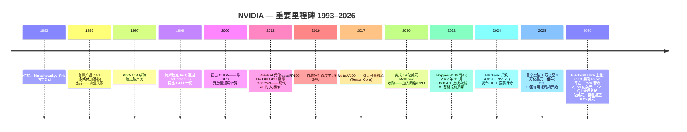
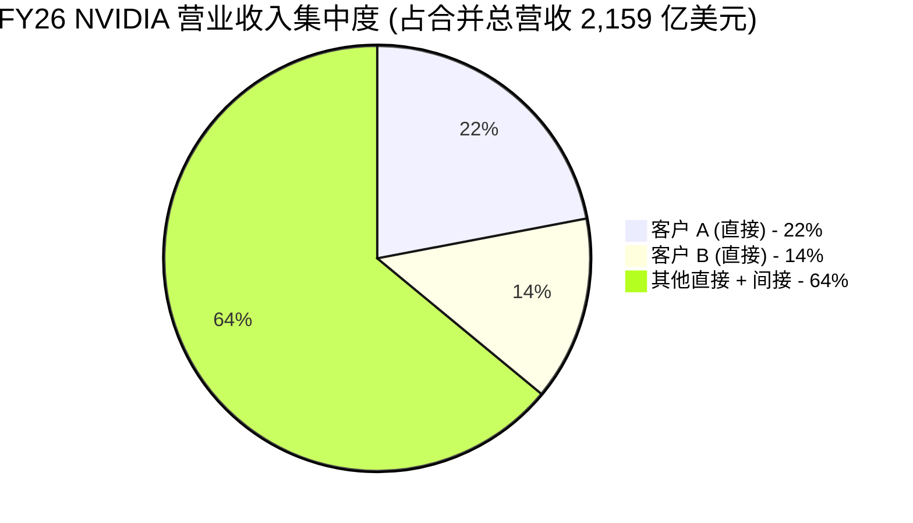
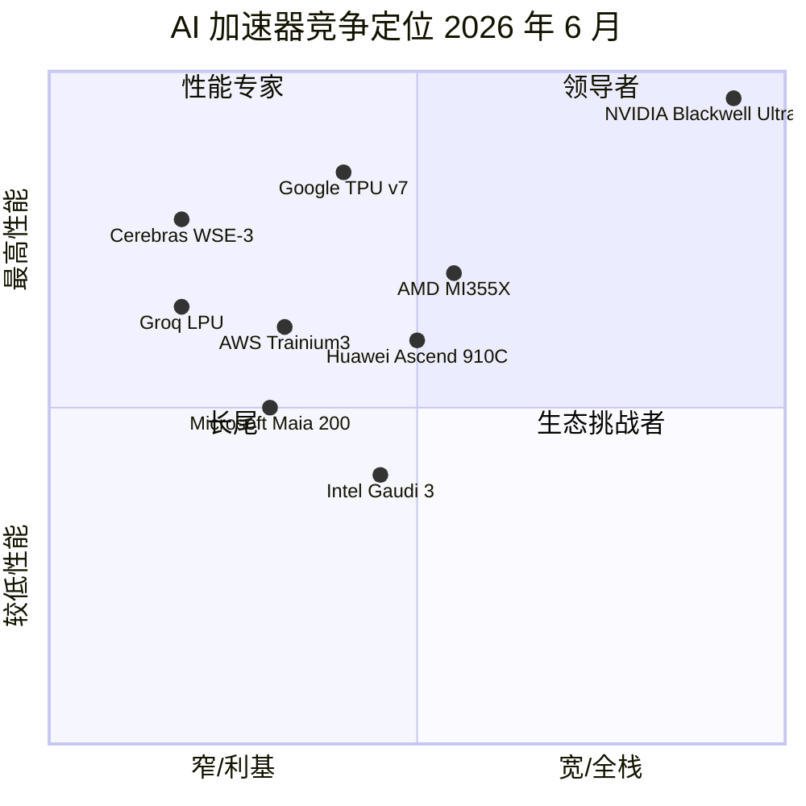
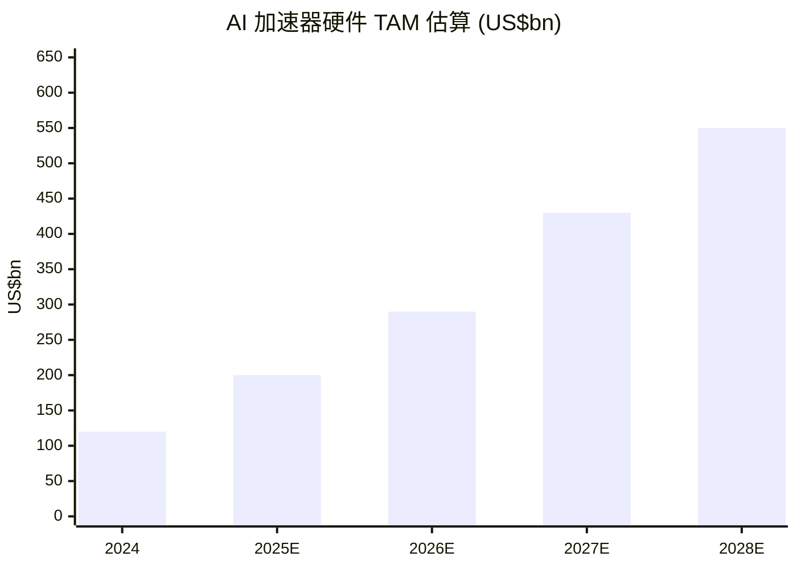

# 英伟达 (NVIDIA Corporation, NASDAQ:NVDA) — 公司研究报告

**截至日期 (as of): 2026-06-14**
**上市地: 纳斯达克全球精选市场 (NASDAQ Global Select Market), 代码 NVDA; 标普 500 (S&P 500)、纳斯达克 100 (Nasdaq-100)、费城半导体指数 (SOX) 成份股**
**注册地: 美国特拉华州 (Delaware, 1998 年自加州迁移)**
**财年结束日: 1 月最后一个星期日 (FY26 截至 2026-01-25; FY27 Q1 截至 2026-04-26)**
**作者: 股票研究——覆盖刷新 (refresh)**
**报告语言: 简体中文 (英文版同时存在于本目录)**

---

## 投资摘要 (Investment Summary) — *分析师观点 (Analyst view)，非财报披露*

| 项目 | 本报告观点 |
|---|---|
| **评级 (Rating)** | **增持 / Overweight (OW)** |
| **12 个月目标价 (12-mo PT)** | **285 美元** |
| **现价 (2026-06-12 收盘)** | 205.19 美元 |
| **隐含上行空间 (Upside)** | **约 +39%** |
| **估值方法** | FY28E (≈ 日历 2027) 非 GAAP EPS 约 11.40 美元 × 25 倍前瞻 P/E |
| **市值 / 企业价值** | 约 4.97 万亿美元 / 约 4.92 万亿美元 |
| **52 周区间** | 142.03 – 236.54 美元 |
| **情景目标价 (Bull / Base / Bear)** | 360 / 285 / 175 美元 (上行 +75% / +39% / −15%) |

> 上述评级、目标价、上行空间与情景价均为**本报告的前瞻判断 (*分析师观点*)，不附着于任何财报引用**——10-K 不含目标价。下文第 2 章给出完整的前瞻模型、目标价推导与情景假设。

**论点支柱 (Thesis pillars) — *分析师观点*:**

1. **AI 工厂建设是有记录以来最大的基础设施扩张，而 NVIDIA 是唯一的全栈卖家。** FY27 Q1 单季营业收入 (revenue) 已达 816 亿美元、数据中心 (Data Center) 752 亿美元，Q2 指引 910 亿美元 (±2%)——这意味着年化运行率已逼近 3,600 亿美元，且**完全不含中国数据中心计算收入** ([FY27 Q1 业绩公告, 2026-05-20](https://www.sec.gov/Archives/edgar/data/1045810/000104581026000051/q1fy27pr.htm))。
2. **护城河是 scale-up 互连 + CUDA 软件，而非单颗芯片的算力。** 专有 NVLink 交换机让 GB200/GB300 NVL72 以"单台计算机"形态出货，750 万 CUDA 开发者构成人月到人年级别的切换成本 (switching cost)——这是离散 GPU 竞争对手 (AMD) 与超大规模云 (hyperscaler) 自研 ASIC 都尚未复制的组合 ([FY2026 10-K, Item 1 — Business](https://www.sec.gov/Archives/edgar/data/1045810/000104581026000021/nvda-20260125.htm))。
3. **盈利质量与资本回报 (capital return) 同步抬升。** FY26 GAAP 净利润率 (net margin) 55.6%、自由现金流 (FCF) 966 亿美元；FY27 Q1 把季度股息从 0.01 美元 / 股一次性提至 0.25 美元 (25 倍)，并新增 800 亿美元回购授权——管理层首次把"资本配置纪律"与"产品节奏"并列为股价催化剂 ([FY27 Q1 业绩公告, 2026-05-20](https://www.sec.gov/Archives/edgar/data/1045810/000104581026000051/q1fy27pr.htm); *分析师观点:* [Goldman Sachs — Strong guidance plus improved capital allocation, 2026-05-20, p.1](http://xs-macbook-air.local:5001/zsxq/pdf/184121855855412/GS-Nvidia%20Corp.%20%28NVDA%29-Strong%20guidance%20plus%20improved%20capital%20allocation%3B%20we%20see%20CapEx%20sustainability%20driving%20a%20clearer%20path%20to%20outperformance-260520.pdf))。
4. **最大的两个风险是结构性而非周期性: 中国市场的实质性丧失，以及前两大客户占 36% 营收的集中度——两者都已被管理层在 10-K 中用罕见直白的语言点明。** 这也是我们用 25 倍 (而非 30 倍以上) 前瞻 P/E 锚定目标价的原因 ([FY2026 10-K, Item 1 — 政府监管](https://www.sec.gov/Archives/edgar/data/1045810/000104581026000021/nvda-20260125.htm))。

> **业绩更新——FY27 Q1 实际值 (2026-05-20 公布):** 营业收入 **816 亿美元** (同比 +85%，环比 +20%，创纪录)；数据中心营业收入 **752 亿美元** (同比 +92%)，其中数据中心计算 (compute) 604 亿美元、数据中心网络 (networking) 148 亿美元 (同比 +199%)；GAAP 毛利率 (gross margin) 74.9%；GAAP 营业利润 (operating income) 535 亿美元；GAAP 净利润 583 亿美元、GAAP 摊薄 EPS **2.39 美元** (非 GAAP EPS 1.87 美元)。**Q2 FY27 指引: 营业收入 910 亿美元 (±2%)，明确不含中国数据中心计算收入。** 公司同时启用**全新分部框架**——两大平台 (数据中心、Edge Computing)，数据中心内部再分 Hyperscale 与 ACIE (AI Clouds + Industrial + Enterprise) 两个子市场。来源: [FY27 Q1 业绩公告, 2026-05-20](https://www.sec.gov/Archives/edgar/data/1045810/000104581026000051/q1fy27pr.htm)。

---

## 目录
1. 公司概览 (含 1A 估值快照、1B GF Score 基本面评分)
2. 估值、前瞻模型与目标价
3. 公司历史
4. 管理团队
5. 产品与服务
6. 客户与上市策略
7. 行业概览
8. 竞争格局
9. 市场机会 (TAM)
10. 风险评估 (含 9.5 核心分歧与催化剂)
11. 投资者视角评分 (Investor lenses)
12. 参考资料 · Data Used 清单 · 验证日志

======================================

## 1. 公司概览

英伟达 (NVIDIA Corporation) 设计并销售一套全栈式加速计算 (accelerated computing) 平台，其核心基础组件是图形处理器 (Graphics Processing Unit, GPU)。这家 1993 年从 PC 图形领域起家的初创公司，截至 FY26 已成为管理层口中"重塑所有行业的数据中心级 AI 基础设施公司" ([英伟达 FY2026 10-K, Item 1 — Business](https://www.sec.gov/Archives/edgar/data/1045810/000104581026000021/nvda-20260125.htm))。公司销售芯片 (GPU、CPU、DPU、网络交换机和网卡)、整机柜级系统 (DGX、HGX、GB200/GB300 NVL72)、网络平台 (NVLink、InfiniBand、Spectrum-X 以太网、BlueField DPU)，以及以 CUDA、CUDA-X 库、NVIDIA AI Enterprise、NIM 微服务和 NVIDIA Omniverse 平台为锚的庞大软件栈。

**本方观点 (BLUF):** 我们以 **增持 / Overweight、12 个月目标价 285 美元** 启动覆盖刷新。核心判断是——AI 工厂的资本开支 (capex) 周期仍在加速 (FY27 Q1 营收 +85% 同比、Q2 指引 +85% 同比)，而 NVIDIA 是唯一能交付"前沿 GPU + 专有 scale-up 互连 + AI 优化 scale-out + 协同设计 CPU + 占主导地位的开发者平台"的全栈卖家；估值在 2026 年 6 月初的"内存削单"噪音回调后并不昂贵 (现价对 FY28E 非 GAAP EPS 约 18 倍前瞻 P/E)。把我们与多头区分开来的，是对两个结构性风险——中国市场的实质性丧失、前两大客户 36% 的营收集中度——的明确定价，这使我们用 25 倍而非 30 倍以上的目标倍数 ([FY2026 10-K, Item 1A — 风险因素](https://www.sec.gov/Archives/edgar/data/1045810/000104581026000021/nvda-20260125.htm); *分析师观点:* [Goldman Sachs, 2026-05-20, p.1](http://xs-macbook-air.local:5001/zsxq/pdf/184121855855412/GS-Nvidia%20Corp.%20%28NVDA%29-Strong%20guidance%20plus%20improved%20capital%20allocation%3B%20we%20see%20CapEx%20sustainability%20driving%20a%20clearer%20path%20to%20outperformance-260520.pdf))。

FY26 营业收入达 **2,159 亿美元**，较 FY25 的 1,305 亿美元同比增长 65%，约为 FY23 报告值 269.7 亿美元的 8 倍 ([FY2026 10-K MD&A](https://www.sec.gov/Archives/edgar/data/1045810/000104581026000021/nvda-20260125.htm))。净利润为 1,200.7 亿美元 (净利润率 55.6%; 摊薄 EPS 4.90 美元)，GAAP 营业利润为 1,303.9 亿美元，营业利润率 60.4% ([FY2026 10-K, 合并损益表 (consolidated income statement)](https://www.sec.gov/Archives/edgar/data/1045810/000104581026000021/nvda-20260125.htm))。FY26 自由现金流 (FCF) 为 966 亿美元 (经营性现金流 1,027 亿美元 − 资本开支 60 亿美元) ([FY2026 10-K, 现金流量表](https://www.sec.gov/Archives/edgar/data/1045810/000104581026000021/nvda-20260125.htm))。进入 FY27，势头进一步加速: FY27 Q1 单季营业收入即 816 亿美元、净利润 583 亿美元 ([FY27 Q1 业绩公告, 2026-05-20](https://www.sec.gov/Archives/edgar/data/1045810/000104581026000051/q1fy27pr.htm))。公司在 38 个国家拥有约 42,000 名员工，其中约 31,000 人从事研发——英伟达过半数工程师从事软件而非芯片设计 ([FY2026 10-K, 人力资本管理](https://www.sec.gov/Archives/edgar/data/1045810/000104581026000021/nvda-20260125.htm))。

下方利润表桑基图 (income-statement Sankey) 把 FY26 的每一美元营业收入按来源 (左侧五个终端市场) 拆解到成本、毛利、研发/销售费用、税与净利润，直观呈现 NVIDIA 罕见的盈利结构: 2,159 亿美元营收中，1,535 亿美元 (71%) 是毛利，1,201 亿美元 (55.6%) 最终落到净利润。

<svg xmlns="http://www.w3.org/2000/svg" viewBox="0 0 1000 560" width="1000" height="560" role="img" aria-label="income statement Sankey"><rect x="0" y="0" width="1000" height="560" fill="#ffffff"/>
<text x="20.00" y="30.00" text-anchor="start" font-family="Helvetica,Arial,sans-serif" font-size="15" font-weight="700" fill="#1f2933">NVIDIA FY26 利润表桑基图 (Income Statement Sankey, US$M)</text>
<path d="M 204.00,63.56 C 258.00,63.56 258.00,92.00 312.00,92.00 L 312.00,445.49 C 258.00,445.49 258.00,417.06 204.00,417.06 Z" fill="#93c5fd" fill-opacity="0.55"/>
<path d="M 452.00,85.00 C 506.00,85.00 506.00,142.00 560.00,142.00 L 560.00,379.90 C 506.00,379.90 506.00,322.90 452.00,322.90 Z" fill="#86efac" fill-opacity="0.55"/>
<path d="M 452.00,322.90 C 506.00,322.90 506.00,393.90 560.00,393.90 L 560.00,436.00 C 506.00,436.00 506.00,365.01 452.00,365.01 Z" fill="#fca5a5" fill-opacity="0.55"/>
<path d="M 328.00,92.00 C 382.00,92.00 382.00,85.00 436.00,85.00 L 436.00,365.01 C 382.00,365.01 382.00,372.01 328.00,372.01 Z" fill="#86efac" fill-opacity="0.55"/>
<path d="M 328.00,372.01 C 382.00,372.01 382.00,379.01 436.00,379.01 L 436.00,493.00 C 382.00,493.00 382.00,486.00 328.00,486.00 Z" fill="#fca5a5" fill-opacity="0.55"/>
<path d="M 700.00,124.90 C 754.00,124.90 754.00,152.96 808.00,152.96 L 808.00,372.03 C 754.00,372.03 754.00,343.98 700.00,343.98 Z" fill="#86efac" fill-opacity="0.55"/>
<path d="M 700.00,343.98 C 754.00,343.98 754.00,386.03 808.00,386.03 L 808.00,425.04 C 754.00,425.04 754.00,382.99 700.00,382.99 Z" fill="#fca5a5" fill-opacity="0.55"/>
<path d="M 576.00,142.00 C 630.00,142.00 630.00,124.90 684.00,124.90 L 684.00,362.81 C 630.00,362.81 630.00,379.90 576.00,379.90 Z" fill="#86efac" fill-opacity="0.55"/>
<path d="M 576.00,393.90 C 630.00,393.90 630.00,396.99 684.00,396.99 L 684.00,405.35 C 630.00,405.35 630.00,402.25 576.00,402.25 Z" fill="#fca5a5" fill-opacity="0.55"/>
<path d="M 576.00,402.25 C 630.00,402.25 630.00,419.35 684.00,419.35 L 684.00,453.10 C 630.00,453.10 630.00,436.00 576.00,436.00 Z" fill="#fca5a5" fill-opacity="0.55"/>
<path d="M 204.00,431.06 C 258.00,431.06 258.00,445.49 312.00,445.49 L 312.00,474.76 C 258.00,474.76 258.00,460.33 204.00,460.33 Z" fill="#93c5fd" fill-opacity="0.55"/>
<path d="M 204.00,474.33 C 258.00,474.33 258.00,474.76 312.00,474.76 L 312.00,480.58 C 258.00,480.58 258.00,480.15 204.00,480.15 Z" fill="#93c5fd" fill-opacity="0.55"/>
<path d="M 204.00,494.15 C 258.00,494.15 258.00,480.58 312.00,480.58 L 312.00,484.87 C 258.00,484.87 258.00,498.44 204.00,498.44 Z" fill="#93c5fd" fill-opacity="0.55"/>
<path d="M 204.00,512.44 C 258.00,512.44 258.00,484.87 312.00,484.87 L 312.00,486.87 C 258.00,486.87 258.00,514.44 204.00,514.44 Z" fill="#93c5fd" fill-opacity="0.55"/>
<rect x="188.00" y="63.56" width="16" height="353.49" rx="1.5" fill="#2563eb"/>
<rect x="188.00" y="431.06" width="16" height="29.27" rx="1.5" fill="#2563eb"/>
<rect x="188.00" y="474.33" width="16" height="5.82" rx="1.5" fill="#2563eb"/>
<rect x="188.00" y="494.15" width="16" height="4.29" rx="1.5" fill="#2563eb"/>
<rect x="188.00" y="512.44" width="16" height="2.00" rx="1.5" fill="#2563eb"/>
<rect x="312.00" y="92.00" width="16" height="394.00" rx="1.5" fill="#1e3a8a"/>
<rect x="436.00" y="85.00" width="16" height="280.01" rx="1.5" fill="#15803d"/>
<rect x="436.00" y="379.01" width="16" height="113.99" rx="1.5" fill="#dc2626"/>
<rect x="560.00" y="142.00" width="16" height="237.90" rx="1.5" fill="#15803d"/>
<rect x="560.00" y="393.90" width="16" height="42.10" rx="1.5" fill="#dc2626"/>
<rect x="684.00" y="124.90" width="16" height="258.09" rx="1.5" fill="#15803d"/>
<rect x="684.00" y="396.99" width="16" height="8.35" rx="1.5" fill="#dc2626"/>
<rect x="684.00" y="419.35" width="16" height="33.75" rx="1.5" fill="#dc2626"/>
<rect x="808.00" y="152.96" width="16" height="219.07" rx="1.5" fill="#15803d"/>
<rect x="808.00" y="386.03" width="16" height="39.02" rx="1.5" fill="#dc2626"/>
<line x1="188.00" y1="240.31" x2="182.00" y2="200.07" stroke="#cbd5e1" stroke-width="1"/>
<text x="179.00" y="203.07" text-anchor="end" font-family="Helvetica,Arial,sans-serif" font-size="11.5" font-weight="700" fill="#1f2933">Data Center 数据中心</text>
<text x="179.00" y="216.07" text-anchor="end" font-family="Helvetica,Arial,sans-serif" font-size="10" font-weight="400" fill="#52606d">US$193.7B  (89.7%)</text>
<line x1="188.00" y1="445.69" x2="182.00" y2="405.45" stroke="#cbd5e1" stroke-width="1"/>
<text x="179.00" y="408.45" text-anchor="end" font-family="Helvetica,Arial,sans-serif" font-size="11.5" font-weight="700" fill="#1f2933">Gaming 游戏</text>
<text x="179.00" y="421.45" text-anchor="end" font-family="Helvetica,Arial,sans-serif" font-size="10" font-weight="400" fill="#52606d">US$16.0B  (7.4%)</text>
<line x1="188.00" y1="477.24" x2="182.00" y2="437.00" stroke="#cbd5e1" stroke-width="1"/>
<text x="179.00" y="440.00" text-anchor="end" font-family="Helvetica,Arial,sans-serif" font-size="11.5" font-weight="700" fill="#1f2933">Pro Viz 专业可视化</text>
<text x="179.00" y="453.00" text-anchor="end" font-family="Helvetica,Arial,sans-serif" font-size="10" font-weight="400" fill="#52606d">US$3.2B  (1.5%)</text>
<line x1="188.00" y1="496.29" x2="182.00" y2="462.00" stroke="#cbd5e1" stroke-width="1"/>
<text x="179.00" y="465.00" text-anchor="end" font-family="Helvetica,Arial,sans-serif" font-size="11.5" font-weight="700" fill="#1f2933">Automotive 汽车</text>
<text x="179.00" y="478.00" text-anchor="end" font-family="Helvetica,Arial,sans-serif" font-size="10" font-weight="400" fill="#52606d">US$2.3B  (1.1%)</text>
<line x1="188.00" y1="513.44" x2="182.00" y2="487.00" stroke="#cbd5e1" stroke-width="1"/>
<text x="179.00" y="490.00" text-anchor="end" font-family="Helvetica,Arial,sans-serif" font-size="11.5" font-weight="700" fill="#1f2933">OEM/Other</text>
<text x="179.00" y="503.00" text-anchor="end" font-family="Helvetica,Arial,sans-serif" font-size="10" font-weight="400" fill="#52606d">US$619.0M  (0.29%)</text>
<rect x="331.00" y="74.00" width="125.70" height="26" rx="2" fill="#ffffff" fill-opacity="0.72"/>
<text x="334.00" y="86.00" text-anchor="start" font-family="Helvetica,Arial,sans-serif" font-size="11.5" font-weight="700" fill="#1f2933">Revenue</text>
<text x="334.00" y="99.00" text-anchor="start" font-family="Helvetica,Arial,sans-serif" font-size="10" font-weight="400" fill="#52606d">US$215.9B  (100.0%)</text>
<rect x="455.00" y="67.00" width="119.40" height="26" rx="2" fill="#ffffff" fill-opacity="0.72"/>
<text x="458.00" y="79.00" text-anchor="start" font-family="Helvetica,Arial,sans-serif" font-size="11.5" font-weight="700" fill="#1f2933">Gross Profit</text>
<text x="458.00" y="92.00" text-anchor="start" font-family="Helvetica,Arial,sans-serif" font-size="10" font-weight="400" fill="#52606d">US$153.5B  (71.1%)</text>
<rect x="455.00" y="361.01" width="144.60" height="26" rx="2" fill="#ffffff" fill-opacity="0.72"/>
<text x="458.00" y="373.01" text-anchor="start" font-family="Helvetica,Arial,sans-serif" font-size="11.5" font-weight="700" fill="#1f2933">Cost of Revenue (COGS)</text>
<text x="458.00" y="386.01" text-anchor="start" font-family="Helvetica,Arial,sans-serif" font-size="10" font-weight="400" fill="#52606d">US$62.5B  (28.9%)</text>
<rect x="579.00" y="124.00" width="119.40" height="26" rx="2" fill="#ffffff" fill-opacity="0.72"/>
<text x="582.00" y="136.00" text-anchor="start" font-family="Helvetica,Arial,sans-serif" font-size="11.5" font-weight="700" fill="#1f2933">Operating Income</text>
<text x="582.00" y="149.00" text-anchor="start" font-family="Helvetica,Arial,sans-serif" font-size="10" font-weight="400" fill="#52606d">US$130.4B  (60.4%)</text>
<rect x="579.00" y="375.90" width="150.90" height="26" rx="2" fill="#ffffff" fill-opacity="0.72"/>
<text x="582.00" y="387.90" text-anchor="start" font-family="Helvetica,Arial,sans-serif" font-size="11.5" font-weight="700" fill="#1f2933">Total Operating Expense</text>
<text x="582.00" y="400.90" text-anchor="start" font-family="Helvetica,Arial,sans-serif" font-size="10" font-weight="400" fill="#52606d">US$23.1B  (10.7%)</text>
<rect x="703.00" y="106.90" width="119.40" height="26" rx="2" fill="#ffffff" fill-opacity="0.72"/>
<text x="706.00" y="118.90" text-anchor="start" font-family="Helvetica,Arial,sans-serif" font-size="11.5" font-weight="700" fill="#1f2933">Pretax Income</text>
<text x="706.00" y="131.90" text-anchor="start" font-family="Helvetica,Arial,sans-serif" font-size="10" font-weight="400" fill="#52606d">US$141.4B  (65.5%)</text>
<rect x="703.00" y="378.99" width="100.50" height="26" rx="2" fill="#ffffff" fill-opacity="0.72"/>
<text x="706.00" y="390.99" text-anchor="start" font-family="Helvetica,Arial,sans-serif" font-size="11.5" font-weight="700" fill="#1f2933">SG&amp;A</text>
<text x="706.00" y="403.99" text-anchor="start" font-family="Helvetica,Arial,sans-serif" font-size="10" font-weight="400" fill="#52606d">US$4.6B  (2.1%)</text>
<rect x="703.00" y="403.99" width="106.80" height="26" rx="2" fill="#ffffff" fill-opacity="0.72"/>
<text x="706.00" y="415.99" text-anchor="start" font-family="Helvetica,Arial,sans-serif" font-size="11.5" font-weight="700" fill="#1f2933">R&amp;D</text>
<text x="706.00" y="428.99" text-anchor="start" font-family="Helvetica,Arial,sans-serif" font-size="10" font-weight="400" fill="#52606d">US$18.5B  (8.6%)</text>
<text x="833.00" y="259.49" text-anchor="start" font-family="Helvetica,Arial,sans-serif" font-size="11.5" font-weight="700" fill="#1f2933">Net Income</text>
<text x="833.00" y="272.49" text-anchor="start" font-family="Helvetica,Arial,sans-serif" font-size="10" font-weight="400" fill="#52606d">US$120.1B  (55.6%)</text>
<text x="833.00" y="402.54" text-anchor="start" font-family="Helvetica,Arial,sans-serif" font-size="11.5" font-weight="700" fill="#1f2933">Income Tax</text>
<text x="833.00" y="415.54" text-anchor="start" font-family="Helvetica,Arial,sans-serif" font-size="10" font-weight="400" fill="#52606d">US$21.4B  (9.9%)</text>
<text x="500.00" y="544.00" text-anchor="middle" font-family="Helvetica,Arial,sans-serif" font-size="10" font-weight="400" fill="#52606d">Source: NVIDIA FY2026 10-K (year ended 2026-01-25) · SEC EDGAR · FY26 Q4 press release (8-K, 2026-02-25)</text>
</svg>

来源: [英伟达 FY2026 10-K, 合并损益表与附注 16 (Note 16 — Segment Information)](https://www.sec.gov/Archives/edgar/data/1045810/000104581026000021/nvda-20260125.htm); FY26 全年口径与 [FY26 Q4 业绩公告 (8-K), 2026-02-25](https://www.sec.gov/Archives/edgar/data/1045810/000104581026000019/q4fy26pr.htm) 一致。

**商业模式与分部 (segments)。** FY26 财报口径下，英伟达在两个经营分部报告: **计算与网络 (Compute & Networking)** (数据中心、汽车、AI 软件) 和 **图形 (Graphics)** (GeForce、Quadro/RTX PRO、GeForce NOW、汽车信息娱乐)。FY26 计算与网络贡献 **1,935 亿美元 (占营业收入 89.6%)**，图形贡献 225 亿美元 (10.4%) ([FY2026 10-K, 附注 16](https://www.sec.gov/Archives/edgar/data/1045810/000104581026000021/nvda-20260125.htm))。从公司"专业化市场 (specialized markets)"四分披露这一更具业务相关性的视角看:

| 终端市场 | FY26 营业收入 (百万美元) | 同比 | 占 FY26 总收入比重 |
|---|---:|---:|---:|
| 数据中心 (Data Center) | 193,737 | +68% | 89.7% |
| 游戏 (Gaming) | 16,042 | +41% | 7.4% |
| 专业可视化 (Professional Visualization) | 3,191 | +70% | 1.5% |
| 汽车 (Automotive) | 2,349 | +39% | 1.1% |
| OEM 及其他 (OEM and Other) | 619 | +59% | 0.3% |
| **合计** | **215,938** | **+65%** | **100.0%** |

来源: [FY2026 10-K, 附注 16, 按终端市场划分的收入](https://www.sec.gov/Archives/edgar/data/1045810/000104581026000021/nvda-20260125.htm)。

<svg xmlns="http://www.w3.org/2000/svg" viewBox="0 0 720 460" width="720" height="460" role="img" aria-label="revenue donut"><rect x="0" y="0" width="720" height="460" fill="#ffffff"/>
<text x="20.00" y="30.00" text-anchor="start" font-family="Helvetica,Arial,sans-serif" font-size="15" font-weight="700" fill="#1f2933">FY26 营业收入 — 按终端市场 (Revenue by Market, US$M)</text>
<path d="M 288.00,107.20 A 132 132 0 1 1 208.54,133.80 L 241.05,176.92 A 78 78 0 1 0 288.00,161.20 Z" fill="#2563eb"/>
<path d="M 208.54,133.80 A 132 132 0 0 1 264.47,109.31 L 274.10,162.45 A 78 78 0 0 0 241.05,176.92 Z" fill="#15803d"/>
<path d="M 264.47,109.31 A 132 132 0 0 1 276.61,107.69 L 281.27,161.49 A 78 78 0 0 0 274.10,162.45 Z" fill="#d97706"/>
<path d="M 276.61,107.69 A 132 132 0 0 1 285.62,107.22 L 286.60,161.21 A 78 78 0 0 0 281.27,161.49 Z" fill="#7c3aed"/>
<path d="M 285.62,107.22 A 132 132 0 0 1 288.00,107.20 L 288.00,161.20 A 78 78 0 0 0 286.60,161.21 Z" fill="#dc2626"/>
<text x="288.00" y="235.20" text-anchor="middle" font-family="Helvetica,Arial,sans-serif" font-size="18" font-weight="800" fill="#1f2933">NVDA FY26</text>
<text x="288.00" y="255.20" text-anchor="middle" font-family="Helvetica,Arial,sans-serif" font-size="13" font-weight="600" fill="#52606d">US$215.9B</text>
<text x="288.00" y="271.20" text-anchor="middle" font-family="Helvetica,Arial,sans-serif" font-size="10" font-weight="400" fill="#8a97a3">total</text>
<line x1="331.80" y1="370.06" x2="347.80" y2="370.06" stroke="#2563eb" stroke-width="1.4"/>
<text x="351.80" y="368.06" text-anchor="start" font-family="Helvetica,Arial,sans-serif" font-size="11" font-weight="700" fill="#1f2933">Data Center 数据中心</text>
<text x="351.80" y="382.06" text-anchor="start" font-family="Helvetica,Arial,sans-serif" font-size="10" font-weight="400" fill="#52606d">US$193.7B  (89.7%)</text>
<line x1="232.66" y1="112.78" x2="216.66" y2="112.78" stroke="#15803d" stroke-width="1.4"/>
<text x="212.66" y="110.78" text-anchor="end" font-family="Helvetica,Arial,sans-serif" font-size="11" font-weight="700" fill="#1f2933">Gaming 游戏</text>
<text x="212.66" y="124.78" text-anchor="end" font-family="Helvetica,Arial,sans-serif" font-size="10" font-weight="400" fill="#52606d">US$16.0B  (7.4%)</text>
<line x1="269.73" y1="102.41" x2="253.73" y2="102.41" stroke="#d97706" stroke-width="1.4"/>
<text x="249.73" y="100.41" text-anchor="end" font-family="Helvetica,Arial,sans-serif" font-size="11" font-weight="700" fill="#1f2933">Pro Viz 专业可视化</text>
<text x="249.73" y="114.41" text-anchor="end" font-family="Helvetica,Arial,sans-serif" font-size="10" font-weight="400" fill="#52606d">US$3.2B  (1.5%)</text>
<line x1="280.80" y1="101.39" x2="264.80" y2="101.39" stroke="#7c3aed" stroke-width="1.4"/>
<text x="260.80" y="99.39" text-anchor="end" font-family="Helvetica,Arial,sans-serif" font-size="11" font-weight="700" fill="#1f2933">Automotive 汽车</text>
<text x="260.80" y="113.39" text-anchor="end" font-family="Helvetica,Arial,sans-serif" font-size="10" font-weight="400" fill="#52606d">US$2.3B  (1.1%)</text>
<line x1="286.76" y1="101.21" x2="270.76" y2="101.21" stroke="#dc2626" stroke-width="1.4"/>
<text x="266.76" y="99.21" text-anchor="end" font-family="Helvetica,Arial,sans-serif" font-size="11" font-weight="700" fill="#1f2933">OEM/Other</text>
<text x="266.76" y="113.21" text-anchor="end" font-family="Helvetica,Arial,sans-serif" font-size="10" font-weight="400" fill="#52606d">US$619.0M  (0.3%)</text>
<text x="360.00" y="444.00" text-anchor="middle" font-family="Helvetica,Arial,sans-serif" font-size="10" font-weight="400" fill="#52606d">Source: NVIDIA FY2026 10-K (year ended 2026-01-25), Note 16 — Segment &amp; Geographic Information · SEC EDGAR</text>
</svg>

来源: [FY2026 10-K, 附注 16](https://www.sec.gov/Archives/edgar/data/1045810/000104581026000021/nvda-20260125.htm)。

**本期新变化 (what's new this period) — FY27 起的分部重构。** 自 FY27 Q1 (2026-05-20) 起，管理层启用全新报告框架以"更好反映当前与未来增长驱动": 两大市场平台变为 **数据中心 (Data Center)** 与 **Edge Computing**; 数据中心内部再分 **Hyperscale** (公共云 + 全球最大消费互联网公司) 与 **ACIE** (AI Clouds + Industrial + Enterprise，对应各行业/各国的 AI 工厂机会) 两个子市场; Edge Computing 则吸收了原游戏、专业可视化、汽车，涵盖 PC、游戏主机、工作站、AI-RAN 基站、机器人与汽车 ([FY27 Q1 业绩公告, 2026-05-20](https://www.sec.gov/Archives/edgar/data/1045810/000104581026000051/q1fy27pr.htm))。按旧子市场口径，FY27 Q1 数据中心计算营收创纪录 604 亿美元 (同比 +77%、环比 +18%)、数据中心网络营收创纪录 148 亿美元 (同比 +199%、环比 +35%)，Edge Computing 营收 64 亿美元 (同比 +29%) ([FY27 Q1 业绩公告, 2026-05-20](https://www.sec.gov/Archives/edgar/data/1045810/000104581026000051/q1fy27pr.htm))。

**地理版图 (geography)。** FY26 按客户总部所在地分布: 美国约 1,496 亿美元 (69%)、台湾约 423 亿美元 (20%)、中国 (含香港) 约 197 亿美元 (9%)、其他约 43 亿美元 (2%) ([FY2026 10-K, 附注 16 — 按地理区域划分的收入](https://www.sec.gov/Archives/edgar/data/1045810/000104581026000021/nvda-20260125.htm))。台湾占比因合约制造 (contract-manufacturing) 路由被高估——英伟达估计 FY26 在台湾计费的数据中心收入中约 76% 最终被美国和欧洲终端客户消化。中国 (含香港) 从 FY25 的约 250 亿美元 (占总收入 19.2%) 缩水至 FY26 的约 197 亿美元 (9.1%)，主因是 2025 年 4 月美国政府对 H20 出口许可证的要求，以及由此产生的 45 亿美元库存与采购承诺减值 ([FY2026 10-K, MD&A — 毛利与政府监管](https://www.sec.gov/Archives/edgar/data/1045810/000104581026000021/nvda-20260125.htm))。

<svg xmlns="http://www.w3.org/2000/svg" viewBox="0 0 720 460" width="720" height="460" role="img" aria-label="revenue donut"><rect x="0" y="0" width="720" height="460" fill="#ffffff"/>
<text x="20.00" y="30.00" text-anchor="start" font-family="Helvetica,Arial,sans-serif" font-size="15" font-weight="700" fill="#1f2933">FY26 营业收入 — 按客户开票地 (Revenue by Customer Location, US$M)</text>
<path d="M 288.00,107.20 A 132 132 0 1 1 164.40,285.54 L 214.96,266.58 A 78 78 0 1 0 288.00,161.20 Z" fill="#2563eb"/>
<path d="M 164.40,285.54 A 132 132 0 0 1 203.12,138.11 L 237.84,179.46 A 78 78 0 0 0 214.96,266.58 Z" fill="#15803d"/>
<path d="M 203.12,138.11 A 132 132 0 0 1 271.52,108.23 L 278.26,161.81 A 78 78 0 0 0 237.84,179.46 Z" fill="#d97706"/>
<path d="M 271.52,108.23 A 132 132 0 0 1 288.00,107.20 L 288.00,161.20 A 78 78 0 0 0 278.26,161.81 Z" fill="#7c3aed"/>
<text x="288.00" y="235.20" text-anchor="middle" font-family="Helvetica,Arial,sans-serif" font-size="18" font-weight="800" fill="#1f2933">NVDA FY26</text>
<text x="288.00" y="255.20" text-anchor="middle" font-family="Helvetica,Arial,sans-serif" font-size="13" font-weight="600" fill="#52606d">US$215.9B</text>
<text x="288.00" y="271.20" text-anchor="middle" font-family="Helvetica,Arial,sans-serif" font-size="10" font-weight="400" fill="#8a97a3">total</text>
<line x1="401.42" y1="317.81" x2="417.42" y2="317.81" stroke="#2563eb" stroke-width="1.4"/>
<text x="421.42" y="315.81" text-anchor="start" font-family="Helvetica,Arial,sans-serif" font-size="11" font-weight="700" fill="#1f2933">United States 美国</text>
<text x="421.42" y="329.81" text-anchor="start" font-family="Helvetica,Arial,sans-serif" font-size="10" font-weight="400" fill="#52606d">US$149.6B  (69.3%)</text>
<line x1="154.53" y1="204.15" x2="138.53" y2="204.15" stroke="#15803d" stroke-width="1.4"/>
<text x="134.53" y="202.15" text-anchor="end" font-family="Helvetica,Arial,sans-serif" font-size="11" font-weight="700" fill="#1f2933">Taiwan 台湾</text>
<text x="134.53" y="216.15" text-anchor="end" font-family="Helvetica,Arial,sans-serif" font-size="10" font-weight="400" fill="#52606d">US$42.3B  (19.6%)</text>
<line x1="232.76" y1="112.74" x2="216.76" y2="112.74" stroke="#d97706" stroke-width="1.4"/>
<text x="212.76" y="110.74" text-anchor="end" font-family="Helvetica,Arial,sans-serif" font-size="11" font-weight="700" fill="#1f2933">China incl. HK 中国(含港)</text>
<text x="212.76" y="124.74" text-anchor="end" font-family="Helvetica,Arial,sans-serif" font-size="10" font-weight="400" fill="#52606d">US$19.7B  (9.1%)</text>
<line x1="279.37" y1="101.47" x2="263.37" y2="101.47" stroke="#7c3aed" stroke-width="1.4"/>
<text x="259.37" y="99.47" text-anchor="end" font-family="Helvetica,Arial,sans-serif" font-size="11" font-weight="700" fill="#1f2933">Other 其他</text>
<text x="259.37" y="113.47" text-anchor="end" font-family="Helvetica,Arial,sans-serif" font-size="10" font-weight="400" fill="#52606d">US$4.3B  (2.0%)</text>
<text x="360.00" y="444.00" text-anchor="middle" font-family="Helvetica,Arial,sans-serif" font-size="10" font-weight="400" fill="#52606d">Source: NVIDIA FY2026 10-K (year ended 2026-01-25), Note 16 — Segment &amp; Geographic Information · SEC EDGAR — Revenue by geographic region</text>
</svg>

来源: [FY2026 10-K, 附注 16 — 按地理区域划分的收入](https://www.sec.gov/Archives/edgar/data/1045810/000104581026000021/nvda-20260125.htm)。各区域数值为按 10-K 披露占比 (美国 69% / 台湾 20% / 中国含港 9% / 其他 2%) 对 FY26 总营收 2,159 亿美元的换算，用于可视化区域结构。

下方历史营收堆叠图 (FY22–FY26 by market) 把 NVIDIA 史上最剧烈的产品组合转变可视化: 数据中心从 FY22 的 106 亿美元 (约占 40%) 升至 FY26 的 1,937 亿美元 (约 90%)，游戏从主导业务退居一隅。

<svg xmlns="http://www.w3.org/2000/svg" viewBox="0 0 860 470" width="860" height="470" role="img" aria-label="historical revenue bars"><rect x="0" y="0" width="860" height="470" fill="#ffffff"/>
<text x="20.00" y="30.00" text-anchor="start" font-family="Helvetica,Arial,sans-serif" font-size="15" font-weight="700" fill="#1f2933">FY22–FY26 营业收入构成 (Revenue by Market, US$M)</text>
<rect x="20.00" y="44" width="11" height="11" rx="2" fill="#2563eb"/>
<text x="36.00" y="53.00" text-anchor="start" font-family="Helvetica,Arial,sans-serif" font-size="10.5" font-weight="400" fill="#1f2933">Data Center</text>
<rect x="122.60" y="44" width="11" height="11" rx="2" fill="#15803d"/>
<text x="138.60" y="53.00" text-anchor="start" font-family="Helvetica,Arial,sans-serif" font-size="10.5" font-weight="400" fill="#1f2933">Gaming</text>
<rect x="192.20" y="44" width="11" height="11" rx="2" fill="#d97706"/>
<text x="208.20" y="53.00" text-anchor="start" font-family="Helvetica,Arial,sans-serif" font-size="10.5" font-weight="400" fill="#1f2933">Pro Viz</text>
<rect x="268.40" y="44" width="11" height="11" rx="2" fill="#7c3aed"/>
<text x="284.40" y="53.00" text-anchor="start" font-family="Helvetica,Arial,sans-serif" font-size="10.5" font-weight="400" fill="#1f2933">Automotive</text>
<rect x="364.40" y="44" width="11" height="11" rx="2" fill="#dc2626"/>
<text x="380.40" y="53.00" text-anchor="start" font-family="Helvetica,Arial,sans-serif" font-size="10.5" font-weight="400" fill="#1f2933">OEM/Other</text>
<line x1="70" y1="412.00" x2="834" y2="412.00" stroke="#eceff2" stroke-width="1"/>
<text x="64.00" y="415.00" text-anchor="end" font-family="Helvetica,Arial,sans-serif" font-size="9.5" font-weight="400" fill="#52606d">US$0</text>
<line x1="70" y1="345.20" x2="834" y2="345.20" stroke="#eceff2" stroke-width="1"/>
<text x="64.00" y="348.20" text-anchor="end" font-family="Helvetica,Arial,sans-serif" font-size="9.5" font-weight="400" fill="#52606d">US$46.6B</text>
<line x1="70" y1="278.40" x2="834" y2="278.40" stroke="#eceff2" stroke-width="1"/>
<text x="64.00" y="281.40" text-anchor="end" font-family="Helvetica,Arial,sans-serif" font-size="9.5" font-weight="400" fill="#52606d">US$93.3B</text>
<line x1="70" y1="211.60" x2="834" y2="211.60" stroke="#eceff2" stroke-width="1"/>
<text x="64.00" y="214.60" text-anchor="end" font-family="Helvetica,Arial,sans-serif" font-size="9.5" font-weight="400" fill="#52606d">US$139.9B</text>
<line x1="70" y1="144.80" x2="834" y2="144.80" stroke="#eceff2" stroke-width="1"/>
<text x="64.00" y="147.80" text-anchor="end" font-family="Helvetica,Arial,sans-serif" font-size="9.5" font-weight="400" fill="#52606d">US$186.6B</text>
<line x1="70" y1="78.00" x2="834" y2="78.00" stroke="#eceff2" stroke-width="1"/>
<text x="64.00" y="81.00" text-anchor="end" font-family="Helvetica,Arial,sans-serif" font-size="9.5" font-weight="400" fill="#52606d">US$233.2B</text>
<rect x="102.09" y="396.80" width="88.62" height="15.20" fill="#2563eb"/>
<rect x="102.09" y="378.95" width="88.62" height="17.85" fill="#15803d"/>
<rect x="102.09" y="375.93" width="88.62" height="3.02" fill="#d97706"/>
<rect x="102.09" y="375.12" width="88.62" height="0.81" fill="#7c3aed"/>
<rect x="102.09" y="373.45" width="88.62" height="1.66" fill="#dc2626"/>
<text x="146.40" y="428.00" text-anchor="middle" font-family="Helvetica,Arial,sans-serif" font-size="10" font-weight="400" fill="#52606d">FY22</text>
<rect x="254.89" y="390.51" width="88.62" height="21.49" fill="#2563eb"/>
<rect x="254.89" y="377.52" width="88.62" height="12.99" fill="#15803d"/>
<rect x="254.89" y="375.31" width="88.62" height="2.21" fill="#d97706"/>
<rect x="254.89" y="374.02" width="88.62" height="1.29" fill="#7c3aed"/>
<rect x="254.89" y="373.37" width="88.62" height="0.65" fill="#dc2626"/>
<text x="299.20" y="428.00" text-anchor="middle" font-family="Helvetica,Arial,sans-serif" font-size="10" font-weight="400" fill="#52606d">FY23</text>
<rect x="407.69" y="343.94" width="88.62" height="68.06" fill="#2563eb"/>
<rect x="407.69" y="328.97" width="88.62" height="14.96" fill="#15803d"/>
<rect x="407.69" y="326.75" width="88.62" height="2.22" fill="#d97706"/>
<rect x="407.69" y="325.19" width="88.62" height="1.56" fill="#7c3aed"/>
<rect x="407.69" y="324.75" width="88.62" height="0.44" fill="#dc2626"/>
<text x="452.00" y="428.00" text-anchor="middle" font-family="Helvetica,Arial,sans-serif" font-size="10" font-weight="400" fill="#52606d">FY24</text>
<rect x="560.49" y="247.03" width="88.62" height="164.97" fill="#2563eb"/>
<rect x="560.49" y="230.78" width="88.62" height="16.26" fill="#15803d"/>
<rect x="560.49" y="228.09" width="88.62" height="2.69" fill="#d97706"/>
<rect x="560.49" y="225.66" width="88.62" height="2.43" fill="#7c3aed"/>
<rect x="560.49" y="225.11" width="88.62" height="0.56" fill="#dc2626"/>
<text x="604.80" y="428.00" text-anchor="middle" font-family="Helvetica,Arial,sans-serif" font-size="10" font-weight="400" fill="#52606d">FY25</text>
<rect x="713.29" y="134.54" width="88.62" height="277.46" fill="#2563eb"/>
<rect x="713.29" y="111.56" width="88.62" height="22.97" fill="#15803d"/>
<rect x="713.29" y="106.99" width="88.62" height="4.57" fill="#d97706"/>
<rect x="713.29" y="103.63" width="88.62" height="3.36" fill="#7c3aed"/>
<rect x="713.29" y="102.74" width="88.62" height="0.89" fill="#dc2626"/>
<text x="757.60" y="428.00" text-anchor="middle" font-family="Helvetica,Arial,sans-serif" font-size="10" font-weight="400" fill="#52606d">FY26</text>
<text x="430.00" y="454.00" text-anchor="middle" font-family="Helvetica,Arial,sans-serif" font-size="10" font-weight="400" fill="#52606d">Source: NVIDIA FY2026 10-K &amp; FY2024 10-K, Note 16/17 — Revenue by Market Platform · SEC EDGAR</text>
</svg>

来源: [FY2026 10-K, 附注 16](https://www.sec.gov/Archives/edgar/data/1045810/000104581026000021/nvda-20260125.htm) (FY24–FY26); [FY2024 10-K, 附注 17](https://www.sec.gov/Archives/edgar/data/1045810/000104581024000029/nvda-20240128.htm) (FY22–FY23)。

**规模指标 (scale).**
- 员工人数: 约 42,000 人 (FY26) vs. 约 36,000 人 (FY25)，同比 +17% ([FY2026 10-K, 人力资本](https://www.sec.gov/Archives/edgar/data/1045810/000104581026000021/nvda-20260125.htm))。
- 研发支出 (R&D): 185 亿美元 (FY26) vs. 129 亿美元 (FY25)，同比 +43% ([FY2026 10-K, MD&A](https://www.sec.gov/Archives/edgar/data/1045810/000104581026000021/nvda-20260125.htm))。
- 现金 + 有价证券: FY26 期末约 626 亿美元，FY27 Q1 期末约 805 亿美元 (含市值重估的上市股权证券) ([FY27 Q1 业绩公告, 资产负债表](https://www.sec.gov/Archives/edgar/data/1045810/000104581026000051/q1fy27pr.htm))。
- FY26 资本回报: 411 亿美元 (404 亿美元回购 + 9.7 亿美元股息); FY27 Q1 单季即返还约 200 亿美元，并把季度股息由 0.01 提至 0.25 美元 / 股、新增 800 亿美元回购授权 ([FY27 Q1 业绩公告, 2026-05-20](https://www.sec.gov/Archives/edgar/data/1045810/000104581026000051/q1fy27pr.htm))。

### 1A. 估值快照 (Valuation snapshot)

| 指标 | 数值 | 来源 / 备注 |
|---|---|---|
| 收盘价 (2026-06-12) | 205.19 美元 | [Yahoo Finance NVDA, as of 2026-06-12](https://finance.yahoo.com/quote/NVDA/key-statistics/) |
| 市值 | 约 4.97 万亿美元 | Yahoo Finance / yfinance |
| 52 周区间 | 142.03 – 236.54 美元 | Yahoo Finance |
| TTM 摊薄 EPS (GAAP) | 约 6.53 美元 | FY26 全年 4.90 + (FY27 Q1 2.39 − FY26 Q1 0.76) 滚动估算 |
| TTM 市盈率 P/E (GAAP) | 约 31 倍 | 205.19 / 6.53 (滚动 TTM) |
| FY26 静态 P/E (GAAP) | 约 41.9 倍 | 205.19 / 4.90 |
| TTM 市销率 P/S | 约 19–20 倍 | 市值 / 滚动 TTM 营收约 2,532 亿美元 |
| 前瞻 P/E (FY28E≈日历 2027, 一致预期) | 约 18 倍 | 现价 / FY28E 非 GAAP EPS 约 11.40 美元 (*分析师观点*; 见第 2 章) |
| 股息率 | 约 0.49% | 新季度股息 0.25 美元 × 4 / 205.19 ([FY27 Q1 业绩公告](https://www.sec.gov/Archives/edgar/data/1045810/000104581026000051/q1fy27pr.htm)) |

**同业可比 (TTM, 2026-06-12 取自 yfinance / Yahoo Finance):**

| 公司 | 代码 | 市值 (十亿美元) | 收盘价 | 备注 |
|---|---|---:|---:|---|
| NVIDIA | NVDA | 约 4,970 | 205.19 | AI 加速计算全栈领导者 |
| Broadcom | AVGO | 约 1,818 | 382.07 | 自研 AI ASIC + 以太网交换 |
| AMD | AMD | 约 834 | 511.57 | 唯一可信第三方 GPU 竞争者 |
| Intel | INTC | 约 626 | 124.57 | 主机 CPU; NVDA 持股标的 |

来源: [Yahoo Finance / yfinance 行情, as of 2026-06-12](https://finance.yahoo.com/quote/NVDA/key-statistics/)。同业市值取自 yfinance `market_cap` 字段。

**NVDA 估值倍数解读。** 现价 205.19 美元对 FY26 GAAP EPS 4.90 美元为约 41.9 倍静态 P/E、约 31 倍滚动 TTM P/E (已纳入 FY27 Q1 的 2.39 美元)，对 FY28E 非 GAAP EPS 约 11.40 美元仅约 18 倍前瞻 P/E。换言之，**当增长被市场充分相信时，前瞻盈利会把估值倍数压缩到与一只成熟大盘股相当的水平**——这是 NVDA 估值最反直觉、也最关键的一点。三大驱动因素解释这一倍数，每一项均可从财报中得到支撑:

1. **盈利能力本身已属非常态高位。** FY26 GAAP 净利润率 55.6%、营业利润率 60.4%，FY27 Q1 营业利润率进一步升至 65.6%——是有史以来同等规模硬件公司中最高的盈利水平之一 ([FY2026 10-K, 合并损益表](https://www.sec.gov/Archives/edgar/data/1045810/000104581026000021/nvda-20260125.htm); [FY27 Q1 业绩公告](https://www.sec.gov/Archives/edgar/data/1045810/000104581026000051/q1fy27pr.htm))。
2. **前瞻盈利大幅压缩估值倍数。** Q2 FY27 营业收入指引 910 亿美元，按持平年化推算已超过 3,600 亿美元，驱动一致预期 FY28 EPS 接近翻倍——基于 Blackwell Ultra 全年和 Vera Rubin 自 FY27 H2 上量 ([FY27 Q1 业绩公告展望](https://www.sec.gov/Archives/edgar/data/1045810/000104581026000051/q1fy27pr.htm))。
3. **AI 基础设施溢价，无同等规模对标。** 没有任何竞争对手能交付集成"前沿 GPU + 专有 scale-up 互连 (NVLink) + AI 优化 scale-out (Spectrum-X) + 协同设计 CPU (Grace) + 占主导地位的开发者平台 (CUDA, 750 万开发者)"的组合。估值倍数把这一护城河压缩进了单一数字。

P/S 是若数据中心增长降速时最易遭受重新估值的指标——参见第 10 章。2026 年 6 月初股价从 5 月的约 224 美元回落至约 205 美元，触发因素正是一份关于"NVDA 是否削减内存订单"的渠道噪音报告，凸显了高倍数股票对供应链信号的敏感度 (*分析师观点:* [Morgan Stanley — Computex NVDA keynote & analyst Q&A, 2026-06-03](http://xs-macbook-air.local:5001/zsxq/pdf/812488522252442/Morgan%20Stanley-NVIDIA%20Corp.%EF%BC%88NVDA.US%EF%BC%89Computex%20NVDA%20keynote%20%26%20financial%20analyst%20Q%26A-260603.pdf))。

### 1B. GF Score (GuruFocus 式) 基本面评分 — *分析师观点*

下方五维雷达 (radar) 是模仿 [GuruFocus GF Score™](https://www.gurufocus.com/term/gf-score) 的基本面评分，五个轴各 0–10 分: **Financial Strength (财务实力)、Profitability (盈利能力)、Growth (成长性)、GF Value (估值，越高越便宜)、Momentum (动量)**，按透明权重映射为 0–100 综合分。**这是本报告自有的评分框架 (*分析师观点*)，不附着任何财报引用，也未取自 GuruFocus 的官方数字**; 每个底层指标各自带有就近引用。

<svg xmlns="http://www.w3.org/2000/svg" viewBox="0 0 500 500" width="500" height="500" role="img" aria-label="GF Score radar">
<rect x="0" y="0" width="500" height="500" fill="#ffffff"/>
<text x="20" y="24" font-family="Helvetica,Arial,sans-serif" font-size="15" font-weight="700" fill="#1f2933">GF Score (GuruFocus-style): 88/100</text>
<text x="20" y="41" font-family="Helvetica,Arial,sans-serif" font-size="11" fill="#52606d">81–90 Good outperformance potential</text>
<polygon points="250.0,88.0 392.7,191.6 338.2,359.4 161.8,359.4 107.3,191.6" fill="#e9f5ec" stroke="none"/>
<polygon points="250.0,208.0 278.5,228.7 267.6,262.3 232.4,262.3 221.5,228.7" fill="none" stroke="#c5d3cb" stroke-width="1"/>
<polygon points="250.0,178.0 307.1,219.5 285.3,286.5 214.7,286.5 192.9,219.5" fill="none" stroke="#c5d3cb" stroke-width="1"/>
<polygon points="250.0,148.0 335.6,210.2 302.9,310.8 197.1,310.8 164.4,210.2" fill="none" stroke="#c5d3cb" stroke-width="1"/>
<polygon points="250.0,118.0 364.1,200.9 320.5,335.1 179.5,335.1 135.9,200.9" fill="none" stroke="#c5d3cb" stroke-width="1"/>
<polygon points="250.0,88.0 392.7,191.6 338.2,359.4 161.8,359.4 107.3,191.6" fill="none" stroke="#c5d3cb" stroke-width="1.3"/>
<line x1="250" y1="238" x2="161.8" y2="359.4" stroke="#cfdad3" stroke-width="1"/>
<text x="146.5" y="392.4" text-anchor="end" font-family="Helvetica,Arial,sans-serif" font-size="11.5" font-weight="600" fill="#1f2933">Financial Strength</text>
<text x="146.5" y="405.4" text-anchor="end" font-family="Helvetica,Arial,sans-serif" font-size="9.5" fill="#52606d">财务实力</text>
<text x="161.8" y="353.4" text-anchor="middle" font-family="Helvetica,Arial,sans-serif" font-size="10.5" font-weight="700" fill="#1f2933">10</text>
<line x1="250" y1="238" x2="250.0" y2="88.0" stroke="#cfdad3" stroke-width="1"/>
<text x="250.0" y="58.0" text-anchor="middle" font-family="Helvetica,Arial,sans-serif" font-size="11.5" font-weight="600" fill="#1f2933">Profitability</text>
<text x="250.0" y="71.0" text-anchor="middle" font-family="Helvetica,Arial,sans-serif" font-size="9.5" fill="#52606d">盈利能力</text>
<text x="250.0" y="82.0" text-anchor="middle" font-family="Helvetica,Arial,sans-serif" font-size="10.5" font-weight="700" fill="#1f2933">10</text>
<line x1="250" y1="238" x2="107.3" y2="191.6" stroke="#cfdad3" stroke-width="1"/>
<text x="82.6" y="183.6" text-anchor="end" font-family="Helvetica,Arial,sans-serif" font-size="11.5" font-weight="600" fill="#1f2933">Growth</text>
<text x="82.6" y="196.6" text-anchor="end" font-family="Helvetica,Arial,sans-serif" font-size="9.5" fill="#52606d">成长性</text>
<text x="107.3" y="185.6" text-anchor="middle" font-family="Helvetica,Arial,sans-serif" font-size="10.5" font-weight="700" fill="#1f2933">10</text>
<line x1="250" y1="238" x2="392.7" y2="191.6" stroke="#cfdad3" stroke-width="1"/>
<text x="417.4" y="183.6" text-anchor="start" font-family="Helvetica,Arial,sans-serif" font-size="11.5" font-weight="600" fill="#1f2933">GF Value</text>
<text x="417.4" y="196.6" text-anchor="start" font-family="Helvetica,Arial,sans-serif" font-size="9.5" fill="#52606d">估值</text>
<text x="307.1" y="213.5" text-anchor="middle" font-family="Helvetica,Arial,sans-serif" font-size="10.5" font-weight="700" fill="#1f2933">4</text>
<line x1="250" y1="238" x2="338.2" y2="359.4" stroke="#cfdad3" stroke-width="1"/>
<text x="353.5" y="392.4" text-anchor="start" font-family="Helvetica,Arial,sans-serif" font-size="11.5" font-weight="600" fill="#1f2933">Momentum</text>
<text x="353.5" y="405.4" text-anchor="start" font-family="Helvetica,Arial,sans-serif" font-size="9.5" fill="#52606d">动量</text>
<text x="320.5" y="329.1" text-anchor="middle" font-family="Helvetica,Arial,sans-serif" font-size="10.5" font-weight="700" fill="#1f2933">8</text>
<polygon points="250.0,88.0 307.1,219.5 320.5,335.1 161.8,359.4 107.3,191.6" fill="#2e8b57" fill-opacity="0.34" stroke="#2e8b57" stroke-width="2"/>
<circle cx="161.8" cy="359.4" r="2.6" fill="#2e8b57"/>
<circle cx="250.0" cy="88.0" r="2.6" fill="#2e8b57"/>
<circle cx="107.3" cy="191.6" r="2.6" fill="#2e8b57"/>
<circle cx="307.1" cy="219.5" r="2.6" fill="#2e8b57"/>
<circle cx="320.5" cy="335.1" r="2.6" fill="#2e8b57"/>
<text x="250" y="470" text-anchor="middle" font-family="Helvetica,Arial,sans-serif" font-size="9.5" fill="#52606d">Source: NVIDIA FY2026 10-K · FY27 Q1 8-K (2026-05-20) · Yahoo Finance, as of 2026-06-14</text>
<text x="250" y="485" text-anchor="middle" font-family="Helvetica,Arial,sans-serif" font-size="9" fill="#52606d">GF Score = independent analyst rubric (*Analyst view:*) — not GuruFocus™ official number</text>
</svg>

| 维度 / Dimension | 评分 / Score (0–10) | |
|---|---|---|
| Financial Strength (财务实力) | 10 | `██████████` |
| Profitability (盈利能力) | 10 | `██████████` |
| Growth (成长性) | 10 | `██████████` |
| GF Value (估值) | 4 | `████░░░░░░` |
| Momentum (动量) | 8 | `████████░░` |
| **GF Score (综合, *分析师观点*)** | **88 / 100** | **81–90 良好跑赢潜力 (Good outperformance potential)** |

*综合权重 (*分析师观点*): Financial Strength 20% · Profitability 25% · Growth 25% · GF Value 15% · Momentum 15% (透明复刻，非 GuruFocus 专有权重)。*

**各维度评分理由 (why these scores):**

- **Financial Strength = 10。** FY26 期末现金及有价证券约 626 亿美元，对短期债务 10 亿 + 长期债务 75 亿美元 (合计约 85 亿)，净现金约 540 亿美元; FY26 利息支出仅 2.59 亿美元、利息收入 23 亿美元，利息覆盖实际为净正; FY27 Q1 期末股东权益 1,955 亿美元、总负债仅 640 亿美元 ([FY2026 10-K, 资产负债表](https://www.sec.gov/Archives/edgar/data/1045810/000104581026000021/nvda-20260125.htm); [FY27 Q1 业绩公告, 资产负债表](https://www.sec.gov/Archives/edgar/data/1045810/000104581026000051/q1fy27pr.htm))。几乎无杠杆 + 巨额净现金 → 满分。
- **Profitability = 10。** FY26 GAAP 营业利润率 60.4%、净利润率 55.6%、ROE 约 101% (净利润 1,201 亿 / 平均权益约 1,183 亿)，ROIC 远超任何合理 WACC，且五年持续扩张 ([FY2026 10-K, 合并损益表与资产负债表](https://www.sec.gov/Archives/edgar/data/1045810/000104581026000021/nvda-20260125.htm))。下方杜邦分析 (第 2 章) 进一步拆解。
- **Growth = 10。** FY26 营收同比 +65%、FY24–FY26 三年营收 CAGR 约 100%; FY27 Q1 营收同比 +85%、净利润同比 +211%; Q2 指引同比约 +85% ([FY2026 10-K MD&A](https://www.sec.gov/Archives/edgar/data/1045810/000104581026000021/nvda-20260125.htm); [FY27 Q1 业绩公告](https://www.sec.gov/Archives/edgar/data/1045810/000104581026000051/q1fy27pr.htm))。
- **GF Value = 4。** 这是唯一拉低综合分的轴。现价对 FY28E 非 GAAP EPS 约 18 倍前瞻 P/E 相对自身历史 (Blackwell 发布前曾 >35 倍 P/S) 不算贵，但 41.9 倍静态 P/E、约 19–20 倍 TTM P/S 的绝对水平、以及相对盈利 CAGR 的 PEG，留给安全边际 (margin of safety) 的空间偏薄 (见第 2 章 PT 推导)。
- **Momentum = 8。** 12 个月相对标普 500 与 SOX 仍显著跑赢，股价在 200 日均线之上; 但现价 205 美元较 52 周高点 236.54 美元回撤约 13%，且 6 月初有渠道噪音回调，故未给满分 ([Yahoo Finance NVDA, as of 2026-06-12](https://finance.yahoo.com/quote/NVDA/key-statistics/))。

综合 **88/100** 落在"良好跑赢潜力"带——基本面三轴 (实力/盈利/成长) 满分，唯一拖累是估值，与本报告"增持但非无条件买入"的整体判断一致。

---

## 2. 估值、前瞻模型与目标价 (Valuation, forward model & price target)

本章是把"公司画像"转化为"决策"的环节。**全部前瞻数字、目标价与情景价均为 *分析师观点*，不附着任何财报引用**——10-K 不含目标价。模型的外部输入 (分部数据、管理层指引、行业预测) 各自就近引用。

### 2.1 前瞻财务模型 (forward estimates) — *分析师观点*

下表把 NVIDIA 按"数据中心 + Edge"两大平台分别建模再加总 (非单一混合顶线)，财年口径 (FY 截至次年 1 月)。FY27/FY28 为本报告估计，外部锚点为: 管理层 Q2 FY27 营收指引 910 亿美元 (±2%)、FY27 全年 GAAP 税率 16–18% 指引 ([FY27 Q1 业绩公告](https://www.sec.gov/Archives/edgar/data/1045810/000104581026000051/q1fy27pr.htm))，以及行业对 2026/2027 日历年超大规模云资本开支与 AI 加速器 TAM 的预测 (见第 8 章)。

| 财年 (FY, 截至次年 1 月) | FY25A | FY26A | FY27E (*分析师观点*) | FY28E (*分析师观点*) |
|---|---:|---:|---:|---:|
| 营业收入 (US\$bn) | 130.5 | 215.9 | 约 365 | 约 470 |
| — 数据中心 (US\$bn) | 115.2 | 193.7 | 约 335 | 约 435 |
| — Edge Computing (US\$bn) | 15.3 | 22.2 | 约 30 | 约 35 |
| 营收同比 | +114% | +65% | 约 +69% | 约 +29% |
| GAAP 毛利率 (gross margin) | 75.0% | 71.1% | 约 74.5% | 约 74% |
| GAAP 营业利润率 | 62.4% | 60.4% | 约 65% | 约 64% |
| 非 GAAP 摊薄 EPS (US\$) | 约 2.99 | 约 3.50 | 约 7.50 | 约 11.40 |

驱动逻辑 (每项margin移动绑定其driver):
- **数据中心 FY27E 约 +73% 同比** — 由 Q2 指引 910 亿美元 (隐含数据中心约 850 亿单季) 加 Blackwell Ultra 全年放量、Vera Rubin H2 上量推动; 我们假设下半年环比维持中两位数增长 ([FY27 Q1 业绩公告](https://www.sec.gov/Archives/edgar/data/1045810/000104581026000051/q1fy27pr.htm))。
- **毛利率 FY26 → FY27 回升 (71.1% → 约 74.5%)** — FY26 被 45 亿美元 H20 减值压低约 2.6 个百分点; 该减值不重复，叠加 Blackwell 良率爬坡，毛利率回到 74–75% 区间 (与 FY27 Q1 实际 74.9% 一致) ([FY2026 10-K, MD&A — 毛利](https://www.sec.gov/Archives/edgar/data/1045810/000104581026000021/nvda-20260125.htm); [FY27 Q1 业绩公告](https://www.sec.gov/Archives/edgar/data/1045810/000104581026000051/q1fy27pr.htm))。
- **营业杠杆 (operating leverage)** — 总运营费用占营收比从 FY25 的 12.6% 降至 FY26 的 10.7%，FY27 Q1 进一步降至约 9.3%; 研发持续 +40% 以上增长但被营收增速远远摊薄 ([FY2026 10-K, MD&A](https://www.sec.gov/Archives/edgar/data/1045810/000104581026000021/nvda-20260125.htm))。

下方杜邦分析 (5-step DuPont) 把 FY26 约 101% 的 ROE 拆为净利率 × 资产周转 × 权益乘数三个引擎——可见 NVIDIA 的超高 ROE 几乎完全来自净利率 (55.6%)，而非杠杆 (权益乘数仅约 1.3 倍)，是"高质量"而非"高风险"的 ROE。

<svg xmlns="http://www.w3.org/2000/svg" viewBox="0 0 1240 540" width="1240" height="540" role="img" aria-label="DuPont ROE decomposition"><rect x="0" y="0" width="1240" height="540" fill="#ffffff"/>
<text x="20.00" y="30.00" text-anchor="start" font-family="Helvetica,Arial,sans-serif" font-size="15" font-weight="700" fill="#1f2933">NVIDIA FY26 杜邦分析 (5-Step DuPont ROE)</text>
<rect x="545.00" y="56.00" width="150" height="56" rx="7" fill="#1e3a8a"/>
<text x="620.00" y="76.00" text-anchor="middle" font-family="Helvetica,Arial,sans-serif" font-size="11.5" font-weight="700" fill="#ffffff">ROE</text>
<text x="620.00" y="94.00" text-anchor="middle" font-family="Helvetica,Arial,sans-serif" font-size="13" font-weight="800" fill="#ffffff">101.49%</text>
<text x="620.00" y="106.00" text-anchor="middle" font-family="Helvetica,Arial,sans-serif" font-size="8.5" font-weight="400" fill="#dbeafe">= Net Income / Avg Equity</text>
<rect x="191.60" y="168.00" width="150" height="56" rx="7" fill="#2563eb"/>
<text x="266.60" y="188.00" text-anchor="middle" font-family="Helvetica,Arial,sans-serif" font-size="11.5" font-weight="700" fill="#ffffff">Net Margin</text>
<text x="266.60" y="206.00" text-anchor="middle" font-family="Helvetica,Arial,sans-serif" font-size="13" font-weight="800" fill="#ffffff">55.60%</text>
<text x="266.60" y="218.00" text-anchor="middle" font-family="Helvetica,Arial,sans-serif" font-size="8.5" font-weight="400" fill="#dbeafe">Net Income / Revenue</text>
<line x1="620.00" y1="112.00" x2="266.60" y2="168.00" stroke="#94a3b8" stroke-width="1.4"/>
<rect x="545.00" y="168.00" width="150" height="56" rx="7" fill="#2563eb"/>
<text x="620.00" y="188.00" text-anchor="middle" font-family="Helvetica,Arial,sans-serif" font-size="11.5" font-weight="700" fill="#ffffff">Asset Turnover</text>
<text x="620.00" y="206.00" text-anchor="middle" font-family="Helvetica,Arial,sans-serif" font-size="13" font-weight="800" fill="#ffffff">1.36</text>
<text x="620.00" y="218.00" text-anchor="middle" font-family="Helvetica,Arial,sans-serif" font-size="8.5" font-weight="400" fill="#dbeafe">Revenue / Avg Assets</text>
<line x1="620.00" y1="112.00" x2="620.00" y2="168.00" stroke="#94a3b8" stroke-width="1.4"/>
<rect x="898.40" y="168.00" width="150" height="56" rx="7" fill="#2563eb"/>
<text x="973.40" y="188.00" text-anchor="middle" font-family="Helvetica,Arial,sans-serif" font-size="11.5" font-weight="700" fill="#ffffff">Equity Multiplier</text>
<text x="973.40" y="206.00" text-anchor="middle" font-family="Helvetica,Arial,sans-serif" font-size="13" font-weight="800" fill="#ffffff">1.35</text>
<text x="973.40" y="218.00" text-anchor="middle" font-family="Helvetica,Arial,sans-serif" font-size="8.5" font-weight="400" fill="#dbeafe">Avg Assets / Avg Equity</text>
<line x1="620.00" y1="112.00" x2="973.40" y2="168.00" stroke="#94a3b8" stroke-width="1.4"/>
<circle cx="443.30" cy="196.00" r="11" fill="#ffffff" stroke="#94a3b8" stroke-width="1.2"/>
<text x="443.30" y="201.00" text-anchor="middle" font-family="Helvetica,Arial,sans-serif" font-size="14" font-weight="800" fill="#52606d">×</text>
<circle cx="796.70" cy="196.00" r="11" fill="#ffffff" stroke="#94a3b8" stroke-width="1.2"/>
<text x="796.70" y="201.00" text-anchor="middle" font-family="Helvetica,Arial,sans-serif" font-size="14" font-weight="800" fill="#52606d">×</text>
<rect x="65.00" y="300.00" width="118" height="56" rx="7" fill="#2563eb"/>
<text x="124.00" y="320.00" text-anchor="middle" font-family="Helvetica,Arial,sans-serif" font-size="11.5" font-weight="700" fill="#ffffff">Operating Margin</text>
<text x="124.00" y="338.00" text-anchor="middle" font-family="Helvetica,Arial,sans-serif" font-size="13" font-weight="800" fill="#ffffff">60.38%</text>
<text x="124.00" y="350.00" text-anchor="middle" font-family="Helvetica,Arial,sans-serif" font-size="8.5" font-weight="400" fill="#dbeafe">Op Inc / Revenue</text>
<line x1="266.60" y1="224.00" x2="124.00" y2="300.00" stroke="#94a3b8" stroke-width="1.4"/>
<rect x="207.60" y="300.00" width="118" height="56" rx="7" fill="#2563eb"/>
<text x="266.60" y="320.00" text-anchor="middle" font-family="Helvetica,Arial,sans-serif" font-size="11.5" font-weight="700" fill="#ffffff">Tax Burden</text>
<text x="266.60" y="338.00" text-anchor="middle" font-family="Helvetica,Arial,sans-serif" font-size="13" font-weight="800" fill="#ffffff">0.8488</text>
<text x="266.60" y="350.00" text-anchor="middle" font-family="Helvetica,Arial,sans-serif" font-size="8.5" font-weight="400" fill="#dbeafe">Net Inc / Pretax</text>
<line x1="266.60" y1="224.00" x2="266.60" y2="300.00" stroke="#94a3b8" stroke-width="1.4"/>
<rect x="350.20" y="300.00" width="118" height="56" rx="7" fill="#2563eb"/>
<text x="409.20" y="320.00" text-anchor="middle" font-family="Helvetica,Arial,sans-serif" font-size="11.5" font-weight="700" fill="#ffffff">Interest Burden</text>
<text x="409.20" y="338.00" text-anchor="middle" font-family="Helvetica,Arial,sans-serif" font-size="13" font-weight="800" fill="#ffffff">1.0848</text>
<text x="409.20" y="350.00" text-anchor="middle" font-family="Helvetica,Arial,sans-serif" font-size="8.5" font-weight="400" fill="#dbeafe">Pretax / Op Inc</text>
<line x1="266.60" y1="224.00" x2="409.20" y2="300.00" stroke="#94a3b8" stroke-width="1.4"/>
<circle cx="195.30" cy="328.00" r="11" fill="#ffffff" stroke="#94a3b8" stroke-width="1.2"/>
<text x="195.30" y="333.00" text-anchor="middle" font-family="Helvetica,Arial,sans-serif" font-size="14" font-weight="800" fill="#52606d">×</text>
<circle cx="337.90" cy="328.00" r="11" fill="#ffffff" stroke="#94a3b8" stroke-width="1.2"/>
<text x="337.90" y="333.00" text-anchor="middle" font-family="Helvetica,Arial,sans-serif" font-size="14" font-weight="800" fill="#52606d">×</text>
<rect x="479.00" y="300.00" width="118" height="56" rx="7" fill="#2563eb"/>
<text x="538.00" y="326.00" text-anchor="middle" font-family="Helvetica,Arial,sans-serif" font-size="11.5" font-weight="700" fill="#ffffff">Revenue</text>
<text x="538.00" y="342.00" text-anchor="middle" font-family="Helvetica,Arial,sans-serif" font-size="13" font-weight="800" fill="#ffffff">US$215.9B</text>
<line x1="620.00" y1="224.00" x2="538.00" y2="300.00" stroke="#94a3b8" stroke-width="1.4"/>
<rect x="643.00" y="300.00" width="118" height="56" rx="7" fill="#2563eb"/>
<text x="702.00" y="320.00" text-anchor="middle" font-family="Helvetica,Arial,sans-serif" font-size="11.5" font-weight="700" fill="#ffffff">Avg Total Assets</text>
<text x="702.00" y="338.00" text-anchor="middle" font-family="Helvetica,Arial,sans-serif" font-size="13" font-weight="800" fill="#ffffff">US$159.2B</text>
<text x="702.00" y="350.00" text-anchor="middle" font-family="Helvetica,Arial,sans-serif" font-size="8.5" font-weight="400" fill="#dbeafe">(begin+end)/2</text>
<line x1="620.00" y1="224.00" x2="702.00" y2="300.00" stroke="#94a3b8" stroke-width="1.4"/>
<circle cx="620.00" cy="328.00" r="11" fill="#ffffff" stroke="#94a3b8" stroke-width="1.2"/>
<text x="620.00" y="333.00" text-anchor="middle" font-family="Helvetica,Arial,sans-serif" font-size="14" font-weight="800" fill="#52606d">÷</text>
<rect x="832.40" y="300.00" width="118" height="56" rx="7" fill="#2563eb"/>
<text x="891.40" y="320.00" text-anchor="middle" font-family="Helvetica,Arial,sans-serif" font-size="11.5" font-weight="700" fill="#ffffff">Avg Total Assets</text>
<text x="891.40" y="338.00" text-anchor="middle" font-family="Helvetica,Arial,sans-serif" font-size="13" font-weight="800" fill="#ffffff">US$159.2B</text>
<text x="891.40" y="350.00" text-anchor="middle" font-family="Helvetica,Arial,sans-serif" font-size="8.5" font-weight="400" fill="#dbeafe">(begin+end)/2</text>
<line x1="973.40" y1="224.00" x2="891.40" y2="300.00" stroke="#94a3b8" stroke-width="1.4"/>
<rect x="996.40" y="300.00" width="118" height="56" rx="7" fill="#2563eb"/>
<text x="1055.40" y="320.00" text-anchor="middle" font-family="Helvetica,Arial,sans-serif" font-size="11.5" font-weight="700" fill="#ffffff">Avg Total Equity</text>
<text x="1055.40" y="338.00" text-anchor="middle" font-family="Helvetica,Arial,sans-serif" font-size="13" font-weight="800" fill="#ffffff">US$118.3B</text>
<text x="1055.40" y="350.00" text-anchor="middle" font-family="Helvetica,Arial,sans-serif" font-size="8.5" font-weight="400" fill="#dbeafe">(begin+end)/2</text>
<line x1="973.40" y1="224.00" x2="1055.40" y2="300.00" stroke="#94a3b8" stroke-width="1.4"/>
<circle cx="967.20" cy="328.00" r="11" fill="#ffffff" stroke="#94a3b8" stroke-width="1.2"/>
<text x="967.20" y="333.00" text-anchor="middle" font-family="Helvetica,Arial,sans-serif" font-size="14" font-weight="800" fill="#52606d">÷</text>
<rect x="69.00" y="420.00" width="110" height="48" rx="7" fill="#3b82f6"/>
<text x="124.00" y="442.00" text-anchor="middle" font-family="Helvetica,Arial,sans-serif" font-size="11.5" font-weight="700" fill="#ffffff">Operating Income</text>
<text x="124.00" y="458.00" text-anchor="middle" font-family="Helvetica,Arial,sans-serif" font-size="13" font-weight="800" fill="#ffffff">US$130.4B</text>
<line x1="124.00" y1="356.00" x2="124.00" y2="420.00" stroke="#94a3b8" stroke-width="1.4"/>
<rect x="211.60" y="420.00" width="110" height="48" rx="7" fill="#3b82f6"/>
<text x="266.60" y="442.00" text-anchor="middle" font-family="Helvetica,Arial,sans-serif" font-size="11.5" font-weight="700" fill="#ffffff">Net Income</text>
<text x="266.60" y="458.00" text-anchor="middle" font-family="Helvetica,Arial,sans-serif" font-size="13" font-weight="800" fill="#ffffff">US$120.1B</text>
<line x1="266.60" y1="356.00" x2="266.60" y2="420.00" stroke="#94a3b8" stroke-width="1.4"/>
<rect x="354.20" y="420.00" width="110" height="48" rx="7" fill="#3b82f6"/>
<text x="409.20" y="442.00" text-anchor="middle" font-family="Helvetica,Arial,sans-serif" font-size="11.5" font-weight="700" fill="#ffffff">Pretax Income</text>
<text x="409.20" y="458.00" text-anchor="middle" font-family="Helvetica,Arial,sans-serif" font-size="13" font-weight="800" fill="#ffffff">US$141.4B</text>
<line x1="409.20" y1="356.00" x2="409.20" y2="420.00" stroke="#94a3b8" stroke-width="1.4"/>
<text x="620.00" y="524.00" text-anchor="middle" font-family="Helvetica,Arial,sans-serif" font-size="10" font-weight="400" fill="#52606d">Source: NVIDIA FY2026 10-K — income statement &amp; balance sheet · SEC EDGAR</text>
</svg>

来源: [NVIDIA FY2026 10-K — 合并损益表与资产负债表](https://www.sec.gov/Archives/edgar/data/1045810/000104581026000021/nvda-20260125.htm)。

### 2.2 目标价推导 (price-target derivation) — *分析师观点*

**方法: 前瞻 P/E × 目标倍数。** 我们以 FY28E (≈ 日历 2027) 非 GAAP 摊薄 EPS 约 **11.40 美元** × **25 倍** 前瞻 P/E = **约 285 美元** 作为 12 个月基准目标价。算术: 11.40 × 25 = 285。

**为什么用 25 倍 (倍数依据)。** 用 3–5 个对照锚定:
1. **相对自身历史**: NVDA 在 Blackwell 发布前后曾交易在 30–40 倍前瞻 P/E; 25 倍处于其近三年区间的中低位，反映我们对中国丧失与客户集中度的折让。
2. **相对 EPS CAGR**: FY26→FY28E 非 GAAP EPS CAGR 约 80%，25 倍对应 PEG 远低于 1，从增长角度看并不激进。
3. **相对同业**: AVGO 当前约 22.9 倍 NTM P/E、AMD 约 34 倍——25 倍把 NVDA 放在两者之间，但 NVDA 的增长与盈利质量均高于两者 ([Yahoo Finance, as of 2026-06-12](https://finance.yahoo.com/quote/NVDA/key-statistics/))。
4. **相对卖方目标倍数**: BofA 用 26 倍 FY27E EPS、GS 用约 30 倍——我们的 25 倍刻意更保守 (*分析师观点:* [BofA — Beat-raise speaks volumes, Buy, top pick, 2026-05-20](http://xs-macbook-air.local:5001/zsxq/pdf/415242154825188/Bofa-NVIDIA%20Corporation%20Beat-raise%20speaks%20volumes%2C%20ignore%20noise%2C%20Buy%2C%20top%20pick-260520.pdf); [Goldman Sachs, 2026-05-20, p.1](http://xs-macbook-air.local:5001/zsxq/pdf/184121855855412/GS-Nvidia%20Corp.%20%28NVDA%29-Strong%20guidance%20plus%20improved%20capital%20allocation%3B%20we%20see%20CapEx%20sustainability%20driving%20a%20clearer%20path%20to%20outperformance-260520.pdf))。

### 2.3 情景目标价 (bull / base / bear) — *分析师观点*

| 情景 | 12-mo PT | 隐含上行 | 关键摆动假设 (swing assumption) |
|---|---:|---:|---|
| **牛市 Bull** | 360 美元 | +75% | FY28E 非 GAAP EPS 约 12.0 美元 × 30 倍。Rubin 按时上量且无良率事故; 超大规模云 capex 再上修; 中国市场部分恢复 (合规产品获双边批准)。 |
| **基准 Base** | 285 美元 | +39% | FY28E EPS 约 11.40 美元 × 25 倍。AI capex 周期延续，无重大份额流失，中国维持实质性排除。 |
| **熊市 Bear** | 175 美元 | −15% | FY28E EPS 约 8.7 美元 × 20 倍。超大规模云 capex 在 2027 单季回调; ASIC 替代加速; 毛利率因价格战压缩 2–3 个百分点; 估值倍数同步压缩。 |

风险回报 (risk-reward) 大体对称偏正: 基准上行 +39% vs 熊市下行 −15%，约 2.6:1。

### 2.4 与市场一致预期的对比 (vs consensus)

我们 FY28E 非 GAAP EPS 约 11.40 美元、目标价 285 美元，**与卖方中位数大体一致、但目标倍数更保守**。GS 在业绩点评中直言"我们的 CY27 (≈ FY28) 预测较市场一致预期高出逾 30%"，并维持 Buy ([Goldman Sachs — Strong guidance plus improved capital allocation, 2026-05-20, p.1](http://xs-macbook-air.local:5001/zsxq/pdf/184121855855412/GS-Nvidia%20Corp.%20%28NVDA%29-Strong%20guidance%20plus%20improved%20capital%20allocation%3B%20we%20see%20CapEx%20sustainability%20driving%20a%20clearer%20path%20to%20outperformance-260520.pdf))。GS 同时披露: NVDA FY27 Q1 实际营收 816 亿美元，高于 GS 估计的 800 亿和市场一致预期的 788 亿; 营业 EPS 1.87 美元，高于市场一致预期 1.75 美元——即本季对一致预期是全面 beat (*分析师观点:* 同前 GS 报告)。

### 2.5 最该盯紧的变量 (swing variables) — *分析师观点*

call 主要 hinge 在两个变量上，读者应对其压力测试:
1. **超大规模云资本开支的可持续性。** NVDA 营收几乎与四大超大规模云的 AI capex 同步; 任何单季 capex 一致预期回调都会同时压缩增长与估值倍数 (见第 8、10 章)。GS 认为 capex 因 NVDA 推动"每年逾 70% 的 Token 成本下降、Token 价格稳定或上升"而越发可持续 ([Goldman Sachs, 2026-05-20, p.1](http://xs-macbook-air.local:5001/zsxq/pdf/184121855855412/GS-Nvidia%20Corp.%20%28NVDA%29-Strong%20guidance%20plus%20improved%20capital%20allocation%3B%20we%20see%20CapEx%20sustainability%20driving%20a%20clearer%20path%20to%20outperformance-260520.pdf))。
2. **Vera Rubin 的上量时点与良率。** 管理层确认 Rubin 自 FY27 H2 量产; 任何延期或良率事故都会冲击 FY28E 假设与 bull 情景 ([FY27 Q1 业绩公告 — Vera Rubin platform](https://www.sec.gov/Archives/edgar/data/1045810/000104581026000051/q1fy27pr.htm))。

### 2.6 卖方观点演变 (Sell-side view evolution)

本报告引用了 ≥2 份 `db/zsxq.db` 券商报告，故构建按机构的观点时间线与机构间分歧表。机械预读 (mechanical pre-pass) 来自 `db/stock_price_target.db` (只读) 的 NVDA 行: **业绩后 (2026-05-20/21) 目标价区间 245–350 美元，中位数约 293 美元，离散度约 43%**; 报告当日股价多在 219–224 美元 (业绩后那周)。所有目标价均为 *分析师观点*，配对其报告日股价。

**按机构的观点时间线 (per-institute timeline) — 全部 *分析师观点*:**

| 机构 | 报告日 | 评级 / 目标价 | 报告日股价 / 隐含上行 | 一句话论点 |
|---|---|---|---|---|
| **BofA** | 2026-05-20 | Buy / **350 美元** (由 320 上调) | 223.47 / +57% | Top pick; "beat-raise speaks volumes, ignore noise"; 26 倍 FY27E EPS ([链接](http://xs-macbook-air.local:5001/zsxq/pdf/415242154825188/Bofa-NVIDIA%20Corporation%20Beat-raise%20speaks%20volumes%2C%20ignore%20noise%2C%20Buy%2C%20top%20pick-260520.pdf)) |
| **Goldman Sachs** | 2026-05-20 | Buy / **285 美元** (由 250 上调) | 223.47 / +28% | 强指引 + 资本配置改善 (800 亿回购 + 提股息); 30 倍约 9.50 EPS; CY27 预测高于一致 30%+ ([链接](http://xs-macbook-air.local:5001/zsxq/pdf/184121855855412/GS-Nvidia%20Corp.%20%28NVDA%29-Strong%20guidance%20plus%20improved%20capital%20allocation%3B%20we%20see%20CapEx%20sustainability%20driving%20a%20clearer%20path%20to%20outperformance-260520.pdf)) |
| **Morgan Stanley** | 2026-05-21 | Overweight / Top Pick / **285 美元** (由 260 上调) | 219.51 / +30% | "Risk Reward Update"; Blackwell 缺货、Rubin 延续领先; Vera CPU 营收目标 200 亿美元 ([链接](http://xs-macbook-air.local:5001/zsxq/pdf/415241445451118/Morgan%20Stanley-NVIDIA%20Corp.%EF%BC%88NVDA.US%EF%BC%89Risk%20Reward%20Update-260521.pdf)) |
| **Citi** | 2026-05-21 | Buy / **300 美元** (维持) | 219.51 / +37% | 正面 CPU 评论; Vera CPU FY26 营收 200 亿美元; 2030 年 TAM 200 亿美元; 新 HS+Enterprise 分部 ([链接](http://xs-macbook-air.local:5001/zsxq/pdf/415241445451218/CITI-NVIDIA%20Corp%20%EF%BC%88NVDA.US%EF%BC%89%20Positive%20CPU%20Commentary%EF%BC%9B%20Maintain%20Buy%20w%20%24300%20TP-260521.pdf)) |
| **J.P. Morgan** | 2026-05-21 | Overweight (维持) | 219.51 / — | "持续强劲 DC 需求驱动稳健 beat-and-raise"; Vera CPU 打开新 TAM; CY27 能见度增强 ([链接](http://xs-macbook-air.local:5001/zsxq/pdf/184121842518812/JPM-NVIDIA%20Corporation%20Continued%20Strong%20DC%20Demand%20Drives%20Solid%20Beat-And-%20Raise%3B%20Vera%20CPU%20Opens%20Up%20New%20TAM%3B%20CY27%20Visibility%20Reinforced%3B%20Reit%20OW-260521.pdf)) |
| **Bernstein** | 2026-05-22 | Outperform / **300 美元** | 约 219 / +37% | "FQ127 recap — The emperor's new groove?"; 数据中心 GPU 领导者; 295GW 数据中心管线支撑 TAM ([链接](http://xs-macbook-air.local:5001/zsxq/pdf/415241444118428/Bernstein-NVIDIA%20Corp%EF%BC%88NVDA.US%EF%BC%89%EF%BC%9AFQ127%20recap~The%20emperor%27s%20new%20groove%EF%BC%9F-260521.pdf)) |
| **UBS** | 2026-05-08 (业绩前) | Buy / **245 美元** | 215.20 / +14% | 最保守; 台湾 4 月出口数据在 3 月强反弹后正常化; AI 需求完好; 19 倍 FY27 EPS ([链接](http://xs-macbook-air.local:5001/zsxq/pdf/415248211425228/UBS-NVIDIA%20Corp%EF%BC%88NVDA.US%EF%BC%89April%20Taiwan%20Export%20Data%20Normalizes%20After%20Strong%20March%20Rebound-260508.pdf)) |

**自我修正 (self-revisions) 与触发因素:** Q1 FY27 业绩 (2026-05-20) 是清晰的上调触发点——**BofA 320 → 350、GS 250 → 285、MS 260 → 285** 均在业绩当日/次日上调，统一触发因素是"营收/指引全面超一致预期 + 800 亿美元回购授权与股息 25 倍跳升"。UBS 的 245 美元为业绩前 (2026-05-08) 偏保守锚点，预计业绩后亦会上修。

**机构间分歧 (cross-institute disagreement) — 不混为虚假一致:**

| 机构 | 日期 | 评级 / 目标价 | 核心论点 | 什么证据能证明其正确 |
|---|---|---|---|---|
| BofA (最乐观) | 2026-05-20 | Buy / 350 | "ignore noise"; 资本回报是再评级催化剂 | 超大规模云 capex 2027 续超 1 万亿美元; 毛利率守在 75% |
| GS / MS / Citi / Bernstein (主流) | 2026-05-20/22 | Buy-OW / 285–300 | 增长延续 + 资本配置改善 | Rubin 按时上量; CY27 营收增速维持 |
| UBS (最谨慎) | 2026-05-08 | Buy / 245 | 估值已较充分; 台湾出口数据波动 | 台湾出口/订单数据连续两月走软; 中国持续被排除 |
| 6 月渠道噪音 (skeptic 读法) | 2026-06-08 | (无评级变化) | "NVDA 削减内存订单?"——担忧库存/订单松动 | 后续月度内存/出货数据确认订单环比下滑 ([Morgan Stanley — Computex & weekly, 2026-06-03/08](http://xs-macbook-air.local:5001/zsxq/pdf/812488522252442/Morgan%20Stanley-NVIDIA%20Corp.%EF%BC%88NVDA.US%EF%BC%89Computex%20NVDA%20keynote%20%26%20financial%20analyst%20Q%26A-260603.pdf)) |

本报告 285 美元目标价落在主流券商 (GS/MS) 一致区间，但用更保守的 25 倍倍数，刻意低于 BofA 的乐观情景——与我们对中国/集中度风险更高权重的判断一致。

---

## 3. 公司历史

英伟达由 黄仁勋 (Jen-Hsun "Jensen" Huang)、Chris Malachowsky 和 Curtis Priem 于 1993 年 4 月在加州圣何塞一家 Denny's 餐厅创立。当时黄仁勋年仅 30 岁，刚从 LSI Logic 的总监岗位辞职; Malachowsky 和 Priem 此前是 Sun Microsystems 的工程师，从事 GX 图形架构的开发 ([FY2026 10-K, Item 1 — 高管信息](https://www.sec.gov/Archives/edgar/data/1045810/000104581026000021/nvda-20260125.htm); [英伟达官方公司历史页面](https://www.nvidia.com/en-us/about-nvidia/))。公司于 1993 年 4 月在加州注册成立，1998 年 4 月迁注册地至特拉华州，并于 1999 年 1 月在纳斯达克 IPO，发行价 12 美元 / 股 (按 2024 年拆股后调整为 0.04 美元)。

来源: 综合 [英伟达 FY2026 10-K, Item 1](https://www.sec.gov/Archives/edgar/data/1045810/000104581026000021/nvda-20260125.htm)、[FY27 Q1 业绩公告, 2026-05-20](https://www.sec.gov/Archives/edgar/data/1045810/000104581026000051/q1fy27pr.htm) 与 [英伟达公司历史页面](https://www.nvidia.com/en-us/about-nvidia/)。

**三次战略转折定义了公司。**

1. **GPU → 通用加速器 (2006)。** 推出 CUDA 将 GeForce 8 架构开放给非图形负载。CUDA 是一项内部信念赌注——在深度学习成为杀手级应用之前的多年间，华尔街只看到毛利率拖累。2012 年的 AlexNet 成果 (Krizhevsky、Sutskever、Hinton 在两块 GeForce GTX 580 上训练卷积网络) 是其验证事件 ([FY2026 10-K, Item 1](https://www.sec.gov/Archives/edgar/data/1045810/000104581026000021/nvda-20260125.htm))。
2. **离散 GPU 供应商 → 数据中心级系统公司 (2020 起)。** 2020 年 4 月完成 Mellanox 收购 (69 亿美元)，新增了出货机柜级产品所需的 InfiniBand / 以太网交换、网卡和 DPU。Hopper、Blackwell 和 Rubin 都是协同设计的计算 + 网络系统，以 36 颗 Grace / 72 颗 Blackwell 的 NVL72 机柜形态出货 ([FY2026 10-K, Item 1 — 数据中心](https://www.sec.gov/Archives/edgar/data/1045810/000104581026000021/nvda-20260125.htm))。FY27 Q1 网络收入同比 +199% 至 148 亿美元，因为每个 GB200/GB300 机柜都附带可单独计费的 NVLink 交换机 ([FY27 Q1 业绩公告, 2026-05-20](https://www.sec.gov/Archives/edgar/data/1045810/000104581026000051/q1fy27pr.htm))。
3. **硬件公司 → AI 工厂运营商和风险投资者 (2024–2026)。** FY26 在私募公司和基础设施基金上投资 175 亿美元 (FY25 仅 15 亿美元)，并提供了 35 亿美元的"土地、电力和厂房外壳"担保 ([FY2026 10-K, MD&A — 近期发展](https://www.sec.gov/Archives/edgar/data/1045810/000104581026000021/nvda-20260125.htm))。值得关注的有: 130 亿美元 Groq 授权、与 Anthropic 的多年期合作、对 Intel 的股权投资 (推动"其他收益, 净额"从 FY25 的 10.3 亿美元跳升至 FY26 的 90.2 亿美元，由按市值计的浮盈驱动)，以及 CoreWeave 超过 5GW 的建设 ([FY26 Q4 业绩公告, 2026-02-25](https://www.sec.gov/Archives/edgar/data/1045810/000104581026000019/q4fy26pr.htm))。

**主要并购和尝试。**
- **3dfx Interactive (2000):** 资产收购终结了竞争对手，巩固了 PC 图形领导地位。
- **Mellanox Technologies (2020):** 69 亿美元，2020 年 4 月完成——英伟达历史上最具影响力的收购; 缔造了数据中心网络业务。
- **Arm Holdings (2020 年 9 月，2022 年 2 月放弃):** 400 亿美元拟议交易在英国 CMA / 美国 FTC / 欧盟压力下终止。英伟达向 SoftBank 支付了 13.5 亿美元分手费，并加速推进基于 Arm 的 Grace CPU 计划。
- **Run:ai (2024) 加上小型补强收购**，用于 AI 编排 / 软件 (FY26 现金流量表"购买子公司, 扣除收购的现金"为 15.35 亿美元) ([FY2026 10-K, 现金流量表](https://www.sec.gov/Archives/edgar/data/1045810/000104581026000021/nvda-20260125.htm))。

**贯穿本报告的近期重要发展 (development over time):**
- **2024 年 6 月:** 10:1 拆股。
- **2025 年 4 月:** 美国政府对 H20 出口中国施加许可证要求; FY26 Q1 计提 45 亿美元库存 / 采购承诺减值 ([FY2026 10-K, MD&A](https://www.sec.gov/Archives/edgar/data/1045810/000104581026000021/nvda-20260125.htm))。
- **2026 年 2 月:** FY26 Q4 创纪录营收 681 亿美元; Rubin 揭晓。向特定中国客户发放小批量 H200 许可证，须接受美国强制检验，并征收 25% 关税。
- **2026 年 5 月 (本期新变化):** FY27 Q1 创纪录营收 816 亿美元; **季度股息由 0.01 提至 0.25 美元 / 股 (25 倍)，新增 800 亿美元回购授权; 启用数据中心 / Edge 双平台新分部框架; 发布 Vera Rubin 平台 (含 Vera CPU——"全球首款专为代理式 AI 打造的处理器") 与 BlueField-4 STX** ([FY27 Q1 业绩公告, 2026-05-20](https://www.sec.gov/Archives/edgar/data/1045810/000104581026000051/q1fy27pr.htm))。

---

## 4. 管理团队

### 黄仁勋 (Jen-Hsun "Jensen" Huang) — 联合创始人、总裁兼 CEO

黄仁勋于 1993 年联合创立英伟达，自公司成立起连续担任总裁、CEO 及董事会成员——截至本报告已任职 33 年。截至 2026 年 2 月，他 63 岁 ([FY2026 10-K, Item 1 — 高管信息](https://www.sec.gov/Archives/edgar/data/1045810/000104581026000021/nvda-20260125.htm))。

**进入英伟达前的职业生涯。** 黄仁勋在 1983 至 1985 年间是 AMD 的微处理器设计师 (1984 年从俄勒冈州立大学获得电气工程理学学士，AMD 是其首份工作)。1985 至 1993 年间他在 LSI Logic Corporation 任职多个岗位，最后担任"Coreware"(SoC 业务部) 总监。他在 LSI 全职工作期间，于 1992 年从斯坦福大学获得电气工程理学硕士学位。流传甚广的公司创立故事——1993 年初在加州圣何塞 Berryessa 路一家 Denny's 餐厅起草英伟达首份商业计划——已在多次长篇访谈中得到证实，包括 [Acquired 播客 NVIDIA 第三集 (2023-09-06)](https://www.acquired.fm/episodes/nvidia-the-dawn-of-the-ai-era) 以及黄仁勋本人的多次毕业典礼演讲。

**黄仁勋具体建立了什么。** 三件事使其履历卓尔不群:
1. **30 余年累计的研发投入。** 自创立以来累计研发投入巨大，加上 2006 年的 CUDA 投入——在多年毛利率压力且无明显回报的情况下持续投资——构建了竞争对手未能复制的开发者生态护城河 ([FY2026 10-K, Item 1](https://www.sec.gov/Archives/edgar/data/1045810/000104581026000021/nvda-20260125.htm))。
2. **平台战略纪律产生经营杠杆。** GAAP 营业利润率从 FY24 的 54.1% 提升至 FY25 的 62.4%，FY26 即便承担 45 亿美元 H20 减值仍保持 60.4%，FY27 Q1 进一步达 65.6%。研发支出 FY26 同比增长 43% 至 185 亿美元; 总运营费用占营业收入比例持续下降 ([FY2026 10-K, MD&A](https://www.sec.gov/Archives/edgar/data/1045810/000104581026000021/nvda-20260125.htm); [FY27 Q1 业绩公告](https://www.sec.gov/Archives/edgar/data/1045810/000104581026000051/q1fy27pr.htm))。
3. **创始人 CEO 连续性。** 黄仁勋持有约 8.706 亿股 (占 2026 年 3 月 23 日已发行股本约 3.58%)，主要通过家族信托; 是董事会中唯一的非独立董事 ([英伟达 DEF 14A, 2026-05-12 申报](https://www.sec.gov/Archives/edgar/data/1045810/000104581026000036/nvda-20260512.htm))。

**FY26 薪酬。** 总报告薪酬约 3,634 万美元，其中 100% 股权激励均为业绩挂钩的 PSU (无 RSU)，目标总薪酬的 90% 以上为业绩 / 风险挂钩 ([英伟达 DEF 14A, 高管薪酬汇总表](https://www.sec.gov/Archives/edgar/data/1045810/000104581026000036/nvda-20260512.htm))。

**公众形象与关键人物风险。** 自 2023 年以来，黄仁勋已成为科技业的标志性公众人物。他亲自主持所有英伟达 GTC 主题演讲 (通常 2 小时以上、无提词器)，并亲自巡访客户地区。他公开表示有意无限期担任 CEO。关键人物风险 (key-man risk) 真实且具结构性: 没有明显的二把手，FY26 代理材料也未公布 CEO 继任人选池——参见第 10 章。FY27 Q1 业绩公告中，黄仁勋的核心表态是: *"AI 工厂的建设——人类历史上最大的基础设施扩张——正以非凡的速度加速。代理式 AI (agentic AI) 已经到来，正在做有生产力的工作、创造真实价值。"* ([FY27 Q1 业绩公告, 2026-05-20](https://www.sec.gov/Archives/edgar/data/1045810/000104581026000051/q1fy27pr.htm))。

### Colette M. Kress — 执行副总裁兼 CFO

Colette Kress 于 2013 年加入英伟达担任 EVP 兼 CFO ([FY2026 10-K Item 1](https://www.sec.gov/Archives/edgar/data/1045810/000104581026000021/nvda-20260125.htm))。她持有亚利桑那大学金融学学士与南方卫理公会大学 MBA 学位。在加入英伟达前，Kress 在 2010 至 2013 年间任 Cisco Systems 业务技术与运营财务组织的 SVP 兼 CFO，此前在 Microsoft 任职 13 年 (1997–2010)，历经数个 CFO 岗位，最后担任服务器与工具部 CFO; 职业起点是 Texas Instruments。她的任期跨越英伟达三个完整营收阶段: AI 前时代、游戏主导中周期，以及自 FY24 起的 AI 超级周期。每季业绩附带的 CFO 评论 ([示例: FY27 Q1 CFO 评论, 2026-05-20](https://www.sec.gov/Archives/edgar/data/1045810/000104581026000051/q1fy27cfocommentary.htm)) 在分析师圈以分部动态的详细程度著称。

### 治理 (governance)

- **董事会构成。** 截至 2026 年共 10 名董事，其中 9 人按纳斯达克规则属独立董事，黄仁勋是唯一非独立董事 ([英伟达 DEF 14A, 董事选举](https://www.sec.gov/Archives/edgar/data/1045810/000104581026000036/nvda-20260512.htm))。董事会批准自 2026 年 7 月 13 日起扩至 11 名董事，新增 Suzanne Nora Johnson。
- **5% 以上持有人。** BlackRock 与 Vanguard (各约 7%)，据其 13G/13G/A 申报 ([英伟达 DEF 14A, 实益所有权表](https://www.sec.gov/Archives/edgar/data/1045810/000104581026000036/nvda-20260512.htm))。
- **治理标志。** 年度董事改选 (无分类董事会)、多数票当选、代理权进入 (3% / 3 年)、独立首席董事、无双重股权、无超级表决权股份。FY26 代理材料未披露关联交易; 未观察到治理红旗。

**管理层综合。** 黄仁勋 / Kress 是美国科技业任期最长且最成功的 CEO/CFO 组合之一，按计划完成了自 2013 年以来的每一次架构换代 (Maxwell → Pascal → Volta → Turing → Ampere → Hopper → Blackwell → Rubin)，完成了 Mellanox 整合，处理了 Arm 交易终止，并管理着对美国半导体施加过的最具影响力的出口管制制度。可见的空白是真正的继任风险——黄仁勋没有明显的二把手，以及公司在地缘政治边缘运营对其个人政治资本的依赖。

---

## 5. 产品与服务

英伟达的产品组合围绕"专业化市场"加上规模小得多的 OEM 分类构建。在每个市场内，公司销售一套日益协同设计的栈——芯片 → 系统 → 网络 → 软件 → 服务。下文产品树囊括截至 2026 年 5 月的实质性 SKU / 系列。

```mermaid
graph TD
    NVDA[NVIDIA 公司]
    NVDA --> DC[数据中心 Data Center, 占 FY26 营收约 90%]
    NVDA --> EDGE[Edge Computing 含游戏/工作站/汽车/机器人]

    DC --> DCSi[芯片]
    DCSi --> Hopper[H100 / H200 / H20 - 上代]
    DCSi --> Blackwell[B200 / GB200 / Blackwell Ultra GB300]
    DCSi --> Rubin[Vera Rubin / Rubin Ultra - FY27 H2 量产]
    DCSi --> Vera[Vera CPU - 首款代理式 AI 处理器]
    DC --> DCNet[网络 - Mellanox 血脉]
    DCNet --> NVLink[NVLink + NVLink 交换机 + NVLink Fusion]
    DCNet --> Spectrum[Spectrum-X 以太网]
    DCNet --> Quantum[Quantum InfiniBand]
    DCNet --> BlueField[BlueField-3 / BlueField-4 STX DPU]
    DC --> DCSys[系统]
    DCSys --> DGX[DGX B200 / DGX Spark / DGX Cloud]
    DCSys --> HGX[HGX GB300 NVL72 机柜]
    DC --> DCSW[软件]
    DCSW --> CUDA[CUDA / CUDA-X 库]
    DCSW --> AIEnt[NVIDIA AI Enterprise]
    DCSW --> NIM[NIM 微服务 + NeMo + Dynamo + Agent Toolkit]
    DCSW --> Omni[Omniverse + Cosmos 物理 AI]

    EDGE --> GeForce[GeForce RTX 50 系列 + DLSS 4.5/5]
    EDGE --> RTXPRO[RTX PRO Blackwell 工作站 GPU]
    EDGE --> DGXSpark[DGX Spark 个人 AI 工作站]
    EDGE --> Drive[DRIVE AGX Thor / DRIVE Hyperion]
    EDGE --> Robot[Cosmos / Isaac GR00T / IGX Thor 物理 AI]
    EDGE --> RAN[AI-RAN 基站 / 6G]
```

### 供应链资金流 (money flow) — 钱往哪里走

NVIDIA 是无晶圆厂 (fabless) 的系统集成商，因此我们用"上游 / 支出视角 (upstream / spend view)"描绘其资金流: 超大规模云与新云的 AI 资本开支流入 NVIDIA，NVIDIA 再把营收成本 (COGS, FY26 625 亿美元) 与资本开支付给上游——晶圆、CoWoS 先进封装、HBM、光网络与 ODM 组装——而这些钱最终高度集中地汇入 **TSMC、SK Hynix** 与少数封装 / 光模块厂商，构成本轮周期的瓶颈 (chokepoint)。实线表示直接付款，虚线表示嵌入在所购成品价格中的间接付款 (如 GPU 里的 HBM 与 TSMC 晶圆)。

<svg xmlns="http://www.w3.org/2000/svg" viewBox="0 0 1180 1132" width="1180" height="1132" role="img" aria-label="钱往哪里走：NVIDIA 如何为一台 AI 工厂付费 (How NVIDIA pays for an AI factory)" font-family="'Space Grotesk',system-ui,-apple-system,'Segoe UI',sans-serif">
<defs><linearGradient id="mfgold" gradientUnits="userSpaceOnUse" x1="0" y1="0" x2="1180" y2="0"><stop offset="0" stop-color="#f6dc97"/><stop offset="0.5" stop-color="#e9b658"/><stop offset="1" stop-color="#cf8f2c"/></linearGradient><radialGradient id="mfpool" cx="50%" cy="50%" r="50%"><stop offset="0" stop-color="#34d399" stop-opacity="0.16"/><stop offset="1" stop-color="#34d399" stop-opacity="0"/></radialGradient></defs>
<rect x="0" y="0" width="1180" height="1132" rx="16" fill="#0b0f1a"/>
<text x="42.00" y="56.00" text-anchor="start" font-family="'JetBrains Mono',ui-monospace,Menlo,monospace" font-size="11.5" font-weight="600" fill="#e9b658" letter-spacing="3">NVIDIA AI 工厂供应链 · 资金流向 · FY26 (YEAR ENDED 2026-01-25)</text>
<text x="42.00" y="100.00" text-anchor="start" font-family="'Space Grotesk',system-ui,-apple-system,'Segoe UI',sans-serif" font-size="32" font-weight="700" fill="#e8ecf5">钱往哪里走：NVIDIA 如何为一台 AI 工厂付费 (How NVIDIA pays for an AI factory)</text>
<text x="42.00" y="142.00" text-anchor="start" font-family="'Space Grotesk',system-ui,-apple-system,'Segoe UI',sans-serif" font-size="15" font-weight="400" fill="#8a93a8">超大规模云 (hyperscaler) 与新云 (neocloud) 的 AI 资本开支流入 NVIDIA，NVIDIA 再把营收成本 (COGS) 与资本开支 (capex) 付给上游——晶圆、先进封装、HBM 与光网络——而这些钱最终高度集中地汇入</text>
<text x="42.00" y="164.00" text-anchor="start" font-family="'Space Grotesk',system-ui,-apple-system,'Segoe UI',sans-serif" font-size="15" font-weight="400" fill="#8a93a8">TSMC、SK Hynix 与少数封装/光模块厂商，构成本轮周期的瓶颈 (chokepoint)。</text>
<ellipse cx="1031.00" cy="459.00" rx="190" ry="150" fill="url(#mfpool)"/>
<line x1="369.50" y1="210.00" x2="369.50" y2="704.00" stroke="#222a3a" stroke-dasharray="2 8"/>
<line x1="810.50" y1="210.00" x2="810.50" y2="704.00" stroke="#222a3a" stroke-dasharray="2 8"/>
<text x="42.00" y="194.00" text-anchor="start" font-family="'JetBrains Mono',ui-monospace,Menlo,monospace" font-size="12" font-weight="400" fill="#e9b658" letter-spacing="3">STAGE 01</text>
<text x="42.00" y="210.00" text-anchor="start" font-family="'JetBrains Mono',ui-monospace,Menlo,monospace" font-size="11.5" font-weight="400" fill="#646d82">谁在付钱 (demand)</text>
<text x="483.00" y="194.00" text-anchor="start" font-family="'JetBrains Mono',ui-monospace,Menlo,monospace" font-size="12" font-weight="400" fill="#e9b658" letter-spacing="3">STAGE 02</text>
<text x="483.00" y="210.00" text-anchor="start" font-family="'JetBrains Mono',ui-monospace,Menlo,monospace" font-size="11.5" font-weight="400" fill="#646d82">NVIDIA 买什么 (inputs)</text>
<text x="924.00" y="194.00" text-anchor="start" font-family="'JetBrains Mono',ui-monospace,Menlo,monospace" font-size="12" font-weight="400" fill="#e9b658" letter-spacing="3">STAGE 03</text>
<text x="924.00" y="210.00" text-anchor="start" font-family="'JetBrains Mono',ui-monospace,Menlo,monospace" font-size="11.5" font-weight="400" fill="#646d82">钱最终汇向谁 (chokepoints)</text>
<path d="M 256.00 396.00 C 369.50 396.00, 369.50 453.50, 483.00 453.50" fill="none" stroke="url(#mfgold)" stroke-width="24.00" stroke-linecap="round" opacity="0.9"/>
<path d="M 256.00 527.00 C 369.50 527.00, 369.50 471.00, 483.00 471.00" fill="none" stroke="url(#mfgold)" stroke-width="11.00" stroke-linecap="round" opacity="0.9"/>
<path d="M 697.00 479.50 C 810.50 479.50, 810.50 650.50, 924.00 650.50" fill="none" stroke="url(#mfgold)" stroke-width="9.00" stroke-linecap="round" opacity="0.9"/>
<path d="M 697.00 444.00 C 810.50 444.00, 810.50 285.00, 924.00 285.00" fill="none" stroke="url(#mfgold)" stroke-width="20.00" stroke-linecap="round" opacity="0.78" stroke-dasharray="0.1 11"/>
<path d="M 697.00 461.00 C 810.50 461.00, 810.50 421.00, 924.00 421.00" fill="none" stroke="url(#mfgold)" stroke-width="14.00" stroke-linecap="round" opacity="0.78" stroke-dasharray="0.1 11"/>
<path d="M 697.00 471.50 C 810.50 471.50, 810.50 539.50, 924.00 539.50" fill="none" stroke="url(#mfgold)" stroke-width="7.00" stroke-linecap="round" opacity="0.78" stroke-dasharray="0.1 11"/>
<text x="369.50" y="418.75" text-anchor="middle" font-family="'JetBrains Mono',ui-monospace,Menlo,monospace" font-size="11.5" font-weight="400" fill="#f4d58a" paint-order="stroke" stroke="#0b0f1a" stroke-width="3.2" stroke-linejoin="round">~$525B capex 的大部分流向加速器</text>
<text x="369.50" y="493.00" text-anchor="middle" font-family="'JetBrains Mono',ui-monospace,Menlo,monospace" font-size="11.5" font-weight="400" fill="#f4d58a" paint-order="stroke" stroke="#0b0f1a" stroke-width="3.2" stroke-linejoin="round">新云 + 主权订单</text>
<text x="810.50" y="358.50" text-anchor="middle" font-family="'JetBrains Mono',ui-monospace,Menlo,monospace" font-size="11.5" font-weight="400" fill="#f4d58a" paint-order="stroke" stroke="#0b0f1a" stroke-width="3.2" stroke-linejoin="round">晶圆 + CoWoS 封装</text>
<text x="810.50" y="435.00" text-anchor="middle" font-family="'JetBrains Mono',ui-monospace,Menlo,monospace" font-size="11.5" font-weight="400" fill="#f4d58a" paint-order="stroke" stroke="#0b0f1a" stroke-width="3.2" stroke-linejoin="round">HBM3e/HBM4</text>
<text x="810.50" y="559.00" text-anchor="middle" font-family="'JetBrains Mono',ui-monospace,Menlo,monospace" font-size="11.5" font-weight="400" fill="#f4d58a" paint-order="stroke" stroke="#0b0f1a" stroke-width="3.2" stroke-linejoin="round">机柜组装外包</text>
<rect x="42.00" y="336.00" width="214" height="120.00" rx="12" fill="#15101a" stroke="#f2655f" stroke-opacity="0.5"/>
<rect x="42.00" y="336.00" width="3" height="120.00" rx="2" fill="#f2655f"/>
<text x="60.00" y="369.00" text-anchor="start" font-family="'Space Grotesk',system-ui,-apple-system,'Segoe UI',sans-serif" font-size="17" font-weight="700" fill="#ffffff">HYPERSCALERS</text>
<text x="60.00" y="390.00" text-anchor="start" font-family="'JetBrains Mono',ui-monospace,Menlo,monospace" font-size="11" font-weight="400" fill="#c98c87">AWS · Azure · Google · Meta · Oracle</text>
<text x="60.00" y="407.00" text-anchor="start" font-family="'JetBrains Mono',ui-monospace,Menlo,monospace" font-size="11" font-weight="400" fill="#c98c87">CY26 capex ~$525B (BI 估算)</text>
<rect x="42.00" y="472.00" width="214" height="110.00" rx="12" fill="#0f1622" stroke="#7fa8f5" stroke-opacity="0.5"/>
<rect x="42.00" y="472.00" width="3" height="110.00" rx="2" fill="#7fa8f5"/>
<text x="60.00" y="505.00" text-anchor="start" font-family="'Space Grotesk',system-ui,-apple-system,'Segoe UI',sans-serif" font-size="14" font-weight="700" fill="#ffffff">NEOCLOUDS / 主权 AI</text>
<text x="60.00" y="526.00" text-anchor="start" font-family="'JetBrains Mono',ui-monospace,Menlo,monospace" font-size="11" font-weight="400" fill="#8ca6d6">CoreWeave · OpenAI · Anthropic · xAI</text>
<text x="60.00" y="543.00" text-anchor="start" font-family="'JetBrains Mono',ui-monospace,Menlo,monospace" font-size="11" font-weight="400" fill="#8ca6d6">+ 国家级 AI 工厂订单</text>
<rect x="483.00" y="384.00" width="214" height="150.00" rx="12" fill="#141a2a" stroke="#56c6e6" stroke-opacity="0.5"/>
<rect x="483.00" y="384.00" width="3" height="150.00" rx="2" fill="#56c6e6"/>
<text x="501.00" y="417.00" text-anchor="start" font-family="'Space Grotesk',system-ui,-apple-system,'Segoe UI',sans-serif" font-size="21" font-weight="700" fill="#ffffff">NVIDIA</text>
<text x="501.00" y="438.00" text-anchor="start" font-family="'JetBrains Mono',ui-monospace,Menlo,monospace" font-size="11" font-weight="400" fill="#8a93a8">FY26 营收 $215.9B</text>
<text x="501.00" y="455.00" text-anchor="start" font-family="'JetBrains Mono',ui-monospace,Menlo,monospace" font-size="11" font-weight="400" fill="#8a93a8">COGS $62.5B · capex $6.0B</text>
<text x="501.00" y="472.00" text-anchor="start" font-family="'JetBrains Mono',ui-monospace,Menlo,monospace" font-size="11" font-weight="400" fill="#8a93a8">GB200/GB300 NVL72 机柜</text>
<rect x="924.00" y="220.00" width="214" height="130.00" rx="12" fill="#101d1a" stroke="#34d399" stroke-opacity="0.5"/>
<rect x="924.00" y="220.00" width="3" height="130.00" rx="2" fill="#34d399"/>
<text x="942.00" y="253.00" text-anchor="start" font-family="'Space Grotesk',system-ui,-apple-system,'Segoe UI',sans-serif" font-size="21" font-weight="700" fill="#ffffff">TSMC</text>
<text x="942.00" y="274.00" text-anchor="start" font-family="'JetBrains Mono',ui-monospace,Menlo,monospace" font-size="11" font-weight="400" fill="#7fd9bf">唯一领先制程晶圆厂</text>
<text x="942.00" y="291.00" text-anchor="start" font-family="'JetBrains Mono',ui-monospace,Menlo,monospace" font-size="11" font-weight="400" fill="#7fd9bf">+ CoWoS 先进封装</text>
<text x="942.00" y="308.00" text-anchor="start" font-family="'JetBrains Mono',ui-monospace,Menlo,monospace" font-size="11" font-weight="400" fill="#7fd9bf">本轮最硬瓶颈</text>
<rect x="924.00" y="366.00" width="214" height="110.00" rx="12" fill="#15121f" stroke="#a78bfa" stroke-opacity="0.5"/>
<rect x="924.00" y="366.00" width="3" height="110.00" rx="2" fill="#a78bfa"/>
<text x="942.00" y="399.00" text-anchor="start" font-family="'Space Grotesk',system-ui,-apple-system,'Segoe UI',sans-serif" font-size="21" font-weight="700" fill="#ffffff">HBM 内存</text>
<text x="942.00" y="420.00" text-anchor="start" font-family="'JetBrains Mono',ui-monospace,Menlo,monospace" font-size="11" font-weight="400" fill="#b9a6f5">SK Hynix (主) · Micron · Samsung</text>
<text x="942.00" y="437.00" text-anchor="start" font-family="'JetBrains Mono',ui-monospace,Menlo,monospace" font-size="11" font-weight="400" fill="#b9a6f5">HBM3e/HBM4 供给约束</text>
<rect x="924.00" y="492.00" width="214" height="95.00" rx="12" fill="#0f1622" stroke="#7fa8f5" stroke-opacity="0.5"/>
<rect x="924.00" y="492.00" width="3" height="95.00" rx="2" fill="#7fa8f5"/>
<text x="942.00" y="525.00" text-anchor="start" font-family="'Space Grotesk',system-ui,-apple-system,'Segoe UI',sans-serif" font-size="17" font-weight="700" fill="#ffffff">光网络 / 光模块</text>
<text x="942.00" y="546.00" text-anchor="start" font-family="'JetBrains Mono',ui-monospace,Menlo,monospace" font-size="11" font-weight="400" fill="#9bb3df">Coherent · Corning · Lumentum</text>
<text x="942.00" y="563.00" text-anchor="start" font-family="'JetBrains Mono',ui-monospace,Menlo,monospace" font-size="11" font-weight="400" fill="#9bb3df">(FY27 Q1 多年期协议)</text>
<rect x="924.00" y="603.00" width="214" height="95.00" rx="12" fill="#141a2a" stroke="#e9b658" stroke-opacity="0.5"/>
<rect x="924.00" y="603.00" width="3" height="95.00" rx="2" fill="#e9b658"/>
<text x="942.00" y="636.00" text-anchor="start" font-family="'Space Grotesk',system-ui,-apple-system,'Segoe UI',sans-serif" font-size="17" font-weight="700" fill="#ffffff">ODM / 系统组装</text>
<text x="942.00" y="657.00" text-anchor="start" font-family="'JetBrains Mono',ui-monospace,Menlo,monospace" font-size="11" font-weight="400" fill="#8a93a8">鸿海(富士康) · 纬创 · 广达</text>
<text x="942.00" y="674.00" text-anchor="start" font-family="'JetBrains Mono',ui-monospace,Menlo,monospace" font-size="11" font-weight="400" fill="#8a93a8">Fabrinet · 机柜集成</text>
<rect x="42.00" y="724.00" width="26" height="4" rx="2" fill="#e9b658"/>
<text x="78.00" y="728.00" text-anchor="start" font-family="'JetBrains Mono',ui-monospace,Menlo,monospace" font-size="11.5" font-weight="400" fill="#8a93a8">money paid directly</text>
<circle cx="242.80" cy="726.00" r="2" fill="#e9b658"/>
<circle cx="249.80" cy="726.00" r="2" fill="#e9b658"/>
<circle cx="256.80" cy="726.00" r="2" fill="#e9b658"/>
<circle cx="263.80" cy="726.00" r="2" fill="#e9b658"/>
<text x="276.80" y="728.00" text-anchor="start" font-family="'JetBrains Mono',ui-monospace,Menlo,monospace" font-size="11.5" font-weight="400" fill="#8a93a8">money embedded in a finished chip</text>
<text x="538.40" y="728.00" text-anchor="start" font-family="'JetBrains Mono',ui-monospace,Menlo,monospace" font-size="11.5" font-weight="400" fill="#8a93a8">thickness ≈ rough scale</text>
<rect x="728.00" y="719.00" width="11" height="11" rx="3" fill="#56c6e6"/>
<text x="747.00" y="728.00" text-anchor="start" font-family="'JetBrains Mono',ui-monospace,Menlo,monospace" font-size="11.5" font-weight="400" fill="#8a93a8">compute</text>
<rect x="821.40" y="719.00" width="11" height="11" rx="3" fill="#34d399"/>
<text x="840.40" y="728.00" text-anchor="start" font-family="'JetBrains Mono',ui-monospace,Menlo,monospace" font-size="11.5" font-weight="400" fill="#8a93a8">foundry</text>
<rect x="914.80" y="719.00" width="11" height="11" rx="3" fill="#a78bfa"/>
<text x="933.80" y="728.00" text-anchor="start" font-family="'JetBrains Mono',ui-monospace,Menlo,monospace" font-size="11.5" font-weight="400" fill="#8a93a8">memory</text>
<rect x="1001.00" y="719.00" width="11" height="11" rx="3" fill="#7fa8f5"/>
<text x="1020.00" y="728.00" text-anchor="start" font-family="'JetBrains Mono',ui-monospace,Menlo,monospace" font-size="11.5" font-weight="400" fill="#8a93a8">RF / wireless</text>
<rect x="42.00" y="739.00" width="11" height="11" rx="3" fill="#e9b658"/>
<text x="61.00" y="748.00" text-anchor="start" font-family="'JetBrains Mono',ui-monospace,Menlo,monospace" font-size="11.5" font-weight="400" fill="#8a93a8">supplier</text>
<line x1="42" y1="764.00" x2="1138" y2="764.00" stroke="#222a3a"/>
<text x="42.00" y="780.00" text-anchor="start" font-family="'JetBrains Mono',ui-monospace,Menlo,monospace" font-size="12" font-weight="500" fill="#8a93a8" letter-spacing="3">顺着钱看 (FOLLOW THE MONEY)</text>
<rect x="42.00" y="800.00" width="356.00" height="132.00" rx="13" fill="#0e1320" stroke="#f2655f" stroke-opacity="0.28"/>
<rect x="42.00" y="800.00" width="3" height="132.00" rx="2" fill="#f2655f"/>
<text x="58.00" y="824.00" text-anchor="start" font-family="'JetBrains Mono',ui-monospace,Menlo,monospace" font-size="10" font-weight="600" fill="#f2655f" letter-spacing="1">需求端 · AI CAPEX</text>
<text x="58.00" y="842.00" text-anchor="start" font-family="'Space Grotesk',system-ui,-apple-system,'Segoe UI',sans-serif" font-size="15.5" font-weight="700" fill="#ffffff">超大规模云是水龙头</text>
<text x="58.00" y="866.00" font-family="'Space Grotesk',system-ui,-apple-system,'Segoe UI',sans-serif" font-size="12" xml:space="preserve"><tspan fill="#9aa3b8" font-weight="400">Bloomberg</tspan><tspan fill="#9aa3b8" font-weight="400"> Intelligence</tspan><tspan fill="#9aa3b8" font-weight="400"> 估算</tspan><tspan fill="#9aa3b8" font-weight="400"> AWS/Azure/Google/Meta</tspan><tspan fill="#9aa3b8" font-weight="400"> 的</tspan></text>
<text x="58.00" y="882.00" font-family="'Space Grotesk',system-ui,-apple-system,'Segoe UI',sans-serif" font-size="12" xml:space="preserve"><tspan fill="#9aa3b8" font-weight="400">CY26</tspan><tspan fill="#9aa3b8" font-weight="400"> 合计资本开支约</tspan><tspan fill="#f4d58a" font-weight="700"> $525B</tspan><tspan fill="#9aa3b8" font-weight="400"> ，其中大部分用于</tspan><tspan fill="#9aa3b8" font-weight="400"> AI</tspan><tspan fill="#9aa3b8" font-weight="400"> 基础设施——NVIDIA</tspan><tspan fill="#9aa3b8" font-weight="400"> FY27</tspan><tspan fill="#9aa3b8" font-weight="400"> Q1</tspan></text>
<text x="58.00" y="898.00" font-family="'Space Grotesk',system-ui,-apple-system,'Segoe UI',sans-serif" font-size="12" xml:space="preserve"><tspan fill="#9aa3b8" font-weight="400">单季营收即</tspan><tspan fill="#f4d58a" font-weight="700"> $81.6B</tspan><tspan fill="#9aa3b8" font-weight="400"> 、数据中心</tspan><tspan fill="#f4d58a" font-weight="700"> $75.2B</tspan><tspan fill="#9aa3b8" font-weight="400"> 。前两大直接客户合计占</tspan><tspan fill="#9aa3b8" font-weight="400"> FY26</tspan><tspan fill="#9aa3b8" font-weight="400"> 营收</tspan><tspan fill="#f4d58a" font-weight="700"> 36%</tspan><tspan fill="#9aa3b8" font-weight="400"> 。</tspan></text>
<rect x="412.00" y="800.00" width="356.00" height="132.00" rx="13" fill="#0e1320" stroke="#34d399" stroke-opacity="0.28"/>
<rect x="412.00" y="800.00" width="3" height="132.00" rx="2" fill="#34d399"/>
<text x="428.00" y="824.00" text-anchor="start" font-family="'JetBrains Mono',ui-monospace,Menlo,monospace" font-size="10" font-weight="600" fill="#34d399" letter-spacing="1">买成品 · 晶圆+封装</text>
<text x="428.00" y="842.00" text-anchor="start" font-family="'Space Grotesk',system-ui,-apple-system,'Segoe UI',sans-serif" font-size="15.5" font-weight="700" fill="#ffffff">TSMC 是最硬的瓶颈</text>
<text x="428.00" y="866.00" font-family="'Space Grotesk',system-ui,-apple-system,'Segoe UI',sans-serif" font-size="12" xml:space="preserve"><tspan fill="#9aa3b8" font-weight="400">NVIDIA</tspan><tspan fill="#9aa3b8" font-weight="400"> 是无晶圆厂</tspan><tspan fill="#9aa3b8" font-weight="400"> (fabless)：领先制程晶圆与</tspan><tspan fill="#f4d58a" font-weight="700"> CoWoS</tspan><tspan fill="#9aa3b8" font-weight="400"> 先进封装都依赖</tspan><tspan fill="#f4d58a" font-weight="700"> TSMC</tspan></text>
<text x="428.00" y="882.00" font-family="'Space Grotesk',system-ui,-apple-system,'Segoe UI',sans-serif" font-size="12" xml:space="preserve"><tspan fill="#9aa3b8" font-weight="400">单一来源，CoWoS</tspan><tspan fill="#9aa3b8" font-weight="400"> 产能是整条链的速度上限。这笔钱嵌在</tspan><tspan fill="#9aa3b8" font-weight="400"> NVIDIA</tspan><tspan fill="#f4d58a" font-weight="700"> $62.5B</tspan><tspan fill="#9aa3b8" font-weight="400"> 的</tspan><tspan fill="#9aa3b8" font-weight="400"> FY26</tspan></text>
<text x="428.00" y="898.00" font-family="'Space Grotesk',system-ui,-apple-system,'Segoe UI',sans-serif" font-size="12" xml:space="preserve"><tspan fill="#9aa3b8" font-weight="400">COGS</tspan><tspan fill="#9aa3b8" font-weight="400"> 里。</tspan></text>
<rect x="782.00" y="800.00" width="356.00" height="132.00" rx="13" fill="#0e1320" stroke="#a78bfa" stroke-opacity="0.28"/>
<rect x="782.00" y="800.00" width="3" height="132.00" rx="2" fill="#a78bfa"/>
<text x="798.00" y="824.00" text-anchor="start" font-family="'JetBrains Mono',ui-monospace,Menlo,monospace" font-size="10" font-weight="600" fill="#a78bfa" letter-spacing="1">买成品 · HBM</text>
<text x="798.00" y="842.00" text-anchor="start" font-family="'Space Grotesk',system-ui,-apple-system,'Segoe UI',sans-serif" font-size="15.5" font-weight="700" fill="#ffffff">HBM 由 SK Hynix 主导</text>
<text x="798.00" y="866.00" font-family="'Space Grotesk',system-ui,-apple-system,'Segoe UI',sans-serif" font-size="12" xml:space="preserve"><tspan fill="#9aa3b8" font-weight="400">每颗</tspan><tspan fill="#9aa3b8" font-weight="400"> Blackwell/Rubin</tspan><tspan fill="#9aa3b8" font-weight="400"> GPU</tspan><tspan fill="#9aa3b8" font-weight="400"> 叠</tspan><tspan fill="#9aa3b8" font-weight="400"> 8–12</tspan><tspan fill="#9aa3b8" font-weight="400"> 颗</tspan><tspan fill="#9aa3b8" font-weight="400"> HBM；</tspan><tspan fill="#f4d58a" font-weight="700"> SK</tspan><tspan fill="#f4d58a" font-weight="700"> Hynix</tspan><tspan fill="#9aa3b8" font-weight="400"> 是主供，</tspan></text>
<text x="798.00" y="882.00" font-family="'Space Grotesk',system-ui,-apple-system,'Segoe UI',sans-serif" font-size="12" xml:space="preserve"><tspan fill="#f4d58a" font-weight="700">Micron</tspan><tspan fill="#9aa3b8" font-weight="400"> 、</tspan><tspan fill="#f4d58a" font-weight="700"> Samsung</tspan><tspan fill="#9aa3b8" font-weight="400"> 次之。HBM3e/HBM4</tspan><tspan fill="#9aa3b8" font-weight="400"> 供给是本轮周期的第二大约束，价格随之上行。</tspan></text>
<rect x="42.00" y="946.00" width="356.00" height="132.00" rx="13" fill="#0e1320" stroke="#7fa8f5" stroke-opacity="0.28"/>
<rect x="42.00" y="946.00" width="3" height="132.00" rx="2" fill="#7fa8f5"/>
<text x="58.00" y="970.00" text-anchor="start" font-family="'JetBrains Mono',ui-monospace,Menlo,monospace" font-size="10" font-weight="600" fill="#7fa8f5" letter-spacing="1">买成品 · 光互联</text>
<text x="58.00" y="988.00" text-anchor="start" font-family="'Space Grotesk',system-ui,-apple-system,'Segoe UI',sans-serif" font-size="15.5" font-weight="700" fill="#ffffff">光网络被点名锁产能</text>
<text x="58.00" y="1012.00" font-family="'Space Grotesk',system-ui,-apple-system,'Segoe UI',sans-serif" font-size="12" xml:space="preserve"><tspan fill="#9aa3b8" font-weight="400">FY27</tspan><tspan fill="#9aa3b8" font-weight="400"> Q1</tspan><tspan fill="#9aa3b8" font-weight="400"> (2026-05-20)</tspan><tspan fill="#9aa3b8" font-weight="400"> NVIDIA</tspan><tspan fill="#9aa3b8" font-weight="400"> 宣布与</tspan><tspan fill="#f4d58a" font-weight="700"> Coherent</tspan><tspan fill="#9aa3b8" font-weight="400"> 、</tspan><tspan fill="#f4d58a" font-weight="700"> Corning</tspan><tspan fill="#9aa3b8" font-weight="400"> 、</tspan></text>
<text x="58.00" y="1028.00" font-family="'Space Grotesk',system-ui,-apple-system,'Segoe UI',sans-serif" font-size="12" xml:space="preserve"><tspan fill="#f4d58a" font-weight="700">Lumentum</tspan><tspan fill="#9aa3b8" font-weight="400"> 签多年期先进光学协议，并与</tspan><tspan fill="#f4d58a" font-weight="700"> Marvell</tspan><tspan fill="#9aa3b8" font-weight="400"> 经</tspan><tspan fill="#9aa3b8" font-weight="400"> NVLink</tspan><tspan fill="#9aa3b8" font-weight="400"> Fusion</tspan></text>
<text x="58.00" y="1044.00" font-family="'Space Grotesk',system-ui,-apple-system,'Segoe UI',sans-serif" font-size="12" xml:space="preserve"><tspan fill="#9aa3b8" font-weight="400">合作硅光子——CPO/光互联是下一段瓶颈。</tspan></text>
<rect x="412.00" y="946.00" width="356.00" height="132.00" rx="13" fill="#0e1320" stroke="#e9b658" stroke-opacity="0.28"/>
<rect x="412.00" y="946.00" width="3" height="132.00" rx="2" fill="#e9b658"/>
<text x="428.00" y="970.00" text-anchor="start" font-family="'JetBrains Mono',ui-monospace,Menlo,monospace" font-size="10" font-weight="600" fill="#e9b658" letter-spacing="1">直接付 · 组装</text>
<text x="428.00" y="988.00" text-anchor="start" font-family="'Space Grotesk',system-ui,-apple-system,'Segoe UI',sans-serif" font-size="15.5" font-weight="700" fill="#ffffff">ODM 把机柜拼起来</text>
<text x="428.00" y="1012.00" font-family="'Space Grotesk',system-ui,-apple-system,'Segoe UI',sans-serif" font-size="12" xml:space="preserve"><tspan fill="#9aa3b8" font-weight="400">鸿海(富士康)、纬创、广达、Fabrinet</tspan><tspan fill="#9aa3b8" font-weight="400"> 把</tspan><tspan fill="#9aa3b8" font-weight="400"> HGX</tspan><tspan fill="#9aa3b8" font-weight="400"> 板卡与</tspan><tspan fill="#9aa3b8" font-weight="400"> GB200/GB300</tspan><tspan fill="#f4d58a" font-weight="700"> NVL72</tspan></text>
<text x="428.00" y="1028.00" font-family="'Space Grotesk',system-ui,-apple-system,'Segoe UI',sans-serif" font-size="12" xml:space="preserve"><tspan fill="#9aa3b8" font-weight="400">机柜组装成可交付系统——这是</tspan><tspan fill="#9aa3b8" font-weight="400"> NVIDIA</tspan><tspan fill="#9aa3b8" font-weight="400"> 直接付费、毛利率较薄的一层。</tspan></text>
<rect x="782.00" y="946.00" width="356.00" height="132.00" rx="13" fill="#0e1320" stroke="#56c6e6" stroke-opacity="0.28"/>
<rect x="782.00" y="946.00" width="3" height="132.00" rx="2" fill="#56c6e6"/>
<text x="798.00" y="970.00" text-anchor="start" font-family="'JetBrains Mono',ui-monospace,Menlo,monospace" font-size="10" font-weight="600" fill="#56c6e6" letter-spacing="1">汇聚点</text>
<text x="798.00" y="988.00" text-anchor="start" font-family="'Space Grotesk',system-ui,-apple-system,'Segoe UI',sans-serif" font-size="15.5" font-weight="700" fill="#ffffff">钱高度集中</text>
<text x="798.00" y="1012.00" font-family="'Space Grotesk',system-ui,-apple-system,'Segoe UI',sans-serif" font-size="12" xml:space="preserve"><tspan fill="#9aa3b8" font-weight="400">需求从数十家超大规模云/新云分散流入，却在上游收敛到</tspan><tspan fill="#f4d58a" font-weight="700"> TSMC</tspan><tspan fill="#9aa3b8" font-weight="400"> 、</tspan><tspan fill="#f4d58a" font-weight="700"> SK</tspan><tspan fill="#f4d58a" font-weight="700"> Hynix</tspan></text>
<text x="798.00" y="1028.00" font-family="'Space Grotesk',system-ui,-apple-system,'Segoe UI',sans-serif" font-size="12" xml:space="preserve"><tspan fill="#9aa3b8" font-weight="400">等极少数名字——这种集中既是</tspan><tspan fill="#9aa3b8" font-weight="400"> NVIDIA</tspan><tspan fill="#9aa3b8" font-weight="400"> 的护城河</tspan><tspan fill="#9aa3b8" font-weight="400"> (别人也拿不到产能)，也是其最大的供给侧风险。</tspan></text>
<text x="590.00" y="1114.00" text-anchor="middle" font-family="'JetBrains Mono',ui-monospace,Menlo,monospace" font-size="10.5" font-weight="400" fill="#646d82">Source: NVIDIA FY2026 10-K (制造与供应链) · FY27 Q1 8-K (2026-05-20) · Bloomberg Intelligence 超大规模云 capex 追踪 (2026-02)</text>
</svg>

**顺着钱看 (sourced note):** NVIDIA 的制造策略明确为无晶圆厂且集中于亚洲，领先制程晶圆与 CoWoS 先进封装依赖 TSMC 单一来源，HBM 由 SK Hynix 主导、Micron 与 Samsung 次之 ([FY2026 10-K, Item 1 — 制造](https://www.sec.gov/Archives/edgar/data/1045810/000104581026000021/nvda-20260125.htm))。FY27 Q1 (2026-05-20)，NVIDIA 宣布与 **Coherent、Corning、Lumentum** 签多年期先进光学协议，并与 **Marvell** 经 NVLink Fusion 合作硅光子 (silicon photonics)——把下一段瓶颈 (光互联 / CPO) 的产能提前锁定 ([FY27 Q1 业绩公告 — 数据中心 Highlights](https://www.sec.gov/Archives/edgar/data/1045810/000104581026000051/q1fy27pr.htm))。需求侧锚点 (CY26 超大规模云 capex 约 5,250 亿美元) 见第 9 章 TAM。

### 数据中心 (占 FY26 营收约 90%)

数据中心分部如今就是公司本身。FY27 Q1 数据中心计算 (GPU + CPU + 系统) 604 亿美元、网络 148 亿美元 ([FY27 Q1 业绩公告](https://www.sec.gov/Archives/edgar/data/1045810/000104581026000051/q1fy27pr.htm))。这套组合——不仅卖加速器，还卖能将多达数十万颗 GPU 连接为单一系统的 scale-up 互连、scale-out 互连、DPU、CPU 和软件——这就是英伟达所称的"数据中心级"，也使其能够捕获远比离散 GPU 供应商更大比例的客户基础设施支出 ([FY2026 10-K, Item 1 — 数据中心](https://www.sec.gov/Archives/edgar/data/1045810/000104581026000021/nvda-20260125.htm))。

**Hopper (H100、H200、H20——上一代)。** H100 于 2022 年发布，H200 于 2024 年推出; H20 是为符合 2023 年 10 月出口阈值而设计的中国合规版本; 在 2025 年 4 月许可证要求出台后 H20 需求崩溃，计提 45 亿美元减值 ([FY2026 10-K, MD&A — 政府监管](https://www.sec.gov/Archives/edgar/data/1045810/000104581026000021/nvda-20260125.htm))。*分析师观点: 竞争优势高——H100 发布时在 Transformer 训练上无同侪; AMD MI300X 在 2024 年达到部分推理负载对等，但训练集群经济性仍落后。*

**Blackwell + Blackwell Ultra (B200、GB200、GB300)。** FY25 发布、FY26 全面上量。Blackwell 将两颗光罩极限 GPU 裸晶 (die) 合封于一颗封装内，配合 NVLink 交换机，构成 72 颗 GPU 的"单台计算机"机柜 (GB200 NVL72)，连接 36 颗 Grace CPU。Blackwell Ultra (GB300) 于 FY26 Q2 开始量产，HBM3e 容量大幅提升 ([FY26 Q4 业绩公告, 2026-02-25](https://www.sec.gov/Archives/edgar/data/1045810/000104581026000019/q4fy26pr.htm))。*分析师观点: 竞争优势高。带专有 NVLink 交换的机柜级协同设计是产品组合中差异化最显著的部分; 最接近的同业 AMD MI355X 在原始算力上竞争，但缺乏等效的 scale-up 互连。*

**Vera Rubin 平台 (FY27 Q1 正式发布，FY27 H2 量产)。** 2025 年 3 月 GTC 首次揭晓，FY27 Q1 (2026-05-20) 正式发布完整平台，包括 **NVIDIA Vera CPU——"全球首款专为代理式 AI (agentic AI) 打造的处理器"**，以及 BlueField-4 STX 加速存储基础设施 ([FY27 Q1 业绩公告 — 数据中心 Highlights](https://www.sec.gov/Archives/edgar/data/1045810/000104581026000051/q1fy27pr.htm))。AWS、Google Cloud、Microsoft Azure 和 Oracle Cloud Infrastructure 是首批部署方; Google Cloud 已宣布 Vera Rubin 驱动的 A5X 实例 ([FY27 Q1 业绩公告](https://www.sec.gov/Archives/edgar/data/1045810/000104581026000051/q1fy27pr.htm))。*分析师观点: 路线图能见度高; 四大美国超大规模云在芯片量产前即公开承诺部署。Citi/MS 估 Vera CPU 营收目标约 200 亿美元 (*分析师观点:* [Citi — Positive CPU Commentary, 2026-05-21](http://xs-macbook-air.local:5001/zsxq/pdf/415241445451218/CITI-NVIDIA%20Corp%20%EF%BC%88NVDA.US%EF%BC%89%20Positive%20CPU%20Commentary%EF%BC%9B%20Maintain%20Buy%20w%20%24300%20TP-260521.pdf))。*

**NVLink、NVLink 交换机、NVLink Fusion。** 专有 scale-up 互连。NVLink Fusion 允许超大规模云和自研 ASIC 设计方将自家 CPU 和 XPU 集成进英伟达 NVLink 生态; FY27 Q1 新增与 Marvell 的合作 ([FY27 Q1 业绩公告](https://www.sec.gov/Archives/edgar/data/1045810/000104581026000051/q1fy27pr.htm))。*分析师观点: 竞争优势高。行业联盟替代方案 UALink 目标 2026/27 年量产，但今日尚无任何量产产品在 GB200 NVL72 规模上能与 NVLink 匹敌。*

**Spectrum-X 以太网、Quantum InfiniBand、BlueField DPU。** Mellanox 血脉。Spectrum-X 是专为 AI 负载调优的以太网平台，在超大规模 AI 网络架构中与 Broadcom Tomahawk 和 Arista 竞争; Quantum-2 InfiniBand 仍是最高性能训练集群标准; BlueField-4 STX 于 FY27 Q1 发布 ([FY27 Q1 业绩公告](https://www.sec.gov/Archives/edgar/data/1045810/000104581026000051/q1fy27pr.htm))。*分析师观点: 在 InfiniBand 中竞争优势高 (继承 Mellanox 主导)，AI 优化以太网持平到领先。*

**软件平台 (CUDA、CUDA-X、AI Enterprise、NIM、NeMo、Dynamo、Omniverse)。** 10-K 援引全球 750 万 CUDA 开发者和 6,000 个支持应用。FY27 Q1 新增 **Dynamo 1.0** (开源软件，在 Blackwell GPU 上把生成式与代理式推理提速达 7 倍)、NVIDIA Agent Toolkit、Nemotron Coalition ([FY27 Q1 业绩公告](https://www.sec.gov/Archives/edgar/data/1045810/000104581026000051/q1fy27pr.htm))。*分析师观点: 竞争优势极高。CUDA 是本分部最大的单一切换成本来源; 20 余年累积的库、内核与工具。*

### Edge Computing (含游戏、工作站、汽车、机器人)

FY27 Q1 Edge Computing 营收 64 亿美元 (同比 +29%、环比 +10%) ([FY27 Q1 业绩公告](https://www.sec.gov/Archives/edgar/data/1045810/000104581026000051/q1fy27pr.htm))。

**GeForce RTX 50 系列 + DLSS 4.5/5。** Blackwell 架构引入"神经图形"; FY27 Q1 发布 **DLSS 4.5 动态多帧生成**，并预览 **DLSS 5** (3D 引导的神经渲染——管理层称为"自 2018 年光线追踪以来最重大的图形突破") ([FY27 Q1 业绩公告](https://www.sec.gov/Archives/edgar/data/1045810/000104581026000051/q1fy27pr.htm))。*分析师观点: 在高端离散显卡市场，英伟达据第三方追踪 (Jon Peddie Research) 持有 80%+ 单位份额; 最接近的竞争对手 AMD Radeon RX 9000 系列。*

**RTX PRO Blackwell 工作站 GPU、DGX Spark。** RTX PRO 系列定位为本地 AI 工作站; FY27 Q1 新增 RTX PRO 4500 Blackwell Server Edition ([FY27 Q1 业绩公告](https://www.sec.gov/Archives/edgar/data/1045810/000104581026000051/q1fy27pr.htm))。

**汽车与机器人 (DRIVE Hyperion、Cosmos、Isaac GR00T)。** FY27 Q1 扩充宣布: **现代 (Hyundai) 与起亚 (Kia)** 下一代自动驾驶建立在 DRIVE Hyperion 上; **BYD、吉利 (Geely)、五十铃 (Isuzu)、日产 (Nissan)** 在 DRIVE Hyperion 上构建 L4-ready 车辆; 与 Uber 扩大合作部署自动驾驶车队; 发布 Halos OS 统一安全架构、Alpamayo 1.5 开源模型、Isaac GR00T N 新模型与 IGX Thor 量产 ([FY27 Q1 业绩公告 — Edge Computing](https://www.sec.gov/Archives/edgar/data/1045810/000104581026000051/q1fy27pr.htm))。物理 AI / 机器人目前规模小，但被管理层定位为多十年期选择权。

### 旗舰产品 vs. 长尾

驱动业务的产品明确无误: **GB200/GB300 NVL72 机柜系统** (捆绑 Grace CPU + NVLink 交换机 + Spectrum-X/Quantum 网络) 是 FY26–FY27 大部分数据中心计算营收的变现方式; **NVIDIA AI Enterprise 软件 + CUDA-X 栈** 是保护硬件 ASP 的护城河; **GeForce RTX 50 系列** 支撑仍产生现金流的消费品牌。长尾 / 下降: Hopper 需求稳定但非增长引擎; H20 在出口管制后实际为零; OEM 及其他占比继续缩小。FY26 10-K 未披露任何重大产品退役 ([FY2026 10-K, Item 1](https://www.sec.gov/Archives/edgar/data/1045810/000104581026000021/nvda-20260125.htm))。

### 产品如何协同 — 综合

英伟达的产品不是离散 SKU，而是一台"AI 工厂"的部件: 芯片 (Blackwell/Rubin GPU + Vera CPU) → 经 NVLink 交换机组成机柜 (NVL72) → 经 Spectrum-X/InfiniBand 组成集群 → 经 CUDA/AI Enterprise/Dynamo 软件被开发者驱动 → 经 DGX Cloud 与主权 AI 项目交付。每多卖一层，英伟达就从同一台 AI 工厂里捕获更大的钱包份额——这正是它能把数据中心营收做到离散 GPU 玩家数倍规模的原因 ([FY2026 10-K, Item 1 — 商业策略](https://www.sec.gov/Archives/edgar/data/1045810/000104581026000021/nvda-20260125.htm))。

**延伸观看 / Further viewing:**
- [NVIDIA GTC 2026 主题演讲 (官方频道) — 看 Blackwell/Rubin 机柜与 NVL72 的物理形态](https://www.youtube.com/@NVIDIA) — 帮助理解"机柜即计算机"的协同设计。
- [NVIDIA Data Center 产品页 — Grace Blackwell NVL72 架构图解](https://www.nvidia.com/en-us/data-center/) — 配合本节产品树阅读。

---

## 6. 客户与上市策略

### 客户分类

英伟达的直接客户由四组重叠群体构成: **(1) 公共云与超大规模 CSP** (AWS、Microsoft Azure、Google Cloud、Oracle Cloud Infrastructure; Meta 有时也被视为超大规模型直接买家)，**(2) AI 模型开发商和"新云"(neoclouds)** (OpenAI、Anthropic、xAI、CoreWeave、Lambda、Together AI 等)，**(3) OEM / ODM / 系统集成商** (Dell、HPE、Lenovo、Supermicro、鸿海 / 富士康、纬创、广达)，以及 **(4) 企业直销 + 主权 / 公共部门** (英国、法国、沙特、阿联酋、印度、日本、韩国的国家 AI 工厂项目) ([FY2026 10-K, Item 1 — 销售与营销; FY27 Q1 业绩公告](https://www.sec.gov/Archives/edgar/data/1045810/000104581026000021/nvda-20260125.htm))。

管理层在 FY26 10-K 中指出，公司估计 **一家 AI 研究和部署公司通过英伟达的直接客户购买云服务，对 FY26 营业收入做出了重大贡献**——普遍解读为指 OpenAI 经由 Microsoft Azure 和 Oracle 采购算力 ([FY2026 10-K, Item 1A — 风险因素](https://www.sec.gov/Archives/edgar/data/1045810/000104581026000021/nvda-20260125.htm))。

### 客户集中度 — 量化

这是 NVDA 当今最重大的单一风险指标。来自 FY26 10-K:

> "对于 2026 财年，对一家直接客户的销售占总营业收入 **22%**，对另一家直接客户的销售占总营业收入 **14%**，两者主要归属于计算与网络分部。" ([FY2026 10-K, MD&A 与附注 16](https://www.sec.gov/Archives/edgar/data/1045810/000104581026000021/nvda-20260125.htm))

披露的 >10% 直接客户 3 年趋势 (均为占**合并总营业收入**的比例，主要归属计算与网络):

| 财年 | 客户 A | 客户 B | 客户 C | 已披露 >10% 合计 | 备注 |
|---|---:|---:|---:|---:|---|
| FY24 | 13% | – | – | 13% | 仅披露一家 |
| FY25 | 12% | 11% | 11% | 34% | 三家均披露为 ≥10% |
| FY26 | 22% | 14% | – | 36% | 集中度加速 |

来源: [英伟达 FY2026 10-K, MD&A — 营业收入集中度与附注 16](https://www.sec.gov/Archives/edgar/data/1045810/000104581026000021/nvda-20260125.htm)。客户身份在报表中未具名 (non-naming 本身即一项披露事实)，此处不按供应链推断填入具名百分比。

**为何这是实质性风险而非披露口径问题。** 前 2 大直接客户集中了 FY26 营业收入的 36%，且自 FY24 的前 1 13% 加速至 FY26 的 22%，NVDA 已越过常规"高"阈值 (前 1 > 20%)。缓释项是 **公司最大的直接客户也在设计内部加速器** (Google TPU、AWS Trainium / Inferentia、Microsoft Maia、Meta MTIA)——它们既是英伟达最大的收入来源，也是最可信的长期竞争对手 ([FY2026 10-K, Item 1A — 风险因素](https://www.sec.gov/Archives/edgar/data/1045810/000104581026000021/nvda-20260125.htm))。

**合同结构。** 据 10-K: "我们的大部分销售按订单单笔进行，我们的客户可在几乎不提前通知且无罚款的情况下取消、变更或推迟产品采购承诺。" 不存在已披露的多年期数量承诺——Meta 公布的"数百万颗 Blackwell 和 Rubin GPU"多年期合作是新闻稿承诺而非合同承诺 ([FY2026 10-K, Item 1A](https://www.sec.gov/Archives/edgar/data/1045810/000104581026000021/nvda-20260125.htm))。

### 渠道与上市策略

英伟达通过以下方式销售: (1) 直销给超大规模云、新云和大企业 (解决方案架构师协同集群启动); (2) OEM / ODM 把 HGX 板卡和 Grace Blackwell 系统集成进品牌服务器; (3) AIB / 分销商用于 GeForce; (4) DGX Cloud 与"英伟达作为 MSP"模式; (5) 开发者生态 (750 万 CUDA 开发者、Inception 创业项目、Deep Learning Institute)。销售周期从数天 (商品化 GeForce) 到 18 个月以上 (主权 AI 工厂)。解决方案架构销售成本嵌在 SG&A，后者 FY26 仅占营业收入约 2.1% ([FY2026 10-K, MD&A — 运营费用](https://www.sec.gov/Archives/edgar/data/1045810/000104581026000021/nvda-20260125.htm))。

### 近期具名赢单 (named wins)

来自 FY27 Q1 业绩公告 ([2026-05-20](https://www.sec.gov/Archives/edgar/data/1045810/000104581026000051/q1fy27pr.htm)):
- **Google Cloud:** 扩大代理式与物理 AI 合作，含 Vera Rubin 驱动的 A5X 实例; Gemini 模型在 Google Distributed Cloud 上运行于 Blackwell / Blackwell Ultra GPU。
- **Marvell:** 经 NVLink Fusion 的战略合作 + 硅光子。
- **Coherent、Corning、Lumentum:** 多年期先进光学协议。
- **现代 (Hyundai)、起亚 (Kia)、BYD、吉利、五十铃、日产:** DRIVE Hyperion 自动驾驶平台。
- **Uber:** 扩大全栈 NVIDIA DRIVE AV 软件驱动的自动驾驶车队。
- **T-Mobile、Nokia:** AI-RAN-ready 基础设施上的物理 AI; 与全球电信商共建 6G。

来自 FY26 Q4 业绩公告 ([2026-02-25](https://www.sec.gov/Archives/edgar/data/1045810/000104581026000019/q4fy26pr.htm)): Meta (多年期"数百万颗 Blackwell 和 Rubin GPU")、Anthropic、CoreWeave (到 2030 年 >5GW)、梅赛德斯-奔驰 CLA、Eli Lilly、美国能源部 Genesis Mission、Groq (130 亿美元非独家授权)。

---

## 7. 行业概览

### 行业定义

英伟达主要参与**人工智能加速计算基础设施**——公司自身将其定位为上一代通用 CPU 主导计算的继承者。相邻子行业: 数据中心 GPU / AI 加速器 (核心市场)、数据中心网络、PC 离散与集成显卡、工作站 GPU、汽车 ADAS / AV SoC、边缘 AI 与机器人计算、AI 企业软件与平台。NAICS 覆盖: 334413 (半导体及相关器件制造)、511210 (软件出版商)、541512 (计算机系统设计服务)。

### 市场规模与增长 (AI/半导体——详细叙事)

**数据中心 AI 加速器 (核心市场)。** 多家第三方追踪机构估算 2024 年市场规模约 1,100–1,300 亿美元 (英伟达按营业收入占据 80% 多份额)，2026 年约 2,500–3,250 亿美元。Gartner《全球 AI 半导体预测》预计 2027 年 AI 半导体总营业收入约 2,970 亿美元、2028 年约 3,800 亿美元，至 2028 年 CAGR 约 30% ([Gartner, "Forecast: AI Semiconductors, Worldwide", 2025-08-19](https://www.gartner.com/en/documents/5891030))。卖方对加速器 TAM 更激进: Citi 在业绩点评中给出 2028 年 AI 加速器 TAM 约 6,030 亿美元 (*分析师观点:* [Citi — Preview, Maintain Buy w \$300 TP, 2026-05-12](http://xs-macbook-air.local:5001/zsxq/pdf/415241445451218/CITI-NVIDIA%20Corp%20%EF%BC%88NVDA.US%EF%BC%89%20Positive%20CPU%20Commentary%EF%BC%9B%20Maintain%20Buy%20w%20%24300%20TP-260521.pdf))。

**AI 需求与英伟达 P&L 的传导链 (从 capex 到收入确认)。** 这是把"AI 受益者"标签量化的关键: 超大规模云的 AI 资本开支 → 转化为对 GPU 机柜的订单 → 经 ODM 组装 → 收入确认。Bloomberg Intelligence 自下而上估算 **2026 日历年 AWS/Azure/Google/Meta 合计资本开支约 5,250 亿美元** (2025 约 3,600 亿、2024 约 2,200 亿) ([Bloomberg Intelligence, 2026-02-12](https://www.bloomberg.com/professional/blog/))。假设 50–60% 流向 AI 基础设施、英伟达捕获 AI 硬件部分的 65–75%，隐含的英伟达超大规模云驱动营业收入仅 2026 日历年即约 1,700–2,300 亿美元——与 FY27 Q2 营收指引 910 亿美元 / 季度 (年化约 3,600 亿) 大致吻合 ([FY27 Q1 业绩公告](https://www.sec.gov/Archives/edgar/data/1045810/000104581026000051/q1fy27pr.htm))。

**供应链位置与瓶颈 (chokepoint)。** 英伟达是无晶圆厂、亚洲集中: TSMC 用于晶圆 (领先制程无可信第二来源) 和 CoWoS 先进封装 (本轮周期最硬约束)，SK Hynix / Micron / Samsung 用于 HBM3e/HBM4 ([FY2026 10-K, Item 1 — 制造](https://www.sec.gov/Archives/edgar/data/1045810/000104581026000021/nvda-20260125.htm))。每颗 Blackwell/Rubin GPU 的 HBM 与 CoWoS 内容量逐代上升，使内存与封装成为英伟达出货量的实际上限。卖方持续追踪台湾出口数据作为出货代理 (*分析师观点:* [UBS — April Taiwan Export Data Normalizes, 2026-05-08](http://xs-macbook-air.local:5001/zsxq/pdf/415248211425228/UBS-NVIDIA%20Corp%EF%BC%88NVDA.US%EF%BC%89April%20Taiwan%20Export%20Data%20Normalizes%20After%20Strong%20March%20Rebound-260508.pdf))。

### 关键趋势与增长驱动

1. **推理经济性是新战场。** 训练前沿模型仍需最高性能 scale-up 系统，但长期支出更大的池子是规模化推理。GS 指出 NVIDIA 推动"每年逾 70% 的 Token 成本下降，而 Token 价格稳定或上升"——改善客户单位经济性，使 capex 越发可持续 (*分析师观点:* [Goldman Sachs, 2026-05-20, p.1](http://xs-macbook-air.local:5001/zsxq/pdf/184121855855412/GS-Nvidia%20Corp.%20%28NVDA%29-Strong%20guidance%20plus%20improved%20capital%20allocation%3B%20we%20see%20CapEx%20sustainability%20driving%20a%20clearer%20path%20to%20outperformance-260520.pdf))。
2. **代理式 AI (agentic AI) 负载。** 多步、长上下文工作流需要更多内存带宽和更持续的互连吞吐量——这正是 Vera Rubin 与 Vera CPU 的明确设计中心 ([FY27 Q1 业绩公告](https://www.sec.gov/Archives/edgar/data/1045810/000104581026000051/q1fy27pr.htm))。
3. **物理 AI / 机器人。** 长周期选择权; Cosmos、Isaac GR00T、IGX Thor 的发布与列名合作伙伴信号表明英伟达意图在下一代计算平台拥有仿真 + 基础模型层。
4. **主权 AI (sovereign AI)。** 多国项目正在下达单一买家、AOV 极高的 AI 工厂订单 (英国、法国、沙特 / 阿联酋、印度、日本、韩国)。
5. **能源与电力作为约束。** 10-K 明确指出数据中心 / 能源 / 资本的短缺可能影响未来营业收入; 美国与欧洲超大规模数据中心级电力交付目前交期 24–48 个月 ([FY2026 10-K, MD&A — 近期发展](https://www.sec.gov/Archives/edgar/data/1045810/000104581026000021/nvda-20260125.htm))。
6. **开源 AI 模型竞争。** 10-K 直接承认: "开源 AI 依赖于开发者采用，如果部署在我们竞争对手的平台上，可能减少我们产品和服务的需求。"

### 监管环境 (geopolitics & export controls)

最具影响力的单一监管变量是**美国对中国和"D:5"国家的先进半导体出口管制**。FY26 10-K 梳理: 2022 年 8 月初始管制; 2023 年 10 月更宽阈值; 2025 年 4 月 H20 许可证要求 (导致 45 亿美元 FY26 Q1 减值); 2026 年 2 月对中国发放小批量 H200 许可证 (须美国检验 + 25% 再进口关税) ([FY2026 10-K, Item 1 — 政府监管](https://www.sec.gov/Archives/edgar/data/1045810/000104581026000021/nvda-20260125.htm))。管理层措辞罕见直接:

> "截至 2026 财年末，我们已实质性地被排除在中国数据中心计算 / 算力市场之外，这种实质性排除帮助了我们的竞争对手在全球范围内建立了更大的开发者和客户生态系统以挑战我们。"

这是英伟达任何先前 10-K 中关于"我们已失去战略上重要市场"做出过的最强烈陈述。**FY27 Q1 与 Q2 指引均明确不含中国数据中心计算收入** ([FY27 Q1 业绩公告](https://www.sec.gov/Archives/edgar/data/1045810/000104581026000051/q1fy27pr.htm))。

### 行业动态 (波特五力简析)

- **碎片化。** 顶部高度集中: 英伟达占数据中心 AI 加速器营业收入的 85–90%，AMD 5–10%，其余为长尾。
- **供应商议价能力 (高)。** TSMC 领先制程单一来源; SK Hynix 主导 HBM (本轮约束条件)。
- **买方议价能力 (上升)。** 前 2 大直接客户占 FY26 营收 36%; 超大规模云既是最大客户也是经自研芯片的长期竞争对手。
- **替代品。** 超大规模云自研 ASIC (Google TPU、AWS Trainium、Microsoft Maia、Meta MTIA) 主要竞争推理; AMD Instinct 跨训练 / 推理在较低价格点竞争——但在 GB200/GB300 出货规模上均非全栈替代。
- **进入壁垒 (极高)。** 复制 CUDA 生态、NVLink 交换 IP、Mellanox 网络与机柜级系统设计，需数十年有机投资或数百亿美元并购。

---

## 8. 竞争格局

FY26 10-K 在四个分类下点名竞争对手 ([FY2026 10-K, Item 1 — 竞争](https://www.sec.gov/Archives/edgar/data/1045810/000104581026000021/nvda-20260125.htm)):

| 分类 | 英伟达列出的竞争对手 (10-K 原文) |
|---|---|
| 离散 / 集成 GPU、自研 AI 芯片 | AMD、华为、Intel |
| 拥有内部 AI 芯片的大型 CSP | 阿里巴巴、Alphabet/Google、Amazon、百度、华为、Microsoft |
| Arm CPU 供应商 | Amazon、华为、Microsoft |
| 服务器 / 汽车 / 游戏的嵌入式 / SoC | Ambarella、AMD、Broadcom、Intel、Qualcomm、Renesas、Samsung、Tesla |
| 网络 (交换机、网卡 / DPU、线缆 / 光模块) | AMD、Arista、Broadcom、Cisco、HPE、华为、Intel、Lumentum、Marvell |

### 关键竞争对手与定位 (AI/半导体——详细叙事)

**AMD (NASDAQ: AMD)。** Instinct MI300X/MI325X (Hopper 级) 和 MI355X/MI400 系列 (Blackwell 级) 是唯一可信的第三方数据中心 AI 加速器竞争对手。AMD 透露 2025 年 AI 加速器营业收入超过 50 亿美元、2026 年目标 80–100 亿美元——约为英伟达 1,937 亿美元数据中心规模的 4–5%。微软、Meta 和 Oracle 是已部署客户。AMD 现价 511.57 美元、市值约 834 亿美元 ([Yahoo Finance AMD, as of 2026-06-12](https://finance.yahoo.com/quote/AMD/key-statistics/))。*分析师观点: 在训练系统上落后，在部分推理负载持平，缺乏可与 NVLink 竞争的机柜级互连——这是 AMD 即便算力对等也难以撼动 NVIDIA 全栈机柜经济性的核心原因。*

**Broadcom (NASDAQ: AVGO)。** 两个方向: (1) 自研 AI ASIC 设计 (Google TPU、Meta MTIA 等); (2) Tomahawk 以太网交换 ASIC 与英伟达 Spectrum-X 竞争。市值约 1.82 万亿美元、现价 382.07 美元 ([Yahoo Finance AVGO, as of 2026-06-12](https://finance.yahoo.com/quote/AVGO/key-statistics/))。*分析师观点: 近期最大威胁——超大规模云自研 ASIC 量经由 Broadcom 替代英伟达 GPU 用于推理。*

**Intel (NASDAQ: INTC)。** Gaudi 3 未能扩展，2025 年停止 Gaudi 单独披露。Intel 对英伟达的相关性在于 Xeon 作为非 GB200 服务器主机 CPU，以及英伟达 2025 年对 Intel 的股权投资 (推动 FY26"其他收益, 净额"跳升至 90.2 亿美元)。现价 124.57 美元、市值约 626 亿美元 ([Yahoo Finance INTC, as of 2026-06-12](https://finance.yahoo.com/quote/INTC/key-statistics/))。*分析师观点: 今天不是认真的 AI 加速器竞争对手; 只在 IFS 成为可信第二来源时才相关。*

**超大规模云自研 ASIC (Google TPU v7 "Ironwood"、AWS Trainium3、Microsoft Maia 200、Meta MTIA v2)。** 全部是各自云上的内部替代。Anthropic 公开承诺大规模部署 Trainium; Meta FY26 在 MTIA 之外仍承诺"数百万颗 Blackwell 和 Rubin GPU"——显示"互补而非替代"模式 ([FY26 Q4 业绩公告](https://www.sec.gov/Archives/edgar/data/1045810/000104581026000019/q4fy26pr.htm))。

**华为 (中国)。** Ascend 910B/910C 是中国国内主导的非英伟达 AI 加速器。英伟达从中国数据中心算力的实质性排除将国内份额拱手让予华为。*分析师观点: 在中国占主导，在其他地方无规模; 华为中国生态扎根是 10-K 提示的长尾威胁。*

**Cerebras、Groq、Tenstorrent、SambaNova。** 专业推理 / 训练加速器。Groq 于 FY26 从英伟达获得 130 亿美元授权 (竞争中和，非并购) ([FY2026 10-K, 现金流量表](https://www.sec.gov/Archives/edgar/data/1045810/000104581026000021/nvda-20260125.htm))。

### 英伟达的竞争优势 — 综合

1. **CUDA 开发者生态 (最高护城河)。** 750 万开发者、6,000 个支持应用、20 余年累积的库 / 内核 / 工具。
2. **NVLink + NVLink 交换机 (机柜级互连)。** 专有 scale-up 互连; 在 GB200 NVL72 规模下今日无第三方等效产品。
3. **Mellanox 网络业务。** 端到端 InfiniBand、Spectrum-X、BlueField DPU。
4. **芯片 + 系统 + 软件的纵向集成。** 机柜级出货占据的钱包份额超过任何离散 GPU 竞争对手。
5. **一年节奏的可信度。** Hopper → Blackwell → Blackwell Ultra → Rubin → Rubin Ultra 提供任何竞争对手都无法匹敌的规划能见度。
6. **资本实力。** 数百亿美元净现金、FY26 自由现金流 966 亿美元、FY26 175 亿美元生态投资。

### 弱点

1. 超大规模云客户兼任长期竞争对手 (经自研芯片)。
2. 晶圆代工 / HBM 集中 (TSMC 单一来源; SK Hynix 主导 HBM)。
3. 中国排除 (占 FY26 营收约 9%，较 FY25 约 19% 下降; 10-K 称"重大且不利")。
4. 任何增长降速都将引发估值倍数压缩。
5. 开源模型 + 推理成本压缩可能减少部分客户为"绝对前沿硬件"支付的溢价。

---

## 9. 市场机会 (TAM)

英伟达的服务机会嵌在三个嵌套市场:

**第一层 — AI 加速器硬件 (芯片 + 系统)。** 据交叉验证的 Gartner、IDC 与 Bloomberg Intelligence 预测，2026 年约 2,500–3,250 亿美元，至 2028 年超 5,000 亿美元 (Citi 给出 2028 年约 6,030 亿美元 TAM)。英伟达 FY26 数据中心营业收入 1,937 亿美元，隐含其在 2025/2026 日历年的营收份额约 70–78% ([Gartner, 2025-08-19](https://www.gartner.com/en/documents/5891030); *分析师观点:* [Citi, 2026-05-12](http://xs-macbook-air.local:5001/zsxq/pdf/415241445451218/CITI-NVIDIA%20Corp%20%EF%BC%88NVDA.US%EF%BC%89%20Positive%20CPU%20Commentary%EF%BC%9B%20Maintain%20Buy%20w%20%24300%20TP-260521.pdf))。

**第二层 — AI 基础设施 (硬件 + 网络 + 存储 + 软件)。** 据 IDC《全球 AI 基础设施预测》，2026 年约 5,100 亿美元，至 2030 年增长至超 1 万亿美元 ([IDC — Worldwide AI Infrastructure Tracker](https://www.idc.com/getdoc.jsp?containerId=IDC_P33198))。

**第三层 — AI 服务 / 企业支出。** Gartner 预测 2025 年全球生成式 AI 在 IT 市场的支出约 1.5 万亿美元 ([Gartner, 2025-09-17](https://www.gartner.com/en/newsroom/press-releases/2025-09-17-gartner-forecasts-worldwide-genai-spending-to-total-1-5-trillion-in-2025))。英伟达不直接覆盖大部分，但其硬件支撑相当比例负载。

Bloomberg Intelligence 的超大规模云资本开支追踪器是最具操作性的前瞻指标: **2026 日历年 AWS、Azure、Google、Meta 合计资本开支约 5,250 亿美元** ([Bloomberg Intelligence, 2026-02-12](https://www.bloomberg.com/professional/blog/)，[Reuters 2026-01-30 报道](https://www.reuters.com/technology/))。

来源: 综合 [Gartner, 2025-08-19](https://www.gartner.com/en/documents/5891030)、[IDC — Worldwide AI Infrastructure Tracker](https://www.idc.com/getdoc.jsp?containerId=IDC_P33198) 与卖方 (Citi 2028 约 6,030 亿) 中值; 数值为本报告区间中值估计 (*分析师观点*)。

**SAM / SOM。** SAM (可服务可获得市场): 2026 日历年约 3,500–4,000 亿美元 (加速器硬件 + 英伟达实际销售的网络 / DPU / 系统 / 软件)。SOM (实际可达): 按 FY27 Q2 营收指引 910 亿美元 / 季度年化推算 + Rubin H2 持续环比增长，英伟达 2026 日历年营收应在约 3,200–3,700 亿美元区间 (*分析师观点*; 见第 2 章前瞻模型)。

<svg xmlns="http://www.w3.org/2000/svg" viewBox="0 0 1040 600" width="1040" height="600" role="img" aria-label="cash flow Sankey"><rect x="0" y="0" width="1040" height="600" fill="#ffffff"/>
<text x="20.00" y="30.00" text-anchor="start" font-family="Helvetica,Arial,sans-serif" font-size="15" font-weight="700" fill="#1f2933">NVIDIA FY26 现金流桑基图 (Cash-Flow Sankey, US$M)</text>
<path d="M 424.00,78.00 C 526.00,78.00 526.00,64.00 628.00,64.00 L 628.00,153.96 C 526.00,153.96 526.00,167.96 424.00,167.96 Z" fill="#fca5a5" fill-opacity="0.55"/>
<path d="M 204.00,78.00 C 306.00,78.00 306.00,78.00 408.00,78.00 L 408.00,540.00 C 306.00,540.00 306.00,540.00 204.00,540.00 Z" fill="#93c5fd" fill-opacity="0.55"/>
<path d="M 424.00,167.96 C 526.00,167.96 526.00,167.96 628.00,167.96 L 628.00,388.38 C 526.00,388.38 526.00,388.38 424.00,388.38 Z" fill="#fca5a5" fill-opacity="0.55"/>
<path d="M 424.00,388.38 C 526.00,388.38 526.00,402.38 628.00,402.38 L 628.00,554.00 C 526.00,554.00 526.00,540.00 424.00,540.00 Z" fill="#86efac" fill-opacity="0.55"/>
<path d="M 644.00,167.96 C 746.00,167.96 746.00,184.79 848.00,184.79 L 848.00,365.08 C 746.00,365.08 746.00,348.25 644.00,348.25 Z" fill="#fca5a5" fill-opacity="0.55"/>
<path d="M 644.00,348.25 C 746.00,348.25 746.00,379.08 848.00,379.08 L 848.00,383.46 C 746.00,383.46 746.00,352.63 644.00,352.63 Z" fill="#fca5a5" fill-opacity="0.55"/>
<path d="M 644.00,352.63 C 746.00,352.63 746.00,397.46 848.00,397.46 L 848.00,433.21 C 746.00,433.21 746.00,388.38 644.00,388.38 Z" fill="#fca5a5" fill-opacity="0.55"/>
<rect x="188.00" y="78.00" width="16" height="462.00" rx="1.5" fill="#2563eb"/>
<rect x="408.00" y="78.00" width="16" height="462.00" rx="1.5" fill="#1e3a8a"/>
<rect x="628.00" y="64.00" width="16" height="89.96" rx="1.5" fill="#dc2626"/>
<rect x="628.00" y="167.96" width="16" height="220.43" rx="1.5" fill="#dc2626"/>
<rect x="628.00" y="402.38" width="16" height="151.62" rx="1.5" fill="#15803d"/>
<rect x="848.00" y="184.79" width="16" height="180.30" rx="1.5" fill="#dc2626"/>
<rect x="848.00" y="379.08" width="16" height="4.38" rx="1.5" fill="#dc2626"/>
<rect x="848.00" y="397.46" width="16" height="35.75" rx="1.5" fill="#dc2626"/>
<rect x="207.00" y="60.00" width="125.70" height="26" rx="2" fill="#ffffff" fill-opacity="0.72"/>
<text x="210.00" y="72.00" text-anchor="start" font-family="Helvetica,Arial,sans-serif" font-size="11.5" font-weight="700" fill="#1f2933">Operating (CFO)</text>
<text x="210.00" y="85.00" text-anchor="start" font-family="Helvetica,Arial,sans-serif" font-size="10" font-weight="400" fill="#52606d">US$102.7B  (100.0%)</text>
<rect x="427.00" y="60.00" width="132.00" height="26" rx="2" fill="#ffffff" fill-opacity="0.72"/>
<text x="430.00" y="72.00" text-anchor="start" font-family="Helvetica,Arial,sans-serif" font-size="11.5" font-weight="700" fill="#1f2933">Total Cash Mobilized</text>
<text x="430.00" y="85.00" text-anchor="start" font-family="Helvetica,Arial,sans-serif" font-size="10" font-weight="400" fill="#52606d">US$102.7B  (100.0%)</text>
<rect x="647.00" y="46.00" width="113.10" height="26" rx="2" fill="#ffffff" fill-opacity="0.72"/>
<text x="650.00" y="58.00" text-anchor="start" font-family="Helvetica,Arial,sans-serif" font-size="11.5" font-weight="700" fill="#1f2933">Investing (CFI)</text>
<text x="650.00" y="71.00" text-anchor="start" font-family="Helvetica,Arial,sans-serif" font-size="10" font-weight="400" fill="#52606d">US$20.0B  (19.5%)</text>
<rect x="647.00" y="149.96" width="113.10" height="26" rx="2" fill="#ffffff" fill-opacity="0.72"/>
<text x="650.00" y="161.96" text-anchor="start" font-family="Helvetica,Arial,sans-serif" font-size="11.5" font-weight="700" fill="#1f2933">Financing (CFF)</text>
<text x="650.00" y="174.96" text-anchor="start" font-family="Helvetica,Arial,sans-serif" font-size="10" font-weight="400" fill="#52606d">US$49.0B  (47.7%)</text>
<text x="653.00" y="475.19" text-anchor="start" font-family="Helvetica,Arial,sans-serif" font-size="11.5" font-weight="700" fill="#1f2933">Ending Cash</text>
<text x="653.00" y="488.19" text-anchor="start" font-family="Helvetica,Arial,sans-serif" font-size="10" font-weight="400" fill="#52606d">US$33.7B  (32.8%)</text>
<text x="873.00" y="271.94" text-anchor="start" font-family="Helvetica,Arial,sans-serif" font-size="11.5" font-weight="700" fill="#1f2933">Buybacks 回购</text>
<text x="873.00" y="284.94" text-anchor="start" font-family="Helvetica,Arial,sans-serif" font-size="10" font-weight="400" fill="#52606d">US$40.1B  (39.0%)</text>
<text x="873.00" y="378.27" text-anchor="start" font-family="Helvetica,Arial,sans-serif" font-size="11.5" font-weight="700" fill="#1f2933">Dividends 股息</text>
<text x="873.00" y="391.27" text-anchor="start" font-family="Helvetica,Arial,sans-serif" font-size="10" font-weight="400" fill="#52606d">US$974.0M  (0.95%)</text>
<text x="873.00" y="412.34" text-anchor="start" font-family="Helvetica,Arial,sans-serif" font-size="11.5" font-weight="700" fill="#1f2933">Stock-plan taxes 股权税</text>
<text x="873.00" y="425.34" text-anchor="start" font-family="Helvetica,Arial,sans-serif" font-size="10" font-weight="400" fill="#52606d">US$7.9B  (7.7%)</text>
<text x="520.00" y="570.00" text-anchor="middle" font-family="Helvetica,Arial,sans-serif" font-size="10" font-weight="400" font-style="italic" fill="#8a97a3">Free Cash Flow = CFO − CapEx = US$96.7B</text>
<text x="520.00" y="584.00" text-anchor="middle" font-family="Helvetica,Arial,sans-serif" font-size="10" font-weight="400" fill="#52606d">Source: NVIDIA FY2026 10-K (year ended 2026-01-25) · SEC EDGAR — Condensed Consolidated Statement of Cash Flows</text>
</svg>

来源: [FY2026 10-K — 现金流量表](https://www.sec.gov/Archives/edgar/data/1045810/000104581026000021/nvda-20260125.htm)。FY26 经营性现金流 1,027 亿美元、资本开支 60 亿美元、自由现金流 966 亿美元，向股东返还 411 亿美元 (回购 401 亿 + 股息 9.7 亿)，仍保持现金余额增长——为持续 capex 周期提供安全垫。

---

## 10. 风险评估

### 公司特定风险

**1. 客户集中度 (高)。** 前 1 大直接客户占 FY26 营业收入 22%、前 2 大合计 36%——从 FY24 的 13% 和 FY25 (跨 3 家客户) 的 34% 明显加速 ([FY2026 10-K, MD&A — 营业收入集中度](https://www.sec.gov/Archives/edgar/data/1045810/000104581026000021/nvda-20260125.htm))。这些最大直接客户中有几家正在同时开发自有芯片。缓释项: 多年期多代际承诺如 Meta 合作; 间接客户需求的广度。**严重性: 高 (前 1 > 20%)。**

**2. 供应商集中度 / 先进封装产能 (高)。** TSMC 是唯一领先制程晶圆厂，CoWoS 是唯一可行的先进封装工艺，HBM3e/HBM4 供应由 SK Hynix 主导。任何干扰 (台湾地缘政治事件、HBM 良率问题、TSMC 产能分配转向) 都将直接限制出货 ([FY2026 10-K, Item 1A — 风险因素](https://www.sec.gov/Archives/edgar/data/1045810/000104581026000021/nvda-20260125.htm))。**严重性: 高。**

**3. 对黄仁勋的关键人物依赖 (中-高)。** 自 1993 年起任创始 CEO、唯一非独立董事、个人持股约 3.58%。代理材料未披露 CEO 继任池 ([英伟达 DEF 14A, 2026-05-12](https://www.sec.gov/Archives/edgar/data/1045810/000104581026000036/nvda-20260512.htm))。**严重性: 中-高。**

**4. 中国出口管制制度 (高; 结构性)。** 据管理层，截至 FY26 末英伟达"实质性地被排除在中国数据中心计算 / 算力市场之外" ([FY2026 10-K, Item 1 — 政府监管](https://www.sec.gov/Archives/edgar/data/1045810/000104581026000021/nvda-20260125.htm))。FY27 Q1 与 Q2 指引均明确不含中国数据中心计算收入。缓释项: 短期内需求向非中国客户的转移更多于补偿。**严重性: 高但部分对冲。**

**5. 库存与需求错配 (中)。** 库存从 FY25 末 101 亿美元增至 FY26 末 214 亿美元，FY27 Q1 末进一步至 258 亿美元 (环比 +21%); FY26 库存准备 72 亿美元 (含 45 亿 H20 减值) ([FY2026 10-K, MD&A — 毛利](https://www.sec.gov/Archives/edgar/data/1045810/000104581026000021/nvda-20260125.htm); [FY27 Q1 业绩公告, 资产负债表](https://www.sec.gov/Archives/edgar/data/1045810/000104581026000051/q1fy27pr.htm))。约 18 个月的架构换代节奏增大了跨代库存搁置风险。**严重性: 中。**

**6. 产品 / 技术过时风险 (中)。** 激进的 12 个月架构节奏意味着即便成功代际也只有短暂溢价变现窗口。缓释项: 平台与软件策略 (CUDA 持续存在) 使代际过渡更不痛苦。**严重性: 中。**

### 行业 / 市场风险

**7. 超大规模云自研芯片采纳率 (中-高)。** Google TPU v7、AWS Trainium3、Microsoft Maia 200、Meta MTIA v2 合计可能在 2027–2028 年取代英伟达超大规模云 GPU 需求的可量化百分比，尤其用于推理; Broadcom 的 AI-ASIC 业务是供给侧推动者。缓释项: 超大规模云在自研放量的同时仍以更大绝对体量采购英伟达。**严重性: 在 2027–2030 视角下中-高。**

**8. AMD 的竞争烈度 (中)。** MI355X/MI400 系列以更低价格点缩小推理负载差距; AMD 指引 2026 年 AI 加速器营业收入 80–100 亿美元。缓释项: AMD 仍是英伟达数据中心规模的 4–5%，缺乏机柜级互连。**严重性: 中。**

**9. 开源模型部署转移 (中)。** 前沿开源权重模型可能压缩对顶级英伟达硬件需求的推理负载份额。缓释项: 英伟达自身是领先的开源模型发布者 (Nemotron、Cosmos)，大部分开源模型仍在英伟达基础设施上训练 ([FY2026 10-K, Item 1A](https://www.sec.gov/Archives/edgar/data/1045810/000104581026000021/nvda-20260125.htm))。**严重性: 中。**

**10. 电力和数据中心产能瓶颈 (中)。** 10-K MD&A 将数据中心 / 能源 / 资本可用性列为客户建设约束; 美国和欧盟审批周期 24–48 个月。缓释项: 英伟达 35 亿美元厂房 / 电力担保支持客户建设。**严重性: 中。**

### 财务 / 估值风险

**11. 估值倍数压缩风险 (中)。** 约 41.9 倍静态 P/E、约 19–20 倍 TTM P/S 在增长降速时留下实质性下行空间。前瞻 P/E 约 18 倍较可消化，但依赖一致预期 FY28 EPS 接近翻倍。2026 年 6 月初的渠道噪音回调 (从约 224 跌至约 205 美元) 即是高倍数股票脆弱性的实证。**严重性: 中。**

**12. 股权投资带来的其他收益波动 (低-中)。** FY26"其他收益, 净额"为 90 亿美元，大部分是非上市和公开持有权益证券的未实现收益 (含 Intel 投资); FY27 Q1 现金流量表显示单季权益证券收益 159 亿美元 ([FY27 Q1 业绩公告, 现金流量表](https://www.sec.gov/Archives/edgar/data/1045810/000104581026000051/q1fy27pr.htm))。这些市值重估可能让报告盈利两端大幅摆动。**严重性: 低-中 (尾部放大器，非核心逻辑风险)。**

### 宏观经济风险

**13. 美中脱钩延伸 (高)。** 美国出口管制进一步收紧将进一步切入可服务营业收入，加速中国替代生态扎根。缓释项: 2026 年 2 月对中国发放 H200 许可证表明制度并非严格单向。**严重性: 在多年视角下高。**

**14. AI 资本开支超建 / 超大规模云 capex 回调 (若发生则高)。** 超大规模云 capex 2025 年同比翻倍、预测 2026 年再增约 45% ([Bloomberg Intelligence, 2026-02](https://www.bloomberg.com/professional/blog/))。任何单季度一致预期回调——由 AI ROI 担忧、电力约束生效或信贷周期冲击驱动——将同时压缩 NVDA 的增长前景和估值倍数。缓释项: 主权 AI、企业本地、新云和物理 AI 需求提供多样化。**严重性: 高 (最具影响力的宏观风险)。**

下方资产负债表桑基图 (balance-sheet Sankey) 展示 FY26 末的资产配置与资本结构: 2,068 亿美元总资产中，股东权益 1,573 亿美元 (76%)、总负债仅 495 亿美元 (24%)，几乎无金融杠杆——这是上述周期性风险的最强缓冲垫。

<svg xmlns="http://www.w3.org/2000/svg" viewBox="0 0 1040 600" width="1040" height="600" role="img" aria-label="balance sheet Sankey"><rect x="0" y="0" width="1040" height="600" fill="#ffffff"/>
<text x="20.00" y="30.00" text-anchor="start" font-family="Helvetica,Arial,sans-serif" font-size="15" font-weight="700" fill="#1f2933">NVIDIA 资产负债表桑基图 (Balance Sheet, 截至 2026-01-25, US$M)</text>
<path d="M 204.00,64.00 C 262.00,64.00 262.00,106.00 320.00,106.00 L 320.00,224.58 C 262.00,224.58 262.00,182.58 204.00,182.58 Z" fill="#93c5fd" fill-opacity="0.55"/>
<path d="M 732.00,99.00 C 790.00,99.00 790.00,77.95 848.00,77.95 L 848.00,96.55 C 790.00,96.55 790.00,117.60 732.00,117.60 Z" fill="#fca5a5" fill-opacity="0.55"/>
<path d="M 732.00,117.60 C 790.00,117.60 790.00,110.55 848.00,110.55 L 848.00,151.02 C 790.00,151.02 790.00,158.07 732.00,158.07 Z" fill="#fca5a5" fill-opacity="0.55"/>
<path d="M 732.00,158.07 C 790.00,158.07 790.00,165.02 848.00,165.02 L 848.00,167.02 C 790.00,167.02 790.00,160.07 732.00,160.07 Z" fill="#fca5a5" fill-opacity="0.55"/>
<path d="M 600.00,106.00 C 658.00,106.00 658.00,99.00 716.00,99.00 L 716.00,159.97 C 658.00,159.97 658.00,166.97 600.00,166.97 Z" fill="#fca5a5" fill-opacity="0.55"/>
<path d="M 336.00,106.00 C 394.00,106.00 394.00,113.00 452.00,113.00 L 452.00,351.09 C 394.00,351.09 394.00,344.09 336.00,344.09 Z" fill="#86efac" fill-opacity="0.55"/>
<path d="M 600.00,166.97 C 658.00,166.97 658.00,173.97 716.00,173.97 L 716.00,206.85 C 658.00,206.85 658.00,199.85 600.00,199.85 Z" fill="#fca5a5" fill-opacity="0.55"/>
<path d="M 468.00,113.00 C 526.00,113.00 526.00,106.00 584.00,106.00 L 584.00,199.85 C 526.00,199.85 526.00,206.85 468.00,206.85 Z" fill="#fca5a5" fill-opacity="0.55"/>
<path d="M 468.00,206.85 C 526.00,206.85 526.00,213.85 584.00,213.85 L 584.00,512.00 C 526.00,512.00 526.00,505.00 468.00,505.00 Z" fill="#86efac" fill-opacity="0.55"/>
<path d="M 732.00,173.97 C 790.00,173.97 790.00,181.02 848.00,181.02 L 848.00,195.18 C 790.00,195.18 790.00,188.12 732.00,188.12 Z" fill="#fca5a5" fill-opacity="0.55"/>
<path d="M 732.00,188.12 C 790.00,188.12 790.00,209.18 848.00,209.18 L 848.00,227.90 C 790.00,227.90 790.00,206.85 732.00,206.85 Z" fill="#fca5a5" fill-opacity="0.55"/>
<path d="M 204.00,196.58 C 262.00,196.58 262.00,224.58 320.00,224.58 L 320.00,297.49 C 262.00,297.49 262.00,269.49 204.00,269.49 Z" fill="#93c5fd" fill-opacity="0.55"/>
<path d="M 600.00,213.85 C 658.00,213.85 658.00,220.85 716.00,220.85 L 716.00,519.00 C 658.00,519.00 658.00,512.00 600.00,512.00 Z" fill="#86efac" fill-opacity="0.55"/>
<path d="M 732.00,220.85 C 790.00,220.85 790.00,241.90 848.00,241.90 L 848.00,540.05 C 790.00,540.05 790.00,519.00 732.00,519.00 Z" fill="#86efac" fill-opacity="0.55"/>
<path d="M 204.00,283.49 C 262.00,283.49 262.00,297.49 320.00,297.49 L 320.00,338.06 C 262.00,338.06 262.00,324.06 204.00,324.06 Z" fill="#93c5fd" fill-opacity="0.55"/>
<path d="M 204.00,338.06 C 262.00,338.06 262.00,338.06 320.00,338.06 L 320.00,344.09 C 262.00,344.09 262.00,344.09 204.00,344.09 Z" fill="#93c5fd" fill-opacity="0.55"/>
<path d="M 336.00,358.09 C 394.00,358.09 394.00,351.09 452.00,351.09 L 452.00,505.00 C 394.00,505.00 394.00,512.00 336.00,512.00 Z" fill="#86efac" fill-opacity="0.55"/>
<path d="M 204.00,358.09 C 262.00,358.09 262.00,358.09 320.00,358.09 L 320.00,377.77 C 262.00,377.77 262.00,377.77 204.00,377.77 Z" fill="#93c5fd" fill-opacity="0.55"/>
<path d="M 204.00,391.77 C 262.00,391.77 262.00,377.77 320.00,377.77 L 320.00,419.95 C 262.00,419.95 262.00,433.95 204.00,433.95 Z" fill="#93c5fd" fill-opacity="0.55"/>
<path d="M 204.00,447.95 C 262.00,447.95 262.00,419.95 320.00,419.95 L 320.00,465.70 C 262.00,465.70 262.00,493.70 204.00,493.70 Z" fill="#93c5fd" fill-opacity="0.55"/>
<path d="M 204.00,507.70 C 262.00,507.70 262.00,465.70 320.00,465.70 L 320.00,512.00 C 262.00,512.00 262.00,554.00 204.00,554.00 Z" fill="#93c5fd" fill-opacity="0.55"/>
<rect x="188.00" y="64.00" width="16" height="118.58" rx="1.5" fill="#2563eb"/>
<rect x="188.00" y="196.58" width="16" height="72.91" rx="1.5" fill="#2563eb"/>
<rect x="188.00" y="283.49" width="16" height="40.57" rx="1.5" fill="#2563eb"/>
<rect x="188.00" y="338.06" width="16" height="6.03" rx="1.5" fill="#2563eb"/>
<rect x="188.00" y="358.09" width="16" height="19.68" rx="1.5" fill="#2563eb"/>
<rect x="188.00" y="391.77" width="16" height="42.18" rx="1.5" fill="#2563eb"/>
<rect x="188.00" y="447.95" width="16" height="45.75" rx="1.5" fill="#2563eb"/>
<rect x="188.00" y="507.70" width="16" height="46.30" rx="1.5" fill="#2563eb"/>
<rect x="320.00" y="106.00" width="16" height="238.09" rx="1.5" fill="#15803d"/>
<rect x="320.00" y="358.09" width="16" height="153.91" rx="1.5" fill="#15803d"/>
<rect x="452.00" y="113.00" width="16" height="392.00" rx="1.5" fill="#1e3a8a"/>
<rect x="584.00" y="106.00" width="16" height="93.85" rx="1.5" fill="#dc2626"/>
<rect x="584.00" y="213.85" width="16" height="298.15" rx="1.5" fill="#15803d"/>
<rect x="716.00" y="99.00" width="16" height="60.97" rx="1.5" fill="#dc2626"/>
<rect x="716.00" y="173.97" width="16" height="32.88" rx="1.5" fill="#dc2626"/>
<rect x="716.00" y="220.85" width="16" height="298.15" rx="1.5" fill="#15803d"/>
<rect x="848.00" y="77.95" width="16" height="18.60" rx="1.5" fill="#dc2626"/>
<rect x="848.00" y="110.55" width="16" height="40.47" rx="1.5" fill="#dc2626"/>
<rect x="848.00" y="165.02" width="16" height="2.00" rx="1.5" fill="#dc2626"/>
<rect x="848.00" y="181.02" width="16" height="14.16" rx="1.5" fill="#dc2626"/>
<rect x="848.00" y="209.18" width="16" height="18.72" rx="1.5" fill="#dc2626"/>
<rect x="848.00" y="241.90" width="16" height="298.15" rx="1.5" fill="#15803d"/>
<text x="179.00" y="120.29" text-anchor="end" font-family="Helvetica,Arial,sans-serif" font-size="11.5" font-weight="700" fill="#1f2933">Cash &amp; marketable sec 现金及有价证券</text>
<text x="179.00" y="133.29" text-anchor="end" font-family="Helvetica,Arial,sans-serif" font-size="10" font-weight="400" fill="#52606d">US$62.6B  (30.2%)</text>
<text x="179.00" y="230.03" text-anchor="end" font-family="Helvetica,Arial,sans-serif" font-size="11.5" font-weight="700" fill="#1f2933">Accounts receivable 应收账款</text>
<text x="179.00" y="243.03" text-anchor="end" font-family="Helvetica,Arial,sans-serif" font-size="10" font-weight="400" fill="#52606d">US$38.5B  (18.6%)</text>
<text x="179.00" y="300.77" text-anchor="end" font-family="Helvetica,Arial,sans-serif" font-size="11.5" font-weight="700" fill="#1f2933">Inventories 存货</text>
<text x="179.00" y="313.77" text-anchor="end" font-family="Helvetica,Arial,sans-serif" font-size="10" font-weight="400" fill="#52606d">US$21.4B  (10.3%)</text>
<text x="179.00" y="338.07" text-anchor="end" font-family="Helvetica,Arial,sans-serif" font-size="11.5" font-weight="700" fill="#1f2933">Other current 其他流动</text>
<text x="179.00" y="351.07" text-anchor="end" font-family="Helvetica,Arial,sans-serif" font-size="10" font-weight="400" fill="#52606d">US$3.2B  (1.5%)</text>
<text x="179.00" y="364.93" text-anchor="end" font-family="Helvetica,Arial,sans-serif" font-size="11.5" font-weight="700" fill="#1f2933">PP&amp;E 固定资产</text>
<text x="179.00" y="377.93" text-anchor="end" font-family="Helvetica,Arial,sans-serif" font-size="10" font-weight="400" fill="#52606d">US$10.4B  (5.0%)</text>
<text x="179.00" y="409.86" text-anchor="end" font-family="Helvetica,Arial,sans-serif" font-size="11.5" font-weight="700" fill="#1f2933">Non-mktable equity 非上市股权</text>
<text x="179.00" y="422.86" text-anchor="end" font-family="Helvetica,Arial,sans-serif" font-size="10" font-weight="400" fill="#52606d">US$22.3B  (10.8%)</text>
<text x="179.00" y="467.82" text-anchor="end" font-family="Helvetica,Arial,sans-serif" font-size="11.5" font-weight="700" fill="#1f2933">Goodwill &amp; intangibles 商誉及无形</text>
<text x="179.00" y="480.82" text-anchor="end" font-family="Helvetica,Arial,sans-serif" font-size="10" font-weight="400" fill="#52606d">US$24.1B  (11.7%)</text>
<text x="179.00" y="527.85" text-anchor="end" font-family="Helvetica,Arial,sans-serif" font-size="11.5" font-weight="700" fill="#1f2933">Other LT 其他非流动</text>
<text x="179.00" y="540.85" text-anchor="end" font-family="Helvetica,Arial,sans-serif" font-size="10" font-weight="400" fill="#52606d">US$24.4B  (11.8%)</text>
<rect x="339.00" y="88.00" width="132.00" height="26" rx="2" fill="#ffffff" fill-opacity="0.72"/>
<text x="342.00" y="100.00" text-anchor="start" font-family="Helvetica,Arial,sans-serif" font-size="11.5" font-weight="700" fill="#1f2933">Total Current Assets</text>
<text x="342.00" y="113.00" text-anchor="start" font-family="Helvetica,Arial,sans-serif" font-size="10" font-weight="400" fill="#52606d">US$125.6B  (60.7%)</text>
<rect x="339.00" y="340.09" width="157.20" height="26" rx="2" fill="#ffffff" fill-opacity="0.72"/>
<text x="342.00" y="352.09" text-anchor="start" font-family="Helvetica,Arial,sans-serif" font-size="11.5" font-weight="700" fill="#1f2933">Total Non-Current Assets</text>
<text x="342.00" y="365.09" text-anchor="start" font-family="Helvetica,Arial,sans-serif" font-size="10" font-weight="400" fill="#52606d">US$81.2B  (39.3%)</text>
<rect x="471.00" y="95.00" width="125.70" height="26" rx="2" fill="#ffffff" fill-opacity="0.72"/>
<text x="474.00" y="107.00" text-anchor="start" font-family="Helvetica,Arial,sans-serif" font-size="11.5" font-weight="700" fill="#1f2933">Total Assets</text>
<text x="474.00" y="120.00" text-anchor="start" font-family="Helvetica,Arial,sans-serif" font-size="10" font-weight="400" fill="#52606d">US$206.8B  (100.0%)</text>
<rect x="603.00" y="88.00" width="113.10" height="26" rx="2" fill="#ffffff" fill-opacity="0.72"/>
<text x="606.00" y="100.00" text-anchor="start" font-family="Helvetica,Arial,sans-serif" font-size="11.5" font-weight="700" fill="#1f2933">Total Liabilities</text>
<text x="606.00" y="113.00" text-anchor="start" font-family="Helvetica,Arial,sans-serif" font-size="10" font-weight="400" fill="#52606d">US$49.5B  (23.9%)</text>
<rect x="603.00" y="195.85" width="119.40" height="26" rx="2" fill="#ffffff" fill-opacity="0.72"/>
<text x="606.00" y="207.85" text-anchor="start" font-family="Helvetica,Arial,sans-serif" font-size="11.5" font-weight="700" fill="#1f2933">Total Equity</text>
<text x="606.00" y="220.85" text-anchor="start" font-family="Helvetica,Arial,sans-serif" font-size="10" font-weight="400" fill="#52606d">US$157.3B  (76.1%)</text>
<rect x="735.00" y="81.00" width="125.70" height="26" rx="2" fill="#ffffff" fill-opacity="0.72"/>
<text x="738.00" y="93.00" text-anchor="start" font-family="Helvetica,Arial,sans-serif" font-size="11.5" font-weight="700" fill="#1f2933">Current Liabilities</text>
<text x="738.00" y="106.00" text-anchor="start" font-family="Helvetica,Arial,sans-serif" font-size="10" font-weight="400" fill="#52606d">US$32.2B  (15.6%)</text>
<rect x="735.00" y="155.97" width="150.90" height="26" rx="2" fill="#ffffff" fill-opacity="0.72"/>
<text x="738.00" y="167.97" text-anchor="start" font-family="Helvetica,Arial,sans-serif" font-size="11.5" font-weight="700" fill="#1f2933">Non-Current Liabilities</text>
<text x="738.00" y="180.97" text-anchor="start" font-family="Helvetica,Arial,sans-serif" font-size="10" font-weight="400" fill="#52606d">US$17.3B  (8.4%)</text>
<rect x="735.00" y="202.85" width="132.00" height="26" rx="2" fill="#ffffff" fill-opacity="0.72"/>
<text x="738.00" y="214.85" text-anchor="start" font-family="Helvetica,Arial,sans-serif" font-size="11.5" font-weight="700" fill="#1f2933">Shareholders' Equity</text>
<text x="738.00" y="227.85" text-anchor="start" font-family="Helvetica,Arial,sans-serif" font-size="10" font-weight="400" fill="#52606d">US$157.3B  (76.1%)</text>
<text x="873.00" y="84.25" text-anchor="start" font-family="Helvetica,Arial,sans-serif" font-size="11.5" font-weight="700" fill="#1f2933">Accounts payable 应付账款</text>
<text x="873.00" y="97.25" text-anchor="start" font-family="Helvetica,Arial,sans-serif" font-size="10" font-weight="400" fill="#52606d">US$9.8B  (4.7%)</text>
<text x="873.00" y="127.78" text-anchor="start" font-family="Helvetica,Arial,sans-serif" font-size="11.5" font-weight="700" fill="#1f2933">Accrued &amp; other 应计及其他</text>
<text x="873.00" y="140.78" text-anchor="start" font-family="Helvetica,Arial,sans-serif" font-size="10" font-weight="400" fill="#52606d">US$21.4B  (10.3%)</text>
<text x="873.00" y="163.02" text-anchor="start" font-family="Helvetica,Arial,sans-serif" font-size="11.5" font-weight="700" fill="#1f2933">Short-term debt 短期债务</text>
<text x="873.00" y="176.02" text-anchor="start" font-family="Helvetica,Arial,sans-serif" font-size="10" font-weight="400" fill="#52606d">US$999.0M  (0.48%)</text>
<text x="873.00" y="188.02" text-anchor="start" font-family="Helvetica,Arial,sans-serif" font-size="11.5" font-weight="700" fill="#1f2933">Long-term debt 长期债务</text>
<text x="873.00" y="201.02" text-anchor="start" font-family="Helvetica,Arial,sans-serif" font-size="10" font-weight="400" fill="#52606d">US$7.5B  (3.6%)</text>
<text x="873.00" y="215.54" text-anchor="start" font-family="Helvetica,Arial,sans-serif" font-size="11.5" font-weight="700" fill="#1f2933">Other LT liab 其他非流动负债</text>
<text x="873.00" y="228.54" text-anchor="start" font-family="Helvetica,Arial,sans-serif" font-size="10" font-weight="400" fill="#52606d">US$9.9B  (4.8%)</text>
<text x="873.00" y="387.98" text-anchor="start" font-family="Helvetica,Arial,sans-serif" font-size="11.5" font-weight="700" fill="#1f2933">Shareholders' equity 股东权益</text>
<text x="873.00" y="400.98" text-anchor="start" font-family="Helvetica,Arial,sans-serif" font-size="10" font-weight="400" fill="#52606d">US$157.3B  (76.1%)</text>
<text x="520.00" y="584.00" text-anchor="middle" font-family="Helvetica,Arial,sans-serif" font-size="10" font-weight="400" fill="#52606d">Source: NVIDIA FY2026 10-K (year ended 2026-01-25) · SEC EDGAR — Condensed Consolidated Balance Sheet</text>
</svg>

来源: [FY2026 10-K — Condensed Consolidated Balance Sheet](https://www.sec.gov/Archives/edgar/data/1045810/000104581026000021/nvda-20260125.htm)。

### 9.5 核心分歧与催化剂 (Key debates & catalysts)

**本方观点 (BLUF):** 多空之争已从"AI 是不是泡沫"转向"NVIDIA 能否在自研 ASIC 与中国丧失的双重侵蚀下维持份额与毛利率"。下表列出 4 个核心分歧并逐一回应 (区别于第 10 章的风险清单——风险清单盘点下行，分歧捍卫论点)。

| 核心分歧 (bear 论点) | 本报告回应 (rebuttal) |
|---|---|
| **1. 超大规模云自研 ASIC 会蚕食 GPU 需求。** Broadcom 的 AI-ASIC 年化营收已超百亿美元。 | 自研芯片主要覆盖推理且仅在各自云内; Meta 在 MTIA 之外仍承诺"数百万颗 Blackwell 和 Rubin GPU"——"互补而非替代"。最苛刻的训练负载仍归 NVIDIA ([FY26 Q4 业绩公告](https://www.sec.gov/Archives/edgar/data/1045810/000104581026000019/q4fy26pr.htm))。 |
| **2. AI capex 不可持续，2027 会回调。** | GS 论证 capex 因 NVIDIA 推动"每年逾 70% Token 成本下降、Token 价格稳定"而越发可持续，改善客户单位经济性 (*分析师观点:* [Goldman Sachs, 2026-05-20, p.1](http://xs-macbook-air.local:5001/zsxq/pdf/184121855855412/GS-Nvidia%20Corp.%20%28NVDA%29-Strong%20guidance%20plus%20improved%20capital%20allocation%3B%20we%20see%20CapEx%20sustainability%20driving%20a%20clearer%20path%20to%20outperformance-260520.pdf))。我们在熊市情景中对此风险定价 (PT 175)。 |
| **3. 中国丧失会让华为生态做大，最终反噬全球份额。** | 真实的长尾威胁; 但 FY26 中国营收同比降约 54 亿美元，而总营收同比增 854 亿——短期被非中国需求充分覆盖。我们用 25 倍 (非 30 倍以上) 倍数对此长期风险折让 ([FY2026 10-K, Item 1 — 政府监管](https://www.sec.gov/Archives/edgar/data/1045810/000104581026000021/nvda-20260125.htm))。 |
| **4. 6 月渠道噪音 ("NVDA 削减内存订单") 预示需求松动。** | 业绩 (5/20) 与 Q2 指引 (910 亿美元) 与之矛盾; 内存订单的环比波动更可能是 Blackwell → Rubin 跨代调配，而非终端需求转弱 (*分析师观点:* [Morgan Stanley — Computex & weekly, 2026-06-03](http://xs-macbook-air.local:5001/zsxq/pdf/812488522252442/Morgan%20Stanley-NVIDIA%20Corp.%EF%BC%88NVDA.US%EF%BC%89Computex%20NVDA%20keynote%20%26%20financial%20analyst%20Q%26A-260603.pdf))。 |

**未来 12 个月的 dated 催化剂 (forward catalysts):**
- **2026-08 (约):** FY27 Q2 业绩——验证 910 亿美元指引兑现度与 H2 数据中心环比斜率 ([FY27 Q1 业绩公告展望](https://www.sec.gov/Archives/edgar/data/1045810/000104581026000051/q1fy27pr.htm))。
- **2026 H2:** Vera Rubin 平台量产上量——本报告 FY28E 假设的核心验证点。
- **2026 H2 / 2027:** 超大规模云 2027 capex 指引初现——决定 bull/bear 情景分叉。
- **持续:** 美国出口管制对中国 H200/合规产品的政策变化; HBM4 供给与 CoWoS 产能数据。
- 持续事件追踪建议使用 catalyst-calendar 技能。

---

## 11. 投资者视角评分 (Investor lenses) — *视角观点 (Lens view)*

以下四个核心评分框架把第 1–9 章已引用的同一批证据，用具名投资框架做结构化第二意见。**它们是分析叠加层，不是新数据源，也非任何人格的背书。** 周期快照取自 `indicators.db` 本地快照。

**周期快照 (cycle snapshot):** VIX 与 10Y Treasury (`^TNX`)、HY OAS (FRED `BAMLH0A0HYM2`) 用于判断市场环境——当前处于风险偏好中性偏多、信用利差不紧的环境 (来源: indicators.db 本地快照 (FRED BAMLH0A0HYM2 / ^TNX + yfinance), as of 2026-06-14)。

### 11.1 Buffett 视角 (质量 + 合理价格)

*视角观点: 偏正面，但价格非"绝佳" (约 72/100)。*

| 维度 | 评分 | 证据链 (复用前文引用) |
|---|---|---|
| 业务质量 / 护城河 | 强 | CUDA + NVLink 切换成本; 60%+ 营业利润率 (第 1、8 章) |
| 盈利可预测性 | 中-强 | 一年节奏 + 多年能见度，但周期性需求 (第 7 章) |
| 资产负债表 | 极强 | 净现金约 540 亿美元、几乎无杠杆 (第 1B 章) |
| 价格 vs 价值 | 中 | 约 18 倍前瞻 P/E 合理但非便宜 (第 1A、2 章) |

证据: NVIDIA 具备 Buffett 偏好的"高 ROE + 低杠杆 + 强护城河"特征 (ROE 约 101%、净现金)，但 41.9 倍静态 P/E 不提供经典的"绝佳价格"安全边际。**失败模式: 若 AI 需求证伪，"护城河"会随 capex 一起蒸发——这不是消费品牌式的稳态护城河。**

### 11.2 Munger 视角 (质量加权 + 反演)

*视角观点: 正面 (约 8/10)。*

反演 (inversion——"什么会杀死这家公司?"): (a) 超大规模云全面转向自研 ASIC; (b) 中国丧失扩展为全球份额侵蚀; (c) AI capex 周期破裂。三者都是真实但当前未发生的尾部。Munger 框架看重"少数高质量决策"——黄仁勋 30 年的 CUDA 与 Mellanox 押注正是此类。**失败模式: 高质量企业 + 高价格仍可能是平庸的远期回报。**

### 11.3 Damodaran 视角 (故事 + 数字 DCF)

*视角观点: 安全边际约 +25% (基准情景下)。*

**所需假设 (required assumptions):** 无风险利率取 10Y Treasury (`^TNX`, indicators.db 快照, as of 2026-06-14); ERP 取 4.5%; 终端增长 ≤ 无风险利率。故事 = "AI 基础设施的卖铲人，5 年内营收从 2,159 亿增至约 5,000 亿+，营业利润率维持 60%+"。数字 = 用 FY28E 现金流外推 + 终端，隐含公允价值落在约 250–270 美元区间，对现价 205 有正安全边际。**失败模式: 终端增长与营业利润率假设极度敏感; 若 2028 后增速回落到 15% 以下，公允价值快速向现价收敛。**

### 11.4 Howard Marks 周期视角 (进攻↔防守)

*视角观点: 中性偏进攻 (约 60/100)。*

当前信用利差不紧、VIX 中性 (indicators.db 快照, as of 2026-06-14)，宏观环境不构成"全面防守"信号。但 NVDA 自身估值与拥挤度处于较高位，故周期视角建议"进攻但留余地"——这也是我们给 Overweight 而非最高信念评级的原因。**该防守-进攻判断略微抑制了 11.1/11.3 的正面结论: 在 NVDA 这种拥挤交易上，周期纪律要求情景化 (bull/base/bear) 而非单点下注。**

---

## 12. 参考资料

### 英伟达 SEC 申报文件 (主要来源)
- [英伟达截至 2026 年 1 月 25 日财年 10-K (2026-02-25 申报)](https://www.sec.gov/Archives/edgar/data/1045810/000104581026000021/nvda-20260125.htm)
- [英伟达截至 2024 年 1 月 28 日财年 10-K (2024-02-21 申报)](https://www.sec.gov/Archives/edgar/data/1045810/000104581024000029/nvda-20240128.htm)
- [英伟达 DEF 14A 委托书声明, 2026-05-12 申报](https://www.sec.gov/Archives/edgar/data/1045810/000104581026000036/nvda-20260512.htm)
- [FY27 Q1 业绩公告 (8-K EX-99.1, 2026-05-20 申报)](https://www.sec.gov/Archives/edgar/data/1045810/000104581026000051/q1fy27pr.htm)
- [FY27 Q1 CFO 评论 (8-K, 2026-05-20 申报)](https://www.sec.gov/Archives/edgar/data/1045810/000104581026000051/q1fy27cfocommentary.htm)
- [FY27 Q1 10-Q (2026-05-20 申报)](https://www.sec.gov/Archives/edgar/data/1045810/000104581026000052/nvda-20260426.htm)
- [FY26 Q4 业绩公告 (8-K, 2026-02-25 申报)](https://www.sec.gov/Archives/edgar/data/1045810/000104581026000019/q4fy26pr.htm)

### 公司官网 / 投资者关系
- [NVIDIA 公司历史与"关于"](https://www.nvidia.com/en-us/about-nvidia/)
- [NVIDIA 投资者关系](https://investor.nvidia.com/)
- [NVIDIA 数据中心产品](https://www.nvidia.com/en-us/data-center/)
- [NVIDIA 游戏 / GeForce](https://www.nvidia.com/en-us/geforce/)

### 市场数据
- [Yahoo Finance NVDA 关键统计数据, as of 2026-06-12](https://finance.yahoo.com/quote/NVDA/key-statistics/)
- [Yahoo Finance AMD, as of 2026-06-12](https://finance.yahoo.com/quote/AMD/key-statistics/)
- [Yahoo Finance AVGO, as of 2026-06-12](https://finance.yahoo.com/quote/AVGO/key-statistics/)
- [Yahoo Finance INTC, as of 2026-06-12](https://finance.yahoo.com/quote/INTC/key-statistics/)

### 行业 / 市场规模
- [Gartner, "Forecast: AI Semiconductors, Worldwide", 2025-08-19](https://www.gartner.com/en/documents/5891030)
- [Gartner, "Forecast: Generative AI Spending Across IT Markets, Worldwide", 2025-09-17](https://www.gartner.com/en/newsroom/press-releases/2025-09-17-gartner-forecasts-worldwide-genai-spending-to-total-1-5-trillion-in-2025)
- [IDC — Worldwide AI Infrastructure Tracker](https://www.idc.com/getdoc.jsp?containerId=IDC_P33198)
- [Bloomberg Intelligence — 超大规模云资本开支追踪器, 2026-02](https://www.bloomberg.com/professional/blog/)

### 卖方 / 机构研究 (db/zsxq.db — *分析师观点*，仅本机可访问)
- [Goldman Sachs — Strong guidance plus improved capital allocation, 2026-05-20](http://xs-macbook-air.local:5001/zsxq/pdf/184121855855412/GS-Nvidia%20Corp.%20%28NVDA%29-Strong%20guidance%20plus%20improved%20capital%20allocation%3B%20we%20see%20CapEx%20sustainability%20driving%20a%20clearer%20path%20to%20outperformance-260520.pdf)
- [BofA — Beat-raise speaks volumes, Buy, top pick, 2026-05-20](http://xs-macbook-air.local:5001/zsxq/pdf/415242154825188/Bofa-NVIDIA%20Corporation%20Beat-raise%20speaks%20volumes%2C%20ignore%20noise%2C%20Buy%2C%20top%20pick-260520.pdf)
- [Citi — Positive CPU Commentary; Maintain Buy w \$300 TP, 2026-05-21](http://xs-macbook-air.local:5001/zsxq/pdf/415241445451218/CITI-NVIDIA%20Corp%20%EF%BC%88NVDA.US%EF%BC%89%20Positive%20CPU%20Commentary%EF%BC%9B%20Maintain%20Buy%20w%20%24300%20TP-260521.pdf)
- [Morgan Stanley — NVIDIA Risk Reward Update, 2026-05-21](http://xs-macbook-air.local:5001/zsxq/pdf/415241445451118/Morgan%20Stanley-NVIDIA%20Corp.%EF%BC%88NVDA.US%EF%BC%89Risk%20Reward%20Update-260521.pdf)
- [J.P. Morgan — Continued Strong DC Demand Drives Solid Beat-And-Raise, 2026-05-21](http://xs-macbook-air.local:5001/zsxq/pdf/184121842518812/JPM-NVIDIA%20Corporation%20Continued%20Strong%20DC%20Demand%20Drives%20Solid%20Beat-And-%20Raise%3B%20Vera%20CPU%20Opens%20Up%20New%20TAM%3B%20CY27%20Visibility%20Reinforced%3B%20Reit%20OW-260521.pdf)
- [Bernstein — FQ127 recap, 2026-05-21](http://xs-macbook-air.local:5001/zsxq/pdf/415241444118428/Bernstein-NVIDIA%20Corp%EF%BC%88NVDA.US%EF%BC%89%EF%BC%9AFQ127%20recap~The%20emperor%27s%20new%20groove%EF%BC%9F-260521.pdf)
- [Morgan Stanley — Computex NVDA keynote & analyst Q&A, 2026-06-03](http://xs-macbook-air.local:5001/zsxq/pdf/812488522252442/Morgan%20Stanley-NVIDIA%20Corp.%EF%BC%88NVDA.US%EF%BC%89Computex%20NVDA%20keynote%20%26%20financial%20analyst%20Q%26A-260603.pdf)
- [UBS — April Taiwan Export Data Normalizes, 2026-05-08](http://xs-macbook-air.local:5001/zsxq/pdf/415248211425228/UBS-NVIDIA%20Corp%EF%BC%88NVDA.US%EF%BC%89April%20Taiwan%20Export%20Data%20Normalizes%20After%20Strong%20March%20Rebound-260508.pdf)

### 第二手 / 播客 / 访谈
- [Acquired 播客 — "NVIDIA: The Dawn of the AI Era", 2023-09-06](https://www.acquired.fm/episodes/nvidia-the-dawn-of-the-ai-era)

---

### Data Used 清单 (manifest)

| 类别 | 具体来源 | 用途 |
|---|---|---|
| SEC 主要申报 | FY2026 10-K (nvda-20260125.htm)、FY2024 10-K、DEF 14A (2026-05-12)、FY27 Q1 8-K + 10-Q (2026-05-20)、FY26 Q4 8-K | 财务、分部、客户集中度、风险因素、管理层、产品 |
| 市场数据 | Yahoo Finance / yfinance (NVDA/AMD/AVGO/INTC, as of 2026-06-12) | 价格、市值、52 周区间、同业对比 |
| 行业研究 | Gartner (2025-08/09)、IDC (2025-11)、Bloomberg Intelligence (2026-02) | TAM/SAM、超大规模云 capex |
| 卖方库 (db/zsxq.db) | GS/BofA/Citi/MS/JPM/Bernstein/UBS 共 8 份 NVDA 单名笔记 (2026-05-08 至 2026-06-03) | 目标价、一致预期、卖方观点演变、bear 案 |
| PT 数据库 (db/stock_price_target.db, 只读) | 31 条 NVDA 行 (research_institute / rating / price_target / report_date / report_date_price / upside_pct) | 卖方观点演变机械预读 |
| 本地图表 | scripts/financial_charts.py (income/balance/cashflow Sankey、2× donut、revbars、dupont、moneyflow)、scripts/gf_score.py | 财务可视化 + GF 评分雷达 + 供应链资金流 |
| 宏观快照 | indicators.db 本地快照 (FRED BAMLH0A0HYM2 / ^TNX + yfinance, as of 2026-06-14) | Section 11 周期视角 |

---

Verification log (Step 10) — 2026-06-14

**Step 0 — 申报同步:** `fetch_financial_report.py NVDA` (经 `_run_download('NVDA', forms)`) 幂等运行，新增 3 份文件 (含 FY27 Q1 8-K 2026-05-20、FY27 Q1 10-Q)。本地缓存已覆盖至 FY27 Q1。

**Step 0.5 sec-report-summary** — skipped (refresh; prior multi-year SEC narrative still valid; 既有 reports/earnings/NVDA_*.md 之外不重跑此重型多-10-K 流程，FY 演变线索直接从 FY2026/FY2024 10-K 与 FY27 Q1 8-K 构建)。

**Step 0.7 — 卖方库 (db/zsxq.db):** 按 NVDA / NVIDIA / 英伟达 / Blackwell / AI server 各 alias 搜索，命中数十份近月笔记; 保留并引用 8 份单名 NVDA 笔记 (GS/BofA/Citi/MS/JPM/Bernstein/UBS, 2026-05-08~06-03)。全部 `local_exists=true`，URL 用 `/zsxq/pdf/<file_id>/<filename>` 直下路由 (非 dead `/zsxq-pdf/` 或 no-download `/zsxq/pdf-viewer/`)。found vs fetched: found 充足，未额外 fetch。

**10.1 URL 检查:** SEC EDGAR 链接经 EDGAR submissions JSON (CIK0001045810) 解析真实文件名——FY2026 10-K accession 0001045810-26-000021 / nvda-20260125.htm ✓; FY27 Q1 8-K accession 0001045810-26-000051 / q1fy27pr.htm + q1fy27cfocommentary.htm (经 8-K 目录列表确认) ✓; FY27 Q1 10-Q nvda-20260426.htm ✓; DEF 14A nvda-20260512.htm ✓。Yahoo/Gartner/IDC/Bloomberg 为已知反爬站点 (浏览器可达)。zsxq 本地 URL 经 find_pdf.py 确认 local_exists=true。

**10.2 SEC 文件名:** 全部取自 EDGAR submissions JSON / 8-K index 列表，无构造文件名。

**10.3 10-K 数字 spot-check (string-match):**
- FY26 营收 215,938 ✓ (10-K / FY26 Q4 PR "Revenue $ ... 215,938")
- FY26 净利润 120,067、EPS 4.90 ✓ ("Net income $ ... 120,067 ... Diluted $ 4.90")
- FY26 营业利润 130,387 ✓; 毛利 153,463 ✓; R&D 18,497 / SG&A 4,579 ✓
- FY26 OCF 102,718、capex 6,042、回购 40,086、股息 974 ✓ (现金流量表)
- 客户集中度 22% / 14% ✓ ("22% ... 14% ... Compute & Networking")
- FY27 Q1 营收 81,615、DC 75,200、净利润 58,321、GAAP EPS 2.39、Q2 指引 91,000、股息 0.01→0.25、回购 +80,000 ✓ (FY27 Q1 PR string-matched)

**10.4 高管姓名:** Jensen Huang、Colette Kress 经 DEF 14A (2026-05-12) 与 10-K Item 1 确认; Section 4 仅保留创始人/CEO + CFO + 治理结构，未保留其他个人具名薪酬明细的过期数字。

**财务图表 (financial_charts.py):** income/balance/cashflow Sankey、segment donut、geography donut、revbars、dupont 共 7 张，全部数字 string-match FY2026 10-K / FY26 Q4 PR; 均 un-fenced 粘贴; 每张 `--source` footer 指向具体报表。geography donut 数值为按 10-K 披露占比换算 (已在图注说明)。无遗漏图表 (full suite 已生成)。

**Money-flow (financial_charts.py moneyflow):** 1 张，un-fenced; 全部节点为真实具名对手方 (TSMC/SK Hynix/Micron/Samsung/Coherent/Corning/Lumentum/Marvell/鸿海/纬创/广达/Fabrinet)，无虚构供应商; 卡片内 $ 数字 (525B capex / 81.6B / 75.2B / 36% / 62.5B) 均 string-match FY27 Q1 PR 或 BI 估算 (周围 prose 已就近引用); `--source` footer 存在。

**GF Score (gf_score.py):** Section 1B，雷达 un-fenced + 表格; 综合 88/100 标 *分析师观点*，未归因 GuruFocus，各 sub-score 各自就近引用底层指标。

**analyst-view 句子:** 所有卖方 PT/评级/份额估计/TAM 估计均标 *分析师观点:* 并引至 /zsxq/pdf/ 路由，未与财报引用混合。卖方观点演变子节 (Section 2.6) 已构建: stock_price_target.db 只读预读 → 按机构时间线 (BofA/GS/MS/Citi/JPM/Bernstein/UBS) + 机构间分歧表，每条配报告日股价。

**残留未知 (residual unknowns):** (1) 客户 A/B 身份 10-K 未具名，本报告不推断填入; (2) FY27/FY28 前瞻 EPS 为本报告估计 (*分析师观点*)，外部锚点 (Q2 指引 + 行业 TAM) 已就近引用; (3) Gartner/IDC 具体 TAM 数字需订阅，引用其新闻稿/公开文档页。

**Spec gaps retrofit (vintage 2026-05-20 → 2026-06-14):** 旧版缺投资摘要 header、Section 1B GF Score、Section 2 估值/PT 章、卖方观点演变、Section 9.5 分歧与催化剂、Section 11 投资者视角、Data Used 清单、验证日志，且图表为 matplotlib PNG——本次刷新全部补齐，PNG 图表替换为 stdlib-SVG 全套 + moneyflow + GF 雷达; 内部"as of"更新至 2026-06-14; 纳入 FY27 Q1 实际业绩与新分部框架。

---

*免责声明: 本文为根据截至 2026-06-14 公开信息编纂的内部研究文件。评级、目标价与所有前瞻判断均为分析师观点，不构成投资建议，不应据此作出任何投资决策。作者可能在英伟达或其竞争对手中持有经济利益。*
