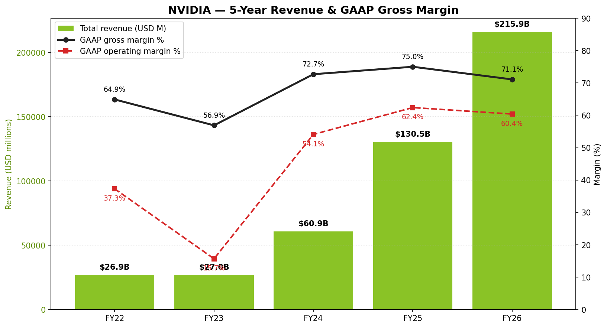
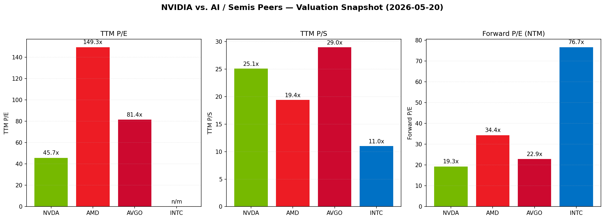
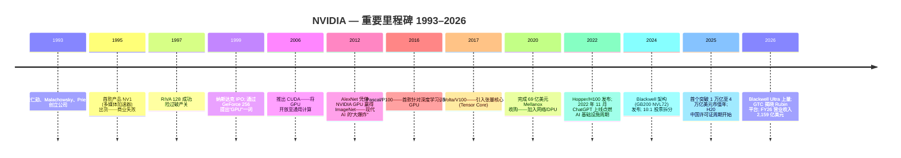
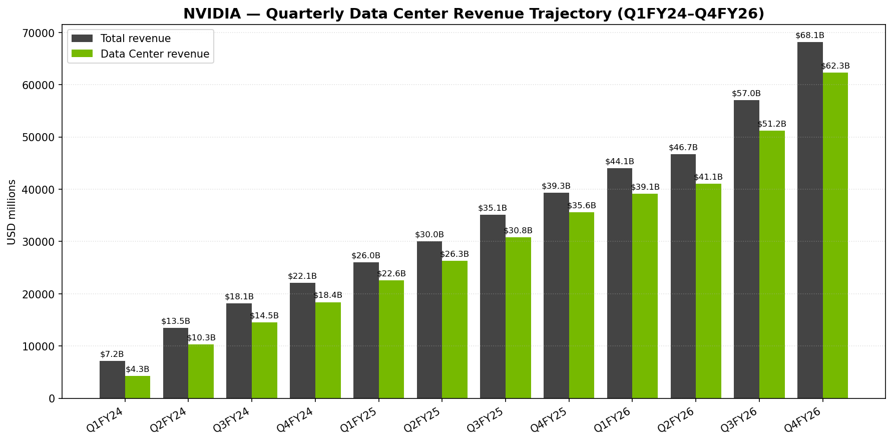
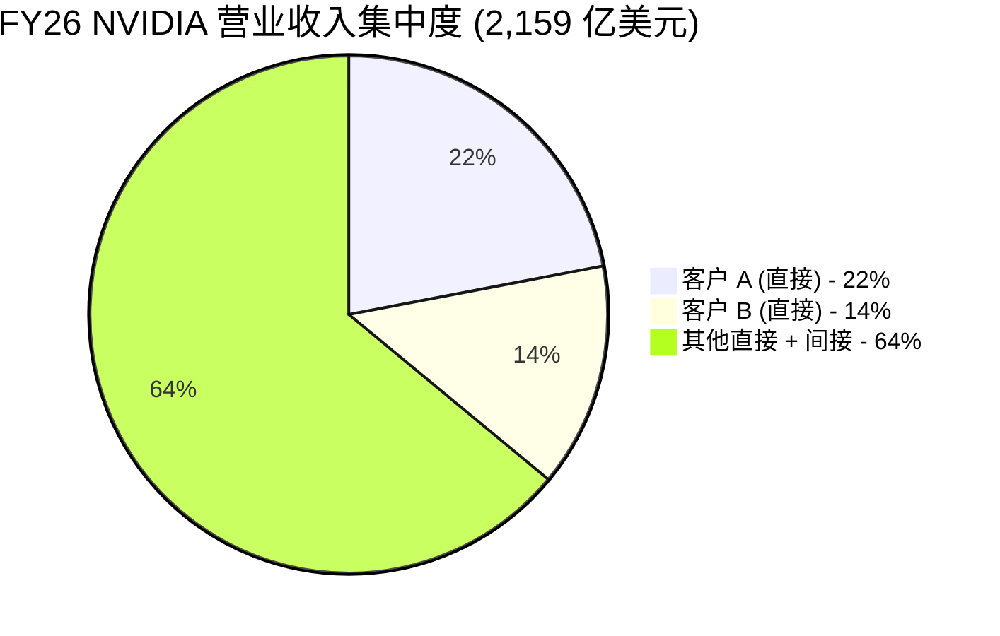
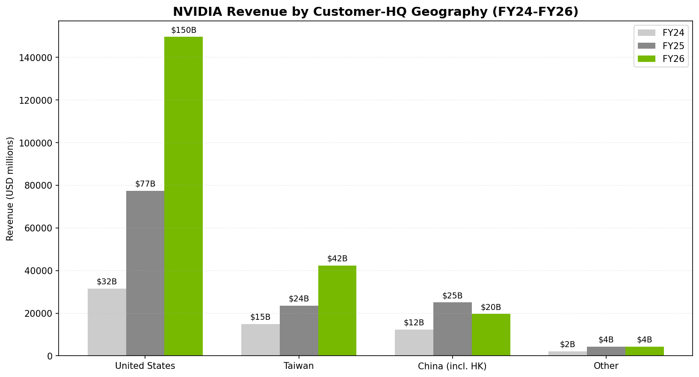
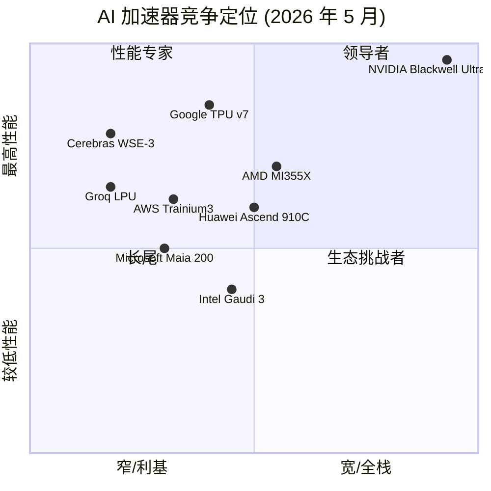
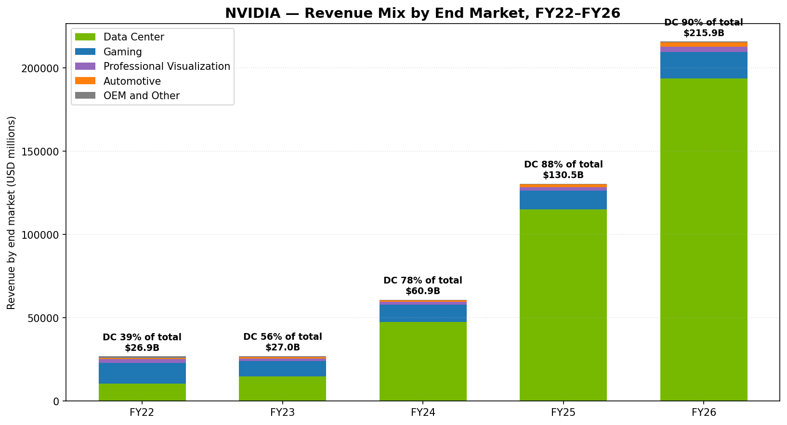
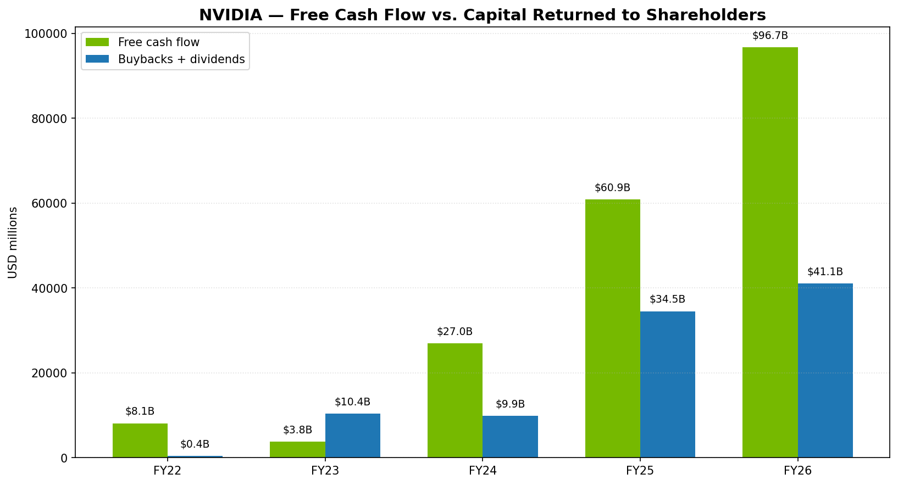

# 英伟达 (NVIDIA Corporation, NASDAQ:NVDA) — 公司研究报告

**截至日期: 2026-05-20**
**上市地: 纳斯达克全球精选市场 (NASDAQ Global Select Market), 代码 NVDA; 标普 500、纳斯达克 100、费城半导体指数成份股**
**注册地: 美国特拉华州 (1998 年自加州迁移)**
**财年结束日: 1 月最后一个星期日 (FY26 截至 2026-01-25)**
**作者: 股票研究——内部首次覆盖**
**报告语言: 简体中文 (英文版同时存在于本目录)**

> **更新——FY27 Q1 营业收入展望以 780 亿美元 (+/- 2%) 起航 (2026-02-25):** 管理层指引 FY27 Q1 营业收入 780 亿美元, 相较 FY26 Q1 报告值 441 亿美元同比增长约 77%, 相较 FY26 Q4 创纪录的 681 亿美元环比增长约 15%。GAAP 毛利率预计为 74.9% (+/- 50bp)。该展望**明确剔除了来自中国的任何数据中心 (data center) 计算业务收入**, 抹去了历史上占总收入 13–22% 的贡献。所述驱动因素为: Blackwell / Blackwell Ultra 持续上量, 以及 Vera Rubin 在 AWS、Google Cloud、Microsoft Azure 和 Oracle Cloud Infrastructure 的预部署启动。来源: [FY26 Q4 业绩公告, 2026-02-25](https://www.sec.gov/Archives/edgar/data/1045810/000104581026000019/q4fy26pr.htm)。

---

## 目录
1. 公司概览
2. 公司历史
3. 管理团队
4. 产品与服务
5. 客户与上市策略
6. 行业概览
7. 竞争格局
8. 市场机会 (TAM)
9. 风险评估
10. 参考资料

======================================

## 1. 公司概览

英伟达 (NVIDIA Corporation) 设计并销售一套全栈式加速计算 (accelerated computing) 平台, 其核心基础组件是图形处理器 (Graphics Processing Unit, GPU)。这家 1993 年从 PC 图形领域起家的初创公司, 截至 FY26 已成为管理层口中"重塑所有行业的数据中心级 AI 基础设施公司" ([英伟达 FY2026 10-K, Item 1 — Business](https://www.sec.gov/Archives/edgar/data/1045810/000104581026000021/nvda-20260125.htm))。公司销售芯片 (GPU、CPU、DPU、网络交换机和网卡)、整机柜级系统 (DGX、HGX、GB200/GB300 NVL72)、网络平台 (NVLink、InfiniBand、Spectrum-X 以太网、BlueField DPU), 以及以 CUDA、CUDA-X 库、NVIDIA AI Enterprise、NIM 微服务和 NVIDIA Omniverse 平台为锚的庞大软件栈。

FY26 营业收入达 **2,159 亿美元**, 较 FY25 的 1,305 亿美元同比增长 65%, 约为 FY23 报告值 269.7 亿美元的 8 倍 ([FY2026 10-K MD&A](https://www.sec.gov/Archives/edgar/data/1045810/000104581026000021/nvda-20260125.htm))。净利润为 1,200.7 亿美元 (净利润率 55.6%; 摊薄每股收益 (EPS) 4.90 美元), GAAP 营业利润为 1,304 亿美元, 营业利润率 60.4% ([FY2026 10-K, 合并损益表](https://www.sec.gov/Archives/edgar/data/1045810/000104581026000021/nvda-20260125.htm))。FY26 自由现金流为 966 亿美元 ([FY26 Q4 业绩公告, 非 GAAP 调节](https://www.sec.gov/Archives/edgar/data/1045810/000104581026000019/q4fy26pr.htm))。公司在 38 个国家拥有约 42,000 名员工, 其中约 31,000 人从事研发——英伟达过半数工程师从事软件而非芯片设计 ([FY2026 10-K, 人力资本管理](https://www.sec.gov/Archives/edgar/data/1045810/000104581026000021/nvda-20260125.htm))。

来源: [英伟达 FY2026 10-K, MD&A 与附注 16](https://www.sec.gov/Archives/edgar/data/1045810/000104581026000021/nvda-20260125.htm); FY22 和 FY23 取自 [FY2024 10-K, 附注 17](https://www.sec.gov/Archives/edgar/data/1045810/000104581024000029/nvda-20240128.htm)。

**商业模式。** 英伟达在两个经营分部进行报告: **计算与网络 (Compute & Networking)** (数据中心、汽车、AI 软件) 和 **图形 (Graphics)** (GeForce、Quadro/RTX PRO、GeForce NOW、汽车信息娱乐)。FY26 计算与网络贡献 **1,935 亿美元 (占营业收入 89.6%)**, 图形贡献 225 亿美元 (10.4%) ([FY2026 10-K, 附注 16](https://www.sec.gov/Archives/edgar/data/1045810/000104581026000021/nvda-20260125.htm))。从公司"专业化市场 (specialized markets)"四分披露 (更具业务相关性的视角) 看:

| 终端市场 | FY26 营业收入 (百万美元) | 同比 | 占 FY26 总收入比重 |
|---|---:|---:|---:|
| 数据中心 (Data Center) | 193,737 | +68% | 89.7% |
| 游戏 (Gaming) | 16,042 | +41% | 7.4% |
| 专业可视化 (Professional Visualization) | 3,191 | +70% | 1.5% |
| 汽车 (Automotive) | 2,349 | +39% | 1.1% |
| OEM 及其他 (OEM and Other) | 619 | +59% | 0.3% |
| **合计** | **215,938** | **+65%** | **100.0%** |

来源: [FY2026 10-K, 附注 16, 按终端市场划分的收入](https://www.sec.gov/Archives/edgar/data/1045810/000104581026000021/nvda-20260125.htm)。

在数据中心内部, 英伟达首次按此规模披露计算 (Compute) 和网络 (Networking) 子项: 计算 (GPU、CPU、系统) 为 1,624 亿美元 (同比 +59%), 网络为 314 亿美元 (同比 +142%)——后者由 GB200/GB300 整机柜系统内部的 NVLink 交换机驱动, 以及 Spectrum-X 以太网和 Quantum InfiniBand 在超大规模客户处的放量 ([FY2026 10-K MD&A — 计算与网络](https://www.sec.gov/Archives/edgar/data/1045810/000104581026000021/nvda-20260125.htm))。

**地理版图。** FY26 按客户总部所在地分布: 美国 1,496 亿美元 (69%)、台湾 423 亿美元 (20%)、中国 (含香港) 197 亿美元 (9%)、其他 43 亿美元 (2%) ([FY2026 10-K, 附注 16](https://www.sec.gov/Archives/edgar/data/1045810/000104581026000021/nvda-20260125.htm))。台湾占比因合约制造路由被高估——英伟达估计 FY26 在台湾计费的数据中心收入中约 76% 最终被美国和欧洲终端客户消化。中国从 FY25 的 250 亿美元 (占总收入 19.2%) 缩水至 FY26 的 197 亿美元 (9.1%), 主因是 2025 年 4 月美国政府对 H20 出口许可证的要求, 以及由此产生的 45 亿美元库存与采购承诺减值。

**规模指标。**
- 员工人数: 约 42,000 人 (FY26) vs. 约 36,000 人 (FY25), 同比 +17%
- 研发支出: 185 亿美元 (FY26) vs. 129 亿美元 (FY25), 同比 +43% ([FY2026 10-K, MD&A](https://www.sec.gov/Archives/edgar/data/1045810/000104581026000021/nvda-20260125.htm))
- 现金 + 有价证券: FY26 期末 626 亿美元
- FY26 资本回报: 411 亿美元 (404 亿美元回购 + 9.7 亿美元股息); FY26 期末剩余回购授权 585 亿美元, 2025 年 8 月又新增 600 亿美元授权 ([FY2026 10-K, 股东资本回报](https://www.sec.gov/Archives/edgar/data/1045810/000104581026000021/nvda-20260125.htm))

### 估值快照

| 指标 | 数值 | 来源 / 备注 |
|---|---|---|
| 收盘价 (2026-05-20) | 223.87 美元 | [Yahoo Finance NVDA, 2026-05-20](https://finance.yahoo.com/quote/NVDA/key-statistics/) |
| 市值 | 5.42 万亿美元 | Yahoo Finance |
| 企业价值 (EV) | 5.31 万亿美元 | Yahoo Finance |
| 52 周区间 | 129.16–236.54 美元 | Yahoo Finance |
| TTM 摊薄 EPS (GAAP) | 4.90 美元 | [FY2026 10-K](https://www.sec.gov/Archives/edgar/data/1045810/000104581026000021/nvda-20260125.htm) |
| TTM 市盈率 P/E (GAAP) | 约 45.7 倍 | 223.87 / 4.90 |
| TTM 市销率 P/S | 25.1 倍 | 市值 / TTM 营业收入 2,159.4 亿美元 |
| 前瞻 P/E (FY27, 一致预期) | 约 19.3 倍 | Yahoo Finance NTM EPS 11.61 美元 |
| EV/EBITDA (TTM) | 约 39.9 倍 | Yahoo Finance |
| 股息率 | 0.02% (极低) | NVDA 每股年度股息为 0.04 美元 |

**同业可比 (TTM, 2026-05-20 取自 Yahoo Finance):**

| 公司 | 代码 | 市值 (十亿美元) | TTM P/E | TTM P/S | NTM P/E |
|---|---|---:|---:|---:|---:|
| NVIDIA | NVDA | 5,423 | 45.7 倍 | 25.1 倍 | 19.3 倍 |
| Broadcom | AVGO | 1,982 | 81.4 倍 | 29.0 倍 | 22.9 倍 |
| AMD | AMD | 726 | 149.3 倍 | 19.4 倍 | 34.4 倍 |
| Intel | INTC | 594 | 不具意义 (亏损) | 11.0 倍 | 76.7 倍 |

来源: [Yahoo Finance 行情页, 2026-05-20](https://finance.yahoo.com/quote/NVDA/key-statistics/)。

来源: [Yahoo Finance, 2026-05-20](https://finance.yahoo.com/quote/NVDA/key-statistics/)。

**NVDA 估值倍数解读。** 45.7 倍 TTM P/E 和 25.1 倍 TTM P/S 相对于宽基标普 500 (约 20–23 倍 P/E、2–3 倍 P/S) 显得偏高, 但**低于除 Intel 以外的所有直接 AI 杠杆型同业** (Intel 当前无正盈利)。AVGO 的 TTM P/S 达 29 倍; AMD 的 TTM P/E 达 149 倍。三大驱动因素解释 NVDA 的估值倍数, 每一项均可从财报中得到支撑:

1. **盈利能力本身已非寻常高位。** FY26 GAAP 净利润率 55.6% 和 60.4% 营业利润率, 是有史以来同等规模硬件公司中最高的盈利水平之一; 45.7 倍 P/E 资本化的是真实、高质量的盈利流, 而非未来利润的占位符 ([FY2026 10-K, 合并损益表](https://www.sec.gov/Archives/edgar/data/1045810/000104581026000021/nvda-20260125.htm))。
2. **前瞻盈利大幅压缩估值倍数。** 19.3 倍 NTM P/E 隐含一致预期 EPS 在 FY27 翻倍至约 11.61 美元——基于 Blackwell Ultra 全年和 Rubin H2 上量。管理层 FY27 Q1 营业收入指引 780 亿美元, 按持平年化推算超过 3,120 亿美元 ([FY26 Q4 业绩公告展望](https://www.sec.gov/Archives/edgar/data/1045810/000104581026000019/q4fy26pr.htm))。
3. **AI 基础设施溢价, 无同等规模对标。** 没有任何竞争对手能交付集成"前沿 GPU + 专有 scale-up 互连 (NVLink) + AI 优化 scale-out (Spectrum-X) + 协同设计 CPU (Grace) + 占主导地位的开发者平台 (CUDA, 750 万开发者)"的组合。估值倍数将这一护城河压缩进了单一数字。

25.1 倍 TTM P/S 是若数据中心增长降速时最易遭受重新估值的指标——参见第 9 章。该倍数处于 NVDA 自身 3 年区间的**低端** (2024 年下半年 Blackwell 发布前后股价曾短暂交易在 >35 倍 P/S)。

---

## 2. 公司历史

英伟达由 黄仁勋 (Jen-Hsun "Jensen" Huang)、Chris Malachowsky 和 Curtis Priem 于 1993 年 4 月在加州圣何塞一家 Denny's 餐厅创立。当时黄仁勋年仅 30 岁, 刚从 LSI Logic 的总监岗位辞职; Malachowsky 和 Priem 此前是 Sun Microsystems 的工程师, 从事 GX 图形架构的开发 ([FY2026 10-K, Item 1 — 高管信息](https://www.sec.gov/Archives/edgar/data/1045810/000104581026000021/nvda-20260125.htm); [英伟达官方公司历史页面](https://www.nvidia.com/en-us/about-nvidia/))。公司于 1993 年 4 月在加州注册成立, 1998 年 4 月迁注册地至特拉华州, 并于 1999 年 1 月在纳斯达克 IPO, 发行价 12 美元/股 (按 2024 年拆股后调整为 0.04 美元)。

来源: 综合 [英伟达 FY2026 10-K, Item 1](https://www.sec.gov/Archives/edgar/data/1045810/000104581026000021/nvda-20260125.htm) 与 [英伟达公司历史页面](https://www.nvidia.com/en-us/about-nvidia/)。

**三次战略转折定义了公司。**

1. **GPU → 通用加速器 (2006)。** 推出 CUDA 将 GeForce 8 架构开放给非图形负载。CUDA 是一项内部信念赌注——在深度学习成为杀手级应用之前的多年间, 华尔街只看到毛利率拖累。2012 年的 AlexNet 成果 (Krizhevsky、Sutskever、Hinton 在两块 GeForce GTX 580 上训练卷积网络) 是其验证事件 ([FY2026 10-K, Item 1](https://www.sec.gov/Archives/edgar/data/1045810/000104581026000021/nvda-20260125.htm))。
2. **离散 GPU 供应商 → 数据中心级系统公司 (2020 起)。** 2020 年 4 月完成 Mellanox 收购 (69 亿美元), 新增了出货机柜级产品所需的 InfiniBand/以太网交换、网卡和 DPU。Hopper、Blackwell 和 Rubin 都是协同设计的计算+网络系统, 以 36 颗 Grace / 72 颗 Blackwell 的 NVL72 机柜形态出货 ([FY2026 10-K, Item 1 — 数据中心](https://www.sec.gov/Archives/edgar/data/1045810/000104581026000021/nvda-20260125.htm))。FY26 网络收入同比 +142% 至 314 亿美元, 因为每个 GB200/GB300 机柜都附带可单独计费的 NVLink 交换机。
3. **硬件公司 → AI 工厂运营商和风险投资者 (2024–2026)。** FY26 在私募公司和基础设施基金上投资 175 亿美元 (FY25 仅 15 亿美元), 并提供了 35 亿美元的"土地、电力和厂房外壳"担保 ([FY2026 10-K, MD&A — 近期发展](https://www.sec.gov/Archives/edgar/data/1045810/000104581026000021/nvda-20260125.htm))。值得关注的有: 130 亿美元 Groq 授权、与 Anthropic 的多年期合作、对 Intel 的股权投资 (推动"其他收益, 净额"从 FY25 的 10.3 亿美元跳升至 FY26 的 90.2 亿美元, 由按市值计的浮盈驱动), 以及 CoreWeave 超过 5GW 的建设 ([FY26 Q4 业绩公告, 2026-02-25](https://www.sec.gov/Archives/edgar/data/1045810/000104581026000019/q4fy26pr.htm))。

**主要并购和尝试。**
- **3dfx Interactive (2000):** 资产收购终结了竞争对手, 巩固了 PC 图形领导地位。
- **Mellanox Technologies (2020):** 69 亿美元, 2020 年 4 月完成——英伟达历史上最具影响力的收购; 缔造了数据中心网络业务。
- **Arm Holdings (2020 年 9 月, 2022 年 2 月放弃):** 400 亿美元拟议交易在英国 CMA / 美国 FTC / 欧盟压力下终止。英伟达向 SoftBank 支付了 13.5 亿美元分手费, 并加速推进基于 Arm 的 Grace CPU 计划。
- **Run:ai (2024) 加上 FY25–FY26 约 15 亿美元的小型补强收购**, 用于 AI 编排/软件 (FY26 现金流量表"购买子公司, 扣除收购的现金"为 15.35 亿美元) ([FY2026 10-K, 现金流量表](https://www.sec.gov/Archives/edgar/data/1045810/000104581026000021/nvda-20260125.htm))。

**贯穿本报告的近期重要发展:**
- **2024 年 6 月:** 10:1 拆股。
- **2025 年 4 月:** 美国政府对 H20 出口中国施加许可证要求; FY26 Q1 计提 45 亿美元库存/采购承诺减值 ([FY2026 10-K, MD&A](https://www.sec.gov/Archives/edgar/data/1045810/000104581026000021/nvda-20260125.htm))。
- **2025 年 8 月:** 部分 H20 许可证已签发; 仅出货约 6,000 万美元营业收入。美国政府公开建议销售收入的 15% 归入财政部 (未正式立法)。董事会授权额外 600 亿美元股票回购。
- **2026 年 2 月:** 向特定中国客户发放小批量 H200 许可证, 须接受美国强制检验, 并征收 25% 关税。该项目 FY26 营业收入为零。FY26 Q4 业绩——创纪录营业收入 681 亿美元, 数据中心营业收入 623 亿美元; Rubin 揭晓, 声称推理成本相对 Blackwell 降低 10 倍。

---

## 3. 管理团队

### 黄仁勋 (Jen-Hsun "Jensen" Huang) — 联合创始人、总裁兼 CEO

黄仁勋于 1993 年联合创立英伟达, 自公司成立起连续担任总裁、CEO 及董事会成员——截至本报告已任职 33 年。截至 2026 年 2 月, 他 63 岁 ([FY2026 10-K, Item 1 — 高管信息](https://www.sec.gov/Archives/edgar/data/1045810/000104581026000021/nvda-20260125.htm))。

**进入英伟达前的职业生涯。** 黄仁勋在 1983 至 1985 年间是 AMD 的微处理器设计师 (1984 年从俄勒冈州立大学获得电气工程理学学士, AMD 是其首份工作)。1985 至 1993 年间他在 LSI Logic Corporation 任职多个岗位, 最后担任"Coreware"(SoC 业务部) 总监。他在 LSI 全职工作期间, 于 1992 年从斯坦福大学获得电气工程理学硕士学位。流传甚广的公司创立故事——1993 年初在加州圣何塞 Berryessa 路一家 Denny's 餐厅起草英伟达首份商业计划——已在多次长篇访谈中得到证实, 包括 [Acquired 播客 NVIDIA 第三集 (2023-09-06)](https://www.acquired.fm/episodes/nvidia-the-dawn-of-the-ai-era) 以及黄仁勋本人的多次毕业典礼演讲。

**黄仁勋具体建立了什么。** 三件事使其履历卓尔不群:
1. **30 年累计的研发投入。** 自创立以来累计研发投入超过 767 亿美元, 加上 2006 年的 CUDA 投入——在多年毛利率压力且无明显回报的情况下持续投资——构建了竞争对手未能复制的开发者生态护城河 ([FY2026 10-K, Item 1](https://www.sec.gov/Archives/edgar/data/1045810/000104581026000021/nvda-20260125.htm))。
2. **平台战略纪律产生经营杠杆。** GAAP 营业利润率从 FY24 的 54.1% 提升至 FY25 的 62.4%, FY26 即便承担 45 亿美元 H20 减值, 仍保持 60.4%。研发支出同比增长 43% 至 185 亿美元; 总运营费用占营业收入的 10.7% (FY25 为 12.6%) ([FY2026 10-K, MD&A](https://www.sec.gov/Archives/edgar/data/1045810/000104581026000021/nvda-20260125.htm))。
3. **创始人 CEO 连续性。** 黄仁勋持有约 8.706 亿股 (占 2026 年 3 月 23 日 243.1 亿股已发行股本的 3.58%), 主要通过家族信托; 是董事会中唯一的非独立董事 ([英伟达 DEF 14A, 2026-05-12 申报](https://www.sec.gov/Archives/edgar/data/1045810/000104581026000036/nvda-20260512.htm))。

**FY26 薪酬。** 总报告 NEO 薪酬为 3,634 万美元, 包含 150 万美元基本工资、2,480 万美元股票奖励 (仅 PSU——CEO 全部股权激励均为业绩挂钩)、600 万美元非股权激励 (现金奖金) 和 405 万美元"其他薪酬", 后者主要包括 398 万美元住宅及私人差旅安保支出, 加上 11,500 美元的 401(k) 匹配和人寿保险费 ([英伟达 DEF 14A, 高管薪酬汇总表](https://www.sec.gov/Archives/edgar/data/1045810/000104581026000036/nvda-20260512.htm))。从薪酬讨论看, 黄仁勋目标总薪酬的 90% 以上为业绩挂钩与风险挂钩; 100% 股权为 PSU (无 RSU)。

**公众形象。** 自 2023 年以来, 黄仁勋已成为科技业的标志性公众人物 (2023 和 2024 年时代杂志百大最具影响力人物, 多次登上《连线》和《经济学人》封面)。他亲自主持所有英伟达 GTC 主题演讲 (通常 2 小时以上, 无提词器), 多次毕业典礼演讲 (2024 年斯坦福、2024 年加州理工、2023 年台大), 并亲自巡访客户地区——最近一次是 2024–2025 年间访问台湾、韩国、日本、印度和阿联酋。他公开表示有意无限期担任 CEO ("再当几十年", 他 2024 年告诉 CNBC)。关键人物风险真实且具结构性 (参见第 9 章)。

### Colette M. Kress — 执行副总裁兼首席财务官 (CFO)

Colette Kress 于 2013 年加入英伟达担任 EVP 兼 CFO; 截至 2026 年 2 月她 58 岁 ([FY2026 10-K Item 1](https://www.sec.gov/Archives/edgar/data/1045810/000104581026000021/nvda-20260125.htm))。她持有亚利桑那大学金融学学士学位与南方卫理公会大学 MBA 学位。在加入英伟达前, Kress 在 2010 至 2013 年间任 Cisco Systems 业务技术与运营财务组织的 SVP 兼 CFO, 此前在 Microsoft 任职 13 年 (1997–2010), 历经数个 CFO 岗位, 最后担任服务器与工具部 CFO (2006–2010)。她的职业起点是 Texas Instruments 八年。

她的任期跨越英伟达三个完整的营收阶段: AI 前时代 (FY14: 41 亿美元营业收入)、游戏主导的中周期 (FY18–FY20 加密货币与游戏失真期), 以及自 FY24 起的 AI 超级周期。她一直是投资者面前的指引、资本配置和中国出口管制叙事的代言人。每个季度业绩公告附带的 CFO 评论 ([示例: FY26 Q4 CFO 评论, 2026-02-25](https://www.sec.gov/Archives/edgar/data/1045810/000104581026000019/q4fy26cfocommentary.htm)) 在分析师圈广泛阅读, 以其在分部动态上的详细程度著称。FY26 总薪酬: 1,434 万美元 (工资 90 万美元; 股票奖励 1,283 万美元; 非股权激励 60 万美元) ([英伟达 DEF 14A, 高管薪酬汇总表](https://www.sec.gov/Archives/edgar/data/1045810/000104581026000036/nvda-20260512.htm))。

### Ajay K. Puri — EVP, 全球现场运营

Puri (71 岁) 自 2005 年起领导英伟达的全球销售组织 (最初为 SVP, 2009 年升任 EVP), 是除黄仁勋外任期最长的高管 ([FY2026 10-K Item 1](https://www.sec.gov/Archives/edgar/data/1045810/000104581026000021/nvda-20260125.htm))。在加入英伟达前, 他在 Sun Microsystems 工作 22 年, 涉及销售、营销与综合管理。他主导与超大规模云、OEM/ODM、主权国家以及一线渠道的客户关系——其负责的部门在 FY26 完成了约 2,150 亿美元的营业收入达成。FY26 总薪酬: 1,478 万美元。

### Debora Shoquist — EVP, 运营

Shoquist (71 岁) 于 2007 年加入英伟达, 此前在 JDS Uniphase 担任 EVP 运营 (2004–2007)。她负责供应链、与台积电、三星、鸿海 (富士康)、纬创和 Fabrinet 的制造合作伙伴关系, 以及向美国和拉美组装的多年期产能扩张。在台积电先进封装 CoWoS 产能和 SK 海力士、美光的 HBM3e 供给一直是英伟达增长瓶颈的时期, Shoquist 所领导的组织管理约 210 亿美元的库存余额以及 FY26 计提的 72 亿美元库存准备 (包括 45 亿美元 H20 减值) ([FY2026 10-K, MD&A — 毛利](https://www.sec.gov/Archives/edgar/data/1045810/000104581026000021/nvda-20260125.htm))。FY26 总薪酬: 1,429 万美元。

### 治理

- **董事会构成。** 截至 2026 年共 10 名董事 (Tench Coxe、John O. Dabiri、黄仁勋、Dawn Hudson、Harvey C. Jones、Melissa B. Lora、Stephen C. Neal (首席董事)、A. Brooke Seawell、Aarti Shah、Mark A. Stevens)。其中 9 人按纳斯达克规则属于独立董事; 黄仁勋是唯一的非独立董事 ([英伟达 DEF 14A, 董事选举](https://www.sec.gov/Archives/edgar/data/1045810/000104581026000036/nvda-20260512.htm))。2026 年 5 月 7 日, 董事会批准自 2026 年 7 月 13 日起扩至 11 名董事, 新增 Suzanne Nora Johnson。
- **内部人持股。** 董事及高管 (14 人) 合计持有 9.573 亿股, 占已发行股本的 **3.94%** (其中黄仁勋一人即 3.58%)。5% 以上持有人为 BlackRock (7.43%, 据 2024 年 1 月 13G/A 经 2024 年 10:1 拆股调整) 和 Vanguard (7.31%, 据 2026 年 4 月 13G) ([英伟达 DEF 14A, 实益所有权表](https://www.sec.gov/Archives/edgar/data/1045810/000104581026000036/nvda-20260512.htm))。
- **薪酬结构。** CEO 目标薪酬 90% 以上风险挂钩; 100% 股权为 PSU (无 RSU)。FY26 可变现金计划营收目标维持在 FY25 创纪录水平; 多年期 PSU 目标按 FY25 拔高计划设定——属不同寻常的"提高门槛"激进做法。
- **治理标志/分类。** 年度董事改选 (无分类董事会)、多数票当选、代理权进入 (3% / 3 年)、独立首席董事、无双重股权、无超级表决权股份。FY26 代理材料中未披露任何关联交易。我们未观察到治理红旗。

### 管理层履历综合

黄仁勋/Kress 是美国科技业中任期最长且最成功的 CEO/CFO 组合之一。两人合力按计划或接近计划地完成了自 2013 年以来的每一次架构换代 (Maxwell、Pascal、Volta、Turing、Ampere、Hopper、Blackwell、Rubin), 在十年间将毛利率扩大了约 30 个百分点, 完成了 Mellanox 整合, 处理了 Arm 交易终止, 并管理着对美国半导体施加过的最具影响力的出口管制制度。可见的空白是: (i) 真正的继任风险——黄仁勋没有明显的二把手, FY26 代理材料也未公布 CEO 继任人选池; (ii) 公司在地缘政治边缘运营的能力, 严重依赖黄仁勋个人对中美政府的政治资本。

---

## 4. 产品与服务

英伟达的产品组合围绕四大"专业化市场"(数据中心、游戏、专业可视化、汽车) 加上规模小得多的"OEM 及其他"分类构建。在每个市场内, 公司销售一套日益协同设计的栈——芯片 → 系统 → 网络 → 软件 → 服务。下文产品树囊括了截至 2026 年 5 月的实质性 SKU/系列; 次级 SKU (每个 GeForce 变种、每个开发者套件) 被合并。

```mermaid
graph TD
    NVDA[NVIDIA 公司]
    NVDA --> DC[数据中心, 1,937 亿美元 / 89.7%]
    NVDA --> GM[游戏, 160 亿美元 / 7.4%]
    NVDA --> PV[专业可视化, 32 亿美元 / 1.5%]
    NVDA --> AU[汽车 + 机器人, 23 亿美元 / 1.1%]
    NVDA --> OE[OEM 及其他, 6 亿美元 / 0.3%]

    DC --> DCSi[芯片]
    DCSi --> Hopper[H100 / H200 / H20 - 上代]
    DCSi --> Blackwell[B100 / B200 / GB200 / Blackwell Ultra GB300]
    DCSi --> Rubin[Rubin / Rubin Ultra - FY27 H2 量产]
    DCSi --> Grace[Grace CPU; Grace Hopper GH200; Grace Blackwell GB200]
    DC --> DCNet[网络 - Mellanox 血脉]
    DCNet --> NVLink[NVLink + NVLink 交换机 + NVLink Fusion]
    DCNet --> Spectrum[Spectrum-X 以太网]
    DCNet --> Quantum[Quantum InfiniBand]
    DCNet --> BlueField[BlueField-3 / BlueField-4 DPU]
    DC --> DCSys[系统]
    DCSys --> DGX[DGX H200 / DGX B200 / DGX Spark / DGX Cloud]
    DCSys --> HGX[HGX H200 / HGX B200 / HGX GB300 NVL72]
    DC --> DCSW[软件]
    DCSW --> CUDA[CUDA / CUDA-X 库]
    DCSW --> AIEnt[NVIDIA AI Enterprise]
    DCSW --> NIM[NIM 微服务 + NeMo + AI Blueprints]
    DCSW --> Omni[Omniverse + Cosmos 物理 AI]

    GM --> GeForce[GeForce RTX 50 系列桌面与笔记本]
    GM --> GFNow[GeForce NOW 云游戏]
    GM --> SoC[主机 SoC, 含 Nintendo Switch 血脉]
    GM --> DLSS[DLSS 4 / 4.5 + G-SYNC Pulsar]

    PV --> RTXPRO[RTX PRO 5000 / 6000 Blackwell 工作站 GPU]
    PV --> DGXSpark[DGX Spark 个人 AI 工作站]
    PV --> OmniWS[Omniverse Enterprise]

    AU --> Drive[DRIVE AGX Thor / Orin]
    AU --> DriveHyp[DRIVE Hyperion 生态系统]
    AU --> Cosmos[Cosmos / Isaac GR00T 物理 AI]
    AU --> Alpamayo[Alpamayo 开源 AV 模型]
```

### 数据中心 (1,937 亿美元 / 占 FY26 营业收入 89.7%)

数据中心分部如今就是公司本身。其中, **计算 (GPU + CPU + 系统)** FY26 为 1,624 亿美元, **网络** 为 314 亿美元。这套组合——不仅卖加速器, 还卖能将多达数十万颗 GPU 连接为单一训练/推理系统的 scale-up 互连、scale-out 互连、DPU、CPU 和软件——这就是英伟达所称的"数据中心级", 也使其能够捕获远比离散 GPU 供应商所能捕获的更大比例的客户基础设施支出 ([FY2026 10-K, Item 1 — 数据中心](https://www.sec.gov/Archives/edgar/data/1045810/000104581026000021/nvda-20260125.htm))。

来源: 英伟达季度业绩公告, [FY24 Q1 至 FY26 Q4 (2023-05-24 至 2026-02-25)](https://investor.nvidia.com/financial-info/financial-reports/)。

**Hopper (H100、H200、H20——上一代)。** 最初于 2022 年发布 (H100), 2024 年推出 H200。H20 是 2023 年末为符合 2023 年 10 月出口管制阈值而设计的中国合规版本; 在 2025 年 4 月许可证要求出台后, H20 需求崩溃, 英伟达计提了 45 亿美元减值 ([FY2026 10-K, MD&A — 政府监管](https://www.sec.gov/Archives/edgar/data/1045810/000104581026000021/nvda-20260125.htm))。Hopper 系统仍在长尾企业/政府部署中出货, 但数据中心结构现在以 Blackwell 为主导。*分析师观点: 竞争优势高——发布时 H100 在 Transformer 训练上无同侪; AMD MI300X 在 2024 年达到部分推理负载的对等, 但训练集群经济性仍落后。*

**Blackwell + Blackwell Ultra (B100、B200、GB200、GB300、RTX 50 系列)。** FY25 发布, FY26 全面上量。Blackwell 平台将两颗光罩极限 GPU 裸晶 (die) 合封于一颗封装内, 配合 NVLink 交换机, 构成 72 颗 GPU 的"单台计算机"机柜 (GB200 NVL72), 连接 36 颗 Grace CPU 和 72 颗 Blackwell GPU。Blackwell Ultra (GB300) 于 FY26 Q2 开始量产出货, HBM3e 容量大幅提升, 推理性能更优。据 SemiAnalysis 在英伟达自家业绩公告中引用的 InferenceX 基准, Blackwell Ultra 在代理式 AI 上相较 Hopper 性能高达 50 倍、每 Token 成本降低 35 倍 ([FY26 Q4 业绩公告, 2026-02-25](https://www.sec.gov/Archives/edgar/data/1045810/000104581026000019/q4fy26pr.htm))。*分析师观点: 竞争优势高。带专有 NVLink 交换的机柜级协同设计是产品组合中差异化最显著的部分。最接近的同业: AMD MI355X (2025 年底宣布) 在原始算力上竞争, 但缺乏等效的 scale-up 互连。*

**Rubin 和 Rubin Ultra (FY27 H2 量产)。** 2025 年 3 月 GTC 发布, FY26 Q4 业绩电话会再次确认: Rubin 自 FY27 H2 开始量产出货。六款新芯片, 声称推理 Token 成本相对 Blackwell 降低 10 倍。AWS、Google Cloud、Microsoft Azure 和 Oracle Cloud Infrastructure 将是首批部署方 ([FY26 Q4 业绩公告](https://www.sec.gov/Archives/edgar/data/1045810/000104581026000019/q4fy26pr.htm))。*分析师观点: 是 (技术 + 路线图能见度); 证据是美国四大超大规模云服务商均在芯片量产前公开承诺部署 Rubin 实例。*

**Grace CPU 和 Grace 系列 CPU 后续。** 2023 年推出, 是英伟达基于 Arm Neoverse 内核的首款数据中心 CPU, 用于 GB200/GB300 和 GH200 (Grace+Hopper) 模块。*分析师观点: 竞争优势部分。Grace 专为与 GPU 共处于同一一致性互连而设计; 并不与通用 Xeon/EPYC 正面竞争。*

**NVLink、NVLink 交换机、NVLink Fusion (FY26 新品)。** 专有 scale-up 互连。FY26 引入的 NVLink Fusion 允许超大规模云和自研 ASIC 设计方 (Google TPU、Amazon Trainium 等) 将自家 CPU 和 XPU 集成进英伟达 NVLink 生态 ([FY2026 10-K, Item 1 — 网络](https://www.sec.gov/Archives/edgar/data/1045810/000104581026000021/nvda-20260125.htm))。*分析师观点: 竞争优势高。行业联盟替代方案 UALink (AMD、Broadcom、Cisco、Google、HPE、Intel、Meta、Microsoft) 目标 1.0 规范在 2026/27 年, 但今日尚无任何量产产品在 GB200 NVL72 规模上能与 NVLink 匹敌。*

**Spectrum-X 以太网、Quantum InfiniBand、BlueField DPU。** Mellanox 血脉。Spectrum-X 是英伟达专为 AI 负载调优的以太网平台, 在超大规模 AI 网络架构中与 Broadcom Tomahawk 和 Arista 产品竞争。Quantum-2 InfiniBand 仍是最高性能训练集群的标准。BlueField-3 已量产; BlueField-4 (FY26 Q4 宣布) 是推理上下文内存存储平台 (Inference Context Memory Storage Platform) 的基础 ([FY26 Q4 业绩公告](https://www.sec.gov/Archives/edgar/data/1045810/000104581026000019/q4fy26pr.htm))。*分析师观点: 在 InfiniBand 中竞争优势高 (继承 Mellanox 垄断), AI 优化以太网持平到领先, DPU 持平 (对比 AMD Pensando、Marvell、Intel IPU)。*

**软件平台 (CUDA、CUDA-X、NVIDIA AI Enterprise、NIM、NeMo、Omniverse、BioNeMo、DGX Cloud)。** 10-K 援引全球 750 万 CUDA 开发者和 6,000 个支持应用。NVIDIA AI Enterprise 是付费商业 SKU; NIM 微服务将开源权重和专有模型打包为一键部署推理 ([FY2026 10-K Item 1 — 商业策略](https://www.sec.gov/Archives/edgar/data/1045810/000104581026000021/nvda-20260125.htm))。*分析师观点: 竞争优势极高。CUDA 是本分部最大的单一切换成本来源; 20 年累积的软件、驱动、内核、库和工具。*

### 游戏与 AI PC (160 亿美元 / 7.4%)

**GeForce RTX 50 系列 (基于 Blackwell)。** FY25 发布, FY26 全面上量。Blackwell 架构引入"神经图形"——将 AI 模型与传统渲染相结合, 加上由新 Transformer 模型架构驱动的 DLSS 4 (DLSS 4.5 于 FY26 Q4 宣布)。游戏营业收入同比增长 41% 至 160 亿美元。**FY26 Q4 游戏营业收入环比下降 13%, 因假日需求过后渠道库存正常化**, 管理层将供应紧张作为 FY27 Q1 的逆风提示 ([FY26 Q4 业绩公告](https://www.sec.gov/Archives/edgar/data/1045810/000104581026000019/q4fy26pr.htm))。

**GeForce NOW、G-SYNC Pulsar。** 云游戏订阅服务和电竞导向的可变刷新率显示技术 (FY26 Q4 推出)。

*分析师观点: 是——在高端离散显卡市场, 英伟达据第三方追踪 (Jon Peddie Research) 持有 80%+ 单位份额。最接近的竞争对手: AMD Radeon RX 9000 系列。Intel Arc 仍是低份额的第三方离散 GPU 玩家。*

### 专业可视化 (32 亿美元 / 1.5%)

**RTX PRO Blackwell 工作站 GPU (RTX PRO 5000 72GB、RTX PRO 6000)。** "Quadro"血脉的品牌重塑, 现定位为企业开发/部署专有数据代理式 AI 的本地 AI 工作站 ([FY2026 10-K, Item 1 — 专业可视化](https://www.sec.gov/Archives/edgar/data/1045810/000104581026000021/nvda-20260125.htm))。

**DGX Spark 个人 AI 工作站。** FY26 推出——桌面外形 AI 开发系统。专业可视化营业收入同比增长 70% (仅 Q4 即同比 +159%), DGX Spark 和 AI 驱动的工作站需求是明确的驱动因素 ([FY26 Q4 业绩公告](https://www.sec.gov/Archives/edgar/data/1045810/000104581026000019/q4fy26pr.htm))。

### 汽车与机器人 (23 亿美元 / 1.1%)

**DRIVE AGX Thor (基于 Blackwell) 和 DRIVE Hyperion 平台。** ADAS / 自动驾驶汽车的参考架构。FY26 扩充宣布了一长串 Tier-1 / 传感器合作伙伴名单——Aeva、AUMOVIO、Astemo、Arbe、Bosch、Hesai、Magna、Omnivision、Quanta、Sony 和 ZF Group——梅赛德斯-奔驰 CLA 项目是使用 NVIDIA DRIVE AV 软件、AI 基础设施和加速计算的标杆客户 ([FY26 Q4 业绩公告 — 汽车与机器人](https://www.sec.gov/Archives/edgar/data/1045810/000104581026000019/q4fy26pr.htm))。

**Cosmos 和 Isaac GR00T。** 物理 AI / 机器人的开源基础模型和框架; FY26 合作伙伴名单包括 Boston Dynamics、Caterpillar、Franka Robotics、Humanoid、LG Electronics 和 NEURA Robotics。汽车/机器人业务线目前规模小, 但管理层始终将其定位为物理 AI 上的多十年期选择权。

### 旗舰产品 vs. 长尾

驱动业务的 1–3 款产品明确无误:
- **GB200/GB300 NVL72 机柜系统** (Blackwell + Blackwell Ultra), 捆绑 Grace CPU + NVLink 交换机 + Spectrum-X/Quantum 网络。这些机柜级 SKU 是 FY26 大部分数据中心计算营业收入的变现方式。
- **NVIDIA AI Enterprise 软件** (付费许可证) 和更广义的 CUDA-X 栈——作为直接业务线规模小, 但是保护硬件 ASP 的护城河。
- **GeForce RTX 50 系列桌面/笔记本 GPU**——支撑仍在产生现金流的消费品牌。

长尾 / 下降:
- **Hopper (H100/H200) 需求**稳定但已非增长引擎。
- **H20** 在 2025 年 4 月出口管制后实际为零。
- **OEM 及其他** (6.19 亿美元, 占营业收入 0.3%) 在组合占比继续缩小。

### 路线图 / 近期发布 (过去 12 个月)

- **Blackwell Ultra GB300** — FY26 Q2 开始量产出货。
- **Vera Rubin 平台** — FY26 揭晓, FY27 H2 量产, 推理成本相对 Blackwell 降低 10 倍。
- **NVLink Fusion** — 向第三方 CPU / XPU 开放 NVLink (FY26)。
- **BlueField-4 DPU + 推理上下文内存存储平台** — FY26 Q4。
- **DGX Spark** — 个人 AI 工作站, FY26 上量。
- **DLSS 4 / 4.5 和 G-SYNC Pulsar** — 游戏软件/显示进步, FY26。
- **NVIDIA Nemotron 3 系列** — 开源代理式 AI 模型系列, FY26 Q4。
- **NVIDIA Earth-2 系列** — 开源 AI 天气模型, FY26 Q4。
- **NVIDIA Alpamayo、Cosmos 和 Isaac GR00T 开源发布** — 物理 AI 模型, FY26 Q4。

FY26 10-K 未披露任何重大产品退役。

---

## 5. 客户与上市策略

### 客户分类

英伟达的直接客户由四组重叠群体构成: **(1) 公共云和超大规模 CSP** (AWS、Microsoft Azure、Google Cloud、Oracle Cloud Infrastructure; Meta 有时也被视为超大规模型直接买家), **(2) AI 模型开发商和"新云"(neoclouds)** (OpenAI、Anthropic、xAI、CoreWeave、Lambda、Together AI、Baseten、Fireworks AI、DeepInfra), **(3) OEM / ODM / 系统集成商** (Dell、HPE、Lenovo、Supermicro、鸿海/富士康、纬创、广达), 以及 **(4) 企业直销 + 主权 / 公共部门** (英国、法国、沙特、阿联酋、印度、日本、韩国的国家 AI 工厂项目; 列名行业合作伙伴如 Meta、Anthropic、梅赛德斯-奔驰、Synopsys、Cadence、Siemens、Eli Lilly) ([FY2026 10-K, Item 1 — 销售与营销; FY26 Q4 业绩公告](https://www.sec.gov/Archives/edgar/data/1045810/000104581026000021/nvda-20260125.htm))。

间接客户 (经由系统集成商和分销商采购的客户) 包括相同的云厂商, 以及全球的企业和公共部门买家。管理层在 FY26 10-K 中指出, 公司估计 **一家 AI 研究和部署公司通过英伟达的直接客户购买云服务, 对 FY26 营业收入做出了重大贡献**——这被普遍解读为指 OpenAI 经由 Microsoft Azure 和 Oracle 采购算力。

### 客户集中度 — 量化

这是 NVDA 当今最重大的单一风险指标。来自 FY26 10-K:

> "对于 2026 财年, 对一家直接客户的销售占总营业收入 **22%**, 对另一家直接客户的销售占总营业收入 **14%**, 两者主要归属于计算与网络分部。" ([FY2026 10-K, Item 1A — 风险因素与 MD&A; 在财务报表附注 16 中复述](https://www.sec.gov/Archives/edgar/data/1045810/000104581026000021/nvda-20260125.htm))

披露的 >10% 直接客户 3 年趋势 (均主要归属于计算与网络):
| 财年 | 客户 A | 客户 B | 客户 C | 已披露 >10% 合计 | 备注 |
|---|---:|---:|---:|---:|---|
| FY24 | 13% | – | – | 13% | 仅披露一家 |
| FY25 | 12% | 11% | 11% | 34% | 三家均披露为 ≥10% |
| FY26 | 22% | 14% | – | 36% | 集中度加速 |

来源: [英伟达 FY2026 10-K, MD&A — 营业收入集中度与附注 16](https://www.sec.gov/Archives/edgar/data/1045810/000104581026000021/nvda-20260125.htm)。客户身份在报表中未披露; 据第三方分析师评论的市场共识指向, 顶级买家是 Microsoft、Meta 以及作为超大规模订单一线渠道的最大 ODM (鸿海/富士康) 的组合, 但英伟达未具名。

**为何这是实质性风险而非披露口径问题。** FY26 风险因素明确写道: "我们有少量合作伙伴参与与我们关键客户的系统集成。随着系统设计日益复杂, 系统集成商可能无法满足关键客户的规格。合作伙伴或客户业务模式或所有权的变化可能减少我们可用的合作伙伴数量。" ([FY2026 10-K, Item 1A — 风险因素](https://www.sec.gov/Archives/edgar/data/1045810/000104581026000021/nvda-20260125.htm))。前 2 大直接客户集中了 FY26 营业收入的 36%, 且自 FY24 的前 1 13% 加速至 FY26 的 22%, NVDA 已越过常规"高"阈值 (前 1 > 20%)。缓释项是 **公司最大的直接客户也在设计内部加速器** (Google TPU、AWS Trainium/Inferentia、Microsoft Maia、Meta MTIA)——它们既是英伟达最大的收入来源, 也是最可信的长期竞争对手。

**合同结构。** 据 10-K: "我们的大部分销售按订单单笔进行, 我们的客户可在几乎不提前通知且无罚款的情况下取消、变更或推迟产品采购承诺。" 不存在已披露的多年期数量承诺——Meta 公布的"数百万颗 Blackwell 和 Rubin GPU"多年期多代际合作仅是新闻稿承诺, 而非合同承诺。

### 渠道与上市策略

英伟达通过以下方式销售:
1. **直销给超大规模云、新云和大企业** (Ajay Puri 的全球现场运营团队)。解决方案架构师与客户协同进行集群启动、模型调优和部署。
2. **OEM 和 ODM** (Dell、HPE、Lenovo、Supermicro、鸿海、纬创、广达), 它们将 HGX 板卡和 Grace Blackwell 系统集成进品牌服务器。
3. **AIB 和分销商** 用于 GeForce (ASUS、MSI、Gigabyte、Zotac、PNY 等)。
4. **DGX Cloud 和"英伟达作为 MSP"模式** — 英伟达通过 CSP 合作伙伴将 AI 算力作为服务销售。
5. **开发者生态** — 750 万 CUDA 开发者, Inception 创业项目, Deep Learning Institute 培训。

销售周期跨度从数天 (商品化 GeForce / 专业可视化卡) 到 18 个月以上 (主权 AI 工厂部署)。解决方案架构销售成本可观——嵌入 SG&A, 后者 FY26 占营业收入 2.1% (46 亿美元), 而顶部收入高达 2,159 亿美元 ([FY2026 10-K, MD&A — 运营费用](https://www.sec.gov/Archives/edgar/data/1045810/000104581026000021/nvda-20260125.htm))。

来源: [FY2026 10-K, 附注 16 — 地理营业收入](https://www.sec.gov/Archives/edgar/data/1045810/000104581026000021/nvda-20260125.htm)。

### 近期具名赢单

来自 FY26 Q4 业绩公告 ([2026-02-25](https://www.sec.gov/Archives/edgar/data/1045810/000104581026000019/q4fy26pr.htm)):
- **Meta:** 多年期多代际合作, 包括"数百万颗 NVIDIA Blackwell 和 Rubin GPU"。
- **Anthropic:** 投资与深度技术合作; Claude 在 Microsoft Azure 上扩展, 由英伟达提供算力。
- **AWS、Google Cloud、Microsoft Azure、Oracle Cloud Infrastructure:** 均列为 Vera Rubin 实例的首批部署方。
- **CoreWeave:** 合作加速到 2030 年超过 5GW AI 工厂建设。
- **梅赛德斯-奔驰 CLA:** AV 合作, 使用 DRIVE AV 软件、AI 基础设施和加速计算。
- **Eli Lilly:** 药物发现的协同创新 AI 实验室。
- **Infosys、Persistent、Tech Mahindra、Wipro:** 印度企业代理合作。
- **美国能源部 Genesis Mission:** 被列为应用 AI 于能源、科学和国家安全的指定行业合作伙伴。
- **Groq:** 非独家授权协议 (FY26 现金流量表中记为 130 亿美元投资活动现金流出——参见现金流量表)。

### 物理 AI / 机器人领域的关键合作

Boston Dynamics、Caterpillar、Franka Robotics、Humanoid、LG Electronics、NEURA Robotics——均使用英伟达 Cosmos / Isaac GR00T 栈进行基础模型和仿真 ([FY26 Q4 业绩公告](https://www.sec.gov/Archives/edgar/data/1045810/000104581026000019/q4fy26pr.htm))。禾赛科技 (Hesai Technology) 在 Drive Hyperion 生态合作伙伴名单中。

---

## 6. 行业概览

### 行业定义

英伟达主要参与**人工智能加速计算基础设施**——公司自身将其定位为上一代通用 CPU 主导计算的继承者。我们认定相邻子行业为在范围之内:

- **数据中心 GPU / AI 加速器** (核心市场, 2026 预期约 2,500–3,250 亿美元)
- **数据中心网络** (以太网、InfiniBand、NVLink 类互连, 约 600–900 亿美元)
- **PC 离散和集成显卡** (GeForce、Radeon、Intel Arc)
- **用于内容创作、CAD、工程的工作站 GPU**
- **汽车 ADAS / AV SoC**
- **边缘 AI 和机器人计算**
- **AI 企业软件和平台** (CUDA、AI Enterprise、NIM、MLOps 工具)

NAICS 覆盖: 334413 (半导体及相关器件制造)、511210 (软件出版商)、541512 (计算机系统设计服务)。

### 市场规模与增长

**数据中心 AI 加速器 (核心市场)。** 多家第三方追踪机构估算 2024 年市场规模约 1,100–1,300 亿美元 (英伟达按营业收入占据 80% 多份额), 2026 年市场规模约 2,500–3,250 亿美元。Gartner 的《全球 AI 半导体预测》(2025-08, 本报告之前的最新 Gartner 更新) 预计 2027 年 AI 半导体总营业收入为 2,970 亿美元, 2028 年为 3,800 亿美元, 至 2028 年的复合增长率约 30% ([Gartner Forecast: AI Semiconductors, Worldwide, 2025-08-19](https://www.gartner.com/en/documents/5891030)——需 Gartner 订阅; 数据被行业媒体广泛援引, 包括 [Reuters, 2025-08-20](https://www.reuters.com/technology/artificial-intelligence/))。IDC《全球 AI 基础设施预测》(2025-11) 将广义 AI 基础设施硬件市场 (计算 + 网络 + 存储) 在 2026 年估为 5,100 亿美元, 2030 年逾 1 万亿美元 ([IDC 新闻稿, 2025-11-14](https://www.idc.com/getdoc.jsp?containerId=prUS54186825))。Bloomberg Intelligence 自下而上估算的 2026 年超大规模云资本开支约 5,250 亿美元 (美国四大超大规模云 AWS、Azure、Google、Meta 合计) ([Bloomberg Intelligence, 2026-02-12](https://www.bloomberg.com/professional/blog/))——这是英伟达 TAM 最相关的前瞻指标, 因为超大规模云资本开支即为直接买家。

**离散 GPU (游戏 + 工作站)。** Jon Peddie Research 最新公布的估算是 2024 年 470 亿美元, 至 2027 年高个位数增长——AI 计算市场的零头, 是稳态而非增长贡献者。

**汽车 AI 计算。** 据 S&P Global Mobility 和 Yole Group 自下而上预测, 2025 年约 50–80 亿美元, 至 2030 年增至 250–350 亿美元。英伟达是这里三家可信 Tier-1 SoC 供应商之一, 另外两家是 Mobileye 和 Qualcomm。

### 关键趋势与增长驱动

1. **推理经济性是新战场。** 训练最大前沿模型仍需要最高性能 scale-up 系统 (Blackwell Ultra / Rubin), 但长期支出中规模大得多的池子是规模化推理——这里 Blackwell Ultra 相对 Hopper 的 50 倍性能 / 35 倍每 Token 成本优势才有意义。管理层引用 Rubin 相对 Blackwell"每 Token 成本降低 10 倍" ([FY26 Q4 业绩公告](https://www.sec.gov/Archives/edgar/data/1045810/000104581026000019/q4fy26pr.htm))。同样的动力使 AMD MI355X 和超大规模云自研芯片项目即便无法在训练上对抗 Blackwell, 在推理上仍具备商业可行性。
2. **代理式 AI 负载。** 多步、长上下文工作流的推理模型与聊天式推理具有截然不同的计算特征——它们需要更多的内存带宽和更持续的互连吞吐量。这正是 Blackwell Ultra 和 Rubin 在 10-K 产品定位中的明确设计中心 ([FY2026 10-K, Item 1 — 数据中心](https://www.sec.gov/Archives/edgar/data/1045810/000104581026000021/nvda-20260125.htm))。
3. **物理 AI / 机器人。** 一项长周期选择权。Cosmos 和 Isaac GR00T 的发布以及列名机器人合作伙伴信号表明英伟达意图在下一代计算平台上拥有仿真 + 基础模型层。实质性营业收入还需数年。
4. **主权 AI。** 多国项目 (英国、法国、沙特/阿联酋、印度、日本、韩国) 正在下达单一买家订单, 每笔规模约 50–250 亿美元的 AI 工厂订单。它们周期慢但 AOV 极高; FY26 10-K 将美国 DOE Genesis Mission 列为一例。
5. **能源和电力作为约束条件。** 10-K 的 MD&A 明确指出: "数据中心、能源和资本对客户和合作伙伴建设 NVIDIA AI 基础设施至关重要, 任何此类或其他必要资源的短缺都可能影响我们未来的营业收入和财务表现。" ([FY2026 10-K, MD&A — 近期发展](https://www.sec.gov/Archives/edgar/data/1045810/000104581026000021/nvda-20260125.htm))。在美国和欧洲, 超大规模数据中心级电力交付目前的交期为 24–48 个月。
6. **开源 AI 模型竞争。** 10-K 直接承认: "开源 AI 依赖于开发者采用, 如果部署在我们竞争对手的平台上, 可能减少我们产品和服务的需求。" Llama、Mistral、DeepSeek 和 Qwen 的进展削弱了"每个客户都需要绝对前沿模型"的假设, 而这个假设早期支撑了英伟达的定价权。

### 监管环境

最具影响力的单一监管变量是**美国对中国和"D:5"国家的先进半导体出口管制**。FY26 10-K 梳理了脉络: 2022 年 8 月初始管制; 2023 年 10 月更宽泛阈值; 2025 年 4 月 H20 许可证要求 (以及导致的 45 亿美元 FY26 Q1 减值); 2025 年 1 月 AI Diffusion IFR 在 2025 年 5 月被废除; 2025 年 10 月 GAIN AI Act 作为 NDAA 的一部分在参议院通过, 将限制行政部门调整管制的能力; 2026 年 2 月对中国发放小批量 H200 许可证 ([FY2026 10-K, Item 1 — 政府监管](https://www.sec.gov/Archives/edgar/data/1045810/000104581026000021/nvda-20260125.htm))。管理层的措辞罕见地直接:

> "截至 2026 财年末, 我们已实质性地被排除在中国数据中心计算/算力市场之外, 这种实质性排除帮助了我们的竞争对手在全球范围内建立了更大的开发者和客户生态系统以挑战我们。除非我们能够带着一款同时获得美国政府和中国政府批准的产品回归, 否则我们的损失机会以及竞争对手的获益将对我们的业务、经营业绩和财务状况产生重大不利影响。"

这是英伟达在任何先前 10-K 中关于"我们已失去战略上重要的市场"做出过的最强烈陈述。即便 2026 年 2 月许可了 H200, 数量微小, 产品仍需接受美国检验并在再进口时缴纳 25% 关税。

欧盟委员会 AI 法案 (自 2024 年起生效, 大部分义务在 2026 年实施) 以及英国、日本、印度和新加坡的类似制度今日大致是顺风 (创造合规级基础设施需求), 而非对英伟达硬件的约束。反垄断审查是中期风险: 欧盟委员会已就 AI 芯片竞争开始非正式调查, 美国 FTC 和 DOJ 双方都表达了兴趣。FY26 10-K 中未披露对英伟达的正式行动。

### 行业动态

- **碎片化。** 在顶部高度集中。英伟达占据数据中心 AI 加速器营业收入的 85–90%; AMD 5–10%; 其他人 (超大规模云自研芯片、华为、Groq、Cerebras、Tenstorrent 等) 是长尾。
- **供应商议价能力。** 严峻。TSMC 用于晶圆 (在领先制程节点无可信第二来源); SK 海力士、美光和三星用于 HBM3e/HBM4 (HBM 是本轮周期的约束条件); TSMC CoWoS 用于先进封装。英伟达的制造策略明确是无晶圆厂且集中于亚洲, 正在向美国和拉美扩张 ([FY2026 10-K, Item 1 — 制造](https://www.sec.gov/Archives/edgar/data/1045810/000104581026000021/nvda-20260125.htm))。
- **买方议价能力。** 上升。前 2 大直接客户占 FY26 营业收入 36%。超大规模云既是英伟达最大的客户也是经由自研芯片的长期最可信竞争对手。今日定价权仍强, 但买方对卖方平衡正逐步倾斜。
- **替代品。** 超大规模云自研 ASIC (Google TPU v5p/v6e、AWS Trainium2/3、Microsoft Maia 100/200、Meta MTIA) 主要竞争推理。AMD Instinct 在较低价格点上跨训练和推理竞争。Groq 和 Cerebras 服务于专业推理负载。在英伟达 GB200/GB300 的出货规模上, 上述任何一者均不是全栈替代。
- **进入壁垒。** 极高。复制 CUDA 开发者生态、NVLink 交换 IP、Mellanox 网络业务和机柜级系统设计能力, 需要数十年的有机投资或数百亿美元的并购; 对新进入者来说, 两者均不完全可得。

---

## 7. 竞争格局

FY26 10-K 在四个分类下点名竞争对手 ([FY2026 10-K, Item 1 — 竞争](https://www.sec.gov/Archives/edgar/data/1045810/000104581026000021/nvda-20260125.htm)):

| 分类 | 英伟达列出的竞争对手 |
|---|---|
| 离散/集成 GPU、自研 AI 芯片 | AMD、华为、Intel |
| 拥有内部 AI 芯片的大型 CSP | 阿里巴巴、Alphabet/Google、Amazon、百度、华为、Microsoft |
| Arm CPU 供应商 | Amazon、华为、Microsoft |
| 服务器、汽车、游戏的嵌入式 / SoC | Ambarella、AMD、Broadcom、Intel、Qualcomm、Renesas、Samsung、Tesla |
| 网络 (交换机、网卡/DPU、线缆/光模块) | AMD、Arista、Broadcom、Cisco、HPE、华为、Intel、Lumentum、Marvell、内部超大规模团队 |

### 关键竞争对手与定位

**AMD (NASDAQ: AMD)。** Instinct MI300X/MI325X (Hopper 级) 和 MI355X/MI400 系列 (Blackwell 级) 是唯一可信的第三方数据中心 AI 加速器竞争对手。AMD CEO 苏姿丰透露 2025 年 AI 加速器营业收入超过 50 亿美元, 2026 年目标 80–100 亿美元——约为英伟达 1,937 亿美元数据中心规模的 4–5%。微软、Meta 和 Oracle 是已部署客户。TTM P/E 149.3 倍, 处于压低盈利水平 ([Yahoo Finance AMD, 2026-05-20](https://finance.yahoo.com/quote/AMD/))。*分析师观点: 在训练系统上落后, 在部分推理负载上持平, 缺乏可与 NVLink 竞争的机柜级互连。*

**Broadcom (NASDAQ: AVGO)。** 两个方向: (1) **自研 AI ASIC 设计** — Broadcom 设计 Google TPU、Meta MTIA 以及额外的超大规模云项目 (据卖方报告, 至 2026 上半年 AI-ASIC 年化营业收入超过 120 亿美元); (2) **Tomahawk 以太网交换 ASIC** 与英伟达 Spectrum-X 竞争。市值 1.98 万亿美元, TTM P/E 81.4 倍 ([Yahoo Finance AVGO, 2026-05-20](https://finance.yahoo.com/quote/AVGO/))。*分析师观点: 近期最大威胁: 超大规模云自研 ASIC 量经由 Broadcom 替代英伟达 GPU 用于推理。*

**Intel (NASDAQ: INTC)。** Gaudi 3 未能扩展; Intel 于 2025 年停止 Gaudi 单独披露。Intel 现在对英伟达的相关性在于: (a) Xeon 作为非 GB200 服务器中的主机 CPU 基底, 以及 (b) 英伟达 2025 年对 Intel 的股权投资——按市值计的浮盈推动"其他收益, 净额"从 FY25 的 10.3 亿美元跳升至 FY26 的 90.2 亿美元 ([FY2026 10-K, MD&A](https://www.sec.gov/Archives/edgar/data/1045810/000104581026000021/nvda-20260125.htm))。*分析师观点: 今天不是认真的 AI 加速器竞争对手; 只在 IFS 成为可信第二来源时才相关。*

**Google TPU v5p/v6e/v7 ("Ironwood")。** 最成熟的超大规模云自研加速器。仅以 Google Cloud TPU 实例形式销售。据近期披露, TPU 占 Google 内部 AI 计算约 30–40%。*分析师观点: 仅在 GCP 上的内部替代品。*

**AWS Trainium2/3、Microsoft Maia 200、Meta MTIA v2。** 全部是各自云上的内部替代。Anthropic 公开承诺大规模部署 Trainium2/3。Meta FY26 在 MTIA 之外仍承诺"数百万颗 Blackwell 和 Rubin GPU", 显示出"互补而非替代"的模式 ([FY26 Q4 业绩公告](https://www.sec.gov/Archives/edgar/data/1045810/000104581026000019/q4fy26pr.htm))。

**华为 (中国)。** Ascend 910B/910C 是中国国内主导的非英伟达 AI 加速器。英伟达从中国数据中心算力的实质性排除 (据 FY26 10-K) 将国内份额拱手让予华为。*分析师观点: 在中国占主导; 在其他地方无规模; 华为中国生态的扎根是 10-K 提示的长尾威胁。*

**Cerebras、Groq、Tenstorrent、SambaNova、Rebellions、MatX。** 专业推理/训练加速器。Groq 于 FY26 从英伟达获得 130 亿美元授权 (竞争中和, 非并购) ([FY2026 10-K, 现金流量表](https://www.sec.gov/Archives/edgar/data/1045810/000104581026000021/nvda-20260125.htm))。Cerebras 于 2024 年申请 IPO; 在特定科学/推理负载中是利基玩家但资金充足。

### 英伟达的竞争优势 — 综合

1. **CUDA 开发者生态 (最高护城河)。** 750 万开发者、6,000 个支持应用、20 年累积的库/内核/工具。任何非平凡训练运行的切换成本是人月到人年级别。
2. **NVLink + NVLink 交换机 (机柜级互连)。** 专有 scale-up 互连; 在 GB200 NVL72 规模下今日无第三方等效产品, 直到 2027 年左右 UALink 量产。
3. **Mellanox 网络业务。** 端到端 InfiniBand、Spectrum-X (AI 优化以太网) 和 BlueField DPU。
4. **芯片 + 系统 + 软件的纵向集成。** 机柜级出货 (GB200 NVL72、GB300、未来的 Rubin 机柜) 单台 AI 工厂占据的钱包份额超过任何离散 GPU 竞争对手所能企及。
5. **一年节奏的可信度。** Hopper → Blackwell → Blackwell Ultra → Rubin → Rubin Ultra 为客户提供了任何竞争对手都无法匹敌的规划能见度。
6. **资本实力。** 626 亿美元现金、FY26 自由现金流 966 亿美元、FY26 175 亿美元生态投资——竞争对手望尘莫及。

### 弱点

1. **超大规模云客户兼任长期竞争对手** — 经由自研芯片 (Google TPU、AWS Trainium、Microsoft Maia、Meta MTIA)。
2. **晶圆代工/HBM 集中。** TSMC 在领先节点单一来源; SK 海力士主导 HBM 供应。
3. **中国排除。** 占 FY26 营业收入约 9%, 较 FY25 约 19% 下降; FY26 10-K 明确表示这种排除"重大且不利"。排除延续越久, 华为和中国替代品扎根越深。
4. **任何增长降速都将引发估值倍数压缩。** 45.7 倍 TTM P/E 嵌入了多年累积的预期; 即便一个季度的下调指引都会令股价急剧重新估值。
5. **开源模型 + 推理成本压缩** 可能减少部分客户为"我们需要绝对前沿硬件"支付的溢价。

---

## 8. 市场机会 (TAM)

### TAM 测算

英伟达的服务机会嵌入在三个嵌套市场中:

**第一层 — AI 加速器硬件 (芯片 + 系统)。** 据交叉验证的 Gartner、IDC 和 Bloomberg Intelligence 预测, 2026 年约 2,500–3,250 亿美元; 至 2028 年超 5,000 亿美元。英伟达 FY26 数据中心营业收入 1,937 亿美元, 隐含其在 2025/2026 日历年的营业收入份额约 70–78% (英伟达 FY26 截至 2026 年 1 月 25 日, 因此其 FY26 大部分营业收入在 2025 日历年, 仅 Q4 跨入 2025/2026 日历年衔接段)。

**第二层 — AI 基础设施 (硬件 + 网络 + 存储 + 软件)。** 据 [IDC《全球 AI 基础设施预测》, 2025-11](https://www.idc.com/getdoc.jsp?containerId=prUS54186825), 2026 年约 5,100 亿美元, 至 2030 年增长至超过 1 万亿美元。这包括英伟达的网络 (FY26 314 亿美元), 加上英伟达不卖但赋能的存储和互补软件。

**第三层 — AI 服务/企业支出。** 企业和 CSP 在 AI 相关产品和服务上的总支出, [Gartner《全球生成式 AI 在 IT 市场的支出预测》, 2025-09](https://www.gartner.com/en/newsroom/press-releases/2025-09-17-gartner-forecasts-worldwide-genai-spending-to-total-1-5-trillion-in-2025) 预测 2025 年全球 1.5 万亿美元。英伟达并未直接覆盖这一层的大部分, 但其硬件支撑了相当大比例的负载。

Bloomberg Intelligence 的超大规模云资本开支追踪器是最具操作性的前瞻指标。BI 最近公布的估算是 **2026 日历年来自 AWS、Azure、Google 和 Meta 的合计资本开支约 5,250 亿美元**, 较 2025 年的约 3,600 亿美元和 2024 年的约 2,200 亿美元增长 ([Bloomberg Intelligence, 2026-02-12](https://www.bloomberg.com/professional/blog/), 在 [Reuters, 2026-01-30](https://www.reuters.com/technology/) 中总结)。假设 50–60% 的超大规模云资本开支流向 AI 基础设施, 且英伟达捕获 AI 硬件部分的 65–75%, 隐含的英伟达超大规模云驱动营业收入仅 2026 日历年即达 1,700–2,300 亿美元——与管理层 FY27 Q1 780 亿美元营业收入指引大致一致。

### SAM 与 SOM

- **SAM (可服务可获得市场):** 第一层加上英伟达实际销售的网络、DPU、系统和软件部分的子集。我们将其估算为 **2026 日历年约 3,500–4,000 亿美元**, 包括约 2,800 亿美元加速器硬件、约 700 亿美元 AI 网络 (以太网 + InfiniBand + NVLink 级)、超过 100 亿美元 AI 工作站和边缘, 以及 100–150 亿美元 AI 企业软件 (付费许可证 + DGX Cloud)。
- **SOM (可服务可获得市场实际可达):** 按当前赢单率和产能, 英伟达 2026 日历年营业收入应在 **2,900–3,400 亿美元** 区间, 基于 (a) FY27 Q1 780 亿美元指引按持平年化推算至约 3,120 亿美元, 以及 (b) 朝 Rubin FY27 H2 持续环比增长。

### 渗透策略

FY26 10-K 的战略陈述 (Item 1 — 商业策略) 强调了五个交织的渗透方式:

1. **一年期产品节奏** 以保持架构领先 (Hopper → Blackwell → Blackwell Ultra → Rubin → Rubin Ultra)。
2. **端到端平台 vs. 离散芯片** — 销售机柜、软件和网络, 而非仅 GPU。
3. **主权 AI** — 在自研芯片项目就绪前赢得国家级 AI 工厂部署。
4. **生态投资** — FY26 175 亿美元风险投资组合 + 35 亿美元数据中心厂房/电力担保创造了对英伟达硬件的拉动需求。
5. **开源模型领导力** — Nemotron 3、Cosmos、Earth-2 和 Alpamayo 确立英伟达作为部署最广泛的开源基础模型的首选运行时。

来源: [FY2026 10-K, 附注 16](https://www.sec.gov/Archives/edgar/data/1045810/000104581026000021/nvda-20260125.htm) 用于 FY24–FY26; [FY2024 10-K, 附注 17](https://www.sec.gov/Archives/edgar/data/1045810/000104581024000029/nvda-20240128.htm) 用于 FY22–FY23。

数据中心份额自 FY22 约 40% 升至 FY26 约 90%, 是美国半导体史上该规模水平最具影响力的产品组合转变。游戏、专业可视化和汽车在 FY24–FY26 期间绝对值有不错增长, 但被 AI 数据中心建设浪潮远远甩开。

---

## 9. 风险评估

### 公司特定风险

**1. 客户集中度 (高)。** 前 1 大直接客户占 FY26 营业收入 22%, 前 2 大合计 36%——从 FY24 的 13% 和 FY25 (跨 3 家客户) 的 34% 明显加速 ([FY2026 10-K, MD&A — 营业收入集中度](https://www.sec.gov/Archives/edgar/data/1045810/000104581026000021/nvda-20260125.htm))。披露的客户未具名, 但被理解为充当底层超大规模云买家代理的 ODM 渠道组合 (鸿海/富士康、纬创)。这些最大直接客户中有几家正在同时开发自有芯片 (Google TPU、AWS Trainium、Microsoft Maia、Meta MTIA)。缓释项: 多年期多代际承诺如 Meta 合作; 间接客户需求的广度 (主权 AI、新云、企业)。**严重性评级: 高 (前 1 > 20%)。**

**2. 供应商集中度 / 先进封装产能 (高)。** TSMC 是唯一领先制程晶圆厂, CoWoS 是唯一可行的先进封装工艺, HBM3e/HBM4 供应由 SK 海力士主导, 美光和三星分列第二、第三。任何干扰 (台湾地缘政治事件、HBM 良率问题、TSMC 产能分配转向) 都将直接限制出货 ([FY2026 10-K, Item 1A — 风险因素](https://www.sec.gov/Archives/edgar/data/1045810/000104581026000021/nvda-20260125.htm))。缓释项: 明确扩张至美国和拉美组装, 多元 HBM 供应商, 但领先制程晶圆厂约束在近期无缓释方案。**严重性: 高。**

**3. 对黄仁勋的关键人物依赖 (中-高)。** 自 1993 年起任创始 CEO, 唯一非独立董事, 个人持股占已发行股本 3.58%。FY26 Q4 代理材料未披露 CEO 继任池 ([英伟达 DEF 14A, 2026-05-12](https://www.sec.gov/Archives/edgar/data/1045810/000104581026000036/nvda-20260512.htm))。缓释项: 长期任职的深厚高管储备 (Puri 21 年、Shoquist 19 年、Kress 13 年) 以及平台战略的经营纪律。但战略愿景和反周期资本配置明显依赖于黄仁勋。**严重性: 中-高。**

**4. 中国出口管制制度 (高; 结构性)。** 据管理层: 截至 FY26 末英伟达"实质性地被排除在中国数据中心计算/算力市场之外" ([FY2026 10-K, Item 1 — 政府监管](https://www.sec.gov/Archives/edgar/data/1045810/000104581026000021/nvda-20260125.htm))。H20 自 2025 年 4 月起本质为零; 2026 年 2 月 H200 许可证为小批量, 须接受美国检验并征收 25% 再进口关税。每一季度的排除都使华为 Ascend 和中国替代品扎根更深。缓释项: 短期内需求向非中国客户的转移更多于补偿 (中国营业收入同比下降 54 亿美元, 而总营业收入同比增长 854 亿美元)。**严重性: 高但部分对冲。**

**5. 库存与需求错配 (中)。** 库存从 FY25 末 101 亿美元增至 FY26 末 214 亿美元。FY26 库存准备共计 72 亿美元 (包括 45 亿美元 H20 减值); 对毛利率的不利影响为营业收入的 2.6% ([FY2026 10-K, MD&A — 毛利](https://www.sec.gov/Archives/edgar/data/1045810/000104581026000021/nvda-20260125.htm))。架构换代节奏 (Blackwell → Blackwell Ultra → Rubin 在约 18 个月内) 增大了客户跨代时上一代库存搁置的风险。缓释项: 大部分库存对接特定已知客户的合同, 且产品换代节奏与超大规模云配合。**严重性: 中。**

**6. 产品/技术过时风险 (中)。** 激进的 12 个月架构节奏意味着即便是成功代际 (如 H100、H200) 也只有短暂的溢价变现窗口, 然后被下一代家族挤压。10-K 提示: "客户可能推迟购买新架构, 或可能比预期更缓慢地采纳新技术, 影响我们的营业收入时序。" 缓释项: 平台与软件策略使代际间过渡对客户来说更不痛苦, 因为 CUDA 持续存在。**严重性: 中。**

### 行业 / 市场风险

**7. 超大规模云自研芯片采纳率 (中-高)。** Google TPU v7、AWS Trainium3、Microsoft Maia 200 和 Meta MTIA v2 合计可能在 2027–2028 年取代英伟达超大规模云 GPU 需求的可量化百分比, 尤其用于推理。Broadcom 的 120 亿美元以上 AI-ASIC 业务是供给侧推动者。缓释项: 超大规模云在自研芯片放量的同时仍以更大绝对体量采购英伟达, 因为 (a) 自研项目仅覆盖部分负载, (b) 最新英伟达代际在最苛刻训练上总是获胜, 以及 (c) Meta FY26 承诺"数百万颗 Blackwell 和 Rubin GPU"显示出"互补而非替代"模式。**严重性: 在 2027–2030 视角下中-高。**

**8. AMD 的竞争烈度 (中)。** AMD MI355X / MI400 系列正在以更低价格点缩小推理负载的差距; 苏姿丰指引 2026 年 AI 加速器营业收入 80–100 亿美元。微软、Meta 和 Oracle 都已实质性部署 Instinct。缓释项: AMD 仍是英伟达数据中心营业收入规模的 4–5%, 且缺乏机柜级互连。**严重性: 中。**

**9. 开源模型部署转移 (中)。** 前沿开源权重模型 (Llama 4、DeepSeek V3、Qwen 3、Mistral Large 3) 运行在低成本硬件 (AMD、超大规模云自研芯片、边缘) 上, 可能压缩对顶级英伟达硬件需求的推理负载份额。FY26 10-K 明确提示该风险。缓释项: 英伟达自身就是领先的开源模型发布者 (Nemotron、Cosmos), 大部分开源模型仍在英伟达基础设施上训练。**严重性: 中。**

**10. 电力和数据中心产能瓶颈 (中)。** 10-K 的 MD&A 将数据中心 / 能源 / 资本可用性列为客户建设的约束条件。美国和欧盟超大规模数据中心的审批周期为 24–48 个月。缓释项: 英伟达 35 亿美元厂房/电力担保支持客户建设。**严重性: 中。**

### 财务风险

**11. 估值/估值倍数压缩风险 (中)。** 45.7 倍 TTM P/E 和 25.1 倍 TTM P/S 在增长降速时留下实质性下行空间。虽然前瞻 P/E 19.3 倍较为可消化, 但其依赖于一致预期 FY27 EPS 约 11.61 美元——接近翻倍。FY27 Q1 780 亿美元指引的任何不及预期, Rubin 上量延期的任何评论, 或更广泛 AI 基础设施叙事的任何实质性重新估值都可能将估值倍数压缩 25–40%, 即使盈利如期实现。AVGO/AMD/INTC 同业 TTM P/E 中位数 (排除 INTC 的负值) 约 115 倍——尽管 NVDA 规模如此, 在 TTM P/E 上实际**低于** AI 同业中位数, 我们将其解读为估值倍数已部分纳入轻微降速假设。**严重性: 中 (中周期回撤概率高, 鉴于盈利缓冲, 严重性中等)。**

**12. 股权投资带来的其他收益波动 (低-中)。** FY26"其他收益, 净额"为 90 亿美元, 大部分是非上市和公开持有权益证券的未实现收益, 包括 Intel 投资。该项目 FY25 为 10 亿美元, FY24 为 16 亿美元。FY26 GAAP 净利润中约 6.5% 来自该项目。英伟达 223 亿美元的非上市股权投资组合 (大部分为 AI 创业公司; 投资组合从 FY25 末 34 亿美元膨胀) 的市场重新估值可能让报告盈利两端大幅摆动 ([FY2026 10-K, 资产负债表 — 非上市股权证券](https://www.sec.gov/Archives/edgar/data/1045810/000104581026000021/nvda-20260125.htm))。**严重性: 低-中 (尾部风险放大器, 非核心投资逻辑风险)。**

### 宏观经济风险

**13. 美中脱钩延伸 (高)。** 美国出口管制的任何进一步收紧 (例如, 将 H200 级限制扩展至更多 D:5 国家, GAIN AI Act 锁定现有规则) 将进一步切入可服务营业收入, 加速中国替代生态的扎根。缓释项: 2026 年 2 月对中国发放 H200 许可证表明制度并非严格单向。**严重性: 在多年视角下高。**

**14. AI 资本开支超建 / 超大规模云资本开支回调 (若发生则高)。** 超大规模云资本开支 2025 年同比翻倍, 预测 2026 年增长约 45% ([Bloomberg Intelligence, 2026-02](https://www.bloomberg.com/professional/blog/))。任何单季度的一致预期回调——由 AI ROI 担忧、电力约束生效或信贷周期冲击驱动——将同时压缩 NVDA 的增长前景和估值倍数。缓释项: 主权 AI、企业本地、新云和物理 AI 需求提供了远离超大规模云敞口的多样化, 但超大规模云仍是近期主导买家。**严重性: 高 (最具影响力的宏观风险)。**

来源: [FY2026 10-K, 现金流量表](https://www.sec.gov/Archives/edgar/data/1045810/000104581026000021/nvda-20260125.htm) 用于 FY24–FY26; [FY2024 10-K](https://www.sec.gov/Archives/edgar/data/1045810/000104581024000029/nvda-20240128.htm) 和 [FY2022 10-K](https://www.sec.gov/Archives/edgar/data/1045810/000104581022000036/) 用于早期年份。

资本回报图在宏观背景下令人安心: 英伟达 FY26 产生了 966 亿美元自由现金流, 向股东返还了 411 亿美元——即在客户进行多季度资本开支消化期间, 回购速率仍有充分空间, 同时保持现金余额增长。

---

## 10. 参考资料

### 英伟达 SEC 申报文件 (主要来源)
- [英伟达截至 2026 年 1 月 25 日财年 10-K (2026-02-25 申报)](https://www.sec.gov/Archives/edgar/data/1045810/000104581026000021/nvda-20260125.htm)
- [英伟达截至 2025 年 1 月 26 日财年 10-K (2025-02-26 申报)](https://www.sec.gov/Archives/edgar/data/1045810/000104581025000023/nvda-20250126.htm)
- [英伟达截至 2024 年 1 月 28 日财年 10-K (2024-02-21 申报)](https://www.sec.gov/Archives/edgar/data/1045810/000104581024000029/nvda-20240128.htm)
- [英伟达截至 2022 年 1 月 30 日财年 10-K (2022-03-18 申报)](https://www.sec.gov/Archives/edgar/data/1045810/000104581022000036/)
- [英伟达 DEF 14A 委托书声明, 2026-05-12 申报](https://www.sec.gov/Archives/edgar/data/1045810/000104581026000036/nvda-20260512.htm)
- [FY26 Q4 业绩公告 (8-K, 2026-02-25 申报)](https://www.sec.gov/Archives/edgar/data/1045810/000104581026000019/q4fy26pr.htm)
- [FY26 Q4 CFO 评论 (8-K, 2026-02-25 申报)](https://www.sec.gov/Archives/edgar/data/1045810/000104581026000019/q4fy26cfocommentary.htm)
- [FY26 Q3 业绩公告 (8-K, 2025-11-19 申报)](https://www.sec.gov/Archives/edgar/data/1045810/000104581025000228/q3fy26pr.htm)
- [FY26 Q2 业绩公告 (8-K, 2025-08-27 申报)](https://www.sec.gov/Archives/edgar/data/1045810/000104581025000207/q2fy26pr.htm)
- [FY26 Q1 业绩公告 (8-K, 2025-05-28 申报)](https://www.sec.gov/Archives/edgar/data/1045810/000104581025000115/q1fy26pr.htm)

### 公司官网 / 投资者关系
- [NVIDIA 公司历史与"关于"](https://www.nvidia.com/en-us/about-nvidia/)
- [NVIDIA 投资者关系](https://investor.nvidia.com/)
- [NVIDIA 数据中心产品](https://www.nvidia.com/en-us/data-center/)
- [NVIDIA 游戏 / GeForce](https://www.nvidia.com/en-us/geforce/)
- [NVIDIA 专业可视化 / RTX PRO](https://www.nvidia.com/en-us/design-visualization/)
- [NVIDIA DRIVE 汽车](https://www.nvidia.com/en-us/self-driving-cars/)

### 市场数据
- [Yahoo Finance NVDA 关键统计数据, 2026-05-20](https://finance.yahoo.com/quote/NVDA/key-statistics/)
- [Yahoo Finance AMD 关键统计数据, 2026-05-20](https://finance.yahoo.com/quote/AMD/key-statistics/)
- [Yahoo Finance AVGO 关键统计数据, 2026-05-20](https://finance.yahoo.com/quote/AVGO/key-statistics/)
- [Yahoo Finance INTC 关键统计数据, 2026-05-20](https://finance.yahoo.com/quote/INTC/key-statistics/)

### 行业 / 市场规模
- [Gartner, "Forecast: AI Semiconductors, Worldwide", 2025-08-19](https://www.gartner.com/en/documents/5891030)
- [Gartner, "Forecast: Generative AI Spending Across IT Markets, Worldwide", 2025-09-17](https://www.gartner.com/en/newsroom/press-releases/2025-09-17-gartner-forecasts-worldwide-genai-spending-to-total-1-5-trillion-in-2025)
- [IDC, "Worldwide AI Infrastructure Forecast", 2025-11-14](https://www.idc.com/getdoc.jsp?containerId=prUS54186825)
- [Bloomberg Intelligence — 超大规模云资本开支追踪器, 2026-02](https://www.bloomberg.com/professional/blog/)
- [Reuters — 超大规模云 2026 资本开支指引报道, 2026-01-30](https://www.reuters.com/technology/)

### 第二手 / 播客 / 访谈
- [Acquired 播客 — "NVIDIA: The Dawn of the AI Era", 2023-09-06](https://www.acquired.fm/episodes/nvidia-the-dawn-of-the-ai-era)

---

*免责声明: 本文为根据截至 2026-05-20 公开信息编纂的内部研究文件。不构成投资建议, 不应据此作出任何投资决策。作者可能在英伟达或其竞争对手中持有经济利益。*
