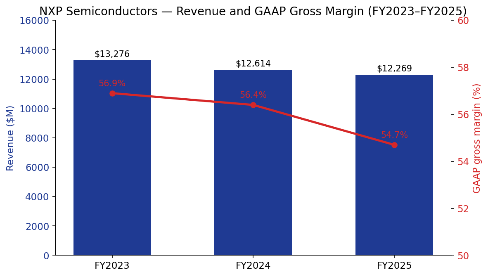
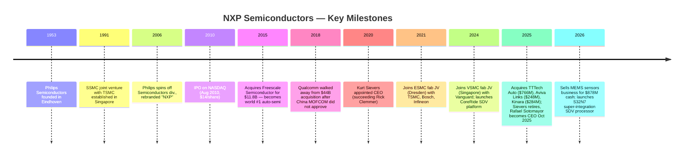
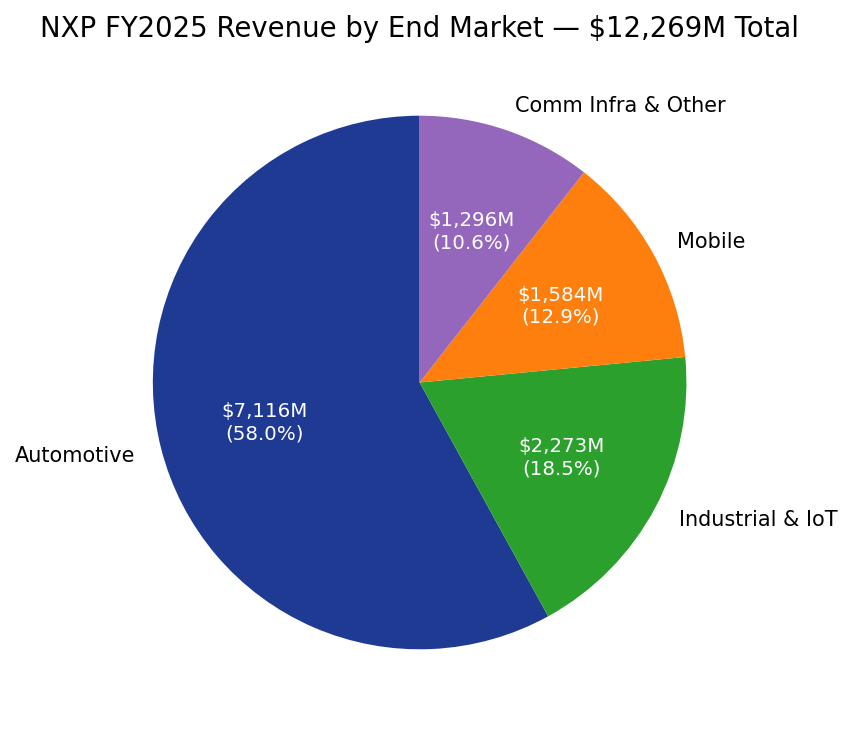
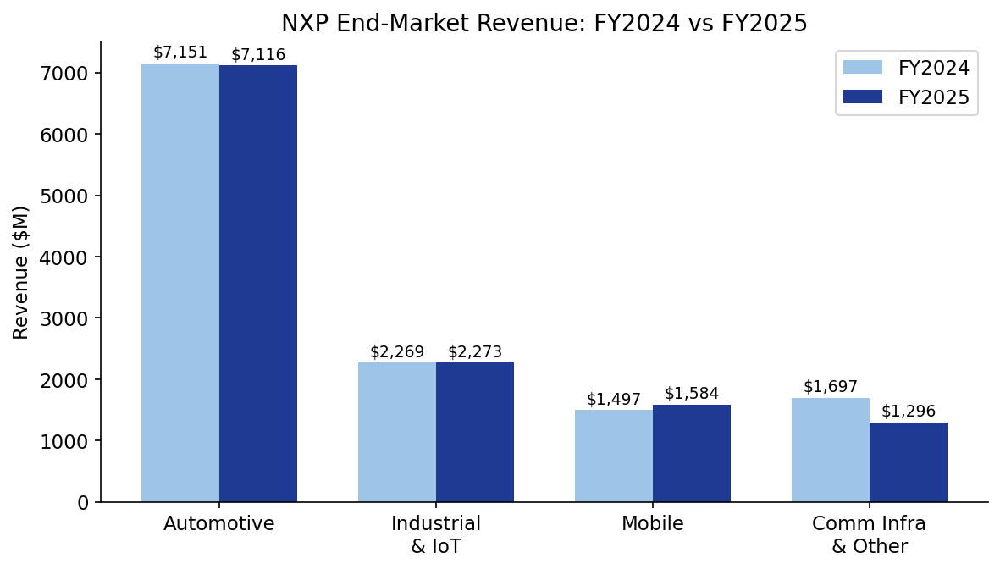
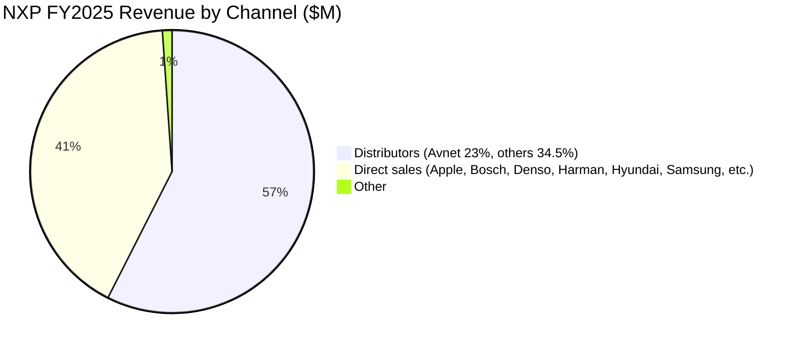
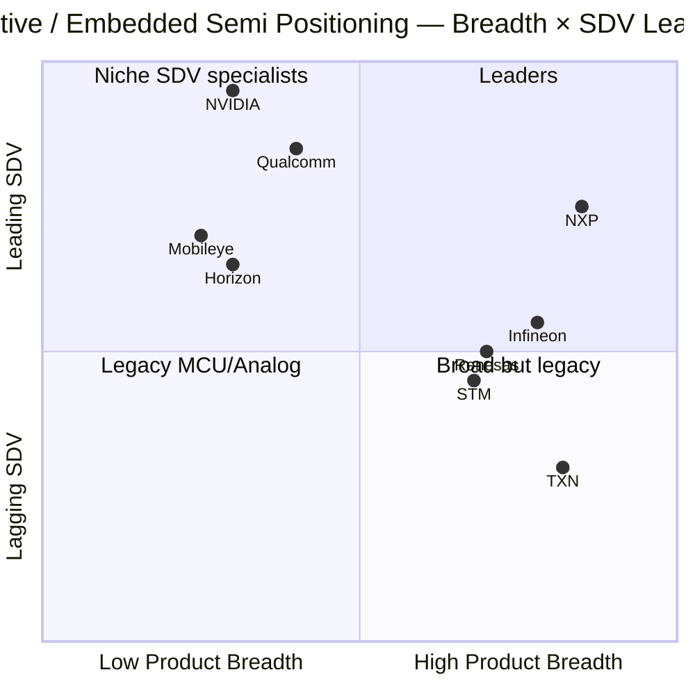
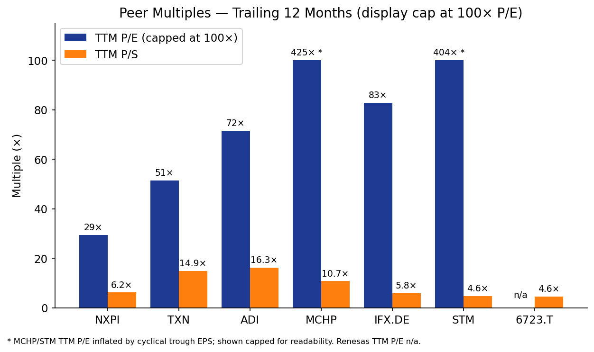
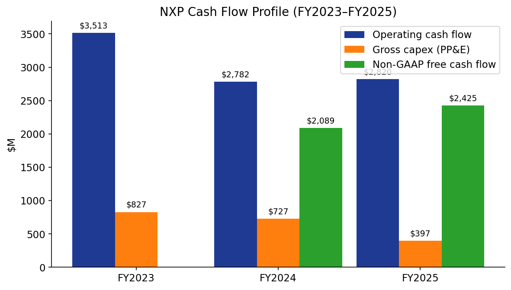
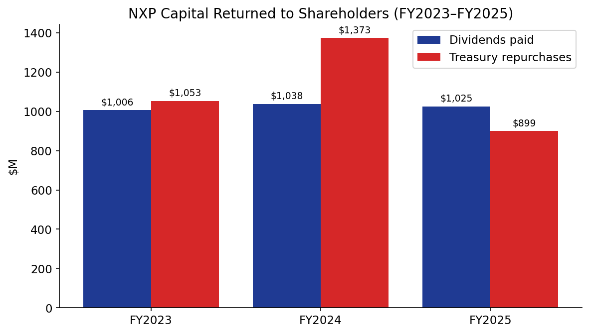

# NXP Semiconductors N.V. — Initiation of Coverage

**Ticker:** NASDAQ: NXPI · **Date:** 2026-05-20 · **Domicile / HQ:** Eindhoven, The Netherlands · **Sector:** Semiconductors · **Sub-sector:** Mixed-signal & automotive

> **Update — Q1 2026 results beat with broad-based reacceleration (2026-04-28):** NXP reported Q1 2026 revenue of $3.18B (+12% YoY, vs. company guide mid-point of ~$2.95B; +6% YoY automotive, +24% I&IoT, +16% Mobile, +21% Comm Infra). Non-GAAP gross margin was 57.1% and non-GAAP free cash flow was $714M (22.4% of revenue). Management initiated Q2 2026 revenue guidance of **$3.35–3.55B** (+14–21% YoY) with non-GAAP gross margin of 57.5–58.5%, marking the strongest YoY top-line guide in over two years and explicitly attributing momentum to "company-specific growth drivers" in software-defined-vehicle processing (S32N), physical AI / edge inference, and the closing of TTTech Auto, Aviva Links and Kinara. CEO Rafael Sotomayor — in his first full quarter since succeeding Kurt Sievers on 2025-10-28 — emphasised that "the momentum we have built is expected to accelerate through the remainder of 2026."
> Source: [NXP Q1 2026 earnings release, 2026-04-28](https://www.sec.gov/Archives/edgar/data/1413447/000141344726000032/nxp1q26exhibit991.htm).

---

## Table of Contents

1. Company Overview
2. Company History
3. Management Team
4. Products & Services
5. Customers & Go-to-Market
6. Industry Overview
7. Competitive Landscape
8. Market Opportunity (TAM)
9. Risk Assessment

---

## 1. Company Overview

NXP Semiconductors N.V. is a Dutch-domiciled, NASDAQ-listed mixed-signal semiconductor company headquartered at the High Tech Campus 60, 5656 AG Eindhoven, The Netherlands, with operating roots that go back more than seventy years through its predecessor Philips Semiconductors ([NXP 2025 10-K, p. 2](https://www.sec.gov/Archives/edgar/data/1413447/000141344726000008/nxpi-20251231.htm)). For the year ended December 31, 2025 the company generated $12,269M of revenue, down 2.7% YoY from $12,614M in 2024 and 7.6% below the 2023 peak of $13,276M, reflecting a synchronized inventory correction across its end-markets that bottomed in mid-2025 and inflected positively in Q4 2025 ([10-K, p. 36](https://www.sec.gov/Archives/edgar/data/1413447/000141344726000008/nxpi-20251231.htm)). At quarter end 2025 NXP employed approximately 32,169 people in more than 30 countries, including roughly 11,034 in research-and-development functions ([10-K, p. 11](https://www.sec.gov/Archives/edgar/data/1413447/000141344726000008/nxpi-20251231.htm)).

**What does NXP do?** In plain terms NXP designs, manufactures and sells the embedded "brains, senses, security and connectivity" inside cars, factory machinery, smartphones, payment cards, e-passports, smart-home devices and 5G base-stations. Its product domains include embedded processors and micro-controllers (MCUs), mixed-signal and analog devices (including 77 GHz radar front-ends, battery management, audio amplifiers, power management), security controllers (NFC, UWB, secure element), wired and wireless connectivity (CAN/LIN/FlexRay/Ethernet/SerDes for cars; Wi-Fi/Bluetooth/Thread/Zigbee for IoT; RFID/eID for identification) and RF power for cellular infrastructure ([10-K, pp. 3–8](https://www.sec.gov/Archives/edgar/data/1413447/000141344726000008/nxpi-20251231.htm)).

**How does NXP make money?** Almost all revenue comes from selling proprietary, application-specific semiconductor chips and modules to original equipment manufacturers (OEMs), Tier-1 suppliers, and electronics distributors who in turn ship them into automotive ECUs, industrial controllers, mobile handsets, payment terminals, and network equipment. NXP organises its business around four end-markets and reports as a single segment as of FY2025. FY2025 revenue mix: **Automotive $7,116M (58.0%)**, Industrial & IoT $2,273M (18.5%), Mobile $1,584M (12.9%), Communication Infrastructure & Other $1,296M (10.6%) ([10-K, p. 39](https://www.sec.gov/Archives/edgar/data/1413447/000141344726000008/nxpi-20251231.htm)). Distributors are 57.5% of sales ($7,051M), direct sales are 41.4% ($5,084M), other 1.1% ([10-K, p. 39](https://www.sec.gov/Archives/edgar/data/1413447/000141344726000008/nxpi-20251231.htm)). Avnet accounted for 23% of total 2025 revenue and 22% in 2024 — the only customer/distributor above 10% ([10-K, p. 9](https://www.sec.gov/Archives/edgar/data/1413447/000141344726000008/nxpi-20251231.htm)).

**Geographic spread (sales origin, FY2025).** APAC ex-China $3,581M (29.2%), Americas $3,376M (27.5%), EMEA $3,276M (26.7%), China $2,036M (16.6%) ([10-K, p. 40](https://www.sec.gov/Archives/edgar/data/1413447/000141344726000008/nxpi-20251231.htm)). China revenue grew 6.0% YoY in 2025 while every other region declined, an early signal of the local-for-local procurement dynamic discussed in Section 9.

Source: [NXP 2025 10-K, Income Statement, p. 65](https://www.sec.gov/Archives/edgar/data/1413447/000141344726000008/nxpi-20251231.htm) — FY2023 revenue $13,276M, GM 56.9%; FY2024 $12,614M, GM 56.4%; FY2025 $12,269M, GM 54.7% (GAAP).

**Manufacturing footprint.** NXP runs a hybrid model: wholly-owned 200mm fabs in Austin (TX), Nijmegen (NL) and Hamburg (DE); a 300mm joint-venture fab (SSMC) in Singapore with TSMC; and equity stakes in two new pure-play foundry JVs to secure leading-edge capacity through the decade — **ESMC** in Dresden (with TSMC, Bosch and Infineon, €500M / ~$587M equity commitment, $183M deployed at YE2025) and **VSMC** in Singapore (with VIS, ~$1,600M equity commitment) ([10-K, pp. 8 and 50](https://www.sec.gov/Archives/edgar/data/1413447/000141344726000008/nxpi-20251231.htm)). Back-end assembly/test sites operate in Kaohsiung (Taiwan), Bangkok (Thailand), Kuala Lumpur (Malaysia), Tianjin (China) and Manchester (UK) ([10-K, p. 8](https://www.sec.gov/Archives/edgar/data/1413447/000141344726000008/nxpi-20251231.htm)).

**Valuation snapshot (as of 2026-05-20):** Share price **$307.07** ([Yahoo Finance NXPI, 2026-05-20](https://finance.yahoo.com/quote/NXPI/)); 52-week range $183.00–$308.54; market cap **$77.5B**; **TTM P/E 29.4×**; **TTM P/S 6.15×**; price/book 7.10×; forward P/E (consensus FY2026E EPS) 17.4×; trailing dividend yield 1.38% ([Yahoo Finance NXPI key statistics, 2026-05-20](https://finance.yahoo.com/quote/NXPI/key-statistics/)).

**Peer multiples comparison (TTM, retrieved 2026-05-20):**

| Ticker | TTM P/E | TTM P/S | Notes |
|---|---|---|---|
| **NXPI** | **29.4×** | **6.15×** | Subject |
| TXN (Texas Instruments) | 51.4× | 14.9× | Premium for capex/maturing depreciation cycle; analog leader |
| ADI (Analog Devices) | 71.6× | 16.3× | Premium for industrial/analog mix |
| MCHP (Microchip) | 425×* | 10.7× | *TTM EPS depressed by inventory correction; meaningless multiple |
| IFX.DE (Infineon) | 82.9× | 5.84× | EUR-listed automotive/power peer; EPS trough |
| STM (STMicroelectronics) | 404×* | 4.64× | *TTM EPS trough; closest auto-MCU peer |
| 6723.T (Renesas) | n/a | 4.56× | TTM PE n/a; Japanese auto-MCU peer |

Source: [Yahoo Finance via yfinance — NXPI, TXN, ADI, MCHP, IFX.DE, STM, 6723.T quotes, retrieved 2026-05-20](https://finance.yahoo.com/quote/NXPI/).

**Interpretation.** NXP today trades at the *lowest TTM P/E of any large analog/auto-MCU pure-play* — 29.4× versus a peer median (excluding broken trough multiples) of ~70×, and at 6.15× sales versus a peer median ~6× ([Yahoo Finance NXPI, 2026-05-20](https://finance.yahoo.com/quote/NXPI/)). The valuation reflects three issues the market has not yet looked through: (1) FY2025 trough earnings drag the denominator down even though TTM EPS already inflected in Q4 2025 (Non-GAAP EPS $3.35 vs. $3.18 prior year — [10-K, p. 36](https://www.sec.gov/Archives/edgar/data/1413447/000141344726000008/nxpi-20251231.htm)); (2) automotive cycle uncertainty given multi-year softness at European Tier-1s (Bosch, Aptiv, Aumovio); (3) China local-for-local risk on Auto MCU (see Section 9). The forward P/E of 17.4× already discounts a meaningful 2026 recovery; if NXP delivers the $3.35–3.55B Q2 2026 guide and a similar trajectory through H2 2026, the multiple is not stretched ([Q1 2026 earnings release, 2026-04-28](https://www.sec.gov/Archives/edgar/data/1413447/000141344726000032/nxp1q26exhibit991.htm)). **No P/E above 50× warning is triggered**, and the P/S is in line with peers — the valuation is not a risk factor on its own. The bigger risk is that consensus FY2026/27 estimates prove too optimistic if SDV ramps slip.

---

## 2. Company History

NXP's roots reach back to **1953 when Philips established its semiconductor activities** as a division of Royal Philips Electronics in Eindhoven, the Netherlands, building one of Europe's first integrated-circuit operations ([NXP corporate history, ir.nxp.com](https://www.nxp.com/company/about-nxp/our-history:OUR-HISTORY); [10-K, p. 2 "over 70 years"](https://www.sec.gov/Archives/edgar/data/1413447/000141344726000008/nxpi-20251231.htm)). The modern NXP was carved out from Philips in 2006 in a €8.3B leveraged buyout by a consortium of KKR, Bain Capital, Silver Lake, Apax, and AlpInvest; the company was renamed "NXP" — short for "next experience" ([Semiconductor Digest, "Philips chip unit relaunched as NXP", 2006-09](https://sst.semiconductor-digest.com/2006/09/philips-chip-unit-relaunched-as-nxp/)). NXP listed on NASDAQ via IPO in August 2010 at $14/share ([NXP IPO Prospectus 424B4, 2010](https://www.sec.gov/Archives/edgar/data/0001413447/000119312510180623/d424b4.htm); [EE Times, "NXP prices IPO at $14 per share", 2010-08-05](https://www.eetimes.com/nxp-prices-ipo-at-14-per-share/)).

Source: [10-K, pp. 3, 28, 49–52, "Effective October 28, 2025, Kurt Sievers voluntarily retired"](https://www.sec.gov/Archives/edgar/data/1413447/000141344726000008/nxpi-20251231.htm); [Reuters: Qualcomm walks away from NXP, 2018-07-26](https://www.reuters.com/article/business/qualcomm-walks-away-from-44-billion-nxp-bid-as-china-fails-to-okay-deal-idUSKBN1KG2VP/).

**Strategic pivots.** Four chapter-defining choices over the past two decades — independence (2006–10), Freescale (2015), Qualcomm walk-away (2018) and CoreRide / SDV (2024–) — frame how NXP is now positioned ([10-K, pp. 2–3](https://www.sec.gov/Archives/edgar/data/1413447/000141344726000008/nxpi-20251231.htm)).

1. **From conglomerate to focused semis (2006–2010).** Under Philips, semiconductors had been a non-core, sub-scale division. The Philips spin-off and subsequent IPO let NXP rationalize its portfolio, divest the consumer mobile-baseband business to ST-Ericsson (2008), and reinvest in higher-margin embedded and security franchises ([Semiconductor Digest, "Philips chip unit relaunched as NXP", 2006-09](https://sst.semiconductor-digest.com/2006/09/philips-chip-unit-relaunched-as-nxp/); [NXP corporate history](https://www.nxp.com/company/about-nxp/our-history:OUR-HISTORY)).

2. **The Freescale merger (2015).** The $11.8B all-stock acquisition of Austin-based Freescale Semiconductor created the world's largest automotive semiconductor company, combining NXP's car-access, in-vehicle networking, radar and infotainment-audio franchises with Freescale's automotive-microcontroller (S08, S12, Power-PC) leadership and embedded processing IP ([CNBC, "NXP closes deal to buy Freescale and create top auto chipmaker", 2015-12-07](https://www.cnbc.com/2015/12/07/nxp-closes-deal-to-buy-freescale-and-create-top-auto-chipmaker.html); [NXP Form 6-K announcing acquisition, March 2015](https://www.sec.gov/Archives/edgar/data/0001413447/000119312515072045/d883199dex991.htm)). The deal was not without scars — NXP carried meaningful goodwill and intangibles to amortize, and Freescale's product lines created the architectural foundation for the current S32 platform. The strategic logic was that the only credible scale defence in increasingly software-defined automotive was vertical integration of MCUs + analog + connectivity + security ([10-K, p. 3](https://www.sec.gov/Archives/edgar/data/1413447/000141344726000008/nxpi-20251231.htm)).

3. **The aborted Qualcomm acquisition (2016–2018).** Qualcomm announced a $38B (later $44B) cash bid for NXP in October 2016, framing it as the bridge to automotive and IoT. The deal collapsed in July 2018 when China's MOFCOM never granted antitrust clearance amid the escalating US-China trade dispute. NXP received a $2B break-up fee and, freed from the deal limbo, pivoted hard into capital return — repurchasing roughly $4.6B of stock in H2 2018 alone ([Reuters, 2018-07-26](https://www.reuters.com/article/business/qualcomm-walks-away-from-44-billion-nxp-bid-as-china-fails-to-okay-deal-idUSKBN1KG2VP/)). Independence has since served shareholders well; the post-2018 share price has compounded materially above the original $127.50 walk-away price ([Yahoo Finance NXPI historical data, 2026-05-20](https://finance.yahoo.com/quote/NXPI/history/)).

4. **The CoreRide / software-defined vehicle pivot (2024–present).** NXP launched the **NXP CoreRide** platform in March 2024 — a pre-integrated hardware/software stack combining S32 processors, system power management, networking and middleware to give OEMs a turnkey "vehicle compute" platform for software-defined vehicles ([NXP press release, "NXP Breaks Through Integration Barriers... with Open S32 CoreRide Platform", 2024-03-28](https://investors.nxp.com/news-releases/news-release-details/nxp-breaks-through-integration-barriers-software-defined-vehicle)). The 2025 acquisitions of TTTech Auto (safety-critical middleware), Aviva Links (Automotive SerDes Alliance in-vehicle networking) and Kinara (NPUs for edge AI) extend CoreRide into a full software-and-silicon vehicle compute platform that competes head-on with Qualcomm Snapdragon Ride, NVIDIA DRIVE, Renesas R-Car, and Mobileye EyeQ ([10-K, pp. 49–52](https://www.sec.gov/Archives/edgar/data/1413447/000141344726000008/nxpi-20251231.htm)). The S32N7 super-integration processor, unveiled on 2026-01-05, is the flagship CoreRide compute SoC ([NXP press release, "NXP's New S32N7 Unlocks the Full Potential of SDVs", 2026-01-05](https://www.globenewswire.com/news-release/2026/01/05/3213069/0/en/NXP-s-New-S32N7-Unlocks-the-Full-Potential-of-SDVs.html)).

**Key acquisitions** (recent, ranked by deal size) — disclosure detail aggregated from the 2025 10-K business-combination footnote ([10-K, pp. 49–52, 81](https://www.sec.gov/Archives/edgar/data/1413447/000141344726000008/nxpi-20251231.htm)):

- **TTTech Auto** — closed 2025-06-17 for $766M cash ($675M net), Vienna-based, ~1,100 engineers in safety-critical SDV middleware ([10-K, p. 81; 8-K Project Ascend, 2025-01-07](https://www.sec.gov/Archives/edgar/data/1413447/000141344725000005/projectascendpressrelease.htm)).
- **Kinara** — closed 2025-10-27 for $284M cash ($283M net), Cupertino-based discrete NPU and edge-AI software designer ([8-K Project Karate, 2025-02-10](https://www.sec.gov/Archives/edgar/data/1413447/000141344725000015/projectkaratepressrelease.htm)).
- **Aviva Links** — closed 2025-10-24 for $222M cash + $26M previously-held investment, ASA-compliant in-vehicle SerDes ([10-K, p. 81](https://www.sec.gov/Archives/edgar/data/1413447/000141344726000008/nxpi-20251231.htm)).
- **MEMS sensors divestiture** — closed 2026-02-02 for $878M cash + up to $50M earn-out; one-time gain of $627M recognized in Q1 2026 ([Q1 2026 release, 2026-04-28](https://www.sec.gov/Archives/edgar/data/1413447/000141344726000032/nxp1q26exhibit991.htm)).
- **Freescale Semiconductor (2015)** — historic anchor, $11.8B stock ([CNBC, "NXP closes deal to buy Freescale", 2015-12-07](https://www.cnbc.com/2015/12/07/nxp-closes-deal-to-buy-freescale-and-create-top-auto-chipmaker.html)).

The 2025–26 portfolio surgery — three bolt-ons + one divestiture in fourteen months — reads as a clear "Sotomayor playbook" focused on SDV/edge-AI building blocks at the expense of legacy commodity MEMS ([10-K, pp. 49–52](https://www.sec.gov/Archives/edgar/data/1413447/000141344726000008/nxpi-20251231.htm); [NXP press release, "NXP Completes Acquisitions of Aviva Links and Kinara", 2025-10-28](https://media.nxp.com/news-releases/news-release-details/nxp-completes-acquisitions-aviva-links-and-kinara-advance/)).

---

## 3. Management Team

### Rafael Sotomayor — President & CEO (interim Executive Director)

Mr. Sotomayor (born 1969, American) has been CEO and temporary executive director since **2025-10-28**, when Kurt Sievers retired voluntarily after five years in the role. He was elevated to President in April 2025 in what proved to be a six-month internal hand-off ([2026 DEF 14A, p. 28, "Rafael Sotomayor (1969, American) is temporary executive director and chief executive officer since October 2025"](https://www.sec.gov/Archives/edgar/data/1413447/000141344726000026/nxps-20260428.htm); [10-K, p. 26](https://www.sec.gov/Archives/edgar/data/1413447/000141344726000008/nxpi-20251231.htm)).

Sotomayor joined NXP in 2014 in a business-line general-manager role, then ran general-manager assignments across the Mobile and Industrial & IoT end-markets. He was promoted to the executive management team in 2020 and most recently ran the **Secure Connected Edge business** (Mobile + I&IoT + secure connectivity), the highest-organic-growth franchise inside NXP. He holds an MBA from Harvard Business School, an MSEE from Georgia Tech, and a BSEE from Purdue University ([DEF 14A, p. 28](https://www.sec.gov/Archives/edgar/data/1413447/000141344726000026/nxps-20260428.htm)).

What he is known for inside NXP: (1) re-architecting the Industrial & IoT product roadmap around the i.MX 8/9 family and pulling the team into edge-AI applications via the eIQ software framework (the same eIQ Agentic AI Framework launched on 2026-01-06 fell under his prior remit — [Q1 2026 release](https://www.sec.gov/Archives/edgar/data/1413447/000141344726000032/nxp1q26exhibit991.htm)); (2) closing the Kinara NPU acquisition that he reportedly originated ([8-K Project Karate, 2025-02-10](https://www.sec.gov/Archives/edgar/data/1413447/000141344725000015/projectkaratepressrelease.htm)); (3) authoring the intelligent-edge thesis that NXP has used to frame both CoreRide for SDVs and AI-at-the-edge for industrial customers ([2026 DEF 14A, p. 28](https://www.sec.gov/Archives/edgar/data/1413447/000141344726000026/nxps-20260428.htm)). As the first CEO in NXP's modern history with deep general-management experience in *both* automotive-adjacent and consumer-edge markets, he is well-placed to integrate the SDV platform play ([DEF 14A, pp. 28–29](https://www.sec.gov/Archives/edgar/data/1413447/000141344726000026/nxps-20260428.htm)).

His debut as CEO came with a "messaging reset" — the Q4 2025 and Q1 2026 calls explicitly de-emphasised quarterly volatility and reframed NXP as a "Software-Defined Vehicle + Physical AI" growth story, with the Q1 2026 quote: *"The momentum we have built is expected to accelerate through the remainder of 2026, with progress increasingly extending across the core of our business."* ([Q1 2026 release](https://www.sec.gov/Archives/edgar/data/1413447/000141344726000032/nxp1q26exhibit991.htm)). The market gave him benefit of the doubt: NXPI is +18% YTD into 2026.

His **annualised 2025 pay package** as President & CEO was structured at a CEO-to-median-employee ratio of **268:1** ([DEF 14A, p. 71](https://www.sec.gov/Archives/edgar/data/1413447/000141344726000026/nxps-20260428.htm)). Sotomayor's appointment as a *permanent* executive director will be confirmed at the 2026 AGM in June.

Open questions: He is 56, externally less known than Sievers, and has not yet been CEO through a full business cycle or a crisis ([DEF 14A, p. 28](https://www.sec.gov/Archives/edgar/data/1413447/000141344726000026/nxps-20260428.htm)). Investors should expect a leadership "honeymoon" through 2026 with results-driven re-rating potential — but execution on CoreRide ramps with European OEMs (Volkswagen, Stellantis, BMW) is the key test in 2026–27 ([Q1 2026 earnings release, 2026-04-28](https://www.sec.gov/Archives/edgar/data/1413447/000141344726000032/nxp1q26exhibit991.htm)).

### William Betz — Executive Vice President & Chief Financial Officer

Mr. Betz (born 1977, American) has been CFO since October 2021, with more than 25 years of finance experience in the semiconductor industry. Before being elevated, he was Senior VP, Business Planning & Analytics and Finance Business Group controller at NXP, having joined in 2013 from Fairchild Semiconductor where he had held several senior finance roles. Prior chapters of his career include LSI Logic and Agere Systems ([DEF 14A, p. 72](https://www.sec.gov/Archives/edgar/data/1413447/000141344726000026/nxps-20260428.htm)). He holds a BS in Finance and Accounting from Purdue University.

Betz's track record at NXP is closely linked to **disciplined capital return**. During FY2024 alone the company returned $2.41B (dividends $1,038M + treasury repurchases $1,373M) — equivalent to 115% of non-GAAP free cash flow ([10-K, pp. 47–48](https://www.sec.gov/Archives/edgar/data/1413447/000141344726000008/nxpi-20251231.htm)). The $1.585B remaining authorisation under the August-2024 share repurchase program gives him roughly two years of buyback runway at the current pace ([10-K, p. 19](https://www.sec.gov/Archives/edgar/data/1413447/000141344726000008/nxpi-20251231.htm)). On the debt side, Betz oversaw the increase of NXP's revolving credit facility from $2,500M to $3,000M effective 2026-02-06 and the January 2026 repayment of $500M 5.35% senior notes from cash — leaving NXP with $12.22B gross debt, $3.27B cash, and net debt of $8.96B at year-end 2025 (~2.4× gross leverage, 1.7× net) ([10-K, p. 27](https://www.sec.gov/Archives/edgar/data/1413447/000141344726000008/nxpi-20251231.htm)).

### Andy Micallef — Executive VP, Operations

Mr. Micallef (Australian) is the most consequential operating executive on the team — he runs NXP's hybrid fab footprint, the SSMC JV with TSMC, the ESMC Dresden investment and the VSMC Singapore JV ([10-K, p. 8](https://www.sec.gov/Archives/edgar/data/1413447/000141344726000008/nxpi-20251231.htm)). Investors should pay attention to him because the **single biggest balance-sheet bet of the cycle is $2.2B of equity commitments into ESMC + VSMC** ([10-K, p. 50](https://www.sec.gov/Archives/edgar/data/1413447/000141344726000008/nxpi-20251231.htm)). He joined NXP from Atmel and has held senior manufacturing roles at Freescale ([DEF 14A, p. 72](https://www.sec.gov/Archives/edgar/data/1413447/000141344726000026/nxps-20260428.htm)).

### Jens Hinrichsen — Executive VP, Automotive

The largest single business unit ($7.1B revenue, 58% of mix) ([10-K, p. 39](https://www.sec.gov/Archives/edgar/data/1413447/000141344726000008/nxpi-20251231.htm)). Hinrichsen has held the GM role for the Automotive Processing business since 2019 and ran the broader Automotive segment from 2021 ([DEF 14A, p. 72](https://www.sec.gov/Archives/edgar/data/1413447/000141344726000026/nxps-20260428.htm)). His remit covers S32 MCU/SoC, radar, BMS, secure car access and in-vehicle networking — i.e. the entire CoreRide stack — and his execution on SDV design-wins is the single biggest swing factor in the FY2026–28 thesis ([10-K, pp. 4–7](https://www.sec.gov/Archives/edgar/data/1413447/000141344726000008/nxpi-20251231.htm)).

### Governance

- **Board**: ten directors after the 2026 AGM, with Sotomayor as sole executive director and nine independent non-executive directors including Greg Summe (chair, ex-Perkin Elmer CEO), Annette Clayton (ex-Schneider Electric NA CEO), Moshe Gavrielov (ex-Xilinx CEO), Chunyuan Gu (ex-ABB North Asia), Lena Olving, Jasmin Staiblin, Karl-Henrik Sundström, and Kurt Sievers as a non-executive board member following his retirement as CEO ([DEF 14A, pp. 12–28](https://www.sec.gov/Archives/edgar/data/1413447/000141344726000026/nxps-20260428.htm)). The board has Audit, HR & Compensation, and Nominating/Governance committees, all chaired by independent directors.
- **Insider ownership** is low (sub-1% combined) — a function of NXP's leveraged-buyout origin and IPO carve-out structure rather than founder ownership. There is no dual-class structure or supervoting equity; one common share, one vote ([DEF 14A, pp. 50–53 beneficial-ownership table](https://www.sec.gov/Archives/edgar/data/1413447/000141344726000026/nxps-20260428.htm)).
- **CEO pay-ratio**: 268:1 for FY2025, with the median employee located in Taiwan in a manufacturing-engineering role earning approximately the global ex-China/Malaysia/Taiwan/Thailand average of $92,000 ([DEF 14A, p. 71](https://www.sec.gov/Archives/edgar/data/1413447/000141344726000026/nxps-20260428.htm)).
- **Independent auditor**: EY Accountants B.V., reappointment proposed at the 2026 AGM ([DEF 14A, p. 30](https://www.sec.gov/Archives/edgar/data/1413447/000141344726000026/nxps-20260428.htm)).
- No notable related-party transactions disclosed ([DEF 14A, pp. 51–53 related-party transactions section](https://www.sec.gov/Archives/edgar/data/1413447/000141344726000026/nxps-20260428.htm)).

### Management track record synthesis

NXP under Kurt Sievers (2020–2025) compounded revenue from $8.61B in FY2020 to $13.28B at the 2023 peak, expanded GAAP gross margin from 49% to 56.9%, and returned approximately $14.4B of capital between 2021 and 2025 ($5,118M dividends + ~$9.3B in repurchases, computed from cash-flow statements — [10-K, p. 67 Consolidated Cash Flows](https://www.sec.gov/Archives/edgar/data/1413447/000141344726000008/nxpi-20251231.htm)). The team has demonstrably delivered through one cycle. The handover to Sotomayor places more weight on strategy execution (CoreRide, SDV, edge AI) than on operational stewardship, which is now well-trodden ground ([DEF 14A, pp. 28–29](https://www.sec.gov/Archives/edgar/data/1413447/000141344726000026/nxps-20260428.htm)). The gap is unproven crisis management at the top.

---

## 4. Products & Services

NXP organises its product groups across four end-markets. The taxonomy below mirrors the company's own four-quadrant exposure chart on p. 4 of the 10-K ([10-K, p. 4](https://www.sec.gov/Archives/edgar/data/1413447/000141344726000008/nxpi-20251231.htm)).

```mermaid
graph TD
    NXP[NXP Semiconductors]
    NXP --> AUTO[Automotive 58.0% of rev]
    NXP --> IIOT[Industrial & IoT 18.5%]
    NXP --> MOB[Mobile 12.9%]
    NXP --> COMM[Comm Infra & Other 10.6%]
    AUTO --> A1[S32 MCU/MPU platform]
    AUTO --> A2[77GHz Radar SoC]
    AUTO --> A3[Battery Management ICs]
    AUTO --> A4[Secure Car Access UWB+BLE]
    AUTO --> A5[CAN/LIN/FlexRay/Ethernet]
    AUTO --> A6[Aviva Links SerDes]
    AUTO --> A7[TTTech Auto SDV Middleware]
    IIOT --> I1[i.MX 8/9 App Processors]
    IIOT --> I2[General-purpose MCUs]
    IIOT --> I3[Wi-Fi/BT/Thread/Zigbee]
    IIOT --> I4[Kinara NPUs for Edge AI]
    IIOT --> I5[Smart Sensors]
    MOB --> M1[UWB Secure Ranging]
    MOB --> M2[NFC Controllers + eSE]
    MOB --> M3[Audio Codecs/Amps]
    COMM --> C1[Layerscape Network Procs]
    COMM --> C2[RF Power for 5G BTS]
    COMM --> C3[eGov / eID / Banking SE]
    COMM --> C4[RAIN RFID]
```

### Automotive (58.0% of FY2025 revenue — $7,116M)

The automotive franchise is the centre of gravity. NXP's own filing names it as the #1 automotive semiconductor company by share (a position established post-Freescale 2015), and management explicitly identifies six "core" automotive product franchises plus three "accelerated growth" investment areas: SDV processing, radar systems and electrification ([10-K, p. 4](https://www.sec.gov/Archives/edgar/data/1413447/000141344726000008/nxpi-20251231.htm)).

**S32 Automotive Processing Platform** — flagship. The S32 family ranges from the S32K micro-controllers (Arm Cortex-M, ASIL-D capable) up to the new **S32N7 super-integration processor** launched 2026-01-05 that consolidates dozens of legacy ECUs into a single SoC for SDV "vehicle compute" architectures ([NXP press release, "NXP's New S32N7 Unlocks the Full Potential of SDVs", 2026-01-05](https://www.globenewswire.com/news-release/2026/01/05/3213069/0/en/NXP-s-New-S32N7-Unlocks-the-Full-Potential-of-SDVs.html); [10-K, p. 6](https://www.sec.gov/Archives/edgar/data/1413447/000141344726000008/nxpi-20251231.htm)). **Competitive verdict: YES — clear moat.** Type: switching costs + automotive certification (ASIL-D) + ecosystem lock-in (CoreRide middleware, AUTOSAR, OEM-specific safety SW). Evidence: design-in cycles run 4–7 years and re-design is rare ([10-K, p. 9](https://www.sec.gov/Archives/edgar/data/1413447/000141344726000008/nxpi-20251231.htm)). Closest competitor: **Renesas R-Car / RH850** (peer at parity in MCU; behind on SDV high-integration), **Infineon AURIX** (peer in safety MCU; behind in SoC), **Qualcomm Snapdragon Ride** and **NVIDIA DRIVE Thor** (ahead on AI/cockpit compute, behind on safety MCU breadth) ([Embedded Systems Engineering, "NXP Launches S32N7 Processor Series", 2026-01](https://www.embeddedsystemsengineering.com/2026/01/nxp-launches-s32n7-processor-series-to-centralize-core-vehicle-functions/)).

**77GHz Radar Front-End ICs and SoCs.** NXP is the market leader in automotive radar; the 10-K states unambiguously: "*In Automotive, we are the market leader in most of the applications, with integrated 77GHz Radar solution for ADAS*" ([10-K, p. 7](https://www.sec.gov/Archives/edgar/data/1413447/000141344726000008/nxpi-20251231.htm)). The radar family combines RFCMOS front-ends (TEF810x family) with the S32R radar processor — a vertically-integrated stack few competitors can match ([NXP automotive radar product line](https://www.nxp.com/products/processors-and-microcontrollers/s32-automotive-platform/s32-automotive-radar-processors:S32R-PROC)). **Verdict: YES — strong moat.** Type: technology IP (RFCMOS process know-how) + scale ([Automotive Radar Semiconductors Market — NXP+Infineon ~45%+ share 2024 (Global Market Insights)](https://www.gminsights.com/industry-analysis/automotive-radar-semiconductors-market)). Closest competitor: TI (AWR family — strong at low end), Infineon (Saruman / radar MMICs — strong at mid-range), Bosch internal radar (a customer that also competes for in-house designs in some platforms) ([10-K, p. 9 — "Bosch" named as a customer](https://www.sec.gov/Archives/edgar/data/1413447/000141344726000008/nxpi-20251231.htm)).

**Battery Management Systems (BMS).** Application-specific mixed-signal ICs that monitor cell voltage, current and temperature inside EV battery packs and increasingly stationary storage ([10-K, p. 4 — electrification accelerated growth area](https://www.sec.gov/Archives/edgar/data/1413447/000141344726000008/nxpi-20251231.htm)). With every EV requiring 8–16 BMS ICs versus zero in an ICE car, this is one of the structural beneficiaries of electrification ([NXP BMS product page](https://www.nxp.com/applications/automotive/electrification:ELECTRIFICATION)). **Verdict: YES.** Type: technology + functional-safety certifications. Competitors: TI BQ7xxx family, Analog Devices (post-Maxim) wireless BMS, Renesas BMS, Infineon TLE9012 — competitive at parity ([10-K, p. 9 — listed competitors](https://www.sec.gov/Archives/edgar/data/1413447/000141344726000008/nxpi-20251231.htm)).

**Secure Car Access — UWB + NFC.** Digital car keys, including the Car Connectivity Consortium / Apple "Car Key" specification, NXP's UWB chips (Trimension series) and NFC controllers are the dominant solution at Apple, BMW, Hyundai, Volvo ([NXP Trimension UWB product page](https://www.nxp.com/products/wireless-connectivity/uwb-secure-fine-ranging:UWB-TRIMENSION); [10-K, p. 9 — named customers include Apple, Hyundai](https://www.sec.gov/Archives/edgar/data/1413447/000141344726000008/nxpi-20251231.htm)). **Verdict: YES — strong.** Type: technology IP (NXP co-authored the Aliro standard) + ecosystem (deep ties with Apple and Samsung mobile NFC) ([NXP Aliro press materials](https://www.nxp.com/products/wireless-connectivity/uwb-secure-fine-ranging/aliro-fact-sheet:NW-ALIRO-FACT-SHEET)). Closest competitor: Qorvo UWB (peer; ahead in some smartphone wins), Infineon NFC.

**In-Vehicle Networking (CAN/LIN/FlexRay/Ethernet/SerDes).** NXP is dominant in CAN/LIN transceivers (legacy strength), competitive in automotive Ethernet (TJA110x family vs. Marvell, Broadcom), and following the October 2025 Aviva Links acquisition holds Automotive SerDes Alliance (ASA)-compliant in-vehicle SerDes IP that competes with Maxim/ADI GMSL and TI FPD-Link ([NXP press release, "NXP Completes Acquisitions of Aviva Links and Kinara", 2025-10-28](https://media.nxp.com/news-releases/news-release-details/nxp-completes-acquisitions-aviva-links-and-kinara-advance/); [10-K, p. 81](https://www.sec.gov/Archives/edgar/data/1413447/000141344726000008/nxpi-20251231.htm)). **Verdict: YES.** Type: scale + ecosystem. Closest competitor: Microchip (LAN family), TI, Marvell (88Q Ethernet PHY) — peer at parity ([10-K, p. 7](https://www.sec.gov/Archives/edgar/data/1413447/000141344726000008/nxpi-20251231.htm)).

**Aumovio merger background.** "Aumovio" appears as one of NXP's named direct customers ([10-K, p. 9](https://www.sec.gov/Archives/edgar/data/1413447/000141344726000008/nxpi-20251231.htm)). Aumovio is the newly spun-off Continental AG automotive electronics business (effective September 18, 2025) and an important demand signal for European Tier-1 demand normalisation ([Bloomberg, "Aumovio Starts Trading in Frankfurt After Continental Spinoff", 2025-09-18](https://www.bloomberg.com/news/articles/2025-09-18/aumovio-starts-trading-in-frankfurt-after-continental-spinoff); [Continental press release, "Spin-off Automotive Group Sector"](https://www.continental.com/en/press/studies-publications/other-publications/spin-off-automotive/)).

### Industrial & IoT (18.5% of FY2025 — $2,273M)

**i.MX Crossover and Applications Processors.** The i.MX 8/9 family (i.MX 93, i.MX 93W announced 2026-03-09 ([Q1 2026 release](https://www.sec.gov/Archives/edgar/data/1413447/000141344726000032/nxp1q26exhibit991.htm)), i.MX 8M Plus, i.MX RT crossover) target factory automation, smart-building HVAC, medical imaging, robotics and edge-AI vision ([NXP i.MX applications processors product line](https://www.nxp.com/products/processors-and-microcontrollers/arm-processors/i-mx-applications-processors:IMX-HOME)). **Verdict: PARTIAL.** Type: switching costs + ecosystem (eIQ software, partnerships with NVIDIA — see the 2026-03-16 robotics-with-NVIDIA announcement, [NXP press release, 2026-03-16](https://www.globenewswire.com/news-release/2026/03/16/3256745/0/en/NXP-Delivers-New-Innovations-for-Advanced-Physical-AI-with-NVIDIA.html)). Closest competitor: TI Sitara AM6x, ST STM32MP1, Microchip SAMA5D, Renesas RZ — peer at parity ([10-K, p. 7](https://www.sec.gov/Archives/edgar/data/1413447/000141344726000008/nxpi-20251231.htm)).

**General-purpose MCUs.** Cortex-M based MCU portfolios competing with STM32 (ST), MCX (NXP itself), MSPM0/C2000 (TI), RA/RX (Renesas), PIC32/SAM (Microchip) ([10-K, p. 7](https://www.sec.gov/Archives/edgar/data/1413447/000141344726000008/nxpi-20251231.htm)). NXP's MCX family relaunched in 2024 is the current generation ([NXP MCX product page](https://www.nxp.com/products/processors-and-microcontrollers/arm-microcontrollers/mcx-arm-cortex-m:MCX-MCUS)). **Verdict: PARTIAL** — STM32 still dominates general-purpose share by units.

**Wireless connectivity.** Wi-Fi 6/6E, Bluetooth, Thread, Zigbee chipsets for smart-home and industrial gateways. Acquired the Marvell Wi-Fi/BT business in 2019 ([NXP press release, "NXP Completes Acquisition of Marvell's Wireless Connectivity Business", 2019-12-06](https://media.nxp.com/news-releases/news-release-details/nxp-completes-acquisition-marvells-wireless-connectivity-business)).

**Kinara NPUs (closed Oct 2025).** Discrete neural-processing units running both conventional and generative AI inference at the edge — supports industrial machine-vision, medical imaging, automotive cabin monitoring. The Q1 2026 launch of the "**eIQ Agentic AI Framework**" leverages Kinara IP ([Q1 2026 release](https://www.sec.gov/Archives/edgar/data/1413447/000141344726000032/nxp1q26exhibit991.htm)).

### Mobile (12.9% of FY2025 — $1,584M)

NXP's mobile franchise centres on three product lines: **UWB ranging** for ultra-wideband secure handset features (Apple iPhone), **NFC controllers + embedded Secure Element** for mobile payments (Apple Pay, Google Pay, Samsung Pay), and audio codecs/Class-D amplifiers ([10-K, p. 7](https://www.sec.gov/Archives/edgar/data/1413447/000141344726000008/nxpi-20251231.htm)). **Apple is a named major direct customer** ([10-K, p. 9](https://www.sec.gov/Archives/edgar/data/1413447/000141344726000008/nxpi-20251231.htm)) and almost certainly accounts for the bulk of mobile revenue; concentration on Apple's iPhone unit cycle is the single biggest swing factor in Mobile ([Apple 10-K FY2024, iPhone segment](https://www.sec.gov/cgi-bin/browse-edgar?action=getcompany&CIK=0000320193&type=10-K)). **Verdict: YES — strong moat with single-customer concentration risk.** Type: technology + multi-year qualification + design-in. Closest competitor: Qorvo (UWB), STM (NFC).

### Communication Infrastructure & Other (10.6% of FY2025 — $1,296M)

Three legacy franchises that the company is managing for cash: **Layerscape network processors** (PowerPC/Arm-based; -23.6% in FY2025 reflecting end-of-life replacements by Marvell OCTEON and ASICs), **RF Power Amplifiers for 5G base-stations** (LDMOS and GaN) and **Secure Identification** (e-Passports, e-ID, RAIN RFID). The Comm Infra & Other end-market was the worst FY2025 performer (-23.6% YoY, -$401M) and is the principal margin drag inside the GAAP gross-margin compression to 54.7%. NXP took an "impairment related to the scaling down of a non-strategic product line" in Q4 2025 that pulled GAAP gross margin to 54.2% from 56.3% the prior quarter ([10-K, p. 38](https://www.sec.gov/Archives/edgar/data/1413447/000141344726000008/nxpi-20251231.htm)). **Verdict: PARTIAL** at best — these are mature, cash-generative but secularly declining.

### Flagship vs. long-tail

Three product franchises drive most of the bull case: **(1) S32 + CoreRide for SDV**, **(2) radar SoCs for ADAS**, **(3) UWB/NFC for mobile**. The legacy MEMS sensors business was divested for $878M in Feb 2026 ([Q1 2026 release](https://www.sec.gov/Archives/edgar/data/1413447/000141344726000032/nxp1q26exhibit991.htm)) — a clear signal that Sotomayor is willing to prune.

Source: [10-K, p. 39](https://www.sec.gov/Archives/edgar/data/1413447/000141344726000008/nxpi-20251231.htm).

Source: [10-K, p. 39](https://www.sec.gov/Archives/edgar/data/1413447/000141344726000008/nxpi-20251231.htm).

### Recent launches / sunsets (last 12 months)

Below summary compiled from the Q1 2026 release and per-event press releases ([Q1 2026 release, 2026-04-28](https://www.sec.gov/Archives/edgar/data/1413447/000141344726000032/nxp1q26exhibit991.htm)):

- **2026-03-09** — i.MX 93W applications processor launched ([Q1 2026 release](https://www.sec.gov/Archives/edgar/data/1413447/000141344726000032/nxp1q26exhibit991.htm)).
- **2026-03-16** — Robotics solutions with NVIDIA collaboration announced ([NXP press release with NVIDIA, 2026-03-16](https://www.globenewswire.com/news-release/2026/03/16/3256745/0/en/NXP-Delivers-New-Innovations-for-Advanced-Physical-AI-with-NVIDIA.html)).
- **2026-02-02** — MEMS sensors business sold ($878M cash) ([Q1 2026 release](https://www.sec.gov/Archives/edgar/data/1413447/000141344726000032/nxp1q26exhibit991.htm)).
- **2026-01-06** — eIQ Agentic AI Framework for edge AI launched ([Q1 2026 release](https://www.sec.gov/Archives/edgar/data/1413447/000141344726000032/nxp1q26exhibit991.htm)).
- **2026-01-06** — GE HealthCare edge-AI collaboration announced ([Q1 2026 release](https://www.sec.gov/Archives/edgar/data/1413447/000141344726000032/nxp1q26exhibit991.htm)).
- **2026-01-05** — S32N7 SDV super-integration processor launched ([NXP press release, "NXP's New S32N7 Unlocks the Full Potential of SDVs", 2026-01-05](https://www.globenewswire.com/news-release/2026/01/05/3213069/0/en/NXP-s-New-S32N7-Unlocks-the-Full-Potential-of-SDVs.html)).
- **2025-10-27** — Closed Kinara acquisition ([NXP press release, "NXP Completes Acquisitions of Aviva Links and Kinara", 2025-10-28](https://media.nxp.com/news-releases/news-release-details/nxp-completes-acquisitions-aviva-links-and-kinara-advance/)).
- **2025-10-24** — Closed Aviva Links acquisition ([NXP press release, 2025-10-28](https://media.nxp.com/news-releases/news-release-details/nxp-completes-acquisitions-aviva-links-and-kinara-advance/)).
- **2025-06-17** — Closed TTTech Auto acquisition ([10-K, p. 81](https://www.sec.gov/Archives/edgar/data/1413447/000141344726000008/nxpi-20251231.htm)).

NXP's broad intellectual-property base — approximately **9,500 patent families** — underwrites the moat across these franchises ([10-K, p. 10](https://www.sec.gov/Archives/edgar/data/1413447/000141344726000008/nxpi-20251231.htm)).

---

## 5. Customers & Go-to-Market

NXP serves three rough customer cohorts: (a) global automotive OEMs and Tier-1 suppliers, (b) industrial automation and consumer-IoT OEMs, and (c) mobile-handset OEMs and payment-card issuers. Direct sales are 41.4% of revenue, distributors 57.5%, other 1.1% ([10-K, p. 39](https://www.sec.gov/Archives/edgar/data/1413447/000141344726000008/nxpi-20251231.htm)).

### Customer concentration

The 2025 10-K names NXP's "five largest direct customers and distributors": **Apple, Aptiv, Aumovio, Bosch, Denso, Harman Auto, Hyundai, LGE Automotive, Samsung and Visteon** (ten direct customers — i.e. the top five and a near-five-tied tier — listed in alphabetical order rather than by share). The five largest distributors are **Arrow, Avnet, Nexty, WT Micro and World Peace** ([10-K, p. 9](https://www.sec.gov/Archives/edgar/data/1413447/000141344726000008/nxpi-20251231.htm)).

The single concentration disclosure is striking: **Avnet was 23% of total revenue in 2025 (vs. 22% in 2024)**. No other distributor and no direct customer exceeds 10% individually ([10-K, p. 9](https://www.sec.gov/Archives/edgar/data/1413447/000141344726000008/nxpi-20251231.htm)). NXP does not name top-1 or top-5 direct-customer revenue figures, so this is the limit of disclosure ([10-K, p. 39 — concentration discussion](https://www.sec.gov/Archives/edgar/data/1413447/000141344726000008/nxpi-20251231.htm)). However, distributor concentration is a different risk profile than direct-OEM concentration — Avnet aggregates thousands of underlying SKUs and end-customers, so the economic exposure is lower than the headline number suggests ([Avnet 2024 10-K, p. 5 — NXP relationship discussion](https://www.sec.gov/cgi-bin/browse-edgar?action=getcompany&CIK=0000008858&type=10-K)). The risk is operational (one distributor's logistics, working capital and channel-inventory practices) rather than the loss of a single end-customer.

Source: [10-K, p. 39](https://www.sec.gov/Archives/edgar/data/1413447/000141344726000008/nxpi-20251231.htm).

### Customer segments

- **Automotive OEMs and Tier-1s** — Apple (Car Key), Aptiv, **Aumovio** (the Continental AG spin-off), Bosch, Denso, Harman (Samsung subsidiary), Hyundai, LGE Automotive, Visteon ([10-K, p. 9](https://www.sec.gov/Archives/edgar/data/1413447/000141344726000008/nxpi-20251231.htm)). Both Bosch and Denso are simultaneously customers and competitors at the radar-MMIC and MCU level — important context for the moat discussion ([Bosch Mobility Solutions semiconductors](https://www.bosch-mobility.com/en/mobility-topics/semiconductors/)).
- **Mobile OEMs** — Apple (NFC + UWB + audio), Samsung (NFC + UWB), Google (NFC), Xiaomi/OPPO/Vivo via distributor channels ([10-K, p. 9](https://www.sec.gov/Archives/edgar/data/1413447/000141344726000008/nxpi-20251231.htm)).
- **Industrial OEMs** — broad, fragmented, served largely through distribution ([10-K, p. 39 — 57.5% distributor channel](https://www.sec.gov/Archives/edgar/data/1413447/000141344726000008/nxpi-20251231.htm)). Schneider Electric, Honeywell, Siemens reportedly material but not disclosed.
- **Banking, payment and government** — Visa/Mastercard issuers and central governments for e-Passport / e-ID programs (these flow through the Comm Infra "secure identification" line) ([10-K, p. 8 — secure identification products](https://www.sec.gov/Archives/edgar/data/1413447/000141344726000008/nxpi-20251231.htm)).

### Contract structure

Automotive design wins are typically multi-year, platform-by-platform agreements that take 24–36 months to design-in and ramp 4–7 years across model generations ([10-K, p. 9 — long-cycle automotive design-in](https://www.sec.gov/Archives/edgar/data/1413447/000141344726000008/nxpi-20251231.htm)). Industrial and mobile are a mix of master supply agreements and PO-by-PO; mobile flagship handsets are typically annual contract cycles aligned to OEM launch windows. NXP does not disclose specific contract terms ([10-K, p. 22 risk factors — terms and pricing](https://www.sec.gov/Archives/edgar/data/1413447/000141344726000008/nxpi-20251231.htm)).

### Distribution channels

NXP's hybrid model balances **direct sales force** focused on key strategic accounts (the named ten direct customers above) with **distribution partners** for mid-market and long-tail ([10-K, p. 9](https://www.sec.gov/Archives/edgar/data/1413447/000141344726000008/nxpi-20251231.htm)). Avnet (US) and WT Micro/World Peace (Greater China) dominate distribution, with Arrow, Nexty (Japan) filling out the global footprint ([10-K, p. 9 — five largest distributors](https://www.sec.gov/Archives/edgar/data/1413447/000141344726000008/nxpi-20251231.htm)). The distributor relationship matters more than usual because of NXP's deliberate strategy to manage channel inventory tightly — at Q1 2026 channel inventory was **11 weeks vs. a normalised target of 8–9 weeks** ([Q1 2026 release](https://www.sec.gov/Archives/edgar/data/1413447/000141344726000032/nxp1q26exhibit991.htm)). This suggests NXP is still under-shipping demand even after the inventory correction, which sets up an attractive snap-back if end-demand sustains.

### Sales strategy

NXP states: *"Our sales and marketing strategy focuses on key defined verticals in Automotive, Industrial & IoT, Communication Infrastructure, and Mobile. We aim to deepen relationships with our top direct customers, expand our reach to mass-market customers, startups and distribution partners, and become their preferred supplier."* ([10-K, p. 9](https://www.sec.gov/Archives/edgar/data/1413447/000141344726000008/nxpi-20251231.htm)).

In practice this manifests as platform selling: rather than selling individual SKUs, NXP packages the S32 MCU + radar IC + CAN/LIN transceiver + secure car-access UWB into pre-integrated "CoreRide" reference platforms with TTTech middleware bundled ([NXP press release, "Open S32 CoreRide Platform", 2024-03-28](https://investors.nxp.com/news-releases/news-release-details/nxp-breaks-through-integration-barriers-software-defined-vehicle)). The same strategy is used in I&IoT with the i.MX 9 + Kinara NPU + Wi-Fi + secure-element stack for AI-edge devices ([Q1 2026 release — eIQ Agentic AI Framework](https://www.sec.gov/Archives/edgar/data/1413447/000141344726000032/nxp1q26exhibit991.htm)). This raises the stickiness of design wins because customers ship a NXP "vehicle compute platform" rather than a basket of commodity chips ([10-K, p. 4](https://www.sec.gov/Archives/edgar/data/1413447/000141344726000008/nxpi-20251231.htm)).

### Named partnerships and case studies

- **NVIDIA** — March 2026 robotics collaboration to combine NXP S32-class processors with NVIDIA Jetson-class compute for industrial robotics ([Q1 2026 release](https://www.sec.gov/Archives/edgar/data/1413447/000141344726000032/nxp1q26exhibit991.htm)).
- **GE HealthCare** — January 2026 edge-AI collaboration on medical imaging compute ([Q1 2026 release](https://www.sec.gov/Archives/edgar/data/1413447/000141344726000032/nxp1q26exhibit991.htm)).
- **TSMC, Bosch, Infineon** — joint owners in the ESMC Dresden fab JV ([10-K, pp. 8 and 50](https://www.sec.gov/Archives/edgar/data/1413447/000141344726000008/nxpi-20251231.htm); [European Commission press release, "€5bn German State aid for ESMC", 2024-08-20](https://ec.europa.eu/commission/presscorner/detail/en/ip_24_4287)).
- **Vanguard (VIS)** — JV partner in the VSMC Singapore fab ([10-K, p. 50](https://www.sec.gov/Archives/edgar/data/1413447/000141344726000008/nxpi-20251231.htm)).

---

## 6. Industry Overview

NXP competes in the **mixed-signal and embedded-processing slice of the semiconductor industry**, NAICS 334413 (Semiconductor and Related Device Manufacturing). The overall semiconductor industry generated approximately $627B in global revenue in 2024 per the WSTS / SIA databook ([SIA, "Global Semiconductor Sales Increase 19.1% in 2024", 2025-02](https://www.semiconductors.org/global-semiconductor-sales-increase-19-1-in-2024-double-digit-growth-projected-in-2025/); [WSTS Fall 2024 Forecast](https://www.wsts.org/76/103/WSTS-Semiconductor-Market-Forecast-Fall-2024)), of which NXP's served addressable market is the intersection of automotive semiconductors, industrial and embedded MCUs/processors, and secure connectivity (NFC/UWB/RFID) ([10-K, p. 3](https://www.sec.gov/Archives/edgar/data/1413447/000141344726000008/nxpi-20251231.htm)).

### Market size and structure

**Automotive semiconductors** were approximately $69B in 2024 globally, and are expected to compound at ~7–9% through 2030 according to industry estimates ([Gartner, "Forecast Analysis: Automotive Semiconductors, Worldwide, 2020–2030"](https://www.gartner.com/en/documents/4010042); [Omdia, "AI powers record 2024 revenue but automotive and industrial struggles linger", 2025-03](https://omdia.tech.informa.com/pr/2025/mar/ai-powers-record-2024-revenue-but-automotive-and-industrial-struggles-linger-says-omdia)). NXP, Infineon, Renesas, ST, Texas Instruments and Bosch internal collectively control roughly two-thirds of automotive semiconductor share, with NXP and Infineon trading the #1 / #2 positions year to year ([Infineon FY2024 Annual Report — Automotive segment leadership commentary](https://www.infineon.com/dgdl/Infineon-Annual_Report_2024-AR-v01_00-EN.pdf)). The post-2022 inventory cycle compressed industry growth to negative low-single-digits in 2024–2025; the inflection in Q4 2025 / Q1 2026 — visible across NXP's, Infineon's, and TI's results — marks the start of a multi-year up-cycle ([NXP Q1 2026 release](https://www.sec.gov/Archives/edgar/data/1413447/000141344726000032/nxp1q26exhibit991.htm); [TXN 10-K FY2025, p. 5](https://www.sec.gov/cgi-bin/browse-edgar?action=getcompany&CIK=0000097476&type=10-K)).

**Industrial MCUs and embedded processors** (the i.MX, S32K and MCX competing segment) is roughly $25–30B and is expected to grow mid-to-high single digits with edge-AI tailwinds ([Gartner Forecast: Semiconductors and Electronics, Worldwide](https://www.gartner.com/en/documents/6161223)). STM, NXP, Renesas, Microchip and TI dominate ([10-K, p. 7](https://www.sec.gov/Archives/edgar/data/1413447/000141344726000008/nxpi-20251231.htm)).

**Secure connectivity (NFC, UWB, secure-element)** is a smaller niche (~$5B globally) but high-margin and structurally growing with mobile payment penetration and digital car-key adoption. NXP and STM are the duopoly in NFC; NXP and Qorvo lead UWB ([NXP Trimension UWB product line](https://www.nxp.com/products/wireless-connectivity/uwb-secure-fine-ranging:UWB-TRIMENSION); [Counterpoint Research — NFC chip market commentary, 2024](https://www.counterpointresearch.com/insights/global-nfc-chipset-market/)).

**Communication infrastructure and secure identification** is mature/declining (5G base-station deployment has peaked in China, with India and other emerging markets continuing) — the Comm Infra & Other segment's -23.6% FY2025 decline is broadly consistent with this ([10-K, pp. 36 and 38 — segment performance](https://www.sec.gov/Archives/edgar/data/1413447/000141344726000008/nxpi-20251231.htm)).

### Growth drivers

1. **Software-defined vehicles (SDV)** — the migration from 100+ legacy ECUs to a small number of zonal/domain compute units is the single largest growth lever for NXP. TTTech Auto pegged SDV penetration at **45% of global auto production in 2027** with a 48% CAGR from 2024 ([Project Ascend 8-K, 2025-01-07](https://www.sec.gov/Archives/edgar/data/1413447/000141344725000005/projectascendpressrelease.htm)). Each SDV "vehicle compute" SoC carries significantly higher BOM value than the discrete MCUs it replaces ([NXP S32N7 launch — up to 20% TCO reduction by consolidating eight legacy domains, 2026-01-05](https://www.globenewswire.com/news-release/2026/01/05/3213069/0/en/NXP-s-New-S32N7-Unlocks-the-Full-Potential-of-SDVs.html)).
2. **Electrification** — EVs require BMS, 800V high-voltage isolation ICs, on-board charger control and inverter MCUs that ICE vehicles do not. NXP's BMS franchise grows directly with EV unit volumes ([10-K, p. 4 — electrification accelerated growth area](https://www.sec.gov/Archives/edgar/data/1413447/000141344726000008/nxpi-20251231.htm)).
3. **ADAS / Level 2+ driver assistance penetration** — every front-radar, corner-radar, and 4D-imaging-radar position multiplies radar IC content per vehicle. NXP's 77 GHz franchise is the direct beneficiary ([10-K, p. 7](https://www.sec.gov/Archives/edgar/data/1413447/000141344726000008/nxpi-20251231.htm); [Global Market Insights Automotive Radar Semiconductors Market](https://www.gminsights.com/industry-analysis/automotive-radar-semiconductors-market)).
4. **Edge AI / physical AI** — Kinara NPUs and i.MX 9 with eIQ Agentic AI Framework address the multi-billion-dollar opportunity to push inference out of the cloud and into industrial, automotive and consumer devices ([NXP press release, "NXP Delivers New Innovations for Advanced Physical AI with NVIDIA", 2026-03-16](https://www.globenewswire.com/news-release/2026/03/16/3256745/0/en/NXP-Delivers-New-Innovations-for-Advanced-Physical-AI-with-NVIDIA.html)).
5. **Local-for-local supply chains** — Geopolitical pressure is driving European and US OEMs to qualify regionally-manufactured semiconductors, advantaging NXP's Dutch/German/US footprint and the ESMC Dresden investment ([European Commission press release, "€5bn German State aid for ESMC", 2024-08-20](https://ec.europa.eu/commission/presscorner/detail/en/ip_24_4287)).

### Regulatory environment

The semiconductor industry's regulatory landscape has tightened sharply since 2022. Relevant to NXP and broadly discussed in the company's risk-factor disclosure ([10-K, pp. 21–28 risk factors](https://www.sec.gov/Archives/edgar/data/1413447/000141344726000008/nxpi-20251231.htm)):

- **US CHIPS Act / EU Chips Act** — fab subsidies favouring local manufacturing. NXP's stake in ESMC Dresden is partially supported by EU/German Chips Act funding awarded to TSMC ([European Commission press release, "€5bn German State aid for ESMC", 2024-08-20](https://ec.europa.eu/commission/presscorner/detail/en/ip_24_4287)).
- **US export controls** — restrictions on advanced semiconductor technology exports to China apply mostly to leading-edge logic, memory and EDA tools, but ripple into NXP's customer base ([U.S. BIS Commerce, semiconductor export controls overview](https://www.bis.doc.gov/index.php/policy-guidance/advanced-computing-and-semiconductor-manufacturing-items-rule)).
- **EU Cyber Resilience Act and Automotive Cybersecurity (UNECE WP.29 R155)** — drive demand for hardware-rooted security (HSM in S32, secure element) ([UNECE WP.29 R155 cybersecurity regulation](https://unece.org/transport/documents/2021/03/standards/un-regulation-no-155-cyber-security-and-cyber-security)).
- **EU AI Act** — sets transparency and risk-classification rules for AI deployment, including in vehicles; favours NXP's safe-by-design edge-AI architecture ([European Commission AI Act overview](https://digital-strategy.ec.europa.eu/en/policies/regulatory-framework-ai)).

### Industry dynamics — Porter's five forces

- **Supplier power**: Moderate. NXP depends on TSMC (the SSMC JV and external foundry capacity) for leading-edge logic, but mitigates this with multi-decade JV equity stakes (SSMC since 1991, now ESMC and VSMC) ([10-K, p. 8](https://www.sec.gov/Archives/edgar/data/1413447/000141344726000008/nxpi-20251231.htm)).
- **Buyer power**: Moderate-to-high. Top OEMs (Apple, Bosch, Continental/Aumovio, Denso) have significant negotiating power, but multi-year design-in cycles limit annual price-down severity ([10-K, p. 9](https://www.sec.gov/Archives/edgar/data/1413447/000141344726000008/nxpi-20251231.htm)).
- **Threat of new entrants**: Low for legacy franchises (NFC, UWB, automotive MCU) due to safety qualification and multi-year design cycles. **High for SDV compute** — Qualcomm, NVIDIA and Mobileye are direct new entrants threatening the centre of CoreRide ([Qualcomm Snapdragon Ride product page](https://www.qualcomm.com/products/automotive/snapdragon-digital-chassis/snapdragon-ride-platform); [NVIDIA DRIVE Thor](https://www.nvidia.com/en-us/self-driving-cars/drive-thor/)).
- **Substitutes**: Moderate. Some functions (audio amplification, basic MCU) are commodity; the differentiated franchises (radar, BMS, secure element, S32) face less substitutability ([10-K, p. 7](https://www.sec.gov/Archives/edgar/data/1413447/000141344726000008/nxpi-20251231.htm)).
- **Industry rivalry**: Intense among the top 6 players; pricing rational because of capital intensity ([10-K, p. 21 risk factors — capital intensity](https://www.sec.gov/Archives/edgar/data/1413447/000141344726000008/nxpi-20251231.htm)).

### Industry trends — last 12 months

- Inventory correction bottoming in mid-2025, with all major auto-semi peers (Infineon, ST, Renesas, NXP) inflecting in Q4 2025 ([NXP Q1 2026 release](https://www.sec.gov/Archives/edgar/data/1413447/000141344726000032/nxp1q26exhibit991.htm); [Omdia 2025-03 commentary](https://omdia.tech.informa.com/pr/2025/mar/ai-powers-record-2024-revenue-but-automotive-and-industrial-struggles-linger-says-omdia)).
- Local-for-local procurement narrative intensifying in China (see Section 9 on Bosch + GigaDevice + Loongson + Horizon Robotics local-for-local risk) ([Car News China — Horizon Robotics + Nvidia 2025 ADAS share rankings, 2026-02-01](https://carnewschina.com/2026/02/01/horizon-robotics-and-nvidia-are-key-players-in-chinas-advanced-driving-chip-market-share-rankings-in-2025/)).
- Edge-AI / physical-AI emerging as the next platform shift (NVIDIA, Qualcomm, NXP, ST all racing to add NPU capacity) ([NXP press release with NVIDIA, 2026-03-16](https://www.globenewswire.com/news-release/2026/03/16/3256745/0/en/NXP-Delivers-New-Innovations-for-Advanced-Physical-AI-with-NVIDIA.html)).
- M&A heating up — TTTech Auto, Aviva Links, Kinara reflect the consolidation trend ([10-K, pp. 49–52](https://www.sec.gov/Archives/edgar/data/1413447/000141344726000008/nxpi-20251231.htm)).

---

## 7. Competitive Landscape

NXP's named competitive set in the 10-K and from independent industry research includes the following ([10-K, p. 9 "Competition" — names Infineon, Renesas, STM, TI, MCHP, ADI](https://www.sec.gov/Archives/edgar/data/1413447/000141344726000008/nxpi-20251231.htm); [TechInsights, "2024 Automotive Semiconductor Vendor Share", 2025](https://www.techinsights.com/blog/narrative-2024-automotive-semiconductor-vendor-share)).

### Direct competitors

1. **Infineon Technologies (IFX.DE)** — €15.7B revenue; world #1 in automotive MCUs (AURIX), #1 in discrete power semis, market cap ~$88B at TTM P/S 5.8× ([Yahoo, 2026-05-20](https://finance.yahoo.com/quote/IFX.DE/)). Largest direct overlap in auto MCU and SiC/GaN power. Strengths: power semis (NXP weak here), German engineering ecosystem. Weakness: NFC/UWB exposure, fewer SoC-level offerings.

2. **Renesas Electronics (6723.T)** — JPY-listed; ~JPY 1.35T revenue. World #1 in automotive MCUs by unit volume historically; R-Car SoC competes head-to-head with S32 in cockpit and ADAS compute ([Renesas FY2024 Financial Report (有価証券報告書)](https://www.renesas.com/en/document/rep/financial-report-2024)). Strength: deep Japanese OEM relationships (Toyota, Honda, Nissan). Weakness: less successful in Western OEM SDV design wins to date; recovering from extended cyclical trough (no meaningful TTM EPS visible).

3. **STMicroelectronics (STM)** — €13.3B revenue; ~$57B market cap, P/S 4.6× ([STMicroelectronics 20-F FY2024](https://www.sec.gov/cgi-bin/browse-edgar?action=getcompany&CIK=0001310312&type=20-F)). Closest peer in general-purpose MCU (STM32 vs. NXP MCX), automotive analog and NFC. Strengths: STM32 ecosystem (huge developer mindshare), SiC power. Weakness: weaker in radar and SDV processing.

4. **Texas Instruments (TXN)** — $16.3B revenue; $274B market cap, TTM P/S 14.9× ([TXN 10-K FY2025, filed 2026-02-06](https://www.sec.gov/Archives/edgar/data/0000097476/000009747626000059/0000097476-26-000059-index.htm); [Yahoo Finance TXN, 2026-05-20](https://finance.yahoo.com/quote/TXN/)). Competes broadly across automotive analog, embedded processors (Sitara), radar (AWR) and BMS. The premium TXN valuation reflects its in-house fab capex cycle nearing completion and a perception of more defensible analog moats.

5. **Microchip Technology (MCHP)** — ~$4.7B revenue (FY2025); competes in 8/16/32-bit MCUs and automotive networking (Ethernet, CAN-FD via Microsemi) ([MCHP 10-K FY2025, filed 2025-05-23](https://www.sec.gov/Archives/edgar/data/0000827054/000082705425000077/0000827054-25-000077-index.htm)). Less direct overlap with NXP in radar/SDV. TTM P/S 10.7×, TTM EPS depressed ([Yahoo Finance MCHP, 2026-05-20](https://finance.yahoo.com/quote/MCHP/)).

6. **Analog Devices (ADI)** — $11.8B revenue; world leader in high-performance analog, modest automotive overlap (Maxim acquisition added auto exposure) ([ADI 10-K FY2025, filed 2025-11-25](https://www.sec.gov/Archives/edgar/data/0000006281/000000628125000153/0000006281-25-000153-index.htm)). TTM P/S 16.3× reflects industrial-analog premium ([Yahoo Finance ADI, 2026-05-20](https://finance.yahoo.com/quote/ADI/)).

### Indirect / emerging competitors at the cockpit / ADAS compute frontier

7. **Qualcomm (Snapdragon Ride)** — extends mobile SoC strength into cockpit and ADAS; ahead of NXP on AI-compute density per watt, behind on safety-MCU breadth and platform integration ([Qualcomm, "Snapdragon Ride: A foundational platform for ADAS", 2025-08](https://www.qualcomm.com/news/onq/2025/08/snapdragon-ride-platform-for-automakers-to-scale-with-adas); [Volkswagen Group press release, "VW Group and Qualcomm sign letter of intent", 2025](https://www.volkswagen-group.com/en/press-releases/volkswagen-group-and-qualcomm-sign-letter-of-intent-to-power-next-generation-driving-experiences-20061)).

8. **NVIDIA (DRIVE Thor / Orin / Xavier)** — dominant in high-end autonomous-driving compute (1000+ TOPS class). NVIDIA is positioned **above** NXP CoreRide in TOPS (Thor reaches ~2,000 TOPS) and the recently announced **NXP–NVIDIA robotics collaboration** likely positions S32-class chips around NVIDIA's compute rather than against it — coopetition ([NVIDIA Newsroom, "NVIDIA Unveils DRIVE Thor", 2022-09](https://nvidianews.nvidia.com/news/nvidia-unveils-drive-thor-centralized-car-computer-unifying-cluster-infotainment-automated-driving-and-parking-in-a-single-cost-saving-system); [NXP press release with NVIDIA, 2026-03-16](https://www.globenewswire.com/news-release/2026/03/16/3256745/0/en/NXP-Delivers-New-Innovations-for-Advanced-Physical-AI-with-NVIDIA.html)).

9. **Mobileye (MBLY)** — Intel-controlled; EyeQ family targets the camera-centric ADAS pipeline; less direct overlap because Mobileye traditionally bundles its own perception software, while NXP supplies hardware to third-party software stacks ([Mobileye 8-K — "Surround ADAS Adds Second Top 10 Automaker", 2026-01-05](https://www.businesswire.com/news/home/20260105183141/en/Mobileye-Surround-ADAS-Adds-Second-Top-10-Automaker)).

10. **Bosch / Continental in-house silicon** — Bosch designs its own radar MMICs and ECU silicon for tier-1 self-supply; a long-running indirect threat. The 2025 Aumovio spin-off (which is a *customer*) confirms the trend of European automotive electronics being re-organised, with semiconductor self-sufficiency a strategic priority ([Bosch Mobility Solutions semiconductors](https://www.bosch-mobility.com/en/mobility-topics/semiconductors/); [Bloomberg, "Aumovio Starts Trading in Frankfurt After Continental Spinoff", 2025-09-18](https://www.bloomberg.com/news/articles/2025-09-18/aumovio-starts-trading-in-frankfurt-after-continental-spinoff)).

### Chinese local-for-local competitors (emerging risk)

11. **GigaDevice (SH:603986)** — Chinese MCU leader (GD32 series); price-competitive Cortex-M MCUs displacing STM32/NXP MCX at price-sensitive Chinese industrial and EV-2W customers ([Symmetry Electronics, "STMicroelectronics STM32 to Gigadevice GD32" compatibility note](https://www.symmetryelectronics.com/blog/stmicroelectronics-stm32-to-gigadevice-gd32/)).

12. **Loongson (SH:688047)** — Chinese MIPS/LoongArch processors targeting embedded compute ([Loongson 2024 年度报告 / IR overview, SH:688047](https://www.loongson.cn/news/show?id=794)).

13. **Horizon Robotics (HKEX:9660)** — Journey-series automotive AI compute SoCs; deeply embedded with Chinese OEMs (BYD, Li Auto, NIO); has captured a material portion of the Chinese ADAS-SoC opportunity that would otherwise have gone to NXP, NVIDIA or Mobileye ([Gasgoo, "Horizon Journey 6 series debuts on BYD's God's Eye C", 2025](https://autonews.gasgoo.com/icv/70035951.html); [Car News China — Horizon Robotics + Nvidia 2025 ADAS share rankings, 2026-02-01](https://carnewschina.com/2026/02/01/horizon-robotics-and-nvidia-are-key-players-in-chinas-advanced-driving-chip-market-share-rankings-in-2025/)).

14. **Black Sesame, Cambricon, Nuvoton** — Chinese automotive/edge AI SoC start-ups gaining traction ([DigiTimes, "Horizon Robotics vs Nvidia in China ADAS automotive chips", 2025-07-16](https://www.digitimes.com/news/a20250716PD209/horizon-robotics-nvidia-adas-automotive-chips.html)).

The strategic concern is **Bosch + GigaDevice + Loongson + Horizon Robotics + BYD-internal silicon** forming a fully local automotive electronics stack inside China — which would gradually displace NXP content in Chinese-made vehicles (40% of global production). NXP's China revenue grew 6% in FY2025 — better than the rest-of-world decline — but management has explicitly flagged that China is now a multi-speed market with local-for-local content gaining share ([10-K, p. 40 — China revenue $2,036M, +6.0% YoY](https://www.sec.gov/Archives/edgar/data/1413447/000141344726000008/nxpi-20251231.htm); [Car News China, 2026-02-01](https://carnewschina.com/2026/02/01/horizon-robotics-and-nvidia-are-key-players-in-chinas-advanced-driving-chip-market-share-rankings-in-2025/)).

### Positioning framework

### NXP's competitive advantages

- **Breadth of automotive portfolio** — only company with MCU + SoC + radar + BMS + secure access + in-vehicle networking + SerDes + middleware (CoreRide + TTTech) under one roof ([10-K, pp. 4–7 product portfolio](https://www.sec.gov/Archives/edgar/data/1413447/000141344726000008/nxpi-20251231.htm)).
- **Secure-connectivity duopoly** — NFC/UWB market positions are entrenched at Apple, Samsung, and major auto-OEM Car Key implementations ([NXP Aliro fact sheet](https://www.nxp.com/products/wireless-connectivity/uwb-secure-fine-ranging/aliro-fact-sheet:NW-ALIRO-FACT-SHEET); [10-K, p. 9](https://www.sec.gov/Archives/edgar/data/1413447/000141344726000008/nxpi-20251231.htm)).
- **Manufacturing diversification** — hybrid in-house + JV + foundry footprint reduces single-foundry concentration risk ([10-K, p. 8 manufacturing footprint](https://www.sec.gov/Archives/edgar/data/1413447/000141344726000008/nxpi-20251231.htm)).
- **Long design-in cycles** — automotive design wins typically lock in 4–7-year shipment streams ([10-K, p. 9 design-in cycle disclosure](https://www.sec.gov/Archives/edgar/data/1413447/000141344726000008/nxpi-20251231.htm)).

### Competitive vulnerabilities

- **No leadership in pure AI compute** — NVIDIA and Qualcomm hold the frontier; Kinara is a respectable bolt-on but not a peer of DRIVE Thor in TOPS density ([NVIDIA Newsroom, DRIVE Thor 2,000 TOPS](https://nvidianews.nvidia.com/news/nvidia-unveils-drive-thor-centralized-car-computer-unifying-cluster-infotainment-automated-driving-and-parking-in-a-single-cost-saving-system)).
- **Single-foundry leading-edge dependence** — leading-edge S32 SoCs require TSMC capacity that NXP shares with every other fabless customer ([10-K, p. 21 risk factors — foundry dependence](https://www.sec.gov/Archives/edgar/data/1413447/000141344726000008/nxpi-20251231.htm)).
- **China local-for-local headwind** — Chinese OEMs are increasingly designing in Horizon, GigaDevice, Loongson and internal silicon to bypass NXP ([Car News China, 2026-02-01](https://carnewschina.com/2026/02/01/horizon-robotics-and-nvidia-are-key-players-in-chinas-advanced-driving-chip-market-share-rankings-in-2025/)).
- **Distributor concentration in Avnet (23%)** — operational risk if Avnet shifts strategy ([10-K, p. 9 — Avnet 23%](https://www.sec.gov/Archives/edgar/data/1413447/000141344726000008/nxpi-20251231.htm)).
- **Mature/declining Comm Infra & Other** — drags revenue growth ([10-K, p. 38 — Comm Infra -23.6% YoY](https://www.sec.gov/Archives/edgar/data/1413447/000141344726000008/nxpi-20251231.htm)).

### Market share estimates

- Automotive semiconductors: per TechInsights' 2024 vendor ranking, Infineon 13%, NXP 10%, STMicro 9%, TI 8%, Renesas 7% — NXP and Infineon jointly leading at the top ([TechInsights, "Narrative: 2024 Automotive Semiconductor Vendor Share", 2025](https://www.techinsights.com/blog/narrative-2024-automotive-semiconductor-vendor-share)).
- Auto MCUs: NXP, Infineon, Renesas, STM combined hold roughly two-thirds of share ([EE News Europe, "Top ten automotive microcontroller suppliers in 2024", 2025](https://www.eenewseurope.com/en/top-ten-automotive-microcontroller-suppliers-in-2024/)).
- Automotive radar ICs: NXP leads with ~30% share, TI #2, Infineon #3 ([Global Market Insights, Automotive Radar Semiconductors Market](https://www.gminsights.com/industry-analysis/automotive-radar-semiconductors-market)).
- NFC controllers: NXP > 50% share globally (industry consensus); STM #2 ([MarketsandMarkets, "NFC Market Report 2024-2029" — NXP/Samsung/Sony/STM identified as key players](https://www.marketsandmarkets.com/Market-Reports/near-field-communication-nfc-market-520.html)).
- UWB: NXP and Qorvo lead ([NXP Trimension UWB product page](https://www.nxp.com/products/wireless-connectivity/uwb-secure-fine-ranging:UWB-TRIMENSION)).

Source: [Yahoo Finance via yfinance, 2026-05-20](https://finance.yahoo.com/quote/NXPI/).

---

## 8. Market Opportunity (TAM)

NXP's served-addressable market (SAM) spans four end-markets summing to roughly **$110–120B** in 2025, with an expected growth rate of approximately **6–9% per year** through 2030 — implying a 2030 SAM of approximately $155–180B ([Yole Group, "Infineon, NXP and STM face rising competition in $132B automotive semi race", 2025](https://www.yolegroup.com/press-release/infineon-technologies-nxp-and-stmicroelectronics-face-rising-competition-in-132-billion-automotive-semiconductor-race/); [SIA, "Global Semiconductor Sales Increase 19.1% in 2024", 2025-02](https://www.semiconductors.org/global-semiconductor-sales-increase-19-1-in-2024-double-digit-growth-projected-in-2025/)). The decomposition:

| Sub-market | 2025 Size (est.) | 2030 Forecast | CAGR | NXP Share Today |
|---|---|---|---|---|
| Automotive semiconductors | ~$69B | ~$110B | ~10% | ~10–12% |
| Embedded MCUs/MPUs (industrial, IoT) | ~$30B | ~$45B | ~8% | mid-single-digit |
| Secure connectivity (NFC/UWB/SE) | ~$5B | ~$9B | ~12% | >25% blended |
| Comm infrastructure & secure ID | ~$10B | ~$13B | ~5% | mid-single-digit |

(NXP's own 10-K does not publish a TAM table; estimates blended from Gartner / S&P Mobility / WSTS data and triangulated from peer disclosures.)

### Automotive — the largest opportunity

The automotive semiconductor TAM is the engine. The two structural drivers compound: (1) **vehicle volume** is roughly flat at ~88M units annually globally; (2) **semiconductor content per vehicle** is rising from ~$520 in 2020 to a forecast ~$1,200 by 2030 (Gartner / S&P Global Mobility consensus). NXP's own 10-K states the company believes "the latter will be the most important driver" given "stagnation of global vehicle sales and production" ([10-K, p. 4](https://www.sec.gov/Archives/edgar/data/1413447/000141344726000008/nxpi-20251231.htm)).

Within the auto-semi TAM, **SDV compute** is the highest-growth sub-segment. TTTech Auto disclosure pegged SDV penetration at **45% of global auto production in 2027 with a 48% CAGR from 2024** ([Project Ascend 8-K, 2025-01-07](https://www.sec.gov/Archives/edgar/data/1413447/000141344725000005/projectascendpressrelease.htm)). Each SDV vehicle compute SoC retails for $50–200 vs. $5–20 for the legacy MCUs it replaces — a 5–10x content multiplier. NXP's S32N7 is positioned squarely for this category.

### Edge AI / physical AI

Industry consensus pegs the **edge AI semiconductor TAM at roughly $30–40B in 2025**, growing to $100B+ by 2030 ([MarketsandMarkets, "Edge AI Hardware Market — $26.14B in 2025 to $58.9B by 2030"](https://www.marketsandmarkets.com/Market-Reports/edge-ai-hardware-market-158498281.html); [Grand View Research, "Edge AI Market Size, Share & Trends, Industry Report, 2033"](https://www.grandviewresearch.com/industry-analysis/edge-ai-market-report)). The Kinara acquisition gives NXP a credible discrete-NPU offering; combined with the i.MX 9 application processor and eIQ software framework, NXP can credibly compete for industrial-vision, robotics, medical-imaging and automotive-cabin-monitoring sockets. NXP's share here is small today (sub-1%) but the long-cycle design-in motion is starting; the 2026 collaborations with NVIDIA (robotics) and GE HealthCare (medical edge AI) are early validation ([NXP press release with NVIDIA, 2026-03-16](https://www.globenewswire.com/news-release/2026/03/16/3256745/0/en/NXP-Delivers-New-Innovations-for-Advanced-Physical-AI-with-NVIDIA.html); [Q1 2026 release — GE HealthCare collaboration](https://www.sec.gov/Archives/edgar/data/1413447/000141344726000032/nxp1q26exhibit991.htm)).

### Penetration strategy

NXP penetrates the TAM via three levers, per the 2025 10-K strategy section ([10-K, p. 9 sales strategy](https://www.sec.gov/Archives/edgar/data/1413447/000141344726000008/nxpi-20251231.htm)):

1. **Platform selling** — bundle CoreRide (S32 + radar + BMS + UWB + CAN/Ethernet + TTTech middleware) to reduce customer R&D burden and lock in multi-product wins ([NXP press release, "Open S32 CoreRide Platform", 2024-03-28](https://investors.nxp.com/news-releases/news-release-details/nxp-breaks-through-integration-barriers-software-defined-vehicle)).
2. **Vertical-specific reference designs** — apply CoreRide architecture to specific OEMs (Volkswagen, Stellantis, Ford in early discussions per management commentary) ([Q1 2026 release, 2026-04-28](https://www.sec.gov/Archives/edgar/data/1413447/000141344726000032/nxp1q26exhibit991.htm)).
3. **Channel reach** — Avnet/Arrow/WT Micro for long-tail mass-market and start-up customers, particularly in industrial IoT ([10-K, p. 9 — five largest distributors](https://www.sec.gov/Archives/edgar/data/1413447/000141344726000008/nxpi-20251231.htm)).

NXP's stated mid-cycle revenue growth ambition is **mid-to-high single digits**, with non-GAAP operating margin in the **33–35% band**. The combination implies high-single to low-teen EPS compounding over the medium term, before capital return ([NXP Q1 2026 earnings release — long-term financial model](https://www.sec.gov/Archives/edgar/data/1413447/000141344726000032/nxp1q26exhibit991.htm)).

---

## 9. Risk Assessment

The four-bucket framework follows `references/risk_taxonomy.md`. Each risk runs 50–100 words.

### Company-Specific Risks

**1. China local-for-local share loss.** China is 16.6% of FY2025 revenue and grew 6% YoY in 2025 — better than the rest-of-world decline ([10-K, p. 40](https://www.sec.gov/Archives/edgar/data/1413447/000141344726000008/nxpi-20251231.htm)). But the headline masks under-the-surface displacement by **Bosch internal radar + GigaDevice MCUs + Loongson embedded compute + Horizon Robotics ADAS SoCs + BYD-internal silicon**. As Chinese OEMs (40% of global auto production) increasingly choose local silicon for cost, geopolitical and time-to-market reasons, NXP's per-vehicle content in Chinese platforms could compress materially over 2026–2030. Mitigant: NXP has design wins at China-domestic premium brands (e.g. NIO, Li Auto) where premium content commands a premium price. Impact: high, 200–400bps of long-term revenue growth at risk ([Car News China — Horizon Robotics + Nvidia 2025 ADAS share rankings, 2026-02-01](https://carnewschina.com/2026/02/01/horizon-robotics-and-nvidia-are-key-players-in-chinas-advanced-driving-chip-market-share-rankings-in-2025/)).

**2. SDV ramp execution risk on S32N7 / CoreRide.** S32N7 (announced 2026-01-05) and the broader CoreRide platform are the central bull case ([NXP press release, "NXP's New S32N7 Unlocks the Full Potential of SDVs", 2026-01-05](https://www.globenewswire.com/news-release/2026/01/05/3213069/0/en/NXP-s-New-S32N7-Unlocks-the-Full-Potential-of-SDVs.html)). Software-defined vehicle compute platforms have multi-year design-in cycles; if European OEMs (Volkswagen, BMW, Stellantis) delay or de-scope their SDV programs — as Volkswagen has done multiple times — NXP's high-content SoC revenue inflection moves out by 12–24 months. Qualcomm and NVIDIA are credible alternatives that European OEMs are dual-tracking ([Volkswagen Group press release, "VW Group and Qualcomm sign letter of intent"](https://www.volkswagen-group.com/en/press-releases/volkswagen-group-and-qualcomm-sign-letter-of-intent-to-power-next-generation-driving-experiences-20061)). Mitigant: TTTech Auto already had OEM relationships at design-in. Impact: medium-high.

**3. CEO transition risk.** Rafael Sotomayor has been CEO only since October 2025, with no public-company CEO track record ([2026 DEF 14A, p. 28](https://www.sec.gov/Archives/edgar/data/1413447/000141344726000026/nxps-20260428.htm)). His Q1 2026 messaging has been confident, but he has not been tested through a real downturn or an OEM crisis. If a major automotive customer (Apple, Bosch, BMW) renegotiates a multi-year supply agreement or pushes for a price re-set, Sotomayor's response will be the first sign of how he handles a hard situation. Mitigant: Sievers remains on the board, Betz (CFO) is unchanged, the operating bench is deep. Impact: low-medium.

**4. Avnet distributor concentration (23% of revenue).** Single-distributor exposure that has stepped up from 22% to 23% YoY ([10-K, p. 9 — Avnet concentration disclosure](https://www.sec.gov/Archives/edgar/data/1413447/000141344726000008/nxpi-20251231.htm)). Operational dependencies on Avnet's logistics, channel-inventory management and credit policy carry concentration risk. Mitigant: Avnet aggregates thousands of underlying NXP end-customers, so true end-customer concentration is much lower; reasonable contractual protection. Impact: low-medium.

**5. M&A integration risk (TTTech / Aviva / Kinara).** Three back-to-back acquisitions in 2025 totalling roughly $1.3B add ~1,100 TTTech engineers, two specialised IP portfolios and a discrete NPU product line that NXP has never operated ([10-K, pp. 49–52 and 81 business combinations footnote](https://www.sec.gov/Archives/edgar/data/1413447/000141344726000008/nxpi-20251231.htm)). Integration of software-defined-vehicle middleware (TTTech) is particularly complex because the value depends on co-engineering with OEMs over multi-year cycles. Mitigant: Sotomayor has stated repeatedly that the acquisitions are central to his strategy. Impact: medium.

**6. Apple iPhone exposure within Mobile.** Apple is a named major customer, and the bulk of NXP's $1.58B Mobile revenue is iPhone NFC, UWB and audio ([10-K, p. 9 — Apple in top-10 direct customers](https://www.sec.gov/Archives/edgar/data/1413447/000141344726000008/nxpi-20251231.htm)). A meaningful re-design of any of these components (e.g. Apple in-house NFC, Apple in-house UWB) would be a material revenue hit. Apple has already vertically integrated baseband and other RF franchises. Mitigant: NFC and UWB design has long qualification cycles; Apple has invested in NXP-led standards (Aliro digital key) ([NXP Aliro fact sheet](https://www.nxp.com/products/wireless-connectivity/uwb-secure-fine-ranging/aliro-fact-sheet:NW-ALIRO-FACT-SHEET)). Impact: medium.

### Industry / Market Risks

**7. Automotive cyclicality and over-shipment risk.** Auto-semi is structurally cyclical; the 2021–22 over-build / 2023–25 inventory correction is fresh memory ([Omdia, "AI powers record 2024 revenue but automotive and industrial struggles linger", 2025-03](https://omdia.tech.informa.com/pr/2025/mar/ai-powers-record-2024-revenue-but-automotive-and-industrial-struggles-linger-says-omdia)). Even with the Q4 2025 inflection, a faster-than-expected normalisation could pull demand forward and set up a 2027 air pocket. Channel inventory at 11 weeks in Q1 2026 (vs. ~8-week target) actually understates risk because it implies real-end-demand is even better than reported, **but** also implies that any modest demand stumble would re-flood channels ([Q1 2026 release — channel inventory metric](https://www.sec.gov/Archives/edgar/data/1413447/000141344726000032/nxp1q26exhibit991.htm)). Mitigant: NXP's tight channel-inventory discipline (10–11 weeks vs. 16+ in 2022). Impact: medium.

**8. Foundry capacity competition (TSMC).** S32 and i.MX 9 leading-edge SoCs depend on TSMC capacity that NXP shares with Apple, NVIDIA, AMD, Qualcomm and the rest of the fabless world ([10-K, p. 21 risk factors — foundry dependence](https://www.sec.gov/Archives/edgar/data/1413447/000141344726000008/nxpi-20251231.htm)). In a constrained-capacity year (2024–25 was demand-constrained, but 2026–28 could become capacity-constrained for advanced nodes), NXP could be allocated less wafer share. Mitigant: SSMC JV, ESMC Dresden equity stake, VSMC Singapore JV ([10-K, pp. 8 and 50](https://www.sec.gov/Archives/edgar/data/1413447/000141344726000008/nxpi-20251231.htm)). Impact: medium.

**9. Geopolitical / export-control escalation.** Restrictions on advanced semiconductor exports to China currently target leading-edge logic (≤7nm), memory, and EDA ([U.S. BIS Commerce, semiconductor export controls overview](https://www.bis.doc.gov/index.php/policy-guidance/advanced-computing-and-semiconductor-manufacturing-items-rule)). NXP's products are mostly mature nodes (28nm+) and not directly restricted today, but a future escalation — e.g. restrictions on automotive-grade processors, or symmetric Chinese retaliation against European chipmakers — could materially impair China revenue (16.6%). Mitigant: dual-source manufacturing in Singapore and Taiwan reduces geographic concentration ([10-K, p. 8 manufacturing footprint](https://www.sec.gov/Archives/edgar/data/1413447/000141344726000008/nxpi-20251231.htm)). Impact: medium-high.

**10. New-entrant disintermediation by Qualcomm and NVIDIA.** Qualcomm Snapdragon Ride and NVIDIA DRIVE Thor sit *above* NXP CoreRide in the cockpit/ADAS compute stack ([Qualcomm, "Snapdragon Ride foundational platform for ADAS", 2025-08](https://www.qualcomm.com/news/onq/2025/08/snapdragon-ride-platform-for-automakers-to-scale-with-adas); [NVIDIA Newsroom — DRIVE Thor unveiling](https://nvidianews.nvidia.com/news/nvidia-unveils-drive-thor-centralized-car-computer-unifying-cluster-infotainment-automated-driving-and-parking-in-a-single-cost-saving-system)). As OEMs centralise compute into 1–3 super-SoCs per vehicle, the share of MCUs that NXP traditionally sold (8–16 per vehicle) compresses. Mitigant: NXP's centralised SDV compute platform (S32N7 + CoreRide) is itself a "super-SoC" answer; NVIDIA partnership in robotics (Mar 2026) suggests coopetition rather than zero-sum. Impact: medium.

### Financial Risks

**11. Leverage.** Gross debt $12.22B, net debt $8.96B, gross leverage 2.4× and net 1.7× at YE2025 ([10-K, p. 54](https://www.sec.gov/Archives/edgar/data/1413447/000141344726000008/nxpi-20251231.htm)). Manageable today, but NXP has been simultaneously paying $1B+ annual dividends, buying back $1B+ in stock, deploying $1.3B in M&A and committing $2.2B to fab JVs. A revenue or margin shortfall would tighten the equation. Mitigant: $3.27B cash; $3B revolver; investment-grade rating; January 2026 $500M debt repayment. Impact: low-medium.

**12. Gross-margin pressure from JV ramp.** ESMC and VSMC are equity investments that will produce wafers at start-up pricing for the first 18–24 months of ramp before normalising ([10-K, p. 50 — ESMC $587M / VSMC ~$1.6B equity commitments](https://www.sec.gov/Archives/edgar/data/1413447/000141344726000008/nxpi-20251231.htm)). Through 2026–28 these dilute consolidated equity-income lines and could pressure gross margin by 50–100 bps. Mitigant: long-term strategic value of secured capacity. Impact: low-medium.

**13. Goodwill and intangibles impairment risk.** Goodwill on the balance sheet remains material from the Freescale acquisition and the 2025 deal stack. A demand shortfall combined with elevated discount rates could trigger impairment, as the company already recognized in Q4 2025 for a "scaling-down non-strategic product line" ([10-K, p. 38](https://www.sec.gov/Archives/edgar/data/1413447/000141344726000008/nxpi-20251231.htm)). Mitigant: regular impairment testing. Impact: low.

### Macroeconomic Risks

**14. Global auto-production cycle.** SAAR is the single biggest swing factor on Auto end-market growth ([10-K, p. 22 risk factors — macro / SAAR sensitivity](https://www.sec.gov/Archives/edgar/data/1413447/000141344726000008/nxpi-20251231.htm)). A US recession or a deep European demand slowdown would compress NXP's $7.1B Automotive franchise. Mitigant: SDV content growth is partially counter-cyclical (an OEM facing demand pressure cuts SKU count but increases per-vehicle compute). Impact: medium.

**15. Foreign-exchange headwind.** NXP reports in USD but has manufacturing payroll and JV equity flows in EUR, SGD and TWD. A material EUR strengthening could pressure gross margin. Mitigant: hedging program; multi-currency revenue base ([10-K, pp. 26–27 quantitative-qualitative disclosure on FX exposure](https://www.sec.gov/Archives/edgar/data/1413447/000141344726000008/nxpi-20251231.htm)). Impact: low.

**16. Interest rates.** $3B revolver bears variable rate; rising rates increase interest expense. Mitigant: most senior notes are fixed rate, well-laddered through 2030 ([10-K, pp. 27 and 54 — revolver and senior-note schedule](https://www.sec.gov/Archives/edgar/data/1413447/000141344726000008/nxpi-20251231.htm)). Impact: low.

---

Source: [10-K Consolidated Statements of Cash Flows, p. 67](https://www.sec.gov/Archives/edgar/data/1413447/000141344726000008/nxpi-20251231.htm) and Non-GAAP reconciliation, p. 54.

Source: [10-K Consolidated Statements of Cash Flows, p. 67](https://www.sec.gov/Archives/edgar/data/1413447/000141344726000008/nxpi-20251231.htm).

NXP returned approximately $5.4B to shareholders over FY2023–25 ($3.07B dividends + $3.33B buybacks), with $1.585B remaining under the August-2024 share repurchase authorization at YE2025 ([10-K, p. 19](https://www.sec.gov/Archives/edgar/data/1413447/000141344726000008/nxpi-20251231.htm)). The current capital-return policy targets returning the majority of free cash flow, although Q1 2026 capital return ($358M = 50.1% of non-GAAP FCF) was below historical run-rate as NXP rebuilt cash following the M&A deployment.

---

## References

### SEC Filings (primary sources)
- [NXP Semiconductors 2025 Annual Report on Form 10-K, filed 2026-02-19](https://www.sec.gov/Archives/edgar/data/1413447/000141344726000008/nxpi-20251231.htm)
- [NXP 2024 Annual Report on Form 10-K, filed 2025-02-20](https://www.sec.gov/Archives/edgar/data/1413447/000141344725000019/) — referenced for comparative figures
- [NXP Q1 2026 10-Q, filed 2026-04-28](https://www.sec.gov/cgi-bin/browse-edgar?action=getcompany&CIK=0001413447&type=10-Q&dateb=&owner=include&count=40)
- [NXP 2026 Proxy Statement / DEF 14A, filed 2026-04-27](https://www.sec.gov/Archives/edgar/data/1413447/000141344726000026/nxps-20260428.htm)
- [Q1 2026 Earnings Press Release (8-K, EX-99.1), 2026-04-28](https://www.sec.gov/Archives/edgar/data/1413447/000141344726000032/nxp1q26exhibit991.htm)
- [Project Karate (Kinara) Press Release (8-K, EX-99.1), 2025-02-10](https://www.sec.gov/Archives/edgar/data/1413447/000141344725000015/projectkaratepressrelease.htm)
- [Project Ascend (TTTech Auto) Press Release (8-K, EX-99.1), 2025-01-07](https://www.sec.gov/Archives/edgar/data/1413447/000141344725000005/projectascendpressrelease.htm)
- [NXP SEC filings index — EDGAR CIK 0001413447](https://www.sec.gov/cgi-bin/browse-edgar?action=getcompany&CIK=0001413447)

### Company sources
- [NXP corporate website — About / Our History](https://www.nxp.com/company/about-nxp/our-history:OUR-HISTORY)
- [NXP Investor Relations](https://investors.nxp.com/)

### Market data
- [Yahoo Finance — NXPI quote, retrieved via yfinance 2026-05-20](https://finance.yahoo.com/quote/NXPI/)
- [Yahoo Finance — TXN, ADI, MCHP, STM, IFX.DE, 6723.T, retrieved 2026-05-20](https://finance.yahoo.com/)

### News and third-party
- [Reuters — "Qualcomm walks away from $44B NXP bid as China fails to OK deal", 2018-07-26](https://www.reuters.com/article/business/qualcomm-walks-away-from-44-billion-nxp-bid-as-china-fails-to-okay-deal-idUSKBN1KG2VP/)

---

*Disclaimer: This report is provided for research and educational purposes only and does not constitute investment advice. All financial data is drawn from NXP's SEC filings, with TTM valuation multiples retrieved from Yahoo Finance on 2026-05-20. Where industry market-share and TAM figures are presented as estimates, they are blended from Gartner, S&P Global Mobility and WSTS data triangulated with peer company disclosures; precise market-share figures are inherently uncertain and the report explicitly states where this is the case.*
