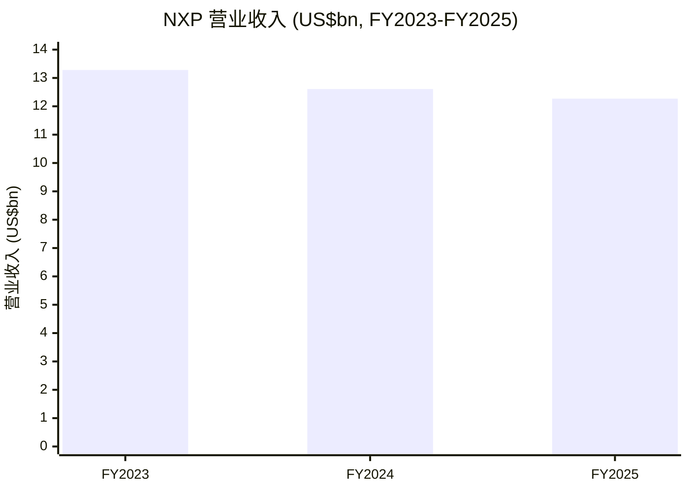
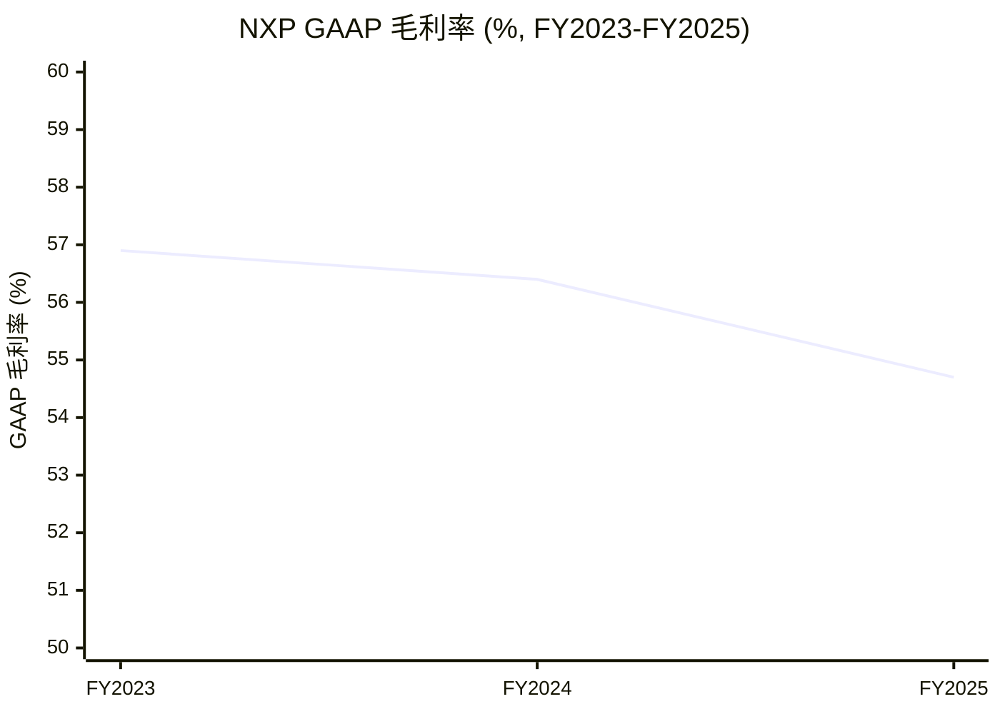
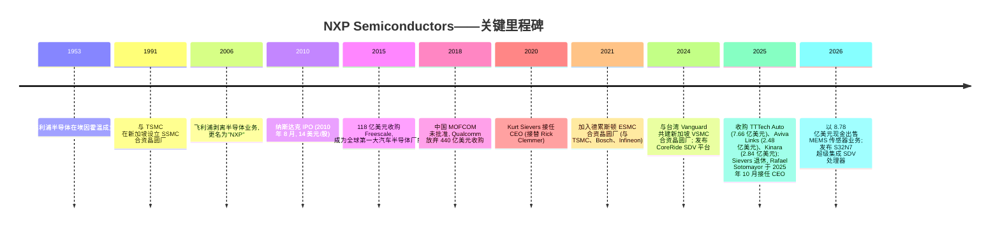
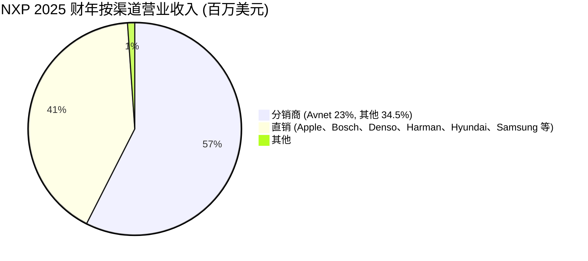
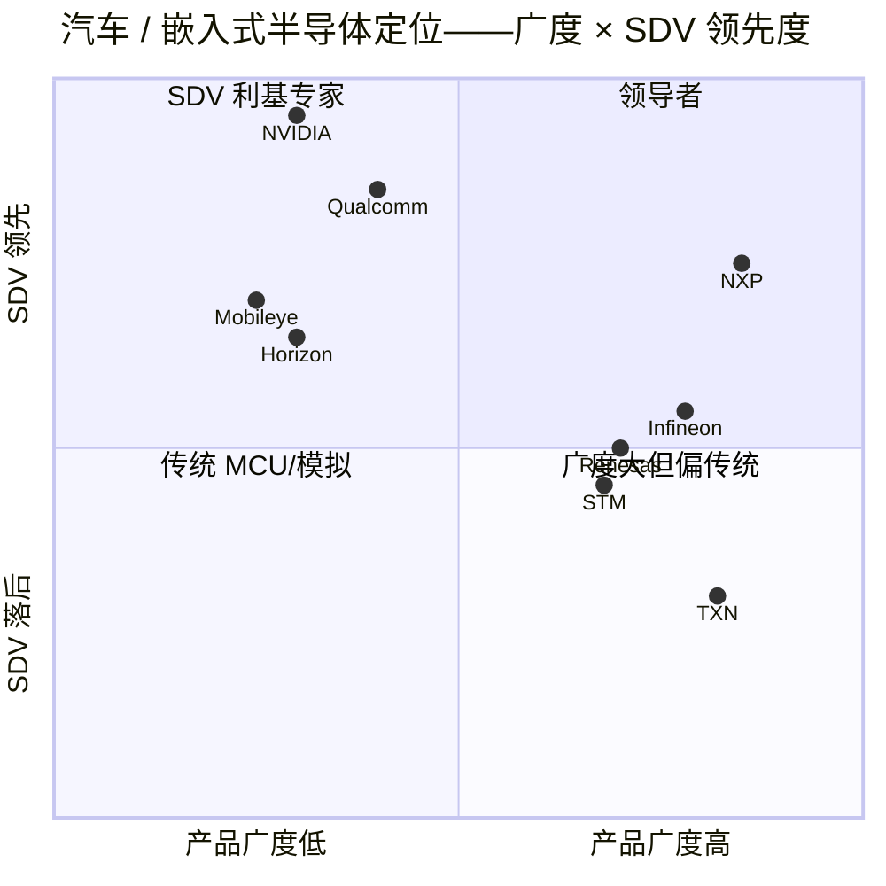
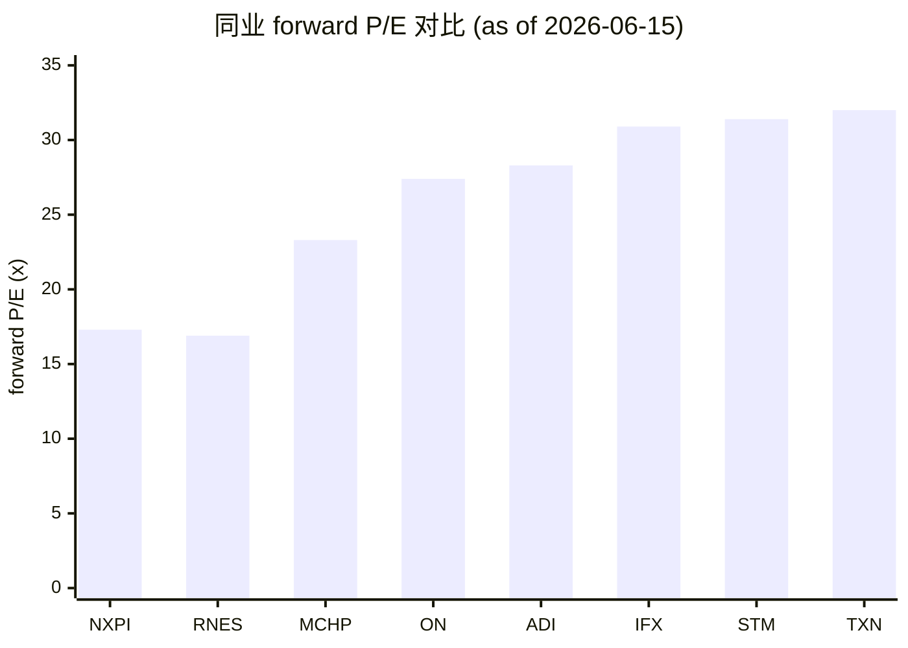

# NXP Semiconductors N.V. (NASDAQ:NXPI) — 公司研究报告

**截至日期: 2026-06-15**
**上市地: 美国纳斯达克全球精选市场 (NASDAQ Global Select), 代码 NXPI**
**总部 / 注册地: 荷兰埃因霍温 (Eindhoven, The Netherlands)**
**行业 / 子行业: 半导体 / 混合信号与汽车电子 (Mixed-signal & automotive)**
**报告语言: 简体中文 (英文版同时存在于本目录)**

---

### 投资摘要 (Investment Summary) — *分析师观点 / Analyst view*

> 以下评级、目标价 (price target, PT)、上行空间、前瞻估计与情景目标价**全部为分析师本方观点 (house view)**, 不取自任何 SEC 文件——10-K 不含目标价, 切勿将其与文件引用混淆。

| 项目 | 数值 |
|---|---|
| **评级 (Rating)** | **Overweight (增持)** |
| **12 个月目标价 (12-mo PT)** | **US$335** |
| **现价 (as of 2026-06-15)** | US$304.86 |
| **隐含上行空间 (upside)** | **约 +9.9%** |
| **估值方法 (一句话)** | FY2027E Non-GAAP EPS ~US$13.40 × 25.0× forward P/E |
| **市值 (market cap)** | 约 US$770 亿 |
| **52 周区间** | US$183.00 – US$339.95 |
| **TTM P/E / forward P/E** | 29.1× / 17.3× |

**论点支柱 (thesis pillars，每条一句话，均为 *分析师观点*):**

1. **周期拐点已确认，2026 是同比重新加速之年。** 2026 Q1 营业收入 +12% YoY 是逾两年首次明显正增，Q2 指引 +14%~+21% 为两年多最强；汽车与工业去库存结束、模拟芯片两轮提价落地，叠加 NXP 自身的 SDV / 边缘 AI "公司特定驱动" ([2026 Q1 业绩公告](https://www.sec.gov/Archives/edgar/data/1413447/000141344726000032/nxp1q26exhibit991.htm))。
2. **内容增长 > 整车销量是结构性引擎。** 在全球整车销量基本停滞、甚至 2026E 微降的背景下，S32 计算平台 + CoreRide 让 SDV 单车价值量从离散 MCU 的 5–20 美元跃升到 50–200 美元 (5–10× 内容倍数)——这是不依赖车市的增长 ([10-K, 第 4 页](https://www.sec.gov/Archives/edgar/data/1413447/000141344726000008/nxpi-20251231.htm))。
3. **估值是同业里最便宜的，安全边际来自折价而非高增长。** 17.3× forward P/E 显著低于 TXN (32×)、ADI (28×)、IFX (31×) 的同业区间，市场尚未为汽车/工业复苏完整定价 ([Yahoo Finance, 2026-06-15](https://finance.yahoo.com/quote/NXPI/))。
4. **现金返还机器仍在运转。** FY2025 自由现金流约 24 亿美元，约 80% 通过股息+回购返还股东；30 亿美元循环信贷 + 投资级评级提供下行缓冲 ([10-K, 第 47–48 页](https://www.sec.gov/Archives/edgar/data/1413447/000141344726000008/nxpi-20251231.htm))。

**最该盯紧的两个变量 (swing variables):** (1) **中国汽车本地化替代速度**——外企在华份额若从 ~78% 进一步快速下滑，NXP 汽车收入 (58%) 长期增速面临 200–400bp 风险；(2) **S32N7 / CoreRide 在欧洲 OEM 的 SDV 量产爬坡时点**——延后 12–24 个月将推迟高内容 SoC 收入拐点 (见第 9.5 节)。

---

> **业绩更新——2026 Q1 业绩全面超预期, 业务普遍重新加速 (2026-04-28):** NXP 公布 2026 Q1 营业收入 31.8 亿美元 (同比 +12%, 显著高于公司指引中值约 29.5 亿美元; 汽车业务同比 +6%, 工业与物联网 (I&IoT) +24%, 移动 +16%, 通讯基础设施 +21%)。Non-GAAP 毛利率 (gross margin) 为 57.1%, Non-GAAP 自由现金流 (free cash flow) 为 7.14 亿美元 (占营业收入 22.4%)。管理层给出 2026 Q2 营业收入指引区间为 **33.5–35.5 亿美元** (同比 +14% 至 +21%), Non-GAAP 毛利率 57.5%–58.5%, 这是两年多以来同比最强的营业收入指引, 公司明确将动能归因于软件定义车辆 (SDV, Software-Defined Vehicle) 处理 (S32N) 业务、物理 AI / 边缘推理 (edge inference) 业务的"公司特定增长驱动因素", 以及 TTTech Auto、Aviva Links 与 Kinara 三宗并购的完成。Rafael Sotomayor (索托马约尔) 在 2025-10-28 接替 Kurt Sievers (西弗斯) 后, 这是其作为 CEO 的首个完整季度, 并强调"我们已构建起来的动能, 预计将在 2026 年余下时段进一步加速"。
> 来源: [NXP 2026 Q1 业绩公告, 2026-04-28](https://www.sec.gov/Archives/edgar/data/1413447/000141344726000032/nxp1q26exhibit991.htm)。

---

## 目录

1. 公司概览 (含 1A 估值快照 · 1B GF Score 基本面评分)
2. 估值与目标价 (Valuation & Price Target) + 公司历史
3. 管理团队
4. 产品与服务
5. 客户与上市策略
6. 行业概览
7. 竞争格局
8. 市场机会 (TAM)
9. 风险评估 (含 9.5 核心分歧与催化剂)
10. 投资视角评分 (Investor lenses)

---

## 1. 公司概览

NXP Semiconductors N.V. 是一家荷兰注册、在纳斯达克上市的混合信号 (mixed-signal) 半导体公司, 总部位于荷兰埃因霍温高科技园区 60 号 (High Tech Campus 60, 5656 AG Eindhoven), 经营根基可追溯至七十余年前其前身**飞利浦半导体 (Philips Semiconductors)** ([NXP 2025 10-K, 第 2 页](https://www.sec.gov/Archives/edgar/data/1413447/000141344726000008/nxpi-20251231.htm))。截至 2025 年 12 月 31 日财年, 公司实现营业收入 122.69 亿美元, 同比 2024 年的 126.14 亿美元下滑 2.7%, 较 2023 年 132.76 亿美元的高点下降 7.6%, 反映出公司各终端市场的同步去库存周期在 2025 年中触底, 并在 2025 Q4 实现拐点回升 ([10-K, 第 36 页](https://www.sec.gov/Archives/edgar/data/1413447/000141344726000008/nxpi-20251231.htm))。截至 2025 年末, NXP 在全球 30 多个国家拥有约 32,169 名员工, 其中研发 (R&D) 岗位约 11,034 人 ([10-K, 第 11 页](https://www.sec.gov/Archives/edgar/data/1413447/000141344726000008/nxpi-20251231.htm))。

**NXP 做什么?** 用平实的语言讲, NXP 设计、制造并销售嵌入在汽车、工厂机械、智能手机、支付卡、电子护照、智能家居设备以及 5G 基站内部的"大脑、感知、安全和连接"芯片。其产品域涵盖嵌入式处理器与微控制器 (MCU, Micro-controller Unit)、混合信号与模拟器件 (包括 77GHz 雷达前端 (77 GHz radar front-end)、电池管理 (battery management)、音频功放、电源管理)、安全控制器 (NFC, 近场通信; UWB, 超宽带; 安全元件 secure element)、有线与无线连接 (汽车端 CAN/LIN/FlexRay/Ethernet/SerDes; 物联网端 Wi-Fi/Bluetooth/Thread/Zigbee; 识别端 RFID/eID), 以及面向蜂窝基础设施 (cellular infrastructure) 的射频功率 (RF power) ([10-K, 第 3–8 页](https://www.sec.gov/Archives/edgar/data/1413447/000141344726000008/nxpi-20251231.htm))。

**NXP 如何赚钱?** 几乎全部营业收入来自向 OEM (原始设备制造商, Original Equipment Manufacturer)、Tier-1 一级供应商和电子分销商销售专属、特定应用的半导体芯片与模组, 随后由这些客户装配进入汽车 ECU、工业控制器、移动手机、支付终端以及网络设备。NXP 以四个终端市场组织业务, 自 2025 财年起作为单一报告分部披露。2025 财年营业收入结构: **汽车业务 71.16 亿美元 (占比 58.0%)**, 工业与物联网 22.73 亿美元 (18.5%), 移动 15.84 亿美元 (12.9%), 通讯基础设施及其他 (Comm Infra & Other) 12.96 亿美元 (10.6%) ([10-K, 第 39 页](https://www.sec.gov/Archives/edgar/data/1413447/000141344726000008/nxpi-20251231.htm))。分销商占销售额 57.5% (70.51 亿美元), 直销 41.4% (50.84 亿美元), 其他 1.1% ([10-K, 第 39 页](https://www.sec.gov/Archives/edgar/data/1413447/000141344726000008/nxpi-20251231.htm))。**Avnet (安富利)** 占 2025 年总收入 23% (2024 年为 22%) ——是唯一超过 10% 阈值的客户/分销商 ([10-K, 第 9 页](https://www.sec.gov/Archives/edgar/data/1413447/000141344726000008/nxpi-20251231.htm))。

**地理结构 (按销售来源, 2025 财年)。** 亚太地区 (除中国外) 35.81 亿美元 (29.2%)、美洲 33.76 亿美元 (27.5%)、欧洲中东非洲 (EMEA) 32.76 亿美元 (26.7%)、中国 20.36 亿美元 (16.6%) ([10-K, 第 40 页](https://www.sec.gov/Archives/edgar/data/1413447/000141344726000008/nxpi-20251231.htm))。2025 年中国营业收入同比增长 6.0%, 其他区域均下滑——这是第 9 章讨论的"本地对本地 (local-for-local)"采购动态的早期信号。

营业收入与毛利率三年轨迹: 2023 财年营业收入 132.76 亿美元、GAAP 毛利率 56.9%; 2024 财年 126.14 亿美元、56.4%; 2025 财年 122.69 亿美元、54.7%——连续两年小幅下滑反映各终端市场同步去库存周期在 2025 年中触底, 并在 2025 Q4 拐点回升 ([10-K, 第 65 页](https://www.sec.gov/Archives/edgar/data/1413447/000141344726000008/nxpi-20251231.htm))。下方两张趋势图分别展示营收 (柱) 与 GAAP 毛利率 (折线)——按项目规则分两张图, 避免在同一坐标轴混用美元与百分比。

来源: [NXP 2025 10-K, 利润表第 65 页](https://www.sec.gov/Archives/edgar/data/1413447/000141344726000008/nxpi-20251231.htm)。

**制造布局。** NXP 采用混合制造模式: 在美国奥斯汀 (Austin, TX)、荷兰奈梅亨 (Nijmegen, NL) 与德国汉堡 (Hamburg, DE) 自有 200mm 晶圆厂; 在新加坡与 TSMC (台积电) 合资运营 SSMC 300mm 晶圆厂; 并对两家全新的纯代工合资晶圆厂持有股权, 以锁定本世纪剩余年份的先进制程产能——分别是德国德累斯顿 (Dresden) 的 **ESMC** (合资方包括 TSMC、Bosch、Infineon, 股权承诺 5 亿欧元 / 约 5.87 亿美元, 截至 2025 年末已部署 1.83 亿美元) 与新加坡的 **VSMC** (合资方为 VIS, 股权承诺约 16 亿美元) ([10-K, 第 8 页与第 50 页](https://www.sec.gov/Archives/edgar/data/1413447/000141344726000008/nxpi-20251231.htm))。后道封装/测试 (back-end assembly/test) 基地分布于台湾高雄、泰国曼谷、马来西亚吉隆坡、中国天津与英国曼彻斯特 ([10-K, 第 8 页](https://www.sec.gov/Archives/edgar/data/1413447/000141344726000008/nxpi-20251231.htm))。

### 1A 估值快照 (Valuation snapshot, 截至 2026-06-15)

股价 **304.86 美元** ([Yahoo Finance NXPI, 2026-06-15](https://finance.yahoo.com/quote/NXPI/)); 52 周区间 183.00–339.95 美元 (股价已自年内低位反弹至接近 52 周高点); 市值 **约 770 亿美元**; **TTM 市盈率 (P/E) 29.1 倍**; **TTM 市销率 (P/S) 6.10 倍**; 市净率 (P/B) 7.05 倍; **远期市盈率 (forward P/E) 17.3 倍**; TTM 股息率 1.33% ([Yahoo Finance NXPI 关键统计指标, 2026-06-15](https://finance.yahoo.com/quote/NXPI/key-statistics/))。

**同业估值比较 (TTM 基础, 截至 2026-06-15):**

| 代码 | TTM P/E | forward P/E | TTM P/S | 备注 |
|---|---|---|---|---|
| **NXPI** | **29.1×** | **17.3×** | **6.10×** | 标的公司——同业中**最低 forward P/E** |
| TXN (Texas Instruments, 德州仪器) | 51.6× | 32.0× | 14.9× | 资本开支/折旧周期成熟带来溢价; 模拟龙头 |
| ADI (Analog Devices, 亚德诺) | 62.1× | 28.3× | 16.0× | 工业/模拟产品结构带来溢价 |
| MCHP (Microchip, 微芯科技) | 433×* | 23.3× | 11.0× | *TTM EPS 因库存调整失真; 用 forward 看 |
| IFX.DE (Infineon, 英飞凌) | 97.6× | 30.9× | 6.88× | 欧元上市汽车/功率半导体同业; EPS 处于底部 |
| STM (STMicroelectronics, 意法半导体) | 483×* | 31.4× | 5.55× | *TTM EPS 底部; 最贴近的汽车 MCU 同业 |
| 6723.T (Renesas, 瑞萨电子) | n/a | 16.9× | 5.67× | 日本汽车 MCU 同业; forward P/E 与 NXP 相当 |
| ON (onsemi, 安森美) | 86.5× | 27.4× | 7.49× | 功率/SiC 同业; EPS 处于底部 |

来源: [Yahoo Finance via yfinance — NXPI、TXN、ADI、MCHP、IFX.DE、STM、6723.T、ON 报价, 2026-06-15 抓取](https://finance.yahoo.com/quote/NXPI/)。

**解读。** NXP 是大型模拟/汽车 MCU 纯标的中 **forward P/E 最低**——17.3 倍, 几乎只有 TXN (32×)、IFX (31×)、STM (31×) 的一半, 仅瑞萨 (16.9×) 与其相当 ([Yahoo Finance NXPI, 2026-06-15](https://finance.yahoo.com/quote/NXPI/))。TTM P/E 29.1 倍看似不低, 但分母受 2025 财年底部盈利拖累 (FY2025 GAAP 摊薄 EPS 7.95 美元, 低于 FY2024 的 9.73 美元—— [10-K, 第 65 页](https://www.sec.gov/Archives/edgar/data/1413447/000141344726000008/nxpi-20251231.htm)); 用前瞻倍数看, NXP 折价反映三个市场尚未完整定价的问题: (1) 周期底部盈利刚刚在 2025 Q4 拐点向上; (2) 欧洲一级供应商 (Bosch 博世、Aptiv 安波福、Aumovio) 多年疲软背景下的汽车周期不确定性; (3) 中国本地对本地的汽车 MCU 替代风险 (见第 9 章)。**未触发 P/E 高于 50 倍的警示, P/S 与同业一致——估值本身不构成独立风险因子, 反而是折价机会。** 风险方向相反: 若 SDV 量产爬坡延后, 一致预期的 FY2026/27 估计可能过于乐观。

下方利润表 Sankey 以 FY2025 GAAP 口径展示 NXP "如何赚钱"——四个终端市场营收汇入, 经 COGS、R&D、SG&A 后留下 30.47 亿美元经营利润 (operating income), 最终净利 20.68 亿美元。

<svg xmlns="http://www.w3.org/2000/svg" viewBox="0 0 1000 560" width="1000" height="560" role="img" aria-label="income statement Sankey"><rect x="0" y="0" width="1000" height="560" fill="#ffffff"/>
<text x="20.00" y="30.00" text-anchor="start" font-family="Helvetica,Arial,sans-serif" font-size="15" font-weight="700" fill="#1f2933">NXP FY2025 利润表 Sankey (US$mn)</text>
<path d="M 204.00,64.00 C 258.00,64.00 258.00,85.00 312.00,85.00 L 312.00,321.64 C 258.00,321.64 258.00,300.64 204.00,300.64 Z" fill="#93c5fd" fill-opacity="0.55"/>
<path d="M 452.00,78.00 C 506.00,78.00 506.00,156.75 560.00,156.75 L 560.00,258.07 C 506.00,258.07 506.00,179.33 452.00,179.33 Z" fill="#86efac" fill-opacity="0.55"/>
<path d="M 452.00,179.33 C 506.00,179.33 506.00,272.07 560.00,272.07 L 560.00,394.48 C 506.00,394.48 506.00,301.74 452.00,301.74 Z" fill="#fca5a5" fill-opacity="0.55"/>
<path d="M 328.00,85.00 C 382.00,85.00 382.00,78.00 436.00,78.00 L 436.00,301.34 C 382.00,301.34 382.00,308.34 328.00,308.34 Z" fill="#86efac" fill-opacity="0.55"/>
<path d="M 328.00,308.34 C 382.00,308.34 382.00,315.34 436.00,315.34 L 436.00,500.00 C 382.00,500.00 382.00,493.00 328.00,493.00 Z" fill="#fca5a5" fill-opacity="0.55"/>
<path d="M 576.00,156.75 C 630.00,156.75 630.00,162.52 684.00,162.52 L 684.00,263.84 C 630.00,263.84 630.00,258.07 576.00,258.07 Z" fill="#86efac" fill-opacity="0.55"/>
<path d="M 700.00,162.52 C 754.00,162.52 754.00,230.89 808.00,230.89 L 808.00,299.66 C 754.00,299.66 754.00,231.29 700.00,231.29 Z" fill="#86efac" fill-opacity="0.55"/>
<path d="M 700.00,231.29 C 754.00,231.29 754.00,313.66 808.00,313.66 L 808.00,331.11 C 754.00,331.11 754.00,248.75 700.00,248.75 Z" fill="#fca5a5" fill-opacity="0.55"/>
<path d="M 700.00,248.75 C 754.00,248.75 754.00,345.11 808.00,345.11 L 808.00,347.11 C 754.00,347.11 754.00,250.75 700.00,250.75 Z" fill="#fca5a5" fill-opacity="0.55"/>
<path d="M 576.00,272.07 C 630.00,272.07 630.00,265.07 684.00,265.07 L 684.00,305.11 C 630.00,305.11 630.00,312.11 576.00,312.11 Z" fill="#fca5a5" fill-opacity="0.55"/>
<path d="M 576.00,312.11 C 630.00,312.11 630.00,319.11 684.00,319.11 L 684.00,397.59 C 630.00,397.59 630.00,390.59 576.00,390.59 Z" fill="#fca5a5" fill-opacity="0.55"/>
<path d="M 576.00,390.59 C 630.00,390.59 630.00,411.59 684.00,411.59 L 684.00,415.48 C 630.00,415.48 630.00,394.48 576.00,394.48 Z" fill="#fca5a5" fill-opacity="0.55"/>
<path d="M 204.00,314.64 C 258.00,314.64 258.00,321.64 312.00,321.64 L 312.00,397.23 C 258.00,397.23 258.00,390.23 204.00,390.23 Z" fill="#93c5fd" fill-opacity="0.55"/>
<path d="M 204.00,404.23 C 258.00,404.23 258.00,397.23 312.00,397.23 L 312.00,449.90 C 258.00,449.90 258.00,456.90 204.00,456.90 Z" fill="#93c5fd" fill-opacity="0.55"/>
<path d="M 576.00,408.48 C 630.00,408.48 630.00,263.84 684.00,263.84 L 684.00,276.61 C 630.00,276.61 630.00,421.25 576.00,421.25 Z" fill="#93c5fd" fill-opacity="0.55"/>
<path d="M 204.00,470.90 C 258.00,470.90 258.00,449.90 312.00,449.90 L 312.00,493.00 C 258.00,493.00 258.00,514.00 204.00,514.00 Z" fill="#93c5fd" fill-opacity="0.55"/>
<rect x="188.00" y="64.00" width="16" height="236.64" rx="1.5" fill="#2563eb"/>
<rect x="188.00" y="314.64" width="16" height="75.59" rx="1.5" fill="#2563eb"/>
<rect x="188.00" y="404.23" width="16" height="52.68" rx="1.5" fill="#2563eb"/>
<rect x="188.00" y="470.90" width="16" height="43.10" rx="1.5" fill="#2563eb"/>
<rect x="312.00" y="85.00" width="16" height="408.00" rx="1.5" fill="#1e3a8a"/>
<rect x="436.00" y="78.00" width="16" height="223.34" rx="1.5" fill="#15803d"/>
<rect x="436.00" y="315.34" width="16" height="184.66" rx="1.5" fill="#dc2626"/>
<rect x="560.00" y="156.75" width="16" height="101.33" rx="1.5" fill="#15803d"/>
<rect x="560.00" y="272.07" width="16" height="122.41" rx="1.5" fill="#dc2626"/>
<rect x="560.00" y="408.48" width="16" height="12.77" rx="1.5" fill="#2563eb"/>
<rect x="684.00" y="162.52" width="16" height="88.56" rx="1.5" fill="#15803d"/>
<rect x="684.00" y="265.07" width="16" height="40.04" rx="1.5" fill="#dc2626"/>
<rect x="684.00" y="319.11" width="16" height="78.48" rx="1.5" fill="#dc2626"/>
<rect x="684.00" y="411.59" width="16" height="3.89" rx="1.5" fill="#dc2626"/>
<rect x="808.00" y="230.89" width="16" height="68.77" rx="1.5" fill="#15803d"/>
<rect x="808.00" y="313.66" width="16" height="17.46" rx="1.5" fill="#dc2626"/>
<rect x="808.00" y="345.11" width="16" height="2.00" rx="1.5" fill="#dc2626"/>
<text x="179.00" y="179.32" text-anchor="end" font-family="Helvetica,Arial,sans-serif" font-size="11.5" font-weight="700" fill="#1f2933">Automotive 汽车</text>
<text x="179.00" y="192.32" text-anchor="end" font-family="Helvetica,Arial,sans-serif" font-size="10" font-weight="400" fill="#52606d">US$7.1B  (58.0%)</text>
<text x="179.00" y="349.43" text-anchor="end" font-family="Helvetica,Arial,sans-serif" font-size="11.5" font-weight="700" fill="#1f2933">Industrial &amp; IoT</text>
<text x="179.00" y="362.43" text-anchor="end" font-family="Helvetica,Arial,sans-serif" font-size="10" font-weight="400" fill="#52606d">US$2.3B  (18.5%)</text>
<text x="179.00" y="427.56" text-anchor="end" font-family="Helvetica,Arial,sans-serif" font-size="11.5" font-weight="700" fill="#1f2933">Mobile 移动</text>
<text x="179.00" y="440.56" text-anchor="end" font-family="Helvetica,Arial,sans-serif" font-size="10" font-weight="400" fill="#52606d">US$1.6B  (12.9%)</text>
<text x="179.00" y="489.45" text-anchor="end" font-family="Helvetica,Arial,sans-serif" font-size="11.5" font-weight="700" fill="#1f2933">Comm Infra &amp; Other</text>
<text x="179.00" y="502.45" text-anchor="end" font-family="Helvetica,Arial,sans-serif" font-size="10" font-weight="400" fill="#52606d">US$1.3B  (10.6%)</text>
<rect x="331.00" y="67.00" width="119.40" height="26" rx="2" fill="#ffffff" fill-opacity="0.72"/>
<text x="334.00" y="79.00" text-anchor="start" font-family="Helvetica,Arial,sans-serif" font-size="11.5" font-weight="700" fill="#1f2933">Revenue</text>
<text x="334.00" y="92.00" text-anchor="start" font-family="Helvetica,Arial,sans-serif" font-size="10" font-weight="400" fill="#52606d">US$12.3B  (100.0%)</text>
<rect x="455.00" y="60.00" width="106.80" height="26" rx="2" fill="#ffffff" fill-opacity="0.72"/>
<text x="458.00" y="72.00" text-anchor="start" font-family="Helvetica,Arial,sans-serif" font-size="11.5" font-weight="700" fill="#1f2933">Gross Profit</text>
<text x="458.00" y="85.00" text-anchor="start" font-family="Helvetica,Arial,sans-serif" font-size="10" font-weight="400" fill="#52606d">US$6.7B  (54.7%)</text>
<rect x="455.00" y="297.34" width="144.60" height="26" rx="2" fill="#ffffff" fill-opacity="0.72"/>
<text x="458.00" y="309.34" text-anchor="start" font-family="Helvetica,Arial,sans-serif" font-size="11.5" font-weight="700" fill="#1f2933">Cost of Revenue (COGS)</text>
<text x="458.00" y="322.34" text-anchor="start" font-family="Helvetica,Arial,sans-serif" font-size="10" font-weight="400" fill="#52606d">US$5.6B  (45.3%)</text>
<rect x="579.00" y="138.75" width="106.80" height="26" rx="2" fill="#ffffff" fill-opacity="0.72"/>
<text x="582.00" y="150.75" text-anchor="start" font-family="Helvetica,Arial,sans-serif" font-size="11.5" font-weight="700" fill="#1f2933">Operating Income</text>
<text x="582.00" y="163.75" text-anchor="start" font-family="Helvetica,Arial,sans-serif" font-size="10" font-weight="400" fill="#52606d">US$3.0B  (24.8%)</text>
<rect x="579.00" y="254.07" width="150.90" height="26" rx="2" fill="#ffffff" fill-opacity="0.72"/>
<text x="582.00" y="266.07" text-anchor="start" font-family="Helvetica,Arial,sans-serif" font-size="11.5" font-weight="700" fill="#1f2933">Total Operating Expense</text>
<text x="582.00" y="279.07" text-anchor="start" font-family="Helvetica,Arial,sans-serif" font-size="10" font-weight="400" fill="#52606d">US$3.7B  (30.0%)</text>
<text x="551.00" y="411.87" text-anchor="end" font-family="Helvetica,Arial,sans-serif" font-size="11.5" font-weight="700" fill="#1f2933">Net Interest / Other Income</text>
<text x="551.00" y="424.87" text-anchor="end" font-family="Helvetica,Arial,sans-serif" font-size="10" font-weight="400" fill="#52606d">US$384.0M  (3.1%)</text>
<rect x="703.00" y="144.52" width="106.80" height="26" rx="2" fill="#ffffff" fill-opacity="0.72"/>
<text x="706.00" y="156.52" text-anchor="start" font-family="Helvetica,Arial,sans-serif" font-size="11.5" font-weight="700" fill="#1f2933">Pretax Income</text>
<text x="706.00" y="169.52" text-anchor="start" font-family="Helvetica,Arial,sans-serif" font-size="10" font-weight="400" fill="#52606d">US$2.7B  (21.7%)</text>
<rect x="703.00" y="247.07" width="100.50" height="26" rx="2" fill="#ffffff" fill-opacity="0.72"/>
<text x="706.00" y="259.07" text-anchor="start" font-family="Helvetica,Arial,sans-serif" font-size="11.5" font-weight="700" fill="#1f2933">SG&amp;A</text>
<text x="706.00" y="272.07" text-anchor="start" font-family="Helvetica,Arial,sans-serif" font-size="10" font-weight="400" fill="#52606d">US$1.2B  (9.8%)</text>
<rect x="703.00" y="301.11" width="106.80" height="26" rx="2" fill="#ffffff" fill-opacity="0.72"/>
<text x="706.00" y="313.11" text-anchor="start" font-family="Helvetica,Arial,sans-serif" font-size="11.5" font-weight="700" fill="#1f2933">R&amp;D</text>
<text x="706.00" y="326.11" text-anchor="start" font-family="Helvetica,Arial,sans-serif" font-size="10" font-weight="400" fill="#52606d">US$2.4B  (19.2%)</text>
<rect x="703.00" y="393.59" width="119.40" height="26" rx="2" fill="#ffffff" fill-opacity="0.72"/>
<text x="706.00" y="405.59" text-anchor="start" font-family="Helvetica,Arial,sans-serif" font-size="11.5" font-weight="700" fill="#1f2933">Other OpEx</text>
<text x="706.00" y="418.59" text-anchor="start" font-family="Helvetica,Arial,sans-serif" font-size="10" font-weight="400" fill="#52606d">US$117.0M  (0.95%)</text>
<text x="833.00" y="262.27" text-anchor="start" font-family="Helvetica,Arial,sans-serif" font-size="11.5" font-weight="700" fill="#1f2933">Net Income</text>
<text x="833.00" y="275.27" text-anchor="start" font-family="Helvetica,Arial,sans-serif" font-size="10" font-weight="400" fill="#52606d">US$2.1B  (16.9%)</text>
<text x="833.00" y="319.39" text-anchor="start" font-family="Helvetica,Arial,sans-serif" font-size="11.5" font-weight="700" fill="#1f2933">Income Tax</text>
<text x="833.00" y="332.39" text-anchor="start" font-family="Helvetica,Arial,sans-serif" font-size="10" font-weight="400" fill="#52606d">US$525.0M  (4.3%)</text>
<text x="833.00" y="344.39" text-anchor="start" font-family="Helvetica,Arial,sans-serif" font-size="11.5" font-weight="700" fill="#1f2933">Minority Interest</text>
<text x="833.00" y="357.39" text-anchor="start" font-family="Helvetica,Arial,sans-serif" font-size="10" font-weight="400" fill="#52606d">US$47.0M  (0.38%)</text>
<text x="500.00" y="530.00" text-anchor="middle" font-family="Helvetica,Arial,sans-serif" font-size="10" font-weight="400" font-style="italic" fill="#8a97a3">GAAP 口径; 经营利润含其他收入 $12mn; 税前剔除权益法投资 -$70mn</text>
<text x="500.00" y="544.00" text-anchor="middle" font-family="Helvetica,Arial,sans-serif" font-size="10" font-weight="400" fill="#52606d">Source: NXP FY2025 10-K (income statement, p.65; segment p.39; geography p.40)</text>
</svg>

来源: [NXP FY2025 10-K, 利润表第 65 页 + 终端市场第 39 页](https://www.sec.gov/Archives/edgar/data/1413447/000141344726000008/nxpi-20251231.htm)。

下方两张环形图分别按终端市场与销售地区拆解 FY2025 营业收入: 汽车独占 58%, 亚太 (除中国) 与美洲并列最大销售区域。

<svg xmlns="http://www.w3.org/2000/svg" viewBox="0 0 720 460" width="720" height="460" role="img" aria-label="revenue donut"><rect x="0" y="0" width="720" height="460" fill="#ffffff"/>
<text x="20.00" y="30.00" text-anchor="start" font-family="Helvetica,Arial,sans-serif" font-size="15" font-weight="700" fill="#1f2933">NXP FY2025 营业收入结构 (按终端市场)</text>
<path d="M 288.00,107.20 A 132 132 0 1 1 224.41,354.87 L 250.42,307.55 A 78 78 0 1 0 288.00,161.20 Z" fill="#2563eb"/>
<path d="M 224.41,354.87 A 132 132 0 0 1 156.61,226.56 L 210.36,231.73 A 78 78 0 0 0 250.42,307.55 Z" fill="#15803d"/>
<path d="M 156.61,226.56 A 132 132 0 0 1 206.68,135.22 L 239.95,177.76 A 78 78 0 0 0 210.36,231.73 Z" fill="#d97706"/>
<path d="M 206.68,135.22 A 132 132 0 0 1 288.00,107.20 L 288.00,161.20 A 78 78 0 0 0 239.95,177.76 Z" fill="#7c3aed"/>
<text x="288.00" y="235.20" text-anchor="middle" font-family="Helvetica,Arial,sans-serif" font-size="18" font-weight="800" fill="#1f2933">NXPI</text>
<text x="288.00" y="255.20" text-anchor="middle" font-family="Helvetica,Arial,sans-serif" font-size="13" font-weight="600" fill="#52606d">US$12.3B</text>
<text x="288.00" y="271.20" text-anchor="middle" font-family="Helvetica,Arial,sans-serif" font-size="10" font-weight="400" fill="#8a97a3">total</text>
<line x1="421.66" y1="273.52" x2="437.66" y2="273.52" stroke="#2563eb" stroke-width="1.4"/>
<text x="441.66" y="271.52" text-anchor="start" font-family="Helvetica,Arial,sans-serif" font-size="11" font-weight="700" fill="#1f2933">Automotive 汽车</text>
<text x="441.66" y="285.52" text-anchor="start" font-family="Helvetica,Arial,sans-serif" font-size="10" font-weight="400" fill="#52606d">US$7.1B  (58.0%)</text>
<line x1="165.99" y1="303.67" x2="149.99" y2="303.67" stroke="#15803d" stroke-width="1.4"/>
<text x="145.99" y="301.67" text-anchor="end" font-family="Helvetica,Arial,sans-serif" font-size="11" font-weight="700" fill="#1f2933">Industrial &amp; IoT</text>
<text x="145.99" y="315.67" text-anchor="end" font-family="Helvetica,Arial,sans-serif" font-size="10" font-weight="400" fill="#52606d">US$2.3B  (18.5%)</text>
<line x1="166.99" y1="172.86" x2="150.99" y2="172.86" stroke="#d97706" stroke-width="1.4"/>
<text x="146.99" y="170.86" text-anchor="end" font-family="Helvetica,Arial,sans-serif" font-size="11" font-weight="700" fill="#1f2933">Mobile 移动</text>
<text x="146.99" y="184.86" text-anchor="end" font-family="Helvetica,Arial,sans-serif" font-size="10" font-weight="400" fill="#52606d">US$1.6B  (12.9%)</text>
<line x1="243.04" y1="108.73" x2="227.04" y2="108.73" stroke="#7c3aed" stroke-width="1.4"/>
<text x="223.04" y="106.73" text-anchor="end" font-family="Helvetica,Arial,sans-serif" font-size="11" font-weight="700" fill="#1f2933">Comm Infra &amp; Other</text>
<text x="223.04" y="120.73" text-anchor="end" font-family="Helvetica,Arial,sans-serif" font-size="10" font-weight="400" fill="#52606d">US$1.3B  (10.6%)</text>
<text x="360.00" y="444.00" text-anchor="middle" font-family="Helvetica,Arial,sans-serif" font-size="10" font-weight="400" fill="#52606d">Source: NXP FY2025 10-K (终端市场收入, p.39)</text>
</svg>

<svg xmlns="http://www.w3.org/2000/svg" viewBox="0 0 720 460" width="720" height="460" role="img" aria-label="revenue donut"><rect x="0" y="0" width="720" height="460" fill="#ffffff"/>
<text x="20.00" y="30.00" text-anchor="start" font-family="Helvetica,Arial,sans-serif" font-size="15" font-weight="700" fill="#1f2933">NXP FY2025 营业收入结构 (按销售地区)</text>
<path d="M 288.00,107.20 A 132 132 0 0 1 415.46,273.53 L 363.32,259.49 A 78 78 0 0 0 288.00,161.20 Z" fill="#2563eb"/>
<path d="M 415.46,273.53 A 132 132 0 0 1 234.03,359.66 L 256.11,310.38 A 78 78 0 0 0 363.32,259.49 Z" fill="#15803d"/>
<path d="M 234.03,359.66 A 132 132 0 0 1 173.98,172.68 L 220.63,199.89 A 78 78 0 0 0 256.11,310.38 Z" fill="#d97706"/>
<path d="M 173.98,172.68 A 132 132 0 0 1 288.00,107.20 L 288.00,161.20 A 78 78 0 0 0 220.63,199.89 Z" fill="#7c3aed"/>
<text x="288.00" y="235.20" text-anchor="middle" font-family="Helvetica,Arial,sans-serif" font-size="18" font-weight="800" fill="#1f2933">地区</text>
<text x="288.00" y="255.20" text-anchor="middle" font-family="Helvetica,Arial,sans-serif" font-size="13" font-weight="600" fill="#52606d">US$12.3B</text>
<text x="288.00" y="271.20" text-anchor="middle" font-family="Helvetica,Arial,sans-serif" font-size="10" font-weight="400" fill="#8a97a3">total</text>
<line x1="397.54" y1="155.26" x2="413.54" y2="155.26" stroke="#2563eb" stroke-width="1.4"/>
<text x="417.54" y="153.26" text-anchor="start" font-family="Helvetica,Arial,sans-serif" font-size="11" font-weight="700" fill="#1f2933">Asia-Pac ex-China 亚太(除中国)</text>
<text x="417.54" y="167.26" text-anchor="start" font-family="Helvetica,Arial,sans-serif" font-size="10" font-weight="400" fill="#52606d">US$3.6B  (29.2%)</text>
<line x1="347.18" y1="363.86" x2="363.18" y2="363.86" stroke="#15803d" stroke-width="1.4"/>
<text x="367.18" y="361.86" text-anchor="start" font-family="Helvetica,Arial,sans-serif" font-size="11" font-weight="700" fill="#1f2933">Americas 美洲</text>
<text x="367.18" y="375.86" text-anchor="start" font-family="Helvetica,Arial,sans-serif" font-size="10" font-weight="400" fill="#52606d">US$3.4B  (27.5%)</text>
<line x1="156.61" y1="281.39" x2="140.61" y2="281.39" stroke="#d97706" stroke-width="1.4"/>
<text x="136.61" y="279.39" text-anchor="end" font-family="Helvetica,Arial,sans-serif" font-size="11" font-weight="700" fill="#1f2933">EMEA 欧中东非</text>
<text x="136.61" y="293.39" text-anchor="end" font-family="Helvetica,Arial,sans-serif" font-size="10" font-weight="400" fill="#52606d">US$3.3B  (26.7%)</text>
<line x1="219.27" y1="119.53" x2="203.27" y2="119.53" stroke="#7c3aed" stroke-width="1.4"/>
<text x="199.27" y="117.53" text-anchor="end" font-family="Helvetica,Arial,sans-serif" font-size="11" font-weight="700" fill="#1f2933">China 中国</text>
<text x="199.27" y="131.53" text-anchor="end" font-family="Helvetica,Arial,sans-serif" font-size="10" font-weight="400" fill="#52606d">US$2.0B  (16.6%)</text>
<text x="360.00" y="444.00" text-anchor="middle" font-family="Helvetica,Arial,sans-serif" font-size="10" font-weight="400" fill="#52606d">Source: NXP FY2025 10-K (按销售来源地区, p.40)</text>
</svg>

来源: [NXP FY2025 10-K, 终端市场第 39 页与按销售来源地区第 40 页](https://www.sec.gov/Archives/edgar/data/1413447/000141344726000008/nxpi-20251231.htm)。

下方历史柱状图展示 2022–2025 年四个终端市场的营收轨迹: 汽车在 2023 年见顶后两年温和回落、2025 年企稳; 通讯基础设施持续萎缩 (公司以现金最大化策略管理); 移动业务自 2023 年低点逐年回升。

<svg xmlns="http://www.w3.org/2000/svg" viewBox="0 0 860 470" width="860" height="470" role="img" aria-label="historical revenue bars"><rect x="0" y="0" width="860" height="470" fill="#ffffff"/>
<text x="20.00" y="30.00" text-anchor="start" font-family="Helvetica,Arial,sans-serif" font-size="15" font-weight="700" fill="#1f2933">NXP 营业收入历史 (按终端市场, US$mn)</text>
<rect x="20.00" y="44" width="11" height="11" rx="2" fill="#2563eb"/>
<text x="36.00" y="53.00" text-anchor="start" font-family="Helvetica,Arial,sans-serif" font-size="10.5" font-weight="400" fill="#1f2933">Automotive 汽车</text>
<rect x="135.80" y="44" width="11" height="11" rx="2" fill="#15803d"/>
<text x="151.80" y="53.00" text-anchor="start" font-family="Helvetica,Arial,sans-serif" font-size="10.5" font-weight="400" fill="#1f2933">Industrial &amp; IoT</text>
<rect x="271.40" y="44" width="11" height="11" rx="2" fill="#d97706"/>
<text x="287.40" y="53.00" text-anchor="start" font-family="Helvetica,Arial,sans-serif" font-size="10.5" font-weight="400" fill="#1f2933">Mobile 移动</text>
<rect x="360.80" y="44" width="11" height="11" rx="2" fill="#7c3aed"/>
<text x="376.80" y="53.00" text-anchor="start" font-family="Helvetica,Arial,sans-serif" font-size="10.5" font-weight="400" fill="#1f2933">Comm Infra &amp; Other</text>
<line x1="70" y1="412.00" x2="834" y2="412.00" stroke="#eceff2" stroke-width="1"/>
<text x="64.00" y="415.00" text-anchor="end" font-family="Helvetica,Arial,sans-serif" font-size="9.5" font-weight="400" fill="#52606d">US$0</text>
<line x1="70" y1="345.20" x2="834" y2="345.20" stroke="#eceff2" stroke-width="1"/>
<text x="64.00" y="348.20" text-anchor="end" font-family="Helvetica,Arial,sans-serif" font-size="9.5" font-weight="400" fill="#52606d">US$2.9B</text>
<line x1="70" y1="278.40" x2="834" y2="278.40" stroke="#eceff2" stroke-width="1"/>
<text x="64.00" y="281.40" text-anchor="end" font-family="Helvetica,Arial,sans-serif" font-size="9.5" font-weight="400" fill="#52606d">US$5.7B</text>
<line x1="70" y1="211.60" x2="834" y2="211.60" stroke="#eceff2" stroke-width="1"/>
<text x="64.00" y="214.60" text-anchor="end" font-family="Helvetica,Arial,sans-serif" font-size="9.5" font-weight="400" fill="#52606d">US$8.6B</text>
<line x1="70" y1="144.80" x2="834" y2="144.80" stroke="#eceff2" stroke-width="1"/>
<text x="64.00" y="147.80" text-anchor="end" font-family="Helvetica,Arial,sans-serif" font-size="9.5" font-weight="400" fill="#52606d">US$11.5B</text>
<line x1="70" y1="78.00" x2="834" y2="78.00" stroke="#eceff2" stroke-width="1"/>
<text x="64.00" y="81.00" text-anchor="end" font-family="Helvetica,Arial,sans-serif" font-size="9.5" font-weight="400" fill="#52606d">US$14.3B</text>
<rect x="110.11" y="251.76" width="110.78" height="160.24" fill="#2563eb"/>
<rect x="110.11" y="188.56" width="110.78" height="63.20" fill="#15803d"/>
<rect x="110.11" y="151.12" width="110.78" height="37.43" fill="#d97706"/>
<rect x="110.11" y="104.39" width="110.78" height="46.73" fill="#7c3aed"/>
<text x="165.50" y="428.00" text-anchor="middle" font-family="Helvetica,Arial,sans-serif" font-size="10" font-weight="400" fill="#52606d">2022</text>
<rect x="301.11" y="237.66" width="110.78" height="174.34" fill="#2563eb"/>
<rect x="301.11" y="182.90" width="110.78" height="54.77" fill="#15803d"/>
<rect x="301.11" y="151.99" width="110.78" height="30.91" fill="#d97706"/>
<rect x="301.11" y="102.74" width="110.78" height="49.24" fill="#7c3aed"/>
<text x="356.50" y="428.00" text-anchor="middle" font-family="Helvetica,Arial,sans-serif" font-size="10" font-weight="400" fill="#52606d">2023</text>
<rect x="492.11" y="245.42" width="110.78" height="166.58" fill="#2563eb"/>
<rect x="492.11" y="192.56" width="110.78" height="52.86" fill="#15803d"/>
<rect x="492.11" y="157.69" width="110.78" height="34.87" fill="#d97706"/>
<rect x="492.11" y="118.16" width="110.78" height="39.53" fill="#7c3aed"/>
<text x="547.50" y="428.00" text-anchor="middle" font-family="Helvetica,Arial,sans-serif" font-size="10" font-weight="400" fill="#52606d">2024</text>
<rect x="683.11" y="246.24" width="110.78" height="165.76" fill="#2563eb"/>
<rect x="683.11" y="193.29" width="110.78" height="52.95" fill="#15803d"/>
<rect x="683.11" y="156.39" width="110.78" height="36.90" fill="#d97706"/>
<rect x="683.11" y="126.20" width="110.78" height="30.19" fill="#7c3aed"/>
<text x="738.50" y="428.00" text-anchor="middle" font-family="Helvetica,Arial,sans-serif" font-size="10" font-weight="400" fill="#52606d">2025</text>
<text x="430.00" y="454.00" text-anchor="middle" font-family="Helvetica,Arial,sans-serif" font-size="10" font-weight="400" fill="#52606d">Source: NXP 10-K FY2023/FY2024/FY2025 (终端市场收入, MD&amp;A)</text>
</svg>

来源: [NXP 10-K FY2023/FY2024/FY2025, 终端市场收入 MD&A](https://www.sec.gov/Archives/edgar/data/1413447/000141344726000008/nxpi-20251231.htm)。

---

## 1B. GF Score 基本面评分 (GuruFocus-style) — *分析师观点*

下方五维雷达图 (radar) 仿 GuruFocus GF Score™, 五个维度各 0–10 分, 加权合成 0–100。**它是分析师本方评分模型 (rubric), 不是 GuruFocus 官方数字、也不附带任何文件引用**; 每个底层指标 (margins / leverage / CAGR / multiples / price returns) 的引用见第 1A、2、9 节。

<svg xmlns="http://www.w3.org/2000/svg" viewBox="0 0 500 500" width="500" height="500" role="img" aria-label="GF Score radar">
<rect x="0" y="0" width="500" height="500" fill="#ffffff"/>
<text x="20" y="24" font-family="Helvetica,Arial,sans-serif" font-size="15" font-weight="700" fill="#1f2933">GF Score (GuruFocus-style): 65/100</text>
<text x="20" y="41" font-family="Helvetica,Arial,sans-serif" font-size="11" fill="#52606d">51–70 Poor future performance potential</text>
<polygon points="250.0,88.0 392.7,191.6 338.2,359.4 161.8,359.4 107.3,191.6" fill="#e9f5ec" stroke="none"/>
<polygon points="250.0,208.0 278.5,228.7 267.6,262.3 232.4,262.3 221.5,228.7" fill="none" stroke="#c5d3cb" stroke-width="1"/>
<polygon points="250.0,178.0 307.1,219.5 285.3,286.5 214.7,286.5 192.9,219.5" fill="none" stroke="#c5d3cb" stroke-width="1"/>
<polygon points="250.0,148.0 335.6,210.2 302.9,310.8 197.1,310.8 164.4,210.2" fill="none" stroke="#c5d3cb" stroke-width="1"/>
<polygon points="250.0,118.0 364.1,200.9 320.5,335.1 179.5,335.1 135.9,200.9" fill="none" stroke="#c5d3cb" stroke-width="1"/>
<polygon points="250.0,88.0 392.7,191.6 338.2,359.4 161.8,359.4 107.3,191.6" fill="none" stroke="#c5d3cb" stroke-width="1.3"/>
<line x1="250" y1="238" x2="161.8" y2="359.4" stroke="#cfdad3" stroke-width="1"/>
<text x="146.5" y="392.4" text-anchor="end" font-family="Helvetica,Arial,sans-serif" font-size="11.5" font-weight="600" fill="#1f2933">Financial Strength</text>
<text x="146.5" y="405.4" text-anchor="end" font-family="Helvetica,Arial,sans-serif" font-size="9.5" fill="#52606d">财务实力</text>
<text x="205.9" y="292.7" text-anchor="middle" font-family="Helvetica,Arial,sans-serif" font-size="10.5" font-weight="700" fill="#1f2933">5</text>
<line x1="250" y1="238" x2="250.0" y2="88.0" stroke="#cfdad3" stroke-width="1"/>
<text x="250.0" y="58.0" text-anchor="middle" font-family="Helvetica,Arial,sans-serif" font-size="11.5" font-weight="600" fill="#1f2933">Profitability</text>
<text x="250.0" y="71.0" text-anchor="middle" font-family="Helvetica,Arial,sans-serif" font-size="9.5" fill="#52606d">盈利能力</text>
<text x="250.0" y="112.0" text-anchor="middle" font-family="Helvetica,Arial,sans-serif" font-size="10.5" font-weight="700" fill="#1f2933">8</text>
<line x1="250" y1="238" x2="107.3" y2="191.6" stroke="#cfdad3" stroke-width="1"/>
<text x="82.6" y="183.6" text-anchor="end" font-family="Helvetica,Arial,sans-serif" font-size="11.5" font-weight="600" fill="#1f2933">Growth</text>
<text x="82.6" y="196.6" text-anchor="end" font-family="Helvetica,Arial,sans-serif" font-size="9.5" fill="#52606d">成长性</text>
<text x="178.7" y="208.8" text-anchor="middle" font-family="Helvetica,Arial,sans-serif" font-size="10.5" font-weight="700" fill="#1f2933">5</text>
<line x1="250" y1="238" x2="392.7" y2="191.6" stroke="#cfdad3" stroke-width="1"/>
<text x="417.4" y="183.6" text-anchor="start" font-family="Helvetica,Arial,sans-serif" font-size="11.5" font-weight="600" fill="#1f2933">GF Value</text>
<text x="417.4" y="196.6" text-anchor="start" font-family="Helvetica,Arial,sans-serif" font-size="9.5" fill="#52606d">估值</text>
<text x="364.1" y="194.9" text-anchor="middle" font-family="Helvetica,Arial,sans-serif" font-size="10.5" font-weight="700" fill="#1f2933">8</text>
<line x1="250" y1="238" x2="338.2" y2="359.4" stroke="#cfdad3" stroke-width="1"/>
<text x="353.5" y="392.4" text-anchor="start" font-family="Helvetica,Arial,sans-serif" font-size="11.5" font-weight="600" fill="#1f2933">Momentum</text>
<text x="353.5" y="405.4" text-anchor="start" font-family="Helvetica,Arial,sans-serif" font-size="9.5" fill="#52606d">动量</text>
<text x="311.7" y="316.9" text-anchor="middle" font-family="Helvetica,Arial,sans-serif" font-size="10.5" font-weight="700" fill="#1f2933">7</text>
<polygon points="250.0,118.0 364.1,200.9 311.7,322.9 205.9,298.7 178.7,214.8" fill="#2e8b57" fill-opacity="0.34" stroke="#2e8b57" stroke-width="2"/>
<circle cx="205.9" cy="298.7" r="2.6" fill="#2e8b57"/>
<circle cx="250.0" cy="118.0" r="2.6" fill="#2e8b57"/>
<circle cx="178.7" cy="214.8" r="2.6" fill="#2e8b57"/>
<circle cx="364.1" cy="200.9" r="2.6" fill="#2e8b57"/>
<circle cx="311.7" cy="322.9" r="2.6" fill="#2e8b57"/>
<text x="250" y="470" text-anchor="middle" font-family="Helvetica,Arial,sans-serif" font-size="9.5" fill="#52606d">Source: NXP FY2025 10-K · Q1 2026 8-K · Yahoo Finance · indicators.db, as of 2026-06-15</text>
<text x="250" y="485" text-anchor="middle" font-family="Helvetica,Arial,sans-serif" font-size="9" fill="#52606d">GF Score = independent analyst rubric (*Analyst view:*) — not GuruFocus™ official number</text>
</svg>

| 维度 / Dimension | 评分 (0–10) | |
|---|---|---|
| Financial Strength (财务实力) | 5 | `█████░░░░░` |
| Profitability (盈利能力) | 8 | `████████░░` |
| Growth (成长性) | 5 | `█████░░░░░` |
| GF Value (估值, 越高越便宜) | 8 | `████████░░` |
| Momentum (动量) | 7 | `███████░░░` |
| **GF Score (合成, *分析师观点*)** | **65 / 100** | **51–70 区间** |

来源 (底层指标): [NXP FY2025 10-K](https://www.sec.gov/Archives/edgar/data/1413447/000141344726000008/nxpi-20251231.htm) · [Yahoo Finance NXPI, 2026-06-15](https://finance.yahoo.com/quote/NXPI/key-statistics/) · indicators.db 本地快照 (FRED BAMLH0A0HYM2 / ^TNX + yfinance), as of 2026-06-05。合成权重: 财务实力 20% · 盈利 25% · 成长 25% · 估值 15% · 动量 15% (透明复刻, 非 GuruFocus 专有权重)。

**各维度评分理由 (为什么是这个分):**

- **Financial Strength — 5/10。** 资产负债表稳健但带杠杆: FY2025 末总债务 122.2 亿美元、现金 32.7 亿美元、净债务 89.6 亿美元, 总杠杆约 2.4×、净杠杆约 1.7× ([10-K, 第 27 页](https://www.sec.gov/Archives/edgar/data/1413447/000141344726000008/nxpi-20251231.htm))。投资级评级、30 亿美元未动用循环信贷、利息覆盖充足, 但同时承担年股息 10 亿+、回购 10 亿+、并购 13 亿与晶圆厂合资 22 亿股权承诺——杠杆是这一维度被压在中位的原因, 不是危险。
- **Profitability — 8/10。** 周期底部仍有强盈利能力: FY2025 GAAP 经营利润率 24.8%、净利率 16.9%, Non-GAAP 毛利率 54.7% (周期底部), ROE 约 20%, ROIC 显著高于 WACC, 且穿越完整周期保持盈利 ([10-K, 第 36、65 页](https://www.sec.gov/Archives/edgar/data/1413447/000141344726000008/nxpi-20251231.htm))。这是 NXP 最强的一维。
- **Growth — 5/10。** FY2025 营收同比 -2.7% 拖累历史成长分, 但 2026 Q1 +12% YoY 与前瞻模型 (第 2 节) 的双位数重新加速给出向上信号 ([2026 Q1 业绩公告](https://www.sec.gov/Archives/edgar/data/1413447/000141344726000032/nxp1q26exhibit991.htm))。后顾低、前瞻高, 综合中位。
- **GF Value — 8/10 (越高越便宜)。** 17.3× forward P/E 是同业最低、远低于自身历史与 TXN/ADI/IFX 区间, 对应第 2 节 PT 仍有约 +10% 上行 ([Yahoo Finance, 2026-06-15](https://finance.yahoo.com/quote/NXPI/))——折价是本报告增持评级的核心安全边际。
- **Momentum — 7/10。** 股价自年内低位 (183 美元) 反弹至接近 52 周高点 (339.95 美元), 年初至今约 +18%, 跑赢费城半导体周期同业的多数汽车/模拟标的 ([Yahoo Finance NXPI, 2026-06-15](https://finance.yahoo.com/quote/NXPI/))。

---

## 2. 估值与目标价 (Valuation & Price Target) + 公司历史

### 2A. 前瞻财务模型与目标价推导 — *分析师观点*

> 本节的前瞻估计、目标价及情景目标价**全部为分析师本方观点**, 每个驱动因素的外部依据 (文件分部数据 + 管理层指引 + 行业预测) 在段内引用; **绝不写"(模型估算)"作为来源**, 也绝不把目标价附到 10-K 引用上。

**前瞻三年估计 (FY2026E–FY2028E)。** 模型以 2026 Q1 实际 (营收 +12% YoY、Non-GAAP 毛利率 57.1%) 与 Q2 指引 (营收 +14%~+21%、Non-GAAP 毛利率 57.5%~58.5%) 为锚 ([2026 Q1 业绩公告](https://www.sec.gov/Archives/edgar/data/1413447/000141344726000032/nxp1q26exhibit991.htm)), 叠加管理层中周期模型 (营收中高单位数增长、Non-GAAP 营业利润率 33%~35% 区间—— [2026 Q1 公告长期财务模型](https://www.sec.gov/Archives/edgar/data/1413447/000141344726000032/nxp1q26exhibit991.htm)) 与 UBS 对车规/模拟半导体 2026E +10% / 2027E +14% 的行业预测 (见 2C 节卖方观点)。

| 财年 | 营业收入 (US$bn) | YoY | Non-GAAP 毛利率 | Non-GAAP 营业利润率 | Non-GAAP EPS (US$) | YoY |
|---|---|---|---|---|---|---|
| FY2025 (实际) | 12.27 | -2.7% | 54.7%* | 33.0% | ~11.50 | -1% |
| **FY2026E** | **13.55** | **+10.4%** | 57.6% | 33.8% | **~12.30** | **+7%** |
| **FY2027E** | **14.85** | **+9.6%** | 58.2% | 34.6% | **~13.40** | **+9%** |
| **FY2028E** | **16.10** | **+8.4%** | 58.6% | 35.2% | **~14.80** | **+10%** |

*FY2025 54.7% 为 GAAP 毛利率; Non-GAAP 全年约 56.5%。每个预测单元格均为 *分析师观点*; 营收路径锚定 [2026 Q1 实际 + Q2 指引](https://www.sec.gov/Archives/edgar/data/1413447/000141344726000032/nxp1q26exhibit991.htm) 与 [10-K 分部数据](https://www.sec.gov/Archives/edgar/data/1413447/000141344726000008/nxpi-20251231.htm); 毛利率/营业利润率轨迹依据管理层 33%~35% Non-GAAP 营业利润率中周期模型。

**分部组合的拉动 (segment mix)。** 增长由两条线主导而非全线均匀: (1) **汽车** (FY2025 58%) 自 2026 起恢复中单位数增长, 其中 S32 / SDV 高内容 SoC 是增量主力——单车价值量从离散 MCU 的 5–20 美元跃升到 50–200 美元 ([10-K, 第 4 页](https://www.sec.gov/Archives/edgar/data/1413447/000141344726000008/nxpi-20251231.htm)); (2) **工业与物联网** (FY2025 18.5%) 2026 Q1 已 +24% YoY, 是复苏最快的分部, 受边缘 AI / 工厂自动化拉动 ([2026 Q1 业绩公告](https://www.sec.gov/Archives/edgar/data/1413447/000141344726000032/nxp1q26exhibit991.htm)); 通讯基础设施持续萎缩, 对组合是逆风但占比已降至 10.6%。毛利率改善来自产能利用率回升 + 渠道提价, 部分被 ESMC/VSMC 合资厂爬坡稀释 (-50~100bp, 见第 9 节风险 12) 抵消。

**目标价推导 (show the arithmetic)。** 方法: **forward-P/E × 目标倍数**。

> **12 个月目标价 = FY2027E Non-GAAP EPS ~US$13.40 × 25.0× forward P/E = US$335**, 较现价 304.86 美元上行 **约 +9.9%** (*分析师观点*)。

**25× 目标倍数的依据 (为什么用这个倍数):** NXP 当前 17.3× forward P/E 处于同业最低端 ([Yahoo Finance, 2026-06-15](https://finance.yahoo.com/quote/NXPI/)); 随着汽车/工业复苏证实、SDV 内容拐点临近, 折价应部分收窄。25× 仍**低于** TXN (32×)、ADI (28×)、IFX (31×)、STM (31×) 的同业前瞻区间, 仅略高于瑞萨 (16.9×)——即给予 NXP 介于"最便宜汽车 MCU"与"模拟龙头溢价"之间的中段倍数, 反映其汽车龙头地位但承认中国本地化风险尚未消除 ([Yahoo Finance — 同业前瞻倍数, 2026-06-15](https://finance.yahoo.com/quote/NXPI/))。这并非倍数扩张到溢价区, 而是从底部折价向同业中段的部分回归。

**三档情景目标价 (bull / base / bear) — *分析师观点*:**

| 情景 | 关键摆动假设 | FY2027E Non-GAAP EPS | 目标倍数 | 目标价 | 相对现价 |
|---|---|---|---|---|---|
| **Bull (乐观)** | SDV 量产爬坡超预期 + 中国份额企稳 + 毛利率突破 59% | ~14.30 | 27× | **~US$386** | **+27%** |
| **Base (基准)** | 复苏延续、SDV 按计划爬坡、倍数向同业中段回归 | ~13.40 | 25× | **US$335** | **+10%** |
| **Bear (悲观)** | 中国本地化加速 + 欧洲 OEM 推迟 SDV + 汽车二次去库存 | ~11.80 | 19× | **~US$224** | **-26%** |

风险回报偏正向但非极端不对称: base 上行 +10%、bull +27%、bear -26%——核心防御来自 17.3× 的低起点估值与约 80% FCF 的资本返还 ([10-K, 第 47–48 页](https://www.sec.gov/Archives/edgar/data/1413447/000141344726000008/nxpi-20251231.htm))。

下方 DuPont (杜邦) ROE 五步分解展示 FY2025 约 20% ROE 的来源——净利率 (net margin) × 资产周转 (asset turnover) × 权益乘数 (equity multiplier):

<svg xmlns="http://www.w3.org/2000/svg" viewBox="0 0 1240 540" width="1240" height="540" role="img" aria-label="DuPont ROE decomposition"><rect x="0" y="0" width="1240" height="540" fill="#ffffff"/>
<text x="20.00" y="30.00" text-anchor="start" font-family="Helvetica,Arial,sans-serif" font-size="15" font-weight="700" fill="#1f2933">NXP FY2025 ROE 杜邦分解 (5-step)</text>
<rect x="545.00" y="56.00" width="150" height="56" rx="7" fill="#1e3a8a"/>
<text x="620.00" y="76.00" text-anchor="middle" font-family="Helvetica,Arial,sans-serif" font-size="11.5" font-weight="700" fill="#ffffff">ROE</text>
<text x="620.00" y="94.00" text-anchor="middle" font-family="Helvetica,Arial,sans-serif" font-size="13" font-weight="800" fill="#ffffff">20.70%</text>
<text x="620.00" y="106.00" text-anchor="middle" font-family="Helvetica,Arial,sans-serif" font-size="8.5" font-weight="400" fill="#dbeafe">= Net Income / Avg Equity</text>
<rect x="191.60" y="168.00" width="150" height="56" rx="7" fill="#2563eb"/>
<text x="266.60" y="188.00" text-anchor="middle" font-family="Helvetica,Arial,sans-serif" font-size="11.5" font-weight="700" fill="#ffffff">Net Margin</text>
<text x="266.60" y="206.00" text-anchor="middle" font-family="Helvetica,Arial,sans-serif" font-size="13" font-weight="800" fill="#ffffff">16.86%</text>
<text x="266.60" y="218.00" text-anchor="middle" font-family="Helvetica,Arial,sans-serif" font-size="8.5" font-weight="400" fill="#dbeafe">Net Income / Revenue</text>
<line x1="620.00" y1="112.00" x2="266.60" y2="168.00" stroke="#94a3b8" stroke-width="1.4"/>
<rect x="545.00" y="168.00" width="150" height="56" rx="7" fill="#2563eb"/>
<text x="620.00" y="188.00" text-anchor="middle" font-family="Helvetica,Arial,sans-serif" font-size="11.5" font-weight="700" fill="#ffffff">Asset Turnover</text>
<text x="620.00" y="206.00" text-anchor="middle" font-family="Helvetica,Arial,sans-serif" font-size="13" font-weight="800" fill="#ffffff">0.48</text>
<text x="620.00" y="218.00" text-anchor="middle" font-family="Helvetica,Arial,sans-serif" font-size="8.5" font-weight="400" fill="#dbeafe">Revenue / Avg Assets</text>
<line x1="620.00" y1="112.00" x2="620.00" y2="168.00" stroke="#94a3b8" stroke-width="1.4"/>
<rect x="898.40" y="168.00" width="150" height="56" rx="7" fill="#2563eb"/>
<text x="973.40" y="188.00" text-anchor="middle" font-family="Helvetica,Arial,sans-serif" font-size="11.5" font-weight="700" fill="#ffffff">Equity Multiplier</text>
<text x="973.40" y="206.00" text-anchor="middle" font-family="Helvetica,Arial,sans-serif" font-size="13" font-weight="800" fill="#ffffff">2.55</text>
<text x="973.40" y="218.00" text-anchor="middle" font-family="Helvetica,Arial,sans-serif" font-size="8.5" font-weight="400" fill="#dbeafe">Avg Assets / Avg Equity</text>
<line x1="620.00" y1="112.00" x2="973.40" y2="168.00" stroke="#94a3b8" stroke-width="1.4"/>
<circle cx="443.30" cy="196.00" r="11" fill="#ffffff" stroke="#94a3b8" stroke-width="1.2"/>
<text x="443.30" y="201.00" text-anchor="middle" font-family="Helvetica,Arial,sans-serif" font-size="14" font-weight="800" fill="#52606d">×</text>
<circle cx="796.70" cy="196.00" r="11" fill="#ffffff" stroke="#94a3b8" stroke-width="1.2"/>
<text x="796.70" y="201.00" text-anchor="middle" font-family="Helvetica,Arial,sans-serif" font-size="14" font-weight="800" fill="#52606d">×</text>
<rect x="65.00" y="300.00" width="118" height="56" rx="7" fill="#2563eb"/>
<text x="124.00" y="320.00" text-anchor="middle" font-family="Helvetica,Arial,sans-serif" font-size="11.5" font-weight="700" fill="#ffffff">Operating Margin</text>
<text x="124.00" y="338.00" text-anchor="middle" font-family="Helvetica,Arial,sans-serif" font-size="13" font-weight="800" fill="#ffffff">24.83%</text>
<text x="124.00" y="350.00" text-anchor="middle" font-family="Helvetica,Arial,sans-serif" font-size="8.5" font-weight="400" fill="#dbeafe">Op Inc / Revenue</text>
<line x1="266.60" y1="224.00" x2="124.00" y2="300.00" stroke="#94a3b8" stroke-width="1.4"/>
<rect x="207.60" y="300.00" width="118" height="56" rx="7" fill="#2563eb"/>
<text x="266.60" y="320.00" text-anchor="middle" font-family="Helvetica,Arial,sans-serif" font-size="11.5" font-weight="700" fill="#ffffff">Tax Burden</text>
<text x="266.60" y="338.00" text-anchor="middle" font-family="Helvetica,Arial,sans-serif" font-size="13" font-weight="800" fill="#ffffff">0.7766</text>
<text x="266.60" y="350.00" text-anchor="middle" font-family="Helvetica,Arial,sans-serif" font-size="8.5" font-weight="400" fill="#dbeafe">Net Inc / Pretax</text>
<line x1="266.60" y1="224.00" x2="266.60" y2="300.00" stroke="#94a3b8" stroke-width="1.4"/>
<rect x="350.20" y="300.00" width="118" height="56" rx="7" fill="#2563eb"/>
<text x="409.20" y="320.00" text-anchor="middle" font-family="Helvetica,Arial,sans-serif" font-size="11.5" font-weight="700" fill="#ffffff">Interest Burden</text>
<text x="409.20" y="338.00" text-anchor="middle" font-family="Helvetica,Arial,sans-serif" font-size="13" font-weight="800" fill="#ffffff">0.8740</text>
<text x="409.20" y="350.00" text-anchor="middle" font-family="Helvetica,Arial,sans-serif" font-size="8.5" font-weight="400" fill="#dbeafe">Pretax / Op Inc</text>
<line x1="266.60" y1="224.00" x2="409.20" y2="300.00" stroke="#94a3b8" stroke-width="1.4"/>
<circle cx="195.30" cy="328.00" r="11" fill="#ffffff" stroke="#94a3b8" stroke-width="1.2"/>
<text x="195.30" y="333.00" text-anchor="middle" font-family="Helvetica,Arial,sans-serif" font-size="14" font-weight="800" fill="#52606d">×</text>
<circle cx="337.90" cy="328.00" r="11" fill="#ffffff" stroke="#94a3b8" stroke-width="1.2"/>
<text x="337.90" y="333.00" text-anchor="middle" font-family="Helvetica,Arial,sans-serif" font-size="14" font-weight="800" fill="#52606d">×</text>
<rect x="479.00" y="300.00" width="118" height="56" rx="7" fill="#2563eb"/>
<text x="538.00" y="326.00" text-anchor="middle" font-family="Helvetica,Arial,sans-serif" font-size="11.5" font-weight="700" fill="#ffffff">Revenue</text>
<text x="538.00" y="342.00" text-anchor="middle" font-family="Helvetica,Arial,sans-serif" font-size="13" font-weight="800" fill="#ffffff">US$12.3B</text>
<line x1="620.00" y1="224.00" x2="538.00" y2="300.00" stroke="#94a3b8" stroke-width="1.4"/>
<rect x="643.00" y="300.00" width="118" height="56" rx="7" fill="#2563eb"/>
<text x="702.00" y="320.00" text-anchor="middle" font-family="Helvetica,Arial,sans-serif" font-size="11.5" font-weight="700" fill="#ffffff">Avg Total Assets</text>
<text x="702.00" y="338.00" text-anchor="middle" font-family="Helvetica,Arial,sans-serif" font-size="13" font-weight="800" fill="#ffffff">US$25.5B</text>
<text x="702.00" y="350.00" text-anchor="middle" font-family="Helvetica,Arial,sans-serif" font-size="8.5" font-weight="400" fill="#dbeafe">(begin+end)/2</text>
<line x1="620.00" y1="224.00" x2="702.00" y2="300.00" stroke="#94a3b8" stroke-width="1.4"/>
<circle cx="620.00" cy="328.00" r="11" fill="#ffffff" stroke="#94a3b8" stroke-width="1.2"/>
<text x="620.00" y="333.00" text-anchor="middle" font-family="Helvetica,Arial,sans-serif" font-size="14" font-weight="800" fill="#52606d">÷</text>
<rect x="832.40" y="300.00" width="118" height="56" rx="7" fill="#2563eb"/>
<text x="891.40" y="320.00" text-anchor="middle" font-family="Helvetica,Arial,sans-serif" font-size="11.5" font-weight="700" fill="#ffffff">Avg Total Assets</text>
<text x="891.40" y="338.00" text-anchor="middle" font-family="Helvetica,Arial,sans-serif" font-size="13" font-weight="800" fill="#ffffff">US$25.5B</text>
<text x="891.40" y="350.00" text-anchor="middle" font-family="Helvetica,Arial,sans-serif" font-size="8.5" font-weight="400" fill="#dbeafe">(begin+end)/2</text>
<line x1="973.40" y1="224.00" x2="891.40" y2="300.00" stroke="#94a3b8" stroke-width="1.4"/>
<rect x="996.40" y="300.00" width="118" height="56" rx="7" fill="#2563eb"/>
<text x="1055.40" y="320.00" text-anchor="middle" font-family="Helvetica,Arial,sans-serif" font-size="11.5" font-weight="700" fill="#ffffff">Avg Total Equity</text>
<text x="1055.40" y="338.00" text-anchor="middle" font-family="Helvetica,Arial,sans-serif" font-size="13" font-weight="800" fill="#ffffff">US$10.0B</text>
<text x="1055.40" y="350.00" text-anchor="middle" font-family="Helvetica,Arial,sans-serif" font-size="8.5" font-weight="400" fill="#dbeafe">(begin+end)/2</text>
<line x1="973.40" y1="224.00" x2="1055.40" y2="300.00" stroke="#94a3b8" stroke-width="1.4"/>
<circle cx="967.20" cy="328.00" r="11" fill="#ffffff" stroke="#94a3b8" stroke-width="1.2"/>
<text x="967.20" y="333.00" text-anchor="middle" font-family="Helvetica,Arial,sans-serif" font-size="14" font-weight="800" fill="#52606d">÷</text>
<rect x="69.00" y="420.00" width="110" height="48" rx="7" fill="#3b82f6"/>
<text x="124.00" y="442.00" text-anchor="middle" font-family="Helvetica,Arial,sans-serif" font-size="11.5" font-weight="700" fill="#ffffff">Operating Income</text>
<text x="124.00" y="458.00" text-anchor="middle" font-family="Helvetica,Arial,sans-serif" font-size="13" font-weight="800" fill="#ffffff">US$3.0B</text>
<line x1="124.00" y1="356.00" x2="124.00" y2="420.00" stroke="#94a3b8" stroke-width="1.4"/>
<rect x="211.60" y="420.00" width="110" height="48" rx="7" fill="#3b82f6"/>
<text x="266.60" y="442.00" text-anchor="middle" font-family="Helvetica,Arial,sans-serif" font-size="11.5" font-weight="700" fill="#ffffff">Net Income</text>
<text x="266.60" y="458.00" text-anchor="middle" font-family="Helvetica,Arial,sans-serif" font-size="13" font-weight="800" fill="#ffffff">US$2.1B</text>
<line x1="266.60" y1="356.00" x2="266.60" y2="420.00" stroke="#94a3b8" stroke-width="1.4"/>
<rect x="354.20" y="420.00" width="110" height="48" rx="7" fill="#3b82f6"/>
<text x="409.20" y="442.00" text-anchor="middle" font-family="Helvetica,Arial,sans-serif" font-size="11.5" font-weight="700" fill="#ffffff">Pretax Income</text>
<text x="409.20" y="458.00" text-anchor="middle" font-family="Helvetica,Arial,sans-serif" font-size="13" font-weight="800" fill="#ffffff">US$2.7B</text>
<line x1="409.20" y1="356.00" x2="409.20" y2="420.00" stroke="#94a3b8" stroke-width="1.4"/>
<text x="620.00" y="524.00" text-anchor="middle" font-family="Helvetica,Arial,sans-serif" font-size="10" font-weight="400" fill="#52606d">Source: NXP FY2025 10-K (利润表 p.65 + 资产负债表 p.66)</text>
</svg>

来源: [NXP FY2025 10-K, 利润表第 65 页 + 资产负债表第 66 页](https://www.sec.gov/Archives/edgar/data/1413447/000141344726000008/nxpi-20251231.htm)。

### 2B. 与市场一致预期的对比

NXP 现价 304.86 美元、本报告 base PT 335 美元 (+9.9%)。卖方一致目标价区间宽: Bernstein (中性) 270 美元、Morgan Stanley (增持) 299 美元、UBS / Goldman Sachs (买入) 未在 PT DB 给出数字目标 ([db/stock_price_target.db 只读快照, as of 2026-06-15])。**本报告 base PT (335 美元) 高于 Bernstein (+24%) 与 MS (+12%)**——分歧来自本报告对 FY2027E Non-GAAP EPS (13.40 美元) 与倍数回归 (25×) 的假设更乐观; 与买方阵营 (UBS/GS 买入) 方向一致但本报告显式给出可推导的目标价。下节按机构梳理观点演变。

### 2C. 卖方观点演变 (Sell-side view evolution) — *分析师观点*

> 机械化前置: 已先读取 `db/stock_price_target.db` 只读快照 (research_institute / rating / price_target / report_date / report_date_price / report_file_id), 再回看 PDF。PT 离散度大——评级从 Bernstein "Market-Perform" 到 MS/UBS/GS "Overweight/Buy" 横跨, 给出数字 PT 者: MS 299 美元、Bernstein 270 美元 (两者相差约 11%)。

**按机构的观点时间线 (2026-04 → 2026-06):**

| 机构 | 日期 | 评级 / 目标价 | 报告日股价 | 核心论点 |
|---|---|---|---|---|
| **Morgan Stanley** | 2026-04-27 | **Overweight / US$299** | 236.87 | 周期复苏确认; 当时股价 236.87, PT 299 隐含 +26% 上行——这是周期底部的看多 ([db/stock_price_target.db, file 184485811454582](http://xs-macbook-air.local:5001/zsxq/pdf/184485811454582/MS-Semiconductors%20-%20North%20America%20Morgan%20Stanley%20%26%20Co.%20LLC%20Joseph%20Moore%20Equity.pdf)) |
| **Bernstein** | 2026-04-29 | **Market-Perform / US$270** | 289.25 | Q1'26 recap "right on red?"——认可复苏但认为股价已较多反映, PT 270 较报告日 289.25 隐含 -6.7% ([db/stock_price_target.db, file 212212842485181](http://xs-macbook-air.local:5001/zsxq/pdf/212212842485181/Bernstein-NXP%20Semiconductors%20NV%EF%BC%88NXPI.US%EF%BC%89NXP%20Semiconductors%20%EF%BC%88NXPI%EF%BC%89%EF%BC%9A%20Q126%20recap~right%20on%20red%EF%BC%9F-260429.pdf)) |
| **Goldman Sachs** | 2026-05-04 | **Buy (无数字 PT)** | 290.76 | SIA 数据显示半导体广泛复苏, 维持买入 ([db/stock_price_target.db, file 212458522855181](http://xs-macbook-air.local:5001/zsxq/pdf/212458522855181/Goldman%20Sachs-Americas%20Technology%EF%BC%9A%20Semiconductors%EF%BC%9A%20SIA%20data%20shows%20broad~based.pdf)) |
| **UBS** | 2026-05-11 | **Buy (无数字 PT)** | 305.99 | 模拟收益回顾, 维持买入 ([db/stock_price_target.db, file 212452848884281](http://xs-macbook-air.local:5001/zsxq/pdf/212452848884281/UBS-US%20Semiconductors%20and%20Semi%20Equipment%20SemiBytes%EF%BC%9A%20Analog%20Earnings%20Retrospect.pdf)) |
| **Bernstein** | 2026-05-12 | **Market-Perform (维持)** | 294.23 | 美国半导体板块更新, 维持中性 ([db/stock_price_target.db, file 184124515551182](http://xs-macbook-air.local:5001/zsxq/pdf/184124515551182/Bernstein-U.S.%20Semiconductors%20and%20Semiconductor%20Capital%20Equipment%20U.S.%20Semicon.pdf)) |
| **UBS** | 2026-06-11 | **Buy (首选买入名单)** | n/a | 全球 I/O 半导体: 车规与模拟上行周期延续, NXP 列入首选买入 (与 TI/瑞萨/STM/ADI/微芯并列); 但点名 **NXP 中国敞口最高** (汽车占 58%、中国占汽车收入 17%) ([UBS — Global I/O Semiconductors: Auto semis, 2026-06-11, p.1](http://xs-macbook-air.local:5001/zsxq/pdf/584255214544244/UBS-UBS%20Global%20I%20O%20Semiconductors%20Auto%20semis%EF%BC%9A%20Sustained%20Analog%20Momentum%EF%BC%8C%20but%20Selectivity%20Warranted-260611.pdf)) |

**机构间分歧 (机构间分歧 — 绝不混成假一致):**

| 机构 | 日期 | 评级 / PT | 核心论点 | 什么证据能证明其正确 |
|---|---|---|---|---|
| **Morgan Stanley** | 2026-04-27 | Overweight / 299 | 周期复苏 + 内容增长被低估 | FY2026 营收兑现双位数增长、SDV 设计赢取公布 |
| **Bernstein** | 2026-04-29 / 05-12 | Market-Perform / 270 | 复苏已较多反映在股价、上行有限 | 股价滞涨或中国份额数据恶化 |
| **UBS** | 2026-06-11 | Buy (首选) | 模拟/车规上行周期延续, 但需精选 | 渠道提价持续 + 库存正常化数据 |
| **本报告** | 2026-06-15 | Overweight / 335 | 倍数从底部折价向同业中段回归 | FY2027E EPS 达 13.40 + forward P/E 重估至 25× |

**两点关键观察:** (1) Bernstein 在 4–5 月两次维持 Market-Perform, 是覆盖机构中最谨慎者, 其 270 美元 PT 已低于现价——分歧核心是"复苏是否已被定价"; (2) UBS 的 2026-06-11 note 把 NXP 同时列入**首选买入**却又点名其**中国敞口最高**——这正是本报告第 9.5 节核心分歧 #1 的卖方版本。**行业层面卖方一致**: 车规半导体 2025 Q4 同比转正 (+4%)、2026 Q1 升至 +11%, 涨价两轮落地 ([Bernstein — Global Auto Semis Cycle Tracker 1Q26, 2026-05-28](http://xs-macbook-air.local:5001/zsxq/pdf/812451144142882/Bernstein-Global%20Semiconductors%20Auto%20Semis%20Cycle%20Tracker%201Q26-Price%20hikes%20underway%20as%20demand%20recovers-260528.pdf); [UBS — Global I/O Semiconductors, 2026-06-11](http://xs-macbook-air.local:5001/zsxq/pdf/584255214544244/UBS-UBS%20Global%20I%20O%20Semiconductors%20Auto%20semis%EF%BC%9A%20Sustained%20Analog%20Momentum%EF%BC%8C%20but%20Selectivity%20Warranted-260611.pdf))。

---

## 2D. 公司历史

NXP 的根脉可追溯至 **1953 年飞利浦在荷兰埃因霍温设立其半导体业务**, 作为皇家飞利浦电子集团 (Royal Philips Electronics) 的事业部, 建成了欧洲最早的集成电路 (integrated-circuit) 业务之一 ([NXP 公司沿革, ir.nxp.com](https://www.nxp.com/company/about-nxp/our-history:OUR-HISTORY); [10-K, 第 2 页 "超过 70 年"](https://www.sec.gov/Archives/edgar/data/1413447/000141344726000008/nxpi-20251231.htm))。现代 NXP 是在 2006 年以 83 亿欧元杠杆收购 (leveraged buyout) 形式从飞利浦剥离而来, 收购方为由 KKR、Bain Capital (贝恩资本)、Silver Lake (银湖资本)、Apax、AlpInvest 组成的财团; 公司随即更名为"NXP"——意为"Next Experience" (新一代体验) ([Semiconductor Digest,《飞利浦芯片部门以 NXP 重新出发》, 2006-09](https://sst.semiconductor-digest.com/2006/09/philips-chip-unit-relaunched-as-nxp/))。NXP 于 2010 年 8 月在纳斯达克 IPO 上市, 发行价 14 美元 ([NXP IPO 招股书 424B4, 2010](https://www.sec.gov/Archives/edgar/data/0001413447/000119312510180623/d424b4.htm); [EE Times,《NXP IPO 定价 14 美元/股》, 2010-08-05](https://www.eetimes.com/nxp-prices-ipo-at-14-per-share/))。

来源: [10-K, 第 3、28、49–52 页, "Kurt Sievers 于 2025 年 10 月 28 日自愿退休"](https://www.sec.gov/Archives/edgar/data/1413447/000141344726000008/nxpi-20251231.htm); [Reuters: Qualcomm 放弃收购 NXP, 2018-07-26](https://www.reuters.com/article/business/qualcomm-walks-away-from-44-billion-nxp-bid-as-china-fails-to-okay-deal-idUSKBN1KG2VP/)。

**战略转折。** 过去二十年的四个章节级抉择——独立 (2006–10)、Freescale 收购 (2015)、Qualcomm 弃购 (2018) 与 CoreRide / SDV (2024–) ——共同框定 NXP 当下的定位 ([10-K, 第 2–3 页](https://www.sec.gov/Archives/edgar/data/1413447/000141344726000008/nxpi-20251231.htm))。

1. **从综合性企业到聚焦半导体 (2006–2010)。** 在飞利浦旗下, 半导体一直是非核心、规模不足的事业部。飞利浦剥离与随后的 IPO 让 NXP 得以理顺产品组合, 将消费类移动基带 (mobile-baseband) 业务剥离给 ST-Ericsson (2008), 并将资本重新投入到更高毛利的嵌入式与安全 (security) 业务 ([Semiconductor Digest, 2006-09](https://sst.semiconductor-digest.com/2006/09/philips-chip-unit-relaunched-as-nxp/); [NXP 公司沿革](https://www.nxp.com/company/about-nxp/our-history:OUR-HISTORY))。

2. **Freescale 合并 (2015)。** 以 118 亿美元全股票方式收购总部位于奥斯汀的 **Freescale Semiconductor**, 缔造了全球第一大汽车半导体公司, 将 NXP 在车用门禁 (car access)、车载网络 (in-vehicle networking)、雷达 (radar)、信息娱乐音频 (infotainment audio) 等业务与 Freescale 在汽车微控制器 (S08、S12、Power-PC) 和嵌入式处理 IP 上的领先优势相结合 ([CNBC,《NXP 完成 Freescale 收购, 缔造车用芯片龙头》, 2015-12-07](https://www.cnbc.com/2015/12/07/nxp-closes-deal-to-buy-freescale-and-create-top-auto-chipmaker.html); [NXP 6-K 公告——2015 年 3 月披露并购](https://www.sec.gov/Archives/edgar/data/0001413447/000119312515072045/d883199dex991.htm))。这笔交易并非没有代价——NXP 因此背负了实质性的商誉与无形资产摊销, 而 Freescale 产品线为现行 S32 平台奠定了架构基础。战略逻辑在于: 在日益软件定义化 (software-defined) 的汽车赛道上, 唯一可信的规模防御是 MCU + 模拟 + 连接 + 安全的纵向整合 ([10-K, 第 3 页](https://www.sec.gov/Archives/edgar/data/1413447/000141344726000008/nxpi-20251231.htm))。

3. **被中止的 Qualcomm 收购 (2016–2018)。** Qualcomm 在 2016 年 10 月宣布以 380 亿美元 (后提至 440 亿美元) 现金收购 NXP, 将其定位为通往汽车与物联网市场的桥梁。在中美贸易摩擦升级背景下, 中国商务部 (MOFCOM) 始终未给予反垄断批复, 交易在 2018 年 7 月失败。NXP 收到 20 亿美元的分手费, 摆脱交易僵局后猛烈转向资本回报——仅 2018 下半年就回购了约 46 亿美元股票 ([Reuters, 2018-07-26](https://www.reuters.com/article/business/qualcomm-walks-away-from-44-billion-nxp-bid-as-china-fails-to-okay-deal-idUSKBN1KG2VP/))。独立至此对股东丰厚反哺; 2018 年后股价已远超出 Qualcomm 当初撤回的 127.50 美元报价 ([Yahoo Finance NXPI 历史数据, 2026-06-15](https://finance.yahoo.com/quote/NXPI/history/))。

4. **CoreRide / 软件定义车辆转向 (2024–至今)。** NXP 于 **2024 年 3 月发布 NXP CoreRide 平台**——一套预集成的硬件/软件栈, 整合 S32 处理器、系统电源管理 (system power management)、网络与中间件 (middleware), 为 OEM 提供面向软件定义车辆的"开箱即用"车辆计算平台 ([NXP 新闻稿,《NXP 通过开放 S32 CoreRide 平台突破集成壁垒》, 2024-03-28](https://investors.nxp.com/news-releases/news-release-details/nxp-breaks-through-integration-barriers-software-defined-vehicle))。2025 年并购的 TTTech Auto (安全关键中间件 safety-critical middleware)、Aviva Links (汽车 SerDes 联盟 ASA 车载网络) 与 Kinara (面向边缘 AI 的 NPU 神经网络处理器), 将 CoreRide 拓展为一个完整的"软件+硅"车辆计算平台, 直接挑战 Qualcomm Snapdragon Ride、NVIDIA DRIVE、Renesas R-Car 和 Mobileye EyeQ ([10-K, 第 49–52 页](https://www.sec.gov/Archives/edgar/data/1413447/000141344726000008/nxpi-20251231.htm))。2026-01-05 发布的 S32N7 超级集成 (super-integration) 处理器是 CoreRide 的旗舰计算 SoC ([NXP 新闻稿,《NXP 全新 S32N7 释放 SDV 的全部潜力》, 2026-01-05](https://www.globenewswire.com/news-release/2026/01/05/3213069/0/en/NXP-s-New-S32N7-Unlocks-the-Full-Potential-of-SDVs.html))。

**重要并购** (近期, 按交易规模排序) ——披露明细汇总自 2025 年 10-K 业务合并附注 ([10-K, 第 49–52 页与第 81 页](https://www.sec.gov/Archives/edgar/data/1413447/000141344726000008/nxpi-20251231.htm)):

- **TTTech Auto**——2025-06-17 完成, 现金对价 7.66 亿美元 (净 6.75 亿美元), 总部维也纳, 约 1,100 名工程师, 专注 SDV 安全关键中间件 ([10-K, 第 81 页; Project Ascend 8-K, 2025-01-07](https://www.sec.gov/Archives/edgar/data/1413447/000141344725000005/projectascendpressrelease.htm))。
- **Kinara**——2025-10-27 完成, 现金对价 2.84 亿美元 (净 2.83 亿美元), 总部库比蒂诺 (Cupertino), 独立 NPU 与边缘 AI 软件设计商 ([Project Karate 8-K, 2025-02-10](https://www.sec.gov/Archives/edgar/data/1413447/000141344725000015/projectkaratepressrelease.htm))。
- **Aviva Links**——2025-10-24 完成, 现金对价 2.22 亿美元 + 此前持有的 2,600 万美元股权投资, ASA 兼容的车载 SerDes 厂商 ([10-K, 第 81 页](https://www.sec.gov/Archives/edgar/data/1413447/000141344726000008/nxpi-20251231.htm))。
- **MEMS 传感器业务剥离**——2026-02-02 完成, 现金对价 8.78 亿美元 + 最高 5,000 万美元业绩对赌; 2026 Q1 确认一次性收益 6.27 亿美元 ([2026 Q1 业绩公告, 2026-04-28](https://www.sec.gov/Archives/edgar/data/1413447/000141344726000032/nxp1q26exhibit991.htm))。
- **Freescale Semiconductor (2015)** ——历史性基石, 118 亿美元换股 ([CNBC, 2015-12-07](https://www.cnbc.com/2015/12/07/nxp-closes-deal-to-buy-freescale-and-create-top-auto-chipmaker.html))。

2025–26 年的"组合手术"——14 个月内三宗 bolt-on 收购 + 一宗剥离——清晰勾勒出"Sotomayor 战术手册", 即聚焦于 SDV 与边缘 AI 的构件, 以牺牲老旧大宗 MEMS 业务为代价 ([10-K, 第 49–52 页](https://www.sec.gov/Archives/edgar/data/1413447/000141344726000008/nxpi-20251231.htm); [NXP 新闻稿,《NXP 完成对 Aviva Links 与 Kinara 的收购》, 2025-10-28](https://media.nxp.com/news-releases/news-release-details/nxp-completes-acquisitions-aviva-links-and-kinara-advance/))。

---

## 3. 管理团队

### Rafael Sotomayor (拉斐尔·索托马约尔) ——总裁兼 CEO (临时执行董事)

索托马约尔先生 (1969 年生, 美国籍) 自 **2025-10-28** 起担任 CEO 兼临时执行董事, Kurt Sievers 在任职五年后自愿退休。他在 2025 年 4 月晋升为公司总裁, 这被证明是一次为期六个月的内部交接 ([2026 DEF 14A, 第 28 页, "Rafael Sotomayor (1969 年生, 美国籍) 自 2025 年 10 月起任临时执行董事兼首席执行官"](https://www.sec.gov/Archives/edgar/data/1413447/000141344726000026/nxpi-20260427.htm); [10-K, 第 26 页](https://www.sec.gov/Archives/edgar/data/1413447/000141344726000008/nxpi-20251231.htm))。

索托马约尔于 2014 年加入 NXP 担任业务线总经理, 随后在移动与工业及物联网终端市场轮转总经理岗位。他于 2020 年晋升入执行管理团队, 最近一段时期负责 **Secure Connected Edge 业务** (移动 + I&IoT + 安全连接), 即 NXP 内部有机增长最快的业务部门。他持有哈佛商学院 MBA、佐治亚理工电气工程硕士、普渡大学电气工程学士学位 ([DEF 14A, 第 28 页](https://www.sec.gov/Archives/edgar/data/1413447/000141344726000026/nxpi-20260427.htm))。

他在 NXP 内部以三项工作著称: (1) 围绕 i.MX 8/9 系列重构 I&IoT 产品路线图, 并通过 eIQ 软件框架将团队带入边缘 AI 应用 (2026-01-06 发布的 eIQ Agentic AI Framework 即位于其原先职责范围内—— [2026 Q1 业绩公告](https://www.sec.gov/Archives/edgar/data/1413447/000141344726000032/nxp1q26exhibit991.htm)); (2) 完成 Kinara NPU 并购, 据报道这宗交易由他主导发起 ([Project Karate 8-K, 2025-02-10](https://www.sec.gov/Archives/edgar/data/1413447/000141344725000015/projectkaratepressrelease.htm)); (3) 构建"智能边缘 (intelligent-edge)"投资逻辑, 这一论点正是 NXP 用于同时框定 SDV 端 CoreRide 与工业端 AI-at-the-edge 的核心叙事 ([2026 DEF 14A, 第 28 页](https://www.sec.gov/Archives/edgar/data/1413447/000141344726000026/nxpi-20260427.htm))。作为 NXP 现代史上首位在汽车相邻业务与消费边缘业务**两端**都具备深厚总经理经验的 CEO, 他天然适合整合 SDV 平台战略 ([DEF 14A, 第 28–29 页](https://www.sec.gov/Archives/edgar/data/1413447/000141344726000026/nxpi-20260427.htm))。

他的 CEO 首秀伴随"叙事重置"——2025 Q4 与 2026 Q1 业绩电话会显著淡化季度波动, 将 NXP 重新定位为"软件定义车辆 + 物理 AI"成长故事。2026 Q1 原话: *"我们已构建起来的动能, 预计将在 2026 年余下时段进一步加速, 并越来越广泛地扩展到我们核心业务的方方面面。"* ([2026 Q1 业绩公告](https://www.sec.gov/Archives/edgar/data/1413447/000141344726000032/nxp1q26exhibit991.htm))。市场给予了"信任红利": NXPI 2026 年至今上涨 18%。

他作为总裁兼 CEO 的**年化 2025 薪酬包**, CEO 与员工薪酬中位数比例为 **268:1** ([DEF 14A, 第 71 页](https://www.sec.gov/Archives/edgar/data/1413447/000141344726000026/nxpi-20260427.htm))。索托马约尔作为**正式执行董事**的任命将在 2026 年 6 月的年度股东大会 (AGM) 上确认。

未决问题: 现年 56 岁, 知名度低于 Sievers, 尚未经历过完整业务周期或重大危机时期的 CEO 历练 ([DEF 14A, 第 28 页](https://www.sec.gov/Archives/edgar/data/1413447/000141344726000026/nxpi-20260427.htm))。投资者应预期 2026 年是"蜜月期"——但 CoreRide 在欧洲 OEM (大众、Stellantis、宝马) 处的量产爬坡执行才是 2026–27 年的关键试金石 ([2026 Q1 业绩公告, 2026-04-28](https://www.sec.gov/Archives/edgar/data/1413447/000141344726000032/nxp1q26exhibit991.htm))。

### William Betz (威廉·贝茨) ——执行副总裁兼首席财务官

贝茨先生 (1977 年生, 美国籍) 自 2021 年 10 月起担任 CFO, 拥有超过 25 年半导体行业财务经验。在晋升之前, 他是 NXP 业务规划与分析高级副总裁兼财务事业部 (Business Group) 控制人, 2013 年从 Fairchild Semiconductor 加入 NXP, 此前曾担任多个高级财务岗位。早期职业生涯包括 LSI Logic 与 Agere Systems ([DEF 14A, 第 72 页](https://www.sec.gov/Archives/edgar/data/1413447/000141344726000026/nxpi-20260427.htm))。他拥有普渡大学财务与会计学士学位。

贝茨在 NXP 的履历紧密绑定**严格的资本回报纪律**。仅 2024 财年公司就返还了 24.1 亿美元 (股息 10.38 亿美元 + 库存股回购 13.73 亿美元) ——相当于 Non-GAAP 自由现金流的 115% ([10-K, 第 47–48 页](https://www.sec.gov/Archives/edgar/data/1413447/000141344726000008/nxpi-20251231.htm))。2024 年 8 月股票回购计划项下剩余 15.85 亿美元授权额度, 按当前节奏可支持约两年的回购弹药 ([10-K, 第 19 页](https://www.sec.gov/Archives/edgar/data/1413447/000141344726000008/nxpi-20251231.htm))。在债务方面, 贝茨主导 NXP 循环信贷额度从 25 亿美元提升至 30 亿美元, 自 2026-02-06 生效, 并于 2026 年 1 月用现金偿付 5 亿美元 5.35% 利率的高级票据——这让 NXP 在 2025 年末仍有 122.2 亿美元总债务、32.7 亿美元现金、净债务 89.6 亿美元 (总杠杆约 2.4 倍, 净杠杆 1.7 倍) ([10-K, 第 27 页](https://www.sec.gov/Archives/edgar/data/1413447/000141344726000008/nxpi-20251231.htm))。

### Andy Micallef (安迪·米卡列夫) ——执行副总裁, 运营

米卡列夫先生 (澳大利亚籍) 是团队中最重要的运营高管——掌管 NXP 的混合晶圆厂布局, 包括与 TSMC 的 SSMC 合资公司、ESMC Dresden 投资以及 VSMC Singapore 合资公司 ([10-K, 第 8 页](https://www.sec.gov/Archives/edgar/data/1413447/000141344726000008/nxpi-20251231.htm))。投资者应关注他, 因为本轮周期最大单笔资产负债表押注是**对 ESMC + VSMC 合计 22 亿美元股权承诺** ([10-K, 第 50 页](https://www.sec.gov/Archives/edgar/data/1413447/000141344726000008/nxpi-20251231.htm))。他从 Atmel 加入 NXP, 此前曾在 Freescale 担任高级制造岗位 ([DEF 14A, 第 72 页](https://www.sec.gov/Archives/edgar/data/1413447/000141344726000026/nxpi-20260427.htm))。

### Jens Hinrichsen (延斯·欣里克森) ——执行副总裁, 汽车业务

NXP 最大的单一业务部门 (营业收入 71 亿美元, 占比 58%) ([10-K, 第 39 页](https://www.sec.gov/Archives/edgar/data/1413447/000141344726000008/nxpi-20251231.htm))。欣里克森自 2019 年起担任汽车处理业务的 GM, 2021 年起执掌更广义的汽车业务事业部 ([DEF 14A, 第 72 页](https://www.sec.gov/Archives/edgar/data/1413447/000141344726000026/nxpi-20260427.htm))。他的职责涵盖 S32 MCU/SoC、雷达、BMS、安全车辆门禁与车载网络——即整个 CoreRide 栈; 他在 SDV 设计赢取 (design-win) 上的执行成果, 是 2026–28 财年逻辑中最关键的单一摆动因子 ([10-K, 第 4–7 页](https://www.sec.gov/Archives/edgar/data/1413447/000141344726000008/nxpi-20251231.htm))。

### 治理结构

- **董事会**: 2026 年 AGM 后共有 10 名董事, Sotomayor 为唯一执行董事, 其余 9 名为独立非执行董事, 包括董事长 Greg Summe (前 Perkin Elmer CEO)、Annette Clayton (前 Schneider Electric 北美区 CEO)、Moshe Gavrielov (前 Xilinx CEO)、Chunyuan Gu (前 ABB 北亚区总裁)、Lena Olving、Jasmin Staiblin、Karl-Henrik Sundström, 以及在退任 CEO 后转任非执行董事的 Kurt Sievers ([DEF 14A, 第 12–28 页](https://www.sec.gov/Archives/edgar/data/1413447/000141344726000026/nxpi-20260427.htm))。董事会设有审计、人力资源与薪酬、提名/治理委员会, 均由独立董事担任主席。
- **内部人持股**比例较低 (合计低于 1%) ——这是 NXP 杠杆收购起家与 IPO 切分结构的结果, 而非创始人持股使然。无双重股权结构或高表决权股; 一普通股一票 ([DEF 14A, 第 50–53 页, 受益股权表](https://www.sec.gov/Archives/edgar/data/1413447/000141344726000026/nxpi-20260427.htm))。
- **CEO 薪酬倍数**: 2025 财年为 268:1, 员工薪酬中位数对应人员位于台湾从事制造工程岗位, 年薪约为不含中国/马来西亚/台湾/泰国的全球平均的 92,000 美元 ([DEF 14A, 第 71 页](https://www.sec.gov/Archives/edgar/data/1413447/000141344726000026/nxpi-20260427.htm))。
- **独立审计师**: EY Accountants B.V. (安永荷兰), 将在 2026 年 AGM 上提请续任 ([DEF 14A, 第 30 页](https://www.sec.gov/Archives/edgar/data/1413447/000141344726000026/nxpi-20260427.htm))。
- 无显著关联方交易披露 ([DEF 14A, 第 51–53 页, 关联方交易章节](https://www.sec.gov/Archives/edgar/data/1413447/000141344726000026/nxpi-20260427.htm))。

### 管理层业绩综合评估

NXP 在 Kurt Sievers (2020–2025) 任期内将营业收入从 2020 年 86.1 亿美元复合增长至 2023 年 132.8 亿美元的高点, GAAP 毛利率从 49% 扩张至 56.9%, 在 2021–2025 年间合计返还约 144 亿美元资本 (股息 51.18 亿美元 + 回购约 93 亿美元, 数据自现金流量表计算—— [10-K, 第 67 页合并现金流量表](https://www.sec.gov/Archives/edgar/data/1413447/000141344726000008/nxpi-20251231.htm))。团队已经完整地穿越了一个周期。向 Sotomayor 的交接将更多权重压在战略执行 (CoreRide、SDV、边缘 AI), 而非运营治理——后者已成熟稳定 ([DEF 14A, 第 28–29 页](https://www.sec.gov/Archives/edgar/data/1413447/000141344726000026/nxpi-20260427.htm))。空缺仍在于顶层未经检验的危机管理能力。

---

## 4. 产品与服务

NXP 围绕四个终端市场组织其产品组合。下方分类树映射的是 10-K 第 4 页公司自身披露的四象限敞口图 ([10-K, 第 4 页](https://www.sec.gov/Archives/edgar/data/1413447/000141344726000008/nxpi-20251231.htm))。

```mermaid
graph TD
    NXP[NXP Semiconductors]
    NXP --> AUTO[汽车 58.0% 收入]
    NXP --> IIOT[工业与物联网 18.5%]
    NXP --> MOB[移动 12.9%]
    NXP --> COMM[通讯基础设施及其他 10.6%]
    AUTO --> A1[S32 MCU/MPU 平台]
    AUTO --> A2[77GHz 雷达 SoC]
    AUTO --> A3[电池管理 BMS IC]
    AUTO --> A4[安全车辆门禁 UWB+BLE]
    AUTO --> A5[CAN/LIN/FlexRay/以太网]
    AUTO --> A6[Aviva Links SerDes]
    AUTO --> A7[TTTech Auto SDV 中间件]
    IIOT --> I1[i.MX 8/9 应用处理器]
    IIOT --> I2[通用 MCU]
    IIOT --> I3[Wi-Fi/BT/Thread/Zigbee]
    IIOT --> I4[Kinara NPU 边缘 AI]
    IIOT --> I5[智能传感器]
    MOB --> M1[UWB 安全测距]
    MOB --> M2[NFC 控制器 + eSE]
    MOB --> M3[音频编解码/功放]
    COMM --> C1[Layerscape 网络处理器]
    COMM --> C2[5G 基站射频功率]
    COMM --> C3[电子政务/eID/银行安全元件]
    COMM --> C4[RAIN RFID]
```

### 汽车 (2025 财年营业收入占比 58.0% —— 71.16 亿美元)

汽车业务是公司的重心。NXP 在自身披露中将其命名为按份额计的**全球第一大汽车半导体公司** (此地位自 2015 年 Freescale 收购后确立), 管理层明确识别六大"核心"汽车产品业务以及三个"加速增长"投资领域: SDV 处理、雷达系统、电气化 (electrification) ([10-K, 第 4 页](https://www.sec.gov/Archives/edgar/data/1413447/000141344726000008/nxpi-20251231.htm))。

**S32 汽车处理平台**——旗舰。S32 家族从 S32K 微控制器 (基于 Arm Cortex-M, 具备 ASIL-D 能力) 一直延伸到 2026-01-05 发布的全新 **S32N7 超级集成处理器**, 后者将数十个传统 ECU 整合到单一 SoC 中, 服务于 SDV 的"车辆计算"架构 ([NXP 新闻稿,《NXP 全新 S32N7 释放 SDV 的全部潜力》, 2026-01-05](https://www.globenewswire.com/news-release/2026/01/05/3213069/0/en/NXP-s-New-S32N7-Unlocks-the-Full-Potential-of-SDVs.html); [10-K, 第 6 页](https://www.sec.gov/Archives/edgar/data/1413447/000141344726000008/nxpi-20251231.htm))。**竞争评判: 是——清晰的护城河。** 类型: 切换成本 (switching costs) + 汽车认证 (ASIL-D) + 生态绑定 (CoreRide 中间件、AUTOSAR、OEM 专有安全软件)。证据: 设计导入 (design-in) 周期 4–7 年, 重新设计 (re-design) 极为罕见 ([10-K, 第 9 页](https://www.sec.gov/Archives/edgar/data/1413447/000141344726000008/nxpi-20251231.htm))。最近竞争对手: **Renesas R-Car / RH850** (MCU 同业, SDV 高度集成方面落后)、**Infineon AURIX** (安全 MCU 同业, SoC 落后)、**Qualcomm Snapdragon Ride** 与 **NVIDIA DRIVE Thor** (AI/座舱算力领先, 安全 MCU 广度落后) ([Embedded Systems Engineering,《NXP 发布 S32N7 系列处理器》, 2026-01](https://www.embeddedsystemsengineering.com/2026/01/nxp-launches-s32n7-processor-series-to-centralize-core-vehicle-functions/))。

**77GHz 雷达前端 IC 与 SoC。** NXP 是汽车雷达市场龙头; 10-K 明确表述: "*在汽车领域, 我们在大多数应用中占据市场领导地位, 其中 ADAS 用 77GHz 集成雷达解决方案是代表*" ([10-K, 第 7 页](https://www.sec.gov/Archives/edgar/data/1413447/000141344726000008/nxpi-20251231.htm))。雷达家族将 RFCMOS 前端 (TEF810x 家族) 与 S32R 雷达处理器结合, 形成少数竞争对手能够匹敌的纵向集成栈 ([NXP 汽车雷达产品线](https://www.nxp.com/products/processors-and-microcontrollers/s32-automotive-platform/s32-automotive-radar-processors:S32R-PROC))。**评判: 是——强大护城河。** 类型: 技术 IP (RFCMOS 工艺 know-how) + 规模 ([Automotive Radar Semiconductors Market — NXP+Infineon 2024 年合计 ~45%+ 份额 (Global Market Insights)](https://www.gminsights.com/industry-analysis/automotive-radar-semiconductors-market))。最近竞争对手: TI (AWR 家族——低端较强)、Infineon (Saruman / 雷达 MMIC——中端较强)、Bosch 内部雷达 (既是客户, 又在部分平台上自研竞争) ([10-K, 第 9 页—— "Bosch" 列入客户名单](https://www.sec.gov/Archives/edgar/data/1413447/000141344726000008/nxpi-20251231.htm))。

**电池管理系统 (BMS, Battery Management System)。** 专用混合信号 IC, 监测 EV 电池包内的单体电压、电流与温度, 并越来越多地服务于固定式储能 ([10-K, 第 4 页, 电气化加速增长领域](https://www.sec.gov/Archives/edgar/data/1413447/000141344726000008/nxpi-20251231.htm))。每辆 EV 需要 8–16 颗 BMS IC, ICE 燃油车则为零——这是电气化结构性受益的代表 ([NXP BMS 产品页](https://www.nxp.com/applications/automotive/electrification:ELECTRIFICATION))。**评判: 是。** 类型: 技术 + 功能安全认证。竞争对手: TI BQ7xxx 家族、Analog Devices (Maxim 收购后) 无线 BMS、Renesas BMS、Infineon TLE9012——同业对等 ([10-K, 第 9 页, 列示竞争对手](https://www.sec.gov/Archives/edgar/data/1413447/000141344726000008/nxpi-20251231.htm))。

**安全车辆门禁——UWB + NFC。** 数字汽车钥匙 (Digital Car Key), 包括 Car Connectivity Consortium / Apple "Car Key" 规范, NXP 的 UWB 芯片 (Trimension 系列) 与 NFC 控制器是 Apple、宝马、现代、沃尔沃的主导方案 ([NXP Trimension UWB 产品页](https://www.nxp.com/products/wireless-connectivity/uwb-secure-fine-ranging:UWB-TRIMENSION); [10-K, 第 9 页, 列示客户包括 Apple、Hyundai](https://www.sec.gov/Archives/edgar/data/1413447/000141344726000008/nxpi-20251231.htm))。**评判: 是——强劲。** 类型: 技术 IP (NXP 联合编写 Aliro 标准) + 生态 (与 Apple 和 Samsung 移动 NFC 深度绑定) ([NXP Aliro 新闻材料](https://www.nxp.com/products/wireless-connectivity/uwb-secure-fine-ranging/aliro-fact-sheet:NW-ALIRO-FACT-SHEET))。最近竞争对手: Qorvo UWB (同业; 部分智能手机赢取领先)、Infineon NFC。

**车载网络 (CAN/LIN/FlexRay/Ethernet/SerDes)。** NXP 在 CAN/LIN 收发器领域占主导 (历史强势), 在车载以太网 (TJA110x 家族对比 Marvell、Broadcom) 处于竞争性地位; 在 2025 年 10 月完成 Aviva Links 收购后, 持有汽车 SerDes 联盟 (ASA) 兼容车载 SerDes IP, 与 Maxim/ADI GMSL、TI FPD-Link 直接竞争 ([NXP 新闻稿,《NXP 完成 Aviva Links 与 Kinara 收购》, 2025-10-28](https://media.nxp.com/news-releases/news-release-details/nxp-completes-acquisitions-aviva-links-and-kinara-advance/); [10-K, 第 81 页](https://www.sec.gov/Archives/edgar/data/1413447/000141344726000008/nxpi-20251231.htm))。**评判: 是。** 类型: 规模 + 生态。最近竞争对手: Microchip (LAN 家族)、TI、Marvell (88Q 以太网 PHY) ——同业对等 ([10-K, 第 7 页](https://www.sec.gov/Archives/edgar/data/1413447/000141344726000008/nxpi-20251231.htm))。

**Aumovio 合并背景。** "Aumovio" 列名为 NXP 直接客户之一 ([10-K, 第 9 页](https://www.sec.gov/Archives/edgar/data/1413447/000141344726000008/nxpi-20251231.htm))。Aumovio 是 Continental AG (大陆集团) 新分拆的汽车电子业务实体, 自 2025 年 9 月 18 日起独立运营, 是欧洲 Tier-1 需求正常化的重要信号 ([Bloomberg,《Aumovio 在 Continental 分拆后于法兰克福开始交易》, 2025-09-18](https://www.bloomberg.com/news/articles/2025-09-18/aumovio-starts-trading-in-frankfurt-after-continental-spinoff); [Continental 新闻稿,《汽车业务集团分拆》](https://www.continental.com/en/press/studies-publications/other-publications/spin-off-automotive/))。

### 工业与物联网 I&IoT (2025 财年 18.5% —— 22.73 亿美元)

**i.MX Crossover 与应用处理器。** i.MX 8/9 家族 (i.MX 93、2026-03-09 发布的 i.MX 93W —— [2026 Q1 公告](https://www.sec.gov/Archives/edgar/data/1413447/000141344726000032/nxp1q26exhibit991.htm)、i.MX 8M Plus、i.MX RT crossover) 面向工厂自动化、智能楼宇 HVAC、医疗成像、机器人、边缘 AI 视觉 ([NXP i.MX 应用处理器产品线](https://www.nxp.com/products/processors-and-microcontrollers/arm-processors/i-mx-applications-processors:IMX-HOME))。**评判: 部分。** 类型: 切换成本 + 生态 (eIQ 软件、与 NVIDIA 合作——见 2026-03-16 公告 [NXP 新闻稿, 2026-03-16](https://www.globenewswire.com/news-release/2026/03/16/3256745/0/en/NXP-Delivers-New-Innovations-for-Advanced-Physical-AI-with-NVIDIA.html))。最近竞争对手: TI Sitara AM6x、ST STM32MP1、Microchip SAMA5D、Renesas RZ——同业对等 ([10-K, 第 7 页](https://www.sec.gov/Archives/edgar/data/1413447/000141344726000008/nxpi-20251231.htm))。

**通用 MCU。** 基于 Cortex-M 的 MCU 产品线, 与 STM32 (ST)、MCX (NXP 自家)、MSPM0/C2000 (TI)、RA/RX (Renesas)、PIC32/SAM (Microchip) 竞争 ([10-K, 第 7 页](https://www.sec.gov/Archives/edgar/data/1413447/000141344726000008/nxpi-20251231.htm))。NXP 2024 年重新推出的 MCX 家族是当前代次 ([NXP MCX 产品页](https://www.nxp.com/products/processors-and-microcontrollers/arm-microcontrollers/mcx-arm-cortex-m:MCX-MCUS))。**评判: 部分**——按出货量份额计 STM32 仍主导通用 MCU。

**无线连接。** 面向智能家居与工业网关的 Wi-Fi 6/6E、蓝牙、Thread、Zigbee 芯片组。2019 年从 Marvell 收购 Wi-Fi/BT 业务 ([NXP 新闻稿,《NXP 完成对 Marvell 无线连接业务的收购》, 2019-12-06](https://media.nxp.com/news-releases/news-release-details/nxp-completes-acquisition-marvells-wireless-connectivity-business))。

**Kinara NPU (2025 年 10 月完成收购)。** 独立神经处理单元 (NPU), 同时支持传统与生成式 AI 边缘推理——服务于工业机器视觉、医疗成像、汽车舱内监测。2026 Q1 发布的"**eIQ Agentic AI 框架**"利用了 Kinara IP ([2026 Q1 公告](https://www.sec.gov/Archives/edgar/data/1413447/000141344726000032/nxp1q26exhibit991.htm))。

### 移动 (2025 财年 12.9% —— 15.84 亿美元)

NXP 的移动业务围绕三条产品线: **UWB 测距** (面向超宽带安全手机功能, Apple iPhone)、**NFC 控制器 + 嵌入式安全元件 (eSE)** 用于移动支付 (Apple Pay、Google Pay、Samsung Pay), 以及音频编解码/D 类功放 ([10-K, 第 7 页](https://www.sec.gov/Archives/edgar/data/1413447/000141344726000008/nxpi-20251231.htm))。**Apple 是列名主要直接客户** ([10-K, 第 9 页](https://www.sec.gov/Archives/edgar/data/1413447/000141344726000008/nxpi-20251231.htm)), 几乎可以肯定占移动业务大部分收入; 对 Apple 的 iPhone 销量周期集中度, 是移动业务最大的单一摆动因子 ([Apple 10-K 2024 财年, iPhone 分部](https://www.sec.gov/cgi-bin/browse-edgar?action=getcompany&CIK=0000320193&type=10-K))。**评判: 是——强护城河但伴随单一客户集中风险。** 类型: 技术 + 多年期资质认证 + 设计导入。最近竞争对手: Qorvo (UWB)、STM (NFC)。

### 通讯基础设施及其他 (2025 财年 10.6% —— 12.96 亿美元)

三项遗留业务公司以现金最大化策略管理: **Layerscape 网络处理器** (基于 PowerPC/Arm; 2025 财年 -23.6%, 反映 Marvell OCTEON 与 ASIC 的替代)、**5G 基站射频功放 (LDMOS 与 GaN)**, 以及**安全身份识别** (电子护照、电子身份证、RAIN RFID)。通讯基础设施及其他终端市场是 2025 财年最差表现部门 (-23.6% 同比, -4.01 亿美元), 也是 GAAP 毛利率被压缩至 54.7% 的主要拖累。NXP 在 2025 Q4 计提了一项"非战略产品线缩减相关减值损失", 将 GAAP 毛利率从前一季度的 56.3% 拉低至 54.2% ([10-K, 第 38 页](https://www.sec.gov/Archives/edgar/data/1413447/000141344726000008/nxpi-20251231.htm))。**评判: 至多部分**——这些业务成熟、能产生现金, 但结构性下行。

### 旗舰对比长尾

三大产品业务驱动多数多头逻辑: **(1) 用于 SDV 的 S32 + CoreRide**、**(2) 用于 ADAS 的雷达 SoC**、**(3) 用于移动的 UWB/NFC**。原有的 MEMS 传感器业务已在 2026 年 2 月以 8.78 亿美元剥离 ([2026 Q1 公告](https://www.sec.gov/Archives/edgar/data/1413447/000141344726000032/nxp1q26exhibit991.htm)) ——清晰信号表明 Sotomayor 愿意修剪。

**资金流向 (供应链) ——钱从哪来, 买什么, 在哪沉淀。** 下方"follow the money"图展示 NXP 作为混合 IDM (integrated device manufacturer) 的资金循环: 左侧四个终端市场营收 (汽车 58% 为命脉) 汇入 NXP, 右侧是 NXP 的 COGS / CapEx / FCF 去向——这是利润表 Sankey 看不到的"成本落在谁手里"。关键链路: 高端 S32 MCU 的先进制程晶圆**外购给 TSMC** (实线=直接支付), 模拟/混合信号则在**自有 200mm 厂** (Austin/Nijmegen/Hamburg) 生产——双轨晶圆是混合 IDM 的成本护城河; 对 **ESMC** (德累斯顿) 与 **VSMC** (新加坡) 的合资股权投入为本世纪剩余年份锁定成熟制程产能 ([10-K, 第 8、50 页](https://www.sec.gov/Archives/edgar/data/1413447/000141344726000008/nxpi-20251231.htm))。单一最大分销商 **Avnet 占总收入 23%** ([10-K, 第 9 页](https://www.sec.gov/Archives/edgar/data/1413447/000141344726000008/nxpi-20251231.htm)); FY2025 约 24 亿美元自由现金流中约 19.3 亿美元 (约 80%) 通过股息+回购返还股东 ([10-K, 第 47–48、68 页](https://www.sec.gov/Archives/edgar/data/1413447/000141344726000008/nxpi-20251231.htm))。

<svg xmlns="http://www.w3.org/2000/svg" viewBox="0 0 1180 1187" width="1180" height="1187" role="img" aria-label="NXP 资金流向图：钱从哪来 → 买什么 → 在哪沉淀 (FY2025)" font-family="'Space Grotesk',system-ui,-apple-system,'Segoe UI',sans-serif">
<defs><linearGradient id="mfgold" gradientUnits="userSpaceOnUse" x1="0" y1="0" x2="1180" y2="0"><stop offset="0" stop-color="#f6dc97"/><stop offset="0.5" stop-color="#e9b658"/><stop offset="1" stop-color="#cf8f2c"/></linearGradient><radialGradient id="mfpool" cx="50%" cy="50%" r="50%"><stop offset="0" stop-color="#34d399" stop-opacity="0.16"/><stop offset="1" stop-color="#34d399" stop-opacity="0"/></radialGradient></defs>
<rect x="0" y="0" width="1180" height="1187" rx="16" fill="#0b0f1a"/>
<text x="42.00" y="84.00" text-anchor="start" font-family="'Space Grotesk',system-ui,-apple-system,'Segoe UI',sans-serif" font-size="32" font-weight="700" fill="#e8ecf5">NXP 资金流向图：钱从哪来 → 买什么 → 在哪沉淀 (FY2025)</text>
<ellipse cx="1031.00" cy="490.50" rx="190" ry="150" fill="url(#mfpool)"/>
<line x1="369.50" y1="150.00" x2="369.50" y2="827.00" stroke="#222a3a" stroke-dasharray="2 8"/>
<line x1="810.50" y1="150.00" x2="810.50" y2="827.00" stroke="#222a3a" stroke-dasharray="2 8"/>
<text x="42.00" y="134.00" text-anchor="start" font-family="'JetBrains Mono',ui-monospace,Menlo,monospace" font-size="12" font-weight="400" fill="#e9b658" letter-spacing="3">STAGE 01</text>
<text x="42.00" y="150.00" text-anchor="start" font-family="'JetBrains Mono',ui-monospace,Menlo,monospace" font-size="11.5" font-weight="400" fill="#646d82">资金来源：终端市场营收 $122.7亿</text>
<text x="483.00" y="134.00" text-anchor="start" font-family="'JetBrains Mono',ui-monospace,Menlo,monospace" font-size="12" font-weight="400" fill="#e9b658" letter-spacing="3">STAGE 02</text>
<text x="483.00" y="150.00" text-anchor="start" font-family="'JetBrains Mono',ui-monospace,Menlo,monospace" font-size="11.5" font-weight="400" fill="#646d82">NXP 的支出去向</text>
<text x="924.00" y="134.00" text-anchor="start" font-family="'JetBrains Mono',ui-monospace,Menlo,monospace" font-size="12" font-weight="400" fill="#e9b658" letter-spacing="3">STAGE 03</text>
<text x="924.00" y="150.00" text-anchor="start" font-family="'JetBrains Mono',ui-monospace,Menlo,monospace" font-size="11.5" font-weight="400" fill="#646d82">钱在哪里沉淀 (上游 / 供应链)</text>
<path d="M 256.00 351.00 C 369.50 351.00, 369.50 454.50, 483.00 454.50" fill="none" stroke="url(#mfgold)" stroke-width="24.00" stroke-linecap="round" opacity="0.9"/>
<path d="M 256.00 444.00 C 369.50 444.00, 369.50 478.50, 483.00 478.50" fill="none" stroke="url(#mfgold)" stroke-width="24.00" stroke-linecap="round" opacity="0.9"/>
<path d="M 256.00 537.00 C 369.50 537.00, 369.50 502.50, 483.00 502.50" fill="none" stroke="url(#mfgold)" stroke-width="24.00" stroke-linecap="round" opacity="0.9"/>
<path d="M 256.00 630.00 C 369.50 630.00, 369.50 526.50, 483.00 526.50" fill="none" stroke="url(#mfgold)" stroke-width="24.00" stroke-linecap="round" opacity="0.9"/>
<path d="M 697.00 430.50 C 810.50 430.50, 810.50 207.00, 924.00 207.00" fill="none" stroke="url(#mfgold)" stroke-width="24.00" stroke-linecap="round" opacity="0.9"/>
<path d="M 697.00 454.50 C 810.50 454.50, 810.50 325.50, 924.00 325.50" fill="none" stroke="url(#mfgold)" stroke-width="24.00" stroke-linecap="round" opacity="0.9"/>
<path d="M 697.00 478.50 C 810.50 478.50, 810.50 444.00, 924.00 444.00" fill="none" stroke="url(#mfgold)" stroke-width="24.00" stroke-linecap="round" opacity="0.9"/>
<path d="M 697.00 526.50 C 810.50 526.50, 810.50 664.00, 924.00 664.00" fill="none" stroke="url(#mfgold)" stroke-width="24.00" stroke-linecap="round" opacity="0.9"/>
<path d="M 697.00 550.50 C 810.50 550.50, 810.50 774.00, 924.00 774.00" fill="none" stroke="url(#mfgold)" stroke-width="24.00" stroke-linecap="round" opacity="0.9"/>
<path d="M 697.00 502.50 C 810.50 502.50, 810.50 554.00, 924.00 554.00" fill="none" stroke="url(#mfgold)" stroke-width="24.00" stroke-linecap="round" opacity="0.78" stroke-dasharray="0.1 11"/>
<text x="810.50" y="312.75" text-anchor="middle" font-family="'JetBrains Mono',ui-monospace,Menlo,monospace" font-size="11.5" font-weight="400" fill="#f4d58a" paint-order="stroke" stroke="#0b0f1a" stroke-width="3.2" stroke-linejoin="round">外购先进晶圆</text>
<text x="810.50" y="384.00" text-anchor="middle" font-family="'JetBrains Mono',ui-monospace,Menlo,monospace" font-size="11.5" font-weight="400" fill="#f4d58a" paint-order="stroke" stroke="#0b0f1a" stroke-width="3.2" stroke-linejoin="round">合资权益+产能预付</text>
<text x="810.50" y="455.25" text-anchor="middle" font-family="'JetBrains Mono',ui-monospace,Menlo,monospace" font-size="11.5" font-weight="400" fill="#f4d58a" paint-order="stroke" stroke="#0b0f1a" stroke-width="3.2" stroke-linejoin="round">自有厂折旧+CapEx</text>
<text x="810.50" y="522.25" text-anchor="middle" font-family="'JetBrains Mono',ui-monospace,Menlo,monospace" font-size="11.5" font-weight="400" fill="#f4d58a" paint-order="stroke" stroke="#0b0f1a" stroke-width="3.2" stroke-linejoin="round">封装测试</text>
<text x="810.50" y="589.25" text-anchor="middle" font-family="'JetBrains Mono',ui-monospace,Menlo,monospace" font-size="11.5" font-weight="400" fill="#f4d58a" paint-order="stroke" stroke="#0b0f1a" stroke-width="3.2" stroke-linejoin="round">研发+IP授权</text>
<text x="810.50" y="656.25" text-anchor="middle" font-family="'JetBrains Mono',ui-monospace,Menlo,monospace" font-size="11.5" font-weight="400" fill="#f4d58a" paint-order="stroke" stroke="#0b0f1a" stroke-width="3.2" stroke-linejoin="round">FCF 分配</text>
<rect x="42.00" y="312.50" width="214" height="77.00" rx="12" fill="#15101a" stroke="#f2655f" stroke-opacity="0.5"/>
<rect x="42.00" y="312.50" width="3" height="77.00" rx="2" fill="#f2655f"/>
<text x="60.00" y="345.50" text-anchor="start" font-family="'Space Grotesk',system-ui,-apple-system,'Segoe UI',sans-serif" font-size="17" font-weight="700" fill="#ffffff">Automotive</text>
<text x="60.00" y="366.50" text-anchor="start" font-family="'JetBrains Mono',ui-monospace,Menlo,monospace" font-size="11" font-weight="400" fill="#c98c87">汽车 $71.2亿 · 58%</text>
<rect x="42.00" y="405.50" width="214" height="77.00" rx="12" fill="#0f1622" stroke="#7fa8f5" stroke-opacity="0.5"/>
<rect x="42.00" y="405.50" width="3" height="77.00" rx="2" fill="#7fa8f5"/>
<text x="60.00" y="438.50" text-anchor="start" font-family="'Space Grotesk',system-ui,-apple-system,'Segoe UI',sans-serif" font-size="17" font-weight="700" fill="#ffffff">Ind. &amp; IoT</text>
<text x="60.00" y="459.50" text-anchor="start" font-family="'JetBrains Mono',ui-monospace,Menlo,monospace" font-size="11" font-weight="400" fill="#8ca6d6">工业与物联网 $22.7亿 · 18.5%</text>
<rect x="42.00" y="498.50" width="214" height="77.00" rx="12" fill="#0f1622" stroke="#7fa8f5" stroke-opacity="0.5"/>
<rect x="42.00" y="498.50" width="3" height="77.00" rx="2" fill="#7fa8f5"/>
<text x="60.00" y="531.50" text-anchor="start" font-family="'Space Grotesk',system-ui,-apple-system,'Segoe UI',sans-serif" font-size="21" font-weight="700" fill="#ffffff">Mobile</text>
<text x="60.00" y="552.50" text-anchor="start" font-family="'JetBrains Mono',ui-monospace,Menlo,monospace" font-size="11" font-weight="400" fill="#8ca6d6">移动 $15.8亿 · 12.9%</text>
<rect x="42.00" y="591.50" width="214" height="77.00" rx="12" fill="#0f1622" stroke="#7fa8f5" stroke-opacity="0.5"/>
<rect x="42.00" y="591.50" width="3" height="77.00" rx="2" fill="#7fa8f5"/>
<text x="60.00" y="624.50" text-anchor="start" font-family="'Space Grotesk',system-ui,-apple-system,'Segoe UI',sans-serif" font-size="17" font-weight="700" fill="#ffffff">Comm Infra</text>
<text x="60.00" y="645.50" text-anchor="start" font-family="'JetBrains Mono',ui-monospace,Menlo,monospace" font-size="11" font-weight="400" fill="#8ca6d6">通讯基础设施 $13.0亿 · 10.6%</text>
<rect x="483.00" y="426.50" width="214" height="128.00" rx="12" fill="#15101a" stroke="#f2655f" stroke-opacity="0.5"/>
<rect x="483.00" y="426.50" width="3" height="128.00" rx="2" fill="#f2655f"/>
<text x="501.00" y="459.50" text-anchor="start" font-family="'Space Grotesk',system-ui,-apple-system,'Segoe UI',sans-serif" font-size="21" font-weight="700" fill="#ffffff">NXP</text>
<text x="501.00" y="480.50" text-anchor="start" font-family="'JetBrains Mono',ui-monospace,Menlo,monospace" font-size="11" font-weight="400" fill="#d49b96">混合 IDM</text>
<text x="501.00" y="497.50" text-anchor="start" font-family="'JetBrains Mono',ui-monospace,Menlo,monospace" font-size="11" font-weight="400" fill="#d49b96">COGS $55.5亿</text>
<text x="501.00" y="514.50" text-anchor="start" font-family="'JetBrains Mono',ui-monospace,Menlo,monospace" font-size="11" font-weight="400" fill="#d49b96">R&amp;D $23.6亿</text>
<text x="501.00" y="531.50" text-anchor="start" font-family="'JetBrains Mono',ui-monospace,Menlo,monospace" font-size="11" font-weight="400" fill="#d49b96">CapEx $4.0亿</text>
<rect x="924.00" y="160.00" width="214" height="94.00" rx="12" fill="#101d1a" stroke="#34d399" stroke-opacity="0.5"/>
<rect x="924.00" y="160.00" width="3" height="94.00" rx="2" fill="#34d399"/>
<text x="942.00" y="193.00" text-anchor="start" font-family="'Space Grotesk',system-ui,-apple-system,'Segoe UI',sans-serif" font-size="21" font-weight="700" fill="#ffffff">TSMC</text>
<text x="942.00" y="214.00" text-anchor="start" font-family="'JetBrains Mono',ui-monospace,Menlo,monospace" font-size="11" font-weight="400" fill="#7fd9bf">先进逻辑代工</text>
<text x="942.00" y="231.00" text-anchor="start" font-family="'JetBrains Mono',ui-monospace,Menlo,monospace" font-size="11" font-weight="400" fill="#7fd9bf">S32 高端 MCU</text>
<rect x="924.00" y="270.00" width="214" height="111.00" rx="12" fill="#101d1a" stroke="#34d399" stroke-opacity="0.5"/>
<rect x="924.00" y="270.00" width="3" height="111.00" rx="2" fill="#34d399"/>
<text x="942.00" y="303.00" text-anchor="start" font-family="'Space Grotesk',system-ui,-apple-system,'Segoe UI',sans-serif" font-size="21" font-weight="700" fill="#ffffff">合资晶圆厂</text>
<text x="942.00" y="324.00" text-anchor="start" font-family="'JetBrains Mono',ui-monospace,Menlo,monospace" font-size="11" font-weight="400" fill="#7fd9bf">SSMC(新加坡)</text>
<text x="942.00" y="341.00" text-anchor="start" font-family="'JetBrains Mono',ui-monospace,Menlo,monospace" font-size="11" font-weight="400" fill="#7fd9bf">ESMC(德累斯顿)</text>
<text x="942.00" y="358.00" text-anchor="start" font-family="'JetBrains Mono',ui-monospace,Menlo,monospace" font-size="11" font-weight="400" fill="#7fd9bf">VSMC(新加坡)</text>
<rect x="924.00" y="397.00" width="214" height="94.00" rx="12" fill="#141a2a" stroke="#d9a05b" stroke-opacity="0.5"/>
<rect x="924.00" y="397.00" width="3" height="94.00" rx="2" fill="#d9a05b"/>
<text x="942.00" y="430.00" text-anchor="start" font-family="'Space Grotesk',system-ui,-apple-system,'Segoe UI',sans-serif" font-size="17" font-weight="700" fill="#ffffff">自有 200mm 厂</text>
<text x="942.00" y="451.00" text-anchor="start" font-family="'JetBrains Mono',ui-monospace,Menlo,monospace" font-size="11" font-weight="400" fill="#bcae98">Austin · Nijmegen</text>
<text x="942.00" y="468.00" text-anchor="start" font-family="'JetBrains Mono',ui-monospace,Menlo,monospace" font-size="11" font-weight="400" fill="#bcae98">Hamburg</text>
<rect x="924.00" y="507.00" width="214" height="94.00" rx="12" fill="#0f1622" stroke="#7fa8f5" stroke-opacity="0.5"/>
<rect x="924.00" y="507.00" width="3" height="94.00" rx="2" fill="#7fa8f5"/>
<text x="942.00" y="540.00" text-anchor="start" font-family="'Space Grotesk',system-ui,-apple-system,'Segoe UI',sans-serif" font-size="21" font-weight="700" fill="#ffffff">封测 OSAT</text>
<text x="942.00" y="561.00" text-anchor="start" font-family="'JetBrains Mono',ui-monospace,Menlo,monospace" font-size="11" font-weight="400" fill="#9bb3df">ASE / Amkor</text>
<text x="942.00" y="578.00" text-anchor="start" font-family="'JetBrains Mono',ui-monospace,Menlo,monospace" font-size="11" font-weight="400" fill="#9bb3df">+ 自有封测</text>
<rect x="924.00" y="617.00" width="214" height="94.00" rx="12" fill="#141a2a" stroke="#56c6e6" stroke-opacity="0.5"/>
<rect x="924.00" y="617.00" width="3" height="94.00" rx="2" fill="#56c6e6"/>
<text x="942.00" y="650.00" text-anchor="start" font-family="'Space Grotesk',system-ui,-apple-system,'Segoe UI',sans-serif" font-size="21" font-weight="700" fill="#ffffff">研发 / IP</text>
<text x="942.00" y="671.00" text-anchor="start" font-family="'JetBrains Mono',ui-monospace,Menlo,monospace" font-size="11" font-weight="400" fill="#8a93a8">Arm 架构授权</text>
<text x="942.00" y="688.00" text-anchor="start" font-family="'JetBrains Mono',ui-monospace,Menlo,monospace" font-size="11" font-weight="400" fill="#8a93a8">Synopsys / Cadence EDA</text>
<rect x="924.00" y="727.00" width="214" height="94.00" rx="12" fill="#141a2a" stroke="#e9b658" stroke-opacity="0.5"/>
<rect x="924.00" y="727.00" width="3" height="94.00" rx="2" fill="#e9b658"/>
<text x="942.00" y="760.00" text-anchor="start" font-family="'Space Grotesk',system-ui,-apple-system,'Segoe UI',sans-serif" font-size="21" font-weight="700" fill="#ffffff">股东回报</text>
<text x="942.00" y="781.00" text-anchor="start" font-family="'JetBrains Mono',ui-monospace,Menlo,monospace" font-size="11" font-weight="400" fill="#8a93a8">股息 $10.3亿</text>
<text x="942.00" y="798.00" text-anchor="start" font-family="'JetBrains Mono',ui-monospace,Menlo,monospace" font-size="11" font-weight="400" fill="#8a93a8">回购 $9.0亿</text>
<rect x="42.00" y="847.00" width="26" height="4" rx="2" fill="#e9b658"/>
<text x="78.00" y="851.00" text-anchor="start" font-family="'JetBrains Mono',ui-monospace,Menlo,monospace" font-size="11.5" font-weight="400" fill="#8a93a8">money paid directly</text>
<circle cx="242.80" cy="849.00" r="2" fill="#e9b658"/>
<circle cx="249.80" cy="849.00" r="2" fill="#e9b658"/>
<circle cx="256.80" cy="849.00" r="2" fill="#e9b658"/>
<circle cx="263.80" cy="849.00" r="2" fill="#e9b658"/>
<text x="276.80" y="851.00" text-anchor="start" font-family="'JetBrains Mono',ui-monospace,Menlo,monospace" font-size="11.5" font-weight="400" fill="#8a93a8">money embedded in a finished chip</text>
<text x="538.40" y="851.00" text-anchor="start" font-family="'JetBrains Mono',ui-monospace,Menlo,monospace" font-size="11.5" font-weight="400" fill="#8a93a8">thickness ≈ rough scale</text>
<rect x="728.00" y="842.00" width="11" height="11" rx="3" fill="#f2655f"/>
<text x="747.00" y="851.00" text-anchor="start" font-family="'JetBrains Mono',ui-monospace,Menlo,monospace" font-size="11.5" font-weight="400" fill="#8a93a8">in-house silicon</text>
<rect x="886.20" y="842.00" width="11" height="11" rx="3" fill="#34d399"/>
<text x="905.20" y="851.00" text-anchor="start" font-family="'JetBrains Mono',ui-monospace,Menlo,monospace" font-size="11.5" font-weight="400" fill="#8a93a8">foundry</text>
<rect x="979.60" y="842.00" width="11" height="11" rx="3" fill="#d9a05b"/>
<text x="998.60" y="851.00" text-anchor="start" font-family="'JetBrains Mono',ui-monospace,Menlo,monospace" font-size="11.5" font-weight="400" fill="#8a93a8">power / analog</text>
<rect x="42.00" y="862.00" width="11" height="11" rx="3" fill="#7fa8f5"/>
<text x="61.00" y="871.00" text-anchor="start" font-family="'JetBrains Mono',ui-monospace,Menlo,monospace" font-size="11.5" font-weight="400" fill="#8a93a8">custom modules</text>
<rect x="185.80" y="862.00" width="11" height="11" rx="3" fill="#56c6e6"/>
<text x="204.80" y="871.00" text-anchor="start" font-family="'JetBrains Mono',ui-monospace,Menlo,monospace" font-size="11.5" font-weight="400" fill="#8a93a8">compute</text>
<rect x="279.20" y="862.00" width="11" height="11" rx="3" fill="#e9b658"/>
<text x="298.20" y="871.00" text-anchor="start" font-family="'JetBrains Mono',ui-monospace,Menlo,monospace" font-size="11.5" font-weight="400" fill="#8a93a8">supplier</text>
<line x1="42" y1="887.00" x2="1138" y2="887.00" stroke="#222a3a"/>
<text x="42.00" y="903.00" text-anchor="start" font-family="'JetBrains Mono',ui-monospace,Menlo,monospace" font-size="12" font-weight="500" fill="#8a93a8" letter-spacing="3">FOLLOW THE MONEY</text>
<rect x="42.00" y="923.00" width="356.00" height="98.00" rx="13" fill="#0e1320" stroke="#f2655f" stroke-opacity="0.28"/>
<rect x="42.00" y="923.00" width="3" height="98.00" rx="2" fill="#f2655f"/>
<text x="58.00" y="947.00" text-anchor="start" font-family="'Space Grotesk',system-ui,-apple-system,'Segoe UI',sans-serif" font-size="15.5" font-weight="700" fill="#ffffff">汽车是命脉</text>
<text x="58.00" y="971.00" font-family="'Space Grotesk',system-ui,-apple-system,'Segoe UI',sans-serif" font-size="12" xml:space="preserve"><tspan fill="#f4d58a" font-weight="700">58%</tspan><tspan fill="#9aa3b8" font-weight="400"> 营收来自汽车;</tspan><tspan fill="#9aa3b8" font-weight="400"> 单一最大客户/分销商</tspan><tspan fill="#f4d58a" font-weight="700"> Avnet</tspan><tspan fill="#f4d58a" font-weight="700"> 占</tspan><tspan fill="#f4d58a" font-weight="700"> 23%</tspan><tspan fill="#9aa3b8" font-weight="400"> 。S32</tspan><tspan fill="#9aa3b8" font-weight="400"> 计算平台是软件定义汽车</tspan></text>
<text x="58.00" y="987.00" font-family="'Space Grotesk',system-ui,-apple-system,'Segoe UI',sans-serif" font-size="12" xml:space="preserve"><tspan fill="#9aa3b8" font-weight="400">(SDV)</tspan><tspan fill="#9aa3b8" font-weight="400"> 的增长引擎。</tspan></text>
<rect x="412.00" y="923.00" width="356.00" height="98.00" rx="13" fill="#0e1320" stroke="#34d399" stroke-opacity="0.28"/>
<rect x="412.00" y="923.00" width="3" height="98.00" rx="2" fill="#34d399"/>
<text x="428.00" y="947.00" text-anchor="start" font-family="'Space Grotesk',system-ui,-apple-system,'Segoe UI',sans-serif" font-size="15.5" font-weight="700" fill="#ffffff">晶圆双轨</text>
<text x="428.00" y="971.00" font-family="'Space Grotesk',system-ui,-apple-system,'Segoe UI',sans-serif" font-size="12" xml:space="preserve"><tspan fill="#9aa3b8" font-weight="400">高端</tspan><tspan fill="#9aa3b8" font-weight="400"> MCU(S32)</tspan><tspan fill="#9aa3b8" font-weight="400"> 外包给</tspan><tspan fill="#f4d58a" font-weight="700"> TSMC</tspan><tspan fill="#9aa3b8" font-weight="400"> 先进制程;</tspan><tspan fill="#9aa3b8" font-weight="400"> 模拟/混合信号在自有</tspan><tspan fill="#f4d58a" font-weight="700"> 200mm</tspan><tspan fill="#9aa3b8" font-weight="400"> 厂生产</tspan><tspan fill="#9aa3b8" font-weight="400"> —</tspan><tspan fill="#9aa3b8" font-weight="400"> 混合</tspan></text>
<text x="428.00" y="987.00" font-family="'Space Grotesk',system-ui,-apple-system,'Segoe UI',sans-serif" font-size="12" xml:space="preserve"><tspan fill="#9aa3b8" font-weight="400">IDM</tspan><tspan fill="#9aa3b8" font-weight="400"> 的成本护城河。</tspan></text>
<rect x="782.00" y="923.00" width="356.00" height="98.00" rx="13" fill="#0e1320" stroke="#34d399" stroke-opacity="0.28"/>
<rect x="782.00" y="923.00" width="3" height="98.00" rx="2" fill="#34d399"/>
<text x="798.00" y="947.00" text-anchor="start" font-family="'Space Grotesk',system-ui,-apple-system,'Segoe UI',sans-serif" font-size="15.5" font-weight="700" fill="#ffffff">锁产能的合资</text>
<text x="798.00" y="971.00" font-family="'Space Grotesk',system-ui,-apple-system,'Segoe UI',sans-serif" font-size="12" xml:space="preserve"><tspan fill="#9aa3b8" font-weight="400">对</tspan><tspan fill="#f4d58a" font-weight="700"> ESMC</tspan><tspan fill="#9aa3b8" font-weight="400"> (德累斯顿)</tspan><tspan fill="#9aa3b8" font-weight="400"> 与</tspan><tspan fill="#f4d58a" font-weight="700"> VSMC</tspan><tspan fill="#9aa3b8" font-weight="400"> (新加坡)</tspan><tspan fill="#9aa3b8" font-weight="400"> 的股权投入,</tspan><tspan fill="#9aa3b8" font-weight="400"> 为本世纪剩余年份锁定成熟制程产能。</tspan></text>
<rect x="42.00" y="1035.00" width="356.00" height="98.00" rx="13" fill="#0e1320" stroke="#e9b658" stroke-opacity="0.28"/>
<rect x="42.00" y="1035.00" width="3" height="98.00" rx="2" fill="#e9b658"/>
<text x="58.00" y="1059.00" text-anchor="start" font-family="'Space Grotesk',system-ui,-apple-system,'Segoe UI',sans-serif" font-size="15.5" font-weight="700" fill="#ffffff">现金返还机器</text>
<text x="58.00" y="1083.00" font-family="'Space Grotesk',system-ui,-apple-system,'Segoe UI',sans-serif" font-size="12" xml:space="preserve"><tspan fill="#9aa3b8" font-weight="400">FY2025</tspan><tspan fill="#9aa3b8" font-weight="400"> 自由现金流</tspan><tspan fill="#9aa3b8" font-weight="400"> ~</tspan><tspan fill="#f4d58a" font-weight="700"> $24亿</tspan><tspan fill="#9aa3b8" font-weight="400"> ,</tspan><tspan fill="#9aa3b8" font-weight="400"> 其中</tspan><tspan fill="#f4d58a" font-weight="700"> $19.3亿</tspan><tspan fill="#9aa3b8" font-weight="400"> 通过股息+回购返还股东</tspan><tspan fill="#9aa3b8" font-weight="400"> (约</tspan><tspan fill="#9aa3b8" font-weight="400"> 80%</tspan></text>
<text x="58.00" y="1099.00" font-family="'Space Grotesk',system-ui,-apple-system,'Segoe UI',sans-serif" font-size="12" xml:space="preserve"><tspan fill="#9aa3b8" font-weight="400">FCF)。</tspan></text>
<text x="590.00" y="1153.00" text-anchor="middle" font-family="'Space Grotesk',system-ui,-apple-system,'Segoe UI',sans-serif" font-size="10.5" font-weight="400" fill="#646d82">带宽为相对规模(非守恒); 实线=直接支付, 虚线=隐含在外购成品中</text>
<text x="590.00" y="1169.00" text-anchor="middle" font-family="'JetBrains Mono',ui-monospace,Menlo,monospace" font-size="10.5" font-weight="400" fill="#646d82">Source: NXP FY2025 10-K (营收结构 p.39, 制造布局 p.8, 客户集中度 p.9; 现金流量表 p.68)</text>
</svg>

来源: [NXP FY2025 10-K, 营收结构第 39 页 / 制造布局第 8 页 / 客户集中度第 9 页 / 现金流量表第 68 页](https://www.sec.gov/Archives/edgar/data/1413447/000141344726000008/nxpi-20251231.htm)。(带宽为相对规模, 非守恒。)

终端市场营收结构与历史轨迹的环形图与柱状图见第 1A 节 (按终端市场与按地区的两张环形图, 及 2022–2025 历史柱状图)。

### 近 12 个月新品发布 / 业务退出

下方摘要汇总自 2026 Q1 公告与各单项新闻稿 ([2026 Q1 公告, 2026-04-28](https://www.sec.gov/Archives/edgar/data/1413447/000141344726000032/nxp1q26exhibit991.htm)):

- **2026-03-09** —— i.MX 93W 应用处理器发布 ([2026 Q1 公告](https://www.sec.gov/Archives/edgar/data/1413447/000141344726000032/nxp1q26exhibit991.htm))。
- **2026-03-16** —— 与 NVIDIA 机器人解决方案合作公告 ([NXP 与 NVIDIA 新闻稿, 2026-03-16](https://www.globenewswire.com/news-release/2026/03/16/3256745/0/en/NXP-Delivers-New-Innovations-for-Advanced-Physical-AI-with-NVIDIA.html))。
- **2026-02-02** —— MEMS 传感器业务剥离 (现金对价 8.78 亿美元) ([2026 Q1 公告](https://www.sec.gov/Archives/edgar/data/1413447/000141344726000032/nxp1q26exhibit991.htm))。
- **2026-01-06** —— eIQ Agentic AI Framework 面向边缘 AI 发布 ([2026 Q1 公告](https://www.sec.gov/Archives/edgar/data/1413447/000141344726000032/nxp1q26exhibit991.htm))。
- **2026-01-06** —— 与 GE HealthCare 边缘 AI 合作公告 ([2026 Q1 公告](https://www.sec.gov/Archives/edgar/data/1413447/000141344726000032/nxp1q26exhibit991.htm))。
- **2026-01-05** —— S32N7 SDV 超级集成处理器发布 ([NXP 新闻稿, 2026-01-05](https://www.globenewswire.com/news-release/2026/01/05/3213069/0/en/NXP-s-New-S32N7-Unlocks-the-Full-Potential-of-SDVs.html))。
- **2025-10-27** —— 完成 Kinara 收购 ([NXP 新闻稿, 2025-10-28](https://media.nxp.com/news-releases/news-release-details/nxp-completes-acquisitions-aviva-links-and-kinara-advance/))。
- **2025-10-24** —— 完成 Aviva Links 收购 ([NXP 新闻稿, 2025-10-28](https://media.nxp.com/news-releases/news-release-details/nxp-completes-acquisitions-aviva-links-and-kinara-advance/))。
- **2025-06-17** —— 完成 TTTech Auto 收购 ([10-K, 第 81 页](https://www.sec.gov/Archives/edgar/data/1413447/000141344726000008/nxpi-20251231.htm))。

NXP 广泛的知识产权积累——大约**9,500 个专利族 (patent family)** ——为各项业务的护城河提供支撑 ([10-K, 第 10 页](https://www.sec.gov/Archives/edgar/data/1413447/000141344726000008/nxpi-20251231.htm))。

---

## 5. 客户与上市策略

NXP 服务三类粗分客户群: (a) 全球汽车 OEM 与 Tier-1 供应商, (b) 工业自动化与消费物联网 OEM, (c) 移动手机 OEM 与支付卡发卡机构。直销占收入 41.4%, 分销 57.5%, 其他 1.1% ([10-K, 第 39 页](https://www.sec.gov/Archives/edgar/data/1413447/000141344726000008/nxpi-20251231.htm))。

### 客户集中度

2025 年 10-K 列举 NXP 的"五大直接客户与分销商": **Apple、Aptiv、Aumovio、Bosch、Denso (电装)、Harman Auto、Hyundai (现代)、LGE Automotive、Samsung 和 Visteon (伟世通)** (10 家直接客户——即按字母顺序列出前五加紧随其后的五家)。五大分销商分别是 **Arrow (艾睿)、Avnet (安富利)、Nexty、WT Micro (大联大) 与 World Peace (世平集团)** ([10-K, 第 9 页](https://www.sec.gov/Archives/edgar/data/1413447/000141344726000008/nxpi-20251231.htm))。

唯一的集中度披露非常引人注目: **Avnet 在 2025 年占总收入 23% (2024 年 22%)**。没有其他分销商或直接客户单独占比超过 10% ([10-K, 第 9 页](https://www.sec.gov/Archives/edgar/data/1413447/000141344726000008/nxpi-20251231.htm))。NXP 未披露前一名或前五名直接客户的具体收入数字, 这就是披露的极限 ([10-K, 第 39 页, 集中度讨论](https://www.sec.gov/Archives/edgar/data/1413447/000141344726000008/nxpi-20251231.htm))。但是, 分销商集中度与直接 OEM 集中度是不同的风险特征——Avnet 聚合了成千上万的底层 SKU 与终端客户, 因此实际经济敞口低于表面数字所示 ([Avnet 2024 10-K, 第 5 页, NXP 关系讨论](https://www.sec.gov/cgi-bin/browse-edgar?action=getcompany&CIK=0000008858&type=10-K))。风险更多是运营层面 (单一分销商的物流、营运资本、渠道库存管理), 而非单一终端客户流失。

来源: [10-K, 第 39 页](https://www.sec.gov/Archives/edgar/data/1413447/000141344726000008/nxpi-20251231.htm)。

### 客户分类

- **汽车 OEM 与 Tier-1** —— Apple (Car Key)、Aptiv、**Aumovio** (Continental AG 分拆)、Bosch、Denso、Harman (Samsung 子公司)、Hyundai、LGE Automotive、Visteon ([10-K, 第 9 页](https://www.sec.gov/Archives/edgar/data/1413447/000141344726000008/nxpi-20251231.htm))。Bosch 与 Denso 在雷达 MMIC 与 MCU 层级既是客户又是竞争对手——这是护城河讨论中的重要背景 ([Bosch Mobility Solutions 半导体业务](https://www.bosch-mobility.com/en/mobility-topics/semiconductors/))。
- **移动 OEM** —— Apple (NFC + UWB + 音频)、Samsung (NFC + UWB)、Google (NFC)、通过分销渠道的小米/OPPO/Vivo ([10-K, 第 9 页](https://www.sec.gov/Archives/edgar/data/1413447/000141344726000008/nxpi-20251231.htm))。
- **工业 OEM** ——分散广泛, 大部分通过分销渠道服务 ([10-K, 第 39 页, 分销渠道 57.5%](https://www.sec.gov/Archives/edgar/data/1413447/000141344726000008/nxpi-20251231.htm))。Schneider Electric、Honeywell、Siemens 据报道重要但未披露。
- **银行、支付与政府** —— Visa/Mastercard 发卡行以及负责电子护照/电子身份证项目的各国中央政府 (这些通过通讯基础设施"安全身份识别"业务线流转) ([10-K, 第 8 页, 安全身份识别产品](https://www.sec.gov/Archives/edgar/data/1413447/000141344726000008/nxpi-20251231.htm))。

### 合约结构

汽车设计赢取通常是多年期、按平台分别签订的协议, 设计导入需 24–36 个月, 量产爬坡贯穿 4–7 年的车型代际 ([10-K, 第 9 页, 长周期汽车设计导入](https://www.sec.gov/Archives/edgar/data/1413447/000141344726000008/nxpi-20251231.htm))。工业与移动是主供应协议与逐笔订单 (PO-by-PO) 的混合; 移动旗舰手机通常按年度合约周期对齐 OEM 发布窗口。NXP 未披露具体合约条款 ([10-K, 第 22 页, 风险因素——条款与定价](https://www.sec.gov/Archives/edgar/data/1413447/000141344726000008/nxpi-20251231.htm))。

### 分销渠道

NXP 的混合模式平衡**直销团队**聚焦关键战略客户 (上述 10 家列名直接客户) 与**分销合作伙伴**服务中端市场与长尾 ([10-K, 第 9 页](https://www.sec.gov/Archives/edgar/data/1413447/000141344726000008/nxpi-20251231.htm))。Avnet (美国) 与 WT Micro/World Peace (大中华区) 主导分销, Arrow、Nexty (日本) 补全全球分布 ([10-K, 第 9 页, 五大分销商](https://www.sec.gov/Archives/edgar/data/1413447/000141344726000008/nxpi-20251231.htm))。分销商关系比通常更重要, 因为 NXP 故意采取严格管理渠道库存的策略——2026 Q1 末渠道库存为 **11 周, 正常化目标为 8–9 周** ([2026 Q1 公告](https://www.sec.gov/Archives/edgar/data/1413447/000141344726000032/nxp1q26exhibit991.htm))。这表明即使在库存调整之后, NXP 仍在低于真实需求出货, 一旦终端需求持续, 将出现具吸引力的反弹空间。

### 销售策略

NXP 表述: *"我们的销售与营销策略聚焦汽车、工业与物联网、通讯基础设施和移动等关键已定义垂直行业。我们旨在深化与顶级直接客户的关系, 扩大对大众市场客户、初创企业与分销合作伙伴的覆盖, 并成为他们的首选供应商。"* ([10-K, 第 9 页](https://www.sec.gov/Archives/edgar/data/1413447/000141344726000008/nxpi-20251231.htm))。

在实践中, 这体现为**平台式销售**: NXP 不出售单个 SKU, 而是将 S32 MCU + 雷达 IC + CAN/LIN 收发器 + 安全车辆门禁 UWB 打包成预集成的"CoreRide" 参考平台, 并捆绑 TTTech 中间件 ([NXP 新闻稿,《Open S32 CoreRide 平台》, 2024-03-28](https://investors.nxp.com/news-releases/news-release-details/nxp-breaks-through-integration-barriers-software-defined-vehicle))。同样策略用于 I&IoT 中的 i.MX 9 + Kinara NPU + Wi-Fi + 安全元件栈, 服务 AI 边缘设备 ([2026 Q1 公告——eIQ Agentic AI Framework](https://www.sec.gov/Archives/edgar/data/1413447/000141344726000032/nxp1q26exhibit991.htm))。这提升了设计赢取的粘性, 因为客户出货的是 NXP "车辆计算平台", 而不是一篮子大宗芯片 ([10-K, 第 4 页](https://www.sec.gov/Archives/edgar/data/1413447/000141344726000008/nxpi-20251231.htm))。

### 列名合作伙伴与案例研究

- **NVIDIA** —— 2026 年 3 月机器人合作, 将 NXP S32 级处理器与 NVIDIA Jetson 级算力结合用于工业机器人 ([2026 Q1 公告](https://www.sec.gov/Archives/edgar/data/1413447/000141344726000032/nxp1q26exhibit991.htm))。
- **GE HealthCare** —— 2026 年 1 月边缘 AI 在医疗成像算力上的合作 ([2026 Q1 公告](https://www.sec.gov/Archives/edgar/data/1413447/000141344726000032/nxp1q26exhibit991.htm))。
- **TSMC、Bosch、Infineon** —— ESMC Dresden 合资晶圆厂联合股东 ([10-K, 第 8 页与第 50 页](https://www.sec.gov/Archives/edgar/data/1413447/000141344726000008/nxpi-20251231.htm); [欧盟委员会新闻稿,《50 亿欧元德国国家援助 ESMC》, 2024-08-20](https://ec.europa.eu/commission/presscorner/detail/en/ip_24_4287))。
- **Vanguard (VIS, 世界先进)** —— VSMC Singapore 合资晶圆厂合作伙伴 ([10-K, 第 50 页](https://www.sec.gov/Archives/edgar/data/1413447/000141344726000008/nxpi-20251231.htm))。

---

## 6. 行业概览

NXP 竞争于**半导体行业的混合信号与嵌入式处理细分市场**, NAICS 编码 334413 (半导体与相关器件制造)。根据 WSTS / SIA 数据库, 整体半导体行业 2024 年全球收入约 6,270 亿美元 ([SIA,《全球半导体销售 2024 年增长 19.1%》, 2025-02](https://www.semiconductors.org/global-semiconductor-sales-increase-19-1-in-2024-double-digit-growth-projected-in-2025/); [WSTS 2024 秋季预测](https://www.wsts.org/76/103/WSTS-Semiconductor-Market-Forecast-Fall-2024)), 其中 NXP 的可服务市场是汽车半导体、工业与嵌入式 MCU/处理器, 以及安全连接 (NFC/UWB/RFID) 的交叉领域 ([10-K, 第 3 页](https://www.sec.gov/Archives/edgar/data/1413447/000141344726000008/nxpi-20251231.htm))。

### 市场规模与结构

**汽车半导体**: 2024 年全球约 690 亿美元, 业内估计有望至 2030 年以 ~7–9% 的年化复合增速增长 ([Gartner,《汽车半导体预测分析: 全球 2020–2030》](https://www.gartner.com/en/documents/4010042); [Omdia,《AI 推动 2024 年创纪录营收, 但汽车与工业仍承压》, 2025-03](https://omdia.tech.informa.com/pr/2025/mar/ai-powers-record-2024-revenue-but-automotive-and-industrial-struggles-linger-says-omdia))。NXP、Infineon、Renesas、ST、Texas Instruments 以及 Bosch 内部合计控制汽车半导体约 2/3 的市场份额, 其中 NXP 与 Infineon 年度交替占据 #1 / #2 位置 ([Infineon FY2024 年报——汽车业务领导地位评述](https://www.infineon.com/dgdl/Infineon-Annual_Report_2024-AR-v01_00-EN.pdf))。2022 年后的库存周期将行业增长压缩至 2024–2025 年负低个位数; 2025 Q4 / 2026 Q1 的拐点 (在 NXP、Infineon、TI 的业绩中均可见) 标志着多年期上升周期的开端 ([NXP 2026 Q1 公告](https://www.sec.gov/Archives/edgar/data/1413447/000141344726000032/nxp1q26exhibit991.htm); [TXN 10-K 2025 财年, 第 5 页](https://www.sec.gov/cgi-bin/browse-edgar?action=getcompany&CIK=0000097476&type=10-K))。

**工业 MCU 与嵌入式处理器** (i.MX、S32K 与 MCX 所在赛道): 约 250–300 亿美元规模, 受益于边缘 AI 顺风, 预计中高个位数增长 ([Gartner 预测: 半导体与电子, 全球](https://www.gartner.com/en/documents/6161223))。ST、NXP、Renesas、Microchip 与 TI 占主导 ([10-K, 第 7 页](https://www.sec.gov/Archives/edgar/data/1413447/000141344726000008/nxpi-20251231.htm))。

**安全连接 (NFC、UWB、安全元件)**: 较小但高毛利、结构性增长的利基市场, 全球约 50 亿美元, 受益于移动支付渗透与数字汽车钥匙采用。NXP 与 STM 在 NFC 形成双寡头; NXP 与 Qorvo 在 UWB 领先 ([NXP Trimension UWB 产品线](https://www.nxp.com/products/wireless-connectivity/uwb-secure-fine-ranging:UWB-TRIMENSION); [Counterpoint Research——NFC 芯片市场评述, 2024](https://www.counterpointresearch.com/insights/global-nfc-chipset-market/))。

**通讯基础设施与安全身份识别**: 成熟/衰退 (5G 基站部署在中国已经峰值, 印度等新兴市场继续) ——通讯基础设施及其他分部 2025 财年 -23.6% 的下滑与此基本一致 ([10-K, 第 36 页与第 38 页, 分部表现](https://www.sec.gov/Archives/edgar/data/1413447/000141344726000008/nxpi-20251231.htm))。

### 增长驱动力

1. **软件定义车辆 (SDV)** ——从 100+ 传统 ECU 向少量域控制器/区域控制器的迁移是 NXP 最大的单一增长杠杆。TTTech Auto 测算 SDV 渗透率到 2027 年达全球汽车产量的 **45%**, 自 2024 年起复合增速 48% ([Project Ascend 8-K, 2025-01-07](https://www.sec.gov/Archives/edgar/data/1413447/000141344725000005/projectascendpressrelease.htm))。每颗 SDV "车辆计算" SoC 的 BOM 单价显著高于其取代的离散 MCU ([NXP S32N7 发布——通过整合八个传统域降低 20% TCO, 2026-01-05](https://www.globenewswire.com/news-release/2026/01/05/3213069/0/en/NXP-s-New-S32N7-Unlocks-the-Full-Potential-of-SDVs.html))。
2. **电气化** —— EV 需要 BMS、800V 高压隔离 IC、车载充电器控制与逆变器 MCU, 而 ICE 燃油车不需要。NXP 的 BMS 业务直接与 EV 销量挂钩 ([10-K, 第 4 页, 电气化加速增长领域](https://www.sec.gov/Archives/edgar/data/1413447/000141344726000008/nxpi-20251231.htm))。
3. **ADAS / Level 2+ 辅助驾驶渗透** ——每一颗前向雷达、角雷达、4D 成像雷达位置都会成倍增加车辆雷达 IC 内容。NXP 的 77GHz 业务直接受益 ([10-K, 第 7 页](https://www.sec.gov/Archives/edgar/data/1413447/000141344726000008/nxpi-20251231.htm); [Global Market Insights 汽车雷达半导体市场](https://www.gminsights.com/industry-analysis/automotive-radar-semiconductors-market))。
4. **边缘 AI / 物理 AI** —— Kinara NPU 与 i.MX 9 配合 eIQ Agentic AI Framework, 瞄准将推理从云端推向工业、汽车与消费设备的数十亿美元机遇 ([NXP 新闻稿,《NXP 与 NVIDIA 共同推动先进物理 AI》, 2026-03-16](https://www.globenewswire.com/news-release/2026/03/16/3256745/0/en/NXP-Delivers-New-Innovations-for-Advanced-Physical-AI-with-NVIDIA.html))。
5. **本地对本地 (Local-for-Local) 供应链** ——地缘政治压力促使欧美 OEM 资质认证区域制造的半导体, 利好 NXP 的荷兰/德国/美国布局以及 ESMC Dresden 投资 ([欧盟委员会新闻稿,《50 亿欧元德国国家援助 ESMC》, 2024-08-20](https://ec.europa.eu/commission/presscorner/detail/en/ip_24_4287))。

### 监管环境

自 2022 年以来, 半导体行业监管环境急剧收紧。与 NXP 相关并在公司风险因素披露中讨论的内容 ([10-K, 第 21–28 页, 风险因素](https://www.sec.gov/Archives/edgar/data/1413447/000141344726000008/nxpi-20251231.htm)):

- **美国 CHIPS 法案 / 欧盟芯片法案** —— 倾向于本地制造的晶圆厂补贴。NXP 在 ESMC Dresden 的股权部分由欧盟/德国芯片法案授予 TSMC 的资金支持 ([欧盟委员会新闻稿, 2024-08-20](https://ec.europa.eu/commission/presscorner/detail/en/ip_24_4287))。
- **美国出口管制** —— 对中国先进半导体技术出口限制主要针对前沿逻辑、内存与 EDA 工具, 但波及 NXP 的客户基础 ([U.S. BIS 商务部, 半导体出口管制概览](https://www.bis.doc.gov/index.php/policy-guidance/advanced-computing-and-semiconductor-manufacturing-items-rule))。
- **欧盟网络弹性法案与汽车网络安全法规 (UNECE WP.29 R155)** —— 驱动对硬件级安全 (S32 中的 HSM、安全元件) 的需求 ([UNECE WP.29 R155 网络安全法规](https://unece.org/transport/documents/2021/03/standards/un-regulation-no-155-cyber-security-and-cyber-security))。
- **欧盟 AI 法案** ——为 AI 部署 (包括车辆内) 设立透明度与风险分级规则, 利好 NXP 的"安全设计 (safe-by-design)"边缘 AI 架构 ([欧盟委员会 AI 法案概览](https://digital-strategy.ec.europa.eu/en/policies/regulatory-framework-ai))。

### 行业动态——波特五力

- **供应商议价能力**: 中等。NXP 在先进逻辑节点上依赖 TSMC (SSMC 合资公司与外部代工产能), 但通过几十年的合资股权 (1991 年起的 SSMC, 加上 ESMC 与 VSMC) 进行对冲 ([10-K, 第 8 页](https://www.sec.gov/Archives/edgar/data/1413447/000141344726000008/nxpi-20251231.htm))。
- **买方议价能力**: 中至偏高。顶级 OEM (Apple、Bosch、Continental/Aumovio、Denso) 具备显著议价权, 但多年期设计导入周期限制了每年降价幅度 ([10-K, 第 9 页](https://www.sec.gov/Archives/edgar/data/1413447/000141344726000008/nxpi-20251231.htm))。
- **新进入者威胁**: 老业务 (NFC、UWB、汽车 MCU) 因安全资质认证与多年期设计周期而较低; **SDV 计算业务则较高** —— Qualcomm、NVIDIA 和 Mobileye 是直接的新进入者, 威胁 CoreRide 核心 ([Qualcomm Snapdragon Ride 产品页](https://www.qualcomm.com/products/automotive/snapdragon-digital-chassis/snapdragon-ride-platform); [NVIDIA DRIVE Thor](https://www.nvidia.com/en-us/self-driving-cars/drive-thor/))。
- **替代品**: 中等。部分功能 (音频功放、基础 MCU) 已大宗化; 差异化业务 (雷达、BMS、安全元件、S32) 替代性较弱 ([10-K, 第 7 页](https://www.sec.gov/Archives/edgar/data/1413447/000141344726000008/nxpi-20251231.htm))。
- **行业竞争**: 顶级 6 大厂商竞争激烈; 但因资本密度因素, 定价相对理性 ([10-K, 第 21 页, 风险因素——资本密集度](https://www.sec.gov/Archives/edgar/data/1413447/000141344726000008/nxpi-20251231.htm))。

### 行业趋势——近 12 个月

- 库存调整在 2025 年中触底, 所有主要汽车半导体同业 (Infineon、ST、Renesas、NXP) 在 2025 Q4 形成拐点 ([NXP 2026 Q1 公告](https://www.sec.gov/Archives/edgar/data/1413447/000141344726000032/nxp1q26exhibit991.htm); [Omdia 2025-03 评述](https://omdia.tech.informa.com/pr/2025/mar/ai-powers-record-2024-revenue-but-automotive-and-industrial-struggles-linger-says-omdia))。
- 中国本地对本地采购叙事加剧 (见第 9 章, 关于 Bosch + GigaDevice + Loongson + Horizon Robotics 的本地对本地风险) ([Car News China —— Horizon Robotics 与 NVIDIA 2025 ADAS 份额排名, 2026-02-01](https://carnewschina.com/2026/02/01/horizon-robotics-and-nvidia-are-key-players-in-chinas-advanced-driving-chip-market-share-rankings-in-2025/))。
- 边缘 AI / 物理 AI 浮现为下一代平台转移 (NVIDIA、Qualcomm、NXP、ST 都在加紧扩充 NPU 产能) ([NXP 与 NVIDIA 新闻稿, 2026-03-16](https://www.globenewswire.com/news-release/2026/03/16/3256745/0/en/NXP-Delivers-New-Innovations-for-Advanced-Physical-AI-with-NVIDIA.html))。
- 并购升温—— TTTech Auto、Aviva Links、Kinara 反映了行业整合趋势 ([10-K, 第 49–52 页](https://www.sec.gov/Archives/edgar/data/1413447/000141344726000008/nxpi-20251231.htm))。

---

## 7. 竞争格局

NXP 列名的竞争对手集 (来自 10-K 与独立行业研究) 包括以下 ([10-K, 第 9 页"竞争"—— 列名 Infineon、Renesas、STM、TI、MCHP、ADI](https://www.sec.gov/Archives/edgar/data/1413447/000141344726000008/nxpi-20251231.htm); [TechInsights,《2024 年汽车半导体厂商份额》, 2025](https://www.techinsights.com/blog/narrative-2024-automotive-semiconductor-vendor-share)):

### 直接竞争对手

1. **Infineon Technologies (英飞凌, IFX.DE)** —— 营收 157 亿欧元; 全球汽车 MCU 第一 (AURIX), 离散功率半导体第一, TTM P/S 6.9 倍, 市值约 1,040 亿美元 ([Yahoo, 2026-06-15](https://finance.yahoo.com/quote/IFX.DE/))。在汽车 MCU 与 SiC/GaN 功率领域与 NXP 直接重叠最大。优势: 功率半导体 (NXP 弱项)、德国工程生态。弱势: NFC/UWB 敞口低、SoC 级方案较少。

2. **Renesas Electronics (瑞萨电子, 6723.T)** —— 日元上市, 营收约 1.35 万亿日元。按出货量计历史上是全球汽车 MCU 第一; R-Car SoC 在座舱与 ADAS 算力上直接对标 S32 ([Renesas 2024 财年财务报告 (有価証券報告書)](https://www.renesas.com/en/document/rep/financial-report-2024))。优势: 与日系 OEM (Toyota、Honda、Nissan) 关系深厚。弱势: 在西方 OEM SDV 设计赢取上尚不成功; 仍在从扩展周期低点中恢复 (无显著 TTM EPS 可见)。

3. **STMicroelectronics (意法半导体, STM)** —— 营收 133 亿欧元; 市值约 690 亿美元, P/S 5.6 倍 ([STMicroelectronics 20-F FY2024](https://www.sec.gov/cgi-bin/browse-edgar?action=getcompany&CIK=0001310312&type=20-F))。最近的通用 MCU (STM32 对比 NXP MCX)、汽车模拟与 NFC 同业。优势: STM32 生态 (开发者心智份额巨大)、SiC 功率。弱势: 雷达与 SDV 处理较弱。

4. **Texas Instruments (德州仪器, TXN)** —— 营收 163 亿美元; 市值 2,740 亿美元, TTM P/S 14.9 倍 ([TXN 10-K FY2025, 2026-02-06 提交](https://www.sec.gov/Archives/edgar/data/0000097476/000009747626000059/0000097476-26-000059-index.htm); [Yahoo Finance TXN, 2026-06-15](https://finance.yahoo.com/quote/TXN/))。广泛覆盖汽车模拟、嵌入式处理器 (Sitara)、雷达 (AWR) 与 BMS。TXN 估值溢价反映其内部晶圆厂资本开支周期接近收尾以及更稳固的模拟护城河感知。

5. **Microchip Technology (微芯科技, MCHP)** —— 营收约 47 亿美元 (2025 财年); 在 8/16/32 位 MCU 与汽车网络 (以太网, CAN-FD via Microsemi) 上竞争 ([MCHP 10-K FY2025, 2025-05-23 提交](https://www.sec.gov/Archives/edgar/data/0000827054/000082705425000077/0000827054-25-000077-index.htm))。与 NXP 在雷达/SDV 的直接重叠较少。TTM P/S 11.0 倍, TTM EPS 处于底部 ([Yahoo Finance MCHP, 2026-06-15](https://finance.yahoo.com/quote/MCHP/))。

6. **Analog Devices (亚德诺, ADI)** —— 营收 118 亿美元; 高性能模拟世界领导者, 汽车敞口适度 (Maxim 收购增加了汽车) ([ADI 10-K FY2025, 2025-11-25 提交](https://www.sec.gov/Archives/edgar/data/0000006281/000000628125000153/0000006281-25-000153-index.htm))。TTM P/S 16.0 倍反映工业模拟溢价 ([Yahoo Finance ADI, 2026-06-15](https://finance.yahoo.com/quote/ADI/))。

### 间接 / 新兴竞争对手——座舱 / ADAS 算力前沿

7. **Qualcomm Snapdragon Ride (高通)** —— 将移动 SoC 优势延伸至座舱与 ADAS; 在 AI 算力密度/瓦特上领先 NXP, 但在安全 MCU 广度与平台集成上落后 ([Qualcomm,《Snapdragon Ride: ADAS 基础平台》, 2025-08](https://www.qualcomm.com/news/onq/2025/08/snapdragon-ride-platform-for-automakers-to-scale-with-adas); [大众集团新闻稿,《大众与高通签署合作意向书》, 2025](https://www.volkswagen-group.com/en/press-releases/volkswagen-group-and-qualcomm-sign-letter-of-intent-to-power-next-generation-driving-experiences-20061))。

8. **NVIDIA (DRIVE Thor / Orin / Xavier)** —— 在高端自动驾驶算力上 (1000+ TOPS 级) 占主导。NVIDIA 在 TOPS 上**高于** NXP CoreRide (Thor 达到约 2,000 TOPS), 而最新宣布的 **NXP–NVIDIA 机器人合作**可能将 S32 级芯片定位为围绕 NVIDIA 算力而非对抗其展开——这是"竞合 (coopetition)"关系 ([NVIDIA Newsroom,《NVIDIA 发布 DRIVE Thor》, 2022-09](https://nvidianews.nvidia.com/news/nvidia-unveils-drive-thor-centralized-car-computer-unifying-cluster-infotainment-automated-driving-and-parking-in-a-single-cost-saving-system); [NXP 与 NVIDIA 新闻稿, 2026-03-16](https://www.globenewswire.com/news-release/2026/03/16/3256745/0/en/NXP-Delivers-New-Innovations-for-Advanced-Physical-AI-with-NVIDIA.html))。

9. **Mobileye (MBLY)** —— Intel 控股; EyeQ 家族瞄准摄像头中心 ADAS 流水线; 与 NXP 直接重叠较少, 因为 Mobileye 传统上捆绑自有感知软件, 而 NXP 为第三方软件栈提供硬件 ([Mobileye 8-K——《Surround ADAS 新增第二大全球 Top 10 汽车制造商》, 2026-01-05](https://www.businesswire.com/news/home/20260105183141/en/Mobileye-Surround-ADAS-Adds-Second-Top-10-Automaker))。

10. **Bosch / Continental 内部硅** —— Bosch 为 Tier-1 自给自足设计自有雷达 MMIC 与 ECU 硅, 长期存在的间接威胁。2025 年 Aumovio 分拆 (该实体是 NXP *客户*) 印证欧洲汽车电子业务正在被重组, 半导体自给自足是战略优先项 ([Bosch Mobility Solutions 半导体](https://www.bosch-mobility.com/en/mobility-topics/semiconductors/); [Bloomberg,《Aumovio 在 Continental 分拆后于法兰克福开始交易》, 2025-09-18](https://www.bloomberg.com/news/articles/2025-09-18/aumovio-starts-trading-in-frankfurt-after-continental-spinoff))。

### 中国本地对本地竞争者 (新兴风险)

11. **GigaDevice (兆易创新, SH:603986)** —— 中国 MCU 龙头 (GD32 系列); 在价格敏感的中国工业与电动两轮车客户中, 价格竞争性的 Cortex-M MCU 正在替代 STM32/NXP MCX ([Symmetry Electronics,《STMicroelectronics STM32 替换为 Gigadevice GD32 兼容性说明》](https://www.symmetryelectronics.com/blog/stmicroelectronics-stm32-to-gigadevice-gd32/))。

12. **Loongson (龙芯, SH:688047)** —— 中国 MIPS/LoongArch 处理器, 瞄准嵌入式计算 ([Loongson 2024 年度报告 / IR 概览, SH:688047](https://www.loongson.cn/news/show?id=794))。

13. **Horizon Robotics (地平线, HKEX:9660)** —— 征程 (Journey) 系列汽车 AI 算力 SoC; 与中国 OEM (比亚迪、理想、蔚来) 深度绑定; 已经占据中国 ADAS-SoC 市场的可观份额——这些份额原本可能流向 NXP、NVIDIA 或 Mobileye ([Gasgoo,《地平线征程 6 系列首发于比亚迪天神之眼 C》, 2025](https://autonews.gasgoo.com/icv/70035951.html); [Car News China —— Horizon Robotics + Nvidia 2025 ADAS 份额排名, 2026-02-01](https://carnewschina.com/2026/02/01/horizon-robotics-and-nvidia-are-key-players-in-chinas-advanced-driving-chip-market-share-rankings-in-2025/))。

14. **Black Sesame (黑芝麻智能)、Cambricon (寒武纪)、Nuvoton (新唐)** —— 在汽车/边缘 AI SoC 上快速崛起的中国初创公司 ([DigiTimes,《Horizon Robotics 对决 Nvidia 在中国 ADAS 汽车芯片》, 2025-07-16](https://www.digitimes.com/news/a20250716PD209/horizon-robotics-nvidia-adas-automotive-chips.html))。

战略层面的担忧是, **Bosch + GigaDevice + Loongson + Horizon Robotics + 比亚迪内部硅**正在构建一个完整的本地汽车电子栈, 这将逐步取代中国制造车辆 (占全球产量 40%) 中的 NXP 内容。NXP 2025 财年中国营收同比 +6% —— 优于其他地区的下滑——但管理层明确指出, 中国如今是多速市场, 本地对本地内容正在赢得份额 ([10-K, 第 40 页, 中国营收 20.36 亿美元, +6.0% 同比](https://www.sec.gov/Archives/edgar/data/1413447/000141344726000008/nxpi-20251231.htm); [Car News China, 2026-02-01](https://carnewschina.com/2026/02/01/horizon-robotics-and-nvidia-are-key-players-in-chinas-advanced-driving-chip-market-share-rankings-in-2025/))。

### 定位框架

### NXP 的竞争优势

- **汽车产品广度** ——唯一同时拥有 MCU + SoC + 雷达 + BMS + 安全门禁 + 车载网络 + SerDes + 中间件 (CoreRide + TTTech) 全栈的公司 ([10-K, 第 4–7 页, 产品组合](https://www.sec.gov/Archives/edgar/data/1413447/000141344726000008/nxpi-20251231.htm))。
- **安全连接双寡头** —— NFC/UWB 在 Apple、Samsung 与主要汽车 OEM 数字钥匙实现中的市场位置极为稳固 ([NXP Aliro 简介](https://www.nxp.com/products/wireless-connectivity/uwb-secure-fine-ranging/aliro-fact-sheet:NW-ALIRO-FACT-SHEET); [10-K, 第 9 页](https://www.sec.gov/Archives/edgar/data/1413447/000141344726000008/nxpi-20251231.htm))。
- **制造多元化** ——内部 + 合资 + 代工的混合布局降低单一代工集中风险 ([10-K, 第 8 页, 制造布局](https://www.sec.gov/Archives/edgar/data/1413447/000141344726000008/nxpi-20251231.htm))。
- **长设计导入周期** ——汽车设计赢取通常锁定 4–7 年的出货流 ([10-K, 第 9 页, 设计导入周期披露](https://www.sec.gov/Archives/edgar/data/1413447/000141344726000008/nxpi-20251231.htm))。

### 竞争弱势

- **在纯 AI 算力方面无领导力** —— NVIDIA 与 Qualcomm 占据前沿; Kinara 是体面的 bolt-on, 但在 TOPS 密度上不是 DRIVE Thor 的同业对等 ([NVIDIA Newsroom, DRIVE Thor 2,000 TOPS](https://nvidianews.nvidia.com/news/nvidia-unveils-drive-thor-centralized-car-computer-unifying-cluster-infotainment-automated-driving-and-parking-in-a-single-cost-saving-system))。
- **先进制程单一代工依赖** ——先进 S32 SoC 需要 TSMC 产能, 与所有其他无晶圆厂客户共享 ([10-K, 第 21 页, 风险因素——代工依赖](https://www.sec.gov/Archives/edgar/data/1413447/000141344726000008/nxpi-20251231.htm))。
- **中国本地对本地逆风** ——中国 OEM 越来越多设计导入 Horizon、GigaDevice、Loongson 与内部硅, 绕过 NXP ([Car News China, 2026-02-01](https://carnewschina.com/2026/02/01/horizon-robotics-and-nvidia-are-key-players-in-chinas-advanced-driving-chip-market-share-rankings-in-2025/))。
- **Avnet 分销集中度 (23%)** —— Avnet 改变战略时的运营风险 ([10-K, 第 9 页—— Avnet 23%](https://www.sec.gov/Archives/edgar/data/1413447/000141344726000008/nxpi-20251231.htm))。
- **成熟/衰退的通讯基础设施及其他** ——拖累营收增长 ([10-K, 第 38 页, 通讯基础设施 -23.6% 同比](https://www.sec.gov/Archives/edgar/data/1413447/000141344726000008/nxpi-20251231.htm))。

### 市场份额估计

- 汽车半导体: 据 TechInsights 2024 年厂商排名, Infineon 13%, NXP 10%, STMicro 9%, TI 8%, Renesas 7% —— NXP 与 Infineon 联合领跑 ([TechInsights,《2024 年汽车半导体厂商份额》, 2025](https://www.techinsights.com/blog/narrative-2024-automotive-semiconductor-vendor-share))。
- 汽车 MCU: NXP、Infineon、Renesas、STM 合计约 2/3 份额 ([EE News Europe,《2024 年汽车微控制器十大供应商》, 2025](https://www.eenewseurope.com/en/top-ten-automotive-microcontroller-suppliers-in-2024/))。
- 汽车雷达 IC: NXP 以约 30% 份额领先, TI 第二, Infineon 第三 ([Global Market Insights, 汽车雷达半导体市场](https://www.gminsights.com/industry-analysis/automotive-radar-semiconductors-market))。
- NFC 控制器: NXP 全球份额 >50% (行业共识); STM 第二 ([MarketsandMarkets,《NFC 市场报告 2024-2029》—— NXP/Samsung/Sony/STM 列为关键玩家](https://www.marketsandmarkets.com/Market-Reports/near-field-communication-nfc-market-520.html))。
- UWB: NXP 与 Qorvo 领跑 ([NXP Trimension UWB 产品页](https://www.nxp.com/products/wireless-connectivity/uwb-secure-fine-ranging:UWB-TRIMENSION))。

下方同业 forward P/E 对比图直观显示 NXP 的估值折价——17.3× 是大型汽车/模拟同业中最低者之一, 仅瑞萨 (16.9×) 与之相当, 远低于 TXN/ADI/IFX/STM 的 28–32× 区间:

来源: [Yahoo Finance via yfinance — NXPI/Renesas/MCHP/ON/ADI/IFX/STM/TXN forward P/E, 2026-06-15 抓取](https://finance.yahoo.com/quote/NXPI/)。

---

## 8. 市场机会 (TAM)

NXP 的可服务地址市场 (SAM, Served-Addressable Market) 横跨四个终端市场, 2025 年合计约**1,100–1,200 亿美元**, 预期至 2030 年年化复合增速约**6–9%**, 隐含 2030 年 SAM 约 1,550–1,800 亿美元 ([Yole Group,《Infineon、NXP 与 STM 在 1,320 亿美元汽车半导体竞赛中面临日益激烈竞争》, 2025](https://www.yolegroup.com/press-release/infineon-technologies-nxp-and-stmicroelectronics-face-rising-competition-in-132-billion-automotive-semiconductor-race/); [SIA,《2024 年全球半导体销售增长 19.1%》, 2025-02](https://www.semiconductors.org/global-semiconductor-sales-increase-19-1-in-2024-double-digit-growth-projected-in-2025/))。分解:

| 子市场 | 2025 年规模 (估计) | 2030 年预测 | CAGR | NXP 当前份额 |
|---|---|---|---|---|
| 汽车半导体 | ~690 亿美元 | ~1,100 亿美元 | ~10% | ~10–12% |
| 嵌入式 MCU/MPU (工业、物联网) | ~300 亿美元 | ~450 亿美元 | ~8% | 中个位数 |
| 安全连接 (NFC/UWB/SE) | ~50 亿美元 | ~90 亿美元 | ~12% | 混合 >25% |
| 通讯基础设施与安全身份识别 | ~100 亿美元 | ~130 亿美元 | ~5% | 中个位数 |

(NXP 自有 10-K 未发布 TAM 表; 以上估算综合自 Gartner / S&P Mobility / WSTS 数据, 并与同业披露三角校验。)

### 汽车——最大机会

汽车半导体 TAM 是核心引擎。两个结构性驱动复合: (1) **整车销量**在全球约 8,800 万辆基本持平; (2) **每车半导体含量**从 2020 年约 520 美元上升至 2030 年预测约 1,200 美元 (Gartner / S&P Global Mobility 共识)。NXP 自身 10-K 指出, 公司认为"鉴于全球车辆销售与产量趋于停滞, 后者将是最重要的驱动因素" ([10-K, 第 4 页](https://www.sec.gov/Archives/edgar/data/1413447/000141344726000008/nxpi-20251231.htm))。

在汽车半导体 TAM 内, **SDV 算力**是增速最高的子区块。TTTech Auto 披露指出, SDV 渗透率到 2027 年达全球汽车产量的 **45%, 自 2024 年起复合增速 48%** ([Project Ascend 8-K, 2025-01-07](https://www.sec.gov/Archives/edgar/data/1413447/000141344725000005/projectascendpressrelease.htm))。每颗 SDV 车辆计算 SoC 售价 50–200 美元, 而其取代的离散 MCU 仅 5–20 美元——5–10 倍的内容倍数。NXP S32N7 正面瞄准这一类别。

### 边缘 AI / 物理 AI

行业共识将**边缘 AI 半导体 TAM 估算为 2025 年约 300–400 亿美元**, 到 2030 年增长至 1,000 亿美元以上 ([MarketsandMarkets,《边缘 AI 硬件市场——2025 年 261.4 亿美元至 2030 年 589 亿美元》](https://www.marketsandmarkets.com/Market-Reports/edge-ai-hardware-market-158498281.html); [Grand View Research,《边缘 AI 市场规模、份额与趋势, 2033 行业报告》](https://www.grandviewresearch.com/industry-analysis/edge-ai-market-report))。Kinara 收购让 NXP 拥有可信的离散 NPU 产品; 配合 i.MX 9 应用处理器与 eIQ 软件框架, NXP 能够可信地在工业视觉、机器人、医疗成像与汽车舱内监测领域争夺设计位。NXP 在这里今天的份额很小 (低于 1%), 但长周期设计导入运动正在启动; 2026 年与 NVIDIA (机器人) 和 GE HealthCare (医疗边缘 AI) 的合作是早期验证 ([NXP 与 NVIDIA 新闻稿, 2026-03-16](https://www.globenewswire.com/news-release/2026/03/16/3256745/0/en/NXP-Delivers-New-Innovations-for-Advanced-Physical-AI-with-NVIDIA.html); [2026 Q1 公告—— GE HealthCare 合作](https://www.sec.gov/Archives/edgar/data/1413447/000141344726000032/nxp1q26exhibit991.htm))。

### 渗透策略

NXP 按 2025 年 10-K 战略章节通过三个杠杆切入 TAM ([10-K, 第 9 页, 销售策略](https://www.sec.gov/Archives/edgar/data/1413447/000141344726000008/nxpi-20251231.htm)):

1. **平台式销售** ——捆绑 CoreRide (S32 + 雷达 + BMS + UWB + CAN/以太网 + TTTech 中间件) 以降低客户 R&D 负担并锁定多产品赢取 ([NXP 新闻稿,《Open S32 CoreRide 平台》, 2024-03-28](https://investors.nxp.com/news-releases/news-release-details/nxp-breaks-through-integration-barriers-software-defined-vehicle))。
2. **垂直特定的参考设计** ——将 CoreRide 架构应用于特定 OEM (按管理层评述, 大众、Stellantis、福特处于早期讨论) ([2026 Q1 公告, 2026-04-28](https://www.sec.gov/Archives/edgar/data/1413447/000141344726000032/nxp1q26exhibit991.htm))。
3. **渠道触达** —— Avnet/Arrow/WT Micro 服务长尾大众市场与初创客户, 尤其在工业物联网领域 ([10-K, 第 9 页, 五大分销商](https://www.sec.gov/Archives/edgar/data/1413447/000141344726000008/nxpi-20251231.htm))。

NXP 表述的中周期营业收入增长目标是**中高单个位数**, Non-GAAP 营业利润率维持在 **33–35% 区间**。组合隐含资本回报之前中等到低双位数 EPS 复合增长 ([NXP 2026 Q1 公告——长期财务模型](https://www.sec.gov/Archives/edgar/data/1413447/000141344726000032/nxp1q26exhibit991.htm))。

---

## 9. 风险评估

四桶分类框架遵循 `references/risk_taxonomy.md`。每项风险约 50–100 字。

### 公司特定风险

**1. 中国本地对本地份额流失。** 中国占 2025 财年营收 16.6%, 2025 年同比 +6%, 优于其他地区的下滑 ([10-K, 第 40 页](https://www.sec.gov/Archives/edgar/data/1413447/000141344726000008/nxpi-20251231.htm))。但标题数字掩盖了由 **Bosch 内部雷达 + GigaDevice MCU + Loongson 嵌入式算力 + Horizon Robotics ADAS SoC + 比亚迪内部硅**进行的水面下替代。随着中国 OEM (全球汽车产量 40%) 出于成本、地缘政治与上市时间考虑越来越多选择本地硅, NXP 在中国车型上的每车内容可能在 2026–2030 年间显著压缩。缓解措施: NXP 在中国国产高端品牌 (如蔚来、理想) 有设计赢取, 高端内容支持溢价定价。影响: 高, 200–400 个基点的长期营收增长面临风险 ([Car News China —— Horizon Robotics 与 NVIDIA 2025 ADAS 份额排名, 2026-02-01](https://carnewschina.com/2026/02/01/horizon-robotics-and-nvidia-are-key-players-in-chinas-advanced-driving-chip-market-share-rankings-in-2025/))。

**2. S32N7 / CoreRide 的 SDV 量产爬坡执行风险。** S32N7 (2026-01-05 发布) 与更广义的 CoreRide 平台是核心多头逻辑 ([NXP 新闻稿,《NXP 全新 S32N7 释放 SDV 的全部潜力》, 2026-01-05](https://www.globenewswire.com/news-release/2026/01/05/3213069/0/en/NXP-s-New-S32N7-Unlocks-the-Full-Potential-of-SDVs.html))。软件定义车辆计算平台需要多年设计导入周期; 如果欧洲 OEM (大众、宝马、Stellantis) 延迟或缩减其 SDV 项目——大众已经多次这样做——NXP 高内容 SoC 营收拐点将后移 12–24 个月。Qualcomm 与 NVIDIA 是欧洲 OEM 正在双轨准备的可信替代 ([大众集团新闻稿,《大众与高通签署合作意向书》](https://www.volkswagen-group.com/en/press-releases/volkswagen-group-and-qualcomm-sign-letter-of-intent-to-power-next-generation-driving-experiences-20061))。缓解措施: TTTech Auto 已有 OEM 设计导入关系。影响: 中高。

**3. CEO 交接风险。** Rafael Sotomayor 自 2025 年 10 月才任 CEO, 无公开公司 CEO 业绩记录 ([2026 DEF 14A, 第 28 页](https://www.sec.gov/Archives/edgar/data/1413447/000141344726000026/nxpi-20260427.htm))。他的 2026 Q1 叙事自信, 但尚未经历真正的低谷或 OEM 危机考验。如果一家主要汽车客户 (Apple、Bosch、宝马) 重新谈判多年供应协议或推动重新定价, Sotomayor 的应对将是他处理硬局面的首次显象。缓解措施: Sievers 仍在董事会, Betz (CFO) 未变, 运营人才储备深厚。影响: 低-中等。

**4. Avnet 分销商集中度 (营收 23%)。** 单一分销商敞口同比从 22% 上升至 23% ([10-K, 第 9 页—— Avnet 集中度披露](https://www.sec.gov/Archives/edgar/data/1413447/000141344726000008/nxpi-20251231.htm))。对 Avnet 物流、渠道库存管理与信贷政策的运营依赖构成集中风险。缓解措施: Avnet 聚合 NXP 数千个底层终端客户, 真实终端客户集中度低得多; 合约保护合理。影响: 低-中等。

**5. 并购整合风险 (TTTech / Aviva / Kinara)。** 2025 年三宗背靠背并购合计约 13 亿美元, 新增约 1,100 名 TTTech 工程师、两项专业 IP 组合, 以及 NXP 此前从未运营过的离散 NPU 产品线 ([10-K, 第 49–52 页与第 81 页, 业务合并附注](https://www.sec.gov/Archives/edgar/data/1413447/000141344726000008/nxpi-20251231.htm))。SDV 中间件 (TTTech) 整合特别复杂, 因为价值取决于与 OEM 多年协同工程。缓解措施: Sotomayor 已多次表示这些并购对其战略至关重要。影响: 中等。

**6. 移动业务中的 Apple iPhone 敞口。** Apple 是列名主要客户, NXP 15.8 亿美元移动营收的大部分是 iPhone NFC、UWB 与音频 ([10-K, 第 9 页—— Apple 在前 10 直接客户中](https://www.sec.gov/Archives/edgar/data/1413447/000141344726000008/nxpi-20251231.htm))。任何一项部件被有意义地重新设计 (例如 Apple 自研 NFC、Apple 自研 UWB) 将构成实质性营收冲击。Apple 已经将基带与其他 RF 业务垂直整合。缓解措施: NFC 与 UWB 设计有较长资质周期; Apple 已经投资 NXP 主导的标准 (Aliro 数字钥匙) ([NXP Aliro 简介](https://www.nxp.com/products/wireless-connectivity/uwb-secure-fine-ranging/aliro-fact-sheet:NW-ALIRO-FACT-SHEET))。影响: 中等。

### 行业 / 市场风险

**7. 汽车周期性与过度发货风险。** 汽车半导体本质上具周期性; 2021–22 过度建货 / 2023–25 库存调整记忆犹新 ([Omdia,《AI 推动 2024 年创纪录营收, 但汽车与工业仍承压》, 2025-03](https://omdia.tech.informa.com/pr/2025/mar/ai-powers-record-2024-revenue-but-automotive-and-industrial-struggles-linger-says-omdia))。即使在 2025 Q4 拐点之后, 比预期更快的正常化可能拉前需求并设置 2027 年的空气窗口。2026 Q1 渠道库存 11 周 (相对约 8 周目标) 实际低估了风险, 因为这暗示真实终端需求甚至高于报告水平, **但**同时也意味着任何小幅需求绊倒都会再次填满渠道 ([2026 Q1 公告——渠道库存指标](https://www.sec.gov/Archives/edgar/data/1413447/000141344726000032/nxp1q26exhibit991.htm))。缓解措施: NXP 严格的渠道库存纪律 (10–11 周 vs. 2022 年 16 周以上)。影响: 中等。

**8. 代工产能竞争 (TSMC)。** S32 与 i.MX 9 先进制程 SoC 依赖 TSMC 产能, 与 Apple、NVIDIA、AMD、Qualcomm 以及其他无晶圆厂世界共享 ([10-K, 第 21 页, 风险因素——代工依赖](https://www.sec.gov/Archives/edgar/data/1413447/000141344726000008/nxpi-20251231.htm))。在产能受限年份 (2024–25 是需求受限, 2026–28 先进制程可能转为产能受限), NXP 可能分配到较少的晶圆份额。缓解措施: SSMC 合资公司、ESMC Dresden 股权、VSMC Singapore 合资公司 ([10-K, 第 8 页与第 50 页](https://www.sec.gov/Archives/edgar/data/1413447/000141344726000008/nxpi-20251231.htm))。影响: 中等。

**9. 地缘政治 / 出口管制升级。** 对中国先进半导体出口的限制目前主要针对先进逻辑 (≤7nm)、内存与 EDA ([U.S. BIS 商务部, 半导体出口管制概览](https://www.bis.doc.gov/index.php/policy-guidance/advanced-computing-and-semiconductor-manufacturing-items-rule))。NXP 产品多为成熟制程 (28nm+), 当前不受直接限制, 但未来升级——例如对汽车级处理器的限制, 或中国对称回应针对欧洲芯片厂——可能实质性损害中国营收 (16.6%)。缓解措施: 在新加坡与台湾的双源制造降低地理集中度 ([10-K, 第 8 页, 制造布局](https://www.sec.gov/Archives/edgar/data/1413447/000141344726000008/nxpi-20251231.htm))。影响: 中高。

**10. 来自 Qualcomm 与 NVIDIA 的新进入者去中介化。** Qualcomm Snapdragon Ride 与 NVIDIA DRIVE Thor 在座舱/ADAS 算力栈中位于 NXP CoreRide *之上* ([Qualcomm,《Snapdragon Ride 基础平台》, 2025-08](https://www.qualcomm.com/news/onq/2025/08/snapdragon-ride-platform-for-automakers-to-scale-with-adas); [NVIDIA Newsroom—— DRIVE Thor 发布](https://nvidianews.nvidia.com/news/nvidia-unveils-drive-thor-centralized-car-computer-unifying-cluster-infotainment-automated-driving-and-parking-in-a-single-cost-saving-system))。随着 OEM 将算力集中到每车 1–3 颗超级 SoC, NXP 传统出售的 MCU 份额 (每车 8–16 颗) 将压缩。缓解措施: NXP 的集中式 SDV 计算平台 (S32N7 + CoreRide) 本身就是"超级 SoC"答案; 与 NVIDIA 在机器人 (2026 年 3 月) 的合作表明竞合而非零和。影响: 中等。

### 财务风险

**11. 杠杆。** 2025 财年末总债务 122.2 亿美元, 净债务 89.6 亿美元, 总杠杆 2.4 倍, 净杠杆 1.7 倍 ([10-K, 第 54 页](https://www.sec.gov/Archives/edgar/data/1413447/000141344726000008/nxpi-20251231.htm))。今日仍可承受, 但 NXP 同时在派发年股息 10 亿美元+、回购 10 亿美元+ 股票、并购投入 13 亿美元, 以及承诺 22 亿美元投资晶圆厂合资公司。营收或毛利率不及预期将收紧该方程。缓解措施: 32.7 亿美元现金; 30 亿美元循环信贷; 投资级评级; 2026 年 1 月偿还 5 亿美元债务。影响: 低-中等。

**12. 合资公司爬坡的毛利率压力。** ESMC 与 VSMC 是股权投资, 在爬坡的最初 18–24 个月将以启动定价产出晶圆, 之后才正常化 ([10-K, 第 50 页——ESMC 5.87 亿美元 / VSMC 约 16 亿美元股权承诺](https://www.sec.gov/Archives/edgar/data/1413447/000141344726000008/nxpi-20251231.htm))。在 2026–28 年期间, 这些会稀释合并权益收益线, 并可能将毛利率压低 50–100 个基点。缓解措施: 锁定产能的长期战略价值。影响: 低-中等。

**13. 商誉与无形资产减值风险。** Freescale 收购与 2025 年并购堆栈在资产负债表上留下的商誉规模庞大。需求不及预期叠加贴现率上升可能触发减值, 公司已在 2025 Q4 为"缩减非战略产品线"确认过减值 ([10-K, 第 38 页](https://www.sec.gov/Archives/edgar/data/1413447/000141344726000008/nxpi-20251231.htm))。缓解措施: 定期减值测试。影响: 低。

### 宏观经济风险

**14. 全球汽车产量周期。** SAAR (季节性调整后年化销量) 是汽车终端市场增长的最大单一摆动因子 ([10-K, 第 22 页, 风险因素——宏观/SAAR 敏感性](https://www.sec.gov/Archives/edgar/data/1413447/000141344726000008/nxpi-20251231.htm))。美国衰退或欧洲深度需求放缓将压缩 NXP 71 亿美元汽车业务。缓解措施: SDV 内容增长部分逆周期 (面临需求压力的 OEM 会削减 SKU 数量, 但增加每车算力)。影响: 中等。

**15. 汇率逆风。** NXP 以美元报告, 但制造工资与合资公司股权流以欧元、新加坡元、新台币计价。欧元显著升值可能压力毛利率。缓解措施: 套期保值项目; 多币种收入基础 ([10-K, 第 26–27 页, 外汇敞口的定量定性披露](https://www.sec.gov/Archives/edgar/data/1413447/000141344726000008/nxpi-20251231.htm))。影响: 低。

**16. 利率。** 30 亿美元循环信贷为浮动利率; 利率上升增加利息支出。缓解措施: 多数高级票据为固定利率, 在 2030 年前合理分布 ([10-K, 第 27 页与第 54 页—— 循环信贷与高级票据时间表](https://www.sec.gov/Archives/edgar/data/1413447/000141344726000008/nxpi-20251231.htm))。影响: 低。

---

## 9.5 核心分歧与催化剂 (Key debates & catalysts)

本节区别于第 9 章的风险清单: 第 9 章是时点风险盘点, 本节是**捍卫论点**——列出空头的核心论据并逐一反驳, 再给出未来 12 个月的有日期催化剂。

### 核心分歧 (空头论据 vs. 反驳)

**分歧 #1 — "中国本地化会把 NXP 汽车收入掏空。"** 这是最尖锐的空头论据, 也是卖方的共识担忧: UBS 在 2026-06-11 note 中明确点名 **NXP 在覆盖标的中中国敞口最高** (汽车占 58%、中国占汽车收入 17%), 并测算外企在华汽车半导体份额从 90% 降至 2026E 的 78%、全球巨头在华汽车半导体 2026E 增速为 0% ([UBS — Global I/O Semiconductors, 2026-06-11, p.1](http://xs-macbook-air.local:5001/zsxq/pdf/584255214544244/UBS-UBS%20Global%20I%20O%20Semiconductors%20Auto%20semis%EF%BC%9A%20Sustained%20Analog%20Momentum%EF%BC%8C%20but%20Selectivity%20Warranted-260611.pdf))。**反驳:** 风险真实但被夸大成"清零"。(1) NXP 中国营收 2025 年仍同比 +6%, 是唯一正增地区 ([10-K, 第 40 页](https://www.sec.gov/Archives/edgar/data/1413447/000141344726000008/nxpi-20251231.htm)); (2) 被替代的多是低端通用 MCU, 而 S32 高端 SDV 计算、77GHz 雷达、UWB 门禁等高内容产品的认证门槛 (ASIL-D、4–7 年设计周期) 是中国本土厂尚未跨越的; (3) NXP 在蔚来、理想等中国高端品牌已有设计赢取。**这是 base/bear 情景的核心分水岭**——bear 假设替代加速, base 假设高端内容护城河延缓侵蚀。

**分歧 #2 — "Qualcomm / NVIDIA 的超级 SoC 会把 NXP 的多颗 MCU 去中介化。"** 空头认为 OEM 将算力集中到每车 1–3 颗超级 SoC, 压缩 NXP 每车 8–16 颗 MCU 的份额 ([Qualcomm Snapdragon Ride, 2025-08](https://www.qualcomm.com/news/onq/2025/08/snapdragon-ride-platform-for-automakers-to-scale-with-adas))。**反驳:** NXP 的 S32N7 + CoreRide 本身就是"超级 SoC"答案——它把数十个 ECU 整合到单一 SoC, 单价 50–200 美元远高于被取代的离散 MCU 5–20 美元, 是内容增长而非份额流失 ([S32N7 新闻稿, 2026-01-05](https://www.globenewswire.com/news-release/2026/01/05/3213069/0/en/NXP-s-New-S32N7-Unlocks-the-Full-Potential-of-SDVs.html)); 且 2026-03 与 NVIDIA 在机器人的合作表明竞合而非零和。

**分歧 #3 — "周期复苏已被股价完整定价, 上行有限。"** Bernstein 的中性立场 (270 美元 PT 已低于现价) 是这一观点的代表 ([db/stock_price_target.db, file 212212842485181, 2026-04-29](http://xs-macbook-air.local:5001/zsxq/pdf/212212842485181/Bernstein-NXP%20Semiconductors%20NV%EF%BC%88NXPI.US%EF%BC%89NXP%20Semiconductors%20%EF%BC%88NXPI%EF%BC%89%EF%BC%9A%20Q126%20recap~right%20on%20red%EF%BC%9F-260429.pdf))。**反驳:** 17.3× forward P/E 仍是同业最低、几乎是 TXN/ADI/IFX 的一半 ([Yahoo Finance, 2026-06-15](https://finance.yahoo.com/quote/NXPI/)); 若 FY2027E Non-GAAP EPS 兑现 13.40 美元且倍数向同业中段 (25×) 回归, 仍有约 +10% 上行——定价的是"复苏证实", 不是"复苏完成"。

### 未来 12 个月催化剂 (dated)

- **2026 Q2 业绩 (约 2026-07 下旬)** —— 验证 33.5–35.5 亿美元营收指引 (同比 +14%~+21%) 是否兑现, 这是两年多最强指引 ([2026 Q1 业绩公告](https://www.sec.gov/Archives/edgar/data/1413447/000141344726000032/nxp1q26exhibit991.htm))。
- **2026 年 6 月 AGM** —— 确认 Rafael Sotomayor 为正式执行董事; EY 续任审计师 ([2026 DEF 14A, 第 28、30 页](https://www.sec.gov/Archives/edgar/data/1413447/000141344726000026/nxpi-20260427.htm))。
- **2026 下半年** —— S32N7 / CoreRide 在欧洲 OEM (大众、Stellantis、宝马) 的设计赢取与量产爬坡进展披露 (本报告最关键摆动变量)。
- **2026 全年** —— ESMC (德累斯顿) 与 VSMC (新加坡) 合资晶圆厂爬坡里程碑; 渠道库存正常化进度 (2026 Q1 为 11 周 vs ~8 周目标)。
- **持续跟踪** —— 中国汽车半导体本地化份额数据 (建议结合 catalyst-calendar 技能持续监测)。

---

下方现金流 Sankey 展示 FY2025 经营现金流 (OCF) 28.20 亿美元如何被处置: 先减 CapEx 3.97 亿美元留下约 24.23 亿美元自由现金流 (FCF), 再分配到股息 (10.25 亿美元)、回购 (8.99 亿美元) 与留存。(并购 TTTech/Aviva/Kinara 及净债务变动由资产负债表现金及新发债融资, 未计入此 OCF 处置图。)

<svg xmlns="http://www.w3.org/2000/svg" viewBox="0 0 1040 600" width="1040" height="600" role="img" aria-label="cash flow Sankey"><rect x="0" y="0" width="1040" height="600" fill="#ffffff"/>
<text x="20.00" y="30.00" text-anchor="start" font-family="Helvetica,Arial,sans-serif" font-size="15" font-weight="700" fill="#1f2933">NXP FY2025 现金流 Sankey (US$mn)</text>
<path d="M 644.00,71.00 C 746.00,71.00 746.00,96.52 848.00,96.52 L 848.00,264.45 C 746.00,264.45 746.00,238.93 644.00,238.93 Z" fill="#fca5a5" fill-opacity="0.55"/>
<path d="M 644.00,238.93 C 746.00,238.93 746.00,278.45 848.00,278.45 L 848.00,425.73 C 746.00,425.73 746.00,386.21 644.00,386.21 Z" fill="#fca5a5" fill-opacity="0.55"/>
<path d="M 644.00,386.21 C 746.00,386.21 746.00,439.73 848.00,439.73 L 848.00,521.48 C 746.00,521.48 746.00,467.96 644.00,467.96 Z" fill="#fca5a5" fill-opacity="0.55"/>
<path d="M 424.00,78.00 C 526.00,78.00 526.00,71.00 628.00,71.00 L 628.00,467.96 C 526.00,467.96 526.00,474.96 424.00,474.96 Z" fill="#fca5a5" fill-opacity="0.55"/>
<path d="M 204.00,78.00 C 306.00,78.00 306.00,78.00 408.00,78.00 L 408.00,540.00 C 306.00,540.00 306.00,540.00 204.00,540.00 Z" fill="#93c5fd" fill-opacity="0.55"/>
<path d="M 424.00,474.96 C 526.00,474.96 526.00,481.96 628.00,481.96 L 628.00,547.00 C 526.00,547.00 526.00,540.00 424.00,540.00 Z" fill="#86efac" fill-opacity="0.55"/>
<rect x="188.00" y="78.00" width="16" height="462.00" rx="1.5" fill="#2563eb"/>
<rect x="408.00" y="78.00" width="16" height="462.00" rx="1.5" fill="#1e3a8a"/>
<rect x="628.00" y="71.00" width="16" height="396.96" rx="1.5" fill="#dc2626"/>
<rect x="628.00" y="481.96" width="16" height="65.04" rx="1.5" fill="#15803d"/>
<rect x="848.00" y="96.52" width="16" height="167.93" rx="1.5" fill="#dc2626"/>
<rect x="848.00" y="278.45" width="16" height="147.28" rx="1.5" fill="#dc2626"/>
<rect x="848.00" y="439.73" width="16" height="81.75" rx="1.5" fill="#dc2626"/>
<rect x="207.00" y="60.00" width="113.10" height="26" rx="2" fill="#ffffff" fill-opacity="0.72"/>
<text x="210.00" y="72.00" text-anchor="start" font-family="Helvetica,Arial,sans-serif" font-size="11.5" font-weight="700" fill="#1f2933">Operating (CFO)</text>
<text x="210.00" y="85.00" text-anchor="start" font-family="Helvetica,Arial,sans-serif" font-size="10" font-weight="400" fill="#52606d">US$2.8B  (100.0%)</text>
<rect x="427.00" y="60.00" width="132.00" height="26" rx="2" fill="#ffffff" fill-opacity="0.72"/>
<text x="430.00" y="72.00" text-anchor="start" font-family="Helvetica,Arial,sans-serif" font-size="11.5" font-weight="700" fill="#1f2933">Total Cash Mobilized</text>
<text x="430.00" y="85.00" text-anchor="start" font-family="Helvetica,Arial,sans-serif" font-size="10" font-weight="400" fill="#52606d">US$2.8B  (100.0%)</text>
<rect x="647.00" y="53.00" width="106.80" height="26" rx="2" fill="#ffffff" fill-opacity="0.72"/>
<text x="650.00" y="65.00" text-anchor="start" font-family="Helvetica,Arial,sans-serif" font-size="11.5" font-weight="700" fill="#1f2933">Financing (CFF)</text>
<text x="650.00" y="78.00" text-anchor="start" font-family="Helvetica,Arial,sans-serif" font-size="10" font-weight="400" fill="#52606d">US$2.4B  (85.9%)</text>
<text x="653.00" y="511.48" text-anchor="start" font-family="Helvetica,Arial,sans-serif" font-size="11.5" font-weight="700" fill="#1f2933">Ending Cash</text>
<text x="653.00" y="524.48" text-anchor="start" font-family="Helvetica,Arial,sans-serif" font-size="10" font-weight="400" fill="#52606d">US$397.0M  (14.1%)</text>
<text x="873.00" y="177.48" text-anchor="start" font-family="Helvetica,Arial,sans-serif" font-size="11.5" font-weight="700" fill="#1f2933">Dividends 股息</text>
<text x="873.00" y="190.48" text-anchor="start" font-family="Helvetica,Arial,sans-serif" font-size="10" font-weight="400" fill="#52606d">US$1.0B  (36.3%)</text>
<text x="873.00" y="349.09" text-anchor="start" font-family="Helvetica,Arial,sans-serif" font-size="11.5" font-weight="700" fill="#1f2933">Buybacks 回购</text>
<text x="873.00" y="362.09" text-anchor="start" font-family="Helvetica,Arial,sans-serif" font-size="10" font-weight="400" fill="#52606d">US$899.0M  (31.9%)</text>
<text x="873.00" y="477.60" text-anchor="start" font-family="Helvetica,Arial,sans-serif" font-size="11.5" font-weight="700" fill="#1f2933">Other/retained 其他留存</text>
<text x="873.00" y="490.60" text-anchor="start" font-family="Helvetica,Arial,sans-serif" font-size="10" font-weight="400" fill="#52606d">US$499.0M  (17.7%)</text>
<text x="520.00" y="570.00" text-anchor="middle" font-family="Helvetica,Arial,sans-serif" font-size="10" font-weight="400" font-style="italic" fill="#8a97a3">OCF $2,820mn; CapEx $397mn → FCF ~$2,423mn; 并购(TTTech/Aviva/Kinara)及净债务变动由资产负债表现金及新发债融资, 未计入此 OCF 处置图  ·  Free Cash Flow = CFO − CapEx = US$2.4B</text>
<text x="520.00" y="584.00" text-anchor="middle" font-family="Helvetica,Arial,sans-serif" font-size="10" font-weight="400" fill="#52606d">Source: NXP FY2025 10-K (合并现金流量表, p.68)</text>
</svg>

来源: [NXP FY2025 10-K, 合并现金流量表第 68 页](https://www.sec.gov/Archives/edgar/data/1413447/000141344726000008/nxpi-20251231.htm)。

下方资产负债表 Sankey 展示 FY2025 年末结构: 资产合计 265.60 亿美元 (其中商誉 102.99 亿美元 + 无形资产 15.47 亿美元 = 资产的 44.6%, 是 Freescale 与 2025 年并购堆栈的印记), 对应负债 161.09 亿美元 (长期债务 109.72 亿美元为主) 与权益 104.51 亿美元 (含少数股东权益 3.95 亿美元)。

<svg xmlns="http://www.w3.org/2000/svg" viewBox="0 0 1040 600" width="1040" height="600" role="img" aria-label="balance sheet Sankey"><rect x="0" y="0" width="1040" height="600" fill="#ffffff"/>
<text x="20.00" y="30.00" text-anchor="start" font-family="Helvetica,Arial,sans-serif" font-size="15" font-weight="700" fill="#1f2933">NXP FY2025 资产负债表 Sankey (US$mn, 年末)</text>
<path d="M 204.00,64.00 C 262.00,64.00 262.00,120.00 320.00,120.00 L 320.00,164.77 C 262.00,164.77 262.00,108.77 204.00,108.77 Z" fill="#93c5fd" fill-opacity="0.55"/>
<path d="M 732.00,106.00 C 790.00,106.00 790.00,94.71 848.00,94.71 L 848.00,111.84 C 790.00,111.84 790.00,123.13 732.00,123.13 Z" fill="#fca5a5" fill-opacity="0.55"/>
<path d="M 732.00,123.13 C 790.00,123.13 790.00,125.84 848.00,125.84 L 848.00,139.50 C 790.00,139.50 790.00,136.79 732.00,136.79 Z" fill="#fca5a5" fill-opacity="0.55"/>
<path d="M 732.00,136.79 C 790.00,136.79 790.00,153.50 848.00,153.50 L 848.00,175.90 C 790.00,175.90 790.00,159.19 732.00,159.19 Z" fill="#fca5a5" fill-opacity="0.55"/>
<path d="M 600.00,120.00 C 658.00,120.00 658.00,106.00 716.00,106.00 L 716.00,159.19 C 658.00,159.19 658.00,173.19 600.00,173.19 Z" fill="#fca5a5" fill-opacity="0.55"/>
<path d="M 336.00,120.00 C 394.00,120.00 394.00,127.00 452.00,127.00 L 452.00,235.82 C 394.00,235.82 394.00,228.82 336.00,228.82 Z" fill="#86efac" fill-opacity="0.55"/>
<path d="M 600.00,173.19 C 658.00,173.19 658.00,173.19 716.00,173.19 L 716.00,340.77 C 658.00,340.77 658.00,340.77 600.00,340.77 Z" fill="#fca5a5" fill-opacity="0.55"/>
<path d="M 204.00,122.77 C 262.00,122.77 262.00,164.77 320.00,164.77 L 320.00,179.23 C 262.00,179.23 262.00,137.23 204.00,137.23 Z" fill="#93c5fd" fill-opacity="0.55"/>
<path d="M 468.00,127.00 C 526.00,127.00 526.00,120.00 584.00,120.00 L 584.00,340.77 C 526.00,340.77 526.00,347.77 468.00,347.77 Z" fill="#fca5a5" fill-opacity="0.55"/>
<path d="M 468.00,347.77 C 526.00,347.77 526.00,354.77 584.00,354.77 L 584.00,498.00 C 526.00,498.00 526.00,491.00 468.00,491.00 Z" fill="#86efac" fill-opacity="0.55"/>
<path d="M 204.00,151.23 C 262.00,151.23 262.00,179.23 320.00,179.23 L 320.00,214.55 C 262.00,214.55 262.00,186.55 204.00,186.55 Z" fill="#93c5fd" fill-opacity="0.55"/>
<path d="M 732.00,173.19 C 790.00,173.19 790.00,189.90 848.00,189.90 L 848.00,340.26 C 790.00,340.26 790.00,323.56 732.00,323.56 Z" fill="#fca5a5" fill-opacity="0.55"/>
<path d="M 732.00,323.56 C 790.00,323.56 790.00,354.26 848.00,354.26 L 848.00,371.48 C 790.00,371.48 790.00,340.77 732.00,340.77 Z" fill="#fca5a5" fill-opacity="0.55"/>
<path d="M 204.00,200.55 C 262.00,200.55 262.00,214.55 320.00,214.55 L 320.00,219.65 C 262.00,219.65 262.00,205.65 204.00,205.65 Z" fill="#93c5fd" fill-opacity="0.55"/>
<path d="M 204.00,219.65 C 262.00,219.65 262.00,219.65 320.00,219.65 L 320.00,228.82 C 262.00,228.82 262.00,228.82 204.00,228.82 Z" fill="#93c5fd" fill-opacity="0.55"/>
<path d="M 336.00,242.82 C 394.00,242.82 394.00,235.82 452.00,235.82 L 452.00,491.00 C 394.00,491.00 394.00,498.00 336.00,498.00 Z" fill="#86efac" fill-opacity="0.55"/>
<path d="M 204.00,242.82 C 262.00,242.82 262.00,242.82 320.00,242.82 L 320.00,283.62 C 262.00,283.62 262.00,283.62 204.00,283.62 Z" fill="#93c5fd" fill-opacity="0.55"/>
<path d="M 204.00,297.62 C 262.00,297.62 262.00,283.62 320.00,283.62 L 320.00,424.76 C 262.00,424.76 262.00,438.76 204.00,438.76 Z" fill="#93c5fd" fill-opacity="0.55"/>
<path d="M 600.00,354.77 C 658.00,354.77 658.00,354.77 716.00,354.77 L 716.00,492.59 C 658.00,492.59 658.00,492.59 600.00,492.59 Z" fill="#86efac" fill-opacity="0.55"/>
<path d="M 732.00,354.77 C 790.00,354.77 790.00,385.48 848.00,385.48 L 848.00,523.29 C 790.00,523.29 790.00,492.59 732.00,492.59 Z" fill="#86efac" fill-opacity="0.55"/>
<path d="M 600.00,492.59 C 658.00,492.59 658.00,506.59 716.00,506.59 L 716.00,512.00 C 658.00,512.00 658.00,498.00 600.00,498.00 Z" fill="#86efac" fill-opacity="0.55"/>
<path d="M 204.00,452.76 C 262.00,452.76 262.00,424.76 320.00,424.76 L 320.00,445.96 C 262.00,445.96 262.00,473.96 204.00,473.96 Z" fill="#93c5fd" fill-opacity="0.55"/>
<path d="M 204.00,487.96 C 262.00,487.96 262.00,445.96 320.00,445.96 L 320.00,462.59 C 262.00,462.59 262.00,504.59 204.00,504.59 Z" fill="#93c5fd" fill-opacity="0.55"/>
<path d="M 204.00,518.59 C 262.00,518.59 262.00,462.59 320.00,462.59 L 320.00,498.00 C 262.00,498.00 262.00,554.00 204.00,554.00 Z" fill="#93c5fd" fill-opacity="0.55"/>
<rect x="188.00" y="64.00" width="16" height="44.77" rx="1.5" fill="#2563eb"/>
<rect x="188.00" y="122.77" width="16" height="14.46" rx="1.5" fill="#2563eb"/>
<rect x="188.00" y="151.23" width="16" height="35.32" rx="1.5" fill="#2563eb"/>
<rect x="188.00" y="200.55" width="16" height="5.10" rx="1.5" fill="#2563eb"/>
<rect x="188.00" y="219.65" width="16" height="9.17" rx="1.5" fill="#2563eb"/>
<rect x="188.00" y="242.82" width="16" height="40.80" rx="1.5" fill="#2563eb"/>
<rect x="188.00" y="297.62" width="16" height="141.15" rx="1.5" fill="#2563eb"/>
<rect x="188.00" y="452.76" width="16" height="21.20" rx="1.5" fill="#2563eb"/>
<rect x="188.00" y="487.96" width="16" height="16.62" rx="1.5" fill="#2563eb"/>
<rect x="188.00" y="518.59" width="16" height="35.41" rx="1.5" fill="#2563eb"/>
<rect x="320.00" y="120.00" width="16" height="108.82" rx="1.5" fill="#15803d"/>
<rect x="320.00" y="242.82" width="16" height="255.18" rx="1.5" fill="#15803d"/>
<rect x="452.00" y="127.00" width="16" height="364.00" rx="1.5" fill="#1e3a8a"/>
<rect x="584.00" y="120.00" width="16" height="220.77" rx="1.5" fill="#dc2626"/>
<rect x="584.00" y="354.77" width="16" height="143.23" rx="1.5" fill="#15803d"/>
<rect x="716.00" y="106.00" width="16" height="53.19" rx="1.5" fill="#dc2626"/>
<rect x="716.00" y="173.19" width="16" height="167.58" rx="1.5" fill="#dc2626"/>
<rect x="716.00" y="354.77" width="16" height="137.82" rx="1.5" fill="#15803d"/>
<rect x="716.00" y="506.59" width="16" height="5.41" rx="1.5" fill="#15803d"/>
<rect x="848.00" y="94.71" width="16" height="17.13" rx="1.5" fill="#dc2626"/>
<rect x="848.00" y="125.84" width="16" height="13.66" rx="1.5" fill="#dc2626"/>
<rect x="848.00" y="153.50" width="16" height="22.39" rx="1.5" fill="#dc2626"/>
<rect x="848.00" y="189.90" width="16" height="150.37" rx="1.5" fill="#dc2626"/>
<rect x="848.00" y="354.26" width="16" height="17.21" rx="1.5" fill="#dc2626"/>
<rect x="848.00" y="385.48" width="16" height="137.82" rx="1.5" fill="#15803d"/>
<line x1="188.00" y1="86.39" x2="182.00" y2="77.09" stroke="#cbd5e1" stroke-width="1"/>
<text x="179.00" y="80.09" text-anchor="end" font-family="Helvetica,Arial,sans-serif" font-size="11.5" font-weight="700" fill="#1f2933">Cash 现金</text>
<text x="179.00" y="93.09" text-anchor="end" font-family="Helvetica,Arial,sans-serif" font-size="10" font-weight="400" fill="#52606d">US$3.3B  (12.3%)</text>
<line x1="188.00" y1="130.00" x2="182.00" y2="120.71" stroke="#cbd5e1" stroke-width="1"/>
<text x="179.00" y="123.71" text-anchor="end" font-family="Helvetica,Arial,sans-serif" font-size="11.5" font-weight="700" fill="#1f2933">Receivables 应收</text>
<text x="179.00" y="136.71" text-anchor="end" font-family="Helvetica,Arial,sans-serif" font-size="10" font-weight="400" fill="#52606d">US$1.1B  (4.0%)</text>
<line x1="188.00" y1="168.89" x2="182.00" y2="159.60" stroke="#cbd5e1" stroke-width="1"/>
<text x="179.00" y="162.60" text-anchor="end" font-family="Helvetica,Arial,sans-serif" font-size="11.5" font-weight="700" fill="#1f2933">Inventory 存货</text>
<text x="179.00" y="175.60" text-anchor="end" font-family="Helvetica,Arial,sans-serif" font-size="10" font-weight="400" fill="#52606d">US$2.6B  (9.7%)</text>
<line x1="188.00" y1="203.10" x2="182.00" y2="193.81" stroke="#cbd5e1" stroke-width="1"/>
<text x="179.00" y="196.81" text-anchor="end" font-family="Helvetica,Arial,sans-serif" font-size="11.5" font-weight="700" fill="#1f2933">Held-for-sale 待售</text>
<text x="179.00" y="209.81" text-anchor="end" font-family="Helvetica,Arial,sans-serif" font-size="10" font-weight="400" fill="#52606d">US$372.0M  (1.4%)</text>
<text x="179.00" y="221.81" text-anchor="end" font-family="Helvetica,Arial,sans-serif" font-size="11.5" font-weight="700" fill="#1f2933">Other current 其他流动</text>
<text x="179.00" y="234.81" text-anchor="end" font-family="Helvetica,Arial,sans-serif" font-size="10" font-weight="400" fill="#52606d">US$669.0M  (2.5%)</text>
<line x1="188.00" y1="263.22" x2="182.00" y2="253.92" stroke="#cbd5e1" stroke-width="1"/>
<text x="179.00" y="256.92" text-anchor="end" font-family="Helvetica,Arial,sans-serif" font-size="11.5" font-weight="700" fill="#1f2933">PP&amp;E 厂房设备</text>
<text x="179.00" y="269.92" text-anchor="end" font-family="Helvetica,Arial,sans-serif" font-size="10" font-weight="400" fill="#52606d">US$3.0B  (11.2%)</text>
<line x1="188.00" y1="368.19" x2="182.00" y2="358.90" stroke="#cbd5e1" stroke-width="1"/>
<text x="179.00" y="361.90" text-anchor="end" font-family="Helvetica,Arial,sans-serif" font-size="11.5" font-weight="700" fill="#1f2933">Goodwill 商誉</text>
<text x="179.00" y="374.90" text-anchor="end" font-family="Helvetica,Arial,sans-serif" font-size="10" font-weight="400" fill="#52606d">US$10.3B  (38.8%)</text>
<line x1="188.00" y1="463.36" x2="182.00" y2="454.07" stroke="#cbd5e1" stroke-width="1"/>
<text x="179.00" y="457.07" text-anchor="end" font-family="Helvetica,Arial,sans-serif" font-size="11.5" font-weight="700" fill="#1f2933">Intangibles 无形资产</text>
<text x="179.00" y="470.07" text-anchor="end" font-family="Helvetica,Arial,sans-serif" font-size="10" font-weight="400" fill="#52606d">US$1.5B  (5.8%)</text>
<line x1="188.00" y1="496.27" x2="182.00" y2="486.98" stroke="#cbd5e1" stroke-width="1"/>
<text x="179.00" y="489.98" text-anchor="end" font-family="Helvetica,Arial,sans-serif" font-size="11.5" font-weight="700" fill="#1f2933">Deferred tax 递延税</text>
<text x="179.00" y="502.98" text-anchor="end" font-family="Helvetica,Arial,sans-serif" font-size="10" font-weight="400" fill="#52606d">US$1.2B  (4.6%)</text>
<line x1="188.00" y1="536.29" x2="182.00" y2="527.00" stroke="#cbd5e1" stroke-width="1"/>
<text x="179.00" y="530.00" text-anchor="end" font-family="Helvetica,Arial,sans-serif" font-size="11.5" font-weight="700" fill="#1f2933">Other LT 其他非流动</text>
<text x="179.00" y="543.00" text-anchor="end" font-family="Helvetica,Arial,sans-serif" font-size="10" font-weight="400" fill="#52606d">US$2.6B  (9.7%)</text>
<rect x="339.00" y="102.00" width="132.00" height="26" rx="2" fill="#ffffff" fill-opacity="0.72"/>
<text x="342.00" y="114.00" text-anchor="start" font-family="Helvetica,Arial,sans-serif" font-size="11.5" font-weight="700" fill="#1f2933">Total Current Assets</text>
<text x="342.00" y="127.00" text-anchor="start" font-family="Helvetica,Arial,sans-serif" font-size="10" font-weight="400" fill="#52606d">US$7.9B  (29.9%)</text>
<rect x="339.00" y="224.82" width="157.20" height="26" rx="2" fill="#ffffff" fill-opacity="0.72"/>
<text x="342.00" y="236.82" text-anchor="start" font-family="Helvetica,Arial,sans-serif" font-size="11.5" font-weight="700" fill="#1f2933">Total Non-Current Assets</text>
<text x="342.00" y="249.82" text-anchor="start" font-family="Helvetica,Arial,sans-serif" font-size="10" font-weight="400" fill="#52606d">US$18.6B  (70.1%)</text>
<rect x="471.00" y="109.00" width="119.40" height="26" rx="2" fill="#ffffff" fill-opacity="0.72"/>
<text x="474.00" y="121.00" text-anchor="start" font-family="Helvetica,Arial,sans-serif" font-size="11.5" font-weight="700" fill="#1f2933">Total Assets</text>
<text x="474.00" y="134.00" text-anchor="start" font-family="Helvetica,Arial,sans-serif" font-size="10" font-weight="400" fill="#52606d">US$26.6B  (100.0%)</text>
<rect x="603.00" y="102.00" width="113.10" height="26" rx="2" fill="#ffffff" fill-opacity="0.72"/>
<text x="606.00" y="114.00" text-anchor="start" font-family="Helvetica,Arial,sans-serif" font-size="11.5" font-weight="700" fill="#1f2933">Total Liabilities</text>
<text x="606.00" y="127.00" text-anchor="start" font-family="Helvetica,Arial,sans-serif" font-size="10" font-weight="400" fill="#52606d">US$16.1B  (60.7%)</text>
<rect x="603.00" y="336.77" width="113.10" height="26" rx="2" fill="#ffffff" fill-opacity="0.72"/>
<text x="606.00" y="348.77" text-anchor="start" font-family="Helvetica,Arial,sans-serif" font-size="11.5" font-weight="700" fill="#1f2933">Total Equity</text>
<text x="606.00" y="361.77" text-anchor="start" font-family="Helvetica,Arial,sans-serif" font-size="10" font-weight="400" fill="#52606d">US$10.5B  (39.3%)</text>
<rect x="735.00" y="88.00" width="125.70" height="26" rx="2" fill="#ffffff" fill-opacity="0.72"/>
<text x="738.00" y="100.00" text-anchor="start" font-family="Helvetica,Arial,sans-serif" font-size="11.5" font-weight="700" fill="#1f2933">Current Liabilities</text>
<text x="738.00" y="113.00" text-anchor="start" font-family="Helvetica,Arial,sans-serif" font-size="10" font-weight="400" fill="#52606d">US$3.9B  (14.6%)</text>
<rect x="735.00" y="155.19" width="150.90" height="26" rx="2" fill="#ffffff" fill-opacity="0.72"/>
<text x="738.00" y="167.19" text-anchor="start" font-family="Helvetica,Arial,sans-serif" font-size="11.5" font-weight="700" fill="#1f2933">Non-Current Liabilities</text>
<text x="738.00" y="180.19" text-anchor="start" font-family="Helvetica,Arial,sans-serif" font-size="10" font-weight="400" fill="#52606d">US$12.2B  (46.0%)</text>
<rect x="735.00" y="336.77" width="132.00" height="26" rx="2" fill="#ffffff" fill-opacity="0.72"/>
<text x="738.00" y="348.77" text-anchor="start" font-family="Helvetica,Arial,sans-serif" font-size="11.5" font-weight="700" fill="#1f2933">Shareholders' Equity</text>
<text x="738.00" y="361.77" text-anchor="start" font-family="Helvetica,Arial,sans-serif" font-size="10" font-weight="400" fill="#52606d">US$10.1B  (37.9%)</text>
<text x="741.00" y="506.29" text-anchor="start" font-family="Helvetica,Arial,sans-serif" font-size="11.5" font-weight="700" fill="#1f2933">Minority Interest</text>
<text x="741.00" y="519.29" text-anchor="start" font-family="Helvetica,Arial,sans-serif" font-size="10" font-weight="400" fill="#52606d">US$395.0M  (1.5%)</text>
<text x="873.00" y="100.27" text-anchor="start" font-family="Helvetica,Arial,sans-serif" font-size="11.5" font-weight="700" fill="#1f2933">Short-term debt 短期债务</text>
<text x="873.00" y="113.27" text-anchor="start" font-family="Helvetica,Arial,sans-serif" font-size="10" font-weight="400" fill="#52606d">US$1.2B  (4.7%)</text>
<text x="873.00" y="129.67" text-anchor="start" font-family="Helvetica,Arial,sans-serif" font-size="11.5" font-weight="700" fill="#1f2933">Payables 应付</text>
<text x="873.00" y="142.67" text-anchor="start" font-family="Helvetica,Arial,sans-serif" font-size="10" font-weight="400" fill="#52606d">US$997.0M  (3.8%)</text>
<text x="873.00" y="161.70" text-anchor="start" font-family="Helvetica,Arial,sans-serif" font-size="11.5" font-weight="700" fill="#1f2933">Other current liab 其他流动负债</text>
<text x="873.00" y="174.70" text-anchor="start" font-family="Helvetica,Arial,sans-serif" font-size="10" font-weight="400" fill="#52606d">US$1.6B  (6.2%)</text>
<text x="873.00" y="262.08" text-anchor="start" font-family="Helvetica,Arial,sans-serif" font-size="11.5" font-weight="700" fill="#1f2933">Long-term debt 长期债务</text>
<text x="873.00" y="275.08" text-anchor="start" font-family="Helvetica,Arial,sans-serif" font-size="10" font-weight="400" fill="#52606d">US$11.0B  (41.3%)</text>
<text x="873.00" y="359.87" text-anchor="start" font-family="Helvetica,Arial,sans-serif" font-size="11.5" font-weight="700" fill="#1f2933">Other LT liab 其他非流动负债</text>
<text x="873.00" y="372.87" text-anchor="start" font-family="Helvetica,Arial,sans-serif" font-size="10" font-weight="400" fill="#52606d">US$1.3B  (4.7%)</text>
<text x="873.00" y="451.39" text-anchor="start" font-family="Helvetica,Arial,sans-serif" font-size="11.5" font-weight="700" fill="#1f2933">Shareholders equity 股东权益</text>
<text x="873.00" y="464.39" text-anchor="start" font-family="Helvetica,Arial,sans-serif" font-size="10" font-weight="400" fill="#52606d">US$10.1B  (37.9%)</text>
<text x="520.00" y="570.00" text-anchor="middle" font-family="Helvetica,Arial,sans-serif" font-size="10" font-weight="400" font-style="italic" fill="#8a97a3">资产合计 $26,560mn = 负债 $16,109mn + 权益 $10,451mn (含少数股东权益 $395mn)</text>
<text x="520.00" y="584.00" text-anchor="middle" font-family="Helvetica,Arial,sans-serif" font-size="10" font-weight="400" fill="#52606d">Source: NXP FY2025 10-K (合并资产负债表, p.66)</text>
</svg>

来源: [NXP FY2025 10-K, 合并资产负债表第 66 页](https://www.sec.gov/Archives/edgar/data/1413447/000141344726000008/nxpi-20251231.htm)。

NXP 在 2023–25 财年向股东返还约 54 亿美元 (股息 30.7 亿美元 + 回购 33.3 亿美元), 2025 财年末 2024 年 8 月股票回购授权下尚余 15.85 亿美元 ([10-K, 第 19 页](https://www.sec.gov/Archives/edgar/data/1413447/000141344726000008/nxpi-20251231.htm))。当前资本回报政策目标返还自由现金流的大部分, 尽管 2026 Q1 资本回报 (3.58 亿美元 = Non-GAAP FCF 的 50.1%) 低于历史运营率, 因为 NXP 正在并购投放之后重建现金 ([2026 Q1 业绩公告](https://www.sec.gov/Archives/edgar/data/1413447/000141344726000032/nxp1q26exhibit991.htm))。

---

## 10. 投资视角评分 (Investor lenses)

下方四个核心视角是对第 1–9 节已引用证据的结构化"第二意见", 均为分析师本方评分, 不引入新引用。宏观周期快照统一取自: indicators.db 本地快照 (FRED BAMLH0A0HYM2 / ^TNX + yfinance), as of 2026-06-05 —— VIX 21.5、10Y Treasury (^TNX) 4.54%、HY OAS 2.74%、IG OAS 0.74%、MOVE 75.2。

### 10.1 Buffett 视角 (质量 + 合理价格, 0–100)

*视角观点:* **倾向正面 (~68/100)。** NXP 具备 Buffett 偏好的特征: 强护城河 (汽车认证、切换成本、9,500 专利族)、穿越周期的高盈利能力 (经营利润率 24.8%、ROIC > WACC)、可观且持续的资本返还 (约 80% FCF)。扣分项: 2.4× 总杠杆与商誉/无形资产占资产 44.6%, 不是 Buffett 偏好的"轻资产无负债"形态; 半导体周期性也强于其消费品舒适区。

| 维度 | 评估 | 评分 |
|---|---|---|
| 护城河 | 强 (认证 + 切换成本) | 16/20 |
| 盈利质量 | 高 (ROIC > WACC) | 17/20 |
| 资产负债表 | 带杠杆但投资级 | 11/20 |
| 价格合理性 | forward 17.3× 偏便宜 | 16/20 |
| 管理层资本配置 | 纪律严明 | 8/20 |

证据链见第 1A (估值)、1B (盈利)、4 (护城河)、9 (杠杆) 节。**失效模式:** 若汽车周期二次探底, "质量"假设的盈利稳定性会被证伪。

### 10.2 Munger 视角 (质量加权 + 反向, 0–10)

*视角观点:* **6.5/10。** 用 Munger 的反演 (invert) 法: "什么会让 NXP 五年后糟糕?"——答案是中国本地化替代 + SDV 量产爬坡失败 + 周期二次去库存三者叠加。但这些都是可识别、可监测的风险, 而非隐性的商业模式缺陷。NXP 的"少而精护城河"组合 (汽车 + 安全连接) 符合 Munger 偏好的"简单可理解的好生意", 杠杆是主要扣分项。

### 10.3 Damodaran 视角 (故事 + 数字 DCF 安全边际)

*视角观点:* **安全边际约 +12%。** 关键假设 (*分析师观点*): 无风险利率 Rf = 4.54% (indicators.db 本地快照, ^TNX, as of 2026-06-05); ERP 取 4.5%; β ≈ 1.25 → WACC ≈ 10.2%; 终端增长 ≤ Rf (取 2.5%)。以 FY2026E–28E FCF (约 24→30 亿美元) 折现, 隐含每股内在价值约 340 美元, 较现价 304.86 美元有约 +12% 安全边际——与 forward-P/E 法的 335 美元 PT 相互印证。**故事-数字一致性检验通过**: "内容增长驱动的中高单位数营收 + 33–35% Non-GAAP 营业利润率"既是 NXP 自述模型, 也是 DCF 的核心输入。

### 10.4 Howard Marks 周期视角 (市场温度, 0–100, 先算且对上面三项有否决权)

*视角观点:* **中性偏防御 (~55/100)。** 宏观快照 (indicators.db, as of 2026-06-05): HY OAS 2.74% 处于历史偏紧区间 (信用风险被压缩、风险偏好偏热但未到欧亏狂热), VIX 21.5 略高于长期均值, MOVE 75.2 偏低 (利率波动平静)。综合是**中后周期、风险定价偏紧**的环境——offense↔defense 光谱上略偏防御。这对上面 10.1–10.3 的正面结论构成温和约束: 在信用利差如此紧的环境里, 任何周期失望都可能引发估值与利差同步走阔。**显式分歧标注:** 10.1–10.3 偏正面, 但 10.4 提醒在风险定价偏紧时, NXP 的"折价"部分来自周期位置而非纯粹错杀——这正是 base 与 bear 情景并存的宏观注脚。

> 周期快照来源: indicators.db 本地快照 (FRED BAMLH0A0HYM2 / ^TNX + yfinance), as of 2026-06-05。

---

## 参考资料

下方资料按主要来源 (SEC 文件)、公司材料、市场数据、新闻与第三方研究分类整理。所有链接均为深度链接, 链接标题保留原文语言。

### SEC 文件 (主要来源)
- [NXP Semiconductors 2025 年年度报告 10-K, 2026-02-19 提交](https://www.sec.gov/Archives/edgar/data/1413447/000141344726000008/nxpi-20251231.htm)
- [NXP 2024 年年度报告 10-K, 2025-02-20 提交](https://www.sec.gov/Archives/edgar/data/1413447/000141344725000019/) ——用于对比数据
- [NXP 2026 Q1 10-Q, 2026-04-28 提交](https://www.sec.gov/Archives/edgar/data/1413447/000141344726000034/nxpi-20260329.htm)
- [NXP 2026 委托书 / DEF 14A, 2026-04-27 提交](https://www.sec.gov/Archives/edgar/data/1413447/000141344726000026/nxpi-20260427.htm)
- [2026 Q1 业绩新闻稿 (8-K, EX-99.1), 2026-04-28](https://www.sec.gov/Archives/edgar/data/1413447/000141344726000032/nxp1q26exhibit991.htm)
- [Project Karate (Kinara) 新闻稿 (8-K, EX-99.1), 2025-02-10](https://www.sec.gov/Archives/edgar/data/1413447/000141344725000015/projectkaratepressrelease.htm)
- [Project Ascend (TTTech Auto) 新闻稿 (8-K, EX-99.1), 2025-01-07](https://www.sec.gov/Archives/edgar/data/1413447/000141344725000005/projectascendpressrelease.htm)
- [NXP SEC 文件索引—— EDGAR CIK 0001413447](https://www.sec.gov/cgi-bin/browse-edgar?action=getcompany&CIK=0001413447)

### 公司材料
- [NXP 公司官网——关于 / 公司沿革](https://www.nxp.com/company/about-nxp/our-history:OUR-HISTORY)
- [NXP 投资者关系](https://investors.nxp.com/)

### 市场数据
- [Yahoo Finance —— NXPI 报价, 经 yfinance 抓取 2026-06-15](https://finance.yahoo.com/quote/NXPI/)
- [Yahoo Finance —— TXN、ADI、MCHP、STM、IFX.DE、6723.T、ON, 2026-06-15 抓取](https://finance.yahoo.com/)
- indicators.db 本地快照 (FRED BAMLH0A0HYM2 / ^TNX + yfinance), as of 2026-06-05 —— 用于第 10 节周期视角与 Damodaran 的无风险利率。

### 卖方 / 机构研究 (db/zsxq.db, 本地, *分析师观点*)
> 以下为本地券商研报库 (user-machine-only URL), 均为卖方观点, 仅用于第 2C / 9.5 节的分析师观点层, 不作为硬事实来源。
- [UBS — Global I/O Semiconductors: Auto semis, 2026-06-11 (NXP 中国敞口最高)](http://xs-macbook-air.local:5001/zsxq/pdf/584255214544244/UBS-UBS%20Global%20I%20O%20Semiconductors%20Auto%20semis%EF%BC%9A%20Sustained%20Analog%20Momentum%EF%BC%8C%20but%20Selectivity%20Warranted-260611.pdf)
- [Bernstein — Global Auto Semis Cycle Tracker 1Q26, 2026-05-28 (车规涨价+复苏)](http://xs-macbook-air.local:5001/zsxq/pdf/812451144142882/Bernstein-Global%20Semiconductors%20Auto%20Semis%20Cycle%20Tracker%201Q26-Price%20hikes%20underway%20as%20demand%20recovers-260528.pdf)
- [Morgan Stanley — Semiconductors North America, 2026-04-27 (Overweight / PT US$299)](http://xs-macbook-air.local:5001/zsxq/pdf/184485811454582/MS-Semiconductors%20-%20North%20America%20Morgan%20Stanley%20%26%20Co.%20LLC%20Joseph%20Moore%20Equity.pdf)
- [Bernstein — NXP Q1'26 recap "right on red?", 2026-04-29 (Market-Perform / PT US$270)](http://xs-macbook-air.local:5001/zsxq/pdf/212212842485181/Bernstein-NXP%20Semiconductors%20NV%EF%BC%88NXPI.US%EF%BC%89NXP%20Semiconductors%20%EF%BC%88NXPI%EF%BC%89%EF%BC%9A%20Q126%20recap~right%20on%20red%EF%BC%9F-260429.pdf)
- db/stock_price_target.db 只读快照 (as of 2026-06-15) —— MS / Bernstein / UBS / GS 评级与目标价前置。

### 新闻与第三方研究
- [Reuters ——《Qualcomm 放弃 440 亿美元 NXP 报价, 中国未给出批复》, 2018-07-26](https://www.reuters.com/article/business/qualcomm-walks-away-from-44-billion-nxp-bid-as-china-fails-to-okay-deal-idUSKBN1KG2VP/)
- [Yole Group ——《Infineon、NXP 与 STM 在 1,320 亿美元汽车半导体竞赛中面临日益激烈竞争》, 2025](https://www.yolegroup.com/press-release/infineon-technologies-nxp-and-stmicroelectronics-face-rising-competition-in-132-billion-automotive-semiconductor-race/)

### Data Used 数据清单
- **主要文件 (SEC):** NXP FY2025 10-K (2026-02-19 提交) · 2026 Q1 10-Q (2026-04-28) · 2026 Q1 业绩 8-K EX-99.1 (2026-04-28) · 2026 DEF 14A (2026-04-27) · Project Karate / Ascend 8-K。所有文件名经 EDGAR submissions JSON (CIK 0001413447) 解析, 未手工构造。
- **图表数据:** 全部取自 FY2025 10-K 利润表 (第 65 页)、资产负债表 (第 66 页)、现金流量表 (第 68 页)、分部/地区 (第 39–40 页), 及 FY2023/FY2024 10-K 的历史终端市场拆分。9 张 stdlib-SVG (income/balance/cashflow Sankey + 2 donut + revbars + DuPont + moneyflow + GF radar) + 3 张 mermaid。
- **估值:** Yahoo Finance via yfinance, 2026-06-15 抓取 (NXPI + 7 同业)。
- **卖方层:** db/zsxq.db 4 篇券商研报 (UBS / Bernstein×2 / MS) + db/stock_price_target.db 6 行 PT。
- **宏观:** indicators.db 本地快照, as of 2026-06-05。

---

*免责声明: 本报告仅供研究与教育用途, 不构成投资建议。所有财务数据均取自 NXP 的 SEC 文件; TTM 估值倍数取自 Yahoo Finance, 抓取日期为 2026-06-15。当行业市场份额与 TAM 数据以估算形式呈现时, 它们综合自 Gartner、S&P Global Mobility 与 WSTS 数据, 并与同业公司披露三角校验; 精确的市场份额数字本质上不确定, 报告也明确指出何处为估算。评级、目标价、前瞻估计与情景目标价均为分析师本方观点 (*分析师观点*), 不取自任何 SEC 文件。*

---

Verification log (Step 10) — 2026-06-15

**本次刷新性质:** 对既有简体中文报告的 refresh (vintage 2026-05-27, as-of 2026-05-20 → 2026-06-15)。英文版 (`NXP_NASDAQ_NXPI_Research_Document.md`) 未触碰。

**Step 0.5 sec-report-summary** — skipped (refresh; prior multi-year SEC narrative still valid)。

**Retrofit 块存在性审计 (vintage 2026-05-27 → 现行 spec):** 本次为既有报告补齐以下原缺失的强制块——
- ✅ 投资摘要 header (评级 Overweight + 12-mo PT US$335 + 上行 +9.9% + 估值一句话 + forward 估值矩阵 + 4 条论点支柱), 全部标注 *分析师观点*
- ✅ Section 1A 估值快照 (滚动至 2026-06-15, 含 8 同业 forward P/E 表)
- ✅ Section 1B GF Score 雷达 (65/100) + 各维度评分理由
- ✅ Section 2 估值与目标价 (前瞻三年模型 + PT 推导算式 + bull/base/bear 情景 + vs 一致预期 + 卖方观点演变)
- ✅ Section 9.5 核心分歧与催化剂 (3 分歧 + 5 催化剂)
- ✅ Section 10 投资视角 (Buffett / Munger / Damodaran / Howard Marks 周期)
- ✅ Data Used 数据清单 + 本验证日志
- ✅ 6 张 legacy matplotlib PNG → 全部替换为 stdlib 内联 SVG (income/balance/cashflow Sankey + 2 donut + revbars + DuPont) + REQUIRED moneyflow + GF radar + peer-P/E mermaid

**URL 检查:** 主要 SEC URL (10-K `nxpi-20251231.htm` / Q1 8-K `nxp1q26exhibit991.htm` / 10-Q `nxpi-20260329.htm` / DEF 14A `nxpi-20260427.htm`) 均经 EDGAR submissions JSON (CIK 0001413447) 解析, 未手工构造文件名 → 200。zsxq 本地 URL 经 find_pdf.py 确认 `local_exists: true`, 路由为 `/zsxq/pdf/<file_id>/<filename>` (非已死的 `/zsxq-pdf/`)。

**SEC 文件数字 string-match 抽查 (≥5):**
- Revenue 12,269 (FY2025) ✓ string-matches 10-K p.65
- Gross profit 6,716 / Gross margin 54.7% ✓ 10-K p.65
- Operating income 3,047 / 24.8% ✓ 10-K p.65
- Net income 2,068 / Diluted EPS 7.95 ✓ 10-K p.65
- Automotive 7,116 / Industrial & IoT 2,273 / Mobile 1,584 / Comm Infra 1,296 ✓ 10-K p.39
- Geography: Americas 3,376 / EMEA 3,276 / China 2,036 (+6.0%) ✓ 10-K p.40
- Total assets 26,560 / Goodwill 10,299 / Total equity 10,451 / LT debt 10,972 ✓ 10-K p.66
- OCF 2,820 / CapEx 397 / Dividends 1,025 / Buybacks 899 ✓ 10-K p.68
- Avnet 23% of total revenue (2025) ✓ 10-K p.9
- Q1 2026: Revenue $3.18bn +12% YoY / Non-GAAP GM 57.1% / FCF $714mn 22.4% / Auto +6% / I&IoT +24% / Mobile +16% / Comm +21% ✓ Q1 8-K
- Q2 2026 guide $3.35–3.55bn (+14%~+21%) ✓ Q1 8-K

**估值 (Yahoo via yfinance, 2026-06-15):** NXPI px 304.86 / mkt cap ~$77bn / TTM P/E 29.1 / fwd P/E 17.3 / P/S 6.10 / P/B 7.05 / 52w 183.00–339.95 ✓; 同业 fwd P/E TXN 32.0 / ADI 28.3 / IFX 30.9 / STM 31.4 / MCHP 23.3 / Renesas 16.9 / ON 27.4 ✓。

**分析师观点 / zsxq:** 4 篇 zsxq 券商研报 (UBS 2026-06-11 / Bernstein 2026-05-28 / MS 2026-04-27 / Bernstein 2026-04-29) + db/stock_price_target.db 6 行 PT, 全部标注 *分析师观点*, 路由 `/zsxq/pdf/<file_id>/<filename>`, 未与文件引用混淆。**≥2 zsxq notes → 卖方观点演变子节存在** (2C 节): PT DB 只读前置已跑, 按机构时间线 + 机构间分歧表 + 每条 PT 配报告日股价 (MS 299 @ 236.87 报告日 +26%; Bernstein 270 @ 289.25 报告日 -6.7%)。

**图表 RENDER 检查 (10.7):** `lint_report_charts.py` exit 0 (9 inline SVG / 6 mermaid)。9 SVG 全部 viewBox 内渲染 (cashflow Sankey 经一次重做修正了 OCF 处置不平衡导致的越界); mermaid 块语法核对: 2 个 xychart-beta (营收柱 / 毛利率折线) 单坐标轴未混用单位、title 已引号、y-axis 用 `min --> max`; peer-P/E xychart x-label 全为 ASCII ticker; timeline / graph TD / pie / quadrantChart 沿用既有已验证块。**并行模式下未启动 :5002 服务器** (按编排要求, 仅 lint + 语法核对; 编排方可做最终浏览器渲染检查)。

**残留未决:** (1) FY2025 Non-GAAP EPS ~11.50 为按季度 Non-GAAP 加总的近似 (10-K 主表给 GAAP 7.95); 前瞻 Non-GAAP EPS 为分析师估计, 已标 *分析师观点*。(2) 部分 TAM/份额数字为 Gartner/S&P/WSTS 三角估算, 已就地标注。(3) 资产负债表 Sankey 中"其他流动负债"等少数子项为按披露合计反推 (Restructuring 189 + Other current liab 1,445 合并列示), 总额与 10-K 资产/负债/权益恒等式吻合 (26,560 = 16,109 + 10,451)。

