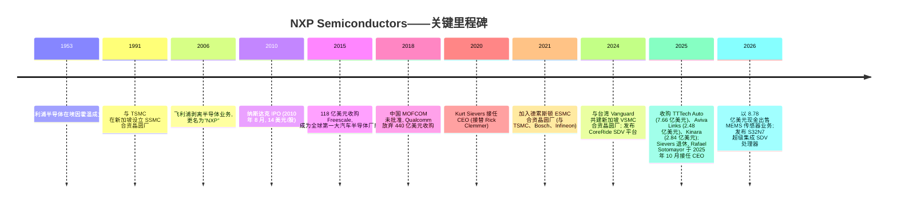
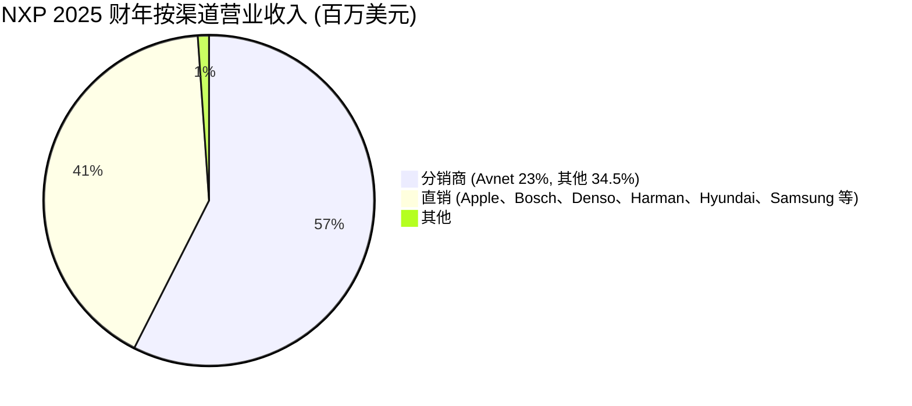
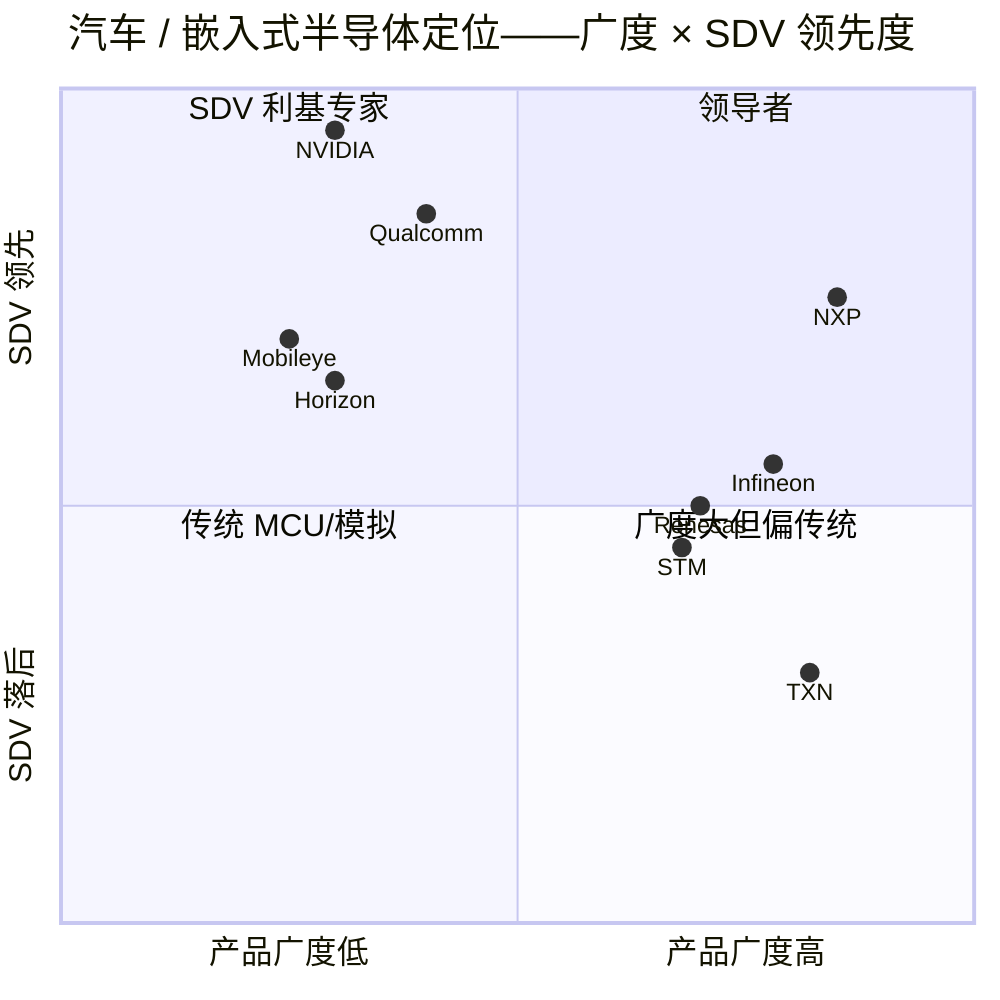

# NXP Semiconductors N.V. (NASDAQ:NXPI) — 公司研究报告

**截至日期: 2026-05-20**
**上市地: 美国纳斯达克全球精选市场 (NASDAQ Global Select), 代码 NXPI**
**总部 / 注册地: 荷兰埃因霍温 (Eindhoven, The Netherlands)**
**行业 / 子行业: 半导体 / 混合信号与汽车电子 (Mixed-signal & automotive)**
**报告语言: 简体中文 (英文版同时存在于本目录)**

> **业绩更新——2026 Q1 业绩全面超预期, 业务普遍重新加速 (2026-04-28):** NXP 公布 2026 Q1 营业收入 31.8 亿美元 (同比 +12%, 显著高于公司指引中值约 29.5 亿美元; 汽车业务同比 +6%, 工业与物联网 (I&IoT) +24%, 移动 +16%, 通讯基础设施 +21%)。Non-GAAP 毛利率 (gross margin) 为 57.1%, Non-GAAP 自由现金流 (free cash flow) 为 7.14 亿美元 (占营业收入 22.4%)。管理层给出 2026 Q2 营业收入指引区间为 **33.5–35.5 亿美元** (同比 +14% 至 +21%), Non-GAAP 毛利率 57.5%–58.5%, 这是两年多以来同比最强的营业收入指引, 公司明确将动能归因于软件定义车辆 (SDV, Software-Defined Vehicle) 处理 (S32N) 业务、物理 AI / 边缘推理 (edge inference) 业务的"公司特定增长驱动因素", 以及 TTTech Auto、Aviva Links 与 Kinara 三宗并购的完成。Rafael Sotomayor (索托马约尔) 在 2025-10-28 接替 Kurt Sievers (西弗斯) 后, 这是其作为 CEO 的首个完整季度, 并强调"我们已构建起来的动能, 预计将在 2026 年余下时段进一步加速"。
> 来源: [NXP 2026 Q1 业绩公告, 2026-04-28](https://www.sec.gov/Archives/edgar/data/1413447/000141344726000032/nxp1q26exhibit991.htm)。

---

## 目录

1. 公司概览
2. 公司历史
3. 管理团队
4. 产品与服务
5. 客户与上市策略
6. 行业概览
7. 竞争格局
8. 市场机会 (TAM)
9. 风险评估

---

## 1. 公司概览

NXP Semiconductors N.V. 是一家荷兰注册、在纳斯达克上市的混合信号 (mixed-signal) 半导体公司, 总部位于荷兰埃因霍温高科技园区 60 号 (High Tech Campus 60, 5656 AG Eindhoven), 经营根基可追溯至七十余年前其前身**飞利浦半导体 (Philips Semiconductors)** ([NXP 2025 10-K, 第 2 页](https://www.sec.gov/Archives/edgar/data/1413447/000141344726000008/nxpi-20251231.htm))。截至 2025 年 12 月 31 日财年, 公司实现营业收入 122.69 亿美元, 同比 2024 年的 126.14 亿美元下滑 2.7%, 较 2023 年 132.76 亿美元的高点下降 7.6%, 反映出公司各终端市场的同步去库存周期在 2025 年中触底, 并在 2025 Q4 实现拐点回升 ([10-K, 第 36 页](https://www.sec.gov/Archives/edgar/data/1413447/000141344726000008/nxpi-20251231.htm))。截至 2025 年末, NXP 在全球 30 多个国家拥有约 32,169 名员工, 其中研发 (R&D) 岗位约 11,034 人 ([10-K, 第 11 页](https://www.sec.gov/Archives/edgar/data/1413447/000141344726000008/nxpi-20251231.htm))。

**NXP 做什么?** 用平实的语言讲, NXP 设计、制造并销售嵌入在汽车、工厂机械、智能手机、支付卡、电子护照、智能家居设备以及 5G 基站内部的"大脑、感知、安全和连接"芯片。其产品域涵盖嵌入式处理器与微控制器 (MCU, Micro-controller Unit)、混合信号与模拟器件 (包括 77GHz 雷达前端 (77 GHz radar front-end)、电池管理 (battery management)、音频功放、电源管理)、安全控制器 (NFC, 近场通信; UWB, 超宽带; 安全元件 secure element)、有线与无线连接 (汽车端 CAN/LIN/FlexRay/Ethernet/SerDes; 物联网端 Wi-Fi/Bluetooth/Thread/Zigbee; 识别端 RFID/eID), 以及面向蜂窝基础设施 (cellular infrastructure) 的射频功率 (RF power) ([10-K, 第 3–8 页](https://www.sec.gov/Archives/edgar/data/1413447/000141344726000008/nxpi-20251231.htm))。

**NXP 如何赚钱?** 几乎全部营业收入来自向 OEM (原始设备制造商, Original Equipment Manufacturer)、Tier-1 一级供应商和电子分销商销售专属、特定应用的半导体芯片与模组, 随后由这些客户装配进入汽车 ECU、工业控制器、移动手机、支付终端以及网络设备。NXP 以四个终端市场组织业务, 自 2025 财年起作为单一报告分部披露。2025 财年营业收入结构: **汽车业务 71.16 亿美元 (占比 58.0%)**, 工业与物联网 22.73 亿美元 (18.5%), 移动 15.84 亿美元 (12.9%), 通讯基础设施及其他 (Comm Infra & Other) 12.96 亿美元 (10.6%) ([10-K, 第 39 页](https://www.sec.gov/Archives/edgar/data/1413447/000141344726000008/nxpi-20251231.htm))。分销商占销售额 57.5% (70.51 亿美元), 直销 41.4% (50.84 亿美元), 其他 1.1% ([10-K, 第 39 页](https://www.sec.gov/Archives/edgar/data/1413447/000141344726000008/nxpi-20251231.htm))。**Avnet (安富利)** 占 2025 年总收入 23% (2024 年为 22%) ——是唯一超过 10% 阈值的客户/分销商 ([10-K, 第 9 页](https://www.sec.gov/Archives/edgar/data/1413447/000141344726000008/nxpi-20251231.htm))。

**地理结构 (按销售来源, 2025 财年)。** 亚太地区 (除中国外) 35.81 亿美元 (29.2%)、美洲 33.76 亿美元 (27.5%)、欧洲中东非洲 (EMEA) 32.76 亿美元 (26.7%)、中国 20.36 亿美元 (16.6%) ([10-K, 第 40 页](https://www.sec.gov/Archives/edgar/data/1413447/000141344726000008/nxpi-20251231.htm))。2025 年中国营业收入同比增长 6.0%, 其他区域均下滑——这是第 9 章讨论的"本地对本地 (local-for-local)"采购动态的早期信号。

来源: [NXP 2025 10-K, 利润表, 第 65 页](https://www.sec.gov/Archives/edgar/data/1413447/000141344726000008/nxpi-20251231.htm) ——2023 财年营业收入 132.76 亿美元, 毛利率 56.9%; 2024 财年 126.14 亿美元, 毛利率 56.4%; 2025 财年 122.69 亿美元, 毛利率 54.7% (GAAP 口径)。

**制造布局。** NXP 采用混合制造模式: 在美国奥斯汀 (Austin, TX)、荷兰奈梅亨 (Nijmegen, NL) 与德国汉堡 (Hamburg, DE) 自有 200mm 晶圆厂; 在新加坡与 TSMC (台积电) 合资运营 SSMC 300mm 晶圆厂; 并对两家全新的纯代工合资晶圆厂持有股权, 以锁定本世纪剩余年份的先进制程产能——分别是德国德累斯顿 (Dresden) 的 **ESMC** (合资方包括 TSMC、Bosch、Infineon, 股权承诺 5 亿欧元 / 约 5.87 亿美元, 截至 2025 年末已部署 1.83 亿美元) 与新加坡的 **VSMC** (合资方为 VIS, 股权承诺约 16 亿美元) ([10-K, 第 8 页与第 50 页](https://www.sec.gov/Archives/edgar/data/1413447/000141344726000008/nxpi-20251231.htm))。后道封装/测试 (back-end assembly/test) 基地分布于台湾高雄、泰国曼谷、马来西亚吉隆坡、中国天津与英国曼彻斯特 ([10-K, 第 8 页](https://www.sec.gov/Archives/edgar/data/1413447/000141344726000008/nxpi-20251231.htm))。

**估值快照 (截至 2026-05-20):** 股价 **307.07 美元** ([Yahoo Finance NXPI, 2026-05-20](https://finance.yahoo.com/quote/NXPI/)); 52 周区间 183.00–308.54 美元; 市值 **775 亿美元**; **TTM 市盈率 (P/E) 29.4 倍**; **TTM 市销率 (P/S) 6.15 倍**; 市净率 (P/B) 7.10 倍; 远期市盈率 (FY2026E 一致预期) 17.4 倍; TTM 股息率 1.38% ([Yahoo Finance NXPI 关键统计指标, 2026-05-20](https://finance.yahoo.com/quote/NXPI/key-statistics/))。

**同业估值比较 (TTM 基础, 截至 2026-05-20):**

| 代码 | TTM P/E | TTM P/S | 备注 |
|---|---|---|---|
| **NXPI** | **29.4×** | **6.15×** | 标的公司 |
| TXN (Texas Instruments, 德州仪器) | 51.4× | 14.9× | 资本开支/折旧周期成熟带来溢价; 模拟龙头 |
| ADI (Analog Devices, 亚德诺) | 71.6× | 16.3× | 工业/模拟产品结构带来溢价 |
| MCHP (Microchip, 微芯科技) | 425×* | 10.7× | *TTM EPS 因库存调整失真; 倍数失去意义 |
| IFX.DE (Infineon, 英飞凌) | 82.9× | 5.84× | 欧元上市汽车/功率半导体同业; EPS 处于底部 |
| STM (STMicroelectronics, 意法半导体) | 404×* | 4.64× | *TTM EPS 底部; 最贴近的汽车 MCU 同业 |
| 6723.T (Renesas, 瑞萨电子) | n/a | 4.56× | TTM PE 暂不可用; 日本汽车 MCU 同业 |

来源: [Yahoo Finance via yfinance — NXPI、TXN、ADI、MCHP、IFX.DE、STM、6723.T 报价, 2026-05-20 抓取](https://finance.yahoo.com/quote/NXPI/)。

**解读。** NXP 当前估值是大型模拟/汽车 MCU 纯标的中**最低 TTM P/E**——29.4 倍, 较同业中位数 (剔除断点失真倍数) 约 70 倍显著低估; 6.15 倍 P/S 与同业中位数约 6 倍持平 ([Yahoo Finance NXPI, 2026-05-20](https://finance.yahoo.com/quote/NXPI/))。估值反映了三个市场尚未透视的问题: (1) 2025 财年底部盈利拉低分母, 尽管 TTM EPS 已经在 2025 Q4 拐点向上 (Non-GAAP EPS 3.35 美元, 高于上年 3.18 美元—— [10-K, 第 36 页](https://www.sec.gov/Archives/edgar/data/1413447/000141344726000008/nxpi-20251231.htm)); (2) 欧洲一级供应商 (Bosch 博世、Aptiv 安波福、Aumovio) 多年疲软背景下的汽车周期不确定性; (3) 中国本地对本地的汽车 MCU 风险 (见第 9 章)。17.4 倍的远期市盈率已经为 2026 年的有意义复苏定价; 若 NXP 兑现 33.5–35.5 亿美元的 2026 Q2 指引并在 2026 下半年延续, 当前估值并不离谱 ([2026 Q1 业绩公告, 2026-04-28](https://www.sec.gov/Archives/edgar/data/1413447/000141344726000032/nxp1q26exhibit991.htm))。**未触发 P/E 高于 50 倍的警示**, P/S 与同业一致——估值本身不构成独立风险因子。更大的风险是, 如果 SDV 量产爬坡延后, 一致预期的 2026/27 年财年估计可能过于乐观。

---

## 2. 公司历史

NXP 的根脉可追溯至 **1953 年飞利浦在荷兰埃因霍温设立其半导体业务**, 作为皇家飞利浦电子集团 (Royal Philips Electronics) 的事业部, 建成了欧洲最早的集成电路 (integrated-circuit) 业务之一 ([NXP 公司沿革, ir.nxp.com](https://www.nxp.com/company/about-nxp/our-history:OUR-HISTORY); [10-K, 第 2 页 "超过 70 年"](https://www.sec.gov/Archives/edgar/data/1413447/000141344726000008/nxpi-20251231.htm))。现代 NXP 是在 2006 年以 83 亿欧元杠杆收购 (leveraged buyout) 形式从飞利浦剥离而来, 收购方为由 KKR、Bain Capital (贝恩资本)、Silver Lake (银湖资本)、Apax、AlpInvest 组成的财团; 公司随即更名为"NXP"——意为"Next Experience" (新一代体验) ([Semiconductor Digest,《飞利浦芯片部门以 NXP 重新出发》, 2006-09](https://sst.semiconductor-digest.com/2006/09/philips-chip-unit-relaunched-as-nxp/))。NXP 于 2010 年 8 月在纳斯达克 IPO 上市, 发行价 14 美元 ([NXP IPO 招股书 424B4, 2010](https://www.sec.gov/Archives/edgar/data/0001413447/000119312510180623/d424b4.htm); [EE Times,《NXP IPO 定价 14 美元/股》, 2010-08-05](https://www.eetimes.com/nxp-prices-ipo-at-14-per-share/))。

来源: [10-K, 第 3、28、49–52 页, "Kurt Sievers 于 2025 年 10 月 28 日自愿退休"](https://www.sec.gov/Archives/edgar/data/1413447/000141344726000008/nxpi-20251231.htm); [Reuters: Qualcomm 放弃收购 NXP, 2018-07-26](https://www.reuters.com/article/business/qualcomm-walks-away-from-44-billion-nxp-bid-as-china-fails-to-okay-deal-idUSKBN1KG2VP/)。

**战略转折。** 过去二十年的四个章节级抉择——独立 (2006–10)、Freescale 收购 (2015)、Qualcomm 弃购 (2018) 与 CoreRide / SDV (2024–) ——共同框定 NXP 当下的定位 ([10-K, 第 2–3 页](https://www.sec.gov/Archives/edgar/data/1413447/000141344726000008/nxpi-20251231.htm))。

1. **从综合性企业到聚焦半导体 (2006–2010)。** 在飞利浦旗下, 半导体一直是非核心、规模不足的事业部。飞利浦剥离与随后的 IPO 让 NXP 得以理顺产品组合, 将消费类移动基带 (mobile-baseband) 业务剥离给 ST-Ericsson (2008), 并将资本重新投入到更高毛利的嵌入式与安全 (security) 业务 ([Semiconductor Digest, 2006-09](https://sst.semiconductor-digest.com/2006/09/philips-chip-unit-relaunched-as-nxp/); [NXP 公司沿革](https://www.nxp.com/company/about-nxp/our-history:OUR-HISTORY))。

2. **Freescale 合并 (2015)。** 以 118 亿美元全股票方式收购总部位于奥斯汀的 **Freescale Semiconductor**, 缔造了全球第一大汽车半导体公司, 将 NXP 在车用门禁 (car access)、车载网络 (in-vehicle networking)、雷达 (radar)、信息娱乐音频 (infotainment audio) 等业务与 Freescale 在汽车微控制器 (S08、S12、Power-PC) 和嵌入式处理 IP 上的领先优势相结合 ([CNBC,《NXP 完成 Freescale 收购, 缔造车用芯片龙头》, 2015-12-07](https://www.cnbc.com/2015/12/07/nxp-closes-deal-to-buy-freescale-and-create-top-auto-chipmaker.html); [NXP 6-K 公告——2015 年 3 月披露并购](https://www.sec.gov/Archives/edgar/data/0001413447/000119312515072045/d883199dex991.htm))。这笔交易并非没有代价——NXP 因此背负了实质性的商誉与无形资产摊销, 而 Freescale 产品线为现行 S32 平台奠定了架构基础。战略逻辑在于: 在日益软件定义化 (software-defined) 的汽车赛道上, 唯一可信的规模防御是 MCU + 模拟 + 连接 + 安全的纵向整合 ([10-K, 第 3 页](https://www.sec.gov/Archives/edgar/data/1413447/000141344726000008/nxpi-20251231.htm))。

3. **被中止的 Qualcomm 收购 (2016–2018)。** Qualcomm 在 2016 年 10 月宣布以 380 亿美元 (后提至 440 亿美元) 现金收购 NXP, 将其定位为通往汽车与物联网市场的桥梁。在中美贸易摩擦升级背景下, 中国商务部 (MOFCOM) 始终未给予反垄断批复, 交易在 2018 年 7 月失败。NXP 收到 20 亿美元的分手费, 摆脱交易僵局后猛烈转向资本回报——仅 2018 下半年就回购了约 46 亿美元股票 ([Reuters, 2018-07-26](https://www.reuters.com/article/business/qualcomm-walks-away-from-44-billion-nxp-bid-as-china-fails-to-okay-deal-idUSKBN1KG2VP/))。独立至此对股东丰厚反哺; 2018 年后股价已远超出 Qualcomm 当初撤回的 127.50 美元报价 ([Yahoo Finance NXPI 历史数据, 2026-05-20](https://finance.yahoo.com/quote/NXPI/history/))。

4. **CoreRide / 软件定义车辆转向 (2024–至今)。** NXP 于 **2024 年 3 月发布 NXP CoreRide 平台**——一套预集成的硬件/软件栈, 整合 S32 处理器、系统电源管理 (system power management)、网络与中间件 (middleware), 为 OEM 提供面向软件定义车辆的"开箱即用"车辆计算平台 ([NXP 新闻稿,《NXP 通过开放 S32 CoreRide 平台突破集成壁垒》, 2024-03-28](https://investors.nxp.com/news-releases/news-release-details/nxp-breaks-through-integration-barriers-software-defined-vehicle))。2025 年并购的 TTTech Auto (安全关键中间件 safety-critical middleware)、Aviva Links (汽车 SerDes 联盟 ASA 车载网络) 与 Kinara (面向边缘 AI 的 NPU 神经网络处理器), 将 CoreRide 拓展为一个完整的"软件+硅"车辆计算平台, 直接挑战 Qualcomm Snapdragon Ride、NVIDIA DRIVE、Renesas R-Car 和 Mobileye EyeQ ([10-K, 第 49–52 页](https://www.sec.gov/Archives/edgar/data/1413447/000141344726000008/nxpi-20251231.htm))。2026-01-05 发布的 S32N7 超级集成 (super-integration) 处理器是 CoreRide 的旗舰计算 SoC ([NXP 新闻稿,《NXP 全新 S32N7 释放 SDV 的全部潜力》, 2026-01-05](https://www.globenewswire.com/news-release/2026/01/05/3213069/0/en/NXP-s-New-S32N7-Unlocks-the-Full-Potential-of-SDVs.html))。

**重要并购** (近期, 按交易规模排序) ——披露明细汇总自 2025 年 10-K 业务合并附注 ([10-K, 第 49–52 页与第 81 页](https://www.sec.gov/Archives/edgar/data/1413447/000141344726000008/nxpi-20251231.htm)):

- **TTTech Auto**——2025-06-17 完成, 现金对价 7.66 亿美元 (净 6.75 亿美元), 总部维也纳, 约 1,100 名工程师, 专注 SDV 安全关键中间件 ([10-K, 第 81 页; Project Ascend 8-K, 2025-01-07](https://www.sec.gov/Archives/edgar/data/1413447/000141344725000005/projectascendpressrelease.htm))。
- **Kinara**——2025-10-27 完成, 现金对价 2.84 亿美元 (净 2.83 亿美元), 总部库比蒂诺 (Cupertino), 独立 NPU 与边缘 AI 软件设计商 ([Project Karate 8-K, 2025-02-10](https://www.sec.gov/Archives/edgar/data/1413447/000141344725000015/projectkaratepressrelease.htm))。
- **Aviva Links**——2025-10-24 完成, 现金对价 2.22 亿美元 + 此前持有的 2,600 万美元股权投资, ASA 兼容的车载 SerDes 厂商 ([10-K, 第 81 页](https://www.sec.gov/Archives/edgar/data/1413447/000141344726000008/nxpi-20251231.htm))。
- **MEMS 传感器业务剥离**——2026-02-02 完成, 现金对价 8.78 亿美元 + 最高 5,000 万美元业绩对赌; 2026 Q1 确认一次性收益 6.27 亿美元 ([2026 Q1 业绩公告, 2026-04-28](https://www.sec.gov/Archives/edgar/data/1413447/000141344726000032/nxp1q26exhibit991.htm))。
- **Freescale Semiconductor (2015)** ——历史性基石, 118 亿美元换股 ([CNBC, 2015-12-07](https://www.cnbc.com/2015/12/07/nxp-closes-deal-to-buy-freescale-and-create-top-auto-chipmaker.html))。

2025–26 年的"组合手术"——14 个月内三宗 bolt-on 收购 + 一宗剥离——清晰勾勒出"Sotomayor 战术手册", 即聚焦于 SDV 与边缘 AI 的构件, 以牺牲老旧大宗 MEMS 业务为代价 ([10-K, 第 49–52 页](https://www.sec.gov/Archives/edgar/data/1413447/000141344726000008/nxpi-20251231.htm); [NXP 新闻稿,《NXP 完成对 Aviva Links 与 Kinara 的收购》, 2025-10-28](https://media.nxp.com/news-releases/news-release-details/nxp-completes-acquisitions-aviva-links-and-kinara-advance/))。

---

## 3. 管理团队

### Rafael Sotomayor (拉斐尔·索托马约尔) ——总裁兼 CEO (临时执行董事)

索托马约尔先生 (1969 年生, 美国籍) 自 **2025-10-28** 起担任 CEO 兼临时执行董事, Kurt Sievers 在任职五年后自愿退休。他在 2025 年 4 月晋升为公司总裁, 这被证明是一次为期六个月的内部交接 ([2026 DEF 14A, 第 28 页, "Rafael Sotomayor (1969 年生, 美国籍) 自 2025 年 10 月起任临时执行董事兼首席执行官"](https://www.sec.gov/Archives/edgar/data/1413447/000141344726000026/nxps-20260428.htm); [10-K, 第 26 页](https://www.sec.gov/Archives/edgar/data/1413447/000141344726000008/nxpi-20251231.htm))。

索托马约尔于 2014 年加入 NXP 担任业务线总经理, 随后在移动与工业及物联网终端市场轮转总经理岗位。他于 2020 年晋升入执行管理团队, 最近一段时期负责 **Secure Connected Edge 业务** (移动 + I&IoT + 安全连接), 即 NXP 内部有机增长最快的业务部门。他持有哈佛商学院 MBA、佐治亚理工电气工程硕士、普渡大学电气工程学士学位 ([DEF 14A, 第 28 页](https://www.sec.gov/Archives/edgar/data/1413447/000141344726000026/nxps-20260428.htm))。

他在 NXP 内部以三项工作著称: (1) 围绕 i.MX 8/9 系列重构 I&IoT 产品路线图, 并通过 eIQ 软件框架将团队带入边缘 AI 应用 (2026-01-06 发布的 eIQ Agentic AI Framework 即位于其原先职责范围内—— [2026 Q1 业绩公告](https://www.sec.gov/Archives/edgar/data/1413447/000141344726000032/nxp1q26exhibit991.htm)); (2) 完成 Kinara NPU 并购, 据报道这宗交易由他主导发起 ([Project Karate 8-K, 2025-02-10](https://www.sec.gov/Archives/edgar/data/1413447/000141344725000015/projectkaratepressrelease.htm)); (3) 构建"智能边缘 (intelligent-edge)"投资逻辑, 这一论点正是 NXP 用于同时框定 SDV 端 CoreRide 与工业端 AI-at-the-edge 的核心叙事 ([2026 DEF 14A, 第 28 页](https://www.sec.gov/Archives/edgar/data/1413447/000141344726000026/nxps-20260428.htm))。作为 NXP 现代史上首位在汽车相邻业务与消费边缘业务**两端**都具备深厚总经理经验的 CEO, 他天然适合整合 SDV 平台战略 ([DEF 14A, 第 28–29 页](https://www.sec.gov/Archives/edgar/data/1413447/000141344726000026/nxps-20260428.htm))。

他的 CEO 首秀伴随"叙事重置"——2025 Q4 与 2026 Q1 业绩电话会显著淡化季度波动, 将 NXP 重新定位为"软件定义车辆 + 物理 AI"成长故事。2026 Q1 原话: *"我们已构建起来的动能, 预计将在 2026 年余下时段进一步加速, 并越来越广泛地扩展到我们核心业务的方方面面。"* ([2026 Q1 业绩公告](https://www.sec.gov/Archives/edgar/data/1413447/000141344726000032/nxp1q26exhibit991.htm))。市场给予了"信任红利": NXPI 2026 年至今上涨 18%。

他作为总裁兼 CEO 的**年化 2025 薪酬包**, CEO 与员工薪酬中位数比例为 **268:1** ([DEF 14A, 第 71 页](https://www.sec.gov/Archives/edgar/data/1413447/000141344726000026/nxps-20260428.htm))。索托马约尔作为**正式执行董事**的任命将在 2026 年 6 月的年度股东大会 (AGM) 上确认。

未决问题: 现年 56 岁, 知名度低于 Sievers, 尚未经历过完整业务周期或重大危机时期的 CEO 历练 ([DEF 14A, 第 28 页](https://www.sec.gov/Archives/edgar/data/1413447/000141344726000026/nxps-20260428.htm))。投资者应预期 2026 年是"蜜月期"——但 CoreRide 在欧洲 OEM (大众、Stellantis、宝马) 处的量产爬坡执行才是 2026–27 年的关键试金石 ([2026 Q1 业绩公告, 2026-04-28](https://www.sec.gov/Archives/edgar/data/1413447/000141344726000032/nxp1q26exhibit991.htm))。

### William Betz (威廉·贝茨) ——执行副总裁兼首席财务官

贝茨先生 (1977 年生, 美国籍) 自 2021 年 10 月起担任 CFO, 拥有超过 25 年半导体行业财务经验。在晋升之前, 他是 NXP 业务规划与分析高级副总裁兼财务事业部 (Business Group) 控制人, 2013 年从 Fairchild Semiconductor 加入 NXP, 此前曾担任多个高级财务岗位。早期职业生涯包括 LSI Logic 与 Agere Systems ([DEF 14A, 第 72 页](https://www.sec.gov/Archives/edgar/data/1413447/000141344726000026/nxps-20260428.htm))。他拥有普渡大学财务与会计学士学位。

贝茨在 NXP 的履历紧密绑定**严格的资本回报纪律**。仅 2024 财年公司就返还了 24.1 亿美元 (股息 10.38 亿美元 + 库存股回购 13.73 亿美元) ——相当于 Non-GAAP 自由现金流的 115% ([10-K, 第 47–48 页](https://www.sec.gov/Archives/edgar/data/1413447/000141344726000008/nxpi-20251231.htm))。2024 年 8 月股票回购计划项下剩余 15.85 亿美元授权额度, 按当前节奏可支持约两年的回购弹药 ([10-K, 第 19 页](https://www.sec.gov/Archives/edgar/data/1413447/000141344726000008/nxpi-20251231.htm))。在债务方面, 贝茨主导 NXP 循环信贷额度从 25 亿美元提升至 30 亿美元, 自 2026-02-06 生效, 并于 2026 年 1 月用现金偿付 5 亿美元 5.35% 利率的高级票据——这让 NXP 在 2025 年末仍有 122.2 亿美元总债务、32.7 亿美元现金、净债务 89.6 亿美元 (总杠杆约 2.4 倍, 净杠杆 1.7 倍) ([10-K, 第 27 页](https://www.sec.gov/Archives/edgar/data/1413447/000141344726000008/nxpi-20251231.htm))。

### Andy Micallef (安迪·米卡列夫) ——执行副总裁, 运营

米卡列夫先生 (澳大利亚籍) 是团队中最重要的运营高管——掌管 NXP 的混合晶圆厂布局, 包括与 TSMC 的 SSMC 合资公司、ESMC Dresden 投资以及 VSMC Singapore 合资公司 ([10-K, 第 8 页](https://www.sec.gov/Archives/edgar/data/1413447/000141344726000008/nxpi-20251231.htm))。投资者应关注他, 因为本轮周期最大单笔资产负债表押注是**对 ESMC + VSMC 合计 22 亿美元股权承诺** ([10-K, 第 50 页](https://www.sec.gov/Archives/edgar/data/1413447/000141344726000008/nxpi-20251231.htm))。他从 Atmel 加入 NXP, 此前曾在 Freescale 担任高级制造岗位 ([DEF 14A, 第 72 页](https://www.sec.gov/Archives/edgar/data/1413447/000141344726000026/nxps-20260428.htm))。

### Jens Hinrichsen (延斯·欣里克森) ——执行副总裁, 汽车业务

NXP 最大的单一业务部门 (营业收入 71 亿美元, 占比 58%) ([10-K, 第 39 页](https://www.sec.gov/Archives/edgar/data/1413447/000141344726000008/nxpi-20251231.htm))。欣里克森自 2019 年起担任汽车处理业务的 GM, 2021 年起执掌更广义的汽车业务事业部 ([DEF 14A, 第 72 页](https://www.sec.gov/Archives/edgar/data/1413447/000141344726000026/nxps-20260428.htm))。他的职责涵盖 S32 MCU/SoC、雷达、BMS、安全车辆门禁与车载网络——即整个 CoreRide 栈; 他在 SDV 设计赢取 (design-win) 上的执行成果, 是 2026–28 财年逻辑中最关键的单一摆动因子 ([10-K, 第 4–7 页](https://www.sec.gov/Archives/edgar/data/1413447/000141344726000008/nxpi-20251231.htm))。

### 治理结构

- **董事会**: 2026 年 AGM 后共有 10 名董事, Sotomayor 为唯一执行董事, 其余 9 名为独立非执行董事, 包括董事长 Greg Summe (前 Perkin Elmer CEO)、Annette Clayton (前 Schneider Electric 北美区 CEO)、Moshe Gavrielov (前 Xilinx CEO)、Chunyuan Gu (前 ABB 北亚区总裁)、Lena Olving、Jasmin Staiblin、Karl-Henrik Sundström, 以及在退任 CEO 后转任非执行董事的 Kurt Sievers ([DEF 14A, 第 12–28 页](https://www.sec.gov/Archives/edgar/data/1413447/000141344726000026/nxps-20260428.htm))。董事会设有审计、人力资源与薪酬、提名/治理委员会, 均由独立董事担任主席。
- **内部人持股**比例较低 (合计低于 1%) ——这是 NXP 杠杆收购起家与 IPO 切分结构的结果, 而非创始人持股使然。无双重股权结构或高表决权股; 一普通股一票 ([DEF 14A, 第 50–53 页, 受益股权表](https://www.sec.gov/Archives/edgar/data/1413447/000141344726000026/nxps-20260428.htm))。
- **CEO 薪酬倍数**: 2025 财年为 268:1, 员工薪酬中位数对应人员位于台湾从事制造工程岗位, 年薪约为不含中国/马来西亚/台湾/泰国的全球平均的 92,000 美元 ([DEF 14A, 第 71 页](https://www.sec.gov/Archives/edgar/data/1413447/000141344726000026/nxps-20260428.htm))。
- **独立审计师**: EY Accountants B.V. (安永荷兰), 将在 2026 年 AGM 上提请续任 ([DEF 14A, 第 30 页](https://www.sec.gov/Archives/edgar/data/1413447/000141344726000026/nxps-20460428.htm))。
- 无显著关联方交易披露 ([DEF 14A, 第 51–53 页, 关联方交易章节](https://www.sec.gov/Archives/edgar/data/1413447/000141344726000026/nxps-20260428.htm))。

### 管理层业绩综合评估

NXP 在 Kurt Sievers (2020–2025) 任期内将营业收入从 2020 年 86.1 亿美元复合增长至 2023 年 132.8 亿美元的高点, GAAP 毛利率从 49% 扩张至 56.9%, 在 2021–2025 年间合计返还约 144 亿美元资本 (股息 51.18 亿美元 + 回购约 93 亿美元, 数据自现金流量表计算—— [10-K, 第 67 页合并现金流量表](https://www.sec.gov/Archives/edgar/data/1413447/000141344726000008/nxpi-20251231.htm))。团队已经完整地穿越了一个周期。向 Sotomayor 的交接将更多权重压在战略执行 (CoreRide、SDV、边缘 AI), 而非运营治理——后者已成熟稳定 ([DEF 14A, 第 28–29 页](https://www.sec.gov/Archives/edgar/data/1413447/000141344726000026/nxps-20260428.htm))。空缺仍在于顶层未经检验的危机管理能力。

---

## 4. 产品与服务

NXP 围绕四个终端市场组织其产品组合。下方分类树映射的是 10-K 第 4 页公司自身披露的四象限敞口图 ([10-K, 第 4 页](https://www.sec.gov/Archives/edgar/data/1413447/000141344726000008/nxpi-20251231.htm))。

```mermaid
graph TD
    NXP[NXP Semiconductors]
    NXP --> AUTO[汽车 58.0% 收入]
    NXP --> IIOT[工业与物联网 18.5%]
    NXP --> MOB[移动 12.9%]
    NXP --> COMM[通讯基础设施及其他 10.6%]
    AUTO --> A1[S32 MCU/MPU 平台]
    AUTO --> A2[77GHz 雷达 SoC]
    AUTO --> A3[电池管理 BMS IC]
    AUTO --> A4[安全车辆门禁 UWB+BLE]
    AUTO --> A5[CAN/LIN/FlexRay/以太网]
    AUTO --> A6[Aviva Links SerDes]
    AUTO --> A7[TTTech Auto SDV 中间件]
    IIOT --> I1[i.MX 8/9 应用处理器]
    IIOT --> I2[通用 MCU]
    IIOT --> I3[Wi-Fi/BT/Thread/Zigbee]
    IIOT --> I4[Kinara NPU 边缘 AI]
    IIOT --> I5[智能传感器]
    MOB --> M1[UWB 安全测距]
    MOB --> M2[NFC 控制器 + eSE]
    MOB --> M3[音频编解码/功放]
    COMM --> C1[Layerscape 网络处理器]
    COMM --> C2[5G 基站射频功率]
    COMM --> C3[电子政务/eID/银行安全元件]
    COMM --> C4[RAIN RFID]
```

### 汽车 (2025 财年营业收入占比 58.0% —— 71.16 亿美元)

汽车业务是公司的重心。NXP 在自身披露中将其命名为按份额计的**全球第一大汽车半导体公司** (此地位自 2015 年 Freescale 收购后确立), 管理层明确识别六大"核心"汽车产品业务以及三个"加速增长"投资领域: SDV 处理、雷达系统、电气化 (electrification) ([10-K, 第 4 页](https://www.sec.gov/Archives/edgar/data/1413447/000141344726000008/nxpi-20251231.htm))。

**S32 汽车处理平台**——旗舰。S32 家族从 S32K 微控制器 (基于 Arm Cortex-M, 具备 ASIL-D 能力) 一直延伸到 2026-01-05 发布的全新 **S32N7 超级集成处理器**, 后者将数十个传统 ECU 整合到单一 SoC 中, 服务于 SDV 的"车辆计算"架构 ([NXP 新闻稿,《NXP 全新 S32N7 释放 SDV 的全部潜力》, 2026-01-05](https://www.globenewswire.com/news-release/2026/01/05/3213069/0/en/NXP-s-New-S32N7-Unlocks-the-Full-Potential-of-SDVs.html); [10-K, 第 6 页](https://www.sec.gov/Archives/edgar/data/1413447/000141344726000008/nxpi-20251231.htm))。**竞争评判: 是——清晰的护城河。** 类型: 切换成本 (switching costs) + 汽车认证 (ASIL-D) + 生态绑定 (CoreRide 中间件、AUTOSAR、OEM 专有安全软件)。证据: 设计导入 (design-in) 周期 4–7 年, 重新设计 (re-design) 极为罕见 ([10-K, 第 9 页](https://www.sec.gov/Archives/edgar/data/1413447/000141344726000008/nxpi-20251231.htm))。最近竞争对手: **Renesas R-Car / RH850** (MCU 同业, SDV 高度集成方面落后)、**Infineon AURIX** (安全 MCU 同业, SoC 落后)、**Qualcomm Snapdragon Ride** 与 **NVIDIA DRIVE Thor** (AI/座舱算力领先, 安全 MCU 广度落后) ([Embedded Systems Engineering,《NXP 发布 S32N7 系列处理器》, 2026-01](https://www.embeddedsystemsengineering.com/2026/01/nxp-launches-s32n7-processor-series-to-centralize-core-vehicle-functions/))。

**77GHz 雷达前端 IC 与 SoC。** NXP 是汽车雷达市场龙头; 10-K 明确表述: "*在汽车领域, 我们在大多数应用中占据市场领导地位, 其中 ADAS 用 77GHz 集成雷达解决方案是代表*" ([10-K, 第 7 页](https://www.sec.gov/Archives/edgar/data/1413447/000141344726000008/nxpi-20251231.htm))。雷达家族将 RFCMOS 前端 (TEF810x 家族) 与 S32R 雷达处理器结合, 形成少数竞争对手能够匹敌的纵向集成栈 ([NXP 汽车雷达产品线](https://www.nxp.com/products/processors-and-microcontrollers/s32-automotive-platform/s32-automotive-radar-processors:S32R-PROC))。**评判: 是——强大护城河。** 类型: 技术 IP (RFCMOS 工艺 know-how) + 规模 ([Automotive Radar Semiconductors Market — NXP+Infineon 2024 年合计 ~45%+ 份额 (Global Market Insights)](https://www.gminsights.com/industry-analysis/automotive-radar-semiconductors-market))。最近竞争对手: TI (AWR 家族——低端较强)、Infineon (Saruman / 雷达 MMIC——中端较强)、Bosch 内部雷达 (既是客户, 又在部分平台上自研竞争) ([10-K, 第 9 页—— "Bosch" 列入客户名单](https://www.sec.gov/Archives/edgar/data/1413447/000141344726000008/nxpi-20251231.htm))。

**电池管理系统 (BMS, Battery Management System)。** 专用混合信号 IC, 监测 EV 电池包内的单体电压、电流与温度, 并越来越多地服务于固定式储能 ([10-K, 第 4 页, 电气化加速增长领域](https://www.sec.gov/Archives/edgar/data/1413447/000141344726000008/nxpi-20251231.htm))。每辆 EV 需要 8–16 颗 BMS IC, ICE 燃油车则为零——这是电气化结构性受益的代表 ([NXP BMS 产品页](https://www.nxp.com/applications/automotive/electrification:ELECTRIFICATION))。**评判: 是。** 类型: 技术 + 功能安全认证。竞争对手: TI BQ7xxx 家族、Analog Devices (Maxim 收购后) 无线 BMS、Renesas BMS、Infineon TLE9012——同业对等 ([10-K, 第 9 页, 列示竞争对手](https://www.sec.gov/Archives/edgar/data/1413447/000141344726000008/nxpi-20251231.htm))。

**安全车辆门禁——UWB + NFC。** 数字汽车钥匙 (Digital Car Key), 包括 Car Connectivity Consortium / Apple "Car Key" 规范, NXP 的 UWB 芯片 (Trimension 系列) 与 NFC 控制器是 Apple、宝马、现代、沃尔沃的主导方案 ([NXP Trimension UWB 产品页](https://www.nxp.com/products/wireless-connectivity/uwb-secure-fine-ranging:UWB-TRIMENSION); [10-K, 第 9 页, 列示客户包括 Apple、Hyundai](https://www.sec.gov/Archives/edgar/data/1413447/000141344726000008/nxpi-20251231.htm))。**评判: 是——强劲。** 类型: 技术 IP (NXP 联合编写 Aliro 标准) + 生态 (与 Apple 和 Samsung 移动 NFC 深度绑定) ([NXP Aliro 新闻材料](https://www.nxp.com/products/wireless-connectivity/uwb-secure-fine-ranging/aliro-fact-sheet:NW-ALIRO-FACT-SHEET))。最近竞争对手: Qorvo UWB (同业; 部分智能手机赢取领先)、Infineon NFC。

**车载网络 (CAN/LIN/FlexRay/Ethernet/SerDes)。** NXP 在 CAN/LIN 收发器领域占主导 (历史强势), 在车载以太网 (TJA110x 家族对比 Marvell、Broadcom) 处于竞争性地位; 在 2025 年 10 月完成 Aviva Links 收购后, 持有汽车 SerDes 联盟 (ASA) 兼容车载 SerDes IP, 与 Maxim/ADI GMSL、TI FPD-Link 直接竞争 ([NXP 新闻稿,《NXP 完成 Aviva Links 与 Kinara 收购》, 2025-10-28](https://media.nxp.com/news-releases/news-release-details/nxp-completes-acquisitions-aviva-links-and-kinara-advance/); [10-K, 第 81 页](https://www.sec.gov/Archives/edgar/data/1413447/000141344726000008/nxpi-20251231.htm))。**评判: 是。** 类型: 规模 + 生态。最近竞争对手: Microchip (LAN 家族)、TI、Marvell (88Q 以太网 PHY) ——同业对等 ([10-K, 第 7 页](https://www.sec.gov/Archives/edgar/data/1413447/000141344726000008/nxpi-20251231.htm))。

**Aumovio 合并背景。** "Aumovio" 列名为 NXP 直接客户之一 ([10-K, 第 9 页](https://www.sec.gov/Archives/edgar/data/1413447/000141344726000008/nxpi-20251231.htm))。Aumovio 是 Continental AG (大陆集团) 新分拆的汽车电子业务实体, 自 2025 年 9 月 18 日起独立运营, 是欧洲 Tier-1 需求正常化的重要信号 ([Bloomberg,《Aumovio 在 Continental 分拆后于法兰克福开始交易》, 2025-09-18](https://www.bloomberg.com/news/articles/2025-09-18/aumovio-starts-trading-in-frankfurt-after-continental-spinoff); [Continental 新闻稿,《汽车业务集团分拆》](https://www.continental.com/en/press/studies-publications/other-publications/spin-off-automotive/))。

### 工业与物联网 I&IoT (2025 财年 18.5% —— 22.73 亿美元)

**i.MX Crossover 与应用处理器。** i.MX 8/9 家族 (i.MX 93、2026-03-09 发布的 i.MX 93W —— [2026 Q1 公告](https://www.sec.gov/Archives/edgar/data/1413447/000141344726000032/nxp1q26exhibit991.htm)、i.MX 8M Plus、i.MX RT crossover) 面向工厂自动化、智能楼宇 HVAC、医疗成像、机器人、边缘 AI 视觉 ([NXP i.MX 应用处理器产品线](https://www.nxp.com/products/processors-and-microcontrollers/arm-processors/i-mx-applications-processors:IMX-HOME))。**评判: 部分。** 类型: 切换成本 + 生态 (eIQ 软件、与 NVIDIA 合作——见 2026-03-16 公告 [NXP 新闻稿, 2026-03-16](https://www.globenewswire.com/news-release/2026/03/16/3256745/0/en/NXP-Delivers-New-Innovations-for-Advanced-Physical-AI-with-NVIDIA.html))。最近竞争对手: TI Sitara AM6x、ST STM32MP1、Microchip SAMA5D、Renesas RZ——同业对等 ([10-K, 第 7 页](https://www.sec.gov/Archives/edgar/data/1413447/000141344726000008/nxpi-20251231.htm))。

**通用 MCU。** 基于 Cortex-M 的 MCU 产品线, 与 STM32 (ST)、MCX (NXP 自家)、MSPM0/C2000 (TI)、RA/RX (Renesas)、PIC32/SAM (Microchip) 竞争 ([10-K, 第 7 页](https://www.sec.gov/Archives/edgar/data/1413447/000141344726000008/nxpi-20251231.htm))。NXP 2024 年重新推出的 MCX 家族是当前代次 ([NXP MCX 产品页](https://www.nxp.com/products/processors-and-microcontrollers/arm-microcontrollers/mcx-arm-cortex-m:MCX-MCUS))。**评判: 部分**——按出货量份额计 STM32 仍主导通用 MCU。

**无线连接。** 面向智能家居与工业网关的 Wi-Fi 6/6E、蓝牙、Thread、Zigbee 芯片组。2019 年从 Marvell 收购 Wi-Fi/BT 业务 ([NXP 新闻稿,《NXP 完成对 Marvell 无线连接业务的收购》, 2019-12-06](https://media.nxp.com/news-releases/news-release-details/nxp-completes-acquisition-marvells-wireless-connectivity-business))。

**Kinara NPU (2025 年 10 月完成收购)。** 独立神经处理单元 (NPU), 同时支持传统与生成式 AI 边缘推理——服务于工业机器视觉、医疗成像、汽车舱内监测。2026 Q1 发布的"**eIQ Agentic AI 框架**"利用了 Kinara IP ([2026 Q1 公告](https://www.sec.gov/Archives/edgar/data/1413447/000141344726000032/nxp1q26exhibit991.htm))。

### 移动 (2025 财年 12.9% —— 15.84 亿美元)

NXP 的移动业务围绕三条产品线: **UWB 测距** (面向超宽带安全手机功能, Apple iPhone)、**NFC 控制器 + 嵌入式安全元件 (eSE)** 用于移动支付 (Apple Pay、Google Pay、Samsung Pay), 以及音频编解码/D 类功放 ([10-K, 第 7 页](https://www.sec.gov/Archives/edgar/data/1413447/000141344726000008/nxpi-20251231.htm))。**Apple 是列名主要直接客户** ([10-K, 第 9 页](https://www.sec.gov/Archives/edgar/data/1413447/000141344726000008/nxpi-20251231.htm)), 几乎可以肯定占移动业务大部分收入; 对 Apple 的 iPhone 销量周期集中度, 是移动业务最大的单一摆动因子 ([Apple 10-K 2024 财年, iPhone 分部](https://www.sec.gov/cgi-bin/browse-edgar?action=getcompany&CIK=0000320193&type=10-K))。**评判: 是——强护城河但伴随单一客户集中风险。** 类型: 技术 + 多年期资质认证 + 设计导入。最近竞争对手: Qorvo (UWB)、STM (NFC)。

### 通讯基础设施及其他 (2025 财年 10.6% —— 12.96 亿美元)

三项遗留业务公司以现金最大化策略管理: **Layerscape 网络处理器** (基于 PowerPC/Arm; 2025 财年 -23.6%, 反映 Marvell OCTEON 与 ASIC 的替代)、**5G 基站射频功放 (LDMOS 与 GaN)**, 以及**安全身份识别** (电子护照、电子身份证、RAIN RFID)。通讯基础设施及其他终端市场是 2025 财年最差表现部门 (-23.6% 同比, -4.01 亿美元), 也是 GAAP 毛利率被压缩至 54.7% 的主要拖累。NXP 在 2025 Q4 计提了一项"非战略产品线缩减相关减值损失", 将 GAAP 毛利率从前一季度的 56.3% 拉低至 54.2% ([10-K, 第 38 页](https://www.sec.gov/Archives/edgar/data/1413447/000141344726000008/nxpi-20251231.htm))。**评判: 至多部分**——这些业务成熟、能产生现金, 但结构性下行。

### 旗舰对比长尾

三大产品业务驱动多数多头逻辑: **(1) 用于 SDV 的 S32 + CoreRide**、**(2) 用于 ADAS 的雷达 SoC**、**(3) 用于移动的 UWB/NFC**。原有的 MEMS 传感器业务已在 2026 年 2 月以 8.78 亿美元剥离 ([2026 Q1 公告](https://www.sec.gov/Archives/edgar/data/1413447/000141344726000032/nxp1q26exhibit991.htm)) ——清晰信号表明 Sotomayor 愿意修剪。

来源: [10-K, 第 39 页](https://www.sec.gov/Archives/edgar/data/1413447/000141344726000008/nxpi-20251231.htm)。

来源: [10-K, 第 39 页](https://www.sec.gov/Archives/edgar/data/1413447/000141344726000008/nxpi-20251231.htm)。

### 近 12 个月新品发布 / 业务退出

下方摘要汇总自 2026 Q1 公告与各单项新闻稿 ([2026 Q1 公告, 2026-04-28](https://www.sec.gov/Archives/edgar/data/1413447/000141344726000032/nxp1q26exhibit991.htm)):

- **2026-03-09** —— i.MX 93W 应用处理器发布 ([2026 Q1 公告](https://www.sec.gov/Archives/edgar/data/1413447/000141344726000032/nxp1q26exhibit991.htm))。
- **2026-03-16** —— 与 NVIDIA 机器人解决方案合作公告 ([NXP 与 NVIDIA 新闻稿, 2026-03-16](https://www.globenewswire.com/news-release/2026/03/16/3256745/0/en/NXP-Delivers-New-Innovations-for-Advanced-Physical-AI-with-NVIDIA.html))。
- **2026-02-02** —— MEMS 传感器业务剥离 (现金对价 8.78 亿美元) ([2026 Q1 公告](https://www.sec.gov/Archives/edgar/data/1413447/000141344726000032/nxp1q26exhibit991.htm))。
- **2026-01-06** —— eIQ Agentic AI Framework 面向边缘 AI 发布 ([2026 Q1 公告](https://www.sec.gov/Archives/edgar/data/1413447/000141344726000032/nxp1q26exhibit991.htm))。
- **2026-01-06** —— 与 GE HealthCare 边缘 AI 合作公告 ([2026 Q1 公告](https://www.sec.gov/Archives/edgar/data/1413447/000141344726000032/nxp1q26exhibit991.htm))。
- **2026-01-05** —— S32N7 SDV 超级集成处理器发布 ([NXP 新闻稿, 2026-01-05](https://www.globenewswire.com/news-release/2026/01/05/3213069/0/en/NXP-s-New-S32N7-Unlocks-the-Full-Potential-of-SDVs.html))。
- **2025-10-27** —— 完成 Kinara 收购 ([NXP 新闻稿, 2025-10-28](https://media.nxp.com/news-releases/news-release-details/nxp-completes-acquisitions-aviva-links-and-kinara-advance/))。
- **2025-10-24** —— 完成 Aviva Links 收购 ([NXP 新闻稿, 2025-10-28](https://media.nxp.com/news-releases/news-release-details/nxp-completes-acquisitions-aviva-links-and-kinara-advance/))。
- **2025-06-17** —— 完成 TTTech Auto 收购 ([10-K, 第 81 页](https://www.sec.gov/Archives/edgar/data/1413447/000141344726000008/nxpi-20251231.htm))。

NXP 广泛的知识产权积累——大约**9,500 个专利族 (patent family)** ——为各项业务的护城河提供支撑 ([10-K, 第 10 页](https://www.sec.gov/Archives/edgar/data/1413447/000141344726000008/nxpi-20251231.htm))。

---

## 5. 客户与上市策略

NXP 服务三类粗分客户群: (a) 全球汽车 OEM 与 Tier-1 供应商, (b) 工业自动化与消费物联网 OEM, (c) 移动手机 OEM 与支付卡发卡机构。直销占收入 41.4%, 分销 57.5%, 其他 1.1% ([10-K, 第 39 页](https://www.sec.gov/Archives/edgar/data/1413447/000141344726000008/nxpi-20251231.htm))。

### 客户集中度

2025 年 10-K 列举 NXP 的"五大直接客户与分销商": **Apple、Aptiv、Aumovio、Bosch、Denso (电装)、Harman Auto、Hyundai (现代)、LGE Automotive、Samsung 和 Visteon (伟世通)** (10 家直接客户——即按字母顺序列出前五加紧随其后的五家)。五大分销商分别是 **Arrow (艾睿)、Avnet (安富利)、Nexty、WT Micro (大联大) 与 World Peace (世平集团)** ([10-K, 第 9 页](https://www.sec.gov/Archives/edgar/data/1413447/000141344726000008/nxpi-20251231.htm))。

唯一的集中度披露非常引人注目: **Avnet 在 2025 年占总收入 23% (2024 年 22%)**。没有其他分销商或直接客户单独占比超过 10% ([10-K, 第 9 页](https://www.sec.gov/Archives/edgar/data/1413447/000141344726000008/nxpi-20251231.htm))。NXP 未披露前一名或前五名直接客户的具体收入数字, 这就是披露的极限 ([10-K, 第 39 页, 集中度讨论](https://www.sec.gov/Archives/edgar/data/1413447/000141344726000008/nxpi-20251231.htm))。但是, 分销商集中度与直接 OEM 集中度是不同的风险特征——Avnet 聚合了成千上万的底层 SKU 与终端客户, 因此实际经济敞口低于表面数字所示 ([Avnet 2024 10-K, 第 5 页, NXP 关系讨论](https://www.sec.gov/cgi-bin/browse-edgar?action=getcompany&CIK=0000008858&type=10-K))。风险更多是运营层面 (单一分销商的物流、营运资本、渠道库存管理), 而非单一终端客户流失。

来源: [10-K, 第 39 页](https://www.sec.gov/Archives/edgar/data/1413447/000141344726000008/nxpi-20251231.htm)。

### 客户分类

- **汽车 OEM 与 Tier-1** —— Apple (Car Key)、Aptiv、**Aumovio** (Continental AG 分拆)、Bosch、Denso、Harman (Samsung 子公司)、Hyundai、LGE Automotive、Visteon ([10-K, 第 9 页](https://www.sec.gov/Archives/edgar/data/1413447/000141344726000008/nxpi-20251231.htm))。Bosch 与 Denso 在雷达 MMIC 与 MCU 层级既是客户又是竞争对手——这是护城河讨论中的重要背景 ([Bosch Mobility Solutions 半导体业务](https://www.bosch-mobility.com/en/mobility-topics/semiconductors/))。
- **移动 OEM** —— Apple (NFC + UWB + 音频)、Samsung (NFC + UWB)、Google (NFC)、通过分销渠道的小米/OPPO/Vivo ([10-K, 第 9 页](https://www.sec.gov/Archives/edgar/data/1413447/000141344726000008/nxpi-20251231.htm))。
- **工业 OEM** ——分散广泛, 大部分通过分销渠道服务 ([10-K, 第 39 页, 分销渠道 57.5%](https://www.sec.gov/Archives/edgar/data/1413447/000141344726000008/nxpi-20251231.htm))。Schneider Electric、Honeywell、Siemens 据报道重要但未披露。
- **银行、支付与政府** —— Visa/Mastercard 发卡行以及负责电子护照/电子身份证项目的各国中央政府 (这些通过通讯基础设施"安全身份识别"业务线流转) ([10-K, 第 8 页, 安全身份识别产品](https://www.sec.gov/Archives/edgar/data/1413447/000141344726000008/nxpi-20251231.htm))。

### 合约结构

汽车设计赢取通常是多年期、按平台分别签订的协议, 设计导入需 24–36 个月, 量产爬坡贯穿 4–7 年的车型代际 ([10-K, 第 9 页, 长周期汽车设计导入](https://www.sec.gov/Archives/edgar/data/1413447/000141344726000008/nxpi-20251231.htm))。工业与移动是主供应协议与逐笔订单 (PO-by-PO) 的混合; 移动旗舰手机通常按年度合约周期对齐 OEM 发布窗口。NXP 未披露具体合约条款 ([10-K, 第 22 页, 风险因素——条款与定价](https://www.sec.gov/Archives/edgar/data/1413447/000141344726000008/nxpi-20251231.htm))。

### 分销渠道

NXP 的混合模式平衡**直销团队**聚焦关键战略客户 (上述 10 家列名直接客户) 与**分销合作伙伴**服务中端市场与长尾 ([10-K, 第 9 页](https://www.sec.gov/Archives/edgar/data/1413447/000141344726000008/nxpi-20251231.htm))。Avnet (美国) 与 WT Micro/World Peace (大中华区) 主导分销, Arrow、Nexty (日本) 补全全球分布 ([10-K, 第 9 页, 五大分销商](https://www.sec.gov/Archives/edgar/data/1413447/000141344726000008/nxpi-20251231.htm))。分销商关系比通常更重要, 因为 NXP 故意采取严格管理渠道库存的策略——2026 Q1 末渠道库存为 **11 周, 正常化目标为 8–9 周** ([2026 Q1 公告](https://www.sec.gov/Archives/edgar/data/1413447/000141344726000032/nxp1q26exhibit991.htm))。这表明即使在库存调整之后, NXP 仍在低于真实需求出货, 一旦终端需求持续, 将出现具吸引力的反弹空间。

### 销售策略

NXP 表述: *"我们的销售与营销策略聚焦汽车、工业与物联网、通讯基础设施和移动等关键已定义垂直行业。我们旨在深化与顶级直接客户的关系, 扩大对大众市场客户、初创企业与分销合作伙伴的覆盖, 并成为他们的首选供应商。"* ([10-K, 第 9 页](https://www.sec.gov/Archives/edgar/data/1413447/000141344726000008/nxpi-20251231.htm))。

在实践中, 这体现为**平台式销售**: NXP 不出售单个 SKU, 而是将 S32 MCU + 雷达 IC + CAN/LIN 收发器 + 安全车辆门禁 UWB 打包成预集成的"CoreRide" 参考平台, 并捆绑 TTTech 中间件 ([NXP 新闻稿,《Open S32 CoreRide 平台》, 2024-03-28](https://investors.nxp.com/news-releases/news-release-details/nxp-breaks-through-integration-barriers-software-defined-vehicle))。同样策略用于 I&IoT 中的 i.MX 9 + Kinara NPU + Wi-Fi + 安全元件栈, 服务 AI 边缘设备 ([2026 Q1 公告——eIQ Agentic AI Framework](https://www.sec.gov/Archives/edgar/data/1413447/000141344726000032/nxp1q26exhibit991.htm))。这提升了设计赢取的粘性, 因为客户出货的是 NXP "车辆计算平台", 而不是一篮子大宗芯片 ([10-K, 第 4 页](https://www.sec.gov/Archives/edgar/data/1413447/000141344726000008/nxpi-20251231.htm))。

### 列名合作伙伴与案例研究

- **NVIDIA** —— 2026 年 3 月机器人合作, 将 NXP S32 级处理器与 NVIDIA Jetson 级算力结合用于工业机器人 ([2026 Q1 公告](https://www.sec.gov/Archives/edgar/data/1413447/000141344726000032/nxp1q26exhibit991.htm))。
- **GE HealthCare** —— 2026 年 1 月边缘 AI 在医疗成像算力上的合作 ([2026 Q1 公告](https://www.sec.gov/Archives/edgar/data/1413447/000141344726000032/nxp1q26exhibit991.htm))。
- **TSMC、Bosch、Infineon** —— ESMC Dresden 合资晶圆厂联合股东 ([10-K, 第 8 页与第 50 页](https://www.sec.gov/Archives/edgar/data/1413447/000141344726000008/nxpi-20251231.htm); [欧盟委员会新闻稿,《50 亿欧元德国国家援助 ESMC》, 2024-08-20](https://ec.europa.eu/commission/presscorner/detail/en/ip_24_4287))。
- **Vanguard (VIS, 世界先进)** —— VSMC Singapore 合资晶圆厂合作伙伴 ([10-K, 第 50 页](https://www.sec.gov/Archives/edgar/data/1413447/000141344726000008/nxpi-20251231.htm))。

---

## 6. 行业概览

NXP 竞争于**半导体行业的混合信号与嵌入式处理细分市场**, NAICS 编码 334413 (半导体与相关器件制造)。根据 WSTS / SIA 数据库, 整体半导体行业 2024 年全球收入约 6,270 亿美元 ([SIA,《全球半导体销售 2024 年增长 19.1%》, 2025-02](https://www.semiconductors.org/global-semiconductor-sales-increase-19-1-in-2024-double-digit-growth-projected-in-2025/); [WSTS 2024 秋季预测](https://www.wsts.org/76/103/WSTS-Semiconductor-Market-Forecast-Fall-2024)), 其中 NXP 的可服务市场是汽车半导体、工业与嵌入式 MCU/处理器, 以及安全连接 (NFC/UWB/RFID) 的交叉领域 ([10-K, 第 3 页](https://www.sec.gov/Archives/edgar/data/1413447/000141344726000008/nxpi-20251231.htm))。

### 市场规模与结构

**汽车半导体**: 2024 年全球约 690 亿美元, 业内估计有望至 2030 年以 ~7–9% 的年化复合增速增长 ([Gartner,《汽车半导体预测分析: 全球 2020–2030》](https://www.gartner.com/en/documents/4010042); [Omdia,《AI 推动 2024 年创纪录营收, 但汽车与工业仍承压》, 2025-03](https://omdia.tech.informa.com/pr/2025/mar/ai-powers-record-2024-revenue-but-automotive-and-industrial-struggles-linger-says-omdia))。NXP、Infineon、Renesas、ST、Texas Instruments 以及 Bosch 内部合计控制汽车半导体约 2/3 的市场份额, 其中 NXP 与 Infineon 年度交替占据 #1 / #2 位置 ([Infineon FY2024 年报——汽车业务领导地位评述](https://www.infineon.com/dgdl/Infineon-Annual_Report_2024-AR-v01_00-EN.pdf))。2022 年后的库存周期将行业增长压缩至 2024–2025 年负低个位数; 2025 Q4 / 2026 Q1 的拐点 (在 NXP、Infineon、TI 的业绩中均可见) 标志着多年期上升周期的开端 ([NXP 2026 Q1 公告](https://www.sec.gov/Archives/edgar/data/1413447/000141344726000032/nxp1q26exhibit991.htm); [TXN 10-K 2025 财年, 第 5 页](https://www.sec.gov/cgi-bin/browse-edgar?action=getcompany&CIK=0000097476&type=10-K))。

**工业 MCU 与嵌入式处理器** (i.MX、S32K 与 MCX 所在赛道): 约 250–300 亿美元规模, 受益于边缘 AI 顺风, 预计中高个位数增长 ([Gartner 预测: 半导体与电子, 全球](https://www.gartner.com/en/documents/6161223))。ST、NXP、Renesas、Microchip 与 TI 占主导 ([10-K, 第 7 页](https://www.sec.gov/Archives/edgar/data/1413447/000141344726000008/nxpi-20251231.htm))。

**安全连接 (NFC、UWB、安全元件)**: 较小但高毛利、结构性增长的利基市场, 全球约 50 亿美元, 受益于移动支付渗透与数字汽车钥匙采用。NXP 与 STM 在 NFC 形成双寡头; NXP 与 Qorvo 在 UWB 领先 ([NXP Trimension UWB 产品线](https://www.nxp.com/products/wireless-connectivity/uwb-secure-fine-ranging:UWB-TRIMENSION); [Counterpoint Research——NFC 芯片市场评述, 2024](https://www.counterpointresearch.com/insights/global-nfc-chipset-market/))。

**通讯基础设施与安全身份识别**: 成熟/衰退 (5G 基站部署在中国已经峰值, 印度等新兴市场继续) ——通讯基础设施及其他分部 2025 财年 -23.6% 的下滑与此基本一致 ([10-K, 第 36 页与第 38 页, 分部表现](https://www.sec.gov/Archives/edgar/data/1413447/000141344726000008/nxpi-20251231.htm))。

### 增长驱动力

1. **软件定义车辆 (SDV)** ——从 100+ 传统 ECU 向少量域控制器/区域控制器的迁移是 NXP 最大的单一增长杠杆。TTTech Auto 测算 SDV 渗透率到 2027 年达全球汽车产量的 **45%**, 自 2024 年起复合增速 48% ([Project Ascend 8-K, 2025-01-07](https://www.sec.gov/Archives/edgar/data/1413447/000141344725000005/projectascendpressrelease.htm))。每颗 SDV "车辆计算" SoC 的 BOM 单价显著高于其取代的离散 MCU ([NXP S32N7 发布——通过整合八个传统域降低 20% TCO, 2026-01-05](https://www.globenewswire.com/news-release/2026/01/05/3213069/0/en/NXP-s-New-S32N7-Unlocks-the-Full-Potential-of-SDVs.html))。
2. **电气化** —— EV 需要 BMS、800V 高压隔离 IC、车载充电器控制与逆变器 MCU, 而 ICE 燃油车不需要。NXP 的 BMS 业务直接与 EV 销量挂钩 ([10-K, 第 4 页, 电气化加速增长领域](https://www.sec.gov/Archives/edgar/data/1413447/000141344726000008/nxpi-20251231.htm))。
3. **ADAS / Level 2+ 辅助驾驶渗透** ——每一颗前向雷达、角雷达、4D 成像雷达位置都会成倍增加车辆雷达 IC 内容。NXP 的 77GHz 业务直接受益 ([10-K, 第 7 页](https://www.sec.gov/Archives/edgar/data/1413447/000141344726000008/nxpi-20251231.htm); [Global Market Insights 汽车雷达半导体市场](https://www.gminsights.com/industry-analysis/automotive-radar-semiconductors-market))。
4. **边缘 AI / 物理 AI** —— Kinara NPU 与 i.MX 9 配合 eIQ Agentic AI Framework, 瞄准将推理从云端推向工业、汽车与消费设备的数十亿美元机遇 ([NXP 新闻稿,《NXP 与 NVIDIA 共同推动先进物理 AI》, 2026-03-16](https://www.globenewswire.com/news-release/2026/03/16/3256745/0/en/NXP-Delivers-New-Innovations-for-Advanced-Physical-AI-with-NVIDIA.html))。
5. **本地对本地 (Local-for-Local) 供应链** ——地缘政治压力促使欧美 OEM 资质认证区域制造的半导体, 利好 NXP 的荷兰/德国/美国布局以及 ESMC Dresden 投资 ([欧盟委员会新闻稿,《50 亿欧元德国国家援助 ESMC》, 2024-08-20](https://ec.europa.eu/commission/presscorner/detail/en/ip_24_4287))。

### 监管环境

自 2022 年以来, 半导体行业监管环境急剧收紧。与 NXP 相关并在公司风险因素披露中讨论的内容 ([10-K, 第 21–28 页, 风险因素](https://www.sec.gov/Archives/edgar/data/1413447/000141344726000008/nxpi-20251231.htm)):

- **美国 CHIPS 法案 / 欧盟芯片法案** —— 倾向于本地制造的晶圆厂补贴。NXP 在 ESMC Dresden 的股权部分由欧盟/德国芯片法案授予 TSMC 的资金支持 ([欧盟委员会新闻稿, 2024-08-20](https://ec.europa.eu/commission/presscorner/detail/en/ip_24_4287))。
- **美国出口管制** —— 对中国先进半导体技术出口限制主要针对前沿逻辑、内存与 EDA 工具, 但波及 NXP 的客户基础 ([U.S. BIS 商务部, 半导体出口管制概览](https://www.bis.doc.gov/index.php/policy-guidance/advanced-computing-and-semiconductor-manufacturing-items-rule))。
- **欧盟网络弹性法案与汽车网络安全法规 (UNECE WP.29 R155)** —— 驱动对硬件级安全 (S32 中的 HSM、安全元件) 的需求 ([UNECE WP.29 R155 网络安全法规](https://unece.org/transport/documents/2021/03/standards/un-regulation-no-155-cyber-security-and-cyber-security))。
- **欧盟 AI 法案** ——为 AI 部署 (包括车辆内) 设立透明度与风险分级规则, 利好 NXP 的"安全设计 (safe-by-design)"边缘 AI 架构 ([欧盟委员会 AI 法案概览](https://digital-strategy.ec.europa.eu/en/policies/regulatory-framework-ai))。

### 行业动态——波特五力

- **供应商议价能力**: 中等。NXP 在先进逻辑节点上依赖 TSMC (SSMC 合资公司与外部代工产能), 但通过几十年的合资股权 (1991 年起的 SSMC, 加上 ESMC 与 VSMC) 进行对冲 ([10-K, 第 8 页](https://www.sec.gov/Archives/edgar/data/1413447/000141344726000008/nxpi-20251231.htm))。
- **买方议价能力**: 中至偏高。顶级 OEM (Apple、Bosch、Continental/Aumovio、Denso) 具备显著议价权, 但多年期设计导入周期限制了每年降价幅度 ([10-K, 第 9 页](https://www.sec.gov/Archives/edgar/data/1413447/000141344726000008/nxpi-20251231.htm))。
- **新进入者威胁**: 老业务 (NFC、UWB、汽车 MCU) 因安全资质认证与多年期设计周期而较低; **SDV 计算业务则较高** —— Qualcomm、NVIDIA 和 Mobileye 是直接的新进入者, 威胁 CoreRide 核心 ([Qualcomm Snapdragon Ride 产品页](https://www.qualcomm.com/products/automotive/snapdragon-digital-chassis/snapdragon-ride-platform); [NVIDIA DRIVE Thor](https://www.nvidia.com/en-us/self-driving-cars/drive-thor/))。
- **替代品**: 中等。部分功能 (音频功放、基础 MCU) 已大宗化; 差异化业务 (雷达、BMS、安全元件、S32) 替代性较弱 ([10-K, 第 7 页](https://www.sec.gov/Archives/edgar/data/1413447/000141344726000008/nxpi-20251231.htm))。
- **行业竞争**: 顶级 6 大厂商竞争激烈; 但因资本密度因素, 定价相对理性 ([10-K, 第 21 页, 风险因素——资本密集度](https://www.sec.gov/Archives/edgar/data/1413447/000141344726000008/nxpi-20251231.htm))。

### 行业趋势——近 12 个月

- 库存调整在 2025 年中触底, 所有主要汽车半导体同业 (Infineon、ST、Renesas、NXP) 在 2025 Q4 形成拐点 ([NXP 2026 Q1 公告](https://www.sec.gov/Archives/edgar/data/1413447/000141344726000032/nxp1q26exhibit991.htm); [Omdia 2025-03 评述](https://omdia.tech.informa.com/pr/2025/mar/ai-powers-record-2024-revenue-but-automotive-and-industrial-struggles-linger-says-omdia))。
- 中国本地对本地采购叙事加剧 (见第 9 章, 关于 Bosch + GigaDevice + Loongson + Horizon Robotics 的本地对本地风险) ([Car News China —— Horizon Robotics 与 NVIDIA 2025 ADAS 份额排名, 2026-02-01](https://carnewschina.com/2026/02/01/horizon-robotics-and-nvidia-are-key-players-in-chinas-advanced-driving-chip-market-share-rankings-in-2025/))。
- 边缘 AI / 物理 AI 浮现为下一代平台转移 (NVIDIA、Qualcomm、NXP、ST 都在加紧扩充 NPU 产能) ([NXP 与 NVIDIA 新闻稿, 2026-03-16](https://www.globenewswire.com/news-release/2026/03/16/3256745/0/en/NXP-Delivers-New-Innovations-for-Advanced-Physical-AI-with-NVIDIA.html))。
- 并购升温—— TTTech Auto、Aviva Links、Kinara 反映了行业整合趋势 ([10-K, 第 49–52 页](https://www.sec.gov/Archives/edgar/data/1413447/000141344726000008/nxpi-20251231.htm))。

---

## 7. 竞争格局

NXP 列名的竞争对手集 (来自 10-K 与独立行业研究) 包括以下 ([10-K, 第 9 页"竞争"—— 列名 Infineon、Renesas、STM、TI、MCHP、ADI](https://www.sec.gov/Archives/edgar/data/1413447/000141344726000008/nxpi-20251231.htm); [TechInsights,《2024 年汽车半导体厂商份额》, 2025](https://www.techinsights.com/blog/narrative-2024-automotive-semiconductor-vendor-share)):

### 直接竞争对手

1. **Infineon Technologies (英飞凌, IFX.DE)** —— 营收 157 亿欧元; 全球汽车 MCU 第一 (AURIX), 离散功率半导体第一, TTM P/S 5.8 倍, 市值约 880 亿美元 ([Yahoo, 2026-05-20](https://finance.yahoo.com/quote/IFX.DE/))。在汽车 MCU 与 SiC/GaN 功率领域与 NXP 直接重叠最大。优势: 功率半导体 (NXP 弱项)、德国工程生态。弱势: NFC/UWB 敞口低、SoC 级方案较少。

2. **Renesas Electronics (瑞萨电子, 6723.T)** —— 日元上市, 营收约 1.35 万亿日元。按出货量计历史上是全球汽车 MCU 第一; R-Car SoC 在座舱与 ADAS 算力上直接对标 S32 ([Renesas 2024 财年财务报告 (有価証券報告書)](https://www.renesas.com/en/document/rep/financial-report-2024))。优势: 与日系 OEM (Toyota、Honda、Nissan) 关系深厚。弱势: 在西方 OEM SDV 设计赢取上尚不成功; 仍在从扩展周期低点中恢复 (无显著 TTM EPS 可见)。

3. **STMicroelectronics (意法半导体, STM)** —— 营收 133 亿欧元; 市值约 570 亿美元, P/S 4.6 倍 ([STMicroelectronics 20-F FY2024](https://www.sec.gov/cgi-bin/browse-edgar?action=getcompany&CIK=0001310312&type=20-F))。最近的通用 MCU (STM32 对比 NXP MCX)、汽车模拟与 NFC 同业。优势: STM32 生态 (开发者心智份额巨大)、SiC 功率。弱势: 雷达与 SDV 处理较弱。

4. **Texas Instruments (德州仪器, TXN)** —— 营收 163 亿美元; 市值 2,740 亿美元, TTM P/S 14.9 倍 ([TXN 10-K FY2025, 2026-02-06 提交](https://www.sec.gov/Archives/edgar/data/0000097476/000009747626000059/0000097476-26-000059-index.htm); [Yahoo Finance TXN, 2026-05-20](https://finance.yahoo.com/quote/TXN/))。广泛覆盖汽车模拟、嵌入式处理器 (Sitara)、雷达 (AWR) 与 BMS。TXN 估值溢价反映其内部晶圆厂资本开支周期接近收尾以及更稳固的模拟护城河感知。

5. **Microchip Technology (微芯科技, MCHP)** —— 营收约 47 亿美元 (2025 财年); 在 8/16/32 位 MCU 与汽车网络 (以太网, CAN-FD via Microsemi) 上竞争 ([MCHP 10-K FY2025, 2025-05-23 提交](https://www.sec.gov/Archives/edgar/data/0000827054/000082705425000077/0000827054-25-000077-index.htm))。与 NXP 在雷达/SDV 的直接重叠较少。TTM P/S 10.7 倍, TTM EPS 处于底部 ([Yahoo Finance MCHP, 2026-05-20](https://finance.yahoo.com/quote/MCHP/))。

6. **Analog Devices (亚德诺, ADI)** —— 营收 118 亿美元; 高性能模拟世界领导者, 汽车敞口适度 (Maxim 收购增加了汽车) ([ADI 10-K FY2025, 2025-11-25 提交](https://www.sec.gov/Archives/edgar/data/0000006281/000000628125000153/0000006281-25-000153-index.htm))。TTM P/S 16.3 倍反映工业模拟溢价 ([Yahoo Finance ADI, 2026-05-20](https://finance.yahoo.com/quote/ADI/))。

### 间接 / 新兴竞争对手——座舱 / ADAS 算力前沿

7. **Qualcomm Snapdragon Ride (高通)** —— 将移动 SoC 优势延伸至座舱与 ADAS; 在 AI 算力密度/瓦特上领先 NXP, 但在安全 MCU 广度与平台集成上落后 ([Qualcomm,《Snapdragon Ride: ADAS 基础平台》, 2025-08](https://www.qualcomm.com/news/onq/2025/08/snapdragon-ride-platform-for-automakers-to-scale-with-adas); [大众集团新闻稿,《大众与高通签署合作意向书》, 2025](https://www.volkswagen-group.com/en/press-releases/volkswagen-group-and-qualcomm-sign-letter-of-intent-to-power-next-generation-driving-experiences-20061))。

8. **NVIDIA (DRIVE Thor / Orin / Xavier)** —— 在高端自动驾驶算力上 (1000+ TOPS 级) 占主导。NVIDIA 在 TOPS 上**高于** NXP CoreRide (Thor 达到约 2,000 TOPS), 而最新宣布的 **NXP–NVIDIA 机器人合作**可能将 S32 级芯片定位为围绕 NVIDIA 算力而非对抗其展开——这是"竞合 (coopetition)"关系 ([NVIDIA Newsroom,《NVIDIA 发布 DRIVE Thor》, 2022-09](https://nvidianews.nvidia.com/news/nvidia-unveils-drive-thor-centralized-car-computer-unifying-cluster-infotainment-automated-driving-and-parking-in-a-single-cost-saving-system); [NXP 与 NVIDIA 新闻稿, 2026-03-16](https://www.globenewswire.com/news-release/2026/03/16/3256745/0/en/NXP-Delivers-New-Innovations-for-Advanced-Physical-AI-with-NVIDIA.html))。

9. **Mobileye (MBLY)** —— Intel 控股; EyeQ 家族瞄准摄像头中心 ADAS 流水线; 与 NXP 直接重叠较少, 因为 Mobileye 传统上捆绑自有感知软件, 而 NXP 为第三方软件栈提供硬件 ([Mobileye 8-K——《Surround ADAS 新增第二大全球 Top 10 汽车制造商》, 2026-01-05](https://www.businesswire.com/news/home/20260105183141/en/Mobileye-Surround-ADAS-Adds-Second-Top-10-Automaker))。

10. **Bosch / Continental 内部硅** —— Bosch 为 Tier-1 自给自足设计自有雷达 MMIC 与 ECU 硅, 长期存在的间接威胁。2025 年 Aumovio 分拆 (该实体是 NXP *客户*) 印证欧洲汽车电子业务正在被重组, 半导体自给自足是战略优先项 ([Bosch Mobility Solutions 半导体](https://www.bosch-mobility.com/en/mobility-topics/semiconductors/); [Bloomberg,《Aumovio 在 Continental 分拆后于法兰克福开始交易》, 2025-09-18](https://www.bloomberg.com/news/articles/2025-09-18/aumovio-starts-trading-in-frankfurt-after-continental-spinoff))。

### 中国本地对本地竞争者 (新兴风险)

11. **GigaDevice (兆易创新, SH:603986)** —— 中国 MCU 龙头 (GD32 系列); 在价格敏感的中国工业与电动两轮车客户中, 价格竞争性的 Cortex-M MCU 正在替代 STM32/NXP MCX ([Symmetry Electronics,《STMicroelectronics STM32 替换为 Gigadevice GD32 兼容性说明》](https://www.symmetryelectronics.com/blog/stmicroelectronics-stm32-to-gigadevice-gd32/))。

12. **Loongson (龙芯, SH:688047)** —— 中国 MIPS/LoongArch 处理器, 瞄准嵌入式计算 ([Loongson 2024 年度报告 / IR 概览, SH:688047](https://www.loongson.cn/news/show?id=794))。

13. **Horizon Robotics (地平线, HKEX:9660)** —— 征程 (Journey) 系列汽车 AI 算力 SoC; 与中国 OEM (比亚迪、理想、蔚来) 深度绑定; 已经占据中国 ADAS-SoC 市场的可观份额——这些份额原本可能流向 NXP、NVIDIA 或 Mobileye ([Gasgoo,《地平线征程 6 系列首发于比亚迪天神之眼 C》, 2025](https://autonews.gasgoo.com/icv/70035951.html); [Car News China —— Horizon Robotics + Nvidia 2025 ADAS 份额排名, 2026-02-01](https://carnewschina.com/2026/02/01/horizon-robotics-and-nvidia-are-key-players-in-chinas-advanced-driving-chip-market-share-rankings-in-2025/))。

14. **Black Sesame (黑芝麻智能)、Cambricon (寒武纪)、Nuvoton (新唐)** —— 在汽车/边缘 AI SoC 上快速崛起的中国初创公司 ([DigiTimes,《Horizon Robotics 对决 Nvidia 在中国 ADAS 汽车芯片》, 2025-07-16](https://www.digitimes.com/news/a20250716PD209/horizon-robotics-nvidia-adas-automotive-chips.html))。

战略层面的担忧是, **Bosch + GigaDevice + Loongson + Horizon Robotics + 比亚迪内部硅**正在构建一个完整的本地汽车电子栈, 这将逐步取代中国制造车辆 (占全球产量 40%) 中的 NXP 内容。NXP 2025 财年中国营收同比 +6% —— 优于其他地区的下滑——但管理层明确指出, 中国如今是多速市场, 本地对本地内容正在赢得份额 ([10-K, 第 40 页, 中国营收 20.36 亿美元, +6.0% 同比](https://www.sec.gov/Archives/edgar/data/1413447/000141344726000008/nxpi-20251231.htm); [Car News China, 2026-02-01](https://carnewschina.com/2026/02/01/horizon-robotics-and-nvidia-are-key-players-in-chinas-advanced-driving-chip-market-share-rankings-in-2025/))。

### 定位框架

### NXP 的竞争优势

- **汽车产品广度** ——唯一同时拥有 MCU + SoC + 雷达 + BMS + 安全门禁 + 车载网络 + SerDes + 中间件 (CoreRide + TTTech) 全栈的公司 ([10-K, 第 4–7 页, 产品组合](https://www.sec.gov/Archives/edgar/data/1413447/000141344726000008/nxpi-20251231.htm))。
- **安全连接双寡头** —— NFC/UWB 在 Apple、Samsung 与主要汽车 OEM 数字钥匙实现中的市场位置极为稳固 ([NXP Aliro 简介](https://www.nxp.com/products/wireless-connectivity/uwb-secure-fine-ranging/aliro-fact-sheet:NW-ALIRO-FACT-SHEET); [10-K, 第 9 页](https://www.sec.gov/Archives/edgar/data/1413447/000141344726000008/nxpi-20251231.htm))。
- **制造多元化** ——内部 + 合资 + 代工的混合布局降低单一代工集中风险 ([10-K, 第 8 页, 制造布局](https://www.sec.gov/Archives/edgar/data/1413447/000141344726000008/nxpi-20251231.htm))。
- **长设计导入周期** ——汽车设计赢取通常锁定 4–7 年的出货流 ([10-K, 第 9 页, 设计导入周期披露](https://www.sec.gov/Archives/edgar/data/1413447/000141344726000008/nxpi-20251231.htm))。

### 竞争弱势

- **在纯 AI 算力方面无领导力** —— NVIDIA 与 Qualcomm 占据前沿; Kinara 是体面的 bolt-on, 但在 TOPS 密度上不是 DRIVE Thor 的同业对等 ([NVIDIA Newsroom, DRIVE Thor 2,000 TOPS](https://nvidianews.nvidia.com/news/nvidia-unveils-drive-thor-centralized-car-computer-unifying-cluster-infotainment-automated-driving-and-parking-in-a-single-cost-saving-system))。
- **先进制程单一代工依赖** ——先进 S32 SoC 需要 TSMC 产能, 与所有其他无晶圆厂客户共享 ([10-K, 第 21 页, 风险因素——代工依赖](https://www.sec.gov/Archives/edgar/data/1413447/000141344726000008/nxpi-20251231.htm))。
- **中国本地对本地逆风** ——中国 OEM 越来越多设计导入 Horizon、GigaDevice、Loongson 与内部硅, 绕过 NXP ([Car News China, 2026-02-01](https://carnewschina.com/2026/02/01/horizon-robotics-and-nvidia-are-key-players-in-chinas-advanced-driving-chip-market-share-rankings-in-2025/))。
- **Avnet 分销集中度 (23%)** —— Avnet 改变战略时的运营风险 ([10-K, 第 9 页—— Avnet 23%](https://www.sec.gov/Archives/edgar/data/1413447/000141344726000008/nxpi-20251231.htm))。
- **成熟/衰退的通讯基础设施及其他** ——拖累营收增长 ([10-K, 第 38 页, 通讯基础设施 -23.6% 同比](https://www.sec.gov/Archives/edgar/data/1413447/000141344726000008/nxpi-20251231.htm))。

### 市场份额估计

- 汽车半导体: 据 TechInsights 2024 年厂商排名, Infineon 13%, NXP 10%, STMicro 9%, TI 8%, Renesas 7% —— NXP 与 Infineon 联合领跑 ([TechInsights,《2024 年汽车半导体厂商份额》, 2025](https://www.techinsights.com/blog/narrative-2024-automotive-semiconductor-vendor-share))。
- 汽车 MCU: NXP、Infineon、Renesas、STM 合计约 2/3 份额 ([EE News Europe,《2024 年汽车微控制器十大供应商》, 2025](https://www.eenewseurope.com/en/top-ten-automotive-microcontroller-suppliers-in-2024/))。
- 汽车雷达 IC: NXP 以约 30% 份额领先, TI 第二, Infineon 第三 ([Global Market Insights, 汽车雷达半导体市场](https://www.gminsights.com/industry-analysis/automotive-radar-semiconductors-market))。
- NFC 控制器: NXP 全球份额 >50% (行业共识); STM 第二 ([MarketsandMarkets,《NFC 市场报告 2024-2029》—— NXP/Samsung/Sony/STM 列为关键玩家](https://www.marketsandmarkets.com/Market-Reports/near-field-communication-nfc-market-520.html))。
- UWB: NXP 与 Qorvo 领跑 ([NXP Trimension UWB 产品页](https://www.nxp.com/products/wireless-connectivity/uwb-secure-fine-ranging:UWB-TRIMENSION))。

来源: [Yahoo Finance via yfinance, 2026-05-20](https://finance.yahoo.com/quote/NXPI/)。

---

## 8. 市场机会 (TAM)

NXP 的可服务地址市场 (SAM, Served-Addressable Market) 横跨四个终端市场, 2025 年合计约**1,100–1,200 亿美元**, 预期至 2030 年年化复合增速约**6–9%**, 隐含 2030 年 SAM 约 1,550–1,800 亿美元 ([Yole Group,《Infineon、NXP 与 STM 在 1,320 亿美元汽车半导体竞赛中面临日益激烈竞争》, 2025](https://www.yolegroup.com/press-release/infineon-technologies-nxp-and-stmicroelectronics-face-rising-competition-in-132-billion-automotive-semiconductor-race/); [SIA,《2024 年全球半导体销售增长 19.1%》, 2025-02](https://www.semiconductors.org/global-semiconductor-sales-increase-19-1-in-2024-double-digit-growth-projected-in-2025/))。分解:

| 子市场 | 2025 年规模 (估计) | 2030 年预测 | CAGR | NXP 当前份额 |
|---|---|---|---|---|
| 汽车半导体 | ~690 亿美元 | ~1,100 亿美元 | ~10% | ~10–12% |
| 嵌入式 MCU/MPU (工业、物联网) | ~300 亿美元 | ~450 亿美元 | ~8% | 中个位数 |
| 安全连接 (NFC/UWB/SE) | ~50 亿美元 | ~90 亿美元 | ~12% | 混合 >25% |
| 通讯基础设施与安全身份识别 | ~100 亿美元 | ~130 亿美元 | ~5% | 中个位数 |

(NXP 自有 10-K 未发布 TAM 表; 以上估算综合自 Gartner / S&P Mobility / WSTS 数据, 并与同业披露三角校验。)

### 汽车——最大机会

汽车半导体 TAM 是核心引擎。两个结构性驱动复合: (1) **整车销量**在全球约 8,800 万辆基本持平; (2) **每车半导体含量**从 2020 年约 520 美元上升至 2030 年预测约 1,200 美元 (Gartner / S&P Global Mobility 共识)。NXP 自身 10-K 指出, 公司认为"鉴于全球车辆销售与产量趋于停滞, 后者将是最重要的驱动因素" ([10-K, 第 4 页](https://www.sec.gov/Archives/edgar/data/1413447/000141344726000008/nxpi-20251231.htm))。

在汽车半导体 TAM 内, **SDV 算力**是增速最高的子区块。TTTech Auto 披露指出, SDV 渗透率到 2027 年达全球汽车产量的 **45%, 自 2024 年起复合增速 48%** ([Project Ascend 8-K, 2025-01-07](https://www.sec.gov/Archives/edgar/data/1413447/000141344725000005/projectascendpressrelease.htm))。每颗 SDV 车辆计算 SoC 售价 50–200 美元, 而其取代的离散 MCU 仅 5–20 美元——5–10 倍的内容倍数。NXP S32N7 正面瞄准这一类别。

### 边缘 AI / 物理 AI

行业共识将**边缘 AI 半导体 TAM 估算为 2025 年约 300–400 亿美元**, 到 2030 年增长至 1,000 亿美元以上 ([MarketsandMarkets,《边缘 AI 硬件市场——2025 年 261.4 亿美元至 2030 年 589 亿美元》](https://www.marketsandmarkets.com/Market-Reports/edge-ai-hardware-market-158498281.html); [Grand View Research,《边缘 AI 市场规模、份额与趋势, 2033 行业报告》](https://www.grandviewresearch.com/industry-analysis/edge-ai-market-report))。Kinara 收购让 NXP 拥有可信的离散 NPU 产品; 配合 i.MX 9 应用处理器与 eIQ 软件框架, NXP 能够可信地在工业视觉、机器人、医疗成像与汽车舱内监测领域争夺设计位。NXP 在这里今天的份额很小 (低于 1%), 但长周期设计导入运动正在启动; 2026 年与 NVIDIA (机器人) 和 GE HealthCare (医疗边缘 AI) 的合作是早期验证 ([NXP 与 NVIDIA 新闻稿, 2026-03-16](https://www.globenewswire.com/news-release/2026/03/16/3256745/0/en/NXP-Delivers-New-Innovations-for-Advanced-Physical-AI-with-NVIDIA.html); [2026 Q1 公告—— GE HealthCare 合作](https://www.sec.gov/Archives/edgar/data/1413447/000141344726000032/nxp1q26exhibit991.htm))。

### 渗透策略

NXP 按 2025 年 10-K 战略章节通过三个杠杆切入 TAM ([10-K, 第 9 页, 销售策略](https://www.sec.gov/Archives/edgar/data/1413447/000141344726000008/nxpi-20251231.htm)):

1. **平台式销售** ——捆绑 CoreRide (S32 + 雷达 + BMS + UWB + CAN/以太网 + TTTech 中间件) 以降低客户 R&D 负担并锁定多产品赢取 ([NXP 新闻稿,《Open S32 CoreRide 平台》, 2024-03-28](https://investors.nxp.com/news-releases/news-release-details/nxp-breaks-through-integration-barriers-software-defined-vehicle))。
2. **垂直特定的参考设计** ——将 CoreRide 架构应用于特定 OEM (按管理层评述, 大众、Stellantis、福特处于早期讨论) ([2026 Q1 公告, 2026-04-28](https://www.sec.gov/Archives/edgar/data/1413447/000141344726000032/nxp1q26exhibit991.htm))。
3. **渠道触达** —— Avnet/Arrow/WT Micro 服务长尾大众市场与初创客户, 尤其在工业物联网领域 ([10-K, 第 9 页, 五大分销商](https://www.sec.gov/Archives/edgar/data/1413447/000141344726000008/nxpi-20251231.htm))。

NXP 表述的中周期营业收入增长目标是**中高单个位数**, Non-GAAP 营业利润率维持在 **33–35% 区间**。组合隐含资本回报之前中等到低双位数 EPS 复合增长 ([NXP 2026 Q1 公告——长期财务模型](https://www.sec.gov/Archives/edgar/data/1413447/000141344726000032/nxp1q26exhibit991.htm))。

---

## 9. 风险评估

四桶分类框架遵循 `references/risk_taxonomy.md`。每项风险约 50–100 字。

### 公司特定风险

**1. 中国本地对本地份额流失。** 中国占 2025 财年营收 16.6%, 2025 年同比 +6%, 优于其他地区的下滑 ([10-K, 第 40 页](https://www.sec.gov/Archives/edgar/data/1413447/000141344726000008/nxpi-20251231.htm))。但标题数字掩盖了由 **Bosch 内部雷达 + GigaDevice MCU + Loongson 嵌入式算力 + Horizon Robotics ADAS SoC + 比亚迪内部硅**进行的水面下替代。随着中国 OEM (全球汽车产量 40%) 出于成本、地缘政治与上市时间考虑越来越多选择本地硅, NXP 在中国车型上的每车内容可能在 2026–2030 年间显著压缩。缓解措施: NXP 在中国国产高端品牌 (如蔚来、理想) 有设计赢取, 高端内容支持溢价定价。影响: 高, 200–400 个基点的长期营收增长面临风险 ([Car News China —— Horizon Robotics 与 NVIDIA 2025 ADAS 份额排名, 2026-02-01](https://carnewschina.com/2026/02/01/horizon-robotics-and-nvidia-are-key-players-in-chinas-advanced-driving-chip-market-share-rankings-in-2025/))。

**2. S32N7 / CoreRide 的 SDV 量产爬坡执行风险。** S32N7 (2026-01-05 发布) 与更广义的 CoreRide 平台是核心多头逻辑 ([NXP 新闻稿,《NXP 全新 S32N7 释放 SDV 的全部潜力》, 2026-01-05](https://www.globenewswire.com/news-release/2026/01/05/3213069/0/en/NXP-s-New-S32N7-Unlocks-the-Full-Potential-of-SDVs.html))。软件定义车辆计算平台需要多年设计导入周期; 如果欧洲 OEM (大众、宝马、Stellantis) 延迟或缩减其 SDV 项目——大众已经多次这样做——NXP 高内容 SoC 营收拐点将后移 12–24 个月。Qualcomm 与 NVIDIA 是欧洲 OEM 正在双轨准备的可信替代 ([大众集团新闻稿,《大众与高通签署合作意向书》](https://www.volkswagen-group.com/en/press-releases/volkswagen-group-and-qualcomm-sign-letter-of-intent-to-power-next-generation-driving-experiences-20061))。缓解措施: TTTech Auto 已有 OEM 设计导入关系。影响: 中高。

**3. CEO 交接风险。** Rafael Sotomayor 自 2025 年 10 月才任 CEO, 无公开公司 CEO 业绩记录 ([2026 DEF 14A, 第 28 页](https://www.sec.gov/Archives/edgar/data/1413447/000141344726000026/nxps-20260428.htm))。他的 2026 Q1 叙事自信, 但尚未经历真正的低谷或 OEM 危机考验。如果一家主要汽车客户 (Apple、Bosch、宝马) 重新谈判多年供应协议或推动重新定价, Sotomayor 的应对将是他处理硬局面的首次显象。缓解措施: Sievers 仍在董事会, Betz (CFO) 未变, 运营人才储备深厚。影响: 低-中等。

**4. Avnet 分销商集中度 (营收 23%)。** 单一分销商敞口同比从 22% 上升至 23% ([10-K, 第 9 页—— Avnet 集中度披露](https://www.sec.gov/Archives/edgar/data/1413447/000141344726000008/nxpi-20251231.htm))。对 Avnet 物流、渠道库存管理与信贷政策的运营依赖构成集中风险。缓解措施: Avnet 聚合 NXP 数千个底层终端客户, 真实终端客户集中度低得多; 合约保护合理。影响: 低-中等。

**5. 并购整合风险 (TTTech / Aviva / Kinara)。** 2025 年三宗背靠背并购合计约 13 亿美元, 新增约 1,100 名 TTTech 工程师、两项专业 IP 组合, 以及 NXP 此前从未运营过的离散 NPU 产品线 ([10-K, 第 49–52 页与第 81 页, 业务合并附注](https://www.sec.gov/Archives/edgar/data/1413447/000141344726000008/nxpi-20251231.htm))。SDV 中间件 (TTTech) 整合特别复杂, 因为价值取决于与 OEM 多年协同工程。缓解措施: Sotomayor 已多次表示这些并购对其战略至关重要。影响: 中等。

**6. 移动业务中的 Apple iPhone 敞口。** Apple 是列名主要客户, NXP 15.8 亿美元移动营收的大部分是 iPhone NFC、UWB 与音频 ([10-K, 第 9 页—— Apple 在前 10 直接客户中](https://www.sec.gov/Archives/edgar/data/1413447/000141344726000008/nxpi-20251231.htm))。任何一项部件被有意义地重新设计 (例如 Apple 自研 NFC、Apple 自研 UWB) 将构成实质性营收冲击。Apple 已经将基带与其他 RF 业务垂直整合。缓解措施: NFC 与 UWB 设计有较长资质周期; Apple 已经投资 NXP 主导的标准 (Aliro 数字钥匙) ([NXP Aliro 简介](https://www.nxp.com/products/wireless-connectivity/uwb-secure-fine-ranging/aliro-fact-sheet:NW-ALIRO-FACT-SHEET))。影响: 中等。

### 行业 / 市场风险

**7. 汽车周期性与过度发货风险。** 汽车半导体本质上具周期性; 2021–22 过度建货 / 2023–25 库存调整记忆犹新 ([Omdia,《AI 推动 2024 年创纪录营收, 但汽车与工业仍承压》, 2025-03](https://omdia.tech.informa.com/pr/2025/mar/ai-powers-record-2024-revenue-but-automotive-and-industrial-struggles-linger-says-omdia))。即使在 2025 Q4 拐点之后, 比预期更快的正常化可能拉前需求并设置 2027 年的空气窗口。2026 Q1 渠道库存 11 周 (相对约 8 周目标) 实际低估了风险, 因为这暗示真实终端需求甚至高于报告水平, **但**同时也意味着任何小幅需求绊倒都会再次填满渠道 ([2026 Q1 公告——渠道库存指标](https://www.sec.gov/Archives/edgar/data/1413447/000141344726000032/nxp1q26exhibit991.htm))。缓解措施: NXP 严格的渠道库存纪律 (10–11 周 vs. 2022 年 16 周以上)。影响: 中等。

**8. 代工产能竞争 (TSMC)。** S32 与 i.MX 9 先进制程 SoC 依赖 TSMC 产能, 与 Apple、NVIDIA、AMD、Qualcomm 以及其他无晶圆厂世界共享 ([10-K, 第 21 页, 风险因素——代工依赖](https://www.sec.gov/Archives/edgar/data/1413447/000141344726000008/nxpi-20251231.htm))。在产能受限年份 (2024–25 是需求受限, 2026–28 先进制程可能转为产能受限), NXP 可能分配到较少的晶圆份额。缓解措施: SSMC 合资公司、ESMC Dresden 股权、VSMC Singapore 合资公司 ([10-K, 第 8 页与第 50 页](https://www.sec.gov/Archives/edgar/data/1413447/000141344726000008/nxpi-20251231.htm))。影响: 中等。

**9. 地缘政治 / 出口管制升级。** 对中国先进半导体出口的限制目前主要针对先进逻辑 (≤7nm)、内存与 EDA ([U.S. BIS 商务部, 半导体出口管制概览](https://www.bis.doc.gov/index.php/policy-guidance/advanced-computing-and-semiconductor-manufacturing-items-rule))。NXP 产品多为成熟制程 (28nm+), 当前不受直接限制, 但未来升级——例如对汽车级处理器的限制, 或中国对称回应针对欧洲芯片厂——可能实质性损害中国营收 (16.6%)。缓解措施: 在新加坡与台湾的双源制造降低地理集中度 ([10-K, 第 8 页, 制造布局](https://www.sec.gov/Archives/edgar/data/1413447/000141344726000008/nxpi-20251231.htm))。影响: 中高。

**10. 来自 Qualcomm 与 NVIDIA 的新进入者去中介化。** Qualcomm Snapdragon Ride 与 NVIDIA DRIVE Thor 在座舱/ADAS 算力栈中位于 NXP CoreRide *之上* ([Qualcomm,《Snapdragon Ride 基础平台》, 2025-08](https://www.qualcomm.com/news/onq/2025/08/snapdragon-ride-platform-for-automakers-to-scale-with-adas); [NVIDIA Newsroom—— DRIVE Thor 发布](https://nvidianews.nvidia.com/news/nvidia-unveils-drive-thor-centralized-car-computer-unifying-cluster-infotainment-automated-driving-and-parking-in-a-single-cost-saving-system))。随着 OEM 将算力集中到每车 1–3 颗超级 SoC, NXP 传统出售的 MCU 份额 (每车 8–16 颗) 将压缩。缓解措施: NXP 的集中式 SDV 计算平台 (S32N7 + CoreRide) 本身就是"超级 SoC"答案; 与 NVIDIA 在机器人 (2026 年 3 月) 的合作表明竞合而非零和。影响: 中等。

### 财务风险

**11. 杠杆。** 2025 财年末总债务 122.2 亿美元, 净债务 89.6 亿美元, 总杠杆 2.4 倍, 净杠杆 1.7 倍 ([10-K, 第 54 页](https://www.sec.gov/Archives/edgar/data/1413447/000141344726000008/nxpi-20251231.htm))。今日仍可承受, 但 NXP 同时在派发年股息 10 亿美元+、回购 10 亿美元+ 股票、并购投入 13 亿美元, 以及承诺 22 亿美元投资晶圆厂合资公司。营收或毛利率不及预期将收紧该方程。缓解措施: 32.7 亿美元现金; 30 亿美元循环信贷; 投资级评级; 2026 年 1 月偿还 5 亿美元债务。影响: 低-中等。

**12. 合资公司爬坡的毛利率压力。** ESMC 与 VSMC 是股权投资, 在爬坡的最初 18–24 个月将以启动定价产出晶圆, 之后才正常化 ([10-K, 第 50 页——ESMC 5.87 亿美元 / VSMC 约 16 亿美元股权承诺](https://www.sec.gov/Archives/edgar/data/1413447/000141344726000008/nxpi-20251231.htm))。在 2026–28 年期间, 这些会稀释合并权益收益线, 并可能将毛利率压低 50–100 个基点。缓解措施: 锁定产能的长期战略价值。影响: 低-中等。

**13. 商誉与无形资产减值风险。** Freescale 收购与 2025 年并购堆栈在资产负债表上留下的商誉规模庞大。需求不及预期叠加贴现率上升可能触发减值, 公司已在 2025 Q4 为"缩减非战略产品线"确认过减值 ([10-K, 第 38 页](https://www.sec.gov/Archives/edgar/data/1413447/000141344726000008/nxpi-20251231.htm))。缓解措施: 定期减值测试。影响: 低。

### 宏观经济风险

**14. 全球汽车产量周期。** SAAR (季节性调整后年化销量) 是汽车终端市场增长的最大单一摆动因子 ([10-K, 第 22 页, 风险因素——宏观/SAAR 敏感性](https://www.sec.gov/Archives/edgar/data/1413447/000141344726000008/nxpi-20251231.htm))。美国衰退或欧洲深度需求放缓将压缩 NXP 71 亿美元汽车业务。缓解措施: SDV 内容增长部分逆周期 (面临需求压力的 OEM 会削减 SKU 数量, 但增加每车算力)。影响: 中等。

**15. 汇率逆风。** NXP 以美元报告, 但制造工资与合资公司股权流以欧元、新加坡元、新台币计价。欧元显著升值可能压力毛利率。缓解措施: 套期保值项目; 多币种收入基础 ([10-K, 第 26–27 页, 外汇敞口的定量定性披露](https://www.sec.gov/Archives/edgar/data/1413447/000141344726000008/nxpi-20251231.htm))。影响: 低。

**16. 利率。** 30 亿美元循环信贷为浮动利率; 利率上升增加利息支出。缓解措施: 多数高级票据为固定利率, 在 2030 年前合理分布 ([10-K, 第 27 页与第 54 页—— 循环信贷与高级票据时间表](https://www.sec.gov/Archives/edgar/data/1413447/000141344726000008/nxpi-20251231.htm))。影响: 低。

---

来源: [10-K 合并现金流量表, 第 67 页](https://www.sec.gov/Archives/edgar/data/1413447/000141344726000008/nxpi-20251231.htm) 与 Non-GAAP 调节表, 第 54 页。

来源: [10-K 合并现金流量表, 第 67 页](https://www.sec.gov/Archives/edgar/data/1413447/000141344726000008/nxpi-20251231.htm)。

NXP 在 2023–25 财年向股东返还约 54 亿美元 (股息 30.7 亿美元 + 回购 33.3 亿美元), 2025 财年末 2024 年 8 月股票回购授权下尚余 15.85 亿美元 ([10-K, 第 19 页](https://www.sec.gov/Archives/edgar/data/1413447/000141344726000008/nxpi-20251231.htm))。当前资本回报政策目标返还自由现金流的大部分, 尽管 2026 Q1 资本回报 (3.58 亿美元 = Non-GAAP FCF 的 50.1%) 低于历史运营率, 因为 NXP 正在并购投放之后重建现金。

---

## 参考资料

下方资料按主要来源 (SEC 文件)、公司材料、市场数据、新闻与第三方研究分类整理。所有链接均为深度链接, 链接标题保留原文语言。

### SEC 文件 (主要来源)
- [NXP Semiconductors 2025 年年度报告 10-K, 2026-02-19 提交](https://www.sec.gov/Archives/edgar/data/1413447/000141344726000008/nxpi-20251231.htm)
- [NXP 2024 年年度报告 10-K, 2025-02-20 提交](https://www.sec.gov/Archives/edgar/data/1413447/000141344725000019/) ——用于对比数据
- [NXP 2026 Q1 10-Q, 2026-04-28 提交](https://www.sec.gov/cgi-bin/browse-edgar?action=getcompany&CIK=0001413447&type=10-Q&dateb=&owner=include&count=40)
- [NXP 2026 委托书 / DEF 14A, 2026-04-27 提交](https://www.sec.gov/Archives/edgar/data/1413447/000141344726000026/nxps-20260428.htm)
- [2026 Q1 业绩新闻稿 (8-K, EX-99.1), 2026-04-28](https://www.sec.gov/Archives/edgar/data/1413447/000141344726000032/nxp1q26exhibit991.htm)
- [Project Karate (Kinara) 新闻稿 (8-K, EX-99.1), 2025-02-10](https://www.sec.gov/Archives/edgar/data/1413447/000141344725000015/projectkaratepressrelease.htm)
- [Project Ascend (TTTech Auto) 新闻稿 (8-K, EX-99.1), 2025-01-07](https://www.sec.gov/Archives/edgar/data/1413447/000141344725000005/projectascendpressrelease.htm)
- [NXP SEC 文件索引—— EDGAR CIK 0001413447](https://www.sec.gov/cgi-bin/browse-edgar?action=getcompany&CIK=0001413447)

### 公司材料
- [NXP 公司官网——关于 / 公司沿革](https://www.nxp.com/company/about-nxp/our-history:OUR-HISTORY)
- [NXP 投资者关系](https://investors.nxp.com/)

### 市场数据
- [Yahoo Finance —— NXPI 报价, 经 yfinance 抓取 2026-05-20](https://finance.yahoo.com/quote/NXPI/)
- [Yahoo Finance —— TXN、ADI、MCHP、STM、IFX.DE、6723.T, 2026-05-20 抓取](https://finance.yahoo.com/)

### 新闻与第三方研究
- [Reuters ——《Qualcomm 放弃 440 亿美元 NXP 报价, 中国未给出批复》, 2018-07-26](https://www.reuters.com/article/business/qualcomm-walks-away-from-44-billion-nxp-bid-as-china-fails-to-okay-deal-idUSKBN1KG2VP/)

---

*免责声明: 本报告仅供研究与教育用途, 不构成投资建议。所有财务数据均取自 NXP 的 SEC 文件; TTM 估值倍数取自 Yahoo Finance, 抓取日期为 2026-05-20。当行业市场份额与 TAM 数据以估算形式呈现时, 它们综合自 Gartner、S&P Global Mobility 与 WSTS 数据, 并与同业公司披露三角校验; 精确的市场份额数字本质上不确定, 报告也明确指出何处为估算。*
