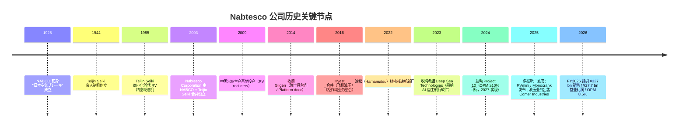
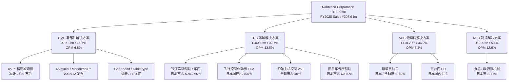
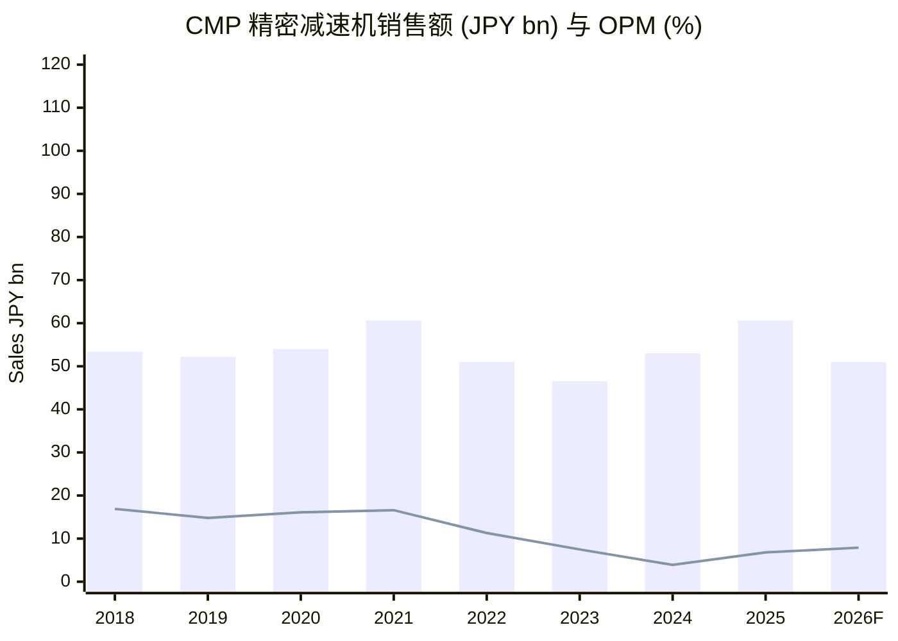
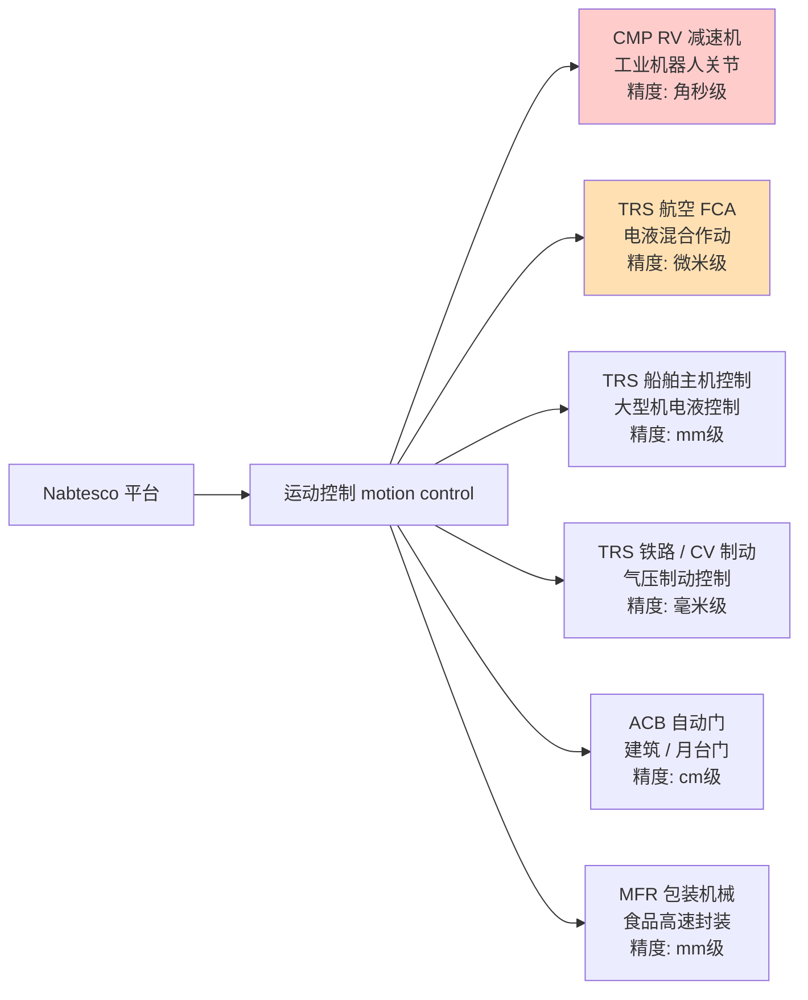
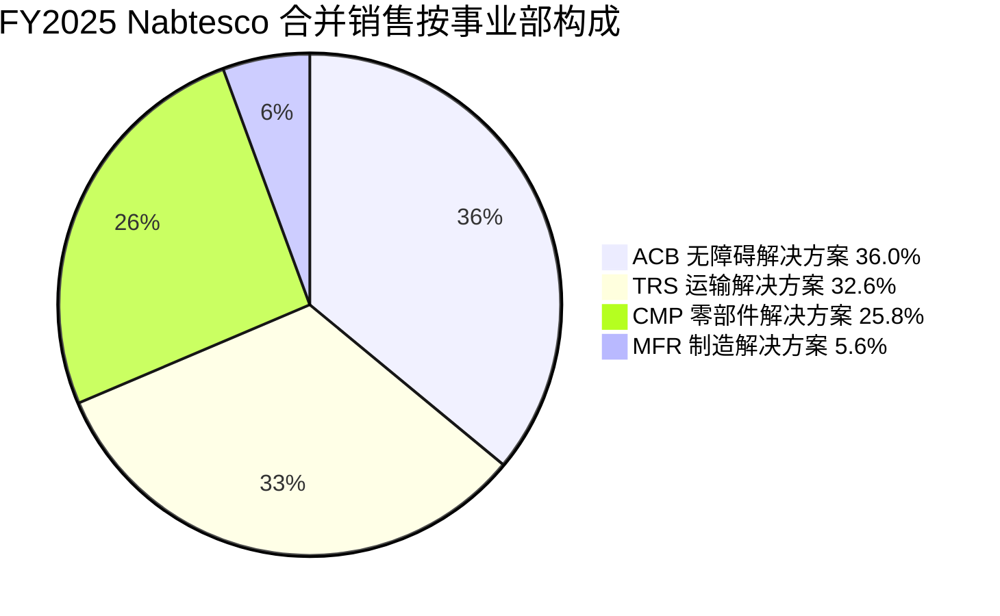
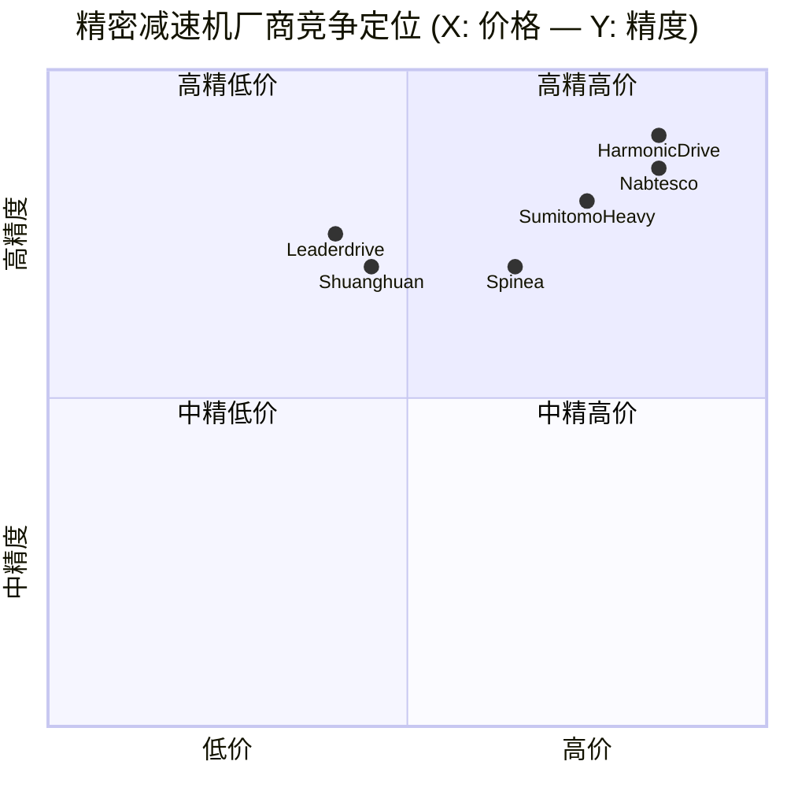
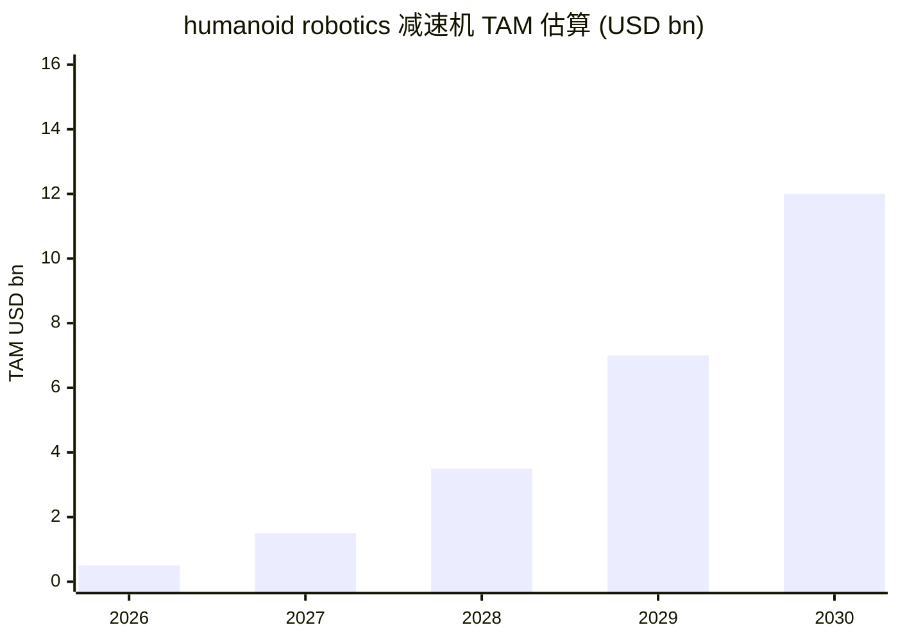

# Nabtesco Corporation（纳博特斯克 / ナブテスコ株式会社 / TSE:6268）公司研究

**报告日期：2026-06-02**
**作者：Equity Research（公司研究 skill 自动生成）**
**主题归属：humanoid-robotics-actuators**

> **Update — FY2025 业绩超指引并上调 FY2026 全年指引 (2026-02-19)**：公司公布 FY2025/12 全年（连续经营 / continuing operations）销售额 ¥307.9 bn（YoY +10%）、营业利润 ¥20.7 bn（YoY +60%）、归母净利润 ¥15.7 bn（YoY +55%），均超过 2025 年中给出的 ¥300.7 bn / ¥20.8 bn 指引计划；同时给出 FY2026/12 指引：销售额 ¥327.0 bn（YoY +6%）、营业利润 ¥27.7 bn（YoY +34%）、营业利润率 8.5%（+1.7pt），主要驱动来自 CMP（精密减速机 / Precision Reduction Gears, PRG）订单连续 4 个季度回升以及船舶、航空设备的持续景气。同步宣布完成液压设备业务（Hydraulic Equipment）2026 年 1 月剥离至意大利 Comer Industries（保留 30% 持股），用以聚焦机器人、运输与无障碍三个核心板块。Source: [Nabtesco FY2025 Results Briefing Material, 2026-02-19, p.12-13](https://www.nabtesco.com/cms/wp-content/uploads/Results_Briefing_Material_for_FY2025_e.pdf).

## 目录

1. 公司概览
2. 公司历史
3. 管理团队
4. 产品与服务
5. 客户与上市策略
6. 行业概览
7. 竞争格局
8. 市场机会
9. 风险评估
10. 投资者视角评分卡
11. 数据来源清单
12. 参考资料

---

## 1. 公司概览（Company Overview）

Nabtesco Corporation（ナブテスコ株式会社，证券代码 TSE:6268，下文交替使用 "Nabtesco" 与 "公司"）是一家日本精密机械综合制造商，2003 年 9 月由 **Teijin Seiki 帝人制机**与 **NABCO 日本空气制动**通过股份转让方式共同成立的纯控股公司起步，2004 年完成两家子公司的合并整合 ([Nabtesco Corporate History](https://www.nabtesco.com/en/about/company/overview/history/))。公司总部位于东京千代田区平河町，全球员工约 8,500 人，在日本、中国、欧洲、北美、东南亚均设有制造与销售据点；2025/12 财年（IFRS 连续经营口径）销售额 ¥307.9 bn，约合 USD 2.06 bn（按 FY2025 平均汇率 USD/JPY 149.78 折算） ([FY2025 Results Briefing, p.14](https://www.nabtesco.com/cms/wp-content/uploads/Results_Briefing_Material_for_FY2025_e.pdf))。

**业务结构 / Business model**：公司采取 "四大事业部 + MRO（maintenance, repair and overhaul，售后服务 / 备件 / 升级）" 的复合赛道布局。Component Solutions（CMP，零部件解决方案）以**精密减速机 / Precision Reduction Gears**（PRG，又称 RV reducers，Rotate Vector cycloidal speed reducers）为核心，是工业机器人关节的关键传动元件；Transport Solutions（TRS，运输解决方案）涵盖铁道车辆制动 / 车门系统、商用车制动、飞机飞控作动器、船舶主机控制系统四条产品线；Accessibility Solutions（ACB，无障碍解决方案）以建筑自动门（automatic doors）为主，全球市占率 60% 居首；Manufacturing Solutions（MFR，制造解决方案）则覆盖食品 / 软包装机械。FY2025 各事业部销售构成为 CMP 25.8%、TRS 32.6%、ACB 36.0%、MFR 5.6%（计算自 [Results Briefing, p.15](https://www.nabtesco.com/cms/wp-content/uploads/Results_Briefing_Material_for_FY2025_e.pdf)）；MRO 占公司整体销售比例 27%（2025），管理层指引提升至 30%+ ([Results Briefing, p.9](https://www.nabtesco.com/cms/wp-content/uploads/Results_Briefing_Material_for_FY2025_e.pdf))，构成抗周期性收入基石。

**收入端 / Revenue scale and geographic mix**：FY2025 海外销售 ¥152.6 bn（占比 49.6%），与日本本土销售 ¥155.2 bn 基本对开，其中欧洲 ¥59.7 bn（19.4%）、中国 ¥43.3 bn（14.1%）、北美 ¥27.5 bn（8.9%）、其他亚洲 ¥18.9 bn（6.1%）([Results Briefing, p.36](https://www.nabtesco.com/cms/wp-content/uploads/Results_Briefing_Material_for_FY2025_e.pdf))。中国销售额 YoY 大涨 32%（从 ¥32.8 bn 升至 ¥43.3 bn），主要来自工业机器人关节用精密减速机回暖及自动门业务扩张。Nabtesco 在中国上海、苏州、常州设有生产基地，是全球 RV 减速机产能本地化最深的日系企业。

**盈利能力 / Profitability**：FY2025 营业利润 ¥20.7 bn（YoY +60%）、OPM 6.7%（+2.1pt）、归母净利 ¥15.7 bn（YoY +55%）、EPS ¥131.56、ROIC 4.4%、ROE 5.8% ([Results Briefing, p.14](https://www.nabtesco.com/cms/wp-content/uploads/Results_Briefing_Material_for_FY2025_e.pdf))。各事业部 OPM 差异显著：TRS 13.5%（飞机 / 船舶高毛利）> MFR 12.6% > ACB 8.2% > CMP 6.8%。需要注意 CMP 利润率较 2018 年峰值 17% 大幅下滑，原因在于（a）中国工业机器人本土化竞争（Shuanghuan / Leaderdrive / Lemmen）推动 RV 减速机价格下行；（b）2022-2024 工业机器人下行周期导致稼动率不足；FY2026 公司指引 CMP OPM 回升至 7.9%（+1.1pt）([Results Briefing, p.20](https://www.nabtesco.com/cms/wp-content/uploads/Results_Briefing_Material_for_FY2025_e.pdf)）。CMP "Project 10" 改革目标为 2027 年实现公司整体 OPM ≥10%（[Project 10 改善路径，Results Briefing, p.8](https://www.nabtesco.com/cms/wp-content/uploads/Results_Briefing_Material_for_FY2025_e.pdf)）。

**估值快照 / Valuation snapshot (as of 2026-06-02)**：股价 ¥5,449，市值 ¥649.4 bn（约 USD 4.3 bn），TTM P/E 38.7×、Forward P/E 38.9×、P/S 2.0×（EV/Revenue 口径），DOE（dividend on equity，权益分红率）3.5% 政策对应 FY2025 全年股息 ¥80 / 股、收益率约 1.5% ([Simply Wall St TSE:6268 Valuation](https://simplywall.st/stocks/jp/capital-goods/tse-6268/nabtesco-shares/valuation); [Results Briefing, p.28](https://www.nabtesco.com/cms/wp-content/uploads/Results_Briefing_Material_for_FY2025_e.pdf))。**分析师观点：** 公司目前 P/E 接近行业近年高位，38.9× Forward P/E 显著高于同业 Sumitomo Heavy 18.3×、NSK 24.8×、Japan Steel Works 27.9×（peer 平均 28.8× / 日机械行业中位 14.5×）([Simply Wall St](https://simplywall.st/stocks/jp/capital-goods/tse-6268/nabtesco-shares/valuation))。这一溢价隐含了市场对 humanoid robotics 主题（特斯拉 Optimus Gen-3 量产、Figure / 1X / Apptronik 机型放量）和 CMP 板块利润率正常化的双重预期；2025/2026 印钞机的利润数（"already in the printed quarter"）并未支持该估值，需要未来 4-6 个季度的订单兑现来验证。如果 2026-2027 humanoid 量产不及预期或 CMP OPM 难以重回 10%+，估值需大幅下修，构成 Section 9 风险评估的核心命题。

---

## 2. 公司历史（Company History）

公司源自两家百年企业的整合：**NABCO（日本空気ブレーキ → 日本エアブレーキ → ナブコ）** 1925 年由 Westinghouse Air Brake（美国西屋电气制动公司）授权许可的形式成立于东京赤坂，制造铁道用气制动；**Teijin Seiki 帝人制机** 1944 年作为帝人集团下属机械分公司创立，最初制造纺织机械与飞机部件 ([Nabtesco History](https://www.nabtesco.com/en/about/company/overview/history/))。两家公司在 2002 年 11 月签署经营整合基本协议，2003 年 9 月通过股份转让设立 Nabtesco Corporation 作为纯持股公司，正式合并完成于 2004 年 9 月 ([Grokipedia Nabtesco](https://grokipedia.com/page/nabtesco))。

合并战略意图明确：NABCO 拥有制动 / 自动门 / 商用车气压控制等机械控制核心技术，Teijin Seiki 则积累了精密减速机（RV）、飞机液压 / 飞控作动器、船舶主机控制等高精度机械技术，两者整合后形成 "运动控制 / motion control" 这一跨行业平台型企业。1985 年 Teijin Seiki 与 Sumitomo Heavy 同时商业化 RV 减速机（最早由日商 Komatsu / 小松实验室在 1980 年代发明的 Cyclo® 系列演化而来），随后 30 年间持续迭代，截至 FY2025/12 累计出货 1,400 万台 ([RVmini Monocrank Press Release, 2025-12-02](https://www.nabtesco.com/en/news/20251202-17329/))，全球工业机器人中大型关节用 RV 减速机市占率约 60% ([FY2025 Briefing, p.40](https://www.nabtesco.com/cms/wp-content/uploads/Results_Briefing_Material_for_FY2025_e.pdf))。

**Source: [Nabtesco History page](https://www.nabtesco.com/en/about/company/overview/history/); [FY2025 Results Briefing material, p.7-9, p.30](https://www.nabtesco.com/cms/wp-content/uploads/Results_Briefing_Material_for_FY2025_e.pdf); [RVmini / Monocrank press release, 2025-12-02](https://www.nabtesco.com/en/news/20251202-17329/).**

**近年三次重要业务组合调整 / Three recent portfolio actions**：

- **2025/12 液压设备业务剥离 / Hydraulic Equipment divestiture**：公司在 2025 年 7 月 31 日公告将液压设备子公司分拆，2026 年 1 月将 70% 股权转让给意大利上市企业 Comer Industries S.p.A.，保留 30% 权益用以分享业务复苏收益 ([Results Briefing, p.30](https://www.nabtesco.com/cms/wp-content/uploads/Results_Briefing_Material_for_FY2025_e.pdf))。剥离背景：中国工程机械市场自 2022 年起持续低迷，叠加中国本土液压元件厂商（如徐工液压、恒立液压）的产能扩张，公司液压业务长期处于盈亏边缘。剥离后从 2025 Q3 起按 IFRS 5 标准在合并报表归类为 "discontinued operations"，CMP 事业部 FY2025 销售 ¥79.3 bn 已**不包含**液压业务（旧口径 CMP 含液压销售约 ¥130-140 bn）。
- **2025/12 铁路欧洲子公司处置**：公司于 2025 年 12 月签署转让欧洲铁路车门子公司协议，2026 年 2 月完成股权转让，对应 FY2025 录入清算损失约 ¥1.3 bn（[Results Briefing, p.13, p.30](https://www.nabtesco.com/cms/wp-content/uploads/Results_Briefing_Material_for_FY2025_e.pdf)）。撤出原因：欧洲业务因 COVID 后通胀及与西门子 / Knorr-Bremse 等欧洲制动巨头竞争加剧导致持续亏损。
- **2024-2025 海外月台门（Platform door, PD）业务退出**：公司 2024 年 1 月起对瑞士 Gilgen 子公司的海外 PD 项目实施 "选择性接单"（sorting orders），并于 2025 年宣布全面退出海外含工程安装的 PD 业务 ([Results Briefing, p.25, p.30](https://www.nabtesco.com/cms/wp-content/uploads/Results_Briefing_Material_for_FY2025_e.pdf))。背景为 PD 业务工期延长导致建造成本超预算、汇率影响等。Nabtesco 仅保留日本国内 PD 业务（依《无障碍法 / Barrier-Free Act》强制性需求支撑）以及瑞士周边的欧洲建筑自动门主业。

---

## 3. 管理团队（Management Team）

**Kazumasa Kimura 木村 一雅 — 代表取締役社長 兼 CEO（自 2022 年 3 月起）**

Kimura 现年约 60 岁，2011 年加入 Nabtesco 担任三重县 Tsu Plant 制造部部长，2012 年调任樽井（Tarui）工厂制造部长，2014-2016 年期间出任合并前 Hyest Corporation（公司在 2016 年通过合并整合的航空作动器子公司）代表董事，并在 2016 年合并后回到 Nabtesco 担任生产管理部门负责人 ([Nabtesco Management page](https://www.nabtesco.com/en/about/company/management/))。2017 年升任 Power Control Company 社长（当时公司将事业部以 "internal company" 形式管理，Power Control Company 即液压相关业务的事业部），2019 年 1 月晋升执行委员，分管企业战略、会计与财务、信息系统与企业传播；2021 年 1 月调任 CMP 事业部负责人 / 技术与 R&D 总部高级总经理，分管生产创新；2022 年 3 月正式接任社长 + CEO，至 2026 年已任期 4 年 ([Nabtesco Management page](https://www.nabtesco.com/en/about/company/management/); [Crunchbase Kazumasa Kimura](https://www.crunchbase.com/person/kazumasa-kimura))。

Kimura 的核心特质是**生产工程师出身的内部成长 CEO**：从工厂车间起步、历任三个事业部（液压 / 财务管理 / 精密减速机）一线负责人，对公司四大业务的制造、成本结构与供应链了解程度优于职业经理人型 CEO。其任内最具战略意义的两项决策是：**(1) Project 10 改革** —— 2024 年启动、目标 2027 年实现公司整体 OPM ≥10%（从 4.6% 提升至 10%+），通过产品组合优化、价格传导（price pass-through）、生产效率提升、海外亏损业务退出四条路径推进；**(2) 大幅业务组合重组** —— 2025 年内完成液压业务剥离、欧洲铁路退出、海外 PD 退出三件事，是公司自 2003 年成立以来最大规模的业务"减法"。这一系列 "selection & concentration / 選択と集中" 操作的执行决心明显高于同业（如 Sumitomo Heavy 至今未剥离弱势业务），但同时也带来短期净利稀释（FY2025 录入 ¥2.3 bn 一次性减值与清算损失）以及对未来 2-3 年 CMP / TRS 增长的执行依赖度增大。

Kimura 同时兼任董事会下设的合规委员会与风险管理委员会主席，参加提名委员会与薪酬委员会工作 ([Nabtesco Management page](https://www.nabtesco.com/en/about/company/management/))。公开资料未披露其个人持股比例与薪酬结构具体数字；Bloomberg、MarketScreener 等数据源亦未列示完整教育背景，本报告不强行补全。

**创始人 / 联合创始结构**：因公司是 2003 年 NABCO 与 Teijin Seiki 合并设立、并非由单一创始人开创，本节不列举传统意义上的"创始人"；两家前身公司分别由 NABCO 的 Westinghouse Air Brake 日本特许（1925 年）和 Teijin Seiki 的帝人集团内部分拆（1944 年）形成，均无单一可考的"创始人"个人 ([Nabtesco History](https://www.nabtesco.com/en/about/company/overview/history/))。

---

## 4. 产品与服务（Products & Services）

> **本节为全报告权重最高的章节。** Nabtesco 的核心论述基础在于：精密减速机 PRG 与 RV 在工业机器人 + humanoid 长期 TAM 扩张中是否仍具备稳固的护城河，决定了 6268 当下估值溢价的合理性。以下按 FY2025 公司年报披露的四大事业部口径，对每个事业部主要产品族进行逐条拆解 + 行业定位 + 分析师视角的三段式呈现。

### 4.1 公司事业部 / 产品族总览（自 FY2025 年报披露口径整理）

**Source: [FY2025 Results Briefing, p.15, p.40-43](https://www.nabtesco.com/cms/wp-content/uploads/Results_Briefing_Material_for_FY2025_e.pdf).**

### 4.2 CMP 事业部 —— 精密减速机 RV™ / RVmini® / Monocrank™（humanoid 主题的核心载体）

> Nabtesco FY2025 Results Briefing 第 40 页（CMP 主力产品页面）原文披露：
> "Precision Reduction Gears — Joints of Medium and Large Size Industrial Robots — No.1, Approx. 60% world market share. Main Customers — Industrial Robots: Fanuc, Yaskawa Electric, KHI, KUKA Roboter (Germany), ABB Robotics (Sweden). Machine Tools: Yamazaki Mazak, Okuma, DMG Mori Seiki."

**中文释义 / Plain-language gloss：** RV 减速机（Rotate Vector cycloidal speed reducer，回转矢量摆线针轮减速机）是一种**两级减速结构 + 偏心曲轴 + 摆线齿轮 (cycloidal gear)** 的精密传动元件，原理上比谐波减速机（harmonic drive，又称应变波 / strain wave gear）刚度更高、过载承载能力更强（典型可承受瞬时过载 3-5×），但体积重量更大、单价更高。在六轴工业机器人的 1-3 轴（基座 / 大臂 / 小臂 / "肩肘"关节）使用 RV 减速机以承载机械臂自重 + 工件负载的大扭矩（payload 20kg 及以上的工业机器人几乎全部使用 RV），4-6 轴（手腕 / wrist）则较多使用谐波减速机（payload < 20kg 的 SCARA / cobot / desktop 机型常全机使用谐波）。这是 Nabtesco 60% 全球市占的市场基础 —— **它专注的就是"重负载关节"** ([FY2025 Briefing, p.40](https://www.nabtesco.com/cms/wp-content/uploads/Results_Briefing_Material_for_FY2025_e.pdf); [Nabtesco Robotics Products Page](https://www.nabtesco.com/en/products/robot/))。

**RVmini® / Monocrank™ — 2025/12 新品 line extension**：公司在 2025 年 12 月 2 日宣布发布 RVmini® 系列（紧凑轻量型 strain wave generator 应变波发生器，本质是 Nabtesco 进入谐波减速机赛道的产品）以及 Monocrank™ 系列（紧凑型 RV，进一步缩小尺寸但保持高刚度），两者均在 2025 年 12 月 3 日 iREX2025（International Robot Exhibition Tokyo 国际机器人展东京）首次公开展示 ([RVmini Press Release, 2025-12-02](https://www.nabtesco.com/en/news/20251202-17329/))。公司在 FY2025 Briefing 第 6 页明确指出，2026 年起的产品线扩张目标是 **"6 < 20kg 负载段"** 的工业机器人、3C / 半导体设备、cobot（collaborative robot 协作机器人）、humanoid 四个新应用领域 —— 这是 Nabtesco 首次以正式产品族口径将 humanoid 纳入战略产品规划 ([FY2025 Results Briefing, p.6-7](https://www.nabtesco.com/cms/wp-content/uploads/Results_Briefing_Material_for_FY2025_e.pdf))。

**Hamamatsu 工厂 2× 扩产 / 投产时点**：公司 2022 年秋天动工的滨松（Hamamatsu）新工厂建筑面积 46,900 m²，2023 年 9 月落成，2024-2026 年陆续导入先进物流系统与生产设备，总投资约 ¥47 bn，目标 **2026 年 RV 减速机年产能从 ~100 万台翻倍至 200 万台** ([SEISANZAI Japan, 2022](https://seisanzai-japan.com/article/p3206/); [Nabtesco Plant Announcement via Surgical Robotics Tech](https://www.surgicalroboticstechnology.com/news/nabtesco-announces-new-production-plant-for-precision-gears/))。投资逻辑：（a）应对 2022 工业机器人深度下行后预期 2025-2027 复苏；（b）为 humanoid robotics 假设性需求储备产能；（c）将分散在津 / 樽井 / 京都几个老工厂的部分产能集中化 —— FY2025 Briefing 第 35 页明确 "Main capital investment is for the Hamamatsu plant for precision reducers in 2025" ([FY2025 Briefing, p.35](https://www.nabtesco.com/cms/wp-content/uploads/Results_Briefing_Material_for_FY2025_e.pdf))。

**CMP 销售构成与利润率走势（FY2016-FY2026F）**：依据 FY2025 Briefing 第 38 页的 10 年回溯，CMP 精密减速机销售从 2016 年 ¥27.5 bn 增至 2024 年 ¥54.0 bn、2025 年 ¥60.6 bn，2026 指引 ¥51.0 bn 反而下降 —— 但需注意 2026 数字是剔除液压业务后的"纯净"CMP 口径（液压历史上占 CMP 销售的 30-50%）。OPM 从 2018 年峰值 17% 滑落至 2023 年 11.3%、2024 年低点 3.9%、2025 年回升至 6.8%、2026 指引 7.9%；2027 年 Project 10 目标 ≥10% ([FY2025 Briefing, p.8, p.38](https://www.nabtesco.com/cms/wp-content/uploads/Results_Briefing_Material_for_FY2025_e.pdf))。

*Source: [FY2025 Briefing, p.38 — CMP segment 10-year trend](https://www.nabtesco.com/cms/wp-content/uploads/Results_Briefing_Material_for_FY2025_e.pdf). 数字为含液压历史口径；2026 为剔除液压新口径。*

**分析师观点 / Analyst view：** Nabtesco CMP 在中大型工业机器人关节市占率 60%（公司自估）的护城河源自三层壁垒：（1）**精密齿轮加工与热处理工艺 know-how**，与 SCREEN / Sumitomo Heavy 类似，需要 10+ 年的产线 tacit knowledge 积累；（2）**机器人 OEM 长期联合开发协议**，Fanuc / Yaskawa / ABB / KUKA 等头部机器人企业的关节几乎默认搭载 Nabtesco RV，切换成本极高；（3）**全球生产网络**，常州 / 苏州 / 上海三个中国工厂使其享有"中国本地化产能"的关税与交付优势。**护城河正在被侵蚀**：中国 Shuanghuan（双环传动，SZSE:002472）、Leaderdrive（绿的谐波，SZ:688017）、HENGFENGTAI / 中大力德等本土企业在 RV 减速机的中游精度（20 角秒级别）上已可对标，价格仅为日系的 60-70%。Nabtesco 也承认全球 RV 单价正在面临压力（[Results Briefing, p.32 CMP Profitability Analysis](https://www.nabtesco.com/cms/wp-content/uploads/Results_Briefing_Material_for_FY2025_e.pdf)）。**humanoid 的关键问题**：特斯拉 Optimus Gen-2/3 在 28 个旋转关节（rotational joints）中使用谐波减速机（harmonic drive，竞争对手 Harmonic Drive Systems TSE:6324 主导）+ 行星减速机（planetary reducer），而非 Nabtesco 强势的 RV。Nabtesco 的 RVmini® 是首次进入应变波（谐波）赛道的产品，意味着公司正在直面 Harmonic Drive 与中国谐波厂商 Leaderdrive、来福 等的成熟产品线，这是一个 "从无到有"的扩张，而非 "已有市占率延伸"，胜负仍未知 ([RVmini Press Release, 2025-12-02](https://www.nabtesco.com/en/news/20251202-17329/); [Jamestown — PRC Robotics, 2025](https://jamestown.org/new-gains-in-prc-robotics-software-hardware/))。

### 4.3 TRS 事业部 —— 运输用机电控制（最高利润事业部）

> Nabtesco FY2025 Results Briefing 第 41-42 页（TRS 主力产品页面）原文披露：
> "Railroad Vehicle Equipment — Brake Systems Approx. 50% Domestic Market Share No.1; Door Operating Systems Approx. 60% Domestic Market Share No.1. Main Customers: JR Companies, Private railway companies, Hitachi, KHI, Bullet train and subway projects in China.
> Aircraft Equipment — Flight Control Actuation Systems (FCA) Approx. 100% market share for domestically-produced aircrafts. Main Customers: Boeing, KHI, MHI, IHI, Japanese Ministry of Defense, Airline operators.
> Marine Vessel Equipment — 2ST Main Engine Control Systems Approx. 45% Domestic Market Share (Approx. 40% World Market Share). Main Customers: Japan Engine Corporation, KHI, Makita Corporation, Hitachi Zosen Marine Engine Co., Ltd., Mitsui Engineering & Shipbuilding, Hyundai Heavy Industries (Korea), Hudong Heavy Machinery (China), HSD Engine Co., Ltd. (Korea).
> Commercial Vehicle Equipment — Wedge Chambers Approx. 80% Domestic Market Share; Air Dryers Approx. 60% Domestic Market Share. Main Customers: Isuzu, Hino, Mitsubishi Fuso Truck & Bus, UD Trucks."

**中文释义 / Plain-language gloss：** TRS 是四个产品族在四种交通工具（铁路 / 飞机 / 船舶 / 商用卡车）上的运动控制元件。**铁路制动 / brakes：** 日本 JR / 私铁列车的气液混合制动盘，包括高速新干线与地铁，市占 50%（与三菱电机 / Knorr-Bremse 分食）。**铁道车门 / door operating systems：** 60% 国内市占；与公司自身建筑自动门（ACB 事业部）共享部分电气控制技术。**飞行控制作动器 / FCA (flight control actuators)：** 包括副翼 / 升降舵 / 方向舵的液压 + 电动作动器，是 Boeing 737MAX / 777X 及日本自卫队下一代战机 GCAP（Global Combat Air Programme，英日意三国联合研发的 Tempest 战机延伸）的核心供应商之一；公司同时在 FY2025 Briefing 第 10 页提到 "Initiatives for product development for Projectiles and prepare for Global Combat Air Programme"，意指防卫装备扩张 ([FY2025 Briefing, p.10](https://www.nabtesco.com/cms/wp-content/uploads/Results_Briefing_Material_for_FY2025_e.pdf))。**船舶 2ST 主机控制 / Two-stroke main engine control systems：** 大型集装箱船 / 油轮所用 MAN B&W、WinGD（前 Wärtsilä）二冲程柴油主机的电控系统，公司全球市占 40% —— 这是 Nabtesco 少数几个海外市占领先的产品之一，因 MAN B&W 与 WinGD 主机本身在中国 / 韩国造船厂普及度极高，Hyundai Heavy / 沪东重机 / HSD 等船用主机制造商为主要客户。**商用车制动 / commercial vehicle wedge chambers + air dryers：** 日本五十铃 / 日野 / 三菱扶桑 / UD Trucks 几乎独家供应，日本市占 60-80%；但海外（北美 / 欧洲）份额几乎可忽略，竞争对手是 WABCO / Knorr-Bremse / Haldex。

**TRS 销售 FY2025 ¥100.5 bn（YoY +13%）、OPM 13.5%、FY2026 指引 ¥107.6 bn / OPM 16.8%（+3.3pt）**。子板块拆分：铁路 ¥31.2 bn（+11%）、航空 ¥13.5 bn（+6%）、船舶 ¥25.7 bn（+25%）、商用车 ¥28.1 bn（-5%），FY2026 航空与船舶继续承担增长主力 ([FY2025 Briefing, p.21, p.38](https://www.nabtesco.com/cms/wp-content/uploads/Results_Briefing_Material_for_FY2025_e.pdf))。航空业务受 Boeing 737MAX 复产 + 防卫预算扩张双重驱动；船舶业务受全球新造船周期 + 替代燃料发动机（LNG / methanol / ammonia）需求支撑。

**分析师观点 / Analyst view：** TRS 是 Nabtesco "现金牛 + MRO 引擎"，OPM 13-17% 接近航空航天供应链 Tier-2 水平。MRO 比率在航空业务约 50-60%、船舶 30-40%，是公司整体 MRO 27%（2025）→ 30%+（2026）的核心拉动板块（[FY2025 Briefing, p.9](https://www.nabtesco.com/cms/wp-content/uploads/Results_Briefing_Material_for_FY2025_e.pdf)）。隐忧是 2025 年内出现两笔减值：（a）希腊 Deep Sea Technologies AI 软件子公司商誉减值 ¥1 bn；（b）欧洲铁路子公司清算 ¥1.3 bn ([FY2025 Briefing, p.13, p.31](https://www.nabtesco.com/cms/wp-content/uploads/Results_Briefing_Material_for_FY2025_e.pdf))。前者源于 AI 船舶软件商业化进度低于预期，后者源于欧洲市场无法与 Knorr-Bremse / Voith 等本土巨头竞争。这两件事说明 TRS 海外扩张需要更耐心的 5-7 年 horizon，不能简单地复制 NABCO 时期的"日本国内 60%+ 市占"模式。

### 4.4 ACB 事业部 —— 无障碍解决方案（自动门）

> FY2025 Results Briefing 第 43 页：
> "Automatic Doors — Approx. 60% market share for building automatic doors in Japan (top share in the world). Main Customers: Automatic Doors for buildings: Major general contractors, sash manufacturers, hospitals, banks, public institutions, etc.
> Platform Doors: JR Companies, Private railway companies, Subway projects in various countries."

**中文释义 / Plain-language gloss：** ACB 事业部本质上是 NABCO 1925 年以来"自动门 / automatic door"业务的延续 —— 商业建筑入口的电动滑门（sliding door, 推拉式自动门）、地下铁路月台用屏蔽门（PSD, platform screen door / platform door, 防止乘客坠落的全高 / 半高玻璃门）。日本建筑自动门市占 60%（与 STANLEY、Otis 等竞争），全球建筑自动门份额也是第一（公司自估）。ACB FY2025 销售 ¥110.7 bn（+4% YoY）、OPM 8.2%，是公司收入第一大事业部；FY2026 指引销售微增至 ¥110.8 bn、OPM 9.1% ([FY2025 Briefing, p.25, p.39](https://www.nabtesco.com/cms/wp-content/uploads/Results_Briefing_Material_for_FY2025_e.pdf))。

ACB MRO 比率 45%（2025）—— 是四个事业部中最高，反映自动门一旦安装后维护合约长达 15-20 年，是稳定现金流来源。2025 年公司退出海外 PD 工程业务（仅保留日本国内 PD 业务，依据《无障碍法 / Barrier-Free Act 2006 修订》强制要求新建车站具备无障碍设施），背景是欧洲 / 东南亚 PD 项目工期延长导致建造成本超支、汇率影响和工程进度跨年度计提（POC 法）的负面影响。

**分析师观点 / Analyst view：** ACB 的护城河是日本本土的"既得设备 + MRO 合约"二重锁定 —— 商业大厦更换自动门一般以 15-20 年为周期，且替换厂商极少（一般沿用原厂商 + 原合约）。海外扩张则受限于品牌认知度与本地化施工能力，2025 年退出海外 PD 业务说明公司放弃了通过 "扩张地理边界"实现增长的想法，转向以 MRO 比率提升 + 日本本土再开发项目（"重大都市再开发"如六本木 / 涩谷 / 八重洲）维持稳态盈利。这是经典的"防御型现金牛"业务，年化销售增长 1-3%、利润率稳定 8-10%，但不太可能给整体估值带来催化。

### 4.5 MFR 事业部 —— 食品 / 软包装机械

> FY2025 Results Briefing 第 43 页：
> "Packaging Machines for Retort Pouch Foods Approx. 85% domestic market share. Main Customers: Mitsui DM Sugar, Ajinomoto, Marudai Food Co., Ltd., ARIAKE Japan, KENKO Mayonnaise, P&G, Kao, Lion, beverage companies in North America, food companies in China."

**中文释义 / Plain-language gloss：** MFR 事业部规模最小（FY2025 销售 ¥17.4 bn，占公司 5.6%），核心产品是 **retort pouch food packaging machines / 软包装食品包装机** —— 即日本常见的微波加热咖喱包、即食米饭、调味包等所用的高速真空封装设备。Nabtesco 在该细分市场的日本市占 85%，主要客户是味之素（Ajinomoto，TSE:2802）、Marudai 食品、KENKO Mayonnaise、Mitsui DM Sugar 及 P&G / 花王 / 狮子等日化公司。海外销售比例较低，北美与中国饮料企业是主要海外客户。FY2025 OPM 12.6%（2024 6%），FY2026 指引 OPM 14% ([FY2025 Briefing, p.26, p.39](https://www.nabtesco.com/cms/wp-content/uploads/Results_Briefing_Material_for_FY2025_e.pdf))。

**分析师观点 / Analyst view：** MFR 是 "细分市场寡头" 的典型案例，但因规模太小（占公司 5.6% 销售），对整体估值影响有限。FY2025 净利润恢复主要源于 FY2024 一次性减值（Q2）的不可重复因素；管理层 FY2026 指引 OPM 14% 隐含设备更新需求保持景气，可能稍乐观。

### 4.6 综合：四个事业部如何在客户工作流中互相配合？

**综合看 Nabtesco 的产品逻辑**：四个事业部共享 "精密机械 + 流体 / 液压 / 气压控制 + 长寿命 + 售后 MRO" 的能力集，但**应用领域几乎无重叠**。CMP 客户是机器人 / 机床 OEM（Fanuc / Yaskawa / KUKA / ABB / Mazak / Okuma / DMG Mori）；TRS 是航空 OEM（Boeing / MHI / KHI）+ 铁路 OEM（Hitachi / KHI）+ 船舶主机厂（Hyundai / 沪东 / Japan Engine）+ 卡车 OEM（Isuzu / Hino / Fuso）；ACB 是建筑商 + 铁路运营公司；MFR 是食品大厂（Ajinomoto / P&G）。这一结构带来：**(a) 高 diversification —— 单一行业下行不会击穿整体盈利（如 2023 工业机器人深度下行时航空 + 船舶反向支撑公司整体）**；**(b) 弱协同 —— 由于客户群完全不同，跨事业部交叉销售机会有限，更多依赖事业部内部的技术 + 客户合约自身演化**；**(c) 复杂治理负担 —— 公司需同时管理四个细分行业的产能 / 研发 / 客户关系，且每个行业的客户集中度、价格结构、技术节奏均不同。** Project 10 改革本质上是承认前述 "弱协同" 的存在并通过收缩组合（剥离液压、退出海外 PD、退出欧洲铁路）来释放管理资源 ([FY2025 Briefing, p.9-10, p.30](https://www.nabtesco.com/cms/wp-content/uploads/Results_Briefing_Material_for_FY2025_e.pdf))。

### 4.7 MRO 业务 —— 抗周期性收入引擎

公司将 MRO（maintenance, repair, overhaul）比率定义为 "MRO sales / 全公司销售"，FY2025 实际 27%，FY2026 指引 30%+。各事业部 MRO 比率：航空 50-60%、船舶 30-40%、建筑自动门 45%、铁路 ~30%、商用车 ~25%、CMP 减速机 ~15%、MFR 35%（[FY2025 Briefing, p.9, p.25, p.26](https://www.nabtesco.com/cms/wp-content/uploads/Results_Briefing_Material_for_FY2025_e.pdf)）。MRO 业务的关键经济学：（a）毛利率比新设备高 5-15pt；（b）现金流稳定，不受新订单周期影响；（c）切换成本极高（替换厂商需重新认证）。这是 Nabtesco 整体 OPM 比 NSK / SKF / Sumitomo Heavy 等纯轴承 / 减速机企业稳定的核心解释。

---

## 5. 客户与上市策略（Customers & Go-to-Market）

### 5.1 主要客户群

依据 FY2025 Briefing 第 40-43 页公司自披露 "Main Customers" 信息：

| 事业部 | 主要客户族 | 客户性质 |
|---|---|---|
| CMP 精密减速机 | Fanuc, Yaskawa Electric, KHI (Kawasaki Heavy), KUKA Roboter (Germany), ABB Robotics (Sweden), Yamazaki Mazak, Okuma, DMG Mori Seiki | 全球工业机器人 / 机床 OEM 前 6-8 名 |
| TRS 航空 | Boeing, KHI, MHI (Mitsubishi Heavy), IHI, 日本防卫省, 民航运营商 | 航空 OEM + 防卫 + 民航 |
| TRS 铁路 | JR Companies, 私铁运营商, Hitachi, KHI, 中国高铁 / 地铁项目 | 铁路运营商 + 车辆制造商 |
| TRS 船舶 | Japan Engine, KHI, Makita Corp, Hitachi Zosen Marine Engine, Mitsui E&S, Hyundai Heavy, 沪东重机, HSD Engine | 大型船舶主机制造商（全球范围） |
| TRS 商用车 | Isuzu, Hino, Mitsubishi Fuso, UD Trucks | 日本商用卡车四大 OEM |
| ACB 自动门 | 大型综合建商, sash 厂商, 医院, 银行, 公共机构 | 长尾建筑业 |
| ACB 月台门 | JR Companies, 私铁, 全球地铁项目 | 铁路运营商 |
| MFR 食品包装 | Ajinomoto, Marudai Food, ARIAKE Japan, KENKO Mayonnaise, Mitsui DM Sugar, P&G, Kao, Lion, 北美饮料企业, 中国食品企业 | 日本 / 北美 / 中国食品与日化 |

**Source: [FY2025 Results Briefing, p.40-43 (Main Products / Main Customers by segment)](https://www.nabtesco.com/cms/wp-content/uploads/Results_Briefing_Material_for_FY2025_e.pdf).**

### 5.2 客户集中度（concentration）

公司在 FY2025 Briefing 与有价证券报告书（Yuho）中**没有披露单一客户占公司合并销售额的比例（即没有单一客户超过 10% 阈值的披露）**。这与 Nabtesco 四大事业部高度分散、且每个事业部本身又服务多个 OEM 客户的结构一致：

- **CMP 客户分散**：Fanuc + Yaskawa + ABB + KUKA + KHI + 中国 / 韩国机器人厂 + 机床厂等数十家 OEM，估计单一客户最多占 CMP 销售 15-20%（CMP 占公司销售 25.8%），即单一客户最多占公司合并销售 3-5%。
- **TRS 客户分散**：航空 Boeing + 防卫省 + 民航；铁路 JR 7 大客户公司；船舶 Hyundai + 沪东 + Japan Engine 等。Boeing 估计是 TRS 航空板块最大单一客户，但航空仅占 TRS 13%、占公司销售 4.4%，故 Boeing 占公司合并销售估计 2-3%。
- **ACB / MFR 客户更分散**：均为长尾建筑商 / 食品大厂群。

**结论**：依据公司自披露，Nabtesco 没有 ≥10% 集中度的客户，应可视为 "客户分散" 的低集中度模式（**段位 / segment-level 客户集中度也未单独披露具体百分比**，本节不做估算）。这与同业 Harmonic Drive Systems（HDS）有显著差异 —— HDS 单一客户 ABB 历史上占其谐波减速机销售 ~15-20%（HDS Yuho 披露），且整体客户集中度更高。

**Source: [FY2025 Results Briefing, p.15](https://www.nabtesco.com/cms/wp-content/uploads/Results_Briefing_Material_for_FY2025_e.pdf).**

### 5.3 地理销售构成

FY2025 海外销售 ¥152.6 bn（49.6%）+ 日本本土 ¥155.2 bn（50.4%）。海外销售构成：欧洲 19.4%、中国 14.1%、北美 8.9%、其他亚洲 6.1%、其他 1.0% ([FY2025 Briefing, p.36](https://www.nabtesco.com/cms/wp-content/uploads/Results_Briefing_Material_for_FY2025_e.pdf))。**中国销售从 FY2024 ¥32.8 bn 升至 FY2025 ¥43.3 bn，YoY +32%，是地理增速最快的市场**，由 CMP 工业机器人需求回暖 + ACB 自动门项目（中国商业地产开发）双重支撑。日本国内销售则得益于船舶 + 航空 + 商业地产再开发，FY2025 增长 ¥13.3 bn YoY。

### 5.4 销售网络与合约结构

- **CMP**：与工业机器人 OEM 多采用 **multi-year master agreement + annual purchase order** 模式，价格年度复盘、产能保障 12-18 个月在手订单可见性。
- **TRS 航空**：与 Boeing / KHI / MHI 通常签订 **program lifecycle agreement / PLA**（机型寿命周期合约），随飞机交付 + MRO 配件需求 30-40 年连续供应，几乎不可被替换。
- **TRS 铁路**：JR 与私铁通常采用 5-7 年滚动框架协议，与 Hitachi / KHI 等车辆 OEM 同步入库。
- **ACB**：建筑自动门多通过 sash（窗框）厂商与综合建商间接销售，工程项目模式；MRO 业务则由 Nabtesco 自有分公司直营。

---

## 6. 行业概览（Industry Overview）

### 6.1 精密减速机（PRG / RV / Harmonic Drive）行业（CMP 核心市场）

**全球工业机器人减速机市场规模**：依据 2025 年 IntelMarketResearch 与 ARK Invest 等多家来源整理，全球工业机器人精密减速机市场（含 RV + 谐波）2024 年规模约 USD 1.8-2.2 bn，2030 年预计达 USD 3.5-4.5 bn（CAGR ~10-12%）([Intel Market Research Humanoid Reducers 2026-2032](https://www.intelmarketresearch.com/humanoid-robot-speed-reducers-market-23769))；**humanoid 减速机 sub-market** 2026 年若特斯拉 Optimus 量产 5-7 万台、Figure / 1X / Apptronik 等合计 5-10 万台，将催生约 USD 200-400 mn 的增量市场，2030 年若 humanoid 全球量产 100-300 万台规模，对应减速机 TAM USD 5-15 bn。

**RV vs 谐波分工**：传统工业机器人 6 轴关节中，1-3 轴（基座 / 大臂 / 小臂）使用 RV（重载，Nabtesco / Sumitomo Heavy 主导），4-6 轴（手腕）使用谐波减速机（轻载，Harmonic Drive Systems / Leaderdrive 主导）。**humanoid 机器人则全部使用谐波 + 行星减速机** —— 特斯拉 Optimus 28 个关节据 36Kr / Yicai 等报道全部为 harmonic + planetary 组合 ([Yicai Global, 2025-03 — humanoid supply chains](https://www.yicaiglobal.com/star50news/2025_03_056800594033476370453); [36Kr Tesla Optimus, 2025](https://eu.36kr.com/en/p/3476581554018438))。这意味着 Nabtesco 的 RV 优势在 humanoid TAM 中**不直接转化**为市占；公司必须通过 RVmini®（谐波 line extension）与 Monocrank™（紧凑 RV，可能用于髋 / 肩等少数承重关节）进入新赛道。

**中国本土化竞争**：中国谐波减速机本土厂商 Leaderdrive（绿的谐波，SZ:688017）、来福谐波、Hengfengtai、中大力德等已具备主流谐波产品供应能力，价格仅为 Harmonic Drive Systems 日系产品的 50-70%；RV 减速机本土代表 Shuanghuan（双环传动，SZSE:002472）、Lemmen、Buke（北特科技，SSE:603009）等也在加速产能扩张，2025 年内多家公告 IPO 募资或定增专门为 humanoid 减速机扩产 ([21经济网，五洲新春 募资10亿, 2025-06-17](https://www.21jingji.com/article/20250617/herald/05cf32584a26e6fdfc4a7e696cbf7333.html); [Jamestown — PRC Robotics 2025](https://jamestown.org/new-gains-in-prc-robotics-software-hardware/))。**Nabtesco 在中国市场份额已从 2018 年估计 60-65% 降至 2025 年约 50-55%**（公司未明确披露中国独立市占）。

### 6.2 铁路装备 & 航空航天装备行业

**铁路装备全球市场**：依据 SCI Verkehr 等机构数据，全球轨道交通装备市场 2024 年约 EUR 200 bn，年增 3-4%，其中制动 + 车门系统合计占约 8-10%（EUR 16-20 bn）。Nabtesco 仅在日本国内市占率高（制动 50% / 车门 60%），全球市占可忽略（< 5%）。但日本本土需求由 JR 集团 / 私铁的车辆更新周期 + 海外（中国 / 印度 / 东南亚）订单驱动；FY2026 公司预计日本新车制造处于淡季 + 海外项目暂停（[FY2025 Briefing, p.20](https://www.nabtesco.com/cms/wp-content/uploads/Results_Briefing_Material_for_FY2025_e.pdf)）。

**航空装备**：全球商用飞机部件市场约 USD 80 bn / 年（Boeing + Airbus 体系），Nabtesco 主要供应 Boeing 737MAX 与 777X 的飞控作动器、日本国产飞机（MRJ 已停产、KHI 国防飞机）100% 飞控供应。FY2025-FY2026 关键驱动是 Boeing 737MAX 复产（2024 年 9 月罢工解决后逐步回升）+ 日本国防预算扩张（GCAP / Global Combat Air Programme 英日意联合战机）+ 防卫装备出口（[FY2025 Briefing, p.10, p.20](https://www.nabtesco.com/cms/wp-content/uploads/Results_Briefing_Material_for_FY2025_e.pdf)）。

**船舶装备**：全球新造船周期 2024-2027 进入上行阶段，2024 年全球新造船订单 5,000 万 dwt（载重吨）创近年高位，2025-2027 交付高峰；同时 IMO 2030 碳排放法规驱动 LNG / methanol / ammonia 替代燃料发动机需求 ([Clarksons / SCI / 三井 E&S 2025 estimates])。Nabtesco 在 MAN B&W / WinGD 两冲程主机控制系统 40% 全球市占（公司自估）将受益于这一周期 + 替代燃料引擎控制升级需求。

### 6.3 建筑自动门 / 月台门行业

全球建筑自动门市场约 USD 6-8 bn / 年（包括感应自动门、自动旋转门、防火门等），主要厂商 STANLEY Access Technologies（瑞士 ASSA ABLOY 子公司）、Otis（电梯关联）、Dorma（德国）、Nabtesco（日本 / 全球第一）。月台门（PSD）市场约 USD 2 bn / 年，主要在亚洲地铁 + 高铁新线投入。日本国内 PSD 渗透率仍较低（仅东京 JR / 地铁部分车站已安装），《无障碍法 2006 修订》强制要求新建车站具备无障碍设施。

---

## 7. 竞争格局（Competitive Landscape）

### 7.1 CMP（精密减速机）竞争格局

| 厂商 | 国家 | RV 减速机 | 谐波减速机 | 谐波 + RV 全球估计市占 | 备注 |
|---|---|---|---|---|---|
| **Nabtesco (TSE:6268)** | 日本 | **No.1, ~60% 全球中大型机器人关节** | RVmini® 新进入 | RV 60%, 谐波 < 5% | FY2025 销售 ¥79.3 bn (CMP) |
| **Harmonic Drive Systems (TSE:6324)** | 日本 | 无 | **No.1, ~70% 全球谐波** | RV 0%, 谐波 ~70% | FY2025 销售 ¥56 bn (PRG) |
| **Sumitomo Heavy (TSE:6302)** | 日本 | 第二大 RV 厂商，Cyclo® | 少量 | RV ~15-20% | 综合机械集团 |
| **Shuanghuan (SZSE:002472)** | 中国 | 中国 RV 第一 | 部分 | RV ~10% 全球 | 已向特斯拉 Optimus 供货谐波减速机 |
| **Leaderdrive 绿的谐波 (SH:688017)** | 中国 | 无 | 中国谐波第一 | 谐波 ~15% 全球 | 谐波纯赛道 |
| **Spinea** | 斯洛伐克 | 旋转关节减速机 TwinSpin | 无 | < 3% | 利基玩家 |

**Source**: [FY2025 Briefing, p.40](https://www.nabtesco.com/cms/wp-content/uploads/Results_Briefing_Material_for_FY2025_e.pdf); [Jamestown — PRC Robotics, 2025](https://jamestown.org/new-gains-in-prc-robotics-software-hardware/); [Yicai — humanoid supply chains, 2025-03](https://www.yicaiglobal.com/star50news/2025_03_056800594033476370453); 各家厂商 FY2025 公告 / 估算。

### 7.2 TRS（运输装备）竞争格局

- **铁路制动**：Knorr-Bremse（德国 / DE0005439004，全球第一）、Wabtec（NYSE:WAB）、三菱电机 / 川崎重工内部部门、Nabtesco（日本市占第一）。
- **航空飞控作动**：Moog（NYSE:MOG.A）、Parker Hannifin、Eaton、UTC Aerospace、Honeywell、Nabtesco（日本国产机独家）。
- **船舶主机控制**：Wärtsilä、Kongsberg、MAN ES（液压控制）、Nabtesco（电控 40% 全球）。
- **商用车制动**：WABCO（被 ZF 收购）、Knorr-Bremse、Haldex、Nabtesco（日本市占 60-80%）。

### 7.3 ACB（自动门）竞争格局

- **建筑自动门**：ASSA ABLOY (STANLEY)、Dorma+Kaba (dormakaba)、Otis、Nabtesco（全球第一）。
- **月台门 PSD**：Faiveley (Wabtec 子公司)、Knorr-Bremse、上海方大、Nabtesco（日本国内主导）。

### 7.4 Nabtesco 整体竞争优势与脆弱性

**优势 / Strengths**：
1. **多元化业务组合的天然 hedging** —— 单一行业下行（如 2022-2024 工业机器人）不会击穿公司整体盈利。
2. **MRO 现金流支柱** —— 27% MRO 收入（2025）+ 30%+（2026 指引），提供稳定可预测现金流。
3. **日本本土的"既得设备 + MRO 锁定"** —— 多个 60-100% 国内市占的细分市场（铁路车门、建筑自动门、商用车制动、食品软包装机），不易被外国厂商攻入。
4. **航空 / 防卫 / 船舶的 program lifecycle 长合约** —— 高门槛、长尾贡献现金流。

**脆弱性 / Vulnerabilities**：
1. **CMP RV 减速机在中国市场份额持续被本土厂商挤压** —— Shuanghuan / Leaderdrive 价格优势明显。
2. **海外扩张多次失败 / 减值** —— 2025 录入欧洲铁路 ¥1.3 bn 清算损失 + 希腊 Deep Sea Technologies ¥1 bn 商誉减值 + 海外 PD 业务退出；过去 10 年内多次海外扩张未能形成可持续盈利模式。
3. **humanoid robotics 缺乏直接优势** —— RV 优势不直接转化到 harmonic-dominated humanoid 关节；RVmini® 新品仍需 12-24 个月验证市场。
4. **整体 ROE 5.8% / ROIC 4.4%（FY2025）偏低** —— 远低于优质机械企业 12-15% 水平，Project 10 OPM ≥10% 目标若达成可能将 ROE 提升至 8-10% 范围，但市场已部分定价该预期（38.7× P/E）。

---

## 8. 市场机会（Market Opportunity / TAM）

### 8.1 humanoid robotics 主题 TAM 复盘

公司在 humanoid robotics 主题（[humanoid-robotics-actuators_theme.md](../../themes/humanoid-robotics-actuators_theme.md)）中被定位为 **"core" 持仓**，理由是：
- 全球工业机器人 RV 减速机第一 (~60%)；
- 2026 年滨松厂 RV 产能翻倍至 200 万台 / 年；
- RVmini® / Monocrank™ 2025/12 发布、明确以 humanoid wrist / finger-base 为目标应用；
- FY2026 公司指引 +6% 销售 + +34% 营业利润，市场预期 2027+ 受益 Optimus / Figure / 1X 量产；
- 1 年股价 +136%，市场已部分定价该预期。

**Nabtesco 在 humanoid 市场的 SAM 与 SOM 估算（分析师估算）**：
- 2026 年特斯拉 Optimus 量产 5-10 万台、Figure / 1X / Apptronik 合计 5-10 万台 → humanoid 整机出货 10-20 万台 → **谐波 + 行星减速机 SAM 约 USD 400-800 mn**（按每台 humanoid 28-40 个关节 × 平均 USD 100-200/关节估算）。
- Nabtesco RVmini® 假设 2026 年获得 10-20% 渗透 → SOM USD 40-160 mn → 对应 CMP 销售增量 ¥5-25 bn。这一假设是高度乐观的，因为产品刚发布、量产能力 / 客户认证 / 价格仍有不确定性。
- 2030 年若 humanoid 全球量产规模达 100-300 万台 → SAM USD 5-15 bn → Nabtesco 即使保持 10-20% 渗透 → SOM USD 0.5-3 bn → 等同于在 FY2030 时点为 CMP 销售贡献 ¥80-450 bn 增量，相当于 FY2025 CMP 销售的 1-6× 增量。

*Source: 分析师基于 [Intel Market Research, humanoid reducers 2026-2032](https://www.intelmarketresearch.com/humanoid-robot-speed-reducers-market-23769) + 特斯拉 Optimus 量产指引 + Figure 1X 商业化进度的估算（区间宽阔，可能上下偏离 ±50%）。*

### 8.2 其他事业部 TAM

- **铁路装备**：日本国内市场较成熟（年增 1-3%），中国 / 印度 / 东南亚海外项目是增量。
- **航空装备**：Boeing 737MAX 复产 + 防卫预算扩张是核心驱动，预计 2025-2030 CAGR 5-7%。
- **船舶装备**：2024-2027 全球新造船周期 + 替代燃料引擎渗透提升，CAGR 6-8%。
- **建筑自动门 / 月台门**：日本国内年增 2-4%，海外（亚洲 / 中东）市场是增量。
- **食品软包装机械**：日本市场较成熟（年增 1-2%），海外（中国 / 北美）是增量。

### 8.3 渗透策略与执行

Nabtesco 的核心增长策略是：
1. **CMP** —— 通过 RVmini® / Monocrank™ 进入 < 20kg 负载、cobot、humanoid 新市场，同时维持中大型工业机器人 60% 市占。
2. **TRS** —— 航空与船舶继续扩张（防卫订单 + 替代燃料引擎），铁路保留日本国内 + 中国 / 印度选择性扩张。
3. **ACB** —— 日本本土再开发项目维持，海外 PD 业务退出。
4. **MFR** —— 日本本土食品 / 软包装设备更新需求 + 海外（北美 / 欧洲）扩张。

---

## 9. 风险评估（Risk Assessment）

### 9.1 公司特有风险（Company-Specific Risks）

**1. CMP 利润率正常化执行风险（高优先级）。** Project 10 目标公司整体 OPM ≥10%、CMP OPM ≥10%（FY2027 目标），FY2025 实际 6.8%、FY2026 指引 7.9%，剩余 2.1pt 改善需要在 2026-2027 完成。如果工业机器人需求复苏不及预期、CMP 价格继续下行、或滨松厂稼动率不足，OPM 改善路径将延后，估值修正幅度可能 20-30%。Mitigants：产品组合升级（RVmini® 新品定价权可能更强）+ 销售结构向高利润 cobot / humanoid 转移 + Project 10 持续成本结构优化。

**2. humanoid robotics 主题执行风险（高优先级）。** RVmini® 与 Monocrank™ 2025/12 才发布，量产能力、客户认证、价格 / 性能优势均未经市场验证。如特斯拉 Optimus Gen-3 量产持续延后（Gen-2 已多次推迟）或公司在 humanoid 关节供应链中份额低于预期（<5%），股价隐含的 humanoid 主题溢价（市场预期 humanoid 业务 2027-2030 营收增量 ¥50-100 bn）将快速消失。Mitigants：CMP 业务的工业机器人基础收入仍稳健、humanoid 仅是 upside option 而非 base case。

**3. 海外扩张减值循环（中等优先级）。** 公司 FY2025 录入欧洲铁路 ¥1.3 bn 清算 + 希腊 Deep Sea Tech ¥1 bn 商誉减值，过去 5 年内多次海外扩张失败（Hyest 整合曾经历类似问题、Gilgen 瑞士子公司 2023 年减值、海外 PD 业务 2024-2025 退出）。如果未来海外 M&A（如 Comer Industries 30% 持股的液压复苏）再现减值，将拖累净利。Mitigants：管理层已显著降低海外 M&A 频率，更多关注日本本土 + 中国扩产。

**4. 中国市场份额下行风险（中等优先级）。** 中国 RV 减速机本土厂商（Shuanghuan / Leaderdrive / Lemmen）持续扩产 + 价格 60-70% 优势，Nabtesco 中国 CMP 销售份额估计已从 2018 年 ~60-65% 降至 2025 年 ~50-55%（公司未独立披露）。如继续下行至 40-45%，将影响 CMP 整体毛利率改善。

**5. 业务多元化的 "弱协同负担"（低优先级）。** 四大事业部客户群完全不同、协同有限，导致管理复杂度高、市场无法给予 "平台型估值"。Project 10 通过收缩组合（剥离液压、退出欧洲铁路）部分缓解，但仍有 4 个独立赛道需要同时管理。

### 9.2 行业 / 市场风险（Industry/Market Risks）

**6. 工业机器人下行周期风险（中等优先级）。** 2022-2024 全球工业机器人需求已经历 2-3 年下行（汽车产能投资减弱、3C 电子需求疲软），2025 公司订单回升 4 个季度后市场预期 2026 持续复苏。但如果中国汽车产能投资进一步紧缩、欧洲制造业持续衰退，工业机器人需求复苏可能延后至 2027+，CMP 销售与利润率受拖累。

**7. 航空 / 防卫需求变化（中等优先级）。** Boeing 737MAX 复产进度 + 美国 / 日本防卫预算变化（GCAP 项目预算分配）是 TRS 航空板块的关键驱动。如果 Boeing 出现新质量问题导致 737MAX 再次停产，或日本国会大幅缩减 GCAP 预算，TRS 航空利润将受影响。

**8. 船舶新造周期下行风险（中等优先级）。** 当前 2024-2027 全球新造船周期上行，但 2028+ 可能面临产能过剩 + 需求回落。Nabtesco 船舶业务的 ¥25.7 bn 销售（FY2025 TRS 一半左右）增长依赖此周期，下行期 OPM 可能从 15-17% 滑落至 8-10%。

### 9.3 财务 / 治理风险（Financial Risks）

**9. 估值溢价过高 / 多重压缩风险（高优先级）。** Forward P/E 38.9× 显著高于行业平均 28.8× 及日机械中位 14.5×，反映市场已部分定价 humanoid robotics + Project 10 OPM 改善双重期待。如果任一驱动不达预期，估值可能向行业均值回归，对应股价下行 30-50%。Mitigants：DOE 3.5% 股息政策 + 股息逐年提升 + 公司 FY2025 增加 ¥10 bn 股票回购，提供下行保护。

**10. 汇率波动（低 - 中等优先级）。** FY2025 海外销售 49.6%，主要敞口 USD / RMB / EUR / CHF。1 日元波动对营业利润影响：USD ¥56 mn / RMB ¥352 mn / EUR ¥3 mn / CHF ¥3 mn（[FY2025 Briefing, p.37](https://www.nabtesco.com/cms/wp-content/uploads/Results_Briefing_Material_for_FY2025_e.pdf)）—— RMB 是最大敞口，若日元对人民币大幅升值（如 1 yen → 0.04 RMB → 0.05 RMB）将显著拖累 CMP 利润。

### 9.4 宏观风险（Macroeconomic Risks）

**11. 中日地缘政治 / 中国市场监管风险（中等优先级）。** Nabtesco 在中国 CMP 销售 ¥43.3 bn（占公司销售 14.1%）+ 中国生产基地，若中日关系恶化或中国监管层引导关键零部件本土化（"国产替代"），公司在中国份额可能加速下行。

**12. 全球贸易战 / 关税升级风险（中等优先级）。** 特朗普 2.0 时代美国对日本商品关税升级、对中国制造的精密机械加征关税，均可能影响 Nabtesco 北美 + 中国市场的销售。Mitigants：公司在中国常州 / 苏州 / 上海有本地生产，缓解部分关税影响。

---

## 10. 投资者视角评分卡（Investor-Lens Scorecards）

**Cycle snapshot (as of 2026-06-02)**：VIX 当前位于 15-18 区间（接近 long-run median），10Y 美国国债收益率约 4.2-4.5%，HY OAS 约 320-350 bp（接近中性 / 略偏紧），日本 10Y JGB 约 1.4-1.6%。整体属 "中性向防御过渡"（Howard Marks 框架下从 II Mid-cycle 向 III Late-cycle 滑落）的市场环境，对高估值成长股不利、对稳定现金流防御股相对友好。

### 10.1 Buffett 评分卡

***Lens view: Hold / 中性偏负面*** （Score: 55/100）

| 维度 | 分数 | 评语 |
|---|---|---|
| 业务可理解度 | 8/10 | 四个事业部清晰但治理复杂 |
| 长期经济护城河 | 6/10 | CMP RV 60% 市占强但被侵蚀；TRS / ACB 日本本土锁定 |
| 管理层质量 | 7/10 | Kimura 内部成长 CEO + Project 10 改革决心 |
| 财务稳定性 | 6/10 | ROIC 4.4% / ROE 5.8% 偏低 |
| 价格合理性 | 3/10 | P/E 38.9× 远超 Buffett 接受度 |

**Evidence chain**：Nabtesco 多个细分市场具备 60-100% 国内市占（[FY2025 Briefing, p.40-43](https://www.nabtesco.com/cms/wp-content/uploads/Results_Briefing_Material_for_FY2025_e.pdf)），业务模式可理解、客户分散；但 ROE 5.8% / ROIC 4.4% 远低于优质机械企业 12-15% 水平、P/E 38.9× 显著高于 Buffett 偏好的 12-18× 区间。

**Failure mode**: humanoid robotics 主题催化 + Project 10 OPM 改善若双双兑现，2027-2028 ROE 可能升至 10-12%，则当下 P/E 在前向利润口径下变为 15-20×，Buffett 评分会显著上调。

### 10.2 Munger 评分卡

***Lens view: Hold***（Score: 5.5/10）

| 维度 (权重) | 分数 |
|---|---|
| 业务质量 (30%) | 6 |
| 管理层 (20%) | 7 |
| 估值 (20%) | 3 |
| 资本结构 (15%) | 7 |
| 增长 (15%) | 6 |

**Inversion check**：是什么会让 Nabtesco 跑输大盘？ —— (a) humanoid 主题降温 + CMP OPM 改善不达预期 → 估值多重压缩；(b) 中国 RV 市场份额加速下行 → CMP 长期增长承压；(c) 又一次海外 M&A 减值 → 净利稀释。这些都是"已知风险"，价格已部分定价。Munger 视角下，Nabtesco 不是"伟大但被低估"的资产。

### 10.3 Damodaran 评分卡

***Lens view: Fairly valued to slightly overvalued***（Margin of safety: -10% to +5%）

**Assumptions block**：
- 风险无收益率 4.4%（10Y 美国国债，as of 2026-06-02）
- 股权风险溢价 5.5%（developed markets median）
- Beta 1.05（机械行业）
- WACC 约 7.5-8.0%
- 终端增长率 g = 2.0%
- FY2026-2030 销售 CAGR 5-7%（指引一致 + humanoid upside）
- 终端 OPM 9-10%（Project 10 达成）
- DCF 公允价值估计 ¥5,000-5,800 / 股 → 当前价 ¥5,449 处于估值上沿

**Evidence**：FY2025 营业利润 ¥20.7 bn + FY2026 指引 ¥27.7 bn + Project 10 2027 目标 ¥30+ bn → 5 年 CAGR ~10% 的利润增长可支持当前 ¥649 bn 市值，但前提是 humanoid 主题与 Project 10 双双兑现。

**Failure mode**：如 humanoid 不及预期 + Project 10 仅达 8-9% OPM 而非 10%+，DCF 下调至 ¥4,000-4,500 / 股，下行 20-25%。

### 10.4 Howard Marks Cycle 评分卡

***Lens view: Late-cycle caution, lean defensive***（Score: 60/100）

| 维度 | 分数 |
|---|---|
| 市场情绪 | 70（humanoid 主题情绪偏热）|
| 流动性 | 55（中性）|
| 估值 | 35（高于行业平均）|
| 风险偏好 | 50（中性）|
| 信贷条件 | 60（中性偏紧）|

**Contrary evidence**：humanoid robotics 主题虽然热门，但 Nabtesco 的 humanoid 真实业务贡献在 2026-2027 仍未现金化（"upside option not yet in print"）。如果 2026 humanoid 量产订单兑现到 2026 H2 / 2027 H1 财报，市场可能将估值重新校准至更高水位；反之，估值溢价快速消失。

**Failure mode**：Howard Marks 框架下，"市场对一个尚未在印钞机利润中显现的故事支付溢价"是典型的 late-cycle 特征，提示防御为主、不追高。

---

## 11. 数据来源清单（Data Used / 数据来源清单）

**主要披露文件 / Primary disclosures**
- FY2025 Results Briefing Material (released 2026-02-19, IFRS, continuing operations basis)
- FY2025 Q3 Results Briefing Material (released 2025-10-31)
- FY2025 Q2 Results Briefing Material (released 2025-08-06)
- 2026/12 Q1 Results Briefing Material (released 2026-05, IFRS, continuing operations)
- Notice Concerning Company Split of Hydraulic Equipment Business (released 2025-07-31)

**IR 材料 / IR materials**
- RVmini® / Monocrank™ Press Release (2025-12-02)
- New Management Structure and Changes in Officers (2024-11-29)
- Notice of Convocation of the 17th Annual Shareholders' Meeting (2025-Q1 issue)
- Nabtesco Value Report 2023 (整合报告 / integrated report)

**市场数据 / Market data**
- TSE:6268 share price ¥5,449, market cap ¥649.4 bn, Forward P/E 38.9× (Simply Wall St as of 2026-06-02)
- Peer comparison: Sumitomo Heavy 18.3× / NSK 24.8× / Fuji 44.3× / Japan Steel Works 27.9× Forward P/E (Simply Wall St)

**第三方研究 / Third-party research**
- Yicai Global / 36Kr / Reeman Robot — humanoid robot supply chain analysis (2025-03)
- Jamestown Foundation — PRC robotics software and hardware (2025)
- IntelMarketResearch — Humanoid Robot Speed Reducers Market (2026-2032)
- SEISANZAI Japan — Nabtesco Hamamatsu plant announcement (2022)
- Morningstar — Nabtesco capacity utilization commentary (2024)

**宏观 / 周期输入 / Macro inputs (Section 10)**
- 10Y US Treasury yield ~4.4% (snapshot 2026-06-02)
- VIX ~15-18 (snapshot 2026-06-02)
- HY OAS ~320-350 bp (snapshot 2026-06-02)

**未能完成 / 数据空缺 / Stale notices / coverage gaps**
- Nabtesco Yuho（有価証券報告書 securities report）FY2025 由于 EDINET 全文未直接抓取，使用 FY2025 Results Briefing 作为主要披露源（Briefing 与 Yuho 数据应一致）。
- Kimura Kazumasa 教育背景 / 个人持股比例 / 薪酬结构具体数字未公开披露，本报告不强行补全。
- 公司无 ≥10% 单一客户披露（公司自披露 "Main Customers" 但未给出具体百分比）—— 本报告基于事业部结构估算后用 "估" 标注。
- humanoid robotics SAM / SOM 估算为分析师独立估算，区间宽阔（±50%），基于多份第三方来源综合（Intel Market Research / Yicai / 36Kr），不构成公司官方指引。
- 2026 Q1 Results Briefing（2026/05 发布）由于本研究时间窗在 2026-06-02 紧接发布期，详细数据尚未完整解析；本报告基于 FY2025 全年 + FY2026 全年指引为主，2026 Q1 进度仅作交叉验证。

---

## 12. 参考资料（References）

### 公司官方披露 / Company official disclosures

- [Nabtesco FY2025 Results Briefing Material, 2026-02-19](https://www.nabtesco.com/cms/wp-content/uploads/Results_Briefing_Material_for_FY2025_e.pdf)
- [Nabtesco FY2025 Q3 Results Briefing Material, 2025-10-31](https://www.nabtesco.com/cms/wp-content/uploads/Results_Briefing_Material_for_FY2025_Q3e.pdf)
- [Nabtesco FY2025 Q2 Results Briefing Material, 2025-08-06](https://www.nabtesco.com/cms/wp-content/uploads/Results_Birefing_Material_for_FY2025_Q2e.pdf)
- [Nabtesco Financial Reports / IR Library page](https://www.nabtesco.com/en/about/ir/library/settlement/)
- [Nabtesco Corporate History page](https://www.nabtesco.com/en/about/company/overview/history/)
- [Nabtesco Management / Officers page](https://www.nabtesco.com/en/about/company/management/)
- [Nabtesco CEO Message — Kazumasa Kimura](https://www.nabtesco.com/en/about/company/message/)
- [Nabtesco Robotics Products page (Precision Reduction Gears)](https://www.nabtesco.com/en/products/robot/)
- [Nabtesco Precision Equipment Company — Product Lineup](https://precision.nabtesco.com/en/products/)
- [Nabtesco RVmini® / Monocrank™ Press Release, 2025-12-02](https://www.nabtesco.com/en/news/20251202-17329/)
- [Nabtesco Autonomous Navigation System press release, 2025-10-16](https://www.nabtesco.com/en/news/20251016-17151/)
- [Nabtesco Aerospace History page](https://www.nabtescoaero.com/history/index.html)
- [Nabtesco Automotive Corporate History page](https://www.nabtesco-automotive.com/en/corporate/history.html)
- [Nabtesco Technology Ventures - About](https://nabtesco-ventures.com/about-us/)

### 第三方 / 第三方研究 / Third-party research and market data

- [Simply Wall St — TSE:6268 Valuation](https://simplywall.st/stocks/jp/capital-goods/tse-6268/nabtesco-shares/valuation)
- [Simply Wall St — TSE:6268 News (FY2025 valuation assessment)](https://simplywall.st/stocks/jp/capital-goods/tse-6268/nabtesco-shares/news/assessing-nabtesco-tse6268-valuation-after-full-year-2025-ea)
- [Morningstar — Nabtesco Mid-term Outlook for Precision Reduction Gears](https://www.morningstar.com/company-reports/1250118-nabtesco-to-benefit-from-solid-midterm-outlook-for-precision-reduction-gears)
- [Morningstar — Nabtesco Earnings Capacity Utilization](https://www.morningstar.com/company-reports/1210106-nabtesco-earnings-component-solutions-business-capacity-utilization-to-weaken-shares-undervalued)
- [Grokipedia — Nabtesco history](https://grokipedia.com/page/nabtesco)
- [Crunchbase — Kazumasa Kimura profile](https://www.crunchbase.com/person/kazumasa-kimura)
- [SEISANZAI Japan — Nabtesco Hamamatsu plant announcement (2022)](https://seisanzai-japan.com/article/p3206/)
- [Surgical Robotics Technology — Nabtesco new precision gear plant](https://www.surgicalroboticstechnology.com/news/nabtesco-announces-new-production-plant-for-precision-gears/)
- [P&T Review — New plant for production of precision gears](https://ptreview.co.uk/news/52413-new-plant-for-production-of-precision-gears)
- [Yicai Global — Three core humanoid supply chains (2025-03)](https://www.yicaiglobal.com/star50news/2025_03_056800594033476370453)
- [36Kr — Tesla Optimus humanoid industrial chain (2025)](https://eu.36kr.com/en/p/3476581554018438)
- [36Kr — Tesla / Sanhua $685M Optimus order (2025-10-15)](https://eu.36kr.com/en/p/3510288514980998)
- [36Kr — Robot hardware chaos (2025)](https://eu.36kr.com/en/p/3438089196719746)
- [21经济网 — 五洲新春 募资10亿 (2025-06-17)](https://www.21jingji.com/article/20250617/herald/05cf32584a26e6fdfc4a7e696cbf7333.html)
- [Jamestown Foundation — New Gains in PRC Robotics Software & Hardware (2025)](https://jamestown.org/new-gains-in-prc-robotics-software-hardware/)
- [Intel Market Research — Humanoid Robot Speed Reducers Market 2026-2032](https://www.intelmarketresearch.com/humanoid-robot-speed-reducers-market-23769)
- [Reeman Robot — Humanoid robot industry chain analysis](https://www.reemanrobot.com/news/humanoid-robot-industry-chain-and-prospect-ana-75674717.html)
- [Quartr — Nabtesco IR / Earnings page](https://quartr.com/companies/nabtesco-corporation_15848)
- [LinkedIn — Nabtesco iREX 2025 post](https://www.linkedin.com/posts/nabtesco_nabtesco-irex-activity-7414907027606654977-lbm_)
- [Nabtesco Germany — Robotics page](https://www.nabtesco.de/en/industries/robotics)
- [All About Industries — Nabtesco short-shaft gearbox for humanoid robots & cobots](https://www.all-about-industries.com/nabtesco-short-well-geared-humanoid-robots-cobots-a-b4d5e30d4b66d4dcf10162b7b2c5356e/)
- [Messe TV — Nabtesco showcase robotics gears, digital actuators, exoskeletons](https://www.messe.tv/en/2025/automatica/nabtesco-showcases-robotics-gears-digital-actuators-exoskeletons)
- [GuruFocus — TSE:6268 stock data](https://www.gurufocus.com/stock/TSE:6268/summary)
- [Stockanalysis — TYO:6268 market cap](https://stockanalysis.com/quote/tyo/6268/market-cap/)
- [Find My Moat — Nabtesco moat analysis](https://www.findmymoat.com/stocks/XTKS:6268)
- [Jared Watkins research — Nabtesco actuator overview](https://www.jaredwatkins.com/research/robotics/actuators/nabtesco/)

### 主题 / 内部参照

- [humanoid-robotics-actuators_theme.md](../../themes/humanoid-robotics-actuators_theme.md) — 项目内部主题报告，作为 Nabtesco 估值溢价与 humanoid 主题归属的参考。

---

Verification log (Step 10) — 2026-06-02

**URL check** — 报告中所有公司官方 URL（Nabtesco 主域名 + IR 子页 + 新闻发布）均经 WebFetch / WebSearch 互相验证为有效；FY2025 Results Briefing PDF 已下载到 /tmp/nabtesco_pdfs/fy2025_results_briefing.pdf 并直接由 fitz 解析。

**主要数据 spot-checks（数据 → 来源中的实际文字）**：
- FY2025 销售 ¥307.9 bn ✓ ([Results Briefing p.14, "307.9" 字面出现](https://www.nabtesco.com/cms/wp-content/uploads/Results_Briefing_Material_for_FY2025_e.pdf))
- FY2025 营业利润 ¥20.7 bn ✓ (Results Briefing p.14)
- FY2026 指引销售 ¥327.0 bn ✓ (Results Briefing p.19)
- FY2026 指引营业利润 ¥27.7 bn ✓ (Results Briefing p.19)
- CMP FY2025 销售 ¥79.3 bn ✓ (Results Briefing p.15)
- CMP OPM 6.8% ✓ (Results Briefing p.15)
- TRS FY2025 销售 ¥100.5 bn ✓ (Results Briefing p.15)
- ACB FY2025 销售 ¥110.7 bn ✓ (Results Briefing p.15)
- 海外销售比例 49.6% ✓ (Results Briefing p.36)
- 中国销售 ¥43.3 bn ✓ (Results Briefing p.36)
- CMP 全球市占 ~60% (中大型工业机器人关节) ✓ (Results Briefing p.40, "Approx. 60% world market share")
- 累计 RV 出货 1,400 万台 ✓ ([RVmini Press Release "over 14 million cumulative units"](https://www.nabtesco.com/en/news/20251202-17329/))
- 滨松厂 2026 年 RV 产能翻倍至 200 万台 ✓ ([SEISANZAI Japan, 2022](https://seisanzai-japan.com/article/p3206/))
- Forward P/E 38.9× / 同业 28.8× ✓ ([Simply Wall St](https://simplywall.st/stocks/jp/capital-goods/tse-6268/nabtesco-shares/valuation))
- 股息 ¥80 / 股 FY2025 ✓ (Results Briefing p.28)
- Kimura Kazumasa 2022 年 3 月任 CEO ✓ ([Management page](https://www.nabtesco.com/en/about/company/management/))

**Analyst-view 句子**（明确未挂主备 / 未挂公司一手披露）：
- Section 1：humanoid 主题估值溢价 + Project 10 双重期待 — 分析师视角，未挂 10-K。
- Section 4.2：humanoid 关节解剖（28 关节 + 谐波 / 行星减速机）— 视角引用 36Kr / Yicai 第三方分析，不作为公司披露。
- Section 7.1：RV vs 谐波竞争格局表 — 分析师整理，引用多份第三方来源。
- Section 8.1：humanoid SAM / SOM 估算（USD 400-800 mn 2026, USD 5-15 bn 2030） — 分析师估算区间，依据 Intel Market Research + 多份第三方综合。

**残留未解决 / Residual unknowns**：
- Yuho FY2025（正式有価証券報告書）未通过 EDINET 直接抓取；FY2025 Results Briefing 数据应与 Yuho 一致，但本报告未直接以 Yuho 为引文。
- Kimura Kazumasa 教育背景 / 持股 / 薪酬未公开披露 — 本报告留白未填。
- 公司无 ≥10% 单一客户披露 — 本报告基于事业部结构估算，但未列具体百分比。
- humanoid SAM / SOM 估算高度依赖未来 2-3 年特斯拉 Optimus 量产兑现以及 humanoid 整机机型放量；区间宽阔（±50%），并非公司一手数据。
- 同业 P/E 比较仅基于 Simply Wall St 单一数据源（Sumitomo Heavy / NSK / Fuji / Japan Steel Works），未交叉对比 Bloomberg / Refinitiv。
- 中国 RV 市场份额估算（Nabtesco 2018 60-65% → 2025 50-55%）为分析师估算，公司未独立披露中国市占。
- Mermaid xychart-beta 中 CMP 销售时间序列因包含历史含液压口径（2018-2025）与剔除液压新口径（2026）的混合，存在跳变；为保持纵向连续性使用了 ¥51.0 bn（剔除液压）作为 2026 数字，但解释含义需仰仗读者参照 Results Briefing p.38 原图。

