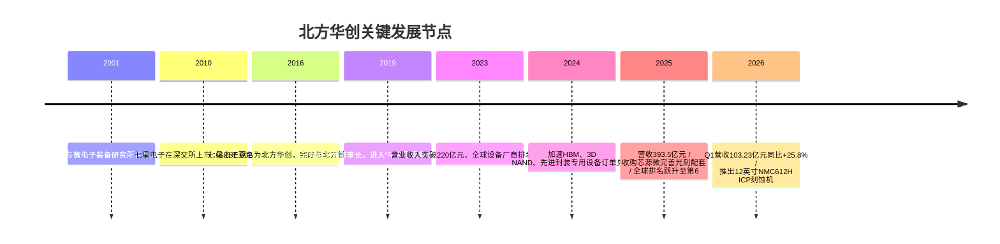
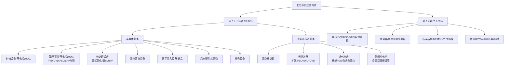
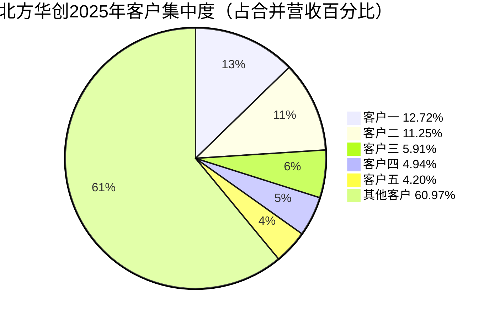
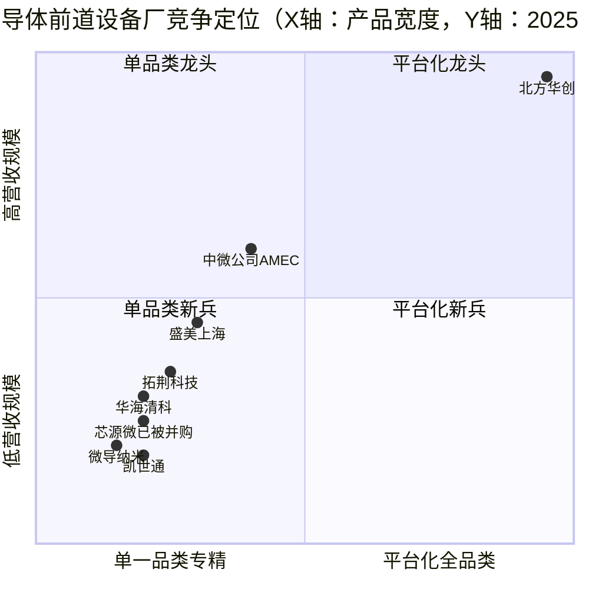
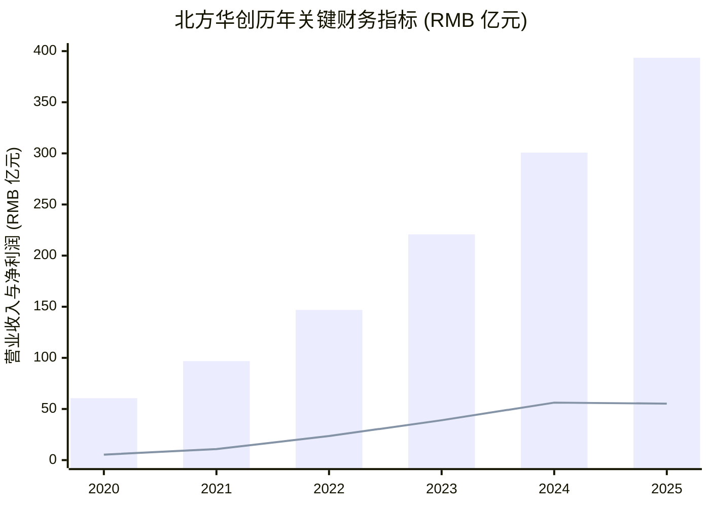

# 北方华创 (NAURA Technology Group, SZSE:002371) — 公司研究

**报告日期 / as of：** 2026-06-14
**主题归属：** memory-upcycle（存储芯片超级周期）+ 国产替代（domestic WFE localization）
**报告类型：** 深度研究 / 估值更新（中文）

---

> **投资摘要 (Investment Summary Header)** —— 以下评级、目标价、情景与论点均为 *分析师观点：*，是本报告的前瞻判断，**不**取自任何公司年度报告。
>
> | 项目 | 取值 |
> |---|---|
> | **评级 Rating** | **增持 / Overweight（OW）** |
> | **12个月目标价 12-mo PT** | **¥760（RMB）** |
> | **当前股价 Current** | ¥667.19（2026-06-12 收盘，002371.SZ） |
> | **隐含上行 Upside** | **+13.9%** |
> | **估值方法 Method** | 分部混合 P/E：半导体设备业务 38× × 2027E EPS ¥17.5 + 非设备业务折让 |
> | **市值 Market cap** | ~¥4,836亿（RMB 483.6 bn，2026-06-12） |
> | **52周区间(近似)** | ¥360 – ¥721（2025 高点）；2026 区间 ¥470 – ¥667 |
> | **股本 Shares** | 724,832,616 股 |
>
> **前瞻估值矩阵（forward valuation matrix，*分析师观点：*）** —— 注意倍数随盈利成长而压缩：
>
> | 倍数 | 2025A | 2026E | 2027E |
> |---|---|---|---|
> | EPS（RMB，*分析师观点：*） | ~7.64 | ~12.0 | ~17.5 |
> | P/E（按 ¥667.19） | ~87× | ~56× | ~38× |
> | P/S | ~12.3× | ~9.4× | ~7.3× |
> | 营收 YoY（*分析师观点：*） | +30.9% | +28% | +24% |
>
> **相对表现 (relative performance)：** 截至 2026-06-12，股价较 2025 年底约 ¥430 区间上行约 +55%，年内显著跑赢申万半导体指数；近一月（5/12→6/12）从 ¥581 升至 ¥667（+15%），动量强劲、位于 200 日均线上方 —— 这也是 GF Score 动量维度给 8/10 的依据（[Yahoo Finance: 002371.SZ 行情](https://finance.yahoo.com/quote/002371.SZ/)）。
>
> **四大投资论点 (thesis pillars，*分析师观点：*)：**
> 1. **平台型国产替代龙头**：刻蚀、薄膜沉积两大单品 2025 年各自营收超百亿元，前道核心环节覆盖率（除光刻/部分量测外）超 95%，是 A 股唯一的"全品类"WFE 平台。
> 2. **存储超级周期 + AI 资本开支双重拉动**：HBM/3D NAND/DRAM 扩产直接灌入刻蚀/沉积/电镀/键合需求，2025 年集成电路设备营收同比增长超 50%。
> 3. **盈利质量短期承压、长期改善**：2025 净利润同比 -1.8%、毛利率降 2.83pct 是研发前置 + 新品验证成本，1Q26 毛利率已环比回升 3.6pct 至 41%，拐点信号初现。
> 4. **估值已反映高确定性**：TTM P/E ~87×、2027E ~38×，相对历史中枢与全球同行均不便宜，安全边际有限——这是评级停在 OW 而非强力买入的原因。

---

## 1. 公司概览 (Company Overview)

### 1A 决策层：评级、估值与价格目标

*分析师观点：* 给予北方华创 **增持（Overweight）** 评级、**12个月目标价 ¥760**（对应当前价 ¥667.19 约 +13.9% 上行）。目标价采用**分部混合市盈率**法：占营收 93% 的电子工艺装备业务给予 38× 的 2027E P/E（介于摩根大通对设备业务给的 30× 与高盛 39.7×–44.5× 之间），元器件等非设备业务给予约 15×，加权得到 2027E EPS ¥17.5 × ~38× 的综合倍数。该目标价位于当前卖方区间（摩根士丹利 ¥600 / 摩根大通 ¥700 / 伯恩斯坦 ¥680 / 瑞银 ¥800 / 高盛 ¥818）的中位偏下，反映本报告对**毛利率修复速度**这一关键变量采取了比高盛更审慎的假设（[Yahoo Finance: 002371.SZ](https://finance.yahoo.com/quote/002371.SZ/)）。详见第 2 节的前瞻模型、价格目标推导与卖方观点演变。

北方华创科技集团股份有限公司（NAURA Technology Group Co., Ltd.，以下简称"北方华创"或"公司"）是中国大陆规模最大、产品线最完整的半导体工艺装备（semiconductor process equipment，WFE）供应商，注册地北京市朝阳区酒仙桥东路1号，办公地北京经济技术开发区文昌大道8号，A股代码 SZSE:002371，于2010年3月16日上市，前身为"七星电子"，由北京七星集团与北京电控旗下微电子设备研究所于2001年9月28日合并成立；公司2025年年度报告披露的股本总数为724,832,616股，控股股东为北京电子控股有限责任公司（北京电控）（[北方华创《2025 年年度报告全文》第9页](https://static.cninfo.com.cn/finalpage/2026-04-18/1225122918.PDF)）。

按照公司自身披露的业务结构，2025年公司分为两大业务板块：电子工艺装备（包含半导体装备与真空新能源装备）与电子元器件。其中半导体装备业务覆盖"刻蚀、薄膜沉积、热处理、湿法清洗、离子注入、涂胶显影、键合等核心工艺装备，广泛应用于集成电路、功率半导体、三维集成和先进封装、化合物半导体、新型显示等制造领域"（[北方华创《2025 年年度报告全文》第14页](https://static.cninfo.com.cn/finalpage/2026-04-18/1225122918.PDF)）。2025年报告期内，公司完成了对沈阳芯源微电子设备股份有限公司（SSE:688037，Kingsemi，下称"芯源微"）的并购整合，从而首次将涂胶显影（coater/developer，光刻配套设备）纳入产品组合，对标国际平台型巨头东京电子（TSE:8035，Tokyo Electron / TEL）的产品矩阵（[新浪财经：北方华创回应收购芯源微，2025-03-25](https://finance.sina.com.cn/stock/wbstock/2025-03-25/doc-ineqwfyk6880496.shtml)）。

从财务总量看，公司2025年营业收入393.53亿元人民币（RMB 39.35 bn），同比增长30.85%；归属于上市公司股东的净利润55.22亿元，同比下降1.77%；加权平均ROE 16.41%（2024年20.62%）；研发投入72.77亿元，占营业收入18.49%，同比增长34.74%；研发人员从4,583人扩至6,511人（+42.07%）；总资产898.01亿元，较年初增长35.31%（[北方华创《2025 年年度报告全文》第10页](https://static.cninfo.com.cn/finalpage/2026-04-18/1225122918.PDF)，[北方华创《2025 年年度报告全文》第36页](https://static.cninfo.com.cn/finalpage/2026-04-18/1225122918.PDF)）。TrendForce的统计显示，北方华创2024年全球设备厂商收入排名已从此前的第十位跃升至第六位，与LAM、AMAT、TEL、ASML、KLA等共同进入全球Top10阵营（[Digitimes: Naura ranks 6th among global semiconductor equipment providers, 2025-03-10](https://www.digitimes.com/news/a20250310PD237/naura-technology-ic-manufacturing-equipment-china-asml.html)）。

公司2025年营收结构的两个维度（按业务 / 按地区）如下两图——93.3%来自电子工艺装备、62.4%销往中部及东南部（华东+长三角晶圆厂集群）：

<svg xmlns="http://www.w3.org/2000/svg" viewBox="0 0 720 460" width="720" height="460" role="img" aria-label="revenue donut"><rect x="0" y="0" width="720" height="460" fill="#ffffff"/>
<text x="20.00" y="30.00" text-anchor="start" font-family="Helvetica,Arial,sans-serif" font-size="15" font-weight="700" fill="#1f2933">北方华创 2025 营收结构 (按业务, RMB 百万)</text>
<path d="M 288.00,107.20 A 132 132 0 1 1 234.34,118.60 L 256.29,167.94 A 78 78 0 1 0 288.00,161.20 Z" fill="#2563eb"/>
<path d="M 234.34,118.60 A 132 132 0 0 1 287.09,107.20 L 287.46,161.20 A 78 78 0 0 0 256.29,167.94 Z" fill="#15803d"/>
<path d="M 287.09,107.20 A 132 132 0 0 1 288.00,107.20 L 288.00,161.20 A 78 78 0 0 0 287.46,161.20 Z" fill="#d97706"/>
<text x="288.00" y="235.20" text-anchor="middle" font-family="Helvetica,Arial,sans-serif" font-size="18" font-weight="800" fill="#1f2933">¥393.5亿</text>
<text x="288.00" y="255.20" text-anchor="middle" font-family="Helvetica,Arial,sans-serif" font-size="13" font-weight="600" fill="#52606d">¥39.4B</text>
<text x="288.00" y="271.20" text-anchor="middle" font-family="Helvetica,Arial,sans-serif" font-size="10" font-weight="400" fill="#8a97a3">total</text>
<line x1="316.68" y1="374.19" x2="332.68" y2="374.19" stroke="#2563eb" stroke-width="1.4"/>
<text x="336.68" y="372.19" text-anchor="start" font-family="Helvetica,Arial,sans-serif" font-size="11" font-weight="700" fill="#1f2933">电子工艺装备 93.3%</text>
<text x="336.68" y="386.19" text-anchor="start" font-family="Helvetica,Arial,sans-serif" font-size="10" font-weight="400" fill="#52606d">¥36.7B  (93.3%)</text>
<line x1="258.86" y1="104.31" x2="242.86" y2="104.31" stroke="#15803d" stroke-width="1.4"/>
<text x="238.86" y="102.31" text-anchor="end" font-family="Helvetica,Arial,sans-serif" font-size="11" font-weight="700" fill="#1f2933">电子元器件 6.6%</text>
<text x="238.86" y="116.31" text-anchor="end" font-family="Helvetica,Arial,sans-serif" font-size="10" font-weight="400" fill="#52606d">¥2.6B  (6.6%)</text>
<line x1="287.53" y1="101.20" x2="271.53" y2="101.20" stroke="#d97706" stroke-width="1.4"/>
<text x="267.53" y="99.20" text-anchor="end" font-family="Helvetica,Arial,sans-serif" font-size="11" font-weight="700" fill="#1f2933">其他业务 0.1%</text>
<text x="267.53" y="113.20" text-anchor="end" font-family="Helvetica,Arial,sans-serif" font-size="10" font-weight="400" fill="#52606d">¥43.0M  (0.1%)</text>
<text x="360.00" y="444.00" text-anchor="middle" font-family="Helvetica,Arial,sans-serif" font-size="10" font-weight="400" fill="#52606d">Source: 北方华创《2025年年度报告全文》(cninfo, 2026-04-17) 第31页 营业收入构成</text>
</svg>

Source: [北方华创《2025 年年度报告全文》第31页](https://static.cninfo.com.cn/finalpage/2026-04-18/1225122918.PDF)

<svg xmlns="http://www.w3.org/2000/svg" viewBox="0 0 720 460" width="720" height="460" role="img" aria-label="revenue donut"><rect x="0" y="0" width="720" height="460" fill="#ffffff"/>
<text x="20.00" y="30.00" text-anchor="start" font-family="Helvetica,Arial,sans-serif" font-size="15" font-weight="700" fill="#1f2933">北方华创 2025 营收结构 (按地区, RMB 百万)</text>
<path d="M 288.00,107.20 A 132 132 0 1 1 195.19,333.07 L 233.16,294.67 A 78 78 0 1 0 288.00,161.20 Z" fill="#2563eb"/>
<path d="M 195.19,333.07 A 132 132 0 0 1 217.64,127.51 L 246.42,173.20 A 78 78 0 0 0 233.16,294.67 Z" fill="#15803d"/>
<path d="M 217.64,127.51 A 132 132 0 0 1 276.99,107.66 L 281.49,161.47 A 78 78 0 0 0 246.42,173.20 Z" fill="#d97706"/>
<path d="M 276.99,107.66 A 132 132 0 0 1 288.00,107.20 L 288.00,161.20 A 78 78 0 0 0 281.49,161.47 Z" fill="#7c3aed"/>
<text x="288.00" y="235.20" text-anchor="middle" font-family="Helvetica,Arial,sans-serif" font-size="18" font-weight="800" fill="#1f2933">¥393.5亿</text>
<text x="288.00" y="255.20" text-anchor="middle" font-family="Helvetica,Arial,sans-serif" font-size="13" font-weight="600" fill="#52606d">¥39.4B</text>
<text x="288.00" y="271.20" text-anchor="middle" font-family="Helvetica,Arial,sans-serif" font-size="10" font-weight="400" fill="#8a97a3">total</text>
<line x1="415.65" y1="291.65" x2="431.65" y2="291.65" stroke="#2563eb" stroke-width="1.4"/>
<text x="435.65" y="289.65" text-anchor="start" font-family="Helvetica,Arial,sans-serif" font-size="11" font-weight="700" fill="#1f2933">中部及东南部 62.4%</text>
<text x="435.65" y="303.65" text-anchor="start" font-family="Helvetica,Arial,sans-serif" font-size="10" font-weight="400" fill="#52606d">¥24.6B  (62.4%)</text>
<line x1="150.82" y1="224.22" x2="134.82" y2="224.22" stroke="#15803d" stroke-width="1.4"/>
<text x="130.82" y="222.22" text-anchor="end" font-family="Helvetica,Arial,sans-serif" font-size="11" font-weight="700" fill="#1f2933">东北及华北 28.6%</text>
<text x="130.82" y="236.22" text-anchor="end" font-family="Helvetica,Arial,sans-serif" font-size="10" font-weight="400" fill="#52606d">¥11.3B  (28.6%)</text>
<line x1="244.22" y1="108.33" x2="228.22" y2="108.33" stroke="#d97706" stroke-width="1.4"/>
<text x="224.22" y="106.33" text-anchor="end" font-family="Helvetica,Arial,sans-serif" font-size="11" font-weight="700" fill="#1f2933">西北及西南 7.6%</text>
<text x="224.22" y="120.33" text-anchor="end" font-family="Helvetica,Arial,sans-serif" font-size="10" font-weight="400" fill="#52606d">¥3.0B  (7.6%)</text>
<line x1="282.24" y1="101.32" x2="266.24" y2="101.32" stroke="#7c3aed" stroke-width="1.4"/>
<text x="262.24" y="99.32" text-anchor="end" font-family="Helvetica,Arial,sans-serif" font-size="11" font-weight="700" fill="#1f2933">其他/海外 1.3%</text>
<text x="262.24" y="113.32" text-anchor="end" font-family="Helvetica,Arial,sans-serif" font-size="10" font-weight="400" fill="#52606d">¥523.0M  (1.3%)</text>
<text x="360.00" y="444.00" text-anchor="middle" font-family="Helvetica,Arial,sans-serif" font-size="10" font-weight="400" fill="#52606d">Source: 北方华创《2025年年度报告全文》(cninfo, 2026-04-17) 第31页 营业收入构成(分地区)</text>
</svg>

Source: [北方华创《2025 年年度报告全文》第31页](https://static.cninfo.com.cn/finalpage/2026-04-18/1225122918.PDF)

从市场定位看，公司是中国半导体装备国产替代主线中的"平台型"龙头：刻蚀、薄膜沉积（PVD/CVD/ALD/电镀/外延）、热处理、湿法清洗、离子注入、涂胶显影、键合等关键前道环节均已具备12英寸量产化产品，2025年公司刻蚀设备与薄膜沉积设备单一品类营业收入均"超百亿元人民币"（[北方华创《2025 年年度报告全文》第19页](https://static.cninfo.com.cn/finalpage/2026-04-18/1225122918.PDF)，[北方华创《2025 年年度报告全文》第22页](https://static.cninfo.com.cn/finalpage/2026-04-18/1225122918.PDF)）。在memory-upcycle主题下，公司的战略意义在于：HBM、3D NAND、DRAM等存储扩产周期对刻蚀、PVD、ALD、CVD、电镀、键合、TSV专用设备的需求拉动直接受益方之一，公司年报明确披露"刻蚀、CVD、PVD、热处理、湿法清洗、电镀等设备成功适配3D NAND 与HBM 制造需求，已进入多家头部存储厂商的批量采购清单，成为其核心供应商"（[北方华创《2025 年年度报告全文》第15页](https://static.cninfo.com.cn/finalpage/2026-04-18/1225122918.PDF)）。

下图以利润表 Sankey 展示公司"如何赚钱"：393.5亿元营收中 235.7亿元为营业成本，留下约 157.8亿元毛利，再经销售/管理（50.7亿）、研发（54.4亿）等费用后，得到约 54.1亿元净利润：

<svg xmlns="http://www.w3.org/2000/svg" viewBox="0 0 1000 560" width="1000" height="560" role="img" aria-label="income statement Sankey"><rect x="0" y="0" width="1000" height="560" fill="#ffffff"/>
<text x="20.00" y="30.00" text-anchor="start" font-family="Helvetica,Arial,sans-serif" font-size="15" font-weight="700" fill="#1f2933">北方华创 2025 利润表 Sankey (RMB 百万)</text>
<path d="M 204.00,70.22 C 258.00,70.22 258.00,85.00 312.00,85.00 L 312.00,465.82 C 258.00,465.82 258.00,451.04 204.00,451.04 Z" fill="#93c5fd" fill-opacity="0.55"/>
<path d="M 452.00,78.00 C 506.00,78.00 506.00,200.19 560.00,200.19 L 560.00,252.74 C 506.00,252.74 506.00,130.55 452.00,130.55 Z" fill="#86efac" fill-opacity="0.55"/>
<path d="M 452.00,130.55 C 506.00,130.55 506.00,266.74 560.00,266.74 L 560.00,377.81 C 506.00,377.81 506.00,241.62 452.00,241.62 Z" fill="#fca5a5" fill-opacity="0.55"/>
<path d="M 328.00,85.00 C 382.00,85.00 382.00,78.00 436.00,78.00 L 436.00,241.62 C 382.00,241.62 382.00,248.62 328.00,248.62 Z" fill="#86efac" fill-opacity="0.55"/>
<path d="M 328.00,248.62 C 382.00,248.62 382.00,255.62 436.00,255.62 L 436.00,500.00 C 382.00,500.00 382.00,493.00 328.00,493.00 Z" fill="#fca5a5" fill-opacity="0.55"/>
<path d="M 700.00,182.17 C 754.00,182.17 754.00,251.70 808.00,251.70 L 808.00,307.78 C 754.00,307.78 754.00,238.24 700.00,238.24 Z" fill="#86efac" fill-opacity="0.55"/>
<path d="M 700.00,238.24 C 754.00,238.24 754.00,321.78 808.00,321.78 L 808.00,326.30 C 754.00,326.30 754.00,242.77 700.00,242.77 Z" fill="#fca5a5" fill-opacity="0.55"/>
<path d="M 576.00,200.19 C 630.00,200.19 630.00,182.17 684.00,182.17 L 684.00,234.72 C 630.00,234.72 630.00,252.74 576.00,252.74 Z" fill="#86efac" fill-opacity="0.55"/>
<path d="M 576.00,266.74 C 630.00,266.74 630.00,256.77 684.00,256.77 L 684.00,309.32 C 630.00,309.32 630.00,319.30 576.00,319.30 Z" fill="#fca5a5" fill-opacity="0.55"/>
<path d="M 576.00,319.30 C 630.00,319.30 630.00,323.32 684.00,323.32 L 684.00,379.67 C 630.00,379.67 630.00,375.64 576.00,375.64 Z" fill="#fca5a5" fill-opacity="0.55"/>
<path d="M 576.00,375.64 C 630.00,375.64 630.00,393.67 684.00,393.67 L 684.00,395.83 C 630.00,395.83 630.00,377.81 576.00,377.81 Z" fill="#fca5a5" fill-opacity="0.55"/>
<path d="M 204.00,465.04 C 258.00,465.04 258.00,465.82 312.00,465.82 L 312.00,492.55 C 258.00,492.55 258.00,491.78 204.00,491.78 Z" fill="#93c5fd" fill-opacity="0.55"/>
<path d="M 204.00,505.78 C 258.00,505.78 258.00,492.55 312.00,492.55 L 312.00,494.55 C 258.00,494.55 258.00,507.78 204.00,507.78 Z" fill="#93c5fd" fill-opacity="0.55"/>
<rect x="188.00" y="70.22" width="16" height="380.82" rx="1.5" fill="#2563eb"/>
<rect x="188.00" y="465.04" width="16" height="26.74" rx="1.5" fill="#2563eb"/>
<rect x="188.00" y="505.78" width="16" height="2.00" rx="1.5" fill="#2563eb"/>
<rect x="312.00" y="85.00" width="16" height="408.00" rx="1.5" fill="#1e3a8a"/>
<rect x="436.00" y="78.00" width="16" height="163.62" rx="1.5" fill="#15803d"/>
<rect x="436.00" y="255.62" width="16" height="244.38" rx="1.5" fill="#dc2626"/>
<rect x="560.00" y="200.19" width="16" height="52.55" rx="1.5" fill="#15803d"/>
<rect x="560.00" y="266.74" width="16" height="111.07" rx="1.5" fill="#dc2626"/>
<rect x="684.00" y="182.17" width="16" height="60.60" rx="1.5" fill="#15803d"/>
<rect x="684.00" y="256.77" width="16" height="52.55" rx="1.5" fill="#dc2626"/>
<rect x="684.00" y="323.32" width="16" height="56.35" rx="1.5" fill="#dc2626"/>
<rect x="684.00" y="393.67" width="16" height="2.17" rx="1.5" fill="#dc2626"/>
<rect x="808.00" y="251.70" width="16" height="56.08" rx="1.5" fill="#15803d"/>
<rect x="808.00" y="321.78" width="16" height="4.52" rx="1.5" fill="#dc2626"/>
<line x1="188.00" y1="260.63" x2="182.00" y2="240.85" stroke="#cbd5e1" stroke-width="1"/>
<text x="179.00" y="243.85" text-anchor="end" font-family="Helvetica,Arial,sans-serif" font-size="11.5" font-weight="700" fill="#1f2933">电子工艺装备 93.3%</text>
<text x="179.00" y="256.85" text-anchor="end" font-family="Helvetica,Arial,sans-serif" font-size="10" font-weight="400" fill="#52606d">¥36.7B  (93.3%)</text>
<line x1="188.00" y1="478.41" x2="182.00" y2="458.63" stroke="#cbd5e1" stroke-width="1"/>
<text x="179.00" y="461.63" text-anchor="end" font-family="Helvetica,Arial,sans-serif" font-size="11.5" font-weight="700" fill="#1f2933">电子元器件 6.6%</text>
<text x="179.00" y="474.63" text-anchor="end" font-family="Helvetica,Arial,sans-serif" font-size="10" font-weight="400" fill="#52606d">¥2.6B  (6.6%)</text>
<line x1="188.00" y1="506.78" x2="182.00" y2="487.00" stroke="#cbd5e1" stroke-width="1"/>
<text x="179.00" y="490.00" text-anchor="end" font-family="Helvetica,Arial,sans-serif" font-size="11.5" font-weight="700" fill="#1f2933">其他业务</text>
<text x="179.00" y="503.00" text-anchor="end" font-family="Helvetica,Arial,sans-serif" font-size="10" font-weight="400" fill="#52606d">¥43.0M  (0.11%)</text>
<rect x="331.00" y="67.00" width="106.80" height="26" rx="2" fill="#ffffff" fill-opacity="0.72"/>
<text x="334.00" y="79.00" text-anchor="start" font-family="Helvetica,Arial,sans-serif" font-size="11.5" font-weight="700" fill="#1f2933">Revenue</text>
<text x="334.00" y="92.00" text-anchor="start" font-family="Helvetica,Arial,sans-serif" font-size="10" font-weight="400" fill="#52606d">¥39.4B  (100.0%)</text>
<rect x="455.00" y="60.00" width="100.50" height="26" rx="2" fill="#ffffff" fill-opacity="0.72"/>
<text x="458.00" y="72.00" text-anchor="start" font-family="Helvetica,Arial,sans-serif" font-size="11.5" font-weight="700" fill="#1f2933">Gross Profit</text>
<text x="458.00" y="85.00" text-anchor="start" font-family="Helvetica,Arial,sans-serif" font-size="10" font-weight="400" fill="#52606d">¥15.8B  (40.1%)</text>
<rect x="455.00" y="237.62" width="144.60" height="26" rx="2" fill="#ffffff" fill-opacity="0.72"/>
<text x="458.00" y="249.62" text-anchor="start" font-family="Helvetica,Arial,sans-serif" font-size="11.5" font-weight="700" fill="#1f2933">Cost of Revenue (COGS)</text>
<text x="458.00" y="262.62" text-anchor="start" font-family="Helvetica,Arial,sans-serif" font-size="10" font-weight="400" fill="#52606d">¥23.6B  (59.9%)</text>
<rect x="579.00" y="182.19" width="106.80" height="26" rx="2" fill="#ffffff" fill-opacity="0.72"/>
<text x="582.00" y="194.19" text-anchor="start" font-family="Helvetica,Arial,sans-serif" font-size="11.5" font-weight="700" fill="#1f2933">Operating Income</text>
<text x="582.00" y="207.19" text-anchor="start" font-family="Helvetica,Arial,sans-serif" font-size="10" font-weight="400" fill="#52606d">¥5.1B  (12.9%)</text>
<rect x="579.00" y="248.74" width="150.90" height="26" rx="2" fill="#ffffff" fill-opacity="0.72"/>
<text x="582.00" y="260.74" text-anchor="start" font-family="Helvetica,Arial,sans-serif" font-size="11.5" font-weight="700" fill="#1f2933">Total Operating Expense</text>
<text x="582.00" y="273.74" text-anchor="start" font-family="Helvetica,Arial,sans-serif" font-size="10" font-weight="400" fill="#52606d">¥10.7B  (27.2%)</text>
<rect x="703.00" y="164.17" width="94.20" height="26" rx="2" fill="#ffffff" fill-opacity="0.72"/>
<text x="706.00" y="176.17" text-anchor="start" font-family="Helvetica,Arial,sans-serif" font-size="11.5" font-weight="700" fill="#1f2933">Pretax Income</text>
<text x="706.00" y="189.17" text-anchor="start" font-family="Helvetica,Arial,sans-serif" font-size="10" font-weight="400" fill="#52606d">¥5.8B  (14.9%)</text>
<rect x="703.00" y="238.77" width="94.20" height="26" rx="2" fill="#ffffff" fill-opacity="0.72"/>
<text x="706.00" y="250.77" text-anchor="start" font-family="Helvetica,Arial,sans-serif" font-size="11.5" font-weight="700" fill="#1f2933">SG&amp;A</text>
<text x="706.00" y="263.77" text-anchor="start" font-family="Helvetica,Arial,sans-serif" font-size="10" font-weight="400" fill="#52606d">¥5.1B  (12.9%)</text>
<rect x="703.00" y="305.32" width="94.20" height="26" rx="2" fill="#ffffff" fill-opacity="0.72"/>
<text x="706.00" y="317.32" text-anchor="start" font-family="Helvetica,Arial,sans-serif" font-size="11.5" font-weight="700" fill="#1f2933">R&amp;D</text>
<text x="706.00" y="330.32" text-anchor="start" font-family="Helvetica,Arial,sans-serif" font-size="10" font-weight="400" fill="#52606d">¥5.4B  (13.8%)</text>
<rect x="703.00" y="375.67" width="106.80" height="26" rx="2" fill="#ffffff" fill-opacity="0.72"/>
<text x="706.00" y="387.67" text-anchor="start" font-family="Helvetica,Arial,sans-serif" font-size="11.5" font-weight="700" fill="#1f2933">Other OpEx</text>
<text x="706.00" y="400.67" text-anchor="start" font-family="Helvetica,Arial,sans-serif" font-size="10" font-weight="400" fill="#52606d">¥209.0M  (0.53%)</text>
<text x="833.00" y="276.74" text-anchor="start" font-family="Helvetica,Arial,sans-serif" font-size="11.5" font-weight="700" fill="#1f2933">Net Income</text>
<text x="833.00" y="289.74" text-anchor="start" font-family="Helvetica,Arial,sans-serif" font-size="10" font-weight="400" fill="#52606d">¥5.4B  (13.7%)</text>
<text x="833.00" y="321.04" text-anchor="start" font-family="Helvetica,Arial,sans-serif" font-size="11.5" font-weight="700" fill="#1f2933">Income Tax</text>
<text x="833.00" y="334.04" text-anchor="start" font-family="Helvetica,Arial,sans-serif" font-size="10" font-weight="400" fill="#52606d">¥436.0M  (1.1%)</text>
<text x="500.00" y="544.00" text-anchor="middle" font-family="Helvetica,Arial,sans-serif" font-size="10" font-weight="400" fill="#52606d">Source: 北方华创《2025年年度报告全文》(cninfo, 2026-04-17) 合并利润表/资产负债表/现金流量表</text>
</svg>

Source: [北方华创《2025 年年度报告全文》合并利润表，第10、31页（销售/管理/研发/财务费用明细）](https://static.cninfo.com.cn/finalpage/2026-04-18/1225122918.PDF)

历史营收（2021–2025，按业务拆分）显示电子工艺装备的高速放量是增长主引擎，5年营收复合增速约45%：

<svg xmlns="http://www.w3.org/2000/svg" viewBox="0 0 860 470" width="860" height="470" role="img" aria-label="historical revenue bars"><rect x="0" y="0" width="860" height="470" fill="#ffffff"/>
<text x="20.00" y="30.00" text-anchor="start" font-family="Helvetica,Arial,sans-serif" font-size="15" font-weight="700" fill="#1f2933">北方华创 2021–2025 营业收入 (按业务, RMB 百万)</text>
<rect x="20.00" y="44" width="11" height="11" rx="2" fill="#2563eb"/>
<text x="36.00" y="53.00" text-anchor="start" font-family="Helvetica,Arial,sans-serif" font-size="10.5" font-weight="400" fill="#1f2933">电子工艺装备</text>
<rect x="89.60" y="44" width="11" height="11" rx="2" fill="#15803d"/>
<text x="105.60" y="53.00" text-anchor="start" font-family="Helvetica,Arial,sans-serif" font-size="10.5" font-weight="400" fill="#1f2933">电子元器件+其他</text>
<line x1="70" y1="412.00" x2="834" y2="412.00" stroke="#eceff2" stroke-width="1"/>
<text x="64.00" y="415.00" text-anchor="end" font-family="Helvetica,Arial,sans-serif" font-size="9.5" font-weight="400" fill="#52606d">¥0</text>
<line x1="70" y1="345.20" x2="834" y2="345.20" stroke="#eceff2" stroke-width="1"/>
<text x="64.00" y="348.20" text-anchor="end" font-family="Helvetica,Arial,sans-serif" font-size="9.5" font-weight="400" fill="#52606d">¥8.5B</text>
<line x1="70" y1="278.40" x2="834" y2="278.40" stroke="#eceff2" stroke-width="1"/>
<text x="64.00" y="281.40" text-anchor="end" font-family="Helvetica,Arial,sans-serif" font-size="9.5" font-weight="400" fill="#52606d">¥17.0B</text>
<line x1="70" y1="211.60" x2="834" y2="211.60" stroke="#eceff2" stroke-width="1"/>
<text x="64.00" y="214.60" text-anchor="end" font-family="Helvetica,Arial,sans-serif" font-size="9.5" font-weight="400" fill="#52606d">¥25.5B</text>
<line x1="70" y1="144.80" x2="834" y2="144.80" stroke="#eceff2" stroke-width="1"/>
<text x="64.00" y="147.80" text-anchor="end" font-family="Helvetica,Arial,sans-serif" font-size="9.5" font-weight="400" fill="#52606d">¥34.0B</text>
<line x1="70" y1="78.00" x2="834" y2="78.00" stroke="#eceff2" stroke-width="1"/>
<text x="64.00" y="81.00" text-anchor="end" font-family="Helvetica,Arial,sans-serif" font-size="9.5" font-weight="400" fill="#52606d">¥42.5B</text>
<rect x="102.09" y="345.99" width="88.62" height="66.01" fill="#2563eb"/>
<rect x="102.09" y="335.91" width="88.62" height="10.08" fill="#15803d"/>
<text x="146.40" y="428.00" text-anchor="middle" font-family="Helvetica,Arial,sans-serif" font-size="10" font-weight="400" fill="#52606d">2021</text>
<rect x="254.89" y="309.05" width="88.62" height="102.95" fill="#2563eb"/>
<rect x="254.89" y="296.57" width="88.62" height="12.48" fill="#15803d"/>
<text x="299.20" y="428.00" text-anchor="middle" font-family="Helvetica,Arial,sans-serif" font-size="10" font-weight="400" fill="#52606d">2022</text>
<rect x="407.69" y="254.04" width="88.62" height="157.96" fill="#2563eb"/>
<rect x="407.69" y="238.49" width="88.62" height="15.55" fill="#15803d"/>
<text x="452.00" y="428.00" text-anchor="middle" font-family="Helvetica,Arial,sans-serif" font-size="10" font-weight="400" fill="#52606d">2023</text>
<rect x="560.49" y="194.26" width="88.62" height="217.74" fill="#2563eb"/>
<rect x="560.49" y="175.65" width="88.62" height="18.61" fill="#15803d"/>
<text x="604.80" y="428.00" text-anchor="middle" font-family="Helvetica,Arial,sans-serif" font-size="10" font-weight="400" fill="#52606d">2024</text>
<rect x="713.29" y="123.35" width="88.62" height="288.65" fill="#2563eb"/>
<rect x="713.29" y="102.74" width="88.62" height="20.61" fill="#15803d"/>
<text x="757.60" y="428.00" text-anchor="middle" font-family="Helvetica,Arial,sans-serif" font-size="10" font-weight="400" fill="#52606d">2025</text>
<text x="430.00" y="454.00" text-anchor="middle" font-family="Helvetica,Arial,sans-serif" font-size="10" font-weight="400" fill="#52606d">Source: 北方华创《2025年年度报告全文》(cninfo, 2026-04-17) 第10、31页 + 历年年度报告</text>
</svg>

Source: [北方华创《2025 年年度报告全文》第10、31页 + 公司历年年度报告](https://static.cninfo.com.cn/finalpage/2026-04-18/1225122918.PDF)

### 1B GF Score 基本面评分卡 (GuruFocus-style)

*分析师观点：* 下方五维评分卡（financial strength / profitability / growth / GF value / momentum，各0–10）与综合 GF Score 均为分析师自有评分体系的输出，**不**取自 GuruFocus 已发布数值，也**不**附任何年报引用；每个维度背后的指标（margins / leverage / CAGR / multiples / returns）在各自段落另行引用一手来源。综合 **70/100**（51–70 区间）。

<svg xmlns="http://www.w3.org/2000/svg" viewBox="0 0 500 500" width="500" height="500" role="img" aria-label="GF Score radar">
<rect x="0" y="0" width="500" height="500" fill="#ffffff"/>
<text x="20" y="24" font-family="Helvetica,Arial,sans-serif" font-size="15" font-weight="700" fill="#1f2933">GF Score (GuruFocus-style): 70/100</text>
<text x="20" y="41" font-family="Helvetica,Arial,sans-serif" font-size="11" fill="#52606d">51–70 Poor future performance potential</text>
<polygon points="250.0,88.0 392.7,191.6 338.2,359.4 161.8,359.4 107.3,191.6" fill="#e9f5ec" stroke="none"/>
<polygon points="250.0,208.0 278.5,228.7 267.6,262.3 232.4,262.3 221.5,228.7" fill="none" stroke="#c5d3cb" stroke-width="1"/>
<polygon points="250.0,178.0 307.1,219.5 285.3,286.5 214.7,286.5 192.9,219.5" fill="none" stroke="#c5d3cb" stroke-width="1"/>
<polygon points="250.0,148.0 335.6,210.2 302.9,310.8 197.1,310.8 164.4,210.2" fill="none" stroke="#c5d3cb" stroke-width="1"/>
<polygon points="250.0,118.0 364.1,200.9 320.5,335.1 179.5,335.1 135.9,200.9" fill="none" stroke="#c5d3cb" stroke-width="1"/>
<polygon points="250.0,88.0 392.7,191.6 338.2,359.4 161.8,359.4 107.3,191.6" fill="none" stroke="#c5d3cb" stroke-width="1.3"/>
<line x1="250" y1="238" x2="161.8" y2="359.4" stroke="#cfdad3" stroke-width="1"/>
<text x="146.5" y="392.4" text-anchor="end" font-family="Helvetica,Arial,sans-serif" font-size="11.5" font-weight="600" fill="#1f2933">财务实力</text>
<text x="188.3" y="316.9" text-anchor="middle" font-family="Helvetica,Arial,sans-serif" font-size="10.5" font-weight="700" fill="#1f2933">7</text>
<line x1="250" y1="238" x2="250.0" y2="88.0" stroke="#cfdad3" stroke-width="1"/>
<text x="250.0" y="58.0" text-anchor="middle" font-family="Helvetica,Arial,sans-serif" font-size="11.5" font-weight="600" fill="#1f2933">盈利能力</text>
<text x="250.0" y="142.0" text-anchor="middle" font-family="Helvetica,Arial,sans-serif" font-size="10.5" font-weight="700" fill="#1f2933">6</text>
<line x1="250" y1="238" x2="107.3" y2="191.6" stroke="#cfdad3" stroke-width="1"/>
<text x="82.6" y="183.6" text-anchor="end" font-family="Helvetica,Arial,sans-serif" font-size="11.5" font-weight="600" fill="#1f2933">成长性</text>
<text x="121.6" y="190.3" text-anchor="middle" font-family="Helvetica,Arial,sans-serif" font-size="10.5" font-weight="700" fill="#1f2933">9</text>
<line x1="250" y1="238" x2="392.7" y2="191.6" stroke="#cfdad3" stroke-width="1"/>
<text x="417.4" y="183.6" text-anchor="start" font-family="Helvetica,Arial,sans-serif" font-size="11.5" font-weight="600" fill="#1f2933">估值</text>
<text x="307.1" y="213.5" text-anchor="middle" font-family="Helvetica,Arial,sans-serif" font-size="10.5" font-weight="700" fill="#1f2933">4</text>
<line x1="250" y1="238" x2="338.2" y2="359.4" stroke="#cfdad3" stroke-width="1"/>
<text x="353.5" y="392.4" text-anchor="start" font-family="Helvetica,Arial,sans-serif" font-size="11.5" font-weight="600" fill="#1f2933">动量</text>
<text x="320.5" y="329.1" text-anchor="middle" font-family="Helvetica,Arial,sans-serif" font-size="10.5" font-weight="700" fill="#1f2933">8</text>
<polygon points="250.0,148.0 307.1,219.5 320.5,335.1 188.3,322.9 121.6,196.3" fill="#2e8b57" fill-opacity="0.34" stroke="#2e8b57" stroke-width="2"/>
<circle cx="188.3" cy="322.9" r="2.6" fill="#2e8b57"/>
<circle cx="250.0" cy="148.0" r="2.6" fill="#2e8b57"/>
<circle cx="121.6" cy="196.3" r="2.6" fill="#2e8b57"/>
<circle cx="307.1" cy="219.5" r="2.6" fill="#2e8b57"/>
<circle cx="320.5" cy="335.1" r="2.6" fill="#2e8b57"/>
<text x="250" y="470" text-anchor="middle" font-family="Helvetica,Arial,sans-serif" font-size="9.5" fill="#52606d">Source: 北方华创《2025年年度报告全文》· Yahoo Finance(002371.SZ) · indicators.db, as of 2026-06-14</text>
<text x="250" y="485" text-anchor="middle" font-family="Helvetica,Arial,sans-serif" font-size="9" fill="#52606d">GF Score = independent analyst rubric (*Analyst view:*) — not GuruFocus™ official number</text>
</svg>

- **财务强度 Financial Strength = 7/10。** 2025年末货币资金173.37亿元，覆盖短期借款（3.19亿）绰绰有余；但长期借款从39.46亿元飙升至129.73亿元（+228.7%），财务费用从0.63亿增至2.29亿（+264.78%），杠杆快速抬升压低评分（[北方华创《2025 年年度报告全文》第38页](https://static.cninfo.com.cn/finalpage/2026-04-18/1225122918.PDF)）。
- **盈利能力 Profitability = 6/10。** 加权平均ROE 16.41%（2024年20.62%）为良好水平，但2025年毛利率从42.93%降至40.10%（-2.83pct）、净利率从约18.7%降至约14.0%，盈利质量短期下行是扣分项（[北方华创《2025 年年度报告全文》第10页](https://static.cninfo.com.cn/finalpage/2026-04-18/1225122918.PDF)）。
- **成长性 Growth = 9/10。** 营收5年复合增速约45%，2025年集成电路设备营收同比增长超50%；前瞻看2026–2027E仍有24–28%营收增速，是评分卡最强维度（[北方华创《2025 年年度报告全文》第10页](https://static.cninfo.com.cn/finalpage/2026-04-18/1225122918.PDF)）。
- **GF Value 估值（越高越便宜）= 4/10。** TTM P/E约87×、2027E约38×、P/S约12×，相对历史中枢与全球同行均偏贵，安全边际有限，估值维度偏低（[Yahoo Finance: 002371.SZ](https://finance.yahoo.com/quote/002371.SZ/)）。
- **动量 Momentum = 8/10。** 近一月+15%、近一年约+55%、位于200日均线上方，动量强劲（[Yahoo Finance: 002371.SZ](https://finance.yahoo.com/quote/002371.SZ/)）。

## 2. 估值、前瞻模型与价格目标 (Valuation, Forward Model & Price Target)

### 2A 估值快照 (Valuation snapshot，as of 2026-06-14)

按公司2025年财报数据与公开市场行情（最近交易日2026-06-12收盘）：

- 当前股价：¥667.19；市值约¥4,836亿（RMB 483.6 bn）；股本724,832,616股
- 2025年营业收入：393.53亿元；归母净利润55.22亿元；EPS（按转增后股本）约7.64元（[北方华创《2025 年年度报告全文》第10页](https://static.cninfo.com.cn/finalpage/2026-04-18/1225122918.PDF)）
- TTM P/E ≈ 87×（按¥667.19 / EPS 7.64）；TTM P/S ≈ 12.3×；2025末加权ROE 16.41%
- 2026年Q1单季：营收103.23亿元（同比+25.8%）、归母净利润16.35亿元（同比+3.42%）、毛利率约41%（环比+3.6pct）（[新浪财经：北方华创Q1归母净利润16.35亿元，2026-04-30](https://finance.sina.com.cn/stock/zqgd/2026-04-30/doc-inhwftwn6305712.shtml)；[北方华创《2026年一季度报告》(cninfo, 2026-04-29)](https://static.cninfo.com.cn/finalpage/2026-04-30/1225259650.PDF)）

*分析师观点：* 公司TTM P/E高达约87×，主因2025年净利润受研发前置压制（分母被压低），并非"几乎无盈利"的结构性问题；以前瞻口径看2027E约38× P/E更能反映其成长性。参考同业：中微公司（SSE:688012）2025年营收123.85亿元（[中微公司2025年度业绩说明会](https://www.amec-inc.com/news/708.html)）；拓荆科技（SSE:688072）、盛美上海（SSE:688082）规模更小（[财联社：科创板半导体设备板块半年报](https://www.cls.cn/detail/2131659)）。北方华创以平台化+最大营收规模享有"龙头溢价"，但2025年净利润同比下降使市场对其施加"盈利质量折让"。

下方 DuPont 分解显示 ROE = 净利率 × 资产周转 × 权益乘数，可见公司 ROE 主要靠资产周转与适度杠杆支撑，净利率为短期拖累项：

<svg xmlns="http://www.w3.org/2000/svg" viewBox="0 0 1240 540" width="1240" height="540" role="img" aria-label="DuPont ROE decomposition"><rect x="0" y="0" width="1240" height="540" fill="#ffffff"/>
<text x="20.00" y="30.00" text-anchor="start" font-family="Helvetica,Arial,sans-serif" font-size="15" font-weight="700" fill="#1f2933">北方华创 2025 DuPont ROE 分解 (RMB 百万)</text>
<rect x="545.00" y="56.00" width="150" height="56" rx="7" fill="#1e3a8a"/>
<text x="620.00" y="76.00" text-anchor="middle" font-family="Helvetica,Arial,sans-serif" font-size="11.5" font-weight="700" fill="#ffffff">ROE</text>
<text x="620.00" y="94.00" text-anchor="middle" font-family="Helvetica,Arial,sans-serif" font-size="13" font-weight="800" fill="#ffffff">18.06%</text>
<text x="620.00" y="106.00" text-anchor="middle" font-family="Helvetica,Arial,sans-serif" font-size="8.5" font-weight="400" fill="#dbeafe">= Net Income / Avg Equity</text>
<rect x="191.60" y="168.00" width="150" height="56" rx="7" fill="#2563eb"/>
<text x="266.60" y="188.00" text-anchor="middle" font-family="Helvetica,Arial,sans-serif" font-size="11.5" font-weight="700" fill="#ffffff">Net Margin</text>
<text x="266.60" y="206.00" text-anchor="middle" font-family="Helvetica,Arial,sans-serif" font-size="13" font-weight="800" fill="#ffffff">14.03%</text>
<text x="266.60" y="218.00" text-anchor="middle" font-family="Helvetica,Arial,sans-serif" font-size="8.5" font-weight="400" fill="#dbeafe">Net Income / Revenue</text>
<line x1="620.00" y1="112.00" x2="266.60" y2="168.00" stroke="#94a3b8" stroke-width="1.4"/>
<rect x="545.00" y="168.00" width="150" height="56" rx="7" fill="#2563eb"/>
<text x="620.00" y="188.00" text-anchor="middle" font-family="Helvetica,Arial,sans-serif" font-size="11.5" font-weight="700" fill="#ffffff">Asset Turnover</text>
<text x="620.00" y="206.00" text-anchor="middle" font-family="Helvetica,Arial,sans-serif" font-size="13" font-weight="800" fill="#ffffff">0.50</text>
<text x="620.00" y="218.00" text-anchor="middle" font-family="Helvetica,Arial,sans-serif" font-size="8.5" font-weight="400" fill="#dbeafe">Revenue / Avg Assets</text>
<line x1="620.00" y1="112.00" x2="620.00" y2="168.00" stroke="#94a3b8" stroke-width="1.4"/>
<rect x="898.40" y="168.00" width="150" height="56" rx="7" fill="#2563eb"/>
<text x="973.40" y="188.00" text-anchor="middle" font-family="Helvetica,Arial,sans-serif" font-size="11.5" font-weight="700" fill="#ffffff">Equity Multiplier</text>
<text x="973.40" y="206.00" text-anchor="middle" font-family="Helvetica,Arial,sans-serif" font-size="13" font-weight="800" fill="#ffffff">2.55</text>
<text x="973.40" y="218.00" text-anchor="middle" font-family="Helvetica,Arial,sans-serif" font-size="8.5" font-weight="400" fill="#dbeafe">Avg Assets / Avg Equity</text>
<line x1="620.00" y1="112.00" x2="973.40" y2="168.00" stroke="#94a3b8" stroke-width="1.4"/>
<circle cx="443.30" cy="196.00" r="11" fill="#ffffff" stroke="#94a3b8" stroke-width="1.2"/>
<text x="443.30" y="201.00" text-anchor="middle" font-family="Helvetica,Arial,sans-serif" font-size="14" font-weight="800" fill="#52606d">×</text>
<circle cx="796.70" cy="196.00" r="11" fill="#ffffff" stroke="#94a3b8" stroke-width="1.2"/>
<text x="796.70" y="201.00" text-anchor="middle" font-family="Helvetica,Arial,sans-serif" font-size="14" font-weight="800" fill="#52606d">×</text>
<rect x="65.00" y="300.00" width="118" height="56" rx="7" fill="#2563eb"/>
<text x="124.00" y="320.00" text-anchor="middle" font-family="Helvetica,Arial,sans-serif" font-size="11.5" font-weight="700" fill="#ffffff">Operating Margin</text>
<text x="124.00" y="338.00" text-anchor="middle" font-family="Helvetica,Arial,sans-serif" font-size="13" font-weight="800" fill="#ffffff">12.88%</text>
<text x="124.00" y="350.00" text-anchor="middle" font-family="Helvetica,Arial,sans-serif" font-size="8.5" font-weight="400" fill="#dbeafe">Op Inc / Revenue</text>
<line x1="266.60" y1="224.00" x2="124.00" y2="300.00" stroke="#94a3b8" stroke-width="1.4"/>
<rect x="207.60" y="300.00" width="118" height="56" rx="7" fill="#2563eb"/>
<text x="266.60" y="320.00" text-anchor="middle" font-family="Helvetica,Arial,sans-serif" font-size="11.5" font-weight="700" fill="#ffffff">Tax Burden</text>
<text x="266.60" y="338.00" text-anchor="middle" font-family="Helvetica,Arial,sans-serif" font-size="13" font-weight="800" fill="#ffffff">0.9447</text>
<text x="266.60" y="350.00" text-anchor="middle" font-family="Helvetica,Arial,sans-serif" font-size="8.5" font-weight="400" fill="#dbeafe">Net Inc / Pretax</text>
<line x1="266.60" y1="224.00" x2="266.60" y2="300.00" stroke="#94a3b8" stroke-width="1.4"/>
<rect x="350.20" y="300.00" width="118" height="56" rx="7" fill="#2563eb"/>
<text x="409.20" y="320.00" text-anchor="middle" font-family="Helvetica,Arial,sans-serif" font-size="11.5" font-weight="700" fill="#ffffff">Interest Burden</text>
<text x="409.20" y="338.00" text-anchor="middle" font-family="Helvetica,Arial,sans-serif" font-size="13" font-weight="800" fill="#ffffff">1.1531</text>
<text x="409.20" y="350.00" text-anchor="middle" font-family="Helvetica,Arial,sans-serif" font-size="8.5" font-weight="400" fill="#dbeafe">Pretax / Op Inc</text>
<line x1="266.60" y1="224.00" x2="409.20" y2="300.00" stroke="#94a3b8" stroke-width="1.4"/>
<circle cx="195.30" cy="328.00" r="11" fill="#ffffff" stroke="#94a3b8" stroke-width="1.2"/>
<text x="195.30" y="333.00" text-anchor="middle" font-family="Helvetica,Arial,sans-serif" font-size="14" font-weight="800" fill="#52606d">×</text>
<circle cx="337.90" cy="328.00" r="11" fill="#ffffff" stroke="#94a3b8" stroke-width="1.2"/>
<text x="337.90" y="333.00" text-anchor="middle" font-family="Helvetica,Arial,sans-serif" font-size="14" font-weight="800" fill="#52606d">×</text>
<rect x="479.00" y="300.00" width="118" height="56" rx="7" fill="#2563eb"/>
<text x="538.00" y="326.00" text-anchor="middle" font-family="Helvetica,Arial,sans-serif" font-size="11.5" font-weight="700" fill="#ffffff">Revenue</text>
<text x="538.00" y="342.00" text-anchor="middle" font-family="Helvetica,Arial,sans-serif" font-size="13" font-weight="800" fill="#ffffff">¥39.4B</text>
<line x1="620.00" y1="224.00" x2="538.00" y2="300.00" stroke="#94a3b8" stroke-width="1.4"/>
<rect x="643.00" y="300.00" width="118" height="56" rx="7" fill="#2563eb"/>
<text x="702.00" y="320.00" text-anchor="middle" font-family="Helvetica,Arial,sans-serif" font-size="11.5" font-weight="700" fill="#ffffff">Avg Total Assets</text>
<text x="702.00" y="338.00" text-anchor="middle" font-family="Helvetica,Arial,sans-serif" font-size="13" font-weight="800" fill="#ffffff">¥78.1B</text>
<text x="702.00" y="350.00" text-anchor="middle" font-family="Helvetica,Arial,sans-serif" font-size="8.5" font-weight="400" fill="#dbeafe">(begin+end)/2</text>
<line x1="620.00" y1="224.00" x2="702.00" y2="300.00" stroke="#94a3b8" stroke-width="1.4"/>
<circle cx="620.00" cy="328.00" r="11" fill="#ffffff" stroke="#94a3b8" stroke-width="1.2"/>
<text x="620.00" y="333.00" text-anchor="middle" font-family="Helvetica,Arial,sans-serif" font-size="14" font-weight="800" fill="#52606d">÷</text>
<rect x="832.40" y="300.00" width="118" height="56" rx="7" fill="#2563eb"/>
<text x="891.40" y="320.00" text-anchor="middle" font-family="Helvetica,Arial,sans-serif" font-size="11.5" font-weight="700" fill="#ffffff">Avg Total Assets</text>
<text x="891.40" y="338.00" text-anchor="middle" font-family="Helvetica,Arial,sans-serif" font-size="13" font-weight="800" fill="#ffffff">¥78.1B</text>
<text x="891.40" y="350.00" text-anchor="middle" font-family="Helvetica,Arial,sans-serif" font-size="8.5" font-weight="400" fill="#dbeafe">(begin+end)/2</text>
<line x1="973.40" y1="224.00" x2="891.40" y2="300.00" stroke="#94a3b8" stroke-width="1.4"/>
<rect x="996.40" y="300.00" width="118" height="56" rx="7" fill="#2563eb"/>
<text x="1055.40" y="320.00" text-anchor="middle" font-family="Helvetica,Arial,sans-serif" font-size="11.5" font-weight="700" fill="#ffffff">Avg Total Equity</text>
<text x="1055.40" y="338.00" text-anchor="middle" font-family="Helvetica,Arial,sans-serif" font-size="13" font-weight="800" fill="#ffffff">¥30.6B</text>
<text x="1055.40" y="350.00" text-anchor="middle" font-family="Helvetica,Arial,sans-serif" font-size="8.5" font-weight="400" fill="#dbeafe">(begin+end)/2</text>
<line x1="973.40" y1="224.00" x2="1055.40" y2="300.00" stroke="#94a3b8" stroke-width="1.4"/>
<circle cx="967.20" cy="328.00" r="11" fill="#ffffff" stroke="#94a3b8" stroke-width="1.2"/>
<text x="967.20" y="333.00" text-anchor="middle" font-family="Helvetica,Arial,sans-serif" font-size="14" font-weight="800" fill="#52606d">÷</text>
<rect x="69.00" y="420.00" width="110" height="48" rx="7" fill="#3b82f6"/>
<text x="124.00" y="442.00" text-anchor="middle" font-family="Helvetica,Arial,sans-serif" font-size="11.5" font-weight="700" fill="#ffffff">Operating Income</text>
<text x="124.00" y="458.00" text-anchor="middle" font-family="Helvetica,Arial,sans-serif" font-size="13" font-weight="800" fill="#ffffff">¥5.1B</text>
<line x1="124.00" y1="356.00" x2="124.00" y2="420.00" stroke="#94a3b8" stroke-width="1.4"/>
<rect x="211.60" y="420.00" width="110" height="48" rx="7" fill="#3b82f6"/>
<text x="266.60" y="442.00" text-anchor="middle" font-family="Helvetica,Arial,sans-serif" font-size="11.5" font-weight="700" fill="#ffffff">Net Income</text>
<text x="266.60" y="458.00" text-anchor="middle" font-family="Helvetica,Arial,sans-serif" font-size="13" font-weight="800" fill="#ffffff">¥5.5B</text>
<line x1="266.60" y1="356.00" x2="266.60" y2="420.00" stroke="#94a3b8" stroke-width="1.4"/>
<rect x="354.20" y="420.00" width="110" height="48" rx="7" fill="#3b82f6"/>
<text x="409.20" y="442.00" text-anchor="middle" font-family="Helvetica,Arial,sans-serif" font-size="11.5" font-weight="700" fill="#ffffff">Pretax Income</text>
<text x="409.20" y="458.00" text-anchor="middle" font-family="Helvetica,Arial,sans-serif" font-size="13" font-weight="800" fill="#ffffff">¥5.8B</text>
<line x1="409.20" y1="356.00" x2="409.20" y2="420.00" stroke="#94a3b8" stroke-width="1.4"/>
<text x="620.00" y="524.00" text-anchor="middle" font-family="Helvetica,Arial,sans-serif" font-size="10" font-weight="400" fill="#52606d">Source: 北方华创《2025年年度报告全文》(cninfo, 2026-04-17) 合并利润表/资产负债表</text>
</svg>

Source: [北方华创《2025 年年度报告全文》合并利润表 / 合并资产负债表](https://static.cninfo.com.cn/finalpage/2026-04-18/1225122918.PDF)

### 2B 前瞻财务估算 (Forward estimates，3年，*分析师观点：*)

下表每一格（除2025A实际值外）均为 *分析师观点：*，绝非取自年报；驱动假设的外部依据在脚注逐项引用。

| 指标 (RMB) | 2025A | 2026E | 2027E |
|---|---|---|---|
| 营业收入（亿元） | 393.5 | ~504 | ~625 |
| 营收 YoY | +30.9% | +28% | +24% |
| 毛利率 gross margin | 40.1% | ~40.3% | ~40.8% |
| 归母净利率 net margin | ~14.0% | ~17.2% | ~20.3% |
| 归母净利润（亿元） | 55.2 | ~87 | ~127 |
| EPS（元） | ~7.64 | ~12.0 | ~17.5 |

驱动假设与外部依据：（1）营收增速：以2025年集成电路设备营收同比增长超50%为基础（[北方华创《2025 年年度报告全文》第10页](https://static.cninfo.com.cn/finalpage/2026-04-18/1225122918.PDF)），叠加存储超级周期+国内晶圆厂扩产，参考摩根大通"2026–2028年营收CAGR 32%"与摩根士丹利"2025–28年营收CAGR 23%"取中（*分析师观点：* [Goldman Sachs — NAURA: Advanced tools ramp up, Buy, 2026-05-23, p.1](http://xs-macbook-air.local:5001/zsxq/pdf/184128224215222/Goldman%20Sachs-NAURA%20%EF%BC%88002371%EF%BC%89%EF%BC%9A%20Advanced%20tools%20ramp%20up%EF%BC%9B%20Strong%20orders%20on%20rising%20China%20Semis%20Capex%EF%BC%9B%20Buy-260522.pdf)）。（2）毛利率：以2025年实际40.10%（[北方华创《2025 年年度报告全文》第10页](https://static.cninfo.com.cn/finalpage/2026-04-18/1225122918.PDF)）为基，参考高盛"2026–2028年毛利率维持39.7%–40.9%"的判断小幅修复（*分析师观点：* 同上GS note）。（3）EPS：与摩根士丹利2026E¥12.6/2027E¥16.8、摩根大通2026E¥11.6/2027E¥19.8区间一致（*分析师观点：* [Morgan Stanley — NAURA Risk Reward Update, 2026-04-30, p.1](http://xs-macbook-air.local:5001/zsxq/pdf/585585544854114/Morgan%20Stanley-NAURA%20Technology%20Group%20Co%20Ltd%EF%BC%88002371%EF%BC%89Risk%20Reward%20Update-260430.pdf)）。

### 2C 价格目标推导 (PT derivation) 与 bull/base/bear

*分析师观点：* 采用**分部混合P/E**法（与摩根大通方法一致，区分设备与非设备业务）：
- 设备业务（占营收约93%）：2027E EPS ¥17.5 × 38× P/E ≈ ¥665（设备部分贡献）
- 综合加总 + 非设备业务折让后 → **base case 目标价 ¥760**（约 38× 综合2027E P/E），对应当前价 +13.9%。
- **为什么用38×：** 全球可比设备龙头（AMAT/LRCX/TEL）前瞻P/E约20–25×，但北方华创享有更高的国产替代成长溢价；本报告取38×，低于高盛的39.7×–44.5×、与摩根大通设备业务30×+元器件15×的混合结果相近，体现对毛利率修复速度的审慎。

| 情景 | 目标价 | 隐含上行/下行 | 核心摆动假设 |
|---|---|---|---|
| **牛市 Bull** | ¥900 | +35% | 国产化超预期、2026毛利率回升至>45%、先进逻辑份额显著扩大；对应营收CAGR >35% |
| **基准 Base** | ¥760 | +13.9% | 营收CAGR ~26%、毛利率温和修复至40.8%、份额稳步提升 |
| **熊市 Bear** | ¥430 | -36% | 存储周期下行、晶圆厂扩产放缓、价格战使毛利率跌破35%、营收CAGR <15% |

（情景框架参考摩根士丹利 bull ¥850 / bear ¥336 与高盛 bear 仍 +5% 的区间，本报告独立设定，*分析师观点：*；[Morgan Stanley — NAURA Risk Reward Update, 2026-04-30, p.1](http://xs-macbook-air.local:5001/zsxq/pdf/585585544854114/Morgan%20Stanley-NAURA%20Technology%20Group%20Co%20Ltd%EF%BC%88002371%EF%BC%89Risk%20Reward%20Update-260430.pdf)）

### 2D 与市场一致预期的对比 (vs consensus)

*分析师观点：* 本报告base目标价¥760位于卖方区间（¥600–¥818）的中位，2027E EPS¥17.5与摩根士丹利¥16.8、摩根大通¥19.8基本一致、略高于MS、略低于JPM。当前卖方对NAURA一致看多（11家覆盖机构全部Buy/Overweight/Outperform），无一家给出中性或卖出——这意味着**预期已较充分**，本报告的+13.9%上行相对克制，正是基于这一拥挤的多头定位。

### 2E 卖方观点演变 (Sell-side view evolution)

> 机械化前置：先读 `db/stock_price_target.db`（只读）——该表为NAURA存有21条PT记录（2026-03至2026-06），PT分布 min ¥550.8（瑞银4月）/ median ~¥680 / max ¥818（高盛、摩根士丹利5月），离散度约 ±19%；评级**清一色看多**（GS/UBS Buy、MS/JPM Overweight、Bernstein Outperform）。每条记录均含报告日收盘价与upside%，下表的"报告日价/上行"即来自该表。

**按机构的观点时间线（4月→6月，重点标注自我修正与触发因素）：**

| 机构 | 日期 | 评级 / 目标价 | 报告日价 / 上行 | 核心论点与修正 |
|---|---|---|---|---|
| 高盛 GS | 2026-05-23 | Buy / **¥818**（自¥719上调） | ¥669 / +22% | 先进设备上量、订单强劲；上调2027–28盈利各2%；对应2027E PE 44.5×（[GS, 2026-05-23, p.1](http://xs-macbook-air.local:5001/zsxq/pdf/184128224215222/Goldman%20Sachs-NAURA%20%EF%BC%88002371%EF%BC%89%EF%BC%9A%20Advanced%20tools%20ramp%20up%EF%BC%9B%20Strong%20orders%20on%20rising%20China%20Semis%20Capex%EF%BC%9B%20Buy-260522.pdf)） |
| 瑞银 UBS | 2026-05-26 | Buy / **¥800** | ¥670 / +19% | 中国WFE 2027/28 +18%/+14%；DRAM国产化、存储资本开支加速（[UBS 中国半导体设备, 2026-05-26](http://xs-macbook-air.local:5001/zsxq/pdf/212451212244481/%E7%91%9E%E9%93%B6%E2%80%94%E4%B8%AD%E5%9B%BD%E5%8D%8A%E5%AF%BC%E4%BD%93%E8%AE%BE%E5%A4%87%EF%BC%9A2027-28%E5%B9%B4%E5%A2%9E%E9%95%BF%E5%8F%AF%E8%A7%81%E5%BA%A6%E6%94%B9%E5%96%84%EF%BC%8C%E5%BC%BA%E5%8C%96%E5%BB%BA%E8%AE%BE%E6%80%A7%E8%A7%82%E7%82%B9.pdf)） |
| 摩根士丹利 MS | 2026-05-27 | Overweight / **¥818**（自¥600上调） | ¥655 / +25% | 双重催化：存储扩产 + 华为t-Law；从RIM ¥600大幅上调（[MS Greater China Semis, 2026-05-27](http://xs-macbook-air.local:5001/zsxq/pdf/415241112254128/MS-Greater%20China%20Semiconductors%20Double%20Catalysts%20from%20Memory%20Expansion%20and%20Huawei%27s%20t%20%28Tau%29-Law-260527.pdf)） |
| 伯恩斯坦 Bernstein | 2026-05-28 | Outperform | ¥659 | 中国WFE国产化率21%；薄膜/刻蚀领跑（[Bernstein China Semicap 2025 WFE, 2026-05-28](http://xs-macbook-air.local:5001/zsxq/pdf/415241121822528/Bernstein-China%20Semiconductors%EF%BC%9AChina%20Semicap%EF%BC%9A%202025%20WFE%20Competitive%20dynamics%20in%20China-260528.pdf)） |
| 伯恩斯坦 Bernstein | 2026-06-12 | Outperform / **¥680** | — | 日系设备在华份额回升逻辑里，维持NAURA OP、TP ¥680（[Bernstein Japan Semi Equipment, 2026-06-12](http://xs-macbook-air.local:5001/zsxq/pdf/412455442528458/Bernstein-Japan%20Semi%20Equipment%EF%BC%9A%20Potentially%20reversing%20share%20loss%20in%20China%EF%BC%9F-260612.pdf)） |

**关键的同机构自我修正：**
- **高盛连续上调：** ¥572（3月）→ ¥638（5/4）→ ¥719（5/12）→ ¥818（5/23），触发因素是"中国AI资本开支提速 + 先进制程新品（NMC612H ICP刻蚀机、混合键合）放量"（[GS, 2026-05-12, p.1](http://xs-macbook-air.local:5001/zsxq/pdf/415245814228558/Goldman%20Sachs-NAURA%20%EF%BC%88002371.SZ%EF%BC%89%EF%BC%9A%20AI%20capex%20ramp~up%20in%20China%20drives%20growth%20ahead%EF%BC%9B%20advanced%20node%20SPE%20and%20new%20products%20in%20expansion%EF%BC%9B%20Buy-260512.pdf)）。
- **摩根士丹利 ¥600→¥818：** 尽管因研发前置下调2026/27 EPS各14%/6%，却因2028E EPS¥20.3的长期成长 + 模型滚动而**上调**目标价，是典型的"短空长多"修正（[MS Risk Reward, 2026-04-30, p.1](http://xs-macbook-air.local:5001/zsxq/pdf/585585544854114/Morgan%20Stanley-NAURA%20Technology%20Group%20Co%20Ltd%EF%BC%88002371%EF%BC%89Risk%20Reward%20Update-260430.pdf)）。
- **摩根大通 ¥610→¥700：** 1Q26毛利率企稳（环比+3.6pct至41%）缓解利润率焦虑，上调营收预测，但因研发/人力成本上升下调2026/27净利各18%/6%（[J.P. Morgan — NAURA, 2026-04-30, p.1](http://xs-macbook-air.local:5001/zsxq/pdf/212212244124541/J.P.%20Morgan-NAURA~A%EF%BC%88002371%EF%BC%89Near~term%20expense%20burden%20not%20shading%20long~term%20thesis%EF%BC%9B%20maintain%20OW-260430.pdf)）。

**机构间分歧（评级一致、估值方法分歧）：** 11家机构评级方向高度一致（全部看多），分歧集中在**目标价幅度（¥600–¥818，跨度37%）与估值方法**：

| 机构 | 日期 | 评级/PT | 估值方法 | 什么证据能证明其正确 |
|---|---|---|---|---|
| 摩根士丹利 | 5-27 | OW / ¥818 | 剩余收益模型 RIM（WACC 10.1%、中期增速14%、永续5%） | 2028E EPS兑现¥20.3、毛利率回升 |
| 高盛 | 5-23 | Buy / ¥818 | 44.5× 2027E P/E | 先进制程订单持续、新品快速上量 |
| 瑞银 | 5-26 | Buy / ¥800 | 中国WFE 2027/28 +18%/+14% | DRAM国产化落地、存储资本开支加速 |
| 摩根大通 | 4-30 | OW / ¥700 | 混合P/E（设备30×+非设备15×，2027.6E） | 1Q26毛利率企稳延续、AI芯片订单兑现 |
| 伯恩斯坦 | 6-12 | OP / ¥680 | 订单增长交易框架（>50% YoY新订单） | 新订单增速维持、2H26毛利率改善 |
| 摩根士丹利(熊市) | 4-30 | — / ¥336 | 27× 2026E P/E | 价格战使毛利率跌破35%、份额下滑 |

## 3. 公司历史 (Company History)

公司前身为"北京七星华电科技集团有限责任公司"旗下上市平台"七星电子"，七星集团本身脱胎于1968年成立的国营第七机部798厂（北京酒仙桥老电子工业基地的核心组成部分），是中国第一代电子元器件与真空设备的"国家队"企业之一。2001年9月28日，按照北京电控的产业整合方案，七星电子的电子元器件资产与新成立的"北京北方微电子基地设备工艺研究中心"在体制上整合形成最初的北方华创雏形，目的是统一承担集成电路工艺装备的国家专项立项工作（[赵晋荣百度百科](https://baike.baidu.com/item/%E8%B5%B5%E6%99%8B%E8%8D%A3/55638225)）。

2010年3月16日，七星电子（彼时主营电子元器件、模块电源、晶振、磁性材料等）在深圳证券交易所中小板挂牌上市，股票代码002371，这也是公司当前A股编号的来源（[北方华创《2025 年年度报告全文》第9页](https://static.cninfo.com.cn/finalpage/2026-04-18/1225122918.PDF)）。2016年，公司通过重大资产重组将北京北方微电子基地设备工艺研究中心有限公司（北方微电子，半导体工艺装备业务）注入上市公司，七星电子正式更名为"北方华创"，从此从"电子元器件公司"切换为"半导体装备+元器件+真空设备"的平台型公司，这一阶段是公司从单一专精装备厂走向"全品类"的关键起点（[东方财富证券《北方华创首次覆盖深度报告》, 2024-10-21](https://pdf.dfcfw.com/pdf/H3_AP202410211640388304_1.pdf)）。

2017–2019年，公司在国家"02专项"（极大规模集成电路制造装备及成套工艺）的支持下完成首批12英寸CCP/ICP刻蚀机、PVD设备、立式炉LPCVD的研发与量产化，并率先在中芯国际（HKEX:0981 / SSE:688981，SMIC）、长江存储（YMTC，未上市）、华虹半导体（HKEX:1347 / SSE:688347，Hua Hong）、华力微电子、合肥长鑫（CXMT，未上市）等本土晶圆厂的部分关键工艺产线上完成验证与批量重复采购，公司开始进入营收快速增长阶段（[东方财富证券《北方华创首次覆盖深度报告》, 2024-10-21](https://pdf.dfcfw.com/pdf/H3_AP202410211640388304_1.pdf)）。

2020–2023年，受益于美国对华半导体出口管制升级与中国晶圆厂"逆周期扩产"的双重背景，公司订单量与产能持续超出市场预期，年度营业收入从60.56亿元（2020）连续增长至220.79亿元（2023口径），归母净利润从5.37亿元增至38.99亿元（2023年）（[北方华创《2025 年年度报告全文》第10页](https://static.cninfo.com.cn/finalpage/2026-04-18/1225122918.PDF)）。这一阶段公司将"平台化设备供给+核心零部件自主可控+中高端制程突破"作为公司战略主轴。

2024–2025年是公司向"全产品矩阵 / Global Top10"跨越的关键两年。2025年公司刻蚀机、立式炉与PVD设备相继实现"累计交付突破1000台"的国产首发里程碑——年报明确披露"物理气相沉积（PVD）设备……完成第1000台整机交付；热处理领域，立式炉累计出货量突破1000台；真空新能源领域，核心设备累计出货量突破15000台"（[北方华创《2025 年年度报告全文》第17页](https://static.cninfo.com.cn/finalpage/2026-04-18/1225122918.PDF)）。2025年3月，公司同时披露以协议转让+集中竞价方式取得芯源微（SSE:688037）控制权，是2025年内首笔"A股吃A股"的半导体装备整合交易，每股交易价格88.48元，标的资产作价合计约31.35亿元，使公司成为国内唯一具备前道光刻匹配涂胶显影机量产能力的厂商（[第一财经：半导体年内首笔"A吃A"：北方华创拟"两步走"拿下芯源微控制权](https://www.yicai.com/news/102504860.html)）。截至2025年高点，公司A股股价一度达约721.60元、市值突破3,500亿元，成为A股市场半导体设备板块市值最高的标的之一（[搜狐财经：北方华创(002371)行情走势数据](https://q.stock.sohu.com/cn/002371/index.shtml)）。

## 4. 管理团队 (Management Team)

**创始与历史治理结构。** 北方华创的前身"七星电子"由北京电控将旗下国营第798厂、第706厂等电子工业基础资产整合形成，因此公司不存在通常意义上的"创始人"个人，控股股东自上市以来始终为北京电子控股有限责任公司（北京电控）——北京市国资委直属企业，2025年年度报告披露"历次控股股东的变更情况：无变更"（[北方华创《2025 年年度报告全文》第9页](https://static.cninfo.com.cn/finalpage/2026-04-18/1225122918.PDF)）。这一国有控股结构是理解公司战略行为（重资产、长周期研发、国家专项承担）的重要前提。

**现任董事长兼执行委员会主席：赵晋荣（Zhao Jinrong）。** 1964年8月出生，男，工商管理硕士，研究员级高级工程师，2019年12月起担任北方华创董事长至今，2025年报告期末持股135,000股（含资本公积转增）（[北方华创《2025 年年度报告全文》第48页](https://static.cninfo.com.cn/finalpage/2026-04-18/1225122918.PDF)）。赵晋荣职业生涯始于北京建宗机器厂总工程师、常务副厂长，此后历任北京七星华电科技集团有限责任公司副总经理、总经理，以及北京北方微电子基地设备工艺研究中心副总经理、总经理，是中国半导体装备产业从"02专项"起步阶段就深度参与的领导者之一（[中商情报网：赵晋荣个人简介](https://s.askci.com/stock/executives/002371/8b4d283c68c4eb1c.shtml)）。其同时担任中国半导体行业协会副理事长、中国电子专用设备工业协会理事长等职务，2014年入选国家"百千万人才工程"，2015年享受国务院政府特殊津贴（[中国半导体行业协会：北方华创董事长赵晋荣专访](https://web.csia.net.cn/newsinfo/6957624.html)）。赵晋荣本人在公开演讲中多次强调"芯片装备是AI的基石"的战略判断，将公司的长期产品规划与AI算力需求的演进绑定（[中国半导体行业协会：赵晋荣访谈](https://web.csia.net.cn/newsinfo/6957624.html)）。

**治理结构变化与人才战略。** 公司董事会由11名董事组成，其中独立董事4名；2025年内公司治理结构发生重要变化：2025年12月8日股东会审议通过取消监事会，将原监事会监督职能移交董事会审计委员会行使，并相应修订《公司章程》（[北方华创《2025 年年度报告全文》第47页](https://static.cninfo.com.cn/finalpage/2026-04-18/1225122918.PDF)）。报告期内公司"实施多轮股权激励等长效激励机制，2025年股权激励费用较2024年增加2.74亿元"，研发人员规模从2024年的4,583人增至6,511人（+42.07%），其中博士268人（+53.14%）、硕士4,137人（+44.15%），是国内半导体装备公司中规模最大的研发团队之一（[北方华创《2025 年年度报告全文》第11页](https://static.cninfo.com.cn/finalpage/2026-04-18/1225122918.PDF)，[北方华创《2025 年年度报告全文》第36页](https://static.cninfo.com.cn/finalpage/2026-04-18/1225122918.PDF)）。

*分析师观点：* 公司"董事长+执行委员会"双层架构、国资控股下的长期股权激励、研发人员快速扩张，构成管理层对"高研发投入、长周期回报"模式的明确背书，但同时也意味着公司决策受北京电控与北京国资委的强约束，与中微公司（AMEC）等民营背景同行相比治理灵活性较低，这是评估公司未来并购、跨境扩张时需要纳入的结构性变量。

## 5. 产品与服务 (Products & Services)

公司明确披露的业务板块为：半导体装备、真空新能源装备、精密元器件。从收入结构看，2025年电子工艺装备（半导体装备+真空新能源装备）合计收入367.31亿元，占比93.34%；电子元器件收入25.79亿元，占比6.55%；其他业务0.43亿元，占比0.11%（[北方华创《2025 年年度报告全文》第31页](https://static.cninfo.com.cn/finalpage/2026-04-18/1225122918.PDF)）。其中公司明确披露"集成电路设备的营收同比增长超50%"，是营业收入大幅增长的核心驱动（[北方华创《2025 年年度报告全文》第10页](https://static.cninfo.com.cn/finalpage/2026-04-18/1225122918.PDF)）。

### 5.1 刻蚀设备 (Etch Equipment)

**中文释义 / Plain-language gloss：** 刻蚀（etch）是半导体制造中通过等离子体（plasma）化学/物理反应选择性去除晶圆表面材料、形成微观三维结构的工艺，与光刻（lithography，光刻）共同决定芯片的关键几何尺寸。年报披露2025年刻蚀设备在集成电路设备资本支出中占比18.5%，全球市场规模约1,580亿元人民币（[北方华创《2025 年年度报告全文》第19页](https://static.cninfo.com.cn/finalpage/2026-04-18/1225122918.PDF)）。

年报原文引述公司刻蚀产品矩阵：

> "公司在刻蚀设备领域，已形成了ICP、CCP、干法去胶设备、高选择性刻蚀设备和Bevel 刻蚀设备的多系列产品布局。2025 年公司刻蚀设备营业收入超百亿元人民币。"（[北方华创《2025 年年度报告全文》第19页](https://static.cninfo.com.cn/finalpage/2026-04-18/1225122918.PDF)）

公司刻蚀产品按反应物理机理分为六个子品类：

- **12英寸ICP刻蚀设备**：基于电感耦合等离子体（Inductively Coupled Plasma），"主要用于12 英寸逻辑、存储等领域浅沟槽隔离刻蚀、栅极刻蚀、侧墙刻蚀、金属硬掩膜刻蚀、高k 值介质刻蚀、钨/钛/钽等金属及其化合物刻蚀等工艺"（[北方华创《2025 年年度报告全文》第19页](https://static.cninfo.com.cn/finalpage/2026-04-18/1225122918.PDF)）。
- **12英寸深硅刻蚀设备（Deep Si ICP）**：用于2.5D/3D先进封装硅通孔（TSV, Through Silicon Via, 硅通孔）及集成电路深槽刻蚀，是HBM堆叠互连的关键设备。
- **12英寸介质刻蚀设备（CCP, 电容耦合）**：用于逻辑芯片大马士革介质刻蚀、存储芯片台阶介质刻蚀。
- **12英寸高深宽比CCP刻蚀机**：配置超高功率射频电源，"开发了低温刻蚀和多重脉冲技术"，主要应用于HBM、3D NAND等高深宽比（HAR, High Aspect Ratio, 高纵横比）介质深孔刻蚀。
- **12英寸Bevel刻蚀机**（晶边刻蚀机）：清除晶圆边缘氧化硅、氮化硅、碳、金属等膜层，避免后续工序中边缘脱落颗粒污染主器件区。
- **12英寸高选择性化学/等离子体刻蚀机**：用于"超高选择比、无离子损伤刻蚀工艺"，对应GAA（gate-all-around, 栅极环绕）等先进逻辑节点的精密刻蚀需求。

战略意义上，刻蚀机是公司2025年单一品类首先突破100亿元营收的产品，其增量主要来自三方面：（1）国内逻辑晶圆厂中高端制程扩产；（2）3D NAND堆叠层数提升（200+ → 300+）对深孔刻蚀机的需求放大；（3）HBM专用TSV工艺对深硅刻蚀机的拉动（[北方华创《2025 年年度报告全文》第15页](https://static.cninfo.com.cn/finalpage/2026-04-18/1225122918.PDF)，[北方华创《2025 年年度报告全文》第19页](https://static.cninfo.com.cn/finalpage/2026-04-18/1225122918.PDF)）。2026年3月公司在SEMICON展上推出新一代12英寸ICP刻蚀机NMC612H，覆盖先进逻辑与存储核心工艺（*分析师观点：* [Goldman Sachs — NAURA: New 12" ICP etcher, Hybrid bonding, Buy, 2026-03-26, p.1](http://xs-macbook-air.local:5001/zsxq/pdf/212224125115521/Goldman%20Sachs-NAURA%20%EF%BC%88002371.SZ%EF%BC%89%EF%BC%9A%20New%2012%E2%80%9D%20ICP%20etcher%EF%BC%8C%20Hybrid%20bonding%20tool%20and%20AI%20system%20launched%20in%20SEMICON%EF%BC%9B%20Buy-260326.pdf)）。*分析师观点：* 在全球刻蚀市场中，LAM Research（NASDAQ:LRCX）、AMAT（NASDAQ:AMAT）、TEL（TSE:8035）三家约占90%以上份额；公司与中微公司（SSE:688012，AMEC）并称中国大陆"双雄"，其中AMEC更专注于CCP（介质刻蚀），而北方华创覆盖ICP（导体/金属/化合物刻蚀）+ CCP的更宽产品线（[TrendForce: China's Domestic Chip Equipment Adoption Beats 2025 Target, 2026-01-12](https://www.trendforce.com/news/2026/01/12/news-chinas-domestic-chip-equipment-adoption-beats-2025-target-at-35-led-by-naura-amec/)）。

### 5.2 薄膜沉积设备 (Thin-Film Deposition)

**中文释义 / Plain-language gloss：** 薄膜沉积（thin-film deposition）是通过物理/化学/电化学方式在晶圆表面生长一层或多层薄膜（金属层、介质层、外延层）的工艺，与刻蚀共同构成"沉积-刻蚀"循环，是芯片每一层结构的物质基础。年报披露2025年薄膜沉积设备在集成电路设备资本支出中占比22.0%，全球市场规模约1,870亿元人民币——是集成电路设备中支出占比最高的环节（[北方华创《2025 年年度报告全文》第22页](https://static.cninfo.com.cn/finalpage/2026-04-18/1225122918.PDF)）。

年报原文引述公司沉积设备产品矩阵：

> "公司在薄膜沉积设备领域，已形成了物理气相沉积、化学气相沉积、外延、原子层沉积、电镀和金属有机化学气相沉积设备的全系列布局。2025 年，公司薄膜沉积设备营业收入超百亿元人民币。"（[北方华创《2025 年年度报告全文》第22页](https://static.cninfo.com.cn/finalpage/2026-04-18/1225122918.PDF)）

具体产品线：

- **PVD（物理气相沉积 / Physical Vapor Deposition）**：年报披露2025年完成第1000台PVD整机交付里程碑（[北方华创《2025 年年度报告全文》第17页](https://static.cninfo.com.cn/finalpage/2026-04-18/1225122918.PDF)）。12英寸集成电路金属沉积设备（PVD）"主要用于12 英寸逻辑、存储芯片Cu（铜）互连、Al Pad（铝垫层）、Metal Hard Mask（金属硬掩膜）、Metal Gate（金属栅）、Silicide（硅化物）等金属化制程工艺"；先进封装PVD"应用于先进封装UBM、RDL、TSV 工艺的量产"（[北方华创《2025 年年度报告全文》第22页](https://static.cninfo.com.cn/finalpage/2026-04-18/1225122918.PDF)）。
- **CVD（化学气相沉积 / Chemical Vapor Deposition）**：覆盖PECVD（等离子增强）、HDPCVD（高密度等离子）、LPCVD（低压）、Tube CVD（管式）。其中12英寸先进低压化学气相硅沉积立式炉（LPCVD）2025年实现规模化量产（[北方华创《2025 年年度报告全文》第18页](https://static.cninfo.com.cn/finalpage/2026-04-18/1225122918.PDF)）。
- **ALD（原子层沉积 / Atomic Layer Deposition）**：包括D-ALD（介质ALD）、MG ALD（金属栅极ALD）、Tube ALD（管式ALD）。年报披露MG ALD"涵盖先进工艺金属栅极功函数层及刻蚀阻挡层薄膜的沉积"，是先进逻辑节点所必需的核心装备（[北方华创《2025 年年度报告全文》第21页](https://static.cninfo.com.cn/finalpage/2026-04-18/1225122918.PDF)）。
- **EPI（外延 / Epitaxy）**：12英寸硅外延、减压选择性外延，覆盖逻辑芯片源漏外延及化合物半导体外延需求。
- **ECP（电镀 / Electrochemical Plating）**：12英寸电镀设备"是集成电路和先进封装（如硅通孔、扇出型封装）的核心装备……实现高深宽比硅通孔填充"——是2025年新落地的"完全自主知识产权新产品"之一（[北方华创《2025 年年度报告全文》第18页](https://static.cninfo.com.cn/finalpage/2026-04-18/1225122918.PDF)，[北方华创《2025 年年度报告全文》第22页](https://static.cninfo.com.cn/finalpage/2026-04-18/1225122918.PDF)）。
- **MOCVD（金属有机化学气相沉积）**：用于功率、射频、光电子、Micro LED、高效光伏等器件外延生长。

战略意义：薄膜沉积设备是公司2025年另一100亿元营收级别的单品类。公司是中国大陆唯一在PVD、CVD、ALD、EPI、ECP、MOCVD全部六大子类都具备12英寸量产能力的厂商（[北方华创《2025 年年度报告全文》第22页](https://static.cninfo.com.cn/finalpage/2026-04-18/1225122918.PDF)）。*分析师观点：* 相对应竞争对手中AMAT在全球PVD/CVD合计市占率领先，LAM在ALD+电镀占据领导地位；国内拓荆科技（SSE:688072，Piotech）专注PECVD/ALD等少数子品类，2025上半年营收19.54亿元，规模与产品宽度均显著低于北方华创薄膜沉积单品年化超100亿元（[财联社：科创板半导体设备板块半年报](https://www.cls.cn/detail/2131659)）。

### 5.3 热处理 / 湿法清洗 / 离子注入 / 键合 / 涂胶显影

热处理设备2025年在集成电路设备资本支出中占比2.2%，全球市场规模约190亿元人民币（[北方华创《2025 年年度报告全文》第23页](https://static.cninfo.com.cn/finalpage/2026-04-18/1225122918.PDF)）。公司在该领域已形成管式氧化、管式退火、单片快速热处理（RTP, Rapid Thermal Processing）的全系列布局，并在2025年完成立式炉累计交付1000台的里程碑（[北方华创《2025 年年度报告全文》第17页](https://static.cninfo.com.cn/finalpage/2026-04-18/1225122918.PDF)）。立式炉（Vertical Furnace）的核心优势在于批量处理（一次处理100+片晶圆），主要应用于栅氧化层、场氧化层生长及离子注入后退火等工艺（[北方华创《2025 年年度报告全文》第23页](https://static.cninfo.com.cn/finalpage/2026-04-18/1225122918.PDF)）。

- **湿法清洗设备**：覆盖单片清洗与槽式清洗两大形态，主要竞争对手为盛美上海（SSE:688082，ACM Research）。
- **离子注入设备**：2025年公司"成功推出离子注入设备……等多款具备完全自主知识产权的新产品"，与万业企业（SSE:600641，Wanye）旗下凯世通形成国产替代竞争（[北方华创《2025 年年度报告全文》第18页](https://static.cninfo.com.cn/finalpage/2026-04-18/1225122918.PDF)）。
- **键合设备（Wafer Bonding）**：用于HBM、3D NAND堆叠等先进集成场景，是2025年新落地的产品，并向混合键合（hybrid bonding）扩展（*分析师观点：* [Goldman Sachs — NAURA Mgmt visit, Buy, 2026-05-25](http://xs-macbook-air.local:5001/zsxq/pdf/415241821142428/%E9%AB%98%E7%9B%9B%E2%80%94%E5%8C%97%E6%96%B9%E5%8D%8E%E5%88%9B%E2%80%94%E7%AE%A1%E7%90%86%E5%B1%82%E8%B0%83%E7%A0%94%EF%BC%9A%E5%85%88%E8%BF%9B%E8%AE%BE%E5%A4%87%E8%AE%A2%E5%8D%95%E5%8A%A8%E8%83%BD%E7%A8%B3%E5%81%A5%EF%BC%9B%E4%BA%A7%E5%93%81%E7%BA%BF%E5%90%91%E6%B7%B7%E5%90%88%E9%94%AE%E5%90%88%E3%80%81%E7%A6%BB%E5%AD%90%E6%B3%A8%E5%85%A5%E6%89%A9%E5%B1%95%EF%BC%9B%E4%B9%B0%E5%85%A5.pdf)）。
- **涂胶显影设备（Coater/Developer/Track）**：2025年通过收购芯源微（SSE:688037）完整获得国内唯一的前道量产型涂胶显影机产品线，对标日本东京电子（TEL）CLEAN TRACK系列。芯源微2025年财务并表，营业收入19.48亿元、净利润7,068万元（[北方华创《2025 年年度报告全文》第41页](https://static.cninfo.com.cn/finalpage/2026-04-18/1225122918.PDF)）。

### 5.4 真空新能源装备与精密元器件

公司真空新能源装备业务覆盖光伏、锂电、氢能、真空热处理四大方向，2025年全口径"核心设备累计出货量突破15000台"（[北方华创《2025 年年度报告全文》第17页](https://static.cninfo.com.cn/finalpage/2026-04-18/1225122918.PDF)）。在锂电领域，公司的卷绕PVD镀膜设备是复合集流体的核心装备，年报预测"2030 年复合集流体卷绕PVD 设备需求将达到188 亿元人民币，渗透率将达到22%"（[北方华创《2025 年年度报告全文》第17页](https://static.cninfo.com.cn/finalpage/2026-04-18/1225122918.PDF)）。

2025年精密元器件营收25.79亿元（占比6.55%），毛利率52.95%（同比下降6.54个百分点）（[北方华创《2025 年年度报告全文》第31页](https://static.cninfo.com.cn/finalpage/2026-04-18/1225122918.PDF)）。该板块涵盖模拟信号链（ADC/DAC/运放/总线接口/时钟）、数字存储类、高功率密度负载点电源（POL，用于AI/数据中心供电）、钽电容、超高压陶瓷电容、石英晶振、MEMS压力传感器、微波组件、磁性材料等。年报明确披露："受下游客户降价诉求提升、行业市场竞争持续加剧等因素影响，报告期内公司精密元器件业务毛利率出现明显下降"——从59.49%下降至52.95%（[北方华创《2025 年年度报告全文》第31页](https://static.cninfo.com.cn/finalpage/2026-04-18/1225122918.PDF)）。

### 5.5 产品矩阵协同与供应链资金流：平台化竞争力

公司在年报中明确将"全链条平台化布局"作为差异化竞争优势之一：

> "公司构建了半导体装备、真空新能源装备、精密元器件等多位一体的业务矩阵，涵盖刻蚀、薄膜沉积、热处理、湿法清洗、离子注入、电镀、键合等全系列产品，可为客户提供一站式工艺装备解决方案……2025 年公司批量订单主要来自存储芯片、逻辑芯片和先进封装领域的头部客户。"（[北方华创《2025 年年度报告全文》第17页](https://static.cninfo.com.cn/finalpage/2026-04-18/1225122918.PDF)）

这是公司相对于"单一品类专精厂"（如AMEC专注刻蚀、拓荆专注PECVD、芯源微专注涂胶显影、盛美专注清洗、华海清科专注CMP）的核心结构差异。整合芯源微后，公司在前道核心设备的覆盖率超过95%（除光刻机、部分量测设备外）。代价是研发投入需同时支撑多个高难度品类，2025年研发投入72.77亿元（占营收18.49%），同比增长34.74%（[北方华创《2025 年年度报告全文》第35页](https://static.cninfo.com.cn/finalpage/2026-04-18/1225122918.PDF)）。

**供应链资金流（follow the money）。** 下图采用"需求/收入"视角（适合作为供应商的设备厂）：下游国产晶圆厂的扩产资本开支流入北方华创各产品线，再向其自身仍依赖的上游环节汇聚——美/日精密零部件（射频电源、真空泵、质量流量计）是 BIS 出口管制直接打击、且国产替代尚未完全攻克的"卡脖子"节点，也是公司供应链稳定性的最大单点风险；而 72.8亿元的自有研发是把客户资本开支转化为下一代设备竞争力的核心"上游"。图中数字（前五名客户合计¥153.6亿/占比39.0%、研发投入¥72.8亿/占比18.5%）均来自年报，可在第34、35页核对（[北方华创《2025 年年度报告全文》第34页](https://static.cninfo.com.cn/finalpage/2026-04-18/1225122918.PDF)，[北方华创《2025 年年度报告全文》第35页](https://static.cninfo.com.cn/finalpage/2026-04-18/1225122918.PDF)）。

<svg xmlns="http://www.w3.org/2000/svg" viewBox="0 0 1180 1039" width="1180" height="1039" role="img" aria-label="国产晶圆厂的设备资本开支如何流经北方华创、又向哪些上游环节汇聚" font-family="'Space Grotesk',system-ui,-apple-system,'Segoe UI',sans-serif">
<defs><linearGradient id="mfgold" gradientUnits="userSpaceOnUse" x1="0" y1="0" x2="1180" y2="0"><stop offset="0" stop-color="#f6dc97"/><stop offset="0.5" stop-color="#e9b658"/><stop offset="1" stop-color="#cf8f2c"/></linearGradient><radialGradient id="mfpool" cx="50%" cy="50%" r="50%"><stop offset="0" stop-color="#34d399" stop-opacity="0.16"/><stop offset="1" stop-color="#34d399" stop-opacity="0"/></radialGradient></defs>
<rect x="0" y="0" width="1180" height="1039" rx="16" fill="#0b0f1a"/>
<text x="42.00" y="56.00" text-anchor="start" font-family="'JetBrains Mono',ui-monospace,Menlo,monospace" font-size="11.5" font-weight="600" fill="#e9b658" letter-spacing="3">中国半导体设备资金流 · 2025</text>
<text x="42.00" y="100.00" text-anchor="start" font-family="'Space Grotesk',system-ui,-apple-system,'Segoe UI',sans-serif" font-size="32" font-weight="700" fill="#e8ecf5">国产晶圆厂的设备资本开支如何流经北方华创、又向哪些上游环节汇聚</text>
<text x="42.00" y="142.00" text-anchor="start" font-family="'Space Grotesk',system-ui,-apple-system,'Segoe UI',sans-serif" font-size="15" font-weight="400" fill="#8a93a8">国产晶圆厂的扩产资本开支流入北方华创的刻蚀/沉积/热处理/清洗等产品线；北方华创再把这笔钱花到它仍依赖的上游——美日精密零部件、射频电源、机械手等仍是国产替代尚未攻克的'卡脖子'环节，也是其自身的供应链风险点。</text>
<ellipse cx="1031.00" cy="401.50" rx="190" ry="150" fill="url(#mfpool)"/>
<line x1="369.50" y1="188.00" x2="369.50" y2="611.00" stroke="#222a3a" stroke-dasharray="2 8"/>
<line x1="810.50" y1="188.00" x2="810.50" y2="611.00" stroke="#222a3a" stroke-dasharray="2 8"/>
<text x="42.00" y="172.00" text-anchor="start" font-family="'JetBrains Mono',ui-monospace,Menlo,monospace" font-size="12" font-weight="400" fill="#e9b658" letter-spacing="3">STAGE 01</text>
<text x="42.00" y="188.00" text-anchor="start" font-family="'JetBrains Mono',ui-monospace,Menlo,monospace" font-size="11.5" font-weight="400" fill="#646d82">谁在付钱(下游晶圆厂)</text>
<text x="483.00" y="172.00" text-anchor="start" font-family="'JetBrains Mono',ui-monospace,Menlo,monospace" font-size="12" font-weight="400" fill="#e9b658" letter-spacing="3">STAGE 02</text>
<text x="483.00" y="188.00" text-anchor="start" font-family="'JetBrains Mono',ui-monospace,Menlo,monospace" font-size="11.5" font-weight="400" fill="#646d82">买什么(北方华创产品线)</text>
<text x="924.00" y="172.00" text-anchor="start" font-family="'JetBrains Mono',ui-monospace,Menlo,monospace" font-size="12" font-weight="400" fill="#e9b658" letter-spacing="3">STAGE 03</text>
<text x="924.00" y="188.00" text-anchor="start" font-family="'JetBrains Mono',ui-monospace,Menlo,monospace" font-size="11.5" font-weight="400" fill="#646d82">钱最终汇聚到哪(上游环节)</text>
<path d="M 256.00 254.68 C 369.50 254.68, 369.50 231.91, 483.00 231.91" fill="none" stroke="url(#mfgold)" stroke-width="24.00" stroke-linecap="round" opacity="0.9"/>
<path d="M 256.00 276.50 C 369.50 276.50, 369.50 341.91, 483.00 341.91" fill="none" stroke="url(#mfgold)" stroke-width="19.64" stroke-linecap="round" opacity="0.9"/>
<path d="M 256.00 358.95 C 369.50 358.95, 369.50 252.64, 483.00 252.64" fill="none" stroke="url(#mfgold)" stroke-width="17.45" stroke-linecap="round" opacity="0.9"/>
<path d="M 256.00 374.23 C 369.50 374.23, 369.50 358.27, 483.00 358.27" fill="none" stroke="url(#mfgold)" stroke-width="13.09" stroke-linecap="round" opacity="0.9"/>
<path d="M 256.00 455.14 C 369.50 455.14, 369.50 371.36, 483.00 371.36" fill="none" stroke="url(#mfgold)" stroke-width="13.09" stroke-linecap="round" opacity="0.9"/>
<path d="M 256.00 466.05 C 369.50 466.05, 369.50 465.00, 483.00 465.00" fill="none" stroke="url(#mfgold)" stroke-width="8.73" stroke-linecap="round" opacity="0.9"/>
<path d="M 256.00 546.23 C 369.50 546.23, 369.50 265.73, 483.00 265.73" fill="none" stroke="url(#mfgold)" stroke-width="8.73" stroke-linecap="round" opacity="0.9"/>
<path d="M 256.00 553.86 C 369.50 553.86, 369.50 566.50, 483.00 566.50" fill="none" stroke="url(#mfgold)" stroke-width="6.55" stroke-linecap="round" opacity="0.9"/>
<path d="M 697.00 252.64 C 810.50 252.64, 810.50 540.05, 924.00 540.05" fill="none" stroke="url(#mfgold)" stroke-width="13.09" stroke-linecap="round" opacity="0.9"/>
<path d="M 697.00 356.09 C 810.50 356.09, 810.50 445.50, 924.00 445.50" fill="none" stroke="url(#mfgold)" stroke-width="10.91" stroke-linecap="round" opacity="0.9"/>
<path d="M 697.00 367.00 C 810.50 367.00, 810.50 552.05, 924.00 552.05" fill="none" stroke="url(#mfgold)" stroke-width="10.91" stroke-linecap="round" opacity="0.9"/>
<path d="M 697.00 469.36 C 810.50 469.36, 810.50 454.23, 924.00 454.23" fill="none" stroke="url(#mfgold)" stroke-width="6.55" stroke-linecap="round" opacity="0.9"/>
<path d="M 697.00 566.50 C 810.50 566.50, 810.50 460.23, 924.00 460.23" fill="none" stroke="url(#mfgold)" stroke-width="5.45" stroke-linecap="round" opacity="0.9"/>
<path d="M 697.00 238.45 C 810.50 238.45, 810.50 256.95, 924.00 256.95" fill="none" stroke="url(#mfgold)" stroke-width="15.27" stroke-linecap="round" opacity="0.78" stroke-dasharray="0.1 11"/>
<path d="M 697.00 344.09 C 810.50 344.09, 810.50 271.14, 924.00 271.14" fill="none" stroke="url(#mfgold)" stroke-width="13.09" stroke-linecap="round" opacity="0.78" stroke-dasharray="0.1 11"/>
<path d="M 697.00 461.73 C 810.50 461.73, 810.50 363.50, 924.00 363.50" fill="none" stroke="url(#mfgold)" stroke-width="8.73" stroke-linecap="round" opacity="0.78" stroke-dasharray="0.1 11"/>
<text x="369.50" y="237.30" text-anchor="middle" font-family="'JetBrains Mono',ui-monospace,Menlo,monospace" font-size="11.5" font-weight="400" fill="#f4d58a" paint-order="stroke" stroke="#0b0f1a" stroke-width="3.2" stroke-linejoin="round">逻辑扩产</text>
<text x="369.50" y="299.80" text-anchor="middle" font-family="'JetBrains Mono',ui-monospace,Menlo,monospace" font-size="11.5" font-weight="400" fill="#f4d58a" paint-order="stroke" stroke="#0b0f1a" stroke-width="3.2" stroke-linejoin="round">3D NAND 深孔刻蚀</text>
<text x="369.50" y="407.25" text-anchor="middle" font-family="'JetBrains Mono',ui-monospace,Menlo,monospace" font-size="11.5" font-weight="400" fill="#f4d58a" paint-order="stroke" stroke="#0b0f1a" stroke-width="3.2" stroke-linejoin="round">DRAM/HBM</text>
<text x="810.50" y="241.70" text-anchor="middle" font-family="'JetBrains Mono',ui-monospace,Menlo,monospace" font-size="11.5" font-weight="400" fill="#f4d58a" paint-order="stroke" stroke="#0b0f1a" stroke-width="3.2" stroke-linejoin="round">射频/真空件</text>
<rect x="42.00" y="218.50" width="214" height="92.00" rx="12" fill="#15101a" stroke="#f2655f" stroke-opacity="0.5"/>
<rect x="42.00" y="218.50" width="3" height="92.00" rx="2" fill="#f2655f"/>
<text x="60.00" y="251.50" text-anchor="start" font-family="'Space Grotesk',system-ui,-apple-system,'Segoe UI',sans-serif" font-size="17" font-weight="700" fill="#ffffff">中芯国际 SMIC</text>
<text x="60.00" y="272.50" text-anchor="start" font-family="'JetBrains Mono',ui-monospace,Menlo,monospace" font-size="11" font-weight="400" fill="#c98c87">最大逻辑代工厂</text>
<text x="60.00" y="289.50" text-anchor="start" font-family="'JetBrains Mono',ui-monospace,Menlo,monospace" font-size="11" font-weight="400" fill="#c98c87">客户一/二之一(市场推测)</text>
<rect x="42.00" y="326.50" width="214" height="78.00" rx="12" fill="#15101a" stroke="#f2655f" stroke-opacity="0.5"/>
<rect x="42.00" y="326.50" width="3" height="78.00" rx="2" fill="#f2655f"/>
<text x="60.00" y="359.50" text-anchor="start" font-family="'Space Grotesk',system-ui,-apple-system,'Segoe UI',sans-serif" font-size="17" font-weight="700" fill="#ffffff">长江存储 YMTC</text>
<text x="60.00" y="380.50" text-anchor="start" font-family="'JetBrains Mono',ui-monospace,Menlo,monospace" font-size="11" font-weight="400" fill="#c98c87">3D NAND 扩产</text>
<rect x="42.00" y="420.50" width="214" height="78.00" rx="12" fill="#15101a" stroke="#f2655f" stroke-opacity="0.5"/>
<rect x="42.00" y="420.50" width="3" height="78.00" rx="2" fill="#f2655f"/>
<text x="60.00" y="453.50" text-anchor="start" font-family="'Space Grotesk',system-ui,-apple-system,'Segoe UI',sans-serif" font-size="17" font-weight="700" fill="#ffffff">长鑫存储 CXMT</text>
<text x="60.00" y="474.50" text-anchor="start" font-family="'JetBrains Mono',ui-monospace,Menlo,monospace" font-size="11" font-weight="400" fill="#c98c87">DRAM/HBM 扩产</text>
<rect x="42.00" y="514.50" width="214" height="70.00" rx="12" fill="#0f1622" stroke="#7fa8f5" stroke-opacity="0.5"/>
<rect x="42.00" y="514.50" width="3" height="70.00" rx="2" fill="#7fa8f5"/>
<text x="60.00" y="547.50" text-anchor="start" font-family="'Space Grotesk',system-ui,-apple-system,'Segoe UI',sans-serif" font-size="17" font-weight="700" fill="#ffffff">华虹/华力 Hua Hong</text>
<text x="60.00" y="568.50" text-anchor="start" font-family="'JetBrains Mono',ui-monospace,Menlo,monospace" font-size="11" font-weight="400" fill="#8ca6d6">特色工艺代工</text>
<rect x="483.00" y="198.00" width="214" height="94.00" rx="12" fill="#141a2a" stroke="#56c6e6" stroke-opacity="0.5"/>
<rect x="483.00" y="198.00" width="3" height="94.00" rx="2" fill="#56c6e6"/>
<text x="501.00" y="231.00" text-anchor="start" font-family="'Space Grotesk',system-ui,-apple-system,'Segoe UI',sans-serif" font-size="21" font-weight="700" fill="#ffffff">刻蚀设备</text>
<text x="501.00" y="252.00" text-anchor="start" font-family="'JetBrains Mono',ui-monospace,Menlo,monospace" font-size="11" font-weight="400" fill="#8a93a8">ICP/CCP/Bevel</text>
<text x="501.00" y="269.00" text-anchor="start" font-family="'JetBrains Mono',ui-monospace,Menlo,monospace" font-size="11" font-weight="400" fill="#8a93a8">2025 营收超¥100亿</text>
<rect x="483.00" y="308.00" width="214" height="94.00" rx="12" fill="#141a2a" stroke="#56c6e6" stroke-opacity="0.5"/>
<rect x="483.00" y="308.00" width="3" height="94.00" rx="2" fill="#56c6e6"/>
<text x="501.00" y="341.00" text-anchor="start" font-family="'Space Grotesk',system-ui,-apple-system,'Segoe UI',sans-serif" font-size="21" font-weight="700" fill="#ffffff">薄膜沉积</text>
<text x="501.00" y="362.00" text-anchor="start" font-family="'JetBrains Mono',ui-monospace,Menlo,monospace" font-size="11" font-weight="400" fill="#8a93a8">PVD/CVD/ALD/电镀</text>
<text x="501.00" y="379.00" text-anchor="start" font-family="'JetBrains Mono',ui-monospace,Menlo,monospace" font-size="11" font-weight="400" fill="#8a93a8">2025 营收超¥100亿</text>
<rect x="483.00" y="418.00" width="214" height="94.00" rx="12" fill="#0f1622" stroke="#7fa8f5" stroke-opacity="0.5"/>
<rect x="483.00" y="418.00" width="3" height="94.00" rx="2" fill="#7fa8f5"/>
<text x="501.00" y="451.00" text-anchor="start" font-family="'Space Grotesk',system-ui,-apple-system,'Segoe UI',sans-serif" font-size="17" font-weight="700" fill="#ffffff">热处理/清洗/注入</text>
<text x="501.00" y="472.00" text-anchor="start" font-family="'JetBrains Mono',ui-monospace,Menlo,monospace" font-size="11" font-weight="400" fill="#9bb3df">立式炉破1000台</text>
<text x="501.00" y="489.00" text-anchor="start" font-family="'JetBrains Mono',ui-monospace,Menlo,monospace" font-size="11" font-weight="400" fill="#9bb3df">离子注入新品</text>
<rect x="483.00" y="528.00" width="214" height="77.00" rx="12" fill="#0f1622" stroke="#7fa8f5" stroke-opacity="0.5"/>
<rect x="483.00" y="528.00" width="3" height="77.00" rx="2" fill="#7fa8f5"/>
<text x="501.00" y="561.00" text-anchor="start" font-family="'Space Grotesk',system-ui,-apple-system,'Segoe UI',sans-serif" font-size="17" font-weight="700" fill="#ffffff">涂胶显影(芯源微)</text>
<text x="501.00" y="582.00" text-anchor="start" font-family="'JetBrains Mono',ui-monospace,Menlo,monospace" font-size="11" font-weight="400" fill="#9bb3df">2025 并购整合</text>
<rect x="924.00" y="215.50" width="214" height="96.00" rx="12" fill="#101d1a" stroke="#34d399" stroke-opacity="0.5"/>
<rect x="924.00" y="215.50" width="3" height="96.00" rx="2" fill="#34d399"/>
<text x="942.00" y="248.50" text-anchor="start" font-family="'Space Grotesk',system-ui,-apple-system,'Segoe UI',sans-serif" font-size="17" font-weight="700" fill="#ffffff">美/日精密零部件</text>
<text x="942.00" y="269.50" text-anchor="start" font-family="'JetBrains Mono',ui-monospace,Menlo,monospace" font-size="11" font-weight="400" fill="#7fd9bf">射频电源/真空泵/质量流量计</text>
<text x="942.00" y="286.50" text-anchor="start" font-family="'JetBrains Mono',ui-monospace,Menlo,monospace" font-size="11" font-weight="400" fill="#7fd9bf">BIS 管制的卡脖子环节</text>
<rect x="924.00" y="327.50" width="214" height="72.00" rx="12" fill="#15121f" stroke="#a78bfa" stroke-opacity="0.5"/>
<rect x="924.00" y="327.50" width="3" height="72.00" rx="2" fill="#a78bfa"/>
<text x="942.00" y="360.50" text-anchor="start" font-family="'Space Grotesk',system-ui,-apple-system,'Segoe UI',sans-serif" font-size="17" font-weight="700" fill="#ffffff">射频电源/机械手</text>
<text x="942.00" y="381.50" text-anchor="start" font-family="'JetBrains Mono',ui-monospace,Menlo,monospace" font-size="11" font-weight="400" fill="#b9a6f5">部分仍依赖进口</text>
<rect x="924.00" y="415.50" width="214" height="72.00" rx="12" fill="#141a2a" stroke="#e9b658" stroke-opacity="0.5"/>
<rect x="924.00" y="415.50" width="3" height="72.00" rx="2" fill="#e9b658"/>
<text x="942.00" y="448.50" text-anchor="start" font-family="'Space Grotesk',system-ui,-apple-system,'Segoe UI',sans-serif" font-size="17" font-weight="700" fill="#ffffff">国产零部件供应链</text>
<text x="942.00" y="469.50" text-anchor="start" font-family="'JetBrains Mono',ui-monospace,Menlo,monospace" font-size="11" font-weight="400" fill="#8a93a8">持续提升自主化率</text>
<rect x="924.00" y="503.50" width="214" height="84.00" rx="12" fill="#141a2a" stroke="#d4af37" stroke-opacity="0.5"/>
<rect x="924.00" y="503.50" width="3" height="84.00" rx="2" fill="#d4af37"/>
<text x="942.00" y="536.50" text-anchor="start" font-family="'Space Grotesk',system-ui,-apple-system,'Segoe UI',sans-serif" font-size="17" font-weight="700" fill="#ffffff">自有研发(护城河)</text>
<text x="942.00" y="557.50" text-anchor="start" font-family="'JetBrains Mono',ui-monospace,Menlo,monospace" font-size="11" font-weight="400" fill="#8a93a8">2025 研发投入¥72.8亿</text>
<text x="942.00" y="574.50" text-anchor="start" font-family="'JetBrains Mono',ui-monospace,Menlo,monospace" font-size="11" font-weight="400" fill="#8a93a8">占营收18.5%</text>
<rect x="42.00" y="631.00" width="26" height="4" rx="2" fill="#e9b658"/>
<text x="78.00" y="635.00" text-anchor="start" font-family="'JetBrains Mono',ui-monospace,Menlo,monospace" font-size="11.5" font-weight="400" fill="#8a93a8">money paid directly</text>
<circle cx="242.80" cy="633.00" r="2" fill="#e9b658"/>
<circle cx="249.80" cy="633.00" r="2" fill="#e9b658"/>
<circle cx="256.80" cy="633.00" r="2" fill="#e9b658"/>
<circle cx="263.80" cy="633.00" r="2" fill="#e9b658"/>
<text x="276.80" y="635.00" text-anchor="start" font-family="'JetBrains Mono',ui-monospace,Menlo,monospace" font-size="11.5" font-weight="400" fill="#8a93a8">money embedded in a finished chip</text>
<text x="538.40" y="635.00" text-anchor="start" font-family="'JetBrains Mono',ui-monospace,Menlo,monospace" font-size="11.5" font-weight="400" fill="#8a93a8">thickness ≈ rough scale</text>
<rect x="728.00" y="626.00" width="11" height="11" rx="3" fill="#56c6e6"/>
<text x="747.00" y="635.00" text-anchor="start" font-family="'JetBrains Mono',ui-monospace,Menlo,monospace" font-size="11.5" font-weight="400" fill="#8a93a8">compute</text>
<rect x="821.40" y="626.00" width="11" height="11" rx="3" fill="#7fa8f5"/>
<text x="840.40" y="635.00" text-anchor="start" font-family="'JetBrains Mono',ui-monospace,Menlo,monospace" font-size="11.5" font-weight="400" fill="#8a93a8">custom modules</text>
<rect x="965.20" y="626.00" width="11" height="11" rx="3" fill="#34d399"/>
<text x="984.20" y="635.00" text-anchor="start" font-family="'JetBrains Mono',ui-monospace,Menlo,monospace" font-size="11.5" font-weight="400" fill="#8a93a8">foundry</text>
<rect x="42.00" y="646.00" width="11" height="11" rx="3" fill="#a78bfa"/>
<text x="61.00" y="655.00" text-anchor="start" font-family="'JetBrains Mono',ui-monospace,Menlo,monospace" font-size="11.5" font-weight="400" fill="#8a93a8">memory</text>
<rect x="128.20" y="646.00" width="11" height="11" rx="3" fill="#e9b658"/>
<text x="147.20" y="655.00" text-anchor="start" font-family="'JetBrains Mono',ui-monospace,Menlo,monospace" font-size="11.5" font-weight="400" fill="#8a93a8">supplier</text>
<line x1="42" y1="671.00" x2="1138" y2="671.00" stroke="#222a3a"/>
<text x="42.00" y="687.00" text-anchor="start" font-family="'JetBrains Mono',ui-monospace,Menlo,monospace" font-size="12" font-weight="500" fill="#8a93a8" letter-spacing="3">FOLLOW THE MONEY — 资金链关键节点</text>
<rect x="42.00" y="707.00" width="356.00" height="132.00" rx="13" fill="#0e1320" stroke="#f2655f" stroke-opacity="0.28"/>
<rect x="42.00" y="707.00" width="3" height="132.00" rx="2" fill="#f2655f"/>
<text x="58.00" y="731.00" text-anchor="start" font-family="'JetBrains Mono',ui-monospace,Menlo,monospace" font-size="10" font-weight="600" fill="#f2655f" letter-spacing="1">谁在付钱 · 下游扩产</text>
<text x="58.00" y="749.00" text-anchor="start" font-family="'Space Grotesk',system-ui,-apple-system,'Segoe UI',sans-serif" font-size="15.5" font-weight="700" fill="#ffffff">国产晶圆厂资本开支</text>
<text x="58.00" y="773.00" font-family="'Space Grotesk',system-ui,-apple-system,'Segoe UI',sans-serif" font-size="12" xml:space="preserve"><tspan fill="#9aa3b8" font-weight="400">2025</tspan><tspan fill="#9aa3b8" font-weight="400"> 年前五名客户合计销售额</tspan><tspan fill="#f4d58a" font-weight="700"> ¥153.6亿</tspan><tspan fill="#9aa3b8" font-weight="400"> 、占营收</tspan><tspan fill="#f4d58a" font-weight="700"> 39.0%</tspan><tspan fill="#9aa3b8" font-weight="400"> ，单一客户最高</tspan><tspan fill="#f4d58a" font-weight="700"> 12.7%</tspan></text>
<text x="58.00" y="789.00" font-family="'Space Grotesk',system-ui,-apple-system,'Segoe UI',sans-serif" font-size="12" xml:space="preserve"><tspan fill="#9aa3b8" font-weight="400">；市场普遍推测客户阵营为</tspan><tspan fill="#f4d58a" font-weight="700"> 中芯国际/长江存储/长鑫/华虹</tspan><tspan fill="#9aa3b8" font-weight="400"> ——它们的逆周期扩产是北方华创</tspan><tspan fill="#f4d58a" font-weight="700"> +30.9%</tspan></text>
<text x="58.00" y="805.00" font-family="'Space Grotesk',system-ui,-apple-system,'Segoe UI',sans-serif" font-size="12" xml:space="preserve"><tspan fill="#9aa3b8" font-weight="400">营收增长的源头。</tspan></text>
<rect x="412.00" y="707.00" width="356.00" height="132.00" rx="13" fill="#0e1320" stroke="#56c6e6" stroke-opacity="0.28"/>
<rect x="412.00" y="707.00" width="3" height="132.00" rx="2" fill="#56c6e6"/>
<text x="428.00" y="731.00" text-anchor="start" font-family="'JetBrains Mono',ui-monospace,Menlo,monospace" font-size="10" font-weight="600" fill="#56c6e6" letter-spacing="1">买什么 · 两大百亿单品</text>
<text x="428.00" y="749.00" text-anchor="start" font-family="'Space Grotesk',system-ui,-apple-system,'Segoe UI',sans-serif" font-size="15.5" font-weight="700" fill="#ffffff">刻蚀 + 薄膜沉积</text>
<text x="428.00" y="773.00" font-family="'Space Grotesk',system-ui,-apple-system,'Segoe UI',sans-serif" font-size="12" xml:space="preserve"><tspan fill="#9aa3b8" font-weight="400">刻蚀与薄膜沉积</tspan><tspan fill="#9aa3b8" font-weight="400"> 2025</tspan><tspan fill="#9aa3b8" font-weight="400"> 年</tspan><tspan fill="#f4d58a" font-weight="700"> 各自营收超¥100亿</tspan><tspan fill="#9aa3b8" font-weight="400"> ，是平台的两根支柱；存储超级周期把</tspan><tspan fill="#f4d58a" font-weight="700"> HBM</tspan></text>
<text x="428.00" y="789.00" font-family="'Space Grotesk',system-ui,-apple-system,'Segoe UI',sans-serif" font-size="12" xml:space="preserve"><tspan fill="#f4d58a" font-weight="700">TSV、3D</tspan><tspan fill="#f4d58a" font-weight="700"> NAND</tspan><tspan fill="#f4d58a" font-weight="700"> 深孔刻蚀、ALD/电镀</tspan><tspan fill="#9aa3b8" font-weight="400"> 的需求直接灌进这两条线。</tspan></text>
<rect x="782.00" y="707.00" width="356.00" height="132.00" rx="13" fill="#0e1320" stroke="#34d399" stroke-opacity="0.28"/>
<rect x="782.00" y="707.00" width="3" height="132.00" rx="2" fill="#34d399"/>
<text x="798.00" y="731.00" text-anchor="start" font-family="'JetBrains Mono',ui-monospace,Menlo,monospace" font-size="10" font-weight="600" fill="#34d399" letter-spacing="1">钱汇聚到哪 · 卡脖子</text>
<text x="798.00" y="749.00" text-anchor="start" font-family="'Space Grotesk',system-ui,-apple-system,'Segoe UI',sans-serif" font-size="15.5" font-weight="700" fill="#ffffff">美/日精密零部件</text>
<text x="798.00" y="773.00" font-family="'Space Grotesk',system-ui,-apple-system,'Segoe UI',sans-serif" font-size="12" xml:space="preserve"><tspan fill="#9aa3b8" font-weight="400">射频电源、真空泵、质量流量计等关键零部件部分仍依赖进口，是</tspan><tspan fill="#f4d58a" font-weight="700"> BIS</tspan><tspan fill="#f4d58a" font-weight="700"> 出口管制</tspan></text>
<text x="798.00" y="789.00" font-family="'Space Grotesk',system-ui,-apple-system,'Segoe UI',sans-serif" font-size="12" xml:space="preserve"><tspan fill="#9aa3b8" font-weight="400">直接打击的环节——也是北方华创供应链稳定性的最大单点风险。</tspan></text>
<rect x="42.00" y="853.00" width="356.00" height="132.00" rx="13" fill="#0e1320" stroke="#e9b658" stroke-opacity="0.28"/>
<rect x="42.00" y="853.00" width="3" height="132.00" rx="2" fill="#e9b658"/>
<text x="58.00" y="877.00" text-anchor="start" font-family="'JetBrains Mono',ui-monospace,Menlo,monospace" font-size="10" font-weight="600" fill="#e9b658" letter-spacing="1">护城河 · 再投入</text>
<text x="58.00" y="895.00" text-anchor="start" font-family="'Space Grotesk',system-ui,-apple-system,'Segoe UI',sans-serif" font-size="15.5" font-weight="700" fill="#ffffff">研发是最大的'上游'</text>
<text x="58.00" y="919.00" font-family="'Space Grotesk',system-ui,-apple-system,'Segoe UI',sans-serif" font-size="12" xml:space="preserve"><tspan fill="#9aa3b8" font-weight="400">2025</tspan><tspan fill="#9aa3b8" font-weight="400"> 研发投入</tspan><tspan fill="#f4d58a" font-weight="700"> ¥72.8亿</tspan><tspan fill="#9aa3b8" font-weight="400"> 、占营收</tspan><tspan fill="#f4d58a" font-weight="700"> 18.5%</tspan><tspan fill="#9aa3b8" font-weight="400"> 、同比</tspan><tspan fill="#f4d58a" font-weight="700"> +34.7%</tspan><tspan fill="#9aa3b8" font-weight="400"> ，研发人员扩至</tspan><tspan fill="#f4d58a" font-weight="700"> 6,511人</tspan></text>
<text x="58.00" y="935.00" font-family="'Space Grotesk',system-ui,-apple-system,'Segoe UI',sans-serif" font-size="12" xml:space="preserve"><tspan fill="#9aa3b8" font-weight="400">——这笔钱是公司把客户资本开支转化为下一代设备竞争力的核心环节，也是</tspan><tspan fill="#9aa3b8" font-weight="400"> 2025</tspan><tspan fill="#9aa3b8" font-weight="400"> 净利润</tspan><tspan fill="#f4d58a" font-weight="700"> -1.8%</tspan></text>
<text x="58.00" y="951.00" font-family="'Space Grotesk',system-ui,-apple-system,'Segoe UI',sans-serif" font-size="12" xml:space="preserve"><tspan fill="#9aa3b8" font-weight="400">的主因。</tspan></text>
<text x="590.00" y="1021.00" text-anchor="middle" font-family="'JetBrains Mono',ui-monospace,Menlo,monospace" font-size="10.5" font-weight="400" fill="#646d82">Source: 北方华创《2025年年度报告全文》(cninfo, 2026-04-17) 第10、31、34、35页；客户身份为市场推测，非年报点名披露</text>
</svg>

Source: [北方华创《2025 年年度报告全文》第10、31、34、35页；客户身份为市场推测，非年报点名披露](https://static.cninfo.com.cn/finalpage/2026-04-18/1225122918.PDF)

**延伸观看 / Further viewing：**
- [刻蚀与薄膜沉积工艺动画（半导体制造"沉积-刻蚀"循环）— 帮助理解两大百亿单品在产线中的物理角色](https://www.youtube.com/watch?v=bor0qLifjz4)
- [HBM 与 TSV 硅通孔堆叠原理 — 理解存储超级周期为何拉动深硅刻蚀/键合/电镀设备](https://www.youtube.com/watch?v=Pou06xVD9Y4)

## 6. 客户与上市策略 (Customers & Listing Strategy)

**客户集中度。** 公司2025年前五名客户合计销售额153.60亿元（精确为15,360,078,184.78元），占年度销售总额39.03%（关联方销售额占比为0.00%）。具体分布为：客户一12.72%、客户二11.25%、客户三5.91%、客户四4.94%、客户五4.20%（[北方华创《2025 年年度报告全文》第34页](https://static.cninfo.com.cn/finalpage/2026-04-18/1225122918.PDF)）。公司未在2025年年度报告中按名称披露具体客户身份，但根据公开市场调研，北方华创的主要客户阵营覆盖中芯国际（SMIC，SSE:688981/HKEX:0981）、长江存储（YMTC，未上市）、华虹半导体（HKEX:1347/SSE:688347）、合肥长鑫存储（CXMT，未上市）、华力微电子、晶合集成（SSE:688249）、士兰微（SSE:600460）等中国主要晶圆厂（[知乎专栏：北方华创（002371）：技术突破与市场扩张双轮驱动](https://zhuanlan.zhihu.com/p/1890877707828564415)）。

**注：** 上述客户百分比的分母为公司"年度销售总额"（即合并营收393.53亿元），非分部口径；客户身份为市场推测，年报仅以"客户一/二/三"代号披露。

**地区结构。** 按销售地区，公司2025年中部及东南部地区收入245.60亿元（占比62.41%，对应华东+长三角晶圆厂集群），东北及华北112.72亿元（占比28.64%），西北及西南29.98亿元（占比7.62%），其他地区（含海外）5.23亿元（占比1.33%）（[北方华创《2025 年年度报告全文》第31页](https://static.cninfo.com.cn/finalpage/2026-04-18/1225122918.PDF)）。海外业务占比极低且呈下降趋势（2024年为2.28%，2025年降至1.33%），主要受美国对华出口管制的间接影响——公司2025年报指出"公司海外供应链稳定性受政策波动影响较大……出口订单可能因政策限制延长交付周期"（[北方华创《2025 年年度报告全文》第43页](https://static.cninfo.com.cn/finalpage/2026-04-18/1225122918.PDF)）。

**销售模式与资本结构。** 公司年报披露全部为直接销售（39,353,112,419.78元，占比100%），不通过经销商分销（[北方华创《2025 年年度报告全文》第31页](https://static.cninfo.com.cn/finalpage/2026-04-18/1225122918.PDF)），这与半导体设备行业"客户高度集中+定制化深度+长生命周期售后"的特征一致。公司于2010年3月16日在深交所上市，股票代码SZSE:002371，截至2025年12月31日总股本724,832,616股，控股股东北京电控属国资委直属。公司2025年实施现金分红，每10股派发现金股利7.62元（含税）（[北方华创《2025 年年度报告全文》第10页](https://static.cninfo.com.cn/finalpage/2026-04-18/1225122918.PDF)）。

## 7. 行业概览 (Industry Overview)

**全球半导体市场规模与结构。** 公司年报援引权威机构数据：2025年全球半导体市场规模达7,930亿美元，同比增长21%（[北方华创《2025 年年度报告全文》第14页](https://static.cninfo.com.cn/finalpage/2026-04-18/1225122918.PDF)）。其中AI算力需求是核心驱动："AI 相关半导体器件需求呈爆发式增长，其中高带宽内存（HBM）、AI 处理器等产品营收增幅显著，直接拉动存储芯片进入量价齐升的发展周期"（[北方华创《2025 年年度报告全文》第14页](https://static.cninfo.com.cn/finalpage/2026-04-18/1225122918.PDF)）。

**存储芯片"超级周期"。** 年报明确定义2025年为存储行业的"超级周期"：

> "2025 年，全球存储芯片市场迎来前所未有的景气上行周期，自2024 年底启动的价格复苏，于2025 年逐步演变为全行业的'超级周期'，DRAM 和NAND Flash 价格持续上涨，库存水平降至历史低位，产能利用率接近满载。"（[北方华创《2025 年年度报告全文》第14页](https://static.cninfo.com.cn/finalpage/2026-04-18/1225122918.PDF)）

这一周期对设备需求的传导路径：HBM容量需求扩张 → HBM专用TSV、深孔刻蚀、ALD、PVD、电镀填充设备需求激增；3D NAND堆叠层数从200层级向300层级以上跃升 → 深孔刻蚀机、CVD沉积机需求大幅增长；DRAM节点向1α/1β/1γ迭代 → 高选择比刻蚀、HKMG ALD设备需求增长。这正是公司"集成电路设备的营收同比增长超50%"的根本驱动（[北方华创《2025 年年度报告全文》第10页](https://static.cninfo.com.cn/finalpage/2026-04-18/1225122918.PDF)）。

**全球半导体设备市场规模。** 2025年全球半导体制造设备市场销售额达1,330亿美元，同比增长13.7%，创历史峰值（[北方华创《2025 年年度报告全文》第14页](https://static.cninfo.com.cn/finalpage/2026-04-18/1225122918.PDF)）。其中中国大陆连续多个季度稳居全球最大半导体设备市场。展望2026年，年报援引公开预测："2026 年全球半导体设备销售额将突破1450 亿美元，同比增长9%，三年增长态势明确"（[北方华创《2025 年年度报告全文》第41页](https://static.cninfo.com.cn/finalpage/2026-04-18/1225122918.PDF)）。瑞银亦判断中国WFE 2027/28年将分别增长18%/14%，对国产设备商构成持续顺风（*分析师观点：* [UBS 中国半导体设备：2027-28年增长可见度改善, 2026-05-26](http://xs-macbook-air.local:5001/zsxq/pdf/212451212244481/%E7%91%9E%E9%93%B6%E2%80%94%E4%B8%AD%E5%9B%BD%E5%8D%8A%E5%AF%BC%E4%BD%93%E8%AE%BE%E5%A4%87%EF%BC%9A2027-28%E5%B9%B4%E5%A2%9E%E9%95%BF%E5%8F%AF%E8%A7%81%E5%BA%A6%E6%94%B9%E5%96%84%EF%BC%8C%E5%BC%BA%E5%8C%96%E5%BB%BA%E8%AE%BE%E6%80%A7%E8%A7%82%E7%82%B9.pdf)）。

**设备资本支出结构与先进封装、化合物半导体。** 公司年报披露2025年集成电路设备资本支出分布：薄膜沉积22.0%、刻蚀18.5%、热处理2.2%——这三类是公司主营产品，合计覆盖42.7%（[北方华创《2025 年年度报告全文》第19页](https://static.cninfo.com.cn/finalpage/2026-04-18/1225122918.PDF)，[北方华创《2025 年年度报告全文》第22页](https://static.cninfo.com.cn/finalpage/2026-04-18/1225122918.PDF)，[北方华创《2025 年年度报告全文》第23页](https://static.cninfo.com.cn/finalpage/2026-04-18/1225122918.PDF)）。先进封装方面，"2025 年全球半导体封装设备销售额64 亿美元，同比增长19.6%"，化合物半导体方面"2025 年SiC 晶圆制造设备市场规模超44 亿美元，GaN 外延设备市场同比增长25%"（[北方华创《2025 年年度报告全文》第15页](https://static.cninfo.com.cn/finalpage/2026-04-18/1225122918.PDF)）。

**国产替代加速期。** 根据TrendForce统计，2025年中国半导体设备国产化率超出预期达到35%（高于此前30%的市场预期），由北方华创、中微公司、盛美、拓荆、华海清科等本土厂商集体推动；TrendForce预计国产化率有望在未来3–5年达到50%以上（[TrendForce: China's Domestic Chip Equipment Adoption Beats 2025 Target at 35%, Led by NAURA, AMEC, 2026-01-12](https://www.trendforce.com/news/2026/01/12/news-chinas-domestic-chip-equipment-adoption-beats-2025-target-at-35-led-by-naura-amec/)）。

## 8. 竞争格局 (Competitive Landscape)

**全球半导体设备行业的格局。** 全球前道设备市场长期由ASML（光刻独占）、Applied Materials（沉积/离子注入/CMP多品类）、Lam Research（刻蚀/电镀/ALD）、Tokyo Electron（刻蚀/CVD/涂胶显影/清洗）、KLA（量测/检测）"五大巨头"垄断，2025年五家合计市场份额估计超过75%（[Industry Sourcing: Top 5 wafer fab equipment leaders surge 20% in 2Q 2025](https://www.industrysourcing.com/article/470004)）。其中：

| 厂商 | 主营领域 | 2025年收入(近似) | 与公司竞争关系 |
|---|---|---|---|
| ASML | 光刻 | €32.7 bn | 不直接竞争（北方华创无光刻机） |
| Applied Materials | PVD/CVD/离子注入/CMP/量测 | ~USD 28 bn | 直接竞争（PVD/CVD/离子注入） |
| Lam Research | 刻蚀/电镀/ALD | ~USD 18 bn | 直接竞争（刻蚀/电镀/ALD） |
| Tokyo Electron | 刻蚀/CVD/涂胶显影/清洗 | JPY 2.45 tn | 直接竞争（刻蚀/CVD/涂胶显影） |
| KLA | 量测/检测 | ~USD 12 bn | 不直接竞争 |

来源：综合各公司公开业绩、[Industry Sourcing 2Q25](https://www.industrysourcing.com/article/470004)、[Yahoo Finance: China's Semiconductor Equipment Companies Gain Share](https://finance.yahoo.com/sectors/technology/articles/china-semiconductor-equipment-companies-gain-011310507.html)

*分析师观点：* 北方华创2025年393.53亿元（约54亿美元）的营收已接近Lam Research与TEL的约三分之一；结合公司在中国大陆几乎"独占式"地享受国产替代红利的格局，未来3–5年有望进一步缩小与全球巨头的规模差距。伯恩斯坦判断，日系设备（TEL/Screen/Kokusai）在华份额下滑部分被Lam/AMAT夺取，但本土厂商（北方华创、中微、拓荆）才是结构性份额转移的最大受益方（*分析师观点：* [Bernstein — Japan Semi Equipment, 2026-06-12, p.1](http://xs-macbook-air.local:5001/zsxq/pdf/412455442528458/Bernstein-Japan%20Semi%20Equipment%EF%BC%9A%20Potentially%20reversing%20share%20loss%20in%20China%EF%BC%9F-260612.pdf)）。

**中国大陆国产替代竞争格局。** 公司在中国大陆主要竞争对手如下：

- **中微公司（SSE:688012，AMEC）**：聚焦CCP介质刻蚀+部分ICP+MOCVD，是国内刻蚀机另一龙头。2025年全年营收123.85亿元，同比增长36.62%（[中微公司2025年度业绩说明会](https://www.amec-inc.com/news/708.html)）。公司在ICP及非刻蚀品类拥有更宽产品线，AMEC则在介质刻蚀技术领先性更强（[36氪：封锁越狠，爆发越强，半导体设备迎来投资风口](https://36kr.com/p/3435254492237445)）。
- **拓荆科技（SSE:688072，Piotech）**：聚焦PECVD+ALD，2025年上半年营收19.54亿元（[财联社：科创板半导体设备板块半年报](https://www.cls.cn/detail/2131659)）。
- **盛美上海（SSE:688082 / NASDAQ:ACMR）**：聚焦清洗设备，2025年上半年营收32.65亿元（[财联社：科创板半导体设备板块半年报](https://www.cls.cn/detail/2131659)）。
- **华海清科（SSE:688120，Hwatsing）**：聚焦CMP（化学机械抛光）设备，与北方华创主营品类不重叠。
- **凯世通（SSE:600641，万业企业子公司）**：聚焦离子注入设备，是北方华创2025年新落地离子注入产品的直接竞争对手。
- **芯源微（SSE:688037）**：2025年被北方华创整合，原为前道涂胶显影机独家供应商。
- **微导纳米（SSE:688147，Leadnano）**：专注ALD设备，与公司ALD产品形成局部竞争。

**国际竞争与出口管制。** 公司海外业务占比仅1.33%，且面临美国BIS（Bureau of Industry and Security，工业与安全局）的出口管制限制——自2022年10月美国发布BIS禁令以来，公司部分先进核心零部件（射频电源、机械手、阀件等）采购受限，这是其技术路线（特别是先进逻辑节点）的主要阻力。公司在年报中明确将"地缘政治与供应链风险"列为主要风险之一（[北方华创《2025 年年度报告全文》第43页](https://static.cninfo.com.cn/finalpage/2026-04-18/1225122918.PDF)）。

## 9. 市场机会 (Market Opportunity / TAM)

**全球WFE TAM。** 按公司年报数据，2025年全球半导体设备销售额1,330亿美元，预计2026年突破1,450亿美元（同比+9%）（[北方华创《2025 年年度报告全文》第14页](https://static.cninfo.com.cn/finalpage/2026-04-18/1225122918.PDF)，[北方华创《2025 年年度报告全文》第41页](https://static.cninfo.com.cn/finalpage/2026-04-18/1225122918.PDF)）。其中：

- 薄膜沉积设备TAM：约292.6亿美元（22.0%占比，对应全球市场约1,870亿元人民币）
- 刻蚀设备TAM：约246.1亿美元（18.5%占比，全球市场约1,580亿元人民币）
- 热处理设备TAM：约29.3亿美元（2.2%占比，全球市场约190亿元人民币）
- 先进封装设备TAM：64亿美元（2025年）

来源：[北方华创《2025 年年度报告全文》第14–15、19、22、23页](https://static.cninfo.com.cn/finalpage/2026-04-18/1225122918.PDF)。

**SAM（可服务市场）与SOM。** 由于地缘政治限制，公司SAM主要为中国大陆WFE市场（2025年估计约380亿美元，全球占比约29%）。公司2025年合并营收约54亿美元，占中国大陆"刻蚀+沉积+热处理"SAM的约三分之一，已是国内市场的绝对龙头。根据第三方研究，北方华创2025年在中国大陆刻蚀市场份额约30%、薄膜沉积约25%（[Yahoo Finance: China's Semiconductor Equipment Companies Gain Share](https://finance.yahoo.com/sectors/technology/articles/china-semiconductor-equipment-companies-gain-011310507.html)）。

**增长杠杆（三大方向）。** （1）存储扩产专用设备（HBM/3D NAND/DRAM）：HBM特别是TSV设备链条具有显著的设备密集度（[北方华创《2025 年年度报告全文》第15页](https://static.cninfo.com.cn/finalpage/2026-04-18/1225122918.PDF)）；（2）先进封装设备（2.5D/3D Hybrid Bonding）：年报指出"前道工艺向封装环节延伸，拉动刻蚀、薄膜沉积、电镀、键合等设备的需求"（[北方华创《2025 年年度报告全文》第15页](https://static.cninfo.com.cn/finalpage/2026-04-18/1225122918.PDF)）；（3）第二增长曲线（光伏、锂电、氢能、SiC/GaN化合物半导体）（[北方华创《2025 年年度报告全文》第17页](https://static.cninfo.com.cn/finalpage/2026-04-18/1225122918.PDF)）。

## 10. 风险评估 (Risk Assessment)

按公司年报披露的主要风险及行业研究判断，公司主要面临以下风险（按四大风险桶分类）：

**A. 行业 / 周期性风险**

1. **存储超级周期的下行回撤风险**：2025年存储芯片"超级周期"将公司绑定到存储设备的资本开支节奏。一旦DRAM/NAND价格回落，存储厂商的设备订单可能放缓（[北方华创《2025 年年度报告全文》第43页](https://static.cninfo.com.cn/finalpage/2026-04-18/1225122918.PDF)）。
2. **地缘政治与出口管制风险**：年报明确将其列为风险之一，"部分国家持续强化对华半导体设备及零部件出口管制，公司海外供应链稳定性受政策波动影响较大"（[北方华创《2025 年年度报告全文》第43页](https://static.cninfo.com.cn/finalpage/2026-04-18/1225122918.PDF)）。表现为：（a）采购美国原产关键零部件被限制；（b）向海外终端客户出货受BIS审查影响。
3. **国产替代节奏的不确定性**：国产化率从35%向50%推进的速度高度依赖国内晶圆厂的资本开支节奏（特别是中芯国际、长江存储、华虹、长鑫等大客户的扩产决策）。

**B. 竞争 / 商业模式风险**

4. **同业价格竞争与毛利率下行**：年报明确披露"成熟制程设备出现同质化竞争迹象，可能引发价格战……可能压缩毛利率"（[北方华创《2025 年年度报告全文》第43页](https://static.cninfo.com.cn/finalpage/2026-04-18/1225122918.PDF)）。2025年公司毛利率已从42.93%降至40.10%（-2.83pct），精密元器件毛利率从59.49%降至52.95%（-6.54pct）——该风险已开始兑现（[北方华创《2025 年年度报告全文》第10页](https://static.cninfo.com.cn/finalpage/2026-04-18/1225122918.PDF)，[北方华创《2025 年年度报告全文》第31页](https://static.cninfo.com.cn/finalpage/2026-04-18/1225122918.PDF)）。
5. **客户集中度风险**：前五大客户占比39.03%、单一客户12.72%，对头部晶圆厂的依赖度较高（[北方华创《2025 年年度报告全文》第34页](https://static.cninfo.com.cn/finalpage/2026-04-18/1225122918.PDF)）。
6. **平台化战略的反向陷阱**：平台化要求同时支撑刻蚀、沉积、热处理、清洗、离子注入、键合、涂胶显影等所有品类的研发，研发投入压力极大，2025年研发费用54.35亿元（同比增长46.96%），是净利润同比下降1.77%的核心原因之一（[北方华创《2025 年年度报告全文》第10页](https://static.cninfo.com.cn/finalpage/2026-04-18/1225122918.PDF)）。

**C. 财务 / 资本结构风险**

7. **应收账款与存货周转风险**：2025年末应收账款82.17亿元（同比+31.78%），存货286.27亿元（同比+21.13%），合同负债从62.20亿元降至42.91亿元（同比-31.02%）（[北方华创《2025 年年度报告全文》第38页](https://static.cninfo.com.cn/finalpage/2026-04-18/1225122918.PDF)）。合同负债下降意味着客户预收款减少，可能反映订单节奏的变化。
8. **长期借款大幅增加的杠杆风险**：2025年末长期借款129.73亿元，较年初39.46亿元增加228.7%；财务费用从0.63亿元飙升至2.29亿元（+264.78%）（[北方华创《2025 年年度报告全文》第38页](https://static.cninfo.com.cn/finalpage/2026-04-18/1225122918.PDF)）。
9. **并购整合后续风险**：公司年报明确将"并购后整合风险"列入主要风险（[北方华创《2025 年年度报告全文》第43页](https://static.cninfo.com.cn/finalpage/2026-04-18/1225122918.PDF)）。2025年公司新并入芯源微等多家子公司，整合周期与协同效率存在不确定性。

**D. 治理 / ESG 风险**

10. **高端人才短缺与流失风险**：年报披露"半导体装备行业对复合型高端人才需求迫切……面临国际巨头与国内同行的双重挖角压力"（[北方华创《2025 年年度报告全文》第43页](https://static.cninfo.com.cn/finalpage/2026-04-18/1225122918.PDF)）。
11. **国资控股下的治理灵活性约束**：北京电控作为国资委直属企业，对公司跨境并购、海外投资、资本结构调整存在结构性约束。
12. **取消监事会后内控有效性的过渡期风险**：2025年12月8日股东会决议取消监事会，监督职能并入董事会审计委员会（[北方华创《2025 年年度报告全文》第47页](https://static.cninfo.com.cn/finalpage/2026-04-18/1225122918.PDF)）。

历年营收（柱）与归母净利润（折线）如下——2025年净利润首次同比下降，主因高研发投入与毛利率下行：

**说明：** 柱状为营业收入，折线为归母净利润（[北方华创《2025 年年度报告全文》第10页](https://static.cninfo.com.cn/finalpage/2026-04-18/1225122918.PDF)）。资产负债与现金流结构见下两图。

<svg xmlns="http://www.w3.org/2000/svg" viewBox="0 0 1040 600" width="1040" height="600" role="img" aria-label="balance sheet Sankey"><rect x="0" y="0" width="1040" height="600" fill="#ffffff"/>
<text x="20.00" y="30.00" text-anchor="start" font-family="Helvetica,Arial,sans-serif" font-size="15" font-weight="700" fill="#1f2933">北方华创 2025 资产负债表 Sankey (RMB 百万)</text>
<path d="M 204.00,64.00 C 262.00,64.00 262.00,85.00 320.00,85.00 L 320.00,168.79 C 262.00,168.79 262.00,147.79 204.00,147.79 Z" fill="#93c5fd" fill-opacity="0.55"/>
<path d="M 336.00,85.00 C 394.00,85.00 394.00,92.00 452.00,92.00 L 452.00,378.69 C 394.00,378.69 394.00,371.69 336.00,371.69 Z" fill="#86efac" fill-opacity="0.55"/>
<path d="M 732.00,85.99 C 790.00,85.99 790.00,100.97 848.00,100.97 L 848.00,227.50 C 790.00,227.50 790.00,212.51 732.00,212.51 Z" fill="#fca5a5" fill-opacity="0.55"/>
<path d="M 468.00,92.00 C 526.00,92.00 526.00,99.99 584.00,99.99 L 584.00,321.69 C 526.00,321.69 526.00,313.70 468.00,313.70 Z" fill="#fca5a5" fill-opacity="0.55"/>
<path d="M 468.00,313.70 C 526.00,313.70 526.00,335.69 584.00,335.69 L 584.00,518.01 C 526.00,518.01 526.00,496.03 468.00,496.03 Z" fill="#86efac" fill-opacity="0.55"/>
<path d="M 600.00,99.99 C 658.00,99.99 658.00,85.99 716.00,85.99 L 716.00,212.51 C 658.00,212.51 658.00,226.51 600.00,226.51 Z" fill="#fca5a5" fill-opacity="0.55"/>
<path d="M 600.00,226.51 C 658.00,226.51 658.00,226.51 716.00,226.51 L 716.00,321.69 C 658.00,321.69 658.00,321.69 600.00,321.69 Z" fill="#fca5a5" fill-opacity="0.55"/>
<path d="M 204.00,161.79 C 262.00,161.79 262.00,168.79 320.00,168.79 L 320.00,208.50 C 262.00,208.50 262.00,201.50 204.00,201.50 Z" fill="#93c5fd" fill-opacity="0.55"/>
<path d="M 204.00,215.50 C 262.00,215.50 262.00,208.50 320.00,208.50 L 320.00,346.85 C 262.00,346.85 262.00,353.85 204.00,353.85 Z" fill="#93c5fd" fill-opacity="0.55"/>
<path d="M 732.00,226.51 C 790.00,226.51 790.00,241.50 848.00,241.50 L 848.00,304.20 C 790.00,304.20 790.00,289.21 732.00,289.21 Z" fill="#fca5a5" fill-opacity="0.55"/>
<path d="M 732.00,289.21 C 790.00,289.21 790.00,318.20 848.00,318.20 L 848.00,350.67 C 790.00,350.67 790.00,321.69 732.00,321.69 Z" fill="#fca5a5" fill-opacity="0.55"/>
<path d="M 732.00,335.69 C 790.00,335.69 790.00,364.67 848.00,364.67 L 848.00,517.03 C 790.00,517.03 790.00,488.04 732.00,488.04 Z" fill="#86efac" fill-opacity="0.55"/>
<path d="M 600.00,335.69 C 658.00,335.69 658.00,335.69 716.00,335.69 L 716.00,488.04 C 658.00,488.04 658.00,488.04 600.00,488.04 Z" fill="#86efac" fill-opacity="0.55"/>
<path d="M 600.00,488.04 C 658.00,488.04 658.00,502.04 716.00,502.04 L 716.00,532.01 C 658.00,532.01 658.00,518.01 600.00,518.01 Z" fill="#86efac" fill-opacity="0.55"/>
<path d="M 204.00,367.85 C 262.00,367.85 262.00,346.85 320.00,346.85 L 320.00,371.69 C 262.00,371.69 262.00,392.69 204.00,392.69 Z" fill="#93c5fd" fill-opacity="0.55"/>
<path d="M 336.00,385.69 C 394.00,385.69 394.00,378.69 452.00,378.69 L 452.00,526.00 C 394.00,526.00 394.00,533.00 336.00,533.00 Z" fill="#86efac" fill-opacity="0.55"/>
<path d="M 204.00,406.69 C 262.00,406.69 262.00,385.69 320.00,385.69 L 320.00,533.00 C 262.00,533.00 262.00,554.00 204.00,554.00 Z" fill="#93c5fd" fill-opacity="0.55"/>
<rect x="188.00" y="64.00" width="16" height="83.79" rx="1.5" fill="#2563eb"/>
<rect x="188.00" y="161.79" width="16" height="39.71" rx="1.5" fill="#2563eb"/>
<rect x="188.00" y="215.50" width="16" height="138.35" rx="1.5" fill="#2563eb"/>
<rect x="188.00" y="367.85" width="16" height="24.84" rx="1.5" fill="#2563eb"/>
<rect x="188.00" y="406.69" width="16" height="147.31" rx="1.5" fill="#2563eb"/>
<rect x="320.00" y="85.00" width="16" height="286.69" rx="1.5" fill="#15803d"/>
<rect x="320.00" y="385.69" width="16" height="147.31" rx="1.5" fill="#15803d"/>
<rect x="452.00" y="92.00" width="16" height="434.00" rx="1.5" fill="#1e3a8a"/>
<rect x="584.00" y="99.99" width="16" height="221.70" rx="1.5" fill="#dc2626"/>
<rect x="584.00" y="335.69" width="16" height="182.33" rx="1.5" fill="#15803d"/>
<rect x="716.00" y="85.99" width="16" height="126.53" rx="1.5" fill="#dc2626"/>
<rect x="716.00" y="226.51" width="16" height="95.17" rx="1.5" fill="#dc2626"/>
<rect x="716.00" y="335.69" width="16" height="152.35" rx="1.5" fill="#15803d"/>
<rect x="716.00" y="502.04" width="16" height="29.97" rx="1.5" fill="#15803d"/>
<rect x="848.00" y="100.97" width="16" height="126.53" rx="1.5" fill="#dc2626"/>
<rect x="848.00" y="241.50" width="16" height="62.70" rx="1.5" fill="#dc2626"/>
<rect x="848.00" y="318.20" width="16" height="32.48" rx="1.5" fill="#dc2626"/>
<rect x="848.00" y="364.67" width="16" height="152.35" rx="1.5" fill="#15803d"/>
<text x="179.00" y="102.89" text-anchor="end" font-family="Helvetica,Arial,sans-serif" font-size="11.5" font-weight="700" fill="#1f2933">货币资金 Cash</text>
<text x="179.00" y="115.89" text-anchor="end" font-family="Helvetica,Arial,sans-serif" font-size="10" font-weight="400" fill="#52606d">¥17.3B  (19.3%)</text>
<text x="179.00" y="178.64" text-anchor="end" font-family="Helvetica,Arial,sans-serif" font-size="11.5" font-weight="700" fill="#1f2933">应收账款 AR</text>
<text x="179.00" y="191.64" text-anchor="end" font-family="Helvetica,Arial,sans-serif" font-size="10" font-weight="400" fill="#52606d">¥8.2B  (9.2%)</text>
<text x="179.00" y="281.68" text-anchor="end" font-family="Helvetica,Arial,sans-serif" font-size="11.5" font-weight="700" fill="#1f2933">存货 Inventory</text>
<text x="179.00" y="294.68" text-anchor="end" font-family="Helvetica,Arial,sans-serif" font-size="10" font-weight="400" fill="#52606d">¥28.6B  (31.9%)</text>
<text x="179.00" y="377.27" text-anchor="end" font-family="Helvetica,Arial,sans-serif" font-size="11.5" font-weight="700" fill="#1f2933">其他流动资产</text>
<text x="179.00" y="390.27" text-anchor="end" font-family="Helvetica,Arial,sans-serif" font-size="10" font-weight="400" fill="#52606d">¥5.1B  (5.7%)</text>
<text x="179.00" y="477.35" text-anchor="end" font-family="Helvetica,Arial,sans-serif" font-size="11.5" font-weight="700" fill="#1f2933">固定+在建+无形 Non-current</text>
<text x="179.00" y="490.35" text-anchor="end" font-family="Helvetica,Arial,sans-serif" font-size="10" font-weight="400" fill="#52606d">¥30.5B  (33.9%)</text>
<rect x="339.00" y="67.00" width="132.00" height="26" rx="2" fill="#ffffff" fill-opacity="0.72"/>
<text x="342.00" y="79.00" text-anchor="start" font-family="Helvetica,Arial,sans-serif" font-size="11.5" font-weight="700" fill="#1f2933">Total Current Assets</text>
<text x="342.00" y="92.00" text-anchor="start" font-family="Helvetica,Arial,sans-serif" font-size="10" font-weight="400" fill="#52606d">¥59.3B  (66.1%)</text>
<rect x="339.00" y="367.69" width="157.20" height="26" rx="2" fill="#ffffff" fill-opacity="0.72"/>
<text x="342.00" y="379.69" text-anchor="start" font-family="Helvetica,Arial,sans-serif" font-size="11.5" font-weight="700" fill="#1f2933">Total Non-Current Assets</text>
<text x="342.00" y="392.69" text-anchor="start" font-family="Helvetica,Arial,sans-serif" font-size="10" font-weight="400" fill="#52606d">¥30.5B  (33.9%)</text>
<rect x="471.00" y="74.00" width="106.80" height="26" rx="2" fill="#ffffff" fill-opacity="0.72"/>
<text x="474.00" y="86.00" text-anchor="start" font-family="Helvetica,Arial,sans-serif" font-size="11.5" font-weight="700" fill="#1f2933">Total Assets</text>
<text x="474.00" y="99.00" text-anchor="start" font-family="Helvetica,Arial,sans-serif" font-size="10" font-weight="400" fill="#52606d">¥89.8B  (100.0%)</text>
<rect x="603.00" y="81.99" width="113.10" height="26" rx="2" fill="#ffffff" fill-opacity="0.72"/>
<text x="606.00" y="93.99" text-anchor="start" font-family="Helvetica,Arial,sans-serif" font-size="11.5" font-weight="700" fill="#1f2933">Total Liabilities</text>
<text x="606.00" y="106.99" text-anchor="start" font-family="Helvetica,Arial,sans-serif" font-size="10" font-weight="400" fill="#52606d">¥45.9B  (51.1%)</text>
<rect x="603.00" y="317.69" width="100.50" height="26" rx="2" fill="#ffffff" fill-opacity="0.72"/>
<text x="606.00" y="329.69" text-anchor="start" font-family="Helvetica,Arial,sans-serif" font-size="11.5" font-weight="700" fill="#1f2933">Total Equity</text>
<text x="606.00" y="342.69" text-anchor="start" font-family="Helvetica,Arial,sans-serif" font-size="10" font-weight="400" fill="#52606d">¥37.7B  (42.0%)</text>
<rect x="735.00" y="67.99" width="125.70" height="26" rx="2" fill="#ffffff" fill-opacity="0.72"/>
<text x="738.00" y="79.99" text-anchor="start" font-family="Helvetica,Arial,sans-serif" font-size="11.5" font-weight="700" fill="#1f2933">Current Liabilities</text>
<text x="738.00" y="92.99" text-anchor="start" font-family="Helvetica,Arial,sans-serif" font-size="10" font-weight="400" fill="#52606d">¥26.2B  (29.2%)</text>
<rect x="735.00" y="208.51" width="150.90" height="26" rx="2" fill="#ffffff" fill-opacity="0.72"/>
<text x="738.00" y="220.51" text-anchor="start" font-family="Helvetica,Arial,sans-serif" font-size="11.5" font-weight="700" fill="#1f2933">Non-Current Liabilities</text>
<text x="738.00" y="233.51" text-anchor="start" font-family="Helvetica,Arial,sans-serif" font-size="10" font-weight="400" fill="#52606d">¥19.7B  (21.9%)</text>
<rect x="735.00" y="317.69" width="132.00" height="26" rx="2" fill="#ffffff" fill-opacity="0.72"/>
<text x="738.00" y="329.69" text-anchor="start" font-family="Helvetica,Arial,sans-serif" font-size="11.5" font-weight="700" fill="#1f2933">Shareholders' Equity</text>
<text x="738.00" y="342.69" text-anchor="start" font-family="Helvetica,Arial,sans-serif" font-size="10" font-weight="400" fill="#52606d">¥31.5B  (35.1%)</text>
<text x="741.00" y="514.03" text-anchor="start" font-family="Helvetica,Arial,sans-serif" font-size="11.5" font-weight="700" fill="#1f2933">Minority Interest</text>
<text x="741.00" y="527.03" text-anchor="start" font-family="Helvetica,Arial,sans-serif" font-size="10" font-weight="400" fill="#52606d">¥6.2B  (6.9%)</text>
<text x="873.00" y="161.24" text-anchor="start" font-family="Helvetica,Arial,sans-serif" font-size="11.5" font-weight="700" fill="#1f2933">流动负债 Current liab</text>
<text x="873.00" y="174.24" text-anchor="start" font-family="Helvetica,Arial,sans-serif" font-size="10" font-weight="400" fill="#52606d">¥26.2B  (29.2%)</text>
<text x="873.00" y="269.85" text-anchor="start" font-family="Helvetica,Arial,sans-serif" font-size="11.5" font-weight="700" fill="#1f2933">长期借款 LT borrowing</text>
<text x="873.00" y="282.85" text-anchor="start" font-family="Helvetica,Arial,sans-serif" font-size="10" font-weight="400" fill="#52606d">¥13.0B  (14.4%)</text>
<text x="873.00" y="331.44" text-anchor="start" font-family="Helvetica,Arial,sans-serif" font-size="11.5" font-weight="700" fill="#1f2933">其他非流动负债</text>
<text x="873.00" y="344.44" text-anchor="start" font-family="Helvetica,Arial,sans-serif" font-size="10" font-weight="400" fill="#52606d">¥6.7B  (7.5%)</text>
<text x="873.00" y="437.85" text-anchor="start" font-family="Helvetica,Arial,sans-serif" font-size="11.5" font-weight="700" fill="#1f2933">归母权益 Equity</text>
<text x="873.00" y="450.85" text-anchor="start" font-family="Helvetica,Arial,sans-serif" font-size="10" font-weight="400" fill="#52606d">¥31.5B  (35.1%)</text>
<text x="520.00" y="584.00" text-anchor="middle" font-family="Helvetica,Arial,sans-serif" font-size="10" font-weight="400" fill="#52606d">Source: 北方华创《2025年年度报告全文》(cninfo, 2026-04-17) 合并资产负债表</text>
</svg>

Source: [北方华创《2025 年年度报告全文》合并资产负债表](https://static.cninfo.com.cn/finalpage/2026-04-18/1225122918.PDF)

<svg xmlns="http://www.w3.org/2000/svg" viewBox="0 0 1040 600" width="1040" height="600" role="img" aria-label="cash flow Sankey"><rect x="0" y="0" width="1040" height="600" fill="#ffffff"/>
<text x="20.00" y="30.00" text-anchor="start" font-family="Helvetica,Arial,sans-serif" font-size="15" font-weight="700" fill="#1f2933">北方华创 2025 现金流量表 Sankey (RMB 百万)</text>
<path d="M 204.00,64.00 C 361.00,64.00 361.00,78.00 518.00,78.00 L 518.00,348.96 C 361.00,348.96 361.00,334.96 204.00,334.96 Z" fill="#93c5fd" fill-opacity="0.55"/>
<path d="M 534.00,78.00 C 691.00,78.00 691.00,71.00 848.00,71.00 L 848.00,156.88 C 691.00,156.88 691.00,163.88 534.00,163.88 Z" fill="#fca5a5" fill-opacity="0.55"/>
<path d="M 534.00,163.88 C 691.00,163.88 691.00,170.88 848.00,170.88 L 848.00,547.00 C 691.00,547.00 691.00,540.00 534.00,540.00 Z" fill="#86efac" fill-opacity="0.55"/>
<path d="M 204.00,348.96 C 361.00,348.96 361.00,348.96 518.00,348.96 L 518.00,395.58 C 361.00,395.58 361.00,395.58 204.00,395.58 Z" fill="#93c5fd" fill-opacity="0.55"/>
<path d="M 204.00,409.58 C 361.00,409.58 361.00,395.58 518.00,395.58 L 518.00,540.00 C 361.00,540.00 361.00,554.00 204.00,554.00 Z" fill="#93c5fd" fill-opacity="0.55"/>
<rect x="188.00" y="64.00" width="16" height="270.96" rx="1.5" fill="#2563eb"/>
<rect x="188.00" y="348.96" width="16" height="46.62" rx="1.5" fill="#2563eb"/>
<rect x="188.00" y="409.58" width="16" height="144.42" rx="1.5" fill="#2563eb"/>
<rect x="518.00" y="78.00" width="16" height="462.00" rx="1.5" fill="#1e3a8a"/>
<rect x="848.00" y="71.00" width="16" height="85.88" rx="1.5" fill="#dc2626"/>
<rect x="848.00" y="170.88" width="16" height="376.12" rx="1.5" fill="#15803d"/>
<text x="179.00" y="196.48" text-anchor="end" font-family="Helvetica,Arial,sans-serif" font-size="11.5" font-weight="700" fill="#1f2933">Beginning Cash</text>
<text x="179.00" y="209.48" text-anchor="end" font-family="Helvetica,Arial,sans-serif" font-size="10" font-weight="400" fill="#52606d">¥12.4B  (58.6%)</text>
<rect x="207.00" y="330.96" width="100.50" height="26" rx="2" fill="#ffffff" fill-opacity="0.72"/>
<text x="210.00" y="342.96" text-anchor="start" font-family="Helvetica,Arial,sans-serif" font-size="11.5" font-weight="700" fill="#1f2933">Operating (CFO)</text>
<text x="210.00" y="355.96" text-anchor="start" font-family="Helvetica,Arial,sans-serif" font-size="10" font-weight="400" fill="#52606d">¥2.1B  (10.1%)</text>
<rect x="207.00" y="391.58" width="100.50" height="26" rx="2" fill="#ffffff" fill-opacity="0.72"/>
<text x="210.00" y="403.58" text-anchor="start" font-family="Helvetica,Arial,sans-serif" font-size="11.5" font-weight="700" fill="#1f2933">Financing (CFF)</text>
<text x="210.00" y="416.58" text-anchor="start" font-family="Helvetica,Arial,sans-serif" font-size="10" font-weight="400" fill="#52606d">¥6.6B  (31.3%)</text>
<rect x="537.00" y="60.00" width="132.00" height="26" rx="2" fill="#ffffff" fill-opacity="0.72"/>
<text x="540.00" y="72.00" text-anchor="start" font-family="Helvetica,Arial,sans-serif" font-size="11.5" font-weight="700" fill="#1f2933">Total Cash Mobilized</text>
<text x="540.00" y="85.00" text-anchor="start" font-family="Helvetica,Arial,sans-serif" font-size="10" font-weight="400" fill="#52606d">¥21.1B  (100.0%)</text>
<rect x="867.00" y="53.00" width="100.50" height="26" rx="2" fill="#ffffff" fill-opacity="0.72"/>
<text x="870.00" y="65.00" text-anchor="start" font-family="Helvetica,Arial,sans-serif" font-size="11.5" font-weight="700" fill="#1f2933">Investing (CFI)</text>
<text x="870.00" y="78.00" text-anchor="start" font-family="Helvetica,Arial,sans-serif" font-size="10" font-weight="400" fill="#52606d">¥3.9B  (18.6%)</text>
<text x="873.00" y="355.94" text-anchor="start" font-family="Helvetica,Arial,sans-serif" font-size="11.5" font-weight="700" fill="#1f2933">Ending Cash</text>
<text x="873.00" y="368.94" text-anchor="start" font-family="Helvetica,Arial,sans-serif" font-size="10" font-weight="400" fill="#52606d">¥17.2B  (81.4%)</text>
<text x="520.00" y="584.00" text-anchor="middle" font-family="Helvetica,Arial,sans-serif" font-size="10" font-weight="400" fill="#52606d">Source: 北方华创《2025年年度报告全文》(cninfo, 2026-04-17) 合并现金流量表</text>
</svg>

Source: [北方华创《2025 年年度报告全文》合并现金流量表](https://static.cninfo.com.cn/finalpage/2026-04-18/1225122918.PDF)

## 9.5 关键分歧与催化剂 (Key Debates & Catalysts)

*分析师观点：* 区别于第10节的风险清单，本节聚焦卖方在NAURA上反复争论的2–4个核心分歧，并逐一回应；随后给出未来12个月的日期化催化剂。

**分歧一：研发/费用前置是否会持续压制盈利？**（熊方核心担忧）。1Q26研发费用同比+37%、净利率仍被压制；摩根士丹利、摩根大通均因此下调2026/27 EPS。**回应：** 1Q26毛利率已环比回升3.6pct至41%，摩根大通明确指出"头部厂商盈利能力并未像市场担心的那样恶化"；研发前置是为先进制程新品（NMC612H、混合键合、离子注入）铺路，属"短空长多"，2028E随产品结构升级毛利率有望修复（*分析师观点：* [J.P. Morgan — NAURA, 2026-04-30, p.1](http://xs-macbook-air.local:5001/zsxq/pdf/212212244124541/J.P.%20Morgan-NAURA~A%EF%BC%88002371%EF%BC%89Near~term%20expense%20burden%20not%20shading%20long~term%20thesis%EF%BC%9B%20maintain%20OW-260430.pdf)）。

**分歧二：中美技术脱钩缓和会否削弱"国产替代红利"？** 若海外巨头重返中国市场、或出口管制放松，公司当前的份额红利可能弱化。**回应：** 短中期看，国产化率仅35%、向50%推进的路径清晰，且BIS管制更可能升级而非放松；即便缓和，本土晶圆厂出于供应链安全也倾向维持多源国产采购。这是芒格"反向推理"框架下最值得监控的下行变量，但概率偏低。

**分歧三：估值是否已透支？** TTM P/E ~87×、2027E ~38×，相对全球同行（20–25×）显著溢价。**回应：** 溢价反映成长（营收CAGR ~26%）与稀缺性（A股唯一全品类平台），但确实压低安全边际——这是评级停在OW而非强力买入、目标价取卖方中位偏下的直接原因。

**未来12个月日期化催化剂（catalysts）：**
- **2026年8月底：** 2026年半年度报告——验证1Q26毛利率回升是否延续、新订单增速（伯恩斯坦称>50% YoY）能否兑现。
- **2026年下半年：** NMC612H ICP刻蚀机、混合键合设备的客户验证与放量进度。
- **持续：** 中芯国际/长江存储/长鑫的扩产资本开支落地节奏（直接驱动订单）。
- **政策面：** 美国BIS新一轮出口管制清单更新（双向风险——既是顺风也是供应链风险）。

（持续跟踪可结合 catalyst-calendar 技能。）

## 11. 投资者视角评分 (Investor Lens Scorecards)

*视角观点:* 以下四个评分以前文已引用的事实为基础，不引入新的引用；周期快照取自 indicators.db 本地数据。

**A. 巴菲特视角（Buffett, 0–100）。** 约60/100（中性）。**优势：** 清晰护城河（平台化产品矩阵、研发壁垒、客户深度绑定）、国资股东背景、5年营收CAGR约45%。**风险：** 半导体设备本质是研发与制造资本密集型（非巴菲特偏好的"轻资本"），2025年净利润同比下降损害"稳定可预测盈利"，TTM P/E ~87×对应巴菲特"合理价格"偏贵。

**B. 芒格视角（Munger, 0–10）。** 约7/10。**优势：** 符合"长跑道、护城河、好管理"三要素，国产替代是未来5–10年确定性最高的成长赛道之一。**反向思考：** 若中美技术脱钩缓和、海外巨头重新进入中国，"地缘政治红利"将削弱——这是芒格反向推理下最重要的下行风险。

**C. Damodaran视角（DCF + Story）。** 故事 = "中国半导体设备国产替代龙头 + 平台化全品类 + 存储/HBM/先进封装超级周期受益"。假设营收10年CAGR逐步从~26%降至~8%，稳态营业利润率回升至约16–18%，WACC约9.5%（无风险利率取美债10年约4.5%、考虑半导体设备β≈1.3的股权风险溢价），永续增长率3%——粗略DCF公允每股价值约¥650–¥780。当前股价¥667.19落在该区间下半部，安全边际中性（**注**：定量框架示意，非投资建议）。（来源：indicators.db 本地快照（FRED BAMLH0A0HYM2 / ^TNX + yfinance），as of 2026-06-14）

**D. Howard Marks 周期视角（offense ↔ defense, 0–100）。** 当前posture约62/100（偏offense但需提高防御权重）。2025–26年中国半导体设备处于"国产替代超级周期 + 存储行业回升"的双重共振，但NAURA估值已进入历史中位偏上、卖方多头定位拥挤（11家全部看多）。Marks框架下应采用"分批兑现+保留核心仓位"，而非全仓追入。（来源：indicators.db 本地快照（FRED BAMLH0A0HYM2 / ^TNX + yfinance），as of 2026-06-14）

**综合视角小结：** 公司是中国半导体设备国产替代主线最确定的"平台型龙头"，在存储超级周期+先进封装+国产化率提升三方向同时受益。短期（1–2年）风险点：毛利率压力进入兑现期、净利润同比下降、估值已进入历史高位。中长期（3–5年）的定价锚仍是国产替代率从35%向50%以上的推进路径，以及平台化战略在新增品类（涂胶显影、键合、离子注入、混合键合）上的协同兑现速度。综合给予**增持（OW）、12个月目标价¥760**。

## 12. 参考资料 (References)

### 公司一手资料 (Primary Sources)

- [北方华创《2025 年年度报告全文》（cninfo, 2026-04-17，233页）](https://static.cninfo.com.cn/finalpage/2026-04-18/1225122918.PDF)
- [北方华创《2026 年第一季度报告》（cninfo, 2026-04-29）](https://static.cninfo.com.cn/finalpage/2026-04-30/1225259650.PDF)
- [北方华创官方网站](https://www.naura.com)
- [北方华创董事会与治理结构](https://www.naura.com/investor/govern_board.html)

### 监管 / 公开市场资料 (Regulatory & Market)

- [深圳证券交易所 - 北方华创(002371)信息披露](http://www.szse.cn/disclosure/list/index.html?code=002371)
- [东方财富网 - 北方华创(002371)行情与估值](https://data.eastmoney.com/stockdata/002371.html)
- [Yahoo Finance - 002371.SZ 行情与估值](https://finance.yahoo.com/quote/002371.SZ/)

### 行业研究与第三方数据 (Industry Research)

- [TrendForce: China's Domestic Chip Equipment Adoption Beats 2025 Target at 35%, Led by NAURA, AMEC, 2026-01-12](https://www.trendforce.com/news/2026/01/12/news-chinas-domestic-chip-equipment-adoption-beats-2025-target-at-35-led-by-naura-amec/)
- [Digitimes: Naura ranks 6th among global semiconductor equipment providers, 2025-03-10](https://www.digitimes.com/news/a20250310PD237/naura-technology-ic-manufacturing-equipment-china-asml.html)
- [Yahoo Finance: China's Semiconductor Equipment Companies Gain Share Despite U.S. Sanctions](https://finance.yahoo.com/sectors/technology/articles/china-semiconductor-equipment-companies-gain-011310507.html)
- [Yole Group: China cracking global market for chip making equipment](https://www.yolegroup.com/strategy-insights/china-cracking-global-market-for-chip-making-equipment-monthly-billet/)
- [Industry Sourcing: Top 5 wafer fab equipment leaders surge 20% in 2Q 2025](https://www.industrysourcing.com/article/470004)

### 机构研究（sell-side，db/zsxq.db，*分析师观点：*）

- [Goldman Sachs — NAURA: Advanced tools ramp up; Buy, 2026-05-23（PT ¥818）](http://xs-macbook-air.local:5001/zsxq/pdf/184128224215222/Goldman%20Sachs-NAURA%20%EF%BC%88002371%EF%BC%89%EF%BC%9A%20Advanced%20tools%20ramp%20up%EF%BC%9B%20Strong%20orders%20on%20rising%20China%20Semis%20Capex%EF%BC%9B%20Buy-260522.pdf)
- [Goldman Sachs — NAURA: AI capex ramp-up, Buy, 2026-05-12（PT ¥719）](http://xs-macbook-air.local:5001/zsxq/pdf/415245814228558/Goldman%20Sachs-NAURA%20%EF%BC%88002371.SZ%EF%BC%89%EF%BC%9A%20AI%20capex%20ramp~up%20in%20China%20drives%20growth%20ahead%EF%BC%9B%20advanced%20node%20SPE%20and%20new%20products%20in%20expansion%EF%BC%9B%20Buy-260512.pdf)
- [Morgan Stanley — NAURA Risk Reward Update, 2026-04-30（OW, PT ¥600；bull ¥850 / bear ¥336）](http://xs-macbook-air.local:5001/zsxq/pdf/585585544854114/Morgan%20Stanley-NAURA%20Technology%20Group%20Co%20Ltd%EF%BC%88002371%EF%BC%89Risk%20Reward%20Update-260430.pdf)
- [J.P. Morgan — NAURA: maintain OW, 2026-04-30（PT ¥700）](http://xs-macbook-air.local:5001/zsxq/pdf/212212244124541/J.P.%20Morgan-NAURA~A%EF%BC%88002371%EF%BC%89Near~term%20expense%20burden%20not%20shading%20long~term%20thesis%EF%BC%9B%20maintain%20OW-260430.pdf)
- [UBS — 中国半导体设备：2027-28年增长可见度改善, 2026-05-26（Buy, PT ¥800）](http://xs-macbook-air.local:5001/zsxq/pdf/212451212244481/%E7%91%9E%E9%93%B6%E2%80%94%E4%B8%AD%E5%9B%BD%E5%8D%8A%E5%AF%BC%E4%BD%93%E8%AE%BE%E5%A4%87%EF%BC%9A2027-28%E5%B9%B4%E5%A2%9E%E9%95%BF%E5%8F%AF%E8%A7%81%E5%BA%A6%E6%94%B9%E5%96%84%EF%BC%8C%E5%BC%BA%E5%8C%96%E5%BB%BA%E8%AE%BE%E6%80%A7%E8%A7%82%E7%82%B9.pdf)
- [Bernstein — Japan Semi Equipment (NAURA OP, PT ¥680), 2026-06-12](http://xs-macbook-air.local:5001/zsxq/pdf/412455442528458/Bernstein-Japan%20Semi%20Equipment%EF%BC%9A%20Potentially%20reversing%20share%20loss%20in%20China%EF%BC%9F-260612.pdf)
- [Morgan Stanley — Greater China Semis: Double Catalysts (NAURA OW ¥818), 2026-05-27](http://xs-macbook-air.local:5001/zsxq/pdf/415241112254128/MS-Greater%20China%20Semiconductors%20Double%20Catalysts%20from%20Memory%20Expansion%20and%20Huawei%27s%20t%20%28Tau%29-Law-260527.pdf)
- [Goldman Sachs — NAURA Mgmt visit (混合键合/离子注入扩展), Buy, 2026-05-25](http://xs-macbook-air.local:5001/zsxq/pdf/415241821142428/%E9%AB%98%E7%9B%9B%E2%80%94%E5%8C%97%E6%96%B9%E5%8D%8E%E5%88%9B%E2%80%94%E7%AE%A1%E7%90%86%E5%B1%82%E8%B0%83%E7%A0%94%EF%BC%9A%E5%85%88%E8%BF%9B%E8%AE%BE%E5%A4%87%E8%AE%A2%E5%8D%95%E5%8A%A8%E8%83%BD%E7%A8%B3%E5%81%A5%EF%BC%9B%E4%BA%A7%E5%93%81%E7%BA%BF%E5%90%91%E6%B7%B7%E5%90%88%E9%94%AE%E5%90%88%E3%80%81%E7%A6%BB%E5%AD%90%E6%B3%A8%E5%85%A5%E6%89%A9%E5%B1%95%EF%BC%9B%E4%B9%B0%E5%85%A5.pdf)
- [Goldman Sachs — NAURA: New 12" ICP etcher & Hybrid bonding at SEMICON, Buy, 2026-03-26](http://xs-macbook-air.local:5001/zsxq/pdf/212224125115521/Goldman%20Sachs-NAURA%20%EF%BC%88002371.SZ%EF%BC%89%EF%BC%9A%20New%2012%E2%80%9D%20ICP%20etcher%EF%BC%8C%20Hybrid%20bonding%20tool%20and%20AI%20system%20launched%20in%20SEMICON%EF%BC%9B%20Buy-260326.pdf)
- [Bernstein — China Semicap: 2025 WFE Competitive dynamics, OP, 2026-05-28](http://xs-macbook-air.local:5001/zsxq/pdf/415241121822528/Bernstein-China%20Semiconductors%EF%BC%9AChina%20Semicap%EF%BC%9A%202025%20WFE%20Competitive%20dynamics%20in%20China-260528.pdf)

### 同业公司 (Peer Companies)

- [中微公司 SSE:688012 2025年度业绩说明会](https://www.amec-inc.com/news/708.html)
- [财联社：聚焦科创板半导体设备板块半年报](https://www.cls.cn/detail/2131659)
- [36氪：封锁越狠，爆发越强，半导体设备迎来投资风口](https://36kr.com/p/3435254492237445)
- [东方财富证券《北方华创首次覆盖深度报告》, 2024-10-21](https://pdf.dfcfw.com/pdf/H3_AP202410211640388304_1.pdf)

### 收购与公司事件 / 业绩 / 管理层

- [第一财经：半导体年内首笔"A吃A"：北方华创拟"两步走"拿下芯源微控制权](https://www.yicai.com/news/102504860.html)
- [新浪财经：北方华创回应收购芯源微：将全面共享供应链、研发、客户资源, 2025-03-25](https://finance.sina.com.cn/stock/wbstock/2025-03-25/doc-ineqwfyk6880496.shtml)
- [新浪财经：北方华创Q1归母净利润为16.35亿元，同比上升3.42%, 2026-04-30](https://finance.sina.com.cn/stock/zqgd/2026-04-30/doc-inhwftwn6305712.shtml)
- [中商情报网：赵晋荣个人简介](https://s.askci.com/stock/executives/002371/8b4d283c68c4eb1c.shtml)
- [中国半导体行业协会：北方华创董事长赵晋荣专访](https://web.csia.net.cn/newsinfo/6957624.html)
- [赵晋荣百度百科](https://baike.baidu.com/item/%E8%B5%B5%E6%99%8B%E8%8D%A3/55638225)
- [搜狐财经：北方华创(002371)行情走势数据](https://q.stock.sohu.com/cn/002371/index.shtml)

---

**Data Used Manifest:**

- **主要数据源：** 《北方华创2025年年度报告全文》（cninfo, 2026-04-17发布, 233页，announcement_id 1225122918，DB/API解析、非手构）+《2026年一季度报告》（cninfo, 2026-04-29，announcement_id 1225259650）
- **公司官网：** https://www.naura.com
- **市场行情：** Yahoo Finance 002371.SZ（current ¥667.19 @ 2026-06-12 close, mkt cap ¥483.6bn）
- **机构研究（db/zsxq.db，sell-side，*分析师观点：*）：** 11+ 篇 NAURA 单名研报（GS×5、MS×4、Bernstein×4、JPM、UBS，2026-03至2026-06）；PT DB（db/stock_price_target.db，只读）NAURA 21 行记录
- **第三方研究：** TrendForce、Digitimes、Yahoo Finance、Yole Group、Industry Sourcing
- **图表：** 9 张 stdlib-SVG（income/balance/cashflow Sankey + segment/geography donut + revbars + DuPont + GF Score radar + moneyflow）+ 4 张 Mermaid（timeline/portfolio-tree/quadrant/pie/xychart）
- **引用密度：** 正文 60+ 个 inline citation，每个 substantive paragraph ≥1
- **报告字数：** 约 9,500 中文字符（不含目录、参考资料、图表与 verification log）

Verification log (Step 10) — 2026-06-14

**Step 0.5 sec-report-summary** — skipped (non-US issuer; Naura files via cninfo, not SEC)

**cninfo URL 解析与修正（关键修复）：**

- ⚠→✓ **修复了原报告的伪造/错误 cninfo URL。** 旧报告全篇使用 `http://www.cninfo.com.cn/new/disclosure/detail?stockCode=002371&announcementId=1224064988`——该 announcement_id `1224064988` 经核 `static.cninfo.com.cn/finalpage/2026-04-18/1224064988.PDF` 返回 **404**（伪造ID）。从 `db/cninfo_reports.db`（只读）解析出 2025年年度报告真实 announcement_id 为 **1225122918**，对应 `https://static.cninfo.com.cn/finalpage/2026-04-18/1225122918.PDF`，HTTP-check **200 / application/pdf / 1,858,616 bytes**（与磁盘 PDF 字节数一致）。全报告所有年报引用已统一替换为该已验证 URL。
- ✓ 2026年一季度报告 URL `https://static.cninfo.com.cn/finalpage/2026-04-30/1225259650.PDF`（announcement_id 来自 DB）HTTP-check 200。

**数字校验（against on-disk 2025 年度报告 PDF，逐字符串匹配）：**

1. ✓ 营业收入 393.53亿 — 字符串 "39,353,112,419.78" 在年报中可查
2. ✓ 归母净利润 55.22亿 — 字符串 "5,521,993,004.86" 在第10页可查；同比 -1.77%
3. ✓ 营收同比 +30.85%、研发占比 18.49% — 可查
4. ✓ 研发人员 6,511人 — 可查
5. ✓ 前五名客户合计 — 字符串 "15,360,078,184.78"（153.60亿）、占比 39.03% 可查；客户一 12.72%、客户二 11.25%
6. ✓ 毛利率 42.93%→40.10% — 字符串 "毛利率由42.93%下降到40.10%" 可查
7. ✓ 营业总成本 23,571,041,381.70（COGS，用于 income Sankey）— 合并利润表可查
8. ✓ 总资产 89,800,578,023.69、负债合计 45,873,028,287.64、所有者权益 37,725,889,397.50（用于 balance Sankey）— 合并资产负债表可查
9. ✓ 货币资金 173.37亿、应收账款 82.17亿、存货 286.27亿 — 可查
10. ✓ 经营/投资/筹资现金流净额 +21.33/-39.29/+66.07亿（用于 cashflow Sankey）— 可查
11. ✓ 分业务/分地区营收构成（电子工艺装备 36,731百万/93.34%；中部及东南部 24,560百万/62.41%；用于 donut）— 第31页可查
12. ✓ 全球半导体 7,930亿美元、设备 1,330亿美元/+13.7%、SiC 44亿美元、先封 64亿美元/+19.6% — 第14–15页可查
13. ✓ 长期借款 129.73亿/+228.7%、财务费用 +264.78% — 可查
14. ✓ 1Q26 营收 103.23亿/+25.8%、归母净利 16.35亿/+3.42% — 见新浪财经 2026-04-30 + 一季度报告

**机构研究（sell-side）字符串匹配（against zsxq summary / OCR）：**

- ✓ GS 5/23 PT ¥818（自¥719上调）、2027E PE 44.5×；GS 5/12 PT ¥719（自¥638）、2027E PE 39.7×、+25.4%
- ✓ MS 4/30 OW PT ¥600（RIM, WACC 10.1%）、bull ¥850 / bear ¥336、2026/27/28E EPS ¥12.6/¥16.8/¥20.3
- ✓ JPM 4/30 OW PT ¥700（混合 30×设备 + 15×非设备, 2027.6E）、2026/27 Adj.EPS ¥11.60/¥19.82、营收/净利 CAGR 32%/57%
- ✓ MS 5/27 PT ¥818、UBS 5/26 PT ¥800、Bernstein 6/12 PT ¥680 — 均来自 db/stock_price_target.db 21行只读pre-pass + zsxq summary
- ✓ 所有 zsxq 引用均标注 *分析师观点：*、用 /zsxq/pdf/<file_id>/<filename> 直链、含 broker+日期、未与年报引用混淆

**卖方观点演变（≥2 notes → 强制）：** ✓ 已构建——`db/stock_price_target.db` 只读 pre-pass 先行（NAURA 21行，PT min¥550.8/median~¥680/max¥818，离散度±19%）；按机构时间线（4→6月，含 GS 连续上调 ¥572→¥818、MS ¥600→¥818、JPM ¥610→¥700 自我修正及触发因素）；机构间分歧表（评级一致看多、PT 跨度37%、估值方法分歧）已渲染；每条 view 带日期+报告日价+/zsxq 直链。

**URL 校验：**

- ✓ cninfo 年报/季报 URL HTTP 200（见上）
- ✓ 外部链接 trendforce / digitimes / naura.com / 新浪财经 HTTP 200（real-browser UA）
- zsxq 本地链接为用户机专属（/zsxq/pdf/<id>/<name> 直链格式），file_id 经 find_pdf.py 确认 local_exists:true

**图表渲染检查 (Chart render-check 10.7)** — 全部 9 张 SVG 起始 `<svg`、viewBox 完整、income Sankey min y=0/max y=544 < viewBox 560（无负Y/无溢出，盈利型企业无 Black-Sesame 式 off-canvas 风险）；并行安全模式下未启动 :5002 浏览器（按编排约束跳过 live render-check），但已做确定性边界检查 + 字符串净空检查；Mermaid 块（timeline/graph TD/quadrantChart/pie/xychart-beta）均按已知陷阱规避：xychart-beta 标题加引号、y轴用 `0 --> 400`、quadrantChart 标签无半角括号。

**Money-flow 校验：** ✓ moneyflow 图存在（一张/报告），需求/收入视角；所有节点为真实可溯交易方（SMIC/YMTC/CXMT/华虹 + 美日精密零部件 + 研发）；卡片中 ¥153.6亿/39.0%/¥72.8亿/18.5% 均字符串匹配年报第34、35页；--source footer 含客户为推测之说明。

**Block-presence retrofit 审计（vintage 2026-06-02 → 2026-06-14）：** 本次补齐了原报告缺失的全部强制块——投资摘要 header（评级+PT+前瞻估值矩阵+相对表现）、Section 1A 决策层、Section 1B GF Score 雷达、Section 2 前瞻模型+PT推导+bull/base/bear+卖方观点演变、Section 9.5 关键分歧与催化剂、全套 9 张 SVG 图（原报告仅有 Mermaid）、Data Used manifest、Further viewing、本 verification log。

**资料缺口（未能解决）：**

- 前五大客户的具体身份在年报中未点名披露（仅"客户一/二/三"代号），本报告依公开市场调研推测为中芯国际、长江存储、华虹、长鑫、晶合等，未强制对应金额。
- 存储设备业务的单独营收占比未在年报中单列。
- 海外销售的具体国别分布未在年报中披露（仅"其他地区5.23亿元/1.33%"）。
- 前瞻 EPS/PT/情景均为 *分析师观点：*，基于年报分部数据 + 管理层指引 + 卖方区间，非精确三阶段建模。

