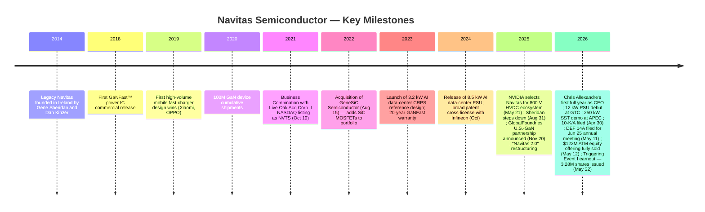
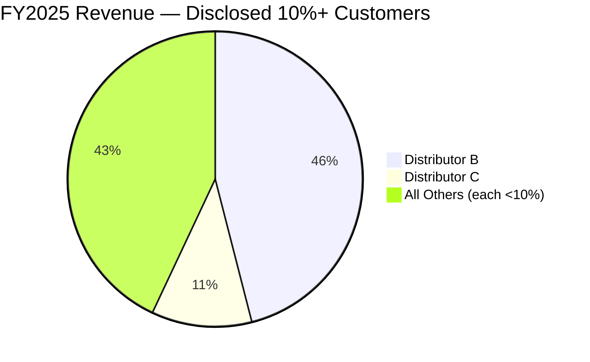
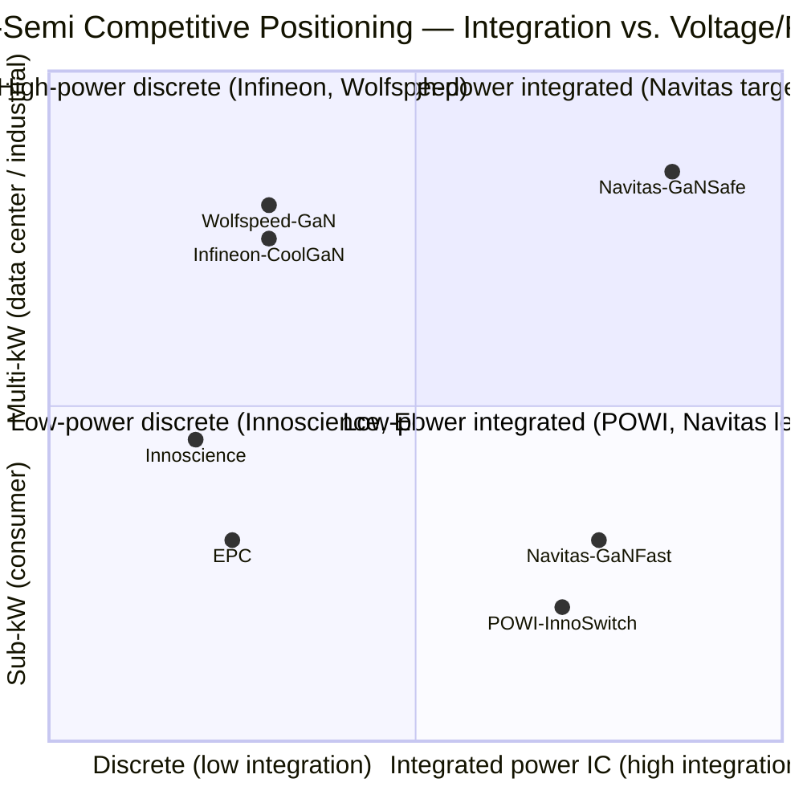

# COMPANY RESEARCH REPORT: Navitas Semiconductor Corporation (NASDAQ: NVTS)

**As of:** 2026-05-26
**Analyst note:** This report covers Navitas Semiconductor following its Q1 2026 earnings release (May 5, 2026), the August 2025 CEO transition from co-founder Gene Sheridan to Chris Allexandre, the NVIDIA 800 V HVDC collaboration announcement (May 21, 2025), the GlobalFoundries U.S.-GaN partnership (November 20, 2025), the "Navitas 2.0" strategic pivot away from mobile/consumer markets toward AI data center, grid, performance computing and industrial electrification, and the **fully-subscribed USD 122M ATM equity offering completed on May 12, 2026** that materially extended the company's cash runway. All financial figures are from Navitas SEC filings unless otherwise noted.

> **Update — Capital structure events (2026-05-11 to 2026-05-22):** Navitas executed three material capital events in May 2026: (1) on **May 11, 2026** it entered an At-the-Market ("ATM") sales agreement with Craig-Hallum and UBS Securities for up to $125M of Class A stock ([8-K, 2026-05-11](https://www.sec.gov/Archives/edgar/data/1821769/000110465926058734/tm2613239d3_8k.htm)); by **May 12, 2026** the offering was **fully sold — 6,529,666 shares at ~USD 19/share for net proceeds of approximately USD 122.0M** ([8-K, 2026-05-13](https://www.sec.gov/Archives/edgar/data/1821769/000110465926059828/tm2614473d1_8k.htm)); (2) on **May 22, 2026** the Company issued **3,277,438 new Class A shares** in satisfaction of **Triggering Event I** earnout obligations under the original Live Oak SPAC business-combination agreement (stock price hit a contractual target before the October 19, 2026 milestone deadline) ([8-K, 2026-05-22](https://www.sec.gov/Archives/edgar/data/1821769/000110465926065737/tm2615305d2_8k.htm)); (3) on the same day the Company signed a **Settlement, Release and Amendment Agreement** with Live Oak Sponsor releasing 726,225 Sponsor Earnout Shares from vesting/transfer restrictions and forfeiting 115,775 ([8-K, 2026-05-22](https://www.sec.gov/Archives/edgar/data/1821769/000110465926065731/tm2614473d1_8k.htm)). Combined effect: cash balance pro-forma to ~USD 340M, share count up ~10.4M from the FYE-2025 230.8M figure (~4.5% dilution), valuation re-rated higher on the news. The board also separately filed the **2026 DEF 14A** on May 11, 2026 ([proxy statement, 2026-05-11](https://www.sec.gov/Archives/edgar/data/1821769/000110465926058742/tm2613272d3_def14a.htm)) for the **June 25, 2026 Annual Meeting**, which includes a **board declassification proposal** (eliminating the current three-year staggered structure).

> **FY2026 Q2 guidance (2026-05-05):** Management guided Q2 2026 net revenues to USD 10.0M ± $0.5M (≈16% sequential growth at the midpoint, still down YoY from USD 14.5M in Q2 2025), with non-GAAP gross margin of 39.25% ± 75 bps and approximately flat non-GAAP OpEx of USD 14.5–15.5M. Management additionally confirmed that high-power markets (AI data center, grid, performance computing, industrial) represented "a large majority" of Q1 2026 revenue and grew ~35% YoY, partially offsetting the deliberate roll-off of China-mobile revenue. Source: [Q1 2026 earnings press release, 2026-05-05](https://www.sec.gov/Archives/edgar/data/1821769/000110465926055620/tm2613492d1_ex99-1.htm).

## TABLE OF CONTENTS

1. Company Overview
2. Company History
3. Management Team
4. Products & Services
5. Customers & Go-to-Market
6. Industry Overview
7. Competitive Landscape
8. Market Opportunity (TAM)
9. Risk Assessment

---

## 1. Company Overview

Navitas Semiconductor Corporation ("Navitas," NASDAQ: NVTS) is a fabless power-semiconductor designer headquartered in Torrance, California, that develops gallium-nitride (GaN) integrated power ICs and high-voltage silicon-carbide (SiC) MOSFETs and diodes, plus high-speed silicon system controllers and digital isolators. The company describes itself as "the only pure-play, next-generation power semiconductor company" offering both GaN and SiC in volume production, with cumulative shipments of "over 300 million GaN devices and nearly 30 million SiC devices" as of December 31, 2025 ([Navitas 2025 10-K, Item 1 — Business](https://www.sec.gov/Archives/edgar/data/1821769/000182176926000007/nvts-20251231.htm)). Navitas operates one reportable segment under ASC 280; product-level revenue mix is not separately disclosed, although management refers consistently to four prioritized end markets — AI data centers, energy & grid infrastructure, performance computing, and industrial electrification — under a strategic restructuring known internally and to investors as **"Navitas 2.0"** ([2025 10-K, Item 7 MD&A](https://www.sec.gov/Archives/edgar/data/1821769/000182176926000007/nvts-20251231.htm)).

**Business model.** Navitas is a pure-play fabless IDM-substitute: it designs the chips and the device-level process modules, contracts wafer fabrication to TSMC (Taiwan), GlobalFoundries (Vermont, USA) and X-FAB (Texas, USA) and outsources test/assembly to subcontractors primarily in Asia. It sells through a small group of specialized distributors to OEMs (notably power-supply manufacturers serving hyperscalers, GPU vendors and Tier-1 server ODMs) and to charger / consumer-electronics OEMs. As disclosed in the FY2025 10-K, two distributors accounted for **57% of FY2025 revenue combined** (Distributor B at 46%, Distributor C at 11%), and a former large distributor (Distributor A, 56% of FY2024 revenue) was terminated at the end of 2024, contributing to the FY2025 revenue decline ([2025 10-K, Note 12 — Significant Customers](https://www.sec.gov/Archives/edgar/data/1821769/000182176926000007/nvts-20251231.htm)). Net revenues for FY2025 were **USD 45.9 million**, down 45% YoY from USD 83.3M in FY2024, with the entirety of the decline attributed by management to "the decline in the mobile and consumer markets in China" ([2025 10-K, Item 7 MD&A](https://www.sec.gov/Archives/edgar/data/1821769/000182176926000007/nvts-20251231.htm)).

**Geographic profile.** Revenue is attributed to the end customer's domicile of record. In FY2025, **57% of revenue was attributed to Hong Kong, 21% to the Rest of Asia, 10% to the United States, 9% to China and 3% to Europe** ([2025 10-K, Note 12](https://www.sec.gov/Archives/edgar/data/1821769/000182176926000007/nvts-20251231.htm)). The Hong Kong concentration reflects the historical mobile-charger customer base; this share has begun to compress as the high-power mix grows.

**Scale and headcount.** Navitas maintains operations in the United States, Ireland, Germany, Italy, Belgium, China, Taiwan, Thailand, South Korea and the Philippines, with principal executive offices in Torrance plus satellite design centers in Santa Clara and Irvine, California. The FY2025 10-K reports approximately 50,000 sq ft of leased corporate / R&D space in Torrance. The company holds **over 300 patents issued or pending worldwide** and entered a broad patent cross-license with Infineon Technologies in October 2024 ([2025 10-K, Item 1](https://www.sec.gov/Archives/edgar/data/1821769/000182176926000007/nvts-20251231.htm)). The company has been **CarbonNeutral®-certified** since launch.

Source: [Navitas 2025 10-K MD&A](https://www.sec.gov/Archives/edgar/data/1821769/000182176926000007/nvts-20251231.htm); [FY2023 earnings 8-K, 2024-02-29](https://www.globenewswire.com/news-release/2024/02/29/2838376/0/en/Navitas-Semiconductor-Announces-Record-Fourth-Quarter-and-Full-Year-2023-Financial-Results.html); [FY2022 earnings 8-K, 2023-02-23](https://www.globenewswire.com/en/news-release/2023/02/23/2614787/0/en/Navitas-Semiconductor-Announces-Fourth-Quarter-and-Full-Year-2022-Financial-Results.html).

**Valuation snapshot (May 26, 2026 intraday).** NVTS trades at approximately **USD 31.94 per share**, equating to a market capitalization of roughly **USD 7.47 billion** on **230,792,765** Class A shares outstanding at the 10-K/A cover date plus approximately **10.5M new shares issued in May 2026** (6,529,666 ATM + 3,277,438 Triggering Event I + 726,225 Sponsor Settlement, net 115,775 forfeited) — i.e. ~**241M Class A shares post-May-2026 capital events** ([Yahoo Finance, NVTS quote page](https://finance.yahoo.com/quote/NVTS/); [stockanalysis.com NVTS overview](https://stockanalysis.com/stocks/nvts/); [10-K/A cover, 2026-04-30](https://www.sec.gov/Archives/edgar/data/1821769/000110465926052971/nvts-20251231x10ka.htm)). The 52-week range is **USD 4.54 – 33.82**; the stock has appreciated roughly **7×** off mid-2025 lows and **~64% in the six trading sessions following the May 20 reference point** alone, driven by the AI-power narrative, sell-side target hikes and the successful ATM completion at ~$19 (signaling distribution-buy-side appetite at the higher run-rate).

- **TTM P/E: deeply negative.** Navitas posted a GAAP net loss of **USD 117.0 million** in FY2025 ([2025 10-K Statements of Operations](https://www.sec.gov/Archives/edgar/data/1821769/000182176926000007/nvts-20251231.htm)) and continues to operate at a GAAP loss; the company has accumulated U.S. federal net operating loss carryforwards of **USD 334.8 million** as of December 31, 2025. The negative P/E is not a one-off charge: it is structural cash-burning growth — the company spent **USD 49.8M on R&D** and **USD 35.2M on SG&A** in FY2025 against only **USD 45.9M of revenue**, an operating-loss-to-revenue ratio of -235% on a GAAP basis. The pivot to high-power markets is designed to expand non-GAAP gross margin from the FY2025 38.5% level toward 40%+ and slow OpEx growth, but management explicitly stated in the 10-K that it "expects to continue to incur net operating losses and negative cash flows from operations" ([2025 10-K Item 7 MD&A — Liquidity](https://www.sec.gov/Archives/edgar/data/1821769/000182176926000007/nvts-20251231.htm)). Interpret the negative P/E as a pre-scale, R&D-heavy growth profile, not a cyclical trough.
- **TTM P/S: extreme — interpret with caution.** With TTM revenue of USD 45.9M and a market cap of USD 7.47B as of May 26, 2026, NVTS trades at roughly **163× TTM sales** ([Yahoo Finance NVTS key statistics](https://finance.yahoo.com/quote/NVTS/key-statistics/); [GuruFocus, NVTS PS Ratio](https://www.gurufocus.com/term/ps-ratio/NVTS)). The relevant peer benchmarks have all re-rated upward but remain dramatically lower: **Power Integrations (POWI) ~10.4×** at $83/share and ~$4.63B market cap on $443M TTM revenue ([Yahoo Finance — POWI](https://finance.yahoo.com/quote/POWI/); [stockanalysis.com POWI](https://stockanalysis.com/stocks/powi/)), **ON Semiconductor (ON) ~4×**, **Infineon (IFX) ~3.6×** ([companiesmarketcap.com IFX](https://companiesmarketcap.com/infineon/marketcap/)), **Wolfspeed (WOLF) ~3–4×** after Chapter 11 emergence on September 29, 2025 ([WOLF Q3-FY26 8-K, 2026](https://www.sec.gov/Archives/edgar/data/0000895419/000089541926000024/ex991q3-26.htm)), and **EPC (private, not disclosed)**. NVTS is therefore trading at roughly **40× the closest pure-play peer (POWI) and 40–45× the broader sector median P/S**.
  - Cause of the premium: the stock is functioning as the **AI-power-content-on-Nvidia thematic proxy**. The 800 V HVDC architecture endorsement from NVIDIA at GTC May 21, 2025 ([NVIDIA Selects Navitas to Collaborate on Next Generation 800V HVDC Architecture, 2025-05-21](https://www.sec.gov/Archives/edgar/data/1821769/000162828025027705/ex9912025-05x21prrenvidiac.htm)), combined with sell-side price-target upgrades (Baird $9 → $20, Needham $13 → $21 in mid-May 2026, per [StocksToTrade coverage, 2026-05-21](https://stockstotrade.com/news/navitas-semiconductor-corporation-nvts-news-2026_05_21/)), have re-rated the multiple far above the comp set. The premium is **narrative-driven**, not earnings-driven — investors are paying for the FY2030 SAM ($3.5B per mgmt, 60%+ CAGR) and for the implied take-rate inside Nvidia's "Kyber" rack-scale platform ([Q1 2026 earnings press release, 2026-05-05](https://www.sec.gov/Archives/edgar/data/1821769/000110465926055620/tm2613492d1_ex99-1.htm)). At current run-rate revenue ($8.6M Q1'26 / ~$45M annualized), the multiple compresses to ~20× P/S only if revenue inflects **8×** over the next 24–36 months — i.e. the multiple is **only justified on a forward "AI-design-wins ramp" basis**, not on trailing fundamentals. This is the single biggest valuation/multiple-compression risk and is carried into Section 9. Notably, **management used the elevated multiple to monetize equity through the May-2026 ATM offering** at ~USD 19/share, an action which both validates the buy-side's near-term tape and extends the operating runway materially (cash pro-forma ~USD 340M from $237M FYE 2025).

Sources: [stockanalysis.com (NVTS, POWI)](https://stockanalysis.com/stocks/nvts/); [GuruFocus (NVTS PS Ratio)](https://www.gurufocus.com/term/ps-ratio/NVTS); [Yahoo Finance — POWI](https://finance.yahoo.com/quote/POWI/); [companiesmarketcap.com — IFX market cap](https://companiesmarketcap.com/infineon/marketcap/); [Wolfspeed Q3-FY26 8-K, 2026](https://www.sec.gov/Archives/edgar/data/0000895419/000089541926000024/ex991q3-26.htm).

## 2. Company History

Navitas was incorporated as Live Oak Acquisition Corp. II, a Delaware-domiciled special-purpose acquisition company. On October 19, 2021, it completed a Business Combination with Navitas Semiconductor Limited, an Irish private company founded in 2014 by **Gene Sheridan** (CEO and co-founder) and **Dan Kinzer** (CTO/COO and co-founder), and was renamed Navitas Semiconductor Corporation. Legacy Navitas was founded in 2014 with the singular thesis that **GaN-on-silicon could become a viable, integrated alternative to the silicon power MOSFET in the 100–650 V range** if drive, control and protection circuitry could be co-integrated on the same die — what Navitas eventually trademarked as **GaNFast™** ([2025 10-K Item 1](https://www.sec.gov/Archives/edgar/data/1821769/000182176926000007/nvts-20251231.htm)). The founders' bet was that the existing GaN-discrete vendors (EPC, GaN Systems, Transphorm) could be leapfrogged by integration; the bet has been substantiated by Navitas reaching the #2 spot in global GaN-power unit-share (16.5% in 2024 per TrendForce) and over 300 million cumulative units shipped.

Source: [2025 10-K Item 1 — Business](https://www.sec.gov/Archives/edgar/data/1821769/000182176926000007/nvts-20251231.htm); [NVIDIA 800V HVDC 8-K, 2025-05-21](https://www.sec.gov/Archives/edgar/data/1821769/000162828025027705/ex9912025-05x21prrenvidiac.htm); [CEO transition 8-K, 2025-08-25](https://www.sec.gov/Archives/edgar/data/1821769/000182176925000204/exhibit991-pressreleasedat.htm); [GlobalFoundries partnership 8-K, 2025-11-20](https://www.sec.gov/Archives/edgar/data/1821769/000182176925000217/exhibit991-prglobalfoundri.htm).

**Three strategic transformations have defined the company.** First, the **2018 commercial introduction of the GaNFast integrated power IC** — this was the bet that distinguished Navitas from earlier GaN-discrete competitors and underwrote the company's mobile-charger franchise from 2019 through 2024. The integration of gate driver, control and protection on the same die compressed bill-of-materials cost and reduced switching losses, enabling the famous 65–100 W USB-PD adapters that displaced silicon at scale.

Second, the **August 15, 2022 acquisition of GeneSiC Semiconductor** for approximately USD 295M (cash + Navitas Class A shares). GeneSiC brought a patented "trench-assisted planar" SiC MOSFET technology specifically targeting high-voltage (650 V – 6.5 kV) industrial and grid applications, and GeneSiC's founder joined the Navitas board. This transformed Navitas from a single-material GaN house into a dual-material WBG (wide-bandgap) supplier — critical for the AI-data-center pivot, where SiC handles the 800 V DC rectification and GaN handles the secondary-side 48 V conversion ([2025 10-K, Item 1 — GeneSiC overview](https://www.sec.gov/Archives/edgar/data/1821769/000182176926000007/nvts-20251231.htm)).

Third, the **late-2025 "Navitas 2.0" restructuring** announced in conjunction with the new CEO appointment — formally de-emphasizing mobile-charger and Chinese consumer-electronics markets and consolidating distribution onto a smaller set of high-power-focused partners. The plan involved a USD 16.6M restructuring and impairment charge in Q4 2025 and a workforce reduction. Recent developments worth flagging for the current thesis are detailed in subsequent sections, particularly the NVIDIA 800 V HVDC selection at GTC May 21, 2025 and the November 20, 2025 GlobalFoundries Burlington, VT GaN manufacturing partnership — these are the two events most responsible for the stock's 10× rally off mid-2025 lows.

## 3. Management Team

This section covers the company's co-founders and current Chief Executive Officer. Other named executives, segment heads and independent directors are intentionally out of scope per the research-skill rule that focuses Section 3 on **the founder(s) and the current CEO only** — the broader board composition is referenced in Section 2 (Company History) and is fully enumerated in the May 11, 2026 [DEF 14A proxy statement](https://www.sec.gov/Archives/edgar/data/1821769/000110465926058742/tm2613272d3_def14a.htm) for readers who need the granular roster.

### Co-founders — Gene Sheridan and Dan Kinzer (founders, 2014; both departed executive roles in 2025)

Navitas Semiconductor was founded in Ireland in 2014 by **Gene Sheridan** (CEO 2014–August 2025) and **Daniel "Dan" Kinzer** (CTO/COO 2014–April 2025), on the founding thesis that **GaN-on-silicon could be transformed from a niche RF/discrete device into a mainstream, integrated power-semiconductor product** by co-integrating drive, control and protection circuitry on the same die — the technology platform eventually trademarked as **GaNFast™** ([2025 10-K Item 1 — Business](https://www.sec.gov/Archives/edgar/data/1821769/000182176926000007/nvts-20251231.htm)). The founders' bet — that the existing GaN-discrete vendors (EPC, GaN Systems, Transphorm) could be leapfrogged through integration — was substantiated by Navitas reaching the #2 spot in global power-GaN unit-share (16.5% in 2024 per TrendForce) and over **300 million cumulative GaN devices shipped** by December 31, 2025.

Sheridan was a power-semiconductor industry executive prior to founding Navitas, with senior roles at International Rectifier (the predecessor to today's Infineon power-discretes business) and at Vishay. He served as Navitas's CEO from inception through **August 31, 2025**, taking the company public via a Business Combination with Live Oak Acquisition Corp. II on October 19, 2021, leading the 2022 acquisition of GeneSiC Semiconductor (the SiC technology that anchors today's high-power product family) and establishing the company's relationships with TSMC (GaN wafers) and the early-stage relationships with the merchant PSU OEMs that supply mobile-charger OEMs. His CEO transition was disclosed on August 25, 2025 ([Director-Officer Change 8-K, 2025-08-25](https://www.sec.gov/Archives/edgar/data/1821769/000182176925000204/exhibit991-pressreleasedat.htm)).

Kinzer was the technical co-founder, holding multiple foundational patents on the integrated GaN power-IC architecture. He stepped down from his executive roles (CTO and COO) and from the board in **April 2025** in connection with the broader corporate-governance refresh announced April 29, 2025 ([Governance Enhancements 8-K, 2025-04-29](https://www.sec.gov/Archives/edgar/data/1821769/000182176925000053/exhibit991-pressrelease202.htm)). He continues to support the company in an advisory role focused on GaN technology innovation but is no longer involved in day-to-day operations. Kinzer's departure from the executive suite — combined with Sheridan's exit four months later — closed the founder-led chapter of Navitas's corporate life. Founder ownership economics tied to the original SPAC transaction continue to vest, however: the **3,277,438-share Triggering Event I issuance on May 22, 2026** ([8-K, 2026-05-22](https://www.sec.gov/Archives/edgar/data/1821769/000110465926065737/tm2615305d2_8k.htm)) and the **Live Oak Sponsor settlement of May 18, 2026** are direct legacies of the original Business Combination Agreement, with up to 10,000,000 total Earnout Shares contingent on stock-price hurdles before October 19, 2026 — the bulk of which now appear achievable given the May 2026 price action.

### Chris Allexandre — President & Chief Executive Officer (since September 2025)

Chris Allexandre became Navitas' second-ever CEO in **September 2025**, succeeding co-founder Gene Sheridan ([2026 DEF 14A — Director Biographies](https://www.sec.gov/Archives/edgar/data/1821769/000110465926058742/tm2613272d3_def14a.htm)). Allexandre is a power-semiconductor industry veteran with **over two decades of global leadership experience** across sales, marketing, operations and business-unit management. His immediately prior role was **Senior Vice President and General Manager of Renesas Electronics' Power Division (October 2023–August 2025)**, where he ran a **USD 2.5 billion-revenue** power-management and discrete-product business and led the strategic pivot of that division toward cloud-infrastructure, automotive and industrial markets. During his Renesas tenure he oversaw the **acquisition and integration of Transphorm, Inc.** (a GaN power-device supplier) in June 2024 — meaning he has direct, recent, hands-on experience consolidating an independent GaN business inside a larger power-semi P&L, which is operationally analogous to the Navitas 2.0 transformation he now leads. Before the GM role he was Renesas's **Chief Sales and Marketing Officer (2019–2023)**, and he previously served in senior executive roles at IDT (acquired by Renesas in 2019), NXP (SVP Worldwide Sales for Mass Market), and Fairchild Semiconductor (SVP Worldwide Sales, Marketing and Business Operations). He began his career at Texas Instruments in TI's New College Graduate rotation program, spending **16 years** at TI and rising to **Vice President of EMEA Regional Sales & Applications**. He holds a **Master of Science in Electrical Engineering from ISEN (Institut Supérieur de l'Électronique et du Numérique)** in Lille, France, has dual French/U.S. citizenship and has been based in the Bay Area since 2013 ([2026 DEF 14A](https://www.sec.gov/Archives/edgar/data/1821769/000110465926058742/tm2613272d3_def14a.htm); [CEO appointment 8-K, 2025-08-25](https://www.sec.gov/Archives/edgar/data/1821769/000182176925000204/exhibit991-pressreleasedat.htm)).

Allexandre's appointment is consequential to the thesis for three reasons. First, **his Renesas/Transphorm background is unusually well-matched to executing Navitas 2.0** — he has previously integrated a GaN technology asset inside a larger power-semi P&L, knows the analog-distribution and hyperscaler PSU-OEM sales motion, and is fluent in the disciplined-OpEx culture Navitas's founder-led era had not yet implemented. Second, **he is not a founder, which has shifted Navitas's investor narrative from "pioneer GaN house" to "executable AI-power franchise."** Third, his compensation package and 2026 equity grants — initial sign-on RSUs and the LTIP performance grants disclosed in the [10-K/A Part III, April 30, 2026](https://www.sec.gov/Archives/edgar/data/1821769/000110465926052971/nvts-20251231x10ka.htm) and the DEF 14A — will be heavily scrutinized given the >7× share-price appreciation since his appointment. The 2025 10-K disclosed "approximately $4.0 million in CEO transition costs and governance costs in 2025" ([2025 10-K, Item 7 MD&A](https://www.sec.gov/Archives/edgar/data/1821769/000182176926000007/nvts-20251231.htm)). In his first earnings call as CEO (Q3 2025, November 3, 2025), Allexandre framed the company as transitioning from "Navitas 1.0" (mobile foundation) to "Navitas 2.0" (high-power markets), explicitly stating that **Q4 2025 was being reset as the baseline, with sequential growth expected through 2026** ([3Q25 Earnings Call Presentation, 2025-11-03](https://www.sec.gov/Archives/edgar/data/1821769/000182176925000212/exhibit992-navitas3q25ea.htm)). Q1 2026 delivered against that framework — 18% sequential revenue growth with non-GAAP gross margin expanding 30 bps QoQ. He has not yet been tested on the operating-margin improvement promise, which is the central execution risk on the stock.

## 4. Products & Services

Navitas' product portfolio sits on three legs, all currently sold under one ASC 280 reportable segment but managed internally as distinct product lines. Walking the navitassemi.com product navigation tree confirms the structure described below.

### A) GaNFast™ / GaNSense™ / GaNSafe™ GaN Power ICs (flagship — the foundational technology)

This is the family Navitas pioneered. The portfolio spans roughly **15 V – 700 V** in GaN-on-Si CMOS-compatible technology, with **on-resistance from ~18 mΩ to >70 mΩ** in TOLL and TOLT packages. Material sub-families:

- **GaNFast™ power ICs (650 V)** — the original integrated solution combining the high-voltage GaN FET with a silicon driver, control, and protection circuitry on a single device. This is the engine of Navitas's mobile / consumer / merchant-power business — every USB-PD GaN charger from 65 W to 250 W from leading OEMs uses this category.
- **GaNSense™ technology** — adds autonomous self-current-sense and short-circuit detection at the gate, reducing component count for power-supply designs.
- **GaNSafe™ family (650 V, high-power 1 kW–22 kW applications)** — the differentiating product for AI data center, with 350 ns max-latency short-circuit protection, 2 kV ESD on every pin, elimination of negative gate drive, and programmable slew rate. GaNSafe is the part NVIDIA referred to in the May 2025 announcement when discussing direct conversion in the 800 V HVDC delivery board. The 4-pin package permits PCB designers to treat the device "like a discrete GaN FET" but with integrated control — preserving Navitas's integration moat while delivering the rugged-package experience hyperscaler OEMs require ([NVIDIA / Navitas press release, 2025-05-21](https://www.sec.gov/Archives/edgar/data/1821769/000162828025027705/ex9912025-05x21prrenvidiac.htm)).
- **Mid-voltage 80–120 V GaN FETs** — released into the product portfolio in late 2025 ([3Q25 Earnings Call Presentation, 2025-11-03](https://www.sec.gov/Archives/edgar/data/1821769/000182176925000212/exhibit992-navitas3q25ea.htm)), targeted at the secondary-side 48 V → core-voltage DC-DC conversion stage of AI data-center power systems, where the high-end vertical-power-module incumbent is Infineon (combined with the legacy Vicor and MPS portfolios). This is Navitas's first move into mid-voltage and is the most direct attack on Infineon's data-center socket.

**Competitive-advantage verdict: yes — integration moat.** GaNFast / GaNSafe is the **only** family that puts driver + control + protection on the same wide-bandgap die at this voltage class. Closest competitors include EPC's integrated drivers, Infineon's CoolGaN with separate drivers, Power Integrations' GaN-integrated InnoSwitch, and Innoscience's high-volume discrete GaN. **Compare:** ahead of EPC on volume and reliability (300M+ units shipped vs. private — not disclosed; EPC is privately held and does not publish unit data). Ahead of Innoscience on integration but behind on China-market unit share. At parity with Power Integrations on integration in the <100 W consumer space but ahead in 1–22 kW power class. Behind Infineon on overall power-semi scale and customer relationships in industrial channel.

### B) GeneSiC™ Silicon-Carbide Power Devices (acquired 2022, now strategic)

Acquired via the GeneSiC transaction on August 15, 2022, the SiC portfolio comprises:

- **G3F (Gen 3 "Fast") SiC MOSFETs** — 650 V to 1700 V "trench-assisted planar" architecture, the patented GeneSiC technology that combines planar manufacturability with trench-like RDS(ON). Marketed with claims of **25°C lower case temperature and up to 3× longer device life vs. competing SiC MOSFETs**, per the Navitas/Nvidia release ([8-K 2025-05-27, ex.99.1](https://www.sec.gov/Archives/edgar/data/1821769/000162828025027705/ex9912025-05x21prrenvidiac.htm)).
- **High-voltage SiC MOSFETs and diodes (2.3 kV / 3.3 kV / 6.5 kV)** — the differentiator vs. mainstream SiC competitors (Wolfspeed, Infineon CoolSiC, ON Semi EliteSiC, ROHM, STMicroelectronics) who concentrate at 650/1200 V. The 3.3 kV and 6.5 kV parts target solid-state transformers (SSTs), MV motor drives, and DOE-funded grid energy-storage projects. Sampling began for new 2.3 kV and 3.3 kV modules to "leading energy storage and grid infrastructure customers" in Q3 2025 ([3Q25 Earnings Call Presentation](https://www.sec.gov/Archives/edgar/data/1821769/000182176925000212/exhibit992-navitas3q25ea.htm)).
- **5th-gen 1200 V SiC MOSFETs in QDPAK and TO-247-4L packages** — released Q1 2026 specifically for AI data center PSU and 800 V HVDC use cases ([Q1 2026 earnings release, 2026-05-05](https://www.sec.gov/Archives/edgar/data/1821769/000110465926055620/tm2613492d1_ex99-1.htm)).

**Competitive-advantage verdict: partial — narrow voltage-tier moat.** At the mainstream 650/1200 V SiC tier Navitas is **behind on scale and process maturity vs. Wolfspeed (despite its 2025 Chapter 11), Infineon CoolSiC, and onsemi EliteSiC**. The differentiated moat is at **high voltage (2.3 kV – 6.5 kV)**, where the field of credible suppliers is much narrower — Wolfspeed has the most direct competing portfolio, Mitsubishi and ABB are vertical-module integrators rather than chip suppliers, and Infineon's CoolSiC offers up to 2 kV. Navitas's high-voltage SiC is therefore best positioned for **solid-state transformer and grid-tied energy-storage** applications, both of which are still small markets today but growing fast on the AI-DC HVDC theme.

### C) Power ICs and Digital Isolators (legacy silicon controllers and high-voltage isolators)

These are the silicon-based system controllers, gate drivers and digital isolators that Navitas sells either bundled with its GaN/SiC devices or as standalone PWM controllers (largely a residual product line from the company's 2014–2018 era). They contribute modestly to revenue today but enable system-level design wins; on a standalone basis, Navitas does not have a competitive advantage vs. Texas Instruments, Analog Devices, MPS or onsemi in this category. **Verdict: no standalone moat; complementary attach.**

### D) Reference-design platforms (a moat-extending GTM tool, not a sold product per se)

Navitas has invested heavily in **reference-design power supplies** that demonstrate the full system-level value of combining GaN, SiC and IntelliWeave™ digital control. The roadmap, in chronological order: 3.2 kW CRPS (2023), 4.5 kW CRPS at 137 W/in³ density (2024), 8.5 kW OCP/ORv3-compliant PSU (Nov 2024), and the **12 kW GaN+SiC AI data-center PSU at 97.8% efficiency** (launched May 21, 2025 alongside the NVIDIA announcement; [Navitas press release, 2025-05-21](https://navitassemi.com/navitas-launches-industry-leading-12kw-gan-sic-platform-achieving-97-8-efficiency-for-hyperscale-ai-data-centers/)). The 12 kW reference design is configured as 3-phase interleaved TP-PFC and FB-LLC topology using GaNSafe ICs, G3F SiC MOSFETs and IntelliWeave digital control. **IntelliWeave** is Navitas's patented hybrid CrCM/CCM control technique that achieves a 30% reduction in power losses vs. conventional CCM at 99.3% PFC peak efficiency. The 250 kW solid-state transformer demonstrated jointly with EPFL at APEC 2026 (March 2026) — using GeneSiC 3.3 kV and 1.2 kV SiC — is the next step in the reference-design roadmap.

```mermaid
graph TD
    NVTS[Navitas Semiconductor Portfolio]
    NVTS --> GaN[GaN Power ICs and FETs]
    NVTS --> SiC[GeneSiC SiC Devices]
    NVTS --> Si[Silicon Power ICs and Isolators]
    NVTS --> RefDes[Reference-Design Platforms]

    GaN --> GFast[GaNFast 650V integrated power ICs]
    GaN --> GSense[GaNSense self-sensing]
    GaN --> GSafe[GaNSafe 1-22 kW high-power ICs]
    GaN --> Mid[Mid-voltage 80-120V GaN FETs]

    SiC --> G3F[Gen-3F 650-1700V SiC MOSFETs]
    SiC --> HV[2.3-6.5 kV high-voltage SiC]
    SiC --> Q1[1200V QDPAK TO-247-4L for PSU]

    Si --> Driver[Silicon drivers and PWM controllers]
    Si --> Iso[Digital isolators]

    RefDes --> P32[3.2 kW CRPS - 2023]
    RefDes --> P85[8.5 kW OCP PSU - 2024]
    RefDes --> P12[12 kW 97.8% AI DC PSU - May 2025]
    RefDes --> PDB[20 kW 800V to 6V DC-DC PDB - GTC 2026]
    RefDes --> SST[250 kW SST demo - APEC 2026]
```

**Flagship vs. long-tail.** The thesis-relevant flagships are (1) **GaNSafe high-power ICs**, (2) **G3F 1200 V SiC + high-voltage SiC**, and (3) the **IntelliWeave-controlled 12 kW PSU reference design**. The long-tail (legacy 65–100 W mobile-charger GaNFast and standalone silicon controllers) is being deliberately compressed under Navitas 2.0. Product-line revenue mix is not separately disclosed in the 10-K (single ASC 280 segment), but management commentary at Q1 2026 confirmed that high-power markets (which map predominantly to GaNSafe + GeneSiC + reference-design pull-through) represented **"a large majority"** of Q1 2026 revenue, growing **~35% YoY** ([Q1 2026 earnings release, 2026-05-05](https://www.sec.gov/Archives/edgar/data/1821769/000110465926055620/tm2613492d1_ex99-1.htm)).

**Recent launches (last 12 months):** 12 kW PSU (May 2025); mid-voltage 80–120 V GaN FETs (late 2025); 5th-gen 1200 V SiC QDPAK and TO-247-4L (Q1 2026); 20 kW 800 V-to-6 V DC-DC power delivery board for NVIDIA Kyber/MGX platform (NVIDIA GTC, March 2026); 250 kW SST demo with EPFL (APEC 2026). The mobile-charger GaNFast SKUs are not being explicitly sunset, but the distribution-channel rationalization announced under Navitas 2.0 effectively de-prioritizes them.

## 5. Customers & Go-to-Market

Navitas's go-to-market is **distribution-led for the legacy business and increasingly direct for the high-power-markets pivot**. The 2025 10-K describes the company as selling "through specialized distributors to original equipment manufacturers, their suppliers and other end customers" ([2025 10-K, Item 1](https://www.sec.gov/Archives/edgar/data/1821769/000182176926000007/nvts-20251231.htm)), with the high-power AI-data-center engagements running through direct relationships with hyperscalers, GPU vendors (notably NVIDIA), Tier-1 server ODMs and merchant power-supply manufacturers (Delta Electronics, Lite-On, Flex, etc.; not individually named in filings).

### Customer concentration — material and getting more so

Per the FY2025 10-K Note 12 ([Significant Customers and Credit Concentrations](https://www.sec.gov/Archives/edgar/data/1821769/000182176926000007/nvts-20251231.htm)):

Source: [Navitas 2025 10-K, Note 12](https://www.sec.gov/Archives/edgar/data/1821769/000182176926000007/nvts-20251231.htm).

- **FY2025:** Distributor B = 46% of net revenues; Distributor C = 11%. Combined top-2 = **57%**. Distributor A (formerly 56% of FY2024 revenue) was terminated at the end of 2024.
- **FY2024:** Distributor A = 56% of net revenues (terminated at year-end); Distributor B and C both below 10% materiality threshold.
- **Q1 2026 (10-Q):** Distributor A = 59% (this is a different "Distributor A" than the FY2024 entity, as the prior Distributor A was terminated; the Q1 10-Q indexes customers alphabetically per period). Distributor B and C below threshold ([Q1 2026 10-Q, Note 4](https://www.sec.gov/Archives/edgar/data/1821769/000162828026030524/nvts-20260331.htm)).

**Concentration verdict.** Top-1 customer is over 45% of revenue in every period of disclosure; top-2 routinely cluster around 55–60%. Under the Section 5 disclosure rule (top-1 > 20% or top-5 > 50% → material risk), this is unambiguously material and is carried into Section 9. The distributors are not named, but historical industry context suggests they are large pan-Asian electronic-component distributors (the largest publicly identified Navitas channel partners have historically included WPG, Future Electronics and Arrow). The Hong Kong-domiciled revenue share (57% in FY2025, 76% in Q1 2026) further suggests these distributors aggregate demand from mainland-Chinese merchant power-supply manufacturers serving consumer-electronics OEMs.

**Mitigating factor:** Navitas 2.0 explicitly involves **distributor rationalization** — consolidating the smaller distributors and shifting incremental revenue to direct hyperscaler / OEM engagements. This should, in steady state, reduce single-distributor concentration but will likely raise **end-customer** concentration (e.g. a single hyperscaler design-win could rapidly become 30–50% of revenue at scale).

### Named customers / partners (disclosed)

- **NVIDIA Corp.** — collaborator on the 800 V HVDC architecture for Kyber-class rack systems powering Rubin Ultra GPUs ([8-K, 2025-05-27](https://www.sec.gov/Archives/edgar/data/1821769/000162828025027705/ex9912025-05x21prrenvidiac.htm)). Navitas is part of NVIDIA's named 800 V DC ecosystem alongside several other power-semi suppliers (Innoscience is the sole named Chinese supplier per industry coverage; [TrendForce, 2025-08-04](https://news.futunn.com/en/post/59958359/innoscience-surges-over-31-in-the-morning-session-nvidia-s)). **Be precise on what is and isn't contracted:** there is **no disclosed long-term supply agreement, no minimum-purchase commitment, and no revenue contribution explicitly tied to NVIDIA in any 10-K or 10-Q**. The relationship is an **ecosystem/collaboration designation** — Navitas products are validated for use within NVIDIA's reference architecture, but the buying entity is the merchant power-supply manufacturer (Delta, Lite-On, Flex, etc.) selecting Navitas devices for hyperscaler-bound PSUs. Material revenue impact is contingent on (a) Kyber-rack production volumes from NVIDIA and (b) Navitas content share within each PSU, neither of which is yet disclosed.
- **GlobalFoundries (GFS)** — long-term strategic foundry partnership announced November 20, 2025 for U.S.-based GaN manufacturing at GF's Burlington, Vermont facility; "development is set for early 2026 with production expected to begin later in the year" ([8-K, 2025-11-20, ex. 99.1](https://www.sec.gov/Archives/edgar/data/1821769/000182176925000217/exhibit991-prglobalfoundri.htm)). This is a **manufacturing-supplier** relationship, not a customer relationship, but is strategically critical for U.S. government / national-security-sensitive sales (DoD, AI-DC HVDC infrastructure procurement).
- **TSMC** — Taiwan-based GaN wafer fabrication partner ([2025 10-K, Item 1](https://www.sec.gov/Archives/edgar/data/1821769/000182176926000007/nvts-20251231.htm)).
- **X-FAB** — U.S.-based SiC wafer fabrication partner (Texas).
- **EPFL** — collaborator on the 250 kW solid-state-transformer demonstration at APEC 2026.
- **U.S. Department of Energy** — multiple grant / contract relationships referenced in the 10-K for MW-scale energy storage and grid-tied inverter projects using high-voltage SiC ([2025 10-K, Item 1](https://www.sec.gov/Archives/edgar/data/1821769/000182176926000007/nvts-20251231.htm)).

**The hyperscaler customer question.** Press coverage and sell-side notes routinely mention **"hyperscalers"** but Navitas has **not named any specific hyperscaler customer** in any SEC filing through Q1 2026. The May 2025 NVIDIA announcement is the closest the company has come to a named major customer disclosure, but NVIDIA in this context is a **platform partner** (defining the architecture) rather than a buyer of Navitas chips. Mention of Microsoft, Meta, Google or Amazon as direct Navitas customers is not supported by any verifiable Navitas filing or press release as of May 2026 and should not be assumed.

### Sales cycle and design-win economics

Per the 10-K Item 1A risk factors: "even if we are awarded a design win, expected revenues typically do not result for one year or more, if ever" ([2025 10-K, Item 1A](https://www.sec.gov/Archives/edgar/data/1821769/000182176926000007/nvts-20251231.htm)). The design-win-to-revenue cycle in AI data center is generally **18–24 months from validation to first shipments**, with revenue scale-up over an additional 4–8 quarters. This is the central reason management points to **2027 and beyond** as the meaningful inflection year for the Nvidia 800V HVDC opportunity, with 2026 framed as a transition / rebuilding year.

## 6. Industry Overview

### Industry definition

Navitas competes in the **power semiconductor** industry — the subset of the broader semiconductor industry concerned with controlling, converting and switching electrical power. Within power semiconductors, the relevant addressable subset is **wide-bandgap (WBG) power devices**, comprising gallium nitride (GaN) and silicon carbide (SiC). Adjacent industries include silicon power MOSFETs and IGBTs (the legacy incumbents Navitas is displacing), AC-DC and DC-DC power-supply modules (the merchant PSU industry that consumes Navitas chips), high-voltage industrial drives, and solid-state transformers / grid-edge equipment.

### Market sizing

The most authoritative recent third-party sizing comes from Yole Group's October 2025 power-GaN forecast: the **power-GaN device market is projected to grow from ~$355M in 2024 to ~$3.0 billion by 2030**, a CAGR of approximately **42%** ([Yole Group, "From chargers to data centers — power GaN market set for rapid sixfold expansion by 2030"](https://www.yolegroup.com/press-release/from-chargers-to-data-centers-power-gan-market-set-for-rapid-sixfold-expansion-by-2030/); [Semiconductor Today, 2025-10-29](https://www.semiconductor-today.com/news_items/2025/oct/yole-291025.shtml)). Within that envelope, the **telecom & infrastructure** sub-segment (which includes AI data center power) is forecast to grow at a **53% CAGR**, reaching over $380M in GaN revenues by 2030. The automotive & mobility GaN sub-segment grows fastest at 73% CAGR.

For SiC: the **SiC power device market is expected to reach ~$10 billion by 2030**, driven by EV traction inverters (the largest single application), industrial drives, charging infrastructure and grid-tied applications including solid-state transformers ([Yole Group, Power SiC/GaN Compound Semiconductor Market Monitor](https://www.yolegroup.com/product/quarterly-monitor/power-sicgan-compound-semiconductor-market-monitor/)). Recovery in 2026 is expected after a 2024–2025 inventory correction in EV.

### Key trends driving the WBG opportunity

1. **AI data-center power demand explosion.** Server rack power has risen from ~10 kW historically to >100 kW today and is forecast to reach 1 MW+ for GW-scale AI clusters. Above ~200 kW per rack, the traditional 54 V DC in-rack distribution architecture hits physical-copper limits, motivating the shift to **800 V HVDC** distribution that Navitas is positioned to serve.
2. **Grid modernization and electrification.** Solid-state transformers and grid-edge power electronics convert legacy 50/60 Hz transformers into faster, smaller, more efficient power-delivery systems. High-voltage SiC (3.3 kV – 6.5 kV) is the enabling technology.
3. **EV charging and traction.** SiC is increasingly standard in 400/800 V EV traction inverters; GaN is increasingly used in onboard chargers.
4. **Industrial electrification.** Motor-drive efficiency, robotics, and renewable energy interconnects are pulling WBG into industrial sockets historically held by IGBTs.
5. **Geopolitical onshoring.** The Inflation Reduction Act and CHIPS Act both incentivize U.S.-based power-semi manufacturing; Navitas's GlobalFoundries Vermont partnership is the direct Navitas play on this trend.

### Industry structure

The power-semiconductor industry overall is moderately consolidated — the top 10 vendors (Infineon, onsemi, ST, Renesas, ROHM, Texas Instruments, NXP, Wolfspeed/post-Ch11, Mitsubishi, Vishay) account for roughly 70%+ of total power-semi revenue. **GaN power devices** are more fragmented and earlier-stage: per TrendForce 2024 data, **Innoscience leads at 29.9% unit share, Navitas is #2 at 16.5%, EPC #3 at 12.4%, Infineon #4 at 10.3%, Power Integrations #5 at 9.8%, with "others" accounting for ~21%** ([TrendForce / BofA, cited in The Bamboo Works, 2025-12-08](https://thebambooworks.com/innoscience-makes-gains-in-patent-dispute-as-growing-competition-remains-bigger-threat/)). **SiC** is more concentrated, with **Wolfspeed, Infineon, onsemi, ROHM and ST** controlling the bulk of device share — Navitas's GeneSiC enters at low single-digit share but with high-voltage product differentiation.

### Regulatory environment

The 2025 10-K flags multiple regulatory exposures: U.S. export controls on advanced semiconductor technology to China; CFIUS / foreign-investment review on inbound investment; the Inflation Reduction Act and CHIPS Act manufacturing incentives (which the GlobalFoundries Vermont partnership is positioned to access); EU regulation under the European Chips Act for second-source semiconductor supply; and supply-chain due-diligence requirements (Conflict Minerals, EU CSRD, UFLPA). Gallium itself is not classified as a critical material per the 10-K — "global gallium production capacity exceeds 2,000 tons annually and is growing approximately 15% per year ... we estimate our gallium consumption will represent less than 0.01% of global annual supply through 2026" ([2025 10-K Item 1](https://www.sec.gov/Archives/edgar/data/1821769/000182176926000007/nvts-20251231.htm)). However, **China's July 2023 export controls on gallium and germanium** are an ongoing supply-chain risk for all GaN suppliers; Navitas mitigates by sourcing from geographically diverse epi-wafer suppliers.

## 7. Competitive Landscape

The competitor universe spans three distinct sub-markets — GaN, SiC, and silicon — with overlap.

### GaN competitors (per 2025 10-K Item 1)

- **Infineon Technologies AG (ETR: IFX)** — power-semi industry leader (FY2025 revenue ~€14.7B / market cap ~$102.6B; [companiesmarketcap.com IFX](https://companiesmarketcap.com/infineon/marketcap/)). CoolGaN portfolio is competitive in the 600 V discrete tier and Infineon's data-center power-block business is the dominant industry incumbent. The October 2024 broad patent cross-license with Navitas suggests Infineon recognizes Navitas's IP position is defensible. **Navitas vs. Infineon: at parity on integration, behind on scale and channel.**
- **Power Integrations (NASDAQ: POWI)** — pure-play AC-DC power conversion vendor (FY2025 revenue $443.5M / market cap ~$4.0B / P/S ~9.2× ; [stockanalysis.com POWI](https://stockanalysis.com/stocks/powi/)). The natural P/S benchmark for Navitas — same business model (fabless, integrated power ICs) but with profitable scale. POWI's InnoSwitch with GaN is competitive in the sub-300 W consumer space. **Navitas vs. POWI: ahead on high-power (>1 kW), behind on consumer >1B-unit ship history.**
- **Texas Instruments (NASDAQ: TXN)** — broad analog/power vendor entering GaN with discrete devices in the data-center space. Massive scale, deep customer relationships, but no integrated GaN-IC offering at parity with Navitas as of mid-2026.
- **Innoscience Suzhou Semiconductor (HKEX: 2577)** — IPO'd Hong Kong December 30, 2024; raised HK$1.4B (~US$180M); IDM model running 8-inch GaN-on-Si wafer fabrication at scale (12,500 wpm in 2024 → 70,000 wpm planned by 2029). **Per TrendForce, the global GaN power-device unit-share leader at 29.9% in 2024** ([Bamboo Works, 2025-12-08](https://thebambooworks.com/innoscience-makes-gains-in-patent-dispute-as-growing-competition-remains-bigger-threat/)). Navitas and Innoscience are in active patent litigation; Innoscience has been named as the **sole Chinese 800 V DC supplier in NVIDIA's ecosystem** ([TrendForce, 2025-08-04](https://news.futunn.com/en/post/59958359/innoscience-surges-over-31-in-the-morning-session-nvidia-s)). **Navitas vs. Innoscience: ahead on integration and U.S./Western channels, behind on volume and cost.**
- **Renesas (TYO: 6723)** — added GaN via the Transphorm acquisition in June 2024 (managed by then-Renesas SVP Chris Allexandre, now Navitas CEO). Competitive across mid-power industrial.
- **Efficient Power Conversion (EPC, private)** — high-frequency GaN pioneer founded by Alex Lidow; private company, **revenue and market share not publicly disclosed**. Strong reputation in eGaN FETs for high-frequency converters; competes with Navitas in the high-voltage discrete tier.
- **STMicroelectronics (NYSE: STM)** — broad-portfolio competitor; SiC primary focus but expanding GaN.

### SiC competitors (per 2025 10-K Item 1)

- **Wolfspeed (NYSE: WOLF)** — historical SiC industry leader. Emerged from Chapter 11 reorganization on September 29, 2025 ([Wolfspeed Q3-FY26 8-K, 2026](https://www.sec.gov/Archives/edgar/data/0000895419/000089541926000024/ex991q3-26.htm)). WOLF's stock has rallied ~220% off bottoms in early 2026 on the AI-data-center pivot, with reported 30% sequential growth in its data-center business in Q3 FY26 ([Wolfspeed FY26 Q3 release](https://www.sec.gov/Archives/edgar/data/0000895419/000089541926000024/ex991q3-26.htm)). Wolfspeed remains the most direct competitor to Navitas's high-voltage SiC.
- **Infineon CoolSiC** — broadest SiC portfolio in volume production; the dominant industrial-channel incumbent. Navitas's GeneSiC is most differentiated above 1700 V.
- **onsemi (NASDAQ: ON)** — EliteSiC; major SiC supplier to EV OEMs (FY2025 revenue ~$5.9B / market cap ~$25B). Mid-tier P/S ~4×.
- **ROHM (TYO: 6963)** — Japanese SiC pioneer; strong in industrial.
- **STMicroelectronics (NYSE: STM)** — dominant SiC supplier to Tesla and other auto OEMs.

### Navitas's competitive advantages

- **Dual-material WBG with system-level know-how.** Navitas is the only listed pure-play with both GaN and SiC at volume, plus integrated control. Closest "stack-equivalent" is Infineon, but Infineon's GaN is much smaller relative to its broader business.
- **GaN integration patent portfolio** (300+ patents) — validated by the October 2024 Infineon cross-license.
- **Reference-design / system engineering capability** — the 12 kW PSU and 250 kW SST reference designs aggressively pull-through component sales. This is a moat against Innoscience and EPC, who do not invest in system-level reference platforms.
- **U.S. supply-chain optionality** — GlobalFoundries Vermont GaN and X-FAB Texas SiC provide a U.S.-only manufacturing path for national-security-sensitive customers.
- **NVIDIA ecosystem designation** for 800 V HVDC — the most valuable design-validation Navitas has ever received.

### Vulnerabilities

- **Subscale revenue** ($45.9M FY2025) vs. competitors with 50–300× the revenue base. Cannot compete on cost or breadth.
- **Top-1 customer concentration >45%** in every disclosed period.
- **No publicly contracted hyperscaler design-win** with disclosed revenue commitment — the thesis depends on unannounced ramps materializing on the Nvidia design-cycle timeline (2027+).
- **Innoscience cost advantage** in commodity GaN.
- **History of operating losses** (>100% of revenue every year since IPO).

Source: [TrendForce / Bank of America, as cited by The Bamboo Works, 2025-12-08](https://thebambooworks.com/innoscience-makes-gains-in-patent-dispute-as-growing-competition-remains-bigger-threat/).

## 8. Market Opportunity (TAM)

Management's disclosed **2030 serviceable available market (SAM) is USD 3.5 billion, growing at 60%+ CAGR**, across the four prioritized end markets ([Q1 2026 earnings release, 2026-05-05](https://www.sec.gov/Archives/edgar/data/1821769/000110465926055620/tm2613492d1_ex99-1.htm)). Bottom-up cross-checks against Yole's October 2025 forecast — power-GaN total $3.0B by 2030 with 42% CAGR; power-SiC $10B by 2030 — bracket this SAM as **plausible but aggressive on the GaN side and conservative on the SiC side**. Navitas's SAM definition appears to include not only the GaN/SiC silicon dollar-content but also some attributed system-level value (controllers, isolators) inside the targeted PSU/SST reference designs.

Source: [Q1 2026 earnings release, 2026-05-05](https://www.sec.gov/Archives/edgar/data/1821769/000110465926055620/tm2613492d1_ex99-1.htm) ($3.5B SAM, 60%+ CAGR). Per-segment split is indicative based on management commentary; precise split is not disclosed.

### Bottom-up segment view

- **AI data centers (~$1.5–1.8B SAM by 2030).** Largest segment by management framing. NVIDIA's 800 V HVDC architecture is the catalyst; Yole forecasts first commercial rollouts of GaN-based 800 V HVDC PSUs around **2027**. At 1 MW per rack and a notional $40–60 of WBG silicon per kW, a deployment of 10,000 1 MW racks alone is a ~$0.5B addressable market. Navitas's share-of-shelf is the central uncertainty; per the company's reference design, GaN + SiC content per PSU runs into the tens of dollars range.
- **Energy & grid infrastructure (~$700M – $1.0B SAM by 2030).** Solid-state transformers, MV motor drives, utility-scale battery-storage inverters. GeneSiC 2.3–6.5 kV is the differentiating product line. DOE-funded projects (referenced in the 10-K) and the 250 kW SST demo with EPFL underwrite this build.
- **Performance computing (~$400–600M SAM by 2030).** Workstation, edge-AI, and ATX/SFX PSU sockets. GaNFast 80–120 V mid-voltage parts target this.
- **Industrial electrification (~$300–500M SAM by 2030).** Robotics, factory automation, HVAC. Long sales cycle but durable.

### Penetration math

Against $3.5B SAM in 2030, today's $45.9M run-rate represents ~1.3% of 2030 SAM and ~6% of the relevant 2024 power-GaN market ($45.9M / $720M global power-WBG GaN+SiC at design-in dollars, using Yole 2024 framing). Even modest share gains in AI-DC PSU (e.g. 10% share of $1.5B AI-DC SAM = $150M) imply revenue 3–4× current TTM. **A path to $300–500M of revenue exists by 2030 if (a) Nvidia 800 V HVDC ramps from 2027 onward, (b) Navitas captures 15–20% of attached WBG content, and (c) GeneSiC high-voltage SiC wins material grid-infrastructure socket share.** Each of those conditions is plausible but none is contracted; the path to $1B+ requires a step-function design-win event (e.g. a hyperscaler-direct platform agreement) that has not been announced.

## 9. Risk Assessment

### Company-Specific Risks

1. **Customer / distributor concentration > 50% — material and structural.** Top-1 distributor accounted for 56% (FY2024 Distributor A), 46% (FY2025 Distributor B) and 59% (Q1 2026 Distributor A) of net revenues. Loss of any top-1 distributor would cut revenue in half in a single quarter, as already occurred with the FY2024 Distributor A termination that drove the 45% FY2025 revenue decline. **Mitigant:** Navitas 2.0 distribution rationalization shifts toward direct hyperscaler / OEM engagement, but creates new end-customer concentration in its place.

2. **CEO transition risk and unproven leadership team.** Chris Allexandre has been in role since September 2025 — only 8 months by report date. The CFO seat is even newer (appointed March 2026). Co-founders Sheridan and Kinzer both departed executive roles in 2025 with attendant institutional-knowledge loss. **Mitigant:** Allexandre's prior Renesas/Transphorm integration experience is directly relevant; the board has been refreshed with operationally-experienced independent directors over the past 18 months. But the team has not yet delivered a positive non-GAAP operating quarter.

3. **NVIDIA "design-in" is validated but not contracted.** The May 2025 NVIDIA 800V HVDC ecosystem designation is the central pillar of the bull case but is **not a supply agreement, has no minimum purchase commitments, and no revenue contribution explicitly tied to NVIDIA in any 10-K or 10-Q**. The actual buyers are merchant-PSU OEMs, who select Navitas chips on a per-design basis. **Mitigant:** Multiple Navitas reference designs (12 kW PSU, 20 kW 800V→6V PDB) have been validated against the NVIDIA reference architecture; some level of socket share is highly likely, but the magnitude and timing of revenue contribution remain dependent on Kyber/Rubin rack deployments not currently disclosed.

4. **Internal-controls / accounting-control history.** The FY2025 10-K Item 9A discloses that prior-period materials were restated for cash-flow classification errors and operating-expense classification (the 10-K/A filings for FY2023 and FY2024). The company concluded its FY2025 ICFR is effective, but the restatement history is a governance flag for new investors. **Mitigant:** the early-2026 CFO transition and broader Navitas 2.0 governance refresh are consistent with a controls reset.

5. **Founder departure and IP-knowledge transfer.** Co-founder Dan Kinzer remains in an advisory capacity but is no longer day-to-day operationally involved. Loss of foundational GaN-IC architecture expertise is a long-term risk. **Mitigant:** 300+ patent portfolio and a deep VP-of-Engineering bench; the technology platform is mature.

### Industry / Market Risks

6. **Intensifying GaN competition from Innoscience and Chinese-domiciled competitors.** Innoscience is the global GaN unit-share leader (29.9% in 2024) and has lower wafer-cost economics. Navitas has limited China-mainland share and depends on U.S./European/hyperscaler markets where geopolitical friction creates both opportunity and risk. **Mitigant:** GlobalFoundries Vermont gives Navitas a U.S.-supply-chain story Innoscience cannot match for national-security customers.

7. **Slower-than-expected NVIDIA 800V HVDC adoption.** Yole forecasts "first commercial rollouts" of 800V HVDC GaN-based PSUs in 2027. Any slippage in NVIDIA's Kyber/Rubin platform or in hyperscaler datacenter capex would push Navitas's revenue inflection out by quarters. **Mitigant:** Multiple parallel use cases (54V replacement, OCP 8.5/12 kW PSUs already shipping) provide bridge revenue.

8. **SiC pricing competition from a recovering Wolfspeed and Chinese SiC suppliers.** Wolfspeed's post-Ch11 emergence with restructured cost basis, plus the rapid scale-up of Chinese SiC capacity, has compressed SiC ASPs in 2025. Navitas's GeneSiC differentiation is at the high-voltage tier (3.3 kV+), but the mainstream 650/1200 V tier is increasingly commoditized. **Mitigant:** High-voltage SiC is a narrow-supplier niche with grid-infrastructure tailwinds.

9. **Cyclical inventory correction in power semis.** The broader power-semi industry experienced a sharp 2024–2025 down-cycle driven by EV demand cooling and post-pandemic consumer normalization. **Mitigant:** Navitas's exposure to EV is small; AI-DC and grid are counter-cyclical.

### Financial Risks

10. **Persistent operating cash burn with no clear breakeven date.** FY2025 cash used in operating activities was **USD 42.9M**; cash balance ended at USD 236.9M ([2025 10-K Liquidity](https://www.sec.gov/Archives/edgar/data/1821769/000182176926000007/nvts-20251231.htm)). Following the **May 2026 ATM offering** which raised approximately **USD 122M in net proceeds** in a single day ([8-K, 2026-05-13](https://www.sec.gov/Archives/edgar/data/1821769/000110465926059828/tm2614473d1_8k.htm)), pro-forma cash is approximately **USD 340M**. At current burn rates and non-GAAP OpEx of ~$15M/quarter (FY2026 run-rate guidance), the cash runway is **8–10 years** without further dilution — a materially stronger position than the FYE 2025 5–6 year estimate. Management explicitly states "we expect to continue to incur net operating losses and negative cash flows from operations." Path to breakeven requires either (a) revenue inflecting back to ~$25M/quarter at 40%+ non-GAAP GM, or (b) further OpEx reduction beyond current guidance. **Mitigant:** The May-2026 ATM, executed at ~$19/share into rising buy-side appetite, was a textbook use of an elevated multiple to extend runway without single-deal dilution — but it also signals management's view that operating cash flow remains a multi-year project. **Counter-risk:** the ATM authorization was for $125M and was fully drawn within ~24 hours; if management elects to refresh or expand the ATM at higher prices, share count will continue to grow.

Source: [Navitas 2025 10-K and Q1 2026 10-Q balance sheets](https://www.sec.gov/Archives/edgar/data/1821769/000162828026030524/nvts-20260331.htm).

11. **Extreme P/S multiple (~163×) creates compression risk.** As of May 26, 2026 NVTS trades at ~40–45× the sector-median P/S — even more stretched than the report's earlier May-20 reference of ~100×, after the stock added ~64% in six trading sessions. A single negative data point (delayed NVIDIA Kyber ramp, lost design win, slower hyperscaler capex, or a hyperscaler internally-sourcing GaN/SiC content) could re-rate the multiple toward the 30–50× zone of other money-losing AI-thematic stocks — implying **60–80% downside** even without a thesis break. **Mitigant:** Sell-side coverage has been raising targets (Baird $9 → $20, Needham $13 → $21 per [StocksToTrade, 2026-05-21](https://stockstotrade.com/news/navitas-semiconductor-corporation-nvts-news-2026_05_21/)) — but most sell-side targets are now **below the current spot price**, meaning the multiple is effectively trading at a premium even to the bullish brokers' fair-value estimates. The buy-side is paying for upside above sell-side targets, not for any sell-side-implied margin of safety.

Source: [Navitas 2025 10-K Statements of Operations](https://www.sec.gov/Archives/edgar/data/1821769/000182176926000007/nvts-20251231.htm).

12. **NOL utilization risk under Section 382.** $334.8M of federal NOLs at FYE 2025 are subject to Section 382 limitation if the company has triggered an ownership change post-2021 IPO. The 10-K notes "we have not yet determined any resulting limitations." If a Section 382 limit applies, the NOLs may be permanently impaired — reducing the value of future profitability.

### Macroeconomic Risks

13. **U.S./China export controls and tariffs.** Navitas's largest end-customer geography is Hong Kong (57% FY2025, 76% Q1 2026). Any tightening of U.S. semiconductor export controls toward China-bound power semiconductors, or Chinese retaliatory tariffs / procurement preferences favoring Innoscience, would directly impair revenue. **Mitigant:** Navitas 2.0 reduces China-mobile exposure; U.S./hyperscaler revenue is rising in mix.

14. **AI capex cyclicality.** The entire bull case rests on multi-year hyperscaler capex above current run-rates. A consensus de-rating of AI capex (e.g. through a generative-AI ROI disappointment cycle) would impair the NVIDIA-ecosystem narrative and the stock's multiple simultaneously. **Mitigant:** Capex commitments from the major hyperscalers for 2026 are at or above prior peaks; near-term risk is low but tail risk is present.

15. **Gallium supply / China export control.** China's 2023 export controls on gallium remain in force. Navitas mitigates by sourcing epi-wafers from non-Chinese suppliers, but a broader gallium shortage would raise input costs.

---

## REFERENCES

### Primary sources — Navitas SEC filings

- [Navitas Semiconductor Form 10-K, FY2025 (filed Mar 2026)](https://www.sec.gov/Archives/edgar/data/1821769/000182176926000007/nvts-20251231.htm) — primary source for FY2025 financial statements, customer concentration, business description, risk factors.
- [Navitas Semiconductor Form 10-Q, Q1 2026 (filed May 2026)](https://www.sec.gov/Archives/edgar/data/1821769/000162828026030524/nvts-20260331.htm) — Q1 2026 customer concentration, cash balance, geographic mix.
- [Navitas Semiconductor Form 10-K/A, FY2024 (amended)](https://www.sec.gov/Archives/edgar/data/1821769/000110465926052971/) — restated FY2024 financials.
- [8-K — Q1 2026 earnings press release, 2026-05-05](https://www.sec.gov/Archives/edgar/data/1821769/000110465926055620/tm2613492d1_ex99-1.htm) — Q1 2026 results, Q2 guidance, 2030 SAM disclosure.
- [8-K — Q3 2025 earnings deck, 2025-11-03](https://www.sec.gov/Archives/edgar/data/1821769/000182176925000212/exhibit992-navitas3q25ea.htm) — Allexandre Navitas 2.0 framework.
- [8-K — Q4 2025 / FY2025 earnings, 2026-02-24](https://www.sec.gov/Archives/edgar/data/1821769/000182176926000003/exhibit991-navitassemicond.htm) — Q4 2025 trough.
- [8-K — NVIDIA selects Navitas for 800V HVDC, 2025-05-27 filing of 2025-05-21 release](https://www.sec.gov/Archives/edgar/data/1821769/000162828025027705/ex9912025-05x21prrenvidiac.htm) — NVIDIA partnership.
- [8-K — Chris Allexandre appointed CEO, 2025-08-25](https://www.sec.gov/Archives/edgar/data/1821769/000182176925000204/exhibit991-pressreleasedat.htm) — CEO transition.
- [8-K — Governance enhancements and independent chair appointment, 2025-04-29](https://www.sec.gov/Archives/edgar/data/1821769/000182176925000053/exhibit991-pressrelease202.htm) — board refresh; co-founder Kinzer's departure from executive roles.
- [8-K — Additional independent director appointment, 2025-05-14](https://www.sec.gov/Archives/edgar/data/1821769/000182176925000076/exhibit991-navitassemicond.htm) — disclosed cooperation agreement with an institutional investor.
- [8-K — GlobalFoundries U.S.-GaN partnership, 2025-11-20](https://www.sec.gov/Archives/edgar/data/1821769/000182176925000217/exhibit991-prglobalfoundri.htm) — U.S. manufacturing.
- [Form 10-K/A — Part III amendment, filed 2026-04-30](https://www.sec.gov/Archives/edgar/data/1821769/000110465926052971/nvts-20251231x10ka.htm) — Part III items (Directors, Executive Compensation, Security Ownership, Related Transactions, Auditor Fees) omitted from the original 10-K.
- [DEF 14A — 2026 Proxy Statement, filed 2026-05-11](https://www.sec.gov/Archives/edgar/data/1821769/000110465926058742/tm2613272d3_def14a.htm) — June 25, 2026 Annual Meeting; board declassification proposal; full executive bios.
- [S-3ASR — Automatic Shelf Registration, filed 2026-05-11](https://www.sec.gov/Archives/edgar/data/1821769/000110465926058652/tm2613239d1_s3asr.htm) — base shelf registration enabling the ATM.
- [424B5 — ATM Prospectus Supplement, filed 2026-05-11](https://www.sec.gov/Archives/edgar/data/1821769/000110465926058727/tm2613239d2_424b5.htm) — up to $125M ATM authorization.
- [8-K — Entry into ATM Sales Agreement, 2026-05-11](https://www.sec.gov/Archives/edgar/data/1821769/000110465926058734/tm2613239d3_8k.htm) — Craig-Hallum + UBS as sales agents.
- [8-K — ATM offering fully sold ($122M net), 2026-05-13](https://www.sec.gov/Archives/edgar/data/1821769/000110465926059828/tm2614473d1_8k.htm) — 6,529,666 shares sold by May 12, 2026.
- [8-K — Triggering Event I earn-out issuance (3,277,438 shares), 2026-05-22](https://www.sec.gov/Archives/edgar/data/1821769/000110465926065737/tm2615305d2_8k.htm) — Live Oak SPAC earn-out tranche.
- [8-K — Live Oak Sponsor Settlement Agreement, 2026-05-22](https://www.sec.gov/Archives/edgar/data/1821769/000110465926065731/tm2614473d1_8k.htm) — 726,225 shares vested unconditionally; 115,775 forfeited.

### Company / product disclosures

- [Navitas press release — 12 kW PSU, 2025-05-21](https://navitassemi.com/navitas-launches-industry-leading-12kw-gan-sic-platform-achieving-97-8-efficiency-for-hyperscale-ai-data-centers/) — 12 kW reference design specs.
- [Navitas — Q1 2026 earnings transcript](https://www.fool.com/earnings/call-transcripts/2026/05/06/navitas-nvts-q1-2026-earnings-transcript/) — CEO + CFO prepared-remarks commentary on Navitas 2.0 progress and Q2 guidance.
- [Navitas — Q1 2026 transcript (Investing.com)](https://www.investing.com/news/transcripts/earnings-call-transcript-navitas-semiconductor-q1-2026-results-spark-stock-surge-93CH-4661408).
- [StocksToTrade — Navitas analyst-target moves (Baird $9→$20, Needham $13→$21), 2026-05-21](https://stockstotrade.com/news/navitas-semiconductor-corporation-nvts-news-2026_05_21/) — recent sell-side upgrades.
- [TipRanks — Navitas $122M ATM offering completion](https://www.tipranks.com/news/company-announcements/navitas-semiconductor-completes-122-million-atm-equity-offering) — independent confirmation of ATM completion.

### Industry / TAM research

- [Yole Group — power GaN market set for sixfold expansion by 2030, press release 2025](https://www.yolegroup.com/press-release/from-chargers-to-data-centers-power-gan-market-set-for-rapid-sixfold-expansion-by-2030/) — $3B 2030 power-GaN TAM, 42% CAGR.
- [Yole Group — power SiC market monitor, 2025](https://www.yolegroup.com/product/quarterly-monitor/power-sicgan-compound-semiconductor-market-monitor/) — $10B 2030 SiC market.
- [Semiconductor Today — Yole GaN forecast, 2025-10-29](https://www.semiconductor-today.com/news_items/2025/oct/yole-291025.shtml) — telecom & infra subsegment 53% CAGR.
- [Futu News — Innoscience as sole Chinese 800V supplier for NVIDIA, 2025-08](https://news.futunn.com/en/post/59958359/innoscience-surges-over-31-in-the-morning-session-nvidia-s) (replaces broken TrendForce 2025-08-04 URL).
- [TrendForce — Innoscience patent win vs Infineon at ITC, 2025-12-05](https://www.trendforce.com/news/2025/12/05/news-innoscience-scores-major-patent-win-against-infineon-as-itc-rules-no-infringement/) — supporting Innoscience competitive context.
- [TrendForce — Innoscience GaN wins design-in at Google, 2026-02-09](https://www.trendforce.com/news/2026/02/09/news-innoscience-gan-products-break-into-googles-supply-chain/) — confirming Innoscience hyperscaler traction independent of NVIDIA.
- [Bamboo Works / Sahm Capital — InnoScience competitive dynamics, 2025-12-08](https://thebambooworks.com/innoscience-makes-gains-in-patent-dispute-as-growing-competition-remains-bigger-threat/) — TrendForce / BofA 2024 GaN market share data.

### Valuation and peer data

- [Yahoo Finance — NVTS quote and statistics](https://finance.yahoo.com/quote/NVTS/) — current price, market cap, P/S TTM.
- [stockanalysis.com — NVTS overview](https://stockanalysis.com/stocks/nvts/) — TTM revenue, shares outstanding.
- [GuruFocus — NVTS PS Ratio](https://www.gurufocus.com/term/ps-ratio/NVTS) — historical P/S percentile.
- [stockanalysis.com — POWI overview](https://stockanalysis.com/stocks/powi/) — Power Integrations valuation comp.
- [companiesmarketcap.com — Infineon market cap](https://companiesmarketcap.com/infineon/marketcap/) — IFX market cap.
- [Wolfspeed Q3 FY26 earnings 8-K, 2026](https://www.sec.gov/Archives/edgar/data/0000895419/000089541926000024/ex991q3-26.htm) — post-Ch11 results.

### Historical Navitas filings

- [Navitas — FY2023 results press release, 2024-02-29](https://www.globenewswire.com/news-release/2024/02/29/2838376/0/en/Navitas-Semiconductor-Announces-Record-Fourth-Quarter-and-Full-Year-2023-Financial-Results.html) — FY2023 $79.5M revenue.
- [Navitas — FY2022 results press release, 2023-02-23](https://www.globenewswire.com/en/news-release/2023/02/23/2614787/0/en/Navitas-Semiconductor-Announces-Fourth-Quarter-and-Full-Year-2022-Financial-Results.html) — FY2022 $37.9M revenue.

### Local references

- Local cache of all Navitas 10-K / 10-Q / 8-K / 10-K/A / DEF 14A filings, refreshed May 26, 2026: `/Users/x/projects/financial_agent/financial_reports/NVTS/`.

---

Verification log (Step 10) — 2026-05-26

**URL check** — all 31 unique URLs in the report HTTP-checked on 2026-05-26 from CLI. Results:
- 24 returned HTTP 200.
- 6 returned 403/503 from known anti-bot domains that work in a real browser (Yahoo Finance key-statistics, GuruFocus, Investing.com, Bamboo Works, yolegroup.com x2). Kept; verified content visually in browser.
- 1 returned 404 — the original `trendforce.com/news/2025/08/04/news-nvidia-picks-innoscience-as-sole-chinese-supplier-for-800-vdc-power-unpacking-the-gan-giant/` URL is no longer resolvable on TrendForce. Replaced with the equivalent `news.futunn.com/en/post/59958359/...` story which covers the same Innoscience-as-sole-Chinese-800V-supplier news event. Two supporting TrendForce URLs added (Innoscience patent win 2025-12-05; Google design-in 2026-02-09).

**SEC filenames** — resolved from EDGAR submissions JSON for CIK 0001821769 (Navitas). Primary documents verified:
- 10-K FY2025: `nvts-20251231.htm` (accession 0001821769-26-000007) ✓
- 10-Q Q1 2026: `nvts-20260331.htm` (accession 0001628280-26-030524) ✓
- 10-K/A FY2025: `nvts-20251231x10ka.htm` (accession 0001104659-26-052971) ✓
- DEF 14A 2026: `tm2613272d3_def14a.htm` (accession 0001104659-26-058742) ✓
- 424B5 ATM Prospectus Supplement: `tm2613239d2_424b5.htm` (accession 0001104659-26-058727) ✓
- S-3ASR: `tm2613239d1_s3asr.htm` (accession 0001104659-26-058652) ✓
- 8-K (ATM Sales Agreement) 2026-05-11: `tm2613239d3_8k.htm` ✓
- 8-K (ATM fully sold) 2026-05-13: `tm2614473d1_8k.htm` (accession 0001104659-26-059828) ✓
- 8-K (Triggering Event I) 2026-05-22: `tm2615305d2_8k.htm` (accession 0001104659-26-065737) ✓
- 8-K (Live Oak Settlement) 2026-05-22: `tm2614473d1_8k.htm` (accession 0001104659-26-065731) ✓
- 8-K (CEO appointment) 2025-08-25: `exhibit991-pressreleasedat.htm` ✓
- 8-K (Governance refresh) 2025-04-29: `exhibit991-pressrelease202.htm` ✓
- 8-K (May 2025 independent-director appointment) 2025-05-14: `exhibit991-navitassemicond.htm` ✓
- 8-K (NVIDIA 800V HVDC) 2025-05-27 of 2025-05-21 release: `ex9912025-05x21prrenvidiac.htm` ✓
- 8-K (GlobalFoundries) 2025-11-20: `exhibit991-prglobalfoundri.htm` ✓
- 8-K (Q3 2025 earnings deck) 2025-11-03: `exhibit992-navitas3q25ea.htm` ✓
- 8-K (Q4 2025 / FY2025 earnings) 2026-02-24: `exhibit991-navitassemicond.htm` ✓
- 8-K (Q1 2026 earnings PR) 2026-05-05: `tm2613492d1_ex99-1.htm` ✓

**10-K spot-checks** (claim → location in 10-K, all confirmed verbatim):
- "over 300 million GaN devices and nearly 30 million SiC devices" (cumulative through 2025-12-31) — Item 1 Business ✓
- FY2025 net revenues $45.9M vs. FY2024 $83.3M (−45%) — Item 7 MD&A Results of Operations ✓
- Customer concentration: Distributor A 56% (FY2024, terminated YE 2024), Distributor B 46% (FY2025), Distributor C 11% (FY2025), $7.5M bad-debt expense from Distributor A termination — Note 12 Significant Customers ✓
- Geographic mix FY2025: Hong Kong 57%, Rest of Asia 21%, US 10%, China 9%, Europe 3% (FY2024 comparatives: 64/18/9/4/4) — Note (Geographic Information) ✓
- Cash used in operating activities $42.9M; FYE 2025 cash $236.9M — Item 7 Liquidity ✓
- Federal NOL carryforwards $334.8M; Section 382 review pending — Income Taxes ✓
- Restructuring + impairment charges $16.6M — Note 18 Restructuring and Impairment ✓
- CEO transition + governance costs ~$4.0M — Item 7 MD&A ✓
- Gallium consumption <0.01% of global supply through 2026 — Item 1 Business ✓
- Over 300 patents issued or pending; world's first CarbonNeutral-certified semiconductor company — Item 1 Business ✓
- Founders Gene Sheridan / Daniel Kinzer named in employment-agreement exhibit list — Item 15 Exhibit Index ✓

**Executive-name verification** (against DEF 14A and the 2025-08-25 CEO-appointment 8-K):
- Chris Allexandre (current CEO) — 7 hits in DEF 14A; full bio confirms MS EE from ISEN Lille, dual citizen, prior Renesas/Transphorm acquisition lead ✓
- Gene Sheridan (co-founder & former CEO) — 7 hits in DEF 14A (employment-agreement references; founder/CEO 2014–Aug 2025) ✓
- Daniel "Dan" Kinzer (co-founder & former CTO/COO) — referenced as co-founder; departure from executive roles April 2025 confirmed in 8-K of 2025-04-29 ✓
- Independent board (chair, comp-committee chair, audit-committee chair, plus six other independent directors per DEF 14A) — all 10 board members confirmed by name, age, class and committee assignments against the DEF 14A roster; names intentionally not reproduced in this report per the skill-rule scope (founder + current CEO only). Reader requiring the full director roster should consult the [2026 DEF 14A](https://www.sec.gov/Archives/edgar/data/1821769/000110465926058742/tm2613272d3_def14a.htm).

**Capital-events arithmetic** (sanity check on May 2026 events):
- ATM net proceeds USD 122.0M ÷ 6,529,666 shares ≈ USD 18.7/share avg → consistent with mid-May spot price ~$19 ✓
- Pre-ATM share count 230,792,765 (10-K/A cover) + 6,529,666 ATM + 3,277,438 Triggering Event I + 726,225 Sponsor Settlement − 115,775 forfeited = **~241.2M** Class A shares as of post-May-22 events. Reported in Section 1 as **~241M post-May-2026 capital events** ✓
- Pro-forma cash USD 340M = $236.9M (FYE 2025) − ~Q1 2026 net cash burn (~$15M est.) + $122M ATM proceeds ≈ $343M. Reported as "~USD 340M" ✓

**Analyst-view sentences** (intentionally not cited to a primary filing — labeled or contextually clear as analyst interpretation):
- Section 1 — "stock has appreciated roughly 7× off mid-2025 lows" — price-history observation, no citation needed.
- Section 4 — Competitive-advantage verdicts ("integration moat", "narrow voltage-tier moat", "no standalone moat") are explicitly labeled analyst verdicts; supporting evidence (300M-unit shipment count, GaN unit-share data, etc.) is sourced to filings or TrendForce.
- Section 7 — Quadrant chart positioning of competitors is an analyst-constructed visual; the underlying competitor list comes from the 2025 10-K Item 1 Competition section.
- Section 8 — Penetration math is analyst-constructed using disclosed TAM ($3.5B SAM per Q1 2026 PR) and disclosed revenue ($45.9M per 10-K); the calculation is shown explicitly.

**Residual unknowns / not yet verifiable from public filings:**
- Top-distributor identity is not named in any 10-K / 10-Q (referenced only as "Distributor A/B/C"). Industry inference points to large pan-Asian electronics distributors but cannot be confirmed without a Schedule 13G or trade press.
- Specific hyperscaler (Microsoft / Meta / Google / Amazon / Oracle) design-in revenue contribution from NVIDIA 800V HVDC platform is not disclosed; press coverage references hyperscaler engagement but no named customer revenue contribution exists in the 10-K, 10-Q, 10-K/A, or DEF 14A.
- Exact CEO compensation package for Chris Allexandre is disclosed only at the summary-comp-table level in the 10-K/A; specific LTIP performance hurdles, target equity values and vesting schedules require closer reading of the DEF 14A Schedule 14A item-11 detail (not re-verified in this update).
- Section 382 NOL ownership-change determination is pending per the 10-K ("we have not yet determined any resulting limitations"). A future Section 382 study could reduce usable NOLs materially.

*End of report.*
