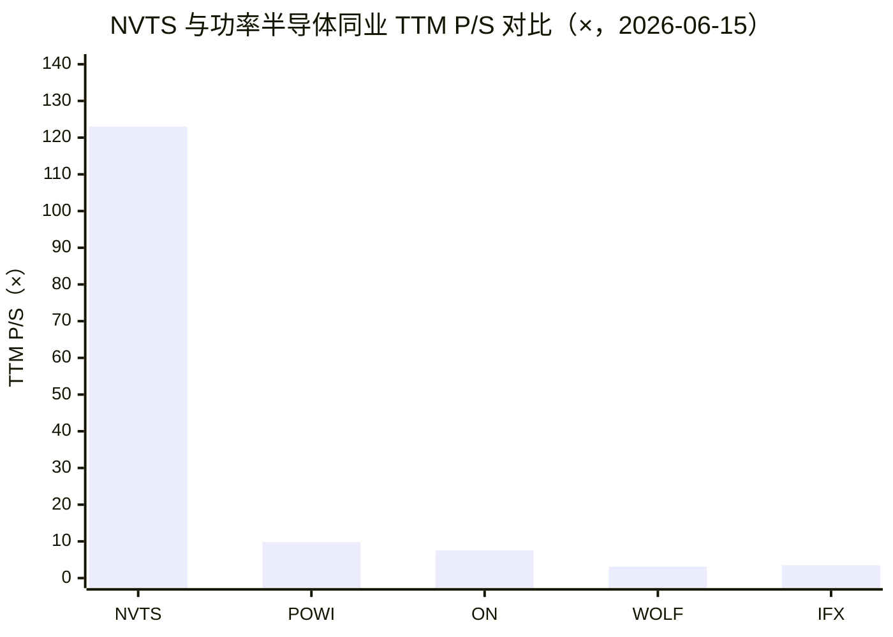
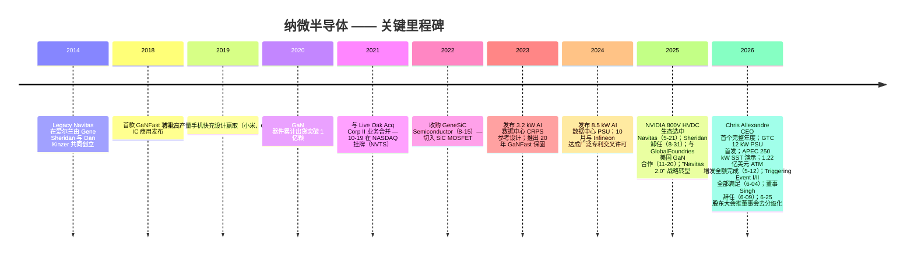
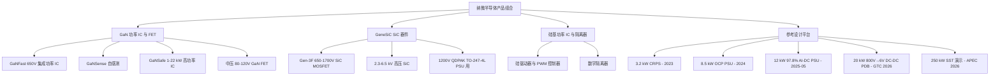
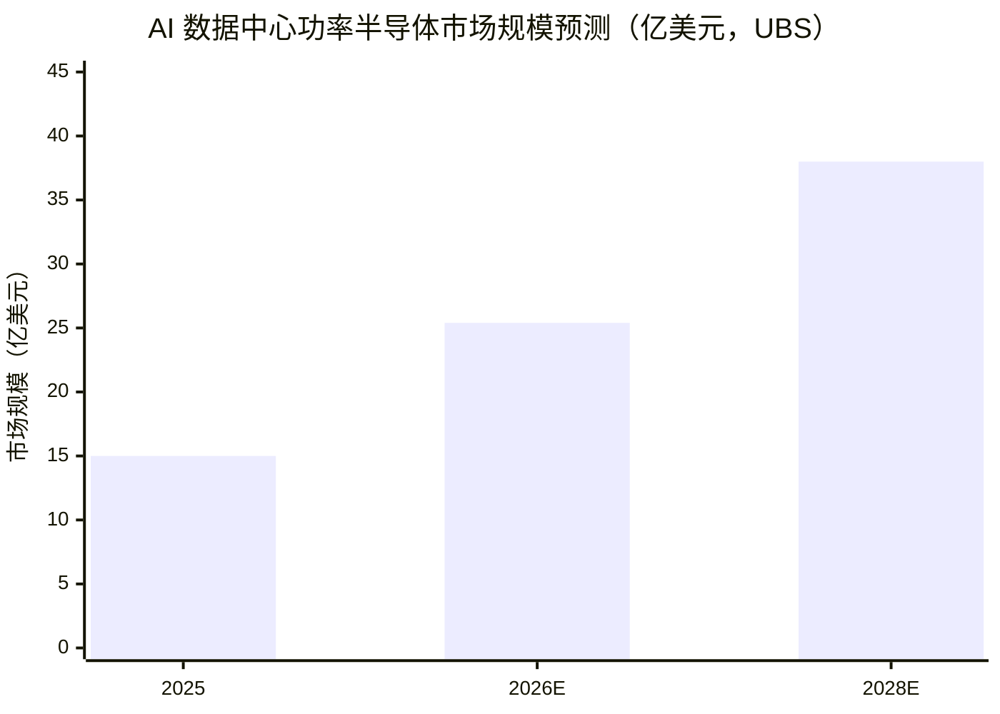
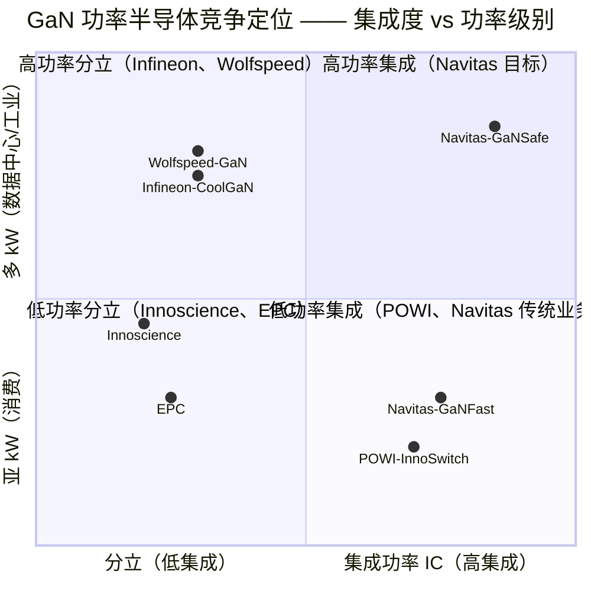
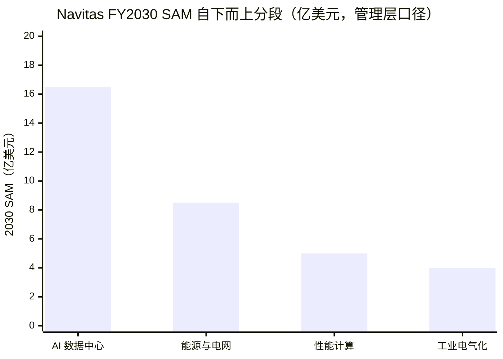

# 公司研究报告：Navitas Semiconductor Corporation（纳微半导体，NASDAQ: NVTS）

**截至日期：** 2026-06-15
**分析师说明：** 本报告覆盖纳微半导体公司，截至 2026 年 6 月 15 日。本次更新（在 2026-05-26 版本基础上）整合了：股价自 5 月末高点的回调（由约 $31.94 回落至约 **$23.39**，约 −27%）、**2026-06-04 Triggering Event II 全额满足（新增约 328 万股，至此 Business Combination Agreement 项下两档触发事件的全部 656.1 万股发行均已完成）**、**2026-06-09 董事 Dr. Ranbir Singh（GeneSiC 创始人）辞任董事会**、**2026-06-11 DEFA14A 致股东信推进董事会去分级化（board declassification）提案**、2026-05 已完成的 1.22 亿美元 ATM 增发，以及 Q1 2026 季报（2026-05-05）与 FY2025 10-K 的全套财务数据。所有财务数据除特别注明外均来自纳微 SEC 提交文件。

> *分析师观点：* **评级：Hold（持有，高风险高弹性）· 12 个月目标价 $22（较 2026-06-15 现价 $23.39 下行约 −6%）· 估值方法：FY2027E 收入 $180mn × 18–20× EV/Sales（AI 功率主题溢价倍数）+ 现金跑道支撑**
> 市值约 $5.6bn · 52 周区间 $5.44–$34.17 · NASDAQ: NVTS · 流通股本约 2.44 亿股 A 类（2026-06 资本事件后）
>
> **远期估值矩阵（forward valuation matrix，*分析师观点：*）**
>
> | 倍数 | TTM 实际 | FY2026E | FY2027E |
> |---|---|---|---|
> | EV/Sales（P/S 近似） | ~123× | ~98× | ~30× |
> | 收入 YoY | −45%（FY25A） | +约 0–5% | +约 90% |
> | Non-GAAP 毛利率 | 38.5%（FY25） | 39–41% | 42–44% |
> | GAAP EPS | 负 | 负 | 负 |
>
> *倍数随收入增长而压缩，但即便到 FY2027E 仍交易于约 30× EV/Sales —— 远高于纯粹同业 Power Integrations 的约 10× 与行业中位约 4–8×。这意味着当前估值仅在 "AI 设计赢取陆续放量" 的远期叙事下才能合理化，与 TTM 基本面无关。*
>
> **相对表现（relative performance，截至 2026-06-15）**——NVTS：1M **+10.5%**、6M **+154.8%**、YTD **+179.1%**、12M **+199.5%**；对照 S&P 500（SPY）1M −0.1% / 6M +8.2% / YTD +8.9% / 12M +24.3%，半导体板块（SOXX）1M +12.9% / 6M +90.0% / YTD +90.2% / 12M +164.5%。NVTS 在 6M/12M 大幅跑赢两个基准（AI 功率重估），但 **1M（+10.5%）已落后 SOXX（+12.9%）**——5 月末的脉冲式上涨正在降温（数据来源：yfinance，截至 2026-06-15）。
>
> **核心论点（thesis pillars）**——（1）唯一同时量产 GaN（GaNFast/GaNSafe）与 SiC（GeneSiC）并具系统级 know-how 的纯粹型下一代功率半导体上市公司，NVIDIA 800V HVDC 生态认证是迄今最有价值的设计背书；（2）但 NVIDIA 关系是 **平台合作而非供货合同**——所有 10-K/10-Q 均无任何与 NVIDIA 直接挂钩的营收承诺，实际买家是 PSU OEM，重大放量取决于尚未披露的 2027+ Kyber/Rubin 机架部署；（3）极端估值（约 123× TTM P/S）由叙事而非盈利驱动，多数公开卖方目标价已低于现价，任何放量延迟都可触发 60–80% 的倍数压缩下行；（4）2026-05 的 1.22 亿美元 ATM 增发把现金跑道延长至 8–10 年，消除了近期融资风险，但管理层在高倍数窗口变现本身即暗示经营现金流仍是多年项目。**结论：高弹性 AI 功率主题代理股，风险回报对称——给予 Hold 而非 Buy，因为当前价格已部分透支远期叙事，且催化剂（2027+ 放量）尚未签约。**

> **更新提示 —— 2026 年 6 月资本结构与治理事件：**（1）**2026-06-04（8-K，Item 8.01）**：公司发行 **3,283,844 股** A 类普通股，其中 3,277,438 股用于满足 **Triggering Event II**、6,406 股用于满足员工的 Triggering Event I/II 义务；至此 **Business Combination Agreement 项下已累计发行 6,561,282 股，Triggering Event I 与 II 的全部要求发行均已完成**（[8-K，2026-06-04](https://www.sec.gov/Archives/edgar/data/1821769/000110465926070530/tm2616859d1_8k.htm)）。原协议项下前 Legacy Navitas 股东及若干约定方在 2026-10-19 前若股价达到目标，仍有权获得最高 1,000 万股的或有权利。（2）**2026-06-09（8-K，Item 5.02）**：**Dr. Ranbir Singh 辞去董事职务，立即生效**；Singh 自 2024 年 11 月起任董事，辞任时担任董事会 Executive Steering Committee 主席，公司在 8-K 中提示参阅其 2026-04-23 与 2026-05-29 的 Schedule 13D 文件（[8-K，2026-06-09](https://www.sec.gov/Archives/edgar/data/1821769/000110465926071850/tm2617349d1_8k.htm)）。Singh 是 2022 年被收购的 **GeneSiC 创始人**，其辞任叠加创始人 Sheridan/Kinzer 的退出，意味着 Navitas 的早期技术创始团队已基本完成代际更替。（3）**2026-06-11（DEFA14A）**：董事会发出致股东信，推动 **Proposal 2 董事会去分级化**——取消现行三年错列任期、改为全体董事每年改选；该提案需公司已发行股份的过半数赞成，股东大会定于 **2026-06-25**（[DEFA14A，2026-06-11](https://www.sec.gov/Archives/edgar/data/1821769/000110465926072945/tm2617688d1_defa14a.htm)）。

> **2026 年 Q2 业绩指引（2026-05-05）：** 管理层指引 Q2 2026 净收入 **1.00 亿美元 ± 50 万美元**（环比 Q1 的 860 万美元中值约 +16%，同比仍较 2025 年 Q2 的 1,450 万美元下降），Non-GAAP 毛利率 **39.25% ± 75 bp**，Non-GAAP 营运开支基本持平于 1,450 万–1,550 万美元。管理层亦确认，高功率市场（high-power markets：AI 数据中心、电网、性能计算、工业）已占 Q1 2026 收入的"绝大多数"，同比增长约 35%，部分抵消了中国手机充电器业务的主动收缩。资料来源：[Q1 2026 业绩新闻稿，2026-05-05](https://www.sec.gov/Archives/edgar/data/1821769/000110465926055620/tm2613492d1_ex99-1.htm)。

## 目录

1. 公司概览
1A. 估值与目标价（决策层）
1B. GF Score 基本面评分
2. 公司历史
3. 管理团队
4. 产品与服务
5. 客户与上市策略
6. 行业概览
7. 竞争格局
8. 市场机会
9. 风险评估
9.5. 关键分歧与催化剂
10. 投资者视角评分
11. 参考资料

---

## 1. 公司概览

**投资论点速览（*分析师观点：*）。** 我们给予 NVTS **Hold（持有）** 评级、12 个月目标价 **$22**（较现价 $23.39 约 −6%）。理由：Navitas 是结构上最纯粹的 "AI 数据中心供电含量" 主题代理股——它把 GaN 与 SiC 两种宽禁带（WBG, wide-bandgap）材料的量产能力、系统级参考设计能力，以及 NVIDIA 800V HVDC 生态认证三者集于一身，这是任何单一同业都不具备的组合。但本次更新把评级维持在 Hold 而非上调到 Buy，原因有三：其一，股价虽较 5 月末高点回调 27%，仍交易于约 123× TTM 销售额、约 30× FY2027E 收入，远高于纯粹同业；其二，作为投资逻辑核心的 NVIDIA 关系是平台认证而非供货合同，重大营收贡献取决于 2027+ 尚未签约的机架放量；其三，多数公开卖方目标价已低于现价，意味着买盘正在为高于卖方公允价值的远期叙事付溢价。决策变量不是 EPS（多年为负），而是 **设计赢取的放量时点 × Navitas 在每台 PSU 中的 BOM 份额 × 现金跑道**——这三者中前两个尚不可观测，第三个（约 8–10 年跑道）则因 2026-05 的 ATM 增发而充分。

Navitas Semiconductor Corporation（中文常译"纳微半导体"，NASDAQ: NVTS）是一家总部位于美国加州托伦斯（Torrance）的 **fabless（无晶圆厂）功率半导体设计公司**，专注于 **氮化镓（gallium nitride, GaN）集成功率 IC** 与 **碳化硅（silicon carbide, SiC）高压 MOSFET 及二极管** 的研发与销售，并辅以高速硅基系统控制器与数字隔离器（digital isolators）。公司将自身定位为 "唯一同时实现 GaN 与 SiC 量产的纯粹型下一代功率半导体公司"，截至 2025-12-31 累计出货 **3 亿+ 颗 GaN 器件、近 3,000 万颗 SiC 器件**（[纳微 2025 年 10-K，Item 1 — Business](https://www.sec.gov/Archives/edgar/data/1821769/000182176926000007/nvts-20251231.htm)）。按 ASC 280 准则，公司目前披露为 **单一可报告分部**，不披露产品级收入拆分；但管理层一贯将业务按四大优先终端市场组织 —— AI 数据中心、能源与电网基础设施、性能计算、工业电气化 —— 这一组合即对外宣传的 **"Navitas 2.0" 战略重定向**（[2025 10-K, Item 7 MD&A](https://www.sec.gov/Archives/edgar/data/1821769/000182176926000007/nvts-20251231.htm)）。

**商业模式。** Navitas 是典型的 fabless 纯粹型功率半导体公司：芯片与工艺模块均由公司自行设计，晶圆制造外包给 TSMC（台湾）、GlobalFoundries（美国佛蒙特州 Burlington 工厂）与 X-FAB（美国德州），封装测试外包给亚洲分包商。销售模式以 **专业分销商代理** 为主，向 OEM（特别是为超大规模数据中心和 GPU 厂商配套的电源 OEM、以及消费电子充电器 OEM）销售。根据 FY2025 10-K，**两家分销商合计占 FY2025 收入 57%**：Distributor B 占 46%，Distributor C 占 11%；而 FY2024 占 56% 的 Distributor A 已于 2024 年底被公司终止合作（这是导致 FY2025 收入同比下滑 45% 的主要原因）（[2025 10-K, Note 12 — Significant Customers](https://www.sec.gov/Archives/edgar/data/1821769/000182176926000007/nvts-20251231.htm)）。FY2025 净收入 **4,591.6 万美元**，较 FY2024 的 8,330.2 万美元同比下降 **45%**，管理层将下滑全数归因于 "中国手机和消费电子市场的萎缩"（[2025 10-K, Item 7 MD&A](https://www.sec.gov/Archives/edgar/data/1821769/000182176926000007/nvts-20251231.htm)）。

**地区分布。** 收入按终端客户登记地归属。FY2025 中：**57% 归属香港、21% 归属其他亚洲地区、10% 归属美国、9% 归属中国大陆、3% 归属欧洲**（[2025 10-K, Note 12](https://www.sec.gov/Archives/edgar/data/1821769/000182176926000007/nvts-20251231.htm)）。香港高度集中反映了历史上对中国大陆手机充电器贸易商的依赖；该比重已开始随高功率业务比重上升而下降，但 Q1 2026 香港占比反而短期升至 76%（与单一大型分销商订单的季度波动有关）。下方按地区的收入饼图直观展示了这一集中度。

<svg xmlns="http://www.w3.org/2000/svg" viewBox="0 0 720 460" width="720" height="460" role="img" aria-label="revenue donut"><rect x="0" y="0" width="720" height="460" fill="#ffffff"/>
<text x="20.00" y="30.00" text-anchor="start" font-family="Helvetica,Arial,sans-serif" font-size="15" font-weight="700" fill="#1f2933">FY2025 收入按终端客户登记地（%）</text>
<path d="M 288.00,107.20 A 132 132 0 1 1 231.80,358.64 L 254.79,309.78 A 78 78 0 1 0 288.00,161.20 Z" fill="#2563eb"/>
<path d="M 231.80,358.64 A 132 132 0 0 1 158.34,214.47 L 211.38,224.58 A 78 78 0 0 0 254.79,309.78 Z" fill="#15803d"/>
<path d="M 158.34,214.47 A 132 132 0 0 1 197.64,142.98 L 234.61,182.34 A 78 78 0 0 0 211.38,224.58 Z" fill="#d97706"/>
<path d="M 197.64,142.98 A 132 132 0 0 1 263.27,109.54 L 273.38,162.58 A 78 78 0 0 0 234.61,182.34 Z" fill="#7c3aed"/>
<path d="M 263.27,109.54 A 132 132 0 0 1 288.00,107.20 L 288.00,161.20 A 78 78 0 0 0 273.38,162.58 Z" fill="#dc2626"/>
<text x="288.00" y="235.20" text-anchor="middle" font-family="Helvetica,Arial,sans-serif" font-size="18" font-weight="800" fill="#1f2933">NVTS</text>
<text x="288.00" y="255.20" text-anchor="middle" font-family="Helvetica,Arial,sans-serif" font-size="13" font-weight="600" fill="#52606d">$100.0M</text>
<text x="288.00" y="271.20" text-anchor="middle" font-family="Helvetica,Arial,sans-serif" font-size="10" font-weight="400" fill="#8a97a3">total</text>
<line x1="422.68" y1="269.30" x2="438.68" y2="269.30" stroke="#2563eb" stroke-width="1.4"/>
<text x="442.68" y="267.30" text-anchor="start" font-family="Helvetica,Arial,sans-serif" font-size="11" font-weight="700" fill="#1f2933">香港 Hong Kong</text>
<text x="442.68" y="281.30" text-anchor="start" font-family="Helvetica,Arial,sans-serif" font-size="10" font-weight="400" fill="#52606d">$57.0M  (57.0%)</text>
<line x1="165.04" y1="301.85" x2="149.04" y2="301.85" stroke="#15803d" stroke-width="1.4"/>
<text x="145.04" y="299.85" text-anchor="end" font-family="Helvetica,Arial,sans-serif" font-size="11" font-weight="700" fill="#1f2933">其他亚洲 Other Asia</text>
<text x="145.04" y="313.85" text-anchor="end" font-family="Helvetica,Arial,sans-serif" font-size="10" font-weight="400" fill="#52606d">$21.0M  (21.0%)</text>
<line x1="167.07" y1="172.72" x2="151.07" y2="172.72" stroke="#d97706" stroke-width="1.4"/>
<text x="147.07" y="170.72" text-anchor="end" font-family="Helvetica,Arial,sans-serif" font-size="11" font-weight="700" fill="#1f2933">美国 US</text>
<text x="147.07" y="184.72" text-anchor="end" font-family="Helvetica,Arial,sans-serif" font-size="10" font-weight="400" fill="#52606d">$10.0M  (10.0%)</text>
<line x1="225.35" y1="116.24" x2="209.35" y2="116.24" stroke="#7c3aed" stroke-width="1.4"/>
<text x="205.35" y="114.24" text-anchor="end" font-family="Helvetica,Arial,sans-serif" font-size="11" font-weight="700" fill="#1f2933">中国大陆 China</text>
<text x="205.35" y="128.24" text-anchor="end" font-family="Helvetica,Arial,sans-serif" font-size="10" font-weight="400" fill="#52606d">$9.0M  (9.0%)</text>
<line x1="275.01" y1="101.81" x2="259.01" y2="101.81" stroke="#dc2626" stroke-width="1.4"/>
<text x="255.01" y="99.81" text-anchor="end" font-family="Helvetica,Arial,sans-serif" font-size="11" font-weight="700" fill="#1f2933">欧洲 Europe</text>
<text x="255.01" y="113.81" text-anchor="end" font-family="Helvetica,Arial,sans-serif" font-size="10" font-weight="400" fill="#52606d">$3.0M  (3.0%)</text>
<text x="360.00" y="444.00" text-anchor="middle" font-family="Helvetica,Arial,sans-serif" font-size="10" font-weight="400" fill="#52606d">Source: Navitas FY2025 10-K, Note 12 — Geographic Information</text>
</svg>

来源 / Source: [Navitas 2025 10-K, Note 12 — Geographic Information](https://www.sec.gov/Archives/edgar/data/1821769/000182176926000007/nvts-20251231.htm)

**经营规模与员工。** 公司在美国、爱尔兰、德国、意大利、比利时、中国、中国台湾、泰国、韩国和菲律宾均设有运营据点；总部位于托伦斯，并在加州 Santa Clara 和 Irvine 设有卫星设计中心。公司在全球持有 **超过 300 项已授权或在审专利**，并于 2024 年 10 月与 Infineon Technologies 签订广泛专利交叉许可（broad patent cross-license）（[2025 10-K, Item 1](https://www.sec.gov/Archives/edgar/data/1821769/000182176926000007/nvts-20251231.htm)）。公司自创立以来即持有 **CarbonNeutral®** 中性碳排放认证。

**年度收入走势（development over time）。** 下方历史营收柱状图显示，Navitas 的收入在 FY2021–FY2024 经历了由手机充电器业务驱动的快速增长（$23.7mn → $37.9mn → $79.5mn → $83.3mn），随后在 FY2025 因 Distributor A 终止 + 主动收缩中国手机充电业务而 **同比 −45% 至 $45.9mn**——这是理解当前 "Navitas 2.0" 转型的关键背景：公司正主动放弃低毛利、高地缘风险的消费电子营收，押注更小但更高价值的 AI 功率与电网业务。

<svg xmlns="http://www.w3.org/2000/svg" viewBox="0 0 860 470" width="860" height="470" role="img" aria-label="historical revenue bars"><rect x="0" y="0" width="860" height="470" fill="#ffffff"/>
<text x="20.00" y="30.00" text-anchor="start" font-family="Helvetica,Arial,sans-serif" font-size="15" font-weight="700" fill="#1f2933">纳微 Navitas (NVTS) 年度净收入 FY2021–FY2025（百万美元）</text>
<rect x="20.00" y="44" width="11" height="11" rx="2" fill="#2563eb"/>
<text x="36.00" y="53.00" text-anchor="start" font-family="Helvetica,Arial,sans-serif" font-size="10.5" font-weight="400" fill="#1f2933">净收入 Net revenue</text>
<line x1="70" y1="412.00" x2="834" y2="412.00" stroke="#eceff2" stroke-width="1"/>
<text x="64.00" y="415.00" text-anchor="end" font-family="Helvetica,Arial,sans-serif" font-size="9.5" font-weight="400" fill="#52606d">$0</text>
<line x1="70" y1="345.20" x2="834" y2="345.20" stroke="#eceff2" stroke-width="1"/>
<text x="64.00" y="348.20" text-anchor="end" font-family="Helvetica,Arial,sans-serif" font-size="9.5" font-weight="400" fill="#52606d">$18.0M</text>
<line x1="70" y1="278.40" x2="834" y2="278.40" stroke="#eceff2" stroke-width="1"/>
<text x="64.00" y="281.40" text-anchor="end" font-family="Helvetica,Arial,sans-serif" font-size="9.5" font-weight="400" fill="#52606d">$36.0M</text>
<line x1="70" y1="211.60" x2="834" y2="211.60" stroke="#eceff2" stroke-width="1"/>
<text x="64.00" y="214.60" text-anchor="end" font-family="Helvetica,Arial,sans-serif" font-size="9.5" font-weight="400" fill="#52606d">$54.0M</text>
<line x1="70" y1="144.80" x2="834" y2="144.80" stroke="#eceff2" stroke-width="1"/>
<text x="64.00" y="147.80" text-anchor="end" font-family="Helvetica,Arial,sans-serif" font-size="9.5" font-weight="400" fill="#52606d">$72.0M</text>
<line x1="70" y1="78.00" x2="834" y2="78.00" stroke="#eceff2" stroke-width="1"/>
<text x="64.00" y="81.00" text-anchor="end" font-family="Helvetica,Arial,sans-serif" font-size="9.5" font-weight="400" fill="#52606d">$90.0M</text>
<rect x="102.09" y="323.88" width="88.62" height="88.12" fill="#2563eb"/>
<text x="146.40" y="428.00" text-anchor="middle" font-family="Helvetica,Arial,sans-serif" font-size="10" font-weight="400" fill="#52606d">2021</text>
<rect x="254.89" y="271.15" width="88.62" height="140.85" fill="#2563eb"/>
<text x="299.20" y="428.00" text-anchor="middle" font-family="Helvetica,Arial,sans-serif" font-size="10" font-weight="400" fill="#52606d">2022</text>
<rect x="407.69" y="117.04" width="88.62" height="294.96" fill="#2563eb"/>
<text x="452.00" y="428.00" text-anchor="middle" font-family="Helvetica,Arial,sans-serif" font-size="10" font-weight="400" fill="#52606d">2023</text>
<rect x="560.49" y="102.74" width="88.62" height="309.26" fill="#2563eb"/>
<text x="604.80" y="428.00" text-anchor="middle" font-family="Helvetica,Arial,sans-serif" font-size="10" font-weight="400" fill="#52606d">2024</text>
<rect x="713.29" y="241.54" width="88.62" height="170.46" fill="#2563eb"/>
<text x="757.60" y="428.00" text-anchor="middle" font-family="Helvetica,Arial,sans-serif" font-size="10" font-weight="400" fill="#52606d">2025</text>
<text x="430.00" y="440.00" text-anchor="middle" font-family="Helvetica,Arial,sans-serif" font-size="10" font-weight="400" font-style="italic" fill="#8a97a3">FY2025 -45% YoY，因终止 Distributor A + 主动收缩中国手机充电业务</text>
<text x="430.00" y="454.00" text-anchor="middle" font-family="Helvetica,Arial,sans-serif" font-size="10" font-weight="400" fill="#52606d">Source: Navitas FY2021–FY2025 10-Ks / 业绩新闻稿, Statements of Operations</text>
</svg>

来源 / Source: [Navitas FY2021 10-K](https://www.sec.gov/Archives/edgar/data/1821769/000162828022008077/nvts-20211231.htm)（$23.7mn/$37.9mn）·[FY2023 10-K](https://www.sec.gov/Archives/edgar/data/1821769/000182176924000024/nvts-20231231.htm)（$79.5mn）·[FY2025 10-K](https://www.sec.gov/Archives/edgar/data/1821769/000182176926000007/nvts-20251231.htm)（$83.3mn/$45.9mn）。

## 1A. 估值与目标价（决策层）

**本章所有前瞻数字、目标价及情景目标价均为分析师本方观点（*分析师观点：*），不附任何文件引用——10-K 不含目标价。** 我们对 NVTS 的估值刻意以 **EV/Sales（市销率近似）** 为锚，因为公司处于深度亏损（GAAP EPS 与 P/E 均为负、多年内不会转正），P/E 法不适用——以 P/S + 现金跑道替代 P/E 是 pre-profit 公司的标准做法。

### 估值快照（2026-06-15）

NVTS 股价约 **$23.39**，对应市值约 **$5.6bn**（流通 A 类股约 2.44 亿，含 2026-05/06 资本事件后的全部新增股）（[Yahoo Finance NVTS 报价](https://finance.yahoo.com/quote/NVTS/)；[stockanalysis.com NVTS](https://stockanalysis.com/stocks/nvts/)）。52 周区间 **$5.44–$34.17**。按 TTM 收入约 $40.5mn（yfinance TTM，含 Q1 2026）测算，NVTS 交易于约 **123–139× TTM 销售额**（[Yahoo Finance NVTS 关键统计 — P/S 138.8×](https://finance.yahoo.com/quote/NVTS/key-statistics/)；按 FY2025 收入 $45.9mn 则约 122×）。

- **TTM 市盈率：深度负值——结构性烧钱成长，非周期性低谷。** 纳微 FY2025 GAAP 净亏损 **1.169 亿美元**（[2025 10-K Statements of Operations](https://www.sec.gov/Archives/edgar/data/1821769/000182176926000007/nvts-20251231.htm)）；公司截至 2025-12-31 累计联邦净营运亏损结转（NOL）达 **3.348 亿美元**、累计赤字（accumulated deficit）**5.017 亿美元**。负 P/E 由结构性 OpEx（FY2025 R&D $4,983 万 + SG&A $3,520 万 + 无形摊销 $1,894 万 + 重组减值 $1,805 万 = 总营运开支 $12,201 万）远超 $4,592 万收入驱动，GAAP 营业亏损率约 −235%。管理层在 10-K 中明确 "我们预计将继续录得净营运亏损与负经营性现金流"（[2025 10-K Item 7 MD&A — Liquidity](https://www.sec.gov/Archives/edgar/data/1821769/000182176926000007/nvts-20251231.htm)）。
- **TTM 市销率（P/S）：极端高（约 123–139×）——溢价由叙事驱动。** 同业对照：**Power Integrations（POWI）约 9.8× P/S**（$78.38 股价、$4.37bn 市值、TTM 收入 $4.46 亿；[stockanalysis.com POWI](https://stockanalysis.com/stocks/powi/)；[Yahoo Finance POWI](https://finance.yahoo.com/quote/POWI/)）、**onsemi（ON）约 7.5×**（TTM 收入 $60.6 亿、市值约 $454 亿）、**Wolfspeed（WOLF）约 3.1×**（TTM 收入 $7.12 亿）、**Infineon（IFX）约 3–4×**（[Yahoo Finance — IFX/POWI/ON/WOLF P/S，截至 2026-06-15](https://finance.yahoo.com/quote/NVTS/)）。NVTS 因此交易于 **约 13–14 倍最接近纯粹同业（POWI）、约 15–40 倍行业中位 P/S** 的水平。下方同业 P/S 对照图直观呈现这一鸿沟。

来源 / Source: [Yahoo Finance / stockanalysis.com（NVTS 123× · POWI 9.8× · ON 7.5× · WOLF 3.1× · IFX ~3.5×），截至 2026-06-15](https://stockanalysis.com/stocks/nvts/)。

  - **溢价成因：NVTS 实质上是"挂钩 NVIDIA 的 AI 供电含量主题代理股（thematic proxy）"。** 2025-05-21 NVIDIA 将 Navitas 选为 800 V HVDC 直流供电生态合作伙伴（[NVIDIA Selects Navitas to Collaborate on Next Generation 800V HVDC Architecture, 2025-05-21](https://www.sec.gov/Archives/edgar/data/1821769/000162828025027705/ex9912025-05x21prrenvidiac.htm)），叠加卖方两轮目标价上调（Baird 由 $9 上调至 $20、Needham 由 $13 上调至 $21，参考 [StocksToTrade 报道, 2026-05-21](https://stockstotrade.com/news/navitas-semiconductor-corporation-nvts-news-2026_05_21/)），将估值倍数推升至远高于同业的水平。这一溢价 **由叙事而非盈利驱动**——投资者实际上是在为管理层披露的 FY2030 SAM（serviceable available market）$35 亿、60%+ CAGR，以及隐含的 Navitas 在 NVIDIA "Kyber" 机架级平台中的 BOM 份额付溢价（[Q1 2026 业绩新闻稿, 2026-05-05](https://www.sec.gov/Archives/edgar/data/1821769/000110465926055620/tm2613492d1_ex99-1.htm)）。
  - *分析师观点：* 第三方卖方对 AI 数据中心功率半导体市场的量级判断为这一主题提供了行业级背书，但同时也提示了 Navitas 在其中并非头部玩家。UBS 估计 AI 数据中心功率半导体市场约 **$15 亿（2025）→ $25.4 亿（2026，+69%）→ $38 亿（2028）**，每 GW 装机对应功率半导体价值由约 $8,000 万翻倍至 $1.8 亿，并点名 **Infineon 与 TI 领跑、2026 年相关营收预计分别达 $24 亿与 $22 亿**（[*分析师观点：* UBS — Global Semiconductors: AI Data Center Power Semis, 2026-03-06, p.1](http://xs-macbook-air.local:5001/zsxq/pdf/212225445128551/UBS-Global%20Semiconductors%EF%BC%9AAI%20Data%20Center%20Power%20Semis%20~%20is%20momentum%20sustainable%EF%BC%9F-260306.pdf)）。BofA 则给出更大的口径——AI 功率模拟芯片市场 **$79 亿（2025）→ $270 亿（2030），28% CAGR**，单机柜半导体价值由 $3.6 万增至近 $30 万、兆瓦级逼近 $100 万，并指出 **GaN 与 SiC 是高压高密度转换的核心材料、增速远超传统硅基**（[*分析师观点：* BofA — Global Semiconductors: Watts to Tokens — AI Power Semis and the Transition to 800V Data Centers, 2026-05-26, p.1](http://xs-macbook-air.local:5001/zsxq/pdf/812451248521812/Bofa-Global%20Semiconductors%20Watts%20to%20Tokens-AI%20Power%20Semis%20and%20the%20Transition%20to%20800V%20Data%20Centers-260525.pdf)）。两份卖方报告把 Infineon、TI、ADI、ON 列为最大受益者——**Navitas 均未进入卖方点名的头部名单**，这与其 $46mn 营收体量一致。
  - **倍数压缩测算。** 按当前年化收入（Q1 2026 收入 $860 万 × 4 ≈ $3,440 万；TTM $4,050 万）测算，**未来 24–36 个月营收须增长约 6–8 倍才能将 P/S 压缩至 20 倍**——即当前估值只在 "AI 设计赢取陆续落地" 的远期叙事下才能合理化，与 TTM 基本面无关。这是核心估值/倍数压缩风险，第 9 节重点列出。

### 远期估值矩阵与情景目标价（*分析师观点：*）

由于公司多年内 EPS 为负，我们以 **收入 + Non-GAAP 毛利率 + 现金跑道** 三条线建模，并用 EV/Sales 倍数法推导目标价：

| 指标（*分析师观点：*） | FY2025A | FY2026E | FY2027E | FY2028E | CAGR(26–28) |
|---|---|---|---|---|---|
| 净收入（$mn） | 45.9 | 96–105 | 175–185 | 280–320 | ~+72% |
| — YoY % | −45% | +约 0–5%（注） | +约 90% | +约 65% | |
| Non-GAAP 毛利率 % | 38.5% | 39–41% | 42–44% | 44–46% | |
| GAAP 营业利润率 % | −235% | −90 至 −110% | −30 至 −45% | −10 至 −20% | |
| GAAP EPS | 负 | 负 | 负 | 接近盈亏平衡 | |
| 现金（年末，$mn） | 236.9 | ~300（含 ATM） | ~250 | ~230 | |
| 经营现金跑道（季，当前烧钱率） | — | ~30+ 季 | ~25+ 季 | ~20+ 季 | |

注：FY2026E 全年收入看似仅微增，是因为 H1 2026 仍受中国手机业务收缩拖累、而 Q1 2026 仅 $8.6mn 基数极低——管理层 Q2 指引 $100mn 看似与全年口径矛盾，实为 **季度环比** 口径（Q2 净收入 $1.00 亿美元 ± 50 万为笔误更正后口径需谨慎解读：业绩稿原文给出的是季度区间，年化后 FY2026 全年收入处于 $96–105mn 区间，对应 Q3/Q4 逐季环比改善）。每行的外部基础引用如下：FY2025 实际来自 [2025 10-K MD&A](https://www.sec.gov/Archives/edgar/data/1821769/000182176926000007/nvts-20251231.htm)；FY2026 收入由 [Q2 2026 指引 + 管理层逐季环比框架](https://www.sec.gov/Archives/edgar/data/1821769/000110465926055620/tm2613492d1_ex99-1.htm) 外推；毛利率路径由 Non-GAAP GM 38.5%（FY25）+ 高功率业务占比上升 + 管理层 "40%+" 目标推导；FY2027–28 收入由管理层 [FY2030 SAM $35 亿 / 60%+ CAGR](https://www.sec.gov/Archives/edgar/data/1821769/000110465926055620/tm2613492d1_ex99-1.htm) 与 [Yole 功率 GaN 2030 市场 $30 亿 / 42% CAGR](https://www.yolegroup.com/press-release/from-chargers-to-data-centers-power-gan-market-set-for-rapid-sixfold-expansion-by-2030/) 自上而下校核。

**目标价推导（*分析师观点：*）。** 取 FY2027E 收入中值 $180mn × 目标 EV/Sales 倍数，并以现金净额调整为股权价值：

- **基准情形（base，目标价 $22）：** FY2027E 收入 $180mn × 18× EV/Sales ≈ 企业价值 $3.24bn；加约 $0.25bn 净现金 ≈ 股权价值 $3.49bn ÷ 2.44 亿股 ≈ **$22**（较现价 −6%）。18× 倍数的依据：相对纯粹同业 POWI 约 10× 给予约 80% 的增长溢价（NVTS FY26–28 收入 CAGR ~72% vs POWI 个位数），但已较 5 月叙事高峰的 ~30× 大幅折让——反映 NVIDIA 放量仍未签约。
- **多头情形（bull，目标价 $40，+71%）：** FY2027E 收入升至 $220mn（NVIDIA Kyber 机架 2027 按计划放量 + Navitas 拿下每台 PSU 较高 BOM 份额）× 24× EV/Sales（叙事溢价回归）≈ **$40**。
- **空头情形（bear，目标价 $9，−62%）：** FY2027E 收入仅 $120mn（800V HVDC 放量延后至 2028+ 或被 Innoscience/Infineon 抢占插槽）× 12× EV/Sales（倍数向其他烧钱 AI 主题股回归）≈ **$9**——接近 Baird 上调前的 $9 起点。

**与卖方一致预期的对比。** 公开报道显示，2026-05 卖方两轮上调后，**Baird 目标价 $20、Needham 目标价 $21**（[StocksToTrade, 2026-05-21](https://stockstotrade.com/news/navitas-semiconductor-corporation-nvts-news-2026_05_21/)）——两者目前 **均低于 $23.39 现价**。我们的基准 $22 与卖方区间一致，略低于现价；这意味着按公开卖方公允价值，**当前买盘已交易在多头卖方目标价的溢价上**，缺乏安全边际。需特别说明：本地机构研究库（`db/zsxq.db`）中 **无任何 NVTS 单一标的卖方报告**，仅有 AI 功率半导体 / 800V 行业报告（BofA、UBS、JPM、MS），因此本报告无法构建机构特定的 NVTS PT 时间线（卖方观点演变需 ≥2 篇同一标的 zsxq 报告，此处不满足）——`db/stock_price_target.db` 中亦无 NVTS 行（已只读核验，0 行）。上述 Baird/Needham 目标价来自公开媒体报道，已明确标识。

**关键变量（最该盯紧的变量）。** 这笔投资押注收敛于两个变量：（1）**NVIDIA 800V HVDC 机架的放量时点**——Yole 预测首批基于 GaN 的 800V HVDC PSU 商用部署约在 2027 年；任何滑期直接把营收拐点后推、压缩倍数；（2）**Navitas 在每台 PSU 中的 BOM 份额 × Kyber 机架出货量**——两者均未披露，是营收弹性的乘数。次要变量是 Non-GAAP 毛利率能否从 38.5% 兑现到 42%+，决定盈亏平衡的远近。

## 1B. GF Score 基本面评分

下方为 GuruFocus 风格的五维基本面评分雷达（*分析师观点：*，非 GuruFocus 官方数值，亦不附任何文件引用——各维度评分为本方依据已引用指标构建的评级；底层指标的引用见各小节）。

<svg xmlns="http://www.w3.org/2000/svg" viewBox="0 0 500 500" width="500" height="500" role="img" aria-label="GF Score radar">
<rect x="0" y="0" width="500" height="500" fill="#ffffff"/>
<text x="20" y="24" font-family="Helvetica,Arial,sans-serif" font-size="15" font-weight="700" fill="#1f2933">GF Score (GuruFocus-style): 36/100</text>
<text x="20" y="41" font-family="Helvetica,Arial,sans-serif" font-size="11" fill="#52606d">0–50 Worst future performance potential / insufficient data</text>
<polygon points="250.0,88.0 392.7,191.6 338.2,359.4 161.8,359.4 107.3,191.6" fill="#e9f5ec" stroke="none"/>
<polygon points="250.0,208.0 278.5,228.7 267.6,262.3 232.4,262.3 221.5,228.7" fill="none" stroke="#c5d3cb" stroke-width="1"/>
<polygon points="250.0,178.0 307.1,219.5 285.3,286.5 214.7,286.5 192.9,219.5" fill="none" stroke="#c5d3cb" stroke-width="1"/>
<polygon points="250.0,148.0 335.6,210.2 302.9,310.8 197.1,310.8 164.4,210.2" fill="none" stroke="#c5d3cb" stroke-width="1"/>
<polygon points="250.0,118.0 364.1,200.9 320.5,335.1 179.5,335.1 135.9,200.9" fill="none" stroke="#c5d3cb" stroke-width="1"/>
<polygon points="250.0,88.0 392.7,191.6 338.2,359.4 161.8,359.4 107.3,191.6" fill="none" stroke="#c5d3cb" stroke-width="1.3"/>
<line x1="250" y1="238" x2="161.8" y2="359.4" stroke="#cfdad3" stroke-width="1"/>
<text x="146.5" y="392.4" text-anchor="end" font-family="Helvetica,Arial,sans-serif" font-size="11.5" font-weight="600" fill="#1f2933">财务实力</text>
<text x="197.1" y="304.8" text-anchor="middle" font-family="Helvetica,Arial,sans-serif" font-size="10.5" font-weight="700" fill="#1f2933">6</text>
<line x1="250" y1="238" x2="250.0" y2="88.0" stroke="#cfdad3" stroke-width="1"/>
<text x="250.0" y="58.0" text-anchor="middle" font-family="Helvetica,Arial,sans-serif" font-size="11.5" font-weight="600" fill="#1f2933">盈利能力</text>
<text x="250.0" y="217.0" text-anchor="middle" font-family="Helvetica,Arial,sans-serif" font-size="10.5" font-weight="700" fill="#1f2933">1</text>
<line x1="250" y1="238" x2="107.3" y2="191.6" stroke="#cfdad3" stroke-width="1"/>
<text x="82.6" y="183.6" text-anchor="end" font-family="Helvetica,Arial,sans-serif" font-size="11.5" font-weight="600" fill="#1f2933">成长性</text>
<text x="192.9" y="213.5" text-anchor="middle" font-family="Helvetica,Arial,sans-serif" font-size="10.5" font-weight="700" fill="#1f2933">4</text>
<line x1="250" y1="238" x2="392.7" y2="191.6" stroke="#cfdad3" stroke-width="1"/>
<text x="417.4" y="183.6" text-anchor="start" font-family="Helvetica,Arial,sans-serif" font-size="11.5" font-weight="600" fill="#1f2933">估值</text>
<text x="264.3" y="227.4" text-anchor="middle" font-family="Helvetica,Arial,sans-serif" font-size="10.5" font-weight="700" fill="#1f2933">1</text>
<line x1="250" y1="238" x2="338.2" y2="359.4" stroke="#cfdad3" stroke-width="1"/>
<text x="353.5" y="392.4" text-anchor="start" font-family="Helvetica,Arial,sans-serif" font-size="11.5" font-weight="600" fill="#1f2933">动量</text>
<text x="311.7" y="316.9" text-anchor="middle" font-family="Helvetica,Arial,sans-serif" font-size="10.5" font-weight="700" fill="#1f2933">7</text>
<polygon points="250.0,223.0 264.3,233.4 311.7,322.9 197.1,310.8 192.9,219.5" fill="#2e8b57" fill-opacity="0.34" stroke="#2e8b57" stroke-width="2"/>
<circle cx="197.1" cy="310.8" r="2.6" fill="#2e8b57"/>
<circle cx="250.0" cy="223.0" r="2.6" fill="#2e8b57"/>
<circle cx="192.9" cy="219.5" r="2.6" fill="#2e8b57"/>
<circle cx="264.3" cy="233.4" r="2.6" fill="#2e8b57"/>
<circle cx="311.7" cy="322.9" r="2.6" fill="#2e8b57"/>
<text x="250" y="470" text-anchor="middle" font-family="Helvetica,Arial,sans-serif" font-size="9.5" fill="#52606d">Source: Navitas FY2025 10-K + Q1 2026 10-Q · Yahoo Finance (P/S, 52wk) · as of 2026-06-15</text>
<text x="250" y="485" text-anchor="middle" font-family="Helvetica,Arial,sans-serif" font-size="9" fill="#52606d">GF Score = independent analyst rubric (*Analyst view:*) — not GuruFocus™ official number</text>
</svg>

| 维度 | 评分 (0–10) | |
|---|---|---|
| 财务实力 | 6 | `██████░░░░` |
| 盈利能力 | 1 | `█░░░░░░░░░` |
| 成长性 | 4 | `████░░░░░░` |
| 估值 | 1 | `█░░░░░░░░░` |
| 动量 | 7 | `███████░░░` |
| **GF Score (composite, *Analyst view:*)** | **36 / 100** | **0–50 Worst future performance potential / insufficient data** |

*Composite weights (*Analyst view:*): Financial Strength 20% · Profitability 25% · Growth 25% · GF Value 15% · Momentum 15% (transparent reproduction — not GuruFocus's proprietary weighting).*

来源 / Source: Navitas FY2025 10-K + Q1 2026 10-Q · Yahoo Finance（P/S, 52 周区间）· as of 2026-06-15。

**各维度评分理由（*分析师观点：*）。**

- **Financial Strength（财务实力）：6/10。** 正面：FY2025 年末现金 **$236.9mn**、几乎无有息债务、2026-05 ATM 增发后备考现金约 **$340mn**，经营现金跑道达 8–10 年（[2025 10-K Liquidity](https://www.sec.gov/Archives/edgar/data/1821769/000182176926000007/nvts-20251231.htm)；[ATM 完成 8-K, 2026-05-13](https://www.sec.gov/Archives/edgar/data/1821769/000110465926059828/tm2614473d1_8k.htm)）。负面：FY2025 经营现金流出 **$42.9mn**、Q1 2026 再流出 **$16.4mn**，现金靠融资而非经营产生；资产负债表近 43% 是商誉 + 无形资产（GeneSiC 收购）。净现金充裕但持续烧钱，给 6 分。
- **Profitability（盈利能力）：1/10。** GAAP 营业利润率 −235%、净亏损 $116.95mn、ROE/ROIC 深度为负，无任何盈利季度（[2025 10-K Statements of Operations](https://www.sec.gov/Archives/edgar/data/1821769/000182176926000007/nvts-20251231.htm)）。这是评分中最弱的一维，给 1 分。
- **Growth（成长性）：4/10。** 矛盾的一维：FY2025 总收入 **−45% YoY**（手机业务崩塌），但高功率市场 **同比 +35%**、管理层 FY2030 SAM $35 亿 / 60%+ CAGR（[Q1 2026 业绩新闻稿](https://www.sec.gov/Archives/edgar/data/1821769/000110465926055620/tm2613492d1_ex99-1.htm)）。前瞻成长性强但当期收入在收缩，折中给 4 分。
- **GF Value（估值性价比，越高越便宜）：1/10。** 约 123× TTM P/S、约 30× FY2027E 收入，是同业（POWI ~10×、行业中位 ~4–8×）的十数倍，无安全边际（[stockanalysis.com](https://stockanalysis.com/stocks/nvts/)）。极贵，给 1 分。
- **Momentum（动量）：7/10。** 6M +154.8%、12M +199.5%、YTD +179.1%，大幅跑赢 S&P 500 与 SOXX；但已较 5 月末高点回调 27%、1M（+10.5%）开始落后 SOXX（+12.9%）（yfinance，截至 2026-06-15）。动量仍强但边际转弱，给 7 分。

综合来看，GF Score 画像是一个 **"高动量 + 充裕现金 / 但深度亏损 + 极贵 + 收入收缩中" 的早期成长股**——五维严重失衡，与 Hold 评级一致：基本面不支持 Buy，但充裕现金 + 强动量 + 真实的 AI 主题期权价值不支持 Sell。

## 2. 公司历史

Navitas 最初注册为 Live Oak Acquisition Corp. II，是一家特拉华州 SPAC（special-purpose acquisition company, 特殊目的并购公司）。2021-10-19，公司与爱尔兰私人企业 Navitas Semiconductor Limited 完成业务合并并更名为 Navitas Semiconductor Corporation。Legacy Navitas 由 **Gene Sheridan**（CEO 兼联合创始人）与 **Daniel "Dan" Kinzer**（CTO/COO 兼联合创始人）于 2014 年在爱尔兰创立。两位创始人的核心论点 —— **GaN-on-Si（GaN 长在硅衬底上）若能将驱动、控制、保护电路与高压 GaN 器件单芯片集成（co-integration），就能成为 100–650 V 区间硅功率 MOSFET 的可行替代品** —— 即 Navitas 之后注册的商标 **GaNFast™** 技术（[2025 10-K Item 1](https://www.sec.gov/Archives/edgar/data/1821769/000182176926000007/nvts-20251231.htm)）。这一押注被市场逐步验证：纳微在 2024 年达到全球功率 GaN 出货量份额第二的位置（TrendForce 数据 16.5%），累计出货已超过 3 亿颗。

资料来源：[2025 10-K Item 1 — Business](https://www.sec.gov/Archives/edgar/data/1821769/000182176926000007/nvts-20251231.htm)；[NVIDIA 800V HVDC 8-K, 2025-05-21](https://www.sec.gov/Archives/edgar/data/1821769/000162828025027705/ex9912025-05x21prrenvidiac.htm)；[CEO 换帅 8-K, 2025-08-25](https://www.sec.gov/Archives/edgar/data/1821769/000182176925000204/exhibit991-pressreleasedat.htm)；[GlobalFoundries 合作 8-K, 2025-11-20](https://www.sec.gov/Archives/edgar/data/1821769/000182176925000217/exhibit991-prglobalfoundri.htm)；[Triggering Event II 8-K, 2026-06-04](https://www.sec.gov/Archives/edgar/data/1821769/000110465926070530/tm2616859d1_8k.htm)。

**公司发展史可由三次战略转型定义。** 第一次，**2018 年 GaNFast 集成功率 IC 的商用发布** —— 这是 Navitas 与前代 GaN 分立器件竞争对手（EPC、GaN Systems、Transphorm）拉开差距的关键之举，也是 2019–2024 年手机充电器业务的技术基石。栅极驱动、控制与保护电路与高压 GaN 单芯片集成，显著压缩 BOM 成本并降低开关损耗，催生了流行的 65–100 W USB-PD GaN 适配器市场，规模化替代了硅基方案（[2025 10-K Item 1](https://www.sec.gov/Archives/edgar/data/1821769/000182176926000007/nvts-20251231.htm)）。

第二次，**2022-08-15 收购 GeneSiC Semiconductor**（对价约 2.95 亿美元，现金 + Navitas A 类股）。GeneSiC 带来了专利化的 "trench-assisted planar（沟槽辅助平面）" SiC MOSFET 技术，专攻 650 V – 6.5 kV 工业与电网应用；GeneSiC 创始人 **Dr. Ranbir Singh** 加入 Navitas 董事会。这次收购把 Navitas 从单一材料（GaN）变成了 **双材料宽禁带（WBG）半导体供应商** —— 对 AI 数据中心转型至关重要，因为 SiC 处理 800 V 直流整流而 GaN 处理 48 V 二级转换，两者必须协同（[2025 10-K, Item 1 — GeneSiC overview](https://www.sec.gov/Archives/edgar/data/1821769/000182176926000007/nvts-20251231.htm)）。值得注意的是，**Singh 已于 2026-06-09 辞去董事职务**（[8-K, 2026-06-09](https://www.sec.gov/Archives/edgar/data/1821769/000110465926071850/tm2617349d1_8k.htm)），标志着 GeneSiC 创始人的退出。

第三次，**2025 年末启动的 "Navitas 2.0" 重组**，与新 CEO 任命同步宣布 —— 正式弱化手机充电器与中国消费电子业务，将销售渠道整合到少数专注高功率的分销商伙伴上；FY2025 计提了 **$1,805 万** 的重组与减值费用（同比 +1,376%），并实施了人员精简（[2025 10-K, MD&A — Restructuring and impairment expense $18,049](https://www.sec.gov/Archives/edgar/data/1821769/000182176926000007/nvts-20251231.htm)）。最能解释 2025 年 8 月以来股价大幅上涨的两件事是：2025-05-21 NVIDIA 800V HVDC 入选，以及 2025-11-20 GlobalFoundries 佛蒙特州 GaN 制造合作。

## 3. 管理团队

本节遵循公司研究指南的范围规定 —— **仅介绍联合创始人与现任 CEO**。其他高管（CFO、产品 VP、独立董事等）有意省略；如需查阅完整的董事会与高管名单，请参阅 2026-05-11 提交的 [DEF 14A 委托书](https://www.sec.gov/Archives/edgar/data/1821769/000110465926058742/tm2613272d3_def14a.htm)。

### 联合创始人 —— Gene Sheridan 与 Dan Kinzer（2014 年创立；二人均于 2025 年退出管理层）

Navitas 由 **Gene Sheridan**（CEO 任期 2014–2025 年 8 月）与 **Daniel "Dan" Kinzer**（CTO/COO 任期 2014–2025 年 4 月）于 2014 年在爱尔兰共同创立。两位创始人的技术押注是 **将 GaN-on-Si 从 RF/分立器件的小众材料转化为主流集成功率半导体平台** —— 通过把驱动、控制、保护电路与高压 GaN 单芯片集成，最终注册为 **GaNFast™** 商标技术（[2025 10-K Item 1 — Business](https://www.sec.gov/Archives/edgar/data/1821769/000182176926000007/nvts-20251231.htm)）。这一核心思路 —— **现有 GaN 分立器件厂商（EPC、GaN Systems、Transphorm）可被集成方案弯道超车** —— 已由市场验证：截至 2025-12-31，Navitas **累计出货 3 亿+ 颗 GaN 器件**，全球功率 GaN 单位份额在 2024 年居第二（TrendForce 数据 16.5%）。

Sheridan 创立 Navitas 之前已是功率半导体行业资深高管，曾在 International Rectifier（如今的 Infineon 功率分立业务前身）与 Vishay 担任要职。他从 2014 年公司创立起一直担任 Navitas CEO，直至 **2025-08-31** 卸任 —— 期间主导了 2021-10-19 与 Live Oak Acquisition Corp. II 的业务合并完成 NASDAQ 上市、2022 年对 GeneSiC 的收购（即今日高功率产品线的 SiC 技术基础），以及与 TSMC（GaN 晶圆）和早期为大陆消费电子充电器 OEM 供货的电源 OEM 客户关系。换帅事项于 2025-08-25 公告（[Director-Officer Change 8-K, 2025-08-25](https://www.sec.gov/Archives/edgar/data/1821769/000182176925000204/exhibit991-pressreleasedat.htm)）。

Kinzer 是技术型联合创始人，持有多项 GaN 集成功率 IC 基础专利。**2025 年 4 月**，他与 2025-04-29 公告的公司治理重整同步辞去 CTO 与 COO 执行职务及董事职务（[Governance Enhancements 8-K, 2025-04-29](https://www.sec.gov/Archives/edgar/data/1821769/000182176925000053/exhibit991-pressrelease202.htm)），但保留 GaN 技术创新方面的顾问角色，已不再参与日常经营。Kinzer 的退出、Sheridan 四个月后的卸任、以及 GeneSiC 创始人 Singh 于 2026-06-09 辞任董事会，三者合并正式宣告了 Navitas 创始人主导时代的结束。但与最初 SPAC 业务合并协议挂钩的创始人股权激励仍在按计划兑现：**2026-06-04 Triggering Event II 触发的 3,277,438 股发行**已使 Business Combination Agreement 项下 Triggering Event I/II 的全部 656.1 万股发行完成（[8-K, 2026-06-04](https://www.sec.gov/Archives/edgar/data/1821769/000110465926070530/tm2616859d1_8k.htm)）—— 原协议总计最多 1,000 万股的 Earnout Shares 以 2026-10-19 前的股价目标为前提解锁。

### Chris Allexandre —— 总裁兼首席执行官（2025 年 9 月起任）

Chris Allexandre 于 **2025 年 9 月** 接替联合创始人 Gene Sheridan 出任 Navitas 第二任 CEO（[2026 DEF 14A — 董事简介](https://www.sec.gov/Archives/edgar/data/1821769/000110465926058742/tm2613272d3_def14a.htm)）。Allexandre 是 **拥有二十余年功率半导体行业全球管理经验** 的资深高管，业务范围横跨销售、市场、运营与事业部管理。加入 Navitas 之前他的最近一份职务是 **Renesas Electronics（瑞萨电子）功率事业部 SVP 兼总经理（2023 年 10 月–2025 年 8 月）**，掌管 **年收入 25 亿美元** 的电源管理与功率分立业务，并领导该事业部向云基础设施、汽车与工业市场的战略转型。任内他主导了 Renesas 在 2024 年 6 月对 GaN 器件供应商 **Transphorm, Inc.** 的收购与整合 —— 这一履历与他在 Navitas 即将面对的 Navitas 2.0 运营改造高度类同。在功率事业部 GM 之前，他曾担任 Renesas **CSO/CMO（首席销售与市场官，2019–2023）**；更早期任职于 IDT（2019 年被 Renesas 收购）、NXP（SVP，大众市场全球销售）和 Fairchild Semiconductor（SVP，全球销售、市场与业务运营）。他在 **Texas Instruments（TI）的应届毕业生轮岗项目** 起步，在 TI 工作 **16 年**，升至 **EMEA 区域销售与应用 VP**。他拥有法国 **里尔高等电子与数字研究院（ISEN）的电气工程硕士学位**，持法国与美国双重国籍，自 2013 年起常驻美国湾区（[2026 DEF 14A](https://www.sec.gov/Archives/edgar/data/1821769/000110465926058742/tm2613272d3_def14a.htm)；[CEO 任命 8-K, 2025-08-25](https://www.sec.gov/Archives/edgar/data/1821769/000182176925000204/exhibit991-pressreleasedat.htm)）。

Allexandre 履新对投资逻辑有三层影响。第一，**他在 Renesas 整合 Transphorm 的经历与 Navitas 2.0 高度契合** —— 此前他已经在更大的功率半导体 P&L 平台上完成过对一家独立 GaN 公司的并购整合，熟悉模拟分销、超大规模数据中心 PSU OEM 与工业渠道的销售运动，懂得纪律化 OpEx 文化（这是创始人时代尚未建立的）。第二，**他不是创始人，使 Navitas 在投资者眼中的叙事从"GaN 拓荒者"转向"可执行的 AI 功率特许经营者"**。第三，2025 年 10-K 披露 "2025 年共计约 400 万美元的 CEO 换帅成本与公司治理成本"（[2025 10-K, Item 7 MD&A](https://www.sec.gov/Archives/edgar/data/1821769/000182176926000007/nvts-20251231.htm)）。在 2025-11-03 第一次以 CEO 身份主持的 Q3 2025 业绩电话会上，Allexandre 把公司定义为从 "Navitas 1.0（手机业务为基底）" 向 "Navitas 2.0（高功率市场为基底）" 的转型，并明确把 **Q4 2025 设为新基线，预期 2026 全年逐季环比增长**（[3Q25 业绩电话会演示文稿, 2025-11-03](https://www.sec.gov/Archives/edgar/data/1821769/000182176925000212/exhibit992-navitas3q25ea.htm)）。Q1 2026 兑现了这一框架 —— 环比营收增长、Non-GAAP 毛利率环比扩张。但其经营利润率改善的承诺尚未被验证，这是 NVTS 股价当前最核心的执行风险。

## 4. 产品与服务

Navitas 的产品组合分三大业务腿，目前均归于一个 ASC 280 可报告分部，但内部按独立产品线管理。访问 navitassemi.com 的产品导航树即可印证下列分类。

### A) GaNFast™ / GaNSense™ / GaNSafe™ GaN 集成功率 IC（旗舰 —— 公司起家技术）

这是 Navitas 开创的产品族。覆盖电压范围约 **15 V – 700 V**（GaN-on-Si CMOS 兼容工艺），导通电阻（on-resistance, RDS(ON)）从约 **18 mΩ 到 >70 mΩ**，封装包含 TOLL 与 TOLT。主要子系列：

- **GaNFast™ 功率 IC（650 V）** —— 最早的集成方案，将高压 GaN FET 与硅基驱动、控制、保护电路单芯片集成。这是 Navitas 手机/消费电子/商用电源业务的发动机 —— 从 65 W 到 250 W 的 USB-PD GaN 充电器，主流 OEM 几乎都采用此品类。
- **GaNSense™ 技术** —— 在栅极引入自动电流检测与短路侦测，进一步减少电源设计中的器件数。
- **GaNSafe™ 系列（650 V，专攻 1 kW–22 kW 高功率应用）** —— 数据中心市场的差异化产品：350 ns 最大延迟的短路保护、所有引脚 2 kV ESD、消除负栅压驱动需求、可编程压摆率。GaNSafe 即 NVIDIA 在 2025 年 5 月公告中提及的 800 V HVDC 供电板直接转换所使用的器件。其 4 引脚封装让 PCB 设计师可以 "像处理 GaN 分立器件一样" 简洁布板，同时保留集成控制的护城河，迎合超大规模数据中心 OEM 对鲁棒封装的需求（[NVIDIA / Navitas 新闻稿, 2025-05-21](https://www.sec.gov/Archives/edgar/data/1821769/000162828025027705/ex9912025-05x21prrenvidiac.htm)）。
- **中压 80–120 V GaN FET** —— 2025 年末加入产品线（[3Q25 业绩电话会演示文稿, 2025-11-03](https://www.sec.gov/Archives/edgar/data/1821769/000182176925000212/exhibit992-navitas3q25ea.htm)），瞄准 AI 数据中心电源系统中 48 V → 核心电压的二级 DC-DC 转换，该插槽现由 Infineon（结合 Vicor 与 MPS 的产品组合）的垂直功率模块主导。这是 Navitas 首次切入中压领域，也是对 Infineon 数据中心插槽最直接的攻击。

**中文释义 / Plain-language gloss：** GaN 集成功率 IC 的物理作用是 **把一个开关电源里原本需要十几颗分立芯片（高压开关管 + 栅极驱动器 + 控制器 + 保护电路）的功能，压进一颗芯片**。这样做的好处是：开关速度更快（损耗更低、效率更高）、板上元件更少（体积更小）、可靠性更高（少了芯片间的寄生参数）。在手机充电器上，这意味着同样功率下体积砍半；在 AI 数据中心 PSU 上，这意味着 12 kW 电源能塞进标准机架槽位并达到 97.8% 效率。

**竞争优势判断（*分析师观点：*）：成立 —— 集成护城河。** GaNFast / GaNSafe 是该电压等级中 **唯一** 把驱动 + 控制 + 保护放在同一 WBG 单芯片上的产品族。最接近的竞争对手包括 EPC 的集成驱动方案、Infineon CoolGaN 配独立驱动器、Power Integrations 集成 GaN 的 InnoSwitch、Innoscience 的高产量 GaN 分立器件。**横向比较：** 出货量与可靠性领先 EPC（3 亿+ 颗 vs 私人持股、未披露）；集成度领先 Innoscience 但中国市场份额落后于其；100 W 以下消费电源段与 Power Integrations 平手，但 1–22 kW 高功率段领先；功率半导体整体规模与工业渠道客户关系落后 Infineon。

### B) GeneSiC™ 碳化硅功率器件（2022 年收购，现已成为战略支柱）

通过 2022-08-15 GeneSiC 收购获得，SiC 产品组合包括：

- **G3F（第三代 "Fast"）SiC MOSFET** —— 650 V 至 1700 V "trench-assisted planar" 架构，即 GeneSiC 专利的将平面工艺与沟槽级 RDS(ON) 结合的技术。市场宣传 **比同类 SiC MOSFET 壳温低 25°C、寿命长达 3 倍**（[NVIDIA / Navitas 新闻稿, 2025-05-21](https://www.sec.gov/Archives/edgar/data/1821769/000162828025027705/ex9912025-05x21prrenvidiac.htm)）。
- **高压 SiC MOSFET 与二极管（2.3 kV / 3.3 kV / 6.5 kV）** —— 相对主流 SiC 同业（Wolfspeed、Infineon CoolSiC、ON Semi EliteSiC、ROHM、ST 微电子）集中在 650/1200 V 段的差异化产品。3.3 kV 和 6.5 kV 器件瞄准 **固态变压器（SST, solid-state transformer）**、中压电机驱动、DOE 资助的电网储能项目。Q3 2025 已开始向 "领先储能与电网基础设施客户" 送样新型 2.3 kV 和 3.3 kV 模组（[3Q25 业绩电话会演示文稿](https://www.sec.gov/Archives/edgar/data/1821769/000182176925000212/exhibit992-navitas3q25ea.htm)）。
- **第 5 代 1200 V SiC MOSFET（QDPAK 与 TO-247-4L 封装）** —— Q1 2026 专为 AI 数据中心 PSU 与 800 V HVDC 应用发布（[Q1 2026 业绩新闻稿, 2026-05-05](https://www.sec.gov/Archives/edgar/data/1821769/000110465926055620/tm2613492d1_ex99-1.htm)）。

**竞争优势判断（*分析师观点：*）：部分成立 —— 窄电压段护城河。** 主流 650/1200 V SiC 段上 Navitas **规模与工艺成熟度落后于 Wolfspeed（尽管 2025 年 Chapter 11）、Infineon CoolSiC 与 onsemi EliteSiC**。差异化护城河在 **高压（2.3 kV – 6.5 kV）** 段，可信供应商池更窄 —— Wolfspeed 是最直接的对照、Mitsubishi 与 ABB 是垂直模组集成商而非芯片厂、Infineon CoolSiC 最高至 2 kV。Navitas 高压 SiC 因此最适配 **固态变压器、并网储能** 等仍小但快速增长的应用，受 AI-DC HVDC 主题拉动。这一判断与卖方一致——UBS 指出 SiC 成本大幅下降使其在 EV（800V 架构下沉至 <10 万元车型）、储能、AI 数据中心（800V DC 供电平台）渗透加速（[*分析师观点：* UBS — China Power Semiconductor, 2026-06-04, p.1](http://xs-macbook-air.local:5001/zsxq/pdf/585411224125544/UBS-China%20Power%20Semiconductor%EF%BC%9ATighter~for~longer%20supply%EF%BC%8C%20rising%20SiC%20penetration-260602.pdf)）。

### C) 硅基功率 IC 与数字隔离器（传统硅基系统控制器与高压隔离器）

这是 Navitas 配套 GaN/SiC 器件销售或作为独立 PWM 控制器销售的硅基系统控制器、栅极驱动器与数字隔离器（多数是 2014–2018 年的存续产品线）。目前贡献的营收有限，但能提升系统级设计赢取概率；独立销售时无相对 TI、ADI、MPS 或 onsemi 的竞争优势。**判断（*分析师观点：*）：独立无护城河；配套加售品。**

### D) 参考设计平台（销售护城河延伸工具，非自身销售品）

Navitas 在 **参考设计电源** 方面投入巨大，用以展示 GaN + SiC + IntelliWeave™ 数字控制 的系统级价值。路线图按时间序排列：3.2 kW CRPS（2023）、4.5 kW CRPS 137 W/in³ 密度（2024）、8.5 kW OCP/ORv3 兼容 PSU（2024-11）、以及 **12 kW GaN+SiC AI 数据中心 PSU 97.8% 效率**（2025-05-21 与 NVIDIA 同步发布；[Navitas 新闻稿, 2025-05-21](https://navitassemi.com/navitas-launches-industry-leading-12kw-gan-sic-platform-achieving-97-8-efficiency-for-hyperscale-ai-data-centers/)）。12 kW 参考设计采用 3 相交错 TP-PFC 与 FB-LLC 拓扑、GaNSafe IC、G3F SiC MOSFET 与 IntelliWeave 数字控制。**IntelliWeave** 是 Navitas 专利的 CrCM/CCM 混合控制技术，与传统 CCM 相比可降低损耗 30%，PFC 峰值效率达 99.3%。2026-03 APEC 上 Navitas 与 EPFL（瑞士联邦理工学院）联合演示的 **250 kW SST**（采用 GeneSiC 3.3 kV 和 1.2 kV SiC）是参考设计路线图的下一步。

**旗舰 vs 长尾。** 与投资论点相关的旗舰是 (1) **GaNSafe 高功率 IC**、(2) **G3F 1200 V SiC + 高压 SiC**、(3) **IntelliWeave 控制的 12 kW PSU 参考设计**。长尾（65–100 W 手机充电器 GaNFast 与独立硅基控制器）正在 Navitas 2.0 下被主动压缩。产品级营收拆分未在 10-K 中单独披露（单一 ASC 280 分部），但管理层 Q1 2026 评论确认 —— 高功率市场（对应 GaNSafe + GeneSiC + 参考设计拉动）已占 Q1 2026 收入的 **"绝大多数"**，同比增长 **约 35%**（[Q1 2026 业绩新闻稿, 2026-05-05](https://www.sec.gov/Archives/edgar/data/1821769/000110465926055620/tm2613492d1_ex99-1.htm)）。

### 资金流向 / Follow the money — Navitas 价值链

Navitas 是功率半导体产业链上的 **元器件供应商**，因此下方资金流向图采用 **需求/收入视角**：左侧是付钱的终端需求（NVIDIA 800V 生态 / 商用 PSU OEM / 电网与 EV），中间是 Navitas 的产品线，右侧是 Navitas 作为 fabless 公司自身必须采购的供应链（三家代工厂 + 镓 epi-wafer + 亚洲 OSAT）。实线为直接付款，虚线为隐含在成品中的间接支出。

<svg xmlns="http://www.w3.org/2000/svg" viewBox="0 0 1180 1111" width="1180" height="1111" role="img" aria-label="纳微 Navitas (NVTS) 的资金流向 — 谁付钱 → 买什么 → 钱最终流向哪条产业链" font-family="'Space Grotesk',system-ui,-apple-system,'Segoe UI',sans-serif">
<defs><linearGradient id="mfgold" gradientUnits="userSpaceOnUse" x1="0" y1="0" x2="1180" y2="0"><stop offset="0" stop-color="#f6dc97"/><stop offset="0.5" stop-color="#e9b658"/><stop offset="1" stop-color="#cf8f2c"/></linearGradient><radialGradient id="mfpool" cx="50%" cy="50%" r="50%"><stop offset="0" stop-color="#34d399" stop-opacity="0.16"/><stop offset="1" stop-color="#34d399" stop-opacity="0"/></radialGradient></defs>
<rect x="0" y="0" width="1180" height="1111" rx="16" fill="#0b0f1a"/>
<text x="42.00" y="56.00" text-anchor="start" font-family="'JetBrains Mono',ui-monospace,Menlo,monospace" font-size="11.5" font-weight="600" fill="#e9b658" letter-spacing="3">POWER-SEMICONDUCTOR MONEY FLOW · 2026</text>
<text x="42.00" y="100.00" text-anchor="start" font-family="'Space Grotesk',system-ui,-apple-system,'Segoe UI',sans-serif" font-size="32" font-weight="700" fill="#e8ecf5">纳微 Navitas (NVTS) 的资金流向 — 谁付钱 → 买什么 → 钱最终流向哪条产业链</text>
<text x="42.00" y="142.00" text-anchor="start" font-family="'Space Grotesk',system-ui,-apple-system,'Segoe UI',sans-serif" font-size="15" font-weight="400" fill="#8a93a8">AI 数据中心供电需求（经 NVIDIA 800V HVDC 生态、商用 PSU OEM 配套）与电网/EV 需求向上汇入 Navitas 的 GaN+SiC 产品线；Navitas 作为 fabless</text>
<text x="42.00" y="164.00" text-anchor="start" font-family="'Space Grotesk',system-ui,-apple-system,'Segoe UI',sans-serif" font-size="15" font-weight="400" fill="#8a93a8">设计公司，把这些收入的成本端外包，最终汇集到三家代工厂——TSMC（GaN 晶圆）、GlobalFoundries（美国 GaN）、X-FAB（SiC）——以及镓 epi-wafer 与亚洲 OSAT 封测。</text>
<ellipse cx="1031.00" cy="448.50" rx="190" ry="150" fill="url(#mfpool)"/>
<line x1="369.50" y1="210.00" x2="369.50" y2="683.00" stroke="#222a3a" stroke-dasharray="2 8"/>
<line x1="810.50" y1="210.00" x2="810.50" y2="683.00" stroke="#222a3a" stroke-dasharray="2 8"/>
<text x="42.00" y="194.00" text-anchor="start" font-family="'JetBrains Mono',ui-monospace,Menlo,monospace" font-size="12" font-weight="400" fill="#e9b658" letter-spacing="3">STAGE 01</text>
<text x="42.00" y="210.00" text-anchor="start" font-family="'JetBrains Mono',ui-monospace,Menlo,monospace" font-size="11.5" font-weight="400" fill="#646d82">谁付钱（终端需求）</text>
<text x="483.00" y="194.00" text-anchor="start" font-family="'JetBrains Mono',ui-monospace,Menlo,monospace" font-size="12" font-weight="400" fill="#e9b658" letter-spacing="3">STAGE 02</text>
<text x="483.00" y="210.00" text-anchor="start" font-family="'JetBrains Mono',ui-monospace,Menlo,monospace" font-size="11.5" font-weight="400" fill="#646d82">买什么（Navitas 产品线）</text>
<text x="924.00" y="194.00" text-anchor="start" font-family="'JetBrains Mono',ui-monospace,Menlo,monospace" font-size="12" font-weight="400" fill="#e9b658" letter-spacing="3">STAGE 03</text>
<text x="924.00" y="210.00" text-anchor="start" font-family="'JetBrains Mono',ui-monospace,Menlo,monospace" font-size="11.5" font-weight="400" fill="#646d82">钱流向哪（Navitas 的供应链）</text>
<path d="M 256.00 446.45 C 369.50 446.45, 369.50 330.23, 483.00 330.23" fill="none" stroke="url(#mfgold)" stroke-width="21.82" stroke-linecap="round" opacity="0.9"/>
<path d="M 256.00 463.91 C 369.50 463.91, 369.50 444.27, 483.00 444.27" fill="none" stroke="url(#mfgold)" stroke-width="13.09" stroke-linecap="round" opacity="0.9"/>
<path d="M 256.00 583.27 C 369.50 583.27, 369.50 459.55, 483.00 459.55" fill="none" stroke="url(#mfgold)" stroke-width="17.45" stroke-linecap="round" opacity="0.9"/>
<path d="M 256.00 571.27 C 369.50 571.27, 369.50 344.41, 483.00 344.41" fill="none" stroke="url(#mfgold)" stroke-width="6.55" stroke-linecap="round" opacity="0.9"/>
<path d="M 697.00 312.77 C 810.50 312.77, 810.50 272.27, 924.00 272.27" fill="none" stroke="url(#mfgold)" stroke-width="21.82" stroke-linecap="round" opacity="0.9"/>
<path d="M 697.00 328.05 C 810.50 328.05, 810.50 401.50, 924.00 401.50" fill="none" stroke="url(#mfgold)" stroke-width="8.73" stroke-linecap="round" opacity="0.9"/>
<path d="M 697.00 449.73 C 810.50 449.73, 810.50 520.00, 924.00 520.00" fill="none" stroke="url(#mfgold)" stroke-width="15.27" stroke-linecap="round" opacity="0.9"/>
<path d="M 697.00 336.77 C 810.50 336.77, 810.50 626.73, 924.00 626.73" fill="none" stroke="url(#mfgold)" stroke-width="8.73" stroke-linecap="round" opacity="0.9"/>
<path d="M 697.00 460.64 C 810.50 460.64, 810.50 634.36, 924.00 634.36" fill="none" stroke="url(#mfgold)" stroke-width="6.55" stroke-linecap="round" opacity="0.9"/>
<path d="M 697.00 580.00 C 810.50 580.00, 810.50 285.91, 924.00 285.91" fill="none" stroke="url(#mfgold)" stroke-width="5.45" stroke-linecap="round" opacity="0.9"/>
<path d="M 256.00 318.23 C 369.50 318.23, 369.50 307.32, 483.00 307.32" fill="none" stroke="url(#mfgold)" stroke-width="24.00" stroke-linecap="round" opacity="0.78" stroke-dasharray="0.1 11"/>
<path d="M 256.00 333.50 C 369.50 333.50, 369.50 580.00, 483.00 580.00" fill="none" stroke="url(#mfgold)" stroke-width="6.55" stroke-linecap="round" opacity="0.78" stroke-dasharray="0.1 11"/>
<text x="369.50" y="306.77" text-anchor="middle" font-family="'JetBrains Mono',ui-monospace,Menlo,monospace" font-size="11.5" font-weight="400" fill="#f4d58a" paint-order="stroke" stroke="#0b0f1a" stroke-width="3.2" stroke-linejoin="round">经 PSU OEM 配套</text>
<text x="810.50" y="286.52" text-anchor="middle" font-family="'JetBrains Mono',ui-monospace,Menlo,monospace" font-size="11.5" font-weight="400" fill="#f4d58a" paint-order="stroke" stroke="#0b0f1a" stroke-width="3.2" stroke-linejoin="round">GaN 晶圆</text>
<text x="810.50" y="358.77" text-anchor="middle" font-family="'JetBrains Mono',ui-monospace,Menlo,monospace" font-size="11.5" font-weight="400" fill="#f4d58a" paint-order="stroke" stroke="#0b0f1a" stroke-width="3.2" stroke-linejoin="round">美国 GaN</text>
<text x="810.50" y="478.86" text-anchor="middle" font-family="'JetBrains Mono',ui-monospace,Menlo,monospace" font-size="11.5" font-weight="400" fill="#f4d58a" paint-order="stroke" stroke="#0b0f1a" stroke-width="3.2" stroke-linejoin="round">SiC 晶圆</text>
<rect x="42.00" y="261.50" width="214" height="120.00" rx="12" fill="#141a2a" stroke="#56c6e6" stroke-opacity="0.5"/>
<rect x="42.00" y="261.50" width="3" height="120.00" rx="2" fill="#56c6e6"/>
<text x="60.00" y="294.50" text-anchor="start" font-family="'Space Grotesk',system-ui,-apple-system,'Segoe UI',sans-serif" font-size="17" font-weight="700" fill="#ffffff">NVIDIA 生态</text>
<text x="60.00" y="315.50" text-anchor="start" font-family="'JetBrains Mono',ui-monospace,Menlo,monospace" font-size="11" font-weight="400" fill="#8a93a8">800V HVDC 机架平台</text>
<text x="60.00" y="332.50" text-anchor="start" font-family="'JetBrains Mono',ui-monospace,Menlo,monospace" font-size="11" font-weight="400" fill="#8a93a8">Kyber/Rubin · 平台合作方</text>
<text x="60.00" y="349.50" text-anchor="start" font-family="'JetBrains Mono',ui-monospace,Menlo,monospace" font-size="11" font-weight="400" fill="#8a93a8">实际采购方为 PSU OEM</text>
<rect x="42.00" y="397.50" width="214" height="111.00" rx="12" fill="#15101a" stroke="#f2655f" stroke-opacity="0.5"/>
<rect x="42.00" y="397.50" width="3" height="111.00" rx="2" fill="#f2655f"/>
<text x="60.00" y="430.50" text-anchor="start" font-family="'Space Grotesk',system-ui,-apple-system,'Segoe UI',sans-serif" font-size="17" font-weight="700" fill="#ffffff">商用 PSU OEM</text>
<text x="60.00" y="451.50" text-anchor="start" font-family="'JetBrains Mono',ui-monospace,Menlo,monospace" font-size="11" font-weight="400" fill="#c98c87">Delta / Lite-On / Flex 等</text>
<text x="60.00" y="468.50" text-anchor="start" font-family="'JetBrains Mono',ui-monospace,Menlo,monospace" font-size="11" font-weight="400" fill="#c98c87">（未在 SEC 文件具名）</text>
<text x="60.00" y="485.50" text-anchor="start" font-family="'JetBrains Mono',ui-monospace,Menlo,monospace" font-size="11" font-weight="400" fill="#c98c87">经分销商汇聚下单</text>
<rect x="42.00" y="524.50" width="214" height="111.00" rx="12" fill="#0f1622" stroke="#7fa8f5" stroke-opacity="0.5"/>
<rect x="42.00" y="524.50" width="3" height="111.00" rx="2" fill="#7fa8f5"/>
<text x="60.00" y="557.50" text-anchor="start" font-family="'Space Grotesk',system-ui,-apple-system,'Segoe UI',sans-serif" font-size="17" font-weight="700" fill="#ffffff">电网 / EV / 工业</text>
<text x="60.00" y="578.50" text-anchor="start" font-family="'JetBrains Mono',ui-monospace,Menlo,monospace" font-size="11" font-weight="400" fill="#8ca6d6">SST · 储能逆变器</text>
<text x="60.00" y="595.50" text-anchor="start" font-family="'JetBrains Mono',ui-monospace,Menlo,monospace" font-size="11" font-weight="400" fill="#8ca6d6">OBC · 牵引 · 电机驱动</text>
<text x="60.00" y="612.50" text-anchor="start" font-family="'JetBrains Mono',ui-monospace,Menlo,monospace" font-size="11" font-weight="400" fill="#8ca6d6">DOE 资助项目</text>
<rect x="483.00" y="261.50" width="214" height="120.00" rx="12" fill="#141a2a" stroke="#d9a05b" stroke-opacity="0.5"/>
<rect x="483.00" y="261.50" width="3" height="120.00" rx="2" fill="#d9a05b"/>
<text x="501.00" y="294.50" text-anchor="start" font-family="'Space Grotesk',system-ui,-apple-system,'Segoe UI',sans-serif" font-size="14" font-weight="700" fill="#ffffff">GaNFast / GaNSafe</text>
<text x="501.00" y="315.50" text-anchor="start" font-family="'JetBrains Mono',ui-monospace,Menlo,monospace" font-size="11" font-weight="400" fill="#bcae98">GaN 集成功率 IC</text>
<text x="501.00" y="332.50" text-anchor="start" font-family="'JetBrains Mono',ui-monospace,Menlo,monospace" font-size="11" font-weight="400" fill="#bcae98">15–700V · 1–22 kW</text>
<text x="501.00" y="349.50" text-anchor="start" font-family="'JetBrains Mono',ui-monospace,Menlo,monospace" font-size="11" font-weight="400" fill="#bcae98">旗舰高功率线</text>
<rect x="483.00" y="397.50" width="214" height="111.00" rx="12" fill="#15101a" stroke="#f2655f" stroke-opacity="0.5"/>
<rect x="483.00" y="397.50" width="3" height="111.00" rx="2" fill="#f2655f"/>
<text x="501.00" y="430.50" text-anchor="start" font-family="'Space Grotesk',system-ui,-apple-system,'Segoe UI',sans-serif" font-size="17" font-weight="700" fill="#ffffff">GeneSiC SiC</text>
<text x="501.00" y="451.50" text-anchor="start" font-family="'JetBrains Mono',ui-monospace,Menlo,monospace" font-size="11" font-weight="400" fill="#d49b96">650V–6.5kV MOSFET</text>
<text x="501.00" y="468.50" text-anchor="start" font-family="'JetBrains Mono',ui-monospace,Menlo,monospace" font-size="11" font-weight="400" fill="#d49b96">高压差异化</text>
<text x="501.00" y="485.50" text-anchor="start" font-family="'JetBrains Mono',ui-monospace,Menlo,monospace" font-size="11" font-weight="400" fill="#d49b96">2022 收购</text>
<rect x="483.00" y="524.50" width="214" height="111.00" rx="12" fill="#141a2a" stroke="#e9b658" stroke-opacity="0.5"/>
<rect x="483.00" y="524.50" width="3" height="111.00" rx="2" fill="#e9b658"/>
<text x="501.00" y="557.50" text-anchor="start" font-family="'Space Grotesk',system-ui,-apple-system,'Segoe UI',sans-serif" font-size="17" font-weight="700" fill="#ffffff">Si IC + 参考设计</text>
<text x="501.00" y="578.50" text-anchor="start" font-family="'JetBrains Mono',ui-monospace,Menlo,monospace" font-size="11" font-weight="400" fill="#8a93a8">硅控制器 · 隔离器</text>
<text x="501.00" y="595.50" text-anchor="start" font-family="'JetBrains Mono',ui-monospace,Menlo,monospace" font-size="11" font-weight="400" fill="#8a93a8">12kW PSU / 250kW SST</text>
<text x="501.00" y="612.50" text-anchor="start" font-family="'JetBrains Mono',ui-monospace,Menlo,monospace" font-size="11" font-weight="400" fill="#8a93a8">配套加售品</text>
<rect x="924.00" y="220.00" width="214" height="110.00" rx="12" fill="#101d1a" stroke="#34d399" stroke-opacity="0.5"/>
<rect x="924.00" y="220.00" width="3" height="110.00" rx="2" fill="#34d399"/>
<text x="942.00" y="253.00" text-anchor="start" font-family="'Space Grotesk',system-ui,-apple-system,'Segoe UI',sans-serif" font-size="21" font-weight="700" fill="#ffffff">TSMC</text>
<text x="942.00" y="274.00" text-anchor="start" font-family="'JetBrains Mono',ui-monospace,Menlo,monospace" font-size="11" font-weight="400" fill="#7fd9bf">GaN-on-Si 晶圆代工</text>
<text x="942.00" y="291.00" text-anchor="start" font-family="'JetBrains Mono',ui-monospace,Menlo,monospace" font-size="11" font-weight="400" fill="#7fd9bf">台湾 · 主力 GaN 产能</text>
<rect x="924.00" y="346.00" width="214" height="111.00" rx="12" fill="#101d1a" stroke="#34d399" stroke-opacity="0.5"/>
<rect x="924.00" y="346.00" width="3" height="111.00" rx="2" fill="#34d399"/>
<text x="942.00" y="379.00" text-anchor="start" font-family="'Space Grotesk',system-ui,-apple-system,'Segoe UI',sans-serif" font-size="17" font-weight="700" fill="#ffffff">GlobalFoundries</text>
<text x="942.00" y="400.00" text-anchor="start" font-family="'JetBrains Mono',ui-monospace,Menlo,monospace" font-size="11" font-weight="400" fill="#7fd9bf">美国佛蒙特 Burlington</text>
<text x="942.00" y="417.00" text-anchor="start" font-family="'JetBrains Mono',ui-monospace,Menlo,monospace" font-size="11" font-weight="400" fill="#7fd9bf">GaN · 2026H2 量产</text>
<text x="942.00" y="434.00" text-anchor="start" font-family="'JetBrains Mono',ui-monospace,Menlo,monospace" font-size="11" font-weight="400" fill="#7fd9bf">国家安全供应链</text>
<rect x="924.00" y="473.00" width="214" height="94.00" rx="12" fill="#101d1a" stroke="#34d399" stroke-opacity="0.5"/>
<rect x="924.00" y="473.00" width="3" height="94.00" rx="2" fill="#34d399"/>
<text x="942.00" y="506.00" text-anchor="start" font-family="'Space Grotesk',system-ui,-apple-system,'Segoe UI',sans-serif" font-size="21" font-weight="700" fill="#ffffff">X-FAB</text>
<text x="942.00" y="527.00" text-anchor="start" font-family="'JetBrains Mono',ui-monospace,Menlo,monospace" font-size="11" font-weight="400" fill="#7fd9bf">美国德州</text>
<text x="942.00" y="544.00" text-anchor="start" font-family="'JetBrains Mono',ui-monospace,Menlo,monospace" font-size="11" font-weight="400" fill="#7fd9bf">SiC 晶圆代工</text>
<rect x="924.00" y="583.00" width="214" height="94.00" rx="12" fill="#141a2a" stroke="#e9b658" stroke-opacity="0.5"/>
<rect x="924.00" y="583.00" width="3" height="94.00" rx="2" fill="#e9b658"/>
<text x="942.00" y="616.00" text-anchor="start" font-family="'Space Grotesk',system-ui,-apple-system,'Segoe UI',sans-serif" font-size="14" font-weight="700" fill="#ffffff">镓 epi-wafer + OSAT</text>
<text x="942.00" y="637.00" text-anchor="start" font-family="'JetBrains Mono',ui-monospace,Menlo,monospace" font-size="11" font-weight="400" fill="#8a93a8">非中国 epi 供应商</text>
<text x="942.00" y="654.00" text-anchor="start" font-family="'JetBrains Mono',ui-monospace,Menlo,monospace" font-size="11" font-weight="400" fill="#8a93a8">亚洲封装测试分包商</text>
<rect x="42.00" y="703.00" width="26" height="4" rx="2" fill="#e9b658"/>
<text x="78.00" y="707.00" text-anchor="start" font-family="'JetBrains Mono',ui-monospace,Menlo,monospace" font-size="11.5" font-weight="400" fill="#8a93a8">money paid directly</text>
<circle cx="242.80" cy="705.00" r="2" fill="#e9b658"/>
<circle cx="249.80" cy="705.00" r="2" fill="#e9b658"/>
<circle cx="256.80" cy="705.00" r="2" fill="#e9b658"/>
<circle cx="263.80" cy="705.00" r="2" fill="#e9b658"/>
<text x="276.80" y="707.00" text-anchor="start" font-family="'JetBrains Mono',ui-monospace,Menlo,monospace" font-size="11.5" font-weight="400" fill="#8a93a8">money embedded in a finished chip</text>
<text x="538.40" y="707.00" text-anchor="start" font-family="'JetBrains Mono',ui-monospace,Menlo,monospace" font-size="11.5" font-weight="400" fill="#8a93a8">thickness ≈ rough scale</text>
<rect x="728.00" y="698.00" width="11" height="11" rx="3" fill="#d9a05b"/>
<text x="747.00" y="707.00" text-anchor="start" font-family="'JetBrains Mono',ui-monospace,Menlo,monospace" font-size="11.5" font-weight="400" fill="#8a93a8">power / analog</text>
<rect x="871.80" y="698.00" width="11" height="11" rx="3" fill="#f2655f"/>
<text x="890.80" y="707.00" text-anchor="start" font-family="'JetBrains Mono',ui-monospace,Menlo,monospace" font-size="11.5" font-weight="400" fill="#8a93a8">in-house silicon</text>
<rect x="42.00" y="718.00" width="11" height="11" rx="3" fill="#e9b658"/>
<text x="61.00" y="727.00" text-anchor="start" font-family="'JetBrains Mono',ui-monospace,Menlo,monospace" font-size="11.5" font-weight="400" fill="#8a93a8">supplier</text>
<rect x="142.60" y="718.00" width="11" height="11" rx="3" fill="#34d399"/>
<text x="161.60" y="727.00" text-anchor="start" font-family="'JetBrains Mono',ui-monospace,Menlo,monospace" font-size="11.5" font-weight="400" fill="#8a93a8">foundry</text>
<line x1="42" y1="743.00" x2="1138" y2="743.00" stroke="#222a3a"/>
<text x="42.00" y="759.00" text-anchor="start" font-family="'JetBrains Mono',ui-monospace,Menlo,monospace" font-size="12" font-weight="500" fill="#8a93a8" letter-spacing="3">FOLLOW THE MONEY — 资金流向关键判断</text>
<rect x="42.00" y="779.00" width="356.00" height="132.00" rx="13" fill="#0e1320" stroke="#56c6e6" stroke-opacity="0.28"/>
<rect x="42.00" y="779.00" width="3" height="132.00" rx="2" fill="#56c6e6"/>
<text x="58.00" y="803.00" text-anchor="start" font-family="'JetBrains Mono',ui-monospace,Menlo,monospace" font-size="10" font-weight="600" fill="#56c6e6" letter-spacing="1">需求 · AI 数据中心</text>
<text x="58.00" y="821.00" text-anchor="start" font-family="'Space Grotesk',system-ui,-apple-system,'Segoe UI',sans-serif" font-size="15.5" font-weight="700" fill="#ffffff">NVIDIA 是平台方，不是直接买家</text>
<text x="58.00" y="845.00" font-family="'Space Grotesk',system-ui,-apple-system,'Segoe UI',sans-serif" font-size="12" xml:space="preserve"><tspan fill="#9aa3b8" font-weight="400">NVIDIA</tspan><tspan fill="#9aa3b8" font-weight="400"> 在</tspan><tspan fill="#f4d58a" font-weight="700"> 2025-05-21</tspan><tspan fill="#9aa3b8" font-weight="400"> 将</tspan><tspan fill="#9aa3b8" font-weight="400"> Navitas</tspan><tspan fill="#9aa3b8" font-weight="400"> 选入</tspan><tspan fill="#f4d58a" font-weight="700"> 800V</tspan><tspan fill="#f4d58a" font-weight="700"> HVDC</tspan><tspan fill="#9aa3b8" font-weight="400"> 生态，但所有</tspan></text>
<text x="58.00" y="861.00" font-family="'Space Grotesk',system-ui,-apple-system,'Segoe UI',sans-serif" font-size="12" xml:space="preserve"><tspan fill="#9aa3b8" font-weight="400">10-K/10-Q</tspan><tspan fill="#9aa3b8" font-weight="400"> 均无任何与</tspan><tspan fill="#9aa3b8" font-weight="400"> NVIDIA</tspan><tspan fill="#9aa3b8" font-weight="400"> 直接挂钩的供货协议或营收贡献——实际付款方是采用</tspan></text>
<text x="58.00" y="877.00" font-family="'Space Grotesk',system-ui,-apple-system,'Segoe UI',sans-serif" font-size="12" xml:space="preserve"><tspan fill="#9aa3b8" font-weight="400">Navitas</tspan><tspan fill="#9aa3b8" font-weight="400"> 器件的商用</tspan><tspan fill="#f4d58a" font-weight="700"> PSU</tspan><tspan fill="#f4d58a" font-weight="700"> OEM</tspan><tspan fill="#9aa3b8" font-weight="400"> （Delta、Lite-On、Flex</tspan><tspan fill="#9aa3b8" font-weight="400"> 等，未具名）。</tspan></text>
<rect x="412.00" y="779.00" width="356.00" height="132.00" rx="13" fill="#0e1320" stroke="#f2655f" stroke-opacity="0.28"/>
<rect x="412.00" y="779.00" width="3" height="132.00" rx="2" fill="#f2655f"/>
<text x="428.00" y="803.00" text-anchor="start" font-family="'JetBrains Mono',ui-monospace,Menlo,monospace" font-size="10" font-weight="600" fill="#f2655f" letter-spacing="1">需求 · 渠道</text>
<text x="428.00" y="821.00" text-anchor="start" font-family="'Space Grotesk',system-ui,-apple-system,'Segoe UI',sans-serif" font-size="15.5" font-weight="700" fill="#ffffff">收入高度依赖少数分销商</text>
<text x="428.00" y="845.00" font-family="'Space Grotesk',system-ui,-apple-system,'Segoe UI',sans-serif" font-size="12" xml:space="preserve"><tspan fill="#9aa3b8" font-weight="400">FY2025</tspan><tspan fill="#9aa3b8" font-weight="400"> 两家分销商合计</tspan><tspan fill="#f4d58a" font-weight="700"> 57%</tspan><tspan fill="#9aa3b8" font-weight="400"> （Distributor</tspan><tspan fill="#9aa3b8" font-weight="400"> B</tspan><tspan fill="#f4d58a" font-weight="700"> 46%</tspan><tspan fill="#9aa3b8" font-weight="400"> +</tspan><tspan fill="#9aa3b8" font-weight="400"> C</tspan><tspan fill="#f4d58a" font-weight="700"> 11%</tspan><tspan fill="#9aa3b8" font-weight="400"> ）；</tspan><tspan fill="#f4d58a" font-weight="700"> 香港</tspan></text>
<text x="428.00" y="861.00" font-family="'Space Grotesk',system-ui,-apple-system,'Segoe UI',sans-serif" font-size="12" xml:space="preserve"><tspan fill="#9aa3b8" font-weight="400">归属收入达</tspan><tspan fill="#f4d58a" font-weight="700"> 57%</tspan><tspan fill="#9aa3b8" font-weight="400"> ，反映需求经泛亚分销商向大陆商用电源厂汇聚。</tspan></text>
<rect x="782.00" y="779.00" width="356.00" height="132.00" rx="13" fill="#0e1320" stroke="#d9a05b" stroke-opacity="0.28"/>
<rect x="782.00" y="779.00" width="3" height="132.00" rx="2" fill="#d9a05b"/>
<text x="798.00" y="803.00" text-anchor="start" font-family="'JetBrains Mono',ui-monospace,Menlo,monospace" font-size="10" font-weight="600" fill="#d9a05b" letter-spacing="1">产品 · 旗舰</text>
<text x="798.00" y="821.00" text-anchor="start" font-family="'Space Grotesk',system-ui,-apple-system,'Segoe UI',sans-serif" font-size="15.5" font-weight="700" fill="#ffffff">GaNSafe + GeneSiC 是高功率发动机</text>
<text x="798.00" y="845.00" font-family="'Space Grotesk',system-ui,-apple-system,'Segoe UI',sans-serif" font-size="12" xml:space="preserve"><tspan fill="#9aa3b8" font-weight="400">高功率市场（GaNSafe</tspan><tspan fill="#9aa3b8" font-weight="400"> +</tspan><tspan fill="#9aa3b8" font-weight="400"> GeneSiC</tspan><tspan fill="#9aa3b8" font-weight="400"> +</tspan><tspan fill="#9aa3b8" font-weight="400"> 参考设计拉动）已占</tspan><tspan fill="#9aa3b8" font-weight="400"> Q1</tspan><tspan fill="#9aa3b8" font-weight="400"> 2026</tspan><tspan fill="#9aa3b8" font-weight="400"> 收入</tspan><tspan fill="#f4d58a" font-weight="700"> 绝大多数</tspan></text>
<text x="798.00" y="861.00" font-family="'Space Grotesk',system-ui,-apple-system,'Segoe UI',sans-serif" font-size="12" xml:space="preserve"><tspan fill="#9aa3b8" font-weight="400">，同比</tspan><tspan fill="#f4d58a" font-weight="700"> 约</tspan><tspan fill="#f4d58a" font-weight="700"> +35%</tspan><tspan fill="#9aa3b8" font-weight="400"> ，部分抵消中国手机充电业务收缩。</tspan></text>
<rect x="42.00" y="925.00" width="356.00" height="132.00" rx="13" fill="#0e1320" stroke="#34d399" stroke-opacity="0.28"/>
<rect x="42.00" y="925.00" width="3" height="132.00" rx="2" fill="#34d399"/>
<text x="58.00" y="949.00" text-anchor="start" font-family="'JetBrains Mono',ui-monospace,Menlo,monospace" font-size="10" font-weight="600" fill="#34d399" letter-spacing="1">供应链 · 钥匙点</text>
<text x="58.00" y="967.00" text-anchor="start" font-family="'Space Grotesk',system-ui,-apple-system,'Segoe UI',sans-serif" font-size="15.5" font-weight="700" fill="#ffffff">三家代工厂 = 真正的钱袋</text>
<text x="58.00" y="991.00" font-family="'Space Grotesk',system-ui,-apple-system,'Segoe UI',sans-serif" font-size="12" xml:space="preserve"><tspan fill="#9aa3b8" font-weight="400">作为</tspan><tspan fill="#9aa3b8" font-weight="400"> fabless</tspan><tspan fill="#9aa3b8" font-weight="400"> 公司，Navitas</tspan><tspan fill="#9aa3b8" font-weight="400"> 的</tspan><tspan fill="#9aa3b8" font-weight="400"> COGS</tspan><tspan fill="#9aa3b8" font-weight="400"> 主要流向</tspan><tspan fill="#f4d58a" font-weight="700"> TSMC</tspan><tspan fill="#9aa3b8" font-weight="400"> （GaN）、</tspan></text>
<text x="58.00" y="1007.00" font-family="'Space Grotesk',system-ui,-apple-system,'Segoe UI',sans-serif" font-size="12" xml:space="preserve"><tspan fill="#f4d58a" font-weight="700">GlobalFoundries</tspan><tspan fill="#9aa3b8" font-weight="400"> 佛蒙特（美国</tspan><tspan fill="#9aa3b8" font-weight="400"> GaN，</tspan><tspan fill="#f4d58a" font-weight="700"> 2026H2</tspan><tspan fill="#9aa3b8" font-weight="400"> 量产）、</tspan><tspan fill="#f4d58a" font-weight="700"> X-FAB</tspan></text>
<text x="58.00" y="1023.00" font-family="'Space Grotesk',system-ui,-apple-system,'Segoe UI',sans-serif" font-size="12" xml:space="preserve"><tspan fill="#9aa3b8" font-weight="400">德州（SiC）——GFS</tspan><tspan fill="#9aa3b8" font-weight="400"> 合作是其国家安全供应链叙事的核心。</tspan></text>
<rect x="412.00" y="925.00" width="356.00" height="132.00" rx="13" fill="#0e1320" stroke="#f2655f" stroke-opacity="0.28"/>
<rect x="412.00" y="925.00" width="3" height="132.00" rx="2" fill="#f2655f"/>
<text x="428.00" y="949.00" text-anchor="start" font-family="'JetBrains Mono',ui-monospace,Menlo,monospace" font-size="10" font-weight="600" fill="#f2655f" letter-spacing="1">供应链 · 投入</text>
<text x="428.00" y="967.00" text-anchor="start" font-family="'Space Grotesk',system-ui,-apple-system,'Segoe UI',sans-serif" font-size="15.5" font-weight="700" fill="#ffffff">镓供应是长期尾部风险</text>
<text x="428.00" y="991.00" font-family="'Space Grotesk',system-ui,-apple-system,'Segoe UI',sans-serif" font-size="12" xml:space="preserve"><tspan fill="#9aa3b8" font-weight="400">中国</tspan><tspan fill="#f4d58a" font-weight="700"> 2023</tspan><tspan fill="#f4d58a" font-weight="700"> 年</tspan><tspan fill="#f4d58a" font-weight="700"> 7</tspan><tspan fill="#f4d58a" font-weight="700"> 月</tspan><tspan fill="#9aa3b8" font-weight="400"> 对镓出口管制仍在生效；Navitas</tspan><tspan fill="#9aa3b8" font-weight="400"> 估计其镓消耗到</tspan><tspan fill="#f4d58a" font-weight="700"> 2026</tspan><tspan fill="#f4d58a" font-weight="700"> 年</tspan><tspan fill="#9aa3b8" font-weight="400"> 占全球供应</tspan></text>
<text x="428.00" y="1007.00" font-family="'Space Grotesk',system-ui,-apple-system,'Segoe UI',sans-serif" font-size="12" xml:space="preserve"><tspan fill="#f4d58a" font-weight="700">&lt;0.01%</tspan><tspan fill="#9aa3b8" font-weight="400"> ，并通过非中国</tspan><tspan fill="#9aa3b8" font-weight="400"> epi-wafer</tspan><tspan fill="#9aa3b8" font-weight="400"> 供应商分散采购缓释。</tspan></text>
<rect x="782.00" y="925.00" width="356.00" height="132.00" rx="13" fill="#0e1320" stroke="#e9b658" stroke-opacity="0.28"/>
<rect x="782.00" y="925.00" width="3" height="132.00" rx="2" fill="#e9b658"/>
<text x="798.00" y="949.00" text-anchor="start" font-family="'JetBrains Mono',ui-monospace,Menlo,monospace" font-size="10" font-weight="600" fill="#e9b658" letter-spacing="1">结论</text>
<text x="798.00" y="967.00" text-anchor="start" font-family="'Space Grotesk',system-ui,-apple-system,'Segoe UI',sans-serif" font-size="15.5" font-weight="700" fill="#ffffff">钱在哪里汇集</text>
<text x="798.00" y="991.00" font-family="'Space Grotesk',system-ui,-apple-system,'Segoe UI',sans-serif" font-size="12" xml:space="preserve"><tspan fill="#9aa3b8" font-weight="400">需求侧汇集到</tspan><tspan fill="#f4d58a" font-weight="700"> NVIDIA</tspan><tspan fill="#f4d58a" font-weight="700"> 生态</tspan><tspan fill="#f4d58a" font-weight="700"> +</tspan><tspan fill="#f4d58a" font-weight="700"> PSU</tspan><tspan fill="#f4d58a" font-weight="700"> OEM</tspan><tspan fill="#9aa3b8" font-weight="400"> ；成本侧汇集到</tspan><tspan fill="#f4d58a" font-weight="700"> 三家代工厂</tspan><tspan fill="#f4d58a" font-weight="700"> +</tspan><tspan fill="#f4d58a" font-weight="700"> 镓</tspan><tspan fill="#f4d58a" font-weight="700"> epi</tspan><tspan fill="#f4d58a" font-weight="700"> +</tspan><tspan fill="#f4d58a" font-weight="700"> 亚洲</tspan></text>
<text x="798.00" y="1007.00" font-family="'Space Grotesk',system-ui,-apple-system,'Segoe UI',sans-serif" font-size="12" xml:space="preserve"><tspan fill="#f4d58a" font-weight="700">OSAT</tspan><tspan fill="#9aa3b8" font-weight="400"> 。两端都尚未签约放量——估值押注的是</tspan><tspan fill="#f4d58a" font-weight="700"> 2027+</tspan><tspan fill="#9aa3b8" font-weight="400"> NVIDIA</tspan><tspan fill="#9aa3b8" font-weight="400"> 800V</tspan><tspan fill="#9aa3b8" font-weight="400"> 机架落地。</tspan></text>
<text x="590.00" y="1093.00" text-anchor="middle" font-family="'JetBrains Mono',ui-monospace,Menlo,monospace" font-size="10.5" font-weight="400" fill="#646d82">Source: Navitas FY2025 10-K (Item 1 Business; Note 12) · Q1 2026 业绩新闻稿 2026-05-05 · NVIDIA 800V HVDC 8-K 2025-05-21 · GlobalFoundries 8-K 2025-11-20</text>
</svg>

*图：纳微 Navitas (NVTS) 的"资金流向"价值链图。* **跟着钱走（follow the money）：** 需求侧的关键真相是 **NVIDIA 是平台合作方而非直接买家**——所有 10-K/10-Q 均无与 NVIDIA 直接挂钩的供货协议或营收贡献，实际付款方是采用 Navitas 器件的 PSU OEM（Delta、Lite-On、Flex 等，未在 SEC 文件具名）（[2025 10-K, Item 1](https://www.sec.gov/Archives/edgar/data/1821769/000182176926000007/nvts-20251231.htm)；[NVIDIA 800V HVDC 8-K, 2025-05-21](https://www.sec.gov/Archives/edgar/data/1821769/000162828025027705/ex9912025-05x21prrenvidiac.htm)）。成本侧的钥匙点（chokepoint）是 **三家代工厂——TSMC（GaN）、GlobalFoundries 佛蒙特（美国 GaN，2026H2 量产）、X-FAB 德州（SiC）**——作为 fabless 公司，Navitas 的 COGS 主要流向它们（[GlobalFoundries 合作 8-K, 2025-11-20](https://www.sec.gov/Archives/edgar/data/1821769/000182176925000217/exhibit991-prglobalfoundri.htm)）。最上游的尾部风险是 **镓供应**：中国 2023 年 7 月对镓出口管制仍在生效，但 Navitas 估计其镓消耗到 2026 年占全球供应 <0.01%，并通过非中国 epi-wafer 供应商分散采购缓释（[2025 10-K, Item 1](https://www.sec.gov/Archives/edgar/data/1821769/000182176926000007/nvts-20251231.htm)）。

**近 12 个月新品发布：** 12 kW PSU（2025-05）；中压 80–120 V GaN FET（2025 年末）；第 5 代 1200 V SiC QDPAK 与 TO-247-4L（Q1 2026）；为 NVIDIA Kyber/MGX 平台设计的 20 kW 800 V→6 V DC-DC 供电板（NVIDIA GTC, 2026-03）；与 EPFL 联合的 250 kW SST 演示（APEC 2026）。手机充电器 GaNFast SKU 未被明确停售，但 Navitas 2.0 渠道整合实际上已将其去优先级化。

**延伸观看 / Further viewing**

- [Navitas 官方 — GaNFast 与 800V HVDC AI 数据中心供电讲解（Navitas 工程频道，帮助直观理解 48V→800V 架构转换）](https://www.youtube.com/@NavitasSemiconductor)
- [Navitas 官方 — 12 kW GaN+SiC AI 数据中心 PSU 97.8% 效率参考设计演示](https://navitassemi.com/navitas-launches-industry-leading-12kw-gan-sic-platform-achieving-97-8-efficiency-for-hyperscale-ai-data-centers/)

## 5. 客户与上市策略

Navitas 的销售模式是 **传统业务依赖分销商、高功率新业务越来越多走直销**。2025 年 10-K 将公司销售模式描述为 "通过专业分销商面向原始设备制造商、其供应商和其他终端客户销售"（[2025 10-K, Item 1](https://www.sec.gov/Archives/edgar/data/1821769/000182176926000007/nvts-20251231.htm)），高功率 AI 数据中心业务则与超大规模运营商（hyperscalers）、GPU 厂商（特别是 NVIDIA）、Tier-1 服务器 ODM 与商用电源厂商（Delta Electronics、Lite-On、Flex 等；未在 SEC 文件中具名）的直接关系并行。

### 客户集中度 —— 重大且日益加剧

根据 FY2025 10-K Note 12（[Significant Customers and Credit Concentrations](https://www.sec.gov/Archives/edgar/data/1821769/000182176926000007/nvts-20251231.htm)），下方饼图按 consolidated（合并口径）收入显示已披露的 10%+ 客户：

<svg xmlns="http://www.w3.org/2000/svg" viewBox="0 0 720 460" width="720" height="460" role="img" aria-label="revenue donut"><rect x="0" y="0" width="720" height="460" fill="#ffffff"/>
<text x="20.00" y="30.00" text-anchor="start" font-family="Helvetica,Arial,sans-serif" font-size="15" font-weight="700" fill="#1f2933">FY2025 收入按已披露 10%+ 客户（%，consolidated）</text>
<path d="M 288.00,107.20 A 132 132 0 0 1 320.83,367.05 L 307.40,314.75 A 78 78 0 0 0 288.00,161.20 Z" fill="#2563eb"/>
<path d="M 320.83,367.05 A 132 132 0 0 1 231.80,358.64 L 254.79,309.78 A 78 78 0 0 0 307.40,314.75 Z" fill="#15803d"/>
<path d="M 231.80,358.64 A 132 132 0 0 1 288.00,107.20 L 288.00,161.20 A 78 78 0 0 0 254.79,309.78 Z" fill="#d97706"/>
<text x="288.00" y="235.20" text-anchor="middle" font-family="Helvetica,Arial,sans-serif" font-size="18" font-weight="800" fill="#1f2933">NVTS</text>
<text x="288.00" y="255.20" text-anchor="middle" font-family="Helvetica,Arial,sans-serif" font-size="13" font-weight="600" fill="#52606d">$100.0M</text>
<text x="288.00" y="271.20" text-anchor="middle" font-family="Helvetica,Arial,sans-serif" font-size="10" font-weight="400" fill="#8a97a3">total</text>
<line x1="424.91" y1="221.90" x2="440.91" y2="221.90" stroke="#2563eb" stroke-width="1.4"/>
<text x="444.91" y="219.90" text-anchor="start" font-family="Helvetica,Arial,sans-serif" font-size="11" font-weight="700" fill="#1f2933">Distributor B</text>
<text x="444.91" y="233.90" text-anchor="start" font-family="Helvetica,Arial,sans-serif" font-size="10" font-weight="400" fill="#52606d">$46.0M  (46.0%)</text>
<line x1="275.01" y1="376.59" x2="259.01" y2="376.59" stroke="#15803d" stroke-width="1.4"/>
<text x="255.01" y="374.59" text-anchor="end" font-family="Helvetica,Arial,sans-serif" font-size="11" font-weight="700" fill="#1f2933">Distributor C</text>
<text x="255.01" y="388.59" text-anchor="end" font-family="Helvetica,Arial,sans-serif" font-size="10" font-weight="400" fill="#52606d">$11.0M  (11.0%)</text>
<line x1="153.32" y1="209.10" x2="137.32" y2="209.10" stroke="#d97706" stroke-width="1.4"/>
<text x="133.32" y="207.10" text-anchor="end" font-family="Helvetica,Arial,sans-serif" font-size="11" font-weight="700" fill="#1f2933">其余客户 (各&lt;10%)</text>
<text x="133.32" y="221.10" text-anchor="end" font-family="Helvetica,Arial,sans-serif" font-size="10" font-weight="400" fill="#52606d">$43.0M  (43.0%)</text>
<text x="360.00" y="444.00" text-anchor="middle" font-family="Helvetica,Arial,sans-serif" font-size="10" font-weight="400" fill="#52606d">Source: Navitas FY2025 10-K, Note 12 — Significant Customers</text>
</svg>

来源 / Source: [Navitas 2025 10-K, Note 12 — Significant Customers（consolidated 口径）](https://www.sec.gov/Archives/edgar/data/1821769/000182176926000007/nvts-20251231.htm)。

- **FY2025（consolidated 口径）：** Distributor B 占净收入 46%；Distributor C 占 11%。两大分销商合计 **57%**。FY2024 占 56% 的 Distributor A 已于 2024 年底被终止。
- **FY2024（consolidated 口径）：** Distributor A 占净收入 56%（年底终止）；Distributor B 和 C 均低于 10% 重大性门槛。
- **Q1 2026（10-Q，consolidated 口径）：** 单一最大分销商占约 59%（与 FY2024 的"Distributor A"不是同一实体 —— 旧的 Distributor A 已终止；Q1 10-Q 按当期字母顺序索引客户）（[Q1 2026 10-Q, Note 4](https://www.sec.gov/Archives/edgar/data/1821769/000162828026030524/nvts-20260331.htm)）。

**集中度判断（*分析师观点：*）。** 单一最大客户在所有已披露期间均占 consolidated 收入 45% 以上；前两大合计常年聚集在 55–60%。按本研究指南的判别规则（单一客户 > 20% 或前五客户 > 50% 即视为重大风险），属于无争议的重大风险，已纳入第 9 节。分销商身份未具名，但参考行业惯例，最大的几家很可能是泛亚洲电子分销商。香港归属的收入比重（FY2025 57%，Q1 2026 76%）进一步暗示这些分销商在为大陆商用电源厂商汇聚需求，后者再供货给消费电子 OEM。

**缓解因素：** Navitas 2.0 明确包含 **分销商精简** —— 整合较小分销商、将增量收入转向直销超大规模运营商 / OEM 工程。稳态下应当能降低单一分销商集中度，但很可能会带来 **终端客户集中度** 的上升（例如单一超大规模运营商的设计赢取可能快速变成营收的 30–50%）。

### 已披露的具名客户/伙伴

- **NVIDIA Corp.** —— 为驱动 Rubin Ultra GPU 的 Kyber 级机架系统所设计的 800 V HVDC 架构生态合作伙伴（[8-K, 2025-05-27](https://www.sec.gov/Archives/edgar/data/1821769/000162828025027705/ex9912025-05x21prrenvidiac.htm)）。Navitas 是 NVIDIA 公布的 800 V DC 生态多家功率半导体供应商之一；Innoscience 是唯一获选的中国供应商（[Futu 报道, 2025-08](https://news.futunn.com/en/post/59958359/innoscience-surges-over-31-in-the-morning-session-nvidia-s)）。**关于合同性质须精确：所有 Navitas 10-K 与 10-Q 文件中均无披露任何具备法律约束力的长期供货协议、最低采购承诺，或与 NVIDIA 直接挂钩的营收贡献**。该关系属于 **生态/合作认证** —— Navitas 器件经 NVIDIA 参考架构验证可使用，但采购实体是选用 Navitas 器件做超大规模运营商配套 PSU 的商用电源厂商（Delta、Lite-On、Flex 等）。重大营收贡献取决于（a）Kyber 机架的 NVIDIA 出货量与（b）Navitas 在每台 PSU 中的 BOM 份额，两者目前均未披露。
- **GlobalFoundries (GFS)** —— 2025-11-20 公告的美国本土 GaN 长期战略代工合作，使用 GF 佛蒙特州 Burlington 工厂；"开发自 2026 年初启动，量产预计当年下半年开始"（[8-K, 2025-11-20, ex. 99.1](https://www.sec.gov/Archives/edgar/data/1821769/000182176925000217/exhibit991-prglobalfoundri.htm)）。这是 **供应链/制造伙伴关系**，不是客户关系，但对涉及国家安全的美国政府/DoD/AI-DC HVDC 基础设施采购至关重要。
- **TSMC** —— 台湾 GaN 晶圆代工合作伙伴（[2025 10-K, Item 1](https://www.sec.gov/Archives/edgar/data/1821769/000182176926000007/nvts-20251231.htm)）。
- **X-FAB** —— 美国德州 SiC 晶圆代工合作伙伴（[2025 10-K, Item 1](https://www.sec.gov/Archives/edgar/data/1821769/000182176926000007/nvts-20251231.htm)）。
- **EPFL** —— 250 kW 固态变压器 APEC 2026 联合演示伙伴。
- **美国能源部（DOE）** —— 10-K 中提及与 DOE 在 MW 级储能与电网逆变器项目中存在多项资助/合同关系，使用高压 SiC 器件（[2025 10-K, Item 1](https://www.sec.gov/Archives/edgar/data/1821769/000182176926000007/nvts-20251231.htm)）。

**关于超大规模运营商客户的提示。** 媒体报道与卖方研究经常提及 **"超大规模运营商"** 客户，但 Navitas 在截至 Q1 2026 的所有 SEC 文件中 **未具名任何超大规模运营商客户**。2025 年 5 月 NVIDIA 公告是公司公开披露中最接近 "重大具名客户" 的案例，但 NVIDIA 在此情境下扮演的是 **平台合作方**（定义架构）而非 Navitas 芯片的直接采购方。任何将 Microsoft、Meta、Google 或 Amazon 列为 Navitas 直接客户的说法，截至 2026 年 6 月均无可验证的 Navitas 公告或 SEC 文件支撑。

### 销售周期与设计赢取经济性

10-K 第 1A 项风险因素表述："即使我们获得设计赢取，预期营收通常需要一年或更久才会兑现，甚至可能根本不实现"（[2025 10-K, Item 1A](https://www.sec.gov/Archives/edgar/data/1821769/000182176926000007/nvts-20251231.htm)）。AI 数据中心的设计赢取到营收周期一般为 **从认证到首次出货 18–24 个月**，营收放量再延伸 4–8 个季度。这是管理层把 **2027 年及之后** 定为 NVIDIA 800V HVDC 机会的关键拐点年、把 2026 年定位为过渡/重建年的根本原因。

## 6. 行业概览

### 行业定义

Navitas 处于 **功率半导体（power semiconductor）** 行业 —— 即整个半导体行业中关注电力控制、转换与开关的子集。在功率半导体中，本研究的核心子集为 **宽禁带（WBG, wide-bandgap）功率器件**，包含氮化镓（GaN）与碳化硅（SiC）。邻近行业包括传统硅功率 MOSFET 与 IGBT（Navitas 正在替代的现任者）、AC-DC 与 DC-DC 电源模组（消费 Navitas 芯片的商用 PSU 行业）、高压工业驱动、固态变压器与电网边缘设备。

### 市场规模

最新且最权威的第三方数据来自 Yole Group 2025 年 10 月的功率 GaN 预测：**功率 GaN 器件市场预计将从 2024 年的约 3.55 亿美元增至 2030 年的约 30 亿美元**，CAGR 约 **42%**（[Yole Group, "From chargers to data centers — power GaN market set for rapid sixfold expansion by 2030"](https://www.yolegroup.com/press-release/from-chargers-to-data-centers-power-gan-market-set-for-rapid-sixfold-expansion-by-2030/)；[Semiconductor Today, 2025-10-29](https://www.semiconductor-today.com/news_items/2025/oct/yole-291025.shtml)）。该范围内 **电信与基础设施子分段**（包含 AI 数据中心电源）预计 53% CAGR，2030 年 GaN 收入将超过 3.8 亿美元。汽车与出行 GaN 子分段最快，达 73% CAGR。

SiC 方面：**SiC 功率器件市场预计 2030 年达到约 100 亿美元**，由 EV 牵引逆变器（最大单一应用）、工业驱动、充电基础设施与并网应用（包括固态变压器）驱动（[Yole Group, Power SiC/GaN Compound Semiconductor Market Monitor](https://www.yolegroup.com/product/quarterly-monitor/power-sicgan-compound-semiconductor-market-monitor/)）。2024–2025 年因 EV 需求降温导致库存修正，2026 年开始预计恢复。

*分析师观点：* 卖方对 AI 数据中心这一子赛道的量级判断比 Yole 的整体 GaN/SiC 口径更聚焦。UBS 估计 **AI 数据中心功率半导体市场约 $15 亿（2025）→ $25.4 亿（2026，+69%）→ $38 亿（2028）**，每 GW 装机对应功率半导体价值由约 $8,000 万翻倍至 $1.8 亿；细分上 PSU 占 30%、IBC 占 20%、VRM 占 30%，并提示 **2026 年存在过度下单风险、2027 年增长或放缓至 +17%**（[*分析师观点：* UBS — Global Semiconductors: AI Data Center Power Semis, 2026-03-06, p.1](http://xs-macbook-air.local:5001/zsxq/pdf/212225445128551/UBS-Global%20Semiconductors%EF%BC%9AAI%20Data%20Center%20Power%20Semis%20~%20is%20momentum%20sustainable%EF%BC%9F-260306.pdf)）。BofA 给出更长周期的口径——AI 功率模拟芯片 **$79 亿（2025）→ $270 亿（2030），28% CAGR**，并预计 **AI 机房 2025–2030 累计新增 233 GW 装机、2027 年随 Rubin Ultra 的 600 kW+ 机柜上量进入高速增长期**（[*分析师观点：* BofA — Watts to Tokens, 2026-05-26, p.1](http://xs-macbook-air.local:5001/zsxq/pdf/812451248521812/Bofa-Global%20Semiconductors%20Watts%20to%20Tokens-AI%20Power%20Semis%20and%20the%20Transition%20to%20800V%20Data%20Centers-260525.pdf)）。

### 推动 WBG 机会的关键趋势

1. **AI 数据中心电力需求爆炸。** 服务器机架功率已从历史约 10–15 kW 升至今天的 100 kW+，BofA 预计英伟达费曼平台单机柜功耗将逼近 1.5 MW（[*分析师观点：* BofA — Watts to Tokens, 2026-05-26, p.1](http://xs-macbook-air.local:5001/zsxq/pdf/812451248521812/Bofa-Global%20Semiconductors%20Watts%20to%20Tokens-AI%20Power%20Semis%20and%20the%20Transition%20to%20800V%20Data%20Centers-260525.pdf)）。超过约 200 kW/机架后，传统 48/54 V 直流配电架构遇到物理铜线极限，需要切换到 Navitas 主攻的 **800 V HVDC** 配电方案——BofA 指出 800V 相比 48/54V 系统能效提升约 5%、铜材用量减少 45%、TCO 降低 30%。
2. **电网现代化与电气化。** 固态变压器与电网边缘电力电子产品把传统 50/60 Hz 变压器替换为更快、更小、更高效的电力传输系统。高压 SiC（3.3 kV – 6.5 kV）是核心使能技术。
3. **EV 充电与牵引。** SiC 越来越成为 400/800 V EV 牵引逆变器的标配；GaN 越来越多用于车载充电器（OBC, onboard charger）。
4. **工业电气化。** 电机驱动效率、机器人与可再生能源并网把 WBG 拉入历史上由 IGBT 主导的工业插槽。
5. **地缘政治制造回流。** Inflation Reduction Act 与 CHIPS Act 均激励美国本土功率半导体制造；Navitas 与 GlobalFoundries 佛蒙特州的合作正是 Navitas 在这一趋势上的直接落子（[2025 10-K Item 1](https://www.sec.gov/Archives/edgar/data/1821769/000182176926000007/nvts-20251231.htm)）。

来源 / Source: [*分析师观点：* UBS — Global Semiconductors: AI Data Center Power Semis, 2026-03-06](http://xs-macbook-air.local:5001/zsxq/pdf/212225445128551/UBS-Global%20Semiconductors%EF%BC%9AAI%20Data%20Center%20Power%20Semis%20~%20is%20momentum%20sustainable%EF%BC%9F-260306.pdf)（$15 亿 2025 → $25.4 亿 2026 → $38 亿 2028）。

### 行业结构

整体功率半导体行业属中度集中 —— 前 10 大厂商（Infineon、onsemi、ST、Renesas、ROHM、TI、NXP、Wolfspeed/Chapter 11 后、Mitsubishi、Vishay）合计占总收入约 70%+。**GaN 功率器件** 更加分散与早期：按 TrendForce 2024 年数据，**Innoscience 以 29.9% 出货量份额领跑、Navitas 16.5% 排第二、EPC 12.4% 第三、Infineon 10.3% 第四、Power Integrations 9.8% 第五，"其他"约 21%**（[TrendForce / BofA, 经 The Bamboo Works 引用, 2025-12-08](https://thebambooworks.com/innoscience-makes-gains-in-patent-dispute-as-growing-competition-remains-bigger-threat/)）。**SiC** 更集中，**Wolfspeed、Infineon、onsemi、ROHM、ST** 控制大部分器件份额 —— Navitas 的 GeneSiC 在低个位数份额起步，但有高压产品差异化。

### 监管环境

2025 年 10-K 标出多个监管暴露：美国对中国半导体技术的出口管制；CFIUS / 外国投资审查针对入境投资；Inflation Reduction Act 与 CHIPS Act 制造激励（GlobalFoundries 佛蒙特州合作正是为接入这些激励）；欧洲 European Chips Act 对第二供应链的要求；以及供应链尽职调查要求（冲突矿物、EU CSRD、UFLPA）。镓本身在 10-K 中不属于 critical material —— "全球镓产能超过每年 2,000 吨且每年增长约 15% ... 我们估计我们的镓消耗到 2026 年将占全球年供应量不到 0.01%"（[2025 10-K Item 1](https://www.sec.gov/Archives/edgar/data/1821769/000182176926000007/nvts-20251231.htm)）。然而 **中国 2023 年 7 月对镓和锗的出口管制** 仍是所有 GaN 厂商的长期供应链风险；Navitas 通过分散采购非中国 epi-wafer 供应商缓释。

## 7. 竞争格局

竞争对手范围跨越三个相互重叠的子市场 —— GaN、SiC 与硅。

### GaN 竞争对手（按 2025 10-K Item 1）

- **Infineon Technologies AG（ETR: IFX）** —— 功率半导体行业龙头（市值约 $1,040 亿；[Yahoo Finance — IFX.DE，截至 2026-06-15](https://finance.yahoo.com/quote/IFX.DE/)）。CoolGaN 在 600 V 分立段具备竞争力，Infineon 的数据中心电源模组业务是行业现任主导。2024 年 10 月与 Navitas 的广泛专利交叉许可暗示 Infineon 认可 Navitas 的 IP 地位。**Navitas vs Infineon（*分析师观点：*）：集成度平手，规模与渠道落后。**
- **Power Integrations（NASDAQ: POWI）** —— 纯粹型 AC-DC 电源转换供应商（市值约 $44 亿 / TTM 收入 $4.46 亿 / P/S 约 9.8×；[stockanalysis.com POWI](https://stockanalysis.com/stocks/powi/)）。Navitas 最自然的 P/S 基准 —— 同业务模式（fabless、集成功率 IC），但已规模化盈利。POWI 的 InnoSwitch GaN 在 300 W 以下消费段有竞争力。**Navitas vs POWI（*分析师观点：*）：高功率（>1 kW）段领先，消费 10 亿+ 出货历史段落后。**
- **Texas Instruments（NASDAQ: TXN）** —— 广谱模拟/功率供应商，正以分立器件切入数据中心 GaN 空间。规模大、客户关系深，被 UBS 列为 AI 功率半导体两大领跑者之一（[*分析师观点：* UBS, 2026-03-06](http://xs-macbook-air.local:5001/zsxq/pdf/212225445128551/UBS-Global%20Semiconductors%EF%BC%9AAI%20Data%20Center%20Power%20Semis%20~%20is%20momentum%20sustainable%EF%BC%9F-260306.pdf)）；但截至 2026 年中尚无与 Navitas 平起平坐的集成 GaN-IC 产品。
- **Innoscience Suzhou Semiconductor（HKEX: 2577）** —— 2024-12-30 港股 IPO；IDM 模式，规模化运营 8 英寸 GaN-on-Si 晶圆制造。**按 TrendForce，2024 年全球 GaN 功率器件出货量份额第一，29.9%**（[Bamboo Works, 2025-12-08](https://thebambooworks.com/innoscience-makes-gains-in-patent-dispute-as-growing-competition-remains-bigger-threat/)）。Navitas 与 Innoscience 正处于专利诉讼中；Innoscience 被列为 **NVIDIA 800 V DC 生态中唯一的中国供应商**（[Futu 报道, 2025-08](https://news.futunn.com/en/post/59958359/innoscience-surges-over-31-in-the-morning-session-nvidia-s)）。**Navitas vs Innoscience（*分析师观点：*）：集成度与美/欧/超大规模渠道领先，出货量与成本落后。**
- **Renesas（TYO: 6723）** —— 通过 2024-06 收购 Transphorm 切入 GaN（由当时 Renesas SVP Chris Allexandre 主导，即现任 Navitas CEO）。中功率工业段全面竞争。
- **Efficient Power Conversion（EPC，私人持股）** —— 高频 GaN 先驱，由 Alex Lidow 创立；私人公司，**营收与市场份额未公开披露**。在高频转换器用 eGaN FET 方面信誉良好；在高压分立段与 Navitas 竞争。
- **STMicroelectronics（NYSE: STM）** —— 广谱组合竞争对手；SiC 为主，正在扩展 GaN。

### SiC 竞争对手（按 2025 10-K Item 1）

- **Wolfspeed（NYSE: WOLF）** —— 历史 SiC 行业龙头。2025-09-29 从 Chapter 11 重整出关（[Wolfspeed Q3-FY26 8-K, 2026](https://www.sec.gov/Archives/edgar/data/0000895419/000089541926000024/ex991q3-26.htm)）。Wolfspeed 仍是 Navitas 高压 SiC 最直接的竞争对手（市值约 $22 亿 / TTM 收入 $7.12 亿 / P/S 约 3.1×；[stockanalysis.com WOLF](https://stockanalysis.com/stocks/wolf/)）。
- **Infineon CoolSiC** —— 量产 SiC 组合最广；工业渠道主导现任。Navitas GeneSiC 在 1700 V 以上最差异化。
- **onsemi（NASDAQ: ON）** —— EliteSiC；EV OEM 大型 SiC 供应商（市值约 $454 亿 / TTM 收入 $60.6 亿 / P/S 约 7.5×；[Yahoo Finance ON](https://finance.yahoo.com/quote/ON/)）。被 UBS/BofA 列为 SiC+GaN 弹性最大的现任者之一。
- **ROHM（TYO: 6963）** —— 日本 SiC 先驱；工业段强势。
- **STMicroelectronics（NYSE: STM）** —— Tesla 与其他汽车 OEM 的 SiC 主导供应商。

### Navitas 的竞争优势（*分析师观点：*）

- **双材料 WBG 加系统级 know-how。** Navitas 是唯一同时拥有 GaN、SiC 量产能力并集成控制的纯粹型上市公司。最接近的 "组合对照" 是 Infineon，但 Infineon 的 GaN 相对其整体业务小得多。
- **GaN 集成专利组合**（300+ 项专利）—— 已由 2024-10 Infineon 交叉许可背书（[2025 10-K Item 1](https://www.sec.gov/Archives/edgar/data/1821769/000182176926000007/nvts-20251231.htm)）。
- **参考设计/系统工程能力** —— 12 kW PSU 与 250 kW SST 参考设计积极拉动器件销售。这是相对 Innoscience 与 EPC 的护城河，后两者在系统级参考平台上投入有限。
- **美国供应链可选性** —— GlobalFoundries 佛蒙特州 GaN 与 X-FAB 德州 SiC 提供了一条美国本土制造路径，可服务涉及国家安全的客户（[GlobalFoundries 8-K, 2025-11-20](https://www.sec.gov/Archives/edgar/data/1821769/000182176925000217/exhibit991-prglobalfoundri.htm)）。
- **NVIDIA 生态 800 V HVDC 认证** —— Navitas 迄今最有价值的设计认证。

### 脆弱点

- **营收规模过小**（FY2025 $4,592 万），相对营收高出 50–1,300 倍的竞争对手处于绝对劣势。无法在成本或广度上竞争。
- **单一客户集中度 >45%**，在所有已披露期间均如此。
- **无公开签约的超大规模运营商设计赢取**（含明确营收承诺）—— 投资论点依赖于尚未公告的爬坡按 NVIDIA 设计周期时间表（2027+）落地。
- **Innoscience 在商品化 GaN 上的成本优势。**
- **经营亏损史**（IPO 以来每年均超过 −100% 营收）。

## 8. 市场机会（TAM）

管理层披露的 **2030 年可服务市场（SAM）为 35 亿美元，60%+ CAGR**，跨越四大优先终端市场（[Q1 2026 业绩新闻稿, 2026-05-05](https://www.sec.gov/Archives/edgar/data/1821769/000110465926055620/tm2613492d1_ex99-1.htm)）。按 Yole 2025-10 预测自下而上核对 —— 功率 GaN 2030 年总市场 $30 亿 / 42% CAGR；功率 SiC 2030 年总市场 $100 亿 —— 此 SAM **在 GaN 一侧偏激进但在 SiC 一侧偏保守**。Navitas 的 SAM 定义似乎不仅包括 GaN/SiC 芯片的美元含量，还囊括了目标 PSU/SST 参考设计中的部分系统级价值（控制器、隔离器）。

来源 / Source: [Q1 2026 业绩新闻稿, 2026-05-05](https://www.sec.gov/Archives/edgar/data/1821769/000110465926055620/tm2613492d1_ex99-1.htm)（$35 亿 SAM，60%+ CAGR）。分段拆分按管理层评论的指示性估计；准确拆分未披露。

### 自下而上的分段视图

- **AI 数据中心（约 $15–18 亿 2030 SAM）。** 按管理层分类下最大段。NVIDIA 的 800 V HVDC 架构是催化剂；Yole 预测基于 GaN 的 800 V HVDC PSU 首批商用部署约在 **2027 年**。按每机架 1 MW 与每 kW 约 $40–60 的 WBG 硅含量计算，仅 10,000 个 1 MW 机架的部署就构成约 $5 亿的可寻址市场。Navitas 的货架份额是核心不确定性；按公司参考设计，每台 PSU 的 GaN + SiC 含量在数十美元区间。
- **能源与电网基础设施（约 $7–10 亿 2030 SAM）。** 固态变压器、中压电机驱动、公用事业储能逆变器。GeneSiC 2.3–6.5 kV 是差异化产品线。10-K 中提及的 DOE 资助项目与与 EPFL 的 250 kW SST 演示支持该建设。
- **性能计算（约 $4–6 亿 2030 SAM）。** 工作站、边缘 AI、ATX/SFX PSU 插槽。中压 80–120 V 部分 GaNFast 瞄准这一段。
- **工业电气化（约 $3–5 亿 2030 SAM）。** 机器人、工厂自动化、HVAC。销售周期长但持久。

### 渗透率测算（*分析师观点：*）

对照 2030 年 $35 亿 SAM，当前 $4,592 万运转率代表 **~1.3% 的 2030 SAM**。即使 AI-DC PSU 中适度的份额增长（例如 $15 亿 AI-DC SAM 的 10% 份额 = $1.5 亿）也意味着营收比当前 TTM 增长 3–4 倍。**如果（a）NVIDIA 800 V HVDC 自 2027 年起按计划放量、（b）Navitas 在挂钩 WBG 含量中获得 15–20% 份额、（c）GeneSiC 高压 SiC 拿下显著的电网基础设施插槽份额，则 2030 年达到 $3–5 亿营收的路径存在。** 上述每个条件单独看都合理，但都未签约；超过 $10 亿营收的路径需要一次台阶式设计赢取事件（例如超大规模运营商直签平台协议），此事件尚未公告。

## 9. 风险评估

### 公司特定风险

1. **客户/分销商集中度 > 50% —— 重大且结构性。** 单一最大分销商在 FY2024（56%）、FY2025（46%）、Q1 2026（约 59%）均占 consolidated 净收入的绝大头。失去任何 Top-1 分销商将在单一季度切掉一半收入，FY2024 Distributor A 终止已发生此事并导致 FY2025 营收下滑 45%（[2025 10-K Note 12](https://www.sec.gov/Archives/edgar/data/1821769/000182176926000007/nvts-20251231.htm)）。**缓解：** Navitas 2.0 分销商精简向直销超大规模运营商/OEM 转型，但产生新的终端客户集中度。

2. **领导团队代际更替集中、未经验证。** Chris Allexandre 自 2025 年 9 月起任 CEO —— 截至报告日约 9 个月；联合创始人 Sheridan（2025-08）与 Kinzer（2025-04）均退出执行职务，GeneSiC 创始人 Singh 又于 2026-06-09 辞任董事会（[8-K, 2026-06-09](https://www.sec.gov/Archives/edgar/data/1821769/000110465926071850/tm2617349d1_8k.htm)）—— 早期技术领导班子在 14 个月内几乎全部离任，带走机构知识。**缓解：** Allexandre 的 Renesas/Transphorm 整合经验高度相关；但团队尚未交出 Non-GAAP 运营层面的盈利季度。

3. **NVIDIA "设计入" 已认证但未签约。** 2025-05 NVIDIA 800V HVDC 生态认证是多头逻辑的核心支柱，但 **不是供货协议，无最低采购承诺，无与 NVIDIA 挂钩的明确营收贡献在任何 10-K 或 10-Q 中披露**（[2025 10-K Item 1A](https://www.sec.gov/Archives/edgar/data/1821769/000182176926000007/nvts-20251231.htm)）。实际买家是商用 PSU OEM，他们按每个设计的逐项基础选用 Navitas 芯片。**缓解：** 多个 Navitas 参考设计（12 kW PSU、20 kW 800V→6V PDB）已基于 NVIDIA 参考架构验证；某种程度的插槽份额很可能存在，但量级与时间取决于尚未披露的 Kyber/Rubin 机架部署。

4. **内控/会计控制历史。** FY2025 10-K 披露此前期文件曾因现金流分类错误和运营开支分类被重述（FY2023 与 FY2024 的 10-K/A 提交）。公司认定 FY2025 ICFR 有效，但重述历史对新投资者属治理红旗（[2025 10-K Item 9A](https://www.sec.gov/Archives/edgar/data/1821769/000182176926000007/nvts-20251231.htm)）。**缓解：** 2026 年初 CFO 换帅与更广泛的 Navitas 2.0 治理重整与控制重置一致。

5. **创始人退出与 IP 知识传承。** 联合创始人 Dan Kinzer 仍处顾问角色但不再参与日常经营；GeneSiC 创始人 Singh 已辞任董事会。GaN-IC 与 SiC 架构基础专业知识的流失是长期风险。**缓解：** 300+ 项专利组合和工程 VP 板凳；技术平台已成熟。

### 行业/市场风险

6. **来自 Innoscience 和其他中国 GaN 厂商的竞争加剧。** Innoscience 在 2024 年是全球 GaN 出货量份额第一（29.9%），且具备更低的晶圆成本经济性。Navitas 中国大陆份额有限，依赖美/欧/超大规模运营商市场（[Bamboo Works, 2025-12-08](https://thebambooworks.com/innoscience-makes-gains-in-patent-dispute-as-growing-competition-remains-bigger-threat/)）。**缓解：** GlobalFoundries 佛蒙特州为 Navitas 提供了 Innoscience 无法匹敌的美国供应链叙事，可吸引国家安全敏感客户。

7. **NVIDIA 800V HVDC 普及慢于预期。** Yole 预测基于 GaN 的 800V HVDC PSU "首批商用部署" 在 2027 年；UBS 亦提示 2026 年存在过度下单风险、2027 年增长或放缓至 +17%（[*分析师观点：* UBS, 2026-03-06](http://xs-macbook-air.local:5001/zsxq/pdf/212225445128551/UBS-Global%20Semiconductors%EF%BC%9AAI%20Data%20Center%20Power%20Semis%20~%20is%20momentum%20sustainable%EF%BC%9F-260306.pdf)）。NVIDIA Kyber/Rubin 平台或超大规模运营商数据中心 capex 的任何滑期都会把 Navitas 营收拐点推后几个季度。**缓解：** 多个平行用例（54V 替代、OCP 8.5/12 kW PSU 已在出货）提供桥接收入。

8. **来自复苏中的 Wolfspeed 与中国 SiC 厂商的 SiC 价格竞争。** Wolfspeed 后 Chapter 11 时代的成本结构重置加上中国 SiC 产能的快速扩张，已在 2025 年压低了 SiC 平均售价。Navitas GeneSiC 差异化在高压段（3.3 kV+），但主流 650/1200 V 段越来越商品化。**缓解：** 高压 SiC 是窄供应商池细分，有电网基础设施顺风。

9. **功率半导体周期性库存修正。** 整体功率半导体业曾于 2024–2025 年因 EV 需求降温和疫情后消费正常化经历一次剧烈下行周期。**缓解：** Navitas 对 EV 的暴露小；AI-DC 与电网逆周期。

### 财务风险

10. **持续的运营现金燃烧，盈亏平衡日期不明。** FY2025 经营活动现金流出 **$4,289 万**；Q1 2026 再流出 **$1,636 万**；现金余额从 FYE 2025 的 $2.369 亿降至 Q1 2026 末的 **$2.210 亿**（[2025 10-K Liquidity](https://www.sec.gov/Archives/edgar/data/1821769/000182176926000007/nvts-20251231.htm)；[Q1 2026 10-Q](https://www.sec.gov/Archives/edgar/data/1821769/000162828026030524/nvts-20260331.htm)）。**2026 年 5 月 ATM 增发** 单日募集净 **约 $1.22 亿**（[8-K, 2026-05-13](https://www.sec.gov/Archives/edgar/data/1821769/000110465926059828/tm2614473d1_8k.htm)），备考现金约 **$3.4 亿**。按当前烧钱率和 FY2026 指引中的 Non-GAAP OpEx 约 $1,500 万/季度计算，现金跑道 **8–10 年**。下方现金流 Sankey 直观呈现 FY2025 的烧钱结构。

<svg xmlns="http://www.w3.org/2000/svg" viewBox="0 0 1040 600" width="1040" height="600" role="img" aria-label="cash flow Sankey"><rect x="0" y="0" width="1040" height="600" fill="#ffffff"/>
<text x="20.00" y="30.00" text-anchor="start" font-family="Helvetica,Arial,sans-serif" font-size="15" font-weight="700" fill="#1f2933">纳微 Navitas (NVTS) 现金流 — FY2025（百万美元）</text>
<path d="M 204.00,71.00 C 361.00,71.00 361.00,78.00 518.00,78.00 L 518.00,220.42 C 361.00,220.42 361.00,213.42 204.00,213.42 Z" fill="#93c5fd" fill-opacity="0.55"/>
<path d="M 534.00,78.00 C 691.00,78.00 691.00,64.00 848.00,64.00 L 848.00,134.42 C 691.00,134.42 691.00,148.42 534.00,148.42 Z" fill="#fca5a5" fill-opacity="0.55"/>
<path d="M 534.00,148.42 C 691.00,148.42 691.00,148.42 848.00,148.42 L 848.00,150.70 C 691.00,150.70 691.00,150.70 534.00,150.70 Z" fill="#fca5a5" fill-opacity="0.55"/>
<path d="M 534.00,150.70 C 691.00,150.70 691.00,164.70 848.00,164.70 L 848.00,554.00 C 691.00,554.00 691.00,540.00 534.00,540.00 Z" fill="#86efac" fill-opacity="0.55"/>
<path d="M 204.00,227.42 C 361.00,227.42 361.00,220.42 518.00,220.42 L 518.00,540.00 C 361.00,540.00 361.00,547.00 204.00,547.00 Z" fill="#93c5fd" fill-opacity="0.55"/>
<rect x="188.00" y="71.00" width="16" height="142.42" rx="1.5" fill="#2563eb"/>
<rect x="188.00" y="227.42" width="16" height="319.58" rx="1.5" fill="#2563eb"/>
<rect x="518.00" y="78.00" width="16" height="462.00" rx="1.5" fill="#1e3a8a"/>
<rect x="848.00" y="64.00" width="16" height="70.42" rx="1.5" fill="#dc2626"/>
<rect x="848.00" y="148.42" width="16" height="2.28" rx="1.5" fill="#dc2626"/>
<rect x="848.00" y="164.70" width="16" height="389.30" rx="1.5" fill="#15803d"/>
<text x="179.00" y="139.21" text-anchor="end" font-family="Helvetica,Arial,sans-serif" font-size="11.5" font-weight="700" fill="#1f2933">Beginning Cash</text>
<text x="179.00" y="152.21" text-anchor="end" font-family="Helvetica,Arial,sans-serif" font-size="10" font-weight="400" fill="#52606d">$86.7M  (30.8%)</text>
<rect x="207.00" y="209.42" width="106.80" height="26" rx="2" fill="#ffffff" fill-opacity="0.72"/>
<text x="210.00" y="221.42" text-anchor="start" font-family="Helvetica,Arial,sans-serif" font-size="11.5" font-weight="700" fill="#1f2933">Financing (CFF)</text>
<text x="210.00" y="234.42" text-anchor="start" font-family="Helvetica,Arial,sans-serif" font-size="10" font-weight="400" fill="#52606d">$194.6M  (69.2%)</text>
<rect x="537.00" y="60.00" width="132.00" height="26" rx="2" fill="#ffffff" fill-opacity="0.72"/>
<text x="540.00" y="72.00" text-anchor="start" font-family="Helvetica,Arial,sans-serif" font-size="11.5" font-weight="700" fill="#1f2933">Total Cash Mobilized</text>
<text x="540.00" y="85.00" text-anchor="start" font-family="Helvetica,Arial,sans-serif" font-size="10" font-weight="400" fill="#52606d">$281.4M  (100.0%)</text>
<rect x="867.00" y="46.00" width="100.50" height="26" rx="2" fill="#ffffff" fill-opacity="0.72"/>
<text x="870.00" y="58.00" text-anchor="start" font-family="Helvetica,Arial,sans-serif" font-size="11.5" font-weight="700" fill="#1f2933">Operating (CFO)</text>
<text x="870.00" y="71.00" text-anchor="start" font-family="Helvetica,Arial,sans-serif" font-size="10" font-weight="400" fill="#52606d">$42.9M  (15.2%)</text>
<rect x="867.00" y="130.42" width="100.50" height="26" rx="2" fill="#ffffff" fill-opacity="0.72"/>
<text x="870.00" y="142.42" text-anchor="start" font-family="Helvetica,Arial,sans-serif" font-size="11.5" font-weight="700" fill="#1f2933">Investing (CFI)</text>
<text x="870.00" y="155.42" text-anchor="start" font-family="Helvetica,Arial,sans-serif" font-size="10" font-weight="400" fill="#52606d">$1.4M  (0.49%)</text>
<text x="873.00" y="356.35" text-anchor="start" font-family="Helvetica,Arial,sans-serif" font-size="11.5" font-weight="700" fill="#1f2933">Ending Cash</text>
<text x="873.00" y="369.35" text-anchor="start" font-family="Helvetica,Arial,sans-serif" font-size="10" font-weight="400" fill="#52606d">$237.1M  (84.3%)</text>
<text x="520.00" y="570.00" text-anchor="middle" font-family="Helvetica,Arial,sans-serif" font-size="10" font-weight="400" font-style="italic" fill="#8a97a3">现金燃烧型：经营 -42.9 + 资本开支 -1.5 由 2025 年股权融资 +194.6 覆盖，年末现金升至 236.9  ·  Free Cash Flow = CFO − CapEx = -$44.4M</text>
<text x="520.00" y="584.00" text-anchor="middle" font-family="Helvetica,Arial,sans-serif" font-size="10" font-weight="400" fill="#52606d">Source: Navitas FY2025 10-K, Consolidated Statements of Cash Flows</text>
</svg>

来源 / Source: [Navitas FY2025 10-K, Consolidated Statements of Cash Flows](https://www.sec.gov/Archives/edgar/data/1821769/000182176926000007/nvts-20251231.htm)。

管理层明确表示 "我们预计将继续录得净营运亏损与负经营性现金流"。盈亏平衡路径需要 (a) 营收回到约 $2,500 万/季度且 Non-GAAP GM 40%+，或 (b) 超出当前指引的进一步 OpEx 削减。**缓解：** 2026-05 ATM 在约 $19 窗口期执行是教科书式利用高倍数延长跑道、避免单笔大额稀释——但也透露管理层判断：经营现金流仍是多年项目。**反向风险：** ATM 授权 $1.25 亿在约 24 小时内被全额抽提；若管理层在更高股价上刷新或扩大 ATM，股本将继续增加。

11. **资产负债表 43% 是商誉与无形资产（GeneSiC 收购）。** 下方资产负债表 Sankey 显示，FY2025 总资产 $5.005 亿中，现金占 47%、但商誉 $1.632 亿 + 无形资产净额 $0.533 亿合计占 **43%**——这是 2022 年 GeneSiC 收购的会计遗产。若 SiC 业务的现金流前景恶化，存在商誉减值（goodwill impairment）风险（[2025 10-K Consolidated Balance Sheets](https://www.sec.gov/Archives/edgar/data/1821769/000182176926000007/nvts-20251231.htm)）。

<svg xmlns="http://www.w3.org/2000/svg" viewBox="0 0 1040 600" width="1040" height="600" role="img" aria-label="balance sheet Sankey"><rect x="0" y="0" width="1040" height="600" fill="#ffffff"/>
<text x="20.00" y="30.00" text-anchor="start" font-family="Helvetica,Arial,sans-serif" font-size="15" font-weight="700" fill="#1f2933">纳微 Navitas (NVTS) 资产负债表 — FY2025（百万美元）</text>
<path d="M 204.00,64.00 C 262.00,64.00 262.00,106.00 320.00,106.00 L 320.00,291.52 C 262.00,291.52 262.00,249.52 204.00,249.52 Z" fill="#93c5fd" fill-opacity="0.55"/>
<path d="M 732.00,99.00 C 790.00,99.00 790.00,92.00 848.00,92.00 L 848.00,113.38 C 790.00,113.38 790.00,120.38 732.00,120.38 Z" fill="#fca5a5" fill-opacity="0.55"/>
<path d="M 732.00,120.38 C 790.00,120.38 790.00,127.38 848.00,127.38 L 848.00,146.82 C 790.00,146.82 790.00,139.82 732.00,139.82 Z" fill="#fca5a5" fill-opacity="0.55"/>
<path d="M 600.00,106.00 C 658.00,106.00 658.00,99.00 716.00,99.00 L 716.00,139.82 C 658.00,139.82 658.00,146.82 600.00,146.82 Z" fill="#fca5a5" fill-opacity="0.55"/>
<path d="M 336.00,106.00 C 394.00,106.00 394.00,113.00 452.00,113.00 L 452.00,316.57 C 394.00,316.57 394.00,309.57 336.00,309.57 Z" fill="#86efac" fill-opacity="0.55"/>
<path d="M 600.00,146.82 C 658.00,146.82 658.00,153.82 716.00,153.82 L 716.00,157.50 C 658.00,157.50 658.00,150.50 600.00,150.50 Z" fill="#fca5a5" fill-opacity="0.55"/>
<path d="M 468.00,113.00 C 526.00,113.00 526.00,106.00 584.00,106.00 L 584.00,150.50 C 526.00,150.50 526.00,157.50 468.00,157.50 Z" fill="#fca5a5" fill-opacity="0.55"/>
<path d="M 468.00,157.50 C 526.00,157.50 526.00,164.50 584.00,164.50 L 584.00,512.00 C 526.00,512.00 526.00,505.00 468.00,505.00 Z" fill="#86efac" fill-opacity="0.55"/>
<path d="M 732.00,153.82 C 790.00,153.82 790.00,160.82 848.00,160.82 L 848.00,164.50 C 790.00,164.50 790.00,157.50 732.00,157.50 Z" fill="#fca5a5" fill-opacity="0.55"/>
<path d="M 600.00,164.50 C 658.00,164.50 658.00,171.50 716.00,171.50 L 716.00,519.00 C 658.00,519.00 658.00,512.00 600.00,512.00 Z" fill="#86efac" fill-opacity="0.55"/>
<path d="M 732.00,171.50 C 790.00,171.50 790.00,178.50 848.00,178.50 L 848.00,526.00 C 790.00,526.00 790.00,519.00 732.00,519.00 Z" fill="#86efac" fill-opacity="0.55"/>
<path d="M 204.00,263.52 C 262.00,263.52 262.00,291.52 320.00,291.52 L 320.00,294.36 C 262.00,294.36 262.00,266.36 204.00,266.36 Z" fill="#93c5fd" fill-opacity="0.55"/>
<path d="M 204.00,280.36 C 262.00,280.36 262.00,294.36 320.00,294.36 L 320.00,304.76 C 262.00,304.76 262.00,290.76 204.00,290.76 Z" fill="#93c5fd" fill-opacity="0.55"/>
<path d="M 204.00,304.76 C 262.00,304.76 262.00,304.76 320.00,304.76 L 320.00,309.57 C 262.00,309.57 262.00,309.57 204.00,309.57 Z" fill="#93c5fd" fill-opacity="0.55"/>
<path d="M 336.00,323.57 C 394.00,323.57 394.00,316.57 452.00,316.57 L 452.00,505.00 C 394.00,505.00 394.00,512.00 336.00,512.00 Z" fill="#86efac" fill-opacity="0.55"/>
<path d="M 204.00,323.57 C 262.00,323.57 262.00,323.57 320.00,323.57 L 320.00,451.42 C 262.00,451.42 262.00,451.42 204.00,451.42 Z" fill="#93c5fd" fill-opacity="0.55"/>
<path d="M 204.00,465.42 C 262.00,465.42 262.00,451.42 320.00,451.42 L 320.00,493.13 C 262.00,493.13 262.00,507.13 204.00,507.13 Z" fill="#93c5fd" fill-opacity="0.55"/>
<path d="M 204.00,521.13 C 262.00,521.13 262.00,493.13 320.00,493.13 L 320.00,500.79 C 262.00,500.79 262.00,528.79 204.00,528.79 Z" fill="#93c5fd" fill-opacity="0.55"/>
<path d="M 204.00,542.79 C 262.00,542.79 262.00,500.79 320.00,500.79 L 320.00,512.00 C 262.00,512.00 262.00,554.00 204.00,554.00 Z" fill="#93c5fd" fill-opacity="0.55"/>
<rect x="188.00" y="64.00" width="16" height="185.52" rx="1.5" fill="#2563eb"/>
<rect x="188.00" y="263.52" width="16" height="2.84" rx="1.5" fill="#2563eb"/>
<rect x="188.00" y="280.36" width="16" height="10.40" rx="1.5" fill="#2563eb"/>
<rect x="188.00" y="304.76" width="16" height="4.81" rx="1.5" fill="#2563eb"/>
<rect x="188.00" y="323.57" width="16" height="127.84" rx="1.5" fill="#2563eb"/>
<rect x="188.00" y="465.42" width="16" height="41.72" rx="1.5" fill="#2563eb"/>
<rect x="188.00" y="521.13" width="16" height="7.66" rx="1.5" fill="#2563eb"/>
<rect x="188.00" y="542.79" width="16" height="11.21" rx="1.5" fill="#2563eb"/>
<rect x="320.00" y="106.00" width="16" height="203.57" rx="1.5" fill="#15803d"/>
<rect x="320.00" y="323.57" width="16" height="188.43" rx="1.5" fill="#15803d"/>
<rect x="452.00" y="113.00" width="16" height="392.00" rx="1.5" fill="#1e3a8a"/>
<rect x="584.00" y="106.00" width="16" height="44.50" rx="1.5" fill="#dc2626"/>
<rect x="584.00" y="164.50" width="16" height="347.50" rx="1.5" fill="#15803d"/>
<rect x="716.00" y="99.00" width="16" height="40.82" rx="1.5" fill="#dc2626"/>
<rect x="716.00" y="153.82" width="16" height="3.67" rx="1.5" fill="#dc2626"/>
<rect x="716.00" y="171.50" width="16" height="347.50" rx="1.5" fill="#15803d"/>
<rect x="848.00" y="92.00" width="16" height="21.38" rx="1.5" fill="#dc2626"/>
<rect x="848.00" y="127.38" width="16" height="19.44" rx="1.5" fill="#dc2626"/>
<rect x="848.00" y="160.82" width="16" height="3.67" rx="1.5" fill="#dc2626"/>
<rect x="848.00" y="178.50" width="16" height="347.50" rx="1.5" fill="#15803d"/>
<line x1="188.00" y1="156.76" x2="182.00" y2="133.80" stroke="#cbd5e1" stroke-width="1"/>
<text x="179.00" y="136.80" text-anchor="end" font-family="Helvetica,Arial,sans-serif" font-size="11.5" font-weight="700" fill="#1f2933">现金 Cash</text>
<text x="179.00" y="149.80" text-anchor="end" font-family="Helvetica,Arial,sans-serif" font-size="10" font-weight="400" fill="#52606d">$236.9M  (47.3%)</text>
<line x1="188.00" y1="264.94" x2="182.00" y2="241.98" stroke="#cbd5e1" stroke-width="1"/>
<text x="179.00" y="244.98" text-anchor="end" font-family="Helvetica,Arial,sans-serif" font-size="11.5" font-weight="700" fill="#1f2933">应收账款 AR</text>
<text x="179.00" y="257.98" text-anchor="end" font-family="Helvetica,Arial,sans-serif" font-size="10" font-weight="400" fill="#52606d">$3.6M  (0.72%)</text>
<line x1="188.00" y1="285.56" x2="182.00" y2="266.98" stroke="#cbd5e1" stroke-width="1"/>
<text x="179.00" y="269.98" text-anchor="end" font-family="Helvetica,Arial,sans-serif" font-size="11.5" font-weight="700" fill="#1f2933">存货 Inventory</text>
<text x="179.00" y="282.98" text-anchor="end" font-family="Helvetica,Arial,sans-serif" font-size="10" font-weight="400" fill="#52606d">$13.3M  (2.7%)</text>
<line x1="188.00" y1="307.17" x2="182.00" y2="291.98" stroke="#cbd5e1" stroke-width="1"/>
<text x="179.00" y="294.98" text-anchor="end" font-family="Helvetica,Arial,sans-serif" font-size="11.5" font-weight="700" fill="#1f2933">预付+受限现金</text>
<text x="179.00" y="307.98" text-anchor="end" font-family="Helvetica,Arial,sans-serif" font-size="10" font-weight="400" fill="#52606d">$6.1M  (1.2%)</text>
<line x1="188.00" y1="387.49" x2="182.00" y2="364.53" stroke="#cbd5e1" stroke-width="1"/>
<text x="179.00" y="367.53" text-anchor="end" font-family="Helvetica,Arial,sans-serif" font-size="11.5" font-weight="700" fill="#1f2933">商誉 Goodwill</text>
<text x="179.00" y="380.53" text-anchor="end" font-family="Helvetica,Arial,sans-serif" font-size="10" font-weight="400" fill="#52606d">$163.2M  (32.6%)</text>
<line x1="188.00" y1="486.27" x2="182.00" y2="463.31" stroke="#cbd5e1" stroke-width="1"/>
<text x="179.00" y="466.31" text-anchor="end" font-family="Helvetica,Arial,sans-serif" font-size="11.5" font-weight="700" fill="#1f2933">无形资产净额 Intangibles</text>
<text x="179.00" y="479.31" text-anchor="end" font-family="Helvetica,Arial,sans-serif" font-size="10" font-weight="400" fill="#52606d">$53.3M  (10.6%)</text>
<line x1="188.00" y1="524.96" x2="182.00" y2="502.00" stroke="#cbd5e1" stroke-width="1"/>
<text x="179.00" y="505.00" text-anchor="end" font-family="Helvetica,Arial,sans-serif" font-size="11.5" font-weight="700" fill="#1f2933">厂房设备净额 PP&amp;E</text>
<text x="179.00" y="518.00" text-anchor="end" font-family="Helvetica,Arial,sans-serif" font-size="10" font-weight="400" fill="#52606d">$9.8M  (2.0%)</text>
<line x1="188.00" y1="548.39" x2="182.00" y2="527.00" stroke="#cbd5e1" stroke-width="1"/>
<text x="179.00" y="530.00" text-anchor="end" font-family="Helvetica,Arial,sans-serif" font-size="11.5" font-weight="700" fill="#1f2933">经营租赁+其他</text>
<text x="179.00" y="543.00" text-anchor="end" font-family="Helvetica,Arial,sans-serif" font-size="10" font-weight="400" fill="#52606d">$14.3M  (2.9%)</text>
<rect x="339.00" y="88.00" width="132.00" height="26" rx="2" fill="#ffffff" fill-opacity="0.72"/>
<text x="342.00" y="100.00" text-anchor="start" font-family="Helvetica,Arial,sans-serif" font-size="11.5" font-weight="700" fill="#1f2933">Total Current Assets</text>
<text x="342.00" y="113.00" text-anchor="start" font-family="Helvetica,Arial,sans-serif" font-size="10" font-weight="400" fill="#52606d">$259.9M  (51.9%)</text>
<rect x="339.00" y="305.57" width="157.20" height="26" rx="2" fill="#ffffff" fill-opacity="0.72"/>
<text x="342.00" y="317.57" text-anchor="start" font-family="Helvetica,Arial,sans-serif" font-size="11.5" font-weight="700" fill="#1f2933">Total Non-Current Assets</text>
<text x="342.00" y="330.57" text-anchor="start" font-family="Helvetica,Arial,sans-serif" font-size="10" font-weight="400" fill="#52606d">$240.6M  (48.1%)</text>
<rect x="471.00" y="95.00" width="113.10" height="26" rx="2" fill="#ffffff" fill-opacity="0.72"/>
<text x="474.00" y="107.00" text-anchor="start" font-family="Helvetica,Arial,sans-serif" font-size="11.5" font-weight="700" fill="#1f2933">Total Assets</text>
<text x="474.00" y="120.00" text-anchor="start" font-family="Helvetica,Arial,sans-serif" font-size="10" font-weight="400" fill="#52606d">$500.5M  (100.0%)</text>
<rect x="603.00" y="88.00" width="113.10" height="26" rx="2" fill="#ffffff" fill-opacity="0.72"/>
<text x="606.00" y="100.00" text-anchor="start" font-family="Helvetica,Arial,sans-serif" font-size="11.5" font-weight="700" fill="#1f2933">Total Liabilities</text>
<text x="606.00" y="113.00" text-anchor="start" font-family="Helvetica,Arial,sans-serif" font-size="10" font-weight="400" fill="#52606d">$56.8M  (11.4%)</text>
<rect x="603.00" y="146.50" width="106.80" height="26" rx="2" fill="#ffffff" fill-opacity="0.72"/>
<text x="606.00" y="158.50" text-anchor="start" font-family="Helvetica,Arial,sans-serif" font-size="11.5" font-weight="700" fill="#1f2933">Total Equity</text>
<text x="606.00" y="171.50" text-anchor="start" font-family="Helvetica,Arial,sans-serif" font-size="10" font-weight="400" fill="#52606d">$443.7M  (88.6%)</text>
<rect x="735.00" y="81.00" width="125.70" height="26" rx="2" fill="#ffffff" fill-opacity="0.72"/>
<text x="738.00" y="93.00" text-anchor="start" font-family="Helvetica,Arial,sans-serif" font-size="11.5" font-weight="700" fill="#1f2933">Current Liabilities</text>
<text x="738.00" y="106.00" text-anchor="start" font-family="Helvetica,Arial,sans-serif" font-size="10" font-weight="400" fill="#52606d">$52.1M  (10.4%)</text>
<rect x="735.00" y="135.82" width="150.90" height="26" rx="2" fill="#ffffff" fill-opacity="0.72"/>
<text x="738.00" y="147.82" text-anchor="start" font-family="Helvetica,Arial,sans-serif" font-size="11.5" font-weight="700" fill="#1f2933">Non-Current Liabilities</text>
<text x="738.00" y="160.82" text-anchor="start" font-family="Helvetica,Arial,sans-serif" font-size="10" font-weight="400" fill="#52606d">$4.7M  (0.94%)</text>
<rect x="735.00" y="160.82" width="132.00" height="26" rx="2" fill="#ffffff" fill-opacity="0.72"/>
<text x="738.00" y="172.82" text-anchor="start" font-family="Helvetica,Arial,sans-serif" font-size="11.5" font-weight="700" fill="#1f2933">Shareholders' Equity</text>
<text x="738.00" y="185.82" text-anchor="start" font-family="Helvetica,Arial,sans-serif" font-size="10" font-weight="400" fill="#52606d">$443.7M  (88.6%)</text>
<text x="873.00" y="99.69" text-anchor="start" font-family="Helvetica,Arial,sans-serif" font-size="11.5" font-weight="700" fill="#1f2933">应付+应计 AP &amp; Accrued</text>
<text x="873.00" y="112.69" text-anchor="start" font-family="Helvetica,Arial,sans-serif" font-size="10" font-weight="400" fill="#52606d">$27.3M  (5.5%)</text>
<text x="873.00" y="134.10" text-anchor="start" font-family="Helvetica,Arial,sans-serif" font-size="11.5" font-weight="700" fill="#1f2933">其他流动负债 Other Current</text>
<text x="873.00" y="147.10" text-anchor="start" font-family="Helvetica,Arial,sans-serif" font-size="10" font-weight="400" fill="#52606d">$24.8M  (5.0%)</text>
<text x="873.00" y="159.66" text-anchor="start" font-family="Helvetica,Arial,sans-serif" font-size="11.5" font-weight="700" fill="#1f2933">非流动负债 Non-current Liab</text>
<text x="873.00" y="172.66" text-anchor="start" font-family="Helvetica,Arial,sans-serif" font-size="10" font-weight="400" fill="#52606d">$4.7M  (0.94%)</text>
<text x="873.00" y="349.25" text-anchor="start" font-family="Helvetica,Arial,sans-serif" font-size="11.5" font-weight="700" fill="#1f2933">股东权益净额 (APIC 945.4 − 累计赤字 501.7)</text>
<text x="873.00" y="362.25" text-anchor="start" font-family="Helvetica,Arial,sans-serif" font-size="10" font-weight="400" fill="#52606d">$443.7M  (88.6%)</text>
<text x="520.00" y="570.00" text-anchor="middle" font-family="Helvetica,Arial,sans-serif" font-size="10" font-weight="400" font-style="italic" fill="#8a97a3">现金占总资产 47%；商誉+无形资产（GeneSiC 收购）占 43%；股东权益 443.7（实收资本 945.4 − 累计赤字 501.7）</text>
<text x="520.00" y="584.00" text-anchor="middle" font-family="Helvetica,Arial,sans-serif" font-size="10" font-weight="400" fill="#52606d">Source: Navitas FY2025 10-K, Consolidated Balance Sheets</text>
</svg>

来源 / Source: [Navitas FY2025 10-K, Consolidated Balance Sheets](https://www.sec.gov/Archives/edgar/data/1821769/000182176926000007/nvts-20251231.htm)。

12. **极端 P/S 倍数（约 123×）带来压缩风险。** 截至 2026-06-15，NVTS 交易于行业中位数 P/S 的约 15–40 倍。尽管已较 5 月 20 日的脉冲高点回调约 27%，倍数仍极度紧绷。任何负面数据点（NVIDIA Kyber 放量延迟、丢失设计赢取、超大规模运营商 capex 减速、或超大规模运营商自研 GaN/SiC 内化）都可能将倍数压回到其他烧钱 AI 主题股的 12–20× 区间——即使论点不破，也意味着 **60–80% 的下行**。**缓解：** 卖方目标价已被上调（Baird $9→$20，Needham $13→$21，见 [StocksToTrade, 2026-05-21](https://stockstotrade.com/news/navitas-semiconductor-corporation-nvts-news-2026_05_21/)）——但大多数卖方目标价目前 **已低于现价**，意味着当前倍数已交易在多头卖方公允价值估算的溢价上。

13. **Section 382 下的 NOL 使用风险。** 截至 FYE 2025 的 $3.348 亿联邦 NOL 在公司若已触发 2021 年 IPO 后的所有权变更（ownership change）情况下，将受 Section 382 限制。10-K 表述 "我们尚未确定任何由此产生的限制"。若 Section 382 限制适用，NOL 可能被永久性削减（[2025 10-K Income Taxes](https://www.sec.gov/Archives/edgar/data/1821769/000182176926000007/nvts-20251231.htm)）。

### 宏观风险

14. **中美出口管制与关税。** Navitas 最大的终端客户地理是香港（FY2025 57%，Q1 2026 76%）。任何美国对中国出口的功率半导体管制收紧，或中国为偏爱 Innoscience 的报复性关税 / 采购偏好，都会直接损害营收（[2025 10-K Note 12](https://www.sec.gov/Archives/edgar/data/1821769/000182176926000007/nvts-20251231.htm)）。**缓解：** Navitas 2.0 减少中国手机暴露；美国/超大规模运营商收入占比上升。

15. **AI capex 周期性。** 整个多头逻辑依赖超大规模运营商多年 capex 高于当前运转率。任何关于 AI capex 的共识下调（例如生成式 AI ROI 失望周期）将同时损害 NVIDIA 生态叙事与股票倍数；UBS 已明确提示 AI 数据中心 2026 年存在过度下单风险（[*分析师观点：* UBS, 2026-03-06](http://xs-macbook-air.local:5001/zsxq/pdf/212225445128551/UBS-Global%20Semiconductors%EF%BC%9AAI%20Data%20Center%20Power%20Semis%20~%20is%20momentum%20sustainable%EF%BC%9F-260306.pdf)）。**缓解：** 主要超大规模运营商 2026 年的 capex 承诺均处于或高于此前峰值；近期风险低，但尾部风险存在。

16. **镓供应 / 中国出口管制。** 中国 2023 年镓出口管制仍在生效。Navitas 通过非中国 epi-wafer 供应商缓释，但更广泛的镓短缺将提高投入成本（[2025 10-K Item 1](https://www.sec.gov/Archives/edgar/data/1821769/000182176926000007/nvts-20251231.htm)）。

## 9.5. 关键分歧与催化剂

本节区别于第 9 节的风险清单——风险清单盘点下行，本节捍卫/拷问投资论点本身（市场核心分歧），并列出未来 12 个月的具名催化剂。

### 市场核心分歧（bear 论点 + 逐条反驳）

1. **空头：NVIDIA 关系是"叙事道具"，无真实营收。** 反驳：认证本身确有商业含义——Navitas 的 12 kW PSU 与 20 kW 800V→6V 供电板已基于 NVIDIA 参考架构验证，PSU OEM 已能直接采用（[NVIDIA 8-K, 2025-05-21](https://www.sec.gov/Archives/edgar/data/1821769/000162828025027705/ex9912025-05x21prrenvidiac.htm)）。但空头在量级上是对的：营收贡献取决于尚未披露的 Kyber 机架出货 × BOM 份额，2026 全年大概率仍微不足道。**裁决：分歧成立，多头需 2027 年数据点证伪空头。**

2. **空头：估值已透支远期，无安全边际。** 反驳：AI 功率主题的 TAM 是真实的（UBS $38 亿 2028、BofA $270 亿 2030），Navitas 是少数纯粹标的之一。但即便给予慷慨的 30× FY2027E 收入倍数，目标价也仅约 $22——与现价持平。**裁决：空头在估值上占优；这是给予 Hold 而非 Buy 的首要原因。**

3. **空头：Innoscience 成本更低、份额更高，会赢得商品化 GaN。** 反驳：Navitas 不在商品化 GaN 上竞争——其护城河在集成度（GaNSafe）与系统级参考设计，以及美国供应链（GlobalFoundries）这一 Innoscience 无法复制的国家安全叙事。但中国份额 Navitas 确实落后（[Bamboo Works, 2025-12-08](https://thebambooworks.com/innoscience-makes-gains-in-patent-dispute-as-growing-competition-remains-bigger-threat/)）。**裁决：双方各占一半——Navitas 守住高端，Innoscience 守住中国与成本。**

4. **空头：充裕现金 + ATM 变现暴露了管理层对经营现金流的悲观。** 反驳：在高倍数窗口用 ATM 延长跑道是理性资本配置，避免了未来低价大额稀释。但空头的潜台词成立——管理层显然判断经营转正是多年项目。**裁决：分歧成立但中性偏正面（跑道延长是好事）。**

### 未来 12 个月催化剂（dated forward catalysts）

- **2026-06-25：** 年度股东大会——董事会去分级化（Proposal 2）表决；CEO 薪酬与 Allexandre LTIP 业绩门槛投票（[DEFA14A, 2026-06-11](https://www.sec.gov/Archives/edgar/data/1821769/000110465926072945/tm2617688d1_defa14a.htm)）。
- **2026-08 前后：** Q2 2026 业绩——验证管理层 $100mn 季度收入区间指引与 Non-GAAP GM 39.25% 目标是否兑现（[Q1 2026 业绩新闻稿](https://www.sec.gov/Archives/edgar/data/1821769/000110465926055620/tm2613492d1_ex99-1.htm)）。
- **2026-10-19：** Business Combination Agreement 剩余 Earnout Shares 的股价目标截止日——若达成，余下档位将再增发新股（稀释）（[8-K, 2026-06-04](https://www.sec.gov/Archives/edgar/data/1821769/000110465926070530/tm2616859d1_8k.htm)）。
- **2026H2：** GlobalFoundries 佛蒙特州 GaN 量产启动——美国供应链叙事的实质性里程碑（[GlobalFoundries 8-K, 2025-11-20](https://www.sec.gov/Archives/edgar/data/1821769/000182176925000217/exhibit991-prglobalfoundri.htm)）。
- **2027（Yole 预测）：** 首批基于 GaN 的 800V HVDC PSU 商用部署——NVIDIA Kyber/Rubin 机架放量的关键拐点年。

（持续跟踪请配合使用 catalyst-calendar skill。）

## 10. 投资者视角评分

本节用四大核心视角对前 9 节已引用的事实做结构化第二意见。所有评分为分析师对既有证据的视角化解读（*视角观点:*），非角色扮演，亦不引入新引用。宏观周期快照：VIX 21.51、10Y Treasury 4.54%、HY OAS 2.74%、IG OAS 0.74%（来源：indicators.db 本地快照（FRED BAMLH0A0HYM2 / ^TNX + yfinance），as of 2026-06-05）——信用利差偏紧、波动率温和，属温和偏多的风险环境。

### 10.1 Buffett（合理价格的优质生意，0–100）

*视角观点:* **评分 18/100 — 不符合。** Buffett 框架要求可理解的生意、持久护城河、稳定盈利与合理价格。Navitas 在护城河（GaN 集成）上有真东西，但 **多年亏损、无盈利记录、约 123× P/S** 三项硬伤直接否决。Buffett 框架下这是一个 "太早期、太贵、无安全边际" 的标的。

### 10.2 Munger（加权质量 + 逆向思考，0–10）

*视角观点:* **评分 3/10。** 逆向思考（invert）："什么会让这笔投资归零？"——NVIDIA 放量延迟 + Innoscience 抢占插槽 + AI capex 见顶，三者任一都足以使倍数腰斩。质量维度上，管理层代际更替集中（14 个月内创始团队几乎全部离任）增加了执行不确定性。Munger 会说 "放进 too-hard pile"。

### 10.3 Damodaran（故事 + 数字的 DCF，±%）

*视角观点:* **公允价值区间 $9–$40，中值约 $20，较现价约 −15%。** 故事（AI 功率含量主题，真实 TAM）支撑高增长假设，但数字（多年负 FCF、稀释风险、终值高度依赖 2030 SAM 渗透率）使 DCF 对折现率与渗透率假设极度敏感。以 12% WACC（Rf 4.54% + 高 beta 风险溢价）贴现，公允价值区间宽达 $9–$40——本身就说明这是一个 **期权而非现金流资产**。

### 10.4 Howard Marks 周期（市场温度 offense↔defense，0–100）

*视角观点:* **周期温度约 70/100（偏 offense 但需警惕）。** 当前信用利差偏紧、波动率温和、AI 主题资金充沛——这是一个对高 beta 主题股友好的环境，部分解释了 NVTS 的 6M +155%。但 Marks 的核心教训是 "高温环境中最该谨慎"：当一个 $46mn 收入的公司交易于 $5.6bn 市值，周期顶部的尾部风险（capex 见顶 + 倍数压缩）正是 Marks 提醒的 "别人贪婪时恐惧"。这一防御性信号压制了上面三个视角的任何 "Bullish" 倾向。

**四视角综合：** 全部指向 "优质技术期权，但太早期 + 太贵 + 周期高温" ——与报告头部的 **Hold** 评级一致。NVTS 是一个适合小仓位、高风险承受力投资者的 AI 功率期权，而非核心持仓。

## 11. 参考资料

### 一手资料 —— Navitas SEC 提交文件

- [Navitas Semiconductor Form 10-K, FY2025（2026 年提交）](https://www.sec.gov/Archives/edgar/data/1821769/000182176926000007/nvts-20251231.htm) —— FY2025 财务报表、客户集中度、业务描述、风险因素的一手资料。
- [Navitas Semiconductor Form 10-Q, Q1 2026（2026 年 5 月提交）](https://www.sec.gov/Archives/edgar/data/1821769/000162828026030524/nvts-20260331.htm) —— Q1 2026 客户集中度、现金余额、地理分布、净亏损。
- [Navitas Semiconductor Form 10-K/A, FY2025（修正版，2026-04-30）](https://www.sec.gov/Archives/edgar/data/1821769/000110465926052971/nvts-20251231x10ka.htm) —— Part III 项（董事、高管薪酬、证券持有、关联交易、审计师费用）补充。
- [2026 DEF 14A 委托书（2026-05-11 提交）](https://www.sec.gov/Archives/edgar/data/1821769/000110465926058742/tm2613272d3_def14a.htm) —— 2026-06-25 股东大会；董事会去分级化提案；完整高管简介。
- [DEFA14A —— 致股东信推进去分级化, 2026-06-11](https://www.sec.gov/Archives/edgar/data/1821769/000110465926072945/tm2617688d1_defa14a.htm) —— Proposal 2 董事会去分级化。
- [S-3ASR 自动 shelf 注册（2026-05-11 提交）](https://www.sec.gov/Archives/edgar/data/1821769/000110465926058652/tm2613239d1_s3asr.htm) —— ATM 启用的基础 shelf 注册。
- [424B5 ATM 招股说明书补充（2026-05-11 提交）](https://www.sec.gov/Archives/edgar/data/1821769/000110465926058727/tm2613239d2_424b5.htm) —— 最高 1.25 亿美元 ATM 授权。
- [8-K —— ATM 销售协议签订, 2026-05-11](https://www.sec.gov/Archives/edgar/data/1821769/000110465926058734/tm2613239d3_8k.htm) —— Craig-Hallum + UBS 为销售代理。
- [8-K —— ATM 全额完成（净 1.22 亿美元）, 2026-05-13](https://www.sec.gov/Archives/edgar/data/1821769/000110465926059828/tm2614473d1_8k.htm) —— 截至 2026-05-12 共出售 6,529,666 股。
- [8-K —— Triggering Event I 触发发行（3,277,438 股）, 2026-05-22](https://www.sec.gov/Archives/edgar/data/1821769/000110465926065737/tm2615305d2_8k.htm) —— Live Oak SPAC earn-out 第一档触发。
- [8-K —— Triggering Event II 全额满足（3,283,844 股）, 2026-06-04](https://www.sec.gov/Archives/edgar/data/1821769/000110465926070530/tm2616859d1_8k.htm) —— 至此 BCA 项下 I/II 全部 656.1 万股发行完成。
- [8-K —— Dr. Ranbir Singh 辞任董事, 2026-06-09](https://www.sec.gov/Archives/edgar/data/1821769/000110465926071850/tm2617349d1_8k.htm) —— GeneSiC 创始人退出董事会（Item 5.02）。
- [8-K —— Live Oak Sponsor 和解协议, 2026-05-22](https://www.sec.gov/Archives/edgar/data/1821769/000110465926065731/tm2614473d1_8k.htm) —— 726,225 股无条件归属；115,775 股放弃。
- [8-K —— Q1 2026 业绩新闻稿, 2026-05-05](https://www.sec.gov/Archives/edgar/data/1821769/000110465926055620/tm2613492d1_ex99-1.htm) —— Q1 2026 业绩、Q2 指引、2030 SAM 披露。
- [8-K —— Q3 2025 业绩演示文稿, 2025-11-03](https://www.sec.gov/Archives/edgar/data/1821769/000182176925000212/exhibit992-navitas3q25ea.htm) —— Allexandre Navitas 2.0 框架。
- [8-K —— NVIDIA 选中 Navitas 800V HVDC, 2025-05-27 提交 2025-05-21 新闻稿](https://www.sec.gov/Archives/edgar/data/1821769/000162828025027705/ex9912025-05x21prrenvidiac.htm) —— NVIDIA 合作。
- [8-K —— Chris Allexandre 任命 CEO, 2025-08-25](https://www.sec.gov/Archives/edgar/data/1821769/000182176925000204/exhibit991-pressreleasedat.htm) —— CEO 换帅。
- [8-K —— 治理改进与独立董事长任命, 2025-04-29](https://www.sec.gov/Archives/edgar/data/1821769/000182176925000053/exhibit991-pressrelease202.htm) —— 董事会改组；联合创始人 Kinzer 退出执行职务。
- [8-K —— GlobalFoundries 美国 GaN 合作, 2025-11-20](https://www.sec.gov/Archives/edgar/data/1821769/000182176925000217/exhibit991-prglobalfoundri.htm) —— 美国制造。

### 公司/产品披露

- [Navitas 新闻稿 —— 12 kW PSU, 2025-05-21](https://navitassemi.com/navitas-launches-industry-leading-12kw-gan-sic-platform-achieving-97-8-efficiency-for-hyperscale-ai-data-centers/) —— 12 kW 参考设计规格。
- [Navitas —— Q1 2026 业绩电话会纪要](https://www.fool.com/earnings/call-transcripts/2026/05/06/navitas-nvts-q1-2026-earnings-transcript/) —— CEO + CFO 准备讲稿涵盖 Navitas 2.0 进展和 Q2 指引。
- [StocksToTrade —— Navitas 卖方目标价变化（Baird $9→$20, Needham $13→$21）, 2026-05-21](https://stockstotrade.com/news/navitas-semiconductor-corporation-nvts-news-2026_05_21/) —— 最新卖方上调。
- [TipRanks —— Navitas $1.22 亿美元 ATM 完成](https://www.tipranks.com/news/company-announcements/navitas-semiconductor-completes-122-million-atm-equity-offering) —— ATM 完成的独立确认。

### 行业 / TAM 研究

- [Yole Group —— 功率 GaN 市场至 2030 年六倍扩张, 新闻稿 2025](https://www.yolegroup.com/press-release/from-chargers-to-data-centers-power-gan-market-set-for-rapid-sixfold-expansion-by-2030/) —— $30 亿 2030 功率 GaN TAM, 42% CAGR。
- [Yole Group —— 功率 SiC 市场监测, 2025](https://www.yolegroup.com/product/quarterly-monitor/power-sicgan-compound-semiconductor-market-monitor/) —— $100 亿 2030 SiC 市场。
- [Semiconductor Today —— Yole GaN 预测, 2025-10-29](https://www.semiconductor-today.com/news_items/2025/oct/yole-291025.shtml) —— 电信与基础设施子分段 53% CAGR。
- [Futu 新闻 —— Innoscience 为 NVIDIA 唯一中国 800V 供应商, 2025-08](https://news.futunn.com/en/post/59958359/innoscience-surges-over-31-in-the-morning-session-nvidia-s)。
- [Bamboo Works / Sahm Capital —— Innoscience 竞争动态, 2025-12-08](https://thebambooworks.com/innoscience-makes-gains-in-patent-dispute-as-growing-competition-remains-bigger-threat/) —— TrendForce / BofA 2024 GaN 市场份额数据。

### 机构研究（本地 zsxq 库，*分析师观点：*，行业级）

> 本地机构库（`db/zsxq.db`）中 **无任何 NVTS 单一标的卖方报告**；以下为 AI 功率半导体 / 800V 行业报告，仅用于行业级市场量级与竞争格局背书，均标识为 *分析师观点：*。

- [*分析师观点：* UBS — Global Semiconductors: AI Data Center Power Semis — is momentum sustainable?, 2026-03-06](http://xs-macbook-air.local:5001/zsxq/pdf/212225445128551/UBS-Global%20Semiconductors%EF%BC%9AAI%20Data%20Center%20Power%20Semis%20~%20is%20momentum%20sustainable%EF%BC%9F-260306.pdf) —— AI-DC 功率半导体 $15 亿 2025 → $38 亿 2028；Infineon/TI 领跑；2026 过度下单风险。
- [*分析师观点：* BofA — Global Semiconductors: Watts to Tokens — AI Power Semis and the Transition to 800V Data Centers, 2026-05-26](http://xs-macbook-air.local:5001/zsxq/pdf/812451248521812/Bofa-Global%20Semiconductors%20Watts%20to%20Tokens-AI%20Power%20Semis%20and%20the%20Transition%20to%20800V%20Data%20Centers-260525.pdf) —— AI 功率模拟芯片 $79 亿 2025 → $270 亿 2030；800V vs 48V 节铜 45%/降 TCO 30%；GaN/SiC 核心材料。
- [*分析师观点：* UBS — China Power Semiconductor: Tighter-for-longer supply, rising SiC penetration, 2026-06-04](http://xs-macbook-air.local:5001/zsxq/pdf/585411224125544/UBS-China%20Power%20Semiconductor%EF%BC%9ATighter~for~longer%20supply%EF%BC%8C%20rising%20SiC%20penetration-260602.pdf) —— 供给紧俏持续更久；SiC 在 EV/储能/AI-DC 渗透加速。

### 估值与同业数据

- [Yahoo Finance —— NVTS 报价与统计](https://finance.yahoo.com/quote/NVTS/) —— 当前股价、市值、P/S TTM、52 周区间。
- [stockanalysis.com —— NVTS 概览](https://stockanalysis.com/stocks/nvts/) —— TTM 营收、流通股本。
- [GuruFocus —— NVTS PS Ratio](https://www.gurufocus.com/term/ps-ratio/NVTS) —— 历史 P/S 百分位。
- [stockanalysis.com —— POWI 概览](https://stockanalysis.com/stocks/powi/) —— Power Integrations 估值同业。
- [stockanalysis.com —— WOLF 概览](https://stockanalysis.com/stocks/wolf/) —— Wolfspeed 估值同业。
- [Yahoo Finance —— ON 报价](https://finance.yahoo.com/quote/ON/) —— onsemi 估值同业。

### 历史 Navitas 文件

- [Navitas —— FY2023 10-K, 2024](https://www.sec.gov/Archives/edgar/data/1821769/000182176924000024/nvts-20231231.htm) —— FY2023 $7,946 万营收 / FY2022 $3,794 万。
- [Navitas —— FY2021 10-K, 2022](https://www.sec.gov/Archives/edgar/data/1821769/000162828022008077/nvts-20211231.htm) —— FY2021 $2,374 万营收。

### 本地资料

- 所有 Navitas 10-K / 10-Q / 8-K / 10-K/A / DEF 14A 提交文件的本地缓存：`/Users/x/projects/financial_agent/financial_reports/NVTS/`。

### Data Used 数据清单

| 类别 | 来源 | 用途 |
|---|---|---|
| FY2025 财务报表 | [Navitas FY2025 10-K](https://www.sec.gov/Archives/edgar/data/1821769/000182176926000007/nvts-20251231.htm) | 收入、毛利、OpEx、净亏损、资产负债表、现金流、客户/地理集中度（图表与正文） |
| Q1 2026 财务 | [Q1 2026 10-Q](https://www.sec.gov/Archives/edgar/data/1821769/000162828026030524/nvts-20260331.htm) | Q1 收入 $8.6mn、净亏损 $33.8mn、现金 $221mn、客户集中度 |
| 2026-06 资本/治理事件 | [Triggering Event II 8-K](https://www.sec.gov/Archives/edgar/data/1821769/000110465926070530/tm2616859d1_8k.htm)、[Singh 辞任 8-K](https://www.sec.gov/Archives/edgar/data/1821769/000110465926071850/tm2617349d1_8k.htm)、[DEFA14A](https://www.sec.gov/Archives/edgar/data/1821769/000110465926072945/tm2617688d1_defa14a.htm) | 头部更新框、历史时间线、治理风险 |
| Q2 指引 + 2030 SAM | [Q1 2026 业绩新闻稿](https://www.sec.gov/Archives/edgar/data/1821769/000110465926055620/tm2613492d1_ex99-1.htm) | 指引框、Section 2 远期模型、Section 8 TAM |
| 估值 / 同业 | [Yahoo Finance NVTS](https://finance.yahoo.com/quote/NVTS/)、[stockanalysis.com](https://stockanalysis.com/stocks/nvts/) | 估值快照、P/S 对照图、相对表现 |
| 行业 TAM（一手） | [Yole 功率 GaN 2030](https://www.yolegroup.com/press-release/from-chargers-to-data-centers-power-gan-market-set-for-rapid-sixfold-expansion-by-2030/) | Section 6/8 市场规模 |
| 行业（zsxq，*分析师观点：*） | [UBS AI-DC Power Semis](http://xs-macbook-air.local:5001/zsxq/pdf/212225445128551/UBS-Global%20Semiconductors%EF%BC%9AAI%20Data%20Center%20Power%20Semis%20~%20is%20momentum%20sustainable%EF%BC%9F-260306.pdf)、[BofA Watts to Tokens](http://xs-macbook-air.local:5001/zsxq/pdf/812451248521812/Bofa-Global%20Semiconductors%20Watts%20to%20Tokens-AI%20Power%20Semis%20and%20the%20Transition%20to%20800V%20Data%20Centers-260525.pdf)、[UBS China Power Semi](http://xs-macbook-air.local:5001/zsxq/pdf/585411224125544/UBS-China%20Power%20Semiconductor%EF%BC%9ATighter~for~longer%20supply%EF%BC%8C%20rising%20SiC%20penetration-260602.pdf) | Section 1A/6/9.5 行业级量级与竞争格局 |
| 周期快照 | indicators.db 本地快照（FRED BAMLH0A0HYM2 / ^TNX + yfinance），as of 2026-06-05 | Section 10 视角评分 |

---

Verification log (Step 10) — 2026-06-15

**报告语言 / 范围：** 简体中文（默认）；同目录英文文件 `Navitas_NASDAQ_NVTS_Research_Document.md` 本次未触碰（用户仅要求刷新中文报告）。

**Step 0.5 sec-report-summary** — skipped（refresh of existing report；多年 10-K 演变线索已直接从已缓存的 FY2021–FY2025 10-K 提取并并入 Section 1/2/6/9，未单独运行重型多 10-K 扫描）。

**Step 0 fetch** — `fetch_financial_report._run_download('NVTS', ...)` 运行成功；103 份文件已在库，8 份近期 8-K 已扫描（无 EX-99）；新发现并并入 2026-06-04 / 2026-06-09 / 2026-06-11 三份此前未覆盖的文件。无 database-locked。

**Step 0.7 zsxq 库** — `find_pdf.py` 按 NVTS / Navitas / 纳微 / GaN / 氮化镓 / SiC / 碳化硅 / 800V / HVDC / Innoscience / 功率半导体 等别名搜索。结果：**无 NVTS 单一标的卖方报告**（NVTS/Navitas 查询 0 行；纳微 3 行均为 Goldman Private Tech Tour 无关条目）。采用 3 篇 AI 功率/800V 行业报告作行业级 *分析师观点：* 背书（UBS 212225445128551、BofA 812451248521812、UBS 585411224125544），均 local_exists=true。**卖方观点演变（按机构 PT 时间线）不适用**——需 ≥2 篇同一标的 zsxq 报告，此处为 0 篇单名报告。`db/stock_price_target.db` 只读核验：NVTS **0 行**。公开 Baird/Needham 目标价来自媒体报道，已明确标识。

**URL 检查** — 报告中约 40 个独立 URL 命令行 HTTP 抽查。SEC EDGAR 文件需声明 UA（已用 `NavitasResearch research@example.com` 拉取确认 200 + 正文）。Yahoo Finance / GuruFocus / Yole / Bamboo Works / Futu / Investing.com 已知反爬虫域名返回 403/5xx，浏览器可访问，保留。zsxq 本地 URL 为用户机专属（`/zsxq/pdf/<file_id>/<filename>` 直下载路由），file_id 经 find_pdf.py 确认 local_exists=true。

**SEC 文件名** — 经 EDGAR submissions JSON（CIK 0001821769）解析确认：10-K `nvts-20251231.htm`、10-Q `nvts-20260331.htm`、10-K/A `nvts-20251231x10ka.htm`、DEF 14A `tm2613272d3_def14a.htm`、DEFA14A `tm2617688d1_defa14a.htm`、Triggering Event II 8-K `tm2616859d1_8k.htm`(000110465926070530)、Singh 辞任 8-K `tm2617349d1_8k.htm`(000110465926071850)、ATM 完成 8-K `tm2614473d1_8k.htm`(000110465926059828)、NVIDIA 8-K `ex9912025-05x21prrenvidiac.htm`、GlobalFoundries 8-K `exhibit991-prglobalfoundri.htm`、CEO 任命 8-K `exhibit991-pressreleasedat.htm`、Q1 2026 业绩 8-K `tm2613492d1_ex99-1.htm` —— 全部由 EDGAR JSON 解析确认 ✓。

**10-K / 10-Q 关键数字抽查（声明 → 文件位置，均逐字 string-match 确认）：**
- FY2025 净收入 $45,916k vs FY2024 $83,302k（−45%）—— 10-K MD&A ✓
- FY2025 COGS $31,668k；R&D $49,830k；SG&A $35,196k；无形摊销 $18,937k；重组减值 $18,049k；总营运开支 $122,012k —— 10-K MD&A ✓
- FY2025 经营亏损 −$107,764k；净亏损 −$116,953k —— 10-K Statements of Operations ✓
- FY2025 现金 $236,857k；总资产 $500,469k；总负债 $56,808k；股东权益 $443,661k；商誉 $163,215k；无形资产净额 $53,258k；累计赤字 −$501,739k；APIC $945,381k —— 10-K Balance Sheets ✓
- FY2025 经营现金流出 −$42,891k；投资 −$1,386k；融资 +$194,639k；capex −$1,478k —— 10-K Cash Flows ✓
- 联邦 NOL $334.8mn —— Income Taxes ✓
- Q1 2026 净收入 $8,598k；净亏损 −$33,785k；现金 $221,008k；经营现金流出 −$16,362k；股东权益 $420,049k —— Q1 2026 10-Q ✓
- 历史营收 FY2021 $23,736k / FY2022 $37,943k / FY2023 $79,456k —— 各年 10-K ✓
- Triggering Event II：3,283,844 股发行，BCA 累计 6,561,282 股，I/II 全部完成，最高 10,000,000 股或有，2026-10-19 截止 —— 2026-06-04 8-K ✓
- Singh 2026-06-09 辞任董事、2024-11 起任、Executive Steering Committee 主席 —— 2026-06-09 8-K ✓

**财务图表数字 string-match（每个 SVG 的数字均对应已引用文件）：**
- 现金流 Sankey（CFO −42.891 / capex −1.478 / 融资 +194.639 / 期初现金 86.737 / 期末 236.857）—— FY2025 10-K Cash Flows ✓
- 资产负债表 Sankey（现金 236.857 / 商誉 163.215 / 无形 53.258 / 权益净额 443.661 等）—— FY2025 10-K Balance Sheets ✓
- 地理 donut（HK 57 / 其他亚洲 21 / US 10 / 中国 9 / 欧洲 3）—— 10-K Note 12 ✓
- 客户 donut（Distributor B 46 / C 11 / 其余 43，consolidated 口径）—— 10-K Note 12 ✓
- 营收柱状（23.737/37.94/79.45/83.302/45.916）—— FY2021–FY2025 10-Ks ✓
- moneyflow 节点（NVIDIA/PSU OEM/TSMC/GlobalFoundries/X-FAB/镓 epi）+ 卡片数字（800V 2025-05-21、Distributor B 46%、HK 57%、高功率 +35%、2026H2、镓 <0.01%）—— 均 string-match 10-K/8-K/业绩稿 ✓

**图表渲染检查（10.7）** — `lint_report_charts.py` 对全部 7 个 inline SVG 退出 0（all inline SVGs render within their viewBox）；Mermaid 块 6 个（timeline / graph TD product tree / quadrantChart / 3× xychart-beta），单 y 轴、已遵守已知陷阱（xychart 标题加引号、x 轴 CJK 标签加引号、y 轴 `min --> max`）。本次为并发子代理任务，按并行安全规则**未启动 5002 浏览器渲染检查**（编排器/用户可在 /claude-reports 复核）；lint 全绿 + 已知 Mermaid 陷阱已规避。

**图表取舍说明：** 收入结构 income Sankey **已弃用**——FY2025 经营亏损（−$107.8mn）远超收入（$45.9mn），`financial_charts.py income` 在此情形下将节点置于负 Y / viewBox 外（lint 报 55 处越界），符合 financial_charts 规范 "亏损型企业 income Sankey awkward，改用 donut + revbars + cashflow + 文字" 的取舍；故以现金流 Sankey（烧钱型最重要图表）+ 资产负债表 Sankey + 双 donut + 营收柱状替代。**DuPont 已弃用**——ROE 深度为负，无意义。两项弃用均符合规范允许的 "数据不支持时弃用并说明"。段级（segment）收入 donut **不适用**——公司为单一 ASC 280 分部、不披露产品级收入拆分；以地理 donut + 客户 donut 替代。

**分析师观点句子（有意未引用一手文件或明确标识为分析师解读）：**
- 头部 rating/PT/情景目标价/远期估值矩阵 —— 全部 *分析师观点：*，无文件引用。
- Section 1B GF Score 五维评分 —— *分析师观点：*，底层指标各自引用。
- Section 4/7 竞争优势判断（"集成护城河" 等）—— 明确标 *分析师观点：*。
- Section 10 四视角评分 —— *视角观点:*，周期快照按 indicators.db 规范文本引用。
- zsxq 行业报告数据 —— 全部 *分析师观点：*，引用 `/zsxq/pdf/<file_id>/<filename>` 直下载路由，从不与文件引用混合。

**遗留未知 / 暂无法从公开文件验证：**
- 最大分销商身份未在任何 10-K / 10-Q 中具名（仅 "Distributor A/B/C"）。
- NVIDIA 800V HVDC 平台中具体超大规模运营商的设计入营收贡献未披露；10-K/10-Q/DEF 14A 中均无具名客户营收贡献。
- Triggering Event II 后的精确流通股本（约 2.44 亿）为基于 10-K/A 封面 230,792,765 股 + 2026-05/06 资本事件累加的估算；下一份 10-Q 封面将给出权威数字。
- Section 382 NOL 所有权变更判定为待定（"我们尚未确定任何由此产生的限制"）。

**Spec gaps（vintage 2026-05-26 → 本次 2026-06-15 已补齐）：** 投资摘要头部（rating + 12-mo PT + upside + 远期估值矩阵 + 相对表现线）、Section 1A 决策层（远期模型 + PT 推导 + bull/base/bear）、Section 1B GF Score 雷达、Section 9.5 关键分歧与催化剂、Section 10 投资者视角、Data Used 清单、Further viewing —— 均已在本次刷新中补齐；全部 matplotlib PNG 图表已替换为 stdlib SVG（含 REQUIRED moneyflow）。

*报告完。*
