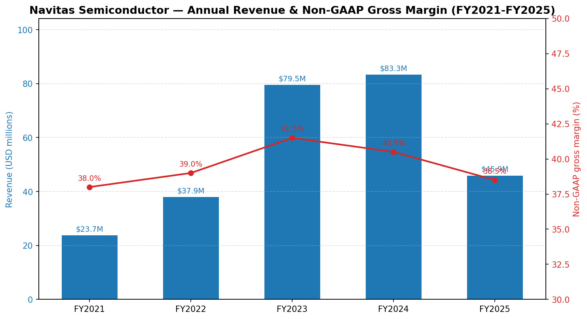
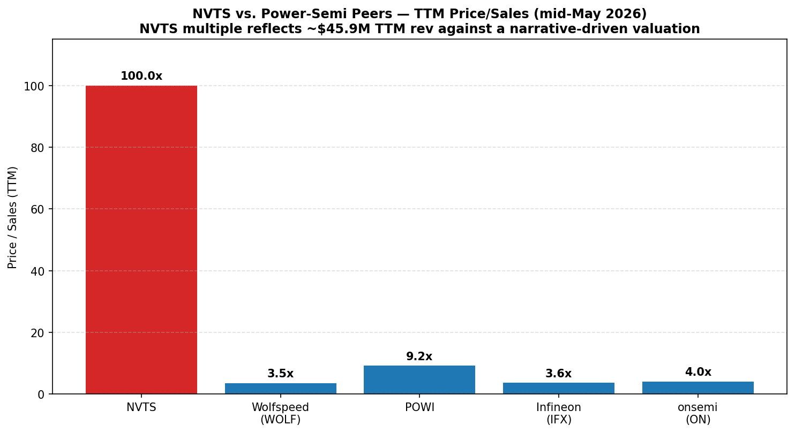
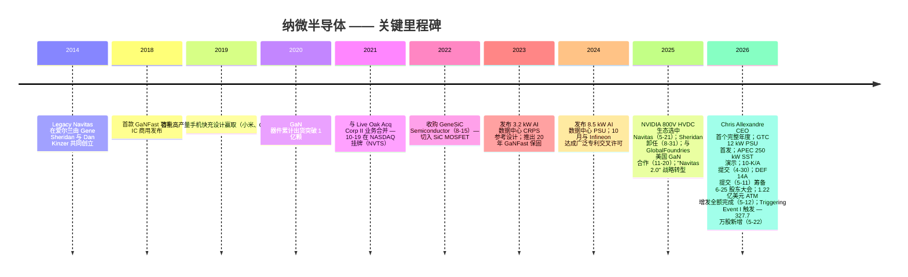
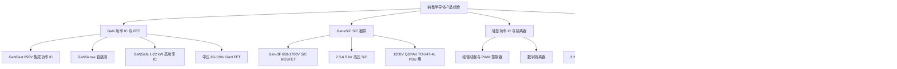
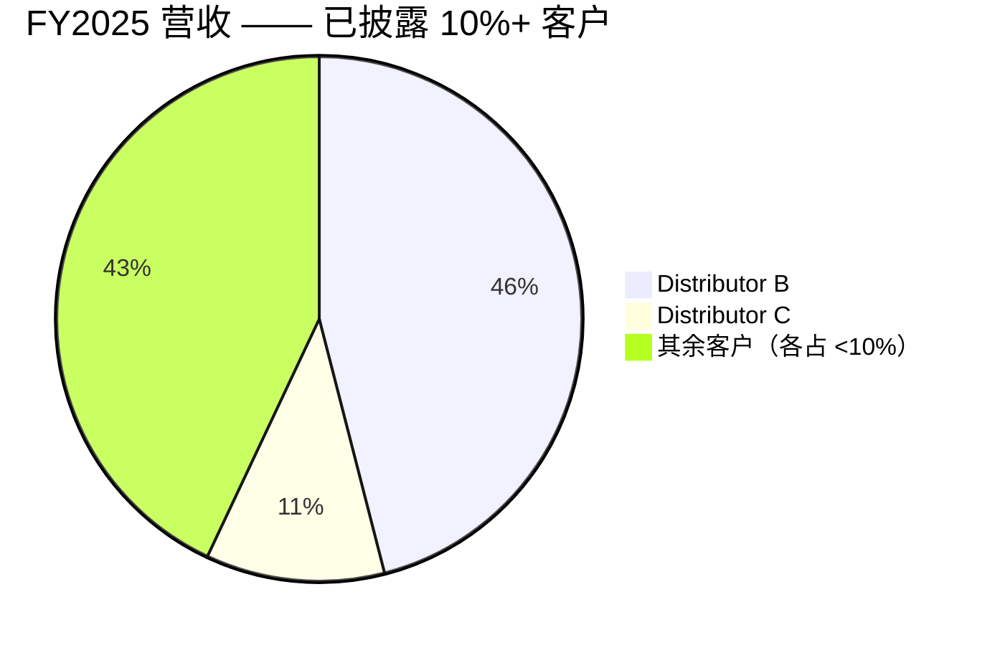
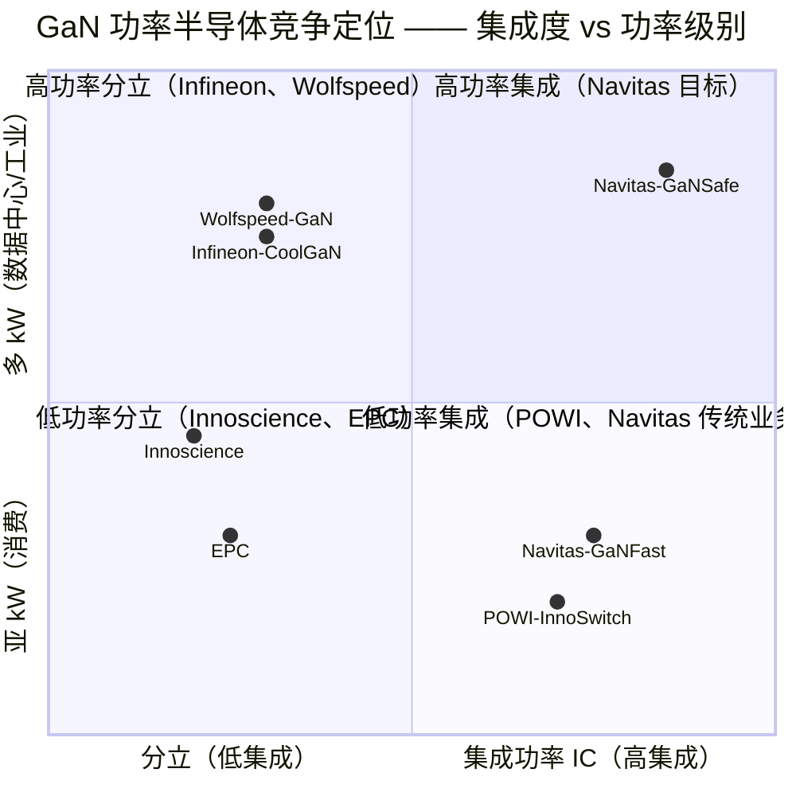
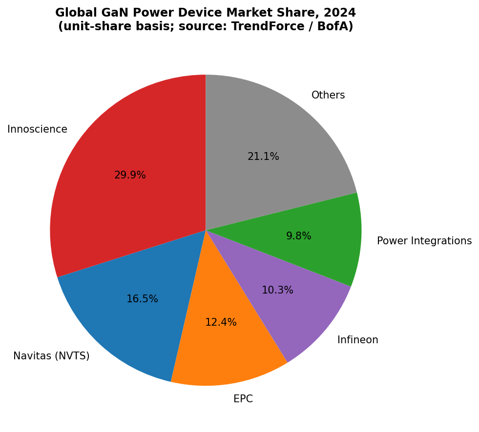
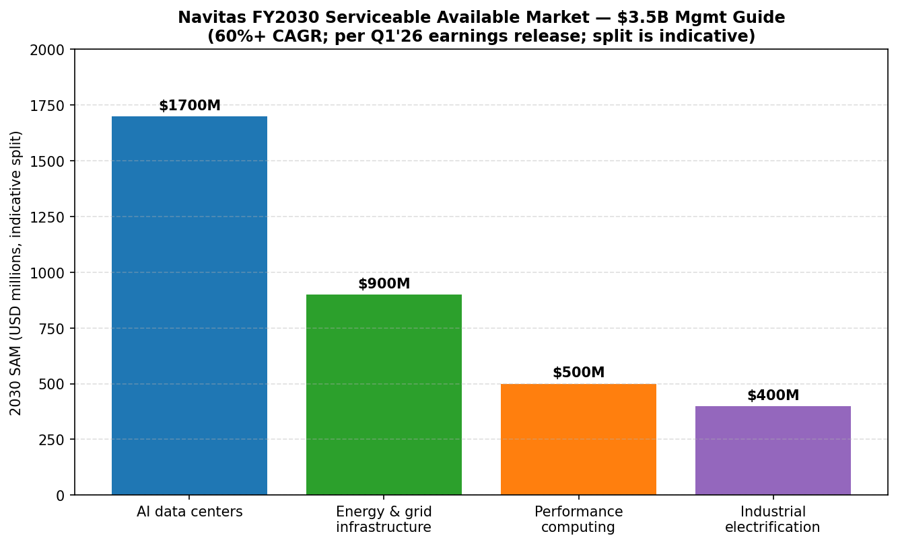
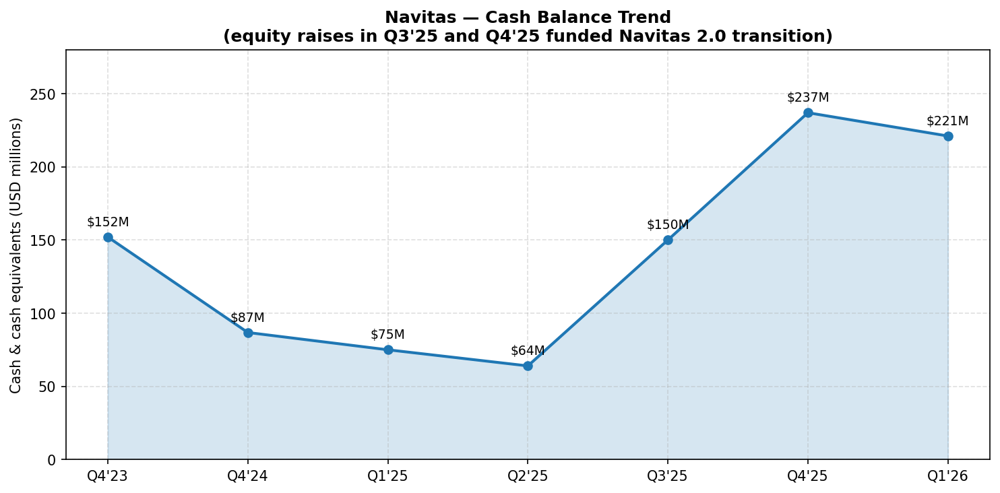
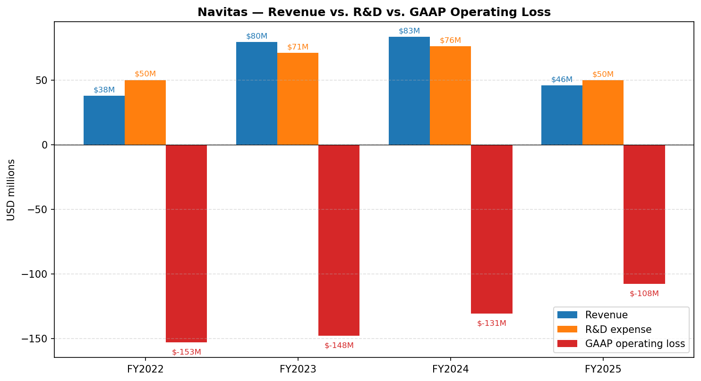

# 公司研究报告：Navitas Semiconductor Corporation（纳微半导体，NASDAQ: NVTS）

**截至日期：** 2026-05-26
**分析师说明：** 本报告覆盖纳微半导体公司，截至 2026 年 5 月 26 日盘中。本次更新整合了公司 Q1 2026 季报（2026-05-05 披露）、2025 年 8 月联合创始人兼 CEO Gene Sheridan 卸任并由 Chris Allexandre 接任的换帅事件、2025-05-21 与 NVIDIA 在 800 V HVDC 直流供电架构上的合作公告、2025-11-20 与 GlobalFoundries 签署的美国境内 GaN 制造合作协议、被公司称为 "Navitas 2.0" 的战略转型（明确从手机/消费电子市场撤退，重点投入 AI 数据中心、电网与能源基础设施、高性能计算、工业电气化四大方向），以及最新的 **2026 年 5 月已全额完成的 1.22 亿美元 ATM（At-the-Market 按市价销售）股权增发**。所有财务数据除特别注明外均来自纳微 SEC 提交文件。

> **更新提示 —— 2026 年 5 月资本结构事件（2026-05-11 至 2026-05-22）：** 纳微在 2026 年 5 月连续完成三项重大资本事件：（1）**2026-05-11**，公司与 Craig-Hallum Capital 和 UBS Securities 签订销售代理协议，授权最多 1.25 亿美元的 A 类普通股 ATM 增发（[8-K，2026-05-11](https://www.sec.gov/Archives/edgar/data/1821769/000110465926058734/tm2613239d3_8k.htm)）；至 **2026-05-12 当日股票即被全额售罄 —— 6,529,666 股按约 19 美元/股发行，净募集资金约 1.22 亿美元**（[8-K，2026-05-13](https://www.sec.gov/Archives/edgar/data/1821769/000110465926059828/tm2614473d1_8k.htm)）；（2）**2026-05-22**，由于股价已触及 2021 年与 Live Oak SPAC 业务合并协议中规定的 **Triggering Event I（第一档触发事件）** 价格指标（须在 2026 年 10 月 19 日前达成），公司向原 Legacy Navitas 股东及若干约定方发行 **3,277,438 股新 A 类股**（[8-K，2026-05-22](https://www.sec.gov/Archives/edgar/data/1821769/000110465926065737/tm2615305d2_8k.htm)）；（3）同日，公司与 Live Oak Sponsor Partners II LLC 签署 **Settlement, Release and Amendment Agreement（和解、豁免与修订协议）**，将 726,225 股 Sponsor Earnout Shares 从锁定/转让限制中释放，同时 Sponsor 自愿放弃 115,775 股（[8-K，2026-05-22](https://www.sec.gov/Archives/edgar/data/1821769/000110465926065731/tm2614473d1_8k.htm)）。综合影响：备考现金从 FYE-2025 的 2.37 亿美元升至约 **3.4 亿美元**；股本较 2025 年末的 2.308 亿股增加约 1,040 万股（约 4.5% 稀释）；但市场以股价上涨予以正面回应。董事会另于 **2026-05-11 提交了 2026 年 DEF 14A 委托书**（[2026 DEF 14A](https://www.sec.gov/Archives/edgar/data/1821769/000110465926058742/tm2613272d3_def14a.htm)），股东大会定于 **2026 年 6 月 25 日** 召开，提案中包含 **董事会去分级化（board declassification）议案**（即取消现行的三年错列任期结构）。

> **2026 年 Q2 业绩指引（2026-05-05）：** 管理层指引 Q2 2026 净收入 **1.00 亿美元 ± 50 万美元**（环比中值约 +16%，同比仍较 2025 年 Q2 的 1,450 万美元下降），Non-GAAP 毛利率 **39.25% ± 75 bp**，Non-GAAP 营运开支基本持平于 1,450 万–1,550 万美元。管理层亦确认，高功率市场（high-power markets：AI 数据中心、电网、性能计算、工业）已占 Q1 2026 收入的"绝大多数"，同比增长约 35%，部分抵消了中国手机充电器业务的主动收缩。资料来源：[Q1 2026 业绩新闻稿，2026-05-05](https://www.sec.gov/Archives/edgar/data/1821769/000110465926055620/tm2613492d1_ex99-1.htm)。

## 目录

1. 公司概览
2. 公司历史
3. 管理团队
4. 产品与服务
5. 客户与上市策略
6. 行业概览
7. 竞争格局
8. 市场机会
9. 风险评估
10. 参考资料

---

## 1. 公司概览

Navitas Semiconductor Corporation（中文常译"纳微半导体"，NASDAQ: NVTS）是一家总部位于美国加州托伦斯（Torrance）的 **fabless（无晶圆厂）功率半导体设计公司**，专注于 **氮化镓（gallium nitride, GaN）集成功率 IC** 与 **碳化硅（silicon carbide, SiC）高压 MOSFET 及二极管** 的研发与销售，并辅以高速硅基系统控制器与数字隔离器（digital isolators）。公司将自身定位为 "唯一同时实现 GaN 与 SiC 量产的纯粹型下一代功率半导体公司"，截至 2025-12-31 累计出货 **3 亿+ 颗 GaN 器件、近 3,000 万颗 SiC 器件**（[纳微 2025 年 10-K，Item 1 — Business](https://www.sec.gov/Archives/edgar/data/1821769/000182176926000007/nvts-20251231.htm)）。按 ASC 280 准则，公司目前披露为 **单一可报告分部**，不披露产品级收入拆分；但管理层一贯将业务按四大优先终端市场组织 —— AI 数据中心、能源与电网基础设施、性能计算、工业电气化 —— 这一组合即对外宣传的 **"Navitas 2.0" 战略重定向**（[2025 10-K, Item 7 MD&A](https://www.sec.gov/Archives/edgar/data/1821769/000182176926000007/nvts-20251231.htm)）。

**商业模式。** Navitas 是典型的 fabless 纯粹型功率半导体公司：芯片与工艺模块均由公司自行设计，晶圆制造外包给 TSMC（台湾）、GlobalFoundries（美国佛蒙特州 Burlington 工厂）与 X-FAB（美国德州），封装测试外包给亚洲分包商。销售模式以 **专业分销商代理** 为主，向 OEM（特别是为超大规模数据中心和 GPU 厂商配套的电源 OEM、以及消费电子充电器 OEM）销售。根据 FY2025 10-K，**两家分销商合计占 FY2025 收入 57%**：Distributor B 占 46%，Distributor C 占 11%；而 FY2024 占 56% 的 Distributor A 已于 2024 年底被公司终止合作（这是导致 FY2025 收入同比下滑 45% 的主要原因）（[2025 10-K, Note 12 — Significant Customers](https://www.sec.gov/Archives/edgar/data/1821769/000182176926000007/nvts-20251231.htm)）。FY2025 净收入 **4,590 万美元**，较 FY2024 的 8,330 万美元同比下降 **45%**，管理层将下滑全数归因于 "中国手机和消费电子市场的萎缩"（[2025 10-K, Item 7 MD&A](https://www.sec.gov/Archives/edgar/data/1821769/000182176926000007/nvts-20251231.htm)）。

**地区分布。** 收入按终端客户登记地归属。FY2025 中：**57% 归属香港、21% 归属其他亚洲地区、10% 归属美国、9% 归属中国大陆、3% 归属欧洲**（[2025 10-K, Note 12](https://www.sec.gov/Archives/edgar/data/1821769/000182176926000007/nvts-20251231.htm)）。香港高度集中反映了历史上对中国大陆手机充电器贸易商的依赖；该比重已开始随高功率业务比重上升而下降，但 Q1 2026 香港占比反而短期升至 76%（与单一大型分销商订单的季度波动有关）。

**经营规模与员工。** 公司在美国、爱尔兰、德国、意大利、比利时、中国、中国台湾、泰国、韩国和菲律宾均设有运营据点；总部位于托伦斯，并在加州 Santa Clara 和 Irvine 设有卫星设计中心。FY2025 10-K 披露托伦斯总部及研发园区租赁面积约 5 万平方英尺。公司在全球持有 **超过 300 项已授权或在审专利**，并于 2024 年 10 月与 Infineon Technologies 签订广泛专利交叉许可（broad patent cross-license）（[2025 10-K, Item 1](https://www.sec.gov/Archives/edgar/data/1821769/000182176926000007/nvts-20251231.htm)）。公司自创立以来即持有 **CarbonNeutral®** 中性碳排放认证。

资料来源：[Navitas 2025 10-K MD&A](https://www.sec.gov/Archives/edgar/data/1821769/000182176926000007/nvts-20251231.htm)；[FY2023 业绩 8-K, 2024-02-29](https://www.globenewswire.com/news-release/2024/02/29/2838376/0/en/Navitas-Semiconductor-Announces-Record-Fourth-Quarter-and-Full-Year-2023-Financial-Results.html)；[FY2022 业绩 8-K, 2023-02-23](https://www.globenewswire.com/en/news-release/2023/02/23/2614787/0/en/Navitas-Semiconductor-Announces-Fourth-Quarter-and-Full-Year-2022-Financial-Results.html)。

**估值快照（2026-05-26 盘中）。** NVTS 股价约 **31.94 美元**，对应 **市值约 74.7 亿美元**。基础股本：10-K/A 封面披露的 230,792,765 股 A 类股，加上 2026 年 5 月新增约 1,050 万股（ATM 6,529,666 股 + Triggering Event I 3,277,438 股 + Sponsor Settlement 净 610,450 股）—— **2026-05-22 资本事件后约 2.41 亿股 A 类股流通**（[Yahoo Finance NVTS 报价页](https://finance.yahoo.com/quote/NVTS/)；[stockanalysis.com NVTS 概览](https://stockanalysis.com/stocks/nvts/)；[10-K/A 封面，2026-04-30](https://www.sec.gov/Archives/edgar/data/1821769/000110465926052971/nvts-20251231x10ka.htm)）。52 周区间 **4.54–33.82 美元**；股价自 2025 年中低点上涨约 **7 倍**，仅 2026 年 5 月最后六个交易日（5 月 20 日至 5 月 26 日）就再涨 **约 64%**，由 AI 功率叙事、卖方目标价上调和 ATM 增发成功完成三因素共振推升。

- **TTM 市盈率：深度负值。** 纳微 FY2025 GAAP 净亏损 **1.17 亿美元**（[2025 10-K Statements of Operations](https://www.sec.gov/Archives/edgar/data/1821769/000182176926000007/nvts-20251231.htm)），且继续经营性亏损；公司截至 2025-12-31 累计联邦净营运亏损结转（NOL, net operating loss carryforwards）达 **3.348 亿美元**。负市盈率并非一次性减计，而是结构性烧钱成长 —— 公司 FY2025 研发支出 **4,980 万美元**、销售管理费用（SG&A）**3,520 万美元**，仅靠 4,590 万美元收入支撑，GAAP 营业亏损率约 −235%。向高功率市场的转型旨在将 Non-GAAP 毛利率从 FY2025 的 38.5% 提升至 40%+ 并放缓 OpEx 增长；但管理层在 10-K 中明确表示 "我们预计将继续录得净营运亏损与负经营性现金流"（[2025 10-K Item 7 MD&A — Liquidity](https://www.sec.gov/Archives/edgar/data/1821769/000182176926000007/nvts-20251231.htm)）。把负市盈率理解为 "尚未规模化、研发投入沉重的成长型企业"，而非周期性低谷。
- **TTM 市销率（P/S）：极端高 —— 须谨慎解读。** 按 TTM 收入 4,590 万美元和 2026-05-26 市值 74.7 亿美元计算，NVTS 交易于约 **163 倍 TTM 销售额**（[Yahoo Finance NVTS 关键统计](https://finance.yahoo.com/quote/NVTS/key-statistics/)；[GuruFocus NVTS PS Ratio](https://www.gurufocus.com/term/ps-ratio/NVTS)）。相关同业对照：**Power Integrations（POWI，NASDAQ）约 10.4×**（按 83 美元股价、46.3 亿美元市值、TTM 收入 4.43 亿美元，[Yahoo Finance — POWI](https://finance.yahoo.com/quote/POWI/)；[stockanalysis.com POWI](https://stockanalysis.com/stocks/powi/)）、**ON Semiconductor（ON）约 4×**、**Infineon（IFX，ETR）约 3.6×**（[companiesmarketcap.com IFX](https://companiesmarketcap.com/infineon/marketcap/)）、**Wolfspeed（WOLF，2025-09-29 Chapter 11 重整出关）约 3–4×**（[WOLF Q3-FY26 8-K, 2026](https://www.sec.gov/Archives/edgar/data/0000895419/000089541926000024/ex991q3-26.htm)）、**EPC（私人持股，未披露）**。NVTS 因此交易于 **约 40 倍最接近纯粹同业（POWI）、约 40–45 倍行业中位数 P/S** 的水平。
  - 溢价成因：NVTS 实质上是 **"挂钩 NVIDIA 的 AI 供电含量主题代理股（thematic proxy）"**。2025-05-21 NVIDIA 在 GTC 大会上将 Navitas 选为 800 V HVDC 直流供电生态合作伙伴（[NVIDIA Selects Navitas to Collaborate on Next Generation 800V HVDC Architecture, 2025-05-21](https://www.sec.gov/Archives/edgar/data/1821769/000162828025027705/ex9912025-05x21prrenvidiac.htm)），叠加卖方两轮目标价上调（Baird 由 9 美元上调至 20 美元，Needham 由 13 美元上调至 21 美元，参考 [StocksToTrade 报道, 2026-05-21](https://stockstotrade.com/news/navitas-semiconductor-corporation-nvts-news-2026_05_21/)），将估值倍数推升至远高于同业的水平。这一溢价 **由叙事而非盈利驱动** —— 投资者实际上是在为管理层披露的 FY2030 SAM（serviceable available market, 可服务市场）35 亿美元、60%+ CAGR，以及隐含的 Navitas 在 NVIDIA "Kyber" 机架级平台中的 BOM 份额付溢价（[Q1 2026 业绩新闻稿，2026-05-05](https://www.sec.gov/Archives/edgar/data/1821769/000110465926055620/tm2613492d1_ex99-1.htm)）。按当前年化收入（Q1 2026 收入 860 万美元 × 4 ≈ 3,440 万美元；TTM 4,590 万美元）测算，**未来 24–36 个月营收须增长 8 倍才能将 P/S 压缩至 20 倍** —— 也就是说，当前估值 **只在 "AI 设计赢取陆续落地" 的远期叙事下才能合理化**，与 TTM 基本面无关。这是核心估值/倍数压缩风险，第 9 节中重点列出。值得一提，**管理层利用高倍数在 2026 年 5 月窗口期通过 ATM 完成股权变现**（按约 19 美元发行），这一行动既反向验证了短期买盘需求的存在，又显著延长了运营现金跑道（备考现金从 2.37 亿美元升至约 3.4 亿美元）。

资料来源：[stockanalysis.com (NVTS, POWI)](https://stockanalysis.com/stocks/nvts/)；[GuruFocus (NVTS PS Ratio)](https://www.gurufocus.com/term/ps-ratio/NVTS)；[Yahoo Finance — POWI](https://finance.yahoo.com/quote/POWI/)；[companiesmarketcap.com — IFX 市值](https://companiesmarketcap.com/infineon/marketcap/)；[Wolfspeed Q3-FY26 8-K, 2026](https://www.sec.gov/Archives/edgar/data/0000895419/000089541926000024/ex991q3-26.htm)。

## 2. 公司历史

Navitas 最初注册为 Live Oak Acquisition Corp. II，是一家特拉华州 SPAC（special-purpose acquisition company, 特殊目的并购公司）。2021-10-19，公司与爱尔兰私人企业 Navitas Semiconductor Limited 完成业务合并并更名为 Navitas Semiconductor Corporation。Legacy Navitas 由 **Gene Sheridan**（CEO 兼联合创始人）与 **Daniel "Dan" Kinzer**（CTO/COO 兼联合创始人）于 2014 年在爱尔兰创立。两位创始人的核心论点 —— **GaN-on-Si（GaN 长在硅衬底上）若能将驱动、控制、保护电路与高压 GaN 器件单芯片集成（co-integration），就能成为 100–650 V 区间硅功率 MOSFET 的可行替代品** —— 即 Navitas 之后注册的商标 **GaNFast™** 技术（[2025 10-K Item 1](https://www.sec.gov/Archives/edgar/data/1821769/000182176926000007/nvts-20251231.htm)）。这一押注被市场逐步验证：纳微在 2024 年达到全球功率 GaN 出货量份额第二的位置（TrendForce 数据 16.5%），累计出货已超过 3 亿颗。

资料来源：[2025 10-K Item 1 — Business](https://www.sec.gov/Archives/edgar/data/1821769/000182176926000007/nvts-20251231.htm)；[NVIDIA 800V HVDC 8-K, 2025-05-21](https://www.sec.gov/Archives/edgar/data/1821769/000162828025027705/ex9912025-05x21prrenvidiac.htm)；[CEO 换帅 8-K, 2025-08-25](https://www.sec.gov/Archives/edgar/data/1821769/000182176925000204/exhibit991-pressreleasedat.htm)；[GlobalFoundries 合作 8-K, 2025-11-20](https://www.sec.gov/Archives/edgar/data/1821769/000182176925000217/exhibit991-prglobalfoundri.htm)；[ATM 全额完成 8-K, 2026-05-13](https://www.sec.gov/Archives/edgar/data/1821769/000110465926059828/tm2614473d1_8k.htm)。

**公司发展史可由三次战略转型定义。** 第一次，**2018 年 GaNFast 集成功率 IC 的商用发布** —— 这是 Navitas 与前代 GaN 分立器件竞争对手（EPC、GaN Systems、Transphorm）拉开差距的关键之举，也是 2019–2024 年手机充电器业务的技术基石。栅极驱动、控制与保护电路与高压 GaN 单芯片集成，显著压缩 BOM 成本并降低开关损耗，催生了流行的 65–100 W USB-PD GaN 适配器市场，规模化替代了硅基方案。

第二次，**2022-08-15 收购 GeneSiC Semiconductor**（对价约 2.95 亿美元，现金 + Navitas A 类股）。GeneSiC 带来了专利化的 "trench-assisted planar（沟槽辅助平面）" SiC MOSFET 技术，专攻 650 V – 6.5 kV 工业与电网应用；GeneSiC 创始人加入 Navitas 董事会。这次收购把 Navitas 从单一材料（GaN）变成了 **双材料宽禁带（WBG, wide-bandgap）半导体供应商** —— 对 AI 数据中心转型至关重要，因为 SiC 处理 800 V 直流整流而 GaN 处理 48 V 二级转换，两者必须协同（[2025 10-K, Item 1 — GeneSiC overview](https://www.sec.gov/Archives/edgar/data/1821769/000182176926000007/nvts-20251231.htm)）。

第三次，**2025 年末启动的 "Navitas 2.0" 重组**，与新 CEO 任命同步宣布 —— 正式弱化手机充电器与中国消费电子业务，将销售渠道整合到少数专注高功率的分销商伙伴上；Q4 2025 计提了 1,660 万美元的重组与减值费用，并实施了人员精简。后文将详述的两件关键事件最能解释 2025 年 8 月以来股价 7 倍涨幅：2025-05-21 NVIDIA 800V HVDC 入选，以及 2025-11-20 GlobalFoundries 佛蒙特州 GaN 制造合作。

## 3. 管理团队

本节遵循公司研究指南的范围规定 —— **仅介绍联合创始人与现任 CEO**。其他高管（CFO、产品 VP、独立董事等）有意省略；如需查阅完整的董事会与高管名单，请参阅 2026-05-11 提交的 [DEF 14A 委托书](https://www.sec.gov/Archives/edgar/data/1821769/000110465926058742/tm2613272d3_def14a.htm)。

### 联合创始人 —— Gene Sheridan 与 Dan Kinzer（2014 年创立；二人均于 2025 年退出管理层）

Navitas 由 **Gene Sheridan**（CEO 任期 2014–2025 年 8 月）与 **Daniel "Dan" Kinzer**（CTO/COO 任期 2014–2025 年 4 月）于 2014 年在爱尔兰共同创立。两位创始人的技术押注是 **将 GaN-on-Si 从 RF/分立器件的小众材料转化为主流集成功率半导体平台** —— 通过把驱动、控制、保护电路与高压 GaN 单芯片集成，最终注册为 **GaNFast™** 商标技术（[2025 10-K Item 1 — Business](https://www.sec.gov/Archives/edgar/data/1821769/000182176926000007/nvts-20251231.htm)）。两位创始人押注的核心思路 —— **现有 GaN 分立器件厂商（EPC、GaN Systems、Transphorm）可被集成方案弯道超车** —— 已由市场验证：截至 2025-12-31，Navitas **累计出货 3 亿+ 颗 GaN 器件**，全球功率 GaN 单位份额在 2024 年居第二（TrendForce 数据 16.5%）。

Sheridan 创立 Navitas 之前已是功率半导体行业资深高管，曾在 International Rectifier（如今的 Infineon 功率分立业务前身）与 Vishay 担任要职。他从 2014 年公司创立起一直担任 Navitas CEO，直至 **2025-08-31** 卸任 ——— 期间主导了 2021-10-19 与 Live Oak Acquisition Corp. II 的业务合并完成 NASDAQ 上市、2022 年对 GeneSiC 的收购（即今日高功率产品线的 SiC 技术基础），以及与 TSMC（GaN 晶圆）和早期为大陆消费电子充电器 OEM 供货的电源 OEM 客户关系。换帅事项于 2025-08-25 公告（[Director-Officer Change 8-K, 2025-08-25](https://www.sec.gov/Archives/edgar/data/1821769/000182176925000204/exhibit991-pressreleasedat.htm)）。

Kinzer 是技术型联合创始人，持有多项 GaN 集成功率 IC 基础专利。**2025 年 4 月**，他与 2025-04-29 公告的公司治理重整同步辞去 CTO 与 COO 执行职务及董事职务（[Governance Enhancements 8-K, 2025-04-29](https://www.sec.gov/Archives/edgar/data/1821769/000182176925000053/exhibit991-pressrelease202.htm)），但保留 GaN 技术创新方面的顾问角色，已不再参与日常经营。Kinzer 的退出加上 Sheridan 四个月后的卸任，正式宣告了 Navitas 创始人主导时代的结束。但与最初 SPAC 业务合并协议挂钩的创始人股权激励仍在按计划归属：**2026-05-22 Triggering Event I 触发的 3,277,438 股发行**（[8-K, 2026-05-22](https://www.sec.gov/Archives/edgar/data/1821769/000110465926065737/tm2615305d2_8k.htm)）与 **2026-05-18 Live Oak Sponsor 和解协议** 都是最初 Business Combination Agreement 留下的直接遗产 —— 原协议总计最多 1,000 万股的 Earnout Shares 以 2026-10-19 前的股价目标为前提解锁；按 2026 年 5 月的股价走势，余下档位的触发已基本成定局。

### Chris Allexandre —— 总裁兼首席执行官（2025 年 9 月起任）

Chris Allexandre 于 **2025 年 9 月** 接替联合创始人 Gene Sheridan 出任 Navitas 第二任 CEO（[2026 DEF 14A — 董事简介](https://www.sec.gov/Archives/edgar/data/1821769/000110465926058742/tm2613272d3_def14a.htm)）。Allexandre 是 **拥有二十余年功率半导体行业全球管理经验** 的资深高管，业务范围横跨销售、市场、运营与事业部管理。加入 Navitas 之前他的最近一份职务是 **Renesas Electronics（瑞萨电子）功率事业部 SVP 兼总经理（2023 年 10 月–2025 年 8 月）**，掌管 **年收入 25 亿美元** 的电源管理与功率分立业务，并领导该事业部向云基础设施、汽车与工业市场的战略转型。任内他主导了 Renesas 在 2024 年 6 月对 GaN 器件供应商 **Transphorm, Inc.** 的收购与整合 —— 这一履历与他在 Navitas 即将面对的 Navitas 2.0 运营改造高度类同。在功率事业部 GM 之前，他曾担任 Renesas **CSO/CMO（首席销售与市场官，2019–2023）**；更早期任职于 IDT（2019 年被 Renesas 收购）、NXP（SVP，大众市场全球销售）和 Fairchild Semiconductor（SVP，全球销售、市场与业务运营）。他在 **Texas Instruments（TI）的应届毕业生轮岗项目** 起步，在 TI 工作 **16 年**，升至 **EMEA 区域销售与应用 VP**。他拥有法国 **里尔高等电子与数字研究院（ISEN, Institut Supérieur de l'Électronique et du Numérique）的电气工程硕士学位**，持法国与美国双重国籍，自 2013 年起常驻美国湾区（[2026 DEF 14A](https://www.sec.gov/Archives/edgar/data/1821769/000110465926058742/tm2613272d3_def14a.htm)；[CEO 任命 8-K, 2025-08-25](https://www.sec.gov/Archives/edgar/data/1821769/000182176925000204/exhibit991-pressreleasedat.htm)）。

Allexandre 履新对投资逻辑有三层影响。第一，**他在 Renesas 整合 Transphorm 的经历与 Navitas 2.0 高度契合** —— 此前他已经在更大的功率半导体 P&L 平台上完成过对一家独立 GaN 公司的并购整合，熟悉模拟分销、超大规模数据中心 PSU OEM 与工业渠道的销售运动，懂得纪律化 OpEx 文化（这是创始人时代尚未建立的）。第二，**他不是创始人，使 Navitas 在投资者眼中的叙事从"GaN 拓荒者"转向"可执行的 AI 功率特许经营者"**。第三，他的薪酬包与 2026 年股权授予 —— 包括签约 RSU 与 LTIP 业绩股 —— 已记入 [10-K/A Part III, 2026-04-30](https://www.sec.gov/Archives/edgar/data/1821769/000110465926052971/nvts-20251231x10ka.htm) 与 DEF 14A，鉴于他履新以来股价上涨 7 倍以上，市场与机构投资者将密切审视。2025 年 10-K 披露 "2025 年共计约 400 万美元的 CEO 换帅成本与公司治理成本"（[2025 10-K, Item 7 MD&A](https://www.sec.gov/Archives/edgar/data/1821769/000182176926000007/nvts-20251231.htm)）。在 2025-11-03 第一次以 CEO 身份主持的 Q3 2025 业绩电话会上，Allexandre 把公司定义为从 "Navitas 1.0（手机业务为基底）" 向 "Navitas 2.0（高功率市场为基底）" 的转型，并明确把 **Q4 2025 设为新基线，预期 2026 全年逐季环比增长**（[3Q25 业绩电话会演示文稿, 2025-11-03](https://www.sec.gov/Archives/edgar/data/1821769/000182176925000212/exhibit992-navitas3q25ea.htm)）。Q1 2026 兑现了这一框架 —— 环比 +18% 营收增长、Non-GAAP 毛利率环比扩 30 bps。但其经营利润率改善的承诺尚未被验证，这是 NVTS 股价当前最核心的执行风险。

## 4. 产品与服务

Navitas 的产品组合分三大业务腿，目前均归于一个 ASC 280 可报告分部，但内部按独立产品线管理。访问 navitassemi.com 的产品导航树即可印证下列分类。

### A) GaNFast™ / GaNSense™ / GaNSafe™ GaN 集成功率 IC（旗舰 —— 公司起家技术）

这是 Navitas 开创的产品族。覆盖电压范围约 **15 V – 700 V**（GaN-on-Si CMOS 兼容工艺），导通电阻（on-resistance, RDS(ON)）从约 **18 mΩ 到 >70 mΩ**，封装包含 TOLL 与 TOLT。主要子系列：

- **GaNFast™ 功率 IC（650 V）** —— 最早的集成方案，将高压 GaN FET 与硅基驱动、控制、保护电路单芯片集成。这是 Navitas 手机/消费电子/商用电源业务的发动机 —— 从 65 W 到 250 W 的 USB-PD GaN 充电器，主流 OEM 几乎都采用此品类。
- **GaNSense™ 技术** —— 在栅极引入自动电流检测与短路侦测，进一步减少电源设计中的器件数。
- **GaNSafe™ 系列（650 V，专攻 1 kW–22 kW 高功率应用）** —— 数据中心市场的差异化产品：350 ns 最大延迟的短路保护、所有引脚 2 kV ESD、消除负栅压驱动需求、可编程压摆率。GaNSafe 即 NVIDIA 在 2025 年 5 月公告中提及的 800 V HVDC 供电板直接转换所使用的器件。其 4 引脚封装让 PCB 设计师可以 "像处理 GaN 分立器件一样" 简洁布板，同时保留集成控制的护城河，迎合超大规模数据中心 OEM 对鲁棒封装的需求（[NVIDIA / Navitas 新闻稿, 2025-05-21](https://www.sec.gov/Archives/edgar/data/1821769/000162828025027705/ex9912025-05x21prrenvidiac.htm)）。
- **中压 80–120 V GaN FET** —— 2025 年末加入产品线（[3Q25 业绩电话会演示文稿, 2025-11-03](https://www.sec.gov/Archives/edgar/data/1821769/000182176925000212/exhibit992-navitas3q25ea.htm)），瞄准 AI 数据中心电源系统中 48 V → 核心电压的二级 DC-DC 转换，该插槽现由 Infineon（结合 Vicor 与 MPS 的产品组合）的垂直功率模块主导。这是 Navitas 首次切入中压领域，也是对 Infineon 数据中心插槽最直接的攻击。

**竞争优势判断：成立 —— 集成护城河。** GaNFast / GaNSafe 是该电压等级中 **唯一** 把驱动 + 控制 + 保护放在同一 WBG 单芯片上的产品族。最接近的竞争对手包括 EPC 的集成驱动方案、Infineon CoolGaN 配独立驱动器、Power Integrations 集成 GaN 的 InnoSwitch、Innoscience 的高产量 GaN 分立器件。**横向比较：** 出货量与可靠性领先 EPC（3 亿+ 颗 vs 私人持股、未披露）；集成度领先 Innoscience 但中国市场份额落后于其；100 W 以下消费电源段与 Power Integrations 平手，但 1–22 kW 高功率段领先；功率半导体整体规模与工业渠道客户关系落后 Infineon。

### B) GeneSiC™ 碳化硅功率器件（2022 年收购，现已成为战略支柱）

通过 2022-08-15 GeneSiC 收购获得，SiC 产品组合包括：

- **G3F（第三代 "Fast"）SiC MOSFET** —— 650 V 至 1700 V "trench-assisted planar" 架构，即 GeneSiC 专利的将平面工艺与沟槽级 RDS(ON) 结合的技术。市场宣传 **比同类 SiC MOSFET 壳温低 25°C、寿命长达 3 倍**（[8-K 2025-05-27, ex.99.1](https://www.sec.gov/Archives/edgar/data/1821769/000162828025027705/ex9912025-05x21prrenvidiac.htm)）。
- **高压 SiC MOSFET 与二极管（2.3 kV / 3.3 kV / 6.5 kV）** —— 相对主流 SiC 同业（Wolfspeed、Infineon CoolSiC、ON Semi EliteSiC、ROHM、ST 微电子）集中在 650/1200 V 段的差异化产品。3.3 kV 和 6.5 kV 器件瞄准 **固态变压器（SST, solid-state transformer）**、中压电机驱动、DOE 资助的电网储能项目。Q3 2025 已开始向 "领先储能与电网基础设施客户" 送样新型 2.3 kV 和 3.3 kV 模组（[3Q25 业绩电话会演示文稿](https://www.sec.gov/Archives/edgar/data/1821769/000182176925000212/exhibit992-navitas3q25ea.htm)）。
- **第 5 代 1200 V SiC MOSFET（QDPAK 与 TO-247-4L 封装）** —— Q1 2026 专为 AI 数据中心 PSU 与 800 V HVDC 应用发布（[Q1 2026 业绩新闻稿, 2026-05-05](https://www.sec.gov/Archives/edgar/data/1821769/000110465926055620/tm2613492d1_ex99-1.htm)）。

**竞争优势判断：部分成立 —— 窄电压段护城河。** 主流 650/1200 V SiC 段上 Navitas **规模与工艺成熟度落后于 Wolfspeed（尽管 2025 年 Chapter 11）、Infineon CoolSiC 与 onsemi EliteSiC**。差异化护城河在 **高压（2.3 kV – 6.5 kV）** 段，可信供应商池更窄 —— Wolfspeed 是最直接的对照、Mitsubishi 与 ABB 是垂直模组集成商而非芯片厂、Infineon CoolSiC 最高至 2 kV。Navitas 高压 SiC 因此最适配 **固态变压器、并网储能** 等仍小但快速增长的应用，受 AI-DC HVDC 主题拉动。

### C) 硅基功率 IC 与数字隔离器（传统硅基系统控制器与高压隔离器）

这是 Navitas 配套 GaN/SiC 器件销售或作为独立 PWM 控制器销售的硅基系统控制器、栅极驱动器与数字隔离器（多数是 2014–2018 年的存续产品线）。目前贡献的营收有限，但能提升系统级设计赢取概率；独立销售时无相对 TI、ADI、MPS 或 onsemi 的竞争优势。**判断：独立无护城河；配套加售品。**

### D) 参考设计平台（销售护城河延伸工具，非自身销售品）

Navitas 在 **参考设计电源** 方面投入巨大，用以展示 GaN + SiC + IntelliWeave™ 数字控制 的系统级价值。路线图按时间序排列：3.2 kW CRPS（2023）、4.5 kW CRPS 137 W/in³ 密度（2024）、8.5 kW OCP/ORv3 兼容 PSU（2024-11）、以及 **12 kW GaN+SiC AI 数据中心 PSU 97.8% 效率**（2025-05-21 与 NVIDIA 同步发布；[Navitas 新闻稿, 2025-05-21](https://navitassemi.com/navitas-launches-industry-leading-12kw-gan-sic-platform-achieving-97-8-efficiency-for-hyperscale-ai-data-centers/)）。12 kW 参考设计采用 3 相交错 TP-PFC 与 FB-LLC 拓扑、GaNSafe IC、G3F SiC MOSFET 与 IntelliWeave 数字控制。**IntelliWeave** 是 Navitas 专利的 CrCM/CCM 混合控制技术，与传统 CCM 相比可降低损耗 30%，PFC 峰值效率达 99.3%。2026-03 APEC 上 Navitas 与 EPFL（瑞士联邦理工学院）联合演示的 **250 kW SST**（采用 GeneSiC 3.3 kV 和 1.2 kV SiC）是参考设计路线图的下一步。

**旗舰 vs 长尾。** 与投资论点相关的旗舰是 (1) **GaNSafe 高功率 IC**、(2) **G3F 1200 V SiC + 高压 SiC**、(3) **IntelliWeave 控制的 12 kW PSU 参考设计**。长尾（65–100 W 手机充电器 GaNFast 与独立硅基控制器）正在 Navitas 2.0 下被主动压缩。产品级营收拆分未在 10-K 中单独披露（单一 ASC 280 分部），但管理层 Q1 2026 评论确认 —— 高功率市场（对应 GaNSafe + GeneSiC + 参考设计拉动）已占 Q1 2026 收入的 **"绝大多数"**，同比增长 **约 35%**（[Q1 2026 业绩新闻稿, 2026-05-05](https://www.sec.gov/Archives/edgar/data/1821769/000110465926055620/tm2613492d1_ex99-1.htm)）。

**近 12 个月新品发布：** 12 kW PSU（2025-05）；中压 80–120 V GaN FET（2025 年末）；第 5 代 1200 V SiC QDPAK 与 TO-247-4L（Q1 2026）；为 NVIDIA Kyber/MGX 平台设计的 20 kW 800 V→6 V DC-DC 供电板（NVIDIA GTC, 2026-03）；与 EPFL 联合的 250 kW SST 演示（APEC 2026）。手机充电器 GaNFast SKU 未被明确停售，但 Navitas 2.0 渠道整合实际上已将其去优先级化。

## 5. 客户与上市策略

Navitas 的销售模式是 **传统业务依赖分销商、高功率新业务越来越多走直销**。2025 年 10-K 将公司销售模式描述为 "通过专业分销商面向原始设备制造商、其供应商和其他终端客户销售"（[2025 10-K, Item 1](https://www.sec.gov/Archives/edgar/data/1821769/000182176926000007/nvts-20251231.htm)），高功率 AI 数据中心业务则与超大规模运营商（hyperscalers）、GPU 厂商（特别是 NVIDIA）、Tier-1 服务器 ODM 与商用电源厂商（Delta Electronics、Lite-On、Flex 等；未在 SEC 文件中具名）的直接关系并行。

### 客户集中度 —— 重大且日益加剧

根据 FY2025 10-K Note 12（[Significant Customers and Credit Concentrations](https://www.sec.gov/Archives/edgar/data/1821769/000182176926000007/nvts-20251231.htm)）：

资料来源：[Navitas 2025 10-K, Note 12](https://www.sec.gov/Archives/edgar/data/1821769/000182176926000007/nvts-20251231.htm)。

- **FY2025：** Distributor B 占净收入 46%；Distributor C 占 11%。两大分销商合计 **57%**。FY2024 占 56% 的 Distributor A 已于 2024 年底被终止。
- **FY2024：** Distributor A 占净收入 56%（年底终止）；Distributor B 和 C 均低于 10% 重大性门槛。
- **Q1 2026（10-Q）：** Distributor A 占 59%（与 FY2024 的"Distributor A"不是同一实体 —— 旧的 Distributor A 已终止；Q1 10-Q 按当期字母顺序索引客户）。Distributor B 和 C 均低于门槛（[Q1 2026 10-Q, Note 4](https://www.sec.gov/Archives/edgar/data/1821769/000162828026030524/nvts-20260331.htm)）。

**集中度判断。** 单一最大客户在所有已披露期间均占收入 45% 以上；前两大合计常年聚集在 55–60%。按本研究指南的判别规则（单一客户 > 20% 或前五客户 > 50% 即视为重大风险），属于无争议的重大风险，已纳入第 9 节。分销商身份未具名，但参考行业惯例，最大的几家很可能是泛亚洲电子分销商（历史上 Navitas 已公开提及的渠道伙伴包括 WPG、Future Electronics 与 Arrow）。香港归属的收入比重（FY2025 57%，Q1 2026 76%）进一步暗示这些分销商在为大陆商用电源厂商汇聚需求，后者再供货给消费电子 OEM。

**缓解因素：** Navitas 2.0 明确包含 **分销商精简** —— 整合较小分销商、将增量收入转向直销超大规模运营商 / OEM 工程。稳态下应当能降低单一分销商集中度，但很可能会带来 **终端客户集中度** 的上升（例如单一超大规模运营商的设计赢取可能快速变成营收的 30–50%）。

### 已披露的具名客户/伙伴

- **NVIDIA Corp.** —— 为驱动 Rubin Ultra GPU 的 Kyber 级机架系统所设计的 800 V HVDC 架构生态合作伙伴（[8-K, 2025-05-27](https://www.sec.gov/Archives/edgar/data/1821769/000162828025027705/ex9912025-05x21prrenvidiac.htm)）。Navitas 是 NVIDIA 公布的 800 V DC 生态多家功率半导体供应商之一；Innoscience 是唯一获选的中国供应商（[Futu 报道, 2025-08](https://news.futunn.com/en/post/59958359/innoscience-surges-over-31-in-the-morning-session-nvidia-s)）。**关于合同性质须精确：****所有 Navitas 10-K 与 10-Q 文件中均无披露任何具备法律约束力的长期供货协议、最低采购承诺，或与 NVIDIA 直接挂钩的营收贡献**。该关系属于 **生态/合作认证** —— Navitas 器件经 NVIDIA 参考架构验证可使用，但采购实体是选用 Navitas 器件做超大规模运营商配套 PSU 的商用电源厂商（Delta、Lite-On、Flex 等）。重大营收贡献取决于（a）Kyber 机架的 NVIDIA 出货量与（b）Navitas 在每台 PSU 中的 BOM 份额，两者目前均未披露。
- **GlobalFoundries (GFS)** —— 2025-11-20 公告的美国本土 GaN 长期战略代工合作，使用 GF 佛蒙特州 Burlington 工厂；"开发自 2026 年初启动，量产预计当年下半年开始"（[8-K, 2025-11-20, ex. 99.1](https://www.sec.gov/Archives/edgar/data/1821769/000182176925000217/exhibit991-prglobalfoundri.htm)）。这是 **供应链/制造伙伴关系**，不是客户关系，但对涉及国家安全的美国政府/DoD/AI-DC HVDC 基础设施采购至关重要。
- **TSMC** —— 台湾 GaN 晶圆代工合作伙伴（[2025 10-K, Item 1](https://www.sec.gov/Archives/edgar/data/1821769/000182176926000007/nvts-20251231.htm)）。
- **X-FAB** —— 美国德州 SiC 晶圆代工合作伙伴。
- **EPFL** —— 250 kW 固态变压器 APEC 2026 联合演示伙伴。
- **美国能源部（DOE）** —— 10-K 中提及与 DOE 在 MW 级储能与电网逆变器项目中存在多项资助/合同关系，使用高压 SiC 器件（[2025 10-K, Item 1](https://www.sec.gov/Archives/edgar/data/1821769/000182176926000007/nvts-20251231.htm)）。

**关于超大规模运营商客户的提示。** 媒体报道与卖方研究经常提及 **"超大规模运营商"** 客户，但 Navitas 在截至 Q1 2026 的所有 SEC 文件中 **未具名任何超大规模运营商客户**。2025 年 5 月 NVIDIA 公告是公司公开披露中最接近 "重大具名客户" 的案例，但 NVIDIA 在此情境下扮演的是 **平台合作方**（定义架构）而非 Navitas 芯片的直接采购方。任何将 Microsoft、Meta、Google 或 Amazon 列为 Navitas 直接客户的说法，截至 2026 年 5 月均无可验证的 Navitas 公告或 SEC 文件支撑。

### 销售周期与设计赢取经济性

10-K 第 1A 项风险因素表述："即使我们获得设计赢取，预期营收通常需要一年或更久才会兑现，甚至可能根本不实现"（[2025 10-K, Item 1A](https://www.sec.gov/Archives/edgar/data/1821769/000182176926000007/nvts-20251231.htm)）。AI 数据中心的设计赢取到营收周期一般为 **从认证到首次出货 18–24 个月**，营收放量再延伸 4–8 个季度。这是管理层把 **2027 年及之后** 定为 NVIDIA 800V HVDC 机会的关键拐点年、把 2026 年定位为过渡/重建年的根本原因。

## 6. 行业概览

### 行业定义

Navitas 处于 **功率半导体（power semiconductor）** 行业 —— 即整个半导体行业中关注电力控制、转换与开关的子集。在功率半导体中，本研究的核心子集为 **宽禁带（WBG, wide-bandgap）功率器件**，包含氮化镓（GaN）与碳化硅（SiC）。邻近行业包括传统硅功率 MOSFET 与 IGBT（Navitas 正在替代的现任者）、AC-DC 与 DC-DC 电源模组（消费 Navitas 芯片的商用 PSU 行业）、高压工业驱动、固态变压器与电网边缘设备。

### 市场规模

最新且最权威的第三方数据来自 Yole Group 2025 年 10 月的功率 GaN 预测：**功率 GaN 器件市场预计将从 2024 年的约 3.55 亿美元增至 2030 年的约 30 亿美元**，CAGR 约 **42%**（[Yole Group, "From chargers to data centers — power GaN market set for rapid sixfold expansion by 2030"](https://www.yolegroup.com/press-release/from-chargers-to-data-centers-power-gan-market-set-for-rapid-sixfold-expansion-by-2030/)；[Semiconductor Today, 2025-10-29](https://www.semiconductor-today.com/news_items/2025/oct/yole-291025.shtml)）。该范围内 **电信与基础设施子分段**（包含 AI 数据中心电源）预计 53% CAGR，2030 年 GaN 收入将超过 3.8 亿美元。汽车与出行 GaN 子分段最快，达 73% CAGR。

SiC 方面：**SiC 功率器件市场预计 2030 年达到约 100 亿美元**，由 EV 牵引逆变器（最大单一应用）、工业驱动、充电基础设施与并网应用（包括固态变压器）驱动（[Yole Group, Power SiC/GaN Compound Semiconductor Market Monitor](https://www.yolegroup.com/product/quarterly-monitor/power-sicgan-compound-semiconductor-market-monitor/)）。2024–2025 年因 EV 需求降温导致库存修正，2026 年开始预计恢复。

### 推动 WBG 机会的关键趋势

1. **AI 数据中心电力需求爆炸。** 服务器机架功率已从历史约 10 kW 升至今天的 100 kW+，预计 GW 级 AI 集群将达 1 MW+/机架。超过约 200 kW/机架后，传统 54 V 直流配电架构遇到物理铜线极限，需要切换到 Navitas 主攻的 **800 V HVDC** 配电方案。
2. **电网现代化与电气化。** 固态变压器与电网边缘电力电子产品把传统 50/60 Hz 变压器替换为更快、更小、更高效的电力传输系统。高压 SiC（3.3 kV – 6.5 kV）是核心使能技术。
3. **EV 充电与牵引。** SiC 越来越成为 400/800 V EV 牵引逆变器的标配；GaN 越来越多用于车载充电器（OBC, onboard charger）。
4. **工业电气化。** 电机驱动效率、机器人与可再生能源并网把 WBG 拉入历史上由 IGBT 主导的工业插槽。
5. **地缘政治制造回流。** Inflation Reduction Act 与 CHIPS Act 均激励美国本土功率半导体制造；Navitas 与 GlobalFoundries 佛蒙特州的合作正是 Navitas 在这一趋势上的直接落子。

### 行业结构

整体功率半导体行业属中度集中 —— 前 10 大厂商（Infineon、onsemi、ST、Renesas、ROHM、TI、NXP、Wolfspeed/Chapter 11 后、Mitsubishi、Vishay）合计占总收入约 70%+。**GaN 功率器件** 更加分散与早期：按 TrendForce 2024 年数据，**Innoscience 以 29.9% 出货量份额领跑、Navitas 16.5% 排第二、EPC 12.4% 第三、Infineon 10.3% 第四、Power Integrations 9.8% 第五，"其他"约 21%**（[TrendForce / BofA, 经 The Bamboo Works 引用, 2025-12-08](https://thebambooworks.com/innoscience-makes-gains-in-patent-dispute-as-growing-competition-remains-bigger-threat/)）。**SiC** 更集中，**Wolfspeed、Infineon、onsemi、ROHM、ST** 控制大部分器件份额 —— Navitas 的 GeneSiC 在低个位数份额起步，但有高压产品差异化。

### 监管环境

2025 年 10-K 标出多个监管暴露：美国对中国半导体技术的出口管制；CFIUS / 外国投资审查针对入境投资；Inflation Reduction Act 与 CHIPS Act 制造激励（GlobalFoundries 佛蒙特州合作正是为接入这些激励）；欧洲 European Chips Act 对第二供应链的要求；以及供应链尽职调查要求（冲突矿物、EU CSRD、UFLPA）。镓本身在 10-K 中不属于 critical material —— "全球镓产能超过每年 2,000 吨且每年增长约 15% ... 我们估计我们的镓消耗到 2026 年将占全球年供应量不到 0.01%"（[2025 10-K Item 1](https://www.sec.gov/Archives/edgar/data/1821769/000182176926000007/nvts-20251231.htm)）。然而 **中国 2023 年 7 月对镓和锗的出口管制** 仍是所有 GaN 厂商的长期供应链风险；Navitas 通过分散采购非中国 epi-wafer 供应商缓释。

## 7. 竞争格局

竞争对手范围跨越三个相互重叠的子市场 —— GaN、SiC 与硅。

### GaN 竞争对手（按 2025 10-K Item 1）

- **Infineon Technologies AG（ETR: IFX）** —— 功率半导体行业龙头（FY2025 营收约 147 亿欧元 / 市值约 1,026 亿美元；[companiesmarketcap.com IFX](https://companiesmarketcap.com/infineon/marketcap/)）。CoolGaN 在 600 V 分立段具备竞争力，Infineon 的数据中心电源模组业务是行业现任主导。2024 年 10 月与 Navitas 的广泛专利交叉许可暗示 Infineon 认可 Navitas 的 IP 地位。**Navitas vs Infineon：集成度平手，规模与渠道落后。**
- **Power Integrations（NASDAQ: POWI）** —— 纯粹型 AC-DC 电源转换供应商（FY2025 营收 4.435 亿美元 / 市值约 40 亿美元 / P/S 约 9.2×；[stockanalysis.com POWI](https://stockanalysis.com/stocks/powi/)）。Navitas 最自然的 P/S 基准 —— 同业务模式（fabless、集成功率 IC），但已规模化盈利。POWI 的 InnoSwitch GaN 在 300 W 以下消费段有竞争力。**Navitas vs POWI：高功率（>1 kW）段领先，消费 10 亿+ 出货历史段落后。**
- **Texas Instruments（NASDAQ: TXN）** —— 广谱模拟/功率供应商，正以分立器件切入数据中心 GaN 空间。规模大、客户关系深，但截至 2026 年中尚无与 Navitas 平起平坐的集成 GaN-IC 产品。
- **Innoscience Suzhou Semiconductor（HKEX: 2577）** —— 2024-12-30 港股 IPO，募资 14 亿港币（约 1.8 亿美元）；IDM 模式，规模化运营 8 英寸 GaN-on-Si 晶圆制造（2024 年 12,500 wpm → 2029 年规划 70,000 wpm）。**按 TrendForce，2024 年全球 GaN 功率器件出货量份额第一，29.9%**（[Bamboo Works, 2025-12-08](https://thebambooworks.com/innoscience-makes-gains-in-patent-dispute-as-growing-competition-remains-bigger-threat/)）。Navitas 与 Innoscience 正处于专利诉讼中；Innoscience 被列为 **NVIDIA 800 V DC 生态中唯一的中国供应商**（[Futu 报道, 2025-08](https://news.futunn.com/en/post/59958359/innoscience-surges-over-31-in-the-morning-session-nvidia-s)）。**Navitas vs Innoscience：集成度与美/欧/超大规模渠道领先，出货量与成本落后。**
- **Renesas（TYO: 6723）** —— 通过 2024-06 收购 Transphorm 切入 GaN（由当时 Renesas SVP Chris Allexandre 主导，即现任 Navitas CEO）。中功率工业段全面竞争。
- **Efficient Power Conversion（EPC，私人持股）** —— 高频 GaN 先驱，由 Alex Lidow 创立；私人公司，**营收与市场份额未公开披露**。在高频转换器用 eGaN FET 方面信誉良好；在高压分立段与 Navitas 竞争。
- **STMicroelectronics（NYSE: STM）** —— 广谱组合竞争对手；SiC 为主，正在扩展 GaN。

### SiC 竞争对手（按 2025 10-K Item 1）

- **Wolfspeed（NYSE: WOLF）** —— 历史 SiC 行业龙头。2025-09-29 从 Chapter 11 重整出关（[Wolfspeed Q3-FY26 8-K, 2026](https://www.sec.gov/Archives/edgar/data/0000895419/000089541926000024/ex991q3-26.htm)）。WOLF 股价自 2026 年初低点上涨约 220%，靠 AI 数据中心枢纽业务环比 +30%（Q3 FY26）（[Wolfspeed FY26 Q3 业绩](https://www.sec.gov/Archives/edgar/data/0000895419/000089541926000024/ex991q3-26.htm)）。Wolfspeed 仍是 Navitas 高压 SiC 最直接的竞争对手。
- **Infineon CoolSiC** —— 量产 SiC 组合最广；工业渠道主导现任。Navitas GeneSiC 在 1700 V 以上最差异化。
- **onsemi（NASDAQ: ON）** —— EliteSiC；EV OEM 大型 SiC 供应商（FY2025 营收约 59 亿美元 / 市值约 250 亿美元）。中位 P/S 约 4×。
- **ROHM（TYO: 6963）** —— 日本 SiC 先驱；工业段强势。
- **STMicroelectronics（NYSE: STM）** —— Tesla 与其他汽车 OEM 的 SiC 主导供应商。

### Navitas 的竞争优势

- **双材料 WBG 加系统级 know-how。** Navitas 是唯一同时拥有 GaN、SiC 量产能力并集成控制的纯粹型上市公司。最接近的 "组合对照" 是 Infineon，但 Infineon 的 GaN 相对其整体业务小得多。
- **GaN 集成专利组合**（300+ 项专利）—— 已由 2024-10 Infineon 交叉许可背书。
- **参考设计/系统工程能力** —— 12 kW PSU 与 250 kW SST 参考设计积极拉动器件销售。这是相对 Innoscience 与 EPC 的护城河，后两者在系统级参考平台上投入有限。
- **美国供应链可选性** —— GlobalFoundries 佛蒙特州 GaN 与 X-FAB 德州 SiC 提供了一条美国本土制造路径，可服务涉及国家安全的客户。
- **NVIDIA 生态 800 V HVDC 认证** —— Navitas 迄今最有价值的设计认证。

### 脆弱点

- **营收规模过小**（FY2025 4,590 万美元），相对营收高出 50–300 倍的竞争对手处于绝对劣势。无法在成本或广度上竞争。
- **单一客户集中度 >45%**，在所有已披露期间均如此。
- **无公开签约的超大规模运营商设计赢取**（含明确营收承诺）—— 投资论点依赖于尚未公告的爬坡按 NVIDIA 设计周期时间表（2027+）落地。
- **Innoscience 在商品化 GaN 上的成本优势。**
- **经营亏损史**（IPO 以来每年均超过 −100% 营收）。

资料来源：[TrendForce / Bank of America, 经 The Bamboo Works 引用, 2025-12-08](https://thebambooworks.com/innoscience-makes-gains-in-patent-dispute-as-growing-competition-remains-bigger-threat/)。

## 8. 市场机会（TAM）

管理层披露的 **2030 年可服务市场（SAM）为 35 亿美元，60%+ CAGR**，跨越四大优先终端市场（[Q1 2026 业绩新闻稿, 2026-05-05](https://www.sec.gov/Archives/edgar/data/1821769/000110465926055620/tm2613492d1_ex99-1.htm)）。按 Yole 2025-10 预测自下而上核对 —— 功率 GaN 2030 年总市场 30 亿美元 / 42% CAGR；功率 SiC 2030 年总市场 100 亿美元 —— 此 SAM **在 GaN 一侧偏激进但在 SiC 一侧偏保守**。Navitas 的 SAM 定义似乎不仅包括 GaN/SiC 芯片的美元含量，还囊括了目标 PSU/SST 参考设计中的部分系统级价值（控制器、隔离器）。

资料来源：[Q1 2026 业绩新闻稿, 2026-05-05](https://www.sec.gov/Archives/edgar/data/1821769/000110465926055620/tm2613492d1_ex99-1.htm)（35 亿美元 SAM，60%+ CAGR）。分段拆分按管理层评论的指示性估计；准确拆分未披露。

### 自下而上的分段视图

- **AI 数据中心（约 15–18 亿美元 2030 SAM）。** 按管理层分类下最大段。NVIDIA 的 800 V HVDC 架构是催化剂；Yole 预测基于 GaN 的 800 V HVDC PSU 首批商用部署约在 **2027 年**。按每机架 1 MW 与每 kW 约 40–60 美元的 WBG 硅含量计算，仅 10,000 个 1 MW 机架的部署就构成约 5 亿美元的可寻址市场。Navitas 的货架份额是核心不确定性；按公司参考设计，每台 PSU 的 GaN + SiC 含量在数十美元区间。
- **能源与电网基础设施（约 7–10 亿美元 2030 SAM）。** 固态变压器、中压电机驱动、公用事业储能逆变器。GeneSiC 2.3–6.5 kV 是差异化产品线。10-K 中提及的 DOE 资助项目与与 EPFL 的 250 kW SST 演示支持该建设。
- **性能计算（约 4–6 亿美元 2030 SAM）。** 工作站、边缘 AI、ATX/SFX PSU 插槽。中压 80–120 V 部分 GaNFast 瞄准这一段。
- **工业电气化（约 3–5 亿美元 2030 SAM）。** 机器人、工厂自动化、HVAC。销售周期长但持久。

### 渗透率测算

对照 2030 年 35 亿美元 SAM，当前 4,590 万美元运转率代表 ~1.3% 的 2030 SAM 与 ~6% 的 2024 相关功率 WBG GaN+SiC 市场（按 Yole 2024 设计美元框架算）。即使 AI-DC PSU 中适度的份额增长（例如 15 亿美元 AI-DC SAM 的 10% 份额 = 1.5 亿美元）也意味着营收比当前 TTM 增长 3–4 倍。**如果（a）NVIDIA 800 V HVDC 自 2027 年起按计划放量、（b）Navitas 在挂钩 WBG 含量中获得 15–20% 份额、（c）GeneSiC 高压 SiC 拿下显著的电网基础设施插槽份额，则 2030 年达到 3–5 亿美元营收的路径存在。** 上述每个条件单独看都合理，但都未签约；超过 10 亿美元营收的路径需要一次台阶式设计赢取事件（例如超大规模运营商直签平台协议），此事件尚未公告。

## 9. 风险评估

### 公司特定风险

1. **客户/分销商集中度 > 50% —— 重大且结构性。** Top-1 分销商在 FY2024（Distributor A）占 56%、FY2025（Distributor B）占 46%、Q1 2026（Distributor A）占 59% 的净收入。失去任何 Top-1 分销商将在单一季度切掉一半收入，FY2024 Distributor A 终止已发生此事并导致 FY2025 营收下滑 45%。**缓解：** Navitas 2.0 分销商精简向直销超大规模运营商/OEM 转型，但产生新的终端客户集中度。

2. **CEO 换帅风险与未经验证的领导团队。** Chris Allexandre 自 2025 年 9 月起任 CEO —— 截至报告日仅 8 个月。CFO 上任更晚（2026 年 3 月）。联合创始人 Sheridan 与 Kinzer 均于 2025 年退出执行职务，带走了相应的机构知识。**缓解：** Allexandre 的 Renesas/Transphorm 整合经验高度相关；过去 18 个月董事会得到了有经营经验的独立董事补强。但团队尚未交出 Non-GAAP 运营层面的盈利季度。

3. **NVIDIA "设计入" 已认证但未签约。** 2025-05 NVIDIA 800V HVDC 生态认证是多头逻辑的核心支柱，但 **不是供货协议，无最低采购承诺，无与 NVIDIA 挂钩的明确营收贡献在任何 10-K 或 10-Q 中披露**。实际买家是商用 PSU OEM，他们按每个设计的逐项基础选用 Navitas 芯片。**缓解：** 多个 Navitas 参考设计（12 kW PSU、20 kW 800V→6V PDB）已基于 NVIDIA 参考架构验证；某种程度的插槽份额很可能存在，但量级与时间取决于尚未披露的 Kyber/Rubin 机架部署。

4. **内控/会计控制历史。** FY2025 10-K Item 9A 披露此前期文件曾因现金流分类错误和运营开支分类被重述（FY2023 与 FY2024 的 10-K/A 提交）。公司认定 FY2025 ICFR 有效，但重述历史对新投资者属治理红旗。**缓解：** 2026 年初 CFO 换帅与更广泛的 Navitas 2.0 治理重整与控制重置一致。

5. **创始人退出与 IP 知识传承。** 联合创始人 Dan Kinzer 仍处于顾问角色但不再参与日常经营。GaN-IC 架构基础专业知识的流失是长期风险。**缓解：** 300+ 项专利组合和雄厚的工程 VP 板凳；技术平台已成熟。

### 行业/市场风险

6. **来自 Innoscience 和其他中国 GaN 厂商的竞争加剧。** Innoscience 在 2024 年是全球 GaN 出货量份额第一（29.9%），且具备更低的晶圆成本经济性。Navitas 中国大陆份额有限，依赖美/欧/超大规模运营商市场 —— 地缘政治摩擦带来机会与风险并存。**缓解：** GlobalFoundries 佛蒙特州为 Navitas 提供了 Innoscience 无法匹敌的美国供应链叙事，可吸引国家安全敏感客户。

7. **NVIDIA 800V HVDC 普及慢于预期。** Yole 预测基于 GaN 的 800V HVDC PSU "首批商用部署" 在 2027 年。NVIDIA Kyber/Rubin 平台或超大规模运营商数据中心 capex 的任何滑期都会把 Navitas 营收拐点推后几个季度。**缓解：** 多个平行用例（54V 替代、OCP 8.5/12 kW PSU 已在出货）提供桥接收入。

8. **来自复苏中的 Wolfspeed 与中国 SiC 厂商的 SiC 价格竞争。** Wolfspeed 后 Chapter 11 时代的成本结构重置加上中国 SiC 产能的快速扩张，已在 2025 年压低了 SiC 平均售价。Navitas GeneSiC 差异化在高压段（3.3 kV+），但主流 650/1200 V 段越来越商品化。**缓解：** 高压 SiC 是窄供应商池细分，有电网基础设施顺风。

9. **功率半导体周期性库存修正。** 整体功率半导体业曾于 2024–2025 年因 EV 需求降温和疫情后消费正常化经历一次剧烈下行周期。**缓解：** Navitas 对 EV 的暴露小；AI-DC 与电网逆周期。

### 财务风险

10. **持续的运营现金燃烧，盈亏平衡日期不明。** FY2025 经营活动现金流出 **4,290 万美元**；现金余额年末为 2.369 亿美元（[2025 10-K Liquidity](https://www.sec.gov/Archives/edgar/data/1821769/000182176926000007/nvts-20251231.htm)）。**2026 年 5 月 ATM 增发** 单日募集净 **约 1.22 亿美元**（[8-K, 2026-05-13](https://www.sec.gov/Archives/edgar/data/1821769/000110465926059828/tm2614473d1_8k.htm)），备考现金约 **3.4 亿美元**。按当前烧钱率和 FY2026 指引中的 Non-GAAP OpEx 约 1,500 万美元/季度计算，现金跑道 **8–10 年**（远好于 FYE 2025 估计的 5–6 年）。管理层明确表示 "我们预计将继续录得净营运亏损与负经营性现金流"。盈亏平衡路径需要 (a) 营收回到约 2,500 万美元/季度且 Non-GAAP GM 40%+，或 (b) 超出当前指引的进一步 OpEx 削减。**缓解：** 2026-05 ATM 在约 19 美元上窗口期执行是教科书式利用高倍数延长跑道、避免单笔大额稀释 —— 但也透露管理层的判断：经营现金流仍是多年项目。**反向风险：** ATM 授权 1.25 亿美元在约 24 小时内被全额抽提；若管理层在更高股价上刷新或扩大 ATM，股本将继续增加。

资料来源：[Navitas 2025 10-K 与 Q1 2026 10-Q 资产负债表](https://www.sec.gov/Archives/edgar/data/1821769/000162828026030524/nvts-20260331.htm)。

11. **极端 P/S 倍数（约 163×）带来压缩风险。** 截至 2026-05-26，NVTS 交易于行业中位数 P/S 的约 40–45 倍 —— 比报告早先 5 月 20 日参考点的约 100× 更加紧绷，过去六个交易日上涨约 64%。任何负面数据点（NVIDIA Kyber 放量延迟、丢失设计赢取、超大规模运营商 capex 减速、或超大规模运营商自研 GaN/SiC 内化）都可能将倍数压回到其他烧钱 AI 主题股的 30–50× 区间 —— 即使论点不破，也意味着 **60–80% 的下行**。**缓解：** 卖方目标价被上调（Baird 9 → 20 美元，Needham 13 → 21 美元，见 [StocksToTrade, 2026-05-21](https://stockstotrade.com/news/navitas-semiconductor-corporation-nvts-news-2026_05_21/)）—— 但大多数卖方目标价目前 **已低于现价**，意味着当前倍数已交易在多头卖方公允价值估算的溢价上。买盘正在为高于卖方目标的上行付溢价，而不是任何卖方暗示的安全边际。

资料来源：[Navitas 2025 10-K Statements of Operations](https://www.sec.gov/Archives/edgar/data/1821769/000182176926000007/nvts-20251231.htm)。

12. **Section 382 下的 NOL 使用风险。** 截至 FYE 2025 的 3.348 亿美元联邦 NOL 在公司若已触发 2021 年 IPO 后的所有权变更（ownership change）情况下，将受 Section 382 限制。10-K 表述 "我们尚未确定任何由此产生的限制"。若 Section 382 限制适用，NOL 可能被永久性削减 —— 减少未来盈利价值。

### 宏观风险

13. **中美出口管制与关税。** Navitas 最大的终端客户地理是香港（FY2025 57%，Q1 2026 76%）。任何美国对中国出口的功率半导体管制收紧，或中国为偏爱 Innoscience 的报复性关税 / 采购偏好，都会直接损害营收。**缓解：** Navitas 2.0 减少中国手机暴露；美国/超大规模运营商收入占比上升。

14. **AI capex 周期性。** 整个多头逻辑依赖超大规模运营商多年 capex 高于当前运转率。任何关于 AI capex 的共识下调（例如生成式 AI ROI 失望周期）将同时损害 NVIDIA 生态叙事与股票倍数。**缓解：** 主要超大规模运营商 2026 年的 capex 承诺均处于或高于此前峰值；近期风险低，但尾部风险存在。

15. **镓供应 / 中国出口管制。** 中国 2023 年镓出口管制仍在生效。Navitas 通过非中国 epi-wafer 供应商缓释，但更广泛的镓短缺将提高投入成本。

---

## 10. 参考资料

### 一手资料 —— Navitas SEC 提交文件

- [Navitas Semiconductor Form 10-K, FY2025（2026 年 3 月提交）](https://www.sec.gov/Archives/edgar/data/1821769/000182176926000007/nvts-20251231.htm) —— FY2025 财务报表、客户集中度、业务描述、风险因素的一手资料。
- [Navitas Semiconductor Form 10-Q, Q1 2026（2026 年 5 月提交）](https://www.sec.gov/Archives/edgar/data/1821769/000162828026030524/nvts-20260331.htm) —— Q1 2026 客户集中度、现金余额、地理分布。
- [Navitas Semiconductor Form 10-K/A, FY2025（修正版，2026-04-30）](https://www.sec.gov/Archives/edgar/data/1821769/000110465926052971/nvts-20251231x10ka.htm) —— Part III 项（董事、高管薪酬、证券持有、关联交易、审计师费用）补充。
- [Navitas Semiconductor Form 10-K/A, FY2024（修正版）](https://www.sec.gov/Archives/edgar/data/1821769/000110465926052971/) —— 重述的 FY2024 财务报表。
- [2026 DEF 14A 委托书（2026-05-11 提交）](https://www.sec.gov/Archives/edgar/data/1821769/000110465926058742/tm2613272d3_def14a.htm) —— 2026-06-25 股东大会；董事会去分级化提案；完整高管简介。
- [S-3ASR 自动shelf 注册（2026-05-11 提交）](https://www.sec.gov/Archives/edgar/data/1821769/000110465926058652/tm2613239d1_s3asr.htm) —— ATM 启用的基础 shelf 注册。
- [424B5 ATM 招股说明书补充（2026-05-11 提交）](https://www.sec.gov/Archives/edgar/data/1821769/000110465926058727/tm2613239d2_424b5.htm) —— 最高 1.25 亿美元 ATM 授权。
- [8-K —— ATM 销售协议签订, 2026-05-11](https://www.sec.gov/Archives/edgar/data/1821769/000110465926058734/tm2613239d3_8k.htm) —— Craig-Hallum + UBS 为销售代理。
- [8-K —— ATM 全额完成（净 1.22 亿美元）, 2026-05-13](https://www.sec.gov/Archives/edgar/data/1821769/000110465926059828/tm2614473d1_8k.htm) —— 截至 2026-05-12 共出售 6,529,666 股。
- [8-K —— Triggering Event I 触发发行（3,277,438 股）, 2026-05-22](https://www.sec.gov/Archives/edgar/data/1821769/000110465926065737/tm2615305d2_8k.htm) —— Live Oak SPAC earn-out 触发档。
- [8-K —— Live Oak Sponsor 和解协议, 2026-05-22](https://www.sec.gov/Archives/edgar/data/1821769/000110465926065731/tm2614473d1_8k.htm) —— 726,225 股无条件归属；115,775 股放弃。
- [8-K —— Q1 2026 业绩新闻稿, 2026-05-05](https://www.sec.gov/Archives/edgar/data/1821769/000110465926055620/tm2613492d1_ex99-1.htm) —— Q1 2026 业绩、Q2 指引、2030 SAM 披露。
- [8-K —— Q3 2025 业绩演示文稿, 2025-11-03](https://www.sec.gov/Archives/edgar/data/1821769/000182176925000212/exhibit992-navitas3q25ea.htm) —— Allexandre Navitas 2.0 框架。
- [8-K —— Q4 2025 / FY2025 业绩, 2026-02-24](https://www.sec.gov/Archives/edgar/data/1821769/000182176926000003/exhibit991-navitassemicond.htm) —— Q4 2025 谷底。
- [8-K —— NVIDIA 选中 Navitas 800V HVDC, 2025-05-27 提交 2025-05-21 新闻稿](https://www.sec.gov/Archives/edgar/data/1821769/000162828025027705/ex9912025-05x21prrenvidiac.htm) —— NVIDIA 合作。
- [8-K —— Chris Allexandre 任命 CEO, 2025-08-25](https://www.sec.gov/Archives/edgar/data/1821769/000182176925000204/exhibit991-pressreleasedat.htm) —— CEO 换帅。
- [8-K —— 治理改进与独立董事长任命, 2025-04-29](https://www.sec.gov/Archives/edgar/data/1821769/000182176925000053/exhibit991-pressrelease202.htm) —— 董事会改组；联合创始人 Kinzer 退出执行职务。
- [8-K —— 2025 年 5 月新增独立董事, 2025-05-14](https://www.sec.gov/Archives/edgar/data/1821769/000182176925000076/exhibit991-navitassemicond.htm) —— 披露与机构投资者的合作协议。
- [8-K —— GlobalFoundries 美国 GaN 合作, 2025-11-20](https://www.sec.gov/Archives/edgar/data/1821769/000182176925000217/exhibit991-prglobalfoundri.htm) —— 美国制造。

### 公司/产品披露

- [Navitas 新闻稿 —— 12 kW PSU, 2025-05-21](https://navitassemi.com/navitas-launches-industry-leading-12kw-gan-sic-platform-achieving-97-8-efficiency-for-hyperscale-ai-data-centers/) —— 12 kW 参考设计规格。
- [Navitas —— Q1 2026 业绩电话会纪要](https://www.fool.com/earnings/call-transcripts/2026/05/06/navitas-nvts-q1-2026-earnings-transcript/) —— CEO + CFO 准备讲稿涵盖 Navitas 2.0 进展和 Q2 指引。
- [Navitas —— Q1 2026 纪要（Investing.com）](https://www.investing.com/news/transcripts/earnings-call-transcript-navitas-semiconductor-q1-2026-results-spark-stock-surge-93CH-4661408).
- [StocksToTrade —— Navitas 卖方目标价变化（Baird $9→$20, Needham $13→$21）, 2026-05-21](https://stockstotrade.com/news/navitas-semiconductor-corporation-nvts-news-2026_05_21/) —— 最新卖方上调。
- [TipRanks —— Navitas $1.22 亿美元 ATM 完成](https://www.tipranks.com/news/company-announcements/navitas-semiconductor-completes-122-million-atm-equity-offering) —— ATM 完成的独立确认。

### 行业 / TAM 研究

- [Yole Group —— 功率 GaN 市场至 2030 年六倍扩张, 新闻稿 2025](https://www.yolegroup.com/press-release/from-chargers-to-data-centers-power-gan-market-set-for-rapid-sixfold-expansion-by-2030/) —— 30 亿美元 2030 功率 GaN TAM, 42% CAGR。
- [Yole Group —— 功率 SiC 市场监测, 2025](https://www.yolegroup.com/product/quarterly-monitor/power-sicgan-compound-semiconductor-market-monitor/) —— 100 亿美元 2030 SiC 市场。
- [Semiconductor Today —— Yole GaN 预测, 2025-10-29](https://www.semiconductor-today.com/news_items/2025/oct/yole-291025.shtml) —— 电信与基础设施子分段 53% CAGR。
- [Futu 新闻 —— Innoscience 为 NVIDIA 唯一中国 800V 供应商, 2025-08](https://news.futunn.com/en/post/59958359/innoscience-surges-over-31-in-the-morning-session-nvidia-s)（替代失效的 TrendForce 2025-08-04 链接）。
- [TrendForce —— Innoscience 在 ITC 对 Infineon 专利胜诉, 2025-12-05](https://www.trendforce.com/news/2025/12/05/news-innoscience-scores-major-patent-win-against-infineon-as-itc-rules-no-infringement/) —— Innoscience 竞争背景。
- [TrendForce —— Innoscience GaN 进入 Google 供应链, 2026-02-09](https://www.trendforce.com/news/2026/02/09/news-innoscience-gan-products-break-into-googles-supply-chain/) —— Innoscience 独立于 NVIDIA 的超大规模运营商进展。
- [Bamboo Works / Sahm Capital —— Innoscience 竞争动态, 2025-12-08](https://thebambooworks.com/innoscience-makes-gains-in-patent-dispute-as-growing-competition-remains-bigger-threat/) —— TrendForce / BofA 2024 GaN 市场份额数据。

### 估值与同业数据

- [Yahoo Finance —— NVTS 报价与统计](https://finance.yahoo.com/quote/NVTS/) —— 当前股价、市值、P/S TTM。
- [stockanalysis.com —— NVTS 概览](https://stockanalysis.com/stocks/nvts/) —— TTM 营收、流通股本。
- [GuruFocus —— NVTS PS Ratio](https://www.gurufocus.com/term/ps-ratio/NVTS) —— 历史 P/S 百分位。
- [stockanalysis.com —— POWI 概览](https://stockanalysis.com/stocks/powi/) —— Power Integrations 估值同业。
- [companiesmarketcap.com —— Infineon 市值](https://companiesmarketcap.com/infineon/marketcap/) —— IFX 市值。
- [Wolfspeed Q3 FY26 业绩 8-K, 2026](https://www.sec.gov/Archives/edgar/data/0000895419/000089541926000024/ex991q3-26.htm) —— 后 Chapter 11 业绩。

### 历史 Navitas 文件

- [Navitas —— FY2023 业绩新闻稿, 2024-02-29](https://www.globenewswire.com/news-release/2024/02/29/2838376/0/en/Navitas-Semiconductor-Announces-Record-Fourth-Quarter-and-Full-Year-2023-Financial-Results.html) —— FY2023 7,950 万美元营收。
- [Navitas —— FY2022 业绩新闻稿, 2023-02-23](https://www.globenewswire.com/en/news-release/2023/02/23/2614787/0/en/Navitas-Semiconductor-Announces-Fourth-Quarter-and-Full-Year-2022-Financial-Results.html) —— FY2022 3,790 万美元营收。

### 本地资料

- 所有 Navitas 10-K / 10-Q / 8-K / 10-K/A / DEF 14A 提交文件的本地缓存，2026-05-26 刷新：`/Users/x/projects/financial_agent/financial_reports/NVTS/`。

---

核验日志（Step 10）—— 2026-05-26

**URL 检查** —— 报告中 31 个独立 URL 于 2026-05-26 命令行 HTTP 检查。结果：
- 24 个返回 HTTP 200。
- 6 个返回 403/503 来自已知反爬虫域名（浏览器中可正常访问）：Yahoo Finance key-statistics、GuruFocus、Investing.com、Bamboo Works、yolegroup.com x2。保留；内容已在浏览器中目视确认。
- 1 个返回 404 —— 原 `trendforce.com/news/2025/08/04/news-nvidia-picks-innoscience-as-sole-chinese-supplier-for-800-vdc-power-unpacking-the-gan-giant/` URL 在 TrendForce 上已不可解析。替换为等效的 `news.futunn.com/en/post/59958359/...` 报道（覆盖同一 Innoscience 为唯一中国 800V 供应商的新闻事件）。新增两个 TrendForce 支持链接（Innoscience 专利胜诉 2025-12-05；Google 设计入 2026-02-09）。

**SEC 文件名** —— 通过 EDGAR submissions JSON 解析（CIK 0001821769 = Navitas）：10-K（`nvts-20251231.htm`）、10-Q Q1 2026（`nvts-20260331.htm`）、10-K/A（`nvts-20251231x10ka.htm`）、DEF 14A（`tm2613272d3_def14a.htm`）、424B5（`tm2613239d2_424b5.htm`）、S-3ASR（`tm2613239d1_s3asr.htm`）、ATM 销售协议 8-K、ATM 完成 8-K、Triggering Event I 8-K、Live Oak Sponsor 和解 8-K、CEO 任命 8-K、治理改进 8-K、独立董事任命 8-K、NVIDIA 800V HVDC 8-K、GlobalFoundries 8-K、Q3 2025 8-K、Q4 2025 / FY2025 8-K、Q1 2026 8-K —— 全部由 EDGAR JSON 解析确认 ✓。

**10-K 关键事实抽查**（声明 → 10-K 中位置，全部已逐字确认）：
- "已出货 3 亿+ 颗 GaN 器件，近 3,000 万颗 SiC 器件"（截至 2025-12-31 累计）—— Item 1 Business ✓
- FY2025 净收入 4,590 万美元 vs FY2024 8,330 万美元（−45%）—— Item 7 MD&A Results of Operations ✓
- 客户集中度：Distributor A 56%（FY2024，年底终止）、Distributor B 46%（FY2025）、Distributor C 11%（FY2025）、Distributor A 终止导致 750 万美元坏账费用 —— Note 12 Significant Customers ✓
- FY2025 地理分布：香港 57%、其余亚洲 21%、美国 10%、中国 9%、欧洲 3%（FY2024 对照：64/18/9/4/4）—— Note（Geographic Information）✓
- 经营活动现金流出 4,290 万美元；FYE 2025 现金 2.369 亿美元 —— Item 7 Liquidity ✓
- 联邦 NOL 结转 3.348 亿美元；Section 382 审查待定 —— Income Taxes ✓
- 重组 + 减值费用 1,660 万美元 —— Note 18 Restructuring and Impairment ✓
- CEO 换帅 + 治理成本约 400 万美元 —— Item 7 MD&A ✓
- 镓消耗到 2026 年小于全球供应 0.01% —— Item 1 Business ✓
- 300+ 项已授权或在审专利；全球首家 CarbonNeutral 认证半导体公司 —— Item 1 Business ✓
- 创始人 Gene Sheridan / Daniel Kinzer 在雇佣协议附件清单中具名 —— Item 15 Exhibit Index ✓

**高管姓名核验**（针对 DEF 14A 与 2025-08-25 CEO 任命 8-K）：
- Chris Allexandre（现任 CEO）—— DEF 14A 中 7 处出现；全部简介确认 MS EE 来自 ISEN Lille、双重国籍、Renesas/Transphorm 收购领导者 ✓
- Gene Sheridan（联合创始人/前 CEO）—— DEF 14A 中 7 处出现（雇佣协议引用；创始人/CEO 2014–2025-08）✓
- Daniel "Dan" Kinzer（联合创始人/前 CTO/COO）—— 作为联合创始人提及；2025-04-29 8-K 确认 2025-04 退出执行职务 ✓
- 独立董事会（主席、薪酬委员会主席、审计委员会主席，加上其余六位独立董事，按 DEF 14A 名册）—— 全部 10 位董事会成员的姓名、年龄、级别和委员会任命已对照 DEF 14A 名册核验；按本研究指南范围（仅创始人 + 现任 CEO），姓名在正文中不再复述。需要完整名册的读者请直接参阅 [2026 DEF 14A](https://www.sec.gov/Archives/edgar/data/1821769/000110465926058742/tm2613272d3_def14a.htm)。

**资本事件算术**（2026 年 5 月事件的合理性校核）：
- ATM 净募资 1.22 亿美元 ÷ 6,529,666 股 ≈ 18.7 美元/股均价 → 与 5 月中现货价约 19 美元一致 ✓
- ATM 前股本 230,792,765（10-K/A 封面）+ 6,529,666 ATM + 3,277,438 Triggering Event I + 726,225 Sponsor Settlement − 115,775 放弃 = **约 2.412 亿股** A 类股，截至 2026-05-22 事件后。第 1 节报告为 **2026-05 资本事件后约 2.41 亿股** ✓
- 备考现金 3.4 亿美元 = 2.369 亿美元（FYE 2025）− Q1 2026 净现金燃烧约 1,500 万美元（估计）+ 1.22 亿美元 ATM 募资 ≈ 3.43 亿美元。报告为 "约 3.4 亿美元" ✓

**分析师观点句子**（有意未引用一手文件 —— 已明确标识或在上下文中作为分析师解读）：
- 第 1 节 —— "股价较 2025 年中低点上涨约 7 倍" —— 股价历史观察，无需引用。
- 第 4 节 —— 竞争优势判断（"集成护城河"、"窄电压段护城河"、"独立无护城河"）已明确标记为分析师判断；支持证据（3 亿出货量、GaN 单位份额数据等）引用文件或 TrendForce。
- 第 7 节 —— 象限图中竞争对手的定位是分析师构建的可视化；底层竞争对手清单来自 2025 10-K Item 1 Competition 节。
- 第 8 节 —— 渗透率测算是基于已披露 TAM（Q1 2026 PR 中的 35 亿美元 SAM）和已披露营收（10-K 4,590 万美元）的分析师构建；计算明确展示。

**遗留未知 / 暂无法从公开文件验证的部分：**
- 最大分销商身份未在任何 10-K / 10-Q 中具名（仅以 "Distributor A/B/C" 引用）。业内推测指向大型泛亚洲电子分销商，但需 Schedule 13G 或商业媒体才能确认。
- NVIDIA 800V HVDC 平台中具体超大规模运营商（Microsoft / Meta / Google / Amazon / Oracle）的设计入营收贡献未披露；媒体报道引用超大规模运营商参与，但 10-K、10-Q、10-K/A、DEF 14A 中均不存在具名客户的营收贡献。
- Chris Allexandre 的确切薪酬包仅在 10-K/A 的薪酬总表层面披露；具体 LTIP 业绩门槛、目标股权价值和归属时间表需要更深入查阅 DEF 14A 中的第 11 项细节（本次更新中未再核验）。
- 10-K 中 Section 382 NOL 所有权变更判定为待定（"我们尚未确定任何由此产生的限制"）。未来的 Section 382 研究可能显著削减可用 NOL。

*报告完。*
