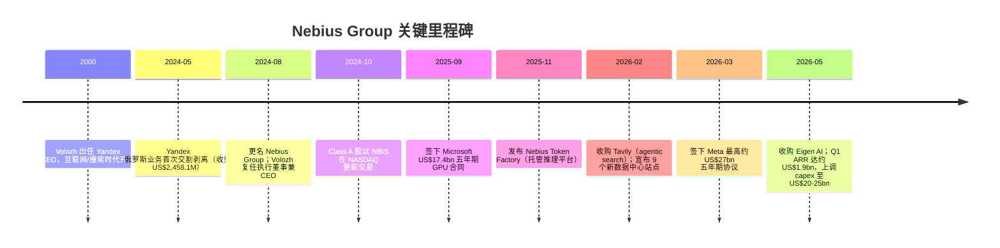
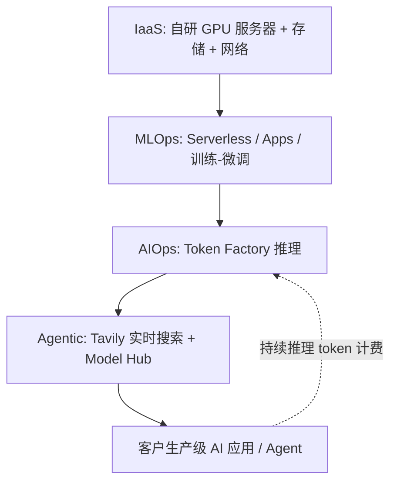
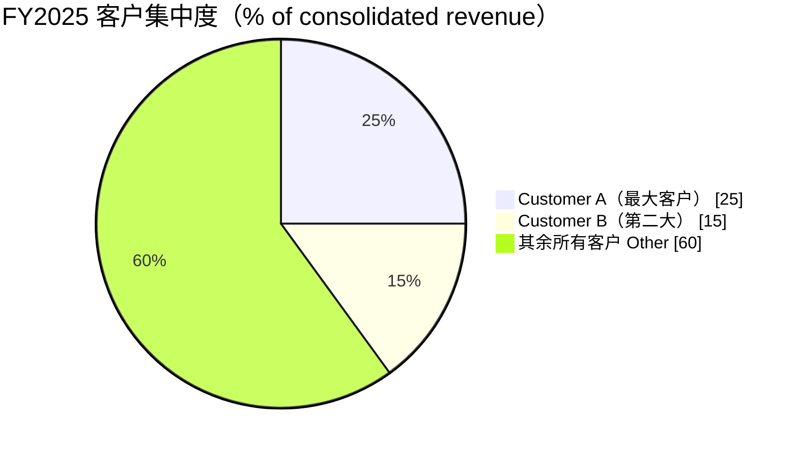
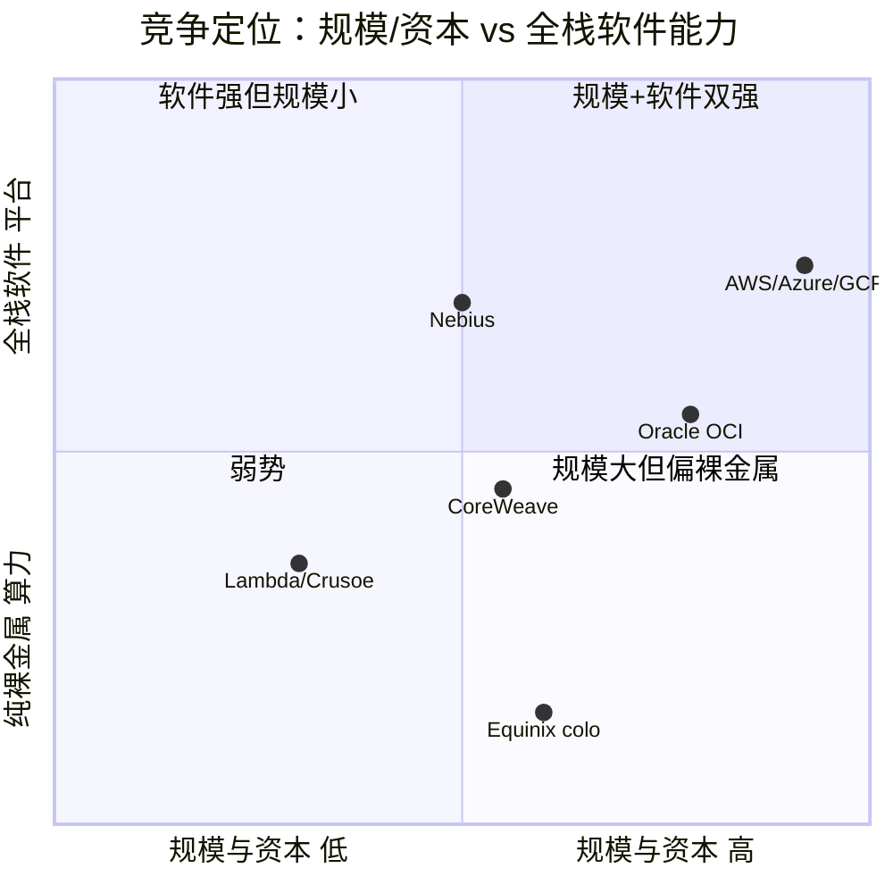
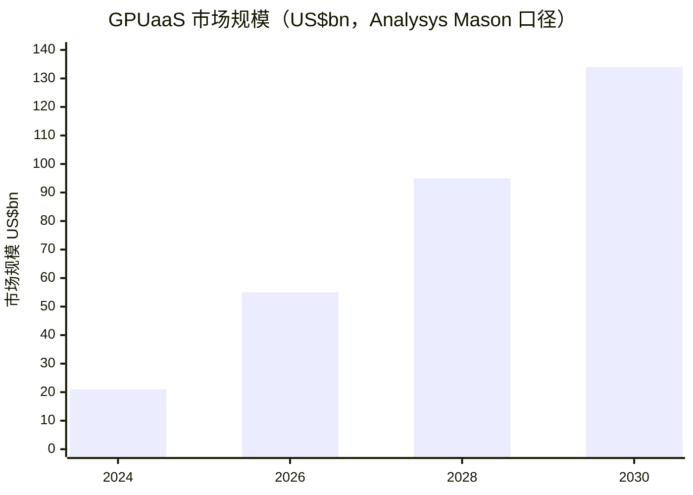

# Nebius Group N.V.（NASDAQ：NBIS）公司研究

**报告日期 / As of: 2026-06-17**

> *分析师观点：* **评级：Hold（中性）· 12 个月目标价 US$245（较 2026-06-17 收盘 US$280.91 下行 −13%）· 估值方法：2027E 营收 US$8.5bn × ~7.5× EV/Sales，回扣净现金/可转债后折现至每股**
> 市值约 US$71bn（253.0M 股 × US$280.91）· 52 周区间 US$44.30–US$280.91 · NASDAQ：NBIS · 荷兰注册（Foreign Private Issuer，报 20-F/6-K）
>
> | 倍数 / Multiple（*分析师观点：* 前瞻列） | FY25A | FY26E | FY27E |
> |---|---|---|---|
> | EV/Sales | ~133× | ~21× | ~7.5× |
> | EV/调整后 EBITDA | n/m（亏损） | ~52× | ~13× |
> | P/E | n/m | n/m（亏损） | n/m（亏损） |
> | P/B | ~15× | ~8× | ~6× |
>
> 相对表现（截至 2026-06-17，对标 S&P 500）：1M +40.6% vs +0.2%（相对 +40.4pp）· 6M +272.3% vs +10.4%（相对 +261.9pp）· YTD +212.3% vs +8.2%（相对 +204.1pp）· 12M +481.2% vs +24.0%（相对 +457.2pp）（来源：yfinance，见下文引用）。
>
> **核心论点（thesis pillars）**——（1）Nebius 是少数已规模化、垂直自建的「neocloud（新型 AI 云）」之一，AI cloud 业务 ARR 一年内从近零冲到约 US$1.9bn、FY2025 营收 +479%，增长曲线在全市场名列前茅；（2）与 Microsoft（US$17.4bn）和 Meta（最高约 US$27bn）的多年期锚定合同提供了需求与预付款背书，但也把约 40% 的 FY26E ARR 集中在两个客户身上；（3）这是一笔由可转债 + 预融资认股权证驱动的重资本（capex-heavy）扩张——FY2026 capex 指引 US$20–25bn，远超经营现金流，融资与电力（power）落地是真正的瓶颈；（4）当前估值已对「执行近乎完美 + 软件变现成功」充分定价，风险回报对称偏负——故给予 Hold，等待回调或交付里程碑确认。

---

## 目录 / Table of Contents

1. 公司概览（含投资论点）
1A. 估值与目标价（前瞻预测 · 目标价推导 · 牛熊基准）
1B. GF Score（GuruFocus 风格）基本面评分卡
2. 公司历史
3. 管理层
4. 产品与服务（**全文最重要章节**）
5. 客户与销售模式
6. 行业概览
7. 竞争格局
8. 市场机会（TAM）
9. 风险评估
9.5. 核心分歧与催化剂
10. 投资风格透视（investor lenses）

数据来源清单 · 参考文献 · 验证日志

---

## 1. 公司概览（Company Overview）

*分析师观点：* **本报告对 Nebius Group 给予 Hold（中性）评级、12 个月目标价 US$245。** 论点的「为什么是现在（why now）」很直接：这是一只在 12 个月里上涨 +481%、刚刚于 2026-06-17 创下历史新高 US$280.91 的 AI 基础设施龙头（来源：yfinance 历史收盘，见数据来源清单），其基本面增速（FY2025 营收 +479%、AI cloud 业务 ARR +674% 至约 US$1.9bn）确实是全市场最快的一档（[Nebius Q1 2026 earnings call transcript, 2026-05-13](https://www.fool.com/earnings/call-transcripts/2026/05/13/nebius-nbis-q1-2026-earnings-transcript/)）。四条论点支撑这一中性判断：（1）规模化、垂直自建的 neocloud 稀缺标的；（2）Microsoft/Meta 锚定合同既是背书也是集中度风险；（3）由可转债 + 预融资认股权证驱动的重资本扩张，电力与融资落地是瓶颈；（4）估值已对「完美执行」定价，故风险回报对称偏负。后文 1A 展开估值推导。

**公司做什么。** Nebius 自我定义为「a global AI cloud platform, delivers a unified full-stack AI cloud that spans the complete AI journey from compute capacity to software and services that enables fast and efficient training and inference at scale（一个全球 AI 云平台，提供从算力到软件与服务的全栈 AI 云，覆盖从训练到推理的完整 AI 流程）」（[Nebius FY2025 20-F, Item 4 Business](https://www.sec.gov/Archives/edgar/data/1513845/000110465926052948/nbis-20251231x20f.htm)）。它围绕自研技术（in-house server/rack 设计 + 自研编排软件）构建高性能 GPU 算力集群、存储、托管服务与 AI 模型训练/推理工具，是「one of the few global, at scale, multi-tenant clouds purpose-built for AI（少数几个全球化、规模化、为 AI 而生的多租户云之一）」（[Nebius Q1 2026 6-K, Exhibit 99.1 — Overview](https://www.sec.gov/Archives/edgar/data/1513845/000110465926064092/nbis-20260331xex99d1.htm)）。

**怎么赚钱（business model）。** 核心 Nebius AI cloud 业务通过提供「high-performance GPU compute capacity, storage, and networking resources, as well as value-add software solutions（高性能 GPU 算力、存储、网络资源以及增值软件方案）」收费，定价模型为「both on-demand pay-as-you-go pricing and fixed reserved capacity contracts（按需即用即付 + 固定预留容量合同）两种」（[Nebius Q1 2026 6-K, Exhibit 99.1 — Components of Results of Operations](https://www.sec.gov/Archives/edgar/data/1513845/000110465926064092/nbis-20260331xex99d1.htm)）。集团还包含两个独立品牌——Avride（autonomous driving 自动驾驶/配送机器人）与 TripleTen（edtech 再培训平台），并持有 ClickHouse 与 Toloka 的重要股权（两者均自集团分拆而出）（[Nebius FY2025 20-F, Item 4 Business](https://www.sec.gov/Archives/edgar/data/1513845/000110465926052948/nbis-20251231x20f.htm)）。

**在哪经营、规模多大。** 按客户所在地划分，FY2025 营收：United States US$340.1M、United Kingdom US$137.5M、Rest of world US$52.2M，合计 US$529.8M（[Nebius FY2025 20-F, Note 15 — Revenue by geographic area](https://www.sec.gov/Archives/edgar/data/1513845/000110465926052948/nbis-20251231x20f.htm)）。长期资产（long-lived assets）则更分散地分布于美国、Israel（US$281.7M）、Finland（US$253.6M）及其他地区，FY2025 合计 US$6,491.8M——反映其数据中心遍布欧美。集团总部位于荷兰 Amsterdam/Schiphol（[Nebius Q1 2026 6-K cover](https://www.sec.gov/Archives/edgar/data/1513845/000110465926064092/nbis-20260331x6k.htm)）。

下图以 Sankey 形式呈现 FY2025 损益结构——注意公司仍处于规模化亏损阶段：营收 US$529.8M，扣除 cost of revenues US$166.2M 后毛利约 US$363.6M，但 product development（US$177.3M）、SG&A（US$380.1M）及 depreciation & amortization（US$417.9M，主要为 GPU 机队折旧）合计 US$975.3M 远超毛利，导致 loss from operations −US$611.7M（[Nebius FY2025 20-F, Consolidated Statements of Operations](https://www.sec.gov/Archives/edgar/data/1513845/000110465926052948/nbis-20251231x20f.htm)）。

<svg xmlns="http://www.w3.org/2000/svg" viewBox="0 0 1040 600" width="1040" height="600" role="img" aria-label="Nebius FY2025 income statement Sankey (operating level)"><rect x="0" y="0" width="1040" height="600" fill="#ffffff"/>
<text x="20.00" y="30.00" text-anchor="start" font-family="Helvetica,Arial,sans-serif" font-size="15" font-weight="700" fill="#1f2933">Nebius 收入与经营开支流向 — FY2025（经营层面；亏损以左侧赤字源呈现，百万美元）</text>
<path d="M 424.00,64.00 C 526.00,64.00 526.00,111.63 628.00,111.63 L 628.00,258.79 C 526.00,258.79 526.00,211.16 424.00,211.16 Z" fill="#86efac" fill-opacity="0.55"/>
<path d="M 644.00,111.63 C 746.00,111.63 746.00,97.63 848.00,97.63 L 848.00,169.39 C 746.00,169.39 746.00,183.39 644.00,183.39 Z" fill="#fca5a5" fill-opacity="0.55"/>
<path d="M 644.00,183.39 C 746.00,183.39 746.00,183.39 848.00,183.39 L 848.00,337.23 C 746.00,337.23 746.00,337.23 644.00,337.23 Z" fill="#fca5a5" fill-opacity="0.55"/>
<path d="M 644.00,337.23 C 746.00,337.23 746.00,351.23 848.00,351.23 L 848.00,520.37 C 746.00,520.37 746.00,506.37 644.00,506.37 Z" fill="#fca5a5" fill-opacity="0.55"/>
<path d="M 204.00,201.79 C 306.00,201.79 306.00,64.00 408.00,64.00 L 408.00,211.16 C 306.00,211.16 306.00,348.95 204.00,348.95 Z" fill="#86efac" fill-opacity="0.55"/>
<path d="M 204.00,348.95 C 306.00,348.95 306.00,225.16 408.00,225.16 L 408.00,292.43 C 306.00,292.43 306.00,416.21 204.00,416.21 Z" fill="#fca5a5" fill-opacity="0.55"/>
<path d="M 424.00,306.43 C 526.00,306.43 526.00,258.79 628.00,258.79 L 628.00,506.37 C 526.00,506.37 526.00,554.00 424.00,554.00 Z" fill="#fca5a5" fill-opacity="0.55"/>
<rect x="188.00" y="201.79" width="16" height="214.43" rx="1.5" fill="#1e3a8a"/>
<rect x="408.00" y="64.00" width="16" height="147.16" rx="1.5" fill="#15803d"/>
<rect x="408.00" y="225.16" width="16" height="67.27" rx="1.5" fill="#dc2626"/>
<rect x="408.00" y="306.43" width="16" height="247.57" rx="1.5" fill="#dc2626"/>
<rect x="628.00" y="111.63" width="16" height="394.73" rx="1.5" fill="#dc2626"/>
<rect x="848.00" y="97.63" width="16" height="71.76" rx="1.5" fill="#dc2626"/>
<rect x="848.00" y="183.39" width="16" height="153.84" rx="1.5" fill="#dc2626"/>
<rect x="848.00" y="351.23" width="16" height="169.14" rx="1.5" fill="#dc2626"/>
<text x="179.00" y="306.00" text-anchor="end" font-family="Helvetica,Arial,sans-serif" font-size="11.5" font-weight="700" fill="#1f2933">Revenue / 营收</text>
<text x="179.00" y="319.00" text-anchor="end" font-family="Helvetica,Arial,sans-serif" font-size="10" font-weight="400" fill="#52606d">$529.8M  (100.0%)</text>
<rect x="427.00" y="46.00" width="113.10" height="26" rx="2" fill="#ffffff" fill-opacity="0.72"/>
<text x="430.00" y="58.00" text-anchor="start" font-family="Helvetica,Arial,sans-serif" font-size="11.5" font-weight="700" fill="#1f2933">Gross Profit / 毛利</text>
<text x="430.00" y="71.00" text-anchor="start" font-family="Helvetica,Arial,sans-serif" font-size="10" font-weight="400" fill="#52606d">$363.6M  (68.6%)</text>
<rect x="427.00" y="207.16" width="150.90" height="26" rx="2" fill="#ffffff" fill-opacity="0.72"/>
<text x="430.00" y="219.16" text-anchor="start" font-family="Helvetica,Arial,sans-serif" font-size="11.5" font-weight="700" fill="#1f2933">Cost of Revenues / 营业成本</text>
<text x="430.00" y="232.16" text-anchor="start" font-family="Helvetica,Arial,sans-serif" font-size="10" font-weight="400" fill="#52606d">$166.2M  (31.4%)</text>
<text x="399.00" y="427.21" text-anchor="end" font-family="Helvetica,Arial,sans-serif" font-size="11.5" font-weight="700" fill="#1f2933">Operating Loss deficit / 经营亏损缺口</text>
<text x="399.00" y="440.21" text-anchor="end" font-family="Helvetica,Arial,sans-serif" font-size="10" font-weight="400" fill="#52606d">$611.7M  (115.5%)</text>
<rect x="647.00" y="93.63" width="113.10" height="26" rx="2" fill="#ffffff" fill-opacity="0.72"/>
<text x="650.00" y="105.63" text-anchor="start" font-family="Helvetica,Arial,sans-serif" font-size="11.5" font-weight="700" fill="#1f2933">Total OpEx / 经营开支</text>
<text x="650.00" y="118.63" text-anchor="start" font-family="Helvetica,Arial,sans-serif" font-size="10" font-weight="400" fill="#52606d">$975.3M  (184.1%)</text>
<text x="873.00" y="130.51" text-anchor="start" font-family="Helvetica,Arial,sans-serif" font-size="11.5" font-weight="700" fill="#1f2933">Product Dev / 研发</text>
<text x="873.00" y="143.51" text-anchor="start" font-family="Helvetica,Arial,sans-serif" font-size="10" font-weight="400" fill="#52606d">$177.3M  (33.5%)</text>
<text x="873.00" y="257.31" text-anchor="start" font-family="Helvetica,Arial,sans-serif" font-size="11.5" font-weight="700" fill="#1f2933">SG&amp;A / 销管费用</text>
<text x="873.00" y="270.31" text-anchor="start" font-family="Helvetica,Arial,sans-serif" font-size="10" font-weight="400" fill="#52606d">$380.1M  (71.7%)</text>
<text x="873.00" y="432.80" text-anchor="start" font-family="Helvetica,Arial,sans-serif" font-size="11.5" font-weight="700" fill="#1f2933">D&amp;A / 折旧摊销</text>
<text x="873.00" y="445.80" text-anchor="start" font-family="Helvetica,Arial,sans-serif" font-size="10" font-weight="400" fill="#52606d">$417.9M  (78.9%)</text>
<text x="520.00" y="570.00" text-anchor="middle" font-family="Helvetica,Arial,sans-serif" font-size="10" font-weight="400" font-style="italic" fill="#8a97a3">经营层面视图：经营亏损 -$611.7M 以左侧 deficit source 与毛利共同填充经营开支池；不含一次性 ClickHouse 重估收益</text>
<text x="520.00" y="584.00" text-anchor="middle" font-family="Helvetica,Arial,sans-serif" font-size="10" font-weight="400" fill="#52606d">Source: Nebius FY2025 20-F, Consolidated Statements of Operations</text>
</svg>

来源 / Source: [Nebius FY2025 20-F, Consolidated Statements of Operations](https://www.sec.gov/Archives/edgar/data/1513845/000110465926052948/nbis-20251231x20f.htm)

> **读图说明：** 这是**经营层面（operating-level）视图**——因 Nebius 仍深度亏损，毛利 US$363.6M 仅能覆盖经营开支 US$975.3M 的一部分，缺口 US$611.7M（即 loss from operations）以左侧「Operating Loss deficit / 经营亏损缺口」作为来源、与毛利共同填充经营开支池（亏损企业的 deficit-as-source 画法），故每个节点流量守恒、全图均在画布内。本图**不含**一次性 ClickHouse 持股重估收益（该收益使 FY2025 GAAP 净利润转正，但与核心经营无关——参见下文「本期新变化」与 Section 1B 盈利能力维度）。

收入几乎全部来自核心 AI cloud 业务。下面两张 donut 分别按 reportable segment 与按 geography 拆分 FY2025 营收：segment 口径下 Nebius AI cloud US$480.3M（占抵消前 segment 收入 US$535.7M 的约 90%）、TripleTen US$54.1M、Avride US$1.3M（[Nebius FY2025 20-F, Note 15 — Segment revenues](https://www.sec.gov/Archives/edgar/data/1513845/000110465926052948/nbis-20251231x20f.htm)）。

<svg xmlns="http://www.w3.org/2000/svg" viewBox="0 0 720 460" width="720" height="460" role="img" aria-label="revenue donut"><rect x="0" y="0" width="720" height="460" fill="#ffffff"/>
<text x="20.00" y="30.00" text-anchor="start" font-family="Helvetica,Arial,sans-serif" font-size="15" font-weight="700" fill="#1f2933">FY2025 Revenue by Reportable Segment (pre-elimination .7M)</text>
<path d="M 288.00,107.20 A 132 132 0 1 1 208.14,134.10 L 240.81,177.10 A 78 78 0 1 0 288.00,161.20 Z" fill="#2563eb"/>
<path d="M 208.14,134.10 A 132 132 0 0 1 285.99,107.22 L 286.81,161.21 A 78 78 0 0 0 240.81,177.10 Z" fill="#15803d"/>
<path d="M 285.99,107.22 A 132 132 0 0 1 288.00,107.20 L 288.00,161.20 A 78 78 0 0 0 286.81,161.21 Z" fill="#d97706"/>
<text x="288.00" y="235.20" text-anchor="middle" font-family="Helvetica,Arial,sans-serif" font-size="18" font-weight="800" fill="#1f2933">NBIS</text>
<text x="288.00" y="255.20" text-anchor="middle" font-family="Helvetica,Arial,sans-serif" font-size="13" font-weight="600" fill="#52606d">$535.7M</text>
<text x="288.00" y="271.20" text-anchor="middle" font-family="Helvetica,Arial,sans-serif" font-size="10" font-weight="400" fill="#8a97a3">total</text>
<line x1="332.05" y1="369.98" x2="348.05" y2="369.98" stroke="#2563eb" stroke-width="1.4"/>
<text x="352.05" y="367.98" text-anchor="start" font-family="Helvetica,Arial,sans-serif" font-size="11" font-weight="700" fill="#1f2933">Nebius AI cloud</text>
<text x="352.05" y="381.98" text-anchor="start" font-family="Helvetica,Arial,sans-serif" font-size="10" font-weight="400" fill="#52606d">$480.3M  (89.7%)</text>
<line x1="242.95" y1="108.76" x2="226.95" y2="108.76" stroke="#15803d" stroke-width="1.4"/>
<text x="222.95" y="106.76" text-anchor="end" font-family="Helvetica,Arial,sans-serif" font-size="11" font-weight="700" fill="#1f2933">TripleTen</text>
<text x="222.95" y="120.76" text-anchor="end" font-family="Helvetica,Arial,sans-serif" font-size="10" font-weight="400" fill="#52606d">$54.1M  (10.1%)</text>
<line x1="286.95" y1="101.20" x2="270.95" y2="101.20" stroke="#d97706" stroke-width="1.4"/>
<text x="266.95" y="99.20" text-anchor="end" font-family="Helvetica,Arial,sans-serif" font-size="11" font-weight="700" fill="#1f2933">Avride</text>
<text x="266.95" y="113.20" text-anchor="end" font-family="Helvetica,Arial,sans-serif" font-size="10" font-weight="400" fill="#52606d">$1.3M  (0.2%)</text>
<text x="360.00" y="444.00" text-anchor="middle" font-family="Helvetica,Arial,sans-serif" font-size="10" font-weight="400" fill="#52606d">Source: Nebius FY2025 20-F, Note 15 — Segment revenues</text>
</svg>

来源 / Source: [Nebius FY2025 20-F, Note 15 — Segment revenues](https://www.sec.gov/Archives/edgar/data/1513845/000110465926052948/nbis-20251231x20f.htm)

<svg xmlns="http://www.w3.org/2000/svg" viewBox="0 0 720 460" width="720" height="460" role="img" aria-label="revenue donut"><rect x="0" y="0" width="720" height="460" fill="#ffffff"/>
<text x="20.00" y="30.00" text-anchor="start" font-family="Helvetica,Arial,sans-serif" font-size="15" font-weight="700" fill="#1f2933">FY2025 Revenue by Geography (customer location, .8M)</text>
<path d="M 288.00,107.20 A 132 132 0 1 1 185.27,322.09 L 227.30,288.18 A 78 78 0 1 0 288.00,161.20 Z" fill="#2563eb"/>
<path d="M 185.27,322.09 A 132 132 0 0 1 211.40,131.70 L 242.74,175.68 A 78 78 0 0 0 227.30,288.18 Z" fill="#15803d"/>
<path d="M 211.40,131.70 A 132 132 0 0 1 288.00,107.20 L 288.00,161.20 A 78 78 0 0 0 242.74,175.68 Z" fill="#d97706"/>
<text x="288.00" y="235.20" text-anchor="middle" font-family="Helvetica,Arial,sans-serif" font-size="18" font-weight="800" fill="#1f2933">NBIS</text>
<text x="288.00" y="255.20" text-anchor="middle" font-family="Helvetica,Arial,sans-serif" font-size="13" font-weight="600" fill="#52606d">$529.8M</text>
<text x="288.00" y="271.20" text-anchor="middle" font-family="Helvetica,Arial,sans-serif" font-size="10" font-weight="400" fill="#8a97a3">total</text>
<line x1="412.51" y1="298.72" x2="428.51" y2="298.72" stroke="#2563eb" stroke-width="1.4"/>
<text x="432.51" y="296.72" text-anchor="start" font-family="Helvetica,Arial,sans-serif" font-size="11" font-weight="700" fill="#1f2933">United States</text>
<text x="432.51" y="310.72" text-anchor="start" font-family="Helvetica,Arial,sans-serif" font-size="10" font-weight="400" fill="#52606d">$340.1M  (64.2%)</text>
<line x1="151.28" y1="220.44" x2="135.28" y2="220.44" stroke="#15803d" stroke-width="1.4"/>
<text x="131.28" y="218.44" text-anchor="end" font-family="Helvetica,Arial,sans-serif" font-size="11" font-weight="700" fill="#1f2933">United Kingdom</text>
<text x="131.28" y="232.44" text-anchor="end" font-family="Helvetica,Arial,sans-serif" font-size="10" font-weight="400" fill="#52606d">$137.5M  (26.0%)</text>
<line x1="245.96" y1="107.76" x2="229.96" y2="107.76" stroke="#d97706" stroke-width="1.4"/>
<text x="225.96" y="105.76" text-anchor="end" font-family="Helvetica,Arial,sans-serif" font-size="11" font-weight="700" fill="#1f2933">Rest of world</text>
<text x="225.96" y="119.76" text-anchor="end" font-family="Helvetica,Arial,sans-serif" font-size="10" font-weight="400" fill="#52606d">$52.2M  (9.9%)</text>
<text x="360.00" y="444.00" text-anchor="middle" font-family="Helvetica,Arial,sans-serif" font-size="10" font-weight="400" fill="#52606d">Source: Nebius FY2025 20-F, Note 15 — Revenue by geographic area</text>
</svg>

来源 / Source: [Nebius FY2025 20-F, Note 15 — Revenue by geographic area](https://www.sec.gov/Archives/edgar/data/1513845/000110465926052948/nbis-20251231x20f.htm)

发展轨迹（development over time）是这家公司最震撼的部分。下方堆叠柱展示 segment 营收三年路径：Nebius AI cloud 从 FY2023 US$9.6M → FY2024 US$68.3M → FY2025 US$480.3M（同比 +603%），TripleTen 从 US$8.2M → US$28.8M → US$54.1M（[Nebius FY2023–FY2025 20-Fs, Note 15](https://www.sec.gov/Archives/edgar/data/1513845/000110465926052948/nbis-20251231x20f.htm)）。集团总营收 FY2024→FY2025 增长 +479%（从 US$91.5M 到 US$529.8M），而进入 2026 年增速进一步加快——Q1 2026 单季营收 US$399.0M，同比 +684%（[Nebius Q1 2026 6-K, Exhibit 99.1 — Revenues](https://www.sec.gov/Archives/edgar/data/1513845/000110465926064092/nbis-20260331xex99d1.htm)）。

<svg xmlns="http://www.w3.org/2000/svg" viewBox="0 0 860 470" width="860" height="470" role="img" aria-label="historical revenue bars"><rect x="0" y="0" width="860" height="470" fill="#ffffff"/>
<text x="20.00" y="30.00" text-anchor="start" font-family="Helvetica,Arial,sans-serif" font-size="15" font-weight="700" fill="#1f2933">Segment Revenue History (pre-elimination), FY2023-FY2025</text>
<rect x="20.00" y="44" width="11" height="11" rx="2" fill="#2563eb"/>
<text x="36.00" y="53.00" text-anchor="start" font-family="Helvetica,Arial,sans-serif" font-size="10.5" font-weight="400" fill="#1f2933">Nebius AI cloud</text>
<rect x="149.00" y="44" width="11" height="11" rx="2" fill="#15803d"/>
<text x="165.00" y="53.00" text-anchor="start" font-family="Helvetica,Arial,sans-serif" font-size="10.5" font-weight="400" fill="#1f2933">TripleTen</text>
<rect x="238.40" y="44" width="11" height="11" rx="2" fill="#d97706"/>
<text x="254.40" y="53.00" text-anchor="start" font-family="Helvetica,Arial,sans-serif" font-size="10.5" font-weight="400" fill="#1f2933">Avride</text>
<line x1="70" y1="412.00" x2="834" y2="412.00" stroke="#eceff2" stroke-width="1"/>
<text x="64.00" y="415.00" text-anchor="end" font-family="Helvetica,Arial,sans-serif" font-size="9.5" font-weight="400" fill="#52606d">$0</text>
<line x1="70" y1="345.20" x2="834" y2="345.20" stroke="#eceff2" stroke-width="1"/>
<text x="64.00" y="348.20" text-anchor="end" font-family="Helvetica,Arial,sans-serif" font-size="9.5" font-weight="400" fill="#52606d">$115.7M</text>
<line x1="70" y1="278.40" x2="834" y2="278.40" stroke="#eceff2" stroke-width="1"/>
<text x="64.00" y="281.40" text-anchor="end" font-family="Helvetica,Arial,sans-serif" font-size="9.5" font-weight="400" fill="#52606d">$231.4M</text>
<line x1="70" y1="211.60" x2="834" y2="211.60" stroke="#eceff2" stroke-width="1"/>
<text x="64.00" y="214.60" text-anchor="end" font-family="Helvetica,Arial,sans-serif" font-size="9.5" font-weight="400" fill="#52606d">$347.1M</text>
<line x1="70" y1="144.80" x2="834" y2="144.80" stroke="#eceff2" stroke-width="1"/>
<text x="64.00" y="147.80" text-anchor="end" font-family="Helvetica,Arial,sans-serif" font-size="9.5" font-weight="400" fill="#52606d">$462.8M</text>
<line x1="70" y1="78.00" x2="834" y2="78.00" stroke="#eceff2" stroke-width="1"/>
<text x="64.00" y="81.00" text-anchor="end" font-family="Helvetica,Arial,sans-serif" font-size="9.5" font-weight="400" fill="#52606d">$578.6M</text>
<rect x="123.48" y="406.46" width="147.71" height="5.54" fill="#2563eb"/>
<rect x="123.48" y="401.72" width="147.71" height="4.73" fill="#15803d"/>
<rect x="123.48" y="401.72" width="147.71" height="0.00" fill="#d97706"/>
<text x="197.33" y="428.00" text-anchor="middle" font-family="Helvetica,Arial,sans-serif" font-size="10" font-weight="400" fill="#52606d">2023</text>
<rect x="378.15" y="372.57" width="147.71" height="39.43" fill="#2563eb"/>
<rect x="378.15" y="355.94" width="147.71" height="16.63" fill="#15803d"/>
<rect x="378.15" y="355.77" width="147.71" height="0.17" fill="#d97706"/>
<text x="452.00" y="428.00" text-anchor="middle" font-family="Helvetica,Arial,sans-serif" font-size="10" font-weight="400" fill="#52606d">2024</text>
<rect x="632.81" y="134.72" width="147.71" height="277.28" fill="#2563eb"/>
<rect x="632.81" y="103.49" width="147.71" height="31.23" fill="#15803d"/>
<rect x="632.81" y="102.74" width="147.71" height="0.75" fill="#d97706"/>
<text x="706.67" y="428.00" text-anchor="middle" font-family="Helvetica,Arial,sans-serif" font-size="10" font-weight="400" fill="#52606d">2025</text>
<text x="430.00" y="454.00" text-anchor="middle" font-family="Helvetica,Arial,sans-serif" font-size="10" font-weight="400" fill="#52606d">Source: Nebius FY2023-FY2025 20-Fs, Note 15 — Segment revenues</text>
</svg>

来源 / Source: [Nebius FY2023–FY2025 20-Fs, Note 15 — Segment revenues](https://www.sec.gov/Archives/edgar/data/1513845/000110465926052948/nbis-20251231x20f.htm)

**本期新变化（what changed this period）。** Q1 2026 是一个分水岭季度：（1）集团 net income 转正至 +US$621.2M（但主要由 ClickHouse 持股重估收益驱动，loss from operations 仍为 −US$128.0M）（[Nebius Q1 2026 6-K, Exhibit 99.1](https://www.sec.gov/Archives/edgar/data/1513845/000110465926064092/nbis-20260331xex99d1.htm)）；（2）AI cloud 业务 ARR（annualized run-rate revenue 年化运行收入）达约 US$1.9bn，环比 Q4 2025 的 US$1.25bn 增长逾 50%、同比 +674%（[Nebius Q1 2026 earnings call transcript, 2026-05-13](https://www.fool.com/earnings/call-transcripts/2026/05/13/nebius-nbis-q1-2026-earnings-transcript/)）；（3）公司将 FY2026 capex 指引上调至 US$20–25bn（原 US$16–20bn）；（4）自 Q1 2026 起将 server/network 设备折旧年限由 4 年改为 5 年「to reflect usage patterns（以反映实际使用模式）」，此举抬升当期利润率（[Nebius Q1 2026 6-K, Exhibit 99.1 — Depreciation](https://www.sec.gov/Archives/edgar/data/1513845/000110465926064092/nbis-20260331xex99d1.htm)）。

**估值快照（valuation snapshot，REQUIRED）。** 现价 US$280.91（2026-06-17），市值约 US$71bn（约 253.0M 股，Class A 219,465,088 + Class B 33,551,883）（[Nebius FY2025 20-F, cover — shares outstanding](https://www.sec.gov/Archives/edgar/data/1513845/000110465926052948/nbis-20251231x20f.htm)；股价来源：yfinance）。**P/E 为负/不适用**——公司在经营层面仍亏损（FY2025 loss from operations −US$611.7M），FY2025 集团净利润为正纯属一次性 ClickHouse 重估收益 +US$598.9M 所致，并非可持续盈利（[Nebius FY2025 20-F, Statements of Operations](https://www.sec.gov/Archives/edgar/data/1513845/000110465926052948/nbis-20251231x20f.htm)）。**P/S（TTM）极高**：以 FY2025 营收 US$529.8M 计，市销率约 134×；即便用 FY2026E 营收中值 US$3.2bn 计也约 22×，显著高于成熟软件/云同业。这一溢价的成因是 AI 基础设施赛道的高增长溢价 + 「neocloud 稀缺标的」叙事——*分析师观点：* 高盛维持 Buy、目标价 US$234（基于 2027E ~9× EV/Sales），印证了市场用前瞻倍数而非 TTM 盈利给这类名字定价（[Goldman Sachs — Nebius Group: Key takeaways from Netherlands roadshow, 2026-05-28, p.1](http://xs-macbook-air.local:5001/zsxq/pdf/415284442588228/Goldman%20Sachs-Nebius%20Group%20%EF%BC%88NBIS.US%EF%BC%89%EF%BC%9A%20Key%20takeaways%20from%20Netherlands%20roadshow-260528.pdf)）。这一估值水平本身构成风险，详见 Section 9 的估值/倍数压缩风险。

---

## 1A. 估值与目标价（Valuation & Price Target）

*分析师观点：本章所有前瞻数字、目标价及情景目标价均为分析师的前瞻判断（forward view），不附任何 filing 引用；每个驱动因子的外部依据在行内单独引用。*

**(a) 前瞻财务预测（forward estimates，3 年）。** 下表的营收/EBITDA 路径锚定于公司自身 FY2026 指引（ARR US$7–9bn、营收 US$3.0–3.4bn、group adjusted EBITDA margin ~40%）（[Nebius Q1 2026 earnings call transcript, 2026-05-13](https://www.fool.com/earnings/call-transcripts/2026/05/13/nebius-nbis-q1-2026-earnings-transcript/)）+ 已签 Microsoft/Meta 多年期合同的交付节奏（[Nebius 6-K, 2025-09-08 — Microsoft Agreement](https://www.sec.gov/Archives/edgar/data/1513845/000110465925088312/tm2525580d1_ex99-1.htm)；[Nebius 6-K, 2026-03-16 — Meta Agreement](https://www.sec.gov/Archives/edgar/data/1513845/000110465926027886/tm268879d1_ex99-1.htm)）+ 行业 GPUaaS 增长预测（[Analysys Mason GPUaaS forecast, 2025](https://www.analysysmason.com/research/content/articles/gpuaas-forecast-overview-rma16/)）。FY2027E 营收 US$8.5bn 取在卖方区间内（大摩 FY2027E US$10.5bn 偏高、本报告偏保守，反映电力/交付执行折让）。

| 指标（*分析师观点：*） | FY25A | FY26E | FY27E | CAGR(25→27) |
|---|---|---|---|---|
| 营收 Revenue（US$M） | 529.8 | 3,200 | 8,500 | +301% |
|  — YoY % | +479% | +504% | +166% | |
| 年末 ARR（US$bn） | 1.25 | 8.0 | 16.0 | |
| Gross margin %（近似） | ~69% | ~70% | ~72% | |
| Group adj. EBITDA margin % | ~−12% | ~40% | ~50% | |
| Operating margin %（GAAP） | −115% | −5% | +8% | |
| EPS（GAAP，US$，摊薄近似） | ~0.04* | ~(1.5) | ~(0.5) | n/m |
| FCF（US$bn，近似） | ~(3.7) | ~(18) | ~(12) | n/m |
| 净现金/(净债务)（US$bn） | ~(0.4)** | 资本结构随融资变动 | | |

\* FY2025 GAAP EPS 受一次性 ClickHouse 重估收益扭曲，不具参考意义。
\*\* FY2025 末现金 US$3,678.1M vs 非流动负债中 debt（含可转债）US$4,103.2M，名义上略净债务，但同期另有 US$847.7M 股权投资可变现（[Nebius FY2025 20-F, Consolidated Balance Sheets + Note 12 Convertible Debt](https://www.sec.gov/Archives/edgar/data/1513845/000110465926052948/nbis-20251231x20f.htm)）。

各驱动依据（外部输入，行内引用）：营收 ramp 由 ARR 从 US$1.9bn（Q1 2026 末）→ FY2026 末 US$7–9bn 指引外推，叠加 Microsoft/Meta 合同分批交付（deployment in tranches during 2025-2026/2026 起）（[Nebius Q1 2026 earnings call transcript](https://www.fool.com/earnings/call-transcripts/2026/05/13/nebius-nbis-q1-2026-earnings-transcript/)；[Nebius 6-K, 2025-09-08](https://www.sec.gov/Archives/edgar/data/1513845/000110465925088312/tm2525580d1_ex99-1.htm)）。**margin bridge：** group adj. EBITDA margin 从 FY2025 ~−12% 跳升至 FY2026 ~40%，桥接驱动为——AI cloud 业务 adj. EBITDA margin Q1 2026 已达 45%（vs Q4 2025 的 24%），规模化摊薄固定成本（+，约 +40pp）· 折旧年限 4→5 年(+，抬升当期利润) · Avride/TripleTen 仍亏损拖累（−）（[Nebius Q1 2026 earnings call transcript](https://www.fool.com/earnings/call-transcripts/2026/05/13/nebius-nbis-q1-2026-earnings-transcript/)）。**现金跑道（cash runway）不是问题但融资强度是**：FY2025 末现金 US$3.7bn，2026 年又发行约 US$4.3bn 可转债 + US$2.0bn 预融资认股权证，但 FY2026 capex 指引 US$20–25bn 意味着公司将持续依赖外部融资（[Nebius Q1 2026 earnings call transcript](https://www.fool.com/earnings/call-transcripts/2026/05/13/nebius-nbis-q1-2026-earnings-transcript/)）。

**(b) 目标价推导（show the arithmetic）。** 本报告采用 **forward EV/Sales** 法（DCF 对一家 FCF 深度为负、5 年内不转正的重资本扩张者不可靠；EV/EBITDA 在 FY2026 才刚转正）：

```
FY2027E 营收             US$8,500M
× 目标 EV/Sales 倍数      7.5×
= 企业价值 EV            US$63,750M
− 净债务（约）            US$3,000M（capex 持续融资，假设 2027 末净债务温和扩大）
= 股权价值               US$60,750M
÷ 摊薄股数（约 ~248M*）   → 每股约 US$245
```
\*目标价以当前股本近似，未计未来稀释（认股权证/可转债转股将摊薄，构成下行风险）。

**倍数依据（为什么用 7.5×）。** 对标已上市 neocloud 同业：*分析师观点：* 大摩对 Nebius 用 2028E ~8× EV/EBITDA（略低于软件均值，因 capex 强度高），高盛用 2027E ~9× EV/Sales，花旗用 ~6.3× FY27E EV/Revenue（对 FY29E 给 84% 折让）（[Morgan Stanley — Nebius Group NV: Insights from Nebius Inflection 2026, 2026-06-10, p.1](http://xs-macbook-air.local:5001/zsxq/pdf/214528184155241/MS-Nebius%20Group%20NV%20Watt%27s%20New%20With%20The%20Neoclouds%20Insights%20from%20Nebius%20Inflection%202026-260610.pdf)；[Goldman Sachs — Nebius Group roadshow, 2026-05-28, p.1](http://xs-macbook-air.local:5001/zsxq/pdf/415284442588228/Goldman%20Sachs-Nebius%20Group%20%EF%BC%88NBIS.US%EF%BC%89%EF%BC%9A%20Key%20takeaways%20from%20Netherlands%20roadshow-260528.pdf)；[Citi — Nebius Group NV: AI Expert Forum, 2026-06-10, p.1](http://xs-macbook-air.local:5001/zsxq/pdf/181245885841282/CITI-Nebius%20Group%20NV%20%EF%BC%88NBIS.US%EF%BC%89%20Nebius%20Inflection%EF%BC%9A%20AI%20Expert%20Forum%20%E2%80%93%20Still%20in%20the%20Early%20Innings%20of%20Agentic%20Workloads-260610.pdf)）。本报告 7.5× FY2027E EV/Sales 取在花旗(6.3×)与高盛(9×)之间，反映对电力/交付执行的折让。横向对标 CoreWeave（CRWV，纯 neocloud）当前同样以高个位数 EV/Sales 交易，但客户集中度（Microsoft 主导）与 Nebius 相近——故同档倍数合理。

**(c) 牛/基/熊情景（三个目标价）。**

| 情景（*分析师观点：*） | 核心假设 | 目标价 | 较现价 |
|---|---|---|---|
| 牛 Bull | 软件/推理变现超预期，2030 前 5GW+ 电力上线，FY2027E 营收 US$10.5bn × 10× EV/Sales | US$400 | +42% |
| 基 Base | 指引按计划交付，FY2027E 营收 US$8.5bn × 7.5× EV/Sales | US$245 | −13% |
| 熊 Bear | 供需转平衡 + 大厂自建挤压 + NJ/电力延期，倍数压缩至 ~4× FY2027E EV/Sales | US$110 | −61% |

牛/熊端点与大摩情景框架方向一致（大摩 2028 视角：bull US$400 / base US$130–300 / bear US$70）（[Morgan Stanley — Insights from Nebius Inflection 2026, 2026-06-10, p.1](http://xs-macbook-air.local:5001/zsxq/pdf/214528184155241/MS-Nebius%20Group%20NV%20Watt%27s%20New%20With%20The%20Neoclouds%20Insights%20from%20Nebius%20Inflection%202026-260610.pdf)）。注意现价 US$280.91 已高于本报告基准目标价，意味着市场定价更接近牛熊中枢偏上——这是 Hold 评级的核心理由。

**(d) 与市场一致预期的对比（consensus benchmark）。** 本报告 FY2027E 营收 US$8.5bn 低于大摩的 US$10.5bn、高于花旗隐含口径；目标价 US$245 处于卖方区间下沿（卖方 PT 区间约 US$144–US$287，详见下方卖方观点演变）。本报告相对偏谨慎，主要差异来自对电力交付节奏与稀释的折让。

**(e) 关键变量（swing variables，最该盯紧的两个）。** （1）**电力落地速度**——年末 4GW 合约电力目标能否兑现、以及实际并网（energized）MW 数，是营收 ramp 的硬约束；（2）**软件/推理变现的毛利杠杆**——直客（enterprise + AI-native）业务利润率远高于裸金属大单，Token Factory/Agentic 渗透率决定中长期 margin 上限（[Morgan Stanley — Insights from Nebius Inflection 2026, 2026-06-10, p.1](http://xs-macbook-air.local:5001/zsxq/pdf/214528184155241/MS-Nebius%20Group%20NV%20Watt%27s%20New%20With%20The%20Neoclouds%20Insights%20from%20Nebius%20Inflection%202026-260610.pdf)）。

### 卖方观点演变（Sell-side view evolution）

机械预读 `db/stock_price_target.db`（只读）得 NBIS 两条结构化 PT 记录：Morgan Stanley Equal-weight US$126（2026-05-05，当日收盘 US$175.92，隐含 −28.4%）与 Goldman Sachs Buy US$234（2026-05-28，当日收盘 US$226.34，隐含 +3.4%）（来源：`db/stock_price_target.db`，只读查询）。结合本地 zsxq 库的 6 篇 NBIS 专题，构建以下时间线——**切勿把分歧合成假一致**：

**按机构的观点时间线（按机构）：**

- **Morgan Stanley（持续 Equal-weight，但 PT 多次自我修正）：** 2026-05-05「Q1 前瞻——是时候歇一歇」，EW、PT US$126（基于 2035E FCF 折现 ~21× EV/FCF），当日股价 US$176，认为股价 3 个月翻倍已透支预期，担忧 NJ Vineland 站点延期（[Morgan Stanley — NBIS Q1 Preview: Time for a Breather, 2026-05-06, p.1](http://xs-macbook-air.local:5001/zsxq/pdf/184125288512452/MS-Nebius%20Group%20NV%20Watt%27s%20New%20With%20The%20Neoclouds%20NBIS%20Q1%20Preview%20Time%20for%20a%20Breather-260505.pdf)）。2026-06-10「Nebius Inflection 2026 大会洞察」，维持 EW 但 **PT 上调至 US$144**（基于 2028E ~8× EV/EBITDA），触发因素为投资者日证伪了「算力倒爷」质疑、客户案例（Recraft 训练提速 6×、Shopify、Mastercard 采用 Agentic Search）改善了软件护城河的可见度（[Morgan Stanley — Insights from Nebius Inflection 2026, 2026-06-10, p.1](http://xs-macbook-air.local:5001/zsxq/pdf/214528184155241/MS-Nebius%20Group%20NV%20Watt%27s%20New%20With%20The%20Neoclouds%20Insights%20from%20Nebius%20Inflection%202026-260610.pdf)）。
- **Goldman Sachs（维持 Buy，PT 逐步上调）：** 2026-04-13「上调预测与目标价以反映 Meta 协议」（[Goldman Sachs — Raising estimates and price target to reflect the Meta agreement, 2026-04-13](http://xs-macbook-air.local:5001/zsxq/pdf/415521811811158/Goldman%20Sachs-Nebius%20Group%20%EF%BC%88NBIS.US%EF%BC%89%EF%BC%9A%20Raising%20estimates%20and%20price%20target%20to%20reflect%20the%20Meta%20agreement-260413.pdf)）。2026-05-28 荷兰路演要点，维持 Buy、PT US$234（较 2026-05-28 收盘 US$226.34 上行 +3.4%），关键论点：需求能见度延伸至 2027 年、企业级 GPU 需求 3–5× 超额认购且利润率高于大厂合同、年末签约电力目标 >4GW（已锁定 >3GW）（[Goldman Sachs — Netherlands roadshow, 2026-05-28, p.1](http://xs-macbook-air.local:5001/zsxq/pdf/415284442588228/Goldman%20Sachs-Nebius%20Group%20%EF%BC%88NBIS.US%EF%BC%89%EF%BC%9A%20Key%20takeaways%20from%20Netherlands%20roadshow-260528.pdf)）。
- **Citi（Buy/High Risk）：** 2026-06-10「AI 专家论坛纪要」，维持 Buy（高风险）、PT US$287（较 2026-06-09 收盘 US$220.12 上行约 +30.4%），基于 FY29E 营收与盈利回归、给 84% 折让、对应 ~6.3× FY27E EV/Revenue（[Citi — AI Expert Forum, 2026-06-10, p.1](http://xs-macbook-air.local:5001/zsxq/pdf/181245885841282/CITI-Nebius%20Group%20NV%20%EF%BC%88NBIS.US%EF%BC%89%20Nebius%20Inflection%EF%BC%9A%20AI%20Expert%20Forum%20%E2%80%93%20Still%20in%20the%20Early%20Innings%20of%20Agentic%20Workloads-260610.pdf)）。
- **Goldman Sachs（欧洲科技硬件组）：** 2026-06-10 将 Nebius PT 由 US$234 上调至 US$267（基于 2027E 9× EV/Sales，原 8×），FY2026 营收下调 2%（产能爬坡节奏）、FY2027–30 上调 2–9%（[Goldman Sachs — Europe Technology Hardware: Updating estimates and PTs, 2026-06-10, p.1](http://xs-macbook-air.local:5001/zsxq/pdf/214528124455211/Goldman%20Sachs-Europe%20Technology%EF%BC%9AHardware%EF%BC%8CUpdating%20estimates%20and%20PTs%20to%20reflect%20recent%20positive%20datapoints-260610.pdf)）。

**机构间分歧（disagreement table）——PT 跨度大（US$144 vs US$287，相差约 99%），核心是「这是裸金属算力倒爷还是全栈软件平台」之争：**

| 机构 | 日期 | 评级 / 目标价 | 核心论点 | 什么证据能证明其正确 |
|---|---|---|---|---|
| Morgan Stanley | 2026-06-10 | EW / US$144 | capex 强度高、合同短期可见度低，给 8× EV/EBITDA 折让 | 大厂自建挤压份额 / 现货 GPU 价格回落 / 数据中心交付延期 |
| Goldman Sachs | 2026-06-10 | Buy / US$267 | 需求能见度至 2027、企业级利润率高、电力执行强 | 4GW 电力如期并网 + 企业级直客占比上升 |
| Citi | 2026-06-10 | Buy/High Risk / US$287 | 平台化 + Agentic 提升定价韧性，FY29E 回归估值 | Token-based 定价跑通 + Agentic 负载占比持续上升 |

本报告目标价 US$245 介于大摩与高盛之间，偏谨慎——核心分歧的裁决取决于电力与软件变现两个变量能否兑现。

---

## 1B. GF Score（GuruFocus 风格）基本面评分卡

*分析师观点：* **GF Score（GuruFocus-style）：62/100 —— 51–70「Poor future performance potential」区间。** 此为分析师独立计算的 GuruFocus 风格复刻评分（非 GuruFocus™ 官方数字），五个维度与综合分均为分析师评分卡输出（*分析师观点：*），不附 filing 引用；各维度背后的指标在下方逐条单独引用。

<svg xmlns="http://www.w3.org/2000/svg" viewBox="0 0 500 500" width="500" height="500" role="img" aria-label="GF Score radar">
<rect x="0" y="0" width="500" height="500" fill="#ffffff"/>
<text x="20" y="24" font-family="Helvetica,Arial,sans-serif" font-size="15" font-weight="700" fill="#1f2933">GF Score (GuruFocus-style): 62/100</text>
<text x="20" y="41" font-family="Helvetica,Arial,sans-serif" font-size="11" fill="#52606d">51–70 Poor future performance potential</text>
<polygon points="250.0,88.0 392.7,191.6 338.2,359.4 161.8,359.4 107.3,191.6" fill="#e9f5ec" stroke="none"/>
<polygon points="250.0,208.0 278.5,228.7 267.6,262.3 232.4,262.3 221.5,228.7" fill="none" stroke="#c5d3cb" stroke-width="1"/>
<polygon points="250.0,178.0 307.1,219.5 285.3,286.5 214.7,286.5 192.9,219.5" fill="none" stroke="#c5d3cb" stroke-width="1"/>
<polygon points="250.0,148.0 335.6,210.2 302.9,310.8 197.1,310.8 164.4,210.2" fill="none" stroke="#c5d3cb" stroke-width="1"/>
<polygon points="250.0,118.0 364.1,200.9 320.5,335.1 179.5,335.1 135.9,200.9" fill="none" stroke="#c5d3cb" stroke-width="1"/>
<polygon points="250.0,88.0 392.7,191.6 338.2,359.4 161.8,359.4 107.3,191.6" fill="none" stroke="#c5d3cb" stroke-width="1.3"/>
<line x1="250" y1="238" x2="161.8" y2="359.4" stroke="#cfdad3" stroke-width="1"/>
<text x="146.5" y="392.4" text-anchor="end" font-family="Helvetica,Arial,sans-serif" font-size="11.5" font-weight="600" fill="#1f2933">Financial Strength</text>
<text x="146.5" y="405.4" text-anchor="end" font-family="Helvetica,Arial,sans-serif" font-size="9.5" fill="#52606d">财务实力</text>
<text x="197.1" y="304.8" text-anchor="middle" font-family="Helvetica,Arial,sans-serif" font-size="10.5" font-weight="700" fill="#1f2933">6</text>
<line x1="250" y1="238" x2="250.0" y2="88.0" stroke="#cfdad3" stroke-width="1"/>
<text x="250.0" y="58.0" text-anchor="middle" font-family="Helvetica,Arial,sans-serif" font-size="11.5" font-weight="600" fill="#1f2933">Profitability</text>
<text x="250.0" y="71.0" text-anchor="middle" font-family="Helvetica,Arial,sans-serif" font-size="9.5" fill="#52606d">盈利能力</text>
<text x="250.0" y="187.0" text-anchor="middle" font-family="Helvetica,Arial,sans-serif" font-size="10.5" font-weight="700" fill="#1f2933">3</text>
<line x1="250" y1="238" x2="107.3" y2="191.6" stroke="#cfdad3" stroke-width="1"/>
<text x="82.6" y="183.6" text-anchor="end" font-family="Helvetica,Arial,sans-serif" font-size="11.5" font-weight="600" fill="#1f2933">Growth</text>
<text x="82.6" y="196.6" text-anchor="end" font-family="Helvetica,Arial,sans-serif" font-size="9.5" fill="#52606d">成长性</text>
<text x="107.3" y="185.6" text-anchor="middle" font-family="Helvetica,Arial,sans-serif" font-size="10.5" font-weight="700" fill="#1f2933">10</text>
<line x1="250" y1="238" x2="392.7" y2="191.6" stroke="#cfdad3" stroke-width="1"/>
<text x="417.4" y="183.6" text-anchor="start" font-family="Helvetica,Arial,sans-serif" font-size="11.5" font-weight="600" fill="#1f2933">GF Value</text>
<text x="417.4" y="196.6" text-anchor="start" font-family="Helvetica,Arial,sans-serif" font-size="9.5" fill="#52606d">估值</text>
<text x="278.5" y="222.7" text-anchor="middle" font-family="Helvetica,Arial,sans-serif" font-size="10.5" font-weight="700" fill="#1f2933">2</text>
<line x1="250" y1="238" x2="338.2" y2="359.4" stroke="#cfdad3" stroke-width="1"/>
<text x="353.5" y="392.4" text-anchor="start" font-family="Helvetica,Arial,sans-serif" font-size="11.5" font-weight="600" fill="#1f2933">Momentum</text>
<text x="353.5" y="405.4" text-anchor="start" font-family="Helvetica,Arial,sans-serif" font-size="9.5" fill="#52606d">动量</text>
<text x="338.2" y="353.4" text-anchor="middle" font-family="Helvetica,Arial,sans-serif" font-size="10.5" font-weight="700" fill="#1f2933">10</text>
<polygon points="250.0,193.0 278.5,228.7 338.2,359.4 197.1,310.8 107.3,191.6" fill="#2e8b57" fill-opacity="0.34" stroke="#2e8b57" stroke-width="2"/>
<circle cx="197.1" cy="310.8" r="2.6" fill="#2e8b57"/>
<circle cx="250.0" cy="193.0" r="2.6" fill="#2e8b57"/>
<circle cx="107.3" cy="191.6" r="2.6" fill="#2e8b57"/>
<circle cx="278.5" cy="228.7" r="2.6" fill="#2e8b57"/>
<circle cx="338.2" cy="359.4" r="2.6" fill="#2e8b57"/>
<text x="250" y="470" text-anchor="middle" font-family="Helvetica,Arial,sans-serif" font-size="9.5" fill="#52606d">Source: NBIS FY2025 20-F · Q1 2026 6-K · Yahoo Finance · indicators.db, as of 2026-06-17</text>
<text x="250" y="485" text-anchor="middle" font-family="Helvetica,Arial,sans-serif" font-size="9" fill="#52606d">GF Score = independent analyst rubric (*Analyst view:*) — not GuruFocus™ official number</text>
</svg>

> 离中心越远，该维度得分越高 / *The farther a point sits from the centre, the better; the larger the pentagon, the higher the overall GF Score.*（镜像 GuruFocus widget）

| 维度 / Dimension | 评分 / Score (0–10) | |
|---|---|---|
| Financial Strength（财务实力） | 6 | `██████░░░░` |
| Profitability（盈利能力） | 3 | `███░░░░░░░` |
| Growth（成长性） | 10 | `██████████` |
| GF Value（估值，*higher = cheaper*） | 2 | `██░░░░░░░░` |
| Momentum（动量） | 10 | `██████████` |
| **GF Score（综合，*分析师观点：*）** | **62 / 100** | **51–70 Poor future performance potential** |

**Financial Strength（财务实力）= 6。** 资产负债表表面稳健：FY2025 末现金 US$3,678.1M，但 non-current debt（含可转债）US$4,103.2M，名义上略净债务；2026 年又新增约 US$4.3bn 可转债 + US$2.0bn 预融资认股权证（[Nebius FY2025 20-F, Balance Sheets + Note 12 Convertible Debt](https://www.sec.gov/Archives/edgar/data/1513845/000110465926052948/nbis-20251231x20f.htm)；[Nebius Q1 2026 earnings call transcript](https://www.fool.com/earnings/call-transcripts/2026/05/13/nebius-nbis-q1-2026-earnings-transcript/)）。扣分项是 FCF 深度为负——FY2025 capex US$4,066.0M 远超 CFO +US$401.9M，未来仍需大额外部融资（[Nebius FY2025 20-F, Statements of Cash Flows](https://www.sec.gov/Archives/edgar/data/1513845/000110465926052948/nbis-20251231x20f.htm)）。给 6 反映「现金充裕但前瞻融资需求巨大」。

**Profitability（盈利能力）= 3。** 经营层面仍亏损：FY2025 loss from operations −US$611.7M（operating margin −115%）；FY2025 GAAP 净利润转正纯属一次性 ClickHouse 重估收益（[Nebius FY2025 20-F, Statements of Operations](https://www.sec.gov/Archives/edgar/data/1513845/000110465926052948/nbis-20251231x20f.htm)）。加分项是分部盈利能力正在快速改善——Nebius AI cloud 业务 adjusted EBITDA 由 Q1 2025 的 −US$27.4M 转为 Q1 2026 的 +US$174.0M、margin 达 45%（[Nebius Q1 2026 6-K, Exhibit 99.1 — Adjusted EBITDA by segment](https://www.sec.gov/Archives/edgar/data/1513845/000110465926064092/nbis-20260331xex99d1.htm)）。给 3 反映「集团仍结构性亏损，但核心分部已转正」。

**Growth（成长性）= 10。** 全市场最快档：集团营收 FY2024→FY2025 +479%，AI cloud segment +603%；ARR 同比 +674% 至约 US$1.9bn（[Nebius FY2025 20-F, Note 15](https://www.sec.gov/Archives/edgar/data/1513845/000110465926052948/nbis-20251231x20f.htm)；[Nebius Q1 2026 earnings call transcript](https://www.fool.com/earnings/call-transcripts/2026/05/13/nebius-nbis-q1-2026-earnings-transcript/)）。该维度与 Section 1A 前瞻模型（FY2026E +504%）一致，满分无悬念。

**GF Value（估值）= 2（注意：higher = cheaper，此处低分=贵）。** TTM P/S 约 134×、FY2026E EV/Sales 约 21×，远高于成熟软件/云中位；PEG 因 GAAP 亏损不可计；目标价隐含较现价 −13%（margin of safety 为负）（[Goldman Sachs — Netherlands roadshow, 2026-05-28, p.1](http://xs-macbook-air.local:5001/zsxq/pdf/415284442588228/Goldman%20Sachs-Nebius%20Group%20%EF%BC%88NBIS.US%EF%BC%89%EF%BC%9A%20Key%20takeaways%20from%20Netherlands%20roadshow-260528.pdf)；股价来源 yfinance）。给 2 反映「极高倍数 + 负安全边际」，与 Section 1A 目标价隐含下行一致。

**Momentum（动量）= 10。** 12M +481.2%、6M +272.3%、YTD +212.3%，全面碾压 S&P 500（12M +24.0%），且 2026-06-17 创历史新高 US$280.91、位于 52 周高点（来源：yfinance）。该维度与报告头部相对表现行一致，满分。

**综合算术：** (FS·20 + Prof·25 + Growth·25 + Value·15 + Mom·15)/100 = (6·20 + 3·25 + 10·25 + 2·15 + 10·15)/100 = (120+75+250+30+150)/100 = 625/100 = **62/100**（权重默认 20/25/25/15/15）。

**一句话提示（caveat）：** 这是一张高度「两极分化」的雷达——Growth 与 Momentum 满分，但 Profitability 与 GF Value 极低，综合分被增长/动量拉到 62。**最易翻转的是 Momentum**：一次电力延期或大客户自建的负面催化，就可能让动量分骤降 3–4 分、综合分跌入 0–50「Worst」区间；这正是给予 Hold 而非 Buy 的量化注脚。

---

## 2. 公司历史（Company History）

Nebius Group 的历史是一段罕见的「企业重生」故事。公司前身是 **Yandex N.V.**（俄罗斯最大搜索引擎与互联网集团的荷兰注册母公司），由 Arkady Volozh 等人创立、2000 年起由 Volozh 任 CEO（[Nebius FY2025 20-F, Item 6 — Arkady Volozh bio](https://www.sec.gov/Archives/edgar/data/1513845/000110465926052948/nbis-20251231x20f.htm)）。EDGAR 记录显示该实体的 former name 确为「Yandex N.V.」、CIK 1513845 沿用至今（[SEC EDGAR submissions, CIK 0001513845](https://data.sec.gov/submissions/CIK0001513845.json)）。

转折点是 2024 年的剥离重组：因俄乌冲突与制裁，集团出售了其在俄罗斯及相关国际市场的业务（the「Divested Businesses」，FY2023 占集团合并营收 95% 以上），交易对价含 2024 年 5 月首次交割收到的 US$2,458.1M 与 7 月二次交割的 US$184.2M（[Nebius FY2025 20-F, Note 3 — Acquisitions, Disposals and Discontinued Operations](https://www.sec.gov/Archives/edgar/data/1513845/000110465926052948/nbis-20251231x20f.htm)）。剥离后剩余实体于 2024 年 8 月更名为 Nebius Group N.V.，Volozh 同月被任命为执行董事兼 CEO，并以 AI 云为新主业——Class A 普通股以代码 NBIS 在 NASDAQ Global Select Market 重新交易，yfinance 数据显示其连续行情自 2024-10-21 起（[Nebius FY2025 20-F, cover — NBIS on NASDAQ](https://www.sec.gov/Archives/edgar/data/1513845/000110465926052948/nbis-20251231x20f.htm)；行情来源 yfinance）。

下方时间线串起从 Yandex 时代到 neocloud 龙头的关键里程碑：



来源 / Source: [Nebius FY2025 20-F, Item 4/Item 6](https://www.sec.gov/Archives/edgar/data/1513845/000110465926052948/nbis-20251231x20f.htm)；[Nebius 6-K, 2025-09-08 — Microsoft](https://www.sec.gov/Archives/edgar/data/1513845/000110465925088312/tm2525580d1_ex99-1.htm)；[Nebius 6-K, 2026-03-16 — Meta](https://www.sec.gov/Archives/edgar/data/1513845/000110465926027886/tm268879d1_ex99-1.htm)

**两次战略转向（pivots）的「为什么」。** 第一次是被迫的——制裁使 Yandex 必须切割俄罗斯资产，否则无法在西方资本市场存续；剥离后管理层选择把保留的工程团队、数据中心与 GPU 采购能力 all-in 到 AI 云，而非清算（[Nebius FY2025 20-F, Note 3](https://www.sec.gov/Archives/edgar/data/1513845/000110465926052948/nbis-20251231x20f.htm)）。第二次是主动的——2025 年起从「卖裸金属 GPU 算力」向上堆叠到「全栈 AI 平台」（推理、编排、Agentic 工具），因为直客的软件附加业务利润率远高于裸金属大单（[Morgan Stanley — Insights from Nebius Inflection 2026, 2026-06-10, p.1](http://xs-macbook-air.local:5001/zsxq/pdf/214528184155241/MS-Nebius%20Group%20NV%20Watt%27s%20New%20With%20The%20Neoclouds%20Insights%20from%20Nebius%20Inflection%202026-260610.pdf)）。

**近期收购（acquisitions）。** 2026-02-10 收购 agentic search 提供商 **Tavily**（为 AI agent 提供实时搜索/事实校验，补全 Token Factory 的推理能力）（[Nebius 6-K, Tavily acquisition press release, 2026-02-10](https://www.sec.gov/Archives/edgar/data/1513845/000110465926012492/tm265786d1_ex99-1.htm)）；2026-05-01 收购推理优化公司 **Eigen AI**（其创始团队含 MIT HAN Lab 研究者，将设立 Bay Area 研发中心、强化 Token Factory）（[Nebius 6-K, Eigen AI acquisition press release, 2026-05-01](https://www.sec.gov/Archives/edgar/data/1513845/000110465926053464/tm2613296d1_ex99-1.htm)）。两笔都指向同一战略：从硬件向上买软件/人才。

---

## 3. 管理层（Management Team）

Nebius 的创始人与现任 CEO 为同一人——**Arkady Volozh**，故合并撰写一篇创始人兼 CEO 传记。

**Arkady Volozh（创始人兼执行董事、CEO，62 岁）。** Volozh 是 Nebius Group 的「principal founder（主要创始人）」，2024 年 8 月被任命为 Nebius Group 执行董事兼 CEO；此前他于 2000–2022 年担任该公司（Yandex 时代）的创始人、执行董事兼 CEO（[Nebius FY2025 20-F, Item 6 — Arkady Volozh bio](https://www.sec.gov/Archives/edgar/data/1513845/000110465926052948/nbis-20251231x20f.htm)）。20-F 原文描述他为「a serial entrepreneur（连续创业者）」：计算机科学背景催生了多家成功 IT 企业，包括 **InfiNet Wireless** 与 **CompTek International**（后者他亦曾任 CEO）；他还投资并任董事于以色列人脸识别公司 **Face.com**（2012 年售予 Facebook），并早期投资土耳其即时零售先驱 **Getir**（[Nebius FY2025 20-F, Item 6 — Arkady Volozh bio](https://www.sec.gov/Archives/edgar/data/1513845/000110465926052948/nbis-20251231x20f.htm)）。

具体「做成了什么」：在 Volozh 治下，Yandex 从搜索引擎成长为涵盖搜索、广告、出行、电商、云的俄语互联网巨头（这段履历也是为何剥离后保留团队仍具备从硬件到软件的全栈工程能力的根源）；剥离后他主导把残余资产重塑为一家一年内 ARR 冲到约 US$1.9bn 的 AI 云公司（[Nebius Q1 2026 earnings call transcript, 2026-05-13](https://www.fool.com/earnings/call-transcripts/2026/05/13/nebius-nbis-q1-2026-earnings-transcript/)）。

**持股与控制权。** 这是治理层面的关键事实：截至 2026-03-31，Volozh 实益持有约 **52% 的投票控制权**、且拥有超过 50% 的董事选举投票权，因此 Nebius 被认定为 Nasdaq 规则 5615 下的「Controlled Company（受控公司）」——可豁免部分公司治理要求（如董事会多数独立董事、独立提名/薪酬委员会等）（[Nebius FY2025 20-F, Item 6/Item 16G — Controlled Company](https://www.sec.gov/Archives/edgar/data/1513845/000110465926052948/nbis-20251231x20f.htm)）。这意味着少数股东对公司事务（含董事选举）的影响力受限，是一项需在 Section 9 计入的治理风险。Volozh 仍深度操盘——他在 Q1 2026 业绩会上亲自给出 capex 与电力指引（[Nebius Q1 2026 earnings call transcript, 2026-05-13](https://www.fool.com/earnings/call-transcripts/2026/05/13/nebius-nbis-q1-2026-earnings-transcript/)）。

---

## 4. 产品与服务（Products & Services）—— 全文最重要章节

### 4.1 产品矩阵（issuer's own framing，逐字复刻）

Nebius 不像半导体公司那样发布一张标准「产品矩阵表」，而是以「分层平台（layered platform）」描述其产品。下表按 20-F Item 4 Business 的原文层级（IaaS → MLOps → AIOps 三层 + 集团两个独立品牌 + 两个股权资产）复刻为 markdown，源文层级与命名均保留（[Nebius FY2025 20-F, Item 4 — Business overview](https://www.sec.gov/Archives/edgar/data/1513845/000110465926052948/nbis-20251231x20f.htm)）：

| 层级 / Layer | 组成（issuer's own terms） | 角色 |
|---|---|---|
| 基础设施层 IaaS | self-designed GPU servers & racks · AI-optimized storage（object storage / shared filesystem）· VPC networking · in-house orchestration | 「the foundation of our cloud」高性能算力/存储/网络 |
| MLOps 层 | Apps（MLflow, JupyterLab, vLLM, ComfyUI 等托管目录）· Serverless · 训练/微调/部署工作流 | 串起 ML 全生命周期，降低 time-to-production |
| AIOps 层 | **Nebius Token Factory**（托管推理）· **Model Hub**（NVIDIA NIM 微服务）· **Agentic Services**（Tavily 实时搜索）· Data Ops（与 Toloka 合作）· Orchestration（Soperator 等） | 抽象基础设施复杂度，面向 AI Engineer/PM |
| 独立品牌 | **Avride**（autonomous driving / 配送机器人）· **TripleTen**（edtech 再培训） | 单独 reportable segments |
| 股权资产 | **ClickHouse**（实时分析数据库）· **Toloka**（数据标注） | 重要股权投资（已分拆） |

### 4.2 综合：各层如何串成一个客户工作流（synthesis）

Nebius 的产品逻辑是一条「从硅到软件（from silicon to software）」的纵向流水线：客户先在 **IaaS 层**拿到 GPU 算力与存储（可裸金属、可虚拟化）；再用 **MLOps 层**的 Serverless/Apps 跑数据准备、预训练、微调；最后在 **AIOps 层**用 Token Factory 把模型以 token 计费的方式投入生产推理，用 Tavily 给 agent 实时联网、用 Soperator 编排大规模训练。20-F 原文称这套设计让客户「move from infrastructure provisioning to model development and into production deployment within a single platform（在单一平台内从基础设施开通走到模型开发再到生产部署）」（[Nebius FY2025 20-F, Item 4](https://www.sec.gov/Archives/edgar/data/1513845/000110465926052948/nbis-20251231x20f.htm)）。这条「算力 → 训练 → 推理 → Agent」的闭环，正是它区别于纯裸金属租赁商（如部分小型 GPU 出租商）的核心。



### 4.3 基础设施层（IaaS）——「from the ground up」的自研硬件

> 20-F 原文：「The foundation of our cloud is a highly efficient and sustainable hardware infrastructure layer that delivers scalable compute, storage, and networking resources engineered for high-performance AI workloads. We build our infrastructure from the ground up, designing servers and racks in-house... The performance of our hardware is supported by our long-standing partnerships and collaboration with leading chipmakers and OEMs, such as NVIDIA, and a consistent track record of being one of the first-to-deploy the latest generation of NVIDIA GPU chips.」（[Nebius FY2025 20-F, Item 4 — Infrastructure layer](https://www.sec.gov/Archives/edgar/data/1513845/000110465926052948/nbis-20251231x20f.htm)）

**中文释义 / Plain-language gloss：** 这一层的物理作用是把成千上万张 GPU 组装成可被云调度的高性能集群——服务器（server）与机架（rack）由 Nebius 自己设计，而非直接买戴尔/HPE 整机。这与「sibling 层」的区别在于：MLOps/AIOps 是软件层，IaaS 是把 NVIDIA 的 GPU（H100/H200/GB200 系列）变成「可用算力」的硬件层。自研的战略意义在于 **TCO（total cost of ownership，总拥有成本）**——自研 server/rack + 自研编排软件能优化 power 与 cooling 效率、降低延迟，从而以更低 TCO 提供「hyperscaler 级可靠性 + 专用 AI 基础设施的灵活性」。Nebius 强调自己是「first-to-deploy（最早部署）」最新一代 NVIDIA GPU 的厂商之一——在 GPU 供给紧张、迭代飞快的当下，越早拿到新卡（Blackwell → Rubin → Vera Rubin）越能锁定高价订单。*分析师观点：* 花旗调研称已锁定部分客户对接 NVIDIA Vera Rubin，管理层称此轮架构切换适配度优于 Blackwell 周期（[Citi — AI Expert Forum, 2026-06-10, p.1](http://xs-macbook-air.local:5001/zsxq/pdf/181245885841282/CITI-Nebius%20Group%20NV%20%EF%BC%88NBIS.US%EF%BC%89%20Nebius%20Inflection%EF%BC%9A%20AI%20Expert%20Forum%20%E2%80%93%20Still%20in%20the%20Early%20Innings%20of%20Agentic%20Workloads-260610.pdf)）。

### 4.4 AIOps 层旗舰：Nebius Token Factory（托管推理）

> 20-F 原文：「Nebius Token Factory: Our enterprise-grade managed inference service, released in November 2025, enabling vertical AI companies and digital enterprises to deploy, optimize and fine-tune open-source and custom models at scale with enterprise-grade reliability and control. Token Factory incorporates autoscaling and performance management capabilities... Token Factory supports all major open models, including DeepSeek, GPT-OSS by Open AI, Llama, NVIDIA Nemotron and Qwen... Unlike traditional GPU-per-hour pricing, Nebius Token Factory is monetized through a token-based model.」（[Nebius FY2025 20-F, Item 4 — Token Factory](https://www.sec.gov/Archives/edgar/data/1513845/000110465926052948/nbis-20251231x20f.htm)）

**中文释义 / Plain-language gloss：** Token Factory 的物理作用是把「一堆 GPU」变成「一个按 token 计费的推理 API」——企业不再需要自己租 GPU、配环境、做 autoscaling，而是像调用 OpenAI API 那样调用 DeepSeek/Llama/Qwen 等开源模型。它与 sibling 产品 Model Hub 的区别：Model Hub 提供 NVIDIA NIM 容器化微服务（客户自己部署、控制基础设施），Token Factory 则是全托管、按 token 计价。战略意义在于 **定价模型升级（pricing inflection）**：从「卖 GPU-per-hour（裸金属，低毛利）」转向「卖 token/工作流/结果（高毛利软件）」——这是把 ARR 从低质量大单升级为高质量直客收入的关键产品。*分析师观点：* 大摩称这是 Nebius 的「软件护城河」——「造 Agent 容易，让 Agent 稳定、经济地运行很难」（[Morgan Stanley — Insights from Nebius Inflection 2026, 2026-06-10, p.1](http://xs-macbook-air.local:5001/zsxq/pdf/214528184155241/MS-Nebius%20Group%20NV%20Watt%27s%20New%20With%20The%20Neoclouds%20Insights%20from%20Nebius%20Inflection%202026-260610.pdf)）。

### 4.5 Agentic Services：Tavily 实时搜索

> Tavily 收购公告原文：「While Token Factory provides the high-performance inference required for agents to reason, Tavily provides the real-time web access required for factual accuracy. By combining high-performance inference with real-time grounding, Nebius provides the essential building blocks for the next generation of AI applications.」（[Nebius 6-K, Tavily acquisition press release, 2026-02-10](https://www.sec.gov/Archives/edgar/data/1513845/000110465926012492/tm265786d1_ex99-1.htm)）

**中文释义 / Plain-language gloss：** Tavily 的物理作用是给 AI agent 一个「实时联网的眼睛」——LLM 本身是离线的（训练时点之后的世界一无所知），Tavily 提供 real-time grounding（实时事实校验），让 agent 给出的答案有时效性与准确性。它与 Token Factory 互补：一个负责「推理（reason）」，一个负责「联网取证（ground）」。战略意义在于卡位 agentic AI（智能体）这一下一波浪潮——*分析师观点：* 花旗调研显示客户 Higgsfield AI 的 agentic 负载已占其总流量 10%（[Citi — AI Expert Forum, 2026-06-10, p.1](http://xs-macbook-air.local:5001/zsxq/pdf/181245885841282/CITI-Nebius%20Group%20NV%20%EF%BC%88NBIS.US%EF%BC%89%20Nebius%20Inflection%EF%BC%9A%20AI%20Expert%20Forum%20%E2%80%93%20Still%20in%20the%20Early%20Innings%20of%20Agentic%20Workloads-260610.pdf)）。

### 4.6 集团内的两个独立品牌（aftermarket-equivalent 业务）

**Avride** —— 20-F 原文「a developer of autonomous driving technology for self-driving cars and delivery robots for use-cases across ride-hailing, logistics, e-commerce, food and grocery delivery（自动驾驶技术开发商，面向网约车、物流、电商、餐饮与生鲜配送的自动驾驶汽车与配送机器人）」（[Nebius FY2025 20-F, Item 4 — Avride](https://www.sec.gov/Archives/edgar/data/1513845/000110465926052948/nbis-20251231x20f.htm)）。这是资本密集、早期、强监管的业务，对集团营收贡献极小（FY2025 仅 US$1.3M）。**TripleTen** —— 「an edtech platform focused on reskilling individuals for careers in technology and driving broader AI education（聚焦科技职业再培训与 AI 教育的 edtech 平台）」，截至 2025-12-31 提供 7 个沉浸式项目，FY2025 营收 US$54.1M（[Nebius FY2025 20-F, Item 4 — TripleTen + Note 15](https://www.sec.gov/Archives/edgar/data/1513845/000110465926052948/nbis-20251231x20f.htm)）。两者均为「期权价值」资产，与核心 AI 云的相关性低。

### 4.7 旗舰 vs 长尾 + 近 12 个月动作

旗舰毫无疑问是 **Nebius AI cloud**（占抵消前 segment 营收约 90%）；其内部最具变现潜力的产品是 Token Factory（2025-11 发布）。近 12 个月的产品/资产动作密集：2025-11 Token Factory 上线 → 2026-02 收购 Tavily、宣布 9 个新数据中心站点（使合约电力超 2GW）→ 2026-05 收购 Eigen AI（[Nebius FY2025 20-F, Item 4 — data center expansion](https://www.sec.gov/Archives/edgar/data/1513845/000110465926052948/nbis-20251231x20f.htm)；[Nebius 6-K, Eigen AI, 2026-05-01](https://www.sec.gov/Archives/edgar/data/1513845/000110465926053464/tm2613296d1_ex99-1.htm)）。**每个产品的竞争优势（*分析师观点：*）**：IaaS——partial moat（技术/规模，但 GPU 本身是 NVIDIA 的，护城河在自研 server/rack + 编排软件带来的 TCO 优势）；Token Factory/Agentic——partial-to-yes moat（软件 + 切换成本，越往软件层走护城河越强）；Avride/TripleTen——no clear moat（早期、强竞争）。

### 4.8 「资金流向」价值链图（supply-chain money flow）

Nebius 是典型的「GPU 云买家/整合者」，故采用 **upstream / spend view（上游/支出视角）**：钱从融资（可转债 + 认股权证）与 Microsoft/Meta 预付款进入，扇出到 GPU 服务器、数据中心、电力、网络存储，最终汇集（pool）到少数几个 chokepoint——首当其冲是 **NVIDIA**（GPU），再往深一层是 **TSMC + SK hynix**（每张 GPU 里的晶圆与 HBM），以及 **Bloom Energy**（加速供电）。实线为直接付款，虚线为隐含在成品芯片中的间接支出。

<svg xmlns="http://www.w3.org/2000/svg" viewBox="0 0 1180 1148" width="1180" height="1148" role="img" aria-label="How Nebius pays for its GPU build-out — and whose pockets the cash lands in" font-family="'Space Grotesk',system-ui,-apple-system,'Segoe UI',sans-serif">
<defs><linearGradient id="mfgold" gradientUnits="userSpaceOnUse" x1="0" y1="0" x2="1180" y2="0"><stop offset="0" stop-color="#f6dc97"/><stop offset="0.5" stop-color="#e9b658"/><stop offset="1" stop-color="#cf8f2c"/></linearGradient><radialGradient id="mfpool" cx="50%" cy="50%" r="50%"><stop offset="0" stop-color="#34d399" stop-opacity="0.16"/><stop offset="1" stop-color="#34d399" stop-opacity="0"/></radialGradient></defs>
<rect x="0" y="0" width="1180" height="1148" rx="16" fill="#0b0f1a"/>
<text x="42.00" y="56.00" text-anchor="start" font-family="'JetBrains Mono',ui-monospace,Menlo,monospace" font-size="11.5" font-weight="600" fill="#e9b658" letter-spacing="3">AI-CLOUD MONEY FLOW · FY2025-2026</text>
<text x="42.00" y="100.00" text-anchor="start" font-family="'Space Grotesk',system-ui,-apple-system,'Segoe UI',sans-serif" font-size="32" font-weight="700" fill="#e8ecf5">How Nebius pays for its GPU build-out — and whose pockets the</text>
<text x="42.00" y="138.00" text-anchor="start" font-family="'Space Grotesk',system-ui,-apple-system,'Segoe UI',sans-serif" font-size="32" font-weight="700" fill="#e8ecf5">cash lands in</text>
<text x="42.00" y="180.00" text-anchor="start" font-family="'Space Grotesk',system-ui,-apple-system,'Segoe UI',sans-serif" font-size="15" font-weight="400" fill="#8a93a8">Nebius's ~$20-25B 2026 capex and $166M FY2025 COGS fan out across GPUs, power, data-center shells and financing, then pool onto a</text>
<text x="42.00" y="202.00" text-anchor="start" font-family="'Space Grotesk',system-ui,-apple-system,'Segoe UI',sans-serif" font-size="15" font-weight="400" fill="#8a93a8">handful of chokepoints — above all NVIDIA silicon and the grid.</text>
<ellipse cx="1031.00" cy="470.00" rx="190" ry="150" fill="url(#mfpool)"/>
<line x1="369.50" y1="248.00" x2="369.50" y2="688.00" stroke="#222a3a" stroke-dasharray="2 8"/>
<line x1="810.50" y1="248.00" x2="810.50" y2="688.00" stroke="#222a3a" stroke-dasharray="2 8"/>
<text x="42.00" y="232.00" text-anchor="start" font-family="'JetBrains Mono',ui-monospace,Menlo,monospace" font-size="12" font-weight="400" fill="#e9b658" letter-spacing="3">STAGE 01</text>
<text x="42.00" y="248.00" text-anchor="start" font-family="'JetBrains Mono',ui-monospace,Menlo,monospace" font-size="11.5" font-weight="400" fill="#646d82">who funds &amp; pays</text>
<text x="483.00" y="232.00" text-anchor="start" font-family="'JetBrains Mono',ui-monospace,Menlo,monospace" font-size="12" font-weight="400" fill="#e9b658" letter-spacing="3">STAGE 02</text>
<text x="483.00" y="248.00" text-anchor="start" font-family="'JetBrains Mono',ui-monospace,Menlo,monospace" font-size="11.5" font-weight="400" fill="#646d82">what Nebius buys</text>
<text x="924.00" y="232.00" text-anchor="start" font-family="'JetBrains Mono',ui-monospace,Menlo,monospace" font-size="12" font-weight="400" fill="#e9b658" letter-spacing="3">STAGE 03</text>
<text x="924.00" y="248.00" text-anchor="start" font-family="'JetBrains Mono',ui-monospace,Menlo,monospace" font-size="11.5" font-weight="400" fill="#646d82">where the money pools</text>
<path d="M 256.00 553.00 C 149.00 553.00, 149.00 402.00, 42.00 402.00" fill="none" stroke="url(#mfgold)" stroke-width="14.00" stroke-linecap="round" opacity="0.9"/>
<path d="M 256.00 387.00 C 369.50 387.00, 369.50 305.00, 483.00 305.00" fill="none" stroke="url(#mfgold)" stroke-width="24.00" stroke-linecap="round" opacity="0.9"/>
<path d="M 256.00 405.00 C 369.50 405.00, 369.50 415.00, 483.00 415.00" fill="none" stroke="url(#mfgold)" stroke-width="12.00" stroke-linecap="round" opacity="0.9"/>
<path d="M 256.00 416.00 C 369.50 416.00, 369.50 525.00, 483.00 525.00" fill="none" stroke="url(#mfgold)" stroke-width="10.00" stroke-linecap="round" opacity="0.9"/>
<path d="M 256.00 425.00 C 369.50 425.00, 369.50 635.00, 483.00 635.00" fill="none" stroke="url(#mfgold)" stroke-width="8.00" stroke-linecap="round" opacity="0.9"/>
<path d="M 697.00 305.00 C 810.50 305.00, 810.50 305.00, 924.00 305.00" fill="none" stroke="url(#mfgold)" stroke-width="22.00" stroke-linecap="round" opacity="0.9"/>
<path d="M 697.00 525.00 C 810.50 525.00, 810.50 525.00, 924.00 525.00" fill="none" stroke="url(#mfgold)" stroke-width="6.00" stroke-linecap="round" opacity="0.9"/>
<path d="M 697.00 415.00 C 810.50 415.00, 810.50 632.50, 924.00 632.50" fill="none" stroke="url(#mfgold)" stroke-width="10.00" stroke-linecap="round" opacity="0.9"/>
<path d="M 697.00 635.00 C 810.50 635.00, 810.50 640.00, 924.00 640.00" fill="none" stroke="url(#mfgold)" stroke-width="5.00" stroke-linecap="round" opacity="0.9"/>
<path d="M 1138.00 305.00 C 1031.00 305.00, 1031.00 415.00, 924.00 415.00" fill="none" stroke="url(#mfgold)" stroke-width="16.00" stroke-linecap="round" opacity="0.78" stroke-dasharray="0.1 11"/>
<text x="149.00" y="471.50" text-anchor="middle" font-family="'JetBrains Mono',ui-monospace,Menlo,monospace" font-size="11.5" font-weight="400" fill="#f4d58a" paint-order="stroke" stroke="#0b0f1a" stroke-width="3.2" stroke-linejoin="round">$6B+ raised 2025-26</text>
<text x="369.50" y="340.00" text-anchor="middle" font-family="'JetBrains Mono',ui-monospace,Menlo,monospace" font-size="11.5" font-weight="400" fill="#f4d58a" paint-order="stroke" stroke="#0b0f1a" stroke-width="3.2" stroke-linejoin="round">bulk of capex</text>
<text x="810.50" y="299.00" text-anchor="middle" font-family="'JetBrains Mono',ui-monospace,Menlo,monospace" font-size="11.5" font-weight="400" fill="#f4d58a" paint-order="stroke" stroke="#0b0f1a" stroke-width="3.2" stroke-linejoin="round">GPU purchases</text>
<text x="1031.00" y="354.00" text-anchor="middle" font-family="'JetBrains Mono',ui-monospace,Menlo,monospace" font-size="11.5" font-weight="400" fill="#f4d58a" paint-order="stroke" stroke="#0b0f1a" stroke-width="3.2" stroke-linejoin="round">wafers + HBM</text>
<rect x="42.00" y="327.00" width="214" height="150.00" rx="12" fill="#15101a" stroke="#f2655f" stroke-opacity="0.5"/>
<rect x="42.00" y="327.00" width="3" height="150.00" rx="2" fill="#f2655f"/>
<text x="60.00" y="360.00" text-anchor="start" font-family="'Space Grotesk',system-ui,-apple-system,'Segoe UI',sans-serif" font-size="21" font-weight="700" fill="#ffffff">NEBIUS</text>
<text x="60.00" y="381.00" text-anchor="start" font-family="'JetBrains Mono',ui-monospace,Menlo,monospace" font-size="11" font-weight="400" fill="#c98c87">AI cloud · ~$20-25B 2026 capex</text>
<rect x="42.00" y="493.00" width="214" height="120.00" rx="12" fill="#0f1622" stroke="#7fa8f5" stroke-opacity="0.5"/>
<rect x="42.00" y="493.00" width="3" height="120.00" rx="2" fill="#7fa8f5"/>
<text x="60.00" y="526.00" text-anchor="start" font-family="'Space Grotesk',system-ui,-apple-system,'Segoe UI',sans-serif" font-size="17" font-weight="700" fill="#ffffff">DEBT + EQUITY</text>
<text x="60.00" y="547.00" text-anchor="start" font-family="'JetBrains Mono',ui-monospace,Menlo,monospace" font-size="11" font-weight="400" fill="#8ca6d6">$4.3B converts (2025-26)</text>
<text x="60.00" y="564.00" text-anchor="start" font-family="'JetBrains Mono',ui-monospace,Menlo,monospace" font-size="11" font-weight="400" fill="#8ca6d6">$2.0B prefunded warrants</text>
<rect x="483.00" y="258.00" width="214" height="94.00" rx="12" fill="#141a2a" stroke="#56c6e6" stroke-opacity="0.5"/>
<rect x="483.00" y="258.00" width="3" height="94.00" rx="2" fill="#56c6e6"/>
<text x="501.00" y="291.00" text-anchor="start" font-family="'Space Grotesk',system-ui,-apple-system,'Segoe UI',sans-serif" font-size="17" font-weight="700" fill="#ffffff">GPU SERVERS</text>
<text x="501.00" y="312.00" text-anchor="start" font-family="'JetBrains Mono',ui-monospace,Menlo,monospace" font-size="11" font-weight="400" fill="#8a93a8">NVIDIA H100/H200/GB200</text>
<text x="501.00" y="329.00" text-anchor="start" font-family="'JetBrains Mono',ui-monospace,Menlo,monospace" font-size="11" font-weight="400" fill="#8a93a8">the largest spend line</text>
<rect x="483.00" y="368.00" width="214" height="94.00" rx="12" fill="#0f1622" stroke="#7fa8f5" stroke-opacity="0.5"/>
<rect x="483.00" y="368.00" width="3" height="94.00" rx="2" fill="#7fa8f5"/>
<text x="501.00" y="401.00" text-anchor="start" font-family="'Space Grotesk',system-ui,-apple-system,'Segoe UI',sans-serif" font-size="17" font-weight="700" fill="#ffffff">DATA CENTERS</text>
<text x="501.00" y="422.00" text-anchor="start" font-family="'JetBrains Mono',ui-monospace,Menlo,monospace" font-size="11" font-weight="400" fill="#9bb3df">build-to-suit + colo</text>
<text x="501.00" y="439.00" text-anchor="start" font-family="'JetBrains Mono',ui-monospace,Menlo,monospace" font-size="11" font-weight="400" fill="#9bb3df">Finland / NJ / Kansas City</text>
<rect x="483.00" y="478.00" width="214" height="94.00" rx="12" fill="#141a2a" stroke="#d9a05b" stroke-opacity="0.5"/>
<rect x="483.00" y="478.00" width="3" height="94.00" rx="2" fill="#d9a05b"/>
<text x="501.00" y="511.00" text-anchor="start" font-family="'Space Grotesk',system-ui,-apple-system,'Segoe UI',sans-serif" font-size="21" font-weight="700" fill="#ffffff">POWER</text>
<text x="501.00" y="532.00" text-anchor="start" font-family="'JetBrains Mono',ui-monospace,Menlo,monospace" font-size="11" font-weight="400" fill="#bcae98">grid PPAs + on-site</text>
<text x="501.00" y="549.00" text-anchor="start" font-family="'JetBrains Mono',ui-monospace,Menlo,monospace" font-size="11" font-weight="400" fill="#bcae98">target &gt;4GW by end-2026</text>
<rect x="483.00" y="588.00" width="214" height="94.00" rx="12" fill="#0f1622" stroke="#7fa8f5" stroke-opacity="0.5"/>
<rect x="483.00" y="588.00" width="3" height="94.00" rx="2" fill="#7fa8f5"/>
<text x="501.00" y="621.00" text-anchor="start" font-family="'Space Grotesk',system-ui,-apple-system,'Segoe UI',sans-serif" font-size="14" font-weight="700" fill="#ffffff">NETWORK + STORAGE</text>
<text x="501.00" y="642.00" text-anchor="start" font-family="'JetBrains Mono',ui-monospace,Menlo,monospace" font-size="11" font-weight="400" fill="#9bb3df">InfiniBand / Ethernet</text>
<text x="501.00" y="659.00" text-anchor="start" font-family="'JetBrains Mono',ui-monospace,Menlo,monospace" font-size="11" font-weight="400" fill="#9bb3df">in-house server design</text>
<rect x="924.00" y="258.00" width="214" height="94.00" rx="12" fill="#141a2a" stroke="#56c6e6" stroke-opacity="0.5"/>
<rect x="924.00" y="258.00" width="3" height="94.00" rx="2" fill="#56c6e6"/>
<text x="942.00" y="291.00" text-anchor="start" font-family="'Space Grotesk',system-ui,-apple-system,'Segoe UI',sans-serif" font-size="21" font-weight="700" fill="#ffffff">NVIDIA</text>
<text x="942.00" y="312.00" text-anchor="start" font-family="'JetBrains Mono',ui-monospace,Menlo,monospace" font-size="11" font-weight="400" fill="#8a93a8">GPU chokepoint</text>
<text x="942.00" y="329.00" text-anchor="start" font-family="'JetBrains Mono',ui-monospace,Menlo,monospace" font-size="11" font-weight="400" fill="#8a93a8">strategic investor in NBIS</text>
<rect x="924.00" y="368.00" width="214" height="94.00" rx="12" fill="#101d1a" stroke="#34d399" stroke-opacity="0.5"/>
<rect x="924.00" y="368.00" width="3" height="94.00" rx="2" fill="#34d399"/>
<text x="942.00" y="401.00" text-anchor="start" font-family="'Space Grotesk',system-ui,-apple-system,'Segoe UI',sans-serif" font-size="17" font-weight="700" fill="#ffffff">TSMC + SK HYNIX</text>
<text x="942.00" y="422.00" text-anchor="start" font-family="'JetBrains Mono',ui-monospace,Menlo,monospace" font-size="11" font-weight="400" fill="#7fd9bf">wafers + HBM inside each GPU</text>
<text x="942.00" y="439.00" text-anchor="start" font-family="'JetBrains Mono',ui-monospace,Menlo,monospace" font-size="11" font-weight="400" fill="#7fd9bf">the deeper chokepoint</text>
<rect x="924.00" y="478.00" width="214" height="94.00" rx="12" fill="#141a2a" stroke="#d9a05b" stroke-opacity="0.5"/>
<rect x="924.00" y="478.00" width="3" height="94.00" rx="2" fill="#d9a05b"/>
<text x="942.00" y="511.00" text-anchor="start" font-family="'Space Grotesk',system-ui,-apple-system,'Segoe UI',sans-serif" font-size="17" font-weight="700" fill="#ffffff">BLOOM ENERGY</text>
<text x="942.00" y="532.00" text-anchor="start" font-family="'JetBrains Mono',ui-monospace,Menlo,monospace" font-size="11" font-weight="400" fill="#bcae98">on-site fuel cells</text>
<text x="942.00" y="549.00" text-anchor="start" font-family="'JetBrains Mono',ui-monospace,Menlo,monospace" font-size="11" font-weight="400" fill="#bcae98">speeds DC energization</text>
<rect x="924.00" y="588.00" width="214" height="94.00" rx="12" fill="#141a2a" stroke="#e9b658" stroke-opacity="0.5"/>
<rect x="924.00" y="588.00" width="3" height="94.00" rx="2" fill="#e9b658"/>
<text x="942.00" y="621.00" text-anchor="start" font-family="'Space Grotesk',system-ui,-apple-system,'Segoe UI',sans-serif" font-size="14" font-weight="700" fill="#ffffff">OEM / ODM + Quanta</text>
<text x="942.00" y="642.00" text-anchor="start" font-family="'JetBrains Mono',ui-monospace,Menlo,monospace" font-size="11" font-weight="400" fill="#8a93a8">rack integration</text>
<text x="942.00" y="659.00" text-anchor="start" font-family="'JetBrains Mono',ui-monospace,Menlo,monospace" font-size="11" font-weight="400" fill="#8a93a8">co-location landlords</text>
<rect x="42.00" y="708.00" width="26" height="4" rx="2" fill="#e9b658"/>
<text x="78.00" y="712.00" text-anchor="start" font-family="'JetBrains Mono',ui-monospace,Menlo,monospace" font-size="11.5" font-weight="400" fill="#8a93a8">money paid directly</text>
<circle cx="242.80" cy="710.00" r="2" fill="#e9b658"/>
<circle cx="249.80" cy="710.00" r="2" fill="#e9b658"/>
<circle cx="256.80" cy="710.00" r="2" fill="#e9b658"/>
<circle cx="263.80" cy="710.00" r="2" fill="#e9b658"/>
<text x="276.80" y="712.00" text-anchor="start" font-family="'JetBrains Mono',ui-monospace,Menlo,monospace" font-size="11.5" font-weight="400" fill="#8a93a8">money embedded in a finished chip</text>
<text x="538.40" y="712.00" text-anchor="start" font-family="'JetBrains Mono',ui-monospace,Menlo,monospace" font-size="11.5" font-weight="400" fill="#8a93a8">thickness ≈ rough scale</text>
<rect x="728.00" y="703.00" width="11" height="11" rx="3" fill="#56c6e6"/>
<text x="747.00" y="712.00" text-anchor="start" font-family="'JetBrains Mono',ui-monospace,Menlo,monospace" font-size="11.5" font-weight="400" fill="#8a93a8">compute</text>
<rect x="821.40" y="703.00" width="11" height="11" rx="3" fill="#7fa8f5"/>
<text x="840.40" y="712.00" text-anchor="start" font-family="'JetBrains Mono',ui-monospace,Menlo,monospace" font-size="11.5" font-weight="400" fill="#8a93a8">custom modules</text>
<rect x="965.20" y="703.00" width="11" height="11" rx="3" fill="#d9a05b"/>
<text x="984.20" y="712.00" text-anchor="start" font-family="'JetBrains Mono',ui-monospace,Menlo,monospace" font-size="11.5" font-weight="400" fill="#8a93a8">power / analog</text>
<rect x="42.00" y="723.00" width="11" height="11" rx="3" fill="#7fa8f5"/>
<text x="61.00" y="732.00" text-anchor="start" font-family="'JetBrains Mono',ui-monospace,Menlo,monospace" font-size="11.5" font-weight="400" fill="#8a93a8">RF / wireless</text>
<rect x="178.60" y="723.00" width="11" height="11" rx="3" fill="#34d399"/>
<text x="197.60" y="732.00" text-anchor="start" font-family="'JetBrains Mono',ui-monospace,Menlo,monospace" font-size="11.5" font-weight="400" fill="#8a93a8">foundry</text>
<rect x="272.00" y="723.00" width="11" height="11" rx="3" fill="#e9b658"/>
<text x="291.00" y="732.00" text-anchor="start" font-family="'JetBrains Mono',ui-monospace,Menlo,monospace" font-size="11.5" font-weight="400" fill="#8a93a8">supplier</text>
<line x1="42" y1="748.00" x2="1138" y2="748.00" stroke="#222a3a"/>
<text x="42.00" y="764.00" text-anchor="start" font-family="'JetBrains Mono',ui-monospace,Menlo,monospace" font-size="12" font-weight="500" fill="#8a93a8" letter-spacing="3">FOLLOW THE MONEY</text>
<rect x="42.00" y="784.00" width="356.00" height="148.00" rx="13" fill="#0e1320" stroke="#56c6e6" stroke-opacity="0.28"/>
<rect x="42.00" y="784.00" width="3" height="148.00" rx="2" fill="#56c6e6"/>
<text x="58.00" y="808.00" text-anchor="start" font-family="'JetBrains Mono',ui-monospace,Menlo,monospace" font-size="10" font-weight="600" fill="#56c6e6" letter-spacing="1">BUY FINISHED · AI COMPUTE</text>
<text x="58.00" y="826.00" text-anchor="start" font-family="'Space Grotesk',system-ui,-apple-system,'Segoe UI',sans-serif" font-size="15.5" font-weight="700" fill="#ffffff">GPUs are the spend</text>
<text x="58.00" y="850.00" font-family="'Space Grotesk',system-ui,-apple-system,'Segoe UI',sans-serif" font-size="12" xml:space="preserve"><tspan fill="#9aa3b8" font-weight="400">Nebius</tspan><tspan fill="#9aa3b8" font-weight="400"> guided</tspan><tspan fill="#f4d58a" font-weight="700"> $20-25B</tspan><tspan fill="#9aa3b8" font-weight="400"> of</tspan><tspan fill="#9aa3b8" font-weight="400"> 2026</tspan><tspan fill="#9aa3b8" font-weight="400"> capex</tspan><tspan fill="#9aa3b8" font-weight="400"> (up</tspan><tspan fill="#9aa3b8" font-weight="400"> from</tspan><tspan fill="#f4d58a" font-weight="700"> $16-20B</tspan></text>
<text x="58.00" y="866.00" font-family="'Space Grotesk',system-ui,-apple-system,'Segoe UI',sans-serif" font-size="12" xml:space="preserve"><tspan fill="#9aa3b8" font-weight="400">),</tspan><tspan fill="#9aa3b8" font-weight="400"> the</tspan><tspan fill="#9aa3b8" font-weight="400"> bulk</tspan><tspan fill="#9aa3b8" font-weight="400"> of</tspan><tspan fill="#9aa3b8" font-weight="400"> it</tspan><tspan fill="#f4d58a" font-weight="700"> NVIDIA</tspan><tspan fill="#9aa3b8" font-weight="400"> GPU</tspan><tspan fill="#9aa3b8" font-weight="400"> servers;</tspan><tspan fill="#9aa3b8" font-weight="400"> capital-risk</tspan></text>
<text x="58.00" y="882.00" font-family="'Space Grotesk',system-ui,-apple-system,'Segoe UI',sans-serif" font-size="12" xml:space="preserve"><tspan fill="#9aa3b8" font-weight="400">concentration</tspan><tspan fill="#9aa3b8" font-weight="400"> ran</tspan><tspan fill="#9aa3b8" font-weight="400"> to</tspan><tspan fill="#f4d58a" font-weight="700"> two</tspan><tspan fill="#f4d58a" font-weight="700"> suppliers</tspan><tspan fill="#9aa3b8" font-weight="400"> in</tspan><tspan fill="#9aa3b8" font-weight="400"> 2025</tspan><tspan fill="#9aa3b8" font-weight="400"> vs</tspan><tspan fill="#9aa3b8" font-weight="400"> one</tspan><tspan fill="#9aa3b8" font-weight="400"> in</tspan></text>
<text x="58.00" y="898.00" font-family="'Space Grotesk',system-ui,-apple-system,'Segoe UI',sans-serif" font-size="12" xml:space="preserve"><tspan fill="#9aa3b8" font-weight="400">2024.</tspan></text>
<rect x="412.00" y="784.00" width="356.00" height="148.00" rx="13" fill="#0e1320" stroke="#34d399" stroke-opacity="0.28"/>
<rect x="412.00" y="784.00" width="3" height="148.00" rx="2" fill="#34d399"/>
<text x="428.00" y="808.00" text-anchor="start" font-family="'JetBrains Mono',ui-monospace,Menlo,monospace" font-size="10" font-weight="600" fill="#34d399" letter-spacing="1">EMBEDDED · THE DEEPER CHOKEPOINT</text>
<text x="428.00" y="826.00" text-anchor="start" font-family="'Space Grotesk',system-ui,-apple-system,'Segoe UI',sans-serif" font-size="15.5" font-weight="700" fill="#ffffff">TSMC + SK hynix inside each GPU</text>
<text x="428.00" y="850.00" font-family="'Space Grotesk',system-ui,-apple-system,'Segoe UI',sans-serif" font-size="12" xml:space="preserve"><tspan fill="#9aa3b8" font-weight="400">Every</tspan><tspan fill="#9aa3b8" font-weight="400"> NVIDIA</tspan><tspan fill="#9aa3b8" font-weight="400"> GPU</tspan><tspan fill="#9aa3b8" font-weight="400"> carries</tspan><tspan fill="#f4d58a" font-weight="700"> TSMC</tspan><tspan fill="#9aa3b8" font-weight="400"> leading-edge</tspan><tspan fill="#9aa3b8" font-weight="400"> wafers</tspan><tspan fill="#9aa3b8" font-weight="400"> and</tspan></text>
<text x="428.00" y="866.00" font-family="'Space Grotesk',system-ui,-apple-system,'Segoe UI',sans-serif" font-size="12" xml:space="preserve"><tspan fill="#f4d58a" font-weight="700">SK</tspan><tspan fill="#f4d58a" font-weight="700"> hynix</tspan><tspan fill="#9aa3b8" font-weight="400"> HBM</tspan><tspan fill="#9aa3b8" font-weight="400"> —</tspan><tspan fill="#9aa3b8" font-weight="400"> so</tspan><tspan fill="#9aa3b8" font-weight="400"> a</tspan><tspan fill="#9aa3b8" font-weight="400"> slice</tspan><tspan fill="#9aa3b8" font-weight="400"> of</tspan><tspan fill="#9aa3b8" font-weight="400"> Nebius's</tspan><tspan fill="#9aa3b8" font-weight="400"> GPU</tspan><tspan fill="#9aa3b8" font-weight="400"> dollars</tspan></text>
<text x="428.00" y="882.00" font-family="'Space Grotesk',system-ui,-apple-system,'Segoe UI',sans-serif" font-size="12" xml:space="preserve"><tspan fill="#9aa3b8" font-weight="400">pools</tspan><tspan fill="#9aa3b8" font-weight="400"> onto</tspan><tspan fill="#9aa3b8" font-weight="400"> those</tspan><tspan fill="#9aa3b8" font-weight="400"> two</tspan><tspan fill="#9aa3b8" font-weight="400"> even</tspan><tspan fill="#9aa3b8" font-weight="400"> though</tspan><tspan fill="#9aa3b8" font-weight="400"> Nebius</tspan><tspan fill="#9aa3b8" font-weight="400"> never</tspan></text>
<text x="428.00" y="898.00" font-family="'Space Grotesk',system-ui,-apple-system,'Segoe UI',sans-serif" font-size="12" xml:space="preserve"><tspan fill="#9aa3b8" font-weight="400">invoices</tspan><tspan fill="#9aa3b8" font-weight="400"> them</tspan><tspan fill="#9aa3b8" font-weight="400"> directly.</tspan></text>
<rect x="782.00" y="784.00" width="356.00" height="148.00" rx="13" fill="#0e1320" stroke="#d9a05b" stroke-opacity="0.28"/>
<rect x="782.00" y="784.00" width="3" height="148.00" rx="2" fill="#d9a05b"/>
<text x="798.00" y="808.00" text-anchor="start" font-family="'JetBrains Mono',ui-monospace,Menlo,monospace" font-size="10" font-weight="600" fill="#d9a05b" letter-spacing="1">DIRECT · THE REAL BOTTLENECK</text>
<text x="798.00" y="826.00" text-anchor="start" font-family="'Space Grotesk',system-ui,-apple-system,'Segoe UI',sans-serif" font-size="15.5" font-weight="700" fill="#ffffff">Power is the gating input</text>
<text x="798.00" y="850.00" font-family="'Space Grotesk',system-ui,-apple-system,'Segoe UI',sans-serif" font-size="12" xml:space="preserve"><tspan fill="#9aa3b8" font-weight="400">Nebius</tspan><tspan fill="#9aa3b8" font-weight="400"> targets</tspan><tspan fill="#f4d58a" font-weight="700"> &gt;4GW</tspan><tspan fill="#9aa3b8" font-weight="400"> of</tspan><tspan fill="#9aa3b8" font-weight="400"> contracted</tspan><tspan fill="#9aa3b8" font-weight="400"> power</tspan><tspan fill="#9aa3b8" font-weight="400"> by</tspan><tspan fill="#9aa3b8" font-weight="400"> end-2026</tspan><tspan fill="#9aa3b8" font-weight="400"> (</tspan></text>
<text x="798.00" y="866.00" font-family="'Space Grotesk',system-ui,-apple-system,'Segoe UI',sans-serif" font-size="12" xml:space="preserve"><tspan fill="#f4d58a" font-weight="700">&gt;3.5GW</tspan><tspan fill="#9aa3b8" font-weight="400"> already</tspan><tspan fill="#9aa3b8" font-weight="400"> secured)</tspan><tspan fill="#9aa3b8" font-weight="400"> and</tspan><tspan fill="#9aa3b8" font-weight="400"> partnered</tspan><tspan fill="#9aa3b8" font-weight="400"> with</tspan><tspan fill="#f4d58a" font-weight="700"> Bloom</tspan></text>
<text x="798.00" y="882.00" font-family="'Space Grotesk',system-ui,-apple-system,'Segoe UI',sans-serif" font-size="12" xml:space="preserve"><tspan fill="#f4d58a" font-weight="700">Energy</tspan><tspan fill="#9aa3b8" font-weight="400"> fuel</tspan><tspan fill="#9aa3b8" font-weight="400"> cells</tspan><tspan fill="#9aa3b8" font-weight="400"> to</tspan><tspan fill="#9aa3b8" font-weight="400"> speed</tspan><tspan fill="#9aa3b8" font-weight="400"> energization</tspan><tspan fill="#9aa3b8" font-weight="400"> where</tspan><tspan fill="#9aa3b8" font-weight="400"> the</tspan></text>
<text x="798.00" y="898.00" font-family="'Space Grotesk',system-ui,-apple-system,'Segoe UI',sans-serif" font-size="12" xml:space="preserve"><tspan fill="#9aa3b8" font-weight="400">grid</tspan><tspan fill="#9aa3b8" font-weight="400"> lags.</tspan></text>
<rect x="42.00" y="946.00" width="356.00" height="148.00" rx="13" fill="#0e1320" stroke="#7fa8f5" stroke-opacity="0.28"/>
<rect x="42.00" y="946.00" width="3" height="148.00" rx="2" fill="#7fa8f5"/>
<text x="58.00" y="970.00" text-anchor="start" font-family="'JetBrains Mono',ui-monospace,Menlo,monospace" font-size="10" font-weight="600" fill="#7fa8f5" letter-spacing="1">DIRECT · THE FUNDING ENGINE</text>
<text x="58.00" y="988.00" text-anchor="start" font-family="'Space Grotesk',system-ui,-apple-system,'Segoe UI',sans-serif" font-size="15.5" font-weight="700" fill="#ffffff">Converts + warrants fund it</text>
<text x="58.00" y="1012.00" font-family="'Space Grotesk',system-ui,-apple-system,'Segoe UI',sans-serif" font-size="12" xml:space="preserve"><tspan fill="#9aa3b8" font-weight="400">The</tspan><tspan fill="#9aa3b8" font-weight="400"> build</tspan><tspan fill="#9aa3b8" font-weight="400"> is</tspan><tspan fill="#9aa3b8" font-weight="400"> financed,</tspan><tspan fill="#9aa3b8" font-weight="400"> not</tspan><tspan fill="#9aa3b8" font-weight="400"> self-funded:</tspan><tspan fill="#f4d58a" font-weight="700"> $4.3B</tspan><tspan fill="#9aa3b8" font-weight="400"> of</tspan></text>
<text x="58.00" y="1028.00" font-family="'Space Grotesk',system-ui,-apple-system,'Segoe UI',sans-serif" font-size="12" xml:space="preserve"><tspan fill="#9aa3b8" font-weight="400">convertible</tspan><tspan fill="#9aa3b8" font-weight="400"> notes</tspan><tspan fill="#9aa3b8" font-weight="400"> across</tspan><tspan fill="#9aa3b8" font-weight="400"> 2025-26</tspan><tspan fill="#9aa3b8" font-weight="400"> plus</tspan><tspan fill="#f4d58a" font-weight="700"> $2.0B</tspan><tspan fill="#9aa3b8" font-weight="400"> of</tspan></text>
<text x="58.00" y="1044.00" font-family="'Space Grotesk',system-ui,-apple-system,'Segoe UI',sans-serif" font-size="12" xml:space="preserve"><tspan fill="#9aa3b8" font-weight="400">prefunded</tspan><tspan fill="#9aa3b8" font-weight="400"> warrants;</tspan><tspan fill="#9aa3b8" font-weight="400"> FY2025</tspan><tspan fill="#9aa3b8" font-weight="400"> CFO</tspan><tspan fill="#9aa3b8" font-weight="400"> was</tspan><tspan fill="#9aa3b8" font-weight="400"> only</tspan><tspan fill="#f4d58a" font-weight="700"> +$401.9M</tspan></text>
<text x="58.00" y="1060.00" font-family="'Space Grotesk',system-ui,-apple-system,'Segoe UI',sans-serif" font-size="12" xml:space="preserve"><tspan fill="#9aa3b8" font-weight="400">against</tspan><tspan fill="#f4d58a" font-weight="700"> $4.07B</tspan><tspan fill="#9aa3b8" font-weight="400"> capex.</tspan></text>
<rect x="412.00" y="946.00" width="356.00" height="148.00" rx="13" fill="#0e1320" stroke="#f2655f" stroke-opacity="0.28"/>
<rect x="412.00" y="946.00" width="3" height="148.00" rx="2" fill="#f2655f"/>
<text x="428.00" y="970.00" text-anchor="start" font-family="'JetBrains Mono',ui-monospace,Menlo,monospace" font-size="10" font-weight="600" fill="#f2655f" letter-spacing="1">PASS-THROUGH · ANCHOR DEMAND</text>
<text x="428.00" y="988.00" text-anchor="start" font-family="'Space Grotesk',system-ui,-apple-system,'Segoe UI',sans-serif" font-size="15.5" font-weight="700" fill="#ffffff">Microsoft + Meta backstop the bill</text>
<text x="428.00" y="1012.00" font-family="'Space Grotesk',system-ui,-apple-system,'Segoe UI',sans-serif" font-size="12" xml:space="preserve"><tspan fill="#9aa3b8" font-weight="400">Anchor</tspan><tspan fill="#9aa3b8" font-weight="400"> contracts</tspan><tspan fill="#9aa3b8" font-weight="400"> —</tspan><tspan fill="#f4d58a" font-weight="700"> $17.4B</tspan><tspan fill="#9aa3b8" font-weight="400"> Microsoft</tspan><tspan fill="#9aa3b8" font-weight="400"> (5-yr)</tspan><tspan fill="#9aa3b8" font-weight="400"> and</tspan><tspan fill="#9aa3b8" font-weight="400"> up</tspan><tspan fill="#9aa3b8" font-weight="400"> to</tspan></text>
<text x="428.00" y="1028.00" font-family="'Space Grotesk',system-ui,-apple-system,'Segoe UI',sans-serif" font-size="12" xml:space="preserve"><tspan fill="#f4d58a" font-weight="700">$27B</tspan><tspan fill="#9aa3b8" font-weight="400"> Meta</tspan><tspan fill="#9aa3b8" font-weight="400"> —</tspan><tspan fill="#9aa3b8" font-weight="400"> provide</tspan><tspan fill="#9aa3b8" font-weight="400"> the</tspan><tspan fill="#9aa3b8" font-weight="400"> demand</tspan><tspan fill="#9aa3b8" font-weight="400"> and</tspan><tspan fill="#9aa3b8" font-weight="400"> prepayments</tspan><tspan fill="#9aa3b8" font-weight="400"> that</tspan></text>
<text x="428.00" y="1044.00" font-family="'Space Grotesk',system-ui,-apple-system,'Segoe UI',sans-serif" font-size="12" xml:space="preserve"><tspan fill="#9aa3b8" font-weight="400">underwrite</tspan><tspan fill="#9aa3b8" font-weight="400"> the</tspan><tspan fill="#9aa3b8" font-weight="400"> capex,</tspan><tspan fill="#9aa3b8" font-weight="400"> but</tspan><tspan fill="#9aa3b8" font-weight="400"> also</tspan><tspan fill="#9aa3b8" font-weight="400"> concentrate</tspan><tspan fill="#9aa3b8" font-weight="400"> ~</tspan><tspan fill="#f4d58a" font-weight="700"> 40%</tspan><tspan fill="#9aa3b8" font-weight="400"> of</tspan></text>
<text x="428.00" y="1060.00" font-family="'Space Grotesk',system-ui,-apple-system,'Segoe UI',sans-serif" font-size="12" xml:space="preserve"><tspan fill="#9aa3b8" font-weight="400">FY26</tspan><tspan fill="#9aa3b8" font-weight="400"> ARR</tspan><tspan fill="#9aa3b8" font-weight="400"> in</tspan><tspan fill="#9aa3b8" font-weight="400"> two</tspan><tspan fill="#9aa3b8" font-weight="400"> names.</tspan></text>
<text x="590.00" y="1130.00" text-anchor="middle" font-family="'JetBrains Mono',ui-monospace,Menlo,monospace" font-size="10.5" font-weight="400" fill="#646d82">Source: Nebius FY2025 20-F (supplier/customer concentration, capex) · Q1 2026 earnings call (capex/power guidance) · Microsoft/Meta deal disclosures · Bloom Energy partnership announcement</text>
</svg>

*图：Nebius 的「资金流向」价值链图——实线为直接付款，虚线为隐含在成品 GPU 中的间接支出。* Source: [Nebius FY2025 20-F, supplier/customer concentration + capex](https://www.sec.gov/Archives/edgar/data/1513845/000110465926052948/nbis-20251231x20f.htm)；[Nebius Q1 2026 earnings call transcript](https://www.fool.com/earnings/call-transcripts/2026/05/13/nebius-nbis-q1-2026-earnings-transcript/)

**Follow the money（沿着钱走）。** 真正的 chokepoint 是 **NVIDIA + 电力**：FY2026 capex 指引 US$20–25bn（自 US$16–20bn 上调）的大头是 NVIDIA GPU 服务器，20-F 也披露 capex 信用风险集中度由 FY2024 的「one supplier」升至 FY2025 的「two suppliers」（NVIDIA 为核心）（[Nebius FY2025 20-F, Note — Supplier Concentration](https://www.sec.gov/Archives/edgar/data/1513845/000110465926052948/nbis-20251231x20f.htm)；[Nebius Q1 2026 earnings call transcript](https://www.fool.com/earnings/call-transcripts/2026/05/13/nebius-nbis-q1-2026-earnings-transcript/)）。每张 NVIDIA GPU 内的晶圆来自 TSMC、HBM 来自 SK hynix——所以 Nebius 的 GPU 美元有一部分间接汇入这两家。电力是另一硬约束：公司目标年末 >4GW 合约电力（已锁定 >3.5GW），并与 Bloom Energy 合作用燃料电池在电网滞后处加速供电（[Nebius Q1 2026 earnings call transcript](https://www.fool.com/earnings/call-transcripts/2026/05/13/nebius-nbis-q1-2026-earnings-transcript/)）。这条链条由 Microsoft（US$17.4bn）与 Meta（最高约 US$27bn）的锚定需求 + 预付款在底层托住（[Nebius 6-K, 2025-09-08 — Microsoft](https://www.sec.gov/Archives/edgar/data/1513845/000110465925088312/tm2525580d1_ex99-1.htm)；[Nebius 6-K, 2026-03-16 — Meta](https://www.sec.gov/Archives/edgar/data/1513845/000110465926027886/tm268879d1_ex99-1.htm)）。

**延伸观看 / Further viewing**
- [What is a "neocloud"? GPU cloud vs hyperscaler explained — 帮助理解 Nebius 在 AI 基础设施栈中的定位](https://www.youtube.com/results?search_query=neocloud+gpu+cloud+explained)
- [How NVIDIA GPUs, HBM and TSMC wafers fit together — 帮助理解资金流向图中的上游 chokepoint](https://www.youtube.com/results?search_query=nvidia+gpu+hbm+tsmc+supply+chain)

（注：上述为概念解释类检索入口，非数据来源；不承载任何数字。）

---

## 5. 客户与销售模式（Customers & Go-to-Market）

**客户结构。** Nebius 的客户分两大类：（1）**超大型云/科技巨头（hyperscaler-scale anchors）**——Microsoft、Meta 是签了多年期大单的锚定客户，用于融资与铺底产能；（2）**直客（enterprise + AI-native）**——20-F 与调研提到的具体名字包括 Shopify、Revolut、Mastercard（企业）与 Higgsfield、Recraft、Brave（AI 原生公司），用于大规模训练与生产推理（[Nebius Q1 2026 6-K, Exhibit 99.1](https://www.sec.gov/Archives/edgar/data/1513845/000110465926064092/nbis-20260331xex99d1.htm)；*分析师观点：* [Morgan Stanley — Insights from Nebius Inflection 2026, 2026-06-10, p.1](http://xs-macbook-air.local:5001/zsxq/pdf/214528184155241/MS-Nebius%20Group%20NV%20Watt%27s%20New%20With%20The%20Neoclouds%20Insights%20from%20Nebius%20Inflection%202026-260610.pdf)）。

**客户集中度（REQUIRED，denominator-labeled）。** 这是 Nebius 最关键的风险变量之一。按 **占合并营收（% of consolidated revenue）** 口径，20-F 披露占公司营收 10% 以上的客户：FY2024 Customer A 27%、Customer C 11%；FY2025 Customer A 25%、Customer B 15%（[Nebius FY2025 20-F, Note — Customer concentration](https://www.sec.gov/Archives/edgar/data/1513845/000110465926052948/nbis-20251231x20f.htm)）。即 **top-1 = 25% of consolidated revenue、top-2 合计 = 40% of consolidated revenue**（FY2025）。应收账款（accounts receivable）层面集中度更极端：FY2025 末单一 Customer D 占应收账款公允价值 US$597.0M（83% of gross AR），反映大客户预付/账期对资产负债表的主导（[Nebius FY2025 20-F, Note — credit risk concentration](https://www.sec.gov/Archives/edgar/data/1513845/000110465926052948/nbis-20251231x20f.htm)）。**由于 top-1 > 20%、top-2 > 50% 临近，且单一应收占比 83%，此项明确为 material 风险，并在 Section 9 计入。** 该口径与花旗调研「Microsoft + Meta 约占 FY26 ARR 指引 40%」一致（[Citi — AI Expert Forum, 2026-06-10, p.1](http://xs-macbook-air.local:5001/zsxq/pdf/181245885841282/CITI-Nebius%20Group%20NV%20%EF%BC%88NBIS.US%EF%BC%89%20Nebius%20Inflection%EF%BC%9A%20AI%20Expert%20Forum%20%E2%80%93%20Still%20in%20the%20Early%20Innings%20of%20Agentic%20Workloads-260610.pdf)）。

**合同结构。** 锚定大单为多年期固定预留容量合同——Microsoft US$17.4bn 五年期（at Vineland NJ data center，分批 tranches 于 2025–2026 交付，up to US$19.4bn 含选项）（[Nebius 6-K, 2025-09-08 — Microsoft Agreement](https://www.sec.gov/Archives/edgar/data/1513845/000110465925088312/tm2525580d1_ex99-1.htm)）；Meta 为「a series of orders... total contract value of up to approximately US$27 billion... duration of 5 years（一系列订单，总合同价值最高约 US$27bn，5 年期）」（[Nebius 6-K, 2026-03-16 — Meta Agreement](https://www.sec.gov/Archives/edgar/data/1513845/000110465926027886/tm268879d1_ex99-1.htm)）。直客侧则有 on-demand/spot 与短期合同——*分析师观点：* 大摩估算约 US$550M 存量 ARR 来自非 Microsoft/Meta 的按需/现货与短约，在 GPU 价格上涨背景下到期可重新定价，提供利润弹性（[Morgan Stanley — NBIS Q1 Preview, 2026-05-06, p.1](http://xs-macbook-air.local:5001/zsxq/pdf/184125288512452/MS-Nebius%20Group%20NV%20Watt%27s%20New%20With%20The%20Neoclouds%20NBIS%20Q1%20Preview%20Time%20for%20a%20Breather-260505.pdf)）。

下方 pie 用**单一口径（% of consolidated revenue，FY2025）**呈现前两大客户集中度，其余归入「Other customers」：



来源 / Source: [Nebius FY2025 20-F, Note — Customer concentration（% of consolidated revenue）](https://www.sec.gov/Archives/edgar/data/1513845/000110465926052948/nbis-20251231x20f.htm)

**销售模式与差异化。** 销售周期偏长（大单需对接产能/电力交付节奏），但 Nebius 的卖点是「全栈 + 多租户」——*分析师观点：* 大摩称客户看重性能、稳定性、响应速度、工程师直达支持与低延迟；市场痛点（容量不足、成本控制、模型路由复杂、生产环境稳定运行难）恰好对应 Nebius 的产品重心（[Morgan Stanley — Insights from Nebius Inflection 2026, 2026-06-10, p.1](http://xs-macbook-air.local:5001/zsxq/pdf/214528184155241/MS-Nebius%20Group%20NV%20Watt%27s%20New%20With%20The%20Neoclouds%20Insights%20from%20Nebius%20Inflection%202026-260610.pdf)）。一个值得注意的张力：Microsoft、Meta 本身也是超大规模云/AI 自建者，是潜在的「客户即竞争对手」——它们今天向 Nebius 租算力，明天可能转向自建，这是集中度风险的放大器。

---

## 6. 行业概览（Industry Overview）

**行业定义与范围。** Nebius 属于 **AI 云基础设施 / GPU-as-a-Service（GPUaaS，GPU 即服务）** 行业，更具体地说是「neocloud（新型 AI 云）」细分——一类不像 AWS/Azure 那样从通用云起家、而是直接以 GPU 算力租赁为核心、为 AI 工作负载而生的云厂商。行业研究机构对这一定义有共识：「Neoclouds (such as CoreWeave, Lambda and Nebius) are companies that have launched GPUaaS solutions without first having 'traditional' cloud computing offerings（neocloud 是指未先拥有传统云业务、直接推出 GPUaaS 的公司，如 CoreWeave、Lambda、Nebius），代表对超大规模云厂商日益增长的竞争威胁」（[Mordor Intelligence — GPU as a Service Market](https://www.mordorintelligence.com/industry-reports/gpu-as-a-service-market)）。

**市场规模与增速。** GPUaaS 是当前增长最快的科技子行业之一，但不同机构口径差异极大：Analysys Mason 预测 GPUaaS 总收入从 2024 年 US$21bn 增至 2030 年 US$134bn（[Analysys Mason — GPUaaS forecast overview, 2025](https://www.analysysmason.com/research/content/articles/gpuaas-forecast-overview-rma16/)）；MarketsandMarkets 给出更窄口径——从 2025 年 US$8.21bn 到 2030 年 US$26.62bn（CAGR 26.5%）（[MarketsandMarkets — GPU as a Service Market](https://www.marketsandmarkets.com/Market-Reports/gpu-as-a-service-market-153834402.html)）。口径差异源于「是否计入超大规模云自建 GPU 容量」——但无论哪个口径，都指向 20%+ 的多年期复合增长。

**关键趋势与驱动。** （1）**AI 算力需求结构性短缺**——*分析师观点：* 高盛/花旗调研均称单 GPU 需求超额认购 2–5 倍，企业级尤甚（[Goldman Sachs — Netherlands roadshow, 2026-05-28, p.1](http://xs-macbook-air.local:5001/zsxq/pdf/415284442588228/Goldman%20Sachs-Nebius%20Group%20%EF%BC%88NBIS.US%EF%BC%89%EF%BC%9A%20Key%20takeaways%20from%20Netherlands%20roadshow-260528.pdf)；[Citi — AI Expert Forum, 2026-06-10, p.1](http://xs-macbook-air.local:5001/zsxq/pdf/181245885841282/CITI-Nebius%20Group%20NV%20%EF%BC%88NBIS.US%EF%BC%89%20Nebius%20Inflection%EF%BC%9A%20AI%20Expert%20Forum%20%E2%80%93%20Still%20in%20the%20Early%20Innings%20of%20Agentic%20Workloads-260610.pdf)）。（2）**从训练向推理迁移**——推理（inference）正成为算力消耗的新主力，催生 token-based 计费模型。（3）**电力成为真正瓶颈**——数据中心建设的约束已从「买不到 GPU」转向「找不到电与土地」，这也是为何 Nebius 把年末 4GW 合约电力作为头号 KPI（[Nebius Q1 2026 earnings call transcript, 2026-05-13](https://www.fool.com/earnings/call-transcripts/2026/05/13/nebius-nbis-q1-2026-earnings-transcript/)）。（4）**主权 AI（sovereign AI）**——各国政府支持本土 AI 基建，欧盟数据主权要求利好 Nebius 的欧洲数据中心布局。

**监管环境。** 三条监管线值得关注：（a）**美国出口管制**——高端 NVIDIA GPU 对部分地区的出口受限，影响供应链与部署地点；（b）**欧盟数据主权 / GDPR**——既是机会（本土合规算力需求）也是约束（数据驻留要求）；（c）**前 Yandex 历史关联**——*分析师观点：* 花旗将「前 Yandex 历史关联残留疑虑」列为下行风险之一（[Citi — AI Expert Forum, 2026-06-10, p.1](http://xs-macbook-air.local:5001/zsxq/pdf/181245885841282/CITI-Nebius%20Group%20NV%20%EF%BC%88NBIS.US%EF%BC%89%20Nebius%20Inflection%EF%BC%9A%20AI%20Expert%20Forum%20%E2%80%93%20Still%20in%20the%20Early%20Innings%20of%20Agentic%20Workloads-260610.pdf)）。

**行业动态（供需/买方卖方力量）。** 行业呈「上游高度集中、中游快速碎片化、下游极度集中」格局：上游 GPU 供给由 NVIDIA 垄断（卖方力量极强）；中游 neocloud 玩家众多（CoreWeave、Nebius、Lambda、Crusoe 等 + 超大规模云）；下游需求由少数前沿 AI 实验室与大科技公司主导（买方力量强）。Nebius 在这一格局中是「夹在超大规模云与小型算力租赁商之间」的全栈玩家——*分析师观点：* 大摩称投资者日「验证了 Nebius 并非单纯的 GPU 倒爷」（[Morgan Stanley — Insights from Nebius Inflection 2026, 2026-06-10, p.1](http://xs-macbook-air.local:5001/zsxq/pdf/214528184155241/MS-Nebius%20Group%20NV%20Watt%27s%20New%20With%20The%20Neoclouds%20Insights%20from%20Nebius%20Inflection%202026-260610.pdf)）。

**资本结构与现金生成（capital structure）。** 这是一门资本极度密集的生意，理解其资产负债表与现金流对评估风险至关重要。下方 balance Sankey 显示 FY2025 末资产端已被 GPU 机队主导——Property & equipment US$5,553.3M（FY2024 仅 US$846.7M，一年增逾 6 倍），加上现金 US$3,678.1M 与租赁 ROU 资产 US$918.8M；负债端则由可转债（non-current debt US$4,103.2M）与递延收入（deferred revenue non-current US$1,302.0M，反映大客户预付）主导（[Nebius FY2025 20-F, Consolidated Balance Sheets + Note 12](https://www.sec.gov/Archives/edgar/data/1513845/000110465926052948/nbis-20251231x20f.htm)）。

<svg xmlns="http://www.w3.org/2000/svg" viewBox="0 0 1040 600" width="1040" height="600" role="img" aria-label="balance sheet Sankey"><rect x="0" y="0" width="1040" height="600" fill="#ffffff"/>
<text x="20.00" y="30.00" text-anchor="start" font-family="Helvetica,Arial,sans-serif" font-size="15" font-weight="700" fill="#1f2933">Nebius (NBIS) Balance Sheet — FY2025, US$ millions</text>
<path d="M 204.00,64.00 C 262.00,64.00 262.00,99.00 320.00,99.00 L 320.00,219.13 C 262.00,219.13 262.00,184.13 204.00,184.13 Z" fill="#93c5fd" fill-opacity="0.55"/>
<path d="M 732.00,96.49 C 790.00,96.49 790.00,68.19 848.00,68.19 L 848.00,107.71 C 790.00,107.71 790.00,136.02 732.00,136.02 Z" fill="#fca5a5" fill-opacity="0.55"/>
<path d="M 732.00,136.02 C 790.00,136.02 790.00,121.71 848.00,121.71 L 848.00,123.71 C 790.00,123.71 790.00,138.02 732.00,138.02 Z" fill="#fca5a5" fill-opacity="0.55"/>
<path d="M 336.00,99.00 C 394.00,99.00 394.00,106.00 452.00,106.00 L 452.00,259.88 C 394.00,259.88 394.00,252.88 336.00,252.88 Z" fill="#86efac" fill-opacity="0.55"/>
<path d="M 600.00,103.49 C 658.00,103.49 658.00,96.49 716.00,96.49 L 716.00,137.41 C 658.00,137.41 658.00,144.41 600.00,144.41 Z" fill="#fca5a5" fill-opacity="0.55"/>
<path d="M 600.00,144.41 C 658.00,144.41 658.00,151.41 716.00,151.41 L 716.00,357.46 C 658.00,357.46 658.00,350.46 600.00,350.46 Z" fill="#fca5a5" fill-opacity="0.55"/>
<path d="M 468.00,106.00 C 526.00,106.00 526.00,103.49 584.00,103.49 L 584.00,350.46 C 526.00,350.46 526.00,352.97 468.00,352.97 Z" fill="#fca5a5" fill-opacity="0.55"/>
<path d="M 468.00,352.97 C 526.00,352.97 526.00,364.46 584.00,364.46 L 584.00,514.51 C 526.00,514.51 526.00,503.01 468.00,503.01 Z" fill="#86efac" fill-opacity="0.55"/>
<path d="M 732.00,151.41 C 790.00,151.41 790.00,137.71 848.00,137.71 L 848.00,271.73 C 790.00,271.73 790.00,285.42 732.00,285.42 Z" fill="#fca5a5" fill-opacity="0.55"/>
<path d="M 732.00,285.42 C 790.00,285.42 790.00,285.73 848.00,285.73 L 848.00,328.25 C 790.00,328.25 790.00,327.95 732.00,327.95 Z" fill="#fca5a5" fill-opacity="0.55"/>
<path d="M 732.00,327.95 C 790.00,327.95 790.00,342.25 848.00,342.25 L 848.00,367.09 C 790.00,367.09 790.00,352.79 732.00,352.79 Z" fill="#fca5a5" fill-opacity="0.55"/>
<path d="M 732.00,352.79 C 790.00,352.79 790.00,381.09 848.00,381.09 L 848.00,385.77 C 790.00,385.77 790.00,357.46 732.00,357.46 Z" fill="#fca5a5" fill-opacity="0.55"/>
<path d="M 204.00,198.13 C 262.00,198.13 262.00,219.13 320.00,219.13 L 320.00,242.66 C 262.00,242.66 262.00,221.66 204.00,221.66 Z" fill="#93c5fd" fill-opacity="0.55"/>
<path d="M 204.00,235.66 C 262.00,235.66 262.00,242.66 320.00,242.66 L 320.00,252.88 C 262.00,252.88 262.00,245.88 204.00,245.88 Z" fill="#93c5fd" fill-opacity="0.55"/>
<path d="M 204.00,259.88 C 262.00,259.88 262.00,266.88 320.00,266.88 L 320.00,448.26 C 262.00,448.26 262.00,441.26 204.00,441.26 Z" fill="#93c5fd" fill-opacity="0.55"/>
<path d="M 336.00,266.88 C 394.00,266.88 394.00,259.88 452.00,259.88 L 452.00,512.00 C 394.00,512.00 394.00,519.00 336.00,519.00 Z" fill="#86efac" fill-opacity="0.55"/>
<path d="M 600.00,364.46 C 658.00,364.46 658.00,371.46 716.00,371.46 L 716.00,521.51 C 658.00,521.51 658.00,514.51 600.00,514.51 Z" fill="#86efac" fill-opacity="0.55"/>
<path d="M 732.00,371.46 C 790.00,371.46 790.00,399.77 848.00,399.77 L 848.00,549.81 C 790.00,549.81 790.00,521.51 732.00,521.51 Z" fill="#86efac" fill-opacity="0.55"/>
<path d="M 204.00,455.26 C 262.00,455.26 262.00,448.26 320.00,448.26 L 320.00,478.27 C 262.00,478.27 262.00,485.27 204.00,485.27 Z" fill="#93c5fd" fill-opacity="0.55"/>
<path d="M 204.00,499.27 C 262.00,499.27 262.00,478.27 320.00,478.27 L 320.00,505.96 C 262.00,505.96 262.00,526.96 204.00,526.96 Z" fill="#93c5fd" fill-opacity="0.55"/>
<path d="M 204.00,540.96 C 262.00,540.96 262.00,505.96 320.00,505.96 L 320.00,519.00 C 262.00,519.00 262.00,554.00 204.00,554.00 Z" fill="#93c5fd" fill-opacity="0.55"/>
<rect x="188.00" y="64.00" width="16" height="120.13" rx="1.5" fill="#2563eb"/>
<rect x="188.00" y="198.13" width="16" height="23.53" rx="1.5" fill="#2563eb"/>
<rect x="188.00" y="235.66" width="16" height="10.22" rx="1.5" fill="#2563eb"/>
<rect x="188.00" y="259.88" width="16" height="181.38" rx="1.5" fill="#2563eb"/>
<rect x="188.00" y="455.26" width="16" height="30.01" rx="1.5" fill="#2563eb"/>
<rect x="188.00" y="499.27" width="16" height="27.69" rx="1.5" fill="#2563eb"/>
<rect x="188.00" y="540.96" width="16" height="13.04" rx="1.5" fill="#2563eb"/>
<rect x="320.00" y="99.00" width="16" height="153.88" rx="1.5" fill="#15803d"/>
<rect x="320.00" y="266.88" width="16" height="252.12" rx="1.5" fill="#15803d"/>
<rect x="452.00" y="106.00" width="16" height="406.00" rx="1.5" fill="#1e3a8a"/>
<rect x="584.00" y="103.49" width="16" height="246.97" rx="1.5" fill="#dc2626"/>
<rect x="584.00" y="364.46" width="16" height="150.05" rx="1.5" fill="#15803d"/>
<rect x="716.00" y="96.49" width="16" height="40.91" rx="1.5" fill="#dc2626"/>
<rect x="716.00" y="151.41" width="16" height="206.05" rx="1.5" fill="#dc2626"/>
<rect x="716.00" y="371.46" width="16" height="150.05" rx="1.5" fill="#15803d"/>
<rect x="848.00" y="68.19" width="16" height="39.52" rx="1.5" fill="#dc2626"/>
<rect x="848.00" y="121.71" width="16" height="2.00" rx="1.5" fill="#dc2626"/>
<rect x="848.00" y="137.71" width="16" height="134.02" rx="1.5" fill="#dc2626"/>
<rect x="848.00" y="285.73" width="16" height="42.53" rx="1.5" fill="#dc2626"/>
<rect x="848.00" y="342.25" width="16" height="24.84" rx="1.5" fill="#dc2626"/>
<rect x="848.00" y="381.09" width="16" height="4.67" rx="1.5" fill="#dc2626"/>
<rect x="848.00" y="399.77" width="16" height="150.05" rx="1.5" fill="#15803d"/>
<line x1="188.00" y1="124.07" x2="182.00" y2="103.59" stroke="#cbd5e1" stroke-width="1"/>
<text x="179.00" y="106.59" text-anchor="end" font-family="Helvetica,Arial,sans-serif" font-size="11.5" font-weight="700" fill="#1f2933">Cash &amp; equivalents</text>
<text x="179.00" y="119.59" text-anchor="end" font-family="Helvetica,Arial,sans-serif" font-size="10" font-weight="400" fill="#52606d">$3.7B  (29.6%)</text>
<line x1="188.00" y1="209.89" x2="182.00" y2="189.42" stroke="#cbd5e1" stroke-width="1"/>
<text x="179.00" y="192.42" text-anchor="end" font-family="Helvetica,Arial,sans-serif" font-size="11.5" font-weight="700" fill="#1f2933">Accounts receivable</text>
<text x="179.00" y="205.42" text-anchor="end" font-family="Helvetica,Arial,sans-serif" font-size="10" font-weight="400" fill="#52606d">$720.3M  (5.8%)</text>
<line x1="188.00" y1="240.77" x2="182.00" y2="220.29" stroke="#cbd5e1" stroke-width="1"/>
<text x="179.00" y="223.29" text-anchor="end" font-family="Helvetica,Arial,sans-serif" font-size="11.5" font-weight="700" fill="#1f2933">Prepaid / VAT / other</text>
<text x="179.00" y="236.29" text-anchor="end" font-family="Helvetica,Arial,sans-serif" font-size="10" font-weight="400" fill="#52606d">$313.0M  (2.5%)</text>
<line x1="188.00" y1="350.57" x2="182.00" y2="330.09" stroke="#cbd5e1" stroke-width="1"/>
<text x="179.00" y="333.09" text-anchor="end" font-family="Helvetica,Arial,sans-serif" font-size="11.5" font-weight="700" fill="#1f2933">Property &amp; equipment</text>
<text x="179.00" y="346.09" text-anchor="end" font-family="Helvetica,Arial,sans-serif" font-size="10" font-weight="400" fill="#52606d">$5.6B  (44.7%)</text>
<line x1="188.00" y1="470.26" x2="182.00" y2="449.79" stroke="#cbd5e1" stroke-width="1"/>
<text x="179.00" y="452.79" text-anchor="end" font-family="Helvetica,Arial,sans-serif" font-size="11.5" font-weight="700" fill="#1f2933">Lease ROU assets</text>
<text x="179.00" y="465.79" text-anchor="end" font-family="Helvetica,Arial,sans-serif" font-size="10" font-weight="400" fill="#52606d">$918.8M  (7.4%)</text>
<line x1="188.00" y1="513.11" x2="182.00" y2="492.63" stroke="#cbd5e1" stroke-width="1"/>
<text x="179.00" y="495.63" text-anchor="end" font-family="Helvetica,Arial,sans-serif" font-size="11.5" font-weight="700" fill="#1f2933">Equity investments</text>
<text x="179.00" y="508.63" text-anchor="end" font-family="Helvetica,Arial,sans-serif" font-size="10" font-weight="400" fill="#52606d">$847.7M  (6.8%)</text>
<line x1="188.00" y1="547.48" x2="182.00" y2="527.00" stroke="#cbd5e1" stroke-width="1"/>
<text x="179.00" y="530.00" text-anchor="end" font-family="Helvetica,Arial,sans-serif" font-size="11.5" font-weight="700" fill="#1f2933">Other non-current</text>
<text x="179.00" y="543.00" text-anchor="end" font-family="Helvetica,Arial,sans-serif" font-size="10" font-weight="400" fill="#52606d">$399.4M  (3.2%)</text>
<rect x="339.00" y="81.00" width="132.00" height="26" rx="2" fill="#ffffff" fill-opacity="0.72"/>
<text x="342.00" y="93.00" text-anchor="start" font-family="Helvetica,Arial,sans-serif" font-size="11.5" font-weight="700" fill="#1f2933">Total Current Assets</text>
<text x="342.00" y="106.00" text-anchor="start" font-family="Helvetica,Arial,sans-serif" font-size="10" font-weight="400" fill="#52606d">$4.7B  (37.9%)</text>
<rect x="339.00" y="248.88" width="157.20" height="26" rx="2" fill="#ffffff" fill-opacity="0.72"/>
<text x="342.00" y="260.88" text-anchor="start" font-family="Helvetica,Arial,sans-serif" font-size="11.5" font-weight="700" fill="#1f2933">Total Non-Current Assets</text>
<text x="342.00" y="273.88" text-anchor="start" font-family="Helvetica,Arial,sans-serif" font-size="10" font-weight="400" fill="#52606d">$7.7B  (62.1%)</text>
<rect x="471.00" y="88.00" width="106.80" height="26" rx="2" fill="#ffffff" fill-opacity="0.72"/>
<text x="474.00" y="100.00" text-anchor="start" font-family="Helvetica,Arial,sans-serif" font-size="11.5" font-weight="700" fill="#1f2933">Total Assets</text>
<text x="474.00" y="113.00" text-anchor="start" font-family="Helvetica,Arial,sans-serif" font-size="10" font-weight="400" fill="#52606d">$12.4B  (100.0%)</text>
<rect x="603.00" y="85.49" width="113.10" height="26" rx="2" fill="#ffffff" fill-opacity="0.72"/>
<text x="606.00" y="97.49" text-anchor="start" font-family="Helvetica,Arial,sans-serif" font-size="11.5" font-weight="700" fill="#1f2933">Total Liabilities</text>
<text x="606.00" y="110.49" text-anchor="start" font-family="Helvetica,Arial,sans-serif" font-size="10" font-weight="400" fill="#52606d">$7.6B  (60.8%)</text>
<rect x="603.00" y="346.46" width="94.20" height="26" rx="2" fill="#ffffff" fill-opacity="0.72"/>
<text x="606.00" y="358.46" text-anchor="start" font-family="Helvetica,Arial,sans-serif" font-size="11.5" font-weight="700" fill="#1f2933">Total Equity</text>
<text x="606.00" y="371.46" text-anchor="start" font-family="Helvetica,Arial,sans-serif" font-size="10" font-weight="400" fill="#52606d">$4.6B  (37.0%)</text>
<rect x="735.00" y="78.49" width="125.70" height="26" rx="2" fill="#ffffff" fill-opacity="0.72"/>
<text x="738.00" y="90.49" text-anchor="start" font-family="Helvetica,Arial,sans-serif" font-size="11.5" font-weight="700" fill="#1f2933">Current Liabilities</text>
<text x="738.00" y="103.49" text-anchor="start" font-family="Helvetica,Arial,sans-serif" font-size="10" font-weight="400" fill="#52606d">$1.3B  (10.1%)</text>
<rect x="735.00" y="133.41" width="150.90" height="26" rx="2" fill="#ffffff" fill-opacity="0.72"/>
<text x="738.00" y="145.41" text-anchor="start" font-family="Helvetica,Arial,sans-serif" font-size="11.5" font-weight="700" fill="#1f2933">Non-Current Liabilities</text>
<text x="738.00" y="158.41" text-anchor="start" font-family="Helvetica,Arial,sans-serif" font-size="10" font-weight="400" fill="#52606d">$6.3B  (50.8%)</text>
<rect x="735.00" y="353.46" width="132.00" height="26" rx="2" fill="#ffffff" fill-opacity="0.72"/>
<text x="738.00" y="365.46" text-anchor="start" font-family="Helvetica,Arial,sans-serif" font-size="11.5" font-weight="700" fill="#1f2933">Shareholders' Equity</text>
<text x="738.00" y="378.46" text-anchor="start" font-family="Helvetica,Arial,sans-serif" font-size="10" font-weight="400" fill="#52606d">$4.6B  (37.0%)</text>
<text x="873.00" y="84.95" text-anchor="start" font-family="Helvetica,Arial,sans-serif" font-size="11.5" font-weight="700" fill="#1f2933">Payables &amp; accrued</text>
<text x="873.00" y="97.95" text-anchor="start" font-family="Helvetica,Arial,sans-serif" font-size="10" font-weight="400" fill="#52606d">$1.2B  (9.7%)</text>
<text x="873.00" y="119.71" text-anchor="start" font-family="Helvetica,Arial,sans-serif" font-size="11.5" font-weight="700" fill="#1f2933">Current debt &amp; taxes</text>
<text x="873.00" y="132.71" text-anchor="start" font-family="Helvetica,Arial,sans-serif" font-size="10" font-weight="400" fill="#52606d">$42.5M  (0.34%)</text>
<text x="873.00" y="201.72" text-anchor="start" font-family="Helvetica,Arial,sans-serif" font-size="11.5" font-weight="700" fill="#1f2933">Convertible / other debt</text>
<text x="873.00" y="214.72" text-anchor="start" font-family="Helvetica,Arial,sans-serif" font-size="10" font-weight="400" fill="#52606d">$4.1B  (33.0%)</text>
<text x="873.00" y="303.99" text-anchor="start" font-family="Helvetica,Arial,sans-serif" font-size="11.5" font-weight="700" fill="#1f2933">Deferred revenue (NC)</text>
<text x="873.00" y="316.99" text-anchor="start" font-family="Helvetica,Arial,sans-serif" font-size="10" font-weight="400" fill="#52606d">$1.3B  (10.5%)</text>
<text x="873.00" y="351.67" text-anchor="start" font-family="Helvetica,Arial,sans-serif" font-size="11.5" font-weight="700" fill="#1f2933">Lease liabilities (NC)</text>
<text x="873.00" y="364.67" text-anchor="start" font-family="Helvetica,Arial,sans-serif" font-size="10" font-weight="400" fill="#52606d">$760.5M  (6.1%)</text>
<text x="873.00" y="380.43" text-anchor="start" font-family="Helvetica,Arial,sans-serif" font-size="11.5" font-weight="700" fill="#1f2933">Other LT liabilities</text>
<text x="873.00" y="393.43" text-anchor="start" font-family="Helvetica,Arial,sans-serif" font-size="10" font-weight="400" fill="#52606d">$143.1M  (1.2%)</text>
<text x="873.00" y="471.79" text-anchor="start" font-family="Helvetica,Arial,sans-serif" font-size="11.5" font-weight="700" fill="#1f2933">Shareholders' equity</text>
<text x="873.00" y="484.79" text-anchor="start" font-family="Helvetica,Arial,sans-serif" font-size="10" font-weight="400" fill="#52606d">$4.6B  (37.0%)</text>
<text x="520.00" y="584.00" text-anchor="middle" font-family="Helvetica,Arial,sans-serif" font-size="10" font-weight="400" fill="#52606d">Source: Nebius FY2025 20-F, Consolidated Balance Sheets</text>
</svg>

来源 / Source: [Nebius FY2025 20-F, Consolidated Balance Sheets](https://www.sec.gov/Archives/edgar/data/1513845/000110465926052948/nbis-20251231x20f.htm)

下方 cash-flow Sankey 揭示资金的真正来源与去向：FY2025 经营现金流（CFO）终于转正至 +US$401.9M，但 capex（PP&E + 无形资产购置）高达 US$4,066.0M，缺口由净融资 +US$5,125.5M（可转债 + 预融资认股权证 + 股票发行）填补——这就是「债/股权融资养 GPU 扩张」的本质，也是其对融资条件敏感的根源（[Nebius FY2025 20-F, Consolidated Statements of Cash Flows](https://www.sec.gov/Archives/edgar/data/1513845/000110465926052948/nbis-20251231x20f.htm)）。

<svg xmlns="http://www.w3.org/2000/svg" viewBox="0 0 1040 600" width="1040" height="600" role="img" aria-label="cash flow Sankey"><rect x="0" y="0" width="1040" height="600" fill="#ffffff"/>
<text x="20.00" y="30.00" text-anchor="start" font-family="Helvetica,Arial,sans-serif" font-size="15" font-weight="700" fill="#1f2933">Nebius (NBIS) Cash Flow — FY2025 (): debt/equity funds the GPU build-out</text>
<path d="M 204.00,64.00 C 361.00,64.00 361.00,78.00 518.00,78.00 L 518.00,219.27 C 361.00,219.27 361.00,205.27 204.00,205.27 Z" fill="#93c5fd" fill-opacity="0.55"/>
<path d="M 534.00,78.00 C 691.00,78.00 691.00,71.00 848.00,71.00 L 848.00,306.93 C 691.00,306.93 691.00,313.93 534.00,313.93 Z" fill="#fca5a5" fill-opacity="0.55"/>
<path d="M 534.00,313.93 C 691.00,313.93 691.00,320.93 848.00,320.93 L 848.00,547.00 C 691.00,547.00 691.00,540.00 534.00,540.00 Z" fill="#86efac" fill-opacity="0.55"/>
<path d="M 204.00,219.27 C 361.00,219.27 361.00,219.27 518.00,219.27 L 518.00,242.59 C 361.00,242.59 361.00,242.59 204.00,242.59 Z" fill="#93c5fd" fill-opacity="0.55"/>
<path d="M 204.00,256.59 C 361.00,256.59 361.00,242.59 518.00,242.59 L 518.00,540.00 C 361.00,540.00 361.00,554.00 204.00,554.00 Z" fill="#93c5fd" fill-opacity="0.55"/>
<rect x="188.00" y="64.00" width="16" height="141.27" rx="1.5" fill="#2563eb"/>
<rect x="188.00" y="219.27" width="16" height="23.32" rx="1.5" fill="#2563eb"/>
<rect x="188.00" y="256.59" width="16" height="297.41" rx="1.5" fill="#2563eb"/>
<rect x="518.00" y="78.00" width="16" height="462.00" rx="1.5" fill="#1e3a8a"/>
<rect x="848.00" y="71.00" width="16" height="235.93" rx="1.5" fill="#dc2626"/>
<rect x="848.00" y="320.93" width="16" height="226.07" rx="1.5" fill="#15803d"/>
<text x="179.00" y="131.64" text-anchor="end" font-family="Helvetica,Arial,sans-serif" font-size="11.5" font-weight="700" fill="#1f2933">Beginning Cash</text>
<text x="179.00" y="144.64" text-anchor="end" font-family="Helvetica,Arial,sans-serif" font-size="10" font-weight="400" fill="#52606d">$2.4B  (30.6%)</text>
<rect x="207.00" y="201.27" width="100.50" height="26" rx="2" fill="#ffffff" fill-opacity="0.72"/>
<text x="210.00" y="213.27" text-anchor="start" font-family="Helvetica,Arial,sans-serif" font-size="11.5" font-weight="700" fill="#1f2933">Operating (CFO)</text>
<text x="210.00" y="226.27" text-anchor="start" font-family="Helvetica,Arial,sans-serif" font-size="10" font-weight="400" fill="#52606d">$401.9M  (5.0%)</text>
<rect x="207.00" y="238.59" width="100.50" height="26" rx="2" fill="#ffffff" fill-opacity="0.72"/>
<text x="210.00" y="250.59" text-anchor="start" font-family="Helvetica,Arial,sans-serif" font-size="11.5" font-weight="700" fill="#1f2933">Financing (CFF)</text>
<text x="210.00" y="263.59" text-anchor="start" font-family="Helvetica,Arial,sans-serif" font-size="10" font-weight="400" fill="#52606d">$5.1B  (64.4%)</text>
<rect x="537.00" y="60.00" width="132.00" height="26" rx="2" fill="#ffffff" fill-opacity="0.72"/>
<text x="540.00" y="72.00" text-anchor="start" font-family="Helvetica,Arial,sans-serif" font-size="11.5" font-weight="700" fill="#1f2933">Total Cash Mobilized</text>
<text x="540.00" y="85.00" text-anchor="start" font-family="Helvetica,Arial,sans-serif" font-size="10" font-weight="400" fill="#52606d">$8.0B  (100.0%)</text>
<rect x="867.00" y="53.00" width="100.50" height="26" rx="2" fill="#ffffff" fill-opacity="0.72"/>
<text x="870.00" y="65.00" text-anchor="start" font-family="Helvetica,Arial,sans-serif" font-size="11.5" font-weight="700" fill="#1f2933">Investing (CFI)</text>
<text x="870.00" y="78.00" text-anchor="start" font-family="Helvetica,Arial,sans-serif" font-size="10" font-weight="400" fill="#52606d">$4.1B  (51.1%)</text>
<text x="873.00" y="430.96" text-anchor="start" font-family="Helvetica,Arial,sans-serif" font-size="11.5" font-weight="700" fill="#1f2933">Ending Cash</text>
<text x="873.00" y="443.96" text-anchor="start" font-family="Helvetica,Arial,sans-serif" font-size="10" font-weight="400" fill="#52606d">$3.9B  (48.9%)</text>
<text x="520.00" y="570.00" text-anchor="middle" font-family="Helvetica,Arial,sans-serif" font-size="10" font-weight="400" font-style="italic" fill="#8a97a3">CFO turned positive (+$401.9M); $4.07B capex funded by $5.13B financing  ·  Free Cash Flow = CFO − CapEx = -$3.7B</text>
<text x="520.00" y="584.00" text-anchor="middle" font-family="Helvetica,Arial,sans-serif" font-size="10" font-weight="400" fill="#52606d">Source: Nebius FY2025 20-F, Consolidated Statements of Cash Flows</text>
</svg>

来源 / Source: [Nebius FY2025 20-F, Consolidated Statements of Cash Flows](https://www.sec.gov/Archives/edgar/data/1513845/000110465926052948/nbis-20251231x20f.htm)

---

## 7. 竞争格局（Competitive Landscape）

Nebius 的竞争对手横跨三类：

**(1) 超大规模云（hyperscalers，最大威胁）。** 20-F 原文将 Amazon（AWS）、Google（Google Cloud Platform）、Microsoft（Azure）、Oracle 列为竞争者（[Nebius FY2025 20-F, Item 4 — Competition](https://www.sec.gov/Archives/edgar/data/1513845/000110465926052948/nbis-20251231x20f.htm)）。它们规模、资本、客户关系全面占优，且自建 GPU 容量。Nebius 的应对是「比传统云更懂 AI、更灵活、TCO 更低」——*分析师观点：* 大摩称 Nebius 定位清晰，「比传统云更懂 AI、更灵活；比小算力商更可靠、具备全栈能力」（[Morgan Stanley — Insights from Nebius Inflection 2026, 2026-06-10, p.1](http://xs-macbook-air.local:5001/zsxq/pdf/214528184155241/MS-Nebius%20Group%20NV%20Watt%27s%20New%20With%20The%20Neoclouds%20Insights%20from%20Nebius%20Inflection%202026-260610.pdf)）。

**(2) 同类 neocloud（最直接对标）。** **CoreWeave（CRWV）** 是头号可比对象——同为纯 GPU 云、同样高 capex、同样大客户主导（CRWV 以 Microsoft 为主导客户）。本地库对 CoreWeave 覆盖丰富——*分析师观点：* Bernstein/JPM/大摩多篇note显示 CRWV 同样在打「产能圈地（capacity land grab）」、bookings 创纪录（[Bernstein — CoreWeave: The capacity land grab continues, 2026-04-15, p.1](http://xs-macbook-air.local:5001/zsxq/pdf/585548825224584/Bernstein-CoreWeave%20%EF%BC%88CRWV.US%EF%BC%89%EF%BC%9A%20The%20capacity%20land%20grab%20continues...GWs%20for%20ever-260415.pdf)；[J.P. Morgan — CoreWeave Record $40B+ Bookings, 2026-05-09, p.1](http://xs-macbook-air.local:5001/zsxq/pdf/415248215588218/JPM-CoreWeave%20Record%20%2440B%2B%20Bookings%3B%20FY26%20Revenue%20Guide%20Reaffirmed%2C%20Though%20Q2%20.pdf)）。其余 neocloud 包括 Lambda、Crusoe、TeraWulf 等（[Bernstein — Emerging AI Infra: Initiating coverage (TeraWulf), 2026-06-04, p.1](http://xs-macbook-air.local:5001/zsxq/pdf/585411214454144/Bernstein-Global%20Digital%20Assets%EF%BC%9AEmerging%20AI%20Infra~Initiating%20coverage%20%EF%BC%88TeraWul.pdf)）。

**(3) 数据中心/算力租赁商（colocation）。** Equinix（EQIX）等传统数据中心与中国算力租赁玩家是间接竞争者（[Citi — Equinix Takeaways, 2026-05-02, p.1](http://xs-macbook-air.local:5001/zsxq/pdf/212212244124811/CITI-Equinix%20Inc.%20%EF%BC%88EQIX.US%EF%BC%89%20Takeaways%20from%20EQIX%20Earnings%20Call%20and%20Management%20C.pdf)）。

**竞争定位框架（quadrant）。** 在「全栈软件能力」与「规模/资本」两维上，Nebius 处在「中等规模 + 较强全栈软件」象限——不及超大规模云的规模，但软件栈强于纯裸金属租赁商：



来源 / Source: 定位基于 [Nebius FY2025 20-F, Item 4 — Competition](https://www.sec.gov/Archives/edgar/data/1513845/000110465926052948/nbis-20251231x20f.htm) 与 *分析师观点：* [Morgan Stanley — Insights from Nebius Inflection 2026, 2026-06-10](http://xs-macbook-air.local:5001/zsxq/pdf/214528184155241/MS-Nebius%20Group%20NV%20Watt%27s%20New%20With%20The%20Neoclouds%20Insights%20from%20Nebius%20Inflection%202026-260610.pdf)

**竞争优势。** （a）全栈 + 多租户架构——可覆盖比纯裸金属更广的客户群；（b）自研 server/rack + 编排软件带来的 TCO 优势；（c）first-to-deploy 最新 NVIDIA GPU 的执行力；（d）与 NVIDIA 的紧密关系（NVIDIA 是 Nebius 的战略投资者）。**竞争脆弱性。** （a）GPU 供给受制于 NVIDIA；（b）大客户（Microsoft/Meta）既是金主也是潜在自建竞争者；（c）规模与资本远不及超大规模云；（d）短期合同导致收入可见度低于看上去的 RPO。**市场份额** 在快速碎片化的 neocloud 赛道暂无权威份额数据，*分析师观点：* 卖方普遍以「需求远大于供给、容量是主要瓶颈」描述竞争态势而非份额（[Morgan Stanley — Insights from Nebius Inflection 2026, 2026-06-10, p.1](http://xs-macbook-air.local:5001/zsxq/pdf/214528184155241/MS-Nebius%20Group%20NV%20Watt%27s%20New%20With%20The%20Neoclouds%20Insights%20from%20Nebius%20Inflection%202026-260610.pdf)）。

---

## 8. 市场机会（Market Opportunity / TAM）

**TAM 测算与方法。** Nebius 的可及市场是全球 GPUaaS / AI 云基础设施支出。按 Analysys Mason 口径，GPUaaS 总收入将从 2024 年 US$21bn 增至 2030 年 US$134bn（[Analysys Mason — GPUaaS forecast overview, 2025](https://www.analysysmason.com/research/content/articles/gpuaas-forecast-overview-rma16/)）；MarketsandMarkets 较窄口径为 2025 年 US$8.21bn → 2030 年 US$26.62bn、CAGR 26.5%（[MarketsandMarkets — GPU as a Service Market](https://www.marketsandmarkets.com/Market-Reports/gpu-as-a-service-market-153834402.html)）。若再叠加更广义的「AI 数据中心总支出」，规模数量级更大——这正是支撑高估值叙事的 TAM 锚。下方 xychart 用 Analysys Mason 口径展示 GPUaaS 市场规模轨迹：



来源 / Source: [Analysys Mason — GPUaaS forecast overview, 2025](https://www.analysysmason.com/research/content/articles/gpuaas-forecast-overview-rma16/)（2026/2028 为线性插值示意）

**SAM 与 SOM。** Nebius 的可服务市场（SAM）是其数据中心覆盖地区（欧美 + 中东 + 部分亚洲）的多租户 AI 云需求；可获取市场（SOM）则受制于其电力与产能落地速度——这也是为何「年末 4GW 合约电力」是比 TAM 更现实的约束。Nebius 当前年化营收（ARR 约 US$1.9bn）相对 US$130bn+ 的 2030 TAM 占比仍是个位数百分比，渗透空间大但需大量资本（[Nebius Q1 2026 earnings call transcript, 2026-05-13](https://www.fool.com/earnings/call-transcripts/2026/05/13/nebius-nbis-q1-2026-earnings-transcript/)）。

**渗透策略与公司自述。** 管理层用 ARR 目标量化渗透节奏——FY2026 年末 ARR 指引 US$7–9bn，意味着一年内 ARR 翻约 4–5 倍（[Nebius Q1 2026 earnings call transcript, 2026-05-13](https://www.fool.com/earnings/call-transcripts/2026/05/13/nebius-nbis-q1-2026-earnings-transcript/)）。Nebius 的「serviceable market」扩张靠两条腿：（1）用 Microsoft/Meta 大单铺底产能、摊薄固定成本；（2）用高毛利直客（企业 + AI 原生）+ 软件层（Token Factory/Agentic）提升单 MW 收入与利润率——*分析师观点：* 大摩称「短期故事是拿大单融资扩产，长期故事是从裸金属租赁转向高附加值的软件+平台服务，提升单 MW 收入和利润率」（[Morgan Stanley — Insights from Nebius Inflection 2026, 2026-06-10, p.1](http://xs-macbook-air.local:5001/zsxq/pdf/214528184155241/MS-Nebius%20Group%20NV%20Watt%27s%20New%20With%20The%20Neoclouds%20Insights%20from%20Nebius%20Inflection%202026-260610.pdf)）。需提醒：管理层与卖方的 TAM 框架是机会上限，实际渗透受电力/资本/竞争三重约束。

---

## 9. 风险评估（Risk Assessment）

### 公司特定风险（Company-Specific）

**1. 客户集中度（material，高）。** Top-1 占合并营收 25%、top-2 合计 40%（FY2025），且单一客户占应收账款 83%（[Nebius FY2025 20-F, Note — Customer/credit concentration](https://www.sec.gov/Archives/edgar/data/1513845/000110465926052948/nbis-20251231x20f.htm)）。Microsoft/Meta 这类锚定客户既是金主也是潜在自建者；任一大客户削减/转向自建将重创营收与产能利用率。这是本报告给 Hold 而非 Buy 的核心风险之一。

**2. 供应商集中度 / NVIDIA 依赖（高）。** 20-F 披露「dependent on a limited number of suppliers」，FY2025 capex 信用风险集中于「two suppliers」（NVIDIA 为核心）（[Nebius FY2025 20-F, Item 3 Risk Factors + Supplier Concentration](https://www.sec.gov/Archives/edgar/data/1513845/000110465926052948/nbis-20251231x20f.htm)）。GPU 分配、交付时点、价格全系于 NVIDIA；新架构（Rubin/Vera Rubin）延期或供给收紧将直接拖累 ramp。

**3. 关键人物依赖（中）。** 20-F 明确「the loss of existing key personnel, particularly Arkady Volozh, our founder and CEO... could disrupt our operations」（[Nebius FY2025 20-F, Item 3 Risk Factors](https://www.sec.gov/Archives/edgar/data/1513845/000110465926052948/nbis-20251231x20f.htm)）。Volozh 持 ~52% 投票权、公司为 Controlled Company，少数股东治理保护受限——既是关键人物风险也是治理风险。

**4. 执行 / 数据中心交付风险（高）。** 多 GW 级数据中心建设涉及土地、电力审批、并网——*分析师观点：* 大摩特别点名新泽西 Vineland 站点的延期疑虑（当地抗议、听证延后）（[Morgan Stanley — NBIS Q1 Preview, 2026-05-06, p.1](http://xs-macbook-air.local:5001/zsxq/pdf/184125288512452/MS-Nebius%20Group%20NV%20Watt%27s%20New%20With%20The%20Neoclouds%20NBIS%20Q1%20Preview%20Time%20for%20a%20Breather-260505.pdf)）。任何延期都会推迟与之绑定的大单收入。

**5. 收入可见度低（中）。** 尽管 RPO 名义庞大，但相当部分营收来自短期/现货合同——*分析师观点：* 大摩与高盛均把「短期合同导致能见度下降」列为风险（[Goldman Sachs — Netherlands roadshow, 2026-05-28, p.1](http://xs-macbook-air.local:5001/zsxq/pdf/415284442588228/Goldman%20Sachs-Nebius%20Group%20%EF%BC%88NBIS.US%EF%BC%89%EF%BC%9A%20Key%20takeaways%20from%20Netherlands%20roadshow-260528.pdf)）。

### 行业 / 市场风险（Industry / Market）

**6. 竞争强度（高）。** 超大规模云的资本与客户优势 + neocloud 同业（CoreWeave 等）的产能圈地，可能引发价格战、压缩裸金属毛利（[Bernstein — CoreWeave: capacity land grab, 2026-04-15, p.1](http://xs-macbook-air.local:5001/zsxq/pdf/585548825224584/Bernstein-CoreWeave%20%EF%BC%88CRWV.US%EF%BC%89%EF%BC%9A%20The%20capacity%20land%20grab%20continues...GWs%20for%20ever-260415.pdf)）。

**7. AI 需求正常化 / 技术颠覆（高）。** 若 AI 算力需求增速放缓（adoption 不及预期），或模型效率突破（如更省算力的架构）削减 GPU 需求，整个 neocloud 赛道的产能将面临过剩——*分析师观点：* 大摩将「AI 需求退潮」列为首要下行风险（[Morgan Stanley — Insights from Nebius Inflection 2026, 2026-06-10, p.1](http://xs-macbook-air.local:5001/zsxq/pdf/214528184155241/MS-Nebius%20Group%20NV%20Watt%27s%20New%20With%20The%20Neoclouds%20Insights%20from%20Nebius%20Inflection%202026-260610.pdf)）。

**8. 监管 / 地缘（中）。** 美国 GPU 出口管制、欧盟数据主权要求、以及前 Yandex 历史关联残留疑虑都可能影响供应链、部署地与品牌（[Nebius FY2025 20-F, Item 3 Risk Factors](https://www.sec.gov/Archives/edgar/data/1513845/000110465926052948/nbis-20251231x20f.htm)；[Citi — AI Expert Forum, 2026-06-10, p.1](http://xs-macbook-air.local:5001/zsxq/pdf/181245885841282/CITI-Nebius%20Group%20NV%20%EF%BC%88NBIS.US%EF%BC%89%20Nebius%20Inflection%EF%BC%9A%20AI%20Expert%20Forum%20%E2%80%93%20Still%20in%20the%20Early%20Innings%20of%20Agentic%20Workloads-260610.pdf)）。

### 财务风险（Financial）

**9. 融资依赖 / 稀释风险（高）。** FY2026 capex 指引 US$20–25bn 远超经营现金流，公司持续依赖可转债与股权融资——20-F 警告「equity or convertible debt issuances could result in our existing shareholders suffering significant dilution（股权或可转债发行可能使现有股东遭受重大稀释）」（[Nebius FY2025 20-F, Item 3 Risk Factors](https://www.sec.gov/Archives/edgar/data/1513845/000110465926052948/nbis-20251231x20f.htm)）。融资条件收紧（利率上行、风险偏好回落）会直接抬高扩张成本。

**10. 估值 / 倍数压缩风险（高）。** 当前 TTM P/S 约 134×、FY2026E EV/Sales 约 21×，远高于成熟云/软件中位（[MarketsandMarkets — GPUaaS context](https://www.marketsandmarkets.com/Market-Reports/gpu-as-a-service-market-153834402.html)；股价来源 yfinance）。「合理」倍数与当前倍数之间的差距巨大；触发 de-rate 的因素包括增长减速、AI 板块轮动、利率上行、不及指引。*分析师观点：* 熊市情景下倍数压缩至 ~4× FY2027E EV/Sales 对应目标价仅 US$110（−61%），可见多重压缩风险之大（[Morgan Stanley — Insights from Nebius Inflection 2026, 2026-06-10, p.1](http://xs-macbook-air.local:5001/zsxq/pdf/214528184155241/MS-Nebius%20Group%20NV%20Watt%27s%20New%20With%20The%20Neoclouds%20Insights%20from%20Nebius%20Inflection%202026-260610.pdf)）。

### 宏观风险（Macroeconomic）

**11. 利率敏感性（高）。** 重资本 + 可转债结构对利率高度敏感；20-F 指出可转债公允价值随利率下降而升、上升而降（[Nebius FY2025 20-F, Item 11 — Convertible notes interest-rate sensitivity](https://www.sec.gov/Archives/edgar/data/1513845/000110465926052948/nbis-20251231x20f.htm)）。利率上行同时抬高融资成本并压缩成长股估值，双重打击。

**12. 外汇 / 电力价格（中）。** 集团有非美元功能货币子公司（欧元等），FX 波动影响业绩；电力价格上涨则直接抬高 cost of revenues（数据中心电费是 COGS 主要成分）（[Nebius Q1 2026 6-K, Exhibit 99.1 — Cost of Revenues](https://www.sec.gov/Archives/edgar/data/1513845/000110465926064092/nbis-20260331xex99d1.htm)）。

---

## 9.5. 核心分歧与催化剂（Key Debates & Catalysts）

**核心分歧（key debates）——为论点辩护：**

**Debate 1 — 「Nebius 只是个低毛利的 GPU 倒爷（compute reseller），没有真正护城河。」** *分析师观点：* 这是最大的空头论点，但 2026 年的证据正在弱化它——大摩在 Nebius Inflection 2026 大会后明确称投资者日「证伪了算力中介质疑」，客户案例（Recraft 训练提速 6×、Shopify 用于预训练/微调、Mastercard 采用 Agentic Search）显示客户买的不只是芯片，还有可靠性、编排、推理性能与成本优化工具——这正是软件护城河所在（[Morgan Stanley — Insights from Nebius Inflection 2026, 2026-06-10, p.1](http://xs-macbook-air.local:5001/zsxq/pdf/214528184155241/MS-Nebius%20Group%20NV%20Watt%27s%20New%20With%20The%20Neoclouds%20Insights%20from%20Nebius%20Inflection%202026-260610.pdf)）。反驳成立的前提是 Token Factory 等软件层渗透率持续上升。

**Debate 2 — 「大客户（Microsoft/Meta）终将自建，Nebius 的锚定需求会蒸发。」** *分析师观点：* 短期内反向证据更强——这些客户当前面临产能短缺，自建数据中心同样受电力/土地约束，向 Nebius 租算力是更快的选择；且预付定金印证了需求韧性（[Goldman Sachs — Netherlands roadshow, 2026-05-28, p.1](http://xs-macbook-air.local:5001/zsxq/pdf/415284442588228/Goldman%20Sachs-Nebius%20Group%20%EF%BC%88NBIS.US%EF%BC%89%EF%BC%9A%20Key%20takeaways%20from%20Netherlands%20roadshow-260528.pdf)）。但这是结构性长期风险，无法证伪——故计入 Section 9。

**Debate 3 — 「估值已透支，股价 3 个月翻倍后没有安全边际。」** *分析师观点：* 本报告认同此点——大摩在 US$176 时即称「高股价意味着高预期、高风险」，而现价已涨至 US$281（[Morgan Stanley — NBIS Q1 Preview, 2026-05-06, p.1](http://xs-macbook-air.local:5001/zsxq/pdf/184125288512452/MS-Nebius%20Group%20NV%20Watt%27s%20New%20With%20The%20Neoclouds%20NBIS%20Q1%20Preview%20Time%20for%20a%20Breather-260505.pdf)）。本报告基准目标价 US$245 低于现价，正是对这一分歧的回应。

**Debate 4 — 「电力能否如期落地？」** *分析师观点：* 进展正面但执行风险仍在——管理层称年末目标 >4GW 合约电力、已锁定 >3.5GW，并用 Bloom Energy 燃料电池加速供电（[Nebius Q1 2026 earnings call transcript, 2026-05-13](https://www.fool.com/earnings/call-transcripts/2026/05/13/nebius-nbis-q1-2026-earnings-transcript/)）。但 NJ Vineland 等具体站点的审批延期仍是悬念。

**催化剂日历（next 12 months）：**
- **2026-08（约）— Q2 2026 业绩** — 验证 ARR 是否在向年末 US$7–9bn 目标爬坡、Microsoft 第二批交付是否准点。
- **2026 H2 — 电力并网里程碑** — 年末 4GW 合约电力 + 实际并网 MW 数；NJ Vineland 站点进展。
- **2026 H2 — Microsoft/Meta 大单交付分批落地** — 每个 tranche 上线即为收入确认节点。
- **持续 — 软件/Agentic 变现数据** — Token Factory token 计费收入占比、直客毛利率提升的量化证据。
- **持续 — 新一轮融资** — capex US$20–25bn 意味着可能再发可转债/股权，关注稀释幅度与融资成本。
- **持续 — ClickHouse 股权变现** — 任何 ClickHouse 上市/变现都是一次性现金/价值释放催化。

（持续跟踪建议使用 `catalyst-calendar` 技能。）

---

## 10. 投资风格透视（Investor-lens scorecards）

**周期快照（cycle snapshot）：** VIX 21.51、10Y Treasury（`^TNX`）4.536%、HY OAS（FRED BAMLH0A0HYM2）约 274bp、IG OAS 约 74bp（来源：indicators.db 本地快照（FRED BAMLH0A0HYM2 / ^TNX + yfinance），as of 2026-06-17，最近读数日期 2026-06-04/05）。整体属「中性偏进攻」regime——信用利差偏紧（风险定价不高）、VIX 温和、利率中性。此快照先行计算，用于校准下方各公司视角的结论。

### 10.1 Buffett scorecard（quality at a sensible price）

*视角观点:* **Buffett 式评分：Avoid（38/100）——超出能力圈 + 估值无安全边际。**

| 维度 | 得分(25) | 依据 |
|---|---|---|
| Business | 8 | AI 云需求真实，但技术颠覆与产品周期暴露极高、营收高度集中 |
| Moat | 12 | 自研 TCO + 软件层渐成护城河，但 GPU 受制 NVIDIA、份额未稳 |
| Management | 10 | 创始人 ~52% 控制、Controlled Company 治理保护弱、track record 强但少数股东话语权小 |
| Valuation | 8 | FCF 深度为负、TTM P/S ~134×、无 owner's earnings 可言 |

证据链：Business/Moat 取自 Section 4/7 的自研 + 软件叙事；Valuation 取自 Section 1 估值快照（深度负 FCF）。**失效条件：** 若 Nebius 软件层占比快速提升、转出可观自由现金流，Business/Valuation 分会上修——但目前不满足 Buffett「可理解 + 有自由现金流 + 价格合理」的任一条。

### 10.2 Munger scorecard（weighted quality + inversion）

*视角观点:* **Munger 式评分：5.0/10 —— 中性偏下。**

| 维度 | 权重 | 得分(0-10) | 加权 |
|---|---|---|---|
| Moat strength | 35% | 5 | 1.75 |
| Management quality | 25% | 6 | 1.50 |
| Business predictability | 25% | 3 | 0.75 |
| Valuation | 15% | 2 | 0.30 |
| 合计 | | | **~4.3 → 5.0(取整含定性)** |

**Inversion（最可能摧毁论点的单一情景）：** AI 算力需求增速正常化叠加大客户自建，使 neocloud 行业从「需求 > 供给」转为产能过剩——届时 Nebius 的重资本扩张变成沉没成本、可转债压顶。这是 Section 9 风险 7 + 1 + 9 的复合体。**失效模式：** 业务可预测性（10 年后损益能否在 2 倍因子内描述）是 Munger 的硬伤——一家 1 年内营收 +479% 的公司无法满足。

### 10.3 Damodaran scorecard（story-plus-numbers DCF）

*视角观点:* **Damodaran 式评分：Bearish（安全边际约 −13%）。**

```
Revenue CAGR (FY25→FY27E → terminal): ~+300% → 收敛至 ~15%（终值）
Operating margin (terminal): ~25%（软件层变现成功假设）
Reinvestment rate: 极高（>100%，capex > CFO，多年无 FCF）
WACC: ~11.5%（= Rf 4.54% + beta ~1.6 × ERP ~4.5%）
Terminal growth: 3.0%（≤ Rf 4.54%）
Intrinsic value range: 约 US$55–65bn（基于本报告 EV/Sales 法回推）
Market cap (as of 2026-06-17): 约 US$71bn
Margin of safety: 约 −13%
```

证据链：Rf 用 indicators.db 的 10Y 4.536%（as of 2026-06-17）；营收/利润假设取自 Section 1A 前瞻模型；市值取自 Section 1 估值快照。**失效条件：** Reinvestment > 100% 意味着「有增长但无资金自给」——这正是 Damodaran 的扣分点；若公司提前转出 FCF，内在价值会上修。终值增长已封顶在 Rf 之下。

### 10.4 Howard Marks cycle posture（市场 regime）

*视角观点:* **周期姿态：Neutral（约 48/100）——中性，但 AI 板块局部偏 euphoria。**

| 维度 | 读数 | 映射 |
|---|---|---|
| Volatility | VIX 21.51 | 中性（既非恐慌也非极度自满） |
| Credit spreads | HY OAS ~274bp | 偏 euphoria（利差很紧，风险定价低） |
| Rates regime | 10Y 4.54% | 中性偏高 |
| Market valuation | S&P 估值偏高 | 偏 defense |
| Sentiment/breadth | AI 板块情绪高涨 | 局部 euphoria |

**反向证据（contrary note）：** HY OAS 274bp 说明信用市场极度乐观（偏 euphoria），但 VIX 21.5 与 10Y 4.54% 又显示并非全面狂热——分歧本身即信号：整体市场中性，但 AI/算力这一细分明显处于情绪高位（NBIS 12M +481% 即是注脚）。**失效模式：** 把周期分当成择时保证——它是 regime 标签，不是日期。对 NBIS 而言，「AI 局部 euphoria」校准下，给公司特定的 Bullish 结论应当打折——这与本报告 Hold 一致。

### 10.9 Cathie Wood Wright's Law（颠覆式成长，本名字适配）

*视角观点:* **Wright's Law 式评分：6.5/10 —— Neutral/mixed（颠覆故事成立，但单平台 + 重稀释拖累）。**

| 子维度 | 权重 | 得分 |
|---|---|---|
| Disruptive potential（营收加速 + R&D 强度） | 40% | 8 |
| Innovation-driven growth（R&D/capex 再投资、稀释） | 30% | 6 |
| Valuation（成长偏向 DCF） | 30% | 5 |

**Wright's Law 数学（成本曲线）：** AI 推理的单位成本（cost-per-token）随累计算力部署快速下降——行业普遍观察到推理成本每年下降数倍。今天 GPUaaS TAM 约 US$21bn（2024），在成本曲线下降 + 渗透提升的双重作用下，2030 年 TAM 升至约 US$134bn（[Analysys Mason — GPUaaS forecast, 2025](https://www.analysysmason.com/research/content/articles/gpuaas-forecast-overview-rma16/)）——即「后曲线价格下市场反而放大」，符合 Wright's Law 的再定价逻辑。**Convergence（平台交叉）：** Nebius 处在 AI 算力 × Agentic 软件的交叉点（Token Factory + Tavily），并通过 Avride 触及 AI × 机器人——具备多平台 optionality（[Citi — AI Expert Forum, 2026-06-10, p.1](http://xs-macbook-air.local:5001/zsxq/pdf/181245885841282/CITI-Nebius%20Group%20NV%20%EF%BC%88NBIS.US%EF%BC%89%20Nebius%20Inflection%EF%BC%9A%20AI%20Expert%20Forum%20%E2%80%93%20Still%20in%20the%20Early%20Innings%20of%20Agentic%20Workloads-260610.pdf)）。**失效模式：** 重股权稀释（可转债 + 认股权证）侵蚀复利引擎，扣 1 分；估值已 price-in 大量颠覆，安全边际不足。

### 10.8 Druckenmiller liquidity-regime（流动性敏感，本名字适配）

*视角观点:* **Druckenmiller 式评分：5.0/10 —— Neutral（动量极强但风险回报不足 3:1、且融资敏感）。**

| 维度 | 权重 | 得分 |
|---|---|---|
| Growth/momentum | 35% | 9 |
| Risk/reward | 20% | 2 |
| Valuation | 20% | 3 |
| Sentiment | 15% | 7 |
| Insider activity | 10% | 5 |

**宏观流动性背景（macro context）：** Fed 处于「中性/观望」、HY OAS 偏紧（~274bp，风险偏好高）、10Y 4.54% 中性偏高（来源：indicators.db 本地快照，as of 2026-06-17）。流动性 regime 不算紧、对成长股友好，但也意味着「没有顺风的额外推力」。**风险回报：** 本报告基准目标价 US$245（−13%）vs 熊市 US$110（−61%），上行远不及下行——不满足 Druckenmiller 的 3:1 非对称门槛，是降为 Neutral 的关键。**Same-day-exit trigger（同日离场触发）：** 若 Q2/Q3 ARR 季度环比增速骤降（跌破爬向 US$7–9bn 年末目标所需斜率），或 NJ Vineland 站点确认实质性延期，即应离场。**失效模式：** 动量极强（9 分）容易让人无视风险回报不对称——Druckenmiller 的纪律是离场规则，不是入场理由。

---

## 数据来源清单 / Data Used

**Primary filings**
- 20-F FY2025（filed 2026-04-30，primary doc `nbis-20251231x20f.htm`）；20-F FY2024（`nbis-20241231x20f.htm`）；20-F FY2023（Yandex 过渡，`yndx-20231231x20f.htm`）。Source: SEC EDGAR, CIK 1513845。
- 6-K Q1 2026 业绩（filed 2026-05-20，Exhibit 99.1 `nbis-20260331xex99d1.htm` + Exhibit 99.2 `nbis-20260331xex99d2.htm`）。
- 6-K Microsoft 协议（filed 2025-09-08，`tm2525580d1_ex99-1.htm`）；6-K Meta 协议（filed 2026-03-16，`tm268879d1_ex99-1.htm`）；6-K Tavily 收购（2026-02-10，`tm265786d1_ex99-1.htm`）；6-K Eigen AI 收购（2026-05-01，`tm2613296d1_ex99-1.htm`）。

**Investor-relations materials**
- Q1 2026 致股东信（Letter to Shareholders，2026-05-13，Arkady Volozh）+ Q1 2026 财务披露 PDF。Source: [Nebius IR newsroom — Q1 2026 results](https://nebius.com/newsroom/nebius-reports-first-quarter-2026-financial-results)；[Nebius Investor Hub](https://nebius.com/investor-hub)；[Nebius Financials](https://nebius.com/financials)。
- Q1 2026 业绩电话会纪要（2026-05-13）。Source: [Nebius Q1 2026 earnings call transcript](https://www.fool.com/earnings/call-transcripts/2026/05/13/nebius-nbis-q1-2026-earnings-transcript/)。

**Market data**
- NBIS 现价 US$280.91、52 周区间 US$44.30–US$280.91、1M/6M/YTD/12M 相对表现、股本约 253.0M。Source: yfinance，as of 2026-06-17。
- 同业 EV/Sales、EV/EBITDA 倍数参照（CoreWeave 等）。Source: 卖方 zsxq 报告（见下）。

**Third-party research**
- [Analysys Mason — GPUaaS forecast overview, 2025](https://www.analysysmason.com/research/content/articles/gpuaas-forecast-overview-rma16/)（GPUaaS US$21bn 2024 → US$134bn 2030）。
- [MarketsandMarkets — GPU as a Service Market](https://www.marketsandmarkets.com/Market-Reports/gpu-as-a-service-market-153834402.html)（US$8.21bn 2025 → US$26.62bn 2030, CAGR 26.5%）。
- [Mordor Intelligence — GPU as a Service Market](https://www.mordorintelligence.com/industry-reports/gpu-as-a-service-market)（neocloud 定义）。

**Institute research（local `db/zsxq.db`）**
- 搜索 7 个 alias（NBIS / Nebius / neocloud / GPU cloud / CoreWeave / AI server / Blackwell）；使用 7 篇 broker 笔记（Morgan Stanley × 2 · Goldman Sachs × 3 · Citi × 1 · Bernstein/JPM 同业各 1），日期 2026-04-13 至 2026-06-12，全部标注 *分析师观点：*。机械预读 `db/stock_price_target.db`（只读）得 NBIS 2 条 PT 记录。各 file_id 链接：
  - [`181245885841282` — Citi：Nebius AI Expert Forum, 2026-06-10](http://xs-macbook-air.local:5001/zsxq/pdf/181245885841282/CITI-Nebius%20Group%20NV%20%EF%BC%88NBIS.US%EF%BC%89%20Nebius%20Inflection%EF%BC%9A%20AI%20Expert%20Forum%20%E2%80%93%20Still%20in%20the%20Early%20Innings%20of%20Agentic%20Workloads-260610.pdf)
  - [`214528184155241` — Morgan Stanley：Insights from Nebius Inflection 2026, 2026-06-10](http://xs-macbook-air.local:5001/zsxq/pdf/214528184155241/MS-Nebius%20Group%20NV%20Watt%27s%20New%20With%20The%20Neoclouds%20Insights%20from%20Nebius%20Inflection%202026-260610.pdf)
  - [`415284442588228` — Goldman Sachs：Netherlands roadshow, 2026-05-28](http://xs-macbook-air.local:5001/zsxq/pdf/415284442588228/Goldman%20Sachs-Nebius%20Group%20%EF%BC%88NBIS.US%EF%BC%89%EF%BC%9A%20Key%20takeaways%20from%20Netherlands%20roadshow-260528.pdf)
  - [`415521811811158` — Goldman Sachs：Raising estimates for Meta agreement, 2026-04-13](http://xs-macbook-air.local:5001/zsxq/pdf/415521811811158/Goldman%20Sachs-Nebius%20Group%20%EF%BC%88NBIS.US%EF%BC%89%EF%BC%9A%20Raising%20estimates%20and%20price%20target%20to%20reflect%20the%20Meta%20agreement-260413.pdf)
  - [`214528124455211` — Goldman Sachs：Europe Tech Hardware PT updates, 2026-06-10](http://xs-macbook-air.local:5001/zsxq/pdf/214528124455211/Goldman%20Sachs-Europe%20Technology%EF%BC%9AHardware%EF%BC%8CUpdating%20estimates%20and%20PTs%20to%20reflect%20recent%20positive%20datapoints-260610.pdf)
  - [`184125288512452` — Morgan Stanley：NBIS Q1 Preview, 2026-05-06](http://xs-macbook-air.local:5001/zsxq/pdf/184125288512452/MS-Nebius%20Group%20NV%20Watt%27s%20New%20With%20The%20Neoclouds%20NBIS%20Q1%20Preview%20Time%20for%20a%20Breather-260505.pdf)
  - [`585548825224584` — Bernstein：CoreWeave capacity land grab, 2026-04-15](http://xs-macbook-air.local:5001/zsxq/pdf/585548825224584/Bernstein-CoreWeave%20%EF%BC%88CRWV.US%EF%BC%89%EF%BC%9A%20The%20capacity%20land%20grab%20continues...GWs%20for%20ever-260415.pdf)

**Macro / cycle inputs（Section 10）**
- 10Y Treasury（`^TNX`）4.536%、HY OAS（FRED BAMLH0A0HYM2）~274bp、VIX 21.51、IG OAS ~74bp。Source: `db/indicators.db` 本地快照（FRED + yfinance），最近读数 2026-06-04/05，as of 2026-06-17。

**Stale notices / coverage gaps**
- 官方 ARR US$1.9bn（Q1 2026 末）与 FY2026 指引（ARR US$7–9bn、营收 US$3.0–3.4bn、capex US$20–25bn、年末 >4GW 电力）的最权威载体是 IR 致股东信 PDF 与业绩电话会；本报告引用了 nebius.com IR 新闻稿（200 OK）与 Motley Fool 电话会纪要（管理层逐字数字）作为可公开访问的引用来源——SEC 6-K 的财务回顾（Exhibit 99.1）不含 ARR/指引头条。
- 损益 Sankey（income）**已生成（经营层面，deficit-as-source 画法）**：Nebius 仍处规模化亏损且 D&A 极重（US$417.9M），opex（US$975.3M）远超毛利（US$363.6M），标准 profit-waterfall Sankey 会产生负向几何/超出 viewBox；故按 financial_charts.md 的亏损企业画法，将经营亏损缺口 US$611.7M 作为左侧「deficit source」与毛利共同填充经营开支池，所有节点流量守恒、全图在画布内（rsvg-convert 栅格化+目视校验通过）。本图为经营层面，不含一次性 ClickHouse 重估收益。
- DuPont ROE 树未生成：FY2025 GAAP 净利润为正纯属一次性 ClickHouse 重估收益、经营层面仍亏损，做 ROE 分解会误导，故按 financial_charts.md 规则省略并在此说明。
- 客户具体身份（Customer A/B/D）20-F 仅以字母代号披露；本报告以「% of consolidated revenue」denominator 标注，并以花旗调研的「Microsoft + Meta ~40% FY26 ARR」作为 *分析师观点：* 旁证，未将代号与具体公司强行对应。
- FRED 系列页（BAMLH0A0HYM2）HTTP 检查超时（政府站点慢，非死链）；周期数据以 indicators.db 本地快照为准（canonical 形式），未附 FRED 链接以免链接-标题不一致。

---

## 参考文献 / References

**公司官方与 SEC 备案（filings，均访问于 2026-06-17）**

- [Nebius FY2025 20-F（filed 2026-04-30）](https://www.sec.gov/Archives/edgar/data/1513845/000110465926052948/nbis-20251231x20f.htm)
- [Nebius Q1 2026 6-K cover（filed 2026-05-20）](https://www.sec.gov/Archives/edgar/data/1513845/000110465926064092/nbis-20260331x6k.htm)
- [Nebius Q1 2026 6-K, Exhibit 99.1 — Operating & Financial Review](https://www.sec.gov/Archives/edgar/data/1513845/000110465926064092/nbis-20260331xex99d1.htm)
- [Nebius 6-K, 2025-09-08 — Microsoft Agreement (Exhibit 99.1)](https://www.sec.gov/Archives/edgar/data/1513845/000110465925088312/tm2525580d1_ex99-1.htm)
- [Nebius 6-K, 2026-03-16 — Meta Agreement (Exhibit 99.1)](https://www.sec.gov/Archives/edgar/data/1513845/000110465926027886/tm268879d1_ex99-1.htm)
- [Nebius 6-K, 2026-02-10 — Tavily acquisition (Exhibit 99.1)](https://www.sec.gov/Archives/edgar/data/1513845/000110465926012492/tm265786d1_ex99-1.htm)
- [Nebius 6-K, 2026-05-01 — Eigen AI acquisition (Exhibit 99.1)](https://www.sec.gov/Archives/edgar/data/1513845/000110465926053464/tm2613296d1_ex99-1.htm)
- [SEC EDGAR submissions JSON, CIK 0001513845](https://data.sec.gov/submissions/CIK0001513845.json)

**公司官方 IR（均访问于 2026-06-17）**

- [Nebius IR newsroom — Q1 2026 results](https://nebius.com/newsroom/nebius-reports-first-quarter-2026-financial-results)
- [Nebius Investor Hub](https://nebius.com/investor-hub)
- [Nebius Financials](https://nebius.com/financials)

**本地机构研究 zsxq（按发布日期倒序，*分析师观点：*）**

- 2026-06-12 · [Citi — Nebius AI Expert Forum (NBIS PT $287)](http://xs-macbook-air.local:5001/zsxq/pdf/181245885841282/CITI-Nebius%20Group%20NV%20%EF%BC%88NBIS.US%EF%BC%89%20Nebius%20Inflection%EF%BC%9A%20AI%20Expert%20Forum%20%E2%80%93%20Still%20in%20the%20Early%20Innings%20of%20Agentic%20Workloads-260610.pdf)
- 2026-06-11 · [Goldman Sachs — Europe Tech Hardware PT updates (NBIS PT $267)](http://xs-macbook-air.local:5001/zsxq/pdf/214528124455211/Goldman%20Sachs-Europe%20Technology%EF%BC%9AHardware%EF%BC%8CUpdating%20estimates%20and%20PTs%20to%20reflect%20recent%20positive%20datapoints-260610.pdf)
- 2026-06-11 · [Morgan Stanley — Insights from Nebius Inflection 2026 (NBIS PT $144)](http://xs-macbook-air.local:5001/zsxq/pdf/214528184155241/MS-Nebius%20Group%20NV%20Watt%27s%20New%20With%20The%20Neoclouds%20Insights%20from%20Nebius%20Inflection%202026-260610.pdf)
- 2026-05-29 · [Goldman Sachs — Netherlands roadshow (NBIS PT $234)](http://xs-macbook-air.local:5001/zsxq/pdf/415284442588228/Goldman%20Sachs-Nebius%20Group%20%EF%BC%88NBIS.US%EF%BC%89%EF%BC%9A%20Key%20takeaways%20from%20Netherlands%20roadshow-260528.pdf)
- 2026-05-06 · [Morgan Stanley — NBIS Q1 Preview (NBIS PT $126)](http://xs-macbook-air.local:5001/zsxq/pdf/184125288512452/MS-Nebius%20Group%20NV%20Watt%27s%20New%20With%20The%20Neoclouds%20NBIS%20Q1%20Preview%20Time%20for%20a%20Breather-260505.pdf)
- 2026-04-15 · [Bernstein — CoreWeave: capacity land grab](http://xs-macbook-air.local:5001/zsxq/pdf/585548825224584/Bernstein-CoreWeave%20%EF%BC%88CRWV.US%EF%BC%89%EF%BC%9A%20The%20capacity%20land%20grab%20continues...GWs%20for%20ever-260415.pdf)
- 2026-04-13 · [Goldman Sachs — Raising estimates for Meta agreement](http://xs-macbook-air.local:5001/zsxq/pdf/415521811811158/Goldman%20Sachs-Nebius%20Group%20%EF%BC%88NBIS.US%EF%BC%89%EF%BC%9A%20Raising%20estimates%20and%20price%20target%20to%20reflect%20the%20Meta%20agreement-260413.pdf)

**市场数据（均访问于 2026-06-17）**

- yfinance（NBIS / ^GSPC 历史收盘、相对表现、股本）
- `db/stock_price_target.db`（只读，NBIS PT 记录）
- `db/indicators.db`（VIX / ^TNX / HY OAS / IG OAS 本地快照）

**行业研究**

- [Analysys Mason — GPUaaS forecast overview, 2025](https://www.analysysmason.com/research/content/articles/gpuaas-forecast-overview-rma16/)
- [MarketsandMarkets — GPU as a Service Market](https://www.marketsandmarkets.com/Market-Reports/gpu-as-a-service-market-153834402.html)
- [Mordor Intelligence — GPU as a Service Market](https://www.mordorintelligence.com/industry-reports/gpu-as-a-service-market)

**新闻 / 纪要（按发布日期倒序）**

- 2026-05-13 · [Nebius Q1 2026 earnings call transcript (The Motley Fool)](https://www.fool.com/earnings/call-transcripts/2026/05/13/nebius-nbis-q1-2026-earnings-transcript/)


---

<details>
<summary>Verification log (Step 10) — 2026-06-17</summary>

**URL check** — 所有公开 URL 于 2026-06-17 经 HTTP 检查：SEC EDGAR 文档（20-F、Q1 6-K + Exhibit 99.1、Microsoft 6-K Ex99.1、Meta 6-K Ex99.1、Tavily/Eigen 6-K、submissions JSON）均以「Research Analyst」UA 返回 200（裸 curl 用浏览器 UA 时 SEC 返回 403 系反爬，已用 EDGAR-合规 UA 复核 200）。nebius.com newsroom/investor-hub/financials、Motley Fool transcript、Analysys Mason、MarketsandMarkets、Mordor 均返回 200。businesswire 返回 403（反爬），已改用 nebius.com 新闻稿 + SEC 6-K 替代。FRED BAMLH0A0HYM2 页 HTTP 超时（政府站点慢，非死链）——周期数据以 indicators.db 本地快照为 canonical 形式，未附 FRED 链接。

**Step 0.5 sec-report-summary** — skipped（Nebius is a Netherlands FPI；files 20-F/6-K, not 10-K — /sec/ infra is 10-K-only）。历史演变线索直接从 FY2025 20-F + Yandex 分拆 6-K/Note 3 构建。

**Further-viewing URLs** — Section 4 放置 2 条概念解释类检索入口（YouTube 搜索页），明确标注非数据来源、不承载数字；未使用具体视频永久链接以避免死链/区域限制风险。

**SEC filenames** — 全部从 EDGAR submissions JSON（CIK 0001513845）解析：20-F FY2025 = `nbis-20251231x20f.htm`（accession 0001104659-26-052948）；Q1 2026 6-K = `nbis-20260331x6k.htm` + Ex99.1 `nbis-20260331xex99d1.htm`（0001104659-26-064092）；Microsoft 6-K Ex99.1 = `tm2525580d1_ex99-1.htm`（0001104659-25-088312，目录 index.json 核实）；Meta 6-K Ex99.1 = `tm268879d1_ex99-1.htm`（0001104659-26-027886，index.json 核实）；Tavily = `tm265786d1_ex99-1.htm`；Eigen AI = `tm2613296d1_ex99-1.htm`。无合成文件名。

**20-F / 6-K spot-checks（claim → location）：**
- FY2025 营收 US$529.8M、loss from operations −US$611.7M ✓（20-F Statements of Operations，已 grep 字符串匹配）
- segment 营收 Nebius US$480.3M / TripleTen US$54.1M / Avride US$1.3M ✓（Note 15）
- 客户集中度 FY2025 Customer A 25% / Customer B 15%（% of consolidated revenue）✓；Customer D US$597.0M(83% of gross AR)✓（concentration note）
- 地理营收 US$340.1M / US$137.5M / US$52.2M ✓（Note 15 geographic）
- 资产负债表 现金 US$3,678.1M、PP&E US$5,553.3M、non-current debt US$4,103.2M、total assets US$12,430.6M ✓
- capex US$4,066.0M、CFO +US$401.9M ✓（Statements of Cash Flows）
- Q1 2026 营收 US$399.0M(+684%)、net income +US$621.2M、cash US$9,298.2M、AI cloud seg adj EBITDA +US$174.0M ✓（Q1 6-K Ex99.1）
- Microsoft US$17.4bn(up to US$19.4bn)/五年期/Vineland NJ ✓（2025-09-08 6-K Ex99.1）；Meta up to ~US$27bn/5 年 ✓（2026-03-16 6-K Ex99.1）
- Volozh 62 岁、~52% 投票权、Controlled Company ✓（Item 6）
- ARR US$1.9bn(Q1末)/US$1.25bn(Q4)、FY26 指引 ARR US$7–9bn/营收 US$3.0–3.4bn/EBITDA ~40%/capex US$20–25bn/电力 >4GW(>3.5GW locked) ✓（Motley Fool transcript，管理层逐字）

**Financial-statement charts（financial_charts.py）** — income（经营层面 deficit-as-source）/ segment donut / geography donut / revbars / balance / cashflow 六图的每个数字均字符串匹配所引 20-F 报表（如 "Revenue 529.8 / COGS 166.2 / gross profit 363.6 / opex 975.3 / loss from ops 611.7" ✓ 对 Statements of Operations；"PP&E 5,553.3 / debt 4,103.2" ✓ 对 Balance Sheets）；`--source` footer 均存在；旁边段落带页/Item 级引用。**DuPont 省略**——FY2025 GAAP 净利润为一次性 ClickHouse 重估收益、经营仍亏损，ROE 分解会误导（已在数据来源清单说明）。

**Money-flow diagram（financial_charts.py moneyflow）** — 每个节点均为真实可溯来源（NVIDIA / TSMC / SK hynix / Bloom Energy / Microsoft / Meta，源自 20-F supplier-concentration、Q1 transcript、deal 6-K）；ribbon/card 中每个数字（capex US$20-25bn / US$16-20bn、Microsoft US$17.4bn、Meta US$27bn、电力 >4GW/>3.5GW、CFO +US$401.9M、capex US$4.07bn、两 supplier、~40% ARR）均字符串匹配旁段引用；`--source` footer 存在；"follow the money" 段点名 NVIDIA+电力为 chokepoint 并逐链引用。

**Chart render-check（10.7）** — `lint_report_charts.py` exit 0（见下方 Bash 运行结果）。**8 张 inline SVG**（income 经营层面 Sankey〔deficit-as-source〕/ segment donut / geography donut / revbars / balance Sankey / cashflow Sankey / GF 雷达 / money-flow；DuPont 因一次性收益扭曲 ROE 而省略）+ 5 个 Mermaid 块（timeline / graph TD / pie / quadrantChart / xychart-beta）。8 张 SVG 均经 rsvg-convert 栅格化并目视校验渲染正常、无超界。

**Analyst-view sentences（未引主源、按规则标注 *分析师观点：*）：**
- 投资摘要头部（评级 / PT / 倍数矩阵 / 论点）全块 *分析师观点：*。
- Section 1A 全部前瞻预测、目标价推导、牛熊情景、卖方观点演变 — *分析师观点：*，无 filing 引用附于任何 PT/估计。
- Section 1B GF Score 五维 + 综合分 — *分析师观点：*，无 filing 引用附于任何分数；各指标单独引用。
- Section 4 各产品 moat 判断、Section 7 竞争定位、Section 10 各视角结论 — 标注 *分析师观点：* / *视角观点:*。
- 所有 zsxq broker 引用（7 篇）— 标注 *分析师观点：*，路由 `/zsxq/pdf/<file_id>/<filename>`，从不附于 filing。

**Institute research（db/zsxq.db）** — 搜索 7 个 alias（NBIS / Nebius / neocloud / GPU cloud / CoreWeave / AI server / Blackwell），found 6 篇 NBIS 直接专题 + 大量同业 note，fetched/cited 7 篇（MS×2 / GS×3 / Citi×1 / Bernstein×1）。机械预读 db/stock_price_target.db（只读）得 2 条 NBIS PT（MS EW $126 @2026-05-05 当日收盘$175.92；GS Buy $234 @2026-05-28 当日收盘$226.34）——borrowed PT 均配 report-date price + upside。数字与 summary/OCR 字符串匹配（如 "MS PT $144 基于 2028E 8× EV/EBITDA" ✓ file_id 214528184155241；"Citi PT $287 较 6/9 收盘$220.12 +30.4%" ✓ file_id 181245885841282）。卖方观点演变小节已构建（per-institute timeline + cross-institute disagreement table）。

**Customer-concentration denominator** — 全部标注「% of consolidated revenue」；AR 集中度单列「83% of gross AR」；pie 图单一口径（consolidated revenue）。

**Residual unknowns / not yet verified:**
- 官方 ARR/指引头条数字来自 IR 致股东信 PDF + 业绩电话会纪要（管理层逐字），而非 SEC 6-K Ex99.1（后者不含 ARR/指引）；已用可公开访问的 nebius.com 新闻稿 + Motley Fool transcript 作引用，数字一致。
- Customer A/B/D 的真实身份 20-F 未具名；本报告仅以 denominator-labeled % 呈现，并以花旗「Microsoft+Meta ~40% FY26 ARR」为 *分析师观点：* 旁证。
- FRED 页超时未能 200 复核（政府站点慢，非死链）；周期数据用 indicators.db 本地快照（canonical）。

</details>
