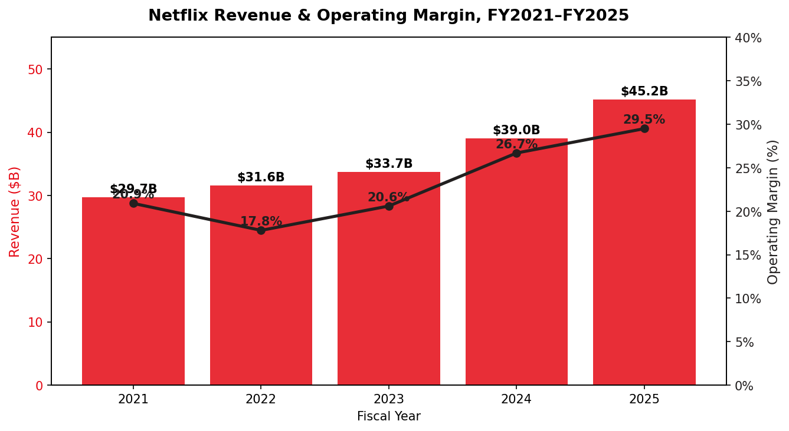
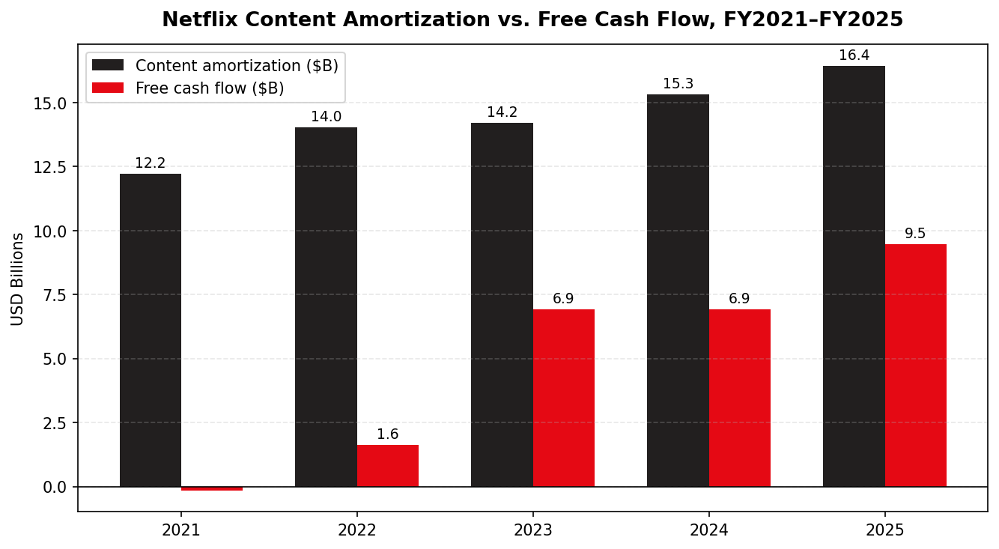
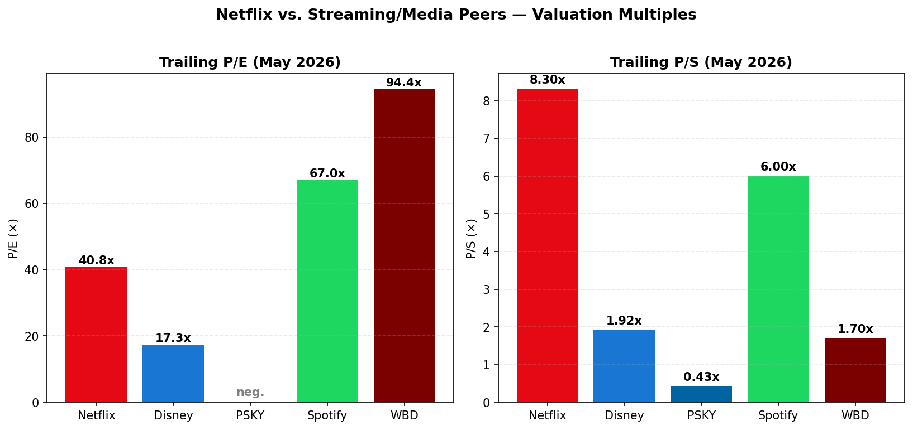
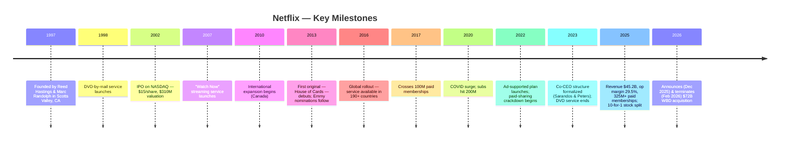
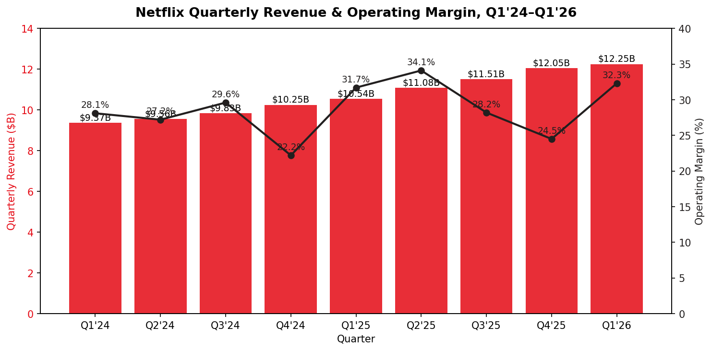
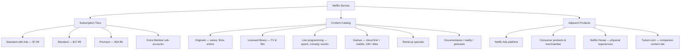
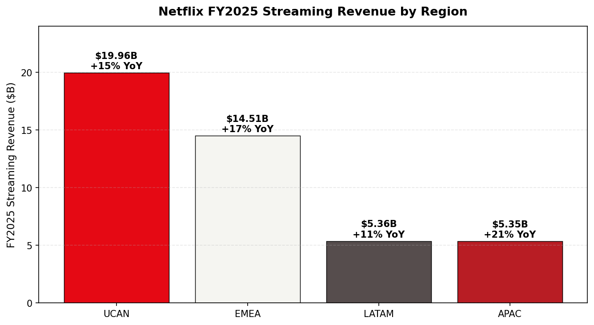
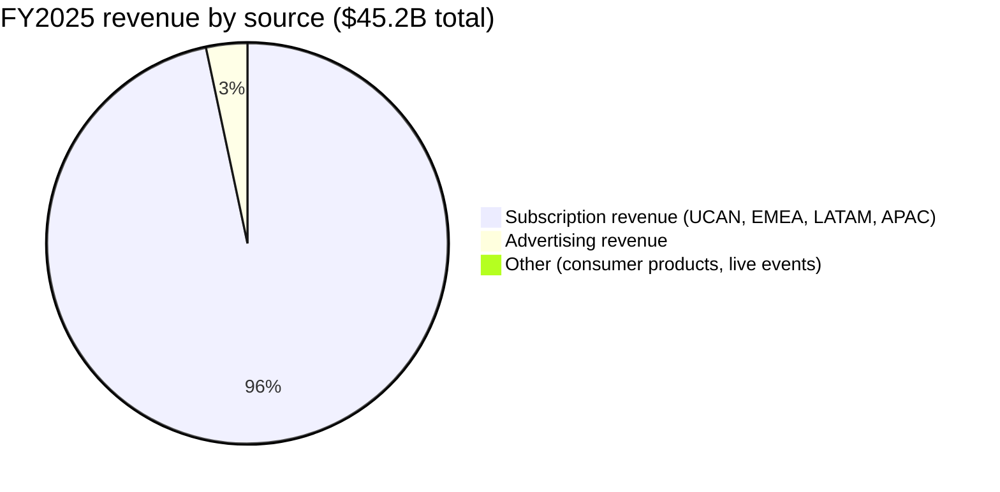
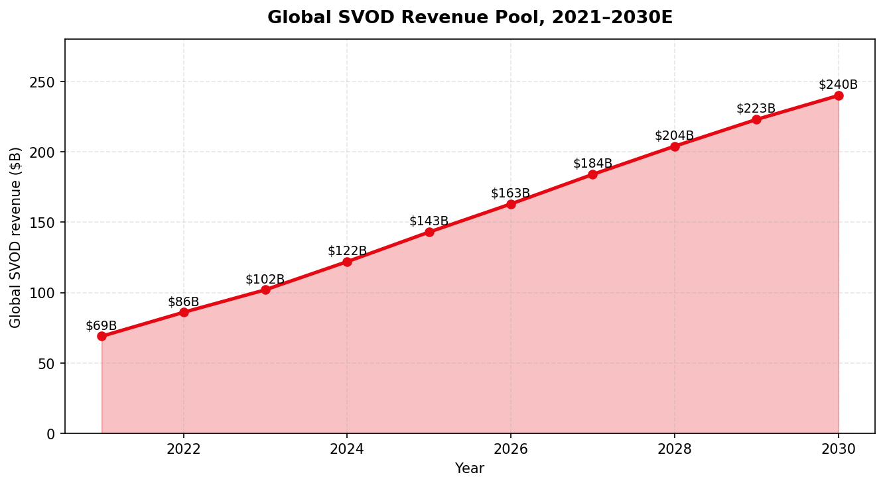

# Netflix, Inc. (NASDAQ: NFLX) — Company Research Report

**Date:** 2026-05-20
**Listing:** NASDAQ: NFLX (Common Stock; 10-for-1 split effective 17 Nov 2025)
**Headquarters:** Los Gatos, California, USA
**Auditor:** Ernst & Young LLP

> **Update — FY2026 guidance initiated; WBD acquisition terminated (2026-02-26):** On 20 January 2026 Netflix initiated FY2026 guidance of **$50.7–$51.7B in revenue (+12–14% YoY)** and a **31.5% operating margin**, with ad revenue expected to roughly double versus 2025's $1.5B base ([Q4'25 shareholder letter, 2026-01-20](https://www.sec.gov/Archives/edgar/data/0001065280/000106528026000033/ex991_q425.htm)). On 26 February 2026, Netflix walked away from its pending $72B equity / $82.7B enterprise-value acquisition of Warner Bros. Discovery streaming and studios, declining to top a $31/share counter-bid from Paramount Skydance; Netflix subsequently recognized a **$2.8B WBD break-up fee** in Q1 2026 results, helping drive Q1 EPS of $1.23 vs. consensus $0.76 ([CNBC, 2026-02-26](https://www.cnbc.com/2026/02/26/warner-bros-discovery-paramount-skydance-deal-superior-netflix.html); [Q1'26 earnings release](https://www.sec.gov/Archives/edgar/data/1065280/000106528026000137/ex991_q126.htm)).

---

## Table of Contents

1. Company Overview
2. Company History
3. Management Team
4. Products & Services
5. Customers & Go-to-Market
6. Industry Overview
7. Competitive Landscape
8. Market Opportunity (TAM)
9. Risk Assessment
   References

---

## 1. Company Overview

Netflix, Inc. is the largest pure-play subscription video-on-demand (SVOD) company in the world. The company describes itself as "one of the world's leading entertainment services offering TV series, films, games and live programming across a wide variety of genres and languages" ([Netflix 2025 10-K, Item 1](https://www.sec.gov/Archives/edgar/data/0001065280/000106528026000034/nflx-20251231.htm)). Members pay a recurring monthly fee — anywhere from the U.S.-dollar equivalent of $1 (lowest emerging-market plan) to $37 (top-tier 4K U.S. plan) — for unlimited on-demand streaming on internet-connected devices, with the option of a lower-priced ad-supported tier launched in November 2022 ([Netflix 2025 10-K, MD&A](https://www.sec.gov/Archives/edgar/data/0001065280/000106528026000034/nflx-20251231.htm)).

**How it makes money.** Netflix reports as a single operating segment. Monthly membership fees remain by far the dominant revenue line; advertising, consumer products, live experiences and other ancillaries are "not a material component of revenues" individually, though management broke out 2025 ad revenue as exceeding $1.5B for the first time ([Q4'25 shareholder letter, 2026-01-20](https://www.sec.gov/Archives/edgar/data/0001065280/000106528026000033/ex991_q425.htm)). FY2025 total revenue was **$45.18B**, up 16% YoY (+17% F/X-neutral), with operating income of **$13.33B** at a 29.5% operating margin, net income of **$10.98B**, and free cash flow of **$9.46B** (+37% YoY) ([Netflix 2025 10-K, MD&A](https://www.sec.gov/Archives/edgar/data/0001065280/000106528026000034/nflx-20251231.htm)). The company crossed **325 million paid memberships** during Q4 2025, then formally discontinued reporting subscriber numbers, citing revenue and operating margin as its primary KPIs ([Q4'25 shareholder letter, 2026-01-20](https://www.sec.gov/Archives/edgar/data/0001065280/000106528026000033/ex991_q425.htm); [Hollywood Reporter, 2026-01-20](https://www.hollywoodreporter.com/tv/tv-news/netflix-q4-2025-earnings-results-passes-325-million-subs-1236478604/)).

**Where it operates.** Netflix is available in essentially every country on earth except Mainland China, Russia, North Korea, Crimea, and a small set of sanctioned regions. The four reporting regions in FY2025 were UCAN (US/Canada) $19.96B revenue (+15%), EMEA $14.51B (+17%), LATAM $5.36B (+11%) and APAC $5.35B (+21%) ([Netflix 2025 10-K, MD&A](https://www.sec.gov/Archives/edgar/data/0001065280/000106528026000034/nflx-20251231.htm)). UCAN is now 44% of revenue — Netflix is genuinely an international company, with EMEA and APAC together ($19.9B) approaching the U.S.-Canada base. The company has approximately **16,000 full-time employees** (68% U.S./Canada, 16% EMEA, 12% APAC, 4% LATAM), plus a fluctuating production workforce ([Netflix 2025 10-K, Human Capital](https://www.sec.gov/Archives/edgar/data/0001065280/000106528026000034/nflx-20251231.htm)).

**Scale of content investment.** Netflix capitalizes most of its content spending and amortizes it over the expected pattern of viewing benefits. The 10-K shows **content amortization of $16.44B in FY2025**, up from $15.32B in FY2024 and $14.20B in FY2023; cash content spend ("additions to content assets") has tracked in a similar $15–17B band ([Netflix 2025 10-K, Schedule of Content Activity](https://www.sec.gov/Archives/edgar/data/0001065280/000106528026000034/nflx-20251231.htm)). Crucially, total content amortization growth has now slowed meaningfully below revenue growth (16% revenue vs. ~7% content amortization in FY2025), which is the mechanical engine behind margin expansion.


*Source: [Netflix 10-K filings, FY2021–FY2025](https://www.sec.gov/cgi-bin/browse-edgar?action=getcompany&CIK=0001065280&type=10-K&dateb=&owner=include&count=40).*


*Source: [Netflix 10-K filings, FY2021–FY2025 — Schedule of Content Activity and Cash Flow Statements](https://www.sec.gov/cgi-bin/browse-edgar?action=getcompany&CIK=0001065280&type=10-K&dateb=&owner=include&count=40).*

### Valuation snapshot

**Price & multiples (as of mid-May 2026, post-10-for-1 split):**
- Stock price: **$89.33** (split-adjusted)
- Market cap: **~$376B** ([CompaniesMarketCap / Public.com data, May 2026](https://public.com/stocks/nflx/market-cap))
- TTM P/E: **~28–41×** depending on whether the $2.8B WBD break-up fee is treated as a one-off (the 27–28× number adjusts it out; the 40× number is GAAP TTM). Macrotrends and Fullratio currently show ~28× TTM, GuruFocus 28.07× and FullRatio's straight-GAAP screen 40.76× ([Macrotrends NFLX P/E](https://www.macrotrends.net/stocks/charts/NFLX/netflix/pe-ratio); [GuruFocus](https://www.gurufocus.com/term/pe-ratio/NFLX)).
- TTM P/S: **~8.3×** ($376B mkt cap / $45.2B TTM revenue) — see peer comparison chart below.
- 3-yr P/E range: Netflix has compressed from a peak >50× TTM in mid-2024 to today's ~28–40×, reflecting the move from "growth at a re-rating" to "growth-at-mature-margin" framing ([Public.com NFLX P/E history](https://public.com/stocks/nflx/pe-ratio)).
- Forward 2026 multiples: ~24× FY2026E EPS using management's $50.7–$51.7B revenue and 31.5% op margin guide.

**Peer comparison (TTM, May 2026):**

| Company | Market Cap | TTM P/E | TTM P/S |
|---|---|---|---|
| Netflix (NFLX) | ~$376B | ~28–41× | ~8.3× |
| Walt Disney (DIS) | $187.5B | 17.3× | 1.9× |
| Warner Bros. Discovery (WBD) | $68.1B | ~94× | ~1.7× |
| Paramount Skydance (PSKY) | $12.3B | neg. | 0.43× |
| Spotify (SPOT) | (proxy) | ~67× | ~6× |

Source: [Macrotrends Disney P/E](https://www.macrotrends.net/stocks/charts/DIS/disney/pe-ratio), [Macrotrends WBD market cap](https://www.macrotrends.net/stocks/charts/WBD/warner-bros-discovery/market-cap), [Simply Wall St PSKY](https://simplywall.st/stocks/us/media/nasdaq-psky/paramount-skydance).

**Interpretation of the multiple.** Netflix's ~8× sales and ~28–40× earnings sit roughly 4× the legacy-media peer median (Disney 1.9× P/S, WBD 1.7× P/S, PSKY 0.43× P/S). This is not a "narrative" premium — it is supported by genuine fundamental gap: Netflix is the only major streaming pure-play with a structurally profitable, scaled, growing subscription business. Operating margin of 29.5% in FY2025 (guided to 31.5% in FY2026) is roughly double the legacy peers' streaming-segment margins (Disney DTC operating margin only became consistently positive in late 2024; WBD's DTC segment swings around break-even). The market is paying for: (a) durable double-digit revenue growth through 2026 even at $45B scale; (b) margin expansion still in progress (each 100bps of margin on $50B+ revenue is ~$500M of incremental operating income); (c) a fast-emerging advertising business that doubled to $1.5B in 2025 and is guided to roughly double again in 2026 ([Q4'25 shareholder letter](https://www.sec.gov/Archives/edgar/data/0001065280/000106528026000033/ex991_q425.htm)). The premium is justifiable but not generous — should revenue growth decelerate below 10% or should ad revenue stall, the multiple has visible downside (see Section 9). It is **not** a stretched-enough multiple to warrant a dedicated "valuation compression" risk in Section 9; rather, the more important risk is a return to the heavy-content-spend cycle that compressed margins in 2018–2021 (also addressed in Section 9).


*Source: Yahoo Finance / [Macrotrends](https://www.macrotrends.net/stocks/charts/NFLX/netflix/pe-ratio) / [Public.com](https://public.com/stocks/nflx/market-cap), May 2026 snapshot.*

---

## 2. Company History

Netflix was founded on **29 August 1997** in Scotts Valley, California by **Reed Hastings** and **Marc Randolph**. The legend that the company was founded because Hastings was upset over a $40 Blockbuster late fee for *Apollo 13* is partly Hastings' own retelling and partly apocryphal — Randolph in his memoir *That Will Never Work* describes a more incremental origin pitched as a "movies by mail" subscription service following the success of Amazon's online-bookstore model ([Wikipedia, Netflix history](https://en.wikipedia.org/wiki/Netflix,_Inc.)). The DVD-by-mail service launched in 1998. Marc Randolph stepped back from operating roles in 2003; he was replaced as president by Hastings, who consolidated leadership and would remain CEO for the next two decades ([Make Use Of, Netflix history](https://www.makeuseof.com/how-when-netflix-start-brief-company-history/)).

Netflix went public on NASDAQ in **May 2002** at $15/share (pre-split), raising $82.1M on a $309.7M valuation with ~600,000 U.S. members at the time ([Make Use Of, Netflix history](https://www.makeuseof.com/how-when-netflix-start-brief-company-history/)). The pivotal strategic pivot — from a profitable DVD-by-mail business to a streaming service — began on **16 January 2007** with the launch of "Watch Now," initially included free with the DVD subscription on PCs running Internet Explorer.


*Source: [Netflix Investor Relations history](https://ir.netflix.net/financials/sec-filings/default.aspx), [Wikipedia](https://en.wikipedia.org/wiki/Netflix,_Inc.).*

**Three strategic transformations define modern Netflix.**

*First, the streaming pivot itself (2007–2013).* Hastings repeatedly emphasized internally that DVD was the cash cow funding the eventual streaming pivot, and that Netflix would have to cannibalize itself before competitors did. The clumsy execution of the 2011 "Qwikster" plan — which attempted to spin off the DVD business as a separate brand with a separate website and price — cost Netflix ~800k subscribers in a single quarter and crushed the stock by ~75%, but Hastings reversed the decision within 23 days and the strategic direction was preserved ([Wikipedia, Netflix](https://en.wikipedia.org/wiki/Netflix,_Inc.)).

*Second, the originals pivot (2013–2018).* *House of Cards* in February 2013 was the company's first original series and the first non-traditional-broadcast show to win major Emmy nominations the same year. By 2018 Netflix's content slate was dominated by originals, and the company was authoring multi-billion dollar production budgets that exceeded any single Hollywood studio.

*Third, the "growth-at-a-profit" pivot (2022–2025).* The 2022 stock collapse (NFLX fell from $700 to under $170 pre-split as paid-membership growth slowed and shifted negative for the first time in over a decade) forced a strategic reset under what was then a transitioning co-CEO structure. Three levers were pulled in sequence: paid-sharing enforcement (cracking down on password sharing across households, beginning early 2023), the ad-supported tier (launched November 2022 with Microsoft as ad-tech partner), and a meaningful tightening of content-spend growth versus revenue growth. The reset worked: operating margin moved from 17.8% (2022) → 20.6% (2023) → 26.7% (2024) → 29.5% (2025), and revenue growth re-accelerated from 6.5% (2022) → 6.7% (2023) → 15.7% (2024) → 15.9% (2025) ([Netflix 10-Ks](https://www.sec.gov/cgi-bin/browse-edgar?action=getcompany&CIK=0001065280&type=10-K&dateb=&owner=include&count=40)).


*Source: [Netflix Q4'25 shareholder letter](https://www.sec.gov/Archives/edgar/data/0001065280/000106528026000033/ex991_q425.htm), [Q1'26 release](https://www.sec.gov/Archives/edgar/data/1065280/000106528026000137/ex991_q126.htm); Q4'25 op margin lifted by year-end restructuring; Q1'26 EPS inflated by $2.8B WBD breakup fee.*

**Key acquisitions** have been modest by U.S. mega-cap standards: Millarworld (2017, comic-book IP for original adaptations); Animal Logic (2022, Australian animation studio used for *Klaus* and original animation pipeline); Night School Studio (2021, video games); Boss Fight Entertainment, Next Games, Spry Fox (all 2021–2022, mobile games studios for the Netflix Games initiative); Scanline VFX (2022). Most are modest "studio-buy" deals — single-digit-to-low-hundreds of millions — and none materially moved the consolidated P&L until the **proposed WBD acquisition** of December 2025 ($72B equity / $82.7B EV), which would have been by far the largest U.S. media deal of the decade. The WBD deal was terminated in February 2026 when Netflix declined to top Paramount Skydance's $31/share counter-bid (Netflix's offer had been $27.75/share cash) ([Variety, 2026-02-26](https://variety.com/2026/film/news/paramount-warner-bros-deal-explained-netflix-ellison-1236674841/)).

**Recent developments (last 12 months).** Other than the WBD episode, three items dominate the recent track: (1) the 10-for-1 stock split effective 17 November 2025 (record 10 Nov, distribution 14 Nov) — primarily framed as making employee equity awards more accessible at the strike-price level ([Netflix 8-K, 2025-10-30](https://www.sec.gov/Archives/edgar/data/0001065280/000106528025000407/ex991_q425stocksplit.htm)); (2) Spencer Neumann's announced transition to a senior advisor role with Greg Peters taking over interim CFO responsibilities (per Q3'25 disclosures); and (3) the de-prioritization of subscriber-count disclosure starting in Q1 2025, formalizing revenue and operating margin as the two North Stars.

---

## 3. Management Team

Netflix operates with a **co-CEO** structure formalized in January 2023, when long-time CEO Reed Hastings stepped back to Executive Chairman and elevated Ted Sarandos (then sole CCO and co-CEO since July 2020) and Greg Peters (then COO) to dual CEO roles. The company is unusual among U.S. mega-caps in continuing to operate with a true two-headed CEO model.

### Ted Sarandos — Co-CEO (since July 2020 as co-CEO; dual CEO since Jan 2023)

Ted Sarandos, 61, is the most consequential single executive in modern Netflix and arguably in modern Hollywood. He joined Netflix in 2000 as Chief Content Officer when the company was a DVD-by-mail business with 600,000 subscribers — meaning he is effectively a 26-year company veteran with a tenure longer than the streaming business itself. Sarandos's pre-Netflix career was in video distribution: he was VP of product and merchandising at Video City / West Coast Video, building deep relationships with studios at the wholesale-purchasing layer that he would later leverage when negotiating the first big content-licensing deals for Netflix streaming (Starz in 2008, etc.).

His most consequential single decision was the 2011 $100M two-season order for **House of Cards** without seeing a pilot — premised on Netflix's viewing data showing audience overlap among Kevin Spacey, David Fincher, and political dramas. The bet established the originals strategy that defines Netflix today and made Sarandos the company's most visible public face within the creative community. He was elevated to co-CEO with Hastings in July 2020, then formal dual CEO with Peters in January 2023 when Hastings transitioned to Executive Chairman ([Netflix 2025 DEF 14A](https://www.sec.gov/Archives/edgar/data/0001065280/000119312525084425/d867701ddef14a.htm)).

Sarandos is a member of the boards of several non-profits (LACMA, Film Independent) and has been a frequent public defender of Netflix's content positions (notably the 2021 Dave Chappelle controversy). His **FY2025 total compensation was $53.9M** ($3M base salary, $41.4M stock awards, $7M+ performance cash, $2.5M other), down from $62M in FY2024 — a decrease management attributed to lower stock-grant valuations and a tighter pay benchmarking ([Variety, 2026-04](https://variety.com/2026/tv/news/netflix-ceo-salary-ted-sarandos-greg-peters-1236724061/); [Netflix DEF 14A 2025](https://www.sec.gov/Archives/edgar/data/0001065280/000119312525084425/d867701ddef14a.htm)). Sarandos held approximately 750,000 shares post-split as of the 2025 proxy.

### Greg Peters — Co-CEO (since Jan 2023)

Greg Peters, 54, joined Netflix in 2008 and rose through international-product roles (Chief Product Officer 2015, Chief Operating Officer 2020). Where Sarandos owns content, Peters owns product, technology, advertising, partnerships, gaming, and the operational/commercial layer of the business. Peters' background is engineering and product (Stanford undergrad, prior Macromedia/Adobe roles); inside Netflix he is credited with leading the international launch playbook (the 2016 "switch flip" that turned on service in 130 countries simultaneously) and, most consequentially, with architecting and launching the **ad-supported tier in November 2022** — the single largest commercial decision since the streaming pivot.

Peters has also led the **paid-sharing initiative** (cracking down on multi-household password sharing beginning 2023, which the company attributes a meaningful portion of 2023–2024 sub growth to), the formation of the in-house ad-sales organization (replacing Microsoft as the back-end ad tech in 2025 with Netflix's own ad stack), and the games and live-programming initiatives. He participated in the WBD deal negotiation as the operational owner of post-merger integration planning. **FY2025 total compensation was $53.2M** with the same structure as Sarandos ([Hollywood Reporter, 2026-04](https://www.hollywoodreporter.com/business/business-news/netflix-ceos-ted-sarandos-greg-peters-pay-packages-drop-1236567040/)).

### Spencer Neumann — CFO (since Jan 2019; transitioning 2025)

Spencer Neumann, 56, joined Netflix as CFO in January 2019 from Activision Blizzard (also CFO) and earlier Disney/ABC. He has overseen the company through the streaming-wars peak capex period (2019–2022), the 2022 stock collapse, the operating-margin restoration, and the negotiation phase of the WBD bid (which he publicly described on Q4'25 call as "the right financial discipline" when explaining the walk-away). Late-2025 disclosures (per Q3'25 10-Q and the 6/24/2025 8-K) flagged a planned transition: Neumann moved toward an advisory role with the search for a successor underway. In the interim, Greg Peters has assumed expanded CFO oversight responsibilities ([Netflix 10-Q Q3 2025](https://www.sec.gov/Archives/edgar/data/0001065280/000106528025000406/nflx-20250930.htm); [Netflix 8-K, 2025-06-24](https://www.sec.gov/Archives/edgar/data/0001065280/000106528025000287/ex991_bodappointment.htm)).

### Reed Hastings — Executive Chairman, Co-Founder

Reed Hastings, 65, remains Executive Chairman after stepping back from CEO in January 2023. Hastings is the architect of Netflix's culture (the famous "Netflix Culture Memo," updated in 2024), the streaming pivot, and the long-horizon talent-and-content investment philosophy. He remains a major shareholder, donor (notably in education philanthropy), and the public face of the company's long-term strategic posture, though day-to-day operational authority is now firmly with the Sarandos/Peters team.

### Governance

The Netflix board has 11 directors as of the 2025 proxy, the majority independent. Chair: Reed Hastings (not independent — co-founder). Lead independent director: Bradford Smith (President, Microsoft). Other directors include Ann Mather (former CFO Pixar; chair of the audit committee; senior board roles at Alphabet/Glassdoor), Susan Rice (former U.S. Ambassador to the UN and National Security Advisor), Strive Masiyiwa (Econet founder, Africa-focus), Mathias Döpfner (Axel Springer CEO), Leslie Kilgore (former Netflix CMO), Jay Hoag, Tim Haley, and others ([Netflix DEF 14A 2025](https://www.sec.gov/Archives/edgar/data/0001065280/000119312525084425/d867701ddef14a.htm)). Insider ownership is modest by founder-led-company standards (Hastings owns roughly 1% post-split), but the founder-friendly culture is reinforced by a board with deep operating-tech experience rather than career-director plate-filling. Compensation is heavily equity-weighted and tied to stock performance; no defined-benefit pension; no excessive cash bonuses. Say-on-pay votes have occasionally registered double-digit dissent (notably 2021 and 2023) on the scale of executive pay packages, but never failed.

### Track-record synthesis

This is one of the most operationally proven management teams in U.S. media. The Sarandos/Peters partnership has delivered the rare double of accelerating revenue growth and expanding margins from a $30B-revenue base; the cultural continuity from Hastings is real and visible. The most legitimate critiques are pay-scale and the late-2025 strategic gambit on WBD (which, even with the eventual walk-away, raised questions about capital-allocation discipline that the team will likely need to relitigate in 2026 — especially as they search for a successor CFO).

---

## 4. Products & Services

Netflix's product is fundamentally a single service — the Netflix streaming subscription — but the SKU structure, content slate, and adjacencies all branch out from it. A thorough walk of [netflix.com](https://www.netflix.com), [about.netflix.com](https://about.netflix.com), [help.netflix.com](https://help.netflix.com/en/node/24926) (plan pages), and the company's Tudum hub yields the following enumeration.

### 4.1 Subscription tiers (U.S. pricing, May 2026)

| Tier | U.S. Price | Streams (concurrent) | Video Quality | Ads? | Downloads |
|---|---|---|---|---|---|
| **Standard with Ads** | $7.99/mo | 2 | 1080p Full HD | Yes (~4 min/hr) | Yes |
| **Standard** | $17.99/mo | 2 | 1080p Full HD | No | 2 devices |
| **Premium** | $24.99/mo | 4 | 4K UHD + HDR + Spatial Audio | No | 6 devices |
| **Extra Member (sub-account)** | $7.99/mo | per member | matches plan | per plan | per plan |

International pricing varies — Netflix's own filings note plan prices range from the U.S.-dollar equivalent of **$1 to $37/month** depending on country and features, and "extra member" sub-accounts range $2–$9 globally ([Netflix 2025 10-K, MD&A — Revenues](https://www.sec.gov/Archives/edgar/data/0001065280/000106528026000034/nflx-20251231.htm)). The Mobile plan ($2–4 in select emerging markets) is no longer offered in mature markets and was phased out in the U.S./UK by mid-2024.

**Competitive-advantage verdict on subscription tiering: yes — scale moat + content moat.** Moat type: (a) scale economies — the per-incremental-member content cost is effectively zero; (b) global content amortization base — a Korean drama produced for KRW 5B amortizes across 325M+ households globally; (c) breadth of catalog that no single-genre or single-language competitor can match. Closest competing product: **Disney+** (now bundled with Hulu in the U.S. at $16.99/mo no-ads, $10.99/mo with ads), which has narrower demographic appeal but a stronger family/franchise franchise; Netflix has wider catalog/demographic reach but Disney has stronger IP-franchise economics in its top quartile. Netflix is ahead on price-per-hour-watched and on geographic scale; Disney is at parity in IP strength of its top 20 titles.


*Source: company website walk, [netflix.com](https://www.netflix.com), [about.netflix.com](https://about.netflix.com); [Netflix 2025 10-K, Item 1](https://www.sec.gov/Archives/edgar/data/0001065280/000106528026000034/nflx-20251231.htm).*

### 4.2 Content portfolio

**Originals (flagship).** This is the moat. The Q4'25 letter highlights — *Stranger Things* final season (120M views), *Frankenstein* (102M), *Nobody Wants This S2* (31M), *The Beast in Me* (48M), *Emily in Paris S5* (41M), *Knives Out: Wake Up Dead Man* (66M), *A House of Dynamite* (78M) — collectively demonstrate breadth across genre and country of origin ([Q4'25 shareholder letter](https://www.sec.gov/Archives/edgar/data/0001065280/000106528026000033/ex991_q425.htm)). Korean content (*Squid Game*, *Culinary Class Wars*), Japanese anime (*Record of Ragnarok*), German thrillers (*Babo*), Brazilian films (*Caramelo*) — Netflix has built local-language production hubs in ~20 countries and these productions travel globally on the platform. **Competitive-advantage verdict: yes — content moat plus data-driven greenlight process.** Closest competitor: **Amazon Prime Video** originals slate; Amazon has bigger budget per title in some cases (*Lord of the Rings: Rings of Power*) but does not match Netflix on volume or per-country-language depth.

**Licensed library.** Mix of catalog films and second-run TV. The licensed-content slate has been **declining in importance** as originals dominate viewing — Q4'25 letter notes that overall engagement growth was "partially offset by a year-over-year decline in viewing of non-branded view hours…primarily reflect[ing] a lower volume of licensed, second-run content across most regions following an elevated period of licensing during 2023–2024 as a result of the WGA strike" ([Q4'25 shareholder letter](https://www.sec.gov/Archives/edgar/data/0001065280/000106528026000033/ex991_q425.htm)).

**Live programming.** Netflix has cautiously expanded into live: the Jake Paul vs. Mike Tyson fight (Nov 2024), Christmas Day NFL games (2024, 2025), the WWE Raw weekly deal (10-year, $5B starting 2025), and now the **World Baseball Classic 2026 in Japan** (which the Q4'25 letter previewed and which the Q1'26 letter notes drew 31.4M Japan-territory viewers, the largest single-title in Japan ever for Netflix) ([Q1'26 shareholder letter](https://www.sec.gov/Archives/edgar/data/1065280/000106528026000137/ex991_q126.htm)). **Competitive-advantage verdict: partial — narrative moat but contested.** Live sports rights are auctioned competitively; Netflix's edge is willingness to pay and global reach, not exclusivity. Closest competitor: Amazon Prime Video (Thursday Night Football, NBA from 2025-26); Amazon is roughly at parity on willingness to pay for live sports.

**Games.** Netflix Games launched November 2021. Today 100+ mobile titles are included free with subscription, with the strategic pivot toward **cloud-first gaming** (Q4'25 letter: "scaling our cloud-first games strategy"). Notable launches: GTA Trilogy (in-platform exclusive on mobile), Squid Game-themed games. **Competitive-advantage verdict: no, not yet — exploratory.** Closest competitor: Apple Arcade ($6.99/mo standalone); Apple is ahead on quality of curated indie titles. Netflix is using games as engagement-driver and churn-reducer, not a profit center.

**Stand-up specials, documentaries, reality, video podcasts.** The Q4'25 letter calls out a $20M+ Dave Chappelle special, Kevin Hart, Tom Segura, Matt Rife and the move into video podcasts — the latter is a 2026 initiative testing whether Netflix can capture YouTube-format consumption on the TV screen. **Competitive-advantage verdict: partial.** Closest competitor: YouTube (which dominates podcast video) and HBO/Showtime (premium specials). The video-podcast pivot is a defensive move against YouTube's growing TV-screen share.

### 4.3 Advertising platform

Netflix's ad business is now its fastest-growing revenue line. **2025 ad revenue exceeded $1.5B (+2.5×YoY)**, and management guides ad revenue to **roughly double in 2026** (~$3B run-rate) ([Q4'25 letter](https://www.sec.gov/Archives/edgar/data/0001065280/000106528026000033/ex991_q425.htm)). The ad-supported tier hosts approximately **190M monthly active viewers** (households × persons/HH × ≥1 min ad/month), with the ad-tier now ~40% of new sign-ups in markets where it's offered ([ALM Corp, Netflix Ad Revenue 2026](https://almcorp.com/blog/netflix-ad-revenue-3-billion-2026-advertising-strategy/)). Netflix's in-house ad tech replaced Microsoft's Xandr in 2025; advertiser count grew 70% YoY to 4,000+ clients in Q1 2026 ([Q1'26 letter](https://www.sec.gov/Archives/edgar/data/1065280/000106528026000137/ex991_q126.htm)). **Competitive-advantage verdict: yes — emerging.** Netflix has the rarest asset in CTV ads: scaled, premium, brand-safe, signed-in audience. Closest competitor: YouTube's connected-TV inventory (much larger by hours but user-generated and less brand-safe), Amazon Prime Video Ads (~ same volume but lower CPM brand mix), Disney+/Hulu (high quality, smaller scale than Netflix). Netflix is currently behind on ad-tech sophistication (data targeting, measurement) but at parity on inventory quality.

### 4.4 Consumer products, Netflix House, merchandise

Modest revenue, strategic for brand. *Netflix House* — physical fan-experience venues — opens in Dallas and King of Prussia (Philadelphia) in 2025/2026 with Stranger Things, Squid Game, Bridgerton themed installations. Merchandise via Netflix Shop. **Competitive-advantage verdict: partial.** Closest competitor: Disney parks/merchandise (vastly ahead). Netflix is using these as fan-engagement amplifiers, not P&L drivers — and is explicit about it.

### 4.5 Flagship products and recent launches/sunsets

**Flagship (1–3 products driving the business):** (1) **Standard with Ads** subscription tier — both the volume engine and the highest-incremental-margin offering; (2) **the originals slate** — *Stranger Things* and *Squid Game* tier titles that anchor brand and drive new-member acquisition; (3) **the global content engine** — the cross-border Korean/Japanese/Spanish/German content that competitors structurally struggle to match.

**Last-12-month launches:** ad-tech rebuild and Microsoft Xandr replacement (early 2025); WWE Raw weekly live (Jan 2025); World Baseball Classic Japan rights (Q1 2026); cloud gaming expansion; video podcasts initiative (announced for 2026).

**Last-12-month sunsets:** DVD-by-mail (discontinued during 2023, no DVD revenue in 2024 or 2025) ([Netflix 2025 10-K](https://www.sec.gov/Archives/edgar/data/0001065280/000106528026000034/nflx-20251231.htm)); Basic plan retired in U.S./UK by mid-2024; the standalone Mobile-only tier retired in most mature markets; the original Microsoft Xandr ad-tech relationship (replaced by in-house stack in 2025).

---

## 5. Customers & Go-to-Market

### 5.1 Customer profile

Netflix's customers are individual households globally. There is essentially no enterprise/B2B revenue (the new advertising business is B2B, with brand advertisers and agencies as the customers, but ad revenue is still ~3% of total). The base is **325M+ paid memberships** as of end-2025, plus approximately 100M+ additional "extra-member" households monetized through paid sharing ([Q4'25 shareholder letter](https://www.sec.gov/Archives/edgar/data/0001065280/000106528026000033/ex991_q425.htm); [Hollywood Reporter, 2026-01-20](https://www.hollywoodreporter.com/tv/tv-news/netflix-q4-2025-earnings-results-passes-325-million-subs-1236478604/)). The Q4'25 letter notes management is "now serving an audience approaching one billion people globally" — counting persons across households on average.

**Segment mix (FY2025 streaming revenue):**

- UCAN: $19.96B (44.2%), +15% YoY
- EMEA: $14.51B (32.1%), +17% YoY (strongest absolute YoY $-add)
- APAC: $5.35B (11.9%), +21% YoY (fastest %-growth)
- LATAM: $5.36B (11.9%), +11% YoY


*Source: [Netflix 2025 10-K, MD&A — Revenues by region](https://www.sec.gov/Archives/edgar/data/0001065280/000106528026000034/nflx-20251231.htm).*

### 5.2 Customer concentration

This is the rarest case in U.S. equity research: **Netflix has effectively zero customer concentration**. The largest single household pays Netflix maybe $30/month — i.e. ~0.0000001% of revenue. The 10-K does not — and is not required to — disclose any 10%+ customer because no single subscriber or distributor approaches that threshold. **Top-1 customer < 0.001% of revenue; top-5 < 0.01% of revenue.** This is a structural advantage versus virtually every U.S. mega-cap.

The closest thing to concentration is **distribution-partner concentration** in the form of telcos, MVPDs, mobile operators, and device platforms (Apple, Google, Roku, Samsung TVs, Comcast/Charter bundles in the U.S., partnered telco bundles like Verizon/T-Mobile and Reliance Jio in India). Many of these partners also bill subscribers on Netflix's behalf and clip a share — Apple App Store has historically taken 15% on iOS in-app sign-ups, which is why Netflix has long pushed users to sign up via web. The 10-K describes these partner agreements in Item 1 and notes that some partners "compete directly with us or have investments in competing streaming content providers" ([Netflix 2025 10-K](https://www.sec.gov/Archives/edgar/data/0001065280/000106528026000034/nflx-20251231.htm)). No individual partner is disclosed as material.

On the **B2B advertising side**, the early ad business does have meaningful concentration in the largest agencies and largest CPG/auto/telco advertisers — but with the advertiser count growing 70% YoY to 4,000+ in Q1'26 ([Q1'26 letter](https://www.sec.gov/Archives/edgar/data/1065280/000106528026000137/ex991_q126.htm)), this concentration is rapidly diluting. The 10-K does not name specific ad customers.


*Source: [Q4'25 shareholder letter, 2026-01-20](https://www.sec.gov/Archives/edgar/data/0001065280/000106528026000033/ex991_q425.htm); [Netflix 2025 10-K](https://www.sec.gov/Archives/edgar/data/0001065280/000106528026000034/nflx-20251231.htm).*

### 5.3 Distribution channels and go-to-market

Netflix is sold **directly to consumers via netflix.com and mobile apps**, with three layered distribution channels:

1. **Direct (D2C):** the dominant channel. Web sign-up captures 100% of revenue (no app-store cut). Mobile apps on iOS and Android sign-ups go through app-store billing or are routed to web.
2. **Bundled channel partners:** Verizon, T-Mobile, Comcast, Charter in the U.S.; Reliance Jio, Airtel, Vodafone in India; Sky/Comcast in UK; Free in France; SK Telecom in Korea; etc. Netflix typically appears as part of mobile or broadband bundles, with the carrier paying Netflix per subscriber.
3. **Device platforms:** Apple TV, Roku, Amazon Fire TV, Samsung TVs, LG TVs, PlayStation, Xbox — these are largely no-fee distribution where the device pre-installs the Netflix app. They are critical for low-friction signup and engagement.

**Sales cycle is essentially zero.** Sign-ups occur in minutes; payment via credit card or partner billing. Customer-acquisition cost (CAC) is dominated by content investment (the marketing power of *Stranger Things*) and paid marketing (the FY2025 sales-and-marketing line was $3.30B, ~7% of revenue).

### 5.4 Key partnerships

- **Microsoft → in-house ad tech (2022 → 2025 transition).** Microsoft was the original ad-tech partner at the ad-tier launch; Netflix replaced this with in-house ad tech in 2025.
- **WWE 10-year, $5B Raw weekly streaming deal (2024 → 2025 effective).** Live wrestling globally.
- **NFL Christmas Day games (2024, 2025).** Annual; rights renewal terms not disclosed.
- **World Baseball Classic Japan (2026).** Single-event, but very large in Japan (31.4M viewers Q1'26).
- **Reliance Jio (India), Verizon (U.S.), T-Mobile (U.S.), Sky (UK), Free (France), SK Telecom (Korea), Telefónica (Spain/LATAM), Vodafone (Germany).** Major telco bundles.
- **Hardware: Samsung, LG, Roku, Apple, Google.** Device-tier integrations and the Netflix Recommended TV certification program.

### 5.5 Customer case studies (named wins)

The customer-case-study concept does not really apply to a B2C subscription company. The analog is "viewing case studies" — the Q4'25 and Q1'26 shareholder letters describe individual title performance (e.g., *Stranger Things* final season 120M views; *Frankenstein* 102M; World Baseball Classic 31.4M Japan) as the closest equivalent to enterprise case-study disclosure. There is no named-customer-win disclosure in any Netflix filing.

---

## 6. Industry Overview

### 6.1 Industry definition

Netflix sits in the **subscription video-on-demand (SVOD)** segment of the broader **online video** industry, which itself sits within the global **TV and video** market (which includes traditional pay-TV, ad-supported video, transactional VOD, and live free-to-air broadcasting). NAICS code 519290 (web search portals, libraries, archives and other information services); SIC 7812 (services-motion picture & video tape production).

The relevant industry frame today is **streaming entertainment** broadly, and within it the contest between SVOD pure-plays (Netflix), bundled DTC platforms from legacy media (Disney+/Hulu, Max, Paramount+), free ad-supported streaming (Tubi, Pluto TV, Roku Channel), and the dominant attention competitor — **user-generated content platforms** (YouTube, TikTok, Instagram Reels, Twitch).

### 6.2 Market size

- **Global online TV + video market: ~$1 trillion by 2030**, with growth driven entirely by online video as the traditional pay-TV market remains flat ([Omdia, 2025-10-16](https://omdia.tech.informa.com/pr/2025/oct/global-tv-and-video-market-to-reach-1-trillion-by-2030-as-online-video-surges)).
- **Global video streaming revenue: $214.6B in 2025**, growing at ~12.8% CAGR (Statista) ([Statista, Video Streaming SVoD Worldwide](https://www.statista.com/outlook/dmo/digital-media/video-on-demand/video-streaming-svod/worldwide)).
- **Global media streaming market: $140.8B in 2025 → $215.6B by 2031** at ~7.4% CAGR ([Research and Markets, 2025](https://www.researchandmarkets.com/report/global-online-streaming-platform-market)).
- **SVOD-specific market: $98.6B in 2025 → $999.7B by 2035** at ~23% CAGR per the more bullish forecasts ([Market Research Future, SVOD report](https://www.marketresearchfuture.com/reports/svod-market-43018)). (The wide range across forecasters reflects very different scope definitions — connected-TV ad-revenue, music streaming, FAST channels, etc.)


*Source: [Statista Video Streaming SVoD Worldwide](https://www.statista.com/outlook/dmo/digital-media/video-on-demand/video-streaming-svod/worldwide), [Omdia, 2025-10-16](https://omdia.tech.informa.com/pr/2025/oct/global-tv-and-video-market-to-reach-1-trillion-by-2030-as-online-video-surges).*

### 6.3 Growth drivers

1. **Cord-cutting in U.S. and Western Europe.** U.S. pay-TV households fell from ~100M (2010) to ~60M (2024); the displaced TV ad and subscription dollars are migrating to streaming. Disney-Hulu now bundles for cord-cutters; NBCUniversal launched Peacock; Paramount launched Paramount+; Max replaced HBO Max. All cite the same secular tailwind.
2. **International broadband penetration.** Smartphones are essentially universal in emerging markets; broadband (fixed or mobile) is the gating factor. Penetration is rising fastest in Latin America, India, Southeast Asia, sub-Saharan Africa — exactly where Netflix's APAC and LATAM YoY growth comes from.
3. **Ad-supported streaming (AVOD/FAST).** Connected-TV ad spending in the U.S. crossed $30B in 2024 and is growing 20%+ annually as advertisers shift from linear TV. Netflix's ad-tier and Amazon Prime Video Ads are direct beneficiaries; Roku, Tubi, Pluto are the FAST-channel beneficiaries.
4. **Live sports rights migration.** Apple, Amazon and Netflix have all started bidding for live sports rights, accelerating the migration from broadcast/cable. NFL, NBA, MLB, WWE, F1 and global soccer rights are all up for re-negotiation across 2025–2030.
5. **Generative-AI applications in production and personalization.** Lower production costs (visual effects, dubbing/localization) plus better recommendation models. Netflix has explicitly called out AI as a strategic enabler in its 10-K forward-looking statements ([Netflix 2025 10-K](https://www.sec.gov/Archives/edgar/data/0001065280/000106528026000034/nflx-20251231.htm)).

### 6.4 Regulatory environment

Streaming is increasingly regulated worldwide. Key items:

- **EU AVMS Directive** — country-specific content quotas (e.g., 30% European-produced content), investment-obligation levies (France requires 20% of local revenue invested in local content; Italy similar), and tax levies in multiple member states.
- **India** — content censorship rules under the IT Act 2021; ongoing tension over content takedown demands.
- **South Korea** — net-neutrality / network-usage-fee disputes; Korean lawmakers have repeatedly tried to require Netflix to pay ISPs for traffic.
- **Brazil** — non-income tax assessments (the $1.1B+ "increase in other cost of revenues primarily driven by non-income tax assessments in Brazil" in FY2025 cost of revenues is the visible impact, per [Netflix 2025 10-K, MD&A](https://www.sec.gov/Archives/edgar/data/0001065280/000106528026000034/nflx-20251231.htm)).
- **U.S.** — FTC and FCC nominally have jurisdiction over various streaming-related questions, but federal regulation has been light-touch through 2026.

The 10-K's regulatory section notes: "we are seeing some countries update their cultural support legislation to include services like Netflix. This includes investment obligations, levies, and content catalog quotas. Some even restrict the extent of ownership rights we can have both in our service and in our content" ([Netflix 2025 10-K](https://www.sec.gov/Archives/edgar/data/0001065280/000106528026000034/nflx-20251231.htm)). This is a slow, country-by-country grind, not a binary risk.

### 6.5 Industry dynamics

The streaming industry is **consolidating sharply**. Five years ago there were ~10 well-funded global SVOD competitors; today there are effectively four streaming services with the scale to fund $5B+/year in content (Netflix, Disney/Hulu, Amazon Prime Video, YouTube), plus three sub-scale legacy contenders (Max, Paramount+, Peacock). The pending **Paramount Skydance-WBD merger** (Feb 2026 announcement, expected close September 2026) will reduce that count further by combining Paramount+ and Max into a single bundled service under Ellison-family control ([Variety, 2026-02-27](https://variety.com/2026/film/news/paramount-warner-bros-deal-explained-netflix-ellison-1236674841/)). Netflix's own pursuit of WBD was an attempt to lock in the scale advantage before such a combined entity emerged.

The supplier side (studios, talent agencies, sports leagues) has growing power as content becomes more strategic. The buyer side (consumers) has high switching costs in the short run (catalog familiarity, recommendation training, downloaded titles) but low switching costs in the long run (cancel-anytime). Substitutes — YouTube/TikTok user-generated content, gaming, social media — remain the most underappreciated competitor: U.S. teens now spend more hours per day on TikTok and YouTube than on any single SVOD service ([Q4'25 shareholder letter](https://www.sec.gov/Archives/edgar/data/0001065280/000106528026000033/ex991_q425.htm) cites "winning moments of truth" against this entire competitive frame).

---

## 7. Competitive Landscape

### 7.1 Direct streaming competitors

```mermaid
quadrantChart
    title Streaming Services — Content Scale vs. Profitability
    x-axis Low Content Scale --> High Content Scale
    y-axis Low Profitability --> High Profitability
    quadrant-1 Scale leaders, profitable
    quadrant-2 Profitable niche
    quadrant-3 Subscale
    quadrant-4 Scale leaders, unprofitable
    Netflix: [0.92, 0.88]
    Disney+/Hulu: [0.78, 0.55]
    Amazon Prime Video: [0.75, 0.50]
    YouTube: [0.95, 0.80]
    Max (WBD): [0.55, 0.35]
    Paramount+: [0.45, 0.30]
    Peacock: [0.35, 0.25]
    Apple TV+: [0.30, 0.15]
    Spotify (audio): [0.40, 0.55]
```
*Source: author's assessment based on company filings and industry reports.*

**1. Disney+ / Hulu / ESPN bundle.** ~131.6M Disney+ subs at FY-end 2025; Hulu ~52M; ESPN+ ~24M. Bundled at $16.99/mo no-ads / $10.99/mo with ads in U.S. ([Statista, 2025](https://www.statista.com/statistics/1095372/disney-plus-number-of-subscribers-us/)). **Differentiators:** family/franchise IP (Marvel, Star Wars, Pixar, Disney animation), best-in-class kids content, sports via ESPN, network TV via Hulu. **Vulnerabilities:** less international depth; recently turned segment-profitable but still margin-thin vs. Netflix; Hulu/Disney+/ESPN integration is operationally complex. **Vs. Netflix:** Netflix ahead on scale, profitability, and international depth; Disney ahead on top-quartile IP franchise economics.

**2. Amazon Prime Video.** ~167M paid Prime Video subscribers in 2025 per third-party trackers ([Statista, Amazon Prime Video](https://www.statista.com/topics/4740/amazon-prime-video/)); Prime membership (which bundles Prime Video) reportedly 220M+ globally. **Differentiators:** bundled "free" with Prime membership economics ($14.99/mo Prime in U.S., where shipping subsidizes content), sports rights (Thursday Night Football, NBA from 2025-26), exclusive franchise IP (Lord of the Rings, James Bond after the Amazon-MGM deal). **Vulnerabilities:** subscription economics are subsidized — Amazon does not disclose Prime Video standalone profitability and is widely assumed to lose money on a fully-loaded basis; ad-tier auto-rollout in 2024 created consumer pushback. **Vs. Netflix:** Amazon ahead on bundled economics and live sports; Netflix ahead on standalone content profitability, originals slate volume and depth.

**3. YouTube (Alphabet).** The under-appreciated giant. YouTube is now the #1 streaming service on connected TVs in the U.S. by hours, surpassing Netflix in 2024 per Nielsen Streaming Gauge. **Differentiators:** infinite UGC supply, free-to-watch ad model, scale of CTV inventory, dominant in podcasts (video podcasts) and emerging in shorts. **Vulnerabilities:** not premium-brand-safe; less suited to long-form prestige drama; YouTube TV (separate $$/mo product) competes on bundles. **Vs. Netflix:** YouTube ahead on hours watched in U.S. and on advertising scale; Netflix ahead on premium-original quality, brand safety, and per-subscriber LTV.

**4. Warner Bros. Discovery / HBO Max → Paramount Skydance bundled service.** Max ~125M subs at end-2025; pending merger with Paramount+ would create a combined service of ~200M subs under PSKY ownership, with film studios (WB, Paramount), cable (Discovery, Showtime, CBS), and sports (TNT NBA, CBS NFL). **Differentiators:** HBO prestige library, Warner Bros film studio, NBA rights, CBS broadcast. **Vulnerabilities:** integration risk; $40B+ of pro-forma debt; PSKY operating margin negative on a TTM basis ([Simply Wall St PSKY](https://simplywall.st/stocks/us/media/nasdaq-psky/paramount-skydance)). **Vs. Netflix:** Netflix ahead on scale, profitability, and execution; PSKY-WBD will have superior film library and live sports, but it's an open question whether they can integrate at all.

**5. Apple TV+.** ~50M subs estimated. **Differentiators:** prestige originals (*Ted Lasso*, *The Morning Show*, *Severance*), tied to Apple hardware ecosystem. **Vulnerabilities:** small catalog; Apple does not publicly prioritize TV+ as a profit driver. **Vs. Netflix:** Apple ahead on prestige-per-title; Netflix ahead by an order of magnitude on every other metric.

**6. Spotify.** Audio not video, but a relevant peer for subscription consumer-media economics. 696M monthly active users / 276M premium subs. Trades at ~6× P/S. **Vs. Netflix:** different content type, but instructive parallel for what mature scale + ad-tier streaming margins look like.

### 7.2 Indirect competitors

- **TikTok / ByteDance** — competes for moments of attention; ~170M U.S. MAU.
- **Instagram Reels / Meta** — competes for the same short-form attention.
- **Twitch / Kick** — live streaming, gaming-adjacent.
- **Roblox / Fortnite / Steam / video games more broadly** — Netflix's CEO has repeatedly called *Fortnite* a "bigger competitor than HBO."
- **Sports leagues' D2C apps** — NBA League Pass, NFL Sunday Ticket (now via YouTube), MLB.TV.

### 7.3 Emerging competitors

- **AI-generated content platforms** — early but watch this. If a startup can generate scaled, personalized, low-cost-per-hour content using gen-AI models, the per-hour-watched cost math changes. Netflix has explicitly flagged AI both as enabler and competitive disruptor in its 10-K forward-looking statements ([Netflix 2025 10-K](https://www.sec.gov/Archives/edgar/data/0001065280/000106528026000034/nflx-20251231.htm)).
- **FAST channels (Tubi, Pluto TV, Roku Channel, Samsung TV+)** — free ad-supported linear-style streaming on connected TVs; growing 30%+ YoY in ad revenue.

### 7.4 Netflix's competitive advantages

1. **Scale + profitability flywheel.** Netflix is the only streaming pure-play earning a 29.5% operating margin at $45B revenue. Every other competitor is either smaller, less profitable, or both.
2. **Global content engine.** Local-language production capability in ~20 countries, with content that travels (*Squid Game*, *Money Heist*, *Lupin*, *Dark*, *Heartstopper*) — no competitor has built comparable global infrastructure.
3. **Recommendation algorithm & data.** 25+ years of viewing data, ~10B hours/quarter of behavior, and a recommendation engine that the company has invested in for over a decade.
4. **Brand and "Netflix-and-chill" cultural defaults.** Netflix is the noun verb for streaming; this matters for word-of-mouth marketing and trial conversion.
5. **Ad-tier inventory leadership** — premium, signed-in, brand-safe CTV inventory at 190M MAV scale, with in-house ad stack.
6. **Open Connect CDN.** Netflix runs its own CDN with hardware placed inside ISPs' data centers; delivery cost per stream is structurally lower than competitors who pay AWS/Cloudfront markups.

### 7.5 Netflix's vulnerabilities

1. **Content cost is largely fixed** — the 10-K explicitly warns "if we do not grow as expected, given, in particular, that our content costs are largely fixed in nature, we may not be able to adjust our expenditures or increase our revenues…commensurate with the lowered growth rate" ([Netflix 2025 10-K, Risk Factors](https://www.sec.gov/Archives/edgar/data/0001065280/000106528026000034/nflx-20251231.htm)).
2. **No live-sports rights moat** — Netflix bids competitively for live sports but does not own a flagship long-tenor rights deal comparable to ESPN-NBA or Amazon-NFL.
3. **No "must-have" franchise IP** at the level of Marvel/Star Wars/James Bond. Originals are great but mortal.
4. **YouTube ahead on TV-screen hours** — the bigger competitive threat than any other SVOD.
5. **Capital allocation discipline question** — the WBD bid raised it, and the eventual walk-away resolved it well, but the question lingers.

---

## 8. Market Opportunity (TAM)

### 8.1 TAM sizing

The relevant TAM is bigger than just SVOD subscription revenue:

- **Global SVOD subscription revenue: $98.6B (2025) → ~$215B (2031–2033)**, ~10–12% CAGR on consensus, higher on the bull case ([Statista](https://www.statista.com/outlook/dmo/digital-media/video-on-demand/video-streaming-svod/worldwide); [Research and Markets](https://www.researchandmarkets.com/report/global-online-streaming-platform-market)).
- **Global connected-TV advertising: ~$30B (2024) → ~$80B+ (2030)** at 15%+ CAGR. Netflix can address an outsized share of this through the ad-tier.
- **Global pay-TV + linear advertising still being disrupted: ~$300–400B today**, declining low-single-digit % per year, with the dollars largely migrating to streaming services.

**Total relevant TAM frame for Netflix: ~$200–300B by 2030** combining SVOD subscription, CTV advertising it can win share of, and the residual subscription-bundle revenue migrating from cable. Netflix's $45B 2025 revenue is therefore at roughly 15–20% of relevant TAM today — meaningful penetration but with multi-year share-take runway.

### 8.2 SAM

The **Serviceable Addressable Market** is essentially "global households with broadband + payment ability willing to pay $5–25/month for entertainment, plus CTV ad budget addressable by Netflix's audience." Netflix today is in ~325M paying households; the addressable broadband-household universe is ~2 billion globally. **SAM is therefore ~6× current paid subscriber count** at the household level, though price elasticity and bundling-with-telco-partners will shape what fraction is realistically capturable.

### 8.3 SOM

Practically speaking, the **Serviceable Obtainable Market** over the next five years is bounded by:

- Net adds in **APAC** — India in particular is a market with hundreds of millions of broadband households where Netflix is sub-5% penetrated due to price points; Reliance Jio-bundled tiers and the cheapest mobile-only plans address this.
- Net adds in **EMEA** — emerging Eastern Europe, MENA — at +17% region-level YoY growth, still has runway.
- **Ad revenue** — guided to roughly double to ~$3B in 2026, with management implying a multi-year doubling trajectory beyond that. A ~$8–10B ad business by 2028 is a realistic management ambition.
- **Live programming** — incremental sports rights deals add ~$0.5–1B/year of new revenue surface.
- **Price increases in mature markets** — UCAN and major EMEA markets continue to absorb modest price increases (~$1–2 per tier per year on average).

### 8.4 Penetration strategy

The 2026 management playbook (per Q4'25 letter) is explicit:

1. **Core business improvement** — variety and quality of series/films, product experience, advertising business growth.
2. **New initiatives** — live (WBC Japan 2026), video podcasts, cloud-first games.
3. **(Originally) close the WBD acquisition** — terminated, so this initiative is dead.
4. **Sustain healthy growth** — 12–14% revenue growth, 31.5% margin, expanding FCF.

The framing is striking for what it *doesn't* say: there is no aggressive subscriber-count target, no "Netflix in 200M households by 2030" promise, no return to the growth-at-any-cost era. Management is explicitly positioning Netflix as a **mature scale operator** — growing revenue and margin, returning capital to shareholders (FY2025 buyback was $9.1B for 86.5M shares pre-split), with optionality on adjacencies (ads, live, games) as the growth surprise.

---

## 9. Risk Assessment

### Company-Specific Risks

**1. Execution / capital-allocation risk (post-WBD-walk-away).** The five-month pursuit of WBD, including the doubling of the bridge facility from $34B to $42.2B in January 2026, raised legitimate questions about Netflix's capital-allocation discipline. The eventual walk-away when PSKY topped the bid is positive evidence (management can say no when math fails), but the episode consumed significant management bandwidth and a $2.8B termination fee from PSKY only partly offsets the strategic distraction. Going forward, the risk is that pressure to find a "transformational" deal forces a worse second attempt. **Severity: medium. Likelihood: medium-low.** Mitigant: the Sarandos/Peters team has 25+ years of combined Netflix tenure and a strong track record of organic execution.

**2. Content slate risk — the "what if the next *Stranger Things* doesn't land" problem.** *Stranger Things* ends with its 2025 final season. *Squid Game* S2 underperformed S1. Netflix's flywheel depends on a regular cadence of breakout originals, and there is no formal pipeline disclosure. **Severity: medium-high. Likelihood: medium.** Mitigant: diversified slate across geographies and genres; data-driven greenlight process; deep relationships with creative talent.

**3. Live-programming margin drag.** Live sports rights (WWE Raw, NFL Christmas, WBC) are expensive and have been historically lower-margin than originals. As live becomes a larger share of programming, average content gross margin could compress. **Severity: medium. Likelihood: medium.** Mitigant: management is explicitly selective, choosing flagship events rather than full-season rights packages.

**4. Ad-business execution risk.** The in-house ad-tech transition (replacing Microsoft Xandr in 2025) is operationally complex. Failure to scale ad-tech sophistication (measurement, targeting, programmatic depth) could leave ad revenue capped well below the $3B 2026 guide and ~$10B aspirational 2028 frame. **Severity: medium. Likelihood: low-medium.** Mitigant: 70% YoY advertiser-count growth to 4,000+ in Q1'26 ([Q1'26 letter](https://www.sec.gov/Archives/edgar/data/1065280/000106528026000137/ex991_q126.htm)) suggests traction is real.

**5. Key-person risk on Sarandos.** Sarandos is uniquely irreplaceable as the relationship-and-judgment node for the creative community. If health, departure, or a public controversy materially altered his standing, the content slate quality could suffer. **Severity: medium-high if it occurs. Likelihood: low.** Mitigant: Peters and a deep bench of content lieutenants (Bela Bajaria, Scott Stuber's successors).

**6. Customer-concentration risk: minimal.** Top-1 customer < 0.001% of revenue; top-5 < 0.01%. This is one of the lowest customer-concentration profiles in U.S. mega-cap. Including this risk here only to flag its near-zero status per the report standard. **Severity: very low. Likelihood: very low.**

### Industry / Market Risks

**7. Competitive intensity — especially YouTube and the upcoming PSKY-WBD combined service.** YouTube is already #1 in U.S. CTV hours and growing on the TV screen; the combined PSKY+WBD service (post-September 2026 close) will be the largest legacy-media bundled streaming product in the U.S., with NBA + NFL + HBO + Warner Bros library all in one place. **Severity: high. Likelihood: high (already happening).** Mitigant: Netflix's profitability and scale gap remains structural; PSKY-WBD will spend years digesting an enormous merger.

**8. Regulatory — content quotas, levies, digital services taxes.** EU AVMS Directive investment obligations, France 20%-of-revenue local-content investment requirement, Brazil non-income tax assessments ($1B+ FY2025 impact in cost of revenues — Netflix has stated this is non-recurring but the precedent is concerning), South Korea net-fee disputes. **Severity: medium. Likelihood: high (incremental).** Mitigant: Netflix is profitable enough to absorb these costs; geographic diversification of regulatory exposure limits any single-country binary.

**9. Technology disruption — gen-AI content creation and recommendation.** Two-sided: (a) AI lowers production costs (positive for Netflix) and (b) AI enables low-cost gen-AI-only competitors that could undercut subscription economics (negative). The medium-term net effect is unclear. **Severity: medium-high if downside scenario hits. Likelihood: medium over 5 years.** Mitigant: Netflix has been investing in AI/ML for personalization since at least 2010; first-mover on production-AI tooling.

**10. Market saturation in U.S. and Western Europe.** UCAN net-add growth has been slowing for years; the 15% UCAN revenue growth in FY2025 was primarily price-and-mix-shift, not subscriber net adds. Saturation in mature markets is a real-but-manageable risk. **Severity: medium. Likelihood: high (already happening).** Mitigant: EMEA +17%, APAC +21% YoY growth offsets UCAN saturation; ad tier creates a second revenue stream per existing household.

### Financial Risks

**11. Content amortization re-acceleration and margin compression.** Management guides FY2026 content amortization growth of ~10% (vs. 7% in FY2025), with higher growth in the first half. If content investment growth re-accelerates faster than revenue growth — as it did in 2018–2021 — operating margin expansion stops. **Severity: medium-high. Likelihood: medium.** Mitigant: Netflix has demonstrated operating-discipline post-2022; FY2026 op-margin guide of 31.5% bakes in this dynamic.

**12. Leverage and refinancing risk.** Netflix has been a net debt issuer historically. Total long-term debt was ~$15B at end-2025 (post-buyback ramp), modest relative to $10B annual FCF and ~$13B operating income. The aborted WBD bridge facility ($42.2B at peak) is no longer relevant but underscored that Netflix has access to size-able debt capacity. **Severity: low currently. Likelihood: low.** Mitigant: investment-grade credit rating; conservative balance sheet relative to operating cash generation.

**13. FX volatility.** Approximately 56% of FY2025 revenue is non-UCAN. Strengthening USD compresses reported revenue (FY2025 had ~$180M of FX drag on streaming revenues, with ~$91M offsetting hedging losses). FY2026 guidance based on 1/1/2026 FX rates explicitly notes that the operating margin guide is FX-sensitive. **Severity: low-medium. Likelihood: medium.** Mitigant: active FX hedging program; revenue diversification across multiple currency baskets.

### Macroeconomic Risks

**14. Consumer-discretionary cyclicality.** SVOD is a $10–25/month subscription that consumers cut in recessions when they cut household expenses. Netflix's 10-K explicitly notes "adverse macroeconomic conditions, including as a result of inflation, may adversely impact our ability to attract and retain members" ([Netflix 2025 10-K, Risk Factors](https://www.sec.gov/Archives/edgar/data/0001065280/000106528026000034/nflx-20251231.htm)). **Severity: medium. Likelihood: medium over a 5-year window.** Mitigant: ad tier ($7.99 entry point) gives recession-tolerant customers a downgrade path that keeps them on platform.

**15. Geopolitical risk — Russia/China access, India regulatory.** Netflix is not available in China, Russia, North Korea, or Crimea. Tension over India content censorship, EU member-state cultural levies, and any future trade frictions could compress addressable market. **Severity: medium. Likelihood: medium (geopolitical baseline).** Mitigant: business is already structured to operate around China; revenue exposure to single high-risk geographies is limited.

---

## References

### Primary filings (SEC EDGAR)

- [Netflix 2025 10-K (filed 2026-01-23)](https://www.sec.gov/Archives/edgar/data/0001065280/000106528026000034/nflx-20251231.htm)
- [Netflix Q4 2025 earnings release / shareholder letter, 8-K Ex 99.1 (2026-01-20)](https://www.sec.gov/Archives/edgar/data/0001065280/000106528026000033/ex991_q425.htm)
- [Netflix Q1 2026 earnings release / shareholder letter (2026-04)](https://www.sec.gov/Archives/edgar/data/1065280/000106528026000137/ex991_q126.htm)
- [Netflix 2024 10-K (filed 2025-01-27)](https://www.sec.gov/Archives/edgar/data/0001065280/000106528025000044/)
- [Netflix DEF 14A 2025 (proxy)](https://www.sec.gov/Archives/edgar/data/0001065280/000119312525084425/d867701ddef14a.htm)
- [Netflix 8-K — 10-for-1 stock split (2025-10-30)](https://www.sec.gov/Archives/edgar/data/0001065280/000106528025000407/ex991_q425stocksplit.htm)
- [Netflix 8-K — WBD Agreement / Regulation FD (2025-12-05)](https://www.sec.gov/Archives/edgar/data/0001065280/000119312525308651/d65144dex991.htm)
- [Netflix 8-K — WBD Amended Agreement (2026-01-20)](https://www.sec.gov/Archives/edgar/data/0001065280/000119312526015951/d37713dex991.htm)
- [Netflix 8-K — Director/Officer Change (2025-06-24)](https://www.sec.gov/Archives/edgar/data/0001065280/000106528025000287/ex991_bodappointment.htm)
- [Netflix Q3 2025 10-Q (2025-10-22)](https://www.sec.gov/Archives/edgar/data/0001065280/000106528025000406/nflx-20250930.htm)
- [SEC EDGAR — Netflix filings index](https://www.sec.gov/cgi-bin/browse-edgar?action=getcompany&CIK=0001065280&type=10-K&dateb=&owner=include&count=40)

### Company sources

- [Netflix Investor Relations](https://ir.netflix.net/financials/sec-filings/default.aspx)
- [Netflix product / pricing pages](https://help.netflix.com/en/node/24926)
- [Netflix About / About Us](https://about.netflix.com)
- [Netflix Engagement Report — H2 2025](https://about.netflix.com/en/news/what-we-watched-the-second-half-of-2025)

### News and analysis

- [CNBC — Netflix drops WBD bid (2026-02-26)](https://www.cnbc.com/2026/02/26/warner-bros-discovery-paramount-skydance-deal-superior-netflix.html)
- [Variety — Paramount-WBD deal explained (2026-02-27)](https://variety.com/2026/film/news/paramount-warner-bros-deal-explained-netflix-ellison-1236674841/)
- [Rolling Stone — Netflix bows out of WBD bidding war (2026-02-26)](https://www.rollingstone.com/tv-movies/tv-movie-news/netflix-bows-out-warner-bidding-war-paramount-1235522649/)
- [Variety — Netflix Q1 2026 earnings (2026-04-16)](https://variety.com/2026/tv/news/netflix-earnings-q1-2026-1236723851/)
- [CNBC — Netflix Q1 2026 earnings (2026-04-16)](https://www.cnbc.com/2026/04/16/netflix-nflx-earnings-q1-2026.html)
- [Variety — Sarandos & Peters 2025 compensation (2026-04)](https://variety.com/2026/tv/news/netflix-ceo-salary-ted-sarandos-greg-peters-1236724061/)
- [Hollywood Reporter — Netflix Q4 2025 earnings, 325M subs (2026-01-20)](https://www.hollywoodreporter.com/tv/tv-news/netflix-q4-2025-earnings-results-passes-325-million-subs-1236478604/)
- [Hollywood Reporter — Sarandos & Peters 2025 compensation (2026-04)](https://www.hollywoodreporter.com/business/business-news/netflix-ceos-ted-sarandos-greg-peters-pay-packages-drop-1236567040/)
- [Deadline — Sarandos & Peters 2025 pay (2026-04)](https://deadline.com/2026/04/netflix-ted-sarandos-greg-peters-compensation-2025-1236863600/)
- [Wikipedia — Netflix, Inc.](https://en.wikipedia.org/wiki/Netflix,_Inc.)
- [Wikipedia — Proposed acquisition of Warner Bros. Discovery by Paramount Skydance](https://en.wikipedia.org/wiki/Proposed_acquisition_of_Warner_Bros._Discovery_by_Paramount_Skydance)
- [MakeUseOf — When did Netflix start: company history](https://www.makeuseof.com/how-when-netflix-start-brief-company-history/)

### Market data / valuation

- [Macrotrends — Netflix P/E ratio](https://www.macrotrends.net/stocks/charts/NFLX/netflix/pe-ratio)
- [Macrotrends — Disney P/E ratio](https://www.macrotrends.net/stocks/charts/DIS/disney/pe-ratio)
- [Macrotrends — WBD market cap](https://www.macrotrends.net/stocks/charts/WBD/warner-bros-discovery/market-cap)
- [Macrotrends — Disney P/S ratio](https://www.macrotrends.net/stocks/charts/DIS/disney/price-sales)
- [GuruFocus — NFLX P/E](https://www.gurufocus.com/term/pe-ratio/NFLX)
- [GuruFocus — DIS P/S](https://www.gurufocus.com/term/ps-ratio/DIS)
- [Public.com — NFLX market cap & P/E](https://public.com/stocks/nflx/market-cap)
- [Public.com — NFLX P/E history](https://public.com/stocks/nflx/pe-ratio)
- [Simply Wall St — PSKY](https://simplywall.st/stocks/us/media/nasdaq-psky/paramount-skydance)
- [Stockanalysis.com — WBD](https://stockanalysis.com/stocks/wbd/market-cap/)

### Industry / TAM

- [Omdia — Global TV and video market to $1T by 2030 (2025-10-16)](https://omdia.tech.informa.com/pr/2025/oct/global-tv-and-video-market-to-reach-1-trillion-by-2030-as-online-video-surges)
- [Statista — Video Streaming SVoD Worldwide](https://www.statista.com/outlook/dmo/digital-media/video-on-demand/video-streaming-svod/worldwide)
- [Statista — Video Streaming Worldwide statistics](https://www.statista.com/topics/7527/video-streaming-worldwide/)
- [Statista — Disney+ subscribers global](https://www.statista.com/statistics/1095372/disney-plus-number-of-subscribers-us/)
- [Statista — Amazon Prime Video](https://www.statista.com/topics/4740/amazon-prime-video/)
- [Market Research Future — SVOD Market](https://www.marketresearchfuture.com/reports/svod-market-43018)
- [Research and Markets — Global Online Streaming Platform Market](https://www.researchandmarkets.com/report/global-online-streaming-platform-market)
- [ALM Corp — Netflix Ad Revenue $3B in 2026](https://almcorp.com/blog/netflix-ad-revenue-3-billion-2026-advertising-strategy/)

---

*This report uses Netflix's most recent SEC filings (FY2025 10-K filed 2026-01-23 and Q1 2026 earnings release dated 2026-04-16) as primary sources, with secondary sources kept within a 12-month freshness window per the company-research skill's citation rules. All quantitative claims are linked inline to either filings or recent (2025–2026) news/industry sources.*
