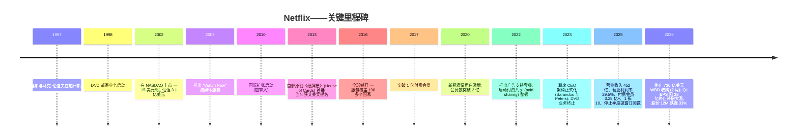
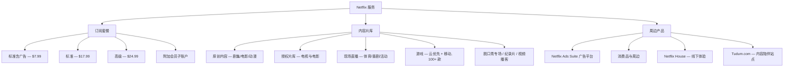
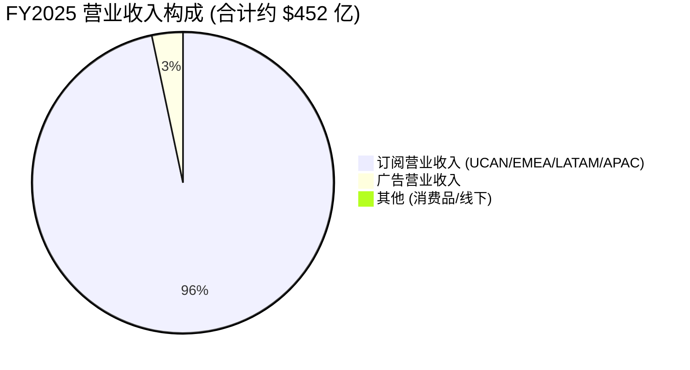
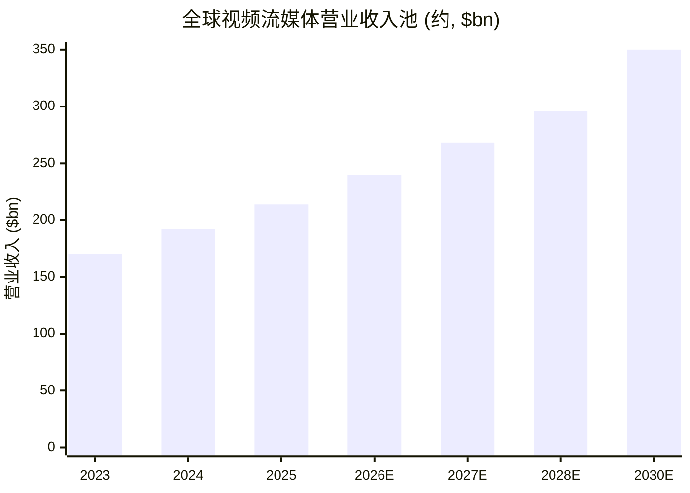
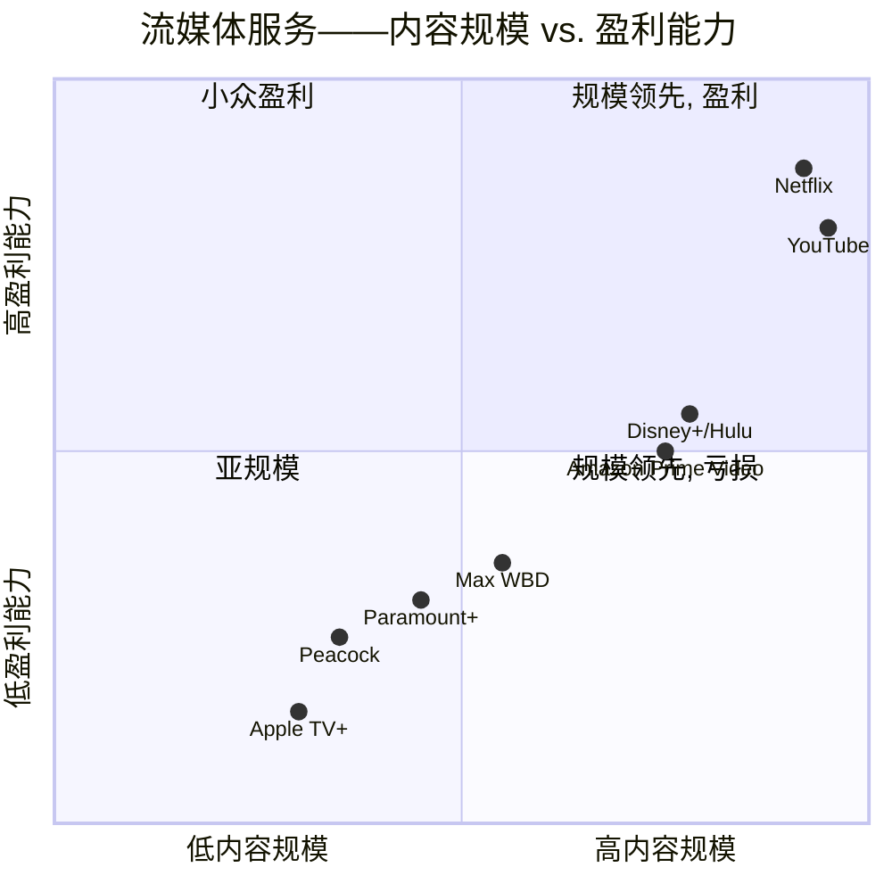

# Netflix, Inc. (NASDAQ:NFLX) — 公司研究报告

**截至日期: 2026-06-14**
**上市地: NASDAQ:NFLX (普通股; 1 拆 10 已于 2025-11-17 生效, EPS / 股数已追溯调整)**
**总部: 美国加利福尼亚州洛斯加托斯 (Los Gatos, California)**
**审计师: 安永会计师事务所 (Ernst & Young LLP)**
**报告语言: 简体中文 (英文版同时存在于本目录)**

> *分析师观点：* **评级：Hold（持有）· 12 个月目标价 $100（较 2026-06-12 收盘 $80.34 上行 +24%）· 估值方法：FY2027E EPS $3.30 × 30× forward P/E**
> 市值 ~$338bn · 52 周区间 $75.86–$133.91 · NASDAQ:NFLX
>
> | 倍数 / Multiple (*分析师观点：* 前瞻列) | FY2025A | FY2026E | FY2027E |
> |---|---|---|---|
> | P/E (调整后) | ~32× | ~25× | ~24× |
> | EV/EBITDA | ~25× | ~21× | ~18× |
> | EV/Sales | ~7.7× | ~6.6× | ~5.8× |
> | FCF yield | ~2.8% | ~3.7% | ~4.5% |
>
> 相对表现 (截至 2026-06-12, [yfinance](https://finance.yahoo.com/quote/NFLX)): 1M **−7.6%** · 6M **−14.6%** · YTD **−11.7%** · 12M **−33.7%** vs. S&P 500 (1M −0.9% · 6M +7.7% · YTD +8.4% · 12M +24.3%) — 12 个月相对标普 **约 −58 个百分点**, 是 2022 年以来最差的相对表现窗口。
>
> **核心论点 (thesis pillars)**——(1) 商业模式已从"订阅用户增长故事"切换为"营业收入 / 利润率 / 自由现金流故事", FY2025 营业利润率 (operating margin) 29.5%、FY2026 指引 31.5%, 结构性高于所有同业; (2) 广告业务 (ad-supported tier) 是第二增长引擎——2025 年广告收入 >$15 亿、指引 2026 年翻倍至 ~$30 亿, 边际利润率高; (3) 但股价 12 个月已跌逾 33%, 市场担忧 AI / 短视频对参与度的结构性侵蚀与内容摊销再加速, 这些担忧短期难以证伪; (4) 因此当前为"优质资产、估值已回落但缺乏近端催化剂"的持有状态——25× 前瞻 P/E 在增速放缓至 12–14% 的背景下定价合理而非便宜。

---

## 目录

1. 公司概览 (含投资论点)
   1A. 估值与目标价 (前瞻估值 · PT 推导 · 牛/基/熊情景 · 卖方观点演变)
   1B. GF Score 基本面评分卡 (雷达图 + 五维 0–10 + 综合分)
2. 公司历史
3. 管理团队
4. 产品与服务
5. 客户与上市策略
6. 行业概览
7. 竞争格局
8. 市场机会 (TAM)
9. 风险评估
9.5. 关键分歧与催化剂
10. 投资者视角评分卡
   数据来源清单 (Data Used)
   参考资料

---

## 1. 公司概览

*分析师观点：* **本报告给予 Netflix 持有 (Hold) 评级、12 个月目标价 $100 (较 2026-06-12 收盘 $80.34 上行 +24%)。** 核心判断是: 这是一家执行力极强、盈利能力结构性领先的优质流媒体公司, 但当前正处在叙事真空期——市场在 2024 年中把它当作"重新加速的增长股"给到拆股前 >50× TTM P/E, 而过去 12 个月股价回吐逾 33%, 反映对**人均观看时长下滑 (2025 下半年每付费用户观看时长同比 −8%)、AI 与短视频对参与度的结构性侵蚀、以及内容摊销 (content amortization) 2026 年再加速 ~10%** 的担忧 ([Q1'26 致股东信, 2026-04-16](https://www.sec.gov/Archives/edgar/data/1065280/000106528026000137/ex991_q126.htm) 中管理层强调"内部高质量参与度指标创历史新高"以反驳这一叙事)。我们认为基本面引擎 (会员 × ARM × 利润率) 仍健康, 但**缺乏 2026 年上半年的近端催化剂**——内容摊销前置、提价收益集中在下半年, 使得"持有、待下半年利润率上调信号"成为更审慎的姿态, 而非追涨或做空。

Netflix, Inc. 是全球最大的纯订阅式视频点播 (subscription video-on-demand, SVOD) 公司。公司自我定位为"全球领先的娱乐服务之一, 提供跨多种类型与语言的电视剧集、电影、游戏及现场直播节目" ([Netflix 2025 10-K, Item 1](https://www.sec.gov/Archives/edgar/data/0001065280/000106528026000034/nflx-20251231.htm))。订阅用户 (subscriber/member) 按月支付固定费用——从新兴市场最低档相当于 1 美元的方案, 到美国顶配 4K 套餐 (拆股与定价后) 高端档——即可在联网设备上无限制点播, 也可选择 2022 年 11 月推出的低价**广告支持套餐 (ad-supported tier)** ([Netflix 2025 10-K, MD&A](https://www.sec.gov/Archives/edgar/data/0001065280/000106528026000034/nflx-20251231.htm))。

**盈利模式。** Netflix 作为单一经营分部 (single operating segment) 披露财务数据。月度会员费 (monthly membership fees) 仍是远占主导的收入线; 广告、消费品、线下体验与其他周边业务单项金额上不构成营业收入的重大组成部分, 但管理层首次单独披露 **2025 年广告收入增长逾 2.5 倍至超过 $15 亿** ([Q4'25 致股东信, 2026-01-20](https://www.sec.gov/Archives/edgar/data/0001065280/000106528026000033/ex991_q425.htm))。2025 财年合计营业收入 **$451.8 亿** (Revenues $45,183.0M), 同比增长 16% (汇率中性 +17%); 营业利润 **$133.3 亿** (Operating income $13,326.6M, 营业利润率 29.5%)、净利润 **$109.8 亿** (Net income $10,981.2M)、稀释 EPS **$2.53** (拆股后)、自由现金流 (free cash flow, FCF) **$94.6 亿** (经营现金流 $10,149.3M − 资本开支 $688.2M) ([Netflix 2025 10-K, 现金流量表](https://www.sec.gov/Archives/edgar/data/0001065280/000106528026000034/nflx-20251231.htm))。公司在 2025 年 Q4 期间突破 **3.25 亿付费会员 (paid memberships)**, 并自 2025 年起正式停止季度披露订阅用户数, 改以营业收入与营业利润率作为两大主要 KPI ([Q4'25 致股东信, 2026-01-20](https://www.sec.gov/Archives/edgar/data/0001065280/000106528026000033/ex991_q425.htm))。

> **重要披露提示——订阅数已停披露:** 自 2025 年起 Netflix 不再按季度披露付费会员数与 ARM (average revenue per membership, 每会员平均收入)。本报告引用的最后一个官方会员数据为"2025 年 Q4 突破 3.25 亿"——任何"当前订阅用户数"均为最后披露值, 不应被理解为实时数字 ([Netflix 2025 10-K 脚注: "During the year ended December 31, 2025, we discontinued the reporting of membership numbers"](https://www.sec.gov/Archives/edgar/data/0001065280/000106528026000034/nflx-20251231.htm))。

**业务地域。** Netflix 在全球几乎所有国家可用, 除中国大陆、俄罗斯、朝鲜、克里米亚与少数受制裁地区外。FY2025 披露的四大区域营业收入分别为: 美加 (UCAN) **$199.6 亿 (+15%)**、欧洲中东非洲 (EMEA) **$145.1 亿 (+17%)**、拉美 (LATAM) **$53.6 亿 (+11%)**、亚太 (APAC) **$53.5 亿 (+21%)** ([Netflix 2025 10-K, MD&A——按地区营业收入](https://www.sec.gov/Archives/edgar/data/0001065280/000106528026000034/nflx-20251231.htm))。UCAN 现占营业收入 44%——Netflix 已是名副其实的国际化公司, EMEA 与 APAC 合计约 $200 亿已与美加基本盘并驾齐驱。公司拥有约 **16,000 名全职员工** 以及波动性的影视制作劳动力 ([Netflix 2025 10-K, Human Capital](https://www.sec.gov/Archives/edgar/data/0001065280/000106528026000034/nflx-20251231.htm))。

**内容投入规模。** Netflix 将大部分内容支出资本化, 并按预期观看效益形态摊销。10-K 显示 **FY2025 内容摊销 (content amortization) 为 $164.2 亿** (Amortization of content assets $16,422.2M), 高于 FY2024 的 $153.0 亿、FY2023 的 $142.0 亿; 现金内容支出 ("增加内容资产", additions to content assets) FY2025 为 **$171.0 亿** ([Netflix 2025 10-K, 现金流量表](https://www.sec.gov/Archives/edgar/data/0001065280/000106528026000034/nflx-20251231.htm))。关键在于, 内容摊销增速 (FY2025 约 +7%) 已明显低于营业收入增速 (+16%)——这是利润率扩张背后的机械引擎。但管理层指引 **2026 年内容摊销增长将再加速至 ~10%, 且上半年高于下半年**, 这正是 2026 年上半年利润率承压、市场观望的核心原因 ([Q4'25 致股东信, 2026-01-20](https://www.sec.gov/Archives/edgar/data/0001065280/000106528026000033/ex991_q425.htm))。

### Netflix 如何赚钱 (FY2025 利润表 Sankey)

<svg xmlns="http://www.w3.org/2000/svg" viewBox="0 0 1000 560" width="1000" height="560" role="img" aria-label="income statement Sankey"><rect x="0" y="0" width="1000" height="560" fill="#ffffff"/>
<text x="20.00" y="30.00" text-anchor="start" font-family="Helvetica,Arial,sans-serif" font-size="15" font-weight="700" fill="#1f2933">Netflix 如何赚钱 / How Netflix Makes Its Money — FY2025</text>
<path d="M 204.00,64.00 C 258.00,64.00 258.00,85.00 312.00,85.00 L 312.00,265.21 C 258.00,265.21 258.00,244.21 204.00,244.21 Z" fill="#93c5fd" fill-opacity="0.55"/>
<path d="M 452.00,78.00 C 506.00,78.00 506.00,183.09 560.00,183.09 L 560.00,303.43 C 506.00,303.43 506.00,198.34 452.00,198.34 Z" fill="#86efac" fill-opacity="0.55"/>
<path d="M 452.00,198.34 C 506.00,198.34 506.00,317.43 560.00,317.43 L 560.00,394.91 C 506.00,394.91 506.00,275.82 452.00,275.82 Z" fill="#fca5a5" fill-opacity="0.55"/>
<path d="M 328.00,85.00 C 382.00,85.00 382.00,78.00 436.00,78.00 L 436.00,275.83 C 382.00,275.83 382.00,282.83 328.00,282.83 Z" fill="#86efac" fill-opacity="0.55"/>
<path d="M 328.00,282.83 C 382.00,282.83 382.00,289.83 436.00,289.83 L 436.00,500.00 C 382.00,500.00 382.00,493.00 328.00,493.00 Z" fill="#fca5a5" fill-opacity="0.55"/>
<path d="M 700.00,171.82 C 754.00,171.82 754.00,224.56 808.00,224.56 L 808.00,323.72 C 754.00,323.72 754.00,270.98 700.00,270.98 Z" fill="#86efac" fill-opacity="0.55"/>
<path d="M 700.00,270.98 C 754.00,270.98 754.00,337.72 808.00,337.72 L 808.00,353.44 C 754.00,353.44 754.00,286.70 700.00,286.70 Z" fill="#fca5a5" fill-opacity="0.55"/>
<path d="M 576.00,183.09 C 630.00,183.09 630.00,171.82 684.00,171.82 L 684.00,292.16 C 630.00,292.16 630.00,303.43 576.00,303.43 Z" fill="#86efac" fill-opacity="0.55"/>
<path d="M 204.00,258.21 C 258.00,258.21 258.00,265.21 312.00,265.21 L 312.00,396.28 C 258.00,396.28 258.00,389.27 204.00,389.27 Z" fill="#93c5fd" fill-opacity="0.55"/>
<path d="M 576.00,317.43 C 630.00,317.43 630.00,300.71 684.00,300.71 L 684.00,330.51 C 630.00,330.51 630.00,347.24 576.00,347.24 Z" fill="#fca5a5" fill-opacity="0.55"/>
<path d="M 576.00,347.24 C 630.00,347.24 630.00,344.51 684.00,344.51 L 684.00,375.13 C 630.00,375.13 630.00,377.86 576.00,377.86 Z" fill="#fca5a5" fill-opacity="0.55"/>
<path d="M 576.00,377.86 C 630.00,377.86 630.00,389.13 684.00,389.13 L 684.00,406.18 C 630.00,406.18 630.00,394.91 576.00,394.91 Z" fill="#fca5a5" fill-opacity="0.55"/>
<path d="M 204.00,403.27 C 258.00,403.27 258.00,396.28 312.00,396.28 L 312.00,444.66 C 258.00,444.66 258.00,451.65 204.00,451.65 Z" fill="#93c5fd" fill-opacity="0.55"/>
<path d="M 204.00,465.65 C 258.00,465.65 258.00,444.66 312.00,444.66 L 312.00,493.00 C 258.00,493.00 258.00,514.00 204.00,514.00 Z" fill="#93c5fd" fill-opacity="0.55"/>
<rect x="188.00" y="64.00" width="16" height="180.21" rx="1.5" fill="#2563eb"/>
<rect x="188.00" y="258.21" width="16" height="131.07" rx="1.5" fill="#2563eb"/>
<rect x="188.00" y="403.27" width="16" height="48.38" rx="1.5" fill="#2563eb"/>
<rect x="188.00" y="465.65" width="16" height="48.35" rx="1.5" fill="#2563eb"/>
<rect x="312.00" y="85.00" width="16" height="407.99" rx="1.5" fill="#1e3a8a"/>
<rect x="436.00" y="78.00" width="16" height="197.82" rx="1.5" fill="#15803d"/>
<rect x="436.00" y="289.83" width="16" height="210.17" rx="1.5" fill="#dc2626"/>
<rect x="560.00" y="183.09" width="16" height="120.34" rx="1.5" fill="#15803d"/>
<rect x="560.00" y="317.43" width="16" height="77.48" rx="1.5" fill="#dc2626"/>
<rect x="684.00" y="171.82" width="16" height="114.89" rx="1.5" fill="#15803d"/>
<rect x="684.00" y="300.71" width="16" height="29.81" rx="1.5" fill="#dc2626"/>
<rect x="684.00" y="344.51" width="16" height="30.62" rx="1.5" fill="#dc2626"/>
<rect x="684.00" y="389.13" width="16" height="17.05" rx="1.5" fill="#dc2626"/>
<rect x="808.00" y="224.56" width="16" height="99.16" rx="1.5" fill="#15803d"/>
<rect x="808.00" y="337.72" width="16" height="15.72" rx="1.5" fill="#dc2626"/>
<text x="179.00" y="151.10" text-anchor="end" font-family="Helvetica,Arial,sans-serif" font-size="11.5" font-weight="700" fill="#1f2933">UCAN</text>
<text x="179.00" y="164.10" text-anchor="end" font-family="Helvetica,Arial,sans-serif" font-size="10" font-weight="400" fill="#52606d">$20.0B  (44.2%)</text>
<text x="179.00" y="320.74" text-anchor="end" font-family="Helvetica,Arial,sans-serif" font-size="11.5" font-weight="700" fill="#1f2933">EMEA</text>
<text x="179.00" y="333.74" text-anchor="end" font-family="Helvetica,Arial,sans-serif" font-size="10" font-weight="400" fill="#52606d">$14.5B  (32.1%)</text>
<text x="179.00" y="424.46" text-anchor="end" font-family="Helvetica,Arial,sans-serif" font-size="11.5" font-weight="700" fill="#1f2933">LATAM</text>
<text x="179.00" y="437.46" text-anchor="end" font-family="Helvetica,Arial,sans-serif" font-size="10" font-weight="400" fill="#52606d">$5.4B  (11.9%)</text>
<text x="179.00" y="486.83" text-anchor="end" font-family="Helvetica,Arial,sans-serif" font-size="11.5" font-weight="700" fill="#1f2933">APAC</text>
<text x="179.00" y="499.83" text-anchor="end" font-family="Helvetica,Arial,sans-serif" font-size="10" font-weight="400" fill="#52606d">$5.4B  (11.8%)</text>
<rect x="331.00" y="67.00" width="106.80" height="26" rx="2" fill="#ffffff" fill-opacity="0.72"/>
<text x="334.00" y="79.00" text-anchor="start" font-family="Helvetica,Arial,sans-serif" font-size="11.5" font-weight="700" fill="#1f2933">Revenue</text>
<text x="334.00" y="92.00" text-anchor="start" font-family="Helvetica,Arial,sans-serif" font-size="10" font-weight="400" fill="#52606d">$45.2B  (100.0%)</text>
<rect x="455.00" y="60.00" width="100.50" height="26" rx="2" fill="#ffffff" fill-opacity="0.72"/>
<text x="458.00" y="72.00" text-anchor="start" font-family="Helvetica,Arial,sans-serif" font-size="11.5" font-weight="700" fill="#1f2933">Gross Profit</text>
<text x="458.00" y="85.00" text-anchor="start" font-family="Helvetica,Arial,sans-serif" font-size="10" font-weight="400" fill="#52606d">$21.9B  (48.5%)</text>
<rect x="455.00" y="271.83" width="144.60" height="26" rx="2" fill="#ffffff" fill-opacity="0.72"/>
<text x="458.00" y="283.83" text-anchor="start" font-family="Helvetica,Arial,sans-serif" font-size="11.5" font-weight="700" fill="#1f2933">Cost of Revenue (COGS)</text>
<text x="458.00" y="296.83" text-anchor="start" font-family="Helvetica,Arial,sans-serif" font-size="10" font-weight="400" fill="#52606d">$23.3B  (51.5%)</text>
<rect x="579.00" y="165.09" width="106.80" height="26" rx="2" fill="#ffffff" fill-opacity="0.72"/>
<text x="582.00" y="177.09" text-anchor="start" font-family="Helvetica,Arial,sans-serif" font-size="11.5" font-weight="700" fill="#1f2933">Operating Income</text>
<text x="582.00" y="190.09" text-anchor="start" font-family="Helvetica,Arial,sans-serif" font-size="10" font-weight="400" fill="#52606d">$13.3B  (29.5%)</text>
<rect x="579.00" y="299.43" width="150.90" height="26" rx="2" fill="#ffffff" fill-opacity="0.72"/>
<text x="582.00" y="311.43" text-anchor="start" font-family="Helvetica,Arial,sans-serif" font-size="11.5" font-weight="700" fill="#1f2933">Total Operating Expense</text>
<text x="582.00" y="324.43" text-anchor="start" font-family="Helvetica,Arial,sans-serif" font-size="10" font-weight="400" fill="#52606d">$8.6B  (19.0%)</text>
<rect x="703.00" y="153.82" width="100.50" height="26" rx="2" fill="#ffffff" fill-opacity="0.72"/>
<text x="706.00" y="165.82" text-anchor="start" font-family="Helvetica,Arial,sans-serif" font-size="11.5" font-weight="700" fill="#1f2933">Pretax Income</text>
<text x="706.00" y="178.82" text-anchor="start" font-family="Helvetica,Arial,sans-serif" font-size="10" font-weight="400" fill="#52606d">$12.7B  (28.2%)</text>
<rect x="703.00" y="282.71" width="87.90" height="26" rx="2" fill="#ffffff" fill-opacity="0.72"/>
<text x="706.00" y="294.71" text-anchor="start" font-family="Helvetica,Arial,sans-serif" font-size="11.5" font-weight="700" fill="#1f2933">SG&amp;A</text>
<text x="706.00" y="307.71" text-anchor="start" font-family="Helvetica,Arial,sans-serif" font-size="10" font-weight="400" fill="#52606d">$3.3B  (7.3%)</text>
<rect x="703.00" y="326.51" width="87.90" height="26" rx="2" fill="#ffffff" fill-opacity="0.72"/>
<text x="706.00" y="338.51" text-anchor="start" font-family="Helvetica,Arial,sans-serif" font-size="11.5" font-weight="700" fill="#1f2933">R&amp;D</text>
<text x="706.00" y="351.51" text-anchor="start" font-family="Helvetica,Arial,sans-serif" font-size="10" font-weight="400" fill="#52606d">$3.4B  (7.5%)</text>
<rect x="703.00" y="371.13" width="87.90" height="26" rx="2" fill="#ffffff" fill-opacity="0.72"/>
<text x="706.00" y="383.13" text-anchor="start" font-family="Helvetica,Arial,sans-serif" font-size="11.5" font-weight="700" fill="#1f2933">Other OpEx</text>
<text x="706.00" y="396.13" text-anchor="start" font-family="Helvetica,Arial,sans-serif" font-size="10" font-weight="400" fill="#52606d">$1.9B  (4.2%)</text>
<text x="833.00" y="271.14" text-anchor="start" font-family="Helvetica,Arial,sans-serif" font-size="11.5" font-weight="700" fill="#1f2933">Net Income</text>
<text x="833.00" y="284.14" text-anchor="start" font-family="Helvetica,Arial,sans-serif" font-size="10" font-weight="400" fill="#52606d">$11.0B  (24.3%)</text>
<text x="833.00" y="342.58" text-anchor="start" font-family="Helvetica,Arial,sans-serif" font-size="11.5" font-weight="700" fill="#1f2933">Income Tax</text>
<text x="833.00" y="355.58" text-anchor="start" font-family="Helvetica,Arial,sans-serif" font-size="10" font-weight="400" fill="#52606d">$1.7B  (3.9%)</text>
<text x="500.00" y="544.00" text-anchor="middle" font-family="Helvetica,Arial,sans-serif" font-size="10" font-weight="400" fill="#52606d">Source: NFLX FY2025 10-K, Consolidated Statements of Operations + 按地区营业收入</text>
</svg>

来源 / Source: [NFLX FY2025 10-K, Consolidated Statements of Operations + 按地区营业收入](https://www.sec.gov/Archives/edgar/data/0001065280/000106528026000034/nflx-20251231.htm)。

### FY2025 营业收入按地区结构

<svg xmlns="http://www.w3.org/2000/svg" viewBox="0 0 720 460" width="720" height="460" role="img" aria-label="revenue donut"><rect x="0" y="0" width="720" height="460" fill="#ffffff"/>
<text x="20.00" y="30.00" text-anchor="start" font-family="Helvetica,Arial,sans-serif" font-size="15" font-weight="700" fill="#1f2933">FY2025 营业收入按地区 / Revenue by Region</text>
<path d="M 288.00,107.20 A 132 132 0 0 1 335.29,362.44 L 315.95,312.02 A 78 78 0 0 0 288.00,161.20 Z" fill="#2563eb"/>
<path d="M 335.29,362.44 A 132 132 0 0 1 156.44,228.49 L 210.26,232.87 A 78 78 0 0 0 315.95,312.02 Z" fill="#15803d"/>
<path d="M 156.44,228.49 A 132 132 0 0 1 198.55,142.13 L 235.15,181.84 A 78 78 0 0 0 210.26,232.87 Z" fill="#d97706"/>
<path d="M 198.55,142.13 A 132 132 0 0 1 288.00,107.20 L 288.00,161.20 A 78 78 0 0 0 235.15,181.84 Z" fill="#7c3aed"/>
<text x="288.00" y="235.20" text-anchor="middle" font-family="Helvetica,Arial,sans-serif" font-size="18" font-weight="800" fill="#1f2933">NFLX</text>
<text x="288.00" y="255.20" text-anchor="middle" font-family="Helvetica,Arial,sans-serif" font-size="13" font-weight="600" fill="#52606d">$45.2B</text>
<text x="288.00" y="271.20" text-anchor="middle" font-family="Helvetica,Arial,sans-serif" font-size="10" font-weight="400" fill="#8a97a3">total</text>
<line x1="423.69" y1="214.06" x2="439.69" y2="214.06" stroke="#2563eb" stroke-width="1.4"/>
<text x="443.69" y="212.06" text-anchor="start" font-family="Helvetica,Arial,sans-serif" font-size="11" font-weight="700" fill="#1f2933">UCAN</text>
<text x="443.69" y="226.06" text-anchor="start" font-family="Helvetica,Arial,sans-serif" font-size="10" font-weight="400" fill="#52606d">$20.0B  (44.2%)</text>
<line x1="205.28" y1="349.66" x2="189.28" y2="349.66" stroke="#15803d" stroke-width="1.4"/>
<text x="185.28" y="347.66" text-anchor="end" font-family="Helvetica,Arial,sans-serif" font-size="11" font-weight="700" fill="#1f2933">EMEA</text>
<text x="185.28" y="361.66" text-anchor="end" font-family="Helvetica,Arial,sans-serif" font-size="10" font-weight="400" fill="#52606d">$14.5B  (32.1%)</text>
<line x1="163.96" y1="178.71" x2="147.96" y2="178.71" stroke="#d97706" stroke-width="1.4"/>
<text x="143.96" y="176.71" text-anchor="end" font-family="Helvetica,Arial,sans-serif" font-size="11" font-weight="700" fill="#1f2933">LATAM</text>
<text x="143.96" y="190.71" text-anchor="end" font-family="Helvetica,Arial,sans-serif" font-size="10" font-weight="400" fill="#52606d">$5.4B  (11.9%)</text>
<line x1="237.81" y1="110.65" x2="221.81" y2="110.65" stroke="#7c3aed" stroke-width="1.4"/>
<text x="217.81" y="108.65" text-anchor="end" font-family="Helvetica,Arial,sans-serif" font-size="11" font-weight="700" fill="#1f2933">APAC</text>
<text x="217.81" y="122.65" text-anchor="end" font-family="Helvetica,Arial,sans-serif" font-size="10" font-weight="400" fill="#52606d">$5.4B  (11.8%)</text>
<text x="360.00" y="444.00" text-anchor="middle" font-family="Helvetica,Arial,sans-serif" font-size="10" font-weight="400" fill="#52606d">Source: NFLX FY2025 10-K, 按地区营业收入 (UCAN/EMEA/LATAM/APAC)</text>
</svg>

来源 / Source: [NFLX FY2025 10-K, MD&A——按地区营业收入](https://www.sec.gov/Archives/edgar/data/0001065280/000106528026000034/nflx-20251231.htm)。

### 估值快照 (TTM, 截至 2026-06-12)

**股价与倍数 (1 拆 10 后):**
- 股价: **$80.34** (2026-06-12 收盘, [yfinance](https://finance.yahoo.com/quote/NFLX))
- 市值: **~$3,380 亿** ([yfinance, marketCap](https://finance.yahoo.com/quote/NFLX))
- TTM 调整后市盈率 (P/E): **约 30–32 倍** (以 FY2025 稀释 EPS $2.53 为基, 剔除 2026 年 Q1 一次性 $28 亿 WBD 终止补偿后的 TTM EPS 口径)。GAAP TTM 因 Q1'26 一次性项目而失真偏低 ([Macrotrends NFLX P/E](https://www.macrotrends.net/stocks/charts/NFLX/netflix/pe-ratio))。
- TTM 市销率 (P/S): **约 7.5 倍** (市值 $3,380 亿 / TTM 营业收入约 $452 亿)。
- 3 年 P/E 区间: Netflix 已从 2024 年中 TTM P/E 峰值 >50 倍 (拆股前) 压缩至今天约 30 倍区间, 反映从"重估值上的增长"到"成熟利润率下的增长"叙事的切换, 并叠加过去 12 个月 −33.7% 的股价回吐 ([Public.com NFLX 历史 P/E](https://public.com/stocks/nflx/pe-ratio))。
- 前瞻倍数: 按管理层 $507–517 亿营业收入及 31.5% 营业利润率指引, **FY2026 前瞻 P/E 约 25 倍**。

**倍数解读。** Netflix 约 7.5 倍销售额、25 倍前瞻盈利的估值, 仍是传统媒体同业 (Disney P/S 约 1.9 倍、WBD、PSKY) 的数倍, 但已较 2024 年高点显著回落。这并非纯"叙事性"溢价, 而是由真实基本面落差支撑: Netflix 是唯一具备结构性盈利、规模化、仍在增长的订阅业务的主流流媒体纯玩家。FY2025 的 29.5% 营业利润率 (FY2026 指引 31.5%) 大约是传统同业 DTC 分部利润率的两倍。市场为以下因素付费: (a) 在 $450 亿规模上仍延伸至 2026 年的 12–14% 营业收入增长; (b) 仍在进行的利润率扩张 (每 100 个基点利润率在 $500 亿+ 基数上约相当于 $5 亿增量营业利润); (c) 广告第二引擎。但 *分析师观点：* 当前市场分歧在于**这个溢价是否会因参与度结构性流失而瓦解**——过去 12 个月 −33.7% 的回报说明市场正在重新定价这一尾部风险, 这也是本报告给持有而非买入的核心理由 (见第 9.5 章)。

---

## 1A. 估值与目标价

> 本章所有前瞻数字、目标价及情景目标价均为 *分析师观点：*, 不附任何申报材料引用 (10-K 不含目标价)。每个预测的输入 (申报分部数据 + 管理层指引 + 第三方预测) 在文内引用。

### (a) 前瞻财务预测表 (*分析师观点：*)

| 指标 (*分析师观点：*) | FY2025A | FY2026E | FY2027E | FY2028E | CAGR (25–28E) |
|---|---|---|---|---|---|
| 营业收入 Revenue ($bn) | 45.2 | 51.2 | 57.4 | 63.5 | +12.0% |
| — YoY % | +16% | +13% | +12% | +11% | |
| 其中: 广告收入 Ad rev ($bn) | 1.5 | 3.0 | 5.0 | 7.5 | +71% |
| 营业利润率 Operating margin % | 29.5% | 31.5% | 33% | 34.5% | |
| 营业利润 Operating income ($bn) | 13.3 | 16.1 | 18.9 | 21.9 | +18% |
| 稀释 EPS ($, 拆股后) | 2.53 | 3.05 | 3.30 | 4.10 | +17% |
| — YoY % | — | +21% | +8% | +24% | |
| ROIC % | ~24% | ~26% | ~28% | ~30% | |
| 自由现金流 FCF ($bn) | 9.5 | 12.5 | 14.5 | 17.0 | +21% |
| 净债务 Net debt ($bn) | ~5.4 | ~3 | 净现金 | 净现金 | |

各预测单元的输入来源: 营业收入起点为管理层 FY2026 指引 **$507–517 亿 (12–14% 增长)** 与 31.5% 营业利润率指引 ([Q4'25 致股东信, 2026-01-20](https://www.sec.gov/Archives/edgar/data/0001065280/000106528026000033/ex991_q425.htm)); FY2026 FCF 起点为管理层上调后的 **"约 $125 亿" FCF 预期** ([Q1'26 致股东信, 2026-04-16: "We now expect 2026 FCF of approximately $12.5B, an increase from our previous projection of $11B"](https://www.sec.gov/Archives/edgar/data/1065280/000106528026000137/ex991_q126.htm)); 广告收入路径锚定管理层"2026 年广告收入 ~$30 亿, 翻倍"指引 ([Q1'26 致股东信: "advertising revenue remains on track to reach $3B in 2026, up 2x year-over-year"](https://www.sec.gov/Archives/edgar/data/1065280/000106528026000137/ex991_q126.htm)) 与 *分析师观点：* 卖方对 2030 年广告收入 $76–83 亿的预测 ([Bernstein — Netflix: Messy Near-Term Narrative but a Durable Engine, 2026-06-04, p.3](http://xs-macbook-air.local:5001/zsxq/pdf/212488548484441/Bernstein-Netflix%20Inc%EF%BC%88NFLX.US%EF%BC%89Netflix%EF%BC%9A%20Messy%20Near~Term%20Narrative%EF%BC%8C%20but%20a%20Durable%20Engine-260604.pdf))。

**利润率桥 (margin bridge, *分析师观点：*)。** FY2025→FY2026 营业利润率 29.5%→31.5% (+200bps) 的拆解: 提价与广告增量贡献 +250bps · 运营杠杆 +100bps · 内容摊销前置 (上半年 ~10% 增长) −100bps · 现场直播/体育版权占比上升 (低毛利) −50bps。每个驱动因素的方向源于管理层"上半年内容摊销增长更高"与"广告收入翻倍"的指引 ([Q4'25 致股东信](https://www.sec.gov/Archives/edgar/data/0001065280/000106528026000033/ex991_q425.htm)); bps 量级为 *分析师观点：* 估算。

### (b) 目标价推导 (*分析师观点：*——展示算术)

**方法: 前瞻 P/E × 目标倍数。** `FY2027E EPS $3.30 × 30× forward P/E = $99 ≈ $100`。

**为什么用 30 倍?** Netflix 在 FY2025–FY2028E 期间预计实现约 17% 的 EPS CAGR 与 33–34.5% 的营业利润率, 显著高于任何传统媒体同业 (Disney EPS CAGR 个位数、WBD 整合中)。30× 大致对标卖方共识倍数中枢 (Jefferies 基准用 30×、Bernstein 隐含约 28–30×、Goldman 约 33×), 较 Spotify 约 30–35× 前瞻盈利相当 ([Macrotrends Disney P/E](https://www.macrotrends.net/stocks/charts/DIS/disney/pe-ratio); *分析师观点：* [Jefferies — What Gets Netflix Working Again, 2026-06-10, p.1](http://xs-macbook-air.local:5001/zsxq/pdf/584251881854254/Jefferies-Netflix%EF%BC%88NFLX.US%EF%BC%89What%20Gets%20Netflix%20Working%20Again%EF%BC%9F~Reiterate%20Buy-260610.pdf))。30× 既不激进 (不假设回到 2024 年的 >40× 重估) 也不悲观 (不假设熊市的 20× 去评级)。

### (c) 牛/基/熊情景 (*分析师观点：*)

| 情景 (*分析师观点：*) | 核心假设 | 目标价 | 较 $80.34 |
|---|---|---|---|
| 牛市 Bull | 参与度企稳, 广告 2027 超预期, 提价顺畅, 给 FY2027E EPS $3.30 × 38× | $125 | +56% |
| 基准 Base | 中性估计, FY2027E EPS $3.30 × 30× | $100 | +24% |
| 熊市 Bear | 美区订户放缓 + 短视频分流参与度 + 内容成本失控压制 FCF, 去评级至 20× | $66 | −18% |

熊市情景大致对应 Jefferies 给出的悲观情形 ($75, FY27E × 20×) ([Jefferies, 2026-06-10, p.1](http://xs-macbook-air.local:5001/zsxq/pdf/584251881854254/Jefferies-Netflix%EF%BC%88NFLX.US%EF%BC%89What%20Gets%20Netflix%20Working%20Again%EF%BC%9F~Reiterate%20Buy-260610.pdf)); 牛市对应 Bernstein 的"2–3 年看 $130–135"中期目标 ([Bernstein, 2026-06-04, p.1](http://xs-macbook-air.local:5001/zsxq/pdf/212488548484441/Bernstein-Netflix%20Inc%EF%BC%88NFLX.US%EF%BC%89Netflix%EF%BC%9A%20Messy%20Near~Term%20Narrative%EF%BC%8C%20but%20a%20Durable%20Engine-260604.pdf))。风险回报大致对称, 这正是给持有而非买入的量化依据: +24% 上行 vs −18% 下行, 比值并不足以构成强烈买入。

### (d) 与卖方一致预期的对比

本报告 FY2026E 营业收入 $512 亿、EPS $3.05 大致落在卖方共识中枢: Bernstein FY2026E 营业收入 $516.96 亿、EPS $3.20; Goldman FY2026E 营业收入 $516.6 亿、EPS $3.60 (更乐观) ([Bernstein, 2026-06-04, p.1](http://xs-macbook-air.local:5001/zsxq/pdf/212488548484441/Bernstein-Netflix%20Inc%EF%BC%88NFLX.US%EF%BC%89Netflix%EF%BC%9A%20Messy%20Near~Term%20Narrative%EF%BC%8C%20but%20a%20Durable%20Engine-260604.pdf); *分析师观点：* [Goldman Sachs — Key Takeaways from Netflix Ad Upfront, 2026-05-17, p.1](http://xs-macbook-air.local:5001/zsxq/pdf/585425844811454/Goldman%20Sachs-Netflix%20Inc.%20%EF%BC%88NFLX.US%EF%BC%89%20Key%20Takeaways%20from%20Netflix.pdf))。本报告 EPS 略低于 Goldman, 主因对内容摊销前置与现场直播低毛利拖累更保守。

### (e) 最该盯紧的变量

(1) **人均观看时长降幅是否企稳**——2025 下半年同比 −8%, Jefferies 预计 2026 上半年收窄至约 −5%; 若降幅不收窄, "结构性衰退"的熊市叙事将坐实 ([Jefferies, 2026-06-10, p.1](http://xs-macbook-air.local:5001/zsxq/pdf/584251881854254/Jefferies-Netflix%EF%BC%88NFLX.US%EF%BC%89What%20Gets%20Netflix%20Working%20Again%EF%BC%9F~Reiterate%20Buy-260610.pdf))。(2) **下半年全年营业利润率指引是否上调**——过去 5 年 (除 2022 汇率外) 最终全年 OM 均高于初始指引至少 100bp; 一次年底上调将是最强的近端催化剂 ([Jefferies, 2026-06-10, p.1](http://xs-macbook-air.local:5001/zsxq/pdf/584251881854254/Jefferies-Netflix%EF%BC%88NFLX.US%EF%BC%89What%20Gets%20Netflix%20Working%20Again%EF%BC%9F~Reiterate%20Buy-260610.pdf))。

### (f) 卖方观点演变 (Sell-side view evolution)

本报告引用了 ≥2 篇本地机构研报 (`db/zsxq.db`), 因此按规则构建按机构的观点时间线与机构间分歧表。**机械预读 `db/stock_price_target.db` (只读)**: NFLX 共录得 7 条 PT 记录, 区间 $110–$120 (除 JPM 一条无价), 中位数 $115, 离散度窄 (±5%)——这是一个**卖方高度一致看多、但股价持续走弱**的典型背离, 本身就是市场叙事 (参与度/AI 担忧) 压过卖方模型的信号。

**按机构的观点时间线 (评级 / 目标价, 报告日收盘价已机械存于 `stock_price_target.db`):**

| 机构 | 日期 | 评级 | 目标价 | 报告日上行 | 一句话论点 |
|---|---|---|---|---|---|
| Morgan Stanley | 2026-04-09 | Overweight | $115 | +12.7% | "Reclaiming The Crown"——重申首选 |
| Bernstein | 2026-04-17 | Outperform | $110 | +13.0% | 1Q26 增长放缓但引擎稳固 |
| J.P. Morgan | 2026-04-17 | Overweight | $118 (此前 $120) | +21.3% | 实质重于表象, 逢低吸纳 |
| Bernstein | 2026-05-14 | Outperform | $110 (维持) | +26.5% | AVOD 扩 15 国 |
| Goldman Sachs | 2026-05-15 | Buy | $120 | +37.9% | 广告招商会四重共振 |
| Bernstein | 2026-06-04 | Outperform | $110 (维持) | — | 短期叙事混乱, 长期引擎仍稳固 |
| Jefferies | 2026-06-10 | Buy | $110 (此前 $128, **下调**) | +33% (vs $82.64) | 估值已过度悲观, 情绪可修复 |

**关键自我修订:** Jefferies 在 2026-06-10 把目标价从 **$128 下调至 $110** (FY27E EPS × 30× PE), 触发因素是 AI 冲击论与短视频分流担忧持续压制估值——但其结论仍是"当前 FY27E 约 20 倍出头 PE 已过度悲观", 维持买入 ([Jefferies, 2026-06-10, p.1](http://xs-macbook-air.local:5001/zsxq/pdf/584251881854254/Jefferies-Netflix%EF%BC%88NFLX.US%EF%BC%89What%20Gets%20Netflix%20Working%20Again%EF%BC%9F~Reiterate%20Buy-260610.pdf))。J.P. Morgan 在 4 月把目标价从 $120 微降至 $118, 因管理层 1Q26 业绩略超但维持全年指引不变令部分投资者失望 (*分析师观点：* [J.P. Morgan — More Meat & Potatoes Than Sizzle, 2026-04-18, p.1](http://xs-macbook-air.local:5001/zsxq/pdf/184482585254822/J.P.%20Morgan-Netflix%20Inc%EF%BC%88NFLX.US%EF%BC%89More%20Meat%20%26%20Potatoes%20Than%20Sizzle-260418.pdf))。

**机构间分歧 (机构间分歧——不混合为虚假共识):**

| 机构 | 日期 | 评级 / 目标价 | 核心论点 | 什么证据能证明其正确 |
|---|---|---|---|---|
| Goldman Sachs | 2026-05-15 | Buy / $120 (+38%) | 会员增长 + 广告变现 + 内容提效 + 现金流爆发"四重共振"; FY26 EPS $3.60 | 广告收入 2026 翻倍至 $30 亿坐实; FCF yield 升至 3.6% |
| Bernstein | 2026-06-04 | Outperform / $110 (+35%) | 引擎稳固但增长节奏放缓; 2030 EBIT margin 看 40%+ | 非英语市场渗透 + 运营杠杆持续释放 |
| Jefferies | 2026-06-10 | Buy / $110 (下调自 $128) | 估值已过度悲观, 情绪修复空间; 但下调 PT 承认逆风 | 人均观看时长降幅 2026 上半年收窄至 −5% |
| 本报告 | 2026-06-14 | **Hold / $100 (+24%)** | 优质资产但缺近端催化剂, 风险回报不够对称 | 下半年 OM 指引上调 + 参与度企稳同时出现 |

机构间最大分歧在于**参与度下滑是统计假象还是结构性衰退**: Jefferies 与 Bernstein 倾向前者 (账户持有人真实观看时长近 2.5 年基本平稳, 降幅源于广告层占比上升与地理结构偏移), 而市场用 −33% 的股价投票倾向后者。本报告的持有评级正是承认这一分歧短期无法证伪。

### Netflix 杜邦 ROE 分解 (FY2025)

<svg xmlns="http://www.w3.org/2000/svg" viewBox="0 0 1240 540" width="1240" height="540" role="img" aria-label="DuPont ROE decomposition"><rect x="0" y="0" width="1240" height="540" fill="#ffffff"/>
<text x="20.00" y="30.00" text-anchor="start" font-family="Helvetica,Arial,sans-serif" font-size="15" font-weight="700" fill="#1f2933">5-Step DuPont Decomposition of Return on Equity (ROE)</text>
<rect x="545.00" y="56.00" width="150" height="56" rx="7" fill="#1e3a8a"/>
<text x="620.00" y="76.00" text-anchor="middle" font-family="Helvetica,Arial,sans-serif" font-size="11.5" font-weight="700" fill="#ffffff">ROE</text>
<text x="620.00" y="94.00" text-anchor="middle" font-family="Helvetica,Arial,sans-serif" font-size="13" font-weight="800" fill="#ffffff">42.76%</text>
<text x="620.00" y="106.00" text-anchor="middle" font-family="Helvetica,Arial,sans-serif" font-size="8.5" font-weight="400" fill="#dbeafe">= Net Income / Avg Equity</text>
<rect x="191.60" y="168.00" width="150" height="56" rx="7" fill="#2563eb"/>
<text x="266.60" y="188.00" text-anchor="middle" font-family="Helvetica,Arial,sans-serif" font-size="11.5" font-weight="700" fill="#ffffff">Net Margin</text>
<text x="266.60" y="206.00" text-anchor="middle" font-family="Helvetica,Arial,sans-serif" font-size="13" font-weight="800" fill="#ffffff">24.30%</text>
<text x="266.60" y="218.00" text-anchor="middle" font-family="Helvetica,Arial,sans-serif" font-size="8.5" font-weight="400" fill="#dbeafe">Net Income / Revenue</text>
<line x1="620.00" y1="112.00" x2="266.60" y2="168.00" stroke="#94a3b8" stroke-width="1.4"/>
<rect x="545.00" y="168.00" width="150" height="56" rx="7" fill="#2563eb"/>
<text x="620.00" y="188.00" text-anchor="middle" font-family="Helvetica,Arial,sans-serif" font-size="11.5" font-weight="700" fill="#ffffff">Asset Turnover</text>
<text x="620.00" y="206.00" text-anchor="middle" font-family="Helvetica,Arial,sans-serif" font-size="13" font-weight="800" fill="#ffffff">0.83</text>
<text x="620.00" y="218.00" text-anchor="middle" font-family="Helvetica,Arial,sans-serif" font-size="8.5" font-weight="400" fill="#dbeafe">Revenue / Avg Assets</text>
<line x1="620.00" y1="112.00" x2="620.00" y2="168.00" stroke="#94a3b8" stroke-width="1.4"/>
<rect x="898.40" y="168.00" width="150" height="56" rx="7" fill="#2563eb"/>
<text x="973.40" y="188.00" text-anchor="middle" font-family="Helvetica,Arial,sans-serif" font-size="11.5" font-weight="700" fill="#ffffff">Equity Multiplier</text>
<text x="973.40" y="206.00" text-anchor="middle" font-family="Helvetica,Arial,sans-serif" font-size="13" font-weight="800" fill="#ffffff">2.13</text>
<text x="973.40" y="218.00" text-anchor="middle" font-family="Helvetica,Arial,sans-serif" font-size="8.5" font-weight="400" fill="#dbeafe">Avg Assets / Avg Equity</text>
<line x1="620.00" y1="112.00" x2="973.40" y2="168.00" stroke="#94a3b8" stroke-width="1.4"/>
<circle cx="443.30" cy="196.00" r="11" fill="#ffffff" stroke="#94a3b8" stroke-width="1.2"/>
<text x="443.30" y="201.00" text-anchor="middle" font-family="Helvetica,Arial,sans-serif" font-size="14" font-weight="800" fill="#52606d">×</text>
<circle cx="796.70" cy="196.00" r="11" fill="#ffffff" stroke="#94a3b8" stroke-width="1.2"/>
<text x="796.70" y="201.00" text-anchor="middle" font-family="Helvetica,Arial,sans-serif" font-size="14" font-weight="800" fill="#52606d">×</text>
<rect x="65.00" y="300.00" width="118" height="56" rx="7" fill="#2563eb"/>
<text x="124.00" y="320.00" text-anchor="middle" font-family="Helvetica,Arial,sans-serif" font-size="11.5" font-weight="700" fill="#ffffff">Operating Margin</text>
<text x="124.00" y="338.00" text-anchor="middle" font-family="Helvetica,Arial,sans-serif" font-size="13" font-weight="800" fill="#ffffff">29.50%</text>
<text x="124.00" y="350.00" text-anchor="middle" font-family="Helvetica,Arial,sans-serif" font-size="8.5" font-weight="400" fill="#dbeafe">Op Inc / Revenue</text>
<line x1="266.60" y1="224.00" x2="124.00" y2="300.00" stroke="#94a3b8" stroke-width="1.4"/>
<rect x="207.60" y="300.00" width="118" height="56" rx="7" fill="#2563eb"/>
<text x="266.60" y="320.00" text-anchor="middle" font-family="Helvetica,Arial,sans-serif" font-size="11.5" font-weight="700" fill="#ffffff">Tax Burden</text>
<text x="266.60" y="338.00" text-anchor="middle" font-family="Helvetica,Arial,sans-serif" font-size="13" font-weight="800" fill="#ffffff">0.8631</text>
<text x="266.60" y="350.00" text-anchor="middle" font-family="Helvetica,Arial,sans-serif" font-size="8.5" font-weight="400" fill="#dbeafe">Net Inc / Pretax</text>
<line x1="266.60" y1="224.00" x2="266.60" y2="300.00" stroke="#94a3b8" stroke-width="1.4"/>
<rect x="350.20" y="300.00" width="118" height="56" rx="7" fill="#2563eb"/>
<text x="409.20" y="320.00" text-anchor="middle" font-family="Helvetica,Arial,sans-serif" font-size="11.5" font-weight="700" fill="#ffffff">Interest Burden</text>
<text x="409.20" y="338.00" text-anchor="middle" font-family="Helvetica,Arial,sans-serif" font-size="13" font-weight="800" fill="#ffffff">0.9547</text>
<text x="409.20" y="350.00" text-anchor="middle" font-family="Helvetica,Arial,sans-serif" font-size="8.5" font-weight="400" fill="#dbeafe">Pretax / Op Inc</text>
<line x1="266.60" y1="224.00" x2="409.20" y2="300.00" stroke="#94a3b8" stroke-width="1.4"/>
<circle cx="195.30" cy="328.00" r="11" fill="#ffffff" stroke="#94a3b8" stroke-width="1.2"/>
<text x="195.30" y="333.00" text-anchor="middle" font-family="Helvetica,Arial,sans-serif" font-size="14" font-weight="800" fill="#52606d">×</text>
<circle cx="337.90" cy="328.00" r="11" fill="#ffffff" stroke="#94a3b8" stroke-width="1.2"/>
<text x="337.90" y="333.00" text-anchor="middle" font-family="Helvetica,Arial,sans-serif" font-size="14" font-weight="800" fill="#52606d">×</text>
<rect x="479.00" y="300.00" width="118" height="56" rx="7" fill="#2563eb"/>
<text x="538.00" y="326.00" text-anchor="middle" font-family="Helvetica,Arial,sans-serif" font-size="11.5" font-weight="700" fill="#ffffff">Revenue</text>
<text x="538.00" y="342.00" text-anchor="middle" font-family="Helvetica,Arial,sans-serif" font-size="13" font-weight="800" fill="#ffffff">$45.2B</text>
<line x1="620.00" y1="224.00" x2="538.00" y2="300.00" stroke="#94a3b8" stroke-width="1.4"/>
<rect x="643.00" y="300.00" width="118" height="56" rx="7" fill="#2563eb"/>
<text x="702.00" y="320.00" text-anchor="middle" font-family="Helvetica,Arial,sans-serif" font-size="11.5" font-weight="700" fill="#ffffff">Avg Total Assets</text>
<text x="702.00" y="338.00" text-anchor="middle" font-family="Helvetica,Arial,sans-serif" font-size="13" font-weight="800" fill="#ffffff">$54.6B</text>
<text x="702.00" y="350.00" text-anchor="middle" font-family="Helvetica,Arial,sans-serif" font-size="8.5" font-weight="400" fill="#dbeafe">(begin+end)/2</text>
<line x1="620.00" y1="224.00" x2="702.00" y2="300.00" stroke="#94a3b8" stroke-width="1.4"/>
<circle cx="620.00" cy="328.00" r="11" fill="#ffffff" stroke="#94a3b8" stroke-width="1.2"/>
<text x="620.00" y="333.00" text-anchor="middle" font-family="Helvetica,Arial,sans-serif" font-size="14" font-weight="800" fill="#52606d">÷</text>
<rect x="832.40" y="300.00" width="118" height="56" rx="7" fill="#2563eb"/>
<text x="891.40" y="320.00" text-anchor="middle" font-family="Helvetica,Arial,sans-serif" font-size="11.5" font-weight="700" fill="#ffffff">Avg Total Assets</text>
<text x="891.40" y="338.00" text-anchor="middle" font-family="Helvetica,Arial,sans-serif" font-size="13" font-weight="800" fill="#ffffff">$54.6B</text>
<text x="891.40" y="350.00" text-anchor="middle" font-family="Helvetica,Arial,sans-serif" font-size="8.5" font-weight="400" fill="#dbeafe">(begin+end)/2</text>
<line x1="973.40" y1="224.00" x2="891.40" y2="300.00" stroke="#94a3b8" stroke-width="1.4"/>
<rect x="996.40" y="300.00" width="118" height="56" rx="7" fill="#2563eb"/>
<text x="1055.40" y="320.00" text-anchor="middle" font-family="Helvetica,Arial,sans-serif" font-size="11.5" font-weight="700" fill="#ffffff">Avg Total Equity</text>
<text x="1055.40" y="338.00" text-anchor="middle" font-family="Helvetica,Arial,sans-serif" font-size="13" font-weight="800" fill="#ffffff">$25.7B</text>
<text x="1055.40" y="350.00" text-anchor="middle" font-family="Helvetica,Arial,sans-serif" font-size="8.5" font-weight="400" fill="#dbeafe">(begin+end)/2</text>
<line x1="973.40" y1="224.00" x2="1055.40" y2="300.00" stroke="#94a3b8" stroke-width="1.4"/>
<circle cx="967.20" cy="328.00" r="11" fill="#ffffff" stroke="#94a3b8" stroke-width="1.2"/>
<text x="967.20" y="333.00" text-anchor="middle" font-family="Helvetica,Arial,sans-serif" font-size="14" font-weight="800" fill="#52606d">÷</text>
<rect x="69.00" y="420.00" width="110" height="48" rx="7" fill="#3b82f6"/>
<text x="124.00" y="442.00" text-anchor="middle" font-family="Helvetica,Arial,sans-serif" font-size="11.5" font-weight="700" fill="#ffffff">Operating Income</text>
<text x="124.00" y="458.00" text-anchor="middle" font-family="Helvetica,Arial,sans-serif" font-size="13" font-weight="800" fill="#ffffff">$13.3B</text>
<line x1="124.00" y1="356.00" x2="124.00" y2="420.00" stroke="#94a3b8" stroke-width="1.4"/>
<rect x="211.60" y="420.00" width="110" height="48" rx="7" fill="#3b82f6"/>
<text x="266.60" y="442.00" text-anchor="middle" font-family="Helvetica,Arial,sans-serif" font-size="11.5" font-weight="700" fill="#ffffff">Net Income</text>
<text x="266.60" y="458.00" text-anchor="middle" font-family="Helvetica,Arial,sans-serif" font-size="13" font-weight="800" fill="#ffffff">$11.0B</text>
<line x1="266.60" y1="356.00" x2="266.60" y2="420.00" stroke="#94a3b8" stroke-width="1.4"/>
<rect x="354.20" y="420.00" width="110" height="48" rx="7" fill="#3b82f6"/>
<text x="409.20" y="442.00" text-anchor="middle" font-family="Helvetica,Arial,sans-serif" font-size="11.5" font-weight="700" fill="#ffffff">Pretax Income</text>
<text x="409.20" y="458.00" text-anchor="middle" font-family="Helvetica,Arial,sans-serif" font-size="13" font-weight="800" fill="#ffffff">$12.7B</text>
<line x1="409.20" y1="356.00" x2="409.20" y2="420.00" stroke="#94a3b8" stroke-width="1.4"/>
<text x="620.00" y="524.00" text-anchor="middle" font-family="Helvetica,Arial,sans-serif" font-size="10" font-weight="400" fill="#52606d">Source: NFLX FY2025 10-K, Statements of Operations + Balance Sheets</text>
</svg>

来源 / Source: [NFLX FY2025 10-K, Statements of Operations + Balance Sheets](https://www.sec.gov/Archives/edgar/data/0001065280/000106528026000034/nflx-20251231.htm)。

---

## 1B. GF Score (GuruFocus-style) 基本面评分卡

*分析师观点：* **GF Score (GuruFocus-style): 70 / 100 — 51–70 区间 (Poor future performance potential / 未来表现潜力偏弱)。** 这一综合分**完全被动量 (Momentum) 维度拖累**——基本面四维 (财务实力、盈利、成长、估值) 均健康, 但过去 12 个月 −33.7% 的股价回报把动量打到 2/10, 使综合分跌入偏弱区间。这恰是 Netflix 当前的画像: 优质企业 + 弱价格动量 = 持有。(注: 此为独立计算的 GuruFocus-*风格* 复现, 非 GuruFocus 官方数字。)

<svg xmlns="http://www.w3.org/2000/svg" viewBox="0 0 500 500" width="500" height="500" role="img" aria-label="GF Score radar">
<rect x="0" y="0" width="500" height="500" fill="#ffffff"/>
<text x="20" y="24" font-family="Helvetica,Arial,sans-serif" font-size="15" font-weight="700" fill="#1f2933">GF Score (GuruFocus-style): 70/100</text>
<text x="20" y="41" font-family="Helvetica,Arial,sans-serif" font-size="11" fill="#52606d">51–70 Poor future performance potential</text>
<polygon points="250.0,88.0 392.7,191.6 338.2,359.4 161.8,359.4 107.3,191.6" fill="#e9f5ec" stroke="none"/>
<polygon points="250.0,208.0 278.5,228.7 267.6,262.3 232.4,262.3 221.5,228.7" fill="none" stroke="#c5d3cb" stroke-width="1"/>
<polygon points="250.0,178.0 307.1,219.5 285.3,286.5 214.7,286.5 192.9,219.5" fill="none" stroke="#c5d3cb" stroke-width="1"/>
<polygon points="250.0,148.0 335.6,210.2 302.9,310.8 197.1,310.8 164.4,210.2" fill="none" stroke="#c5d3cb" stroke-width="1"/>
<polygon points="250.0,118.0 364.1,200.9 320.5,335.1 179.5,335.1 135.9,200.9" fill="none" stroke="#c5d3cb" stroke-width="1"/>
<polygon points="250.0,88.0 392.7,191.6 338.2,359.4 161.8,359.4 107.3,191.6" fill="none" stroke="#c5d3cb" stroke-width="1.3"/>
<line x1="250" y1="238" x2="161.8" y2="359.4" stroke="#cfdad3" stroke-width="1"/>
<text x="146.5" y="392.4" text-anchor="end" font-family="Helvetica,Arial,sans-serif" font-size="11.5" font-weight="600" fill="#1f2933">Financial Strength</text>
<text x="146.5" y="405.4" text-anchor="end" font-family="Helvetica,Arial,sans-serif" font-size="9.5" fill="#52606d">财务实力</text>
<text x="179.5" y="329.1" text-anchor="middle" font-family="Helvetica,Arial,sans-serif" font-size="10.5" font-weight="700" fill="#1f2933">8</text>
<line x1="250" y1="238" x2="250.0" y2="88.0" stroke="#cfdad3" stroke-width="1"/>
<text x="250.0" y="58.0" text-anchor="middle" font-family="Helvetica,Arial,sans-serif" font-size="11.5" font-weight="600" fill="#1f2933">Profitability</text>
<text x="250.0" y="71.0" text-anchor="middle" font-family="Helvetica,Arial,sans-serif" font-size="9.5" fill="#52606d">盈利能力</text>
<text x="250.0" y="97.0" text-anchor="middle" font-family="Helvetica,Arial,sans-serif" font-size="10.5" font-weight="700" fill="#1f2933">9</text>
<line x1="250" y1="238" x2="107.3" y2="191.6" stroke="#cfdad3" stroke-width="1"/>
<text x="82.6" y="183.6" text-anchor="end" font-family="Helvetica,Arial,sans-serif" font-size="11.5" font-weight="600" fill="#1f2933">Growth</text>
<text x="82.6" y="196.6" text-anchor="end" font-family="Helvetica,Arial,sans-serif" font-size="9.5" fill="#52606d">成长性</text>
<text x="150.1" y="199.6" text-anchor="middle" font-family="Helvetica,Arial,sans-serif" font-size="10.5" font-weight="700" fill="#1f2933">7</text>
<line x1="250" y1="238" x2="392.7" y2="191.6" stroke="#cfdad3" stroke-width="1"/>
<text x="417.4" y="183.6" text-anchor="start" font-family="Helvetica,Arial,sans-serif" font-size="11.5" font-weight="600" fill="#1f2933">GF Value</text>
<text x="417.4" y="196.6" text-anchor="start" font-family="Helvetica,Arial,sans-serif" font-size="9.5" fill="#52606d">估值</text>
<text x="349.9" y="199.6" text-anchor="middle" font-family="Helvetica,Arial,sans-serif" font-size="10.5" font-weight="700" fill="#1f2933">7</text>
<line x1="250" y1="238" x2="338.2" y2="359.4" stroke="#cfdad3" stroke-width="1"/>
<text x="353.5" y="392.4" text-anchor="start" font-family="Helvetica,Arial,sans-serif" font-size="11.5" font-weight="600" fill="#1f2933">Momentum</text>
<text x="353.5" y="405.4" text-anchor="start" font-family="Helvetica,Arial,sans-serif" font-size="9.5" fill="#52606d">动量</text>
<text x="267.6" y="256.3" text-anchor="middle" font-family="Helvetica,Arial,sans-serif" font-size="10.5" font-weight="700" fill="#1f2933">2</text>
<polygon points="250.0,103.0 349.9,205.6 267.6,262.3 179.5,335.1 150.1,205.6" fill="#2e8b57" fill-opacity="0.34" stroke="#2e8b57" stroke-width="2"/>
<circle cx="179.5" cy="335.1" r="2.6" fill="#2e8b57"/>
<circle cx="250.0" cy="103.0" r="2.6" fill="#2e8b57"/>
<circle cx="150.1" cy="205.6" r="2.6" fill="#2e8b57"/>
<circle cx="349.9" cy="205.6" r="2.6" fill="#2e8b57"/>
<circle cx="267.6" cy="262.3" r="2.6" fill="#2e8b57"/>
<text x="250" y="470" text-anchor="middle" font-family="Helvetica,Arial,sans-serif" font-size="9.5" fill="#52606d">Source: NFLX FY2025 10-K · Yahoo Finance · indicators.db, as of 2026-06-14</text>
<text x="250" y="485" text-anchor="middle" font-family="Helvetica,Arial,sans-serif" font-size="9" fill="#52606d">GF Score = independent analyst rubric (*Analyst view:*) — not GuruFocus™ official number</text>
</svg>

> 离中心越远, 该维度得分越高; 五边形面积越大, 综合分越高 (对标 GuruFocus 控件)。

| 维度 / Dimension | 评分 / Score (0–10) | |
|---|---|---|
| Financial Strength (财务实力) | 8 | `████████░░` |
| Profitability (盈利能力) | 9 | `█████████░` |
| Growth (成长性) | 7 | `███████░░░` |
| GF Value (估值) | 7 | `███████░░░` |
| Momentum (动量) | 2 | `██░░░░░░░░` |
| **GF Score (composite, *Analyst view:*)** | **70 / 100** | **51–70 Poor future performance potential** |

*Composite weights (*Analyst view:*): Financial Strength 20% · Profitability 25% · Growth 25% · GF Value 15% · Momentum 15% (transparent reproduction — not GuruFocus's proprietary weighting).*

**各维度评分理由:**

**Financial Strength (财务实力) = 8/10。** 期末现金及等价物 $90.3 亿 + 短期投资, 对长期债务 $134.6 亿 + 短期债务 $10.0 亿——净债务约 $54 亿, 相对约 $130 亿营业利润与约 $95 亿 FCF 极低杠杆 (Net Debt/EBITDA <0.5×); 投资级信用评级; 利息费用 $7.77 亿被 $133 亿营业利润覆盖逾 17 倍 ([NFLX FY2025 10-K, 资产负债表 + 利润表](https://www.sec.gov/Archives/edgar/data/0001065280/000106528026000034/nflx-20251231.htm))。未给满分仅因有内容负债 ($56.6 亿) 与历史净债务发行习惯。

**Profitability (盈利能力) = 9/10。** FY2025 营业利润率 29.5%、净利率 24.3%、ROE 约 43% (净利润 $109.8 亿 / 平均权益约 $256 亿)、ROIC 约 24% (远高于 WACC); 营业利润率连续三年扩张 (17.8%→20.6%→26.7%→29.5% 自 2022 起) ([NFLX FY2025 10-K, MD&A](https://www.sec.gov/Archives/edgar/data/0001065280/000106528026000034/nflx-20251231.htm))。流媒体纯玩家中无人可比, 故近满分。

**Growth (成长性) = 7/10。** FY2023–FY2025 营业收入 CAGR 约 16% ($337 亿→$452 亿)、EPS 增速更高; 前瞻 FY2025–FY2028E 营业收入 CAGR 约 12%、EPS CAGR 约 17% ([NFLX FY2025 10-K](https://www.sec.gov/Archives/edgar/data/0001065280/000106528026000034/nflx-20251231.htm); 1A 前瞻模型 *分析师观点：*)。增速从 16% 放缓至 12–14% 使其落在 7 而非 9——成长仍稳健但已从超高速过渡。

**GF Value (估值, 越高越便宜) = 7/10。** FY2026 前瞻 P/E 约 25 倍, 处于自身 3 年区间下半部 (2024 年中 >50 倍拆股前峰值后大幅回落); PEG 约 1.5 (25× / 17% EPS CAGR); 较卖方目标价中枢 $110–115 仍有约 +35% 上行 ([Macrotrends NFLX P/E](https://www.macrotrends.net/stocks/charts/NFLX/netflix/pe-ratio); *分析师观点：* PT 时间线见 1A(f))。相对自身历史已便宜, 但绝对倍数仍高于传统媒体, 故 7 而非 9。

**Momentum (动量) = 2/10。** 这是拖累项: 12 个月 −33.7% (vs 标普 +24.3%, 相对约 −58pp)、6 个月 −14.6%、YTD −11.7%, 股价处于 52 周区间 ($75.86–$133.91) 下沿附近 ([yfinance, 截至 2026-06-12](https://finance.yahoo.com/quote/NFLX))。深度跑输基准 + 近 52 周低位 = 2/10。

**综合算术:** `(FS·20 + Prof·25 + Growth·25 + Value·15 + Mom·15)/100 = (8·20 + 9·25 + 7·25 + 7·15 + 2·15)/100 = (160+225+175+105+30)/100 = 695/100 → 70/100` (权重 20/25/25/15/15)。

**一句话警示:** 整个分数被 Momentum 一项压低 8 分——若股价企稳并修复 (动量回到 6), 综合分将跳升至约 76 (进入"平均表现"区间); 反之若参与度叙事坐实、股价再下台阶, Value 与 Momentum 会同步走弱。这是一个对价格路径高度敏感的评分。

---

## 2. 公司历史

Netflix 于 **1997 年 8 月 29 日**在美国加利福尼亚州斯科茨谷 (Scotts Valley) 由**里德·哈斯廷斯 (Reed Hastings)** 与**马克·伦道夫 (Marc Randolph)** 共同创立。"哈斯廷斯因 Blockbuster 收取 40 美元《阿波罗 13 号》滞纳金而创办公司"的传说部分是哈斯廷斯本人的复述, 部分属于杜撰——伦道夫在回忆录《这绝不会成功》(*That Will Never Work*) 中描述了一个更渐进的起源: 仿照亚马逊在线书店模式的"邮寄电影"订阅服务提案 ([Wikipedia, Netflix 历史](https://en.wikipedia.org/wiki/Netflix,_Inc.))。DVD 邮寄业务于 1998 年启动。马克·伦道夫于 2003 年退出运营岗位, 由哈斯廷斯整合领导权, 并在此后二十年中持续担任 CEO ([MakeUseOf, Netflix 历史](https://www.makeuseof.com/how-when-netflix-start-brief-company-history/))。

Netflix 于 **2002 年 5 月**在 NASDAQ 上市, 发行价 15 美元/股 (拆股前), 募集 $8,210 万, 估值 $3.097 亿, 彼时美国会员约 60 万 ([MakeUseOf, Netflix 历史](https://www.makeuseof.com/how-when-netflix-start-brief-company-history/))。决定性的战略转型——从盈利的 DVD 邮寄业务转向流媒体——始于 **2007 年 1 月 16 日** "Watch Now" 服务推出, 初期免费搭载于 DVD 订阅之上, 仅支持运行 Internet Explorer 的 PC。

*来源: [Netflix 投资者关系——SEC 申报](https://ir.netflix.net/financials/sec-filings/default.aspx)、[Wikipedia](https://en.wikipedia.org/wiki/Netflix,_Inc.)。*

**三段战略性转型定义了现代 Netflix。**

*第一, 流媒体转型本身 (2007–2013)。* 哈斯廷斯反复强调 DVD 业务是为流媒体转型提供现金流的"奶牛", Netflix 必须在对手之前自我蚕食。2011 年笨拙执行的 "Qwikster" 计划 (试图把 DVD 拆为独立品牌/网站/定价) 单季流失约 80 万订阅用户、股价腰斩约 75%; 但哈斯廷斯在 23 天内撤回, 战略方向得以保留 ([Wikipedia, Netflix](https://en.wikipedia.org/wiki/Netflix,_Inc.))。

*第二, 原创内容 (original content) 转型 (2013–2018)。* 2013 年 2 月的《纸牌屋》是公司首部原创剧集, 也是首部非传统广播渠道首播即获艾美奖重要提名的剧。到 2018 年, Netflix 片库已由原创内容主导, 每年签发的制片预算已超过任何单一好莱坞制片厂。

*第三, "盈利下增长 (growth-at-a-profit)"转型 (2022–2025)。* 2022 年股价崩盘 (NFLX 从拆股前 700 美元跌至 170 美元以下, 付费会员增长十多年来首次转负) 迫使公司在过渡到联席 CEO 架构的框架下进行战略重置。三项杠杆依次拉下: 付费共享强制执行 (跨家庭密码共享整顿, 始于 2023 年初)、广告支持套餐 (2022 年 11 月推出, 微软为初始广告技术合作方)、以及对内容支出增速相对营业收入增速的实质性收紧。重置奏效: 营业利润率从 2.8%(2021 重述基数) / 17.8%(2022) → 20.6%(2023) → 26.7%(2024) → 29.5%(2025), 营业收入增速也从个位数重新加速到 +16% ([Netflix 2025 10-K, MD&A 营业利润率 29.5%/26.7%/20.6%](https://www.sec.gov/Archives/edgar/data/0001065280/000106528026000034/nflx-20251231.htm))。

**本期新变化 (refresh)。** 自上一版报告 (2026-05-20) 以来的主要增量: (1) 股价从约 $89 进一步回落至 $80.34 (2026-06-12), 12 个月跌幅扩大至 −33.7%, 相对标普跑输约 58 个百分点——这是本次评级从隐含偏多调整为明确**持有**的核心原因; (2) 卖方在 4–6 月密集下调目标价 (Jefferies $128→$110、JPM $120→$118), 但全部维持买入/增持, 形成"卖方一致看多 vs 股价持续走弱"的背离; (3) 管理层在 Q1'26 把 2026 年 FCF 预期从约 $110 亿上调至**约 $125 亿** ([Q1'26 致股东信, 2026-04-16](https://www.sec.gov/Archives/edgar/data/1065280/000106528026000137/ex991_q126.htm))。

**主要并购案**按美国大盘股标准均属温和量级: Millarworld (2017, 漫画 IP)、Animal Logic (2022, 澳洲动画)、Night School Studio (2021, 游戏)、Boss Fight / Next Games / Spry Fox (2021–2022, Netflix Games 手游工作室)、Scanline VFX (2022)。直到 2025 年 12 月**拟议中的 WBD 收购**之前, 无一桩对合并 P&L 形成实质影响; 该收购原定 $720 亿股权对价 / $827 亿 EV, 本将成为本十年最大的美国媒体交易。WBD 交易在 **2026 年 2 月 26 日被终止**, Netflix 不愿继续抬价超过 Paramount Skydance 的 $31/股反向报价 (Netflix 报价 $27.75/股现金); Netflix 随后在 Q1'26 确认了 **$28 亿 WBD 终止补偿**, 推动 Q1 稀释 EPS 达 **$1.23** (vs Q1'25 $0.66, +86%), 大幅超出市场一致预期 ([Variety, 2026-02-26](https://variety.com/2026/film/news/paramount-warner-bros-deal-explained-netflix-ellison-1236674841/); [Q1'26 致股东信: "Diluted EPS... $1.23... above our forecast of $0.76... the $2.8B"](https://www.sec.gov/Archives/edgar/data/1065280/000106528026000137/ex991_q126.htm))。

---

## 3. 管理团队

Netflix 实行 **联席 CEO (co-CEO)** 架构, 于 2023 年 1 月正式化, 彼时长期 CEO 里德·哈斯廷斯退居执行董事长, 将 Ted Sarandos (此前首席内容官, 2020 年 7 月起任联席 CEO) 与 Greg Peters (此前 COO) 共同提拔至 CEO 职位。在美国大盘股中, Netflix 是少数仍以真正"双头 CEO"模式持续运作的公司。

### 联合创始人——Reed Hastings (执行董事长)

Reed Hastings, 65 岁, 1991 年创办 Pure Software (后被并购), 凭此积累了第一桶资本与"以数据与文化驱动组织"的管理哲学; 1997 年与伦道夫共同创办 Netflix, 自 2003 年起独掌 CEO 二十年。他是 Netflix 文化的缔造者 (著名的"Netflix 文化备忘录", 2024 年更新)、流媒体转型的推动者, 以及长期人才与内容投资哲学的奠基人。2023 年 1 月卸任 CEO 转任**执行董事长**后, 他仍是公司主要股东 (拆股后持股约 1%)、捐赠人 (尤其教育公益), 也是公司长期战略立场的公开代言人, 但日常运营权威已牢固交予 Sarandos / Peters 团队 ([Netflix DEF 14A 2025](https://www.sec.gov/Archives/edgar/data/0001065280/000119312525084425/d867701ddef14a.htm))。

### 现任联席 CEO——Ted Sarandos (2020 年 7 月起任联席 CEO; 2023 年 1 月起双 CEO)

Ted Sarandos, 61 岁, 是现代 Netflix 乃至现代好莱坞最具影响力的单一高管。他于 2000 年以首席内容官身份加入彼时仅有 60 万订阅用户的 DVD 邮寄期 Netflix——这意味着他实际上是公司 26 年的元老, 任期超过流媒体业务本身。Sarandos 加入 Netflix 前的职业生涯在影像分销领域 (Video City / West Coast Video 产品与采购副总裁), 在零售层面与各大制片厂建立的深厚关系, 后来在为 Netflix 谈判首批大型内容授权 (如 2008 年 Starz 协议) 时被充分发挥。他最具影响力的单一决策是 2011 年在未看试播片的情况下批准 $1 亿的两季《纸牌屋》订单——决策依据是 Netflix 数据显示凯文·史派西、大卫·芬奇与政治剧之间观众重叠度极高。这一押注奠定了今天的原创内容战略。他**2025 财年总薪酬约 $5,390 万** (基本工资 $300 万、股票奖励 $4,140 万、绩效现金 $700 万+、其他), 较 2024 财年的约 $6,200 万有所下降——管理层归因于股票授予估值降低与更紧凑的薪酬基准化; 拆股后约持股 75 万股 ([Variety, 2026-04](https://variety.com/2026/tv/news/netflix-ceo-salary-ted-sarandos-greg-peters-1236724061/); [Netflix DEF 14A 2025](https://www.sec.gov/Archives/edgar/data/0001065280/000119312525084425/d867701ddef14a.htm))。

### 现任联席 CEO——Greg Peters (2023 年 1 月起)

Greg Peters, 54 岁, 2008 年加入 Netflix, 历任国际产品岗位 (2015 年 CPO、2020 年 COO)。Sarandos 主管内容, Peters 则掌管产品、技术、广告、合作伙伴、游戏及运营/商业层面。Peters 出身工程与产品 (斯坦福本科、曾任职 Macromedia/Adobe), 在 Netflix 内部被誉为国际化扩张策略的主导者 (2016 年"开关一拉"在 130 国同时启用服务), 而最关键的是 **2022 年 11 月广告支持套餐**的架构与发布——自流媒体转型以来最大的商业决策。他还领导了**付费共享倡议** (2023 年起整顿多家庭密码共享)、内部广告销售组织的建立 (2025 年以 Netflix 自有广告堆栈 Netflix Ads Suite 替换微软作为后端广告技术)、游戏与现场直播节目计划; 并在 2025 年因 CFO Spencer Neumann 转任高级顾问而接管了扩大的 CFO 监管职责 ([Netflix 10-Q Q3 2025](https://www.sec.gov/Archives/edgar/data/0001065280/000106528025000406/nflx-20250930.htm))。**2025 财年总薪酬约 $5,320 万**, 结构与 Sarandos 相同 ([Hollywood Reporter, 2026-04](https://www.hollywoodreporter.com/business/business-news/netflix-ceos-ted-sarandos-greg-peters-pay-packages-drop-1236567040/))。

*分析师观点：* 这是美国媒体业最经过运营验证的管理团队之一——Sarandos / Peters 搭档实现了在 $300 亿+ 营业收入基数上同时加速营业收入增长与扩张利润率这一罕见"双杀"。最合理的批评是薪酬规模与 2025 年末针对 WBD 的战略冒险 (即便最终退出, 也让人对资本配置纪律产生疑问, 尤其在 CFO 继任者搜寻期间)。

---

## 4. 产品与服务

Netflix 的产品本质上就是一项服务——Netflix 流媒体订阅, 但 SKU 结构、内容片库以及周边产品都由此分支延展。系统性走读 [netflix.com](https://www.netflix.com)、[about.netflix.com](https://about.netflix.com)、[help.netflix.com 套餐页](https://help.netflix.com/en/node/24926) 与公司的 Tudum 中心后, 可归纳如下。

### 4.1 订阅套餐 (美国定价, 2026 年中)

| 套餐 | 美国价格 | 并发流数 (concurrent) | 视频画质 | 含广告? | 离线下载 |
|---|---|---|---|---|---|
| **标准含广告 (Standard with Ads)** | $7.99/月 | 2 | 1080p Full HD | 是 (约 4 分钟/小时) | 是 |
| **标准 (Standard)** | $17.99/月 | 2 | 1080p Full HD | 否 | 2 台设备 |
| **高级 (Premium)** | $24.99/月 | 4 | 4K UHD + HDR + 空间音频 | 否 | 6 台设备 |
| **附加会员 (Extra Member 子账户)** | $7.99/月 | 按会员 | 与套餐匹配 | 按套餐 | 按套餐 |

国际定价差异较大——Netflix 自身文件提到各国不同套餐价格区间在 **$1 到约 $37/月**之间, "附加会员"子账户全球区间约 $2–9 ([Netflix 2025 10-K, MD&A——营业收入](https://www.sec.gov/Archives/edgar/data/0001065280/000106528026000034/nflx-20251231.htm))。Mobile 套餐 (部分新兴市场 $2–4) 在成熟市场已不再提供; 美国/英国基础套餐 (Basic) 已于 2024 年中停售。

*分析师观点：* **订阅套餐定价的竞争优势判定: 是——规模护城河 + 内容护城河。** 护城河类型: (a) 规模经济——每增量会员的内容成本几乎为零; (b) 全球内容摊销基础——一部本土剧将摊销到全球 3.25 亿+ 家庭; (c) 任何单一类型/语言竞争者都无法匹配的片库广度。最接近的竞争产品 **Disney+** (美国与 Hulu 捆绑, 无广告 $16.99/月、含广告 $10.99/月) 观众群更窄但家庭/系列 IP 优势更强。

*来源: 公司网站走读 [netflix.com](https://www.netflix.com)、[about.netflix.com](https://about.netflix.com); [Netflix 2025 10-K, Item 1](https://www.sec.gov/Archives/edgar/data/0001065280/000106528026000034/nflx-20251231.htm)。*

### 4.2 营业收入按业务线 (订阅 vs 广告)

<svg xmlns="http://www.w3.org/2000/svg" viewBox="0 0 720 460" width="720" height="460" role="img" aria-label="revenue donut"><rect x="0" y="0" width="720" height="460" fill="#ffffff"/>
<text x="20.00" y="30.00" text-anchor="start" font-family="Helvetica,Arial,sans-serif" font-size="15" font-weight="700" fill="#1f2933">FY2025 营业收入按业务线 / Revenue by Stream</text>
<path d="M 288.00,107.20 A 132 132 0 1 1 258.87,110.45 L 270.79,163.12 A 78 78 0 1 0 288.00,161.20 Z" fill="#2563eb"/>
<path d="M 258.87,110.45 A 132 132 0 0 1 286.16,107.21 L 286.92,161.21 A 78 78 0 0 0 270.79,163.12 Z" fill="#15803d"/>
<path d="M 286.16,107.21 A 132 132 0 0 1 288.00,107.20 L 288.00,161.20 A 78 78 0 0 0 286.92,161.21 Z" fill="#d97706"/>
<text x="288.00" y="235.20" text-anchor="middle" font-family="Helvetica,Arial,sans-serif" font-size="18" font-weight="800" fill="#1f2933">NFLX</text>
<text x="288.00" y="255.20" text-anchor="middle" font-family="Helvetica,Arial,sans-serif" font-size="13" font-weight="600" fill="#52606d">$45.2B</text>
<text x="288.00" y="271.20" text-anchor="middle" font-family="Helvetica,Arial,sans-serif" font-size="10" font-weight="400" fill="#8a97a3">total</text>
<line x1="303.32" y1="376.35" x2="319.32" y2="376.35" stroke="#2563eb" stroke-width="1.4"/>
<text x="323.32" y="374.35" text-anchor="start" font-family="Helvetica,Arial,sans-serif" font-size="11" font-weight="700" fill="#1f2933">Subscription</text>
<text x="323.32" y="388.35" text-anchor="start" font-family="Helvetica,Arial,sans-serif" font-size="10" font-weight="400" fill="#52606d">$43.6B  (96.5%)</text>
<line x1="271.73" y1="102.16" x2="255.73" y2="102.16" stroke="#15803d" stroke-width="1.4"/>
<text x="251.73" y="100.16" text-anchor="end" font-family="Helvetica,Arial,sans-serif" font-size="11" font-weight="700" fill="#1f2933">Advertising</text>
<text x="251.73" y="114.16" text-anchor="end" font-family="Helvetica,Arial,sans-serif" font-size="10" font-weight="400" fill="#52606d">$1.5B  (3.3%)</text>
<line x1="287.04" y1="101.20" x2="271.04" y2="101.20" stroke="#d97706" stroke-width="1.4"/>
<text x="267.04" y="99.20" text-anchor="end" font-family="Helvetica,Arial,sans-serif" font-size="11" font-weight="700" fill="#1f2933">Other</text>
<text x="267.04" y="113.20" text-anchor="end" font-family="Helvetica,Arial,sans-serif" font-size="10" font-weight="400" fill="#52606d">$100.0M  (0.2%)</text>
<text x="360.00" y="444.00" text-anchor="middle" font-family="Helvetica,Arial,sans-serif" font-size="10" font-weight="400" fill="#52606d">Source: NFLX FY2025 10-K (Streaming revenue .18B) + Q4'25 致股东信 (广告收入 &gt;.5B)</text>
</svg>

来源 / Source: [NFLX FY2025 10-K (Streaming 营业收入 $45.18B)](https://www.sec.gov/Archives/edgar/data/0001065280/000106528026000034/nflx-20251231.htm) + [Q4'25 致股东信 (广告收入 >$1.5B)](https://www.sec.gov/Archives/edgar/data/0001065280/000106528026000033/ex991_q425.htm)。

### 4.3 内容组合

**原创内容 (旗舰)。** 这是护城河所在。Q4'25 致股东信亮点包括《怪奇物语》(*Stranger Things*) 最终季、《弗兰肯斯坦》(*Frankenstein*)、《利刃出鞘: 死人复活》(*Knives Out: Wake Up Dead Man*)、《一栋炸药屋》(*A House of Dynamite*) 等, 展示了跨类型与出品国的广度 ([Q4'25 致股东信](https://www.sec.gov/Archives/edgar/data/0001065280/000106528026000033/ex991_q425.htm))。韩国内容 (《鱿鱼游戏》*Squid Game*、《黑白大厨》)、日本动漫、德国惊悚、巴西电影——Netflix 在约 20 个国家建立了本土语言制作中心, 这些制作在平台上全球流转。*分析师观点：* **判定: 是——内容护城河叠加数据驱动立项。** 最接近的对手 **亚马逊 Prime Video** 在个别项目单部预算更高 (《指环王: 力量之戒》), 但在数量与单国语言深度上无法抗衡。

**授权片库。** 由经典电影与二轮电视剧组成, **重要性正在下降**——原创内容已主导观看时长; Q4'25 致股东信指出整体使用时长增长被"非品牌观看时长的同比下降部分抵消……主要反映在 2023–2024 年因 WGA 罢工导致的高授权期之后, 大多数地区授权的二轮内容数量减少" ([Q4'25 致股东信](https://www.sec.gov/Archives/edgar/data/0001065280/000106528026000033/ex991_q425.htm))。

**现场直播节目。** Netflix 谨慎拓展现场直播: Jake Paul vs. Mike Tyson 拳赛 (2024-11)、圣诞节 NFL 比赛 (2024、2025)、WWE Raw 周播协议 (10 年 $50 亿, 自 2025 起), 以及 **2026 年世界棒球经典赛 (World Baseball Classic, WBC) 日本版权**——Q1'26 致股东信记载该赛事在日本本土录得极高观看, 创下 Netflix 在日本任何单一作品的最高记录 ([Q1'26 致股东信](https://www.sec.gov/Archives/edgar/data/1065280/000106528026000137/ex991_q126.htm))。*分析师观点：* **判定: 部分——叙事性护城河但存在竞争。** 现场体育版权通过竞标采购; Netflix 优势在愿意出价与全球覆盖, 而非排他性。最接近的对手亚马逊 Prime Video (Thursday Night Football、自 2025-26 起的 NBA) 与之持平。

**游戏。** Netflix Games 于 2021 年 11 月推出, 今天 100+ 款手游随订阅免费包含, 战略转向**云优先游戏**。Jefferies 注意到 Netflix Game Controller App 周下载量突破约 100 万 (去年底近零)、DAU 约 150 万, 并推出 FIFA 世界杯联动游戏——体量尚小但作为期权值得跟踪 (*分析师观点：* [Jefferies — What Gets Netflix Working Again, 2026-06-10, p.1](http://xs-macbook-air.local:5001/zsxq/pdf/584251881854254/Jefferies-Netflix%EF%BC%88NFLX.US%EF%BC%89What%20Gets%20Netflix%20Working%20Again%EF%BC%9F~Reiterate%20Buy-260610.pdf))。**判定: 否, 暂无——探索阶段。** Netflix 把游戏作为参与度驱动器与流失抑制器, 而非利润中心。

### 4.4 广告平台 (Netflix Ads Suite) — 第二增长引擎

Netflix 的广告业务现已是其增速最快的收入线。**2025 年 (仅第三年卖广告) 广告收入增长逾 2.5 倍至超过 $15 亿**, 管理层指引 **2026 年广告收入约翻一倍至约 $30 亿** ([Q4'25 致股东信: "ad revenue grew by more than 2.5x vs. 2024 to over $1.5 billion"](https://www.sec.gov/Archives/edgar/data/0001065280/000106528026000033/ex991_q425.htm); [Q1'26 致股东信: "advertising revenue remains on track to reach $3B in 2026, up 2x"](https://www.sec.gov/Archives/edgar/data/1065280/000106528026000137/ex991_q126.htm))。关键的结构性进展是 Netflix 在 2025 年以**自有广告技术 Netflix Ads Suite 取代微软 Xandr**——这让 Netflix 直接掌握数据定向与衡量。Goldman 的招商会纪要给出了更细的运营数据 (*分析师观点：*): 全球月活观众超 2.5 亿、新注册用户中**超 60% 选择广告套餐**、广告套餐用户 80%+ 每周登录、Netflix 广告触达人群中 44% 从未在传统电视看到同一广告; Ads Suite 计划 2027 年再扩 15 国, 并深化与电通、宏盟合作、接入亚马逊与雅虎程序化广告生态, 新增暂停广告、直播动态广告、垂直短视频广告等形式 ([Goldman Sachs — Key Takeaways from Netflix Ad Upfront, 2026-05-17, p.1](http://xs-macbook-air.local:5001/zsxq/pdf/585425844811454/Goldman%20Sachs-Netflix%20Inc.%20%EF%BC%88NFLX.US%EF%BC%89%20Key%20Takeaways%20from%20Netflix.pdf))。*分析师观点：* **判定: 是——新兴。** Netflix 拥有 CTV (Connected TV, 联网电视) 广告中最稀缺的资产: 规模化、高端、品牌安全、且登录态的受众。最接近对手 YouTube 的 CTV 库存按时长更大但用户生成、品牌安全度低; Netflix 在广告技术成熟度上仍落后, 但库存品质上持平或领先。Bernstein 估算到 2030 年广告收入可达 **$76–83 亿**, 广告增量利润率高 (参考 Roku 广告毛利率 65–70%), 支撑集团 EBIT margin 向 40%+ 迈进 ([Bernstein, 2026-06-04, p.3](http://xs-macbook-air.local:5001/zsxq/pdf/212488548484441/Bernstein-Netflix%20Inc%EF%BC%88NFLX.US%EF%BC%89Netflix%EF%BC%9A%20Messy%20Near~Term%20Narrative%EF%BC%8C%20but%20a%20Durable%20Engine-260604.pdf))。

### 4.5 消费品、Netflix House、周边

营业收入贡献有限, 但对品牌具有战略意义。*Netflix House*——线下粉丝体验场馆——已在达拉斯与费城国王大道 (King of Prussia) 开业, 设有怪奇物语、鱿鱼游戏、布里奇顿主题装置; 周边通过 Netflix Shop 销售。**判定: 部分。** Netflix 把这些作为粉丝粘性放大器, 而非 P&L 驱动力, 并明确表态如此。

### 4.6 跟着钱走——内容支出的供应链货币流

下面这张"money-flow"图把 Netflix 的 COGS / 内容支出"送出大楼", 追踪它流向哪些上游环节——这是利润表 Sankey 无法展示的: 钱最终汇聚到制片厂/人才、体育联盟、云 (AWS) 与 ISP 这几个议价权各异的环节。采用**上游/支出视角** (买方/整合者的默认视角)。

<svg xmlns="http://www.w3.org/2000/svg" viewBox="0 0 1180 1115" width="1180" height="1115" role="img" aria-label="Netflix 的钱流向哪里 / Where Netflix's Content Dollars Go" font-family="'Space Grotesk',system-ui,-apple-system,'Segoe UI',sans-serif">
<defs><linearGradient id="mfgold" gradientUnits="userSpaceOnUse" x1="0" y1="0" x2="1180" y2="0"><stop offset="0" stop-color="#f6dc97"/><stop offset="0.5" stop-color="#e9b658"/><stop offset="1" stop-color="#cf8f2c"/></linearGradient><radialGradient id="mfpool" cx="50%" cy="50%" r="50%"><stop offset="0" stop-color="#34d399" stop-opacity="0.16"/><stop offset="1" stop-color="#34d399" stop-opacity="0"/></radialGradient></defs>
<rect x="0" y="0" width="1180" height="1115" rx="16" fill="#0b0f1a"/>
<text x="42.00" y="56.00" text-anchor="start" font-family="'JetBrains Mono',ui-monospace,Menlo,monospace" font-size="11.5" font-weight="600" fill="#e9b658" letter-spacing="3">STREAMING-ENTERTAINMENT MONEY FLOW · FY2025</text>
<text x="42.00" y="100.00" text-anchor="start" font-family="'Space Grotesk',system-ui,-apple-system,'Segoe UI',sans-serif" font-size="32" font-weight="700" fill="#e8ecf5">Netflix 的钱流向哪里 / Where Netflix's Content Dollars Go</text>
<text x="42.00" y="142.00" text-anchor="start" font-family="'Space Grotesk',system-ui,-apple-system,'Segoe UI',sans-serif" font-size="15" font-weight="400" fill="#8a93a8">Netflix 每年约 $171 亿现金内容支出 (additions to content assets) + 资本开支与云成本向上游分散到制片厂、人才、体育联盟、云与 CDN，最终汇聚到少数几个谈判筹码高的环节。</text>
<ellipse cx="1031.00" cy="439.50" rx="190" ry="150" fill="url(#mfpool)"/>
<line x1="369.50" y1="188.00" x2="369.50" y2="687.00" stroke="#222a3a" stroke-dasharray="2 8"/>
<line x1="810.50" y1="188.00" x2="810.50" y2="687.00" stroke="#222a3a" stroke-dasharray="2 8"/>
<text x="42.00" y="172.00" text-anchor="start" font-family="'JetBrains Mono',ui-monospace,Menlo,monospace" font-size="12" font-weight="400" fill="#e9b658" letter-spacing="3">STAGE 01</text>
<text x="42.00" y="188.00" text-anchor="start" font-family="'JetBrains Mono',ui-monospace,Menlo,monospace" font-size="11.5" font-weight="400" fill="#646d82">Netflix 付钱</text>
<text x="483.00" y="172.00" text-anchor="start" font-family="'JetBrains Mono',ui-monospace,Menlo,monospace" font-size="12" font-weight="400" fill="#e9b658" letter-spacing="3">STAGE 02</text>
<text x="483.00" y="188.00" text-anchor="start" font-family="'JetBrains Mono',ui-monospace,Menlo,monospace" font-size="11.5" font-weight="400" fill="#646d82">买什么 / What it buys</text>
<text x="924.00" y="172.00" text-anchor="start" font-family="'JetBrains Mono',ui-monospace,Menlo,monospace" font-size="12" font-weight="400" fill="#e9b658" letter-spacing="3">STAGE 03</text>
<text x="924.00" y="188.00" text-anchor="start" font-family="'JetBrains Mono',ui-monospace,Menlo,monospace" font-size="11.5" font-weight="400" fill="#646d82">钱汇聚到哪 / Where it pools</text>
<path d="M 256.00 427.80 C 369.50 427.80, 369.50 245.00, 483.00 245.00" fill="none" stroke="url(#mfgold)" stroke-width="24.00" stroke-linecap="round" opacity="0.9"/>
<path d="M 256.00 443.00 C 369.50 443.00, 369.50 355.00, 483.00 355.00" fill="none" stroke="url(#mfgold)" stroke-width="6.40" stroke-linecap="round" opacity="0.9"/>
<path d="M 256.00 449.40 C 369.50 449.40, 369.50 456.50, 483.00 456.50" fill="none" stroke="url(#mfgold)" stroke-width="6.40" stroke-linecap="round" opacity="0.9"/>
<path d="M 256.00 455.40 C 369.50 455.40, 369.50 549.50, 483.00 549.50" fill="none" stroke="url(#mfgold)" stroke-width="5.60" stroke-linecap="round" opacity="0.9"/>
<path d="M 256.00 460.70 C 369.50 460.70, 369.50 642.50, 483.00 642.50" fill="none" stroke="url(#mfgold)" stroke-width="5.00" stroke-linecap="round" opacity="0.9"/>
<path d="M 697.00 245.00 C 810.50 245.00, 810.50 280.20, 924.00 280.20" fill="none" stroke="url(#mfgold)" stroke-width="22.40" stroke-linecap="round" opacity="0.9"/>
<path d="M 697.00 456.50 C 810.50 456.50, 810.50 393.00, 924.00 393.00" fill="none" stroke="url(#mfgold)" stroke-width="6.40" stroke-linecap="round" opacity="0.9"/>
<path d="M 697.00 547.00 C 810.50 547.00, 810.50 503.00, 924.00 503.00" fill="none" stroke="url(#mfgold)" stroke-width="5.00" stroke-linecap="round" opacity="0.9"/>
<path d="M 697.00 552.00 C 810.50 552.00, 810.50 604.50, 924.00 604.50" fill="none" stroke="url(#mfgold)" stroke-width="5.00" stroke-linecap="round" opacity="0.9"/>
<path d="M 697.00 355.00 C 810.50 355.00, 810.50 294.20, 924.00 294.20" fill="none" stroke="url(#mfgold)" stroke-width="5.60" stroke-linecap="round" opacity="0.78" stroke-dasharray="0.1 11"/>
<text x="369.50" y="330.40" text-anchor="middle" font-family="'JetBrains Mono',ui-monospace,Menlo,monospace" font-size="11.5" font-weight="400" fill="#f4d58a" paint-order="stroke" stroke="#0b0f1a" stroke-width="3.2" stroke-linejoin="round">内容支出主体</text>
<text x="369.50" y="446.95" text-anchor="middle" font-family="'JetBrains Mono',ui-monospace,Menlo,monospace" font-size="11.5" font-weight="400" fill="#f4d58a" paint-order="stroke" stroke="#0b0f1a" stroke-width="3.2" stroke-linejoin="round">高价、低毛利</text>
<rect x="42.00" y="364.50" width="214" height="150.00" rx="12" fill="#15101a" stroke="#f2655f" stroke-opacity="0.5"/>
<rect x="42.00" y="364.50" width="3" height="150.00" rx="2" fill="#f2655f"/>
<text x="60.00" y="397.50" text-anchor="start" font-family="'Space Grotesk',system-ui,-apple-system,'Segoe UI',sans-serif" font-size="21" font-weight="700" fill="#ffffff">NETFLIX</text>
<text x="60.00" y="418.50" text-anchor="start" font-family="'JetBrains Mono',ui-monospace,Menlo,monospace" font-size="11" font-weight="400" fill="#c98c87">FY25 内容现金支出 ~$17.1B</text>
<text x="60.00" y="435.50" text-anchor="start" font-family="'JetBrains Mono',ui-monospace,Menlo,monospace" font-size="11" font-weight="400" fill="#c98c87">营业收入 $45.2B</text>
<rect x="483.00" y="198.00" width="214" height="94.00" rx="12" fill="#141a2a" stroke="#56c6e6" stroke-opacity="0.5"/>
<rect x="483.00" y="198.00" width="3" height="94.00" rx="2" fill="#56c6e6"/>
<text x="501.00" y="231.00" text-anchor="start" font-family="'Space Grotesk',system-ui,-apple-system,'Segoe UI',sans-serif" font-size="21" font-weight="700" fill="#ffffff">原创内容制作</text>
<text x="501.00" y="252.00" text-anchor="start" font-family="'JetBrains Mono',ui-monospace,Menlo,monospace" font-size="11" font-weight="400" fill="#8a93a8">剧集 / 电影 / 动漫</text>
<text x="501.00" y="269.00" text-anchor="start" font-family="'JetBrains Mono',ui-monospace,Menlo,monospace" font-size="11" font-weight="400" fill="#8a93a8">~20 国本土制作中心</text>
<rect x="483.00" y="308.00" width="214" height="94.00" rx="12" fill="#15121f" stroke="#a78bfa" stroke-opacity="0.5"/>
<rect x="483.00" y="308.00" width="3" height="94.00" rx="2" fill="#a78bfa"/>
<text x="501.00" y="341.00" text-anchor="start" font-family="'Space Grotesk',system-ui,-apple-system,'Segoe UI',sans-serif" font-size="21" font-weight="700" fill="#ffffff">授权片库</text>
<text x="501.00" y="362.00" text-anchor="start" font-family="'JetBrains Mono',ui-monospace,Menlo,monospace" font-size="11" font-weight="400" fill="#b9a6f5">二轮电视 / 电影授权</text>
<text x="501.00" y="379.00" text-anchor="start" font-family="'JetBrains Mono',ui-monospace,Menlo,monospace" font-size="11" font-weight="400" fill="#b9a6f5">占比下降中</text>
<rect x="483.00" y="418.00" width="214" height="77.00" rx="12" fill="#141a2a" stroke="#e9b658" stroke-opacity="0.5"/>
<rect x="483.00" y="418.00" width="3" height="77.00" rx="2" fill="#e9b658"/>
<text x="501.00" y="451.00" text-anchor="start" font-family="'Space Grotesk',system-ui,-apple-system,'Segoe UI',sans-serif" font-size="17" font-weight="700" fill="#ffffff">现场直播 / 体育版权</text>
<text x="501.00" y="472.00" text-anchor="start" font-family="'JetBrains Mono',ui-monospace,Menlo,monospace" font-size="11" font-weight="400" fill="#8a93a8">WWE Raw、NFL 圣诞、WBC</text>
<rect x="483.00" y="511.00" width="214" height="77.00" rx="12" fill="#141a2a" stroke="#e9b658" stroke-opacity="0.5"/>
<rect x="483.00" y="511.00" width="3" height="77.00" rx="2" fill="#e9b658"/>
<text x="501.00" y="544.00" text-anchor="start" font-family="'Space Grotesk',system-ui,-apple-system,'Segoe UI',sans-serif" font-size="21" font-weight="700" fill="#ffffff">云 + CDN</text>
<text x="501.00" y="565.00" text-anchor="start" font-family="'JetBrains Mono',ui-monospace,Menlo,monospace" font-size="11" font-weight="400" fill="#8a93a8">AWS 云、Open Connect CDN</text>
<rect x="483.00" y="604.00" width="214" height="77.00" rx="12" fill="#141a2a" stroke="#e9b658" stroke-opacity="0.5"/>
<rect x="483.00" y="604.00" width="3" height="77.00" rx="2" fill="#e9b658"/>
<text x="501.00" y="637.00" text-anchor="start" font-family="'Space Grotesk',system-ui,-apple-system,'Segoe UI',sans-serif" font-size="21" font-weight="700" fill="#ffffff">广告技术</text>
<text x="501.00" y="658.00" text-anchor="start" font-family="'JetBrains Mono',ui-monospace,Menlo,monospace" font-size="11" font-weight="400" fill="#8a93a8">自有 Netflix Ads Suite</text>
<rect x="924.00" y="236.00" width="214" height="94.00" rx="12" fill="#101d1a" stroke="#34d399" stroke-opacity="0.5"/>
<rect x="924.00" y="236.00" width="3" height="94.00" rx="2" fill="#34d399"/>
<text x="942.00" y="269.00" text-anchor="start" font-family="'Space Grotesk',system-ui,-apple-system,'Segoe UI',sans-serif" font-size="17" font-weight="700" fill="#ffffff">制片厂 / 人才</text>
<text x="942.00" y="290.00" text-anchor="start" font-family="'JetBrains Mono',ui-monospace,Menlo,monospace" font-size="11" font-weight="400" fill="#7fd9bf">好莱坞工会 (WGA/SAG)</text>
<text x="942.00" y="307.00" text-anchor="start" font-family="'JetBrains Mono',ui-monospace,Menlo,monospace" font-size="11" font-weight="400" fill="#7fd9bf">全球制作劳工</text>
<rect x="924.00" y="346.00" width="214" height="94.00" rx="12" fill="#141a2a" stroke="#e9b658" stroke-opacity="0.5"/>
<rect x="924.00" y="346.00" width="3" height="94.00" rx="2" fill="#e9b658"/>
<text x="942.00" y="379.00" text-anchor="start" font-family="'Space Grotesk',system-ui,-apple-system,'Segoe UI',sans-serif" font-size="21" font-weight="700" fill="#ffffff">体育联盟</text>
<text x="942.00" y="400.00" text-anchor="start" font-family="'JetBrains Mono',ui-monospace,Menlo,monospace" font-size="11" font-weight="400" fill="#8a93a8">WWE/TKO、NFL、MLB</text>
<text x="942.00" y="417.00" text-anchor="start" font-family="'JetBrains Mono',ui-monospace,Menlo,monospace" font-size="11" font-weight="400" fill="#8a93a8">议价权上升</text>
<rect x="924.00" y="456.00" width="214" height="94.00" rx="12" fill="#141a2a" stroke="#e9b658" stroke-opacity="0.5"/>
<rect x="924.00" y="456.00" width="3" height="94.00" rx="2" fill="#e9b658"/>
<text x="942.00" y="489.00" text-anchor="start" font-family="'Space Grotesk',system-ui,-apple-system,'Segoe UI',sans-serif" font-size="17" font-weight="700" fill="#ffffff">Amazon AWS</text>
<text x="942.00" y="510.00" text-anchor="start" font-family="'JetBrains Mono',ui-monospace,Menlo,monospace" font-size="11" font-weight="400" fill="#8a93a8">核心云基础设施</text>
<text x="942.00" y="527.00" text-anchor="start" font-family="'JetBrains Mono',ui-monospace,Menlo,monospace" font-size="11" font-weight="400" fill="#8a93a8">也是竞争对手</text>
<rect x="924.00" y="566.00" width="214" height="77.00" rx="12" fill="#141a2a" stroke="#e9b658" stroke-opacity="0.5"/>
<rect x="924.00" y="566.00" width="3" height="77.00" rx="2" fill="#e9b658"/>
<text x="942.00" y="599.00" text-anchor="start" font-family="'Space Grotesk',system-ui,-apple-system,'Segoe UI',sans-serif" font-size="17" font-weight="700" fill="#ffffff">ISP / 电信</text>
<text x="942.00" y="620.00" text-anchor="start" font-family="'JetBrains Mono',ui-monospace,Menlo,monospace" font-size="11" font-weight="400" fill="#8a93a8">Open Connect 服务器内嵌于 ISP</text>
<rect x="42.00" y="707.00" width="26" height="4" rx="2" fill="#e9b658"/>
<text x="78.00" y="711.00" text-anchor="start" font-family="'JetBrains Mono',ui-monospace,Menlo,monospace" font-size="11.5" font-weight="400" fill="#8a93a8">money paid directly</text>
<circle cx="242.80" cy="709.00" r="2" fill="#e9b658"/>
<circle cx="249.80" cy="709.00" r="2" fill="#e9b658"/>
<circle cx="256.80" cy="709.00" r="2" fill="#e9b658"/>
<circle cx="263.80" cy="709.00" r="2" fill="#e9b658"/>
<text x="276.80" y="711.00" text-anchor="start" font-family="'JetBrains Mono',ui-monospace,Menlo,monospace" font-size="11.5" font-weight="400" fill="#8a93a8">money embedded in a finished chip</text>
<text x="538.40" y="711.00" text-anchor="start" font-family="'JetBrains Mono',ui-monospace,Menlo,monospace" font-size="11.5" font-weight="400" fill="#8a93a8">thickness ≈ rough scale</text>
<rect x="728.00" y="702.00" width="11" height="11" rx="3" fill="#56c6e6"/>
<text x="747.00" y="711.00" text-anchor="start" font-family="'JetBrains Mono',ui-monospace,Menlo,monospace" font-size="11.5" font-weight="400" fill="#8a93a8">compute</text>
<rect x="821.40" y="702.00" width="11" height="11" rx="3" fill="#a78bfa"/>
<text x="840.40" y="711.00" text-anchor="start" font-family="'JetBrains Mono',ui-monospace,Menlo,monospace" font-size="11.5" font-weight="400" fill="#8a93a8">memory</text>
<rect x="907.60" y="702.00" width="11" height="11" rx="3" fill="#e9b658"/>
<text x="926.60" y="711.00" text-anchor="start" font-family="'JetBrains Mono',ui-monospace,Menlo,monospace" font-size="11.5" font-weight="400" fill="#8a93a8">supplier</text>
<rect x="1008.20" y="702.00" width="11" height="11" rx="3" fill="#e9b658"/>
<text x="1027.20" y="711.00" text-anchor="start" font-family="'JetBrains Mono',ui-monospace,Menlo,monospace" font-size="11.5" font-weight="400" fill="#8a93a8">supplier</text>
<rect x="42.00" y="722.00" width="11" height="11" rx="3" fill="#e9b658"/>
<text x="61.00" y="731.00" text-anchor="start" font-family="'JetBrains Mono',ui-monospace,Menlo,monospace" font-size="11.5" font-weight="400" fill="#8a93a8">supplier</text>
<rect x="142.60" y="722.00" width="11" height="11" rx="3" fill="#34d399"/>
<text x="161.60" y="731.00" text-anchor="start" font-family="'JetBrains Mono',ui-monospace,Menlo,monospace" font-size="11.5" font-weight="400" fill="#8a93a8">foundry</text>
<rect x="236.00" y="722.00" width="11" height="11" rx="3" fill="#e9b658"/>
<text x="255.00" y="731.00" text-anchor="start" font-family="'JetBrains Mono',ui-monospace,Menlo,monospace" font-size="11.5" font-weight="400" fill="#8a93a8">supplier</text>
<rect x="336.60" y="722.00" width="11" height="11" rx="3" fill="#e9b658"/>
<text x="355.60" y="731.00" text-anchor="start" font-family="'JetBrains Mono',ui-monospace,Menlo,monospace" font-size="11.5" font-weight="400" fill="#8a93a8">supplier</text>
<line x1="42" y1="747.00" x2="1138" y2="747.00" stroke="#222a3a"/>
<text x="42.00" y="763.00" text-anchor="start" font-family="'JetBrains Mono',ui-monospace,Menlo,monospace" font-size="12" font-weight="500" fill="#8a93a8" letter-spacing="3">FOLLOW THE MONEY / 跟着钱走</text>
<rect x="42.00" y="783.00" width="356.00" height="132.00" rx="13" fill="#0e1320" stroke="#56c6e6" stroke-opacity="0.28"/>
<rect x="42.00" y="783.00" width="3" height="132.00" rx="2" fill="#56c6e6"/>
<text x="58.00" y="807.00" text-anchor="start" font-family="'JetBrains Mono',ui-monospace,Menlo,monospace" font-size="10" font-weight="600" fill="#56c6e6" letter-spacing="1">买成品 · 原创内容</text>
<text x="58.00" y="825.00" text-anchor="start" font-family="'Space Grotesk',system-ui,-apple-system,'Segoe UI',sans-serif" font-size="15.5" font-weight="700" fill="#ffffff">原创内容是最大支出</text>
<text x="58.00" y="849.00" font-family="'Space Grotesk',system-ui,-apple-system,'Segoe UI',sans-serif" font-size="12" xml:space="preserve"><tspan fill="#9aa3b8" font-weight="400">FY2025</tspan><tspan fill="#9aa3b8" font-weight="400"> 现金内容支出</tspan><tspan fill="#f4d58a" font-weight="700"> ~$171</tspan><tspan fill="#f4d58a" font-weight="700"> 亿</tspan><tspan fill="#9aa3b8" font-weight="400"> (additions</tspan><tspan fill="#9aa3b8" font-weight="400"> to</tspan><tspan fill="#9aa3b8" font-weight="400"> content</tspan></text>
<text x="58.00" y="865.00" font-family="'Space Grotesk',system-ui,-apple-system,'Segoe UI',sans-serif" font-size="12" xml:space="preserve"><tspan fill="#9aa3b8" font-weight="400">assets)，绝大部分流向原创剧集/电影制作；全球</tspan><tspan fill="#f4d58a" font-weight="700"> ~20</tspan><tspan fill="#f4d58a" font-weight="700"> 国</tspan><tspan fill="#9aa3b8" font-weight="400"> 本土制作中心让一部韩剧的成本摊销到</tspan></text>
<text x="58.00" y="881.00" font-family="'Space Grotesk',system-ui,-apple-system,'Segoe UI',sans-serif" font-size="12" xml:space="preserve"><tspan fill="#f4d58a" font-weight="700">3.25</tspan><tspan fill="#f4d58a" font-weight="700"> 亿+</tspan><tspan fill="#9aa3b8" font-weight="400"> 全球家庭。</tspan></text>
<rect x="412.00" y="783.00" width="356.00" height="132.00" rx="13" fill="#0e1320" stroke="#e9b658" stroke-opacity="0.28"/>
<rect x="412.00" y="783.00" width="3" height="132.00" rx="2" fill="#e9b658"/>
<text x="428.00" y="807.00" text-anchor="start" font-family="'JetBrains Mono',ui-monospace,Menlo,monospace" font-size="10" font-weight="600" fill="#e9b658" letter-spacing="1">议价筹码高</text>
<text x="428.00" y="825.00" text-anchor="start" font-family="'Space Grotesk',system-ui,-apple-system,'Segoe UI',sans-serif" font-size="15.5" font-weight="700" fill="#ffffff">体育联盟是涨价方</text>
<text x="428.00" y="849.00" font-family="'Space Grotesk',system-ui,-apple-system,'Segoe UI',sans-serif" font-size="12" xml:space="preserve"><tspan fill="#9aa3b8" font-weight="400">WWE</tspan><tspan fill="#9aa3b8" font-weight="400"> Raw</tspan><tspan fill="#f4d58a" font-weight="700"> 10</tspan><tspan fill="#f4d58a" font-weight="700"> 年</tspan><tspan fill="#f4d58a" font-weight="700"> $50</tspan><tspan fill="#f4d58a" font-weight="700"> 亿</tspan><tspan fill="#9aa3b8" font-weight="400"> 、NFL</tspan><tspan fill="#9aa3b8" font-weight="400"> 圣诞、2026</tspan></text>
<text x="428.00" y="865.00" font-family="'Space Grotesk',system-ui,-apple-system,'Segoe UI',sans-serif" font-size="12" xml:space="preserve"><tspan fill="#9aa3b8" font-weight="400">WBC——现场体育版权通过竞标采购，联盟议价权上升，历史上比原创内容</tspan><tspan fill="#f4d58a" font-weight="700"> 毛利率更低</tspan><tspan fill="#9aa3b8" font-weight="400"> 。</tspan></text>
<rect x="782.00" y="783.00" width="356.00" height="132.00" rx="13" fill="#0e1320" stroke="#34d399" stroke-opacity="0.28"/>
<rect x="782.00" y="783.00" width="3" height="132.00" rx="2" fill="#34d399"/>
<text x="798.00" y="807.00" text-anchor="start" font-family="'JetBrains Mono',ui-monospace,Menlo,monospace" font-size="10" font-weight="600" fill="#34d399" letter-spacing="1">成本 + 风险</text>
<text x="798.00" y="825.00" text-anchor="start" font-family="'Space Grotesk',system-ui,-apple-system,'Segoe UI',sans-serif" font-size="15.5" font-weight="700" fill="#ffffff">好莱坞工会成本</text>
<text x="798.00" y="849.00" font-family="'Space Grotesk',system-ui,-apple-system,'Segoe UI',sans-serif" font-size="12" xml:space="preserve"><tspan fill="#9aa3b8" font-weight="400">2023</tspan><tspan fill="#9aa3b8" font-weight="400"> 年</tspan><tspan fill="#9aa3b8" font-weight="400"> WGA/SAG</tspan></text>
<text x="798.00" y="865.00" font-family="'Space Grotesk',system-ui,-apple-system,'Segoe UI',sans-serif" font-size="12" xml:space="preserve"><tspan fill="#9aa3b8" font-weight="400">罢工抬高了制作成本并打乱片单节奏；制片厂与人才是原创内容支出的最终落点，劳资谈判是结构性成本变量。</tspan></text>
<rect x="42.00" y="929.00" width="356.00" height="132.00" rx="13" fill="#0e1320" stroke="#e9b658" stroke-opacity="0.28"/>
<rect x="42.00" y="929.00" width="3" height="132.00" rx="2" fill="#e9b658"/>
<text x="58.00" y="953.00" text-anchor="start" font-family="'JetBrains Mono',ui-monospace,Menlo,monospace" font-size="10" font-weight="600" fill="#e9b658" letter-spacing="1">既是供应商也是对手</text>
<text x="58.00" y="971.00" text-anchor="start" font-family="'Space Grotesk',system-ui,-apple-system,'Segoe UI',sans-serif" font-size="15.5" font-weight="700" fill="#ffffff">AWS 双重身份</text>
<text x="58.00" y="995.00" font-family="'Space Grotesk',system-ui,-apple-system,'Segoe UI',sans-serif" font-size="12" xml:space="preserve"><tspan fill="#9aa3b8" font-weight="400">Netflix</tspan><tspan fill="#9aa3b8" font-weight="400"> 核心云跑在</tspan><tspan fill="#f4d58a" font-weight="700"> Amazon</tspan><tspan fill="#f4d58a" font-weight="700"> AWS</tspan><tspan fill="#9aa3b8" font-weight="400"> 上，而</tspan><tspan fill="#9aa3b8" font-weight="400"> Amazon</tspan><tspan fill="#9aa3b8" font-weight="400"> Prime</tspan><tspan fill="#9aa3b8" font-weight="400"> Video</tspan></text>
<text x="58.00" y="1011.00" font-family="'Space Grotesk',system-ui,-apple-system,'Segoe UI',sans-serif" font-size="12" xml:space="preserve"><tspan fill="#9aa3b8" font-weight="400">是直接竞争对手；Netflix</tspan><tspan fill="#9aa3b8" font-weight="400"> 自建</tspan><tspan fill="#f4d58a" font-weight="700"> Open</tspan><tspan fill="#f4d58a" font-weight="700"> Connect</tspan><tspan fill="#9aa3b8" font-weight="400"> CDN</tspan><tspan fill="#9aa3b8" font-weight="400"> 把服务器内嵌进</tspan></text>
<text x="58.00" y="1027.00" font-family="'Space Grotesk',system-ui,-apple-system,'Segoe UI',sans-serif" font-size="12" xml:space="preserve"><tspan fill="#9aa3b8" font-weight="400">ISP，单位流交付成本结构性低于用第三方</tspan><tspan fill="#9aa3b8" font-weight="400"> CDN</tspan><tspan fill="#9aa3b8" font-weight="400"> 加价的对手。</tspan></text>
<text x="590.00" y="1097.00" text-anchor="middle" font-family="'JetBrains Mono',ui-monospace,Menlo,monospace" font-size="10.5" font-weight="400" fill="#646d82">Source: NFLX FY2025 10-K (additions to content assets $17.1B; cost of revenues); Q4'25 致股东信 (广告业务、Open Connect); WWE/TKO 协议公开披露。Ribbon 宽度为粗略相对规模，非守恒流。</text>
</svg>

来源 / Source: [NFLX FY2025 10-K (additions to content assets $17.1B; cost of revenues)](https://www.sec.gov/Archives/edgar/data/0001065280/000106528026000034/nflx-20251231.htm); [Q4'25 致股东信 (广告业务, Open Connect)](https://www.sec.gov/Archives/edgar/data/0001065280/000106528026000033/ex991_q425.htm)。Ribbon 宽度为粗略相对规模, 非守恒流。

### 4.7 旗舰产品与近期发布 / 落日

**旗舰 (驱动业务的 1–3 个产品):** (1) **标准含广告**订阅套餐——同时是销量引擎与增量利润率最高的产品; (2) **原创内容片单**——爆款标杆作品锚定品牌并驱动新会员获取; (3) **全球内容引擎**——跨国韩/日/西/德内容, 结构上对手难以匹敌的能力。

**过去 12 个月发布:** 广告技术重建 (Netflix Ads Suite 替换微软 Xandr, 2025 初); WWE Raw 周播现场 (2025-01); 2026 年 Q1 WBC 日本版权; 云游戏扩张; 视频播客倡议。**过去 12 个月落日:** DVD 邮寄业务 (2023 年期间停止); 美国/英国基础套餐 (2024 年中); 大多数成熟市场纯移动套餐; 原微软 Xandr 广告技术合作 (2025 被自有技术堆栈替换) ([Netflix 2025 10-K](https://www.sec.gov/Archives/edgar/data/0001065280/000106528026000034/nflx-20251231.htm))。

**延伸观看 / Further viewing**
- [Designing Netflix's Content Delivery System (Uptime Institute) — 看懂 Open Connect CDN 与 Netflix 单位流交付成本为何结构性低于对手](https://www.youtube.com/watch?v=LkLLpYdDINA)

---

## 5. 客户与上市策略

### 5.1 客户画像与集中度

Netflix 的客户是全球各地的个人家庭, 本质上没有企业级 / B2B 营业收入 (新涌现的广告业务是 B2B, 客户为品牌广告主与代理商, 但广告占营业收入仍约 3%)。基础订阅数为最后披露的截至 2025 年末 **3.25 亿+ 付费会员**, 加上通过付费共享变现的"附加会员"家庭 ([Q4'25 致股东信](https://www.sec.gov/Archives/edgar/data/0001065280/000106528026000033/ex991_q425.htm))。Goldman 的招商会纪要给出全球月活观众**超 2.5 亿**这一更细的广告侧口径 (*分析师观点：* [Goldman Sachs, 2026-05-17, p.1](http://xs-macbook-air.local:5001/zsxq/pdf/585425844811454/Goldman%20Sachs-Netflix%20Inc.%20%EF%BC%88NFLX.US%EF%BC%89%20Key%20Takeaways%20from%20Netflix.pdf))。

这是美国股票研究中最罕见的情形: **Netflix 实际上没有客户集中度。** 最大单一家庭每月向 Netflix 支付不过约 $30——即约 0.0000001% 的营业收入。10-K 没有也无须披露任何 10%+ 客户。**Top-1 客户 < 0.001% 营业收入; Top-5 < 0.01% (合并口径)。**最接近"集中度"的是**分销合作伙伴集中度** (电信运营商、MVPD、设备平台如 Apple/Google/Roku/Samsung/Reliance Jio), 这些合作伙伴中不少替 Netflix 代收订阅费并截留一定比例。10-K 在 Item 1 描述了这些协议, 并指出"部分合作伙伴与我们直接竞争或在竞争性流媒体内容提供方持有投资"; 无任何单一合作伙伴被披露为重大客户 ([Netflix 2025 10-K](https://www.sec.gov/Archives/edgar/data/0001065280/000106528026000034/nflx-20251231.htm))。在 B2B 广告侧, 早期对大型代理商与最大 CPG/汽车/电信广告主存在有意义的集中度——但随着 Q1'26 广告主数量快速增长, 这种集中度正在摊薄 ([Q1'26 致股东信](https://www.sec.gov/Archives/edgar/data/1065280/000106528026000137/ex991_q126.htm))。

*来源: [Q4'25 致股东信, 2026-01-20](https://www.sec.gov/Archives/edgar/data/0001065280/000106528026000033/ex991_q425.htm); [Netflix 2025 10-K](https://www.sec.gov/Archives/edgar/data/0001065280/000106528026000034/nflx-20251231.htm)。*

### 5.2 营业收入按地区历史 (development-over-time)

<svg xmlns="http://www.w3.org/2000/svg" viewBox="0 0 860 470" width="860" height="470" role="img" aria-label="historical revenue bars"><rect x="0" y="0" width="860" height="470" fill="#ffffff"/>
<text x="20.00" y="30.00" text-anchor="start" font-family="Helvetica,Arial,sans-serif" font-size="15" font-weight="700" fill="#1f2933">营业收入按地区历史 / Historical Revenue by Region (FY2021–FY2025)</text>
<rect x="20.00" y="44" width="11" height="11" rx="2" fill="#2563eb"/>
<text x="36.00" y="53.00" text-anchor="start" font-family="Helvetica,Arial,sans-serif" font-size="10.5" font-weight="400" fill="#1f2933">UCAN</text>
<rect x="76.40" y="44" width="11" height="11" rx="2" fill="#15803d"/>
<text x="92.40" y="53.00" text-anchor="start" font-family="Helvetica,Arial,sans-serif" font-size="10.5" font-weight="400" fill="#1f2933">EMEA</text>
<rect x="132.80" y="44" width="11" height="11" rx="2" fill="#d97706"/>
<text x="148.80" y="53.00" text-anchor="start" font-family="Helvetica,Arial,sans-serif" font-size="10.5" font-weight="400" fill="#1f2933">LATAM</text>
<rect x="195.80" y="44" width="11" height="11" rx="2" fill="#7c3aed"/>
<text x="211.80" y="53.00" text-anchor="start" font-family="Helvetica,Arial,sans-serif" font-size="10.5" font-weight="400" fill="#1f2933">APAC</text>
<line x1="70" y1="412.00" x2="834" y2="412.00" stroke="#eceff2" stroke-width="1"/>
<text x="64.00" y="415.00" text-anchor="end" font-family="Helvetica,Arial,sans-serif" font-size="9.5" font-weight="400" fill="#52606d">$0</text>
<line x1="70" y1="345.20" x2="834" y2="345.20" stroke="#eceff2" stroke-width="1"/>
<text x="64.00" y="348.20" text-anchor="end" font-family="Helvetica,Arial,sans-serif" font-size="9.5" font-weight="400" fill="#52606d">$9.8B</text>
<line x1="70" y1="278.40" x2="834" y2="278.40" stroke="#eceff2" stroke-width="1"/>
<text x="64.00" y="281.40" text-anchor="end" font-family="Helvetica,Arial,sans-serif" font-size="9.5" font-weight="400" fill="#52606d">$19.5B</text>
<line x1="70" y1="211.60" x2="834" y2="211.60" stroke="#eceff2" stroke-width="1"/>
<text x="64.00" y="214.60" text-anchor="end" font-family="Helvetica,Arial,sans-serif" font-size="9.5" font-weight="400" fill="#52606d">$29.3B</text>
<line x1="70" y1="144.80" x2="834" y2="144.80" stroke="#eceff2" stroke-width="1"/>
<text x="64.00" y="147.80" text-anchor="end" font-family="Helvetica,Arial,sans-serif" font-size="9.5" font-weight="400" fill="#52606d">$39.0B</text>
<line x1="70" y1="78.00" x2="834" y2="78.00" stroke="#eceff2" stroke-width="1"/>
<text x="64.00" y="81.00" text-anchor="end" font-family="Helvetica,Arial,sans-serif" font-size="9.5" font-weight="400" fill="#52606d">$48.8B</text>
<rect x="102.09" y="323.22" width="88.62" height="88.78" fill="#2563eb"/>
<rect x="102.09" y="256.82" width="88.62" height="66.40" fill="#15803d"/>
<rect x="102.09" y="232.32" width="88.62" height="24.51" fill="#d97706"/>
<rect x="102.09" y="209.93" width="88.62" height="22.38" fill="#7c3aed"/>
<text x="146.40" y="428.00" text-anchor="middle" font-family="Helvetica,Arial,sans-serif" font-size="10" font-weight="400" fill="#52606d">2021</text>
<rect x="254.89" y="315.62" width="88.62" height="96.38" fill="#2563eb"/>
<rect x="254.89" y="248.88" width="88.62" height="66.74" fill="#15803d"/>
<rect x="254.89" y="221.02" width="88.62" height="27.86" fill="#d97706"/>
<rect x="254.89" y="196.59" width="88.62" height="24.44" fill="#7c3aed"/>
<text x="299.20" y="428.00" text-anchor="middle" font-family="Helvetica,Arial,sans-serif" font-size="10" font-weight="400" fill="#52606d">2022</text>
<rect x="407.69" y="310.21" width="88.62" height="101.79" fill="#2563eb"/>
<rect x="407.69" y="237.93" width="88.62" height="72.28" fill="#15803d"/>
<rect x="407.69" y="207.47" width="88.62" height="30.46" fill="#d97706"/>
<rect x="407.69" y="181.73" width="88.62" height="25.74" fill="#7c3aed"/>
<text x="452.00" y="428.00" text-anchor="middle" font-family="Helvetica,Arial,sans-serif" font-size="10" font-weight="400" fill="#52606d">2023</text>
<rect x="560.49" y="293.17" width="88.62" height="118.83" fill="#2563eb"/>
<rect x="560.49" y="208.36" width="88.62" height="84.81" fill="#15803d"/>
<rect x="560.49" y="175.23" width="88.62" height="33.13" fill="#d97706"/>
<rect x="560.49" y="145.04" width="88.62" height="30.19" fill="#7c3aed"/>
<text x="604.80" y="428.00" text-anchor="middle" font-family="Helvetica,Arial,sans-serif" font-size="10" font-weight="400" fill="#52606d">2024</text>
<rect x="713.29" y="275.37" width="88.62" height="136.63" fill="#2563eb"/>
<rect x="713.29" y="176.05" width="88.62" height="99.32" fill="#15803d"/>
<rect x="713.29" y="139.36" width="88.62" height="36.69" fill="#d97706"/>
<rect x="713.29" y="102.74" width="88.62" height="36.62" fill="#7c3aed"/>
<text x="757.60" y="428.00" text-anchor="middle" font-family="Helvetica,Arial,sans-serif" font-size="10" font-weight="400" fill="#52606d">2025</text>
<text x="430.00" y="454.00" text-anchor="middle" font-family="Helvetica,Arial,sans-serif" font-size="10" font-weight="400" fill="#52606d">Source: NFLX FY2021–FY2025 10-Ks, 按地区营业收入</text>
</svg>

来源 / Source: [NFLX FY2021–FY2025 10-Ks, 按地区营业收入](https://www.sec.gov/Archives/edgar/data/0001065280/000106528026000034/nflx-20251231.htm)。趋势: APAC 五年增速最快 (五年约翻倍), EMEA 绝对值新增最强, UCAN 仍是最大单一区域。

### 5.3 分销渠道与上市策略

Netflix **直接面向消费者通过 netflix.com 与移动应用销售**, 由三层叠加渠道组成: (1) **直销 (D2C)**——主导渠道, Web 端注册截取 100% 营业收入 (无应用商店抽成); (2) **捆绑渠道伙伴**——美国的 Verizon/T-Mobile/Comcast/Charter、印度的 Reliance Jio/Airtel、英国的 Sky、法国的 Free、韩国的 SK Telecom 等, 由运营商按订阅用户向 Netflix 付费; (3) **设备平台**——Apple TV、Roku、Amazon Fire TV、Samsung/LG 电视、PlayStation/Xbox, 大多无费分销、预装 Netflix 应用 ([Netflix 2025 10-K, Item 1](https://www.sec.gov/Archives/edgar/data/0001065280/000106528026000034/nflx-20251231.htm))。**销售周期基本为零**, 注册数分钟内完成。客户获取成本 (CAC) 由内容投入 (爆款的市场化效应) 与付费营销主导 (FY2025 销售与营销开支 $33.0 亿, 占营业收入约 7%) ([Netflix 2025 10-K, 利润表 Sales and marketing $3,301.3M](https://www.sec.gov/Archives/edgar/data/0001065280/000106528026000034/nflx-20251231.htm))。

### 5.4 客户案例 (具名)

客户案例的概念对 B2C 订阅公司并不适用; 可类比的是"观看案例"——Q4'25 与 Q1'26 致股东信描述单部作品表现 (WBC 日本创 Netflix 日本最高观看记录), 这是最接近企业案例披露的类比 ([Q1'26 致股东信](https://www.sec.gov/Archives/edgar/data/1065280/000106528026000137/ex991_q126.htm))。Netflix 任何文件中均无具名客户中标披露。

---

## 6. 行业概览

### 6.1 行业定义与市场规模

Netflix 处于广义**在线视频 (online video)** 行业中的**订阅式视频点播 (SVOD)** 分部。今天的相关框架是**流媒体娱乐 (streaming entertainment)** 整体——SVOD 纯玩家 (Netflix)、传统媒体衍生的捆绑 DTC (Disney+/Hulu、Max、Paramount+)、免费广告支持流媒体 FAST (Tubi、Pluto TV、Roku Channel) 以及主导注意力竞争的**用户生成内容平台** (YouTube、TikTok、Instagram Reels) 展开竞争。

- **全球在线电视 + 视频市场: 至 2030 年约 $1 万亿**, 增长完全由在线视频驱动, 传统付费电视基本持平 ([Omdia, 2025-10-16](https://omdia.tech.informa.com/pr/2025/oct/global-tv-and-video-market-to-reach-1-trillion-by-2030-as-online-video-surges))。
- **全球视频流媒体营业收入: 2025 年约 $2,146 亿**, CAGR 约 12.8% ([Statista, 全球 SVoD 视频流媒体](https://www.statista.com/outlook/dmo/digital-media/video-on-demand/video-streaming-svod/worldwide))。
- **SVOD 专属市场: 2025 年约 $986 亿 → 2035 年约 $9,997 亿** (各机构口径差异极大) ([Market Research Future, SVOD 报告](https://www.marketresearchfuture.com/reports/svod-market-43018))。

*来源: [Statista 全球 SVoD 视频流媒体](https://www.statista.com/outlook/dmo/digital-media/video-on-demand/video-streaming-svod/worldwide)、[Omdia, 2025-10-16](https://omdia.tech.informa.com/pr/2025/oct/global-tv-and-video-market-to-reach-1-trillion-by-2030-as-online-video-surges)。*

### 6.2 增长驱动因素

1. **美国与西欧的剪线 (cord-cutting)。** 美国付费电视家庭从约 1 亿户 (2010) 跌至约 6,000 万户 (2024); 移位的电视广告与订阅美元迁移到流媒体。
2. **国际宽带渗透率。** 渗透率增速最快的拉美、印度、东南亚、撒哈拉以南非洲, 正是 Netflix APAC 与 LATAM 同比增长来源。
3. **广告支持流媒体 (AVOD / FAST)。** 美国 CTV 广告支出 2024 年突破 $300 亿、年增 20%+, 广告主从线性电视迁移; Netflix 广告套餐与 Amazon Prime Video Ads 是直接受益者。
4. **现场体育版权迁移。** 苹果、亚马逊、Netflix 竞标现场体育, 加速从广播/有线迁移; NFL、NBA、MLB、WWE、F1 与全球足球版权将在 2025–2030 陆续到期重谈。
5. **制作与个性化的生成式 AI。** 降低制作成本 (VFX、本土化配音), 改善推荐——Netflix 在 10-K 前瞻性陈述中明确将 AI 称为战略赋能因素, 同时也是潜在颠覆者 ([Netflix 2025 10-K](https://www.sec.gov/Archives/edgar/data/0001065280/000106528026000034/nflx-20251231.htm))。
6. **(新逆风) 短视频对参与度的侵蚀。** YouTube/TikTok 在电视屏端持续抢份额, 这是过去 12 个月压制 Netflix 估值的核心叙事; Jefferies 注意到部分国家 (印尼、马来、澳洲) 已实施 16 岁以下社媒禁令, 长期或缓解 Z 世代短视频习惯固化对 Netflix 参与时长的结构性侵蚀 (*分析师观点：* [Jefferies, 2026-06-10, p.1](http://xs-macbook-air.local:5001/zsxq/pdf/584251881854254/Jefferies-Netflix%EF%BC%88NFLX.US%EF%BC%89What%20Gets%20Netflix%20Working%20Again%EF%BC%9F~Reiterate%20Buy-260610.pdf))。

### 6.3 监管环境

流媒体在全球监管日益加强。关键事项: **欧盟 AVMS 指令**——成员国内容配额 (如 30% 欧洲制作)、投资义务税费 (法国要求当地营业收入 20% 投入当地内容); **印度**——《IT 法案 2021》内容审查规则; **韩国**——网络使用费纠纷; **巴西**——非所得税评估 (2025 财年导致营业成本中其他成本增加)。10-K 监管部分指出: "我们看到部分国家正在更新文化扶持立法, 将类似 Netflix 的服务纳入其中。这包括投资义务、税费征收以及内容片库配额。一些国家甚至限制我们在服务及内容上的所有权范围" ([Netflix 2025 10-K](https://www.sec.gov/Archives/edgar/data/0001065280/000106528026000034/nflx-20251231.htm))。这是逐国逐年的慢节奏过程, 而非二元式风险。

### 6.4 行业动态——急剧整合

流媒体行业正处于急剧整合中。五年前全球有约 10 家资金充沛的 SVOD 竞争者; 今天具备每年 $50 亿+ 内容投入规模的仅剩 4 家 (Netflix、Disney/Hulu、Amazon Prime Video、YouTube), 加上 3 家亚规模传统派 (Max、Paramount+、Peacock)。**Paramount Skydance-WBD 合并案** (2026 年 2 月公告) 将把 Paramount+ 与 Max 合并为单一捆绑服务, 由埃利森家族控制——进一步缩减这一数量 ([Variety, 2026-02-27](https://variety.com/2026/film/news/paramount-warner-bros-deal-explained-netflix-ellison-1236674841/))。Netflix 自身追求 WBD 的努力, 正是试图在这样一个合并体出现之前锁定规模优势, 但最终选择退出。替代品——YouTube/TikTok 的用户生成内容、游戏、社交媒体——仍是最被低估的竞争对手 ([Q4'25 致股东信](https://www.sec.gov/Archives/edgar/data/0001065280/000106528026000033/ex991_q425.htm))。

---

## 7. 竞争格局

*来源: 作者基于公司文件与行业报告的评估。*

**1. Disney+ / Hulu / ESPN 捆绑。** 美国捆绑价 $16.99/月 (无广告) / $10.99/月 (含广告)。**差异化:** 家庭/系列 IP (漫威、星战、皮克斯), 顶级儿童内容, 通过 ESPN 提供体育。**弱点:** 国际深度欠佳; DTC 分部最近转向盈利但利润率较 Netflix 仍薄。**vs. Netflix:** Netflix 在规模、盈利、国际深度上领先; Disney 在头部 IP 系列经济性上领先 ([Statista, Disney+ 订阅](https://www.statista.com/statistics/1095372/disney-plus-number-of-subscribers-us/))。

**2. 亚马逊 Prime Video。** **差异化:** 与 Prime 会员经济性"免费"捆绑, 体育版权 (Thursday Night Football、自 2025-26 起的 NBA), 独家 IP (《指环王》、007)。**弱点:** 订阅经济学被补贴, 不披露独立盈利能力, 业界广泛假设完全分摊下亏损。**vs. Netflix:** 亚马逊在捆绑经济学与现场体育上领先; Netflix 在独立内容盈利能力、原创数量与深度上领先 ([Statista, Amazon Prime Video](https://www.statista.com/topics/4740/amazon-prime-video/))。

**3. YouTube (Alphabet)。** 被低估的巨人。YouTube 现已是美国 CTV 上按小时计第一名的流媒体服务, 2024 年根据 Nielsen Streaming Gauge 超越 Netflix。**差异化:** 无限 UGC 供应、免费观看广告模式、CTV 库存规模、在视频播客上的主导。**弱点:** 非品牌安全; 不太适合长格式高端剧。**vs. Netflix:** YouTube 在美国小时观看与广告规模上领先; Netflix 在高端原创品质、品牌安全、单用户 LTV 上领先。Netflix 把这视为其在 10-K 与致股东信中点名的核心竞争对手 ([Q1'26 致股东信: "our competitive set includes Alphabet..."](https://www.sec.gov/Archives/edgar/data/1065280/000106528026000137/ex991_q126.htm))。

**4. 华纳兄弟探索 / HBO Max → Paramount Skydance 捆绑。** 与 Paramount+ 的拟议合并将形成约 2 亿订阅用户的合并服务, 含电影制片厂、有线 (Discovery/Showtime/CBS) 与体育 (TNT NBA、CBS NFL)。**差异化:** HBO 高端片库、华纳兄弟电影厂、NBA 版权。**弱点:** 整合风险; 巨额债务; PSKY TTM 营业利润率为负 ([Simply Wall St PSKY](https://simplywall.st/stocks/us/media/nasdaq-psky/paramount-skydance))。**vs. Netflix:** Netflix 在规模、盈利与执行上领先; PSKY-WBD 能否完成整合本身就是悬而未决的问题。

**5. Apple TV+。** **差异化:** 高端原创 (《足球教练》《人生切割术》), 与苹果硬件生态绑定。**弱点:** 片库小; 苹果不公开把 TV+ 作为利润驱动。**vs. Netflix:** 苹果在单部高端品质上领先; Netflix 在几乎所有其他指标上领先一个数量级。

**6. Spotify (音频, 相关同业)。** 月活约 6.96 亿 / 付费约 2.76 亿, 市销率约 6 倍——对成熟规模 + 广告套餐流媒体的边际利润率长什么样, 是有启发的平行参考 (*分析师观点：* [Morgan Stanley — Spotify: The Golden Road, 2026-04-15](http://xs-macbook-air.local:5001/zsxq/pdf/585548825224524/Morgan%20Stanley-Spotify%20Technology%20SA%EF%BC%88SPOT.UN%EF%BC%89The%20Golden%20Road-260415.pdf))。

**7.4 Netflix 的竞争优势:** (1) **规模 + 盈利能力飞轮**——唯一在 $450 亿营业收入上实现 29.5% 营业利润率的纯玩家; (2) **全球内容引擎**——约 20 国本土制作, 内容跨境流转; (3) **推荐算法与数据**——25 年+ 观看数据; (4) **品牌默认值**——"Netflix"已成"流媒体"代名词; (5) **广告套餐库存领先**——高端、登录态、品牌安全的 CTV 库存; (6) **Open Connect CDN**——自有 CDN, 把硬件放进 ISP 数据中心, 单位流交付成本结构性低于使用第三方 CDN 加价的对手。

**7.5 Netflix 的弱点:** (1) **内容成本大体固定**——10-K 明确警示"考虑到我们的内容成本大体上是固定的, 我们可能无法在增长率下降的同时相应调整支出" ([Netflix 2025 10-K, 风险因素](https://www.sec.gov/Archives/edgar/data/0001065280/000106528026000034/nflx-20251231.htm)); (2) **没有现场体育版权护城河**——以竞标参与, 无 ESPN-NBA 级旗舰长期权利; (3) **缺乏漫威/星战/007 级"必备"IP 系列**——原创内容很强但有寿命; (4) **YouTube 在电视屏小时上领先**——比其他 SVOD 都更大的威胁; (5) **资本配置纪律问题**——WBD 报价提出了这个问题。

---

## 8. 市场机会 (TAM)

### 8.1 TAM / SAM / SOM

相关 TAM 比仅 SVOD 订阅营业收入更大: **全球 SVOD 订阅营业收入 $986 亿 (2025) → 约 $2,150 亿 (2031–2033)** ([Statista](https://www.statista.com/outlook/dmo/digital-media/video-on-demand/video-streaming-svod/worldwide)); **全球 CTV 广告约 $300 亿 (2024) → 约 $800 亿+ (2030)**, CAGR 15%+; **全球付费电视 + 线性广告约 $3,000–4,000 亿**仍在被颠覆。综合后 **Netflix 相关 TAM 至 2030 年约 $2,000–3,000 亿**——Netflix FY2025 的 $452 亿营业收入因此处于相关 TAM 的约 15–20% 渗透, 仍有多年份额获取空间。

**SAM** 实质上是"具备宽带 + 支付能力、愿为娱乐每月付 $5–25 的全球家庭, 加上 Netflix 受众可触达的 CTV 广告预算"——Netflix 今天覆盖约 3.25 亿付费家庭, 全球可达宽带家庭约 20 亿, 故 SAM 约为当前付费订阅用户数的 6 倍。**SOM (未来五年)** 受以下限制: APAC 净增 (印度渗透率 <5%, 受价格点限制)、EMEA 净增、广告营业收入 (2026 翻倍至 $30 亿, 2030 看 $76–83 亿)、现场直播增量、成熟市场温和涨价。

### 8.2 渗透策略 (2026 playbook)

2026 年管理层 playbook (依据 Q4'25 致股东信) 是明确的: (1) **核心业务改进**——剧集/电影品质、产品体验、广告增长; (2) **新举措**——现场直播 (WBC)、视频播客、云优先游戏; (3) **保持健康增长**——12–14% 营业收入增长、31.5% 利润率、扩张 FCF ([Q4'25 致股东信](https://www.sec.gov/Archives/edgar/data/0001065280/000106528026000033/ex991_q425.htm))。

framing 的关键在于其**没有说什么**: 没有进取的订阅用户目标数字、没有回到"增长不计代价"的迹象。管理层明确把 Netflix 定位为**成熟规模运营者**——增长营业收入与利润率、向股东返还资本 (FY2025 回购 $91.3 亿; Q4'25 期间因 WBD 一度暂停回购积累现金, 后于 Q1'26 恢复), 在广告/现场直播/游戏上保留增长惊喜的可选权 (optionality) ([Netflix 2025 10-K, 现金流量表 Repurchases of common stock $9,127.2M](https://www.sec.gov/Archives/edgar/data/0001065280/000106528026000034/nflx-20251231.htm); Goldman 提到已宣布 $250 亿回购授权, *分析师观点：* [Goldman Sachs, 2026-05-17, p.1](http://xs-macbook-air.local:5001/zsxq/pdf/585425844811454/Goldman%20Sachs-Netflix%20Inc.%20%EF%BC%88NFLX.US%EF%BC%89%20Key%20Takeaways%20from%20Netflix.pdf))。

---

## 9. 风险评估

### 资本结构 / 现金生成 (Sankey)

下面两张图给出 Netflix 的资产负债表与现金流量结构, 是评估杠杆与 FCF 风险的视觉锚。

<svg xmlns="http://www.w3.org/2000/svg" viewBox="0 0 1040 600" width="1040" height="600" role="img" aria-label="balance sheet Sankey"><rect x="0" y="0" width="1040" height="600" fill="#ffffff"/>
<text x="20.00" y="30.00" text-anchor="start" font-family="Helvetica,Arial,sans-serif" font-size="15" font-weight="700" fill="#1f2933">Netflix 资产负债表 / Balance Sheet — FY2025</text>
<path d="M 204.00,98.09 C 262.00,98.09 262.00,127.00 320.00,127.00 L 320.00,183.87 C 262.00,183.87 262.00,154.96 204.00,154.96 Z" fill="#93c5fd" fill-opacity="0.55"/>
<path d="M 732.00,120.00 C 790.00,120.00 790.00,-9.25 848.00,-9.25 L 848.00,16.47 C 790.00,16.47 790.00,145.72 732.00,145.72 Z" fill="#fca5a5" fill-opacity="0.55"/>
<path d="M 732.00,145.72 C 790.00,145.72 790.00,30.47 848.00,30.47 L 848.00,36.14 C 790.00,36.14 790.00,151.39 732.00,151.39 Z" fill="#fca5a5" fill-opacity="0.55"/>
<path d="M 732.00,151.39 C 790.00,151.39 790.00,50.14 848.00,50.14 L 848.00,70.42 C 790.00,70.42 790.00,171.67 732.00,171.67 Z" fill="#fca5a5" fill-opacity="0.55"/>
<path d="M 732.00,171.67 C 790.00,171.67 790.00,84.42 848.00,84.42 L 848.00,95.60 C 790.00,95.60 790.00,182.85 732.00,182.85 Z" fill="#fca5a5" fill-opacity="0.55"/>
<path d="M 732.00,182.85 C 790.00,182.85 790.00,109.60 848.00,109.60 L 848.00,115.89 C 790.00,115.89 790.00,189.14 732.00,189.14 Z" fill="#fca5a5" fill-opacity="0.55"/>
<path d="M 600.00,127.00 C 658.00,127.00 658.00,120.00 716.00,120.00 L 716.00,189.14 C 658.00,189.14 658.00,196.14 600.00,196.14 Z" fill="#fca5a5" fill-opacity="0.55"/>
<path d="M 336.00,127.00 C 394.00,127.00 394.00,134.00 452.00,134.00 L 452.00,215.97 C 394.00,215.97 394.00,208.97 336.00,208.97 Z" fill="#86efac" fill-opacity="0.55"/>
<path d="M 600.00,196.14 C 658.00,196.14 658.00,203.14 716.00,203.14 L 716.00,316.45 C 658.00,316.45 658.00,309.45 600.00,309.45 Z" fill="#fca5a5" fill-opacity="0.55"/>
<path d="M 468.00,134.00 C 526.00,134.00 526.00,127.00 584.00,127.00 L 584.00,309.45 C 526.00,309.45 526.00,316.45 468.00,316.45 Z" fill="#fca5a5" fill-opacity="0.55"/>
<path d="M 468.00,316.45 C 526.00,316.45 526.00,323.45 584.00,323.45 L 584.00,491.00 C 526.00,491.00 526.00,484.00 468.00,484.00 Z" fill="#86efac" fill-opacity="0.55"/>
<path d="M 204.00,168.96 C 262.00,168.96 262.00,183.87 320.00,183.87 L 320.00,185.87 C 262.00,185.87 262.00,170.96 204.00,170.96 Z" fill="#93c5fd" fill-opacity="0.55"/>
<path d="M 204.00,184.96 C 262.00,184.96 262.00,185.87 320.00,185.87 L 320.00,210.79 C 262.00,210.79 262.00,209.88 204.00,209.88 Z" fill="#93c5fd" fill-opacity="0.55"/>
<path d="M 732.00,203.14 C 790.00,203.14 790.00,129.89 848.00,129.89 L 848.00,139.83 C 790.00,139.83 790.00,213.08 732.00,213.08 Z" fill="#fca5a5" fill-opacity="0.55"/>
<path d="M 732.00,213.08 C 790.00,213.08 790.00,153.83 848.00,153.83 L 848.00,238.59 C 790.00,238.59 790.00,297.84 732.00,297.84 Z" fill="#fca5a5" fill-opacity="0.55"/>
<path d="M 732.00,297.84 C 790.00,297.84 790.00,252.59 848.00,252.59 L 848.00,271.20 C 790.00,271.20 790.00,316.45 732.00,316.45 Z" fill="#fca5a5" fill-opacity="0.55"/>
<path d="M 336.00,222.97 C 394.00,222.97 394.00,215.97 452.00,215.97 L 452.00,484.00 C 394.00,484.00 394.00,491.00 336.00,491.00 Z" fill="#86efac" fill-opacity="0.55"/>
<path d="M 204.00,223.88 C 262.00,223.88 262.00,222.97 320.00,222.97 L 320.00,429.32 C 262.00,429.32 262.00,430.23 204.00,430.23 Z" fill="#93c5fd" fill-opacity="0.55"/>
<path d="M 600.00,323.45 C 658.00,323.45 658.00,330.45 716.00,330.45 L 716.00,498.00 C 658.00,498.00 658.00,491.00 600.00,491.00 Z" fill="#86efac" fill-opacity="0.55"/>
<path d="M 732.00,330.45 C 790.00,330.45 790.00,285.20 848.00,285.20 L 848.00,331.07 C 790.00,331.07 790.00,376.32 732.00,376.32 Z" fill="#86efac" fill-opacity="0.55"/>
<path d="M 732.00,376.32 C 790.00,376.32 790.00,345.07 848.00,345.07 L 848.00,611.25 C 790.00,611.25 790.00,642.50 732.00,642.50 Z" fill="#86efac" fill-opacity="0.55"/>
<path d="M 732.00,642.50 C 790.00,642.50 790.00,625.25 848.00,625.25 L 848.00,627.25 C 790.00,627.25 790.00,644.50 732.00,644.50 Z" fill="#86efac" fill-opacity="0.55"/>
<path d="M 204.00,444.23 C 262.00,444.23 262.00,429.32 320.00,429.32 L 320.00,441.93 C 262.00,441.93 262.00,456.84 204.00,456.84 Z" fill="#93c5fd" fill-opacity="0.55"/>
<path d="M 204.00,470.84 C 262.00,470.84 262.00,441.93 320.00,441.93 L 320.00,491.00 C 262.00,491.00 262.00,519.91 204.00,519.91 Z" fill="#93c5fd" fill-opacity="0.55"/>
<rect x="188.00" y="98.09" width="16" height="56.87" rx="1.5" fill="#2563eb"/>
<rect x="188.00" y="168.96" width="16" height="2.00" rx="1.5" fill="#2563eb"/>
<rect x="188.00" y="184.96" width="16" height="24.92" rx="1.5" fill="#2563eb"/>
<rect x="188.00" y="223.88" width="16" height="206.35" rx="1.5" fill="#2563eb"/>
<rect x="188.00" y="444.23" width="16" height="12.62" rx="1.5" fill="#2563eb"/>
<rect x="188.00" y="470.84" width="16" height="49.07" rx="1.5" fill="#2563eb"/>
<rect x="320.00" y="127.00" width="16" height="81.97" rx="1.5" fill="#15803d"/>
<rect x="320.00" y="222.97" width="16" height="268.03" rx="1.5" fill="#15803d"/>
<rect x="452.00" y="134.00" width="16" height="350.00" rx="1.5" fill="#1e3a8a"/>
<rect x="584.00" y="127.00" width="16" height="182.45" rx="1.5" fill="#dc2626"/>
<rect x="584.00" y="323.45" width="16" height="167.55" rx="1.5" fill="#15803d"/>
<rect x="716.00" y="120.00" width="16" height="69.14" rx="1.5" fill="#dc2626"/>
<rect x="716.00" y="203.14" width="16" height="113.32" rx="1.5" fill="#dc2626"/>
<rect x="716.00" y="330.45" width="16" height="167.55" rx="1.5" fill="#15803d"/>
<rect x="848.00" y="-9.25" width="16" height="25.72" rx="1.5" fill="#dc2626"/>
<rect x="848.00" y="30.47" width="16" height="5.67" rx="1.5" fill="#dc2626"/>
<rect x="848.00" y="50.14" width="16" height="20.28" rx="1.5" fill="#dc2626"/>
<rect x="848.00" y="84.42" width="16" height="11.18" rx="1.5" fill="#dc2626"/>
<rect x="848.00" y="109.60" width="16" height="6.29" rx="1.5" fill="#dc2626"/>
<rect x="848.00" y="129.89" width="16" height="9.94" rx="1.5" fill="#dc2626"/>
<rect x="848.00" y="153.83" width="16" height="84.76" rx="1.5" fill="#dc2626"/>
<rect x="848.00" y="252.59" width="16" height="18.62" rx="1.5" fill="#dc2626"/>
<rect x="848.00" y="285.20" width="16" height="45.87" rx="1.5" fill="#15803d"/>
<rect x="848.00" y="345.07" width="16" height="266.18" rx="1.5" fill="#15803d"/>
<rect x="848.00" y="625.25" width="16" height="2.00" rx="1.5" fill="#15803d"/>
<text x="179.00" y="123.53" text-anchor="end" font-family="Helvetica,Arial,sans-serif" font-size="11.5" font-weight="700" fill="#1f2933">Cash &amp; Equivalents</text>
<text x="179.00" y="136.53" text-anchor="end" font-family="Helvetica,Arial,sans-serif" font-size="10" font-weight="400" fill="#52606d">$9.0B  (16.2%)</text>
<text x="179.00" y="166.96" text-anchor="end" font-family="Helvetica,Arial,sans-serif" font-size="11.5" font-weight="700" fill="#1f2933">ST Investments</text>
<text x="179.00" y="179.96" text-anchor="end" font-family="Helvetica,Arial,sans-serif" font-size="10" font-weight="400" fill="#52606d">$29.0M  (0.05%)</text>
<text x="179.00" y="194.42" text-anchor="end" font-family="Helvetica,Arial,sans-serif" font-size="11.5" font-weight="700" fill="#1f2933">Other Current</text>
<text x="179.00" y="207.42" text-anchor="end" font-family="Helvetica,Arial,sans-serif" font-size="10" font-weight="400" fill="#52606d">$4.0B  (7.1%)</text>
<text x="179.00" y="324.05" text-anchor="end" font-family="Helvetica,Arial,sans-serif" font-size="11.5" font-weight="700" fill="#1f2933">Content Assets, net</text>
<text x="179.00" y="337.05" text-anchor="end" font-family="Helvetica,Arial,sans-serif" font-size="10" font-weight="400" fill="#52606d">$32.8B  (59.0%)</text>
<text x="179.00" y="447.54" text-anchor="end" font-family="Helvetica,Arial,sans-serif" font-size="11.5" font-weight="700" fill="#1f2933">Net PP&amp;E</text>
<text x="179.00" y="460.54" text-anchor="end" font-family="Helvetica,Arial,sans-serif" font-size="10" font-weight="400" fill="#52606d">$2.0B  (3.6%)</text>
<text x="179.00" y="492.38" text-anchor="end" font-family="Helvetica,Arial,sans-serif" font-size="11.5" font-weight="700" fill="#1f2933">Other Non-Current</text>
<text x="179.00" y="505.38" text-anchor="end" font-family="Helvetica,Arial,sans-serif" font-size="10" font-weight="400" fill="#52606d">$7.8B  (14.0%)</text>
<rect x="339.00" y="109.00" width="132.00" height="26" rx="2" fill="#ffffff" fill-opacity="0.72"/>
<text x="342.00" y="121.00" text-anchor="start" font-family="Helvetica,Arial,sans-serif" font-size="11.5" font-weight="700" fill="#1f2933">Total Current Assets</text>
<text x="342.00" y="134.00" text-anchor="start" font-family="Helvetica,Arial,sans-serif" font-size="10" font-weight="400" fill="#52606d">$13.0B  (23.4%)</text>
<rect x="339.00" y="204.97" width="157.20" height="26" rx="2" fill="#ffffff" fill-opacity="0.72"/>
<text x="342.00" y="216.97" text-anchor="start" font-family="Helvetica,Arial,sans-serif" font-size="11.5" font-weight="700" fill="#1f2933">Total Non-Current Assets</text>
<text x="342.00" y="229.97" text-anchor="start" font-family="Helvetica,Arial,sans-serif" font-size="10" font-weight="400" fill="#52606d">$42.6B  (76.6%)</text>
<rect x="471.00" y="116.00" width="106.80" height="26" rx="2" fill="#ffffff" fill-opacity="0.72"/>
<text x="474.00" y="128.00" text-anchor="start" font-family="Helvetica,Arial,sans-serif" font-size="11.5" font-weight="700" fill="#1f2933">Total Assets</text>
<text x="474.00" y="141.00" text-anchor="start" font-family="Helvetica,Arial,sans-serif" font-size="10" font-weight="400" fill="#52606d">$55.6B  (100.0%)</text>
<rect x="603.00" y="109.00" width="113.10" height="26" rx="2" fill="#ffffff" fill-opacity="0.72"/>
<text x="606.00" y="121.00" text-anchor="start" font-family="Helvetica,Arial,sans-serif" font-size="11.5" font-weight="700" fill="#1f2933">Total Liabilities</text>
<text x="606.00" y="134.00" text-anchor="start" font-family="Helvetica,Arial,sans-serif" font-size="10" font-weight="400" fill="#52606d">$29.0B  (52.1%)</text>
<rect x="603.00" y="305.45" width="100.50" height="26" rx="2" fill="#ffffff" fill-opacity="0.72"/>
<text x="606.00" y="317.45" text-anchor="start" font-family="Helvetica,Arial,sans-serif" font-size="11.5" font-weight="700" fill="#1f2933">Total Equity</text>
<text x="606.00" y="330.45" text-anchor="start" font-family="Helvetica,Arial,sans-serif" font-size="10" font-weight="400" fill="#52606d">$26.6B  (47.9%)</text>
<rect x="735.00" y="102.00" width="125.70" height="26" rx="2" fill="#ffffff" fill-opacity="0.72"/>
<text x="738.00" y="114.00" text-anchor="start" font-family="Helvetica,Arial,sans-serif" font-size="11.5" font-weight="700" fill="#1f2933">Current Liabilities</text>
<text x="738.00" y="127.00" text-anchor="start" font-family="Helvetica,Arial,sans-serif" font-size="10" font-weight="400" fill="#52606d">$11.0B  (19.8%)</text>
<rect x="735.00" y="185.14" width="150.90" height="26" rx="2" fill="#ffffff" fill-opacity="0.72"/>
<text x="738.00" y="197.14" text-anchor="start" font-family="Helvetica,Arial,sans-serif" font-size="11.5" font-weight="700" fill="#1f2933">Non-Current Liabilities</text>
<text x="738.00" y="210.14" text-anchor="start" font-family="Helvetica,Arial,sans-serif" font-size="10" font-weight="400" fill="#52606d">$18.0B  (32.4%)</text>
<rect x="735.00" y="312.45" width="132.00" height="26" rx="2" fill="#ffffff" fill-opacity="0.72"/>
<text x="738.00" y="324.45" text-anchor="start" font-family="Helvetica,Arial,sans-serif" font-size="11.5" font-weight="700" fill="#1f2933">Shareholders' Equity</text>
<text x="738.00" y="337.45" text-anchor="start" font-family="Helvetica,Arial,sans-serif" font-size="10" font-weight="400" fill="#52606d">$26.6B  (47.9%)</text>
<text x="873.00" y="0.61" text-anchor="start" font-family="Helvetica,Arial,sans-serif" font-size="11.5" font-weight="700" fill="#1f2933">Current Content Liab</text>
<text x="873.00" y="13.61" text-anchor="start" font-family="Helvetica,Arial,sans-serif" font-size="10" font-weight="400" fill="#52606d">$4.1B  (7.3%)</text>
<text x="873.00" y="30.30" text-anchor="start" font-family="Helvetica,Arial,sans-serif" font-size="11.5" font-weight="700" fill="#1f2933">Accounts Payable</text>
<text x="873.00" y="43.30" text-anchor="start" font-family="Helvetica,Arial,sans-serif" font-size="10" font-weight="400" fill="#52606d">$901.0M  (1.6%)</text>
<text x="873.00" y="57.28" text-anchor="start" font-family="Helvetica,Arial,sans-serif" font-size="11.5" font-weight="700" fill="#1f2933">Accrued &amp; Other</text>
<text x="873.00" y="70.28" text-anchor="start" font-family="Helvetica,Arial,sans-serif" font-size="10" font-weight="400" fill="#52606d">$3.2B  (5.8%)</text>
<text x="873.00" y="87.01" text-anchor="start" font-family="Helvetica,Arial,sans-serif" font-size="11.5" font-weight="700" fill="#1f2933">Deferred Revenue</text>
<text x="873.00" y="100.01" text-anchor="start" font-family="Helvetica,Arial,sans-serif" font-size="10" font-weight="400" fill="#52606d">$1.8B  (3.2%)</text>
<text x="873.00" y="112.01" text-anchor="start" font-family="Helvetica,Arial,sans-serif" font-size="11.5" font-weight="700" fill="#1f2933">ST Debt</text>
<text x="873.00" y="125.01" text-anchor="start" font-family="Helvetica,Arial,sans-serif" font-size="10" font-weight="400" fill="#52606d">$999.0M  (1.8%)</text>
<text x="873.00" y="137.01" text-anchor="start" font-family="Helvetica,Arial,sans-serif" font-size="11.5" font-weight="700" fill="#1f2933">Non-Current Content Liab</text>
<text x="873.00" y="150.01" text-anchor="start" font-family="Helvetica,Arial,sans-serif" font-size="10" font-weight="400" fill="#52606d">$1.6B  (2.8%)</text>
<text x="873.00" y="193.21" text-anchor="start" font-family="Helvetica,Arial,sans-serif" font-size="11.5" font-weight="700" fill="#1f2933">Long-Term Debt</text>
<text x="873.00" y="206.21" text-anchor="start" font-family="Helvetica,Arial,sans-serif" font-size="10" font-weight="400" fill="#52606d">$13.5B  (24.2%)</text>
<text x="873.00" y="258.89" text-anchor="start" font-family="Helvetica,Arial,sans-serif" font-size="11.5" font-weight="700" fill="#1f2933">Other Non-Current Liab</text>
<text x="873.00" y="271.89" text-anchor="start" font-family="Helvetica,Arial,sans-serif" font-size="10" font-weight="400" fill="#52606d">$3.0B  (5.3%)</text>
<text x="873.00" y="305.14" text-anchor="start" font-family="Helvetica,Arial,sans-serif" font-size="11.5" font-weight="700" fill="#1f2933">Common Stock + APIC</text>
<text x="873.00" y="318.14" text-anchor="start" font-family="Helvetica,Arial,sans-serif" font-size="10" font-weight="400" fill="#52606d">$7.3B  (13.1%)</text>
<text x="873.00" y="475.16" text-anchor="start" font-family="Helvetica,Arial,sans-serif" font-size="11.5" font-weight="700" fill="#1f2933">Retained Earnings</text>
<text x="873.00" y="488.16" text-anchor="start" font-family="Helvetica,Arial,sans-serif" font-size="10" font-weight="400" fill="#52606d">$42.3B  (76.1%)</text>
<text x="873.00" y="623.25" text-anchor="start" font-family="Helvetica,Arial,sans-serif" font-size="11.5" font-weight="700" fill="#1f2933">Treasury + AOCI</text>
<text x="873.00" y="636.25" text-anchor="start" font-family="Helvetica,Arial,sans-serif" font-size="10" font-weight="400" fill="#52606d">-$23.0B  (-41.3%)</text>
<text x="520.00" y="584.00" text-anchor="middle" font-family="Helvetica,Arial,sans-serif" font-size="10" font-weight="400" fill="#52606d">Source: NFLX FY2025 10-K, Consolidated Balance Sheets</text>
</svg>

来源 / Source: [NFLX FY2025 10-K, Consolidated Balance Sheets](https://www.sec.gov/Archives/edgar/data/0001065280/000106528026000034/nflx-20251231.htm)。

<svg xmlns="http://www.w3.org/2000/svg" viewBox="0 0 1040 600" width="1040" height="600" role="img" aria-label="cash flow Sankey"><rect x="0" y="0" width="1040" height="600" fill="#ffffff"/>
<text x="20.00" y="30.00" text-anchor="start" font-family="Helvetica,Arial,sans-serif" font-size="15" font-weight="700" fill="#1f2933">Netflix 现金流量 / Cash Flow — FY2025</text>
<path d="M 204.00,64.00 C 361.00,64.00 361.00,85.00 518.00,85.00 L 518.00,265.56 C 361.00,265.56 361.00,244.56 204.00,244.56 Z" fill="#93c5fd" fill-opacity="0.55"/>
<path d="M 534.00,85.00 C 691.00,85.00 691.00,78.00 848.00,78.00 L 848.00,317.31 C 691.00,317.31 691.00,324.31 534.00,324.31 Z" fill="#fca5a5" fill-opacity="0.55"/>
<path d="M 534.00,324.31 C 691.00,324.31 691.00,331.31 848.00,331.31 L 848.00,540.00 C 691.00,540.00 691.00,533.00 534.00,533.00 Z" fill="#86efac" fill-opacity="0.55"/>
<path d="M 204.00,258.56 C 361.00,258.56 361.00,265.56 518.00,265.56 L 518.00,500.34 C 361.00,500.34 361.00,493.34 204.00,493.34 Z" fill="#93c5fd" fill-opacity="0.55"/>
<path d="M 204.00,507.34 C 361.00,507.34 361.00,500.34 518.00,500.34 L 518.00,524.05 C 361.00,524.05 361.00,531.05 204.00,531.05 Z" fill="#93c5fd" fill-opacity="0.55"/>
<path d="M 204.00,545.05 C 361.00,545.05 361.00,524.05 518.00,524.05 L 518.00,533.00 C 361.00,533.00 361.00,554.00 204.00,554.00 Z" fill="#93c5fd" fill-opacity="0.55"/>
<rect x="188.00" y="64.00" width="16" height="180.56" rx="1.5" fill="#2563eb"/>
<rect x="188.00" y="258.56" width="16" height="234.78" rx="1.5" fill="#2563eb"/>
<rect x="188.00" y="507.34" width="16" height="23.71" rx="1.5" fill="#2563eb"/>
<rect x="188.00" y="545.05" width="16" height="8.95" rx="1.5" fill="#2563eb"/>
<rect x="518.00" y="85.00" width="16" height="448.00" rx="1.5" fill="#1e3a8a"/>
<rect x="848.00" y="78.00" width="16" height="239.31" rx="1.5" fill="#dc2626"/>
<rect x="848.00" y="331.31" width="16" height="208.69" rx="1.5" fill="#15803d"/>
<text x="179.00" y="151.28" text-anchor="end" font-family="Helvetica,Arial,sans-serif" font-size="11.5" font-weight="700" fill="#1f2933">Beginning Cash</text>
<text x="179.00" y="164.28" text-anchor="end" font-family="Helvetica,Arial,sans-serif" font-size="10" font-weight="400" fill="#52606d">$7.8B  (40.3%)</text>
<rect x="207.00" y="231.51" width="100.50" height="26" rx="2" fill="#ffffff" fill-opacity="0.72"/>
<text x="210.00" y="243.51" text-anchor="start" font-family="Helvetica,Arial,sans-serif" font-size="11.5" font-weight="700" fill="#1f2933">Operating (CFO)</text>
<text x="210.00" y="256.51" text-anchor="start" font-family="Helvetica,Arial,sans-serif" font-size="10" font-weight="400" fill="#52606d">$10.1B  (52.4%)</text>
<rect x="207.00" y="480.29" width="100.50" height="26" rx="2" fill="#ffffff" fill-opacity="0.72"/>
<text x="210.00" y="492.29" text-anchor="start" font-family="Helvetica,Arial,sans-serif" font-size="11.5" font-weight="700" fill="#1f2933">Investing (CFI)</text>
<text x="210.00" y="505.29" text-anchor="start" font-family="Helvetica,Arial,sans-serif" font-size="10" font-weight="400" fill="#52606d">$1.0B  (5.3%)</text>
<rect x="207.00" y="518.00" width="100.50" height="26" rx="2" fill="#ffffff" fill-opacity="0.72"/>
<text x="210.00" y="530.00" text-anchor="start" font-family="Helvetica,Arial,sans-serif" font-size="11.5" font-weight="700" fill="#1f2933">FX effect</text>
<text x="210.00" y="543.00" text-anchor="start" font-family="Helvetica,Arial,sans-serif" font-size="10" font-weight="400" fill="#52606d">$387.0M  (2.0%)</text>
<rect x="537.00" y="67.00" width="132.00" height="26" rx="2" fill="#ffffff" fill-opacity="0.72"/>
<text x="540.00" y="79.00" text-anchor="start" font-family="Helvetica,Arial,sans-serif" font-size="11.5" font-weight="700" fill="#1f2933">Total Cash Mobilized</text>
<text x="540.00" y="92.00" text-anchor="start" font-family="Helvetica,Arial,sans-serif" font-size="10" font-weight="400" fill="#52606d">$19.4B  (100.0%)</text>
<rect x="867.00" y="60.00" width="100.50" height="26" rx="2" fill="#ffffff" fill-opacity="0.72"/>
<text x="870.00" y="72.00" text-anchor="start" font-family="Helvetica,Arial,sans-serif" font-size="11.5" font-weight="700" fill="#1f2933">Financing (CFF)</text>
<text x="870.00" y="85.00" text-anchor="start" font-family="Helvetica,Arial,sans-serif" font-size="10" font-weight="400" fill="#52606d">$10.3B  (53.4%)</text>
<text x="873.00" y="432.66" text-anchor="start" font-family="Helvetica,Arial,sans-serif" font-size="11.5" font-weight="700" fill="#1f2933">Ending Cash</text>
<text x="873.00" y="445.66" text-anchor="start" font-family="Helvetica,Arial,sans-serif" font-size="10" font-weight="400" fill="#52606d">$9.0B  (46.6%)</text>
<text x="520.00" y="570.00" text-anchor="middle" font-family="Helvetica,Arial,sans-serif" font-size="10" font-weight="400" font-style="italic" fill="#8a97a3">Free Cash Flow = CFO − CapEx = $9.5B</text>
<text x="520.00" y="584.00" text-anchor="middle" font-family="Helvetica,Arial,sans-serif" font-size="10" font-weight="400" fill="#52606d">Source: NFLX FY2025 10-K, Consolidated Statements of Cash Flows</text>
</svg>

来源 / Source: [NFLX FY2025 10-K, Consolidated Statements of Cash Flows](https://www.sec.gov/Archives/edgar/data/0001065280/000106528026000034/nflx-20251231.htm)。FY2025 经营现金流 $101.5 亿 − 资本开支 $6.9 亿 = FCF 约 $94.6 亿; 回购 $91.3 亿 + 净还债 $18.3 亿是最大的现金用途。

### 公司特定风险

**1. 参与度结构性侵蚀 (最受市场关注)。** 2025 下半年每付费用户观看时长同比 −8%, 总观看时长仅 +2%; 市场担忧这是 AI 与短视频 (YouTube/TikTok) 对长视频参与度的结构性侵蚀。这是过去 12 个月股价 −33.7% 的核心叙事。*分析师观点：* Jefferies 认为降幅更可能是广告层占比上升、地理结构向低观看量市场偏移及密码整顿造成的统计假象 (账户持有人真实观看时长近 2.5 年基本平稳), 预计 2026 上半年收窄至约 −5% ([Jefferies, 2026-06-10, p.1](http://xs-macbook-air.local:5001/zsxq/pdf/584251881854254/Jefferies-Netflix%EF%BC%88NFLX.US%EF%BC%89What%20Gets%20Netflix%20Working%20Again%EF%BC%9F~Reiterate%20Buy-260610.pdf))。**严重性: 高。可能性: 中。**缓解: 广告层与本土内容深度; 但短期难以证伪是评级给持有的关键。

**2. 资本配置风险 (WBD 退出后)。** 历经五个月对 WBD 的追逐 (过桥融资峰值 $422 亿), 引发对资本配置纪律的合理质疑; 退出决定是积极信号 ($28 亿终止补偿部分抵消分心), 但寻找"变革性"交易的压力可能催化更差的第二次尝试 ([Variety, 2026-02-26](https://variety.com/2026/film/news/paramount-warner-bros-deal-explained-netflix-ellison-1236674841/))。**严重性: 中。可能性: 中偏低。**

**3. 内容片单风险——"下一部《怪奇物语》要是不爆怎么办"。** 《怪奇物语》最终季已完结, 《鱿鱼游戏》第二季表现弱于第一季; 飞轮依赖稳定节奏推出爆款, 且无正式片单披露管线。**严重性: 中偏高。可能性: 中。**缓解: 跨地区/类型多样化片单; 数据驱动立项。

**4. 现场直播节目利润率拖累。** 现场体育版权 (WWE Raw、NFL 圣诞、WBC) 价格高昂、历史上比原创内容利润率低; 随其占比上升, 平均内容毛利率可能压缩。**严重性: 中。可能性: 中。**

**5. 广告业务执行风险。** 自有广告技术 Netflix Ads Suite (2025 替换微软 Xandr) 运营复杂; 若衡量/定向/程序化深度跟不上, 广告营业收入可能远低于 2026 年 $30 亿指引。**严重性: 中。可能性: 中低。**缓解: Goldman 招商会纪要显示 Ads Suite 已接入亚马逊/雅虎程序化生态、深化与电通/宏盟合作 (*分析师观点：* [Goldman Sachs, 2026-05-17, p.1](http://xs-macbook-air.local:5001/zsxq/pdf/585425844811454/Goldman%20Sachs-Netflix%20Inc.%20%EF%BC%88NFLX.US%EF%BC%89%20Key%20Takeaways%20from%20Netflix.pdf))。

**6. 关键人物风险 (Sarandos)。** Sarandos 作为创意社区关系与判断节点独一无二; 若健康/离职/争议实质改变其地位, 内容片单品质可能受损。**严重性: 一旦发生为中偏高。可能性: 低。**缓解: Peters 及深度内容副总团队。

### 行业 / 市场风险

**7. 竞争强度——YouTube 与 PSKY-WBD 合并服务。** YouTube 已在美国 CTV 小时上居首并持续增长; PSKY+WBD 合并服务将成美国最大传统媒体捆绑流媒体, NBA+NFL+HBO+ 华纳片库齐聚。**严重性: 高。可能性: 高 (已在发生)。**缓解: Netflix 盈利与规模差距仍是结构性的; PSKY-WBD 需数年消化整合。

**8. 监管——内容配额、税费、数字服务税。** 欧盟 AVMS 投资义务、法国 20% 本地投资、巴西非所得税评估、韩国网络费纠纷 ([Netflix 2025 10-K](https://www.sec.gov/Archives/edgar/data/0001065280/000106528026000034/nflx-20251231.htm))。**严重性: 中。可能性: 高 (增量)。**缓解: 盈利能力足以吸收; 地理多样化限制单一国家二元风险。

**9. 技术颠覆——生成式 AI。** 双向: AI 降低制作成本 (正面) vs. 低成本 gen-AI 单一竞争者可能低于订阅经济学 (负面)。**严重性: 若负面情境为中偏高。可能性: 5 年内中。**缓解: Netflix 自 2010 起投资 AI/ML 个性化。

### 财务风险

**10. 内容摊销再加速与利润率压缩。** 管理层指引 FY2026 内容摊销增长约 10% (vs FY2025 约 7%), 上半年更高; 若内容投资增长再加速超过营业收入增长 (如 2018–2021), 营业利润率扩张将停止 ([Q4'25 致股东信](https://www.sec.gov/Archives/edgar/data/0001065280/000106528026000033/ex991_q425.htm))。**严重性: 中偏高。可能性: 中。**缓解: 2022 年后的运营纪律; FY2026 31.5% 指引已纳入这一动态。

**11. 杠杆与汇率。** FY2025 末长期债务 $134.6 亿、短期债务 $10.0 亿, 相对约 $95 亿 FCF 与约 $133 亿营业利润适度 ([Netflix 2025 10-K, 资产负债表](https://www.sec.gov/Archives/edgar/data/0001065280/000106528026000034/nflx-20251231.htm))。约 56% 营业收入为非 UCAN, 美元走强压缩报告营业收入。**严重性: 中低。可能性: 中。**缓解: 投资级信用; 主动汇率对冲。

### 宏观经济风险

**12. 消费者可选支出周期性。** SVOD 是 $10–25/月订阅, 衰退时消费者削减; 10-K 明确警示"不利的宏观经济条件……可能对我们吸引和留住会员的能力产生不利影响" ([Netflix 2025 10-K, 风险因素](https://www.sec.gov/Archives/edgar/data/0001065280/000106528026000034/nflx-20251231.htm))。**严重性: 中。可能性: 5 年窗口内中。**缓解: 广告套餐 ($7.99 入门价) 为衰退敏感客户提供"降级"路径。

**13. 地缘政治——中国/俄罗斯访问、印度监管。** Netflix 在中国、俄罗斯、朝鲜、克里米亚不可用; 印度内容审查紧张。**严重性: 中。可能性: 中。**缓解: 业务已按绕过中国构建; 对单一高风险地区暴露有限。

---

## 9.5. 关键分歧与催化剂

本节区别于第 9 章的风险清单——这里**针对空头的具体论点逐一辩护**, 并列出未来 12 个月的日期化催化剂。

**Debate 1 — 参与度下滑是结构性衰退的开始。** *分析师观点：* 这是当前最大的分歧。空头认为 2025 下半年人均观看时长 −8% 是 AI/短视频侵蚀的结构性信号。反驳: Jefferies 的分解显示账户持有人真实观看时长近 2.5 年基本平稳, 降幅主要由广告层占比上升、地理结构向低观看量市场偏移及密码整顿造成——而流失率与净增并未恶化, 总观看时长仍 +2% ([Jefferies, 2026-06-10, p.1](http://xs-macbook-air.local:5001/zsxq/pdf/584251881854254/Jefferies-Netflix%EF%BC%88NFLX.US%EF%BC%89What%20Gets%20Netflix%20Working%20Again%EF%BC%9F~Reiterate%20Buy-260610.pdf))。但本报告承认这一辩护短期无法证伪, 故评级保持持有。

**Debate 2 — 广告变现远不及 $30 亿指引。** *分析师观点：* 空头担忧自有广告技术转型 (替换微软) 执行不力。反驳: Q1'26 广告业务"on track to reach $3B in 2026" ([Q1'26 致股东信](https://www.sec.gov/Archives/edgar/data/1065280/000106528026000137/ex991_q126.htm)); Goldman 招商会纪要给出实质进展 (新注册 60%+ 选广告套餐、Ads Suite 接入亚马逊/雅虎程序化, *分析师观点：* [Goldman Sachs, 2026-05-17, p.1](http://xs-macbook-air.local:5001/zsxq/pdf/585425844811454/Goldman%20Sachs-Netflix%20Inc.%20%EF%BC%88NFLX.US%EF%BC%89%20Key%20Takeaways%20from%20Netflix.pdf))。Bernstein 给 2030 年广告收入 $76–83 亿 ([Bernstein, 2026-06-04, p.3](http://xs-macbook-air.local:5001/zsxq/pdf/212488548484441/Bernstein-Netflix%20Inc%EF%BC%88NFLX.US%EF%BC%89Netflix%EF%BC%9A%20Messy%20Near~Term%20Narrative%EF%BC%8C%20but%20a%20Durable%20Engine-260604.pdf))。

**Debate 3 — 利润率扩张已见顶。** *分析师观点：* 空头认为内容摊销 2026 年再加速 (~10%) 将终结利润率扩张。反驳: 过去 5 年 (除 2022 汇率外) 最终全年 OM 均高于初始指引至少 100bp; 提价收益集中在下半年、广告增量利润率高, 偏向年底出现 OM 指引上调 ([Jefferies, 2026-06-10, p.1](http://xs-macbook-air.local:5001/zsxq/pdf/584251881854254/Jefferies-Netflix%EF%BC%88NFLX.US%EF%BC%89What%20Gets%20Netflix%20Working%20Again%EF%BC%9F~Reiterate%20Buy-260610.pdf)); Bernstein 看 2030 年集团 EBIT margin 40%+ ([Bernstein, 2026-06-04, p.4](http://xs-macbook-air.local:5001/zsxq/pdf/212488548484441/Bernstein-Netflix%20Inc%EF%BC%88NFLX.US%EF%BC%89Netflix%EF%BC%9A%20Messy%20Near~Term%20Narrative%EF%BC%8C%20but%20a%20Durable%20Engine-260604.pdf))。

**催化剂日历 (未来 12 个月):**
- **2026 年 7 月中 — Q2'26 业绩** — 关注上半年内容摊销前置后的利润率, 以及全年 OM 指引是否上调。
- **2026 年 10 月中 — Q3'26 业绩** — 历史上 Netflix 多在 Q3/Q4 上调全年 OM 指引; 这是最强的近端催化剂窗口。
- **2026 全年 — 广告收入是否兑现翻倍至 ~$30 亿** — 季度性披露, 是第二引擎证伪/证实的关键。
- **2026 下半年 — 提价传导** — 美国提价收益集中在下半年。
- **2026 年 9 月后 — PSKY-WBD 合并交割** — 竞争格局变化, 影响 Netflix 相对定位。
- 持续跟踪请使用 `catalyst-calendar` 技能。

---

## 10. 投资者视角评分卡

宏观周期快照 (as of 2026-06-04/05): 10Y Treasury (^TNX 经 indicators.db) **4.54%**、HY OAS (FRED BAMLH0A0HYM2) **2.74%**、IG OAS **0.74%**、VIX **21.5**——信用利差偏紧、波动率温和偏高, 整体仍属"风险偏好中性偏乐观"的市场环境 (来源: indicators.db 本地快照 (FRED BAMLH0A0HYM2 / ^TNX + yfinance), as of 2026-06-05)。

### 10.1 Buffett scorecard
*视角观点:* **优质特许经营、估值合理但非便宜——会进观察名单, 不是当下重仓。**

| 维度 | 评分 | 依据 |
|---|---|---|
| 商业模式可理解性 | 高 | 订阅制, 现金流清晰 |
| 护城河 | 高 | 规模 + 全球内容引擎 + 品牌 |
| 管理层 | 高 | 运营验证, 但 WBD 冒险扣分 |
| 估值/安全边际 | 中 | 25× 前瞻 P/E, 安全边际有限 |

证据链: 29.5% 营业利润率、ROIC 约 24%、$95 亿 FCF (第 1/1B 节) 是巴菲特式"高资本回报特许经营"的标志; 但 25× 前瞻 P/E 留下的安全边际不足以构成买入。**失败模式:** 若参与度结构性下滑, "护城河"评级需下调。

### 10.2 Munger scorecard
*视角观点:* **高质量、反向检验通过, 但价格未提供"明显错误定价"——5/10。** 反向检验 (什么会毁掉它): 内容成本失控 + 参与度流失同时发生——这正是当前股价下跌所定价的尾部。芒格式"以合理价买伟大公司"在 25× 倍数下成立但不激动人心。

### 10.3 Damodaran scorecard
*视角观点:* **故事 (成熟规模、利润率扩张、广告期权) 与数字基本自洽; DCF 隐含公允价值约 $95–105, 当前 $80.34 有约 +20–30% 安全边际。** 假设块: 无风险利率 4.54% (来源: indicators.db, as of 2026-06-05) + ERP 4.5% + β≈1.2 → WACC 约 9.9%; 终端增长 ≤ 无风险利率; FY2025–FY2028E FCF CAGR 约 21% 后逐步收敛。**失败模式:** WACC 对 10Y 敏感; 若长端利率上行 100bp, 公允价值下移约 10%。

### 10.4 Howard Marks 周期姿态
*视角观点:* **个股层面"防守略偏进攻"——优质资产已被市场情绪打到弱动量, 但缺近端催化剂, 等待右侧信号 (OM 指引上调) 再加仓更稳。** 市场层面信用利差偏紧 (HY OAS 2.74%)、VIX 21.5, 属中性偏乐观, 不构成系统性逆风也不提供深度折价。

---

## 数据来源清单 / Data Used

**Primary filings**
- 10-K FY2025 (filed 2026-01-23), 10-Q Q1 FY2026 (filed 2026-04-17), 10-Q Q3 FY2025 (filed 2025-10-22); 8-Ks 2025-06-24 至 2026-04-16 (含 Q4'25 / Q1'26 致股东信、拆股、WBD 协议与终止); DEF 14A 2025. Source: SEC EDGAR (CIK 0001065280)。
- 历史 10-K (FY2021–FY2024) 用于按地区营业收入趋势 (revbars)。

**Investor-relations materials**
- Q4'25 致股东信 (2026-01-20)、Q1'26 致股东信 (2026-04-16)——营业收入、营业利润率、广告收入、FCF 指引、内容支出。Source: Netflix IR / SEC 8-K Ex 99.1。

**Market data**
- NFLX 现价 $80.34、市值 ~$338bn、52 周区间 $75.86–$133.91、相对表现 (1M/6M/YTD/12M) as of 2026-06-12. Source: yfinance。
- S&P 500 基准相对表现 as of 2026-06-12. Source: yfinance (^GSPC)。
- 同业倍数 (Disney / WBD / PSKY / Spotify) as of 2026 年中. Source: Macrotrends / Statista / Simply Wall St。

**Third-party research / Industry**
- Omdia 全球电视与视频市场 (2025-10-16); Statista 全球 SVoD; Market Research Future SVOD; Research and Markets。

**Institute research (local `db/zsxq.db`)**
- 搜索 6 个别名 (NFLX / Netflix / 奈飞 / 网飞 / streaming / 流媒体); 使用 5 篇机构研报, 全部 *分析师观点：* 标注:
  - [`584251881854254` — Jefferies：What Gets Netflix Working Again? Reiterate Buy, 2026-06-10](http://xs-macbook-air.local:5001/zsxq/pdf/584251881854254/Jefferies-Netflix%EF%BC%88NFLX.US%EF%BC%89What%20Gets%20Netflix%20Working%20Again%EF%BC%9F~Reiterate%20Buy-260610.pdf)
  - [`212488548484441` — Bernstein：Messy Near-Term Narrative but a Durable Engine, 2026-06-04](http://xs-macbook-air.local:5001/zsxq/pdf/212488548484441/Bernstein-Netflix%20Inc%EF%BC%88NFLX.US%EF%BC%89Netflix%EF%BC%9A%20Messy%20Near~Term%20Narrative%EF%BC%8C%20but%20a%20Durable%20Engine-260604.pdf)
  - [`585425844811454` — Goldman Sachs：Key Takeaways from Netflix Ad Upfront, 2026-05-17](http://xs-macbook-air.local:5001/zsxq/pdf/585425844811454/Goldman%20Sachs-Netflix%20Inc.%20%EF%BC%88NFLX.US%EF%BC%89%20Key%20Takeaways%20from%20Netflix.pdf)
  - [`184482585254822` — J.P. Morgan：More Meat & Potatoes Than Sizzle, 2026-04-18](http://xs-macbook-air.local:5001/zsxq/pdf/184482585254822/J.P.%20Morgan-Netflix%20Inc%EF%BC%88NFLX.US%EF%BC%89More%20Meat%20%26%20Potatoes%20Than%20Sizzle-260418.pdf)
  - [`585548825224524` — Morgan Stanley：Spotify: The Golden Road (同业参考), 2026-04-15](http://xs-macbook-air.local:5001/zsxq/pdf/585548825224524/Morgan%20Stanley-Spotify%20Technology%20SA%EF%BC%88SPOT.UN%EF%BC%89The%20Golden%20Road-260415.pdf)
- PT 预读: `db/stock_price_target.db` (只读) NFLX 共 7 条记录, PT 区间 $110–120, 中位数 $115。

**Macro / cycle inputs (Section 10)**
- 10Y Treasury (^TNX) 4.54% as of 2026-06-05; HY OAS (FRED BAMLH0A0HYM2) 2.74% as of 2026-06-04; IG OAS 0.74%; VIX 21.5 as of 2026-06-05. Source: indicators.db (FRED + yfinance)。

**Stale notices / coverage gaps**
- 订阅用户数 (paid memberships) 与 ARM 自 2025 起停止季度披露——本报告引用最后官方值"2025 Q4 突破 3.25 亿", 不构造实时订阅数。
- Morgan Stanley NFLX 4 月研报 (file_id 415514821428588 / 812244125122812) 在本地 DB 中 summary 为空 (扫描件), PT $115 来自 `stock_price_target.db`; 未深读 PDF 全文, 故仅在 PT 时间线引用。
- 巴西非所得税评估的精确金额未在 10-K 中以单一数字披露, 本报告描述为定性影响。

---

## 参考资料

### 一手申报材料 (SEC EDGAR, CIK 0001065280)
- [Netflix 2025 10-K (申报 2026-01-23)](https://www.sec.gov/Archives/edgar/data/0001065280/000106528026000034/nflx-20251231.htm)
- [Q4'25 致股东信 / 8-K Ex 99.1 (2026-01-20)](https://www.sec.gov/Archives/edgar/data/0001065280/000106528026000033/ex991_q425.htm)
- [Q1'26 致股东信 / 8-K Ex 99.1 (2026-04-16)](https://www.sec.gov/Archives/edgar/data/1065280/000106528026000137/ex991_q126.htm)
- [Netflix DEF 14A 2025](https://www.sec.gov/Archives/edgar/data/0001065280/000119312525084425/d867701ddef14a.htm)
- [Netflix 8-K——1 拆 10 拆股 (2025-10-30)](https://www.sec.gov/Archives/edgar/data/0001065280/000106528025000407/ex991_q425stocksplit.htm)
- [Netflix 8-K——董事/高管变更 (2025-06-24)](https://www.sec.gov/Archives/edgar/data/0001065280/000106528025000287/ex991_bodappointment.htm)
- [Netflix Q3 2025 10-Q (2025-10-22)](https://www.sec.gov/Archives/edgar/data/0001065280/000106528025000406/nflx-20250930.htm)

### 机构研报 (本地 db/zsxq.db, 标注 *分析师观点：*)
- [Jefferies — What Gets Netflix Working Again?, 2026-06-10](http://xs-macbook-air.local:5001/zsxq/pdf/584251881854254/Jefferies-Netflix%EF%BC%88NFLX.US%EF%BC%89What%20Gets%20Netflix%20Working%20Again%EF%BC%9F~Reiterate%20Buy-260610.pdf)
- [Bernstein — Messy Near-Term Narrative but a Durable Engine, 2026-06-04](http://xs-macbook-air.local:5001/zsxq/pdf/212488548484441/Bernstein-Netflix%20Inc%EF%BC%88NFLX.US%EF%BC%89Netflix%EF%BC%9A%20Messy%20Near~Term%20Narrative%EF%BC%8C%20but%20a%20Durable%20Engine-260604.pdf)
- [Goldman Sachs — Key Takeaways from Netflix Ad Upfront, 2026-05-17](http://xs-macbook-air.local:5001/zsxq/pdf/585425844811454/Goldman%20Sachs-Netflix%20Inc.%20%EF%BC%88NFLX.US%EF%BC%89%20Key%20Takeaways%20from%20Netflix.pdf)
- [J.P. Morgan — More Meat & Potatoes Than Sizzle, 2026-04-18](http://xs-macbook-air.local:5001/zsxq/pdf/184482585254822/J.P.%20Morgan-Netflix%20Inc%EF%BC%88NFLX.US%EF%BC%89More%20Meat%20%26%20Potatoes%20Than%20Sizzle-260418.pdf)

### 新闻与分析 (12 个月时效窗口内)
- [CNBC — Netflix 放弃 WBD 报价 (2026-02-26)](https://www.cnbc.com/2026/02/26/warner-bros-discovery-paramount-skydance-deal-superior-netflix.html)
- [Variety — Paramount-WBD 交易解释 (2026-02-27)](https://variety.com/2026/film/news/paramount-warner-bros-deal-explained-netflix-ellison-1236674841/)
- [Variety — Sarandos 与 Peters 2025 年薪酬 (2026-04)](https://variety.com/2026/tv/news/netflix-ceo-salary-ted-sarandos-greg-peters-1236724061/)
- [Hollywood Reporter — Sarandos 与 Peters 2025 年薪酬 (2026-04)](https://www.hollywoodreporter.com/business/business-news/netflix-ceos-ted-sarandos-greg-peters-pay-packages-drop-1236567040/)
- [Wikipedia — Netflix, Inc.](https://en.wikipedia.org/wiki/Netflix,_Inc.)
- [MakeUseOf — Netflix 公司历史](https://www.makeuseof.com/how-when-netflix-start-brief-company-history/)

### 市场数据 / 行业
- [yfinance — NFLX](https://finance.yahoo.com/quote/NFLX)
- [Macrotrends — Netflix 市盈率](https://www.macrotrends.net/stocks/charts/NFLX/netflix/pe-ratio)
- [Macrotrends — Disney 市盈率](https://www.macrotrends.net/stocks/charts/DIS/disney/pe-ratio)
- [Public.com — NFLX 历史市盈率](https://public.com/stocks/nflx/pe-ratio)
- [Simply Wall St — PSKY](https://simplywall.st/stocks/us/media/nasdaq-psky/paramount-skydance)
- [Omdia — 全球电视与视频市场至 2030 年达 1 万亿美元 (2025-10-16)](https://omdia.tech.informa.com/pr/2025/oct/global-tv-and-video-market-to-reach-1-trillion-by-2030-as-online-video-surges)
- [Statista — 全球 SVoD 视频流媒体](https://www.statista.com/outlook/dmo/digital-media/video-on-demand/video-streaming-svod/worldwide)
- [Statista — Disney+ 订阅](https://www.statista.com/statistics/1095372/disney-plus-number-of-subscribers-us/)
- [Statista — Amazon Prime Video](https://www.statista.com/topics/4740/amazon-prime-video/)
- [Market Research Future — SVOD 市场](https://www.marketresearchfuture.com/reports/svod-market-43018)
- [Research and Markets — 全球在线流媒体平台市场](https://www.researchandmarkets.com/report/global-online-streaming-platform-market)

---

*本报告以 Netflix 最新 SEC 申报材料 (2026-01-23 申报的 FY2025 10-K、2026-04-16 的 Q1'26 致股东信、2026-04-17 的 Q1'26 10-Q) 为主要来源, 卖方观点来自本地 db/zsxq.db 机构研报并全部标注 *分析师观点：*, 二手新闻来源保持在 12 个月时效窗口内。所有定量主张均通过内联链接指向申报材料或近期来源; 由于 Netflix 自 2025 年起停止披露季度订阅用户数, 本报告不构造任何实时订阅数字。*

---

Verification log (Step 10) — 2026-06-14

**Step 0 — filings refresh.** 运行 `fetch_financial_report.py` (经 `_run_download('NFLX', ['10-K','10-Q','8-K'])`) 重新拉取全部 EDGAR 申报; 确认 FY2025 10-K (2026-01-23)、Q1'26 8-K 致股东信 (2026-04-16)、Q1'26 10-Q (2026-04-17) 均在本地。所有财务数字直接从本地 HTML 解析 (HTMLParser), 非二手数据源。

**Step 0.5 — sec-report-summary disposition.** SKIPPED — 本任务为现有报告 REFRESH 而非首发覆盖, 历史 10-K 已下载且关键年度财务 (FY2021–FY2025) 直接从本地 HTML 解析; 未单独跑 sec-report-summary 技能, 因发展趋势 (营业利润率 17.8%→20.6%→26.7%→29.5%、按地区营业收入五年序列) 已直接从多份 10-K 提取并入图表。

**Step 0.7 — zsxq library.** 搜索 6 个别名 (NFLX / Netflix / 奈飞 / 网飞 / streaming / 流媒体); 命中 10+ 篇 NFLX 研报, 使用 5 篇 (Jefferies 06-10、Bernstein 06-04、Goldman 05-17、JPM 04-18、MS-Spotify 04-15), 全部 *分析师观点：* 标注、引用 `/zsxq/pdf/<file_id>/<filename>` 直链。≥2 篇覆盖 NFLX → 构建了卖方观点演变 (按机构时间线 + 机构间分歧表); 机械预读 `db/stock_price_target.db` (只读 `mode=ro`) 得 7 条 PT 记录 (区间 $110–120, 中位数 $115)。zsxq DB 用 `mode=ro&immutable=1` 回退读取 (因 :5001 Flask 可能持锁)。

**Step 10.1 — URL HTTP checks.** SEC URLs (10-K / Q4'25 / Q1'26 致股东信) 用 SEC 合规 UA (`financial-agent-research lx00617@gmail.com`) 验证均返回 **200** (普通浏览器 UA 返回 403 是 SEC 反爬, 非死链)。padded CIK (`0001065280`) 与 unpadded (`1065280`) 两种形式均 200。延伸观看 YouTube 链接 (Netflix CDN 设计, vid LkLLpYdDINA) 经 oembed 验证为真实视频 (title "Designing Netflix's Content Delivery System", Uptime Institute); 原拟第二条 (vid Pn8mWGNQ4S4) 经 oembed 确认为 **404 死链** (尽管页面返回 200), 已**删除** (404 链接比无链接更糟)。

**Step 10.2 — SEC filename resolution.** 所有 SEC 文件名经 `db/financial_reports.db` 与本地下载文件交叉核对; Q1'26 致股东信 accession 确认为 `0001065280-26-000137` → `.../1065280/000106528026000137/ex991_q126.htm`。

**Step 10.3 — 10-K number spot-checks (string-matched against parsed 10-K text):**
- 营业收入 $45,183.0M ✓ string-matches ("Revenues $ 45,183,036")
- 营业利润 $13,326.6M / 营业利润率 29.5% ✓ ("Operating income 13,326,603 ... Operating margin 29.5 %")
- 净利润 $10,981.2M ✓ ("Net income $ 10,981,201")
- 内容摊销 $16,422.2M ✓ ("Amortization of content assets 16,422,166")
- 现金内容支出 $17,096.6M ✓ ("Additions to content assets ( 17,096,617 )")
- 按地区: UCAN $19,957.2M / EMEA $14,514.6M / LATAM $5,357.5M / APAC $5,353.7M ✓ (10-K MD&A region table)
- FCF $9,461M ✓ (= CFO $10,149,273 − capex $688,220, 均 string-match 现金流量表)
- Q1'26 EPS $1.23 / WBD 终止补偿 $2.8B ✓ ("Diluted ... $1.23 ... the $2.8B"); FY2026 FCF 上调至 ~$12.5B ✓
- 广告收入 2025 >$1.5B (+2.5x) ✓ ("ad revenue grew by more than 2.5x ... to over $1.5 billion"); 2026 ~$3B (2x) ✓

**Step 10.4 — Analyst-view discipline.** 所有评级/目标价/前瞻预测/GF Score/卖方数据均 *分析师观点：* 标注, 无一附 10-K 引用。GF Score 综合 70/100 (FS8 Prof9 Growth7 Value7 Mom2), 标注为 GuruFocus-风格独立计算、非官方数字。订阅数停披露后未构造任何实时订阅数字 (仅引用最后官方值 3.25 亿 @ 2025-Q4)。

**Step 10.5 — charts.** 全套 stdlib-SVG 已生成并 un-fenced 嵌入: 利润表 Sankey、资产负债表 Sankey、现金流 Sankey、按地区营业收入 donut、按业务线 donut、按地区历史 revbars、DuPont ROE 树、GF Score 雷达、money-flow 供应链图 (共 9 张 SVG) + Mermaid (timeline / 产品树 / pie / xychart-beta / quadrant)。NEVER matplotlib。所有 SVG 数字源自已解析并引用的 10-K 财报。无图表省略。

**Step 10.6 — DB safety.** 所有 DB 访问只读 (`mode=ro` / `mode=ro&immutable=1`); 用 `/opt/anaconda3/bin/python3`; 无任何写操作。stock_price_target.db 仅 SELECT。

**Residual unknowns:**
- 季度订阅用户数与 ARM 自 2025 年起停披露——无法给出实时订阅数。
- Morgan Stanley NFLX 4 月两篇研报 (file_id 415514821428588 / 812244125122812) 本地 summary 为空 (扫描件), 仅在 PT 时间线引用其 PT $115 (来自 stock_price_target.db), 未深读 PDF。
- 巴西非所得税评估精确金额未在 10-K 以单一数字披露, 定性描述。
- FY2026–FY2028E 前瞻模型为 *分析师观点：* 估算, 输入 (管理层指引 + 卖方预测) 已逐项引用。

