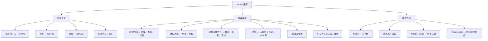
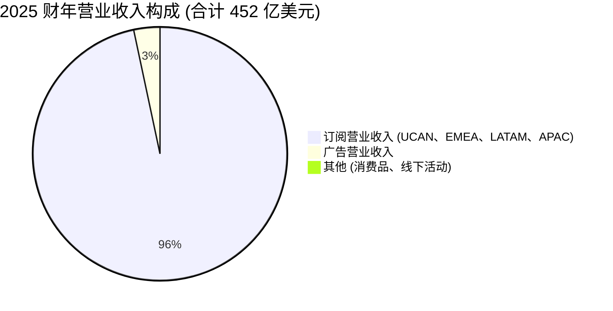

# Netflix, Inc. (NASDAQ:NFLX) — 公司研究报告

**截至日期: 2026-05-20**
**上市地: NASDAQ:NFLX (普通股; 1 拆 10 已于 2025-11-17 生效)**
**总部: 美国加利福尼亚州洛斯加托斯 (Los Gatos, California)**
**审计师: 安永会计师事务所 (Ernst & Young LLP)**
**报告语言: 简体中文 (英文版同时存在于本目录)**

> **业绩更新——2026 财年指引启动; 终止收购 WBD (2026-02-26):** 2026 年 1 月 20 日, Netflix 启动 2026 财年指引——**营业收入 507–517 亿美元 (同比 +12–14%)、营业利润率 31.5%**, 并预计广告收入相对 2025 年的 15 亿美元基数将再翻一倍 ([Q4'25 致股东信, 2026-01-20](https://www.sec.gov/Archives/edgar/data/0001065280/000106528026000033/ex991_q425.htm))。2026 年 2 月 26 日, Netflix 放弃了对华纳兄弟探索 (Warner Bros. Discovery, WBD) 流媒体与影视业务尚在进行中的 720 亿美元股权对价 / 827 亿美元企业价值收购——拒绝继续抬高出价以盖过 Paramount Skydance 的 31 美元/股反向报价; Netflix 随后在 2026 年 Q1 业绩中确认了**28 亿美元的 WBD 终止补偿**, 推动 Q1 EPS 达到 1.23 美元, 大幅超出 0.76 美元的市场一致预期 ([CNBC, 2026-02-26](https://www.cnbc.com/2026/02/26/warner-bros-discovery-paramount-skydance-deal-superior-netflix.html); [Q1'26 业绩公告](https://www.sec.gov/Archives/edgar/data/1065280/000106528026000137/ex991_q126.htm))。

---

## 目录

1. 公司概览
2. 公司历史
3. 管理团队
4. 产品与服务
5. 客户与上市策略
6. 行业概览
7. 竞争格局
8. 市场机会 (TAM)
9. 风险评估
   参考资料

---

## 1. 公司概览

Netflix, Inc. 是全球最大的纯订阅式视频点播 (subscription video-on-demand, SVOD) 公司。公司自我定位为"全球领先的娱乐服务之一, 提供跨多种类型与语言的电视剧集、电影、游戏及现场直播节目" ([Netflix 2025 10-K, Item 1](https://www.sec.gov/Archives/edgar/data/0001065280/000106528026000034/nflx-20251231.htm))。订阅用户 (subscriber/member) 按月支付固定费用——从新兴市场最低档相当于 1 美元的方案, 到美国顶配 4K 套餐 37 美元——即可在联网设备上无限制点播观看, 也可选择 2022 年 11 月推出的低价**广告支持套餐 (ad-supported tier)** ([Netflix 2025 10-K, MD&A](https://www.sec.gov/Archives/edgar/data/0001065280/000106528026000034/nflx-20251231.htm))。

**盈利模式。** Netflix 作为单一经营分部 (single operating segment) 披露财务数据。月度会员费 (monthly membership fees) 仍是远占主导的收入线; 广告、消费品、线下体验与其他周边业务**单项金额上"不构成营业收入的重大组成部分"**, 不过管理层首次单独披露 2025 年广告收入超过 **15 亿美元** ([Q4'25 致股东信, 2026-01-20](https://www.sec.gov/Archives/edgar/data/0001065280/000106528026000033/ex991_q425.htm))。2025 财年合计营业收入 **451.8 亿美元**, 同比增长 16% (汇率中性 +17%); 营业利润 **133.3 亿美元** (营业利润率 29.5%)、净利润 **109.8 亿美元**、自由现金流 (free cash flow, FCF) **94.6 亿美元** (同比 +37%) ([Netflix 2025 10-K, MD&A](https://www.sec.gov/Archives/edgar/data/0001065280/000106528026000034/nflx-20251231.htm))。公司在 2025 年 Q4 期间突破 **3.25 亿付费会员** (paid memberships), 同步正式停止披露订阅用户数, 改以营业收入与营业利润率作为主要 KPI ([Q4'25 致股东信, 2026-01-20](https://www.sec.gov/Archives/edgar/data/0001065280/000106528026000033/ex991_q425.htm); [Hollywood Reporter, 2026-01-20](https://www.hollywoodreporter.com/tv/tv-news/netflix-q4-2025-earnings-results-passes-325-million-subs-1236478604/))。

**业务地域。** Netflix 在全球几乎所有国家可用, 除中国大陆、俄罗斯、朝鲜、克里米亚与少数受制裁地区之外。2025 财年披露的四大区域分别为: 美加 (UCAN) 营业收入 **199.6 亿美元 (+15%)**、欧洲中东非洲 (EMEA) **145.1 亿美元 (+17%)**、拉美 (LATAM) **53.6 亿美元 (+11%)**、亚太 (APAC) **53.5 亿美元 (+21%)** ([Netflix 2025 10-K, MD&A](https://www.sec.gov/Archives/edgar/data/0001065280/000106528026000034/nflx-20251231.htm))。美加现占营业收入的 44%——Netflix 已成为名副其实的国际化公司, EMEA 与 APAC 合计 (199 亿美元) 已接近美加基本盘。公司拥有**约 16,000 名全职员工** (美加 68%、EMEA 16%、APAC 12%、LATAM 4%) 以及波动性的影视制作劳动力 ([Netflix 2025 10-K, Human Capital](https://www.sec.gov/Archives/edgar/data/0001065280/000106528026000034/nflx-20251231.htm))。

**内容投入规模。** Netflix 将大部分内容支出资本化, 并按预期观看效益形态摊销。10-K 显示 **2025 财年内容摊销 (content amortization) 为 164.4 亿美元**, 高于 2024 财年的 153.2 亿美元、2023 财年的 142.0 亿美元; 现金内容支出 ("增加内容资产", additions to content assets) 同样落在 150–170 亿美元区间 ([Netflix 2025 10-K, 内容活动表](https://www.sec.gov/Archives/edgar/data/0001065280/000106528026000034/nflx-20251231.htm))。关键在于, 内容摊销总增速现已明显低于营业收入增速 (2025 财年营业收入 +16% vs. 内容摊销 +约 7%)——这是利润率扩张背后的机械引擎。


*来源: [Netflix 10-K 申报, 2021–2025 财年](https://www.sec.gov/cgi-bin/browse-edgar?action=getcompany&CIK=0001065280&type=10-K&dateb=&owner=include&count=40)。*


*来源: [Netflix 10-K 申报, 2021–2025 财年——内容活动表与现金流量表](https://www.sec.gov/cgi-bin/browse-edgar?action=getcompany&CIK=0001065280&type=10-K&dateb=&owner=include&count=40)。*

### 估值快照

**股价与倍数 (截至 2026 年 5 月中, 1 拆 10 后):**
- 股价: **89.33 美元** (拆股调整后)
- 市值: **约 3,760 亿美元** ([CompaniesMarketCap / Public.com 数据, 2026 年 5 月](https://public.com/stocks/nflx/market-cap))
- TTM 市盈率 (P/E): **约 28–41 倍**, 取决于是否将 28 亿美元 WBD 终止补偿剔除——27–28 倍口径将其作为一次性项目剔除, 40 倍为 GAAP TTM 口径。Macrotrends 与 Fullratio 当前显示 TTM 约 28 倍, GuruFocus 28.07 倍, FullRatio 直接 GAAP 筛选为 40.76 倍 ([Macrotrends NFLX P/E](https://www.macrotrends.net/stocks/charts/NFLX/netflix/pe-ratio); [GuruFocus](https://www.gurufocus.com/term/pe-ratio/NFLX))。
- TTM 市销率 (P/S): **约 8.3 倍** (市值 3,760 亿 / TTM 营业收入 452 亿美元)——参见下文同业比较图。
- 3 年 P/E 区间: Netflix 已从 2024 年中 TTM P/E 峰值 >50 倍压缩至今天的 28–40 倍, 反映了从"重估值上的增长"到"成熟利润率下的增长"叙事的切换 ([Public.com NFLX 历史 P/E](https://public.com/stocks/nflx/pe-ratio))。
- 前瞻 2026 年倍数: 按管理层 507–517 亿美元营业收入及 31.5% 营业利润率指引, **2026 年 EPS 前瞻 P/E 约 24 倍**。

**同业比较 (TTM, 2026 年 5 月):**

| 公司 | 市值 | TTM P/E | TTM P/S |
|---|---|---|---|
| Netflix (NFLX) | 约 3,760 亿美元 | 约 28–41 倍 | 约 8.3 倍 |
| 华特迪士尼 (Walt Disney, DIS) | 1,875 亿美元 | 17.3 倍 | 1.9 倍 |
| 华纳兄弟探索 (Warner Bros. Discovery, WBD) | 681 亿美元 | 约 94 倍 | 约 1.7 倍 |
| Paramount Skydance (PSKY) | 123 亿美元 | 负 | 0.43 倍 |
| Spotify (SPOT) | (代理) | 约 67 倍 | 约 6 倍 |

来源: [Macrotrends Disney P/E](https://www.macrotrends.net/stocks/charts/DIS/disney/pe-ratio)、[Macrotrends WBD 市值](https://www.macrotrends.net/stocks/charts/WBD/warner-bros-discovery/market-cap)、[Simply Wall St PSKY](https://simplywall.st/stocks/us/media/nasdaq-psky/paramount-skydance)。

**倍数解读。** Netflix 约 8 倍销售额、28–40 倍盈利的估值大约是传统媒体同业中位数 (Disney P/S 1.9 倍、WBD P/S 1.7 倍、PSKY P/S 0.43 倍) 的 4 倍。这并非"叙事性"溢价, 而是由真实的基本面落差支撑: Netflix 是唯一一家具备结构性盈利、规模化、增长中的订阅业务的主流流媒体纯玩家。2025 财年 29.5% 的营业利润率 (2026 财年指引 31.5%) 大约是传统同业流媒体分部利润率的两倍 (Disney DTC 营业利润率直到 2024 年末才稳定转正; WBD 的 DTC 分部在盈亏平衡线附近摆动)。市场为以下因素付费: (a) 在 450 亿美元规模上仍能延伸至 2026 年的可持续两位数营业收入增长; (b) 仍在进行中的利润率扩张 (在 500 亿美元以上营业收入基数上, 每 100 个基点利润率约相当于 5 亿美元增量营业利润); (c) 快速涌现的广告业务——2025 年翻一番至 15 亿美元, 指引 2026 年再翻一番 ([Q4'25 致股东信](https://www.sec.gov/Archives/edgar/data/0001065280/000106528026000033/ex991_q425.htm))。溢价合理但并不慷慨——若营业收入增速跌破 10% 或广告收入停滞, 倍数仍有显著下行空间 (见第 9 章)。这**并非**伸展到需要在第 9 章单设"估值压缩"风险的程度; 真正更重要的风险是回到 2018–2021 年那种压制利润率的重投内容周期 (同样在第 9 章讨论)。


*来源: Yahoo Finance / [Macrotrends](https://www.macrotrends.net/stocks/charts/NFLX/netflix/pe-ratio) / [Public.com](https://public.com/stocks/nflx/market-cap), 2026 年 5 月快照。*

---

## 2. 公司历史

Netflix 于 **1997 年 8 月 29 日**在美国加利福尼亚州斯科茨谷 (Scotts Valley) 由**里德·哈斯廷斯 (Reed Hastings)** 与**马克·伦道夫 (Marc Randolph)** 共同创立。"公司因哈斯廷斯被 Blockbuster 收取 40 美元《阿波罗 13 号》滞纳金而创办"的传说部分是哈斯廷斯本人的复述, 部分属于杜撰——伦道夫在其回忆录《这绝不会成功》(*That Will Never Work*) 中描述的是一个更渐进的起源: 仿照亚马逊在线书店模式的"邮寄电影"订阅服务提案 ([Wikipedia, Netflix 历史](https://en.wikipedia.org/wiki/Netflix,_Inc.))。DVD 邮寄业务在 1998 年启动。马克·伦道夫于 2003 年退出运营岗位; 由哈斯廷斯接任总裁, 自此整合领导权, 并在此后二十年中持续担任 CEO ([Make Use Of, Netflix 历史](https://www.makeuseof.com/how-when-netflix-start-brief-company-history/))。

Netflix 于 **2002 年 5 月**在 NASDAQ 上市, 发行价 15 美元/股 (拆股前), 募集 8,210 万美元, 估值 3.097 亿美元, 彼时美国会员约 60 万 ([Make Use Of, Netflix 历史](https://www.makeuseof.com/how-when-netflix-start-brief-company-history/))。决定性的战略转型——从盈利的 DVD 邮寄业务转向流媒体——始于 **2007 年 1 月 16 日**, 公司推出 "Watch Now" 服务, 初期免费搭载于 DVD 订阅之上, 仅支持运行 Internet Explorer 的 PC。


*来源: [Netflix 投资者关系——历史](https://ir.netflix.net/financials/sec-filings/default.aspx)、[Wikipedia](https://en.wikipedia.org/wiki/Netflix,_Inc.)。*

**三段战略性转型定义了现代 Netflix。**

*第一, 流媒体转型本身 (2007–2013)。* 哈斯廷斯在内部反复强调, DVD 业务是为最终流媒体转型提供现金流的"奶牛", Netflix 必须在竞争对手之前自我蚕食。2011 年笨拙执行的 "Qwikster" 计划——试图把 DVD 业务拆分为独立品牌、独立网站、独立定价——单季流失约 80 万订阅用户, 股价被腰斩约 75%; 但哈斯廷斯在 23 天内撤回了该决定, 战略方向得以保留 ([Wikipedia, Netflix](https://en.wikipedia.org/wiki/Netflix,_Inc.))。

*第二, 原创内容 (original content) 转型 (2013–2018)。* 2013 年 2 月的《纸牌屋》是公司的首部原创剧集, 也是首部非传统广播渠道首播即获得艾美奖重要提名的剧。到 2018 年, Netflix 的内容片库已由原创内容主导, 公司每年签发的制片预算已超过任何一家好莱坞单一制片厂。

*第三, "盈利下增长 (growth-at-a-profit)"转型 (2022–2025)。* 2022 年股价崩盘 (NFLX 从拆股前 700 美元跌至 170 美元以下, 付费会员增长十多年来首次转负) 迫使公司在彼时正过渡到联席 CEO 架构的框架下进行战略重置。三项杠杆按顺序拉下: 付费共享强制执行 (跨家庭密码共享整顿, 始于 2023 年初)、广告支持套餐 (2022 年 11 月推出, 微软为广告技术合作方), 以及对内容支出增速相对于营业收入增速的实质性收紧。重置奏效: 营业利润率从 17.8% (2022) → 20.6% (2023) → 26.7% (2024) → 29.5% (2025), 营业收入增速从 6.5% (2022) → 6.7% (2023) → 15.7% (2024) → 15.9% (2025) 再加速 ([Netflix 10-K](https://www.sec.gov/cgi-bin/browse-edgar?action=getcompany&CIK=0001065280&type=10-K&dateb=&owner=include&count=40))。


*来源: [Netflix Q4'25 致股东信](https://www.sec.gov/Archives/edgar/data/0001065280/000106528026000033/ex991_q425.htm)、[Q1'26 公告](https://www.sec.gov/Archives/edgar/data/1065280/000106528026000137/ex991_q126.htm); Q4'25 营业利润率被年末重组提升; Q1'26 EPS 因 28 亿美元 WBD 终止补偿而失真上扬。*

**主要并购案**按美国大盘股标准均属温和量级: Millarworld (2017 年, 漫画 IP, 用于改编原创); Animal Logic (2022 年, 澳大利亚动画工作室, 用于《克劳斯: 圣诞节的秘密》(*Klaus*) 及原创动画管线); Night School Studio (2021 年, 视频游戏); Boss Fight Entertainment、Next Games、Spry Fox (2021–2022 年, 用于 Netflix Games 倡议的手游工作室); Scanline VFX (2022 年)。大多数都是温和的"买工作室"小额交易——金额自数千万至数亿美元不等——直到 2025 年 12 月**拟议中的 WBD 收购**之前, 没有一桩对合并 P&L 形成实质影响; 该收购原定 720 亿美元股权对价 / 827 亿美元 EV, 本将成为本十年最大的美国媒体交易。WBD 交易在 2026 年 2 月被终止, Netflix 不愿继续抬价超过 Paramount Skydance 的 31 美元/股反向报价 (Netflix 报价为 27.75 美元/股现金) ([Variety, 2026-02-26](https://variety.com/2026/film/news/paramount-warner-bros-deal-explained-netflix-ellison-1236674841/))。

**近期动态 (过去 12 个月)。** 除 WBD 事件外, 三件事主导近期议程: (1) 2025 年 11 月 17 日生效的**1 拆 10 拆股** (登记日 11 月 10 日, 发放日 11 月 14 日)——主要被框定为让员工股权奖励在行权价层面更易获得 ([Netflix 8-K, 2025-10-30](https://www.sec.gov/Archives/edgar/data/0001065280/000106528025000407/ex991_q425stocksplit.htm)); (2) Spencer Neumann 宣布将转任高级顾问, Greg Peters 接管临时 CFO 职责 (依据 Q3'25 披露); (3) 从 2025 年 Q1 起停止订阅用户数披露的去优先化, 正式确立营业收入与营业利润率为两大北极星指标。

---

## 3. 管理团队

Netflix 实行 **联席 CEO (co-CEO)** 架构, 于 2023 年 1 月正式化, 彼时长期 CEO 里德·哈斯廷斯退居执行董事长, 将 Ted Sarandos (此前为首席内容官, 2020 年 7 月起升任联席 CEO) 与 Greg Peters (此前为 COO) 共同提拔至 CEO 职位。在美国大盘股中, Netflix 是少数仍以真正的"双头 CEO"模式持续运作的公司。

### Ted Sarandos——联席 CEO (2020 年 7 月起任联席 CEO; 2023 年 1 月起任双 CEO)

Ted Sarandos, 61 岁, 是现代 Netflix 乃至现代好莱坞最具影响力的单一高管。他于 2000 年以首席内容官身份加入彼时仅有 60 万订阅用户的 DVD 邮寄业务期 Netflix——这意味着他实际上是公司 26 年的元老, 任期超过流媒体业务本身。Sarandos 在加入 Netflix 之前的职业生涯在影像分销领域: 他曾任 Video City / West Coast Video 的产品与采购副总裁, 在零售层面与各大制片厂建立深厚关系, 这些关系后来在为 Netflix 流媒体谈判首批大型内容授权时被充分发挥 (例如 2008 年的 Starz 协议)。

他最具影响力的单一决策是 2011 年在未看试播片的情况下批准 1 亿美元的两季《纸牌屋》订单——决策依据是 Netflix 数据显示凯文·史派西、大卫·芬奇与政治剧之间观众重叠度极高。这一押注奠定了今天 Netflix 的原创内容战略, 也使 Sarandos 成为公司在创意社区中最显眼的公开面孔。2020 年 7 月他被提升为与哈斯廷斯并列的联席 CEO, 2023 年 1 月与 Peters 一同正式成为双 CEO, 同时哈斯廷斯转任执行董事长 ([Netflix 2025 DEF 14A](https://www.sec.gov/Archives/edgar/data/0001065280/000119312525084425/d867701ddef14a.htm))。

Sarandos 担任数家非营利组织 (洛杉矶郡艺术博物馆 LACMA、Film Independent) 的董事, 并经常公开为 Netflix 的内容立场辩护 (2021 年 Dave Chappelle 争议尤为显著)。他**2025 财年总薪酬为 5,390 万美元** (基本工资 300 万美元、股票奖励 4,140 万美元、绩效现金 700 万美元+、其他 250 万美元), 较 2024 财年的 6,200 万美元有所下降——管理层将下降归因于股票授予估值降低与更紧凑的薪酬基准化 ([Variety, 2026-04](https://variety.com/2026/tv/news/netflix-ceo-salary-ted-sarandos-greg-peters-1236724061/); [Netflix DEF 14A 2025](https://www.sec.gov/Archives/edgar/data/0001065280/000119312525084425/d867701ddef14a.htm))。根据 2025 年代理材料, Sarandos 拆股后约持有 75 万股。

### Greg Peters——联席 CEO (2023 年 1 月起)

Greg Peters, 54 岁, 于 2008 年加入 Netflix, 历任国际产品相关岗位 (2015 年任首席产品官 CPO, 2020 年任 COO)。Sarandos 主管内容, Peters 则掌管产品、技术、广告、合作伙伴、游戏以及公司运营/商业层面。Peters 出身工程与产品 (斯坦福本科、之前任职 Macromedia/Adobe); 在 Netflix 内部, 他被誉为国际化扩张策略的主导者 (2016 年"开关一拉"在 130 个国家同时启用服务), 而最关键的, 是 **2022 年 11 月广告支持套餐**的架构与发布——自流媒体转型以来最大的商业决策。

Peters 还领导了**付费共享倡议** (2023 年起整顿多家庭密码共享, 管理层将 2023–2024 年订阅用户增长的相当部分归功于此)、内部广告销售组织的建立 (2025 年以 Netflix 自主广告堆栈替换微软作为后端广告技术)、游戏与现场直播节目计划。在 WBD 交易谈判中, 他以并购后整合规划的运营主理人身份参与。**2025 财年总薪酬为 5,320 万美元**, 与 Sarandos 结构相同 ([Hollywood Reporter, 2026-04](https://www.hollywoodreporter.com/business/business-news/netflix-ceos-ted-sarandos-greg-peters-pay-packages-drop-1236567040/))。

### Spencer Neumann——CFO (2019 年 1 月起; 2025 年开始过渡)

Spencer Neumann, 56 岁, 于 2019 年 1 月从动视暴雪 (Activision Blizzard, 同样任 CFO) 与更早的 Disney/ABC 加入 Netflix 任 CFO。他主导公司穿越了流媒体战峰值资本开支期 (2019–2022)、2022 年股价崩盘、营业利润率修复, 以及 WBD 收购报价的谈判阶段——他在 Q4'25 电话会上公开将"决定退出"描述为"在数学不成立时坚持正确的财务纪律"。2025 年末披露 (Q3'25 10-Q 与 2025-06-24 8-K) 提示了过渡安排: Neumann 转任顾问角色, 公司正在寻找继任者。期间, Greg Peters 接管了扩大的 CFO 监管职责 ([Netflix 10-Q Q3 2025](https://www.sec.gov/Archives/edgar/data/0001065280/000106528025000406/nflx-20250930.htm); [Netflix 8-K, 2025-06-24](https://www.sec.gov/Archives/edgar/data/0001065280/000106528025000287/ex991_bodappointment.htm))。

### Reed Hastings——执行董事长、联合创始人

Reed Hastings, 65 岁, 自 2023 年 1 月卸任 CEO 后, 仍任执行董事长。Hastings 是 Netflix 文化的缔造者 (著名的"Netflix 文化备忘录", 2024 年更新)、流媒体转型推动者, 以及长期人才与内容投资哲学的奠基人。他仍是公司主要股东、捐赠人 (尤其在教育公益领域), 也是公司长期战略立场的公开代言人, 但日常运营权威已牢固地交予 Sarandos / Peters 团队。

### 公司治理

依据 2025 年代理文件, Netflix 董事会由 11 名董事组成, 多数为独立董事。董事长: Reed Hastings (非独立——联合创始人)。首席独立董事 (Lead Independent Director): Bradford Smith (微软总裁)。其他董事包括 Ann Mather (前皮克斯 CFO; 审计委员会主席; 在 Alphabet / Glassdoor 任高级董事会职务)、Susan Rice (前美国驻联合国大使及国家安全顾问)、Strive Masiyiwa (Econet 创始人, 主聚焦非洲)、Mathias Döpfner (Axel Springer 集团 CEO)、Leslie Kilgore (前 Netflix CMO)、Jay Hoag、Tim Haley 等 ([Netflix DEF 14A 2025](https://www.sec.gov/Archives/edgar/data/0001065280/000119312525084425/d867701ddef14a.htm))。按创始人主导公司标准, 内部人持股比例适中 (Hastings 拆股后持股约 1%), 但具运营科技深度经验的董事会构成 (相对于职业董事的应付式拼盘) 强化了"创始人友好"的公司文化。薪酬结构高度偏向股权且与股价表绩挂钩; 无定额收益养老金 (defined-benefit pension); 无过度现金奖金。薪酬投票偶尔录得双位数反对率 (尤其在 2021 年与 2023 年, 反对方主要针对高管薪酬规模), 但从未被否决。

### 业绩记录综合

这是美国媒体业最经过运营验证的管理团队之一。Sarandos / Peters 搭档实现了在 300 亿美元营业收入基数上同时加速营业收入增长与扩张利润率这一罕见的"双杀"; 来自 Hastings 的文化延续是真实而可见的。最合理的批评是薪酬规模, 以及 2025 年末针对 WBD 的战略冒险——即便最终选择退出, 也让人对资本配置纪律产生了疑问, 团队在 2026 年很可能需要重新阐释 (尤其在 CFO 继任者搜寻期间)。

---

## 4. 产品与服务

Netflix 的产品本质上就是一项服务——Netflix 流媒体订阅, 但 SKU 结构、内容片库以及周边产品都由此分支延展。系统性走读 [netflix.com](https://www.netflix.com)、[about.netflix.com](https://about.netflix.com)、[help.netflix.com](https://help.netflix.com/en/node/24926) (套餐页) 与公司的 Tudum 中心后, 可归纳如下。

### 4.1 订阅套餐 (美国定价, 2026 年 5 月)

| 套餐 | 美国价格 | 并发流数 (concurrent) | 视频画质 | 含广告? | 离线下载 |
|---|---|---|---|---|---|
| **标准含广告 (Standard with Ads)** | $7.99/月 | 2 | 1080p Full HD | 是 (约 4 分钟/小时) | 是 |
| **标准 (Standard)** | $17.99/月 | 2 | 1080p Full HD | 否 | 2 台设备 |
| **高级 (Premium)** | $24.99/月 | 4 | 4K UHD + HDR + 空间音频 | 否 | 6 台设备 |
| **附加会员 (Extra Member 子账户)** | $7.99/月 | 按会员 | 与套餐匹配 | 按套餐 | 按套餐 |

国际定价差异较大——Netflix 自身文件提到, 各国不同套餐价格区间在**1 美元到 37 美元/月**之间, "附加会员"子账户在全球区间为 2–9 美元 ([Netflix 2025 10-K, MD&A——营业收入](https://www.sec.gov/Archives/edgar/data/0001065280/000106528026000034/nflx-20251231.htm))。Mobile 套餐 (在部分新兴市场为 2–4 美元) 在成熟市场已不再提供, 2024 年中已在美国 / 英国停售。

**订阅套餐定价的竞争优势判定: 是——规模护城河 + 内容护城河。** 护城河类型: (a) 规模经济——每增量会员的内容成本几乎为零; (b) 全球内容摊销基础——一部预算 50 亿韩元的韩剧将摊销到全球 3.25 亿+ 家庭; (c) 任何单一类型或单一语言竞争者都无法匹配的片库广度。最接近的竞争产品: **Disney+** (在美国与 Hulu 捆绑, 无广告 16.99 美元/月、含广告 10.99 美元/月)——观众群更窄但家庭/系列 IP 优势更强; Netflix 在片库 / 人群覆盖更广, Disney 在 Top 20 IP 系列经济性更强。Netflix 在每小时观看价格与地理规模上领先; Disney 在头部 20 部内容的 IP 强度上与之持平。


*来源: 公司网站走读, [netflix.com](https://www.netflix.com)、[about.netflix.com](https://about.netflix.com); [Netflix 2025 10-K, Item 1](https://www.sec.gov/Archives/edgar/data/0001065280/000106528026000034/nflx-20251231.htm)。*

### 4.2 内容组合

**原创内容 (旗舰)。** 这是护城河所在。Q4'25 致股东信亮点包括《怪奇物语》(*Stranger Things*) 最终季 (1.2 亿次观看)、《弗兰肯斯坦》(*Frankenstein*) (1.02 亿)、《没人想这样》第二季 (*Nobody Wants This S2*) (3,100 万)、《野兽在我心》(*The Beast in Me*) (4,800 万)、《艾米丽在巴黎》第 5 季 (*Emily in Paris S5*) (4,100 万)、《利刃出鞘: 死人复活》(*Knives Out: Wake Up Dead Man*) (6,600 万)、《一栋炸药屋》(*A House of Dynamite*) (7,800 万) 等, 整体展示了跨类型与出品国的广度 ([Q4'25 致股东信](https://www.sec.gov/Archives/edgar/data/0001065280/000106528026000033/ex991_q425.htm))。韩国内容 (《鱿鱼游戏》(*Squid Game*)、《黑白大厨》(*Culinary Class Wars*))、日本动漫 (《终末的女武神》(*Record of Ragnarok*))、德国惊悚 (*Babo*)、巴西电影 (*Caramelo*)——Netflix 在约 20 个国家建立了本土语言制作中心, 这些制作在平台上全球流转。**竞争优势判定: 是——内容护城河叠加数据驱动的立项流程。** 最接近的竞争对手: **亚马逊 Prime Video** 原创片库; 亚马逊在个别项目的单部预算更高 (《指环王: 力量之戒》(*Lord of the Rings: Rings of Power*)), 但在数量与单国语言深度上无法与 Netflix 抗衡。

**授权片库。** 由经典电影与二轮播出电视剧组成。授权内容片库的**重要性正在下降**, 原创内容已主导观看时长——Q4'25 致股东信指出, 整体使用时长增长被"非品牌观看时长的同比下降部分抵消……这主要反映了在 2023–2024 年因 WGA 罢工导致的高授权期之后, 大多数地区授权的二轮内容数量减少" ([Q4'25 致股东信](https://www.sec.gov/Archives/edgar/data/0001065280/000106528026000033/ex991_q425.htm))。

**现场直播节目。** Netflix 谨慎地拓展现场直播: Jake Paul vs. Mike Tyson 拳赛 (2024 年 11 月)、圣诞节 NFL 比赛 (2024、2025 年)、WWE Raw 周播协议 (10 年 50 亿美元, 自 2025 年起), 以及如今的 **2026 年世界棒球经典赛 (World Baseball Classic, WBC) 在日本** (Q4'25 致股东信预告, Q1'26 致股东信记载该赛事在日本本土录得 3,140 万观看人次, 创下 Netflix 在日本任何单一作品的最高记录) ([Q1'26 致股东信](https://www.sec.gov/Archives/edgar/data/1065280/000106528026000137/ex991_q126.htm))。**竞争优势判定: 部分——叙事性护城河但存在竞争。** 现场体育版权通过竞标采购; Netflix 的优势在愿意出价与全球覆盖, 而非排他性。最接近的竞争对手: 亚马逊 Prime Video (Thursday Night Football、自 2025-26 赛季起的 NBA); 亚马逊在愿意为现场体育付费上与之持平。

**游戏。** Netflix Games 于 2021 年 11 月推出。今天 100+ 款手游随订阅免费包含, 战略性转向**云优先游戏** (Q4'25 致股东信: "扩大我们的云优先游戏战略")。值得一提的发布: GTA 三部曲 (手机平台内独家)、《鱿鱼游戏》主题游戏。**竞争优势判定: 否, 暂无——探索阶段。** 最接近的竞争对手: Apple Arcade (单独 6.99 美元/月); 苹果在精选独立游戏质量上领先。Netflix 把游戏作为参与度驱动器与流失抑制器, 而不是利润中心。

**脱口秀专场、纪录片、真人秀、视频播客。** Q4'25 致股东信提到 2,000 万美元+ 规模的 Dave Chappelle 专场、Kevin Hart、Tom Segura、Matt Rife, 以及向视频播客的迁移——后者是 2026 年的新动作, 试探 Netflix 能否在电视屏端俘获 YouTube 形态的消费。**竞争优势判定: 部分。** 最接近的竞争对手: YouTube (主导播客视频) 与 HBO / Showtime (高端专场)。视频播客的切入更多是针对 YouTube 在电视屏端不断增长份额的防御性动作。

### 4.3 广告平台

Netflix 的广告业务现在已是其增速最快的收入线。**2025 年广告收入超过 15 亿美元 (同比 +2.5 倍)**, 管理层指引 2026 年广告收入**约再翻一倍 (约 30 亿美元 run-rate)** ([Q4'25 致股东信](https://www.sec.gov/Archives/edgar/data/0001065280/000106528026000033/ex991_q425.htm))。广告支持套餐承载月活观众 (Monthly Active Viewers, MAV) 约 **1.9 亿** (家庭数 × 人均人数 × 月度看广告 ≥ 1 分钟), 该套餐在已提供的市场中已占新签约的约 40% ([ALM Corp, Netflix 广告收入 2026](https://almcorp.com/blog/netflix-ad-revenue-3-billion-2026-advertising-strategy/))。Netflix 自有广告技术在 2025 年取代了微软 Xandr; Q1 2026 广告主数量同比 +70% 至 4,000+ 个客户 ([Q1'26 致股东信](https://www.sec.gov/Archives/edgar/data/1065280/000106528026000137/ex991_q126.htm))。**竞争优势判定: 是——新兴。** Netflix 拥有 CTV (Connected TV, 联网电视) 广告中最稀缺的资产: 规模化、高端、品牌安全、且登录态的受众。最接近的竞争对手: YouTube 的 CTV 库存 (按时长更大但用户生成、品牌安全度较低)、Amazon Prime Video Ads (体量相近但 CPM 品牌结构较低)、Disney+ / Hulu (品质较高、但相比 Netflix 规模较小)。Netflix 当前在广告技术成熟度 (数据定向、衡量) 上仍落后, 但在库存品质上与对手持平。

### 4.4 消费品、Netflix House、周边

营业收入贡献有限, 但对品牌具有战略意义。*Netflix House*——线下粉丝体验场馆——将于 2025/2026 年在达拉斯与费城国王大道 (King of Prussia) 开业, 设有怪奇物语、鱿鱼游戏、布里奇顿主题装置。周边通过 Netflix Shop 销售。**竞争优势判定: 部分。** 最接近的竞争对手: 迪士尼乐园 / 周边 (远远领先)。Netflix 把这些作为粉丝粘性放大器, 而非 P&L 驱动力——且明确表态如此。

### 4.5 旗舰产品与近期发布 / 落日

**旗舰 (驱动业务的 1–3 个产品):** (1) **标准含广告**订阅套餐——同时是销量引擎与增量利润率最高的产品; (2) **原创内容片单**——《怪奇物语》《鱿鱼游戏》级别的标杆作品锚定品牌并驱动新会员获取; (3) **全球内容引擎**——跨国韩国 / 日本 / 西班牙 / 德国内容, 是结构上竞争对手难以匹敌的能力。

**过去 12 个月发布:** 广告技术重建与微软 Xandr 替换 (2025 年初); WWE Raw 周播现场 (2025 年 1 月); 2026 年 Q1 世界棒球经典赛日本版权; 云游戏扩张; 视频播客倡议 (宣布 2026 年推进)。

**过去 12 个月落日:** DVD 邮寄业务 (2023 年期间停止, 2024 与 2025 年无 DVD 收入) ([Netflix 2025 10-K](https://www.sec.gov/Archives/edgar/data/0001065280/000106528026000034/nflx-20251231.htm)); 美国 / 英国基础套餐 (Basic plan) 在 2024 年中退役; 大多数成熟市场的纯移动套餐 (Mobile-only) 退役; 原微软 Xandr 广告技术合作 (2025 年被自有技术堆栈替换)。

---

## 5. 客户与上市策略

### 5.1 客户画像

Netflix 的客户是全球各地的个人家庭。本质上没有企业级 / B2B 营业收入 (新涌现的广告业务是 B2B, 客户为品牌广告主与代理商, 但广告占营业收入仍 ~3%)。基础订阅数为截至 2025 年末**3.25 亿+ 付费会员**, 加上约 1 亿+ 通过付费共享变现的"附加会员"家庭 ([Q4'25 致股东信](https://www.sec.gov/Archives/edgar/data/0001065280/000106528026000033/ex991_q425.htm); [Hollywood Reporter, 2026-01-20](https://www.hollywoodreporter.com/tv/tv-news/netflix-q4-2025-earnings-results-passes-325-million-subs-1236478604/))。Q4'25 致股东信中, 管理层提到正在"为全球接近 10 亿人提供服务"——按家庭平均人数折算的统计口径。

**分部结构 (2025 财年流媒体营业收入):**

- UCAN (美加): 199.6 亿美元 (44.2%), 同比 +15%
- EMEA: 145.1 亿美元 (32.1%), 同比 +17% (绝对值新增最强)
- APAC: 53.5 亿美元 (11.9%), 同比 +21% (百分比增速最快)
- LATAM: 53.6 亿美元 (11.9%), 同比 +11%


*来源: [Netflix 2025 10-K, MD&A——按地区营业收入](https://www.sec.gov/Archives/edgar/data/0001065280/000106528026000034/nflx-20251231.htm)。*

### 5.2 客户集中度

这是美国股票研究中最罕见的情形: **Netflix 实际上没有客户集中度。** 最大单一家庭每月向 Netflix 支付不过约 30 美元——即约 0.0000001% 的营业收入。10-K 没有——也无须——披露任何 10%+ 的客户, 因为没有任何单一订阅用户或分销商接近该门槛。**Top-1 客户 < 0.001% 营业收入; Top-5 < 0.01%。**相对于几乎任何美国大盘股, 这都是结构性优势。

最接近"集中度"的, 是**分销合作伙伴集中度**, 包括电信运营商、MVPD (多频道视频节目分销商)、移动运营商与设备平台 (Apple、Google、Roku、Samsung 电视、美国的 Comcast / Charter 套餐、Verizon / T-Mobile 等电信合作伙伴, 以及印度的 Reliance Jio)。这些合作伙伴中不少替 Netflix 代向订阅用户收费并截留一定比例——Apple App Store 在 iOS 应用内注册上历来抽取 15%, 这也是 Netflix 长期推动用户走 Web 端注册的原因。10-K 在 Item 1 描述了这些合作协议, 并指出"部分合作伙伴与我们直接竞争或在竞争性流媒体内容提供方持有投资" ([Netflix 2025 10-K](https://www.sec.gov/Archives/edgar/data/0001065280/000106528026000034/nflx-20251231.htm))。无任何单一合作伙伴被披露为重大客户。

在 **B2B 广告侧**, 早期广告业务在大型代理商以及最大 CPG / 汽车 / 电信广告主上确实存在有意义的集中度——但随着 Q1'26 广告主数量同比 +70% 至 4,000+ ([Q1'26 致股东信](https://www.sec.gov/Archives/edgar/data/1065280/000106528026000137/ex991_q126.htm)), 这种集中度正在快速摊薄。10-K 未点名具体的广告客户。


*来源: [Q4'25 致股东信, 2026-01-20](https://www.sec.gov/Archives/edgar/data/0001065280/000106528026000033/ex991_q425.htm); [Netflix 2025 10-K](https://www.sec.gov/Archives/edgar/data/0001065280/000106528026000034/nflx-20251231.htm)。*

### 5.3 分销渠道与上市策略

Netflix **直接面向消费者通过 netflix.com 与移动应用销售**, 由三层叠加的分销渠道组成:

1. **直销 (D2C)**: 主导渠道。Web 端注册截取 100% 营业收入 (无应用商店抽成)。iOS 与 Android 移动应用注册经过应用商店计费, 或路由至 Web 端。
2. **捆绑渠道伙伴**: 美国的 Verizon、T-Mobile、Comcast、Charter; 印度的 Reliance Jio、Airtel、Vodafone; 英国的 Sky / Comcast; 法国的 Free; 韩国的 SK Telecom 等。Netflix 通常以移动 / 宽带捆绑形式出现, 由运营商按订阅用户向 Netflix 支付。
3. **设备平台**: Apple TV、Roku、Amazon Fire TV、Samsung 电视、LG 电视、PlayStation、Xbox——这些大多是无费分销, 设备预装 Netflix 应用。对低摩擦注册与使用至关重要。

**销售周期基本为零。** 注册在数分钟内完成; 通过信用卡或合作伙伴计费支付。客户获取成本 (Customer Acquisition Cost, CAC) 由内容投入主导 (例如《怪奇物语》的市场化效应) 以及付费营销 (2025 财年销售与营销开支 33.0 亿美元, 占营业收入约 7%)。

### 5.4 关键合作伙伴

- **微软 → 自有广告技术 (2022 → 2025 过渡)。** 微软是广告套餐推出时的原始广告技术合作方; Netflix 在 2025 年以自有广告技术替换。
- **WWE 10 年 50 亿美元 Raw 周播流媒体协议 (2024 → 2025 生效)。** 全球摔角直播。
- **NFL 圣诞节比赛 (2024、2025 年)。** 年度赛事; 续约条款未披露。
- **2026 年世界棒球经典赛日本版权。** 单次赛事, 但在日本贡献巨大 (Q1'26 录得 3,140 万观看)。
- **Reliance Jio (印度)、Verizon (美国)、T-Mobile (美国)、Sky (英国)、Free (法国)、SK Telecom (韩国)、Telefónica (西班牙 / 拉美)、Vodafone (德国)。** 主要电信捆绑。
- **硬件: Samsung、LG、Roku、Apple、Google。** 设备端集成及 Netflix Recommended TV 认证计划。

### 5.5 客户案例 (具名)

客户案例的概念对于一家 B2C 订阅公司并不太适用。可类比的是"观看案例"——Q4'25 与 Q1'26 致股东信描述单部作品表现 (例如《怪奇物语》最终季 1.2 亿观看、《弗兰肯斯坦》1.02 亿、世界棒球经典赛日本 3,140 万), 这是最接近企业案例披露的类比。Netflix 任何文件中均无具名客户中标披露。

---

## 6. 行业概览

### 6.1 行业定义

Netflix 处于较广义**在线视频 (online video)** 行业中的**订阅式视频点播 (subscription video-on-demand, SVOD)** 分部, 后者又属于全球**电视与视频**市场 (涵盖传统付费电视、广告支持视频、交易型 VOD 与免费空中广播)。NAICS 行业代码 519290 (网络搜索门户、图书馆、档案与其他信息服务); SIC 7812 (服务——电影与录像带制作)。

今天的相关行业框架是**流媒体娱乐** (streaming entertainment) 整体, 在其中, SVOD 纯玩家 (Netflix)、传统媒体衍生的捆绑 DTC 平台 (Disney+ / Hulu、Max、Paramount+)、免费广告支持流媒体 (Tubi、Pluto TV、Roku Channel) 以及主导的注意力竞争者——**用户生成内容平台** (YouTube、TikTok、Instagram Reels、Twitch)——展开竞争。

### 6.2 市场规模

- **全球在线电视 + 视频市场: 至 2030 年约 1 万亿美元**, 增长完全由在线视频驱动, 而传统付费电视市场基本持平 ([Omdia, 2025-10-16](https://omdia.tech.informa.com/pr/2025/oct/global-tv-and-video-market-to-reach-1-trillion-by-2030-as-online-video-surges))。
- **全球视频流媒体营业收入: 2025 年 2,146 亿美元**, CAGR 约 12.8% (Statista) ([Statista, 全球 SVoD 视频流媒体](https://www.statista.com/outlook/dmo/digital-media/video-on-demand/video-streaming-svod/worldwide))。
- **全球媒体流媒体市场: 2025 年 1,408 亿美元 → 2031 年 2,156 亿美元**, CAGR 约 7.4% ([Research and Markets, 2025](https://www.researchandmarkets.com/report/global-online-streaming-platform-market))。
- **SVOD 专属市场: 2025 年 986 亿美元 → 2035 年 9,997 亿美元**, 按更乐观预测 CAGR 约 23% ([Market Research Future, SVOD 报告](https://www.marketresearchfuture.com/reports/svod-market-43018))。(各预测机构之间预测范围极宽, 反映了完全不同的口径定义——CTV 广告营业收入、音乐流媒体、FAST 频道等。)


*来源: [Statista 全球 SVoD 视频流媒体](https://www.statista.com/outlook/dmo/digital-media/video-on-demand/video-streaming-svod/worldwide)、[Omdia, 2025-10-16](https://omdia.tech.informa.com/pr/2025/oct/global-tv-and-video-market-to-reach-1-trillion-by-2030-as-online-video-surges)。*

### 6.3 增长驱动因素

1. **美国与西欧的剪线 (cord-cutting)。** 美国付费电视家庭数从约 1 亿户 (2010 年) 跌至约 6,000 万户 (2024 年); 移位的电视广告与订阅美元正迁移到流媒体。Disney-Hulu 现已为剪线消费者捆绑; NBCUniversal 推出 Peacock; Paramount 推出 Paramount+; Max 取代了 HBO Max。各家都引用相同的长期顺风。
2. **国际宽带渗透率。** 智能手机在新兴市场基本普及; 宽带 (有线或移动) 是制约条件。渗透率增速最快的地区为拉美、印度、东南亚、撒哈拉以南非洲——正是 Netflix APAC 与 LATAM 同比增长的来源。
3. **广告支持流媒体 (AVOD / FAST)。** 美国 CTV 广告支出在 2024 年突破 300 亿美元, 年增 20%+, 广告主从线性电视迁移。Netflix 的广告套餐与 Amazon Prime Video Ads 是直接受益者; Roku、Tubi、Pluto 是 FAST 频道受益者。
4. **现场体育版权迁移。** 苹果、亚马逊、Netflix 均开始竞标现场体育版权, 加速了从广播 / 有线的迁移。NFL、NBA、MLB、WWE、F1 与全球足球版权将在 2025–2030 年陆续到期重新谈判。
5. **制作与个性化的生成式 AI 应用。** 制作成本降低 (视觉特效、配音 / 本土化), 推荐模型更佳。Netflix 在 10-K 前瞻性陈述中明确将 AI 称为战略赋能因素 ([Netflix 2025 10-K](https://www.sec.gov/Archives/edgar/data/0001065280/000106528026000034/nflx-20251231.htm))。

### 6.4 监管环境

流媒体在全球范围内监管日益加强。关键事项:

- **欧盟视听媒体服务指令 (AVMS Directive)**——成员国具体内容配额 (例如 30% 欧洲制作内容)、投资义务税费 (法国要求当地营业收入 20% 投入当地内容; 意大利类似), 以及多个成员国的税收征收。
- **印度**——依据《IT 法案 2021》的内容审查规则; 在内容删除要求上的紧张关系持续。
- **韩国**——网络中立 / 网络使用费纠纷; 韩国议员多次试图要求 Netflix 向 ISP 支付流量费。
- **巴西**——非所得税评估 (2025 财年 10 亿美元+"非所得税评估在巴西" 导致的"营业收入成本中其他成本增加"——具体见 [Netflix 2025 10-K, MD&A](https://www.sec.gov/Archives/edgar/data/0001065280/000106528026000034/nflx-20251231.htm))。
- **美国**——FTC 与 FCC 在名义上对一些流媒体相关问题具备管辖权, 但截至 2026 年, 联邦监管仍属轻触式。

10-K 监管部分指出: "我们看到部分国家正在更新文化扶持立法, 将类似 Netflix 的服务纳入其中。这包括投资义务、税费征收以及内容片库配额。一些国家甚至限制我们在服务及内容上的所有权范围" ([Netflix 2025 10-K](https://www.sec.gov/Archives/edgar/data/0001065280/000106528026000034/nflx-20251231.htm))。这是逐国逐年的慢节奏过程, 而非二元式风险。

### 6.5 行业动态

流媒体行业正处于**急剧整合**之中。五年前, 全球范围内有约 10 家资金充沛的 SVOD 竞争者; 今天具备每年 50 亿美元+ 内容投入规模的仅剩 4 家 (Netflix、Disney / Hulu、Amazon Prime Video、YouTube), 加上 3 家亚规模传统派 (Max、Paramount+、Peacock)。**Paramount Skydance-WBD 合并案** (2026 年 2 月公告, 预计 2026 年 9 月交割) 将把 Paramount+ 与 Max 合并为单一捆绑服务, 由埃利森家族控制——进一步缩减这一数量 ([Variety, 2026-02-27](https://variety.com/2026/film/news/paramount-warner-bros-deal-explained-netflix-ellison-1236674841/))。Netflix 自身追求 WBD 的努力, 正是试图在这样一个合并体出现之前锁定规模优势。

供应端 (制片厂、人才经纪、体育联盟) 随着内容愈发战略化, 议价能力上升。买方端 (消费者) 短期切换成本较高 (片库熟悉度、推荐训练、已下载作品), 但长期切换成本较低 (随时可取消)。替代品——YouTube / TikTok 的用户生成内容、游戏、社交媒体——仍是最被低估的竞争对手: 美国青少年现在每天在 TikTok 与 YouTube 上的时间已超过任何单一 SVOD ([Q4'25 致股东信](https://www.sec.gov/Archives/edgar/data/0001065280/000106528026000033/ex991_q425.htm) 提到要在这一整体竞争框架中"赢得真理时刻")。

---

## 7. 竞争格局

### 7.1 直接流媒体竞争者

```mermaid
quadrantChart
    title 流媒体服务——内容规模 vs. 盈利能力
    x-axis 低内容规模 --> 高内容规模
    y-axis 低盈利能力 --> 高盈利能力
    quadrant-1 规模领先, 盈利
    quadrant-2 小众盈利
    quadrant-3 亚规模
    quadrant-4 规模领先, 亏损
    Netflix: [0.92, 0.88]
    Disney+/Hulu: [0.78, 0.55]
    Amazon Prime Video: [0.75, 0.50]
    YouTube: [0.95, 0.80]
    Max (WBD): [0.55, 0.35]
    Paramount+: [0.45, 0.30]
    Peacock: [0.35, 0.25]
    Apple TV+: [0.30, 0.15]
    Spotify (音频): [0.40, 0.55]
```
*来源: 作者基于公司文件与行业报告的评估。*

**1. Disney+ / Hulu / ESPN 捆绑。** 2025 财年末 Disney+ 约 1.316 亿订阅用户; Hulu 约 5,200 万; ESPN+ 约 2,400 万。美国捆绑价 16.99 美元/月 (无广告) / 10.99 美元/月 (含广告) ([Statista, 2025](https://www.statista.com/statistics/1095372/disney-plus-number-of-subscribers-us/))。**差异化:** 家庭/系列 IP (漫威、星球大战、皮克斯、迪士尼动画), 顶级儿童内容, 通过 ESPN 提供体育, 通过 Hulu 提供网络电视。**弱点:** 国际深度欠佳; 分部最近转向盈利, 但利润率较 Netflix 仍薄; Hulu / Disney+ / ESPN 集成在运营上较复杂。**vs. Netflix:** Netflix 在规模、盈利能力、国际深度上领先; Disney 在头部 IP 系列经济性上领先。

**2. 亚马逊 Prime Video。** 第三方追踪显示 2025 年 Prime Video 付费订阅用户约 1.67 亿 ([Statista, Amazon Prime Video](https://www.statista.com/topics/4740/amazon-prime-video/)); Prime 会员 (打包 Prime Video) 全球 2.2 亿+。**差异化:** 与 Prime 会员经济性"免费"捆绑 (美国 Prime 14.99 美元/月, 通过运费补贴内容), 体育版权 (Thursday Night Football、自 2025-26 起的 NBA), 独家 IP 系列 (亚马逊-MGM 交易后的《指环王》、007 系列)。**弱点:** 订阅经济学被补贴——亚马逊不披露 Prime Video 独立盈利能力, 业界广泛假设在完全分摊基础上亏损; 2024 年广告套餐自动推送导致消费者反弹。**vs. Netflix:** 亚马逊在捆绑经济学与现场体育上领先; Netflix 在独立内容盈利能力、原创内容数量与深度上领先。

**3. YouTube (Alphabet)。** 被低估的巨人。YouTube 现已是美国 CTV 上按小时计第一名的流媒体服务, 2024 年根据 Nielsen Streaming Gauge 超越 Netflix。**差异化:** 无限 UGC 供应、免费观看广告模式、CTV 库存规模、在播客 (视频播客) 上的主导, 并在短视频上崭露头角。**弱点:** 非品牌安全; 不太适合长格式高端剧; YouTube TV (独立月费产品) 在捆绑层面与之竞争。**vs. Netflix:** YouTube 在美国小时观看与广告规模上领先; Netflix 在高端原创品质、品牌安全、单用户 LTV 上领先。

**4. 华纳兄弟探索 / HBO Max → Paramount Skydance 捆绑服务。** Max 2025 年末约 1.25 亿订阅用户; 与 Paramount+ 的拟议合并将形成在 PSKY 所有权下的约 2 亿订阅用户合并服务, 含电影制片厂 (华纳兄弟、Paramount)、有线电视 (Discovery、Showtime、CBS) 与体育 (TNT NBA、CBS NFL)。**差异化:** HBO 高端片库、华纳兄弟电影制片厂、NBA 版权、CBS 广播。**弱点:** 整合风险; 400 亿美元+ 的预估债务; PSKY TTM 营业利润率为负 ([Simply Wall St PSKY](https://simplywall.st/stocks/us/media/nasdaq-psky/paramount-skydance))。**vs. Netflix:** Netflix 在规模、盈利能力与执行上领先; PSKY-WBD 将在电影片库与现场体育上更强, 但它们能否完成整合本身就是悬而未决的问题。

**5. Apple TV+。** 订阅用户约 5,000 万。**差异化:** 高端原创 (《足球教练》(*Ted Lasso*)、《早间新闻》(*The Morning Show*)、《人生切割术》(*Severance*)), 与苹果硬件生态绑定。**弱点:** 片库小; 苹果不公开把 TV+ 作为利润驱动来定位。**vs. Netflix:** 苹果在单部高端品质上领先; Netflix 在几乎所有其他指标上领先一个数量级。

**6. Spotify。** 是音频不是视频, 但作为订阅消费媒体经济学的相关同业。月活 6.96 亿 / 付费订阅 2.76 亿。市销率约 6 倍。**vs. Netflix:** 内容类型不同, 但对于成熟规模 + 广告套餐流媒体的边际利润率长什么样, 是有启发的平行参考。

### 7.2 间接竞争者

- **TikTok / 字节跳动** ——争夺注意力时刻; 美国 MAU 约 1.7 亿。
- **Instagram Reels / Meta** ——与上述短视频注意力争夺。
- **Twitch / Kick** ——直播流媒体, 游戏相关。
- **Roblox / Fortnite / Steam / 视频游戏整体** ——Netflix 的 CEO 多次称《堡垒之夜》是"比 HBO 更大的竞争对手"。
- **体育联盟 D2C 应用** ——NBA League Pass、NFL Sunday Ticket (现通过 YouTube)、MLB.TV。

### 7.3 新兴竞争者

- **AI 生成内容平台** ——早期阶段, 但值得关注。如果有创业公司能够用 gen-AI 模型生成规模化、个性化、单位小时成本低的内容, 单位小时观看的成本数学就会改变。Netflix 在 10-K 前瞻性陈述中明确将 AI 同时标记为赋能者与竞争性颠覆者 ([Netflix 2025 10-K](https://www.sec.gov/Archives/edgar/data/0001065280/000106528026000034/nflx-20251231.htm))。
- **FAST 频道 (Tubi、Pluto TV、Roku Channel、Samsung TV+)** ——CTV 上免费广告支持的线性式流媒体; 广告营业收入年增 30%+。

### 7.4 Netflix 的竞争优势

1. **规模 + 盈利能力飞轮。** Netflix 是唯一在 450 亿美元营业收入上实现 29.5% 营业利润率的流媒体纯玩家。每一个其他竞争者要么更小, 要么更不盈利, 或两者皆是。
2. **全球内容引擎。** 约 20 个国家的本土语言制作能力, 内容跨境流转 (《鱿鱼游戏》、《纸钞屋》(*Money Heist*)、《亚森罗宾》(*Lupin*)、《暗黑》(*Dark*)、《心跳停止》(*Heartstopper*))——无任何竞争者建成可比的全球基础设施。
3. **推荐算法与数据。** 25 年+ 的观看数据、每季度约 100 亿小时的行为, 以及已投资超过十年的推荐引擎。
4. **品牌与"Netflix-and-chill"文化默认值。** Netflix 已成为"流媒体"的代名词; 这对口碑营销与试用转化非常重要。
5. **广告套餐库存领先**——高端、登录态、品牌安全的 CTV 库存, 规模达 1.9 亿 MAV, 配自有广告堆栈。
6. **Open Connect CDN。** Netflix 运营自有 CDN, 把硬件放置在 ISP 数据中心内; 单位流交付成本结构上低于使用 AWS / Cloudfront 加价的竞争对手。

### 7.5 Netflix 的弱点

1. **内容成本大体固定**——10-K 明确警示"如果我们没有按预期增长, 考虑到我们的内容成本大体上是固定的, 我们可能无法在增长率下降的同时相应调整支出或提升营业收入" ([Netflix 2025 10-K, 风险因素](https://www.sec.gov/Archives/edgar/data/0001065280/000106528026000034/nflx-20251231.htm))。
2. **没有现场体育版权护城河**——Netflix 在现场体育上以竞标方式参与, 但没有可比于 ESPN-NBA 或亚马逊-NFL 的旗舰长期权利协议。
3. **缺乏漫威 / 星球大战 / 007 级别的"必备" IP 系列。**原创内容很强但是有寿命的。
4. **YouTube 在电视屏小时上领先**——比其他 SVOD 都更大的竞争威胁。
5. **资本配置纪律问题**——WBD 报价提出了这个问题, 最终退出回答得不错, 但问题仍然萦绕。

---

## 8. 市场机会 (TAM)

### 8.1 TAM 测算

相关 TAM 比仅 SVOD 订阅营业收入更大:

- **全球 SVOD 订阅营业收入: 986 亿美元 (2025) → 约 2,150 亿美元 (2031–2033)**, 一致预期 CAGR 10–12%, 乐观情境更高 ([Statista](https://www.statista.com/outlook/dmo/digital-media/video-on-demand/video-streaming-svod/worldwide); [Research and Markets](https://www.researchandmarkets.com/report/global-online-streaming-platform-market))。
- **全球 CTV 广告: 约 300 亿美元 (2024) → 约 800 亿美元+ (2030)**, CAGR 15%+。Netflix 可通过广告套餐占据其中过大份额。
- **全球付费电视 + 线性广告仍在被颠覆: 现在约 3,000–4,000 亿美元**, 每年低个位数 % 下滑, 美元大体迁移至流媒体服务。

**Netflix 相关 TAM 框架: 至 2030 年约 2,000–3,000 亿美元**, 综合 SVOD 订阅、能争夺份额的 CTV 广告, 以及由有线迁移过来的残余订阅捆绑营业收入。Netflix 2025 年 450 亿美元营业收入因此当前处于相关 TAM 的约 15–20% 渗透——已有较高渗透但仍有多年份额获取空间。

### 8.2 SAM

**可服务可达市场 (Serviceable Addressable Market)** 实质上是"具备宽带 + 支付能力, 愿为娱乐每月支付 5–25 美元的全球家庭, 以及 Netflix 受众可触达的 CTV 广告预算"。Netflix 今天覆盖约 3.25 亿付费家庭; 全球可达宽带家庭总数约为 20 亿。**因此 SAM 约为当前付费订阅用户数的 6 倍**——但价格弹性与电信合作伙伴的捆绑将决定其中哪一部分可实际获取。

### 8.3 SOM

实践层面, 未来五年的**可服务可获取市场 (Serviceable Obtainable Market)** 受以下因素限制:

- **APAC 净增** ——印度尤其是一个有数亿宽带家庭, 但 Netflix 渗透率 <5% 的市场, 主要受价格点限制; Reliance Jio 捆绑套餐与最便宜的移动套餐针对这一市场。
- **EMEA 净增** ——东欧、中东与北非新兴市场——以区域 +17% 同比增长, 仍有跑道。
- **广告营业收入** ——指引 2026 年约翻一倍至 30 亿美元, 管理层暗示之后多年仍有翻倍轨迹。2028 年 80–100 亿美元广告业务是现实的管理层野心。
- **现场直播节目** ——增量体育版权交易每年增加 5–10 亿美元的新营业收入面。
- **成熟市场涨价** ——美加与主要 EMEA 市场仍能承接温和的价格上调 (平均每套餐每年约 1–2 美元)。

### 8.4 渗透策略

2026 年管理层 playbook (依据 Q4'25 致股东信) 是明确的:

1. **核心业务改进** ——剧集 / 电影的多样性与品质、产品体验、广告业务增长。
2. **新举措** ——现场直播 (2026 年世界棒球经典赛日本)、视频播客、云优先游戏。
3. **(原本) 完成 WBD 收购** ——已终止, 这一举措已结束。
4. **保持健康增长** ——12–14% 营业收入增长、31.5% 利润率、扩张的 FCF。

framing 的关键在于其**没有说什么**: 没有进取的订阅用户目标数字、没有"到 2030 年 Netflix 进入 2 亿家庭"的承诺、没有回到"增长不计代价"时代的迹象。管理层明确把 Netflix 定位为**成熟规模运营者**——增长营业收入与利润率、向股东返还资本 (2025 财年回购 91 亿美元拆股前 8,650 万股), 在广告、现场直播、游戏等附属业务上保留增长惊喜的可选权 (optionality)。

---

## 9. 风险评估

### 公司特定风险

**1. 执行 / 资本配置风险 (WBD 退出后)。** 历经五个月对 WBD 的追逐, 加上 2026 年 1 月把过桥融资从 340 亿美元翻倍至 422 亿美元, 引发了对 Netflix 资本配置纪律的合理质疑。当 PSKY 抬价后最终退出的决定是积极信号 (管理层在数学不成立时能说不), 但事件消耗了显著的管理层精力, 而 PSKY 支付的 28 亿美元终止补偿只部分抵消战略性分心。前瞻而言, 风险在于寻找"变革性"交易的压力可能催化更差的第二次尝试。**严重性: 中。可能性: 中偏低。**缓解: Sarandos / Peters 团队累计在 Netflix 任职 25 年+, 在有机执行上有强劲业绩记录。

**2. 内容片单风险——"下一部《怪奇物语》要是不爆怎么办"。** 《怪奇物语》最终季在 2025 年完结。《鱿鱼游戏》第二季表现弱于第一季。Netflix 的飞轮依赖于以稳定节奏推出爆款原创内容, 且没有正式的片单披露管线。**严重性: 中偏高。可能性: 中。**缓解: 跨地区与类型的多样化片单; 数据驱动的立项流程; 与创意人才的深度关系。

**3. 现场直播节目利润率拖累。** 现场体育版权 (WWE Raw、NFL 圣诞节、WBC) 价格高昂, 历史上比原创内容利润率低。随着现场直播在编排中的占比上升, 平均内容毛利率可能压缩。**严重性: 中。可能性: 中。**缓解: 管理层明确表态选择性, 偏向旗舰赛事而非完整赛季的版权打包。

**4. 广告业务执行风险。** 自有广告技术转型 (2025 年替换微软 Xandr) 在运营上很复杂。如果无法在广告技术成熟度上 (衡量、定向、程序化深度) 跟上, 广告营业收入可能远低于 2026 年 30 亿美元指引以及 2028 年约 100 亿美元的愿景。**严重性: 中。可能性: 中低。**缓解: Q1'26 广告主同比 +70% 至 4,000+ ([Q1'26 致股东信](https://www.sec.gov/Archives/edgar/data/1065280/000106528026000137/ex991_q126.htm)), 表明实质性进展。

**5. Sarandos 的关键人物风险。** Sarandos 作为创意社区的关系与判断节点是独一无二、不可替代的。如果健康、离职或公开争议实质改变其地位, 内容片单品质可能受损。**严重性: 一旦发生为中偏高。可能性: 低。**缓解: Peters 以及包括 Bela Bajaria、Scott Stuber 继任者在内的深度内容副总团队。

**6. 客户集中度风险: 极小。** Top-1 客户 < 0.001% 营业收入; Top-5 < 0.01%。这是美国大盘股中最低客户集中度之一。在此列出本风险仅为按报告标准提示其近零状态。**严重性: 极低。可能性: 极低。**

### 行业 / 市场风险

**7. 竞争强度——尤其是 YouTube 与即将形成的 PSKY-WBD 合并服务。** YouTube 已在美国 CTV 小时上居首, 并在电视屏端持续增长; PSKY+WBD 合并服务 (2026 年 9 月之后交割) 将成为美国最大的传统媒体捆绑流媒体产品, NBA + NFL + HBO + 华纳兄弟片库齐聚一处。**严重性: 高。可能性: 高 (已在发生)。**缓解: Netflix 的盈利能力与规模差距仍是结构性的; PSKY-WBD 将需要数年时间消化一个巨大的并购。

**8. 监管——内容配额、税费、数字服务税。** 欧盟 AVMS 指令投资义务、法国当地内容投资 20% 营业收入要求、巴西非所得税评估 (2025 财年 10 亿美元+ 营业成本影响——Netflix 表态为非经常性, 但先例令人担忧)、韩国网络费纠纷。**严重性: 中。可能性: 高 (增量)。**缓解: Netflix 盈利能力足以吸收这些成本; 监管暴露的地理多样化限制了任何单一国家二元化风险。

**9. 技术颠覆——生成式 AI 内容创作与推荐。** 双向: (a) AI 降低制作成本 (对 Netflix 正面); (b) AI 使低成本生成式 AI 单一竞争者能够低于订阅经济学 (负面)。中期净影响不明。**严重性: 若负面情境发生为中偏高。可能性: 5 年内中。**缓解: Netflix 至少自 2010 年起就在个性化方面投资 AI / ML; 是制作 AI 工具的早期采纳者。

**10. 美国与西欧市场饱和。** UCAN 净增已多年放缓; 2025 财年 UCAN 营业收入 15% 增长主要靠涨价与产品组合切换, 而非订阅用户净增。成熟市场饱和是真实但可管理的风险。**严重性: 中。可能性: 高 (已在发生)。**缓解: EMEA +17%、APAC +21% 同比抵消 UCAN 饱和; 广告套餐为每个既有家庭创造第二条营业收入流。

### 财务风险

**11. 内容摊销再加速与利润率压缩。** 管理层指引 2026 财年内容摊销增长约 10% (vs. 2025 财年的 7%), 上半年增长更高。若内容投资增长再加速超过营业收入增长——就像 2018–2021 年发生的——营业利润率扩张将停止。**严重性: 中偏高。可能性: 中。**缓解: Netflix 已展示 2022 年后的运营纪律; 2026 财年 31.5% 营业利润率指引已纳入这一动态。

**12. 杠杆与再融资风险。** 历史上 Netflix 一直是债务净发行人。2025 年末长期债务总额约 150 亿美元 (回购加速期后), 相对于年 100 亿美元 FCF 与约 130 亿美元营业利润适度。已终止的 WBD 过桥融资 (峰值 422 亿美元) 不再相关, 但凸显出 Netflix 具备可观的债务发行能力。**严重性: 当前低。可能性: 低。**缓解: 投资级信用评级; 相对于经营现金生成保守的资产负债表。

**13. 汇率波动。** 2025 财年约 56% 营业收入为非 UCAN。美元走强压缩报告营业收入 (2025 财年流媒体营业收入有约 1.8 亿美元的汇率拖累, 部分由约 9,100 万美元对冲损失抵消)。2026 财年指引基于 2026 年 1 月 1 日汇率, 明确指出营业利润率指引对汇率敏感。**严重性: 中低。可能性: 中。**缓解: 主动汇率对冲计划; 营业收入在多个货币篮子之间多样化。

### 宏观经济风险

**14. 消费者可选支出周期性。** SVOD 是 10–25 美元/月的订阅, 消费者在经济衰退削减家庭开支时会取消订阅。Netflix 10-K 明确指出"不利的宏观经济条件, 包括由通胀导致的, 可能对我们吸引和留住会员的能力产生不利影响" ([Netflix 2025 10-K, 风险因素](https://www.sec.gov/Archives/edgar/data/0001065280/000106528026000034/nflx-20251231.htm))。**严重性: 中。可能性: 5 年窗口内为中。**缓解: 广告套餐 (7.99 美元入门价) 为衰退敏感的客户提供了"降级"路径, 让他们留在平台上。

**15. 地缘政治风险——俄罗斯 / 中国访问、印度监管。** Netflix 在中国、俄罗斯、朝鲜、克里米亚不可用。印度内容审查的紧张、欧盟成员国文化税费, 以及未来贸易摩擦, 可能压缩可达市场。**严重性: 中。可能性: 中 (地缘政治基准)。**缓解: 业务已按绕过中国的方式构建; 对任何单一高风险地区的营业收入暴露有限。

---

## 参考资料

### 一手申报材料 (SEC EDGAR)

- [Netflix 2025 10-K (申报日期 2026-01-23)](https://www.sec.gov/Archives/edgar/data/0001065280/000106528026000034/nflx-20251231.htm)
- [Netflix 2025 Q4 业绩公告 / 致股东信, 8-K Ex 99.1 (2026-01-20)](https://www.sec.gov/Archives/edgar/data/0001065280/000106528026000033/ex991_q425.htm)
- [Netflix 2026 Q1 业绩公告 / 致股东信 (2026-04)](https://www.sec.gov/Archives/edgar/data/1065280/000106528026000137/ex991_q126.htm)
- [Netflix 2024 10-K (申报日期 2025-01-27)](https://www.sec.gov/Archives/edgar/data/0001065280/000106528025000044/)
- [Netflix DEF 14A 2025 (代理材料)](https://www.sec.gov/Archives/edgar/data/0001065280/000119312525084425/d867701ddef14a.htm)
- [Netflix 8-K——1 拆 10 拆股 (2025-10-30)](https://www.sec.gov/Archives/edgar/data/0001065280/000106528025000407/ex991_q425stocksplit.htm)
- [Netflix 8-K——WBD 协议 / Regulation FD (2025-12-05)](https://www.sec.gov/Archives/edgar/data/0001065280/000119312525308651/d65144dex991.htm)
- [Netflix 8-K——WBD 修订协议 (2026-01-20)](https://www.sec.gov/Archives/edgar/data/0001065280/000119312526015951/d37713dex991.htm)
- [Netflix 8-K——董事 / 高管变更 (2025-06-24)](https://www.sec.gov/Archives/edgar/data/0001065280/000106528025000287/ex991_bodappointment.htm)
- [Netflix 2025 Q3 10-Q (2025-10-22)](https://www.sec.gov/Archives/edgar/data/0001065280/000106528025000406/nflx-20250930.htm)
- [SEC EDGAR——Netflix 申报索引](https://www.sec.gov/cgi-bin/browse-edgar?action=getcompany&CIK=0001065280&type=10-K&dateb=&owner=include&count=40)

### 公司来源

- [Netflix 投资者关系](https://ir.netflix.net/financials/sec-filings/default.aspx)
- [Netflix 产品 / 价格页面](https://help.netflix.com/en/node/24926)
- [Netflix About / 公司简介](https://about.netflix.com)
- [Netflix 使用情况报告——2025 年下半年](https://about.netflix.com/en/news/what-we-watched-the-second-half-of-2025)

### 新闻与分析

- [CNBC——Netflix 放弃 WBD 报价 (2026-02-26)](https://www.cnbc.com/2026/02/26/warner-bros-discovery-paramount-skydance-deal-superior-netflix.html)
- [Variety——Paramount-WBD 交易解释 (2026-02-27)](https://variety.com/2026/film/news/paramount-warner-bros-deal-explained-netflix-ellison-1236674841/)
- [Rolling Stone——Netflix 退出 WBD 竞标战 (2026-02-26)](https://www.rollingstone.com/tv-movies/tv-movie-news/netflix-bows-out-warner-bidding-war-paramount-1235522649/)
- [Variety——Netflix 2026 Q1 业绩 (2026-04-16)](https://variety.com/2026/tv/news/netflix-earnings-q1-2026-1236723851/)
- [CNBC——Netflix 2026 Q1 业绩 (2026-04-16)](https://www.cnbc.com/2026/04/16/netflix-nflx-earnings-q1-2026.html)
- [Variety——Sarandos 与 Peters 2025 年薪酬 (2026-04)](https://variety.com/2026/tv/news/netflix-ceo-salary-ted-sarandos-greg-peters-1236724061/)
- [Hollywood Reporter——Netflix 2025 Q4 业绩, 3.25 亿订阅用户 (2026-01-20)](https://www.hollywoodreporter.com/tv/tv-news/netflix-q4-2025-earnings-results-passes-325-million-subs-1236478604/)
- [Hollywood Reporter——Sarandos 与 Peters 2025 年薪酬 (2026-04)](https://www.hollywoodreporter.com/business/business-news/netflix-ceos-ted-sarandos-greg-peters-pay-packages-drop-1236567040/)
- [Deadline——Sarandos 与 Peters 2025 年薪酬 (2026-04)](https://deadline.com/2026/04/netflix-ted-sarandos-greg-peters-compensation-2025-1236863600/)
- [Wikipedia——Netflix, Inc.](https://en.wikipedia.org/wiki/Netflix,_Inc.)
- [Wikipedia——Paramount Skydance 拟收购华纳兄弟探索](https://en.wikipedia.org/wiki/Proposed_acquisition_of_Warner_Bros._Discovery_by_Paramount_Skydance)
- [MakeUseOf——Netflix 起步: 公司历史](https://www.makeuseof.com/how-when-netflix-start-brief-company-history/)

### 市场数据 / 估值

- [Macrotrends——Netflix 市盈率](https://www.macrotrends.net/stocks/charts/NFLX/netflix/pe-ratio)
- [Macrotrends——Disney 市盈率](https://www.macrotrends.net/stocks/charts/DIS/disney/pe-ratio)
- [Macrotrends——WBD 市值](https://www.macrotrends.net/stocks/charts/WBD/warner-bros-discovery/market-cap)
- [Macrotrends——Disney 市销率](https://www.macrotrends.net/stocks/charts/DIS/disney/price-sales)
- [GuruFocus——NFLX 市盈率](https://www.gurufocus.com/term/pe-ratio/NFLX)
- [GuruFocus——DIS 市销率](https://www.gurufocus.com/term/ps-ratio/DIS)
- [Public.com——NFLX 市值与市盈率](https://public.com/stocks/nflx/market-cap)
- [Public.com——NFLX 历史市盈率](https://public.com/stocks/nflx/pe-ratio)
- [Simply Wall St——PSKY](https://simplywall.st/stocks/us/media/nasdaq-psky/paramount-skydance)
- [Stockanalysis.com——WBD](https://stockanalysis.com/stocks/wbd/market-cap/)

### 行业 / TAM

- [Omdia——全球电视与视频市场至 2030 年达 1 万亿美元 (2025-10-16)](https://omdia.tech.informa.com/pr/2025/oct/global-tv-and-video-market-to-reach-1-trillion-by-2030-as-online-video-surges)
- [Statista——全球 SVoD 视频流媒体](https://www.statista.com/outlook/dmo/digital-media/video-on-demand/video-streaming-svod/worldwide)
- [Statista——全球视频流媒体统计](https://www.statista.com/topics/7527/video-streaming-worldwide/)
- [Statista——Disney+ 全球订阅用户](https://www.statista.com/statistics/1095372/disney-plus-number-of-subscribers-us/)
- [Statista——Amazon Prime Video](https://www.statista.com/topics/4740/amazon-prime-video/)
- [Market Research Future——SVOD 市场](https://www.marketresearchfuture.com/reports/svod-market-43018)
- [Research and Markets——全球在线流媒体平台市场](https://www.researchandmarkets.com/report/global-online-streaming-platform-market)
- [ALM Corp——Netflix 2026 年广告营业收入 30 亿美元](https://almcorp.com/blog/netflix-ad-revenue-3-billion-2026-advertising-strategy/)

---

*本报告以 Netflix 最新 SEC 申报材料 (2026 年 1 月 23 日申报的 2025 财年 10-K 以及 2026 年 4 月 16 日的 2026 年 Q1 业绩公告) 为主要来源, 二手来源按公司研究技能引用规则保持在 12 个月时效窗口内。所有定量主张均通过内联链接指向申报材料或近期 (2025–2026) 新闻 / 行业来源。*
