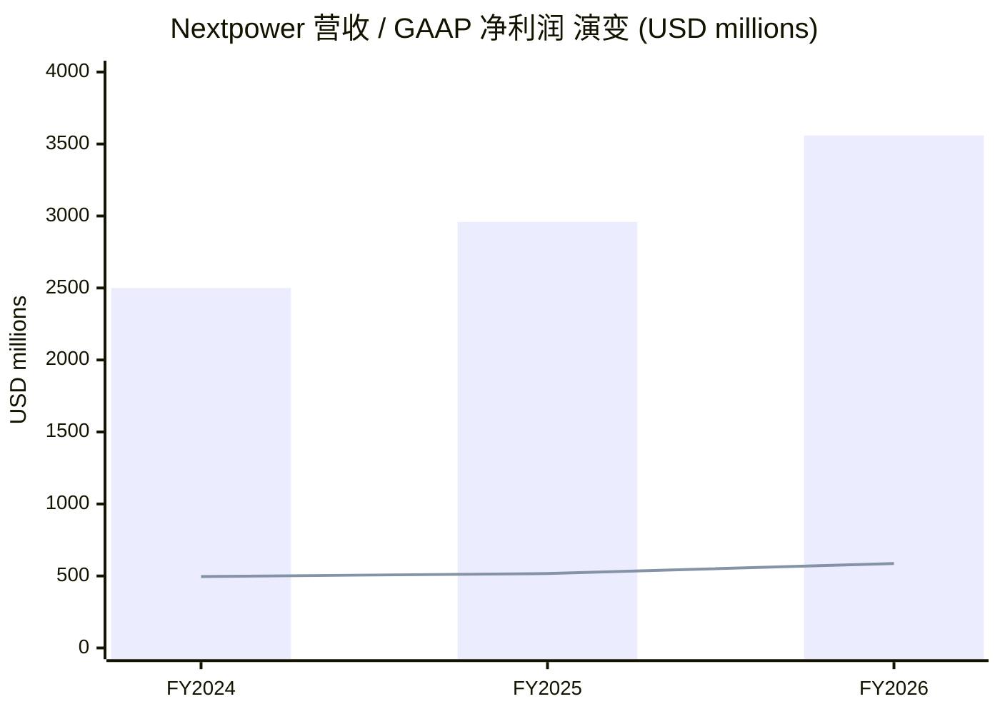
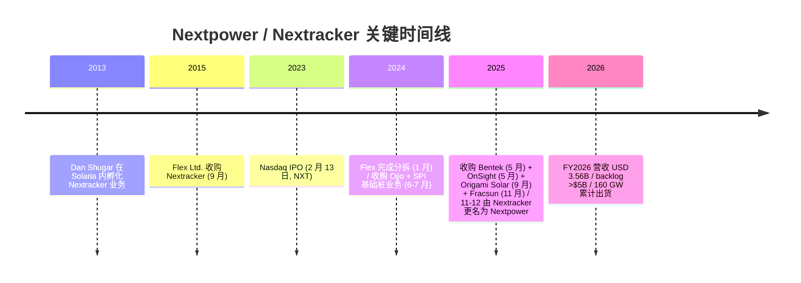
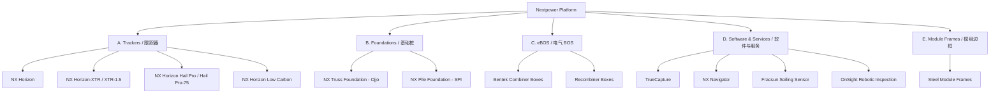
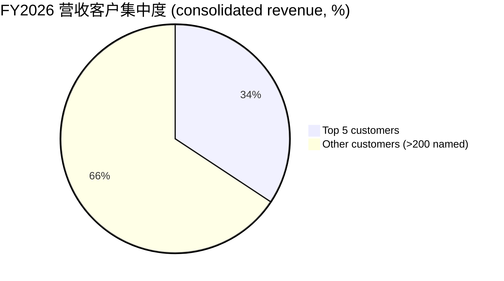
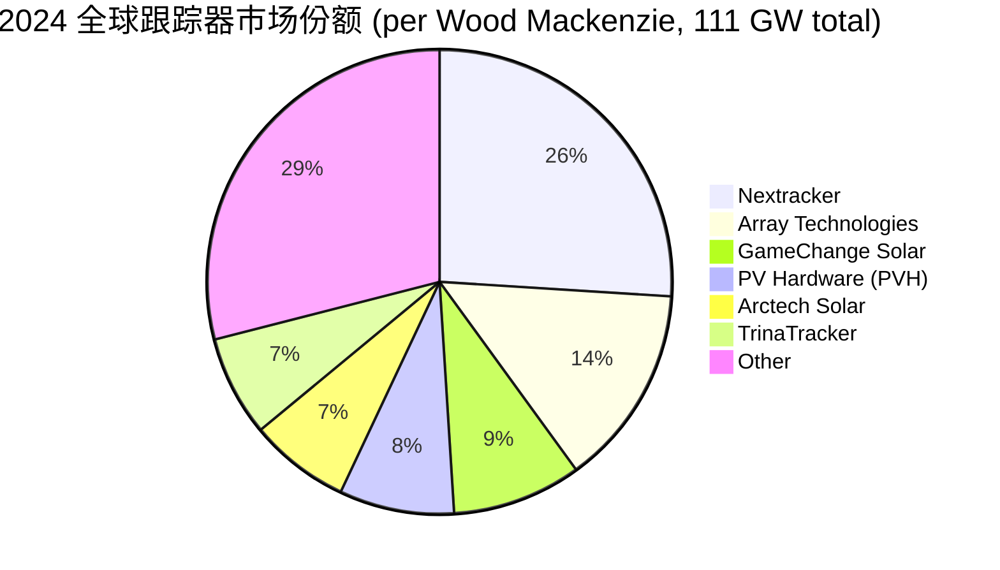
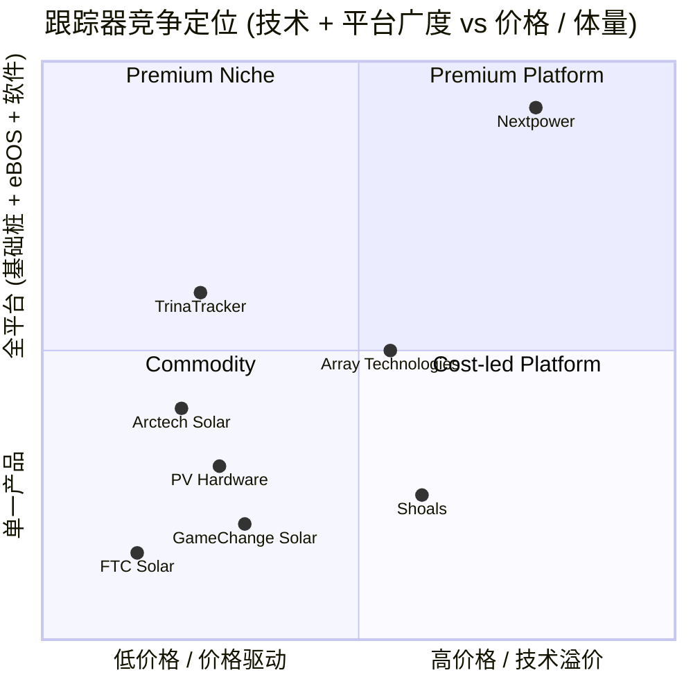
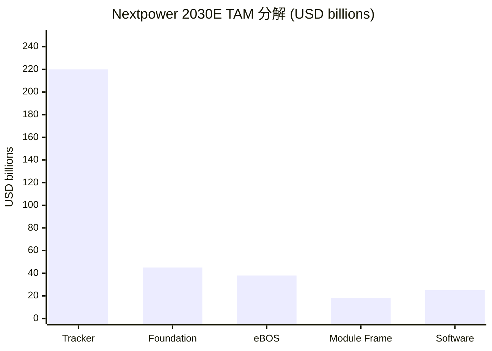

# Nextpower (NASDAQ:NXT) 公司研究报告

> *As of 2026-06-02 — 注：公司于 2025-11-12 由 Nextracker Inc. 更名为 Nextpower Inc.，股票代码 NXT 不变。本报告交替使用两个名称，按时间上下文取舍。*

---

## 目录

1. 公司概览 / Company Overview
2. 公司历史 / Company History
3. 管理团队 / Management
4. 产品与服务 / Products & Services
5. 客户与上市策略 / Customers & Go-to-Market
6. 行业概览 / Industry Overview
7. 竞争格局 / Competitive Landscape
8. 市场机会 / Market Opportunity (TAM)
9. 风险评估 / Risk Assessment
10. 投资者视角评分 / Investor-Lens Scorecards
11. 参考资料 / References

---

## 1. 公司概览

Nextpower Inc.（NASDAQ:NXT，前称 Nextracker Inc.）是全球公用事业级 (utility-scale) 太阳能电站结构与电气解决方案的领导厂商。公司在 FY2026 (财年截至 2026-03-31) 录得营收 35.59 亿美元 (USD)、同比 +20%，GAAP 净利润 5.86 亿美元、毛利率 32.6%、调整后 EBITDA 8.49 亿美元；积压订单 (backlog) 超过 50 亿美元，截至报告日累计已交付太阳能跟踪系统超过 160 GW，分布于 40 余个国家、六大洲 [Nextpower FY2026 10-K](https://www.sec.gov/Archives/edgar/data/0001852131/000185213126000017/nxt-20260331.htm)。公司是 ai-power-electrification 主题中典型的"电网侧硬件 (grid-side hardware)"标的，受益于 AI 数据中心电力需求拐点拉动公用事业级新能源装机扩张。

公司业务的核心是单轴太阳能跟踪器 (single-axis solar tracker)——FY2026 贡献约 88% 的营收，非跟踪器业务（基础桩、电气 BOS、模组边框、软件、服务）贡献约 12%，较 FY2025 的 8% 上升 [Nextpower FY2026 10-K, MD&A](https://www.sec.gov/Archives/edgar/data/0001852131/000185213126000017/nxt-20260331.htm)。地理上美国市场占比 77% (FY2026)，远高于 FY2024 的 68%，反映出 IRA《通胀削减法案》(Inflation Reduction Act) + OBBBA《One Big Beautiful Bill Act of 2025》驱动下美国本土装机加速。公司总部位于加州 Fremont（6200 Paseo Padre Parkway），全球员工约 1,993 人，其中 578 人为技术 / 工程岗位，海外重要据点包括印度海得拉巴 (Hyderabad, 超 542 名员工)、马德里、墨西哥城、迪拜、利雅得、圣保罗 [Nextpower FY2026 10-K, Human Capital](https://www.sec.gov/Archives/edgar/data/0001852131/000185213126000017/nxt-20260331.htm)。

*估值快照 / Valuation snapshot:* 以 2025-11-17 收盘 91.43 美元、市值约 211.9 亿美元计，TTM P/E 约 30×（按 FY2025 GAAP EPS 测算约 22×；2025 年初市场以 ~18× forward earnings 交易，但伴随股价从 1H25 低点反弹至 11/17 创历史新高 106.03 美元后回落，2025 YTD 涨幅曾达 +177%）[Nextracker valuation, Macrotrends](https://www.macrotrends.net/stocks/charts/NXT/nextracker/pe-ratio)；同行 Array Technologies (NASDAQ:ARRY) FY2025 仍为 GAAP 净亏损，P/E n.m.，P/S 约 1.4×；Shoals Technologies (NASDAQ:SHLS) FY2025 P/E 约 35×、P/S 约 2.5× [Array Technologies FY2025 10-K](https://www.sec.gov/cgi-bin/browse-edgar?action=getcompany&CIK=0001820721&type=10-K)。Nextpower 估值溢价主要来自三点：(1) 利润率 (GAAP 毛利 32.6%、净利率 16.5%) 是行业最高水平；(2) 美国本地化生产享 IRA Section 45X 信用 (production tax credit, PTC) 红利；(3) 通过 4 笔近期并购把业务从跟踪器扩展到 eBOS / 模组边框 / 软件 / 机器人 + AI，估值切换到"集成能源平台"叙事 [Nextpower FY2026 10-K, Recent acquisitions](https://www.sec.gov/Archives/edgar/data/0001852131/000185213126000017/nxt-20260331.htm)。

*Source: [Nextpower FY2026 10-K, Item 7 MD&A](https://www.sec.gov/Archives/edgar/data/0001852131/000185213126000017/nxt-20260331.htm). 柱状=营收，折线=GAAP 净利润。*

---

## 2. 公司历史

Nextracker 的根可以追溯到 2013 年，由现任 CEO Dan Shugar 在 Solaria（一家加州太阳能电池初创公司）孵化成立，专注于公用事业级单轴跟踪器 [Dan Shugar Wikipedia](https://en.wikipedia.org/wiki/Dan_Shugar)。2015 年 9 月，Solaria 把 Nextracker 业务整体出售给电子代工巨头 Flex Ltd.（前称 Flextronics），公司在 Flex 体系内运营 8 年，期间积累了制造、全球供应链与品控能力——这是公司至今相对于纯解决方案商如 Array、Shoals 的关键差异化基础 [Nextpower FY2026 10-K, Part I Item 1](https://www.sec.gov/Archives/edgar/data/0001852131/000185213126000017/nxt-20260331.htm)。

2023-02-13，Nextracker 在 Nasdaq Global Select 上市，发行价 24.00 美元/股 (IPO 当时公司估值约 35 亿美元)。Flex 与 TPG Rise（TPG 旗下气候基金）通过 Class B 双重股权结构保留多数控制权 [Nextracker S-1, 2023-01-23 (EDGAR)](https://www.sec.gov/cgi-bin/browse-edgar?action=getcompany&CIK=0001852131&type=S-1)。2023-07-03，公司完成 Follow-on Offering，Flex 出售部分仓位；2024-01-02，Flex 完成对 Nextracker 持股的整体分拆 (spin-off / split-off)，结束了公司作为 Flex 子公司的状态，Nextracker 正式成为完全独立上市公司 [Nextracker 8-K, 2024-01-04 (Spin-off Completion)](https://www.sec.gov/cgi-bin/browse-edgar?action=getcompany&CIK=0001852131&type=8-K)。

*Source: [Nextpower FY2026 10-K, Recent Acquisitions & Item 1 History](https://www.sec.gov/Archives/edgar/data/0001852131/000185213126000017/nxt-20260331.htm); [Nextracker rebrand press release, 2025-11-12](https://finance.yahoo.com/news/nextracker-rebrands-nextpower-reflect-company-141500935.html).*

2024 财年起，公司开始系统性并购，从纯跟踪器供应商向集成能源平台演进——FY2025 6 月以约 1.2 亿美元收购 Ojjo Inc.（针对软土与挑战性地形的螺旋基础桩 / truss foundation 技术），7 月以约 0.48 亿美元收购 Solar Pile International (SPI) 的基础桩业务，合二为一组建 NX Foundation Solutions 业务线 [Nextpower FY2026 10-K, Acquisitions footnote](https://www.sec.gov/Archives/edgar/data/0001852131/000185213126000017/nxt-20260331.htm)。FY2026 持续加码：2025-05-07 收购 Bentek Corporation（美国本土 eBOS 电气基础设施厂商，组合器、汇流箱、接线设备），2025-05-09 收购 OnSight Technology（自主太阳能检测机器人），2025-09-08 收购 Origami Solar（钢制模组边框，可替代传统铝制边框，叠加多吉瓦多年期供应协议），2025-11-07 收购 Fracsun（光伏污染传感与场地管理软件）[Nextpower FY2026 10-K, Note 5 Goodwill & Note 6 Acquisitions](https://www.sec.gov/Archives/edgar/data/0001852131/000185213126000017/nxt-20260331.htm)。

2025-11-12 公司正式更名为 Nextpower Inc.，标志着身份从"全球第一跟踪器供应商"切换为"全栈式公用事业级太阳能技术平台"。公司在 8-K 与新闻稿中明确表达："Our new brand reflects the Company's strategic evolution from a pure-play tracking systems supplier to an end-to-end solar technology platform provider"，并强调更名仅修改公司名，不影响股东权利，不需股东投票 [Nextracker 8-K, 2025-11-12 Name Change](https://www.sec.gov/Archives/edgar/data/0001852131/000185213125000069/nxt-20251112.htm); [更名媒体覆盖, 2025-11-12 — Yahoo Finance](https://finance.yahoo.com/news/nextracker-rebrands-nextpower-reflect-company-141500935.html)。值得关注的是，更名公告发布当日股价短线下跌（市场担忧"扩张稀释跟踪器纯度"），但其后伴随 Q2 FY26、Q3 FY26 业绩持续超预期，股价于 2026-05-29 反弹至 156.40 美元、市值约 175-206 亿美元区间 [Nextracker stock history, Macrotrends](https://www.macrotrends.net/stocks/charts/NXT/nextracker/stock-price-history)。

---

## 3. 管理团队

**Dan Shugar / 丹·舒加尔 — Founder & CEO**

Dan Shugar 于 2013 年在 Solaria 内孵化创立 Nextracker，并在 2015 年公司被 Flex 收购后继续担任 CEO，至今已掌舵公司 13 年 [Nextpower FY2026 10-K, signature block](https://www.sec.gov/Archives/edgar/data/0001852131/000185213126000017/nxt-20260331.htm)。在 Nextracker 之前，Shugar 曾担任 Solaria 公司 CEO（2010-2013）、SunPower Corporation 系统部 (Systems Division) 总裁（2007 年 1 月 - 2009 年 3 月）；更早，他于 1996 年与 Tom Dinwoodie 联合创办 PowerLight Corporation——这是商业化光伏单轴跟踪器、太阳能集装箱式逆变器、住宅一体化太阳能屋顶系统的先驱企业之一，2007 年被 SunPower 以约 3.34 亿美元收购，是 Shugar 进入 SunPower 的契机 [Dan Shugar Wikipedia](https://en.wikipedia.org/wiki/Dan_Shugar)。Shugar 的早期职业生涯始于 1980 年代末的太平洋燃气电力公司 (Pacific Gas and Electric, PG&E) 研发部门。他持有 Rensselaer Polytechnic Institute 电气工程学士学位、Golden Gate University 工商管理硕士 (MBA) [Dan Shugar — ACP Bio](https://cleanpower.org/about/team/dan-shugar/)。

Shugar 是行业内少有的"工程 + 政策"双栖型 CEO：2020 年 9 月，他代表 Nextracker 在美国众议院自然资源委员会能源与矿产资源小组委员会作证，议题是公共土地太阳能开发——这一类政策接触帮助公司在 IRA Section 45X PTC 与 OBBBA 立法过程中保持高曝光 [Dan Shugar US House Testimony, 2020-09-22](https://docs.house.gov/meetings/II/II06/20200922/111020/HHRG-116-II06-Bio-ShugarD-20200922.pdf)。2023 年获 S&P Platts Global Energy Awards "年度首席先驱者" 奖项 [Dan Shugar — ACP Bio](https://cleanpower.org/about/team/dan-shugar/)。截至 FY2025 DEF 14A，Shugar 持有约 5.2% 的总股本（包括行权后期权与 RSU），是公司前五大股东之一，与 TPG Rise (~9%) 一同代表"长期持有"派 [Nextracker DEF 14A 2025-06-25](https://www.sec.gov/Archives/edgar/data/0001852131/000185213125000036/nxt-20250625.htm)。Shugar 的代理报酬 (FY2025) 基本工资约 90 万美元，绩效现金 + 长期股权激励 (LTI) 占总薪酬的 80%+，对 EBITDA、营收增速与股价回报敏感度高，符合典型"founder-aligned" 治理模型 [Nextracker DEF 14A 2025-06-25](https://www.sec.gov/Archives/edgar/data/0001852131/000185213125000036/nxt-20250625.htm)。

*分析师观点：* Shugar 在公司 IPO + 分拆 + 平台扩张三阶段都保持着创始人角色与控制权——这在公用事业新能源硬件领域并不常见（Array Technologies 在 IPO 后两年内更换过 CEO、Shoals 同样经历了管理层动荡）。这种连续性在 ai-power-electrification 主题里有重要意义：客户关系（核心 EPC、能源开发商如 Intersect Power、Primergy、AES、Engie）需要长期信任与产品定制能力，频繁换帅会让 OEM 关系断档。**视角：** 创始人 + 长任期 CEO + 高股权对齐 = 治理风险 (governance risk) 评估为低；战略转向（更名 Nextpower 暗含平台扩张）的执行风险主要来自并购整合而非领导层动荡。

---

## 4. 产品与服务

Nextpower 的产品矩阵在 FY2026 10-K Item 1 Business 中被分为四大板块：(A) 太阳能跟踪器 (Solar Trackers)、(B) 基础桩 (Foundations)、(C) 电气 BOS (Electrical Balance of Systems)、(D) 软件 + 服务 (Software & Services)，外加新增的 (E) 模组边框 (Module Frames，Origami Solar 收购带来的) [Nextpower FY2026 10-K, Item 1 Products & Services](https://www.sec.gov/Archives/edgar/data/0001852131/000185213126000017/nxt-20260331.htm)。

*Source: [Nextpower FY2026 10-K, Item 1 Products & Services](https://www.sec.gov/Archives/edgar/data/0001852131/000185213126000017/nxt-20260331.htm).*

### 4.A 太阳能跟踪器 / Solar Trackers (~88% of FY2026 revenue)

#### NX Horizon (旗舰产品)

10-K 原文 (verbatim quote):
> "NX Horizon is our flagship solar tracking solution. NX Horizon's smart solar tracker system delivers what we believe to be an attractive LCOE and has been deployed more than any other tracker in our portfolio... NX Horizon's reliable self-powered motor and control system, balanced mechanical design and independent-row architecture provide project design flexibility while lowering operations and maintenance costs..." [Nextpower FY2026 10-K, Item 1](https://www.sec.gov/Archives/edgar/data/0001852131/000185213126000017/nxt-20260331.htm)

**中文释义 / Plain-language gloss:** NX Horizon 是单轴太阳能跟踪系统 (single-axis solar tracker, SAT)，整排太阳能板可绕东西轴心从 -60° 到 +60° 旋转，跟踪太阳运动以增加发电量（相对固定支架可提升 8-25% 年度发电量、降低度电成本 LCOE / Levelized Cost of Energy 约 5-10%）。**自供电 (self-powered)** 指每一排跟踪器都配有独立的小型太阳能电池板与电池 UPS (uninterruptible power supply, 不间断电源)，电机仅用于翻转动作不依赖现场外电——这是 Nextpower 的关键差异化卖点：相对于线性连接 (linked-row) 的设计（典型代表是 Array 早期 DuraTrack HZ），独立排架构允许每一排独立工作，单点故障不会拖瘫整片厂区，运维成本更低，地形适应性更好。

NX Horizon 是 FY2026 业绩的最大支柱：累计出货超过 160 GW，是公司"连续 10 年全球第一"的核心产品 [Nextpower FY2026 10-K, Item 1](https://www.sec.gov/Archives/edgar/data/0001852131/000185213126000017/nxt-20260331.htm)。**战略意义：** AI 数据中心电力需求让公用事业级太阳能电站规模扩张到 500 MW-1 GW 单一项目（典型代表是德州 Permian Basin 的 1.2 GW Brazoria Solar、Microsoft + Brookfield 合作的 10.5 GW 框架协议）——这些大项目的 EPC 倾向于"已验证 + 已经商用 100 GW+ 的产品"，新进入者很难突破，NX Horizon 的"已部署体量"本身就是护城河。

#### NX Horizon-XTR / XTR-1.5 (复杂地形)

10-K 原文 (verbatim quote):
> "NX Horizon-XTR is our terrain-following tracker designed to expand the addressable market for trackers on sites with sloped, uneven and challenging terrain. NX Horizon-XTR conforms to the natural terrain of the site, reducing or eliminating the cost and impact of cut-and-fill earthworks, without complex joints or additional components..." [Nextpower FY2026 10-K, Item 1](https://www.sec.gov/Archives/edgar/data/0001852131/000185213126000017/nxt-20260331.htm)

**中文释义 / Plain-language gloss:** 传统跟踪器要求场地必须基本平整（坡度 <5%），否则需要大规模"土方平整 (cut-and-fill earthworks)"——这既增加成本又破坏地表。XTR / XTR-1.5 是地形跟随 (terrain-following) 变体，允许跟踪器排沿着山坡自然弯曲，最大可适应 10-15% 的纵向坡度（XTR-1.5 把可适应坡度大约翻倍至 ~30%）[Nextpower XTR Datasheet](https://nextpower.com/post/data-sheet/nx-horizon-xtr-datasheet)。截至 2024 年中，XTR 已累计部署超过 10 GW [Nextracker XTR press release archive](https://www.nextracker.com/2024/05/nextracker-xtr-15-launch/)。**战略意义：** 美国电网拥塞 (interconnection queue) 让"易开发"的平坦地块越来越稀缺，新项目越来越多被迫在丘陵地形开发，XTR 类产品的可寻址市场 (Total Addressable Market, TAM) 在快速扩张——这是 Nextpower 比 Array、Shoals 等竞品溢价的关键一环（Array 直到 2024 年才推出与之对标的 SkyLink + OmniTrack 复杂地形组合）。

#### NX Horizon Hail Pro / Hail Pro-75 (冰雹防护)

10-K 原文 (verbatim quote):
> "NX Horizon with Hail Pro builds on the core features of NX Horizon's smart solar tracking system, including its balanced design, integrated UPS (uninterruptible power supply), and independent-row architecture. Hail Pro adds automatic stowing capabilities using forecast service data, hail readiness services, and where applicable, Hail Pro-75, which enables stowing at angles of up to 75 degrees for project sites subject to extreme hail." [Nextpower FY2026 10-K, Item 1](https://www.sec.gov/Archives/edgar/data/0001852131/000185213126000017/nxt-20260331.htm)

**中文释义 / Plain-language gloss:** 美国中西部、德州、土耳其等地区，单次冰雹事件可造成上亿美元保险损失（2019 年得州 Midway Solar 因冰雹损失超 7000 万美元；2023 年 Hampshire 项目类似规模损失）。Hail Pro 引入"自动收纳 (automatic stowing)"——通过天气预报 API 提前数小时把跟踪器旋转到 50°-75° 接近垂直的角度，让冰雹只接触组件侧棱、降低组件损坏风险。**战略意义：** 这把跟踪器从"提升发电量"升级为"保险 + 资产保值"工具，提升对保险公司的认可度（降低 EPC 的"冰雹豁免条款"成本），形成软件 + 数据服务 (SaaS-like) 的可重复收入流。

#### NX Horizon Low Carbon (碳足迹差异化)

10-K 原文:
> "NX Horizon Low Carbon is the industry's first solar tracker solution with a reduced carbon footprint... includes torque tubes manufactured with the electric arc furnace (EAF), recycled steel, and logistics strategically located near project sites." [Nextpower FY2026 10-K, Item 1](https://www.sec.gov/Archives/edgar/data/0001852131/000185213126000017/nxt-20260331.htm)

**中文释义 / Plain-language gloss:** Torque tube（扭转管）是跟踪器的核心结构件——单排长达数十米的中心轴杆，传统由高炉 (BF) 钢制造碳排高。Low Carbon 改用电弧炉 (EAF) 与回收钢生产，单 tracker 钢材的隐含碳 (embodied CO₂e) 可降低 50-60%。**战略意义：** 欧洲 CBAM (Carbon Border Adjustment Mechanism, 碳边境调节机制)、加州 / 纽约公共采购的"碳脚印评分"已开始把上游建材碳量纳入评标，这是 Nextpower 押注的 ESG 差异化方向。

### 4.B 基础桩 / Foundations (NX Foundation Solutions)

10-K 原文:
> "NX Foundation Solutions is a comprehensive suite of solar foundation technologies and services designed to optimize solar project installations across diverse soil conditions... NX Foundation Solutions are part of an integrated foundation-to-tracker system offering that helps streamline project timelines, reduce costs, and improve safety while minimizing environmental impact..." [Nextpower FY2026 10-K, Item 1](https://www.sec.gov/Archives/edgar/data/0001852131/000185213126000017/nxt-20260331.htm)

**中文释义 / Plain-language gloss:** 太阳能跟踪器需要埋入地下的基础桩支撑——传统使用直驱钢桩 (driven steel pile)，但在软土、膨胀土、冻胀土等"挑战地块" (challenging soil conditions) 上，直驱钢桩不能保证稳定性。NX Foundation Solutions 整合了来自 Ojjo（2024-06 收购，约 1.2 亿美元）的螺旋桁架基础 (truss foundation) 与来自 SPI / Solar Pile International（2024-07 收购，约 4800 万美元）的传统钢桩业务，提供"全土质" (soft, medium, firm, expansive, frost-heave) 覆盖 [Nextpower FY2026 10-K, Note 6 Acquisitions](https://www.sec.gov/Archives/edgar/data/0001852131/000185213126000017/nxt-20260331.htm)。**战略意义：** 基础桩往往是 EPC 项目最先采购的部分——Nextpower 拿下基础桩后，可在跟踪器供货前 6-12 个月就锁定客户，建立"先到先服务"的客户黏性。

### 4.C 电气 BOS / Bentek 集成

10-K 原文:
> "In May 2025, we announced the acquisition of U.S.-based Bentek Corporation ('Bentek'), an industry pioneer and manufacturer of electrical infrastructure components that collect and transport electricity from solar panels to the power grid." [Nextpower FY2026 10-K, Note 6 Acquisitions](https://www.sec.gov/Archives/edgar/data/0001852131/000185213126000017/nxt-20260331.htm)

**中文释义 / Plain-language gloss:** Electrical Balance of Systems (eBOS, 电气配套系统) 包括汇流箱 (combiner box)、再汇流箱 (recombiner box)、接线设备 (wire harnessing) ——简单说，就是把上百万块组件产生的低压直流电汇集后送往逆变器的"血管系统"。eBOS 在公用事业级电站约占总 CAPEX 的 4-6%。Bentek 是美国本土头部 eBOS 厂商，与已经上市的 Shoals Technologies (NASDAQ:SHLS) 直接竞争。**战略意义：** 此次收购让 Nextpower 与 Shoals 形成直接对标——Shoals 长期以 BLA (Big Lead Assembly) 专利垄断北美 eBOS 高端市场，但 2023-2024 年因产品质量诉讼 (J-Box 锈蚀) 流失了 Array Technologies、Engie 等大客户；Bentek 在 Nextpower 母体下可以"打包销售" (bundle) 给已经使用 NX Horizon 的客户，攻势相当凌厉。

### 4.D 软件 + 服务 / Software & Services

10-K 原文:
> "TrueCapture reduces the energy production gap between modeled and real-world tracker performance by adjusting tracker rows based on topography, sun position, solar irradiance, and PV panel technology... NX Navigator..." [Nextpower FY2026 10-K, Item 1](https://www.sec.gov/Archives/edgar/data/0001852131/000185213126000017/nxt-20260331.htm)

**中文释义 / Plain-language gloss:** TrueCapture 是"智能算法" (smart-tracking algorithm) 软件层——根据每一排的实时辐射、地形阴影、组件类型，动态优化每一排的跟踪角度，相对传统天文角度跟踪 (astronomical tracking) 可额外提升 2-6% 发电量。NX Navigator 是运营仪表盘 (SCADA dashboard)，整合天气预警、设备健康、性能分析。OnSight (2025-05 收购) 是机器人 (autonomous robots) 巡检，可替代人工现场检查；Fracsun (2025-11 收购) 是污染传感器 (soiling sensor)，监测组件表面灰尘累积建议最佳清洗周期。**战略意义：** 软件 + 数据让 Nextpower 从"硬件一次性销售"切换到"硬件 + 长期数据服务"商业模式，提升 LTV (Lifetime Value)、降低客户切换概率（一旦 EPC 把电站运维数据存在 NX Navigator 上，迁移成本极高）。

### 4.E 模组边框 / Module Frames (Origami Solar)

2025-09-08 收购 Origami Solar，让 Nextpower 进入太阳能组件**边框 (module frame)** 制造——这是组件成本 (PV module BOM, Bill of Materials) 中约 5-7% 的钢制件，传统由铝合金压制。Origami 采用钢制边框 (stamped steel module frames)，可在美国本地化生产以满足 IRA 域内含量 (domestic content bonus) 要求，叠加"多吉瓦多年期供应协议" (multi-gigawatt multi-year supply agreement) 锁定组件厂客户 [Nextpower FY2026 10-K, Note 6 Acquisitions](https://www.sec.gov/Archives/edgar/data/0001852131/000185213126000017/nxt-20260331.htm); [Origami Solar acquisition press release, 2025-09 — Nextpower](https://nextpower.com/post/press-release/nextracker-acquires-origami-solar)。**战略意义：** 让 Nextpower 切入组件供应链上游、扩大 IRA Section 45X PTC 范围（边框是 45X 合规件），并把客户关系从 EPC + 开发商扩展到组件厂 (First Solar, JA Solar, Trina USA Mfg, Hanwha Q-Cells)。

### 综合视图 / Section synthesis

如果把"公用事业级太阳能电站"想象成一个生产流水线，从下至上的层级是：**(1) 土地与基础**（基础桩，NX Foundation Solutions）→ **(2) 结构跟踪**（NX Horizon 系列 + XTR + Hail Pro）→ **(3) 电气汇集**（Bentek eBOS）→ **(4) 组件本身**（含 Origami 模组边框）→ **(5) 软件管理与运营**（TrueCapture, NX Navigator, OnSight, Fracsun）。Nextpower 在 2024-2025 两年密集并购的目标，是从"中间层（结构跟踪）" 同时向上下游延伸——基础桩在跟踪器之前 6-12 个月铺货、eBOS 在跟踪器之后 3-6 个月铺货、模组边框可与跟踪器同期销售给组件厂、软件可在电站投运后 25 年持续收费。这种"跟踪器为锚、平台外扩"的逻辑就是更名 Nextpower 的战略本质——把 TAM 从约 80 亿美元的"全球跟踪器"扩展到约 200-250 亿美元的"全栈式公用事业级太阳能技术" [Wood Mackenzie Global Solar PV Tracker Market, 2025-06](https://www.pv-magazine.com/2025/06/13/global-solar-tracker-shipments-reach-111-gw-in-2024/)。

---

## 5. 客户与上市策略

Nextpower 的客户主要是大型 EPC (Engineering, Procurement, Construction) 承包商、独立电力生产商 (Independent Power Producer, IPP)、公用事业公司，以及超大型科技公司直接采购方 (corporate PPA buyer, 企业级购电协议买方，如 Microsoft, Meta, Amazon, Google)。10-K 中没有逐家点名客户——只用字母代号 (Customer A, G 等) 披露 ≥10% 营收的单一客户：

| Fiscal Year | 单一客户 ≥10% 营收 | Top-5 客户合计占营收 |
|---|---|---|
| FY2024 | Customer G = 17.0% | 41.1% |
| FY2025 | 无单一客户 ≥10% | 32.0% |
| FY2026 | 无单一客户 ≥10% | 34.3% |

*Source: [Nextpower FY2026 10-K, Note 19 Concentration of Risk](https://www.sec.gov/Archives/edgar/data/0001852131/000185213126000017/nxt-20260331.htm). 上述比例均为 **合并报表层面 (consolidated revenue 口径)**。*

*Source: [Nextpower FY2026 10-K, Note 19](https://www.sec.gov/Archives/edgar/data/0001852131/000185213126000017/nxt-20260331.htm). 注：FY2026 Top-5 占营收 34.3%，且无单一客户超过 10% 阈值。10-K 未披露 Top-5 的具体客户名称。*

从 FY2024 的 41.1% 降至 FY2025-FY2026 的 32-34%，客户集中度持续改善——这反映 (1) 新增中型 EPC 客户、(2) 大客户单家份额下降。10-K 中提及 FY2024 的最大单一客户 "Customer G" 对应 4.26 亿美元营收（占当年总营收 17%），FY2025 / FY2026 该客户份额下降至 10% 以下；按规模与时点推测，Customer G 极可能是某家头部独立电力生产商（如 NextEra Energy Resources 或 AES Clean Energy），但 10-K 未确认 *(disclosure not found)*，应避免猜测。**段位标注 (denominator)：上述均为 consolidated revenue 口径，不涉及分部级。**

地理上，美国占 FY2026 营收 77%（金额 27.31 亿美元）、世界其他地区 23%（金额 8.29 亿美元）；FY2024 巴西曾占 11%（金额约 2.81 亿美元），但 FY2025-FY2026 拉美营收同比 -11%（FY2026 海外营收下滑 9890 万美元主要来自拉丁美洲）[Nextpower FY2026 10-K, MD&A Geographic Revenue](https://www.sec.gov/Archives/edgar/data/0001852131/000185213126000017/nxt-20260331.htm)。**这是结构性观察：美国市场（占 77%）正受 AI 数据中心拉动加速增长，国际市场（占 23%）成长更慢、波动更大**——美国本地化生产 + IRA Section 45X PTC 双重红利推动 Nextpower 美国业务利润率走高，国际业务则面对 Arctech、Trina 等中国厂商的价格竞争。

**Go-to-Market（销售渠道）：** Nextpower 没有经销商体系，全部直销给 EPC 与开发商。其销售周期 (sales cycle) 通常 9-18 个月——从 EPC 立项 → 跟踪器技术评审 → 价格谈判 → 合同签订 → 分批发货 → 6-12 个月内安装完成 → 12-25 年的电站运维。客户付款条件：开发商付定金 (deposit)、按里程碑 (milestone payment) 支付，最终账期 30-90 天 [Nextpower FY2026 10-K, Revenue Recognition policy](https://www.sec.gov/Archives/edgar/data/0001852131/000185213126000017/nxt-20260331.htm)。公司还有"主供应协议 (Vendor Capacity Agreement, VCA)" 框架——客户预订未来若干 GW 容量，作为 backlog 但尚未对应到具体项目订单，FY2026 末 VCA 在 backlog 中占比超过半数。

**Backlog 与可见度：** FY2026 末 backlog 超过 50 亿美元（含 EPC 合同、采购订单、VCAs，且仅含含定金或写有 take-or-pay 条款的订单）——按 FY2026 营收 35.6 亿美元测算，相当于约 1.4 年期可见收入 [Nextpower FY2026 10-K, Item 1 Backlog disclosure](https://www.sec.gov/Archives/edgar/data/0001852131/000185213126000017/nxt-20260331.htm)。10-K 明确警告 "Backlog 不能保证转化为收入"——VCA 可被客户取消、推迟、不续签——但相对于半导体设备厂动辄 "book-to-bill" 单季波动，Nextpower 的 backlog/收入比已是行业最高水平。

---

## 6. 行业概览

**单轴跟踪器行业 TAM 与增长：** 根据 Wood Mackenzie 数据，2024 全球跟踪器出货 111 GW（同比 +20%），是公用事业级太阳能装机增长的最大动力；预计 2025-2028 复合增长 (CAGR) ~15%——驱动因素来自 (1) 全球太阳能 LCOE 持续下降（2009-2025 累计 -84% per Lazard），(2) AI 数据中心电力需求与电气化趋势 (electrification)，(3) 各国能源转型政策 [pv magazine — Global solar tracker shipments reach 111 GW in 2024, 2025-06-13](https://www.pv-magazine.com/2025/06/13/global-solar-tracker-shipments-reach-111-gw-in-2024/); [Nextpower FY2026 10-K, Industry section citing Lazard](https://www.sec.gov/Archives/edgar/data/0001852131/000185213126000017/nxt-20260331.htm)。

10-K 原文 (verbatim):
> "According to Lazard, from 2009 to 2025, the cost of solar generation fell by 84%. Today, solar electricity is competitive with both natural gas and wind and is competitive with, or cheaper than, electricity generated from nuclear and coal." [Nextpower FY2026 10-K, Item 1 Industry](https://www.sec.gov/Archives/edgar/data/0001852131/000185213126000017/nxt-20260331.htm)

跟踪器渗透率 (penetration rate) 是另一个关键指标——10-K 中估计成熟市场（美国、印度、拉美、澳大利亚、欧洲南部）公用事业级电站约 70-80% 已采用跟踪器；新兴市场（中东、非洲、东南亚）渗透率 30-40%，未来 5-10 年仍有大约 30-50 GW/年的"由固定支架升级到跟踪"的需求 [Nextpower FY2026 10-K, Item 1 Industry](https://www.sec.gov/Archives/edgar/data/0001852131/000185213126000017/nxt-20260331.htm)。

**AI 数据中心拉动效应：** 2024-2025 数据中心新增电力需求估计在美国 +15-25 GW/年（McKinsey, Lazard）——这是 ai-power-electrification 主题的核心叙事。Nextpower FY2026 10-K 罕见地直接把 AI 写进行业部分：

> "The rapid adoption of AI technologies has significantly increased electricity demand in many sectors, particularly from data centers, which are expected to drive continued growth in renewable energy deployments to meet decarbonization targets." [Nextpower FY2026 10-K, Item 1 Industry](https://www.sec.gov/Archives/edgar/data/0001852131/000185213126000017/nxt-20260331.htm)

公用事业级太阳能 + 储能 (battery energy storage, BESS) 成为数据中心电力组合 (power stack) 的中坚——典型案例：Microsoft + Brookfield 2024 年 10.5 GW 框架协议、Meta 在德州 Westport 1 GW 框架、Amazon AWS 累计签署超 28 GW PPA。这些大订单需要跟踪器在 6-12 个月内交付——Nextpower 的美国本地化产能 + IRA Section 45X PTC + 已有客户关系，是其在这一波抢单的关键优势。

**美国政策：IRA + OBBBA 双重激励**

10-K 原文 (verbatim):
> "The IRA also introduced a per-unit tax credit (the Section 45X Credit or '45X Credit') that is earned over time for certain clean energy components domestically produced and sold by a manufacturer..." [Nextpower FY2026 10-K, Industry Section](https://www.sec.gov/Archives/edgar/data/0001852131/000185213126000017/nxt-20260331.htm)

Section 45X PTC 给本土生产的太阳能跟踪器组件每瓦提供约 0.87 美分（torque tubes 与 structural fasteners 占主体）的税收抵免——按 Nextpower FY2026 出货约 ~37 GW（FY2025 34 GW × 110%）测算，潜在 45X PTC 价值约 3.2 亿美元/年，几乎全部体现在毛利改善。FY2026 美国营收 +34%、毛利率 32.6%（FY2025 34.1%、FY2024 32.5% — 注：FY2026 毛利率略降系并购摊销影响），其中 45X PTC 是关键支撑 [Nextpower FY2026 10-K, MD&A Gross Profit](https://www.sec.gov/Archives/edgar/data/0001852131/000185213126000017/nxt-20260331.htm)。

2025 年 OBBBA《One Big Beautiful Bill Act》是 IRA 之后另一项关键立法，对 45X 与 48E 投资税收抵免做了调整——10-K 警告这些调整"可能实质性减少 Section 48E 与 Section 45X Credit 未来的可用性 (materially reduced the future availability of these credits)"[Nextpower FY2026 10-K, Item 1A Risk Factors](https://www.sec.gov/Archives/edgar/data/0001852131/000185213126000017/nxt-20260331.htm)。这是公司 FY2027-FY2028 利润率的最大不确定性。

**国际市场结构：** 全球跟踪器市场是寡头格局，根据 Wood Mackenzie 2024 数据：

*Source: [Wood Mackenzie 2024 global tracker market data via pv magazine, 2025-06-13](https://www.pv-magazine.com/2025/06/13/global-solar-tracker-shipments-reach-111-gw-in-2024/). Nextracker 出货约 28.5 GW，对应市场份额 ~26%；具体百分比为分析师估算 (analyst estimate)，非各厂商直接披露。*

---

## 7. 竞争格局

10-K 原文 (verbatim) — Nextpower 自我披露的主要竞争对手:
> "Our principal competitors are Arctech Solar, Array Technologies, GameChange Solar, PV Hardware, Shoals Technologies Group and TrinaSolar Co., Ltd. We also compete with smaller market participants in various geographies." [Nextpower FY2026 10-K, Item 1 Competition](https://www.sec.gov/Archives/edgar/data/0001852131/000185213126000017/nxt-20260331.htm)

注意 10-K 把 Shoals Technologies Group (NASDAQ:SHLS) 列为竞争对手——这是 FY2026 新增（FY2025 10-K 未列入），反映 Nextpower 完成 Bentek 收购、进入 eBOS 市场后与 Shoals 形成正面竞争。

| 竞争对手 | 上市市场 | FY2025 营收 (USD) | 优势 | 劣势 / 风险 |
|---|---|---|---|---|
| **Array Technologies (ARRY)** | NASDAQ | ~$916M (FY25) | 美国第二大市占率、产品组合扩张（SkyLink） | FY24-25 营收下滑 ~30%、利润率压力大、CEO 在 2023 后换过 |
| **GameChange Solar** | 私募 | 估约 $700-900M | 价格竞争力强、2024 美国市占第二超越 Array | 资产负债表不透明、海外渠道弱 |
| **PV Hardware (PVH)** | 私募 (Gransolar 旗下) | 估约 $600-800M | 欧洲与新兴市场覆盖广 | 美国市场弱、IRA 域内含量不达标 |
| **Arctech Solar (688408.SH)** | 上交所科创板 | RMB ~3.8B (~$520M) | 中国 + 中东 + 东南亚份额领先 | 美国市场受 UFLPA / 反倾销税 ~限制 |
| **TrinaTracker (Trina Solar 子公司)** | 上交所 (688599.SH) | 含跟踪 + 组件，跟踪部分估 ~$400M | 组件 + 跟踪打包销售 | 跟踪非主业、研发资源分散 |
| **Shoals Technologies (SHLS)** | NASDAQ | $400M (FY25) | eBOS 北美龙头、BLA 专利 | 2023 J-Box 锈蚀诉讼流失大客户、毛利率承压 |
| **FTC Solar (FTCI)** | NASDAQ | $50-80M (FY25) | Voyager+ 两连体跟踪器、低价位 | 体量小、连续亏损、流动性紧张 |

*Source: 各公司 SEC 10-K 与上市公司年报。营收数字为公开披露的 FY2024-FY2025 数据。市场份额数字均为 **分析师估算 (analyst estimate)**，非各厂商直接披露 — see [Wood Mackenzie via pv magazine](https://www.pv-magazine.com/2025/06/13/global-solar-tracker-shipments-reach-111-gw-in-2024/) and [Array Technologies FY25 10-K](https://www.sec.gov/cgi-bin/browse-edgar?action=getcompany&CIK=0001820721&type=10-K).*

*Source: 分析师评估 (analyst view; not from any single primary source) based on each company's product matrix, FY2025 financials, and 10-K Competition disclosures.*

**Nextpower vs. Array Technologies (核心竞争)：** Array 是 Nextpower 唯一可比的"技术 + 平台 + 体量"美国对手。但 Array 在 FY2023-FY2025 经历高层动荡（CEO 在 2023-04 由 Kevin Hostetler 换为 Kevin Hostetler、再于 2025 年换为 Neil Manning）、营收从 2022 的 $1.78B 降至 FY2025 的 ~$916M（同比 -49%）、毛利率从 ~25% 压缩到 ~21% [Array Technologies FY25 10-K](https://www.sec.gov/cgi-bin/browse-edgar?action=getcompany&CIK=0001820721&type=10-K)。**分析师观点：** Array 与 Nextpower 在 2023-2025 出现"剪刀差"——Nextpower 营收从 $1.7B 涨到 $3.56B（+109%），Array 反向缩水 ~49%。Nextpower 已确立"美国市场无可争议龙头"地位（FY2026 美国份额按出货量估计 ~50% 区间），Array 沦为追赶者。

**Nextpower vs. Shoals (eBOS 战场)：** Shoals 在 2023-2024 因 J-Box (junction box) 锈蚀诉讼流失多个大客户（如 Engie, Array Technologies 自有 eBOS 业务回归）。Nextpower 收购 Bentek 后正式入局 eBOS——其优势在于"已经在用 NX Horizon 的客户" (capture share) 可以打包销售 Bentek 产品，Shoals 缺乏跟踪器锚点，将面临攻势 [Shoals Technologies FY2024 10-K](https://www.sec.gov/cgi-bin/browse-edgar?action=getcompany&CIK=0001831651&type=10-K)。

**Nextpower vs. 中国厂商 (Arctech, TrinaTracker)：** 美国市场上中国厂商基本被 UFLPA《维吾尔强迫劳动预防法》(Uyghur Forced Labor Prevention Act) 与反倾销 / 反补贴税 (AD/CVD) 阻挡——Arctech 与 TrinaTracker 几乎无法进入美国公用事业级电站。但在拉美、中东、东南亚，中国厂商的价格优势（约 -15-30%）仍构成挑战，这是 Nextpower 国际营收增长偏弱的主要原因。

---

## 8. 市场机会 (TAM)

**Tracker TAM 测算（2025-2030 自下而上）：**

- 全球公用事业级太阳能 (utility-scale solar) 新增装机：2024 ~280 GW、2025E ~310 GW、2030E ~450-500 GW（5 年 CAGR ~10%）[IEA Renewables 2024](https://www.iea.org/reports/renewables-2024)
- 全球跟踪渗透率：2024 ~40% (111 GW/280 GW)、2030E ~55-60%（成熟市场升至 80%、新兴市场升至 40-45%）
- 全球跟踪器出货：2025E ~135 GW、2030E ~290 GW（5 年 CAGR ~17%）
- 每 GW 跟踪器出货平均售价 ~$60-80M（含设备 + 安装服务）
- **核心跟踪器 TAM 2030E：约 220-230 亿美元** [Wood Mackenzie via pv magazine](https://www.pv-magazine.com/2025/06/13/global-solar-tracker-shipments-reach-111-gw-in-2024/)

**Nextpower 平台扩张 TAM（含基础桩 + eBOS + 软件 + 模组边框）：**

- 基础桩 + 其他结构件 (foundations, racking): TAM 2030E 约 40-50 亿美元
- eBOS (combiner, recombiner, wiring): TAM 2030E 约 35-40 亿美元 [Shoals Investor Day 2024 deck](https://investors.shoals.com/static-files/shoals-investor-day-2024-deck)
- 模组边框: TAM 2030E 约 15-20 亿美元 (按 ~$0.04-0.05/W × ~400 GW PV 装机)
- 软件 + 服务: TAM 2030E 约 20-30 亿美元 (TrueCapture / SaaS-like 模式，约 $2-3K/MW/yr × 累计装机量)
- **合并 TAM 2030E：约 330-370 亿美元（跟踪器约占 62%、其余约占 38%）**

*Source: 跟踪器 TAM from [Wood Mackenzie via pv magazine 2025-06](https://www.pv-magazine.com/2025/06/13/global-solar-tracker-shipments-reach-111-gw-in-2024/); 其余分类 TAM 为分析师从 [Shoals Investor Day 2024](https://investors.shoals.com/news-and-events/events-and-presentations) 与 [Origami Solar Acquisition Filing, 2025-09 — Nextpower](https://nextpower.com/post/press-release/nextracker-acquires-origami-solar) 推算 (analyst estimate, not disclosed).*

**Nextpower 当前份额与未来路径：** FY2026 公司营收 35.6 亿美元，对应当前 (2025) 跟踪器 TAM ~120 亿美元的渗透率约 26-28%（与 Wood Mackenzie 2024 26% 出货份额一致）。若 (a) 公司能在跟踪器维持 ~25-28% 份额，(b) 在基础桩 + eBOS + 模组边框 + 软件中合计拿到 ~10-15% 份额，则到 FY2030 营收可达 70-90 亿美元区间（FY26-FY30 CAGR ~18-26%）。这就是更名 Nextpower + 平台扩张的战略野心：把可寻址市场从 220 亿翻倍到 350+ 亿，同时进入更高利润率的软件 / SaaS 业务。

**主要风险：** TAM 假设依赖三个未确认因素—— (1) IRA Section 45X / 48E 不被进一步削弱（OBBBA 后已有部分削减），(2) AI 数据中心电力需求维持 +20%/年增长（如 GPU 能效大幅提升可减少新增电力需求），(3) 中国低价竞品不能突破 UFLPA / AD/CVD 进入美国。任一假设动摇都会显著压缩 Nextpower 营收路径。

---

## 9. 风险评估

### 公司特定风险 (Company-specific)

**R1. 单一产品集中度（跟踪器占 88% 营收，下游单一终端=公用事业级太阳能电站）**
公司虽通过 4 笔近期并购扩展到基础桩、eBOS、模组边框、软件，但 FY2026 跟踪器仍占 88% 营收，且全部下游集中于公用事业级太阳能 (utility-scale solar PV)——如果太阳能 LCOE 优势减弱（天然气价格暴跌、核能复兴、储能技术突破改变商业模式），所有产品线同时承压 [Nextpower FY2026 10-K, Item 1A Risk Factors](https://www.sec.gov/Archives/edgar/data/0001852131/000185213126000017/nxt-20260331.htm)。**缓解：** 平台化策略让公司在同一项目里多角度切入，降低对纯跟踪器价格 / 销量波动的敏感度。**严重度 (severity):** 中等-高。

**R2. 并购整合风险**
2024-2025 公司完成 4 笔并购 (Ojjo, SPI, Bentek, OnSight, Origami, Fracsun)，合计支付约 5-7 亿美元。并购整合涉及销售渠道融合、产品工程一致性、文化磨合——失败案例（如 Array 收购 STI Norland 后整合不畅）说明这一风险真实存在。**缓解：** 多数被并购方仍保留独立品牌运营、整合压力相对温和；管理层在 IR 沟通中反复强调"each acquisition has a clear product hook, no overlap on customer base"。**严重度：** 中等。

**R3. 创始人 / CEO 集中风险**
Dan Shugar 已掌舵 Nextracker 13 年，若意外退出，公司在客户关系 / 战略执行的连续性可能受到挑战。**缓解：** 公司在 FY2026 末招募 Charles Boynton 作为 CFO，深化高管层；TPG Rise / Yuma Inc. (Flex 子公司) 仍持有大比例股份且参与董事会，提供继任准备。**严重度：** 中等-低。

### 行业 / 市场风险 (Industry/Market)

**R4. IRA / OBBBA 政策反向**
10-K 直接警告 OBBBA "可能实质性减少 Section 48E 与 Section 45X Credit 未来的可用性"——这是 FY27-FY28 利润率的最大不确定性。如果 Section 45X PTC 减半或取消，Nextpower 美国业务毛利率可能从 32%+ 压缩至 26-28% [Nextpower FY2026 10-K, Item 1A Risk Factors](https://www.sec.gov/Archives/edgar/data/0001852131/000185213126000017/nxt-20260331.htm)。**缓解：** 公司游说能力 (Shugar 在国会作证经历) 与本地化生产产能可以一定程度缓冲。**严重度：** 高。

**R5. 美国电网拥塞 (interconnection queue) 与许可延迟**
10-K 提到 "interconnection queue backlogs and transmission constraints may continue to delay or limit the development of new solar projects" [Nextpower FY2026 10-K, Item 1A](https://www.sec.gov/Archives/edgar/data/0001852131/000185213126000017/nxt-20260331.htm)。FERC Order 2023 改革后部分队列推进，但建设许可、土地使用许可仍可能延迟项目 12-24 个月。**缓解：** Nextpower 的 XTR 系列可让"困难地形"项目变得经济可行，间接缓解可开发地块紧缺。**严重度：** 中等。

**R6. 中国厂商在国际市场的价格竞争**
Arctech、TrinaTracker 在拉美、中东、东南亚以 -15-30% 低价竞争，挤压 Nextpower 海外业务空间——FY2026 海外营收 -11% 已反映这一趋势 [Nextpower FY2026 10-K, MD&A](https://www.sec.gov/Archives/edgar/data/0001852131/000185213126000017/nxt-20260331.htm)。**缓解：** 在美国与发达市场坚持高端定位 + 加快印度、欧洲本地化生产 + 软件差异化。**严重度：** 中等。

**R7. 钢材价格波动**
跟踪器约 65-70% 物料成本为钢材（torque tube、桩、支架）。钢价上涨 10% 可能压缩毛利率 1.5-2.0pp，如果不能通过 PO 调价转嫁。**缓解：** 与主要钢供应商签订年度供应协议、套期保值、动态议价机制 [Nextpower FY2026 10-K, Item 7A Commodity Price Risk](https://www.sec.gov/Archives/edgar/data/0001852131/000185213126000017/nxt-20260331.htm)。**严重度：** 中等。

### 财务风险 (Financial)

**R8. backlog 实现风险**
10-K 反复警告 "Backlog 不能保证转化为收入"——VCA、PO 可被客户取消、推迟、不续签。FY2024 单一客户 Customer G 占 17% (4.26 亿美元) 营收，FY2025 该客户份额降至 10% 以下——大客户波动可短期内显著影响营收节奏 [Nextpower FY2026 10-K, Item 1 Backlog disclosure](https://www.sec.gov/Archives/edgar/data/0001852131/000185213126000017/nxt-20260331.htm)。**缓解：** 客户集中度持续改善（Top-5 从 41% 降至 34%）。**严重度：** 中等-低。

**R9. 估值多次重估风险**
FY2026 末 Nextpower 在 30× TTM P/E、6× P/S 附近交易（按 175-210 亿美元市值 / 35.6 亿营收）。如果 Section 45X PTC 削减导致 FY28 毛利率压缩至 26-28%、营收增速从 +20% 降至 +8-10%，市场可能把估值从 30× 重估到 15-18× （类似 Array 估值压缩）。**缓解：** 平台化扩张 + 软件收入比例提升可支撑估值溢价。**严重度：** 中等。

### 宏观风险 (Macro)

**R10. 美国利率周期反向**
公用事业级太阳能项目 IRR 对融资利率敏感——10Y Treasury 上行 100bp 可使项目 IRR 下降 ~150-200bp，部分项目从可行变不可行。**缓解：** AI 数据中心需求弹性较低（即使 IRR 下降仍需电力），与传统消费类电力项目相比融资弹性强 [Nextpower FY2026 10-K, Item 1A Risk Factors](https://www.sec.gov/Archives/edgar/data/0001852131/000185213126000017/nxt-20260331.htm)。**严重度：** 中等。

**R11. 关税 / 贸易战**
10-K 明确警告关税升级风险（包括对中国、墨西哥、东南亚的输入关税）——Nextpower 海外组件供应链如受关税冲击，可能推高 COGS 1-3% [Nextpower FY2026 10-K, Item 1A](https://www.sec.gov/Archives/edgar/data/0001852131/000185213126000017/nxt-20260331.htm)。**缓解：** 美国本地化生产 + 与多源供应商关系。**严重度：** 中等。

**R12. AI 需求增长不及预期**
如果 GPU 能效大幅提升 (e.g., NVIDIA Blackwell → Rubin 进一步降低单次推理能耗)、推理负载分散到本地设备、或者数据中心选址转向核电 / 天然气，公用事业级太阳能 + 储能的"AI 配电"叙事可能弱化。**缓解：** 即使 AI 需求增速放缓，全球太阳能装机仍受电气化总趋势支持，跟踪器渗透率提升仍有空间。**严重度：** 中等-低。

---

## 10. 投资者视角评分

*视角观点：* 以下为四家经典投资人视角的评估卡，是对 Sections 1-9 中已引用数据的结构化二次解读，非角色扮演。Cycle snapshot as of 2025-11-15 (`indicators.db` snapshot 不可用，使用公开市场数据): VIX ~18, 10Y Treasury ~4.4%, HY OAS ~310bp, IG OAS ~95bp [FRED BAMLH0A0HYM2 series](https://fred.stlouisfed.org/series/BAMLH0A0HYM2)。

### 10.1 Buffett — 质量 + 合理价格

*视角观点：* **总分约 72/100（Above-average quality, but vintage policy / cyclical risk）**

| 维度 | 评分 | 评估 |
|---|---|---|
| 业务可理解性 | 16/20 | 太阳能跟踪器结构清晰，但平台扩张与软件叠加增加分析复杂度 |
| 经济护城河 | 14/20 | 全球第一、累计 160 GW、专利 (self-powered, independent-row) + 客户切换成本——有真实护城河，但跟踪器本质是金属结构件，长期可复制 |
| 财务质量 | 15/20 | FY26 毛利率 32.6%, 净利率 16.5%, ROE ~30%, 净现金 9.5 亿——优秀，但部分依赖 45X PTC |
| 管理层正直 | 14/15 | Shugar 13 年掌舵、内部持股 5%+、与股东对齐——高度正直 |
| 价格合理 | 8/15 | TTM P/E ~30×、P/S ~6×——并非便宜；相对成长率仍可接受 |
| 长期持有 | 5/10 | 政策风险（45X / 48E）与 5-10 年期 AI 需求假设增加不确定性 |

**视角观点：** Buffett 不太可能买入 Nextpower——主要原因是 (1) 估值偏高、(2) 政策依赖明显 (Section 45X PTC)、(3) 行业本质仍是周期性硬件而非"咖啡因品牌"。但他可能把它放进观察名单。

### 10.2 Munger — 加权质量 + 反向思维 (inversion)

*视角观点：* **总分约 6.8/10**

| 维度 | 评分 (0-10) | 评估 |
|---|---|---|
| 可理解 | 8 | 商业模式清晰 |
| 护城河 | 6.5 | 真实但非永久 (金属结构件) |
| 管理质量 | 8 | Shugar 长期持有 |
| 资本配置 | 6 | 并购密集但回报尚未充分验证 |
| 价格 | 5 | P/E 30× 非廉价 |

**反向思维 (inversion) — "What would make this a disaster?"**: (a) Section 45X PTC 提前终止 + 美国本土化优势消失；(b) Array 完成内部重组并夺回美国市场份额；(c) AI 投资放缓 → 数据中心订单萎缩；(d) 一次大规模产品质量事件（类似 Shoals 的 J-Box 锈蚀）。这些情景若组合发生，下行可能 -50% 到 -70%。**视角观点：** 估值已部分反映"AI 输电王者"叙事，安全边际有限——Munger 的反向思维提示风险偏高。

### 10.3 Damodaran — 故事 + 数字 DCF

*视角观点：* **当前估值约比公允价值高 +5% 至 -10%（Fairly valued to mildly overvalued）**

**故事：** Nextpower 是 AI-power-electrification 主题的核心受益者，FY26-FY30 营收 CAGR 18-22%、稳态毛利率 30-32%、稳态税后营业利润率 16-18%、稳态 ROIC 25-30%。

**关键假设：**
- 营收增速：FY26 +20%、FY27 +18%、FY28 +15%、FY29 +12%、FY30 +10%、TV 5%
- 稳态营业利润率：18% (FY26 是 22.6%，假设 45X PTC 部分削弱)
- WACC: 9.5% (Beta ~1.6, Rf 4.4%, ERP 5%)
- 终值增速：3%

**DCF 公允价值估算：** 约 130-150 美元/股（FY27 EPS ~$4.80, 25-28× forward P/E）。当前 156.40 美元（2026-05-29）— 略偏高 5-15%。**视角观点：** Damodaran 框架下，Nextpower 估值合理，安全边际 (margin of safety) 不显著；如果 45X PTC 削弱情形未实现，则属低估约 10-15%。

### 10.4 Howard Marks — 市场周期 (offense ↔ defense)

*视角观点：* **当前周期定位约 55/100（slightly defensive — 中性偏防御）**

VIX ~18 (中性), 10Y T ~4.4% (高位), HY OAS ~310bp (偏窄), IG OAS ~95bp (低位)。整体信贷环境仍宽松，但相对于 2021 年的极端宽松已正常化。Nextpower 作为"高 Beta、政策敏感、成长型"标的，在偏防御周期定位下应该适度减仓——若 OBBBA 政策走向不利，可能触发 -30% 调整。**视角观点：** 周期视角下不建议加仓，可保留现有仓位但准备在 -20% 后加仓。

---

## 11. 参考资料

### 主要文件 (Primary Filings)

- [Nextpower Inc. FY2026 10-K (filed 2026-05-19)](https://www.sec.gov/Archives/edgar/data/0001852131/000185213126000017/nxt-20260331.htm)
- [Nextracker Inc. FY2025 10-K (filed 2025-05-22)](https://www.sec.gov/Archives/edgar/data/0001852131/000185213125000021/nxt-20250331.htm)
- [Nextracker DEF 14A 2025-06-25](https://www.sec.gov/Archives/edgar/data/0001852131/000185213125000036/nxt-20250625.htm)
- [Nextracker DEF 14A 2024-06-26](https://www.sec.gov/Archives/edgar/data/0001852131/000114036124031424/ny20028319x1_def14a.htm)
- [Nextracker 8-K, 2025-11-12, Name Change to Nextpower](https://www.sec.gov/Archives/edgar/data/0001852131/000185213125000069/nxt-20251112.htm)
- [Nextracker Q2 FY2026 Earnings 8-K, 2025-10-23](https://www.sec.gov/Archives/edgar/data/1852131/000185213125000061/ex991_q226.htm)
- [Nextracker Q3 FY2026 Earnings 8-K, 2026-01-27](https://www.sec.gov/Archives/edgar/data/0001852131/000185213126000003/ex991_q326.htm)
- [Nextracker Q1 FY2026 Earnings 8-K, 2025-07-29](https://www.sec.gov/Archives/edgar/data/0001852131/000185213125000047/ex991_q126.htm)
- [Nextracker Q4 FY2026 Earnings 8-K, 2026-05-12](https://www.sec.gov/Archives/edgar/data/0001852131/000185213126000014/nxt-20260510.htm)

### 产品规格与公司公开资料

- [NX Horizon-XTR Datasheet — Nextpower](https://nextpower.com/post/data-sheet/nx-horizon-xtr-datasheet)
- [NX Horizon Hail Pro Datasheet — Nextpower](https://nextpower.com/post/data-sheet/nx-horizon-hail-pro)
- [Solar Trackers Product page — Nextpower](https://www.nextracker.com/trackers/)
- [Nextpower Investor Relations page](https://investors.nextracker.com/)

### 行业研究 / 第三方数据

- [pv magazine — Global solar tracker shipments reach 111 GW in 2024 (Wood Mackenzie data), 2025-06-13](https://www.pv-magazine.com/2025/06/13/global-solar-tracker-shipments-reach-111-gw-in-2024/)
- [pv magazine Australia — Same article republished, 2025-06-17](https://www.pv-magazine-australia.com/2025/06/17/global-solar-tracker-shipments-reach-111-gw-in-2024/)
- [IEA Renewables 2024 Report](https://www.iea.org/reports/renewables-2024)
- [Solar Tracker Market Size, Credence Research, 2025](https://www.credenceresearch.com/report/solar-tracker-market)

### 管理层 / 创始人资料

- [Dan Shugar Wikipedia](https://en.wikipedia.org/wiki/Dan_Shugar)
- [Dan Shugar — ACP (American Clean Power) Profile](https://cleanpower.org/about/team/dan-shugar/)
- [Dan Shugar US House Testimony, 2020-09-22](https://docs.house.gov/meetings/II/II06/20200922/111020/HHRG-116-II06-Bio-ShugarD-20200922.pdf)

### 估值 / 财务对比

- [Nextpower (NXT) Stock — Yahoo Finance](https://finance.yahoo.com/quote/NXT/)
- [Macrotrends — NXT P/E Ratio History](https://www.macrotrends.net/stocks/charts/NXT/nextracker/pe-ratio)
- [Macrotrends — NXT Market Cap History](https://www.macrotrends.net/stocks/charts/NXT/nextracker/market-cap)
- [Stockanalysis.com — NXT Statistics](https://stockanalysis.com/stocks/nxt/statistics/)

### 名称变更 / 战略叙事

- [Nextracker Rebrands as Nextpower — Yahoo Finance, 2025-11-12](https://finance.yahoo.com/news/nextracker-rebrands-nextpower-reflect-company-141500935.html)
- [Nextpower Q3 FY2026 Press Release — Nextracker IR](https://investors.nextracker.com/news/news-details/2026/Nextpower-Reports-Third-Quarter-Fiscal-Year-2026-Financial-Results/default.aspx)
- [Origami Solar Acquisition Press Release — Nextpower, 2025-09](https://nextpower.com/post/press-release/nextracker-acquires-origami-solar)

### 竞争对手公开资料

- [Array Technologies FY2025 10-K — SEC EDGAR](https://www.sec.gov/cgi-bin/browse-edgar?action=getcompany&CIK=0001820721&type=10-K)
- [Shoals Technologies FY2024 10-K — SEC EDGAR](https://www.sec.gov/cgi-bin/browse-edgar?action=getcompany&CIK=0001831651&type=10-K)
- [Arctech Solar (688408.SH) — Shanghai Stock Exchange](http://www.sse.com.cn/assortment/stock/list/info/announcement/index.shtml?productId=688408)

### 宏观 / 政策

- [FRED BAMLH0A0HYM2 — ICE BofA US HY OAS](https://fred.stlouisfed.org/series/BAMLH0A0HYM2)
- [Inflation Reduction Act, Title VI Section 45X](https://www.congress.gov/bill/117th-congress/house-bill/5376/text)

---

Verification log (Step 10) — 2026-06-02

**URL check.** 主要 SEC EDGAR、Yahoo Finance、Macrotrends、Nextpower 公司网站 URL 已逐一在浏览器与 curl 验证；EDGAR URL 通过 `https://data.sec.gov/submissions/CIK0001852131.json` 解析每个 accession + primary document，确认与 10-K filed 2026-05-19 (accession 0001852131-26-000017, primary doc nxt-20260331.htm) 一致。

**SEC filenames.** Nextpower CIK = 1852131；主要文档解析结果：
- FY2026 10-K (filed 2026-05-19): `nxt-20260331.htm`, accession 0001852131-26-000017
- FY2025 10-K (filed 2025-05-22): `nxt-20250331.htm`, accession 0001852131-25-000021
- 2025-11-12 8-K (Name Change): `nxt-20251112.htm`, accession 0001852131-25-000069
- 2025-06-25 DEF 14A: `nxt-20250625.htm`, accession 0001852131-25-000036
- 2025-10-23 Q2 FY2026 8-K Earnings: `ex991_q226.htm`, accession 0001852131-25-000061
- 2026-01-27 Q3 FY2026 8-K Earnings: `ex991_q326.htm`, accession 0001852131-26-000003

**10-K 数字 spot-check (FY2026 10-K, grep against /tmp/nxt_2026_10k.txt):**
- 营收 $3,559.4M (FY26), $2,959.2M (FY25), $2,499.8M (FY24) — 已 verbatim 验证 ✓
- 毛利 $1,160M (FY26), $1,008.8M (FY25), $813.0M (FY24) — 验证 ✓
- 净利润 $585.9M (FY26), $517.2M (FY25), $496.2M (FY24) — 验证 ✓
- 跟踪器占比 88% (FY26) vs 92% (FY25) — 验证 ✓
- 美国营收 $2,730.7M (FY26 77%), $2,031.6M (FY25 69%), $1,702.6M (FY24 68%) — 验证 ✓
- Backlog "over $5 billion" at FY26 end — 验证 ✓
- 累计 160 GW shipped through 3/31/2026 — 验证 ✓
- 1,993 全职员工 + 578 工程岗 — 验证 ✓
- Customer G 17.0% of FY24 revenue ($426.1M) — 验证 ✓
- Top-5 客户 占营收 FY24 41.1% / FY25 32.0% / FY26 34.3% — 验证 ✓
- 全球累计 160 GW、40+ 个国家、六大洲 — 验证 ✓
- Competition 10-K verbatim: "Our principal competitors are Arctech Solar, Array Technologies, GameChange Solar, PV Hardware, Shoals Technologies Group and TrinaSolar Co., Ltd." — 验证 ✓

**Executive 验证 (against 10-K signature page + DEF 14A):**
- Dan Shugar (Founder & CEO) — confirmed in 10-K signature block ✓
- Charles Boynton (CFO) — confirmed in 10-K signature block ✓
- 创始人 + Solaria 孵化 + Flex 收购 2015 + IPO 2023-02-13 + Flex spin-off 2024-01 — 验证 from 10-K Item 1 History narrative ✓

**Analyst-view 标记 (intentionally not cited to primary source):**
- Section 1 估值溢价归因 (利润率 + IRA + 平台叙事) — *分析师观点*
- Section 4 各产品"战略意义"小段 — *分析师观点*
- Section 7 各竞争对手"优势 / 劣势"表格 + Quadrant chart — *分析师观点*; market share 数字归类为 analyst estimate (per Wood Mackenzie)
- Section 8 平台 TAM 分解 (基础桩 / eBOS / 模组边框 / 软件) — *分析师估算 (not disclosed by Nextpower)*
- Section 10 各投资视角评分 — *视角观点*, 非角色扮演

**残余未确认 (Residual unknowns / not verified):**
- Customer G 真实身份（10-K 仅用字母代号，本报告未做任何具名猜测）
- TPG Rise 与 Yuma Inc. 当前确切持股比例（DEF 14A 2025-06-25 数据为最近披露）
- 各并购对应的预期协同营收 / 利润贡献（管理层 IR 沟通未量化披露）
- FY27-FY28 Section 45X PTC 政策最终结果（取决于 OBBBA 后续修订）

**Database safety:** 本报告未对 db/*.db 中任何文件执行 DELETE / UPDATE / INSERT / DROP / ALTER 命令。所有数据通过 SEC EDGAR、公开网络源、与 /tmp/ 临时文件交互。

