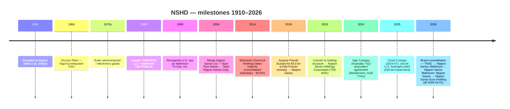

COMPANY RESEARCH REPORT: Nippon Sanso Holdings Corporation (日本酸素ホールディングス株式会社, TSE: 4091)

As of: 2026-05-26

> **Update — FYE2026 full-term guidance raised (2026-02-04):** At the Q3 FYE2026 (April–December 2025) results, management raised full-year revenue guidance to ¥1,330.0 bn (from ¥1,290.0 bn at the May 2025 initial guide), core operating income to ¥196.0 bn (from ¥191.0 bn), IFRS operating income to ¥194.3 bn (from ¥191.0 bn), and net income attributable to owners of the parent to ¥123.5 bn / ¥285.31 EPS (from ¥116.0 bn / ¥267.99). Implied YoY: +1.7% revenue, +17.1% operating income, +25.0% net income. Drivers cited: U.S. dollar / euro tail-winds versus the prior assumption, electronics recovery led by AI-related semiconductor demand, and the Coregas (Australia / New Zealand) acquisition closing on 2025-07-01. Source: [Q3 FYE2026 Consolidated Financial Results Earnings Announcement, 2026-02-04](https://www.nipponsanso-hd.co.jp/en/LinkClick.aspx?fileticket=fHIwDu2e7lc%3D&tabid=210&mid=797), p. 23; [Wesfarmers — Completion of sale of Coregas, 2025-07-01](https://wesfarmers.gcs-web.com/static-files/0fb8fb9f-b93e-42ec-9f80-87c37377b332/).

TABLE OF CONTENTS

1. Company Overview
2. Company History
3. Management Team
4. Products & Services
5. Customers & Go-to-Market
6. Industry Overview
7. Competitive Landscape
8. Market Opportunity (TAM)
9. Risk Assessment
10. References

======================================

## 1. COMPANY OVERVIEW

Nippon Sanso Holdings Corporation ("NSHD", 日本酸素ホールディングス, TSE: 4091) is the world's fourth-largest industrial-gas major, a Tokyo-listed holding company that produces and distributes oxygen, nitrogen, argon, helium, carbon dioxide, hydrogen, and ~30 specialty electronic-material gases through five operating segments — Japan, the United States, Europe, Asia & Oceania, and the Thermos (consumer vacuum-insulated container) business. NSHD's FYE2025 (year ended 31 March 2025) revenue was ¥1,308.0 bn (≈ USD 8.6 bn at the period-average rate of ¥152.57/USD), with core operating income of ¥189.1 bn (margin 14.5%), and the company employs 19,754 people across 31 countries and regions ([Q3 FYE2026 Earnings Materials, 2026-02-04, p. 26 NSHD Group Summary](https://www.nipponsanso-hd.co.jp/en/LinkClick.aspx?fileticket=fHIwDu2e7lc%3D&tabid=210&mid=797); [Integrated Report 2025, p. 5 "Our Current Position"](https://us.nipponsanso.com/wp-content/uploads/2025/10/nippon-sanso-holdings-integrated-report_en-viewing_2025.pdf)). The four atmospheric / process gases (O₂, N₂, Ar, CO₂, H₂, He) are sold to roughly 150,000 customers in Europe alone and to over 100,000 customer accounts in the U.S. ([Integrated Report 2025, p. 76 "Strategy by Segment: United States"](https://us.nipponsanso.com/wp-content/uploads/2025/10/nippon-sanso-holdings-integrated-report_en-viewing_2025.pdf); [Integrated Report 2025, p. 78 "Strategy by Segment: Europe"](https://us.nipponsanso.com/wp-content/uploads/2025/10/nippon-sanso-holdings-integrated-report_en-viewing_2025.pdf)).

The business model is "production at the point of consumption" — air-separation units (ASUs, 空気分離装置) and specialty-gas plants are sited next to the steel mill, the chemical complex, or the semiconductor fab they supply, with gas delivered by pipeline (on-site contracts, ¥/normal m³ at long-tenor take-or-pay), liquid tanker (bulk), or cylinder (packaged). Across the group, the FYE2026 9-month split was Bulk 30%, On-site 12%, Package 26%, Specialty gases 8%, Industrial-gas equipment/installation 20%, Electronics equipment/installation 5% — i.e. on-site + bulk + packaged atmospheric gases ≈ 68% of gas-related revenue, with specialty + equipment the higher-value remainder ([Q3 FYE2026 Earnings, 2026-02-04, p. 36 "Percentage of Revenue by Business"](https://www.nipponsanso-hd.co.jp/en/LinkClick.aspx?fileticket=fHIwDu2e7lc%3D&tabid=210&mid=797)). End-market mix (excluding Thermos) at the same 9-month cut is Chemicals & Energy 20%, Electronics 17%, Food & Beverage 10%, Healthcare 10%, Steel & Metals 8%, Automobiles & Other transport 5%, Others 31% — a portfolio that is structurally more "process / heavy industry" than U.S. and European peers due to the Japan-heritage steel-mill book ([Q3 FYE2026 Earnings, 2026-02-04, p. 34 "Revenue composition"](https://www.nipponsanso-hd.co.jp/en/LinkClick.aspx?fileticket=fHIwDu2e7lc%3D&tabid=210&mid=797)).

The five segments' FYE2025 revenue split was Japan ¥410.0 bn (31% of consolidated), United States ¥360.2 bn (28%), Europe ¥328.6 bn (25%), Asia & Oceania ¥176.5 bn (13%), and Thermos ¥32.5 bn (2%) — i.e. the overseas-revenue ratio is 67.2% ([Integrated Report 2025, p. 5 "Our Current Position"](https://us.nipponsanso.com/wp-content/uploads/2025/10/nippon-sanso-holdings-integrated-report_en-viewing_2025.pdf); [Q3 FYE2026 Earnings, 2026-02-04, p. 35 Quarterly Revenue and Core Operating Income Trends](https://www.nipponsanso-hd.co.jp/en/LinkClick.aspx?fileticket=fHIwDu2e7lc%3D&tabid=210&mid=797)). The U.S. operation is **Matheson Tri-Gas, Inc.** (renamed Nippon Sanso Matheson, Inc., effective 2026-04-01), acquired in stages from 1989 onward and operationally the largest single overseas subsidiary by revenue. The European operation is **Nippon Gases Euro-Holdings, S.L.U.** (renamed Nippon Sanso Euro-Holding S.L.U., effective 2026-04-01), the former European industrial-gas businesses of Praxair purchased for €5.0 bn in cash on 2018-12-03 as part of the EU regulatory remedy for the Praxair-Linde merger ([Linde plc 8-K, 2018-12-03 — Completion of Divestiture of Praxair's European Businesses](https://www.sec.gov/Archives/edgar/data/0001707925/000119312518342968/d662261d8k.htm); [Q3 FYE2026 Earnings, 2026-02-04, p. 18-19 Topics — name changes](https://www.nipponsanso-hd.co.jp/en/LinkClick.aspx?fileticket=fHIwDu2e7lc%3D&tabid=210&mid=797)).

*Source: [Q3 FYE2026 Earnings Materials, 2026-02-04, p. 37 "Business performance over the past five years"](https://www.nipponsanso-hd.co.jp/en/LinkClick.aspx?fileticket=fHIwDu2e7lc%3D&tabid=210&mid=797).*

*Source: [Q3 FYE2026 Earnings Materials, 2026-02-04, p. 35 Quarterly Revenue and Core Operating Income Trends](https://www.nipponsanso-hd.co.jp/en/LinkClick.aspx?fileticket=fHIwDu2e7lc%3D&tabid=210&mid=797).*

NSHD's controlling shareholder is **Mitsubishi Chemical Group Corporation (TSE: 4188)**, which holds 50.59% of NSHD's outstanding shares as of 2025-09-30, with the remaining float distributed across Japanese individuals (14.6%), other Japanese corporations (21.6%), Japanese financial institutions (8.6%), and foreign institutions / individuals (4.6%) per the shareholder-distribution chart in the Q3 deck ([Q3 FYE2026 Earnings, 2026-02-04, p. 26 Distribution by share holders](https://www.nipponsanso-hd.co.jp/en/LinkClick.aspx?fileticket=fHIwDu2e7lc%3D&tabid=210&mid=797); [Simply Wall St — TSE:4091 largest shareholders, 2025-11](https://simplywall.st/stocks/jp/materials/tse-4091/nippon-sanso-holdings-shares/news/nippon-sanso-holdings-corporations-tse4091-largest-sharehold)). This governance arrangement — listed parent kept floating at exactly above the 50% threshold by a majority-owner that consolidates NSHD into its own accounts — is the single most consequential structural fact about the equity story (covered in Section 9).

**Valuation snapshot (as of 2026-05).** Share price ¥5,636 (2026-05-09 close), market cap ¥2.47 trillion (≈ USD 16.3 bn at ¥152/USD), TTM P/E 22.2× on TTM EPS ¥264.4, and forward P/E ≈ 19.7× on the company's own FYE2026 EPS guide of ¥285.31 ([Yahoo Finance — 4091.T Valuation Measures, accessed 2026-05-26](https://finance.yahoo.com/quote/4091.T/key-statistics/); [Q3 FYE2026 Earnings, 2026-02-04, p. 26 FYE2026 Financial Forecast](https://www.nipponsanso-hd.co.jp/en/LinkClick.aspx?fileticket=fHIwDu2e7lc%3D&tabid=210&mid=797)). On TTM revenue of ¥1.32 trillion (using the management raise to ¥1,330 bn as the proxy), P/S = ≈1.9×. Versus the peer set: Linde plc trades at ~29× TTM P/E and ~5× TTM P/S; Air Liquide at ~26× and ~3×; Air Products at ~24× and ~3.6× — *Analyst view:* NSHD trades at a structural 20-30% discount to the Western majors despite delivering FYE2025 core-operating-income growth (+13.9%) and EBITDA margin (23.3%) inside the same range as Air Products and only modestly behind Linde / Air Liquide. The discount reflects (a) Mitsubishi Chemical's majority overhang capping float, (b) ¥-translated overseas earnings that introduce FX noise on every report, and (c) the Thermos business as a non-strategic ~2% drag. With ROCE-after-tax of 7.2% in FYE2025 still 200-400 bps below Linde / Air Liquide, the multiple gap is not unjustified, but the gap is narrowing as the European integration matures and the new mid-term plan (presented 2026-03-30) brings a sharper electronics focus.

*Source: [Yahoo Finance — TSE:4091, accessed 2026-05-26](https://finance.yahoo.com/quote/4091.T/key-statistics/); [Linde plc 10-K FY2024](https://www.sec.gov/cgi-bin/browse-edgar?action=getcompany&CIK=0001707925&type=10-K); [Air Liquide URD 2024](https://www.airliquide.com/sites/airliquide.com/files/2025-03/air-liquide-2024-universal-registration-document-en.pdf); [Air Products 10-K FY2024](https://www.sec.gov/Archives/edgar/data/0000002969/000130817924000793/apdpro012708-ars.pdf).*

NSHD's mid-term plan **"NS Vision 2026 – Enabling the Future"** (April 2022 → March 2026) set five focused fields — Sustainability Management, Explore New Business Toward Carbon Neutrality, Total Electronics, Operational Excellence, and DX Initiatives. Of the five financial KPIs (revenue, core operating income, EBITDA margin, adjusted net D/E ratio, ROCE-after-tax), the FYE2025 actuals exceeded three (revenue, core operating income, ROCE-after-tax); the company is on track to over-deliver on the final-year (FYE2026) plan targets ([Consolidated Financial Results for FYE2025, 2025-05-12, p. 8](https://www.nipponsanso-hd.co.jp/en/LinkClick.aspx?fileticket=6/hKTpzKYqc%3D&tabid=210&mid=797); [Q3 FYE2026 Earnings, 2026-02-04, p. 27 NS Vision 2026 summary](https://www.nipponsanso-hd.co.jp/en/LinkClick.aspx?fileticket=fHIwDu2e7lc%3D&tabid=210&mid=797)). The next mid-term plan will be presented 2026-03-30 (a key catalyst given the upcoming brand consolidation — Taiyo Nippon Sanso → Nippon Sanso, Matheson Tri-Gas → Nippon Sanso Matheson, Nippon Gases Europe → Nippon Sanso Euro-Holding, all effective 2026-04-01).

## 2. COMPANY HISTORY

NSHD's roots reach back to **30 October 1910**, when *Nippon Sanso Ltd.* (日本酸素株式会社) was founded in Tokyo as a partnership to produce oxygen — the first commercial industrial-gas producer in Japan, established with backing from Korekiyo Takahashi, then Deputy Governor of the Bank of Japan ([Integrated Report 2025, p. 3-4 "Evolution of NSHD"](https://us.nipponsanso.com/wp-content/uploads/2025/10/nippon-sanso-holdings-integrated-report_en-viewing_2025.pdf); [Wikipedia — Nippon Sanso Holdings Corporation, accessed 2026-05-26](https://en.wikipedia.org/wiki/Nippon_Sanso_Holdings_Corporation)). The first ASU was built to supply oxygen to Japan's nascent steel industry, and through the 1920s-60s the company tracked Japan's industrial build-out — oxygen for steelmaking (where oxygen is blown into the blast furnace to enrich combustion), nitrogen for chemicals (inerting), argon for shipyards and arc-welding gas-shielded processes, and later carbon dioxide for the dry-ice cold chain and food processing. The Shunan Plant, built in 1964, became the company's flagship integrated complex on the Inland Sea and remains operational today ([Integrated Report 2025, p. 3 "Reducing CO₂ Emissions from Steelmaking"](https://us.nipponsanso.com/wp-content/uploads/2025/10/nippon-sanso-holdings-integrated-report_en-viewing_2025.pdf)).

The pivot into electronics — the segment that now anchors the equity story — began in the **1970s**, when Japanese semiconductor fabs (Toshiba, Hitachi, NEC, Mitsubishi, Matsushita) began adopting silicon-process manufacturing at commercial scale and needed reliable, ultra-high-purity bulk N₂ / Ar and specialty-gas supply. Nippon Sanso established the semiconductor-related gases business in this decade, leveraging its Shunan ASU base to extend into specialty material gases (silane, dichlorosilane, ammonia, NF₃, WF₆ etc.) and dedicated cylinder-cabinet / abatement equipment ([Integrated Report 2025, p. 3 "Making an Early Foray into the Electronics Business"](https://us.nipponsanso.com/wp-content/uploads/2025/10/nippon-sanso-holdings-integrated-report_en-viewing_2025.pdf)). By the late 1980s the electronics franchise had reached commercial maturity, and in 1989 Nippon Sanso completed two foundational acquisitions: **THERMOS LLC** (the U.S. vacuum-flask brand, originator of the trademark dating to 1904) and a controlling stake in **Matheson Gas Products** (a U.S. specialty-gas supplier dating to 1927), the latter of which would eventually become Matheson Tri-Gas through subsequent roll-ups ([Integrated Report 2025, p. 4 "Evolution of NSHD"](https://us.nipponsanso.com/wp-content/uploads/2025/10/nippon-sanso-holdings-integrated-report_en-viewing_2025.pdf); [Wikipedia — Nippon Sanso Holdings Corporation, accessed 2026-05-26](https://en.wikipedia.org/wiki/Nippon_Sanso_Holdings_Corporation)).

*Source: [Integrated Report 2025, p. 4 "Evolution of NSHD"](https://us.nipponsanso.com/wp-content/uploads/2025/10/nippon-sanso-holdings-integrated-report_en-viewing_2025.pdf); [Q3 FYE2026 Earnings, 2026-02-04, p. 17-20 brand-change announcements](https://www.nipponsanso-hd.co.jp/en/LinkClick.aspx?fileticket=fHIwDu2e7lc%3D&tabid=210&mid=797).*

The post-Lehman decade brought four transformational events that turned a Japan-centric utility into a global top-4 gas major. **First**, the 2004 merger of *Nippon Sanso Ltd.* with *Taiyo Toyo Sanso Co., Ltd.* created Taiyo Nippon Sanso Corporation (TNSC) and unified two of Japan's three legacy industrial-gas franchises (the third, Air Water, remained independent). **Second**, on 2014-05-13 Mitsubishi Chemical Holdings agreed to take TNSC as a consolidated subsidiary, eventually settling at a 50.6% stake — bringing TNSC into the Mitsubishi Chemical balance sheet and providing balance-sheet capacity for the M&A wave to follow ([Nikkei Asia — Mitsubishi Chemical to acquire Taiyo Nippon Sanso, 2014-05](https://asia.nikkei.com/Business/Mitsubishi-Chemical-to-acquire-Taiyo-Nippon-Sanso); [Integrated Report 2025, p. 4 "Evolution of NSHD" 2014 milestone](https://us.nipponsanso.com/wp-content/uploads/2025/10/nippon-sanso-holdings-integrated-report_en-viewing_2025.pdf)). **Third**, on 2018-12-03 TNSC closed the **€5.0 billion** acquisition of Praxair's European industrial-gas business — the remedy package the EU required for the Praxair-Linde merger — comprising operations in 12 European countries with ~2,500 employees, immediately renamed Nippon Gases Euro-Holdings, S.L.U. ([Linde plc 8-K, 2018-12-03 — Completion of Divestiture of Praxair's European Businesses](https://www.sec.gov/Archives/edgar/data/0001707925/000119312518342968/d662261d8k.htm)). **Fourth**, on 2020-10-01 TNSC transferred its operating businesses into a holding structure, renaming the parent **Nippon Sanso Holdings Corporation** and setting up the current five-segment architecture with TNSC, Matheson, Nippon Gases, Asia & Oceania group companies, and THERMOS K.K. as separate sub-groups under the Tokyo HoldCo ([Integrated Report 2025, p. 4 "Evolving Through the Introduction of a Holding Company Structure"](https://us.nipponsanso.com/wp-content/uploads/2025/10/nippon-sanso-holdings-integrated-report_en-viewing_2025.pdf)).

The most recent 18 months delivered two more material steps. On 2024-12-20 NSHD agreed to acquire **Coregas Pty Ltd** from Wesfarmers Limited for **AUD 770 million** (≈ ¥75 bn), with closing on 2025-07-01 after Australian Competition and Consumer Commission (ACCC) clearance on 2025-06-27 — adding a top-3 industrial-gas position in Australia and a New Zealand entry to the Asia & Oceania segment ([Wesfarmers — Completion of sale of Coregas, 2025-07-01](https://wesfarmers.gcs-web.com/static-files/0fb8fb9f-b93e-42ec-9f80-87c37377b332/); [BDO — Nippon Sanso agrees to acquire Coregas from Wesfarmers for A\$770m, 2024-12](https://www.bdo.com.au/en-au/deals/nippon-sanso-agrees-to-acquire-coregas-from-wesfarmers-for-a$770m)). Separately, in FYE2025 NSHD recorded a **¥26 billion impairment loss** when the end-customer of an on-site hydrogen plant under construction in the United States — a renewable-diesel producer (Polaris) — filed for bankruptcy protection mid-build, forcing the project's cancellation ([Integrated Report 2025, p. 17 CFO Message](https://us.nipponsanso.com/wp-content/uploads/2025/10/nippon-sanso-holdings-integrated-report_en-viewing_2025.pdf); [Consolidated Financial Results for FYE2025, 2025-05-12, p. 5](https://www.nipponsanso-hd.co.jp/en/LinkClick.aspx?fileticket=6/hKTpzKYqc%3D&tabid=210&mid=797)). The CFO note describes this candidly as "a tough lesson" and pointed to strengthened project-screening controls for non-core hydrogen / clean-energy work going forward.

The 2026-04-01 brand consolidation closes the holding-company chapter: TNSC drops "Taiyo" and reverts to **Nippon Sanso Corporation**; Matheson Tri-Gas becomes **Nippon Sanso Matheson, Inc.**; Nippon Gases Euro-Holding becomes **Nippon Sanso Euro-Holding S.L.U.** — all under the unified "NIPPON SANSO" wordmark globally ([NSHD press release — Group Unifies Global Brand Logo, 2025-08-28](https://www.businesswire.com/news/home/20250828253560/en/Nippon-Sanso-Holdings-Group-Unifies-Global-Brand-Logo-Launching-the-NIPPON-SANSO-Brand-Worldwide); [MATHESON to Rename as Nippon Sanso MATHESON, 2025-09-23](https://www.businesswire.com/news/home/20250923371107/en/MATHESON-to-Rename-as-Nippon-Sanso-MATHESON)). The renaming signals two things: (a) the holding-company structure is no longer a portfolio of historical acquisitions but a single global operator, and (b) the next mid-term plan (presented 2026-03-30) will likely raise the bar for cross-region cost synergies, currently captured under the "Operational Excellence" pillar of NS Vision 2026 (a ¥56 bn 4-year cost-reduction target).

## 3. MANAGEMENT TEAM

**Founder — Takehiko Yamaguchi (山口武彦).** Nippon Sanso Ltd. was founded in 1910 by Takehiko Yamaguchi as a partnership to commercialize oxygen production in Japan, with material financial backing from Korekiyo Takahashi (later Prime Minister of Japan), then serving as Deputy Governor of the Bank of Japan ([Wikipedia — Nippon Sanso Holdings Corporation, accessed 2026-05-26](https://en.wikipedia.org/wiki/Nippon_Sanso_Holdings_Corporation); [Integrated Report 2025, p. 3 "Evolution of NSHD" 1910 milestone](https://us.nipponsanso.com/wp-content/uploads/2025/10/nippon-sanso-holdings-integrated-report_en-viewing_2025.pdf)). Yamaguchi's founding thesis — that a domestic supplier of cryogenically separated atmospheric gases would prove essential to Japan's industrial development as the country moved from textiles into steel and chemicals — was vindicated within a decade as oxygen became the standard combustion-enhancer in Japan's blast furnaces. The founder family has had no operating involvement in the company for generations, and no founding-family equity remains; the equity-control franchise passed first to Mitsubishi Chemical via the 2014 transaction and then to public float plus the Mitsubishi Chemical 50.6% block today. The 1910 founding date and the founding capital structure are now primarily historical / branding artefacts rather than operating facts about the modern equity story — but they explain (a) the strength of NSHD's Japanese-utility customer franchise and (b) why the company chose to drop the "Taiyo" prefix in 2026 and revert to the original 1910 name as its global identity.

**President & CEO — Toshihiko Hamada (浜田敏彦).** Hamada has been President, CEO, and Representative Director of NSHD since 2021, prior to which he served as Director and Executive Vice President of NSHD from 2020 (the holding-company year), and President & Director of *Nissan TANAKA Corporation* (a specialty-gas-related industrial-equipment business in the wider TNSC / Mitsubishi Chemical group). Earlier in his career he served as Executive Vice President for Specialty Gas Technology at Matheson Tri-Gas in 2002 and as Senior Managing Director (2016) and Managing Director (2014) of Nissan TANAKA ([Bloomberg — Toshihiko Hamada profile](https://www.bloomberg.com/profile/person/21859721); [Integrated Report 2025, p. 58 "Members of the Board of Directors, Audit & Supervisory Board Members, and Executive Officers"](https://us.nipponsanso.com/wp-content/uploads/2025/10/nippon-sanso-holdings-integrated-report_en-viewing_2025.pdf)). His U.S. Matheson tenure is unusually relevant for a Japanese gas-major CEO — it gives him direct operating familiarity with the specialty-electronics-gas franchise that is the medium-term growth engine, and with the Matheson regional management team in the U.S. that today contributes 28% of group revenue.

Under Hamada's tenure, NSHD has delivered three strategic outcomes that frame the equity story today: (1) the medium-term plan **NS Vision 2026** with ¥56 bn of 4-year cost reductions under "Operational Excellence" was on track at the 3-year mark to over-deliver three of its five financial KPIs ([Consolidated Financial Results for FYE2025, 2025-05-12, p. 8](https://www.nipponsanso-hd.co.jp/en/LinkClick.aspx?fileticket=6/hKTpzKYqc%3D&tabid=210&mid=797)); (2) the 2025 Coregas acquisition extended the Asia & Oceania footprint to Australia / NZ at a 9× pre-tax EV/EBITDA multiple, a disciplined price for a top-3 regional position; and (3) the brand-consolidation programme announced over August–September 2025 — Taiyo Nippon Sanso → Nippon Sanso, Matheson Tri-Gas → Nippon Sanso Matheson, Nippon Gases → Nippon Sanso Euro-Holding (all 2026-04-01) — signals the end of the post-2018 multi-brand holding-company configuration and the beginning of a unified global operator ([NSHD press release — Group Unifies Global Brand Logo, 2025-08-28](https://www.businesswire.com/news/home/20250828253560/en/Nippon-Sanso-Holdings-Group-Unifies-Global-Brand-Logo-Launching-the-NIPPON-SANSO-Brand-Worldwide); [Q3 FYE2026 Earnings, 2026-02-04, p. 17-19 segment Topics](https://www.nipponsanso-hd.co.jp/en/LinkClick.aspx?fileticket=fHIwDu2e7lc%3D&tabid=210&mid=797)). Hamada's stated 2026-and-beyond ambition, as articulated in the FYE2025 CEO message, is for NSHD to "rank among the global majors" — explicitly Linde, Air Liquide, and Air Products — by closing the ROCE-after-tax gap (NSHD 7.2% vs. Linde / Air Liquide both ~12-14%) through tighter capital discipline and a sharper electronics focus ([Integrated Report 2025, p. 13 CEO Message — "Requirements for Ranking Among the Global Majors"](https://us.nipponsanso.com/wp-content/uploads/2025/10/nippon-sanso-holdings-integrated-report_en-viewing_2025.pdf)). His personal ownership stake is not disclosed in the proxy materials; Japanese executive holdings at NSHD are nominal (≤0.1%) as is typical for non-founder-led TSE Prime issuers.
