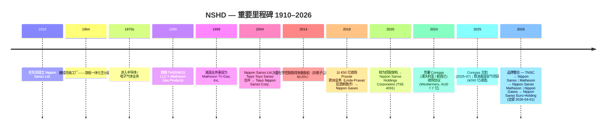

公司研究报告：日本酸素控股株式会社 (Nippon Sanso Holdings Corporation, 日本酸素ホールディングス株式会社, TSE: 4091)

截至日期：2026-05-26

> **更新——FYE2026 全年指引上调 (2026-02-04)：** 公司在 Q3 FYE2026（2025 年 4–12 月）业绩中将全年营收指引由 2025-05 初次指引的 ¥1,290.0 亿日元上调至 ¥1,330.0 亿，核心营业利润由 ¥191.0 亿上调至 ¥196.0 亿，IFRS 营业利润由 ¥191.0 亿上调至 ¥194.3 亿，归母净利润由 ¥116.0 亿 / EPS ¥267.99 上调至 ¥123.5 亿 / EPS ¥285.31。隐含同比：营收 +1.7%，营业利润 +17.1%，净利润 +25.0%。管理层归因于：美元 / 欧元相对前次假设走强、AI 相关半导体需求驱动的电子板块复苏，以及 Coregas（澳大利亚 / 新西兰）收购于 2025-07-01 完成交割。来源：[Q3 FYE2026 业绩公告, 2026-02-04](https://www.nipponsanso-hd.co.jp/en/LinkClick.aspx?fileticket=fHIwDu2e7lc%3D&tabid=210&mid=797), 第 23 页；[Wesfarmers — Coregas 出售交割完成, 2025-07-01](https://wesfarmers.gcs-web.com/static-files/0fb8fb9f-b93e-42ec-9f80-87c37377b332/)。

目录

1. 公司概览
2. 公司历史
3. 管理团队
4. 产品与服务
5. 客户与上市策略
6. 行业概览
7. 竞争格局
8. 市场机会
9. 风险评估
10. 参考资料

======================================

## 1. 公司概览

日本酸素控股株式会社 (Nippon Sanso Holdings, "NSHD"，日本酸素ホールディングス，TSE: 4091) 是全球第四大工业气体 (industrial gas) 巨头，东京上市的控股公司，通过日本、美国、欧洲、亚洲与大洋洲及 Thermos（消费类真空保温容器）五大业务分部生产并分销氧气、氮气、氩气、氦气 (helium)、二氧化碳、氢气，以及约 30 种电子特种气体 (electronic specialty gas)。FYE2025（截至 2025 年 3 月 31 日的财年）合并营收为 ¥1,308.0 亿日元（按期间均值 ¥152.57/USD 折算约 USD 86 亿），核心营业利润 ¥189.1 亿日元（利润率 14.5%），在 31 个国家和地区共雇用 19,754 名员工 ([Q3 FYE2026 业绩材料, 2026-02-04, 第 26 页 NSHD 集团概况](https://www.nipponsanso-hd.co.jp/en/LinkClick.aspx?fileticket=fHIwDu2e7lc%3D&tabid=210&mid=797); [Integrated Report 2025, 第 5 页 "Our Current Position"](https://us.nipponsanso.com/wp-content/uploads/2025/10/nippon-sanso-holdings-integrated-report_en-viewing_2025.pdf))。四种空分气体加上其他工业气体（O₂、N₂、Ar、CO₂、H₂、He）仅在欧洲就服务约 150,000 家客户，在美国市场拥有逾 100,000 个客户账户 ([Integrated Report 2025, 第 76 页 "Strategy by Segment: United States"](https://us.nipponsanso.com/wp-content/uploads/2025/10/nippon-sanso-holdings-integrated-report_en-viewing_2025.pdf); [Integrated Report 2025, 第 78 页 "Strategy by Segment: Europe"](https://us.nipponsanso.com/wp-content/uploads/2025/10/nippon-sanso-holdings-integrated-report_en-viewing_2025.pdf))。

公司的商业模式可概括为"在消费点就近生产"——空分装置 (ASUs, 空気分離装置) 和特种气体厂房建在所服务的钢厂、化工综合体或半导体晶圆厂旁边，通过管道交付（驻厂供气 (on-site supply) 长期 take-or-pay 合同，¥/标准立方米计价）、液态储罐车（散装）或钢瓶（包装）三种方式分销。集团合并口径下，FYE2026 9 个月的业务构成为散装 30%、驻厂 12%、包装 26%、特种气体 8%、工业气体设备 / 安装 20%、电子设备 / 安装 5%——即驻厂 + 散装 + 包装大气类气体约占气体相关营收的 68%，特种气体 + 设备构成附加值更高的剩余部分 ([Q3 FYE2026 业绩, 2026-02-04, 第 36 页 "Percentage of Revenue by Business"](https://www.nipponsanso-hd.co.jp/en/LinkClick.aspx?fileticket=fHIwDu2e7lc%3D&tabid=210&mid=797))。同口径下行业终端市场结构（不含 Thermos）为化工与能源 20%、电子 17%、食品饮料 10%、医疗保健 10%、钢铁与有色金属 8%、汽车及其他运输 5%、其他 31%——由于继承自日本本土的钢厂客户簿，整体组合相对美欧同业更偏"流程 / 重工业" ([Q3 FYE2026 业绩, 2026-02-04, 第 34 页 "Revenue composition"](https://www.nipponsanso-hd.co.jp/en/LinkClick.aspx?fileticket=fHIwDu2e7lc%3D&tabid=210&mid=797))。

五大分部 FYE2025 营收结构为日本 ¥410.0 亿（合并 31%）、美国 ¥360.2 亿（28%）、欧洲 ¥328.6 亿（25%）、亚洲与大洋洲 ¥176.5 亿（13%）、Thermos ¥32.5 亿（2%）——海外收入占比为 67.2% ([Integrated Report 2025, 第 5 页 "Our Current Position"](https://us.nipponsanso.com/wp-content/uploads/2025/10/nippon-sanso-holdings-integrated-report_en-viewing_2025.pdf); [Q3 FYE2026 业绩, 2026-02-04, 第 35 页 季度营收与核心营业利润趋势](https://www.nipponsanso-hd.co.jp/en/LinkClick.aspx?fileticket=fHIwDu2e7lc%3D&tabid=210&mid=797))。美国业务由 **Matheson Tri-Gas, Inc. (美国子公司)**（2026-04-01 起更名为 Nippon Sanso Matheson, Inc.）承担，自 1989 年起分阶段收购，按营收口径是规模最大的单一海外子公司。欧洲业务的载体为 **Nippon Gases Euro-Holdings, S.L.U. (欧洲子公司)**（2026-04-01 起更名为 Nippon Sanso Euro-Holding S.L.U.），即原 Praxair 欧洲工业气体业务，作为 Praxair-Linde 合并的欧盟反垄断救济资产，于 2018-12-03 以 €50 亿现金收购 ([Linde plc 8-K, 2018-12-03 — Completion of Divestiture of Praxair's European Businesses](https://www.sec.gov/Archives/edgar/data/0001707925/000119312518342968/d662261d8k.htm); [Q3 FYE2026 业绩, 2026-02-04, 第 18-19 页 Topics — 更名公告](https://www.nipponsanso-hd.co.jp/en/LinkClick.aspx?fileticket=fHIwDu2e7lc%3D&tabid=210&mid=797))。

*Source: [Q3 FYE2026 Earnings Materials, 2026-02-04, 第 37 页 "Business performance over the past five years"](https://www.nipponsanso-hd.co.jp/en/LinkClick.aspx?fileticket=fHIwDu2e7lc%3D&tabid=210&mid=797).*

*Source: [Q3 FYE2026 Earnings Materials, 2026-02-04, 第 35 页 季度营收与核心营业利润趋势](https://www.nipponsanso-hd.co.jp/en/LinkClick.aspx?fileticket=fHIwDu2e7lc%3D&tabid=210&mid=797).*

NSHD 的控股股东是 **三菱化学集团 (Mitsubishi Chemical — 主要股东) (TSE: 4188)**，截至 2025-09-30 持有 NSHD 50.59% 的已发行股份；剩余流通股的分布根据 Q3 路演材料中的股东分布图为：日本个人 14.6%、其他日本法人 21.6%、日本金融机构 8.6%、海外机构 / 个人 4.6% ([Q3 FYE2026 业绩, 2026-02-04, 第 26 页 Distribution by share holders](https://www.nipponsanso-hd.co.jp/en/LinkClick.aspx?fileticket=fHIwDu2e7lc%3D&tabid=210&mid=797); [Simply Wall St — TSE:4091 largest shareholders, 2025-11](https://simplywall.st/stocks/jp/materials/tse-4091/nippon-sanso-holdings-shares/news/nippon-sanso-holdings-corporations-tse4091-largest-sharehold))。这种"上市子公司 + 大股东在 50% 阈值刚好以上长期持有 + 大股东将 NSHD 并表"的治理安排，是 NSHD 股权故事中最具结构性意义的事实（详见 §9）。

**估值快照（截至 2026-05）。** 股价 ¥5,636（2026-05-09 收盘），市值 ¥2.47 万亿日元（按 ¥152/USD 约 USD 163 亿），基于 TTM EPS ¥264.4 的 TTM P/E 为 22.2×；按公司自身 FYE2026 EPS 指引 ¥285.31 计算前瞻 P/E 约 19.7× ([Yahoo Finance — 4091.T Valuation Measures, 访问于 2026-05-26](https://finance.yahoo.com/quote/4091.T/key-statistics/); [Q3 FYE2026 业绩, 2026-02-04, 第 26 页 FYE2026 Financial Forecast](https://www.nipponsanso-hd.co.jp/en/LinkClick.aspx?fileticket=fHIwDu2e7lc%3D&tabid=210&mid=797))。以 TTM 营收 ¥1.32 万亿日元（用管理层上调后 ¥1,330 亿作为代理）计，P/S 约 1.9×。对比同业：Linde plc TTM P/E 约 29×、P/S 约 5×；Air Liquide 约 26× / 3×；Air Products 约 24× / 3.6×。*分析师观点：* 尽管 NSHD FYE2025 核心营业利润同比增长 13.9%、EBITDA 利润率 23.3%（与 Air Products 接近，离 Linde / Air Liquide 也只是微距），股价对比西方三巨头长期折让 20-30%。这一折让源自三个结构性因素：(a) 三菱化学的多数股权压制流通市值；(b) 海外利润以日元折算引入每期 FX 噪音；(c) Thermos 业务作为非战略性 ~2% 拖累。FYE2025 税后 ROCE 为 7.2%，仍比 Linde / Air Liquide 低 200-400 bps，所以折价并非完全没有道理，但随着欧洲并购的整合成熟，以及 2026-03-30 公布的下一期中期计划更聚焦电子板块，差距正在收窄。

*Source: [Yahoo Finance — TSE:4091, 访问于 2026-05-26](https://finance.yahoo.com/quote/4091.T/key-statistics/); [Linde plc 10-K FY2024](https://www.sec.gov/cgi-bin/browse-edgar?action=getcompany&CIK=0001707925&type=10-K); [Air Liquide URD 2024](https://www.airliquide.com/sites/airliquide.com/files/2025-03/air-liquide-2024-universal-registration-document.pdf); [Air Products 10-K FY2024](https://www.sec.gov/Archives/edgar/data/0000002969/000130817924000793/apdpro012708-ars.pdf).*

NSHD 的中期计划 **"NS Vision 2026 – Enabling the Future"** （2022 年 4 月 → 2026 年 3 月）设定了五大重点方向——可持续管理、面向碳中和的新业务探索、Total Electronics、运营卓越和 DX 数字化举措。在五大财务 KPI（营收、核心营业利润、EBITDA 利润率、调整后净 D/E 比、税后 ROCE）中，FYE2025 实际值已经超额完成其中三项（营收、核心营业利润、税后 ROCE），公司有望在收官年 FYE2026 进一步超额完成计划目标 ([FYE2025 合并财务结果, 2025-05-12, 第 8 页](https://www.nipponsanso-hd.co.jp/en/LinkClick.aspx?fileticket=6/hKTpzKYqc%3D&tabid=210&mid=797); [Q3 FYE2026 业绩, 2026-02-04, 第 27 页 NS Vision 2026 summary](https://www.nipponsanso-hd.co.jp/en/LinkClick.aspx?fileticket=fHIwDu2e7lc%3D&tabid=210&mid=797))。下一期中期计划将于 2026-03-30 公布，鉴于即将到来的品牌整合（Taiyo Nippon Sanso → Nippon Sanso、Matheson Tri-Gas → Nippon Sanso Matheson、Nippon Gases Europe → Nippon Sanso Euro-Holding，全部于 2026-04-01 生效），这是一个关键催化剂。

## 2. 公司历史

NSHD 的根源可追溯到 **1910 年 10 月 30 日**，*Nippon Sanso Ltd.* (日本酸素株式会社) 在东京以合伙制成立，专门生产氧气——日本第一家商业化的工业气体生产商，由时任日本银行副总裁的高桥是清提供资金支持 ([Integrated Report 2025, 第 3-4 页 "Evolution of NSHD"](https://us.nipponsanso.com/wp-content/uploads/2025/10/nippon-sanso-holdings-integrated-report_en-viewing_2025.pdf); [Wikipedia — Nippon Sanso Holdings Corporation, 访问于 2026-05-26](https://en.wikipedia.org/wiki/Nippon_Sanso_Holdings_Corporation))。公司建造的第一台空分装置用于向日本初生的钢铁工业供应氧气；从 1920 年代到 1960 年代，公司紧随日本的工业化建设——氧气用于炼钢（将氧气吹入高炉以强化燃烧）、氮气用于化工（惰性保护）、氩气用于造船业和电弧焊保护气，后期再发展二氧化碳用于干冰冷链与食品加工。建于 1964 年的周南工厂成为公司的旗舰一体化厂区，位于濑户内海岸边，至今仍在运营 ([Integrated Report 2025, 第 3 页 "Reducing CO₂ Emissions from Steelmaking"](https://us.nipponsanso.com/wp-content/uploads/2025/10/nippon-sanso-holdings-integrated-report_en-viewing_2025.pdf))。

将业务重心转向电子板块——即目前股权故事的核心——始于 **1970 年代**，当时日本半导体厂（东芝、日立、NEC、三菱、松下）开始商业化规模运营硅工艺制造，需要稳定且超高纯度的散装 N₂ / Ar 与特种气体供应。Nippon Sanso 在此十年内建立了半导体相关气体业务，利用周南空分基地延展进入特种材料气体（硅烷、二氯硅烷、氨气、NF₃、WF₆ 等）以及配套的钢瓶柜 / 尾气处理设备 ([Integrated Report 2025, 第 3 页 "Making an Early Foray into the Electronics Business"](https://us.nipponsanso.com/wp-content/uploads/2025/10/nippon-sanso-holdings-integrated-report_en-viewing_2025.pdf))。到 1980 年代末，电子业务已经进入商业成熟期，1989 年 Nippon Sanso 完成了两笔奠基性收购：**膳魔师 (Thermos — 子品牌) LLC**（美国真空瓶品牌，商标可追溯至 1904 年）以及对 **Matheson Gas Products**（美国特种气体供应商，可追溯至 1927 年）的控股，后者通过后续整合成为今日的 Matheson Tri-Gas ([Integrated Report 2025, 第 4 页 "Evolution of NSHD"](https://us.nipponsanso.com/wp-content/uploads/2025/10/nippon-sanso-holdings-integrated-report_en-viewing_2025.pdf); [Wikipedia — Nippon Sanso Holdings Corporation, 访问于 2026-05-26](https://en.wikipedia.org/wiki/Nippon_Sanso_Holdings_Corporation))。

*Source: [Integrated Report 2025, 第 4 页 "Evolution of NSHD"](https://us.nipponsanso.com/wp-content/uploads/2025/10/nippon-sanso-holdings-integrated-report_en-viewing_2025.pdf); [Q3 FYE2026 业绩, 2026-02-04, 第 17-20 页 品牌更名公告](https://www.nipponsanso-hd.co.jp/en/LinkClick.aspx?fileticket=fHIwDu2e7lc%3D&tabid=210&mid=797).*

雷曼危机后的十年里有四起转型事件，把一家以日本为中心的公用事业型企业打造成了全球前四的气体巨头。**第一**，2004 年 *Nippon Sanso Ltd.* 与 *Taiyo Toyo Sanso Co., Ltd.* 合并成立 Taiyo Nippon Sanso Corporation (TNSC)，统合了日本三家传统工业气体厂中的两家（第三家 Air Water 维持独立）。**第二**，2014-05-13，三菱化学控股同意将 TNSC 纳入并表子公司，最终在 50.6% 股权处持平——把 TNSC 纳入三菱化学的资产负债表，也为随后并购浪潮提供了资产负债表容量 ([Nikkei Asia — Mitsubishi Chemical to acquire Taiyo Nippon Sanso, 2014-05](https://asia.nikkei.com/Business/Mitsubishi-Chemical-to-acquire-Taiyo-Nippon-Sanso); [Integrated Report 2025, 第 4 页 "Evolution of NSHD" 2014 milestone](https://us.nipponsanso.com/wp-content/uploads/2025/10/nippon-sanso-holdings-integrated-report_en-viewing_2025.pdf))。**第三**，2018-12-03 TNSC 完成 **€50 亿** 收购 Praxair 欧洲工业气体业务的交割——这是欧盟为 Praxair-Linde 合并要求的反垄断救济包，涵盖 12 个欧洲国家的运营和约 2,500 名员工，紧接着被重新命名为 Nippon Gases Euro-Holdings, S.L.U. ([Linde plc 8-K, 2018-12-03 — Completion of Divestiture of Praxair's European Businesses](https://www.sec.gov/Archives/edgar/data/0001707925/000119312518342968/d662261d8k.htm))。**第四**，2020-10-01 TNSC 将经营业务转入控股架构，将母公司重命名为 **Nippon Sanso Holdings Corporation**，建立起当前以 TNSC、Matheson、Nippon Gases、亚洲与大洋洲集团公司及 THERMOS K.K. 为子集团、东京 HoldCo 在上的五分部架构 ([Integrated Report 2025, 第 4 页 "Evolving Through the Introduction of a Holding Company Structure"](https://us.nipponsanso.com/wp-content/uploads/2025/10/nippon-sanso-holdings-integrated-report_en-viewing_2025.pdf))。

近 18 个月还交付了两个重大节点。2024-12-20，NSHD 同意以 **AUD 7.7 亿**（约 ¥750 亿）从 Wesfarmers Limited 收购 **Coregas Pty Ltd**，澳大利亚竞争与消费者委员会 (ACCC) 于 2025-06-27 通过审查，交割于 2025-07-01 完成——为亚洲与大洋洲分部增加了澳大利亚 Top-3 工业气体地位和新西兰市场入口 ([Wesfarmers — Coregas 出售交割完成, 2025-07-01](https://wesfarmers.gcs-web.com/static-files/0fb8fb9f-b93e-42ec-9f80-87c37377b332/); [BDO — Nippon Sanso agrees to acquire Coregas from Wesfarmers for A\$770m, 2024-12](https://www.bdo.com.au/en-au/deals/nippon-sanso-agrees-to-acquire-coregas-from-wesfarmers-for-a$770m))。另外，FYE2025 NSHD 计提了 **¥260 亿减值损失**——美国一处在建驻厂氢气工厂的终端客户（一家与 Polaris 相关的可再生柴油生产商）在工程建设期间申请破产保护，迫使项目取消（即 **Polaris 氢能项目**）([Integrated Report 2025, 第 17 页 CFO Message](https://us.nipponsanso.com/wp-content/uploads/2025/10/nippon-sanso-holdings-integrated-report_en-viewing_2025.pdf); [FYE2025 合并财务结果, 2025-05-12, 第 5 页](https://www.nipponsanso-hd.co.jp/en/LinkClick.aspx?fileticket=6/hKTpzKYqc%3D&tabid=210&mid=797))。CFO 的留言坦率地将其描述为"一个沉痛的教训"，并指出未来对非核心氢气 / 清洁能源工程的项目审核已加强。

2026-04-01 的品牌整合标志着控股公司过渡章节的收尾：TNSC 摘除 "Taiyo" 字头，复归 **Nippon Sanso Corporation**；Matheson Tri-Gas 改为 **Nippon Sanso Matheson, Inc.**；Nippon Gases Euro-Holding 改为 **Nippon Sanso Euro-Holding S.L.U.**——全部统一在"NIPPON SANSO"全球品牌标识下 ([NSHD 新闻稿 — Group Unifies Global Brand Logo, 2025-08-28](https://www.businesswire.com/news/home/20250828253560/en/Nippon-Sanso-Holdings-Group-Unifies-Global-Brand-Logo-Launching-the-NIPPON-SANSO-Brand-Worldwide); [MATHESON to Rename as Nippon Sanso MATHESON, 2025-09-23](https://www.businesswire.com/news/home/20250923371107/en/MATHESON-to-Rename-as-Nippon-Sanso-MATHESON))。改名意味着两件事：(a) 控股公司架构不再是历史并购形成的资产组合，而是一个统一的全球运营商；(b) 下一期中期计划（2026-03-30 发布）很可能将跨区域成本协同的标杆调高，目前这部分协同被纳入 NS Vision 2026 的"运营卓越"支柱下（4 年 ¥560 亿成本削减目标）。

## 3. 管理团队

**创始人——山口武彦 (Takehiko Yamaguchi)。** Nippon Sanso Ltd. 于 1910 年由山口武彦以合伙制创办，旨在将日本氧气生产商业化，时任日本银行副总裁的高桥是清（后来担任日本首相）提供了关键资金支持 ([Wikipedia — Nippon Sanso Holdings Corporation, 访问于 2026-05-26](https://en.wikipedia.org/wiki/Nippon_Sanso_Holdings_Corporation); [Integrated Report 2025, 第 3 页 "Evolution of NSHD" 1910 milestone](https://us.nipponsanso.com/wp-content/uploads/2025/10/nippon-sanso-holdings-integrated-report_en-viewing_2025.pdf))。山口的创业判断——本土低温分离大气气体供应商对日本从纺织走向钢铁与化工的工业化路径至关重要——在十年内便得到验证：氧气成为日本高炉炼钢的标准助燃剂。创始人家族数代以来已没有任何运营参与，也没有遗留股权；股权控股权先于 2014 年通过三菱化学的交易转移，后又演化为今天三菱化学 50.6% 股权 + 公众流通股的结构。1910 的创建日期与创始资本结构如今主要是历史 / 品牌符号，而非现代股权故事中的运营事实——但它们解释了 (a) NSHD 在日本公用事业类客户群体中的牢固基础，以及 (b) 公司为何选择在 2026 年放弃"太阳"前缀，并将 1910 年的原名作为全球品牌身份的回归。

**总裁兼 CEO——浜田敏彦 (Toshihiko Hamada)。** 浜田自 2021 年起担任 NSHD 总裁、CEO 兼代表董事；此前于 2020 年（控股公司过渡年）出任 NSHD 董事兼执行副总裁，并曾任 *Nissan TANAKA Corporation* 总裁兼董事——后者是更大的 TNSC / 三菱化学集团旗下专门做特种气体相关工业设备的公司。其早期生涯还包括 2002 年在 Matheson Tri-Gas 担任特种气体技术执行副总裁，以及 2014 年和 2016 年分别在 Nissan TANAKA 担任董事总经理及高级董事总经理 ([Bloomberg — Toshihiko Hamada profile](https://www.bloomberg.com/profile/person/21859721); [Integrated Report 2025, 第 58 页 "Members of the Board of Directors, Audit & Supervisory Board Members, and Executive Officers"](https://us.nipponsanso.com/wp-content/uploads/2025/10/nippon-sanso-holdings-integrated-report_en-viewing_2025.pdf))。他在 Matheson 的美国履历对一位日本气体巨头 CEO 来说异常重要——这让他对中期增长引擎的电子特种气体业务有直接的运营熟悉度，也熟悉今日贡献集团 28% 营收的 Matheson 美国区域管理团队。

浜田任内交付的三大战略成果，构成了今天股权故事的框架：(1) 中期计划 **NS Vision 2026** 在"运营卓越"支柱下的 4 年 ¥560 亿成本削减，在 3 年节点已超额完成五项财务 KPI 中的三项 ([FYE2025 合并财务结果, 2025-05-12, 第 8 页](https://www.nipponsanso-hd.co.jp/en/LinkClick.aspx?fileticket=6/hKTpzKYqc%3D&tabid=210&mid=797))；(2) 2025 年 Coregas 收购以税前 EV/EBITDA 9× 的价格扩大亚洲与大洋洲足迹至澳大利亚 / 新西兰，对于一个区域 Top-3 地位而言是有纪律的价位；(3) 2025 年 8–9 月公布的品牌整合方案——Taiyo Nippon Sanso → Nippon Sanso、Matheson Tri-Gas → Nippon Sanso Matheson、Nippon Gases → Nippon Sanso Euro-Holding（均 2026-04-01 生效）——标志着 2018 年以来多品牌控股公司构造的终结和统一全球运营商的开始 ([NSHD 新闻稿 — Group Unifies Global Brand Logo, 2025-08-28](https://www.businesswire.com/news/home/20250828253560/en/Nippon-Sanso-Holdings-Group-Unifies-Global-Brand-Logo-Launching-the-NIPPON-SANSO-Brand-Worldwide); [Q3 FYE2026 业绩, 2026-02-04, 第 17-19 页 分部 Topics](https://www.nipponsanso-hd.co.jp/en/LinkClick.aspx?fileticket=fHIwDu2e7lc%3D&tabid=210&mid=797))。浜田在 FYE2025 CEO 致辞中陈述的 2026 年以后的志向是让 NSHD"跻身全球巨头之列"——具体指 Linde、Air Liquide 和 Air Products——通过更严格的资本纪律和更明确的电子板块聚焦来弥合税后 ROCE 差距（NSHD 7.2% vs. Linde / Air Liquide 均 ~12-14%）([Integrated Report 2025, 第 13 页 CEO Message — "Requirements for Ranking Among the Global Majors"](https://us.nipponsanso.com/wp-content/uploads/2025/10/nippon-sanso-holdings-integrated-report_en-viewing_2025.pdf))。其个人股权未在委托书材料中披露；NSHD 高管个人持股属于非创始人主导的 TSE Prime 上市公司常见水平（≤0.1%）。
