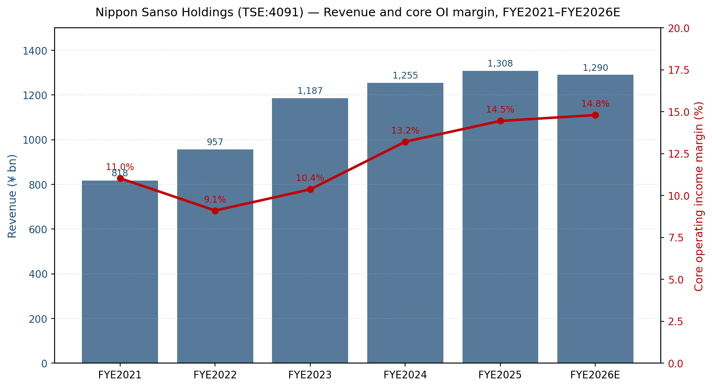
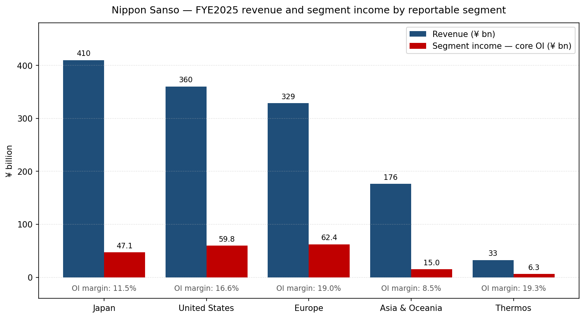
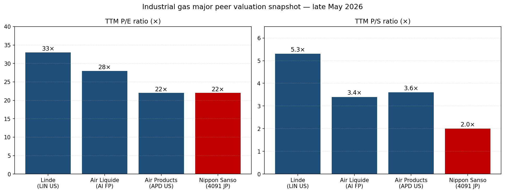
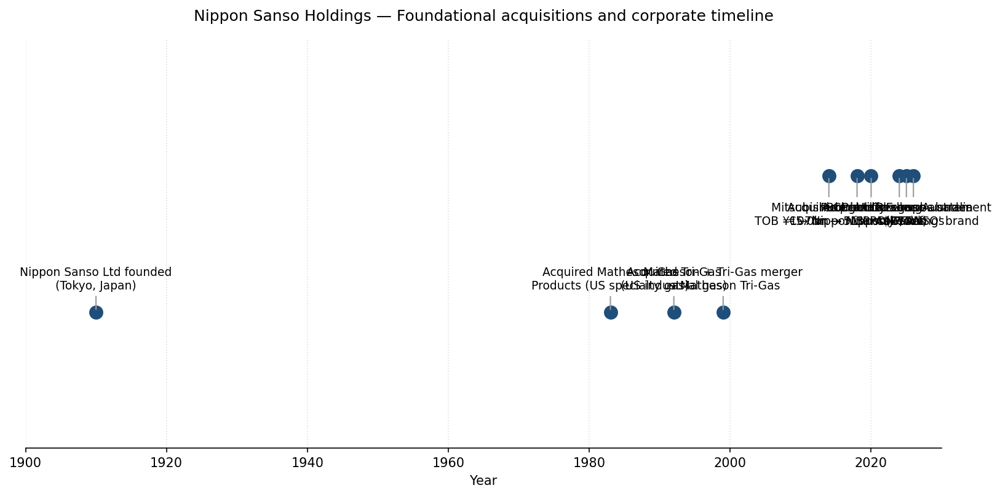
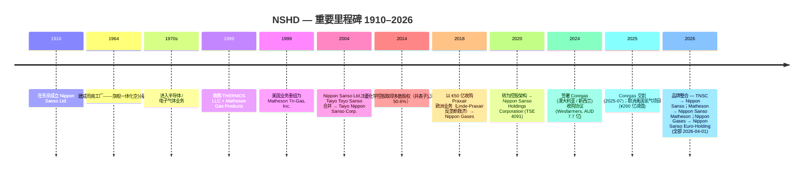
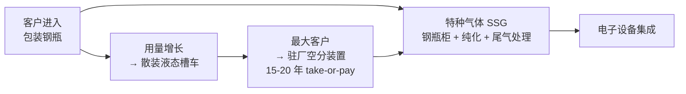

公司研究报告：日本酸素控股株式会社 (Nippon Sanso Holdings Corporation, 日本酸素ホールディングス株式会社, TSE: 4091)

截至日期：2026-05-26

> **更新——FYE2026 全年指引上调 (2026-02-04)：** 公司在 Q3 FYE2026（2025 年 4–12 月）业绩中将全年营收指引由 2025-05 初次指引的 ¥1,290.0 亿日元上调至 ¥1,330.0 亿，核心营业利润由 ¥191.0 亿上调至 ¥196.0 亿，IFRS 营业利润由 ¥191.0 亿上调至 ¥194.3 亿，归母净利润由 ¥116.0 亿 / EPS ¥267.99 上调至 ¥123.5 亿 / EPS ¥285.31。隐含同比：营收 +1.7%，营业利润 +17.1%，净利润 +25.0%。管理层归因于：美元 / 欧元相对前次假设走强、AI 相关半导体需求驱动的电子板块复苏，以及 Coregas（澳大利亚 / 新西兰）收购于 2025-07-01 完成交割。来源：[Q3 FYE2026 业绩公告, 2026-02-04](https://www.nipponsanso-hd.co.jp/en/LinkClick.aspx?fileticket=fHIwDu2e7lc%3D&tabid=210&mid=797), 第 23 页；[Wesfarmers — Coregas 出售交割完成, 2025-07-01](https://wesfarmers.gcs-web.com/static-files/0fb8fb9f-b93e-42ec-9f80-87c37377b332/)。

目录

1. 公司概览
2. 公司历史
3. 管理团队
4. 产品与服务
5. 客户与上市策略
6. 行业概览
7. 竞争格局
8. 市场机会
9. 风险评估
10. 参考资料

======================================

## 1. 公司概览

日本酸素控股株式会社 (Nippon Sanso Holdings, "NSHD"，日本酸素ホールディングス，TSE: 4091) 是全球第四大工业气体 (industrial gas) 巨头，东京上市的控股公司，通过日本、美国、欧洲、亚洲与大洋洲及 Thermos（消费类真空保温容器）五大业务分部生产并分销氧气、氮气、氩气、氦气 (helium)、二氧化碳、氢气，以及约 30 种电子特种气体 (electronic specialty gas)。FYE2025（截至 2025 年 3 月 31 日的财年）合并营收为 ¥1,308.0 亿日元（按期间均值 ¥152.57/USD 折算约 USD 86 亿），核心营业利润 ¥189.1 亿日元（利润率 14.5%），在 31 个国家和地区共雇用 19,754 名员工 ([Q3 FYE2026 业绩材料, 2026-02-04, 第 26 页 NSHD 集团概况](https://www.nipponsanso-hd.co.jp/en/LinkClick.aspx?fileticket=fHIwDu2e7lc%3D&tabid=210&mid=797); [Integrated Report 2025, 第 5 页 "Our Current Position"](https://us.nipponsanso.com/wp-content/uploads/2025/10/nippon-sanso-holdings-integrated-report_en-viewing_2025.pdf))。四种空分气体加上其他工业气体（O₂、N₂、Ar、CO₂、H₂、He）仅在欧洲就服务约 150,000 家客户，在美国市场拥有逾 100,000 个客户账户 ([Integrated Report 2025, 第 76 页 "Strategy by Segment: United States"](https://us.nipponsanso.com/wp-content/uploads/2025/10/nippon-sanso-holdings-integrated-report_en-viewing_2025.pdf); [Integrated Report 2025, 第 78 页 "Strategy by Segment: Europe"](https://us.nipponsanso.com/wp-content/uploads/2025/10/nippon-sanso-holdings-integrated-report_en-viewing_2025.pdf))。

公司的商业模式可概括为"在消费点就近生产"——空分装置 (ASUs, 空気分離装置) 和特种气体厂房建在所服务的钢厂、化工综合体或半导体晶圆厂旁边，通过管道交付（驻厂供气 (on-site supply) 长期 take-or-pay 合同，¥/标准立方米计价）、液态储罐车（散装）或钢瓶（包装）三种方式分销。集团合并口径下，FYE2026 9 个月的业务构成为散装 30%、驻厂 12%、包装 26%、特种气体 8%、工业气体设备 / 安装 20%、电子设备 / 安装 5%——即驻厂 + 散装 + 包装大气类气体约占气体相关营收的 68%，特种气体 + 设备构成附加值更高的剩余部分 ([Q3 FYE2026 业绩, 2026-02-04, 第 36 页 "Percentage of Revenue by Business"](https://www.nipponsanso-hd.co.jp/en/LinkClick.aspx?fileticket=fHIwDu2e7lc%3D&tabid=210&mid=797))。同口径下行业终端市场结构（不含 Thermos）为化工与能源 20%、电子 17%、食品饮料 10%、医疗保健 10%、钢铁与有色金属 8%、汽车及其他运输 5%、其他 31%——由于继承自日本本土的钢厂客户簿，整体组合相对美欧同业更偏"流程 / 重工业" ([Q3 FYE2026 业绩, 2026-02-04, 第 34 页 "Revenue composition"](https://www.nipponsanso-hd.co.jp/en/LinkClick.aspx?fileticket=fHIwDu2e7lc%3D&tabid=210&mid=797))。

五大分部 FYE2025 营收结构为日本 ¥410.0 亿（合并 31%）、美国 ¥360.2 亿（28%）、欧洲 ¥328.6 亿（25%）、亚洲与大洋洲 ¥176.5 亿（13%）、Thermos ¥32.5 亿（2%）——海外收入占比为 67.2% ([Integrated Report 2025, 第 5 页 "Our Current Position"](https://us.nipponsanso.com/wp-content/uploads/2025/10/nippon-sanso-holdings-integrated-report_en-viewing_2025.pdf); [Q3 FYE2026 业绩, 2026-02-04, 第 35 页 季度营收与核心营业利润趋势](https://www.nipponsanso-hd.co.jp/en/LinkClick.aspx?fileticket=fHIwDu2e7lc%3D&tabid=210&mid=797))。美国业务由 **Matheson Tri-Gas, Inc. (美国子公司)**（2026-04-01 起更名为 Nippon Sanso Matheson, Inc.）承担，自 1989 年起分阶段收购，按营收口径是规模最大的单一海外子公司。欧洲业务的载体为 **Nippon Gases Euro-Holdings, S.L.U. (欧洲子公司)**（2026-04-01 起更名为 Nippon Sanso Euro-Holding S.L.U.），即原 Praxair 欧洲工业气体业务，作为 Praxair-Linde 合并的欧盟反垄断救济资产，于 2018-12-03 以 €50 亿现金收购 ([Linde plc 8-K, 2018-12-03 — Completion of Divestiture of Praxair's European Businesses](https://www.sec.gov/Archives/edgar/data/0001707925/000119312518342968/d662261d8k.htm); [Q3 FYE2026 业绩, 2026-02-04, 第 18-19 页 Topics — 更名公告](https://www.nipponsanso-hd.co.jp/en/LinkClick.aspx?fileticket=fHIwDu2e7lc%3D&tabid=210&mid=797))。

*Source: [Q3 FYE2026 Earnings Materials, 2026-02-04, 第 37 页 "Business performance over the past five years"](https://www.nipponsanso-hd.co.jp/en/LinkClick.aspx?fileticket=fHIwDu2e7lc%3D&tabid=210&mid=797).*

*Source: [Q3 FYE2026 Earnings Materials, 2026-02-04, 第 35 页 季度营收与核心营业利润趋势](https://www.nipponsanso-hd.co.jp/en/LinkClick.aspx?fileticket=fHIwDu2e7lc%3D&tabid=210&mid=797).*

NSHD 的控股股东是 **三菱化学集团 (Mitsubishi Chemical — 主要股东) (TSE: 4188)**，截至 2025-09-30 持有 NSHD 50.59% 的已发行股份；剩余流通股的分布根据 Q3 路演材料中的股东分布图为：日本个人 14.6%、其他日本法人 21.6%、日本金融机构 8.6%、海外机构 / 个人 4.6% ([Q3 FYE2026 业绩, 2026-02-04, 第 26 页 Distribution by share holders](https://www.nipponsanso-hd.co.jp/en/LinkClick.aspx?fileticket=fHIwDu2e7lc%3D&tabid=210&mid=797); [Simply Wall St — TSE:4091 largest shareholders, 2025-11](https://simplywall.st/stocks/jp/materials/tse-4091/nippon-sanso-holdings-shares/news/nippon-sanso-holdings-corporations-tse4091-largest-sharehold))。这种"上市子公司 + 大股东在 50% 阈值刚好以上长期持有 + 大股东将 NSHD 并表"的治理安排，是 NSHD 股权故事中最具结构性意义的事实（详见 §9）。

**估值快照（截至 2026-05）。** 股价 ¥5,636（2026-05-09 收盘），市值 ¥2.47 万亿日元（按 ¥152/USD 约 USD 163 亿），基于 TTM EPS ¥264.4 的 TTM P/E 为 22.2×；按公司自身 FYE2026 EPS 指引 ¥285.31 计算前瞻 P/E 约 19.7× ([Yahoo Finance — 4091.T Valuation Measures, 访问于 2026-05-26](https://finance.yahoo.com/quote/4091.T/key-statistics/); [Q3 FYE2026 业绩, 2026-02-04, 第 26 页 FYE2026 Financial Forecast](https://www.nipponsanso-hd.co.jp/en/LinkClick.aspx?fileticket=fHIwDu2e7lc%3D&tabid=210&mid=797))。以 TTM 营收 ¥1.32 万亿日元（用管理层上调后 ¥1,330 亿作为代理）计，P/S 约 1.9×。对比同业：Linde plc TTM P/E 约 29×、P/S 约 5×；Air Liquide 约 26× / 3×；Air Products 约 24× / 3.6×。*分析师观点：* 尽管 NSHD FYE2025 核心营业利润同比增长 13.9%、EBITDA 利润率 23.3%（与 Air Products 接近，离 Linde / Air Liquide 也只是微距），股价对比西方三巨头长期折让 20-30%。这一折让源自三个结构性因素：(a) 三菱化学的多数股权压制流通市值；(b) 海外利润以日元折算引入每期 FX 噪音；(c) Thermos 业务作为非战略性 ~2% 拖累。FYE2025 税后 ROCE 为 7.2%，仍比 Linde / Air Liquide 低 200-400 bps，所以折价并非完全没有道理，但随着欧洲并购的整合成熟，以及 2026-03-30 公布的下一期中期计划更聚焦电子板块，差距正在收窄。

*Source: [Yahoo Finance — TSE:4091, 访问于 2026-05-26](https://finance.yahoo.com/quote/4091.T/key-statistics/); [Linde plc 10-K FY2024](https://www.sec.gov/cgi-bin/browse-edgar?action=getcompany&CIK=0001707925&type=10-K); [Air Liquide URD 2024](https://www.airliquide.com/sites/airliquide.com/files/2025-03/air-liquide-2024-universal-registration-document.pdf); [Air Products 10-K FY2024](https://www.sec.gov/Archives/edgar/data/0000002969/000130817924000793/apdpro012708-ars.pdf).*

NSHD 的中期计划 **"NS Vision 2026 – Enabling the Future"** （2022 年 4 月 → 2026 年 3 月）设定了五大重点方向——可持续管理、面向碳中和的新业务探索、Total Electronics、运营卓越和 DX 数字化举措。在五大财务 KPI（营收、核心营业利润、EBITDA 利润率、调整后净 D/E 比、税后 ROCE）中，FYE2025 实际值已经超额完成其中三项（营收、核心营业利润、税后 ROCE），公司有望在收官年 FYE2026 进一步超额完成计划目标 ([FYE2025 合并财务结果, 2025-05-12, 第 8 页](https://www.nipponsanso-hd.co.jp/en/LinkClick.aspx?fileticket=6/hKTpzKYqc%3D&tabid=210&mid=797); [Q3 FYE2026 业绩, 2026-02-04, 第 27 页 NS Vision 2026 summary](https://www.nipponsanso-hd.co.jp/en/LinkClick.aspx?fileticket=fHIwDu2e7lc%3D&tabid=210&mid=797))。下一期中期计划将于 2026-03-30 公布，鉴于即将到来的品牌整合（Taiyo Nippon Sanso → Nippon Sanso、Matheson Tri-Gas → Nippon Sanso Matheson、Nippon Gases Europe → Nippon Sanso Euro-Holding，全部于 2026-04-01 生效），这是一个关键催化剂。

## 2. 公司历史

NSHD 的根源可追溯到 **1910 年 10 月 30 日**，*Nippon Sanso Ltd.* (日本酸素株式会社) 在东京以合伙制成立，专门生产氧气——日本第一家商业化的工业气体生产商，由时任日本银行副总裁的高桥是清提供资金支持 ([Integrated Report 2025, 第 3-4 页 "Evolution of NSHD"](https://us.nipponsanso.com/wp-content/uploads/2025/10/nippon-sanso-holdings-integrated-report_en-viewing_2025.pdf); [Wikipedia — Nippon Sanso Holdings Corporation, 访问于 2026-05-26](https://en.wikipedia.org/wiki/Nippon_Sanso_Holdings_Corporation))。公司建造的第一台空分装置用于向日本初生的钢铁工业供应氧气；从 1920 年代到 1960 年代，公司紧随日本的工业化建设——氧气用于炼钢（将氧气吹入高炉以强化燃烧）、氮气用于化工（惰性保护）、氩气用于造船业和电弧焊保护气，后期再发展二氧化碳用于干冰冷链与食品加工。建于 1964 年的周南工厂成为公司的旗舰一体化厂区，位于濑户内海岸边，至今仍在运营 ([Integrated Report 2025, 第 3 页 "Reducing CO₂ Emissions from Steelmaking"](https://us.nipponsanso.com/wp-content/uploads/2025/10/nippon-sanso-holdings-integrated-report_en-viewing_2025.pdf))。

将业务重心转向电子板块——即目前股权故事的核心——始于 **1970 年代**，当时日本半导体厂（东芝、日立、NEC、三菱、松下）开始商业化规模运营硅工艺制造，需要稳定且超高纯度的散装 N₂ / Ar 与特种气体供应。Nippon Sanso 在此十年内建立了半导体相关气体业务，利用周南空分基地延展进入特种材料气体（硅烷、二氯硅烷、氨气、NF₃、WF₆ 等）以及配套的钢瓶柜 / 尾气处理设备 ([Integrated Report 2025, 第 3 页 "Making an Early Foray into the Electronics Business"](https://us.nipponsanso.com/wp-content/uploads/2025/10/nippon-sanso-holdings-integrated-report_en-viewing_2025.pdf))。到 1980 年代末，电子业务已经进入商业成熟期，1989 年 Nippon Sanso 完成了两笔奠基性收购：**膳魔师 (Thermos — 子品牌) LLC**（美国真空瓶品牌，商标可追溯至 1904 年）以及对 **Matheson Gas Products**（美国特种气体供应商，可追溯至 1927 年）的控股，后者通过后续整合成为今日的 Matheson Tri-Gas ([Integrated Report 2025, 第 4 页 "Evolution of NSHD"](https://us.nipponsanso.com/wp-content/uploads/2025/10/nippon-sanso-holdings-integrated-report_en-viewing_2025.pdf); [Wikipedia — Nippon Sanso Holdings Corporation, 访问于 2026-05-26](https://en.wikipedia.org/wiki/Nippon_Sanso_Holdings_Corporation))。

*Source: [Integrated Report 2025, 第 4 页 "Evolution of NSHD"](https://us.nipponsanso.com/wp-content/uploads/2025/10/nippon-sanso-holdings-integrated-report_en-viewing_2025.pdf); [Q3 FYE2026 业绩, 2026-02-04, 第 17-20 页 品牌更名公告](https://www.nipponsanso-hd.co.jp/en/LinkClick.aspx?fileticket=fHIwDu2e7lc%3D&tabid=210&mid=797).*

雷曼危机后的十年里有四起转型事件，把一家以日本为中心的公用事业型企业打造成了全球前四的气体巨头。**第一**，2004 年 *Nippon Sanso Ltd.* 与 *Taiyo Toyo Sanso Co., Ltd.* 合并成立 Taiyo Nippon Sanso Corporation (TNSC)，统合了日本三家传统工业气体厂中的两家（第三家 Air Water 维持独立）。**第二**，2014-05-13，三菱化学控股同意将 TNSC 纳入并表子公司，最终在 50.6% 股权处持平——把 TNSC 纳入三菱化学的资产负债表，也为随后并购浪潮提供了资产负债表容量 ([Nikkei Asia — Mitsubishi Chemical to acquire Taiyo Nippon Sanso, 2014-05](https://asia.nikkei.com/Business/Mitsubishi-Chemical-to-acquire-Taiyo-Nippon-Sanso); [Integrated Report 2025, 第 4 页 "Evolution of NSHD" 2014 milestone](https://us.nipponsanso.com/wp-content/uploads/2025/10/nippon-sanso-holdings-integrated-report_en-viewing_2025.pdf))。**第三**，2018-12-03 TNSC 完成 **€50 亿** 收购 Praxair 欧洲工业气体业务的交割——这是欧盟为 Praxair-Linde 合并要求的反垄断救济包，涵盖 12 个欧洲国家的运营和约 2,500 名员工，紧接着被重新命名为 Nippon Gases Euro-Holdings, S.L.U. ([Linde plc 8-K, 2018-12-03 — Completion of Divestiture of Praxair's European Businesses](https://www.sec.gov/Archives/edgar/data/0001707925/000119312518342968/d662261d8k.htm))。**第四**，2020-10-01 TNSC 将经营业务转入控股架构，将母公司重命名为 **Nippon Sanso Holdings Corporation**，建立起当前以 TNSC、Matheson、Nippon Gases、亚洲与大洋洲集团公司及 THERMOS K.K. 为子集团、东京 HoldCo 在上的五分部架构 ([Integrated Report 2025, 第 4 页 "Evolving Through the Introduction of a Holding Company Structure"](https://us.nipponsanso.com/wp-content/uploads/2025/10/nippon-sanso-holdings-integrated-report_en-viewing_2025.pdf))。

近 18 个月还交付了两个重大节点。2024-12-20，NSHD 同意以 **AUD 7.7 亿**（约 ¥750 亿）从 Wesfarmers Limited 收购 **Coregas Pty Ltd**，澳大利亚竞争与消费者委员会 (ACCC) 于 2025-06-27 通过审查，交割于 2025-07-01 完成——为亚洲与大洋洲分部增加了澳大利亚 Top-3 工业气体地位和新西兰市场入口 ([Wesfarmers — Coregas 出售交割完成, 2025-07-01](https://wesfarmers.gcs-web.com/static-files/0fb8fb9f-b93e-42ec-9f80-87c37377b332/); [BDO — Nippon Sanso agrees to acquire Coregas from Wesfarmers for A\$770m, 2024-12](https://www.bdo.com.au/en-au/deals/nippon-sanso-agrees-to-acquire-coregas-from-wesfarmers-for-a$770m))。另外，FYE2025 NSHD 计提了 **¥260 亿减值损失**——美国一处在建驻厂氢气工厂的终端客户（一家与 Polaris 相关的可再生柴油生产商）在工程建设期间申请破产保护，迫使项目取消（即 **Polaris 氢能项目**）([Integrated Report 2025, 第 17 页 CFO Message](https://us.nipponsanso.com/wp-content/uploads/2025/10/nippon-sanso-holdings-integrated-report_en-viewing_2025.pdf); [FYE2025 合并财务结果, 2025-05-12, 第 5 页](https://www.nipponsanso-hd.co.jp/en/LinkClick.aspx?fileticket=6/hKTpzKYqc%3D&tabid=210&mid=797))。CFO 的留言坦率地将其描述为"一个沉痛的教训"，并指出未来对非核心氢气 / 清洁能源工程的项目审核已加强。

2026-04-01 的品牌整合标志着控股公司过渡章节的收尾：TNSC 摘除 "Taiyo" 字头，复归 **Nippon Sanso Corporation**；Matheson Tri-Gas 改为 **Nippon Sanso Matheson, Inc.**；Nippon Gases Euro-Holding 改为 **Nippon Sanso Euro-Holding S.L.U.**——全部统一在"NIPPON SANSO"全球品牌标识下 ([NSHD 新闻稿 — Group Unifies Global Brand Logo, 2025-08-28](https://www.businesswire.com/news/home/20250828253560/en/Nippon-Sanso-Holdings-Group-Unifies-Global-Brand-Logo-Launching-the-NIPPON-SANSO-Brand-Worldwide); [MATHESON to Rename as Nippon Sanso MATHESON, 2025-09-23](https://www.businesswire.com/news/home/20250923371107/en/MATHESON-to-Rename-as-Nippon-Sanso-MATHESON))。改名意味着两件事：(a) 控股公司架构不再是历史并购形成的资产组合，而是一个统一的全球运营商；(b) 下一期中期计划（2026-03-30 发布）很可能将跨区域成本协同的标杆调高，目前这部分协同被纳入 NS Vision 2026 的"运营卓越"支柱下（4 年 ¥560 亿成本削减目标）。

## 3. 管理团队

**创始人——山口武彦 (Takehiko Yamaguchi)。** Nippon Sanso Ltd. 于 1910 年由山口武彦以合伙制创办，旨在将日本氧气生产商业化，时任日本银行副总裁的高桥是清（后来担任日本首相）提供了关键资金支持 ([Wikipedia — Nippon Sanso Holdings Corporation, 访问于 2026-05-26](https://en.wikipedia.org/wiki/Nippon_Sanso_Holdings_Corporation); [Integrated Report 2025, 第 3 页 "Evolution of NSHD" 1910 milestone](https://us.nipponsanso.com/wp-content/uploads/2025/10/nippon-sanso-holdings-integrated-report_en-viewing_2025.pdf))。山口的创业判断——本土低温分离大气气体供应商对日本从纺织走向钢铁与化工的工业化路径至关重要——在十年内便得到验证：氧气成为日本高炉炼钢的标准助燃剂。创始人家族数代以来已没有任何运营参与，也没有遗留股权；股权控股权先于 2014 年通过三菱化学的交易转移，后又演化为今天三菱化学 50.6% 股权 + 公众流通股的结构。1910 的创建日期与创始资本结构如今主要是历史 / 品牌符号，而非现代股权故事中的运营事实——但它们解释了 (a) NSHD 在日本公用事业类客户群体中的牢固基础，以及 (b) 公司为何选择在 2026 年放弃"太阳"前缀，并将 1910 年的原名作为全球品牌身份的回归。

**总裁兼 CEO——浜田敏彦 (Toshihiko Hamada)。** 浜田自 2021 年起担任 NSHD 总裁、CEO 兼代表董事；此前于 2020 年（控股公司过渡年）出任 NSHD 董事兼执行副总裁，并曾任 *Nissan TANAKA Corporation* 总裁兼董事——后者是更大的 TNSC / 三菱化学集团旗下专门做特种气体相关工业设备的公司。其早期生涯还包括 2002 年在 Matheson Tri-Gas 担任特种气体技术执行副总裁，以及 2014 年和 2016 年分别在 Nissan TANAKA 担任董事总经理及高级董事总经理 ([Bloomberg — Toshihiko Hamada profile](https://www.bloomberg.com/profile/person/21859721); [Integrated Report 2025, 第 58 页 "Members of the Board of Directors, Audit & Supervisory Board Members, and Executive Officers"](https://us.nipponsanso.com/wp-content/uploads/2025/10/nippon-sanso-holdings-integrated-report_en-viewing_2025.pdf))。他在 Matheson 的美国履历对一位日本气体巨头 CEO 来说异常重要——这让他对中期增长引擎的电子特种气体业务有直接的运营熟悉度，也熟悉今日贡献集团 28% 营收的 Matheson 美国区域管理团队。

浜田任内交付的三大战略成果，构成了今天股权故事的框架：(1) 中期计划 **NS Vision 2026** 在"运营卓越"支柱下的 4 年 ¥560 亿成本削减，在 3 年节点已超额完成五项财务 KPI 中的三项 ([FYE2025 合并财务结果, 2025-05-12, 第 8 页](https://www.nipponsanso-hd.co.jp/en/LinkClick.aspx?fileticket=6/hKTpzKYqc%3D&tabid=210&mid=797))；(2) 2025 年 Coregas 收购以税前 EV/EBITDA 9× 的价格扩大亚洲与大洋洲足迹至澳大利亚 / 新西兰，对于一个区域 Top-3 地位而言是有纪律的价位；(3) 2025 年 8–9 月公布的品牌整合方案——Taiyo Nippon Sanso → Nippon Sanso、Matheson Tri-Gas → Nippon Sanso Matheson、Nippon Gases → Nippon Sanso Euro-Holding（均 2026-04-01 生效）——标志着 2018 年以来多品牌控股公司构造的终结和统一全球运营商的开始 ([NSHD 新闻稿 — Group Unifies Global Brand Logo, 2025-08-28](https://www.businesswire.com/news/home/20250828253560/en/Nippon-Sanso-Holdings-Group-Unifies-Global-Brand-Logo-Launching-the-NIPPON-SANSO-Brand-Worldwide); [Q3 FYE2026 业绩, 2026-02-04, 第 17-19 页 分部 Topics](https://www.nipponsanso-hd.co.jp/en/LinkClick.aspx?fileticket=fHIwDu2e7lc%3D&tabid=210&mid=797))。浜田在 FYE2025 CEO 致辞中陈述的 2026 年以后的志向是让 NSHD"跻身全球巨头之列"——具体指 Linde、Air Liquide 和 Air Products——通过更严格的资本纪律和更明确的电子板块聚焦来弥合税后 ROCE 差距（NSHD 7.2% vs. Linde / Air Liquide 均 ~12-14%）([Integrated Report 2025, 第 13 页 CEO Message — "Requirements for Ranking Among the Global Majors"](https://us.nipponsanso.com/wp-content/uploads/2025/10/nippon-sanso-holdings-integrated-report_en-viewing_2025.pdf))。其个人股权未在委托书材料中披露；NSHD 高管个人持股属于非创始人主导的 TSE Prime 上市公司常见水平（≤0.1%）。

## 4. 产品与服务

### 4.1 产品 / 供应矩阵（NSHD 自身框架）

NSHD 不像西方 10-K 那样发布按子产品划分的营收矩阵——日本 IFRS 披露在分部（区域）层面汇总营收，而业务线构成（散装 / 驻厂 / 包装 / 特种 / 设备）只按百分比披露。最有价值的内部框架是 Q3 FYE2026 路演材料第 39 页的供应矩阵，以下复刻为 markdown 表：

| 供应模式 | 规模 | 机制 | 主要终端市场 |
|---|---|---|---|
| **驻厂供气 (on-site supply)** | 大规模（>1,000 Nm³/h 当量） | 生产装置建在客户厂区；管道供气 | 钢铁、石化、炼油 |
| **散装** | 中等规模 | 客户厂内液态储罐；槽车配送 | 汽车、造船、制造、玻璃 / 造纸、工程机械、医药 |
| **包装** | 小规模 | 钢瓶 / 气瓶组平板车送达 | 医疗、食品 / 饮料、LCD、光伏、半导体、家居护理、先进医疗、卫生、工程 / R&D / 建设 / 安装 |

*Source: [Q3 FYE2026 Earnings Materials, 2026-02-04, 第 39 页 "Industrial gas supply systems"](https://www.nipponsanso-hd.co.jp/en/LinkClick.aspx?fileticket=fHIwDu2e7lc%3D&tabid=210&mid=797).*

横跨三种供应模式的气体目录涵盖四种 **空分气体**（氧气 O₂、氮气 N₂、氩气 Ar，加上作为分离副产物的稀有气体氪 / 氙 / 氖）、**其他工业气体**（二氧化碳 CO₂、氢气 H₂、氦气 He，以及大洋洲业务中的液化石油气）、以及 **电子特种气体 (SSG / 半導体特殊材料ガス)**——一组约 30 种用于半导体晶圆制造工艺的高纯度 / 危险气体组合。在合并 9 个月 FYE2026 口径下相对比重为：散装 30%、驻厂 12%、包装 26%、特种气体 8%、工业气体设备 / 安装 20%、电子设备 / 安装 5% ([Q3 FYE2026 业绩, 2026-02-04, 第 36 页 "Percentage of Revenue by Business"](https://www.nipponsanso-hd.co.jp/en/LinkClick.aspx?fileticket=fHIwDu2e7lc%3D&tabid=210&mid=797))。各地区差别显著：日本侧重驻厂 / 设备（遗留的钢铁化工客户簿），美国侧重包装（Matheson 服务 >100,000 钢瓶客户、有 2,000 辆配送车队），欧洲侧重散装并有大型家庭医疗组件（390,000 名患者），亚洲与大洋洲特种气体占比最高（SSG 占分部营收 25%）。

### 4.2 综合解析——客户工作流中各品类如何衔接

工业气体行业从结构上看是一个 **配送密度网络业务**——经济性由从工厂到客户的最后 50 公里液态空气与钢瓶搬运成本所主导，而护城河建立在区域化的生产 + 配送足迹之上，竞争对手即便绿地资本开支多年也难以复制。三种供应模式并非各自独立的业务，而是单一客户阶梯上的三个点：新客户从包装（钢瓶）进入，当用量超过约 1,000 Nm³/月时升级到散装（槽车 + 现场储罐），最大客户（高炉钢厂、300mm 半导体晶圆厂、大型炼油厂）最终上升到由 NSHD 建设、拥有并运营的专用驻厂空分装置，签订 15-20 年 take-or-pay 合同。特种气体——硅烷、氨气、NF₃、WF₆ 等半导体工艺气体——则平行于这条阶梯，作为独立的高毛利业务（特种气体毛利率是大气类气体的 2-3 倍）以同样的驻厂 / 散装半导体客户为主，往往通过公司也设计安装的专用钢瓶柜。Total Electronics 战略（§4.3）跨区域整合这一特种气体业务，以提升每个全球半导体客户的钱包份额。

### 4.3 电子业务——中期增长引擎

电子业务是股权故事中最重要的单一增长驱动，作为跨区域支柱以"Total Electronics"战略运作。Integrated Report 2025 第 27 页的原文描述：

> "The strengths of NSHD's electronics business are comprehensive capabilities that cater to a wide range of customer needs—including gases, equipment, and site services—and the Company's supply footprint in semiconductor production regions. Total Electronics is an important strategy that utilizes these strengths to support customers with global operations."
>
> — [Integrated Report 2025, 第 27 页 "Realizing Total Electronics"](https://us.nipponsanso.com/wp-content/uploads/2025/10/nippon-sanso-holdings-integrated-report_en-viewing_2025.pdf)

**中文释义：** *Total Electronics* 是一个总伞计划，将公司过去在区域上分割的半导体气体业务（日本的 Taiyo Nippon Sanso、美国的 Matheson Tri-Gas、欧洲的 Nippon Gases、亚洲的 Nippon Sanso Taiwan / Korea / China / Singapore）整合到面向前 10-15 家半导体客户（TSMC、三星 Foundry / Memory、Intel、Micron、SK 海力士、铠侠、GlobalFoundries、UMC、索尼半导体等）的单一全球账户管理与供应链架构之下。五大子支柱明确：战略客户管理（聚焦快速成长的战略客户）、产品管理（质量 + 成本、与原材料商伙伴关系）、供应链（全球采购优化）、开发计划（下一代气体 + 设备 R&D、战略并购）、运营（按市场需求调整资本支出、生产力 / EHS / 钢瓶物流优化）。

电子业务产品集合分三层。**第一**，散装与驻厂 **大气 / 工艺气体**（9N+ 超高纯度 N₂、Ar、He）通过靠近晶圆厂的驻厂空分装置以管道交付——这是体量最大但毛利最低的线，按多年合同销售并按电力成本与通胀指数化。**第二**，**半导体特种气体 (SSG, 半導体特殊材料ガス)**——这是用于沉积（硅烷 SiH₄、二氯硅烷 SiH₂Cl₂、氨气 NH₃、六氟化钨 WF₆、正硅酸乙酯 TEOS）、刻蚀（三氟化氮 NF₃、六氟化硫 SF₆、八氟环丁烷 C₄F₈）、掺杂（乙硼烷 B₂H₆、磷化氢 PH₃、砷烷 AsH₃、锗烷 GeH₄）和清洁的危险、有毒或自燃气体的高毛利组合。**第三**，**气体供应设备及现场服务**——包括气瓶柜、纯化系统、尾气处理（涤气）系统，以及把 SSG 供应物理连接到晶圆工艺设备的管道工程。Integrated Report (p. 75) 将这第三层标注为 NSHD 在日本独有的优势："Taiyo Nippon Sanso 是唯一能够全面设计与建造包括气瓶柜、纯化设备和尾气处理装置在内管路与供气设备的公司"。

**战略意义。** 电子业务是 FYE2026 指引上调所依托的特许经营——Q3 路演材料明确指出"电子市场显示复苏，受生成式 AI 与数据中心相关半导体需求增长支持" ([Q3 FYE2026 业绩, 2026-02-04, 第 6 页 "Review of Q3 — Business Overview"](https://www.nipponsanso-hd.co.jp/en/LinkClick.aspx?fileticket=fHIwDu2e7lc%3D&tabid=210&mid=797))。两项最近的具体承诺标志着这种建设：(a) 2025 年 12 月宣布建设、目标 2027 年完工的 **"先进电子材料研发大楼"**（位于筑波实验室）——这是面向下一代电子材料气体的新 R&D 设施，涵盖 sub-3nm 逻辑、HBM4 / HBM5 和 CFET（互补场效应晶体管）架构 ([Q3 FYE2026 业绩, 2026-02-04, 第 6 页 + 第 17 页 日本分部 Topics](https://www.nipponsanso-hd.co.jp/en/LinkClick.aspx?fileticket=fHIwDu2e7lc%3D&tabid=210&mid=797))；(b) **比利时 Oevel 工厂特种气体产能扩张**，为 ASML 客户在欧洲的半导体扩建（Intel Fab 9 Magdeburg、Infineon Dresden、TSMC ESMC Dresden、GlobalFoundries Dresden）提供支撑——Integrated Report 2025 (p. 23) 将此描述为公司参与 imec 可持续半导体技术与系统 (SSTS) 计划的一部分 ([Integrated Report 2025, 第 23 页 "Enhancing the Electronics Business"](https://us.nipponsanso.com/wp-content/uploads/2025/10/nippon-sanso-holdings-integrated-report_en-viewing_2025.pdf))。

*分析师观点：* 仅就 SSG 产品集合而言，NSHD 在日本的最直接竞争对手是 **Resonac Holdings Corporation (TSE: 4004，前身昭和电工 + 日立化成)**；国际上为 **Air Liquide Advanced Materials、Air Products、Linde Electronics、Versum（现为 Merck KGaA 的一部分）**；韩国则有 **SK Materials、OCI Materials、FOOSUNG**。NSHD 的结构性优势是 **集成度**：它是唯一一家把 (a) 服务日本本土晶圆厂的客户基础（索尼半导体、铠侠、瑞萨、东芝、西部数据合资、美光广岛）、(b) 服务 Intel / Micron / GlobalFoundries / TSMC 亚利桑那 / 三星奥斯汀 / TSMC ESMC 的 Matheson 美国钢瓶 / 特种气体足迹、与 (c) Nippon Gases 欧洲特种气体厂房（比利时 Oevel 等）结合起来的前四大气体巨头——也就是说，它可以在所有主要晶圆厂集群（新竹 / 台南、平泽 / 华城、四日市 / 三重、新加坡、上海 / 无锡 / 西安、亚利桑那 / 德州 / 俄亥俄 / 纽约、德累斯顿 / 马格德堡 / 埃因霍温）为同一个全球客户提供一致的 SSG 规格。Linde、Air Liquide 和 Air Products 在大气气体方面更强，但 SSG + 设备 + 服务的全球综合密度都不及 NSHD。脆弱性（§7）恰恰相反——大气气体是 80-85% 安全垫的业务；SSG 是与晶圆厂资本开支相关、4 年周期的业务（§9 风险 #7）。

### 4.4 日本分部——TNSC 与日本传统客户基础

日本分部（Taiyo Nippon Sanso Corporation Group，FYE2025 营收 ¥410.0 亿日元、分部利润 ¥47.0 亿 / 利润率 11.5%）是高密度的传统业务——在日本大气气体市场占有率超过 40%，氧气、氮气、氩气、二氧化碳份额均为第一，并是面向大型钢铁、化工、电子客户驻厂供气的领导者 ([Integrated Report 2025, 第 74-75 页 "Strategy by Segment: Japan / Segment Top Message: Japan"](https://us.nipponsanso.com/wp-content/uploads/2025/10/nippon-sanso-holdings-integrated-report_en-viewing_2025.pdf))。IR2025 原文描述：

> "Taiyo Nippon Sanso has the No. 1 market share in Japan for bulk gases, such as oxygen, nitrogen, and argon, as well as for carbon dioxide. The company also leads the industry in on-site supply to large-scale steel, chemical, and electronics industries and possesses the largest production and supply infrastructure. In the field of specialty materials gases for the electronics industry, Taiyo Nippon Sanso is the only company capable of comprehensively designing and constructing piping and supply equipment, including cylinder cabinets, purification equipment, and abatement devices."
>
> — [Integrated Report 2025, 第 75 页](https://us.nipponsanso.com/wp-content/uploads/2025/10/nippon-sanso-holdings-integrated-report_en-viewing_2025.pdf)

基础设施规模数据具体：约 6,000 名员工、5 个 R&D 基地、34 个散装气体生产基地、4 个电子材料气体生产基地、17 家 Total Gas Centers，以及覆盖日本的 200 多家合作 / 分销商 ([Integrated Report 2025, 第 74 页 "Strategy by Segment: Japan"](https://us.nipponsanso.com/wp-content/uploads/2025/10/nippon-sanso-holdings-integrated-report_en-viewing_2025.pdf))。日本客户的终端市场结构（FYE2026 9 个月）为钢铁与有色金属 5%、汽车 5%、**电子 30%**、食品饮料 2%、医疗 10%、化工与能源 22%、其他 26%——即日本是所有区域中电子权重最高的（全球 ex-Thermos 17%），反映了 TNSC 在索尼、铠侠、瑞萨、东芝、西部数据四日市、美光广岛和新的 TSMC 熊本 / JASM 晶圆厂的业务足迹 ([Q3 FYE2026 业绩, 2026-02-04, 第 17 页 日本分部 by industry mix](https://www.nipponsanso-hd.co.jp/en/LinkClick.aspx?fileticket=fHIwDu2e7lc%3D&tabid=210&mid=797))。NS Vision 2026 下日本分部利润率的演变轨迹是"运营卓越"最清晰的成功故事：计划第 1 年 7.5%、第 2 年 10.4%、第 3 年 11.5%、第 4 年（FYE2026）进一步改善——FYE2026 9 个月利润率为 13.2%，同比升 160 bps ([Integrated Report 2025, 第 75 页 日本分部](https://us.nipponsanso.com/wp-content/uploads/2025/10/nippon-sanso-holdings-integrated-report_en-viewing_2025.pdf); [Q3 FYE2026 业绩, 2026-02-04, 第 17 页](https://www.nipponsanso-hd.co.jp/en/LinkClick.aspx?fileticket=fHIwDu2e7lc%3D&tabid=210&mid=797))。

### 4.5 美国——Matheson Tri-Gas（2026 年 4 月更名为 Nippon Sanso Matheson）

Matheson Tri-Gas, Inc.（FYE2025 营收 ¥360.2 亿日元 / 约 USD 24 亿，分部利润 ¥59.7 亿 / 利润率 16.6%——集团中最高利润率区域）是规模最大的单一运营子公司，也是美国工业气体特许经营的承担方。Matheson 在 IR2025 分部章节中披露了 **9% 美国市场份额**，使其稳居 Linde（美国 #1）、Air Products（#2）、Air Liquide（#3）之后，但在特种 / 包装气体领域有可防守的地位 ([Integrated Report 2025, 第 76 页 "Strategy by Segment: United States"](https://us.nipponsanso.com/wp-content/uploads/2025/10/nippon-sanso-holdings-integrated-report_en-viewing_2025.pdf))。IR 关于 Matheson 战略形态的原文定位陈述：

> "Matheson's capabilities span the full range of industrial gas products including cylinders, liquids, and on-site plants. Our nation-wide Air Separation Unit fleet for supply of atmospheric gases is the only East to West Coast network across the high growth southern U.S. sunbelt. We are the largest wholesaler of acetylene and a major supplier of nitrous oxide and dry ice. Our offerings include specialty gases and equipment complemented by high-purity electronic gases including gas analysis and research laboratories that support universities, laboratories, and the global semiconductor market sectors. Our vertically integrated product capabilities position us to effectively cross-sell multiple products and allow Customers to fulfill their total gas and equipment requirements with one supplier."
>
> — [Integrated Report 2025, 第 77 页 "Segment Top Message: United States"](https://us.nipponsanso.com/wp-content/uploads/2025/10/nippon-sanso-holdings-integrated-report_en-viewing_2025.pdf)

基础设施：**>300 个网点**、**>4,500 名员工**、**>100 处生产设施**（空分装置、驻厂发生器、液态 CO₂ 工厂、干冰工厂、HyCO 装置、笑气工厂、主要工业 / 特种 / 电子气瓶充气厂）、**>100,000 个客户账户**，由 **>2,000 辆运输车辆与铁路车皮** 服务 ([Integrated Report 2025, 第 76 页](https://us.nipponsanso.com/wp-content/uploads/2025/10/nippon-sanso-holdings-integrated-report_en-viewing_2025.pdf))。Matheson 是美国领先的乙炔（一种焊接燃料气）批发商，也是笑气和干冰的主要供应商——三个产品线均具有独有规模优势。美国分部终端市场结构（FYE2026 9 个月）：钢铁与有色金属 8%、汽车 10%、**电子 5%**、食品饮料 14%、医疗 9%、化工与能源 13%、其他 41%——即电子集中度低于日本，但食品 / 医疗权重更均衡；南部地带的钢瓶业务以及美国 CHIPS 法案晶圆厂扩建（Intel 俄亥俄、三星泰勒、TSMC 亚利桑那、Micron 爱达荷 / 纽约）是 IR 机会列表中标注的两大结构性增长向量 ([Q3 FYE2026 业绩, 2026-02-04, 第 18 页 美国分部 by industry mix](https://www.nipponsanso-hd.co.jp/en/LinkClick.aspx?fileticket=fHIwDu2e7lc%3D&tabid=210&mid=797); [Integrated Report 2025, 第 76 页 Opportunities — "Electronics gases demand growth supported by the U.S. CHIPS Act"](https://us.nipponsanso.com/wp-content/uploads/2025/10/nippon-sanso-holdings-integrated-report_en-viewing_2025.pdf))。

*分析师观点：* Matheson 业务的结构性特征是 **纵向一体化的气瓶充装 + 配送车队网络**。气瓶是工业气体业务中接触最频繁、最难复制的配送层——以 >2,000 辆运输车辆运营全国性钢瓶充装厂、配送车队和路线密度，这就是把 100,000+ 中小客户账户锁定下来的因素，Linde / Air Products / Air Liquide 都不愿以同等密度服务这层客户。Matheson 的脆弱性则相反：分部 OI 利润率（15.0%-16.6%）显著低于 Linde 分部综合（约 26%）和 Air Liquide 成熟北美分部（约 22%），反映 (a) 在以石化为主的市场（德州 / 路易斯安那 / 墨西哥湾沿岸）驻厂 / 管道密度较低、(b) 乙炔 / 钢瓶运营开销较高。2025 年 8 月宣布的拉斯维加斯新空分装置（2027 年完工）标志着对南部地带密度的投资；2025 年与 1PointFive 在西德州的 DAC（直接空气捕集）项目签订氧气驻厂供气合同——为 Occidental 的 CO₂ 封存装置供应 O₂——是当前最具体的碳中和收入线 ([Q3 FYE2026 业绩, 2026-02-04, 第 18 页 美国 Topics — Las Vegas ASU, HyCO India, DAC](https://www.nipponsanso-hd.co.jp/en/LinkClick.aspx?fileticket=fHIwDu2e7lc%3D&tabid=210&mid=797); [Matheson 新闻稿 — 1PointFive DAC 氧气供应合同, 2023-07-26](https://www.businesswire.com/news/home/20230726194899/en/Matheson-Signs-Oxygen-Supply-Contract-for-1PointFives-DAC-Plant))。

### 4.6 欧洲——Nippon Gases Euro-Holdings（2026 年 4 月更名为 Nippon Sanso Euro-Holding）

欧洲业务 **Nippon Gases Europe** 是 2018 年从 Praxair-Linde 合并反垄断救济中收购的资产，并且是品牌整合周期后利润率最高的区域 ([Linde plc 8-K, 2018-12-03 — Completion of Divestiture of Praxair's European Businesses](https://www.sec.gov/Archives/edgar/data/0001707925/000119312518342968/d662261d8k.htm))。FYE2025 营收 ¥328.6 亿日元（约 €20 亿）、分部利润 ¥62.4 亿 / 利润率 19.0%——集团中最高分部利润率，与意大利、西班牙、葡萄牙、法国、德国、比利时、荷兰、挪威和英国 Praxair 建立的优质客户簿密切相关 ([Integrated Report 2025, 第 78-79 页 "Strategy by Segment: Europe / Segment Top Message: Europe"](https://us.nipponsanso.com/wp-content/uploads/2025/10/nippon-sanso-holdings-integrated-report_en-viewing_2025.pdf))。基础设施足迹：在 **13 个欧洲国家** 有业务存在、197 处运营生产设施、14 条管道、**>1,000 辆卡车**、3 艘 CO₂ 液态海运船、**约 150,000 家企业客户**、**390,000 名家庭护理患者**、**>3,500 名员工** ([Integrated Report 2025, 第 78 页](https://us.nipponsanso.com/wp-content/uploads/2025/10/nippon-sanso-holdings-integrated-report_en-viewing_2025.pdf))。披露的欧洲市场份额为 9%（在 Nippon Gases 有存在感的国家子集中为 12%），位居 Air Liquide（约 30% 欧洲份额）、Linde（约 25%）、Air Products（约 15%）之后第 4，最近的第 5 是 Messer Group ([Integrated Report 2025, 第 78 页 Market Position](https://us.nipponsanso.com/wp-content/uploads/2025/10/nippon-sanso-holdings-integrated-report_en-viewing_2025.pdf))。

欧洲产品组合（FYE2026 9 个月）更偏散装和设备：散装 39%、驻厂 15%、包装 30%、特种气体 2%、工业气体设备 / 安装 14%、电子设备 / 安装 0%（这里几乎所有电子业务都在特种 / 散装气体线内）——即欧洲是最"工业公用事业"的区域形态，电子仅占区域营收 3%，但从欧洲版 CHIPS 法案扩建（ESMC Dresden、Infineon Dresden、TSMC ESMC、ASML Veldhoven 供应链）中增长迅速 ([Q3 FYE2026 业绩, 2026-02-04, 第 19 页 + 第 36 页 欧洲分部](https://www.nipponsanso-hd.co.jp/en/LinkClick.aspx?fileticket=fHIwDu2e7lc%3D&tabid=210&mid=797))。终端市场结构（不含设备）比日本或美国更均衡：钢铁与有色金属 16%、汽车 1%、电子 3%、食品饮料 18%、医疗 14%、化工与能源 19%、其他 29%。14% 的医疗敞口反映家庭氧气治疗的患者簿——南欧 390,000 名长期氧疗患者，多年报销合同的循环收入业务 ([Integrated Report 2025, 第 79 页 Segment Top Message Europe](https://us.nipponsanso.com/wp-content/uploads/2025/10/nippon-sanso-holdings-integrated-report_en-viewing_2025.pdf))。

*分析师观点：* Nippon Gases 欧洲整合是 NSHD 并购史上最值得研究的价值创造案例。2018 年底 €50 亿收购价隐含的进入 EV/EBITDA 约 10.5×；目前资产产生约 ¥62 亿分部利润、利润率 19%——2018 年投入的每一欧元在 FYE2025 都已经复合到显著更高的分部 EBITDA，而且 2026-04-01 品牌整合到"Nippon Sanso Euro-Holding"显示管理层对客户保留状况有信心，足以把品牌纳入母公司身份之下。结构性风险是工业能源价格（空分本身电力密集，欧洲电力成本自 2022 年以来在德国 / 意大利仍为乌克兰前的 2-4 倍）；通过"Pass-through & Surcharge"机制的价格传导迄今为止恢复了约 85-90% 的成本冲击，按 FYE2025 管理层评论所述 ([FYE2025 合并财务结果, 2025-05-12, 第 6 页 欧洲分部评论](https://www.nipponsanso-hd.co.jp/en/LinkClick.aspx?fileticket=6/hKTpzKYqc%3D&tabid=210&mid=797))。

### 4.7 亚洲与大洋洲——增长引擎，四个子分部

亚洲与大洋洲（FYE2025 营收 ¥176.5 亿日元、分部利润 ¥15.0 亿 / 利润率 8.5%）按营收口径是最小的气体分部，但增长最快——分部描述明确写"过去 10 年平均年增长率 10%" ([Integrated Report 2025, 第 80 页 "Strategy by Segment: Asia and Oceania"](https://us.nipponsanso.com/wp-content/uploads/2025/10/nippon-sanso-holdings-integrated-report_en-viewing_2025.pdf))。业务覆盖 12 个国家（FYE2026 后：退出缅甸、进入新西兰），员工 >4,000、25+ 空分装置、6 个特种气体生产基地、3 个特种气体供应服务站点。2023 年 4 月管理层将该区域划分为 **四个子分部**，每一个都拥有自己的 P&L 权限：(1) **东南亚 + 印度**（向新加坡、马来西亚、泰国、印尼、越南、菲律宾、印度的石化 / 钢铁 / 电子客户供应工业气体）；(2) **中国工业气体**（向中国本土钢铁与化工客户供应大气与散装气体，大连长兴岛 TNSC 合资）；(3) **东亚电子**（服务台湾 TSMC、UMC、ASE 的 SSG + 钢瓶 + 设备业务，加上韩国三星 / SK 海力士的特定项目、以及索尼半导体和铠侠的亚洲业务）；(4) **大洋洲工业气体**（澳大利亚 LPG 分销，2024 年从 Renegade Gas 分阶段收购 + 2025 年 7 月以 AUD 7.7 亿 / 约 ¥750 亿从 Wesfarmers 完成 Coregas Pty Ltd 交割）([Integrated Report 2025, 第 81 页 Segment Top Message Asia & Oceania](https://us.nipponsanso.com/wp-content/uploads/2025/10/nippon-sanso-holdings-integrated-report_en-viewing_2025.pdf); [Wesfarmers — Coregas 出售交割完成, 2025-07-01](https://wesfarmers.gcs-web.com/static-files/0fb8fb9f-b93e-42ec-9f80-87c37377b332/); [Q3 FYE2026 业绩, 2026-02-04, 第 20 页 Asia & Oceania Topics](https://www.nipponsanso-hd.co.jp/en/LinkClick.aspx?fileticket=fHIwDu2e7lc%3D&tabid=210&mid=797))。

产品组合是 **集团中最偏电子的**：FYE2026 9 个月口径下亚洲与大洋洲组合为散装 25%、驻厂 5%、包装 31%、**特种气体 25%**、工业气体设备 / 安装 8%、电子设备 / 安装 6%——即仅 SSG 就占分部四分之一，加上电子设备约占分部 31%，远超全球口径的特种气体 8% / 电子设备 5% ([Q3 FYE2026 业绩, 2026-02-04, 第 36 页 Asia & Oceania business breakdown](https://www.nipponsanso-hd.co.jp/en/LinkClick.aspx?fileticket=fHIwDu2e7lc%3D&tabid=210&mid=797))。终端市场结构（FYE2026 9 个月）同样以技术为主：钢铁与有色金属 2%、汽车 2%、**电子 38%**、食品饮料 2%、医疗 4%、化工与能源 28%、其他 24%。东亚电子子分部特别记录了 Nippon Sanso Taiwan, Inc. (NSTW) 最近为某大型半导体晶圆厂扩建签订的综合合同——涵盖气体纯化系统、SSG 钢瓶柜和气体管道工程——作为"Total Electronics"的案例研究展示，后续扩建阶段仍在谈判中 ([Integrated Report 2025, 第 28 页 "Value Creation Example: Advancing Total Electronics in Taiwan"](https://us.nipponsanso.com/wp-content/uploads/2025/10/nippon-sanso-holdings-integrated-report_en-viewing_2025.pdf))。

### 4.8 Thermos——消费品业务"意外"

Thermos K.K.（FYE2025 营收 ¥32.5 亿日元 / 集团 2%、分部利润 ¥6.2 亿 / 利润率 19.2%）是消费类真空保温容器业务——1989 年收购的全球 **膳魔师 (Thermos — 子品牌)** 品牌，通过主授权人 Thermos LLC 子公司在 120 多个国家销售，在马来西亚、菲律宾和中国制造，日本新潟有约 300 名员工的总部 ([Integrated Report 2025, 第 82-83 页 "Strategy by Segment: Thermos / Segment Top Message: Thermos"](https://us.nipponsanso.com/wp-content/uploads/2025/10/nippon-sanso-holdings-integrated-report_en-viewing_2025.pdf))。旗舰产品线是便携式真空保温杯（披露 96% 客户满意度的 JNL 系列），延伸至真空保温锅（Shuttle Chef，1989 年推出）、便当盒、厨具，以及韩国运营的电商渠道。经济效益对消费耐用品业务来说异常出色——19% 分部利润率，FYE2026 9 个月口径下从 17.8% 上升到 19.6%——但 NSHD IR 材料一直将该分部描述为非工业气体核心战略。每份年度报告都重复同一观点：Thermos 是出于并购历史的 5% 偶然，之所以保留是因为 (a) THERMOS 品牌赚钱且管理团队有能力，(b) 该品牌从消费者向可重复使用瓶具的可持续转向获得增长顺风，(c) 在 96% 客户满意度的盈利消费业务上做剥离很难找到收益层面的理由。*分析师观点：* 如果 NSHD 继续整合气体业务身份，未来战略评估可能将 Thermos 分拆为独立的消费品公司（2026-04-01 品牌整合排除了 Thermos K.K.）；但目前尚未公布此类评估。

### 4.9 工程、氢气与氦气——跨分部产品线

三条跨分部的产品线值得单独讨论。**工程** 是内部设计与建造空分装置、特种气体生产工厂、把气体供应物理整合到客户工艺中的纯化 / 尾气处理设备的能力。Global ASU Engineering 隶属于 Group Business Promotion Office（2025 年 4 月控股公司重组中新设立的职能），整合日本、美国（Matheson engineering）、欧洲和台湾（Taiyo Nippon Sanso Engineering Taiwan, Inc., TNET，在新竹有洁净室设备厂）的工程能力 ([Integrated Report 2025, 第 11 页 "NSHD's Present: 4. Organizational Reform"](https://us.nipponsanso.com/wp-content/uploads/2025/10/nippon-sanso-holdings-integrated-report_en-viewing_2025.pdf); [Integrated Report 2025, 第 28 页 "Advancing Total Electronics in Taiwan"](https://us.nipponsanso.com/wp-content/uploads/2025/10/nippon-sanso-holdings-integrated-report_en-viewing_2025.pdf))。

**氢气 / HyCO** 是碳中和增长押注，也是项目风险敞口最大的方向。NSHD 在美国运营 HyCO（H₂ + CO 联合合成）工厂，并在印度建设一处"进展顺利、接近完工"的工厂 ([Q3 FYE2026 业绩, 2026-02-04, 第 18 页 美国 Topics — "HyCO project in India is progressing smoothly toward completion"](https://www.nipponsanso-hd.co.jp/en/LinkClick.aspx?fileticket=fHIwDu2e7lc%3D&tabid=210&mid=797))。对可再生柴油客户群的敞口在 FYE2025 引发了 ¥260 亿氢气工厂减值——终端客户（一家与 Polaris 相关的可再生柴油生产商）在建设期间申请破产——CFO 致辞中将其描述为"一个沉痛的教训"，并提到目前已经加强项目审核控制 ([Integrated Report 2025, 第 17 页 CFO Message](https://us.nipponsanso.com/wp-content/uploads/2025/10/nippon-sanso-holdings-integrated-report_en-viewing_2025.pdf))。

**氦气 (helium)** 是结构性紧张的特种大气气体——用作 MRI 超导磁体冷却剂、半导体晶圆冷却与漏检、NASA / SpaceX 火箭吹扫、深海潜水以及气球升力。氦气主要作为美国（胡格顿气田）、俄罗斯（阿穆尔）、卡塔尔、阿尔及利亚和澳大利亚天然气开采副产物生产，并通过 ISO 容器全球供应。NSHD 通过美国 Matheson（一家主要氦气批发商）和欧洲 Nippon Gases 进行氦气采购，IR2025 明确将氦气供应过剩的价格压力标注为 2025 年风险："CO2 短缺与氦气市场激烈竞争压力" ([Integrated Report 2025, 第 78 页 Europe segment Risks](https://us.nipponsanso.com/wp-content/uploads/2025/10/nippon-sanso-holdings-integrated-report_en-viewing_2025.pdf))。FYE2025 亚洲与大洋洲的分部评论单独标注"部分地区因氦气供应过剩造成销售价格下行压力"，影响澳大利亚业务 ([FYE2025 合并财务结果, 2025-05-12, 第 6 页 Asia & Oceania](https://www.nipponsanso-hd.co.jp/en/LinkClick.aspx?fileticket=6/hKTpzKYqc%3D&tabid=210&mid=797))。氦气业务结构上是 5-7 年周期（紧张→宽松→紧张）的特许经营，FYE2026 周期处于宽松 / 过剩阶段——鉴于 2024 年美国联邦氦气储备私有化的耗尽，FYE2028 可能回到紧张。

### 4.10 旗舰与长尾及近期新品

按营收集中度排序，前三大产品业务为：(a) 横跨五大分部的 **散装氧气 / 氮气 / 氩气向大型工业客户销售**——结构性 ¥/Nm³ 现金流基础；(b) **向钢铁、化工、炼油以及 300mm 半导体客户的驻厂空分装置 + 管道交付**——最高估值复利部分；(c) 以全球半导体行业为中心的 **SSG 钢瓶 + 钢瓶柜 + 设备业务**——最高毛利增长向量。长尾包括乙炔（Matheson 美国批发领导）、笑气（Matheson 美国 #2 供应商）、干冰（Matheson 美国 #2）、食品饮料液态 CO₂、炼油和可再生柴油用氢气 / HyCO（带项目风险）、LP 气（澳大利亚 / 新西兰 Coregas 后）、家庭氧气（欧洲）、工业工艺气体（氪、氙、氖——空分副产稀有气体，用于照明、激光和深紫外光刻）、稳定同位素（水 -18O——按 IR2025 第 25 页"世界最大供应商"——用于 PET 诊断）以及 Thermos 消费品牌。Q3 FYE2026 路演材料标注的近期产品发布：Thermos 扩大便携真空保温杯和便当盒系列（2025 年 8-12 月）；Polaris 相关 HyCO 项目取消（FY25 ¥260 亿减值）；1PointFive DAC 氧气合同推进（德州）；2025 年 8 月宣布拉斯维加斯空分装置 2027 年完工；2025 年 12 月宣布筑波先进电子材料研发大楼 2027 年完工；2025 年 9 月宣布挪威空分装置 2027 年开工 ([Q3 FYE2026 业绩, 2026-02-04, 第 17-20 页 分部 Topics](https://www.nipponsanso-hd.co.jp/en/LinkClick.aspx?fileticket=fHIwDu2e7lc%3D&tabid=210&mid=797))。
