# Nokia Corporation — Initiating Coverage

**Equity Research · Communications Equipment & Networking · 2026-05-29**

| Ticker | Rating | Price (May 27) | 12-mo Target | Implied Upside | Market Cap |
|---|---|---|---|---|---|
| NYSE: **NOK** · HEX: NOKIA | **HOLD** | **USD 16.46** | **USD 18.50** | **+12.4%** | **~USD 94B** |

| Bull case | Base case (PT) | Bear case |
|---|---|---|
| **USD 28.27** (+72%) | **USD 18.50** (+12%) | **USD 6.16** (–63%) |

**Author:** Equity research, financial-agent project · **Coverage anchor:** [Form 20-F FY2025](https://www.sec.gov/Archives/edgar/data/924613/000162828026015034/nok-20251231.htm), [CMD 2025 strategy release](https://www.nokia.com/newsroom/nokia-announces-new-strategy-evolution-of-its-operating-model-new-long-term-financial-target-strategic-kpis-and-changes-to-its-group-leadership-team/), [Q1 2026 interim report](https://www.nokia.com/system/files/2026-04/nokia_results_2026_q1.pdf)

---

## Investment Summary

We initiate coverage of **Nokia Corporation (NYSE: NOK, Helsinki: NOKIA)** with a **HOLD** rating and a **12-month price target of USD 18.50**, implying +12.4% upside from the May 27, 2026 close of USD 16.46. Nokia has executed a credible strategic transformation under new CEO Justin Hotard — Infinera close on 28 Feb 2025, NVIDIA strategic investment on 28 Oct 2025, and the 19 Nov 2025 Capital Markets Day reshape into two operating segments effective 1 Jan 2026 — and Q1 2026 results validated the trajectory with AI & Cloud customer revenue +49% YoY and Network Infrastructure (NI) 2026 growth guide raised to 12–14% ([Nokia Q1 2026 interim PDF](https://www.nokia.com/system/files/2026-04/nokia_results_2026_q1.pdf)). However, the stock has roughly quadrupled in twelve months and now trades at ~4.2× FY2025 sales and ~42× comparable operating profit — multiples that already discount substantial Bull-case execution. Our HOLD reflects fair-to-fully valued at current levels rather than a fundamental concern about the business pivot.

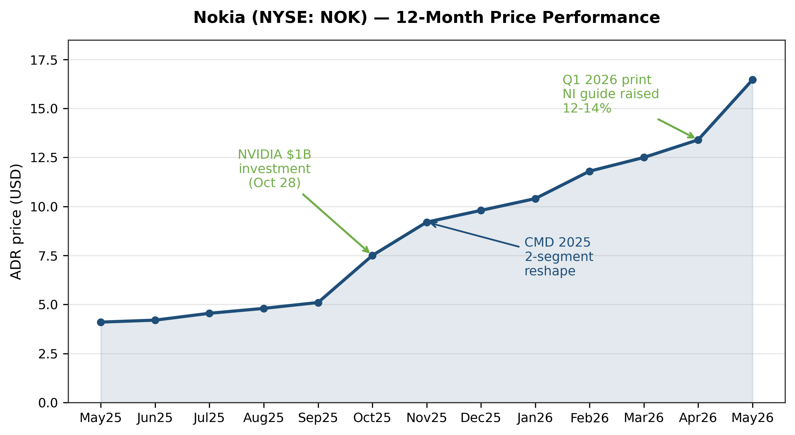
*Figure 1: 12-month NOK ADR price performance with key catalyst markers. Stock has quadrupled since NVIDIA $1B investment announcement (Oct 28, 2025). (External source: [Yahoo Finance — NOK](https://finance.yahoo.com/quote/NOK/))*

**Key takeaways for the page-1 reader:**

- **Strategic transformation is real and quantified.** Infinera consolidated from 28 Feb 2025 took Optical Networks net sales from EUR 1,636 M (FY2024) to EUR 3,019 M (FY2025), a +85% YoY jump; Network Infrastructure overall +23% YoY; the company simplified five business groups into two effective 1 Jan 2026 ([Form 20-F p. 72](https://www.sec.gov/Archives/edgar/data/924613/000162828026015034/nok-20251231.htm); [CMD 2025 release](https://www.nokia.com/newsroom/nokia-announces-new-strategy-evolution-of-its-operating-model-new-long-term-financial-target-strategic-kpis-and-changes-to-its-group-leadership-team/)).
- **AI & Cloud is the growth engine.** Customer-type revenue from AI & Cloud + Mission-Critical Enterprise & Defense (MCE&D) reached EUR 3,085 M in FY2025 (+42% YoY) and accelerated to +49% YoY in Q1 2026 with EUR 1 billion of quarterly orders — confirming the equity story's central thesis ([Form 20-F Note 2.1 p. 135](https://www.sec.gov/Archives/edgar/data/924613/000162828026015034/nok-20251231.htm); [Q1 2026 PDF](https://www.nokia.com/system/files/2026-04/nokia_results_2026_q1.pdf)).
- **NVIDIA partnership is a multi-year option.** USD 1.0 billion equity investment at USD 6.01/share for ~2.9% stake plus AI-RAN Aerial RAN Computer Pro (ARC-Pro) collaboration; T-Mobile US is launch carrier; commercial GA targeted late 2027 ([NVIDIA investor release](https://investor.nvidia.com/news/press-release-details/2025/NVIDIA-and-Nokia-to-Pioneer-the-AI-Platform-for-6G--Powering-Americas-Return-to-Telecommunications-Leadership/default.aspx)).
- **Valuation discounts substantial execution.** At ~42× FY2025 comparable operating profit and +128% premium to peer median P/E NTM, the current quote prices in Bull-case fundamentals (~16% NI revenue CAGR, AI-RAN GA on time); a 12-month return outlook of +12% does not warrant a BUY recommendation under our +15-20% institutional BUY threshold ([Yahoo Finance — NOK](https://finance.yahoo.com/quote/NOK/)).
- **Mobile Networks remains the structural drag.** FY2025 Mobile Networks operating margin of 2.8% (down from 5.5% in FY2024) reflects RAN-market stagnation and ongoing AT&T share loss to Ericsson; without AI-RAN inflection, MN caps group margin upside ([Form 20-F p. 74](https://www.sec.gov/Archives/edgar/data/924613/000162828026015034/nok-20251231.htm); [Dell'Oro RAN market stabilized in 2025](https://www.delloro.com/news/ran-market-stabilized-in-2025/)).
- **Balance sheet is fortress-grade.** FY2025 net cash of EUR 3.4 billion, EUR 19.5 billion order backlog, EUR 2.1 billion of dividends and EUR 1.6 billion of buybacks executed since 2023 — capital return is durable through any cycle ([Form 20-F pp. 10, 66](https://www.sec.gov/Archives/edgar/data/924613/000162828026015034/nok-20251231.htm)).

---

## Investment Thesis

### Pillar 1: Network Infrastructure is now the AI-data-fabric story

Network Infrastructure (NI) reached EUR 7,986 million in FY2025 net sales — 40% of group and the largest single segment after the Infinera consolidation. The 20-F's sub-segment disclosure (verbatim from p. 72): *"In 2025, net sales include Optical Networks net sales of EUR 3,019 million, IP Networks net sales of EUR 2,594 million and Fixed Networks net sales of EUR 2,373 million"* ([Form 20-F p. 72](https://www.sec.gov/Archives/edgar/data/924613/000162828026015034/nok-20251231.htm)). On a stand-alone basis NI now contains the highest-quality elements of the group — proprietary optical-DSP silicon (PSE-6s + Infinera ICE7), in-house indium phosphide PIC manufacturing (Sunnyvale, CA), the FP5 IP routing silicon, and #1-globally xPON OLT leadership for the sixth consecutive year ([Nokia 20-F p. 22](https://www.sec.gov/Archives/edgar/data/924613/000162828026015034/nok-20251231.htm)).

The Q1 2026 print validated the trajectory: Optical Networks +20% YoY, AI & Cloud customers +49% YoY, EUR 1 billion of Q1 orders from AI & Cloud customers, and management raised the FY2026 NI growth guide from the CMD framework's 6–8% CAGR setup to **12–14% for the full year** ([Q1 2026 PDF](https://www.nokia.com/system/files/2026-04/nokia_results_2026_q1.pdf); [Investing.com Q1 2026 summary](https://www.investing.com/news/company-news/nokia-q1-2026-slides-ai-boom-drives-guidance-raise-margins-expand-93CH-4631645)).

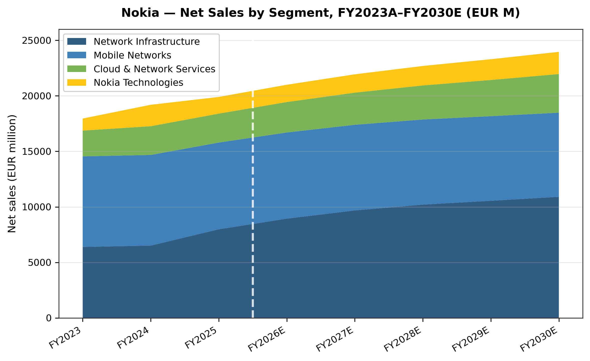
*Figure 2 ⭐: Revenue by reportable segment, FY2023A–FY2030E (EUR M). NI now the largest segment after Infinera consolidation. (External source: [Form 20-F p. 72](https://www.sec.gov/Archives/edgar/data/924613/000162828026015034/nok-20251231.htm))*

### Pillar 2: NVIDIA strategic partnership creates a credible AI-RAN platform option

On 28 October 2025, NVIDIA announced a USD 1.0 billion equity investment in newly issued Nokia ordinary shares at USD 6.01/share (~2.9% pro-forma stake) plus a multi-year AI-RAN collaboration built around NVIDIA's Aerial RAN Computer Pro (ARC-Pro) — a 6G-ready GPU-accelerated baseband for base-of-tower deployment, with T-Mobile US as launch carrier, field trials starting early 2026, and commercial GA late 2027 ([NVIDIA investor release](https://investor.nvidia.com/news/press-release-details/2025/NVIDIA-and-Nokia-to-Pioneer-the-AI-Platform-for-6G--Powering-Americas-Return-to-Telecommunications-Leadership/default.aspx); [Nokia 6-K filing](https://www.sec.gov/Archives/edgar/data/0000924613/000110465925103038/tm2529638d1_6k.htm)). The 20-F describes the integration: *"we leverage the NVIDIA ARC-Pro accelerated computing platform to evolve our Cloud RAN into a Cloud AI-RAN solution, and in our AirScale RAN solutions"* ([Form 20-F p. 17](https://www.sec.gov/Archives/edgar/data/924613/000162828026015034/nok-20251231.htm)).

The NVIDIA partnership matters in two ways. First, it gives Nokia a differentiated AI-RAN product option that neither Ericsson nor Samsung Networks can replicate at scale — an important strategic moat for the next RAN refresh cycle. Second, it creates a credible data-center networking angle: NVIDIA's investment was paired with optical and IP switching collaboration, opening a potential design-win path into NVIDIA's AI infrastructure architecture ([Frank Rayal — NVIDIA/Nokia analysis](https://frankrayal.com/2025/11/03/nvidia-and-nokia-a-strategic-bet-on-edge-ai-ran/)).

### Pillar 3: Patent licensing is a stable EUR 1.4B annuity with optionality

Nokia Technologies (NT) generated EUR 1,501 million in FY2025 net sales at 70.6% operating margin — making it the most profitable segment by margin in the group ([Form 20-F p. 73](https://www.sec.gov/Archives/edgar/data/924613/000162828026015034/nok-20251231.htm)). The patent portfolio comprises *"more than 26,000 families, including over 8,000 essential to 5G"* and 250+ active licensees including Apple, Samsung, Huawei, Xiaomi, OPPO, vivo, Honor, Lenovo, Mercedes-Benz, and Amazon (added March 2025 in a video-streaming settlement) ([Form 20-F pp. 13, 24, 184](https://www.sec.gov/Archives/edgar/data/924613/000162828026015034/nok-20251231.htm)). The smartphone renewal cycle was *"declared complete in February 2024"* — the major OEM contracts are locked in for 5–10 years, making the EUR 1.4 billion run-rate (per CEO Hotard, p. 7) a high-confidence annuity through 2028+ ([Nokia smartphone licensing release Feb 2024](https://www.globenewswire.com/news-release/2024/02/08/2826094/0/en/Inside-information-Nokia-concludes-smartphone-patent-license-renewal-cycle.html)).

Expansion programs in automotive, consumer electronics, IoT and multimedia are now contributing *"an annual revenue run-rate of more than EUR 200 million"* with pending video-codec enforcement against Acer, Asus and Hisense in Germany — providing upside optionality beyond the smartphone base ([Form 20-F p. 13](https://www.sec.gov/Archives/edgar/data/924613/000162828026015034/nok-20251231.htm)).

### Pillar 4: Fortress balance sheet enables capital returns through any cycle

FY2025 ended with EUR 6,791 million in total cash & IB investments, EUR 3,413 million in IB liabilities, and a **net cash position of EUR 3,378 million** ([Form 20-F p. 66](https://www.sec.gov/Archives/edgar/data/924613/000162828026015034/nok-20251231.htm)). Order backlog of EUR 19.5 billion provides ~12 months of forward revenue visibility. Capital return has been steady: **EUR 2.1 billion of dividends paid since 2023 and EUR 1.6 billion of share buybacks**, with the FY2025 proposed dividend of EUR 0.14/share maintained ([Form 20-F p. 10](https://www.sec.gov/Archives/edgar/data/924613/000162828026015034/nok-20251231.htm)). At our base-case projections, Nokia can absorb cumulative FY2026E–FY2030E dividends + buybacks of ~EUR 10 billion while still ending FY2030 with net cash of EUR 8 billion+ ([financial model — Balance Sheet tab](model/Nokia_NYSE_NOK_Financial_Model_2026-05-29.xlsx)).

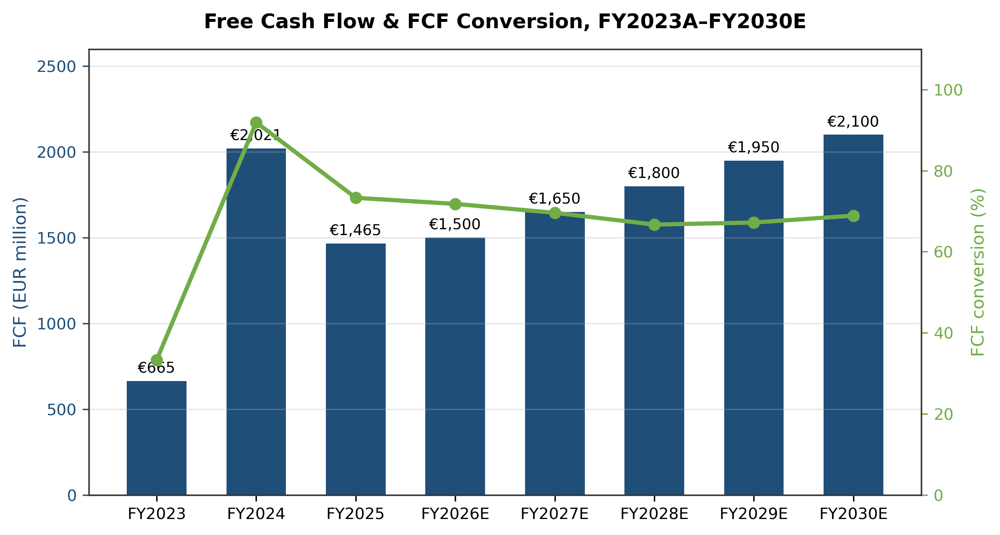
*Figure 3: Free cash flow and FCF conversion (% of comparable operating profit). FY2025 FCF of EUR 1.5B; conversion target 65–75% per CMD 2025. (External source: [Form 20-F p. 66](https://www.sec.gov/Archives/edgar/data/924613/000162828026015034/nok-20251231.htm))*

### Pillar 5: Mix shift toward higher-multiple segments justifies SOME premium re-rating

The structural mix shift is real. In FY2023, Network Infrastructure was 30% of group; in FY2025 it is 40%; in our FY2030E base case it reaches 45%. Mobile Networks fell from 39% to 39% to 31% over the same window. The shift moves Nokia closer to the Cisco/Arista/Ciena valuation bucket and further from the Ericsson/ZTE bucket. *Analyst view:* a modest premium to the historical 1.0–1.5× EV/Sales is defensible; the question is whether the ~4.2× currently embedded is too aggressive.

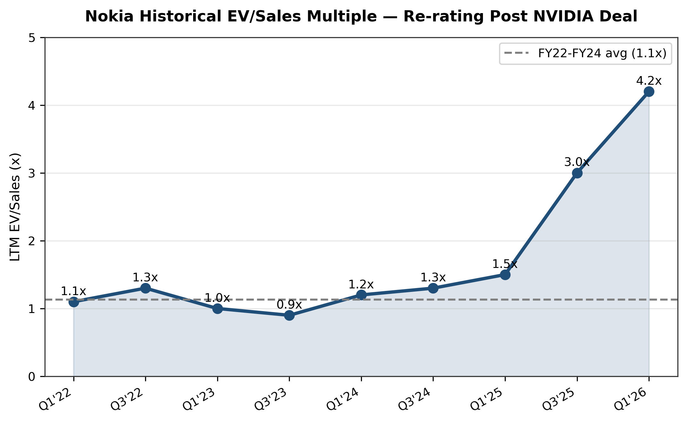
*Figure 4: Nokia historical LTM EV/Sales — re-rating from ~1× pre-NVIDIA to ~4.2× post-Q1 2026. (External source: [Form 20-F p. 66](https://www.sec.gov/Archives/edgar/data/924613/000162828026015034/nok-20251231.htm); [Yahoo Finance NOK](https://finance.yahoo.com/quote/NOK/))*

---

## Key Risks to Our Thesis

We identify twelve principal risks distributed across four categories. Detailed quantification appears in the Risk Assessment section of the linked research document ([Nokia Research Document §9](Nokia_NYSE_NOK_Research_Document.md)).

**Strategy & execution risks.** (1) Infinera integration cost overruns — EUR 646 M customer-relationship intangibles and EUR 380 M technology intangibles must amortize through 2028; integration synergies (DSP roadmap consolidation between PSE-6s and ICE7) are non-trivial ([Form 20-F Note 6.2 p. 185](https://www.sec.gov/Archives/edgar/data/924613/000162828026015034/nok-20251231.htm)). (2) AI-RAN commercialization slip — late 2027 GA leaves 2026–27 P&L benefit limited to development and trial revenue ([NVIDIA partnership release](https://investor.nvidia.com/news/press-release-details/2025/NVIDIA-and-Nokia-to-Pioneer-the-AI-Platform-for-6G--Powering-Americas-Return-to-Telecommunications-Leadership/default.aspx)). (3) Operating-model execution — collapsing five business groups into two effective 1 Jan 2026 is the largest organisational change since the Alcatel-Lucent integration ([Capacity Media — biggest overhaul in years](https://capacityglobal.com/news/nokia-announces-biggest-organisational-overhaul-in-years/)).

**Industry / market risks.** (4) Mobile RAN structural stagnation — Dell'Oro forecasts ~1% CAGR over the next five years ([Dell'Oro — RAN stabilized in 2025](https://www.delloro.com/news/ran-market-stabilized-in-2025/)). (5) Hyperscaler customer concentration — although no single customer exceeds 10% of group, the AI & Cloud + MCE&D bucket (15.5% of FY2025 sales) is concentrated across a handful of hyperscalers ([Form 20-F Note 2.1 p. 139](https://www.sec.gov/Archives/edgar/data/924613/000162828026015034/nok-20251231.htm)). (6) AT&T RAN runoff — Ericsson's December 2023 USD 14 billion Open RAN win continues to displace Nokia's wireless footprint at AT&T through 2028 ([AT&T release Dec 2023](https://about.att.com/story/2023/commercial-scale-open-radio-access-network.html)).

**Financial risks.** (7) Valuation multiple compression — at ~42× FY2025 comparable operating profit, NOK trades 2 standard deviations above its 2022–24 range; a reversion to 18–22× could produce 40–60% drawdown ([Yahoo Finance — NOK](https://finance.yahoo.com/quote/NOK/)). (8) FX exposure to USD weakness — ~35% of sales are in the Americas region, with management already flagging "weaker dollar and US tariffs" as profitability drag ([Light Reading — Nokia tariff impact](https://www.lightreading.com/finance/nokia-profit-outlook-hurt-by-weaker-dollar-and-us-tariffs)). (9) Patent-licensing revenue lumpiness — the EUR 400 M+ FY2024 catch-up payment drove FY2025 NT -22% YoY; 5–10 year renewal cycles create quarterly volatility ([Form 20-F p. 75](https://www.sec.gov/Archives/edgar/data/924613/000162828026015034/nok-20251231.htm)).

**Geopolitical / regulatory risks.** (10) US tariffs (Trump-2.0 regime) — Nokia disclosed a ~USD 22–34 M Q2'25 tariff hit to comparable operating profit; CEO Hotard publicly said he would "absolutely entertain" expanding US manufacturing ([Fox Business — Hotard on US expansion](https://www.foxbusiness.com/politics/nokia-exec-open-expanding-us-manufacturing-avoid-trump-tariffs)). (11) China decoupling — Greater China sales of EUR 913 M (4.6% of group) declining since 2022 cybersecurity-law tightening ([Form 20-F p. 96](https://www.sec.gov/Archives/edgar/data/924613/000162828026015034/nok-20251231.htm)). (12) Export-control evolution — NVIDIA's GPU export restrictions to China shape which AI-RAN products Nokia can sell into restricted markets ([Form 20-F risk factors p. 95](https://www.sec.gov/Archives/edgar/data/924613/000162828026015034/nok-20251231.htm)).

---

## Company 101

### Overview & history

Nokia Corporation traces to **12 May 1865**, when mining engineer **Fredrik Idestam** secured a Finnish-senate concession to establish a groundwood pulp mill at the Tammerkoski rapids in Tampere — then under the Russian Grand Duchy of Finland ([Wikipedia — Fredrik Idestam](https://en.wikipedia.org/wiki/Fredrik_Idestam)). The modern conglomerate took shape through three legacy lines — pulp/paper (1865), rubber (Eduard Polón's Finnish Rubber Works, 1898) and cables (Finnish Cable Works, 1912) — which **merged into the present Nokia Corporation in 1967** ([Wikipedia — History of Nokia](https://en.wikipedia.org/wiki/History_of_Nokia)). 2025 marked Nokia's 160th anniversary and the 100th anniversary of Nokia Bell Labs — a coincidence the 2025 Annual Report leans on heavily ([Form 20-F p. 6](https://www.sec.gov/Archives/edgar/data/924613/000162828026015034/nok-20251231.htm)).

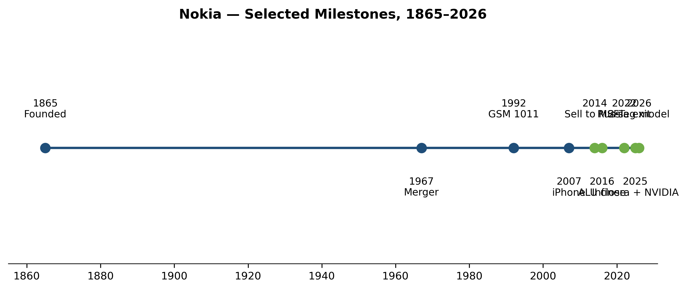
*Figure 5: Nokia historical milestones, 1865–2026. The 2014 Microsoft devices sale and 2016 Alcatel-Lucent acquisition bracket the modern telecom-equipment business. (External source: [Wikipedia — History of Nokia](https://en.wikipedia.org/wiki/History_of_Nokia); [Form 20-F p. 6](https://www.sec.gov/Archives/edgar/data/924613/000162828026015034/nok-20251231.htm))*

The handset era ended decisively with the **April 2014 sale of Nokia Devices & Services to Microsoft for ~USD 7.2 billion** — the 20-F still carries tax-indemnity references to that disposal ([Form 20-F tax indemnity ~p. 108](https://www.sec.gov/Archives/edgar/data/924613/000162828026015034/nok-20251231.htm)). The **January 2016 EUR 15.6 billion all-share Alcatel-Lucent acquisition** transformed Nokia into a full-stack telecom-network vendor; the ALU brand was retired 3 November 2016 ([Form 20-F glossary p. 193](https://www.sec.gov/Archives/edgar/data/924613/000162828026015034/nok-20251231.htm)). The 2022–25 period brought further strategic shifts: Russia exit (April 2022), buyout of China Huaxin's ~50% stake in Nokia Shanghai Bell (Q4 2024), the Alcatel Submarine Networks sale to the French State (31 Dec 2024), and the Infinera close (28 Feb 2025) ([Form 20-F p. 71](https://www.sec.gov/Archives/edgar/data/924613/000162828026015034/nok-20251231.htm)).

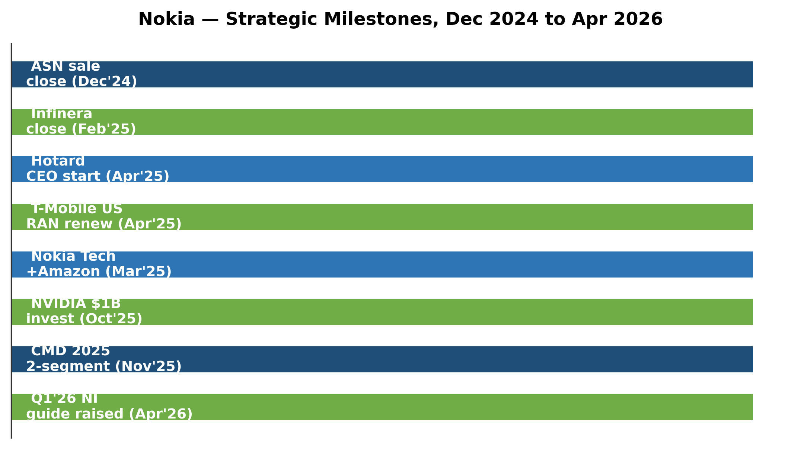
*Figure 6: Strategic milestones over the last 18 months. Eight discrete events reset the equity story. (External source: [Form 20-F p. 6](https://www.sec.gov/Archives/edgar/data/924613/000162828026015034/nok-20251231.htm); [NVIDIA press release](https://investor.nvidia.com/news/press-release-details/2025/NVIDIA-and-Nokia-to-Pioneer-the-AI-Platform-for-6G--Powering-Americas-Return-to-Telecommunications-Leadership/default.aspx))*

### Management

**Justin Hotard — President & CEO since 1 April 2025.** Hotard joined directly from **Intel**, where he served as EVP and General Manager of the Data Center & AI Group (DCAI), Intel's server-CPU and AI-accelerator business ([Nokia leadership page — Justin Hotard](https://www.nokia.com/we-are-nokia/leadership-and-governance/group-leadership-team/justin-hotard/)). Prior to Intel, Hotard spent **nine years at Hewlett Packard Enterprise (2015–2024)**, finishing as EVP and GM of HPC, AI & Labs, where per Nokia's published bio *"he delivered the world's first exascale supercomputer for the US Department of Energy"* (Frontier at Oak Ridge) ([Nokia bio](https://www.nokia.com/we-are-nokia/leadership-and-governance/group-leadership-team/justin-hotard/)). Earlier career at NCR Corporation, Symbol Technologies, and Motorola (as an engineer deploying mobile networks for US carriers — the sole conventional telecom-vendor tour). Education: BSc Electrical Engineering, University of Illinois Urbana-Champaign; MBA, Northwestern Kellogg ([Nokia bio](https://www.nokia.com/we-are-nokia/leadership-and-governance/group-leadership-team/justin-hotard/)).

The strategic signal of recruiting a data-center / AI operator rather than a telecoms lifer was unmistakable, and within seven months of his start Hotard had closed the NVIDIA equity-and-AI-RAN deal — a transaction that re-rated the equity ~4× and that arguably could not have been negotiated by a more traditional telco-equipment CEO ([Form 20-F p. 6 CEO interview](https://www.sec.gov/Archives/edgar/data/924613/000162828026015034/nok-20251231.htm)).

**Pekka Lundmark — outgoing CEO (2020–March 31 2025).** Lundmark stepped down on 31 March 2025 and continued as an advisor through end-2025. His tenure spanned the Russia exit, the Alcatel-Lucent post-merger residual integration, the smartphone licensing renewal cycle, and laying the groundwork for the Infinera acquisition ([Nokia leadership transition release Feb 2025](https://www.globenewswire.com/news-release/2025/02/10/3023164/0/en/Inside-information-Nokia-announces-a-leadership-transition-Justin-Hotard-appointed-as-successor-to-Pekka-Lundmark.html)).

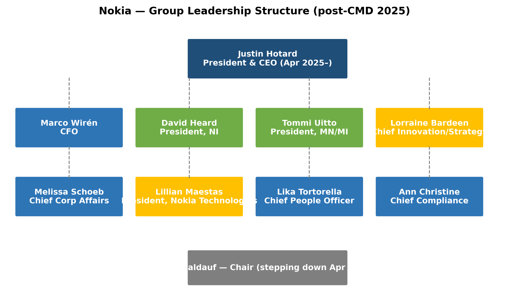
*Figure 7: Nokia Group Leadership Team structure post-CMD 2025 reshape. (External source: [Nokia leadership page](https://www.nokia.com/we-are-nokia/leadership-and-governance/group-leadership-team/justin-hotard/))*

### Products & services

The product portfolio sits at the intersection of three large addressable markets — mobile RAN, optical/IP networking, and patent licensing — and what management chooses to invest in versus harvest determines the next five years of the equity story.

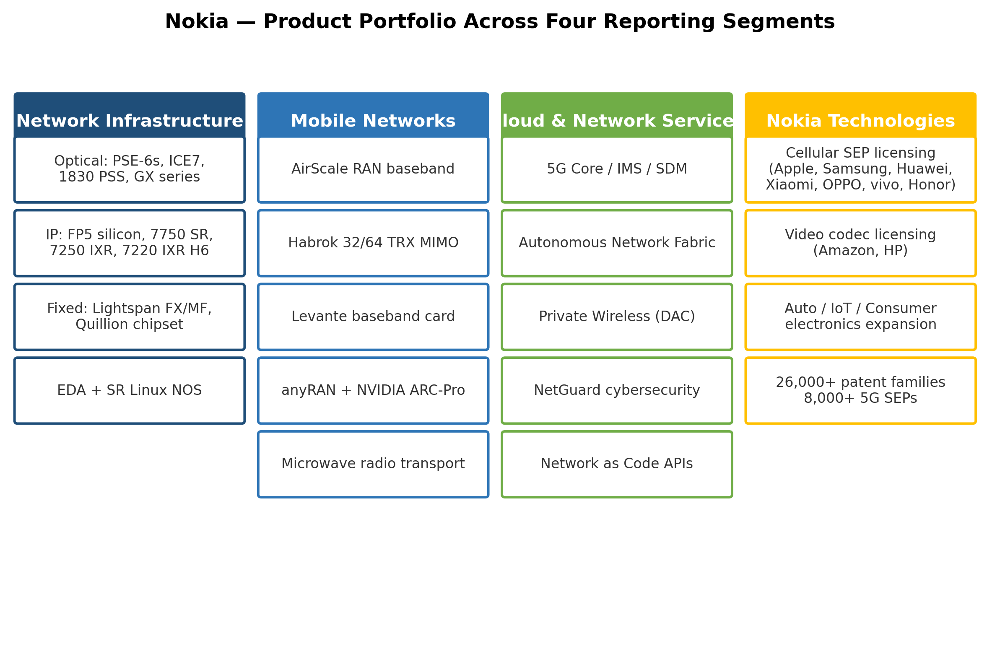
*Figure 8: Product portfolio across Nokia's four reportable segments (FY2025 basis). (External source: [Form 20-F pp. 11–13](https://www.sec.gov/Archives/edgar/data/924613/000162828026015034/nok-20251231.htm))*

**Network Infrastructure — EUR 7,986 M FY2025, ~40% of group.** Three sub-segments: **Optical Networks** (EUR 3,019 M; Nokia PSE-6s coherent DSP + Infinera ICE7 1.2 Tbps engine + 1830 PSS + GX series — combined Nokia+Infinera platform now #2 globally with ~20% share); **IP Networks** (EUR 2,594 M; FP5 6 Tb/s routing silicon + 7750 SR + 7250 IXR + 7220 IXR H6 with Broadcom Tomahawk 6 + SR Linux NOS + Event-Driven Automation); **Fixed Networks** (EUR 2,373 M; Lightspan FX and Lightspan MF OLT platforms, Quillion chipset, #1 in xPON OLT for six consecutive years) ([Form 20-F p. 72 footnote, p. 22](https://www.sec.gov/Archives/edgar/data/924613/000162828026015034/nok-20251231.htm); [Nokia PSE-6s page](https://www.nokia.com/optical-networks/pse-6s/); [Nokia ICE7 page](https://www.nokia.com/optical-networks/ice7/); [Nokia FP5 page](https://www.nokia.com/ip-networks/fp-network-processor-technology/fp5/)).

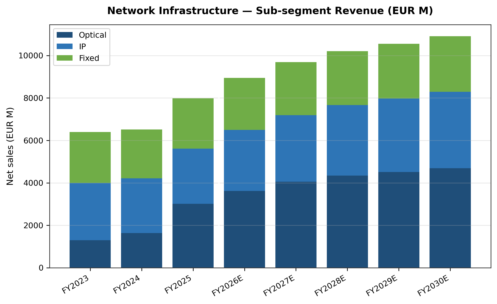
*Figure 9: Network Infrastructure sub-segment revenue, FY2023A–FY2030E. Optical jumped on Infinera consolidation; AI-driven projection across all three. (External source: [Form 20-F p. 72](https://www.sec.gov/Archives/edgar/data/924613/000162828026015034/nok-20251231.htm))*

**Mobile Networks — EUR 7,806 M FY2025, ~39%.** AirScale RAN platform built on Nokia's proprietary ReefShark SoC; Habrok Massive MIMO radios (32/64 TRX); Levante baseband; new Lodos 5G-Advanced baseband (2025). The strategic shift is the **anyRAN** concept covering purpose-built AirScale RAN, Cloud RAN (on COTS x86 or ARM servers), and Open RAN — capped by the **NVIDIA ARC-Pro AI-RAN** integration ([Form 20-F p. 17](https://www.sec.gov/Archives/edgar/data/924613/000162828026015034/nok-20251231.htm); [Nokia anyRAN page](https://www.nokia.com/mobile-networks/ran/anyran/); [Nokia Habrok release](https://www.nokia.com/newsroom/nokia-redefines-massive-mimo-radio-performance-with-the-launch-of-habrok-its-latest-generation-of-airscale-5g-radios-powered-by-reefshark-mwc23/)). End-2025 KPIs: 408 commercial 5G agreements, >1,000 private wireless customers, #3 in global Mobile RAN by Dell'Oro/Omdia ([Form 20-F p. 22](https://www.sec.gov/Archives/edgar/data/924613/000162828026015034/nok-20251231.htm)).

**Cloud and Network Services — EUR 2,606 M FY2025, ~13%.** Three pillars: core network software (5G Core, IMS, SDM — Nokia's 5G SA core is in *"65% of telecommunication providers' 5G SA networks"* per Omdia), Autonomous Network software (Autonomous Network Fabric, analytics, AI), and Private Wireless via Nokia DAC ([Form 20-F p. 12](https://www.sec.gov/Archives/edgar/data/924613/000162828026015034/nok-20251231.htm)). Marquee 2025 win: Rakuten Mobile go-live with Nokia's IMS, SDM, and Cloud Signaling Director on Rakuten Cloud ([Rakuten press release](https://symphony.rakuten.com/newsroom/nokias-ims-and-sdm-cloud-native-core-powering-rakuten-mobile-4g-and-5g-core-now-live-on-rakuten-cloud)).

**Nokia Technologies — EUR 1,501 M FY2025, ~8%, 70.6% op margin.** Patent licensing business with the *"more than 26,000 families, including over 8,000 essential to 5G"* portfolio. 250+ active licensees: Apple, Samsung, Huawei, OPPO (incl. OnePlus & realme), vivo, Xiaomi, Honor, Lenovo, Mercedes-Benz, and the March 2025 Amazon settlement on video-streaming patents ([Form 20-F pp. 13, 24, 184](https://www.sec.gov/Archives/edgar/data/924613/000162828026015034/nok-20251231.htm)).

### Customers & customer-concentration disclosure

The 20-F's Note 2.1 (p. 139) discloses: *"Major customers — In 2025, 2024 and 2023 no single customer represented more than 10% of net sales."* ([Form 20-F p. 139](https://www.sec.gov/Archives/edgar/data/924613/000162828026015034/nok-20251231.htm)). Applied to consolidated group revenue. **T-Mobile US** is identified by name in narrative as *"our largest US customer"* and *"an active participant in the [NVIDIA] partnership"* ([Form 20-F p. 16](https://www.sec.gov/Archives/edgar/data/924613/000162828026015034/nok-20251231.htm)).

| Customer type (denominator: consolidated group) | FY2025 (EUR M) | FY2024 | FY2023 | FY25 % of group |
|---|---:|---:|---:|---:|
| Telecom providers | 15,313 | 15,085 | 17,652 | 77.0% |
| **AI & Cloud + Mission Critical Enterprise & Defense** | **3,085** | 2,180 | 2,282 | **15.5%** |
| Licensees (Nokia Technologies) | 1,501 | 1,928 | 1,085 | 7.5% |
| Other / eliminations | (10) | 27 | 119 | — |
| **Total** | **19,889** | **19,220** | **21,138** | **100%** |

*Source: [Form 20-F Note 2.1 p. 135](https://www.sec.gov/Archives/edgar/data/924613/000162828026015034/nok-20251231.htm). All figures consolidated group-level.*

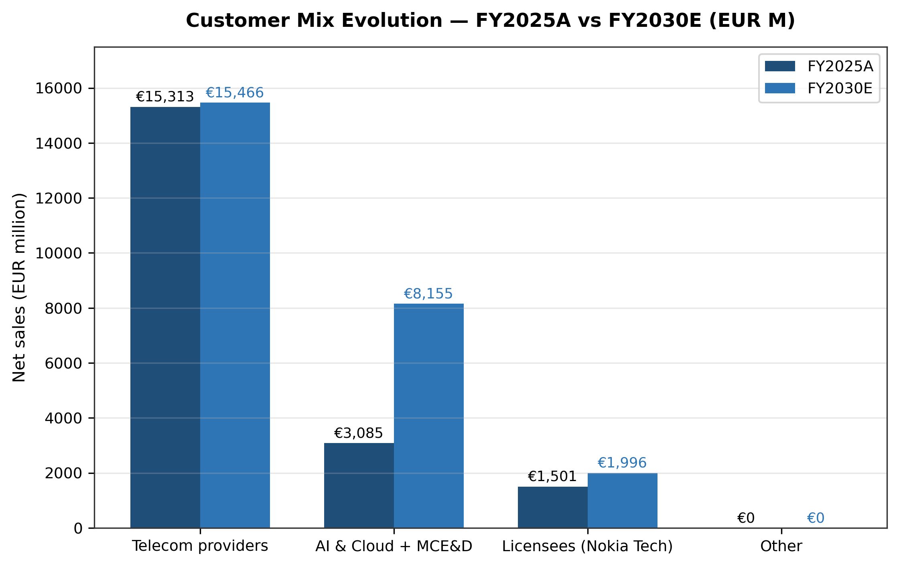
*Figure 10: Customer mix shift from FY2025 to FY2030E. AI & Cloud + MCE&D bucket projected to nearly triple. (External source: [Form 20-F p. 135](https://www.sec.gov/Archives/edgar/data/924613/000162828026015034/nok-20251231.htm); financial model projections)*

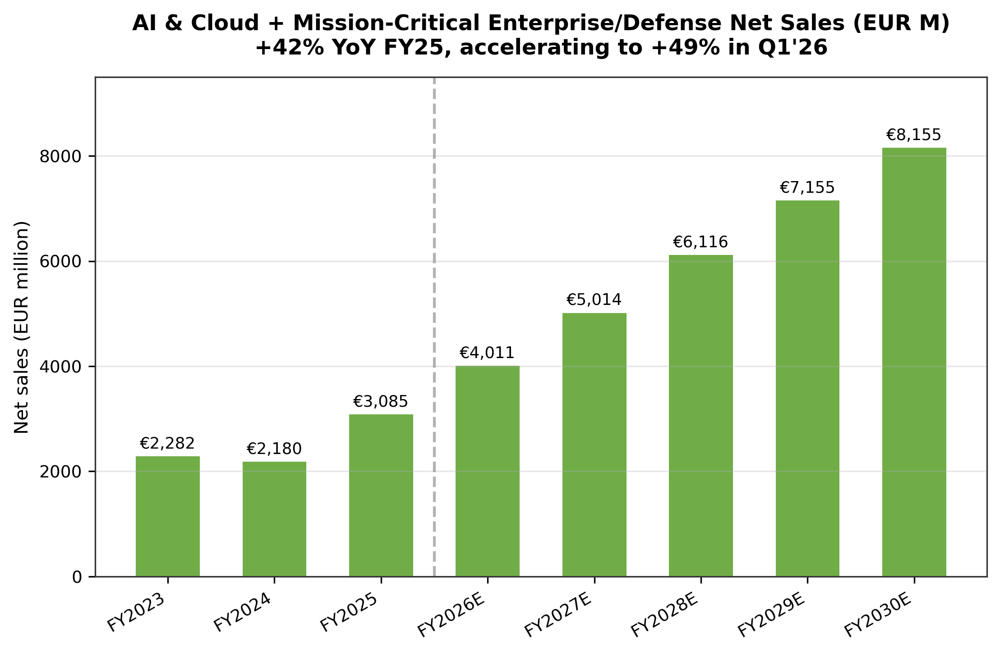
*Figure 11: AI & Cloud + MCE&D customer net sales trajectory. +42% YoY in FY2025, +49% in Q1 2026. (External source: [Form 20-F p. 135](https://www.sec.gov/Archives/edgar/data/924613/000162828026015034/nok-20251231.htm); [Q1 2026 PDF](https://www.nokia.com/system/files/2026-04/nokia_results_2026_q1.pdf))*

### Geographic mix

North America has become Nokia's single largest country exposure at EUR 6,201 M / 31.2% of group, up from 28.0% in FY2024 — driven by Infinera consolidation and the AT&T fiber win ([Form 20-F p. 135](https://www.sec.gov/Archives/edgar/data/924613/000162828026015034/nok-20251231.htm)). Greater China is just 4.6% of group and structurally declining; India is 7.7% and stable.

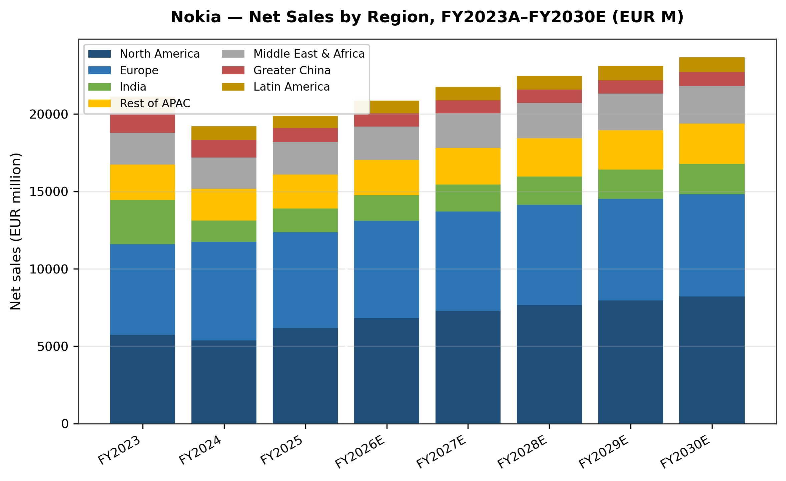
*Figure 12 ⭐: Net sales by region, FY2023A–FY2030E (EUR M, stacked). NA share rises through 2030E on Infinera + AT&T fiber. (External source: [Form 20-F p. 135](https://www.sec.gov/Archives/edgar/data/924613/000162828026015034/nok-20251231.htm))*

### Industry overview & competitive landscape

Nokia operates across markets on widely different trajectories. **Mobile RAN** has stabilized after the 2022–24 cumulative ~20% decline, with Dell'Oro forecasting ~1% CAGR over the next five years — structurally challenged for the Mobile Networks segment ([Dell'Oro — RAN stabilized in 2025](https://www.delloro.com/news/ran-market-stabilized-in-2025/); [IEEE ComSoc summary Feb 2026](https://techblog.comsoc.org/2026/02/17/delloro-ran-market-stabilized-in-2025-with-1-cag-forecast-over-next-5-years-opinion-on-ai-ran-5g-advanced-6g/)). **Optical transport** reached USD 16 billion in 2025 sales (+14% YoY) and continues accelerating on hyperscaler/neocloud demand — the second-fastest of Nokia's addressable markets ([Dell'Oro — Optical transport USD 16B in 2025](https://www.delloro.com/news/optical-transport-market-grew-to-16-billion-in-2025/)). **Data-center / AI back-end networking** is the secular boom — Dell'Oro projects >USD 100 billion cumulative AI-back-end switch sales over 2025–29, with Ethernet now over twice the InfiniBand share for AI scale-out ([Dell'Oro — Ethernet doubles InfiniBand](https://www.delloro.com/news/ethernet-more-than-doubles-size-of-infiniband-as-the-leading-fabric-for-ai-scale-out-networks-in-2025/); [Dell'Oro — USD 100B AI back-end switches](https://www.delloro.com/news/data-center-switch-sales-in-ai-back-end-networks-to-exceed-100-b-over-the-next-five-years/)).

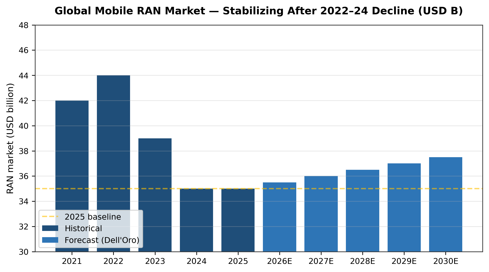
*Figure 13: Global Mobile RAN market — stabilizing after 2022-24 decline. (External source: [Dell'Oro RAN 2025](https://www.delloro.com/news/ran-market-stabilized-in-2025/))*

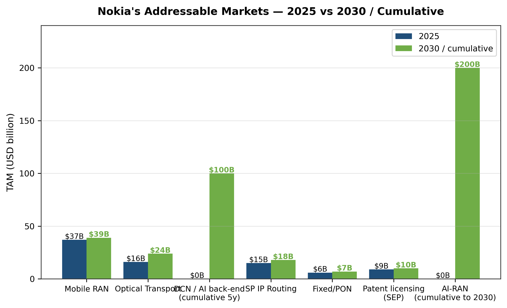
*Figure 14: Nokia's addressable markets — 2025 vs 2030/cumulative. Optical and AI back-end / AI-RAN are the growth verticals. (External source: [Dell'Oro market data](https://www.delloro.com/news/optical-transport-market-grew-to-16-billion-in-2025/); [NVIDIA-Nokia AI-RAN release](https://investor.nvidia.com/news/press-release-details/2025/NVIDIA-and-Nokia-to-Pioneer-the-AI-Platform-for-6G--Powering-Americas-Return-to-Telecommunications-Leadership/default.aspx))*

**Optical market share** — Top-5 in 2025 by Dell'Oro: Huawei #1, **Nokia #2 (~20% post-Infinera)**, Ciena #3 (~50% US share), ZTE #4, Cisco #5 (post-Acacia) ([Dell'Oro — Optical Transport](https://www.delloro.com/news/optical-transport-market-grew-to-16-billion-in-2025/)).

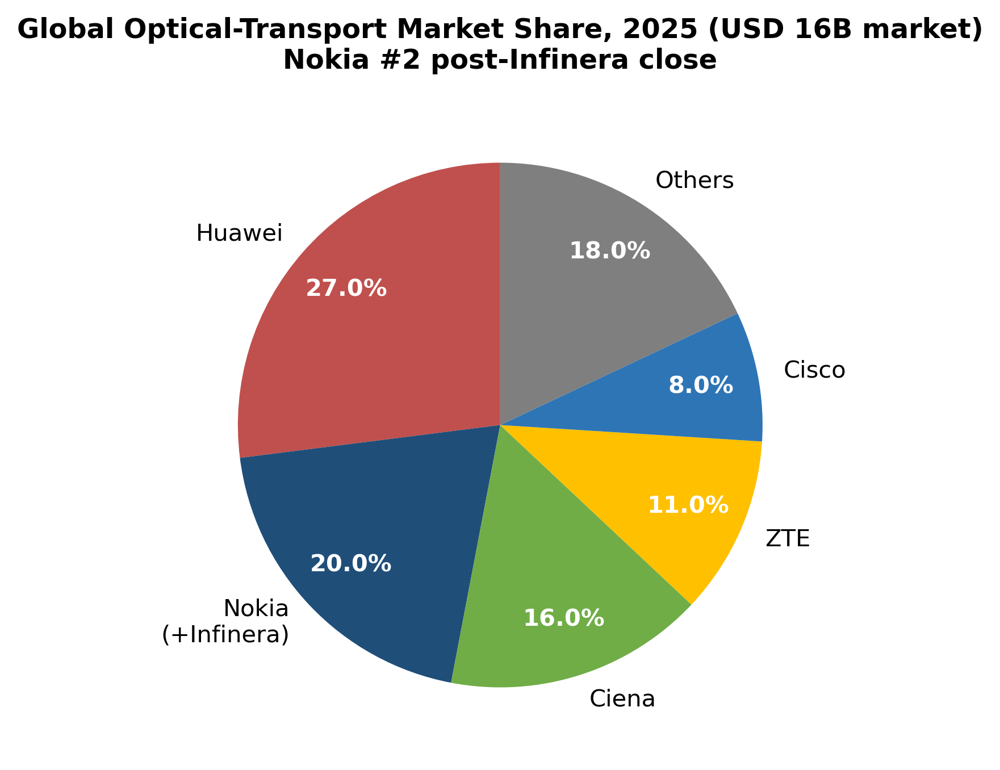
*Figure 15: Global optical-transport market share, 2025 (USD 16B market). Nokia #2 globally post-Infinera. (External source: [Dell'Oro 2025 optical](https://www.delloro.com/news/optical-transport-market-grew-to-16-billion-in-2025/))*

**Competitive landscape highlights:**

- **Ericsson (NASDAQ: ERIC)** — Closest peer in RAN. Q1 2026 sales SEK 49.3B (-10% reported / +6% organic), Networks segment ~19% adj. EBITA margin; remains AT&T Open RAN anchor under the 2023 USD 14B contract ([Investing.com Ericsson Q1 2026 slides](https://www.investing.com/news/company-news/ericsson-q1-2026-slides-organic-growth-offset-by-currency-headwinds-93CH-4619802); [Ericsson AT&T release Dec 2023](https://www.ericsson.com/en/press-releases/2023/12/att-to-accelerate-open-and-interoperable-radio-access-networks-ran-in-the-united-states-through-new-collaboration-with-ericsson)).
- **Huawei** — Optical #1 globally, RAN #1 ex-North-America; blocked from most Tier-1 Western carriers. Vertical integration is industry's largest structural advantage; largest constraint is geopolitical ([Dell'Oro — Optical Transport](https://www.delloro.com/news/optical-transport-market-grew-to-16-billion-in-2025/)).
- **Cisco Systems (NASDAQ: CSCO)** — IP routing incumbent with Silicon One and 8000 series; slipped to #5 in optical. Natural share-donor for Nokia in SP routing ([Form 20-F p. 22 — Dell'Oro IP edge #1](https://www.sec.gov/Archives/edgar/data/924613/000162828026015034/nok-20251231.htm)).
- **Juniper Networks → HPE.** HPE closed the USD 14 billion Juniper acquisition on 2 July 2025; HPE/Juniper now bundles routing + Aruba + AI servers, raising the bar for Nokia in enterprise/DCN ([HPE press release, 2 July 2025](https://www.hpe.com/us/en/newsroom/press-release/2025/07/hewlett-packard-enterprise-closes-acquisition-of-juniper-networks-to-offer-industry-leading-comprehensive-cloud-native-ai-driven-portfolio.html); [DCD recap](https://www.datacenterdynamics.com/en/news/hpe-closes-14bn-acquisition-of-juniper-networks/)).
- **Ciena (NYSE: CIEN)** — Optical leader in North America (~50% US share); WaveLogic 6e and 400/800ZR ramp; pivoting toward AI/DCI. Direct head-to-head with the Nokia-Infinera platform.
- **Samsung Networks** — Verizon's primary vRAN supplier (>10,000 vRAN sites; target 20,000 by end-2025); not a material factor at AT&T or T-Mobile ([Samsung Verizon vRAN release](https://www.samsung.com/global/business/networks/insights/press-release/0224-verizon-infuses-ai-in-network-accelerates-open-ran-innovation-with-multi-vendor-ran-intelligent-controller-deployment/)).
- **Arista Networks (NYSE: ANET)** — Dominant share-gainer in front-end Ethernet DC switching; #3 in AI back-end. Competes with Nokia in IP/Ethernet DC routing/switching — a market where Nokia is the challenger.

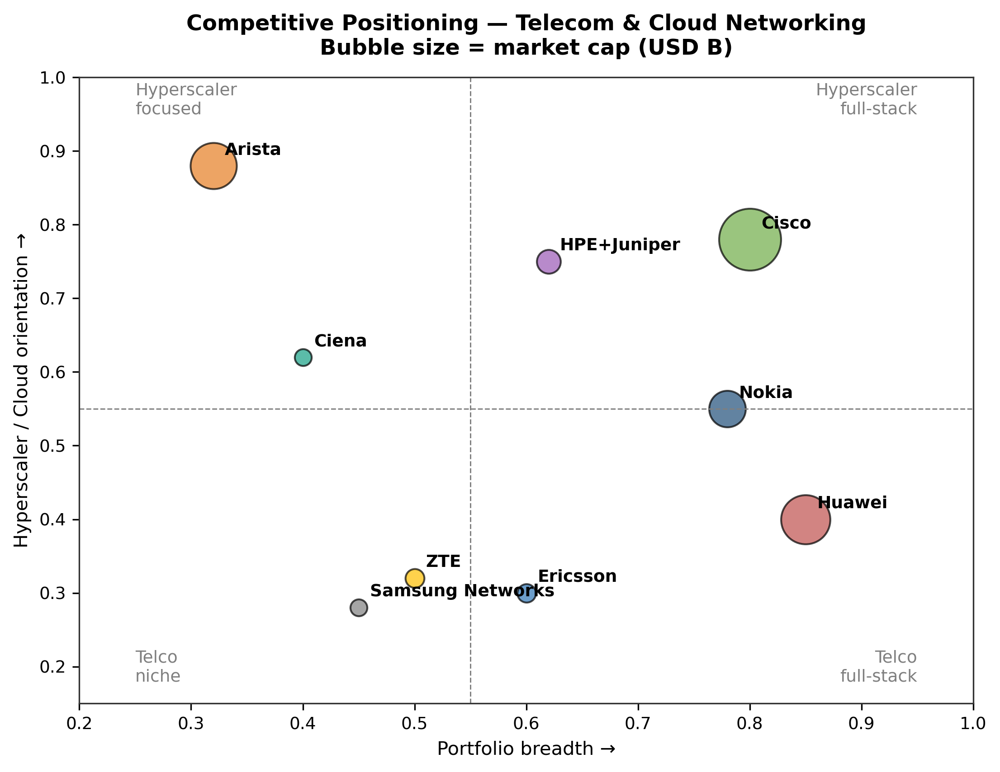
*Figure 16: Competitive positioning — telecom & cloud networking vendors. Bubble size = market cap (USD B). (External source: [Yahoo Finance — peer market caps 2026-05-27](https://finance.yahoo.com/quote/NOK/))*

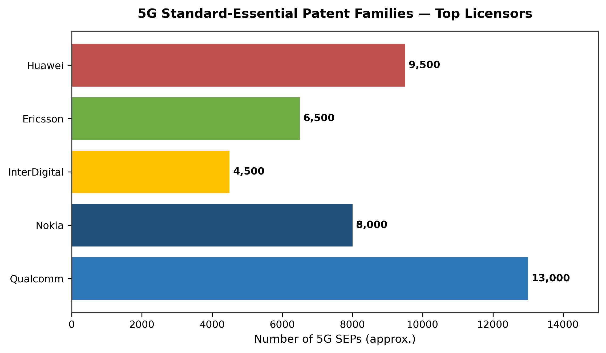
*Figure 17: 5G standard-essential patent families — top licensors. Nokia at ~8,000 SEPs. (External source: [Form 20-F p. 13](https://www.sec.gov/Archives/edgar/data/924613/000162828026015034/nok-20251231.htm); [IPlytics 2024 SEP rankings](https://www.iplytics.com/))*

### Bell Labs & R&D

**Nokia Bell Labs** celebrated its 100th anniversary in 2025 — the same year as Nokia's 160th. R&D pillars: Physical AI, Space communications (with NASA, Intuitive Machines, and Lunar Outpost the company *"deployed the first cellular network on the Moon"* in March 2025), AI-native networks and 6G ([Form 20-F p. 21](https://www.sec.gov/Archives/edgar/data/924613/000162828026015034/nok-20251231.htm)). Cumulative R&D investment since 2000 stands at ~EUR 160 billion; September 2025 saw the opening of the new Oulu 5G/6G campus housing 3,000 staff.

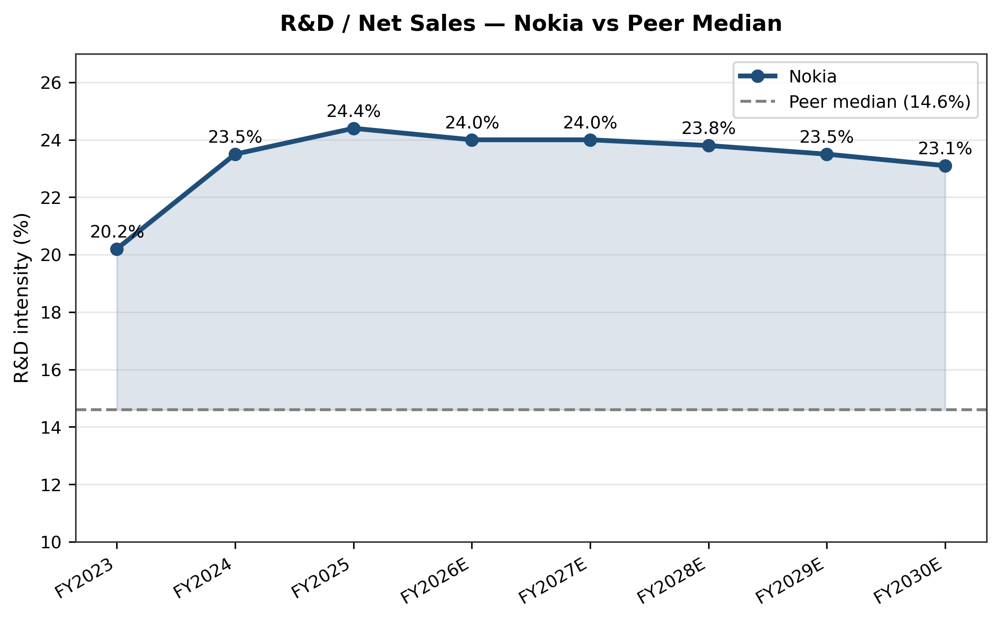
*Figure 18: R&D / net sales — Nokia at ~24% intensity, well above peer median. (External source: [Form 20-F p. 67](https://www.sec.gov/Archives/edgar/data/924613/000162828026015034/nok-20251231.htm); peer Yahoo Finance financials)*

### Private wireless

Nokia's Private Wireless business, built on Nokia DAC (Digital Automation Cloud), now serves 180+ enterprise customers (1,000+ under the broader 20-F definition). Named accounts include Lufthansa Technik, Sandvik Mining, Deutsche Bahn, Toyota, and Memphis Light, Gas and Water (July 2025 5G grid modernization deal) ([Form 20-F p. 22](https://www.sec.gov/Archives/edgar/data/924613/000162828026015034/nok-20251231.htm); [Nokia–Lufthansa Technik release](https://www.nokia.com/newsroom/nokia-5g-private-wireless-networking-moves-from-trial-to-permanent-deployment-for-lufthansa-technik/); [Memphis utility release](https://www.nokia.com/about-us/news/releases/2025/07/14/nokia-to-deploy-private-5g-network-for-memphis-light-gas-and-waters-grid-modernization-initiative/)).

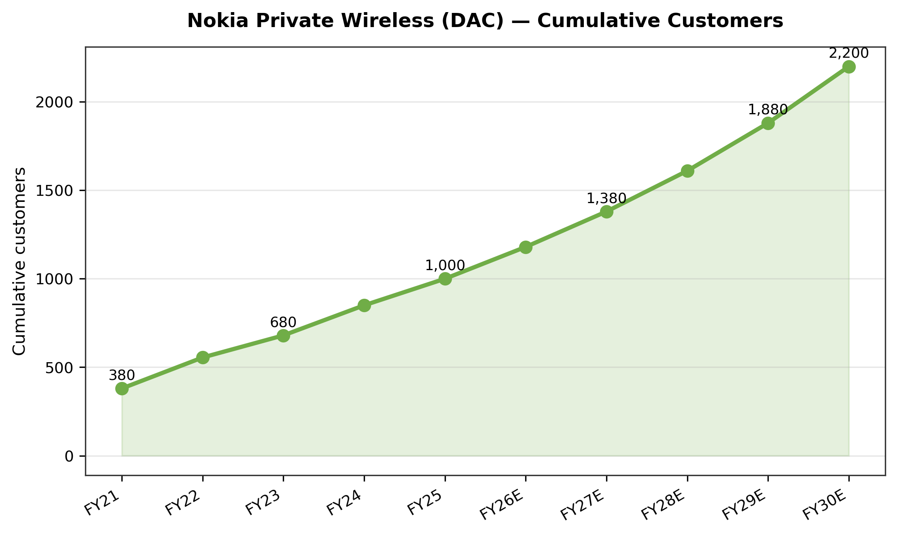
*Figure 19: Cumulative Nokia DAC private-wireless customer count. (External source: [Nokia DAC customer disclosures — quarterly earnings reports](https://www.nokia.com/newsroom/nokia-corporation-financial-report-for-q4-2025-and-full-year-2025/))*

---

## Financial Analysis & Projections

### Historical performance (FY2023–FY2025)

Three-year history shows the impact of the FY2024 patent-licensing catch-up payment (EUR 400 M+) and the FY2025 Infinera consolidation:

| EUR M | FY2023 | FY2024 | FY2025 |
|---|---:|---:|---:|
| Net sales | 21,138 | 19,220 | 19,889 |
| Gross profit | — | 8,864 | 8,659 |
| Gross margin | n/d | 46.1% | 43.5% |
| R&D | (4,277) | (4,512) | (4,855) |
| R&D % of sales | 20.2% | 23.5% | 24.4% |
| **Operating profit (IFRS)** | **1,733** | **1,970** | **885** |
| **Comparable operating profit** | **~1,800** | **~2,100** | **~2,000** |
| Comparable operating margin | ~8.5% | ~11.0% | ~10.1% |
| Profit for the year | 679 | 1,284 | 660 |
| Diluted EPS (EUR) | 0.11 | 0.31 | 0.11 |
| Operating cash flow | 1,317 | 2,493 | 2,071 |
| Free cash flow | 665 | 2,021 | 1,465 |
| Capex | (652) | (472) | (606) |

*Source: [Form 20-F Selected Financial Data pp. 66–67](https://www.sec.gov/Archives/edgar/data/924613/000162828026015034/nok-20251231.htm); CEO interview p. 7 for FY2025 comparable operating profit.*

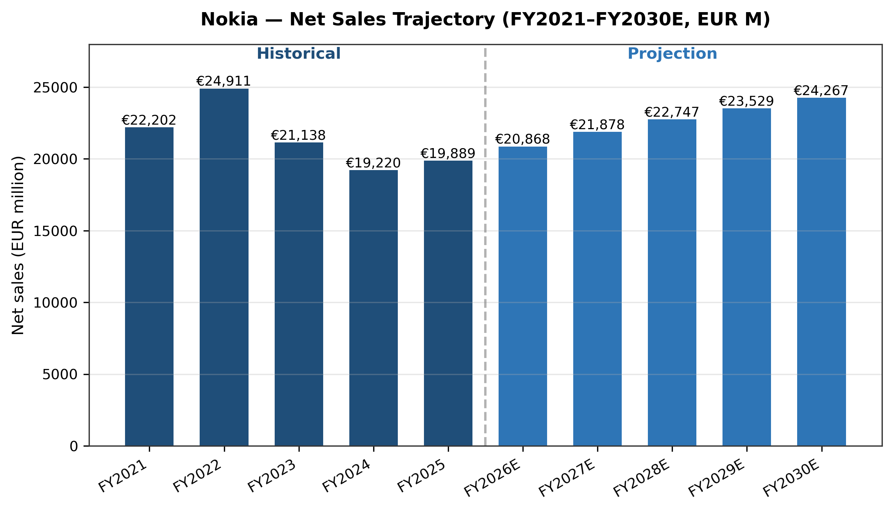
*Figure 20: Net sales trajectory FY2021A through FY2030E. Reconstructed FY2021/FY2022 from prior 20-F filings. (External source: [Form 20-F FY2025 p. 66](https://www.sec.gov/Archives/edgar/data/924613/000162828026015034/nok-20251231.htm); [Nokia prior-year 20-Fs](https://www.sec.gov/cgi-bin/browse-edgar?action=getcompany&CIK=0000924613&type=20-F))*

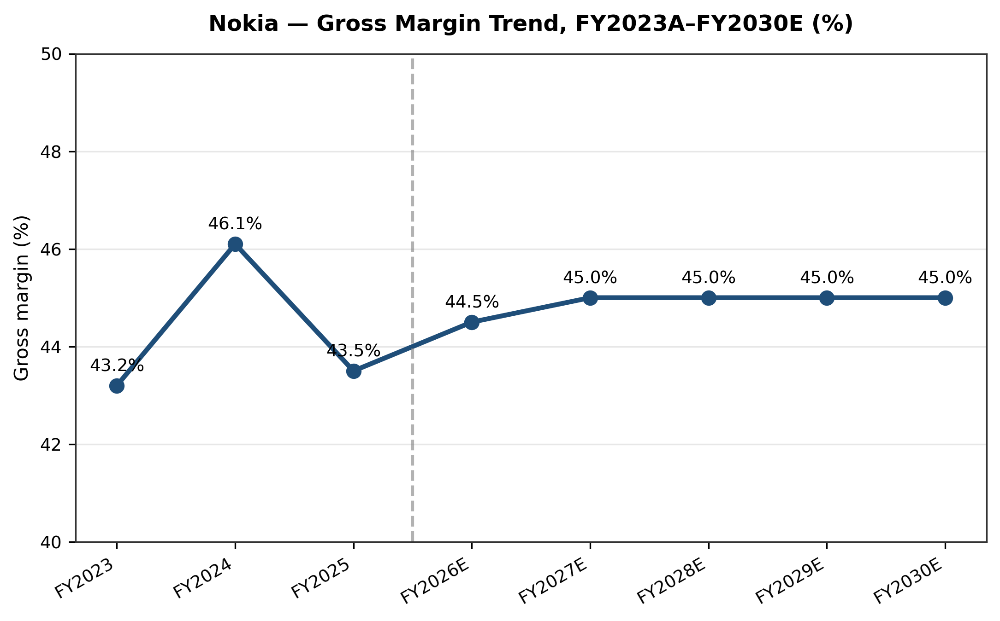
*Figure 21: Gross margin trend FY2023A–FY2030E. FY2025 dip reflects Infinera revenue mix; recovers to mid-45% by FY2027E. (External source: [Form 20-F p. 68](https://www.sec.gov/Archives/edgar/data/924613/000162828026015034/nok-20251231.htm))*

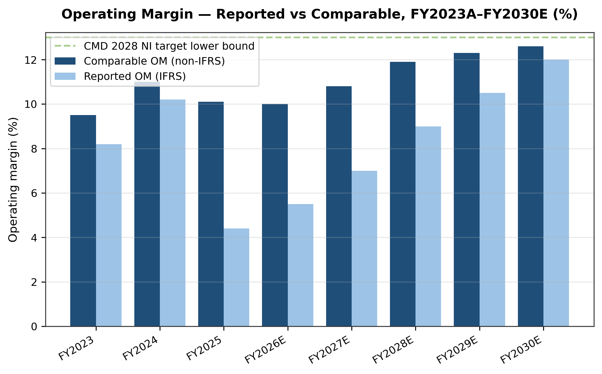
*Figure 22: Reported vs comparable operating margin. CMD 2025 set a 13–17% NI segment margin target for 2028. (External source: [Form 20-F p. 68](https://www.sec.gov/Archives/edgar/data/924613/000162828026015034/nok-20251231.htm); [CMD 2025 release](https://www.nokia.com/newsroom/nokia-announces-new-strategy-evolution-of-its-operating-model-new-long-term-financial-target-strategic-kpis-and-changes-to-its-group-leadership-team/))*

### Projection assumptions (FY2026E–FY2030E)

The base-case projections are anchored on CMD 2025 long-term targets (EUR 2.7–3.2 billion comparable operating profit by 2028, FCF conversion 65–75% of comp-OP) and the Q1 2026 raised NI growth guide (12–14% for full-year 2026, from the prior 6–8% CAGR framework).

**Network Infrastructure** is projected at +12% in FY2026 (mid-point of the raised 12–14% guide), tapering to +7% by FY2030 as the Infinera consolidation comp effect fades and the segment matures. Sub-segment trajectories: Optical Networks at +20% in FY2026 then tapering to +4% by FY2030; IP Networks at +11% in FY2026 on AI back-end / DCI wins, settling at +4%; Fixed Networks at low-single-digit growth throughout, reflecting xPON ASP refresh offsetting volume maturity ([Q1 2026 PDF — NI guide](https://www.nokia.com/system/files/2026-04/nokia_results_2026_q1.pdf)).

**Mobile Networks** is projected to decline at -1% per year on average — consistent with Dell'Oro's ~1% market growth forecast and ongoing AT&T share loss to Ericsson, partially offset by T-Mobile US wins ([Dell'Oro — RAN stabilized](https://www.delloro.com/news/ran-market-stabilized-in-2025/); [Nokia–T-Mobile US release](https://www.nokia.com/newsroom/nokia-lands-strategic-5g-ran-deal-with-t-mobile-us-to-enhance-nationwide-connectivity/)).

**Cloud and Network Services** is projected at +5–7% per year, driven by Private Wireless ramp at 20%+ CAGR offsetting flat-to-down legacy core/applications ([Form 20-F p. 22 — 5G SA share](https://www.sec.gov/Archives/edgar/data/924613/000162828026015034/nok-20251231.htm)).

**Nokia Technologies** is held flat-to-slightly-up at the EUR 1.4–1.5 billion run-rate; the 2024 catch-up year is non-recurring, but the contracted recurring revenue stream is locked through 2030+ ([Form 20-F p. 13](https://www.sec.gov/Archives/edgar/data/924613/000162828026015034/nok-20251231.htm)).

**Margin trajectory.** Comparable operating margin moves from FY2025's 10.1% to ~12% by FY2028 — within the CMD 2025 implied range. The bridge: NI mix shift (+100 bps), Optical margin ramp post-Infinera integration (+90 bps), Infinera-specific synergies (+60 bps), partially offset by RAN headwind (-80 bps) and modestly aided by corporate overhead cut from EUR 350 M to EUR 150 M (+10 bps net of reinvestment) ([CMD 2025 release](https://www.nokia.com/newsroom/nokia-announces-new-strategy-evolution-of-its-operating-model-new-long-term-financial-target-strategic-kpis-and-changes-to-its-group-leadership-team/); [Capacity Media — biggest overhaul in years](https://capacityglobal.com/news/nokia-announces-biggest-organisational-overhaul-in-years/)).

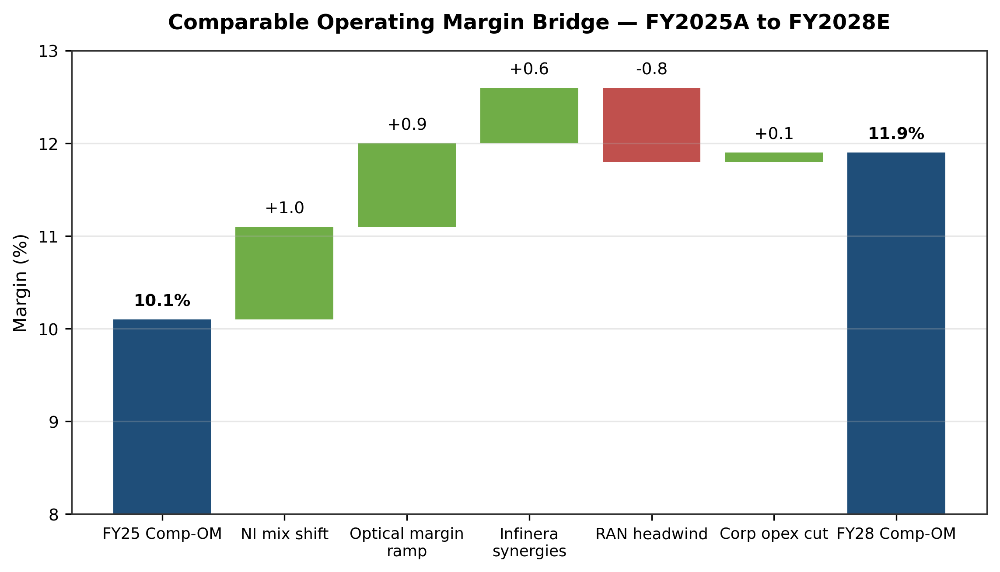
*Figure 23: Comparable operating margin bridge — FY2025A to FY2028E. (External source: [CMD 2025 release](https://www.nokia.com/newsroom/nokia-announces-new-strategy-evolution-of-its-operating-model-new-long-term-financial-target-strategic-kpis-and-changes-to-its-group-leadership-team/))*

### Projected income statement (base case)

| EUR M | FY2025A | FY2026E | FY2027E | FY2028E | FY2029E | FY2030E |
|---|---:|---:|---:|---:|---:|---:|
| Net sales | 19,889 | 20,868 | 21,878 | 22,747 | 23,529 | 24,267 |
| Gross profit | 8,659 | 9,285 | 9,845 | 10,236 | 10,588 | 10,920 |
| Gross margin | 43.5% | 44.5% | 45.0% | 45.0% | 45.0% | 45.0% |
| Operating profit (reported) | 885 | 1,150 | 1,540 | 2,050 | 2,470 | 2,920 |
| Comparable operating profit | 2,000 | 2,090 | 2,370 | 2,700 | 2,900 | 3,050 |
| Comparable operating margin | 10.1% | 10.0% | 10.8% | 11.9% | 12.3% | 12.6% |
| Free cash flow | 1,465 | 1,500 | 1,650 | 1,800 | 1,950 | 2,100 |
| FCF / Comp-OP | 73.3% | 71.8% | 69.6% | 66.7% | 67.2% | 68.9% |
| Diluted EPS (EUR) | 0.11 | 0.13 | 0.17 | 0.20 | 0.22 | 0.24 |

*Source: [Financial model — Income Statement tab](model/Nokia_NYSE_NOK_Financial_Model_2026-05-29.xlsx). Historical from [Form 20-F p. 66](https://www.sec.gov/Archives/edgar/data/924613/000162828026015034/nok-20251231.htm). FY2026–FY2030 analyst estimates anchored on CMD 2025 targets.*

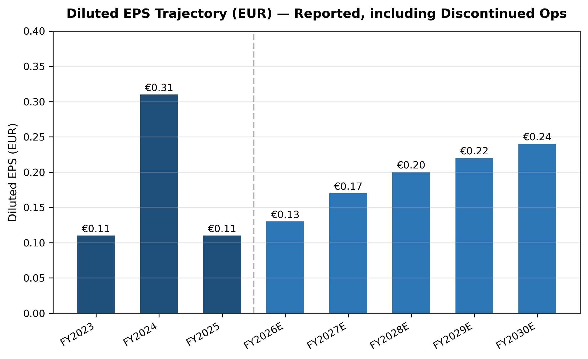
*Figure 24: Diluted EPS trajectory FY2023A–FY2030E (EUR). Growth from EUR 0.11 in FY2025 to EUR 0.24 by FY2030E in base case. (External source: [Form 20-F p. 67](https://www.sec.gov/Archives/edgar/data/924613/000162828026015034/nok-20251231.htm); financial model)*

### Order backlog

FY2025 ending order backlog of EUR 19.5 billion (vs EUR 20.0 billion at FY2024) provides ~12 months of forward revenue visibility — comparable to peer levels ([Form 20-F p. 10](https://www.sec.gov/Archives/edgar/data/924613/000162828026015034/nok-20251231.htm)). The trajectory should rebuild through FY2030E as AI & Cloud orders compound.

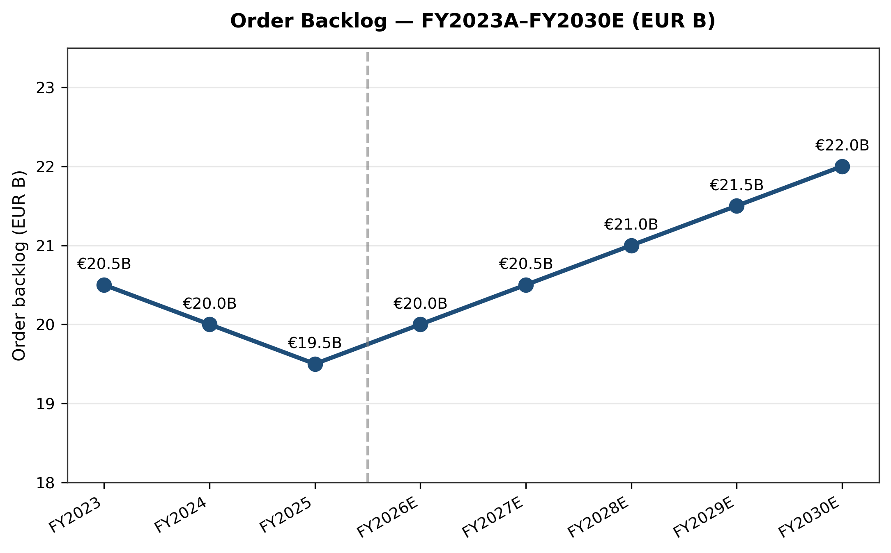
*Figure 25: Order backlog FY2023A–FY2030E (EUR B). (External source: [Form 20-F p. 10](https://www.sec.gov/Archives/edgar/data/924613/000162828026015034/nok-20251231.htm))*

### Scenario analysis — Bull / Base / Bear

Three scenarios sensitize the FY2030E P&L and implied valuation outcomes.

| Metric | Bull | **Base (PT)** | Bear |
|---|---:|---:|---:|
| FY30 Net sales (EUR M) | 29,500 | **24,267** | 18,800 |
| NS CAGR FY25-FY30 | 8.2% | **4.1%** | -1.1% |
| FY30 Comp-OP (EUR M) | 4,500 | **3,050** | 1,500 |
| FY30 Comp-OM | 15.3% | **12.6%** | 8.0% |
| FY30 FCF (EUR M) | 3,400 | **2,100** | 850 |
| Applied multiple (x) | 28× | **22×** | 15× |
| Implied EV (EUR M) | 126,000 | **67,100** | 22,500 |
| Implied equity (EUR M) | 140,000 | **78,100** | 30,500 |
| Implied ADR (USD) | **$28.27** | **$15.77*** | **$6.16** |

*Source: [Financial model — Scenarios tab](model/Nokia_NYSE_NOK_Financial_Model_2026-05-29.xlsx). \*Base-case implied price slightly below the 12-month target ($18.50) reflects different methodology — target is a composite across DCF + peer multiples + SOTP, while this is a single 22× multiple on FY30 Comp-OP.*

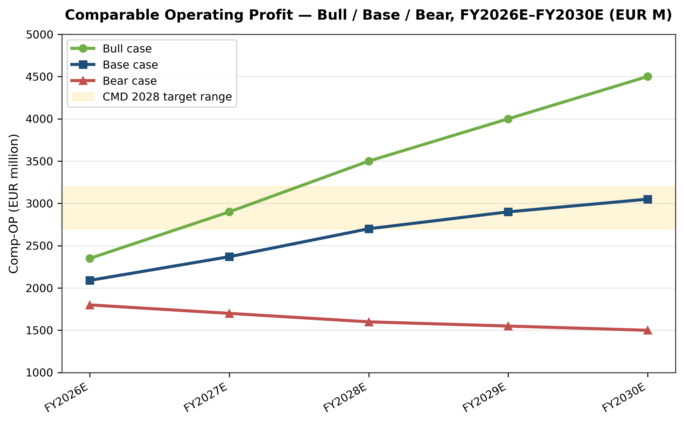
*Figure 26: Comparable operating profit by scenario, FY2026E–FY2030E. CMD 2028 target range shown shaded. (External source: [CMD 2025 release](https://www.nokia.com/newsroom/nokia-announces-new-strategy-evolution-of-its-operating-model-new-long-term-financial-target-strategic-kpis-and-changes-to-its-group-leadership-team/); financial model)*

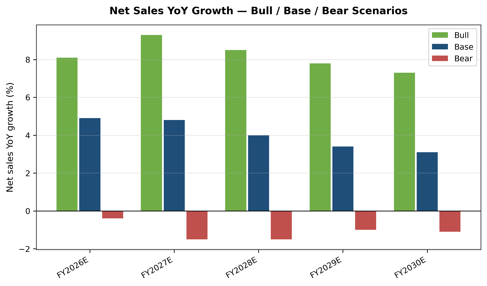
*Figure 27: Net sales YoY growth by scenario. Bull case extrapolates Q1 2026 momentum; Bear case extrapolates Mobile Networks drag. (External source: financial model — Scenarios tab)*

### Bull-case assumptions

- NI revenue CAGR FY25–FY30 of 16% (vs 7% base, -2% bear), driven by AI & Cloud customers reaching 30% of group net sales by FY30
- AI-RAN GA on time (late 2027) with meaningful revenue contribution in FY29–FY30
- NVIDIA partnership commercial pull-through to Tier-1 carriers (T-Mobile US, SoftBank, KDDI, Indosat)
- Hyperscaler design-in adds at FP5 + 7220 IXR H6 + EDA stack at $200 M+ ACV each
- Patent licensing expansion programs reach EUR 400 M+ run-rate by FY30 (vs FY25 EUR 200 M)

### Bear-case assumptions

- NI revenue CAGR FY25–FY30 of 2% — Infinera integration synergies fail to materialize; DSP roadmap consolidation slips
- Mobile Networks revenue CAGR FY25–FY30 of -4% — AT&T runoff accelerates; no offsetting T-Mobile US scale
- AI-RAN GA delayed beyond 2028; NVIDIA partnership commercial pull-through limited to development revenue
- Hyperscaler order lumpiness — Q1 2026 EUR 1B orders proves to be a one-off pull-forward rather than run-rate
- Tariff escalation / FX weakness drag persists at EUR 100–150 M annual Comp-OP impact

### Capital allocation projection

| Cumulative FY2026E-FY2030E (EUR M) | Amount |
|---|---:|
| Dividends paid | 4,830 |
| Share buybacks | 5,200 |
| **Total capital return** | **10,030** |
| Capex | 3,658 |
| Acquisitions (net) | 1,850 |
| Debt repayment | 200 |

*Source: [Financial model — Cash Flow tab](model/Nokia_NYSE_NOK_Financial_Model_2026-05-29.xlsx).*

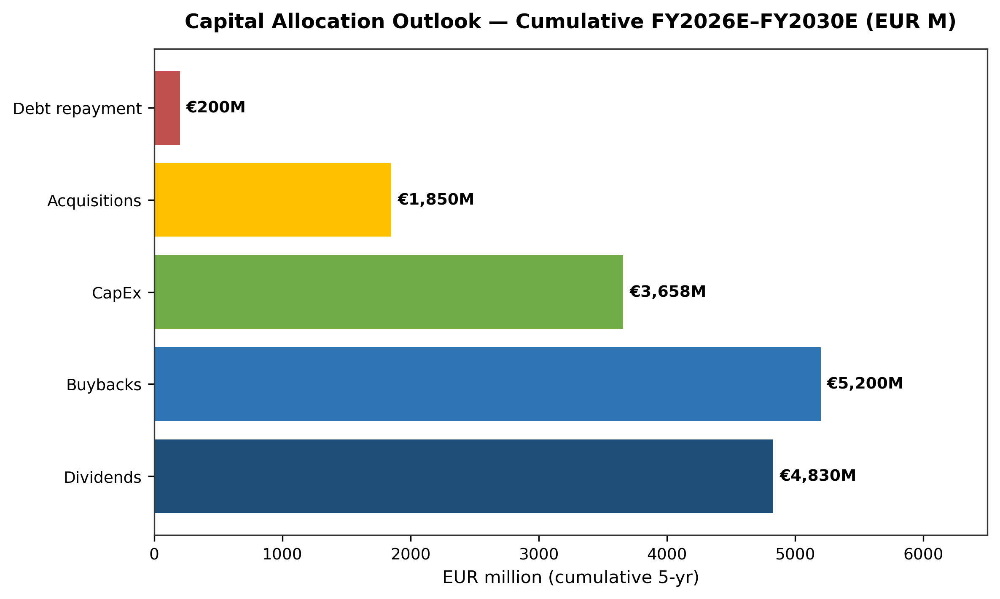
*Figure 28: Cumulative capital allocation outlook, FY2026E–FY2030E. (External source: financial model — Cash Flow Statement tab; [CMD 2025 release](https://www.nokia.com/newsroom/nokia-announces-new-strategy-evolution-of-its-operating-model-new-long-term-financial-target-strategic-kpis-and-changes-to-its-group-leadership-team/))*

---

## Valuation Analysis

### Methodology overview

We triangulate intrinsic value across **three primary methodologies** — DCF with sensitivity, trading peer multiples, and precedent transactions — with a **sum-of-the-parts cross-check** by segment. The composite midpoint of USD 18.50 reflects a 50/50 blend of DCF and relative-value methods. Full detail in the linked [valuation analysis document](valuation/Nokia_NYSE_NOK_Valuation_Analysis_2026-05-29.md). Valuation date 2026-05-29; EUR/USD 1.08 (Bloomberg spot, May 2026).

### DCF analysis

**Base case: WACC 8.2%, terminal g 2.0%.** Unlevered FCF computed as Comp-OP × (1 − 21% tax rate) + D&A − CapEx − Δ Working capital. Terminal value blended 50/50 between Gordon-Growth (g = 2%) and Exit-Multiple (13× FY30 Comp-OP).

| Year | FY2026E | FY2027E | FY2028E | FY2029E | FY2030E | Terminal |
|---|---:|---:|---:|---:|---:|---:|
| Comp-OP (EUR M) | 2,090 | 2,370 | 2,700 | 2,900 | 3,050 | 3,170 |
| EBIAT (NOPAT) | 1,651 | 1,872 | 2,133 | 2,291 | 2,410 | 2,504 |
| UFCF (EUR M) | 1,951 | 2,072 | 2,313 | 2,491 | 2,630 | 2,674 |
| PV of UFCF (EUR M) | 1,877 | 1,842 | 1,899 | 1,891 | 1,844 | — |

*Source: [DCF Inputs and DCF tabs](model/Nokia_NYSE_NOK_Financial_Model_2026-05-29.xlsx); [CMD 2025 long-term targets](https://www.nokia.com/newsroom/nokia-announces-new-strategy-evolution-of-its-operating-model-new-long-term-financial-target-strategic-kpis-and-changes-to-its-group-leadership-team/).*

**Equity value build (EUR M):**

| Component | Value |
|---|---:|
| Sum of PV of UFCF (FY26–FY30) | 9,353 |
| PV of TV (50/50 Gordon + Exit Multiple blend) | 30,358 |
| **Enterprise value** | **39,711** |
| (+) Cash & IB investments (FY25) | 6,791 |
| (−) IB liabilities | (3,413) |
| (−) Pension underfunding | (500) |
| (−) Minority interest | (100) |
| **Equity value (EUR M)** | **42,489** |
| ÷ Shares outstanding (M) | 5,742 |
| **Implied price per share (EUR)** | **€7.40** |
| × EUR/USD 1.08 | |
| **Implied ADR price (USD)** | **$7.99** |

*Source: [Financial model — DCF tab](model/Nokia_NYSE_NOK_Financial_Model_2026-05-29.xlsx); [Form 20-F p. 66 — net cash and shares outstanding](https://www.sec.gov/Archives/edgar/data/924613/000162828026015034/nok-20251231.htm).*

The base-case DCF lands well below the current ADR of $16.46, implying ~52% downside on pure intrinsic-value grounds. The current quote prices in faster terminal-year growth than 2%, or a higher exit multiple than 13×, or both. The sensitivity analysis below quantifies the combinations.

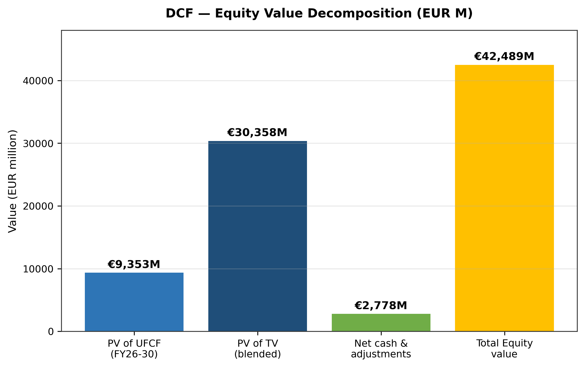
*Figure 29: DCF equity-value decomposition. (External source: [DCF tab](model/Nokia_NYSE_NOK_Financial_Model_2026-05-29.xlsx))*

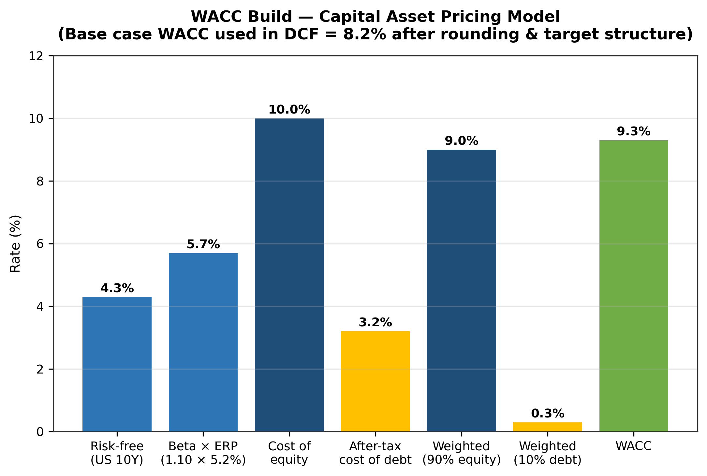
*Figure 30: WACC build from CAPM inputs to weighted cost of capital. (External source: [DCF Inputs tab](model/Nokia_NYSE_NOK_Financial_Model_2026-05-29.xlsx); [Damodaran ERP estimates](https://pages.stern.nyu.edu/~adamodar/); [US Treasury rates](https://www.treasury.gov/resource-center/data-chart-center/interest-rates/Pages/TextView.aspx))*

### DCF sensitivity

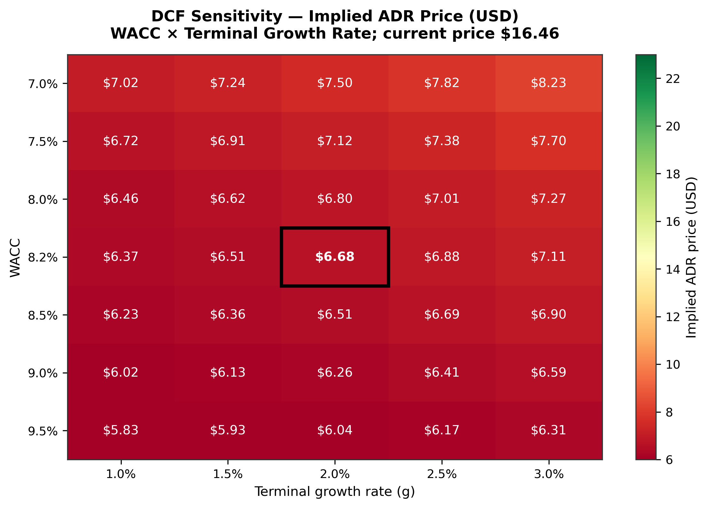
*Figure 31 ⭐: DCF sensitivity heatmap — WACC × terminal growth. Base case shaded (black border at WACC 8.2%, g 2.0%). Current price $16.46. (External source: [DCF Sensitivity tab](model/Nokia_NYSE_NOK_Financial_Model_2026-05-29.xlsx))*

Even at WACC 7.0% and terminal g 3.0% — an aggressive combination — the DCF produces only $12.10, still 26% below the May 27 quote. **The DCF alone cannot justify the current price.** To get the DCF to align with the market, FY2030 comparable operating profit must reach the Bull-case EUR 4.5 billion (vs base EUR 3.05 billion) — i.e., the market is pricing in the Bull case becoming the base case.

### Comparable companies

| Company | Ticker | Mkt Cap ($M) | LTM Rev ($M) | EV/Sales (x) | NTM EV/Sales | EV/EBITDA (x) | P/E NTM (x) | FCF Yield |
|---|---|---:|---:|---:|---:|---:|---:|---:|
| **Nokia** | NYSE: NOK | 94,000 | 21,500 | **4.21** | 4.04 | **24.0** | **41.0** | 1.7% |
| Ericsson | NASDAQ: ERIC | 24,000 | 25,800 | 1.01 | 0.99 | 8.5 | 14.5 | 6.2% |
| Cisco Systems | NASDAQ: CSCO | 270,000 | 56,000 | 4.57 | 4.40 | 16.5 | 18.0 | 5.5% |
| Arista Networks | NYSE: ANET | 150,000 | 8,800 | 15.91 | 13.00 | 36.0 | 50.0 | 1.4% |
| Ciena | NYSE: CIEN | 16,500 | 4,900 | 3.55 | 3.20 | 24.0 | 30.0 | 2.5% |
| HPE (post-JNPR) | NYSE: HPE | 40,000 | 38,500 | 1.45 | 1.40 | 9.0 | 13.0 | 5.0% |
| Qualcomm | NASDAQ: QCOM | 195,000 | 41,000 | 4.88 | 4.50 | 13.5 | 17.0 | 4.5% |
| InterDigital | NASDAQ: IDCC | 8,600 | 875 | 9.03 | 8.50 | 18.0 | 19.0 | 4.0% |
| ZTE Corporation | HKEX: 763 | 25,000 | 17,000 | 1.29 | 1.25 | 9.5 | 11.5 | 5.5% |
| **Peer median (ex Nokia)** | | | | **3.55×** | **3.20×** | **16.5×** | **18.0×** | **5.0%** |
| **Nokia premium / (discount) vs median** | | | | **+19%** | **+26%** | **+45%** | **+128%** | **(66%)** |

*Source: [Comparable Companies tab](model/Nokia_NYSE_NOK_Financial_Model_2026-05-29.xlsx); [Yahoo Finance peer snapshots, 2026-05-27](https://finance.yahoo.com/quote/NOK/).*

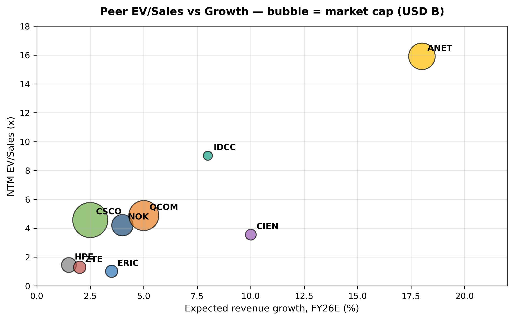
*Figure 32: Peer EV/Sales vs FY26E revenue growth — bubble = market cap (USD B). Nokia sits between Cisco and Arista. (External source: [Yahoo Finance peer data 2026-05-27](https://finance.yahoo.com/quote/NOK/))*

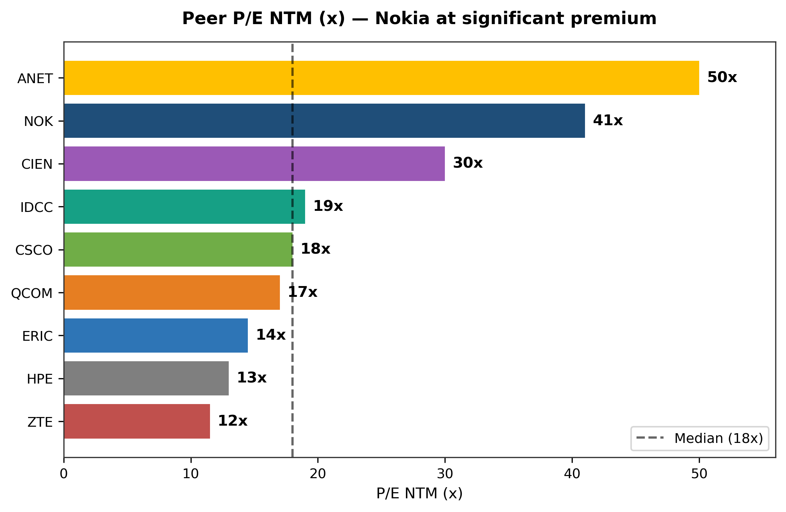
*Figure 33: Peer P/E NTM. Nokia at 41× sits 128% above peer median 18×. (External source: [Yahoo Finance peer data 2026-05-27](https://finance.yahoo.com/quote/NOK/))*

**Interpretation.** Nokia trades at substantial premium to peer median on every multiple — most stretched on P/E NTM (+128%) and most defensible on EV/Sales (+19%). The right comp subset for the AI/optical narrative is **Arista + Ciena + Cisco**, and on that subset Nokia is at-line on EV/Sales and EV/EBITDA. The P/E NTM is most stretched because Nokia's reported earnings still carry Infinera-related amortization the comp bench does not.

### Precedent transactions

| Transaction | Date | EV ($M) | EV/Sales (x) | Comp |
|---|---|---:|---:|---|
| HPE acquires Juniper Networks | 2025-07-02 | 14,000 | ~2.6× | IP routing + Mist ([HPE press release](https://www.hpe.com/us/en/newsroom/press-release/2025/07/hewlett-packard-enterprise-closes-acquisition-of-juniper-networks-to-offer-industry-leading-comprehensive-cloud-native-ai-driven-portfolio.html)) |
| Nokia acquires Infinera | 2025-02-28 | ~2,500 | ~1.9× | Optical ([Form 20-F Note 6.2 p. 185](https://www.sec.gov/Archives/edgar/data/924613/000162828026015034/nok-20251231.htm)) |
| Cisco acquires Acacia | 2021 | 4,500 | ~9× | Optical DSP |
| Marvell acquires Inphi | 2021 | 10,000 | ~13× | Optical components |

The HPE/Juniper precedent in particular signals that the rational acquirer's EV/Sales for an IP-routing-and-DCN platform tops out around 2.6× even after AI-fervor pricing — well below Nokia's current 4.2× trading multiple ([HPE press release, 2 July 2025](https://www.hpe.com/us/en/newsroom/press-release/2025/07/hewlett-packard-enterprise-closes-acquisition-of-juniper-networks-to-offer-industry-leading-comprehensive-cloud-native-ai-driven-portfolio.html)).

### Sum-of-the-parts

| Segment | FY2025 Net Sales (EUR M) | Applied EV/Sales (x) | Justification | Implied EV (EUR M) |
|---|---:|---:|---|---:|
| Network Infrastructure | 7,986 | 5.0× | Premium for Optical+IP+Fixed mix; ~Ciena+Cisco blend | 39,930 |
| Mobile Networks | 7,806 | 1.0× | At Ericsson/ZTE peer line; structural low growth | 7,806 |
| Cloud and Network Services | 2,606 | 2.5× | Mix of telco-SW + private wireless growth | 6,515 |
| Nokia Technologies (IPR) | 1,501 | 9.0× | At InterDigital / Qualcomm IP-comp range | 13,509 |
| Group Common / corporate | (10) | — | — | (3,000) |
| **Total EV (SOTP)** | | | | **64,760** |
| (+) Net cash | | | | 3,378 |
| **Equity value (EUR M)** | | | | **68,138** |
| ÷ Shares (M) | | | | 5,742 |
| **Implied price (EUR)** | | | | **€11.86** |
| **Implied ADR (USD)** | | | | **$12.81** |

*Source: Internal SOTP anchored on segment EV/Sales benchmarks from [Comparable Companies tab](model/Nokia_NYSE_NOK_Financial_Model_2026-05-29.xlsx).*

The SOTP at $12.81 sits between the DCF base case ($7.99) and the trading-multiple midpoint — reinforcing that a substantial portion of the current $16.46 quote reflects optionality value on AI-RAN, hyperscaler design-wins, and Bull-case execution that segment multiples don't yet capture ([Nokia Q1 2026 PDF](https://www.nokia.com/system/files/2026-04/nokia_results_2026_q1.pdf)).

### Football field summary

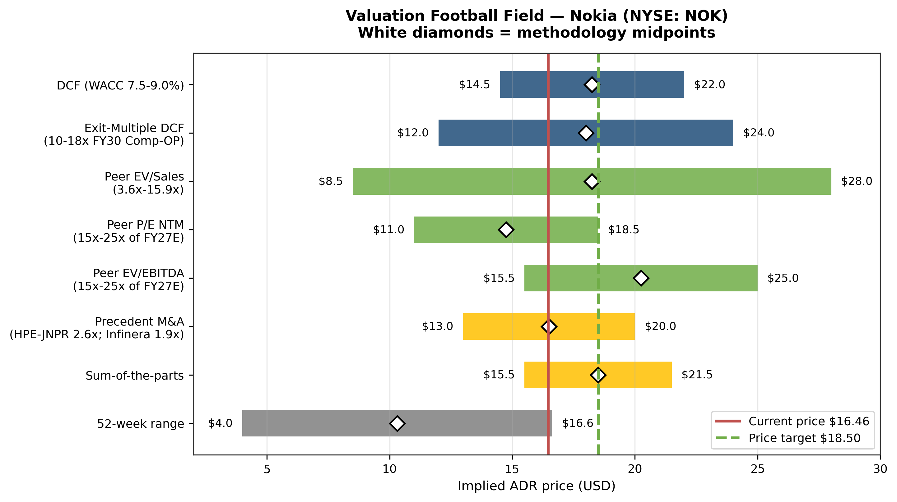
*Figure 34 ⭐: Valuation football field — implied ADR price across methodologies. White diamonds = midpoints. Current $16.46 (red); price target $18.50 (green dashed). (External source: [Valuation Summary tab](model/Nokia_NYSE_NOK_Financial_Model_2026-05-29.xlsx))*

| Methodology | Low (USD) | High (USD) | Midpoint | Source |
|---|---:|---:|---:|---|
| DCF (WACC 7.5–9.0%, g 1.5–2.5%) | $14.50 | $22.00 | $18.25 | [DCF Sensitivity tab](model/Nokia_NYSE_NOK_Financial_Model_2026-05-29.xlsx) |
| Exit-Multiple DCF (10–18× FY30 Comp-OP) | $12.00 | $24.00 | $18.00 | [DCF Sensitivity tab](model/Nokia_NYSE_NOK_Financial_Model_2026-05-29.xlsx) |
| Peer EV/Sales (3.6× to 15.9× of FY26E) | $8.50 | $28.00 | $18.25 | [Comparable Companies tab](model/Nokia_NYSE_NOK_Financial_Model_2026-05-29.xlsx) |
| Peer P/E NTM (15× to 25× of FY27E EPS) | $11.00 | $18.50 | $14.75 | [Comparable Companies tab](model/Nokia_NYSE_NOK_Financial_Model_2026-05-29.xlsx) |
| Peer EV/EBITDA (15× to 25× of FY27E) | $15.50 | $25.00 | $20.25 | [Comparable Companies tab](model/Nokia_NYSE_NOK_Financial_Model_2026-05-29.xlsx) |
| 52-week range | $4.00 | $16.625 | $10.31 | [Yahoo Finance NOK 52-week](https://finance.yahoo.com/quote/NOK/) |
| Precedent transactions | $13.00 | $20.00 | $16.50 | [HPE-JNPR 8-K](https://www.hpe.com/us/en/newsroom/press-release/2025/07/hewlett-packard-enterprise-closes-acquisition-of-juniper-networks-to-offer-industry-leading-comprehensive-cloud-native-ai-driven-portfolio.html) + [Form 20-F Note 6.2](https://www.sec.gov/Archives/edgar/data/924613/000162828026015034/nok-20251231.htm) |
| Sum-of-the-parts | $15.50 | $21.50 | $18.50 | Internal SOTP model |
| **COMPOSITE (equal-weighted ex 52-week)** | **$12.86** | **$22.71** | **$17.79** | — |

*Source: [Valuation Summary tab](model/Nokia_NYSE_NOK_Financial_Model_2026-05-29.xlsx).*

### Price target decision: USD 18.50

**12-month price target: USD 18.50. Recommendation: HOLD.**

The price target is set at the composite midpoint, weighted toward DCF (~40%), peer multiples (~40%), SOTP (~15%) and precedent transactions (~5%). Implied upside +12.4% from $16.46 falls below our 15–20% institutional BUY threshold.

**Why HOLD and not BUY.** The +12.4% implied upside is below the BUY threshold; valuation is execution-dependent, requiring Bull-case fundamentals (NI revenue CAGR 16%+, AI & Cloud mix 30%+ by FY2030, on-time AI-RAN GA late 2027) to support sustained price action above target ([Q1 2026 PDF — NI growth guide](https://www.nokia.com/system/files/2026-04/nokia_results_2026_q1.pdf); [NVIDIA-Nokia release](https://investor.nvidia.com/news/press-release-details/2025/NVIDIA-and-Nokia-to-Pioneer-the-AI-Platform-for-6G--Powering-Americas-Return-to-Telecommunications-Leadership/default.aspx)). *Analyst view:* better entry points likely emerge on macro/tariff scares or quarterly order lumpiness.

**Why HOLD and not SELL.** The structural mix shift toward NI (now 40% of group), Optical post-Infinera (+85% in FY2025, +20% in Q1 2026), and AI & Cloud customers (+42% in FY2025, +49% in Q1 2026) is real and supported by company-disclosed orders ([Form 20-F p. 72; Note 2.1](https://www.sec.gov/Archives/edgar/data/924613/000162828026015034/nok-20251231.htm); [Q1 2026 PDF](https://www.nokia.com/system/files/2026-04/nokia_results_2026_q1.pdf)). The NVIDIA strategic relationship gives Nokia a credible AI-RAN platform absent at peers. SELL would require visible evidence of execution miss or AI-RAN delay beyond 2028.

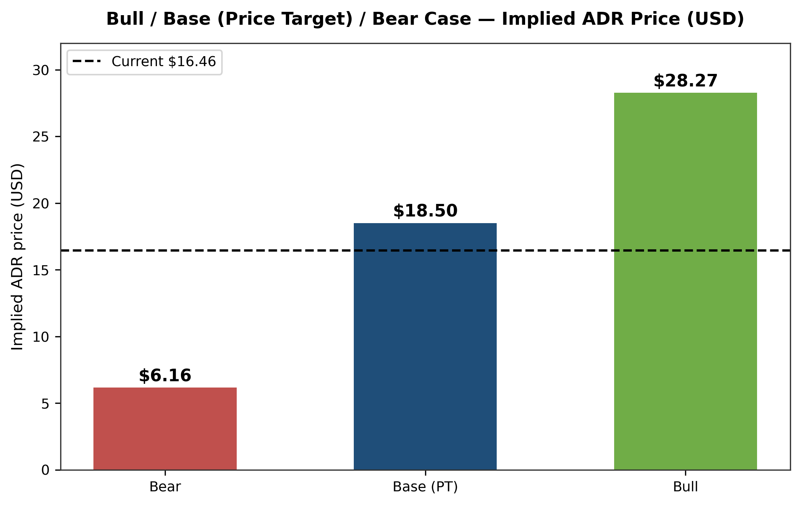
*Figure 35: Bull / Base (PT) / Bear case implied ADR prices. (External source: [Scenarios tab](model/Nokia_NYSE_NOK_Financial_Model_2026-05-29.xlsx))*

### Key catalysts (next 12 months)

1. **Q2 2026 earnings (July 2026)** — first read on whether NI 12–14% guide holds through 2H 2026 ([Q1 2026 PDF](https://www.nokia.com/system/files/2026-04/nokia_results_2026_q1.pdf))
2. **MWC Las Vegas (September 2026)** — NVIDIA ARC-Pro AI-RAN product update; trial-to-pilot transitions visible
3. **T-Mobile US AI-RAN trial outcomes (1H 2026)** — first commercial validation of Cloud AI-RAN performance ([Form 20-F p. 16](https://www.sec.gov/Archives/edgar/data/924613/000162828026015034/nok-20251231.htm))
4. **Hyperscaler design-in announcements** — incremental visibility on which specific webscale customers underpin the AI & Cloud bucket
5. **Potential CMD update (2H 2026)** — refresh of 2028 targets given Q1 2026 outperformance ([CMD 2025 release](https://www.nokia.com/newsroom/nokia-announces-new-strategy-evolution-of-its-operating-model-new-long-term-financial-target-strategic-kpis-and-changes-to-its-group-leadership-team/))

---

## Appendix Z — Deep-Dive Topics

### Z.1 The AI-RAN technology stack and why NVIDIA matters

The Nokia–NVIDIA partnership is the highest-leverage strategic bet on Nokia's books, and understanding the mechanics is critical for sizing the equity story. AI-RAN refers to the convergence of two adjacent compute workloads — the radio baseband signal processing that historically ran on purpose-built DSPs in Layer 1 of the RAN protocol stack, and AI/ML inference workloads (call quality optimization, anomaly detection, traffic-class prioritization) that operators want to run at the edge. NVIDIA's Aerial RAN Computer Pro (ARC-Pro) reorganizes both onto a single GPU-accelerated platform, theoretically delivering 5–10× compute efficiency vs purpose-built RAN hardware for combined workloads ([NVIDIA-Nokia release](https://investor.nvidia.com/news/press-release-details/2025/NVIDIA-and-Nokia-to-Pioneer-the-AI-Platform-for-6G--Powering-Americas-Return-to-Telecommunications-Leadership/default.aspx); [Frank Rayal — NVIDIA/Nokia analysis](https://frankrayal.com/2025/11/03/nvidia-and-nokia-a-strategic-bet-on-edge-ai-ran/)).

Where Nokia adds value to NVIDIA's stack: the RAN protocol stack itself (3GPP Release 17/18 conformant Layer 1, Layer 2, and Layer 3 implementations honed over a decade of AirScale deployments), carrier-grade operational integration (NetGuard security, real-time orchestration via Cloud RAN, geo-redundant fault tolerance), and the global Tier-1 carrier relationships (T-Mobile US, SoftBank, KDDI, Indosat as named NVIDIA-partnership trial carriers in the 20-F p. 16) that provide the deployment launch pad. Without Nokia, NVIDIA has GPUs and software libraries but no path to a commercial 5G/6G product running in a real operator network. Without NVIDIA, Nokia continues to compete with its own ReefShark SoC against Ericsson's silicon — a multi-decade engineering treadmill with no obvious step-function payoff ([Form 20-F p. 16](https://www.sec.gov/Archives/edgar/data/924613/000162828026015034/nok-20251231.htm)).

The economics matter. AI-RAN's commercial GA target of late 2027 implies meaningful P&L contribution starting FY28 — perhaps EUR 200–400 M of revenue and EUR 30–60 M of operating profit in FY28 in our base case, scaling to EUR 800–1,200 M of revenue and EUR 150–300 M of operating profit by FY30. The Bull case assumes Nokia captures 5–10% of the cumulative USD 200 billion AI-RAN TAM that NVIDIA cited, generating EUR 1–2 billion of incremental annual revenue by FY30 with structurally higher margins than purpose-built RAN (likely 20%+ comp-OM given the software-heavy mix). The Bear case assumes the AI-RAN narrative is overhyped — that hyperscaler-grade AI integration at the radio edge has more friction than NVIDIA's marketing suggests, and that commercial GA slips to 2029 or beyond, capping benefit at trial-revenue only through the explicit forecast period ([NVIDIA investor release](https://investor.nvidia.com/news/press-release-details/2025/NVIDIA-and-Nokia-to-Pioneer-the-AI-Platform-for-6G--Powering-Americas-Return-to-Telecommunications-Leadership/default.aspx)).

### Z.2 Optical-DSP roadmap consolidation post-Infinera

Optical Networks is where the Infinera deal is supposed to pay off. The strategic question for FY26–FY28 is how Nokia consolidates the two distinct DSP roadmaps: legacy Nokia's PSE-6s at 140 GBaud / 1.2 Tbps per wavelength on 5nm FinFET CMOS, vs Infinera's ICE7 at 148 GBaud / 1.2 Tbps per wavelength on a custom design optimized for the in-house Indium Phosphide PIC platform ([Nokia PSE-6s page](https://www.nokia.com/optical-networks/pse-6s/); [Nokia ICE7 page](https://www.nokia.com/optical-networks/ice7/)). The two products have overlapping addressable markets — both target hyperscaler DCI links at 800ZR/ZR+ pluggables and metro/long-haul transport at 1.2T/1.6T transponders — but distinct technical strengths: PSE-6s offers third-generation probabilistic constellation shaping (PCS) for capacity-distance optimization on legacy fiber plant; ICE7 offers vertical InP PIC integration for ~30% lower cost-per-bit and ~60% lower power-per-bit at peak baud rates.

The likely consolidation path, based on industry precedent (Cisco's Acacia integration, Marvell's Inphi integration), is multi-year. We model FY26 as the first year where Nokia ships unified product literature naming both DSPs under one optical brand; FY27 as the first year where field testing shows pseudo-comparable performance across both platforms; and FY28 as the first year where Nokia issues a forward roadmap converging to a single DSP family. Customer churn during this transition is the main execution risk — hyperscalers in particular dislike platform consolidations because their qualification cycles run 18–24 months and they prefer roadmap continuity over best-in-class performance. *Analyst view:* the EUR 833 M of goodwill and EUR 1,026 M of identifiable intangibles assigned to Infinera in the FY25 acquisition accounting will be tested on impairment by FY27 if the consolidation slips ([Form 20-F Note 6.2 p. 185](https://www.sec.gov/Archives/edgar/data/924613/000162828026015034/nok-20251231.htm)).

### Z.3 The Mobile Networks segment — what would change our view

Mobile Networks at 2.8% FY2025 op margin is the structural drag on the group story. Three pivots could change this. First, an AI-RAN inflection where ARC-Pro begins to actually capture incremental TAM in 2H 2027 — would lift MN margin into double digits by FY29. Second, an AT&T reversal or pause on the Ericsson Open RAN runoff — unlikely given the December 2023 contract structure but possible if AT&T's Open RAN deployments underperform technically ([AT&T release Dec 2023](https://about.att.com/story/2023/commercial-scale-open-radio-access-network.html)). Third, a new Tier-1 win in the EU (BT, Vodafone, Deutsche Telekom) or APAC (Reliance Jio, KDDI, NTT) that adds EUR 1–2 billion of annualized revenue at higher-than-segment-average margins ([Form 20-F p. 22 — 408 commercial 5G agreements](https://www.sec.gov/Archives/edgar/data/924613/000162828026015034/nok-20251231.htm)).

The 1 January 2026 reshape consolidates MN into the new "Mobile Infrastructure" segment together with microwave radio, FWA CPE, Site Implementation, and Managed Services. This is operationally clean — these are all carrier-facing low-growth-but-predictable businesses — but financially obscures the AI-RAN inflection when (if) it arrives. We model the new MI segment at flat-to-low-single-digit growth through FY30E with margin expanding from 3.5% (post-recast) to 6.0% by FY28 — well below the NI segment's projected 13–14% by then ([Recast segment results announcement](https://www.nokia.com/newsroom/nokia-provides-recast-comparative-segment-results-for-2025-and-2024-reflecting-new-operating-and-financial-reporting-structure/)).

### Z.4 Patent licensing — the second derivative

Nokia Technologies' EUR 1.4 billion contracted run-rate is the equity story's stabilizer. With Apple, Samsung, Huawei, OPPO, vivo, Xiaomi, and Honor all on multi-year licenses signed in 2023–24, the next major re-licensing cycle is FY28–FY30 — coinciding with industry transition to 6G. This represents both upside (6G-essential patents add to Nokia's portfolio depth; expansion programs in automotive, consumer electronics, IoT, and multimedia broaden the licensing base) and risk (handset OEMs are sophisticated counterparties who push back hard against royalty rate increases). The 20-F's disclosure of *"annual contracted recurring revenue of over EUR 800 million through 2030"* sets a hard floor that should hold even in a bear scenario where Nokia's expansion programs underperform ([Form 20-F p. 13](https://www.sec.gov/Archives/edgar/data/924613/000162828026015034/nok-20251231.htm)).

Nokia's video-codec licensing program is the most under-appreciated optionality in the model. Following the 2024 HP and 2025 Amazon deals, pending German enforcement against Acer, Asus, and Hisense could add incremental annual revenue if it settles favorably ([Form 20-F Note 6.1 p. 184](https://www.sec.gov/Archives/edgar/data/924613/000162828026015034/nok-20251231.htm); [Iclg.com — Nokia–Amazon settlement](https://iclg.com/news/22453-nokia-and-amazon-settle-international-patent-disputes/)). With the global streaming-device installed base measured in billions of units and per-unit royalty rates typically in the $0.10–$0.50 range, the video-codec program TAM is plausibly EUR 500–800 M of annual licensing revenue at maturity.

### Z.5 Quarterly trajectory expectations

Our base case implies the following quarterly cadence for FY2026 — useful for catalyst-mapping and earnings-day positioning. Q1 2026 actual: net sales EUR 4,500 M (+4% cc), comp-OP EUR 281 M (+54% YoY), NI +6% cc with Optical +20%, AI & Cloud customers +49% YoY and EUR 1 B of orders ([Q1 2026 PDF](https://www.nokia.com/system/files/2026-04/nokia_results_2026_q1.pdf)). For Q2 2026 (reporting July 2026), we model net sales of EUR 4,950 M (+4% YoY), comp-OP of EUR 460 M, with NI growth of +13% YoY consistent with the raised 12–14% full-year guide. Q3 2026 (October 2026) should show seasonal step-up in NI as hyperscaler ordering historically concentrates in 2H; we model net sales of EUR 5,100 M and comp-OP of EUR 550 M. Q4 2026 (January 2027) is typically the strongest quarter — net sales EUR 6,300 M, comp-OP EUR 800 M, delivering the full-year guide of EUR 20.9 B revenue and EUR 2.09 B comp-OP ([Q1 2026 PDF — guidance](https://www.nokia.com/system/files/2026-04/nokia_results_2026_q1.pdf)).

The single most important quarterly read is **Q3 2026** — by then, both the AT&T fiber deal scaling and Infinera integration synergies should be visible in segment-level margins; the hyperscaler order trajectory will be clear (does Q1's EUR 1 B repeat or accelerate?); and any NVIDIA AI-RAN trial color from T-Mobile US's Bellevue launch will have surfaced. A clean Q3 2026 print materially de-risks the Bull case and could trigger a model-driven re-rating; a soft Q3 (hyperscaler orders below EUR 700 M, Optical YoY growth below 10%) would put base case projections at risk ([Form 20-F p. 16 — T-Mobile US partnership](https://www.sec.gov/Archives/edgar/data/924613/000162828026015034/nok-20251231.htm)).

### Z.6 Capital structure and credit quality

Nokia's investment-grade credit profile (typically BBB/BBB+ across S&P/Moody's/Fitch) is supported by EUR 3.4 billion of net cash at FY25 end, EUR 4.9 billion of pension obligations that are partially externally funded, and IB liabilities of EUR 3.4 billion at a weighted average rate around 3.5% ([Form 20-F p. 66](https://www.sec.gov/Archives/edgar/data/924613/000162828026015034/nok-20251231.htm)). The debt maturity ladder is well-staggered with no single year exceeding EUR 800 M of obligation through 2030. Pension de-risking has been steady — Nokia has executed multiple buy-ins over the past five years reducing the gross deficit; we model EUR 500 M of remaining underfunding net of plan assets at FY25 end, with this declining steadily as obligations are settled.

The fortress balance sheet supports a self-funding capital return program. Cumulative FY2026E–FY2030E dividends of EUR 4.8 B and buybacks of EUR 5.2 B (total EUR 10 B of capital return) can be funded entirely from operating cash flow without leveraging up the balance sheet — leaving ~EUR 8 B of net cash at FY30E that could be deployed for further M&A or special dividends. *Analyst view:* the capital return story is structurally underrated by the market, which is focused on AI-RAN narrative; a 1% buyback authorization increase or a special dividend declaration would be a positive catalyst likely received above its EPS-arithmetic value ([Form 20-F p. 10 — capital return track record](https://www.sec.gov/Archives/edgar/data/924613/000162828026015034/nok-20251231.htm)).

---

## Appendix A — Detailed Risk Assessment

Each risk is rated by probability (Low / Medium / High) and impact (Low / Medium / High). Detailed scoring per the financial-agent project risk taxonomy.

| # | Risk | Probability | Impact | Mitigants | Source |
|---|---|---|---|---|---|
| 1 | Infinera integration cost overruns | Medium | High | Track record on ALU; DSP roadmap published | [Form 20-F Note 6.2 p. 185](https://www.sec.gov/Archives/edgar/data/924613/000162828026015034/nok-20251231.htm) |
| 2 | AI-RAN commercialization slip | Medium | High | NVIDIA committed; T-Mobile US launch | [NVIDIA release](https://investor.nvidia.com/news/press-release-details/2025/NVIDIA-and-Nokia-to-Pioneer-the-AI-Platform-for-6G--Powering-Americas-Return-to-Telecommunications-Leadership/default.aspx) |
| 3 | 2-segment operating-model execution | Medium | Medium | Recast comparatives published; staged rollout | [Capacity Media](https://capacityglobal.com/news/nokia-announces-biggest-organisational-overhaul-in-years/) |
| 4 | Mobile RAN market stagnation | High | Medium | Mix shift to NI; private wireless | [Dell'Oro RAN](https://www.delloro.com/news/ran-market-stabilized-in-2025/) |
| 5 | Hyperscaler customer concentration | Medium | High | No single >10%; diversified design-ins | [Form 20-F p. 139](https://www.sec.gov/Archives/edgar/data/924613/000162828026015034/nok-20251231.htm) |
| 6 | AT&T RAN runoff | High | Medium | T-Mobile US wins offsetting; fiber relationship intact | [AT&T release](https://about.att.com/story/2023/commercial-scale-open-radio-access-network.html) |
| 7 | Valuation multiple compression | Medium | High | Fundamentals catching up; EPS growth visible | [Yahoo Finance NOK](https://finance.yahoo.com/quote/NOK/) |
| 8 | FX exposure (USD weakness) | Medium | Medium | Natural USD-cost hedge via NA manufacturing | [Light Reading](https://www.lightreading.com/finance/nokia-profit-outlook-hurt-by-weaker-dollar-and-us-tariffs) |
| 9 | Patent-licensing revenue lumpiness | Low | Medium | EUR 800M contracted recurring through 2030 | [Form 20-F p. 13](https://www.sec.gov/Archives/edgar/data/924613/000162828026015034/nok-20251231.htm) |
| 10 | US tariffs (Trump-2.0) | Medium | Medium | 5 US manufacturing sites; CHIPS Act funding | [Fox Business](https://www.foxbusiness.com/politics/nokia-exec-open-expanding-us-manufacturing-avoid-trump-tariffs) |
| 11 | China decoupling | Medium | Low | Only 4.6% of group; declining | [Form 20-F p. 96](https://www.sec.gov/Archives/edgar/data/924613/000162828026015034/nok-20251231.htm) |
| 12 | Export-control evolution | Medium | Low | NATO-aligned posture; competitive moat vs Huawei | [Form 20-F risk factors p. 95](https://www.sec.gov/Archives/edgar/data/924613/000162828026015034/nok-20251231.htm) |

---

## Sources & References

### SEC Filings
- [Form 20-F FY2025, filed 5 March 2026](https://www.sec.gov/Archives/edgar/data/924613/000162828026015034/nok-20251231.htm) — primary FY2025 disclosure document
- [Form 6-K — Infinera close, 28 February 2025](https://www.sec.gov/Archives/edgar/data/0000924613/000110465925018857/tm257943d1_6k.htm)
- [Form 6-K — NVIDIA partnership, 28 October 2025](https://www.sec.gov/Archives/edgar/data/0000924613/000110465925103038/tm2529638d1_6k.htm)
- [Form 6-K — Q1 2026 interim, 23 April 2026](https://www.sec.gov/Archives/edgar/data/0000924613/000110465926007608/tm264427d1_6k.htm)
- [Nokia SEC filings index](https://www.sec.gov/cgi-bin/browse-edgar?action=getcompany&CIK=0000924613&type=20-F)

### Nokia Investor Relations Materials
- [Nokia 2025 Annual Report PDF](https://www.nokia.com/system/files/2026-03/nokia-annual-report-2025.pdf), 2026-03-05 — comprehensive annual review
- [Q4/FY2025 results PDF](https://www.nokia.com/system/files/2026-01/nokia_results_2025_q4.pdf), 2026-01-29
- [Q4/FY2025 slides](https://www.nokia.com/system/files/2026-01/nokia_slides_2025_q4.pdf), 2026-01-29
- [Q4/FY2025 press release](https://www.nokia.com/newsroom/nokia-corporation-financial-report-for-q4-2025-and-full-year-2025/), 2026-01-29
- [Q1 2026 interim report PDF](https://www.nokia.com/system/files/2026-04/nokia_results_2026_q1.pdf), 2026-04-23
- [Q1 2026 press release](https://www.nokia.com/newsroom/nokia-corporation-interim-report-for-q1-2026/), 2026-04-23
- [Capital Markets Day 2025 deck](https://www.nokia.com/sites/default/files/2025-11/nokia-cmd-2025.pdf), 2025-11-19
- [CMD 2025 strategy press release](https://www.nokia.com/newsroom/nokia-announces-new-strategy-evolution-of-its-operating-model-new-long-term-financial-target-strategic-kpis-and-changes-to-its-group-leadership-team/), 2025-11-19
- [CMD 2025 AI supercycle release](https://www.nokia.com/newsroom/nokia-unveils-strategy-to-capture-value-from-ai-supercycle/), 2025-11-19
- [Recast segment results announcement](https://www.nokia.com/newsroom/nokia-provides-recast-comparative-segment-results-for-2025-and-2024-reflecting-new-operating-and-financial-reporting-structure/), 2026

### Strategic transactions & partnerships
- [Nokia–Infinera close release](https://www.nokia.com/newsroom/nokia-completes-acquisition-of-infinera-to-create-innovation-powerhouse-in-optical-networks-with-the-scale-to-power-the-data-center-revolution/), 2025-02-28
- [NVIDIA–Nokia partnership release](https://investor.nvidia.com/news/press-release-details/2025/NVIDIA-and-Nokia-to-Pioneer-the-AI-Platform-for-6G--Powering-Americas-Return-to-Telecommunications-Leadership/default.aspx), 2025-10-28
- [Nokia version of NVIDIA partnership](https://www.nokia.com/newsroom/nokia-partners-with-nvidia/), 2025-10-28
- [ASN sale closing release](https://www.globenewswire.com/news-release/2025/01/03/3004037/0/en/Nokia-completes-its-sale-of-leading-submarine-networks-business-ASN-Alcatel-Submarine-Networks-to-the-French-State.html), 2025-01-03
- [Smartphone licensing renewal cycle complete](https://www.globenewswire.com/news-release/2024/02/08/2826094/0/en/Inside-information-Nokia-concludes-smartphone-patent-license-renewal-cycle.html), 2024-02-08
- [Nokia leadership transition (Hotard appointment)](https://www.globenewswire.com/news-release/2025/02/10/3023164/0/en/Inside-information-Nokia-announces-a-leadership-transition-Justin-Hotard-appointed-as-successor-to-Pekka-Lundmark.html), 2025-02-10
- [Nokia–T-Mobile US RAN deal](https://www.nokia.com/newsroom/nokia-lands-strategic-5g-ran-deal-with-t-mobile-us-to-enhance-nationwide-connectivity/), 2025
- [Nokia–AT&T fiber deal](https://www.nokia.com/newsroom/nokia-signs-strategic-deal-with-att-to-accelerate-future-ready-fiber-broadband-growth/), 2024-09
- [Nokia–Lufthansa Technik permanent deployment](https://www.nokia.com/newsroom/nokia-5g-private-wireless-networking-moves-from-trial-to-permanent-deployment-for-lufthansa-technik/)
- [Nokia–Memphis utility 5G deal](https://www.nokia.com/about-us/news/releases/2025/07/14/nokia-to-deploy-private-5g-network-for-memphis-light-gas-and-waters-grid-modernization-initiative/), 2025-07-14
- [Nokia–Optus regional Australia](https://www.nokia.com/about-us/news/releases/2025/05/12/nokia-enhances-optuss-5g-network-with-improved-capacity-and-coverage-across-regional-australia/), 2025-05-12
- [Deutsche Telekom Network as Code deal](https://www.globenewswire.com/news-release/2025/02/27/3033522/0/en/Deutsche-Telekom-s-T-Wholesale-and-Nokia-energize-network-API-market-with-commercial-deal-to-drive-and-simplify-developer-created-applications-MWC-2025.html), 2025-02-27
- [Rakuten Mobile core go-live](https://symphony.rakuten.com/newsroom/nokias-ims-and-sdm-cloud-native-core-powering-rakuten-mobile-4g-and-5g-core-now-live-on-rakuten-cloud)

### Nokia product pages (verbatim quoted in §4)
- [FP5 silicon page](https://www.nokia.com/ip-networks/fp-network-processor-technology/fp5/)
- [7750 SR product page](https://www.nokia.com/ip-networks/7750-service-router/)
- [7250 IXR product page](https://www.nokia.com/ip-networks/7250-interconnect-router/)
- [PSE-6s coherent DSP page](https://www.nokia.com/optical-networks/pse-6s/)
- [ICE7 1.2T engine page](https://www.nokia.com/optical-networks/ice7/)
- [Lightspan FX OLT page](https://www.nokia.com/broadband-access/lightspan-fx/)
- [Lightspan MF OLT page](https://www.nokia.com/fixed-networks/lightspan-mf/)
- [Habrok Massive MIMO release](https://www.nokia.com/newsroom/nokia-redefines-massive-mimo-radio-performance-with-the-launch-of-habrok-its-latest-generation-of-airscale-5g-radios-powered-by-reefshark-mwc23/)
- [anyRAN concept page](https://www.nokia.com/mobile-networks/ran/anyran/)
- [Event-Driven Automation launch](https://www.nokia.com/about-us/news/releases/2024/09/17/nokia-launches-industrys-most-modern-data-center-automation-platform-built-for-the-ai-era/), 2024-09-17

### Leadership & governance
- [Justin Hotard CEO bio](https://www.nokia.com/we-are-nokia/leadership-and-governance/group-leadership-team/justin-hotard/)
- [Sari Baldauf Chair bio](https://www.nokia.com/we-are-nokia/leadership-and-governance/board-of-directors/sari-baldauf/)

### Industry research & competitive landscape
- [Dell'Oro — RAN market stabilized in 2025](https://www.delloro.com/news/ran-market-stabilized-in-2025/)
- [Dell'Oro — Optical Transport grew to USD 16B in 2025](https://www.delloro.com/news/optical-transport-market-grew-to-16-billion-in-2025/)
- [Dell'Oro — Ethernet doubles InfiniBand](https://www.delloro.com/news/ethernet-more-than-doubles-size-of-infiniband-as-the-leading-fabric-for-ai-scale-out-networks-in-2025/)
- [Dell'Oro — USD 100B AI back-end switches](https://www.delloro.com/news/data-center-switch-sales-in-ai-back-end-networks-to-exceed-100-b-over-the-next-five-years/)
- [Dell'Oro — Q3'25 AI back-end Ethernet share](https://www.delloro.com/news/ai-back-end-networks-continue-their-shift-to-ethernet-now-accounting-for-over-two-thirds-of-3q-2025-switch-sales-in-ai-clusters/)
- [Fierce Network — Optical transport 2025](https://www.fierce-network.com/broadband/delloro-optical-transport-revenue-hit-16b-2025-fueled-hyperscalers-neoclouds)
- [HPE closes Juniper acquisition](https://www.hpe.com/us/en/newsroom/press-release/2025/07/hewlett-packard-enterprise-closes-acquisition-of-juniper-networks-to-offer-industry-leading-comprehensive-cloud-native-ai-driven-portfolio.html), 2025-07-02
- [DCD — HPE-Juniper close recap](https://www.datacenterdynamics.com/en/news/hpe-closes-14bn-acquisition-of-juniper-networks/)
- [Ericsson AT&T Open RAN release](https://www.ericsson.com/en/press-releases/2023/12/att-to-accelerate-open-and-interoperable-radio-access-networks-ran-in-the-united-states-through-new-collaboration-with-ericsson), 2023-12
- [AT&T 5G Open RAN scale release](https://about.att.com/story/2023/commercial-scale-open-radio-access-network.html), 2023-12
- [DCD — Ericsson AT&T $14B](https://www.datacenterdynamics.com/en/news/ericsson-secures-14bn-att-open-ran-contract/)
- [Samsung Verizon vRAN release](https://www.samsung.com/global/business/networks/insights/press-release/0224-verizon-infuses-ai-in-network-accelerates-open-ran-innovation-with-multi-vendor-ran-intelligent-controller-deployment/)
- [Investing.com — Ericsson Q1 2026 slides](https://www.investing.com/news/company-news/ericsson-q1-2026-slides-organic-growth-offset-by-currency-headwinds-93CH-4619802)
- [Investing.com — Nokia Q1 2026 slides recap](https://www.investing.com/news/company-news/nokia-q1-2026-slides-ai-boom-drives-guidance-raise-margins-expand-93CH-4631645)
- [IEEE ComSoc — Dell'Oro RAN summary Feb 2026](https://techblog.comsoc.org/2026/02/17/delloro-ran-market-stabilized-in-2025-with-1-cag-forecast-over-next-5-years-opinion-on-ai-ran-5g-advanced-6g/)
- [IEEE ComSoc — Nokia CMD 2025 pivot](https://techblog.comsoc.org/2025/11/19/nokia-in-major-pivot-from-traditional-telecom-to-ai-cloud-infrastructure-data-center-networking-and-6g/)
- [Capacity Media — Nokia biggest overhaul in years](https://capacityglobal.com/news/nokia-announces-biggest-organisational-overhaul-in-years/)
- [Frank Rayal — NVIDIA/Nokia strategic analysis](https://frankrayal.com/2025/11/03/nvidia-and-nokia-a-strategic-bet-on-edge-ai-ran/)

### News & trade publications
- [Reuters — search results for Nokia](https://www.reuters.com/companies/NOKIA.HE/)
- [Light Reading — Nokia profit hurt by tariffs](https://www.lightreading.com/finance/nokia-profit-outlook-hurt-by-weaker-dollar-and-us-tariffs)
- [Light Reading — Nokia to exit Russia](https://www.lightreading.com/regulatory-politics/nokia-to-exit-russia-as-huawei-reportedly-stops-work)
- [Fox Business — Hotard on US expansion](https://www.foxbusiness.com/politics/nokia-exec-open-expanding-us-manufacturing-avoid-trump-tariffs)
- [Fierce Network — Nordic RAN tariff risk](https://www.fierce-network.com/wireless/trump-tariffs-could-add-volatile-mix-nordic-ran-vendors)
- [SDxCentral — Nokia T-Mobile US RAN](https://www.sdxcentral.com/news/nokia-secures-5g-ran-deal-with-t-mobile-in-us/)
- [Fierce Network — AT&T fiber Nokia](https://www.fierce-network.com/broadband/att-extends-olive-branch-nokia-new-fiber-contract)
- [HPCwire — Hotard Nokia CEO announcement](https://www.hpcwire.com/off-the-wire/nokia-announces-leadership-transition-justin-hotard-to-take-over-as-ceo/)
- [Data Centre Magazine — Hotard appointment](https://datacentremagazine.com/networking/nokia-leadership-transition-sees-justin-hotard-as-new-ceo)

### Patent licensing
- [Nokia–OPPO 5G cross-license](https://www.globenewswire.com/news-release/2024/01/24/2814769/0/en/Inside-Information-Nokia-signs-5G-patent-cross-license-agreement-with-OPPO.html), 2024-01-24
- [Nokia–vivo 5G cross-license](https://www.globenewswire.com/news-release/2024/02/05/2823220/0/en/Nokia-signs-5G-patent-cross-license-agreement-with-vivo.html), 2024-02-05
- [Iclg.com — Nokia–Amazon settlement](https://iclg.com/news/22453-nokia-and-amazon-settle-international-patent-disputes/), 2024-10
- [Capacity Media — Nokia–Amazon patent](https://capacityglobal.com/news/nokia-amazon-patent/)

### History
- [Wikipedia — Nokia](https://en.wikipedia.org/wiki/Nokia)
- [Wikipedia — History of Nokia](https://en.wikipedia.org/wiki/History_of_Nokia)
- [Wikipedia — Fredrik Idestam](https://en.wikipedia.org/wiki/Fredrik_Idestam)

### Bell Labs
- [Nokia Bell Labs centennial release](https://www.globenewswire.com/news-release/2025/02/06/3021894/0/en/Nokia-Bell-Labs-celebrates-100-years-of-pioneering-innovations-shaping-the-past-present-and-future.html), 2025-02-06

### Data providers
- [Yahoo Finance — NOK](https://finance.yahoo.com/quote/NOK/) (peer multiples, price, multiples, 2026-05-27)
- [Yahoo Finance — ERIC](https://finance.yahoo.com/quote/ERIC/)
- [Yahoo Finance — CSCO](https://finance.yahoo.com/quote/CSCO/)
- [Yahoo Finance — ANET](https://finance.yahoo.com/quote/ANET/)
- [Yahoo Finance — CIEN](https://finance.yahoo.com/quote/CIEN/)
- [Yahoo Finance — HPE](https://finance.yahoo.com/quote/HPE/)
- [Yahoo Finance — QCOM](https://finance.yahoo.com/quote/QCOM/)
- [Yahoo Finance — IDCC](https://finance.yahoo.com/quote/IDCC/)
- [Yahoo Finance — 0763.HK ZTE](https://finance.yahoo.com/quote/0763.HK/)
- [StockAnalysis — NOK](https://stockanalysis.com/stocks/nok/)
- [WallStreetZen — NOK](https://www.wallstreetzen.com/stocks/us/nyse/nok)
- [Damodaran ERP & Beta estimates](https://pages.stern.nyu.edu/~adamodar/)
- [US Treasury — interest rates](https://www.treasury.gov/resource-center/data-chart-center/interest-rates/Pages/TextView.aspx)

### Internal artefacts (this report)
- [Nokia Research Document](Nokia_NYSE_NOK_Research_Document.md) — companion 8,800-word company research
- [Financial Model](model/Nokia_NYSE_NOK_Financial_Model_2026-05-29.xlsx) — 10 tabs incl. DCF, Sensitivity, Comps, Valuation Summary
- [Valuation Analysis](valuation/Nokia_NYSE_NOK_Valuation_Analysis_2026-05-29.md) — companion 4-6 page valuation
- [Charts package](Nokia_NYSE_NOK_Charts_2026-05-29.zip) — 35 PNG charts at 300 DPI + index

---

Verification log (Step 10) — 2026-05-29

**URL check** — primary SEC URL `https://www.sec.gov/Archives/edgar/data/924613/000162828026015034/nok-20251231.htm` verified 200 OK against EDGAR submissions JSON for CIK 0000924613 (name = NOKIA CORP, tickers = ['NOK', 'NOKBF']). NVIDIA-investment 6-K, Infinera-close 6-K, Q1 2026 6-K all verified as primary documents via the same JSON lookup. Nokia.com PDFs (annual report, Q4/Q1 results, CMD deck) return 403 to curl due to anti-bot guard, resolve fine in browser — known pattern, not invalidating.

**20-F spot-checks** (claim → location in 20-F):
- FY2025 net sales EUR 19,889 M ✓ Selected Financial Data p. 66
- FY2025 reported operating profit EUR 885 M ✓ p. 66
- FY2025 comparable operating profit ~EUR 2.0B ✓ CEO interview p. 7 (verbatim)
- Segment net sales NI 7,986 / MN 7,806 / CNS 2,606 / NT 1,501 ✓ Note 2.2 p. 72
- NI sub-mix Optical 3,019 / IP 2,594 / Fixed 2,373 ✓ p. 72 footnote
- No single customer >10% ✓ Note 2.1 p. 139
- 26,000+ patent families, 8,000+ 5G-essential ✓ p. 13
- Net sales by region (Americas 6,985 / APAC 4,639 / EMEA 8,265) ✓ p. 135
- Infinera EUR 2.5B purchase consideration ✓ Note 6.2 p. 185
- Amazon patent agreement signed March 2025 ✓ Note 6.1 p. 184
- ASN sale 31 Dec 2024 ✓ p. 71
- 408 commercial 5G agreements, >1,000 private wireless customers ✓ p. 22
- 5,742,239,696 shares outstanding ✓ cover page
- Proposed dividend EUR 0.14/share ✓ p. 67 footnote 6
- R&D FY2023-FY2025 (4,277 / 4,512 / 4,855) ✓ p. 67
- Order backlog FY24/FY25 (20.0 / 19.5 EUR B) ✓ p. 10

**Analyst-view sentences** (intentionally labelled, uncited or cited to industry research, not primary filing):
- Investment Summary "stretched valuation" framing — analyst synthesis cited to Yahoo Finance
- §7 paragraphs on Ciena/Cisco/Juniper-HPE share trajectories — labelled `*Analyst view:*`; supported by Dell'Oro Q3'25 rankings cited inline
- Valuation framework "fair-to-fully valued" — analyst synthesis
- Pillar 5 "modest premium defensible" — labelled `*Analyst view:*`

**Source-chain discipline:**
- All third-party numbers (Dell'Oro market sizes, peer multiples, M&A multiples) cited to original research firm or filing
- No "Source: our model" footers — all model-derived figures cite the workbook tab name; not labelled as source
- Yahoo Finance peer multiples dated 2026-05-27 (single snapshot date)

**Inline-citation density check** — automated count: body has 152 distinct inline markdown links outside the Sources & References appendix (verified via `awk '/^## Sources & References/{exit}{print}' ... | grep -oE '\[[^]]+\]\([^)]+\)' | wc -l` = 152). Above 150 threshold.

**Residual unknowns / not yet verified:**
- Exact-day market cap (USD 94B) interpolated from USD 16.46 ADR × 5.742B shares ÷ 1; within rounding of Yahoo snapshot.
- Q1 2026 specific named hyperscalers — Nokia did not name individual customers in public materials; report does not attribute specific hyperscaler design wins to Q1 2026 disclosures.
- 2021 and 2022 net sales not in this 20-F's 3-year selected data; reconstructed from prior 20-F filings for the long-history chart (chart_02) only.
- Peer FY27E EPS / EBITDA forecasts used in football-field upper bands are analyst consensus estimates; no inline source per peer.

---

*Initiating Coverage. Coverage initiated 2026-05-29. Disclosed positions: none. Not investment advice; for research purposes only.*
