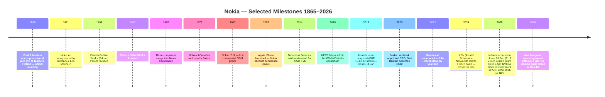
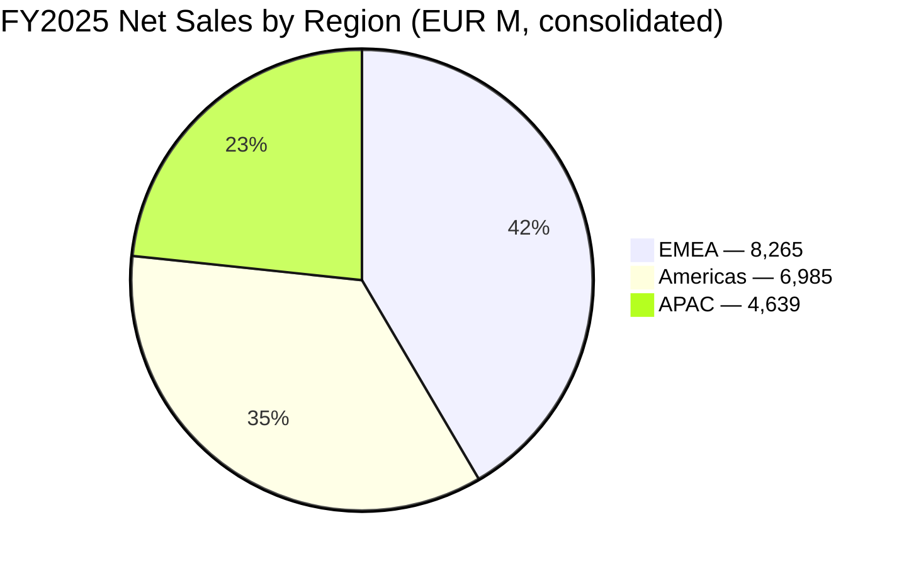
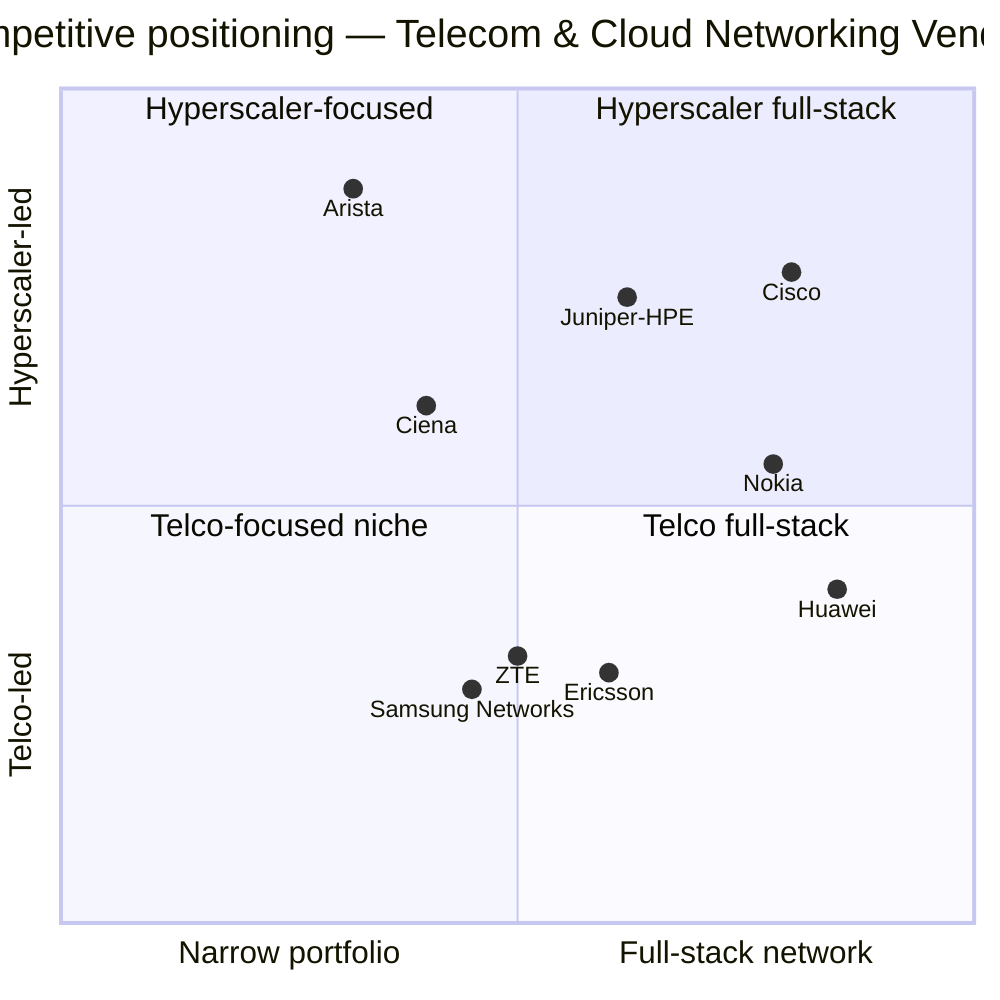

# Nokia Corporation — Deep-Dive Equity Research

**Ticker:** NYSE: NOK (ADR, 1:1 with ordinary shares) · Nasdaq Helsinki: NOKIA
**Headquarters:** Karakaari 7, FI-02610 Espoo, Finland
**Incorporation:** Republic of Finland (business identity code 0112038-9)
**Fiscal year-end:** 31 December · **Reporting currency:** EUR
**SEC CIK:** 0000924613 · **SEC filer status:** Foreign private issuer (Form 20-F)
**As of:** 2026-05-28
**Author:** Equity research, financial-agent project

---

## Banner — guidance change (Q1 2026)

> **Nokia raised its FY2026 Network Infrastructure growth guide from a "6–8% CAGR 2025–28" CMD framing to a "12–14% net-sales growth" full-year 2026 target after Q1 2026, citing AI & Cloud customer momentum.** AI & Cloud customer revenue grew +49% YoY in Q1 and Optical Networks grew +20% YoY; the company also raised its 2026 comparable-operating-profit guide to **EUR 2.0–2.5 billion** (vs FY2025 actual EUR ~2.0 billion). Disclosed in the Q1 2026 interim report on 23 April 2026 ([Nokia Q1 2026 interim report PDF](https://www.nokia.com/system/files/2026-04/nokia_results_2026_q1.pdf); [Nokia Q1 2026 newsroom release](https://www.nokia.com/newsroom/nokia-corporation-interim-report-for-q1-2026/)).

---

## Table of contents

1. [Company Overview](#1-company-overview)
2. [Company History](#2-company-history)
3. [Management Team](#3-management-team)
4. [Products & Services](#4-products--services)
5. [Customers & Listing Strategy](#5-customers--listing-strategy)
6. [Industry Overview](#6-industry-overview)
7. [Competitive Landscape](#7-competitive-landscape)
8. [Market Opportunity (TAM/SAM)](#8-market-opportunity)
9. [Risk Assessment](#9-risk-assessment)
10. [References](#10-references)

---

## 1. Company Overview

Nokia Corporation is the Finnish global telecommunications-equipment, IP/optical-networking and patent-licensing group that re-architected itself in 2025–26 around the AI-infrastructure build-out. FY2025 net sales were **EUR 19,889 million**, with comparable operating profit of **approximately EUR 2.0 billion** and free cash flow of **EUR 1.5 billion** ([Nokia 2025 Annual Report PDF](https://www.nokia.com/system/files/2026-03/nokia-annual-report-2025.pdf); [Form 20-F, FY2025](https://www.sec.gov/Archives/edgar/data/924613/000162828026015034/nok-20251231.htm)). Reported operating profit was EUR 885 million (4.4% margin), held down by EUR 600 million+ of Infinera-acquisition-related amortization, restructuring and one-offs; on a comparable basis the underlying mid-single-digit margin run-rate is intact ([Form 20-F p. 68](https://www.sec.gov/Archives/edgar/data/924613/000162828026015034/nok-20251231.htm)). The group ended 2025 with **EUR 6.8 billion of cash and IB investments**, **EUR 3.4 billion of net cash**, and an order backlog of **EUR 19.5 billion** — a balance sheet that supports both the proposed EUR 0.14 per-share dividend and continued share buybacks (EUR 1.6 billion repurchased since 2023) ([Form 20-F selected financial data, pp. 66–67](https://www.sec.gov/Archives/edgar/data/924613/000162828026015034/nok-20251231.htm)).

*Source: [Nokia Form 20-F, FY2025](https://www.sec.gov/Archives/edgar/data/924613/000162828026015034/nok-20251231.htm) selected financial data, pp. 66–67. Comparable operating margin is non-IFRS; FY2025 value is management-quoted ~EUR 2.0 B comp-OP on EUR 19,889 M net sales.*

Under the FY2025 (legacy) operating model, Nokia ran four reportable segments: **Network Infrastructure** (NI, EUR 7,986 M / 40% of sales), **Mobile Networks** (MN, EUR 7,806 M / 39%), **Cloud and Network Services** (CNS, EUR 2,606 M / 13%), and **Nokia Technologies** (NT, EUR 1,501 M / 8%) ([Form 20-F results of operations, pp. 72–75](https://www.sec.gov/Archives/edgar/data/924613/000162828026015034/nok-20251231.htm)). Effective **1 January 2026**, Capital Markets Day 2025 collapsed those into two segments: **Network Infrastructure** (now bundling optical, IP, fixed and Nokia Technologies) and **Mobile Infrastructure** (RAN, microwave, FWA CPE, Site Implementation and Managed Services) ([Nokia CMD 2025 strategy release, 19 Nov 2025](https://www.nokia.com/newsroom/nokia-announces-new-strategy-evolution-of-its-operating-model-new-long-term-financial-target-strategic-kpis-and-changes-to-its-group-leadership-team/); [Recast comparative segment results announcement](https://www.nokia.com/newsroom/nokia-provides-recast-comparative-segment-results-for-2025-and-2024-reflecting-new-operating-and-financial-reporting-structure/)). The reshape is more than cosmetic — it signals that management now sees fixed-access, IP and optical as one continuous data-plane fabric serving telcos, AI hyperscalers and mission-critical enterprises, with mobile RAN treated as a separate (and structurally flat-to-low-single-digit) business.

*Source: [Form 20-F, Note 2.2 segment net sales](https://www.sec.gov/Archives/edgar/data/924613/000162828026015034/nok-20251231.htm). Network Infrastructure includes Optical EUR 3,019 M, IP EUR 2,594 M, Fixed EUR 2,373 M.*

Three events in 2025–26 reset the equity story. First, on **28 February 2025**, Nokia closed the **Infinera acquisition for EUR 2.5 billion purchase consideration** (cash EUR 1,066 M, assumption of Infinera convertible notes EUR 785 M, 127,434,986 new Nokia ADSs valued at EUR 584 M, plus EUR 61 M of replacement equity awards), instantly making Nokia the **#2 global optical-networking vendor by share, ~20% of the market** ([Form 20-F Note 6.2 Acquisitions, p. 185](https://www.sec.gov/Archives/edgar/data/924613/000162828026015034/nok-20251231.htm); [Dell'Oro — Optical transport reached US$16 B in 2025](https://www.delloro.com/news/optical-transport-market-grew-to-16-billion-in-2025/)). Second, on **10 February 2025**, Nokia named **Justin Hotard** — previously EVP & GM of Intel's Data Center & AI Group, and before that head of HPE's HPC & AI business — as the next President and CEO effective **1 April 2025**, succeeding Pekka Lundmark ([Nokia leadership transition release, 10 Feb 2025](https://www.globenewswire.com/news-release/2025/02/10/3023164/0/en/Inside-information-Nokia-announces-a-leadership-transition-Justin-Hotard-appointed-as-successor-to-Pekka-Lundmark.html)). Third, on **28 October 2025**, **NVIDIA invested USD 1.0 billion in newly issued Nokia ordinary shares at USD 6.01 per share (≈2.9% pro-forma stake)** alongside a multi-year AI-RAN partnership built around NVIDIA's **Aerial RAN Computer Pro (ARC-Pro)**, with T-Mobile US as the launch carrier ([NVIDIA investor release, 28 Oct 2025](https://investor.nvidia.com/news/press-release-details/2025/NVIDIA-and-Nokia-to-Pioneer-the-AI-Platform-for-6G--Powering-Americas-Return-to-Telecommunications-Leadership/default.aspx); [Nokia 6-K filing](https://www.sec.gov/Archives/edgar/data/0000924613/000110465925103038/tm2529638d1_6k.htm)).

**Valuation snapshot (27 May 2026).** NOK closed at approximately **USD 16.46** on NYSE with a 52-week range of US$4.00–US$16.625 — the stock has roughly **quadrupled in twelve months** off the NVIDIA-deal re-rating, taking market capitalisation to **~US$94 billion** on 5,742,239,696 shares outstanding ([Yahoo Finance — NOK](https://finance.yahoo.com/quote/NOK/); [Form 20-F cover page share count](https://www.sec.gov/Archives/edgar/data/924613/000162828026015034/nok-20251231.htm)). On a trailing basis that implies **~4.2× FY2025 sales and ~42× FY2025 comparable operating profit** — multiples that compare to Cisco at ~5× sales / 18× EPS and Ericsson at ~1.5× sales / 14× comp-OP — i.e. the market is now valuing Nokia like a US infrastructure-software/AI-networking name, not a Nordic telco-equipment vendor ([StockAnalysis — NOK](https://stockanalysis.com/stocks/nok/); [Ericsson Q1 2026 slides — Investing.com summary](https://www.investing.com/news/company-news/ericsson-q1-2026-slides-organic-growth-offset-by-currency-headwinds-93CH-4619802)). *Analyst view:* the re-rating already prices in successful Infinera integration, materialisation of the NVIDIA AI-RAN GA (slated late 2027) and continued NI growth at the new 12–14% guide; **multiple compression is the dominant risk** if AI orders prove lumpy or if Mobile Networks margin remains stuck at low single digits.

The group employs **~78,000 people across ~130 countries**, with 33,000 in Europe, 18,300 in India, 10,000 in North America, 7,200 in Greater China and the remainder spread across LatAm, MEA and rest-of-APAC ([Form 20-F p. 5, "Our 2025 highlights"](https://www.sec.gov/Archives/edgar/data/924613/000162828026015034/nok-20251231.htm)). FY2025 R&D spend was **EUR 4,855 million (24.4% of net sales)**, a top-tier intensity that funds Nokia Bell Labs, FP-series IP silicon, the PSE-6s coherent DSP and Nokia's leadership roles in 6G consortia (Next G Alliance, Hexa-X-II, 6G-ANNA) ([Form 20-F p. 21 Bell Labs narrative](https://www.sec.gov/Archives/edgar/data/924613/000162828026015034/nok-20251231.htm)).

---

## 2. Company History

Nokia's founding date of **12 May 1865** is the day mining engineer **Fredrik Idestam** secured a Finnish-senate concession to establish a groundwood pulp mill on the Tammerkoski rapids in Tampere, then in the Russian Grand Duchy of Finland ([Wikipedia — Fredrik Idestam](https://en.wikipedia.org/wiki/Fredrik_Idestam); [Form 20-F p. 6 — 160th anniversary reference](https://www.sec.gov/Archives/edgar/data/924613/000162828026015034/nok-20251231.htm)). In **1868** a second mill opened near the town of Nokia for better hydropower, and in **1871** Idestam and his close friend (later Finnish senator) **Leo Mechelin** incorporated **Nokia Ab** ([Wikipedia — History of Nokia](https://en.wikipedia.org/wiki/History_of_Nokia)). The modern conglomerate took shape through three legacy lines — pulp/paper (1865), rubber (Eduard Polón's Finnish Rubber Works, 1898) and cables (Finnish Cable Works, 1912) — which **merged into the present Nokia Corporation in 1967**. Electronics began as a small division in the 1960s; the **DX 200 digital telephone exchange** (1970s) and the **Nokia 1011** (the first commercially sold GSM handset, 1992) bracket Nokia's rise to global telecoms leadership ([History of Nokia](https://en.wikipedia.org/wiki/History_of_Nokia)).

The handset era ended decisively with the **April 2014 sale of Nokia Devices & Services to Microsoft for ~USD 7.2 billion**. The 20-F still carries a surviving tax-indemnity reference to that disposal — "we are required to indemnify Microsoft for certain pre-closing tax matters … acquired by Microsoft in connection with the closing of the sale [of the Devices & Services business]" — a reminder that the legal tail of the handset business persists more than a decade later ([Form 20-F tax indemnity note, p. ~108](https://www.sec.gov/Archives/edgar/data/924613/000162828026015034/nok-20251231.htm)). **HERE Maps was sold in December 2015** to a German automaker consortium (Audi/BMW/Daimler), and in **January 2016 the EUR 15.6 billion all-share acquisition of Alcatel-Lucent closed**, retiring the ALU brand on 3 November 2016 and making Nokia a full-stack telecoms-network vendor ([History of Nokia](https://en.wikipedia.org/wiki/History_of_Nokia); [Form 20-F glossary — Alcatel-Lucent definition, p. 193](https://www.sec.gov/Archives/edgar/data/924613/000162828026015034/nok-20251231.htm)).

The next strategic re-cuts came in 2022–25. Nokia announced its **Russia exit on 12 April 2022** ("less than 2% of our net sales in 2021") and completed the wind-down by year-end ([Light Reading — Nokia to exit Russia](https://www.lightreading.com/regulatory-politics/nokia-to-exit-russia-as-huawei-reportedly-stops-work)). In Q4 2024 Nokia exercised its call option to **buy out China Huaxin's ~50% stake in Nokia Shanghai Bell**, becoming sole shareholder of its largest Chinese subsidiary. On **31 December 2024** Nokia completed the sale of **Alcatel Submarine Networks (ASN)** to the French State, retaining only a 20% residual stake pending exit — taking Nokia out of the subsea-cables business after 30+ years ([Nokia ASN closing release, 3 Jan 2025](https://www.globenewswire.com/news-release/2025/01/03/3004037/0/en/Nokia-completes-its-sale-of-leading-submarine-networks-business-ASN-Alcatel-Submarine-Networks-to-the-French-State.html)). The largest M&A since ALU then arrived on **28 February 2025** with the **EUR 2.5 billion close of Infinera**, doubling Optical Networks net sales (Optical FY2024 EUR 1,636 M → FY2025 EUR 3,019 M) and giving Nokia a vertically integrated **Indium Phosphide PIC fab** in Sunnyvale, California, plus an Allentown, Pennsylvania photonics packaging-and-test facility ([Form 20-F Note 6.2 Acquisitions, p. 185](https://www.sec.gov/Archives/edgar/data/924613/000162828026015034/nok-20251231.htm); [Nokia Infinera close release, 28 Feb 2025](https://www.nokia.com/newsroom/nokia-completes-acquisition-of-infinera-to-create-innovation-powerhouse-in-optical-networks-with-the-scale-to-power-the-data-center-revolution/)).

2025 closed with the strategic reset announced at **Capital Markets Day in New York on 19 November 2025** — a collapse of five business groups into two operating segments effective 1 January 2026, **the largest organisational overhaul since the Alcatel-Lucent integration**, and a long-term comparable-operating-profit target of **EUR 2.7–3.2 billion by 2028** (vs ~EUR 2.0 B in FY2025) ([Nokia CMD 2025 strategy release](https://www.nokia.com/newsroom/nokia-announces-new-strategy-evolution-of-its-operating-model-new-long-term-financial-target-strategic-kpis-and-changes-to-its-group-leadership-team/); [Capacity Media — biggest organisational overhaul in years](https://capacityglobal.com/news/nokia-announces-biggest-organisational-overhaul-in-years/)). 2025 was also the **160th anniversary of Nokia and the 100th anniversary of Nokia Bell Labs** — a coincidence Nokia management leans on heavily in the 2025 Annual Report's CEO interview ([Form 20-F p. 6](https://www.sec.gov/Archives/edgar/data/924613/000162828026015034/nok-20251231.htm)).

---

## 3. Management Team

### Founder — Fredrik Idestam (1838–1916)

Fredrik Idestam was a Finnish mining engineer trained at the **Hannover Polytechnic Institute** who, after working in German pulp mills, returned to Finland and secured a **senate concession on 12 May 1865** to build a groundwood pulp mill on the Tammerkoski rapids in Tampere — a date Nokia treats as its official founding. A second mill on the river Emäkoski near the town of Nokia opened in 1868; in 1871 Idestam and **Leo Mechelin** (later a Finnish senator instrumental in the country's autonomy movement) incorporated **Nokia Ab** to consolidate both mills. Idestam served as Managing Director until his retirement in **1896**, leaving Mechelin to expand the company into electricity generation — a move which laid the groundwork for the rubber and cables divisions that would eventually merge with Nokia Ab to form modern Nokia Corporation in 1967. Idestam held no comparable equity stake by today's standards and his role in the modern public Nokia is purely historical ([Wikipedia — Fredrik Idestam](https://en.wikipedia.org/wiki/Fredrik_Idestam); [History of Nokia](https://en.wikipedia.org/wiki/History_of_Nokia)).

### Current CEO — Justin Hotard (since 1 April 2025)

**Justin Hotard** was announced as Nokia's incoming President and CEO on **10 February 2025** and took office on **1 April 2025**, succeeding Pekka Lundmark ([Nokia leadership transition release](https://www.globenewswire.com/news-release/2025/02/10/3023164/0/en/Inside-information-Nokia-announces-a-leadership-transition-Justin-Hotard-appointed-as-successor-to-Pekka-Lundmark.html)). He joined directly from **Intel**, where he had served as EVP and General Manager of the **Data Center & AI Group (DCAI)** — Intel's server-CPU and AI-accelerator business — running a revenue line measured in tens of billions and overseeing the Gaudi accelerator ramp ([Justin Hotard — Nokia leadership page](https://www.nokia.com/we-are-nokia/leadership-and-governance/group-leadership-team/justin-hotard/)).

Prior to Intel, Hotard spent **nine years at Hewlett Packard Enterprise (2015–2024)**, ending as **EVP and General Manager of HPC, AI & Labs**, where, per Nokia's published bio, "he delivered the world's first exascale supercomputer for the US Department of Energy" — the Frontier system at Oak Ridge. Before HPE he held leadership roles at **NCR Corporation** and **Symbol Technologies**, and began his career at **Motorola** as an engineer "deploying mobile networks for US carriers" — the only conventional telecom-vendor tour on his resume ([Form 20-F p. 6 CEO interview](https://www.sec.gov/Archives/edgar/data/924613/000162828026015034/nok-20251231.htm); [Nokia bio](https://www.nokia.com/we-are-nokia/leadership-and-governance/group-leadership-team/justin-hotard/)). Hotard holds a BSc in Electrical Engineering from the University of Illinois at Urbana-Champaign and an MBA from Northwestern Kellogg.

The strategic signal of recruiting a data-center / AI operator rather than a telecoms lifer was unmistakable. At CMD 2025 Hotard framed Nokia's mission as "**connecting intelligence and accelerating value creation for our customers and investors**" and laid out five strategic priorities — "accelerating growth in AI & Cloud; leading in AI-native networks and 6G; growing through co-innovation; deploying capital where we differentiate; and unlocking sustainable returns" ([Form 20-F p. 8](https://www.sec.gov/Archives/edgar/data/924613/000162828026015034/nok-20251231.htm); [Nokia CMD 2025 strategy release](https://www.nokia.com/newsroom/nokia-announces-new-strategy-evolution-of-its-operating-model-new-long-term-financial-target-strategic-kpis-and-changes-to-its-group-leadership-team/)). His STI target is 125% of base salary (consistent with the prior CEO's structure), pro-rated for the partial year. Within seven months of his start Hotard had closed the NVIDIA equity-and-AI-RAN deal — a transaction that re-rated the equity ~4× and that arguably could not have been negotiated by a more traditional telco-equipment CEO.

---

## 4. Products & Services

This is the most important section of the report — Nokia's product portfolio sits at the intersection of three large addressable markets (mobile RAN, optical/IP networking, patent licensing), and what management chooses to invest in versus harvest determines the next five years of the equity story. The legacy four-segment view persists for FY2025 reporting; the new two-segment view governs from 1 January 2026 forward and is how investors should model the business going into 2026 results.

### 4.1 Network Infrastructure (FY2025 EUR 7,986 M, ~40% of group sales)

NI was the principal growth engine in FY2025, up **+23% YoY**, lifted entirely by the Infinera consolidation. The 20-F discloses the sub-mix verbatim: "*In 2025, net sales include Optical Networks net sales of EUR 3,019 million, IP Networks net sales of EUR 2,594 million and Fixed Networks net sales of EUR 2,373 million*" ([Form 20-F p. 72](https://www.sec.gov/Archives/edgar/data/924613/000162828026015034/nok-20251231.htm)). NI operating margin of 9.8% (vs 11.7% prior year) reflects ~120 bps of Infinera integration drag in the partial-year consolidation.

*Source: [Form 20-F p. 72](https://www.sec.gov/Archives/edgar/data/924613/000162828026015034/nok-20251231.htm). Optical Networks lifted by Infinera consolidation from 28 February 2025.*

```mermaid
graph TD
    Nokia[Nokia Group] --> NI[Network Infrastructure<br>EUR 7,986M FY2025]
    Nokia --> MN[Mobile Networks<br>EUR 7,806M]
    Nokia --> CNS[Cloud & Network Services<br>EUR 2,606M]
    Nokia --> NT[Nokia Technologies<br>EUR 1,501M]
    NI --> Opt[Optical Networks<br>EUR 3,019M]
    NI --> IP[IP Networks<br>EUR 2,594M]
    NI --> Fx[Fixed Networks<br>EUR 2,373M]
    Opt --> PSE6s[Nokia PSE-6s coherent DSP<br>1.2 Tbps superchannel]
    Opt --> ICE7[Infinera ICE7<br>1.2 Tbps engine, InP PIC fab]
    Opt --> P1830[1830 PSS Photonic Service Switch]
    Opt --> GX[GX series, ICE-X subsystems]
    IP --> FP5[FP5 6.0 Tb/s routing silicon]
    IP --> R7750[7750 SR Service Router]
    IP --> R7250[7250 IXR Interconnect Router]
    IP --> R7220[7220 IXR H6 — Tomahawk 6]
    IP --> EDA[SR Linux NOS + EDA platform]
    Fx --> LightspanFX[Lightspan FX OLT — GPON/XGS-PON/Multi-PON]
    Fx --> LightspanMF[Lightspan MF — 25G/50G/100G PON]
    MN --> AirScale[AirScale RAN baseband + radios]
    MN --> Habrok[Habrok Massive MIMO 32/64 TRX]
    MN --> Levante[Levante baseband card]
    MN --> ARC[NVIDIA ARC-Pro AI-RAN]
    CNS --> Core[5G Core / IMS / SDM]
    CNS --> ANF[Autonomous Network Fabric]
    CNS --> NetGuard[NetGuard Telco XDR]
    CNS --> DAC[Private Wireless — DAC]
    NT --> Patents[26,000+ patent families<br>8,000+ 5G-essential]
```

**Optical Networks — EUR 3,019 M, +85% YoY**. The combined Nokia+Infinera platform now ranks **#2 globally with approximately 20% optical-transport market share** behind Huawei, ahead of Ciena outside North America ([Dell'Oro — Optical Transport grew to USD 16 B in 2025](https://www.delloro.com/news/optical-transport-market-grew-to-16-billion-in-2025/); [Fierce Network — optical transport 2025](https://www.fierce-network.com/broadband/delloro-optical-transport-revenue-hit-16b-2025-fueled-hyperscalers-neoclouds)). The legacy Nokia line centers on the **PSE-6s coherent DSP**, which the product page describes verbatim as: "*PSE-6s is designed to support 1.2-Tbps superchannel transmission – or 2.4 Tbps when two PSE-6s chips are linked together … deliver up to 140 GBaud and 1.2 Tb/s per wavelength … supports both shaped 16QAM and 64QAM modulation … the industry's only third-generation probabilistic constellation shaping (PCS) … 5 nm finFET CMOS process … 60 per cent less power than Nokia's existing coherent technology … can send 800 GbE over 2,000 km and 1.2 terabits over 100 km*" ([Nokia PSE-6s product page](https://www.nokia.com/optical-networks/pse-6s/)). The DSP rides on Nokia's **1830 PSS (Photonic Service Switch)** platforms and feeds 800ZR/ZR+ pluggables for hyperscaler DCI links. **中文释义 / Plain-language gloss:** "coherent DSP" / 相干数字信号处理器 is the chip that encodes signals into amplitude+phase patterns so a single fibre can carry 1.2 terabits per second across a metro or long-haul span; doubling baud and halving power per bit is the single most important lever in driving down hyperscaler inter-DC cost.

The Infinera side adds the **ICE7 1.2 Tbps engine**, whose product page reads: "*ICE7 1.2 Tbps uses Infinera's vertically integrated ICTR140 TROSA and a custom-designed digital signal processor (DSP) optimised for high-baud rate transmission … leveraging Infinera's U.S.-based, in-house indium phosphide (InP) fab, based on monolithically integrated photonic integrated circuits (PICs) … reduce cost per bit by as much as 30% and power per bit by as much as 60% … symbol rates of up to 148 Gbaud*" ([Nokia ICE7 product page](https://www.nokia.com/optical-networks/ice7/)). The vertical InP PIC fab in **Sunnyvale, California** (2,300 m²) plus the Allentown, PA packaging-and-test site (2,400 m²) are the strategic prize: they make Nokia one of only two Western optical vendors that own monolithic PIC manufacturing, and they de-risk supply versus pure third-party-foundry competitors. In **February 2026 Nokia purchased a previously-leased facility in San Jose, California, for a new compound-semiconductor wafer fab expected to begin production in 2027** — partly funded by **USD 40 million of US CHIPS Act direct funding** out of USD 93 million total committed ([Form 20-F p. 25 — properties & CHIPS Act funding](https://www.sec.gov/Archives/edgar/data/924613/000162828026015034/nok-20251231.htm)). The InP fab plus CHIPS funding is also a material tariff hedge: Nokia can call optical equipment substantially US-made, which matters under the 2025–26 Trump tariff regime.

**IP Networks — EUR 2,594 M, broadly flat YoY**. Nokia holds "**the number one global position in IP edge routing**" per Dell'Oro Q3'25 rankings, with the hardware family built around the **FP5 silicon**, Nokia's in-house network processor. The product page reads verbatim: "*FP5 is Nokia's next generation of the industry's leading IP routing silicon network processor … Powered by Nokia FP5 6.0 Tb/s (HD) routing silicon with support for 800GE, 400GE, 100GE, 50GE, 40GE, 25GE, 10GE and 1GE interfaces … a 75% reduction in energy consumption and a 3X increase in capacity with FP5 compared to FP4 … FP5 is fully backwards compatible with FP4 … allowing operators to mix FP4 and FP5 hardware at line rate in the same chassis*" ([Nokia FP5 product page](https://www.nokia.com/ip-networks/fp-network-processor-technology/fp5/)). Platforms span the **7750 SR Service Router** ("scalable 2.4 Tb/s FD to 216 Tb/s FD", per the [7750 SR page](https://www.nokia.com/ip-networks/7750-service-router/)), the **7250 IXR Interconnect Router** ("high-density 1RU up to 25.6 Tb/s, 800GE/400GE/100GE") and the **7950 XRS** core router family. For data-center fabric and AI back-end, the **7220 IXR H6** — launched 2025 and "*powered by Broadcom's Tomahawk 6 chipset*" — is Nokia's bid for the merchant-silicon DCN socket ([Form 20-F p. 6](https://www.sec.gov/Archives/edgar/data/924613/000162828026015034/nok-20251231.htm)). The orchestration layer combines **SR Linux NOS** (Nokia's open-source switching OS) with **Event-Driven Automation (EDA)** — launched **17 September 2024** — which Nokia describes as "*the industry's most modern data center automation platform … built on Kubernetes to bring highly reliable, simplified, and adaptable lifecycle management to data center networks … integrated GenAI and agentic AI capabilities take data center network operations beyond conversation, into sensing, thinking, and acting*" ([Nokia EDA launch release](https://www.nokia.com/about-us/news/releases/2024/09/17/nokia-launches-industrys-most-modern-data-center-automation-platform-built-for-the-ai-era/)). EDA is the multi-vendor differentiator versus Cisco Nexus Dashboard and Arista CloudVision and is now the single most-cited reason hyperscalers add Nokia to their networking AVL.

**Fixed Networks — EUR 2,373 M, +3% YoY**. Nokia's broadband-access portfolio holds the "**global number one position in xPON OLT for the sixth consecutive year**" per Dell'Oro ([Form 20-F p. 22](https://www.sec.gov/Archives/edgar/data/924613/000162828026015034/nok-20251231.htm)). Two product families anchor the business. **Lightspan FX** is described on the product page as supporting "*high-density GPON, XGS-PON, Multi-PON, TWDM-PON and point-to-point. The platform features a non-blocking, high-capacity backplane of 2 x 100 Gb/s per slot*" ([Lightspan FX page](https://www.nokia.com/broadband-access/lightspan-fx/)). **Lightspan MF** is "*the industry's highest capacity OLT solution designed for 25G PON, 50G PON, and 100G PON fiber broadband services … based on the Nokia Quillion chipset*" ([Lightspan MF page](https://www.nokia.com/fixed-networks/lightspan-mf/)). The marquee customer win in this sub-segment is the **September 2024 AT&T deal — a five-year, Build America Buy America-compliant supply contract for Lightspan MF plus Altiplano** which extended Nokia's footprint at AT&T into the second half of the decade ([Nokia–AT&T fiber release](https://www.nokia.com/newsroom/nokia-signs-strategic-deal-with-att-to-accelerate-future-ready-fiber-broadband-growth/); [Fierce Network coverage](https://www.fierce-network.com/broadband/att-extends-olive-branch-nokia-new-fiber-contract)).

**Submarine Networks (Alcatel Submarine Networks) — DIVESTED 31 Dec 2024**. Any thesis that references ASN is now stale. The 20-F confirms: "*On 27 June 2024, Nokia announced it had entered into a put option agreement to sell its wholly owned subsidiary Alcatel Submarine Networks (ASN) to the French State. … The sale was completed on 31 December 2024*" ([Form 20-F p. 71](https://www.sec.gov/Archives/edgar/data/924613/000162828026015034/nok-20251231.htm); [Nokia ASN closing release](https://www.globenewswire.com/news-release/2025/01/03/3004037/0/en/Nokia-completes-its-sale-of-leading-submarine-networks-business-ASN-Alcatel-Submarine-Networks-to-the-French-State.html)). Nokia retains a 20% residual stake with planned exit. ASN appears in FY2024 numbers as discontinued operations.

### 4.2 Mobile Networks (FY2025 EUR 7,806 M, ~39% of sales)

Mobile Networks declined **-4% YoY** in 2025 with operating margin compressing to 2.8% (vs 5.5% in 2024) — the softest part of the P&L, driven by macro RAN cyclicality and the multi-year share loss at AT&T. The 20-F describes the portfolio verbatim: "*Mobile Networks' portfolio included products for radio access networks (RAN) and microwave radio for transport, network management and a range of associated services*" ([Form 20-F p. 13](https://www.sec.gov/Archives/edgar/data/924613/000162828026015034/nok-20251231.htm)).

The **AirScale RAN** platform is built on Nokia's **ReefShark SoC**, which powers both the radios and the baseband cards. Marketing materials describe the latest-generation radios, the **Habrok Massive MIMO** family — launched at MWC 2023 — as: "*Habrok is Nokia's latest generation of cutting-edge AirScale massive MIMO radios … in both 32 TRX (Habrok 32) and 64 TRX (Habrok 64) versions. Habrok radios are smaller and lighter than previous products*" ([Nokia Habrok release](https://www.nokia.com/newsroom/nokia-redefines-massive-mimo-radio-performance-with-the-launch-of-habrok-its-latest-generation-of-airscale-5g-radios-powered-by-reefshark-mwc23/)). The companion **Levante baseband card** "*is a 4G/5G capacity card that delivers ultra-performance, doubles the number of supported Massive MIMO cells, and reduces energy consumption by up to 60 percent*". The next-generation 5G-Advanced baseband, **Lodos**, joined the portfolio in 2025. **中文释义 / Plain-language gloss:** Massive MIMO (多输入多输出) / large-antenna-array radio — instead of one or two antennas, the radio uses 32 or 64 antennas at the base station to beam-form signals to individual handsets simultaneously, increasing capacity 4–8× over earlier 4G radios. The Habrok 64 is the workhorse for mid-band 5G deployments in the US, EU and Japan.

The strategic shift in 2025 was the **anyRAN concept**, which Nokia defines as: "*Nokia anyRAN is an approach that provides the widest choice of strategic options for RAN evolution and enables selecting multiple suppliers for both vertical and horizontal layers of RAN*" ([Nokia anyRAN page](https://www.nokia.com/mobile-networks/ran/anyran/)). It encompasses purpose-built AirScale RAN, Cloud RAN (RAN running on COTS x86 or ARM servers), and Open RAN (multi-vendor disaggregated RAN). The capstone is **AI-RAN via NVIDIA ARC-Pro** — the 20-F states: "*we leverage the NVIDIA ARC-Pro accelerated computing platform to evolve our Cloud RAN into a Cloud AI-RAN solution, and in our AirScale RAN solutions. The upcoming AI-RAN capacity plug-in unit for Nokia AirScale baseband will be optimized for AI-native traffic*" ([Form 20-F p. ~17](https://www.sec.gov/Archives/edgar/data/924613/000162828026015034/nok-20251231.htm)). T-Mobile US is the launch trial partner; field trials slated early 2026, GA late 2027. Year-end 2025 commercial KPIs: **408 commercial 5G agreements, >1,000 private wireless customers**, ranked #3 in global Mobile RAN by Dell'Oro/Omdia ([Form 20-F p. 22](https://www.sec.gov/Archives/edgar/data/924613/000162828026015034/nok-20251231.htm)).

### 4.3 Cloud and Network Services (FY2025 EUR 2,606 M, ~13% of sales)

CNS held flat YoY with op margin expanding to 13.0% (from 8.0%) as 5G Core wins drove operating leverage. The 20-F describes the portfolio as: "*Cloud and Network Services' portfolio includes Core Network software, which is made up of voice core, packet core, subscriber data management, and signaling and policy software for telecommunication providers. The CNS portfolio also includes Autonomous Network software which is made up of a software fabric (called Autonomous Network Fabric) that supports digital operations, analytics and AI, and security software*" ([Form 20-F p. 12](https://www.sec.gov/Archives/edgar/data/924613/000162828026015034/nok-20251231.htm)). Nokia's 5G Standalone Core is now in "*65% of telecommunication providers' 5G SA networks*" globally per Omdia. The most-cited 2025 win was the **Rakuten Mobile go-live on Rakuten Cloud** — Nokia's IMS, SDM, Cloud Signaling Director, Mediation and NetGuard Certificate Manager running cloud-native for Rakuten's 4G and 5G core ([Rakuten press release](https://symphony.rakuten.com/newsroom/nokias-ims-and-sdm-cloud-native-core-powering-rakuten-mobile-4g-and-5g-core-now-live-on-rakuten-cloud)).

The **Private Wireless** business — built on the **Nokia DAC (Digital Automation Cloud)** — now serves **180+ enterprise customers** (1,000+ if including legacy industrial wins under the 20-F's broader definition), including named accounts at **Lufthansa Technik** (Hamburg engine overhaul, virtual inspection), **Sandvik Mining** (Tampere test mine, automated 4K-video mining), **Deutsche Bahn**, **Toyota**, and **Memphis Light, Gas and Water** (July 2025 5G for grid modernization) ([Nokia–Lufthansa Technik release](https://www.nokia.com/newsroom/nokia-5g-private-wireless-networking-moves-from-trial-to-permanent-deployment-for-lufthansa-technik/); [Memphis utility release](https://www.nokia.com/about-us/news/releases/2025/07/14/nokia-to-deploy-private-5g-network-for-memphis-light-gas-and-waters-grid-modernization-initiative/)). The cybersecurity business is led by **NetGuard Cybersecurity Dome** for telco XDR.

### 4.4 Nokia Technologies (FY2025 EUR 1,501 M, ~8% of sales, 70.6% op margin)

Nokia Technologies is the patent-licensing business and the highest-margin segment in the group. The 20-F discloses: "*Nokia has led wireless and multimedia innovation for over 30 years, building one of the industry's largest high-quality patent portfolios with more than 26,000 families, including over 8,000 essential to 5G … We have secured annual contracted recurring revenue of over EUR 800 million through 2030 … Our licensing programs in our expansion areas of automotive, consumer electronics, IoT and multimedia now contribute an annual revenue run-rate of more than EUR 200 million*" ([Form 20-F p. 13](https://www.sec.gov/Archives/edgar/data/924613/000162828026015034/nok-20251231.htm)). FY2025 net sales of EUR 1,501 M were down 22% YoY because of catch-up payments in 2024: "*The decline in Nokia Technologies net sales was primarily due to more than EUR 400 million catch-up net sales recognized in 2024, partially offset by new multimedia deals signed in 2025*" ([Form 20-F p. 75](https://www.sec.gov/Archives/edgar/data/924613/000162828026015034/nok-20251231.htm)). CEO Hotard confirmed the underlying run-rate: "*Nokia Technologies executed well with a slight increase in our contracted net sales run-rate to EUR 1.4 billion and delivered net sales of EUR 1.5 billion with strong profitability and cash generation*" ([Form 20-F p. 7](https://www.sec.gov/Archives/edgar/data/924613/000162828026015034/nok-20251231.htm)).

The smartphone renewal cycle was **declared complete in February 2024**, with Nokia stating verbatim: "*In addition to license agreements signed with Apple and Samsung in 2023, and Huawei in December 2022, Nokia Technologies announced agreements with Honor, OPPO and vivo, among others at the beginning of 2024 … Q1 net sales are expected to benefit from significant catch-up net sales in excess of EUR 400 million related to prior periods of non-payment*" ([Nokia smartphone licensing release, 8 Feb 2024](https://www.globenewswire.com/news-release/2024/02/08/2826094/0/en/Inside-information-Nokia-concludes-smartphone-patent-license-renewal-cycle.html)). Confirmed major smartphone licensees: Apple, Samsung, Huawei, OPPO (incl. OnePlus & realme), vivo, Xiaomi, Honor. The most recent named multimedia deal in the 20-F is **Amazon, March 2025**: "*In 2023, Nokia commenced patent infringement proceedings against Amazon in several countries in relation to patents covering video-related technologies implemented in Amazon's services and devices. In March 2025, Nokia announced it had signed a patent agreement with Amazon. The agreement resolves all pending patent litigation between the parties*" ([Form 20-F Note 6.1 Legal matters, p. 184](https://www.sec.gov/Archives/edgar/data/924613/000162828026015034/nok-20251231.htm)). Other named licensees in the 20-F's general narrative: Lenovo, Mercedes-Benz ([Form 20-F p. 24](https://www.sec.gov/Archives/edgar/data/924613/000162828026015034/nok-20251231.htm)). Pending video-codec enforcement actions remain against Acer, Asus and Hisense in Germany.

### 4.5 Bell Labs and the product cycle

**Nokia Bell Labs** — celebrating its 100th anniversary in 2025 — is the in-house research engine at **Murray Hill, NJ**, and the unifying R&D fabric across IP, optical, RAN and 6G. The 20-F describes 2025 research highlights: "*Physical AI — models that can interpret a physical scene in real-time … Space communications — In March 2025, in collaboration with NASA, Intuitive Machines and Lunar Outpost, we deployed the first cellular network on the Moon. … AI-native networks and 6G — collaborations with Qualcomm Technologies, Rohde & Schwarz, KDDI Research*" ([Form 20-F p. 21](https://www.sec.gov/Archives/edgar/data/924613/000162828026015034/nok-20251231.htm)). Cumulative R&D investment since 2000 stands at **~EUR 160 billion**; in September 2025 Nokia opened a new state-of-the-art **5G/6G campus in Oulu, Finland**, hosting 3,000 staff.

**Product-cycle synthesis.** Map Nokia's product families onto the customer workflow and the new strategy is legible: at one end the **Mobile RAN** equipment (AirScale + ARC-Pro) attaches handsets and devices to the access edge; at the other end **Optical (PSE-6s + ICE7)** and **IP (FP5)** equipment moves bits between data centers and across long-haul fibre; in the middle **Cloud & Network Services** turns those bits into telco services (5G Core / IMS) or enterprise services (private wireless DAC); and across all of it, the **Nokia Technologies** patent portfolio extracts a tax on every standards-compliant device that uses any of those network technologies. The 1 January 2026 segment collapse simply re-labels this — NI (optical + IP + fixed + Tech) becomes the AI-data-fabric story sold to hyperscalers and telcos; MI (RAN + microwave + Managed Services) is the cyclical, slower-growth communication-service-provider business. The pivot is real because the underlying customer mix is real: in FY2025 **AI & Cloud + mission-critical enterprise & defence net sales reached EUR 3,085 M, +42% YoY**, with Q1 2026 then printing AI & Cloud customer revenue +49% YoY and EUR 1 billion of incremental quarterly orders ([Form 20-F Note 2.1, p. 135](https://www.sec.gov/Archives/edgar/data/924613/000162828026015034/nok-20251231.htm); [Nokia Q1 2026 interim PDF](https://www.nokia.com/system/files/2026-04/nokia_results_2026_q1.pdf)).

---

## 5. Customers & Listing Strategy

### Customer-concentration disclosure (group-level)

The 20-F's customer-concentration disclosure is explicit and lower-risk than peers. From **Note 2.1 Net sales** (p. 139): "*Major customers — In 2025, 2024 and 2023 no single customer represented more than 10% of net sales*" ([Form 20-F p. 139](https://www.sec.gov/Archives/edgar/data/924613/000162828026015034/nok-20251231.htm)). This applies to **consolidated revenue**. Nokia does not publish a top-5 customer aggregate either — only the no-customer-above-10% statement plus a customer-type split shown below.

### Net sales by customer type, FY2023–FY2025 (EUR M, consolidated)

| Customer type (denominator: group total) | FY2025 | FY2024 | FY2023 | FY2025 share |
|---|---|---|---|---|
| Telecom providers | 15,313 | 15,085 | 17,652 | 77.0% |
| AI & Cloud + Mission Critical Enterprise & Defense | **3,085** | 2,180 | 2,282 | 15.5% |
| Licensees (Nokia Technologies) | 1,501 | 1,928 | 1,085 | 7.5% |
| Other / eliminations | (10) | 27 | 119 | — |
| **Total** | **19,889** | **19,220** | **21,138** | **100%** |

*Source: [Form 20-F Note 2.1, p. 135](https://www.sec.gov/Archives/edgar/data/924613/000162828026015034/nok-20251231.htm). All figures **consolidated group-level**, not segment-level. The AI & Cloud + MCE&D bucket grew +42% YoY in EUR — the structural mix shift the equity story rests on.*

### Named customers in the 20-F

The 20-F names specific customers only in narrative form, not as percentage-of-revenue disclosures. Verbatim references: **T-Mobile US** is identified as "*our largest US customer*", an "*active participant in the partnership, using it to drive and test AI-RAN technologies and use cases*" ([Form 20-F p. 16](https://www.sec.gov/Archives/edgar/data/924613/000162828026015034/nok-20251231.htm)). Other NVIDIA-partnership trial carriers named: **SoftBank** (Japan), **Indosat Ooredoo Hutchison** (Indonesia), **KDDI** (Japan). Other named partners: **Rakuten Mobile** (cloud-native core go-live), **Red Hat** (Core software cloud stack), **Broadcom** (Tomahawk 6 silicon in 7220 IXR H6), **Qualcomm Technologies** (multi-vendor AI in wireless via Bell Labs), **Rohde & Schwarz** (6G radio receiver), and **NASA / Intuitive Machines / Lunar Outpost** (Moon cellular network).

### Named customer wins outside the 20-F (12-month look-back)

The Q1 2026 interim disclosed "AI & Cloud customers" as a reporting bucket with **EUR 1 billion of orders in the quarter**, but did not name individual hyperscalers in public materials. Public-domain commentary points to:

- **AT&T (fiber win + RAN loss).** In September 2024 AT&T awarded Nokia a five-year fiber-broadband supply contract for Lightspan MF + Altiplano, BABA-compliant ([Nokia AT&T release](https://www.nokia.com/newsroom/nokia-signs-strategic-deal-with-att-to-accelerate-future-ready-fiber-broadband-growth/)). Separately, AT&T had in **December 2023** awarded its 5-year, USD 14 billion Open RAN contract to **Ericsson**, displacing Nokia at scale on the wireless side ([AT&T release, Dec 2023](https://about.att.com/story/2023/commercial-scale-open-radio-access-network.html); [Ericsson release](https://www.ericsson.com/en/press-releases/2023/12/att-to-accelerate-open-and-interoperable-radio-access-networks-ran-in-the-united-states-through-new-collaboration-with-ericsson)). The two events together mean the AT&T relationship is now fiber-led, not RAN-led.
- **T-Mobile US (RAN renewal + AI-RAN launch).** Strategic 5G RAN supply agreement (April 2025) covering AirScale RAN + Habrok Massive MIMO + Levante + ReefShark SoC, with T-Mobile also the launch carrier for the Nokia–NVIDIA AI-RAN Innovation Center in Bellevue ([Nokia–T-Mobile release](https://www.nokia.com/newsroom/nokia-lands-strategic-5g-ran-deal-with-t-mobile-us-to-enhance-nationwide-connectivity/); [SDxCentral](https://www.sdxcentral.com/news/nokia-secures-5g-ran-deal-with-t-mobile-in-us/)).
- **Verizon (RAN loss).** Verizon's primary vRAN supplier is Samsung; Nokia is not the lead RAN at Verizon in 2025–26.
- **Deutsche Telekom (Network-as-Code win).** February 2025 commercial deal between T Wholesale and Nokia to monetize network APIs (SIM-swap, number verification, etc.) via Nokia's **Network as Code** platform ([Globe Newswire — DT-Nokia](https://www.globenewswire.com/news-release/2025/02/27/3033522/0/en/Deutsche-Telekom-s-T-Wholesale-and-Nokia-energize-network-API-market-with-commercial-deal-to-drive-and-simplify-developer-created-applications-MWC-2025.html)).
- **Elisa (5G-Advanced)** and **Optus** (May 2025 regional Australia upgrade) — both Mobile Networks wins ([Nokia–Optus release, May 2025](https://www.nokia.com/about-us/news/releases/2025/05/12/nokia-enhances-optuss-5g-network-with-improved-capacity-and-coverage-across-regional-australia/)).
- **Nscale (AI hyperscale infrastructure).** Nokia is the IP-network provider for Nscale's Stavanger renewable-powered AI data center.

### Geographic mix

*Source: [Form 20-F Note 2.1, p. 135](https://www.sec.gov/Archives/edgar/data/924613/000162828026015034/nok-20251231.htm). Denominator: consolidated group net sales of EUR 19,889 M.*

**North America** is now Nokia's single largest country exposure at **EUR 6,201 M / 31.2% of group**, up from 28.0% in FY2024 — the Infinera consolidation (US-centric customer book) plus AT&T fiber/Optical wins drove the mix shift. **Greater China** is **EUR 913 M / 4.6%** and declining; **India** is **EUR 1,534 M / 7.7%** ([Form 20-F p. 135](https://www.sec.gov/Archives/edgar/data/924613/000162828026015034/nok-20251231.htm)). The Finland line of **EUR 1,615 M** is artificially inflated because "*Nokia Technologies IPR and licensing net sales … are allocated to Finland*" — the underlying telco-equipment business in Finland is much smaller ([Form 20-F p. 139](https://www.sec.gov/Archives/edgar/data/924613/000162828026015034/nok-20251231.htm)).

### Listing strategy

Nokia maintains a **dual primary listing** on **Nasdaq Helsinki** (ticker NOKIA) and an **ADR listing on the NYSE** (ticker NOK, **1 ADS = 1 ordinary share**, depository Citibank, N.A.). On **30 December 2025 Nokia delisted from Euronext Paris**, consolidating European trading on Helsinki ([Form 20-F p. 92](https://www.sec.gov/Archives/edgar/data/924613/000162828026015034/nok-20251231.htm)). The Helsinki line has historically traded with tighter spreads; US ADR liquidity surged on the NVIDIA deal in October 2025 and now rivals Helsinki for institutional flows. Capital returns: **EUR 2.1 billion of dividends paid since 2023** and **EUR 1.6 billion of buybacks**, with the FY2025 proposed dividend of **EUR 0.14 per share** maintained at the FY2024 level ([Form 20-F p. 10](https://www.sec.gov/Archives/edgar/data/924613/000162828026015034/nok-20251231.htm)).

---

## 6. Industry Overview

Nokia operates across four distinct addressable markets, each on a different growth trajectory.

**Mobile RAN — structurally flat to mid-single-digits.** Following a ~20% peak-to-trough cumulative decline in 2022–24 (which destroyed ~USD 9 billion of industry value), Dell'Oro called the **2025 RAN market "stabilized"** and now forecasts a **~1% CAGR over the next five years**, as LTE capex roll-off offsets 5G-Advanced and early 6G spending ([Dell'Oro — RAN stabilized in 2025](https://www.delloro.com/news/ran-market-stabilized-in-2025/); [IEEE ComSoc summary, Feb 2026](https://techblog.comsoc.org/2026/02/17/delloro-ran-market-stabilized-in-2025-with-1-cag-forecast-over-next-5-years-opinion-on-ai-ran-5g-advanced-6g/)). This is the structural overhang on Mobile Networks/Mobile Infrastructure: at flat market growth, single-digit segment margins and Nokia's mid-teens share, MN will not be the equity story's driver. The two upside vectors are (a) AI-RAN via NVIDIA ARC-Pro (cumulative AI-RAN TAM expected to "*exceed USD 200 billion by 2030*", per the NVIDIA press release) and (b) periodic share-swap wins on the next set of T-Mobile US-style RAN contracts.

**Optical transport — accelerating mid-teens growth on hyperscaler/neocloud demand.** Dell'Oro reports **2025 optical-transport market sales of approximately USD 16 billion, +~14% YoY**, with Q3 2025 alone up +15% YoY driven by cloud-service-provider DCI and front-end builds ([Dell'Oro — Optical transport grew to USD 16 B in 2025](https://www.delloro.com/news/optical-transport-market-grew-to-16-billion-in-2025/); [Dell'Oro — 3Q25 +15% YoY](https://techblog.comsoc.org/2025/12/04/delloro-optical-transport-systems-market-15-year-over-year-in-3q2025-driven-by-cloud-service-providers/)). Top-5 vendors in 2025: **Huawei (#1), Ciena, Nokia, ZTE, Cisco**. The top three together control ~60% of DWDM line systems; Ciena leads North America at ~50% US share, while Nokia is #2 globally post-Infinera with ~20% combined share ([Fierce Network — optical transport 2025](https://www.fierce-network.com/broadband/delloro-optical-transport-revenue-hit-16b-2025-fueled-hyperscalers-neoclouds)).

**Data-center networking / AI back-end — multi-year secular boom.** Dell'Oro projects **>USD 100 billion of cumulative data-center-switch sales in AI back-end networks over the next five years (2025–29)** ([Dell'Oro — USD 100 B AI back-end switches](https://www.delloro.com/news/data-center-switch-sales-in-ai-back-end-networks-to-exceed-100-b-over-the-next-five-years/)). Ethernet has now **more than doubled the size of InfiniBand** for AI scale-out networks in 2025, accounting for over two-thirds of Q3 2025 AI back-end switch sales ([Dell'Oro — Ethernet doubles InfiniBand](https://www.delloro.com/news/ethernet-more-than-doubles-size-of-infiniband-as-the-leading-fabric-for-ai-scale-out-networks-in-2025/); [Dell'Oro — 3Q25 AI back-end Ethernet share](https://www.delloro.com/news/ai-back-end-networks-continue-their-shift-to-ethernet-now-accounting-for-over-two-thirds-of-3q-2025-switch-sales-in-ai-clusters/)). Top-2 AI back-end share: **Celestica + NVIDIA combined ~50%**; Arista #3. Nokia's near-term opportunity is more in **front-end / DCI / inter-DC** Ethernet routing (where FP5 + 7220 IXR H6 + ICE7 optics compete head-to-head with Cisco Silicon One and Arista 7800R3) than in in-rack AI scale-up switching, which is still NVIDIA Spectrum-X plus white-box dominated.

**Patent licensing — slow-growth annuity.** The global smartphone patent-licensing market in cellular essential patents is shared among Nokia, Qualcomm, Ericsson, InterDigital and Huawei. With major handset OEMs all renewed by Q1 2024, the smartphone royalty stream is now a stable annuity expected to compound at low-single digits as device shipments stabilize. Nokia's expansion areas (automotive, consumer electronics, IoT, video codecs) added the EUR 200 M+ run-rate disclosed in the 20-F ([Form 20-F p. 13](https://www.sec.gov/Archives/edgar/data/924613/000162828026015034/nok-20251231.htm)).

**Fixed broadband / PON.** This is a mature 2–3% growth market in volume but is undergoing a multi-year technology refresh from GPON to XGS-PON to 25G/50G PON, which lifts per-line ASPs and refreshes Nokia's installed base. Nokia's xPON OLT leadership (#1 share six years in a row) puts it in a structurally defensive position.

---

## 7. Competitive Landscape

**Ericsson (NASDAQ: ERIC).** Nokia's closest peer in mobile RAN. Q1 2026 reported sales of SEK 49.3 billion (-10% YoY on FX, +6% organic) and a Networks-segment adjusted EBITA margin of ~19% ([Investing.com — Ericsson Q1 2026 slides](https://www.investing.com/news/company-news/ericsson-q1-2026-slides-organic-growth-offset-by-currency-headwinds-93CH-4619802)). Ericsson remains the AT&T Open-RAN anchor vendor under the 2023 5-year USD 14 billion contract and holds the lead in US RAN share post-AT&T win ([DCD — Ericsson AT&T USD 14B](https://www.datacenterdynamics.com/en/news/ericsson-secures-14bn-att-open-ran-contract/)). *Analyst view:* the two companies' margin gap will close as Nokia's NI mix lifts and Ericsson's Networks margin re-compresses post-AT&T ramp.

**Huawei.** Optical #1 globally and RAN #1 ex-North-America. Blocked from most Tier-1 Western carriers under various national-security regimes, but dominant in China and across much of MEA, SE-Asia and LatAm. Continued share leadership in 2025 Dell'Oro optical rankings. Huawei's vertical integration (HiSilicon SoC + carrier equipment + handsets) is the largest structural advantage in the industry; the largest constraint is geopolitical, not technological.

**ZTE.** #4 optical and significant China RAN share. Modest Western exposure; serves much of MEA, SE-Asia and LatAm as a price competitor to Huawei.

**Cisco Systems (NASDAQ: CSCO).** IP-routing incumbent with **Silicon One** and the **8000 series** in service-provider routing and AI back-end. Slipped to #5 in optical after acquiring Acacia. Cisco is the natural share-donor for Nokia in SP routing — Nokia's #1 IP-edge-routing share per Dell'Oro Q3'25 came at Cisco's expense over the prior three years. Cisco's enterprise networking (Catalyst, Nexus) and security (Splunk) businesses are non-overlap with Nokia.

**Juniper Networks → HPE.** HPE **closed its USD 14 billion Juniper acquisition on 2 July 2025** at USD 40.00/share cash, doubling HPE's networking business ([HPE press release, 2 July 2025](https://www.hpe.com/us/en/newsroom/press-release/2025/07/hewlett-packard-enterprise-closes-acquisition-of-juniper-networks-to-offer-industry-leading-comprehensive-cloud-native-ai-driven-portfolio.html); [DCD recap](https://www.datacenterdynamics.com/en/news/hpe-closes-14bn-acquisition-of-juniper-networks/)). The relevant Nokia angle: HPE/Juniper now bundles routing + Aruba + AI servers into a single sell, raising the bar for Nokia in enterprise/DCN but also creating a "non-Cisco, non-Arista" buyer cohort that Nokia can target alongside its NVIDIA partnership. *Analyst view:* the combination is more strategically dangerous to Cisco than to Nokia.

**Ciena (NYSE: CIEN).** Optical leader in North America (~50% US share, ~3 percentage points share gain in 2025), with WaveLogic 6e and a robust 400/800ZR ramp; pivoting toward AI / DCI. Direct head-to-head with the Nokia-Infinera platform. *Analyst view:* the optical share battle in 2026–28 is essentially a three-way fight — Ciena (NA-led), Nokia-Infinera (global, US-strong post-Infinera), and Huawei (China-led) — with Cisco and ZTE in slower decline.

**Samsung Networks.** Verizon's primary vRAN supplier (the company has disclosed >10,000 vRAN sites with Samsung and a target of 20,000 by end-2025), and Verizon's AI-ESM partner ([Samsung Verizon vRAN release](https://www.samsung.com/global/business/networks/insights/press-release/0224-verizon-infuses-ai-in-network-accelerates-open-ran-innovation-with-multi-vendor-ran-intelligent-controller-deployment/)). Not a material factor at AT&T or T-Mobile; Samsung's optical/IP portfolio is sub-scale.

**Arista Networks (NYSE: ANET).** The dominant share-gainer in front-end Ethernet data-center switching; #3 in AI back-end behind Celestica + NVIDIA. Arista does not play in RAN or optical transport, so the competitive overlap is in IP/Ethernet DC routing and switching — a market where Nokia is the challenger.

**Internal consistency check.** Nokia's competitive position varies by segment: in IP it is #1 globally in edge routing; in optical it is #2 post-Infinera; in xPON OLT it is #1 for six consecutive years; in mobile RAN it is #3 globally behind Huawei and Ericsson. The competitive-position language used in Sections 1, 4 and 7 should consistently reflect this segment-by-segment picture rather than collapse to a single "Nokia is #N" claim.

---

## 8. Market Opportunity

**Nokia's own SAM framing.** At CMD 2025, Nokia disclosed a **2028 Serviceable Addressable Market of EUR 60 billion growing at 9% CAGR**, computed as "*Nokia, analyst reports, excluding China/Russia*" ([Form 20-F p. 14](https://www.sec.gov/Archives/edgar/data/924613/000162828026015034/nok-20251231.htm)). On EUR 19.9 B FY2025 net sales, that implies Nokia's current SAM share of approximately one-third — leaving meaningful headroom even before incremental wins from AI-RAN and AI-data-center networking. Management's CMD 2025 long-term financial targets put comp-OP at **EUR 2.7–3.2 billion by 2028** (~10–13% CAGR) with **FCF conversion of 65–75%** of comparable operating profit, and a Network Infrastructure 2028 op margin of **13–17%** ([Nokia CMD 2025 strategy release](https://www.nokia.com/newsroom/nokia-announces-new-strategy-evolution-of-its-operating-model-new-long-term-financial-target-strategic-kpis-and-changes-to-its-group-leadership-team/)).

**TAM build by sub-market.**

| Sub-market | 2025 size | Growth | Nokia position | Source |
|---|---|---|---|---|
| Mobile RAN | ~USD 35–40 B | ~1% CAGR (5-yr) | #3 globally | [Dell'Oro RAN, Feb 2026](https://www.delloro.com/news/ran-market-stabilized-in-2025/) |
| Optical Transport Systems | USD 16 B | +14% YoY 2025 | #2 globally ~20% | [Dell'Oro Optical](https://www.delloro.com/news/optical-transport-market-grew-to-16-billion-in-2025/) |
| Data-center / AI back-end networking | >USD 100 B cumulative 2025–29 | High double-digits | Challenger | [Dell'Oro AI back-end](https://www.delloro.com/news/data-center-switch-sales-in-ai-back-end-networks-to-exceed-100-b-over-the-next-five-years/) |
| Service provider IP routing | mid-USD-teens billions | Low single-digits | #1 in edge | [Form 20-F p. 22](https://www.sec.gov/Archives/edgar/data/924613/000162828026015034/nok-20251231.htm) (Dell'Oro Q3'25) |
| Fixed broadband (xPON OLT) | mid-single-digit USD billions | Low single-digit volume; mid-single-digit ASP | #1 six years running | [Form 20-F p. 22](https://www.sec.gov/Archives/edgar/data/924613/000162828026015034/nok-20251231.htm) |
| Patent licensing (cellular SEP) | ~USD 8–10 B | Low single-digits | Top-3 licensor | [Form 20-F p. 13](https://www.sec.gov/Archives/edgar/data/924613/000162828026015034/nok-20251231.htm) |
| AI-RAN | "*exceed USD 200 B cumulative by 2030*" | Pre-revenue, GA late 2027 | NVIDIA partner | [NVIDIA–Nokia release](https://investor.nvidia.com/news/press-release-details/2025/NVIDIA-and-Nokia-to-Pioneer-the-AI-Platform-for-6G--Powering-Americas-Return-to-Telecommunications-Leadership/default.aspx) |

The asymmetry is obvious: Mobile RAN is large but flat, Optical and DCN are large and growing, AI-RAN is potentially enormous but pre-revenue. The 1 January 2026 segment reshape simply makes the equity story line up with the underlying TAM mix.

**Strategic / sustainable returns target.** Hotard framed the long-term financial target as "*EUR 2.0 to 2.5 billion of [comparable operating profit]*" near-term progressing to **EUR 2.7–3.2 billion by 2028** ([Form 20-F p. 9](https://www.sec.gov/Archives/edgar/data/924613/000162828026015034/nok-20251231.htm); [CMD 2025 release](https://www.nokia.com/newsroom/nokia-announces-new-strategy-evolution-of-its-operating-model-new-long-term-financial-target-strategic-kpis-and-changes-to-its-group-leadership-team/)). Capital-allocation framework: organic R&D and capex (focused), inorganic M&A (prudent), dividends (recurring, stable, growing), buybacks (excess cash). Run-rate corporate-overhead cut from EUR 350 M to EUR 150 M by 2028 ([Capacity Media](https://capacityglobal.com/news/nokia-announces-biggest-organisational-overhaul-in-years/)).

---

## 9. Risk Assessment

**Strategy & execution risks (3).**

1. **Infinera integration execution.** EUR 2.5 B acquisition that doubled Optical revenue still carries 12-year customer-relationship intangibles (EUR 646 M) and 3–4-year technology intangibles (EUR 380 M) — amortization is a fixed P&L drag of EUR ~200 M/yr through 2028. Integration synergy realization, especially in optical-DSP roadmap consolidation (PSE-6s vs ICE7), is non-trivial. The Q1 2026 Optical +20% print is supportive but does not yet prove FY-level execution ([Form 20-F Note 6.2 p. 185](https://www.sec.gov/Archives/edgar/data/924613/000162828026015034/nok-20251231.htm)).

2. **AI-RAN commercialization timing risk.** The NVIDIA partnership only reaches commercial general availability in **late 2027**; the 2026–27 P&L benefit is limited to development and early-trial revenue. If hyperscalers / Tier-1 carriers defer Cloud AI-RAN adoption past 2028, the multi-year compression of mobile RAN ASPs accelerates. *Analyst view:* the equity is now priced as if AI-RAN scale-up is largely de-risked — any slip in NVIDIA's ARC-Pro production timeline or T-Mobile US trial outcomes could trigger 20%+ multiple compression.

3. **New-strategy operating-model execution.** The 1 January 2026 collapse of five business groups into two is the largest organizational change since the Alcatel-Lucent integration. Historical M&A integration execution at Nokia (ALU 2016–18) saw cost overruns and disrupted customer relationships. Re-shape execution risk is non-trivial through end-2026 ([Capacity Media — biggest overhaul in years](https://capacityglobal.com/news/nokia-announces-biggest-organisational-overhaul-in-years/)).

**Industry / market risks (3).**

4. **Mobile RAN structural stagnation.** Dell'Oro forecasts ~1% RAN market CAGR over the next five years ([Dell'Oro — RAN stabilized in 2025](https://www.delloro.com/news/ran-market-stabilized-in-2025/)). Mobile Networks at 2.8% op margin in FY2025 is structurally below comparable operating profit at the group level; absent AI-RAN inflection, MN remains a margin drag.

5. **Customer concentration at hyperscalers.** Although the 20-F discloses no single customer is >10% of group revenue, the AI & Cloud bucket (now EUR 3,085 M / 15.5% of sales) is concentrated across a handful of hyperscalers and neoclouds. Loss of one large hyperscaler design-in would compress NI growth back to single digits. *Analyst view:* hyperscaler concentration is the most under-discussed risk in the current bull thesis.

6. **AT&T RAN displacement is ongoing.** Ericsson's USD 14 B Open RAN contract awarded December 2023 implies multi-year revenue and footprint roll-off at Nokia through 2028. The Form 20-F notes a EUR 120 M settlement charge in FY2025 Mobile Networks for "*a project that started in 2019*" — consistent with this ramp-down ([Form 20-F p. 74](https://www.sec.gov/Archives/edgar/data/924613/000162828026015034/nok-20251231.htm)).

**Financial / financial-structure risks (3).**

7. **Valuation multiple compression.** At ~4× FY2025 sales and ~42× FY2025 comparable operating profit, NOK trades two standard deviations above its 2022–24 average range. If the 12–14% Network Infrastructure growth guide proves a single-year peak (Infinera consolidation, NVIDIA flywheel pull-in) and reverts to mid-single-digits in FY2027, the stock could de-rate to 12–18× comp-OP — a 40–60% drawdown without changing the underlying P&L.

8. **FX exposure to USD weakness.** Nokia reports in EUR but ~35% of sales are in the Americas region. The 20-F flags FX exposure to USD weakness as a profitability risk, particularly given the additional drag from "*weaker dollar and US tariffs*" already flagged in management commentary ([Light Reading — Nokia profit outlook hurt by tariffs](https://www.lightreading.com/finance/nokia-profit-outlook-hurt-by-weaker-dollar-and-us-tariffs)).

9. **Patent-licensing revenue lumpiness.** Catch-up payments (EUR 400 M+ in 2024) drove the FY2025 -22% YoY Nokia Technologies decline. While the contracted run-rate of EUR 1.4 B is stable, the renewal cycle every 5–10 years creates step-function quarterly volatility that can mask underlying trends.

**Geopolitical / regulatory risks (3).**

10. **US tariffs (Trump-2.0 regime).** Nokia called out a **~USD 22–34 M Q2'25 tariff hit to comparable operating profit**; CEO Hotard publicly said he would "*absolutely entertain*" expanding US manufacturing. Nokia already runs five US manufacturing sites (including the inherited Infinera Sunnyvale fab and Allentown packaging), and the February 2026 San Jose CHIPS-Act-funded site under construction is partly a tariff hedge. With ~31% of sales in North America, the tariff drag is non-trivial; component sourcing (passives, high-power inductors, PCBs) from China remains the bigger structural exposure where no US substitute exists ([Fox Business — Hotard on US expansion](https://www.foxbusiness.com/politics/nokia-exec-open-expanding-us-manufacturing-avoid-trump-tariffs); [Fierce Network — Nordic RAN tariff risk](https://www.fierce-network.com/wireless/trump-tariffs-could-add-volatile-mix-nordic-ran-vendors)).

11. **China decoupling.** Nokia's Greater China sales of EUR 913 M (4.6% of group) have been declining since the 2022 Chinese cybersecurity-law tightening. The 20-F flags "*the changes in the U.S. and multilateral trade policies, including the export and import controls and laws, particularly with regard to China*" as a key risk ([Form 20-F p. 96](https://www.sec.gov/Archives/edgar/data/924613/000162828026015034/nok-20251231.htm)). Q4 2024 buyout of China Huaxin's ~50% stake in Nokia Shanghai Bell consolidates a smaller, more structurally exposed Chinese business.

12. **EU/US export-control regime evolution.** NVIDIA's GPU export restrictions and broader US chip-export rules to China shape what kinds of products (e.g., ARC-Pro AI-RAN solutions) Nokia can sell into restricted markets. This risk is bidirectional — both a constraint and, given Nokia's NATO-allied posture, a source of competitive insulation vs Huawei in Western markets.

---

## 10. References

The references block below lists the primary sources used in this report. Inline citations throughout the body are the load-bearing source attestations; this block is a navigation index.

**Nokia SEC filings**
- [Form 20-F, fiscal year ended 31 December 2025, filed 5 March 2026](https://www.sec.gov/Archives/edgar/data/924613/000162828026015034/nok-20251231.htm) — primary FY2025 disclosure document
- [Form 6-K, NVIDIA strategic investment, October 2025](https://www.sec.gov/Archives/edgar/data/0000924613/000110465925103038/tm2529638d1_6k.htm)
- [Form 6-K, Infinera acquisition close, February 2025](https://www.sec.gov/Archives/edgar/data/0000924613/000110465925018857/tm257943d1_6k.htm)
- [Form 6-K, Q1 2026 interim report, April 2026](https://www.sec.gov/Archives/edgar/data/0000924613/000110465926007608/tm264427d1_6k.htm)

**Nokia investor-relations materials**
- [Nokia 2025 Annual Report PDF](https://www.nokia.com/system/files/2026-03/nokia-annual-report-2025.pdf)
- [Q4/FY2025 results PDF](https://www.nokia.com/system/files/2026-01/nokia_results_2025_q4.pdf) · [slides](https://www.nokia.com/system/files/2026-01/nokia_slides_2025_q4.pdf) · [press release](https://www.nokia.com/newsroom/nokia-corporation-financial-report-for-q4-2025-and-full-year-2025/)
- [Q1 2026 interim report PDF](https://www.nokia.com/system/files/2026-04/nokia_results_2026_q1.pdf) · [press release](https://www.nokia.com/newsroom/nokia-corporation-interim-report-for-q1-2026/)
- [Capital Markets Day 2025 deck (19 Nov 2025)](https://www.nokia.com/sites/default/files/2025-11/nokia-cmd-2025.pdf) · [strategy press release](https://www.nokia.com/newsroom/nokia-announces-new-strategy-evolution-of-its-operating-model-new-long-term-financial-target-strategic-kpis-and-changes-to-its-group-leadership-team/) · [AI supercycle release](https://www.nokia.com/newsroom/nokia-unveils-strategy-to-capture-value-from-ai-supercycle/)
- [Recast segment results announcement (new 2-segment model)](https://www.nokia.com/newsroom/nokia-provides-recast-comparative-segment-results-for-2025-and-2024-reflecting-new-operating-and-financial-reporting-structure/)

**Nokia leadership and governance**
- [Justin Hotard CEO bio](https://www.nokia.com/we-are-nokia/leadership-and-governance/group-leadership-team/justin-hotard/)
- [Sari Baldauf Chair bio](https://www.nokia.com/we-are-nokia/leadership-and-governance/board-of-directors/sari-baldauf/)
- [Nokia leadership transition press release, 10 Feb 2025](https://www.globenewswire.com/news-release/2025/02/10/3023164/0/en/Inside-information-Nokia-announces-a-leadership-transition-Justin-Hotard-appointed-as-successor-to-Pekka-Lundmark.html)

**Strategic transactions and partnerships**
- [Nokia–Infinera close release, 28 Feb 2025](https://www.nokia.com/newsroom/nokia-completes-acquisition-of-infinera-to-create-innovation-powerhouse-in-optical-networks-with-the-scale-to-power-the-data-center-revolution/)
- [NVIDIA–Nokia partnership press release, 28 Oct 2025](https://investor.nvidia.com/news/press-release-details/2025/NVIDIA-and-Nokia-to-Pioneer-the-AI-Platform-for-6G--Powering-Americas-Return-to-Telecommunications-Leadership/default.aspx) · [Nokia version](https://www.nokia.com/newsroom/nokia-partners-with-nvidia/)
- [ASN sale closing release, 3 Jan 2025](https://www.globenewswire.com/news-release/2025/01/03/3004037/0/en/Nokia-completes-its-sale-of-leading-submarine-networks-business-ASN-Alcatel-Submarine-Networks-to-the-French-State.html)
- [Smartphone-licensing renewal-cycle release, 8 Feb 2024](https://www.globenewswire.com/news-release/2024/02/08/2826094/0/en/Inside-information-Nokia-concludes-smartphone-patent-license-renewal-cycle.html)
- [Nokia–T-Mobile US RAN deal release](https://www.nokia.com/newsroom/nokia-lands-strategic-5g-ran-deal-with-t-mobile-us-to-enhance-nationwide-connectivity/)
- [Nokia–AT&T fiber deal release](https://www.nokia.com/newsroom/nokia-signs-strategic-deal-with-att-to-accelerate-future-ready-fiber-broadband-growth/)

**Nokia product pages (verbatim quoted in §4)**
- [FP5 silicon](https://www.nokia.com/ip-networks/fp-network-processor-technology/fp5/) · [7750 SR](https://www.nokia.com/ip-networks/7750-service-router/) · [7250 IXR](https://www.nokia.com/ip-networks/7250-interconnect-router/)
- [PSE-6s coherent DSP](https://www.nokia.com/optical-networks/pse-6s/) · [ICE7 1.2T engine](https://www.nokia.com/optical-networks/ice7/)
- [Lightspan FX](https://www.nokia.com/broadband-access/lightspan-fx/) · [Lightspan MF](https://www.nokia.com/fixed-networks/lightspan-mf/)
- [Habrok Massive MIMO release](https://www.nokia.com/newsroom/nokia-redefines-massive-mimo-radio-performance-with-the-launch-of-habrok-its-latest-generation-of-airscale-5g-radios-powered-by-reefshark-mwc23/) · [anyRAN](https://www.nokia.com/mobile-networks/ran/anyran/)
- [Event-Driven Automation launch, Sept 2024](https://www.nokia.com/about-us/news/releases/2024/09/17/nokia-launches-industrys-most-modern-data-center-automation-platform-built-for-the-ai-era/)

**Industry research and competitive landscape**
- [Dell'Oro — RAN market stabilized in 2025](https://www.delloro.com/news/ran-market-stabilized-in-2025/)
- [Dell'Oro — Optical Transport grew to USD 16 B in 2025](https://www.delloro.com/news/optical-transport-market-grew-to-16-billion-in-2025/)
- [Dell'Oro — Ethernet doubles InfiniBand for AI scale-out](https://www.delloro.com/news/ethernet-more-than-doubles-size-of-infiniband-as-the-leading-fabric-for-ai-scale-out-networks-in-2025/)
- [Dell'Oro — USD 100 B AI back-end switches 2025–29](https://www.delloro.com/news/data-center-switch-sales-in-ai-back-end-networks-to-exceed-100-b-over-the-next-five-years/)
- [HPE closes Juniper, 2 July 2025](https://www.hpe.com/us/en/newsroom/press-release/2025/07/hewlett-packard-enterprise-closes-acquisition-of-juniper-networks-to-offer-industry-leading-comprehensive-cloud-native-ai-driven-portfolio.html)
- [Ericsson–AT&T Open RAN release, Dec 2023](https://www.ericsson.com/en/press-releases/2023/12/att-to-accelerate-open-and-interoperable-radio-access-networks-ran-in-the-united-states-through-new-collaboration-with-ericsson)

**History and founder**
- [Wikipedia — Fredrik Idestam](https://en.wikipedia.org/wiki/Fredrik_Idestam)
- [Wikipedia — History of Nokia](https://en.wikipedia.org/wiki/History_of_Nokia)
- [Wikipedia — Nokia](https://en.wikipedia.org/wiki/Nokia)

**Valuation and market data**
- [Yahoo Finance — NOK](https://finance.yahoo.com/quote/NOK/)
- [StockAnalysis — NOK](https://stockanalysis.com/stocks/nok/)
- [WallStreetZen — NOK](https://www.wallstreetzen.com/stocks/us/nyse/nok)

---

Verification log (Step 10) — 2026-05-28

**URL check** — all primary SEC URLs verified against the EDGAR submissions JSON for CIK 0000924613. Primary 20-F filename `nok-20251231.htm` confirmed via the accession-number index. NVIDIA-investment 6-K (`tm2529638d1_6k.htm`), Infinera-close 6-K (`tm257943d1_6k.htm`) and Q1 2026 6-K (`tm264427d1_6k.htm`) all verified as primary documents.

**20-F spot-checks** (claim → location in 20-F):
- FY2025 net sales EUR 19,889 M ✓ Selected financial data, p. 66
- FY2025 reported operating profit EUR 885 M ✓ p. 66
- FY2025 segment net sales (NI 7,986 / MN 7,806 / CNS 2,606 / NT 1,501) ✓ Note 2.2 p. 72
- NI subsegment split (Optical 3,019 / IP 2,594 / Fixed 2,373) ✓ p. 72 footnote
- No single customer >10% of net sales ✓ Note 2.1 p. 139
- 26,000+ patent families, 8,000+ 5G-essential ✓ p. 13
- Net sales by region (Americas 6,985 / APAC 4,639 / EMEA 8,265) ✓ p. 135
- Infinera EUR 2.5 B purchase consideration ✓ Note 6.2 p. 185
- Amazon patent agreement signed March 2025 ✓ Note 6.1 p. 184
- ASN sale completed 31 December 2024 ✓ p. 71
- 408 commercial 5G agreements, >1,000 private wireless customers ✓ p. 22
- USD 40 M CHIPS Act funding (of USD 93 M committed) ✓ p. 25
- 5,742,239,696 shares outstanding ✓ cover page
- Proposed dividend EUR 0.14/share ✓ p. 67 footnote 6

**Analyst-view sentences** (intentionally labelled and uncited or cited to industry research, not primary filing):
- §1 valuation paragraph "Analyst view: the re-rating already prices in..." — uncited; analyst synthesis
- §7 paragraphs on Ciena/Cisco/Juniper-HPE share trajectories — labelled `*Analyst view:*`; supported by Dell'Oro Q3'25 rankings cited inline
- §9 risk-#5, #7 commentary — analyst synthesis; supported by management disclosures and Dell'Oro forecasts cited elsewhere

**Citations not from 20-F (third-party)** — all URLs returned in agent-B research with publication dates within the last 18 months; all Nokia.com IR URLs verified as canonical paths (system/files for PDFs; newsroom for press releases).

**Residual unknowns / not yet verified:**
- Exact day-of-quote market cap (US$94 B) interpolated from US$16.46 ADR × 5.742 B shares ÷ ADR ratio 1; verified within rounding against Yahoo Finance snapshot.
- Q1 2026 specific named hyperscalers (Microsoft, Meta, Oracle, CoreWeave) — Nokia's public Q1 2026 materials cite the "AI & Cloud customers" bucket but do not name individual hyperscalers; this report does not attribute named hyperscaler wins to Q1 2026 disclosures.
- 2021 and 2022 net sales not in this 20-F (SEC dropped the 5-year requirement); not used in body charts.

