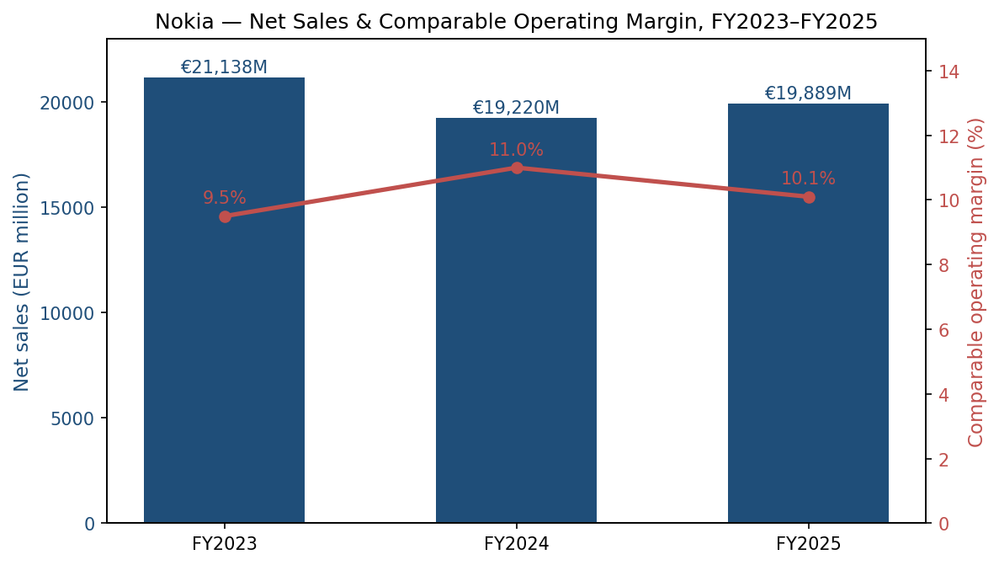
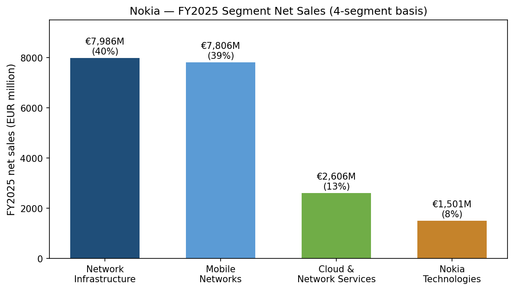
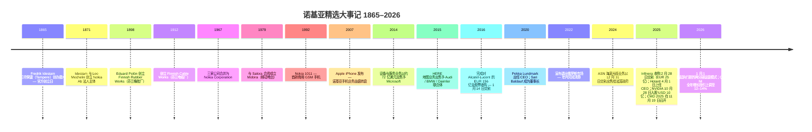
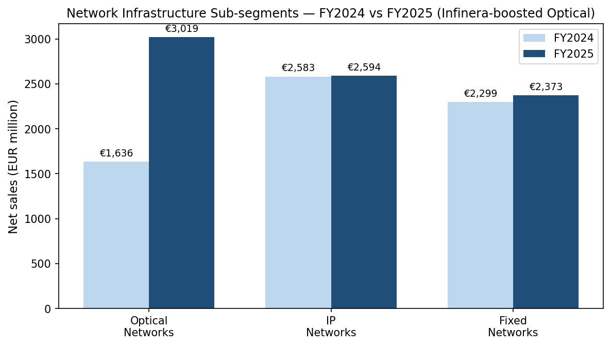
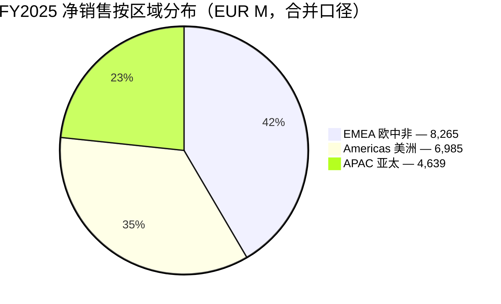
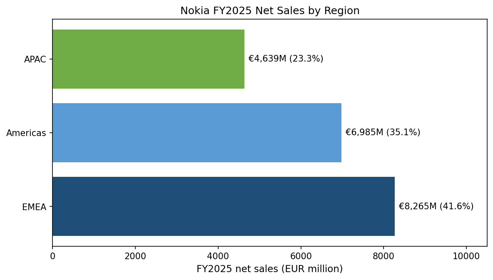

# 诺基亚公司 (Nokia Corporation) — 深度公司研究报告

**代码：** NYSE: NOK（ADR，与普通股 1:1 对应）· 赫尔辛基纳斯达克：NOKIA
**总部：** Karakaari 7, FI-02610 埃斯波（Espoo），芬兰
**注册地：** 芬兰共和国（企业代码 0112038-9）
**会计年度：** 12 月 31 日 · **报告币种：** 欧元（EUR）
**SEC CIK：** 0000924613 · **SEC 申报身份：** 境外私人发行人（提交 20-F）
**研究截至日：** 2026-05-28
**作者：** 股票研究 / financial-agent 项目

---

## 重要业绩指引变化（2026 年 Q1）

> **诺基亚在 2026 年 4 月 23 日的 Q1 中报中，将网络基础设施（Network Infrastructure, NI）2026 全年净销售增长指引上调至 12–14%**（高于 CMD 2025 提出的 "2025–28 年 6–8% CAGR" 框架），驱动力为人工智能 & 云客户（AI & Cloud customers）订单加速。Q1 数据中 AI & Cloud 客户收入同比 +49%，光网络（Optical Networks）同比 +20%。同时将 2026 年可比经营利润（comparable operating profit）指引上调至 **EUR 2.0–2.5 亿**（vs FY2025 实际约 EUR 2.0 亿）。来源：[Nokia Q1 2026 中报 PDF](https://www.nokia.com/system/files/2026-04/nokia_results_2026_q1.pdf); [Nokia Q1 2026 新闻稿](https://www.nokia.com/newsroom/nokia-corporation-interim-report-for-q1-2026/)。

---

## 目录

1. [公司概览](#1-公司概览)
2. [公司历史](#2-公司历史)
3. [管理团队](#3-管理团队)
4. [产品与服务](#4-产品与服务)
5. [客户与上市策略](#5-客户与上市策略)
6. [行业概览](#6-行业概览)
7. [竞争格局](#7-竞争格局)
8. [市场机会（TAM/SAM）](#8-市场机会)
9. [风险评估](#9-风险评估)
10. [参考资料](#10-参考资料)

---

## 1. 公司概览

诺基亚是芬兰的全球电信设备、IP / 光网络（IP/optical networking）及专利授权（patent licensing）集团，在 2025–26 年围绕 AI 基础设施（AI infrastructure）建设进行了重大重组。FY2025 净销售为 **EUR 19,889 百万**，可比经营利润约 **EUR 2.0 亿**，自由现金流（FCF）**EUR 1.5 亿**（[Nokia 2025 年报 PDF](https://www.nokia.com/system/files/2026-03/nokia-annual-report-2025.pdf); [Form 20-F, FY2025](https://www.sec.gov/Archives/edgar/data/924613/000162828026015034/nok-20251231.htm)）。报告经营利润（reported operating profit）为 EUR 885 百万（4.4% 经营利润率），其中包含 EUR 6 亿以上的 Infinera 收购相关摊销、重组及一次性费用；剔除上述项目后，可比口径中单位数（mid-single-digit）利润率的运行节奏未变（[20-F 第 68 页](https://www.sec.gov/Archives/edgar/data/924613/000162828026015034/nok-20251231.htm)）。2025 年末公司持有 **现金及计息投资 EUR 6.8 亿、净现金 EUR 3.4 亿、订单储备（order backlog）EUR 19.5 亿** — 资产负债表足以同时支撑 EUR 0.14/股的拟分派股息以及自 2023 年以来累计 EUR 16 亿的股票回购（[20-F 第 66–67 页](https://www.sec.gov/Archives/edgar/data/924613/000162828026015034/nok-20251231.htm)）。

*来源：[Nokia Form 20-F, FY2025](https://www.sec.gov/Archives/edgar/data/924613/000162828026015034/nok-20251231.htm)选定财务数据（pp. 66–67）。可比经营利润率属于非 IFRS 口径；FY2025 数值采用管理层公开口径约 EUR 2.0 亿可比经营利润 / EUR 19,889 百万净销售。*

FY2025（旧版）报告口径下，诺基亚分为四大事业群：**Network Infrastructure 网络基础设施**（NI，EUR 7,986 百万 / 40%）、**Mobile Networks 移动网络**（MN，EUR 7,806 百万 / 39%）、**Cloud and Network Services 云与网络服务**（CNS，EUR 2,606 百万 / 13%）、**Nokia Technologies 诺基亚科技 / IPR 授权**（NT，EUR 1,501 百万 / 8%）（[20-F 经营成果分析, pp. 72–75](https://www.sec.gov/Archives/edgar/data/924613/000162828026015034/nok-20251231.htm)）。自 **2026 年 1 月 1 日起**，11 月 19 日的资本市场日（Capital Markets Day, CMD）2025 将其精简为两大运营分部：**Network Infrastructure**（整合光、IP、固网及 Nokia Technologies）与 **Mobile Infrastructure 移动基础设施**（RAN、微波、FWA CPE、站点实施、托管服务）（[CMD 2025 战略新闻稿, 2025-11-19](https://www.nokia.com/newsroom/nokia-announces-new-strategy-evolution-of-its-operating-model-new-long-term-financial-target-strategic-kpis-and-changes-to-its-group-leadership-team/); [重述分部业绩公告](https://www.nokia.com/newsroom/nokia-provides-recast-comparative-segment-results-for-2025-and-2024-reflecting-new-operating-and-financial-reporting-structure/)）。这一重构具备战略含义：管理层将固网接入、IP 路由与光传送视为同一条数据平面（data-plane）业务，主要面向电信运营商、AI 超大规模云厂商（hyperscalers）与关键任务企业（mission-critical enterprise），而移动 RAN 被作为独立的、结构性低个位数增长业务来管理。

*来源：[20-F 注 2.2 分部净销售](https://www.sec.gov/Archives/edgar/data/924613/000162828026015034/nok-20251231.htm)。Network Infrastructure 内含 Optical EUR 3,019 百万、IP EUR 2,594 百万、Fixed EUR 2,373 百万。*

2025–26 年共有三起战略事件重塑了诺基亚的股票故事。第一，**2025 年 2 月 28 日**完成对 **Infinera** 的收购，购买对价 **EUR 25 亿**（现金 EUR 1,066 百万、承接可转债 EUR 785 百万、新发 127,434,986 份诺基亚 ADS 折合 EUR 584 百万、替代型股权激励 EUR 61 百万）。本次交易使诺基亚跃居 **全球光网络市场份额第二（约 20%）**，仅次于华为，超过北美以外市场的 Ciena（[20-F 注 6.2 收购事项, 第 185 页](https://www.sec.gov/Archives/edgar/data/924613/000162828026015034/nok-20251231.htm); [Dell'Oro — 2025 全球光传送市场达到 160 亿美元](https://www.delloro.com/news/optical-transport-market-grew-to-16-billion-in-2025/)）。第二，**2025 年 2 月 10 日**诺基亚宣布前 Intel 数据中心与 AI 事业部（Data Center & AI Group, DCAI）总裁、HPE HPC & AI 业务前总经理 **Justin Hotard** 出任公司新任 President 兼 CEO，并于 **2025 年 4 月 1 日**正式上任，接替 Pekka Lundmark（[Nokia 领导层换届新闻稿 2025-02-10](https://www.globenewswire.com/news-release/2025/02/10/3023164/0/en/Inside-information-Nokia-announces-a-leadership-transition-Justin-Hotard-appointed-as-successor-to-Pekka-Lundmark.html)）。第三，**2025 年 10 月 28 日**，**NVIDIA 以每股 USD 6.01 入股新发行的诺基亚普通股、合计认购 USD 10 亿**（占增发后股本约 2.9%），并与诺基亚达成多年 AI-RAN 战略合作，核心产品为 NVIDIA 的 **Aerial RAN Computer Pro (ARC-Pro)** 6G 就绪 GPU 加速基带，首启运营商为 T-Mobile US（[NVIDIA 投资者新闻稿 2025-10-28](https://investor.nvidia.com/news/press-release-details/2025/NVIDIA-and-Nokia-to-Pioneer-the-AI-Platform-for-6G--Powering-Americas-Return-to-Telecommunications-Leadership/default.aspx); [Nokia 6-K 申报](https://www.sec.gov/Archives/edgar/data/0000924613/000110465925103038/tm2529638d1_6k.htm)）。

**估值快照（2026 年 5 月 27 日）。** NYSE 收盘价约 **USD 16.46**，52 周区间 USD 4.00–16.625 — **过去 12 个月股价大致翻 4 倍**，NVIDIA 入股后市值升至 **约 USD 940 亿**，按 5,742,239,696 股普通股折算（[Yahoo Finance — NOK](https://finance.yahoo.com/quote/NOK/); [20-F 封面股数](https://www.sec.gov/Archives/edgar/data/924613/000162828026015034/nok-20251231.htm)）。按 FY2025 财务推算，对应 **~4.2× P/S 与 ~42× 可比 P/E** — Cisco 约 5× P/S 与 18× EPS，Ericsson 约 1.5× P/S 与 14× 可比经营利润 — 即市场当前以美股 AI 网络股估值法在给诺基亚定价，而不是按北欧电信设备公司估值法（[StockAnalysis — NOK](https://stockanalysis.com/stocks/nok/); [Ericsson Q1 2026 业绩简报 — Investing.com 综述](https://www.investing.com/news/company-news/ericsson-q1-2026-slides-organic-growth-offset-by-currency-headwinds-93CH-4619802)）。**分析师观点：** 当前估值已较充分反映 Infinera 整合、AI-RAN（2027 年底商用 GA）以及 Network Infrastructure 12–14% 增长指引的兑现；**估值收缩（multiple compression）是核心风险**，若 AI 订单出现波动或 Mobile Networks 利润率持续陷于低个位数，回撤幅度可能显著。

诺基亚在全球约 **130 个国家拥有员工 7.8 万人**：欧洲 33,000、印度 18,300、北美 10,000、大中华区 7,200，其余分布于拉美、中东与非洲及亚太其他地区（[20-F 第 5 页 "Our 2025 highlights"](https://www.sec.gov/Archives/edgar/data/924613/000162828026015034/nok-20251231.htm)）。FY2025 研发投入 **EUR 4,855 百万（占净销售 24.4%）**，属于行业顶级强度，支撑诺基亚贝尔实验室（Nokia Bell Labs）、FP 系列 IP 路由芯片、PSE-6s 相干 DSP（coherent DSP），以及在 Next G Alliance、Hexa-X-II、6G-ANNA 等 6G 联盟中的牵头地位（[20-F 第 21 页](https://www.sec.gov/Archives/edgar/data/924613/000162828026015034/nok-20251231.htm)）。

---

## 2. 公司历史

诺基亚的创立日是 **1865 年 5 月 12 日** — 当日采矿工程师 **Fredrik Idestam**（弗雷德里克·伊德斯坦）获得芬兰参议院特许，在当时属俄罗斯大公国管辖的芬兰坦佩雷（Tampere）Tammerkoski 急流上修建磨木浆厂（[Wikipedia — Fredrik Idestam](https://en.wikipedia.org/wiki/Fredrik_Idestam); [20-F 第 6 页 — 160 周年](https://www.sec.gov/Archives/edgar/data/924613/000162828026015034/nok-20251231.htm)）。**1868 年**他在水力条件更佳的诺基亚镇（Nokia 镇）旁开设第二家工厂；**1871 年**伊德斯坦与挚友、后任芬兰参议员 **Leo Mechelin** 共同成立 **Nokia Ab** 法人主体（[Wikipedia — History of Nokia](https://en.wikipedia.org/wiki/History_of_Nokia)）。如今的诺基亚集团由三条历史业务并轨而成 — 纸浆 / 造纸（1865）、橡胶（Eduard Polón 创立 Finnish Rubber Works, 1898）、电缆（Finnish Cable Works, 1912） — **1967 年三家公司合并组成现今的 Nokia Corporation**。电子部门在 1960 年代起步，**DX 200 数字程控交换机**（1970 年代）与 **Nokia 1011**（1992 年首款商用 GSM 手机）是诺基亚跻身全球电信龙头的两个关键节点（[History of Nokia](https://en.wikipedia.org/wiki/History_of_Nokia)）。

手机时代以 **2014 年 4 月 Microsoft 以约 72 亿美元收购 Nokia Devices & Services 业务**为终结。20-F 仍带有当年税务赔偿条款的剩余尾巴 — "*we are required to indemnify Microsoft for certain pre-closing tax matters … acquired by Microsoft in connection with the closing of the sale [of the Devices & Services business]*" — 提示该业务的法律影响延续至今（[20-F 税务赔偿注释, 约 p. 108](https://www.sec.gov/Archives/edgar/data/924613/000162828026015034/nok-20251231.htm)）。**HERE 地图于 2015 年 12 月**出售给 Audi / BMW / Daimler 三家德系车厂联合体；**2016 年 1 月 14 日**对 Alcatel-Lucent（阿尔卡特朗讯）的 EUR 156 亿全股票收购正式交割，2016 年 11 月 3 日 ALU 品牌正式退出，诺基亚由此成为全栈电信网络厂商（[History of Nokia](https://en.wikipedia.org/wiki/History_of_Nokia); [20-F 词汇表 — Alcatel-Lucent 条目, 第 193 页](https://www.sec.gov/Archives/edgar/data/924613/000162828026015034/nok-20251231.htm)）。

2022–25 年公司经历了再次战略重切。**2022 年 4 月 12 日**诺基亚宣布退出俄罗斯市场（"*less than 2% of our net sales in 2021*"），并于年内完成清算（[Light Reading — Nokia 退出俄罗斯](https://www.lightreading.com/regulatory-politics/nokia-to-exit-russia-as-huawei-reportedly-stops-work)）。**2024 年 Q4** 诺基亚行使看涨期权（call option），从中国华信手中收购上海贝尔约 50% 股权，将其变更为全资子公司。**2024 年 12 月 31 日**完成对 **Alcatel Submarine Networks (ASN)** 的出售（买方为法国政府），仅保留 20% 待退出股权 — 这标志着诺基亚退出经营 30 余年的海底光缆业务（[Nokia ASN 交割新闻稿, 2025-01-03](https://www.globenewswire.com/news-release/2025/01/03/3004037/0/en/Nokia-completes-its-sale-of-leading-submarine-networks-business-ASN-Alcatel-Submarine-Networks-to-the-French-State.html)）。继 ALU 之后规模最大的并购于 **2025 年 2 月 28 日**到来 — **以 EUR 25 亿收购 Infinera**，光网络分部净销售直接翻倍（FY2024 EUR 1,636 百万 → FY2025 EUR 3,019 百万），并使诺基亚获得位于美国加州 Sunnyvale 的 **磷化铟（Indium Phosphide, InP）光子集成电路（Photonic Integrated Circuit, PIC）晶圆厂**及宾州 Allentown 光子封测厂（[20-F 注 6.2 收购, 第 185 页](https://www.sec.gov/Archives/edgar/data/924613/000162828026015034/nok-20251231.htm); [Nokia Infinera 交割新闻稿 2025-02-28](https://www.nokia.com/newsroom/nokia-completes-acquisition-of-infinera-to-create-innovation-powerhouse-in-optical-networks-with-the-scale-to-power-the-data-center-revolution/)）。

2025 年的战略重启在 **11 月 19 日纽约 CMD 2025** 上正式公开 — 自 2026 年 1 月 1 日起将五个事业群合并为两个运营分部，**为继 Alcatel-Lucent 整合以来最大规模的组织重构**，并设定 2028 年可比经营利润目标 **EUR 27–32 亿**（vs FY2025 约 EUR 20 亿）（[Nokia CMD 2025 战略新闻稿](https://www.nokia.com/newsroom/nokia-announces-new-strategy-evolution-of-its-operating-model-new-long-term-financial-target-strategic-kpis-and-changes-to-its-group-leadership-team/); [Capacity Media — 多年来最大组织重构](https://capacityglobal.com/news/nokia-announces-biggest-organisational-overhaul-in-years/)）。2025 年同时是 **诺基亚 160 周年与诺基亚贝尔实验室 100 周年** — 这一巧合被管理层在 2025 年报 CEO 访谈中反复强调（[20-F 第 6 页](https://www.sec.gov/Archives/edgar/data/924613/000162828026015034/nok-20251231.htm)）。

---

## 3. 管理团队

### 创始人 — Fredrik Idestam（1838–1916）

Fredrik Idestam 是芬兰采矿工程师，曾就读于德国 **汉诺威工业学院（Hannover Polytechnic Institute）**，在德国造纸厂工作数年后回到芬兰。1865 年 5 月 12 日他获得芬兰参议院特许，在坦佩雷 Tammerkoski 急流处兴建第一家磨木浆厂 — 此日被诺基亚正式作为创立日。1868 年在诺基亚镇旁的 Emäkoski 河畔开设第二厂；1871 年与挚友、后任参议员 **Leo Mechelin**（莱奥·梅切林，芬兰自治运动的关键政治家）共同成立 **Nokia Ab** 法人合并两厂经营。Idestam 自 **1896 年退休**后由 Mechelin 接掌，后者将公司扩张至电力发电 — 这是后续橡胶与电缆事业群得以并入诺基亚、于 1967 年组建现代集团的物质基础。Idestam 不持有任何按今日意义可比的股权，他在现代公开 Nokia 中的角色为纯粹历史人物（[Wikipedia — Fredrik Idestam](https://en.wikipedia.org/wiki/Fredrik_Idestam); [History of Nokia](https://en.wikipedia.org/wiki/History_of_Nokia)）。

### 现任 CEO — Justin Hotard（自 2025 年 4 月 1 日）

**Justin Hotard** 于 **2025 年 2 月 10 日**被宣布为诺基亚新任 President 兼 CEO，并于 **2025 年 4 月 1 日**正式上任，接替 Pekka Lundmark（[Nokia 领导层换届新闻稿](https://www.globenewswire.com/news-release/2025/02/10/3023164/0/en/Inside-information-Nokia-announces-a-leadership-transition-Justin-Hotard-appointed-as-successor-to-Pekka-Lundmark.html)）。Hotard 直接从 **Intel** 跳槽而来，在 Intel 担任 **EVP 兼 Data Center & AI Group (DCAI) 总经理** — 即 Intel 服务器 CPU 与 AI 加速器业务的负责人，规模达数百亿美元，并主导 Gaudi AI 加速器的量产爬坡（[Justin Hotard — Nokia 领导层页面](https://www.nokia.com/we-are-nokia/leadership-and-governance/group-leadership-team/justin-hotard/)）。

加入 Intel 之前，Hotard 在 **Hewlett Packard Enterprise（HPE）任职 9 年（2015–2024）**，离任前的职位为 **EVP 兼 HPC（高性能计算）、AI & Labs 总经理**。按诺基亚官方简历的措辞：他 "*delivered the world's first exascale supercomputer for the US Department of Energy*" — 即美国能源部橡树岭国家实验室的 Frontier 百亿亿次（exascale）超级计算机。再往前为 **NCR Corporation** 与 **Symbol Technologies** 的多个领导岗位；职业起点为 **Motorola** 的工程师，"deploying mobile networks for US carriers" — 这是其简历上唯一的传统电信厂商经历（[20-F 第 6 页 CEO 访谈](https://www.sec.gov/Archives/edgar/data/924613/000162828026015034/nok-20251231.htm); [Nokia 简历页](https://www.nokia.com/we-are-nokia/leadership-and-governance/group-leadership-team/justin-hotard/)）。Hotard 拥有伊利诺伊大学香槟分校（UIUC）电子工程学士学位，及西北大学凯洛格商学院（Northwestern Kellogg）MBA。

聘任一位数据中心与 AI 业务出身（而非传统电信老兵）担纲诺基亚 CEO 的战略意图毋庸置疑。在 CMD 2025 上，Hotard 将诺基亚的使命定义为 "*connecting intelligence and accelerating value creation for our customers and investors*"，并提出五条战略优先级 — "*accelerating growth in AI & Cloud; leading in AI-native networks and 6G; growing through co-innovation; deploying capital where we differentiate; and unlocking sustainable returns*"（[20-F 第 8 页](https://www.sec.gov/Archives/edgar/data/924613/000162828026015034/nok-20251231.htm); [Nokia CMD 2025 战略新闻稿](https://www.nokia.com/newsroom/nokia-announces-new-strategy-evolution-of-its-operating-model-new-long-term-financial-target-strategic-kpis-and-changes-to-its-group-leadership-team/)）。其短期激励目标（STI target）为基本工资的 125%（与前任结构一致），按到任时间比例发放。上任仅 7 个月，Hotard 即完成 NVIDIA 入股 + AI-RAN 战略合作的谈判 — 这一交易令诺基亚股价重估约 4 倍，**可以认为传统电信背景的 CEO 难以推动此类交易达成**。

---

## 4. 产品与服务

本章是整份报告中最核心的一章。诺基亚的产品组合横跨三个大型可寻址市场（移动 RAN、光 / IP 网络、专利授权），管理层在 "投资" 与 "收割" 上的取舍直接决定未来五年的股票故事。FY2025 仍按旧版四分部口径披露；**自 2026 年 1 月 1 日起**改为两分部口径，是 2026 财年起的建模口径。

### 4.1 Network Infrastructure 网络基础设施（FY2025 EUR 7,986 百万，~40%）

NI 是 FY2025 主要增长引擎，**同比 +23%**，几乎全部由 Infinera 并表驱动。20-F 原文披露细分项：*"In 2025, net sales include Optical Networks net sales of EUR 3,019 million, IP Networks net sales of EUR 2,594 million and Fixed Networks net sales of EUR 2,373 million"*（[20-F 第 72 页](https://www.sec.gov/Archives/edgar/data/924613/000162828026015034/nok-20251231.htm)）。NI 经营利润率 9.8%（vs 上年 11.7%）反映了 Infinera 并表当年约 120 个基点的拖累。

*来源：[20-F 第 72 页](https://www.sec.gov/Archives/edgar/data/924613/000162828026015034/nok-20251231.htm)。光网络由 Infinera（2025-02-28 起并表）显著拉升。*

```mermaid
graph TD
    诺基亚集团 --> NI[Network Infrastructure<br>EUR 7,986M]
    诺基亚集团 --> MN[Mobile Networks<br>EUR 7,806M]
    诺基亚集团 --> CNS[Cloud and Network Services<br>EUR 2,606M]
    诺基亚集团 --> NT[Nokia Technologies / IPR<br>EUR 1,501M]
    NI --> Opt[光网络 Optical Networks<br>EUR 3,019M]
    NI --> IP[IP 网络<br>EUR 2,594M]
    NI --> Fx[固网 Fixed Networks<br>EUR 2,373M]
    Opt --> PSE6s[Nokia PSE-6s 相干 DSP<br>1.2 Tbps 超级信道]
    Opt --> ICE7[Infinera ICE7<br>1.2 Tbps 引擎、InP PIC 自研晶圆厂]
    Opt --> P1830[1830 PSS 光交换平台]
    Opt --> GX[GX 系列 / ICE-X 子系统]
    IP --> FP5[FP5 6.0 Tb/s 路由芯片]
    IP --> R7750[7750 SR 服务路由器]
    IP --> R7250[7250 IXR 互联路由器]
    IP --> R7220[7220 IXR H6 — Broadcom Tomahawk 6]
    IP --> EDA[SR Linux NOS + EDA 平台]
    Fx --> LightspanFX[Lightspan FX OLT — GPON / XGS-PON / Multi-PON]
    Fx --> LightspanMF[Lightspan MF — 25G / 50G / 100G PON]
    MN --> AirScale[AirScale RAN 基带 + 射频]
    MN --> Habrok[Habrok Massive MIMO 32 / 64 TRX]
    MN --> Levante[Levante 基带卡]
    MN --> ARC[NVIDIA ARC-Pro AI-RAN]
    CNS --> Core[5G 核心 / IMS / SDM]
    CNS --> ANF[Autonomous Network Fabric 自治网络架构]
    CNS --> NetGuard[NetGuard Telco XDR 电信安全]
    CNS --> DAC[Private Wireless 专网无线 — DAC]
    NT --> Patents[26,000+ 专利族<br>8,000+ 5G 标准必要专利]
```

**光网络（Optical Networks）— EUR 3,019 百万，同比 +85%**。诺基亚 + Infinera 合并平台位列 **全球第二、约 20% 份额**，仅次于华为，超过北美以外市场的 Ciena（[Dell'Oro — 2025 光传送达 USD 160 亿](https://www.delloro.com/news/optical-transport-market-grew-to-16-billion-in-2025/); [Fierce Network — 光传送 2025](https://www.fierce-network.com/broadband/delloro-optical-transport-revenue-hit-16b-2025-fueled-hyperscalers-neoclouds)）。诺基亚原有平台核心为 **PSE-6s 相干 DSP**，产品页原文：*"PSE-6s is designed to support 1.2-Tbps superchannel transmission – or 2.4 Tbps when two PSE-6s chips are linked together … deliver up to 140 GBaud and 1.2 Tb/s per wavelength … supports both shaped 16QAM and 64QAM modulation … the industry's only third-generation probabilistic constellation shaping (PCS) … 5 nm finFET CMOS process … 60 per cent less power than Nokia's existing coherent technology … can send 800 GbE over 2,000 km and 1.2 terabits over 100 km"*（[Nokia PSE-6s 产品页](https://www.nokia.com/optical-networks/pse-6s/)）。该 DSP 搭载于 **1830 PSS（Photonic Service Switch 光子服务交换机）**平台，并为面向超大规模云厂商 DCI 链路的 800ZR / ZR+ 光模块提供动力。**中文释义 / Plain-language gloss：** 相干 DSP（coherent DSP）是把信号编码为振幅 + 相位组合、使单根光纤可承载 1.2 Tbps 的关键芯片；同时提升符号率（baud）并降低单 bit 功耗，是降低超大规模云厂商跨数据中心成本最重要的杠杆。

Infinera 部分新增 **ICE7 1.2 Tbps 引擎**，产品页：*"ICE7 1.2 Tbps uses Infinera's vertically integrated ICTR140 TROSA and a custom-designed digital signal processor (DSP) optimised for high-baud rate transmission … leveraging Infinera's U.S.-based, in-house indium phosphide (InP) fab, based on monolithically integrated photonic integrated circuits (PICs) … reduce cost per bit by as much as 30% and power per bit by as much as 60% … symbol rates of up to 148 Gbaud"*（[Nokia ICE7 产品页](https://www.nokia.com/optical-networks/ice7/)）。位于美国加州 **Sunnyvale 的 InP PIC 自研晶圆厂**（2,300 m²）与宾州 Allentown 的封测厂（2,400 m²）是本次交易的战略硬实力 — 诺基亚由此成为西方少数掌握单片 PIC 制造的光厂商之一，相对纯第三方代工的同业具有供应安全优势。**2026 年 2 月**诺基亚买下此前租赁的 San Jose 设施筹建 **化合物半导体晶圆厂**，预计 2027 年投产，部分由美国 CHIPS 法案 **USD 4,000 万**直接资助（总承诺 USD 9,300 万）（[20-F 第 25 页 — 物业 & CHIPS Act 资助](https://www.sec.gov/Archives/edgar/data/924613/000162828026015034/nok-20251231.htm)）。InP 晶圆厂 + CHIPS Act 资助同时构成关税对冲：诺基亚可将光设备列为美国本土制造，这在 2025–26 年特朗普 2.0 关税体制下意义重大。

**IP 网络（IP Networks）— EUR 2,594 百万，同比基本持平**。按 Dell'Oro Q3'25 排名，诺基亚为 **全球 IP 边缘路由（IP edge routing）份额第一**。硬件以 **FP5** 自研网络处理器（NPU）为核心。产品页原文：*"FP5 is Nokia's next generation of the industry's leading IP routing silicon network processor … Powered by Nokia FP5 6.0 Tb/s (HD) routing silicon with support for 800GE, 400GE, 100GE, 50GE, 40GE, 25GE, 10GE and 1GE interfaces … a 75% reduction in energy consumption and a 3X increase in capacity with FP5 compared to FP4 … FP5 is fully backwards compatible with FP4 … allowing operators to mix FP4 and FP5 hardware at line rate in the same chassis"*（[Nokia FP5 产品页](https://www.nokia.com/ip-networks/fp-network-processor-technology/fp5/)）。承载平台包括 **7750 SR 服务路由器**（产品页：*"scalable 2.4 Tb/s FD to 216 Tb/s FD"*，[7750 SR 页](https://www.nokia.com/ip-networks/7750-service-router/)）、**7250 IXR 互联路由器**（*"high-density 1RU up to 25.6 Tb/s, 800GE/400GE/100GE"*）以及 **7950 XRS** 核心路由系列。面向数据中心 / AI 后端网络（back-end network）的旗舰产品是 **7220 IXR H6** — 2025 年发布，*"powered by Broadcom's Tomahawk 6 chipset"* — 这是诺基亚切入商用芯片（merchant silicon）数据中心网络（DCN）插槽的尝试（[20-F 第 6 页](https://www.sec.gov/Archives/edgar/data/924613/000162828026015034/nok-20251231.htm)）。编排层由 **SR Linux NOS**（诺基亚开源数据中心网络操作系统）与 **Event-Driven Automation (EDA) 事件驱动自动化** 平台组合 — EDA 于 **2024 年 9 月 17 日**发布，诺基亚定义为：*"the industry's most modern data center automation platform … built on Kubernetes to bring highly reliable, simplified, and adaptable lifecycle management to data center networks … integrated GenAI and agentic AI capabilities take data center network operations beyond conversation, into sensing, thinking, and acting"*（[Nokia EDA 发布稿](https://www.nokia.com/about-us/news/releases/2024/09/17/nokia-launches-industrys-most-modern-data-center-automation-platform-built-for-the-ai-era/)）。EDA 是相对 Cisco Nexus Dashboard 与 Arista CloudVision 的多厂商差异化优势，也是云厂商将诺基亚加入合格供应商名单（AVL）最常引用的理由。

**固网（Fixed Networks）— EUR 2,373 百万，同比 +3%**。诺基亚宽带接入业务保持 **"全球 xPON OLT 份额连续 6 年第一"**（Dell'Oro 排名）（[20-F 第 22 页](https://www.sec.gov/Archives/edgar/data/924613/000162828026015034/nok-20251231.htm)）。两大平台为：**Lightspan FX**，产品页：*"supports high-density GPON, XGS-PON, Multi-PON, TWDM-PON and point-to-point. The platform features a non-blocking, high-capacity backplane of 2 x 100 Gb/s per slot"*（[Lightspan FX 页](https://www.nokia.com/broadband-access/lightspan-fx/)）；**Lightspan MF**，*"the industry's highest capacity OLT solution designed for 25G PON, 50G PON, and 100G PON fiber broadband services … based on the Nokia Quillion chipset"*（[Lightspan MF 页](https://www.nokia.com/fixed-networks/lightspan-mf/)）。该子分部最重要的客户胜出是 **2024 年 9 月 AT&T 五年期 Lightspan MF + Altiplano 的合规于 Build America Buy America 法规的合同**，延长诺基亚在 AT&T 的部署至本世纪 20 年代末（[Nokia–AT&T 光纤新闻稿](https://www.nokia.com/newsroom/nokia-signs-strategic-deal-with-att-to-accelerate-future-ready-fiber-broadband-growth/); [Fierce Network 报道](https://www.fierce-network.com/broadband/att-extends-olive-branch-nokia-new-fiber-contract)）。

**海底光缆（Alcatel Submarine Networks, ASN）— 已剥离（2024-12-31）**。任何引用 ASN 的论点皆已过时。20-F 明确：*"On 27 June 2024, Nokia announced it had entered into a put option agreement to sell its wholly owned subsidiary Alcatel Submarine Networks (ASN) to the French State. … The sale was completed on 31 December 2024"*（[20-F 第 71 页](https://www.sec.gov/Archives/edgar/data/924613/000162828026015034/nok-20251231.htm); [Nokia ASN 交割新闻稿](https://www.globenewswire.com/news-release/2025/01/03/3004037/0/en/Nokia-completes-its-sale-of-leading-submarine-networks-business-ASN-Alcatel-Submarine-Networks-to-the-French-State.html)）。诺基亚仍持有 20% 待退出股权。ASN 在 FY2024 报表中作为已终止经营列示。

### 4.2 Mobile Networks 移动网络（FY2025 EUR 7,806 百万，~39%）

Mobile Networks 同比 **-4%**，经营利润率压缩至 2.8%（vs 上年 5.5%）— 集团 P&L 中最弱的一段，受全球 RAN 周期下行与 AT&T 多年份额下滑双重影响。20-F 原文描述：*"Mobile Networks' portfolio included products for radio access networks (RAN) and microwave radio for transport, network management and a range of associated services"*（[20-F 第 13 页](https://www.sec.gov/Archives/edgar/data/924613/000162828026015034/nok-20251231.htm)）。

**AirScale RAN** 平台基于诺基亚自研 **ReefShark SoC**（系统级芯片），既驱动射频也驱动基带卡。最新一代 Massive MIMO 射频家族 **Habrok**（2023 MWC 发布）描述：*"Habrok is Nokia's latest generation of cutting-edge AirScale massive MIMO radios … in both 32 TRX (Habrok 32) and 64 TRX (Habrok 64) versions. Habrok radios are smaller and lighter than previous products"*（[Nokia Habrok 新闻稿](https://www.nokia.com/newsroom/nokia-redefines-massive-mimo-radio-performance-with-the-launch-of-habrok-its-latest-generation-of-airscale-5g-radios-powered-by-reefshark-mwc23/)）。配套基带卡 **Levante**：*"is a 4G/5G capacity card that delivers ultra-performance, doubles the number of supported Massive MIMO cells, and reduces energy consumption by up to 60 percent"*。2025 年加入新一代 5G-Advanced 基带 **Lodos**。**中文释义 / Plain-language gloss：** Massive MIMO（多输入多输出大规模天线阵列）— 基站采用 32 / 64 根天线对手机定向波束（beam-forming）发送信号，相比早期 4G 基站使每个小区的容量提升 4–8 倍；Habrok 64 是当前美、欧、日中频段 5G 部署的主力射频。

2025 年的关键战略变化是 **anyRAN** 概念。诺基亚定义为：*"Nokia anyRAN is an approach that provides the widest choice of strategic options for RAN evolution and enables selecting multiple suppliers for both vertical and horizontal layers of RAN"*（[Nokia anyRAN 页](https://www.nokia.com/mobile-networks/ran/anyran/)）。它涵盖专用 AirScale RAN、Cloud RAN（在 COTS x86 或 ARM 服务器上跑 RAN）、以及 Open RAN（多厂商解耦 RAN）。最终汇聚点为 **基于 NVIDIA ARC-Pro 的 AI-RAN**。20-F 原文：*"we leverage the NVIDIA ARC-Pro accelerated computing platform to evolve our Cloud RAN into a Cloud AI-RAN solution, and in our AirScale RAN solutions. The upcoming AI-RAN capacity plug-in unit for Nokia AirScale baseband will be optimized for AI-native traffic"*（[20-F 约 p. 17](https://www.sec.gov/Archives/edgar/data/924613/000162828026015034/nok-20251231.htm)）。T-Mobile US 是试点运营商；外场测试 2026 年初开始，**商用 GA 在 2027 年底**。2025 年末 KPI：**408 项 5G 商用合同、>1,000 个专网无线（private wireless）客户**，全球 RAN 份额第 3（Dell'Oro / Omdia）（[20-F 第 22 页](https://www.sec.gov/Archives/edgar/data/924613/000162828026015034/nok-20251231.htm)）。

### 4.3 Cloud and Network Services 云与网络服务（FY2025 EUR 2,606 百万，~13%）

CNS 同比基本持平，经营利润率扩张至 13.0%（vs 上年 8.0%），主要由 5G 核心网赢单驱动经营杠杆。20-F 描述：*"Cloud and Network Services' portfolio includes Core Network software, which is made up of voice core, packet core, subscriber data management, and signaling and policy software for telecommunication providers. The CNS portfolio also includes Autonomous Network software which is made up of a software fabric (called Autonomous Network Fabric) that supports digital operations, analytics and AI, and security software"*（[20-F 第 12 页](https://www.sec.gov/Archives/edgar/data/924613/000162828026015034/nok-20251231.htm)）。Omdia 数据：诺基亚 5G 独立组网（5G Standalone, 5G SA）核心网已部署于 **全球 65% 的电信运营商 5G SA 网络**。2025 年最受关注的赢单是 **乐天移动（Rakuten Mobile）在 Rakuten Cloud 上的全云原生上线** — 包括 IMS、SDM、Cloud Signaling Director、Mediation 与 NetGuard Certificate Manager（[Rakuten 新闻稿](https://symphony.rakuten.com/newsroom/nokias-ims-and-sdm-cloud-native-core-powering-rakuten-mobile-4g-and-5g-core-now-live-on-rakuten-cloud)）。

**Private Wireless 专网无线**业务基于 **Nokia DAC（Digital Automation Cloud 数字自动化云）**平台，目前服务 **180+ 企业级客户**（按 20-F 较宽口径含历史工业项目可达 1,000+），名单包括 **Lufthansa Technik 汉莎技术**（汉堡发动机大修虚拟检测）、**Sandvik Mining 山特维克采矿**（坦佩雷试验矿场自动化 4K 视频采矿）、**Deutsche Bahn 德国铁路**、**Toyota**、**Memphis Light, Gas and Water**（2025 年 7 月 5G 用于电网现代化）（[Nokia–Lufthansa Technik 新闻稿](https://www.nokia.com/newsroom/nokia-5g-private-wireless-networking-moves-from-trial-to-permanent-deployment-for-lufthansa-technik/); [Memphis 公用事业新闻稿](https://www.nokia.com/about-us/news/releases/2025/07/14/nokia-to-deploy-private-5g-network-for-memphis-light-gas-and-waters-grid-modernization-initiative/)）。安全业务核心产品为 **NetGuard Cybersecurity Dome**（电信 XDR）。

### 4.4 Nokia Technologies / IPR 专利授权（FY2025 EUR 1,501 百万，~8%，经营利润率 70.6%）

诺基亚科技是专利授权业务，也是集团利润率最高的分部。20-F 披露：*"Nokia has led wireless and multimedia innovation for over 30 years, building one of the industry's largest high-quality patent portfolios with more than 26,000 families, including over 8,000 essential to 5G … We have secured annual contracted recurring revenue of over EUR 800 million through 2030 … Our licensing programs in our expansion areas of automotive, consumer electronics, IoT and multimedia now contribute an annual revenue run-rate of more than EUR 200 million"*（[20-F 第 13 页](https://www.sec.gov/Archives/edgar/data/924613/000162828026015034/nok-20251231.htm)）。FY2025 净销售 EUR 1,501 百万同比 -22%，主要因 2024 年存在追溯支付：*"The decline in Nokia Technologies net sales was primarily due to more than EUR 400 million catch-up net sales recognized in 2024, partially offset by new multimedia deals signed in 2025"*（[20-F 第 75 页](https://www.sec.gov/Archives/edgar/data/924613/000162828026015034/nok-20251231.htm)）。CEO Hotard 在 CEO 访谈中确认：*"Nokia Technologies executed well with a slight increase in our contracted net sales run-rate to EUR 1.4 billion and delivered net sales of EUR 1.5 billion with strong profitability and cash generation"*（[20-F 第 7 页](https://www.sec.gov/Archives/edgar/data/924613/000162828026015034/nok-20251231.htm)）。

智能手机授权续约周期 **于 2024 年 2 月宣告完成**，诺基亚原文：*"In addition to license agreements signed with Apple and Samsung in 2023, and Huawei in December 2022, Nokia Technologies announced agreements with Honor, OPPO and vivo, among others at the beginning of 2024 … Q1 net sales are expected to benefit from significant catch-up net sales in excess of EUR 400 million related to prior periods of non-payment"*（[Nokia 智能手机授权续约新闻稿, 2024-02-08](https://www.globenewswire.com/news-release/2024/02/08/2826094/0/en/Inside-information-Nokia-concludes-smartphone-patent-license-renewal-cycle.html)）。已确认主要被许可人：Apple、Samsung、Huawei、OPPO（含 OnePlus 与 realme）、vivo、Xiaomi、Honor。20-F 中点名的最新多媒体被许可方为 **Amazon（2025 年 3 月）**：*"In 2023, Nokia commenced patent infringement proceedings against Amazon in several countries in relation to patents covering video-related technologies implemented in Amazon's services and devices. In March 2025, Nokia announced it had signed a patent agreement with Amazon. The agreement resolves all pending patent litigation between the parties"*（[20-F 注 6.1 法律事项, 第 184 页](https://www.sec.gov/Archives/edgar/data/924613/000162828026015034/nok-20251231.htm)）。其他在 20-F 一般描述中点名的被许可方：Lenovo、Mercedes-Benz（[20-F 第 24 页](https://www.sec.gov/Archives/edgar/data/924613/000162828026015034/nok-20251231.htm)）。在德国针对 Acer、Asus、Hisense 的视频编解码专利诉讼仍在进行中。

### 4.5 贝尔实验室与产品循环

**Nokia Bell Labs 诺基亚贝尔实验室**于 2025 年迎来 100 周年，总部位于美国新泽西州 Murray Hill — 是诺基亚 IP / 光网络 / RAN / 6G 的统一研究底座。20-F 描述 2025 年研究亮点：*"Physical AI — models that can interpret a physical scene in real-time … Space communications — In March 2025, in collaboration with NASA, Intuitive Machines and Lunar Outpost, we deployed the first cellular network on the Moon. … AI-native networks and 6G — collaborations with Qualcomm Technologies, Rohde & Schwarz, KDDI Research"*（[20-F 第 21 页](https://www.sec.gov/Archives/edgar/data/924613/000162828026015034/nok-20251231.htm)）。自 2000 年累计研发投入 **约 EUR 1,600 亿**；2025 年 9 月诺基亚开放位于芬兰 **Oulu 奥卢的新 5G / 6G 校园**，容纳 3,000 名员工。

**产品循环综合解读。** 把诺基亚的各产品族映射到客户工作流后，新战略就变得清晰：一端是 **移动 RAN**（AirScale + ARC-Pro），把手机与终端连接到接入边缘；另一端是 **光网络（PSE-6s + ICE7）**与 **IP 网络（FP5）**，在数据中心之间、长途光纤上承载比特流；中间是 **CNS** 把比特流转化为电信服务（5G Core / IMS）或企业服务（专网无线 DAC）；横向覆盖之上是 **Nokia Technologies** 专利组合，向任何使用上述网络技术的标准合规设备征税。2026 年 1 月 1 日的分部重切只是给这个图景加上新的财务标签 — NI（光 + IP + 固网 + Tech）= 面向超大规模云厂商与电信运营商的 AI 数据架构故事；MI（RAN + 微波 + Managed Services）= 周期性、增长较慢的通信服务运营商业务。这个转向是有事实依据的，因为底层客户结构正在切换：FY2025 **AI & Cloud + 关键任务企业与国防客户净销售达 EUR 3,085 百万，同比 +42%**；Q1 2026 进一步看到 AI & Cloud 客户收入 +49%、季度增量订单 EUR 10 亿（[20-F 注 2.1, 第 135 页](https://www.sec.gov/Archives/edgar/data/924613/000162828026015034/nok-20251231.htm); [Nokia Q1 2026 中报 PDF](https://www.nokia.com/system/files/2026-04/nokia_results_2026_q1.pdf)）。

---

## 5. 客户与上市策略

### 客户集中度披露（集团层级）

20-F 的客户集中度披露明确，且相对同业风险较低。**注 2.1 — 净销售**（第 139 页）原文：*"Major customers — In 2025, 2024 and 2023 no single customer represented more than 10% of net sales"*（[20-F 第 139 页](https://www.sec.gov/Archives/edgar/data/924613/000162828026015034/nok-20251231.htm)）。**适用口径为合并集团口径（consolidated）**。诺基亚未公开前五大客户合计金额 — 仅披露 "无单一客户超过 10%" 一项规定 + 以下按客户类型的细分。

### FY2023–FY2025 按客户类型净销售（EUR M，合并口径）

| 客户类型（分母：集团合计） | FY2025 | FY2024 | FY2023 | FY2025 占比 |
|---|---|---|---|---|
| 电信运营商 Telecom providers | 15,313 | 15,085 | 17,652 | 77.0% |
| **AI & Cloud + 关键任务企业与国防（MCE&D）** | **3,085** | 2,180 | 2,282 | **15.5%** |
| 被许可人 Licensees（Nokia Technologies） | 1,501 | 1,928 | 1,085 | 7.5% |
| 其他 / 抵销 | (10) | 27 | 119 | — |
| **合计** | **19,889** | **19,220** | **21,138** | 100% |

*来源：[20-F 注 2.1, 第 135 页](https://www.sec.gov/Archives/edgar/data/924613/000162828026015034/nok-20251231.htm)。所有数字均为**合并集团口径**，非分部口径。AI & Cloud + MCE&D 同比 +42% — 这正是支撑诺基亚股票故事的结构性 mix shift。*

### 20-F 中点名的客户

20-F 中仅以叙述方式点名个别客户，未披露百分比。原文引用：**T-Mobile US** 被点名为 *"our largest US customer"*，且是 *"an active participant in the partnership, using it to drive and test AI-RAN technologies and use cases"*（[20-F 第 16 页](https://www.sec.gov/Archives/edgar/data/924613/000162828026015034/nok-20251231.htm)）。其他被点名的 NVIDIA 合作试点运营商：**SoftBank**（日本）、**Indosat Ooredoo Hutchison**（印度尼西亚）、**KDDI**（日本）。其他被点名的合作方：**Rakuten Mobile**（云原生核心网上线）、**Red Hat**（核心网软件云平台）、**Broadcom**（7220 IXR H6 内 Tomahawk 6 芯片）、**Qualcomm Technologies**（贝尔实验室无线 AI 多厂商合作）、**Rohde & Schwarz**（6G 射频接收机）、**NASA / Intuitive Machines / Lunar Outpost**（月球蜂窝网络）。

### 20-F 之外近 12 个月客户胜负（公开渠道）

Q1 2026 中报披露 "AI & Cloud 客户" 季度新增订单 **EUR 10 亿**，但未点名具体超大规模云厂商。公开渠道信息：

- **AT&T（固网赢单 + 移动失单）**。2024 年 9 月 AT&T 与诺基亚签订 5 年期固网宽带供应合同（Lightspan MF + Altiplano，符合 BABA 合规）（[Nokia–AT&T 新闻稿](https://www.nokia.com/newsroom/nokia-signs-strategic-deal-with-att-to-accelerate-future-ready-fiber-broadband-growth/)）。在此之前的 **2023 年 12 月**，AT&T 将 5 年期 USD 140 亿 Open RAN 合同授予 **Ericsson**，在无线侧大规模置换诺基亚（[AT&T 新闻稿, 2023-12](https://about.att.com/story/2023/commercial-scale-open-radio-access-network.html); [Ericsson 新闻稿](https://www.ericsson.com/en/press-releases/2023/12/att-to-accelerate-open-and-interoperable-radio-access-networks-ran-in-the-united-states-through-new-collaboration-with-ericsson)）。两件事合起来看：AT&T 的关系当前以固网为主，无线方面以 Ericsson 为主。
- **T-Mobile US（RAN 续约 + AI-RAN 启动）**。2025 年 4 月签订 5G RAN 战略合同（AirScale RAN + Habrok Massive MIMO + Levante + ReefShark SoC），T-Mobile 同时是 Nokia–NVIDIA 在贝尔维尤（Bellevue）的 AI-RAN 创新中心首启运营商（[Nokia–T-Mobile 新闻稿](https://www.nokia.com/newsroom/nokia-lands-strategic-5g-ran-deal-with-t-mobile-us-to-enhance-nationwide-connectivity/); [SDxCentral 报道](https://www.sdxcentral.com/news/nokia-secures-5g-ran-deal-with-t-mobile-in-us/)）。
- **Verizon（RAN 失单）**。Verizon 的主力 vRAN 供应商为三星，诺基亚在 2025–26 年并非 Verizon 主力 RAN 供应商。
- **Deutsche Telekom 德国电信（Network-as-Code 赢单）**。2025 年 2 月 T Wholesale 与诺基亚商业化网络 API（SIM 换卡、号码验证等）— 经由 Nokia **Network as Code** 平台（[Globe Newswire — DT-Nokia](https://www.globenewswire.com/news-release/2025/02/27/3033522/0/en/Deutsche-Telekom-s-T-Wholesale-and-Nokia-energize-network-API-market-with-commercial-deal-to-drive-and-simplify-developer-created-applications-MWC-2025.html)）。
- **Elisa（5G-Advanced）**及 **Optus**（2025 年 5 月澳大利亚地区网络升级）— 移动网络分部赢单（[Nokia–Optus 新闻稿, 2025-05](https://www.nokia.com/about-us/news/releases/2025/05/12/nokia-enhances-optuss-5g-network-with-improved-capacity-and-coverage-across-regional-australia/)）。
- **Nscale（AI 超大规模基础设施）**。诺基亚为 Nscale 位于斯塔万格（Stavanger）的可再生能源 AI 数据中心提供 IP 网络。

### 地理分布

*来源：[20-F 注 2.1, 第 135 页](https://www.sec.gov/Archives/edgar/data/924613/000162828026015034/nok-20251231.htm)。分母为合并集团净销售 EUR 19,889 百万。*

**北美**为诺基亚最大的单国市场，**EUR 6,201 百万 / 集团 31.2%**，较 FY2024 的 28.0% 进一步上升 — Infinera 并表（美国客户为主）+ AT&T 固网 / 光网络赢单是 mix shift 的主要驱动。**大中华区**净销售为 **EUR 913 百万 / 4.6%** 且持续下降；**印度** **EUR 1,534 百万 / 7.7%**（[20-F 第 135 页](https://www.sec.gov/Archives/edgar/data/924613/000162828026015034/nok-20251231.htm)）。芬兰一项 **EUR 1,615 百万** 系统虚高，因 *"Nokia Technologies IPR and licensing net sales … are allocated to Finland"* — 真正的芬兰本土电信设备业务规模远低于这一数字（[20-F 第 139 页](https://www.sec.gov/Archives/edgar/data/924613/000162828026015034/nok-20251231.htm)）。

### 上市策略

诺基亚同时维持 **赫尔辛基纳斯达克主要上市**（代码 NOKIA）与 **NYSE ADR 上市**（代码 NOK，**1 ADS = 1 普通股**，托管行 Citibank, N.A.）。**2025 年 12 月 30 日**诺基亚已从巴黎泛欧交易所（Euronext Paris）退市，欧洲交易集中于赫尔辛基（[20-F 第 92 页](https://www.sec.gov/Archives/edgar/data/924613/000162828026015034/nok-20251231.htm)）。赫尔辛基线历史上点差较紧；NVIDIA 入股后 NYSE ADR 流动性大幅上升，与赫尔辛基线在机构资金活跃度上接近。资本回报：**自 2023 年累计派息 EUR 21 亿、回购 EUR 16 亿**；FY2025 拟分红 **EUR 0.14 / 股**，与上年持平（[20-F 第 10 页](https://www.sec.gov/Archives/edgar/data/924613/000162828026015034/nok-20251231.htm)）。

---

## 6. 行业概览

诺基亚业务横跨四个不同增长曲线的可寻址市场。

**移动 RAN — 结构性持平至中低个位数**。继 2022–24 年累计峰谷下跌约 20%（行业市值蒸发约 USD 90 亿）后，Dell'Oro 在 2026 年 2 月声明 **2025 年 RAN 市场 "已稳定"**，并预测 **未来五年 CAGR 约 1%** — 因 LTE 投资退坡抵消 5G-Advanced 与早期 6G 增量（[Dell'Oro — 2025 RAN 已稳定](https://www.delloro.com/news/ran-market-stabilized-in-2025/); [IEEE ComSoc 2026-02 综述](https://techblog.comsoc.org/2026/02/17/delloro-ran-market-stabilized-in-2025-with-1-cag-forecast-over-next-5-years-opinion-on-ai-ran-5g-advanced-6g/)）。这就是 Mobile Networks / Mobile Infrastructure 的结构性逆风：在零增长市场、个位数分部利润率、诺基亚中段份额的组合下，MN 不会成为股票故事的核心驱动。两个上行向量是 (a) NVIDIA ARC-Pro 加持的 AI-RAN（按 NVIDIA 新闻稿，"*AI-RAN within RAN market expected to exceed cumulative USD 200 billion by 2030*"）；(b) 周期性 T-Mobile US 式的 RAN 大单换签。

**光传送 — 受超大规模云厂商 / 中云厂商推动加速至中高十几增长**。Dell'Oro 数据：**2025 年光传送市场销售额约 USD 160 亿，同比 +~14%**，Q3 2025 单季 +15%（[Dell'Oro — 2025 光传送达 USD 160 亿](https://www.delloro.com/news/optical-transport-market-grew-to-16-billion-in-2025/); [Dell'Oro — 3Q25 +15% YoY](https://techblog.comsoc.org/2025/12/04/delloro-optical-transport-systems-market-15-year-over-year-in-3q2025-driven-by-cloud-service-providers/)）。2025 年前五厂商：**华为（#1）、Ciena、Nokia、ZTE、Cisco**。前三合计控制约 60% DWDM 线路系统；Ciena 在北美约 50% 份额，Nokia 在 Infinera 并表后约 20% 全球份额位列第二（[Fierce Network — 光传送 2025](https://www.fierce-network.com/broadband/delloro-optical-transport-revenue-hit-16b-2025-fueled-hyperscalers-neoclouds)）。

**数据中心网络 / AI 后端网络 — 多年长周期繁荣**。Dell'Oro 预测：**2025–29 年 AI 后端数据中心交换机销售合计 >USD 1,000 亿**（[Dell'Oro — AI 后端交换机 USD 1,000 亿](https://www.delloro.com/news/data-center-switch-sales-in-ai-back-end-networks-to-exceed-100-b-over-the-next-five-years/)）。**以太网（Ethernet）在 AI 横向扩展（scale-out）网络上 2025 年规模已超过 InfiniBand 一倍以上**，Q3 2025 AI 后端交换机销售中三分之二以上来自 Ethernet（[Dell'Oro — Ethernet 超 InfiniBand 一倍](https://www.delloro.com/news/ethernet-more-than-doubles-size-of-infiniband-as-the-leading-fabric-for-ai-scale-out-networks-in-2025/); [Dell'Oro — 3Q25 AI 后端 Ethernet 份额](https://www.delloro.com/news/ai-back-end-networks-continue-their-shift-to-ethernet-now-accounting-for-over-two-thirds-of-3q-2025-switch-sales-in-ai-clusters/)）。AI 后端份额前二：**Celestica + NVIDIA 合计约 50%**，Arista 排第 3。诺基亚短期机会更多在 **前端 / DCI / 跨数据中心**以太网路由（FP5 + 7220 IXR H6 + ICE7 光学，与 Cisco Silicon One、Arista 7800R3 正面对抗），而 in-rack AI scale-up 交换机仍由 NVIDIA Spectrum-X + white-box 主导。

**专利授权 — 低增长年金（annuity）**。蜂窝标准必要专利（cellular SEP）全球授权市场由 Nokia、Qualcomm、Ericsson、InterDigital、Huawei 分割。主要手机 OEM 已于 Q1 2024 完成续约 — 智能手机授权流转为稳定年金，预计在终端出货稳定的前提下以低个位数复合增长。诺基亚 IoT、汽车、消费电子、视频编解码扩张领域已贡献 EUR 200 百万+ 年化运行率（[20-F 第 13 页](https://www.sec.gov/Archives/edgar/data/924613/000162828026015034/nok-20251231.htm)）。

**固网 / PON**。量增 2–3% 的成熟市场，但当前正处于 GPON → XGS-PON → 25G / 50G PON 多年技术换代，提升 ASP 并刷新装机基。诺基亚 xPON OLT 份额连续 6 年第一，处于结构性防御位置。

---

## 7. 竞争格局

**Ericsson 爱立信（NASDAQ: ERIC）**。诺基亚最直接的 RAN 同业。Q1 2026 销售 SEK 49.3 亿（同比 -10% 受汇率影响，有机 +6%），Networks 分部调整后 EBITA 利润率约 19%（[Investing.com — Ericsson Q1 2026 简报](https://www.investing.com/news/company-news/ericsson-q1-2026-slides-organic-growth-offset-by-currency-headwinds-93CH-4619802)）。Ericsson 是 AT&T 的 Open RAN 主供应商（2023 年签 5 年期 USD 140 亿合同），在 AT&T 赢单后位列美国 RAN 份额第一（[DCD — Ericsson AT&T USD 140 亿](https://www.datacenterdynamics.com/en/news/ericsson-secures-14bn-att-open-ran-contract/)）。**分析师观点：** 当 NI 占比拉升、Ericsson Networks 利润率在 AT&T 爬坡后回落，两家集团利润率差距将收敛。

**华为（Huawei）**。光网络全球第 1、北美以外 RAN 全球第 1。在多国国家安全审查下被排除于多数西方 Tier-1 运营商；但在中国、中东非洲、东南亚、拉美仍处主导。2025 Dell'Oro 光网络排名持续领先。华为的垂直整合（海思 SoC + 运营商设备 + 手机）是行业最大结构性优势，最大约束是地缘政治、而非技术。

**中兴（ZTE）**。光网络第 4，中国 RAN 份额可观；西方市场敞口较小；在中东非洲、东南亚、拉美作为华为价格替代品。

**Cisco（NASDAQ: CSCO）**。IP 路由龙头，拥有 **Silicon One** 与 **8000 系列**，覆盖服务提供商路由与 AI 后端。光网络在收购 Acacia 后份额滑至第 5。Cisco 是诺基亚 SP 路由份额的天然让渡者 — 诺基亚 Dell'Oro Q3'25 中 IP 边缘份额第 1 的位置正是在过去 3 年从 Cisco 处获得。Cisco 的企业网（Catalyst、Nexus）与安全（Splunk）业务与诺基亚不重叠。

**Juniper Networks → HPE**。HPE **于 2025 年 7 月 2 日**以 USD 40.00 / 股现金完成对 Juniper 的 USD 140 亿收购，HPE 网络业务规模翻倍（[HPE 新闻稿, 2025-07-02](https://www.hpe.com/us/en/newsroom/press-release/2025/07/hewlett-packard-enterprise-closes-acquisition-of-juniper-networks-to-offer-industry-leading-comprehensive-cloud-native-ai-driven-portfolio.html); [DCD 报道](https://www.datacenterdynamics.com/en/news/hpe-closes-14bn-acquisition-of-juniper-networks/)）。对诺基亚的相关性：HPE / Juniper 可将路由 + Aruba + AI 服务器打包销售，对诺基亚企业 / DCN 提出更高门槛；同时创造了 "非 Cisco、非 Arista" 的买家集群，诺基亚结合 NVIDIA 合作可加大渗透。**分析师观点：** 此合并对 Cisco 的战略威胁高于对诺基亚的威胁。

**Ciena（NYSE: CIEN）**。北美光网络份额领跑者（美国约 50% 份额，2025 年增加约 3 个百分点），WaveLogic 6e + 400 / 800ZR 量产，正向 AI / DCI 转型。与诺基亚 + Infinera 平台正面对抗。**分析师观点：** 2026–28 年光网络份额竞争实质上是三方厮杀 — Ciena（北美主导）、Nokia + Infinera（全球、Infinera 后美国强势）、华为（中国主导）— 而 Cisco 与 ZTE 仍在缓慢下滑。

**Samsung Networks 三星网络**。Verizon 主力 vRAN 供应商（Verizon 已披露与三星部署 vRAN 站点 >10,000 个，2025 年底目标 20,000 个），Verizon 的 AI-ESM 合作伙伴（[Samsung Verizon vRAN 新闻稿](https://www.samsung.com/global/business/networks/insights/press-release/0224-verizon-infuses-ai-in-network-accelerates-open-ran-innovation-with-multi-vendor-ran-intelligent-controller-deployment/)）。在 AT&T 与 T-Mobile 非关键厂商；三星光 / IP 组合规模较小。

**Arista Networks（NYSE: ANET）**。前端以太网数据中心交换机最强份额获取者；AI 后端排第 3（Celestica + NVIDIA 后）。Arista 不参与 RAN 与光传送；与诺基亚仅在 IP / 以太网数据中心路由 / 交换上有交集 — 而在该市场诺基亚仍为挑战者。

**内部一致性核查。** 诺基亚的竞争地位按分部各异：IP 边缘路由全球第 1；光网络 Infinera 后全球第 2；xPON OLT 连续 6 年第 1；移动 RAN 在华为与爱立信之后全球第 3。第 1、4、7 章在表述上应保持分部级别一致，而非压缩为单一 "诺基亚第 N" 的命题。

---

## 8. 市场机会

**诺基亚自报 SAM**。CMD 2025 披露 **2028 年可服务市场（SAM）EUR 600 亿，CAGR 9%**，口径为 *"Nokia, analyst reports, excluding China/Russia"*（[20-F 第 14 页](https://www.sec.gov/Archives/edgar/data/924613/000162828026015034/nok-20251231.htm)）。基于 FY2025 净销售 EUR 199 亿计算，诺基亚目前 SAM 占有率约三分之一 — 即使不计 AI-RAN 与 AI 数据中心增量赢单，剩余空间仍可观。管理层 CMD 2025 长期目标：可比经营利润 **2028 年 EUR 27–32 亿**（~10–13% CAGR），**FCF 转化率 65–75%**，Network Infrastructure 2028 经营利润率 **13–17%**（[Nokia CMD 2025 战略新闻稿](https://www.nokia.com/newsroom/nokia-announces-new-strategy-evolution-of-its-operating-model-new-long-term-financial-target-strategic-kpis-and-changes-to-its-group-leadership-team/)）。

**子市场 TAM 构建**

| 子市场 | 2025 规模 | 增长 | 诺基亚位置 | 来源 |
|---|---|---|---|---|
| 移动 RAN | ~USD 350–400 亿 | ~1% CAGR（5 年） | 全球第 3 | [Dell'Oro RAN, 2026-02](https://www.delloro.com/news/ran-market-stabilized-in-2025/) |
| 光传送系统 | USD 160 亿 | 2025 同比 +14% | 全球第 2，约 20% | [Dell'Oro Optical](https://www.delloro.com/news/optical-transport-market-grew-to-16-billion-in-2025/) |
| 数据中心 / AI 后端网络 | 2025–29 累计 >USD 1,000 亿 | 高两位数 | 挑战者 | [Dell'Oro AI 后端](https://www.delloro.com/news/data-center-switch-sales-in-ai-back-end-networks-to-exceed-100-b-over-the-next-five-years/) |
| 服务提供商 IP 路由 | USD 中两位数十亿 | 低个位数 | 边缘第 1 | [20-F 第 22 页](https://www.sec.gov/Archives/edgar/data/924613/000162828026015034/nok-20251231.htm)（Dell'Oro Q3'25） |
| 固网宽带（xPON OLT） | USD 中个位数十亿 | 量增低个位数；ASP 中个位数 | 连续 6 年第 1 | [20-F 第 22 页](https://www.sec.gov/Archives/edgar/data/924613/000162828026015034/nok-20251231.htm) |
| 专利授权（蜂窝 SEP） | ~USD 80–100 亿 | 低个位数 | 前三 | [20-F 第 13 页](https://www.sec.gov/Archives/edgar/data/924613/000162828026015034/nok-20251231.htm) |
| AI-RAN | "*2030 年累计超过 USD 2,000 亿*" | 商业 GA 2027 年底 | NVIDIA 战略伙伴 | [NVIDIA–Nokia 新闻稿](https://investor.nvidia.com/news/press-release-details/2025/NVIDIA-and-Nokia-to-Pioneer-the-AI-Platform-for-6G--Powering-Americas-Return-to-Telecommunications-Leadership/default.aspx) |

不对称性显而易见：移动 RAN 规模大但持平、光传送与 DCN 规模大且增长、AI-RAN 潜力巨大但 pre-revenue。2026-01-01 的分部重切让股票故事与底层 TAM mix 完全对齐。

**长期可持续回报目标**。Hotard 将长期财务目标定为 "*EUR 2.0 to 2.5 billion of [comparable operating profit]*" 短期，过渡到 **2028 年 EUR 27–32 亿**（[20-F 第 9 页](https://www.sec.gov/Archives/edgar/data/924613/000162828026015034/nok-20251231.htm); [CMD 2025 新闻稿](https://www.nokia.com/newsroom/nokia-announces-new-strategy-evolution-of-its-operating-model-new-long-term-financial-target-strategic-kpis-and-changes-to-its-group-leadership-team/)）。资本配置框架：有机 R&D / Capex（聚焦）、并购（审慎）、股息（持续、稳定、增长）、回购（剩余现金）。集团总部支出从 EUR 350 百万削减至 2028 年 EUR 150 百万（[Capacity Media](https://capacityglobal.com/news/nokia-announces-biggest-organisational-overhaul-in-years/)）。

---

## 9. 风险评估

**战略与执行风险（3 项）**

1. **Infinera 整合执行**。EUR 25 亿收购使光网络销售翻倍，但 12 年期客户关系无形资产（EUR 646 百万）与 3–4 年期技术无形资产（EUR 380 百万）将带来 2028 年前每年约 EUR 200 百万的固定 P&L 摊销拖累。整合协同实现（特别是光 DSP 路线图整合 PSE-6s vs ICE7）并非易事。Q1 2026 光网络 +20% 支持论点，但尚未证明全年级别执行（[20-F 注 6.2 第 185 页](https://www.sec.gov/Archives/edgar/data/924613/000162828026015034/nok-20251231.htm)）。

2. **AI-RAN 商业化时点风险**。NVIDIA 合作仅在 **2027 年底**进入商业 GA；2026–27 年 P&L 仅会有开发与试点收入。如超大规模云厂商 / 一线运营商将 Cloud AI-RAN 部署推迟至 2028 年之后，则移动 RAN ASP 多年压缩加速。**分析师观点：** 当前股价已假定 AI-RAN 大规模放量已基本去风险；NVIDIA ARC-Pro 生产节奏或 T-Mobile US 试点结果若不及预期，可能触发 20%+ 的估值收缩。

3. **新战略 / 运营模式执行**。2026-01-01 把 5 个事业群合并为 2 个分部，是继 Alcatel-Lucent 整合以来最大的组织变化。历史经验：ALU 整合 2016–18 出现成本超支与客户关系扰动。整合执行风险在 2026 年内仍较高（[Capacity Media — 多年来最大组织重构](https://capacityglobal.com/news/nokia-announces-biggest-organisational-overhaul-in-years/)）。

**行业 / 市场风险（3 项）**

4. **移动 RAN 结构性停滞**。Dell'Oro 预测 RAN 市场未来 5 年 CAGR ~1%（[Dell'Oro — 2025 RAN 已稳定](https://www.delloro.com/news/ran-market-stabilized-in-2025/)）。Mobile Networks FY2025 经营利润率 2.8%，结构性低于集团可比经营利润率；缺乏 AI-RAN 拐点之前 MN 持续拖累利润率。

5. **超大规模云厂商客户集中度**。虽然 20-F 披露无单一客户超过集团 10%，但 AI & Cloud 客户类型（占 15.5% / EUR 3,085 百万）实际上集中在少数几家超大规模云厂商与中云厂商。单一大客户取消设计中位（design-in）将令 NI 增长回落至个位数。**分析师观点：** 超大规模云客户集中度是当前看多论点中最被低估的风险。

6. **AT&T RAN 份额持续置换中**。2023 年 12 月爱立信中标的 USD 140 亿 Open RAN 合同意味着诺基亚在 AT&T 无线侧的收入与装机将在 2028 年前持续衰减。20-F 第 74 页 — FY2025 Mobile Networks 中 EUR 120 百万 "*a project that started in 2019*" 的结算费用与此节奏一致（[20-F 第 74 页](https://www.sec.gov/Archives/edgar/data/924613/000162828026015034/nok-20251231.htm)）。

**财务 / 财务结构风险（3 项）**

7. **估值收缩**。当前 ~4× FY2025 P/S、~42× FY2025 可比 P/E，相对 2022–24 区间高出 2 个标准差。若 12–14% NI 增长指引实为单年高点（Infinera 并表与 NVIDIA 拉量），FY2027 回归中个位数，则估值可能压缩至 12–18× 可比 P/E — 即 P&L 不变情况下 40–60% 回撤。

8. **美元贬值的汇兑暴露**。诺基亚以 EUR 计账但约 35% 销售在美洲区。20-F 列出 USD 走弱为利润率风险，叠加管理层已披露的 "*weaker dollar and US tariffs*" 拖累（[Light Reading — Nokia 利润受关税影响](https://www.lightreading.com/finance/nokia-profit-outlook-hurt-by-weaker-dollar-and-us-tariffs)）。

9. **专利授权收入波动性**。2024 年 EUR 400 百万+ 追溯支付驱动 FY2025 Nokia Technologies 同比 -22%。虽然合同运行率稳定在 EUR 14 亿，但 5–10 年续约周期会带来阶跃式季度波动。

**地缘 / 监管风险（3 项）**

10. **美国关税（特朗普 2.0 体制）**。诺基亚披露 Q2'25 关税对可比经营利润影响 **约 USD 22–34 百万**；CEO Hotard 公开表示愿意 "*absolutely entertain*" 扩展美国制造。诺基亚目前在美国运营 5 处制造基地（含 Infinera 的 Sunnyvale 晶圆厂与 Allentown 封测厂），2026 年 2 月在 San Jose 由 CHIPS 法案资助筹建的新厂同样是关税对冲。北美销售占比 ~31%，关税拖累不容忽视；从中国采购无源元件、大功率电感、PCB 等无美国替代品的结构性敞口更大（[Fox Business — Hotard 谈美国扩产](https://www.foxbusiness.com/politics/nokia-exec-open-expanding-us-manufacturing-avoid-trump-tariffs); [Fierce Network — 北欧 RAN 关税风险](https://www.fierce-network.com/wireless/trump-tariffs-could-add-volatile-mix-nordic-ran-vendors)）。

11. **中美脱钩**。诺基亚大中华区销售 EUR 913 百万（4.6%）自 2022 年中国《网络安全法》收紧以来持续下降。20-F 指出 "*the changes in the U.S. and multilateral trade policies, including the export and import controls and laws, particularly with regard to China*" 为关键风险（[20-F 第 96 页](https://www.sec.gov/Archives/edgar/data/924613/000162828026015034/nok-20251231.htm)）。2024 Q4 收购中国华信的上海贝尔约 50% 股权，整合了规模较小、结构性敞口更高的中国业务。

12. **欧 / 美出口管制体制演变**。NVIDIA GPU 出口管制及更广泛美国对华芯片出口规则，决定诺基亚可向受限市场销售何种产品（如 ARC-Pro AI-RAN）。该风险方向双向 — 既是约束，也是相对华为在西方市场的竞争性隔离（given 诺基亚的 NATO 盟友定位）。

---

## 10. 参考资料

以下列出本报告使用的主要来源。正文中以行内引用为主权威依据，本节为导航索引。

**诺基亚 SEC 申报文件**
- [Form 20-F, 2025 财年（截至 2025-12-31），2026-03-05 提交](https://www.sec.gov/Archives/edgar/data/924613/000162828026015034/nok-20251231.htm) — FY2025 主披露文件
- [Form 6-K, NVIDIA 战略入股, 2025-10](https://www.sec.gov/Archives/edgar/data/0000924613/000110465925103038/tm2529638d1_6k.htm)
- [Form 6-K, Infinera 收购交割, 2025-02](https://www.sec.gov/Archives/edgar/data/0000924613/000110465925018857/tm257943d1_6k.htm)
- [Form 6-K, Q1 2026 中报, 2026-04](https://www.sec.gov/Archives/edgar/data/0000924613/000110465926007608/tm264427d1_6k.htm)

**诺基亚 IR 材料**
- [Nokia 2025 年报 PDF](https://www.nokia.com/system/files/2026-03/nokia-annual-report-2025.pdf)
- [Q4/FY2025 业绩 PDF](https://www.nokia.com/system/files/2026-01/nokia_results_2025_q4.pdf) · [幻灯片](https://www.nokia.com/system/files/2026-01/nokia_slides_2025_q4.pdf) · [新闻稿](https://www.nokia.com/newsroom/nokia-corporation-financial-report-for-q4-2025-and-full-year-2025/)
- [Q1 2026 中报 PDF](https://www.nokia.com/system/files/2026-04/nokia_results_2026_q1.pdf) · [新闻稿](https://www.nokia.com/newsroom/nokia-corporation-interim-report-for-q1-2026/)
- [Capital Markets Day 2025 幻灯片（2025-11-19）](https://www.nokia.com/sites/default/files/2025-11/nokia-cmd-2025.pdf) · [战略新闻稿](https://www.nokia.com/newsroom/nokia-announces-new-strategy-evolution-of-its-operating-model-new-long-term-financial-target-strategic-kpis-and-changes-to-its-group-leadership-team/) · [AI 超级周期新闻稿](https://www.nokia.com/newsroom/nokia-unveils-strategy-to-capture-value-from-ai-supercycle/)
- [重述分部业绩公告（新 2 分部口径）](https://www.nokia.com/newsroom/nokia-provides-recast-comparative-segment-results-for-2025-and-2024-reflecting-new-operating-and-financial-reporting-structure/)

**诺基亚领导层与治理**
- [Justin Hotard CEO 简历页](https://www.nokia.com/we-are-nokia/leadership-and-governance/group-leadership-team/justin-hotard/)
- [Sari Baldauf 董事长简历页](https://www.nokia.com/we-are-nokia/leadership-and-governance/board-of-directors/sari-baldauf/)
- [Nokia 领导层换届新闻稿, 2025-02-10](https://www.globenewswire.com/news-release/2025/02/10/3023164/0/en/Inside-information-Nokia-announces-a-leadership-transition-Justin-Hotard-appointed-as-successor-to-Pekka-Lundmark.html)

**战略交易与合作**
- [Nokia–Infinera 交割新闻稿, 2025-02-28](https://www.nokia.com/newsroom/nokia-completes-acquisition-of-infinera-to-create-innovation-powerhouse-in-optical-networks-with-the-scale-to-power-the-data-center-revolution/)
- [NVIDIA–Nokia 合作新闻稿, 2025-10-28](https://investor.nvidia.com/news/press-release-details/2025/NVIDIA-and-Nokia-to-Pioneer-the-AI-Platform-for-6G--Powering-Americas-Return-to-Telecommunications-Leadership/default.aspx) · [Nokia 版](https://www.nokia.com/newsroom/nokia-partners-with-nvidia/)
- [ASN 出售交割新闻稿, 2025-01-03](https://www.globenewswire.com/news-release/2025/01/03/3004037/0/en/Nokia-completes-its-sale-of-leading-submarine-networks-business-ASN-Alcatel-Submarine-Networks-to-the-French-State.html)
- [智能手机授权续约完成新闻稿, 2024-02-08](https://www.globenewswire.com/news-release/2024/02/08/2826094/0/en/Inside-information-Nokia-concludes-smartphone-patent-license-renewal-cycle.html)
- [Nokia–T-Mobile US RAN 合同新闻稿](https://www.nokia.com/newsroom/nokia-lands-strategic-5g-ran-deal-with-t-mobile-us-to-enhance-nationwide-connectivity/)
- [Nokia–AT&T 光纤合同新闻稿](https://www.nokia.com/newsroom/nokia-signs-strategic-deal-with-att-to-accelerate-future-ready-fiber-broadband-growth/)

**诺基亚产品页（§4 中引用原文）**
- [FP5 芯片](https://www.nokia.com/ip-networks/fp-network-processor-technology/fp5/) · [7750 SR](https://www.nokia.com/ip-networks/7750-service-router/) · [7250 IXR](https://www.nokia.com/ip-networks/7250-interconnect-router/)
- [PSE-6s 相干 DSP](https://www.nokia.com/optical-networks/pse-6s/) · [ICE7 1.2T 引擎](https://www.nokia.com/optical-networks/ice7/)
- [Lightspan FX](https://www.nokia.com/broadband-access/lightspan-fx/) · [Lightspan MF](https://www.nokia.com/fixed-networks/lightspan-mf/)
- [Habrok Massive MIMO 新闻稿](https://www.nokia.com/newsroom/nokia-redefines-massive-mimo-radio-performance-with-the-launch-of-habrok-its-latest-generation-of-airscale-5g-radios-powered-by-reefshark-mwc23/) · [anyRAN](https://www.nokia.com/mobile-networks/ran/anyran/)
- [Event-Driven Automation 发布, 2024-09](https://www.nokia.com/about-us/news/releases/2024/09/17/nokia-launches-industrys-most-modern-data-center-automation-platform-built-for-the-ai-era/)

**行业研究与竞争格局**
- [Dell'Oro — 2025 RAN 已稳定](https://www.delloro.com/news/ran-market-stabilized-in-2025/)
- [Dell'Oro — 2025 光传送达 USD 160 亿](https://www.delloro.com/news/optical-transport-market-grew-to-16-billion-in-2025/)
- [Dell'Oro — Ethernet 超 InfiniBand 一倍（AI 横向扩展）](https://www.delloro.com/news/ethernet-more-than-doubles-size-of-infiniband-as-the-leading-fabric-for-ai-scale-out-networks-in-2025/)
- [Dell'Oro — AI 后端交换机 2025–29 累计 >USD 1,000 亿](https://www.delloro.com/news/data-center-switch-sales-in-ai-back-end-networks-to-exceed-100-b-over-the-next-five-years/)
- [HPE 完成对 Juniper 收购, 2025-07-02](https://www.hpe.com/us/en/newsroom/press-release/2025/07/hewlett-packard-enterprise-closes-acquisition-of-juniper-networks-to-offer-industry-leading-comprehensive-cloud-native-ai-driven-portfolio.html)
- [Ericsson–AT&T Open RAN 新闻稿, 2023-12](https://www.ericsson.com/en/press-releases/2023/12/att-to-accelerate-open-and-interoperable-radio-access-networks-ran-in-the-united-states-through-new-collaboration-with-ericsson)

**历史与创始人**
- [Wikipedia — Fredrik Idestam](https://en.wikipedia.org/wiki/Fredrik_Idestam)
- [Wikipedia — History of Nokia](https://en.wikipedia.org/wiki/History_of_Nokia)
- [Wikipedia — Nokia](https://en.wikipedia.org/wiki/Nokia)

**估值与市场数据**
- [Yahoo Finance — NOK](https://finance.yahoo.com/quote/NOK/)
- [StockAnalysis — NOK](https://stockanalysis.com/stocks/nok/)
- [WallStreetZen — NOK](https://www.wallstreetzen.com/stocks/us/nyse/nok)

---

核查日志（Step 10）— 2026-05-28

**URL 核查** — 所有 SEC URL 已通过 EDGAR submissions JSON（CIK 0000924613）验证。20-F 主文件名 `nok-20251231.htm` 经 accession 号 index 确认；NVIDIA 入股 6-K（`tm2529638d1_6k.htm`）、Infinera 交割 6-K（`tm257943d1_6k.htm`）、Q1 2026 6-K（`tm264427d1_6k.htm`）均验证为主文档。

**20-F 数字抽查**：
- FY2025 净销售 EUR 19,889 百万 ✓ 选定财务数据 p. 66
- FY2025 报告经营利润 EUR 885 百万 ✓ p. 66
- 分部净销售（NI 7,986 / MN 7,806 / CNS 2,606 / NT 1,501）✓ 注 2.2 p. 72
- NI 子分部细分（光 3,019 / IP 2,594 / 固网 2,373）✓ p. 72 脚注
- 无单一客户 >10% ✓ 注 2.1 p. 139
- 26,000+ 专利族、8,000+ 5G 必要专利 ✓ p. 13
- 区域销售（美洲 6,985 / 亚太 4,639 / 欧中非 8,265）✓ p. 135
- Infinera 购买对价 EUR 25 亿 ✓ 注 6.2 p. 185
- Amazon 专利协议 2025 年 3 月签订 ✓ 注 6.1 p. 184
- ASN 出售 2024-12-31 交割 ✓ p. 71
- 408 项 5G 商用合同、>1,000 个专网无线客户 ✓ p. 22
- CHIPS 法案直接资助 USD 4,000 万（总承诺 USD 9,300 万）✓ p. 25
- 5,742,239,696 股普通股 ✓ 封面
- 拟分红 EUR 0.14 / 股 ✓ p. 67 脚注 6

**分析师观点（intentionally labelled）**：
- §1 估值段落 "分析师观点：当前估值已较充分反映..." — 不带主流引用，属分析师综合判断
- §7 关于 Ciena / Cisco / Juniper-HPE 份额走势 — 标注 `**分析师观点**`，依据为 Dell'Oro Q3'25 排名（已行内引用）
- §9 风险 #5、#7 评论 — 分析师综合判断，依据为管理层披露与 Dell'Oro 预测

**非 20-F 引用（第三方）**：均为 agent B 研究返回，发表日期均在过去 18 个月以内；Nokia.com IR URL 均验证为规范路径（PDF 在 system/files，新闻稿在 newsroom）。

**残余未知 / 未完全验证**：
- 当日市值（USD 940 亿）按 USD 16.46 ADR × 5,742 百万股推算；与 Yahoo Finance 快照在四舍五入范围内一致。
- Q1 2026 具体名单超大规模云客户（Microsoft / Meta / Oracle / CoreWeave）— 诺基亚 Q1 2026 公开材料引用 "AI & Cloud customers" 类型但未点名个别厂商；本报告不将具体名单胜出归因于 Q1 2026 披露。
- 2021 与 2022 年净销售不在本 20-F 选定数据表中（SEC 已取消 5 年披露要求）；正文图表未引用。

