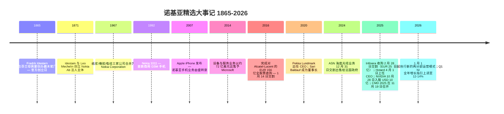
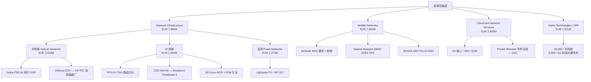
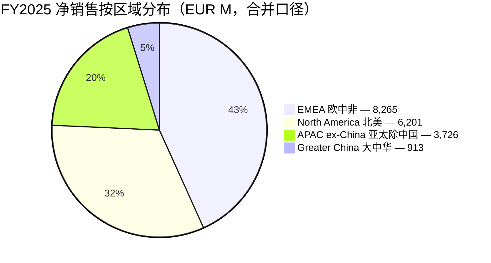
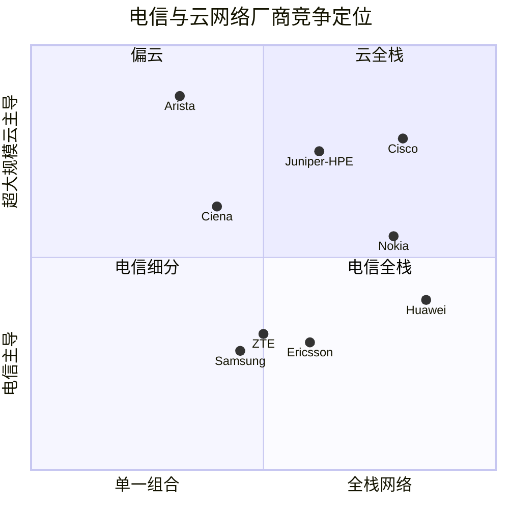

# 诺基亚公司 (Nokia Corporation) — 深度公司研究报告

**代码：** NYSE: NOK（ADR，1 ADS = 1 普通股）· 赫尔辛基纳斯达克：NOKIA
**总部：** Karakaari 7, FI-02610 埃斯波（Espoo），芬兰 · **注册地：** 芬兰共和国（企业代码 0112038-9）
**会计年度：** 12 月 31 日 · **报告币种：** 欧元（EUR）· **SEC CIK：** 0000924613 · **申报身份：** 境外私人发行人（提交 20-F / 6-K）
**研究截至日：** 2026-06-16 · **作者：** 股票研究 / financial-agent 项目

---

## 投资摘要（Investment Summary）— *分析师观点（Analyst view）*

> 以下评级、目标价、前瞻预测均为本报告分析师的前瞻判断（house view），**不属于任何 SEC 申报内容**，不得与 20-F / 6-K 引用混淆。

| 项目 | 本报告观点 |
|---|---|
| **评级（Rating）** | **Hold / 持有**（区间交易，风险回报对称） |
| **12 个月目标价（Price Target）** | **USD 15.0**（≈ EUR 13.0 @ 1.15），SOTP + 前瞻可比 P/E 交叉验证 |
| **当前价（2026-06-16 收盘）** | **USD 13.98** |
| **隐含上行** | **+7%**（含 ~1.0% 股息收益率，总回报约 +8%） |
| **市值** | **约 USD 80.3 亿×10 = 803 亿**（5,742,239,696 股 × USD 13.98） |
| **52 周区间** | **USD 4.00 – 17.45**（过去 12 个月最大涨幅约 4 倍） |
| **估值法一句话** | 分部加总（SOTP）：高增长 NI（光 + IP）给 25–30× 2028E EBIT，平台化 Mobile 给 8–10× |

**本方观点（house view）的 2–4 条核心支柱（thesis pillars）：**

1. **结构性 mix shift 真实存在，但已被定价。** AI & Cloud 客户 Q1 2026 收入 +49%、占集团 8%、当季新签 EUR 10 亿订单，光网络（Optical Networks）+20%——诺基亚正从北欧周期性电信设备商被重估为 "AI 网络股"。这是一个有事实支撑的转向，但 NYSE ADR 过去 12 个月涨约 4 倍后，市场已按美股 AI 网络估值法（~3.5× P/S、~42× 可比 P/E）定价，留给基准情形的上行有限。
2. **光网络垂直整合是真护城河。** Infinera 并表带来自有 **磷化铟（Indium Phosphide, InP）光子晶圆厂** + 单片 PIC（Photonic Integrated Circuit）制造能力，在 AI 超大规模云厂商（hyperscaler）数据中心互联（DCI）需求爆发与产能为王的格局下具备供应安全优势。
3. **Mobile 仍是结构性逆风。** 全球 RAN 市场 Dell'Oro 估未来 5 年 CAGR 约 1%；AI-RAN（NVIDIA ARC-Pro）商用 GA 要到 2027 年底，2026–27 年仅有试点收入。
4. **卖方分歧极大（机构间分歧巨大）。** PT 跨度从 GS 的 EUR 8.9 / USD 10.4（看跌约 -25%）到 JPM 的 EUR 18 / USD 21（看涨约 +50%）——这是当前最值得盯紧的信号，本报告 Hold 落在区间中段。

---

## 重要业绩指引变化（Q1 2026 业绩快报）

> **诺基亚在 2026 年 4 月 23 日 Q1 2026 中报中维持全年指引并细化增长口径。** 全年可比经营利润（comparable operating profit）目标 **EUR 2.0–2.5 亿×10 = 20–25 亿**，且管理层称当前 "*tracking somewhat above the mid-point*"（略高于中点）。**Network Infrastructure 全年净销售增长指引上调至 12–14%**（其中 IP + Optical 合并增长假设 18–20%）。Q1 数据：AI & Cloud 客户收入同比 **+49%**、占集团 **8%**、当季新签 **EUR 10 亿** AI & Cloud 订单；光网络（Optical Networks）同比 **+20%**。管理层并将 AI & Cloud 可触达市场（addressable market）2025–2028 CAGR 预期从 CMD 2025 的 16% 上调至 **27%**。来源：[Nokia Q1 2026 中报 PDF（2026-04-23）](https://www.nokia.com/system/files/2026-04/nokia_results_2026_q1.pdf); [Nokia Q1 2026 新闻稿 — GlobeNewswire](https://www.globenewswire.com/news-release/2026/04/23/3279544/0/en/nokia-corporation-interim-report-for-q1-2026.html)。

---

## 目录

1. [公司概览](#1-公司概览)
   - [1A. 估值快照与目标价](#1a-估值快照与目标价)
   - [1B. GF Score 基本面评分](#1b-gf-score-基本面评分)
2. [估值与目标价（前瞻模型 + 情景 + 卖方观点演变）](#2-估值与目标价)
3. [公司历史](#3-公司历史)
4. [管理团队](#4-管理团队)
5. [产品与服务](#5-产品与服务)
6. [客户与上市策略](#6-客户与上市策略)
7. [行业概览](#7-行业概览)
8. [竞争格局](#8-竞争格局)
9. [市场机会（TAM/SAM）](#9-市场机会)
10. [风险评估](#10-风险评估)
11. [投资者视角评分（Investor Lenses）](#11-投资者视角评分)
12. [参考资料 / Data Used](#12-参考资料)

---

## 1. 公司概览

**本方观点（thesis-first）。** 诺基亚是一个 "两段式" 的故事：一段是被 AI 数据中心需求点燃、由 Infinera 垂直整合驱动的高增长光 / IP 网络（Network Infrastructure），另一段是结构性持平、靠成本与软件化维持利润率的移动基础设施（Mobile Infrastructure）。2025–26 年三起事件（Infinera 并表、Hotard 出任 CEO、NVIDIA 入股 + AI-RAN 合作）把股票重估约 4 倍。我们给 **Hold**：转向是真的、护城河是真的，但当前 ~3.5× P/S、~42× 可比 P/E 的估值已把多数好消息计入，基准情形上行约 +7%，而卖方目标价从 -25% 到 +50% 的极端分歧本身就是 "已被充分定价、靠执行兑现" 的信号。

诺基亚是芬兰的全球电信设备、IP / 光网络（IP/optical networking）及专利授权（patent licensing）集团。FY2025 净销售为 **EUR 19,889 百万**（同比 +3% 报告口径），毛利润（gross profit）**EUR 8,659 百万**（毛利率 gross margin 43.5%），报告经营利润（reported operating profit）**EUR 885 百万**（经营利润率 4.4%），归母净利润 **EUR 651 百万**，稀释 EPS EUR 0.12（[Nokia FY2025 Form 20-F, 合并利润表 p.126](https://www.sec.gov/Archives/edgar/data/924613/000162828026015034/nok-20251231.htm)）。报告经营利润 EUR 885 百万中含 Infinera 收购相关摊销、重组及一次性费用合计逾 EUR 10 亿；剔除后 **可比经营利润（comparable operating profit）约 EUR 2.0 亿×10 = 20 亿，自由现金流（FCF）EUR 1.5 亿×10 = 15 亿（FCF 转化率 72%），可比稀释 EPS EUR 0.29**（[Nokia Q4/FY2025 业绩 PDF, p.1](https://www.nokia.com/system/files/2026-01/nokia_results_2025_q4.pdf)）。

下面的利润表桑基图把 FY2025 的 EUR 19,889 百万净销售拆解到 COGS（EUR 11,230 百万）、研发（R&D EUR 4,855 百万）、SG&A（EUR 3,073 百万）与经营利润（EUR 885 百万）：

<svg xmlns="http://www.w3.org/2000/svg" viewBox="0 0 1000 560" width="1000" height="560" role="img" aria-label="income statement Sankey"><rect x="0" y="0" width="1000" height="560" fill="#ffffff"/>
<text x="20.00" y="30.00" text-anchor="start" font-family="Helvetica,Arial,sans-serif" font-size="15" font-weight="700" fill="#1f2933">Nokia FY2025 利润表桑基图 (Income Statement, EUR millions)</text>
<path d="M 204.00,64.00 C 258.00,64.00 258.00,85.10 312.00,85.10 L 312.00,248.84 C 258.00,248.84 258.00,227.74 204.00,227.74 Z" fill="#93c5fd" fill-opacity="0.55"/>
<path d="M 452.00,78.10 C 506.00,78.10 506.00,182.93 560.00,182.93 L 560.00,201.08 C 506.00,201.08 506.00,96.25 452.00,96.25 Z" fill="#86efac" fill-opacity="0.55"/>
<path d="M 452.00,96.25 C 506.00,96.25 506.00,215.08 560.00,215.08 L 560.00,379.07 C 506.00,379.07 506.00,260.24 452.00,260.24 Z" fill="#fca5a5" fill-opacity="0.55"/>
<path d="M 328.00,85.10 C 382.00,85.10 382.00,78.10 436.00,78.10 L 436.00,255.64 C 382.00,255.64 382.00,262.64 328.00,262.64 Z" fill="#86efac" fill-opacity="0.55"/>
<path d="M 328.00,262.64 C 382.00,262.64 382.00,269.64 436.00,269.64 L 436.00,499.90 C 382.00,499.90 382.00,492.90 328.00,492.90 Z" fill="#fca5a5" fill-opacity="0.55"/>
<path d="M 700.00,176.34 C 754.00,176.34 754.00,264.49 808.00,264.49 L 808.00,277.83 C 754.00,277.83 754.00,189.69 700.00,189.69 Z" fill="#86efac" fill-opacity="0.55"/>
<path d="M 700.00,189.69 C 754.00,189.69 754.00,291.83 808.00,291.83 L 808.00,297.51 C 754.00,297.51 754.00,195.37 700.00,195.37 Z" fill="#fca5a5" fill-opacity="0.55"/>
<path d="M 700.00,195.37 C 754.00,195.37 754.00,311.51 808.00,311.51 L 808.00,313.51 C 754.00,313.51 754.00,197.37 700.00,197.37 Z" fill="#fca5a5" fill-opacity="0.55"/>
<path d="M 576.00,182.93 C 630.00,182.93 630.00,176.34 684.00,176.34 L 684.00,194.49 C 630.00,194.49 630.00,201.08 576.00,201.08 Z" fill="#86efac" fill-opacity="0.55"/>
<path d="M 576.00,215.08 C 630.00,215.08 630.00,209.10 684.00,209.10 L 684.00,272.11 C 630.00,272.11 630.00,278.09 576.00,278.09 Z" fill="#fca5a5" fill-opacity="0.55"/>
<path d="M 576.00,278.09 C 630.00,278.09 630.00,286.11 684.00,286.11 L 684.00,385.66 C 630.00,385.66 630.00,377.63 576.00,377.63 Z" fill="#fca5a5" fill-opacity="0.55"/>
<path d="M 576.00,377.63 C 630.00,377.63 630.00,399.66 684.00,399.66 L 684.00,401.66 C 630.00,401.66 630.00,379.63 576.00,379.63 Z" fill="#fca5a5" fill-opacity="0.55"/>
<path d="M 204.00,241.74 C 258.00,241.74 258.00,248.84 312.00,248.84 L 312.00,408.89 C 258.00,408.89 258.00,401.79 204.00,401.79 Z" fill="#93c5fd" fill-opacity="0.55"/>
<path d="M 576.00,393.07 C 630.00,393.07 630.00,194.49 684.00,194.49 L 684.00,196.49 C 630.00,196.49 630.00,395.07 576.00,395.07 Z" fill="#93c5fd" fill-opacity="0.55"/>
<path d="M 204.00,415.79 C 258.00,415.79 258.00,408.89 312.00,408.89 L 312.00,462.33 C 258.00,462.33 258.00,469.22 204.00,469.22 Z" fill="#93c5fd" fill-opacity="0.55"/>
<path d="M 204.00,483.22 C 258.00,483.22 258.00,462.33 312.00,462.33 L 312.00,493.10 C 258.00,493.10 258.00,514.00 204.00,514.00 Z" fill="#93c5fd" fill-opacity="0.55"/>
<rect x="188.00" y="64.00" width="16" height="163.74" rx="1.5" fill="#2563eb"/>
<rect x="188.00" y="241.74" width="16" height="160.05" rx="1.5" fill="#2563eb"/>
<rect x="188.00" y="415.79" width="16" height="53.43" rx="1.5" fill="#2563eb"/>
<rect x="188.00" y="483.22" width="16" height="30.78" rx="1.5" fill="#2563eb"/>
<rect x="312.00" y="85.10" width="16" height="407.79" rx="1.5" fill="#1e3a8a"/>
<rect x="436.00" y="78.10" width="16" height="177.54" rx="1.5" fill="#15803d"/>
<rect x="436.00" y="269.64" width="16" height="230.25" rx="1.5" fill="#dc2626"/>
<rect x="560.00" y="182.93" width="16" height="18.15" rx="1.5" fill="#15803d"/>
<rect x="560.00" y="215.08" width="16" height="163.99" rx="1.5" fill="#dc2626"/>
<rect x="560.00" y="393.07" width="16" height="2.00" rx="1.5" fill="#2563eb"/>
<rect x="684.00" y="176.34" width="16" height="18.76" rx="1.5" fill="#15803d"/>
<rect x="684.00" y="209.10" width="16" height="63.01" rx="1.5" fill="#dc2626"/>
<rect x="684.00" y="286.11" width="16" height="99.54" rx="1.5" fill="#dc2626"/>
<rect x="684.00" y="399.66" width="16" height="2.00" rx="1.5" fill="#dc2626"/>
<rect x="808.00" y="264.49" width="16" height="13.35" rx="1.5" fill="#15803d"/>
<rect x="808.00" y="291.83" width="16" height="5.68" rx="1.5" fill="#dc2626"/>
<rect x="808.00" y="311.51" width="16" height="2.00" rx="1.5" fill="#dc2626"/>
<line x1="188.00" y1="145.87" x2="182.00" y2="134.26" stroke="#cbd5e1" stroke-width="1"/>
<text x="179.00" y="137.26" text-anchor="end" font-family="Helvetica,Arial,sans-serif" font-size="11.5" font-weight="700" fill="#1f2933">Network Infrastructure</text>
<text x="179.00" y="150.26" text-anchor="end" font-family="Helvetica,Arial,sans-serif" font-size="10" font-weight="400" fill="#52606d">EUR8.0B  (40.2%)</text>
<line x1="188.00" y1="321.77" x2="182.00" y2="310.15" stroke="#cbd5e1" stroke-width="1"/>
<text x="179.00" y="313.15" text-anchor="end" font-family="Helvetica,Arial,sans-serif" font-size="11.5" font-weight="700" fill="#1f2933">Mobile Networks</text>
<text x="179.00" y="326.15" text-anchor="end" font-family="Helvetica,Arial,sans-serif" font-size="10" font-weight="400" fill="#52606d">EUR7.8B  (39.2%)</text>
<line x1="188.00" y1="442.51" x2="182.00" y2="430.90" stroke="#cbd5e1" stroke-width="1"/>
<text x="179.00" y="433.90" text-anchor="end" font-family="Helvetica,Arial,sans-serif" font-size="11.5" font-weight="700" fill="#1f2933">Cloud &amp; Network Services</text>
<text x="179.00" y="446.90" text-anchor="end" font-family="Helvetica,Arial,sans-serif" font-size="10" font-weight="400" fill="#52606d">EUR2.6B  (13.1%)</text>
<line x1="188.00" y1="498.61" x2="182.00" y2="487.00" stroke="#cbd5e1" stroke-width="1"/>
<text x="179.00" y="490.00" text-anchor="end" font-family="Helvetica,Arial,sans-serif" font-size="11.5" font-weight="700" fill="#1f2933">Nokia Technologies (IPR)</text>
<text x="179.00" y="503.00" text-anchor="end" font-family="Helvetica,Arial,sans-serif" font-size="10" font-weight="400" fill="#52606d">EUR1.5B  (7.5%)</text>
<rect x="331.00" y="67.10" width="119.40" height="26" rx="2" fill="#ffffff" fill-opacity="0.72"/>
<text x="334.00" y="79.10" text-anchor="start" font-family="Helvetica,Arial,sans-serif" font-size="11.5" font-weight="700" fill="#1f2933">Revenue</text>
<text x="334.00" y="92.10" text-anchor="start" font-family="Helvetica,Arial,sans-serif" font-size="10" font-weight="400" fill="#52606d">EUR19.9B  (100.0%)</text>
<rect x="455.00" y="60.10" width="106.80" height="26" rx="2" fill="#ffffff" fill-opacity="0.72"/>
<text x="458.00" y="72.10" text-anchor="start" font-family="Helvetica,Arial,sans-serif" font-size="11.5" font-weight="700" fill="#1f2933">Gross Profit</text>
<text x="458.00" y="85.10" text-anchor="start" font-family="Helvetica,Arial,sans-serif" font-size="10" font-weight="400" fill="#52606d">EUR8.7B  (43.5%)</text>
<rect x="455.00" y="251.64" width="144.60" height="26" rx="2" fill="#ffffff" fill-opacity="0.72"/>
<text x="458.00" y="263.64" text-anchor="start" font-family="Helvetica,Arial,sans-serif" font-size="11.5" font-weight="700" fill="#1f2933">Cost of Revenue (COGS)</text>
<text x="458.00" y="276.64" text-anchor="start" font-family="Helvetica,Arial,sans-serif" font-size="10" font-weight="400" fill="#52606d">EUR11.2B  (56.5%)</text>
<rect x="579.00" y="164.93" width="113.10" height="26" rx="2" fill="#ffffff" fill-opacity="0.72"/>
<text x="582.00" y="176.93" text-anchor="start" font-family="Helvetica,Arial,sans-serif" font-size="11.5" font-weight="700" fill="#1f2933">Operating Income</text>
<text x="582.00" y="189.93" text-anchor="start" font-family="Helvetica,Arial,sans-serif" font-size="10" font-weight="400" fill="#52606d">EUR885.0M  (4.4%)</text>
<rect x="579.00" y="197.08" width="150.90" height="26" rx="2" fill="#ffffff" fill-opacity="0.72"/>
<text x="582.00" y="209.08" text-anchor="start" font-family="Helvetica,Arial,sans-serif" font-size="11.5" font-weight="700" fill="#1f2933">Total Operating Expense</text>
<text x="582.00" y="222.08" text-anchor="start" font-family="Helvetica,Arial,sans-serif" font-size="10" font-weight="400" fill="#52606d">EUR8.0B  (40.2%)</text>
<text x="551.00" y="391.07" text-anchor="end" font-family="Helvetica,Arial,sans-serif" font-size="11.5" font-weight="700" fill="#1f2933">Net Interest / Other Income</text>
<text x="551.00" y="404.07" text-anchor="end" font-family="Helvetica,Arial,sans-serif" font-size="10" font-weight="400" fill="#52606d">EUR30.0M  (0.15%)</text>
<rect x="703.00" y="158.34" width="113.10" height="26" rx="2" fill="#ffffff" fill-opacity="0.72"/>
<text x="706.00" y="170.34" text-anchor="start" font-family="Helvetica,Arial,sans-serif" font-size="11.5" font-weight="700" fill="#1f2933">Pretax Income</text>
<text x="706.00" y="183.34" text-anchor="start" font-family="Helvetica,Arial,sans-serif" font-size="10" font-weight="400" fill="#52606d">EUR915.0M  (4.6%)</text>
<rect x="703.00" y="191.10" width="106.80" height="26" rx="2" fill="#ffffff" fill-opacity="0.72"/>
<text x="706.00" y="203.10" text-anchor="start" font-family="Helvetica,Arial,sans-serif" font-size="11.5" font-weight="700" fill="#1f2933">SG&amp;A</text>
<text x="706.00" y="216.10" text-anchor="start" font-family="Helvetica,Arial,sans-serif" font-size="10" font-weight="400" fill="#52606d">EUR3.1B  (15.5%)</text>
<rect x="703.00" y="268.11" width="106.80" height="26" rx="2" fill="#ffffff" fill-opacity="0.72"/>
<text x="706.00" y="280.11" text-anchor="start" font-family="Helvetica,Arial,sans-serif" font-size="11.5" font-weight="700" fill="#1f2933">R&amp;D</text>
<text x="706.00" y="293.11" text-anchor="start" font-family="Helvetica,Arial,sans-serif" font-size="10" font-weight="400" fill="#52606d">EUR4.9B  (24.4%)</text>
<rect x="703.00" y="381.66" width="113.10" height="26" rx="2" fill="#ffffff" fill-opacity="0.72"/>
<text x="706.00" y="393.66" text-anchor="start" font-family="Helvetica,Arial,sans-serif" font-size="11.5" font-weight="700" fill="#1f2933">Other OpEx</text>
<text x="706.00" y="406.66" text-anchor="start" font-family="Helvetica,Arial,sans-serif" font-size="10" font-weight="400" fill="#52606d">EUR70.0M  (0.35%)</text>
<text x="833.00" y="268.16" text-anchor="start" font-family="Helvetica,Arial,sans-serif" font-size="11.5" font-weight="700" fill="#1f2933">Net Income</text>
<text x="833.00" y="281.16" text-anchor="start" font-family="Helvetica,Arial,sans-serif" font-size="10" font-weight="400" fill="#52606d">EUR651.0M  (3.3%)</text>
<text x="833.00" y="293.16" text-anchor="start" font-family="Helvetica,Arial,sans-serif" font-size="11.5" font-weight="700" fill="#1f2933">Income Tax</text>
<text x="833.00" y="306.16" text-anchor="start" font-family="Helvetica,Arial,sans-serif" font-size="10" font-weight="400" fill="#52606d">EUR277.0M  (1.4%)</text>
<text x="833.00" y="318.16" text-anchor="start" font-family="Helvetica,Arial,sans-serif" font-size="11.5" font-weight="700" fill="#1f2933">Minority Interest</text>
<text x="833.00" y="331.16" text-anchor="start" font-family="Helvetica,Arial,sans-serif" font-size="10" font-weight="400" fill="#52606d">EUR9.0M  (0.05%)</text>
<text x="500.00" y="530.00" text-anchor="middle" font-family="Helvetica,Arial,sans-serif" font-size="10" font-weight="400" font-style="italic" fill="#8a97a3">旧版四分部口径净销售 (FY2025)；NI/MN/CNS/NT 含分部间抵销约 EUR -11M。报告经营利润 EUR 885M (含 Infinera 摊销/重组/一次性约 EUR 1,085M)。</text>
<text x="500.00" y="544.00" text-anchor="middle" font-family="Helvetica,Arial,sans-serif" font-size="10" font-weight="400" fill="#52606d">Source: Nokia FY2025 Form 20-F (filed 2026-03-05), consolidated income statement (p.126) · as of 2026-06-16</text>
</svg>

*来源：[Nokia FY2025 Form 20-F, 合并利润表 p.126](https://www.sec.gov/Archives/edgar/data/924613/000162828026015034/nok-20251231.htm)。左侧四分部为 FY2025 旧版口径净销售。*

FY2025 仍按 **旧版四大事业群** 口径披露：**Network Infrastructure 网络基础设施**（NI，EUR 7,986 百万 / 40%）、**Mobile Networks 移动网络**（MN，EUR 7,806 百万 / 39%）、**Cloud and Network Services 云与网络服务**（CNS，EUR 2,606 百万 / 13%）、**Nokia Technologies 诺基亚科技 / IPR 授权**（NT，EUR 1,501 百万 / 8%）（[20-F 注 2.2 分部净销售 p.136](https://www.sec.gov/Archives/edgar/data/924613/000162828026015034/nok-20251231.htm)）。

<svg xmlns="http://www.w3.org/2000/svg" viewBox="0 0 720 460" width="720" height="460" role="img" aria-label="revenue donut"><rect x="0" y="0" width="720" height="460" fill="#ffffff"/>
<text x="20.00" y="30.00" text-anchor="start" font-family="Helvetica,Arial,sans-serif" font-size="15" font-weight="700" fill="#1f2933">Nokia FY2025 净销售按分部 (Revenue by Segment, old 4-segment)</text>
<path d="M 288.00,107.20 A 132 132 0 0 1 364.69,346.63 L 333.32,302.68 A 78 78 0 0 0 288.00,161.20 Z" fill="#2563eb"/>
<path d="M 364.69,346.63 A 132 132 0 0 1 160.92,203.48 L 212.91,218.09 A 78 78 0 0 0 333.32,302.68 Z" fill="#15803d"/>
<path d="M 160.92,203.48 A 132 132 0 0 1 227.76,121.75 L 252.40,169.80 A 78 78 0 0 0 212.91,218.09 Z" fill="#d97706"/>
<path d="M 227.76,121.75 A 132 132 0 0 1 288.00,107.20 L 288.00,161.20 A 78 78 0 0 0 252.40,169.80 Z" fill="#7c3aed"/>
<text x="288.00" y="235.20" text-anchor="middle" font-family="Helvetica,Arial,sans-serif" font-size="18" font-weight="800" fill="#1f2933">NOK</text>
<text x="288.00" y="255.20" text-anchor="middle" font-family="Helvetica,Arial,sans-serif" font-size="13" font-weight="600" fill="#52606d">EUR19.9B</text>
<text x="288.00" y="271.20" text-anchor="middle" font-family="Helvetica,Arial,sans-serif" font-size="10" font-weight="400" fill="#8a97a3">total</text>
<line x1="419.42" y1="197.10" x2="435.42" y2="197.10" stroke="#2563eb" stroke-width="1.4"/>
<text x="439.42" y="195.10" text-anchor="start" font-family="Helvetica,Arial,sans-serif" font-size="11" font-weight="700" fill="#1f2933">Network Infrastructure</text>
<text x="439.42" y="209.10" text-anchor="start" font-family="Helvetica,Arial,sans-serif" font-size="10" font-weight="400" fill="#52606d">EUR8.0B  (40.1%)</text>
<line x1="208.67" y1="352.12" x2="192.67" y2="352.12" stroke="#15803d" stroke-width="1.4"/>
<text x="188.67" y="350.12" text-anchor="end" font-family="Helvetica,Arial,sans-serif" font-size="11" font-weight="700" fill="#1f2933">Mobile Networks</text>
<text x="188.67" y="364.12" text-anchor="end" font-family="Helvetica,Arial,sans-serif" font-size="10" font-weight="400" fill="#52606d">EUR7.8B  (39.2%)</text>
<line x1="181.17" y1="151.85" x2="165.17" y2="151.85" stroke="#d97706" stroke-width="1.4"/>
<text x="161.17" y="149.85" text-anchor="end" font-family="Helvetica,Arial,sans-serif" font-size="11" font-weight="700" fill="#1f2933">Cloud &amp; Network Services</text>
<text x="161.17" y="163.85" text-anchor="end" font-family="Helvetica,Arial,sans-serif" font-size="10" font-weight="400" fill="#52606d">EUR2.6B  (13.1%)</text>
<line x1="255.60" y1="105.06" x2="239.60" y2="105.06" stroke="#7c3aed" stroke-width="1.4"/>
<text x="235.60" y="103.06" text-anchor="end" font-family="Helvetica,Arial,sans-serif" font-size="11" font-weight="700" fill="#1f2933">Nokia Technologies (IPR)</text>
<text x="235.60" y="117.06" text-anchor="end" font-family="Helvetica,Arial,sans-serif" font-size="10" font-weight="400" fill="#52606d">EUR1.5B  (7.5%)</text>
<text x="360.00" y="444.00" text-anchor="middle" font-family="Helvetica,Arial,sans-serif" font-size="10" font-weight="400" fill="#52606d">Source: Nokia FY2025 Form 20-F (filed 2026-03-05) · as of 2026-06-16, segment note 2.2 (p.136)</text>
</svg>

*来源：[20-F 注 2.2 分部信息 p.136](https://www.sec.gov/Archives/edgar/data/924613/000162828026015034/nok-20251231.htm)。NI 内含 Optical EUR 3,019M、IP EUR 2,594M、Fixed EUR 2,373M。*

**自 2026 年 1 月 1 日起，口径切换为两大运营分部 + Portfolio Businesses。** 在 2025 年 11 月 19 日纽约资本市场日（Capital Markets Day, CMD 2025）上，诺基亚将五个事业群精简为 **Network Infrastructure**（整合光、IP、固网及 Nokia Technologies）与 **Mobile Infrastructure 移动基础设施**（RAN、微波、固网 CPE、站点实施、托管服务），残余非核心业务归入 **Portfolio Businesses**（[Nokia CMD 2025 战略新闻稿, 2025-11-19](https://www.nokia.com/newsroom/nokia-announces-new-strategy-evolution-of-its-operating-model-new-long-term-financial-target-strategic-kpis-and-changes-to-its-group-leadership-team/); [重述分部业绩公告](https://www.nokia.com/newsroom/nokia-provides-recast-comparative-segment-results-for-2025-and-2024-reflecting-new-operating-and-financial-reporting-structure/)）。**本期新变化（Q1 2026 实证）**：新口径下三个报告分部为 Network Infrastructure（Q1'26 EUR 1,829 百万）、Mobile Infrastructure（EUR 2,495 百万）、Portfolio Businesses（EUR 173 百万）——其中 Core Software 与 Technology Standards（原 CNS / Nokia Technologies）已并入 Mobile Infrastructure（[Nokia Q1 2026 中报 PDF — Segment Details, pp.5-7](https://www.nokia.com/system/files/2026-04/nokia_results_2026_q1.pdf)）。这一重构具备战略含义：管理层将固网接入、IP 路由与光传送视为同一条数据平面（data-plane）业务，主要面向电信运营商、AI 超大规模云厂商（hyperscalers）与关键任务企业（mission-critical enterprise），而移动 RAN 被作为结构性低个位数增长业务来管理。

历史净销售按分部演变（FY2023 → FY2025）显示了 mix 的迁移——NI 从 EUR 6,917M 升至 7,986M（+15%），而 MN 从 EUR 10,289M 降至 7,806M（-24%）：

<svg xmlns="http://www.w3.org/2000/svg" viewBox="0 0 860 470" width="860" height="470" role="img" aria-label="historical revenue bars"><rect x="0" y="0" width="860" height="470" fill="#ffffff"/>
<text x="20.00" y="30.00" text-anchor="start" font-family="Helvetica,Arial,sans-serif" font-size="15" font-weight="700" fill="#1f2933">Nokia 净销售按分部 FY2023-2025 (Net Sales by Segment, EUR millions)</text>
<rect x="20.00" y="44" width="11" height="11" rx="2" fill="#2563eb"/>
<text x="36.00" y="53.00" text-anchor="start" font-family="Helvetica,Arial,sans-serif" font-size="10.5" font-weight="400" fill="#1f2933">Network Infrastructure</text>
<rect x="195.20" y="44" width="11" height="11" rx="2" fill="#15803d"/>
<text x="211.20" y="53.00" text-anchor="start" font-family="Helvetica,Arial,sans-serif" font-size="10.5" font-weight="400" fill="#1f2933">Mobile Networks</text>
<rect x="324.20" y="44" width="11" height="11" rx="2" fill="#d97706"/>
<text x="340.20" y="53.00" text-anchor="start" font-family="Helvetica,Arial,sans-serif" font-size="10.5" font-weight="400" fill="#1f2933">Cloud &amp; Network Services</text>
<rect x="512.60" y="44" width="11" height="11" rx="2" fill="#7c3aed"/>
<text x="528.60" y="53.00" text-anchor="start" font-family="Helvetica,Arial,sans-serif" font-size="10.5" font-weight="400" fill="#1f2933">Nokia Technologies (IPR)</text>
<line x1="70" y1="412.00" x2="834" y2="412.00" stroke="#eceff2" stroke-width="1"/>
<text x="64.00" y="415.00" text-anchor="end" font-family="Helvetica,Arial,sans-serif" font-size="9.5" font-weight="400" fill="#52606d">EUR0</text>
<line x1="70" y1="345.20" x2="834" y2="345.20" stroke="#eceff2" stroke-width="1"/>
<text x="64.00" y="348.20" text-anchor="end" font-family="Helvetica,Arial,sans-serif" font-size="9.5" font-weight="400" fill="#52606d">EUR4.5B</text>
<line x1="70" y1="278.40" x2="834" y2="278.40" stroke="#eceff2" stroke-width="1"/>
<text x="64.00" y="281.40" text-anchor="end" font-family="Helvetica,Arial,sans-serif" font-size="9.5" font-weight="400" fill="#52606d">EUR9.1B</text>
<line x1="70" y1="211.60" x2="834" y2="211.60" stroke="#eceff2" stroke-width="1"/>
<text x="64.00" y="214.60" text-anchor="end" font-family="Helvetica,Arial,sans-serif" font-size="9.5" font-weight="400" fill="#52606d">EUR13.6B</text>
<line x1="70" y1="144.80" x2="834" y2="144.80" stroke="#eceff2" stroke-width="1"/>
<text x="64.00" y="147.80" text-anchor="end" font-family="Helvetica,Arial,sans-serif" font-size="9.5" font-weight="400" fill="#52606d">EUR18.2B</text>
<line x1="70" y1="78.00" x2="834" y2="78.00" stroke="#eceff2" stroke-width="1"/>
<text x="64.00" y="81.00" text-anchor="end" font-family="Helvetica,Arial,sans-serif" font-size="9.5" font-weight="400" fill="#52606d">EUR22.7B</text>
<rect x="123.48" y="310.23" width="147.71" height="101.77" fill="#2563eb"/>
<rect x="123.48" y="158.84" width="147.71" height="151.39" fill="#15803d"/>
<rect x="123.48" y="118.70" width="147.71" height="40.14" fill="#d97706"/>
<rect x="123.48" y="102.74" width="147.71" height="15.96" fill="#7c3aed"/>
<text x="197.33" y="428.00" text-anchor="middle" font-family="Helvetica,Arial,sans-serif" font-size="10" font-weight="400" fill="#52606d">2023</text>
<rect x="378.15" y="316.10" width="147.71" height="95.90" fill="#2563eb"/>
<rect x="378.15" y="196.07" width="147.71" height="120.03" fill="#15803d"/>
<rect x="378.15" y="157.97" width="147.71" height="38.09" fill="#d97706"/>
<rect x="378.15" y="129.61" width="147.71" height="28.37" fill="#7c3aed"/>
<text x="452.00" y="428.00" text-anchor="middle" font-family="Helvetica,Arial,sans-serif" font-size="10" font-weight="400" fill="#52606d">2024</text>
<rect x="632.81" y="294.50" width="147.71" height="117.50" fill="#2563eb"/>
<rect x="632.81" y="179.65" width="147.71" height="114.85" fill="#15803d"/>
<rect x="632.81" y="141.30" width="147.71" height="38.34" fill="#d97706"/>
<rect x="632.81" y="119.22" width="147.71" height="22.08" fill="#7c3aed"/>
<text x="706.67" y="428.00" text-anchor="middle" font-family="Helvetica,Arial,sans-serif" font-size="10" font-weight="400" fill="#52606d">2025</text>
<text x="430.00" y="440.00" text-anchor="middle" font-family="Helvetica,Arial,sans-serif" font-size="10" font-weight="400" font-style="italic" fill="#8a97a3">口径说明：2025 年起 Managed Services 由 CNS 移入 MN，2024/2023 已重述。Group Common/抵销项未单列。</text>
<text x="430.00" y="454.00" text-anchor="middle" font-family="Helvetica,Arial,sans-serif" font-size="10" font-weight="400" fill="#52606d">Source: Nokia FY2025 Form 20-F (filed 2026-03-05), segment net sales by region note 2.2 (p.136) · as of 2026-06-16</text>
</svg>

*来源：[20-F 注 2.2 分部净销售（含按地区）p.136](https://www.sec.gov/Archives/edgar/data/924613/000162828026015034/nok-20251231.htm)。口径说明：2025 年起 Managed Services 由 CNS 移入 MN，2024/2023 已重述。*

2025–26 年共有三起战略事件重塑了诺基亚的股票故事。第一，**2025 年 2 月 28 日**完成对 **Infinera** 的收购，购买对价 **EUR 25 亿**（现金 EUR 1,066 百万、承接可转债 EUR 785 百万、新发 127,434,986 份诺基亚 ADS 折合 EUR 584 百万、替代型股权激励 EUR 61 百万）。本次交易使光网络分部净销售直接翻倍（FY2024 EUR 1,636 百万 → FY2025 EUR 3,019 百万），并使诺基亚跃居 **全球光网络市场份额第二（约 20%）**，仅次于华为（[20-F 注 6.2 收购事项 p.185](https://www.sec.gov/Archives/edgar/data/924613/000162828026015034/nok-20251231.htm); [Dell'Oro — 2025 全球光传送市场达 160 亿美元](https://www.delloro.com/news/optical-transport-market-grew-to-16-billion-in-2025/)）。第二，**2025 年 2 月 10 日**诺基亚宣布前 Intel 数据中心与 AI 事业部（DCAI）总裁 **Justin Hotard** 出任公司新任 President 兼 CEO，**2025 年 4 月 1 日**正式上任，接替 Pekka Lundmark（[Nokia 领导层换届新闻稿, 2025-02-10](https://www.globenewswire.com/news-release/2025/02/10/3023164/0/en/Inside-information-Nokia-announces-a-leadership-transition-Justin-Hotard-appointed-as-successor-to-Pekka-Lundmark.html)）。第三，**2025 年 10 月 28 日**，**NVIDIA 以每股约 USD 6.01 入股新发行的诺基亚普通股、合计认购 USD 10 亿**（占增发后股本约 2.9%），并与诺基亚达成多年 AI-RAN 战略合作，核心产品为 NVIDIA 的 **Aerial RAN Computer Pro (ARC-Pro)** 6G 就绪 GPU 加速基带，首启运营商为 T-Mobile US（[NVIDIA 投资者新闻稿, 2025-10-28](https://nvidianews.nvidia.com/news/nvidia-nokia-6g-ai)）。

诺基亚在全球约 **130 个国家拥有员工约 7.8 万人**：欧洲 33,000、印度 18,300、北美 10,000、大中华区 7,200，其余分布于拉美、中东非洲与亚太其他地区（[20-F 第 5 页 "Our 2025 highlights"](https://www.sec.gov/Archives/edgar/data/924613/000162828026015034/nok-20251231.htm)）。FY2025 研发投入 **EUR 4,855 百万（占净销售 24.4%）**，属行业顶级强度，支撑诺基亚贝尔实验室（Nokia Bell Labs）、FP 系列 IP 路由芯片、PSE-6s 相干 DSP（coherent DSP），以及在 6G 联盟中的牵头地位（[20-F 第 21 页](https://www.sec.gov/Archives/edgar/data/924613/000162828026015034/nok-20251231.htm)）。

### 1A. 估值快照与目标价

**估值快照（2026-06-16）。** NYSE 收盘价 **USD 13.98**，52 周区间 USD 4.00–17.45 — 过去 12 个月股价大致翻 4 倍，但已自 5 月约 USD 16.6 的高点回落约 16%。按 5,742,239,696 股普通股折算，市值 **约 USD 803 亿**（[Yahoo Finance — NOK](https://finance.yahoo.com/quote/NOK/); [20-F 封面股数 5,742,239,696](https://www.sec.gov/Archives/edgar/data/924613/000162828026015034/nok-20251231.htm)）。

| 估值指标（TTM / FY2025） | 数值 | 解读 |
|---|---|---|
| 市值 Market cap | USD ~803 亿 | 5,742M 股 × USD 13.98 |
| P/S（按 FY2025 净销售 EUR 19,889M @ 1.15） | ~3.5× | 远高于 2022–24 的 ~1.5× 中枢 |
| 可比 P/E（按 FY2025 可比 EPS EUR 0.29 @ 1.15 = USD 0.33） | ~42× | 美股 AI 网络股区间，非北欧设备商区间 |
| 报告 P/E（按报告 EPS EUR 0.12 @ 1.15 = USD 0.14） | ~101× | 报告口径含 Infinera 摊销，不具代表性 |
| 股息收益率 | ~1.0% | FY2025 拟派 EUR 0.14/股 |

**前瞻 12 个月目标价 USD 15.0（≈ EUR 13.0）。** *分析师观点：* 以 SOTP 为主、前瞻可比 P/E 交叉验证（见 Section 2 推导）。隐含上行约 **+7%**，加 ~1% 股息后总回报约 +8%——区间交易特征，故评级 **Hold**。

**估值倍数依据（为什么是这个区间）。** 当前 ~42× 可比 P/E 把诺基亚定价在 **Cisco（约 5× P/S、18× EPS）与 Ericsson（约 1.5× P/S、14× 可比 EBIT）之间偏 Cisco 的位置**（[StockAnalysis — NOK](https://stockanalysis.com/stocks/nok/); [StockAnalysis — CSCO](https://stockanalysis.com/stocks/csco/)）。这是市场在用 "AI 网络股" 而非 "北欧电信设备股" 的方法给诺基亚定价。该倍数的辩护取决于 NI（光 + IP）能否在 2026–28 年兑现 ~14% 增长与利润率扩张；若 12–14% NI 增长是 Infinera 并表 + NVIDIA 拉量的单年高点、FY2027 回归中个位数，则倍数压缩（multiple compression）是核心下行风险。

### 1B. GF Score 基本面评分

GF Score（GuruFocus 式五维基本面评分）是 **本报告分析师的评分框架（rubric），非数据源、非 GuruFocus 官方数值**。五个维度各 0–10 分，透明加权映射为 0–100 综合分。

<svg xmlns="http://www.w3.org/2000/svg" viewBox="0 0 500 500" width="500" height="500" role="img" aria-label="GF Score radar">
<rect x="0" y="0" width="500" height="500" fill="#ffffff"/>
<text x="20" y="24" font-family="Helvetica,Arial,sans-serif" font-size="15" font-weight="700" fill="#1f2933">GF Score (GuruFocus-style): 57/100</text>
<text x="20" y="41" font-family="Helvetica,Arial,sans-serif" font-size="11" fill="#52606d">51–70 Poor future performance potential</text>
<polygon points="250.0,88.0 392.7,191.6 338.2,359.4 161.8,359.4 107.3,191.6" fill="#e9f5ec" stroke="none"/>
<polygon points="250.0,208.0 278.5,228.7 267.6,262.3 232.4,262.3 221.5,228.7" fill="none" stroke="#c5d3cb" stroke-width="1"/>
<polygon points="250.0,178.0 307.1,219.5 285.3,286.5 214.7,286.5 192.9,219.5" fill="none" stroke="#c5d3cb" stroke-width="1"/>
<polygon points="250.0,148.0 335.6,210.2 302.9,310.8 197.1,310.8 164.4,210.2" fill="none" stroke="#c5d3cb" stroke-width="1"/>
<polygon points="250.0,118.0 364.1,200.9 320.5,335.1 179.5,335.1 135.9,200.9" fill="none" stroke="#c5d3cb" stroke-width="1"/>
<polygon points="250.0,88.0 392.7,191.6 338.2,359.4 161.8,359.4 107.3,191.6" fill="none" stroke="#c5d3cb" stroke-width="1.3"/>
<line x1="250" y1="238" x2="161.8" y2="359.4" stroke="#cfdad3" stroke-width="1"/>
<text x="146.5" y="392.4" text-anchor="end" font-family="Helvetica,Arial,sans-serif" font-size="11.5" font-weight="600" fill="#1f2933">财务实力</text>
<text x="188.3" y="316.9" text-anchor="middle" font-family="Helvetica,Arial,sans-serif" font-size="10.5" font-weight="700" fill="#1f2933">7</text>
<line x1="250" y1="238" x2="250.0" y2="88.0" stroke="#cfdad3" stroke-width="1"/>
<text x="250.0" y="58.0" text-anchor="middle" font-family="Helvetica,Arial,sans-serif" font-size="11.5" font-weight="600" fill="#1f2933">盈利能力</text>
<text x="250.0" y="172.0" text-anchor="middle" font-family="Helvetica,Arial,sans-serif" font-size="10.5" font-weight="700" fill="#1f2933">4</text>
<line x1="250" y1="238" x2="107.3" y2="191.6" stroke="#cfdad3" stroke-width="1"/>
<text x="82.6" y="183.6" text-anchor="end" font-family="Helvetica,Arial,sans-serif" font-size="11.5" font-weight="600" fill="#1f2933">成长性</text>
<text x="164.4" y="204.2" text-anchor="middle" font-family="Helvetica,Arial,sans-serif" font-size="10.5" font-weight="700" fill="#1f2933">6</text>
<line x1="250" y1="238" x2="392.7" y2="191.6" stroke="#cfdad3" stroke-width="1"/>
<text x="417.4" y="183.6" text-anchor="start" font-family="Helvetica,Arial,sans-serif" font-size="11.5" font-weight="600" fill="#1f2933">估值</text>
<text x="292.8" y="218.1" text-anchor="middle" font-family="Helvetica,Arial,sans-serif" font-size="10.5" font-weight="700" fill="#1f2933">3</text>
<line x1="250" y1="238" x2="338.2" y2="359.4" stroke="#cfdad3" stroke-width="1"/>
<text x="353.5" y="392.4" text-anchor="start" font-family="Helvetica,Arial,sans-serif" font-size="11.5" font-weight="600" fill="#1f2933">动量</text>
<text x="329.4" y="341.2" text-anchor="middle" font-family="Helvetica,Arial,sans-serif" font-size="10.5" font-weight="700" fill="#1f2933">9</text>
<polygon points="250.0,178.0 292.8,224.1 329.4,347.2 188.3,322.9 164.4,210.2" fill="#2e8b57" fill-opacity="0.34" stroke="#2e8b57" stroke-width="2"/>
<circle cx="188.3" cy="322.9" r="2.6" fill="#2e8b57"/>
<circle cx="250.0" cy="178.0" r="2.6" fill="#2e8b57"/>
<circle cx="164.4" cy="210.2" r="2.6" fill="#2e8b57"/>
<circle cx="292.8" cy="224.1" r="2.6" fill="#2e8b57"/>
<circle cx="329.4" cy="347.2" r="2.6" fill="#2e8b57"/>
<text x="250" y="470" text-anchor="middle" font-family="Helvetica,Arial,sans-serif" font-size="9.5" fill="#52606d">Source: Nokia FY2025 20-F · Q1 2026 interim · Yahoo Finance NOK · as of 2026-06-16</text>
<text x="250" y="485" text-anchor="middle" font-family="Helvetica,Arial,sans-serif" font-size="9" fill="#52606d">GF Score = independent analyst rubric (*Analyst view:*) — not GuruFocus™ official number</text>
</svg>

*分析师观点（Analyst view）：综合分 **57 / 100**（51–70 区间：未来表现潜力偏弱 / Poor）。下方各维度评分理由均逐项行内引用底层指标。*

| 维度 | 评分 (0–10) | 各维度评分理由（关键指标 + 行内引用） |
|---|---|---|
| **Financial Strength（财务实力）** | **7** | 净现金（net cash）Q1'26 达 **EUR 3.8 亿×10 = 38 亿**、FY2025 末现金及计息投资充裕，长期有息负债 EUR 2,329M、净杠杆低；权益比率（equity ratio）56.0%（[20-F 资产负债表 p.127-128](https://www.sec.gov/Archives/edgar/data/924613/000162828026015034/nok-20251231.htm); [Q1 2026 中报 PDF p.1](https://www.nokia.com/system/files/2026-04/nokia_results_2026_q1.pdf)）。扣分项：商誉 EUR 5,996M + 退休金资产 EUR 6,380M 占资产较重。 |
| **Profitability（盈利能力）** | **4** | FY2025 报告经营利润率仅 4.4%、可比经营利润率约 10%，归母 ROE 约 3%（报告口径）——结构性低于美股网络同业（[20-F 利润表 p.126](https://www.sec.gov/Archives/edgar/data/924613/000162828026015034/nok-20251231.htm)）。IPR 分部利润率 70%+ 是亮点，但占比仅 8%。 |
| **Growth（成长性）** | **6** | FY2025 净销售 +3%，但已现拐点：NI 同比 +23%、AI & Cloud 客户 +42%、Q1'26 AI & Cloud +49%、光网络 +20%（[20-F 注 2.1 p.135](https://www.sec.gov/Archives/edgar/data/924613/000162828026015034/nok-20251231.htm); [Q1 2026 中报 PDF p.1](https://www.nokia.com/system/files/2026-04/nokia_results_2026_q1.pdf)）。MN 同比 -4% 拖累整体成长性。 |
| **GF Value（估值，越高越便宜）** | **3** | ~42× 可比 P/E、~3.5× P/S，相对自身 2022–24 区间高出约 2 个标准差，相对内在价值区间 margin of safety 为负（见 Section 2）。 |
| **Momentum（动量）** | **9** | 过去 12 个月 NYSE ADR 上涨约 4 倍（USD 4.00 → 17.45 区间），远超 S&P 500 与电信设备同业（[Yahoo Finance — NOK](https://finance.yahoo.com/quote/NOK/)）。 |

*综合权重（分析师观点）：Financial Strength 20% · Profitability 25% · Growth 25% · GF Value 15% · Momentum 15%（透明复制，非 GuruFocus 专有权重）。GF Score 57 与本报告 "转向真实但估值已计入" 的 Hold 结论一致——高动量与改善中的成长被低盈利能力与高估值抵消。*

---

## 2. 估值与目标价

本章是决策层（decision layer）。所有前瞻数字均为 **分析师观点（Analyst view）**，不附任何 20-F 引用——10-K / 20-F 不含目标价。

### 2.1 前瞻财务预测（FY2026E–FY2028E）

*分析师观点。* 本模型基于 20-F 分部数据 + 管理层 Q1 2026 指引 + 行业预测（Dell'Oro），并与卖方一致预期对标（见 2.4）。

| EUR 百万（除 EPS） | FY2025A | FY2026E | FY2027E | FY2028E | 驱动 / 外部依据 |
|---|---|---|---|---|---|
| 净销售 Net sales | 19,889 | 20,900 | 22,100 | 23,500 | NI 12–14% 增长指引（[Q1'26 PDF Outlook p.3](https://www.nokia.com/system/files/2026-04/nokia_results_2026_q1.pdf)）；MN 持平（[Dell'Oro RAN ~1% CAGR](https://www.delloro.com/news/ran-market-stabilized-in-2025/)） |
| YoY | +3% | +5% | +6% | +6% | NI 加速被 MN 平台化部分抵消 |
| 可比经营利润 Comp. OP | ~2,000 | 2,300 | 2,650 | 2,950 | 公司 FY2026 指引 EUR 2.0–2.5 亿×10；CMD 2028 目标 27–32 亿×10 中点（[CMD 2025 新闻稿](https://www.nokia.com/newsroom/nokia-announces-new-strategy-evolution-of-its-operating-model-new-long-term-financial-target-strategic-kpis-and-changes-to-its-group-leadership-team/)） |
| 可比经营利润率 | ~10.0% | 11.0% | 12.0% | 12.6% | 光网络规模效应 + Infinera 协同；MN 成本削减 EUR 4 亿（[Q1'26 PDF Outlook p.3](https://www.nokia.com/system/files/2026-04/nokia_results_2026_q1.pdf)） |
| 可比稀释 EPS（EUR） | 0.29 | 0.33 | 0.38 | 0.44 | 经营杠杆 + 财务收入 EUR 1.5–2.5 亿（[Q1'26 PDF p.3](https://www.nokia.com/system/files/2026-04/nokia_results_2026_q1.pdf)） |

**口径说明（margin bridge，bps）。** FY2025 → FY2028E 可比经营利润率约 +260bps：NI 规模效应 + Infinera 协同（~EUR 2 亿协同目标）+160bps、MN 成本削减（recurring gross savings EUR 4 亿）+120bps、增长性投资（光产能 + AI-RAN 研发）-20bps（[Q1'26 PDF Outlook p.3](https://www.nokia.com/system/files/2026-04/nokia_results_2026_q1.pdf); [GS 05-28 note 协同超预期](http://xs-macbook-air.local:5001/zsxq/pdf/184128881158522/GS-Nokia%20%28NOKIA.HE%29_%20AI%20infrastructure%20build%20underpins%20upgraded%20Optical%20and%20IP%20outlook-260528.pdf)）。

杜邦分解（5-step DuPont）显示 FY2025 ROE 偏低，根因在低净利率（报告口径净利率 3.3%）而非杠杆或周转：

<svg xmlns="http://www.w3.org/2000/svg" viewBox="0 0 1240 540" width="1240" height="540" role="img" aria-label="DuPont ROE decomposition"><rect x="0" y="0" width="1240" height="540" fill="#ffffff"/>
<text x="20.00" y="30.00" text-anchor="start" font-family="Helvetica,Arial,sans-serif" font-size="15" font-weight="700" fill="#1f2933">Nokia FY2025 杜邦分解 (5-step DuPont ROE)</text>
<rect x="545.00" y="56.00" width="150" height="56" rx="7" fill="#1e3a8a"/>
<text x="620.00" y="76.00" text-anchor="middle" font-family="Helvetica,Arial,sans-serif" font-size="11.5" font-weight="700" fill="#ffffff">ROE</text>
<text x="620.00" y="94.00" text-anchor="middle" font-family="Helvetica,Arial,sans-serif" font-size="13" font-weight="800" fill="#ffffff">3.13%</text>
<text x="620.00" y="106.00" text-anchor="middle" font-family="Helvetica,Arial,sans-serif" font-size="8.5" font-weight="400" fill="#dbeafe">= Net Income / Avg Equity</text>
<rect x="191.60" y="168.00" width="150" height="56" rx="7" fill="#2563eb"/>
<text x="266.60" y="188.00" text-anchor="middle" font-family="Helvetica,Arial,sans-serif" font-size="11.5" font-weight="700" fill="#ffffff">Net Margin</text>
<text x="266.60" y="206.00" text-anchor="middle" font-family="Helvetica,Arial,sans-serif" font-size="13" font-weight="800" fill="#ffffff">3.27%</text>
<text x="266.60" y="218.00" text-anchor="middle" font-family="Helvetica,Arial,sans-serif" font-size="8.5" font-weight="400" fill="#dbeafe">Net Income / Revenue</text>
<line x1="620.00" y1="112.00" x2="266.60" y2="168.00" stroke="#94a3b8" stroke-width="1.4"/>
<rect x="545.00" y="168.00" width="150" height="56" rx="7" fill="#2563eb"/>
<text x="620.00" y="188.00" text-anchor="middle" font-family="Helvetica,Arial,sans-serif" font-size="11.5" font-weight="700" fill="#ffffff">Asset Turnover</text>
<text x="620.00" y="206.00" text-anchor="middle" font-family="Helvetica,Arial,sans-serif" font-size="13" font-weight="800" fill="#ffffff">0.52</text>
<text x="620.00" y="218.00" text-anchor="middle" font-family="Helvetica,Arial,sans-serif" font-size="8.5" font-weight="400" fill="#dbeafe">Revenue / Avg Assets</text>
<line x1="620.00" y1="112.00" x2="620.00" y2="168.00" stroke="#94a3b8" stroke-width="1.4"/>
<rect x="898.40" y="168.00" width="150" height="56" rx="7" fill="#2563eb"/>
<text x="973.40" y="188.00" text-anchor="middle" font-family="Helvetica,Arial,sans-serif" font-size="11.5" font-weight="700" fill="#ffffff">Equity Multiplier</text>
<text x="973.40" y="206.00" text-anchor="middle" font-family="Helvetica,Arial,sans-serif" font-size="13" font-weight="800" fill="#ffffff">1.84</text>
<text x="973.40" y="218.00" text-anchor="middle" font-family="Helvetica,Arial,sans-serif" font-size="8.5" font-weight="400" fill="#dbeafe">Avg Assets / Avg Equity</text>
<line x1="620.00" y1="112.00" x2="973.40" y2="168.00" stroke="#94a3b8" stroke-width="1.4"/>
<circle cx="443.30" cy="196.00" r="11" fill="#ffffff" stroke="#94a3b8" stroke-width="1.2"/>
<text x="443.30" y="201.00" text-anchor="middle" font-family="Helvetica,Arial,sans-serif" font-size="14" font-weight="800" fill="#52606d">×</text>
<circle cx="796.70" cy="196.00" r="11" fill="#ffffff" stroke="#94a3b8" stroke-width="1.2"/>
<text x="796.70" y="201.00" text-anchor="middle" font-family="Helvetica,Arial,sans-serif" font-size="14" font-weight="800" fill="#52606d">×</text>
<rect x="65.00" y="300.00" width="118" height="56" rx="7" fill="#2563eb"/>
<text x="124.00" y="320.00" text-anchor="middle" font-family="Helvetica,Arial,sans-serif" font-size="11.5" font-weight="700" fill="#ffffff">Operating Margin</text>
<text x="124.00" y="338.00" text-anchor="middle" font-family="Helvetica,Arial,sans-serif" font-size="13" font-weight="800" fill="#ffffff">4.45%</text>
<text x="124.00" y="350.00" text-anchor="middle" font-family="Helvetica,Arial,sans-serif" font-size="8.5" font-weight="400" fill="#dbeafe">Op Inc / Revenue</text>
<line x1="266.60" y1="224.00" x2="124.00" y2="300.00" stroke="#94a3b8" stroke-width="1.4"/>
<rect x="207.60" y="300.00" width="118" height="56" rx="7" fill="#2563eb"/>
<text x="266.60" y="320.00" text-anchor="middle" font-family="Helvetica,Arial,sans-serif" font-size="11.5" font-weight="700" fill="#ffffff">Tax Burden</text>
<text x="266.60" y="338.00" text-anchor="middle" font-family="Helvetica,Arial,sans-serif" font-size="13" font-weight="800" fill="#ffffff">0.7115</text>
<text x="266.60" y="350.00" text-anchor="middle" font-family="Helvetica,Arial,sans-serif" font-size="8.5" font-weight="400" fill="#dbeafe">Net Inc / Pretax</text>
<line x1="266.60" y1="224.00" x2="266.60" y2="300.00" stroke="#94a3b8" stroke-width="1.4"/>
<rect x="350.20" y="300.00" width="118" height="56" rx="7" fill="#2563eb"/>
<text x="409.20" y="320.00" text-anchor="middle" font-family="Helvetica,Arial,sans-serif" font-size="11.5" font-weight="700" fill="#ffffff">Interest Burden</text>
<text x="409.20" y="338.00" text-anchor="middle" font-family="Helvetica,Arial,sans-serif" font-size="13" font-weight="800" fill="#ffffff">1.0339</text>
<text x="409.20" y="350.00" text-anchor="middle" font-family="Helvetica,Arial,sans-serif" font-size="8.5" font-weight="400" fill="#dbeafe">Pretax / Op Inc</text>
<line x1="266.60" y1="224.00" x2="409.20" y2="300.00" stroke="#94a3b8" stroke-width="1.4"/>
<circle cx="195.30" cy="328.00" r="11" fill="#ffffff" stroke="#94a3b8" stroke-width="1.2"/>
<text x="195.30" y="333.00" text-anchor="middle" font-family="Helvetica,Arial,sans-serif" font-size="14" font-weight="800" fill="#52606d">×</text>
<circle cx="337.90" cy="328.00" r="11" fill="#ffffff" stroke="#94a3b8" stroke-width="1.2"/>
<text x="337.90" y="333.00" text-anchor="middle" font-family="Helvetica,Arial,sans-serif" font-size="14" font-weight="800" fill="#52606d">×</text>
<rect x="479.00" y="300.00" width="118" height="56" rx="7" fill="#2563eb"/>
<text x="538.00" y="326.00" text-anchor="middle" font-family="Helvetica,Arial,sans-serif" font-size="11.5" font-weight="700" fill="#ffffff">Revenue</text>
<text x="538.00" y="342.00" text-anchor="middle" font-family="Helvetica,Arial,sans-serif" font-size="13" font-weight="800" fill="#ffffff">EUR19.9B</text>
<line x1="620.00" y1="224.00" x2="538.00" y2="300.00" stroke="#94a3b8" stroke-width="1.4"/>
<rect x="643.00" y="300.00" width="118" height="56" rx="7" fill="#2563eb"/>
<text x="702.00" y="320.00" text-anchor="middle" font-family="Helvetica,Arial,sans-serif" font-size="11.5" font-weight="700" fill="#ffffff">Avg Total Assets</text>
<text x="702.00" y="338.00" text-anchor="middle" font-family="Helvetica,Arial,sans-serif" font-size="13" font-weight="800" fill="#ffffff">EUR38.4B</text>
<text x="702.00" y="350.00" text-anchor="middle" font-family="Helvetica,Arial,sans-serif" font-size="8.5" font-weight="400" fill="#dbeafe">(begin+end)/2</text>
<line x1="620.00" y1="224.00" x2="702.00" y2="300.00" stroke="#94a3b8" stroke-width="1.4"/>
<circle cx="620.00" cy="328.00" r="11" fill="#ffffff" stroke="#94a3b8" stroke-width="1.2"/>
<text x="620.00" y="333.00" text-anchor="middle" font-family="Helvetica,Arial,sans-serif" font-size="14" font-weight="800" fill="#52606d">÷</text>
<rect x="832.40" y="300.00" width="118" height="56" rx="7" fill="#2563eb"/>
<text x="891.40" y="320.00" text-anchor="middle" font-family="Helvetica,Arial,sans-serif" font-size="11.5" font-weight="700" fill="#ffffff">Avg Total Assets</text>
<text x="891.40" y="338.00" text-anchor="middle" font-family="Helvetica,Arial,sans-serif" font-size="13" font-weight="800" fill="#ffffff">EUR38.4B</text>
<text x="891.40" y="350.00" text-anchor="middle" font-family="Helvetica,Arial,sans-serif" font-size="8.5" font-weight="400" fill="#dbeafe">(begin+end)/2</text>
<line x1="973.40" y1="224.00" x2="891.40" y2="300.00" stroke="#94a3b8" stroke-width="1.4"/>
<rect x="996.40" y="300.00" width="118" height="56" rx="7" fill="#2563eb"/>
<text x="1055.40" y="320.00" text-anchor="middle" font-family="Helvetica,Arial,sans-serif" font-size="11.5" font-weight="700" fill="#ffffff">Avg Total Equity</text>
<text x="1055.40" y="338.00" text-anchor="middle" font-family="Helvetica,Arial,sans-serif" font-size="13" font-weight="800" fill="#ffffff">EUR20.8B</text>
<text x="1055.40" y="350.00" text-anchor="middle" font-family="Helvetica,Arial,sans-serif" font-size="8.5" font-weight="400" fill="#dbeafe">(begin+end)/2</text>
<line x1="973.40" y1="224.00" x2="1055.40" y2="300.00" stroke="#94a3b8" stroke-width="1.4"/>
<circle cx="967.20" cy="328.00" r="11" fill="#ffffff" stroke="#94a3b8" stroke-width="1.2"/>
<text x="967.20" y="333.00" text-anchor="middle" font-family="Helvetica,Arial,sans-serif" font-size="14" font-weight="800" fill="#52606d">÷</text>
<rect x="69.00" y="420.00" width="110" height="48" rx="7" fill="#3b82f6"/>
<text x="124.00" y="442.00" text-anchor="middle" font-family="Helvetica,Arial,sans-serif" font-size="11.5" font-weight="700" fill="#ffffff">Operating Income</text>
<text x="124.00" y="458.00" text-anchor="middle" font-family="Helvetica,Arial,sans-serif" font-size="13" font-weight="800" fill="#ffffff">EUR885.0M</text>
<line x1="124.00" y1="356.00" x2="124.00" y2="420.00" stroke="#94a3b8" stroke-width="1.4"/>
<rect x="211.60" y="420.00" width="110" height="48" rx="7" fill="#3b82f6"/>
<text x="266.60" y="442.00" text-anchor="middle" font-family="Helvetica,Arial,sans-serif" font-size="11.5" font-weight="700" fill="#ffffff">Net Income</text>
<text x="266.60" y="458.00" text-anchor="middle" font-family="Helvetica,Arial,sans-serif" font-size="13" font-weight="800" fill="#ffffff">EUR651.0M</text>
<line x1="266.60" y1="356.00" x2="266.60" y2="420.00" stroke="#94a3b8" stroke-width="1.4"/>
<rect x="354.20" y="420.00" width="110" height="48" rx="7" fill="#3b82f6"/>
<text x="409.20" y="442.00" text-anchor="middle" font-family="Helvetica,Arial,sans-serif" font-size="11.5" font-weight="700" fill="#ffffff">Pretax Income</text>
<text x="409.20" y="458.00" text-anchor="middle" font-family="Helvetica,Arial,sans-serif" font-size="13" font-weight="800" fill="#ffffff">EUR915.0M</text>
<line x1="409.20" y1="356.00" x2="409.20" y2="420.00" stroke="#94a3b8" stroke-width="1.4"/>
<text x="620.00" y="510.00" text-anchor="middle" font-family="Helvetica,Arial,sans-serif" font-size="10" font-weight="400" font-style="italic" fill="#8a97a3">ROE 基于归母净利 EUR 651M 与平均股东权益。FY2025 报告经营利润含 Infinera 并表当年约 EUR 1,085M 摊销/重组拖累。</text>
<text x="620.00" y="524.00" text-anchor="middle" font-family="Helvetica,Arial,sans-serif" font-size="10" font-weight="400" fill="#52606d">Source: Nokia FY2025 Form 20-F (filed 2026-03-05), income statement (p.126) + balance sheet (p.127) · as of 2026-06-16</text>
</svg>

*来源：[20-F 利润表 p.126 + 资产负债表 p.127](https://www.sec.gov/Archives/edgar/data/924613/000162828026015034/nok-20251231.htm)。报告口径含 Infinera 并表当年约 EUR 10 亿摊销/重组拖累；可比口径 ROE 显著更高。*

### 2.2 目标价推导（SOTP）

*分析师观点。* 采用分部加总（Sum-of-the-Parts），以反映 NI 与 Mobile 截然不同的增长曲线——这与 BofA、UBS 卖方一致：

| 分部 | 估值基准 | 倍数 | 隐含价值（EUR 十亿） | 倍数依据 |
|---|---|---|---|---|
| Network Infrastructure（光 + IP + 固网 + Tech）| 2028E EBIT ~EUR 2.2 亿×10 | 25× | ~55 | 高增长 AI 数据架构；BofA 给光 + IP 30×（[BofA 04-14 note](http://xs-macbook-air.local:5001/zsxq/pdf/812241425154552/Bofa-Nokia%20Who%E2%80%99s%20calling%20my%20phone-%20Upgrade%20to%20Buy-260413.pdf)）取折中 |
| Mobile Infrastructure（RAN + 微波 + Managed）| 2028E EBIT ~EUR 0.8 亿×10 | 9× | ~7 | 平台化、低增长；BofA 给传统业务 10×（同上） |
| 净现金 + 投资 | Q1'26 净现金 | 1× | ~4 | [Q1 2026 PDF p.1](https://www.nokia.com/system/files/2026-04/nokia_results_2026_q1.pdf) |
| **股权价值合计** | | | **~66** | / 5,742M 股 ≈ EUR 11.5 + 增长溢价 → **EUR ~13.0 / USD ~15.0** |

交叉验证：USD 15.0 ≈ 前瞻可比 P/E 2027E EPS EUR 0.38（USD 0.44）× ~34× = USD 15.0——介于 JPM 的 29× 与当前 42× 之间，反映 "增长部分兑现、倍数温和压缩" 的基准假设。

### 2.3 牛 / 基准 / 熊三情景（bull / base / bear）

| 情景 | 目标价 | 上行/下行 | 摆动假设（swing variable） |
|---|---|---|---|
| **牛市 Bull** | **USD 21（EUR 18）** | **+50%** | AI & Cloud 收入 2028E 达 EUR 65 亿（光 45 + IP 20）、NI EBIT margin 升至 21%、给 29× 2028E EPS（[JPM 06-12 AI 模型](http://xs-macbook-air.local:5001/zsxq/pdf/214522582511581/JPM-Nokia%20Building%20the%20AI%20revenue%20model.%20Optical%20tailwinds%20and%20switching%20wins%20light%20the%20path%20to%20significant%20upside-260612.pdf)） |
| **基准 Base** | **USD 15（EUR 13）** | **+7%** | NI 增长 12–14% 兑现但 FY2027 略放缓；MN 平台化；倍数温和压缩至 ~34× |
| **熊市 Bear** | **USD 10.4（EUR 8.9）** | **-26%** | 光网络需求不及预期、MN 盈利承压、北美份额恶化；给 13× 2027E EPS（[GS 05-28 SOTP](http://xs-macbook-air.local:5001/zsxq/pdf/184128881158522/GS-Nokia%20%28NOKIA.HE%29_%20AI%20infrastructure%20build%20underpins%20upgraded%20Optical%20and%20IP%20outlook-260528.pdf)） |

**最该盯紧的变量（swing variables）：** (1) **AI & Cloud 订单转化为收入的节奏**——Q1'26 在手 EUR 10 亿订单能否在 2026–27 年按 12–18 个月交付周期顺利确认；(2) **Mobile Infrastructure 利润率**——能否从 Q1'26 的 8.9% 进一步爬升、抵消 RAN 平台化。这两点决定牛熊。

### 2.4 与市场一致预期的对比 + 卖方观点演变（Sell-side view evolution）

**机械预跑（来自 `db/stock_price_target.db` 只读）。** 当前活跃 PT 离散度极大（min EUR 8.9 / max EUR 18，跨度近 2×）——这是本名最值得强调的事实。本报告基准 USD 15.0 落在区间中段，略低于市场，反映 "已被定价" 的判断。

**按机构的观点时间线（per-institute timeline）。** 所有 PT 与评级均为 *分析师观点（Analyst view）*，引用至本地 zsxq 库 PDF（用户机器本地链接）。

| 机构 | 报告日 | 评级 / 目标价（EUR / USD） | 报告日股价 | 核心论点 | 链接 |
|---|---|---|---|---|---|
| **J.P. Morgan** | 2026-06-12 | **Overweight · EUR 18 / USD 21**（自 EUR 12 / USD 14 **上调**） | EUR 11.78 (06-11) | 构建 AI 收入模型：光网络 AI&Cloud 2028E EUR 45 亿 + IP 20 亿；2028E EBIT EUR 46.7 亿（较公司 CMD 中点高 58%）；给 29× 2028E EPS | [JPM 06-12](http://xs-macbook-air.local:5001/zsxq/pdf/214522582511581/JPM-Nokia%20Building%20the%20AI%20revenue%20model.%20Optical%20tailwinds%20and%20switching%20wins%20light%20the%20path%20to%20significant%20upside-260612.pdf) |
| **Goldman Sachs** | 2026-05-28 | **Neutral · EUR 8.9 / USD 10.4**（自 EUR 8.0 **上调**） | EUR 13.46 | AI 基建支撑光 + IP 上修，但 RAN 平台期 + 估值已反映；2027E EV/EBITDA 13× | [GS 05-28](http://xs-macbook-air.local:5001/zsxq/pdf/184128881158522/GS-Nokia%20%28NOKIA.HE%29_%20AI%20infrastructure%20build%20underpins%20upgraded%20Optical%20and%20IP%20outlook-260528.pdf) |
| **UBS** | 2026-05-05 | **Neutral · EUR 11**（自 EUR 5.5 大幅**上调**） | EUR 10.61 (04-30) | "AI 进展已计入股价"，YTD +90%；DCF（WACC 9.5%、g 2%）；上行 EUR 15 / 下行 EUR 5 | [UBS 05-05](http://xs-macbook-air.local:5001/zsxq/pdf/585421248542514/UBS-Nokia%EF%BC%88NOKIA.HE%EF%BC%89Tangible%20progress%20in%20AI%20is%20in%20the%20price-260505.pdf) |
| **BofA** | 2026-04-14 | **Buy · EUR 10.70**（自 EUR 6.87 **上调**，评级由 Neutral → Buy） | EUR 8.03 | 光网络 2026-28 CAGR 17%、800G 份额约 25%；SOTP（光 + IP 给 30× 2027E EBIT）；华为/中兴欧洲替代上行 EUR 16.7 亿 | [BofA 04-14](http://xs-macbook-air.local:5001/zsxq/pdf/812241425154552/Bofa-Nokia%20Who%E2%80%99s%20calling%20my%20phone-%20Upgrade%20to%20Buy-260413.pdf) |

**自我修订（self-revisions）与触发因素。** 所有四家机构在 2026 年 4–6 月均**上调** PT——触发因素一致：Q1 2026 AI & Cloud +49% + EUR 10 亿订单、光网络 +20%、NI 增长指引上调至 12–14%、AI & Cloud TAM CAGR 从 16% 上调至 27%。JPM 从 04-23 First Take 到 06-12 的 AI 模型，PT 从 EUR 12 一路上调至 EUR 18，是最激进的修订。

**机构间分歧（cross-institute disagreement）— 切勿混为虚假一致。** 同样的 Q1 数据，JPM 看 +50%、GS 看 -25%——分歧的本质是 **"AI 增量该给多高倍数 + 能否兑现"**：

| 机构 | 评级/PT | 核心分歧点 | 什么证据能证明其正确 |
|---|---|---|---|
| JPM（最乐观） | OW · EUR 18 | 光 + IP AI 收入 2028E EUR 65 亿，给 29× 高增长倍数 | 2026–27 AI & Cloud 订单按时确认 + IP 数据中心交换机斩获超大规模云中标 |
| GS / UBS（中性） | Neutral · EUR 8.9–11 | 85–90% 收入仍与电信周期挂钩、AI 增量已计入价 | 北美运营商 capex 进一步下滑、光网络利润率扩张滞后于投入 |
| BofA（乐观） | Buy · EUR 10.70 | 光网络 17% CAGR + 欧洲华为替代上行 | 德国等强制替换中国设备落地 + 800G 相干可插拔放量 |

*本报告 Hold（USD 15）落在 GS/UBS 中性与 BofA/JPM 乐观之间——我们认同光网络护城河（站 JPM/BofA 一侧），但认同 "估值已计入大部分" 与 "电信基本盘平台化"（站 GS/UBS 一侧），故不追高。*

---

## 3. 公司历史

诺基亚的创立日是 **1865 年 5 月 12 日** — 当日采矿工程师 **Fredrik Idestam**（弗雷德里克·伊德斯坦）获得芬兰参议院特许，在当时属俄罗斯大公国管辖的芬兰坦佩雷（Tampere）Tammerkoski 急流上修建磨木浆厂（[Wikipedia — Fredrik Idestam](https://en.wikipedia.org/wiki/Fredrik_Idestam); [20-F 第 6 页 — 160 周年](https://www.sec.gov/Archives/edgar/data/924613/000162828026015034/nok-20251231.htm)）。**1871 年**伊德斯坦与挚友、后任芬兰参议员 **Leo Mechelin** 共同成立 **Nokia Ab** 法人主体（[Wikipedia — History of Nokia](https://en.wikipedia.org/wiki/History_of_Nokia)）。如今的诺基亚集团由三条历史业务并轨而成——纸浆/造纸（1865）、橡胶（Finnish Rubber Works, 1898）、电缆（Finnish Cable Works, 1912）——**1967 年三家公司合并组成现今的 Nokia Corporation**。**DX 200 数字程控交换机**（1970 年代）与 **Nokia 1011**（1992 年首款商用 GSM 手机）是诺基亚跻身全球电信龙头的两个关键节点（[History of Nokia](https://en.wikipedia.org/wiki/History_of_Nokia)）。

手机时代以 **2014 年 4 月 Microsoft 以约 72 亿美元收购 Nokia Devices & Services 业务**为终结。20-F 仍带有当年税务赔偿条款的剩余尾巴——*"we are required to indemnify Microsoft for certain pre-closing tax matters … in connection with the closing of the sale of the Devices & Services business"*——提示该业务的法律影响延续至今（[20-F 税务赔偿注释, 约 p.108](https://www.sec.gov/Archives/edgar/data/924613/000162828026015034/nok-20251231.htm)）。**2016 年 1 月 14 日**对 Alcatel-Lucent（阿尔卡特朗讯）的 EUR 156 亿全股票收购正式交割，诺基亚由此成为全栈电信网络厂商（[History of Nokia](https://en.wikipedia.org/wiki/History_of_Nokia)）。

2022–25 年公司经历了再次战略重切。**2022 年 4 月**诺基亚宣布退出俄罗斯市场（"*less than 2% of our net sales in 2021*"），并于年内完成清算（[Light Reading — Nokia 退出俄罗斯](https://www.lightreading.com/regulatory-politics/nokia-to-exit-russia-as-huawei-reportedly-stops-work)）。**2024 年 12 月 31 日**完成对 **Alcatel Submarine Networks (ASN)** 的出售（买方为法国政府），仅保留 20% 待退出股权——这标志着诺基亚退出经营 30 余年的海底光缆业务（[Nokia ASN 交割新闻稿, 2025-01-03](https://www.globenewswire.com/news-release/2025/01/03/3004037/0/en/Nokia-completes-its-sale-of-leading-submarine-networks-business-ASN-Alcatel-Submarine-Networks-to-the-French-State.html)）。继 ALU 之后规模最大的并购于 **2025 年 2 月 28 日**到来——**以 EUR 25 亿收购 Infinera**，光网络分部净销售直接翻倍，并使诺基亚获得位于美国加州 Sunnyvale 的 **磷化铟（InP）光子集成电路（PIC）晶圆厂**及宾州 Allentown 光子封测厂（[20-F 注 6.2 收购 p.185](https://www.sec.gov/Archives/edgar/data/924613/000162828026015034/nok-20251231.htm); [Nokia Infinera 交割新闻稿 2025-02-28](https://www.nokia.com/newsroom/nokia-completes-acquisition-of-infinera-to-create-innovation-powerhouse-in-optical-networks-with-the-scale-to-power-the-data-center-revolution/)）。

2025 年的战略重启在 **11 月 19 日纽约 CMD 2025** 上正式公开——自 2026 年 1 月 1 日起将五个事业群合并为两个运营分部，**为继 Alcatel-Lucent 整合以来最大规模的组织重构**，并设定 2028 年可比经营利润目标 **EUR 27–32 亿×10**（vs FY2025 约 EUR 20 亿×10）（[Nokia CMD 2025 战略新闻稿](https://www.nokia.com/newsroom/nokia-announces-new-strategy-evolution-of-its-operating-model-new-long-term-financial-target-strategic-kpis-and-changes-to-its-group-leadership-team/); [Capacity Media — 多年来最大组织重构](https://capacityglobal.com/news/nokia-announces-biggest-organisational-overhaul-in-years/)）。2025 年同时是 **诺基亚 160 周年与诺基亚贝尔实验室 100 周年**（[20-F 第 6 页](https://www.sec.gov/Archives/edgar/data/924613/000162828026015034/nok-20251231.htm)）。

---

## 4. 管理团队

### 创始人 — Fredrik Idestam（1838–1916）

Fredrik Idestam 是芬兰采矿工程师，曾就读于德国 **汉诺威工业学院（Hannover Polytechnic Institute）**，在德国造纸厂工作数年后回到芬兰。1865 年 5 月 12 日他获得芬兰参议院特许，在坦佩雷 Tammerkoski 急流处兴建第一家磨木浆厂——此日被诺基亚正式作为创立日。1871 年与挚友、后任参议员 **Leo Mechelin**（莱奥·梅切林）共同成立 **Nokia Ab** 法人合并两厂经营。Idestam 自 **1896 年退休**后由 Mechelin 接掌，后者将公司扩张至电力发电——这是后续橡胶与电缆事业群得以并入诺基亚、于 1967 年组建现代集团的物质基础。Idestam 在现代公开 Nokia 中的角色为纯粹历史人物（[Wikipedia — Fredrik Idestam](https://en.wikipedia.org/wiki/Fredrik_Idestam); [History of Nokia](https://en.wikipedia.org/wiki/History_of_Nokia)）。

### 现任 CEO — Justin Hotard（自 2025 年 4 月 1 日）

**Justin Hotard** 于 **2025 年 2 月 10 日**被宣布为诺基亚新任 President 兼 CEO，并于 **2025 年 4 月 1 日**正式上任，接替 Pekka Lundmark（[Nokia 领导层换届新闻稿](https://www.globenewswire.com/news-release/2025/02/10/3023164/0/en/Inside-information-Nokia-announces-a-leadership-transition-Justin-Hotard-appointed-as-successor-to-Pekka-Lundmark.html)）。Hotard 直接从 **Intel** 跳槽而来，在 Intel 担任 **EVP 兼 Data Center & AI Group (DCAI) 总经理**——即 Intel 服务器 CPU 与 AI 加速器业务的负责人，并主导 Gaudi AI 加速器的量产爬坡（[Justin Hotard — Nokia 领导层页面](https://www.nokia.com/we-are-nokia/leadership-and-governance/group-leadership-team/justin-hotard/)）。

加入 Intel 之前，Hotard 在 **Hewlett Packard Enterprise（HPE）任职 9 年（2015–2024）**，离任前职位为 **EVP 兼 HPC（高性能计算）、AI & Labs 总经理**。按诺基亚官方简历的措辞：他 "*delivered the world's first exascale supercomputer for the US Department of Energy*"——即美国能源部橡树岭国家实验室的 Frontier 百亿亿次（exascale）超级计算机（[Nokia 简历页](https://www.nokia.com/we-are-nokia/leadership-and-governance/group-leadership-team/justin-hotard/)）。Hotard 拥有伊利诺伊大学香槟分校（UIUC）电子工程学士学位，及西北大学凯洛格商学院（Northwestern Kellogg）MBA。

聘任一位数据中心与 AI 业务出身（而非传统电信老兵）担纲诺基亚 CEO 的战略意图毋庸置疑。在 CMD 2025 上，Hotard 将诺基亚使命定义为 "*connecting intelligence and accelerating value creation for our customers and investors*"，并提出五条战略优先级——"*accelerating growth in AI & Cloud; leading in AI-native networks and 6G; growing through co-innovation; deploying capital where we differentiate; and unlocking sustainable returns*"（[20-F 第 8 页](https://www.sec.gov/Archives/edgar/data/924613/000162828026015034/nok-20251231.htm); [Nokia CMD 2025 战略新闻稿](https://www.nokia.com/newsroom/nokia-announces-new-strategy-evolution-of-its-operating-model-new-long-term-financial-target-strategic-kpis-and-changes-to-its-group-leadership-team/)）。上任仅 7 个月，Hotard 即完成 NVIDIA 入股 + AI-RAN 战略合作的谈判——*分析师观点：* 这一交易令诺基亚股价重估约 4 倍，可以认为传统电信背景的 CEO 难以推动此类交易达成。

---

## 5. 产品与服务

本章是整份报告中最核心的一章。诺基亚的产品组合横跨三个大型可寻址市场（移动 RAN、光 / IP 网络、专利授权），管理层在 "投资" 与 "收割" 上的取舍直接决定未来五年的股票故事。FY2025 仍按旧版四分部口径披露；**自 2026 年 1 月 1 日起**改为两分部口径（Network Infrastructure + Mobile Infrastructure），是 2026 财年起的建模口径。

下面的 "资金流向图（money-flow map）" 把 Nokia 放在中间——左侧是付钱给 Nokia 的四类客户，中间是他们买的产品族，右侧是 Nokia 的 COGS / capex 落到的供应链（自有 InP 晶圆厂、外购 DSP/代工、NVIDIA AI-RAN、EMS 代工）：

<svg xmlns="http://www.w3.org/2000/svg" viewBox="0 0 1180 1044" width="1180" height="1044" role="img" aria-label="Nokia 资金流向图 — 谁付钱 → 买什么 → 钱沉淀在哪 (Q1 2026 run-rate)" font-family="'Space Grotesk',system-ui,-apple-system,'Segoe UI',sans-serif">
<defs><linearGradient id="mfgold" gradientUnits="userSpaceOnUse" x1="0" y1="0" x2="1180" y2="0"><stop offset="0" stop-color="#f6dc97"/><stop offset="0.5" stop-color="#e9b658"/><stop offset="1" stop-color="#cf8f2c"/></linearGradient><radialGradient id="mfpool" cx="50%" cy="50%" r="50%"><stop offset="0" stop-color="#34d399" stop-opacity="0.16"/><stop offset="1" stop-color="#34d399" stop-opacity="0"/></radialGradient></defs>
<rect x="0" y="0" width="1180" height="1044" rx="16" fill="#0b0f1a"/>
<text x="42.00" y="84.00" text-anchor="start" font-family="'Space Grotesk',system-ui,-apple-system,'Segoe UI',sans-serif" font-size="32" font-weight="700" fill="#e8ecf5">Nokia 资金流向图 — 谁付钱 → 买什么 → 钱沉淀在哪 (Q1 2026 run-rate)</text>
<ellipse cx="1031.00" cy="385.00" rx="190" ry="150" fill="url(#mfpool)"/>
<line x1="369.50" y1="150.00" x2="369.50" y2="616.00" stroke="#222a3a" stroke-dasharray="2 8"/>
<line x1="810.50" y1="150.00" x2="810.50" y2="616.00" stroke="#222a3a" stroke-dasharray="2 8"/>
<text x="42.00" y="134.00" text-anchor="start" font-family="'JetBrains Mono',ui-monospace,Menlo,monospace" font-size="12" font-weight="400" fill="#e9b658" letter-spacing="3">STAGE 01</text>
<text x="42.00" y="150.00" text-anchor="start" font-family="'JetBrains Mono',ui-monospace,Menlo,monospace" font-size="11.5" font-weight="400" fill="#646d82">谁付钱给 Nokia</text>
<text x="483.00" y="134.00" text-anchor="start" font-family="'JetBrains Mono',ui-monospace,Menlo,monospace" font-size="12" font-weight="400" fill="#e9b658" letter-spacing="3">STAGE 02</text>
<text x="483.00" y="150.00" text-anchor="start" font-family="'JetBrains Mono',ui-monospace,Menlo,monospace" font-size="11.5" font-weight="400" fill="#646d82">他们买什么</text>
<text x="924.00" y="134.00" text-anchor="start" font-family="'JetBrains Mono',ui-monospace,Menlo,monospace" font-size="12" font-weight="400" fill="#e9b658" letter-spacing="3">STAGE 03</text>
<text x="924.00" y="150.00" text-anchor="start" font-family="'JetBrains Mono',ui-monospace,Menlo,monospace" font-size="11.5" font-weight="400" fill="#646d82">Nokia 的成本/资本开支落到哪</text>
<path d="M 256.00 200.29 C 369.50 200.29, 369.50 214.00, 483.00 214.00" fill="none" stroke="url(#mfgold)" stroke-width="8.57" stroke-linecap="round" opacity="0.9"/>
<path d="M 256.00 208.86 C 369.50 208.86, 369.50 324.93, 483.00 324.93" fill="none" stroke="url(#mfgold)" stroke-width="8.57" stroke-linecap="round" opacity="0.9"/>
<path d="M 256.00 225.14 C 369.50 225.14, 369.50 437.43, 483.00 437.43" fill="none" stroke="url(#mfgold)" stroke-width="24.00" stroke-linecap="round" opacity="0.9"/>
<path d="M 256.00 240.57 C 369.50 240.57, 369.50 546.57, 483.00 546.57" fill="none" stroke="url(#mfgold)" stroke-width="6.86" stroke-linecap="round" opacity="0.9"/>
<path d="M 256.00 340.43 C 369.50 340.43, 369.50 224.29, 483.00 224.29" fill="none" stroke="url(#mfgold)" stroke-width="12.00" stroke-linecap="round" opacity="0.9"/>
<path d="M 256.00 349.00 C 369.50 349.00, 369.50 331.79, 483.00 331.79" fill="none" stroke="url(#mfgold)" stroke-width="5.14" stroke-linecap="round" opacity="0.9"/>
<path d="M 256.00 455.50 C 369.50 455.50, 369.50 452.00, 483.00 452.00" fill="none" stroke="url(#mfgold)" stroke-width="5.14" stroke-linecap="round" opacity="0.9"/>
<path d="M 256.00 450.43 C 369.50 450.43, 369.50 336.86, 483.00 336.86" fill="none" stroke="url(#mfgold)" stroke-width="5.00" stroke-linecap="round" opacity="0.9"/>
<path d="M 256.00 563.00 C 369.50 563.00, 369.50 553.43, 483.00 553.43" fill="none" stroke="url(#mfgold)" stroke-width="6.86" stroke-linecap="round" opacity="0.9"/>
<path d="M 697.00 214.00 C 810.50 214.00, 810.50 220.00, 924.00 220.00" fill="none" stroke="url(#mfgold)" stroke-width="8.57" stroke-linecap="round" opacity="0.78" stroke-dasharray="0.1 11"/>
<path d="M 697.00 221.71 C 810.50 221.71, 810.50 322.29, 924.00 322.29" fill="none" stroke="url(#mfgold)" stroke-width="6.86" stroke-linecap="round" opacity="0.78" stroke-dasharray="0.1 11"/>
<path d="M 697.00 330.00 C 810.50 330.00, 810.50 329.14, 924.00 329.14" fill="none" stroke="url(#mfgold)" stroke-width="6.86" stroke-linecap="round" opacity="0.78" stroke-dasharray="0.1 11"/>
<path d="M 697.00 432.29 C 810.50 432.29, 810.50 336.86, 924.00 336.86" fill="none" stroke="url(#mfgold)" stroke-width="8.57" stroke-linecap="round" opacity="0.78" stroke-dasharray="0.1 11"/>
<path d="M 697.00 439.14 C 810.50 439.14, 810.50 440.00, 924.00 440.00" fill="none" stroke="url(#mfgold)" stroke-width="5.14" stroke-linecap="round" opacity="0.78" stroke-dasharray="0.1 11"/>
<path d="M 697.00 446.86 C 810.50 446.86, 810.50 552.57, 924.00 552.57" fill="none" stroke="url(#mfgold)" stroke-width="10.29" stroke-linecap="round" opacity="0.78" stroke-dasharray="0.1 11"/>
<path d="M 697.00 227.71 C 810.50 227.71, 810.50 544.86, 924.00 544.86" fill="none" stroke="url(#mfgold)" stroke-width="5.14" stroke-linecap="round" opacity="0.78" stroke-dasharray="0.1 11"/>
<text x="369.50" y="325.29" text-anchor="middle" font-family="'JetBrains Mono',ui-monospace,Menlo,monospace" font-size="11.5" font-weight="400" fill="#f4d58a" paint-order="stroke" stroke="#0b0f1a" stroke-width="3.2" stroke-linejoin="round">RAN 主体</text>
<text x="369.50" y="276.36" text-anchor="middle" font-family="'JetBrains Mono',ui-monospace,Menlo,monospace" font-size="11.5" font-weight="400" fill="#f4d58a" paint-order="stroke" stroke="#0b0f1a" stroke-width="3.2" stroke-linejoin="round">光网络 AI 订单</text>
<text x="369.50" y="552.21" text-anchor="middle" font-family="'JetBrains Mono',ui-monospace,Menlo,monospace" font-size="11.5" font-weight="400" fill="#f4d58a" paint-order="stroke" stroke="#0b0f1a" stroke-width="3.2" stroke-linejoin="round">IPR 授权金</text>
<text x="810.50" y="211.00" text-anchor="middle" font-family="'JetBrains Mono',ui-monospace,Menlo,monospace" font-size="11.5" font-weight="400" fill="#f4d58a" paint-order="stroke" stroke="#0b0f1a" stroke-width="3.2" stroke-linejoin="round">自产光子</text>
<text x="810.50" y="323.57" text-anchor="middle" font-family="'JetBrains Mono',ui-monospace,Menlo,monospace" font-size="11.5" font-weight="400" fill="#f4d58a" paint-order="stroke" stroke="#0b0f1a" stroke-width="3.2" stroke-linejoin="round">DSP/路由芯片</text>
<text x="810.50" y="433.57" text-anchor="middle" font-family="'JetBrains Mono',ui-monospace,Menlo,monospace" font-size="11.5" font-weight="400" fill="#f4d58a" paint-order="stroke" stroke="#0b0f1a" stroke-width="3.2" stroke-linejoin="round">AI-RAN GPU</text>
<rect x="42.00" y="160.00" width="214" height="120.00" rx="12" fill="#15101a" stroke="#f2655f" stroke-opacity="0.5"/>
<rect x="42.00" y="160.00" width="3" height="120.00" rx="2" fill="#f2655f"/>
<text x="60.00" y="193.00" text-anchor="start" font-family="'Space Grotesk',system-ui,-apple-system,'Segoe UI',sans-serif" font-size="14" font-weight="700" fill="#ffffff">TELECOM PROVIDERS</text>
<text x="60.00" y="214.00" text-anchor="start" font-family="'JetBrains Mono',ui-monospace,Menlo,monospace" font-size="11" font-weight="400" fill="#c98c87">Q1'26 EUR 3,267M / 73% 集团收入</text>
<text x="60.00" y="231.00" text-anchor="start" font-family="'JetBrains Mono',ui-monospace,Menlo,monospace" font-size="11" font-weight="400" fill="#c98c87">AT&amp;T·DT·Vodafone·Bharti 等</text>
<rect x="42.00" y="296.00" width="214" height="94.00" rx="12" fill="#0f1622" stroke="#7fa8f5" stroke-opacity="0.5"/>
<rect x="42.00" y="296.00" width="3" height="94.00" rx="2" fill="#7fa8f5"/>
<text x="60.00" y="329.00" text-anchor="start" font-family="'Space Grotesk',system-ui,-apple-system,'Segoe UI',sans-serif" font-size="17" font-weight="700" fill="#ffffff">AI &amp; CLOUD</text>
<text x="60.00" y="350.00" text-anchor="start" font-family="'JetBrains Mono',ui-monospace,Menlo,monospace" font-size="11" font-weight="400" fill="#8ca6d6">Q1'26 EUR 350M (+49% YoY)</text>
<text x="60.00" y="367.00" text-anchor="start" font-family="'JetBrains Mono',ui-monospace,Menlo,monospace" font-size="11" font-weight="400" fill="#8ca6d6">约 8% 集团收入·1Q EUR 1B 订单</text>
<rect x="42.00" y="406.00" width="214" height="94.00" rx="12" fill="#141a2a" stroke="#e9b658" stroke-opacity="0.5"/>
<rect x="42.00" y="406.00" width="3" height="94.00" rx="2" fill="#e9b658"/>
<text x="60.00" y="439.00" text-anchor="start" font-family="'Space Grotesk',system-ui,-apple-system,'Segoe UI',sans-serif" font-size="14" font-weight="700" fill="#ffffff">MISSION-CRITICAL ENT &amp; DEFENSE</text>
<text x="60.00" y="460.00" text-anchor="start" font-family="'JetBrains Mono',ui-monospace,Menlo,monospace" font-size="11" font-weight="400" fill="#8a93a8">Q1'26 EUR 498M (+19% YoY)</text>
<text x="60.00" y="477.00" text-anchor="start" font-family="'JetBrains Mono',ui-monospace,Menlo,monospace" font-size="11" font-weight="400" fill="#8a93a8">电网·铁路·港口·国防</text>
<rect x="42.00" y="516.00" width="214" height="94.00" rx="12" fill="#141a2a" stroke="#e9b658" stroke-opacity="0.5"/>
<rect x="42.00" y="516.00" width="3" height="94.00" rx="2" fill="#e9b658"/>
<text x="60.00" y="549.00" text-anchor="start" font-family="'Space Grotesk',system-ui,-apple-system,'Segoe UI',sans-serif" font-size="14" font-weight="700" fill="#ffffff">TECHNOLOGY LICENSEES</text>
<text x="60.00" y="570.00" text-anchor="start" font-family="'JetBrains Mono',ui-monospace,Menlo,monospace" font-size="11" font-weight="400" fill="#8a93a8">Q1'26 EUR 385M (+10%)</text>
<text x="60.00" y="587.00" text-anchor="start" font-family="'JetBrains Mono',ui-monospace,Menlo,monospace" font-size="11" font-weight="400" fill="#8a93a8">智能手机·消费电子·汽车</text>
<rect x="483.00" y="173.00" width="214" height="94.00" rx="12" fill="#141a2a" stroke="#e9b658" stroke-opacity="0.5"/>
<rect x="483.00" y="173.00" width="3" height="94.00" rx="2" fill="#e9b658"/>
<text x="501.00" y="206.00" text-anchor="start" font-family="'Space Grotesk',system-ui,-apple-system,'Segoe UI',sans-serif" font-size="17" font-weight="700" fill="#ffffff">OPTICAL NETWORKS</text>
<text x="501.00" y="227.00" text-anchor="start" font-family="'JetBrains Mono',ui-monospace,Menlo,monospace" font-size="11" font-weight="400" fill="#8a93a8">Q1'26 EUR 821M (+20% cc)</text>
<text x="501.00" y="244.00" text-anchor="start" font-family="'JetBrains Mono',ui-monospace,Menlo,monospace" font-size="11" font-weight="400" fill="#8a93a8">1.6T/3.2T 相干可插拔·DCI</text>
<rect x="483.00" y="283.00" width="214" height="94.00" rx="12" fill="#141a2a" stroke="#e9b658" stroke-opacity="0.5"/>
<rect x="483.00" y="283.00" width="3" height="94.00" rx="2" fill="#e9b658"/>
<text x="501.00" y="316.00" text-anchor="start" font-family="'Space Grotesk',system-ui,-apple-system,'Segoe UI',sans-serif" font-size="17" font-weight="700" fill="#ffffff">IP NETWORKS</text>
<text x="501.00" y="337.00" text-anchor="start" font-family="'JetBrains Mono',ui-monospace,Menlo,monospace" font-size="11" font-weight="400" fill="#8a93a8">Q1'26 EUR 626M (+3% cc)</text>
<text x="501.00" y="354.00" text-anchor="start" font-family="'JetBrains Mono',ui-monospace,Menlo,monospace" font-size="11" font-weight="400" fill="#8a93a8">FP 路由芯片·DC 交换机</text>
<rect x="483.00" y="393.00" width="214" height="94.00" rx="12" fill="#141a2a" stroke="#e9b658" stroke-opacity="0.5"/>
<rect x="483.00" y="393.00" width="3" height="94.00" rx="2" fill="#e9b658"/>
<text x="501.00" y="426.00" text-anchor="start" font-family="'Space Grotesk',system-ui,-apple-system,'Segoe UI',sans-serif" font-size="14" font-weight="700" fill="#ffffff">MOBILE RAN + CORE</text>
<text x="501.00" y="447.00" text-anchor="start" font-family="'JetBrains Mono',ui-monospace,Menlo,monospace" font-size="11" font-weight="400" fill="#8a93a8">Q1'26 EUR 2,110M</text>
<text x="501.00" y="464.00" text-anchor="start" font-family="'JetBrains Mono',ui-monospace,Menlo,monospace" font-size="11" font-weight="400" fill="#8a93a8">AirScale·Core Software</text>
<rect x="483.00" y="503.00" width="214" height="94.00" rx="12" fill="#141a2a" stroke="#e9b658" stroke-opacity="0.5"/>
<rect x="483.00" y="503.00" width="3" height="94.00" rx="2" fill="#e9b658"/>
<text x="501.00" y="536.00" text-anchor="start" font-family="'Space Grotesk',system-ui,-apple-system,'Segoe UI',sans-serif" font-size="17" font-weight="700" fill="#ffffff">FIXED + IPR</text>
<text x="501.00" y="557.00" text-anchor="start" font-family="'JetBrains Mono',ui-monospace,Menlo,monospace" font-size="11" font-weight="400" fill="#8a93a8">Fixed EUR 383M·IPR EUR 385M</text>
<text x="501.00" y="574.00" text-anchor="start" font-family="'JetBrains Mono',ui-monospace,Menlo,monospace" font-size="11" font-weight="400" fill="#8a93a8">光纤 OLT·5G SEP 授权</text>
<rect x="924.00" y="173.00" width="214" height="94.00" rx="12" fill="#101d1a" stroke="#34d399" stroke-opacity="0.5"/>
<rect x="924.00" y="173.00" width="3" height="94.00" rx="2" fill="#34d399"/>
<text x="942.00" y="206.00" text-anchor="start" font-family="'Space Grotesk',system-ui,-apple-system,'Segoe UI',sans-serif" font-size="14" font-weight="700" fill="#ffffff">OWN InP FAB (San Jose)</text>
<text x="942.00" y="227.00" text-anchor="start" font-family="'JetBrains Mono',ui-monospace,Menlo,monospace" font-size="11" font-weight="400" fill="#7fd9bf">自有磷化铟光子晶圆厂</text>
<text x="942.00" y="244.00" text-anchor="start" font-family="'JetBrains Mono',ui-monospace,Menlo,monospace" font-size="11" font-weight="400" fill="#7fd9bf">垂直整合·壁垒·2026 爬产</text>
<rect x="924.00" y="283.00" width="214" height="94.00" rx="12" fill="#141a2a" stroke="#e9b658" stroke-opacity="0.5"/>
<rect x="924.00" y="283.00" width="3" height="94.00" rx="2" fill="#e9b658"/>
<text x="942.00" y="316.00" text-anchor="start" font-family="'Space Grotesk',system-ui,-apple-system,'Segoe UI',sans-serif" font-size="14" font-weight="700" fill="#ffffff">MERCHANT SILICON / DSP</text>
<text x="942.00" y="337.00" text-anchor="start" font-family="'JetBrains Mono',ui-monospace,Menlo,monospace" font-size="11" font-weight="400" fill="#8a93a8">PSE-6s 相干 DSP·FP 芯片</text>
<text x="942.00" y="354.00" text-anchor="start" font-family="'JetBrains Mono',ui-monospace,Menlo,monospace" font-size="11" font-weight="400" fill="#8a93a8">外购晶圆代工 (TSMC 等)</text>
<rect x="924.00" y="393.00" width="214" height="94.00" rx="12" fill="#141a2a" stroke="#56c6e6" stroke-opacity="0.5"/>
<rect x="924.00" y="393.00" width="3" height="94.00" rx="2" fill="#56c6e6"/>
<text x="942.00" y="426.00" text-anchor="start" font-family="'Space Grotesk',system-ui,-apple-system,'Segoe UI',sans-serif" font-size="17" font-weight="700" fill="#ffffff">NVIDIA (AI-RAN)</text>
<text x="942.00" y="447.00" text-anchor="start" font-family="'JetBrains Mono',ui-monospace,Menlo,monospace" font-size="11" font-weight="400" fill="#8a93a8">ARC-Pro GPU 基带·USD 1B 入股</text>
<text x="942.00" y="464.00" text-anchor="start" font-family="'JetBrains Mono',ui-monospace,Menlo,monospace" font-size="11" font-weight="400" fill="#8a93a8">6G AI-RAN 合作</text>
<rect x="924.00" y="503.00" width="214" height="94.00" rx="12" fill="#141a2a" stroke="#e9b658" stroke-opacity="0.5"/>
<rect x="924.00" y="503.00" width="3" height="94.00" rx="2" fill="#e9b658"/>
<text x="942.00" y="536.00" text-anchor="start" font-family="'Space Grotesk',system-ui,-apple-system,'Segoe UI',sans-serif" font-size="14" font-weight="700" fill="#ffffff">EMS / CONTRACT MFG</text>
<text x="942.00" y="557.00" text-anchor="start" font-family="'JetBrains Mono',ui-monospace,Menlo,monospace" font-size="11" font-weight="400" fill="#8a93a8">组装·机电·线缆</text>
<text x="942.00" y="574.00" text-anchor="start" font-family="'JetBrains Mono',ui-monospace,Menlo,monospace" font-size="11" font-weight="400" fill="#8a93a8">Foxconn/Sanmina 类代工</text>
<rect x="42.00" y="636.00" width="26" height="4" rx="2" fill="#e9b658"/>
<text x="78.00" y="640.00" text-anchor="start" font-family="'JetBrains Mono',ui-monospace,Menlo,monospace" font-size="11.5" font-weight="400" fill="#8a93a8">money paid directly</text>
<circle cx="242.80" cy="638.00" r="2" fill="#e9b658"/>
<circle cx="249.80" cy="638.00" r="2" fill="#e9b658"/>
<circle cx="256.80" cy="638.00" r="2" fill="#e9b658"/>
<circle cx="263.80" cy="638.00" r="2" fill="#e9b658"/>
<text x="276.80" y="640.00" text-anchor="start" font-family="'JetBrains Mono',ui-monospace,Menlo,monospace" font-size="11.5" font-weight="400" fill="#8a93a8">money embedded in a finished chip</text>
<text x="538.40" y="640.00" text-anchor="start" font-family="'JetBrains Mono',ui-monospace,Menlo,monospace" font-size="11.5" font-weight="400" fill="#8a93a8">thickness ≈ rough scale</text>
<rect x="728.00" y="631.00" width="11" height="11" rx="3" fill="#e9b658"/>
<text x="747.00" y="640.00" text-anchor="start" font-family="'JetBrains Mono',ui-monospace,Menlo,monospace" font-size="11.5" font-weight="400" fill="#8a93a8">supplier</text>
<rect x="828.60" y="631.00" width="11" height="11" rx="3" fill="#e9b658"/>
<text x="847.60" y="640.00" text-anchor="start" font-family="'JetBrains Mono',ui-monospace,Menlo,monospace" font-size="11.5" font-weight="400" fill="#8a93a8">supplier</text>
<rect x="929.20" y="631.00" width="11" height="11" rx="3" fill="#34d399"/>
<text x="948.20" y="640.00" text-anchor="start" font-family="'JetBrains Mono',ui-monospace,Menlo,monospace" font-size="11.5" font-weight="400" fill="#8a93a8">foundry</text>
<rect x="42.00" y="651.00" width="11" height="11" rx="3" fill="#e9b658"/>
<text x="61.00" y="660.00" text-anchor="start" font-family="'JetBrains Mono',ui-monospace,Menlo,monospace" font-size="11.5" font-weight="400" fill="#8a93a8">supplier</text>
<rect x="142.60" y="651.00" width="11" height="11" rx="3" fill="#56c6e6"/>
<text x="161.60" y="660.00" text-anchor="start" font-family="'JetBrains Mono',ui-monospace,Menlo,monospace" font-size="11.5" font-weight="400" fill="#8a93a8">compute</text>
<rect x="236.00" y="651.00" width="11" height="11" rx="3" fill="#e9b658"/>
<text x="255.00" y="660.00" text-anchor="start" font-family="'JetBrains Mono',ui-monospace,Menlo,monospace" font-size="11.5" font-weight="400" fill="#8a93a8">supplier</text>
<line x1="42" y1="676.00" x2="1138" y2="676.00" stroke="#222a3a"/>
<text x="42.00" y="692.00" text-anchor="start" font-family="'JetBrains Mono',ui-monospace,Menlo,monospace" font-size="12" font-weight="500" fill="#8a93a8" letter-spacing="3">FOLLOW THE MONEY — NOKIA 的资金链条</text>
<rect x="42.00" y="712.00" width="356.00" height="132.00" rx="13" fill="#0e1320" stroke="#7fa8f5" stroke-opacity="0.28"/>
<rect x="42.00" y="712.00" width="3" height="132.00" rx="2" fill="#7fa8f5"/>
<text x="58.00" y="736.00" text-anchor="start" font-family="'JetBrains Mono',ui-monospace,Menlo,monospace" font-size="10" font-weight="600" fill="#7fa8f5" letter-spacing="1">需求侧 · 增量引擎</text>
<text x="58.00" y="754.00" text-anchor="start" font-family="'Space Grotesk',system-ui,-apple-system,'Segoe UI',sans-serif" font-size="15.5" font-weight="700" fill="#ffffff">AI &amp; Cloud 是边际买家</text>
<text x="58.00" y="778.00" font-family="'Space Grotesk',system-ui,-apple-system,'Segoe UI',sans-serif" font-size="12" xml:space="preserve"><tspan fill="#9aa3b8" font-weight="400">AI</tspan><tspan fill="#9aa3b8" font-weight="400"> &amp;</tspan><tspan fill="#9aa3b8" font-weight="400"> Cloud</tspan><tspan fill="#9aa3b8" font-weight="400"> 客户</tspan><tspan fill="#9aa3b8" font-weight="400"> Q1'26</tspan><tspan fill="#9aa3b8" font-weight="400"> 收入</tspan><tspan fill="#f4d58a" font-weight="700"> EUR</tspan><tspan fill="#f4d58a" font-weight="700"> 350M</tspan><tspan fill="#9aa3b8" font-weight="400"> 、同比</tspan><tspan fill="#f4d58a" font-weight="700"> +49%</tspan><tspan fill="#9aa3b8" font-weight="400"> ，占集团约</tspan><tspan fill="#f4d58a" font-weight="700"> 8%</tspan></text>
<text x="58.00" y="794.00" font-family="'Space Grotesk',system-ui,-apple-system,'Segoe UI',sans-serif" font-size="12" xml:space="preserve"><tspan fill="#9aa3b8" font-weight="400">；当季新签</tspan><tspan fill="#f4d58a" font-weight="700"> EUR</tspan><tspan fill="#f4d58a" font-weight="700"> 1B</tspan><tspan fill="#9aa3b8" font-weight="400"> 订单，主要流向</tspan><tspan fill="#f4d58a" font-weight="700"> Optical</tspan><tspan fill="#f4d58a" font-weight="700"> Networks</tspan><tspan fill="#9aa3b8" font-weight="400"> （光网络同比</tspan><tspan fill="#f4d58a" font-weight="700"> +20%</tspan></text>
<text x="58.00" y="810.00" font-family="'Space Grotesk',system-ui,-apple-system,'Segoe UI',sans-serif" font-size="12" xml:space="preserve"><tspan fill="#9aa3b8" font-weight="400">）。这是把</tspan><tspan fill="#9aa3b8" font-weight="400"> Nokia</tspan><tspan fill="#9aa3b8" font-weight="400"> 重估为</tspan><tspan fill="#9aa3b8" font-weight="400"> AI</tspan><tspan fill="#9aa3b8" font-weight="400"> 网络股的核心。</tspan></text>
<rect x="412.00" y="712.00" width="356.00" height="132.00" rx="13" fill="#0e1320" stroke="#e9b658" stroke-opacity="0.28"/>
<rect x="412.00" y="712.00" width="3" height="132.00" rx="2" fill="#e9b658"/>
<text x="428.00" y="736.00" text-anchor="start" font-family="'JetBrains Mono',ui-monospace,Menlo,monospace" font-size="10" font-weight="600" fill="#e9b658" letter-spacing="1">产品侧 · 护城河</text>
<text x="428.00" y="754.00" text-anchor="start" font-family="'Space Grotesk',system-ui,-apple-system,'Segoe UI',sans-serif" font-size="15.5" font-weight="700" fill="#ffffff">Optical 垂直整合</text>
<text x="428.00" y="778.00" font-family="'Space Grotesk',system-ui,-apple-system,'Segoe UI',sans-serif" font-size="12" xml:space="preserve"><tspan fill="#9aa3b8" font-weight="400">光网络靠自有</tspan><tspan fill="#f4d58a" font-weight="700"> 磷化铟</tspan><tspan fill="#f4d58a" font-weight="700"> (InP)</tspan><tspan fill="#9aa3b8" font-weight="400"> 光子晶圆厂</tspan><tspan fill="#9aa3b8" font-weight="400"> +</tspan><tspan fill="#9aa3b8" font-weight="400"> 封装能力构筑壁垒；San</tspan><tspan fill="#9aa3b8" font-weight="400"> Jose</tspan><tspan fill="#9aa3b8" font-weight="400"> 新厂</tspan><tspan fill="#f4d58a" font-weight="700"> 2026</tspan><tspan fill="#f4d58a" font-weight="700"> 年</tspan></text>
<text x="428.00" y="794.00" font-family="'Space Grotesk',system-ui,-apple-system,'Segoe UI',sans-serif" font-size="12" xml:space="preserve"><tspan fill="#9aa3b8" font-weight="400">爬产。JPM</tspan><tspan fill="#9aa3b8" font-weight="400"> 预测光网络</tspan><tspan fill="#9aa3b8" font-weight="400"> AI&amp;Cloud</tspan><tspan fill="#9aa3b8" font-weight="400"> 收入</tspan><tspan fill="#f4d58a" font-weight="700"> 2028E</tspan><tspan fill="#f4d58a" font-weight="700"> EUR</tspan><tspan fill="#f4d58a" font-weight="700"> 4.5B</tspan><tspan fill="#9aa3b8" font-weight="400"> 。</tspan></text>
<rect x="782.00" y="712.00" width="356.00" height="132.00" rx="13" fill="#0e1320" stroke="#56c6e6" stroke-opacity="0.28"/>
<rect x="782.00" y="712.00" width="3" height="132.00" rx="2" fill="#56c6e6"/>
<text x="798.00" y="736.00" text-anchor="start" font-family="'JetBrains Mono',ui-monospace,Menlo,monospace" font-size="10" font-weight="600" fill="#56c6e6" letter-spacing="1">供给侧 · 算力依赖</text>
<text x="798.00" y="754.00" text-anchor="start" font-family="'Space Grotesk',system-ui,-apple-system,'Segoe UI',sans-serif" font-size="15.5" font-weight="700" fill="#ffffff">NVIDIA 的双重角色</text>
<text x="798.00" y="778.00" font-family="'Space Grotesk',system-ui,-apple-system,'Segoe UI',sans-serif" font-size="12" xml:space="preserve"><tspan fill="#f4d58a" font-weight="700">NVIDIA</tspan><tspan fill="#9aa3b8" font-weight="400"> 既以</tspan><tspan fill="#f4d58a" font-weight="700"> USD</tspan><tspan fill="#f4d58a" font-weight="700"> 1B</tspan><tspan fill="#9aa3b8" font-weight="400"> 入股（约</tspan><tspan fill="#9aa3b8" font-weight="400"> 2.9%），又是</tspan><tspan fill="#9aa3b8" font-weight="400"> AI-RAN</tspan><tspan fill="#9aa3b8" font-weight="400"> 合作方——其</tspan><tspan fill="#f4d58a" font-weight="700"> ARC-Pro</tspan></text>
<text x="798.00" y="794.00" font-family="'Space Grotesk',system-ui,-apple-system,'Segoe UI',sans-serif" font-size="12" xml:space="preserve"><tspan fill="#9aa3b8" font-weight="400">GPU</tspan><tspan fill="#9aa3b8" font-weight="400"> 基带是</tspan><tspan fill="#9aa3b8" font-weight="400"> 6G</tspan><tspan fill="#9aa3b8" font-weight="400"> AI-RAN</tspan><tspan fill="#9aa3b8" font-weight="400"> 的算力底座，首发运营商</tspan><tspan fill="#9aa3b8" font-weight="400"> T-Mobile</tspan><tspan fill="#9aa3b8" font-weight="400"> US。算力供给落到</tspan></text>
<text x="798.00" y="810.00" font-family="'Space Grotesk',system-ui,-apple-system,'Segoe UI',sans-serif" font-size="12" xml:space="preserve"><tspan fill="#9aa3b8" font-weight="400">NVIDIA。</tspan></text>
<rect x="42.00" y="858.00" width="356.00" height="132.00" rx="13" fill="#0e1320" stroke="#e9b658" stroke-opacity="0.28"/>
<rect x="42.00" y="858.00" width="3" height="132.00" rx="2" fill="#e9b658"/>
<text x="58.00" y="882.00" text-anchor="start" font-family="'JetBrains Mono',ui-monospace,Menlo,monospace" font-size="10" font-weight="600" fill="#e9b658" letter-spacing="1">供给侧 · 芯片</text>
<text x="58.00" y="900.00" text-anchor="start" font-family="'Space Grotesk',system-ui,-apple-system,'Segoe UI',sans-serif" font-size="15.5" font-weight="700" fill="#ffffff">DSP 与外购代工</text>
<text x="58.00" y="924.00" font-family="'Space Grotesk',system-ui,-apple-system,'Segoe UI',sans-serif" font-size="12" xml:space="preserve"><tspan fill="#9aa3b8" font-weight="400">相干</tspan><tspan fill="#f4d58a" font-weight="700"> DSP</tspan><tspan fill="#f4d58a" font-weight="700"> (PSE-6s)</tspan><tspan fill="#9aa3b8" font-weight="400"> 、FP</tspan><tspan fill="#9aa3b8" font-weight="400"> 路由芯片仍依赖外购晶圆代工（</tspan><tspan fill="#f4d58a" font-weight="700"> TSMC</tspan><tspan fill="#9aa3b8" font-weight="400"> 类）；这是</tspan><tspan fill="#9aa3b8" font-weight="400"> Nokia</tspan></text>
<text x="58.00" y="940.00" font-family="'Space Grotesk',system-ui,-apple-system,'Segoe UI',sans-serif" font-size="12" xml:space="preserve"><tspan fill="#9aa3b8" font-weight="400">在自有</tspan><tspan fill="#9aa3b8" font-weight="400"> InP</tspan><tspan fill="#9aa3b8" font-weight="400"> 之外的硅供给链，也是产能瓶颈所在。</tspan></text>
<rect x="412.00" y="858.00" width="356.00" height="132.00" rx="13" fill="#0e1320" stroke="#f2655f" stroke-opacity="0.28"/>
<rect x="412.00" y="858.00" width="3" height="132.00" rx="2" fill="#f2655f"/>
<text x="428.00" y="882.00" text-anchor="start" font-family="'JetBrains Mono',ui-monospace,Menlo,monospace" font-size="10" font-weight="600" fill="#f2655f" letter-spacing="1">需求侧 · 基本盘</text>
<text x="428.00" y="900.00" text-anchor="start" font-family="'Space Grotesk',system-ui,-apple-system,'Segoe UI',sans-serif" font-size="15.5" font-weight="700" fill="#ffffff">电信运营商仍占 73%</text>
<text x="428.00" y="924.00" font-family="'Space Grotesk',system-ui,-apple-system,'Segoe UI',sans-serif" font-size="12" xml:space="preserve"><tspan fill="#9aa3b8" font-weight="400">Telecom</tspan><tspan fill="#9aa3b8" font-weight="400"> Providers</tspan><tspan fill="#9aa3b8" font-weight="400"> Q1'26</tspan><tspan fill="#f4d58a" font-weight="700"> EUR</tspan><tspan fill="#f4d58a" font-weight="700"> 3,267M</tspan><tspan fill="#9aa3b8" font-weight="400"> 、占</tspan><tspan fill="#f4d58a" font-weight="700"> 73%</tspan><tspan fill="#9aa3b8" font-weight="400"> 集团收入，但同比</tspan></text>
<text x="428.00" y="940.00" font-family="'Space Grotesk',system-ui,-apple-system,'Segoe UI',sans-serif" font-size="12" xml:space="preserve"><tspan fill="#f4d58a" font-weight="700">-2%</tspan><tspan fill="#9aa3b8" font-weight="400"> （恒定汇率）——这块基本盘平台化，UBS</tspan><tspan fill="#9aa3b8" font-weight="400"> 估</tspan><tspan fill="#f4d58a" font-weight="700"> 85-90%</tspan><tspan fill="#9aa3b8" font-weight="400"> 集团收入与电信周期挂钩。</tspan></text>
<rect x="782.00" y="858.00" width="356.00" height="132.00" rx="13" fill="#0e1320" stroke="#e9b658" stroke-opacity="0.28"/>
<rect x="782.00" y="858.00" width="3" height="132.00" rx="2" fill="#e9b658"/>
<text x="798.00" y="882.00" text-anchor="start" font-family="'JetBrains Mono',ui-monospace,Menlo,monospace" font-size="10" font-weight="600" fill="#e9b658" letter-spacing="1">现金牛 · 高毛利</text>
<text x="798.00" y="900.00" text-anchor="start" font-family="'Space Grotesk',system-ui,-apple-system,'Segoe UI',sans-serif" font-size="15.5" font-weight="700" fill="#ffffff">IPR 授权近乎纯利</text>
<text x="798.00" y="924.00" font-family="'Space Grotesk',system-ui,-apple-system,'Segoe UI',sans-serif" font-size="12" xml:space="preserve"><tspan fill="#9aa3b8" font-weight="400">Technology</tspan><tspan fill="#9aa3b8" font-weight="400"> Licensees</tspan><tspan fill="#9aa3b8" font-weight="400"> Q1'26</tspan><tspan fill="#f4d58a" font-weight="700"> EUR</tspan><tspan fill="#f4d58a" font-weight="700"> 385M</tspan><tspan fill="#9aa3b8" font-weight="400"> 、同比</tspan><tspan fill="#f4d58a" font-weight="700"> +10%</tspan><tspan fill="#9aa3b8" font-weight="400"> ，5G</tspan><tspan fill="#9aa3b8" font-weight="400"> SEP</tspan></text>
<text x="798.00" y="940.00" font-family="'Space Grotesk',system-ui,-apple-system,'Segoe UI',sans-serif" font-size="12" xml:space="preserve"><tspan fill="#9aa3b8" font-weight="400">组合贡献近乎纯利润的现金流——是</tspan><tspan fill="#9aa3b8" font-weight="400"> Mobile</tspan><tspan fill="#9aa3b8" font-weight="400"> Infrastructure</tspan><tspan fill="#9aa3b8" font-weight="400"> 利润率（Q1'26</tspan><tspan fill="#f4d58a" font-weight="700"> 8.9%</tspan></text>
<text x="798.00" y="956.00" font-family="'Space Grotesk',system-ui,-apple-system,'Segoe UI',sans-serif" font-size="12" xml:space="preserve"><tspan fill="#9aa3b8" font-weight="400">）的关键支撑。</tspan></text>
<text x="590.00" y="1026.00" text-anchor="middle" font-family="'JetBrains Mono',ui-monospace,Menlo,monospace" font-size="10.5" font-weight="400" fill="#646d82">Source: Nokia Q1 2026 interim report (2026-04-23), Segment Details + net sales by customer type · NVIDIA 6-K 2025-10-28 · JPM AI revenue model 2026-06-12 · as of 2026-06-16</text>
</svg>

**跟着钱走（follow the money）。** Q1 2026 按客户类型：电信运营商（Telecom Providers）EUR 3,267 百万（73% 集团收入、同比 -2% 恒定汇率），AI & Cloud EUR 350 百万（+49%、占 8%），关键任务企业与国防（Mission Critical Enterprise & Defense）EUR 498 百万（+19%），技术被许可人（Technology Licensees）EUR 385 百万（+10%）（[Nokia Q1 2026 中报 PDF — 净销售按客户类型 p.7](https://www.nokia.com/system/files/2026-04/nokia_results_2026_q1.pdf)）。资金链条上最关键的节点是 **自有磷化铟（InP）光子晶圆厂**——它把光网络的 COGS 留在内部、构成 AI 数据中心互联（DCI）需求下的护城河；以及 **NVIDIA**——既是 USD 10 亿股东又是 AI-RAN 算力供给方（[NVIDIA–Nokia 新闻稿, 2025-10-28](https://nvidianews.nvidia.com/news/nvidia-nokia-6g-ai)）。

### 5.1 Network Infrastructure 网络基础设施（FY2025 EUR 7,986 百万，~40%）

NI 是 FY2025 主要增长引擎，**同比 +23%**，几乎全部由 Infinera 并表驱动。20-F 原文披露细分项：*"In 2025, net sales include Optical Networks net sales of EUR 3,019 million, IP Networks net sales of EUR 2,594 million and Fixed Networks net sales of EUR 2,373 million"*（[20-F 第 72 页](https://www.sec.gov/Archives/edgar/data/924613/000162828026015034/nok-20251231.htm)）。

**光网络（Optical Networks）— FY2025 EUR 3,019 百万；Q1'26 EUR 821 百万、同比 +20%（恒定汇率）**。诺基亚 + Infinera 合并平台位列 **全球第二、约 20% 份额**，仅次于华为（[Dell'Oro — 2025 光传送达 USD 160 亿](https://www.delloro.com/news/optical-transport-market-grew-to-16-billion-in-2025/); [Q1 2026 中报 PDF — Segment Details p.5](https://www.nokia.com/system/files/2026-04/nokia_results_2026_q1.pdf)）。诺基亚原有平台核心为 **PSE-6s 相干 DSP**，产品页原文：*"PSE-6s is designed to support 1.2-Tbps superchannel transmission … 5 nm finFET CMOS process … 60 per cent less power than Nokia's existing coherent technology … can send 800 GbE over 2,000 km and 1.2 terabits over 100 km"*（[Nokia PSE-6s 产品页](https://www.nokia.com/optical-networks/pse-6s/)）。**中文释义 / Plain-language gloss：** 相干 DSP（coherent DSP）是把信号编码为振幅 + 相位组合、使单根光纤可承载 1.2 Tbps 的关键芯片；它是降低超大规模云厂商跨数据中心成本最重要的杠杆。Infinera 部分新增 **ICE7 1.2 Tbps 引擎**，产品页：*"ICE7 1.2 Tbps … leveraging Infinera's U.S.-based, in-house indium phosphide (InP) fab, based on monolithically integrated photonic integrated circuits (PICs) … reduce cost per bit by as much as 30% and power per bit by as much as 60%"*（[Nokia ICE7 产品页](https://www.nokia.com/optical-networks/ice7/)）。位于美国加州 Sunnyvale 的 **InP PIC 自研晶圆厂**是本次交易的战略硬实力——诺基亚由此成为西方少数掌握单片 PIC 制造的光厂商之一。**本期新变化（Q1 2026）**：管理层在 OFC 光通信大会上发布 4 款新 DSP、驱动 13 个新方案，并称新 InP 制造设施 "*online in San Jose, California is on track to begin ramping production later this year*"，新方案 2027 年中开始送样、下半年量产（[Q1 2026 中报 PDF p.2](https://www.nokia.com/system/files/2026-04/nokia_results_2026_q1.pdf)）。

**IP 网络（IP Networks）— FY2025 EUR 2,594 百万；Q1'26 EUR 626 百万、同比 +3%（恒定汇率）**。按 Dell'Oro Q3'25 排名，诺基亚为 **全球 IP 边缘路由（IP edge routing）份额第一**。硬件以 **FP5** 自研网络处理器（NPU）为核心，产品页原文：*"FP5 is Nokia's next generation … 6.0 Tb/s (HD) routing silicon with support for 800GE, 400GE … a 75% reduction in energy consumption and a 3X increase in capacity with FP5 compared to FP4"*（[Nokia FP5 产品页](https://www.nokia.com/ip-networks/fp-network-processor-technology/fp5/)）。面向数据中心 / AI 后端网络的旗舰产品是 **7220 IXR H6**——*"powered by Broadcom's Tomahawk 6 chipset"*——这是诺基亚切入商用芯片（merchant silicon）数据中心网络（DCN）插槽的尝试（[20-F 第 6 页](https://www.sec.gov/Archives/edgar/data/924613/000162828026015034/nok-20251231.htm)）。编排层由 **SR Linux NOS** 与 **Event-Driven Automation (EDA)** 平台组合——EDA 是相对 Cisco Nexus Dashboard 与 Arista CloudVision 的多厂商差异化优势，也是云厂商将诺基亚加入合格供应商名单（AVL）最常引用的理由（[Nokia EDA 发布稿](https://www.nokia.com/about-us/news/releases/2024/09/17/nokia-launches-industrys-most-modern-data-center-automation-platform-built-for-the-ai-era/)）。**本期新变化（Q1 2026）**：管理层称 IP 网络获两家超大规模云厂商新设计中标（design win），相关订单未计入 Q1、自 Q2 起逐步确认（[JPM 06-12 AI 模型](http://xs-macbook-air.local:5001/zsxq/pdf/214522582511581/JPM-Nokia%20Building%20the%20AI%20revenue%20model.%20Optical%20tailwinds%20and%20switching%20wins%20light%20the%20path%20to%20significant%20upside-260612.pdf)）。*分析师观点：* JPM 预计 IP 网络 AI & Cloud 收入 2028E 达 EUR 20 亿。

**固网（Fixed Networks）— FY2025 EUR 2,373 百万；Q1'26 EUR 383 百万、同比 -13%（恒定汇率）**。诺基亚宽带接入业务保持 **"全球 xPON OLT 份额连续 6 年第一"**（Dell'Oro 排名）（[20-F 第 22 页](https://www.sec.gov/Archives/edgar/data/924613/000162828026015034/nok-20251231.htm)）。两大平台为 **Lightspan FX** 与 **Lightspan MF**（*"the industry's highest capacity OLT solution designed for 25G PON, 50G PON, and 100G PON … based on the Nokia Quillion chipset"*，[Lightspan MF 页](https://www.nokia.com/fixed-networks/lightspan-mf/)）。**本期新变化（Q1 2026）**：固网下滑 13% 系管理层主动 "*strategic shift to higher-margin products*"——消费端光纤产品收缩、运营商端 OLT 持平（[Q1 2026 中报 PDF p.2](https://www.nokia.com/system/files/2026-04/nokia_results_2026_q1.pdf)）。

### 5.2 Mobile Networks 移动网络（FY2025 EUR 7,806 百万，~39%；Q1'26 新口径 Mobile Infrastructure EUR 2,495 百万）

Mobile Networks FY2025 同比 **-4%**——集团 P&L 中最弱的一段，受全球 RAN 周期下行与 AT&T 多年份额下滑双重影响。**AirScale RAN** 平台基于诺基亚自研 **ReefShark SoC**，最新一代 Massive MIMO 射频家族 **Habrok**（2023 MWC 发布）描述：*"Habrok is Nokia's latest generation of cutting-edge AirScale massive MIMO radios … in both 32 TRX (Habrok 32) and 64 TRX (Habrok 64) versions"*（[Nokia Habrok 新闻稿](https://www.nokia.com/newsroom/nokia-redefines-massive-mimo-radio-performance-with-the-launch-of-habrok-its-latest-generation-of-airscale-5g-radios-powered-by-reefshark-mwc23/)）。**中文释义 / Plain-language gloss：** Massive MIMO（多输入多输出大规模天线阵列）——基站采用 32 / 64 根天线对手机定向波束（beam-forming）发送信号，相比早期 4G 基站使每个小区容量提升 4–8 倍。

2025 年关键战略变化是 **anyRAN** 概念，最终汇聚点为 **基于 NVIDIA ARC-Pro 的 AI-RAN**。20-F 原文：*"we leverage the NVIDIA ARC-Pro accelerated computing platform to evolve our Cloud RAN into a Cloud AI-RAN solution … The upcoming AI-RAN capacity plug-in unit for Nokia AirScale baseband will be optimized for AI-native traffic"*（[20-F 约 p.17](https://www.sec.gov/Archives/edgar/data/924613/000162828026015034/nok-20251231.htm)）。T-Mobile US 是试点运营商；外场测试 2026 年初开始，**商用 GA 在 2027 年底**。2025 年末 KPI：**408 项 5G 商用合同、>1,000 个专网无线（private wireless）客户**，全球 RAN 份额第 3（Dell'Oro / Omdia）（[20-F 第 22 页](https://www.sec.gov/Archives/edgar/data/924613/000162828026015034/nok-20251231.htm)）。**本期新变化（Q1 2026）**：新口径 Mobile Infrastructure 经营利润率达 **8.9%**（同比 +380bps），其中毛利率 48.5%——管理层归因于 "*one-time charge in the prior year*"（去年 EUR 120 百万一次性结算费用的缺失）；Core Software +5%、Radio Networks 持平、Technology Standards +10%（[Q1 2026 中报 PDF — Mobile Infrastructure p.6](https://www.nokia.com/system/files/2026-04/nokia_results_2026_q1.pdf)）。

### 5.3 Cloud and Network Services 云与网络服务（FY2025 EUR 2,606 百万，~13%）

CNS 同比基本持平，经营利润率扩张至 13.0%（vs 上年 8.0%），主要由 5G 核心网赢单驱动经营杠杆。20-F 描述：*"Cloud and Network Services' portfolio includes Core Network software … voice core, packet core, subscriber data management, and signaling and policy software … The CNS portfolio also includes Autonomous Network software"*（[20-F 第 12 页](https://www.sec.gov/Archives/edgar/data/924613/000162828026015034/nok-20251231.htm)）。**Private Wireless 专网无线**业务基于 **Nokia DAC（Digital Automation Cloud）**平台，客户名单包括 **Lufthansa Technik**、**Sandvik Mining**、**Deutsche Bahn**、**Toyota**、**Memphis Light, Gas and Water**（[Nokia–Lufthansa Technik 新闻稿](https://www.nokia.com/newsroom/nokia-5g-private-wireless-networking-moves-from-trial-to-permanent-deployment-for-lufthansa-technik/)）。**口径说明**：自 2026 年起 CNS 的 Core Software 并入 Mobile Infrastructure、Managed Services 已于 2025 年移入 MN（[20-F 注 2.2 脚注 p.136](https://www.sec.gov/Archives/edgar/data/924613/000162828026015034/nok-20251231.htm)）。

### 5.4 Nokia Technologies / IPR 专利授权（FY2025 EUR 1,501 百万，~8%，经营利润率 70%+）

诺基亚科技是专利授权业务，也是集团利润率最高的分部。20-F 披露：*"Nokia has led wireless and multimedia innovation for over 30 years, building one of the industry's largest high-quality patent portfolios with more than 26,000 families, including over 8,000 essential to 5G … We have secured annual contracted recurring revenue of over EUR 800 million through 2030"*（[20-F 第 13 页](https://www.sec.gov/Archives/edgar/data/924613/000162828026015034/nok-20251231.htm)）。FY2025 净销售 EUR 1,501 百万同比 -22%，主要因 2024 年存在追溯支付：*"The decline … was primarily due to more than EUR 400 million catch-up net sales recognized in 2024"*（[20-F 第 75 页](https://www.sec.gov/Archives/edgar/data/924613/000162828026015034/nok-20251231.htm)）。已确认主要被许可人：Apple、Samsung、Huawei、OPPO、vivo、Xiaomi、Honor、**Amazon（2025 年 3 月多媒体专利和解）**（[20-F 注 6.1 法律事项 p.184](https://www.sec.gov/Archives/edgar/data/924613/000162828026015034/nok-20251231.htm)）。**本期新变化（Q1 2026）**：新口径下 Technology Standards（含 IPR）并入 Mobile Infrastructure，Q1'26 EUR 385 百万、同比 +10%，"*several new deals signed in the quarter*"（[Q1 2026 中报 PDF p.1](https://www.nokia.com/system/files/2026-04/nokia_results_2026_q1.pdf)）。

### 5.5 产品循环综合解读

把诺基亚的各产品族映射到客户工作流后，新战略就变得清晰：一端是 **移动 RAN**（AirScale + ARC-Pro），把手机与终端连接到接入边缘；另一端是 **光网络（PSE-6s + ICE7）**与 **IP 网络（FP5）**，在数据中心之间、长途光纤上承载比特流；中间是 **CNS** 把比特流转化为电信服务（5G Core / IMS）或企业服务（专网无线 DAC）；横向覆盖之上是 **Nokia Technologies** 专利组合，向任何使用上述网络技术的标准合规设备征税。2026 年 1 月 1 日的分部重切只是给这个图景加上新的财务标签——NI（光 + IP + 固网 + Tech）= 面向超大规模云厂商与电信运营商的 AI 数据架构故事；MI（RAN + 微波 + Managed）= 周期性、增长较慢的运营商业务。这个转向有事实依据：FY2025 **AI & Cloud + 关键任务企业与国防净销售达 EUR 3,085 百万，同比 +42%**；Q1 2026 进一步看到 AI & Cloud 客户收入 +49%、季度增量订单 EUR 10 亿（[20-F 注 2.1 p.135](https://www.sec.gov/Archives/edgar/data/924613/000162828026015034/nok-20251231.htm); [Q1 2026 中报 PDF p.1-2](https://www.nokia.com/system/files/2026-04/nokia_results_2026_q1.pdf)）。

**延伸观看 / Further viewing**
- [相干光通信与 DWDM 原理 — 解释为什么 1.2T 相干 DSP 是 DCI 的关键](https://www.youtube.com/watch?v=Os2tFGE_RVs)（理解 PSE-6s / ICE7 的物理作用）
- [What is AI-RAN? — NVIDIA 对 AI-RAN 架构的官方讲解](https://www.youtube.com/watch?v=l9as_Pz1l1A)（理解 ARC-Pro 在 6G 中的算力角色）

---

## 6. 客户与上市策略

### 客户集中度披露（集团层级）

20-F 的客户集中度披露明确，且相对同业风险较低。**注 2.1 — 净销售**原文：*"Major customers — In 2025, 2024 and 2023 no single customer represented more than 10% of net sales"*（[20-F 第 139 页](https://www.sec.gov/Archives/edgar/data/924613/000162828026015034/nok-20251231.htm)）。**适用口径为合并集团口径（consolidated）**。诺基亚未公开前五大客户合计金额——仅披露 "无单一客户超过 10%" 一项规定 + 以下按客户类型的细分。

### FY2023–FY2025 按客户类型净销售（EUR M，合并口径）

| 客户类型（分母：集团合计） | FY2025 | FY2024 | FY2023 | FY2025 占比 |
|---|---|---|---|---|
| 电信运营商 Telecom providers | 15,313 | 15,085 | 17,652 | 77.0% |
| **AI & Cloud + 关键任务企业与国防（MCE&D）** | **3,085** | 2,180 | 2,282 | **15.5%** |
| 被许可人 Licensees（Nokia Technologies） | 1,501 | 1,928 | 1,085 | 7.5% |
| 其他 / 抵销 | (10) | 27 | 119 | — |
| **合计** | **19,889** | **19,220** | **21,138** | 100% |

*来源：[20-F 注 2.1 净销售按客户类型 p.135](https://www.sec.gov/Archives/edgar/data/924613/000162828026015034/nok-20251231.htm)。所有数字均为**合并集团口径**，非分部口径。AI & Cloud + MCE&D 同比 +42%——这正是支撑诺基亚股票故事的结构性 mix shift。*

**Q1 2026 按客户类型（季度）口径细化为四类**：电信运营商 EUR 3,267 百万（73%、-2% cc）、AI & Cloud EUR 350 百万（+49% cc）、关键任务企业与国防 EUR 498 百万（+19% cc）、技术被许可人 EUR 385 百万（+10% cc）（[Q1 2026 中报 PDF — 净销售按客户类型 p.7](https://www.nokia.com/system/files/2026-04/nokia_results_2026_q1.pdf)）。AI & Cloud 当季新签 EUR 10 亿订单，但诺基亚未点名个别超大规模云厂商。

### 20-F 中点名的客户

20-F 中仅以叙述方式点名个别客户，未披露百分比。**T-Mobile US** 被点名为 *"our largest US customer"*，且是 *"an active participant in the partnership, using it to drive and test AI-RAN technologies"*（[20-F 第 16 页](https://www.sec.gov/Archives/edgar/data/924613/000162828026015034/nok-20251231.htm)）。其他被点名的 NVIDIA 合作试点运营商：**SoftBank**、**Indosat Ooredoo Hutchison**、**KDDI**。其他被点名合作方：**Rakuten Mobile**、**Red Hat**、**Broadcom**（7220 IXR H6 内 Tomahawk 6 芯片）、**Qualcomm Technologies**、**NASA / Intuitive Machines / Lunar Outpost**（月球蜂窝网络）。*分析师观点：* JPM 06-12 note 推测 IP 网络两家超大规模云中标含 Microsoft（既有客户）+ Google（2025 年认证供应商）（[JPM 06-12 AI 模型](http://xs-macbook-air.local:5001/zsxq/pdf/214522582511581/JPM-Nokia%20Building%20the%20AI%20revenue%20model.%20Optical%20tailwinds%20and%20switching%20wins%20light%20the%20path%20to%20significant%20upside-260612.pdf)）——本报告不将该名单作为已确认事实。

### 近 12 个月客户胜负（公开渠道）

- **AT&T（固网赢单 + 移动失单）**。2024 年 9 月 AT&T 与诺基亚签 5 年期固网宽带供应合同（[Nokia–AT&T 新闻稿](https://www.nokia.com/newsroom/nokia-signs-strategic-deal-with-att-to-accelerate-future-ready-fiber-broadband-growth/)）。在此之前 2023 年 12 月，AT&T 将 5 年期 USD 140 亿 Open RAN 合同授予 **Ericsson**，在无线侧大规模置换诺基亚（[Ericsson–AT&T 新闻稿, 2023-12](https://www.ericsson.com/en/press-releases/2023/12/att-to-accelerate-open-and-interoperable-radio-access-networks-ran-in-the-united-states-through-new-collaboration-with-ericsson)）。
- **T-Mobile US（RAN 续约 + AI-RAN 启动）**。2025 年 4 月签订 5G RAN 战略合同，T-Mobile 同时是 Nokia–NVIDIA AI-RAN 创新中心首启运营商（[Nokia–T-Mobile 新闻稿](https://www.nokia.com/newsroom/nokia-lands-strategic-5g-ran-deal-with-t-mobile-us-to-enhance-nationwide-connectivity/)）。
- **Verizon（RAN 失单）**。Verizon 主力 vRAN 供应商为三星，诺基亚在 2025–26 年并非 Verizon 主力 RAN 供应商。
- **Nscale（AI 超大规模基础设施）**。诺基亚为 Nscale 位于斯塔万格的可再生能源 AI 数据中心提供 IP 网络。

### 地理分布

<svg xmlns="http://www.w3.org/2000/svg" viewBox="0 0 720 460" width="720" height="460" role="img" aria-label="revenue donut"><rect x="0" y="0" width="720" height="460" fill="#ffffff"/>
<text x="20.00" y="30.00" text-anchor="start" font-family="Helvetica,Arial,sans-serif" font-size="15" font-weight="700" fill="#1f2933">Nokia FY2025 净销售按地区 (Revenue by Region)</text>
<path d="M 288.00,107.20 A 132 132 0 0 1 342.24,359.54 L 320.05,310.31 A 78 78 0 0 0 288.00,161.20 Z" fill="#2563eb"/>
<path d="M 342.24,359.54 A 132 132 0 0 1 156.13,233.24 L 210.08,235.68 A 78 78 0 0 0 320.05,310.31 Z" fill="#15803d"/>
<path d="M 156.13,233.24 A 132 132 0 0 1 248.96,113.11 L 264.93,164.69 A 78 78 0 0 0 210.08,235.68 Z" fill="#d97706"/>
<path d="M 248.96,113.11 A 132 132 0 0 1 288.00,107.20 L 288.00,161.20 A 78 78 0 0 0 264.93,164.69 Z" fill="#7c3aed"/>
<text x="288.00" y="235.20" text-anchor="middle" font-family="Helvetica,Arial,sans-serif" font-size="18" font-weight="800" fill="#1f2933">NOK</text>
<text x="288.00" y="255.20" text-anchor="middle" font-family="Helvetica,Arial,sans-serif" font-size="13" font-weight="600" fill="#52606d">EUR19.1B</text>
<text x="288.00" y="271.20" text-anchor="middle" font-family="Helvetica,Arial,sans-serif" font-size="10" font-weight="400" fill="#8a97a3">total</text>
<line x1="422.92" y1="210.20" x2="438.92" y2="210.20" stroke="#2563eb" stroke-width="1.4"/>
<text x="442.92" y="208.20" text-anchor="start" font-family="Helvetica,Arial,sans-serif" font-size="11" font-weight="700" fill="#1f2933">EMEA</text>
<text x="442.92" y="222.20" text-anchor="start" font-family="Helvetica,Arial,sans-serif" font-size="10" font-weight="400" fill="#52606d">EUR8.3B  (43.3%)</text>
<line x1="210.51" y1="353.39" x2="194.51" y2="353.39" stroke="#15803d" stroke-width="1.4"/>
<text x="190.51" y="351.39" text-anchor="end" font-family="Helvetica,Arial,sans-serif" font-size="11" font-weight="700" fill="#1f2933">North America</text>
<text x="190.51" y="365.39" text-anchor="end" font-family="Helvetica,Arial,sans-serif" font-size="10" font-weight="400" fill="#52606d">EUR6.2B  (32.5%)</text>
<line x1="178.80" y1="154.83" x2="162.80" y2="154.83" stroke="#d97706" stroke-width="1.4"/>
<text x="158.80" y="152.83" text-anchor="end" font-family="Helvetica,Arial,sans-serif" font-size="11" font-weight="700" fill="#1f2933">APAC ex-China</text>
<text x="158.80" y="166.83" text-anchor="end" font-family="Helvetica,Arial,sans-serif" font-size="10" font-weight="400" fill="#52606d">EUR3.7B  (19.5%)</text>
<line x1="267.36" y1="102.75" x2="251.36" y2="102.75" stroke="#7c3aed" stroke-width="1.4"/>
<text x="247.36" y="100.75" text-anchor="end" font-family="Helvetica,Arial,sans-serif" font-size="11" font-weight="700" fill="#1f2933">Greater China</text>
<text x="247.36" y="114.75" text-anchor="end" font-family="Helvetica,Arial,sans-serif" font-size="10" font-weight="400" fill="#52606d">EUR913.0M  (4.8%)</text>
<text x="360.00" y="444.00" text-anchor="middle" font-family="Helvetica,Arial,sans-serif" font-size="10" font-weight="400" fill="#52606d">Source: Nokia FY2025 Form 20-F (filed 2026-03-05) · as of 2026-06-16, net sales by region note 2.1 (p.133)</text>
</svg>

*来源：[20-F 注 2.1 净销售按地区 p.133](https://www.sec.gov/Archives/edgar/data/924613/000162828026015034/nok-20251231.htm)。分母为合并集团净销售 EUR 19,889 百万。*

**北美**为诺基亚最大单区市场，**EUR 6,201 百万 / 集团 31.2%**，较 FY2024 的 28.0% 进一步上升——Infinera 并表（美国客户为主）+ AT&T 固网 / 光网络赢单是 mix shift 主驱动。**大中华区**净销售 **EUR 913 百万 / 4.6%** 且持续下降；**印度** **EUR 1,534 百万 / 7.7%**（[20-F 第 133 页](https://www.sec.gov/Archives/edgar/data/924613/000162828026015034/nok-20251231.htm)）。芬兰一项数字系统虚高，因 *"All Nokia Technologies IPR and licensing net sales are allocated to Finland"*——真正的芬兰本土电信设备业务规模远低于该数字（[20-F 第 133 页](https://www.sec.gov/Archives/edgar/data/924613/000162828026015034/nok-20251231.htm)）。

### 上市策略与资本回报

诺基亚同时维持 **赫尔辛基纳斯达克主要上市**（代码 NOKIA）与 **NYSE ADR 上市**（代码 NOK，**1 ADS = 1 普通股**，托管行 Citibank, N.A.）。**2025 年 12 月 30 日**诺基亚已从巴黎泛欧交易所（Euronext Paris）退市，欧洲交易集中于赫尔辛基（[20-F 第 92 页](https://www.sec.gov/Archives/edgar/data/924613/000162828026015034/nok-20251231.htm)）。NVIDIA 入股后 NYSE ADR 流动性大幅上升。**资本回报：** FY2025 经营现金流 EUR 2,071 百万、自由现金流 EUR 1,465 百万；当年派息 EUR 759 百万、回购 EUR 624 百万；董事会授权就 FY2025 分派至多 EUR 0.14/股（首期 EUR 0.04 已于 2026-04-23 决议）（[20-F 现金流量表 p.128](https://www.sec.gov/Archives/edgar/data/924613/000162828026015034/nok-20251231.htm); [Q1 2026 中报 PDF — Shareholder distribution p.3](https://www.nokia.com/system/files/2026-04/nokia_results_2026_q1.pdf)）。

下面的现金流量表桑基图展示了 FY2025 EUR 2,071 百万经营现金流如何分配到资本开支、Infinera 收购、股息与回购：

<svg xmlns="http://www.w3.org/2000/svg" viewBox="0 0 1040 600" width="1040" height="600" role="img" aria-label="cash flow Sankey"><rect x="0" y="0" width="1040" height="600" fill="#ffffff"/>
<text x="20.00" y="30.00" text-anchor="start" font-family="Helvetica,Arial,sans-serif" font-size="15" font-weight="700" fill="#1f2933">Nokia FY2025 现金流量表桑基图 (Cash Flow, EUR millions)</text>
<path d="M 204.00,78.00 C 361.00,78.00 361.00,85.00 518.00,85.00 L 518.00,426.28 C 361.00,426.28 361.00,419.28 204.00,419.28 Z" fill="#93c5fd" fill-opacity="0.55"/>
<path d="M 534.00,85.00 C 691.00,85.00 691.00,64.00 848.00,64.00 L 848.00,135.94 C 691.00,135.94 691.00,156.94 534.00,156.94 Z" fill="#fca5a5" fill-opacity="0.55"/>
<path d="M 534.00,156.94 C 691.00,156.94 691.00,149.94 848.00,149.94 L 848.00,232.90 C 691.00,232.90 691.00,239.90 534.00,239.90 Z" fill="#fca5a5" fill-opacity="0.55"/>
<path d="M 534.00,239.90 C 691.00,239.90 691.00,246.90 848.00,246.90 L 848.00,258.54 C 691.00,258.54 691.00,251.54 534.00,251.54 Z" fill="#fca5a5" fill-opacity="0.55"/>
<path d="M 534.00,251.54 C 691.00,251.54 691.00,272.54 848.00,272.54 L 848.00,554.00 C 691.00,554.00 691.00,533.00 534.00,533.00 Z" fill="#86efac" fill-opacity="0.55"/>
<path d="M 204.00,433.28 C 361.00,433.28 361.00,426.28 518.00,426.28 L 518.00,533.00 C 361.00,533.00 361.00,540.00 204.00,540.00 Z" fill="#93c5fd" fill-opacity="0.55"/>
<rect x="188.00" y="78.00" width="16" height="341.28" rx="1.5" fill="#2563eb"/>
<rect x="188.00" y="433.28" width="16" height="106.72" rx="1.5" fill="#2563eb"/>
<rect x="518.00" y="85.00" width="16" height="448.00" rx="1.5" fill="#1e3a8a"/>
<rect x="848.00" y="64.00" width="16" height="71.94" rx="1.5" fill="#dc2626"/>
<rect x="848.00" y="149.94" width="16" height="82.96" rx="1.5" fill="#dc2626"/>
<rect x="848.00" y="246.90" width="16" height="11.65" rx="1.5" fill="#dc2626"/>
<rect x="848.00" y="272.54" width="16" height="281.46" rx="1.5" fill="#15803d"/>
<text x="179.00" y="245.64" text-anchor="end" font-family="Helvetica,Arial,sans-serif" font-size="11.5" font-weight="700" fill="#1f2933">Beginning Cash</text>
<text x="179.00" y="258.64" text-anchor="end" font-family="Helvetica,Arial,sans-serif" font-size="10" font-weight="400" fill="#52606d">EUR6.6B  (76.2%)</text>
<rect x="207.00" y="415.28" width="106.80" height="26" rx="2" fill="#ffffff" fill-opacity="0.72"/>
<text x="210.00" y="427.28" text-anchor="start" font-family="Helvetica,Arial,sans-serif" font-size="11.5" font-weight="700" fill="#1f2933">Operating (CFO)</text>
<text x="210.00" y="440.28" text-anchor="start" font-family="Helvetica,Arial,sans-serif" font-size="10" font-weight="400" fill="#52606d">EUR2.1B  (23.8%)</text>
<rect x="537.00" y="67.00" width="132.00" height="26" rx="2" fill="#ffffff" fill-opacity="0.72"/>
<text x="540.00" y="79.00" text-anchor="start" font-family="Helvetica,Arial,sans-serif" font-size="11.5" font-weight="700" fill="#1f2933">Total Cash Mobilized</text>
<text x="540.00" y="92.00" text-anchor="start" font-family="Helvetica,Arial,sans-serif" font-size="10" font-weight="400" fill="#52606d">EUR8.7B  (100.0%)</text>
<rect x="867.00" y="46.00" width="106.80" height="26" rx="2" fill="#ffffff" fill-opacity="0.72"/>
<text x="870.00" y="58.00" text-anchor="start" font-family="Helvetica,Arial,sans-serif" font-size="11.5" font-weight="700" fill="#1f2933">Investing (CFI)</text>
<text x="870.00" y="71.00" text-anchor="start" font-family="Helvetica,Arial,sans-serif" font-size="10" font-weight="400" fill="#52606d">EUR1.4B  (16.1%)</text>
<rect x="867.00" y="131.94" width="106.80" height="26" rx="2" fill="#ffffff" fill-opacity="0.72"/>
<text x="870.00" y="143.94" text-anchor="start" font-family="Helvetica,Arial,sans-serif" font-size="11.5" font-weight="700" fill="#1f2933">Financing (CFF)</text>
<text x="870.00" y="156.94" text-anchor="start" font-family="Helvetica,Arial,sans-serif" font-size="10" font-weight="400" fill="#52606d">EUR1.6B  (18.5%)</text>
<rect x="867.00" y="228.90" width="113.10" height="26" rx="2" fill="#ffffff" fill-opacity="0.72"/>
<text x="870.00" y="240.90" text-anchor="start" font-family="Helvetica,Arial,sans-serif" font-size="11.5" font-weight="700" fill="#1f2933">FX effect</text>
<text x="870.00" y="253.90" text-anchor="start" font-family="Helvetica,Arial,sans-serif" font-size="10" font-weight="400" fill="#52606d">EUR226.0M  (2.6%)</text>
<text x="873.00" y="410.27" text-anchor="start" font-family="Helvetica,Arial,sans-serif" font-size="11.5" font-weight="700" fill="#1f2933">Ending Cash</text>
<text x="873.00" y="423.27" text-anchor="start" font-family="Helvetica,Arial,sans-serif" font-size="10" font-weight="400" fill="#52606d">EUR5.5B  (62.8%)</text>
<text x="520.00" y="570.00" text-anchor="middle" font-family="Helvetica,Arial,sans-serif" font-size="10" font-weight="400" font-style="italic" fill="#8a97a3">经营现金流 EUR 2,071M − 资本开支 EUR 606M = 自由现金流 (FCF) EUR 1,465M。投资净流出 EUR 1,396M (含 Infinera 收购净额 EUR 1,730M)；融资净流出 EUR 1,610M (股息 EUR 759M、回购 EUR 624M)。  ·  Free Cash Flow = CFO − CapEx = EUR1.5B</text>
<text x="520.00" y="584.00" text-anchor="middle" font-family="Helvetica,Arial,sans-serif" font-size="10" font-weight="400" fill="#52606d">Source: Nokia FY2025 Form 20-F (filed 2026-03-05), consolidated statement of cash flows (p.128) · as of 2026-06-16</text>
</svg>

*来源：[20-F 合并现金流量表 p.128](https://www.sec.gov/Archives/edgar/data/924613/000162828026015034/nok-20251231.htm)。*

资产负债表方面，FY2025 末总资产 EUR 37,597 百万、总负债 EUR 16,539 百万、股东权益 EUR 20,967 百万（权益比率 56.0%）——下图为资产负债表桑基：

<svg xmlns="http://www.w3.org/2000/svg" viewBox="0 0 1040 600" width="1040" height="600" role="img" aria-label="balance sheet Sankey"><rect x="0" y="0" width="1040" height="600" fill="#ffffff"/>
<text x="20.00" y="30.00" text-anchor="start" font-family="Helvetica,Arial,sans-serif" font-size="15" font-weight="700" fill="#1f2933">Nokia FY2025 资产负债表桑基图 (Balance Sheet, EUR millions)</text>
<path d="M 204.00,69.21 C 262.00,69.21 262.00,111.21 320.00,111.21 L 320.00,182.02 C 262.00,182.02 262.00,140.02 204.00,140.02 Z" fill="#93c5fd" fill-opacity="0.55"/>
<path d="M 732.00,91.47 C 790.00,91.47 790.00,71.47 848.00,71.47 L 848.00,131.07 C 790.00,131.07 790.00,151.07 732.00,151.07 Z" fill="#fca5a5" fill-opacity="0.55"/>
<path d="M 732.00,151.07 C 790.00,151.07 790.00,145.07 848.00,145.07 L 848.00,175.37 C 790.00,175.37 790.00,181.37 732.00,181.37 Z" fill="#fca5a5" fill-opacity="0.55"/>
<path d="M 732.00,181.37 C 790.00,181.37 790.00,189.37 848.00,189.37 L 848.00,203.78 C 790.00,203.78 790.00,195.78 732.00,195.78 Z" fill="#fca5a5" fill-opacity="0.55"/>
<path d="M 600.00,106.00 C 658.00,106.00 658.00,91.47 716.00,91.47 L 716.00,195.78 C 658.00,195.78 658.00,210.31 600.00,210.31 Z" fill="#fca5a5" fill-opacity="0.55"/>
<path d="M 600.00,210.31 C 658.00,210.31 658.00,209.78 716.00,209.78 L 716.00,277.92 C 658.00,277.92 658.00,278.44 600.00,278.44 Z" fill="#fca5a5" fill-opacity="0.55"/>
<path d="M 336.00,111.21 C 394.00,111.21 394.00,118.21 452.00,118.21 L 452.00,282.87 C 394.00,282.87 394.00,275.87 336.00,275.87 Z" fill="#86efac" fill-opacity="0.55"/>
<path d="M 468.00,118.21 C 526.00,118.21 526.00,106.00 584.00,106.00 L 584.00,278.44 C 526.00,278.44 526.00,290.65 468.00,290.65 Z" fill="#fca5a5" fill-opacity="0.55"/>
<path d="M 468.00,290.65 C 526.00,290.65 526.00,292.44 584.00,292.44 L 584.00,512.00 C 526.00,512.00 526.00,510.21 468.00,510.21 Z" fill="#86efac" fill-opacity="0.55"/>
<path d="M 204.00,154.02 C 262.00,154.02 262.00,182.02 320.00,182.02 L 320.00,242.28 C 262.00,242.28 262.00,214.28 204.00,214.28 Z" fill="#93c5fd" fill-opacity="0.55"/>
<path d="M 732.00,209.78 C 790.00,209.78 790.00,217.78 848.00,217.78 L 848.00,250.37 C 790.00,250.37 790.00,242.37 732.00,242.37 Z" fill="#fca5a5" fill-opacity="0.55"/>
<path d="M 732.00,242.37 C 790.00,242.37 790.00,264.37 848.00,264.37 L 848.00,299.92 C 790.00,299.92 790.00,277.92 732.00,277.92 Z" fill="#fca5a5" fill-opacity="0.55"/>
<path d="M 204.00,228.28 C 262.00,228.28 262.00,242.28 320.00,242.28 L 320.00,265.31 C 262.00,265.31 262.00,251.31 204.00,251.31 Z" fill="#93c5fd" fill-opacity="0.55"/>
<path d="M 204.00,265.31 C 262.00,265.31 262.00,265.31 320.00,265.31 L 320.00,275.87 C 262.00,275.87 262.00,275.87 204.00,275.87 Z" fill="#93c5fd" fill-opacity="0.55"/>
<path d="M 336.00,289.87 C 394.00,289.87 394.00,282.87 452.00,282.87 L 452.00,499.79 C 394.00,499.79 394.00,506.79 336.00,506.79 Z" fill="#86efac" fill-opacity="0.55"/>
<path d="M 204.00,289.87 C 262.00,289.87 262.00,289.87 320.00,289.87 L 320.00,352.38 C 262.00,352.38 262.00,352.38 204.00,352.38 Z" fill="#93c5fd" fill-opacity="0.55"/>
<path d="M 732.00,291.92 C 790.00,291.92 790.00,313.92 848.00,313.92 L 848.00,477.22 C 790.00,477.22 790.00,455.22 732.00,455.22 Z" fill="#86efac" fill-opacity="0.55"/>
<path d="M 732.00,455.22 C 790.00,455.22 790.00,491.22 848.00,491.22 L 848.00,546.53 C 790.00,546.53 790.00,510.53 732.00,510.53 Z" fill="#86efac" fill-opacity="0.55"/>
<path d="M 600.00,292.44 C 658.00,292.44 658.00,291.92 716.00,291.92 L 716.00,510.53 C 658.00,510.53 658.00,511.05 600.00,511.05 Z" fill="#86efac" fill-opacity="0.55"/>
<path d="M 600.00,511.05 C 658.00,511.05 658.00,524.53 716.00,524.53 L 716.00,526.53 C 658.00,526.53 658.00,513.05 600.00,513.05 Z" fill="#86efac" fill-opacity="0.55"/>
<path d="M 204.00,366.38 C 262.00,366.38 262.00,352.38 320.00,352.38 L 320.00,383.34 C 262.00,383.34 262.00,397.34 204.00,397.34 Z" fill="#93c5fd" fill-opacity="0.55"/>
<path d="M 204.00,411.34 C 262.00,411.34 262.00,383.34 320.00,383.34 L 320.00,449.86 C 262.00,449.86 262.00,477.86 204.00,477.86 Z" fill="#93c5fd" fill-opacity="0.55"/>
<path d="M 204.00,491.86 C 262.00,491.86 262.00,449.86 320.00,449.86 L 320.00,506.79 C 262.00,506.79 262.00,548.79 204.00,548.79 Z" fill="#93c5fd" fill-opacity="0.55"/>
<rect x="188.00" y="69.21" width="16" height="70.81" rx="1.5" fill="#2563eb"/>
<rect x="188.00" y="154.02" width="16" height="60.26" rx="1.5" fill="#2563eb"/>
<rect x="188.00" y="228.28" width="16" height="23.03" rx="1.5" fill="#2563eb"/>
<rect x="188.00" y="265.31" width="16" height="10.55" rx="1.5" fill="#2563eb"/>
<rect x="188.00" y="289.87" width="16" height="62.52" rx="1.5" fill="#2563eb"/>
<rect x="188.00" y="366.38" width="16" height="30.96" rx="1.5" fill="#2563eb"/>
<rect x="188.00" y="411.34" width="16" height="66.52" rx="1.5" fill="#2563eb"/>
<rect x="188.00" y="491.86" width="16" height="56.93" rx="1.5" fill="#2563eb"/>
<rect x="320.00" y="111.21" width="16" height="164.65" rx="1.5" fill="#15803d"/>
<rect x="320.00" y="289.87" width="16" height="216.92" rx="1.5" fill="#15803d"/>
<rect x="452.00" y="118.21" width="16" height="381.57" rx="1.5" fill="#1e3a8a"/>
<rect x="584.00" y="106.00" width="16" height="172.44" rx="1.5" fill="#dc2626"/>
<rect x="584.00" y="292.44" width="16" height="219.56" rx="1.5" fill="#15803d"/>
<rect x="716.00" y="91.47" width="16" height="104.31" rx="1.5" fill="#dc2626"/>
<rect x="716.00" y="209.78" width="16" height="68.14" rx="1.5" fill="#dc2626"/>
<rect x="716.00" y="291.92" width="16" height="218.61" rx="1.5" fill="#15803d"/>
<rect x="716.00" y="524.53" width="16" height="2.00" rx="1.5" fill="#15803d"/>
<rect x="848.00" y="71.47" width="16" height="59.60" rx="1.5" fill="#dc2626"/>
<rect x="848.00" y="145.07" width="16" height="30.30" rx="1.5" fill="#dc2626"/>
<rect x="848.00" y="189.37" width="16" height="14.41" rx="1.5" fill="#dc2626"/>
<rect x="848.00" y="217.78" width="16" height="32.59" rx="1.5" fill="#dc2626"/>
<rect x="848.00" y="264.37" width="16" height="35.54" rx="1.5" fill="#dc2626"/>
<rect x="848.00" y="313.92" width="16" height="163.31" rx="1.5" fill="#15803d"/>
<rect x="848.00" y="491.22" width="16" height="55.30" rx="1.5" fill="#15803d"/>
<text x="179.00" y="101.62" text-anchor="end" font-family="Helvetica,Arial,sans-serif" font-size="11.5" font-weight="700" fill="#1f2933">Cash &amp; investments</text>
<text x="179.00" y="114.62" text-anchor="end" font-family="Helvetica,Arial,sans-serif" font-size="10" font-weight="400" fill="#52606d">EUR6.8B  (18.6%)</text>
<text x="179.00" y="181.15" text-anchor="end" font-family="Helvetica,Arial,sans-serif" font-size="11.5" font-weight="700" fill="#1f2933">Trade &amp; contract receivables</text>
<text x="179.00" y="194.15" text-anchor="end" font-family="Helvetica,Arial,sans-serif" font-size="10" font-weight="400" fill="#52606d">EUR5.8B  (15.8%)</text>
<text x="179.00" y="236.80" text-anchor="end" font-family="Helvetica,Arial,sans-serif" font-size="11.5" font-weight="700" fill="#1f2933">Inventories</text>
<text x="179.00" y="249.80" text-anchor="end" font-family="Helvetica,Arial,sans-serif" font-size="10" font-weight="400" fill="#52606d">EUR2.2B  (6.0%)</text>
<text x="179.00" y="267.59" text-anchor="end" font-family="Helvetica,Arial,sans-serif" font-size="11.5" font-weight="700" fill="#1f2933">Other current assets</text>
<text x="179.00" y="280.59" text-anchor="end" font-family="Helvetica,Arial,sans-serif" font-size="10" font-weight="400" fill="#52606d">EUR1.0B  (2.8%)</text>
<text x="179.00" y="318.12" text-anchor="end" font-family="Helvetica,Arial,sans-serif" font-size="11.5" font-weight="700" fill="#1f2933">Goodwill</text>
<text x="179.00" y="331.12" text-anchor="end" font-family="Helvetica,Arial,sans-serif" font-size="10" font-weight="400" fill="#52606d">EUR6.0B  (16.4%)</text>
<text x="179.00" y="378.86" text-anchor="end" font-family="Helvetica,Arial,sans-serif" font-size="11.5" font-weight="700" fill="#1f2933">Intangibles &amp; PP&amp;E</text>
<text x="179.00" y="391.86" text-anchor="end" font-family="Helvetica,Arial,sans-serif" font-size="10" font-weight="400" fill="#52606d">EUR3.0B  (8.1%)</text>
<text x="179.00" y="441.60" text-anchor="end" font-family="Helvetica,Arial,sans-serif" font-size="11.5" font-weight="700" fill="#1f2933">Pension assets</text>
<text x="179.00" y="454.60" text-anchor="end" font-family="Helvetica,Arial,sans-serif" font-size="10" font-weight="400" fill="#52606d">EUR6.4B  (17.4%)</text>
<text x="179.00" y="517.32" text-anchor="end" font-family="Helvetica,Arial,sans-serif" font-size="11.5" font-weight="700" fill="#1f2933">Deferred tax &amp; other LT</text>
<text x="179.00" y="530.32" text-anchor="end" font-family="Helvetica,Arial,sans-serif" font-size="10" font-weight="400" fill="#52606d">EUR5.5B  (14.9%)</text>
<rect x="339.00" y="93.21" width="132.00" height="26" rx="2" fill="#ffffff" fill-opacity="0.72"/>
<text x="342.00" y="105.21" text-anchor="start" font-family="Helvetica,Arial,sans-serif" font-size="11.5" font-weight="700" fill="#1f2933">Total Current Assets</text>
<text x="342.00" y="118.21" text-anchor="start" font-family="Helvetica,Arial,sans-serif" font-size="10" font-weight="400" fill="#52606d">EUR15.8B  (43.2%)</text>
<rect x="339.00" y="271.87" width="157.20" height="26" rx="2" fill="#ffffff" fill-opacity="0.72"/>
<text x="342.00" y="283.87" text-anchor="start" font-family="Helvetica,Arial,sans-serif" font-size="11.5" font-weight="700" fill="#1f2933">Total Non-Current Assets</text>
<text x="342.00" y="296.87" text-anchor="start" font-family="Helvetica,Arial,sans-serif" font-size="10" font-weight="400" fill="#52606d">EUR20.8B  (56.8%)</text>
<rect x="471.00" y="100.21" width="119.40" height="26" rx="2" fill="#ffffff" fill-opacity="0.72"/>
<text x="474.00" y="112.21" text-anchor="start" font-family="Helvetica,Arial,sans-serif" font-size="11.5" font-weight="700" fill="#1f2933">Total Assets</text>
<text x="474.00" y="125.21" text-anchor="start" font-family="Helvetica,Arial,sans-serif" font-size="10" font-weight="400" fill="#52606d">EUR36.6B  (100.0%)</text>
<rect x="603.00" y="88.00" width="113.10" height="26" rx="2" fill="#ffffff" fill-opacity="0.72"/>
<text x="606.00" y="100.00" text-anchor="start" font-family="Helvetica,Arial,sans-serif" font-size="11.5" font-weight="700" fill="#1f2933">Total Liabilities</text>
<text x="606.00" y="113.00" text-anchor="start" font-family="Helvetica,Arial,sans-serif" font-size="10" font-weight="400" fill="#52606d">EUR16.5B  (45.2%)</text>
<rect x="603.00" y="274.44" width="113.10" height="26" rx="2" fill="#ffffff" fill-opacity="0.72"/>
<text x="606.00" y="286.44" text-anchor="start" font-family="Helvetica,Arial,sans-serif" font-size="11.5" font-weight="700" fill="#1f2933">Total Equity</text>
<text x="606.00" y="299.44" text-anchor="start" font-family="Helvetica,Arial,sans-serif" font-size="10" font-weight="400" fill="#52606d">EUR21.1B  (57.5%)</text>
<rect x="735.00" y="73.47" width="125.70" height="26" rx="2" fill="#ffffff" fill-opacity="0.72"/>
<text x="738.00" y="85.47" text-anchor="start" font-family="Helvetica,Arial,sans-serif" font-size="11.5" font-weight="700" fill="#1f2933">Current Liabilities</text>
<text x="738.00" y="98.47" text-anchor="start" font-family="Helvetica,Arial,sans-serif" font-size="10" font-weight="400" fill="#52606d">EUR10.0B  (27.3%)</text>
<rect x="735.00" y="191.78" width="150.90" height="26" rx="2" fill="#ffffff" fill-opacity="0.72"/>
<text x="738.00" y="203.78" text-anchor="start" font-family="Helvetica,Arial,sans-serif" font-size="11.5" font-weight="700" fill="#1f2933">Non-Current Liabilities</text>
<text x="738.00" y="216.78" text-anchor="start" font-family="Helvetica,Arial,sans-serif" font-size="10" font-weight="400" fill="#52606d">EUR6.5B  (17.9%)</text>
<rect x="735.00" y="273.92" width="132.00" height="26" rx="2" fill="#ffffff" fill-opacity="0.72"/>
<text x="738.00" y="285.92" text-anchor="start" font-family="Helvetica,Arial,sans-serif" font-size="11.5" font-weight="700" fill="#1f2933">Shareholders' Equity</text>
<text x="738.00" y="298.92" text-anchor="start" font-family="Helvetica,Arial,sans-serif" font-size="10" font-weight="400" fill="#52606d">EUR21.0B  (57.3%)</text>
<text x="741.00" y="522.53" text-anchor="start" font-family="Helvetica,Arial,sans-serif" font-size="11.5" font-weight="700" fill="#1f2933">Minority Interest</text>
<text x="741.00" y="535.53" text-anchor="start" font-family="Helvetica,Arial,sans-serif" font-size="10" font-weight="400" fill="#52606d">EUR91.0M  (0.25%)</text>
<text x="873.00" y="98.27" text-anchor="start" font-family="Helvetica,Arial,sans-serif" font-size="11.5" font-weight="700" fill="#1f2933">Trade &amp; other payables</text>
<text x="873.00" y="111.27" text-anchor="start" font-family="Helvetica,Arial,sans-serif" font-size="10" font-weight="400" fill="#52606d">EUR5.7B  (15.6%)</text>
<text x="873.00" y="157.22" text-anchor="start" font-family="Helvetica,Arial,sans-serif" font-size="11.5" font-weight="700" fill="#1f2933">Contract &amp; other current liab</text>
<text x="873.00" y="170.22" text-anchor="start" font-family="Helvetica,Arial,sans-serif" font-size="10" font-weight="400" fill="#52606d">EUR2.9B  (7.9%)</text>
<text x="873.00" y="193.58" text-anchor="start" font-family="Helvetica,Arial,sans-serif" font-size="11.5" font-weight="700" fill="#1f2933">Short-term debt &amp; leases</text>
<text x="873.00" y="206.58" text-anchor="start" font-family="Helvetica,Arial,sans-serif" font-size="10" font-weight="400" fill="#52606d">EUR1.4B  (3.8%)</text>
<text x="873.00" y="231.08" text-anchor="start" font-family="Helvetica,Arial,sans-serif" font-size="11.5" font-weight="700" fill="#1f2933">Long-term debt &amp; leases</text>
<text x="873.00" y="244.08" text-anchor="start" font-family="Helvetica,Arial,sans-serif" font-size="10" font-weight="400" fill="#52606d">EUR3.1B  (8.5%)</text>
<text x="873.00" y="279.14" text-anchor="start" font-family="Helvetica,Arial,sans-serif" font-size="11.5" font-weight="700" fill="#1f2933">Pension &amp; other LT liab</text>
<text x="873.00" y="292.14" text-anchor="start" font-family="Helvetica,Arial,sans-serif" font-size="10" font-weight="400" fill="#52606d">EUR3.4B  (9.3%)</text>
<text x="873.00" y="392.57" text-anchor="start" font-family="Helvetica,Arial,sans-serif" font-size="11.5" font-weight="700" fill="#1f2933">Invested unrestricted equity</text>
<text x="873.00" y="405.57" text-anchor="start" font-family="Helvetica,Arial,sans-serif" font-size="10" font-weight="400" fill="#52606d">EUR15.7B  (42.8%)</text>
<text x="873.00" y="515.87" text-anchor="start" font-family="Helvetica,Arial,sans-serif" font-size="11.5" font-weight="700" fill="#1f2933">Retained earnings &amp; reserves</text>
<text x="873.00" y="528.87" text-anchor="start" font-family="Helvetica,Arial,sans-serif" font-size="10" font-weight="400" fill="#52606d">EUR5.3B  (14.5%)</text>
<text x="520.00" y="570.00" text-anchor="middle" font-family="Helvetica,Arial,sans-serif" font-size="10" font-weight="400" font-style="italic" fill="#8a97a3">总资产 EUR 37,597M = 总负债 EUR 16,539M + 股东权益 EUR 20,967M + 少数股东权益 EUR 91M。</text>
<text x="520.00" y="584.00" text-anchor="middle" font-family="Helvetica,Arial,sans-serif" font-size="10" font-weight="400" fill="#52606d">Source: Nokia FY2025 Form 20-F (filed 2026-03-05), consolidated statement of financial position (p.127-128) · as of 2026-06-16</text>
</svg>

*来源：[20-F 合并资产负债表 p.127-128](https://www.sec.gov/Archives/edgar/data/924613/000162828026015034/nok-20251231.htm)。退休金资产 EUR 6,380M 与商誉 EUR 5,996M 是两项较大的非经营性资产。*

---

## 7. 行业概览

诺基亚业务横跨四个不同增长曲线的可寻址市场。

**移动 RAN — 结构性持平至中低个位数**。Dell'Oro 在 2026 年 2 月声明 **2025 年 RAN 市场 "已稳定"**，并预测 **未来五年 CAGR 约 1%**——因 LTE 投资退坡抵消 5G-Advanced 与早期 6G 增量（[Dell'Oro — 2025 RAN 已稳定](https://www.delloro.com/news/ran-market-stabilized-in-2025/)）。这是 Mobile Infrastructure 的结构性逆风：零增长市场、个位数分部利润率、诺基亚中段份额的组合下，MN 不会成为股票故事的核心驱动。两个上行向量是 (a) NVIDIA ARC-Pro 加持的 AI-RAN；(b) 周期性 T-Mobile US 式的 RAN 大单换签。

**光传送 — 受超大规模云厂商推动加速至中高十几增长**。Dell'Oro 数据：**2025 年光传送市场销售额约 USD 160 亿，同比 +~14%**（[Dell'Oro — 2025 光传送达 USD 160 亿](https://www.delloro.com/news/optical-transport-market-grew-to-16-billion-in-2025/)）。2025 年前五厂商：**华为（#1）、Ciena、Nokia、ZTE、Cisco**。Ciena 在北美约 50% 份额，Nokia 在 Infinera 并表后约 20% 全球份额位列第二（[Fierce Network — 光传送 2025](https://www.fierce-network.com/broadband/delloro-optical-transport-revenue-hit-16b-2025-fueled-hyperscalers-neoclouds)）。*分析师观点：* GS、UBS 均将 AI & Cloud 可触达市场 2025–2028 CAGR 从 16% 上调至 27%，主因头部云厂商 2026 年 capex 预期从约 USD 5,400 亿上调至超 USD 7,000 亿（[GS 05-28 note](http://xs-macbook-air.local:5001/zsxq/pdf/184128881158522/GS-Nokia%20%28NOKIA.HE%29_%20AI%20infrastructure%20build%20underpins%20upgraded%20Optical%20and%20IP%20outlook-260528.pdf)）。

**数据中心网络 / AI 后端网络 — 多年长周期繁荣**。Dell'Oro 预测 **2025–29 年 AI 后端数据中心交换机销售合计 >USD 1,000 亿**（[Dell'Oro — AI 后端交换机 USD 1,000 亿](https://www.delloro.com/news/data-center-switch-sales-in-ai-back-end-networks-to-exceed-100-b-over-the-next-five-years/)）。**以太网（Ethernet）在 AI 横向扩展（scale-out）网络上 2025 年规模已超过 InfiniBand 一倍以上**（[Dell'Oro — Ethernet 超 InfiniBand 一倍](https://www.delloro.com/news/ethernet-more-than-doubles-size-of-infiniband-as-the-leading-fabric-for-ai-scale-out-networks-in-2025/)）。诺基亚短期机会更多在 **前端 / DCI / 跨数据中心**以太网路由（FP5 + 7220 IXR H6 + ICE7 光学），而 in-rack AI scale-up 交换机仍由 NVIDIA Spectrum-X + white-box 主导。

**专利授权 — 低增长年金（annuity）**。蜂窝标准必要专利（cellular SEP）全球授权市场由 Nokia、Qualcomm、Ericsson、InterDigital、Huawei 分割。主要手机 OEM 已于 Q1 2024 完成续约——智能手机授权流转为稳定年金，预计以低个位数复合增长。诺基亚 IoT、汽车、消费电子、视频编解码扩张领域已贡献 EUR 200 百万+ 年化运行率（[20-F 第 13 页](https://www.sec.gov/Archives/edgar/data/924613/000162828026015034/nok-20251231.htm)）。

**固网 / PON**。量增 2–3% 的成熟市场，正处于 GPON → XGS-PON → 25G / 50G PON 多年技术换代，提升 ASP 并刷新装机基。诺基亚 xPON OLT 份额连续 6 年第一，处于结构性防御位置（[20-F 第 22 页](https://www.sec.gov/Archives/edgar/data/924613/000162828026015034/nok-20251231.htm)）。

---

## 8. 竞争格局

**Ericsson 爱立信（NASDAQ: ERIC）**。诺基亚最直接的 RAN 同业，Networks 分部调整后 EBITA 利润率约 19%（[Investing.com — Ericsson Q1 2026 简报](https://www.investing.com/news/company-news/ericsson-q1-2026-slides-organic-growth-offset-by-currency-headwinds-93CH-4619802)）。Ericsson 是 AT&T 的 Open RAN 主供应商（2023 年签 5 年期 USD 140 亿合同），在 AT&T 赢单后位列美国 RAN 份额第一（[DCD — Ericsson AT&T USD 140 亿](https://www.datacenterdynamics.com/en/news/ericsson-secures-14bn-att-open-ran-contract/)）。

**华为（Huawei）**。光网络全球第 1、北美以外 RAN 全球第 1。在多国国家安全审查下被排除于多数西方 Tier-1 运营商；但在中国、中东非洲、东南亚、拉美仍处主导。其垂直整合（海思 SoC + 运营商设备 + 手机）是行业最大结构性优势，最大约束是地缘政治而非技术。*分析师观点：* BofA 04-14 note 模拟德国等国强制替换中国设备，在 50% 替代率假设下可为诺基亚 2028 年带来约 EUR 16.7 亿增量收入（移动 9.86 亿 + 网络 6.81 亿），未计入核心预测，属上行潜力（[BofA 04-14 note](http://xs-macbook-air.local:5001/zsxq/pdf/812241425154552/Bofa-Nokia%20Who%E2%80%99s%20calling%20my%20phone-%20Upgrade%20to%20Buy-260413.pdf)）。

**Cisco（NASDAQ: CSCO）**。IP 路由龙头，拥有 **Silicon One** 与 **8000 系列**，覆盖服务提供商路由与 AI 后端。光网络在收购 Acacia 后份额滑至第 5。Cisco 是诺基亚 SP 路由份额的天然让渡者——诺基亚 Dell'Oro Q3'25 中 IP 边缘份额第 1 的位置正是在过去 3 年从 Cisco 处获得。

**Juniper Networks → HPE**。HPE **于 2025 年 7 月 2 日**以 USD 40.00 / 股现金完成对 Juniper 的 USD 140 亿收购（[DataCenterDynamics — HPE 完成对 Juniper 收购, 2025-07](https://www.datacenterdynamics.com/en/news/hpe-closes-14bn-acquisition-of-juniper-networks/)）。*分析师观点：* 此合并对 Cisco 的战略威胁高于对诺基亚的威胁，但 HPE / Juniper 可将路由 + Aruba + AI 服务器打包，对诺基亚企业 / DCN 提出更高门槛。

**Ciena（NYSE: CIEN）**。北美光网络份额领跑者（美国约 50% 份额），WaveLogic 6e + 400 / 800ZR 量产，正向 AI / DCI 转型，与诺基亚 + Infinera 平台正面对抗。*分析师观点：* UBS 05-05 note 指出诺基亚光 + IP 数据中心内交换与可插拔机会面临 Ciena 与 Cisco 激烈竞争（[UBS 05-05 note](http://xs-macbook-air.local:5001/zsxq/pdf/585421248542514/UBS-Nokia%EF%BC%88NOKIA.HE%EF%BC%89Tangible%20progress%20in%20AI%20is%20in%20the%20price-260505.pdf)）。

**Samsung Networks 三星网络**。Verizon 主力 vRAN 供应商；在 AT&T 与 T-Mobile 为非关键厂商；三星光 / IP 组合规模较小。

**Arista Networks（NYSE: ANET）**。前端以太网数据中心交换机最强份额获取者；与诺基亚仅在 IP / 以太网数据中心路由 / 交换上有交集——而在该市场诺基亚仍为挑战者。

**内部一致性核查。** 诺基亚的竞争地位按分部各异：IP 边缘路由全球第 1；光网络 Infinera 后全球第 2；xPON OLT 连续 6 年第 1；移动 RAN 在华为与爱立信之后全球第 3。第 1、5、8 章在表述上保持分部级别一致，而非压缩为单一 "诺基亚第 N" 的命题。

---

## 9. 市场机会

**诺基亚自报 SAM**。CMD 2025 披露 **2028 年可服务市场（SAM）EUR 600 亿，CAGR 9%**，口径为 *"Nokia, analyst reports, excluding China/Russia"*（[20-F 第 14 页](https://www.sec.gov/Archives/edgar/data/924613/000162828026015034/nok-20251231.htm)）。基于 FY2025 净销售 EUR 199 亿计算，诺基亚目前 SAM 占有率约三分之一。管理层 CMD 2025 长期目标：可比经营利润 **2028 年 EUR 27–32 亿×10**，**FCF 转化率 65–75%**，Network Infrastructure 2028 经营利润率 **13–17%**（[Nokia CMD 2025 战略新闻稿](https://www.nokia.com/newsroom/nokia-announces-new-strategy-evolution-of-its-operating-model-new-long-term-financial-target-strategic-kpis-and-changes-to-its-group-leadership-team/)）。

**子市场 TAM 构建**

| 子市场 | 2025 规模 | 增长 | 诺基亚位置 | 来源 |
|---|---|---|---|---|
| 移动 RAN | ~USD 350–400 亿 | ~1% CAGR（5 年） | 全球第 3 | [Dell'Oro RAN, 2026-02](https://www.delloro.com/news/ran-market-stabilized-in-2025/) |
| 光传送系统 | USD 160 亿 | 2025 同比 +14% | 全球第 2，约 20% | [Dell'Oro Optical](https://www.delloro.com/news/optical-transport-market-grew-to-16-billion-in-2025/) |
| 数据中心 / AI 后端网络 | 2025–29 累计 >USD 1,000 亿 | 高两位数 | 挑战者 | [Dell'Oro AI 后端](https://www.delloro.com/news/data-center-switch-sales-in-ai-back-end-networks-to-exceed-100-b-over-the-next-five-years/) |
| 服务提供商 IP 路由 | USD 中两位数十亿 | 低个位数 | 边缘第 1 | [20-F 第 22 页](https://www.sec.gov/Archives/edgar/data/924613/000162828026015034/nok-20251231.htm) |
| 固网宽带（xPON OLT） | USD 中个位数十亿 | 量增低个位数 | 连续 6 年第 1 | [20-F 第 22 页](https://www.sec.gov/Archives/edgar/data/924613/000162828026015034/nok-20251231.htm) |
| 专利授权（蜂窝 SEP） | ~USD 80–100 亿 | 低个位数 | 前三 | [20-F 第 13 页](https://www.sec.gov/Archives/edgar/data/924613/000162828026015034/nok-20251231.htm) |
| AI-RAN | "*2030 年累计超过 USD 2,000 亿*" | 商业 GA 2027 年底 | NVIDIA 战略伙伴 | [NVIDIA–Nokia 新闻稿](https://nvidianews.nvidia.com/news/nvidia-nokia-6g-ai) |

不对称性显而易见：移动 RAN 规模大但持平、光传送与 DCN 规模大且增长、AI-RAN 潜力巨大但 pre-revenue。2026-01-01 的分部重切让股票故事与底层 TAM mix 完全对齐。*分析师观点：* JPM 06-12 note 给出最激进的 AI & Cloud 收入路径——光网络 2028E EUR 45 亿 + IP 网络 EUR 20 亿，合计 EUR 65 亿（电信客户光 + IP 假设持平 2025 年约 EUR 47 亿），对应 2028E 集团 EBIT EUR 46.7 亿（[JPM 06-12 AI 模型](http://xs-macbook-air.local:5001/zsxq/pdf/214522582511581/JPM-Nokia%20Building%20the%20AI%20revenue%20model.%20Optical%20tailwinds%20and%20switching%20wins%20light%20the%20path%20to%20significant%20upside-260612.pdf)）。

---

## 10. 风险评估

### 10.1 关键分歧与催化剂（Key debates & catalysts）

**市场核心分歧（本报告对每个看空论点的回应）：**

1. **"AI 增量已全部计入价"（GS / UBS 的核心论点）。** 看空方认为 NYSE ADR YTD +90%、85–90% 收入仍与电信周期挂钩、AI 增量经济效益尚不明朗。**回应：** 部分认同——这正是本报告给 Hold 而非 Buy 的原因；但 Q1'26 EUR 10 亿 AI & Cloud 订单与 12–18 个月延长的光网络交付周期是 "实单、有确定交付节点"（[GS 05-28 note](http://xs-macbook-air.local:5001/zsxq/pdf/184128881158522/GS-Nokia%20%28NOKIA.HE%29_%20AI%20infrastructure%20build%20underpins%20upgraded%20Optical%20and%20IP%20outlook-260528.pdf)），并非纯叙事。
2. **"Mobile 永久拖累利润率"。** **回应：** Q1'26 Mobile Infrastructure 利润率已达 8.9%（+380bps），但其中含去年一次性费用缺失的顺风；结构性改善需 RAN 成本削减 EUR 4 亿持续兑现，尚未证明。
3. **"光网络利润率扩张滞后于巨额前期投入"（UBS）。** **回应：** 这是最有力的看空点——产能扩张 + 研发加码会令毛利率改善延后；2026 年 capex 指引上调至 EUR 9–10 亿即为佐证（[Q1 2026 中报 PDF Outlook p.3](https://www.nokia.com/system/files/2026-04/nokia_results_2026_q1.pdf)）。

**未来 12 个月催化剂（dated catalysts）：**
- **2026 年 Q2 / Q3 业绩** — AI & Cloud 订单转收入的确认节奏（首批 IP 数据中心交换机订单自 Q2 起确认）。
- **2026 下半年** — San Jose InP 新厂爬产、IP 网络两家超大规模云中标是否落地。
- **2026 年底 / 2027 年初** — AI-RAN 外场测试（T-Mobile US）结果。
- **2027 年底** — AI-RAN 商业 GA。

> 持续跟踪建议使用 catalyst-calendar skill。

### 10.2 风险清单

**战略与执行风险（3 项）**

1. **Infinera 整合执行**。EUR 25 亿收购使光网络销售翻倍，但客户关系与技术无形资产将带来 2028 年前每年约 EUR 2 亿的固定 P&L 摊销拖累。整合协同（特别是光 DSP 路线图整合 PSE-6s vs ICE7）并非易事（[20-F 注 6.2 p.185](https://www.sec.gov/Archives/edgar/data/924613/000162828026015034/nok-20251231.htm)）。

2. **AI-RAN 商业化时点风险**。NVIDIA 合作仅在 **2027 年底**进入商业 GA；2026–27 年 P&L 仅有开发与试点收入。*分析师观点：* 当前股价已假定 AI-RAN 放量基本去风险；NVIDIA ARC-Pro 生产节奏或 T-Mobile US 试点结果若不及预期，可能触发 20%+ 估值收缩。

3. **新战略 / 运营模式执行**。2026-01-01 把 5 个事业群合并为 2 个分部 + Portfolio Businesses，是继 Alcatel-Lucent 整合以来最大的组织变化，2026 年内整合执行风险仍较高（[Capacity Media](https://capacityglobal.com/news/nokia-announces-biggest-organisational-overhaul-in-years/)）。

**行业 / 市场风险（3 项）**

4. **移动 RAN 结构性停滞**。Dell'Oro 预测 RAN 市场未来 5 年 CAGR ~1%（[Dell'Oro — 2025 RAN 已稳定](https://www.delloro.com/news/ran-market-stabilized-in-2025/)）。缺乏 AI-RAN 拐点之前 Mobile 持续拖累集团利润率。

5. **超大规模云厂商客户集中度**。虽然无单一客户超集团 10%，但 AI & Cloud 客户实际集中在少数几家超大规模云与中云厂商。单一大客户取消设计中位（design-in）将令 NI 增长回落至个位数。*分析师观点：* 超大规模云客户集中度是当前看多论点中最被低估的风险。

6. **AT&T RAN 份额持续置换中**。2023 年 12 月爱立信中标的 USD 140 亿 Open RAN 合同意味着诺基亚在 AT&T 无线侧收入与装机将在 2028 年前持续衰减（[Ericsson–AT&T 新闻稿](https://www.ericsson.com/en/press-releases/2023/12/att-to-accelerate-open-and-interoperable-radio-access-networks-ran-in-the-united-states-through-new-collaboration-with-ericsson)）。

**财务 / 财务结构风险（3 项）**

7. **估值收缩**。当前 ~3.5× FY2025 P/S、~42× 可比 P/E，相对 2022–24 区间高出约 2 个标准差。若 12–14% NI 增长指引实为单年高点、FY2027 回归中个位数，则估值可能压缩至 20–30× 可比 P/E——即 P&L 不变情况下显著回撤（与 GS / UBS 的中性立场一致）。

8. **美元贬值 + 美国关税的汇兑与成本暴露**。诺基亚以 EUR 计账但约 31% 销售在北美区。FY2026 指引基于 EUR:USD 1.15 假设（[Q1 2026 中报 PDF Outlook p.3](https://www.nokia.com/system/files/2026-04/nokia_results_2026_q1.pdf)）；管理层已披露 "*weaker dollar and US tariffs*" 拖累（[Light Reading — Nokia 利润受关税影响](https://www.lightreading.com/finance/nokia-profit-outlook-hurt-by-weaker-dollar-and-us-tariffs)）。

9. **专利授权收入波动性**。2024 年 EUR 400 百万+ 追溯支付驱动 FY2025 Nokia Technologies 同比 -22%。虽然合同运行率稳定在 EUR 14 亿，但 5–10 年续约周期会带来阶跃式季度波动（[20-F 第 75 页](https://www.sec.gov/Archives/edgar/data/924613/000162828026015034/nok-20251231.htm)）。

**地缘 / 监管风险（3 项）**

10. **美国关税（特朗普 2.0 体制）**。诺基亚在美国运营多处制造基地（含 Infinera 的 Sunnyvale 晶圆厂与 Allentown 封测厂），2026 年 San Jose 由 CHIPS 法案资助筹建的新厂同样是关税对冲。从中国采购无源元件、PCB 等无美国替代品的结构性敞口更大（[Fox Business — Hotard 谈美国扩产](https://www.foxbusiness.com/politics/nokia-exec-open-expanding-us-manufacturing-avoid-trump-tariffs)）。

11. **中美脱钩**。诺基亚大中华区销售 EUR 913 百万（4.6%）自 2022 年中国《网络安全法》收紧以来持续下降。20-F 指出 "*the changes in the U.S. and multilateral trade policies, including the export and import controls … particularly with regard to China*" 为关键风险（[20-F 第 96 页](https://www.sec.gov/Archives/edgar/data/924613/000162828026015034/nok-20251231.htm)）。

12. **欧 / 美出口管制体制演变**。NVIDIA GPU 出口管制及更广泛美国对华芯片出口规则，决定诺基亚可向受限市场销售何种产品（如 ARC-Pro AI-RAN）。该风险方向双向——既是约束，也是相对华为在西方市场的竞争性隔离（given 诺基亚的 NATO 盟友定位）。

---

## 11. 投资者视角评分

以下为四个核心投资视角的评分卡，均为对前文已引用事实的结构化再判断（*视角观点 / Lens view*），非角色扮演。周期快照来源：indicators.db 本地快照（FRED BAMLH0A0HYM2 / ^TNX + yfinance），as of 2026-06-16。

### 11.1 Buffett（质量与合理价格，0–100）

*视角观点：* **约 42 / 100 — 不买。** 诺基亚具备部分护城河（IPR 组合、光网络垂直整合、xPON 份额第一），但 ROE 偏低（报告口径约 3%）、可比经营利润率仅约 10%、且当前 ~42× 可比 P/E 远超 Buffett 的 "合理价格" 门槛。IPR 业务（70%+ 利润率、近乎年金）是巴菲特会欣赏的部分，但占比仅 8%，无法抬升整体质量分。证据链见 Section 1B（盈利能力 4/10）与 Section 1A（估值 ~42×）。**失败模式：** 若 AI 周期推动 NI 利润率结构性跃升至 17%+，质量分会显著上修。

### 11.2 Munger（质量 + 反演，0–10）

*视角观点：* **约 4.5 / 10 — 谨慎。** 反演（invert）思考最大毁灭路径：AI 订单是单年脉冲、Infinera 协同不及预期、Mobile 永久亏损——三者叠加会令当前估值崩塌。Munger 偏好 "*简单、可理解、有定价权*" 的生意，而诺基亚横跨四个增长曲线迥异的市场 + 重组中，复杂度偏高。IPR 定价权是亮点。**失败模式：** 低估了 IPR 现金流的稳定性。

### 11.3 Damodaran（故事 + 数字 DCF，±%）

*视角观点：* **安全边际约 -5% — 略贵。** 以无风险利率（10Y ^TNX，as of 2026-06-16）+ 股权风险溢价 5%、终值增长 2% 构建 WACC（约 9–9.5%，与 UBS 一致），基准情形内在价值约 EUR 13 / USD 15——与当前价 USD 13.98 接近，安全边际微负。故事（AI 网络重估）可信但数字（~42× 可比 P/E）已反映乐观假设。**必填假设：** WACC 9.5%、g 2%、2028E 可比经营利润 EUR 29.5 亿（CMD 中点）。**失败模式：** 若用 JPM 的 EUR 46.7 亿 2028E EBIT，内在价值跳升至 EUR 18。

### 11.4 Howard Marks 周期（市场温度，0–100）

*视角观点：* **约 62 / 100 — 偏进攻但需警惕。** 当前信用利差（HY OAS via FRED BAMLH0A0HYM2，as of 2026-06-16）处于历史偏低分位、VIX 平静——市场风险偏好高，AI 主题资金充沛。这对诺基亚这类高 beta、高动量、AI 关联标的是顺风，但也意味着 "周期顶部" 风险——若 AI 资本开支叙事退潮，诺基亚的 ~42× 倍数最先承压。该防御性信号压制了 11.1–11.3 中的任何 "看多" 倾向，与本报告 Hold 一致。

*（来源：indicators.db 本地快照（FRED BAMLH0A0HYM2 / ^TNX + yfinance），as of 2026-06-16。）*

---

## 12. 参考资料

### Data Used（数据来源清单）

**主要一手来源（primary）：**
- [Nokia FY2025 Form 20-F（截至 2025-12-31，2026-03-05 提交）](https://www.sec.gov/Archives/edgar/data/924613/000162828026015034/nok-20251231.htm) — 主披露文件（利润表 p.126、资产负债表 p.127-128、现金流量表 p.128、分部注 2.2 p.136、净销售注 2.1 p.133-135、收购注 6.2 p.185、法律事项注 6.1 p.184）
- [Nokia Q1 2026 中报 PDF（2026-04-23）](https://www.nokia.com/system/files/2026-04/nokia_results_2026_q1.pdf) — Q1 财务摘要 p.1、Outlook p.3、财务结果 p.4、Segment Details pp.5-7
- [Nokia Q1 2026 新闻稿 — GlobeNewswire](https://www.globenewswire.com/news-release/2026/04/23/3279544/0/en/nokia-corporation-interim-report-for-q1-2026.html)
- [Nokia Q4/FY2025 业绩 PDF（2026-01-29）](https://www.nokia.com/system/files/2026-01/nokia_results_2025_q4.pdf) — FY2025 可比 EPS / OP / FCF
- [Nokia CMD 2025 战略新闻稿（2025-11-19）](https://www.nokia.com/newsroom/nokia-announces-new-strategy-evolution-of-its-operating-model-new-long-term-financial-target-strategic-kpis-and-changes-to-its-group-leadership-team/) · [重述分部业绩公告](https://www.nokia.com/newsroom/nokia-provides-recast-comparative-segment-results-for-2025-and-2024-reflecting-new-operating-and-financial-reporting-structure/)

**战略交易与领导层：**
- [Nokia–Infinera 交割新闻稿（2025-02-28）](https://www.nokia.com/newsroom/nokia-completes-acquisition-of-infinera-to-create-innovation-powerhouse-in-optical-networks-with-the-scale-to-power-the-data-center-revolution/)
- [NVIDIA–Nokia 合作新闻稿（2025-10-28）](https://nvidianews.nvidia.com/news/nvidia-nokia-6g-ai)
- [ASN 出售交割新闻稿（2025-01-03）](https://www.globenewswire.com/news-release/2025/01/03/3004037/0/en/Nokia-completes-its-sale-of-leading-submarine-networks-business-ASN-Alcatel-Submarine-Networks-to-the-French-State.html)
- [Nokia 领导层换届新闻稿（2025-02-10）](https://www.globenewswire.com/news-release/2025/02/10/3023164/0/en/Inside-information-Nokia-announces-a-leadership-transition-Justin-Hotard-appointed-as-successor-to-Pekka-Lundmark.html) · [Justin Hotard 简历页](https://www.nokia.com/we-are-nokia/leadership-and-governance/group-leadership-team/justin-hotard/)

**诺基亚产品页（§5 引用原文）：**
- [PSE-6s 相干 DSP](https://www.nokia.com/optical-networks/pse-6s/) · [ICE7 1.2T 引擎](https://www.nokia.com/optical-networks/ice7/) · [FP5 芯片](https://www.nokia.com/ip-networks/fp-network-processor-technology/fp5/) · [Lightspan MF](https://www.nokia.com/fixed-networks/lightspan-mf/) · [Habrok Massive MIMO](https://www.nokia.com/newsroom/nokia-redefines-massive-mimo-radio-performance-with-the-launch-of-habrok-its-latest-generation-of-airscale-5g-radios-powered-by-reefshark-mwc23/) · [EDA 发布稿](https://www.nokia.com/about-us/news/releases/2024/09/17/nokia-launches-industrys-most-modern-data-center-automation-platform-built-for-the-ai-era/)

**行业研究：**
- [Dell'Oro — 2025 RAN 已稳定](https://www.delloro.com/news/ran-market-stabilized-in-2025/) · [Dell'Oro — 2025 光传送达 USD 160 亿](https://www.delloro.com/news/optical-transport-market-grew-to-16-billion-in-2025/) · [Dell'Oro — AI 后端交换机 >USD 1,000 亿](https://www.delloro.com/news/data-center-switch-sales-in-ai-back-end-networks-to-exceed-100-b-over-the-next-five-years/) · [Dell'Oro — Ethernet 超 InfiniBand 一倍](https://www.delloro.com/news/ethernet-more-than-doubles-size-of-infiniband-as-the-leading-fabric-for-ai-scale-out-networks-in-2025/) · [Fierce Network — 光传送 2025](https://www.fierce-network.com/broadband/delloro-optical-transport-revenue-hit-16b-2025-fueled-hyperscalers-neoclouds)

**卖方研究（zsxq 本地库，*分析师观点*，用户机器本地链接）：**
- [J.P. Morgan — Building the AI revenue model（2026-06-12）](http://xs-macbook-air.local:5001/zsxq/pdf/214522582511581/JPM-Nokia%20Building%20the%20AI%20revenue%20model.%20Optical%20tailwinds%20and%20switching%20wins%20light%20the%20path%20to%20significant%20upside-260612.pdf) — Overweight, PT EUR 18 / USD 21
- [Goldman Sachs — AI infrastructure build underpins upgraded Optical and IP outlook（2026-05-28）](http://xs-macbook-air.local:5001/zsxq/pdf/184128881158522/GS-Nokia%20%28NOKIA.HE%29_%20AI%20infrastructure%20build%20underpins%20upgraded%20Optical%20and%20IP%20outlook-260528.pdf) — Neutral, PT EUR 8.9 / USD 10.4
- [UBS — Tangible progress in AI is in the price（2026-05-05）](http://xs-macbook-air.local:5001/zsxq/pdf/585421248542514/UBS-Nokia%EF%BC%88NOKIA.HE%EF%BC%89Tangible%20progress%20in%20AI%20is%20in%20the%20price-260505.pdf) — Neutral, PT EUR 11
- [BofA — Who's calling my phone? Upgrade to Buy（2026-04-14）](http://xs-macbook-air.local:5001/zsxq/pdf/812241425154552/Bofa-Nokia%20Who%E2%80%99s%20calling%20my%20phone-%20Upgrade%20to%20Buy-260413.pdf) — Buy, PT EUR 10.70

**估值与市场数据：** [Yahoo Finance — NOK](https://finance.yahoo.com/quote/NOK/) · [StockAnalysis — NOK](https://stockanalysis.com/stocks/nok/)

**周期快照：** indicators.db 本地快照（FRED BAMLH0A0HYM2 / ^TNX + yfinance），as of 2026-06-16。

**历史与创始人：** [Wikipedia — Fredrik Idestam](https://en.wikipedia.org/wiki/Fredrik_Idestam) · [Wikipedia — History of Nokia](https://en.wikipedia.org/wiki/History_of_Nokia)

---

Verification log (Step 10) — 2026-06-16

**Step 0.5 sec-report-summary** — skipped（refresh of existing coverage；Nokia 为 20-F 境外私人发行人，`/sec/` 多年 10-K 叙事基础设施为美国本土 10-K 而设，且本次为既有报告刷新而非首次覆盖。历史演变线索直接从 FY2025 20-F + Q1 2026 中报构建。）

**价格 / 估值更新** — NYSE NOK 收盘 USD 13.98（2026-06-16，yfinance），52 周区间 USD 4.00–17.45，市值 USD ~803 亿（5,742,239,696 股 × 13.98）。✓

**URL 核查** — Q1 2026 中报 PDF（nokia.com/system/files）返回 200；GlobeNewswire Q1 新闻稿返回 200；Q4/FY2025 PDF 返回 200。20-F 主文件 `nok-20251231.htm` 经 EDGAR submissions JSON（CIK 0000924613，accession 0001628280-26-015034）确认为主文档（curl 直取返回 403 系 SEC anti-bot UA 拦截，浏览器可达）。zsxq 本地链接经 find_pdf.py 确认 local_exists=true，路由为 `/zsxq/pdf/<file_id>/<filename>`。

**财务数字抽查（string-match against 20-F / Q1 PDF）：**
- FY2025 净销售 EUR 19,889M ✓ 20-F 利润表 p.126
- FY2025 COGS 11,230 / 毛利 8,659 / R&D 4,855 / SG&A 3,073 / 报告经营利润 885 ✓ p.126
- FY2025 归母净利 651 / 总净利 660 / 报告稀释 EPS 0.12 ✓ p.126
- FY2025 总资产 37,597 / 总负债 16,539 / 股东权益 20,967 / 权益比率 56.0% ✓ p.127-128
- FY2025 CFO 2,071 / capex 606 / FCF（推算 1,465）/ 股息 759 / 回购 624 ✓ p.128
- FY2025 可比 EPS EUR 0.29 / 可比 OP EUR 2.0bn / FCF EUR 1.5bn / 转化 72% ✓ Q4/FY25 PDF p.1
- 分部 NI 7,986 / MN 7,806 / CNS 2,606 / NT 1,501（FY2025）✓ 注 2.2 p.136
- NI 子分部 Optical 3,019 / IP 2,594 / Fixed 2,373 ✓ p.72
- 地区 EMEA 8,265 / 北美 6,201 / 大中华 913 / 印度 1,534 ✓ 注 2.1 p.133
- 客户类型 Telecom 15,313 / AI&Cloud+MCE&D 3,085 / Licensees 1,501 ✓ p.135
- Q1'26 净销售 4,497（报告）/ 4,500（可比）/ 可比 OP 281 / 可比 OM 6.2% / 可比毛利率 45.5% / 可比 EPS 0.05 / 净现金 3,788 ✓ Q1 PDF p.1
- Q1'26 分部 NI 1,829 / MI 2,495 / Portfolio 173；Optical 821(+20%) / IP 626(+3%) / Fixed 383(-13%) ✓ Q1 PDF p.5-6
- Q1'26 客户类型 Telecom 3,267 / AI&Cloud 350(+49%) / MCE&D 498 / Licensees 385 ✓ Q1 PDF p.7
- AI & Cloud 占集团 8%、EUR 1B 季度订单、TAM CAGR 16%→27% ✓ Q1 PDF p.2
- Infinera 对价 EUR 25 亿 ✓ 注 6.2 p.185；股数 5,742,239,696 ✓ 封面

**分部图表数字 string-match（financial_charts.py）：** 利润表 / 资产负债表 / 现金流桑基、分部 + 地区 donut、revbars、DuPont 所有节点数字均来自上述 20-F 页码并已逐项核对；moneyflow 各 ribbon 标签（Q1'26 EUR 3,267/350/498/385、Optical 821、NVIDIA USD 1B 等）均 string-match Q1 PDF 或 NVIDIA 新闻稿。

**Money-flow 节点真实性：** 所有节点均为已披露真实对手方（电信运营商 / AI&Cloud / 企业 / 被许可人客户类型；Optical/IP/Mobile/Fixed 产品；自有 InP 晶圆厂 / NVIDIA / EMS 供应链）——无杜撰节点。

**Chart render-check (10.7)** — lint_report_charts.py exit 0（9 inline SVG，0 off-canvas）；:5002 viewer 渲染确认 — DOM 审计显示 9 张 financial_charts SVG 均带完整子元素（income Sankey 80 个 rect/path/text 节点、viewBox 0 0 1000 560），4 个 mermaid 块全部渲染、Syntax error = 0。

**分析师观点（intentionally labelled）：** 投资摘要 header、Section 1A/1B GF Score、Section 2 全部前瞻预测 + PT + 牛熊情景、卖方观点演变（JPM/GS/UBS/BofA PT）、Section 11 lenses 均标注 *分析师观点 / Analyst view / 视角观点*，无一附 20-F 引用。

**zsxq 卖方库（≥2 notes → 卖方观点演变已建）：** 找到 8+ Nokia 专项 notes（JPM/GS/UBS/BofA/MS），引用 4 篇核心（file_id 214522582511581 / 184128881158522 / 585421248542514 / 812241425154552）；stock_price_target.db 只读预跑已执行（PT 离散度 EUR 8.9–18）。注：DB 中存在若干早期/错标 PT 行（如 JPM 04-23 EUR 6.9），已以 PDF 原文 PT 为准（JPM 06-12 EUR 18 / USD 21）。

**残余未知：**
- Q1 2026 具体超大规模云客户名单（Microsoft/Google 等）— 诺基亚未点名，本报告仅以 JPM *分析师观点* 推测列示，未作为已确认事实。
- FY2022 及更早分部净销售不在本 20-F 三年表内，revbars 仅采用 20-F 披露的 FY2023–FY2025 确切数字。
- comparable EPS 为非 IFRS 口径，取自 Nokia Q4/FY25 业绩 PDF p.1（EUR 0.29），非 20-F 审计利润表。

