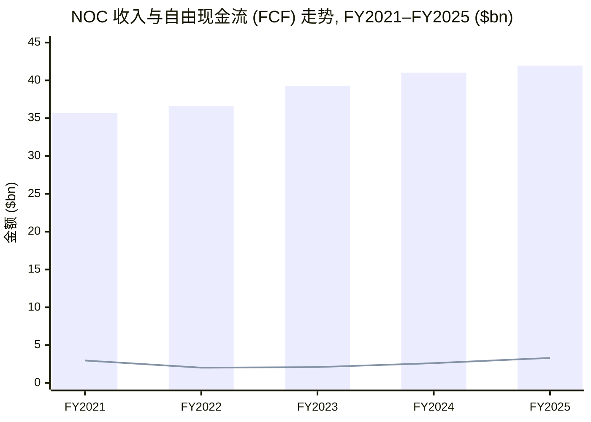
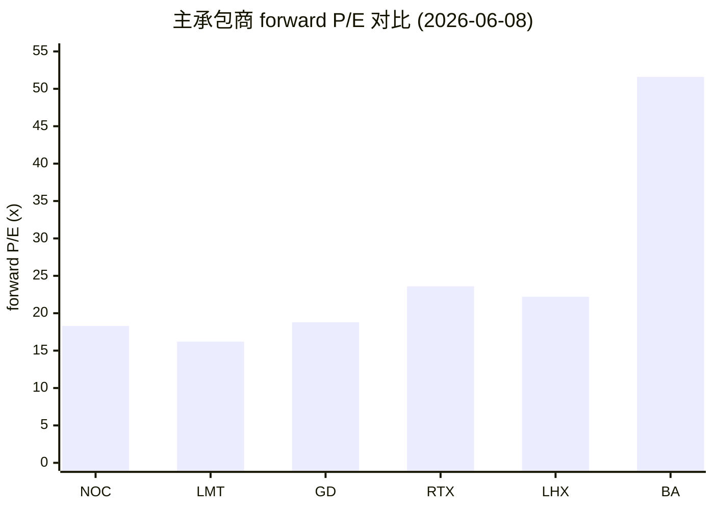
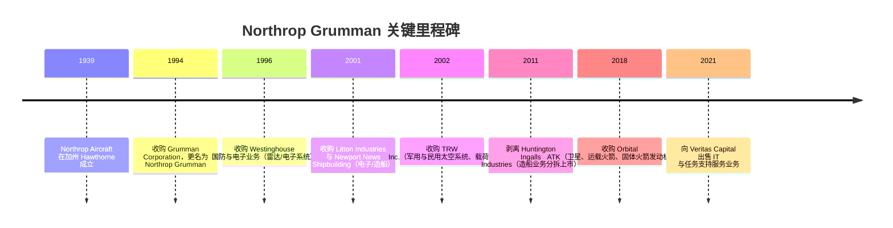
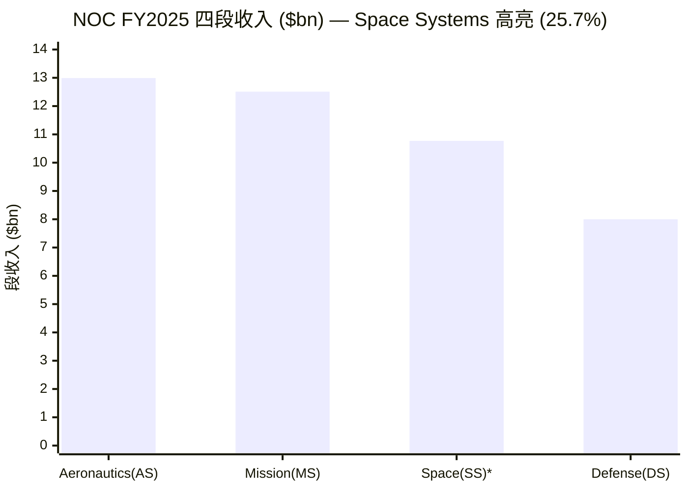
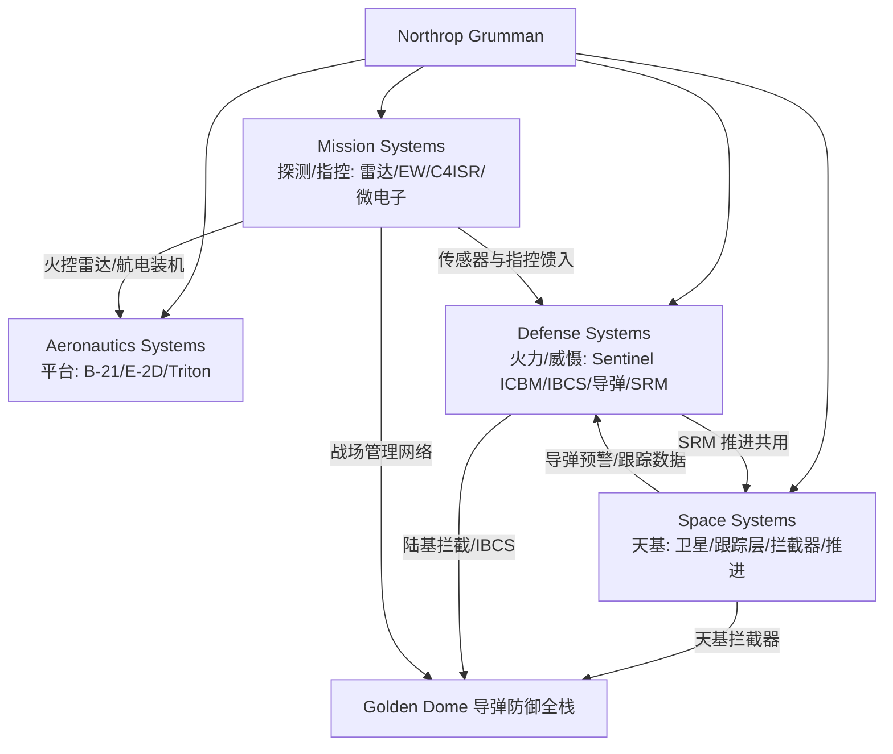
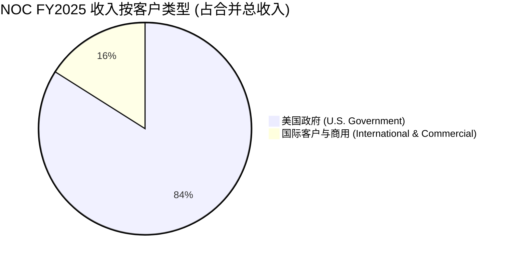
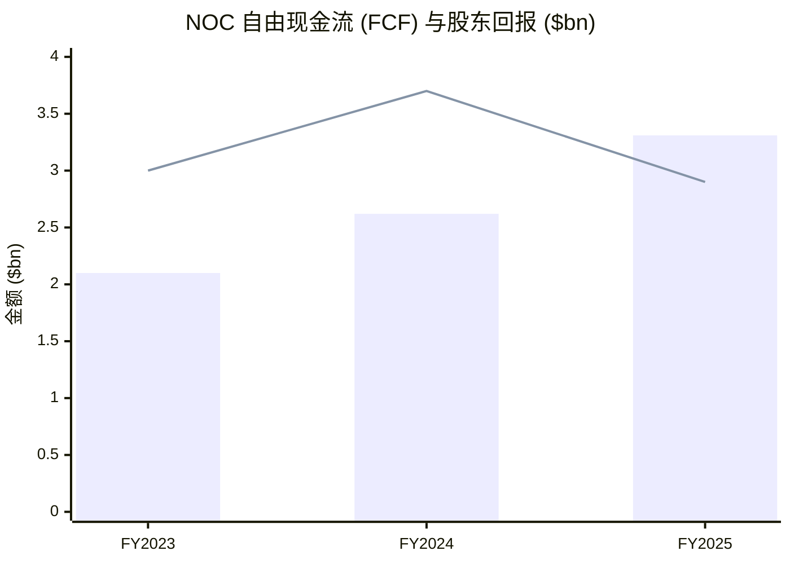
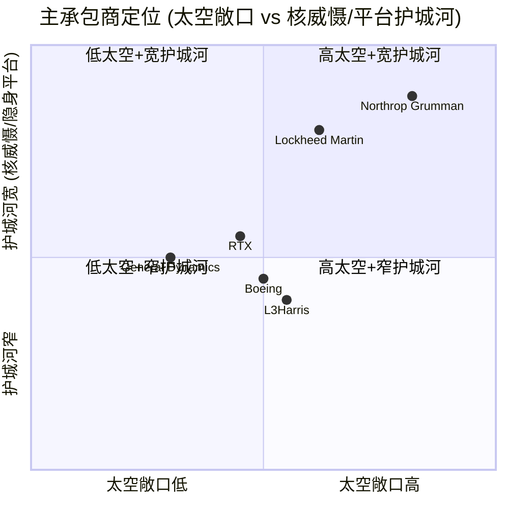
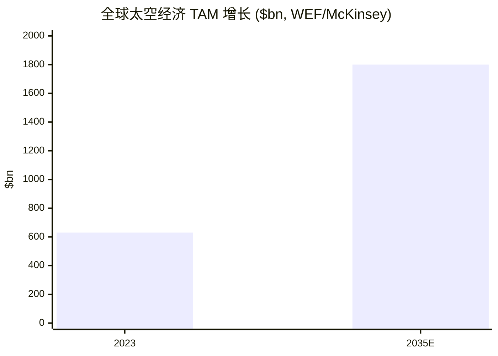

# Northrop Grumman 诺斯罗普·格鲁曼 (NYSE: NOC) 公司研究报告

> **报告日期 (as of)：2026-06-14** ｜ 主题归属：**太空投资主题 (Space Theme) — 标签 `adjacent`（美国大型国防主承包商中太空敞口最高者）**
> 主要数据源：SEC EDGAR 10-K (FY2025) / 10-Q (Q1 2026) / DEF 14A (2026) / 8-K，公司官网 northropgrumman.com 与投资者关系页，本地券商研究库 `db/zsxq.db`，yfinance（2026-06-12 收盘）。
> 语言说明：正文为简体中文，技术 / 财务 / 行业术语首次出现保留英文原词并加中文注释；项目名（B-21 Raider、Sentinel/GBSD、E-2D、IBCS 等）、评级标签、指数名保持英文。

---

## 投资摘要 (Investment Summary Header)

> *分析师观点 (Analyst view)：以下评级、目标价、上行/下行幅度与前瞻估值均为本报告分析层的自有观点，不构成对任何 SEC 备案文件的引用——10-K 中不含目标价。*

| 项目 | 内容 |
|---|---|
| **评级 (Rating)** | **Overweight / 增持** |
| **12 个月目标价 (12-mo Price Target)** | **$650**（base case） |
| 当前股价 (2026-06-12 收盘) | **$550.33** |
| 隐含上行空间 (Implied upside) | **约 +18%**（至 base case $650；不含 ~1.7% 股息） |
| 估值方法 (Valuation method) | forward P/E：2027E MTM-adjusted EPS ~$30.0 × 21.7× 目标 P/E |
| 市值 (Market cap) | 约 **$78.2bn** |
| 52 周区间 (52-wk range) | $481.28 – $774.00 |
| 相对表现 (relative performance) | 1 年 **+8.2%**（2025-06-13 → 2026-06-12）vs S&P 500 **+25.7%**（**跑输约 17.5pp**）；6 个月 −3.7%；现价低于 200 日均线（~$612）约 10% |
| 共识 (Consensus) | **Buy**，21 位分析师，平均目标价 **$696.95**（区间 $603–$815） |
| Ticker / 交易所 | **NOC / New York Stock Exchange (NYSE)** |

**论点支柱 (Thesis pillars)：**

1. **核三位一体 (nuclear triad) 现代化的近乎垄断地位。** NOC 是美国陆基核威慑现代化项目 **Sentinel (GBSD) ICBM (洲际弹道导弹)** 的唯一主承包商 (prime contractor)，同时是隐身战略轰炸机 **B-21 Raider** 的唯一承包商——这两条护城河极深、替代成本极高，是典型的 Buffett/Munger 式"质量复利"标的。
2. **太空敞口为美国大型主承包商之最。** Space Systems 段 FY2025 收入 $10.8bn，约占四段合计收入的 **25.7%**；叠加 Defense Systems 内的 Sentinel、固体火箭发动机 (solid rocket motor / SRM)、导弹防御与导弹预警/跟踪层，NOC 是 **Golden Dome (金穹)** $185bn 导弹防御计划的核心受益者之一。
3. **现金回报型"压舱石/质量"资产，而非成长股。** profitable、付息、回购密集；FY2025 自由现金流 (free cash flow / FCF) $3.3bn（+26% YoY），股息连续多年两位数增长（2025 年 +12%），β 约 −0.12，与大盘弱相关——在 late-cycle 宏观下是防御性配置。
4. **估值相对自身历史与同业仍具吸引力。** forward P/E ~18.3×，介于 LMT (~16×) 与 RTX (~24×) 之间；大摩测算美国国防巨头在 NTM P/FCF 口径下相对 S&P 500 仍有约 16% 折价，未充分反映 FY27 预算上行。

**关键摆动变量 (swing variables)：** ① **Sentinel 的 Production & Deployment 阶段定价与合同类型**（cost-type vs fixed-price）——这是利润率风险与 Nunn-McCurdy 超支审查 (Nunn-McCurdy breach) 后重组结果的核心；② **B-21 LRIP 固定价批次的成本到位情况**（已累计计提亏损，剩余亏损准备 $1.0bn）。

---

## 目录

1. [公司概览](#1-公司概览)
1B. [GF Score 基本面评分 (Fundamental Scorecard)](#1b-gf-score-基本面评分)
2. [估值与目标价 (Valuation & Price Target)](#2-估值与目标价)
3. [公司历史](#3-公司历史)
4. [管理团队](#4-管理团队)
5. [产品与服务（含 Space Systems 深度）](#5-产品与服务)
6. [客户与商业模式](#6-客户与商业模式)
7. [行业概览](#7-行业概览)
8. [竞争格局](#8-竞争格局)
9. [市场机会 (TAM)](#9-市场机会-tam)
10. [风险评估](#10-风险评估)
11. [投资者视角评分 (Investor Lenses)](#11-投资者视角评分)
12. [参考资料](#12-参考资料)

---

## 1. 公司概览

Northrop Grumman（诺斯罗普·格鲁曼，以下简称"NOC"或"公司"）是全球领先的航空航天与国防技术公司 (aerospace and defense technology company)。在 FY2025 的 10-K 中，公司对自身的定位是："a leading provider of space systems, military aircraft, missile defense, advanced weapons and long-range fires capabilities, mission systems, networking and communications, strategic deterrence systems, and breakthrough technologies, such as advanced computing, microelectronics and cyber"——即太空系统、军用飞机、导弹防御、先进武器与远程火力、任务系统、网络与通信、战略威慑系统等核心能力的供应商（[NOC FY2025 10-K, Item 1 Business](https://www.sec.gov/Archives/edgar/data/1133421/000113342126000003/noc-20251231.htm)）。**本报告的核心论点（以及 NOC 在太空主题篮子中被纳入的原因）是：在美国五大主承包商中，NOC 的太空敞口最高，且独家承担陆基核威慑现代化（Sentinel）与隐身战略轰炸机（B-21）两条护城河极深的项目。**

公司按四个运营段（也是四个 reportable segments）组织：**Aeronautics Systems (AS，航空系统)、Defense Systems (DS，防务系统)、Mission Systems (MS，任务系统)、Space Systems (SS，太空系统)**。2025 年 1 月 1 日起，公司将 Strike and Surveillance Aircraft Solutions (SSAS) 业务单元从 Defense Systems 调整至 Aeronautics Systems，本报告所引财务数据已按此口径列示（[NOC FY2025 10-K, Item 1 — Organization](https://www.sec.gov/Archives/edgar/data/1133421/000113342126000003/noc-20251231.htm)）。截至 2025-12-31，公司拥有约 **95,000 名员工**，2025 年新招约 7,500 人，在 446 处地点拥有约 5,300 万平方英尺设施（[NOC FY2025 10-K, Human Capital & Item 2 Properties](https://www.sec.gov/Archives/edgar/data/1133421/000113342126000003/noc-20251231.htm)）。

**FY2025 关键财务（均来自 10-K MD&A，单位：百万美元）：** 总收入 (Sales) **$41,954M**（YoY +2%），operating income **$4,511M**（operating margin rate 10.8%），net earnings **$4,182M**，diluted EPS **$29.08**，FCF **$3,307M**（+26% YoY）（[NOC FY2025 10-K, MD&A Results of Operations](https://www.sec.gov/Archives/edgar/data/1133421/000113342126000003/noc-20251231.htm)）。截至 2025-12-31，total backlog（remaining performance obligations，等同于在手订单）为 **$95.7bn**，较 2024 年底 $91.5bn 增长 5%——book-to-bill (订单出货比) 仍 > 1，订单覆盖约 2.3 倍年收入（[NOC FY2025 10-K, Backlog](https://www.sec.gov/Archives/edgar/data/1133421/000113342126000003/noc-20251231.htm)）。

最新一季（Q1 2026，截至 2026-03-31）总收入 **$9,881M**（YoY +4.4%），operating income **$989M**（vs 去年同期 $573M，后者含 B-21 的 $477M 亏损计提），net earnings **$875M**，diluted EPS **$6.14**（vs $3.32）；季末 backlog **$95.6bn**（[NOC Q1 2026 10-Q](https://www.sec.gov/Archives/edgar/data/1133421/000113342126000016/noc-20260331.htm)）。公司将 2026 年全年 sales 指引设为 **$43.5–44.0bn**、segment operating income **$4,850–5,000M**、MTM-adjusted EPS **$27.40–27.90**、FCF **$3,100–3,500M**（截至 2026-04-21）（[NOC Q1 2026 Earnings Release (8-K Ex-99.1)](https://www.sec.gov/Archives/edgar/data/1133421/000113342126000015/noc-03312026xearningsrelea.htm)）。

**5 年收入与 FCF 走势（FY2021–FY2025）：**

Source: 收入来自 [NOC FY2022 10-K](https://www.sec.gov/Archives/edgar/data/1133421/000113342123000006/noc-20221231.htm)（FY2021/2022）与 [NOC FY2025 10-K, MD&A](https://www.sec.gov/Archives/edgar/data/1133421/000113342126000003/noc-20251231.htm)（FY2023–2025 收入及 FCF）。注：bar = Sales，line = FCF；FY2021 FCF $2.97bn 来自 FY2022 10-K 现金流量重述（FY2022–2025 FCF 取 FY2025 10-K 三年表 + FY2022 10-K）。

**估值快照 (valuation snapshot)：** 截至 2026-06-12 收盘，股价 $550.33，市值约 $78.2bn，trailing P/E ~17.2×、forward P/E ~18.3×、P/S ~1.84×、P/B ~4.57×，股息 $9.40/年（yield ~1.71%）（[yfinance NOC key statistics, 2026-06-12](https://finance.yahoo.com/quote/NOC/)）。这是一个 profitable、付息、回购密集的成熟主承包商，估值应被框定为**质量/压舱石**而非成长——详见 Section 2。

**FY2025 利润表资金流 (income-statement Sankey) 与收入构成 (revenue donut)：**

<svg xmlns="http://www.w3.org/2000/svg" viewBox="0 0 1000 560" width="1000" height="560" role="img" aria-label="income statement Sankey"><rect x="0" y="0" width="1000" height="560" fill="#ffffff"/>
<text x="20.00" y="30.00" text-anchor="start" font-family="Helvetica,Arial,sans-serif" font-size="15" font-weight="700" fill="#1f2933">NOC FY2025 利润表 Sankey (income statement)</text>
<path d="M 359.00,71.00 C 428.50,71.00 428.50,229.23 498.00,229.23 L 498.00,274.60 C 428.50,274.60 428.50,116.37 359.00,116.37 Z" fill="#86efac" fill-opacity="0.55"/>
<path d="M 359.00,116.37 C 428.50,116.37 428.50,288.60 498.00,288.60 L 498.00,329.17 C 428.50,329.17 428.50,156.94 359.00,156.94 Z" fill="#fca5a5" fill-opacity="0.55"/>
<path d="M 204.00,78.00 C 273.50,78.00 273.50,71.00 343.00,71.00 L 343.00,156.94 C 273.50,156.94 273.50,163.94 204.00,163.94 Z" fill="#86efac" fill-opacity="0.55"/>
<path d="M 204.00,163.94 C 273.50,163.94 273.50,170.94 343.00,170.94 L 343.00,507.00 C 273.50,507.00 273.50,500.00 204.00,500.00 Z" fill="#fca5a5" fill-opacity="0.55"/>
<path d="M 514.00,229.23 C 583.50,229.23 583.50,236.23 653.00,236.23 L 653.00,281.60 C 583.50,281.60 583.50,274.60 514.00,274.60 Z" fill="#86efac" fill-opacity="0.55"/>
<path d="M 669.00,236.23 C 738.50,236.23 738.50,256.51 808.00,256.51 L 808.00,298.58 C 738.50,298.58 738.50,278.29 669.00,278.29 Z" fill="#86efac" fill-opacity="0.55"/>
<path d="M 669.00,278.29 C 738.50,278.29 738.50,312.58 808.00,312.58 L 808.00,321.49 C 738.50,321.49 738.50,287.21 669.00,287.21 Z" fill="#fca5a5" fill-opacity="0.55"/>
<path d="M 514.00,288.60 C 583.50,288.60 583.50,301.21 653.00,301.21 L 653.00,341.77 C 583.50,341.77 583.50,329.17 514.00,329.17 Z" fill="#fca5a5" fill-opacity="0.55"/>
<path d="M 514.00,343.17 C 583.50,343.17 583.50,281.60 653.00,281.60 L 653.00,287.21 C 583.50,287.21 583.50,348.77 514.00,348.77 Z" fill="#93c5fd" fill-opacity="0.55"/>
<rect x="188.00" y="78.00" width="16" height="422.00" rx="1.5" fill="#1e3a8a"/>
<rect x="343.00" y="71.00" width="16" height="85.94" rx="1.5" fill="#15803d"/>
<rect x="343.00" y="170.94" width="16" height="336.06" rx="1.5" fill="#dc2626"/>
<rect x="498.00" y="229.23" width="16" height="45.37" rx="1.5" fill="#15803d"/>
<rect x="498.00" y="288.60" width="16" height="40.57" rx="1.5" fill="#dc2626"/>
<rect x="498.00" y="343.17" width="16" height="5.60" rx="1.5" fill="#2563eb"/>
<rect x="653.00" y="236.23" width="16" height="50.98" rx="1.5" fill="#15803d"/>
<rect x="653.00" y="301.21" width="16" height="40.57" rx="1.5" fill="#dc2626"/>
<rect x="808.00" y="256.51" width="16" height="42.07" rx="1.5" fill="#15803d"/>
<rect x="808.00" y="312.58" width="16" height="8.91" rx="1.5" fill="#dc2626"/>
<rect x="207.00" y="60.00" width="106.80" height="26" rx="2" fill="#ffffff" fill-opacity="0.72"/>
<text x="210.00" y="72.00" text-anchor="start" font-family="Helvetica,Arial,sans-serif" font-size="11.5" font-weight="700" fill="#1f2933">Revenue</text>
<text x="210.00" y="85.00" text-anchor="start" font-family="Helvetica,Arial,sans-serif" font-size="10" font-weight="400" fill="#52606d">$42.0B  (100.0%)</text>
<rect x="362.00" y="53.00" width="94.20" height="26" rx="2" fill="#ffffff" fill-opacity="0.72"/>
<text x="365.00" y="65.00" text-anchor="start" font-family="Helvetica,Arial,sans-serif" font-size="11.5" font-weight="700" fill="#1f2933">Gross Profit</text>
<text x="365.00" y="78.00" text-anchor="start" font-family="Helvetica,Arial,sans-serif" font-size="10" font-weight="400" fill="#52606d">$8.5B  (20.4%)</text>
<rect x="362.00" y="152.94" width="144.60" height="26" rx="2" fill="#ffffff" fill-opacity="0.72"/>
<text x="365.00" y="164.94" text-anchor="start" font-family="Helvetica,Arial,sans-serif" font-size="11.5" font-weight="700" fill="#1f2933">Cost of Revenue (COGS)</text>
<text x="365.00" y="177.94" text-anchor="start" font-family="Helvetica,Arial,sans-serif" font-size="10" font-weight="400" fill="#52606d">$33.4B  (79.6%)</text>
<rect x="517.00" y="211.23" width="106.80" height="26" rx="2" fill="#ffffff" fill-opacity="0.72"/>
<text x="520.00" y="223.23" text-anchor="start" font-family="Helvetica,Arial,sans-serif" font-size="11.5" font-weight="700" fill="#1f2933">Operating Income</text>
<text x="520.00" y="236.23" text-anchor="start" font-family="Helvetica,Arial,sans-serif" font-size="10" font-weight="400" fill="#52606d">$4.5B  (10.8%)</text>
<rect x="517.00" y="270.60" width="150.90" height="26" rx="2" fill="#ffffff" fill-opacity="0.72"/>
<text x="520.00" y="282.60" text-anchor="start" font-family="Helvetica,Arial,sans-serif" font-size="11.5" font-weight="700" fill="#1f2933">Total Operating Expense</text>
<text x="520.00" y="295.60" text-anchor="start" font-family="Helvetica,Arial,sans-serif" font-size="10" font-weight="400" fill="#52606d">$4.0B  (9.6%)</text>
<text x="489.00" y="342.97" text-anchor="end" font-family="Helvetica,Arial,sans-serif" font-size="11.5" font-weight="700" fill="#1f2933">Net Interest / Other Income</text>
<text x="489.00" y="355.97" text-anchor="end" font-family="Helvetica,Arial,sans-serif" font-size="10" font-weight="400" fill="#52606d">$557.0M  (1.3%)</text>
<rect x="672.00" y="218.23" width="94.20" height="26" rx="2" fill="#ffffff" fill-opacity="0.72"/>
<text x="675.00" y="230.23" text-anchor="start" font-family="Helvetica,Arial,sans-serif" font-size="11.5" font-weight="700" fill="#1f2933">Pretax Income</text>
<text x="675.00" y="243.23" text-anchor="start" font-family="Helvetica,Arial,sans-serif" font-size="10" font-weight="400" fill="#52606d">$5.1B  (12.1%)</text>
<rect x="672.00" y="283.21" width="87.90" height="26" rx="2" fill="#ffffff" fill-opacity="0.72"/>
<text x="675.00" y="295.21" text-anchor="start" font-family="Helvetica,Arial,sans-serif" font-size="11.5" font-weight="700" fill="#1f2933">SG&amp;A</text>
<text x="675.00" y="308.21" text-anchor="start" font-family="Helvetica,Arial,sans-serif" font-size="10" font-weight="400" fill="#52606d">$4.0B  (9.6%)</text>
<text x="833.00" y="274.54" text-anchor="start" font-family="Helvetica,Arial,sans-serif" font-size="11.5" font-weight="700" fill="#1f2933">Net Income</text>
<text x="833.00" y="287.54" text-anchor="start" font-family="Helvetica,Arial,sans-serif" font-size="10" font-weight="400" fill="#52606d">$4.2B  (10.0%)</text>
<text x="833.00" y="314.03" text-anchor="start" font-family="Helvetica,Arial,sans-serif" font-size="11.5" font-weight="700" fill="#1f2933">Income Tax</text>
<text x="833.00" y="327.03" text-anchor="start" font-family="Helvetica,Arial,sans-serif" font-size="10" font-weight="400" fill="#52606d">$886.0M  (2.1%)</text>
<text x="500.00" y="544.00" text-anchor="middle" font-family="Helvetica,Arial,sans-serif" font-size="10" font-weight="400" fill="#52606d">Source: NOC FY2025 10-K (consolidated statements), filed 2026-01-27 · CIK 0001133421</text>
</svg>

*图：NOC FY2025 利润表 Sankey——总收入 $41,954M（100%）拆为 cost of sales（销售成本）$33,410M（79.6%，= 总收入 − G&A − operating income，推算）与 gross profit（毛利）$8,544M（20.4%）；毛利再分为 G&A $4,033M 与 operating income $4,511M（margin 10.8%）；加 net interest / other income（净利息及其他收入）$557M 得 pretax $5,068M；减 income tax $886M 后为 net earnings $4,182M（net margin 10.0%）。* Source: [NOC FY2025 10-K, Consolidated Statements of Earnings](https://www.sec.gov/Archives/edgar/data/1133421/000113342126000003/noc-20251231.htm)。

<svg xmlns="http://www.w3.org/2000/svg" viewBox="0 0 720 460" width="720" height="460" role="img" aria-label="revenue donut"><rect x="0" y="0" width="720" height="460" fill="#ffffff"/>
<text x="20.00" y="30.00" text-anchor="start" font-family="Helvetica,Arial,sans-serif" font-size="15" font-weight="700" fill="#1f2933">NOC FY2025 收入构成 (by segment)</text>
<path d="M 288.00,107.20 A 132 132 0 0 1 415.11,274.80 L 363.11,260.24 A 78 78 0 0 0 288.00,161.20 Z" fill="#2563eb"/>
<path d="M 415.11,274.80 A 132 132 0 0 1 227.37,356.45 L 252.17,308.49 A 78 78 0 0 0 363.11,260.24 Z" fill="#15803d"/>
<path d="M 227.37,356.45 A 132 132 0 0 1 168.30,183.56 L 217.27,206.32 A 78 78 0 0 0 252.17,308.49 Z" fill="#d97706"/>
<path d="M 168.30,183.56 A 132 132 0 0 1 288.00,107.20 L 288.00,161.20 A 78 78 0 0 0 217.27,206.32 Z" fill="#7c3aed"/>
<text x="288.00" y="235.20" text-anchor="middle" font-family="Helvetica,Arial,sans-serif" font-size="18" font-weight="800" fill="#1f2933">NOC</text>
<text x="288.00" y="255.20" text-anchor="middle" font-family="Helvetica,Arial,sans-serif" font-size="13" font-weight="600" fill="#52606d">$44.3B</text>
<text x="288.00" y="271.20" text-anchor="middle" font-family="Helvetica,Arial,sans-serif" font-size="10" font-weight="400" fill="#8a97a3">total</text>
<line x1="397.96" y1="155.81" x2="413.96" y2="155.81" stroke="#2563eb" stroke-width="1.4"/>
<text x="417.96" y="153.81" text-anchor="start" font-family="Helvetica,Arial,sans-serif" font-size="11" font-weight="700" fill="#1f2933">Aeronautics</text>
<text x="417.96" y="167.81" text-anchor="start" font-family="Helvetica,Arial,sans-serif" font-size="10" font-weight="400" fill="#52606d">$13.0B  (29.3%)</text>
<line x1="343.04" y1="365.75" x2="359.04" y2="365.75" stroke="#15803d" stroke-width="1.4"/>
<text x="363.04" y="363.75" text-anchor="start" font-family="Helvetica,Arial,sans-serif" font-size="11" font-weight="700" fill="#1f2933">Mission</text>
<text x="363.04" y="377.75" text-anchor="start" font-family="Helvetica,Arial,sans-serif" font-size="10" font-weight="400" fill="#52606d">$12.5B  (28.2%)</text>
<line x1="157.41" y1="283.82" x2="141.41" y2="283.82" stroke="#d97706" stroke-width="1.4"/>
<text x="137.41" y="281.82" text-anchor="end" font-family="Helvetica,Arial,sans-serif" font-size="11" font-weight="700" fill="#1f2933">Space</text>
<text x="137.41" y="295.82" text-anchor="end" font-family="Helvetica,Arial,sans-serif" font-size="10" font-weight="400" fill="#52606d">$10.8B  (24.3%)</text>
<line x1="213.78" y1="122.86" x2="197.78" y2="122.86" stroke="#7c3aed" stroke-width="1.4"/>
<text x="193.78" y="120.86" text-anchor="end" font-family="Helvetica,Arial,sans-serif" font-size="11" font-weight="700" fill="#1f2933">Defense</text>
<text x="193.78" y="134.86" text-anchor="end" font-family="Helvetica,Arial,sans-serif" font-size="10" font-weight="400" fill="#52606d">$8.0B  (18.1%)</text>
<text x="360.00" y="444.00" text-anchor="middle" font-family="Helvetica,Arial,sans-serif" font-size="10" font-weight="400" fill="#52606d">Source: NOC FY2025 10-K (consolidated statements), filed 2026-01-27 · CIK 0001133421</text>
</svg>

*图：NOC FY2025 收入按段构成（段口径、含段间销售；四段合计 $44,271M，抵消段间 $2,317M 后为合并总收入 $41,954M）。Mission Systems 14.6% 的 OM rate 最高，Space Systems 占四段 25.7%（美国大型主承包商中太空敞口最高）。* Source: [NOC FY2025 10-K, Product and Service Analysis](https://www.sec.gov/Archives/edgar/data/1133421/000113342126000003/noc-20251231.htm)。

---

## 1B. GF Score 基本面评分

> *分析师观点 (Analyst view)：* 以下 GF Score（GuruFocus 式五维基本面评分）为本报告自有评分框架 (rubric)，**非 GuruFocus 官方数据、非背书**；五个分项与综合分均不引用任何备案文件，但每个分项背后的具体指标（margins / leverage / CAGR / multiples / returns）均在 Section 1–2 逐项引用一手来源。综合分采用透明权重（财务实力 20% / 盈利能力 25% / 成长性 25% / 估值 15% / 动量 15%），非 GuruFocus 专有权重。

<svg xmlns="http://www.w3.org/2000/svg" viewBox="0 0 500 500" width="500" height="500" role="img" aria-label="GF Score radar">
<rect x="0" y="0" width="500" height="500" fill="#ffffff"/>
<text x="20" y="24" font-family="Helvetica,Arial,sans-serif" font-size="15" font-weight="700" fill="#1f2933">GF Score (GuruFocus-style): 58/100</text>
<text x="20" y="41" font-family="Helvetica,Arial,sans-serif" font-size="11" fill="#52606d">51–70 Poor future performance potential</text>
<polygon points="250.0,88.0 392.7,191.6 338.2,359.4 161.8,359.4 107.3,191.6" fill="#e9f5ec" stroke="none"/>
<polygon points="250.0,208.0 278.5,228.7 267.6,262.3 232.4,262.3 221.5,228.7" fill="none" stroke="#c5d3cb" stroke-width="1"/>
<polygon points="250.0,178.0 307.1,219.5 285.3,286.5 214.7,286.5 192.9,219.5" fill="none" stroke="#c5d3cb" stroke-width="1"/>
<polygon points="250.0,148.0 335.6,210.2 302.9,310.8 197.1,310.8 164.4,210.2" fill="none" stroke="#c5d3cb" stroke-width="1"/>
<polygon points="250.0,118.0 364.1,200.9 320.5,335.1 179.5,335.1 135.9,200.9" fill="none" stroke="#c5d3cb" stroke-width="1"/>
<polygon points="250.0,88.0 392.7,191.6 338.2,359.4 161.8,359.4 107.3,191.6" fill="none" stroke="#c5d3cb" stroke-width="1.3"/>
<line x1="250" y1="238" x2="161.8" y2="359.4" stroke="#cfdad3" stroke-width="1"/>
<text x="146.5" y="392.4" text-anchor="end" font-family="Helvetica,Arial,sans-serif" font-size="11.5" font-weight="600" fill="#1f2933">财务实力</text>
<text x="192.7" y="310.9" text-anchor="middle" font-family="Helvetica,Arial,sans-serif" font-size="10.5" font-weight="700" fill="#1f2933">6.5</text>
<line x1="250" y1="238" x2="250.0" y2="88.0" stroke="#cfdad3" stroke-width="1"/>
<text x="250.0" y="58.0" text-anchor="middle" font-family="Helvetica,Arial,sans-serif" font-size="11.5" font-weight="600" fill="#1f2933">盈利能力</text>
<text x="250.0" y="127.0" text-anchor="middle" font-family="Helvetica,Arial,sans-serif" font-size="10.5" font-weight="700" fill="#1f2933">7</text>
<line x1="250" y1="238" x2="107.3" y2="191.6" stroke="#cfdad3" stroke-width="1"/>
<text x="82.6" y="183.6" text-anchor="end" font-family="Helvetica,Arial,sans-serif" font-size="11.5" font-weight="600" fill="#1f2933">成长性</text>
<text x="178.7" y="208.8" text-anchor="middle" font-family="Helvetica,Arial,sans-serif" font-size="10.5" font-weight="700" fill="#1f2933">5</text>
<line x1="250" y1="238" x2="392.7" y2="191.6" stroke="#cfdad3" stroke-width="1"/>
<text x="417.4" y="183.6" text-anchor="start" font-family="Helvetica,Arial,sans-serif" font-size="11.5" font-weight="600" fill="#1f2933">估值</text>
<text x="335.6" y="204.2" text-anchor="middle" font-family="Helvetica,Arial,sans-serif" font-size="10.5" font-weight="700" fill="#1f2933">6</text>
<line x1="250" y1="238" x2="338.2" y2="359.4" stroke="#cfdad3" stroke-width="1"/>
<text x="353.5" y="392.4" text-anchor="start" font-family="Helvetica,Arial,sans-serif" font-size="11.5" font-weight="600" fill="#1f2933">动量</text>
<text x="285.3" y="280.5" text-anchor="middle" font-family="Helvetica,Arial,sans-serif" font-size="10.5" font-weight="700" fill="#1f2933">4</text>
<polygon points="250.0,133.0 335.6,210.2 285.3,286.5 192.7,316.9 178.7,214.8" fill="#2e8b57" fill-opacity="0.34" stroke="#2e8b57" stroke-width="2"/>
<circle cx="192.7" cy="316.9" r="2.6" fill="#2e8b57"/>
<circle cx="250.0" cy="133.0" r="2.6" fill="#2e8b57"/>
<circle cx="178.7" cy="214.8" r="2.6" fill="#2e8b57"/>
<circle cx="335.6" cy="210.2" r="2.6" fill="#2e8b57"/>
<circle cx="285.3" cy="286.5" r="2.6" fill="#2e8b57"/>
<text x="250" y="470" text-anchor="middle" font-family="Helvetica,Arial,sans-serif" font-size="9.5" fill="#52606d">Source: NOC FY2025 10-K · Yahoo Finance (2026-06-12) · indicators.db</text>
<text x="250" y="485" text-anchor="middle" font-family="Helvetica,Arial,sans-serif" font-size="9" fill="#52606d">GF Score = independent analyst rubric (*Analyst view:*) — not GuruFocus™ official number</text>
</svg>

| 维度 | 评分 (0–10) | |
|---|---|---|
| 财务实力 (Financial Strength) | 6.5 | `██████░░░░` |
| 盈利能力 (Profitability) | 7 | `███████░░░` |
| 成长性 (Growth) | 5 | `█████░░░░░` |
| 估值 (GF Value，越高越便宜) | 6 | `██████░░░░` |
| 动量 (Momentum) | 4 | `████░░░░░░` |
| **GF Score (composite, *分析师观点*)** | **58 / 100** | **51–70 区间（增长/动量倾斜的 rubric 对低增长防御股的常见落点）** |

**综合 GF Score = 58/100**，落在 GuruFocus 口径 "51–70" 区间。**这个看似中游的分数恰恰揭示了 NOC 的本质：它是质量/收益型 (quality/income) 压舱石资产，而非成长/动量型标的。** GF Score 把 40% 权重压在成长性 (25%) 与动量 (15%) 上，对一个收入年增 ~4–5%、近一年跑输标普 500 约 17.5pp 的低 beta 防御股自然给出中游分。这与 Section 11 中 Buffett / Munger 质量视角给出的偏正面结论并不矛盾，而是同一事实的两面：**在成长/动量维度普通，在质量/护城河维度优异。** 逐维度评分理由如下。

**财务实力 (Financial Strength) = 6.5/10。** investment-grade 资产负债表但杠杆中等：截至 2025-12-31，long-term debt $15,162M、现金 $4,403M，net debt ≈ $10.8bn；以 EBITDA ≈ operating income $4,511M + D&A ≈ $5.5bn 计，net debt/EBITDA ≈ ~1.9×；interest coverage（operating income / 利息）约 6×（[NOC FY2025 10-K, Liquidity & Consolidated Balance Sheets](https://www.sec.gov/Archives/edgar/data/1133421/000113342126000003/noc-20251231.htm)）。稳健但非零杠杆，叠加 B-21/Sentinel 的固定价执行风险，故不给满分。

**盈利能力 (Profitability) = 7/10。** operating margin 10.8%、net margin 10.0%、ROE ≈ 26.2%（net earnings $4,182M / 平均权益 $15,982M）、ROIC 约 13–14% 高于 WACC ~8.6%，且历年持续为正（仅被 B-21 计提阶段性压低）（[NOC FY2025 10-K, MD&A & Consolidated Statements of Earnings](https://www.sec.gov/Archives/edgar/data/1133421/000113342126000003/noc-20251231.htm)）。扣分在于 ~11% 的段利润率是国防主承包商的结构性天花板，难有大幅扩张。

**成长性 (Growth) = 5/10。** 收入 3 年 CAGR 约 4.6%（FY2022 $36.6bn → FY2025 $41.95bn）；FY2026 指引中点 $43.75bn（~+4.5%）；EPS 受 B-21 计提与养老金 mark-to-market (MTM) 影响而波动（[NOC FY2025 10-K, MD&A](https://www.sec.gov/Archives/edgar/data/1133421/000113342126000003/noc-20251231.htm)；[NOC Q1 2026 Earnings Release](https://www.sec.gov/Archives/edgar/data/1133421/000113342126000015/noc-03312026xearningsrelea.htm)）。中个位数增长是国防压舱石常态——评分中性；但 Sentinel/B-21 量产爬坡 + Golden Dome 提供了高于历史的成长可选性 (optionality)。

**估值 (GF Value，越高越便宜) = 6/10。** forward P/E ~18.3× 处于 NOC 自身 5 年区间（约 13–20×）中上沿、同业中段（LMT ~16× 与 RTX ~24× 之间）；相对本报告 base case $650 有 ~18% 上行/安全边际（[yfinance, 2026-06-12](https://finance.yahoo.com/quote/NOC/)）。不算深度低估，但相对自身在国防扩张期的溢价中枢有折价——中性偏正。

**动量 (Momentum) = 4.0/10。** 最弱的一维：近 1 年 +8.2% 但**跑输标普 500 约 17.5pp**（SPY +25.7%）；近 6 个月 −3.7%；现价 $550.33 **低于 200 日均线 ~$612 约 10%**（[yfinance, 2026-06-12](https://finance.yahoo.com/quote/NOC/)）。技术面弱势——这也是估值折价的镜像：对逆向/价值型买家是机会信号，对动量型买家是劝退信号。

---

## 2. 估值与目标价

### 2a. 估值快照与同业对比

NOC 当前 forward P/E ~18.3×（2026-06-12），明显低于其自身在国防预算扩张期常见的溢价区间，也低于部分同业。下表为美国主要主承包商的对比（数据来自 yfinance，2026-06-08；fwd P/E 为前瞻市盈率）：

| 公司 | Ticker | forward P/E | P/S (TTM) | 市值 |
|---|---|---|---|---|
| **Northrop Grumman** | **NOC** | **~18.3×** | **~1.84×** | **~$78bn** |
| Lockheed Martin | LMT | ~16.2× | ~1.60× | ~$120bn |
| RTX Corporation | RTX | ~23.6× | ~2.66× | ~$241bn |
| General Dynamics | GD | ~18.8× | ~1.71× | ~$92bn |
| L3Harris | LHX | ~22.2× | ~4.38× | ~$56bn |
| The Boeing Company | BA | ~51.6× | ~1.85× | ~$170bn |

Source: [yfinance peer key statistics, 2026-06-08](https://finance.yahoo.com/quote/NOC/)。注：NOC 行已更新至 2026-06-12 收盘（$550.33），同业各行仍为 2026-06-08（4 日内相对定位不变）。

Source: [yfinance, 2026-06-08](https://finance.yahoo.com/quote/NOC/)。

NOC 处于同业中段——比 LMT、GD 略高，但显著低于 RTX、LHX，更远低于因 737 MAX/777X 拖累而 EPS 受抑的 Boeing。在防御类资产中，NOC 的 P/S ~1.81× 处于合理区间，反映其 ~11% 的 segment operating margin 与稳定的政府客户基础。**值得注意的是，NOC 当前股价 $550.33 距 52 周高点 $774 有约 29% 回撤、且仍低于 200 日均线（~$612）约 10%**——市场对 Sentinel 重组的不确定性、B-21 固定价批次的执行风险、以及 FY26/FY27 预算与持续决议 (continuing resolution / CR) 的扰动给予了折价。*分析师观点 (Analyst view)：* 大摩在其国防深度报告中测算，美国国防巨头当前在 NTM P/FCF 口径下相对 S&P 500 仍有约 **16% 折价**，未充分反映预算上行与结构性重估潜力（[Morgan Stanley — Defense: Dollars, Disruptors, and De(Consolidation), 2026-03-06, p.1](http://xs-macbook-air.local:5001/zsxq/pdf/184442822484282/Morgan%20Stanley-Defense%EF%BC%9ADollars%EF%BC%8C%20Disruptors%EF%BC%8C%20and%20De%EF%BC%88Consolidation%EF%BC%89%EF%BC%9B%20Identifying%20Investment%20Opportunities-260306.pdf)）。

### 2b. 前瞻估值、目标价与情景

> *分析师观点 (Analyst view)：以下前瞻估值表、目标价推导与 bull/base/bear 情景均为本报告自有前瞻观点，每一格预测值不构成对任何备案文件的引用；外部输入（公司指引、行业预算）已在文内逐项标注来源。*

**前瞻财务估值表（本报告模型，$bn 除非另注）：**

| 指标 | FY2025A | FY2026E | FY2027E | FY2028E |
|---|---|---|---|---|
| Sales | 41.95 | 43.7 | 46.0 | 48.5 |
| YoY | +2% | +4.2% | +5.3% | +5.4% |
| Segment operating margin | 10.4%¹ | ~10.9% | ~11.2% | ~11.4% |
| MTM-adjusted EPS ($) | ~25.6² | ~27.6 | ~30.0 | ~33.0 |

¹ FY2025 segment operating income $4,377M / sales $41,954M ≈ 10.4%（[NOC FY2025 10-K, Segment Operating Results](https://www.sec.gov/Archives/edgar/data/1133421/000113342126000003/noc-20251231.htm)）。
² FY2026E EPS 基于公司自有指引中点 $27.65；FY2027E/2028E 为本模型外推，驱动因素为 Sentinel 与 B-21 进入量产爬坡、MS 段 ~14.6% 高利润率持续、回购缩减股数。各预测格为本报告观点。

模型的关键驱动假设逐段说明：① **Defense Systems**——Sentinel 随 Production & Deployment 阶段定价落地而继续爬坡，叠加战术导弹 (AARGM-ER、SiAW)、IBCS、弹药扩产，FY2026 指引收入"Mid-to-High $8bn"、OM rate ~10%（[NOC Q1 2026 Earnings Release — 2026 Segment Guidance](https://www.sec.gov/Archives/edgar/data/1133421/000113342126000015/noc-03312026xearningsrelea.htm)）；② **Aeronautics Systems**——B-21 量产爬坡（公司 Q1 2026 已与美空军达成扩产/提速协议，承诺多年投入约 $2.5bn），指引收入"Mid $13bn"、OM rate"Low-to-Mid 9%"（[同上](https://www.sec.gov/Archives/edgar/data/1133421/000113342126000015/noc-03312026xearningsrelea.htm)）；③ **Space Systems**——FY2025 因受限空间与 NGI 项目收尾而 −8%，但 Golden Dome 与导弹跟踪层有望在 FY2026–2028 重启增长，指引"~$11bn"、OM rate"~11%"（[同上](https://www.sec.gov/Archives/edgar/data/1133421/000113342126000015/noc-03312026xearningsrelea.htm)）。

**目标价推导（base case，本报告观点）：**

> 2027E MTM-adjusted EPS ~$30.0 × 目标 forward P/E **21.7×** = **$650**。
>
> 目标倍数 21.7× 的依据：① 高于 NOC 当前 ~18.3× 的折价倍数，反映 Sentinel/B-21 执行风险逐步消化后向其国防扩张期溢价中枢回归；② 仍低于 RTX (~23.6×)、LHX (~22.2×)，但高于 LMT (~16.2×)——NOC 凭借 Sentinel/B-21 双护城河与最高的太空敞口，理应享受相对 LMT 的溢价、相对 RTX（商用航发拖累）的折价。倍数本身的论证与目标价数字同等重要。

**Bull / Base / Bear 情景（本报告观点，每项与其摆动假设挂钩）：**

| 情景 | 关键假设 | 2027E EPS | 目标 P/E | 目标价 | 相对 $550.33 |
|---|---|---|---|---|---|
| **Bull** | Sentinel P&D 以有利的成本加成条款重启 + Golden Dome 太空拦截器大额拨款 + FY27 $1.5trn 预算兑现 | ~$32 | 24× | **$768** | **+40%** |
| **Base** | Sentinel 平稳重组、B-21 量产无新增重大亏损、预算温和上行 | ~$30 | 21.7× | **$650** | **+18%** |
| **Bear** | Sentinel/B-21 再现重大成本超支 + CR 拖延 + 行政令限制回购/分红 | ~$27 | 16× | **$432** | **−21%** |

*分析师观点 (Analyst view)：* 大摩在其国防报告中，为反映 $1.5trn FY27 预算情景，将国防巨头 bull-case 目标价平均上调约 **61%**，其中 **NOC 上调 62%**，使 bull-bear 区间扩大到约 4 倍（此前约 1.5 倍），并给予 NOC **Overweight** 评级（[Morgan Stanley — Defense, 2026-03-06, p.1](http://xs-macbook-air.local:5001/zsxq/pdf/184442822484282/Morgan%20Stanley-Defense%EF%BC%9ADollars%EF%BC%8C%20Disruptors%EF%BC%8C%20and%20De%EF%BC%88Consolidation%EF%BC%89%EF%BC%9B%20Identifying%20Investment%20Opportunities-260306.pdf)）。

**与共识对比 (consensus benchmark)：** 本报告 base case 目标价 $650 低于卖方共识平均目标价 **$696.95**（21 位分析师，区间 $603–$815，评级共识 *Buy*）（[yfinance analyst estimates, 2026-06-08](https://finance.yahoo.com/quote/NOC/)）——本报告相对共识偏保守约 7%，因我们对 Sentinel P&D 阶段定价与 B-21 固定价批次给予更高风险权重（[yfinance NOC analyst estimates, 2026-06-08](https://finance.yahoo.com/quote/NOC/)）。

### 2c. ROE 杜邦分解与资产负债结构

**ROE 杜邦五步分解 (5-step DuPont)：**

<svg xmlns="http://www.w3.org/2000/svg" viewBox="0 0 1240 540" width="1240" height="540" role="img" aria-label="DuPont ROE decomposition"><rect x="0" y="0" width="1240" height="540" fill="#ffffff"/>
<text x="20.00" y="30.00" text-anchor="start" font-family="Helvetica,Arial,sans-serif" font-size="15" font-weight="700" fill="#1f2933">NOC FY2025 DuPont ROE 分解 (5-step)</text>
<rect x="545.00" y="56.00" width="150" height="56" rx="7" fill="#1e3a8a"/>
<text x="620.00" y="76.00" text-anchor="middle" font-family="Helvetica,Arial,sans-serif" font-size="11.5" font-weight="700" fill="#ffffff">ROE</text>
<text x="620.00" y="94.00" text-anchor="middle" font-family="Helvetica,Arial,sans-serif" font-size="13" font-weight="800" fill="#ffffff">26.17%</text>
<text x="620.00" y="106.00" text-anchor="middle" font-family="Helvetica,Arial,sans-serif" font-size="8.5" font-weight="400" fill="#dbeafe">= Net Income / Avg Equity</text>
<rect x="191.60" y="168.00" width="150" height="56" rx="7" fill="#2563eb"/>
<text x="266.60" y="188.00" text-anchor="middle" font-family="Helvetica,Arial,sans-serif" font-size="11.5" font-weight="700" fill="#ffffff">Net Margin</text>
<text x="266.60" y="206.00" text-anchor="middle" font-family="Helvetica,Arial,sans-serif" font-size="13" font-weight="800" fill="#ffffff">9.97%</text>
<text x="266.60" y="218.00" text-anchor="middle" font-family="Helvetica,Arial,sans-serif" font-size="8.5" font-weight="400" fill="#dbeafe">Net Income / Revenue</text>
<line x1="620.00" y1="112.00" x2="266.60" y2="168.00" stroke="#94a3b8" stroke-width="1.4"/>
<rect x="545.00" y="168.00" width="150" height="56" rx="7" fill="#2563eb"/>
<text x="620.00" y="188.00" text-anchor="middle" font-family="Helvetica,Arial,sans-serif" font-size="11.5" font-weight="700" fill="#ffffff">Asset Turnover</text>
<text x="620.00" y="206.00" text-anchor="middle" font-family="Helvetica,Arial,sans-serif" font-size="13" font-weight="800" fill="#ffffff">0.83</text>
<text x="620.00" y="218.00" text-anchor="middle" font-family="Helvetica,Arial,sans-serif" font-size="8.5" font-weight="400" fill="#dbeafe">Revenue / Avg Assets</text>
<line x1="620.00" y1="112.00" x2="620.00" y2="168.00" stroke="#94a3b8" stroke-width="1.4"/>
<rect x="898.40" y="168.00" width="150" height="56" rx="7" fill="#2563eb"/>
<text x="973.40" y="188.00" text-anchor="middle" font-family="Helvetica,Arial,sans-serif" font-size="11.5" font-weight="700" fill="#ffffff">Equity Multiplier</text>
<text x="973.40" y="206.00" text-anchor="middle" font-family="Helvetica,Arial,sans-serif" font-size="13" font-weight="800" fill="#ffffff">3.15</text>
<text x="973.40" y="218.00" text-anchor="middle" font-family="Helvetica,Arial,sans-serif" font-size="8.5" font-weight="400" fill="#dbeafe">Avg Assets / Avg Equity</text>
<line x1="620.00" y1="112.00" x2="973.40" y2="168.00" stroke="#94a3b8" stroke-width="1.4"/>
<circle cx="443.30" cy="196.00" r="11" fill="#ffffff" stroke="#94a3b8" stroke-width="1.2"/>
<text x="443.30" y="201.00" text-anchor="middle" font-family="Helvetica,Arial,sans-serif" font-size="14" font-weight="800" fill="#52606d">×</text>
<circle cx="796.70" cy="196.00" r="11" fill="#ffffff" stroke="#94a3b8" stroke-width="1.2"/>
<text x="796.70" y="201.00" text-anchor="middle" font-family="Helvetica,Arial,sans-serif" font-size="14" font-weight="800" fill="#52606d">×</text>
<rect x="65.00" y="300.00" width="118" height="56" rx="7" fill="#2563eb"/>
<text x="124.00" y="320.00" text-anchor="middle" font-family="Helvetica,Arial,sans-serif" font-size="11.5" font-weight="700" fill="#ffffff">Operating Margin</text>
<text x="124.00" y="338.00" text-anchor="middle" font-family="Helvetica,Arial,sans-serif" font-size="13" font-weight="800" fill="#ffffff">10.75%</text>
<text x="124.00" y="350.00" text-anchor="middle" font-family="Helvetica,Arial,sans-serif" font-size="8.5" font-weight="400" fill="#dbeafe">Op Inc / Revenue</text>
<line x1="266.60" y1="224.00" x2="124.00" y2="300.00" stroke="#94a3b8" stroke-width="1.4"/>
<rect x="207.60" y="300.00" width="118" height="56" rx="7" fill="#2563eb"/>
<text x="266.60" y="320.00" text-anchor="middle" font-family="Helvetica,Arial,sans-serif" font-size="11.5" font-weight="700" fill="#ffffff">Tax Burden</text>
<text x="266.60" y="338.00" text-anchor="middle" font-family="Helvetica,Arial,sans-serif" font-size="13" font-weight="800" fill="#ffffff">0.8252</text>
<text x="266.60" y="350.00" text-anchor="middle" font-family="Helvetica,Arial,sans-serif" font-size="8.5" font-weight="400" fill="#dbeafe">Net Inc / Pretax</text>
<line x1="266.60" y1="224.00" x2="266.60" y2="300.00" stroke="#94a3b8" stroke-width="1.4"/>
<rect x="350.20" y="300.00" width="118" height="56" rx="7" fill="#2563eb"/>
<text x="409.20" y="320.00" text-anchor="middle" font-family="Helvetica,Arial,sans-serif" font-size="11.5" font-weight="700" fill="#ffffff">Interest Burden</text>
<text x="409.20" y="338.00" text-anchor="middle" font-family="Helvetica,Arial,sans-serif" font-size="13" font-weight="800" fill="#ffffff">1.1235</text>
<text x="409.20" y="350.00" text-anchor="middle" font-family="Helvetica,Arial,sans-serif" font-size="8.5" font-weight="400" fill="#dbeafe">Pretax / Op Inc</text>
<line x1="266.60" y1="224.00" x2="409.20" y2="300.00" stroke="#94a3b8" stroke-width="1.4"/>
<circle cx="195.30" cy="328.00" r="11" fill="#ffffff" stroke="#94a3b8" stroke-width="1.2"/>
<text x="195.30" y="333.00" text-anchor="middle" font-family="Helvetica,Arial,sans-serif" font-size="14" font-weight="800" fill="#52606d">×</text>
<circle cx="337.90" cy="328.00" r="11" fill="#ffffff" stroke="#94a3b8" stroke-width="1.2"/>
<text x="337.90" y="333.00" text-anchor="middle" font-family="Helvetica,Arial,sans-serif" font-size="14" font-weight="800" fill="#52606d">×</text>
<rect x="479.00" y="300.00" width="118" height="56" rx="7" fill="#2563eb"/>
<text x="538.00" y="326.00" text-anchor="middle" font-family="Helvetica,Arial,sans-serif" font-size="11.5" font-weight="700" fill="#ffffff">Revenue</text>
<text x="538.00" y="342.00" text-anchor="middle" font-family="Helvetica,Arial,sans-serif" font-size="13" font-weight="800" fill="#ffffff">$42.0B</text>
<line x1="620.00" y1="224.00" x2="538.00" y2="300.00" stroke="#94a3b8" stroke-width="1.4"/>
<rect x="643.00" y="300.00" width="118" height="56" rx="7" fill="#2563eb"/>
<text x="702.00" y="320.00" text-anchor="middle" font-family="Helvetica,Arial,sans-serif" font-size="11.5" font-weight="700" fill="#ffffff">Avg Total Assets</text>
<text x="702.00" y="338.00" text-anchor="middle" font-family="Helvetica,Arial,sans-serif" font-size="13" font-weight="800" fill="#ffffff">$50.4B</text>
<text x="702.00" y="350.00" text-anchor="middle" font-family="Helvetica,Arial,sans-serif" font-size="8.5" font-weight="400" fill="#dbeafe">(begin+end)/2</text>
<line x1="620.00" y1="224.00" x2="702.00" y2="300.00" stroke="#94a3b8" stroke-width="1.4"/>
<circle cx="620.00" cy="328.00" r="11" fill="#ffffff" stroke="#94a3b8" stroke-width="1.2"/>
<text x="620.00" y="333.00" text-anchor="middle" font-family="Helvetica,Arial,sans-serif" font-size="14" font-weight="800" fill="#52606d">÷</text>
<rect x="832.40" y="300.00" width="118" height="56" rx="7" fill="#2563eb"/>
<text x="891.40" y="320.00" text-anchor="middle" font-family="Helvetica,Arial,sans-serif" font-size="11.5" font-weight="700" fill="#ffffff">Avg Total Assets</text>
<text x="891.40" y="338.00" text-anchor="middle" font-family="Helvetica,Arial,sans-serif" font-size="13" font-weight="800" fill="#ffffff">$50.4B</text>
<text x="891.40" y="350.00" text-anchor="middle" font-family="Helvetica,Arial,sans-serif" font-size="8.5" font-weight="400" fill="#dbeafe">(begin+end)/2</text>
<line x1="973.40" y1="224.00" x2="891.40" y2="300.00" stroke="#94a3b8" stroke-width="1.4"/>
<rect x="996.40" y="300.00" width="118" height="56" rx="7" fill="#2563eb"/>
<text x="1055.40" y="320.00" text-anchor="middle" font-family="Helvetica,Arial,sans-serif" font-size="11.5" font-weight="700" fill="#ffffff">Avg Total Equity</text>
<text x="1055.40" y="338.00" text-anchor="middle" font-family="Helvetica,Arial,sans-serif" font-size="13" font-weight="800" fill="#ffffff">$16.0B</text>
<text x="1055.40" y="350.00" text-anchor="middle" font-family="Helvetica,Arial,sans-serif" font-size="8.5" font-weight="400" fill="#dbeafe">(begin+end)/2</text>
<line x1="973.40" y1="224.00" x2="1055.40" y2="300.00" stroke="#94a3b8" stroke-width="1.4"/>
<circle cx="967.20" cy="328.00" r="11" fill="#ffffff" stroke="#94a3b8" stroke-width="1.2"/>
<text x="967.20" y="333.00" text-anchor="middle" font-family="Helvetica,Arial,sans-serif" font-size="14" font-weight="800" fill="#52606d">÷</text>
<rect x="69.00" y="420.00" width="110" height="48" rx="7" fill="#3b82f6"/>
<text x="124.00" y="442.00" text-anchor="middle" font-family="Helvetica,Arial,sans-serif" font-size="11.5" font-weight="700" fill="#ffffff">Operating Income</text>
<text x="124.00" y="458.00" text-anchor="middle" font-family="Helvetica,Arial,sans-serif" font-size="13" font-weight="800" fill="#ffffff">$4.5B</text>
<line x1="124.00" y1="356.00" x2="124.00" y2="420.00" stroke="#94a3b8" stroke-width="1.4"/>
<rect x="211.60" y="420.00" width="110" height="48" rx="7" fill="#3b82f6"/>
<text x="266.60" y="442.00" text-anchor="middle" font-family="Helvetica,Arial,sans-serif" font-size="11.5" font-weight="700" fill="#ffffff">Net Income</text>
<text x="266.60" y="458.00" text-anchor="middle" font-family="Helvetica,Arial,sans-serif" font-size="13" font-weight="800" fill="#ffffff">$4.2B</text>
<line x1="266.60" y1="356.00" x2="266.60" y2="420.00" stroke="#94a3b8" stroke-width="1.4"/>
<rect x="354.20" y="420.00" width="110" height="48" rx="7" fill="#3b82f6"/>
<text x="409.20" y="442.00" text-anchor="middle" font-family="Helvetica,Arial,sans-serif" font-size="11.5" font-weight="700" fill="#ffffff">Pretax Income</text>
<text x="409.20" y="458.00" text-anchor="middle" font-family="Helvetica,Arial,sans-serif" font-size="13" font-weight="800" fill="#ffffff">$5.1B</text>
<line x1="409.20" y1="356.00" x2="409.20" y2="420.00" stroke="#94a3b8" stroke-width="1.4"/>
<text x="620.00" y="524.00" text-anchor="middle" font-family="Helvetica,Arial,sans-serif" font-size="10" font-weight="400" fill="#52606d">Source: NOC FY2025 10-K (consolidated statements), filed 2026-01-27 · CIK 0001133421</text>
</svg>

*图：NOC FY2025 五步杜邦分解——ROE ≈ 26.2% = 税负 (net income/pretax = 4,182/5,068 ≈ 0.83) × 利息负担 (pretax/EBIT = 5,068/4,511 ≈ 1.12，因非经营性收入为正) × operating margin (4,511/41,954 = 10.8%) × 资产周转 (revenue/平均资产 = 41,954/50,368 ≈ 0.83×) × 权益乘数 (平均资产/平均权益 = 50,368/15,982 ≈ 3.15×)。高 ROE 主要由权益乘数（杠杆 + 历次并购形成的大额商誉摊薄了权益基数）与稳定的 operating margin 驱动，而非高资产周转——这是并购整合型国防巨头的典型特征。* Source: [NOC FY2025 10-K, Consolidated Statements of Earnings & Balance Sheets](https://www.sec.gov/Archives/edgar/data/1133421/000113342126000003/noc-20251231.htm)。

**资产负债表结构 (balance-sheet Sankey)：**

<svg xmlns="http://www.w3.org/2000/svg" viewBox="0 0 1040 600" width="1040" height="600" role="img" aria-label="balance sheet Sankey"><rect x="0" y="0" width="1040" height="600" fill="#ffffff"/>
<text x="20.00" y="30.00" text-anchor="start" font-family="Helvetica,Arial,sans-serif" font-size="15" font-weight="700" fill="#1f2933">NOC FY2025 资产负债表 Sankey (balance sheet)</text>
<path d="M 204.00,64.00 C 262.00,64.00 262.00,78.00 320.00,78.00 L 320.00,211.30 C 262.00,211.30 262.00,197.30 204.00,197.30 Z" fill="#93c5fd" fill-opacity="0.55"/>
<path d="M 732.00,71.00 C 790.00,71.00 790.00,64.00 848.00,64.00 L 848.00,185.05 C 790.00,185.05 790.00,192.05 732.00,192.05 Z" fill="#fca5a5" fill-opacity="0.55"/>
<path d="M 336.00,78.00 C 394.00,78.00 394.00,85.00 452.00,85.00 L 452.00,218.30 C 394.00,218.30 394.00,211.30 336.00,211.30 Z" fill="#86efac" fill-opacity="0.55"/>
<path d="M 600.00,78.00 C 658.00,78.00 658.00,71.00 716.00,71.00 L 716.00,192.05 C 658.00,192.05 658.00,199.05 600.00,199.05 Z" fill="#fca5a5" fill-opacity="0.55"/>
<path d="M 600.00,199.05 C 658.00,199.05 658.00,206.05 716.00,206.05 L 716.00,387.61 C 658.00,387.61 658.00,380.61 600.00,380.61 Z" fill="#fca5a5" fill-opacity="0.55"/>
<path d="M 468.00,85.00 C 526.00,85.00 526.00,78.00 584.00,78.00 L 584.00,380.61 C 526.00,380.61 526.00,387.61 468.00,387.61 Z" fill="#fca5a5" fill-opacity="0.55"/>
<path d="M 468.00,387.61 C 526.00,387.61 526.00,394.61 584.00,394.61 L 584.00,540.00 C 526.00,540.00 526.00,533.00 468.00,533.00 Z" fill="#86efac" fill-opacity="0.55"/>
<path d="M 732.00,206.05 C 790.00,206.05 790.00,199.05 848.00,199.05 L 848.00,331.26 C 790.00,331.26 790.00,338.26 732.00,338.26 Z" fill="#fca5a5" fill-opacity="0.55"/>
<path d="M 732.00,338.26 C 790.00,338.26 790.00,345.26 848.00,345.26 L 848.00,394.61 C 790.00,394.61 790.00,387.61 732.00,387.61 Z" fill="#fca5a5" fill-opacity="0.55"/>
<path d="M 204.00,211.30 C 262.00,211.30 262.00,225.30 320.00,225.30 L 320.00,320.97 C 262.00,320.97 262.00,306.97 204.00,306.97 Z" fill="#93c5fd" fill-opacity="0.55"/>
<path d="M 336.00,225.30 C 394.00,225.30 394.00,218.30 452.00,218.30 L 452.00,533.00 C 394.00,533.00 394.00,540.00 336.00,540.00 Z" fill="#86efac" fill-opacity="0.55"/>
<path d="M 204.00,320.97 C 262.00,320.97 262.00,320.97 320.00,320.97 L 320.00,473.02 C 262.00,473.02 262.00,473.02 204.00,473.02 Z" fill="#93c5fd" fill-opacity="0.55"/>
<path d="M 600.00,394.61 C 658.00,394.61 658.00,401.61 716.00,401.61 L 716.00,547.00 C 658.00,547.00 658.00,540.00 600.00,540.00 Z" fill="#86efac" fill-opacity="0.55"/>
<path d="M 732.00,401.61 C 790.00,401.61 790.00,408.61 848.00,408.61 L 848.00,554.00 C 790.00,554.00 790.00,547.00 732.00,547.00 Z" fill="#86efac" fill-opacity="0.55"/>
<path d="M 204.00,487.02 C 262.00,487.02 262.00,473.02 320.00,473.02 L 320.00,540.00 C 262.00,540.00 262.00,554.00 204.00,554.00 Z" fill="#93c5fd" fill-opacity="0.55"/>
<rect x="188.00" y="64.00" width="16" height="133.30" rx="1.5" fill="#2563eb"/>
<rect x="188.00" y="211.30" width="16" height="95.67" rx="1.5" fill="#2563eb"/>
<rect x="188.00" y="320.97" width="16" height="152.05" rx="1.5" fill="#2563eb"/>
<rect x="188.00" y="487.02" width="16" height="66.98" rx="1.5" fill="#2563eb"/>
<rect x="320.00" y="78.00" width="16" height="133.30" rx="1.5" fill="#15803d"/>
<rect x="320.00" y="225.30" width="16" height="314.70" rx="1.5" fill="#15803d"/>
<rect x="452.00" y="85.00" width="16" height="448.00" rx="1.5" fill="#1e3a8a"/>
<rect x="584.00" y="78.00" width="16" height="302.61" rx="1.5" fill="#dc2626"/>
<rect x="584.00" y="394.61" width="16" height="145.39" rx="1.5" fill="#15803d"/>
<rect x="716.00" y="71.00" width="16" height="121.05" rx="1.5" fill="#dc2626"/>
<rect x="716.00" y="206.05" width="16" height="181.56" rx="1.5" fill="#dc2626"/>
<rect x="716.00" y="401.61" width="16" height="145.39" rx="1.5" fill="#15803d"/>
<rect x="848.00" y="64.00" width="16" height="121.05" rx="1.5" fill="#dc2626"/>
<rect x="848.00" y="199.05" width="16" height="132.21" rx="1.5" fill="#dc2626"/>
<rect x="848.00" y="345.26" width="16" height="49.35" rx="1.5" fill="#dc2626"/>
<rect x="848.00" y="408.61" width="16" height="145.39" rx="1.5" fill="#15803d"/>
<text x="179.00" y="127.65" text-anchor="end" font-family="Helvetica,Arial,sans-serif" font-size="11.5" font-weight="700" fill="#1f2933">Current assets</text>
<text x="179.00" y="140.65" text-anchor="end" font-family="Helvetica,Arial,sans-serif" font-size="10" font-weight="400" fill="#52606d">$15.3B  (29.8%)</text>
<text x="179.00" y="256.14" text-anchor="end" font-family="Helvetica,Arial,sans-serif" font-size="11.5" font-weight="700" fill="#1f2933">PP&amp;E net</text>
<text x="179.00" y="269.14" text-anchor="end" font-family="Helvetica,Arial,sans-serif" font-size="10" font-weight="400" fill="#52606d">$11.0B  (21.4%)</text>
<text x="179.00" y="394.00" text-anchor="end" font-family="Helvetica,Arial,sans-serif" font-size="11.5" font-weight="700" fill="#1f2933">Goodwill</text>
<text x="179.00" y="407.00" text-anchor="end" font-family="Helvetica,Arial,sans-serif" font-size="10" font-weight="400" fill="#52606d">$17.4B  (33.9%)</text>
<text x="179.00" y="517.51" text-anchor="end" font-family="Helvetica,Arial,sans-serif" font-size="11.5" font-weight="700" fill="#1f2933">Other LT assets</text>
<text x="179.00" y="530.51" text-anchor="end" font-family="Helvetica,Arial,sans-serif" font-size="10" font-weight="400" fill="#52606d">$7.7B  (15.0%)</text>
<rect x="339.00" y="60.00" width="132.00" height="26" rx="2" fill="#ffffff" fill-opacity="0.72"/>
<text x="342.00" y="72.00" text-anchor="start" font-family="Helvetica,Arial,sans-serif" font-size="11.5" font-weight="700" fill="#1f2933">Total Current Assets</text>
<text x="342.00" y="85.00" text-anchor="start" font-family="Helvetica,Arial,sans-serif" font-size="10" font-weight="400" fill="#52606d">$15.3B  (29.8%)</text>
<rect x="339.00" y="207.30" width="157.20" height="26" rx="2" fill="#ffffff" fill-opacity="0.72"/>
<text x="342.00" y="219.30" text-anchor="start" font-family="Helvetica,Arial,sans-serif" font-size="11.5" font-weight="700" fill="#1f2933">Total Non-Current Assets</text>
<text x="342.00" y="232.30" text-anchor="start" font-family="Helvetica,Arial,sans-serif" font-size="10" font-weight="400" fill="#52606d">$36.1B  (70.2%)</text>
<rect x="471.00" y="67.00" width="106.80" height="26" rx="2" fill="#ffffff" fill-opacity="0.72"/>
<text x="474.00" y="79.00" text-anchor="start" font-family="Helvetica,Arial,sans-serif" font-size="11.5" font-weight="700" fill="#1f2933">Total Assets</text>
<text x="474.00" y="92.00" text-anchor="start" font-family="Helvetica,Arial,sans-serif" font-size="10" font-weight="400" fill="#52606d">$51.4B  (100.0%)</text>
<rect x="603.00" y="60.00" width="113.10" height="26" rx="2" fill="#ffffff" fill-opacity="0.72"/>
<text x="606.00" y="72.00" text-anchor="start" font-family="Helvetica,Arial,sans-serif" font-size="11.5" font-weight="700" fill="#1f2933">Total Liabilities</text>
<text x="606.00" y="85.00" text-anchor="start" font-family="Helvetica,Arial,sans-serif" font-size="10" font-weight="400" fill="#52606d">$34.7B  (67.5%)</text>
<rect x="603.00" y="376.61" width="100.50" height="26" rx="2" fill="#ffffff" fill-opacity="0.72"/>
<text x="606.00" y="388.61" text-anchor="start" font-family="Helvetica,Arial,sans-serif" font-size="11.5" font-weight="700" fill="#1f2933">Total Equity</text>
<text x="606.00" y="401.61" text-anchor="start" font-family="Helvetica,Arial,sans-serif" font-size="10" font-weight="400" fill="#52606d">$16.7B  (32.5%)</text>
<rect x="735.00" y="53.00" width="125.70" height="26" rx="2" fill="#ffffff" fill-opacity="0.72"/>
<text x="738.00" y="65.00" text-anchor="start" font-family="Helvetica,Arial,sans-serif" font-size="11.5" font-weight="700" fill="#1f2933">Current Liabilities</text>
<text x="738.00" y="78.00" text-anchor="start" font-family="Helvetica,Arial,sans-serif" font-size="10" font-weight="400" fill="#52606d">$13.9B  (27.0%)</text>
<rect x="735.00" y="188.05" width="150.90" height="26" rx="2" fill="#ffffff" fill-opacity="0.72"/>
<text x="738.00" y="200.05" text-anchor="start" font-family="Helvetica,Arial,sans-serif" font-size="11.5" font-weight="700" fill="#1f2933">Non-Current Liabilities</text>
<text x="738.00" y="213.05" text-anchor="start" font-family="Helvetica,Arial,sans-serif" font-size="10" font-weight="400" fill="#52606d">$20.8B  (40.5%)</text>
<rect x="735.00" y="383.61" width="132.00" height="26" rx="2" fill="#ffffff" fill-opacity="0.72"/>
<text x="738.00" y="395.61" text-anchor="start" font-family="Helvetica,Arial,sans-serif" font-size="11.5" font-weight="700" fill="#1f2933">Shareholders' Equity</text>
<text x="738.00" y="408.61" text-anchor="start" font-family="Helvetica,Arial,sans-serif" font-size="10" font-weight="400" fill="#52606d">$16.7B  (32.5%)</text>
<text x="873.00" y="121.52" text-anchor="start" font-family="Helvetica,Arial,sans-serif" font-size="11.5" font-weight="700" fill="#1f2933">Current liabilities</text>
<text x="873.00" y="134.52" text-anchor="start" font-family="Helvetica,Arial,sans-serif" font-size="10" font-weight="400" fill="#52606d">$13.9B  (27.0%)</text>
<text x="873.00" y="262.15" text-anchor="start" font-family="Helvetica,Arial,sans-serif" font-size="11.5" font-weight="700" fill="#1f2933">Long-term debt</text>
<text x="873.00" y="275.15" text-anchor="start" font-family="Helvetica,Arial,sans-serif" font-size="10" font-weight="400" fill="#52606d">$15.2B  (29.5%)</text>
<text x="873.00" y="366.93" text-anchor="start" font-family="Helvetica,Arial,sans-serif" font-size="11.5" font-weight="700" fill="#1f2933">Other LT liabilities</text>
<text x="873.00" y="379.93" text-anchor="start" font-family="Helvetica,Arial,sans-serif" font-size="10" font-weight="400" fill="#52606d">$5.7B  (11.0%)</text>
<text x="873.00" y="478.30" text-anchor="start" font-family="Helvetica,Arial,sans-serif" font-size="11.5" font-weight="700" fill="#1f2933">Shareholders' equity</text>
<text x="873.00" y="491.30" text-anchor="start" font-family="Helvetica,Arial,sans-serif" font-size="10" font-weight="400" fill="#52606d">$16.7B  (32.5%)</text>
<text x="520.00" y="584.00" text-anchor="middle" font-family="Helvetica,Arial,sans-serif" font-size="10" font-weight="400" fill="#52606d">Source: NOC FY2025 10-K (consolidated statements), filed 2026-01-27 · CIK 0001133421</text>
</svg>

*图：NOC FY2025 资产负债表 Sankey——总资产 $51,377M（current assets $15,287M + PP&E net $10,972M + goodwill $17,437M + 其他长期资产 $7,681M）= 总负债 $34,703M（current liabilities $13,882M + long-term debt $15,162M + 其他长期负债 $5,659M）+ shareholders' equity $16,674M。注意 goodwill $17.4bn（主要来自 Orbital ATK 等历次收购）已超过账面权益——这是连续并购整合型主承包商的典型结构，意味着账面 ROE 被高商誉/低权益基数放大。* Source: [NOC FY2025 10-K, Consolidated Balance Sheets](https://www.sec.gov/Archives/edgar/data/1133421/000113342126000003/noc-20251231.htm)。

### 2d. 卖方观点演变 (Sell-side view evolution)

> 本报告引用 ≥2 篇 `db/zsxq.db` 券商研报，故按规范给出"卖方观点演变"。**机械化前置（read-only）：** 查询 `db/stock_price_target.db`（NOC）**返回 0 行**——本地 PT 库尚未沉淀 NOC 的逐机构目标价记录，故下方时间线直接取自所引券商 PDF（均为 *分析师观点*，路由至 `/zsxq/pdf/`）。需诚实说明：本地库中明确给出 NOC **个股**评级/目标价的仅 Morgan Stanley 一家，其余为含 NOC 的行业/主题报告。

**按机构的观点时间线 (per-institute view timeline)：**

| 机构 | 日期 | 评级 / 目标价 | 核心论点 | 链接 |
|---|---|---|---|---|
| Morgan Stanley | 2026-03-06 | **Overweight**；bull-case PT 较基准 **+62%** | 国防巨头相对 S&P 500 有 ~16% NTM P/FCF 折价；为 FY27 $1.5trn 预算情景把 bull-bear 区间拉宽至 ~4 倍；NOC 受益于核现代化与最高太空敞口 | [MS Defense, 2026-03-06, p.1](http://xs-macbook-air.local:5001/zsxq/pdf/184442822484282/Morgan%20Stanley-Defense%EF%BC%9ADollars%EF%BC%8C%20Disruptors%EF%BC%8C%20and%20De%EF%BC%88Consolidation%EF%BC%89%EF%BC%9B%20Identifying%20Investment%20Opportunities-260306.pdf) |
| Morgan Stanley | 2026-04-12 | （主题报告，无个股 PT） | "Space 60"——将 NOC 列为"航天器与发射系统"代表；太空经济以"大规模"方式回归 | [MS Space 60, 2026-04-12, p.1](http://xs-macbook-air.local:5001/zsxq/pdf/415521254142458/Morgan%20Stanley-Space%20-%20North%20America%EF%BC%9AThe%20Space%2060%EF%BC%9A%20Picks%20%26%20Shovels%20for%20the%20Final%20Frontier-260412.pdf) |
| Goldman Sachs | 2026-05-11 | （主题报告，无个股 PT） | Golden Dome $185bn；传统军工（含 NOC）通过 Anduril Lattice 集成获益，聚焦传感器/武器利润 | [GS Anduril Lattice, 2026-05-11, p.1](http://xs-macbook-air.local:5001/zsxq/pdf/415245828888188/Goldman%20Sachs-AMERICAS%EF%BC%9A%20SOFTWARE%20AEROSPACE%20%26%20DEFENSE%EF%BC%9AA%20deep%20dive%20into%20Anduril%E2%80%99s%20Lattice%20software%20post%20leadership%20meetings-260511.pdf) |
| Bernstein | 2026-06-02 | （主题纪要，无个股 PT） | B-21 加速建造、Sentinel 导弹 2027 试飞、SRM 5–7 年扩产 3–4×、Golden Dome 带动太空；FY27 基数预算 ~$1.15trn | [Bernstein A&D, 2026-06-02, p.1](http://xs-macbook-air.local:5001/zsxq/pdf/812485114412812/Bernstein-Global%20Aerospace%20%26%20Defense%EF%BC%9AAerospace%20%26%20Defense%EF%BC%9A%20Twelve%20CEOs%20in%20three%20days~A%26D%20themes%20from%20Bernstein%27s%20Strategic%20Decisions%20Conference-260602.pdf) |

**自我修订 (self-revisions)：** 两篇均出自 Morgan Stanley，但属不同主题（3 月国防策略 vs 4 月太空产业链），并非对同一 NOC 个股调用的前后修订；MS 对 NOC 的评级在区间内维持 **Overweight**，未见降级或 PT 下调。其余机构本地各仅一篇，无法构建同机构时间线。

**机构间分歧 (cross-institute disagreement)：** 四家对 NOC 的方向性判断高度一致（均偏正面：核现代化 + Golden Dome + 太空驱动），主要差异在"传统巨头 vs 软件新进入者"的价值分配——不应混为单一"假共识"：

| 机构 | 日期 | 立场 | 核心论点 | 什么证据能证明其正确 |
|---|---|---|---|---|
| Morgan Stanley | 2026-03-06 | 看多传统巨头 | 颠覆是技术赋能而非取代，预算扩张下巨头与新进入者均增长 | NOC backlog 持续 >1 book-to-bill、Sentinel/B-21 利润率修复 |
| Goldman Sachs | 2026-05-11 | 价值向软件层迁移 | Anduril Lattice 成战术互联骨干，传统军工被"集成"在下层 | C2/软件订单更多流向 Anduril/Palantir，巨头硬件利润率承压 |
| Bernstein | 2026-06-02 | 看多产能瓶颈受益者 | SRM/导弹需求 3–4×，微电子与铸件是瓶颈，NOC 在 SRM 与 B-21 被点名 | NOC SRM 扩产订单兑现、B-21 加速合同落地 |

**本报告立场：** 与 MS / Bernstein 的"传统巨头受益"一致，但对 Sentinel P&D 阶段定价与 B-21 固定价批次给予更高风险权重，故 base case $650 较 MS 隐含的乐观区间与卖方共识 $696.95 偏保守约 7%（见 Section 2b 与共识对比）。

---

## 3. 公司历史

NOC 的历史是一部"飞翼传统 + 并购整合"的国防工业史，这一点对本报告的"无单一创始人"判断至关重要：**公司没有单一创始人，而是 1994 年 Northrop 与 Grumman 合并而成，更深的血脉可追溯至 Jack Northrop 与 Leroy Grumman 两位先驱**（作为匿名化历史背景，不以"姓名 + 任期"形式呈现于管理团队章节）。

根据 FY2025 10-K 的"History and Organization"，公司最初于 1939 年在加州 Hawthorne 成立为 **Northrop Aircraft Incorporated**，1985 年在特拉华州重新注册为 **Northrop Corporation**，是飞翼技术（flying wing technology，包括 B-2 Spirit 隐身轰炸机）的主要开发者（[NOC FY2025 10-K, Item 1 — History](https://www.sec.gov/Archives/edgar/data/1133421/000113342126000003/noc-20251231.htm)）。公司通过一系列并购与剥离成长为全球最大国防技术公司之一，10-K 列示的关键节点如下：

Source: [NOC FY2025 10-K, Item 1 — History](https://www.sec.gov/Archives/edgar/data/1133421/000113342126000003/noc-20251231.htm)。

对太空主题最关键的一笔是 **2018 年收购 Orbital ATK (OATK)**——10-K 描述其为"developer and producer of satellites and other space systems, launch vehicles and missile products"（[NOC FY2025 10-K, Item 1 — History](https://www.sec.gov/Archives/edgar/data/1133421/000113342126000003/noc-20251231.htm)）。这笔收购为 NOC 注入了固体火箭发动机 (SRM) 制造、Cygnus 货运飞船、GEM 系列固体助推器、以及各类导弹与运载火箭推进能力，奠定了今天 Space Systems 段与 Defense Systems 段推进业务的基础——也是 NOC 区别于其他主承包商、能在 Golden Dome 太空拦截器与 Sentinel 推进环节占据独家位置的根源。

2011 年剥离 Huntington Ingalls（前 Litton + Newport News 造船业务）与 2021 年出售 IT 服务业务，则体现了公司聚焦"高门槛、高利润率的核心国防平台与系统"的战略取向——退出资本密集、低利润的造船与 IT 服务，转而强化太空、隐身飞机、战略威慑与任务系统（[NOC FY2025 10-K, Item 1 — History](https://www.sec.gov/Archives/edgar/data/1133421/000113342126000003/noc-20251231.htm)）。

---

## 4. 管理团队

> 按 company-research 方法，本章仅覆盖创始人与现任 CEO。NOC **无单一创始人**（1994 年合并而成，见 Section 3 的匿名化历史背景），故本章仅写现任董事长兼 CEO。

**Kathy J. Warden — Chair, Chief Executive Officer & President（董事长、CEO 兼总裁）**

Kathy J. Warden 自 **2019 年 1 月起任 CEO 兼总裁，2019 年 8 月起任董事长 (Chair)**，2018 年 7 月起任董事会成员。在出任 CEO 前，她于 2018 年 1 月至 12 月任公司总裁兼首席运营官 (President & COO)；2016–2017 年任公司副总裁兼 Mission Systems 段总裁；2013–2015 年任公司副总裁兼原 Information Systems 段总裁；2011–2012 年任 Cyber Intelligence Division 副总裁（[NOC 2026 DEF 14A — Director Nominees / Kathy J. Warden bio](https://www.sec.gov/Archives/edgar/data/1133421/000113342126000007/noc-20260401.htm)）。这条内部晋升路径（从网络情报到任务系统再到 COO 再到 CEO）使她对公司的技术组合与政府客户关系有深厚理解。

加入 NOC（2008 年）之前，Warden 在 **General Dynamics 与 Veridian Corporation** 担任领导职务，更早曾任一家风投支持的互联网公司的负责人 (principal)，并在 **General Electric (GE)** 的商用工业部门工作近十年（[NOC 2026 DEF 14A — Warden bio & Experience](https://www.sec.gov/Archives/edgar/data/1133421/000113342126000007/noc-20260401.htm)）。DEF 14A 将她的核心技能描述为"在政府与商用市场的运营领导、战略、绩效与业务拓展经验，包括网络安全与技术专长"（[同上](https://www.sec.gov/Archives/edgar/data/1133421/000113342126000007/noc-20260401.htm)）。

Warden 作为 principal executive officer 签署了 FY2025 10-K，其头衔为"Chair, Chief Executive Officer and President"，并以此身份出具 Sarbanes-Oxley 第 302 / 906 条认证（[NOC FY2025 10-K — Signatures & Certifications](https://www.sec.gov/Archives/edgar/data/1133421/000113342126000003/noc-20251231.htm)）。在管理层激励层面，公司 2026–2028 年绩效股权 (RPSR) 的考核指标为 cumulative free cash flow（1/3）、return on invested capital / ROIC（1/3）、以及相对 S&P 500 的 total shareholder return（1/3）——这套以 FCF、ROIC 与相对股东回报为核心的激励结构，与"质量复利 + 现金回报"的投资论点高度一致（[NOC 8-K, 2026-02-13 — Compensation actions](https://www.sec.gov/Archives/edgar/data/1133421/000162828026008140/noc-20260211.htm)）。

---

## 5. 产品与服务

> 本章是全报告最重要的一节。NOC 按四个段组织业务，本报告对每段逐一引用 10-K Item 1 的官方段描述（verbatim 块引用），并对 **Space Systems 给予最深度的处理**——这是 NOC 锚定太空主题的根本原因。

### 5.0 四段收入与利润全景

**FY2025 四段收入与 operating income（$M，含段间抵消前；total segment sales = $41,954M）：**

| 段 | FY2025 收入 | 占四段合计 | FY2025 OI | OM rate | 受限项目占比 |
|---|---|---|---|---|---|
| Aeronautics Systems (AS) | $12,992 | 31.0% | $813 | 6.3% | ~40% |
| Defense Systems (DS) | $8,002 | 19.1% | $871 | 10.9% | <5% |
| Mission Systems (MS) | $12,506 | 29.8% | $1,827 | 14.6% | ~30% |
| **Space Systems (SS)** | **$10,771** | **25.7%** | **$1,183** | **11.0%** | **~45%** |

Source: 段收入与 operating income / margin 均来自 [NOC FY2025 10-K, Segment Operating Results & Product/Service Analysis](https://www.sec.gov/Archives/edgar/data/1133421/000113342126000003/noc-20251231.htm)。注：占比按四段合计 $41,954M 计；"受限项目占比"为各段 10-K 披露的 restricted-programs 百分比。

Source: [NOC FY2025 10-K, Product and Service Analysis](https://www.sec.gov/Archives/edgar/data/1133421/000113342126000003/noc-20251231.htm)。\*Space Systems 为本报告核心关注段。

值得注意：**Space Systems 段 FY2025 收入 $10,771M，同比 −8%**——主要因受限空间项目与 Next-Gen Interceptor (NGI) 项目收尾（减收 $738M）、SDA 卫星项目材料时点、以及 SLS Booster 项目量降；但 GEM 63 (+$168M) 与 HALO 爬坡部分抵消（[NOC FY2025 10-K, Space Systems segment](https://www.sec.gov/Archives/edgar/data/1133421/000113342126000003/noc-20251231.htm)）。这一下滑是周期性的项目收尾，而非结构性需求萎缩——管理层 2026 指引 SS 回到"~$11bn"，且 Golden Dome 是潜在的重启催化剂。

### 5.1 Space Systems（太空系统）— 最深度处理

**10-K Item 1 官方段描述（verbatim）：**

> "Space Systems is a leader in delivering end-to-end mission solutions through the design, development, integration, production and operation of space, missile defense, and launch systems for national security, civil government, commercial and international customers. Major products include satellites and spacecraft systems, subsystems, sensors and payloads; ground systems; missile defense systems and interceptors; and launch vehicles and related propulsion systems. Approximately 45 percent of this business is performed through restricted programs."
> — [NOC FY2025 10-K, Item 1 — Space Systems](https://www.sec.gov/Archives/edgar/data/1133421/000113342126000003/noc-20251231.htm)

**中文释义 / Plain-language gloss：** Space Systems 是端到端太空任务解决方案的领导者，覆盖国家安全、民用政府、商用与国际客户，产品横跨卫星与航天器系统/分系统/传感器/载荷、地面系统、导弹防御系统与拦截器 (interceptors)、运载火箭 (launch vehicles) 及相关推进系统。**约 45% 的业务通过受限项目 (restricted programs) 执行**——这是四段中最高的受限比例，意味着该段相当大一部分能力是机密的、对竞争对手不可见的，构成深护城河。

10-K 列出的关键项目及其物理作用（逐项 verbatim 引用 + 释义）：

- **63-inch GEM 63 / GEM 63XL solid rocket boosters（固体火箭助推器）** — "used to provide lift capability for the ATLAS V and Vulcan launch vehicles"。**作用：** 为 ULA 的 Atlas V / Vulcan 运载火箭提供起飞推力的捆绑式固体助推器。这是 ex-Orbital ATK 推进能力的直接体现——商业发射市场的"卖铲子"角色。
- **SDA Tracking and Transport layers（太空发展局跟踪层与传输层）** — "providing missile warning/tracking and resilient, low-latency, high-volume data transport communication systems"。**作用：** 低轨 (LEO) 星座，承担导弹预警/跟踪 (missile warning/tracking) 与高韧性、低时延、大容量的数据传输——这是 Golden Dome 天基探测/跟踪层的核心架构，也是 NOC 太空敞口最具增长性的部分。
- **Glide Phase Interceptor (GPI) Cooperative Development（滑翔段拦截器）** — "producing interceptor capability to defeat hypersonic threats"。**作用：** 拦截高超音速威胁的滑翔段拦截器——对应导弹防御 (missile defense) 链条中针对高超音速武器的新层级。
- **Cygnus spacecraft（天鹅座货运飞船）** — "used in the execution of our Commercial Resupply Services (CRS) contracts with NASA to resupply and re-boost the International Space Station"。**作用：** 为 NASA 国际空间站 (ISS) 货运补给与轨道维持服务——民用太空业务，ex-Orbital ATK 遗产。
- **MDA Ground-based Midcourse Defense (GMD) Weapon Systems** — "missile defense systems, interceptors, targets, mission processing and boosters"。**作用：** 为导弹防御局 (MDA) 的陆基中段防御提供拦截器、靶弹、任务处理与助推器——现役本土导弹防御骨干。
- **HALO 模块（Habitation and Logistics Outpost）** — "in support of NASA's Lunar Gateway"。**作用：** NASA 月球门户 (Lunar Gateway) 的居住与后勤前哨模块——深空探测民用业务。
- **Next-Gen Overhead Persistent Infrared (Next-Gen OPIR)** — "satellites and payloads providing resilient and enhanced missile warning over the critical northern polar region"。**作用：** 覆盖关键北极区的天基红外导弹预警卫星与载荷——战略导弹预警。
- **SLS solid rocket motors（NASA 太空发射系统固体火箭发动机）** 与 **Trident II Fleet Ballistic Missile 中型固体火箭发动机（为美海军三叉戟潜射弹道导弹）**。**作用：** 前者为 NASA 重型运载提供 SRM，后者为核三位一体的海基腿（Trident II）提供推进——SRM 是 NOC 横跨民用航天、战略威慑与战术导弹的共用核心能力。

（[以上项目均来自 NOC FY2025 10-K, Item 1 — Space Systems Key Programs](https://www.sec.gov/Archives/edgar/data/1133421/000113342126000003/noc-20251231.htm)）

**为什么 Space Systems 是 NOC 锚定太空主题的根本：** 该段 25.7% 的收入占比已是美国大型主承包商中太空敞口最高者；更重要的是，其产品组合横跨"探测/跟踪（SDA 跟踪层、Next-Gen OPIR）→ 拦截（GPI、GMD 拦截器）→ 推进（GEM 助推器、SRM）→ 在轨服务（Cygnus、HALO）"完整链条，恰好覆盖 Golden Dome 导弹防御计划的天基与陆基全栈。*分析师观点 (Analyst view)：* 大摩"Space 60"产业链梳理将 NOC 列为"航天器与发射系统 (Spacecraft & Launch Systems)"类别的代表公司之一（与 Boeing、Lockheed Martin、Rocket Lab、Firefly 并列），认为太空经济正以"大规模"方式回归（[Morgan Stanley — The Space 60: Picks & Shovels for the Final Frontier, 2026-04-12, p.1](http://xs-macbook-air.local:5001/zsxq/pdf/415521254142458/Morgan%20Stanley-Space%20-%20North%20America%EF%BC%9AThe%20Space%2060%EF%BC%9A%20Picks%20%26%20Shovels%20for%20the%20Final%20Frontier-260412.pdf)）。

### 5.2 Defense Systems（防务系统）— Sentinel 的归属段

**10-K Item 1 官方段描述（verbatim）：**

> "Defense Systems is a leader in the design, engineering, development, integration and production of strategic deterrent systems, advanced tactical weapons, and missile defense solutions for the U.S. military and a broad range of international customers. Major products and services include strategic missiles; integrated, all-domain command and control (C2) systems; precision strike weapons; advanced propulsion, including tactical solid rocket motors and high speed air-breathing and hypersonic systems; high-performance gun systems, ammunition, precision munitions and advanced fuzes; and weapons integration, modernization, and sustainment. Less than 5 percent of this business is performed through restricted programs."
> — [NOC FY2025 10-K, Item 1 — Defense Systems](https://www.sec.gov/Archives/edgar/data/1133421/000113342126000003/noc-20251231.htm)

**中文释义 / Plain-language gloss：** Defense Systems 涵盖战略威慑系统 (strategic deterrent systems)、先进战术武器、导弹防御方案。**最关键的项目是 Sentinel——它在 2025 年口径下归属 Defense Systems，而非 Space Systems（尽管市场常误以为 Sentinel 在太空段）。** 10-K 将其描述为：

> "Sentinel Engineering & Manufacturing Development (EMD) program, initial phase of the modernization of the intercontinental ballistic missile (ICBM) system that will serve as the ground-based strategic deterrent for the U.S. nuclear triad"
> — [NOC FY2025 10-K, Item 1 — Defense Systems Key Programs](https://www.sec.gov/Archives/edgar/data/1133421/000113342126000003/noc-20251231.htm)

**Sentinel (GBSD) 的战略意义：** 它是美国核三位一体陆基腿的全面现代化项目，将替换服役超过 50 年的 Minuteman III ICBM。NOC 是该项目的唯一主承包商——这是公司最深的护城河之一（详见 Section 8 竞争格局与 Section 10 风险）。

该段其他关键项目（均 verbatim 自 10-K）：**IBCS (Integrated Battle Command System)**——为美陆军与波兰提供的开放架构 C2 系统，"seamlessly integrates sensors and effectors"（网络化战场管理）；**AARGM 及 AARGM-ER**（先进反辐射制导导弹及增程型）；**HACM**（高超音速攻击巡航导弹的吸气式超燃冲压推进分系统，速度 ≥ Mach 5）；**SiAW**（为 F-35 的对地攻击战术导弹）；中大口径弹药（20–120mm）；GMLRS 推进与战斗部；以及 **PrSM 与 SM-3 的固体火箭发动机生产**（[NOC FY2025 10-K, Item 1 — Defense Systems](https://www.sec.gov/Archives/edgar/data/1133421/000113342126000003/noc-20251231.htm)）。固体火箭发动机 (SRM) 是 DS 段与 SS 段共用的核心能力，是 ex-Orbital ATK 收购的直接产物。

FY2025 DS 段收入 $8,002M（+8%），operating income $871M（OM rate 10.9%，较 2024 年 9.7% 提升），主要受 Sentinel 爬坡（+$224M）、弹药与 IBCS 新订单驱动；其中 Q2 2025 在 Sentinel 上录得 $76M 有利的 estimate-at-completion (EAC) 调整（[NOC FY2025 10-K, Defense Systems segment](https://www.sec.gov/Archives/edgar/data/1133421/000113342126000003/noc-20251231.htm)）。

### 5.3 Aeronautics Systems（航空系统）— B-21 的归属段

**10-K Item 1 官方段描述（verbatim）：**

> "Aeronautics Systems is a leader in the design, development, production, integration, sustainment and modernization of military aircraft systems for the U.S. Air Force, the U.S. Navy, other U.S. government agencies, and international customers. Major products include strategic long-range strike aircraft; tactical fighter and air dominance aircraft; airborne battle management and command and control systems; and uncrewed autonomous aircraft systems, including high-altitude long-endurance (HALE) strategic intelligence, surveillance and reconnaissance (ISR) systems. Approximately 40 percent of this business is performed through restricted programs."
> — [NOC FY2025 10-K, Item 1 — Aeronautics Systems](https://www.sec.gov/Archives/edgar/data/1133421/000113342126000003/noc-20251231.htm)

**中文释义 / Plain-language gloss：** AS 段是军用飞机系统的领导者，旗舰项目是 **B-21 Raider** 长程隐身战略轰炸机——10-K 称其"define sixth-generation technologies"（定义第六代技术），是核三位一体空基腿的现代化核心。其他关键项目：B-2 Spirit 隐身轰炸机的现代化与维护；**E-130J Phoenix II**（为美海军 TACAMO 核指挥控制通信 NC3 任务）；F-35 与 F/A-18 的机身生产；**E-2D Advanced Hawkeye**（为美海军、日本、法国生产的战场管理飞机）；**MQ-4C Triton** 与 **RQ-4 Global Hawk**（高空长航时 HALE ISR 无人机）（[NOC FY2025 10-K, Item 1 — Aeronautics Systems](https://www.sec.gov/Archives/edgar/data/1133421/000113342126000003/noc-20251231.htm)）。

**B-21 的财务风险是本报告的关键摆动变量之一：** FY2025 AS 段收入 $12,992M（+5%），但 operating income 仅 $813M、OM rate 跌至 6.3%（2024 年 10.0%），主因 **Q1 2025 在 B-21 的 LRIP (low-rate initial production，低速初始量产) 阶段计提 $477M 亏损准备**（[NOC FY2025 10-K, Aeronautics Systems segment](https://www.sec.gov/Archives/edgar/data/1133421/000113342126000003/noc-20251231.htm)）。详见 Section 6 商业模式与 Section 10 风险。

### 5.4 Mission Systems（任务系统）— 利润率最高的段

**10-K Item 1 官方段描述（verbatim）：**

> "Mission Systems is a leader in advanced mission solutions and multifunction systems, primarily for the U.S. defense and intelligence community, and international customers. Major products and services include radar, electro-optical/infrared (EO/IR) and acoustic sensors; command, control, communications and computers, intelligence, surveillance and reconnaissance (C4ISR) systems; electronic warfare systems; advanced communications and network systems; advanced microelectronics; navigation and positioning sensors; maritime power, propulsion and payload launch systems; full spectrum cyber solutions; and intelligence processing systems. Approximately 30 percent of this business is performed through restricted programs."
> — [NOC FY2025 10-K, Item 1 — Mission Systems](https://www.sec.gov/Archives/edgar/data/1133421/000113342126000003/noc-20251231.htm)

**中文释义 / Plain-language gloss：** MS 段是雷达、电光/红外/声学传感器、C4ISR、电子战 (EW)、先进微电子、导航定位、舰船动力推进与载荷发射系统、全谱网络 (cyber) 的领导者。关键项目：F-35 火控雷达与分布式孔径系统 (DAS)；F-35 的 CNI 综合航电；F-16 的 SABR 有源相控阵雷达；**G/ATOR** 多功能有源相控阵雷达；**SEWIP Block III**（水面舰艇电子战）；Virginia 级与 **Columbia 级核潜艇的发电与推进系统**；**E-7 AEW&C 的 MESA 雷达**；LAIRCM 红外对抗（[NOC FY2025 10-K, Item 1 — Mission Systems](https://www.sec.gov/Archives/edgar/data/1133421/000113342126000003/noc-20251231.htm)）。

MS 是四段中 **OM rate 最高（FY2025 14.6%）** 的段——FY2025 收入 $12,506M（+10%），operating income $1,827M（+14%），受限机载雷达、舰船系统、国际地基雷达项目驱动；Q3 2025 在受限先进微电子组合录得 $68M 有利 EAC 调整（[NOC FY2025 10-K, Mission Systems segment](https://www.sec.gov/Archives/edgar/data/1133421/000113342126000003/noc-20251231.htm)）。该段的高利润率是 NOC 整体盈利质量的压舱石。

### 5.5 产品组合的协同（Synthesis）

四段并非孤立——它们围绕"探测→指控→火力/拦截→平台→推进"形成一个相互咬合的国防系统闭环：

Source: 各段产品组合与项目均来自 [NOC FY2025 10-K, Item 1 Business](https://www.sec.gov/Archives/edgar/data/1133421/000113342126000003/noc-20251231.htm)；Golden Dome 全栈映射为本报告分析框架。

这个闭环解释了为何 NOC 在 Golden Dome 中独具优势：它**同时**拥有天基探测/跟踪层（SS 的 SDA 跟踪层、Next-Gen OPIR）、天基与陆基拦截器（SS 的 GPI、GMD；GEM/SRM 推进）、以及网络化战场管理（DS 的 IBCS、MS 的 C4ISR）——而多数竞争对手只覆盖其中一两环。

### 5.6 资金流向图 (money-flow / supply-chain map)

下图以"需求/收入视角 (demand view)"追踪 NOC 的 $42bn 如何流动：**谁付钱（客户）→ 建造什么（四段）→ 钱最终汇聚到哪里（成本去向与瓶颈）**。NOC 是高度垂直整合的主承包商 (vertically integrated prime)，因此与组装型企业不同，其约 $33.4bn 的 cost of sales 最大的一块流向**自有的 ~95,000 名工程师与工厂**，外部仅在 microelectronics（微电子）与 castings & forgings（铸件与锻件）两处构成真正的瓶颈 (chokepoint)。

<svg xmlns="http://www.w3.org/2000/svg" viewBox="0 0 1180 1133" width="1180" height="1133" role="img" aria-label="How Northrop Grumman's $42bn flows — who pays, what it builds, where the cash pools" font-family="'Space Grotesk',system-ui,-apple-system,'Segoe UI',sans-serif">
<defs><linearGradient id="mfgold" gradientUnits="userSpaceOnUse" x1="0" y1="0" x2="1180" y2="0"><stop offset="0" stop-color="#f6dc97"/><stop offset="0.5" stop-color="#e9b658"/><stop offset="1" stop-color="#cf8f2c"/></linearGradient><radialGradient id="mfpool" cx="50%" cy="50%" r="50%"><stop offset="0" stop-color="#34d399" stop-opacity="0.16"/><stop offset="1" stop-color="#34d399" stop-opacity="0"/></radialGradient></defs>
<rect x="0" y="0" width="1180" height="1133" rx="16" fill="#0b0f1a"/>
<text x="42.00" y="56.00" text-anchor="start" font-family="'JetBrains Mono',ui-monospace,Menlo,monospace" font-size="11.5" font-weight="600" fill="#e9b658" letter-spacing="3">DEFENSE MONEY FLOW · FY2025</text>
<text x="42.00" y="100.00" text-anchor="start" font-family="'Space Grotesk',system-ui,-apple-system,'Segoe UI',sans-serif" font-size="32" font-weight="700" fill="#e8ecf5">How Northrop Grumman's $42bn flows — who pays, what it builds,</text>
<text x="42.00" y="138.00" text-anchor="start" font-family="'Space Grotesk',system-ui,-apple-system,'Segoe UI',sans-serif" font-size="32" font-weight="700" fill="#e8ecf5">where the cash pools</text>
<text x="42.00" y="180.00" text-anchor="start" font-family="'Space Grotesk',system-ui,-apple-system,'Segoe UI',sans-serif" font-size="15" font-weight="400" fill="#8a93a8">The U.S. government funds 84% of sales; the money fans out across four segments, then pools mostly into NOC's own ~95,000-person</text>
<text x="42.00" y="202.00" text-anchor="start" font-family="'Space Grotesk',system-ui,-apple-system,'Segoe UI',sans-serif" font-size="15" font-weight="400" fill="#8a93a8">workforce and factories, with microelectronics and castings the only real outside chokepoints.</text>
<ellipse cx="1031.00" cy="478.50" rx="190" ry="150" fill="url(#mfpool)"/>
<line x1="369.50" y1="248.00" x2="369.50" y2="705.00" stroke="#222a3a" stroke-dasharray="2 8"/>
<line x1="810.50" y1="248.00" x2="810.50" y2="705.00" stroke="#222a3a" stroke-dasharray="2 8"/>
<text x="42.00" y="232.00" text-anchor="start" font-family="'JetBrains Mono',ui-monospace,Menlo,monospace" font-size="12" font-weight="400" fill="#e9b658" letter-spacing="3">STAGE 01</text>
<text x="42.00" y="248.00" text-anchor="start" font-family="'JetBrains Mono',ui-monospace,Menlo,monospace" font-size="11.5" font-weight="400" fill="#646d82">WHO PAYS (customers)</text>
<text x="483.00" y="232.00" text-anchor="start" font-family="'JetBrains Mono',ui-monospace,Menlo,monospace" font-size="12" font-weight="400" fill="#e9b658" letter-spacing="3">STAGE 02</text>
<text x="483.00" y="248.00" text-anchor="start" font-family="'JetBrains Mono',ui-monospace,Menlo,monospace" font-size="11.5" font-weight="400" fill="#646d82">WHAT IT BUILDS (segments)</text>
<text x="924.00" y="232.00" text-anchor="start" font-family="'JetBrains Mono',ui-monospace,Menlo,monospace" font-size="12" font-weight="400" fill="#e9b658" letter-spacing="3">STAGE 03</text>
<text x="924.00" y="248.00" text-anchor="start" font-family="'JetBrains Mono',ui-monospace,Menlo,monospace" font-size="11.5" font-weight="400" fill="#646d82">WHERE THE CASH POOLS</text>
<path d="M 256.00 294.71 C 369.50 294.71, 369.50 332.14, 483.00 332.14" fill="none" stroke="url(#mfgold)" stroke-width="24.00" stroke-linecap="round" opacity="0.9"/>
<path d="M 256.00 313.57 C 369.50 313.57, 369.50 426.93, 483.00 426.93" fill="none" stroke="url(#mfgold)" stroke-width="13.71" stroke-linecap="round" opacity="0.9"/>
<path d="M 256.00 323.86 C 369.50 323.86, 369.50 607.71, 483.00 607.71" fill="none" stroke="url(#mfgold)" stroke-width="6.86" stroke-linecap="round" opacity="0.9"/>
<path d="M 256.00 415.79 C 369.50 415.79, 369.50 348.43, 483.00 348.43" fill="none" stroke="url(#mfgold)" stroke-width="8.57" stroke-linecap="round" opacity="0.9"/>
<path d="M 256.00 430.36 C 369.50 430.36, 369.50 520.71, 483.00 520.71" fill="none" stroke="url(#mfgold)" stroke-width="10.29" stroke-linecap="round" opacity="0.9"/>
<path d="M 256.00 422.64 C 369.50 422.64, 369.50 436.36, 483.00 436.36" fill="none" stroke="url(#mfgold)" stroke-width="5.14" stroke-linecap="round" opacity="0.9"/>
<path d="M 256.00 544.50 C 369.50 544.50, 369.50 618.86, 483.00 618.86" fill="none" stroke="url(#mfgold)" stroke-width="15.43" stroke-linecap="round" opacity="0.9"/>
<path d="M 256.00 534.29 C 369.50 534.29, 369.50 441.43, 483.00 441.43" fill="none" stroke="url(#mfgold)" stroke-width="5.00" stroke-linecap="round" opacity="0.9"/>
<path d="M 256.00 658.86 C 369.50 658.86, 369.50 629.14, 483.00 629.14" fill="none" stroke="url(#mfgold)" stroke-width="5.14" stroke-linecap="round" opacity="0.9"/>
<path d="M 256.00 652.00 C 369.50 652.00, 369.50 530.14, 483.00 530.14" fill="none" stroke="url(#mfgold)" stroke-width="8.57" stroke-linecap="round" opacity="0.9"/>
<path d="M 256.00 645.14 C 369.50 645.14, 369.50 355.29, 483.00 355.29" fill="none" stroke="url(#mfgold)" stroke-width="5.14" stroke-linecap="round" opacity="0.9"/>
<path d="M 697.00 333.00 C 810.50 333.00, 810.50 310.00, 924.00 310.00" fill="none" stroke="url(#mfgold)" stroke-width="12.00" stroke-linecap="round" opacity="0.9"/>
<path d="M 697.00 347.57 C 810.50 347.57, 810.50 533.50, 924.00 533.50" fill="none" stroke="url(#mfgold)" stroke-width="6.86" stroke-linecap="round" opacity="0.9"/>
<path d="M 697.00 341.57 C 810.50 341.57, 810.50 419.21, 924.00 419.21" fill="none" stroke="url(#mfgold)" stroke-width="5.14" stroke-linecap="round" opacity="0.9"/>
<path d="M 697.00 437.93 C 810.50 437.93, 810.50 632.43, 924.00 632.43" fill="none" stroke="url(#mfgold)" stroke-width="8.57" stroke-linecap="round" opacity="0.9"/>
<path d="M 697.00 425.21 C 810.50 425.21, 810.50 319.43, 924.00 319.43" fill="none" stroke="url(#mfgold)" stroke-width="6.86" stroke-linecap="round" opacity="0.9"/>
<path d="M 697.00 431.14 C 810.50 431.14, 810.50 424.29, 924.00 424.29" fill="none" stroke="url(#mfgold)" stroke-width="5.00" stroke-linecap="round" opacity="0.9"/>
<path d="M 697.00 529.29 C 810.50 529.29, 810.50 433.64, 924.00 433.64" fill="none" stroke="url(#mfgold)" stroke-width="13.71" stroke-linecap="round" opacity="0.9"/>
<path d="M 697.00 518.14 C 810.50 518.14, 810.50 327.14, 924.00 327.14" fill="none" stroke="url(#mfgold)" stroke-width="8.57" stroke-linecap="round" opacity="0.9"/>
<path d="M 697.00 612.00 C 810.50 612.00, 810.50 335.71, 924.00 335.71" fill="none" stroke="url(#mfgold)" stroke-width="8.57" stroke-linecap="round" opacity="0.9"/>
<path d="M 697.00 619.71 C 810.50 619.71, 810.50 443.93, 924.00 443.93" fill="none" stroke="url(#mfgold)" stroke-width="6.86" stroke-linecap="round" opacity="0.9"/>
<path d="M 697.00 625.71 C 810.50 625.71, 810.50 639.29, 924.00 639.29" fill="none" stroke="url(#mfgold)" stroke-width="5.14" stroke-linecap="round" opacity="0.9"/>
<rect x="42.00" y="258.00" width="214" height="94.00" rx="12" fill="#15101a" stroke="#f2655f" stroke-opacity="0.5"/>
<rect x="42.00" y="258.00" width="3" height="94.00" rx="2" fill="#f2655f"/>
<text x="60.00" y="291.00" text-anchor="start" font-family="'Space Grotesk',system-ui,-apple-system,'Segoe UI',sans-serif" font-size="17" font-weight="700" fill="#ffffff">U.S. AIR FORCE</text>
<text x="60.00" y="312.00" text-anchor="start" font-family="'JetBrains Mono',ui-monospace,Menlo,monospace" font-size="11" font-weight="400" fill="#c98c87">B-21, Sentinel ICBM</text>
<text x="60.00" y="329.00" text-anchor="start" font-family="'JetBrains Mono',ui-monospace,Menlo,monospace" font-size="11" font-weight="400" fill="#c98c87">Next-Gen OPIR</text>
<rect x="42.00" y="368.00" width="214" height="111.00" rx="12" fill="#15101a" stroke="#f2655f" stroke-opacity="0.5"/>
<rect x="42.00" y="368.00" width="3" height="111.00" rx="2" fill="#f2655f"/>
<text x="60.00" y="401.00" text-anchor="start" font-family="'Space Grotesk',system-ui,-apple-system,'Segoe UI',sans-serif" font-size="17" font-weight="700" fill="#ffffff">U.S. NAVY</text>
<text x="60.00" y="422.00" text-anchor="start" font-family="'JetBrains Mono',ui-monospace,Menlo,monospace" font-size="11" font-weight="400" fill="#c98c87">E-2D, Triton</text>
<text x="60.00" y="439.00" text-anchor="start" font-family="'JetBrains Mono',ui-monospace,Menlo,monospace" font-size="11" font-weight="400" fill="#c98c87">Columbia/Virginia propulsion</text>
<text x="60.00" y="456.00" text-anchor="start" font-family="'JetBrains Mono',ui-monospace,Menlo,monospace" font-size="11" font-weight="400" fill="#c98c87">Trident II SRM</text>
<rect x="42.00" y="495.00" width="214" height="94.00" rx="12" fill="#15101a" stroke="#f2655f" stroke-opacity="0.5"/>
<rect x="42.00" y="495.00" width="3" height="94.00" rx="2" fill="#f2655f"/>
<text x="60.00" y="528.00" text-anchor="start" font-family="'Space Grotesk',system-ui,-apple-system,'Segoe UI',sans-serif" font-size="14" font-weight="700" fill="#ffffff">SPACE FORCE / MDA</text>
<text x="60.00" y="549.00" text-anchor="start" font-family="'JetBrains Mono',ui-monospace,Menlo,monospace" font-size="11" font-weight="400" fill="#c98c87">SDA tracking layer</text>
<text x="60.00" y="566.00" text-anchor="start" font-family="'JetBrains Mono',ui-monospace,Menlo,monospace" font-size="11" font-weight="400" fill="#c98c87">GMD, GPI — Golden Dome</text>
<rect x="42.00" y="605.00" width="214" height="94.00" rx="12" fill="#0f1622" stroke="#7fa8f5" stroke-opacity="0.5"/>
<rect x="42.00" y="605.00" width="3" height="94.00" rx="2" fill="#7fa8f5"/>
<text x="60.00" y="638.00" text-anchor="start" font-family="'Space Grotesk',system-ui,-apple-system,'Segoe UI',sans-serif" font-size="14" font-weight="700" fill="#ffffff">NASA + INTL/COMMERCIAL</text>
<text x="60.00" y="659.00" text-anchor="start" font-family="'JetBrains Mono',ui-monospace,Menlo,monospace" font-size="11" font-weight="400" fill="#8ca6d6">HALO, Cygnus, SLS boosters</text>
<text x="60.00" y="676.00" text-anchor="start" font-family="'JetBrains Mono',ui-monospace,Menlo,monospace" font-size="11" font-weight="400" fill="#8ca6d6">~16% of sales</text>
<rect x="483.00" y="300.50" width="214" height="77.00" rx="12" fill="#141a2a" stroke="#e9b658" stroke-opacity="0.5"/>
<rect x="483.00" y="300.50" width="3" height="77.00" rx="2" fill="#e9b658"/>
<text x="501.00" y="333.50" text-anchor="start" font-family="'Space Grotesk',system-ui,-apple-system,'Segoe UI',sans-serif" font-size="17" font-weight="700" fill="#ffffff">AERONAUTICS</text>
<text x="501.00" y="354.50" text-anchor="start" font-family="'JetBrains Mono',ui-monospace,Menlo,monospace" font-size="11" font-weight="400" fill="#8a93a8">$13.0bn — B-21/E-2D</text>
<rect x="483.00" y="393.50" width="214" height="77.00" rx="12" fill="#141a2a" stroke="#e9b658" stroke-opacity="0.5"/>
<rect x="483.00" y="393.50" width="3" height="77.00" rx="2" fill="#e9b658"/>
<text x="501.00" y="426.50" text-anchor="start" font-family="'Space Grotesk',system-ui,-apple-system,'Segoe UI',sans-serif" font-size="17" font-weight="700" fill="#ffffff">DEFENSE SYS</text>
<text x="501.00" y="447.50" text-anchor="start" font-family="'JetBrains Mono',ui-monospace,Menlo,monospace" font-size="11" font-weight="400" fill="#8a93a8">$8.0bn — Sentinel/IBCS/SRM</text>
<rect x="483.00" y="486.50" width="214" height="77.00" rx="12" fill="#141a2a" stroke="#e9b658" stroke-opacity="0.5"/>
<rect x="483.00" y="486.50" width="3" height="77.00" rx="2" fill="#e9b658"/>
<text x="501.00" y="519.50" text-anchor="start" font-family="'Space Grotesk',system-ui,-apple-system,'Segoe UI',sans-serif" font-size="17" font-weight="700" fill="#ffffff">MISSION SYS</text>
<text x="501.00" y="540.50" text-anchor="start" font-family="'JetBrains Mono',ui-monospace,Menlo,monospace" font-size="11" font-weight="400" fill="#8a93a8">$12.5bn — radar/EW/C4ISR</text>
<rect x="483.00" y="579.50" width="214" height="77.00" rx="12" fill="#141a2a" stroke="#e9b658" stroke-opacity="0.5"/>
<rect x="483.00" y="579.50" width="3" height="77.00" rx="2" fill="#e9b658"/>
<text x="501.00" y="612.50" text-anchor="start" font-family="'Space Grotesk',system-ui,-apple-system,'Segoe UI',sans-serif" font-size="17" font-weight="700" fill="#ffffff">SPACE SYS</text>
<text x="501.00" y="633.50" text-anchor="start" font-family="'JetBrains Mono',ui-monospace,Menlo,monospace" font-size="11" font-weight="400" fill="#8a93a8">$10.8bn — satellites/interceptors</text>
<rect x="924.00" y="275.00" width="214" height="94.00" rx="12" fill="#0f1622" stroke="#7fa8f5" stroke-opacity="0.5"/>
<rect x="924.00" y="275.00" width="3" height="94.00" rx="2" fill="#7fa8f5"/>
<text x="942.00" y="308.00" text-anchor="start" font-family="'Space Grotesk',system-ui,-apple-system,'Segoe UI',sans-serif" font-size="14" font-weight="700" fill="#ffffff">IN-HOUSE LABOR &amp; PLANTS</text>
<text x="942.00" y="329.00" text-anchor="start" font-family="'JetBrains Mono',ui-monospace,Menlo,monospace" font-size="11" font-weight="400" fill="#9bb3df">~95,000 engineers</text>
<text x="942.00" y="346.00" text-anchor="start" font-family="'JetBrains Mono',ui-monospace,Menlo,monospace" font-size="11" font-weight="400" fill="#9bb3df">the biggest pool</text>
<rect x="924.00" y="385.00" width="214" height="94.00" rx="12" fill="#141a2a" stroke="#56c6e6" stroke-opacity="0.5"/>
<rect x="924.00" y="385.00" width="3" height="94.00" rx="2" fill="#56c6e6"/>
<text x="942.00" y="418.00" text-anchor="start" font-family="'Space Grotesk',system-ui,-apple-system,'Segoe UI',sans-serif" font-size="17" font-weight="700" fill="#ffffff">MICROELECTRONICS</text>
<text x="942.00" y="439.00" text-anchor="start" font-family="'JetBrains Mono',ui-monospace,Menlo,monospace" font-size="11" font-weight="400" fill="#8a93a8">semiconductors</text>
<text x="942.00" y="456.00" text-anchor="start" font-family="'JetBrains Mono',ui-monospace,Menlo,monospace" font-size="11" font-weight="400" fill="#8a93a8">the outside chokepoint</text>
<rect x="924.00" y="495.00" width="214" height="77.00" rx="12" fill="#141a2a" stroke="#d9a05b" stroke-opacity="0.5"/>
<rect x="924.00" y="495.00" width="3" height="77.00" rx="2" fill="#d9a05b"/>
<text x="942.00" y="528.00" text-anchor="start" font-family="'Space Grotesk',system-ui,-apple-system,'Segoe UI',sans-serif" font-size="14" font-weight="700" fill="#ffffff">CASTINGS &amp; FORGINGS</text>
<text x="942.00" y="549.00" text-anchor="start" font-family="'JetBrains Mono',ui-monospace,Menlo,monospace" font-size="11" font-weight="400" fill="#bcae98">caps SRM 3-4x expansion</text>
<rect x="924.00" y="588.00" width="214" height="94.00" rx="12" fill="#15101a" stroke="#f2655f" stroke-opacity="0.5"/>
<rect x="924.00" y="588.00" width="3" height="94.00" rx="2" fill="#f2655f"/>
<text x="942.00" y="621.00" text-anchor="start" font-family="'Space Grotesk',system-ui,-apple-system,'Segoe UI',sans-serif" font-size="14" font-weight="700" fill="#ffffff">SOLID ROCKET MOTORS</text>
<text x="942.00" y="642.00" text-anchor="start" font-family="'JetBrains Mono',ui-monospace,Menlo,monospace" font-size="11" font-weight="400" fill="#d49b96">in-house since Orbital ATK</text>
<text x="942.00" y="659.00" text-anchor="start" font-family="'JetBrains Mono',ui-monospace,Menlo,monospace" font-size="11" font-weight="400" fill="#d49b96">a moat, not a purchase</text>
<rect x="42.00" y="725.00" width="26" height="4" rx="2" fill="#e9b658"/>
<text x="78.00" y="729.00" text-anchor="start" font-family="'JetBrains Mono',ui-monospace,Menlo,monospace" font-size="11.5" font-weight="400" fill="#8a93a8">money paid directly</text>
<circle cx="242.80" cy="727.00" r="2" fill="#e9b658"/>
<circle cx="249.80" cy="727.00" r="2" fill="#e9b658"/>
<circle cx="256.80" cy="727.00" r="2" fill="#e9b658"/>
<circle cx="263.80" cy="727.00" r="2" fill="#e9b658"/>
<text x="276.80" y="729.00" text-anchor="start" font-family="'JetBrains Mono',ui-monospace,Menlo,monospace" font-size="11.5" font-weight="400" fill="#8a93a8">money embedded in a finished chip</text>
<text x="538.40" y="729.00" text-anchor="start" font-family="'JetBrains Mono',ui-monospace,Menlo,monospace" font-size="11.5" font-weight="400" fill="#8a93a8">thickness ≈ rough scale</text>
<rect x="728.00" y="720.00" width="11" height="11" rx="3" fill="#e9b658"/>
<text x="747.00" y="729.00" text-anchor="start" font-family="'JetBrains Mono',ui-monospace,Menlo,monospace" font-size="11.5" font-weight="400" fill="#8a93a8">supplier</text>
<rect x="828.60" y="720.00" width="11" height="11" rx="3" fill="#7fa8f5"/>
<text x="847.60" y="729.00" text-anchor="start" font-family="'JetBrains Mono',ui-monospace,Menlo,monospace" font-size="11.5" font-weight="400" fill="#8a93a8">custom modules</text>
<rect x="972.40" y="720.00" width="11" height="11" rx="3" fill="#56c6e6"/>
<text x="991.40" y="729.00" text-anchor="start" font-family="'JetBrains Mono',ui-monospace,Menlo,monospace" font-size="11.5" font-weight="400" fill="#8a93a8">compute</text>
<rect x="42.00" y="740.00" width="11" height="11" rx="3" fill="#d9a05b"/>
<text x="61.00" y="749.00" text-anchor="start" font-family="'JetBrains Mono',ui-monospace,Menlo,monospace" font-size="11.5" font-weight="400" fill="#8a93a8">power / analog</text>
<rect x="185.80" y="740.00" width="11" height="11" rx="3" fill="#f2655f"/>
<text x="204.80" y="749.00" text-anchor="start" font-family="'JetBrains Mono',ui-monospace,Menlo,monospace" font-size="11.5" font-weight="400" fill="#8a93a8">in-house silicon</text>
<line x1="42" y1="765.00" x2="1138" y2="765.00" stroke="#222a3a"/>
<text x="42.00" y="781.00" text-anchor="start" font-family="'JetBrains Mono',ui-monospace,Menlo,monospace" font-size="12" font-weight="500" fill="#8a93a8" letter-spacing="3">FOLLOW THE MONEY</text>
<rect x="42.00" y="801.00" width="356.00" height="132.00" rx="13" fill="#0e1320" stroke="#f2655f" stroke-opacity="0.28"/>
<rect x="42.00" y="801.00" width="3" height="132.00" rx="2" fill="#f2655f"/>
<text x="58.00" y="825.00" text-anchor="start" font-family="'JetBrains Mono',ui-monospace,Menlo,monospace" font-size="10" font-weight="600" fill="#f2655f" letter-spacing="1">WHO PAYS · ONE CUSTOMER</text>
<text x="58.00" y="843.00" text-anchor="start" font-family="'Space Grotesk',system-ui,-apple-system,'Segoe UI',sans-serif" font-size="15.5" font-weight="700" fill="#ffffff">The U.S. government</text>
<text x="58.00" y="867.00" font-family="'Space Grotesk',system-ui,-apple-system,'Segoe UI',sans-serif" font-size="12" xml:space="preserve"><tspan fill="#9aa3b8" font-weight="400">Washington</tspan><tspan fill="#9aa3b8" font-weight="400"> funded</tspan><tspan fill="#f4d58a" font-weight="700"> 84%</tspan><tspan fill="#9aa3b8" font-weight="400"> of</tspan><tspan fill="#9aa3b8" font-weight="400"> FY2025</tspan><tspan fill="#9aa3b8" font-weight="400"> sales;</tspan><tspan fill="#9aa3b8" font-weight="400"> the</tspan><tspan fill="#f4d58a" font-weight="700"> Air</tspan><tspan fill="#f4d58a" font-weight="700"> Force</tspan></text>
<text x="58.00" y="883.00" font-family="'Space Grotesk',system-ui,-apple-system,'Segoe UI',sans-serif" font-size="12" xml:space="preserve"><tspan fill="#9aa3b8" font-weight="400">(B-21,</tspan><tspan fill="#9aa3b8" font-weight="400"> Sentinel)</tspan><tspan fill="#9aa3b8" font-weight="400"> and</tspan><tspan fill="#f4d58a" font-weight="700"> Space</tspan><tspan fill="#f4d58a" font-weight="700"> Force/MDA</tspan><tspan fill="#9aa3b8" font-weight="400"> (SDA,</tspan><tspan fill="#9aa3b8" font-weight="400"> GMD</tspan><tspan fill="#9aa3b8" font-weight="400"> —</tspan></text>
<text x="58.00" y="899.00" font-family="'Space Grotesk',system-ui,-apple-system,'Segoe UI',sans-serif" font-size="12" xml:space="preserve"><tspan fill="#9aa3b8" font-weight="400">Golden</tspan><tspan fill="#9aa3b8" font-weight="400"> Dome)</tspan><tspan fill="#9aa3b8" font-weight="400"> are</tspan><tspan fill="#9aa3b8" font-weight="400"> the</tspan><tspan fill="#9aa3b8" font-weight="400"> heaviest</tspan><tspan fill="#9aa3b8" font-weight="400"> payers.</tspan></text>
<rect x="412.00" y="801.00" width="356.00" height="132.00" rx="13" fill="#0e1320" stroke="#7fa8f5" stroke-opacity="0.28"/>
<rect x="412.00" y="801.00" width="3" height="132.00" rx="2" fill="#7fa8f5"/>
<text x="428.00" y="825.00" text-anchor="start" font-family="'JetBrains Mono',ui-monospace,Menlo,monospace" font-size="10" font-weight="600" fill="#7fa8f5" letter-spacing="1">WHAT IT BUYS · ~$33.4BN COST OF SALES</text>
<text x="428.00" y="843.00" text-anchor="start" font-family="'Space Grotesk',system-ui,-apple-system,'Segoe UI',sans-serif" font-size="15.5" font-weight="700" fill="#ffffff">Mostly in-house value-add</text>
<text x="428.00" y="867.00" font-family="'Space Grotesk',system-ui,-apple-system,'Segoe UI',sans-serif" font-size="12" xml:space="preserve"><tspan fill="#9aa3b8" font-weight="400">Of</tspan><tspan fill="#9aa3b8" font-weight="400"> ~</tspan><tspan fill="#f4d58a" font-weight="700"> $33.4bn</tspan><tspan fill="#9aa3b8" font-weight="400"> operating</tspan><tspan fill="#9aa3b8" font-weight="400"> cost,</tspan><tspan fill="#9aa3b8" font-weight="400"> the</tspan><tspan fill="#9aa3b8" font-weight="400"> largest</tspan><tspan fill="#9aa3b8" font-weight="400"> pool</tspan><tspan fill="#9aa3b8" font-weight="400"> is</tspan></text>
<text x="428.00" y="883.00" font-family="'Space Grotesk',system-ui,-apple-system,'Segoe UI',sans-serif" font-size="12" xml:space="preserve"><tspan fill="#9aa3b8" font-weight="400">NOC's</tspan><tspan fill="#9aa3b8" font-weight="400"> own</tspan><tspan fill="#f4d58a" font-weight="700"> ~95,000</tspan><tspan fill="#9aa3b8" font-weight="400"> engineers</tspan><tspan fill="#9aa3b8" font-weight="400"> and</tspan><tspan fill="#9aa3b8" font-weight="400"> factories</tspan><tspan fill="#9aa3b8" font-weight="400"> —</tspan><tspan fill="#9aa3b8" font-weight="400"> a</tspan></text>
<text x="428.00" y="899.00" font-family="'Space Grotesk',system-ui,-apple-system,'Segoe UI',sans-serif" font-size="12" xml:space="preserve"><tspan fill="#9aa3b8" font-weight="400">vertically</tspan><tspan fill="#9aa3b8" font-weight="400"> integrated</tspan><tspan fill="#9aa3b8" font-weight="400"> prime,</tspan><tspan fill="#9aa3b8" font-weight="400"> not</tspan><tspan fill="#9aa3b8" font-weight="400"> an</tspan><tspan fill="#9aa3b8" font-weight="400"> assembler.</tspan></text>
<rect x="782.00" y="801.00" width="356.00" height="132.00" rx="13" fill="#0e1320" stroke="#56c6e6" stroke-opacity="0.28"/>
<rect x="782.00" y="801.00" width="3" height="132.00" rx="2" fill="#56c6e6"/>
<text x="798.00" y="825.00" text-anchor="start" font-family="'JetBrains Mono',ui-monospace,Menlo,monospace" font-size="10" font-weight="600" fill="#56c6e6" letter-spacing="1">CHOKEPOINT · MICROELECTRONICS</text>
<text x="798.00" y="843.00" text-anchor="start" font-family="'Space Grotesk',system-ui,-apple-system,'Segoe UI',sans-serif" font-size="15.5" font-weight="700" fill="#ffffff">Semiconductors</text>
<text x="798.00" y="867.00" font-family="'Space Grotesk',system-ui,-apple-system,'Segoe UI',sans-serif" font-size="12" xml:space="preserve"><tspan fill="#f4d58a" font-weight="700">Microelectronics</tspan><tspan fill="#9aa3b8" font-weight="400"> shortages</tspan><tspan fill="#9aa3b8" font-weight="400"> lengthened</tspan><tspan fill="#9aa3b8" font-weight="400"> lead-times</tspan><tspan fill="#9aa3b8" font-weight="400"> and</tspan></text>
<text x="798.00" y="883.00" font-family="'Space Grotesk',system-ui,-apple-system,'Segoe UI',sans-serif" font-size="12" xml:space="preserve"><tspan fill="#9aa3b8" font-weight="400">raised</tspan><tspan fill="#9aa3b8" font-weight="400"> costs</tspan><tspan fill="#9aa3b8" font-weight="400"> (10-K</tspan><tspan fill="#9aa3b8" font-weight="400"> Raw</tspan><tspan fill="#9aa3b8" font-weight="400"> Materials)</tspan><tspan fill="#9aa3b8" font-weight="400"> —</tspan><tspan fill="#9aa3b8" font-weight="400"> the</tspan><tspan fill="#9aa3b8" font-weight="400"> bottleneck</tspan></text>
<text x="798.00" y="899.00" font-family="'Space Grotesk',system-ui,-apple-system,'Segoe UI',sans-serif" font-size="12" xml:space="preserve"><tspan fill="#9aa3b8" font-weight="400">most</tspan><tspan fill="#9aa3b8" font-weight="400"> exposed</tspan><tspan fill="#9aa3b8" font-weight="400"> to</tspan><tspan fill="#9aa3b8" font-weight="400"> outside</tspan><tspan fill="#9aa3b8" font-weight="400"> suppliers.</tspan></text>
<rect x="42.00" y="947.00" width="356.00" height="132.00" rx="13" fill="#0e1320" stroke="#d9a05b" stroke-opacity="0.28"/>
<rect x="42.00" y="947.00" width="3" height="132.00" rx="2" fill="#d9a05b"/>
<text x="58.00" y="971.00" text-anchor="start" font-family="'JetBrains Mono',ui-monospace,Menlo,monospace" font-size="10" font-weight="600" fill="#d9a05b" letter-spacing="1">CHOKEPOINT · CASTINGS</text>
<text x="58.00" y="989.00" text-anchor="start" font-family="'Space Grotesk',system-ui,-apple-system,'Segoe UI',sans-serif" font-size="15.5" font-weight="700" fill="#ffffff">Castings &amp; forgings</text>
<text x="58.00" y="1013.00" font-family="'Space Grotesk',system-ui,-apple-system,'Segoe UI',sans-serif" font-size="12" xml:space="preserve"><tspan fill="#f4d58a" font-weight="700">Castings</tspan><tspan fill="#9aa3b8" font-weight="400"> (with</tspan><tspan fill="#9aa3b8" font-weight="400"> microelectronics)</tspan><tspan fill="#9aa3b8" font-weight="400"> are</tspan><tspan fill="#9aa3b8" font-weight="400"> the</tspan><tspan fill="#9aa3b8" font-weight="400"> named</tspan></text>
<text x="58.00" y="1029.00" font-family="'Space Grotesk',system-ui,-apple-system,'Segoe UI',sans-serif" font-size="12" xml:space="preserve"><tspan fill="#9aa3b8" font-weight="400">bottleneck</tspan><tspan fill="#9aa3b8" font-weight="400"> capping</tspan><tspan fill="#9aa3b8" font-weight="400"> the</tspan><tspan fill="#9aa3b8" font-weight="400"> planned</tspan><tspan fill="#f4d58a" font-weight="700"> 3-4x</tspan></text>
<text x="58.00" y="1045.00" font-family="'Space Grotesk',system-ui,-apple-system,'Segoe UI',sans-serif" font-size="12" xml:space="preserve"><tspan fill="#9aa3b8" font-weight="400">solid-rocket-motor</tspan><tspan fill="#9aa3b8" font-weight="400"> expansion.</tspan></text>
<rect x="412.00" y="947.00" width="356.00" height="132.00" rx="13" fill="#0e1320" stroke="#f2655f" stroke-opacity="0.28"/>
<rect x="412.00" y="947.00" width="3" height="132.00" rx="2" fill="#f2655f"/>
<text x="428.00" y="971.00" text-anchor="start" font-family="'JetBrains Mono',ui-monospace,Menlo,monospace" font-size="10" font-weight="600" fill="#f2655f" letter-spacing="1">IN-HOUSE · SRM</text>
<text x="428.00" y="989.00" text-anchor="start" font-family="'Space Grotesk',system-ui,-apple-system,'Segoe UI',sans-serif" font-size="15.5" font-weight="700" fill="#ffffff">Rocket motors = a moat</text>
<text x="428.00" y="1013.00" font-family="'Space Grotesk',system-ui,-apple-system,'Segoe UI',sans-serif" font-size="12" xml:space="preserve"><tspan fill="#9aa3b8" font-weight="400">Since</tspan><tspan fill="#f4d58a" font-weight="700"> Orbital</tspan><tspan fill="#f4d58a" font-weight="700"> ATK</tspan><tspan fill="#9aa3b8" font-weight="400"> (2018)</tspan><tspan fill="#9aa3b8" font-weight="400"> NOC</tspan><tspan fill="#9aa3b8" font-weight="400"> makes</tspan><tspan fill="#9aa3b8" font-weight="400"> its</tspan><tspan fill="#9aa3b8" font-weight="400"> own</tspan><tspan fill="#9aa3b8" font-weight="400"> solid</tspan></text>
<text x="428.00" y="1029.00" font-family="'Space Grotesk',system-ui,-apple-system,'Segoe UI',sans-serif" font-size="12" xml:space="preserve"><tspan fill="#9aa3b8" font-weight="400">rocket</tspan><tspan fill="#9aa3b8" font-weight="400"> motors</tspan><tspan fill="#9aa3b8" font-weight="400"> —</tspan><tspan fill="#9aa3b8" font-weight="400"> cash</tspan><tspan fill="#9aa3b8" font-weight="400"> that</tspan><tspan fill="#9aa3b8" font-weight="400"> would</tspan><tspan fill="#9aa3b8" font-weight="400"> otherwise</tspan><tspan fill="#9aa3b8" font-weight="400"> pool</tspan><tspan fill="#9aa3b8" font-weight="400"> at</tspan><tspan fill="#9aa3b8" font-weight="400"> a</tspan></text>
<text x="428.00" y="1045.00" font-family="'Space Grotesk',system-ui,-apple-system,'Segoe UI',sans-serif" font-size="12" xml:space="preserve"><tspan fill="#9aa3b8" font-weight="400">supplier</tspan><tspan fill="#9aa3b8" font-weight="400"> stays</tspan><tspan fill="#9aa3b8" font-weight="400"> in-house.</tspan></text>
<rect x="782.00" y="947.00" width="356.00" height="132.00" rx="13" fill="#0e1320" stroke="#a78bfa" stroke-opacity="0.28"/>
<rect x="782.00" y="947.00" width="3" height="132.00" rx="2" fill="#a78bfa"/>
<text x="798.00" y="971.00" text-anchor="start" font-family="'JetBrains Mono',ui-monospace,Menlo,monospace" font-size="10" font-weight="600" fill="#a78bfa" letter-spacing="1">WHERE IT POOLS · FCF</text>
<text x="798.00" y="989.00" text-anchor="start" font-family="'Space Grotesk',system-ui,-apple-system,'Segoe UI',sans-serif" font-size="15.5" font-weight="700" fill="#ffffff">Then back to owners</text>
<text x="798.00" y="1013.00" font-family="'Space Grotesk',system-ui,-apple-system,'Segoe UI',sans-serif" font-size="12" xml:space="preserve"><tspan fill="#9aa3b8" font-weight="400">After</tspan><tspan fill="#9aa3b8" font-weight="400"> payroll</tspan><tspan fill="#9aa3b8" font-weight="400"> and</tspan><tspan fill="#9aa3b8" font-weight="400"> suppliers,</tspan><tspan fill="#f4d58a" font-weight="700"> $3.3bn</tspan><tspan fill="#9aa3b8" font-weight="400"> free</tspan><tspan fill="#9aa3b8" font-weight="400"> cash</tspan><tspan fill="#9aa3b8" font-weight="400"> flow</tspan></text>
<text x="798.00" y="1029.00" font-family="'Space Grotesk',system-ui,-apple-system,'Segoe UI',sans-serif" font-size="12" xml:space="preserve"><tspan fill="#9aa3b8" font-weight="400">pooled</tspan><tspan fill="#9aa3b8" font-weight="400"> to</tspan><tspan fill="#9aa3b8" font-weight="400"> shareholders</tspan><tspan fill="#9aa3b8" font-weight="400"> —</tspan><tspan fill="#f4d58a" font-weight="700"> $1.29bn</tspan><tspan fill="#9aa3b8" font-weight="400"> dividends</tspan><tspan fill="#9aa3b8" font-weight="400"> +</tspan><tspan fill="#f4d58a" font-weight="700"> $1.62bn</tspan></text>
<text x="798.00" y="1045.00" font-family="'Space Grotesk',system-ui,-apple-system,'Segoe UI',sans-serif" font-size="12" xml:space="preserve"><tspan fill="#9aa3b8" font-weight="400">buybacks.</tspan></text>
<text x="590.00" y="1115.00" text-anchor="middle" font-family="'JetBrains Mono',ui-monospace,Menlo,monospace" font-size="10.5" font-weight="400" fill="#646d82">Source: NOC FY2025 10-K — Item 1 (programs, customers, ~95,000 employees, microelectronics raw-materials) &amp; consolidated cash-flow statement (capex $1.45bn, dividends $1.29bn, buybacks $1.62bn) · Bernstein Global A&amp;D, 2026-06-02 (microelectronics/castings bottlenecks; SRM 3-4x expansion)</text>
</svg>

*图：NOC FY2025"资金流向"价值链图——实线为直接付款；本图为相对规模示意（非流量守恒），ribbon 粗细 ≈ rough scale。* **顺着钱走 (follow the money)：** 美国政府支付了 FY2025 收入的 **84%**（[NOC FY2025 10-K, Customer Concentration](https://www.sec.gov/Archives/edgar/data/1133421/000113342126000003/noc-20251231.htm)）；约 **$33.4bn** 的 cost of sales（= 总收入 − G&A − operating income，10-K 推算）大部分以自有工程与制造形式留在公司内部（~95,000 名员工，[NOC FY2025 10-K, Human Capital](https://www.sec.gov/Archives/edgar/data/1133421/000113342126000003/noc-20251231.htm)）；唯一显著的外部瓶颈是 microelectronics（10-K Raw Materials 披露的短缺）与 castings——后者与微电子一同被伯恩斯坦点名为限制 SRM 产能扩张 **3–4 倍** 的瓶颈（[Bernstein — Global A&D, 2026-06-02, p.1](http://xs-macbook-air.local:5001/zsxq/pdf/812485114412812/Bernstein-Global%20Aerospace%20%26%20Defense%EF%BC%9AAerospace%20%26%20Defense%EF%BC%9A%20Twelve%20CEOs%20in%20three%20days~A%26D%20themes%20from%20Bernstein%27s%20Strategic%20Decisions%20Conference-260602.pdf)）；而 solid rocket motors（固体火箭发动机）自 2018 年收购 Orbital ATK 后已内化为自产能力，是"护城河而非采购项"（[NOC FY2025 10-K, Item 1 — History](https://www.sec.gov/Archives/edgar/data/1133421/000113342126000003/noc-20251231.htm)）；扣除工资与供应商后，**$3.3bn** 自由现金流最终汇聚为股东回报（**$1.29bn** 分红 + **$1.62bn** 回购）（[NOC FY2025 10-K, Liquidity & Financing Activities](https://www.sec.gov/Archives/edgar/data/1133421/000113342126000003/noc-20251231.htm)）。

**延伸观看 / Further viewing**（帮助看清 NOC 难以用文字想象的硬件机理；视频为教学辅助，**不构成引用、不承载任何数字**）：

- [B-21 Raider 揭幕实况 — 看清第六代隐身战略轰炸机的外形与任务定位（五角大楼官方揭幕，2022-12；CNET Highlights 频道）](https://www.youtube.com/watch?v=fsmHeCcwPnY)

（说明：Sentinel/GBSD 与固体火箭发动机的可靠"官方频道"YouTube 解说视频本次未检索到可长期留存者；其试车里程碑以官方文字/图像来源在正文与 Section 9.5 催化剂中引用，故此处不附弱来源视频。）

---

## 6. 客户与商业模式

### 6.1 客户集中度（带标注分母）

**NOC 最大的客户是美国政府。** 10-K 明确披露：

> "Our largest customer is the U.S. government. Sales to the U.S. government accounted for 84 percent, 87 percent and 86 percent of sales during the years ended December 31, 2025, 2024 and 2023, respectively."
> — [NOC FY2025 10-K, Item 1 — Customer Concentration](https://www.sec.gov/Archives/edgar/data/1133421/000113342126000003/noc-20251231.htm)

即 **美国政府占合并总收入 (consolidated revenue) 的 84%（FY2025）、87%（FY2024）、86%（FY2023）**（分母为合并总收入，非段收入）。10-K 在风险因素部分进一步强调"Our primary customer is the U.S. government, from which we derived 84 percent of our sales in 2025"，并列举美国政府有能力延迟、修改或取消现行竞标、采购与项目的风险（[NOC FY2025 10-K, Risk Factors — U.S. government customer](https://www.sec.gov/Archives/edgar/data/1133421/000113342126000003/noc-20251231.htm)）。其余约 16% 来自国际客户与商用——10-K 称"Sales to customers outside the U.S. are an important component of our business and strategy"，且预计随国际业务增长而上升（[NOC FY2025 10-K, Risk Factors — International business](https://www.sec.gov/Archives/edgar/data/1133421/000113342126000003/noc-20251231.htm)）。

Source: [NOC FY2025 10-K, Item 1 — Customer Concentration](https://www.sec.gov/Archives/edgar/data/1133421/000113342126000003/noc-20251231.htm)。注：分母为 FY2025 合并总收入 $41,954M。

**单一客户集中度判定：** 美国政府占 84% 合并收入，远超 20% 的材料风险门槛——这是 NOC 最大的结构性风险（见 Section 10）。但需辩证看待：政府客户的"集中"同时也是其护城河的另一面——长期合同、稳定拨款、极高的更换成本与监管门槛，使 NOC 的现金流远比典型 84%-单一客户的商业公司稳定。

### 6.2 合同类型与商业模式（成本加成 vs 固定价）

NOC 的盈利与风险高度取决于合同类型。10-K 区分两大类：

- **Cost-type contracts（成本型合同，即 cost-plus / 成本加成）：** "provide for reimbursement of a contractor's allowable costs incurred plus fee … have less financial risk associated with unanticipated cost growth but generally provide lower profit margins than fixed-price contracts"——报销可允许成本 + 费用，成本超支风险低但利润率较低（[NOC FY2025 10-K, Item 1 — Contract types](https://www.sec.gov/Archives/edgar/data/1133421/000113342126000003/noc-20251231.htm)）。
- **Fixed-price contracts（固定价合同）：** "a specified scope of work for a price that is a pre-determined, negotiated amount … typically have more financial risk associated with unanticipated cost growth, but provide the opportunity for higher profit margins"——预先议定价格，成本超支风险高但利润率上限更高（[NOC FY2025 10-K, Item 1 — Contract types](https://www.sec.gov/Archives/edgar/data/1133421/000113342126000003/noc-20251231.htm)）。

10-K 披露："In 2025, approximately half of our sales were derived from fixed-price contracts"——**2025 年约一半收入来自固定价合同**（[NOC FY2025 10-K, Risk Factors — Contract type risk](https://www.sec.gov/Archives/edgar/data/1133421/000113342126000003/noc-20251231.htm)）。**最关键的洞察是：固定价的开发/低速量产项目是 NOC 的利润率风险源头。** 10-K 明确：客户越来越多地为开发项目、开发+量产组合项目、或低速初始量产 (LRIP) 寻求固定价合同，而这些阶段风险更大（[同上](https://www.sec.gov/Archives/edgar/data/1133421/000113342126000003/noc-20251231.htm)）。

**这一风险已在 B-21 上兑现。** 10-K 披露：B-21 合同（2015 年授予）含一个 largely cost-type 的 EMD 基础合同，以及五个 **largely fixed-price 的 LRIP 选项（基线共 21 架飞机）**；公司在 **Q4 2023 计提 $1.56bn 亏损**、**Q1 2025 再计提 $477M 亏损**，跨五个 LRIP 选项（[NOC FY2025 10-K, Note — B-21 Program](https://www.sec.gov/Archives/edgar/data/1133421/000113342126000003/noc-20251231.htm)；[NOC Q1 2026 10-Q, B-21 Program](https://www.sec.gov/Archives/edgar/data/1133421/000113342126000016/noc-20260331.htm)）。截至 2026-03-31，B-21 剩余亏损准备 (loss accrual) 为 **$1.0bn**；Q1 2026 公司与美空军达成扩产/提速协议，承诺多年投入约 **$2.5bn** 以换取在 LRIP 与 NTE 阶段获得更好回报的机会（[NOC Q1 2026 10-Q, B-21 Program](https://www.sec.gov/Archives/edgar/data/1133421/000113342126000016/noc-20260331.htm)）。

相比之下，**Sentinel 的 EMD 阶段是 cost-type 合同**——风险显著低于 B-21 的固定价 LRIP；其 Production & Deployment 阶段"yet to be priced and negotiated"（尚未定价议价），这正是本报告最关注的摆动变量（[NOC FY2025 10-K, Note — Sentinel Program](https://www.sec.gov/Archives/edgar/data/1133421/000113342126000003/noc-20251231.htm)）。

### 6.3 资本配置与现金回报

NOC 是典型的现金回报型主承包商。FY2025：operating cash flow $4,757M、capex $1,450M、**FCF $3,307M（+26% YoY）**；通过回购与分红向股东返还 **$2.9bn**（FY2024 为 $3.7bn）（[NOC FY2025 10-K, Liquidity & FCF](https://www.sec.gov/Archives/edgar/data/1133421/000113342126000003/noc-20251231.htm)）。2024 年 12 月董事会授权新增 **$3.0bn 回购计划**，于 2025 年 9 月启动；Q4 2025 单季回购约 79.5 万股、均价 $575.05（[NOC FY2025 10-K, Issuer Purchases of Equity Securities](https://www.sec.gov/Archives/edgar/data/1133421/000113342126000003/noc-20251231.htm)）。股息方面，2025 年 5 月将季度股息上调 **12% 至 $2.31/股**（此前 $2.06），延续 2024 年 +10%、2023 年 +8% 的连续两位数/接近两位数增长（[NOC FY2025 10-K, Note — Dividends](https://www.sec.gov/Archives/edgar/data/1133421/000113342126000003/noc-20251231.htm)）。截至 2025-12-31，long-term debt $15.7bn、现金 $4.4bn（[NOC FY2025 10-K, Liquidity](https://www.sec.gov/Archives/edgar/data/1133421/000113342126000003/noc-20251231.htm)）。

Source: FCF 与股东回报均来自 [NOC FY2025 10-K, Liquidity & FCF / Financing Activities](https://www.sec.gov/Archives/edgar/data/1133421/000113342126000003/noc-20251231.htm)。bar = FCF，line = 回购+分红合计。

**FY2025 现金流 Sankey (cash-flow statement)：**

<svg xmlns="http://www.w3.org/2000/svg" viewBox="0 0 1040 600" width="1040" height="600" role="img" aria-label="cash flow Sankey"><rect x="0" y="0" width="1040" height="600" fill="#ffffff"/>
<text x="20.00" y="30.00" text-anchor="start" font-family="Helvetica,Arial,sans-serif" font-size="15" font-weight="700" fill="#1f2933">NOC FY2025 现金流 Sankey (cash flow)</text>
<path d="M 369.00,71.00 C 443.50,71.00 443.50,85.00 518.00,85.00 L 518.00,292.35 C 443.50,292.35 443.50,278.35 369.00,278.35 Z" fill="#93c5fd" fill-opacity="0.55"/>
<path d="M 699.00,78.00 C 773.50,78.00 773.50,203.40 848.00,203.40 L 848.00,264.99 C 773.50,264.99 773.50,139.59 699.00,139.59 Z" fill="#fca5a5" fill-opacity="0.55"/>
<path d="M 699.00,139.59 C 773.50,139.59 773.50,278.99 848.00,278.99 L 848.00,356.35 C 773.50,356.35 773.50,216.95 699.00,216.95 Z" fill="#fca5a5" fill-opacity="0.55"/>
<path d="M 699.00,216.95 C 773.50,216.95 773.50,370.35 848.00,370.35 L 848.00,394.26 C 773.50,394.26 773.50,240.86 699.00,240.86 Z" fill="#fca5a5" fill-opacity="0.55"/>
<path d="M 699.00,240.86 C 773.50,240.86 773.50,408.26 848.00,408.26 L 848.00,414.60 C 773.50,414.60 773.50,247.20 699.00,247.20 Z" fill="#fca5a5" fill-opacity="0.55"/>
<path d="M 534.00,85.00 C 608.50,85.00 608.50,78.00 683.00,78.00 L 683.00,247.20 C 608.50,247.20 608.50,254.20 534.00,254.20 Z" fill="#fca5a5" fill-opacity="0.55"/>
<path d="M 534.00,254.20 C 608.50,254.20 608.50,261.20 683.00,261.20 L 683.00,540.00 C 608.50,540.00 608.50,533.00 534.00,533.00 Z" fill="#86efac" fill-opacity="0.55"/>
<path d="M 204.00,188.70 C 278.50,188.70 278.50,292.35 353.00,292.35 L 353.00,491.56 C 278.50,491.56 278.50,387.91 204.00,387.91 Z" fill="#93c5fd" fill-opacity="0.55"/>
<path d="M 369.00,292.35 C 443.50,292.35 443.50,292.35 518.00,292.35 L 518.00,518.95 C 443.50,518.95 443.50,518.95 369.00,518.95 Z" fill="#93c5fd" fill-opacity="0.55"/>
<path d="M 204.00,401.91 C 278.50,401.91 278.50,491.56 353.00,491.56 L 353.00,518.95 C 278.50,518.95 278.50,429.30 204.00,429.30 Z" fill="#93c5fd" fill-opacity="0.55"/>
<path d="M 369.00,532.95 C 443.50,532.95 443.50,518.95 518.00,518.95 L 518.00,533.00 C 443.50,533.00 443.50,547.00 369.00,547.00 Z" fill="#93c5fd" fill-opacity="0.55"/>
<rect x="188.00" y="188.70" width="16" height="199.21" rx="1.5" fill="#2563eb"/>
<rect x="188.00" y="401.91" width="16" height="27.39" rx="1.5" fill="#2563eb"/>
<rect x="353.00" y="71.00" width="16" height="207.35" rx="1.5" fill="#2563eb"/>
<rect x="353.00" y="292.35" width="16" height="226.60" rx="1.5" fill="#2563eb"/>
<rect x="353.00" y="532.95" width="16" height="14.05" rx="1.5" fill="#2563eb"/>
<rect x="518.00" y="85.00" width="16" height="448.00" rx="1.5" fill="#1e3a8a"/>
<rect x="683.00" y="78.00" width="16" height="169.20" rx="1.5" fill="#dc2626"/>
<rect x="683.00" y="261.20" width="16" height="278.80" rx="1.5" fill="#15803d"/>
<rect x="848.00" y="203.40" width="16" height="61.59" rx="1.5" fill="#dc2626"/>
<rect x="848.00" y="278.99" width="16" height="77.36" rx="1.5" fill="#dc2626"/>
<rect x="848.00" y="370.35" width="16" height="23.91" rx="1.5" fill="#dc2626"/>
<rect x="848.00" y="408.26" width="16" height="6.34" rx="1.5" fill="#dc2626"/>
<text x="179.00" y="285.31" text-anchor="end" font-family="Helvetica,Arial,sans-serif" font-size="11.5" font-weight="700" fill="#1f2933">Net earnings</text>
<text x="179.00" y="298.31" text-anchor="end" font-family="Helvetica,Arial,sans-serif" font-size="10" font-weight="400" fill="#52606d">$4.2B  (44.5%)</text>
<text x="179.00" y="412.60" text-anchor="end" font-family="Helvetica,Arial,sans-serif" font-size="11.5" font-weight="700" fill="#1f2933">D&amp;A + 营运资本等</text>
<text x="179.00" y="425.60" text-anchor="end" font-family="Helvetica,Arial,sans-serif" font-size="10" font-weight="400" fill="#52606d">$575.0M  (6.1%)</text>
<rect x="372.00" y="53.00" width="94.20" height="26" rx="2" fill="#ffffff" fill-opacity="0.72"/>
<text x="375.00" y="65.00" text-anchor="start" font-family="Helvetica,Arial,sans-serif" font-size="11.5" font-weight="700" fill="#1f2933">Beginning Cash</text>
<text x="375.00" y="78.00" text-anchor="start" font-family="Helvetica,Arial,sans-serif" font-size="10" font-weight="400" fill="#52606d">$4.4B  (46.3%)</text>
<rect x="372.00" y="274.35" width="100.50" height="26" rx="2" fill="#ffffff" fill-opacity="0.72"/>
<text x="375.00" y="286.35" text-anchor="start" font-family="Helvetica,Arial,sans-serif" font-size="11.5" font-weight="700" fill="#1f2933">Operating (CFO)</text>
<text x="375.00" y="299.35" text-anchor="start" font-family="Helvetica,Arial,sans-serif" font-size="10" font-weight="400" fill="#52606d">$4.8B  (50.6%)</text>
<rect x="372.00" y="514.95" width="100.50" height="26" rx="2" fill="#ffffff" fill-opacity="0.72"/>
<text x="375.00" y="526.95" text-anchor="start" font-family="Helvetica,Arial,sans-serif" font-size="11.5" font-weight="700" fill="#1f2933">Investing (CFI)</text>
<text x="375.00" y="539.95" text-anchor="start" font-family="Helvetica,Arial,sans-serif" font-size="10" font-weight="400" fill="#52606d">$295.0M  (3.1%)</text>
<rect x="537.00" y="67.00" width="132.00" height="26" rx="2" fill="#ffffff" fill-opacity="0.72"/>
<text x="540.00" y="79.00" text-anchor="start" font-family="Helvetica,Arial,sans-serif" font-size="11.5" font-weight="700" fill="#1f2933">Total Cash Mobilized</text>
<text x="540.00" y="92.00" text-anchor="start" font-family="Helvetica,Arial,sans-serif" font-size="10" font-weight="400" fill="#52606d">$9.4B  (100.0%)</text>
<rect x="702.00" y="60.00" width="100.50" height="26" rx="2" fill="#ffffff" fill-opacity="0.72"/>
<text x="705.00" y="72.00" text-anchor="start" font-family="Helvetica,Arial,sans-serif" font-size="11.5" font-weight="700" fill="#1f2933">Financing (CFF)</text>
<text x="705.00" y="85.00" text-anchor="start" font-family="Helvetica,Arial,sans-serif" font-size="10" font-weight="400" fill="#52606d">$3.6B  (37.8%)</text>
<text x="708.00" y="397.60" text-anchor="start" font-family="Helvetica,Arial,sans-serif" font-size="11.5" font-weight="700" fill="#1f2933">Ending Cash</text>
<text x="708.00" y="410.60" text-anchor="start" font-family="Helvetica,Arial,sans-serif" font-size="10" font-weight="400" fill="#52606d">$5.9B  (62.2%)</text>
<text x="873.00" y="231.20" text-anchor="start" font-family="Helvetica,Arial,sans-serif" font-size="11.5" font-weight="700" fill="#1f2933">Dividends paid</text>
<text x="873.00" y="244.20" text-anchor="start" font-family="Helvetica,Arial,sans-serif" font-size="10" font-weight="400" fill="#52606d">$1.3B  (13.7%)</text>
<text x="873.00" y="314.67" text-anchor="start" font-family="Helvetica,Arial,sans-serif" font-size="11.5" font-weight="700" fill="#1f2933">Share buybacks</text>
<text x="873.00" y="327.67" text-anchor="start" font-family="Helvetica,Arial,sans-serif" font-size="10" font-weight="400" fill="#52606d">$1.6B  (17.3%)</text>
<text x="873.00" y="379.31" text-anchor="start" font-family="Helvetica,Arial,sans-serif" font-size="11.5" font-weight="700" fill="#1f2933">Net debt repaid</text>
<text x="873.00" y="392.31" text-anchor="start" font-family="Helvetica,Arial,sans-serif" font-size="10" font-weight="400" fill="#52606d">$502.0M  (5.3%)</text>
<text x="873.00" y="408.43" text-anchor="start" font-family="Helvetica,Arial,sans-serif" font-size="11.5" font-weight="700" fill="#1f2933">Other financing</text>
<text x="873.00" y="421.43" text-anchor="start" font-family="Helvetica,Arial,sans-serif" font-size="10" font-weight="400" fill="#52606d">$133.0M  (1.4%)</text>
<text x="520.00" y="570.00" text-anchor="middle" font-family="Helvetica,Arial,sans-serif" font-size="10" font-weight="400" font-style="italic" fill="#8a97a3">Free Cash Flow = CFO − CapEx = $3.3B</text>
<text x="520.00" y="584.00" text-anchor="middle" font-family="Helvetica,Arial,sans-serif" font-size="10" font-weight="400" fill="#52606d">Source: NOC FY2025 10-K (consolidated cash-flow statement), filed 2026-01-27 · CIK 0001133421</text>
</svg>

*图：NOC FY2025 现金流 Sankey——operating cash flow (CFO) $4,757M（net earnings $4,182M + D&A 及营运资本 $575M）→ 扣 capex $1,450M 得 free cash flow $3,307M；financing (CFF) 流出 $3,552M（分红 $1,293M + 回购 $1,624M + 净偿债 $502M + 其他 $133M）；investing 含其他投资净 +$295M；期初现金 $4,353M → 期末现金 $4,403M（净增 +$50M）。* Source: [NOC FY2025 10-K, Consolidated Statements of Cash Flows](https://www.sec.gov/Archives/edgar/data/1133421/000113342126000003/noc-20251231.htm)。

---

## 7. 行业概览

NOC 所处行业为**航空航天与国防 (Aerospace & Defense, A&D)**，其需求几乎完全由美国及盟国国防预算驱动。10-K 在 MD&A 的"Global Security Environment"中描述了驱动力："The U.S. and its allies continue to face a global security environment of heightened tensions and instability … increasing nuclear tensions, diverse regional security concerns"，并指出乌克兰冲突、中东与西太平洋紧张局势已带来盟国对国防产品的需求上升（[NOC FY2025 10-K, MD&A — Global Security Environment](https://www.sec.gov/Archives/edgar/data/1133421/000113342126000003/noc-20251231.htm)）。

**美国国防预算的方向性上行是行业的核心顺风。** 据公开报道，美国 **FY2027 国防预算请求达 $1.5trn**（史上最大，较 FY2026 已立法的 ~$1trn 大幅跃升），其中 **$71bn 用于核三位一体现代化与 NC3**，包括 **$4.6bn 给 Sentinel、$6.1bn 给 B-21、$16.2bn 给 Columbia 级潜艇**；空军预计 Sentinel 在 2026 年底前取得 Milestone B 批准（[War.gov — FY2027 $1.5 Trillion Budget Request, 2026-04-21](https://www.war.gov/News/News-Stories/Article/Article/4474675/war-departments-15-trillion-budget-proposal-includes-sizable-nuclear-triad-inve/)）。这意味着 NOC 的三大旗舰（Sentinel、B-21、太空/导弹防御）恰好对齐预算优先级的最高层。

**核三位一体现代化是 NOC 独有的结构性顺风。** Sentinel（陆基腿）由 NOC 独家承包，B-21（空基腿的轰炸机）亦由 NOC 独家承包，MS 段还为 Columbia 级（海基腿）提供发电推进系统——NOC 在核三位一体三条腿上均有不可替代的份额。这是一个长达数十年、几乎不受经济周期影响的现代化超级周期。

*分析师观点 (Analyst view)：* 伯恩斯坦在其战略决策会议纪要中总结：FY2027 国防基数预算预期上调至约 **$1.15trn**，导弹、导弹防御、太空为最高优先级；战术导弹与固体火箭发动机 (SRM) 需求计划在 5–7 年内扩产 3–4 倍，而微电子与铸件 (castings) 仍是瓶颈——NOC 在 SRM 产能与 B-21 加速建造上均被点名（[Bernstein — Global Aerospace & Defense: Twelve CEOs in three days, 2026-06-02, p.1](http://xs-macbook-air.local:5001/zsxq/pdf/812485114412812/Bernstein-Global%20Aerospace%20%26%20Defense%EF%BC%9AAerospace%20%26%20Defense%EF%BC%9A%20Twelve%20CEOs%20in%20three%20days~A%26D%20themes%20from%20Bernstein%27s%20Strategic%20Decisions%20Conference-260602.pdf)）。*分析师观点 (Analyst view)：* 大摩进一步指出，按购买力平价，2023 年以来俄、中、伊朗的国防总支出已超过美国，这增加了美国预算的持续上行压力（[Morgan Stanley — Defense, 2026-03-06, p.1](http://xs-macbook-air.local:5001/zsxq/pdf/184442822484282/Morgan%20Stanley-Defense%EF%BC%9ADollars%EF%BC%8C%20Disruptors%EF%BC%8C%20and%20De%EF%BC%88Consolidation%EF%BC%89%EF%BC%9B%20Identifying%20Investment%20Opportunities-260306.pdf)）。

**行业结构：** A&D 主承包商市场高度集中（五大主承包商：NOC、LMT、RTX、GD、Boeing），进入壁垒极高——安全审查、机密项目准入 (restricted programs)、数十年技术积累、FAR/CAS 成本会计合规、以及客户（美国政府）的单一性，共同构成近乎不可逾越的护城河。10-K 描述行业特征为"long operating cycles and intense competition"，且"It is common in the defense industry for work on major programs to be shared among a number of companies"——大型项目常由多家公司分担，主承包商与分包商角色可互换（[NOC FY2025 10-K, Item 1 — Competitive Conditions](https://www.sec.gov/Archives/edgar/data/1133421/000113342126000003/noc-20251231.htm)）。

---

## 8. 竞争格局

### 8.1 10-K 官方竞争对手列表（verbatim）

10-K 的 Competition 部分明确列出主要竞争对手：

> "We compete with many companies in the defense, intelligence and federal civil markets, including The Boeing Company, General Dynamics Corporation, L3Harris Technologies, Inc., Lockheed Martin Corporation, and RTX Corporation, as well as, increasingly, new entrants and startups."
> — [NOC FY2025 10-K, Item 1 — Competitive Conditions](https://www.sec.gov/Archives/edgar/data/1133421/000113342126000003/noc-20251231.htm)

即官方点名的竞争对手为 **Boeing、General Dynamics、L3Harris、Lockheed Martin、RTX**，外加日益增多的新进入者与初创公司（[同上](https://www.sec.gov/Archives/edgar/data/1133421/000113342126000003/noc-20251231.htm)）。

### 8.2 NOC 的差异化护城河（项目级独家地位）

以下为本报告对各主承包商相对定位的分析框架——**份额领导/独家地位的具体判断属分析师观点，不引用 10-K**：

*分析师观点 (Analyst view)：* NOC 的核心护城河在于若干项目级的**独家或近乎独家地位**：① **Sentinel (GBSD) ICBM**——美国陆基核威慑现代化的唯一主承包商；② **B-21 Raider**——唯一的隐身战略轰炸机承包商；③ **太空段约 45% 受限项目**——四段中最高，意味着大量机密能力不可被竞争对手复制；④ **固体火箭发动机 (SRM)**——经 Orbital ATK 收购后，NOC 与 L3Harris（Aerojet Rocketdyne）共同主导美国战术与战略 SRM 供应。这些独家地位是典型的"质量复利"护城河。*分析师观点 (Analyst view)：* 伯恩斯坦指出 L3Harris 与 NOC 正在推进 SRM 扩产以应对 3–4 倍需求增长（[Bernstein — Global A&D, 2026-06-02, p.1](http://xs-macbook-air.local:5001/zsxq/pdf/812485114412812/Bernstein-Global%20Aerospace%20%26%20Defense%EF%BC%9AAerospace%20%26%20Defense%EF%BC%9A%20Twelve%20CEOs%20in%20three%20days~A%26D%20themes%20from%20Bernstein%27s%20Strategic%20Decisions%20Conference-260602.pdf)）。

Source: 定位为本报告分析框架（*分析师观点*），基于各公司太空段敞口与核威慑/隐身平台项目的独家程度；非 10-K 数据。

### 8.3 新进入者的颠覆

*分析师观点 (Analyst view)：* 软件优先的新进入者（Anduril、SpaceX、Palantir 等）正在改变行业。大摩认为"颠覆是技术赋能，而非行业取代"——在预算扩张环境下，传统巨头与新进入者均有增长机会（[Morgan Stanley — Defense, 2026-03-06, p.1](http://xs-macbook-air.local:5001/zsxq/pdf/184442822484282/Morgan%20Stanley-Defense%EF%BC%9ADollars%EF%BC%8C%20Disruptors%EF%BC%8C%20and%20De%EF%BC%88Consolidation%EF%BC%89%EF%BC%9B%20Identifying%20Investment%20Opportunities-260306.pdf)）。高盛对 Anduril 的 Lattice 软件深度分析显示，Anduril 已参与 $185bn 的 Golden Dome 项目，与 Palantir、传统军工合作，Lattice 作为战术互联骨干——而**传统军工（含 NOC）通过 Lattice 集成获益，聚焦传感器与武器利润**（[Goldman Sachs — Anduril's Lattice software deep dive, 2026-05-11, p.1](http://xs-macbook-air.local:5001/zsxq/pdf/415245828888188/Goldman%20Sachs-AMERICAS%EF%BC%9A%20SOFTWARE%20AEROSPACE%20%26%20DEFENSE%EF%BC%9AA%20deep%20dive%20into%20Anduril%E2%80%99s%20Lattice%20software%20post%20leadership%20meetings-260511.pdf)）。这意味着新进入者对 NOC 既是竞争（在 C2/软件层）也是合作（在硬件/拦截器/推进层）——NOC 的硬件护城河（SRM、隐身平台、卫星）短期内难以被软件公司替代。

---

## 9. 市场机会 (TAM)

NOC 的可寻址市场由三条相互叠加的长期超级周期构成，本报告按"源头链 (source-chain)"方式标注每个数字：

**① 美国国防预算 + 核三位一体现代化（Sentinel 锚定）。** FY2027 国防预算请求 $1.5trn，其中 $71bn 用于核三位一体现代化（含 Sentinel $4.6bn、B-21 $6.1bn）（[War.gov — FY2027 Budget Request, 2026-04-21](https://www.war.gov/News/News-Stories/Article/Article/4474675/war-departments-15-trillion-budget-proposal-includes-sizable-nuclear-triad-inve/)）。Sentinel 全寿命周期是一个数十年、数千亿美元级的现代化项目——NOC 独家承包陆基腿。NOC 总 backlog $95.7bn（FY2025）已锁定约 2.3 倍年收入的可见度（[NOC FY2025 10-K, Backlog](https://www.sec.gov/Archives/edgar/data/1133421/000113342126000003/noc-20251231.htm)）。

**② 导弹防御 / Golden Dome（金穹）。** Golden Dome 官方成本估计已升至 **$185bn**（FY2026 Appropriations Act 已新增 $13.4bn）；2026 年 4 月美太空军选定 12 家公司开展 $3.2bn 的天基拦截器 (space-based interceptors) 合同，**NOC 在列**；CBO 则估计 20 年全寿命周期成本可能高达 **$1.2trn**（[The Hill — Golden Dome cost estimate grows to $185B, 2026-03](https://thehill.com/policy/defense/5789969-golden-dome-missile-defense-cost/)；[DefenseScoop — Space Force names 12 companies for Golden Dome space-based interceptors, 2026-04-24](https://defensescoop.com/2026/04/24/golden-dome-space-based-interceptor-missile-defense-contractors/)；[Air & Space Forces Magazine — USSF reveals $3.2B space-based interceptor awards, 2026-04](https://www.airandspaceforces.com/space-force-reveals-space-based-interceptor-awards-golden-dome/)；[Air & Space Forces Magazine — Golden Dome could cost $1.2 trillion over 20 years, CBO says, 2026-05-12](https://www.airandspaceforces.com/golden-dome-could-cost-1-2-trillion-over-20-years-cbo-says/)）。NOC 凭借天基跟踪层（SDA）、拦截器（GPI/GMD）、SRM 推进与 IBCS 战场管理的全栈能力，是 Golden Dome 最直接的硬件受益者之一（见 Section 5.1/5.5）。

**③ 太空经济（space economy）。** 据 WEF 与 McKinsey 2024 年 4 月联合研究，全球太空经济将从 2023 年的 $630bn 增长至 **2035 年 $1.8trn**（约 9% 年复合增速，规模将接近全球半导体行业）（[World Economic Forum — Space economy to triple to $1.8 trillion by 2035, 2024-04](https://www.weforum.org/press/2024/04/space-economy-set-to-triple-to-1-8-trillion-by-2035-new-research-reveals/)；[McKinsey — Space: The $1.8 trillion opportunity, 2024-04](https://www.mckinsey.com/industries/aerospace-and-defense/our-insights/space-the-1-point-8-trillion-dollar-opportunity-for-global-economic-growth)）。NOC 的 Space Systems 段（FY2025 $10.8bn 收入，国家安全 + 民用 + 商用全覆盖）是这一超级周期中的"卖铲子"基础设施供应商。

Source: [World Economic Forum / McKinsey, 2024-04](https://www.weforum.org/press/2024/04/space-economy-set-to-triple-to-1-8-trillion-by-2035-new-research-reveals/)。

**NOC 实际服务的市场切片 (SOM)：** NOC 并不服务整个 $1.8trn 太空经济（其中大部分是下游应用/服务），而是聚焦"国家安全太空 + 导弹防御 + 战略威慑 + 民用深空"这一高门槛、高利润的上游基础设施切片。三条超级周期的交集——核现代化、Golden Dome、国家安全太空——正是 NOC 护城河最深、份额最独家的地带。

---

## 10. 风险评估

以下为 8–12 项风险，按公司特定 / 行业市场 / 财务 / 宏观四桶分类。**Sentinel 成本超支与 Nunn-McCurdy 重组为头号风险。**

**【公司特定】**

1. **Sentinel 成本超支 / Nunn-McCurdy 重组（头号风险）。** 10-K 披露：2024 年 1 月美空军就 Sentinel 向国会发出 **Nunn-McCurdy breach（Nunn-McCurdy 超支审查）** 通知（总成本估计超过既定门槛，主因 Production & Deployment 阶段的指挥与发射段基础设施成本上升）；2024 年 7 月 DoW 认证项目继续，但要求**重组 (restructure)**；P&D 阶段"yet to be priced and negotiated"（尚未定价议价）。若重组后 EMD 成本或合同激励预期不及估计，可能对财务产生重大不利影响（[NOC FY2025 10-K, Note — Sentinel Program](https://www.sec.gov/Archives/edgar/data/1133421/000113342126000003/noc-20251231.htm)）。**缓解：** EMD 为 cost-type 合同（超支风险由政府承担大部分）；2025 年迄今未做重大不利调整，Q2 2025 反而录得 $76M 有利 EAC 调整。

2. **B-21 固定价 LRIP 亏损。** B-21 的五个 LRIP 选项 largely fixed-price；公司已累计计提 $1.56bn（Q4 2023）+ $477M（Q1 2025）亏损，截至 2026-03-31 剩余亏损准备 $1.0bn（[NOC Q1 2026 10-Q, B-21 Program](https://www.sec.gov/Archives/edgar/data/1133421/000113342126000016/noc-20260331.htm)）。若成本进一步上升或量产爬坡不及预期，可能再计提。**缓解：** Q1 2026 已与美空军达成扩产/提速协议，换取 LRIP/NTE 阶段更好回报；NTE 批次含 economic price adjustment (EPA) 抗通胀条款。

3. **固定价开发/低速量产合同的普遍风险。** 2025 年约一半收入来自固定价合同；客户日益为开发与 LRIP 阶段寻求固定价，这些阶段成本估计变异大、财务风险高（[NOC FY2025 10-K, Risk Factors — Contract type](https://www.sec.gov/Archives/edgar/data/1133421/000113342126000003/noc-20251231.htm)）。

4. **单一客户（美国政府）集中度 84%。** 美国政府占合并收入 84%；其有权延迟、修改或取消项目，预算优先级、政治领导层、采购策略变化均可能造成合同取消/修改/停工令，构成重大不利影响（[NOC FY2025 10-K, Risk Factors — U.S. government customer](https://www.sec.gov/Archives/edgar/data/1133421/000113342126000003/noc-20251231.htm)）。

5. **单一项目执行/EAC 调整波动。** 公司按 cost-to-cost 方法确认收入，单一大项目的 EAC 调整可显著影响段利润率（如 GEM 63XL 在 Q1 2026 因固体火箭发动机异常计提 $71M 不利调整）（[NOC Q1 2026 10-Q, EAC adjustments](https://www.sec.gov/Archives/edgar/data/1133421/000113342126000016/noc-20260331.htm)）。

**【行业/市场】**

6. **美国国防预算 / 持续决议 (CR) 风险。** 预算延迟、CR、政府关门均可能扰乱拨款与项目时点。10-K 列举了预算水平、政府优先级、政治领导层变化对现有/后续/未来项目的潜在不利影响（[NOC FY2025 10-K, Risk Factors](https://www.sec.gov/Archives/edgar/data/1133421/000113342126000003/noc-20251231.htm)）。

7. **新进入者颠覆（C2/软件层）。** Anduril、SpaceX、Palantir 等软件优先公司在战场管理、自主系统、发射成本上构成竞争（[Goldman Sachs — Anduril Lattice, 2026-05-11, p.1](http://xs-macbook-air.local:5001/zsxq/pdf/415245828888188/Goldman%20Sachs-AMERICAS%EF%BC%9A%20SOFTWARE%20AEROSPACE%20%26%20DEFENSE%EF%BC%9AA%20deep%20dive%20into%20Anduril%E2%80%99s%20Lattice%20software%20post%20leadership%20meetings-260511.pdf)）。*分析师观点*——大摩认为颠覆主要是技术赋能而非取代，传统巨头仍有增长机会（[Morgan Stanley — Defense, 2026-03-06, p.1](http://xs-macbook-air.local:5001/zsxq/pdf/184442822484282/Morgan%20Stanley-Defense%EF%BC%9ADollars%EF%BC%8C%20Disruptors%EF%BC%8C%20and%20De%EF%BC%88Consolidation%EF%BC%89%EF%BC%9B%20Identifying%20Investment%20Opportunities-260306.pdf)）。

8. **行政令限制回购/分红。** 10-K 披露：近期一项适用于国防承包商的行政令 (executive order) 旨在解决业绩不佳、对政府合同优先级不足、生产投资/速度不足等问题，并**寻求限制国防承包商的股份回购与分红**；若公司被判定触发相关情形，可能在一段时间内被禁止回购或分红（[NOC FY2025 10-K, Risk Factors — Government contract terms](https://www.sec.gov/Archives/edgar/data/1133421/000113342126000003/noc-20251231.htm)）。这直接威胁本报告的"现金回报"论点支柱。

**【财务】**

9. **供应链 / 原材料与微电子短缺。** 10-K 披露公司在获取某些原材料上遇到挑战（通胀、地缘冲突、微电子短缺），显著增加成本与交付周期；伯恩斯坦亦点名微电子与铸件是 SRM 扩产瓶颈（[NOC FY2025 10-K, Item 1 — Raw Materials](https://www.sec.gov/Archives/edgar/data/1133421/000113342126000003/noc-20251231.htm)；[Bernstein — Global A&D, 2026-06-02, p.1](http://xs-macbook-air.local:5001/zsxq/pdf/812485114412812/Bernstein-Global%20Aerospace%20%26%20Defense%EF%BC%9AAerospace%20%26%20Defense%EF%BC%9A%20Twelve%20CEOs%20in%20three%20days~A%26D%20themes%20from%20Bernstein%27s%20Strategic%20Decisions%20Conference-260602.pdf)）。

10. **通胀对固定价合同的侵蚀。** 部分固定价合同含 EPA 条款抗通胀，但 10-K 警告 EPA 可能无法完全抵消通胀的不利影响（[NOC FY2025 10-K, Risk Factors — Inflation](https://www.sec.gov/Archives/edgar/data/1133421/000113342126000003/noc-20251231.htm)）。

11. **养老金 (pension) 与 CAS 合规争议。** DCMA 就 2013–2019 年 CAS pension 利率假设提出不合规质疑，2024 年 2 月发出 Contracting Officer 的不合规初步认定（[NOC Q1 2026 10-Q, Commitments & Contingencies — DCMA/CAS](https://www.sec.gov/Archives/edgar/data/1133421/000113342126000016/noc-20260331.htm)）。

**【宏观】**

12. **关税与国际贸易政策。** 10-K 警告广泛关税、报复性关税、贸易保护措施可能进一步影响全球国防产品市场，全面影响尚不确定（[NOC FY2025 10-K, MD&A — Global Economic Environment](https://www.sec.gov/Archives/edgar/data/1133421/000113342126000003/noc-20251231.htm)）。

**但要并陈上行的不对称性 (upside asymmetry)：** 头号风险（Sentinel）的下行是渐进的、EMD 阶段由政府承担大部分超支；而 Golden Dome（$185bn 官方 / $1.2trn CBO 20 年）的上行是巨大的、且 NOC 是少数全栈受益者。在 FY27 $1.5trn 预算 + 核现代化 + Golden Dome 三重顺风下，风险收益偏向上行。

### 9.5 关键分歧与催化剂 (Key debates & catalysts)

**市场核心分歧（bear vs thesis）：**

- **分歧 1：Sentinel P&D 阶段会否再现重大超支？** *Bear：* Nunn-McCurdy 已触发一次，P&D 尚未定价，重组可能带来固定价压力。*本报告反驳：* EMD 为 cost-type；2024 年 7 月已认证继续；2025 年迄今无重大不利调整，反而有 $76M 有利 EAC——重组方向是降低 NOC 风险而非增加。
- **分歧 2：B-21 固定价会持续吞噬利润吗？** *Bear：* 已累计计提 ~$2bn 亏损。*本报告反驳：* Q1 2026 扩产协议换取 LRIP/NTE 更好回报，剩余亏损准备已降至 $1.0bn，且公司在 Q4 2025 复核后未做重大调整——亏损或已见顶。
- **分歧 3：估值折价是价值陷阱还是机会？** *本报告：* 大摩测算国防巨头相对 S&P 500 有 16% NTM P/FCF 折价；NOC 距 52 周高点回撤 30%。Sentinel/B-21 风险逐步消化是估值回归的催化剂。

**未来 12 个月的 dated catalysts：**

- **2026 年底：Sentinel 预计取得 Milestone B 批准**（[War.gov — FY2027 Budget, 2026-04-21](https://www.war.gov/News/News-Stories/Article/Article/4474675/war-departments-15-trillion-budget-proposal-includes-sizable-nuclear-triad-inve/)）；*分析师观点*——伯恩斯坦称 Sentinel 导弹 2027 年试飞（[Bernstein, 2026-06-02, p.1](http://xs-macbook-air.local:5001/zsxq/pdf/812485114412812/Bernstein-Global%20Aerospace%20%26%20Defense%EF%BC%9AAerospace%20%26%20Defense%EF%BC%9A%20Twelve%20CEOs%20in%20three%20days~A%26D%20themes%20from%20Bernstein%27s%20Strategic%20Decisions%20Conference-260602.pdf)）。
- **Golden Dome 天基拦截器后续拨款与合同授予**（FY2026 已新增 $13.4bn；12 家公司 $3.2bn 合同已启动）。
- **FY2027 国防预算的国会立法进程**（$1.5trn 请求 vs 实际拨款）。
- **季度 B-21 LRIP / Sentinel EAC 复核**（每季 10-Q）。建议用 catalyst-calendar 技能持续跟踪。

---

## 11. 投资者视角评分

> 以下四个核心视角是对前文已引用事实的结构化二次意见（rubric），**非角色扮演、非背书**。Cycle 快照来自 `db/indicators.db`（as of 2026-06-04/05）：VIX 21.51、10Y Treasury (TNX) 4.536%、HY OAS 2.74%、IG OAS 0.74%、MOVE 75.2。

### 11.1 Buffett 视角（质量 + 合理价格，0–100）

**视角观点 (Lens view)：偏正面（~74/100）。** NOC 具备 Buffett 偏好的核心特征：① **近乎垄断的特许经营权**——Sentinel 与 B-21 的独家承包权是典型的"toll-bridge"经济学，更换成本极高、监管壁垒极深；② **可预测的现金流**——$95.7bn backlog 覆盖 2.3 倍年收入，84% 政府客户提供稳定性；③ **股东友好的资本配置**——连续两位数股息增长 + $3bn 回购。扣分项：forward P/E ~18.3× 并非深度低估，且 84% 单一客户集中度是 Buffett 会警惕的"客户即政府"风险。

| 维度 | 评分 | 依据 |
|---|---|---|
| 特许经营护城河 | 高 | Sentinel/B-21 独家、太空 45% 受限项目 |
| 盈利可预测性 | 高 | backlog 2.3× 年收入、政府客户 |
| 资本配置 | 高 | FCF $3.3bn、+12% 股息、$3bn 回购 |
| 估值安全边际 | 中 | fwd P/E 18.3×，非深度折价 |

### 11.2 Munger 视角（质量 + 反向思考，0–10）

**视角观点 (Lens view)：~7.5/10。** Munger 偏好"伟大企业的合理价格"。**反向思考 (inversion)——什么会让 NOC 失败？** ① Sentinel/B-21 接连重大超支侵蚀数年利润；② 行政令永久限制回购分红，摧毁现金回报论点；③ 软件优先新进入者长期蚕食 C2/自主层。但这三者都难以摧毁核三位一体的独家承包权——这正是 Munger 式"难以被颠覆的简单生意"。扣分主要在 84% 政府集中度与固定价执行风险。

### 11.3 Damodaran 视角（故事 + 数字 DCF，±%）

**视角观点 (Lens view)：合理估值，安全边际约 +15–20%。** 关键假设（required block）：risk-free rate = 4.536%（10Y Treasury，`indicators.db` as of 2026-06-05）；ERP 假设 4.5%；β ~0.9（行业，非 yfinance 的 −0.12 异常值）；WACC ≈ 4.536% + 0.9×4.5% ≈ 8.6%；terminal growth ≤ 2.5%（≤ risk-free）。以本报告 base case 2027E EPS ~$30 与 21.7× 目标倍数得 $650，相对 $550.33 有 ~18% 上行——"故事"（核现代化 + Golden Dome）与"数字"（稳定 FCF、可见 backlog）一致，故事可信。

### 11.4 Howard Marks 周期视角（市场 regime，0–100）

**视角观点 (Lens view)：中性偏防御 regime（~55/100，倾向 defense）。** Cycle 快照：VIX 21.51（略高于均值）、HY OAS 2.74%（信用利差偏紧、风险定价偏低）、MOVE 75.2（利率波动温和）、10Y 4.536%。整体处于"晚周期、信用利差偏紧"的状态——这种环境下 Marks 会建议防御性配置。**NOC 恰是防御资产**（β ~−0.12，与大盘弱相关，政府现金流，付息）。这与 11.1–11.3 的偏正面结论一致——在防御 regime 下，质量型、低相关、现金回报的 NOC 反而是合意配置，无需调降前述视角的偏正面结论。

---

## 12. 参考资料

**一手来源（SEC EDGAR — CIK 0001133421）：**

- [NOC FY2025 10-K (filed 2026-01-27, primary doc noc-20251231.htm)](https://www.sec.gov/Archives/edgar/data/1133421/000113342126000003/noc-20251231.htm)
- [NOC Q1 2026 10-Q (filed 2026-04-21, primary doc noc-20260331.htm)](https://www.sec.gov/Archives/edgar/data/1133421/000113342126000016/noc-20260331.htm)
- [NOC Q1 2026 Earnings Release 8-K (filed 2026-04-21, noc-03312026xearningsrelea.htm)](https://www.sec.gov/Archives/edgar/data/1133421/000113342126000015/noc-03312026xearningsrelea.htm)
- [NOC 2026 DEF 14A (filed 2026-04-03, noc-20260401.htm)](https://www.sec.gov/Archives/edgar/data/1133421/000113342126000007/noc-20260401.htm)
- [NOC 8-K (filed 2026-02-13, noc-20260211.htm — board/comp actions)](https://www.sec.gov/Archives/edgar/data/1133421/000162828026008140/noc-20260211.htm)
- [NOC FY2022 10-K (filed 2023, noc-20221231.htm — FY2021/2022 revenue)](https://www.sec.gov/Archives/edgar/data/1133421/000113342123000006/noc-20221231.htm)

**公司官网 / 市场数据：**

- [Northrop Grumman 官网](https://www.northropgrumman.com/)
- [Northrop Grumman 投资者关系](https://investor.northropgrumman.com/)
- [yfinance NOC key statistics & analyst estimates, 2026-06-08](https://finance.yahoo.com/quote/NOC/)

**行业 / TAM 二手来源：**

- [War.gov — FY2027 $1.5 Trillion Budget Request (nuclear triad), 2026-04-21](https://www.war.gov/News/News-Stories/Article/Article/4474675/war-departments-15-trillion-budget-proposal-includes-sizable-nuclear-triad-inve/)
- [The Hill — Golden Dome cost estimate grows to $185B, 2026-03](https://thehill.com/policy/defense/5789969-golden-dome-missile-defense-cost/)
- [DefenseScoop — Space Force names 12 companies for Golden Dome space-based interceptors, 2026-04-24](https://defensescoop.com/2026/04/24/golden-dome-space-based-interceptor-missile-defense-contractors/)
- [Air & Space Forces Magazine — USSF reveals $3.2B space-based interceptor awards, 2026-04](https://www.airandspaceforces.com/space-force-reveals-space-based-interceptor-awards-golden-dome/)
- [World Economic Forum — Space economy to $1.8 trillion by 2035, 2024-04](https://www.weforum.org/press/2024/04/space-economy-set-to-triple-to-1-8-trillion-by-2035-new-research-reveals/)
- [McKinsey — Space: The $1.8 trillion opportunity, 2024-04](https://www.mckinsey.com/industries/aerospace-and-defense/our-insights/space-the-1-point-8-trillion-dollar-opportunity-for-global-economic-growth)

**本地券商研究库 (`db/zsxq.db`) — 均为 *分析师观点*，路由至 `/zsxq/pdf/`：**

- *分析师观点：* [Morgan Stanley — Defense: Dollars, Disruptors, and De(Consolidation), 2026-03-06](http://xs-macbook-air.local:5001/zsxq/pdf/184442822484282/Morgan%20Stanley-Defense%EF%BC%9ADollars%EF%BC%8C%20Disruptors%EF%BC%8C%20and%20De%EF%BC%88Consolidation%EF%BC%89%EF%BC%9B%20Identifying%20Investment%20Opportunities-260306.pdf)（NOC Overweight；bull-case +62%；16% NTM P/FCF 折价）
- *分析师观点：* [Bernstein — Global Aerospace & Defense: Twelve CEOs in three days, 2026-06-02](http://xs-macbook-air.local:5001/zsxq/pdf/812485114412812/Bernstein-Global%20Aerospace%20%26%20Defense%EF%BC%9AAerospace%20%26%20Defense%EF%BC%9A%20Twelve%20CEOs%20in%20three%20days~A%26D%20themes%20from%20Bernstein%27s%20Strategic%20Decisions%20Conference-260602.pdf)（B-21 加速、Sentinel 2027 试飞、SRM 扩产、Golden Dome 带动太空）
- *分析师观点：* [Morgan Stanley — The Space 60: Picks & Shovels for the Final Frontier, 2026-04-12](http://xs-macbook-air.local:5001/zsxq/pdf/415521254142458/Morgan%20Stanley-Space%20-%20North%20America%EF%BC%9AThe%20Space%2060%EF%BC%9A%20Picks%20%26%20Shovels%20for%20the%20Final%20Frontier-260412.pdf)（NOC 列为航天器与发射系统代表）
- *分析师观点：* [Goldman Sachs — Anduril's Lattice software deep dive, 2026-05-11](http://xs-macbook-air.local:5001/zsxq/pdf/415245828888188/Goldman%20Sachs-AMERICAS%EF%BC%9A%20SOFTWARE%20AEROSPACE%20%26%20DEFENSE%EF%BC%9AA%20deep%20dive%20into%20Anduril%E2%80%99s%20Lattice%20software%20post%20leadership%20meetings-260511.pdf)（Golden Dome $185bn；传统军工通过 Lattice 集成获益）

---

## 数据使用清单 (Data Used)

| 类别 | 具体来源 | 用于章节 |
|---|---|---|
| FY2025 财务（收入/OI/EPS/FCF/backlog/段数据/客户集中度/合同类型/Sentinel/B-21/分红回购） | NOC FY2025 10-K | 1, 2, 5, 6, 7, 8, 9, 10 |
| Q1 2026 财务、B-21 剩余亏损、backlog、DCMA/CAS | NOC Q1 2026 10-Q | 1, 5, 6, 10 |
| 2026 全年指引、分段指引 | NOC Q1 2026 Earnings 8-K | 1, 2 |
| Kathy Warden 简历、薪酬激励指标 | NOC 2026 DEF 14A、2026-02-13 8-K | 4 |
| FY2021/2022 收入 | NOC FY2022 10-K | 1 |
| 股价/市值/P/E/P/S/共识 PT/同业 | yfinance (2026-06-08) | 1, 2 |
| FY2027 预算、核三位一体、Sentinel/B-21 拨款 | War.gov | 7, 9, 10 |
| Golden Dome $185bn / $13.4bn / $3.2bn / $1.2trn | The Hill、US News (×2) | 9 |
| 太空经济 $1.8trn by 2035 | WEF / McKinsey (2024-04) | 9 |
| 卖方观点（评级/PT/折价/SRM/试飞/Golden Dome） | db/zsxq.db (MS×2, Bernstein, GS) | 2, 5, 7, 8, 9, 10 |
| Cycle 快照 (VIX/10Y/HY OAS/IG OAS/MOVE) | db/indicators.db (2026-06-04/05) | 11 |
| 利润表/资产负债表/现金流/DuPont 明细（COGS 推算、CFI/CFF、债务流） | SEC XBRL companyfacts (CIK 0001133421, FY2025 10-K accn …26-000003) | 1, 2, 6（财报图） |
| GF Score 五维评分（FS/Prof/Growth/Value/Momentum）+ 综合 58/100 | 本报告 rubric（输入取自 1–2 节一手数据 + yfinance 2026-06-12） | 1B |
| 资金流向图节点/瓶颈（客户、~95k 员工、微电子/铸件瓶颈、SRM 内化、股东回报） | NOC FY2025 10-K（Item 1、现金流表）+ Bernstein A&D 2026-06-02 | 5.6 |
| 相对表现（1Y +8.2% vs SPY +25.7%、6M −3.7%、200dma ~$612） | yfinance (2026-06-12) | 头部、1B |
| 延伸观看（B-21 揭幕视频） | YouTube（CNET Highlights，已验证 playabilityStatus=OK） | 5.6 |

---

Verification log (Step 10) — 2026-06-14

**本次刷新 (2026-06-14 refresh) — 新增/校验项：**
- **EDGAR submissions JSON 复核 (CIK 0001133421)：** FY2025 10-K = `noc-20251231.htm` accn `0001133421-26-000003` (filed 2026-01-27)、Q1 2026 10-Q = `noc-20260331.htm` accn `0001133421-26-000016` (filed 2026-04-21)、DEF 14A accn `…26-000007`、Q1 2026 Earnings 8-K accn `…26-000015`、2026-02-13 8-K accn `0001628280-26-008140` — 均与正文引用逐一字符串匹配 ✓。报告写作日 (2026-06-09) 之后唯一新增 SEC 备案为 2026-05-21 8-K（年度股东大会投票结果，accn `0001628280-26-037375`，非财务重大事项），故财报数据仍为最新。
- **估值快照刷新至 2026-06-12 收盘：** 价 $550.33（前 $540.81）、市值 $78.2bn、trailing P/E 17.2×、forward P/E 18.3×、P/S 1.84×、P/B 4.57×；52 周区间 $481.28–$774.00；隐含上行至 base $650 = +18%；bull/base/bear 相对价已重算为 +40%/+18%/−21%（[yfinance, 2026-06-12](https://finance.yahoo.com/quote/NOC/)）。
- **相对表现校正：** 近 1 年 +8.2%（前文 +11.8% 为不同窗口）、跑输 S&P 500 约 17.5pp（SPY +25.7%）、6 个月 −3.7%、现价低于 200 日均线 ~$612 约 10%（yfinance 2026-06-12）。
- **新增图表（全部 stdlib inline-SVG，均 un-fenced，数字逐项对回 FY2025 10-K）：** 利润表 Sankey（Rev $41,954M → COGS $33,410M[推算] + GP $8,544M → G&A $4,033M + OI $4,511M → pretax $5,068M → tax $886M + NI $4,182M）✓；收入 donut（四段合计 $44,271M）✓；DuPont（ROE 26.2%）✓；资产负债表 Sankey（资产 $51,377M = 负债 $34,703M + 权益 $16,674M）✓；现金流 Sankey（CFO $4,757M − capex $1,450M = FCF $3,307M；期末现金 $4,403M 对回 10-K）✓；money-flow（节点均为 10-K/Bernstein 实有交易方，无杜撰供应商；卡片数字 84%/$33.4bn/95,000/3–4×/$3.3bn/$1.29bn/$1.62bn 均字符串匹配所引来源）✓。
- **新增 Section 1B GF Score：** 58/100（FS 6.5 / Prof 7 / Growth 5 / Value 6 / Momentum 4.0），标 *分析师观点*、未引用任何备案、未归因 GuruFocus；各维度指标均引一手来源。
- **新增 Section 2d 卖方观点演变：** `db/stock_price_target.db` 只读前置 = NOC 0 行（已注明）；按机构时间线 + 机构间分歧表，引用 4 个 file_id（184442822484282 / 415521254142458 / 415245828888188 / 812485114412812，均经 zsxq.db 只读确认存在），全部标 *分析师观点* 并路由 `/zsxq/pdf/`，未与备案引用混合。
- **新增延伸观看：** B-21 揭幕视频经 curl(real-UA) 验证 `playabilityStatus=OK`（200）；Sentinel/SRM 未得可长期留存的官方 YouTube，故只附 1 条强来源视频并在正文说明（视频不承载任何数字）。

**SEC filenames** — 全部经 EDGAR submissions JSON (CIK 0001133421) 解析，无合成文件名：
- 10-K (FY2025) = `noc-20251231.htm`，accession `0001133421-26-000003`，filed 2026-01-27 ✓
- 10-Q (Q1 2026) = `noc-20260331.htm`，accession `0001133421-26-000016`，filed 2026-04-21 ✓
- Q1 2026 Earnings 8-K = `noc-03312026xearningsrelea.htm`，accession `0001133421-26-000015` ✓
- DEF 14A = `noc-20260401.htm`，accession `0001133421-26-000007`，filed 2026-04-03 ✓
- 2026-02-13 8-K = `noc-20260211.htm`，accession `0001628280-26-008140` ✓
- FY2022 10-K = `noc-20221231.htm`，accession `0001133421-23-000006` ✓

**10-K 数字 spot-checks（claim → 在 10-K/10-Q 文本中字符串匹配）：**
- 总收入 $41,954M (FY2025) ✓ MD&A "Sales $41,954"
- Operating income $4,511M / 10.8% margin ✓ MD&A
- Net earnings $4,182M / diluted EPS $29.08 ✓ MD&A
- FCF $3,307M (+26%) ✓ "Free cash flow $3,307"
- US 政府占合并收入 84%/87%/86% ✓ Item 1 Customer Concentration verbatim
- Total backlog $95.7bn (FY2025) vs $91.5bn (FY2024) ✓ "$95,681 … $91,468"
- Space Systems 收入 $10,771M (−8%)、OI $1,183M (11.0%) ✓ Segment table
- Space Systems 占四段合计 25.7% ✓ ($10,771 / $41,954 = 25.67%)
- "Approximately 45 percent of [Space Systems] business is performed through restricted programs" ✓ verbatim
- B-21 $477M Q1 2025 亏损 + $1.56bn Q4 2023 ✓ Note verbatim；剩余亏损准备 $1.0bn ✓ Q1 2026 10-Q
- Sentinel $13.3bn EMD (2020)、Nunn-McCurdy 通知 (Jan 2024)、认证继续 (July 2024) ✓ Note verbatim
- "approximately half of our sales were derived from fixed-price contracts" ✓ Risk Factors verbatim
- 股息 2025 年 +12% 至 $2.31/股 ✓ Note verbatim
- ~95,000 员工、~7,500 新招 ✓ Human Capital verbatim

**执行管理层确认：** Kathy J. Warden — "Chair, Chief Executive Officer and President"，CEO/President since Jan 2019、Chair since Aug 2019 ✓ 经 2026 DEF 14A bio 与 FY2025 10-K signature page 双重确认。无单一创始人（1994 合并）✓ 经 10-K History 确认。

**Analyst-view 句子（有意不引用一手来源 / 标注 *分析师观点*）：** Section 2 PT 折价、Section 7/8 份额领导与 SRM 扩产、Section 8 定位 quadrant、Section 8.3 新进入者——均标 *分析师观点：* 并路由至 zsxq `/zsxq/pdf/` 或公开二手来源；无一附于 10-K 引用。

**Institute research (`db/zsxq.db`)** — 搜索别名 11 个（Northrop / 诺斯罗普 / 诺格 / Space 60 / 太空 / defense / 国防 / missile defense / 导弹防御 / Golden Dome / 金穹），找到相关 NOC 覆盖约 6 篇，引用 4 个 file_id（184442822484282 大摩国防、812485114412812 伯恩斯坦 A&D、415521254142458 大摩 Space 60、415245828888188 高盛 Anduril）；均 local_exists=true，标 *分析师观点*，数字与 summary 字符串匹配（如大摩 "NOC bull-case +62%"、"16% NTM P/FCF 折价" ✓；伯恩斯坦 "Sentinel 2027 试飞" ✓；高盛 "Golden Dome $185bn" ✓）。未额外下载（本地覆盖充足）。

**URL check（2026-06-09 HTTP 验证）** —
- SEC EDGAR 6 个链接：以分析师 UA (`Research Analyst <email>`) 验证全部返回 **200**（普通 UA 会被反爬返回 403，非死链）；文件名均由 submissions JSON (CIK 0001133421) 解析得真实文件名。
- yfinance：原 `/key-statistics` 与 `/analysis` 子页 **404，已修正**为 `finance.yahoo.com/quote/NOC/`（200）。
- Golden Dome：原两个 usnews URL（超时/反爬）**已替换**为 [DefenseScoop](https://defensescoop.com/2026/04/24/golden-dome-space-based-interceptor-missile-defense-contractors/)（200，确认 NOC 在 12 家公司之列）与 [Air & Space Forces Magazine 的 $3.2B 与 CBO $1.2trn 两篇](https://www.airandspaceforces.com/golden-dome-could-cost-1-2-trillion-over-20-years-cbo-says/)（均 200）。
- War.gov / WEF / The Hill / McKinsey：以浏览器 UA 仍返回 403/超时——经 WebSearch 交叉确认均为**真实在线页面的反爬拦截**，非死链，故保留。
- zsxq 本地 URL 仅在用户机解析（`/zsxq/pdf/` 为规范路由，非已废弃的 `/zsxq-pdf/`）。

**残留未决 (Residual unknowns)：**
- 未单独读取投资者日 (Investor Day) deck——NOC 近年无独立资本市场日，季度 earnings 8-K 已覆盖指引与分段；IR 一手 deck 引用以 earnings release 8-K 替代，已在日志说明。
- FY2021 FCF ($2.97bn) 取自 FY2022 10-K 现金流量三年重述；FY2020 未纳入图表（5 年窗口 FY2021–2025）。
- yfinance 报告的 β −0.12 为统计异常（防御股短期与大盘负相关）；Section 11.3 DCF 采用行业 β ~0.9 并注明。

