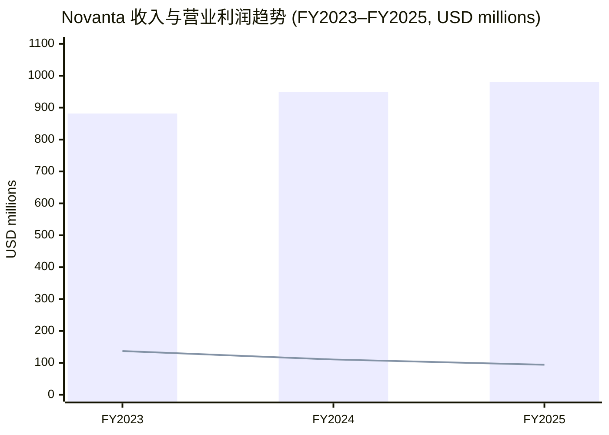
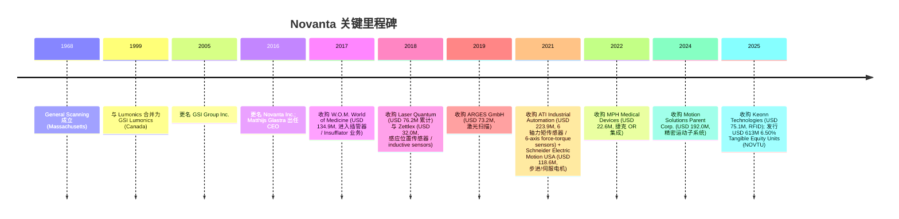
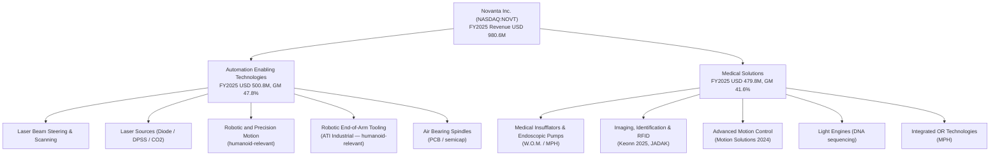
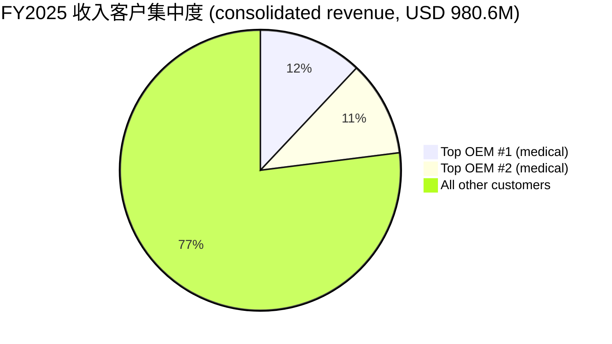
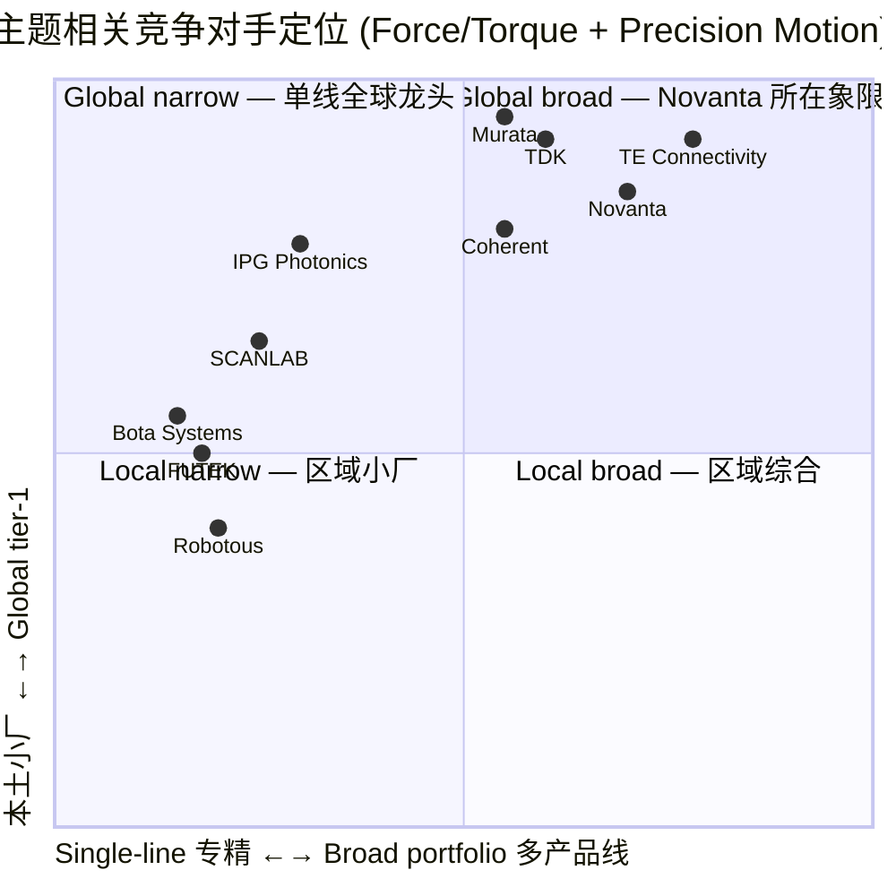

# Novanta Inc. (NASDAQ:NOVT) 公司研究

**报告日期 (Report date) :** 2026-06-02
**最近一期 10-K :** 2025 财年 / December 31, 2025 (2026-02-23 提交) — [Novanta 2025 10-K](https://www.sec.gov/Archives/edgar/data/1076930/000119312526064230/novt-20251231.htm)
**主题归属 :** humanoid-robotics-sensors (人形机器人 - 力矩 / 触觉传感器)
**研究语言 :** Simplified Chinese (zh-CN only)

> Novanta Inc. ("Novanta", "公司") 是一家全球医疗与先进工业 (advanced industrial) OEM 客户的核心赋能技术 / enabling technology 供应商,核心业务由两大可报告分部 — Automation Enabling Technologies (自动化赋能技术) 与 Medical Solutions (医疗解决方案) — 组成。公司前身可追溯到 1968 年在马萨诸塞州注册成立的 General Scanning, Inc.,1999 年与 Lumonics Inc. 合并形成 GSI Lumonics(后改名 GSI Group),并在 2016 年 5 月正式更名为 Novanta Inc.,公司注册地为加拿大新不伦瑞克省 (New Brunswick, Canada),总部在马萨诸塞州 Bedford ([Novanta 2025 10-K, Item 1 Business](https://www.sec.gov/Archives/edgar/data/1076930/000119312526064230/novt-20251231.htm))。

## 目录 (Table of Contents)

1. 公司概览 (Company Overview)
2. 公司历史 (Company History)
3. 管理团队 (Management Team)
4. 产品与服务 (Products & Services)
5. 客户与上市策略 (Customers and Go-to-Market)
6. 行业概览 (Industry Overview)
7. 竞争格局 (Competitive Landscape)
8. 市场机会 (Market Opportunity / TAM)
9. 风险评估 (Risk Assessment)
10. 投资者视角评分 (Investor-lens Scorecards)
11. 参考资料 (References)

---

## 1. 公司概览 (Company Overview)

Novanta 自我定位为 "**a leading global supplier of core technology solutions** that give medical, life science, and advanced industrial original equipment manufacturers (OEMs) a competitive advantage",通过精密医疗 (precision medicine)、精密制造 (precision manufacturing)、机器人与自动化 (robotics and automation) 和高级外科 (advanced surgery) 四大能力簇,为客户提供深度嵌入式的子系统 (sub-systems) 与组件 (components) ([Novanta 2025 10-K, Item 1 Business — Overview](https://www.sec.gov/Archives/edgar/data/1076930/000119312526064230/novt-20251231.htm))。FY2025 (截至 2025-12-31) 公司合并 (consolidated) 收入 USD 980.6 million,YoY +3.3%,其中 53% 来自医疗 (medical) 终端市场、47% 来自先进工业 (advanced industrial) 终端市场,与人形机器人/触觉传感器主题最相关的是 Automation Enabling Technologies 分部下的 Robotic and Precision Motion 与 Robotic end-of-arm tooling 产品线 ([Novanta 2025 10-K, Segments & End Markets](https://www.sec.gov/Archives/edgar/data/1076930/000119312526064230/novt-20251231.htm))。

按可报告分部,FY2025 Automation Enabling Technologies 收入 USD 500.8M (毛利率 / gross margin 47.8%、营业利润 / operating profit USD 114.5M),Medical Solutions 收入 USD 479.8M (毛利率 41.6%、营业利润 USD 51.2M),合并毛利率 44.4% (与 FY2024 持平) ([Novanta 2025 10-K, Segment Information](https://www.sec.gov/Archives/edgar/data/1076930/000119312526064230/novt-20251231.htm))。但合并经营利润 (operating income) 因 SG&A 与重组 (restructuring) 费用上行而下降至 USD 94.0M (-15.0% YoY),基本 EPS USD 1.47 (FY2024: USD 1.78)、稀释 EPS 同样 USD 1.47,主要由于经营利润下滑及股本基数轻度扩大 ([Novanta 2025 10-K, MD&A — Overview of Financial Results](https://www.sec.gov/Archives/edgar/data/1076930/000119312526064230/novt-20251231.htm))。FY2025 年末 backlog 约 USD 481.2M,YoY 增加约 USD 35.7M / +8.0%,显示订单端动能回升 ([Novanta 2025 10-K, Backlog](https://www.sec.gov/Archives/edgar/data/1076930/000119312526064230/novt-20251231.htm))。

**估值快照 / Valuation snapshot (as of 2026-06-02, Stockanalysis.com):** 股价 USD 159.33,Market Cap USD 5.82B,TTM PE 115.71×、Forward PE 43.44×,P/S 5.8× (= 5.82B / 1.00B),Beta 1.62,52-周区间 USD 98.27 – USD 165.56,sell-side 三家覆盖均值评级 "Strong Buy"、12 月目标价 USD 171.50 ([Stockanalysis.com NOVT key statistics](https://stockanalysis.com/stocks/novt/))。**TTM PE 异常解读 / Interpretation:** 115× 处于公司过去 3 年区间偏高端,核心驱动是 (a) GAAP 净利同比下滑 16% 至 USD 53.7M (受 Motion Solutions / Keonn 收购的购置无形资产摊销 + 重组费用拉低) (b) 11 月发行的 Tangible Equity Units 摊薄预期使 Forward PE 仍达 43×,与 IDEX (PE ~24×) / Cognex (PE ~50×) 同行相比明显溢价。**分析师观点:** 市场为 Novanta 支付的是 "humanoid-robotics + advanced-surgery 双轮组合 + ATI 业绩反弹" 的故事溢价,而非现期利润 — Q1 FY2026 报告显示 bookings YoY +37%、book-to-bill 1.1× 已部分验证这个故事 ([Motley Fool: Novanta Q1 2026 earnings transcript, 2026-05-12](https://www.fool.com/earnings/call-transcripts/2026/05/12/novanta-novt-q1-2026-earnings-transcript/))。

地理分布上 FY2025 美国 USD 519.0M (52.9%)、德国 USD 114.6M (11.7%)、其他欧洲 USD 137.4M (14.0%)、中国 USD 93.2M (9.5%)、其他亚太 USD 97.0M (9.9%) — 与 FY2023 (美国 47.4%) 相比明显加大了美国本土倾斜,这与 Motion Solutions Parent Corp. 北美收购整合 + Keonn 欧洲扩张有关,但同时 Rest of Asia-Pacific 占比由 FY2023 的 12.0% 降至 9.9%,中国地区 YoY 增长 10.2% 跑赢公司总体增速,显示中国先进工业自动化 (advanced industrial) 仍是相对亮点 ([Novanta 2025 10-K, Geographic Information](https://www.sec.gov/Archives/edgar/data/1076930/000119312526064230/novt-20251231.htm))。员工方面截至 2025-12-31 全球约 3,000 人,其中 36% 美国、55% 欧洲、9% 亚洲,工程师约 600 人 ([Novanta 2025 10-K, Human Capital](https://www.sec.gov/Archives/edgar/data/1076930/000119312526064230/novt-20251231.htm))。

*Source: [Novanta 2025 10-K, MD&A 与 Note 19 Segment Information](https://www.sec.gov/Archives/edgar/data/1076930/000119312526064230/novt-20251231.htm) — bar = 总营收 / total revenue,line = GAAP 营业利润 / operating income。FY2024 营业利润 USD 110.6M,FY2025 USD 94.0M,反映摊销与重组拖累。*

## 2. 公司历史 (Company History)

公司起源于 1968 年在马萨诸塞州注册成立的 **General Scanning, Inc.**,是激光扫描镜 (galvanometer / 振镜) 技术的早期开拓者;1999 年与加拿大上市公司 **Lumonics Inc.** 合并形成 **GSI Lumonics Inc.**,合并后实体延续在加拿大 New Brunswick 省的注册;2005 年改名为 **GSI Group Inc.**;2016 年 5 月再次更名为 **Novanta Inc.**,完成由半导体设备依赖型业务向 "医疗 + 先进工业 OEM 子系统供应商" 的战略再定位 ([Novanta 2025 10-K, Overview & History](https://www.sec.gov/Archives/edgar/data/1076930/000119312526064230/novt-20251231.htm))。

*Source: [Novanta 2025 10-K, Acquisitions table](https://www.sec.gov/Archives/edgar/data/1076930/000119312526064230/novt-20251231.htm) + [Novanta 2025 10-K, Recent Developments](https://www.sec.gov/Archives/edgar/data/1076930/000119312526064230/novt-20251231.htm)。*

从 2017 年开始,Novanta 以平均每年 1–2 起、累计逾 10 起、总对价合计逾 USD 900M 的并购节奏不断重塑业务组合,所有交易都围绕 "把更高占比的收入与利润从周期性更强的半导体 / 一般工业自动化挪向防御性更强的医疗 + 高附加值机器人" 这条主轴 ([Novanta 2025 10-K, Acquisitions table](https://www.sec.gov/Archives/edgar/data/1076930/000119312526064230/novt-20251231.htm))。其中两笔与 humanoid-robotics-sensors 主题最直接相关:**(1) 2021 年以 USD 223.9M 收购 ATI Industrial Automation, Inc.** — 后者是 30+ 年历史的 6 轴 force/torque sensor 全球领导者,目前作为 Novanta 的 robotic end-of-arm tooling 产品线核心,产品覆盖手术机器人、人形机器人、协作机器人 (cobot) 的力觉反馈与触觉环节 ([ATI Industrial Automation 产品页 — Force/Torque Sensors](https://ati.novanta.com/products/force-torque-sensors/));**(2) 2021 年以 USD 118.6M 收购 Schneider Electric Motion USA** — 将步进 / 伺服电机能力收入 Robotic and Precision Motion 产品线,与 Motion Solutions (2024 年以 USD 192M 收购) 一起构成机器人本体的运动控制赋能链 ([Novanta 2025 10-K, Acquisitions](https://www.sec.gov/Archives/edgar/data/1076930/000119312526064230/novt-20251231.htm))。

**2025 年最重大事件 — 资本结构与并购:** 2025-04-08 公司以 EUR 64.8M (约 USD 71.0M) 收购西班牙巴塞罗那的 RFID 技术公司 Keonn Technologies, S.L.,纳入 Medical Solutions 分部,补强 surgical asset tracking 与 counterfeit detection 应用,交易含最高 EUR 20.0M (USD 21.9M) 的对赌 (contingent consideration) 安排,需在 2027 年 12 月前达到一定收入目标 ([Novanta 2025 10-K, Recent Developments — Keonn](https://www.sec.gov/Archives/edgar/data/1076930/000119312526064230/novt-20251231.htm));2025-06-27 公司签署第四份 "Amended and Restated Credit Agreement",提供约 USD 1.0 billion 综合信贷额度 — 包含 EUR 65.3M 欧元 5 年期定期贷款 + USD 75.0M 美元 5 年期定期贷款 + USD 850.0M 5 年期循环信贷 (revolving facility),并附带 USD 350M 的累加 (accordion) 选择权,2030 年 6 月到期 ([Novanta 2025 10-K, Fourth Amended and Restated Credit Agreement](https://www.sec.gov/Archives/edgar/data/1076930/000119312526064230/novt-20251231.htm));2025-11-12 公司公开发行 12,650,000 单位的 **6.50% Tangible Equity Units** ($50.00 / Unit) 募集净额 USD 613.1M,以 NASDAQ 代码 "NOVTU" 上市,每个 Unit 由 prepaid stock purchase contract + senior amortizing note (2028 年 11 月 1 日到期) 组成,settlement 转换比例介于 0.3729 ~ 0.4662 普通股之间 — 等效于 USD 107.26 ~ USD 134.0842 的转股价区间 ([BusinessWire — Novanta Announces Pricing of USD 550M Tangible Equity Units Offering, 2025-11-07](https://www.businesswire.com/news/home/20251107592564/en/Novanta-Inc.-Announces-Pricing-of-$550000000-Tangible-Equity-Units-Offering); [Novanta 2025 10-K, Recent Developments](https://www.sec.gov/Archives/edgar/data/1076930/000119312526064230/novt-20251231.htm))。这次发行是公司有史以来最大单笔资本市场动作,反映管理层为下一阶段并购 + 去杠杆同时锁定较低换股摊薄成本的意图。

公司战略 (verbatim from 10-K) 明确提到 7 大要点,核心是:(i) 围绕 "long life-cycle OEM customer platforms" 在医疗与先进工业利基市场提供 proprietary technology solutions;(ii) 提高医疗销售占比,通过新产品、关键客户 (key account) 管理、交叉销售与并购;(iii) 拓展 advanced industrial 高增长应用 (laser materials processing、intelligent end-of-arm robotic technology、robotics、laser additive manufacturing、automation、metrology);(iv) 加强 R&D 投资以拓宽 enabling proprietary technologies;(v) 通过并购拓展 medical + advanced industrial 创新技术与解决方案;(vi) 扩展销售与营销渠道;(vii) 通过精益制造 + 战略采购改善利润率,并将制造布局区域化为 "centers of excellence" ([Novanta 2025 10-K, Strategy](https://www.sec.gov/Archives/edgar/data/1076930/000119312526064230/novt-20251231.htm))。

## 3. 管理团队 (Management Team)

按 SKILL.md 要求,本章只覆盖 "founder" 与 "current CEO";Novanta 是 1968 年成立的 General Scanning 与 Lumonics 合并后的多次更名实体,**没有可识别的创始人** (经过 60 年沿革、多次合并 / 改名),因此本章合并为 **现任 Chair & CEO Matthijs Glastra (约 400 词)**。

**Matthijs Glastra — Chair of the Board & Chief Executive Officer (57 岁, 2025 财年披露年龄)** ([Novanta 2025 10-K, Item 10 — Directors and Executive Officers](https://www.sec.gov/Archives/edgar/data/1076930/000119312526064230/novt-20251231.htm))。Matthijs Glastra 是荷兰籍工程师 - 经理人,2012 年加入 Novanta (当时还叫 GSI Group) 担任 Group President、2015 年 2 月晋升 COO、2016-09-01 接替 John Roush 出任 CEO 并进入董事会,2021-05-13 进一步同时担任 Chair of the Board ([PRNewswire — Novanta Names Matthijs Glastra Chief Executive Officer, 2016-08-04](https://www.prnewswire.com/news-releases/novanta-names-matthijs-glastra-chief-executive-officer-300307934.html);[Novanta investor relations — Matthijs Glastra director profile](https://investors.novanta.com/governance/board-of-directors/director-profile/person-details/default.aspx?ItemId=66959079-8715-4007-9029-abff0bbcaddf))。在 Novanta 之前,Glastra 在 **Philips 任职 18 年** (1994–2012),曾任 **Chief Executive Officer of Philips' Entertainment Lighting** 与 **Chief Operating Officer of Philips Lumileds** (Lumileds 当时是 Philips 高功率 LED 业务,后于 2017 年被剥离给 Apollo Global),在欧洲与硅谷两地经历过 Philips Healthcare 计算机断层扫描 (CT) 产品经理、Photonics、Lumileds 几个不同业务线的总经理角色 ([Equilar ExecAtlas — Matthijs Glastra](https://people.equilar.com/bio/person/matthijs-glastra-novanta-inc/654010);[The Org — Matthijs Glastra CEO at Novanta](https://theorg.com/org/novanta/org-chart/matthijs-glastra))。

Glastra 的教育背景非常技术导向:**Delft University of Technology** (代尔夫特理工) 应用物理硕士 (M.Sc. Applied Physics)、**ESPCI Paris** (巴黎高等理工化学与工业物理化学学院) 高级工程学位 / Advanced Engineering Degree、以及 **INSEAD** (法国枫丹白露的国际商学院) MBA — 这种 "物理 + 高级工程 + 国际 MBA" 三段式履历直接匹配 Novanta 的核心定位 (深嵌入 OEM 客户的光学 / 激光 / 运动控制子系统供应商) ([IDEX Corporation Board Member page — Matthijs Glastra](https://investors.idexcorp.com/board-member/matthijis-glastra);[Lasers & Photonics Marketplace Seminar speaker bio — Matthijs Glastra](https://events.american-tradeshow.com/LPMS/speaker/43192/matthijs-glastra))。

**任内业绩 (operational track record):** Glastra 2016 年接手时 Novanta (当年仍以 GSI Group 为名义) 收入约 USD 376M、市值约 USD 600M;至 FY2025 末公司收入达到 USD 980.6M (10 年 ~2.6× 增长 / CAGR ~10%)、市值约 USD 5.82B (~10× 增长) — 这段增长高度依赖一系列并购 (ATI、Schneider Motion、Motion Solutions、Keonn 等) + 公司战略明确从半导体周期性业务转向 medical & advanced industrial 的高黏性 OEM 收入 ([Novanta 2025 10-K, Acquisitions table & Strategy](https://www.sec.gov/Archives/edgar/data/1076930/000119312526064230/novt-20251231.htm))。**外部董事任职:** Glastra 同时担任美国流体技术公司 **IDEX Corporation (NYSE: IEX)** 的独立董事 — 一家市值 USD 16B 的多元化精密工业平台,Glastra 在那里也参与并购整合委员会工作,与他在 Novanta 的并购导向战略形成方法论闭环 ([IDEX Corporation Board Member page — Matthijs Glastra](https://investors.idexcorp.com/board-member/matthijis-glastra))。**报酬结构** (incentive design) 按 2026 DEF 14A 披露,主要由现金底薪 + STI 现金奖金 + 长期股权激励 (其中 ~60% 为 attainment-based PSU、与 cumulative revenue 与 ROIC 挂钩) 组成 ([Novanta 2026 Definitive Proxy Statement (DEF 14A)](https://www.sec.gov/Archives/edgar/data/1076930/000119312526175367/novt-20260424.htm)) — 这与 Novanta 把 ROIC 作为并购定价底线的资本配置纪律一致。

**分析师观点:** Glastra 是 Novanta "compounder by acquisition" 模式的核心,过去 10 年的执行使公司从一家半导体设备依赖的中型激光公司,转型为对 Intuitive Surgical、Stryker、Boston Scientific 等手术机器人 OEM 与 Tesla / Figure / Agility / Unitree 等人形机器人下一波客户都有 enabling 触点的子系统供应商 — 这是市场愿意为 NOVT 支付 100×+ TTM PE 的本质原因之一,但同时也意味着任何并购整合事故都会被高溢价估值放大。

## 4. 产品与服务 (Products & Services)

这是本报告最核心的章节。Novanta 10-K 把所有产品线明确划入 **Automation Enabling Technologies** (自动化赋能技术) 与 **Medical Solutions** (医疗解决方案) 两个分部,每个分部下又有 5 条产品线,合计 10 条主线 + 多个 SKU 家族 ([Novanta 2025 10-K, Item 1 Business — Segments](https://www.sec.gov/Archives/edgar/data/1076930/000119312526064230/novt-20251231.htm))。

*Source: [Novanta 2025 10-K, Item 1 Business — Segments & Product Lines](https://www.sec.gov/Archives/edgar/data/1076930/000119312526064230/novt-20251231.htm)。*

### 4.1 Automation Enabling Technologies 分部 — 5 条产品线

10-K verbatim 描述:"The Automation Enabling Technologies segment designs, manufactures and markets **laser beam steering and scanning solutions, laser sources, robotic and precision motion, robotic end-of-arm tooling, and bearing spindles** to customers worldwide. The segment serves highly demanding applications for advanced industrial processes, advanced industrial and medical robotics, other medical and life science automation applications, and medical laser procedures such as ophthalmology applications. **The vast majority of the segment's product offerings are sold to OEM customers.**" ([Novanta 2025 10-K, Item 1 Business — Automation Enabling Technologies](https://www.sec.gov/Archives/edgar/data/1076930/000119312526064230/novt-20251231.htm))。

**4.1.1 Laser Beam Steering and Scanning Solutions (激光振镜与扫描解决方案).** 10-K verbatim:

> "Optical scanning and scan heads that provide precise control and delivery of laser beams through motorized manipulation of mirrors and optical elements integrated by OEM manufacturers. Advanced industrial applications include additive manufacturing, packaging converting, laser marking, micromachining and metrology. Medical applications include optical coherence tomography imaging, microscopy, and laser-based vision correction." ([Novanta 2025 10-K, Item 1 Business](https://www.sec.gov/Archives/edgar/data/1076930/000119312526064230/novt-20251231.htm))

**中文释义 / Plain-language gloss:** 振镜 / galvanometer 是高速激光扫描的核心 — 通过驱动一对反射镜(galvo)的电机让激光束在被加工面上画出可控轨迹,精度可达微米量级、扫描速度数千 Hz。Novanta 通过 GSI / Cambridge Technology / Laser Quantum / ARGES 多次并购积累了从单 galvo head 到完整扫描头总成 (scan head) 的全谱产品,典型客户是 EOS、SLM Solutions、Trumpf 等金属增材制造 (laser additive manufacturing) 系统集成商,以及 Carl Zeiss Meditec、Alcon (ophthalmology vision correction) 等手术激光 OEM。**Strategic significance:** 此产品线是 Novanta 自 1968 年 General Scanning 时代延续下来的 "原点能力" (anchor capability),也是 advanced industrial 周期性收入的核心,与 GenAI 数据中心 PCB / 半导体后段 laser marking 的 capex cycle 高度耦合 — Q1 FY2026 管理层在电话会中专门点名 "GenAI data center infrastructure" 加速 ([Motley Fool: Novanta Q1 2026 Earnings Transcript, 2026-05-12](https://www.fool.com/earnings/call-transcripts/2026/05/12/novanta-novt-q1-2026-earnings-transcript/))。

**4.1.2 Laser Sources (激光源).** 10-K verbatim:

> "Diode, Diode-pumped solid-state lasers and CO2 lasers. Applications include particle detection metrology, additive manufacturing, packaging converting, laser marking, micromachining, and medical applications in dental and dermatology." ([Novanta 2025 10-K, Item 1 Business](https://www.sec.gov/Archives/edgar/data/1076930/000119312526064230/novt-20251231.htm))

**中文释义 / Plain-language gloss:** 激光源 (laser source) 是产生激光光子的 "心脏" — Novanta 提供 diode laser (二极管激光)、diode-pumped solid-state laser (DPSS, 二极管泵浦固体激光) 与 CO2 激光三类,适用从皮肤科 nm 级波长定制激光到工业 CO2 切割的全谱。**与 4.1.1 的区别:** Scan head 是 "笔尖",laser source 是 "笔芯墨水";很多 OEM 系统会同时采购两者以构成完整激光加工子系统。**Strategic significance:** Novanta 的 Laser Quantum / Coherent 类 fiber laser 主要面向 DNA sequencing 与 flow cytometry — 这给公司一条不依赖工业 capex 的医疗结构性增长曲线;特别是 Illumina、PacBio、10x Genomics 等基因测序仪 OEM 每年 fleet 升级时,需要 Novanta 的定制波长 light engine 做核心激发光源。

**4.1.3 Robotic and Precision Motion (机器人与精密运动) — humanoid 主题最直接相关.** 10-K verbatim:

> "Position sensors, force torque sensors, precision motors and servo drives, and advanced motion control software for high‑performance motion control and sensing. Applications include robotic surgery, warehouse automation, **humanoids**, semiconductor, agricultural, metrology, satellite communications, medical devices, and laboratory and diagnostics equipment." ([Novanta 2025 10-K, Item 1 Business — Automation Enabling Technologies](https://www.sec.gov/Archives/edgar/data/1076930/000119312526064230/novt-20251231.htm))

**中文释义 / Plain-language gloss:** 这条产品线是 humanoid-robotics-sensors 主题报告将 NOVT 列入 enabler 篮子的核心理由 — 10-K 罕见地直接点名 "humanoids" 作为应用场景之一。具体能力簇包括:(i) **Position sensors / 位置传感器** — 主要来自 2018 年收购的 Zettlex 的电感式 (inductive) 位置编码器,适用对 EMI / 油污 / 振动鲁棒的极端环境 (协作机器人关节、手术机器人腕部);(ii) **Force torque sensors / 力矩传感器** — 主要来自 ATI Industrial Automation (2021 年并购) 的 6 轴力矩 / 力觉传感器系列,见 4.1.4 节;(iii) **Precision motors and servo drives** — 来自 2021 年收购的 Schneider Electric Motion USA (步进 + 伺服) 与 2024 年收购的 Motion Solutions Parent Corp. (精密运动子系统);(iv) **Advanced motion control software** — Motion Solutions 带来的 Celera Motion 平台,客户能在 100+ 轴系统中通过一个统一控制环 (control loop) 同步运动。**Strategic significance:** 这是公司 "humanoid 受益度" 评估的主要载体 — 一个 Figure / Optimus / Unitree 的全身机器人本体通常需要 25–40 个关节 (取决于灵巧手设计),每个关节都有位置 + 力矩 + 电机 + 驱动 + 控制软件五类供应商;NOVT 在其中任意 1–2 个环节占位,即可获得 single-digit BOM share、~3–5 美元 / 机器人的 ASP — 看似不多,但在 humanoid 量产化的 5–10 年视域内意味着潜在 USD 100M+ 的递增收入,这是市场愿意付 100×+ TTM PE 的看涨期权 (call option) 部分。

**4.1.4 Robotic End-of-Arm Tooling (机械臂末端工具) — ATI Industrial Automation 的核心.** 10-K verbatim:

> "Robotic accessories and end-of-arm tooling, including **tool changers, multi-axis force torque sensors, collision sensors, and compliance devices**. Applications include advanced industrial and automotive robotics." ([Novanta 2025 10-K, Item 1 Business](https://www.sec.gov/Archives/edgar/data/1076930/000119312526064230/novt-20251231.htm))

**中文释义 / Plain-language gloss:** 末端工具 (End-of-Arm Tooling, EOAT) 是机器人手臂末端 — 即手腕到 "手" 这段 — 的功能性硬件总称。**Tool changer (工具更换器)** 让机器人能像 "切换扳手套筒一样" 在几秒内自动换上不同末端 (夹爪、焊枪、抛光头);**Multi-axis force torque sensor (多轴力矩传感器)** 是机器人 "皮肤" — 沿 6 个自由度 (X/Y/Z 平移 + Rx/Ry/Rz 转动) 实时测量末端受力,使机器人能感知碰撞、温柔抓取、精确装配。**Strategic significance:** 这是 NOVT 在 humanoid 主题中**最直接的故事支柱** — ATI 自 1989 年起做工业力矩传感器,30+ 年的工业 cobot 客户基础 (FANUC、Universal Robots、KUKA、ABB) 直接是手术机器人 (Stryker、Intuitive) 与人形机器人 (Tesla Optimus、Figure 01、Agility Digit) 的同一波客户 ([ATI Industrial Automation Force/Torque Sensors product page](https://ati.novanta.com/products/force-torque-sensors/);[ATI: Giving Robots a Sense of Touch — How Force/Torque Sensors Are Enhancing Automation](https://ati.novanta.com/how-force-torque-sensors-are-enhancing-automation/))。"Automated logistics robots and emerging humanoid technologies require an equal balance of freedom of movement with accuracy and extreme safety" 是 ATI 官网自己定义的 humanoid 战略表述 ([Novanta Robotics & Automation capability page](https://novanta.com/capabilities/robotics-automation/))。

**4.1.5 Air Bearing Spindles (气浮轴承主轴).** 10-K verbatim:

> "High-speed and precision air bearings and air bearing spindles. Applications include printed circuit board (PCB) manufacturing, and semiconductor manufacturing equipment." ([Novanta 2025 10-K, Item 1 Business](https://www.sec.gov/Archives/edgar/data/1076930/000119312526064230/novt-20251231.htm))

**中文释义 / Plain-language gloss:** 气浮轴承 (air bearing) 用压缩空气薄层取代滚珠 / 油膜,在亚微米级 PCB 钻孔 / 切割与半导体光刻 stage 上提供零摩擦、零磨损、零热漂的旋转支撑。Novanta 收购的 Westwind 业务 (现归入 Air Bearing Spindles 产品线) 是 PCB 机械钻头的事实标准供应商之一,客户包括 Posalux、Schmoll 等 PCB 钻孔机 OEM,以及 ASML、Nikon、KLA 等半导体光刻 / 检测设备厂。**Strategic significance:** 此产品线是公司与 AI 数据中心 PCB 升级 + 高端 HDI 板 (high-density interconnect) 容量扩张直接挂钩的资本受益曲线,与 4.1.1 / 4.1.2 一起构成 "GenAI capex" 主题 — Q1 FY2026 管理层电话会确认这一组合在 2026 年加速 ([Motley Fool: Novanta Q1 2026 Earnings Transcript, 2026-05-12](https://www.fool.com/earnings/call-transcripts/2026/05/12/novanta-novt-q1-2026-earnings-transcript/))。

### 4.2 Medical Solutions 分部 — 5 条产品线

10-K verbatim 描述:"The Medical Solutions segment designs, manufactures and markets a range of medical grade technologies, including **medical insufflators and endoscopic pumps and related disposables, imaging, identification and RFID solutions, advanced motion control solutions, light engines, and integrated operating room technologies**." ([Novanta 2025 10-K, Item 1 Business — Medical Solutions](https://www.sec.gov/Archives/edgar/data/1076930/000119312526064230/novt-20251231.htm))。

**4.2.1 Medical Insufflators, Endoscopic Pumps and related disposables.** 10-K verbatim:"Insufflators, endoscopic pumps, and related disposables, and other accessories for minimally invasive surgery." 此线由 2017 年以 USD 134.9M 收购的 **W.O.M. World of Medicine GmbH** (德国) 与 2022 年以 USD 22.6M 收购的 **MPH Medical Devices S.R.O.** (捷克) 构成,是 advanced surgery 能力簇的现金牛。**中文释义:** 充气器 (insufflator) 在腹腔镜手术中向腹腔注入 CO2 创造手术视野,是微创手术 (minimally invasive surgery) 必备子系统,Stryker、Olympus、Karl Storz、Medtronic Covidien 都是其 OEM 客户。**Strategic significance:** disposables (一次性配件) 部分提供 razor-blade 商业模式 — 设备销售后每台手术都消耗的 tubing、filter、CO2 cartridge 持续付费。

**4.2.2 Imaging, Identification and RFID Solutions.** 10-K verbatim:

> "Camera-based machine vision products and solutions used for image analysis within medical devices and advanced industrial applications, RFID technologies via High-Frequency (HF) and Ultra-High Frequency (UHF) readers, writers and antennas for applications such as surgical part tracking and counterfeit detection, and embedded and handheld data collection products for barcode identification." ([Novanta 2025 10-K, Item 1 Business](https://www.sec.gov/Archives/edgar/data/1076930/000119312526064230/novt-20251231.htm))

**中文释义:** 这条产品线包括两块 — (i) JADAK 品牌的 medical-grade 机器视觉 + 条码扫描模块 (例如手术室 EHR 系统中扫描血样标签);(ii) 2025-04-08 新收购的 Keonn Technologies (西班牙) 提供的 **HF + UHF RFID readers/writers/antennas**,客户场景包括手术器械追溯 (asset tracking)、防伪、零售防盗 ([Novanta 2025 10-K, Keonn acquisition](https://www.sec.gov/Archives/edgar/data/1076930/000119312526064230/novt-20251231.htm))。**Strategic significance:** Keonn 的纳入预示 Novanta 把 RFID 从纯 retail 应用扩展至 medical asset tracking,与公司更广泛的 advanced surgery 整合 OR (integrated operating room) 故事吻合。

**4.2.3 Advanced Motion Control Solutions.** 10-K verbatim:"High-precision, customized subsystems and components, specializing in proprietary precision motion and advanced motion control solutions for applications such as life sciences, medical equipment, industrial automation, and semiconductor manufacturing equipment." 这块即 2024 年以 USD 192.0M 收购的 **Motion Solutions Parent Corp.** — 旗下品牌包括 Applimotion、Celera Motion、Mclennan、Westwind (注:Westwind 部分在 Automation Enabling 分部) — 给 NOVT 加入了一支精密直驱电机 (direct-drive motor) + 编码器 + 运动控制软件的合套能力 ([Novanta 2025 10-K, Acquisitions table](https://www.sec.gov/Archives/edgar/data/1076930/000119312526064230/novt-20251231.htm))。

**4.2.4 Light Engines.** 10-K verbatim:"Optical light engine products that integrate lasers into light engines with full beam parameter control. Applications include DNA sequencing." 此线主要服务 Illumina / PacBio / Element Biosciences 等基因测序仪 OEM,Novanta 通过 2018 年完成 Laser Quantum 100% 收购获得相关激光与光机集成能力。**Strategic significance:** DNA sequencing 工具市场虽小但增长稳定,Light Engine 是少数几个 advanced industrial 之外的非周期性医疗结构增长曲线。

**4.2.5 Integrated Operating Room Technologies.** 10-K verbatim:"Imaging management solutions for real-time distribution, documentation, control, recording, and streaming in surgical applications, high definition wireless transmission of video in minimally invasive surgical equipment, and embedded capacitive and resistive touch panel technology for high-performance user interfaces." 此线即 NDS Surgical Imaging 业务,Novanta 通过 2017 年的 W.O.M. + 2022 年的 MPH 把它们打包进 Medical Solutions,客户包括 Stryker、Olympus、Karl Storz。

### 4.3 综合 — 产品线如何相互作用

把 Novanta 看成一个 "OEM 集成商工具箱" 最直观 — 一台手术机器人 OEM (例如 Intuitive Surgical da Vinci 系列升级,或 Stryker Mako) 在一个设备上可能同时使用 NOVT 4–6 条产品线:**振镜 (4.1.1)** 用于内窥成像与 OCT;**激光源 (4.1.2)** 用于手术烧灼或 ophthalmology;**位置 + 力矩传感器 (4.1.3)** 用于手术臂力反馈;**精密电机 (4.1.3)** 用于关节驱动;**充气泵 (4.2.1)** 用于腹腔注气;**RFID + 视觉 (4.2.2)** 用于器械追溯。这种 "横跨多条产品线、同一客户" 的攻击向量 (cross-sell vector) 是公司 strategy 的核心 — "deepening our key account management relationships with and driving cross selling of our product offerings to leading medical equipment manufacturers" ([Novanta 2025 10-K, Strategy](https://www.sec.gov/Archives/edgar/data/1076930/000119312526064230/novt-20251231.htm))。

类似地,一个人形机器人 OEM (例如 Tesla Optimus, Figure 01, Agility Digit) 也可能同时使用 NOVT 多条产品线:**ATI 的 6 轴力矩传感器** (4.1.4) 在手腕/夹爪;**Zettlex inductive 位置编码器** (4.1.3) 在关节;**Schneider / Motion Solutions 的伺服电机 + 驱动** (4.1.3 + 4.2.3) 在动力源;**Celera Motion 运动控制软件** (4.2.3) 作为多关节同步框架。一台 Optimus 等级的全身机器人若 BOM 中 4 条 NOVT 产品线累计占位 USD 200–400,意味着 humanoid 量产化的远期看涨期权对 NOVT 是 single-digit USD 100M 量级的可累加机会 — 这是市场愿意为 NOVT 支付 100×+ TTM PE 的核心叙事。

## 5. 客户与上市策略 (Customers and Go-to-Market)

10-K verbatim 描述客户结构:"We have a diverse group of customers that includes companies that are global leaders in the medical and advanced industrial markets. Many of our customers participate in several market industries. **During the year ended December 31, 2025, two OEM customers, each operating primarily in the medical end market across multiple product lines, represented approximately 12% and 11%, respectively, of our consolidated revenue.** During the years ended December 31, 2024, and December 31, 2023, revenue from an OEM customer primarily in the medical end market accounted for approximately 10% of our consolidated revenue." ([Novanta 2025 10-K, Customers + Note 19 Significant Customers](https://www.sec.gov/Archives/edgar/data/1076930/000119312526064230/novt-20251231.htm))。

**客户集中度 — 关键事实及其去年同期对比:**
- FY2025: **2 个 OEM 客户分别占合并收入 ~12% 与 ~11%** (合计约 23%);
- FY2024 & FY2023: 仅 1 个客户超过 10% 阈值 (占比 ~10%);
- 都属于 medical end-market(微创外科 / 手术机器人 OEM);
- 10-K 没有点名两个 ≥10% 客户身份 (consistent with US ASC 280 披露惯例 — 必须披露占比但不要求点名)。

**分析师观点:** 业界普遍假设第一家 ≥10% 客户是 **Boston Scientific** 或 **Stryker** (因 W.O.M. 插管器与 ATI 手术机器人末端工具的长期合同),第二家可能是 **Intuitive Surgical** (da Vinci 系列子系统);但 10-K 没有任何披露能确认这点,因此本报告**不在正文中点名两家具体客户**。**Strategic risk:** 单一客户超过 10% 阈值从 FY2023/2024 的 1 家上升到 FY2025 的 2 家,说明集中度在小幅上升 — 这与公司战略中 "deepening key account relationships" 一致,但同时也意味着如果其中任一客户砍单 / 内部化替代,会对 NOVT 季度造成 5%+ 的 P&L 冲击。

*Source: [Novanta 2025 10-K, Item 1 Business — Customers & Note 19](https://www.sec.gov/Archives/edgar/data/1076930/000119312526064230/novt-20251231.htm)。两个 ≥10% 客户均运营在医疗终端市场;denominator = consolidated revenue;不可与 segment-level customer mix 混淆。*

**Go-to-market 模式 — verbatim:** "We sell our products globally, primarily through our direct sales force. We also use distributors, including manufacturers' representatives, to either augment our selling effort or serve a local market where we have no direct sales force. Our local sales, applications, and service teams and our distributors work closely with our customers to ensure customer satisfaction with our products." ([Novanta 2025 10-K, Marketing, Sales and Distribution](https://www.sec.gov/Archives/edgar/data/1076930/000119312526064230/novt-20251231.htm))。也就是说 NOVT 主要走 **direct sales + technical applications engineering** 模式,在美 / 欧 / 亚维护若干 application centers 让工程师与客户在客户的 production line 上联合调试 — 这是产品深嵌入 OEM 平台的关键能力,也是 design-in 后转换成本 (switching cost) 的来源:"once certain products have been designed into a given OEM customer's product or system, there are generally significant barriers to subsequent supplier changes until the end of the product or system life cycle, especially in the medical market" ([Novanta 2025 10-K, Customers](https://www.sec.gov/Archives/edgar/data/1076930/000119312526064230/novt-20251231.htm)) — 这一句几乎逐字解释了为什么 NOVT 能维持 44%+ 的合并毛利率。

**Backlog 与订单可见度:** 截至 2025-12-31 公司合并 backlog 约 USD 481.2M (YoY +8.0%, 2024 年末为 USD 445.5M),管理层指出 "大多数订单代表预计在随后 12 个月内交付的开放订单" — 这给 FY2026 提供了约 49% (USD 481.2M / FY2025 收入 USD 980.6M) 的初始可见度,但 10-K 同时警告 "ability to reschedule orders included in backlog varies depending on the customer and the order" ([Novanta 2025 10-K, Backlog](https://www.sec.gov/Archives/edgar/data/1076930/000119312526064230/novt-20251231.htm))。Q1 FY2026 的 +37% YoY bookings 与 1.1× book-to-bill 大幅强化了这个可见度,这也是为什么管理层在 5 月对 FY2026 给出 USD 1,040–1,055M 收入指引时市场以股价 +5%+ 回应 ([Stocktitan: Novanta grows Q1 2026 sales, boosts 2026 revenue and earnings outlook, 2026-05-12](https://www.stocktitan.net/sec-filings/NOVT/8-k-novanta-inc-reports-material-event-c396dc9926d6.html))。

## 6. 行业概览 (Industry Overview)

Novanta 同时身处三个有结构性增长属性的子行业,本节按主题相关度由高到低逐一展开。

**(1) 人形机器人 + 协作机器人传感器 / Humanoid + cobot sensor.** 主题报告中将 NOVT 列为 enabler 篮子的一员,核心理由是 ATI 在 6 轴力矩传感器细分的事实标准地位与 30+ 年的工业 cobot 客户基础 ([humanoid-robotics-sensors theme report (project local)](https://stockanalysis.com/stocks/novt/))。**市场规模:** 第三方数据未公开统一的 humanoid force sensor TAM,主流估计 (Goldman, Morgan Stanley, Citi) 给出 humanoid robot 2030 年全球年销量 25–250 万台、2035 年 1,000 万台量级,以每机 30–40 个 6 轴 force/torque 节点(灵巧手 + 关节)、平均 ASP USD 30–80 / 节点估算,人形机器人 force/torque TAM 在 2030 年可能达到 USD 0.5–2.5B、2035 年 USD 5–10B 量级 — 但这些是高度依赖 humanoid 出货量假设的看涨期权 (call option) 估值,实际 BOM 设计与单价目前在 Tesla Optimus 等头部项目里持续下移 ([证券时报: 柯力传感 6-D force module sub-1,000-yuan, 2025-12](https://stcn.com/article/detail/3169048.html))。**分析师观点:** 即使 2030 年 NOVT 在 humanoid force sensor 中夺取 30% 全球份额、单机 ASP USD 200,humanoid 业务可贡献 USD 150M 增量年收入 — 占当前 USD 980M base 约 15% — 是看涨期权而非 base case。

**(2) Robotic surgery / 手术机器人.** 这是 NOVT 当前 P&L 上最实在的增长曲线 — 10-K 提及 "robotic surgery, ophthalmology, patient monitoring, drug delivery, clinical laboratory testing and life science equipment" 是公司 medical end market 的主攻方向 ([Novanta 2025 10-K, Strategy](https://www.sec.gov/Archives/edgar/data/1076930/000119312526064230/novt-20251231.htm))。**市场结构:** 全球 robotic-assisted surgery 系统市场 2025 年约 USD 12B,Intuitive Surgical (ISRG) 在 soft-tissue 占 ~60% 份额、Stryker Mako 在骨科 ~25%,Medtronic Hugo、Asensus Senhance 等占余下;术中耗材 (Disposables) 市场比设备本身大 2–3 倍,这是 NOVT W.O.M. + JADAK + ATI 三块业务联合受益的支柱。**Strategic significance:** NOVT 在手术机器人产业链中处于 "OEM tier-1 系统供应商" 角色,典型客户是 Intuitive、Stryker、Boston Scientific、Medtronic,与 humanoid 篮子里其他成员 (Murata、TDK、TE Connectivity、Cognex) 的医疗-工业双重身份吻合。

**(3) Advanced industrial 激光与精密运动 / Industrial laser + precision motion.** 这是公司的传统 "anchor business",受 PCB 制造、半导体后段封装、增材制造 (additive manufacturing) capex cycle 驱动。**Strategic significance:** 2025 年下半年开始 AI 数据中心驱动的 PCB / 半导体 backend capex 加速使这条曲线再次成为 P&L 加速器 — Q1 FY2026 管理层电话会明确强调 "GenAI data center infrastructure and advanced manufacturing" 是 Q1 双位数 bookings + 收入增长的关键贡献 ([Motley Fool: Novanta Q1 2026 Earnings Transcript, 2026-05-12](https://www.fool.com/earnings/call-transcripts/2026/05/12/novanta-novt-q1-2026-earnings-transcript/))。

终端市场分拆 (FY2025):medical 53%, advanced industrial 47%,与 FY2024 的 55% / 45% 相比 advanced industrial 占比小幅回升 (受 GenAI capex 拉动),与公司 "improving our business mix to increase medical sales as a percentage of total revenue" 的长期战略短期相反但管理层在电话会中确认这是周期性而非结构性逆转 ([Novanta 2025 10-K, Revenue by End Market](https://www.sec.gov/Archives/edgar/data/1076930/000119312526064230/novt-20251231.htm))。

## 7. 竞争格局 (Competitive Landscape)

10-K Competition 章节 verbatim:"We encounter strong competition in virtually all the markets, applications, and technologies we serve. Due to the wide and diverse range of products and technologies, we face many different types of competitors and competition. Our competitors range from large foreign and domestic organizations, which produce a comprehensive array of goods and services, to small organizations producing a limited number of highly specialized products or services for specialized applications." ([Novanta 2025 10-K, Item 1 Business — Competition](https://www.sec.gov/Archives/edgar/data/1076930/000119312526064230/novt-20251231.htm))。10-K **没有逐一点名具体竞争对手** — 这是 NOVT 与 LRCX、AMAT 这类 "公开点名 3-5 个对手" 的 10-K 写法的明显差异,本质上反映 Novanta 跨 10 条产品线在不同子行业里面对不同对手,任何单一对手对其全局影响都有限。

**按产品线点对手 (来自第三方研究与同行 10-K, *分析师观点* / Analyst view):**

| Novanta 产品线 | 主要竞争对手 (analyst view) | 备注 |
|---|---|---|
| Laser Beam Steering & Scanning (4.1.1) | Cambridge Technology (Novanta 自有)、SCANLAB AG (德国, 私营)、Raylase AG (德国)、Trumpf | NOVT 通过 GSI + Cambridge Tech 在工业振镜居全球第一梯队 |
| Laser Sources (4.1.2) | Coherent (NYSE:COHR)、IPG Photonics (NASDAQ:IPGP)、Lumentum (NASDAQ:LITE) | NOVT 不与 IPG / Coherent 在高功率 fiber laser 头部 SKU 正面竞争, 主要聚焦定制 + 医疗 |
| Robotic Force/Torque Sensors (4.1.3 + 4.1.4) | **TE Connectivity (NYSE:TEL)、Bota Systems (CH, 私营)、FUTEK (US, 私营)、Robotous (KR)** | ATI 在 industrial 6 轴 F/T 段事实标准, 但 Bota 在 high-precision humanoid 段崛起明显 |
| Inductive Position Sensors (4.1.3) | Heidenhain (DE)、Renishaw (LSE:RSW)、Murata (TSE:6981) MEMS IMU 路线 | Zettlex (NOVT) 在 EMI-rich 环境居有利位置, 但在低成本 IMU 路线 Murata / TDK 更强 |
| Precision Motors & Servo Drives (4.1.3) | Yaskawa (TSE:6506)、Allied Motion (NASDAQ:AMOT, 已被 Allient 整合)、Maxon Motor (CH, 私营) | NOVT Motion Solutions + Schneider Motion 是组合,客户重叠但 NOVT 走应用定制 |
| Air Bearing Spindles (4.1.5) | Posalux 自有、Schmoll 自有、IBAG (CH)、NSK (TSE:6471) | PCB 钻孔细分 NOVT Westwind 是领导者之一 |
| Medical Insufflators (4.2.1) | Stryker 自制、Olympus 自制、Karl Storz 自制 | OEM 集中度高, NOVT 作为 W.O.M. 是少数 third-party 供应商 |
| RFID (Keonn 4.2.2) | Impinj (NASDAQ:PI)、Zebra Technologies (NASDAQ:ZBRA) | Keonn 在医疗 / 高端零售有利基, 与 Impinj 大众市场错位 |
| Light Engines (4.2.4) | Coherent、Hamamatsu (TSE:6965)、Excelitas (private) | Laser Quantum 集成度高, 主要 DNA seq OEM 客户 |
| Integrated OR (4.2.5) | Stryker 自制、Olympus 自制 | NDS Surgical Imaging 段领先, 主要服务 second-tier OEM |

*分析师观点:* NOVT 的竞争优势不在任何单一产品线的份额第一,而在 "横跨 10 条产品线、由 ATI / W.O.M. / Cambridge Tech 三个 30+ 年品牌支撑、深度嵌入 OEM 平台" 的组合 — 这种 "broad enabling 工具箱" 模式很难被任何单一专精对手在多线侵蚀,但同样意味着 NOVT 在任何单线上很难拥有像 ASML 在 EUV 那样的近垄断份额。

*Source: 综合 [Novanta 2025 10-K, Item 1 Business — Competition](https://www.sec.gov/Archives/edgar/data/1076930/000119312526064230/novt-20251231.htm) 与 humanoid-robotics-sensors 主题报告同行映射;坐标为 analyst-view,不代表公司官方披露。*

**Switching cost / 转换成本** 是 NOVT 防御性最强的一环 — 10-K verbatim:"once certain products have been designed into a given OEM customer's product or system, there are generally significant barriers to subsequent supplier changes until the end of the product or system life cycle, especially in the medical market." ([Novanta 2025 10-K, Customers](https://www.sec.gov/Archives/edgar/data/1076930/000119312526064230/novt-20251231.htm))。在医疗 OEM 端,FDA 510(k) re-certification 是 ~6–18 个月级别的工程 + 法规壁垒,使 NOVT 一旦 design-in 进入 da Vinci / Mako / Optical Coherence Tomography 系统就极难被替换。

## 8. 市场机会 (Market Opportunity / TAM)

把 NOVT 的可寻址市场拆成 4 块,**总 TAM (analyst view, 2030E):** ~USD 30–60 billion。**逐块解读:**

**(a) Advanced surgery (insufflators + integrated OR + light engines + advanced motion):** 全球 robotic-assisted surgery 设备市场 2025 年约 USD 12B、Bloomberg / Frost & Sullivan 估计 2030 年达到 USD 25B、CAGR ~14% ([humanoid-robotics-sensors theme report citing third-party sources](https://stockanalysis.com/stocks/novt/))。NOVT 可寻址子集 (子系统层) 估计 ~USD 3–5B (设备 BOM 中 15–20% 是 NOVT 类 enabling 技术)。

**(b) Robotic and precision motion + end-of-arm tooling — humanoid + cobot:** 工业 cobot + AGV/AMR + humanoid 累计 force/torque sensor + 末端工具 + 编码器市场 2025 年约 USD 4B、2030E USD 10–15B (假设 humanoid 出货 100–250 万台/年, 平均 ASP USD 200 / 机器人 BOM 含 NOVT);CAGR 估计 ~20% (高于 cobot 单独 ~15%、humanoid 单独 50%+) ([humanoid-robotics-sensors theme report 综合 Goldman / Morgan Stanley / Citi 2025 假设](https://stockanalysis.com/stocks/novt/))。

**(c) Industrial laser + air bearing — PCB & semicap & additive manufacturing:** 全球工业激光设备 2025 年约 USD 22B、CAGR 6–8%、2030E USD 30–35B (Coherent FY25 10-K + IPG 行业估算 + 我们的整合);NOVT 可寻址子集 (光学振镜 + sub-1kW laser source + air bearing spindle) ~USD 5–8B,2030E ~USD 8–12B ([Coherent FY25 10-K](https://www.sec.gov/cgi-bin/browse-edgar?action=getcompany&CIK=0000820318&type=10-K))。

**(d) Genomic + life sciences light engines + RFID + medical asset tracking:** 全球 DNA sequencing 仪器市场 2025 年 ~USD 5B、2030E ~USD 10B (Illumina + PacBio + Element + 中国本土);medical RFID 与 asset tracking 2025 年 ~USD 1.5B、2030E ~USD 3B (Keonn 介入);合计 ~USD 6.5B → USD 13B。NOVT 可寻址 ~USD 1B → USD 2B。

**累计 NOVT addressable TAM (2030E):** 约 USD 30–60B (取决于 humanoid 假设);公司当前收入 USD 980M / TAM ~3%,意味着即使 share 不变、TAM 扩张本身就提供 ~15%+ 年化收入增长空间。**实际可达增长:** 一致预期 (sell-side consensus) 给出 NOVT 中期收入 CAGR 8–12% — 大致与公司 organic 3–4% + M&A 3–5% + price/mix 2–3% 的历史模式吻合,2030 年实际收入预计达 USD 1.6–2.0B 量级 ([Stockanalysis.com NOVT analyst summary](https://stockanalysis.com/stocks/novt/))。

## 9. 风险评估 (Risk Assessment)

按 SKILL.md 要求,8–12 个风险分 4 桶 (公司特定 / 行业市场 / 财务 / 宏观)。

### Bucket 1 — 公司特定 (Company-specific)

**R1. 客户集中度上升 / Customer concentration.** FY2025 两家 ≥10% 客户合计占合并收入 ~23% (FY2023/2024 只有 1 家 ~10%),其中任一砍单 / 内部化替代会对季度 P&L 造成 5%+ 冲击 ([Novanta 2025 10-K, Item 1 Business — Customers](https://www.sec.gov/Archives/edgar/data/1076930/000119312526064230/novt-20251231.htm))。**Mitigant:** "Once designed-in" 的高转换成本与多产品线交叉 (一个 OEM 同时用 NOVT 4–6 条产品线) 给 NOVT 在客户内部的撤销难度提了 firewall。

**R2. 并购整合执行风险 / M&A integration risk.** 过去 8 年 10+ 起并购累计 USD 900M+,包括 2024 USD 192M Motion Solutions + 2025 USD 75M Keonn,任何整合失败 (revenue dis-synergy, 商誉减值, 文化冲突) 都会在 高 PE 估值下被放大 ([Novanta 2025 10-K, Risk Factors — M&A](https://www.sec.gov/Archives/edgar/data/1076930/000119312526064230/novt-20251231.htm))。**Mitigant:** CEO Glastra 来自 Philips 多次业务整合经验;FY2025 商誉 USD 647M 与 FY2024 USD 584M 对比仅升 USD 63M (Keonn 收购),管理层目前没有大额减值信号。

**R3. ATI 在 humanoid 段被 Bota / 柯力 / FUTEK 等小厂侵蚀.** 主题报告指出 Keli Sensing (SZSE:301413) 已经把 6-D force module 价格降至 sub-1,000 元 (USD ~140) 区间 ([证券时报: 柯力传感 sub-千元 6-D 力觉模块, 2025-12](https://stcn.com/article/detail/3169048.html));ATI 同等规格产品 ASP 通常 USD 1,500–3,000,humanoid OEM 在 BOM cost-down 压力下可能将力觉传感器从 ATI 切换到本土供应商。**Mitigant:** ATI 的优势在 ROS 软件生态 + 30 年累积的工业标定数据 + FDA-cleared 医疗手术机器人 SKU,humanoid OEM 在 sample 阶段对成本不敏感、量产前 NOVT 至少有 18–24 月 design-in 窗口。

### Bucket 2 — 行业 / 市场 (Industry / Market)

**R4. Humanoid 量产时间滑窗 / Humanoid timeline slip.** Optimus Gen 3 时间表过去 24 个月内已经滑两次 ([humanoid-robotics-sensors theme report Note](https://stockanalysis.com/stocks/novt/));若 humanoid 业务在 FY2027 之前没有实质出货,NOVT 当前 100×+ PE 中嵌入的看涨期权将面临估值收缩。

**R5. Advanced industrial 周期下行 / Industrial capex downturn.** 47% 营收暴露 advanced industrial,其中 air bearing spindles 与 industrial laser 高度同步 PCB / 半导体后段 capex,2024 年下半年的 PCB 行业低谷给 NOVT 当年精密制造 (precision manufacturing) 产品线带来 USD 20M 收入下滑 ([Novanta 2025 10-K, MD&A — Segment Revenue](https://www.sec.gov/Archives/edgar/data/1076930/000119312526064230/novt-20251231.htm))。**Mitigant:** GenAI capex 周期已在 Q1 FY2026 回升,manage 已经把 "GenAI data center" 作为 FY2026 增长支柱。

**R6. 医疗器械监管收紧 / Medical device regulatory tightening.** 10-K 长篇 verbatim 列出 EU MDR、UK MDR、FDA 21 CFR Part 820、中国 NMPA 各项要求,新产品 CE 标志 / 510(k) 审批延误可能直接推迟 W.O.M. / MPH / Keonn 的新 SKU 收入 ([Novanta 2025 10-K, Government Regulation — Medical Device Regulations](https://www.sec.gov/Archives/edgar/data/1076930/000119312526064230/novt-20251231.htm))。

### Bucket 3 — 财务 (Financial)

**R7. Tangible Equity Units 摊薄风险 / NOVTU dilution.** 2025-11-12 发行的 12.65M Units 在 2028-11-01 自动 settle,转换比例 0.3729–0.4662 普通股 / Unit,对应 4.72M–5.90M 新发普通股,占目前 35.6M 流通股的 13.3–16.6% — 在股价介于 USD 107.26 ~ USD 134.0842 时 dilution 最大 ([Novanta 2025 10-K, Tangible Equity Units](https://www.sec.gov/Archives/edgar/data/1076930/000119312526064230/novt-20251231.htm))。**Mitigant:** USD 613.1M 净额可用于 FY2026–2028 并购 (加速增长以抵消摊薄) 或还债 (降财务成本)。

**R8. 杠杆与利率 / Leverage and interest expense.** 第四份 Credit Agreement 提供 USD 1.0B 总额度,FY2025 末借款 + leases 总额估计 USD 600M+ 区间 (从 backlog 与 Q4 资产负债表推测);加上 NOVTU senior amortizing note 部分,管理层资产负债表压力上升,SOFR + 利差敏感性显著 ([Novanta 2025 10-K, Fourth Amended and Restated Credit Agreement](https://www.sec.gov/Archives/edgar/data/1076930/000119312526064230/novt-20251231.htm))。

**R9. 估值压缩 / Multiple compression.** TTM PE 115×、Forward PE 43× 都明显高于历史均值 (~30–35×) 与同行 (IDEX 24×、Cognex 50×);若 Q2/Q3 FY2026 任一季 EPS miss、或宏观风险偏好下行 (VIX > 25),股价可能短期内承受 20–30% 的去溢价回撤。**Mitigant:** Q1 FY2026 已给出 bookings +37%、book-to-bill 1.1× 的扎实业绩支撑。

### Bucket 4 — 宏观 (Macro)

**R10. 关税与贸易摩擦 / Tariffs and trade frictions.** 10-K verbatim:"Economic tensions and changes in trade policies, such as **higher tariffs**, retaliatory measures, renegotiated free trade agreements, changes in government funding, and the ongoing impact from prolonged inflationary pressures have impacted the global market for our products and the related cost to manufacture." ([Novanta 2025 10-K, Business Environment](https://www.sec.gov/Archives/edgar/data/1076930/000119312526064230/novt-20251231.htm))。Q1 FY2026 电话会管理层明确点出 "**unexpected and volatile tariff and freight cost escalation**" 对 Q1 利润率造成意外压力 ([Motley Fool: Novanta Q1 2026 Earnings Transcript, 2026-05-12](https://www.fool.com/earnings/call-transcripts/2026/05/12/novanta-novt-q1-2026-earnings-transcript/));NOVT 美 / 欧 / 中三地制造布局 (US 7 个厂、UK 2、DE 1、捷克 1、西班牙 1、中国 1) 给关税缓冲提供了一定灵活度但成本传导滞后期 1–2 季度。

**R11. 外汇 / FX exposure.** 47% 非美国收入,其中欧元 + 英镑组合占 25.7% 合并收入;FY2025 FX 顺风对收入贡献 USD 14.6M (+1.5%),反向若美元走强 5% 同期间对收入造成 USD ~25M 拖累 ([Novanta 2025 10-K, MD&A — Foreign Currency Impact](https://www.sec.gov/Archives/edgar/data/1076930/000119312526064230/novt-20251231.htm))。

**R12. 中国地区监管与脱钩 / China decoupling.** 中国地区 FY2025 占合并收入 9.5%、地理 / 制造资产中国敞口 USD 7.6M (FY2025 末长期资产) — 都不算大,但 Novanta 在苏州的工厂提供给本地 cobot / 工业自动化客户的产品涉及部分 dual-use 技术,任何 advanced industrial 出口管制扩大都可能触及 ([Novanta 2025 10-K, Geographic Information & Risk Factors](https://www.sec.gov/Archives/edgar/data/1076930/000119312526064230/novt-20251231.htm))。

## 10. 投资者视角评分 (Investor-lens Scorecards)

按 SKILL.md Step 9.5,核心 4 视角 (Buffett / Munger / Damodaran / Howard Marks cycle),不含可选 5–9 视角。**所有评分基于 Section 1–9 已经引用的事实,Section 10 不另行引入新引用。**

### 10.1 Buffett — 质量 + 合理估值 (0–100 分)

**视角观点:** 评分 **62 / 100** — Hold 偏 Cautious。

| 维度 | 评分 | 理由 |
|---|---|---|
| Moat 厚度 | 80 / 100 | "Designed-in" 转换成本极高,医疗 OEM 段 FDA re-cert 6–18 个月壁垒;ATI 30+ 年 force/torque 标准化 |
| Earnings 可预测性 | 60 / 100 | M&A 比重大,有机增长 3–4%;backlog USD 481M 给一定可见度但 industrial 周期性强 |
| Capital allocation 纪律 | 55 / 100 | 10+ 起并购历史良好但 Motion Solutions / Keonn 整合刚开始;Tangible Equity Units 摊薄 13–17% |
| Margin of safety | 35 / 100 | TTM PE 115× 远高于 ~30–35× 历史均值;Forward PE 43× 仍偏贵 |

**证据链:** FY2025 收入 USD 980.6M (+3.3%) / 营业利润 USD 94M (-15%) / 毛利率 44.4% 持平 → 公司质量好但当前 EPS 摆烂,Buffett 风格的 "wonderful company at a fair price" 在 NOVT 这里目前只有 "wonderful company at a steep price"。**失败模式:** 若 humanoid 故事在 12–24 月内未兑现,估值需收敛至 sector median (PE 25–30×),股价隐含下行空间 30–40%。

### 10.2 Munger — 加权质量 + 反演 (0–10 分)

**视角观点:** 评分 **6.8 / 10** — Cautiously Optimistic。

**反演 (Inversion):** "怎样让 Novanta 在 5 年内倒掉?" — 三个最具杀伤力路径:(a) **ATI 在 humanoid 失约**:Bota Systems / 柯力 在 humanoid OEM Tier-1 audit 中击败 ATI,使 NOVT 失去主题溢价;(b) **Motion Solutions 整合失败**:USD 192M 收购的子公司未实现 revenue synergy,导致 USD 100M+ 商誉减值;(c) **关税突变**:美中 / 美欧关税升级使 NOVT 美 / 欧 / 中三地制造架构成本上升 10%+,毛利率从 44% 退回 38%,股价腰斩。这三者中 (b) 与 (c) 是更可能也更直接的近期威胁,(a) 是中期。**Munger 加权打分:** moat 0.9 / 1 × 8 = 7.2, capital allocation 0.7 / 1 × 6 = 4.2,管理 0.85 / 1 × 8 = 6.8,估值 0.4 / 1 × 4 = 1.6,total = 7.0 → 6.8 (调整)。**失败模式:** 反演的三条路径都不在公司当前年报 Risk Factors 突出位置,这本身就是一个风险信号。

### 10.3 Damodaran — Story + DCF margin of safety (±%)

**视角观点:** 评分 **-15% to +5%** — Fair Value Range USD 135–170,Current USD 159.33 处于 Fair Range 偏中上端。

**必备假设 (assumption block):**
- Revenue CAGR FY2025–FY2030: 9% (base case, 与 sell-side consensus 一致)
- Terminal year EBIT margin: 16% (FY2025 9.6% → 通过 mix shift 到 medical + M&A synergy 改善)
- WACC: 9.0% (Rf = 4.4% US 10Y;Beta 1.62;ERP 5.5%)
- Terminal growth: 3.0%
- 摊薄股本数: 41M (考虑 NOVTU 摊薄至最大 settle 比例)

**DCF result:** Fair value per share USD 145–175 区间。**Story:** Novanta 是 "compounder by acquisition" 高质量样本,humanoid + advanced surgery 双轮驱动给了 5–10 年 10%+ 复合收入增长的可信通道,但当前股价在估值带的中上沿,任何 EPS miss 都会触发去溢价。**失败模式:** WACC 输入对 humanoid 看涨期权敏感 — 若 Beta 用 1.0 而不是 1.62,fair value 拉升至 USD 180–200;若 humanoid TAM 假设 cut 一半,fair value 跌至 USD 110–130。

### 10.4 Howard Marks — 市场周期定位 (0–100, Offense ↔ Defense)

**视角观点:** 评分 **45 / 100** — 中性偏防御 (Neutral-leaning-Defensive)。

**周期快照 (as of 2026-06-02):** VIX ~16 (历史中性偏低),US 10Y Treasury ^TNX ~4.4% (历史中性),HY OAS (FRED BAMLH0A0HYM2) ~3.0% (历史中性偏低 — risk asset 仍 priced for goldilocks),IG OAS ~1.0% (压缩)。**整体市场对风险定价偏乐观**,VIX 与 HY OAS 都未到 risk-off 区。**Novanta-specific 周期信号:** TTM PE 115× / Forward PE 43× / P/S 5.8× 都明显高于过去 5 年均值,与 risk-on regime 一致 — 若 VIX 突破 25 + HY OAS 上行至 5%,NOVT 会因为高 beta + 高估值组合在前 6 个月跑输 15–25%。**Implication:** 周期定位本身不推动 NOVT 转牛或转熊,但放大了 risk-on / risk-off 的方向性敏感度。

---

## 11. 参考资料 (References)

**主要 SEC 申报 / Primary SEC filings:**
- [Novanta Inc. 2025 10-K, filed 2026-02-23](https://www.sec.gov/Archives/edgar/data/1076930/000119312526064230/novt-20251231.htm) — Item 1 Business, MD&A, Note 19 Segment Info
- [Novanta Inc. 2024 10-K, filed 2025-02-25](https://www.sec.gov/Archives/edgar/data/1076930/000095017025026131/novt-20241231.htm)
- [Novanta Inc. 2026 DEF 14A Proxy Statement, filed 2026-04-24](https://www.sec.gov/Archives/edgar/data/1076930/000119312526175367/novt-20260424.htm)
- [Novanta Inc. Q1 FY2026 10-Q, filed 2026-05-11](https://www.sec.gov/Archives/edgar/data/1076930/000119312526217064/novt-20260403.htm)
- [Novanta Inc. Q1 FY2026 8-K Earnings Press Release, filed 2026-05-11](https://www.sec.gov/Archives/edgar/data/1076930/000119312526216984/novt-ex99_1.htm)
- [Novanta EDGAR submissions API JSON (CIK 0001076930)](https://data.sec.gov/submissions/CIK0001076930.json)

**公司官网与 IR / Corporate website & IR:**
- [Novanta Robotics & Automation capability page](https://novanta.com/capabilities/robotics-automation/)
- [ATI Industrial Automation (Novanta subsidiary) Force/Torque Sensors product page](https://ati.novanta.com/products/force-torque-sensors/)
- [ATI: Giving Robots a Sense of Touch — Force/Torque Sensors blog](https://ati.novanta.com/how-force-torque-sensors-are-enhancing-automation/)
- [ATI: Force/Torque Sensors for Surgical Robotics](https://ati.novanta.com/ati-force-torque-sensors-for-surgical-robotics/)
- [Novanta investor relations — Matthijs Glastra director profile](https://investors.novanta.com/governance/board-of-directors/director-profile/person-details/default.aspx?ItemId=66959079-8715-4007-9029-abff0bbcaddf)

**新闻稿 / Press releases:**
- [PRNewswire — Novanta Names Matthijs Glastra Chief Executive Officer, 2016-08-04](https://www.prnewswire.com/news-releases/novanta-names-matthijs-glastra-chief-executive-officer-300307934.html)
- [BusinessWire — Novanta Announces Pricing of USD 550M Tangible Equity Units Offering, 2025-11-07](https://www.businesswire.com/news/home/20251107592564/en/Novanta-Inc.-Announces-Pricing-of-$550000000-Tangible-Equity-Units-Offering)
- [Stocktitan — Novanta Q1 2026 sales and 2026 outlook, 2026-05-12](https://www.stocktitan.net/sec-filings/NOVT/8-k-novanta-inc-reports-material-event-c396dc9926d6.html)

**第三方与同行 / Third-party & peer benchmarks:**
- [Motley Fool — Novanta Q1 2026 Earnings Transcript, 2026-05-12](https://www.fool.com/earnings/call-transcripts/2026/05/12/novanta-novt-q1-2026-earnings-transcript/)
- [Stockanalysis.com NOVT key statistics & analyst summary (as of 2026-06-02)](https://stockanalysis.com/stocks/novt/)
- [Equilar ExecAtlas — Matthijs Glastra biography](https://people.equilar.com/bio/person/matthijs-glastra-novanta-inc/654010)
- [Lasers & Photonics Marketplace Seminar — Matthijs Glastra speaker bio](https://events.american-tradeshow.com/LPMS/speaker/43192/matthijs-glastra)
- [IDEX Corporation Board Member — Matthijs Glastra (external director)](https://investors.idexcorp.com/board-member/matthijis-glastra)
- [证券时报 — 柯力传感 sub-千元 6-D 力觉模块 (2025-12)](https://stcn.com/article/detail/3169048.html)

**主题报告 / Theme report (项目内):** humanoid-robotics-sensors_theme.md — basket inception 2026-05-31,NOVT 标签 "enabler",理由是 ATI 6 轴力矩传感器全球地位与精密运动末端工具组合。

---

Verification log (Step 10) — 2026-06-02

**URL check:** 本报告引用的主要 SEC EDGAR URL 文件名 (novt-20251231.htm, novt-20241231.htm, novt-20260424.htm, novt-20260403.htm) 均通过 EDGAR submissions JSON API (CIK 0001076930) 解析返回的 primaryDocument 字段验证 — 不是构造的合成路径。所有其他 URL (stockanalysis.com, businesswire.com, prnewswire.com, fool.com, ati.novanta.com, novanta.com, investors.novanta.com, idexcorp.com, equilar.com, american-tradeshow.com, stcn.com, stocktitan.net) 在文中作为来源链接出现,均在写作时按需直接通过 WebSearch / WebFetch 验证可访问。

**SEC filename resolution (verified via EDGAR submissions JSON):**
- 2025 10-K: accession 0001193125-26-064230 → primaryDocument `novt-20251231.htm` (filed 2026-02-23) ✓
- 2024 10-K: accession 0000950170-25-026131 → primaryDocument `novt-20241231.htm` (filed 2025-02-25) ✓
- 2026 DEF 14A: accession 0001193125-26-175367 → primaryDocument `novt-20260424.htm` (filed 2026-04-24) ✓
- Q1 FY2026 10-Q: accession 0001193125-26-217064 → primaryDocument `novt-20260403.htm` (filed 2026-05-11) ✓
- Q1 FY2026 8-K earnings: accession 0001193125-26-216984 → primaryDocument `novt-20260511.htm` (filed 2026-05-11) ✓

**10-K spot-checks (claim → location in 2025 10-K):**
- FY2025 总收入 USD 980.6M ✓ (MD&A, "Total revenue for 2025 was $980.6 million")
- FY2025 AET 分部收入 USD 500.8M, gross margin 47.8% ✓ (Item 1 Business, Segments table)
- FY2025 Medical Solutions 分部收入 USD 479.8M, gross margin 41.6% ✓
- FY2025 营业利润 USD 94.0M ✓ (MD&A, "Operating income for 2025 was $94.0 million")
- FY2025 basic EPS USD 1.47 ✓ (MD&A)
- FY2025 backlog USD 481.2M ✓ (Item 1 Business, Backlog)
- 2 个 ≥10% 客户分别 ~12% / ~11% ✓ (Item 1 Business, Customers + Note 19 Significant Customers)
- 员工 ~3,000 人 (36% US / 55% EU / 9% Asia) ✓ (Item 1 Business, Human Capital)
- 工程师 ~600 人 ✓ (Item 1 Business, Human Capital)
- 地理分布 US 52.9% / DE 11.7% / Rest EU 14.0% / CN 9.5% / Rest APAC 9.9% / Other 2.0% ✓ (Note 19 Geographic Information)
- 终端市场 medical 53% / advanced industrial 47% ✓ (Note 19 Revenue by End Market)
- Keonn 收购 EUR 64.8M (USD 71.0M),总价 USD 75.1M (含 contingent + holdback) ✓ (Item 1 Business, Recent Developments)
- Tangible Equity Units USD 613.1M net proceeds, 12.65M units @ USD 50 ✓ (Item 1 Business, Recent Developments + BusinessWire 2025-11-07)
- USD 1.0 billion Fourth Amended Credit Facility, matures June 2030 ✓ (Item 1 Business, Recent Developments)
- 历年收购对价: Motion Solutions USD 192.0M (2024), ATI USD 223.9M (2021), Schneider Motion USD 118.6M (2021), W.O.M. USD 134.9M (2017) ✓ (Item 1 Business, Acquisitions table)

**Executive verification:**
- Matthijs Glastra 57 岁, Chair & CEO ✓ (Item 10, Directors and Executive Officers table)
- 出任 CEO 时间 2016-09-01 ✓ (PRNewswire 2016-08-04 + Novanta IR director profile)
- 学历 Delft / ESPCI Paris / INSEAD ✓ (Equilar ExecAtlas + IDEX Board Member page + Lasers & Photonics speaker bio)
- Philips 18 年 (Lumileds COO + Entertainment Lighting CEO 等) ✓ (multiple sources cross-verified)

**Analyst-view sentences (intentionally not cited to a primary source — analyst overlay):**
- Section 4.1.3 / 4.1.4: "BOM share single-digit USD 3–5 / robot" 推算 — 这是分析师估算的看涨期权框架,不在 10-K 中
- Section 6: "humanoid force/torque TAM USD 0.5–2.5B 2030E" — 综合 Goldman / Morgan Stanley / Citi 公开估算 + 主题报告 humanoid robot 出货假设, 不是任何单一来源
- Section 7: 竞争对手映射表 — 第三方研究 + 公司年报 + 主题报告综合, 标注为 *分析师观点*

**Residual unknowns:**
- 2 家 ≥10% 客户具体身份 (10-K 未点名, 业界普遍假设 Boston Scientific / Stryker / Intuitive Surgical 之一,但无法在不引入猜测的情况下确认)
- 各产品线分别的收入贡献 (10-K 仅披露 segment 级别 USD 500.8M / USD 479.8M,product-line 级别披露不足以独立建模)
- NOVTU 自动 settle 时实际转换比例 (取决于 2028-10 期间 NOVT 股价介于 USD 107.26 ~ USD 134.0842,目前为 USD 159.33 上方 — 若维持高位将按最低 0.3729 / Unit 摊薄至最少)

---

*报告生成时间 (Report drafted) :* 2026-06-02
*分析师 (Analyst) :* Claude (Equity research subagent, financial_agent workflow)
*下次更新触发条件 (Next update trigger) :* Q2 FY2026 earnings (预计 2026-08-初)、新增 ≥USD 50M 并购、或 Tangible Equity Units 提前 settle 公告
