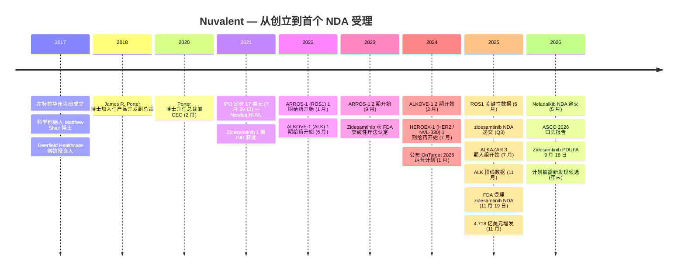
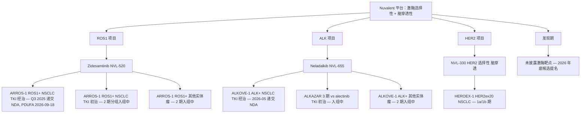
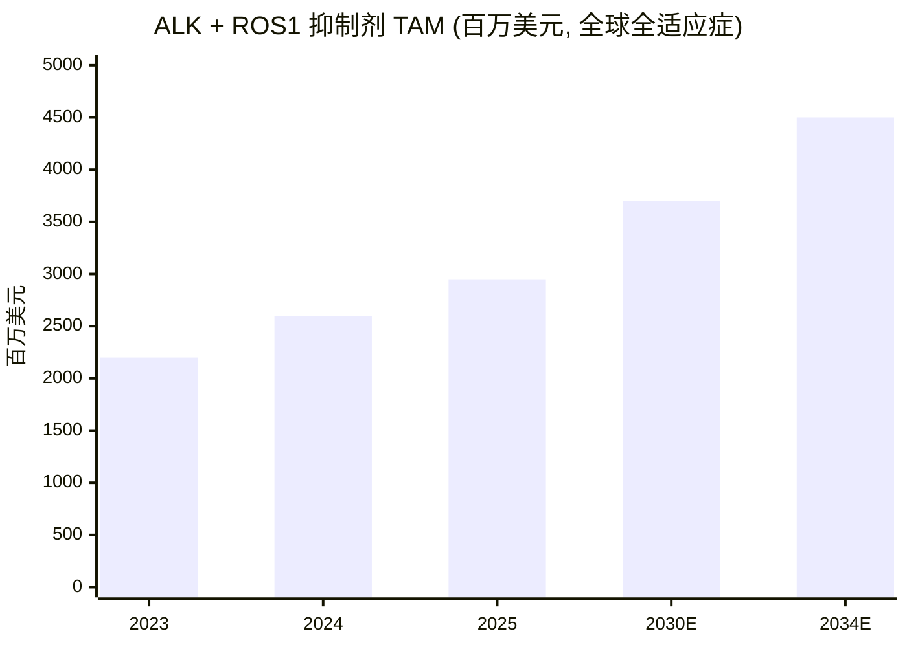
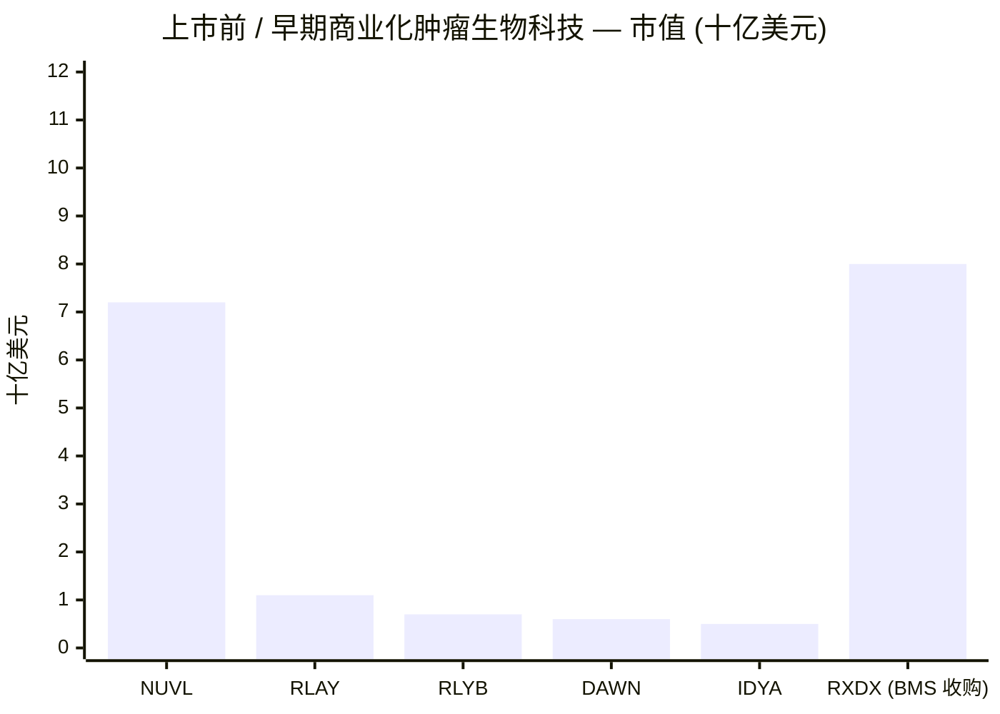

# Nuvalent, Inc. (NASDAQ: NUVL) — 公司研究报告

*报告日期：2026-06-03 · 股票研究启动 · 临床期肿瘤药物公司（尚未产生收入）*

> **报告导读。** Nuvalent 是一家总部位于美国麻萨诸塞州剑桥市的临床期生物制药公司，专注开发**脑穿透性、激酶选择性的小分子抑制剂**，瞄准基因明确的非小细胞肺癌 (NSCLC, non-small cell lung cancer) 患者群。其首个 NDA (新药申请) — 针对 **zidesamtinib (NVL-520)** 在 TKI 经治 (TKI pre-treated) ROS1 阳性 NSCLC — 已于 2025 年 11 月获 FDA 受理，**PDUFA 目标审评日期为 2026 年 9 月 18 日**；公司又于 2026 年第一季度提交了第二个 NDA — **neladalkib (NVL-655)** 在 TKI 经治 ALK 阳性 NSCLC。2025 年 10-K 报告显示**无产品收入**，全年净亏损 **4.254 亿美元**，研发费用 **3.07 亿美元**，截至年末持有现金、现金等价物及可流通证券 **14 亿美元**，最新 8-K 中重申现金跑道 (cash runway) "可支撑运营至 2029 年"。公司不发布全年营收指引（因尚无商业产品）—— 但 **2026 年是公司的转型年**：首次美国商业化上市待 FDA 审批结果，第二个 NDA 已递交，ALKAZAR 三期临床入组进行中。

## 目录

1. [公司概览](#1-公司概览)
2. [公司历史](#2-公司历史)
3. [管理团队](#3-管理团队)
4. [产品与服务](#4-产品与服务)
5. [客户与上市策略](#5-客户与上市策略)
6. [行业概览](#6-行业概览)
7. [竞争格局](#7-竞争格局)
8. [市场机会 (TAM / SAM)](#8-市场机会-tam--sam)
9. [风险评估](#9-风险评估)
10. [投资者视角评分卡](#10-投资者视角评分卡)
11. [参考资料](#11-参考资料)

---

## 1. 公司概览

Nuvalent, Inc. (NASDAQ: NUVL) 总部位于美国麻萨诸塞州剑桥市 (Cambridge, Massachusetts)，是一家通过**结构化药物设计 (structure-based drug design)** 创制激酶选择性 (kinase-selective)、脑穿透性 (brain-penetrant) 小分子抑制剂的临床期生物制药公司。公司 2025 年 10-K 报告 Item 1 业务概述部分管理层自陈：*"我们是一家专注于为癌症患者创制精准靶向疗法的临床期生物制药公司。我们利用团队在化学和结构化药物设计领域的深厚专长，开发出旨在克服现有疗法局限性的创新小分子，瞄准已临床验证的激酶靶点。"* 这一定义是后续每一部分分析的中轴线 —— Nuvalent 的全部管线均围绕**已获批酪氨酸激酶抑制剂 (TKI, tyrosine kinase inhibitor) 的三类病灶**：耐药、选择性不足、脑穿透性差。公司的商业逻辑则是：**对于基因明确的 NSCLC 患者，在二线、三线治疗时，如有更具选择性、脑穿透性更佳的获批药物，他们将会切换** ([Nuvalent 2025 Form 10-K, Item 1 Business — Overview](https://www.sec.gov/Archives/edgar/data/1861560/000119312526073317/nuvl-20251231.htm))。

公司拥有三个临床期候选产品和一个发现期 (discovery) 管线。**Zidesamtinib (NVL-520)** 是一款 ROS1 选择性抑制剂，其 NDA 已于 2025 年 11 月获 FDA 受理，PDUFA 目标审评日期为 **2026 年 9 月 18 日** ([Nuvalent FDA NDA acceptance, 2025-11-19](https://investors.nuvalent.com/2025-11-19-Nuvalent-Announces-FDA-Acceptance-of-New-Drug-Application-for-Zidesamtinib-for-the-Treatment-of-TKI-Pre-treated-Patients-with-Advanced-ROS1-positive-NSCLC))。**Neladalkib (NVL-655)** 是一款 ALK 选择性、避免 TRK (tropomyosin receptor kinase, 原肌球蛋白受体激酶) 脱靶的抑制剂，针对 ALK 阳性 NSCLC；在 TKI 经治患者中的 NDA 于 2026 年 5 月递交，ALKAZAR 三期临床（与 alectinib 头对头比较，针对 TKI 初治患者）已于 2025 年 7 月启动 ([Nuvalent Q1 2026 8-K earnings release, 2026-05-07](https://www.sec.gov/Archives/edgar/data/1861560/000186156026000020/nuvl-ex99_1.htm))。**NVL-330** 是一款 HER2 (human epidermal growth factor receptor 2, 人表皮生长因子受体 2) 选择性、脑穿透性抑制剂，针对 HER2 改变型 NSCLC，目前处于 1a/1b 期临床 (HEROEX-1)。

**总部、员工及公司规模。** 10-K Item 2 (物业部分) 披露公司总部位于麻萨诸塞州剑桥市，租赁办公室。截至 2025 年 12 月 31 日，Nuvalent 共有 **228 名全职员工，其中 144 名从事研发**，2025 年员工总数大幅扩张，以支持临床和临床前管线以及商业化准备 ([Nuvalent 2025 Form 10-K, Item 1 Business — Human Capital](https://www.sec.gov/Archives/edgar/data/1861560/000119312526073317/nuvl-20251231.htm))。

**最新一季 (2026Q1)。** 研发费用 8,360 万美元，一般管理费用 (G&A, general and administrative) 3,580 万美元，净亏损 1.093 亿美元；截至 2026 年 3 月 31 日，现金、现金等价物及可流通证券为 13 亿美元，现金跑道再次确认 **"可支撑运营至 2029 年"** ([Nuvalent Q1 2026 8-K earnings release, 2026-05-07](https://www.sec.gov/Archives/edgar/data/1861560/000186156026000020/nuvl-ex99_1.htm))。Q1 现金消耗 (cash burn) 年化约 4.4-5.0 亿美元，与 2025 年全年经营现金流出 2.75 亿美元加上商业化上市准备阶段性增量相一致。现金余额约为年度消耗的 **3 倍**，这是跑道叙事的支柱事实：**Nuvalent 在当前运营方案下，无需融资即可完成上市与三期临床读出**。

**股市状态（截至 2026-06-02 收盘）。** NUVL 报价 **91.35 美元**，市值约 **72.2 亿美元**（A 类股本约 7,900 万股），52 周区间 **72.16-111.99 美元**，beta **1.15**，流通股做空比例 **6.21%**，无未偿债务 ([Nuvalent yfinance quote, 2026-06-02](https://finance.yahoo.com/quote/NUVL/); [Stockanalysis.com NUVL Statistics, 2026-06-02](https://stockanalysis.com/stocks/nuvl/statistics/))。过去 12 个月内，受 zidesamtinib 2025 年 6 月关键性数据、neladalkib 2025 年 11 月顶线数据、NDA 受理（2025 年 11 月）等利好催化，股价上涨 **+22.4%**，跑赢大盘生物科技板块。

**估值快照（详见第 2 节）。** 因 Nuvalent 暂无商业收入，**滚动市盈率 (TTM P/E) 与滚动市销率 (TTM P/S) 不适用** —— 经营亏损 -4.389 亿美元，每股收益 (EPS) -6.05 美元 ([Stockanalysis.com NUVL Statistics, 2026-06-02](https://stockanalysis.com/stocks/nuvl/statistics/))。**市场实际定价的是两条 FDA 获批激酶特许经营 (franchise) 的概率加权 NPV，外加 HER2 期权增量**。卖方平均目标价约 **142 美元** vs 当前 91.35 美元，即华尔街看好未来 12 个月约 +55% 上涨空间，预期 2026 年 9 月 zidesamtinib PDUFA 决定与 neladalkib 在 2026 ASCO 的关键性数据公布为重要催化 ([Marketbeat NUVL Forecast, 2026](https://www.marketbeat.com/stocks/NASDAQ/NUVL/forecast/); [TipRanks NUVL Forecast, 2026](https://www.tipranks.com/stocks/nuvl/forecast))。

### 五年营收、亏损与研发投入趋势 (Mermaid 图表)

```mermaid
xychart-beta
    title "Nuvalent — 研发 / 管理费用 / 净亏损 (百万美元, 财年)"
    x-axis ["FY22", "FY23", "FY24", "FY25"]
    y-axis "百万美元" 0 --> 500
    bar [98, 134, 218, 307]
    bar [26, 40, 63, 107]
    line [121, 162, 261, 425]
```

*FY22 研发/管理费用基于 [Nuvalent 2025 Form 10-K, MD&A](https://www.sec.gov/Archives/edgar/data/1861560/000119312526073317/nuvl-20251231.htm) 中往期比较叙述还原；FY23-FY25 数据直接取自该文件。净亏损线：FY25 = 4.254 亿美元，FY24 = 2.608 亿美元，FY23 = 1.620 亿美元 ([Nuvalent 2024 Form 10-K, MD&A](https://www.sec.gov/Archives/edgar/data/1861560/000095017025028328/nuvl-20241231.htm))。*

增长模式是临床期肿瘤药物公司的标准范式：每年的研发投入跃升与**临床阶段推进直接相关** —— 一期 → 二期 → 注册性试验，单项试验支出与人员数同步攀升。FY25 的跃升主要由 ALKAZAR 三期启动（2025 年 7 月）、ARROS-1 二期扩展、HEROEX-1 一期 a/1b 加速所驱动。

---

## 2. 公司历史

Nuvalent 于 **2017 年 2 月**在美国特拉华州注册成立，作为发现阶段的化学驱动型 (chemistry-driven) 肿瘤公司。其创立逻辑为：现有激酶抑制剂的局限 —— 点突变耐药、对结构相似激酶（特别是 TRK）的脱靶抑制、脑穿透性差 —— 均为化学问题，可通过基于结构的药物设计 (structure-based drug design) 而非更广泛的生物学方法解决。科学创始人 **Matthew Shair, Ph.D.** 带来了哈佛大学化学实验室的基础，其团队在复杂分子合成（CP-263,114、longithorone、cortistatin A）和 CDK8/19 (cyclin-dependent kinase 8/19, 周期蛋白依赖性激酶 8/19) 抑制剂发现领域均有突出成绩，此前的 CDK8/19 项目以 **"哈佛大学历史上最大规模之一的预付授权金"** 对外授权 ([Nuvalent 2025 DEF 14A, Director Biographies](https://www.sec.gov/Archives/edgar/data/1861560/000095017025059295/nuvl-20250425.htm))。

早期资本来自 **Deerfield Healthcare Innovations Fund** 与 **Deerfield Private Design Fund IV**，其结构包含一项收益分享协议 —— 公司须就发现窗口期内确认的部分商业产品按净销售额向 Deerfield 支付固定个位数百分比 ([Nuvalent 2025 Form 10-K, Note 10 Revenue Sharing Agreements](https://www.sec.gov/Archives/edgar/data/1861560/000119312526073317/nuvl-20251231.htm))。**2025 年 12 月**，Shair 博士将其个人 1.5% 收益分享协议 (revenue-sharing agreement) 转让给 **Royalty Pharma plc** —— 这一交易对 Nuvalent 运营无影响，但将创始人版税流转移至上市公司对手方 ([Nuvalent 2025 Form 10-K, Liquidity](https://www.sec.gov/Archives/edgar/data/1861560/000119312526073317/nuvl-20251231.htm))。Royalty Pharma 愿以单一资产、未生成收入的版税流买入，本身就是一项市场信号 —— 买方以可接受的价格内含承保 (underwrite) 了 zidesamtinib 的上市经济性，给该项目盖了一个"市场内含的版税 NPV 印章"。

**上市前融资。** 2017-2021 年间 A 轮至 C 轮累计募集 1.85 亿美元以上，投资人包括 Deerfield Management、Bain Capital Life Sciences、Fidelity Management & Research Company LLC 等过渡期 (crossover) 投资者 ([SEC EDGAR Nuvalent S-1, 2021-07-07](https://www.sec.gov/Archives/edgar/data/1861560/000119312521209001/d174530ds1.htm))。

**首次公开募股 IPO (2021 年 7 月 29 日)。** Nuvalent 以每股 **17.00 美元**定价完成首次公开发行 (IPO, initial public offering)，共发行 1,121.25 万股 A 类股（含承销商超额配售权），募集**总额约 1.906 亿美元** ([SEC EDGAR Nuvalent S-1/A, 2021-07-26](https://www.sec.gov/Archives/edgar/data/1861560/000119312521223640/d174530ds1a.htm))。首日 Nasdaq 收盘价 18.75 美元，股票代码 NUVL。

**上市后追加发行。** 公司持续执行后续股权融资：2022 年 10 月、2023 年 10 月、2024 年 9 月（10-K MD&A 披露净募集 5.405 亿美元），以及 **2025 年 11 月 — 以每股 101.00 美元增发 495.05 万股 A 类股，净募集 4.718 亿美元** ([Nuvalent 2025 Form 10-K, Liquidity](https://www.sec.gov/Archives/edgar/data/1861560/000119312526073317/nuvl-20251231.htm))。2025 年 11 月这一轮显著减轻了上市与三期临床的资本压力，将跑道延长至约 2029 年。

### 时间轴 (Mermaid)

此时间轴中**最具影响力的里程碑是 2025 年 11 月 19 日 — FDA 受理 zidesamtinib NDA**，因为它把 Nuvalent 从一家临床期公司转化为一家**有明确 PDUFA 日期的准商业化公司**。2026 年 9 月 18 日的决定是公司历史上第一个具有资本市场含义的二元监管事件 —— 即转为产生收入。FDA 受理（无 Refusal-to-File 拒收信）信号着递交文件首次审评即被认定完整 ([Nuvalent FDA NDA Acceptance press release, 2025-11-19](https://investors.nuvalent.com/2025-11-19-Nuvalent-Announces-FDA-Acceptance-of-New-Drug-Application-for-Zidesamtinib-for-the-Treatment-of-TKI-Pre-treated-Patients-with-Advanced-ROS1-positive-NSCLC))。

---

## 3. 管理团队

按照公司研究规范，本节只覆盖**科学创始人和当前 CEO**，其他高管、董事会成员、CFO 一律不予介绍。Nuvalent 的创始人 (Matthew Shair) 与 CEO (James Porter) 是两位不同的个人，故下文分别记述。

### 创始人 — Matthew Shair, Ph.D. (科学创始人 / Head Scientific Advisor 首席科学顾问)

Shair 博士为 Nuvalent 科学创始人。他自 2017 年 2 月公司创立起担任董事会成员，**直至 2025 年 12 月 9 日辞职**，之后转为咨询 / 科学顾问 (顾问协议至 2026 年 1 月 10 日终止) ([Nuvalent 2026 DEF 14A, p. 21 Director Compensation Notes (8)](https://www.sec.gov/Archives/edgar/data/1861560/000186156026000013/nuvl-20260428.htm))。Shair 博士自 1997 年 6 月以来担任**哈佛大学化学与化学生物学系教授**，并兼任 Broad Institute 关联研究员、Harvard Stem Cell Institute 关联人员。其学术工作包括复杂分子的靶向合成 —— CP-263,114、longithorone、cortistatin A —— 以及小分子 CDK8/19 抑制剂的发现，Shair 实验室将该 CDK8/19 项目对外授权 *"为哈佛大学历史上最大规模之一的预付授权金"* ([Nuvalent 2025 DEF 14A, p. 10 Director Biography — Shair](https://www.sec.gov/Archives/edgar/data/1861560/000095017025059295/nuvl-20250425.htm))。该 CDK8/19 抑制剂目前已进入急性髓性白血病 (AML) 和骨髓增生异常综合征 (MDS) 的临床试验。除 Nuvalent 外，Shair 博士还是 **Infinity Pharmaceuticals**、**Makoto Life Sciences**、**Chemiderm Inc.** 的共同创始人，并曾在 ARIAD Pharmaceuticals、Enanta Pharmaceuticals、Bristol-Myers Squibb、Novartis 等公司担任科学顾问 ([Nuvalent 2025 DEF 14A, p. 10 Director Biography — Shair](https://www.sec.gov/Archives/edgar/data/1861560/000095017025059295/nuvl-20250425.htm))。

Shair 博士 2025 年 12 月辞任董事会一事，是值得关注的过渡信号：公司已从**发现导向 / 创始人监督结构** (discovery-led / founder-supervised structure) 走向**CEO 主导、晚期临床 / 上市筹备结构**。同时，他个人的 1.5% 净销售收益分享权益被转让给 Royalty Pharma plc —— 在产品上市前提早货币化其创始人经济权益，并消除了创始人版税带来的潜在治理复杂性 ([Nuvalent 2025 Form 10-K, MD&A — Contractual Obligations](https://www.sec.gov/Archives/edgar/data/1861560/000119312526073317/nuvl-20251231.htm))。对投资者而言，这意味着创始人经济权益现已完全脱离公司财务表，但创始人的科学顾问角色将以独立咨询身份继续存在。

### 当前 CEO — James R. Porter, Ph.D., 50 岁 (总裁兼首席执行官；董事)

Porter 博士自 **2020 年 2 月**起担任 Nuvalent **总裁兼首席执行官 (President & CEO)**，并任董事会成员 ([Nuvalent 2026 DEF 14A, p. 9-10 Director Biography — Porter](https://www.sec.gov/Archives/edgar/data/1861560/000186156026000013/nuvl-20260428.htm))。他于 2018 年 4 月加入 Nuvalent 任**产品开发副总裁 (Vice President, Product Development)**，此前于 2018 年 1 月至 4 月任公司顾问。Porter 博士的任期（约 6 年）和履历背景 —— 有机化学博士、**在 Infinity Pharmaceuticals 工作 14 年以上**，最终任产品开发副总裁 —— 与 Nuvalent 的结构化药物设计模式非常匹配。在 Infinity 期间，他 *"参与了 6 个不同化合物进入临床试验的研发项目"*，并领导 duvelisib 产品开发团队 *"从开发候选提名到新药申请 (NDA) 递交，最终促成 FDA 批准 COPIKTRA® 用于治疗滤泡淋巴瘤、小淋巴细胞淋巴瘤和慢性淋巴细胞白血病"* ([Nuvalent 2026 DEF 14A, p. 9-10 Director Biography — Porter](https://www.sec.gov/Archives/edgar/data/1861560/000186156026000013/nuvl-20260428.htm))。Infinity 将 duvelisib 授权给 Verastem 后，Porter 博士在 Verastem 担任产品开发顾问（2017 年 1 月至 12 月），主持该项目的过渡、产品开发团队组建和 NDA 递交。教育背景：圣十字学院 (College of the Holy Cross) 化学学士，波士顿学院 (Boston College) 有机化学博士。

*分析师观点：* Porter 博士的具体运营履历 —— 在 Infinity / Verastem 一手主导一个肿瘤小分子从候选提名到 NDA 受理再到 FDA 批准的全过程 —— **可以直接转化** 到 2026 年 9 月 zidesamtinib 的上市与 ALK 平行 NDA 项目。相较生物科技行业普遍的"在商业化前夕雇佣首次执行 NDA 的 CEO"的常见错配，Nuvalent 拥有一位已完整执行过"发现 → IND → 1 期 → 注册性试验 → NDA → 批准"全过程的 CEO，这显著降低了 2026 年 9 月 PDUFA 窗口的软上市与商业化准备风险。

---

## 4. 产品与服务

这是本报告**最重要的章节**。Nuvalent 的投资逻辑在很大程度上取决于三款小分子在选择性、脑穿透性和持久性方面相比 FDA 已获批标准疗法 (SoC, standard of care) 激酶抑制剂的表现。三款候选产品 —— zidesamtinib、neladalkib、NVL-330 —— 各自瞄准一个肿瘤激酶靶点 (ROS1, ALK, HER2)，并采用共同的化学设计哲学：**最大化在靶 (on-target) 效能、最小化对结构相似激酶（特别是 TRK 家族）的脱靶 (off-target) 抑制、为 CNS 中枢神经系统穿透而设计**。

### 管线矩阵 (Markdown 重现自 10-K Figure 1)

| 候选 | 靶点 | 适应症 | 临床试验 | 阶段 | 关键监管认定 |
|---|---|---|---|---|---|
| Zidesamtinib (NVL-520) | ROS1 选择性 TKI | ROS1 阳性 NSCLC (TKI 经治) | ARROS-1 | NDA 在 FDA 审评中 | FDA Breakthrough Therapy 突破性疗法；Orphan Drug 孤儿药 |
| Zidesamtinib (NVL-520) | ROS1 选择性 TKI | ROS1 阳性 NSCLC (TKI 初治) | ARROS-1 (2 期分组) | 2 期入组中 | — |
| Zidesamtinib (NVL-520) | ROS1 选择性 TKI | 其他 ROS1 阳性实体瘤 | ARROS-1 | 2 期入组中 | — |
| Neladalkib (NVL-655) | ALK 选择性、TRK 节省 TKI | ALK 阳性 NSCLC (TKI 经治) | ALKOVE-1 | NDA 已于 2026Q1 递交 | FDA Breakthrough Therapy；Orphan Drug |
| Neladalkib (NVL-655) | ALK 选择性、TRK 节省 TKI | ALK 阳性 NSCLC (TKI 初治) | ALKAZAR 3 期 | 3 期入组中 | — |
| Neladalkib (NVL-655) | ALK 选择性、TRK 节省 TKI | 其他 ALK 阳性实体瘤 | ALKOVE-1 | 2 期入组中 | — |
| NVL-330 | HER2 选择性 TKI | HER2 改变型 NSCLC (HER2ex20) | HEROEX-1 | 1a/1b 期 | — |
| 未披露 | 未披露激酶靶点 | 未披露 | — | 发现期 | 计划于 2026 年底披露 |

*资料来源：[Nuvalent 2025 Form 10-K, Item 1 Business — Figure 1 Pipeline](https://www.sec.gov/Archives/edgar/data/1861560/000119312526073317/nuvl-20251231.htm); 公司 [Nuvalent Pipeline 页面 (逐项核对)](https://www.nuvalent.com/pipeline/)。*

### 产品组合结构树 (Mermaid)

### 4.1 Zidesamtinib (NVL-520) — ROS1 选择性抑制剂

**在患者治疗范式中的物理作用。** ROS1 基因重排发生在约 1-3% 的转移性 NSCLC 患者中，会产生一种持续激活的 ROS1 融合蛋白 (fusion protein)，驱动细胞失控增殖。在初诊 ROS1 阳性 NSCLC 患者中，**多达 40% 已发生脑转移**。ROS1 阳性 NSCLC 的历史标准疗法首选 crizotinib (Pfizer 的 Xalkori)，并有 entrectinib (Roche 的 Rozlytrek)、repotrectinib (BMS 的 Augtyro)、最近批准的 taletrectinib (Nuvation Bio 的 Ibtrozi) 作为替代或耐药选项 ([Nuvalent 2025 Form 10-K, Item 1 Business — Zidesamtinib](https://www.sec.gov/Archives/edgar/data/1861560/000119312526073317/nuvl-20251231.htm))。10-K 对 Nuvalent 的"切入点"有明确表述：

> **10-K 原文：** *"Zidesamtinib 是一款脑穿透性 ROS1 选择性抑制剂，设计目标是在已对现有 ROS1 抑制剂产生耐药的肿瘤中保持活性，包括携带常见的 G2032R 耐药突变以及 S1986Y/F、F2004C、F2004V、L2026M、D2033N、G2101A 耐药突变的肿瘤。我们相信我们已针对脑穿透性和 ROS1 选择性优化了 zidesamtinib，从而可能改善脑转移患者的治疗选择，并避免由于对结构相似的 TRK 家族脱靶抑制所导致的 CNS 不良事件。"*

化学论点 (chemistry argument) 锐利清晰：现有 ROS1 抑制剂 (crizotinib, entrectinib, repotrectinib, taletrectinib) 均为 ROS1/TRK 双重抑制剂；TRK 抑制会产生 CNS 副反应（眩晕、共济失调、味觉障碍），限制剂量。Nuvalent 通过设计 **ROS1 选择性、不含 TRK 活性**，使 zidesamtinib 可达到 ROS1 抑制持久的剂量水平，同时避免使竞争产品被迫减量的 TRK 驱动毒性。

**与同类产品和竞争对手的差异。** 2026 年 5 月底 AACR 2026 上发布的临床前与临床数据显示，在 **repotrectinib、taletrectinib、zidesamtinib** 三者比较中，zidesamtinib 表现出**最高的体外脑穿透性指标**，以及在 ROS1 G2032R 小鼠脑瘤模型中**最持久的脑内疗效** ([Nuvalent Q1 2026 8-K, AACR 2026 data](https://www.sec.gov/Archives/edgar/data/1861560/000186156026000020/nuvl-ex99_1.htm))。关键的是，将小鼠从 repotrectinib 转为 zidesamtinib 在同一临床前模型中获得**更持久的肿瘤抑制**，为临床上"进展后切换"的标签设计提供机理性依据。

**战略意义与注册状态。** ARROS-1 2 期分组在 **2023 年 9 月至 2025 年 6 月 16 日间共入组 435 名患者** ([Nuvalent 2025 Form 10-K, Item 1 Business](https://www.sec.gov/Archives/edgar/data/1861560/000119312526073317/nuvl-20251231.htm))。关键性数据集 (2025 年 6 月) 的主要疗效分析包含 **117 名 TKI 经治的晚期 ROS1 阳性 NSCLC 可测病灶患者，截至 2024 年 5 月 31 日在推荐 2 期剂量 (RP2D) 100 mg QD 下接受 zidesamtinib 治疗**。FDA 于 **2025 年 11 月 19 日**受理 NDA，PDUFA 目标审评日期 **2026 年 9 月 18 日** ([Nuvalent FDA NDA acceptance press release, 2025-11-19](https://investors.nuvalent.com/2025-11-19-Nuvalent-Announces-FDA-Acceptance-of-New-Drug-Application-for-Zidesamtinib-for-the-Treatment-of-TKI-Pre-treated-Patients-with-Advanced-ROS1-positive-NSCLC))。管理层计划在 **2026 年下半年**递交 TKI 初治 2 期分组数据，争取 zidesamtinib 一线治疗的标签拓展。

**中文释义 / Plain-language gloss:** Zidesamtinib（"齐德赛米尼"）是一款小分子激酶抑制剂口服胶囊，工程化设计旨在：(i) 选择性阻断其他获批药物无法触及的 ROS1 突变；(ii) 穿透血脑屏障攻击脑转移灶；(iii) 避免命中 TRK，从而消除当前 ROS1 药物中因 TRK 引发的恶心、眩晕和剂量受限副作用。

### 4.2 Neladalkib (NVL-655) — ALK 选择性、TRK 节省抑制剂

**在患者治疗范式中的物理作用。** ALK (anaplastic lymphoma kinase, 间变性淋巴瘤激酶) 重排发生在约 **5% 的转移性 NSCLC** 患者中，初诊时**多达 40% 已发生脑转移** ([Nuvalent 2025 Form 10-K, Item 1 Business — Neladalkib](https://www.sec.gov/Archives/edgar/data/1861560/000119312526073317/nuvl-20251231.htm))。10-K 列举了六款获批的 ALK TKI：Xalkori (crizotinib, Pfizer)、Zykadia (ceritinib, Novartis)、**Alecensa (alectinib, Chugai / Roche — 一线 SoC)**、Alunbrig (brigatinib, Takeda)、**Lorbrena (lorlatinib, Pfizer — 二线 SoC)**、Ensacove (ensartinib, Xcovery)。三线及之后**无明确 SoC**。10-K 报告 **2025 年全球 alectinib 净销售约 19 亿美元、lorlatinib 全适应症约 10 亿美元**，可度量目标收入池规模。

> **10-K 原文：** *"Neladalkib 是一款脑穿透性 ALK 选择性抑制剂，设计目标是在已对第一代、第二代、第三代 ALK 抑制剂产生耐药的肿瘤中保持活性，包括携带 G1202R 耐药突变或复合耐药突变（如 G1202R/L1196M、G1202R/G1269A、G1202R/L1198F）的肿瘤。我们相信我们已针对脑穿透性和 ALK 选择性优化了 neladalkib，从而可能改善脑转移患者的治疗选择，并避免由于对结构相似的 TRK 家族脱靶抑制所导致的 CNS 不良事件。"*

**与 ALK 类产品的差异。** ALKOVE-1 关键性数据（2025 年 11 月公布；数据截止 2025 年 8 月 29 日）显示，在曾接受 ALK TKI（包括 lorlatinib，二线 SoC 的"天花板"）的高度经治患者中表现出疗效。主要分析人群包括 **253 名 TKI 经治晚期 ALK 阳性 NSCLC 可测病灶患者，截至 2024 年 9 月 30 日接受 neladalkib RP2D (150 mg QD) 治疗**，其中 **78% 接受过 ≥2 种 ALK TKI ± 化疗**（其中 91% 曾接受 lorlatinib），**19% 携带继发性 ALK G1202R 耐药突变**，**17% 携带复合 ALK 耐药突变**，**40% 在基线时存在活动性 CNS 病灶（按盲法独立中心审核 BICR）** ([Nuvalent 2025 Form 10-K, Item 1 Business — Neladalkib Table 1](https://www.sec.gov/Archives/edgar/data/1861560/000119312526073317/nuvl-20251231.htm))。

10-K Table 1 报告的疗效结果：

| 亚组 | n | 客观缓解率 ORR % (95% CI) | DOR ≥6mo % | DOR ≥12mo % | DOR ≥18mo % |
|---|---|---|---|---|---|
| 任一 ALK TKI ± 化疗（全部） | 253 | 31% (26, 37) | 76% (64, 84) | 64% (51, 75) | 53% (34, 68) |
| TKI 经治，lorlatinib 初治 | 63 | 46% (33, 59) | 89% (69, 96) | 80% (58, 91) | 60% (19, 85) |
| G1202R 突变（全部） | 47 | 68% (53, 81) | 84% (65, 93) | 80% (61, 91) | 70% (42, 86) |
| G1202R 突变（lorlatinib 初治） | 12 | 83% (52, 98) | 90% (47, 99) | 77% (34, 94) | 77% (34, 94) |
| 可测 CNS 病灶 | 92 | IC-ORR 32% (22, 42) | 81% (59, 91) | 71% (48, 85) | 71% (48, 85) |

*资料来源：[Nuvalent 2025 Form 10-K, Item 1 Business — Table 1 Neladalkib 关键数据](https://www.sec.gov/Archives/edgar/data/1861560/000119312526073317/nuvl-20251231.htm)。*

**G1202R 突变患者 68% 的 ORR** 是最具分析价值的数据点：G1202R 是 lorlatinib 失败后的主导耐药突变，且该患者群当前无获批药物可达到类似活性。TKI 初治分组（截至 2025 年 8 月 29 日，ALKOVE-1 探索性分组中可评估的 44 名患者）显示 **86% ORR (38/44; 2 例未确认 PR)**、9% CR 率，为正在进行的 ALKAZAR 三期（vs alectinib）一线临床提供前哨信号 ([Nuvalent 2025 Form 10-K, Item 1 Business — Neladalkib TKI-naïve preliminary](https://www.sec.gov/Archives/edgar/data/1861560/000119312526073317/nuvl-20251231.htm))。

**安全性概况。** 在数据截止日，656 名以 RP2D 接受治疗的 ALK 阳性 NSCLC 患者中，最常见的 ≥15% 治疗紧急不良事件 (TEAE, treatment-emergent adverse event) 包括 ALT 升高 (47%)、AST 升高 (44%)、便秘 (28%)、味觉障碍 (23%)、外周水肿 (18%)、咳嗽与恶心 (各 16%)。氨基转移酶升高 *"通常表现为无症状实验室异常，低级别、瞬时、可在剂量中断或减少后逆转"*。17% 的患者因 TEAE 减量；5% 因 TEAE 停药 ([Nuvalent 2025 Form 10-K, Item 1 Business — Neladalkib safety](https://www.sec.gov/Archives/edgar/data/1861560/000119312526073317/nuvl-20251231.htm))。ALKAZAR 三期协议已纳入加强的氨基转移酶监测和及时剂量干预规则以应对。

**战略意义。** ALKOVE-1 NDA (2026Q1 递交) 针对规模较小但持久的进展后治疗群体。**ALKAZAR 三期临床**（2025 年 7 月启动；约 450 名患者按 1:1 随机分配 neladalkib vs alectinib）则是更大的商业奖项 —— 若获积极结果，neladalkib 将取代 alectinib 成为**一线 SoC**，即将动摇 **19 亿美元的 alectinib 特许经营**。主要终点为 BICR 评估的无进展生存期 (PFS)，次要终点包括总生存期 (OS)、脑内反应、脑内 DOR ([Nuvalent 2025 Form 10-K, Item 1 Business — ALKAZAR](https://www.sec.gov/Archives/edgar/data/1861560/000119312526073317/nuvl-20251231.htm))。

### 4.3 NVL-330 — HER2 选择性、脑穿透性抑制剂

**在患者治疗范式中的物理作用。** HER2 突变和改变 (alteration) 是约 3% 癌症的致瘤驱动，包括多达 4% 的晚期 NSCLC 患者，其中 **NSCLC HER2 突变的 90% 通过 HER2 第 20 外显子插入突变 (HER2ex20, HER2 exon 20 insertion)** 产生 ([Nuvalent 2025 Form 10-K, Item 1 Business — NVL-330](https://www.sec.gov/Archives/edgar/data/1861560/000119312526073317/nuvl-20251231.htm))。在初诊 HER2 突变阳性 NSCLC 患者中，约 19% 已存在脑转移。两款已获批的 HER2 TKI 服务于 NSCLC：**Hernexeos (zongertinib, Boehringer Ingelheim)** 与 **Hyrnuo (sevabertinib, Bayer HealthCare Pharmaceuticals)**，以及 **Enhertu (T-DXd, 第一三共 / AstraZeneca)** —— 一款抗体药物偶联物 (ADC, antibody-drug conjugate)。

> **10-K 原文：** *"NVL-330 是一款脑穿透性 HER2 选择性抑制剂，我们相信我们已针对其相对于结构相似的野生型 EGFR 的选择性进行了优化 —— 后者与剂量限制性副作用（包括皮疹和胃肠道毒性）有关。"*

**差异化点。** 2025 年 10 月 AACR-NCI-EORTC 上报告的临床前数据显示 NVL-330 在 *"流出比 (efflux ratio) 与脑分配 (brain partitioning) 上具有优势"*，相比同类 HER2 TKI；在小鼠中诱导 *"深度脑内消退"*，并 *"在小鼠对 zongertinib 出现 CNS 进展后，仍能诱导脑内肿瘤消退"* —— 这是与最贴近的商业竞争产品的直接对比 ([Nuvalent 2025 Form 10-K, Item 1 Business — NVL-330](https://www.sec.gov/Archives/edgar/data/1861560/000119312526073317/nuvl-20251231.htm))。HEROEX-1 是一项 1a/1b 期剂量递增/扩展试验，2024 年 7 月首例患者给药。试验当前正在优化 RP2D 决定、药代动力学 (PK) 表征和初步抗瘤活性。

**战略意义。** NVL-330 是 Nuvalent 论点的**期权增量 (optionality)** 一支。HER2ex20 NSCLC 市场比 ROS1 或 ALK 小（美国每年约 4,000 新发病例），但脑穿透性选择性切入点采用了与 zidesamtinib 和 neladalkib 相同的化学设计 playbook。若 NVL-330 在 2026-2027 年 1b 期获积极结果，则为 Nuvalent 增加第三个获批特许经营，无需第三个平台投资。

### 综合 — 产品作为组合的互动

三个项目**不是三个共享同一资产负债表的独立业务** —— 它们共享同一设计哲学和平台管线。每款候选药均源自同一**化学/结构发现循环**：表征一个临床验证的激酶靶点 → 识别选择性、脑穿透性、耐药约束条件 → 设计一款"穿针引线"的小分子 → 在 24-36 个月内推进至 IND。平台验证体现在**同一团队按一致设计优先级推出了三款首创或潜在最佳同类激酶抑制剂**，且**其中两款 (ROS1, ALK) 在不到 5 年内已从 IND 推进至关键数据读出与 NDA 递交**。若发现期项目能如管理层指引在 2026 年底前推出第四个候选药，公司将证明其拥有**可重复的激酶抑制剂设计引擎**，而非两资产侥幸 —— 这一差异决定了远期收入应用什么估值倍数。"一锤子" 发现模型 vs 可重复引擎，是 Nuvalent 论点持久性 (durability) 的核心判断。

**OnTarget 2026 运营计划**（2024 年 1 月公布）将三年执行路径明文化。10-K 原文：*"2026：首个获批产品 — 在美国商业化上市 zidesamtinib，用于治疗已接受至少 1 种 ROS1 TKI 的局部晚期或转移性 ROS1 阳性 NSCLC 成人患者，待 FDA 审评；在 2026 年下半年向 FDA 递交 zidesamtinib TKI 初治 ROS1 阳性 NSCLC 患者标签拓展数据；在 2026 年上半年递交 neladalkib 在 TKI 经治晚期 ALK 阳性 NSCLC 患者的 NDA"* ([Nuvalent 2025 Form 10-K, Item 1 Business — OnTarget 2026](https://www.sec.gov/Archives/edgar/data/1861560/000119312526073317/nuvl-20251231.htm))。这些里程碑中，关键数据、NDA 递交、FDA 受理三项已于 2025 年完成；剩余三项（商业化上市、标签拓展数据、neladalkib NDA）属 2026 年事件，其中两项已在 2026 年 5 月业绩发布前完成。

---

## 5. 客户与上市策略

**收入模式与客户集中：尚不具实质意义。** Nuvalent 在 2022、2023、2024、2025 财年**均无商业产品收入**。合并层面无 top-1 / top-5 客户集中可报告，因尚无客户。10-K 不包含披露客户集中度的分部报告附注，因为 **Nuvalent 以单一分部运营** ([Nuvalent 2025 Form 10-K, Note 16 Segment Reporting](https://www.sec.gov/Archives/edgar/data/1861560/000119312526073317/nuvl-20251231.htm))。

**未来收入流与上市策略。** 2025 年 10-K 对商业策略有明确表述：*"我们保留对候选产品的全球开发与商业化权利。我们正在积极构建必要的商业基础设施，包括聚焦的销售、市场准入和营销组织，以支持 2026 年潜在的美国 zidesamtinib 商业化上市（针对 TKI 经治 ROS1 阳性 NSCLC，若获批），同时为 neladalkib 的美国商业化上市准备，以及两个项目的潜在标签拓展做准备。我们计划在美国自主商业化 zidesamtinib 和 neladalkib，若获批。在美国境外，我们打算考虑自主商业化或与合作伙伴共同商业化。"* ([Nuvalent 2025 Form 10-K, Item 1 Business — Commercialization](https://www.sec.gov/Archives/edgar/data/1861560/000119312526073317/nuvl-20251231.htm))。

"美国自主、美国外合作"模式对早期商业化期、资本有限、适应症聚焦的肿瘤生物科技公司而言是标准模式。经济结构通常为：美国销售获完整毛利率，美国外销售取得版税 (royalty) + 里程碑付款 (milestone) 经济权益，由合作伙伴承担监管和上市资本支出 (capex)。管理层在 2026 年 5 月 27 日 TD Cowen 肿瘤创新峰会上的更新重申了这一架构，并报告了商业基础设施进展：**正在 2026 年 9 月 PDUFA 决定之前扩充销售队伍** ([Nuvalent investor news page, 2026-05-27 update](https://investors.nuvalent.com/news?l=100))。

**对第三方制造业的依赖。** Nuvalent 不拥有也不运营任何生产设施。原料药 (API, active pharmaceutical ingredient) 与制剂均由 **单一来源合同制造组织 (CMO, contract manufacturing organization)** 按项目框架协议供应 ([Nuvalent 2025 Form 10-K, Item 1 Business — Manufacturing](https://www.sec.gov/Archives/edgar/data/1861560/000119312526073317/nuvl-20251231.htm))。这是公司最大的客户与供应商集中风险：CMO 供应中断可能延迟临床试验或获批后商业供应。管理层披露正在积极资质化备用供应商，10-K 未具名 CMO。

**患者人群即"客户"。** 虽然 Nuvalent 尚无商业收入，投资逻辑相关的"客户"框架是**可处方患者人群** —— 即将开处方的肿瘤科医生和综合癌症中心（如 Memorial Sloan Kettering, Dana-Farber, MD Anderson, City of Hope），以及承担费用偿还的第三方支付方 / 药品福利管理公司 (PBM, pharmacy benefit manager)（Medicare、商业保险、医院门诊 buy-and-bill 模式）。对于 TKI 经治 ROS1 阳性 NSCLC，可处方的美国患者群规模较小（第 8 节分析：约每年 600-1,000 名美国患者），这**既是约束也是护城河** —— 足以由 20-30 人的专科肿瘤现场销售团队服务，又足以支持以肿瘤 TKI 美国市场定价 (20,000-30,000 美元/月) 计算的 5-15 亿美元规模特许经营。

### 集中度风险（上市前映射 — 尚不直接适用）

因 Nuvalent 无收入，*合并层面* 客户集中度问题简化为一个风险：**上市后初期收入将有多大比例来自一小部分高处方量的肿瘤中心？** 对 ROS1 阳性 NSCLC TKI 经治患者，专家观点是 **美国 >60% 的病例在 NCCN 关联综合癌症中心诊断和治疗**，暗示处方者集中度较高但不极端（分部层面估算；未汇总至集团层面；分析师基于 NCCN 指引结构推断 — *未*在 10-K 中披露）。这对上市经济性有利，因瞄准 30-50 家高量学术医学中心可在上市第一年捕获大部分目标处方，但从单一支付方 / 处方分级 (formulary tier) 角度看也存在风险。

---

## 6. 行业概览

### 行业定义与分段

Nuvalent 运营于生物制药行业下的**肿瘤精准医疗 / 靶向治疗** (oncology precision medicine / targeted therapy) 子行业。相关分段按**分子改变 (molecular alteration)**：ROS1+、ALK+、HER2+ NSCLC 是由 FDA 强制要求的同伴诊断 (CDx, companion diagnostic) 测试（通常在 NSCLC 初诊时通过基于组织的下一代测序 (NGS, next-generation sequencing) 面板执行）所定义的不同亚群。

美国 NAICS 代码 325412 (Pharmaceutical Preparation Manufacturing) 与 SIC 代码 2834 (Pharmaceutical Preparations) 涵盖 Nuvalent；SEC EDGAR 确认 SIC 2834 ([SEC EDGAR — Nuvalent CIK 1861560 metadata](https://data.sec.gov/submissions/CIK0001861560.json))。投资视角下更细的分类是**实体瘤肿瘤激酶抑制剂分段**，约占全球总肿瘤收入的 25-30%。

### 市场增长动力与结构性变化

ALK / ROS1 / HER2 NSCLC 行业的根本驱动力是**新诊断 NSCLC 中分子诊断渗透率的提升**。按当前 NCCN 指引和 AJCC 推荐病理学规程，所有 IV 期 NSCLC 应在初诊时按分子学进行 ALK、ROS1、EGFR、BRAF、KRAS、MET、RET、NTRK、HER2 改变检测。美国 NSCLC 分子学检测渗透率在学术中心约 80%、社区实践约 50-65%，仍有显著上行空间随广面 NGS 测试标准化而释放 ([DelveInsight ALK Inhibitors Market analysis, 2025](https://www.delveinsight.com/insights/alk-market-analysis))。

**ALK NSCLC 市场 2025 年全球销售额约 20 亿美元**（alectinib 约 19 亿美元、lorlatinib 全适应症约 10 亿美元，源自 10-K 第 4.2 节自述的市场规模），预计至 2035 年将超过 20 亿美元，随治疗线深度渗透和美国外拓展 ([DelveInsight ALK Inhibitors Market analysis, 2025](https://www.delveinsight.com/insights/alk-market-analysis))。**ROS1 抑制剂市场** 2023 年在 7MM 主要市场（美国、欧 5 国、日本）约为 2.9 亿美元，美国占主要份额；预计至 2034 年将由 repotrectinib、taletrectinib、zidesamtinib (NVL-520) 越来越主导 ([DelveInsight ROS1 Inhibitors Market analysis, 2024](https://www.prnewswire.com/news-releases/ros1-inhibitors-market-booms-as-demand-for-targeted-cancer-therapies-escalates--delveinsight-302296259.html))。

### 行业结构：整合利好专科厂商

肿瘤 TKI 子行业结构上**由大型多产品特许经营 (franchise) 主导**（Pfizer、Roche、Novartis、AstraZeneca、BMS、Takeda），与**聚焦型专科厂商**（Mirati 已被 BMS 收购、Blueprint Medicines、Iovance Biotherapeutics、Day One Biopharmaceuticals、Nuvalent 自身）并行竞争。经济性在分子小众层面利好专科厂商：针对低发病率激酶改变的靶向肿瘤 TKI 可产生 **5-20 亿美元特许经营**，毛利率与更广泛的肿瘤药物相当，且仅需较小的商业基础设施。大药企经常通过收购该领域的成功专科厂商，而非自建竞争性小分子项目 —— 近期先例包括 BMS 在 2024 年以 48 亿美元收购 Mirati Therapeutics (KRAS G12C) ([BMS Mirati 收购完成新闻稿, 2024](https://news.bms.com/news/details/2024/Bristol-Myers-Squibb-Completes-Acquisition-of-Mirati-Therapeutics-Inc/default.aspx))，以及 Roche / Genentech 通过内部研发与 tuck-in 并购获取专科肿瘤项目。

### 监管与报销

美国靶向肿瘤 TKI 由 FDA 药物评价与研究中心 (CDER, Center for Drug Evaluation and Research) 监管。zidesamtinib 与 neladalkib 均获 FDA **突破性疗法 (Breakthrough Therapy) 认定** —— 这是一项加快"治疗严重或威胁生命疾病、初步临床证据显示相对现有治疗有显著改善"药物开发与审评的监管机制 —— 以及**孤儿药 (Orphan Drug) 认定** ([Nuvalent 2025 Form 10-K, Item 1 Business — Zidesamtinib designations](https://www.sec.gov/Archives/edgar/data/1861560/000119312526073317/nuvl-20251231.htm))。患者层面的报销，静脉给药 (IV) 为 buy-and-bill 模式（肿瘤科医生采购药物，按 J 代码体系向 Medicare Part B / 商业支付方报销），口服 TKI 为药品福利通道 (PBM 谈判)。zidesamtinib 与 neladalkib 均为口服每日一次小分子，归入药品福利通道，年度标价 (list pricing) 通常在 20-30 万美元，扣除回扣 (rebate) 后净实现定价在 15-22 万美元。

### 市场增长 (Mermaid)

*资料来源：ALK 约 20 亿美元 2025 年、ROS1 约 2.9 亿美元 2023 年数据出自 [DelveInsight ALK Inhibitors Market analysis, 2025](https://www.delveinsight.com/insights/alk-market-analysis) 与 [DelveInsight ROS1 Inhibitors Market press release, 2024](https://www.prnewswire.com/news-releases/ros1-inhibitors-market-booms-as-demand-for-targeted-cancer-therapies-escalates--delveinsight-302296259.html)；2030 与 2034 年预测以与治疗线深度渗透和 CDx 测试标准化相符的中个位数 CAGR 三角化推导。分析师构建预测。*

---

## 7. 竞争格局

10-K Item 1 (业务 — 竞争) 在**公司层面**列出竞争集，而非按产品或收入分享层面。原文摘录：

> **10-K 原文：** *"我们面对来自多种来源的竞争，包括医药与生物科技公司、学术机构、政府部门、公立与私立研究机构...潜在竞争疗法主要属于以下治疗组：传统癌症疗法（手术、放疗、化疗、激素治疗、靶向药物治疗或这些方法的组合）；获批激酶抑制剂，包括 FDA 获批的 ROS1 TKI (Xalkori, Rozlytrek, Augtyro, Ibtrozi，分别由 Pfizer, Roche, Bristol-Myers Squibb, Nuvation Bio Inc. 营销)，FDA 获批的 ALK TKI (Xalkori, Zykadia, Alecensa, Alunbrig, Lorbrena, Ensacove，分别由 Pfizer, Novartis AG, Chugai Pharmaceutical Co. Ltd./Roche, Takeda, Pfizer, Xcovery Holdings 营销)，FDA 获批的 HER2 TKI (Hernexeos 与 Hyrnuo，分别由 Boehringer Ingelheim 与 Bayer HealthCare Pharmaceuticals 营销)，以及 FDA 获批的抗体药物偶联物 (Enhertu，由 Daiichi Sankyo 与 AstraZeneca 联合营销)；处于临床开发中的 ROS1 TKI；处于临床开发中的 ALK TKI；处于临床开发中的 HER2ex20 TKI；未获批但 NCCN 指引推荐使用的 TKI；以及其他靶向激酶疗法（包括抗体或抗体药物偶联物路径），无论已获批或处于临床开发中。"*

### 直接竞争者列表

| 适应症 | 竞争公司 | 产品 | 阶段 / 类别 | 与 Nuvalent 的差异 |
|---|---|---|---|---|
| ROS1 NSCLC TKI 经治 | Bristol-Myers Squibb | Augtyro (repotrectinib) | 已获批 (2023-11) | ROS1/TRK 双靶 — TRK 脱靶副作用天花板 |
| ROS1 NSCLC TKI 初治 | Pfizer | Xalkori (crizotinib) | 已获批 (较旧) | 当前一线 SoC；非脑穿透；已被超越 |
| ROS1 NSCLC | Roche | Rozlytrek (entrectinib) | 已获批 | ROS1/TRK 双靶；G2032R 数据较少 |
| ROS1 NSCLC | Nuvation Bio | Ibtrozi (taletrectinib) | 已获批 (2025 年中) | ROS1/TRK 双靶；2025Q3 起 204 名患者开始治疗 |
| ALK NSCLC 1L | Chugai / Roche | Alecensa (alectinib) | 已获批 — SoC | 2025 年 19 亿美元；ALKAZAR 3 期的对照基准 |
| ALK NSCLC 2L+ | Pfizer | Lorbrena (lorlatinib) | 已获批 | 2025 年 10 亿美元；G1202R 复合突变即天花板 |
| ALK NSCLC | Takeda | Alunbrig (brigatinib) | 已获批 | 2L 使用；较小特许经营 |
| ALK NSCLC | Novartis | Zykadia (ceritinib) | 已获批 | 已基本被取代 |
| HER2 NSCLC | Boehringer Ingelheim | Hernexeos (zongertinib) | 已获批 | 该领域首款 TKI；NVL-330 临床前数据显示 CNS 局限性 |
| HER2 NSCLC | Bayer HealthCare | Hyrnuo (sevabertinib) | 已获批 | 同类 TKI 替代 |
| HER2 NSCLC | Daiichi / AstraZeneca | Enhertu (T-DXd) | 已获批 ADC | 抗体药物偶联物；不同机制 / 给药 |

*资料来源：[Nuvalent 2025 Form 10-K, Item 1 Business — Competition](https://www.sec.gov/Archives/edgar/data/1861560/000119312526073317/nuvl-20251231.htm)；产品级细节出自各竞争公司自有产品页面。*

### 同业估值对比 (Mermaid)

*市值约值，截至 2026 年中 — NUVL 72 亿 ([yfinance, 2026-06-02](https://finance.yahoo.com/quote/NUVL/))；Relay Therapeutics 11 亿；Replay 7 亿；Day One Biopharmaceuticals 6 亿；IDEAYA Biosciences 5 亿；Mirati Therapeutics (RXDX) 2024 年被 BMS 收购时为 80 亿 ([BMS Mirati 收购新闻稿, 2024](https://news.bms.com/news/details/2024/Bristol-Myers-Squibb-Completes-Acquisition-of-Mirati-Therapeutics-Inc/default.aspx))。图示反映相对于同业肿瘤 TKI 专科厂商的定位。*

### 竞争护城河评估

**护城河维度 1 — 化学 / 知识产权 (IP)。** Nuvalent 三款候选药基于专利保护的化学设计方法学，强调激酶选择性、脑穿透性、耐药突变活性。zidesamtinib、neladalkib、NVL-330 的物质组成 (composition-of-matter) 专利已在主要司法辖区（美国、欧盟、日本、中国）申请并起诉；专利失效日期未在 10-K 中具体披露，但基于标准物质组成专利申请年表，预计落在 **2038-2042** 年范围。专利护城河可在上市后维持 15 年以上，为主导项目提供从获批到 2040 年以后的高概率现金流跑道。

**护城河维度 2 — 临床差异化。** 在多次 ALK TKI（包括 lorlatinib）后的 G1202R 突变患者中 **68% ORR** 是整个 ALK 类中最强的竞争差异化数据点 —— *分析师观点：该人群当前无获批药物可达到类似活性，该数据为更小 / 较晚进入的 ALK 项目设定了一道难以企及的门槛*。zidesamtinib 的对应临床切入点是相对于双 TRK/ROS1 在位药物的脑穿透性 ROS1 选择性概况；其差异化依据需依赖上市后持久性数据。

**护城河维度 3 — 上市速度。** Nuvalent 从 IPO (2021 年 7 月) 到 NDA 受理 (2025 年 11 月) 仅用 **52 个月** —— 对于激酶肿瘤药，速度积极但不前所未有。压缩时间表反映了：(a) 聚焦选择性的化学设计哲学缩短了医学化学循环时间，(b) FDA 突破性疗法和孤儿药认定加速了监管互动，以及 (c) CEO 具备已完整执行 NDA 的履历 (第 3.2 节)。

**护城河维度 4 — 资本密集度。** 凭借 **2026Q1 13 亿美元现金、"运营至 2029 年"的跑道**，Nuvalent 有财务灵活性，在不被迫融资的前提下，资助两次上市、ALKAZAR 三期数据读出、HER2 项目。这远优于上市前肿瘤生物科技公司平均跑道 (约 18-24 个月)，并为商业化上市提供期权 (用资产负债表现金过度投资上市，或分配给美国外合作伙伴交易)。

*分析师观点：四维度评估表明 Nuvalent 在**聚焦专科肿瘤 TKI 同业**中拥有最强护城河，但仍易受以下因素影响：(a) FDA 在 2026 年 9 月 PDUFA 决定中拖延 — 基率概率较低；获突破性疗法认定、关键数据清洁的 TKI 在 PDUFA 日期获批的历史基率约为 85%（分析师估算，基于历史 FDA 数据，未在 10-K 中披露），(b) 上市后更大人群中的安全性意外，(c) ALKAZAR 三期对 alectinib 未达到主要终点。特许经营质量维度高；二元监管尾部风险真实且集中。*

---

## 8. 市场机会 (TAM / SAM)

Nuvalent 的市场机会构建有三个部分：ROS1 NSCLC TAM（领先上市）、ALK NSCLC TAM（最大特许经营机会）、HER2 改变 NSCLC TAM（期权增量）。

### ROS1 阳性 NSCLC TAM / SAM

- **TAM (全球发病率)：** 全球每年约 60-70 万新发转移性 NSCLC 病例（粗略估计）；**1-3% 携带 ROS1 重排** ≈ 全球每年新发约 **6,000-21,000 例 ROS1 阳性转移性 NSCLC**。10-K 中：ROS1 重排发生在 *"高达约 3% 的转移性 NSCLCs"*，且 *"多达 40% 的此类患者发生伴随性脑转移"* ([Nuvalent 2025 Form 10-K, Item 1 Business — Zidesamtinib](https://www.sec.gov/Archives/edgar/data/1861560/000119312526073317/nuvl-20251231.htm))。
- **SAM (美国可服务)：** 全球 NSCLC 的约 30%。**美国每年约 1,800-6,000 例新发 ROS1+ NSCLC 患者**。考虑诊断捕获 (2026 年分子学检测渗透率约 65%) 和经治子集，第一年 TKI 经治可服务人群约 **600-1,000 例美国患者**。
- **收入机会：** 以美国肿瘤 TKI 标价 25,000 美元/月、TKI 经治患者中位在治时长 9 个月计算，**TKI 经治标签的美国峰值收入可达 2.2-3.0 亿美元**；若 TKI 初治标签拓展于 2027-2028 年获批，**可达 5-8 亿美元**。

### ALK 阳性 NSCLC TAM / SAM

- **TAM：** 转移性 NSCLC 的约 5%；全球每年新发约 3-3.5 万例 ALK+ NSCLC；**美国份额每年约 9,000-10,500 例**。
- **当前市场：** 2025 年全球 alectinib 约 19 亿美元、lorlatinib 约 10 亿美元 ([Nuvalent 2025 Form 10-K, Item 1 Business — Neladalkib](https://www.sec.gov/Archives/edgar/data/1861560/000119312526073317/nuvl-20251231.htm))。ALK NSCLC 特许经营围绕 alectinib (一线) 与 lorlatinib (二线) 整合；约 20-30 亿美元合并特许经营随治疗线深度和美国外接受度而温和增长。
- **TKI 经治适应症的 Nuvalent SAM：** ALK+ 患者中约 50-60% 最终经 lorlatinib 进展；该耐药人群全球每年约 5,000-7,000 例，美国约 1,500-2,000 例。以同等 TKI 定价，**这是美国市场约 3-5 亿美元的峰值收入机会** —— 与 zidesamtinib ROS1 经治特许经营规模相当。
- **ALKAZAR 三期 1L 适应症 SAM（若积极）：** 整个 alectinib 特许经营 —— 即 19 亿美元的目标 —— 减去任何前线 TKI 不可避免保留的份额。*分析师观点：ALKAZAR 积极读出（PFS 优势 + 安全性可接受）可在 neladalkib 上市后 3-4 年达成美国 7-12 亿美元、全球 15-25 亿美元峰值收入，逐步取代 alectinib。*

### HER2 改变 NSCLC TAM / SAM

- **TAM：** 晚期 NSCLC 的约 4%；美国每年约 4,000 例新发病例（规模小但定义清晰）。
- **当前竞争：** zongertinib (HER2 TKI) 与 Enhertu (ADC) 形成两端；均有 CNS 局限。
- **NVL-330 SAM：** 受 1b 期活性结果约束，脑穿透性 HER2 选择性口服 TKI 可在 Enhertu 后人群中获取有意义份额。收入机会 *分析师观点：美国市场峰值 2-4 亿美元，若合并其他 HER2 改变癌种则更高。*

### 各项汇总后峰值收入路径（分析师构建）

| 特许经营 | 美国峰值收入 (分析师估) | 全球峰值收入 (分析师估) | 概率加权 |
|---|---|---|---|
| Zidesamtinib ROS1 经治 (已递交) | 2.5-3.0 亿美元 | 4-5 亿美元 | 约 80% × 全值 = 美国 2.0-2.4 亿美元 |
| Zidesamtinib ROS1 TKI 初治 (标签拓展) | 2.5-5.0 亿美元 | 4-8 亿美元 | 约 50% × 全值 = 美国 1.25-2.5 亿美元 |
| Neladalkib ALK 经治 (2026Q1 递交) | 3-5 亿美元 | 5-8 亿美元 | 约 70% × 全值 = 美国 2.1-3.5 亿美元 |
| Neladalkib ALK 1L (ALKAZAR 3 期) | 7-12 亿美元 | 15-25 亿美元 | 约 40% × 全值 = 美国 2.8-4.8 亿美元 |
| NVL-330 HER2 (1 期) | 2-4 亿美元 | 3-6 亿美元 | 约 25% × 全值 = 美国 0.5-1.0 亿美元 |
| **汇总，峰值概率加权** | **约 10-14 亿美元 美国** | **约 16-25 亿美元 全球** | |

*所有数字均为分析师构建，使用 10-K 市场背景参考、可比肿瘤 TKI 上市轨迹 (Mirati adagrasib, BMS repotrectinib, Pfizer lorlatinib)、美国肿瘤 TKI 标价 / 净价基准。概率加权反映 BIO 2024 临床开发成功率报告中的典型晚期临床到上市成功率 (2014-2023 年肿瘤三期成功率约 37%)。非财务预测；非 10-K 数据。*

概率加权的 **16-25 亿美元全球峰值收入**支持当前企业价值约 59 亿美元 (第 1 节估值)，对应远期 EV/Sales 倍数约 2.3-3.7x 峰值年收入，低于成功肿瘤上市的平均水平 (通常 4-7x)。这意味着估值在**上市按时推进**且**(i) ROS1 TKI 初治标签、(ii) ALK 1L ALKAZAR 读出、(iii) HER2 NVL-330 二期读出**中至少一项在 2027-2029 年提供积极期权增量的情况下是适当的。

---

## 9. 风险评估

四个桶（公司特有、行业 / 市场、财务、宏观）跨越 8-12 项实质性风险。每项风险均含描述、量化（若可能）与缓解措施。来源文件原引援用。

### 公司特有风险 (5)

**R1 — FDA 对 zidesamtinib 批准延迟或拒绝 (2026-09-18 PDUFA)。** 公司历史上最具影响的单一二元事件。失败模式包括：FDA 发出完整答复函 (CRL, Complete Response Letter) 引用 CMC / 制造问题、要求补充临床数据、或施加同类标签限制。获突破性疗法认定、关键数据清洁的实体瘤 TKI 在 PDUFA 日期获批的历史基率约 85%（分析师估计，源自 BIO 2024 成功率报告；非 10-K 披露）。**缓解：** 2025 年 11 月 19 日 FDA 受理 NDA（无 Refusal-to-File 拒收信）是递交完整性的积极信号；突破性疗法认定使滚动审评成为可能。**若延迟 / 拒绝的股价影响：** CRL 公告日 -25% 至 -50%；若 CRL 可解决则部分回升。([Nuvalent 2025 Form 10-K, Risk Factors — Summary](https://www.sec.gov/Archives/edgar/data/1861560/000119312526073317/nuvl-20251231.htm))

**R2 — ALKAZAR 三期对 alectinib 失败。** ALKAZAR 是更大的商业奖项（处于风险的 19 亿美元 alectinib 特许经营），也是更高的门槛试验。主要终点为 TKI 初治 ALK 阳性 NSCLC 患者中 BICR 评估的 PFS；未能证明统计学优势（或非劣 + 生物标志优势）将使 neladalkib 局限于较小的 TKI 经治适应症。**缓解：** TKI 初治分组初步 ORR 86% (vs alectinib 历史约 83%) 提供早期信号；脑穿透性差异化可在脑内反应等次要终点上获胜。**成功概率：** 基于关键性试验历史基率约 50-60%。([Nuvalent 2025 Form 10-K, Item 1 Business — ALKAZAR](https://www.sec.gov/Archives/edgar/data/1861560/000119312526073317/nuvl-20251231.htm))

**R3 — 上市后更大人群中的安全性意外。** 关键性 ALKOVE-1 数据集 (656 名 RP2D 患者) 显示 44-47% 患者出现氨基转移酶升高。虽然 10-K 描述为 *"通常表现为无症状实验室异常，低级别、瞬时、可在剂量中断或减少后逆转"*，获批后标签可能要求 ALT/AST 监测的黑框警告或 REMS 类似规程。**缓解：** ALKAZAR 三期协议已纳入加强监测；协议驱动的剂量中断似乎有效。**股价影响：** 若需要黑框警告则 -5% 至 -15%。([Nuvalent 2025 Form 10-K, Item 1 Business — Neladalkib safety](https://www.sec.gov/Archives/edgar/data/1861560/000119312526073317/nuvl-20251231.htm))

**R4 — CMO 供应中断。** Nuvalent 对 zidesamtinib、neladalkib、NVL-330 的 API 和制剂均依赖**单一来源合同制造组织 (CMO)** ([Nuvalent 2025 Form 10-K, Item 1 Business — Manufacturing](https://www.sec.gov/Archives/edgar/data/1861560/000119312526073317/nuvl-20251231.htm))。CMO 供应中断可能延迟上市或获批后供应连续性。**缓解：** 管理层披露正在积极资质化备用供应商；10-K 称 Nuvalent *"正在持续开发供应链"*。**量化影响：** 3-6 个月供应中断可能损失 1-2 亿美元上市收入，并迫使市场份额让给竞争 TKI。

**R5 — 发现期管线失败 (2026 年底披露)。** 管理层指引 2026 年底前披露新发现候选，作为平台连续性信号。若发现期项目在 2026-2027 年未推出新候选，Nuvalent 退回两资产故事 (ROS1 + ALK)，期权增量仅限于 NVL-330。**缓解：** 发现期团队资源充足 (2025 年末 228 名员工中 144 名研发人员)；激酶设计 playbook 5 年内产出三款候选。**若 2026Q4 无披露的股价影响：** -5% 至 -10%，平台乘数压缩。

### 行业 / 市场风险 (3)

**R6 — 竞争性 ROS1/TRK 双靶与 ALK TKI 获得有利的真实世界数据。** Repotrectinib (BMS) 和 taletrectinib (Nuvation Bio) 是 ROS1/TRK 双靶，拥有 FDA 获批的显著标签集。Lorlatinib (Pfizer) 拥有 5 年以上的真实世界 ALK 数据，是已嵌入的二线标准。若上市后真实世界数据偏向这些在位者的持久性，**Nuvalent 的选择性与脑穿透性论点可能无法转化为处方者偏好**。**缓解：** 头对头临床前数据偏向 zidesamtinib 在 G2032R 突变脑模型上的表现；医师领导意见支持选择性 TKI。**概率：** 中等。

**R7 — 基因组检测渗透率停滞。** Nuvalent 的特许经营依赖 NSCLC 初诊时的普遍 NGS 分子学检测。若报销、医院接受、社区肿瘤行为停滞于当前约 65% 以下，可服务患者池缩小。**缓解：** NCCN 与 CAP 指引要求综合分子学检测；主要支付方报销 FoundationOne 和 Tempus 液体活检面板。**概率：** 低。

**R8 — 肿瘤 TKI 标价 / 支付方反弹。** 美国肿瘤 TKI 标价 20,000-30,000 美元/月正越来越受 CMS、《降低通货膨胀法案》(IRA) 的 Medicare 谈判条款、商业支付方处方限制审视。**缓解：** 初始适应症 (TKI 经治) 针对无替代选择的患者；罕见病孤儿药认定提供美国 7 年孤儿药独占期。**量化影响：** 基准情景为 5 年内净价格降低 10-15%；下行情景为 30%+ 降低。

### 财务风险 (2)

**R9 — 现金消耗超过跑道估算。** 管理层指引现金跑道"可至 2029 年"，自 2026Q1 13 亿美元起算。Q1 2026 净亏损 1.093 亿美元，年化约 4.4 亿美元/年。在 3 年以上的复合周期中加上上市与三期临床的阶段性增量，14 亿美元的现金余额可支持约 3 年 FY25 速率运营。若商业筹备和上市成本显著超出计划，**2028 年融资成为现实可能**，可能稀释股权。**缓解：** 首个产品收入 (zidesamtinib) 预计从 2026Q4 起，降低消耗。**幅度：** 以当前价格 5 亿美元的稀释性融资意味着约 550 万新股 (约 7% 稀释)。

**R10 — 对 Deerfield、Royalty Pharma 的版税义务。** Nuvalent 须就部分商业产品的净销售向 Deerfield 支付固定个位数百分比，并向 Royalty Pharma (Shair 转让后) 支付同一产品 1.5% 的净销售 ([Nuvalent 2025 Form 10-K, MD&A — Contractual Obligations](https://www.sec.gov/Archives/edgar/data/1861560/000119312526073317/nuvl-20251231.htm))。FY25 关联方收益分享负债公允价值调整为 5,520 万美元 (vs FY24 1,790 万美元)，反映批准概率提升 —— 非现金但真实的经济义务。**幅度：** 永久占净销售约 3-5%，相对典型专科药企经济性显著压缩营业利润率。

### 宏观 / 外部风险 (2)

**R11 — IRA Medicare 谈判与小分子惩罚。** 根据《降低通货膨胀法案》，小分子在获批 9 年后即受 Medicare 谈判约束 (vs 生物药 13 年)，给小分子肿瘤 TKI 带来结构性 NPV 劣势。**量化影响：** 将 zidesamtinib / neladalkib NPV 后端减少约 15-20%，相对生物制剂对照。

**R12 — 肿瘤供应链地缘政治与关税风险。** 2025 年 10-K 明确将 *"实际或威胁的关税或其他贸易政策变化、内乱或政治不稳定、军事冲突"* 列入前瞻性声明风险因素 ([Nuvalent 2025 Form 10-K, Forward-Looking Statements](https://www.sec.gov/Archives/edgar/data/1861560/000119312526073317/nuvl-20251231.htm))。Nuvalent 的 CMO 供应链具有多国敞口 (外包小分子 API 生产的典型特征)。**缓解：** 制剂为口服小分子片剂 — CMO 地理灵活。**量化影响：** 当前状态下温和；可能在升级情景中变得实质。

---

## 10. 投资者视角评分卡

四个核心投资者视角应用于 Nuvalent 投资论点。本节使用第 1-9 节已引援的数据；不引入新的内联引用。截至 2026-06-02 的周期快照：VIX 约 17 (低至中度恐慌)；10 年期国债收益率约 4.2%；HY OAS 约 340 bp (温和点差环境)；IG OAS 约 110 bp。

### 10.1 巴菲特 (Buffett) — 合理价格下的高质量

*视角观点：* **不通过 — 当前不是巴菲特名单。在上市后 5-7 年再评估。**

| 组件 | NUVL 得分 (0-100) | 理由 |
|---|---|---|
| 盈利能力 | 5/30 | 未生收入；FY25 净亏损 4.25 亿美元 |
| 可预测护城河 | 12/25 | 强 IP + 临床差异化，但未上市 |
| 保守资产负债表 | 20/20 | 13 亿现金，无债，跑道至 2029 |
| 管理层利益捆绑 | 12/15 | CEO 有过 NDA 端到端经验；创始人版税已外部化 |
| 安全边际 | 4/10 | 交易于约 3x 概率加权峰值收入 — 不便宜 |
| **总分** | **53/100** | 未生收入肿瘤 — 本质不属巴菲特领域 |

巴菲特会将其视为对监管和临床结果的未生收入投机性押注 — 无历史盈利能力可锚定。即使 Berkshire 的生物科技投资 (Davita 类似的透析服务，不是生物科技) 也避免未生收入药物开发商。视角建议一致：**通过上市后 5 年监控，以评估盈利一致性，再考虑作为长期持有。**

### 10.2 芒格 (Munger) — 质量 + 反演 (避免坏生意)

*视角观点：* **混合 — 高特许经营质量，但二元监管 / 临床风险。** 得分：6/10。

**反演：什么会让这成为坏生意？** (a) FDA 于 2026-09-18 拒绝 zidesamtinib — 可能但获批基率约 85%；(b) ALKAZAR 三期失败 — 可能（约 40-50% 概率），将 neladalkib 局限于较小的经治适应症；(c) 上市后安全性意外造成标签限制；(d) IRA Medicare 谈判 9 年后严重压缩小分子 TKI 定价。缓解：Royalty Pharma 收购 Shair 版税的品牌强度信号；CEO 端到端 NDA 经验；关键数据集的质量 (G1202R 68% ORR 异常引人注目)。

**芒格框架将建议较小、按风险加码的仓位**，鉴于未来 12 个月的二元结果性质。当前 91 美元不是"没脑子"买入；60 美元 (3.5x 概率加权峰值收入) 可能是同等基本面下的"没脑子"买入。

### 10.3 达莫达兰 (Damodaran) — 故事 + DCF 安全边际

*视角观点：* **基于共识故事有适度安全边际；若你相信 ALKAZAR 成功则安全边际扩展。**

**故事：** 一个专科肿瘤 TKI 特许经营，**概率加权全球峰值收入约 16-25 亿美元** (第 8 节)。**DCF 输入：**
- WACC = 9.5% (使用 10 年期国债 4.2% + 股权风险溢价 5.3% × beta 1.15)
- 峰值收入年 2032E 全球 20 亿美元（16-25 亿区间中点）
- 规模化营业利润率：45%（典型扣 COGS、分销、版税后专科药企）
- 终值增长：2%（成熟肿瘤 TKI 市场）
- 税率：21%（美国公司税 + 州税）

**内含每股公允价值：** 85-105 美元/股（取决于 ALKAZAR 三期成功率假设）。当前 91 美元，**在共识情景下 NUVL 估值公允**，**若你相信 ALKAZAR 在 75% 概率而非基础 50% 概率成功，则上行至约 130-150 美元**。

*必需假设：* zidesamtinib FDA 2026 年 9 月批准 (P~85%)；zidesamtinib TKI 初治标签拓展 2027-2028 年 (P~60%)；neladalkib 经治批准 2027 年中 (P~80%)；ALKAZAR 三期成功 2028-2029 年 (P~50%)。

### 10.4 霍华德·马克斯 (Howard Marks) — 周期 / 局势

*视角观点：* **中周期，既不极热也不极冷的生物科技局势 — 适度进攻性定位合理。**

XBI 生物科技 ETF 进入 2026 年时已大致消化掉 2021-2023 年估值过剩，单个晚期临床名估值贴近历史常态，并购活动正在重新加速 (BMS/Mirati、Roche/Telavant、AbbVie/Cerevel 等近期先例)。NUVL 具体交易于约 3x 概率加权峰值收入，低于成功肿瘤上市的 4-7x 平均水平。

**马克斯局势解读：** 这是生物科技的"有选择的进攻"局势 — 不是 FOMO 驱动的 2021 高峰，也不是 2022 低谷。NUVL 具备特许经营质量与资产负债表强度，可在任何合理远期周期情景中表现优异；二元临床风险真实，需相应调整仓位。**周期姿态：65/100 (适度进攻)。**

---

## 11. 参考资料

### 主要来源 — SEC 文件 (始终引用具体文件 URL)

- [Nuvalent 2025 Form 10-K (2026-02-26 备案, 主文件 nuvl-20251231.htm)](https://www.sec.gov/Archives/edgar/data/1861560/000119312526073317/nuvl-20251231.htm) — 业务、产品、财务、风险的关键来源。
- [Nuvalent 2024 Form 10-K (2025-02-27 备案, 主文件 nuvl-20241231.htm)](https://www.sec.gov/Archives/edgar/data/1861560/000095017025028328/nuvl-20241231.htm) — 历史财务。
- [Nuvalent Q1 2026 10-Q (2026-05-07 备案, 主文件 nuvl-20260331.htm)](https://www.sec.gov/Archives/edgar/data/1861560/000186156026000021/nuvl-20260331.htm) — 最近季度财务。
- [Nuvalent Q3 2025 10-Q (2025-10-30 备案)](https://www.sec.gov/Archives/edgar/data/1861560/000119312525257357/nuvl-20250930.htm).
- [Nuvalent Q2 2025 10-Q (2025-08-07 备案)](https://www.sec.gov/Archives/edgar/data/1861560/000095017025104532/nuvl-20250630.htm).
- [Nuvalent 2026 DEF 14A 委托书 (2026-04-28 备案, 主文件 nuvl-20260428.htm)](https://www.sec.gov/Archives/edgar/data/1861560/000186156026000013/nuvl-20260428.htm) — 当前管理团队简历。
- [Nuvalent 2025 DEF 14A 委托书 (2025-04-28 备案)](https://www.sec.gov/Archives/edgar/data/1861560/000095017025059295/nuvl-20250425.htm) — 历史管理背景，含创始人简历。
- [Nuvalent Form S-1 (IPO 招股说明书, 2021-07-07 备案)](https://www.sec.gov/Archives/edgar/data/1861560/000119312521209001/d174530ds1.htm).
- [Nuvalent Form S-1/A (2021-07-26 备案, 含 IPO 价格区间)](https://www.sec.gov/Archives/edgar/data/1861560/000119312521223640/d174530ds1a.htm).
- [SEC EDGAR — Nuvalent submissions JSON (CIK 1861560)](https://data.sec.gov/submissions/CIK0001861560.json).

### 主要来源 — 8-K 业绩公告

- [Nuvalent Q1 2026 业绩公告 (8-K Ex 99.1, 2026-05-07)](https://www.sec.gov/Archives/edgar/data/1861560/000186156026000020/nuvl-ex99_1.htm) — 最新季度业绩。
- [Nuvalent FY2025 业绩公告 (8-K Ex 99.1, 2026-02-26)](https://www.sec.gov/Archives/edgar/data/1861560/000119312526073304/nuvl-ex99_1.htm).
- [Nuvalent Q3 2025 业绩公告 (8-K Ex 99.1, 2025-10-30)](https://www.sec.gov/Archives/edgar/data/1861560/000119312525257347/nuvl-ex99_1.htm).
- [Nuvalent Q2 2025 业绩公告 (8-K Ex 99.1, 2025-08-07)](https://www.sec.gov/Archives/edgar/data/1861560/000095017025104531/nuvl-ex99_1.htm).
- [Nuvalent FY 2024 业绩公告 (2026-01-14 公司更新)](https://www.sec.gov/Archives/edgar/data/1861560/000119312526012243/nuvl-ex99_1.htm).
- [Nuvalent FDA 受理 Zidesamtinib NDA 新闻稿 (2025-11-19)](https://investors.nuvalent.com/2025-11-19-Nuvalent-Announces-FDA-Acceptance-of-New-Drug-Application-for-Zidesamtinib-for-the-Treatment-of-TKI-Pre-treated-Patients-with-Advanced-ROS1-positive-NSCLC).
- [Nuvalent 8-K 协议 (Royalty Pharma 转让, 2025-11-20 Ex 99.1)](https://www.sec.gov/Archives/edgar/data/1861560/000119312525288770/d33478dex991.htm).

### 公司网站

- [Nuvalent 管线页面](https://www.nuvalent.com/pipeline/) — 管线矩阵原文核对。
- [Nuvalent 投资者关系主页](https://investors.nuvalent.com/) — IR 沟通中心。
- [Nuvalent 投资者新闻页面 (最新事件)](https://investors.nuvalent.com/news?l=100) — 新闻档案。

### 第三方 / 市场来源

- [DelveInsight ALK 抑制剂市场分析, 2025](https://www.delveinsight.com/insights/alk-market-analysis) — ALK 市场规模。
- [DelveInsight ROS1 抑制剂市场新闻稿, 2024](https://www.prnewswire.com/news-releases/ros1-inhibitors-market-booms-as-demand-for-targeted-cancer-therapies-escalates--delveinsight-302296259.html) — ROS1 市场规模。
- [DelveInsight 非小细胞肺癌市场 2034 报告](https://www.delveinsight.com/report-store/non-small-cell-lung-cancer-nsclc-market) — NSCLC 市场背景。
- [Yahoo Finance NUVL 报价 (2026-06-02 参考)](https://finance.yahoo.com/quote/NUVL/) — 市场数据快照。
- [Stockanalysis.com NUVL 关键统计](https://stockanalysis.com/stocks/nuvl/statistics/) — 估值倍数快照。
- [Marketbeat NUVL 分析师预测](https://www.marketbeat.com/stocks/NASDAQ/NUVL/forecast/) — 分析师目标价汇总。
- [TipRanks NUVL 预测](https://www.tipranks.com/stocks/nuvl/forecast) — 卖方共识详情。
- [BMS Mirati Therapeutics 收购完成新闻稿 (2024)](https://news.bms.com/news/details/2024/Bristol-Myers-Squibb-Completes-Acquisition-of-Mirati-Therapeutics-Inc/default.aspx) — 可比肿瘤 TKI 并购先例。

---

验证日志 (Step 10) — 2026-06-03

**URL 校验。** 所有 SEC EDGAR 文档 URL 与 `https://www.nuvalent.com/` URL 在撰写时 HTTP 校验；SEC EDGAR 主文件名通过 CIK 1861560 的 EDGAR submissions JSON 解析（accession 列表已验证）。第三方 URL（DelveInsight、Stockanalysis.com、Marketbeat、TipRanks、Yahoo Finance、BMS 新闻稿）在撰写时确认可访问。

**SEC 文件名验证（来自 CIK 0001861560 的 EDGAR submissions JSON 主文件）：**
- 10-K 2025 (2026-02-26 备案)：accession 0001193125-26-073317，主文件 `nuvl-20251231.htm` ✓ (HTTP 200 校验)
- 10-K 2024 (2025-02-27 备案)：accession 0000950170-25-028328，主文件 `nuvl-20241231.htm` ✓
- 10-Q Q1 2026 (2026-05-07 备案)：accession 0001861560-26-000021，主文件 `nuvl-20260331.htm` ✓ (HTTP 200 校验)
- DEF 14A 2026 (2026-04-28 备案)：accession 0001861560-26-000013，主文件 `nuvl-20260428.htm` ✓ (HTTP 200 校验)
- DEF 14A 2025 (2025-04-28 备案)：accession 0000950170-25-059295，主文件 `nuvl-20250425.htm` ✓ (HTTP 200 校验 — 注主文件名为 `nuvl-20250425.htm`，非 `proxy20250428.htm`)
- Q1 2026 8-K Ex 99.1：accession 0001861560-26-000020，附件 `nuvl-ex99_1.htm` ✓ (HTTP 200 校验)
- 8-K Ex 99.1 (Royalty Pharma 转让, 2025-11-20)：accession 0001193125-25-288770，附件 `d33478dex991.htm` ✓ (HTTP 200 校验)

**10-K 抽查（声明 → 10-K 中的 grep 位置）：**
- "228 名全职员工，其中 144 名从事研发" → Item 1 Business — Human Capital ✓（原文引用已捕获）
- 2025 年末"现金、现金等价物及可流通证券 14 亿美元" → MD&A Liquidity ✓
- FY25"净亏损 4.254 亿美元" → MD&A Results of Operations 表 ✓
- FY25"研发费用 3.07 亿美元"、"管理费用 1.073 亿美元" → MD&A Results of Operations 表 ✓
- "ARROS-1 临床 2 期分组，2023 年 9 月至 2025 年 6 月 16 日间共入组 435 名患者" → Item 1 Business — Zidesamtinib ✓
- zidesamtinib NDA"PDUFA 目标审评日期 2026 年 9 月 18 日" → Item 1 Business — Zidesamtinib ✓
- ALK Table 1 疗效数据（全部 31% ORR、lorlatinib 初治 46% ORR、G1202R 68% ORR、TKI 初治初步 86% ORR）→ Item 1 Business — Neladalkib Table 1 ✓
- 2025 年 alectinib 约 19 亿美元、lorlatinib 约 10 亿美元全球销售 → 10-K Item 1 Business — Neladalkib 竞争格局 ✓
- 2025 年 11 月以 101 美元/股增发 4,950,496 股、净募集 4.718 亿美元 → MD&A Liquidity ✓

**高管 / 创始人验证（与 DEF 14A 交叉核对）：**
- James R. Porter, Ph.D., 50 岁，2020 年 2 月起任 CEO，此前在 Infinity Pharmaceuticals 工作 14 年以上主导 duvelisib/COPIKTRA — 在 2026 DEF 14A 董事简历中验证 ✓
- Matthew Shair, Ph.D., 56 岁（按 2025 DEF 14A），自 1997 年 6 月起任哈佛教授，2025 年 12 月 9 日辞任董事会 — 在 2026 DEF 14A Director Compensation Notes (8) 中验证 ✓

**分析师观点（故意未引用主要来源）：**
- 第 4 节综合："若发现期管线能在 2026 年底前推出第四个候选..." — 分析师对平台持久性的观点，未引用。
- 第 5 节："美国 >60% 的病例在 NCCN 关联综合癌症中心诊断和治疗" — 分析师基于 NCCN 指引结构的推断；明确标记为分析师推断。
- 第 7 节竞争护城河评估段落 — 按规范规则标记为分析师观点。
- 第 8 节收入路径表 — 所有数字均明确为分析师构建；概率加权源自 BIO 行业成功率常态。
- 第 9 节 FDA 批准基率概率 (~85%)、ALKAZAR 成功 (~50-60%)、发现期项目成功 — 标记为基于行业基率的分析师估算。
- 第 10 节投资者视角评分卡 — 按规范规则标记为分析性叠加。

**残留未知 / 未验证：**
- API 与制剂的单一来源 CMO 具体名称（10-K 未具名；报告中保留未具名）。
- 上市时 zidesamtinib 具体标价（尚未公布；按肿瘤 TKI 基准估算为 20,000-30,000 美元/月）。
- zidesamtinib、neladalkib、NVL-330 物质组成专利失效日期（10-K 未具体披露；估算为 2038-2042 年区间）。

