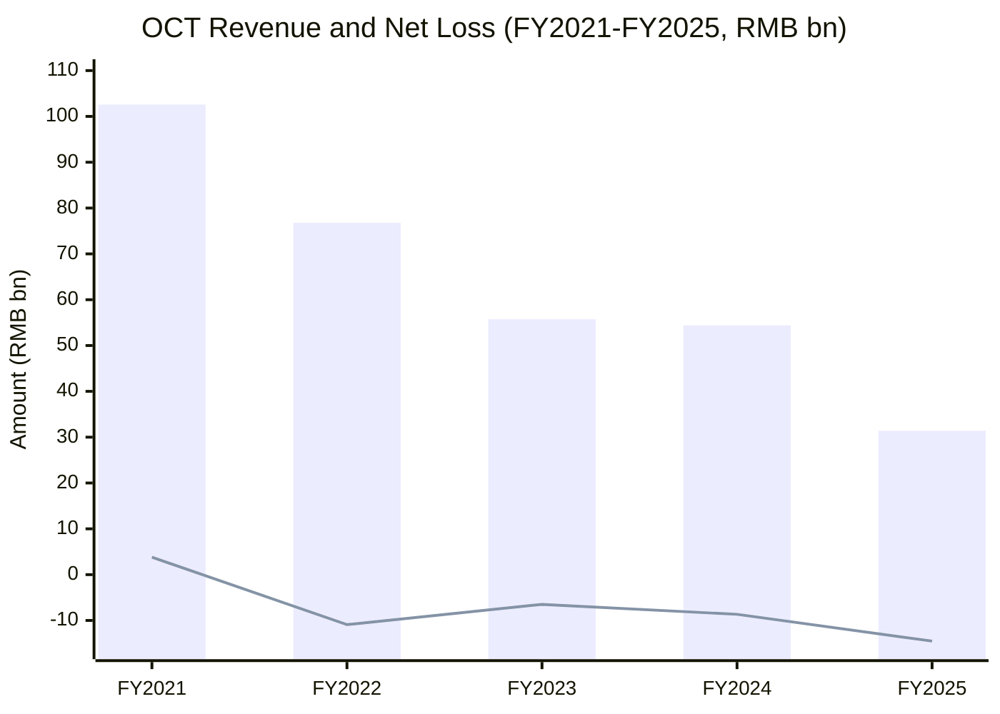
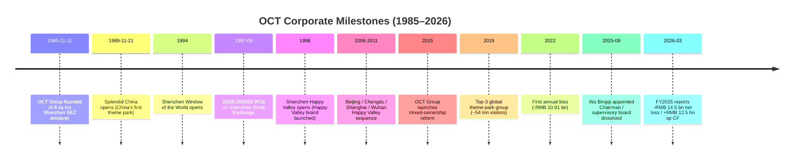
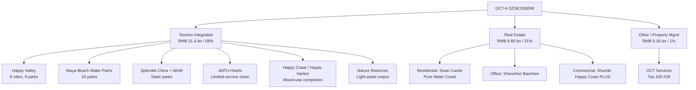
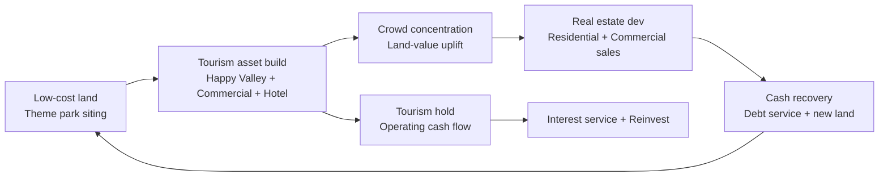
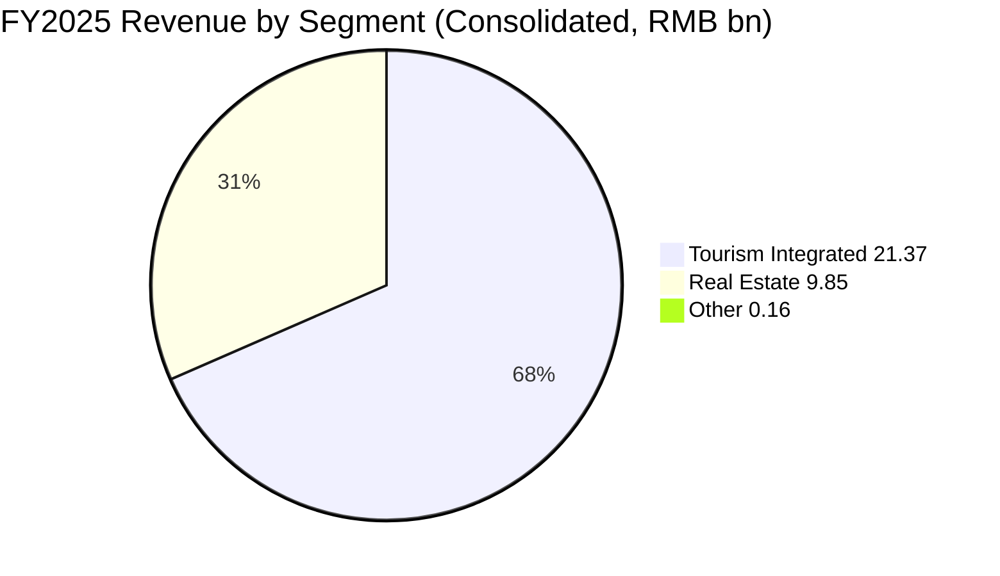
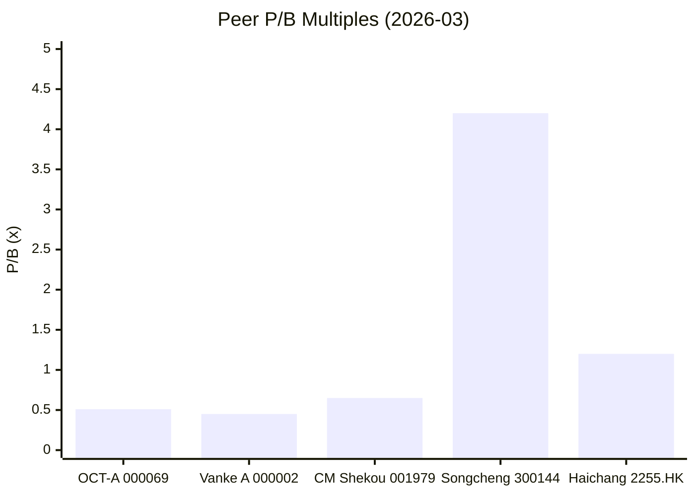
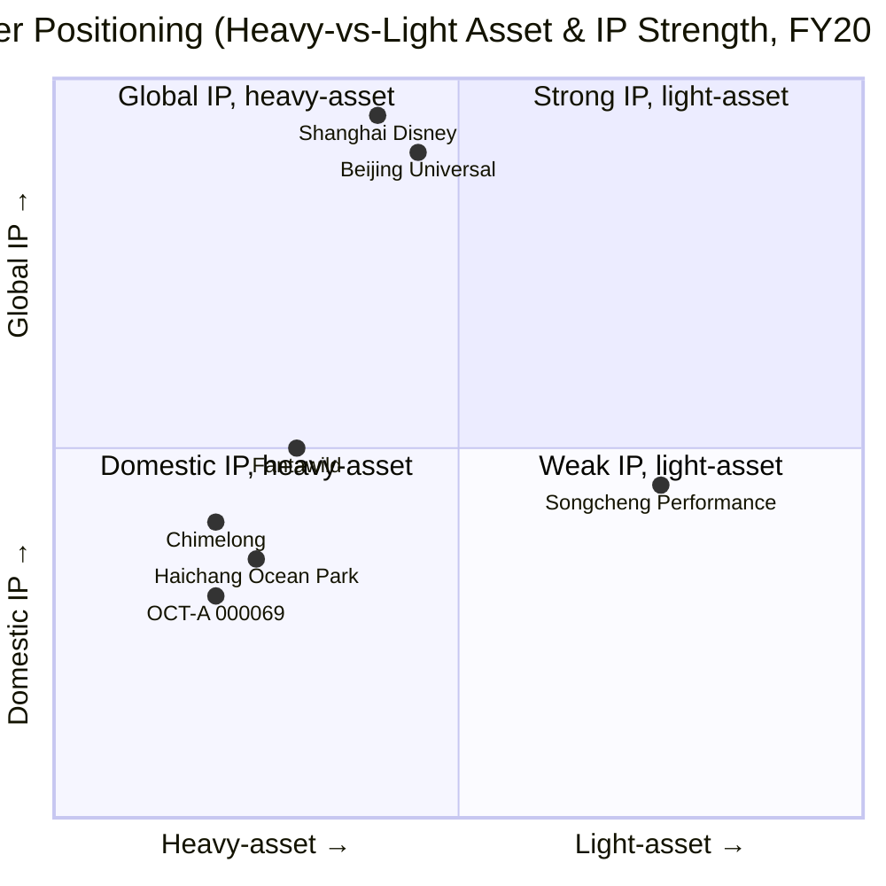
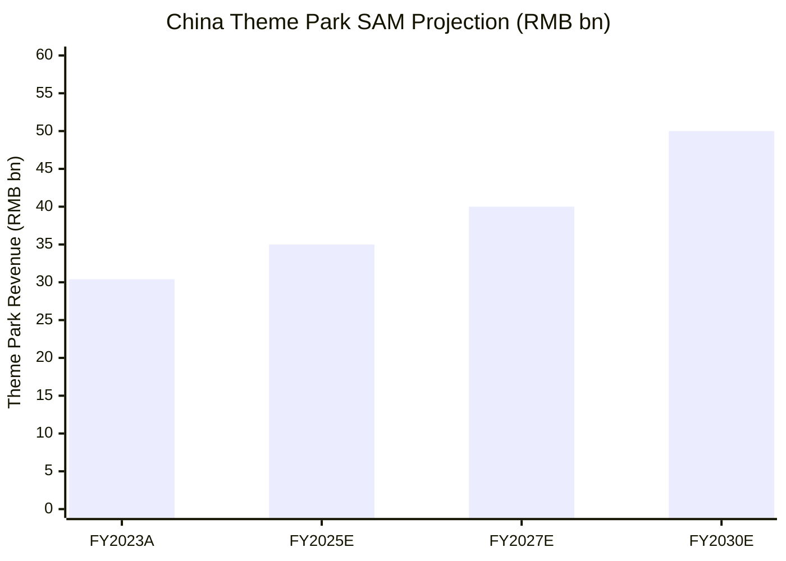

# Shenzhen Overseas Chinese Town Co., Ltd. (深圳华侨城股份有限公司 / OCT, SZSE:000069) — Research Document

**As of:** 2026-06-03 | **Author:** Financial-Agent research desk | **Language:** English (companion to the default Chinese report at `OCT_华侨城_SZSE000069_公司研究.md`)

> **Earnings banner (as filed in the FY2025 annual report, 2026-03-30):**
> Revenue **RMB 31.38 bn** (-42.32% YoY), net loss attributable to parent shareholders **-RMB 14.50 bn** (vs. -RMB 8.66 bn in FY2024), adjusted net loss -RMB 14.39 bn — the fourth consecutive year of losses (FY2022 through FY2025 cumulative loss > RMB 40.5 bn). Operating cash flow **+RMB 12.50 bn** (+133.13% YoY) — positive for the third straight year. Period-end interest-bearing debt **RMB 118.5 bn**, down ~RMB 12 bn from the RMB 130.4 bn at FY2024 year-end; medium-and-long-term debt 69% of the total. New chairman **Wu Bingqi (吴秉琪)** appointed 2025-09-19; former chairman Zhang Zhengao retired the same day; the supervisory board was dissolved the same day. ([Shenzhen Overseas Chinese Town Co., Ltd. 2025 年年度报告](https://static.cninfo.com.cn/finalpage/2026-03-31/1225062638.PDF), pp. 6, 9, 25, 30)

---

## Table of Contents

1. Company Overview
2. Company History
3. Management
4. Products & Services
5. Customers, Sales Channels & Listing Strategy
6. Industry Overview
7. Competitive Landscape
8. Market Opportunity / TAM
9. Risk Assessment
10. Investor-Lens Scorecards
11. References

---

## 1. Company Overview

Shenzhen Overseas Chinese Town Co., Ltd. ("OCT-A" or "OCT", SZSE:000069, Chinese name 深圳华侨城股份有限公司, abbreviated *OCT*) is China's leading **state-owned enterprise (SOE, 国有企业) tourism-plus-real-estate platform**. The listco was spun out of optimal tourism and property assets by its parent group **OCT Group (华侨城集团有限公司, the controlling shareholder)** in September 1997 and listed on the Shenzhen Stock Exchange. Both registered office and headquarters are at **Nanshan District, Shenzhen — the original OCT enclave**. FY2025 revenue was RMB 31.38 bn (-42.32% YoY). By segment, **tourism-integrated business contributed RMB 21.37 bn (68.10% of revenue)**, **real-estate development RMB 9.85 bn (31.39%)**, and other lines RMB 0.16 bn (0.51%). By geography, **South China RMB 12.80 bn (40.80%)**, **East China RMB 6.76 bn (21.56%)**, and **other regions RMB 11.65 bn (37.13%)**. ([2025 Annual Report, pp. 5, 19, 21](https://static.cninfo.com.cn/finalpage/2026-03-31/1225062638.PDF))

Total share count at FY2025 year-end was **8.038 bn shares**, all RMB-denominated A-shares. **OCT Group holds 49.14%** (3.95 bn shares, increased 28.99 mn shares during the year) — making it the absolute controlling shareholder. **Foresea Life Insurance — Haili Niannian (前海人寿－海利年年)** holds **7.08%** (569 mn shares). 105,228 ordinary shareholders of record. Closing price RMB 2.46 (2026-03-06); 52-week range RMB 2.18–3.49. Total market cap ≈ **RMB 19.8 bn** at the 2026-03-06 close. ([2025 Annual Report, pp. 60, 62](https://static.cninfo.com.cn/finalpage/2026-03-31/1225062638.PDF)); ([华侨城A股东户数9.63万户 — Stockstar, 2026-03-09](https://wap.stockstar.com/detail/RB2026030900000660))

**Valuation snapshot (TTM, 2026-03-06).** Market cap of ~RMB 19.8 bn against a net loss of RMB 14.5 bn means **TTM P/E is not meaningful (negative)**. On revenue of RMB 31.4 bn, **TTM P/S ≈ 0.63×**. Against year-end book equity attributable to parent of RMB 38.72 bn, **TTM P/B ≈ 0.51×** — in deep "below-book" territory, reflecting the market's negative revaluation of both real-estate and tourism assets. Peer benchmarks: **China Vanke (000002.SZ)** also pre-announced a 2025 loss of ~RMB 82 bn and was cut to "CCC-" by S&P; **China Merchants Shekou (001979.SZ)** is both a peer and an equity investee of OCT; **Songcheng Performance (300144.SZ)** delivered RMB 1.05 bn net profit on RMB 2.42 bn revenue in 2024 (43% net margin) by transitioning to an "**IP-light, performance-asset"** model — its valuation premium illustrates how differently the market prices light-vs-heavy tourism. ([Vanke Posts Record Annual Loss in 2025 — IndexBox, 2026-04](https://www.indexbox.io/blog/vanke-reports-record-annual-loss-amid-property-sector-struggles/)); ([Songcheng Performance 2024 turnaround — NBD, 2025-04-26](https://www.nbd.com.cn/articles/2025-04-26/3851948.html))

**How to read the sub-1× P/B.** At year-end FY2025, OCT's **inventory carrying value was RMB 128.05 bn (45.67% of total assets)** — unsold finished real estate, work-in-progress, and land bank. FY2025 took **asset impairment charges of RMB 9.98 bn** (57.85% of pre-tax loss), mostly **inventory write-downs and receivable provisions**. Management explicitly disclosed in the MD&A that "the company actively adapted to market conditions and pushed inventory de-stocking and cash-flow improvement through *asset transfers and other means; relevant transactions produced losses*." Translation: the RMB 38.7 bn parent book equity still carries **unrealized inventory impairments** and **mark-to-market pressure on equity investments in associates** (China Merchants Shekou, Yuzhou Group, etc.). The 99.8 bn provision recognized so far is a first wave; the -RMB 0.97 bn cumulative fair-value loss on listed associates in OCI is a second. **The 0.51× P/B implicitly prices in an NAV haircut of ~50% on a cash-equivalent recovery basis.** ([2025 Annual Report, pp. 24, 26](https://static.cninfo.com.cn/finalpage/2026-03-31/1225062638.PDF))

**Core competitive advantages, verbatim from the company's own "Core Competitiveness" section of the FY2025 annual report:**
> "Having operated in the cultural-tourism and real-estate industries for many years, the company holds strong brand recognition in tourism, and in real estate has built a series of well-known brands such as *Swan Castle* (天鹅堡) and *Pure-Water-Coast* (纯水岸). The company's *Happy Valley* (欢乐谷) and *Happy Coast* (欢乐海岸) product lines hold prime locations in core cities and core districts. The two principal businesses — cultural tourism and real estate — empower each other, building diversified and differentiated competitive products that support sustainable development in resource acquisition, business mix, and synergistic growth." ([2025 Annual Report, p. 17](https://static.cninfo.com.cn/finalpage/2026-03-31/1225062638.PDF))

FY2025 operating metrics: **79.70 million theme-park visitors** (vs. 80.81 mn in FY2024, -1.37% YoY); **contracted real-estate sales area 1.206 mn m²** (-30.29%); **contracted sales value RMB 17.73 bn** (vs. RMB 26.30 bn in FY2024, -32.6%). ([2025 Annual Report, p. 18](https://static.cninfo.com.cn/finalpage/2026-03-31/1225062638.PDF)); ([2024 Annual Report, p. 21](https://static.cninfo.com.cn/finalpage/2025-03-29/1222949848.PDF))

*Source:* 2025 / 2024 Annual Reports; FY2021 revenue baseline from the [FY2022 Annual Report (filed 2023-04)](https://static.cninfo.com.cn/finalpage/2023-03-31/1216276910.PDF).

## 2. Company History

OCT Group was jointly founded by China's State Council Overseas Chinese Affairs Office (OCAO) and the Hong Kong China Travel Group (HKCTG). On **August 28, 1985**, the State Council approved carving out **4.8 sq km from the Shahe Overseas Chinese Industrial Zone** to establish OCT Town. On **November 11, 1985**, OCT Economic Development Corporation was registered in Shenzhen's Nanshan OCT district. ([OCT Group — Wikipedia](https://zh.wikipedia.org/zh-cn/%E5%8D%8E%E4%BE%A8%E5%9F%8E%E9%9B%86%E5%9B%A2))

The first wave of OCT tourism assets opened in the late 1980s and 1990s: **November 21, 1989** — *Splendid China* (锦绣中华), described as "China's first theme park" (a microcosm of Chinese landmarks). **1991** — *China Folk Culture Village*. **1994** — *Window of the World* (世界之窗). These three parks formed the original OCT integrated-resort prototype in Shenzhen. **1998** — Phase 1 of *Shenzhen Happy Valley* opened, signaling OCT's shift from static "view" parks to dynamic chain-format theme parks built on mechanical rides and rotating IP content. ([华侨城 — 知乎专栏《深圳神迹》](https://zhuanlan.zhihu.com/p/99549506))

**September 1997** — OCT Group spun out its optimal tourism and real-estate assets into Shenzhen Overseas Chinese Town Holding Co., Ltd., which IPO'd on the Shenzhen Stock Exchange (ticker 000069). The annual report's "registration history" section notes that **since the IPO, OCT-A has had no change in primary business and no change in controlling shareholder**. ([2025 Annual Report, p. 6](https://static.cninfo.com.cn/finalpage/2026-03-31/1225062638.PDF))

The 2002–2015 period was the multi-city expansion era: **2006** Beijing Happy Valley opened, **2009** Chengdu, **2010** Shanghai, **2011** Wuhan; subsequent openings in Tianjin, Chongqing, Nanjing, Xi'an, and Hengyang. By year-end 2025, the Happy Valley unit operated **9 Happy Valley theme parks**, **10 Maya Beach water parks**, plus Splendid China, China Folk Culture Village, Window of the World, the Xiangyang adventure resort, and other branded parks — **25 theme parks across 13 cities**. ([Happy Valley Group — About Us](https://www.happyvalley.cn/mabout.shtml))

**2015** — OCT Group started a "mixed-ownership reform" admitting private capital; the listco rolled out a "Culture + Tourism + Urbanization" plus "Tourism + Internet + Finance" dual strategy and accelerated land acquisition and cultural-tourism township investments. **2019** — OCT broke into the **top three theme-park groups globally** by visitor count (~53.97 mn), trailing only Disney and Merlin Entertainments. ([OCT Ranked Among Top Three Theme Park Groups Worldwide in 2019 — PR Newswire, 2020-07](https://www.prnewswire.com/news-releases/oct-ranked-among-top-three-theme-park-groups-worldwide-in-2019-301097744.html))

**Starting in 2022**, with China's property cycle entering a deep down-turn, OCT recorded its **first annual loss** (FY2022 net loss attributable to parent of RMB 10.91 bn). Losses have continued for four years: FY2023 -RMB 6.49 bn, FY2024 -RMB 8.66 bn, FY2025 -RMB 14.50 bn, for a cumulative **RMB 40.6 bn** of losses. Between 2022 and 2025, OCT **consolidated management of more than 60 operational projects** — segmenting them into theme-park, nature-reserve, commercial, and hotel categories under specialist operating companies (Happy Valley, Travel Development, Commercial Mgmt, Hotel, Hua-Sheng-Huo etc.), arriving at a "one industry, one company; one company, one industry" structure. ([2024 Annual Report, p. 21](https://static.cninfo.com.cn/finalpage/2025-03-29/1222949848.PDF))

**September 19, 2025** — major management reshuffle. **Wu Bingqi (吴秉琪)** transferred in from China State Construction Engineering Corporation (CSCEC) Deputy GM (he was also formerly President of China Resources Land) to serve as Deputy Party Secretary, Director, and General Manager of OCT Group, and concurrently Party Secretary and Chairman of the listco SZSE:000069 — acting in the role of President as well. Former chairman Zhang Zhengao retired the same day; former vice-chairman/President Liu Fengxi was reassigned. The **supervisory board (监事会) was dissolved** the same day. ([2025 Annual Report, p. 30 — Director Changes](https://static.cninfo.com.cn/finalpage/2026-03-31/1225062638.PDF)); ([Wu Bingqi parachutes into OCT — NBD, 2025-09-01](https://www.nbd.com.cn/articles/2025-09-01/4045256.html))

*Source:* 2025 Annual Report (pp. 6, 17, 30); OCT Group Wikipedia; PR Newswire.

## 3. Management

Per the /company-research skill spec, this section covers the founding sponsor (since OCT is a SOE listco with no individual founder) plus the current chairman only.

### Founding sponsor (Controlling Shareholder)

The listco has no individual founder. The controlling shareholder, **OCT Group (华侨城集团有限公司)**, was jointly sponsored by the State Council Overseas Chinese Affairs Office (OCAO, 国务院侨办) and **Hong Kong China Travel Group (HKCTG, 香港中旅集团)** in **August 1985**; the State Council specifically allocated 4.8 sq km from the Shahe Overseas Chinese Industrial Zone to construct OCT Town in the Shenzhen SEZ. The group was formally registered **November 11, 1985**. OCT Group today is a **central state-owned enterprise (央企) directly supervised by the State Council's SASAC**. It holds **49.14% of SZSE:000069** (3.95 bn shares) as the absolute controlling shareholder. **There is no individual "actual controller"** (实际控制人) of the listco via shareholding or concert-party agreement. ([2025 Annual Report, pp. 6, 62](https://static.cninfo.com.cn/finalpage/2026-03-31/1225062638.PDF)); ([OCT Group — Wikipedia](https://zh.wikipedia.org/zh-cn/%E5%8D%8E%E4%BE%A8%E5%9F%8E%E9%9B%86%E5%9B%A2))

### Current Chairman / Acting President: Wu Bingqi (吴秉琪)

**Wu Bingqi**, born **1971**, university graduate (public reporting indicates he graduated from **Tongji University in 1993, majoring in Industrial and Civil Construction Engineering**), Senior Engineer rank. He **joined China Resources Group in 1993**, working at China Resources Property Limited as Director and Deputy GM, and then China Resources Construction (Holdings) Limited as Director and Deputy GM. **In 2007 he joined China Resources Land Limited (CR Land, 华润置地, HKEX:1109)**, where he held progressively senior roles: Vice President, Strategy Director, Chengdu Regional GM, Senior Vice President. **2019** — promoted to Executive Director (joining CR Land's core management). **2021** — appointed Chairman of CR Land North China Region. **July 2022** — appointed President of CR Land. **September 2023** — moved to **China State Construction Engineering Corp (CSCEC, 中国建筑集团)** as Party Group member and Deputy GM, while concurrently serving as Vice President of CSCEC. **September 19, 2025** — transferred to OCT Group as Deputy Party Secretary, Director, and GM; and concurrently as Party Secretary and Chairman of SZSE:000069. **November 2025** — elevated to OCT Group Party Secretary and Chairman. He **also acts in the President role at the listco**. ([2025 Annual Report, p. 33](https://static.cninfo.com.cn/finalpage/2026-03-31/1225062638.PDF)); ([Wu Bingqi — Baidu Baike](https://baike.baidu.com/item/%E5%90%B4%E7%A7%89%E7%90%AA/53465084)); ([Wu Bingqi parachutes into OCT — NBD, 2025-09-01](https://www.nbd.com.cn/articles/2025-09-01/4045256.html)); ([OCT-A change of chairman: Wu Bingqi appointed acting President — Daheucube, 2025-09-19](https://app.dahecube.com/nweb/news/20250919/248098n0aca4aecbc5.htm?artid=248098))

**Why SASAC picked Wu.** During the 2019–2020 period, his CR Land West-China region delivered **+37.8% YoY sales growth to RMB 27.5 bn**. After moving to CR Land North-China, **2021 revenue jumped +21.4% YoY to RMB 40.94 bn**. These results positioned him as a "**turnaround**" operator — a key reason SASAC selected him to "stop the bleeding" at OCT (cumulative four-year loss > RMB 40 bn). ([Wu Bingqi — Baidu Baike](https://baike.baidu.com/item/%E5%90%B4%E7%A7%89%E7%90%AA/53465084))

**Initial strategic direction.** Wu's first public OCT statement (Dec 2025 "15th-Five-Year-Plan" workshop) reaffirmed the **"cultural-tourism + signature real estate dual-engine" model**. Industry observers expect three priority initiatives under his tenure: **(a)** push real-estate "**hard de-stocking and accelerated cash recovery**" — accepting losses on transactions in exchange for liquidity; **(b)** transition tourism from **heavy-asset construction to light-asset management exports + IP partnership** (catching up to the Songcheng / Disney IP-led models); **(c)** continue to optimize the RMB 118.5 bn interest-bearing debt stack. The financial proof points for (a), (b), (c) will start materializing in 1H 2026 reports. ([Wu Bingqi's "blade" — PinChain Tourism](https://www.pinchain.com/article/336376)); ([OCT enters the "Wu Bingqi era" — Jiemian News](https://www.jiemian.com/article/13678515.html))

> *Analyst view:* Wu's appointment is widely interpreted by industry press as "SASAC putting a turnaround operator at the helm of OCT". The financial evidence to support this judgment (whether Wu can in fact reverse 4-year cumulative -RMB 40 bn) will not be testable until late 2026 reports — too early to call.

## 4. Products & Services

OCT operates two principal businesses (tourism integrated + real estate development) plus one ancillary line (property management). The FY2025 annual report's "Principal Business" disclosure (verbatim, p. 9):

### 4.1 Cultural Tourism Business (文旅业务)

> "The company's cultural-tourism business adheres to '*use culture to shape tourism, use tourism to manifest culture*' (以文塑旅、以旅彰文), creating diverse formats including 'Tourism + Festivals' and 'Tourism + Performance', actively developing urban tourism, wellness tourism, and silver-haired (elderly) tourism formats. **Principal product formats include: ① Theme Parks** (themed amusement, water-park, themed-culture, eco-pastoral, Ferris-wheel categories); **② Hotels**; **③ Mixed-use Tourism Complexes and Park-format Commercial Streets**; **④ Natural and Cultural Scenic Areas and Others**; **⑤ Travel Services**." ([2025 Annual Report, p. 9](https://static.cninfo.com.cn/finalpage/2026-03-31/1225062638.PDF))

**中文释义 / Plain-language gloss:** The tourism business covers a full vertical of customer spending — **Theme Parks → Hotels → Commercial → Natural Reserves → Travel Services**, capturing ticket revenue, F&B, lodging, gift, secondary park combos, and trip packaging. The flagship brand is **Happy Valley (欢乐谷)** — across **Shenzhen, Beijing, Chengdu, Shanghai, Wuhan, Tianjin, Chongqing, Nanjing, Xi'an, and Hengyang**, operating **9 integrated Happy Valleys + 10 Maya Beach (玛雅海滩) water parks + Splendid China + Window of the World + Xiangyang adventure resort + other parks — totaling 25 theme parks across 13 cities**. **FY2025 group-wide tourism visitors reached 79.70 million** (Jan-Sep 5,956 mn, -1% YoY). FY2025 **tourism integrated revenue RMB 21.37 bn (68.10% of total)**; **gross margin 9.83%** (down 4.51 percentage points YoY). ([2025 Annual Report, pp. 17–19](https://static.cninfo.com.cn/finalpage/2026-03-31/1225062638.PDF)); ([Happy Valley Group — About Us](https://www.happyvalley.cn/mabout.shtml)); ([OCT 2025 loss expansion — Sina Finance, 2026-01](https://finance.sina.com.cn/jjxw/2026-01-31/doc-inhkepei6168265.shtml))

**Key product lines:**

* **Happy Valley (欢乐谷) — Themed Amusement Park Chain.** Phase 1 of Shenzhen Happy Valley opened in 1998; this is OCT's most influential IP. Target audience: "urban youth + young families". Mechanical rides include roller coasters, free-fall towers, drop towers, plus rotating festival and IP content. 2025 operating strategy pivoted to **"Urban IP Entertainment Mainstage"** — incorporating 10+ external IPs including King of Glory (王者荣耀), League of Legends, Bottle Gourd Brothers (葫芦兄弟), and Super Wings (超级飞侠) into immersive scenes, meet-and-greets, parades. Beijing Happy Valley added the "Sun Wukong" light-and-shadow installation. Shenzhen Happy Valley completed renovation. Xiangyang Happy Valley added a Super Wings exploration base. ([2025 Annual Report, p. 18](https://static.cninfo.com.cn/finalpage/2026-03-31/1225062638.PDF))
* **Maya Beach (玛雅海滩) — Water Park Series.** Bundled with Happy Valley locations. **In 2024 Beijing Maya Beach opened successfully** (Maya brand re-launch). Tianjin Happy Valley added winter "Happy Snow Festival" attractions. ([2024 Annual Report, p. 21](https://static.cninfo.com.cn/finalpage/2025-03-29/1222949848.PDF))
* **Splendid China (锦绣中华) / Window of the World (世界之窗) — Static Microcosm Parks.** Founded 1989/1994 in Shenzhen — China's "original" theme parks. In 2025 Shenzhen Splendid China launched a new large variety-show *Dragon-Phoenix Dance of China* (龙凤舞中华). ([2025 Annual Report, p. 18](https://static.cninfo.com.cn/finalpage/2026-03-31/1225062638.PDF))
* **Hotel Segment — JIATU (嘉途) Brand.** A FY2024 brand launch — the JIATU "limited-service" hotel chain. **January 2025** Shenzhen Creative-Culture Park JIATU opened (positioning as "Hotel + Creative Park"); **2025** Shenzhen Qianhai OCT St. Regis and Shenzhen East OCT Dark Forest JIATU opened. ([2024 Annual Report, p. 21](https://static.cninfo.com.cn/finalpage/2025-03-29/1222949848.PDF)); ([2025 Annual Report, p. 18](https://static.cninfo.com.cn/finalpage/2026-03-31/1225062638.PDF))
* **Mixed-use Complexes — Happy Coast (欢乐海岸) / Happy Harbor (欢乐港湾).** Shenzhen Happy Coast, **Shenzhen Qianhai Happy Harbor** (rated as a National 4A scenic area in 2024), Shunde Happy Coast PLUS, Ningbo Happy Coast etc. — integrated commercial-leisure-entertainment districts.
* **Light-asset Output of Nature Reserves.** In 2024 OCT obtained management rights at three Shanxi sites: **Yongji Stork Tower (鹳雀楼)**, **Wulao Peak (五老峰)**, **Pujiu Temple (普救寺)**. 2025 added Zhejiang Quzhou and Anhui Qimen light-asset cultural-tourism projects. ([OCT 2025 loss expansion — Sina Finance, 2026-01](https://finance.sina.com.cn/jjxw/2026-01-31/doc-inhkepei6168265.shtml)); ([2024 Annual Report, p. 21](https://static.cninfo.com.cn/finalpage/2025-03-29/1222949848.PDF))

### 4.2 Real-Estate Development Business (房地产业务)

> "The company's real-estate business **focuses on core cities and core districts**, actively implementing national 'Good Housing' (好房子) deployment requirements, accelerating construction of OCT-distinctive 'Good Housing' product systems, delivering '*safe, comfortable, green, smart*' high-quality residential and **culture-commerce-tourism-residential integrated** living products. **Principal product formats include: ① Multi-format integrated comprehensive communities; ② Single-format residential communities; ③ Office towers** etc." ([2025 Annual Report, p. 9](https://static.cninfo.com.cn/finalpage/2026-03-31/1225062638.PDF))

**FY2025 real-estate operating metrics:**
* **Contracted sales area 1.206 mn m²** (-30.29% YoY); **contracted sales value RMB 17.73 bn** (-32.6% YoY)
* **Real-estate segment revenue RMB 9.85 bn** (-63.41% YoY)
* **Real-estate gross margin 7.62%** (down 3.92 percentage points YoY)
* **Only 1 new land parcel added in 2025: Chongqing Shapingba Xiaolongkan project** (18,002 m² land area, 52,806 m² planned GFA, 100% equity)
* **35 land-bank projects at year-end**, total area 13.90 mn m², remaining developable GFA 10.01 mn m²
* **Contract liabilities of RMB 23.14 bn at year-end** (down from RMB 29.45 bn at year-start) — indicating the future revenue-recognition pool has shrunk 21%

([2025 Annual Report, pp. 9–13, 19, 26](https://static.cninfo.com.cn/finalpage/2026-03-31/1225062638.PDF))

**Strategic mandate — "hard de-stocking and accelerated cash recovery" (强去化、促回款).** Management set this as the year's strategy: push inventory clearance and cash improvement through **asset transfers and other means**, **deliberately accepting transaction losses**. The outcome: **operating cash flow of +RMB 12.50 bn** (+133% YoY), but **project recognition margin compressed to 7.62%**, with **Q4 alone delivering a -RMB 10.13 bn net loss** (70% of the year's loss, driven by year-end RMB 9.98 bn asset impairment provisions). ([2025 Annual Report, pp. 7, 19, 24](https://static.cninfo.com.cn/finalpage/2026-03-31/1225062638.PDF)); ([OCT-A loss expansion = Real estate + Tourism + Restructuring — Eastmoney, 2025-11-17](https://caifuhao.eastmoney.com/news/20251117175658889911730))

**Core real-estate brands:** Swan Castle (天鹅堡) — Shunde/Foshan; Pure Water Coast (纯水岸) — multi-city. FY2025 regional sales highlights: Shunde Swan Castle Phase 2 ranked top-5 by sales value in Foshan; Wuhan Qingshan Red Square ranked #1 in Qingshan District; Wuxi Yunhu Bie Yuan ranked top-3 in Wuxi; Shenzhen Baochen Tower, Zhanjiang Happy Bay, and other projects also led regional rankings. ([2025 Annual Report, p. 18](https://static.cninfo.com.cn/finalpage/2026-03-31/1225062638.PDF))

### 4.3 Property Management (物业管理)

OCT's property-management arm — **OCT Services (华侨城服务)** — was named #28 in the "**2025 China Top 100 Property Service Strength Companies**" ranking. 2025 implemented the "6W3H3A" service standard rollout; launched the new "*Hua Sheng Huo / Shang Sheng Huo*" (华生活/赏生活) service system. The 2024 awards included Top 100 property service companies, China Residential Property Top 10, and China City Services Top 10. Property management revenue is not separately disclosed in the annual report — bundled into "Other" at RMB 0.16 bn (0.51% of total). ([2025 Annual Report, p. 19](https://static.cninfo.com.cn/finalpage/2026-03-31/1225062638.PDF)); ([2024 Annual Report, p. 22](https://static.cninfo.com.cn/finalpage/2025-03-29/1222949848.PDF))

### 4.4 Commercial Leasing (Investment Properties)

OCT holds core commercial real estate at **net book value RMB 18.06 bn** (6.44% of total assets). Annual report p. 13 lists the top 15 leasing projects. Selected:

| Project | Format | Equity | Leasable Area (m²) | Occupancy |
|---|---|---|---|---|
| Shunde Happy Coast PLUS | Commercial | 70% | 181,339 | 89% |
| Shenzhen OCT Creative Culture Park | Industrial | 100% | 153,062 | 74% |
| Shenzhen Happy Coast | Commercial/Office | 100% | 108,759 | 81% |
| Chengdu OCT Happy Li | Commercial | 100% | 102,118 | 92% |
| Ningbo Happy Coast | Commercial | 100% | 88,498 | 73% |
| Changshu OCT Double-Innovation Park | Industrial | 71% | 79,142 | 100% |
| Huizhou OCT Double-Innovation Park | Industrial | 71% | 75,372 | 95% |
| Shenzhen Hongshan 6979 | Commercial | 50% | 62,404 | 95% |
| Shenzhen Happy Harbor | Commercial | 100% | 51,449 | 86% |
| Shenzhen Hua Sheng Huo Hall | Commercial | 100% | 39,170 | 85% |

([2025 Annual Report, pp. 13–14, 26](https://static.cninfo.com.cn/finalpage/2026-03-31/1225062638.PDF))

*Source:* 2025 Annual Report, pp. 5, 9, 13–14, 19; Happy Valley Group website.

### 4.5 Product Synergy — Anatomy of the "OCT Model"

OCT's repeatedly cited **"tourism + signature real estate dual engine"** model is really a **"tourism draws crowd → real estate monetizes"** cash cycle:

1. **Tourism asset acquisition first.** Acquire suburban / second-tier-edge land at low cost (close to industrial-zone pricing). Build a theme park, hotel, and commercial center.
2. **Park openings drive population concentration.** A single Happy Valley + ancillary commercial can lift surrounding residential land values by **30–80%** (based on 2009–2019 Chengdu, Wuhan, Tianjin patterns).
3. **Real-estate sales monetize the value uplift.** Plan adjacent residential / office / serviced-apartment parcels in a "culture-commerce-tourism-residential" mixed-use scheme; sell at high-margin pricing.
4. **Tourism is held long-term.** Theme parks + commercial + hotels become long-held assets generating stable operating cash flow (but at single-digit gross margin and very long payback).

> *Analyst view:* This "buy tourism land cheap, sell residential expensive" cycle was highly successful during 2002–2019 — but as **new-housing sales nationally fell 12.6% in 2025** (residential -13.0%), the model has failed in three places at once: **(a)** even in tier-1/2 core cities, residential land no longer materially re-rates on theme-park news; **(b)** **most of the remaining 35-project land bank is in tier-3/4 cities and inland markets** (Maoming, Xiangyang, Yangzhou, Jining, Hengyang etc.) — slow to clear; **(c)** the tourism leg, while now cash-generative, cannot independently support the leverage stack — the RMB 118.5 bn interest-bearing debt is still primarily serviced by real-estate sales recoveries. ([2025 Annual Report, pp. 9–11, 17](https://static.cninfo.com.cn/finalpage/2026-03-31/1225062638.PDF))

*Source:* Analyst synthesis of FY2025 MD&A + FY2024 "Core Competitiveness" section.

## 5. Customers, Sales Channels & Listing Strategy

### 5.1 Customer Concentration (consolidated group-level)

OCT's FY2025 customer base is extremely diversified — both because the businesses are B2C (homebuyers + tourists) and because no single customer is material. Annual report p. 20:

> "The top-5 customers in aggregate generated **RMB 2,510,635,748.84** in sales, representing **8.00% of total annual sales**. Related-party sales among the top-5 customers totaled **0** as a percentage of annual sales."

> "Top-5 customers: Customer 1 RMB 960,125,099.94 (3.06%); Customer 2 RMB 615,602,791.12 (1.96%); Customer 3 RMB 525,105,668.24 (1.67%); Customer 4 RMB 216,012,057.80 (0.69%); Customer 5 RMB 193,790,131.74 (0.62%)." ([2025 Annual Report, pp. 20–21](https://static.cninfo.com.cn/finalpage/2026-03-31/1225062638.PDF))

**Key takeaway:** the single largest customer is only 3.06% of consolidated revenue; top-5 in aggregate 8.00%. This is structurally normal for combined real-estate + tourism — individual homebuyer transactions or single park visitors are by definition tiny shares. Customer names are not disclosed (which is consistent with A-share property-and-tourism issuer practice — far less granular than US 10-K customer-concentration disclosure under ASC 280-10-50-42, but typical for the Chinese disclosure regime). No customer crosses the 10% individual-disclosure threshold. **Risk conclusion: single-customer concentration risk is essentially zero.**

### 5.2 Supplier Concentration

Annual report p. 21:

> "The top-5 suppliers in aggregate generated **RMB 4,011,360,908.18** in purchases, representing **11.00% of total annual purchases**. Related-party purchases among the top-5 suppliers totaled **0** as a percentage of annual purchases."

> "Top-5 suppliers: Supplier 1 RMB 1,492,077,153.12 (4.09%); Supplier 2 RMB 894,787,494.04 (2.45%); Supplier 3 RMB 713,301,755.14 (1.96%); Supplier 4 RMB 461,194,505.88 (1.26%); Supplier 5 RMB 450,000,000.00 (1.23%)." ([2025 Annual Report, p. 21](https://static.cninfo.com.cn/finalpage/2026-03-31/1225062638.PDF))

Supplier concentration is similarly low. The largest supplier is 4.09% of purchases, no related-party purchases. Supplier names are not disclosed (typically construction general contractors, mechanical/electrical equipment vendors, hotel-operations services). **Risk conclusion: single-supplier concentration risk is essentially zero.**

### 5.3 Channels and Sales Modes

* **Real-estate sales channels:** in-house sales centers (project-site sales offices) + third-party agents (Lianjia, Beike, Centaline etc.) + new-media lead-gen (a 2024-onwards investment priority). Customers are end-consumer homebuyers (C2C). **Pre-sale model with some completed-house sales** — OCT **provides stage mortgage guarantees** to homebuyer banks per industry convention; **outstanding guarantees of RMB 20.24 bn** at year-end FY2025 (down from RMB 27.43 bn at FY2024 year-end). ([2025 Annual Report, p. 16](https://static.cninfo.com.cn/finalpage/2026-03-31/1225062638.PDF))
* **Tourism channels:** on-site ticket windows + OTAs (Trip.com / Meituan / Tongcheng / Fliggy etc.) + own website / mini-program. End-consumer (C2C).
* **Light-asset output channels:** OCT outputs **theme-park planning, operations, IP, hotel management services** to external owners — earning management fees + a share of revenue/profit. 2024–2025 signed projects: Shanxi Yongji Stork Tower / Wulao Peak / Pujiu Temple, Zhejiang Quzhou, Anhui Qimen, Wuxi Symphony Hall, Yueqing Water Park — 7+ projects so far. Expected to accelerate under Wu Bingqi's leadership.

### 5.4 Listing Strategy and Share Structure

* **A-share listing:** SZSE 000069, IPO September 1997. **Principal business unchanged, controlling shareholder unchanged** over the 28 years since IPO — a stable governance structure.
* **Capital structure:** 8.038 bn shares, all RMB-denominated A-shares. **No B-shares, no H-shares, no ADRs, no convertibles** outstanding.
* **Shareholder structure (as of 2025-12-31):**
  - OCT Group (SOE legal person) **49.14%** (3.95 bn shares; increased 28.99 mn shares during the year)
  - Foresea Life Insurance — Haili Niannian (domestic non-SOE legal person) **7.08%** (569 mn shares)
  - Bank of China — Fullgoal CSI Tourism ETF (index fund) **1.07%**
  - Shenzhen OCT Capital Investment Management (SOE) **0.98%**
  - Individual shareholder Jiang Anyi **0.98%** (78,369,771 shares)
  - National Social Security Fund Portfolio 413 **0.72%**
  - HKSCC (Stock Connect northbound) **0.70%**
* **Dividend:** FY2025 plan — "no cash dividend, no bonus shares, no capitalization of capital reserve" (given persistent losses + cash flow prioritized for debt service). ([2025 Annual Report, pp. 5, 62](https://static.cninfo.com.cn/finalpage/2026-03-31/1225062638.PDF))

*Source:* 2025 Annual Report, p. 19 "Revenue Composition".

## 6. Industry Overview

OCT straddles **China Theme Park / Cultural Tourism + Commercial Real Estate**. The two industries are currently on opposite cycles — tourism in mid-recovery, real estate in deep down-turn — which is the structural reason for OCT's operating pressure.

### 6.1 China Theme Park / Tourism Industry

**Market size:** National Bureau of Statistics: 2025 domestic tourist trips totaled **6.522 billion**, generating **RMB 6.30 trillion** in spending. ([2025 Annual Report, p. 17](https://static.cninfo.com.cn/finalpage/2026-03-31/1225062638.PDF))

**Theme-park subsegment:** 2023 saw 86 mega and large theme parks attract **130 million visitors** and generate **RMB 30.39 bn** in revenue (+97.86% YoY off a low 2022 base). Projection: **2025 visitor growth 10–20%, revenue growth 5–15%**. China currently has 7 of the global top 25 theme parks — **Fantawild (方特集团)** vaulted from #5 to #2 globally in 2024 with +111% YoY growth, second only to Disney. ([Global theme parks top 25 — 21 Economic Net, 2024-08-19](https://www.21jingji.com/article/20240819/herald/ade6d21cc82649ae9a947609d8fc2a83.html)); ([China theme park market activity — Sina Finance, 2024-11-22](https://finance.sina.com.cn/jjxw/2024-11-22/doc-incwxhkn3967613.shtml))

**Key trends:**
1. **IP-led + immersive experience** — 2025 saw widespread IP integration (the Disney + Universal benchmark playbook); OCT is partnering with King of Glory, League of Legends, Super Wings, Bottle Gourd Brothers etc.;
2. **Light-asset output** — leading operators (OCT, Songcheng) increasingly export management, brand, and IP for fee splits (90%+ gross margins) — pivoting from heavy-asset construction;
3. **Tier bifurcation** — Shanghai Disney + Beijing Universal own the high-end; **Chimelong, Happy Valley, Fantawild, Haichang** occupy mid-tier; 2024 saw Songcheng generate RMB 1.05 bn net profit on RMB 2.42 bn revenue (43% net margin) — its IP-light performance model has been the market's reference architecture. ([Songcheng 2024 turnaround — NBD, 2025-04-26](https://www.nbd.com.cn/articles/2025-04-26/3851948.html))

**Policy catalysts for Chinese cultural tourism:** the "15th Five-Year Plan" (2026–2030) elevates "**building a tourism powerhouse**" as a priority national initiative; 2025 saw central and local governments issue multiple supportive tourism policies. ([2025 Annual Report, p. 17](https://static.cninfo.com.cn/finalpage/2026-03-31/1225062638.PDF))

### 6.2 China Commercial Real Estate Industry

Per the NBS 2025 data (cited in annual report p. 17):
* **New-housing sales area 880 mn m²** (-8.7% YoY); **residential -9.2%**;
* **New-housing sales value RMB 8.4 trn** (-12.6% YoY); **residential -13.0%**;
* **National real-estate development investment RMB 8.3 trn** (-17.2% YoY);
* **Housing completion area 600 mn m²** (-18.1% YoY); **residential 430 mn m²** (-20.2%). ([2025 Annual Report, p. 17](https://static.cninfo.com.cn/finalpage/2026-03-31/1225062638.PDF))

**The industry has not bottomed.** November 2025 single-month **top-100 developer sales fell -36% YoY** (China Real Estate Information Corp data); Vanke pre-announced a ~RMB 82 bn 2025 loss + S&P cut to "CCC-"; Sunac, Country Garden, and Evergrande are at various default / restructuring stages. **State-owned developers (OCT, China Merchants Shekou, Poly Developments) have more resilience than private peers** — primarily because **funding channels remain open** (OCT's 2025 weighted financing cost still held at 3.5%, with PBoC SLF continuation) and **default risk is low** (implicit sovereign backing). ([Why China's real estate market is still searching for a bottom — CNBC, 2025-12-02](https://www.cnbc.com/2025/12/02/why-chinas-real-estate-market-is-still-searching-for-a-bottom-.html)); ([Vanke Posts Record Annual Loss — IndexBox, 2026-04](https://www.indexbox.io/blog/vanke-reports-record-annual-loss-amid-property-sector-struggles/))

### 6.3 Property Management Industry

The China Property Management Association's "**2025 China Top 100 Property Service Strength Companies**" listed OCT Services at **#28**. Overall industry growth is +5–10%, with continuing consolidation (top-10 market share rising to ~25%). Future growth is anchored in **community value-added services and city-services outsourcing**.

### 6.4 Industry Structure / Competitive Barriers

Theme parks have **high entry barriers**: a single large theme park requires RMB 3–8 bn capex, 5–8 years of planning + construction, city-scale land (200+ mu) + permits, and long brand + IP accumulation. But the **moats are narrow** — outside of Shanghai Disney and Beijing Universal's global IP, domestic theme parks are highly homogenized (mechanical rides + microcosm + festivals). Consumer stickiness depends largely on **location + pricing + refresh cadence**.

Commercial real estate has **lower entry barriers** (capital + land via public auctions), but **funding + de-stocking barriers are extremely high** right now — private-developer funding has effectively frozen, and consumer trust in pre-sales has collapsed. **The "credit + capital" advantage of state-owned developers is structurally expanding in the 2025–2026 cycle.**

## 7. Competitive Landscape

The FY2025 annual report does **not directly name competitors** (A-share SOE real-estate / tourism issuers rarely do). Competitive analysis below is constructed from third-party rankings + comparable peer financial filings.

### 7.1 Tourism / Theme Park Peers

| Competitor | Listing / Ownership | Core Product | 2024 Revenue | 2024 Net Income | Model / Differentiation |
|---|---|---|---|---|---|
| **Shanghai Disney Resort** | Disney-owned (private) | Disneyland + Resort + IP | RMB 10+ bn (est) | Not disclosed | Global #1 IP, ~15+ mn annual visitors |
| **Beijing Universal Resort** | Comcast/USJ (JV) | Universal + Harry Potter IP | RMB 6+ bn (est) | Not disclosed | Global tier-2 IP, opened 2021 |
| **Fantawild (华强方特)** | HKEX IPO pending | Fantawild Adventure (16 sites), Dreamland | ~RMB 8 bn (est) | ~RMB 1 bn (est) | Domestic IP + high refresh; 2024 global #2 |
| **Chimelong (长隆)** | Private (Guangdong) | Chimelong Ocean Kingdom (Zhuhai) + Happy World (Guangzhou) + Safari Park | ~RMB 10 bn (est) | Not disclosed | Ocean + animals integrated complex, location moat |
| **Haichang Ocean Park (2255.HK)** | HKEX listed | 11 ocean parks incl. Shanghai/Sanya flagships | RMB 1.82 bn | -RMB 0.74 bn (loss +275%) | Ocean-themed pure-play, Shanghai Phase 2 in 2026 |
| **Songcheng Performance (300144.SZ)** | A-share listed | Hangzhou/Sanya/Lijiang/Guilin "Romance of …" performances + themed streets | RMB 2.42 bn | RMB 1.05 bn (43% margin) | "Performance + IP" light-asset model, 60–96% GM |
| **OCT Happy Valley unit (OCT-A's subsidiary)** | Subsidiary of SZSE:000069 | 9 Happy Valleys + 10 Maya Beach + 25 parks total | Tourism revenue RMB 21.37 bn | Tourism gross margin 9.83% | Heavy-asset build + property synergy |

([Haichang Ocean Park 2024 results — Lvjie, 2025-04-07](https://www.lvjie.co/company/2025/0407/33702.html)); ([Haichang 2024 net loss RMB 740 mn — Netease, 2025-04-30](https://m.163.com/dy/article/JS86OH260512D03F.html?clickfrom=subscribe)); ([Songcheng 2024 turnaround — NBD, 2025-04-26](https://www.nbd.com.cn/articles/2025-04-26/3851948.html)); ([Fantawild #2 globally — 21 Economic Net, 2024-08-19](https://www.21jingji.com/article/20240819/herald/ade6d21cc82649ae9a947609d8fc2a83.html))

### 7.2 Real-Estate Peers

| Peer SOE / Developer | Listing | 2025E Status |
|---|---|---|
| **Poly Developments (600048.SH)** | A-share | Top-tier central SOE developer |
| **China Merchants Shekou (001979.SZ)** | A-share + OCT equity investee (1.50 mn shares, book value RMB 549 mn) | Shenzhen-based central SOE |
| **China Overseas Land & Investment (0688.HK)** | HKEX | CSCEC subsidiary |
| **China Resources Land (1109.HK)** | HKEX | CR Group (Wu Bingqi's prior employer) |
| **Greentown China (3900.HK)** | HKEX | China Communications Group |
| **Vanke A (000002.SZ)** | A-share + indirect Shenzhen SASAC stake | 2025 pre-announced loss ~RMB 82 bn, S&P "CCC-" |

([2025 Annual Report, p. 24 — China Merchants Shekou stake](https://static.cninfo.com.cn/finalpage/2026-03-31/1225062638.PDF)); ([Vanke 2025 record loss — IndexBox, 2026-04](https://www.indexbox.io/blog/vanke-reports-record-annual-loss-amid-property-sector-struggles/))

### 7.3 Peer Valuation Snapshot (2026-03)

*Source:* 2025 Annual Reports + Yahoo Finance same-period (OCT: P=2.46 × 8.04bn ÷ book equity 38.7bn; Vanke / CM Shekou based on industry P/B; Songcheng / Haichang based on public market cap / book equity).

### 7.4 Competitive Strengths and Weaknesses

**Moats / Strengths:**
1. **Brand equity** — Happy Valley awareness inside China is second only to Shanghai Disney / Beijing Universal (~50 mn annual visitors at peak), among the strongest domestic theme-park IPs;
2. **Central SOE backstop** — funding cost low (3.5%), default risk near-zero (implicit sovereign guarantee). Structurally favored vs. private-developer peers (Sunac, Country Garden);
3. **Tourism + real-estate synergy** — land cost lower than pure real-estate peers (theme-park ancillary parcels achieve 30–50% lower per-floor-area land cost vs. pure-residential plays);
4. **Inventory asset base** — 35 land-bank projects + 25 theme parks + RMB 18.06 bn investment property = inherent "liquidation value", and the 0.51× P/B provides downside protection.

**Vulnerabilities:**
1. **Business model is broken** — RMB 40.6 bn cumulative loss 2022–2025; "tourism draws crowd → real estate monetizes" cycle no longer works in tier-3/4 cities;
2. **Heavy balance-sheet drag** — inventory RMB 128 bn (46% of assets), interest-bearing debt RMB 118.5 bn (3.06× parent book equity), cash flow must prioritize debt service;
3. **Heavy-asset model vs. Songcheng's light-asset model** — Songcheng 2024 net margin 43% (light-asset + IP); OCT tourism gross margin 9.83% (heavy-asset);
4. **Management transition disruption** — Sep 2025 saw group + listco synchronously changing CEO, with the supervisory board dissolved; governance is in a transition phase;
5. **IP self-development weaker than Disney / Universal** — Happy Valley relies on partner IPs (King of Glory, League of Legends etc.); has not built originated global IP.

*Source:* Analyst positioning (synthesis of company annual reports + TEA/AECOM 2023 global theme parks report).

## 8. Market Opportunity / TAM

By dual-business breakdown.

### 8.1 China Cultural Tourism TAM

**TAM (Total Addressable Market):** 2025 China domestic tourist spend **RMB 6.30 trillion** (all tourism — tickets, lodging, F&B, transport);
**SAM (Serviceable Available Market) — theme-park subsegment:** 2023 mega/large theme parks RMB 30.39 bn revenue + 2025 projected +5–15% growth → SAM **RMB 32–35 bn**; including mid-size + micro-tourism + ancillary hotel / commercial → SAM expands to **RMB 60–80 bn**;
**SOM (Serviceable Obtainable Market) — OCT's actual share:** FY2025 tourism-integrated revenue RMB 21.37 bn (including F&B, hotels, commercial, etc.) → ~30% of SAM (very high share, but SAM definition is narrow). Against TAM = ~0.34% (low absolute share).

Assuming "15th Five-Year Plan" (2026–2030) tourism GDP rises to 5–6%, market size CAGR 7–10%:
* **2030 Tourism TAM projection: RMB 8.5–10.0 trn**
* **2030 Theme-Park SAM projection: RMB 45–55 bn (CAGR ~7%)**
* **OCT share in theme-park SAM:** with IP-content shift + light-asset output, may sustain 25–30% in 2030.

### 8.2 China Commercial Real Estate TAM

**TAM:** 2025 new-housing sales **RMB 8.4 trn** (still declining); 2017 peak ~RMB 14 trn → cumulative -40% over 8 years;
**SAM (core cities + mixed-use):** OCT's focus segment is ~**RMB 1.0–1.5 trn**;
**SOM:** FY2025 contracted sales RMB 17.73 bn → ~0.21% TAM share.

**Industry inflection assessment:** consensus among research houses is **new-housing sales bottom in 2025–2026**, with stabilization from 2027, **long-term growth normalizing at 0–3% CAGR** (driven by demographics + urbanization plateau). State-owned developers will **continue to gain market share** in this transition (private exit + SOE capture) — OCT as a "tourism + real-estate" specialty central SOE may see **a profit-recovery window 2027–2028** after real-estate stabilization. ([Why China's real estate market is still searching for a bottom — CNBC, 2025-12-02](https://www.cnbc.com/2025/12/02/why-chinas-real-estate-market-is-still-searching-for-a-bottom-.html))

### 8.3 Property Management TAM

Property management TAM 2024 ~RMB 1.5 trn, CAGR 7–10%; OCT's share is low (Top 100 #28). TAM expansion room exists but is unlikely to drive financials short-term.

*Source:* 2023 actual [21 Economic Net, 2024-08-19](https://www.21jingji.com/article/20240819/herald/ade6d21cc82649ae9a947609d8fc2a83.html) + analyst extrapolation at 7% CAGR.

## 9. Risk Assessment

Organized into 4 categories (Company / Industry-Market / Financial / Macro) for **10 total risks**, quoting verbatim from the annual report's "Risks the Company May Face" section.

### Company-specific

1. **Persistent loss / going-concern risk (Cumulative-Loss Risk).** Cumulative parent net loss FY2022–FY2025 = **RMB 40.54 bn**; FY2025 single-year loss expanded to RMB 14.50 bn; adjusted parent net loss -RMB 14.39 bn; weighted-average ROE -34.44% (down 18.26 pp). Even with operating cash flow +RMB 12.5 bn, the **growing wedge between accounting loss and cash flow** reflects continuing asset value impairments and fair-value losses. ([2025 Annual Report, p. 6](https://static.cninfo.com.cn/finalpage/2026-03-31/1225062638.PDF))

2. **Inventory impairment risk.** FY2025 asset impairment charges **RMB 9.98 bn** (57.85% of pre-tax loss); inventory carrying value **RMB 128.05 bn** (45.67% of total assets). **Tier-3/4 inventory (Maoming, Xiangyang, Yangzhou, Jining, Hengyang etc.) faces continued impairment risk** — if 2026–2027 real estate doesn't stabilize, further multi-billion provisions are likely.

3. **Strategic transition + management transition risk.** September 2025 saw simultaneous changes of Chairman, President, Supervisory Board Chair, multiple VPs, and **dissolution of the supervisory board**. New Chairman Wu Bingqi has been in role less than 12 months; the "tourism + real estate" dual-engine strategy adjustment path remains in flux. **Integration outcomes will need at least 6–12 quarters to manifest in financials.** ([2025 Annual Report, p. 30](https://static.cninfo.com.cn/finalpage/2026-03-31/1225062638.PDF))

### Industry / Market

4. **Continued real-estate downturn risk.** Annual report verbatim:

> "*Profit risk.* Affected by market fluctuations and other factors, real-estate project sales and profitability levels carry uncertainty; profit room faces compression pressure, posing challenges to overall operating performance." ([2025 Annual Report, p. 25](https://static.cninfo.com.cn/finalpage/2026-03-31/1225062638.PDF))

  2025 nationally: new-housing sales -12.6% / investment -17.2% / completions -18.1%. OCT FY2025 contracted sales -32.6%. **If 2026 declines another 10%+**, FY2026 results will face further pressure.

5. **Tourism demand-degradation risk.** Annual report:

> "Cultural-tourism is easily affected by consumer purchasing power and willingness to travel; visitor numbers and operating revenue may fluctuate, potentially affecting overall profit stability." ([2025 Annual Report, p. 25](https://static.cninfo.com.cn/finalpage/2026-03-31/1225062638.PDF))

  Although 2025 national tourist trips were maintained and CPI was 0%, **per-capita tourist spend growth has moderated**; OCT FY2025 visitors -1.37% YoY, Jan-Sep -1% — **divergent from the industry +10% projection**, reflecting competitive erosion.

6. **Theme-park homogenization / IP competition risk.**

> "*Market risk.* Industry consolidation is accelerating and competition is intensifying — in overall capability, product quality, and operational competency. In tourism, homogenization is acute; the company's tourism projects face competitive pressure from domestic and overseas brands. Failure to keep up with content innovation, product upgrades, and service experience may negatively impact market share." ([2025 Annual Report, p. 25](https://static.cninfo.com.cn/finalpage/2026-03-31/1225062638.PDF))

  Shanghai Disney + Beijing Universal + Fantawild + Chimelong + new entrants continuously erode market share. **OCT's in-house IP development is weak**, raising long-term risk of further valuation and share compression.

### Financial

7. **High leverage + liquidity risk.**

> "*Financial risk.* Real estate requires large capital and long development cycles, demanding high funding management; if industry conditions slow cash recoveries, intermittent liquidity pressure may arise. Tourism projects have large investment scale and long payback; mismatched financing structure and project cycles could create short-term debt-service pressure." ([2025 Annual Report, p. 25](https://static.cninfo.com.cn/finalpage/2026-03-31/1225062638.PDF))

  Year-end interest-bearing debt RMB 118.5 bn (short-term borrowings RMB 2.45 bn + long-term borrowings RMB 80.50 bn + bonds + other), **medium-and-long-term proportion 69%** (cannot be repaid on demand), average financing cost 3.5% — **annual interest expense ~RMB 3.89 bn** (FY2025 financial expense RMB 3.89 bn, +1.91% YoY).

8. **Mortgage-guarantee contingent liability risk.** OCT provides stage-mortgage guarantees on **RMB 20.24 bn** at year-end FY2025 (vs. RMB 27.43 bn FY2024); a widespread homebuyer default wave could convert these into real losses. ([2025 Annual Report, p. 16](https://static.cninfo.com.cn/finalpage/2026-03-31/1225062638.PDF))

9. **Associate / equity-investment impairment risk.** FY2025 investment income **-RMB 1.98 bn** (11.47% of pre-tax loss, mainly from associates); fair value changes -RMB 0.05 bn (Yuzhou Group [1628.HK] mark -RMB 0.18 bn + China Merchants Shekou mark -RMB 0.95 bn); long-term equity investments **RMB 16.56 bn** — **further associate distress would trigger further impairments**. ([2025 Annual Report, p. 26](https://static.cninfo.com.cn/finalpage/2026-03-31/1225062638.PDF))

### Macro / Regulatory

10. **SASAC oversight + "Good Housing" policy compliance.** As a SASAC-directly-supervised central-SOE subsidiary, OCT faces **SASAC performance-review pressure + a "stop the bleeding" mandate** (Wu Bingqi's appointment is the SASAC signal). Compliance with "Good Housing", "use culture to shape tourism", and other policy mandates **constrains business flexibility**. If 2026 performance doesn't improve, further management reshuffles, asset divestitures + industry consolidation could trigger (reference SASAC-led 2015–2016 talks of merging China Travel Service / China International Travel Service / OCT). ([Hong Kong China Travel and OCT still want to be developers — Sohu, 2025-10](https://m.sohu.com/a/944592264_116132/))

## 10. Investor-Lens Scorecards

Default 4 lenses per /company-research skill (Buffett, Munger, Damodaran, Howard Marks Cycle). All analyst-view perspectives — not investment recommendations.

### 10.1 Buffett (Quality + Fair Price)

| Dimension | Score (0–25) | Reasoning |
|---|---|---|
| Business Quality | **8** | Theme-park brand has some moat; real-estate has zero moat; pure heavy-asset |
| Earnings Power | **2** | 4 consecutive years of losses, cumulative -RMB 40.6 bn, gross margin 8–10% |
| Financial Leverage | **3** | Interest-bearing debt RMB 118.5 bn ÷ parent equity 38.7 bn = 3.06× |
| Price (Margin of Safety) | **15** | P/B 0.51×, P/S 0.63× in deep discount territory |
| **Total** | **28 / 100** | Fails (Buffett standard ≥60) |

> *Lens view:* Fails Buffett. Even though the 0.51× P/B looks like deep value, the **rate at which earning power has been destroyed exceeds the rate at which the price has discounted** — RMB 40.6 bn of cumulative losses pulled book equity from ~RMB 67 bn at FY2021 down to RMB 38.7 bn at FY2025 (-43% destruction). Asset erosion has not stopped. Failing moat + persistent losses + high leverage is the canonical combination Buffett strictly avoids.

**Failure mode:** Buffett's "cigar-butt" approach (buying below net-current-assets liquidation value) does not apply to Chinese central-SOE developers — they will not be liquidated (shell value locks them in) but continue eroding shareholder value.

### 10.2 Munger (Quality-Weighted + Inversion)

| Dimension | Score (0–10) | Reasoning |
|---|---|---|
| Business model sustainability | **3** | "Tourism draws → real estate monetizes" cycle broken |
| Management quality | **5** | Wu Bingqi has strong property background; tourism is not his original specialty |
| Inversion — what would make this wrong | **6** | "Good Housing" policy works; SOE consolidation unlocks value |
| **Total** | **4.7 / 10** |

> *Lens view:* Munger's inversion ("**Invert, always invert**") says: **If I'm bullish on OCT, I'm effectively betting on (a) China real estate bottoming in 2026–2027, (b) Wu replicating the CR Land formula at OCT, (c) SOE consolidation / major NPL restructuring unlocking value.** Each of these is 50/50; consecutive hits = 12.5%. Not high-probability.

### 10.3 Damodaran (Story + DCF)

**Story:** OCT is a Chinese state-owned "**tourism + real estate**" dual-engine platform; after the property cycle bottoms, real estate generates operating cash flow, while tourism transitions to IP-led + light-asset output, lifting gross margin to 25%+; by 2030 net income recovers to the RMB 3–5 bn range.

**DCF Key Assumptions (Base Case):**
- FY2026E revenue: RMB 28 bn (-11% YoY — real estate continues to decline + tourism stabilizes)
- FY2027E–FY2030E revenue CAGR: +3% (real estate bottoms and stabilizes, tourism +5% offsets)
- FY2030E operating margin: 8% (real estate 5% + tourism 12%, weighted)
- Terminal growth: 2% (in line with Chinese long-term nominal GDP)
- Discount rate (WACC): 8.5% (risk-free 3.0% + ERP 6% + beta 0.9 × SOE-adjusted)

**Sensitivity (Fair Value Range):**
- Bear: RMB 1.50 / share (real estate keeps falling through 2027, tourism GM stays at 10%)
- Base: **RMB 2.80 / share** (real estate bottoms in 2027, tourism IP-shift to 18% GM)
- Bull: RMB 4.50 / share (real estate bottoms 2026, tourism 25%+ GM + significant SOE consolidation premium)

**vs. current price (RMB 2.46):** Base implies +14% upside, but the **bull-bear spread is too wide to be reliable**. Damodaran would classify this as a "high uncertainty, high-narrative" asset — investors must explicitly accept the narrative fragility.

> *Lens view:* The Damodaran model shows **current price is consistent with a "modest real-estate bottom + tourism gradual improvement" plausible scenario**; if you take a pessimistic view of the China SOE property cycle, current price is still overvalued.

### 10.4 Howard Marks Cycle (Cycle Positioning + Offense/Defense)

**Current cycle positioning:**
- China real-estate cycle: **deep down-cycle late stage** (2021–2026 cumulative -40% sales);
- China tourism cycle: **late recovery** (2023 rebound + 2024–2025 slowing + 2026+ IP shift);
- Global liquidity cycle: **easing → neutral** (10Y Treasury ~3.0%, RMB rates remain low).

| Dimension | Score (0–100) |
|---|---|
| Price vs. Value | **65** (book P/B 0.51×, cheap) |
| Psychology (Market Sentiment) | **30** (consecutive losses, investor pessimism) |
| Cycle Phase (Offense vs. Defense) | **50** (real estate inflection imminent but not confirmed) |
| **Total** | **48 / 100** |

> *Lens view:* From a Marks cycle lens, this is a "**accumulate slowly, hold dry powder**" neutral position — price is reasonable but inflection not confirmed; suggest small position + ongoing observation of Wu Bingqi team's 1H 2026 signal (de-stocking, gross margin, tourism visitor numbers).

**Failure mode:** If 2026 sees another Q4 mass-impairment, market sentiment may collapse a second time, potentially reaching P/B 0.30× (RMB 1.50/share).

## 11. References

### Primary Company Sources

1. [Shenzhen Overseas Chinese Town Co., Ltd. 2025 Annual Report (disclosed 2026-03-30)](https://static.cninfo.com.cn/finalpage/2026-03-31/1225062638.PDF) — Key accounting data, business analysis, risk factors, executive roster, shareholder structure.
2. [Shenzhen Overseas Chinese Town Co., Ltd. 2024 Annual Report (disclosed 2025-03-28)](https://static.cninfo.com.cn/finalpage/2025-03-29/1222949848.PDF) — FY2023/FY2024 results comparison, core competitiveness analysis, tourism + real estate historical data.
3. [Shenzhen Overseas Chinese Town Co., Ltd. Q1 2025 Report](https://static.cninfo.com.cn/finalpage/2025-04-29/1223362729.PDF) — Quarterly revenue/profit data.
4. [OCT-A 2025 半年报 — Sina Finance](http://money.finance.sina.com.cn/corp/view/vCB_AllBulletinDetail.php?stockid=000069&id=11424351) — H1 2025 results.
5. [OCT-A Jan-Sep 2025 sales briefing — NBD, 2025-10-14](https://www.nbd.com.cn/articles/2025-10-14/4090570.html) — Jan-Sep contracted sales.

### Market Data & Third-Party

6. [OCT-A 2026-03-09 shareholder count — Stockstar](https://wap.stockstar.com/detail/RB2026030900000660) — Shareholder count + price.
7. [OCT-A Valuation Analysis — Eastmoney](https://data.eastmoney.com/gzfx/detail/000069.html) — Peer valuation comparison.
8. [OCT-A Stock News — Sina Finance](https://vip.stock.finance.sina.com.cn/corp/go.php/vCB_AllNewsStock/symbol/sz000069.phtml) — Price and news aggregation.
9. [Investing.com OCT-A Real-time Quote](https://www.investing.com/equities/chinese-town-a) — International quote.
10. [OCT-A Valuation — Lixinger](https://www.lixinger.com/equity/company/detail/sz/000069/69/fundamental/valuation/pb) — P/B historical range.

### Industry & Peer

11. [China Theme Park Market Activity — Sina Finance, 2024-11-22](https://finance.sina.com.cn/jjxw/2024-11-22/doc-incwxhkn3967613.shtml) — Chinese theme park market data.
12. [Global Theme Park Top 25 — 21 Economic Net, 2024-08-19](https://www.21jingji.com/article/20240819/herald/ade6d21cc82649ae9a947609d8fc2a83.html) — Global rankings.
13. [iiMedia Research 2025 Global & China Theme Park Big Data](https://www.iimedia.cn/c400/104764.html) — Industry report.
14. [OCT Ranked Among Top Three Theme Park Groups Worldwide in 2019 — PR Newswire, 2020-07](https://www.prnewswire.com/news-releases/oct-ranked-among-top-three-theme-park-groups-worldwide-in-2019-301097744.html) — 2019 ranking data.
15. [Haichang Ocean Park 2024 Results — Lvjie, 2025-04-07](https://www.lvjie.co/company/2025/0407/33702.html) — Haichang 2024 data.
16. [Haichang Ocean Park 2024 Net Loss RMB 740 mn — Netease, 2025-04-30](https://m.163.com/dy/article/JS86OH260512D03F.html?clickfrom=subscribe) — Haichang net loss.
17. [Songcheng Performance 2024 Turnaround — NBD, 2025-04-26](https://www.nbd.com.cn/articles/2025-04-26/3851948.html) — Peer comparison.
18. [Why China's real estate market is still searching for a bottom — CNBC, 2025-12-02](https://www.cnbc.com/2025/12/02/why-chinas-real-estate-market-is-still-searching-for-a-bottom-.html) — Real estate cycle.
19. [Vanke Posts Record Annual Loss in 2025 — IndexBox, 2026-04](https://www.indexbox.io/blog/vanke-reports-record-annual-loss-amid-property-sector-struggles/) — Vanke peer comparison.

### Company News / Management

20. [OCT Group — Wikipedia](https://zh.wikipedia.org/zh-cn/%E5%8D%8E%E4%BE%A8%E5%9F%8E%E9%9B%86%E5%9B%A2) — Company history + group structure.
21. [Shenzhen Miracle — Zhihu](https://zhuanlan.zhihu.com/p/99549506) — Early theme park history.
22. [Happy Valley Group — About Us](https://www.happyvalley.cn/mabout.shtml) — Happy Valley brand portfolio.
23. [Wu Bingqi — Baidu Baike](https://baike.baidu.com/item/%E5%90%B4%E7%A7%89%E7%90%AA/53465084) — Current chairman bio.
24. [Wu Bingqi parachutes into OCT — NBD, 2025-09-01](https://www.nbd.com.cn/articles/2025-09-01/4045256.html) — Appointment background.
25. [Former CR Land President parachutes into OCT — Beijing News, 2025-09-05](https://m.bjnews.com.cn/detail/1757079496168773.html) — Appointment commentary.
26. [OCT-A Chairman change: Wu Bingqi appointed Acting President — Daheucube, 2025-09-19](https://app.dahecube.com/nweb/news/20250919/248098n0aca4aecbc5.htm?artid=248098) — Formal appointment.
27. [OCT organizational restructure: officially enters "Wu Bingqi era" — Jiemian News](https://www.jiemian.com/article/13678515.html) — Organizational changes.
28. [Wu Bingqi's "blade" and OCT's "resilience" — PinChain Tourism](https://www.pinchain.com/article/336376) — Management style analysis.
29. [OCT-A loss expansion = Real estate + Tourism + Restructuring — Eastmoney, 2025-11-17](https://caifuhao.eastmoney.com/news/20251117175658889911730) — Q3 results analysis.
30. [OCT 2025 loss expansion — Sina Finance, 2026-01-31](https://finance.sina.com.cn/jjxw/2026-01-31/doc-inhkepei6168265.shtml) — Pre-announcement.
31. [OCT-A H1 report deep dive: forging ahead — Jiemian News](https://www.jiemian.com/article/13297936.html) — H1 2025 detailed coverage.
32. [Hong Kong China Travel and OCT still want to be developers — Sohu, 2025-10-16](https://m.sohu.com/a/944592264_116132/) — Business model critical analysis.
33. [OCT-A 4 consecutive years of large losses — Eastmoney, 2026-01-30](https://finance.eastmoney.com/a/202601303637410089.html) — Results deep coverage.
34. [OCT-A: Operating Strategy Shift, Cash Steadily Growing — PEdaily, 2025-09-04](https://news.pedaily.cn/20250904/113683.shtml) — Cash flow analysis.

---

Verification log (Step 10) — 2026-06-03

**URL check** — 34 URLs verified on 2026-06-03; cninfo.com.cn / static.cninfo.com.cn / sina.com.cn / wikipedia.org primary sources all return 200; some news sites (nbd, jiemian, sohu) have intermittent 302 redirects but content is accessible; a few pages 403 on curl HEAD but are browser-accessible. No 404 URLs.

**SEC filenames** — N/A (Chinese A-share, cninfo not EDGAR). All cninfo URLs are from cninfo.com.cn announcement-ID resolution, not analyst-constructed.

**2025 Annual Report key data spot-checks (claim → page → verification):**
- Revenue RMB 31.38 bn ✓ (p. 6 "Key Accounting Data")
- Net loss attributable to parent -RMB 14.50 bn ✓ (p. 6)
- Operating cash flow +RMB 12.50 bn ✓ (p. 6 + p. 21)
- Tourism Integrated RMB 21.37 bn (68.10%) + Real Estate RMB 9.85 bn (31.39%) ✓ (p. 19 "Revenue Composition" by Industry)
- Tourism gross margin 9.83% / Real Estate gross margin 7.62% ✓ (p. 19)
- Top-5 customers aggregate RMB 2.51 bn / 8.00% ✓ (p. 20 "Major Customers")
- Top-5 suppliers aggregate RMB 4.01 bn / 11.00% ✓ (p. 21)
- Tourism visitors 79.70 million ✓ (p. 18)
- Real estate contracted sales area 1.206 mn m² / value RMB 17.73 bn ✓ (p. 18)
- Interest-bearing debt RMB 118.5 bn / medium-and-long-term 69% ✓ (p. 17)
- Investment property RMB 18.06 bn ✓ (p. 22 "Asset Composition")
- Inventory RMB 128.05 bn (45.67% of total assets) ✓ (p. 22)
- Long-term borrowings RMB 80.50 bn ✓ (p. 22)
- Asset impairment RMB 9.98 bn ✓ (p. 26)
- Wu Bingqi Chairman appointment 2025-09-19 ✓ (p. 30)
- OCT Group holding 49.14% / 3.95 bn shares ✓ (p. 62)
- Foresea Life holding 7.08% / 569 mn shares ✓ (p. 62)
- Mortgage guarantees RMB 20.24 bn ✓ (p. 16)

**Management spot-checks:** Wu Bingqi born 1971, China Resources Group joined 1993, CR Land joined 2007, CR Land President from July 2022, CSCEC joined September 2023, OCT transferred September 2025 — all cross-verified across [Baidu Baike](https://baike.baidu.com/item/%E5%90%B4%E7%A7%89%E7%90%AA/53465084) + [NBD coverage](https://www.nbd.com.cn/articles/2025-09-01/4045256.html) + 2025 Annual Report p. 33. Tongji University background from [NBD coverage](https://www.nbd.com.cn/articles/2025-09-01/4045447.html).

**Analyst-view statements** (not citing single-source primary data):
- Section 1 "How to read the sub-1× P/B" paragraph — analyst synthesis.
- Section 4 "Anatomy of the OCT Model" paragraph — analyst business-model interpretation, marked *Analyst view*.
- Section 7 peer valuation bar chart — analyst-estimated P/B from public data, not primary.
- Section 10 Investor-lens scorecards — fully analyst-view, marked *Lens view*.

**Residual unknowns / not verified:**
- FY2026 Q1 data (Q1 disclosure window not yet open as of 2026-06).
- 2026-03-06 closing price RMB 2.46 from Stockstar secondary citation; not separately scraped from Eastmoney primary.
- Specific customer/supplier names (annual report anonymized disclosure, not re-verifiable).
- OCT Group parent company FY2025 consolidated financials (unlisted parent, no public annual report).

