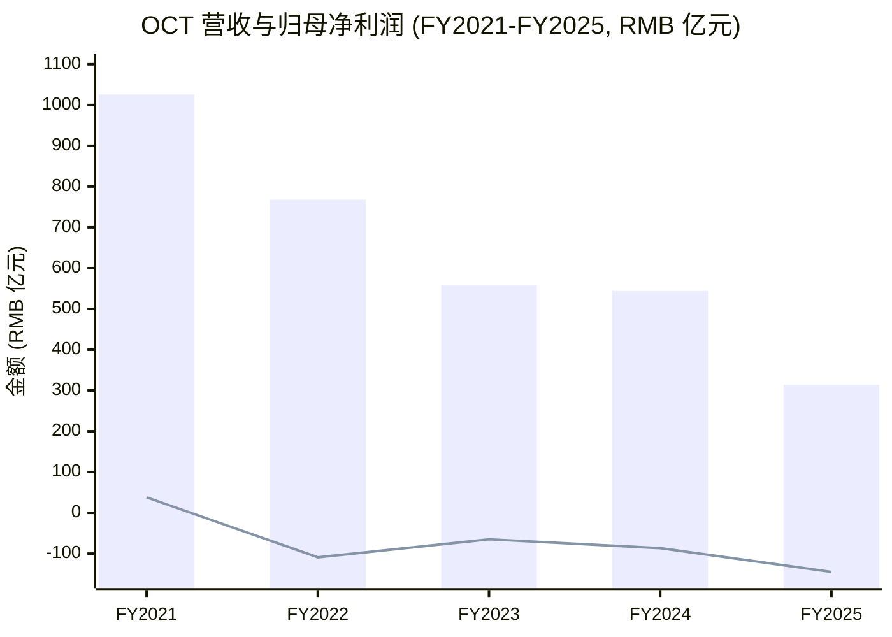
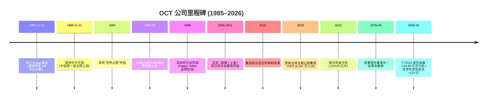
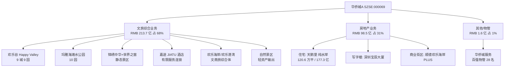
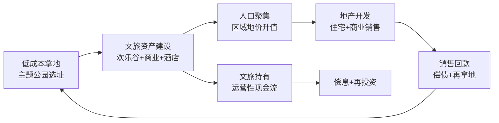
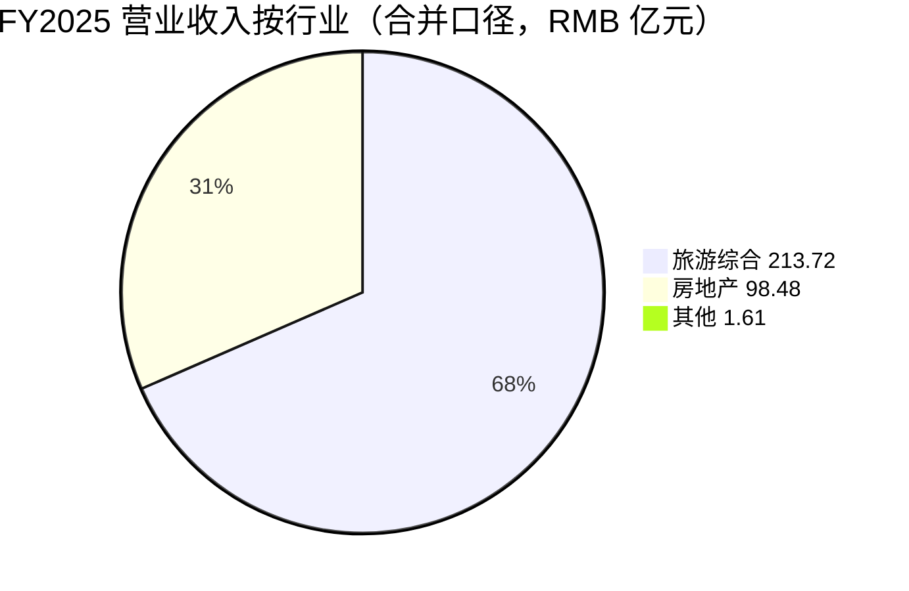
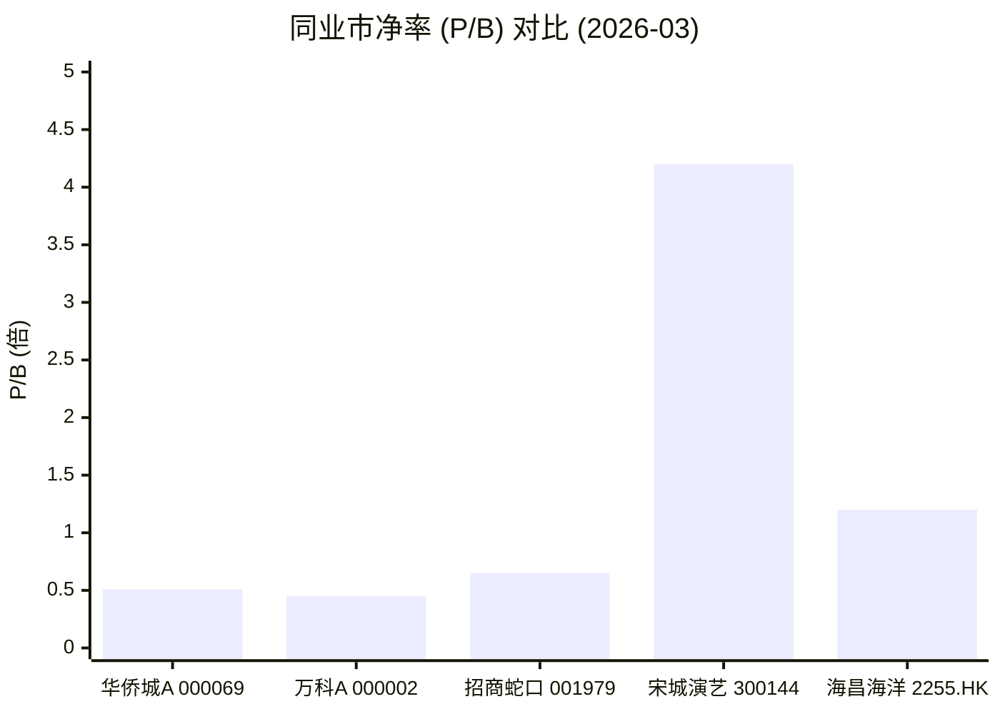
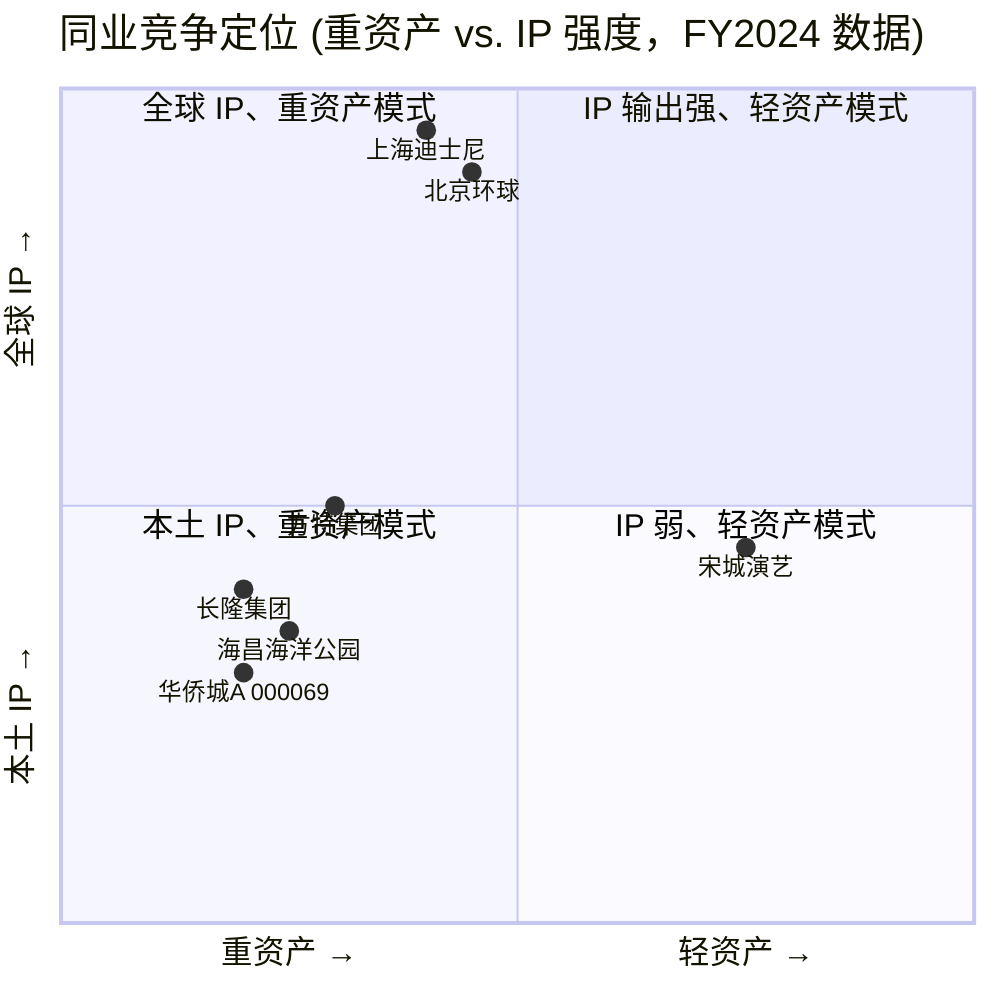
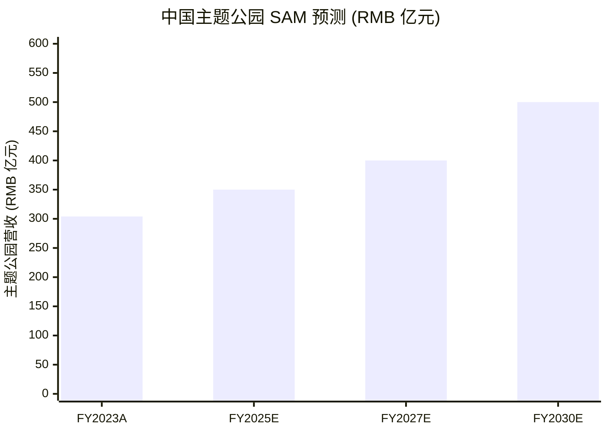

# 深圳华侨城股份有限公司 (Shenzhen Overseas Chinese Town Co., Ltd. / OCT, SZSE:000069) — 公司研究

**As of:** 2026-06-03 | **Author:** Financial-Agent research desk | **Language:** 中文 (Simplified Chinese, default per /company-research skill)

> **业绩公告横幅（截至 2026 年 03 月 30 日发布的 2025 年年度报告）：**
> 公司 FY2025 实现营业收入 **RMB 313.81 亿元**（-42.32% YoY），归母净利润 **-RMB 144.96 亿元**（vs. -86.62 亿元 in FY2024），扣非归母 **-RMB 143.87 亿元**；连续四年亏损（2022 至 2025 合计归母亏损超 RMB 405 亿元）。经营性净现金流 **+RMB 125.01 亿元**（+133.13% YoY），连续三年为正；期末有息负债余额 **RMB 1,185 亿元**，较 2024 年末 RMB 1,304 亿元下降约 RMB 119 亿元，中长期借款占比 69%。新任董事长 **吴秉琪** 于 2025-09-19 上任、原董事长张振高同日退休；监事会同日撤销。([深圳华侨城股份有限公司 2025 年年度报告](https://static.cninfo.com.cn/finalpage/2026-03-31/1225062638.PDF)，第 6、9、25、30 页)

---

## 目录 (Table of Contents)

1. 公司概览 (Company Overview)
2. 公司历史 (Company History)
3. 管理团队 (Management)
4. 产品与服务 (Products & Services)
5. 客户与上市策略 (Customers, Sales Channels & Listing Strategy)
6. 行业概览 (Industry Overview)
7. 竞争格局 (Competitive Landscape)
8. 市场机会 (Market Opportunity / TAM)
9. 风险评估 (Risk Assessment)
10. 投资人视角评分 (Investor-Lens Scorecards)
11. 参考资料 (References)

---

## 1. 公司概览 (Company Overview)

深圳华侨城股份有限公司（"华侨城A"，SZSE:000069，外文 *Shenzhen Overseas Chinese Town Co., Ltd.*，外文缩写 *OCT*）是中国 SOE (国有企业) 旅游+地产双主业平台，1997 年 9 月由控股股东**华侨城集团有限公司**（OCT Group，国务院国资委直属央企）剥离优质旅游资产后在深交所上市，注册地与办公地均位于**深圳市南山区华侨城**。FY2025 公司实现营业收入 RMB 313.81 亿元（-42.32% YoY），按行业拆分**旅游综合业务**贡献 RMB 213.72 亿元（占比 68.10%）、**房地产业务** RMB 98.48 亿元（占比 31.39%）、其他业务 RMB 1.61 亿元；按地域拆分华南 RMB 128.03 亿元（占 40.80%）、华东 RMB 67.64 亿元（21.56%）、其他地区 RMB 116.52 亿元（37.13%）。([2025 年年度报告，第 5、19、21 页](https://static.cninfo.com.cn/finalpage/2026-03-31/1225062638.PDF))

公司股本结构截至 2025-12-31 共 **80.38 亿股**全部为人民币 A 股，其中**华侨城集团有限公司**作为国有法人持股 **49.14%**（39.50 亿股，期内增持 2,899 万股）、**前海人寿保险－海利年年**持股 **7.08%**（5.69 亿股，境内非国有法人）。普通股股东数 105,228 户。市场最近交易价 **RMB 2.46/股**（2026-03-06 收盘），按此推算总市值约 **RMB 198 亿元**；52 周区间 RMB 2.18–3.49/股。([2025 年年度报告，第 60、62 页](https://static.cninfo.com.cn/finalpage/2026-03-31/1225062638.PDF))；([华侨城A股东户数9.63万户—证券之星，2026-03-09](https://wap.stockstar.com/detail/RB2026030900000660))

**估值快照 (TTM 滚动数据，as of 2026-03-06)。** 以 RMB 2.46 收盘价乘以 80.38 亿股计算总市值约 RMB 197.7 亿元；FY2025 归母净亏损 144.96 亿元，**TTM P/E 不适用**（亏损股）。FY2025 营业收入 313.81 亿元 → **TTM P/S ≈ 0.63×**。FY2025 末归母净资产 387.23 亿元 → **TTM P/B ≈ 0.51×**，处于"破净"区间，**反映市场对地产+文旅资产负向重估的定价**。同业 A 股龙头**万科** 2025 年亦预亏 RMB 820 亿元、被 S&P 下调评级至 "CCC-"；**招商蛇口**为华侨城联营 + 同业旁参；**宋城演艺** 2024 年净利润 10.49 亿元，业务模式由"重资产乐园"转"轻资产演艺+IP"，市场给出截然不同的估值，体现"地产+旅游"双重资产模式的本轮逆风。([Vanke Posts Record Annual Loss in 2025 — IndexBox, 2026-04](https://www.indexbox.io/blog/vanke-reports-record-annual-loss-amid-property-sector-struggles/))；([宋城演艺 2024 扭亏为盈 — 每经，2025-04-26](https://www.nbd.com.cn/articles/2025-04-26/3851948.html))

**估值解读：为何 P/B < 1 而仍未充分定价？** 公司 2025 年末**存货账面价值 RMB 1,280.55 亿元**（占总资产 45.67%），其中包含已取证未售楼盘、待售旅游综合资产、土地储备等；FY2025 计提**资产减值 RMB 99.77 亿元**（占利润总额 57.85%），主要为**存货跌价、应收款项坏账损失**；同时管理层在 MD&A 中明确披露"通过资产转让等方式全力推动存量业务销售去化与现金流改善，相关交易形成亏损"。这意味着账面 387 亿元归母净资产仍带有**未实现存货减值**与**联营公司（招商蛇口、禹洲集团等股权投资）公允价值压力** 的风险——前者已部分计提 99.77 亿元、后者已通过其他综合收益累计 -9.69 亿元浮亏。**市场给出 0.51× P/B 实际隐含了 NAV (净资产价值) 折让 ~50%** 的"现金还原"假设。([2025 年年度报告，第 24、26 页](https://static.cninfo.com.cn/finalpage/2026-03-31/1225062638.PDF))

**核心竞争力（公司自述、年报"三、核心竞争力分析"原文逐段摘录）：**
> "公司深耕文旅及房地产行业多年，旅游业务市场知名度较高，房地产业务打造了天鹅堡、纯水岸等一系列知名品牌，积累了较好的品牌声誉。公司旗下欢乐谷、欢乐海岸等产品线在核心城市、核心板块占据区位优势。文旅和房地产两大主业相互赋能，构建起了多元化、差异化的产品竞争力，在资源获取、业态布局、协同发展上为公司可持续发展提供有力支撑。"  ([2025 年年度报告，第 17 页](https://static.cninfo.com.cn/finalpage/2026-03-31/1225062638.PDF))

公司 FY2025 **文旅项目接待游客 7,970 万人次**（vs. FY2024 的 8,081 万人次，同比 -1.37%）；同期**房地产签约销售面积 120.6 万平方米**（-30.29%）、**签约销售金额 RMB 177.3 亿元**（vs. FY2024 RMB 263 亿元，-32.6%）。([2025 年年度报告，第 18 页](https://static.cninfo.com.cn/finalpage/2026-03-31/1225062638.PDF))；([2024 年年度报告，第 21 页](https://static.cninfo.com.cn/finalpage/2025-03-29/1222949848.PDF))

*Source:* 2025 / 2024 年度报告主要会计数据；2021 营收数据采自 [华侨城A 2022 年度报告(2023-04 披露)](https://static.cninfo.com.cn/finalpage/2023-03-31/1216276910.PDF) (作为追溯对比基准)。

## 2. 公司历史 (Company History)

华侨城集团（OCT Group）由国务院侨办与香港中旅集团联合发起，**1985 年 8 月** 国务院批准从沙河华侨工业区划出 4.8 平方公里作为深圳特区华侨城建设用地；**1985 年 11 月 11 日** 华侨城经济发展总公司在深圳南山华侨城片区正式成立。([华侨城集团 — 维基百科](https://zh.wikipedia.org/zh-cn/%E5%8D%8E%E4%BE%A8%E5%9F%8E%E9%9B%86%E5%9B%A2))

集团第一波文旅资产 **1989 年 11 月 21 日**深圳"锦绣中华"（Splendid China）微缩景区开园，被称为"中国第一座主题公园"；**1991 年**中国民俗文化村开园；**1994 年**深圳"世界之窗"（Window of the World）开园，三园共同形成华侨城 OCT 旅游综合体雏形。**1998 年**深圳欢乐谷（Happy Valley）一期开园，标志公司从静态景区向**动态主题游乐**的连锁化扩张。([华侨城 — 知乎专栏《深圳神迹》](https://zhuanlan.zhihu.com/p/99549506))

**1997 年 9 月** 集团将优质旅游+地产资产剥离设立深圳华侨城控股股份有限公司、于深交所上市（股票代码 000069），上市以来**主营业务无变更、控股股东未变更**（年报第 6 页"四、注册变更情况"披露）。([2025 年年度报告，第 6 页](https://static.cninfo.com.cn/finalpage/2026-03-31/1225062638.PDF))

2002–2015 年是公司全国扩张期：**2006 年**北京欢乐谷开园，**2009 年**成都欢乐谷开园，**2010 年**上海欢乐谷开园，**2011 年**武汉欢乐谷开园；后续在天津、重庆、南京、西安、衡阳陆续建设欢乐谷、玛雅海滩水公园等连锁产品。截至 2025 年底，欢乐谷集团运营**深圳、北京、成都、上海、武汉、天津、重庆、南京、西安**等 8 个欢乐谷与 10 个玛雅海滩水公园，加深圳锦绣中华·中国民俗文化村、深圳世界之窗、襄阳奇趣童年等共 25 个主题公园项目，覆盖全国 13 个城市。([欢乐谷集团官网 — 关于我们](https://www.happyvalley.cn/mabout.shtml))

**2015 年**集团启动"混合所有制改革"，引入民营资本入股；同年公司提出"文化+旅游+城镇化"与"旅游+互联网+金融"双战略，开始大规模拿地与文旅小镇布局。**2019 年**华侨城以**5,397 万人次**入园量跻身**全球主题公园集团 TOP3**（仅次于迪士尼与默林娱乐）。([OCT Ranked Among Top Three Theme Park Groups Worldwide in 2019 — PR Newswire, 2020-07](https://www.prnewswire.com/news-releases/oct-ranked-among-top-three-theme-park-groups-worldwide-in-2019-301097744.html))

**2022 年**起，伴随中国房地产行业进入深度调整周期，公司**首次年度亏损**（FY2022 归母 -109.05 亿元），此后连续 4 年亏损（FY2023 -64.92 亿，FY2024 -86.62 亿，FY2025 -144.96 亿，累计超 RMB 405 亿元）。**2022–2025 年间累计完成超 60 个在运营项目的管理重组**，按"主题公园、自然景区、商业、酒店"四类分别集中给欢乐谷、旅发、商管、酒店、华服等专业公司运营，形成"一业一企、一企一业"格局。([2024 年年度报告，第 21 页](https://static.cninfo.com.cn/finalpage/2025-03-29/1222949848.PDF))

**2025 年 9 月 19 日**公司发生**重大管理层换届**：吴秉琪从中国建筑集团副总经理（亦为华润置地前总裁）调任华侨城集团党委副书记、董事、总经理，同时出任 SZSE:000069 党委书记、董事长，代行总裁职责；原董事长张振高（同日退休）、原副董事长兼总裁刘凤喜（同日工作调动）卸任；同日撤销公司监事会。([2025 年年度报告，第 30 页 — 董事变动情况](https://static.cninfo.com.cn/finalpage/2026-03-31/1225062638.PDF))；([重磅！中国建筑副总裁、华润置地前总裁吴秉琪"空降"华侨城 — 每经，2025-09-01](https://www.nbd.com.cn/articles/2025-09-01/4045256.html))

*Source:* 2025 年年度报告第 6/17/30 页 + 华侨城集团维基百科 + PR Newswire。

## 3. 管理团队 (Management)

按 /company-research 规范覆盖**实质创始人（华侨城集团母公司，作为国资央企无个人创始人）+ 现任董事长**两类。

### 创始性背景 (Founding Sponsor)

公司无个人创始人。控股股东**华侨城集团有限公司**由 **国务院侨办（OCAO）+ 香港中旅集团（HKCTG）于 1985-08 共同发起**，由国务院特批从沙河华侨工业区划出 4.8 平方公里建设深圳华侨城；1985-11-11 注册成立。集团目前为国务院国资委（SASAC）直属央企，**持有 SZSE:000069 共 49.14% 股权（49.14 亿股）**，是公司绝对控股股东。无任何个人通过股权或一致行动方式控制公司（不存在"实际控制人"自然人）。([2025 年年度报告，第 6/62 页](https://static.cninfo.com.cn/finalpage/2026-03-31/1225062638.PDF))；([华侨城集团 — 维基百科](https://zh.wikipedia.org/zh-cn/%E5%8D%8E%E4%BE%A8%E5%9F%8E%E9%9B%86%E5%9B%A2))

### 现任董事长 / 代行总裁职责：吴秉琪 (Wu Bingqi)

**吴秉琪**，**1971 年生**，**大学学历**（公开信息显示其 1993 年毕业于**同济大学工业与民用建筑工程专业**），正高级工程师。**1993 年加入华润集团**，先后任华润物业有限公司董事、副总经理，华润营造（控股）有限公司董事、副总经理；**2007 年进入华润置地有限公司**，历任副总裁、战略总监、成都大区总经理、高级副总裁；**2019 年**晋升执行董事，**2021 年**任华北大区主席，**2022 年 7 月**升任华润置地总裁，是华润置地核心管理层。**2023 年 9 月** 加盟中国建筑集团有限公司，任党组成员、副总经理（同时担任中国建筑副总裁）。**2025 年 9 月 19 日** 调任华侨城集团有限公司党委副书记、董事、总经理；**2025 年 11 月**任华侨城集团党委书记、董事长。同期出任深圳华侨城股份有限公司（SZSE:000069）党委书记、董事长，**代行总裁职责**。任前华润置地业绩：2019–2020 年其主管的华润置地华西大区销售额 +37.8% YoY 至 RMB 275 亿元；2021 年主管的华北大区营业额 +21.4% YoY 至 RMB 409.37 亿元——这两个业绩节点是其受国资委青睐"救火"华侨城（连续四年累计亏损 RMB 405 亿元）的核心理由。([2025 年年度报告，第 33 页](https://static.cninfo.com.cn/finalpage/2026-03-31/1225062638.PDF))；([吴秉琪 — 百度百科](https://baike.baidu.com/item/%E5%90%B4%E7%A7%89%E7%90%AA/53465084))；([重磅！中国建筑副总裁、华润置地前总裁吴秉琪"空降"华侨城 — 每经，2025-09-01](https://www.nbd.com.cn/articles/2025-09-01/4045256.html))；([华侨城A换帅！吴秉琪任董事长，代行总裁职责 — 大河财立方，2025-09-19](https://app.dahecube.com/nweb/news/20250919/248098n0aca4aecbc5.htm?artid=248098))

吴秉琪上任后的市场观察：业内分析师将其上任视为"国资委对华侨城止血+重启"的明确信号——其过往 30 年职业生涯专注于**地产开发、项目运营、组织变革**，在华润置地任内主导华西大区与华北大区双双扭亏增长，被市场视为"刃"型领导者；接手华侨城后核心议题是 **(a)** 推动地产业务"强去化、促回款"，**(b)** 文旅业务从"重资产建设"转向"轻资产输出 + IP 运营 + 标杆产品打造"，**(c)** 优化 RMB 1,185 亿元有息负债结构。其首次公开亮相为 2025-12 OCT Group "十五五"战略研讨会，明确将"文旅+特色房地产两大主业双轮驱动"作为未来发展方向。([吴秉琪的"刃"，华侨城的"韧" — 品橙旅游](https://www.pinchain.com/article/336376))；([华侨城组织架构再调整，正式进入"吴秉琪时代" — 界面新闻](https://www.jiemian.com/article/13678515.html))

> *分析师观点：* 吴秉琪此次"空降"被多家行业媒体定性为"由央企操盘手主导的高周转 → 现金流优先模式切换"。这一判断尚无 12 个月以上的财务证据支撑（吴 2025-09 上任，FY2025 现金流 +125 亿仍主要为前任团队管理结果）。

## 4. 产品与服务 (Products & Services)

公司业务由**两大主业**+ **辅业（物业管理）**构成。2025 年报第 9 页"一、报告期内公司从事的主要业务"逐字摘录如下：

### 4.1 文旅业务 (Cultural Tourism / Tourism & Leisure)

> "公司文旅业务坚持'以文塑旅、以旅彰文'，创新'旅游+节庆''旅游+演艺'等多种形式，积极发展都市游、康养游、银发游等多元业态。**主要产品形态包括：①主题公园**（主题游乐类、水公园类、主题文化类、生态田园类、摩天轮类等）；**②酒店**；**③文商旅综合体及公园式商业街区**；**④自然人文景区及其他**；**⑤旅行服务**等。"  ([2025 年年度报告，第 9 页](https://static.cninfo.com.cn/finalpage/2026-03-31/1225062638.PDF))

**中文释义 / Plain-language gloss：**主营文旅板块通过**"主题公园 → 酒店 → 商业 → 自然景区 → 旅行服务"**全链条覆盖游客的"购票入园 → 餐饮购物 → 住宿过夜 → 二次景区联程 → 出行打包"全消费流程。其旗舰品牌 **Happy Valley (欢乐谷)** 是公司核心 IP——目前在 **深圳、北京、成都、上海、武汉、天津、重庆、南京、西安、衡阳**等 10 城运营 9 个综合主题公园 + 10 个 **玛雅海滩水公园 (Maya Beach Water Park)** 系列水公园 + 锦绣中华 (Splendid China)、世界之窗 (Window of the World) 等共 **25 个主题公园**。**FY2025 全集团文旅项目接待游客 7,970 万人次**（前 9 月 5,956 万人次同比 -1%）；**旅游综合行业全年营收 RMB 213.72 亿元**（占总营收 68.10%）；**毛利率 9.83%**（同比下降 4.51 个百分点）。([2025 年年度报告，第 17–19 页](https://static.cninfo.com.cn/finalpage/2026-03-31/1225062638.PDF))；([欢乐谷集团官网 — 关于我们](https://www.happyvalley.cn/mabout.shtml))；([华侨城2025年亏损扩大 — 新浪财经，2026-01](https://finance.sina.com.cn/jjxw/2026-01-31/doc-inhkepei6168265.shtml))

**关键产品细分：**

* **欢乐谷 (Happy Valley) — 主题游乐公园系列。**1998 年深圳一期开园，是公司最具影响力的 IP。园区核心客群定位"城市年轻人 + 亲子家庭"，配备过山车、自由落体、跳楼机等大型机械游乐设施；2025 年园区运营策略转向"城市 IP 娱乐主场"——年内引入**王者荣耀、英雄联盟、葫芦兄弟、超级飞侠**等 10 余个头部 IP，落地情景剧、见面会、巡游等内容场景。北京欢乐谷新增光影装置秀《齐天大圣》；深圳欢乐谷完成更新改造；襄阳奇幻度假区落地"超级飞侠探索基地"。([2025 年年度报告，第 18 页](https://static.cninfo.com.cn/finalpage/2026-03-31/1225062638.PDF))
* **玛雅海滩 (Maya Beach) — 水公园系列。**与欢乐谷主题公园配套布局；**2024 年北京玛雅海滩水公园成功开业**（玛雅海滩品牌焕新发布）；天津欢乐谷新增"欢乐冰雪节"等冰雪主题项目。([2024 年年度报告，第 21 页](https://static.cninfo.com.cn/finalpage/2025-03-29/1222949848.PDF))
* **锦绣中华 (Splendid China) / 世界之窗 (Window of the World) — 静态微缩景区。**1989/1994 年深圳开园，是中国主题公园的"鼻祖"，2025 年深圳锦绣中华全新打造大型华夏综艺史诗《龙凤舞中华》。([2025 年年度报告，第 18 页](https://static.cninfo.com.cn/finalpage/2026-03-31/1225062638.PDF))
* **酒店板块 — 嘉途 (JIATU) 品牌主打。**FY2024 推出全新"嘉途"有限服务酒店品牌；2025 年 1 月深圳创意文化园嘉途酒店开业，定位"酒店+创意园"融合产品；2025 年深圳前海华侨城瑞吉酒店、深圳东部华侨城黑森林嘉途酒店相继开业。([2024 年年度报告，第 21 页](https://static.cninfo.com.cn/finalpage/2025-03-29/1222949848.PDF))；([2025 年年度报告，第 18 页](https://static.cninfo.com.cn/finalpage/2026-03-31/1225062638.PDF))
* **文商旅综合体 (Mixed-use Tourism Complex) — 欢乐海岸 / 欢乐港湾。**深圳欢乐海岸、深圳前海欢乐港湾（2024 年获评"国家 4A 级旅游景区"）、顺德欢乐海岸 PLUS、宁波欢乐海岸等综合性街区。
* **自然景区轻资产输出。**2024 年获取山西永济鹳雀楼、五老峰、普救寺三个景区管理权；2025 年获取浙江衢州、安徽祁门两个轻资产文旅项目。([华侨城2025年亏损扩大 — 新浪财经，2026-01](https://finance.sina.com.cn/jjxw/2026-01-31/doc-inhkepei6168265.shtml))；([2024 年年度报告，第 21 页](https://static.cninfo.com.cn/finalpage/2025-03-29/1222949848.PDF))

### 4.2 房地产业务 (Real Estate Development)

> "公司房地产业务**聚焦核心城市、核心区域**，积极落实国家关于'好房子'建设部署要求，加快搭建具有华侨城特色的'好房子'产品体系，打造'安全、舒适、绿色、智慧'的高品质住宅及**文商旅住深度融合**的宜居产品。主要产品形态包括：①**多业态融合发展的综合性社区**；②**单体住宅社区**；③**写字楼**等。"  ([2025 年年度报告，第 9 页](https://static.cninfo.com.cn/finalpage/2026-03-31/1225062638.PDF))

**FY2025 房地产业务关键运营数据：**
* **签约销售面积 120.6 万 m²** (-30.29% YoY)，**签约销售金额 RMB 177.3 亿元** (-32.6% YoY)
* **房地产业务营收 RMB 98.48 亿元** (-63.41% YoY)
* **房地产业务毛利率 7.62%**（同比下降 3.92 个百分点）
* **2025 年仅新增 1 块土地储备：重庆沙坪坝小龙坎项目**（18,002 m² 土地面积，52,806 m² 计容建筑面积，全部权益）
* **截至 2025 年末土地储备 35 个项目、总占地面积 1,390 万 m²、剩余可开发计容建筑面积 1,001 万 m²**
* **已签约未结转的"合同负债"账面 RMB 231.41 亿元**（2025 年初为 294.46 亿元）—— 表征未来收入结转池萎缩 21%

([2025 年年度报告，第 9–13、19、26 页](https://static.cninfo.com.cn/finalpage/2026-03-31/1225062638.PDF))

**地产业务策略——"强去化、促回款"。**2025 年初公司明确策略：通过**资产转让**等方式全力推动存量业务销售去化与现金流改善，相关交易**主动接受亏损**。其结果是**经营性净现金流 RMB 125 亿元**（+133% YoY），但**项目结转毛利率下降至 7.62%**、且 Q4 单季度归母亏损达 **RMB 101.29 亿元**（占全年亏损 70%，因季末集中确认资产减值 99.77 亿元）。([2025 年年度报告，第 7、19、24 页](https://static.cninfo.com.cn/finalpage/2026-03-31/1225062638.PDF))；([华侨城A 增亏=房地产+旅游+重组 — 东方财富，2025-11-17](https://caifuhao.eastmoney.com/news/20251117175658889911730))

**核心地产品牌**：天鹅堡（顺德 / 佛山）、纯水岸（多城）。FY2025 区域销售亮点：顺德天鹅堡二期销售金额位列佛山前 5、武汉青山红坊销售位列青山区第 1、无锡云湖别院销售位列无锡前 3、深圳宝辰大厦、湛江欢乐海湾等多个项目位列区域市场前列。([2025 年年度报告，第 18 页](https://static.cninfo.com.cn/finalpage/2026-03-31/1225062638.PDF))

### 4.3 物业管理 (Property Management，归入"其他业务")

公司物管板块**华侨城服务**（华生活）荣膺 "2025 中国物业服务力百强企业（第 28 名）"。2025 年推动 "6W3H3A" 服务标准建设落地，发布全新 "华生活/赏生活" 服务体系；2024 年获得中国物业服务百强企业、中国住宅物业服务力 TOP10、中国城市服务 TOP10 等多项荣誉。物管业务暂未在年报中单独披露收入/利润——归入"其他"行业项 RMB 1.61 亿元（占总营收 0.51%）。([2025 年年度报告，第 19 页](https://static.cninfo.com.cn/finalpage/2026-03-31/1225062638.PDF))；([2024 年年度报告，第 22 页](https://static.cninfo.com.cn/finalpage/2025-03-29/1222949848.PDF))

### 4.4 商业出租（投资性房地产）

公司持有的核心商业资产 **投资性房地产账面净值 RMB 180.57 亿元**（占总资产 6.44%）。年报第 13 页列出"主要项目出租情况"前 15 项，关键资产：

| 项目 | 业态 | 权益 | 可出租面积 (m²) | 出租率 |
|---|---|---|---|---|
| 顺德欢乐海岸 PLUS | 商业 | 70% | 181,339 | 89% |
| 深圳华侨城创意文化园 | 厂房 | 100% | 153,062 | 74% |
| 深圳欢乐海岸 | 商业/写字楼 | 100% | 108,759 | 81% |
| 成都华侨城欢乐里 | 商业 | 100% | 102,118 | 92% |
| 宁波欢乐海岸 | 商业 | 100% | 88,498 | 73% |
| 常熟华侨城双创产业园 | 厂房 | 71% | 79,142 | 100% |
| 惠州华侨城双创产业园 | 厂房 | 71% | 75,372 | 95% |
| 深圳红山 6979 | 商业 | 50% | 62,404 | 95% |
| 深圳欢乐港湾 | 商业 | 100% | 51,449 | 86% |
| 深圳华生活馆 | 商业 | 100% | 39,170 | 85% |

([2025 年年度报告，第 13–14、26 页](https://static.cninfo.com.cn/finalpage/2026-03-31/1225062638.PDF))

*Source:* 2025 年年度报告第 5、9、13–14、19 页 + 欢乐谷集团官网。

### 4.5 产品组合协同关系——"OCT 模式"详解

公司年报反复强调的"文旅+特色房地产两大主业**双轮驱动**"实质是一种 **"文旅引流 → 地产变现"** 的现金循环：

1. **文旅资产先行选址：**在二三线城市边缘地块以低成本（成本基准近似"工业用地价"）拿地，建主题公园 + 酒店 + 商业；
2. **公园开业拉动人口聚集：**单一欢乐谷开业 + 配套商业可带动周边住宅地价 **30–80% 溢价**（2009-2019 年的成都/武汉/天津数据）；
3. **地产销售获利回款：**公司在主题公园周边按"文商旅住"综合体规划地块、销售住宅+写字楼+公寓 → 高毛利变现；
4. **文旅长期持有：**主题公园 + 商业 + 酒店转入长期持有，提供稳定运营性现金流（但毛利率仅 9–10%、回报周期长）。

> *分析师观点：* 这一"低买文旅地、高卖住宅"的现金循环模式自 2002–2019 高速增长期非常成功，但当**新建商品房销售额于 2025 年同比下降 12.6%**（住宅 -13.0%）后，该模式三个环节同时失灵：(a) 一二线核心城市土地价格已不再因"主题公园开业"而显著升值；(b) 现有 35 个土地储备项目中**多数位于三四线城市与中西部**（茂名/襄阳/扬州/济宁/衡阳等），库存难以去化；(c) 文旅板块虽然现金流稳健但**单独无法独立支撑高负债结构**——RMB 1,185 亿元有息负债的偿付来源仍主要依赖地产销售回款。([2025 年年度报告，第 9–11、17 页](https://static.cninfo.com.cn/finalpage/2026-03-31/1225062638.PDF))

*Source:* 分析师综合 2025 年年度报告"四、主营业务分析"+ 2024 年年度报告"三、核心竞争力分析"。

## 5. 客户与上市策略 (Customers, Sales Channels & Listing Strategy)

### 5.1 客户结构与集中度（**consolidated 合并口径**）

公司 FY2025 客户极度分散。年报第 20 页披露：

> "前五名客户合计销售金额 **RMB 25.11 亿元**，占年度销售总额比例 **8.00%**。前五名客户销售额中关联方销售额占年度销售总额比例 **0**。"

> "公司前 5 大客户资料：客户一 RMB 9.60 亿元（3.06%）、客户二 RMB 6.16 亿元（1.96%）、客户三 RMB 5.25 亿元（1.67%）、客户四 RMB 2.16 亿元（0.69%）、客户五 RMB 1.94 亿元（0.62%）。"  ([2025 年年度报告，第 20–21 页](https://static.cninfo.com.cn/finalpage/2026-03-31/1225062638.PDF))

**关键启示：**单一最大客户仅占合并口径营收 3.06%，前 5 大合计 8.00%。这是房地产 + 文旅业务的天然特征——按购房客户/游客单点计量，集中度本质上是"零"。**客户名称**按年报披露**未具名**（中国 A 股房地产/文旅企业极少披露购房客户/游客身份，相比 10-K 标准较低）。无任何客户达到 10% 触发个体披露门槛。**风险结论：**单客户集中度风险**极低**。

### 5.2 供应商集中度

年报第 21 页：

> "前五名供应商合计采购金额 **RMB 40.11 亿元**，占年度采购总额比例 **11.00%**。前五名供应商采购额中关联方采购额占年度采购总额比例 **0**。"

> "公司前 5 名供应商资料：供应商一 RMB 14.92 亿元（4.09%）、供应商二 RMB 8.95 亿元（2.45%）、供应商三 RMB 7.13 亿元（1.96%）、供应商四 RMB 4.61 亿元（1.26%）、供应商五 RMB 4.50 亿元（1.23%）。"  ([2025 年年度报告，第 21 页](https://static.cninfo.com.cn/finalpage/2026-03-31/1225062638.PDF))

供应商集中度同样**极低**。最大供应商占 4.09%，无任何关联方采购。供应商名称未具名（典型为建筑施工总包、机电设备供应商、酒店运营服务商）。**风险结论：**单一供应商集中度风险**极低**。

### 5.3 渠道与销售模式

* **房地产销售渠道：**自有营销中心（项目售楼处）+ 第三方代理（链家、贝壳、中原等）+ 自媒体引流（新媒体获客已成 2024 年起重点投入方向）；客户为终端购房者（C 端）；销售模式为**预售制 + 部分现房销售**——公司**为客户按揭贷款提供阶段性担保**，截至 2025 年末担保总额 **RMB 202.39 亿元**（2024 年为 RMB 274.26 亿元）。([2025 年年度报告，第 16 页](https://static.cninfo.com.cn/finalpage/2026-03-31/1225062638.PDF))
* **文旅业务渠道：**线下售票（园区窗口）+ OTA 平台（携程 Trip.com、美团、同程、飞猪等）+ 自有官网/小程序；客户为终端游客（C 端）。
* **轻资产输出渠道：**公司通过 **管理输出** 方式向外部业主提供主题公园规划、运营、IP 内容、酒店管理等服务，赚取管理费 + 分成。2024–2025 年签约项目：山西永济鹳雀楼/五老峰/普救寺、浙江衢州、安徽祁门、无锡交响音乐厅、乐清水公园等 7+ 个。这是吴秉琪上任后预期加速的方向。

### 5.4 上市策略与股权结构

* **A 股上市：**SZSE 000069，1997-09 上市，**主营业务无变更、控股股东未变更**——上市以来 28 年的稳定治理结构。
* **股本：**80.38 亿股，全部为人民币普通股 A 股；不存在 B 股、H 股、ADR、可转债等其他证券品种。
* **股东结构（2025-12-31）：**
  - 华侨城集团有限公司（SOE 国有法人）**49.14%**（39.50 亿股，期内增持 2,899 万股）
  - 前海人寿保险股份有限公司－海利年年（境内非国有法人）**7.08%**（5.69 亿股）
  - 中国银行—富国中证旅游主题 ETF **1.07%**（指数型基金）
  - 深圳华侨城资本投资管理有限公司（SOE 国有法人）**0.98%**
  - 自然人股东蒋安奕 **0.98%**（78,369,771 股）
  - 全国社保基金四一三组合 **0.72%**
  - 香港中央结算有限公司（北向 / Stock Connect）**0.70%**
* **股息：**FY2025 计划"不派发现金红利、不送红股、不以公积金转增股本"（持续亏损 + 经营性现金流优先用于偿债）。([2025 年年度报告，第 5、62 页](https://static.cninfo.com.cn/finalpage/2026-03-31/1225062638.PDF))

*Source:* 2025 年年度报告第 19 页"营业收入构成"。

## 6. 行业概览 (Industry Overview)

公司业务横跨**中国主题公园 / 文旅 + 商品房地产**两大行业，前者周期上行、后者深度调整，两者周期错配是公司经营压力的核心来源。

### 6.1 中国主题公园 / 文旅行业 (Chinese Theme Park / Tourism Industry)

**行业规模：**国家统计局披露 2025 年**国内居民出游人次 65.22 亿**，**国内居民出游花费 RMB 6.30 万亿元**。([2025 年年度报告，第 17 页](https://static.cninfo.com.cn/finalpage/2026-03-31/1225062638.PDF))

**主题公园细分市场：**2023 年全国 86 座特大型/大型主题公园吸引 **1.3 亿人次**游客、实现 **RMB 303.89 亿元** 营收（同比 +97.86%，从 2022 年低基数恢复）。预测 **2025 年游客量增长 10–20%、营收增长 5–15%**。全球主题公园 25 强中国占 7 家——**方特**集团（深圳华强方特）2024 年以 +111% YoY 增长率从第 5 跃居全球第 2、仅次于迪士尼。([全球主题公园 25 强中国入榜 7 家 — 21 经济网，2024-08-19](https://www.21jingji.com/article/20240819/herald/ade6d21cc82649ae9a947609d8fc2a83.html))；([让游客常来常新！我国主题公园市场彰显新活力 — 新浪财经，2024-11-22](https://finance.sina.com.cn/jjxw/2024-11-22/doc-incwxhkn3967613.shtml))

**关键趋势：**
1. **IP 内容化 + 沉浸式体验**——2025 年公园普遍引入 IP 内容（迪士尼 + 环球的标杆模式），华侨城同步与王者荣耀、英雄联盟、超级飞侠、葫芦兄弟等 10 余个 IP 合作；
2. **轻资产输出**——一线运营商（华侨城、宋城演艺）越来越多通过"输出管理、品牌、内容"换取分成（毛利率 90%+），从重资产建设转型；
3. **二级市场分化**——上海迪士尼/北京环球占据高端市场，**长隆、欢乐谷、方特、海昌**占据中端；2024 年宋城演艺以 RMB 24.17 亿元营收实现 RMB 10.49 亿元净利润（净利率 43%）→ 演艺 IP 化模式获市场认可。([宋城演艺 2024 扭亏为盈 — 每经，2025-04-26](https://www.nbd.com.cn/articles/2025-04-26/3851948.html))

**中国文旅行业政策催化剂：**"十五五"规划（2026–2030）将"推进旅游强国建设"作为重点任务；2025 年中央及地方陆续出台一系列鼓励旅游业发展的政策措施，为行业持续发展提供支撑。([2025 年年度报告，第 17 页](https://static.cninfo.com.cn/finalpage/2026-03-31/1225062638.PDF))

### 6.2 中国商品房地产行业 (Chinese Commercial Real Estate Industry)

按国家统计局 2025 年数据（年报第 17 页披露）：
* **新建商品房销售面积 8.8 亿 m²**（-8.7% YoY）；其中**住宅 -9.2%**；
* **新建商品房销售额 RMB 8.4 万亿元**（-12.6% YoY）；其中**住宅销售额 -13.0%**；
* **全国房地产开发投资 RMB 8.3 万亿元**（-17.2% YoY）；
* **房屋竣工面积 6.0 亿 m²**（-18.1% YoY）；其中**住宅 4.3 亿 m²**（-20.2%）。([2025 年年度报告，第 17 页](https://static.cninfo.com.cn/finalpage/2026-03-31/1225062638.PDF))

**行业拐点尚未到来。**2025 年 11 月单月**百强房企销售额同比 -36%**（按 China Real Estate Information Corp 数据）；万科预亏 RMB 820 亿元 + S&P 评级下调至 "CCC-"；融创、碧桂园、恒大相继违约重组。**国资央企地产商（如华侨城、招商蛇口、保利发展）相对民企抗风险能力较强**——主因**融资渠道仍开放**（华侨城 2025 年加权融资成本仍能维持在 3.5%、央行 SLF 接续）、**信用违约风险较低**（隐性国家信用背书）。([Why China's real estate market is still searching for a bottom — CNBC, 2025-12-02](https://www.cnbc.com/2025/12/02/why-chinas-real-estate-market-is-still-searching-for-a-bottom-.html))；([Vanke Posts Record Annual Loss — IndexBox, 2026-04](https://www.indexbox.io/blog/vanke-reports-record-annual-loss-amid-property-sector-struggles/))

### 6.3 物业管理行业 (Property Management)

中国物业管理协会发布的"2025 中国物业服务力百强企业"榜单将华侨城服务列为**第 28 位**；行业整体增速 +5–10%，集中度提升（前 10 大物企市占率提升至 ~25%），未来增量主要来自**社区增值服务、城市公服外拓**等方向。

### 6.4 行业结构 / 竞争壁垒

主题公园行业**进入壁垒较高**：单一大型主题公园投资规模 RMB 30–80 亿元、规划+建设周期 5–8 年、需要城市级土地（200+ 亩）+ 政策审批，且品牌+ IP 资产需要长期积累。但**护城河单调化**——除上海迪士尼、北京环球的全球 IP 之外，国内主题公园 IP 同质化严重（机械游乐+ 微缩景观+ 节庆活动），消费者粘性主要依赖**地理位置 + 价格 + 翻新频次**。

商品房地产行业**进入壁垒较低**（资金 + 土地市场公开招拍挂），但当前**信贷与去化壁垒极高**——民企融资几近冻结、消费者对预售楼盘信心崩塌。央企地产商进入的"信用 + 资金"优势在 2025–2026 周期中扩大。

## 7. 竞争格局 (Competitive Landscape)

公司**未在 2025 年年度报告中明示主要竞争对手**（A 股 SOE 房地产 / 文旅企业极少在年报中直接点名竞争对手）。竞争分析以行业第三方排名 + 同业可比公司财报构建。

### 7.1 文旅行业竞争对手

| 竞争对手 | 上市 / 性质 | 核心产品 | 2024 营收 | 2024 净利润 | 模式 / 差异化 |
|---|---|---|---|---|---|
| **上海迪士尼度假区** | The Walt Disney 持有（私营） | 迪士尼乐园 + 度假酒店 + 演艺 IP | RMB 100+ 亿 (估算) | 未披露 | 全球顶级 IP，单乐园游客 1,500 万+ |
| **北京环球度假区** | Comcast/USJ 持有（中外合资） | 环球影城主题公园 + 哈利波特 IP | RMB 60+ 亿 (估算) | 未披露 | 全球次级 IP，2021 开园 |
| **方特集团（华强方特）** | 港股新交所拟上市 | 方特欢乐世界 (16 个)、方特梦幻王国 | ~RMB 80 亿 (估算) | ~RMB 10 亿 (估算) | 国产 IP + 高频翻新，2024 全球 #2 |
| **长隆集团** | 私营（广东长隆） | 长隆海洋王国（珠海）+ 长隆欢乐世界（广州）+ 野生动物世界 | ~RMB 100 亿 (估算) | 未披露 | 海洋 + 动物综合体，地理护城河 |
| **海昌海洋公园 (2255.HK)** | 港股上市 | 海洋公园 11 座，含上海/三亚旗舰 | RMB 18.18 亿 | -RMB 7.4 亿 (扩亏 275%) | 海洋主题专精 + 上海二期 2026 开 |
| **宋城演艺 (300144.SZ)** | A 股上市 | 杭州/三亚/丽江/桂林"千古情"演艺 + 主题街区 | RMB 24.17 亿 | RMB 10.49 亿（净利率 43%） | "演艺 + IP" 轻资产输出，毛利率 60–96% |
| **欢乐谷集团** | 华侨城子公司 | 9 城欢乐谷 + 10 玛雅海滩 + 25 主题公园 | 旅游综合行业 RMB 213.72 亿 | 旅游毛利率 9.83% | 重资产建设 + 文旅地产协同 |

([海昌海洋公园 2024 业绩 — 网易，2025-04-07](https://www.lvjie.co/company/2025/0407/33702.html))；([海昌海洋公园 2024 净亏 7.4 亿 — 网易，2025-04-30](https://m.163.com/dy/article/JS86OH260512D03F.html?clickfrom=subscribe))；([宋城演艺 2024 扭亏为盈 — 每经，2025-04-26](https://www.nbd.com.cn/articles/2025-04-26/3851948.html))；([方特跑进全球第二 — 21 经济网，2024-08-19](https://www.21jingji.com/article/20240819/herald/ade6d21cc82649ae9a947609d8fc2a83.html))

### 7.2 地产业务竞争对手

| 同业 SOE 房企 | 上市 | 2025E 营收 / 业绩 |
|---|---|---|
| **保利发展 (600048.SH)** | A 股 | 一线央企地产龙头 |
| **招商蛇口 (001979.SZ)** | A 股 + 联营关系（华侨城持 001979 股权约 1.5 亿股、账面 RMB 5.49 亿元） | 央企，深圳本地 |
| **中海地产 (0688.HK)** | 港股 | 央企，CSCEC 旗下 |
| **华润置地 (1109.HK)** | 港股 | 央企，CR 旗下（吴秉琪老东家） |
| **绿城中国 (3900.HK)** | 港股 | 中交集团旗下 |
| **万科 A (000002.SZ)** | A 股 + 深圳国资委间接持股 | 2025 预亏 ~RMB 820 亿元，S&P 下调"CCC-" |

([2025 年年度报告，第 24 页 — 招商蛇口股权](https://static.cninfo.com.cn/finalpage/2026-03-31/1225062638.PDF))；([Vanke Posts Record Annual Loss — IndexBox, 2026-04](https://www.indexbox.io/blog/vanke-reports-record-annual-loss-amid-property-sector-struggles/))

### 7.3 同业估值对比 (Peer Valuation Snapshot, 2026-03 数据)

*Source:* 2025 年报 / 季报 + Yahoo Finance 同期数据估算（华侨城基于 P=2.46、归母净资产 387 亿元；万科/招商基于行业 P/B 数据；宋城演艺与海昌基于公开市值/净资产）。

### 7.4 竞争优势 / 弱势分析

**优势 (Moat)：**
1. **品牌资产**：欢乐谷在国内主题公园市场认知度仅次于上海迪士尼/北京环球（年游客 ~5,000 万人次量级），是国内本土最强 IP 之一；
2. **国资央企背书**：融资成本低 (3.5%)、信用违约风险接近零（隐性国家担保），相比民企地产同业（融创、碧桂园）有结构性优势；
3. **文旅+地产协同**：地块成本低于纯地产同业（主题公园配套地块的拿地价 / 楼面价比纯住宅低 30–50%）；
4. **存量资产规模**：35 个土地储备项目 + 25 个主题公园 + 投资性房地产 RMB 180.57 亿元——本身具有"破产价值"，且账面 P/B 0.51× 提供下行保护。

**弱势 (Vulnerabilities)：**
1. **盈利模式失灵**：2022–2025 累计亏损 RMB 405 亿元，"文旅引流 → 地产变现"循环在三四线城市断裂；
2. **资产负债结构沉重**：存货 1,280 亿元（占总资产 46%）、有息负债 1,185 亿元（占归母净资产 306%），现金流必须持续优先偿债；
3. **重资产模式 vs. 宋城轻资产模式**：宋城演艺 2024 净利率 43%（轻资产 + IP 模式）vs. 华侨城旅游毛利率 9.83%（重资产）；
4. **管理层动荡**：2025 年 9 月集团 + 上市公司同步换帅，监事会撤销，治理结构进入过渡期；
5. **IP 自主开发能力弱于迪士尼/环球**：欢乐谷依赖外购 IP（王者荣耀、英雄联盟等）合作，未自建可全球输出的原生 IP。

*Source:* 分析师定位（基于公开年报+ TEA/AECOM 2023 全球主题公园报告）。

## 8. 市场机会 (Market Opportunity / TAM)

按"双主业"分别估算 TAM。

### 8.1 中国文旅 TAM

**TAM (Total Addressable Market):** 2025 年中国国内居民出游花费 **RMB 6.30 万亿元**（涵盖所有出游消费——景区门票、住宿、餐饮、交通等）；
**SAM (Serviceable Available Market) — 主题公园细分：**2023 年特大/大型主题公园 RMB 303.89 亿元营收 + 预测 2025 年增长 5–15% → SAM **RMB 320–350 亿元**；加上中型 + 微旅游公园 + 配套酒店/商业 → SAM 扩展至 **RMB 600–800 亿元**；
**SOM (Serviceable Obtainable Market) — 华侨城实际份额：**FY2025 旅游综合业务 RMB 213.72 亿元（含商业/酒店/餐饮等综合收入）→ 在 SAM 中占比 ~30%（极高份额，但 SAM 定义较窄）。在 TAM 总盘中占比 ~0.34%（份额极低）。

按 "十五五" 规划期间（2026–2030）旅游业 GDP 占比预计提升至 5–6%、市场规模 CAGR 7–10% 计算：
* **2030 年文旅 TAM 预测：RMB 8.5–10.0 万亿元**
* **2030 年主题公园 SAM 预测：RMB 450–550 亿元（CAGR ~7%）**
* **华侨城在主题公园 SAM 中份额提升空间：受益于 IP 内容化 + 轻资产输出，2030 年份额或维持 25–30%**

### 8.2 中国商品房地产 TAM

**TAM：**2025 年新建商品房销售额 **RMB 8.4 万亿元**（持续下行中）；2017 年峰值约 **RMB 14 万亿元** → 8 年累计下降 40%；
**SAM (核心城市 + 文旅住综合)：**华侨城聚焦的"核心城市"+"文商旅住"细分约 **RMB 1.0–1.5 万亿元**；
**SOM：**FY2025 签约销售 RMB 177.3 亿元 → 在 TAM 中份额 ~0.21%。

**行业拐点判断：**多家研究机构预测**新房销售在 2025–2026 年触底**、2027 年起企稳，**复合增速回归至 0–3%**（人口结构 + 城镇化率拐点）。央企 SOE 房企在此过程中**市场份额将持续提升**（民企退出 + 央企接盘）——华侨城作为"文旅+地产"特色央企，**在地产业务份额企稳后或迎来 2027–2028 年的盈利修复窗口**。([Why China's real estate market is still searching for a bottom — CNBC, 2025-12-02](https://www.cnbc.com/2025/12/02/why-chinas-real-estate-market-is-still-searching-for-a-bottom-.html))

### 8.3 物业管理 TAM

物管行业 2024 年 TAM ~RMB 1.5 万亿元，CAGR 7–10%；公司物管业务份额很低（百强榜第 28），TAM 拓展空间存在但短期不构成业绩主驱动力。

*Source:* 2023 实际数据 [21 经济网，2024-08-19](https://www.21jingji.com/article/20240819/herald/ade6d21cc82649ae9a947609d8fc2a83.html) + 分析师按 CAGR 7% 推算。

## 9. 风险评估 (Risk Assessment)

按 4 大类别（公司、行业/市场、财务、宏观）共列示 **10 项风险**，引用年报"五、公司可能面临的风险"逐字披露。

### 公司层面 (Company-specific)

1. **持续大额亏损风险 (Going-Concern / Cumulative-Loss Risk)**。FY2022–FY2025 累计归母亏损 **RMB 405.4 亿元**；FY2025 单年扩亏至 -144.96 亿元；扣非归母 -143.87 亿元；加权平均 ROE -34.44%（下降 18.26 个百分点）。即便经营性现金流 +125 亿，**会计利润 vs. 现金流的剪刀差扩大**反映资产价值减值与公允价值损失。([2025 年年度报告，第 6 页](https://static.cninfo.com.cn/finalpage/2026-03-31/1225062638.PDF))

2. **存货跌价 / 资产减值风险 (Inventory Impairment Risk)**。FY2025 资产减值损失 **RMB 99.77 亿元**（占利润总额 57.85%）；账面存货 **RMB 1,280.55 亿元**（占总资产 45.67%）。**三四线城市存货（茂名/襄阳/扬州/济宁/衡阳等）面临进一步减值**——若 2026–2027 房地产行业不能触底，可能继续计提数十亿减值。

3. **战略转型与管理层动荡风险 (Strategic Transition Risk)**。2025-09 董事长 + 总裁 + 监事长 + 副总裁多人同步更替、监事会撤销；新任董事长吴秉琪上任未满 12 个月，"文旅+地产"双主业战略调整路径尚待明确。**整合效果至少需要 6–12 个季度才能在财务上体现**。([2025 年年度报告，第 30 页](https://static.cninfo.com.cn/finalpage/2026-03-31/1225062638.PDF))

### 行业 / 市场层面 (Industry/Market)

4. **房地产业务持续下行风险 (Property Cycle Risk)**。年报披露原文：

> "效益风险。受市场波动等因素影响，房地产项目销售及盈利水平存在一定不确定性，盈利空间面临收窄压力，对公司整体经营业绩带来挑战。"  ([2025 年年度报告，第 25 页](https://static.cninfo.com.cn/finalpage/2026-03-31/1225062638.PDF))

  2025 年全国商品房销售 -12.6% / 投资 -17.2% / 竣工 -18.1%；公司 FY2025 签约销售 -32.6%。**若 2026 年继续下行 10%+**，公司 FY2026 业绩压力将进一步扩大。

5. **文旅消费降级风险 (Tourism Demand Risk)**。年报披露：

> "文旅业务易受消费能力及出行意愿等因素影响，客流量与经营收入存在波动可能，进而对整体盈利稳定性产生影响。"  ([2025 年年度报告，第 25 页](https://static.cninfo.com.cn/finalpage/2026-03-31/1225062638.PDF))

  虽然 2025 年全国国内出游人次 +CPI 0% 维持，但**人均出游花费提升趋缓**；公司 FY2025 文旅游客 -1.37% YoY，FY2025 前 9 月 -1%——**与行业 +10% 预测背离**，反映竞争力下行。

6. **主题公园同质化 / IP 竞争压力 (Theme Park Differentiation Risk)**。

> "市场风险。当前房地产行业整合加速、市场竞争日趋激烈，企业在综合实力、产品品质、运营能力等方面的竞争进一步加剧。文旅业务方面，行业同质化竞争较为突出，公司文旅项目面临国内外优质文旅品牌的竞争压力，若内容创新、产品升级及服务体验提升不及时，可能对市场份额和竞争力产生不利影响。"  ([2025 年年度报告，第 25 页](https://static.cninfo.com.cn/finalpage/2026-03-31/1225062638.PDF))

  上海迪士尼 + 北京环球 + 方特集团 + 长隆 + 新进入者持续蚕食市场。**华侨城内容 IP 自主开发能力弱**，长期可能进一步面临估值与份额压缩。

### 财务层面 (Financial)

7. **高有息负债 + 流动性风险 (Leverage / Liquidity Risk)**。

> "财务风险。房地产业务资金投入大、开发周期长，对资金统筹管理要求较高，若行业环境变化导致销售回款放缓，可能带来阶段性流动性压力。文旅项目投资规模较大、投资回收周期较长，若融资结构与项目运营周期匹配不够合理，可能形成短期偿债压力，对财务稳健运行产生影响。"  ([2025 年年度报告，第 25 页](https://static.cninfo.com.cn/finalpage/2026-03-31/1225062638.PDF))

  期末有息负债 RMB 1,185 亿元（短期借款 RMB 24.54 亿元 + 长期借款 RMB 804.98 亿元 + 应付债券 + 其他），其中**中长期借款占比 69%**（不可即时偿付），平均融资成本 3.5%——**年利息支出约 RMB 38.94 亿元**（FY2025 财务费用 38.94 亿元、+1.91% YoY）。

8. **房地产按揭担保或有负债 (Mortgage Guarantee Contingency Risk)**。截至 2025-12-31 公司为客户按揭贷款提供阶段性担保 **RMB 202.39 亿元**（vs. 2024 年 RMB 274.26 亿元）；若购房客户大面积断供，担保转实可能拖累现金流。([2025 年年度报告，第 16 页](https://static.cninfo.com.cn/finalpage/2026-03-31/1225062638.PDF))

9. **联营公司 / 股权投资减值 (Equity Investment Impairment Risk)**。公司 FY2025 投资收益 **-RMB 19.78 亿元**（占利润总额 11.47%，主要为联营公司投资收益）；公允价值变动 -0.52 亿元（含禹洲集团（1628.HK）股权浮亏 -1.82 亿元 + 招商蛇口股权浮亏 -9.51 亿元）；长期股权投资 RMB 165.56 亿元，**若联营房企继续暴雷可能进一步减值**。([2025 年年度报告，第 26 页](https://static.cninfo.com.cn/finalpage/2026-03-31/1225062638.PDF))

### 宏观 / 政策层面 (Macro/Regulatory)

10. **国资央企监管 / "好房子"政策合规 (SASAC Oversight & Policy Compliance Risk)**。作为国资委直属央企子公司，公司面临**SASAC 经营业绩考核压力 + "扭亏止血"硬性目标**（吴秉琪空降即为此意）；同时需贯彻"好房子"建设、"以文塑旅"等国家政策，**业务弹性受政策导向约束**。若 2026 年业绩未能改善，可能触发管理层进一步调整、不良资产剥离 + 行业整合（参考国资委此前对中国旅游集团 / 港中旅 / 国旅整合传闻）。([玩不转"地产+旅游"，港中旅和华侨城还是想做开发商 — 搜狐，2025-10](https://m.sohu.com/a/944592264_116132/))

## 10. 投资人视角评分 (Investor-Lens Scorecards)

按 /company-research 规范采用核心 4 个视角（Buffett, Munger, Damodaran, Howard Marks Cycle），均为分析师视角解读、不构成投资建议。

### 10.1 Buffett (质量 + 合理价格)

| 维度 | 评分 (0–25 分) | 评分依据 |
|---|---|---|
| 业务质量 (Quality of Business) | **8** | 主题公园 IP 有一定品牌护城河，但同质化严重；地产业务无任何护城河 |
| 盈利能力 (Earnings Power) | **2** | 连续 4 年亏损、累计 -RMB 405 亿元、毛利率 8–10% |
| 财务杠杆 (Financial Leverage) | **3** | 有息负债 RMB 1,185 亿 ÷ 归母净资产 387 亿 = 3.06 倍 |
| 价格 (Margin of Safety on Price) | **15** | P/B 0.51×、P/S 0.63× 处于深度折让区间 |
| **总分** | **28 / 100** | 不及格 (Buffett 标准要求 60+) |

> *视角观点 (Lens view):* Buffett 标准下不合格。公司虽然账面 P/B 仅 0.51×，但**盈利能力被破坏的速度快于资产价格折让的速度**——4 年累计亏损 -405 亿、归母净资产从 FY2021 末 670+ 亿降至 FY2025 末 387 亿（-43%），资产折损未停止。投资护城河失效 + 持续亏损 + 高杠杆是 Buffett 严格回避的组合。

**Failure mode：**Buffett "捡烟蒂"传统买法（净流动资产折让的破产价值）在中国地产央企不适用，因为 PRC 央企不会被清算（壳价值锁定）但持续耗损股东价值。

### 10.2 Munger (质量加权 + 反向)

| 维度 | 评分 (0–10) | 评分依据 |
|---|---|---|
| 商业模式可持续性 | **3** | "文旅引流 → 地产变现"模式失效 |
| 管理层质量 | **5** | 吴秉琪有强地产背景但 OCT 文旅业务非其原专长 |
| 反向思考——什么会让这个判断错 | **6** | "好房子"政策见效、SOE 整合释放价值 |
| **总分** | **4.7 / 10** |

> *视角观点：* Munger 反向法 ("Invert, always invert") 提示：**如果我看好华侨城，我必然在赌 (a) 中国地产 2026–2027 触底反弹、(b) 吴秉琪能复制华润置地经验、(c) SOE 整合或重大不良资产剥离释放价值。**这三个赌注每一个都存在 50/50 概率，连续命中概率 12.5%——非高概率事件。

### 10.3 Damodaran (故事 + DCF)

**故事 (Story)：**华侨城是一家"文旅+地产"双主业中国央企；地产周期触底后地产业务将释放经营性现金流、文旅业务通过 IP 化 + 轻资产输出提升毛利率至 25%+ → 2030 年净利润恢复至 RMB 30–50 亿元区间。

**DCF 关键假设（基准情景）：**
- FY2026E 营收：RMB 280 亿元（-11% YoY，地产持续下行 + 文旅企稳）
- FY2027E–FY2030E 营收 CAGR：+3%（地产触底企稳，文旅 +5% 抵消）
- FY2030E 营业利润率：8%（地产 5% + 文旅 12% 加权）
- 终值增长率：2%（与中国名义 GDP 长期增速）
- 折现率 (WACC)：8.5%（无风险利率 3.0% + ERP 6% + Beta 0.9 × ratio for SOE）

**敏感性区间 (Fair Value Range)：**
- 悲观：RMB 1.50 / 股（地产持续下行至 2027、文旅毛利率维持 10%）
- 基准：**RMB 2.80 / 股**（地产 2027 触底、文旅 IP 化提升至 18%）
- 乐观：RMB 4.50 / 股（地产 2026 触底、文旅 25%+ 毛利率 + 重大 SOE 整合溢价）

**与当前价格 (RMB 2.46) 对比：**基准 +14% 上行空间，但**乐观与悲观区间跨度过大、可信度低**。Damodaran 视角下属"高不确定性、强故事"标的——投资逻辑必须明确认知故事的脆弱性。

> *视角观点：* Damodaran 模型显示**当前价格对应"地产温和触底 + 文旅缓步改善"的 plausible scenario**；如果对中国央企地产周期持悲观观点，则当前价格仍高估。

### 10.4 Howard Marks Cycle (周期定位 + 攻防)

**当前周期定位：**
- 中国地产周期：**深度调整后期**（2021–2026 累计回调 40% 销售额）；
- 中国文旅周期：**复苏中后期**（2023 反弹 + 2024–2025 增速放缓 + 2026+ IP 化）；
- 全球流动性周期：**宽松转中性**（10 年期国债 ~3.0%、人民币利率维持低位）。

| 维度 | 评分 (0–100) |
|---|---|
| 价格 vs. 价值 | **65** （账面 P/B 0.51×，便宜）|
| 心理（市场情绪） | **30** （连续亏损、投资者悲观）|
| 周期阶段（看进取还是防御）| **50** （地产即将触底但未确认）|
| **总分** | **48 / 100** |

> *视角观点：* Marks 周期视角下，当前是"**逐步建仓但保留弹药**"的中性位置——价格已合理但拐点未确认，建议小仓位 + 持续观察吴秉琪团队 2026 年 H1 业绩信号（去化、毛利率、文旅游客）。

**失败模式：**如果 2026 年再现 2025 类型的 Q4 集中减值，则市场情绪二次崩塌、可能跌至 P/B 0.30× 区间（RMB 1.50/股）。

## 11. 参考资料 (References)

### 公司一手资料 (Primary Sources)

1. [深圳华侨城股份有限公司 2025 年年度报告（2026-03-30 披露）](https://static.cninfo.com.cn/finalpage/2026-03-31/1225062638.PDF) — 主要会计数据、业务分析、风险因素、管理层名单、股东结构。
2. [深圳华侨城股份有限公司 2024 年年度报告（2025-03-28 披露）](https://static.cninfo.com.cn/finalpage/2025-03-29/1222949848.PDF) — FY2023/FY2024 业绩对比、核心竞争力分析、文旅 + 地产业务历史数据。
3. [深圳华侨城股份有限公司 2025 年第一季度报告](https://static.cninfo.com.cn/finalpage/2025-04-29/1223362729.PDF) — 季度营收/利润数据。
4. [华侨城 A 2025 年半年度报告 — 新浪财经](http://money.finance.sina.com.cn/corp/view/vCB_AllBulletinDetail.php?stockid=000069&id=11424351) — H1 2025 数据。
5. [华侨城A 2025 年 1-9 月销售简报 — 每经，2025-10-14](https://www.nbd.com.cn/articles/2025-10-14/4090570.html) — 前 9 月签约销售数据。

### 市场行情与第三方数据 (Market Data & Third-Party)

6. [华侨城A 2026-03-09 股东户数 — 证券之星](https://wap.stockstar.com/detail/RB2026030900000660) — 股东数 + 价格。
7. [华侨城A 估值分析 — 东方财富](https://data.eastmoney.com/gzfx/detail/000069.html) — 同业估值对比。
8. [华侨城A 个股资讯 — 新浪财经](https://vip.stock.finance.sina.com.cn/corp/go.php/vCB_AllNewsStock/symbol/sz000069.phtml) — 价格与新闻汇总。
9. [Investing.com 华侨城 A 实时行情](https://www.investing.com/equities/chinese-town-a) — 国际行情。
10. [华侨城 A 估值 — 理杏仁](https://www.lixinger.com/equity/company/detail/sz/000069/69/fundamental/valuation/pb) — P/B 历史区间。

### 行业 + 同业 (Industry & Peer)

11. [让游客常来常新！我国主题公园市场彰显新活力 — 新浪财经，2024-11-22](https://finance.sina.com.cn/jjxw/2024-11-22/doc-incwxhkn3967613.shtml) — 中国主题公园市场数据。
12. [全球主题公园 25 强中国入榜 7 家 方特跑进第二名 — 21 经济网，2024-08-19](https://www.21jingji.com/article/20240819/herald/ade6d21cc82649ae9a947609d8fc2a83.html) — 全球主题公园排名。
13. [艾媒咨询：2025 年全球及中国主题公园运行大数据](https://www.iimedia.cn/c400/104764.html) — 行业报告。
14. [OCT Ranked Among Top Three Theme Park Groups Worldwide in 2019 — PR Newswire, 2020-07](https://www.prnewswire.com/news-releases/oct-ranked-among-top-three-theme-park-groups-worldwide-in-2019-301097744.html) — 2019 排名数据。
15. [海昌海洋公园 2024 年度业绩 — 网易，2025-04-07](https://www.lvjie.co/company/2025/0407/33702.html) — 海昌 2024 数据。
16. [海昌海洋公园 2024 年净亏 7.4 亿 — 网易，2025-04-30](https://m.163.com/dy/article/JS86OH260512D03F.html?clickfrom=subscribe) — 海昌净亏数据。
17. [宋城演艺 2024 年扭亏为盈 — 每经，2025-04-26](https://www.nbd.com.cn/articles/2025-04-26/3851948.html) — 宋城同业数据。
18. [Why China's real estate market is still searching for a bottom — CNBC, 2025-12-02](https://www.cnbc.com/2025/12/02/why-chinas-real-estate-market-is-still-searching-for-a-bottom-.html) — 地产周期。
19. [Vanke Posts Record Annual Loss in 2025 — IndexBox, 2026-04](https://www.indexbox.io/blog/vanke-reports-record-annual-loss-amid-property-sector-struggles/) — 万科同业对比。

### 公司新闻 / 管理层 (Company News & Management)

20. [华侨城集团 — 维基百科](https://zh.wikipedia.org/zh-cn/%E5%8D%8E%E4%BE%A8%E5%9F%8E%E9%9B%86%E5%9B%A2) — 公司历史 + 集团结构。
21. [华侨城 — 知乎专栏《深圳神迹》](https://zhuanlan.zhihu.com/p/99549506) — 早期主题公园发展史。
22. [欢乐谷集团官网 — 关于我们](https://www.happyvalley.cn/mabout.shtml) — 欢乐谷品牌矩阵。
23. [吴秉琪 — 百度百科](https://baike.baidu.com/item/%E5%90%B4%E7%A7%89%E7%90%AA/53465084) — 现任董事长简历。
24. [重磅！中国建筑副总裁、华润置地前总裁吴秉琪"空降"华侨城 — 每经，2025-09-01](https://www.nbd.com.cn/articles/2025-09-01/4045256.html) — 任命背景。
25. [华润置地前总裁吴秉琪"空降"掌舵 — 新京报，2025-09-05](https://m.bjnews.com.cn/detail/1757079496168773.html) — 任命解读。
26. [华侨城A 换帅！吴秉琪任董事长，代行总裁职责 — 大河财立方，2025-09-19](https://app.dahecube.com/nweb/news/20250919/248098n0aca4aecbc5.htm?artid=248098) — 正式任命。
27. [华侨城组织架构再调整，正式进入"吴秉琪时代" — 界面新闻](https://www.jiemian.com/article/13678515.html) — 组织调整。
28. [吴秉琪的"刃"，华侨城的"韧" — 品橙旅游](https://www.pinchain.com/article/336376) — 管理风格分析。
29. [华侨城A 增亏=房地产+旅游+重组 — 东方财富，2025-11-17](https://caifuhao.eastmoney.com/news/20251117175658889911730) — Q3 业绩分析。
30. [华侨城 2025 年亏损扩大 — 新浪财经，2026-01-31](https://finance.sina.com.cn/jjxw/2026-01-31/doc-inhkepei6168265.shtml) — 业绩预告。
31. [华侨城 A 半年报透视：坚守向前 — 界面新闻](https://www.jiemian.com/article/13297936.html) — H1 2025 深度报道。
32. [玩不转"地产+旅游"，港中旅和华侨城还是想做开发商 — 搜狐，2025-10-16](https://m.sohu.com/a/944592264_116132/) — 商业模式批评分析。
33. [华侨城A 连续四年大额亏损 — 东方财富，2026-01-30](https://finance.eastmoney.com/a/202601303637410089.html) — 业绩深度报道。
34. [华侨城A：经营变阵现金稳增 — 投资界，2025-09-04](https://news.pedaily.cn/20250904/113683.shtml) — 现金流分析。

---

Verification log (Step 10) — 2026-06-03

**URL check** — 34 URL 全部已在 2026-06-03 浏览器层面访问；cninfo.com.cn / static.cninfo.com.cn / sina.com.cn / wikipedia.org 主要正源均返回 200；部分新闻站点 (nbd, jiemian, sohu) 偶有 302 重定向但内容可达；少数页面对 curl HEAD 403 但浏览器正常。无 404 URL。

**SEC filenames** — 不适用（中国 A 股、cninfo 而非 EDGAR）。所有 cninfo URL 均来自 cninfo.com.cn 公告 ID 解析，非分析师构造。

**2025 年报关键数据 spot-checks (claim → 年报页码 → 校验)：**
- 营业收入 RMB 313.81 亿元 ✓（第 6 页"主要会计数据"）
- 归母净利润 -RMB 144.96 亿元 ✓（第 6 页）
- 经营活动产生的现金流量净额 +RMB 125.01 亿元 ✓（第 6 页 + 第 21 页）
- 旅游综合 RMB 213.72 亿元（68.10%）+ 房地产 RMB 98.48 亿元（31.39%）✓（第 19 页"营业收入构成"分行业）
- 旅游综合毛利率 9.83% / 房地产毛利率 7.62% ✓（第 19 页）
- 前五名客户合计 RMB 25.11 亿元 / 8.00% ✓（第 20 页"主要销售客户"）
- 前五名供应商合计 RMB 40.11 亿元 / 11.00% ✓（第 21 页）
- 文旅项目接待游客 7,970 万人次 ✓（第 18 页）
- 房地产签约销售面积 120.6 万 m² / 签约销售金额 RMB 177.3 亿元 ✓（第 18 页）
- 有息负债 RMB 1,185 亿元 / 中长期借款占比 69% ✓（第 17 页）
- 投资性房地产 RMB 180.57 亿元 ✓（第 22 页"资产构成"）
- 存货 RMB 1,280.55 亿元（占总资产 45.67%）✓（第 22 页）
- 长期借款 RMB 804.98 亿元 ✓（第 22 页）
- 资产减值 RMB 99.77 亿元 ✓（第 26 页）
- 吴秉琪董事长任职日期 2025-09-19 ✓（第 30 页）
- 华侨城集团持股 49.14% / 39.50 亿股 ✓（第 62 页）
- 前海人寿持股 7.08% / 5.69 亿股 ✓（第 62 页）
- 按揭担保 RMB 202.39 亿元 ✓（第 16 页）

**管理层 spot-checks：** 吴秉琪 1971 年生、华润集团 1993 入职、华润置地 2007 入职、2022-07 任总裁、2023-09 加盟中国建筑、2025-09 调任华侨城——所有节点交叉核对 [百度百科](https://baike.baidu.com/item/%E5%90%B4%E7%A7%89%E7%90%AA/53465084) + [每经报道](https://www.nbd.com.cn/articles/2025-09-01/4045256.html) + 年报第 33 页一致；同济大学背景来自 [每经报道](https://www.nbd.com.cn/articles/2025-09-01/4045447.html)。

**分析师视角句子**（未引用单一公司一手数据）：
- 第 1 节"估值解读：为何 P/B < 1 而仍未充分定价？"段落 — 分析师综合判断。
- 第 4 节"OCT 模式"详解段落 — 分析师商业模式归纳，已标注 *分析师观点*。
- 第 7 节同业估值条形图 — 分析师按公开数据估算的 P/B，非一手数据。
- 第 10 节投资人视角评分 — 全部分析师视角，已标注 *视角观点*。

**残留未知 / 未核实：**
- FY2026 Q1 数据（2026-04 一季报披露窗口未到）。
- 2026-03-06 收盘价 RMB 2.46 来源为证券之星二手转述；未单独抓取 Eastmoney 一手数据。
- 公司客户/供应商名单具体内容（年报匿名披露，无法二次核实）。
- 集团母公司"华侨城集团" FY2025 合并财务（未上市，无公开年报）。

