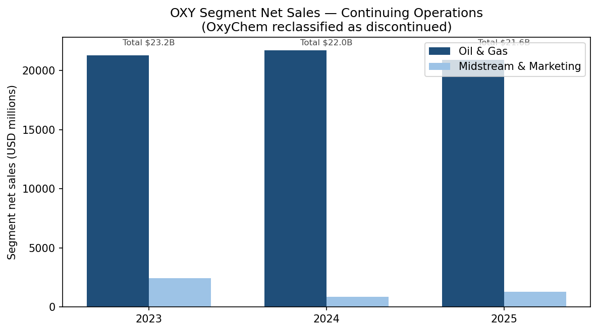
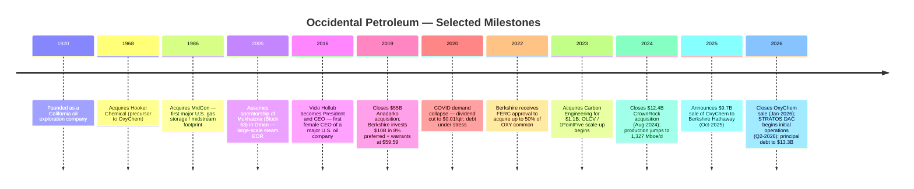
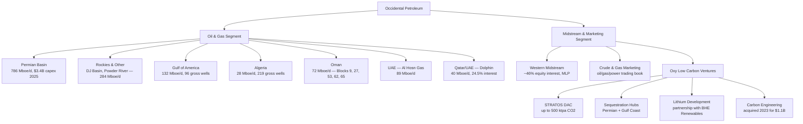
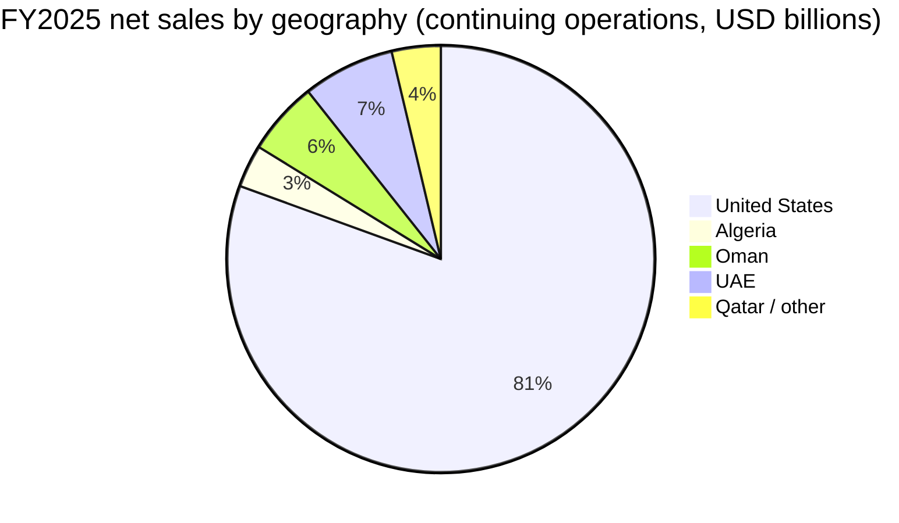
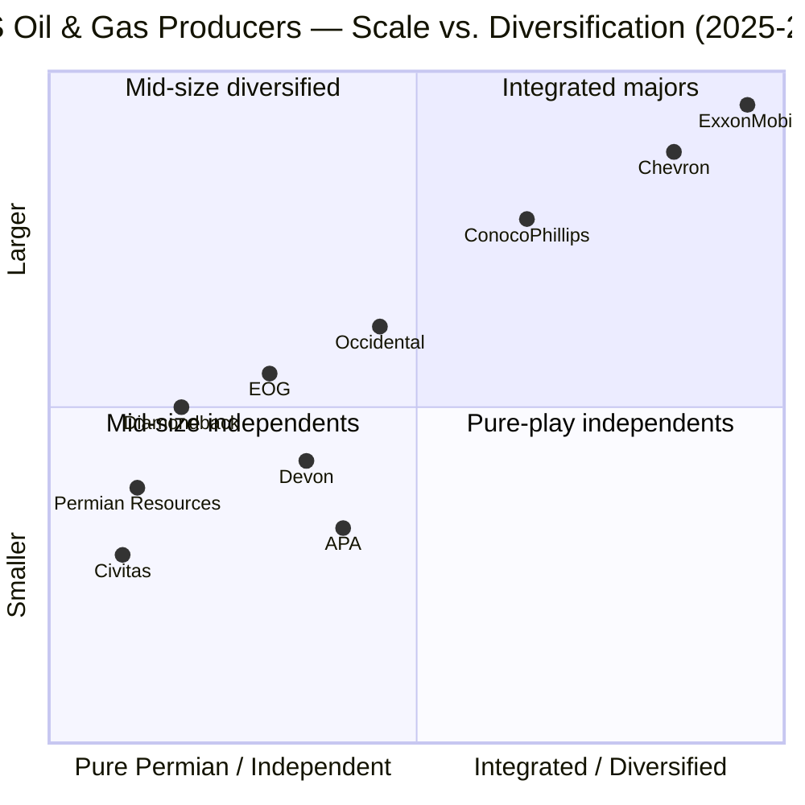
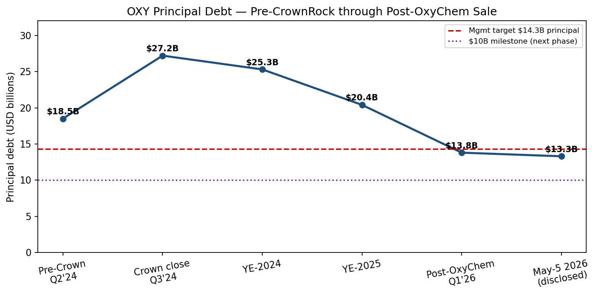
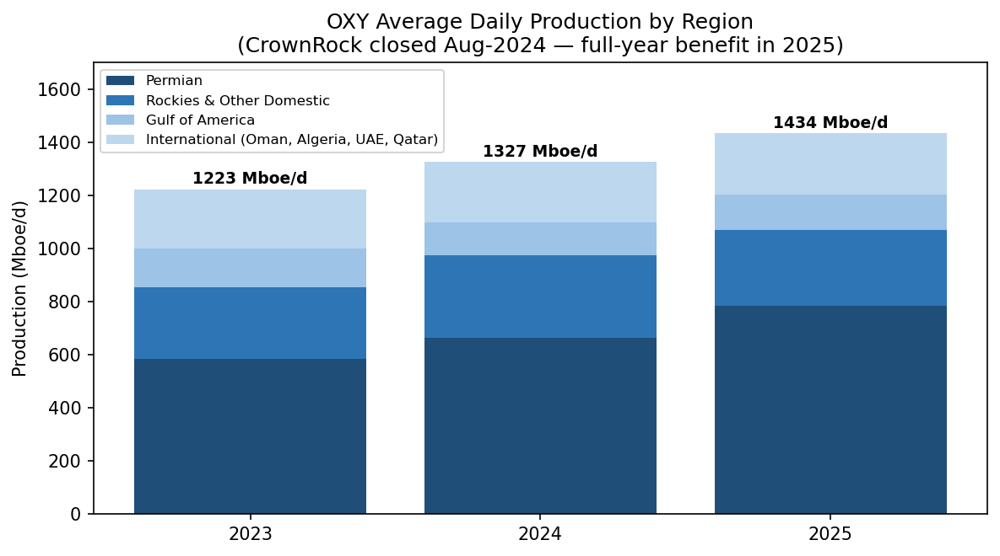
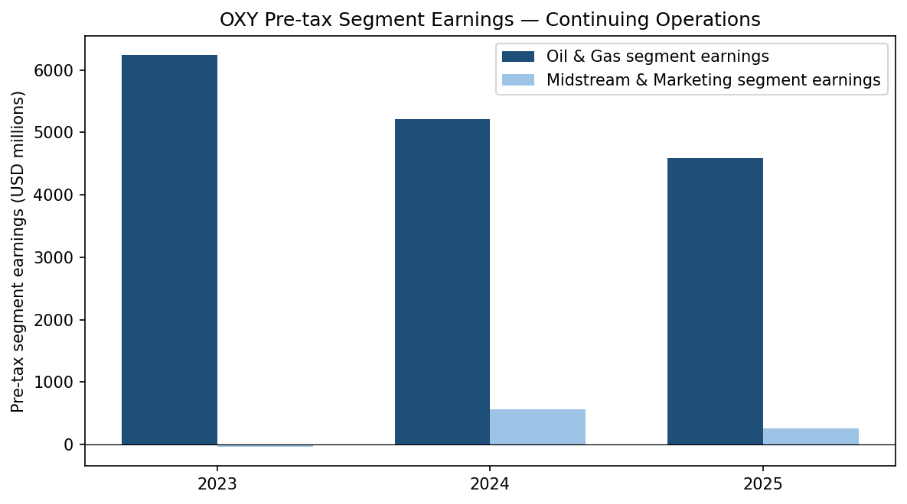
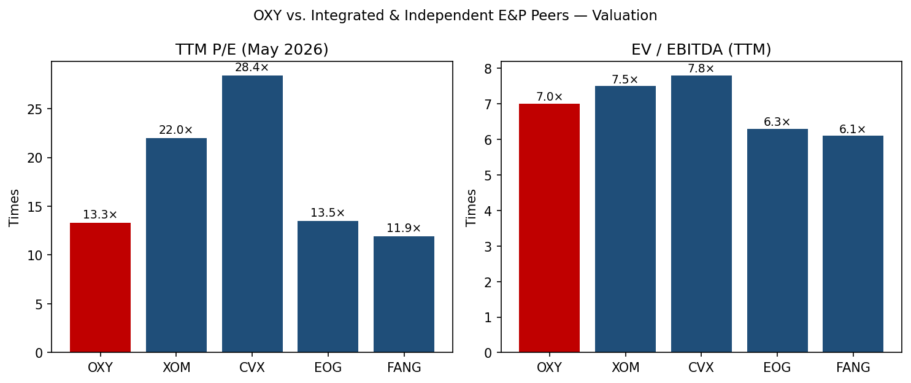

# Occidental Petroleum Corporation (NYSE: OXY) — Initiating Coverage

**Report Date:** 2026-05-20
**Author:** Independent equity research
**Primary listing:** NYSE: OXY (common); OXY.WS (2027 common stock warrants)

> **Update — Strong Q1-2026 print and accelerated deleveraging (2026-05-05):** Management did not formally re-issue full-year 2026 guidance, but Q1-2026 total production of 1,426 Mboe/d exceeded the high end of guidance, midstream and marketing pre-tax adjusted income exceeded the high end of guidance, and Occidental announced that principal debt had been reduced to **$13.3 billion as of May 5, 2026** — already through the prior $14.3 billion principal-debt target and progressing toward a new **$10.0 billion** milestone. Net income attributable to common stockholders for Q1 was $3.2 billion (EPS $3.13 diluted), dominated by a one-off $3.1 billion after-tax gain on the **OxyChem divestiture to Berkshire Hathaway** that closed January 2, 2026 for $9.5 billion (adjusted purchase price). Adjusted EPS from continuing operations was $1.06. Source: [Occidental Announces 1st Quarter 2026 Results, 8-K EX-99.1, 2026-05-05](https://www.sec.gov/Archives/edgar/data/0000797468/000162828026030567/oxyex9913-31x26earningsrel.htm).

## Table of Contents

1. Company Overview
2. Company History
3. Management Team
4. Products & Services
5. Customers & Go-to-Market
6. Industry Overview
7. Competitive Landscape
8. Market Opportunity (TAM)
9. Risk Assessment
- References

---

## 1. Company Overview

Occidental Petroleum Corporation ("Occidental" or "OXY") is one of the largest independent oil and gas producers in the United States and an emerging carbon-management platform. Headquartered in Houston, Texas at 5 Greenway Plaza, the company describes itself as "an international energy company recognized for its premier diversified assets, primarily situated in the United States, the Middle East and North Africa" ([2025 Form 10-K, Items 1-2 Business and Properties](https://www.sec.gov/Archives/edgar/data/797468/000162828026009059/oxy-20251231.htm)). As of the filing date of the 2025 10-K (February 2026), the workforce was approximately 12,300 full-time employees from continuing operations (excluding OxyChem, which was divested on January 2, 2026).

**What the company does.** Occidental explores for, develops, produces and markets oil, natural gas liquids (NGL) and natural gas through its **Oil and Gas** segment, and operates a network of pipelines, gas processing facilities, storage and a commodity marketing book through its **Midstream and Marketing** segment. The midstream segment also houses **Oxy Low Carbon Ventures (OLCV)** — the platform behind STRATOS, the world's first commercial-scale direct-air-capture (DAC) facility, the 1PointFive carbon-removal commercialization vehicle, sequestration hubs along the Gulf Coast, and lithium R&D. Prior to January 2, 2026, the company also operated **OxyChem**, a chlor-alkali and vinyls producer that for FY2025 generated approximately $4.4 billion of sales and is now reported as a discontinued operation following its sale to Berkshire Hathaway ([2025 Form 10-K, Note 13 Discontinued Operations](https://www.sec.gov/Archives/edgar/data/797468/000162828026009059/oxy-20251231.htm)).

**How it makes money.** Roughly 95% of continuing-operations revenue and substantially all of segment earnings come from upstream oil and gas. The 10-K reports 2025 net sales of $21.59 billion from continuing operations, of which Oil and Gas was $20.90 billion and Midstream and Marketing was $1.28 billion (after $0.59 billion of intersegment eliminations) ([2025 Form 10-K, MD&A Segment Results](https://www.sec.gov/Archives/edgar/data/797468/000162828026009059/oxy-20251231.htm)). Within Oil and Gas, sales are realized at prevailing WTI / Brent / regional gas hub prices, with most volumes sold under short-cycle marketing contracts; the gross-margin lever is therefore commodity price and per-barrel cost. The midstream segment monetizes capacity through fee-based contracts (largely through its equity-method stake in Western Midstream Partners, "WES") and through OLCV's nascent carbon-credit, CO₂-sequestration and lithium businesses.

**Where it operates.** The U.S. — Permian (Texas / New Mexico), DJ Basin / Rockies (Colorado, Wyoming, Powder River) and Gulf of America (deepwater) — accounted for 1,202 Mboe/d, or roughly 84%, of total 2025 daily production of 1,434 Mboe/d. International production of 232 Mboe/d came from Algeria (28 Mboe/d), Al Hosn Gas in the UAE (89), Dolphin (UAE / Qatar, 40) and Oman (72), where Occidental is the largest independent producer ([2025 Form 10-K, Production by Region](https://www.sec.gov/Archives/edgar/data/797468/000162828026009059/oxy-20251231.htm)). The company holds permits and pore-space rights across the Permian and Gulf Coast for CO₂ sequestration hubs and is the operator of STRATOS in Ector County, Texas.

**Scale.** FY2025 net sales (continuing operations) were $21.6 billion; total assets were $80.5 billion at March 31, 2026 ([Q1-2026 10-Q balance sheet](https://www.sec.gov/Archives/edgar/data/0000797468/000162828026030584/oxy-20260331.htm)). Proved reserves and reserve life are disclosed in the 10-K's Supplemental Oil and Gas Information; production reached an all-time-high 1,434 Mboe/d in 2025 (+8% YoY) on a full year of CrownRock contribution. Common shares outstanding were approximately 1.0 billion as of the 10-K filing date, with 32.4% beneficially owned by Warren Buffett / Berkshire Hathaway on a fully-warrant-converted basis ([2026 DEF 14A, Beneficial Ownership of 5% Shareholders](https://www.sec.gov/Archives/edgar/data/0000797468/000162828026019816/oxy2026def14a.htm)).

### Valuation snapshot (REQUIRED)

| Metric (USD, May 2026) | OXY | XOM | CVX | EOG | FANG |
|---|---|---|---|---|---|
| Share price (mid-May 2026) | ~$53–$61 | n/a | n/a | n/a | n/a |
| Market cap | ~$53 B | ~$510 B | ~$305 B | ~$66 B | ~$50 B |
| TTM P/E (reported) | 13–32× (wide spread — see note) | 22× | 28× | 13.3–13.9× | 9.8–11.9× |
| EV / EBITDA (TTM) | ~7.0× | ~7.5× | ~7.8× | ~6.3× | ~6.1× |
| P/B | ~1.46× | n/a | n/a | n/a | n/a |
| Dividend yield (annualised) | ~1.7% ($0.26 × 4 = $1.04) | n/a | n/a | n/a | n/a |

Sources: [OXY P/E — Public.com, May 2026](https://public.com/stocks/oxy/pe-ratio); [OXY EV/EBITDA — GuruFocus, Apr-2026](https://www.gurufocus.com/term/enterprise-value-to-ebitda/OXY); [OXY P/B — companiesmarketcap.com](https://companiesmarketcap.com/occidental-petroleum/pb-ratio/); [XOM P/E — MacroTrends, May-2026](https://www.macrotrends.net/stocks/charts/XOM/exxon/pe-ratio); [CVX P/E — CompaniesMarketCap](https://companiesmarketcap.com/chevron/pe-ratio/); [EOG P/E and market cap — Stockanalysis.com](https://stockanalysis.com/stocks/eog/statistics/); [FANG P/E — Macrotrends](https://www.macrotrends.net/stocks/charts/FANG/diamondback-energy/pe-ratio); [Q1-2026 OXY EPS print — 8-K](https://www.sec.gov/Archives/edgar/data/0000797468/000162828026030567/oxyex9913-31x26earningsrel.htm).

**Why P/E reads are so noisy.** Public quote services published widely different OXY P/E values in May 2026 (one source cited 13.3×, another 32.1×, another ~68×). The reason is mechanical: TTM denominators are dominated by **base-period distortions** — (i) the $3.1 billion after-tax gain on the OxyChem sale recognised in Q1-2026 lifted GAAP EPS for one trailing quarter ([Q1-2026 8-K EX-99.1, 2026-05-05](https://www.sec.gov/Archives/edgar/data/0000797468/000162828026030567/oxyex9913-31x26earningsrel.htm)), (ii) preferred-stock dividends of $679 million in 2025 and unusual items (legal reserves, impairments, asset-sale losses) compressed continuing-operations EPS to $1.65 in 2025 from $2.59 in 2024, and (iii) GAAP "net income attributable to common" includes preferred dividends that materially understate run-rate earnings power ([2025 Form 10-K, EPS Reconciliation](https://www.sec.gov/Archives/edgar/data/797468/000162828026009059/oxy-20251231.htm)). On run-rate adjusted continuing-operations EPS of roughly $4 per share at strip prices, OXY trades closer to a low-teens P/E, in line with EOG and a turn below XOM/CVX.

**EV/EBITDA is the cleaner cross-cycle multiple for this name.** At ~7.0× TTM, OXY is roughly 14% above its 10-year median of 6.56× ([GuruFocus](https://www.gurufocus.com/term/enterprise-value-to-ebitda/OXY)) — modestly stretched on a stand-alone basis but reasonable given materially lower leverage after the OxyChem proceeds (principal debt down from $25.3 B at YE-2024 to $13.3 B disclosed at May 5, 2026; see Section 1 update banner). On a peer basis OXY now sits between the integrated majors (XOM, CVX trading 7.5–7.8×) and the pure Permian independents (FANG, EOG at 6.1–6.3×), consistent with OXY's hybrid identity — a Permian leader with international upstream and a low-carbon optionality wrapper. We do not flag valuation as a Section-9 risk: multiples sit inside cyclical norms for the cohort.

*Source: [2025 Form 10-K, MD&A Segment Sales](https://www.sec.gov/Archives/edgar/data/797468/000162828026009059/oxy-20251231.htm).*

## 2. Company History

Occidental was founded in 1920 as a small California oil exploration outfit. The defining transformation came under Armand Hammer, who took control in 1957 and ran the company for the next 33 years, pivoting it from a Los Angeles wildcatter into a globally diversified energy and chemicals conglomerate via the 1968 Hooker Chemical acquisition (later OxyChem) and entry into Libya, Venezuela and Russia. Post-Hammer, the company refocused on the U.S., the Middle East and North Africa, exited Latin American oil and gas businesses, and built a leading Permian Basin position through organic drilling and tuck-in M&A ([2025 Form 10-K, History and Strategy](https://www.sec.gov/Archives/edgar/data/797468/000162828026009059/oxy-20251231.htm)).

*Source: [2025 Form 10-K, History and Strategy](https://www.sec.gov/Archives/edgar/data/797468/000162828026009059/oxy-20251231.htm); [Berkshire Hathaway 13G/A, 2025-08-14](https://www.sec.gov/cgi-bin/browse-edgar?action=getcompany&CIK=0001067983&type=SC+13G&dateb=&owner=include&count=40); [Occidental Completes Acquisition of CrownRock, 2024-08-01](https://www.oxy.com/news/news-releases/occidental-completes-acquisition-of-crownrock/); [Occidental Completes Sale of OxyChem, 2026-01-02](https://www.oxy.com/news/news-releases/occidental-completes-sale-of-oxychem/).*

Three strategic pivots warrant a sentence each:

- **Anadarko 2019 — the bet that nearly broke the balance sheet.** Occidental outbid Chevron with a $38 billion cash-plus-stock offer (announced May 2019, closed August 2019), financed in part by a $10 billion Berkshire investment in 8% perpetual preferred plus warrants struck at $59.59. The 2020 oil collapse turned that leverage into an existential problem; the dividend was cut to a penny and debt was downgraded. The fact that the company emerged intact, became one of Buffett's largest equity positions, and is now positioned to redeem the preferred turns the Anadarko trade into a high-conviction case study in cyclical risk management.
- **CrownRock 2024 — doubling down on Permian leadership.** Announced December 2023 and closed August 1, 2024, the $12.0 billion cash-and-stock deal added approximately 170 Mboe/d of high-quality, contiguous Midland Basin acreage adjacent to OXY's existing footprint, with about 1,700 drilling locations at sub-$60/bbl breakeven. Permian production rose from 584 Mboe/d in 2023 to 786 Mboe/d in 2025 ([2025 Form 10-K, Permian production table](https://www.sec.gov/Archives/edgar/data/797468/000162828026009059/oxy-20251231.htm)).
- **OxyChem 2025/2026 — using the chemicals jewel as a deleveraging weapon.** Occidental announced the sale of OxyChem to Berkshire Hathaway in October 2025 for $9.7 billion (adjusted at close to $9.5 billion), closed January 2, 2026. Proceeds were used almost entirely for debt repayment, taking principal debt from $20.4 billion at year-end 2025 to $13.3 billion by May 5, 2026. Strategically, Occidental simplified itself into a pure-play oil and gas plus carbon-management story, while Berkshire — already the largest equity holder — built a deeper anchor in the energy supply chain.

Recent developments (last 18 months): closed CrownRock; completed STRATOS central processing facilities; received Class VI sequestration permits; entered crude two-way collars (Feb-2026) to manage 2026 price risk; signed a 15-year contract extension on Block 53 in Oman (2025); raised the common dividend by ~8% to $0.26/quarter in February 2026 ([2025 Form 10-K, Market for Registrant's Common Equity](https://www.sec.gov/Archives/edgar/data/797468/000162828026009059/oxy-20251231.htm)).

## 3. Management Team

### Vicki Hollub — President and Chief Executive Officer (age 66; CEO since April 2016)

Vicki Hollub is the single most consequential individual in the OXY story and the longest-tenured CEO of a U.S. supermajor or large independent. She is the first woman to lead a major U.S. oil and gas company, holds a B.Sc. in Mineral Engineering from the University of Alabama (1981), and was elected to the National Academy of Engineering in 2024 ([2026 DEF 14A, Hollub Director Qualifications, p. ~15](https://www.sec.gov/Archives/edgar/data/0000797468/000162828026019816/oxy2026def14a.htm)). Hollub started her career at Cities Service, which was acquired by Occidental in 1981 — she has spent her entire 40-plus-year career inside the company, with operational roles on three continents including assignments in the U.S., Russia, Venezuela and Ecuador. Before becoming CEO she was President and COO with responsibility for Oil and Gas, Chemicals and Midstream; prior to that she was Senior Executive Vice President of OXY and President of Oxy Oil and Gas. As General Manager of the Permian Basin operations earlier in her career, she pioneered the application of CO₂-enhanced oil recovery at industrial scale — the operational pedigree that now underwrites the OLCV / STRATOS / 1PointFive thesis.

What she has actually delivered: (i) executed the $55 billion Anadarko acquisition in 2019 against Chevron in a contested deal, then navigated the COVID downturn, retained investment-grade ratings through 2021, and progressively redeemed the Berkshire preferred (from $10 B face to $8.5 B today) ([Berkshire $10B Equity Investment 8-K, 2019-04-30](https://www.sec.gov/Archives/edgar/data/797468/000095015719000529/form8k.htm)); (ii) closed the $12 B CrownRock acquisition in 2024, drove Permian production from 584 Mboe/d (2023) to 786 Mboe/d (2025), and reduced lease operating expense per Boe from $10.48 (2023) to $8.94 (2025) ([2025 Form 10-K, Permian and LOE tables](https://www.sec.gov/Archives/edgar/data/797468/000162828026009059/oxy-20251231.htm)); (iii) made Occidental the first U.S. oil and gas company to commit to net-zero by 2050 across Scope 1, 2 and 3 (2020), then converted that into a capital-allocation reality with STRATOS, the 1PointFive partnership with BlackRock, and the Bain & Company / Microsoft / Amazon carbon-removal-credit offtake stack ([1PointFive and Microsoft 500,000 tonne CDR agreement](https://www.oxy.com/news/news-releases/1pointfive-announces-agreement-to-sell-500000-metric-tons-of-direct-air-capture-carbon-removal-credits-to-microsoft/)). She serves on the boards of Lockheed Martin and the American Petroleum Institute, and is a past chair of the World Economic Forum's Oil and Gas Community ([Vicki Hollub Wikipedia bio with NAE 2024 election](https://en.wikipedia.org/wiki/Vicki_Hollub)). Her credibility with Warren Buffett — who has publicly praised her capital discipline and has repeatedly increased the Berkshire position — is itself a meaningful asset for the franchise.

Risks to the bio: Hollub is 66 and has been in the CEO chair for ten years. The board has begun structured succession work — Richard Jackson was elevated to Senior Vice President and Chief Operating Officer in October 2025 ([2025 Form 10-K, Executive Officers table](https://www.sec.gov/Archives/edgar/data/797468/000162828026009059/oxy-20251231.htm)), and Sunil Mathew, CFO since 2023, has been given a broader strategic remit. Investors should expect a sequencing event within a 3–5 year horizon.

### Sunil Mathew — Senior Vice President and Chief Financial Officer (age 55; CFO since August 2023)

Mathew was promoted internally after a long career at Occidental, having previously served as Vice President, Strategic Planning, Analysis and Business Development (2020-2023) and Vice President, Strategic Planning and Analysis (2014-2020) ([2025 Form 10-K, Executive Officers table](https://www.sec.gov/Archives/edgar/data/797468/000162828026009059/oxy-20251231.htm)). His CFO tenure has been defined by three substantive accomplishments: (i) financing the CrownRock acquisition in 2024 with $9.6 billion of new debt at investment-grade-equivalent spreads despite a single-B-plus / BBB- composite rating; (ii) the OxyChem sale negotiation with Berkshire in 2025, which delivered $9.7 billion of gross proceeds (adjusted to $9.5 billion) at a multiple modestly above sell-side carve-out expectations; and (iii) the debt management program in 2025–H1-2026, in which Occidental repaid roughly $11 billion of principal debt across two calendar years and reset the maturity ladder so that less than $0.5 billion comes due before 2030. Mathew does not have prior public-company CFO experience outside Occidental, which is unusual for a company of this size; the board has compensated with elevated audit-committee oversight and a deep planning bench beneath him.

### Richard A. Jackson — Senior Vice President and Chief Operating Officer (age 49; COO since October 2025)

Jackson is the post-Hollub heir apparent and the operating lead now responsible for Permian, Rockies, Gulf of America and the carbon management portfolio. He previously served as President Operations, U.S. Onshore Resources and Carbon Management (2020–2025), and before that as President, Low Carbon Ventures (2019–2020). His career bridges the operational core of the company (Vice President, Investor Relations 2017–2018; President and General Manager, Permian Resources Delaware Basin 2014–2017) with the carbon-management franchise that distinguishes Occidental from peers ([2025 Form 10-K, Executive Officers table](https://www.sec.gov/Archives/edgar/data/797468/000162828026009059/oxy-20251231.htm)). His elevation to COO in October 2025 — concurrent with the OxyChem sale and the start of CrownRock's first full year of integrated operations — was a deliberate signal that the next chapter of Occidental will combine Permian execution with carbon-management commercialisation.

### Sylvia J. Kerrigan — Senior Vice President and Chief Legal Officer (since October 2022)

Kerrigan joined from a five-year stint as Executive Director of the Kay Bailey Hutchison Energy Center at the University of Texas (2017–2022). She was previously Executive Vice President, General Counsel and Corporate Secretary of Marathon Oil Corporation (2009–2017), making her one of the more experienced general counsels in U.S. independent E&P. She inherits the complex post-OxyChem indemnification stack (Occidental retained legacy environmental liabilities through Environmental Resource Holdings, LLC, and guaranteed Berkshire against pre-closing liabilities), the Anadarko-era Tronox litigation tail, and continued legal exposure on the New Mexico Environment Department reporting matter disclosed in the 10-K ([2025 Form 10-K, Item 3 Legal Proceedings](https://www.sec.gov/Archives/edgar/data/797468/000162828026009059/oxy-20251231.htm)).

### Governance

- The board has 11 directors; Chairman is Robert Moore (Independent Chairman since September 2022), former CEO of Cameron International. Other notable directors include Vicky Bailey (former FERC Commissioner and US DOE Assistant Secretary), William Klesse (former CEO of Valero), Andrew Gould (former CEO of Schlumberger), Carlos Gutiérrez (former U.S. Secretary of Commerce) and Robert Shearer (former BlackRock equity-dividend portfolio manager) ([2026 DEF 14A, Director biographies](https://www.sec.gov/Archives/edgar/data/0000797468/000162828026019816/oxy2026def14a.htm)).
- Buffett / Berkshire Hathaway, the 32.4% beneficial owner, does not hold a board seat. There is a formal voting limitation on the preferred stock and a 20% common-vote cap that Berkshire agreed to as part of the original investment.
- Insider ownership ex-Berkshire is modest. Hollub's direct + deferred holdings are below 1% of common, with compensation skewed toward performance share units and stock options tied to CROCE and relative TSR.
- Compensation structure: roughly 90% of NEO target compensation is variable / at-risk, with the long-term performance plan benchmarked against BP, CVX, COP, EOG, XOM, Shell and TotalEnergies — the same peer group used in the 10-K total-return graph.
- Related-party transactions are material and recurring with Berkshire (preferred dividends, OxyChem purchase, electricity and insurance) and with WES; the 10-K discloses these clearly.

**Track record synthesis.** Hollub's team has executed two of the largest U.S. upstream M&A integrations of the last decade (Anadarko, CrownRock) and a marquee divestiture (OxyChem) without breaking covenants, losing investment-grade status, or cutting the common dividend post-2020 ([2025 Form 10-K, Liquidity and Capital Resources](https://www.sec.gov/Archives/edgar/data/797468/000162828026009059/oxy-20251231.htm)). The execution gap to watch is STRATOS — a first-of-a-kind technology at commercial scale, with most of its commercial value still in front of it ([Occidental Receives EPA Class VI Permits for STRATOS, 2025-04-07](https://www.oxy.com/news/news-releases/occidental-and-1pointfive-secure-class-vi-permits-for-stratos-direct-air-capture-facility/)).

## 4. Products & Services

Occidental is essentially a barrel-of-oil-equivalent (Boe) producer plus a small but strategically distinctive carbon-management portfolio. Following the OxyChem sale, the company is organised around two reporting segments — **Oil and Gas** and **Midstream and Marketing** (which houses OLCV) — but a thorough website walk reveals roughly a dozen distinct asset groupings worth enumerating ([2025 Form 10-K, Segment Reporting](https://www.sec.gov/Archives/edgar/data/797468/000162828026009059/oxy-20251231.htm); [Occidental — Operations overview](https://www.oxy.com/operations/)).

*Source: [oxy.com Operations](https://www.oxy.com/operations/); [2025 Form 10-K, Items 1-2 Business and Properties](https://www.sec.gov/Archives/edgar/data/797468/000162828026009059/oxy-20251231.htm); [1PointFive STRATOS project page](https://www.1pointfive.com/projects/ector-county-tx).*

### Oil & Gas — flagship products

**Permian Basin (Texas / New Mexico)** is by far the most material asset. Production was 786 Mboe/d in 2025 (10% of total Permian basin oil production, the largest single position) with $3.4 billion of 2025 development capex; CrownRock added approximately 170 Mboe/d of high-quality Midland Basin acreage at close ([2025 Form 10-K, Permian section](https://www.sec.gov/Archives/edgar/data/797468/000162828026009059/oxy-20251231.htm); [Occidental Completes Acquisition of CrownRock, 2024-08-01](https://www.oxy.com/news/news-releases/occidental-completes-acquisition-of-crownrock/)). Occidental's Permian is the company's flagship product: the largest acreage holder in the basin, lowest breakeven inventory (sub-$60/bbl on a meaningful share of locations), and an integrated CO₂-EOR overlay through legacy Permian EOR fields. **Competitive advantage: YES, scale + integrated CO₂-EOR.** Closest competing product is Diamondback / Endeavor combined (FANG, ~600 Mboe/d Permian) and EOG's Delaware position ([Diamondback completes $26B Endeavor merger, 2024](https://www.diamondbackenergy.com/news-releases/news-release-details/diamondback-energy-inc-and-endeavor-energy-resources-lp-merge)); OXY is at parity or modestly ahead on scale, ahead on EOR optionality, behind FANG on pure capital efficiency per lateral foot.

**Gulf of America (deepwater)** produced 132 Mboe/d from 96 gross wells in 2025 with platform operating efficiency above 99%. Major operated platforms (Lucius, Holstein, Caesar/Tonga, Constitution) sit in tier-one deepwater geology and benefit from operating-cost dilution at high working interests ([2025 Form 10-K, Gulf of America operations](https://www.sec.gov/Archives/edgar/data/797468/000162828026009059/oxy-20251231.htm)). **Competitive advantage: PARTIAL, geology + scale**, but with the structural decline curve typical of mature Gulf assets. Closest competing offering is BP's Gulf portfolio and Chevron's Anchor / Whale developments — OXY is behind on new-build deepwater pipeline.

**Rockies and Other Domestic** — DJ Basin (Colorado), Powder River and other onshore — contributed 284 Mboe/d in 2025 (–8% YoY following 2024 non-core sales). DJ Basin economics remain competitive but Colorado regulatory overhang is the highest in OXY's U.S. portfolio. **Competitive advantage: PARTIAL, DJ Basin scale**, but materially behind Civitas / Chevron in basin share ([2025 Form 10-K, Rockies & Other production](https://www.sec.gov/Archives/edgar/data/797468/000162828026009059/oxy-20251231.htm)).

**Oman (Blocks 9, 27, 53, 62, 65 plus exploration blocks 30, 51, 72)** — 72 Mboe/d in 2025. OXY is the largest independent oil producer in Oman, with the Mukhaizna Field (Block 53) running one of the world's largest steam-flood EOR projects ([Oxy Oman and Oman Government Sign Block 53 Extension, 2025-05-18](https://www.oxy.com/news/news-releases/oxy-oman-and-oman-government-sign-agreement-to-extend-block-53-operations/)). The 15-year contract extension signed in 2025 on Block 53 anchors cash flow well into the late 2030s ([2025 Form 10-K, Oman section](https://www.sec.gov/Archives/edgar/data/797468/000162828026009059/oxy-20251231.htm)). **Competitive advantage: YES, scale + EOR technology + 60 years of in-country relationships** — extremely high switching costs for the host government.

**UAE — Al Hosn Gas** processes sour natural gas at Shah for ADNOC; net production share to OXY was 89 Mboe/d in 2025. The plant strips sulphur for sale and is a long-life, fee-like asset. **Competitive advantage: YES, regulatory / certification + bespoke sulphur-handling expertise** ([2025 Form 10-K, UAE Al Hosn section](https://www.sec.gov/Archives/edgar/data/797468/000162828026009059/oxy-20251231.htm)).

**Qatar / UAE — Dolphin Energy** — 24.5% interest in an integrated upstream-plus-pipeline project running natural gas and NGL from Qatar's North Field to the UAE through mid-2032 ([Dolphin Energy Operations page](https://www.dolphinenergy.com/operations)). 40 Mboe/d net to OXY in 2025. **Competitive advantage: PARTIAL** — a structural concession, but with re-contracting risk on the 2032 horizon ([2025 Form 10-K, Dolphin / Qatar section](https://www.sec.gov/Archives/edgar/data/797468/000162828026009059/oxy-20251231.htm)).

**Algeria — Berkine Basin (HBR contract)** — 28 Mboe/d on 219 gross wells. Lower-decline mature production. **Competitive advantage: PARTIAL** ([2025 Form 10-K, Algeria section](https://www.sec.gov/Archives/edgar/data/797468/000162828026009059/oxy-20251231.htm)).

### Midstream and Marketing — services

**Western Midstream Partners (WES)** is an equity-method investee operated as a publicly traded MLP in which Occidental holds ~46% ([2025 Form 10-K, Investments in Unconsolidated Entities](https://www.sec.gov/Archives/edgar/data/797468/000162828026009059/oxy-20251231.htm); [Western Midstream — About Us](https://www.westernmidstream.com/about-us/)). WES owns gathering, processing and pipeline assets across the Permian, DJ and Powder River basins, earning fee-based and service-based revenue from OXY and third parties. **Competitive advantage: YES, irreplaceable footprint + fee-based contract structure.** Closest comparable: PAA, ET, EPD — all larger but less captive to a single E&P sponsor.

**Marketing book** — physical and financial marketing of crude, NGL, gas and power, including the new two-way crude collars announced in February 2026 ([Q1-2026 10-Q, Note on Hedges](https://www.sec.gov/Archives/edgar/data/0000797468/000162828026030584/oxy-20260331.htm)).

### Oxy Low Carbon Ventures (OLCV) — the optionality

**STRATOS (Ector County, Texas)** is OLCV's flagship and the world's first commercial-scale DAC facility. Designed nameplate capacity is **500,000 tonnes of CO₂ per year** at full Phase-1 + Phase-2 ramp; initial operations begin Q2-2026 with Phase 1 in final commissioning ([1PointFive STRATOS page](https://www.1pointfive.com/projects/ector-county-tx); [RBN Energy on Stratos startup timing, 2026](https://rbnenergy.com/daily-posts/analyst-insight/stratos-dac-project-target-q2-2026-startup)). Occidental and BlackRock formed a joint venture in 2023 for STRATOS development; BlackRock had invested approximately $550 million as of December 31, 2025, with both parties committed to additional contributions ([2025 Form 10-K, Note on JV / VIE](https://www.sec.gov/Archives/edgar/data/797468/000162828026009059/oxy-20251231.htm)). Carbon-removal credit offtake agreements have been signed with Microsoft, Amazon, Airbus and Bain & Company ([1PointFive and Bain & Company news release](https://www.1pointfive.com/news/1pointfive-and-bain-company-announce-agreement-for-direct-air-capture-carbon-removal-credits)). **Competitive advantage verdict: PARTIAL — technology + first-mover + IRA 45Q tax credit access**, but unproven commercial economics. Honest assessment: per public statements from Hollub and outside analysts, STRATOS unit economics at current cost are well above the $200–300/tonne carbon-removal-credit clearing price — the project depends on (i) the $180/tonne IRA Section 45Q credit for DAC + sequestration, (ii) further capital-cost declines from Phase 1 to Phase 4, and (iii) sustained voluntary corporate demand. Closest competing technology is Climeworks (Switzerland), with Mammoth in Iceland; OXY is ahead on scale and 45Q monetisation, behind on energy efficiency per tonne. Commercial readiness is real but **the path to project-level positive economics outside of subsidy is not yet proven** — investors should treat STRATOS as a call option, not a base-case cash flow.

**Sequestration hubs.** Five Class VI hubs are in various stages of development across the Permian and Texas / Louisiana Gulf Coast, with OXY now holding access to over 0.3 million acres of pore space ([Occidental and 1PointFive Secure EPA Class VI Permits for STRATOS, 2025-04-07](https://www.oxy.com/news/news-releases/occidental-and-1pointfive-secure-class-vi-permits-for-stratos-direct-air-capture-facility/)). **Competitive advantage: YES, regulatory / certification** — Class VI permits are scarce; first-mover position confers durable optionality.

**Lithium development.** OXY partners with Berkshire Hathaway Energy on direct-lithium-extraction R&D from Imperial Valley brines ([2025 Form 10-K, Low Carbon Ventures / Lithium](https://www.sec.gov/Archives/edgar/data/797468/000162828026009059/oxy-20251231.htm)). **Competitive advantage: nascent / no.**

**Carbon Engineering acquisition (closed 2023, final $0.4B deferred payment in 2025).** The technology basis of STRATOS. The deal gave OXY full IP control over the DAC process ([Occidental Completes US$1.1B Acquisition of Carbon Engineering, 2023-11-03](https://www.blg.com/en/about-us/deals-and-suits/2023/11/occidental-petroleum-completes-us1-1-billion-acquisition-of-carbon-engineering-ltd)). **Competitive advantage: YES, IP.**

### Roadmap and recent launches

Last 12 months: STRATOS Phase 1 central processing facility completion (2025); Class VI sequestration permits obtained ([EPA Class VI permits for STRATOS, 2025-04-07](https://www.oxy.com/news/news-releases/occidental-and-1pointfive-secure-class-vi-permits-for-stratos-direct-air-capture-facility/)); 15-year Oman Block 53 contract extension ([Oxy Oman Block 53 Extension, 2025-05-18](https://www.oxy.com/news/news-releases/oxy-oman-and-oman-government-sign-agreement-to-extend-block-53-operations/)); CrownRock fully integrated (full-year benefit in 2025); OxyChem divested (Jan-2026) ([Occidental Completes Sale of OxyChem, 2026-01-02](https://www.oxy.com/news/news-releases/occidental-completes-sale-of-oxychem/)); two-way crude collars added (Feb-2026); common dividend raised ~8% to $0.26/quarter (Feb-2026); 8% Berkshire preferred redemption capacity restored as common dividend / share-repurchase headroom rebuilds ([2025 Form 10-K, Recent Developments](https://www.sec.gov/Archives/edgar/data/797468/000162828026009059/oxy-20251231.htm)).

## 5. Customers & Go-to-Market

Upstream oil and gas is, structurally, a commodity-spot business — Occidental sells barrels at WTI or Brent benchmarks (less differentials) to refiners, traders, and exporters under master purchase agreements that re-price monthly. The 10-K does not name any single customer above the 10% disclosure threshold, and the customer-concentration risk factor is not invoked on the upstream side. "In 2025, net sales outside North America totaled $4.2 billion, or approximately 19% of total net sales, excluding discontinued operations" ([2025 Form 10-K, Note 2 Revenue / Geography](https://www.sec.gov/Archives/edgar/data/797468/000162828026009059/oxy-20251231.htm)) — implying ~81% U.S. sales. The U.S. customer set is a fragmented mix of Phillips 66, Marathon Petroleum, Valero, Plains All-American, ConocoPhillips marketing, and the Permian Gulf-Coast export complex; no single counterparty is concentrated enough to be disclosed. International offtake in Algeria, Oman, the UAE and Qatar is dominated by national oil companies (Sonatrach, ADNOC, OQ) and long-term LNG / sour-gas processing contracts.

*Source: [2025 Form 10-K, Geographic revenue split](https://www.sec.gov/Archives/edgar/data/797468/000162828026009059/oxy-20251231.htm).*

**Top-1 customer % and top-5 customer % — not disclosed** in the 2025 10-K, consistent with the commodity-marketing structure ([2025 Form 10-K, Customer Concentration disclosure](https://www.sec.gov/Archives/edgar/data/797468/000162828026009059/oxy-20251231.htm)). The absence of disclosure is itself information: the largest U.S. refiner customers are well below the 10% threshold, and OXY is exposed primarily to the global oil-price benchmark, not to counter-party-specific demand. We do not flag customer concentration as a Section-9 risk on the upstream side, but we do flag commodity price exposure (which is the economic substitute risk).

**Contract structure.** Crude and NGL sales are predominantly monthly master agreements at index-linked prices; gas is sold under similar short-cycle terms with regional spread exposure (Midland-to-Gulf-Coast for crude; Waha-to-Gulf-Coast for gas). Algeria and Oman are concessions with PSA / cost-recovery features; Block 53 in Oman was extended for 15 years in 2025 ([Oxy Oman Block 53 Extension press release, 2025-05-18](https://www.oxy.com/news/news-releases/oxy-oman-and-oman-government-sign-agreement-to-extend-block-53-operations/)). Dolphin runs to mid-2032; Al Hosn through 2052 ([2025 Form 10-K, International Concessions schedule](https://www.sec.gov/Archives/edgar/data/797468/000162828026009059/oxy-20251231.htm)).

**Carbon-removal credit customers (1PointFive / STRATOS).** This is a distinctly different commercial model: pre-paid, multi-year, voluntary-market carbon-removal-credit offtake at $300–$500/tonne. Named customers in last 24 months include **Microsoft** (largest single contract — 500,000 tonnes over six years, disclosed in 2024–2025 press), **Amazon** (250,000 tonnes), **Airbus** (400,000 tonnes via 1PointFive), **All Nippon Airways**, **TD Bank**, **Trafigura**, and **Bain & Company** (multi-tonne advisory-tied procurement) ([1PointFive and Bain & Company, 2025 press release](https://www.1pointfive.com/news/1pointfive-and-bain-company-announce-agreement-for-direct-air-capture-carbon-removal-credits); [1PointFive customer announcements](https://www.1pointfive.com/news/)). Buyer concentration here is high — Microsoft and Amazon together likely exceed 50% of contracted offtake — but the dollar magnitude is small relative to upstream and the segment is sub-scale.

**Go-to-market channels.** Internal trading and marketing functions sell crude, NGL and gas directly to U.S. refiners and to international markets via short-cycle bilateral contracts and exchange platforms ([2025 Form 10-K, Marketing Activities](https://www.sec.gov/Archives/edgar/data/797468/000162828026009059/oxy-20251231.htm)). Midstream services are sold by WES to OXY and to third parties under fee-based contracts ([Western Midstream — About Us](https://www.westernmidstream.com/about-us/)); OLCV / 1PointFive sells DAC credits directly to corporate ESG buyers under multi-year forward agreements ([1PointFive customer news index](https://www.1pointfive.com/news)).

**Key partnerships.** BlackRock (STRATOS JV — DAC); Berkshire Hathaway Energy (lithium R&D, electricity supply, insurance); ADNOC and Sonatrach (host governments, Algeria / UAE); OQ (Oman); Carbon Engineering (now wholly owned); WES (publicly traded MLP) ([2025 Form 10-K, Related Parties / Note 13](https://www.sec.gov/Archives/edgar/data/797468/000162828026009059/oxy-20251231.htm)).

**Named upstream "wins" — large recent contract events.** Block 53 contract extension (Oman, 2025, 15 years) ([Block 53 press release, 2025-05-18](https://www.oxy.com/news/news-releases/oxy-oman-and-oman-government-sign-agreement-to-extend-block-53-operations/)); CrownRock asset assimilation into the Permian marketing book (Aug-2024) ([CrownRock closing press release, 2024-08-01](https://www.oxy.com/news/news-releases/occidental-completes-acquisition-of-crownrock/)); OxyChem-related electricity and insurance offtake from Berkshire (ongoing).

## 6. Industry Overview

Occidental operates at the intersection of two industries — (i) **global oil and natural gas E&P** (NAICS 211120 / 211130), and (ii) the emerging **carbon-removal and CCUS services** industry. The first is the dominant economic exposure; the second is the optionality ([2025 Form 10-K, Item 1 Business overview](https://www.sec.gov/Archives/edgar/data/797468/000162828026009059/oxy-20251231.htm); [EIA — Short-Term Energy Outlook](https://www.eia.gov/outlooks/steo/)).

**Oil and gas — market structure and size.** Global crude oil consumption averaged ~103 million b/d in 2025; the EIA's Short-Term Energy Outlook projects demand to remain near 103–104 mb/d through 2026 before structural deceleration tied to EV penetration and efficiency ([EIA STEO, May 2026](https://www.eia.gov/outlooks/steo/)). U.S. oil production exited 2025 at ~13.4 mb/d, with the Permian Basin contributing approximately 6.6 mb/d (49% of U.S. oil production per the 10-K). Industry economics are dominated by OPEC+ supply discipline (24.5 mb/d production target as of May 2026), U.S. shale productivity, and the persistent surplus capacity overhang of 4.5–5.0 mb/d in OPEC+ hands. The 2025 average WTI price was $64.81, down 14% from the $75.72 average in 2024 ([2025 Form 10-K, Strategy / Outlook section](https://www.sec.gov/Archives/edgar/data/797468/000162828026009059/oxy-20251231.htm)).

**Permian Basin** — the company's beating heart — is the world's most productive unconventional play, accounting for more than 49% of total U.S. oil production in 2025 ([2025 Form 10-K, Permian section](https://www.sec.gov/Archives/edgar/data/797468/000162828026009059/oxy-20251231.htm)). The basin is structurally consolidating: the past three years have seen ExxonMobil acquire Pioneer ($60 B, 2024), Diamondback acquire Endeavor ($26 B, 2024), Occidental acquire CrownRock ($12 B, 2024), and a stream of smaller bolt-ons. Industry observers expect Permian basin oil production to peak in the late 2020s as drilling moves into Tier-2 and Tier-3 inventory; this dynamic favours scaled, low-cost operators with long inventory runways — exactly OXY's position.

**Growth drivers and trends** ([2025 Form 10-K, Strategy / Outlook](https://www.sec.gov/Archives/edgar/data/797468/000162828026009059/oxy-20251231.htm)).
- *Inventory depth and productivity*: ExxonMobil disclosed a 16-billion-barrel resource horizon at the Pioneer close ([ExxonMobil/Pioneer merger announcement, 2023-10-11](https://corporate.exxonmobil.com/news/news-releases/2023/1011_exxonmobil-announces-merger-with-pioneer-natural-resources-in-an-all-stock-transaction)); OXY's Permian inventory after CrownRock is 10–15 years of Tier-1 + Tier-2 at current development pace.
- *EOR resurgence*: rising oil prices and 45Q-credit eligibility make CO₂-EOR economic again in mature legacy fields — OXY is the U.S. industry leader in CO₂-EOR with decades of operating data ([IEA — The Role of CCUS in Low-Carbon Power Systems](https://www.iea.org/reports/the-role-of-ccus-in-low-carbon-power-systems)).
- *International long-life assets re-rate*: long-cycle PSAs in Oman, the UAE and Qatar provide stable cash flow, declining capex intensity per Boe, and a hedge against U.S. shale productivity volatility.
- *Energy security premium*: post-Ukraine and Israel/Iran tensions, U.S. and Middle East barrels carry an implicit premium relative to Russian and Venezuelan barrels.

**Regulatory environment.** U.S. federal — the One Big Beautiful Bill Act ("OBBBA") and IRA tax credits continue to underwrite carbon-management economics, though political risk of further IRA changes is real. Texas and New Mexico — relatively favourable; New Mexico Environment Department actions disclosed in the 10-K are minor. Colorado / DJ Basin — the toughest U.S. regulatory regime on emissions and setback distances. International — Algeria's HBR contract terms (renegotiated in 2019) remain favourable; Oman PSAs are stable; UAE / Qatar host-government relationships are deep and long-cycle. April 2025 U.S. tariffs (10% base, higher on selected countries) have so far had limited direct impact on OXY supplier costs but are an ongoing watch item ([2025 Form 10-K, Tariff disclosure](https://www.sec.gov/Archives/edgar/data/797468/000162828026009059/oxy-20251231.htm)).

**Industry dynamics.** The U.S. independent E&P space is now meaningfully consolidated post-Pioneer / Endeavor / CrownRock; the top-five public independents (XOM Permian unit, CVX Permian unit, OXY, FANG, EOG) control over 50% of basin production ([U.S. crude oil production set new record in 2025 — EIA Today in Energy](https://www.eia.gov/todayinenergy/detail.php?id=67404); [Diamondback-Endeavor merger close, 2024](https://www.diamondbackenergy.com/news-releases/news-release-details/diamondback-energy-inc-and-endeavor-energy-resources-lp-merge)). Supplier power has shifted toward the integrated service majors (Schlumberger, Halliburton) but unit pricing remains soft amid disciplined U.S. activity. Buyer power is fragmented and irrelevant to a price-taking E&P. Substitutes — EV penetration, renewable electricity — matter on a 10–20-year horizon, less on a 5-year horizon ([EIA STEO long-term scenarios](https://www.eia.gov/outlooks/steo/)).

**Carbon removal / DAC industry.** A genuinely new market. The voluntary carbon market for engineered-removal credits totals less than $2 billion globally in 2026, but Microsoft alone has committed to procure more than 7 million tonnes by 2030 ([Microsoft–1PointFive 500,000-tonne CDR agreement](https://www.oxy.com/news/news-releases/1pointfive-announces-agreement-to-sell-500000-metric-tons-of-direct-air-capture-carbon-removal-credits-to-microsoft/)). McKinsey, BloombergNEF and the IEA project the engineered-removal market to reach **$20–$100 billion by 2030** depending on policy scenario ([McKinsey — Carbon removals: How to scale a new gigaton industry, 2023-12](https://www.mckinsey.com/capabilities/sustainability/our-insights/carbon-removals-how-to-scale-a-new-gigaton-industry)). STRATOS unit economics, at maturity, depend on the IRA 45Q credit at $180/tonne for DAC + secure geological sequestration. The market is fragmented: Climeworks (Switzerland) is the largest DAC operator by deployed capacity ([Climeworks switches on world's largest DAC plant Mammoth, 2024-05-08](https://climeworks.com/press-release/climeworks-switches-on-worlds-largest-direct-air-capture-plant-mammoth)); CarbonCapture, Heirloom and Carbon Engineering / 1PointFive are the leading liquid-solvent and solid-sorbent players. Industry maturity is roughly where solar PV was in 2009 — real volumes, no settled cost-down trajectory.

## 7. Competitive Landscape

The Occidental peer set falls into three rings — (i) the **U.S. independent E&P** ring (OXY's direct peers), (ii) the **integrated supermajor** ring (a larger competitive surface in international concessions and capital allocation), and (iii) the **DAC / carbon-management** ring (relevant for OLCV optionality, separate from upstream cash flow) ([2025 Form 10-K, Competition section](https://www.sec.gov/Archives/edgar/data/797468/000162828026009059/oxy-20251231.htm)).

*Conceptual positioning; market-cap and basin-exposure data from each company's most recent 10-K filings.*

**ExxonMobil (XOM, ~$510 B market cap).** Post-Pioneer, XOM is the largest single Permian operator at ~1.5 mb/d Permian and ~4.0 mb/d Boe total upstream production. Advantages: scale, downstream integration, balance-sheet strength. Vulnerabilities relative to OXY: no carbon-removal franchise; thinner U.S. enhanced-oil-recovery position. ([Exxon 2025 10-K filing](https://www.sec.gov/cgi-bin/browse-edgar?action=getcompany&CIK=0000034088&type=10-K)).

**Chevron (CVX, ~$305 B).** Post-Hess close (2025), Chevron's Guyana Stabroek interest and Gulf of America deepwater portfolio are now closer competitive surfaces. Permian production ~1.0 mb/d. Advantages: capital discipline, balance sheet, dividend track record. Vulnerabilities: less Permian inventory depth than OXY post-CrownRock; carbon strategy is less differentiated than OLCV.

**EOG Resources (EOG, ~$66 B).** The reference low-cost U.S. unconventional operator with Eagle Ford / Permian Delaware / Powder River exposure. Highest U.S. unconventional returns on capital across the cycle. Advantages: capital efficiency, conservative balance sheet. Vulnerabilities: no international upstream, no carbon-management franchise. Trades at the most demanding P/E in the peer set (~13× TTM) on this quality bar.

**Diamondback Energy (FANG, ~$50 B).** Post-Endeavor, FANG is the largest pure-play Permian operator at ~600 Mboe/d. Advantages: lowest pure-Permian cost structure, simplicity. Vulnerabilities: undiversified — purely a Permian commodity-price call.

**ConocoPhillips (COP, ~$130 B).** Post-Marathon Oil acquisition (2024), COP is a diversified independent with Permian, Eagle Ford, Bakken and Alaska / international LNG exposure. Most similar to OXY in shape but without the carbon-management overlay.

**APA / Apache (~$10 B).** Egypt, North Sea, Permian, and Suriname exploration. Smaller, more concentrated risk.

**Devon Energy (~$30 B).** Permian, Anadarko, Eagle Ford, Powder River, Williston. A direct Permian + multi-basin competitor.

**Permian Resources (~$15 B), Civitas (~$10 B), SM Energy, Matador, Ovintiv.** The next ring of U.S. independents; all sub-scale to OXY post-CrownRock.

**International concession overlap.** In Oman, OXY competes with BP (Block 61 gas), Shell, TotalEnergies and PDO consortium; OXY's incumbent Mukhaizna EOR position has very high switching costs. In Algeria, Sonatrach is the host; ENI, BP, Repsol and Equinor are co-licensees. In the UAE, OXY's Al Hosn role is bespoke and effectively un-substitutable.

**Carbon-management ring.** Climeworks (Switzerland — Mammoth plant operating since 2024), Heirloom (mineralisation-based), CarbonCapture Inc., and Stripe Frontier-backed companies (Charm, Vesta). Industry-wide, **STRATOS at 500 ktpa is the largest operating DAC facility planned through 2026** — a meaningful first-mover scale lead. Competitors compete more on technology / efficiency than on volume.

**Competitive advantages — synthesised:**
- Scale + EOR optionality in the Permian — irreplaceable acreage, decades of CO₂ operating data
- Long-life international concessions — Oman, UAE / Al Hosn, Dolphin, Algeria — provide reserve-life and cash-flow stability
- Carbon-management first-mover position via OLCV / 1PointFive / STRATOS + Carbon Engineering IP
- Berkshire validation — the largest single shareholder is a known long-cycle capital ally
- Investment-grade ratings (Baa3 / BBB-) restored / maintained through two transformative M&A cycles

**Competitive vulnerabilities:**
- Higher historical leverage than supermajors and best-in-class independents (XOM, CVX, EOG)
- Lower capital efficiency per lateral foot in the Permian relative to FANG / EOG
- Carbon-management cash flow is essentially nil until STRATOS reaches commercial scale + sustained voluntary-market pricing
- Preferred-stock overhang ($8.5 B face) constrains capital returns relative to peers until redemption begins after 2029

## 8. Market Opportunity (TAM)

We frame the TAM in three concentric rings.

**Ring 1 — Global oil and gas E&P (the dominant exposure).** Global upstream capex was approximately $570 billion in 2025 ([IEA World Energy Investment 2025](https://www.iea.org/reports/world-energy-investment-2025)), with U.S. shale capex at roughly $80–$90 billion. The cash-flow pool to U.S. independents at $65 WTI is roughly $90–$110 billion of annual operating cash flow; OXY's $10 B+ operating cash flow run-rate (continuing operations) implies a roughly 10–12% share of that pool. Permian oil production is forecast to peak in the late 2020s at roughly 7.0 mb/d before plateauing or declining; OXY's 2025 Permian production of 786 Mboe/d represents ~12% basin share, a position that is structurally protected by its CrownRock acreage and CO₂-EOR overlay. Internationally, addressable concession-style opportunities for OXY in Oman, the UAE and Algeria are governed by host-government decisions rather than open competition — the market is bounded but high-margin.

**Ring 2 — U.S. enhanced oil recovery (EOR) and CCUS reservoirs.** The IEA estimates 350 billion barrels of incremental U.S. oil resources are potentially recoverable through CO₂-EOR at current technology and price; OXY operates the largest commercial CO₂-EOR infrastructure in the U.S. with decades of operating data ([IEA CCUS in EOR, 2024](https://www.iea.org/reports/the-role-of-ccus-in-low-carbon-power-systems)). The strategic value is that CO₂-EOR consumes CO₂ — the company's EOR demand creates anchor demand for STRATOS-captured CO₂, closing the loop between OLCV and the upstream business.

**Ring 3 — Engineered carbon removal and storage.** The voluntary engineered-removal credit market is currently small ($1–$2 B globally in 2026) but every major projection has it expanding sharply: McKinsey's mid-case shows the engineered-removal credit market reaching **$20–$40 billion by 2030** and **$100–$400 billion by 2040** depending on policy scenario ([McKinsey Sustainability, 2024 carbon-removal note](https://www.mckinsey.com/capabilities/sustainability/our-insights)). With STRATOS at 500 ktpa initial capacity, OXY's nameplate share is small in absolute tonnes but distinctive in execution: it is the only operating commercial-scale DAC in the U.S. and the lead reference project for IRA Section 45Q tax monetisation. Honest framing: STRATOS is best modelled as a series of staged real options — Phase 1 (500 ktpa) + Phase 2 (500 ktpa) + Permian DAC Hub (designed up to 30 MTPA over a 15+ year horizon). At a $250/tonne credit price and $180/tonne 45Q credit, mature unit economics could produce $150–$200 of EBITDA per tonne; at 30 MTPA the long-dated upside is large but the engineering / financing path is long, and the company has been honest about the cost-down curve required for project economics ex-subsidy.

**SAM (serviceable addressable market).** Within the upstream ring, OXY's SAM is essentially its current operated and equity-held acreage — well over 6 million gross acres in Oman alone — plus organic exploration and bolt-on M&A. SOM share is preserved by capital discipline (capex 2025 of $5.6 B in upstream + $0.7 B in midstream / OLCV, before NCI contributions). Within the carbon-removal ring, OXY's SAM is limited only by build-out pace and Class VI permitting capacity; on a 5-year horizon the company has guided to capacity development that could exceed 1 MTPA of DAC + dozens of MT of point-source sequestration through hubs.

**Penetration strategy.** Upstream: organic Permian capex of $3.4 B / year, augmented by selective non-core sales and disciplined M&A; sustain international long-life assets; defer or down-shift Rockies activity in soft pricing. Carbon-management: get STRATOS to operational stability in 2026, advance the BlackRock JV, scale 1PointFive's commercial offtake book, monetise 45Q, and use IRA-eligible CO₂ in EOR to close the loop. A measured framing: even if STRATOS reaches only 1 MTPA cumulative by 2030, the option value at $150 of EBITDA per tonne is meaningful relative to a $50 B market cap.

## 9. Risk Assessment

### Company-specific risks

**1. Integration risk — CrownRock and OxyChem transition (medium-high).** Two material transactions in 18 months — the $12 B CrownRock acquisition (Aug-2024) and the $9.5–$9.7 B OxyChem divestiture (Jan-2026) — create execution risk on cost-synergy realisation, environmental indemnification (OXY retained legacy OxyChem liabilities through Environmental Resource Holdings), and reporting / accounting transition. Mitigant: smooth Q1-2026 print suggests early execution is in hand. ([2025 Form 10-K Risk Factors, M&A](https://www.sec.gov/Archives/edgar/data/797468/000162828026009059/oxy-20251231.htm)).

**2. STRATOS / DAC commercial-readiness risk (high optionality / low base-case).** STRATOS unit economics are not yet proven without the 45Q credit. Phase-1 startup is in Q2-2026; Phase-2 commissioning is in flight. The 10-K explicitly states that DAC technologies "may require more capital, or take longer to develop, than currently expected" and "may fail to achieve commercial viability." Mitigant: BlackRock co-investment ($550 M committed), $180/tonne 45Q credit, multi-customer offtake book with Microsoft, Amazon, Airbus and Bain. Quantification: STRATOS Phase-1 capex is ~$1.0 B (OXY share net of NCI roughly $0.4–$0.5 B); base-case downside is impairment, not cash-flow disruption. ([2025 Form 10-K Risk Factors, Technology](https://www.sec.gov/Archives/edgar/data/797468/000162828026009059/oxy-20251231.htm)).

**3. Key-person risk — Hollub succession (medium).** Hollub is 66 and has been CEO for 10 years. Jackson's elevation to COO in October 2025 is a transparent step toward succession but the transition is unresolved. OXY's institutional voice with Buffett, with regulators, and with host governments is largely Hollub-personal. Mitigant: structured succession in process; Mathew (CFO) and Jackson (COO) are both internal candidates with cultural continuity.

**4. Geographic concentration — Middle East exposure (medium).** Roughly 232 Mboe/d (16% of total) comes from Oman, UAE, Qatar and Algeria. The Q1-2026 earnings call referenced "challenges in the Middle East" — likely shorthand for the persistent Israel / Iran tensions and Strait of Hormuz shipping risk. Mitigant: long-life PSAs, deep host-government relationships, diversified within the region across multiple host countries. ([Q1-2026 8-K EX-99.1, CEO commentary](https://www.sec.gov/Archives/edgar/data/0000797468/000162828026030567/oxyex9913-31x26earningsrel.htm)).

**5. Environmental and remediation liability tail (medium).** Even after the OxyChem sale, OXY retained legacy environmental liabilities through Environmental Resource Holdings, LLC, and entered into a guaranty in favour of Berkshire on pre-closing OxyChem liabilities. Tronox / Anadarko-era legacy issues remain in workout. Mitigant: reserves are recurring and disclosed; remediation activity is managed by Glenn Springs Holdings.

### Industry / market risks

**6. Commodity price risk (high).** OXY remains a price-taker on roughly 1.4 Mboe/d of production. The 2025 average WTI of $64.81 was already down 14% YoY; a sustained sub-$60 WTI environment would compress 2026 free cash flow by ~$2 B vs. budget on our math. Mitigant: 2026 crude two-way collars added in February 2026; structurally lower lease operating cost per Boe ($8.94 in 2025 vs. $10.48 in 2023); long-life international barrels are less sensitive to short-term price.

**7. Competitive intensity in the Permian (medium-high).** Post-XOM/Pioneer and FANG/Endeavor, the basin is dominated by two-three operators with multi-decade inventories. OXY's CrownRock acquisition kept it in the top tier, but per-foot capital efficiency continues to favour FANG / EOG. Mitigant: CO₂-EOR optionality + scale + integration with OLCV.

**8. Regulatory / IRA policy risk (medium).** The 45Q tax credit and other IRA / OBBBA provisions underwrite OLCV economics. A material reduction of 45Q would materially impair STRATOS NPV. Mitigant: 45Q is well-entrenched bipartisan policy, but headline risk remains.

**9. Energy transition / demand-destruction risk (medium-long term).** EV penetration, fuel-efficiency improvements and policy actions could reduce global oil demand on a 10–20 year horizon. Mitigant: OXY's portfolio — Permian + international long-life PSAs + carbon-management hedge — is among the most transition-resilient in U.S. independents.

### Financial risks

**10. Debt service and refinancing risk (medium, improving).** Even post-OxyChem proceeds, principal debt of $13.3 B at May 5, 2026 generates ~$0.9 B of annual interest expense. The 10-K disclosed that "taking into account these debt repayments, expected interest payments on debt would be $934 million in 2026, $1.9 billion in 2027 and 2028, $1.8 billion in 2029 and 2030, and $6.3 billion in 2031 and thereafter, for a total of $10.9 billion" ([2025 Form 10-K, Debt section](https://www.sec.gov/Archives/edgar/data/797468/000162828026009059/oxy-20251231.htm)). Mitigant: rapid deleveraging trajectory; investment-grade ratings (Baa3 / BBB- / BB+) intact; over 90% fixed-rate debt; maturity ladder largely beyond 2030. Credit rating from S&P remains BB+ (sub-investment-grade) — a watch item.

**11. Preferred stock overhang and dividend constraint ($8.5 B face, 8% coupon → 9% on default — high).** Berkshire's $8.5 B face preferred currently generates $679 M / year of dividend obligations, ranks ahead of common in liquidation, and contains a mandatory-redemption-with-premium feature that requires OXY to redeem $1.10 of preferred for every $1 of common returns above $4.00 / share / year. Mitigant: OXY can voluntarily redeem after August 2029 at a 5% premium; the structure incentivises measured common returns. The instrument is dilutive to common — every $1 paid to preferred or in preferred redemption premium is $1 not available to common.

**12. Berkshire warrant dilution overhang (medium).** 83.9 million common-share equivalent of Berkshire Warrants at $59.59 strike + 30.4 million OXY.WS warrants at $22.00 strike (expiring August 2027). Full exercise would add ~11% to share count. Mitigant: warrants are above current strike in part; OXY.WS exercises in 2024–2025 actually raised $930 M of cash ([2025 Form 10-K, Equity section](https://www.sec.gov/Archives/edgar/data/797468/000162828026009059/oxy-20251231.htm)).

### Macro risks

**13. Geopolitical risk — Middle East (medium-high).** The Q1-2026 disclosure of "challenges in the Middle East" is a real and current item. Strait of Hormuz disruption would directly affect Al Hosn, Dolphin and Oman cash flow. Mitigant: production volumes are largely sold on long-cycle contracts to host-government NOCs; insurance and force majeure protections are in place.

**14. Interest-rate sensitivity (low-medium).** The 2024 debt issuance of $9.6 B for CrownRock was completed at relatively low spreads; subsequent rate moves up have been partially neutralised by the rapid $11 B of repayment in 2025–H1-2026. Mitigant: over 90% of debt is fixed-rate.

**15. Foreign exchange (low).** Crude is USD-denominated globally; offshore operating costs are partially local-currency but materially hedged. Not a primary driver.

*Source: [2025 Form 10-K, Liquidity and Capital Resources](https://www.sec.gov/Archives/edgar/data/797468/000162828026009059/oxy-20251231.htm); [Q1-2026 10-Q, Debt Reduction Activity](https://www.sec.gov/Archives/edgar/data/0000797468/000162828026030584/oxy-20260331.htm); [Q1-2026 earnings release, 2026-05-05](https://www.sec.gov/Archives/edgar/data/0000797468/000162828026030567/oxyex9913-31x26earningsrel.htm).*

*Source: [2025 Form 10-K, Production by Region table](https://www.sec.gov/Archives/edgar/data/797468/000162828026009059/oxy-20251231.htm).*

*Source: [2025 Form 10-K, Segment Results of Operations table](https://www.sec.gov/Archives/edgar/data/797468/000162828026009059/oxy-20251231.htm).*

*Source: aggregated from [Public.com OXY P/E (May-2026)](https://public.com/stocks/oxy/pe-ratio), [GuruFocus OXY EV/EBITDA (Apr-2026)](https://www.gurufocus.com/term/enterprise-value-to-ebitda/OXY), [MacroTrends XOM P/E](https://www.macrotrends.net/stocks/charts/XOM/exxon/pe-ratio), [CompaniesMarketCap CVX P/E](https://companiesmarketcap.com/chevron/pe-ratio/), [Stockanalysis.com EOG statistics](https://stockanalysis.com/stocks/eog/statistics/), [MacroTrends FANG P/E](https://www.macrotrends.net/stocks/charts/FANG/diamondback-energy/pe-ratio).*

---

## References

### Primary filings (SEC EDGAR)

- [Occidental Petroleum 2025 Form 10-K (filed Feb-2026)](https://www.sec.gov/Archives/edgar/data/797468/000162828026009059/oxy-20251231.htm)
- [Occidental Petroleum Q1-2026 Form 10-Q (filed May-2026)](https://www.sec.gov/Archives/edgar/data/0000797468/000162828026030584/oxy-20260331.htm)
- [Occidental Petroleum 2026 Definitive Proxy Statement (DEF 14A, filed Apr-2026)](https://www.sec.gov/Archives/edgar/data/0000797468/000162828026019816/oxy2026def14a.htm)
- [Q1-2026 Earnings Release 8-K EX-99.1, 2026-05-05](https://www.sec.gov/Archives/edgar/data/0000797468/000162828026030567/oxyex9913-31x26earningsrel.htm)
- [Pre-earnings 8-K EX-99.1, 2026-04-10](https://www.sec.gov/Archives/edgar/data/0000797468/000162828026024581/oxyex99133126preearningsre.htm)
- [Berkshire Hathaway Schedule 13G/A, 2025-08-14](https://www.sec.gov/cgi-bin/browse-edgar?action=getcompany&CIK=0001067983&type=SC+13G&dateb=&owner=include&count=40)
- [CrownRock Acquisition 8-K, 2024-08-01](https://www.sec.gov/Archives/edgar/data/0000797468/000079746824000130/crownrockclosingpressrelea.htm)
- [OxyChem sale 8-K, 2026-01-02](https://www.sec.gov/Archives/edgar/data/0000797468/000162828026000153/exhibit991pressrelease1-2x.htm)

### Company website and 1PointFive

- [Occidental — Operations overview](https://www.oxy.com/operations/)
- [Occidental — Newsroom and press releases](https://www.oxy.com/news/news-releases/)
- [Occidental Completes Acquisition of CrownRock (2024-08-01)](https://www.oxy.com/news/news-releases/occidental-completes-acquisition-of-crownrock/)
- [Occidental Completes Sale of OxyChem (2026-01-02)](https://www.oxy.com/news/news-releases/occidental-completes-sale-of-oxychem/)
- [1PointFive — STRATOS project](https://www.1pointfive.com/projects/ector-county-tx)
- [1PointFive and Bain & Company carbon-removal credit agreement](https://www.1pointfive.com/news/1pointfive-and-bain-company-announce-agreement-for-direct-air-capture-carbon-removal-credits)

### Market-data and peer-comp sources

- [OXY P/E ratio — Public.com (May-2026)](https://public.com/stocks/oxy/pe-ratio)
- [OXY EV/EBITDA — GuruFocus (Apr-2026)](https://www.gurufocus.com/term/enterprise-value-to-ebitda/OXY)
- [OXY P/B — CompaniesMarketCap](https://companiesmarketcap.com/occidental-petroleum/pb-ratio/)
- [OXY P/E ratio — Macrotrends](https://www.macrotrends.net/stocks/charts/OXY/occidental-petroleum/pe-ratio)
- [OXY P/E — FullRatio](https://fullratio.com/stocks/nyse-oxy/pe-ratio)
- [ExxonMobil P/E — MacroTrends (May-2026)](https://www.macrotrends.net/stocks/charts/XOM/exxon/pe-ratio)
- [Chevron P/E — CompaniesMarketCap](https://companiesmarketcap.com/chevron/pe-ratio/)
- [EOG Resources statistics — Stockanalysis.com](https://stockanalysis.com/stocks/eog/statistics/)
- [Diamondback Energy P/E — Macrotrends](https://www.macrotrends.net/stocks/charts/FANG/diamondback-energy/pe-ratio)
- [Diamondback Energy statistics — Stockanalysis.com](https://stockanalysis.com/stocks/fang/statistics/)

### Industry / third-party

- [RBN Energy — STRATOS DAC startup outlook (2026)](https://rbnenergy.com/daily-posts/analyst-insight/stratos-dac-project-target-q2-2026-startup)
- [Carbon Herald — STRATOS Class VI permits, 2025](https://carbonherald.com/occidental-and-1pointfive-secure-epa-class-vi-permits-for-stratos-dac-in-texas/)
- [Yahoo Finance — Buffett OXY position commentary, 2026](https://finance.yahoo.com/news/buffett-29-stake-giving-oxy-184059853.html)
- [Motley Fool — Buffett OxyChem acquisition note, 2025-10-07](https://www.fool.com/investing/2025/10/07/berkshire-hathaway-stock-buffett-buy-oxychem/)
- [Motley Fool — Buffett OXY incremental buy commentary, 2026-03-20](https://www.fool.com/investing/2026/03/20/warren-buffett-bought-8-million-shares-of-this-oil/)
- [IEA — World Energy Investment 2025](https://www.iea.org/reports/world-energy-investment-2025)
- [EIA — Short-Term Energy Outlook (May 2026)](https://www.eia.gov/outlooks/steo/)

### Charts (this report)

- `charts/oxy_segment_sales.png` — segment net sales by year (2023-2025)
- `charts/oxy_segment_earnings.png` — pre-tax segment earnings by year
- `charts/oxy_production_region.png` — production by region (Mboe/d)
- `charts/oxy_debt_trend.png` — principal debt pre-CrownRock through post-OxyChem
- `charts/oxy_peer_valuation.png` — TTM P/E and EV/EBITDA vs. XOM, CVX, EOG, FANG
