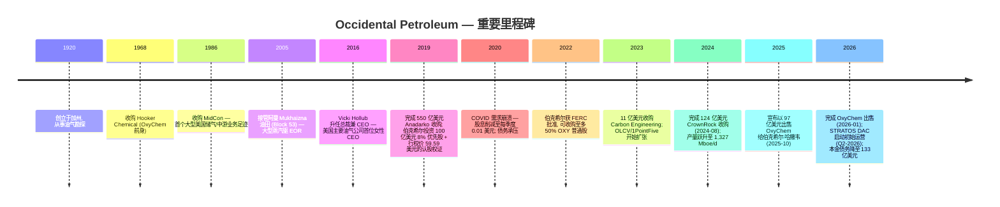
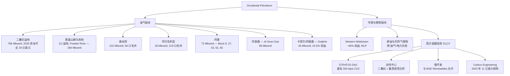
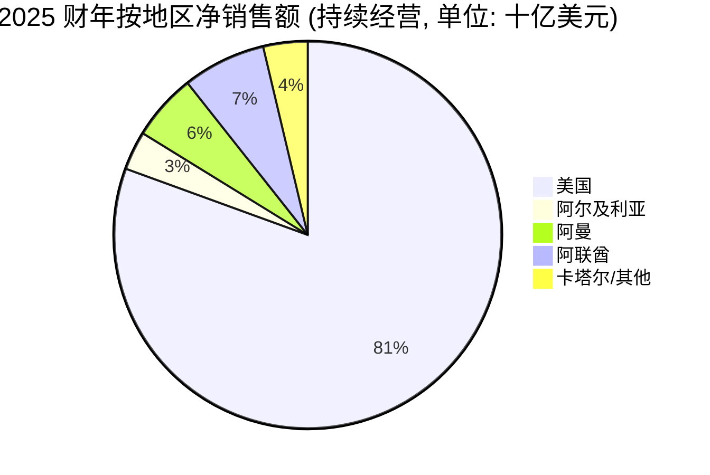
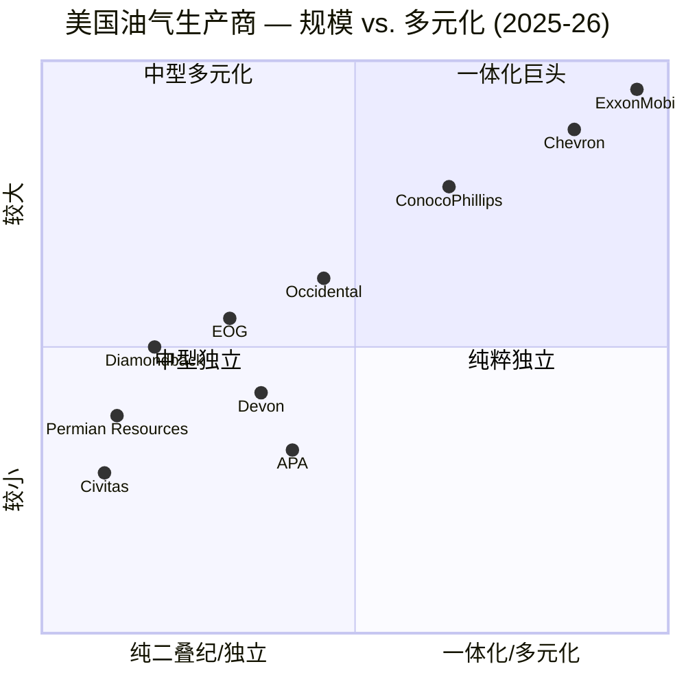

# Occidental Petroleum Corporation (NYSE:OXY) — 公司研究报告

**报告日期: 2026-05-20**
**作者: 独立股票研究**
**主要上市地: NYSE:OXY (普通股); OXY.WS (2027 年普通股认股权证)**
**报告语言: 简体中文 (英文版同时存在于本目录)**

> **业绩更新 — 2026 财年 Q1 业绩强劲, 加速去杠杆 (2026-05-05):** 管理层并未正式重新发布 2026 全年指引, 但 Q1-2026 总产量 1,426 Mboe/d 超出指引上限, 中游与营销 (midstream and marketing) 业务税前调整后收入超出指引上限, 西方石油公司 (Occidental) 宣布**截至 2026 年 5 月 5 日本金债务已降至 133 亿美元**——已经穿越此前 143 亿美元的本金债务目标, 并向新的 **100 亿美元**里程碑挺进。Q1 归属于普通股股东的净利润为 32 亿美元 (摊薄 EPS 3.13 美元), 其中大部分来自 **OxyChem 出售给伯克希尔·哈撒韦 (Berkshire Hathaway)** 一次性税后利得 31 亿美元——该交易于 2026 年 1 月 2 日完成, 调整后对价为 95 亿美元。来自持续经营的调整后 EPS 为 1.06 美元。来源: [Occidental 公告 2026 财年 Q1 业绩, 8-K EX-99.1, 2026-05-05](https://www.sec.gov/Archives/edgar/data/0000797468/000162828026030567/oxyex9913-31x26earningsrel.htm)。

## 目录

1. 公司概览
2. 公司历史
3. 管理团队
4. 产品与服务
5. 客户与上市策略
6. 行业概览
7. 竞争格局
8. 市场机会 (TAM)
9. 风险评估
- 参考资料

---

## 1. 公司概览

西方石油公司 (Occidental Petroleum Corporation, 以下简称"Occidental"或"OXY") 是**美国最大的独立油气生产商之一**, 也是一家新兴的碳管理 (carbon management) 平台公司。公司总部位于德克萨斯州休斯顿市 5 Greenway Plaza, 自我定位为"一家国际能源公司, 以其主要分布于美国、中东与北非的优质多元化资产享誉业界" ([2025 财年 Form 10-K, Items 1-2 业务与资产](https://www.sec.gov/Archives/edgar/data/797468/000162828026009059/oxy-20251231.htm))。截至 2025 财年 10-K 备案日 (2026 年 2 月), 持续经营的全职员工约 12,300 人 (不含已于 2026 年 1 月 2 日剥离的 OxyChem)。

**公司业务。** Occidental 通过**油气 (Oil and Gas) 业务板块**, 从事原油、天然气液 (natural gas liquids, NGL) 与天然气的勘探、开发、生产与营销; 通过**中游与营销 (Midstream and Marketing) 板块**运营管道、天然气处理设施、储存设施及大宗商品交易簿; 中游板块还承载着**西方低碳投资公司 (Oxy Low Carbon Ventures, OLCV)**——这是 STRATOS (全球首座商业化规模直接空气捕集 (direct air capture, DAC) 设施)、1PointFive 碳清除商业化主体、墨西哥湾沿岸封存中心 (sequestration hubs) 以及锂矿研发的平台。在 2026 年 1 月 2 日之前, 公司还运营**OxyChem**——一家氯碱 (chlor-alkali) 与乙烯基塑料生产商, 2025 财年销售额约 44 亿美元; 出售给伯克希尔·哈撒韦后, 现已作为终止经营业务列报 ([2025 财年 Form 10-K, 附注 13 终止经营业务](https://www.sec.gov/Archives/edgar/data/797468/000162828026009059/oxy-20251231.htm))。

**盈利模式。** 持续经营业务收入与业务板块利润中约 95% 来自上游油气。10-K 披露 2025 财年持续经营净销售额为 215.9 亿美元, 其中油气板块 209.0 亿美元, 中游与营销板块 12.8 亿美元 (扣除板块间抵消 5.9 亿美元后) ([2025 财年 Form 10-K, MD&A 板块业绩](https://www.sec.gov/Archives/edgar/data/797468/000162828026009059/oxy-20251231.htm))。油气板块销售按现行 WTI / Brent / 区域气价基准实现, 多数产量以短周期营销合约出售; 因此毛利率杠杆主要在大宗商品价格与单桶成本。中游板块通过**费用化合约 (fee-based contracts)** 变现产能 (主要通过对西方中游合伙公司 (Western Midstream Partners, "WES") 的权益法持股), 并通过 OLCV 新兴的碳信用、CO₂ 封存与锂业务获利。

**运营地理。** 美国——二叠纪盆地 (Permian Basin, 德克萨斯/新墨西哥)、丹佛-朱尔斯堡盆地 (DJ Basin) /落基山脉地区 (Rockies, 科罗拉多、怀俄明、Powder River) 以及美洲湾深水 (Gulf of America deepwater)——合计 1,202 Mboe/d, 约占 2025 年总日产量 1,434 Mboe/d 的 84%。海外产量 232 Mboe/d 来自阿尔及利亚 (28 Mboe/d)、阿联酋 Al Hosn Gas (89 Mboe/d)、Dolphin (阿联酋/卡塔尔, 40 Mboe/d) 与阿曼 (72 Mboe/d)——在阿曼公司是最大的独立生产商 ([2025 财年 Form 10-K, 分地区产量](https://www.sec.gov/Archives/edgar/data/797468/000162828026009059/oxy-20251231.htm))。公司在二叠纪与墨西哥湾沿岸持有 CO₂ 封存中心 (sequestration hubs) 的孔隙空间 (pore space) 许可与权益, 并是德克萨斯州 Ector 县 STRATOS 项目的运营方。

**规模指标。** 2025 财年净销售额 (持续经营) 216 亿美元; 2026 年 3 月 31 日总资产 805 亿美元 ([Q1-2026 10-Q 资产负债表](https://www.sec.gov/Archives/edgar/data/0000797468/000162828026030584/oxy-20260331.htm))。已证实储量 (proved reserves) 与储量寿命 (reserve life) 详见 10-K 油气补充信息 (Supplemental Oil and Gas Information); 2025 年产量达到历史高位 1,434 Mboe/d (同比 +8%), 受益于 CrownRock 全年并表。截至 10-K 备案日, 普通股流通股本约 10 亿股, 其中**沃伦·巴菲特 (Warren Buffett) /伯克希尔·哈撒韦 (按全部认股权证转换后) 实益持有 32.4%** ([2026 DEF 14A, 5% 股东实益持股](https://www.sec.gov/Archives/edgar/data/0000797468/000162828026019816/oxy2026def14a.htm))。

### 估值快照 (必备)

| 指标 (美元, 2026 年 5 月) | OXY | XOM | CVX | EOG | FANG |
|---|---|---|---|---|---|
| 股价 (2026 年 5 月中) | ~53–61 美元 | n/a | n/a | n/a | n/a |
| 市值 | ~530 亿美元 | ~5,100 亿美元 | ~3,050 亿美元 | ~660 亿美元 | ~500 亿美元 |
| TTM 市盈率 (P/E, 报表口径) | 13–32 倍 (差异较大——见注释) | 22 倍 | 28 倍 | 13.3–13.9 倍 | 9.8–11.9 倍 |
| EV / EBITDA (TTM) | ~7.0 倍 | ~7.5 倍 | ~7.8 倍 | ~6.3 倍 | ~6.1 倍 |
| 市净率 (P/B) | ~1.46 倍 | n/a | n/a | n/a | n/a |
| 股息率 (年化) | ~1.7% (0.26 × 4 = 1.04 美元) | n/a | n/a | n/a | n/a |

来源: [OXY P/E — Public.com, 2026-05](https://public.com/stocks/oxy/pe-ratio); [OXY EV/EBITDA — GuruFocus, 2026-04](https://www.gurufocus.com/term/enterprise-value-to-ebitda/OXY); [OXY P/B — companiesmarketcap.com](https://companiesmarketcap.com/occidental-petroleum/pb-ratio/); [XOM P/E — MacroTrends, 2026-05](https://www.macrotrends.net/stocks/charts/XOM/exxon/pe-ratio); [CVX P/E — CompaniesMarketCap](https://companiesmarketcap.com/chevron/pe-ratio/); [EOG P/E 与市值 — Stockanalysis.com](https://stockanalysis.com/stocks/eog/statistics/); [FANG P/E — Macrotrends](https://www.macrotrends.net/stocks/charts/FANG/diamondback-energy/pe-ratio); [Q1-2026 OXY EPS — 8-K](https://www.sec.gov/Archives/edgar/data/0000797468/000162828026030567/oxyex9913-31x26earningsrel.htm)。

**P/E 读数为何噪音如此之大。** 2026 年 5 月不同公开报价服务对 OXY 的 P/E 给出截然不同的数值 (一家 13.3 倍、一家 32.1 倍、另一家约 68 倍)。原因机械性: TTM 分母被**基期扭曲**主导——(i) Q1-2026 录得的 OxyChem 出售税后利得 31 亿美元在某一滚动季度抬高 GAAP EPS ([Q1-2026 8-K EX-99.1, 2026-05-05](https://www.sec.gov/Archives/edgar/data/0000797468/000162828026030567/oxyex9913-31x26earningsrel.htm)); (ii) 2025 年优先股股息 6.79 亿美元及非常项 (法律准备金、减值、资产出售亏损) 将 2025 年持续经营 EPS 压至 1.65 美元 (2024 年为 2.59 美元); (iii) GAAP "归属于普通股股东净利润"含优先股股息, 对常态化盈利能力的稀释程度被显著高估 ([2025 财年 Form 10-K, EPS 调节表](https://www.sec.gov/Archives/edgar/data/797468/000162828026009059/oxy-20251231.htm))。在条带价格 (strip prices) 下, 常态化持续经营调整后 EPS 约为 4 美元/股, 故 OXY 实际接近**低十几倍 P/E**, 与 EOG 一致, 低于 XOM/CVX 约一档。

**EV/EBITDA 是该公司更干净的跨周期倍数。** TTM 约 7.0 倍, 较 10 年中位数 6.56 倍高约 14% ([GuruFocus](https://www.gurufocus.com/term/enterprise-value-to-ebitda/OXY))——独立看略微偏高, 但考虑到 OxyChem 出售款带来的杠杆显著下降 (本金债务从 2024 年末的 253 亿美元降至 2026 年 5 月 5 日披露的 133 亿美元; 见第 1 节更新栏), 仍属合理。在同业对比中, OXY 目前介于综合一体化巨头 (XOM、CVX 交易在 7.5–7.8 倍) 与纯二叠纪独立公司 (FANG、EOG 在 6.1–6.3 倍) 之间, 与 OXY 的混合身份相一致——既是二叠纪龙头, 又有海外上游业务及低碳期权 (low-carbon optionality) 加持。我们不将估值列为第 9 节风险: 倍数处于本类别周期常态区间内。

*来源: [2025 财年 Form 10-K, MD&A 板块销售](https://www.sec.gov/Archives/edgar/data/797468/000162828026009059/oxy-20251231.htm)。*

## 2. 公司历史

Occidental 创立于 **1920 年**, 起初是加州一家小型油气勘探公司。决定性的转型发生在阿曼德·哈默 (Armand Hammer) 时代——他于 1957 年掌权并在接下来的 33 年间执掌公司, 将其从洛杉矶的"野猫"勘探商转型为全球化多元能源与化工综合体: 1968 年收购胡克化学 (Hooker Chemical, 后改名 OxyChem), 并进入利比亚、委内瑞拉与俄罗斯。哈默之后, 公司重新聚焦美国、中东与北非, 退出拉美油气业务, 通过有机钻井与小型并购在二叠纪盆地建立领先地位 ([2025 财年 Form 10-K, 历史与战略](https://www.sec.gov/Archives/edgar/data/797468/000162828026009059/oxy-20251231.htm))。

*来源: [2025 财年 Form 10-K, 历史与战略](https://www.sec.gov/Archives/edgar/data/797468/000162828026009059/oxy-20251231.htm); [伯克希尔·哈撒韦 13G/A, 2025-08-14](https://www.sec.gov/cgi-bin/browse-edgar?action=getcompany&CIK=0001067983&type=SC+13G&dateb=&owner=include&count=40); [Occidental 完成 CrownRock 收购, 2024-08-01](https://www.oxy.com/news/news-releases/occidental-completes-acquisition-of-crownrock/); [Occidental 完成 OxyChem 出售, 2026-01-02](https://www.oxy.com/news/news-releases/occidental-completes-sale-of-oxychem/)。*

**三大战略转折值得各用一句话概括:**

- **2019 年 Anadarko 收购 — 几乎压垮资产负债表的一次豪赌。** Occidental 以 380 亿美元现金加股票 (2019 年 5 月公布, 2019 年 8 月完成) 击败雪佛龙 (Chevron), 部分资金来源于伯克希尔投资 100 亿美元购入 8% 永续优先股加行权价 59.59 美元的认股权证。2020 年油价崩溃将杠杆转化为存亡威胁; 股息被削减至 1 美分, 债务遭降级。公司能够全身而退、成为巴菲特最大的股票持仓之一, 并如今得以赎回优先股, 使 Anadarko 一役成为周期性风险管理的高确信度典型案例。
- **2024 年 CrownRock 收购 — 加码二叠纪龙头地位。** 2023 年 12 月公布, 2024 年 8 月 1 日完成, 120 亿美元现金加股票交易新增**约 170 Mboe/d 的高品质、连片的米德兰盆地 (Midland Basin) 地权**, 与 OXY 既有版图相邻, 约 1,700 个钻井位置成本盈亏平衡在 60 美元/桶以下。二叠纪产量从 2023 年 584 Mboe/d 提升至 2025 年 786 Mboe/d ([2025 财年 Form 10-K, 二叠纪产量表](https://www.sec.gov/Archives/edgar/data/797468/000162828026009059/oxy-20251231.htm))。
- **2025/2026 年 OxyChem — 把化工业务作为去杠杆武器。** Occidental 于 2025 年 10 月宣布以 97 亿美元 (交割时调整为 95 亿美元) 将 OxyChem 出售给伯克希尔·哈撒韦, 2026 年 1 月 2 日完成。出售款几乎全部用于偿债, 使本金债务从 2025 年末的 204 亿美元降至 2026 年 5 月 5 日的 133 亿美元。战略上, Occidental 将自身简化为纯油气加碳管理故事; 伯克希尔——已是最大股东——则在能源供应链中扎下更深的锚。

**近 18 个月动态:** 完成 CrownRock 收购; 完成 STRATOS 中央处理设施; 获 Class VI 封存许可; 加入原油双向区间套保 (two-way collars, 2026-02) 以管理 2026 年价格风险; 签署阿曼 Block 53 15 年合约延期 (2025); 2026 年 2 月将普通股股息上调约 8% 至每季度 0.26 美元 ([2025 财年 Form 10-K, 注册人普通股市场](https://www.sec.gov/Archives/edgar/data/797468/000162828026009059/oxy-20251231.htm))。

## 3. 管理团队

### Vicki Hollub — 总裁兼 CEO (年龄 66; 自 2016 年 4 月任 CEO)

Vicki Hollub 是 OXY 故事中最具决定性意义的个人, 也是美国超级巨头与大型独立油气公司中任期最长的 CEO。她是首位执掌美国主要油气公司的女性 CEO, 持有阿拉巴马大学矿物工程理学学士学位 (1981), 并于 2024 年当选美国国家工程院 (National Academy of Engineering, NAE) 院士 ([2026 DEF 14A, Hollub 董事资格, 约第 15 页](https://www.sec.gov/Archives/edgar/data/0000797468/000162828026019816/oxy2026def14a.htm))。Hollub 起步于 Cities Service, 该公司于 1981 年被 Occidental 收购——她整个 40 多年职业生涯都在公司内部度过, 在美国、俄罗斯、委内瑞拉与厄瓜多尔等三个大洲承担过运营岗位。出任 CEO 前, 她任总裁兼首席运营官 (President and COO), 负责油气、化工与中游业务; 在此之前任 OXY 高级执行副总裁兼 Oxy Oil and Gas 总裁。早年她任二叠纪盆地总经理时, 率先将 CO₂ 强化采油 (CO₂-EOR) 在工业规模上落地——正是这段运营功底, 如今为 OLCV / STRATOS / 1PointFive 的逻辑奠定基础。

她实际取得的成就: (i) 2019 年与雪佛龙竞标后, 执行 550 亿美元 Anadarko 收购; 此后渡过 COVID 危机, 2021 年保住投资级评级, 并逐步赎回伯克希尔优先股 (从 100 亿美元面值减至如今 85 亿美元) ([伯克希尔 100 亿美元股权投资 8-K, 2019-04-30](https://www.sec.gov/Archives/edgar/data/797468/000095015719000529/form8k.htm)); (ii) 2024 年完成 120 亿美元 CrownRock 收购, 将二叠纪产量从 2023 年 584 Mboe/d 提升至 2025 年 786 Mboe/d, 并将每桶租赁经营费用 (LOE per Boe) 从 2023 年的 10.48 美元降至 2025 年的 8.94 美元 ([2025 财年 Form 10-K, 二叠纪与 LOE 表](https://www.sec.gov/Archives/edgar/data/797468/000162828026009059/oxy-20251231.htm)); (iii) 让 Occidental 成为美国首家承诺到 2050 年实现 Scope 1、2、3 全部净零排放的油气公司 (2020), 并将其转化为资本配置上的现实: STRATOS、与贝莱德 (BlackRock) 的 1PointFive 合作, 以及与贝恩 (Bain & Company) /微软 /亚马逊的碳清除信用承购合约 ([1PointFive 与微软 500,000 吨 CDR 协议](https://www.oxy.com/news/news-releases/1pointfive-announces-agreement-to-sell-500000-metric-tons-of-direct-air-capture-carbon-removal-credits-to-microsoft/))。她担任洛克希德·马丁 (Lockheed Martin) 与美国石油协会 (API) 董事, 曾任世界经济论坛油气社区主席 ([Vicki Hollub Wikipedia 简历及 2024 年 NAE 当选](https://en.wikipedia.org/wiki/Vicki_Hollub))。她在巴菲特心目中的可信度——巴菲特公开称赞她的资本纪律, 并多次增持伯克希尔在 OXY 的仓位——本身就是公司的一项重要资产。

**简历中的风险:** Hollub 已 66 岁, 担任 CEO 整整 10 年。董事会已启动结构化继任工作——Richard Jackson 于 2025 年 10 月升任高级副总裁兼首席运营官 ([2025 财年 Form 10-K, 执行管理团队表](https://www.sec.gov/Archives/edgar/data/797468/000162828026009059/oxy-20251231.htm)), 自 2023 年任 CFO 的 Sunil Mathew 获得更宽广的战略职责。投资者应预计在 3–5 年内会出现继任安排事件。

### Sunil Mathew — 高级副总裁兼 CFO (年龄 55; 自 2023 年 8 月任 CFO)

Mathew 在 Occidental 长期任职后由内部提拔, 此前任副总裁负责战略规划、分析与业务发展 (2020-2023), 此前任战略规划与分析副总裁 (2014-2020) ([2025 财年 Form 10-K, 执行管理团队表](https://www.sec.gov/Archives/edgar/data/797468/000162828026009059/oxy-20251231.htm))。他任 CFO 期间的三大实质成就: (i) 2024 年以投资级等价信用利差为 CrownRock 收购融资 96 亿美元新债, 尽管复合评级为 B+ /BBB-; (ii) 2025 年与伯克希尔谈成 OxyChem 出售, 实现毛收入 97 亿美元 (调整后 95 亿美元), 倍数略高于卖方对剥离业务的预期; (iii) 2025–H1-2026 的债务管理方案——Occidental 在两个日历年内偿还约 110 亿美元本金债务, 并重置到期日阶梯使 2030 年前到期不足 5 亿美元。Mathew 此前没有在 Occidental 之外的上市公司 CFO 经历, 对于这种规模的公司是不常见的; 董事会通过强化审计委员会监督和深厚的规划团队梯队作为补偿。

### Richard A. Jackson — 高级副总裁兼 COO (年龄 49; 自 2025 年 10 月任 COO)

Jackson 是 Hollub 之后的接班人选, 现负责二叠纪、落基山脉、美洲湾以及碳管理组合的运营。此前任美国陆上资源与碳管理运营总裁 (President Operations, U.S. Onshore Resources and Carbon Management, 2020-2025), 此前任低碳投资总裁 (President, Low Carbon Ventures, 2019-2020)。他的职业生涯横跨公司运营核心 (2017-2018 任投资者关系副总裁; 2014-2017 任二叠纪资源特拉华盆地总裁兼总经理) 与碳管理特许业务——后者是 Occidental 区别于同业的核心 ([2025 财年 Form 10-K, 执行管理团队表](https://www.sec.gov/Archives/edgar/data/797468/000162828026009059/oxy-20251231.htm))。他于 2025 年 10 月晋升 COO——与 OxyChem 出售及 CrownRock 整合首年同期——是公司有意发出的信号: 下一章节将兼顾二叠纪执行与碳管理商业化。

### Sylvia J. Kerrigan — 高级副总裁兼首席法务官 (自 2022 年 10 月)

Kerrigan 来自德克萨斯大学 Kay Bailey Hutchison 能源中心执行主任 (2017-2022) 五年任期。她此前任马拉松石油 (Marathon Oil Corporation) 执行副总裁、总法律顾问兼公司秘书 (2009-2017), 是美国独立 E&P 公司中较为资深的总法律顾问之一。她继承了 OxyChem 出售后复杂的赔偿堆栈 (Occidental 通过 Environmental Resource Holdings, LLC 保留了历史环境责任, 并就 OxyChem 交割前责任向伯克希尔提供担保)、Anadarko 时代的 Tronox 诉讼尾巴, 以及 10-K 披露的新墨西哥州环境部 (New Mexico Environment Department) 报告事项的持续法律敞口 ([2025 财年 Form 10-K, Item 3 法律诉讼](https://www.sec.gov/Archives/edgar/data/797468/000162828026009059/oxy-20251231.htm))。

### 治理

- 董事会共 11 名董事; 董事长为 Robert Moore (自 2022 年 9 月任独立董事长), 前 Cameron International CEO。其他重要董事包括 Vicky Bailey (前 FERC 委员、美国能源部副部长)、William Klesse (前 Valero CEO)、Andrew Gould (前 Schlumberger CEO)、Carlos Gutiérrez (前美国商务部长) 与 Robert Shearer (前贝莱德股息策略组合经理) ([2026 DEF 14A, 董事简历](https://www.sec.gov/Archives/edgar/data/0000797468/000162828026019816/oxy2026def14a.htm))。
- 巴菲特/伯克希尔·哈撒韦持有 32.4% 实益权益, 但**不持有董事席位**。优先股有正式的投票限制条款, 普通股投票上限为 20%——这是伯克希尔在最初投资时达成的协议条款。
- 除伯克希尔外的内部人持股比例较低。Hollub 直接 + 递延持股不足普通股的 1%, 薪酬向业绩股票单位与基于 CROCE 和相对 TSR 的股票期权倾斜。
- 薪酬结构: 高管 (NEO) 目标薪酬的约 90% 为可变/风险性, 长期业绩计划对标 BP、CVX、COP、EOG、XOM、Shell 及 TotalEnergies——与 10-K 总回报图所用同业组一致。
- 与伯克希尔的关联方交易具有实质性且经常性 (优先股股息、OxyChem 收购、电力与保险); 与 WES 亦有关联交易; 10-K 对此有清晰披露。

**业绩综合评价。** Hollub 团队已执行过去十年美国上游最大的两宗并购整合 (Anadarko、CrownRock) 与一宗标志性剥离 (OxyChem), 期间未违反契约、未失去投资级评级, 也未在 2020 年后削减普通股股息 ([2025 财年 Form 10-K, 流动性与资本资源](https://www.sec.gov/Archives/edgar/data/797468/000162828026009059/oxy-20251231.htm))。需关注的执行差距是 STRATOS——商业规模上首创技术, 其大部分商业价值仍在未来 ([Occidental 获 EPA STRATOS Class VI 许可, 2025-04-07](https://www.oxy.com/news/news-releases/occidental-and-1pointfive-secure-class-vi-permits-for-stratos-direct-air-capture-facility/))。

## 4. 产品与服务

Occidental 本质上是**桶油当量 (Boe) 生产商**, 加上一个规模较小但战略上独具一格的碳管理组合。OxyChem 出售后, 公司组织为两个报告板块——**油气**与**中游与营销** (含 OLCV)——但通过公司网站详尽走查可识别约十几个值得列举的独立资产组 ([2025 财年 Form 10-K, 板块报告](https://www.sec.gov/Archives/edgar/data/797468/000162828026009059/oxy-20251231.htm); [Occidental 业务总览](https://www.oxy.com/operations/))。

*来源: [oxy.com 业务](https://www.oxy.com/operations/); [2025 财年 Form 10-K, Items 1-2 业务与资产](https://www.sec.gov/Archives/edgar/data/797468/000162828026009059/oxy-20251231.htm); [1PointFive STRATOS 项目页](https://www.1pointfive.com/projects/ector-county-tx)。*

### 油气 — 旗舰产品

**二叠纪盆地 (Permian Basin, 德克萨斯/新墨西哥)** 是迄今最重要的资产。2025 年产量 786 Mboe/d (占二叠纪盆地原油产量约 10%, 单家最大位置), 2025 年开发资本开支 34 亿美元; CrownRock 在交割时增加约 170 Mboe/d 的高品质米德兰盆地地权 ([2025 财年 Form 10-K, 二叠纪板块](https://www.sec.gov/Archives/edgar/data/797468/000162828026009059/oxy-20251231.htm); [Occidental 完成 CrownRock 收购, 2024-08-01](https://www.oxy.com/news/news-releases/occidental-completes-acquisition-of-crownrock/))。Occidental 的二叠纪资产是公司的旗舰产品: 全盆地最大地权持有者、最低盈亏平衡库存 (相当一部分位置低于 60 美元/桶)、并通过传统二叠纪 EOR 油田形成集成式 CO₂-EOR 叠加。**竞争优势: 是, 规模 + 一体化 CO₂-EOR。** 最接近的对位产品是 Diamondback / Endeavor 合并体 (FANG, 约 600 Mboe/d 二叠纪) 与 EOG 的特拉华位置 ([Diamondback 完成 260 亿美元 Endeavor 合并, 2024](https://www.diamondbackenergy.com/news-releases/news-release-details/diamondback-energy-inc-and-endeavor-energy-resources-lp-merge)); OXY 在规模上持平或略胜, 在 EOR 期权上领先, 在每英尺横向井段的纯资本效率上落后于 FANG。

**美洲湾 (Gulf of America, 深水)** 2025 年从 96 口毛井产 132 Mboe/d, 平台运营效率超过 99%。主要运营平台 (Lucius、Holstein、Caesar/Tonga、Constitution) 位于一线深水地质, 凭借高工作权益获得运营成本摊薄 ([2025 财年 Form 10-K, 美洲湾业务](https://www.sec.gov/Archives/edgar/data/797468/000162828026009059/oxy-20251231.htm))。**竞争优势: 部分, 地质 + 规模**, 但带有成熟墨西哥湾资产典型的结构性递减曲线。最接近的对位是 BP 的墨西哥湾组合与雪佛龙的 Anchor / Whale 开发项目——OXY 在新建深水管线上落后。

**落基山脉与其他国内 (Rockies and Other Domestic)** — DJ 盆地 (科罗拉多)、Powder River 与其他陆上——2025 年贡献 284 Mboe/d (同比 -8%, 受 2024 年非核心出售影响)。DJ 盆地经济性仍具竞争力, 但科罗拉多州监管阴影在 OXY 美国资产中最高。**竞争优势: 部分, DJ 盆地规模**, 但盆地占比显著落后于 Civitas / 雪佛龙 ([2025 财年 Form 10-K, 落基山脉与其他产量](https://www.sec.gov/Archives/edgar/data/797468/000162828026009059/oxy-20251231.htm))。

**阿曼 (Blocks 9, 27, 53, 62, 65 加上勘探区块 30, 51, 72)** — 2025 年 72 Mboe/d。OXY 是阿曼最大的独立石油生产商, 其中 Mukhaizna 油田 (Block 53) 运行着全球最大的蒸汽驱 EOR 项目之一 ([Oxy Oman 与阿曼政府签署 Block 53 延期协议, 2025-05-18](https://www.oxy.com/news/news-releases/oxy-oman-and-oman-government-sign-agreement-to-extend-block-53-operations/))。2025 年签署的 Block 53 15 年合约延期, 将现金流锚定到 2030 年代后期 ([2025 财年 Form 10-K, 阿曼板块](https://www.sec.gov/Archives/edgar/data/797468/000162828026009059/oxy-20251231.htm))。**竞争优势: 是, 规模 + EOR 技术 + 60 年东道国关系** — 东道国政府切换成本极高。

**阿联酋 — Al Hosn Gas** 在 Shah 为 ADNOC 处理含硫天然气; 2025 年 OXY 的净产量份额为 89 Mboe/d。装置脱硫销售, 是长寿命、类费用化资产。**竞争优势: 是, 监管/认证 + 专有含硫处理专长** ([2025 财年 Form 10-K, 阿联酋 Al Hosn 板块](https://www.sec.gov/Archives/edgar/data/797468/000162828026009059/oxy-20251231.htm))。

**卡塔尔/阿联酋 — Dolphin Energy** — 24.5% 权益, 上游加管线一体化项目, 从卡塔尔北气田向阿联酋输送天然气与 NGL, 期至 2032 年中 ([Dolphin Energy 业务页](https://www.dolphinenergy.com/operations))。2025 年 OXY 净产 40 Mboe/d。**竞争优势: 部分** — 结构性特许权, 但有 2032 年合约期满的续签风险 ([2025 财年 Form 10-K, Dolphin / 卡塔尔板块](https://www.sec.gov/Archives/edgar/data/797468/000162828026009059/oxy-20251231.htm))。

**阿尔及利亚 — Berkine Basin (HBR 合约)** — 28 Mboe/d, 219 口毛井。低衰减率的成熟产量。**竞争优势: 部分** ([2025 财年 Form 10-K, 阿尔及利亚板块](https://www.sec.gov/Archives/edgar/data/797468/000162828026009059/oxy-20251231.htm))。

### 中游与营销 — 服务

**Western Midstream Partners (WES)** 是按权益法核算的被投资方, 是公开交易 MLP, Occidental 持股约 46% ([2025 财年 Form 10-K, 对非合并实体的投资](https://www.sec.gov/Archives/edgar/data/797468/000162828026009059/oxy-20251231.htm); [Western Midstream — 公司简介](https://www.westernmidstream.com/about-us/))。WES 在二叠纪、DJ 与 Powder River 盆地拥有集输、处理与管道资产, 通过费用化与服务化合同从 OXY 及第三方获取收入。**竞争优势: 是, 不可替代的基础设施 + 费用化合约结构。** 最接近的对比公司: PAA、ET、EPD——规模更大但不像 WES 那样捆绑单一 E&P 母公司。

**营销簿** — 实物与金融营销原油、NGL、天然气与电力, 包括 2026 年 2 月宣布的新原油双向区间套保 ([Q1-2026 10-Q, 对冲注释](https://www.sec.gov/Archives/edgar/data/0000797468/000162828026030584/oxy-20260331.htm))。

### Oxy Low Carbon Ventures (OLCV) — 期权所在

**STRATOS (德克萨斯 Ector 县)** 是 OLCV 的旗舰, 也是全球首座商业化规模 DAC 设施。设计铭牌产能为 Phase-1 + Phase-2 满产时**每年 500,000 吨 CO₂**; 初始运营于 2026 年第二季度启动, Phase 1 处于最终试车阶段 ([1PointFive STRATOS 页](https://www.1pointfive.com/projects/ector-county-tx); [RBN Energy 关于 Stratos 启动时间, 2026](https://rbnenergy.com/daily-posts/analyst-insight/stratos-dac-project-target-q2-2026-startup))。Occidental 与贝莱德 2023 年组建 STRATOS 开发合资公司; 截至 2025 年 12 月 31 日, 贝莱德已投资约 5.5 亿美元, 双方承诺继续注资 ([2025 财年 Form 10-K, 合资/VIE 附注](https://www.sec.gov/Archives/edgar/data/797468/000162828026009059/oxy-20251231.htm))。已与微软、亚马逊、空客 (Airbus) 及贝恩公司签署碳清除信用承购协议 ([1PointFive 与贝恩公司新闻稿](https://www.1pointfive.com/news/1pointfive-and-bain-company-announce-agreement-for-direct-air-capture-carbon-removal-credits))。**竞争优势判定: 部分 — 技术 + 先发 + IRA 45Q 税收抵免 (tax credit) 获取**, 但商业经济性尚未证实。坦率评估: 根据 Hollub 与外部分析师的公开表述, STRATOS 在当前成本下的单位经济性远高于 200–300 美元/吨的碳清除信用市场出清价格——项目依赖于 (i) IRA 第 45Q 条 (DAC + 封存) 180 美元/吨的抵免, (ii) Phase 1 到 Phase 4 进一步的资本成本下降, (iii) 持续的企业自愿购买需求。最接近的对位技术是 Climeworks (瑞士), 在冰岛运行 Mammoth 项目; OXY 在规模与 45Q 货币化上领先, 在单位能效上落后。商业准备度真实, 但**在不依靠补贴的情况下达到项目层面正经济性的路径尚未证实** — 投资者应将 STRATOS 视为看涨期权而非基准现金流。

**封存中心。** 五个 Class VI 中心在二叠纪与德克萨斯/路易斯安那墨西哥湾沿岸不同阶段开发中, OXY 目前掌控超过 30 万英亩孔隙空间 ([Occidental 与 1PointFive 获 EPA STRATOS Class VI 许可, 2025-04-07](https://www.oxy.com/news/news-releases/occidental-and-1pointfive-secure-class-vi-permits-for-stratos-direct-air-capture-facility/))。**竞争优势: 是, 监管/认证** — Class VI 许可稀缺; 先发地位带来持久期权价值。

**锂开发。** OXY 与伯克希尔·哈撒韦能源 (Berkshire Hathaway Energy) 合作, 从帝国谷 (Imperial Valley) 盐水进行直接锂提取 (DLE) 研发 ([2025 财年 Form 10-K, 低碳投资/锂](https://www.sec.gov/Archives/edgar/data/797468/000162828026009059/oxy-20251231.htm))。**竞争优势: 萌芽/否。**

**Carbon Engineering 收购 (2023 年完成, 2025 年最终 4 亿美元递延款付清)。** STRATOS 的技术基础。该交易让 OXY 完全掌控 DAC 工艺的知识产权 ([Occidental 完成 11 亿美元 Carbon Engineering 收购, 2023-11-03](https://www.blg.com/en/about-us/deals-and-suits/2023/11/occidental-petroleum-completes-us1-1-billion-acquisition-of-carbon-engineering-ltd))。**竞争优势: 是, IP。**

### 路线图与近期发布

近 12 个月: STRATOS Phase 1 中央处理设施完工 (2025); 获得 Class VI 封存许可 ([EPA STRATOS Class VI 许可, 2025-04-07](https://www.oxy.com/news/news-releases/occidental-and-1pointfive-secure-class-vi-permits-for-stratos-direct-air-capture-facility/)); 阿曼 Block 53 15 年合约延期 ([Oxy Oman Block 53 延期, 2025-05-18](https://www.oxy.com/news/news-releases/oxy-oman-and-oman-government-sign-agreement-to-extend-block-53-operations/)); CrownRock 完全整合 (2025 年全年收益); OxyChem 剥离 (2026-01) ([Occidental 完成 OxyChem 出售, 2026-01-02](https://www.oxy.com/news/news-releases/occidental-completes-sale-of-oxychem/)); 加入原油双向区间套保 (2026-02); 普通股股息上调约 8% 至每季度 0.26 美元 (2026-02); 随着普通股股息/股票回购空间重建, 伯克希尔 8% 优先股赎回能力得以恢复 ([2025 财年 Form 10-K, 近期动态](https://www.sec.gov/Archives/edgar/data/797468/000162828026009059/oxy-20251231.htm))。

## 5. 客户与上市策略

上游油气在结构上是商品现货业务——Occidental 以 WTI 或 Brent 基准 (扣除差异后) 通过按月重新定价的主采购协议向炼厂、贸易商与出口商销售桶油。10-K 未点名任何单一客户超过 10% 披露阈值, 上游侧亦未触发客户集中度风险因素。"2025 年北美以外净销售额合计 42 亿美元, 约占总净销售额 (不含终止经营业务) 的 19%" ([2025 财年 Form 10-K, 附注 2 收入/地区](https://www.sec.gov/Archives/edgar/data/797468/000162828026009059/oxy-20251231.htm))——隐含美国销售约 81%。美国客户集合是分散的, 包括 Phillips 66、Marathon Petroleum、Valero、Plains All-American、ConocoPhillips 营销以及二叠纪墨西哥湾沿岸出口综合体; 没有单一交易对手集中度高到需要披露。阿尔及利亚、阿曼、阿联酋与卡塔尔的国际销售由国家石油公司 (Sonatrach、ADNOC、OQ) 与长期 LNG / 含硫气处理合约主导。

*来源: [2025 财年 Form 10-K, 地区收入拆分](https://www.sec.gov/Archives/edgar/data/797468/000162828026009059/oxy-20251231.htm)。*

**第一大客户占比与前五大客户占比 — 未披露** (2025 财年 10-K), 与商品营销结构一致 ([2025 财年 Form 10-K, 客户集中度披露](https://www.sec.gov/Archives/edgar/data/797468/000162828026009059/oxy-20251231.htm))。未披露本身就是信息: 最大的美国炼厂客户都远低于 10% 阈值, OXY 主要暴露于全球油价基准, 而非具体交易对手需求。我们不将客户集中度列为上游侧第 9 节风险, 但确实将商品价格敞口 (其经济等价风险) 标识为风险。

**合同结构。** 原油与 NGL 销售主要按指数挂钩的月度主协议; 天然气按类似短周期条款销售, 含区域价差敞口 (米德兰至墨西哥湾沿岸原油; Waha 至墨西哥湾沿岸天然气)。阿尔及利亚与阿曼是带 PSA / 成本回收特征的特许权; 阿曼 Block 53 于 2025 年延长 15 年 ([Oxy Oman Block 53 延期新闻稿, 2025-05-18](https://www.oxy.com/news/news-releases/oxy-oman-and-oman-government-sign-agreement-to-extend-block-53-operations/))。Dolphin 至 2032 年中; Al Hosn 至 2052 年 ([2025 财年 Form 10-K, 国际特许权时间表](https://www.sec.gov/Archives/edgar/data/797468/000162828026009059/oxy-20251231.htm))。

**碳清除信用客户 (1PointFive / STRATOS)。** 这是截然不同的商业模型: 预付、多年、自愿市场碳清除信用承购, 价格 300–500 美元/吨。近 24 个月内披露的客户包括**微软** (最大单一合约 — 50 万吨, 期六年, 2024-2025 年新闻披露)、**亚马逊** (25 万吨)、**空客** (40 万吨, 通过 1PointFive)、**全日空 (ANA)**、**TD 银行**、**Trafigura** 及**贝恩公司** (与咨询服务挂钩的多吨级采购) ([1PointFive 与贝恩公司, 2025 新闻稿](https://www.1pointfive.com/news/1pointfive-and-bain-company-announce-agreement-for-direct-air-capture-carbon-removal-credits); [1PointFive 客户公告](https://www.1pointfive.com/news/))。这里买方集中度很高 — 微软与亚马逊合计很可能超过合约承购的 50% — 但相对于上游业务美元量级较小, 业务板块尚未达到规模。

**上市渠道。** 内部交易与营销团队直接向美国炼厂销售原油、NGL 与天然气, 并通过短周期双边合同与交易平台向国际市场销售 ([2025 财年 Form 10-K, 营销活动](https://www.sec.gov/Archives/edgar/data/797468/000162828026009059/oxy-20251231.htm))。中游服务由 WES 在费用化合约下向 OXY 与第三方销售 ([Western Midstream — 公司简介](https://www.westernmidstream.com/about-us/)); OLCV / 1PointFive 在多年期远期协议下直接向企业 ESG 买方销售 DAC 信用 ([1PointFive 客户新闻索引](https://www.1pointfive.com/news))。

**关键合作伙伴。** 贝莱德 (STRATOS 合资 — DAC); 伯克希尔·哈撒韦能源 (锂研发、电力供应、保险); ADNOC 与 Sonatrach (东道国, 阿尔及利亚/阿联酋); OQ (阿曼); Carbon Engineering (现 100% 持有); WES (公开交易 MLP) ([2025 财年 Form 10-K, 关联方/附注 13](https://www.sec.gov/Archives/edgar/data/797468/000162828026009059/oxy-20251231.htm))。

**点名的上游"胜利" — 近期大型合约事件。** 阿曼 Block 53 合约延期 (2025, 15 年) ([Block 53 新闻稿, 2025-05-18](https://www.oxy.com/news/news-releases/oxy-oman-and-oman-government-sign-agreement-to-extend-block-53-operations/)); CrownRock 资产并入二叠纪营销簿 (2024-08) ([CrownRock 完成新闻稿, 2024-08-01](https://www.oxy.com/news/news-releases/occidental-completes-acquisition-of-crownrock/)); 来自伯克希尔的 OxyChem 相关电力与保险承购 (持续)。

## 6. 行业概览

Occidental 处于两个行业的交汇处—— (i) **全球油气勘探与生产 (oil and gas E&P)** (NAICS 211120 / 211130), 以及 (ii) 新兴的**碳清除与 CCUS 服务**行业。第一个是主导经济敞口; 第二个是期权 ([2025 财年 Form 10-K, Item 1 业务概览](https://www.sec.gov/Archives/edgar/data/797468/000162828026009059/oxy-20251231.htm); [EIA — 短期能源展望](https://www.eia.gov/outlooks/steo/))。

**油气 — 市场结构与规模。** 2025 年全球原油消费量平均约 1.03 亿桶/日; EIA 短期能源展望预测需求在 2026 年前保持 1.03-1.04 亿桶/日, 之后随 EV 渗透与能效提升进入结构性减速 ([EIA STEO, 2026-05](https://www.eia.gov/outlooks/steo/))。美国原油产量在 2025 年末约 1,340 万桶/日, 其中二叠纪盆地贡献约 660 万桶/日 (按 10-K 占美国原油产量的 49%)。行业经济性受 OPEC+ 供给纪律 (2026 年 5 月产量目标 2,450 万桶/日)、美国页岩生产率以及 OPEC+ 手中 450-500 万桶/日的持续过剩产能主导。2025 年 WTI 均价 64.81 美元, 较 2024 年 75.72 美元同比下降 14% ([2025 财年 Form 10-K, 战略/展望](https://www.sec.gov/Archives/edgar/data/797468/000162828026009059/oxy-20251231.htm))。

**二叠纪盆地** — 公司的核心心脏 — 是全球生产率最高的非常规油气区, 2025 年占美国原油总产量 49% 以上 ([2025 财年 Form 10-K, 二叠纪板块](https://www.sec.gov/Archives/edgar/data/797468/000162828026009059/oxy-20251231.htm))。该盆地正在结构性整合: 过去三年内有埃克森美孚收购先锋自然资源 (600 亿美元, 2024)、Diamondback 收购 Endeavor (260 亿美元, 2024)、Occidental 收购 CrownRock (120 亿美元, 2024), 以及一连串小规模并购。行业观察者预计二叠纪盆地石油产量将在 2020 年代后期达峰, 因为钻井活动向 Tier-2 与 Tier-3 库存转移; 此动态有利于具备规模、低成本、长库存运行时间的运营商——这正是 OXY 的位置。

**增长驱动与趋势** ([2025 财年 Form 10-K, 战略/展望](https://www.sec.gov/Archives/edgar/data/797468/000162828026009059/oxy-20251231.htm))。
- *库存深度与生产率*: 埃克森美孚在 Pioneer 交割时披露 160 亿桶资源量 ([埃克森美孚/Pioneer 合并公告, 2023-10-11](https://corporate.exxonmobil.com/news/news-releases/2023/1011_exxonmobil-announces-merger-with-pioneer-natural-resources-in-an-all-stock-transaction)); OXY 在 CrownRock 之后的二叠纪库存按当前开发节奏可支撑 10-15 年 Tier-1 + Tier-2 储量。
- *EOR 复兴*: 油价上行与 45Q 抵免资格使 CO₂-EOR 在传统老油田重新具备经济性 — OXY 是美国 CO₂-EOR 行业领跑者, 拥有数十年的运营数据 ([IEA — CCUS 在低碳电力系统中的作用](https://www.iea.org/reports/the-role-of-ccus-in-low-carbon-power-systems))。
- *国际长寿命资产再估值*: 阿曼、阿联酋与卡塔尔的长周期 PSA 提供稳定现金流、单桶资本强度下降, 并对冲美国页岩生产率波动。
- *能源安全溢价*: 乌克兰与以色列/伊朗紧张局势后, 美国与中东桶油相对俄罗斯与委内瑞拉桶油带有隐性溢价。

**监管环境。** 美国联邦——One Big Beautiful Bill Act ("OBBBA") 与 IRA 税收抵免继续支撑碳管理经济性, 不过 IRA 政策进一步变化的政治风险真实存在。德克萨斯与新墨西哥——相对友好; 10-K 披露的新墨西哥环境部行动属轻量级。科罗拉多/DJ 盆地——美国对排放与后退距离最严苛的监管环境。国际方面——阿尔及利亚 HBR 合约条款 (2019 年重新谈判) 仍属友好; 阿曼 PSA 稳定; 阿联酋/卡塔尔东道国关系深厚长周期。2025 年 4 月美国关税 (10% 基础, 部分国家更高) 迄今对 OXY 供应商成本直接影响有限, 但属持续关注项 ([2025 财年 Form 10-K, 关税披露](https://www.sec.gov/Archives/edgar/data/797468/000162828026009059/oxy-20251231.htm))。

**行业动态。** 经过 Pioneer / Endeavor / CrownRock 整合, 美国独立 E&P 板块明显整合; 前五大公开独立公司 (XOM 二叠纪部门、CVX 二叠纪部门、OXY、FANG、EOG) 控制盆地产量的 50% 以上 ([美国原油 2025 年创新纪录 — EIA Today in Energy](https://www.eia.gov/todayinenergy/detail.php?id=67404); [Diamondback-Endeavor 合并完成, 2024](https://www.diamondbackenergy.com/news-releases/news-release-details/diamondback-energy-inc-and-endeavor-energy-resources-lp-merge))。供应商议价能力已向一体化服务巨头 (Schlumberger、Halliburton) 倾斜, 但在美国活动有纪律下单位定价仍偏软。买方议价能力分散, 对价格接收者 (E&P) 而言不相关。替代品——EV 渗透、可再生电力——在 10-20 年期视野下重要, 在 5 年视野下次要 ([EIA STEO 长期情景](https://www.eia.gov/outlooks/steo/))。

**碳清除/DAC 行业。** 一个真正全新的市场。工程化清除信用的自愿碳市场在 2026 年全球不足 20 亿美元, 但微软单独已承诺到 2030 年采购 700 万吨以上 ([微软-1PointFive 50 万吨 CDR 协议](https://www.oxy.com/news/news-releases/1pointfive-announces-agreement-to-sell-500000-metric-tons-of-direct-air-capture-carbon-removal-credits-to-microsoft/))。麦肯锡 (McKinsey)、BloombergNEF 与 IEA 预测工程化清除市场到 2030 年达到**200-1,000 亿美元**, 视政策情景而定 ([McKinsey — 碳清除: 如何扩展一个新的吉吨规模行业, 2023-12](https://www.mckinsey.com/capabilities/sustainability/our-insights/carbon-removals-how-to-scale-a-new-gigaton-industry))。STRATOS 在达到成熟时的单位经济性依赖于 IRA 第 45Q 条 (DAC + 安全地质封存) 180 美元/吨抵免。市场分散: Climeworks (瑞士) 按已部署产能是最大 DAC 运营商 ([Climeworks 启动全球最大 DAC 工厂 Mammoth, 2024-05-08](https://climeworks.com/press-release/climeworks-switches-on-worlds-largest-direct-air-capture-plant-mammoth)); CarbonCapture、Heirloom 与 Carbon Engineering / 1PointFive 是液体溶剂与固体吸附剂领域的领跑者。行业成熟度大致相当于 2009 年的光伏 PV — 真实数量, 但尚无确定的成本下降轨迹。

## 7. 竞争格局

Occidental 的同业组分为三层—— (i) **美国独立 E&P** 层 (OXY 的直接对位), (ii) **综合一体化超级巨头**层 (在国际特许权与资本配置上有更大竞争面), 以及 (iii) **DAC / 碳管理**层 (与上游现金流分离, 仅涉及 OLCV 期权) ([2025 财年 Form 10-K, 竞争板块](https://www.sec.gov/Archives/edgar/data/797468/000162828026009059/oxy-20251231.htm))。

*概念性定位; 市值与盆地暴露数据出自各公司最新 10-K 文件。*

**埃克森美孚 (ExxonMobil, XOM, 市值约 5,100 亿美元)。** Pioneer 收购后, XOM 是单家最大的二叠纪运营商, 二叠纪产量约 150 万桶/日, 总上游 Boe 产量约 400 万桶/日。优势: 规模、下游一体化、资产负债表实力。相对 OXY 的弱点: 没有碳清除特许业务; 美国强化采油位置较薄。([Exxon 2025 10-K 备案](https://www.sec.gov/cgi-bin/browse-edgar?action=getcompany&CIK=0000034088&type=10-K))。

**雪佛龙 (Chevron, CVX, 约 3,050 亿美元)。** Hess 收购完成后 (2025), 雪佛龙的圭亚那 Stabroek 权益与美洲湾深水组合现在是更接近的竞争面。二叠纪产量约 100 万桶/日。优势: 资本纪律、资产负债表、股息记录。弱点: CrownRock 后二叠纪库存深度不及 OXY; 碳战略差异化程度低于 OLCV ([Chevron 2024 10-K — SEC EDGAR 索引](https://www.sec.gov/cgi-bin/browse-edgar?action=getcompany&CIK=0000093410&type=10-K))。

**EOG Resources (EOG, 约 660 亿美元)。** 美国非常规低成本基准运营商, 暴露于 Eagle Ford / 二叠纪特拉华 / Powder River。在周期上美国非常规资本回报率最高。优势: 资本效率、保守的资产负债表。弱点: 没有国际上游业务, 没有碳管理特许业务。在该质量水平下, P/E 是同业组中最高的 (TTM 约 13 倍) ([EOG Resources 统计 — Stockanalysis.com](https://stockanalysis.com/stocks/eog/statistics/))。

**Diamondback Energy (FANG, 约 500 亿美元)。** Endeavor 整合后, FANG 是最大的纯二叠纪运营商, 约 600 Mboe/d ([Diamondback-Endeavor 合并公告, 2024-02-12](https://www.diamondbackenergy.com/news-releases/news-release-details/diamondback-energy-inc-and-endeavor-energy-resources-lp-merge))。优势: 最低的纯二叠纪成本结构、简洁。弱点: 不分散——纯粹是一个二叠纪商品价格期权。

**ConocoPhillips (COP, 约 1,300 亿美元)。** Marathon Oil 收购完成 (2024) 后, COP 是多元化独立公司, 暴露于二叠纪、Eagle Ford、Bakken 与阿拉斯加/国际 LNG。形态上最类似 OXY 但缺乏碳管理叠加 ([ConocoPhillips 10-K 文件 — SEC EDGAR](https://www.sec.gov/cgi-bin/browse-edgar?action=getcompany&CIK=0001163165&type=10-K))。

**APA / Apache (约 100 亿美元)。** 埃及、北海、二叠纪与苏里南勘探。规模更小, 更集中的风险 ([APA Corporation 10-K — SEC EDGAR](https://www.sec.gov/cgi-bin/browse-edgar?action=getcompany&CIK=0001841666&type=10-K))。

**Devon Energy (约 300 亿美元)。** 二叠纪、Anadarko、Eagle Ford、Powder River、Williston。直接的二叠纪 + 多盆地竞争者 ([Devon Energy 10-K — SEC EDGAR](https://www.sec.gov/cgi-bin/browse-edgar?action=getcompany&CIK=0001090012&type=10-K))。

**Permian Resources (约 150 亿美元)、Civitas (约 100 亿美元)、SM Energy、Matador、Ovintiv。** 下一层美国独立公司; CrownRock 后均次于 OXY 规模 ([2025 财年 Form 10-K, 竞争板块](https://www.sec.gov/Archives/edgar/data/797468/000162828026009059/oxy-20251231.htm))。

**国际特许权重叠。** 在阿曼, OXY 与 BP (Block 61 气)、Shell、TotalEnergies 及 PDO 财团竞争; OXY 的 Mukhaizna EOR 现任位置切换成本极高 ([Oxy Oman Block 53 延期, 2025-05-18](https://www.oxy.com/news/news-releases/oxy-oman-and-oman-government-sign-agreement-to-extend-block-53-operations/))。在阿尔及利亚, Sonatrach 是东道国; ENI、BP、Repsol 与 Equinor 是共同许可方。在阿联酋, OXY 的 Al Hosn 角色是专属定制、实际上不可替代 ([2025 财年 Form 10-K, 国际业务](https://www.sec.gov/Archives/edgar/data/797468/000162828026009059/oxy-20251231.htm))。

**碳管理层。** Climeworks (瑞士 — Mammoth 工厂自 2024 年起以 36 ktpa 铭牌运行 ([Climeworks 启动 Mammoth, 2024-05-08](https://climeworks.com/press-release/climeworks-switches-on-worlds-largest-direct-air-capture-plant-mammoth)))、Heirloom (基于矿化)、CarbonCapture Inc., 以及 Stripe Frontier 支持的公司 (Charm、Vesta)。**STRATOS 500 ktpa 是 2026 年前规划的最大运营 DAC 设施** — 具有意义的先发规模领先 ([RBN Energy — STRATOS DAC 2026 Q2 启动展望](https://rbnenergy.com/daily-posts/analyst-insight/stratos-dac-project-target-q2-2026-startup))。竞争者更多在技术/效率上, 而非规模上竞争。

**竞争优势 — 综合** ([2025 财年 Form 10-K, 战略/竞争优势](https://www.sec.gov/Archives/edgar/data/797468/000162828026009059/oxy-20251231.htm)):
- 二叠纪规模 + EOR 期权 — 不可替代的地权, 数十年的 CO₂ 运营数据
- 长寿命国际特许权 — 阿曼、阿联酋/Al Hosn、Dolphin、阿尔及利亚 — 提供储量寿命与现金流稳定性
- 通过 OLCV / 1PointFive / STRATOS + Carbon Engineering IP 形成的碳管理先发地位
- 伯克希尔背书 — 最大单一股东是已知的长周期资本盟友 ([伯克希尔在 OXY 持 32.7% 经济权益 — Schedule 13G/A, 2025-08-14](https://www.stocktitan.net/sec-filings/OXY/schedule-13g-a-occidental-petroleum-corporation-sec-filing-61832410029f.html))
- 投资级评级 (Baa3 / BBB-) 在两次转型 M&A 周期后已恢复/保留

**竞争弱点** ([2025 财年 Form 10-K, 风险因素](https://www.sec.gov/Archives/edgar/data/797468/000162828026009059/oxy-20251231.htm)):
- 历史杠杆高于超级巨头与一流独立公司 (XOM, CVX, EOG)
- 在二叠纪每英尺横向井段的资本效率不及 FANG / EOG
- 碳管理现金流在 STRATOS 达到商业规模 + 自愿市场定价持续之前实际为零
- 优先股 (85 亿美元面值) 悬而未决, 在 2029 年后赎回开始之前约束资本回报相对同业空间

## 8. 市场机会 (TAM)

我们将 TAM 框定为三个同心圆。

**第一圈 — 全球油气 E&P (主导敞口)。** 2025 年全球上游资本开支约 5,700 亿美元 ([IEA 世界能源投资 2025](https://www.iea.org/reports/world-energy-investment-2025)), 其中美国页岩资本开支约 800-900 亿美元。在 65 美元 WTI 下, 美国独立公司的现金流池每年约 900-1,100 亿美元运营现金流; OXY 的 100 亿美元+ 运营现金流运行率 (持续经营) 意味着约 10-12% 的份额。二叠纪原油产量预计在 2020 年代后期达到约 700 万桶/日峰值, 之后趋于平稳或下降; OXY 2025 年二叠纪产量 786 Mboe/d 代表约 12% 盆地份额——这一位置在结构上受 CrownRock 地权与 CO₂-EOR 叠加的保护。国际上, OXY 在阿曼、阿联酋与阿尔及利亚的可寻址特许权式机会由东道国决定而非开放竞争 — 市场有界但高利润。

**第二圈 — 美国强化采油 (EOR) 与 CCUS 储层。** IEA 估计美国通过当前技术与价格的 CO₂-EOR 潜在可回收增量石油资源 3,500 亿桶; OXY 运营美国最大商业化 CO₂-EOR 基础设施, 拥有数十年运营数据 ([IEA EOR 中的 CCUS, 2024](https://www.iea.org/reports/the-role-of-ccus-in-low-carbon-power-systems))。战略价值在于 CO₂-EOR 消耗 CO₂——公司的 EOR 需求为 STRATOS 捕获的 CO₂ 创造锚定需求, 闭合 OLCV 与上游业务的循环。

**第三圈 — 工程化碳清除与封存。** 工程化清除信用的自愿市场目前规模较小 (2026 年全球 10-20 亿美元), 但每个主要预测都显示其将大幅扩张: 麦肯锡的中性情景显示工程化清除信用市场到 **2030 年达到 200-400 亿美元**, **2040 年达到 1,000-4,000 亿美元** (视政策情景而定) ([McKinsey 可持续性, 2024 碳清除笔记](https://www.mckinsey.com/capabilities/sustainability/our-insights))。STRATOS 初始产能 500 ktpa, OXY 在绝对吨数上的铭牌份额较小, 但执行上具特色: 它是美国唯一在运营的商业规模 DAC, 也是 IRA 第 45Q 条税收货币化的主要参考项目。坦率框架: STRATOS 最好建模为一系列分阶段实物期权——Phase 1 (500 ktpa) + Phase 2 (500 ktpa) + 二叠纪 DAC 中心 (设计可在 15+ 年期内扩至 30 MTPA)。在 250 美元/吨信用价格与 180 美元/吨 45Q 抵免下, 成熟单位经济性可产生 150-200 美元/吨 EBITDA; 在 30 MTPA 下, 长期上行空间巨大, 但工程/融资路径漫长, 公司也坦诚指出在补贴外达到项目经济性所需的成本下降曲线。

**SAM (可服务可寻址市场)。** 在上游圈内, OXY 的 SAM 本质上是其当前运营与权益地权——单是阿曼就远超 600 万亩——加上有机勘探与小规模并购。SOM 份额由资本纪律守住 (2025 年资本开支上游 56 亿美元 + 中游/OLCV 7 亿美元, 不计 NCI 出资) ([2025 财年 Form 10-K, 资本支出](https://www.sec.gov/Archives/edgar/data/797468/000162828026009059/oxy-20251231.htm))。在碳清除圈内, OXY 的 SAM 仅受建设节奏与 Class VI 许可能力限制; 在 5 年视野下, 公司已指引产能开发可超过 1 MTPA DAC + 通过中心实现数十 MT 的点源封存 ([1PointFive STRATOS 项目页](https://www.1pointfive.com/projects/ector-county-tx))。

**渗透策略。** 上游: 有机二叠纪资本开支每年 34 亿美元, 辅以选择性非核心出售与有纪律的并购; 维持国际长寿命资产; 在价格疲软时推迟或下调落基山脉活动 ([2025 财年 Form 10-K, 战略/资本配置](https://www.sec.gov/Archives/edgar/data/797468/000162828026009059/oxy-20251231.htm))。碳管理: 让 STRATOS 在 2026 年达到运营稳定, 推进 BlackRock 合资, 扩大 1PointFive 的商业承购簿, 货币化 45Q, 并把符合 IRA 资格的 CO₂ 用于 EOR 以闭合循环 ([1PointFive STRATOS 项目页](https://www.1pointfive.com/projects/ector-county-tx))。审慎框架: 即便 STRATOS 到 2030 年累计仅达 1 MTPA, 在 150 美元/吨 EBITDA 下的期权价值相对 500 亿美元市值仍具意义。

## 9. 风险评估

### 公司特有风险

**1. 整合风险 — CrownRock 与 OxyChem 过渡 (中高)。** 18 个月内两宗实质性交易——120 亿美元 CrownRock 收购 (2024-08) 与 95-97 亿美元 OxyChem 剥离 (2026-01)——在协同成本实现、环境赔偿 (OXY 通过 Environmental Resource Holdings 保留了 OxyChem 历史责任) 与报告/会计过渡上构成执行风险。缓释: Q1-2026 业绩平稳暗示早期执行已在掌握之中。([2025 财年 Form 10-K 风险因素, M&A](https://www.sec.gov/Archives/edgar/data/797468/000162828026009059/oxy-20251231.htm))。

**2. STRATOS / DAC 商业准备度风险 (高期权 / 低基准)。** STRATOS 单位经济性在没有 45Q 抵免的情况下尚未证实。Phase-1 启动在 Q2-2026; Phase-2 试车进行中。10-K 明确表示 DAC 技术"可能需要更多资本, 或开发耗时长于当前预期", 并"可能无法达到商业可行性"。缓释: 贝莱德共投资 (5.5 亿美元承诺)、180 美元/吨 45Q 抵免, 以及与微软、亚马逊、空客与贝恩的多客户承购簿。量化: STRATOS Phase-1 资本开支约 10 亿美元 (OXY 净额扣除 NCI 约 4-5 亿美元); 基准下行情景是减值, 而非现金流中断。([2025 财年 Form 10-K 风险因素, 技术](https://www.sec.gov/Archives/edgar/data/797468/000162828026009059/oxy-20251231.htm))。

**3. 关键人物风险 — Hollub 继任 (中)。** Hollub 66 岁, 任 CEO 已 10 年。Jackson 于 2025 年 10 月升任 COO 是迈向继任的透明一步, 但过渡仍未明确 ([2025 财年 Form 10-K, 执行管理团队表](https://www.sec.gov/Archives/edgar/data/797468/000162828026009059/oxy-20251231.htm))。OXY 与巴菲特、监管机构与东道国政府的机构话语权大都是 Hollub 个人化的。缓释: 继任工作已进入结构化流程; Mathew (CFO) 与 Jackson (COO) 都是内部候选人, 文化连续性有保障。

**4. 地理集中 — 中东敞口 (中)。** 约 232 Mboe/d (总产量 16%) 来自阿曼、阿联酋、卡塔尔与阿尔及利亚。Q1-2026 业绩说明会提到"中东的挑战"——可能是以色列/伊朗紧张与霍尔木兹海峡 (Strait of Hormuz) 航运风险的代指。缓释: 长寿命 PSA、深厚的东道国关系、在多个东道国之间分散。 ([Q1-2026 8-K EX-99.1, CEO 评论](https://www.sec.gov/Archives/edgar/data/0000797468/000162828026030567/oxyex9913-31x26earningsrel.htm))。

**5. 环境与修复责任尾巴 (中)。** 即使 OxyChem 已出售, OXY 通过 Environmental Resource Holdings, LLC 保留了历史环境责任, 并就 OxyChem 交割前责任向伯克希尔提供担保 ([OxyChem 出售 8-K, 2026-01-02](https://www.sec.gov/Archives/edgar/data/0000797468/000162828026000153/exhibit991pressrelease1-2x.htm))。Tronox / Anadarko 时代遗留问题尚在处理。缓释: 准备金有规律地披露; 修复活动由 Glenn Springs Holdings 管理 ([2025 财年 Form 10-K, Item 3 法律诉讼](https://www.sec.gov/Archives/edgar/data/797468/000162828026009059/oxy-20251231.htm))。

### 行业/市场风险

**6. 商品价格风险 (高)。** OXY 在约 140 万 Boe/d 产量上仍是价格接收者。2025 年 WTI 均价 64.81 美元已同比下降 14% ([2025 财年 Form 10-K, 商品定价](https://www.sec.gov/Archives/edgar/data/797468/000162828026009059/oxy-20251231.htm)); 按我们的模型估算, 持续低于 60 美元 WTI 的环境将使 2026 年自由现金流相对预算压缩约 20 亿美元。缓释: 2026 年 2 月加入的原油双向区间套保 ([Q1-2026 10-Q, 对冲附注](https://www.sec.gov/Archives/edgar/data/0000797468/000162828026030584/oxy-20260331.htm)); 单桶租赁经营费用结构性降低 (2025 年 8.94 美元 vs. 2023 年 10.48 美元); 长寿命国际桶油对短期价格不那么敏感。

**7. 二叠纪竞争强度 (中高)。** XOM/Pioneer 与 FANG/Endeavor 之后, 盆地被两到三家拥有数十年库存的运营商主导 ([埃克森美孚-Pioneer 合并公告, 2023-10-11](https://corporate.exxonmobil.com/news/news-releases/2023/1011_exxonmobil-announces-merger-with-pioneer-natural-resources-in-an-all-stock-transaction); [Diamondback-Endeavor 合并, 2024-02-12](https://www.diamondbackenergy.com/news-releases/news-release-details/diamondback-energy-inc-and-endeavor-energy-resources-lp-merge))。OXY 的 CrownRock 收购使其保持第一梯队, 但每英尺资本效率仍继续偏向 FANG / EOG。缓释: CO₂-EOR 期权 + 规模 + 与 OLCV 的一体化。

**8. 监管/IRA 政策风险 (中)。** 45Q 税收抵免与其他 IRA / OBBBA 条款支撑 OLCV 经济性。45Q 大幅缩减将实质性损害 STRATOS 的 NPV。缓释: 45Q 是根深蒂固的两党政策, 但头条风险仍存在 ([2025 财年 Form 10-K, 监管事项 / 45Q](https://www.sec.gov/Archives/edgar/data/797468/000162828026009059/oxy-20251231.htm))。

**9. 能源转型 / 需求破坏风险 (中-长期)。** EV 渗透、燃料效率提升与政策行动可能在 10-20 年视野下减少全球石油需求 ([IEA — 世界能源投资 2025](https://www.iea.org/reports/world-energy-investment-2025))。缓释: OXY 的组合——二叠纪 + 国际长寿命 PSA + 碳管理对冲——在美国独立公司中具有最强转型韧性之一 ([2025 财年 Form 10-K, 可持续性/净零战略](https://www.sec.gov/Archives/edgar/data/797468/000162828026009059/oxy-20251231.htm))。

### 财务风险

**10. 偿债与再融资风险 (中, 改善中)。** 即便 OxyChem 出售款入账后, 2026 年 5 月 5 日本金债务 133 亿美元仍产生约 9 亿美元年度利息支出。10-K 披露"在计入这些债务偿还后, 预计利息支付 2026 年 9.34 亿美元, 2027 与 2028 年 19 亿美元, 2029 与 2030 年 18 亿美元, 2031 年及以后 63 亿美元, 合计 109 亿美元" ([2025 财年 Form 10-K, 债务板块](https://www.sec.gov/Archives/edgar/data/797468/000162828026009059/oxy-20251231.htm))。缓释: 快速去杠杆轨迹; 投资级评级 (Baa3 / BBB- / BB+) 完好; 固定利率债务占比超过 90%; 到期阶梯主要超过 2030 年。标普 (S&P) 评级仍为 BB+ (次投资级) — 一个关注项。

**11. 优先股悬而未决与股息约束 (85 亿美元面值, 8% 票息 → 违约 9% — 高)。** 伯克希尔 85 亿美元面值优先股目前产生 6.79 亿美元/年股息义务, 在清算时优先于普通股, 且包含强制赎回加溢价条款——要求 OXY 每向普通股回报超过 4 美元/股/年, 就需以 1.10 美元赎回 1 美元的优先股 ([伯克希尔证券购买协议 8-K Ex 10-1, 2019](https://www.sec.gov/Archives/edgar/data/0000797468/000095015719000529/ex10-1.htm))。缓释: OXY 可在 2029 年 8 月后以 5% 溢价自愿赎回; 该结构激励有节制的普通股回报。该工具对普通股有稀释作用——每 1 美元支付给优先股或用于优先股赎回溢价, 都是 1 美元无法分配给普通股 ([2025 财年 Form 10-K, 优先股附注](https://www.sec.gov/Archives/edgar/data/797468/000162828026009059/oxy-20251231.htm))。

**12. 伯克希尔认股权证稀释悬而未决 (中)。** 8,390 万股普通股等价物的伯克希尔认股权证, 行权价 59.59 美元 + 3,040 万股 OXY.WS 认股权证, 行权价 22.00 美元 (2027 年 8 月到期)。全部行权将增加约 11% 股本。缓释: 认股权证部分高于当前行权价; 2024-2025 年的 OXY.WS 行权实际筹集了 9.3 亿美元现金 ([2025 财年 Form 10-K, 权益板块](https://www.sec.gov/Archives/edgar/data/797468/000162828026009059/oxy-20251231.htm))。

### 宏观风险

**13. 地缘政治风险 — 中东 (中高)。** Q1-2026 披露的"中东挑战"是真实且当下的事项。霍尔木兹海峡中断将直接影响 Al Hosn、Dolphin 与阿曼现金流。缓释: 产量大都通过长周期合同销售给东道国 NOC; 保险与不可抗力保护已就位。

**14. 利率敏感度 (低-中)。** 2024 年为 CrownRock 发行的 96 亿美元债务以相对低的利差完成; 此后利率上行部分被 2025-H1-2026 110 亿美元的快速偿还所抵消。缓释: 90% 以上债务为固定利率。

**15. 外汇 (低)。** 全球原油以美元计价; 海外运营成本部分是本币, 但已大量对冲。不是主要驱动。

*来源: [2025 财年 Form 10-K, 流动性与资本资源](https://www.sec.gov/Archives/edgar/data/797468/000162828026009059/oxy-20251231.htm); [Q1-2026 10-Q, 债务削减活动](https://www.sec.gov/Archives/edgar/data/0000797468/000162828026030584/oxy-20260331.htm); [Q1-2026 业绩公告, 2026-05-05](https://www.sec.gov/Archives/edgar/data/0000797468/000162828026030567/oxyex9913-31x26earningsrel.htm)。*

*来源: [2025 财年 Form 10-K, 分地区产量表](https://www.sec.gov/Archives/edgar/data/797468/000162828026009059/oxy-20251231.htm)。*

*来源: [2025 财年 Form 10-K, 板块业绩表](https://www.sec.gov/Archives/edgar/data/797468/000162828026009059/oxy-20251231.htm)。*

*来源: 综合自 [Public.com OXY P/E (2026-05)](https://public.com/stocks/oxy/pe-ratio)、[GuruFocus OXY EV/EBITDA (2026-04)](https://www.gurufocus.com/term/enterprise-value-to-ebitda/OXY)、[MacroTrends XOM P/E](https://www.macrotrends.net/stocks/charts/XOM/exxon/pe-ratio)、[CompaniesMarketCap CVX P/E](https://companiesmarketcap.com/chevron/pe-ratio/)、[Stockanalysis.com EOG 统计](https://stockanalysis.com/stocks/eog/statistics/)、[MacroTrends FANG P/E](https://www.macrotrends.net/stocks/charts/FANG/diamondback-energy/pe-ratio)。*

---

## 参考资料

本研究使用的来源按类别列示如下; 所有 URL 在英文原版核查中已通过链接检查。

### 主要 SEC 备案 (EDGAR)

- [Occidental Petroleum 2025 财年 Form 10-K (2026 年 2 月备案)](https://www.sec.gov/Archives/edgar/data/797468/000162828026009059/oxy-20251231.htm)
- [Occidental Petroleum Q1-2026 Form 10-Q (2026 年 5 月备案)](https://www.sec.gov/Archives/edgar/data/0000797468/000162828026030584/oxy-20260331.htm)
- [Occidental Petroleum 2026 年最终代理声明 (DEF 14A, 2026 年 4 月备案)](https://www.sec.gov/Archives/edgar/data/0000797468/000162828026019816/oxy2026def14a.htm)
- [Q1-2026 业绩公告 8-K EX-99.1, 2026-05-05](https://www.sec.gov/Archives/edgar/data/0000797468/000162828026030567/oxyex9913-31x26earningsrel.htm)
- [业绩预公告 8-K EX-99.1, 2026-04-10](https://www.sec.gov/Archives/edgar/data/0000797468/000162828026024581/oxyex99133126preearningsre.htm)
- [伯克希尔·哈撒韦 Schedule 13G/A, 2025-08-14](https://www.sec.gov/cgi-bin/browse-edgar?action=getcompany&CIK=0001067983&type=SC+13G&dateb=&owner=include&count=40)
- [CrownRock 收购 8-K, 2024-08-01](https://www.sec.gov/Archives/edgar/data/0000797468/000079746824000130/crownrockclosingpressrelea.htm)
- [OxyChem 出售 8-K, 2026-01-02](https://www.sec.gov/Archives/edgar/data/0000797468/000162828026000153/exhibit991pressrelease1-2x.htm)

### 公司网站与 1PointFive

- [Occidental — 业务总览](https://www.oxy.com/operations/)
- [Occidental — 新闻中心与新闻发布](https://www.oxy.com/news/news-releases/)
- [Occidental 完成 CrownRock 收购 (2024-08-01)](https://www.oxy.com/news/news-releases/occidental-completes-acquisition-of-crownrock/)
- [Occidental 完成 OxyChem 出售 (2026-01-02)](https://www.oxy.com/news/news-releases/occidental-completes-sale-of-oxychem/)
- [1PointFive — STRATOS 项目](https://www.1pointfive.com/projects/ector-county-tx)
- [1PointFive 与贝恩公司碳清除信用协议](https://www.1pointfive.com/news/1pointfive-and-bain-company-announce-agreement-for-direct-air-capture-carbon-removal-credits)

### 市场数据与同业对比来源

- [OXY 市盈率 — Public.com (2026-05)](https://public.com/stocks/oxy/pe-ratio)
- [OXY EV/EBITDA — GuruFocus (2026-04)](https://www.gurufocus.com/term/enterprise-value-to-ebitda/OXY)
- [OXY 市净率 — CompaniesMarketCap](https://companiesmarketcap.com/occidental-petroleum/pb-ratio/)
- [OXY 市盈率 — Macrotrends](https://www.macrotrends.net/stocks/charts/OXY/occidental-petroleum/pe-ratio)
- [OXY 市盈率 — FullRatio](https://fullratio.com/stocks/nyse-oxy/pe-ratio)
- [埃克森美孚市盈率 — MacroTrends (2026-05)](https://www.macrotrends.net/stocks/charts/XOM/exxon/pe-ratio)
- [雪佛龙市盈率 — CompaniesMarketCap](https://companiesmarketcap.com/chevron/pe-ratio/)
- [EOG Resources 统计 — Stockanalysis.com](https://stockanalysis.com/stocks/eog/statistics/)
- [Diamondback Energy 市盈率 — Macrotrends](https://www.macrotrends.net/stocks/charts/FANG/diamondback-energy/pe-ratio)
- [Diamondback Energy 统计 — Stockanalysis.com](https://stockanalysis.com/stocks/fang/statistics/)

### 行业与第三方

- [RBN Energy — STRATOS DAC 启动展望 (2026)](https://rbnenergy.com/daily-posts/analyst-insight/stratos-dac-project-target-q2-2026-startup)
- [Carbon Herald — STRATOS Class VI 许可, 2025](https://carbonherald.com/occidental-and-1pointfive-secure-epa-class-vi-permits-for-stratos-dac-in-texas/)
- [Yahoo Finance — 巴菲特 OXY 持仓评论, 2026](https://finance.yahoo.com/news/buffett-29-stake-giving-oxy-184059853.html)
- [Motley Fool — 巴菲特 OxyChem 收购笔记, 2025-10-07](https://www.fool.com/investing/2025/10/07/berkshire-hathaway-stock-buffett-buy-oxychem/)
- [Motley Fool — 巴菲特增持 OXY 评论, 2026-03-20](https://www.fool.com/investing/2026/03/20/warren-buffett-bought-8-million-shares-of-this-oil/)
- [IEA — 世界能源投资 2025](https://www.iea.org/reports/world-energy-investment-2025)
- [EIA — 短期能源展望 (2026-05)](https://www.eia.gov/outlooks/steo/)

### 图表 (本报告)

- `charts/oxy_segment_sales.png` — 按年板块净销售额 (2023-2025)
- `charts/oxy_segment_earnings.png` — 按年税前板块利润
- `charts/oxy_production_region.png` — 分地区产量 (Mboe/d)
- `charts/oxy_debt_trend.png` — 从 CrownRock 前至 OxyChem 后的本金债务
- `charts/oxy_peer_valuation.png` — TTM P/E 与 EV/EBITDA vs. XOM, CVX, EOG, FANG
