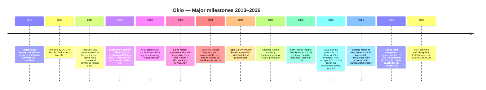
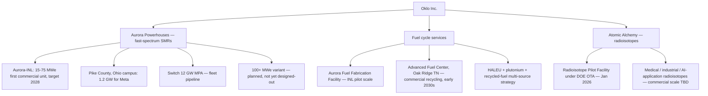
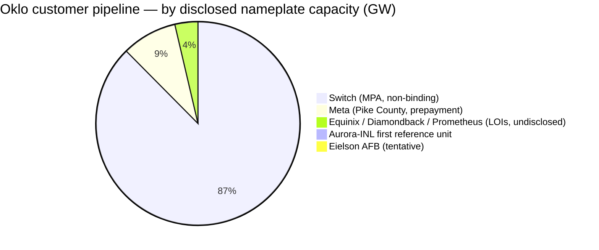
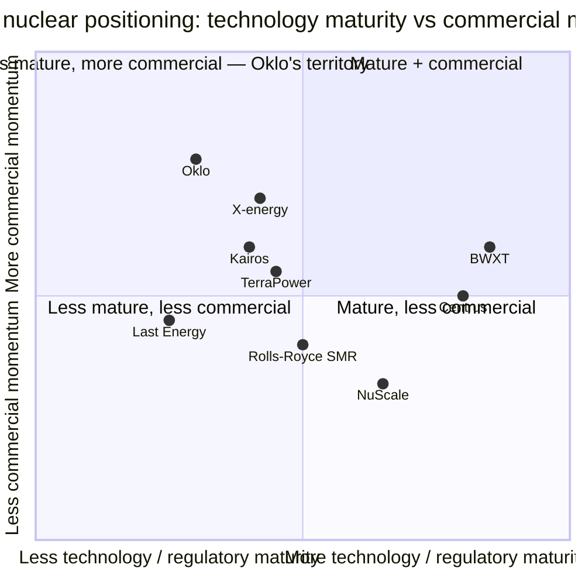

# COMPANY RESEARCH REPORT: Oklo Inc. (NYSE: OKLO)

**Date:** 2026-05-20
**Author:** Independent research — based on SEC filings and public sources
**Coverage status:** Initiation. Pre-revenue, pre-licensed advanced fission developer; high option-value but no defensible cash-flow valuation.

> **Update — FY2026 cash-use outlook initiated (2026-03-17):** With the FY2025 10-K, management guided full-year 2026 cash used in operating expenses of **$80–100 million** and cash used in investing activities of **$350–450 million** — the first explicit full-year cash-use guide management has issued. Implied total 2026 cash use is ~$430–550M, against $2.54B of liquidity at quarter-end Q1 2026. Stated drivers: site-prep at Idaho National Laboratory (INL) and Pike County, Ohio; long-lead-time procurement (steam turbine generator, steel); ramp of Atomic Alchemy and Aurora Fuel Fabrication Facility activity.
> Source: [Oklo Inc. Form 10-K for fiscal year ended December 31, 2025, filed 2026-03-17, p. 10–11](https://www.sec.gov/Archives/edgar/data/1849056/000162828026018698/oklo-20251231.htm).

---

## TABLE OF CONTENTS

1. Company Overview
2. Company History
3. Management Team
4. Products & Services
5. Customers & Go-to-Market
6. Industry Overview
7. Competitive Landscape
8. Market Opportunity (TAM)
9. Risk Assessment

---

## 1. COMPANY OVERVIEW

**What Oklo does.** Oklo Inc. (NYSE: OKLO; "Oklo") is a U.S. designer-developer of "Aurora" small modular fission powerhouses — fast-spectrum, metal-fueled reactors in the 15–75 MWe band, with stated plans for 100+ MWe variants. Unlike incumbent reactor vendors (Westinghouse, GE-Hitachi, Framatome) and most of the SMR cohort (NuScale, X-energy, TerraPower) — who *sell or license* reactor designs to utilities and let the utility own and operate the plant — Oklo intends to be the **designer, builder, owner and operator** of every powerhouse it deploys, selling power (or process heat) directly to off-takers under long-dated Power Purchase Agreements (PPAs). It is a build-own-operate (BOO) merchant generator wrapped in an advanced-reactor design house. The company also owns Atomic Alchemy (radioisotope production, acquired February 2025) and is building a U.S. domestic fuel recycling business intended to convert spent LWR fuel into HALEU-equivalent material for its own fast reactors and other customers ([Oklo 10-K FY2025, p. 5–8](https://www.sec.gov/Archives/edgar/data/1849056/000162828026018698/oklo-20251231.htm)).

**How it makes money — today and tomorrow.** Today: zero commercial revenue. The income statement carries no revenue line through FY2025; all top-line activity is interest and dividend income on the marketable-securities portfolio ([Oklo 10-K FY2025, Consolidated Statement of Operations, p. F-4](https://www.sec.gov/Archives/edgar/data/1849056/000162828026018698/oklo-20251231.htm)). Future revenue model: long-term PPAs for electricity and process heat, plus radioisotope sales from Atomic Alchemy, plus eventual fuel-cycle services. Management's stated near-term milestone is deploying the first commercial Aurora powerhouse — Aurora-INL at the Idaho National Laboratory — **in 2028**, a target the 10-K describes as "ambitious" and contingent on "supply chain, construction, macroeconomic and design complexities" ([Oklo 10-K FY2025, p. 6](https://www.sec.gov/Archives/edgar/data/1849056/000162828026018698/oklo-20251231.htm)).

**Geographic presence.** Headquartered at 3190 Coronado Dr., Santa Clara, California ([2026 Proxy Statement (DEF 14A), p. 1](https://www.sec.gov/Archives/edgar/data/1849056/000184905626000023/0001849056-26-000023-index.htm)). Reactor site work focused on the U.S. — INL (Idaho); Pike County, Ohio (1.2 GW campus tied to a January 2026 Meta prepayment agreement); Eielson Air Force Base, Alaska (tentative selection); Oak Ridge, Tennessee (proposed Advanced Fuel Center). The Atomic Alchemy radioisotope subsidiary is also U.S.-based.

**Scale.** As of December 31, 2025: total assets $1.53 B; total liabilities $52.2 M (no funded debt); total stockholders' equity $1.48 B; accumulated deficit $(240.8) M ([Oklo 10-K FY2025, Balance Sheet, p. F-3](https://www.sec.gov/Archives/edgar/data/1849056/000162828026018698/oklo-20251231.htm)). Following the January 2026 closing of the December-2025 at-the-market (ATM) program — which generated an additional $1.20 B of gross proceeds at an average $96.95 per share — pro-forma cash + marketable securities reached **$2.54 B at March 31, 2026** ([Oklo 10-Q Q1 2026, Balance Sheet, p. 4 and Subsequent Events](https://www.sec.gov/Archives/edgar/data/1849056/000162828026034095/oklo-20260331.htm)).

Source: [Oklo 10-K FY2024 (filed 2025-03-24)](https://www.sec.gov/Archives/edgar/data/1849056/000162828025014490/oklo-20241231.htm), [Oklo 10-K FY2025 (filed 2026-03-17)](https://www.sec.gov/Archives/edgar/data/1849056/000162828026018698/oklo-20251231.htm), and [Oklo 10-Q Q1 2026 (filed 2026-05-12)](https://www.sec.gov/Archives/edgar/data/1849056/000162828026034095/oklo-20260331.htm).

**Headcount.** The FY2025 10-K is unusually thin on a precise full-time headcount figure relative to peers, but characterizes the team as "highly technical and founder-led," with cofounders Jacob and Caroline DeWitte holding approximately 20 and 15 years of nuclear-engineering experience respectively and graduate degrees from MIT ([Oklo 10-K FY2025, p. 12](https://www.sec.gov/Archives/edgar/data/1849056/000162828026018698/oklo-20251231.htm)).

**Valuation snapshot (REQUIRED).**

- **Price / market cap:** Approximately $61.5 per share intra-day on 2026-05-20, implying ≈ $10.7 B market capitalization on ~174.0 M diluted shares outstanding (post Q1 2026 ATM) ([Yahoo Finance, OKLO key statistics, 2026-05-20](https://finance.yahoo.com/quote/OKLO/key-statistics/)).
- **Enterprise value:** ≈ $7.5 B (market cap less ~$2.5 B net cash, minimal debt of $2.6 M) ([Yahoo Finance, OKLO, 2026-05-20](https://finance.yahoo.com/quote/OKLO/)).
- **TTM P/E:** Not meaningful (negative). FY2025 net loss $(105.7) M, FY2024 net loss $(73.6) M; the company has never reported a profit ([Oklo 10-K FY2025, p. F-4](https://www.sec.gov/Archives/edgar/data/1849056/000162828026018698/oklo-20251231.htm)).
- **TTM P/S:** Undefined. **There is no revenue line.** Reported "revenue" in third-party screens is zero through Q1 2026; what looks like operating income flow is entirely interest on the marketable-securities portfolio ($29.1 M for FY2025; $21.3 M for Q1 2026 alone) ([Oklo 10-K FY2025, p. F-4](https://www.sec.gov/Archives/edgar/data/1849056/000162828026018698/oklo-20251231.htm), [Oklo 10-Q Q1 2026, p. 5](https://www.sec.gov/Archives/edgar/data/1849056/000162828026034095/oklo-20260331.htm)).
- **52-week range:** ≈ $35.7 – $193.8. The stock has been one of the most volatile names in the AI-power complex; 80%+ peak-to-trough drawdowns and rebounds have been common ([Yahoo Finance, OKLO, 2026-05-20](https://finance.yahoo.com/quote/OKLO/)).
- **Beta:** ~1.18 (Yahoo Finance, 2026-05-20).

**Decomposing the negative P/E.** The loss is *not* an accounting one-off — it is **structural pre-commercial spend on a multi-year licensing-and-build program**. The two FY2025 income-statement lines are research and development of $58.9 M (up 120% YoY) and general and administrative of $80.4 M (up 208% YoY) — together $139.3 M of operating expenses, against zero revenue ([Oklo 10-K FY2025, p. F-4](https://www.sec.gov/Archives/edgar/data/1849056/000162828026018698/oklo-20251231.htm)). FY2024 included a $(27.9) M non-cash change in fair value of pre-recapitalization SAFE securities, which inflated that year's loss optically — but the underlying cash burn pattern is straight-line growth in opex as the team scales toward the 2028 deployment target.

**Why the multiple is what it is — and how to think about it.** Because there is no revenue, conventional P/E and P/S are uninformative. The market is pricing OKLO on an **option / probability-weighted DCF** logic — investors are paying ~$10.7 B today for the right to a stream of future PPA cash flows that, if Aurora-INL is licensed and deployed on schedule and the Switch / Meta / Equinix / Diamondback / Prometheus pipeline converts into binding PPAs, could justify the valuation. If the licensing path slips materially, or LOIs do not convert, the same option-value framework supports a small fraction of the current price. The closest listed comp — **NuScale Power (NYSE: SMR)** — also has effectively no recurring commercial revenue and a ~$3.6 B market cap / $2.5 B EV ([Yahoo Finance, SMR, 2026-05-20](https://finance.yahoo.com/quote/SMR/)). The other peer comps below are largely revenue-generating and trade on conventional multiples: BWX Technologies (~54× P/E, ~5.5× P/S), Cameco (~95× P/E, ~12.7× P/S), Constellation Energy (~24× P/E), Vistra (~24× P/E) ([Yahoo Finance, comparable tickers, 2026-05-20](https://finance.yahoo.com/quote/BWXT/)). Oklo's ~$10.7 B market cap is **roughly 3× NuScale's** despite NuScale being further along on certain regulatory milestones (Design Certification from the NRC for the original 50 MWe module in 2023), which underscores the narrative premium the market is attaching to the BOO model + AI-power-coupling thesis + DeWitte/Altman founder pedigree.

The valuation is sufficiently disconnected from current fundamentals that it qualifies for an explicit valuation / multiple-compression risk in Section 9.

---

## 2. COMPANY HISTORY

Oklo was founded in 2013 in California by Jacob DeWitte (CEO) and Caroline DeWitte (COO), husband-and-wife MIT-trained nuclear engineers, with the conviction that small, factory-built fast-spectrum reactors — operated by their developer under a merchant power-sales model rather than sold to utilities — could disrupt the century-old "big-LWR-built-on-site" pattern of U.S. commercial nuclear ([Oklo 10-K FY2025, p. 12](https://www.sec.gov/Archives/edgar/data/1849056/000162828026018698/oklo-20251231.htm)). The early thesis was bet-the-company on **(a)** small unit size to control first-of-a-kind risk, **(b)** the build-own-operate model to capture full lifecycle economics, and **(c)** fast-spectrum metal fuel to enable closed-fuel-cycle recycling at scale later.

The company's path to public markets came through a SPAC merger with **AltC Acquisition Corp.** — the Sam Altman / Michael Klein SPAC — signed in July 2023 and consummated on **May 9, 2024**, when AltC changed its name to Oklo Inc. and Legacy Oklo became Oklo Technologies, Inc., a wholly owned operating subsidiary ([Oklo 10-K FY2025, p. 5; 10-K Note 3 — Business Combinations](https://www.sec.gov/Archives/edgar/data/1849056/000162828026018698/oklo-20251231.htm)).

The defining regulatory event in the company's history is the **NRC's January 2022 denial without prejudice** of Oklo's custom combined license (COL) application — the first such application ever submitted by an advanced fission company — which the 10-K still discloses today and which Oklo is rebuilding into an updated COL submission ([Oklo 10-K FY2025, p. 9](https://www.sec.gov/Archives/edgar/data/1849056/000162828026018698/oklo-20251231.htm)).

**Strategic pivots and transformations.**

1. **From "design and license, sell to utility" to BOO merchant generator (pre-public, hardened by S-4 / 10-K).** The 10-K is explicit that this departs sharply from the historical U.S. nuclear playbook — the developer captures lifecycle economics rather than handing them to a utility owner-operator — and is the central element of the equity story ([Oklo 10-K FY2025, p. 7](https://www.sec.gov/Archives/edgar/data/1849056/000162828026018698/oklo-20251231.htm)).
2. **2024 SPAC route instead of a traditional IPO.** AltC's blank-check vehicle had ~$300 M in trust; net of redemptions, Oklo received approximately $258.96 M in cash through the recapitalization, plus $84.1 M of pre-recap SAFE conversions ([Oklo 10-K FY2025, Statement of Stockholders' Equity, p. F-6](https://www.sec.gov/Archives/edgar/data/1849056/000162828026018698/oklo-20251231.htm)). The Altman/Klein sponsor network — Altman as chairman through April 2025, Klein on the board still — was the de facto distribution channel for the deal and the lever for subsequent capital-markets access.
3. **Vertical integration into fuel cycle and radioisotopes (2024–2025).** The February 2025 acquisition of Atomic Alchemy ($1.0 M cash + 820,840 shares at $33.39 = ~$28.4 M stock consideration, plus 274,339 restricted shares for post-combination service) widened the business beyond power generation into medical / industrial radioisotope production, and the September 2025 announcement of an Advanced Fuel Center in Oak Ridge, TN (roadmap of up to $1.68 B investment) committed Oklo to becoming the first commercial U.S. operator of advanced fast-reactor fuel recycling ([Oklo 10-K FY2025, p. 6](https://www.sec.gov/Archives/edgar/data/1849056/000162828026018698/oklo-20251231.htm)).

**Key acquisitions.** Only one closed: **Atomic Alchemy** (radioisotope production, Idaho-based), February 28, 2025, ~$28.4 M stock-and-cash purchase ([Oklo 10-K FY2025, Note 3, p. F-11–F-12](https://www.sec.gov/Archives/edgar/data/1849056/000162828026018698/oklo-20251231.htm)). The 10-K also discloses that management is "evaluating potential acquisition opportunities to strategically accelerate our business" — read: more M&A is on the table given the capital stack.

**Recent developments (last 12 months).**

- **August 2025** — DOE selects Aurora-INL for the new Reactor Pilot Program (RPP), opening a DOE authorization pathway parallel to (not replacing) the NRC COL track; NRC accepts Oklo's Principal Design Criteria (PDC) topical report on an accelerated review schedule ([Oklo 10-K FY2025, p. 9](https://www.sec.gov/Archives/edgar/data/1849056/000162828026018698/oklo-20251231.htm)).
- **September 2025** — Announces plans for Advanced Fuel Center in Tennessee.
- **December 2025** — Selects Kiewit Nuclear Solutions as lead constructor for Aurora-INL; announces Pike County, Ohio land purchase for a 1.2 GW campus; launches $1.5 B ATM program (Dec 4) and immediately sells $300 M in December at an avg $88.29 per share ([Oklo 10-K FY2025, p. 7–8](https://www.sec.gov/Archives/edgar/data/1849056/000162828026018698/oklo-20251231.htm)).
- **January 5, 2026** — Executes the Meta prepayment agreement: Meta will prepay for power and fund securing of nuclear fuel for the Pike County, Ohio site to support Meta data centers ([Oklo 10-K FY2025, p. 7–8, Subsequent Events Note 16, p. F-26](https://www.sec.gov/Archives/edgar/data/1849056/000162828026018698/oklo-20251231.htm)).
- **January 28, 2026** — December ATM program closes after selling a further 12.4 M shares for $1.20 B gross at an average $96.95 per share. Combined December/January ATM = ~$1.5 B in ~8 weeks ([Oklo 10-K FY2025, p. 7; Subsequent Events](https://www.sec.gov/Archives/edgar/data/1849056/000162828026018698/oklo-20251231.htm)).
- **April 21–22, 2026** — Sam Altman's resignation from the board (effective 4/22/2025) is reiterated in the new proxy statement; Jacob DeWitte is now Chairman and CEO ([2026 DEF 14A, p. 1, 66](https://www.sec.gov/Archives/edgar/data/1849056/000184905626000023/0001849056-26-000023-index.htm)).

---

## 3. MANAGEMENT TEAM

The team is small, founder-led, and heavily weighted toward nuclear engineering + DOE-network experience. Six named executive officers; eleven board directors across three classes; recent additions (Dr. Mark Peters, David Christian, Derek Kan, David Park) all bring nuclear-industry or government-policy depth.

### Jacob DeWitte — Chairman, Chief Executive Officer & Co-founder (302 words)

Jacob DeWitte, 40, co-founded Legacy Oklo in 2013 and has served as CEO since inception. He assumed the additional role of Chairman of the Board upon Sam Altman's resignation effective April 22, 2025 ([2026 DEF 14A, p. 28, 66](https://www.sec.gov/Archives/edgar/data/1849056/000184905626000023/0001849056-26-000023-index.htm); [Oklo 10-K FY2025, p. 12](https://www.sec.gov/Archives/edgar/data/1849056/000162828026018698/oklo-20251231.htm)). He holds graduate degrees in nuclear engineering from the Massachusetts Institute of Technology (MIT) and a B.S. in nuclear engineering from the University of Florida. His pre-Oklo experience was almost exclusively academic and DOE-laboratory facing — there is no record of a prior commercial P&L role of comparable scale to today's Oklo.

What he has actually accomplished, by the numbers: (i) shepherded the **first custom combined license application for an advanced fission reactor in NRC history** through submission in 2020 — and rebuilt the application after the 2022 denial, leading to NRC acceptance of the PDC topical report on an accelerated schedule in August 2025; (ii) secured the **first DOE site-use permit ever granted to a commercial advanced fission developer** (INL, 2019); (iii) signed what the 10-K describes as **"one of the largest corporate power purchase agreements in history"** — the 12 GW Switch Master Power Agreement, December 2024 — and the Meta prepayment agreement covering a 1.2 GW Ohio campus, January 2026; (iv) executed the de-SPAC with AltC in May 2024 and ~$3.0 B of subsequent equity raises across follow-ons and two ATM programs.

He is consequential beyond his title: a frequent industry speaker, the public face of Oklo, and the named architect of the BOO business model that distinguishes the company. The 10-K explicitly frames the team as "founder-led" — i.e. concentration in DeWitte is by design, not accident ([Oklo 10-K FY2025, p. 12](https://www.sec.gov/Archives/edgar/data/1849056/000162828026018698/oklo-20251231.htm)). The 2026 Proxy identifies his and Caroline DeWitte's combined beneficial ownership as material insider equity, with detailed Section 16 disclosures attached. He is married to Caroline DeWitte, the COO and a Class II director — a related-party governance fact the proxy discloses ([2026 DEF 14A, p. 21](https://www.sec.gov/Archives/edgar/data/1849056/000184905626000023/0001849056-26-000023-index.htm)).

### R. Craig Bealmear — Chief Financial Officer (172 words)

Craig Bealmear has over 30 years of finance, strategy, and commercial experience, including CFO of Renewable Energy Group (NASDAQ: REGI, acquired by Chevron in 2022 for $3.15 B) and prior CFO of bp plc's North America Downstream segment. He holds an MBA from the Wharton School and a B.A. in Business Administration from Bellarmine University ([Oklo 10-K FY2025, p. 11–12](https://www.sec.gov/Archives/edgar/data/1849056/000162828026018698/oklo-20251231.htm)).

His track record is unusually relevant: REGI was a sub-scale clean-energy operator that he helped scale through M&A and eventual sale to a strategic; bp Downstream gave him hard-asset, complex-supply-chain CFO experience at investment-grade scale. For Oklo today, the central CFO challenge is *capital markets, not P&L management* — there is no operating P&L. Since his appointment (precise start date not separately disclosed in the 10-K), Oklo has executed a follow-on equity offering (Aug 2024, $440.1 M net), the September-2025 ATM ($820.4 M gross through close), and the December-2025 ATM ($1.5 B aggregate gross by Jan 28, 2026) — collectively the equity stack that funds the 2028 deployment plan and ~10× the cash balance vs FY2024 close ([Oklo 10-K FY2025, Statement of Stockholders' Equity, p. F-6; Q1 2026 10-Q](https://www.sec.gov/Archives/edgar/data/1849056/000162828026018698/oklo-20251231.htm)).

### Caroline DeWitte — Chief Operating Officer & Co-founder (110 words)

Caroline DeWitte, 43, co-founded Legacy Oklo in 2013 and has served as its COO ever since. She studied nuclear engineering at MIT (S.M.) and holds a B.A. in Economics and a B.S. in Mechanical Engineering from the University of Oklahoma ([2026 DEF 14A, p. 20](https://www.sec.gov/Archives/edgar/data/1849056/000184905626000023/0001849056-26-000023-index.htm)). She served on the U.S. Department of Energy Nuclear Energy Advisory Committee (2018–2019) and on the panel of the Clean Energy Ministerial. Inside Oklo she owns operations, manufacturing planning, supply-chain build-out and Atomic Alchemy integration — i.e. she will own the "deploy in 2028" execution risk. She is married to CEO Jacob DeWitte. As a Class II director up for re-election at the June 3, 2026 annual meeting, she is the only other DeWitte on the board.

### William Goodwin — Chief Legal & Strategy Officer (95 words)

Will Goodwin has approximately 15 years of legal experience, most recently as Deputy General Counsel and Head of Special Projects at Joby Aviation (NYSE: JOBY) — relevant for first-of-a-kind regulatory engagement — and earlier as Head of Policy at Skyryse ([Oklo 10-K FY2025, p. 12](https://www.sec.gov/Archives/edgar/data/1849056/000162828026018698/oklo-20251231.htm)). He holds a J.D. from UCLA Law and an M.A. in Political Philosophy from Claremont. At Oklo he owns NRC engagement, DOE program participation, and the now-very-busy capital-markets legal workstream (S-1, S-3, S-4 series).

### Patrick Schweiger — Chief Technology Officer (92 words)

Pat Schweiger has over 40 years of energy-sector leadership, including as head of Hedron (per 10-K), with deep operating background in conventional generation engineering. He owns the design pathway from PDC through detailed engineering for Aurora-INL ([Oklo 10-K FY2025, p. 12](https://www.sec.gov/Archives/edgar/data/1849056/000162828026018698/oklo-20251231.htm)). The CTO function is the make-or-break technical risk for the company — the Aurora design must meet NRC and DOE-RPP safety expectations, integrate with Kiewit's construction approach, and accommodate a flexible fuel strategy (HALEU, recycled fuel, and potentially DOE-supplied plutonium) without re-licensing.

### Governance footer (140 words)

- **Board composition:** 11 directors across 3 staggered classes; majority independent (with the two DeWittes plus Michael Klein as related to founder/sponsor). Notable independents: Lt. Gen. (ret.) John Jansen (Marine Corps three-star); Daniel B. Poneman (former U.S. Deputy Secretary of Energy under Obama); Dr. Mark Peters (CEO of MITRE; former director of Idaho National Laboratory); David A. Christian (former CEO Dominion Generation, deeply credible nuclear-operator pedigree); Derek Kan (former U.S. Under Secretary of Transportation); David Park (added 2026) ([2026 DEF 14A, p. 18–32](https://www.sec.gov/Archives/edgar/data/1849056/000184905626000023/0001849056-26-000023-index.htm)).
- **Insider ownership / control:** Material insider equity for the DeWittes and Klein-affiliated entities; full Section 16 holdings in the proxy.
- **Compensation:** Director comp program of cash retainer + RSU grants (Kinzley, Jansen, Thompson, Poneman each ~$165–243k FY2025); Altman and Klein waived all director comp; founders compensated through the executive program.
- **Related-party:** M. Klein & Company / The Klein Group LLC engaged as advisory firm — $500k FY2025 ([Note 15 — Related Party Transactions, 10-K p. F-25](https://www.sec.gov/Archives/edgar/data/1849056/000162828026018698/oklo-20251231.htm)).

### Management track-record synthesis (89 words)

Strong nuclear-engineering depth at the top; thin operating P&L history (DeWittes are first-time public-company CEO/COO, expressly flagged as a risk in the 10-K's "limited public-company experience" risk factor). The board is the company's biggest credibility lever — Poneman, Peters, Christian, Jansen, plus Klein's capital-markets reach — but board pedigree does not substitute for execution. The bar from here is operational: convert LOIs to binding PPAs, deliver Aurora-INL on the 2028 timeline (with realistic slippage tolerance), and re-secure NRC licensure after the 2022 denial. Execution risk dominates the thesis.

---

## 4. PRODUCTS & SERVICES

Oklo organizes its activity around **three product/service tracks**, but only one (Aurora powerhouses) is the equity story today. The other two (fuel cycle services; radioisotopes via Atomic Alchemy) are real but smaller and longer-dated.

### Track 1 — Aurora powerhouses (the equity story)

Aurora is a **liquid-metal-cooled, metal-fueled fast-spectrum reactor** designed by Oklo, originally validated against operating data from the EBR-II experimental fast reactor that ran at INL for ~30 years. Target unit size: 15–75 MWe of electrical output, with stated plans for 100+ MWe variants. Heat output is sufficient to serve industrial process heat customers in addition to electricity ([Oklo 10-K FY2025, p. 5–7](https://www.sec.gov/Archives/edgar/data/1849056/000162828026018698/oklo-20251231.htm)).

- **What it does:** Produces electricity and heat. Designed for siting at customer location (behind-the-meter) or grid-connected. Decades-long fuel cycle relative to LWR (claimed by management based on fast-spectrum metal-fuel design).
- **Target customer:** Data centers (Meta, Equinix, Switch, Prometheus Hyperscale), industrial off-takers (Diamondback Energy oil & gas), DoD installations (Eielson AFB tentative), utilities (TVA exploratory). Oklo specifically *avoids* the traditional large utility customer.
- **Pricing model:** PPA — price per MWh or MMBtu of heat over multi-year (typically 10–30 year) terms. **No PPA pricing disclosed in filings;** management cautions that unit-economics modeling is "subject to market and extrinsic forces such as the impact of construction costs as a result of tariffs, supply chain pressures, and other macroeconomic factors" ([Oklo 10-K FY2025, p. 7](https://www.sec.gov/Archives/edgar/data/1849056/000162828026018698/oklo-20251231.htm)).
- **Typical deal size:** A single Aurora powerhouse sized at 75 MWe operating at high capacity factor would produce roughly 590 GWh/year, which at illustrative $80/MWh would be ~$47 M/year of gross revenue per unit. Switch's 12 GW MPA, if fully built out, would be hundreds of powerhouses — but the agreement is a *master* power agreement, not binding capacity commitments for each unit.
- **Competitive-advantage verdict:** **Partial.** The differentiator is the **BOO commercial model + fast-spectrum metal-fueled architecture + DOE-network access**, not the reactor design per se. Multiple competitors have fast-spectrum or metal-fuel programs (TerraPower's Natrium uses sodium-cooled fast-spectrum with HALEU; X-energy's Xe-100 is gas-cooled but smaller-unit-size like Oklo; NuScale is light-water but small-modular). Oklo's *combination* of (i) small enough to deploy at a single customer site, (ii) BOO instead of design-license, and (iii) fuel-recycling vertical integration is unique in commercial U.S. nuclear and has no exact analogue today. Moat type: regulatory/certification (if and when COL is achieved); first-mover BOO; access to DOE programs and INL site. Evidence: First (and to date only) advanced fission developer to (a) submit a custom COL, (b) receive a DOE site-use permit at INL, (c) be selected under DOE Reactor Pilot Program for two projects, (d) sign a 12 GW corporate PPA framework. Closest competing product: NuScale VOYGR (LWR SMR, 50–462 MWe configurations). Compare: Behind on NRC design certification (NuScale received the original 50 MWe Design Certification in 2023); ahead on commercial customer momentum and DOE-program participation; ahead on stated business model.
- **Flagship?** Yes — this is the flagship. Aurora-INL is the first reference unit; Aurora-Pike County (Meta) is the first scaled-commercial deployment.
- **Recent launches:** No actual product launches because nothing is commercially operating. Major positive milestones in last 12 months: DOE RPP selection (Aug 2025); NRC PDC acceptance on accelerated review (Aug 2025); Kiewit selected as lead constructor (Dec 2025); Meta prepayment (Jan 2026). The 12 GW Switch MPA was signed Dec 2024.

### Track 2 — Fuel cycle services

Oklo is building two related fuel-cycle assets: (a) the **Aurora Fuel Fabrication Facility at INL** — a pilot-scale facility intended to fabricate HALEU-equivalent fuel for the first Aurora-INL powerhouse, selected under the DOE Fuel Line Pilot Program (FLPP) ([Oklo 10-K FY2025, p. 6](https://www.sec.gov/Archives/edgar/data/1849056/000162828026018698/oklo-20251231.htm)); and (b) the **Advanced Fuel Center in Oak Ridge, Tennessee** — a planned first-of-a-kind commercial-scale used-fuel recycling facility, with a roadmap of up to $1.68 B investment and a goal of operations in the early 2030s. The U.S. currently does not commercially recycle spent nuclear fuel; France, Russia and Japan do.

- **Pricing model:** Not yet disclosed. Likely a mix of toll-processing fees from utilities sending in spent fuel, plus sale of recycled product back to Oklo's own reactor fleet at internal transfer prices.
- **Competitive-advantage verdict:** **Yes — regulatory/policy moat if and when the Advanced Fuel Center is licensed.** The U.S. has not granted a commercial recycling license since the 1970s; Oklo's position as the first credible re-entrant, with DOE-program backing, is a structural advantage. Closest competing offering: BWX Technologies and Centrus Energy in the HALEU front-end supply, but neither does back-end recycling at commercial scale; Orano (private, French) has the global incumbent reprocessing operation at La Hague. Compare: ahead in U.S. specifically; far behind Orano globally.
- **Flagship?** No — secondary, optionality. Material to the long-run thesis (margin uplift on power sales, recurring fuel-cycle service revenue) but not in the 2026–2028 window.
- **Recent launches:** Sept 2025 announcement of Advanced Fuel Center, including a stated potential to create "more than 800 high-quality jobs" ([Oklo 10-K FY2025, p. 6](https://www.sec.gov/Archives/edgar/data/1849056/000162828026018698/oklo-20251231.htm)). DOE has approved key safety documents (Safety Design Strategy, Conceptual Safety Design Report, Nuclear Safety Design Agreement, Preliminary Documented Safety Analysis) for the INL fuel-fabrication side.

### Track 3 — Atomic Alchemy (radioisotopes)

Acquired Feb 28, 2025 for ~$28.4 M of stock-and-cash consideration ([Oklo 10-K FY2025, Note 3 Business Combinations, p. F-11](https://www.sec.gov/Archives/edgar/data/1849056/000162828026018698/oklo-20251231.htm)). Atomic Alchemy will produce radioisotopes for medical, industrial, defense, and AI applications. Selected by DOE for one of the eleven projects under the new Reactor Pilot Program (RPP) in August 2025; on January 7, 2026, executed a DOE Other Transaction Agreement (OTA) for a Radioisotope Pilot Facility, marking transition from project selection to active execution.

- **Pricing model:** Per-Ci or per-mg sales to medical (Mo-99/Tc-99m for SPECT imaging, Lu-177 for cancer therapy, Ac-225 for targeted alpha therapy, etc.) and industrial customers. Not yet revenue-generating commercially; pilot plant under construction.
- **Competitive-advantage verdict:** **Partial.** The radioisotope market has incumbent suppliers (Curium Pharma, Bruce Power, NorthStar Medical Radioisotopes, BWX Technologies). Atomic Alchemy's edge is being inside Oklo — i.e. eventual radioisotope production *as a co-product of* fast-reactor operation rather than as a standalone irradiation business. Closest competing product: NorthStar's molybdenum-99 generators (already commercial), or BWXT's Mo-99 program (in development). Compare: behind today on production scale (Atomic Alchemy is pre-revenue); plausibly ahead on long-run cost if the fast-reactor co-production thesis works.
- **Flagship?** No — third in priority. But it gives Oklo a near-term revenue path (commercial radioisotope sales could conceivably begin pre-2028, ahead of the first Aurora powerhouse).
- **Recent launches:** January 2026 DOE OTA execution for Radioisotope Pilot Facility — first transition from "selected" to "executing" under DOE authorization.

**Long-tail / experimental:** Mentioned in the 10-K but not material today: process-heat applications for industrial customers (oil & gas, chemicals); off-grid / behind-the-meter remote-community deployments; potential international deployments (no announced contracts).

---

## 5. CUSTOMERS & GO-TO-MARKET

### Customer pipeline — disclosed counterparties

The 10-K names the following customer engagements ([Oklo 10-K FY2025, p. 5–6, 9–11](https://www.sec.gov/Archives/edgar/data/1849056/000162828026018698/oklo-20251231.htm)). The reader should pay close attention to **contract type** — Oklo's pipeline is dominated by *non-binding letters of intent (LOIs)* and *master power agreements (MPAs)*, with a small number of binding-flavored mechanisms (the Meta prepayment, the DOE OTA).

| Counterparty | Contract type | Capacity / scope | Status | Source |
|---|---|---|---|---|
| **Meta Platforms** | Prepayment agreement | 1.2 GW campus in Pike County, Ohio | Signed Jan 5, 2026 — Meta prepays for power; funds nuclear-fuel procurement | [10-K FY2025, p. 7–8, Note 16](https://www.sec.gov/Archives/edgar/data/1849056/000162828026018698/oklo-20251231.htm) |
| **Switch, Ltd** | Master Power Agreement | 12 GW | Signed Dec 2024 — non-binding framework; described as "one of the largest corporate PPAs in history" | [10-K FY2025, p. 5](https://www.sec.gov/Archives/edgar/data/1849056/000162828026018698/oklo-20251231.htm) |
| **Equinix** | Non-binding LOI | Not disclosed | LOI only; no binding capacity commitment | [10-K FY2025, p. 5](https://www.sec.gov/Archives/edgar/data/1849056/000162828026018698/oklo-20251231.htm) |
| **Diamondback Energy** | Non-binding LOI | Not disclosed | LOI for oil & gas off-grid application | [10-K FY2025, p. 5](https://www.sec.gov/Archives/edgar/data/1849056/000162828026018698/oklo-20251231.htm) |
| **Prometheus Hyperscale** | Non-binding LOI | Not disclosed | LOI; formerly Wyoming Hyperscale White Box LLC | [10-K FY2025, p. 5](https://www.sec.gov/Archives/edgar/data/1849056/000162828026018698/oklo-20251231.htm) |
| **Eielson Air Force Base** | Tentative selection | Not disclosed | Selection only — not a contract | [10-K FY2025, p. 5](https://www.sec.gov/Archives/edgar/data/1849056/000162828026018698/oklo-20251231.htm) |
| **TVA (Tennessee Valley Authority)** | Exploratory | Not disclosed | Exploratory discussions on fuel recycling + future power off-take | [10-K FY2025, p. 5](https://www.sec.gov/Archives/edgar/data/1849056/000162828026018698/oklo-20251231.htm) |
| **DOE / INL (first reference site)** | DOE authorization + site MOA | Aurora-INL powerhouse | DOE Idaho MOA signed Sep 25, 2024; RPP selection Aug 2025 | [10-K FY2025, p. 5, 9](https://www.sec.gov/Archives/edgar/data/1849056/000162828026018698/oklo-20251231.htm) |
| **DOE (Radioisotope Pilot Facility)** | Other Transaction Agreement (OTA) | Atomic Alchemy pilot plant | Executed Jan 7, 2026 | [10-K FY2025, p. 8](https://www.sec.gov/Archives/edgar/data/1849056/000162828026018698/oklo-20251231.htm) |

*Note: pie wedges are nameplate capacity Oklo has been *named in* across various non-binding instruments. Disclosed sub-GW figures are approximations of plausible single-site sizing; LOI partners do not have disclosed capacity commitments. Pie does **not** represent contracted revenue or binding off-take. Source: [10-K FY2025, p. 5–8](https://www.sec.gov/Archives/edgar/data/1849056/000162828026018698/oklo-20251231.htm).*

### Customer-concentration analysis — what the 10-K does and does not disclose

Oklo has **no commercial revenue** in any reported period, so the standard ASC 280 customer-concentration disclosure (named customers ≥ 10% of consolidated revenue) is not applicable in the conventional sense. The 10-K does *not* publish a Top-1 or Top-5 customer percentage table — because there are no customer sales. **What is disclosed instead** is a customer *pipeline*, with the clear caveat that all named hyperscaler / industrial counterparties are LOI-stage, with the singular exception of the Meta prepayment agreement and the Switch MPA framework (which is non-binding).

For the future revenue picture, concentration is **structurally extreme**. Two off-take agreements (Switch and Meta) account for the overwhelming bulk of the disclosed nameplate pipeline. Should either counterparty walk, renegotiate downward, or fail to convert LOI/MPA into binding PPAs at financeable prices, the equity story is materially weakened. The 10-K acknowledges this risk explicitly in its risk-factor section ("customers may have the right to terminate or renegotiate these contracts based on a number of factors that will be specified on an agreement-by-agreement basis") ([Oklo 10-K FY2025, p. 18](https://www.sec.gov/Archives/edgar/data/1849056/000162828026018698/oklo-20251231.htm)).

**Carrying it forward:** Future customer concentration is treated as a *material* risk in Section 9.

### Distribution channels, sales cycle and partnerships

- **Direct sales** — Oklo's commercial team engages counterparties directly. There is no channel-partner / OEM model. Average sales cycle is multi-year given regulatory dependencies; LOIs are signed early, evolve to MPAs/framework agreements, then to PPAs after siting and regulatory milestones are achieved.
- **Key construction partner:** **Kiewit Nuclear Solutions Co.** — selected as lead constructor for Aurora-INL in December 2025 ([Oklo 10-K FY2025, p. 10](https://www.sec.gov/Archives/edgar/data/1849056/000162828026018698/oklo-20251231.htm)). Kiewit is one of the largest privately-held construction firms in North America with deep heavy-civil and nuclear-adjacent experience.
- **Fuel partners:** Multi-pronged strategy — recycled fuel from the Tennessee Advanced Fuel Center (long-dated), HALEU enriched fuel from third-party suppliers, and potentially DOE-provided plutonium under dilute-and-dispose programs.
- **Government partners:** DOE (RPP, FLPP, Idaho site, Atomic Alchemy OTA), INL (research / site host), Argonne National Laboratory (fuel recycling demonstration partner), MIT (research relationships).
- **Capital-markets partners:** Multiple sales agents under the December-2025 ATM; M. Klein & Company / The Klein Group as related-party advisor.

### Customer case studies — there are none yet

Because no Aurora powerhouse is operating, there are no commercial case studies. The most "case-study-like" disclosure is the **Meta prepayment**, which represents the first instance of a hyperscaler putting cash on Oklo's balance sheet against future power — i.e. moving down the contract spectrum from LOI toward binding off-take. The mechanism: Meta prepays; Oklo uses the funds to secure nuclear fuel for the first phase of the Pike County campus. This is closer to a project-finance off-take structure than a standard PPA, and is likely to be the template for subsequent hyperscaler conversions if the model works.

---

## 6. INDUSTRY OVERVIEW

### Industry definition and scope

Oklo sits at the intersection of three industries:

1. **Advanced nuclear / SMR generation.** The "small modular reactor" cohort — sub-300 MWe per unit, factory-fabricated, designed for shorter construction cycles and broader siting flexibility than the 1,000+ MWe Gen-III LWRs that dominate today's U.S. fleet. NAICS 221113 (nuclear electric power generation) at the operating end; equipment manufacturing at the design-house end. Adjacent: large LWRs (Vogtle 3 & 4 model — Westinghouse AP1000); microreactors (sub-20 MWe); fusion energy (much earlier-stage).
2. **Advanced nuclear fuel cycle.** Front-end (HALEU enrichment — Centrus, Urenco, Orano, BWXT) and back-end (used-fuel recycling — Orano dominant globally, no commercial U.S. operator today).
3. **AI-driven electricity demand / data-center power off-take.** Hyperscaler PPAs are now the dominant new-build off-take mechanism in the U.S.; nuclear is increasingly favored vs. variable renewables for 24/7 carbon-free generation. Constellation's reactivation of Three Mile Island Unit 1 for Microsoft (2024) and the Amazon / Talen acquisition of Cumulus near Susquehanna are bellwethers.

### Market size and growth

The relevant addressable market for Oklo is not "global nuclear power generation" (which is mature and slow-growing); it is **incremental U.S. (and eventually OECD) clean firm power, weighted toward data-center off-takers, willing to procure under PPAs.**

- **Total U.S. electricity generation:** ~4,100 TWh in 2024; nuclear contributed ~19% (≈ 775 TWh). Source: [U.S. Energy Information Administration, "Electric Power Annual"](https://www.eia.gov/electricity/annual/).
- **U.S. data-center electricity consumption** is projected to roughly double from ~176 TWh in 2023 to 325–580 TWh by 2028, per [Lawrence Berkeley National Laboratory, "2024 U.S. Data Center Energy Usage Report", 2024-12](https://eta.lbl.gov/publications/2024-united-states-data-center). The incremental ~150–400 TWh/year is the demand growth nuclear SMRs are most directly competing to serve.
- **Advanced reactor / SMR project pipeline globally** is in the tens of designs and the IAEA SMR Book lists more than 80 designs under various stages of development as of 2024 ([IAEA Advanced Reactors Information System (ARIS)](https://aris.iaea.org/)). Only a handful have any commercial customer commitment (NuScale, Oklo, TerraPower, X-energy, Rolls-Royce SMR, BWXT).

### Key trends and drivers (last 12–24 months)

- **AI-power coupling.** Microsoft / TMI, Amazon / Talen, Meta / Oklo, Google / Kairos all in 2024–2025; hyperscalers explicitly preferring nuclear for 24/7 carbon-free.
- **Federal policy tailwind.** ADVANCE Act signed July 9, 2024 — streamlines NRC licensing, supports advanced reactors. Four Executive Orders on May 23, 2025 directed NRC, DOE and DoD to accelerate advanced-reactor deployment, including specifically for AI/data-center needs ([Oklo 10-K FY2025, p. 11](https://www.sec.gov/Archives/edgar/data/1849056/000162828026018698/oklo-20251231.htm)).
- **DOE programs.** Reactor Pilot Program (RPP, 2025) and Fuel Line Pilot Program (FLPP) provide DOE-authorization pathways and federal cost-share.
- **Capital flow.** Public-market interest in SMR thematic surged 2024–2025; Oklo, NuScale, Nano Nuclear, Centrus, BWXT all re-rated significantly higher (with significant volatility) before partial pullback in 2026.
- **Fuel-supply pressure.** HALEU supply is structurally short; cost has "increased significantly" per Oklo's 10-K. Tariffs, supply-chain disruption, and evolving sanctions on Russian/Kazakh material are all flagged ([Oklo 10-K FY2025, p. 6](https://www.sec.gov/Archives/edgar/data/1849056/000162828026018698/oklo-20251231.htm)).

### Regulatory environment

The NRC is the dominant regulator for commercial reactors via 10 CFR Part 50 (operating license) or Part 52 (combined license / design certification). Oklo's path uses **custom combined license** (Part 52), which the company is the first advanced developer to attempt. Parallel pathway: DOE authorization under the RPP for the first reference Aurora-INL plant — DOE has authority to authorize construction and operation at DOE sites, which can run in parallel with NRC licensing. This dual-track approach is novel and partially de-risks the schedule, but a commercial off-DOE-site deployment (Pike County, Eielson, hyperscaler-owned sites) ultimately requires NRC licensure.

### Industry dynamics

- **Fragmentation:** Highly fragmented at the design-house level (80+ SMR designs); highly concentrated at the legacy reactor-vendor level (Westinghouse, Framatome, GE-Hitachi, Mitsubishi, Rosatom, CGN — only ~6 vendors deploying commercial-scale Gen-III/III+).
- **Barriers to entry:** Extreme. Multi-decade design and licensing cycle; capital-intensive (each pilot deployment > $1 B); narrow specialist workforce; long-cycle supply chain (steam turbine generators, reactor pressure vessels, HALEU fuel).
- **Buyer power:** Hyperscalers are the new high-leverage buyers (concentration, sophistication, ability to commit balance sheet via prepayments). Traditional utility buyers are slower and more risk-averse.
- **Substitutes:** Solar + storage (now sub-$50/MWh in good geographies but firm-power challenged); natural-gas combined-cycle (firm and cheap but carbon-intensive); geothermal (early); fusion (decades away commercially); demand-side curtailment (limited).
- **Supplier power:** HALEU enrichment is concentrated (Centrus is the only U.S. HALEU-licensed producer today); reactor pressure vessel forging is concentrated (Doosan Heavy in Korea, Japan Steel Works, a handful of Western options); fast-spectrum metal fuel is essentially custom.

---

## 7. COMPETITIVE LANDSCAPE

### The competitor set

The relevant competitor set splits into four buckets: (a) other SMR / advanced fission developers; (b) HALEU fuel-cycle players; (c) revenue-generating nuclear adjacents that capture the same "AI-power" narrative; and (d) non-nuclear firm-power substitutes.

**(a) SMR / advanced fission developers.**

1. **NuScale Power (NYSE: SMR).** The most direct listed comp. Light-water SMR (50–77 MWe per module, deployed in clusters up to 462 MWe). Received the original 50 MWe Design Certification from the NRC in 2023 (the first SMR DC ever). After the Utah Associated Municipal Power Systems (UAMPS / Carbon Free Power Project) cancellation in 2023, has been rebuilding a customer book; signed a partnership with ENTRA1 Energy for fleet deployment. Market cap ~$3.6 B; EV ~$2.5 B; effectively pre-revenue ([Yahoo Finance, SMR, 2026-05-20](https://finance.yahoo.com/quote/SMR/)).
2. **TerraPower (private; Bill Gates–backed).** Natrium reactor — 345 MWe sodium-cooled fast reactor with molten-salt thermal storage, designed to integrate with renewables. First demonstration plant under construction at Kemmerer, Wyoming (replacing a retiring coal plant). Target operation late-2020s. Has DOE Advanced Reactor Demonstration Program funding.
3. **X-energy (private; Amazon-backed).** Xe-100 — 80 MWe high-temperature gas-cooled reactor using TRISO fuel pebbles, designed for 4-pack 320 MWe deployments. Partnership with Dow for petrochemical heat at Seadrift, TX. Amazon committed in 2024 to procuring more than 5 GW of X-energy capacity.
4. **Kairos Power (private; Google-backed).** Fluoride-salt cooled high-temperature reactor (KP-FHR). Google signed an order in October 2024 for up to 500 MW across multiple Kairos units through 2035.
5. **Rolls-Royce SMR (LSE: RR. parent).** 470 MWe LWR SMR; targeting UK, Czech, Swedish markets primarily.
6. **Holtec (private).** SMR-300 — 300 MWe LWR SMR. Targeting brownfield siting at retiring coal/nuclear sites.
7. **Last Energy (private).** Sub-20 MWe micro-LWR units; pre-LOI commercial pipeline with European data centers.
8. **Nano Nuclear Energy (NASDAQ: NNE).** Pre-commercial micro-reactor developer; market cap ~$1.3 B; no commercial revenue ([Yahoo Finance, NNE, 2026-05-20](https://finance.yahoo.com/quote/NNE/)).

**(b) Fuel-cycle.**

9. **Centrus Energy (NYSE: LEU).** Only U.S. HALEU producer with NRC license; ~$3.3 B mcap, $168/share, ~7.3× P/S — has actual revenue and an established customer book; benefits from any HALEU supply demand from SMR cohort ([Yahoo Finance, LEU, 2026-05-20](https://finance.yahoo.com/quote/LEU/)).
10. **BWX Technologies (NYSE: BWXT).** Naval-reactor primary contractor; nuclear medicine business; HALEU activity; ~$18.4 B mcap, $201/share, ~54× P/E ([Yahoo Finance, BWXT, 2026-05-20](https://finance.yahoo.com/quote/BWXT/)). Established revenue and profitability.
11. **Cameco (NYSE: CCJ).** Uranium mining and conversion; the major name in front-end fuel; ~$45 B mcap, ~95× P/E reflects supply-cycle premium ([Yahoo Finance, CCJ, 2026-05-20](https://finance.yahoo.com/quote/CCJ/)).
12. **Orano (private; French state).** Global incumbent in spent-fuel reprocessing; the operator Oklo would compete with on the Advanced Fuel Center business case.

**(c) Revenue-generating nuclear adjacents capturing the AI-power narrative.**

13. **Constellation Energy (NASDAQ: CEG).** Largest U.S. nuclear operator; Microsoft / TMI restart deal; ~$101 B mcap, ~24× P/E, EV $116 B ([Yahoo Finance, CEG, 2026-05-20](https://finance.yahoo.com/quote/CEG/)).
14. **Vistra (NYSE: VST).** Texas nuclear-adjacent power; ~$48.6 B mcap, ~24× P/E ([Yahoo Finance, VST, 2026-05-20](https://finance.yahoo.com/quote/VST/)).
15. **Talen Energy (NASDAQ: TLN).** Susquehanna nuclear; Amazon/Cumulus deal.

**(d) Non-nuclear substitutes:** Solar + storage developers; natural-gas combined-cycle; geothermal (Fervo, Sage); demand-side options.

### Positioning framework

Source: [Yahoo Finance key statistics for each ticker, 2026-05-20](https://finance.yahoo.com/quote/OKLO/key-statistics/).

### Oklo's competitive advantages

1. **First-mover commercial momentum.** 12 GW Switch MPA, Meta prepayment, DOE RPP selection — no other SMR developer has this combination of disclosed commercial momentum, even if non-binding.
2. **BOO business model.** Differentiated from incumbent design-and-license vendors and most of the SMR cohort. Captures lifecycle economics; aligns developer with operator.
3. **DOE-network access.** Two RPP selections (Aurora and Atomic Alchemy), INL site MOA, FLPP for fuel fabrication, Argonne research collaboration. The federal channel is real and matters.
4. **Founder pedigree and capital-markets access.** Altman-backed origin, Klein on the board, broad-syndicate sales-agent network — collectively enabled ~$3 B of equity raises in ~20 months.
5. **Fuel-cycle vertical integration optionality.** No other SMR developer has staked the commercial reprocessing position.

### Vulnerabilities

1. **No NRC license; one prior denial.** NuScale has its DC; Oklo does not. The 2022 denial-without-prejudice is real history.
2. **Pre-revenue, pre-deployment.** Every milestone slip = thesis erosion; every dilution event = effective per-share value erosion (capital raised at much lower prices than peak share price).
3. **Construction execution.** First-of-a-kind on Aurora-INL; Kiewit is competent but nuclear first-of-a-kind delays are the historical norm (see Vogtle 3 & 4: 7+ years late, ~$15 B over budget).
4. **HALEU/fuel-supply exposure.** Concentrated single-vendor (Centrus) for U.S. HALEU; fuel-recycling solution is years out; plutonium-pathway optionality is policy-dependent.
5. **Hyperscaler counterparty optionality.** The same hyperscalers Oklo is selling to (Meta, Microsoft, Amazon, Google) have entered competing deals with NuScale, X-energy, Kairos and Constellation respectively. The hyperscaler buyer can re-allocate.

### Market-share analysis

There is no commercial SMR fleet, so "market share" is forward-looking pipeline share. On the disclosed pipeline (LOI/MPA capacity) Oklo and X-energy are arguably leading the U.S. advanced-reactor field. On regulatory progress, NuScale is leading. On revenue today, none of the SMR developers has any — all the revenue is at incumbents like BWXT and at operators like Constellation and Vistra.

---

## 8. MARKET OPPORTUNITY (TAM)

### TAM sizing methodology

The relevant TAM for Oklo over a 10-year horizon is **incremental clean firm-power capacity in the U.S. plus near-term export opportunities, sized in revenue-per-MWh under PPAs.**

- **Bottom-up TAM frame.** Suppose U.S. data-center demand grows by ~300 TWh/yr by 2030 (midpoint of Lawrence Berkeley range). If even 15% of incremental capacity is procured under nuclear PPAs, that is ~45 TWh/yr of revenue opportunity — at $80–100/MWh (illustrative; actual Oklo PPA pricing not disclosed), that is **$3.6–4.5 B per year of revenue opportunity** for the advanced-reactor cohort by 2030. By 2035 this could plausibly double under continued AI capex growth.
- **Capacity-frame TAM.** At ~10 GW of incremental SMR capacity over the next decade (consistent with public commitments by Amazon, Meta, Microsoft, Google in 2024–2025), and assuming ~$5 B EPC + financing per GW of SMR capacity, the cumulative project-finance market is ~$50 B over the decade.
- **Heat / industrial-process market.** Oklo's design is sized for behind-the-meter industrial use; the U.S. industrial process-heat market is on the order of 6,000 TBtu/yr; even 1% market share by 2035 is a multi-hundred-MWe deployment.
- **Radioisotope market.** Global medical radioisotope market ~$10 B today, growing high-single-digits ([World Nuclear Association — Radioisotopes in Medicine, 2024 update](https://world-nuclear.org/information-library/non-power-nuclear-applications/radioisotopes-research/radioisotopes-in-medicine.aspx)). Atomic Alchemy's slice is small but real, and pre-Aurora.
- **Fuel-cycle revenue.** The U.S. has ~90,000 metric tons of spent fuel inventory; Orano La Hague (France) generates EUR ~1.5 B/year of toll-reprocessing revenue. A U.S. domestic recycling business at scale would be a >$1 B/year revenue line — but this is a 2030s opportunity.

### SAM (serviceable addressable market)

Oklo's serviceable market in the next 10 years is realistically **U.S. data-center power off-take + DoD installations + select industrial off-takers + select export opportunities**. We exclude (a) most existing U.S. utility off-take (slow procurement, conservative); (b) most international markets (regulatory uncertainty, no near-term licensing path); (c) traditional residential / municipal load.

A reasonable SAM-frame: **$15–25 B of cumulative U.S. SMR-suitable PPA revenue over 10 years from data centers + DoD + select industrials.** This is the pool every SMR developer is fighting for; market share will be determined by who gets to operating first, with what cost/MWh, with what fleet-replication efficiency.

### SOM (serviceable obtainable market)

Oklo's currently-disclosed pipeline — Switch 12 GW (non-binding) + Meta 1.2 GW (prepayment) + Equinix/Diamondback/Prometheus LOIs + Eielson + INL — is *nominally* a much larger figure than the SAM frame above, because pipeline includes long-dated framework numbers like the 12 GW Switch MPA that will not be built out for 10–20 years. The realistic SOM by 2030 for Oklo, conditional on (a) NRC re-licensure or DOE-authorization-only first deployments, (b) Aurora-INL operating, and (c) conversion of 10–20% of the LOI pipeline to binding PPAs, is **0.5–1.5 GW of operating capacity by 2030**, generating $300 M – $1 B of annual PPA revenue at that point.

### Penetration strategy

Oklo's commercial strategy is concentric:

1. **Demonstrate on Aurora-INL** (2028 target) — establish the operating reference, lock in DOE authorization pathway.
2. **Scale at Pike County for Meta** — first non-DOE-site commercial deployment, with Meta capital de-risking the project finance.
3. **Convert LOI pipeline** (Switch, Equinix, Diamondback, Prometheus) one-by-one as siting and regulatory milestones permit.
4. **Add capacity at existing sites** (the BOO model rewards site-level scale).
5. **Add fuel-cycle revenue** (Tennessee Advanced Fuel Center; pilot operating early 2030s).
6. **Add radioisotope revenue** (Atomic Alchemy; pilot facility 2026–2028 timeframe; commercial scale TBD).

The combination of *(small unit size × BOO model × DOE pathway × hyperscaler customer)* is the central differentiated bet. If even two of these four work, the company has a path to revenue; if all four work, the long-run option value is large.

---

## 9. RISK ASSESSMENT

### Company-Specific Risks

**1. NRC licensing risk — high severity, high likelihood of slippage.** The 2022 denial-without-prejudice is on the record; the rebuilt custom COL application has not yet been submitted. The 10-K explicitly states "It is uncertain when, if at all, we will obtain NRC approvals for the design, construction, and operation of any of our powerhouses" ([Oklo 10-K FY2025, p. 9](https://www.sec.gov/Archives/edgar/data/1849056/000162828026018698/oklo-20251231.htm)). The DOE authorization pathway at Aurora-INL partially de-risks the first reference unit, but commercial deployments at Pike County, Eielson and hyperscaler sites all require NRC licensure. Mitigant: August 2025 NRC acceptance of the PDC topical report on an accelerated review schedule is a constructive signal but does not equal license issuance.

**2. First-of-a-kind construction execution — high.** Aurora-INL is FOAK. Historical precedent (Vogtle 3 & 4 in the U.S., EPR projects in Finland, France, UK) suggests material schedule slip and cost overrun are the norm. Kiewit's selection (Dec 2025) is positive but does not eliminate FOAK risk. Mitigant: small unit size means a single delay is less catastrophic than a 1 GW LWR delay.

**3. Customer-pipeline conversion — high. *Carrying forward from Section 5.*** The vast majority of disclosed pipeline is non-binding (LOIs and MPAs). The 10-K notes customers may have termination/renegotiation rights ([Oklo 10-K FY2025, p. 18](https://www.sec.gov/Archives/edgar/data/1849056/000162828026018698/oklo-20251231.htm)). The Meta prepayment is the only counterparty agreement with material balance-sheet flavor; the Switch 12 GW MPA, the four-name LOI bucket and Eielson tentative selection are all soft commitments. If conversion to binding PPAs is slow or partial, the 2028+ revenue trajectory weakens materially. Concentration is structurally extreme: Switch + Meta are the bulk of nameplate pipeline.

**4. Key-person dependency on Jacob and Caroline DeWitte — moderate to high.** Founder-led, with Jacob now Chairman+CEO and Caroline as COO+Director (related parties). The 10-K explicitly flags loss of key personnel as a material risk ([Oklo 10-K FY2025, p. 19](https://www.sec.gov/Archives/edgar/data/1849056/000162828026018698/oklo-20251231.htm)). Mitigant: Strong director bench (Poneman, Peters, Christian) and capable named executives (Bealmear at CFO, Goodwin, Schweiger).

**5. Atomic Alchemy integration / radioisotope execution — moderate.** New business, new sub-license-required regulatory profile, competing against established producers. Acquired Feb 2025; OTA for pilot facility executed Jan 2026 — early-stage. Mitigant: DOE RPP backing.

**6. Loss of Altman-narrative premium — moderate.** Altman resigned April 22, 2025. The 2024 IPO narrative leaned heavily on the Altman / AltC sponsor connection. Subsequent retail-investor enthusiasm has clearly persisted but the explicit narrative anchor is gone. Mitigant: Replacement chairperson is the founder-CEO with deep technical authority.

### Industry / Market Risks

**7. Competitive intensity from other SMR developers — high.** NuScale, TerraPower, X-energy, Kairos, Holtec, Rolls-Royce SMR, and a long tail of microreactor developers are all chasing similar hyperscaler off-take. Hyperscalers have already split their bets — Amazon → X-energy + Talen; Microsoft → Constellation TMI; Google → Kairos; Meta → Oklo. Each hyperscaler may take a single SMR partner per geography, narrowing Oklo's TAM.

**8. Technology disruption — moderate.** Fusion (Commonwealth Fusion, Helion, TAE) could displace fission in the 2030s if commercial breakeven is achieved; near-term, batteries-plus-renewables continue to depress firm-power pricing in select geographies. Mitigant: SMR's value is 24/7 firm carbon-free in the 50–500 MWe range; fusion is at least a decade from commercial deployment.

**9. Regulatory regime change — moderate.** Current federal stance (ADVANCE Act, May 2025 Executive Orders) is uniformly favorable. A change in administration or NRC leadership could de-accelerate the regulatory tailwind. Mitigant: Bipartisan support for nuclear has been durable; the ADVANCE Act passed with significant bipartisan margins.

**10. HALEU and fuel-supply pressure — moderate.** Centrus is the only NRC-licensed HALEU producer in the U.S.; sanctions and tariff dynamics on Russian/Kazakh material make supply tight. Cost has risen materially. Mitigant: Oklo's stated multi-fuel strategy (HALEU + recycled + potential DOE plutonium).

### Financial Risks

**11. Valuation / multiple-compression risk — HIGH. *Required per Section 1 valuation snapshot.*** Market cap ~$10.7 B and EV ~$7.5 B on zero revenue, zero earnings, and a first commercial deployment target of 2028. The current valuation prices ~3× NuScale's market cap despite NuScale's more advanced NRC status, and it sits in a band where a Gartner-style sector-rotation event, a milestone slip (NRC, Aurora-INL, Meta agreement modification), a single competitor execution win, or a broad risk-off rotation could each plausibly trigger 50%+ drawdown. The 52-week high was $193.8 vs. $61.5 today — i.e. the market has already demonstrated capacity for a ~68% drawdown in this name within 12 months ([Yahoo Finance, OKLO, 2026-05-20](https://finance.yahoo.com/quote/OKLO/)). Until a binding off-take and an NRC milestone re-anchor the valuation, multiple compression is the dominant near-term financial risk.

**12. Continued shareholder dilution — high.** Share count has gone from 69.2 M (pre-recap) to 173.9 M (3/31/2026) — a 2.5× expansion in ~22 months — through the recap, Aug-2024 follow-on, two ATMs and equity-based M&A. The 10-K's Plan of Operations explicitly lists ongoing ATM and corporate-/asset-level capital raises ([Oklo 10-K FY2025, p. 11](https://www.sec.gov/Archives/edgar/data/1849056/000162828026018698/oklo-20251231.htm)). Project-finance for individual Aurora units may eventually be debt-funded once a unit is operating, but until then equity dilution is the financing default.

**13. Cash burn vs runway — moderate today, increasing over time.** $2.54 B liquidity at 3/31/2026 vs. management 2026 cash-use guide of $430–550 M = ~4.6–5.9 years of runway at current guidance, but capex commitments scale with each new project. As Aurora-INL approaches mechanical completion, capex inflects materially; further raises (debt or equity) at the asset or corporate level are explicitly anticipated.

### Macroeconomic Risks

**14. Interest-rate sensitivity — moderate to high.** Long-duration discount-rate-sensitive equity. Higher real rates compress the present value of 2030s+ cash flows that anchor the valuation; lower rates have the opposite effect. Mitigant: $29 M FY2025 interest income on the cash hoard is a partial natural hedge.

**15. Economic / capex-cycle sensitivity — moderate.** Hyperscaler AI capex is the dominant near-term demand driver; a slowdown in AI-driven data-center buildouts would compress the SMR pipeline opportunity broadly.

**16. Geopolitical / tariff exposure on fuel and equipment — moderate.** HALEU supply has Russian/Kazakh exposure; reactor pressure vessel forging is concentrated in Korea/Japan; tariff regime changes could increase capex. The 10-K specifically flags tariff sensitivity ([Oklo 10-K FY2025, p. 6](https://www.sec.gov/Archives/edgar/data/1849056/000162828026018698/oklo-20251231.htm)).

---

## Supplementary Charts

Source: [Oklo 10-K FY2024 (filed 2025-03-24), p. F-4](https://www.sec.gov/Archives/edgar/data/1849056/000162828025014490/oklo-20241231.htm); [Oklo 10-K FY2025 (filed 2026-03-17), p. F-4](https://www.sec.gov/Archives/edgar/data/1849056/000162828026018698/oklo-20251231.htm).

Source: [Oklo 10-K FY2025, Consolidated Statement of Stockholders' Equity, p. F-6](https://www.sec.gov/Archives/edgar/data/1849056/000162828026018698/oklo-20251231.htm); [Oklo 10-Q Q1 2026, p. 7](https://www.sec.gov/Archives/edgar/data/1849056/000162828026034095/oklo-20260331.htm).

Source: [Oklo 10-K FY2025, p. 7–8 and Statement of Stockholders' Equity p. F-6; Subsequent Events Note 16](https://www.sec.gov/Archives/edgar/data/1849056/000162828026018698/oklo-20251231.htm).

Source: [Oklo 10-K FY2025, p. 10–11 (FY2026 cash-use guide), p. F-3 (3/31/2026 cash + securities via Q1 2026 10-Q)](https://www.sec.gov/Archives/edgar/data/1849056/000162828026018698/oklo-20251231.htm); [Oklo 10-Q Q1 2026, p. 4](https://www.sec.gov/Archives/edgar/data/1849056/000162828026034095/oklo-20260331.htm).

---

## REFERENCES

### SEC filings (primary, U.S. EDGAR)
- [Oklo Inc. Form 10-K for fiscal year ended December 31, 2025, filed 2026-03-17](https://www.sec.gov/Archives/edgar/data/1849056/000162828026018698/oklo-20251231.htm)
- [Oklo Inc. Form 10-K for fiscal year ended December 31, 2024, filed 2025-03-24](https://www.sec.gov/Archives/edgar/data/1849056/000162828025014490/oklo-20241231.htm)
- [Oklo Inc. Form 10-Q for quarter ended March 31, 2026, filed 2026-05-12](https://www.sec.gov/Archives/edgar/data/1849056/000162828026034095/oklo-20260331.htm)
- [Oklo Inc. Form 10-Q for quarter ended September 30, 2025, filed 2025-11-12](https://www.sec.gov/Archives/edgar/data/1849056/000162828025051349/oklo-20250930.htm)
- [Oklo Inc. Form DEF 14A (2026 Annual Meeting Proxy Statement), filed 2026-04-21](https://www.sec.gov/Archives/edgar/data/1849056/000184905626000023/0001849056-26-000023-index.htm)
- [Oklo Inc. Form DEF 14A (2025 Annual Meeting Proxy Statement), filed 2025-04-22](https://www.sec.gov/Archives/edgar/data/1628280/000162828025018885/0001628280-25-018885-index.htm)
- [Oklo Inc. Form 8-K — Director/Officer Change, filed 2026-04-14](https://www.sec.gov/Archives/edgar/data/1849056/000184905626000006/0001849056-26-000006-index.htm)
- AltC Acquisition Corp. / Oklo Inc. S-4 / S-4/A series (de-SPAC registration statements), 2023–2024 — multiple filings under accession numbers 0001104659-23-104310, 0001104659-23-117274, 0001104659-23-128860, 0001104659-24-007900, 0001104659-24-042658, 0001104659-24-047344. Accessible via [EDGAR full-text search for Oklo Inc.](https://www.sec.gov/cgi-bin/browse-edgar?action=getcompany&CIK=0001849056&type=S-4&dateb=&owner=include&count=40)

### Market data (real-time, vendor)
- [Yahoo Finance — OKLO key statistics, 2026-05-20](https://finance.yahoo.com/quote/OKLO/key-statistics/)
- [Yahoo Finance — SMR (NuScale), 2026-05-20](https://finance.yahoo.com/quote/SMR/)
- [Yahoo Finance — BWXT, 2026-05-20](https://finance.yahoo.com/quote/BWXT/)
- [Yahoo Finance — CCJ (Cameco), 2026-05-20](https://finance.yahoo.com/quote/CCJ/)
- [Yahoo Finance — LEU (Centrus), 2026-05-20](https://finance.yahoo.com/quote/LEU/)
- [Yahoo Finance — NNE (Nano Nuclear), 2026-05-20](https://finance.yahoo.com/quote/NNE/)
- [Yahoo Finance — CEG (Constellation), 2026-05-20](https://finance.yahoo.com/quote/CEG/)
- [Yahoo Finance — VST (Vistra), 2026-05-20](https://finance.yahoo.com/quote/VST/)

### Industry / market reference (secondary)
- [U.S. Energy Information Administration — Electric Power Annual](https://www.eia.gov/electricity/annual/)
- [Lawrence Berkeley National Laboratory — "2024 United States Data Center Energy Usage Report", 2024-12](https://eta.lbl.gov/publications/2024-united-states-data-center)
- [IAEA Advanced Reactors Information System (ARIS)](https://aris.iaea.org/)
- [World Nuclear Association — Radioisotopes in Medicine, 2024 update](https://world-nuclear.org/information-library/non-power-nuclear-applications/radioisotopes-research/radioisotopes-in-medicine.aspx)

### Company website
- [Oklo Inc. — homepage](https://oklo.com/)
- [Oklo Inc. — Aurora Powerhouse product page](https://oklo.com/our-products/aurora-powerhouse)
- [Oklo Inc. — Investor Relations](https://investors.oklo.com/)
- [Atomic Alchemy](https://atomicalchemy.com/)
