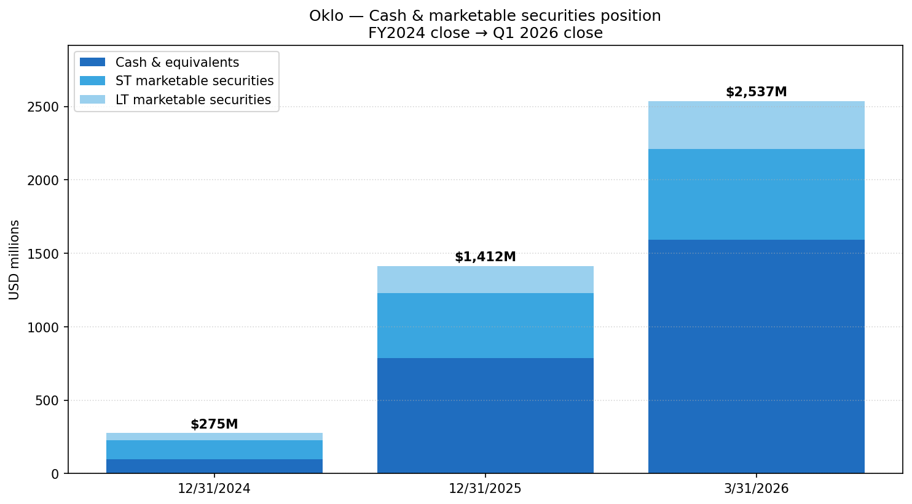
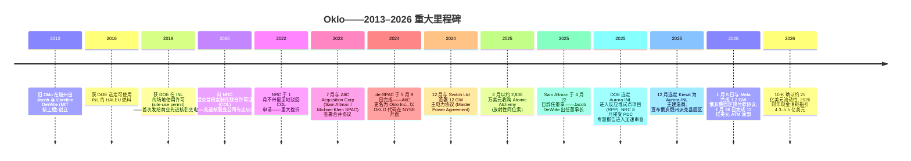
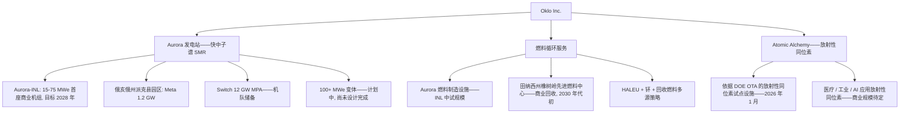
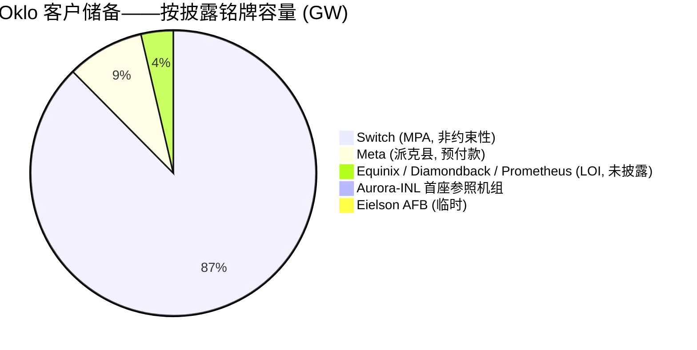
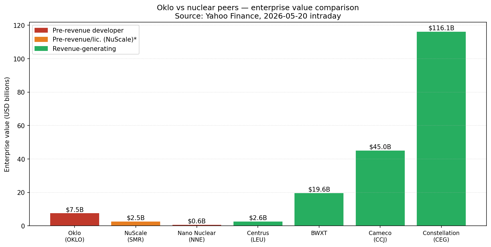
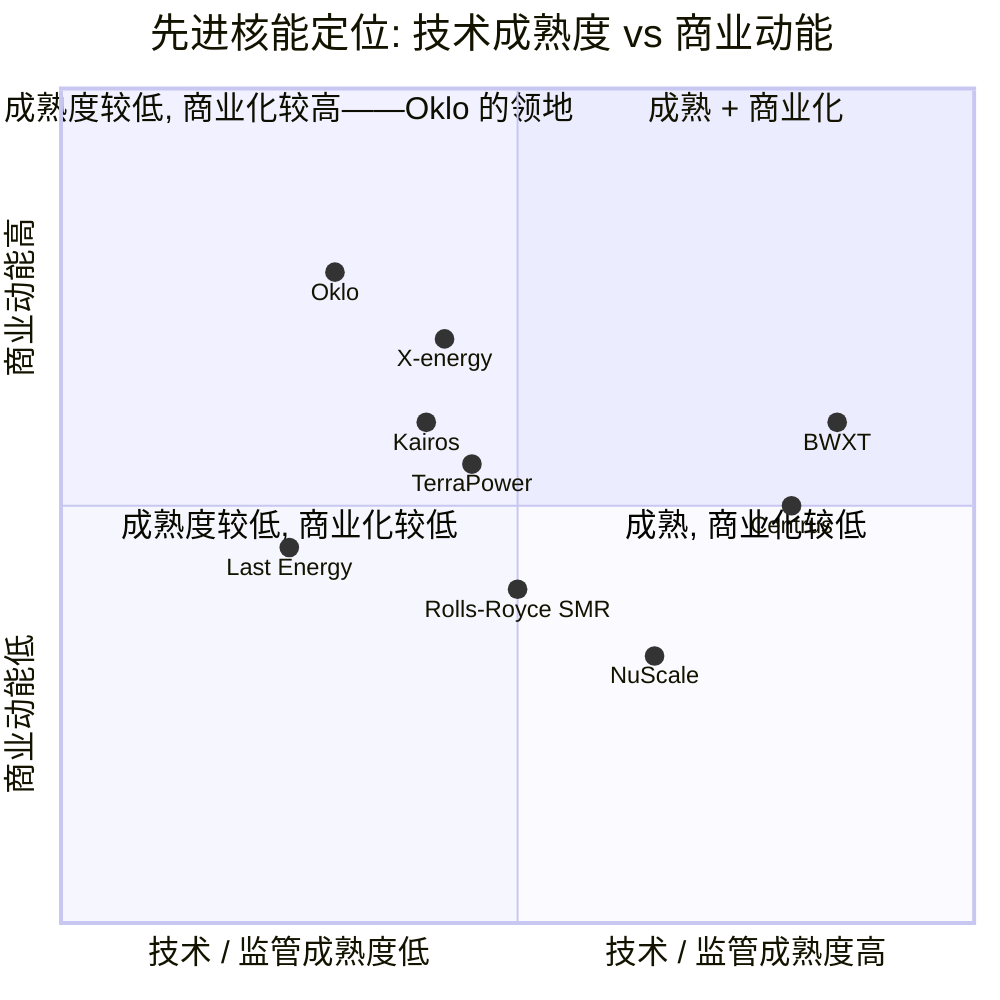
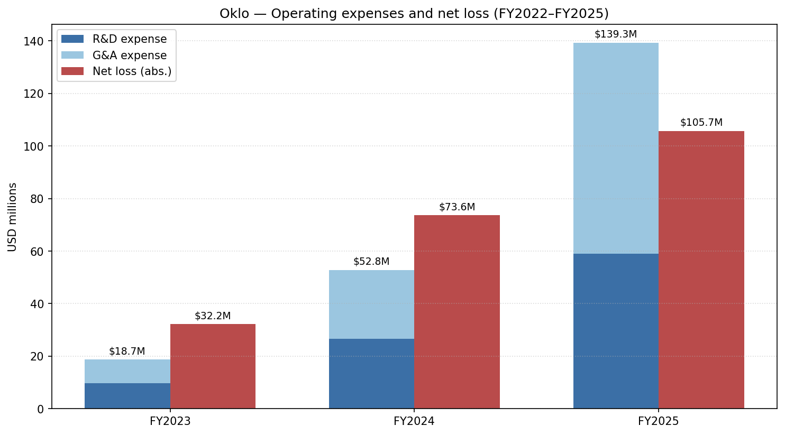
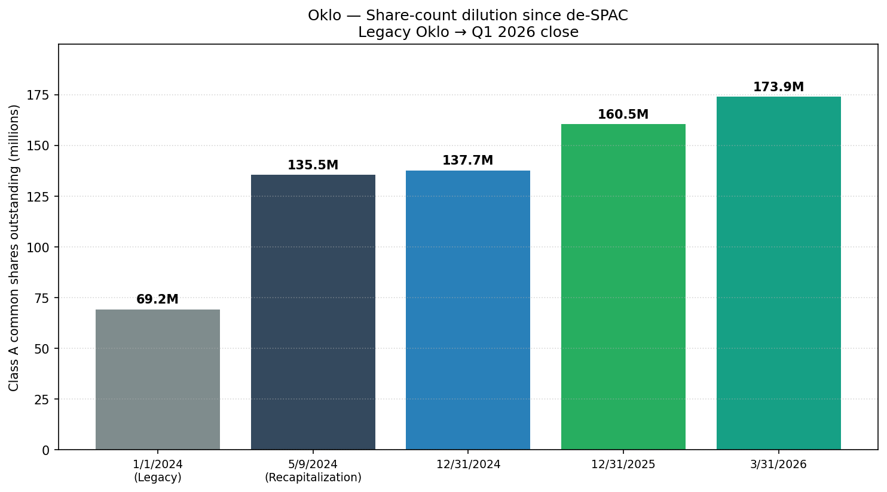
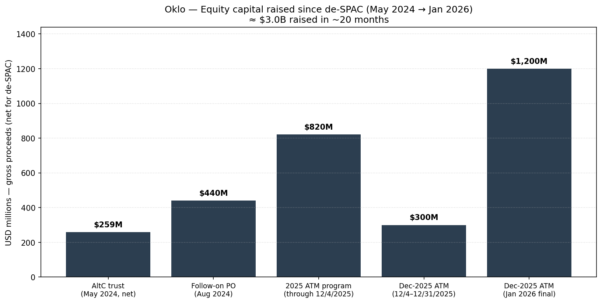
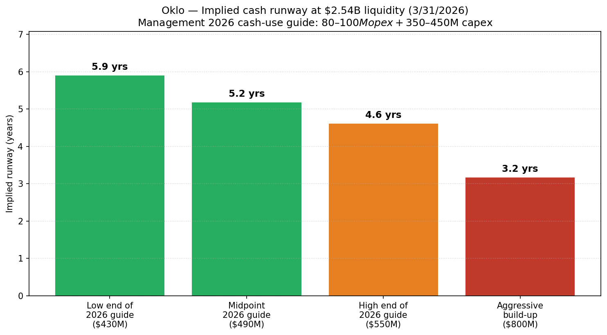

# 公司研究报告: Oklo Inc. (NYSE: OKLO)

**日期:** 2026-05-20
**作者:** 独立研究——基于 SEC 备案文件与公开资料
**覆盖状态:** 首次覆盖。预收入、未取得许可证的先进核裂变开发商; 期权价值高但缺乏可辩护的现金流估值。
**报告语言: 简体中文 (英文版同时存在于本目录)**

> **更新——首次发布 2026 财年现金消耗展望 (2026-03-17):** 随 2025 财年 10-K 发布, 管理层指引 2026 全年经营性现金支出为 **8,000 万至 1 亿美元**, 投资活动现金支出为 **3.5 亿至 4.5 亿美元**——这是管理层首次发布的全年现金消耗明确指引。隐含 2026 年总现金消耗约 4.3 亿至 5.5 亿美元, 而 2026 年 Q1 季末流动性为 25.4 亿美元。明确驱动因素包括: 爱达荷国家实验室 (Idaho National Laboratory, INL) 与俄亥俄州派克县 (Pike County) 的场地准备; 长交货期采购 (蒸汽涡轮发电机、钢材); Atomic Alchemy 与 Aurora 燃料制造设施 (Aurora Fuel Fabrication Facility) 活动量爬坡。
> 来源: [Oklo Inc. 截至 2025 年 12 月 31 日财年 Form 10-K, 2026-03-17 备案, 第 10–11 页](https://www.sec.gov/Archives/edgar/data/1849056/000162828026018698/oklo-20251231.htm)。

---

## 目录

1. 公司概览
2. 公司历史
3. 管理团队
4. 产品与服务
5. 客户与上市策略
6. 行业概览
7. 竞争格局
8. 市场机会 (TAM)
9. 风险评估

---

## 1. 公司概览

**Oklo 业务定位。** Oklo Inc. (NYSE: OKLO; "Oklo") 是一家美国"Aurora"小型模块化核裂变发电站 (small modular fission powerhouse) 的设计开发商——快中子谱、金属燃料反应堆 (fast-spectrum, metal-fueled reactor), 单元电功率覆盖 15–75 MWe 区间, 并已宣布未来 100+ MWe 变体的研发规划。与既有反应堆供应商 (Westinghouse、GE-Hitachi、Framatome) 以及大多数 SMR 同业 (NuScale、X-energy、TerraPower) 不同——后者将反应堆设计**销售或授权**给公用事业公司, 让公用事业公司持有和运营核电站——而 Oklo 计划成为其所部署每一座发电站的**设计者、建造者、所有者与运营者**, 通过长期购电协议 (Power Purchase Agreement, PPA) 直接向购电方出售电力 (或工艺热)。Oklo 是一家披着先进反应堆设计公司外衣的建造-持有-运营 (Build-Own-Operate, BOO) 商业发电运营商。公司还持有 Atomic Alchemy (放射性同位素生产, 2025 年 2 月收购), 并正在建设一项美国国内燃料回收业务, 旨在将轻水堆 (LWR) 乏燃料转化为 HALEU (高丰度低浓铀, High-Assay Low-Enriched Uranium) 等效材料, 供其自有快堆和其他客户使用 ([Oklo 2025 财年 10-K, 第 5–8 页](https://www.sec.gov/Archives/edgar/data/1849056/000162828026018698/oklo-20251231.htm))。

**盈利方式——当下与未来。** 当下: 零商业收入。2025 财年报表中无任何收入项; 全部顶线活动均来自有价证券组合的利息与股息收入 ([Oklo 2025 财年 10-K, 合并经营业绩表, 第 F-4 页](https://www.sec.gov/Archives/edgar/data/1849056/000162828026018698/oklo-20251231.htm))。未来收入模式: 电力和工艺热的长期 PPA, 加上 Atomic Alchemy 的放射性同位素销售, 再加上最终的燃料循环服务。管理层规定的近期里程碑是, 在 **2028 年**部署位于爱达荷国家实验室的首座 Aurora 发电站 Aurora-INL, 而 10-K 将这一目标定性为"宏大", 并以"供应链、施工、宏观经济及设计复杂性"为前提 ([Oklo 2025 财年 10-K, 第 6 页](https://www.sec.gov/Archives/edgar/data/1849056/000162828026018698/oklo-20251231.htm))。

**地理布局。** 总部位于加利福尼亚州圣克拉拉市 Coronado 大道 3190 号 ([2026 年委托声明 (DEF 14A), 第 1 页](https://www.sec.gov/Archives/edgar/data/1849056/000184905626000023/0001849056-26-000023-index.htm))。反应堆场地工作集中在美国境内——INL (爱达荷州); 俄亥俄州派克县 (1.2 GW 园区与 2026 年 1 月 Meta 预付款协议挂钩); 阿拉斯加州埃尔森空军基地 (Eielson Air Force Base, 临时选址); 田纳西州橡树岭 (拟议先进燃料中心)。Atomic Alchemy 放射性同位素子公司亦设于美国。

**规模指标。** 截至 2025 年 12 月 31 日: 总资产 15.3 亿美元; 总负债 5,220 万美元 (无有息债务); 股东权益合计 14.8 亿美元; 累计亏损 (2.408) 亿美元 ([Oklo 2025 财年 10-K, 资产负债表, 第 F-3 页](https://www.sec.gov/Archives/edgar/data/1849056/000162828026018698/oklo-20251231.htm))。2026 年 1 月 2025 年 12 月发行的市场化股票发行计划 (At-The-Market, ATM) 完成后——募集额外 12.0 亿美元毛收入, 每股均价 96.95 美元——预估现金加有价证券规模于 **2026 年 3 月 31 日达到 25.4 亿美元** ([Oklo 2026 年 Q1 10-Q, 资产负债表, 第 4 页及后续事项](https://www.sec.gov/Archives/edgar/data/1849056/000162828026034095/oklo-20260331.htm))。

来源: [Oklo 2024 财年 10-K (2025-03-24 备案)](https://www.sec.gov/Archives/edgar/data/1849056/000162828025014490/oklo-20241231.htm)、[Oklo 2025 财年 10-K (2026-03-17 备案)](https://www.sec.gov/Archives/edgar/data/1849056/000162828026018698/oklo-20251231.htm) 与 [Oklo 2026 年 Q1 10-Q (2026-05-12 备案)](https://www.sec.gov/Archives/edgar/data/1849056/000162828026034095/oklo-20260331.htm)。

**员工数。** 相对同业, 2025 财年 10-K 对全职员工的精确数字披露略显单薄, 但将团队定性为"高度技术化、由创始人主导", 联合创始人 Jacob 与 Caroline DeWitte 分别拥有约 20 年与 15 年的核工程经验和 MIT 研究生学位 ([Oklo 2025 财年 10-K, 第 12 页](https://www.sec.gov/Archives/edgar/data/1849056/000162828026018698/oklo-20251231.htm))。

**估值快照 (必备项)。**

- **股价 / 市值:** 2026-05-20 盘中约 61.5 美元/股, 按 2026 年 Q1 ATM 后约 1.740 亿股稀释股本计, 隐含市值约 107 亿美元 ([Yahoo Finance, OKLO 关键统计, 2026-05-20](https://finance.yahoo.com/quote/OKLO/key-statistics/))。
- **企业价值:** 约 75 亿美元 (市值减约 25 亿美元净现金, 微量债务 260 万美元) ([Yahoo Finance, OKLO, 2026-05-20](https://finance.yahoo.com/quote/OKLO/))。
- **TTM 市盈率 (P/E):** 不具备意义 (负值)。2025 财年净亏损 (1.057) 亿美元, 2024 财年净亏损 (7,360) 万美元; 公司从未实现盈利 ([Oklo 2025 财年 10-K, 第 F-4 页](https://www.sec.gov/Archives/edgar/data/1849056/000162828026018698/oklo-20251231.htm))。
- **TTM 市销率 (P/S):** 未定义。**无任何收入项。**截至 2026 年 Q1, 第三方筛选器中报告的"收入"均为零; 看似营业收入流者全部来自有价证券组合的利息 (2025 财年 2,910 万美元; 仅 2026 年 Q1 一个季度即录得 2,130 万美元) ([Oklo 2025 财年 10-K, 第 F-4 页](https://www.sec.gov/Archives/edgar/data/1849056/000162828026018698/oklo-20251231.htm)、[Oklo 2026 年 Q1 10-Q, 第 5 页](https://www.sec.gov/Archives/edgar/data/1849056/000162828026034095/oklo-20260331.htm))。
- **52 周区间:** 约 35.7–193.8 美元。该股是 AI 电力主题中波动率最高的标的之一; 80%+ 的高低点回撤与反弹屡见不鲜 ([Yahoo Finance, OKLO, 2026-05-20](https://finance.yahoo.com/quote/OKLO/))。
- **Beta:** 约 1.18 (Yahoo Finance, 2026-05-20)。

**负值市盈率的拆解。**亏损**并非**会计层面的一次性事件——而是一项**多年期许可证与建设项目的结构性预商业支出**。2025 财年损益表两项主要支出: 研发费用 5,890 万美元 (同比 +120%) 与一般及行政费用 8,040 万美元 (同比 +208%)——合计 1.393 亿美元营业支出, 对应零收入 ([Oklo 2025 财年 10-K, 第 F-4 页](https://www.sec.gov/Archives/edgar/data/1849056/000162828026018698/oklo-20251231.htm))。2024 财年含有 (2,790) 万美元的非现金 SAFE 证券公允价值变动 (recapitalization 前 SAFE), 表面上推高了当年亏损——但底层现金消耗模式是: 随团队向 2028 年部署目标迈进, opex 呈现线性增长。

**为什么估值是这样的——以及如何思考它。**因不存在收入, 传统 P/E 与 P/S 不具备信息含量。市场正在以**期权 / 概率加权 DCF**的逻辑为 OKLO 估值——投资者今天为约 107 亿美元的市值买单, 等同于为未来 PPA 现金流的潜在分成支付期权金: 若 Aurora-INL 按计划获得许可证、按计划部署, 且 Switch / Meta / Equinix / Diamondback / Prometheus 储备能够转化为有约束力的 PPA, 这一估值理论上是合理的。若许可证路径实质性滑坡或 LOI (意向书) 未能转化, 同一期权价值框架则只支持当前股价的一小部分。最接近的上市可比公司——**NuScale Power (NYSE: SMR)**——同样几乎没有经常性商业收入, 市值约 36 亿美元、企业价值约 25 亿美元 ([Yahoo Finance, SMR, 2026-05-20](https://finance.yahoo.com/quote/SMR/))。其他同业可比公司大多有营业收入, 按传统倍数交易: BWX Technologies (P/E 约 54×, P/S 约 5.5×), Cameco (P/E 约 95×, P/S 约 12.7×), Constellation Energy (P/E 约 24×), Vistra (P/E 约 24×) ([Yahoo Finance, 各可比代码, 2026-05-20](https://finance.yahoo.com/quote/BWXT/))。Oklo 约 107 亿美元的市值**约为 NuScale 的 3 倍**, 尽管 NuScale 在某些监管里程碑上更靠前 (其 50 MWe 原始模块在 2023 年取得 NRC 设计认证), 这凸显市场对 BOO 模式 + AI 电力耦合主题 + DeWitte/Altman 创始人血统所赋予的叙事溢价。

该估值与当前基本面之间的脱钩程度足以将其单列为第 9 章中的显式估值 / 倍数压缩风险。

---

## 2. 公司历史

Oklo 于 2013 年在加州创立, 创始人 Jacob DeWitte (CEO) 与 Caroline DeWitte (COO) 系 MIT 培养的核工程师夫妻, 信念是: 小型化、工厂预制的快中子谱反应堆——由开发商在商业发电模式下持有和运营, 而非销售给公用事业公司——能够颠覆百年来美国商业核能"大型 LWR 现场建造"的范式 ([Oklo 2025 财年 10-K, 第 12 页](https://www.sec.gov/Archives/edgar/data/1849056/000162828026018698/oklo-20251231.htm))。早期论点是孤注一掷于以下三点: **(a)** 小单元规模以控制首次 (first-of-a-kind, FOAK) 风险; **(b)** BOO 模式以捕获全生命周期经济效益; **(c)** 快中子谱金属燃料以在未来支持规模化闭环燃料循环回收。

公司迈向公开市场的路径是通过与 **AltC Acquisition Corp.** 的 SPAC (特殊目的收购公司) 合并——一家由 Sam Altman / Michael Klein 担任发起人的 SPAC——于 2023 年 7 月签署协议, 并于 **2024 年 5 月 9 日**完成: AltC 更名为 Oklo Inc., 旧 Oklo 成为全资经营子公司 Oklo Technologies, Inc. ([Oklo 2025 财年 10-K, 第 5 页; 10-K 附注 3——业务合并](https://www.sec.gov/Archives/edgar/data/1849056/000162828026018698/oklo-20251231.htm))。

公司历史上具有决定性意义的监管事件是 **2022 年 1 月美国核管理委员会 (Nuclear Regulatory Commission, NRC) 不带偏见 (without prejudice) 驳回**了 Oklo 提交的定制化联合许可证 (Combined License, COL) 申请——这是先进核裂变公司有史以来首次提交的此类申请——10-K 至今仍披露此事, Oklo 正基于该次驳回重新构建更新版 COL 申请 ([Oklo 2025 财年 10-K, 第 9 页](https://www.sec.gov/Archives/edgar/data/1849056/000162828026018698/oklo-20251231.htm))。

**战略转型与重大变更。**

1. **从"设计与许可、销售给公用事业"转向 BOO 商业发电运营商 (上市前, 经 S-4 / 10-K 强化披露)。** 10-K 明确这一模式显著背离美国核能历史范式——开发商捕获全生命周期经济效益, 而非将其交给公用事业所有者与运营者——并将其定位为股票故事的核心要素 ([Oklo 2025 财年 10-K, 第 7 页](https://www.sec.gov/Archives/edgar/data/1849056/000162828026018698/oklo-20251231.htm))。
2. **2024 年走 SPAC 路径而非传统 IPO。**AltC 空白支票载体托管约 3 亿美元; 扣除赎回后, Oklo 通过 recapitalization 获得约 2.5896 亿美元现金, 外加 8,410 万美元的 pre-recap SAFE 转换 ([Oklo 2025 财年 10-K, 股东权益变动表, 第 F-6 页](https://www.sec.gov/Archives/edgar/data/1849056/000162828026018698/oklo-20251231.htm))。Altman/Klein 发起人网络——Altman 担任董事长直至 2025 年 4 月, Klein 仍在董事会——是该项交易及后续资本市场介入的事实分销渠道与杠杆。
3. **2024–2025 年纵向整合至燃料循环与放射性同位素业务。**2025 年 2 月收购 Atomic Alchemy (100 万美元现金 + 820,840 股按 33.39 美元 = 约 2,840 万美元股票对价, 另含 274,339 股限制性股票用于合并后服务) 将业务拓宽至医疗 / 工业放射性同位素生产, 此外 2025 年 9 月在田纳西州橡树岭宣布的先进燃料中心 (Advanced Fuel Center, 路线图最高 16.8 亿美元投资) 让 Oklo 承诺成为首家美国先进快堆燃料商业回收运营商 ([Oklo 2025 财年 10-K, 第 6 页](https://www.sec.gov/Archives/edgar/data/1849056/000162828026018698/oklo-20251231.htm))。

**关键并购。**仅完成一项: **Atomic Alchemy** (放射性同位素生产, 总部位于爱达荷州), 2025 年 2 月 28 日, 约 2,840 万美元股票加现金对价 ([Oklo 2025 财年 10-K, 附注 3, 第 F-11–F-12 页](https://www.sec.gov/Archives/edgar/data/1849056/000162828026018698/oklo-20251231.htm))。10-K 还披露管理层正"评估潜在并购机会以战略性加速业务"——意即在当前资本充裕的情况下, 后续并购在桌面上。

**近期动态 (过去 12 个月)。**

- **2025 年 8 月**——DOE 选定 Aurora-INL 进入新的反应堆试点项目 (Reactor Pilot Program, RPP), 开启与 NRC COL 通道并行 (而非取代) 的 DOE 授权路径; NRC 接受 Oklo 的主要设计准则 (Principal Design Criteria, PDC) 专题报告进入加速审查 ([Oklo 2025 财年 10-K, 第 9 页](https://www.sec.gov/Archives/edgar/data/1849056/000162828026018698/oklo-20251231.htm))。
- **2025 年 9 月**——宣布在田纳西州建设先进燃料中心 (Advanced Fuel Center) 计划。
- **2025 年 12 月**——选定 Kiewit Nuclear Solutions 为 Aurora-INL 主建造商; 宣布俄亥俄州派克县土地收购以建设 1.2 GW 园区; 启动 15 亿美元 ATM 计划 (12 月 4 日), 并立即在 12 月内以均价 88.29 美元/股出售 3 亿美元 ([Oklo 2025 财年 10-K, 第 7–8 页](https://www.sec.gov/Archives/edgar/data/1849056/000162828026018698/oklo-20251231.htm))。
- **2026 年 1 月 5 日**——签订 Meta 预付款协议: Meta 将预付电力费用并资助派克县场地的核燃料采购, 以支持 Meta 数据中心 ([Oklo 2025 财年 10-K, 第 7–8 页, 后续事项附注 16, 第 F-26 页](https://www.sec.gov/Archives/edgar/data/1849056/000162828026018698/oklo-20251231.htm))。
- **2026 年 1 月 28 日**——12 月 ATM 计划完成后续 12.4 百万股出售, 共 12.0 亿美元毛收入, 每股均价 96.95 美元。12 月加 1 月 ATM 合计在约 8 周内募集约 15 亿美元 ([Oklo 2025 财年 10-K, 第 7 页; 后续事项](https://www.sec.gov/Archives/edgar/data/1849056/000162828026018698/oklo-20251231.htm))。
- **2026 年 4 月 21–22 日**——Sam Altman 于 4 月 22 日辞任董事 (生效日) 一事在新一年的委托声明中再次披露; Jacob DeWitte 现任董事长兼 CEO ([2026 DEF 14A, 第 1、66 页](https://www.sec.gov/Archives/edgar/data/1849056/000184905626000023/0001849056-26-000023-index.htm))。

---

## 3. 管理团队

团队规模小、由创始人主导, 核工程能力 + DOE 网络经验占主导。共 6 名指定执行官; 11 名董事跨三个班次任期; 近期新增成员 (Dr. Mark Peters、David Christian、Derek Kan、David Park) 均带有核行业或政府政策深度。

### Jacob DeWitte——董事长、首席执行官兼联合创始人 (302 字)

Jacob DeWitte 现年 40 岁, 2013 年共同创立旧 Oklo, 自创立以来一直担任 CEO。在 Sam Altman 于 2025 年 4 月 22 日辞任后, 他兼任董事会主席 ([2026 DEF 14A, 第 28、66 页](https://www.sec.gov/Archives/edgar/data/1849056/000184905626000023/0001849056-26-000023-index.htm); [Oklo 2025 财年 10-K, 第 12 页](https://www.sec.gov/Archives/edgar/data/1849056/000162828026018698/oklo-20251231.htm))。他拥有麻省理工学院 (MIT) 核工程研究生学位及佛罗里达大学核工程学士学位。其加入 Oklo 之前的经验几乎完全集中在学术与 DOE 实验室面向——没有任何商业 P&L 经营记录可与今日 Oklo 体量相比。

按实际业绩计, 他取得了以下成就: (i) 主导**NRC 史上首份先进核裂变反应堆定制化联合许可证申请**于 2020 年提交——并在 2022 年驳回后重建申请, 推动 NRC 2025 年 8 月以加速审查时间表接受 PDC 专题报告; (ii) 取得**首次发给商业先进核裂变开发商的 DOE 场地使用许可**(INL, 2019); (iii) 签署 10-K 描述的**"史上最大的公司购电协议之一"**——2024 年 12 月的 12 GW Switch 主电力协议——以及 2026 年 1 月覆盖 1.2 GW 俄亥俄园区的 Meta 预付款协议; (iv) 于 2024 年 5 月完成与 AltC 的 de-SPAC, 后续通过增发和两次 ATM 完成约 30 亿美元股权融资。

他的影响力远超职位所示: 他是行业活跃的演讲嘉宾、Oklo 的公共形象, 也是公司差异化 BOO 商业模式的明确架构师。10-K 明确将团队定位为"创始人主导"——也就是说, DeWitte 处于核心是有意为之, 而非偶然 ([Oklo 2025 财年 10-K, 第 12 页](https://www.sec.gov/Archives/edgar/data/1849056/000162828026018698/oklo-20251231.htm))。2026 委托声明将他与 Caroline DeWitte 的合计实益所有权列为重要内部人持股, 并附详细 Section 16 披露。他与 COO 兼 II 类董事 Caroline DeWitte 是夫妻关系——委托声明也披露此关联方治理事实 ([2026 DEF 14A, 第 21 页](https://www.sec.gov/Archives/edgar/data/1849056/000184905626000023/0001849056-26-000023-index.htm))。

### R. Craig Bealmear——首席财务官 (172 字)

Craig Bealmear 拥有逾 30 年的财务、战略及商业经验, 包括曾任 Renewable Energy Group (NASDAQ: REGI, 2022 年被 Chevron 以 31.5 亿美元收购) CFO 及 bp plc 北美下游业务 CFO。他获得宾夕法尼亚大学沃顿商学院 MBA 学位, 以及 Bellarmine University 工商管理学士学位 ([Oklo 2025 财年 10-K, 第 11–12 页](https://www.sec.gov/Archives/edgar/data/1849056/000162828026018698/oklo-20251231.htm))。

他的履历对当下情境异常相关: REGI 是次规模的清洁能源运营商, 他通过并购与最终向战略买家的出售推动其规模化扩张; bp 下游则赋予他在投资级体量的硬资产、复杂供应链 CFO 经验。今日 Oklo 的核心 CFO 挑战是*资本市场, 而非 P&L 管理*——根本不存在经营 P&L。自其上任 (10-K 未单独披露具体起始日期) 以来, Oklo 已完成增发股权融资 (2024 年 8 月, 净收 4.401 亿美元)、2025 年 9 月 ATM (闭项后毛收 8.204 亿美元), 以及 2025 年 12 月 ATM (截至 2026 年 1 月 28 日合计 15 亿美元毛收入)——合计构成支持 2028 部署计划的股权堆叠, 同时实现现金余额相对于 2024 财年末约 10 倍的扩张 ([Oklo 2025 财年 10-K, 股东权益变动表, 第 F-6 页; 2026 年 Q1 10-Q](https://www.sec.gov/Archives/edgar/data/1849056/000162828026018698/oklo-20251231.htm))。

### Caroline DeWitte——首席运营官兼联合创始人 (110 字)

Caroline DeWitte 现年 43 岁, 2013 年共同创立旧 Oklo, 自创立起一直担任 COO。她在 MIT 攻读核工程 (S.M.), 持有俄克拉荷马大学经济学学士与机械工程学士学位 ([2026 DEF 14A, 第 20 页](https://www.sec.gov/Archives/edgar/data/1849056/000184905626000023/0001849056-26-000023-index.htm))。她曾任美国能源部核能咨询委员会成员 (2018–2019), 以及清洁能源部长级会议小组成员。在 Oklo 内部, 她负责运营、生产规划、供应链建设以及 Atomic Alchemy 整合工作——也就是说, 她将承担"2028 年部署"的执行风险。她是 CEO Jacob DeWitte 的配偶。作为 II 类董事, 她将于 2026 年 6 月 3 日年度股东大会上参选连任, 是董事会内除 Jacob 之外唯一一位 DeWitte。

### William Goodwin——首席法律与战略官 (95 字)

Will Goodwin 拥有约 15 年法律经验, 最近一任为 Joby Aviation (NYSE: JOBY) 副总法律顾问兼特别项目负责人——这一经验对首次监管接触相关——更早曾任 Skyryse 政策部负责人 ([Oklo 2025 财年 10-K, 第 12 页](https://www.sec.gov/Archives/edgar/data/1849056/000162828026018698/oklo-20251231.htm))。他持有 UCLA 法学院 J.D. 学位及 Claremont 大学政治哲学硕士学位。在 Oklo, 他负责 NRC 接触、DOE 项目参与, 以及当前异常繁忙的资本市场法律工作流 (S-1、S-3、S-4 系列)。

### Patrick Schweiger——首席技术官 (92 字)

Pat Schweiger 拥有逾 40 年能源行业领导经验, 包括 (据 10-K) 曾任 Hedron 负责人, 在传统发电工程领域具有深厚运营背景。他负责从 PDC 至 Aurora-INL 详细工程的设计路径 ([Oklo 2025 财年 10-K, 第 12 页](https://www.sec.gov/Archives/edgar/data/1849056/000162828026018698/oklo-20251231.htm))。CTO 职能是公司决定性技术风险所在——Aurora 设计必须满足 NRC 与 DOE-RPP 的安全期望、与 Kiewit 的建造方案整合, 并在不需要重新审批的前提下兼容灵活的燃料策略 (HALEU、回收燃料, 以及可能的 DOE 提供钚)。

### 治理脚注 (140 字)

- **董事会构成:** 11 名董事跨 3 个交错任期班次; 大多数独立 (两位 DeWittes 加 Michael Klein 为关联创始人/发起人方)。著名独立董事: 退役海军陆战队三星中将 John Jansen; Daniel B. Poneman (Obama 时期前美国能源部副部长); Dr. Mark Peters (MITRE CEO; 前 INL 主任); David A. Christian (前 Dominion Generation CEO, 核运营商资历深厚); Derek Kan (前美国交通部副部长); David Park (2026 新增) ([2026 DEF 14A, 第 18–32 页](https://www.sec.gov/Archives/edgar/data/1849056/000184905626000023/0001849056-26-000023-index.htm))。
- **内部人持股 / 控制:** DeWittes 与 Klein 关联实体持有重要内部人股权; 委托声明中含完整 Section 16 披露。
- **薪酬:** 董事薪酬由现金 retainer + RSU 授予构成 (Kinzley、Jansen、Thompson、Poneman 2025 财年各约 16.5 万–24.3 万美元); Altman 与 Klein 放弃全部董事薪酬; 创始人通过执行薪酬计划获酬。
- **关联方:** M. Klein & Company / The Klein Group LLC 担任顾问公司——2025 财年 50 万美元 ([附注 15——关联方交易, 10-K 第 F-25 页](https://www.sec.gov/Archives/edgar/data/1849056/000162828026018698/oklo-20251231.htm))。

### 管理层履历综合 (89 字)

高管层核工程深度强劲; 经营 P&L 履历单薄 (DeWittes 均为首次担任上市公司 CEO/COO, 10-K 中明确将"有限的上市公司经验"列为风险因子)。董事会是公司最大的可信度杠杆——Poneman、Peters、Christian、Jansen, 加上 Klein 的资本市场触达——但董事会血统不可替代执行力。从此处开始, 门槛是经营性的: 将 LOI 转化为有约束力的 PPA, 在合理滑坡容差内按 2028 时间表交付 Aurora-INL, 并在 2022 年驳回后重新获得 NRC 许可证。执行风险主导投资逻辑。

---

## 4. 产品与服务

Oklo 围绕**三条产品/服务线**组织活动, 但今日仅有一条 (Aurora 发电站) 是股票故事。另外两条 (燃料循环服务; Atomic Alchemy 放射性同位素业务) 真实存在但规模较小、周期更长。

### 产品线 1——Aurora 发电站 (股票故事)

Aurora 是 Oklo 设计的**液态金属冷却、金属燃料快中子谱反应堆**, 设计验证依据为 INL 运行约 30 年的 EBR-II 实验快堆运行数据。目标单元规模: 单元电功率 15–75 MWe, 已宣布 100+ MWe 变体规划。热输出足以在电力之外服务工业工艺热客户 ([Oklo 2025 财年 10-K, 第 5–7 页](https://www.sec.gov/Archives/edgar/data/1849056/000162828026018698/oklo-20251231.htm))。

- **产品功能:** 生产电力与热能。设计可在客户场地 (behind-the-meter) 或并网部署。相对 LWR 的代际燃料周期 (管理层基于快中子谱金属燃料设计的声明)。
- **目标客户:** 数据中心 (Meta、Equinix、Switch、Prometheus Hyperscale)、工业购电方 (Diamondback Energy 石油与天然气)、国防部装备地 (Eielson AFB 临时)、公用事业 (TVA 探索阶段)。Oklo 明确*回避*传统大型公用事业客户。
- **定价模式:** PPA——按多年 (通常 10–30 年) 期限以每兆瓦时电力价格或每 MMBtu 热价计价。**备案中未披露 PPA 定价;**管理层告诫单元经济模型受"市场及外部因素影响, 如关税、供应链压力及其他宏观经济因素带来的建设成本影响" ([Oklo 2025 财年 10-K, 第 7 页](https://www.sec.gov/Archives/edgar/data/1849056/000162828026018698/oklo-20251231.htm))。
- **典型交易规模:** 一座 75 MWe 的 Aurora 发电站在高容量因子下每年发电约 590 GWh, 按示意性 80 美元/MWh 计算, 每机组每年毛收入约 4,700 万美元。Switch 的 12 GW MPA 若全面落地将是数百座发电站——但该协议是*主电力*协议, 而非每机组的有约束力的容量承诺。
- **竞争优势裁定:** **部分。**差异化来自**BOO 商业模式 + 快中子谱金属燃料架构 + DOE 网络可触达**, 而非反应堆设计本身。多家竞争者拥有快中子谱或金属燃料项目 (TerraPower 的 Natrium 采用钠冷却快中子谱, 使用 HALEU; X-energy 的 Xe-100 是气冷, 但单元规模与 Oklo 相似偏小; NuScale 是轻水堆, 但小型模块化)。Oklo 的*组合*——(i) 单元小到可在单一客户场地部署; (ii) BOO 而非设计授权; (iii) 燃料回收纵向整合——在美国商业核能中独一无二, 至今无完全对应物。护城河类型: 监管/认证 (若 COL 实现); 首发 BOO; DOE 项目与 INL 场地可触达。证据: 首家 (至今唯一) 完成以下事项的先进核裂变开发商: (a) 提交定制化 COL; (b) 获 DOE 在 INL 的场地使用许可; (c) 入选 DOE 反应堆试点项目 (两项); (d) 签署 12 GW 公司 PPA 框架。最接近的竞争产品: NuScale VOYGR (轻水 SMR, 50–462 MWe 配置)。比较: 在 NRC 设计认证上落后 (NuScale 2023 年获得 50 MWe 原始模块的设计认证); 在商业客户动能与 DOE 项目参与上领先; 在所述商业模式上领先。
- **旗舰产品?** 是——是旗舰。Aurora-INL 是首座参照机组; Aurora-派克县 (Meta) 是首次规模化商业部署。
- **近期上市:** 因尚无商业运营机组, 无实际产品上市。过去 12 个月主要正向里程碑: DOE RPP 选定 (2025 年 8 月); NRC 加速审查接受 PDC (2025 年 8 月); 选定 Kiewit 为主建造商 (2025 年 12 月); Meta 预付款 (2026 年 1 月)。12 GW Switch MPA 于 2024 年 12 月签署。

### 产品线 2——燃料循环服务

Oklo 正在建设两项相关燃料循环资产: (a) **INL 的 Aurora 燃料制造设施**——一座中试规模设施, 旨在为首座 Aurora-INL 发电站制造 HALEU 等效燃料, 入选 DOE 燃料生产线试点项目 (FLPP) ([Oklo 2025 财年 10-K, 第 6 页](https://www.sec.gov/Archives/edgar/data/1849056/000162828026018698/oklo-20251231.htm)); 以及 (b) **田纳西州橡树岭先进燃料中心**——一座规划中的首次商业规模乏燃料回收设施, 路线图含最高 16.8 亿美元投资, 目标在 2030 年代初投产。美国目前不商业性回收乏核燃料; 法国、俄罗斯与日本则进行回收。

- **定价模式:** 尚未披露。可能为综合性: 来自接收乏燃料的公用事业的代加工费, 加上以内部转移价向 Oklo 自有反应堆机队出售回收产品。
- **竞争优势裁定:** **是——若先进燃料中心获许可证, 即拥有监管/政策护城河。**美国自 1970 年代以来从未发出商业回收许可证; Oklo 作为获 DOE 项目支持的首位可信回归者, 在结构上占据优势。最接近的竞争产品: BWX Technologies 与 Centrus Energy 在 HALEU 前端供应链上, 但两者均不进行商业规模后端回收; Orano (法国, 私有) 是 La Hague 的全球回收业务运营商。比较: 在美国境内领先; 全球范围内远远落后于 Orano。
- **旗舰产品?** 否——次要, 期权性质。对长期投资逻辑重要 (电力销售毛利率提升 + 经常性燃料循环服务收入), 但不在 2026–2028 视角内。
- **近期上市:** 2025 年 9 月宣布先进燃料中心, 其中包括陈述的"超过 800 个高质量岗位"创造潜力 ([Oklo 2025 财年 10-K, 第 6 页](https://www.sec.gov/Archives/edgar/data/1849056/000162828026018698/oklo-20251231.htm))。DOE 已批准 INL 燃料制造侧的关键安全文件 (安全设计策略、概念安全设计报告、核安全设计协议、初步文档化安全分析)。

### 产品线 3——Atomic Alchemy (放射性同位素)

2025 年 2 月 28 日以约 2,840 万美元股票加现金对价收购 ([Oklo 2025 财年 10-K, 附注 3 业务合并, 第 F-11 页](https://www.sec.gov/Archives/edgar/data/1849056/000162828026018698/oklo-20251231.htm))。Atomic Alchemy 将生产放射性同位素, 用于医疗、工业、国防与 AI 应用。2025 年 8 月入选 DOE 新反应堆试点项目 (RPP) 11 个项目之一; 2026 年 1 月 7 日, 就放射性同位素试点设施与 DOE 签署其他交易协议 (Other Transaction Agreement, OTA), 标志着从项目选定向积极执行阶段过渡。

- **定价模式:** 按 Ci (居里) 或 mg 出售给医疗 (SPECT 成像用 Mo-99/Tc-99m、癌症治疗用 Lu-177、靶向 α 治疗用 Ac-225 等) 与工业客户。商业上尚未产生收入; 试点设施在建。
- **竞争优势裁定:** **部分。**放射性同位素市场存在既有供应商 (Curium Pharma、Bruce Power、NorthStar Medical Radioisotopes、BWX Technologies)。Atomic Alchemy 的优势在于其位于 Oklo 内部——即放射性同位素生产最终作为快堆运营的*副产品*, 而非独立的辐照业务。最接近的竞争产品: NorthStar 的钼-99 发生器 (已商业化), 或 BWXT 的 Mo-99 项目 (在研)。比较: 在生产规模上落后于今 (Atomic Alchemy 预收入); 若快堆副产品生产逻辑成立, 长期成本上可能领先。
- **旗舰产品?** 否——优先级第三。但其为 Oklo 提供近期收入路径 (放射性同位素商业销售可能在 2028 年第一座 Aurora 发电站之前开始)。
- **近期上市:** 2026 年 1 月与 DOE 签署放射性同位素试点设施 OTA——DOE 授权下从"选定"至"执行"的首次转变。

**长尾 / 实验性:** 10-K 中提及但今日不重要: 工业客户工艺热应用 (石油与天然气、化工); 离网 / behind-the-meter 偏远社区部署; 潜在国际部署 (无已宣布合同)。

---

## 5. 客户与上市策略

### 客户储备——披露的对方方

10-K 列出以下客户接触 ([Oklo 2025 财年 10-K, 第 5–6、9–11 页](https://www.sec.gov/Archives/edgar/data/1849056/000162828026018698/oklo-20251231.htm))。读者应密切关注**合同类型**——Oklo 的储备以*非约束性意向书 (LOI)*与*主电力协议 (MPA)*为主, 仅有少量具约束力的安排 (Meta 预付款、DOE OTA)。

| 对方方 | 合同类型 | 容量 / 范围 | 状态 | 来源 |
|---|---|---|---|---|
| **Meta Platforms** | 预付款协议 | 俄亥俄州派克县 1.2 GW 园区 | 2026-01-05 签订——Meta 预付电力费用; 资助核燃料采购 | [2025 财年 10-K, 第 7–8 页, 附注 16](https://www.sec.gov/Archives/edgar/data/1849056/000162828026018698/oklo-20251231.htm) |
| **Switch, Ltd** | 主电力协议 | 12 GW | 2024 年 12 月签订——非约束性框架; 描述为"史上最大的公司 PPA 之一" | [2025 财年 10-K, 第 5 页](https://www.sec.gov/Archives/edgar/data/1849056/000162828026018698/oklo-20251231.htm) |
| **Equinix** | 非约束性 LOI | 未披露 | 仅 LOI; 无约束性容量承诺 | [2025 财年 10-K, 第 5 页](https://www.sec.gov/Archives/edgar/data/1849056/000162828026018698/oklo-20251231.htm) |
| **Diamondback Energy** | 非约束性 LOI | 未披露 | 石油与天然气离网应用的 LOI | [2025 财年 10-K, 第 5 页](https://www.sec.gov/Archives/edgar/data/1849056/000162828026018698/oklo-20251231.htm) |
| **Prometheus Hyperscale** | 非约束性 LOI | 未披露 | LOI; 前身为 Wyoming Hyperscale White Box LLC | [2025 财年 10-K, 第 5 页](https://www.sec.gov/Archives/edgar/data/1849056/000162828026018698/oklo-20251231.htm) |
| **Eielson 空军基地** | 临时选址 | 未披露 | 仅选址——非合同 | [2025 财年 10-K, 第 5 页](https://www.sec.gov/Archives/edgar/data/1849056/000162828026018698/oklo-20251231.htm) |
| **TVA (田纳西河谷管理局)** | 探索阶段 | 未披露 | 探索性讨论燃料回收 + 未来电力购买 | [2025 财年 10-K, 第 5 页](https://www.sec.gov/Archives/edgar/data/1849056/000162828026018698/oklo-20251231.htm) |
| **DOE / INL (首个参照场地)** | DOE 授权 + 场地 MOA | Aurora-INL 发电站 | 2024-09-25 DOE Idaho MOA 签署; 2025 年 8 月 RPP 选定 | [2025 财年 10-K, 第 5、9 页](https://www.sec.gov/Archives/edgar/data/1849056/000162828026018698/oklo-20251231.htm) |
| **DOE (放射性同位素试点设施)** | 其他交易协议 (OTA) | Atomic Alchemy 试点设施 | 2026-01-07 签署 | [2025 财年 10-K, 第 8 页](https://www.sec.gov/Archives/edgar/data/1849056/000162828026018698/oklo-20251231.htm) |

*注: 饼图各扇区代表 Oklo 在不同非约束性工具中*被命名*的铭牌容量。披露的次 GW 数字为单点位合理规模的近似值; LOI 伙伴无披露的容量承诺。饼图**不**代表已签约收入或有约束性的购电协议。来源: [2025 财年 10-K, 第 5–8 页](https://www.sec.gov/Archives/edgar/data/1849056/000162828026018698/oklo-20251231.htm)。*

### 客户集中度分析——10-K 披露与未披露之内容

Oklo **在任何报告期内均无商业收入**, 因此标准的 ASC 280 客户集中度披露 (合并营业收入 ≥ 10% 的具名客户) 在传统意义上不适用。10-K *不*发布 Top-1 或 Top-5 客户比例表——因为没有客户销售。**所披露的**是客户*储备*, 并附带明确警示: 所有具名的超大规模数据中心 / 工业对方方均处于 LOI 阶段, 唯一例外是 Meta 预付款协议与 Switch MPA 框架 (非约束性)。

从未来营业收入角度看, 集中度**结构上极端**。两项购电协议 (Switch 与 Meta) 占披露铭牌储备的绝大多数。若任一对方方退出、向下重新谈判, 或未将 LOI/MPA 转化为可融资价格的有约束力 PPA, 股票故事将受重大削弱。10-K 在风险因子部分明确承认这一风险 ("客户可能根据各协议中规定的多项因素行使终止或重新谈判权利") ([Oklo 2025 财年 10-K, 第 18 页](https://www.sec.gov/Archives/edgar/data/1849056/000162828026018698/oklo-20251231.htm))。

**承接:** 未来客户集中度作为*重大*风险, 在第 9 章中处理。

### 分销渠道、销售周期与合作伙伴

- **直销**——Oklo 商业团队直接接触对方方。无渠道伙伴 / OEM 模式。鉴于监管依赖, 平均销售周期为多年; LOI 早期签署, 演进为 MPA/框架协议, 随选址与监管里程碑达成而最终成为 PPA。
- **核心建造合作方:** **Kiewit Nuclear Solutions Co.**——2025 年 12 月选定为 Aurora-INL 主建造商 ([Oklo 2025 财年 10-K, 第 10 页](https://www.sec.gov/Archives/edgar/data/1849056/000162828026018698/oklo-20251231.htm))。Kiewit 是北美最大私营建筑公司之一, 在重型土建与核相关方面具有深厚经验。
- **燃料合作方:** 多路并行策略——田纳西先进燃料中心的回收燃料 (长期), 来自第三方供应商的 HALEU 浓缩燃料, 以及在稀释处置项目下 DOE 提供的潜在钚。
- **政府合作方:** DOE (RPP、FLPP、Idaho 场地、Atomic Alchemy OTA), INL (研究 / 场地主办), Argonne 国家实验室 (燃料回收示范伙伴), MIT (研究关系)。
- **资本市场合作方:** 2025 年 12 月 ATM 中多家销售代理; M. Klein & Company / The Klein Group 作为关联方顾问。

### 客户案例——尚无

由于尚无 Aurora 发电站运营, 无商业案例。最接近"案例"性质的披露是 **Meta 预付款**, 它代表第一次有超大规模数据中心运营商将现金置于 Oklo 资产负债表以换取未来电力——即从 LOI 向具约束力的购电沿合同光谱下移的实例。机制: Meta 预付; Oklo 利用资金为派克县园区一期采购核燃料。这更接近项目融资型购电结构, 而非标准 PPA, 若该模式可行, 很可能成为后续超大规模客户转化的模板。

---

## 6. 行业概览

### 行业定义与范围

Oklo 处于三个行业的交叉点:

1. **先进核能 / SMR 发电。** "小型模块化反应堆" 集群——单元功率低于 300 MWe、工厂预制, 设计具有相对于今日美国机队主导的 1,000+ MWe Gen-III LWR 更短的建造周期与更广泛的选址灵活性。运营端 NAICS 221113 (核电); 设计端为设备制造。相关: 大型 LWR (Vogtle 3 & 4 模型——Westinghouse AP1000); 微型反应堆 (低于 20 MWe); 聚变能 (更早期)。
2. **先进核燃料循环。** 前端 (HALEU 浓缩——Centrus、Urenco、Orano、BWXT) 和后端 (乏燃料回收——Orano 全球主导, 今日美国无商业运营商)。
3. **AI 驱动的电力需求 / 数据中心电力购买。** 超大规模运营商的 PPA 现在是美国新建容量的主要购电机制; 相对可变可再生能源, 核能在 24/7 无碳发电方面日益受青睐。Constellation 为 Microsoft 重启 Three Mile Island 1 号机组 (2024) 与 Amazon / Talen 收购 Susquehanna 附近的 Cumulus 是行业风向标。

### 市场规模与增长

Oklo 的相关可触达市场不是 "全球核电发电" (成熟、增长缓慢); 而是**美国 (最终是 OECD) 增量清洁固定电力, 偏向数据中心购电方, 愿意在 PPA 下采购。**

- **美国电力发电总量:** 2024 年约 4,100 TWh; 核电贡献约 19% (≈ 775 TWh)。来源: [美国能源信息署, "Electric Power Annual"](https://www.eia.gov/electricity/annual/)。
- **美国数据中心用电量**预计将从 2023 年约 176 TWh 大致翻倍至 2028 年的 325–580 TWh, 参 [劳伦斯伯克利国家实验室, "2024 美国数据中心能源使用报告", 2024-12](https://eta.lbl.gov/publications/2024-united-states-data-center)。每年 150–400 TWh 的增量需求增长是核 SMR 直接竞争服务的对象。
- **全球先进反应堆 / SMR 项目储备**在数十个设计的量级, IAEA SMR 手册列出 2024 年超过 80 个处于不同开发阶段的设计 ([IAEA 先进反应堆信息系统 (ARIS)](https://aris.iaea.org/))。仅少数有商业客户承诺 (NuScale、Oklo、TerraPower、X-energy、Rolls-Royce SMR、BWXT)。

### 关键趋势与驱动因素 (过去 12–24 个月)

- **AI 电力耦合。** Microsoft / TMI、Amazon / Talen、Meta / Oklo、Google / Kairos 均于 2024–2025 完成; 超大规模运营商明确偏好核能以求 24/7 无碳。
- **联邦政策推动。** ADVANCE 法案于 2024 年 7 月 9 日签署——简化 NRC 许可证, 支持先进反应堆。2025 年 5 月 23 日 4 项行政令指示 NRC、DOE 与国防部加速先进反应堆部署, 包括专门针对 AI / 数据中心需求 ([Oklo 2025 财年 10-K, 第 11 页](https://www.sec.gov/Archives/edgar/data/1849056/000162828026018698/oklo-20251231.htm))。
- **DOE 项目。** 反应堆试点项目 (RPP, 2025) 与燃料生产线试点项目 (FLPP) 提供 DOE 授权路径与联邦成本分担。
- **资本流入。** 2024–2025 年 SMR 主题的公开市场兴趣激增; Oklo、NuScale、Nano Nuclear、Centrus、BWXT 均显著重定价 (伴随大幅波动), 2026 年部分回落。
- **燃料供应压力。** HALEU 供应结构上短缺; Oklo 10-K 称成本"显著上升"。关税、供应链中断与不断演变的对俄/哈萨克材料的制裁均被提及 ([Oklo 2025 财年 10-K, 第 6 页](https://www.sec.gov/Archives/edgar/data/1849056/000162828026018698/oklo-20251231.htm))。

### 监管环境

NRC 通过 10 CFR Part 50 (运营许可证) 或 Part 52 (联合许可证 / 设计认证) 是商业反应堆的主导监管者。Oklo 的路径使用**定制化联合许可证**(Part 52), 是先进开发商首次尝试。并行路径: 首个参照 Aurora-INL 电站的 DOE RPP 授权——DOE 拥有授权在 DOE 场地建造和运营的权限, 可与 NRC 许可证并行运行。这种双轨方法新颖且部分降低时间表风险, 但非 DOE 场地的商业部署 (派克县、Eielson、超大规模运营商自有场地) 最终仍需 NRC 许可证。

### 行业动态

- **碎片化:** 设计端高度碎片化 (80+ SMR 设计); 既有反应堆供应商端高度集中 (Westinghouse、Framatome、GE-Hitachi、Mitsubishi、Rosatom、CGN——仅约 6 家供应商部署商业规模 Gen-III/III+)。
- **进入壁垒:** 极高。设计与许可证周期长达数十年; 资本密集 (每次试点部署 > 10 亿美元); 专业人才稀缺; 长周期供应链 (蒸汽涡轮发电机、反应堆压力容器、HALEU 燃料)。
- **购买方议价能力:** 超大规模运营商现在是高杠杆新型买方 (集中度、专业能力、能通过预付款承诺资产负债表)。传统公用事业买方较慢且更厌恶风险。
- **替代品:** 太阳能 + 储能 (优良地理下现在低于 50 美元/MWh, 但固定电力挑战); 天然气联合循环 (固定且廉价但碳密集); 地热 (早期); 聚变 (商业化数十年外); 需求侧削减 (有限)。
- **供应方议价能力:** HALEU 浓缩集中 (Centrus 是今日美国唯一获许可证的 HALEU 生产商); 反应堆压力容器锻造集中 (韩国 Doosan Heavy、Japan Steel Works、少数西方选项); 快中子谱金属燃料本质上是定制。

---

## 7. 竞争格局

### 竞争者集合

相关竞争者集合分为四个桶: (a) 其他 SMR / 先进核裂变开发商; (b) HALEU 燃料循环参与者; (c) 捕获相同 "AI 电力" 叙事的有营业收入核相关公司; (d) 非核固定电力替代品。

**(a) SMR / 先进核裂变开发商。**

1. **NuScale Power (NYSE: SMR)。**最直接的上市可比。轻水 SMR (每模块 50–77 MWe, 在簇中部署至 462 MWe)。2023 年获 NRC 50 MWe 原始设计认证 (有史以来首次 SMR DC)。在 2023 年 Utah Associated Municipal Power Systems (UAMPS / Carbon Free Power Project) 取消后, 一直在重建客户簿; 与 ENTRA1 Energy 签署机队部署合作。市值约 36 亿美元; EV 约 25 亿美元; 实际上预收入 ([Yahoo Finance, SMR, 2026-05-20](https://finance.yahoo.com/quote/SMR/))。
2. **TerraPower (私有; Bill Gates 支持)。**Natrium 反应堆——345 MWe 钠冷快堆配熔盐热储能, 设计与可再生能源集成。首座示范电站在怀俄明州 Kemmerer 在建 (替代退役煤电站)。目标 2020 年代末运营。获 DOE 先进反应堆示范项目资金。
3. **X-energy (私有; Amazon 支持)。**Xe-100——80 MWe 高温气冷反应堆, 采用 TRISO 燃料球, 设计为 4 包 320 MWe 部署。在 Seadrift, TX 与 Dow 合作石化工艺热。Amazon 于 2024 年承诺采购超过 5 GW 的 X-energy 容量。
4. **Kairos Power (私有; Google 支持)。**氟化盐冷却高温反应堆 (KP-FHR)。Google 于 2024 年 10 月签约采购 2035 年前跨多座 Kairos 机组的高达 500 MW。
5. **Rolls-Royce SMR (LSE: RR. 母公司)。**470 MWe 轻水 SMR; 主要瞄准英国、捷克、瑞典市场。
6. **Holtec (私有)。**SMR-300——300 MWe 轻水 SMR。瞄准退役煤电/核电站点的棕地部署。
7. **Last Energy (私有)。**单元低于 20 MWe 的微型轻水反应堆; 与欧洲数据中心存在 LOI 前的商业储备。
8. **Nano Nuclear Energy (NASDAQ: NNE)。**预商业微型反应堆开发商; 市值约 13 亿美元; 无商业营业收入 ([Yahoo Finance, NNE, 2026-05-20](https://finance.yahoo.com/quote/NNE/))。

**(b) 燃料循环。**

9. **Centrus Energy (NYSE: LEU)。**唯一持有 NRC 许可证的美国 HALEU 生产商; 市值约 33 亿美元, 168 美元/股, P/S 约 7.3 倍——有实际营业收入和成熟客户簿; 受益于 SMR 集群的任何 HALEU 供应需求 ([Yahoo Finance, LEU, 2026-05-20](https://finance.yahoo.com/quote/LEU/))。
10. **BWX Technologies (NYSE: BWXT)。**海军反应堆主承包商; 核医学业务; HALEU 活动; 市值约 184 亿美元, 201 美元/股, P/E 约 54× ([Yahoo Finance, BWXT, 2026-05-20](https://finance.yahoo.com/quote/BWXT/))。成熟营业收入与盈利能力。
11. **Cameco (NYSE: CCJ)。**铀矿开采与转化; 前端燃料主要名称; 市值约 450 亿美元, P/E 约 95× 反映供应周期溢价 ([Yahoo Finance, CCJ, 2026-05-20](https://finance.yahoo.com/quote/CCJ/))。
12. **Orano (私有; 法国国家)。**乏燃料后处理全球既有运营商; Oklo 在先进燃料中心业务上将与之竞争。

**(c) 捕获 AI 电力叙事的有营业收入核相关公司。**

13. **Constellation Energy (NASDAQ: CEG)。**美国最大核运营商; Microsoft / TMI 重启交易; 市值约 1,010 亿美元, P/E 约 24×, EV 1,160 亿美元 ([Yahoo Finance, CEG, 2026-05-20](https://finance.yahoo.com/quote/CEG/))。
14. **Vistra (NYSE: VST)。**德州核相关电力; 市值约 486 亿美元, P/E 约 24× ([Yahoo Finance, VST, 2026-05-20](https://finance.yahoo.com/quote/VST/))。
15. **Talen Energy (NASDAQ: TLN)。**Susquehanna 核电; Amazon/Cumulus 交易。

**(d) 非核替代品:** 太阳能 + 储能开发商; 天然气联合循环; 地热 (Fervo, Sage); 需求侧选项。

### 定位框架

来源: [各代码 Yahoo Finance 关键统计, 2026-05-20](https://finance.yahoo.com/quote/OKLO/key-statistics/)。

### Oklo 的竞争优势

1. **首发商业动能。** 12 GW Switch MPA、Meta 预付款、DOE RPP 选定——尽管非约束性, 但没有其他 SMR 开发商有此种组合的披露商业动能。
2. **BOO 商业模式。**与既有的设计授权供应商和大多数 SMR 集群有差异。捕获生命周期经济效益; 让开发商与运营商利益一致。
3. **DOE 网络可触达。**两次 RPP 选定 (Aurora 与 Atomic Alchemy), INL 场地 MOA, 燃料制造的 FLPP, Argonne 研究协作。联邦渠道真实且重要。
4. **创始人血统与资本市场可触达。**Altman 支持的源起, Klein 任董事, 广泛的销售代理网络——合计实现约 20 个月内 30 亿美元的股权融资。
5. **燃料循环纵向整合期权性。**没有其他 SMR 开发商占据商业回收位置。

### 脆弱性

1. **无 NRC 许可证; 一次过往驳回。** NuScale 有 DC; Oklo 没有。2022 年不带偏见的驳回是真实历史。
2. **预收入、预部署。**每次里程碑滑坡 = 投资逻辑侵蚀; 每次稀释事件 = 每股价值有效侵蚀 (融资价远低于峰值股价)。
3. **建造执行。** Aurora-INL 首次 FOAK; Kiewit 能力强但核 FOAK 延迟是历史常态 (见 Vogtle 3 & 4: 滞后 7 年以上, 超支约 150 亿美元)。
4. **HALEU/燃料供应曝露。**美国 HALEU 单一集中供应商 (Centrus); 燃料回收解决方案多年外; 钚路径期权性依赖政策。
5. **超大规模运营商对方期权性。** Oklo 销售对象的同一批超大规模运营商 (Meta、Microsoft、Amazon、Google) 分别与 NuScale、X-energy、Kairos 与 Constellation 形成竞合关系。超大规模运营商买方可以重新分配。

### 市场份额分析

不存在商业 SMR 机队, 所以"市场份额"是前瞻储备份额。在披露的储备 (LOI/MPA 容量) 上, Oklo 和 X-energy 可能在美国先进反应堆领域领先。在监管进展上, NuScale 领先。在今日营业收入上, 没有 SMR 开发商有任何收入——所有营业收入都来自 BWXT 等既有公司和 Constellation 与 Vistra 等运营商。

---

## 8. 市场机会 (TAM)

### TAM 规模方法

Oklo 10 年视野的相关 TAM 是**美国 (加近期出口机会) 增量清洁固定电力容量, 按 PPA 下每 MWh 营业收入计算。**

- **自下而上 TAM 框架。**假设美国数据中心需求到 2030 年增加约 300 TWh/年 (劳伦斯伯克利范围中点)。若增量容量中即使 15% 在核 PPA 下采购, 即每年 45 TWh 营业收入机会——按 80–100 美元/MWh 计算 (示意性; 实际 Oklo PPA 定价未披露), 即**到 2030 年先进反应堆集群每年 36–45 亿美元营业收入机会**。到 2035 年, 这可能在持续 AI 资本支出增长下再翻倍。
- **容量框架 TAM。**到下个十年增加约 10 GW SMR 容量 (与 Amazon、Meta、Microsoft、Google 在 2024–2025 公开承诺一致), 假设 SMR 容量 EPC + 融资约 50 亿美元/GW, 十年累计项目融资市场约 500 亿美元。
- **热 / 工业工艺市场。** Oklo 的设计规模适合 behind-the-meter 工业用途; 美国工业工艺热市场约 6,000 TBtu/年; 到 2035 年即使 1% 市场份额也是数百 MWe 部署。
- **放射性同位素市场。**今日全球医疗放射性同位素市场约 100 亿美元, 高个位数增长 ([World Nuclear Association——医学中的放射性同位素, 2024 更新](https://world-nuclear.org/information-library/non-power-nuclear-applications/radioisotopes-research/radioisotopes-in-medicine.aspx))。Atomic Alchemy 占的份额小但真实, 且早于 Aurora。
- **燃料循环营业收入。**美国乏燃料库存约 90,000 公吨; Orano La Hague (法国) 每年代加工营业收入约 15 亿欧元。规模化的美国国内回收业务将是一个超过 10 亿美元/年的营业收入线——但这是 2030 年代的机会。

### SAM (可服务可触达市场)

Oklo 未来 10 年的可服务市场实际上是**美国数据中心电力购买 + 国防部装备地 + 选定工业购电方 + 选定出口机会**。我们排除 (a) 大多数现有美国公用事业购电 (采购缓慢、保守); (b) 大多数国际市场 (监管不确定, 无近期许可证路径); (c) 传统住宅 / 市政负荷。

合理的 SAM 框架: **10 年内数据中心 + 国防部 + 选定工业的累计美国 SMR 可服务 PPA 营业收入 150–250 亿美元。**这是每个 SMR 开发商都在争夺的池子; 市场份额将由谁先投入运营、以怎样的成本/MWh、以怎样的机队复制效率决定。

### SOM (可服务可获取市场)

Oklo 当前披露的储备——Switch 12 GW (非约束性) + Meta 1.2 GW (预付款) + Equinix/Diamondback/Prometheus LOI + Eielson + INL——名义上是远大于上述 SAM 框架的数字, 因为储备包括将在 10–20 年内才会建造的长期框架数字, 如 12 GW Switch MPA。Oklo 至 2030 年的现实 SOM, 条件为 (a) NRC 重新获许可证或仅以 DOE 授权进行首次部署, (b) Aurora-INL 运营, 以及 (c) 将 10–20% 的 LOI 储备转化为有约束力 PPA, 是**到 2030 年 0.5–1.5 GW 运营容量**, 届时每年 PPA 营业收入 3 亿至 10 亿美元。

### 渗透策略

Oklo 的商业策略是同心式的:

1. **在 Aurora-INL 上演示**(目标 2028)——建立运营参照, 锁定 DOE 授权路径。
2. **在派克县为 Meta 扩展**——首次非 DOE 场地的商业部署, Meta 资本降低项目融资风险。
3. **转化 LOI 储备**(Switch、Equinix、Diamondback、Prometheus) 在选址与监管里程碑允许时逐一转化。
4. **在现有场地添加容量**(BOO 模式奖励场地级规模)。
5. **添加燃料循环营业收入**(田纳西先进燃料中心; 中试运营 2030 年代初)。
6. **添加放射性同位素营业收入**(Atomic Alchemy; 试点设施 2026–2028 时期; 商业规模待定)。

*(小单元规模 × BOO 模式 × DOE 路径 × 超大规模运营商客户)*的组合是核心差异化押注。即使四项中两项工作, 公司也有营业收入路径; 若四项全部工作, 长期期权价值很大。

---

## 9. 风险评估

### 公司特定风险

**1. NRC 许可证风险——高严重性, 滑坡可能性高。** 2022 年不带偏见的驳回在记录上; 重建的定制化 COL 申请尚未提交。10-K 明确指出"我们何时 (若有的话) 将取得 NRC 对任何发电站设计、建造和运营的批准是不确定的" ([Oklo 2025 财年 10-K, 第 9 页](https://www.sec.gov/Archives/edgar/data/1849056/000162828026018698/oklo-20251231.htm))。Aurora-INL 的 DOE 授权路径部分降低首次参照机组的风险, 但派克县、Eielson 和超大规模运营商场地的商业部署均需要 NRC 许可证。缓解: 2025 年 8 月 NRC 加速审查接受 PDC 专题报告是积极信号, 但不等同于发放许可证。

**2. 首次 FOAK 建造执行——高。** Aurora-INL 是 FOAK。历史先例 (美国 Vogtle 3 & 4, 芬兰、法国、英国的 EPR 项目) 表明重大时间表滑坡和成本超支是常态。Kiewit 选定 (2025 年 12 月) 是积极信号, 但不消除 FOAK 风险。缓解: 小单元规模意味着单次延迟比 1 GW LWR 延迟少灾难性。

**3. 客户储备转化——高。 *承接自第 5 章。*** 披露储备的绝大多数是非约束性的 (LOI 与 MPA)。10-K 指出客户可能有终止/重新谈判权 ([Oklo 2025 财年 10-K, 第 18 页](https://www.sec.gov/Archives/edgar/data/1849056/000162828026018698/oklo-20251231.htm))。Meta 预付款是唯一具实质性资产负债表内涵的对方协议; 12 GW Switch MPA、四方 LOI 桶和 Eielson 临时选址均为软承诺。若 LOI 向有约束力 PPA 转化缓慢或部分, 2028+ 营业收入轨迹将受重大削弱。集中度结构上极端: Switch + Meta 占铭牌储备的大部分。

**4. Jacob 和 Caroline DeWitte 的关键人员依赖——中到高。** 创始人主导, Jacob 现任董事长 + CEO 与 Caroline 任 COO + 董事 (关联方)。10-K 明确将关键人员损失列为重大风险 ([Oklo 2025 财年 10-K, 第 19 页](https://www.sec.gov/Archives/edgar/data/1849056/000162828026018698/oklo-20251231.htm))。缓解: 强大董事台 (Poneman、Peters、Christian) 和有能力的指定执行官 (Bealmear CFO, Goodwin, Schweiger)。

**5. Atomic Alchemy 整合 / 放射性同位素执行——中。**新业务, 新的子许可证监管特征, 与既有生产商竞争。2025 年 2 月收购; 2026 年 1 月签订试点设施 OTA——早期阶段。缓解: DOE RPP 支持。

**6. Altman 叙事溢价的损失——中。** Altman 于 2025 年 4 月 22 日辞任。2024 IPO 叙事严重依赖 Altman / AltC 发起人关联。后续散户投资者热情显然持续, 但明确的叙事锚已经离开。缓解: 接任主席是具有深厚技术权威的创始人 CEO。

### 行业 / 市场风险

**7. 其他 SMR 开发商竞争强度——高。** NuScale、TerraPower、X-energy、Kairos、Holtec、Rolls-Royce SMR 和微型反应堆开发商长尾都在追逐类似的超大规模运营商购电。超大规模运营商已分散押注——Amazon → X-energy + Talen; Microsoft → Constellation TMI; Google → Kairos; Meta → Oklo。每个超大规模运营商每地理可能选择一个 SMR 合作伙伴, 缩窄 Oklo TAM。

**8. 技术颠覆——中。**聚变 (Commonwealth Fusion, Helion, TAE) 若在 2030 年代实现商业盈亏平衡, 可能取代裂变; 短期内, 电池加可再生能源在选定地理上继续抑制固定电力定价。缓解: SMR 价值在 50–500 MWe 范围的 24/7 固定无碳; 聚变离商业部署至少一个十年。

**9. 监管制度变化——中。**目前联邦立场 (ADVANCE 法案, 2025 年 5 月行政令) 一律支持。政府或 NRC 领导层变化可能放慢监管推动。缓解: 核能的两党支持一直可持续; ADVANCE 法案以显著两党比数通过。

**10. HALEU 和燃料供应压力——中。** Centrus 是美国唯一持有 NRC 许可证的 HALEU 生产商; 对俄/哈萨克材料的制裁和关税动态让供应紧张。成本显著上升。缓解: Oklo 所述的多燃料策略 (HALEU + 回收 + 潜在 DOE 钚)。

### 财务风险

**11. 估值 / 倍数压缩风险——高。 *按第 1 章估值快照要求。*** 在零营业收入、零盈利和 2028 年首次商业部署目标下, 市值约 107 亿美元、EV 约 75 亿美元。当前估值定价为 NuScale 市值的约 3 倍, 尽管 NuScale 在 NRC 进展上更靠前, 且处于一个 Gartner 式的板块轮动事件、里程碑滑坡 (NRC、Aurora-INL、Meta 协议修改)、单一竞争者执行胜利或广泛的避险轮动都可能各自合理触发 50%+ 回撤的区间。52 周高点 193.8 美元 vs. 今日 61.5 美元——也就是说, 市场已经证明这家公司在 12 个月内能够承受约 68% 的回撤 ([Yahoo Finance, OKLO, 2026-05-20](https://finance.yahoo.com/quote/OKLO/))。在有约束力购电和 NRC 里程碑重新锚定估值之前, 倍数压缩是主导的近期财务风险。

**12. 持续股东稀释——高。**股本数已从 (recap 前) 6,920 万股扩张至 3/31/2026 的 1.739 亿股——约 22 个月扩张 2.5 倍——通过 recap、2024 年 8 月增发、两次 ATM 与股权 M&A。10-K 的经营计划明确列出正在进行的 ATM 与公司/资产层面资本融资 ([Oklo 2025 财年 10-K, 第 11 页](https://www.sec.gov/Archives/edgar/data/1849056/000162828026018698/oklo-20251231.htm))。单一 Aurora 单元的项目融资在投入运营后最终可能由债务支持, 但在此之前股权稀释是默认融资方式。

**13. 现金消耗 vs 跑道——今日中, 时间上递增。** 3/31/2026 的 25.4 亿美元流动性 vs. 管理层 2026 年现金消耗指引 4.3–5.5 亿美元 = 按当前指引约 4.6–5.9 年跑道, 但资本支出承诺随每个新项目扩大。随 Aurora-INL 接近机械完工, 资本支出大幅拐点; 在公司或资产层面进一步的融资 (债务或股权) 是明确预期的。

### 宏观经济风险

**14. 利率敏感性——中到高。**长期持续、对贴现率敏感的股权。较高实际利率压缩锚定估值的 2030 年代 + 现金流的现值; 较低利率有相反效应。缓解: 2025 财年现金堆 2,900 万美元利息收入是部分自然对冲。

**15. 经济 / 资本支出周期敏感性——中。**超大规模运营商 AI 资本支出是主导的近期需求驱动因素; AI 驱动的数据中心扩建放缓将广泛压缩 SMR 储备机会。

**16. 燃料和设备的地缘政治 / 关税敞口——中。** HALEU 供应有俄/哈萨克敞口; 反应堆压力容器锻造集中在韩国/日本; 关税制度变化可能增加资本支出。10-K 专门标识关税敏感性 ([Oklo 2025 财年 10-K, 第 6 页](https://www.sec.gov/Archives/edgar/data/1849056/000162828026018698/oklo-20251231.htm))。

---

## 补充图表

来源: [Oklo 2024 财年 10-K (2025-03-24 备案), 第 F-4 页](https://www.sec.gov/Archives/edgar/data/1849056/000162828025014490/oklo-20241231.htm); [Oklo 2025 财年 10-K (2026-03-17 备案), 第 F-4 页](https://www.sec.gov/Archives/edgar/data/1849056/000162828026018698/oklo-20251231.htm)。

来源: [Oklo 2025 财年 10-K, 合并股东权益变动表, 第 F-6 页](https://www.sec.gov/Archives/edgar/data/1849056/000162828026018698/oklo-20251231.htm); [Oklo 2026 年 Q1 10-Q, 第 7 页](https://www.sec.gov/Archives/edgar/data/1849056/000162828026034095/oklo-20260331.htm)。

来源: [Oklo 2025 财年 10-K, 第 7–8 页及股东权益变动表 第 F-6 页; 后续事项附注 16](https://www.sec.gov/Archives/edgar/data/1849056/000162828026018698/oklo-20251231.htm)。

来源: [Oklo 2025 财年 10-K, 第 10–11 页 (2026 财年现金消耗指引), 第 F-3 页 (经 Q1 2026 10-Q 推算 3/31/2026 现金 + 证券)](https://www.sec.gov/Archives/edgar/data/1849056/000162828026018698/oklo-20251231.htm); [Oklo 2026 年 Q1 10-Q, 第 4 页](https://www.sec.gov/Archives/edgar/data/1849056/000162828026034095/oklo-20260331.htm)。

---

## 参考资料

以下资料按权威性递减的顺序排列。SEC 备案文件和经审计的财务报表是第一手来源; 市场数据为实时供应商数据; 行业 / 市场参考为第二手来源。

### SEC 备案文件 (第一手, 美国 EDGAR)
- [Oklo Inc. 截至 2025 年 12 月 31 日财年 Form 10-K, 2026-03-17 备案](https://www.sec.gov/Archives/edgar/data/1849056/000162828026018698/oklo-20251231.htm)
- [Oklo Inc. 截至 2024 年 12 月 31 日财年 Form 10-K, 2025-03-24 备案](https://www.sec.gov/Archives/edgar/data/1849056/000162828025014490/oklo-20241231.htm)
- [Oklo Inc. 截至 2026 年 3 月 31 日季度 Form 10-Q, 2026-05-12 备案](https://www.sec.gov/Archives/edgar/data/1849056/000162828026034095/oklo-20260331.htm)
- [Oklo Inc. 截至 2025 年 9 月 30 日季度 Form 10-Q, 2025-11-12 备案](https://www.sec.gov/Archives/edgar/data/1849056/000162828025051349/oklo-20250930.htm)
- [Oklo Inc. Form DEF 14A (2026 年度股东大会委托声明), 2026-04-21 备案](https://www.sec.gov/Archives/edgar/data/1849056/000184905626000023/0001849056-26-000023-index.htm)
- [Oklo Inc. Form DEF 14A (2025 年度股东大会委托声明), 2025-04-22 备案](https://www.sec.gov/Archives/edgar/data/1628280/000162828025018885/0001628280-25-018885-index.htm)
- [Oklo Inc. Form 8-K——董事/官员变更, 2026-04-14 备案](https://www.sec.gov/Archives/edgar/data/1849056/000184905626000006/0001849056-26-000006-index.htm)
- AltC Acquisition Corp. / Oklo Inc. S-4 / S-4/A 系列 (de-SPAC 注册声明), 2023–2024 年——多份备案文件, 备案号 0001104659-23-104310、0001104659-23-117274、0001104659-23-128860、0001104659-24-007900、0001104659-24-042658、0001104659-24-047344。可通过 [EDGAR Oklo Inc. 全文搜索](https://www.sec.gov/cgi-bin/browse-edgar?action=getcompany&CIK=0001849056&type=S-4&dateb=&owner=include&count=40) 访问。

### 市场数据 (实时, 供应商)
- [Yahoo Finance——OKLO 关键统计, 2026-05-20](https://finance.yahoo.com/quote/OKLO/key-statistics/)
- [Yahoo Finance——SMR (NuScale), 2026-05-20](https://finance.yahoo.com/quote/SMR/)
- [Yahoo Finance——BWXT, 2026-05-20](https://finance.yahoo.com/quote/BWXT/)
- [Yahoo Finance——CCJ (Cameco), 2026-05-20](https://finance.yahoo.com/quote/CCJ/)
- [Yahoo Finance——LEU (Centrus), 2026-05-20](https://finance.yahoo.com/quote/LEU/)
- [Yahoo Finance——NNE (Nano Nuclear), 2026-05-20](https://finance.yahoo.com/quote/NNE/)
- [Yahoo Finance——CEG (Constellation), 2026-05-20](https://finance.yahoo.com/quote/CEG/)
- [Yahoo Finance——VST (Vistra), 2026-05-20](https://finance.yahoo.com/quote/VST/)

### 行业 / 市场参考 (第二手)
- [美国能源信息署——Electric Power Annual](https://www.eia.gov/electricity/annual/)
- [劳伦斯伯克利国家实验室——"2024 美国数据中心能源使用报告", 2024-12](https://eta.lbl.gov/publications/2024-united-states-data-center)
- [IAEA 先进反应堆信息系统 (ARIS)](https://aris.iaea.org/)
- [World Nuclear Association——医学中的放射性同位素, 2024 更新](https://world-nuclear.org/information-library/non-power-nuclear-applications/radioisotopes-research/radioisotopes-in-medicine.aspx)

### 公司网站
- [Oklo Inc.——主页](https://oklo.com/)
- [Oklo Inc.——Aurora Powerhouse 产品页](https://oklo.com/our-products/aurora-powerhouse)
- [Oklo Inc.——投资者关系](https://investors.oklo.com/)
- [Atomic Alchemy](https://atomicalchemy.com/)
