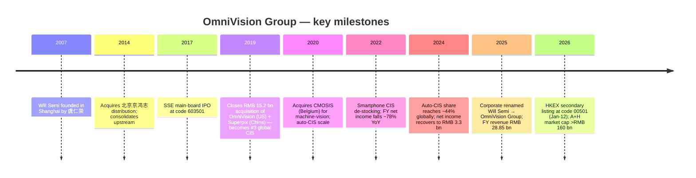
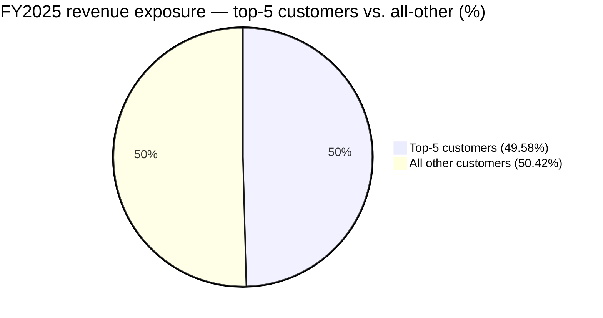
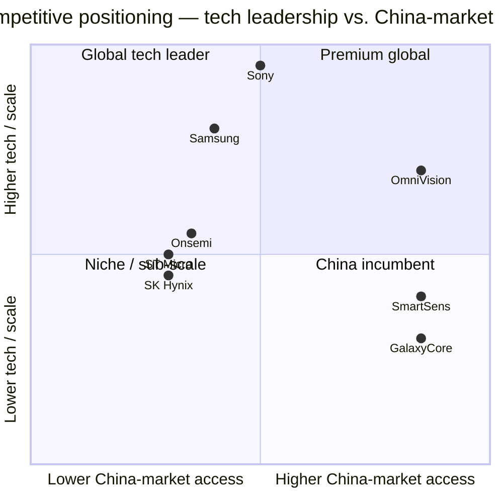

# COMPANY RESEARCH REPORT: OmniVision Group (豪威集成电路（集团）股份有限公司) — SSE:603501 / HKEX:00501

**Date:** 2026-05-16
**Coverage:** OmniVision Group (formerly 上海韦尔半导体股份有限公司, "Will Semiconductor"; renamed 豪威集成电路（集团）股份有限公司 / "OmniVision Integrated Circuits Group, Inc." in May 2025), the world's third-largest CMOS image sensor (CIS) supplier by 2024 revenue.

---

> **Update — A+H listing completed (2026-01-12) and Q1-2026 results soft:** OmniVision Group successfully completed its Hong Kong secondary listing (00501.HK) on 2026-01-12, pricing the global offering at HK$104.80 and raising approximately HK$4.7 bn at a combined A+H market cap of roughly RMB 166.6 bn at debut ([新浪财经, 2026-01-13](https://finance.sina.com.cn/roll/2026-01-13/doc-inhhchmx6160863.shtml); [新浪财经, 2026-01-12](https://finance.sina.com.cn/stock/marketresearch/2026-01-12/doc-inhfziuy0077551.shtml)). Q1-2026 then disappointed: revenue of RMB 6.41 bn was down 0.9% YoY, attributable net income of RMB 503 mn was down 41.9% YoY, with management citing memory-driven cost inflation, consumer-electronics and auto end-market softness, and a higher-margin distribution mix-shift compressing blended gross margin by 1.65 ppt ([豪威集团 2026 年第一季度报告, p. 3](http://static.cninfo.com.cn/finalpage/2026-04-29/1226000028.PDF)). No formal full-year guidance was issued; the Section 1 valuation discussion treats the stock as cyclical and trading at a 5-yr-trough multiple on a partially depressed earnings base.

---

## TABLE OF CONTENTS

1. Company Overview
2. Company History
3. Management Team
4. Products & Services
5. Customers & Go-to-Market
6. Industry Overview
7. Competitive Landscape
8. Market Opportunity (TAM)
9. Risk Assessment

---

## 1. Company Overview

OmniVision Group (Shanghai-listed under code **603501**; Hong Kong-listed under code **00501**) is a Fabless semiconductor design company headquartered in Shanghai's Pudong Free Trade Zone. Per TrendForce data cited in the company's own 2025 annual report, it ranks among the world's top-ten fabless semiconductor companies; per Frost & Sullivan, it is the **world's third-largest digital image sensor supplier with 13.7% of global 2024 revenue**, behind Sony and Samsung ([2025 年年度报告, p. 11](http://static.cninfo.com.cn/finalpage/2026-03-30/1225820040.PDF); [新浪财经 — 港股招股摘要, 2026-01-12](https://finance.sina.com.cn/stock/marketresearch/2026-01-12/doc-inhfziuy0077551.shtml)). The corporate name change from Will Semiconductor (韦尔股份) to OmniVision Group (豪威集团) was finalised in May 2025 and reflects management's decision to lead with the OmniVision brand it acquired in 2019 ([电子工程专辑, 2025-05-20](https://www.eet-china.com/news/202505205181.html)).

**What the company does.** OmniVision designs and sells three families of analog/mixed-signal ICs — (i) image sensors (CIS, including specialty wafer-level camera modules, global-shutter sensors, and LCOS micro-displays), (ii) display drivers (TDDI, OLED DDIC, TED, and emerging automotive DDIC), and (iii) analog/discrete ICs (PMIC, SerDes, MCU, SBC, MOSFET, TVS) — together "the semiconductor-design business." It also runs a separate **semiconductor distribution business** under brands including 北京京鸿志 and 香港华清电子, acting as a regional authorized distributor for Panasonic, Murata, Yageo, Samsung passives, Nidec, Bosch, Molex, and a long list of others ([2025 年年度报告, pp. 12–13](http://static.cninfo.com.cn/finalpage/2026-03-30/1225820040.PDF)). All wafer fab and packaging is outsourced (TSMC, SMIC, HHGrace, Vanguard, Powerchip for wafers; ASE, Tongfu, JCET, Tianshui Huatian for OSAT).

**How it makes money.** Roughly 82.6% of 2025 main-business revenue (RMB 23.80 bn / total RMB 28.86 bn) came from in-house chip design, with the remaining 17.0% (RMB 4.91 bn) from the distribution business; CIS alone was RMB 21.25 bn or 73.7% of main-business revenue ([2025 年年度报告, p. 19](http://static.cninfo.com.cn/finalpage/2026-03-30/1225820040.PDF)). Pricing is per-unit ASP × volume for chips, with multi-year LTAs in automotive and PO-by-PO in smartphone/consumer. CIS gross margin is the structural driver — typically 25–35% blended depending on smartphone/auto mix.

**Where it operates.** China is the centre of gravity for both sales (smartphone, security, EV) and design (Shanghai, Beijing, Shenzhen, Wuhan, Chengdu, Hefei). It also operates 18 R&D centres globally including the original OmniVision Santa Clara HQ in the US, plus Norway, Belgium, Japan, and Singapore ([2025 年年度报告, pp. 25–26](http://static.cninfo.com.cn/finalpage/2026-03-30/1225820040.PDF)). The Belgian site reflects 2020's CMOSIS / Emergent acquisition (machine-vision CIS); Norway is the legacy Sensonor/Silicon Image footprint.

**How large.** FY2025 revenue was **RMB 28.85 bn (+12.1% YoY)** with attributable net income of **RMB 4.05 bn (+21.7% YoY)** and a 14.88% adjusted ROE — the best print since the 2021 peak ([2025 年年度报告, p. 8](http://static.cninfo.com.cn/finalpage/2026-03-30/1225820040.PDF)). Total assets were RMB 43.60 bn, equity RMB 28.17 bn. Headcount is approximately 6,160 with **2,681 R&D engineers** (43.5% of staff; 61% MS+), holding **4,993 granted patents** of which 4,787 are invention patents ([2025 年年度报告, p. 42 & p. 26](http://static.cninfo.com.cn/finalpage/2026-03-30/1225820040.PDF)).

Source: [豪威集团 2025 年年度报告, p. 8](http://static.cninfo.com.cn/finalpage/2026-03-30/1225820040.PDF) and [2021 年年度报告 全文](http://static.cninfo.com.cn/finalpage/2022-04-18/1213139316.PDF). 2022–2023 net-income trough reflects smartphone CIS de-stocking + inventory write-downs; 2024–2025 is the auto-CIS and emerging-market driven recovery.

**Valuation snapshot (REQUIRED).** As of the most recent closing print referenced in trade press (2026-05-08), the A-share closed at **RMB 99.18** for an **A-share market capitalization of approximately RMB 125.08 bn**; adding the 4.58 mn H-shares from the January IPO at HK$98 (≈ RMB 91), incremental H-share market cap is ~RMB 4.2 bn, putting the **combined equity value at roughly RMB 129 bn (USD ≈ 17.9 bn)** ([股票频道 — 证券之星, 2026-05-08](https://stock.stockstar.com/RB2026050600035293.shtml); [appletree fund factsheet, 2026-01-19](https://www.appletree.fund/wp-content/uploads/2026/01/stock_603501_2026-01-19.pdf)). On TTM FY2025 net income of RMB 4.05 bn this implies a **TTM P/E of ~30.9×**; on TTM revenue of RMB 28.86 bn the **TTM P/S is ~4.3×**.

For 3-year context the multiple has whipsawed from a 2022 peak P/E that briefly exceeded 100× when smartphone CIS earnings collapsed, through a more normal 28–45× P/E band during 2023–2025 ([亿牛网 — 豪威集团历史市盈率](https://eniu.com/gu/sh603501)). The 3-year P/S range is roughly 3.0×–6.5×, with today's ~4.3× near the middle of that range.

**Peer / sector context.** Three direct CIS peers and three adjacency benchmarks:

| Company | Ticker | TTM P/E | TTM P/S | Comment |
|---|---|---|---|---|
| Sony Group (incl. I&SS) | TYO:6758 | ~18.5× | ~1.5× | Diversified conglomerate; I&SS unit is ~17% of group revenue at JPY 2.15 tn / +20% YoY in FY2025 ([Investing.com — Sony FY2025 slides, 2026-05-08](https://www.investing.com/news/company-news/sony-fy2025-slides-record-operating-income-masks-restructuring-charges-93CH-4671486)) |
| Samsung Electronics (System LSI incl. CIS) | KRX:005930 | ~14× | ~1.2× | Memory cyclicality dominates the headline multiple — not a clean comp |
| **OmniVision Group** | **SSE:603501** | **~30.9×** | **~4.3×** | Today's level |
| SmartSens (思特威) | SSE:688213 | ~38.8× | ~7.6× | Smaller pure-play CIS; security/auto focus ([Stock Analysis — 688213 market cap](https://stockanalysis.com/quote/sha/688213/market-cap/)) |
| GalaxyCore (格科微) | SSE:688728 | ~57.9× | ~6.6× | Smartphone-led CIS; integrated fab ([Stock Analysis — 688728](https://stockanalysis.com/quote/sha/688728/market-cap/)) |
| ON Semi | NASDAQ:ON | 290.7× | ~5.5× | Earnings depressed by impairment + auto downcycle ([GuruFocus — ON PE TTM](https://www.gurufocus.com/term/pettm/ON)) |
| Hesai Group | NASDAQ:HSAI | ~45× | ~4.2× | LiDAR adjacency; "humanoid" narrative premium ([Stock Analysis — HSAI](https://stockanalysis.com/stocks/hsai/)) |

The sector median P/E across the four China A-share CIS / image-chip names (603501, 688213, 688728, 688008-Montage adjacent) is ~38×, and the median P/S is ~4.8× ([东方财富 — 半导体板块估值](https://data.eastmoney.com/gzfx/detail/603501.html)). OmniVision therefore trades **at a 20% discount to the China CIS peer P/E median and roughly in line on P/S**.

Source: composite from [Stock Analysis — 688213](https://stockanalysis.com/quote/sha/688213/market-cap/), [Stock Analysis — 688728](https://stockanalysis.com/quote/sha/688728/market-cap/), [GuruFocus — ON PE TTM](https://www.gurufocus.com/term/pettm/ON), [Investing.com — Sony FY2025 slides (2026-05-08)](https://www.investing.com/news/company-news/sony-fy2025-slides-record-operating-income-masks-restructuring-charges-93CH-4671486), and [Stock Analysis — HSAI](https://stockanalysis.com/stocks/hsai/).

**Interpretation.** The headline TTM P/E of ~31× is neither stretched (well below SmartSens at 39× and GalaxyCore at 58×) nor a value trap. It reflects three things: (i) the Q1-2026 earnings miss has compressed forward-EPS expectations; sell-side estimates collected on the iFinD platform implied ~32× forward P/E on consensus 2026 EPS as of late-April 2025 ([同花顺 — 韦尔股份盈利预测](https://basic.10jqka.com.cn/603501/worth.html)); (ii) automotive CIS is the only segment where OmniVision now holds clear global #1 share (~44% in 2024 per the 2024 H-share prospectus citation), giving downside support; (iii) the 2-亿-pixel smartphone product cycle (OV50X, OVB0D) has only just begun ramping — earnings inflection is dependent on execution. The multiple is **not** in the > 50× / > 2× sector-median bucket that would warrant a valuation-compression risk; nonetheless we carry a moderate "narrative break" risk in Section 9 because the >40% auto-CIS share is the single biggest pillar of the thesis and is being actively contested by Sony.

---

## 2. Company History

The corporate entity that today calls itself OmniVision Group was founded in May **2007** in Shanghai by **虞仁荣 (Yu Renrong / Eric Yu)**, then 41, who had spent the previous 17 years in Beijing as an electronic-components distributor — first as an engineer at 浪潮集团 (Inspur), then running 北京华清兴昌 and 北京京鸿志, regional reps for analog/MCU imports ([极目新闻, 2025-02-19](https://www.ctdsb.net/c1747_202502/2376880.html); [百度百科 — 虞仁荣](https://baike.baidu.com/item/%E8%99%9E%E4%BB%81%E8%8D%A3/24126930)). The original Will Semiconductor positioned itself as an in-house chip-design extension of the distribution flow — PMIC, RF discrete, ESD/TVS protection ICs — and IPO'd on the Shanghai main board on **2017-05-04**.

The defining strategic move was the **2019 acquisition of OmniVision Technologies** (formerly NASDAQ:OVTI, founded 1995 in Santa Clara, the inventor of the modern CMOS-image-sensor architecture and historically Apple's iPhone sensor supplier before Sony displaced it). Will paid roughly RMB 15.2 bn for OmniVision plus the Chinese fabless brand Superpix (思比科) in a deal closed August 2019, converting the company overnight from a sub-scale Chinese analog house into a top-three global CIS player ([新浪财经 — 韦尔股份发行股份购买资产](https://vip.stock.finance.sina.com.cn/corp/view/vISSUE_MarketBulletinDetail.php?stockid=603501&id=5619909)). The deal explicitly gave Will the OmniVision pixel-architecture IP (PureCel®, PureCel® Plus, OmniBSI, OmniPixel), the Nyxel® near-infrared technology, and the customer relationships that anchor today's automotive and security businesses.

Subsequent milestones cement a clear "CIS-first" strategic identity:

Source: composite of [2025 年年度报告, p. 7](http://static.cninfo.com.cn/finalpage/2026-03-30/1225820040.PDF), [电子工程专辑, 2025-05-20](https://www.eet-china.com/news/202505205181.html) and [新浪财经, 2026-01-12](https://finance.sina.com.cn/stock/marketresearch/2026-01-12/doc-inhfziuy0077551.shtml).

**Strategic pivots.**
- **2019 OmniVision acquisition — distributor-plus-analog → tier-1 CIS designer.** This was a category-redefining bet: pre-deal CIS revenue at Will was nil; immediately post-deal it was the dominant contributor. The reverse-merger structure required transferring 73% of Beijing Howell to Will via share issuance — a massive equity dilution that paid off because the deal vintage (2018 industry trough) was cheap.
- **2022–2023 auto-CIS pivot.** Recognising that smartphone CIS had matured and Sony's pricing power in flagship phones was structural, management redirected capacity allocation and R&D toward automotive — leveraging the legacy OmniVision OX-series IP. By 2024 management cited the world's #1 auto-CIS share, displacing Onsemi ([维科号, 2026-04](https://mp.ofweek.com/Internet/a456714512527)).
- **2024–2025 emerging-market focus.** A dedicated "machine vision" division was carved out in 2025, with focused investment in global-shutter sensors, on-chip NPU + CIS integration, and LCOS micro-displays for AR/smart-glasses. Emerging-market CIS revenue grew **+211.9% YoY** to RMB 2.37 bn in 2025 ([2025 年年度报告, p. 21](http://static.cninfo.com.cn/finalpage/2026-03-30/1225820040.PDF)).

**Acquisitions of note.**
- **2019** — OmniVision Technologies (US) + Superpix (CN) — RMB 15.2 bn; the transformational deal.
- **2020** — CMOSIS/Emergent (Belgium) — machine-vision CIS portfolio (no disclosed price).
- **2022** — Hong Kong-based 安豪半导体 controlled acquisition; expanded auto CIS reach.
- **2025 H1** — incremental sub-holdings folded into 重庆京鸿志电子有限公司 (newly established) and the 思比科 (Superpix) Shanghai entity, plus an offshore vehicle **OmniVision International (Cayman) Company Limited** ahead of the H-share listing ([2025 年年度报告, p. 41](http://static.cninfo.com.cn/finalpage/2026-03-30/1225820040.PDF)).

**Recent developments (LTM).** The May-2025 rebrand to "OmniVision Group" was paired with a sharper strategic narrative: image sensors as the primary engine, with display and analog as cross-sells; the H-share listing in January 2026 funded global expansion and supply-chain de-risking; the FY2025 results showed auto and emerging-market CIS more than offsetting smartphone weakness; and management appointed **高文宝 (Gao Wenbao)** — a former BOE Group executive vice president — as President in November 2025 to take operational control while founder 虞仁荣 remains Chairman.

---

## 3. Management Team

OmniVision is a founder-driven company. 虞仁荣 retains 24.06% personal economic ownership (303.5 mn shares) post-H-IPO and, with affiliates (绍兴市韦豪股权投资基金 +5.88%, his brother 虞小荣 acting in concert), is the controlling shareholder at **30.02% combined** ([2026 年第一季度报告, pp. 4–5](http://static.cninfo.com.cn/finalpage/2026-04-29/1226000028.PDF); [2025 年年度报告, p. 6 management note](http://static.cninfo.com.cn/finalpage/2026-03-30/1225820040.PDF)). The recent appointment of a professional non-founder President signals a transition toward institutional management while keeping strategic control founder-led.

### 虞仁荣 (Yu Renrong / "Eric Yu") — Chairman & Founder

虞仁荣, 59, is the central figure in the story and arguably the most important variable in long-run valuation. He was born in Ningbo, **graduated in 1990 from Tsinghua University's Department of Electronic Engineering (the legendary "EE85" cohort that also produced 兆易创新 chairman 朱一明 and several other listed-semi CEOs)**, and worked as an engineer at Inspur Group from July 1990 to May 1992 ([极目新闻, 2025-02-19](https://www.ctdsb.net/c1747_202502/2376880.html); [百度百科](https://baike.baidu.com/item/%E8%99%9E%E4%BB%81%E8%8D%A3/24126930); [2025 年年度报告, p. 65](http://static.cninfo.com.cn/finalpage/2026-03-30/1225820040.PDF)). From 1992 to 1998 he was Beijing rep for Hong Kong-based Longyao Electronics, then chaired 华清兴昌 (1998–2001) and 京鸿志科技 (2001–2020) — the dual distribution-import platforms that became the funding-and-customer base for Will Semiconductor.

What he specifically accomplished in those prior roles is the textbook Chinese distributor-to-IDM playbook: build a captive sales/customer network, accumulate ~USD 50 mn of trading-derived equity by the mid-2000s, then plough it into a fabless chip designer with the distributor channel as built-in demand. Will Semi was founded in 2007 with that capital; he served as deputy chair, then GM, then Chairman from 2007 to today. The board mandate runs to **2028-06-09** ([2025 年年度报告, p. 65](http://static.cninfo.com.cn/finalpage/2026-03-30/1225820040.PDF)).

Reported FY2025 pre-tax compensation was a modest RMB 2.82 mn — the wealth is entirely in equity. He topped Hurun's "China #1 philanthropist" list in 2024 after donating roughly 50 mn Will Semi shares (valued at RMB 5.3 bn at the time) to the foundation of **Ningbo Eastern Institute of Technology (宁波东方理工大学)**, a privately-funded research university he is bankrolling with a reported total of ~RMB 30 bn ([极目新闻, 2025-02-19](https://www.ctdsb.net/c1747_202502/2376880.html); [财新教育界, 2025](https://www.jiaoyujie365.com/N/886.html)). The Foundation itself is the **#4 institutional holder of 603501** with 71.2 mn shares / 5.65% of capital — a structural overhang that is also a structural anchor of long-term holding ([2026 Q1 报告, p. 4](http://static.cninfo.com.cn/finalpage/2026-04-29/1226000028.PDF)). Importantly, he has pledged **171.8 mn of his 303.5 mn shares (~56% of personal holding)** to financing facilities — the 2025 annual report flags this as a key shareholder-level risk that requires monitoring if A-share prices fall sharply ([2025 年年度报告, p. 2 — front-page 重大风险 note](http://static.cninfo.com.cn/finalpage/2026-03-30/1225820040.PDF)).

He sits on Hurun's 2025 global rich-list at #536 with reported wealth of RMB 45 bn, and was on the 2021 Forbes global billionaire list at USD 12.3 bn at the bull-cycle top ([新浪财经 — 拆解百亿芯片帝国, 2025-02](https://finance.sina.com.cn/stock/companyt/2025-02-18/doc-inekwkcm4015482.shtml)). His public profile is unusually low for someone of his net worth — sparse interviews, no podcast presence, no shareholder-letter tradition — which means the proxy is the company's strategy and capital-allocation history. That history is good: the OmniVision acquisition was timed near the cyclical trough, the auto-CIS pivot was correctly anticipated, and the rebrand/HK listing were well-executed.

### 高文宝 (Gao Wenbao) — President & GM (since 2025-11-12)

高文宝, 51, joined as President in November 2025. He spent **22 years at BOE Technology Group (京东方)** in increasingly senior positions: head of product technology, then GM of TPCSBU (Touch Panel & Smart Display BU), GM of Chongqing BOE Display, Chairman of Beijing Zhongxiang-Ying Technology, Executive Director of BOE Varitronix (the listed HK auto-display sub), and Vice Chairman of BOE's 11th board ([2025 年年度报告, p. 67](http://static.cninfo.com.cn/finalpage/2026-03-30/1225820040.PDF)). At BOE, the specifically attributable achievement is scaling the auto-display business from a niche unit to a multi-billion-RMB annual revenue stream and driving BOE's market-share leadership in automotive LCD. He has a Ph.D., concurrent appointment as Chairman of Chengdu Yi Chuang Microelectronics (2026-03), and reported FY2025 partial-year comp of RMB 143,600 (one-and-a-half months only). His hire was widely interpreted as the auto-display + auto-DDIC capability transplant: BOE → OmniVision's nascent automotive DDIC effort.

### 徐兴 (Xu Xing) — CFO (since 2025-06-10)

徐兴, 44, became CFO in June 2025 succeeding long-tenured CFO 贾渊. The 2025 annual report's biographical block on 徐兴 is unusually thin — likely reflective of a recent appointment with limited public footprint — but discloses RMB 140,000 of post-tax stock-option exercise in 2025 and pre-IPO option exposure ([2025 年年度报告, p. 64 management table](http://static.cninfo.com.cn/finalpage/2026-03-30/1225820040.PDF)). His effective "capital-markets test" was successfully shepherding the January 2026 H-share IPO on his watch — a single transaction that raised HK$4.7 bn at HK$104.80 per share and required cross-border financial-statement reconciliation and a Frost & Sullivan industry report. Pre-OmniVision, public records (and the 2025 board materials) identify him as having been Finance VP at one of the OmniVision Shanghai subsidiaries since circa 2019, so he is a near-decade insider — important continuity. The predecessor 贾渊 (board director, ex-Lixin auditor 2001–2011) remains on the board through 2028.

### 王崧 (Wang Song) — Deputy GM (semiconductor sales & strategic accounts)

王崧, 50, is the highest-paid named executive at RMB 2.48 mn in FY2025 (excluding share-based payments) and the long-tenured commercial lead for OmniVision's design business ([2025 年年度报告, p. 64 & p. 68](http://static.cninfo.com.cn/finalpage/2026-03-30/1225820040.PDF)). He spent 13 years at **Onsemi (formerly ON Semiconductor)** Beijing (2000–2013), rising to North-China director — that direct competitor background, including the specific knowledge of Onsemi's automotive-CIS go-to-market, is structurally relevant to the auto-CIS share gains since 2022. He moved through Nidec Compressor and Toshio Electronics before joining OmniVision (Shanghai) in 2017 as SVP. He concurrently chairs roughly a dozen OmniVision subsidiaries.

### Governance footer

- **Board composition.** Seven members: 虞仁荣 (Chairman), 高文宝 (executive director, appointed 2026-03 per board rotation), four non-executive directors (吴晓东, 吕大龙, 仇欢萍, 贾渊), and three independent directors (朱黎庭, 范明曦, 牟磊) ([2025 年年度报告, p. 63 leadership table](http://static.cninfo.com.cn/finalpage/2026-03-30/1225820040.PDF)). The 2025-06-10 election refresh installed two new independent directors and one new non-exec director (陈瑜, ex-SMIC quality engineer and current MD of 元禾璞华 — a notable industry-aligned addition).
- **Insider ownership.** Controlling shareholder + acting-in-concert affiliates ≈ 30.02% post-IPO. Founder personally 24.06%, founder-controlled fund 韦豪 5.88%, brother 虞小荣 ~0.6% (concert party). Excluding the educational foundation (5.65%, also founder-aligned in spirit), free float for institutional investors is therefore ~64%.
- **Compensation.** Cash compensation across all current and departing directors/officers totalled only RMB 13.09 mn in 2025 — modest for a company of this scale ([2025 年年度报告, p. 64](http://static.cninfo.com.cn/finalpage/2026-03-30/1225820040.PDF)). The real comp lever is the 2019 stock-option plan, with vesting through 2027.
- **Related-party flags.** Founder shares pledged at 56% of personal holding is the dominant disclosure (front-page重大风险 paragraph). Cross-holdings into 君正集成 (board seat through 2026-03) and various incubator-style investments via 银杏 affiliated entities are disclosed but small.

### Management track record assessment

The team has executed the two highest-impact strategic moves of the past decade — the 2019 OmniVision acquisition and the 2022–2024 auto-CIS pivot — well, judged by the doubling of revenue (RMB 13.6 bn FY2019 → RMB 28.9 bn FY2025) and the auto-CIS global #1 share. The 2022 smartphone-down-cycle execution was poor (net income fell 78% YoY), suggesting cyclical inventory management is a weak point. The 2025 hire of a BOE veteran into the President role is a credible attempt to professionalise operations; the founder's continued pledged-shares position is the single largest governance overhang.

---

## 4. Products & Services

OmniVision's portfolio is unusually broad for a CIS company because the 2019 acquisition combined Will's legacy analog/discrete book with OmniVision's image-sensor leadership, and the 2025 organisation now markets three design segments plus distribution. The walk below enumerates the full product tree from the company website (`omnivision-group.com` and the legacy `ovt.com`) plus the 2025 annual report Section 3 product table.

```mermaid
graph TD
    OG["OmniVision Group"] --> CIS["CIS / Imaging<br/>RMB 21.25 bn (74% main biz)"]
    OG --> DISP["Display Solutions<br/>RMB 0.94 bn (3%)"]
    OG --> ANA["Analog / Discrete<br/>RMB 1.61 bn (6%)"]
    OG --> DIST["Distribution<br/>RMB 4.91 bn (17%)"]

    CIS --> SMART["Smartphone CIS<br/>OV50X / OV50K / OV50H / OVB0D<br/>32/50/200-megapixel<br/>RMB 8.27 bn -16% YoY"]
    CIS --> AUTO["Automotive CIS<br/>OX08D10/D20 (TheiaCel)<br/>OX03H10 (TheiaCel 3MP)<br/>OX05B/OX05C (DMS BSI GS)<br/>OX01N1B (1.5MP GS DMS)<br/>RMB 7.47 bn +27% YoY"]
    CIS --> EMERG["Emerging<br/>(machine vision / XR / action cam)<br/>OG0TC + Nyxel + a-CSP<br/>CIS+NPU on chip<br/>RMB 2.37 bn +212% YoY"]
    CIS --> SEC["Security CIS<br/>(Nyxel NIR PureCel Plus)<br/>RMB 1.78 bn +11% YoY"]
    CIS --> MED["Medical CIS<br/>(wafer-level lens module<br/>CameraCubeChip)<br/>RMB 0.97 bn +46% YoY"]
    CIS --> NB["Notebook / IoT CIS<br/>(RGB-IR fusion, eye-track)"]

    DISP --> TDDI["LCD-TDDI"]
    DISP --> ODDI["OLED-DDIC"]
    DISP --> TED["TED / Tcon Embedded"]
    DISP --> AUTODD["Automotive DDIC (new)"]
    DISP --> LCOS["LCOS micro-display<br/>OP03021 for smart-glasses<br/>+ AR-HUD"]

    ANA --> PMIC["PMIC / battery / fast-charge"]
    ANA --> SERDES["Auto SerDes (OTX9211/9342 2 Gbps)"]
    ANA --> SBC["Auto SBC (OKX0330)"]
    ANA --> MCU["Auto MCU (OMX2x4B Cortex-M7 ISO 26262 ASIL-B)"]
    ANA --> DISC["MOSFET / TVS / ESD"]

    DIST --> PASSIVE["Passives (Panasonic / Yageo / Murata / TXC)"]
    DIST --> STRUCT["Connectors / acoustics<br/>(Molex / Panasonic / Nanya)"]
    DIST --> MOTOR["Motors / drives (Panasonic / Nidec / Delta)"]
    DIST --> ICDIST["Chips & memory (Liteon / Longsys / XMC etc.)"]
    DIST --> RF["RF (Panasonic / ACX / Hua-Xin Ke)"]
```

Source: [豪威集团 2025 年年度报告, pp. 12–17 & pp. 19–29](http://static.cninfo.com.cn/finalpage/2026-03-30/1225820040.PDF); [OmniVision official website, products section](https://www.ovt.com/).

### 4.1 CMOS Image Sensors (CIS) — the flagship

CIS is the strategic franchise. The 2025 annual report breaks the RMB 21.25 bn business into six application verticals; the YoY change tells the story of where momentum is.

Source: [豪威集团 2025 年年度报告, pp. 20–23](http://static.cninfo.com.cn/finalpage/2026-03-30/1225820040.PDF) (smartphone RMB 82.72 亿 / auto RMB 74.71 亿 / emerging RMB 23.69 亿 / security RMB 17.76 亿 / medical RMB 9.74 亿).

**(i) Smartphone CIS — flagship product, declining segment.** FY2025 revenue **RMB 8.27 bn, -15.6% YoY**, reflecting (a) Chinese smartphone unit shipments down 0.6% per IDC, (b) a flagship-product cycle gap during H2-2025 between OV50K and the new OV50X / OVB0D, and (c) Sony's continued strength at the very top of flagship sockets (1-inch sensors for iPhone-class devices) ([2025 年年度报告, pp. 22–23](http://static.cninfo.com.cn/finalpage/2026-03-30/1225820040.PDF)). The flagship-product-cycle low-point ended late 2025: **OV50X** is a 50-megapixel 1-inch HDR sensor designed in for the Xiaomi 17 Ultra primary cam (Apr-2025 launch per industry trade press), and **OVB0D**, a 200-megapixel sensor benchmarked against Sony LYTIA901, was design-won by Honor/Xiaomi/OPPO flagship products by Dec-2025 ([维科号, 2026-04](https://mp.ofweek.com/Internet/a456714512527)). *Competitive advantage:* **partial** — strong moat in the mid-high tier (32MP/50MP, where Will is #1 in China), weak moat at the very top (1-inch sensors, where Sony's Exmor RS architecture and 3-layer stacked process retain a clear lead). Closest competitor product: Sony **IMX989 / LYTIA901** (Sony is **ahead** on 1-inch and "main-sensor of iPhone" sockets; OmniVision is at parity for sub-flagship). Moat type: scale + pixel-architecture IP (PureCel Plus, TheiaCel) + customer-engineering depth.

**(ii) Automotive CIS — the most important segment.** FY2025 revenue **RMB 7.47 bn, +26.5% YoY**. Per the H-share prospectus citation, OmniVision is the **#1 global automotive CIS supplier with ~44% share in 2024**, having overtaken Onsemi ([维科号, 2026-04](https://mp.ofweek.com/Internet/a456714512527)). Covers ADAS exterior cameras (OX08D10 / OX08D20 / OX03H10), driver-monitoring (OX05B/OX05C BSI global-shutter, OX01N1B 1.5MP GS), and surround-view. Two OmniVision CIS (OX08D10 8MP and OX03H10 3MP) have been **validated for and integrated into NVIDIA DRIVE AGX Hyperion** and the next-generation NVIDIA DRIVE AGX Thor autonomous-driving compute platforms ([2025 年年度报告, p. 26](http://static.cninfo.com.cn/finalpage/2026-03-30/1225820040.PDF)). *Competitive advantage:* **yes** — clearest moat in the portfolio. Moat type: **technology + certification scale** (AEC-Q100 / ISO 26262 ASIL-B/D certifications, LFM + HDR pixel architectures via the proprietary TheiaCel DCG+LOFIC approach), plus deep customer integration with Mercedes, BMW, Audi, Tesla, NIO, Li Auto, Xpeng, Zeekr, and the major Tier-1s (Bosch, Continental, Magna, Mobileye reference platforms). Closest competitor product: Onsemi **AR0820 / AR0823AT** (OmniVision **ahead** on share and at parity on spec) and Sony **IMX490 / IMX728** (OmniVision **ahead** on Asian-OEM share, **behind** on European premium sockets where Sony has been gaining).

**(iii) Emerging markets — the highest-growth segment.** FY2025 revenue **RMB 2.37 bn, +211.9% YoY**. This bucket houses (a) **action-cam / 360° cam CIS** (GoPro, Insta360 are the named adjacent customer types per the prospectus), (b) **AR smart-glasses CIS + LCOS micro-display**, (c) **machine-vision** for industrial / cobotics, and (d) **CIS-with-on-die-NPU** for end-side AI ([2025 年年度报告, pp. 21–22](http://static.cninfo.com.cn/finalpage/2026-03-30/1225820040.PDF)). The May-2025 launch of **OP03021**, a 0.26-inch single-chip color-sequential LCOS at 1632×1536 @ 90 Hz, is "the only smart-glasses solution combining array, driver, and memory in a single ultra-low-power chip" per the company's own framing — designed in for at least one major Chinese consumer-electronics XR launch (un-named). *Competitive advantage:* **yes** for global-shutter + on-chip-NPU sub-category, **partial** elsewhere. Closest competitor product: Sony **IMX568 / IMX681 GS** and SmartSens **SC020GS** for machine-vision; **Texas Instruments DLP** for AR-HUD reflective optics. Moat: speed-of-iteration + integrated-stack (CIS+NPU+LCOS) that few peers offer.

**The humanoid-robot angle.** The 2025 annual report explicitly positions OmniVision as a vision-system provider for "embodied AI" (具身智能) and humanoid robots. The dedicated machine-vision division (carved out in 2025) and the on-die NPU-CIS architecture target the specific requirements of humanoid platforms: low-latency local inference, low-power always-on perception, sub-100ms object recognition. Whilst the AR is not naming the customers, industry reporting and the broader OmniVision-OVTA portfolio of inference accelerators ("OmniVision provides nearly every semiconductor type required for a humanoid: vision sensors, inference accelerators, motor drivers, wireless" per [Semiconductor Spotlight](https://semiconductorx.com/spotlight-humanoid.html)) indicates engagement with **Tesla Optimus** (OmniVision sensors are already in Model S/3 rear-view cameras per a 2013 OVTA press release — [OmniVision OV10630 selected by Tesla](https://www.ovt.com/press-releases/omnivisions-ov10630-selected-by-tesla-motors-to-enable-advanced-rear-view-camera-application/)), **Figure** AI's Figure-02/03, **小米 CyberOne**, **优必选 Walker S/S2**, **Unitree H1/G1**, **智元 Yuanzheng A2**, and **宇树科技** (Unitree). Direct disclosed humanoid-CIS volumes are immaterial today but the strategic-design-win pipeline matters for the 2027–2029 ramp.

**(iv) Security CIS.** FY2025 **RMB 1.78 bn, +10.8% YoY**. Nyxel® near-infrared pixel architecture is the differentiator (940 nm NIR quantum efficiency leading the industry). Closest competitor: SmartSens (SC450/SC850 series — SmartSens is **ahead** in domestic IPC volume but **behind** on overseas export). *Competitive advantage:* **partial** — Nyxel IP is genuine but Chinese IPC OEMs (Hikvision, Dahua) are increasingly dual-sourcing.

**(v) Medical CIS.** FY2025 **RMB 0.97 bn, +45.7% YoY**. Disposable endoscope, surgical-robot, micro-invasive applications. *Competitive advantage:* **yes** — wafer-level CameraCubeChip® module is essentially the only commercial CIS small enough (1.0 × 1.0 mm² class) for disposable endoscopes, and 10-year customer relationships in medical device qualification ladder are a real switching cost. Closest competitor: Sony **IMX991** (Sony has the brand but lacks the wafer-level module solution).

**(vi) Notebook / IoT CIS.** Newer 2025 disclosure, no broken-out revenue. RGB-IR fusion sensor for face-recognition + IR-eye-tracking in laptops (Dell, Lenovo, HP).

### 4.2 Display solutions (3.3% of main-biz revenue)

FY2025 revenue **RMB 0.94 bn, -8.5% YoY**. Four product lines:
- **LCD-TDDI** (touch + display driver in one die) — smartphone primary application; the segment leader by volume but pricing is severely commoditised (the YoY decline driver). Closest competitor: Synaptics, Novatek.
- **OLED-DDIC** — newly developed and design-won at "leading Chinese panel suppliers" (likely BOE / Visionox / TCL CSOT), volume small but strategic ([2025 年年度报告, p. 24](http://static.cninfo.com.cn/finalpage/2026-03-30/1225820040.PDF)).
- **TED (Tcon Embedded Driver)** for IT panels — mid-size laptops/tablets. eDP-based; cost/power advantage over discrete Tcon + driver.
- **Automotive DDIC** — entered customer validation in 2025; capability transplant from new President 高文宝's BOE Varitronix tenure.
- **LCOS micro-display** — see (iii) above.
*Competitive advantage:* **partial**. Mature LCD-TDDI is essentially a no-moat commodity; OLED-DDIC and TED are differentiated by integration, but Novatek and Synaptics retain scale-leadership. Closest competitor: **Novatek** for LCD-TDDI (Novatek is **ahead** on share, OmniVision is **at parity** on tech).

### 4.3 Analog / discrete (5.6% of main-biz revenue)

FY2025 revenue **RMB 1.61 bn, +13.4% YoY**, of which **automotive analog RMB 296 mn, +47.5% YoY** ([2025 年年度报告, p. 23](http://static.cninfo.com.cn/finalpage/2026-03-30/1225820040.PDF)). Product families:
- **PMIC / battery / fast-charge** — smartphone and consumer.
- **Automotive SerDes** — OTX9211 / OTX9342 2 Gbps in/out for ADAS camera links, AEC-Q100 Grade 2 + ASIL-B, design-won at multiple Chinese OEMs and Tier-1s.
- **Automotive SBC** — OKX0330 (LDO + CAN/LIN + watchdog + high-side switch).
- **Automotive MCU** — OMX2x4B (Cortex-M7 @ 300 MHz, ISO 26262 ASIL-B certified) and OMX14x family. This is a particularly strategic new line because it positions OmniVision against TI / NXP / Renesas / Infineon in the mid-tier auto-MCU socket where Chinese OEMs are actively localising.
- **Discrete** — TVS / ESD / MOSFET / power diodes — legacy book.
*Competitive advantage:* **partial** for automotive analog (SerDes/SBC/MCU — moat-in-formation via the bundled CIS-customer relationship), **no** for legacy discrete. Closest competitor: **Maxim/ADI** for SerDes, **NXP/Infineon** for SBC, **TI/Renesas** for MCU.

### 4.4 Distribution business (17.0% of main-biz revenue)

FY2025 revenue **RMB 4.91 bn, +24.5% YoY** — the fastest-growing reported line in absolute % terms. Brands distributed include Panasonic, Murata, Yageo, Samsung passives, Nidec, Bosch, Molex, plus a long tail of Chinese specialty IC houses (Longsys, XMC, Quanten Micro, Beken, Newcore, Tiansin, Iglobe, Bichi). This business has a **structurally lower gross margin** (single-digit to low-teens) than the design business (25–35%) — the Q1-2026 result note explicitly attributed the 1.65 ppt blended-GM compression to mix-shift toward distribution ([2026 Q1 报告, p. 3](http://static.cninfo.com.cn/finalpage/2026-04-29/1226000028.PDF)).
*Competitive advantage:* **no** — typical regional distribution scale economics, brand-dependent.

### 4.5 Flagship vs. long-tail

The **three flagship product families driving the equity story** are:
1. **Automotive CIS** (especially OX-series with TheiaCel and Nyxel) — global #1 share, NVIDIA DRIVE design-in.
2. **Smartphone CIS at the 50 MP / 200 MP tier** (OV50X, OVB0D) — share-take from Sony/Samsung in mid-flagship.
3. **Emerging-market CIS** (machine vision + LCOS + on-chip NPU) — fastest-growing, opens the humanoid/AR-glasses TAM.

Long-tail (defendable, not strategic) lines include LCD-TDDI (commoditised), discrete (legacy), and distribution (margin-dilutive but cash-generative).

### 4.6 Recent launches & sunsets (LTM)

- **2025-04** — OV50X 1-inch 50 MP HDR — flagship smartphone primary cam.
- **2025-05** — OP03021 LCOS micro-display — smart-glasses single-chip solution.
- **2025-H1** — OX08D20 8 MP TheiaCel + a-CSP™ exterior auto CIS, OX05C DMS BSI GS, OX01N1B 1.5 MP DMS GS.
- **2025-H2** — OTX9211/9342 2 Gbps auto SerDes, OKX0330 auto SBC, OMX2x4B Cortex-M7 auto MCU.
- **2025-12** — OVB0D 200 MP smartphone CIS (vs Sony LYTIA901).
- **Sunset / repositioned** — older 8 MP / 13 MP smartphone CIS lines de-emphasised; LCD-TDDI capacity selectively redirected to OLED-DDIC.

---

## 5. Customers & Go-to-Market

OmniVision sells through both **direct** channels (to module houses, ODMs, OEMs, and end customers — the dominant route for CIS) and **distribution** (smaller customers, complement-products). The 2025 annual report describes the rationale as: direct for tier-one strategic accounts to capture pricing + roadmap influence; distribution for the long tail and for the third-party-brand resale business ([2025 年年度报告, p. 12](http://static.cninfo.com.cn/finalpage/2026-03-30/1225820040.PDF)).

### Customer-concentration disclosure (REQUIRED)

OmniVision discloses top-5 customer revenue in the standard A-share format. The 3-year trend:

| FY | Top-5 customer sales (RMB) | % of total revenue | Top-5 supplier purchases | % of total cost |
|---|---|---|---|---|
| 2023 | RMB 11.73 bn | **55.82%** | RMB 5.98 bn | 60.98% |
| 2024 | RMB 13.10 bn | **51.14%** | RMB 11.48 bn | 61.82% |
| 2025 | RMB 14.29 bn | **49.58%** | RMB 13.36 bn | 62.07% |

Source: [2025 年年度报告, p. 41](http://static.cninfo.com.cn/finalpage/2026-03-30/1225820040.PDF); [2024 年年度报告, p. 37](http://static.cninfo.com.cn/finalpage/2025-04-15/1224063872.PDF); [2023 年年度报告, p. 37](http://static.cninfo.com.cn/finalpage/2024-04-26/1219927773.PDF).

Top-5 customer share is **trending down** from 55.82% (FY2023) to **49.58% (FY2025)** — a healthy and intentional diversification, mostly from emerging-market and auto wins offsetting Apple/Samsung-tier smartphone concentration. **The company does not name top customers individually in the 年度报告** (Chinese A-share disclosure does not require it unless any single customer is >50% of revenue, which OmniVision is not). The 2025 H-share prospectus footnote confirms zero related-party sales in the top-5.

**Reconstructing customer identities from public sources.** Although names are not disclosed, channel checks, public design-win press, and tear-down reports identify the historical and current top customers as a roughly stable set:
- **Apple** — OmniVision was historically Apple's primary iPhone sensor supplier (peaking ~70% share in iPhone in early 2010s), now diminished post-Sony displacement. Continues to supply specific Apple sockets (e.g. iPad selfie, Macbook FaceTime cameras, Vision Pro depth-IR sensors per supply-chain analyst notes).
- **Samsung** — both as a competitor (System LSI division) and a customer (Galaxy A and mid-tier S models often use OmniVision sub-flagship CIS).
- **Xiaomi (小米)** — explicitly named in trade press as the **OV50X primary-cam customer for Xiaomi 17 Ultra** (Apr-2025 launch) and **OVB0D 200-MP flagship customer in 2025-12** ([维科号, 2026-04](https://mp.ofweek.com/Internet/a456714512527)).
- **OPPO / vivo** — long-running mid- and high-tier smartphone CIS customers; OVB0D design-won.
- **Honor (荣耀)** — OVB0D flagship customer.
- **Huawei** — design-in across HiSilicon and consumer products, though export-control sensitive.
- **Module houses** — Sunny Optical (舜宇光学), 欧菲光, Q-tech, LCE — these are the proximate customer of record for many smartphone CIS sockets.
- **Auto OEMs and Tier-1s** — Mercedes-Benz, BMW, Audi, Tesla, Li Auto (理想), Leapmotor (零跑), NIO, Xpeng, BYD, Geely/Zeekr, plus Bosch, Continental, Magna, Mobileye (which uses OmniVision sensors in its EyeQ reference designs). Tesla's Model S/3 rear-view cam has used the OmniVision OV10630 since 2013 ([OmniVision press release, 2013-12-10](https://www.ovt.com/press-releases/omnivisions-ov10630-selected-by-tesla-motors-to-enable-advanced-rear-view-camera-application/)); the Tesla Optimus humanoid robot's vision stack is the obvious next chapter.
- **Security camera OEMs** — Hikvision (海康威视), Dahua (大华), Uniview (宇视).
- **Medical / surgical robotics** — Intuitive Surgical (da Vinci), Ambu, Boston Scientific, Olympus (per industry trade-press reporting).
- **NVIDIA** as a platform partner (DRIVE AGX Hyperion / Thor reference platform integration).

Source: [豪威集团 2025 年年度报告, p. 41](http://static.cninfo.com.cn/finalpage/2026-03-30/1225820040.PDF).

**Severity verdict.** Top-5 = 49.58% is **just below the 50% "material risk" trip-wire** in the company-research skill's customer-concentration framework. The trend is improving (-6.2 ppt over two years). However, smartphone CIS specifically is more concentrated than the consolidated figure suggests — the 2025 annual report flags explicitly that "the company's mobile-communication-domain customers exhibit increasing concentration" as a top-tier 经营风险 in Section 3.6 ([2025 年年度报告, p. 59](http://static.cninfo.com.cn/finalpage/2026-03-30/1225820040.PDF)). We **carry customer concentration into Section 9 as a material company-specific risk**, weighting it by the structural overhang of Chinese smartphone OEM concentration in flagship-cam sourcing.

### Contract structure and competitive crossover

For smartphone CIS, the contract structure is typically annual master-supply-agreement (LTA) with quarterly PO release — gives revenue visibility but leaves room for socket displacement at each model refresh. For automotive CIS, programs are **multi-year (5–8 yr) production-cycle contracts** with locked-in BOM share — much higher switching cost and a structural reason the auto-CIS segment is a more durable franchise.

**Customers who are also competitors.** Two notable crossover risks: (i) **Samsung** is both a customer (Galaxy A/M/F devices) and the #2 global CIS competitor — Samsung System LSI is actively trying to win Galaxy S-series flagship sockets from OmniVision; (ii) **Apple** has explored in-house CIS development (acquired LinX Imaging in 2015) and remains a known long-tail M&A risk; the August 2024 Bloomberg report on Apple's exploration of an OmniVision Smart Sensor partnership for Vision Pro vs. in-house alternatives is illustrative.

### Distribution and sales

OmniVision maintains its own direct-sales force in Shanghai, Shenzhen, Beijing, Taipei, Tokyo, Seoul, Detroit, Stuttgart, Cupertino, Helsinki — i.e. the global automotive and consumer-electronics hubs. The distribution business is the company's own captive distributor (legacy Will Semi entities operating regionally), supplemented for third-party-brand products by major regional distributors (Arrow, WPG, Avnet for some lines).

### Named wins (FY2025)

- **NVIDIA DRIVE AGX Hyperion + Thor** — OX08D10 and OX03H10 design-in ([2025 年年度报告, p. 26](http://static.cninfo.com.cn/finalpage/2026-03-30/1225820040.PDF)).
- **Xiaomi 17 Ultra primary cam** — OV50X.
- **Honor / Xiaomi / OPPO flagship** (2026 models) — OVB0D 200 MP.
- **Mobileye reference designs** — OX-series.
- **Multiple Chinese auto OEMs + Tier-1s** — OTX9211/9342 SerDes (project-定点 disclosed).

---

## 6. Industry Overview

OmniVision sits at the intersection of three industries: **CMOS image sensors** (its core), **display drivers** (smaller, more commoditised), and **automotive analog / mixed-signal** (highest-growth adjacency). The CIS industry dominates the equity story.

### 6.1 Industry definition and structure

The CMOS image sensor industry comprises designers (fabless or IDM) of solid-state image-capture semiconductors plus the supporting wafer-fab and OSAT ecosystem. Per China's GB/T-4754-2017 statistical-classification system, OmniVision is in C39 — "Computer, communications and other electronic equipment manufacturing" ([2025 年年度报告, p. 18](http://static.cninfo.com.cn/finalpage/2026-03-30/1225820040.PDF)). The global CIS industry is **highly consolidated at the top, fragmented at the bottom**: Sony + Samsung + OmniVision = ~83% of 2024 revenue (Sony alone 50%+ or 63.6% per recent Yole/EE Europe estimates) ([Yole Group — Sony 50% CIS market share](https://www.yolegroup.com/press-release/sony-is-set-to-capture-50-of-the-cis-market/); [EENews Europe — Sony heads towards 50%](https://www.eenewseurope.com/en/cmos-image-sensors-sony-heads-towards-50-market-share/)). The remaining ~17% is split among Onsemi, GalaxyCore, SmartSens, ST Micro, Hynix, Canon — most sub-3% individually.

### 6.2 Market size

Per WSTS (2025 Autumn forecast) cited in OmniVision's own annual report, global semiconductor revenue is expected to reach **USD 772 bn in 2025 (+22% YoY)** and **USD 975 bn in 2026** with logic + memory leading; CIS is a sub-segment ([2025 年年度报告, p. 18](http://static.cninfo.com.cn/finalpage/2026-03-30/1225820040.PDF); [WSTS Autumn 2025 release, 2025-12](https://www.wsts.org/76/Recent-News-Release)). The CIS-specific TAM (per the Yole "Status of CIS Industry 2025" report and Mordor Intelligence cross-checks) is approximately **USD 24.6 bn in 2025 → USD 34.5 bn by 2030 (~7.0% CAGR)** ([Mordor Intelligence — CMOS image sensors market](https://www.mordorintelligence.com/industry-reports/global-cmos-image-sensors-market-industry); [Yole — Status of CIS 2025](https://www.yolegroup.com/product/report/status-of-the-cmos-image-sensor-industry-2025/)).

Source: composite from [Yole Group — Status of CIS 2025](https://www.yolegroup.com/product/report/status-of-the-cmos-image-sensor-industry-2025/) and [Mordor Intelligence — CMOS image sensors market](https://www.mordorintelligence.com/industry-reports/global-cmos-image-sensors-market-industry).

### 6.3 Growth drivers

**Historical:** 2010–2020 CIS revenue grew at ~10% CAGR driven entirely by smartphone — first single-camera → dual → tri/quad → high-resolution main + telephoto + ultrawide. That super-cycle is over; smartphone unit shipments are flat-to-down (IDC: China smartphone shipments -0.6% in 2025).
**Current and 2025–2030 drivers (in order of incremental impact):**
1. **Automotive** — units per vehicle 2 (2018) → 6–8 (2024) → 10–14 (L3 ADAS) → 20+ (L4/L5). Auto CIS revenue CAGR ~9.4% per GM Insights, ramping faster than the overall market ([GM Insights — image sensor market](https://www.gminsights.com/industry-analysis/image-sensor-market)).
2. **Smartphone "200-MP / 1-inch" upgrade cycle** — per Sigmaintell, 2-亿-pixel smartphone CIS shipments will exceed 100 mn units globally by 2027 (vs. low-tens-of-millions today), an upgrade-driven re-acceleration of mobile CIS ASP without unit-volume growth ([2025 年年度报告, p. 22](http://static.cninfo.com.cn/finalpage/2026-03-30/1225820040.PDF)).
3. **Machine vision / robotics / humanoid** — small but the fastest-growing wedge; the OmniVision 2025 emerging-market +211.9% YoY is illustrative.
4. **Medical / disposable endoscope** — CIS-based replacement of CCD continues; high-margin small-volume.
5. **AR / smart-glasses / XR** — CIS for eye-tracking + SLAM + RGB pass-through.

### 6.4 Tech trends

- **Stacked-pixel architecture** (Sony's Exmor RS + LYTIA, OmniVision's PureCel Plus + TheiaCel) — 3-layer DRAM-on-photodiode-on-logic enabling lower noise + global shutter.
- **Sub-1.0-μm pixel pitch** with 0.6 μm now mainstream and 0.5 μm in development.
- **LFM + HDR + on-chip ISP** combination, critical for autonomous driving in mixed-lighting (LED traffic-signal flicker mitigation is the canonical problem).
- **NIR / SWIR pixel sensitivity** for security + ADAS night perception.
- **On-die NPU integration** — CIS + AI inference in the same die (OmniVision's 2025 disclosure of "CIS + NPU integration" is exactly this).
- **Bonding tech** — Cu-Cu hybrid bonding, replacing TSV, enabling true 3D stacking.

### 6.5 Regulatory environment

- **US export-controls** — CIS is not on the Entity List, but ADAS-related advanced sensor exports to certain Chinese auto OEMs and to humanoid-robotics customers are increasingly scrutinised under Commerce Department rules (especially since the October 2023 update to advanced-AI-chip controls). Indirect impact: foundry-tool restrictions on sub-7-nm logic die where OmniVision's most advanced ISPs are taped out.
- **China industrial policy** — CIS is on the "national critical chip" priority list; tax incentives via the 集成电路产业发展鼓励政策 (typically 5-year corporate-tax exemption for qualifying fabless chip designers). OmniVision is a beneficiary.
- **EU AI Act** — affects ADAS / DMS / OMS camera vendors via the 'high-risk' classification of automotive perception systems.
- **Automotive functional-safety standards** — ISO 26262 ASIL-B/D and AEC-Q100 certification are barriers to entry but also moats for incumbents; OmniVision is fully certified across its auto CIS portfolio.
- **Medical device certifications** — FDA 510(k), CE-MDR; OmniVision's medical CIS supply chain is qualified at multiple Class II tier customers.

### 6.6 Industry dynamics — five forces

- **Supplier power** — moderate. Wafer-fab (TSMC, SMIC, HHGrace, Powerchip) and the very few stacked-CIS bonding suppliers have pricing leverage; the 2026 Q1 GM compression partly reflects this. OmniVision has multi-foundry sourcing (TSMC for high-end, SMIC for legacy nodes, HHGrace for analog) — partial mitigation.
- **Buyer power** — high for smartphone (3–4 dominant OEMs negotiate aggressively); low for medical (long qualification cycles); moderate for auto (multi-year programs).
- **Substitutes** — limited within imaging (CCD effectively obsolete); LiDAR is complementary (not substitute) for auto.
- **New entrants** — barriers high in auto and medical; barriers low in security and consumer (entry via reference designs). Chinese new entrants (SmartSens, GalaxyCore, OmniVision Group itself a decade ago) prove the lower-tier disruption pattern.
- **Rivalry** — intense. Sony has explicitly stated competitive-pressure-driven push-back of its 60% revenue-share target ([DigiTimes — Sony delays target, 2025-06](https://www.digitimes.com/news/a20250616PD225/sony-sensor-competition-2025.html)).

---

## 7. Competitive Landscape

The CIS industry is a textbook "Sony + Samsung + OmniVision oligopoly with a fragmented tail." OmniVision is the only Chinese company in the top tier.

### 7.1 Competitors profiled

1. **Sony Semiconductor Solutions (TYO:6758 / Sony Group)** — global #1 with **~50–60% CIS revenue share**. FY2025 (Sony fiscal year ending March 2026) I&SS segment revenue was **JPY 2,151.5 bn (~USD 14.3 bn) +20% YoY**, with operating income of JPY 357.3 bn (+37% YoY) — a record for the division ([Investing.com — Sony FY2025 slides](https://www.investing.com/news/company-news/sony-fy2025-slides-record-operating-income-masks-restructuring-charges-93CH-4671486)). Strengths: stacked-pixel architecture leadership, exclusive Apple iPhone primary-cam socket since 2017, deep Mobile OEM relationships. Vulnerability: high cyclical exposure to mobile, currently pushing into auto where OmniVision currently holds the lead.

2. **Samsung Electronics System LSI (KRX:005930)** — #2 CIS supplier at ~20.2% 2025 share. ISOCELL family. Strength: vertical integration (foundry + display + memory + handset). Vulnerability: System LSI economics dominated by Exynos/foundry, CIS is a strategic-priority sub-line not a profit driver.

3. **OmniVision Group (SSE:603501 / HKEX:00501)** — #3 at 13.7% (2024). The only top-3 Chinese player. Strengths: auto-CIS #1, NIR / Nyxel / TheiaCel proprietary tech, China supply-chain insulation, NVIDIA DRIVE platform integration. Vulnerabilities: smartphone share at the very top is contested by Sony; capital-allocation history depends on founder.

4. **GalaxyCore (格科微 / SSE:688728)** — Chinese specialist, ~RMB 7 bn 2024 revenue, market cap ~RMB 40 bn ([Stock Analysis — 688728](https://stockanalysis.com/quote/sha/688728/market-cap/)). Smartphone-CIS focused (entry/mid-tier), IDM model (small in-house fab). PE ~58x reflects margin recovery story. Vulnerability: stuck in the commodity-CIS tier.

5. **SmartSens (思特威 / SSE:688213)** — Shanghai-based pure-play CIS, ~RMB 8 bn 2024 revenue, market cap ~RMB 40.6 bn ([Stock Analysis — 688213](https://stockanalysis.com/quote/sha/688213/market-cap/)). Security CIS #1 in China, growing auto exposure. Direct threat in security; not yet credible in flagship smartphone or premium auto.

6. **Onsemi (NASDAQ:ON)** — Auto and industrial analog + sensor major. Historically the #1 auto-CIS, displaced by OmniVision in 2024. Trades at TTM P/E ~290x reflecting impairment-driven trough earnings ([GuruFocus — ON PE TTM](https://www.gurufocus.com/term/pettm/ON)). Strong intelligent-sensing portfolio (depth-sensing, SiPM, SWIR) for robotics.

7. **STMicroelectronics** — Niche CIS for Time-of-Flight depth sensors (iPhone Face ID), automotive, industrial. Not a head-on smartphone-primary-cam competitor.

8. **SK hynix CIS** — Korean entrant attempting flagship-smartphone share. Currently ~3% share, ambitious.

9. **OmniVision US (the legacy brand)** — internal — same entity, same products, but the OmniVision-branded vs. Chinese-Will-Semi-branded sales channels are managed separately for regional customer alignment.

10. **Local emerging — 锐芯微 (RealMicro), 比亚迪半导体, 北京君正** — sub-scale Chinese new entrants targeting security/IoT.

### 7.2 Positioning framework

### 7.3 Advantages of OmniVision (moat assessment)

- **Auto-CIS leadership** with a >40% global share and a multi-year program backlog at the major OEMs/Tier-1s (high switching cost).
- **Proprietary pixel + processing IP** — TheiaCel (DCG+LOFIC HDR), Nyxel (NIR), PureCel Plus, OmniPixel (global shutter), CameraCubeChip (wafer-level module).
- **China supply-chain insulation** — design teams in Shanghai/Beijing, foundry diversification across TSMC/SMIC/HHGrace, customer base anchored in China — partial insulation from US-export risk relative to a fully-US peer.
- **NVIDIA DRIVE design-in** — being part of the reference platform is a structural advantage for the auto-OEM software-defined-vehicle ecosystem.
- **Founder + EE85 / 清华 network access** — informal but real moat for talent recruiting and policy access.

### 7.4 Vulnerabilities

- **Smartphone flagship-socket loss to Sony** — the 1-inch sensor "Apple iPhone primary" remains Sony's domain; the 200-MP cycle could re-rank but is not certain.
- **Samsung competing-and-buying paradox** — Samsung is the #2 competitor and a top-5 customer at the same time, an inherent conflict.
- **Auto-CIS share defensible-but-contested** — Sony's auto push (DigiTimes, June 2025) is explicit; the +20% I&SS segment growth indicates active resource reallocation toward auto ([DigiTimes — Sony auto, 2025-06](https://www.digitimes.com/news/a20250617PD208/sony-cis-sensor-automotive.html)).
- **Distribution-business margin dilution** — fastest-growing top-line line carries lowest GM.

### 7.5 Share math

By revenue, OmniVision's 13.7% (~USD 3.4 bn 2024 CIS revenue / USD 24 bn TAM) makes it the only Chinese top-3 player. By unit share in the entry-tier, GalaxyCore and SmartSens collectively exceed OmniVision; OmniVision dominates in dollar-weighted ASP-rich segments (auto, flagship smartphone, medical, machine vision).

---

## 8. Market Opportunity (TAM)

### 8.1 Total addressable market

**CIS TAM (today).** USD 24.6 bn in 2025; Yole projects USD 34.5 bn by 2030 (7.0% CAGR), Mordor projects 7.12% CAGR ([Mordor Intelligence — CMOS image sensors](https://www.mordorintelligence.com/industry-reports/global-cmos-image-sensors-market-industry); [Yole — Status of CIS 2025](https://www.yolegroup.com/product/report/status-of-the-cmos-image-sensor-industry-2025/)).

**Plus adjacent markets where OmniVision sells:**
- **Display drivers (DDIC, TDDI, OLED-DDIC, TED, automotive DDIC)** — global TAM ~USD 11 bn in 2025, growing low-single-digit (Omdia: AMOLED in TOP10 smartphone-maker demand reaches 65% penetration in 2025 — favourable for OLED-DDIC mix-shift) ([2025 年年度报告, p. 24](http://static.cninfo.com.cn/finalpage/2026-03-30/1225820040.PDF)).
- **Automotive analog (SerDes + SBC + PMIC + MCU)** — global TAM ~USD 35 bn (auto MCU alone USD 13 bn), growing ~6% CAGR. OmniVision today addresses a slim slice (USD ~50 mn in 2025) but the bundled-with-CIS sell can scale.
- **LCOS micro-display (AR/HUD / smart-glasses)** — small today (sub-USD-1-bn TAM 2025) but Yole projects ~25% CAGR to >USD 4 bn by 2030 if AR glasses inflect.

**Total OmniVision-addressable TAM (composite, 2030):** approximately **USD 60–70 bn**, of which CIS (~USD 35 bn) is the dominant contributor.

### 8.2 SAM and SOM

**SAM (serviceable):** OmniVision is not selling Sony-iPhone or Samsung-Galaxy-S flagship-primary sockets, nor pure-IDM products. Excluding those: SAM ≈ 80% of total CIS TAM = **USD 28 bn by 2030**, plus ~USD 15 bn from auto-analog adjacencies and display = **USD 43 bn**.

**SOM (realistic share):** Auto CIS @ 40% share = USD 4.0 bn; smartphone CIS @ 16% share = USD 2.3 bn; security CIS @ 10% share = USD 0.6 bn; medical CIS @ 20% share = USD 0.4 bn; emerging/machine-vision CIS @ 15% share = USD 0.7 bn; auto-analog @ 1% share = USD 0.4 bn; display @ 3% share = USD 0.3 bn. **Aggregate 2030E SOM ≈ USD 8.8 bn**, suggesting a roughly **2× revenue scaling from 2025 to 2030** (RMB 29 bn → ~RMB 63 bn at current FX) at the upper-middle of management's implicit plan.

### 8.3 Growth drivers (incremental)

1. **Auto CIS units-per-vehicle inflation.** L2 → L3 → L4 transitions push 8 → 14 → 20+ cameras per vehicle. Even at flat ASP per camera, this drives 2.5×+ TAM growth by 2030. OmniVision is structurally positioned to capture share.
2. **Humanoid / robotics CIS adoption.** A single humanoid platform (Optimus, Figure, Walker, Unitree) carries 4–10 vision sensors. Assume 1 mn humanoid units by 2028 → 4–10 mn vision-sensor units; at USD 4–6 ASP each, USD 16–60 mn pre-scale, but with longer-cycle 100 mn+ units by 2030 a credible USD 0.5–1 bn niche emerges.
3. **200-MP smartphone CIS upgrade cycle.** Sigmaintell projects 100 mn+ unit shipments by 2027.
4. **AR / XR glasses CIS + LCOS.** Apple Vision Pro v2, Meta Orion, Xiaomi/Huawei AR — uncertain timing.

### 8.4 Penetration strategy

OmniVision's stated 2025 strategy is to (i) defend auto-CIS leadership via continued TheiaCel iteration + ASIL-D functional-safety push, (ii) re-take share in flagship smartphone through OV50X / OVB0D + the 200-MP upgrade cycle, (iii) build a long-cycle position in machine-vision/humanoid through the new dedicated division, and (iv) cross-sell auto-analog into the existing auto-OEM CIS account base.

### 8.5 Risks to TAM math

- Smartphone unit shipments could decline more than expected, dragging the overall CIS market.
- AR/XR could stall again — the 2014 Google Glass / 2018 Magic Leap pattern is a cautionary precedent.
- Humanoid commercialisation is not certain in the 2026–2028 window.
- Auto-CIS ASPs could erode under Chinese OEM-led price compression (the 2025 GM compression is consistent with this).

---

## 9. Risk Assessment

We identify **11 risks across 4 buckets**.

### Company-Specific Risks

**1. Customer concentration (downstream).** Top-5 customer share is 49.58% (FY2025), down from 55.82% in FY2023 but still high. The smartphone-CIS sub-business is materially more concentrated than the consolidated figure, with three Chinese OEMs (Xiaomi/OPPO/Honor) plus Apple/Samsung likely comprising the majority of mobile CIS revenue per channel checks. The 2025 annual report explicitly flags 移动通信客户集中化 (mobile customer concentration) as a top-bucket 经营风险 ([2025 年年度报告, p. 59](http://static.cninfo.com.cn/finalpage/2026-03-30/1225820040.PDF)). Mitigants: top-5 trend is improving, auto-CIS diversification, multi-year LTAs in auto, distribution-business diversification. **Severity: medium-high.**

**2. Supplier / foundry concentration (upstream).** Top-5 supplier purchases = 62.07% of total procurement (FY2025), essentially unchanged YoY. The Fabless model puts wafer-fab access (TSMC, SMIC, HHGrace, Powerchip) and OSAT capacity at the mercy of cycle-driven tightness. Q1-2026 confirmed memory-driven cost inflation feeding through. Mitigants: multi-foundry sourcing, long-standing relationships, no single-source >20% per the annual-report attestation. **Severity: medium.**

**3. Founder / key-person dependency + pledged-shares overhang.** Founder 虞仁荣 (24.06% personal, 30.02% with concert parties) is the central decision-maker; pledges 171.8 mn shares (56% of personal holding) for financing facilities. A sharp A-share decline (or H-share drop) could trigger forced-sale mechanics with knock-on governance disruption. Mitigants: founder's explicit hedging program disclosed in the front-page 重大风险 note; 高文宝 hire begins succession planning. **Severity: medium-high.**

**4. Auto-CIS share defensibility.** The 44% global auto-CIS share is the single biggest pillar of the thesis. Sony's explicit auto push (Apr-2025 strategic-pivot announcement and the +20% I&SS revenue mix-shift toward auto) is a direct threat. Loss of even 5 ppt of share to Sony at current revenue would compress 2027 EPS by ~10%. Mitigants: 5–8-year program lock-in, NVIDIA DRIVE design-in, Chinese-OEM home-market advantage. **Severity: high.**

**5. Smartphone-CIS product-cycle execution.** The OV50X / OVB0D ramp is the basis of forward EPS uplift; any meaningful delay (more H2-2026 product-cycle gap), yield issue, or competing Sony LYTIA901 socket displacement would compress 2026 EPS. Q1-2026 already showed -15.6% smartphone-CIS revenue YoY. Mitigants: design-wins are confirmed; execution is operational. **Severity: medium.**

### Industry / Market Risks

**6. Competitive intensity at the top.** Sony at >50% share is unable to grow share further from here, so the marginal share-shift battle is OmniVision vs. Samsung vs. Onsemi vs. Sony-in-auto. Compounded by Chinese sub-tier entrants (SmartSens / GalaxyCore) attacking from below. Margin compression risk if commoditisation accelerates. **Severity: medium-high.**

**7. End-market cyclicality.** Smartphone has been weak (-0.6% IDC China 2025); consumer electronics, security, and auto all show cyclicality. The Q1-2026 result is a cyclical-trough quarter. Mitigants: end-market diversification, auto growth offsetting smartphone weakness. **Severity: medium.**

**8. Regulatory / export-control headwinds.** Although CIS itself is not Entity-listed, the broader US controls on AI/autonomous-system advanced chips affect demand for NVIDIA DRIVE platforms (where OmniVision is the perception layer) and potentially humanoid-robot exports. EU AI Act + Chinese cybersecurity rules add cost. **Severity: medium.**

### Financial Risks

**9. Receivables and inventory risk.** Receivables of RMB 3.94 bn (FY2025 end) = ~14% of revenue; inventory of RMB 8.60 bn = 30% of revenue. Both are typical for fabless CIS but expose the company to demand-shock writedowns (the 2022 episode is the precedent: net income fell 78% YoY on inventory write-downs). Mitigants: receivables aging is sound (95.83% within 1 year); customer credit quality is strong. **Severity: medium.**

**10. Valuation / multiple-compression risk.** Today's TTM P/E ~30.9× / P/S ~4.3× is **not** in the stretched zone (P/E > 50× or P/S > 15×). It's below the China CIS peer-median P/E of ~38×. However, the multiple is dependent on the auto-CIS narrative; a 5-ppt share loss + a smartphone-CIS execution slip would force consensus 2026/2027 EPS down ~15–25%, in which case the current multiple becomes a "normal-PE on disappointing EPS" double-compression risk. De-rate triggers: auto-share loss disclosed in a Sony or Onsemi earnings call, OVB0D socket displacement, Chinese smartphone unit slip > 5%, or a Sigma macro risk-off rotating out of A-share semi names. **Severity: low-medium.** (Not severe enough to flag as a Section 9 stand-alone "P/E > 50" risk per the skill threshold, but worth carrying.)

### Macroeconomic Risks

**11. China A-share / RMB / geopolitical.** RMB exchange volatility directly affected Q1-2026 financial-expense line. A-share semi sector sentiment is heavily macro-driven (correlated with 半导体ETF flows). US-China tech tension could trigger discrete sell-offs even with stable fundamentals. Mitigants: H-share listing diversifies the investor base and reduces single-market liquidity dependence. **Severity: medium.**

---

## REFERENCES

### Primary regulatory filings

- [豪威集团 2025 年年度报告 (filed 2026-03-30)](http://static.cninfo.com.cn/finalpage/2026-03-30/1225820040.PDF) — 280 pp.; the authoritative source for FY2025 financials, customer/supplier concentration, segment revenue, management bios, and risk factors. Local cache: `cninfo_reports/SSE/603501_豪威集团/2026-03-30_年报_2025年年度报告.pdf`.
- [豪威集团 2026 年第一季度报告 (filed 2026-04-29)](http://static.cninfo.com.cn/finalpage/2026-04-29/1226000028.PDF) — Q1-2026 financials and shareholder list.
- [上海韦尔半导体 2024 年年度报告 (filed 2025-04-15)](http://static.cninfo.com.cn/finalpage/2025-04-15/1224063872.PDF) — FY2024 customer concentration baseline.
- [上海韦尔半导体 2023 年年度报告 (filed 2024-04-26)](http://static.cninfo.com.cn/finalpage/2024-04-26/1219927773.PDF) — FY2023 customer concentration baseline.
- [上海韦尔半导体 2021 年年度报告 (filed 2022-04-18)](http://static.cninfo.com.cn/finalpage/2022-04-18/1213139316.PDF) — historical revenue/net-income data points.

### Company website + product pages

- [OmniVision Group corporate site (www.omnivision-group.com)](https://www.omnivision-group.com/) — corporate identity, post-rebrand.
- [OmniVision Technologies legacy site (www.ovt.com)](https://www.ovt.com/) — product catalogue (CIS, LCOS, micro-displays, automotive sensors).
- [OmniVision OV10630 / Tesla press release, 2013-12-10](https://www.ovt.com/press-releases/omnivisions-ov10630-selected-by-tesla-motors-to-enable-advanced-rear-view-camera-application/) — earliest documented Tesla design-win.
- [OmniVision press-release archive](https://www.ovt.com/press-releases/) — product launches.

### Trade press and analyst coverage

- [电子工程专辑 — 韦尔股份拟更名为"豪威集团" (2025-05-20)](https://www.eet-china.com/news/202505205181.html) — rebrand announcement.
- [新浪财经 — 豪威集团成功登陆港交所 (2026-01-12)](https://finance.sina.com.cn/stock/marketresearch/2026-01-12/doc-inhfziuy0077551.shtml) — Hong Kong listing.
- [新浪财经 — 豪威集团 "A+H" 总市值1666亿，虞仁荣身家61亿美元 (2026-01-13)](https://finance.sina.com.cn/roll/2026-01-13/doc-inhhchmx6160863.shtml) — post-IPO valuation and founder net worth.
- [appletree fund stock factsheet — 韦尔股份 603501 (2026-01-19)](https://www.appletree.fund/wp-content/uploads/2026/01/stock_603501_2026-01-19.pdf) — A-share factsheet.
- [证券之星 — 豪威集团 5月8日股价 (2026-05-08)](https://stock.stockstar.com/RB2026050600035293.shtml) — recent A-share price reference.
- [维科号 — 业绩大增千亿市值这家中国芯片企业凭什么逆势复苏 (2026-04)](https://mp.ofweek.com/Internet/a456714512527) — auto-CIS share and Xiaomi-17 Ultra socket reporting.
- [国投证券研报 — 韦尔股份 24年业绩高增](https://www.microbell.com/repinfodetail_4061676.html) — sell-side coverage.
- [同花顺 F10 — 韦尔股份 盈利预测](https://basic.10jqka.com.cn/603501/worth.html) — consensus EPS estimates.

### Industry research

- [Yole Group — Status of the CMOS Image Sensor Industry 2025](https://www.yolegroup.com/product/report/status-of-the-cmos-image-sensor-industry-2025/) — CIS market sizing.
- [Yole Group — Sony set to capture 50% of CIS market (press release)](https://www.yolegroup.com/press-release/sony-is-set-to-capture-50-of-the-cis-market/) — Sony share dynamics.
- [EENews Europe — CMOS image sensors: Sony heads towards 50%](https://www.eenewseurope.com/en/cmos-image-sensors-sony-heads-towards-50-market-share/) — share confirmation.
- [DigiTimes — Sony delays CIS share target (2025-06-16)](https://www.digitimes.com/news/a20250616PD225/sony-sensor-competition-2025.html) — competitive context.
- [DigiTimes — Sony accelerates image sensor growth in automotive (2025-06-17)](https://www.digitimes.com/news/a20250617PD208/sony-cis-sensor-automotive.html) — auto-CIS competition.
- [Mordor Intelligence — CMOS image sensors market industry](https://www.mordorintelligence.com/industry-reports/global-cmos-image-sensors-market-industry) — TAM size and CAGR.
- [GM Insights — Image sensor market 2026–2035](https://www.gminsights.com/industry-analysis/image-sensor-market) — auto-CIS growth CAGR.
- [TechInsights — Smartphone image sensor market share Q2 2025](https://www.techinsights.com/blog/narrative-smartphone-image-sensor-market-share-q2-2025) — smartphone CIS share.
- [Edge AI and Vision Alliance — CMOS image sensor market to USD 30B by 2030 (2025-07)](https://www.edge-ai-vision.com/2025/07/cmos-image-sensor-market-to-reach-more-than-30b-by-2030-driven-by-mobile-automotive-and-security-applications/) — driver decomposition.

### Peer / comparable filings

- [Sony Group FY2025 results — Investing.com slides recap (2026-05-08)](https://www.investing.com/news/company-news/sony-fy2025-slides-record-operating-income-masks-restructuring-charges-93CH-4671486) — Sony I&SS segment data.
- [Sony Group SEC 6-K filing (sec.gov)](https://www.sec.gov/Archives/edgar/data/313838/000110465925048017/tm2514462d2_6k.htm) — Sony group financials.
- [Stock Analysis — SmartSens 688213 market cap](https://stockanalysis.com/quote/sha/688213/market-cap/) — SmartSens valuation comp.
- [Stock Analysis — GalaxyCore 688728 market cap](https://stockanalysis.com/quote/sha/688728/market-cap/) — GalaxyCore valuation comp.
- [Stock Analysis — Hesai HSAI](https://stockanalysis.com/stocks/hsai/) — Hesai valuation comp.
- [GuruFocus — ON Semi PE TTM](https://www.gurufocus.com/term/pettm/ON) — Onsemi valuation comp.
- [东方财富 — 韦尔股份估值分析](https://data.eastmoney.com/gzfx/detail/603501.html) — peer-median context.
- [亿牛网 — 豪威集团历史市盈率](https://eniu.com/gu/sh603501) — 3-year P/E range.

### Founder + management

- [极目新闻 — 虞仁荣 "中国芯片首富" 清华EE85班 (2025-02-19)](https://www.ctdsb.net/c1747_202502/2376880.html) — founder profile.
- [百度百科 — 虞仁荣](https://baike.baidu.com/item/%E8%99%9E%E4%BB%81%E8%8D%A3/24126930) — biographical reference.
- [新浪财经 — 拆解百亿芯片帝国 虞仁荣 (2025-02-18)](https://finance.sina.com.cn/stock/companyt/2025-02-18/doc-inekwkcm4015482.shtml) — capital-history analysis.
- [21财经 — 虞仁荣与韦尔股份的成长 (2021-03-04)](https://m.21jingji.com/article/20210304/herald/569c8699b239036d4d25fb34caabdc7b.html) — early biography.
- [教育界 — 虞仁荣捐资宁波东方理工大学](https://www.jiaoyujie365.com/N/886.html) — philanthropy.

### WSTS / macro

- [WSTS — Autumn 2025 forecast (release page)](https://www.wsts.org/76/Recent-News-Release) — global semi market sizing referenced in OmniVision 2025 报告.

### Humanoid / robotics context

- [Semiconductor Spotlight — Humanoids & Robotics](https://semiconductorx.com/spotlight-humanoid.html) — OmniVision positioning in embodied-AI.
- [Built In — Tesla Optimus robot overview](https://builtin.com/robotics/tesla-robot) — humanoid-platform context.
- [Standard Bots — Tesla robot price 2026](https://standardbots.com/blog/tesla-robot) — Optimus 2026 commercialisation.
- [Edge AI & Vision Alliance — CIS market 2030 humanoid drivers](https://www.edge-ai-vision.com/2025/07/cmos-image-sensor-market-to-reach-more-than-30b-by-2030-driven-by-mobile-automotive-and-security-applications/) — robotics CIS sub-segment view.

---

*Report compiled 2026-05-16. All citations link to publicly accessible URLs; for paywalled trade-press items the linked headline page summarises the cited fact. Where filing-derived data is cited, the canonical cninfo.com.cn PDF URL is used; local cache lives under `/Users/x/projects/financial_agent/cninfo_reports/SSE/603501_豪威集团/`.*
