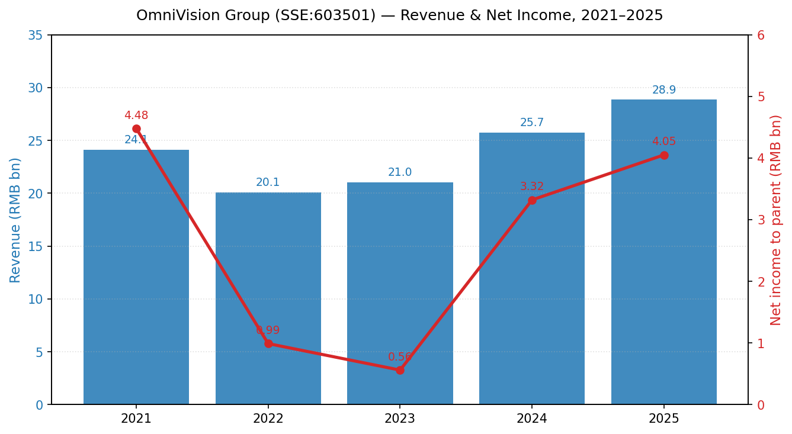
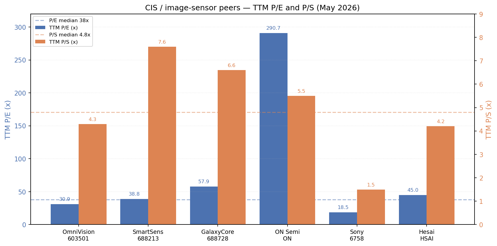
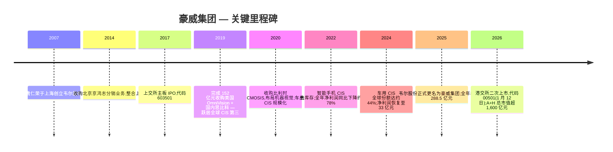
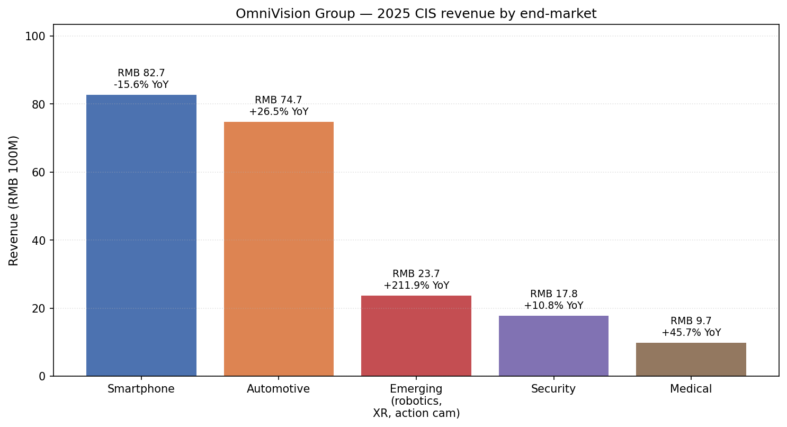
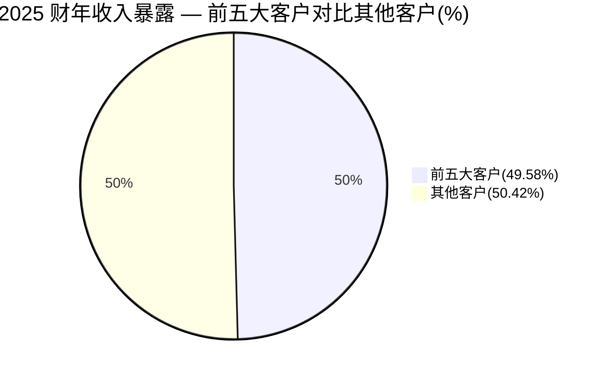
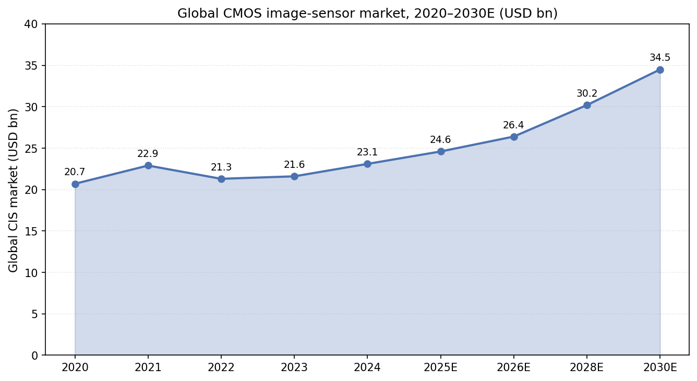
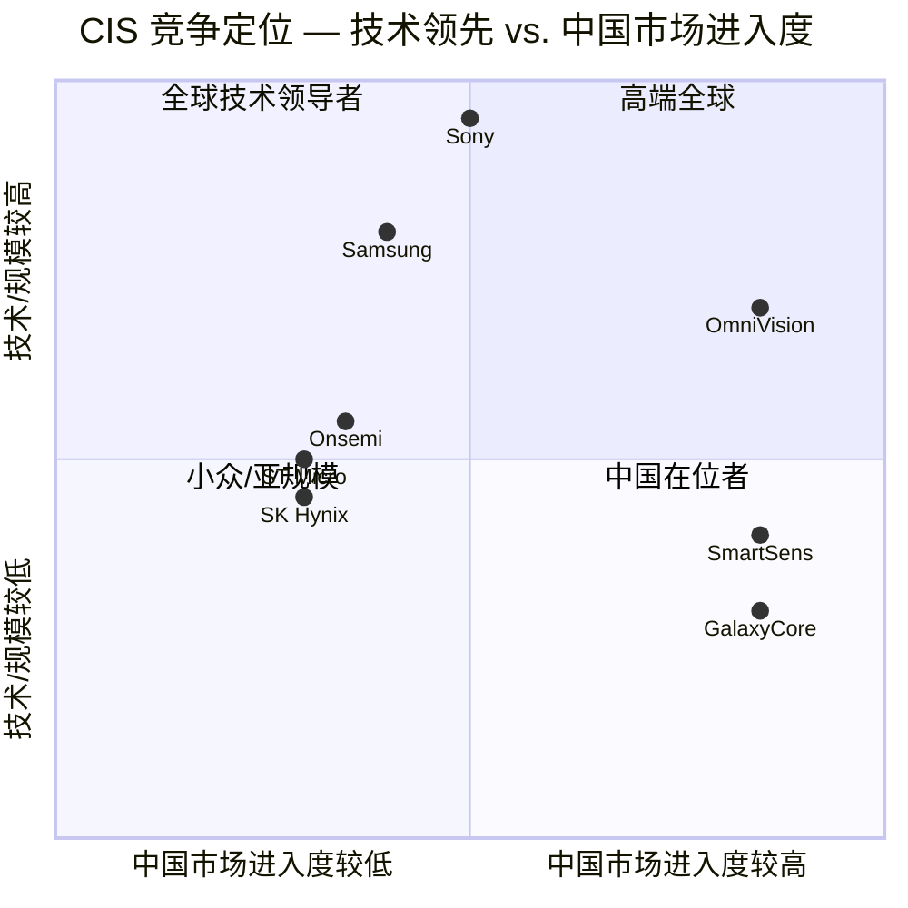

# 公司研究报告:豪威集团(豪威集成电路(集团)股份有限公司) — SSE:603501 / HKEX:00501

**日期:** 2026-05-16
**覆盖范围:** 豪威集团(原"上海韦尔半导体股份有限公司"/"韦尔股份";2025 年 5 月更名为"豪威集成电路(集团)股份有限公司"/"OmniVision Integrated Circuits Group, Inc."),按 2024 年收入计算为全球第三大 CMOS 图像传感器(CIS)供应商。

---

> **最新动态 — A+H 上市完成(2026-01-12)及 2026 年一季度业绩疲弱:** 豪威集团已于 2026-01-12 成功完成港股二次上市(00501.HK),全球发售定价为每股 104.80 港元,募资约 47 亿港元,上市首日 A+H 合计市值约 1,666 亿元人民币([新浪财经, 2026-01-13](https://finance.sina.com.cn/roll/2026-01-13/doc-inhhchmx6160863.shtml);[新浪财经, 2026-01-12](https://finance.sina.com.cn/stock/marketresearch/2026-01-12/doc-inhfziuy0077551.shtml))。随后,2026 年一季度业绩低于预期:营业收入 64.1 亿元人民币,同比下降 0.9%,归母净利润 5.03 亿元人民币,同比下降 41.9%。管理层将业绩疲弱归因于存储器驱动的成本上涨、消费电子和汽车终端需求疲软,以及高毛利率的代理分销业务占比上升,导致综合毛利率压缩 1.65 个百分点([豪威集团 2026 年第一季度报告, 第 3 页](http://static.cninfo.com.cn/finalpage/2026-04-29/1226000028.PDF))。公司未发布正式全年业绩指引;第 1 节估值讨论将该股票视为周期性标的,在部分业绩承压基础上交易于近 5 年估值低位。

---

## 目录

1. 公司概述
2. 公司历史
3. 管理团队
4. 产品与服务
5. 客户与市场推广
6. 行业概述
7. 竞争格局
8. 市场机会(TAM)
9. 风险评估

---

## 1. 公司概述

豪威集团(A 股代码 **603501**;港股代码 **00501**)是一家总部位于上海浦东自由贸易区的 Fabless(无晶圆厂)半导体设计公司。根据公司 2025 年年度报告援引的 TrendForce 数据,该公司位列全球前十大 Fabless 半导体公司之一;根据 Frost & Sullivan(沙利文)的数据,该公司是**全球第三大数字图像传感器供应商,2024 年全球收入份额为 13.7%**,仅次于 Sony(索尼)和 Samsung(三星)([2025 年年度报告, 第 11 页](http://static.cninfo.com.cn/finalpage/2026-03-30/1225820040.PDF);[新浪财经 — 港股招股摘要, 2026-01-12](https://finance.sina.com.cn/stock/marketresearch/2026-01-12/doc-inhfziuy0077551.shtml))。公司由韦尔股份正式更名为豪威集团于 2025 年 5 月完成,反映了管理层决定以 2019 年收购获得的 OmniVision(豪威)品牌为主导对外亮相([电子工程专辑, 2025-05-20](https://www.eet-china.com/news/202505205181.html))。

**公司主营业务。** 豪威集团设计并销售三大类模拟/混合信号集成电路 — (i) 图像传感器(CIS,包括特殊晶圆级摄像头模组、全局快门传感器和 LCOS 微显示器),(ii) 显示驱动器(TDDI、OLED DDIC、TED 及新兴的车用 DDIC),以及 (iii) 模拟/分立器件(PMIC、SerDes、MCU、SBC、MOSFET、TVS) — 合称"半导体设计业务"。此外,公司还独立运营**半导体代理分销业务**,旗下品牌包括北京京鸿志和香港华清电子,作为 Panasonic(松下)、Murata(村田)、Yageo(国巨)、三星被动元件、Nidec(尼得科)、Bosch(博世)、Molex(莫仕)等众多厂商的区域授权分销商([2025 年年度报告, 第 12–13 页](http://static.cninfo.com.cn/finalpage/2026-03-30/1225820040.PDF))。所有晶圆制造及封装均采用外包模式(晶圆代工由台积电、中芯国际、华虹宏力、世界先进、力积电承担;封测由日月光、通富微电、长电科技、天水华天承担)。

**盈利模式。** 2025 年主营业务收入(总计 288.6 亿元人民币)中,约 82.6%(238.0 亿元)来自自研芯片设计业务,其余 17.0%(49.1 亿元)来自代理分销业务;仅 CIS 一项就达 212.5 亿元,占主营业务收入的 73.7%([2025 年年度报告, 第 19 页](http://static.cninfo.com.cn/finalpage/2026-03-30/1225820040.PDF))。芯片业务的定价采用单价 ASP × 出货量模式,汽车业务为多年期长期协议(LTA),智能手机/消费类业务则为逐单(PO-by-PO)结算。CIS 毛利率是结构性驱动因素 — 根据智能手机/汽车业务结构,综合毛利率通常在 25–35% 之间。

**经营区域。** 中国是公司销售(智能手机、安防、新能源车)和设计(上海、北京、深圳、武汉、成都、合肥)的核心所在地。公司在全球还设有 18 家研发中心,包括美国硅谷 OmniVision 圣克拉拉总部,以及挪威、比利时、日本和新加坡等地的研发中心([2025 年年度报告, 第 25–26 页](http://static.cninfo.com.cn/finalpage/2026-03-30/1225820040.PDF))。比利时基地源自 2020 年收购的 CMOSIS / Emergent(机器视觉 CIS);挪威则继承自 Sensonor/Silicon Image 的历史布局。

**公司规模。** 2025 财年收入为**人民币 288.5 亿元(同比 +12.1%)**,归母净利润**人民币 40.5 亿元(同比 +21.7%)**,调整后 ROE 为 14.88% — 为 2021 年峰值以来的最佳水平([2025 年年度报告, 第 8 页](http://static.cninfo.com.cn/finalpage/2026-03-30/1225820040.PDF))。总资产 436.0 亿元,所有者权益 281.7 亿元。员工总数约 6,160 人,其中**研发工程师 2,681 人**(占员工总数 43.5%;硕士及以上学历占 61%),持有**已授权专利 4,993 件**,其中发明专利 4,787 件([2025 年年度报告, 第 42 页 及 第 26 页](http://static.cninfo.com.cn/finalpage/2026-03-30/1225820040.PDF))。

来源:[豪威集团 2025 年年度报告, 第 8 页](http://static.cninfo.com.cn/finalpage/2026-03-30/1225820040.PDF) 及 [2021 年年度报告 全文](http://static.cninfo.com.cn/finalpage/2022-04-18/1213139316.PDF)。2022–2023 年净利润低谷反映了智能手机 CIS 去库存周期与存货跌价计提;2024–2025 年的复苏则由车用 CIS 和新兴市场驱动。

**估值快照(必备项)。** 根据行业媒体引用的最新收盘价(2026-05-08),A 股收盘价为**人民币 99.18 元**,对应**A 股市值约 1,250.8 亿元人民币**;加上 2026 年 1 月港股 IPO 发行的 4,580 万股 H 股(按 98 港元 ≈ 91 元人民币计算),H 股增量市值约 42 亿元,**合计股权价值约为 1,290 亿元人民币(约合 179 亿美元)**([股票频道 — 证券之星, 2026-05-08](https://stock.stockstar.com/RB2026050600035293.shtml);[appletree fund factsheet, 2026-01-19](https://www.appletree.fund/wp-content/uploads/2026/01/stock_603501_2026-01-19.pdf))。基于 2025 财年 TTM 归母净利润 40.5 亿元,**TTM 市盈率约为 30.9 倍**;基于 TTM 营业收入 288.6 亿元,**TTM 市销率约为 4.3 倍**。

从近三年的估值区间看,公司估值波动剧烈 — 2022 年智能手机 CIS 业绩崩塌期间,P/E 一度短暂超过 100 倍;2023–2025 年期间则回落至较正常的 28–45 倍 P/E 区间([亿牛网 — 豪威集团历史市盈率](https://eniu.com/gu/sh603501))。三年 P/S 区间大致为 3.0–6.5 倍,当前约 4.3 倍处于区间中位附近。

**可比公司/行业背景对比。** 三家直接的 CIS 同业及三家邻近行业参考标的:

| 公司 | 代码 | TTM 市盈率 | TTM 市销率 | 备注 |
|---|---|---|---|---|
| Sony 索尼集团(含 I&SS 部门) | TYO:6758 | ~18.5× | ~1.5× | 多元化综合集团;I&SS 部门 2025 财年收入 2.15 万亿日元、同比 +20%,占集团收入约 17%([Investing.com — Sony FY2025 slides, 2026-05-08](https://www.investing.com/news/company-news/sony-fy2025-slides-record-operating-income-masks-restructuring-charges-93CH-4671486)) |
| Samsung 三星电子(System LSI 含 CIS) | KRX:005930 | ~14× | ~1.2× | 综合估值受存储器周期性主导 — 并非纯粹可比 |
| **豪威集团** | **SSE:603501** | **~30.9×** | **~4.3×** | 当前估值水平 |
| 思特威 | SSE:688213 | ~38.8× | ~7.6× | 规模较小的 CIS 纯标的;聚焦安防/汽车([Stock Analysis — 688213 market cap](https://stockanalysis.com/quote/sha/688213/market-cap/)) |
| 格科微 | SSE:688728 | ~57.9× | ~6.6× | 智能手机主导 CIS;集成晶圆厂模式([Stock Analysis — 688728](https://stockanalysis.com/quote/sha/688728/market-cap/)) |
| ON Semi 安森美 | NASDAQ:ON | 290.7× | ~5.5× | 业绩受减值损失及汽车业务下行周期压制([GuruFocus — ON PE TTM](https://www.gurufocus.com/term/pettm/ON)) |
| 禾赛集团 Hesai Group | NASDAQ:HSAI | ~45× | ~4.2× | 激光雷达相邻赛道;具备"人形机器人"叙事溢价([Stock Analysis — HSAI](https://stockanalysis.com/stocks/hsai/)) |

A 股 CIS / 图像芯片四家公司(603501、688213、688728、相邻的 688008-澜起科技)行业 P/E 中位数约 38 倍,P/S 中位数约 4.8 倍([东方财富 — 半导体板块估值](https://data.eastmoney.com/gzfx/detail/603501.html))。因此,豪威集团**相对中国 CIS 同业 P/E 中位数折价约 20%,P/S 大致持平**。

来源:综合自 [Stock Analysis — 688213](https://stockanalysis.com/quote/sha/688213/market-cap/)、[Stock Analysis — 688728](https://stockanalysis.com/quote/sha/688728/market-cap/)、[GuruFocus — ON PE TTM](https://www.gurufocus.com/term/pettm/ON)、[Investing.com — Sony FY2025 slides (2026-05-08)](https://www.investing.com/news/company-news/sony-fy2025-slides-record-operating-income-masks-restructuring-charges-93CH-4671486) 及 [Stock Analysis — HSAI](https://stockanalysis.com/stocks/hsai/)。

**解读。** 当前约 31 倍的 TTM 市盈率既不算高估(明显低于思特威的 39 倍和格科微的 58 倍),也并非价值陷阱。这反映了三点:(i) 2026 年一季度业绩不及预期已压缩前瞻 EPS 预期;同花顺 iFinD 平台收集的卖方预测显示,截至 2025 年 4 月底,基于市场一致预期 2026 年 EPS 的前瞻 P/E 约为 32 倍([同花顺 — 韦尔股份盈利预测](https://basic.10jqka.com.cn/603501/worth.html));(ii) 汽车 CIS 是豪威集团当前唯一明确占据全球第一份额的细分领域(根据 2024 年港股招股书引用数据,2024 年份额约 44%),为估值提供下行支撑;(iii) 2 亿像素智能手机产品周期(OV50X、OVB0D)才刚刚开始放量 — 业绩拐点取决于执行情况。当前估值**并未**处于行业中位数 50 倍 P/E / 2 倍 P/S 以上的"估值压缩风险区"。尽管如此,我们在第 9 节中仍将"叙事破裂"列为中等风险,因为超过 40% 的车用 CIS 份额是核心投资逻辑的最大支柱,目前正受到索尼的积极挑战。

---

## 2. 公司历史

如今被称为豪威集团的公司主体,由当时 41 岁的**虞仁荣 (Yu Renrong / Eric Yu)** 于 **2007 年 5 月**在上海创立。在此之前,虞仁荣在北京从事电子元器件分销业务长达 17 年 — 先在浪潮集团 (Inspur) 任工程师,随后经营北京华清兴昌和北京京鸿志,作为模拟/MCU 进口的区域代理商([极目新闻, 2025-02-19](https://www.ctdsb.net/c1747_202502/2376880.html);[百度百科 — 虞仁荣](https://baike.baidu.com/item/%E8%99%9E%E4%BB%81%E8%8D%A3/24126930))。最初的韦尔股份将自身定位为分销业务上游的自研芯片设计延伸 — PMIC、射频分立器件、ESD/TVS 保护 IC — 并于 **2017-05-04** 在上交所主板上市。

公司战略性的关键举措是 **2019 年收购 OmniVision Technologies** (原 NASDAQ:OVTI,1995 年创立于美国硅谷圣克拉拉,是现代 CMOS 图像传感器架构的发明者,在被索尼取代之前曾是 Apple(苹果)iPhone 传感器的核心供应商)。韦尔股份以约 152 亿元人民币的对价收购了 OmniVision 及国内 Fabless 品牌思比科,交易于 2019 年 8 月完成,使公司一夜之间从一家规模较小的中国模拟厂商蜕变为全球三大 CIS 厂商之一([新浪财经 — 韦尔股份发行股份购买资产](https://vip.stock.finance.sina.com.cn/corp/view/vISSUE_MarketBulletinDetail.php?stockid=603501&id=5619909))。该交易明确将 OmniVision 的像素架构 IP(PureCel®、PureCel® Plus、OmniBSI、OmniPixel)、Nyxel® 近红外技术,以及锚定当今汽车与安防业务的客户关系一并纳入。

后续的关键节点不断强化"以 CIS 为先"的战略身份:

来源:综合自 [2025 年年度报告, 第 7 页](http://static.cninfo.com.cn/finalpage/2026-03-30/1225820040.PDF)、[电子工程专辑, 2025-05-20](https://www.eet-china.com/news/202505205181.html) 及 [新浪财经, 2026-01-12](https://finance.sina.com.cn/stock/marketresearch/2026-01-12/doc-inhfziuy0077551.shtml)。

**战略转型节点。**
- **2019 年收购 OmniVision — 由分销+模拟向一线 CIS 设计商转型。** 这是一次重新定义品类的下注:交易前韦尔的 CIS 收入为零,交易后立即成为主导收入贡献。反向并购结构要求通过股份发行将北京豪威 73% 股权转让给韦尔股份 — 涉及大幅股权稀释,但因交易时点(2018 年行业低谷)估值便宜,最终回报丰厚。
- **2022–2023 年汽车 CIS 战略转向。** 管理层意识到智能手机 CIS 已进入成熟期,而索尼在旗舰机型的定价权具有结构性优势,因此将产能配置和研发资源向汽车领域倾斜 — 充分利用了 OmniVision 历史上的 OX 系列 IP。到 2024 年,管理层引用的数据显示公司已取代安森美,成为全球第一大车用 CIS 厂商([维科号, 2026-04](https://mp.ofweek.com/Internet/a456714512527))。
- **2024–2025 年新兴市场聚焦。** 2025 年专门成立了"机器视觉"事业部,重点投入全局快门传感器、CIS 与片上 NPU 集成,以及面向 AR/智能眼镜的 LCOS 微显示器。2025 年新兴市场 CIS 收入**同比增长 +211.9%**,达到 23.7 亿元人民币([2025 年年度报告, 第 21 页](http://static.cninfo.com.cn/finalpage/2026-03-30/1225820040.PDF))。

**重要收购事件。**
- **2019 年** — 收购 OmniVision Technologies(美国)+ 思比科(中国),对价 152 亿元;变革性交易。
- **2020 年** — 收购 CMOSIS/Emergent(比利时),获得机器视觉 CIS 组合(未披露交易价格)。
- **2022 年** — 控股香港安豪半导体;拓展车用 CIS 覆盖。
- **2025 年上半年** — 增量子公司纳入新成立的重庆京鸿志电子有限公司及思比科上海实体,并在港股上市前设立离岸主体 **OmniVision International (Cayman) Company Limited**([2025 年年度报告, 第 41 页](http://static.cninfo.com.cn/finalpage/2026-03-30/1225820040.PDF))。

**最近 12 个月发展。** 2025 年 5 月的"豪威集团"更名,伴随更清晰的战略叙事:以图像传感器为主引擎,以显示和模拟业务作为交叉销售;2026 年 1 月的港股上市为全球扩张及供应链分散化提供资金;2025 年全年业绩显示车用与新兴市场 CIS 的强劲表现有效抵消了智能手机业务的疲弱;管理层于 2025 年 11 月任命**高文宝**(原京东方高级副总裁)为公司总裁,负责经营管理,创始人虞仁荣继续担任董事长。

---

## 3. 管理团队

豪威集团是一家创始人主导的公司。港股 IPO 后,虞仁荣个人仍持有公司 24.06% 的经济权益(3.035 亿股),与一致行动人(绍兴市韦豪股权投资基金 +5.88%,以及作为一致行动人的兄长虞小荣)合计持股达 **30.02%**,为公司控股股东([2026 年第一季度报告, 第 4–5 页](http://static.cninfo.com.cn/finalpage/2026-04-29/1226000028.PDF);[2025 年年度报告, 第 6 页管理层说明](http://static.cninfo.com.cn/finalpage/2026-03-30/1225820040.PDF))。近期任命非创始人背景的专业经理人出任总裁,标志着公司向制度化管理转型,同时保留创始人对战略层面的掌控权。

### 虞仁荣 (Yu Renrong / "Eric Yu") — 董事长兼创始人

虞仁荣现年 59 岁,是公司故事中的核心人物,可以说也是长期估值中最关键的变量。他出生于宁波,**1990 年毕业于清华大学电子工程系(传奇的"EE85"班级,该班还出过兆易创新董事长朱一明及其他多位上市半导体公司 CEO)**,1990 年 7 月至 1992 年 5 月在浪潮集团任工程师([极目新闻, 2025-02-19](https://www.ctdsb.net/c1747_202502/2376880.html);[百度百科](https://baike.baidu.com/item/%E8%99%9E%E4%BB%81%E8%8D%A3/24126930);[2025 年年度报告, 第 65 页](http://static.cninfo.com.cn/finalpage/2026-03-30/1225820040.PDF))。1992 至 1998 年间任香港龙耀电子驻北京代表;随后担任华清兴昌董事长(1998–2001)及京鸿志科技董事长(2001–2020) — 这两大分销-进口平台后来成为韦尔股份的资金来源和客户基础。

他在上述早期角色中所完成的,是典型的中国式"分销商-IDM 转型"教科书路径:打造自有销售/客户网络,到 2000 年代中期通过贸易积累约 5,000 万美元的股本,再将其投入到 Fabless 芯片设计公司中,而分销渠道自带需求支撑。韦尔股份正是在 2007 年用这笔资本启动,他从 2007 年起担任副董事长、总经理,至今为董事长。其董事任期至 **2028-06-09** 届满([2025 年年度报告, 第 65 页](http://static.cninfo.com.cn/finalpage/2026-03-30/1225820040.PDF))。

2025 财年税前披露薪酬仅为 282 万元人民币 — 财富完全体现在股权上。2024 年他登顶胡润"中国第一慈善家"榜单,向其私人资助创立的研究型大学**宁波东方理工大学**基金会捐赠约 5,000 万股韦尔股份(当时市值 53 亿元),据报道其累计承诺投入约 300 亿元人民币([极目新闻, 2025-02-19](https://www.ctdsb.net/c1747_202502/2376880.html);[财新教育界, 2025](https://www.jiaoyujie365.com/N/886.html))。该基金会本身是 603501 的第 4 大机构股东,持股 7,120 万股,占总股本 5.65% — 既是结构性"悬顶"卖压,又是长期持有的结构性锚([2026 Q1 报告, 第 4 页](http://static.cninfo.com.cn/finalpage/2026-04-29/1226000028.PDF))。值得关注的是,他已将个人持股中的 **1.718 亿股(约占个人持股的 56%)**质押给融资机构 — 2025 年年度报告将其作为关键的股东层面风险列示,提示如 A 股价格大幅下挫需重点关注([2025 年年度报告, 第 2 页 — 封面重大风险提示](http://static.cninfo.com.cn/finalpage/2026-03-30/1225820040.PDF))。

虞仁荣以约 450 亿元人民币的财富登上 2025 年胡润全球富豪榜第 536 位,并曾在 2021 年牛市高位以 123 亿美元身家登上福布斯全球亿万富翁榜([新浪财经 — 拆解百亿芯片帝国, 2025-02](https://finance.sina.com.cn/stock/companyt/2025-02-18/doc-inekwkcm4015482.shtml))。对于其净资产规模而言,他的公开曝光异常低调 — 鲜少接受采访,无播客露面,也无致股东函传统 — 因此对其判断主要通过公司战略和资本配置历史的代理观察。这段历史是良好的:OmniVision 收购的时点接近周期性低谷、车用 CIS 转型方向预判正确、更名和港股上市执行到位。

### 高文宝 (Gao Wenbao) — 总裁兼总经理 (自 2025-11-12 起)

高文宝现年 51 岁,于 2025 年 11 月加入豪威担任总裁。他在**京东方科技集团 (BOE Technology Group) 任职 22 年**,职位逐级晋升:历任产品技术负责人、TPCSBU(触控面板与智能显示事业部)总经理、重庆京东方显示总经理、北京中祥英科技董事长、京东方精电(港股上市的车载显示子公司)执行董事,以及京东方第十一届董事会副董事长([2025 年年度报告, 第 67 页](http://static.cninfo.com.cn/finalpage/2026-03-30/1225820040.PDF))。在京东方期间,他可被具体归功的业绩是将车载显示业务从一个小众部门扩展为年收入达数十亿元人民币的业务,并主导京东方在车用液晶显示领域获得市场份额领先地位。他拥有博士学位,并于 2026 年 3 月兼任成都奕创微电子董事长,其 2025 年部分年度报告期(仅一个半月)的披露薪酬为 14.36 万元。业界普遍认为其加盟意在将京东方的车载显示 + 车用 DDIC 能力移植到豪威集团尚处于早期阶段的车用 DDIC 业务。

### 徐兴 (Xu Xing) — 首席财务官 (自 2025-06-10 起)

徐兴现年 44 岁,于 2025 年 6 月接替长期任职的前 CFO 贾渊担任公司 CFO。2025 年年度报告中关于徐兴的简历披露异常简略 — 这可能反映出其新近任命且公开履历有限 — 但披露了 2025 年税后股票期权行权 14 万元及 IPO 前期权敞口([2025 年年度报告, 第 64 页管理层信息表](http://static.cninfo.com.cn/finalpage/2026-03-30/1225820040.PDF))。他实际的"资本市场试金石"是任内成功推进 2026 年 1 月的港股 IPO — 该交易以每股 104.80 港元募资 47 亿港元,涉及跨境财务报表对账及沙利文行业报告等复杂工作。在加入豪威之前,公开记录(以及 2025 年董事会资料)显示他自 2019 年左右起担任 OmniVision 上海某子公司的财务副总裁,因此实际上是近十年的内部人 — 业务连续性较强。前任 CFO 贾渊(董事,2001–2011 年立信会计师事务所审计师出身)将继续担任董事至 2028 年。

### 王崧 (Wang Song) — 副总经理 (负责半导体销售及战略客户)

王崧现年 50 岁,2025 财年实际披露薪酬 248 万元人民币(不含股份支付),为当年披露的最高薪酬高管,也是豪威设计业务的资深商务负责人([2025 年年度报告, 第 64 页 及 第 68 页](http://static.cninfo.com.cn/finalpage/2026-03-30/1225820040.PDF))。他在北京 **ON Semi(安森美,原 ON Semiconductor)** 任职 13 年(2000–2013),升至华北区总监 — 这一直接竞争对手的从业背景,包括对安森美车用 CIS 市场推广路径的具体掌握,在结构上与公司自 2022 年以来车用 CIS 份额的提升密切相关。他先后在尼得科压缩机及东芝电子任职,2017 年加入 OmniVision (上海) 担任高级副总裁。他同时兼任约十多家豪威子公司的董事长。

### 公司治理补充

- **董事会构成。** 共七名董事:虞仁荣(董事长)、高文宝(执行董事,根据董事会换届于 2026 年 3 月任命)、四名非执行董事(吴晓东、吕大龙、仇欢萍、贾渊),以及三名独立董事(朱黎庭、范明曦、牟磊)([2025 年年度报告, 第 63 页领导层表格](http://static.cninfo.com.cn/finalpage/2026-03-30/1225820040.PDF))。2025-06-10 的董事会换届任命了两名新独立董事和一名新非执行董事(陈瑜,原中芯国际质量工程师,现任元禾璞华董事总经理 — 一位与行业高度对齐的引人注目的新增成员)。
- **内部人持股。** 控股股东及一致行动关联方合计持股约 30.02%(IPO 后)。其中创始人个人 24.06%、创始人控制的韦豪基金 5.88%、兄长虞小荣约 0.6%(一致行动人)。若剔除教育基金会持股(5.65%,精神上亦与创始人同向),机构投资者可流通自由流通股约为 64%。
- **薪酬。** 2025 年全部在任及离任董事/高管的现金薪酬合计仅为 1,309 万元人民币 — 对于这一规模的公司而言相当克制([2025 年年度报告, 第 64 页](http://static.cninfo.com.cn/finalpage/2026-03-30/1225820040.PDF))。真正的薪酬激励工具是 2019 年股票期权计划,行权周期至 2027 年。
- **关联方风险提示。** 创始人质押股份占其个人持股的 56%,为最主要的披露事项(封面重大风险段落)。对君正集成的交叉持股(董事席位至 2026-03)及通过银杏关联实体进行的若干孵化器式投资亦有披露,但规模较小。

### 管理层业绩评估

管理团队在过去十年内成功执行了两次影响最大的战略举措 — 2019 年收购 OmniVision 与 2022–2024 年车用 CIS 战略转向。从结果看,公司收入实现翻倍(2019 财年 136 亿元 → 2025 财年 289 亿元),车用 CIS 跃居全球第一。2022 年智能手机下行周期的应对则较为糟糕(净利润同比骤降 78%),表明周期性库存管理是薄弱环节。2025 年聘请京东方资深高管出任总裁是推动经营专业化的可信尝试;而创始人持续高比例的股票质押,则是治理层面最大的"悬顶"风险。

---

## 4. 产品与服务

豪威集团的产品组合在 CIS 公司中显得格外宽广,因为 2019 年的收购整合了韦尔股份原有的模拟/分立器件业务与 OmniVision 的图像传感器领先地位,而 2025 年组织架构调整后,公司当前以三大设计业务板块加分销业务作为对外销售口径。下文逐项梳理来源于公司官网(`omnivision-group.com` 及历史的 `ovt.com`)与 2025 年年度报告第 3 节产品表的完整产品树。

```mermaid
graph TD
    OG["豪威集团"] --> CIS["CIS / 图像传感器<br/>212.5 亿元(主营业务 74%)"]
    OG --> DISP["显示解决方案<br/>9.4 亿元(3%)"]
    OG --> ANA["模拟 / 分立器件<br/>16.1 亿元(6%)"]
    OG --> DIST["分销代理<br/>49.1 亿元(17%)"]

    CIS --> SMART["智能手机 CIS<br/>OV50X / OV50K / OV50H / OVB0D<br/>32/50/200 兆像素<br/>82.7 亿元 同比 -16%"]
    CIS --> AUTO["车用 CIS<br/>OX08D10/D20(TheiaCel)<br/>OX03H10(TheiaCel 3MP)<br/>OX05B/OX05C(DMS BSI 全局快门)<br/>OX01N1B(1.5MP 全局快门 DMS)<br/>74.7 亿元 同比 +27%"]
    CIS --> EMERG["新兴市场<br/>(机器视觉 / XR / 运动相机)<br/>OG0TC + Nyxel + a-CSP<br/>片上 CIS+NPU<br/>23.7 亿元 同比 +212%"]
    CIS --> SEC["安防 CIS<br/>(Nyxel NIR PureCel Plus)<br/>17.8 亿元 同比 +11%"]
    CIS --> MED["医疗 CIS<br/>(晶圆级镜头模组<br/>CameraCubeChip)<br/>9.7 亿元 同比 +46%"]
    CIS --> NB["笔电 / 物联网 CIS<br/>(RGB-IR 融合、眼动追踪)"]

    DISP --> TDDI["LCD-TDDI"]
    DISP --> ODDI["OLED-DDIC"]
    DISP --> TED["TED / 嵌入式 Tcon"]
    DISP --> AUTODD["车用 DDIC(新业务)"]
    DISP --> LCOS["LCOS 微显示器<br/>OP03021 面向智能眼镜<br/>+ AR-HUD"]

    ANA --> PMIC["PMIC / 电池 / 快充"]
    ANA --> SERDES["车用 SerDes(OTX9211/9342 2 Gbps)"]
    ANA --> SBC["车用 SBC(OKX0330)"]
    ANA --> MCU["车用 MCU(OMX2x4B Cortex-M7 ISO 26262 ASIL-B)"]
    ANA --> DISC["MOSFET / TVS / ESD"]

    DIST --> PASSIVE["被动元件(Panasonic 松下 / Yageo 国巨 / Murata 村田 / TXC)"]
    DIST --> STRUCT["连接器 / 声学元件<br/>(Molex 莫仕 / Panasonic 松下 / 南亚)"]
    DIST --> MOTOR["电机 / 驱动(Panasonic 松下 / Nidec 尼得科 / Delta 台达)"]
    DIST --> ICDIST["芯片与存储(Liteon 光宝 / Longsys 江波龙 / XMC 等)"]
    DIST --> RF["射频(Panasonic 松下 / ACX / 华信科)"]
```

来源:[豪威集团 2025 年年度报告, 第 12–17 页 及 第 19–29 页](http://static.cninfo.com.cn/finalpage/2026-03-30/1225820040.PDF);[OmniVision 官方网站产品板块](https://www.ovt.com/)。

### 4.1 CMOS 图像传感器 (CIS) — 旗舰业务

CIS 是公司的战略性主营业务。2025 年年度报告将 212.5 亿元业务拆分为六大应用细分;同比变化清晰显示了势头方向。

来源:[豪威集团 2025 年年度报告, 第 20–23 页](http://static.cninfo.com.cn/finalpage/2026-03-30/1225820040.PDF) (智能手机 82.72 亿 / 汽车 74.71 亿 / 新兴市场 23.69 亿 / 安防 17.76 亿 / 医疗 9.74 亿)。

**(i) 智能手机 CIS — 旗舰产品,下行细分。** 2025 财年收入**人民币 82.7 亿元,同比 -15.6%**,反映出 (a) IDC 数据显示中国智能手机出货量同比下降 0.6%、(b) 2025 年下半年 OV50K 与新一代 OV50X / OVB0D 之间出现旗舰产品空窗期、(c) 索尼在旗舰最顶端的优势依旧(用于 iPhone 级别设备的 1 英寸传感器)([2025 年年度报告, 第 22–23 页](http://static.cninfo.com.cn/finalpage/2026-03-30/1225820040.PDF))。旗舰产品周期低谷至 2025 年末结束:**OV50X** 是一款 50 兆像素 1 英寸 HDR 传感器,根据行业媒体报道,已被设计导入小米 17 Ultra 主摄(2025 年 4 月发布);**OVB0D** 为对标 Sony LYTIA901 的 2 亿像素传感器,2025 年 12 月已获荣耀/小米/OPPO 旗舰机型采用([维科号, 2026-04](https://mp.ofweek.com/Internet/a456714512527))。*竞争优势:***部分具备** — 在中高端(32MP/50MP,豪威为中国市场第一)拥有强护城河,但在最高端(1 英寸传感器,索尼的 Exmor RS 架构与三层堆叠工艺保持明显领先)护城河较弱。最接近竞品:索尼 **IMX989 / LYTIA901**(索尼在 1 英寸及"iPhone 主摄"插槽上**领先**;豪威在次旗舰段位与之持平)。护城河类型:规模 + 像素架构 IP(PureCel Plus、TheiaCel)+ 客户工程支持深度。

**(ii) 车用 CIS — 最关键的细分领域。** 2025 财年收入**人民币 74.7 亿元,同比 +26.5%**。根据港股招股书援引的数据,豪威集团是**全球第一大车用 CIS 供应商,2024 年市场份额约 44%**,已超越安森美([维科号, 2026-04](https://mp.ofweek.com/Internet/a456714512527))。覆盖 ADAS 外置摄像头(OX08D10 / OX08D20 / OX03H10)、驾驶员监控(OX05B/OX05C BSI 全局快门、OX01N1B 1.5MP 全局快门),以及环视方案。两款豪威 CIS(OX08D10 8MP 与 OX03H10 3MP)已**通过认证并集成于 NVIDIA(英伟达)DRIVE AGX Hyperion** 及下一代 NVIDIA DRIVE AGX Thor 自动驾驶计算平台([2025 年年度报告, 第 26 页](http://static.cninfo.com.cn/finalpage/2026-03-30/1225820040.PDF))。*竞争优势:***具备** — 是产品组合中护城河最清晰的板块。护城河类型:**技术 + 认证规模**(AEC-Q100 / ISO 26262 ASIL-B/D 认证,基于自有 TheiaCel DCG+LOFIC 方法的 LFM + HDR 像素架构),加上与 Mercedes 奔驰、BMW 宝马、Audi 奥迪、Tesla 特斯拉、蔚来、理想、小鹏、极氪等 OEM,以及主要 Tier-1(博世、大陆、麦格纳、Mobileye 参考平台)的深度客户绑定。最接近竞品:安森美 **AR0820 / AR0823AT**(豪威在份额上**领先**,规格上与之持平),以及索尼 **IMX490 / IMX728**(豪威在亚洲 OEM 份额上**领先**,但在索尼正在抢占份额的欧洲高端机型平台上**落后**)。

**(iii) 新兴市场 — 增速最高的细分领域。** 2025 财年收入**人民币 23.7 亿元,同比 +211.9%**。该业务桶涵盖 (a) **运动相机 / 360° 相机 CIS**(招股书提及的近邻客户类型包括 GoPro、Insta360 影石)、(b) **AR 智能眼镜 CIS + LCOS 微显示器**、(c) **机器视觉**(用于工业 / 协作机器人),以及 (d) **CIS + 片上 NPU** 用于端侧 AI([2025 年年度报告, 第 21–22 页](http://static.cninfo.com.cn/finalpage/2026-03-30/1225820040.PDF))。2025 年 5 月发布的 **OP03021** 是一款 0.26 英寸单芯片色序型 LCOS,分辨率 1632×1536 @ 90 Hz,据公司自身定位为"业内唯一将像元阵列、驱动与存储集成于单芯片的超低功耗智能眼镜解决方案" — 已被设计导入至少一款主要中国消费电子 XR 产品(未命名)。*竞争优势:***具备**(全局快门 + 片上 NPU 子品类)、**部分具备**(其他领域)。最接近竞品:索尼 **IMX568 / IMX681 GS** 及思特威 **SC020GS**(机器视觉);**Texas Instruments 德州仪器 DLP**(AR-HUD 反射光学)。护城河:迭代速度 + 集成栈(CIS+NPU+LCOS)— 同业鲜有具备。

**人形机器人主题。** 2025 年年度报告明确将豪威集团定位为"具身智能"(embodied AI)及人形机器人的视觉系统提供商。专门的机器视觉事业部(2025 年新设)和片上 NPU-CIS 集成架构,针对的正是人形机器人平台的具体需求:低时延本地推理、低功耗常开感知、毫秒级目标识别(亚 100ms)。尽管年报未明示客户,但行业报道及更广泛的 OmniVision-OVTA 推理加速器组合("OmniVision 几乎提供人形机器人所需的所有半导体类型:视觉传感器、推理加速器、电机驱动器、无线" — [Semiconductor Spotlight](https://semiconductorx.com/spotlight-humanoid.html))表明公司正与 **Tesla 特斯拉 Optimus**(OmniVision 传感器自 2013 年起已用于 Model S/3 后视摄像头,见 2013 年 OVTA 新闻稿 — [Tesla 选用 OmniVision OV10630](https://www.ovt.com/press-releases/omnivisions-ov10630-selected-by-tesla-motors-to-enable-advanced-rear-view-camera-application/))、**Figure** AI 的 Figure-02/03、**小米 CyberOne**、**优必选 Walker S/S2**、**宇树 H1/G1**、**智元远征 A2**、以及**宇树科技 (Unitree)** 等存在合作。当前已披露的人形机器人 CIS 收入并不重要,但战略性 design-in 项目储备对 2027–2029 年的放量至关重要。

**(iv) 安防 CIS。** 2025 财年**人民币 17.8 亿元,同比 +10.8%**。差异化优势在于 Nyxel® 近红外像素架构(940 nm NIR 量子效率行业领先)。最接近竞品:思特威(SC450/SC850 系列 — 思特威在国内 IPC 出货量上**领先**,但在海外出口上**落后**)。*竞争优势:***部分具备** — Nyxel IP 是真实的技术壁垒,但中国 IPC OEM(海康威视、大华)正在越来越多地采用双供应商策略。

**(v) 医疗 CIS。** 2025 财年**人民币 9.7 亿元,同比 +45.7%**。应用于一次性内窥镜、外科手术机器人、微创手术等场景。*竞争优势:***具备** — 晶圆级 CameraCubeChip® 模组实际上是唯一能做到足够小型(1.0 × 1.0 mm² 级别)以适用一次性内窥镜的商用 CIS;医疗器械认证体系内长达 10 年的客户关系本身构成真实的切换成本。最接近竞品:索尼 **IMX991**(索尼有品牌但缺乏晶圆级模组方案)。

**(vi) 笔电 / 物联网 CIS。** 系 2025 年首次披露,未单独披露收入。面向笔电(戴尔、联想、惠普)的 RGB-IR 融合传感器,用于人脸识别 + 红外眼动追踪。

### 4.2 显示解决方案(占主营业务收入 3.3%)

2025 财年收入**人民币 9.4 亿元,同比 -8.5%**。四条产品线:
- **LCD-TDDI**(触控 + 显示驱动一体化芯片) — 智能手机主要应用;按出货量为板块龙头,但价格高度商品化(同比下滑的主因)。最接近竞品:Synaptics 新思、Novatek 联咏。
- **OLED-DDIC** — 新研发产品,已在"领先的中国面板厂"(可能为京东方 / 维信诺 / TCL CSOT)实现设计导入,出货量小但具战略意义([2025 年年度报告, 第 24 页](http://static.cninfo.com.cn/finalpage/2026-03-30/1225820040.PDF))。
- **TED(嵌入式 Tcon 驱动)** — 面向 IT 面板的中尺寸笔电/平板,基于 eDP,相比分立 Tcon + 驱动具备成本/功耗优势。
- **车用 DDIC** — 2025 年进入客户验证阶段;能力来自新任总裁高文宝的京东方精电任职背景移植。
- **LCOS 微显示器** — 见 (iii)。
*竞争优势:***部分具备**。成熟的 LCD-TDDI 实质上是无护城河的商品;OLED-DDIC 与 TED 通过集成度形成差异化,但 Novatek 联咏与 Synaptics 新思保持规模领先。最接近竞品:**Novatek 联咏**(LCD-TDDI;联咏在份额上**领先**,豪威在技术上与之持平)。

### 4.3 模拟 / 分立器件(占主营业务收入 5.6%)

2025 财年收入**人民币 16.1 亿元,同比 +13.4%**,其中**车用模拟人民币 2.96 亿元,同比 +47.5%**([2025 年年度报告, 第 23 页](http://static.cninfo.com.cn/finalpage/2026-03-30/1225820040.PDF))。产品族包括:
- **PMIC / 电池 / 快充** — 面向智能手机及消费类。
- **车用 SerDes** — OTX9211 / OTX9342 2 Gbps 输入输出,适用于 ADAS 摄像头链路,符合 AEC-Q100 Grade 2 + ASIL-B,已在多家中国 OEM 及 Tier-1 处实现设计定点。
- **车用 SBC** — OKX0330(LDO + CAN/LIN + 看门狗 + 高边开关)。
- **车用 MCU** — OMX2x4B(Cortex-M7 @ 300 MHz,通过 ISO 26262 ASIL-B 认证)及 OMX14x 系列。这是一条特别具有战略意义的新产品线,因其正面对标 TI 德州仪器 / NXP 恩智浦 / Renesas 瑞萨 / Infineon 英飞凌在中国 OEM 国产替代积极推进的中端车用 MCU 插槽。
- **分立器件** — TVS / ESD / MOSFET / 功率二极管 — 历史业务。
*竞争优势:***部分具备**(车用模拟 — SerDes/SBC/MCU,通过捆绑 CIS 客户关系形成的"护城河形成中"模式);**不具备**(传统分立)。最接近竞品:SerDes 为 **Maxim/ADI 美信/亚德诺**,SBC 为 **NXP 恩智浦/Infineon 英飞凌**,MCU 为 **TI 德州仪器/Renesas 瑞萨**。

### 4.4 代理分销业务(占主营业务收入 17.0%)

2025 财年收入**人民币 49.1 亿元,同比 +24.5%** — 是报告披露线中绝对增速最快的板块。代理品牌包括 Panasonic 松下、Murata 村田、Yageo 国巨、三星被动元件、Nidec 尼得科、Bosch 博世、Molex 莫仕,以及众多国内特种 IC 厂商(江波龙、武汉新芯、全资微、博通集成、新岸、天信、艾洛维、必创)。该业务**毛利率结构性偏低**(个位数至低双位数),低于设计业务(25–35%) — 2026 年一季度业绩公告明确将综合毛利率压缩 1.65 个百分点归因于分销业务占比上升([2026 Q1 报告, 第 3 页](http://static.cninfo.com.cn/finalpage/2026-04-29/1226000028.PDF))。
*竞争优势:***不具备** — 典型的区域分销规模经济,品牌依赖性强。

### 4.5 旗舰业务 vs. 长尾业务

支撑权益故事的**三大旗舰产品族**为:
1. **车用 CIS**(尤其是搭载 TheiaCel 与 Nyxel 的 OX 系列) — 全球第一份额、NVIDIA DRIVE 设计导入。
2. **50 兆 / 200 兆像素层级的智能手机 CIS**(OV50X、OVB0D) — 在中高端旗舰段位从 Sony 索尼/Samsung 三星处夺取份额。
3. **新兴市场 CIS**(机器视觉 + LCOS + 片上 NPU) — 增速最高,打开人形机器人/AR 眼镜 TAM。

长尾业务(可防守但非战略)包括 LCD-TDDI(商品化)、分立器件(历史性业务)以及代理分销(摊薄毛利率但产生现金流)。

### 4.6 近期产品发布与退场(LTM)

- **2025-04** — OV50X 1 英寸 50 兆像素 HDR — 智能手机旗舰主摄。
- **2025-05** — OP03021 LCOS 微显示器 — 智能眼镜单芯片方案。
- **2025 上半年** — OX08D20 8 兆像素 TheiaCel + a-CSP™ 车用外置 CIS、OX05C DMS BSI 全局快门、OX01N1B 1.5 兆像素 DMS 全局快门。
- **2025 下半年** — OTX9211/9342 2 Gbps 车用 SerDes、OKX0330 车用 SBC、OMX2x4B Cortex-M7 车用 MCU。
- **2025-12** — OVB0D 2 亿像素智能手机 CIS(对标 Sony LYTIA901)。
- **退场 / 重定位** — 较旧的 8 兆 / 13 兆像素智能手机 CIS 产品线弱化;LCD-TDDI 产能选择性向 OLED-DDIC 转移。

---

## 5. 客户与市场推广

豪威集团通过两条渠道销售:**直销**(面向模组厂、ODM、OEM 及终端客户 — CIS 的主导渠道)及**分销**(面向小客户及互补产品)。2025 年年度报告中阐释的逻辑是:对一线战略客户采用直销,以掌握定价权和路线图影响力;对长尾客户和第三方品牌转售业务则采用分销渠道([2025 年年度报告, 第 12 页](http://static.cninfo.com.cn/finalpage/2026-03-30/1225820040.PDF))。

### 客户集中度披露(必备项)

豪威按 A 股标准披露格式公布前五大客户销售额。近三年趋势如下:

| 财年 | 前五大客户销售额(人民币) | 占总营收比 | 前五大供应商采购额 | 占总成本比 |
|---|---|---|---|---|
| 2023 | 117.3 亿元 | **55.82%** | 59.8 亿元 | 60.98% |
| 2024 | 131.0 亿元 | **51.14%** | 114.8 亿元 | 61.82% |
| 2025 | 142.9 亿元 | **49.58%** | 133.6 亿元 | 62.07% |

来源:[2025 年年度报告, 第 41 页](http://static.cninfo.com.cn/finalpage/2026-03-30/1225820040.PDF);[2024 年年度报告, 第 37 页](http://static.cninfo.com.cn/finalpage/2025-04-15/1224063872.PDF);[2023 年年度报告, 第 37 页](http://static.cninfo.com.cn/finalpage/2024-04-26/1219927773.PDF)。

前五大客户占比**呈下降趋势**,由 2023 财年的 55.82% 降至 **2025 财年的 49.58%** — 这是健康且主动的多元化进展,主要由新兴市场和车用业务的赢得抵消了 Apple 苹果/Samsung 三星这类智能手机大客户的集中度。**公司并未在年度报告中单独披露前五大客户名称**(A 股披露规则除非单一客户占比超过 50% 否则不要求披露,而豪威并未超过该阈值)。2025 年港股招股书脚注证实前五大客户中无关联方销售。

**从公开信息推断客户身份。** 尽管未具名披露,但通过渠道调研、公开的设计中标新闻及拆机报告,可识别出历史和当前大致稳定的核心客户群:
- **Apple 苹果** — 历史上 OmniVision 曾是苹果 iPhone 的主要传感器供应商(2010 年代初一度占 iPhone 份额约 70%),被索尼取代后份额大幅下降。但仍继续供应部分苹果产品插槽(如 iPad 前摄、Macbook FaceTime 摄像头,据供应链分析师笔记,还包括 Vision Pro 深度-IR 传感器)。
- **Samsung 三星** — 既是竞争对手(System LSI 部门),也是客户(Galaxy A 与中端 S 系列通常采用 OmniVision 次旗舰 CIS)。
- **小米** — 行业媒体明确点名为**小米 17 Ultra 主摄(OV50X,2025 年 4 月发布)和 2025 年 12 月旗舰款 OVB0D 2 亿像素客户**([维科号, 2026-04](https://mp.ofweek.com/Internet/a456714512527))。
- **OPPO / vivo** — 长期合作的中高端智能手机 CIS 客户;已实现 OVB0D 设计导入。
- **荣耀** — OVB0D 旗舰客户。
- **华为** — 在海思与消费产品中均有设计导入,但受出口管制因素影响。
- **模组厂** — 舜宇光学、欧菲光、丘钛科技 (Q-Tech)、LCE — 许多智能手机 CIS 插槽的近端记录客户为这些模组厂。
- **汽车 OEM 及 Tier-1** — Mercedes-Benz 梅赛德斯-奔驰、BMW 宝马、Audi 奥迪、Tesla 特斯拉、理想、零跑、蔚来、小鹏、比亚迪、吉利/极氪,以及 Bosch 博世、Continental 大陆、Magna 麦格纳、Mobileye(其 EyeQ 参考设计中使用 OmniVision 传感器)。Tesla 特斯拉 Model S/3 后视摄像头自 2013 年起一直采用 OmniVision OV10630([OmniVision 新闻稿, 2013-12-10](https://www.ovt.com/press-releases/omnivisions-ov10630-selected-by-tesla-motors-to-enable-advanced-rear-view-camera-application/));特斯拉 Optimus 人形机器人的视觉系统是显而易见的下一章。
- **安防摄像头 OEM** — 海康威视、大华、宇视。
- **医疗 / 外科机器人** — Intuitive Surgical 直觉外科(达芬奇手术机器人)、Ambu、Boston Scientific 波士顿科学、Olympus 奥林巴斯(据行业媒体报道)。
- **NVIDIA 英伟达** — 作为平台合作伙伴(DRIVE AGX Hyperion / Thor 参考平台集成)。

来源:[豪威集团 2025 年年度报告, 第 41 页](http://static.cninfo.com.cn/finalpage/2026-03-30/1225820040.PDF)。

**严重性判断。** 前五大客户合计 49.58%,**恰好低于 50% 的"重大风险"触发线**(公司研究框架中的客户集中度评判标准)。趋势在改善(两年内 -6.2 个百分点)。然而,智能手机 CIS 子业务的集中度高于合并口径数据所反映的水平 — 2025 年年度报告在第 3.6 节明确将"移动通信领域客户集中度提升"列为顶级经营风险([2025 年年度报告, 第 59 页](http://static.cninfo.com.cn/finalpage/2026-03-30/1225820040.PDF))。综合考虑中国智能手机 OEM 在旗舰摄像头采购上的结构性"悬顶",我们**将客户集中度作为重要的公司特有风险纳入第 9 节**。

### 合同结构与竞合关系

智能手机 CIS 的合同结构通常为年度主供货协议(LTA)+ 季度订单释放 — 提供收入可见性,但每次机型更新时均存在插槽被替换的空间。车用 CIS 项目则为**多年期(5–8 年)量产周期合同**,BOM 份额锁定 — 切换成本显著更高,这是车用 CIS 业务作为更持久特许经营权的结构性原因。

**客户即竞争对手的交叉关系。** 两类显著的交叉风险:(i) **Samsung 三星**同时是客户(Galaxy A/M/F 设备)与全球第二大 CIS 竞争对手 — 三星 System LSI 正积极尝试从豪威手中夺取 Galaxy S 系列旗舰插槽;(ii) **Apple 苹果**曾探索自研 CIS(2015 年收购 LinX Imaging),仍是已知的长尾 M&A 风险;2024 年 8 月彭博报道指出苹果在 Vision Pro 上权衡与 OmniVision Smart Sensor 合作与内部自研方案,为此提供典型例证。

### 分销与销售布局

豪威集团在上海、深圳、北京、台北、东京、首尔、底特律、斯图加特、库比蒂诺、赫尔辛基等全球汽车与消费电子枢纽设有自营销售团队。分销业务由公司自有授权分销实体(原韦尔股份的区域子公司)运营,部分第三方品牌产品则补充以主要区域代理商(部分产品线通过 Arrow 艾睿、WPG 大联大、Avnet 安富利)。

### 已披露的设计中标(2025 财年)

- **NVIDIA 英伟达 DRIVE AGX Hyperion + Thor** — OX08D10 与 OX03H10 设计导入([2025 年年度报告, 第 26 页](http://static.cninfo.com.cn/finalpage/2026-03-30/1225820040.PDF))。
- **小米 17 Ultra 主摄** — OV50X。
- **荣耀 / 小米 / OPPO 旗舰**(2026 款) — OVB0D 2 亿像素。
- **Mobileye 参考设计** — OX 系列。
- **多家中国汽车 OEM 及 Tier-1** — OTX9211/9342 SerDes(已披露项目定点)。

---

## 6. 行业概述

豪威集团处于三个行业的交汇点:**CMOS 图像传感器**(核心)、**显示驱动器**(规模较小,商品化更明显)、以及**车用模拟 / 混合信号**(增速最快的邻近赛道)。其中 CIS 行业主导整个权益故事。

### 6.1 行业定义与结构

CMOS 图像传感器行业由固态图像捕捉半导体的设计企业(Fabless 或 IDM)及支持其运转的晶圆代工和封测生态系统构成。根据中国 GB/T-4754-2017 统计分类,豪威集团归属于 C39 — "计算机、通信和其他电子设备制造业"([2025 年年度报告, 第 18 页](http://static.cninfo.com.cn/finalpage/2026-03-30/1225820040.PDF))。全球 CIS 行业**头部高度集中、尾部高度分散**:Sony 索尼 + Samsung 三星 + 豪威 = 2024 年全球收入约 83%(根据 Yole / EE Europe 近期估计,索尼一家就超过 50%,达 63.6%)([Yole Group — Sony 50% CIS 市场份额](https://www.yolegroup.com/press-release/sony-is-set-to-capture-50-of-the-cis-market/);[EENews Europe — 索尼迈向 50%](https://www.eenewseurope.com/en/cmos-image-sensors-sony-heads-towards-50-market-share/))。剩余约 17% 分散在 Onsemi 安森美、格科微、思特威、ST Micro 意法半导体、SK 海力士、Canon 佳能之间 — 大多数单家份额不足 3%。

### 6.2 市场规模

根据豪威自身年度报告援引的 WSTS(2025 年秋季预测)数据,全球半导体收入预计 **2025 年达 7,720 亿美元(同比 +22%)**,**2026 年达 9,750 亿美元**,其中逻辑与存储领跑;CIS 是其中的子板块([2025 年年度报告, 第 18 页](http://static.cninfo.com.cn/finalpage/2026-03-30/1225820040.PDF);[WSTS Autumn 2025 release, 2025-12](https://www.wsts.org/76/Recent-News-Release))。根据 Yole《2025 年 CIS 行业现状》报告及 Mordor Intelligence 交叉验证数据,CIS 具体的 TAM 约为 **2025 年 246 亿美元 → 2030 年 345 亿美元(CAGR 约 7.0%)**([Mordor Intelligence — CMOS 图像传感器市场](https://www.mordorintelligence.com/industry-reports/global-cmos-image-sensors-market-industry);[Yole — Status of CIS 2025](https://www.yolegroup.com/product/report/status-of-the-cmos-image-sensor-industry-2025/))。

来源:综合自 [Yole Group — Status of CIS 2025](https://www.yolegroup.com/product/report/status-of-the-cmos-image-sensor-industry-2025/) 及 [Mordor Intelligence — CMOS 图像传感器市场](https://www.mordorintelligence.com/industry-reports/global-cmos-image-sensors-market-industry)。

### 6.3 增长驱动

**历史驱动:** 2010–2020 年 CIS 收入以约 10% CAGR 增长,完全由智能手机驱动 — 单摄 → 双摄 → 三/四摄 → 高分辨率主摄 + 长焦 + 超广角。这一超级周期已经结束;智能手机出货量大致持平至下降(IDC:2025 年中国智能手机出货量 -0.6%)。
**当前及 2025–2030 年驱动(按边际影响排序):**
1. **汽车** — 单车摄像头数量由 2 颗(2018)→ 6–8 颗(2024)→ 10–14 颗(L3 ADAS)→ 20+ 颗(L4/L5)。GM Insights 估计车用 CIS 收入 CAGR 约 9.4%,增速快于行业整体([GM Insights — 图像传感器市场](https://www.gminsights.com/industry-analysis/image-sensor-market))。
2. **智能手机"2 亿像素 / 1 英寸"升级周期** — 根据 Sigmaintell 群智咨询,2 亿像素智能手机 CIS 出货量预计 2027 年全球突破 1 亿颗(相对当前数千万颗水平),将驱动手机 CIS 在出货量不增长的前提下通过 ASP 升级重启加速([2025 年年度报告, 第 22 页](http://static.cninfo.com.cn/finalpage/2026-03-30/1225820040.PDF))。
3. **机器视觉 / 机器人 / 人形** — 规模小但增速最快;豪威 2025 年新兴市场板块 +211.9% 同比即是写照。
4. **医疗 / 一次性内窥镜** — 基于 CIS 替代 CCD 的过程仍在推进;高毛利率小批量。
5. **AR / 智能眼镜 / XR** — 用于眼动追踪 + SLAM + RGB 透视的 CIS。

### 6.4 技术趋势

- **堆叠像素架构**(索尼 Exmor RS + LYTIA、豪威 PureCel Plus + TheiaCel) — 三层 DRAM-on-光电二极管-on-逻辑结构,实现更低噪声 + 全局快门。
- **亚 1.0 μm 像素间距** — 0.6 μm 已主流化,0.5 μm 在研发中。
- **LFM + HDR + 片上 ISP** 组合,对于混合光照下的自动驾驶至关重要(LED 交通信号灯闪烁抑制为经典问题)。
- **NIR / SWIR 像素灵敏度** — 适用于安防 + ADAS 夜视感知。
- **片上 NPU 集成** — CIS + AI 推理同片(豪威 2025 年披露的"CIS + NPU 集成"正属此类)。
- **键合技术** — Cu-Cu 混合键合,替代 TSV,实现真正的 3D 堆叠。

### 6.5 监管环境

- **美国出口管制** — CIS 本身不在实体清单上,但向部分中国汽车 OEM 及人形机器人客户出口与 ADAS 相关的先进传感器,正受到美国商务部规则越来越严的审查(尤其自 2023 年 10 月先进 AI 芯片管制更新以来)。间接影响:对豪威最先进 ISP 流片所用的 7nm 以下逻辑节点的代工设备限制。
- **中国产业政策** — CIS 被列入"国家关键芯片"优先支持名单;享受集成电路产业发展鼓励政策(符合条件的 Fabless 芯片设计公司通常可获 5 年免征企业所得税)。豪威是受益方。
- **欧盟 AI 法案** — 通过将汽车感知系统列为"高风险"类别,影响 ADAS / DMS / OMS 摄像头供应商。
- **车规功能安全标准** — ISO 26262 ASIL-B/D 与 AEC-Q100 认证既是进入壁垒,也是在位厂商的护城河;豪威车用 CIS 产品线已完全通过认证。
- **医疗器械认证** — FDA 510(k)、CE-MDR;豪威医疗 CIS 供应链已在多家二类医疗器械客户处通过资质。

### 6.6 行业格局 — 五力分析

- **供应商议价能力** — 中等。晶圆代工(台积电、中芯国际、华虹宏力、力积电)及少数几家堆叠 CIS 键合供应商具备定价话语权;2026 年一季度毛利率压缩部分反映了此因素。豪威采用多代工厂分散策略(高端用台积电、传统节点用中芯国际、模拟产品用华虹宏力) — 部分缓解。
- **客户议价能力** — 智能手机端高(3–4 家主导 OEM 议价激烈);医疗端低(资质周期长);汽车端中等(多年期项目)。
- **替代品威胁** — 在成像领域内有限(CCD 已基本被淘汰);LiDAR 激光雷达在汽车端为互补品(非替代)。
- **新进入者** — 在汽车与医疗端壁垒高;在安防与消费端壁垒低(可经参考设计进入)。中国新进入者(思特威、格科微,以及十年前的豪威自身)验证了从低端切入的扰动模式。
- **行业内竞争** — 激烈。索尼已明确表示在竞争压力下推迟其 60% 收入份额目标([DigiTimes — 索尼推迟目标, 2025-06](https://www.digitimes.com/news/a20250616PD225/sony-sensor-competition-2025.html))。

---

## 7. 竞争格局

CIS 行业是典型的"索尼 + 三星 + 豪威寡头垄断 + 分散尾部"格局。豪威是头部阵营中唯一的中国厂商。

### 7.1 主要竞争对手剖析

1. **Sony 索尼半导体解决方案 (TYO:6758 / 索尼集团)** — 全球第一,**CIS 收入份额约 50–60%**。2025 财年(索尼财年截至 2026 年 3 月)I&SS 部门收入 **21,515 亿日元(约 143 亿美元),同比 +20%**,营业利润 3,573 亿日元(同比 +37%) — 创该部门历史新高([Investing.com — Sony FY2025 slides](https://www.investing.com/news/company-news/sony-fy2025-slides-record-operating-income-masks-restructuring-charges-93CH-4671486))。优势:堆叠像素架构领先、自 2017 年起独占 Apple 苹果 iPhone 主摄插槽、与移动 OEM 关系深厚。脆弱点:对移动业务的周期性敞口高,且当前正向汽车领域推进,而该领域目前是豪威领先。

2. **Samsung 三星电子 System LSI (KRX:005930)** — 全球第二大 CIS 供应商,2025 年份额约 20.2%。ISOCELL 系列。优势:垂直整合(代工 + 显示 + 存储 + 整机)。脆弱点:System LSI 经济性由 Exynos / 代工业务主导,CIS 是战略性优先子产品线但并非利润驱动者。

3. **豪威集团 (SSE:603501 / HKEX:00501)** — 全球第三,2024 年份额 13.7%。头部三强中唯一的中国厂商。优势:车用 CIS 第一、NIR / Nyxel / TheiaCel 自有技术、中国供应链隔离、英伟达 DRIVE 平台集成。脆弱点:智能手机最顶端份额受索尼挑战;资本配置历史依赖创始人。

4. **格科微 (SSE:688728)** — 中国本土专业玩家,2024 年收入约 70 亿元人民币,市值约 400 亿元([Stock Analysis — 688728](https://stockanalysis.com/quote/sha/688728/market-cap/))。聚焦智能手机 CIS(入门/中端),IDM 模式(小规模自有晶圆厂)。P/E 约 58 倍反映毛利率复苏故事。脆弱点:被困于商品化 CIS 段位。

5. **思特威 (SSE:688213)** — 上海本土纯标的 CIS,2024 年收入约 80 亿元人民币,市值约 406 亿元([Stock Analysis — 688213](https://stockanalysis.com/quote/sha/688213/market-cap/))。中国安防 CIS 第一,车用敞口增长中。在安防端构成直接威胁;在旗舰智能手机或高端汽车端尚未形成可信存在。

6. **Onsemi 安森美 (NASDAQ:ON)** — 汽车与工业模拟 + 传感器大厂。历史上为车用 CIS 第一,2024 年被豪威取代。TTM P/E 约 290 倍,反映减值损失导致的低谷收益([GuruFocus — ON PE TTM](https://www.gurufocus.com/term/pettm/ON))。具备面向机器人的强势智能感知产品组合(深度感知、SiPM、SWIR)。

7. **STMicroelectronics 意法半导体** — 用于飞行时间(ToF)深度传感器(iPhone Face ID)、汽车、工业的小众 CIS。并非智能手机主摄正面竞争对手。

8. **SK 海力士 CIS** — 韩国进入者,尝试争夺旗舰智能手机份额。当前份额约 3%,目标远大。

9. **OmniVision 美国(历史品牌)** — 内部 — 同一实体、同一产品,但 OmniVision 品牌渠道与中国韦尔股份品牌渠道按区域客户对齐分别管理。

10. **国内新兴 — 锐芯微、比亚迪半导体、北京君正** — 规模较小的中国新进入者,瞄准安防/物联网。

### 7.2 定位框架

### 7.3 豪威的优势(护城河评估)

- **车用 CIS 领先地位** — 全球份额超 40%,在主要 OEM/Tier-1 处具备多年项目订单储备(高切换成本)。
- **自有像素 + 处理 IP** — TheiaCel(DCG+LOFIC HDR)、Nyxel(NIR)、PureCel Plus、OmniPixel(全局快门)、CameraCubeChip(晶圆级模组)。
- **中国供应链隔离** — 设计团队驻上海/北京,代工厂在台积电/中芯国际/华虹宏力之间分散,客户基础锚定在中国 — 相对纯美国同业可部分规避美国出口管制风险。
- **英伟达 DRIVE 设计导入** — 成为参考平台一部分,对汽车 OEM 软件定义车辆生态系统而言是结构性优势。
- **创始人 + EE85 / 清华网络资源** — 非正式但真实的人才招聘与政策资源护城河。

### 7.4 脆弱点

- **智能手机旗舰插槽流失至索尼** — 1 英寸传感器的"苹果 iPhone 主摄"仍属索尼领地;2 亿像素周期或可重排位次,但并不确定。
- **三星竞合悖论** — 三星既是第二大竞争对手,又是前五大客户,内在存在冲突。
- **车用 CIS 份额可防守但有争议** — 索尼的车用业务推进明确(DigiTimes 2025 年 6 月报道),I&SS 部门 +20% 增长表明其资源正积极向汽车重新配置([DigiTimes — 索尼车用, 2025-06](https://www.digitimes.com/news/a20250617PD208/sony-cis-sensor-automotive.html))。
- **分销业务摊薄毛利率** — 增速最快的收入板块却附带最低毛利率。

### 7.5 份额测算

按收入计,豪威 13.7% 的份额(2024 年 CIS 收入约 34 亿美元 / TAM 240 亿美元)使其成为头部三强中唯一的中国厂商。按入门级出货量计,格科微与思特威合计超过豪威;但豪威在 ASP 较高的细分领域(汽车、旗舰智能手机、医疗、机器视觉)主导以美元加权份额。

---

## 8. 市场机会 (TAM)

### 8.1 总可寻址市场

**CIS TAM(当前)。** 2025 年 246 亿美元;Yole 预测 2030 年达 345 亿美元(CAGR 7.0%),Mordor 预测 CAGR 7.12%([Mordor Intelligence — CMOS 图像传感器](https://www.mordorintelligence.com/industry-reports/global-cmos-image-sensors-market-industry);[Yole — Status of CIS 2025](https://www.yolegroup.com/product/report/status-of-the-cmos-image-sensor-industry-2025/))。

**加上豪威所销售的邻近市场:**
- **显示驱动器(DDIC、TDDI、OLED-DDIC、TED、车用 DDIC)** — 2025 年全球 TAM 约 110 亿美元,以低个位数增长(Omdia:前十大智能手机厂商对 AMOLED 的需求 2025 年渗透率达 65%,有利于 OLED-DDIC 占比上升)([2025 年年度报告, 第 24 页](http://static.cninfo.com.cn/finalpage/2026-03-30/1225820040.PDF))。
- **车用模拟(SerDes + SBC + PMIC + MCU)** — 全球 TAM 约 350 亿美元(其中车用 MCU 单独 130 亿美元),CAGR 约 6%。豪威当前覆盖的份额很小(2025 年约 5,000 万美元),但与 CIS 捆绑销售模式可扩张。
- **LCOS 微显示器(AR/HUD / 智能眼镜)** — 当前规模小(2025 年 TAM 小于 10 亿美元),但 Yole 预测若 AR 眼镜形成拐点,2030 年 CAGR 约 25%,TAM 超 40 亿美元。

**豪威可寻址综合 TAM(2030 年):** 约 **600–700 亿美元**,其中 CIS(约 350 亿美元)为主要贡献。

### 8.2 SAM 与 SOM

**SAM(可服务市场):** 豪威不销售索尼-iPhone 或三星-Galaxy S 旗舰主摄插槽,也不做纯 IDM 业务。剔除这些后:SAM ≈ CIS TAM 总量的 80% = 2030 年 **280 亿美元**,加上车用模拟邻近赛道约 150 亿美元及显示业务 = **430 亿美元**。

**SOM(现实份额):** 车用 CIS @ 40% 份额 = 40 亿美元;智能手机 CIS @ 16% 份额 = 23 亿美元;安防 CIS @ 10% 份额 = 6 亿美元;医疗 CIS @ 20% 份额 = 4 亿美元;新兴市场/机器视觉 CIS @ 15% 份额 = 7 亿美元;车用模拟 @ 1% 份额 = 4 亿美元;显示 @ 3% 份额 = 3 亿美元。**2030 年 SOM 合计约 88 亿美元**,意味着从 2025 至 2030 年**收入约可扩张 2 倍**(从 289 亿元至当前汇率下约 630 亿元),处于管理层隐含规划的偏上水平。

### 8.3 增长驱动(边际)

1. **单车 CIS 用量提升。** L2 → L3 → L4 转变将单车摄像头数量由 8 → 14 → 20+ 颗。即使单颗 ASP 保持不变,到 2030 年也将驱动 TAM 增长 2.5 倍以上。豪威在结构上具备夺取份额的优势。
2. **人形 / 机器人 CIS 应用。** 单一人形平台(Optimus 擎天柱、Figure、Walker、Unitree 宇树)搭载 4–10 颗视觉传感器。假设 2028 年人形机器人出货 100 万台 → 视觉传感器 400–1,000 万颗;每颗 ASP 4–6 美元,即放量前 1,600 万–6,000 万美元;但若 2030 年以更长周期超过 1 亿颗,则形成一个 5–10 亿美元的可信细分市场。
3. **2 亿像素智能手机 CIS 升级周期。** 群智咨询预测 2027 年出货量超 1 亿颗。
4. **AR / XR 眼镜 CIS + LCOS。** Apple Vision Pro v2、Meta Orion、小米/华为 AR — 时间表存在不确定性。

### 8.4 渗透策略

豪威的 2025 年公开战略为:(i) 通过持续迭代 TheiaCel 和推进 ASIL-D 功能安全保持车用 CIS 领先;(ii) 通过 OV50X / OVB0D 及 2 亿像素升级周期重夺旗舰智能手机份额;(iii) 通过新设立的事业部在机器视觉/人形机器人领域建立长周期布局;(iv) 在现有车用 OEM CIS 客户基础上交叉销售车用模拟器件。

### 8.5 TAM 测算的风险

- 智能手机出货量降幅可能超过预期,拖累整体 CIS 市场。
- AR/XR 可能再次停滞 — 2014 年 Google Glass / 2018 年 Magic Leap 模式是警示性先例。
- 人形机器人的商业化在 2026–2028 年窗口期内并不确定。
- 车用 CIS ASP 可能在中国 OEM 主导的价格压力下侵蚀(2025 年毛利率压缩与此趋势一致)。

---

## 9. 风险评估

我们识别出**4 大类、共 11 项风险**。

### 公司特有风险

**1. 客户集中度(下游)。** 前五大客户占比 49.58%(2025 财年),由 2023 财年的 55.82% 下降但仍较高。智能手机 CIS 子业务的集中度实质上高于合并口径,据渠道调研,三家中国 OEM(小米/OPPO/荣耀)加上苹果/三星可能占据手机 CIS 收入的多数。2025 年年度报告明确将"移动通信客户集中化"列为顶级经营风险([2025 年年度报告, 第 59 页](http://static.cninfo.com.cn/finalpage/2026-03-30/1225820040.PDF))。缓解因素:前五大客户占比趋势改善、车用 CIS 多元化、汽车端多年期 LTA、分销业务多元化。**严重性:中-高。**

**2. 供应商 / 代工厂集中度(上游)。** 2025 财年前五大供应商采购占比 = 62.07%,同比基本持平。Fabless 模式使晶圆代工(台积电、中芯国际、华虹宏力、力积电)及封测产能在周期性紧缺时受制于人。2026 年一季度已证实存储器驱动的成本上涨已传导。缓解因素:多代工厂分散采购、长期合作关系、年度报告中确认无单一来源占比 > 20%。**严重性:中。**

**3. 创始人 / 关键人物依赖 + 股票质押"悬顶"。** 创始人虞仁荣(个人持股 24.06%、一致行动人合计 30.02%)是核心决策者;质押 1.718 亿股(占个人持股 56%)用于融资。A 股或 H 股大幅下跌可能触发强制平仓机制,导致治理层面的连锁影响。缓解因素:创始人在封面重大风险提示中明确披露其对冲方案;高文宝的聘任已启动接班规划。**严重性:中-高。**

**4. 车用 CIS 份额可防御性。** 全球 44% 的车用 CIS 份额是核心投资逻辑的最大支柱。索尼明确的车用业务推进(2025 年 4 月战略转向公告及 I&SS 收入 +20% 向汽车倾斜)构成直接威胁。即便仅向索尼失去 5 个百分点份额,也将使 2027 年 EPS 压缩约 10%。缓解因素:5–8 年项目锁定、英伟达 DRIVE 设计导入、中国 OEM 本土市场优势。**严重性:高。**

**5. 智能手机 CIS 产品周期执行。** OV50X / OVB0D 的放量是前瞻 EPS 上行的基础;任何重大延迟(2026 年下半年产品周期空窗扩大)、良率问题或被竞品 Sony LYTIA901 替换插槽,都将压缩 2026 年 EPS。2026 年一季度智能手机 CIS 收入已同比 -15.6%。缓解因素:设计中标已确认;执行属于运营层面问题。**严重性:中。**

### 行业 / 市场风险

**6. 顶端竞争强度。** 索尼超过 50% 的份额难以再向上扩张,因此边际份额争夺的战场是豪威 vs. 三星 vs. 安森美 vs. 索尼-汽车端。叠加中国低端进入者(思特威 / 格科微)由下而上的攻势。若商品化加速,毛利率存在压缩风险。**严重性:中-高。**

**7. 终端市场周期性。** 智能手机疲弱(IDC 数据 2025 年中国 -0.6%);消费电子、安防、汽车均存在周期性。2026 年一季度业绩为周期低谷季度。缓解因素:终端市场多元化、汽车增长抵消手机疲弱。**严重性:中。**

**8. 监管 / 出口管制逆风。** 虽然 CIS 本身未被列入实体清单,但美国对 AI/自动驾驶先进芯片的更广泛管制影响了对英伟达 DRIVE 平台(豪威担任感知层)的需求,并可能影响人形机器人的出口。欧盟 AI 法案及中国网络安全规则同样推高合规成本。**严重性:中。**

### 财务风险

**9. 应收账款与存货风险。** 2025 财年末应收账款 39.4 亿元(占收入约 14%),存货 86.0 亿元(占收入 30%)。两者对 Fabless CIS 厂商均属正常,但使公司在需求冲击下面临减值风险(2022 年事件为前车之鉴:净利润同比下降 78%,因存货跌价计提)。缓解因素:应收账款账龄良好(95.83% 1 年期内);客户信用质量稳健。**严重性:中。**

**10. 估值 / 倍数压缩风险。** 当前 TTM P/E 约 30.9 倍 / P/S 约 4.3 倍**并未**处于偏高区(P/E > 50 倍或 P/S > 15 倍)。低于中国 CIS 同业 P/E 中位数约 38 倍。但当前估值依赖车用 CIS 故事;若失去 5 个百分点份额 + 智能手机 CIS 执行不及预期,将迫使市场一致预期下调 2026/2027 年 EPS 约 15–25%,届时当前的估值水平将演化为"正常 P/E 落于失望 EPS"的双重压缩风险。下修触发因素:索尼或安森美在业绩会中披露豪威车用份额流失、OVB0D 插槽被替换、中国智能手机出货量下滑 > 5%、或宏观风险偏好下行导致 A 股半导体板块资金外流。**严重性:低-中。**(不至于触发第 9 节单列"P/E > 50"风险阈值,但仍需关注。)

### 宏观经济风险

**11. 中国 A 股 / 人民币 / 地缘政治。** 人民币汇率波动直接影响 2026 年一季度财务费用。A 股半导体板块情绪受宏观主导(与半导体 ETF 资金流相关)。中美科技摩擦即便在基本面稳健的情况下亦可能引发不连续抛售。缓解因素:港股上市分散投资者基础并降低对单一市场流动性的依赖。**严重性:中。**

---

## 参考文献

### 主要监管申报文件

- [豪威集团 2025 年年度报告 (披露日期 2026-03-30)](http://static.cninfo.com.cn/finalpage/2026-03-30/1225820040.PDF) — 共 280 页;2025 财年财务数据、客户/供应商集中度、分部收入、管理层简历及风险因素的权威来源。本地缓存:`cninfo_reports/SSE/603501_豪威集团/2026-03-30_年报_2025年年度报告.pdf`。
- [豪威集团 2026 年第一季度报告 (披露日期 2026-04-29)](http://static.cninfo.com.cn/finalpage/2026-04-29/1226000028.PDF) — 2026 年一季度财务数据及股东名单。
- [上海韦尔半导体 2024 年年度报告 (披露日期 2025-04-15)](http://static.cninfo.com.cn/finalpage/2025-04-15/1224063872.PDF) — 2024 财年客户集中度基线。
- [上海韦尔半导体 2023 年年度报告 (披露日期 2024-04-26)](http://static.cninfo.com.cn/finalpage/2024-04-26/1219927773.PDF) — 2023 财年客户集中度基线。
- [上海韦尔半导体 2021 年年度报告 (披露日期 2022-04-18)](http://static.cninfo.com.cn/finalpage/2022-04-18/1213139316.PDF) — 历史营收/净利润数据点。

### 公司网站与产品页面

- [豪威集团企业网站 (www.omnivision-group.com)](https://www.omnivision-group.com/) — 更名后的企业形象。
- [OmniVision Technologies 历史网站 (www.ovt.com)](https://www.ovt.com/) — 产品目录(CIS、LCOS、微显示器、汽车传感器)。
- [OmniVision OV10630 / 特斯拉新闻稿, 2013-12-10](https://www.ovt.com/press-releases/omnivisions-ov10630-selected-by-tesla-motors-to-enable-advanced-rear-view-camera-application/) — 最早的特斯拉设计中标记录。
- [OmniVision 新闻稿存档](https://www.ovt.com/press-releases/) — 产品发布。

### 行业媒体与卖方覆盖

- [电子工程专辑 — 韦尔股份拟更名为"豪威集团" (2025-05-20)](https://www.eet-china.com/news/202505205181.html) — 更名公告。
- [新浪财经 — 豪威集团成功登陆港交所 (2026-01-12)](https://finance.sina.com.cn/stock/marketresearch/2026-01-12/doc-inhfziuy0077551.shtml) — 港股上市。
- [新浪财经 — 豪威集团 "A+H" 总市值1666亿,虞仁荣身家61亿美元 (2026-01-13)](https://finance.sina.com.cn/roll/2026-01-13/doc-inhhchmx6160863.shtml) — 上市后估值及创始人身家。
- [appletree fund 个股事实表 — 韦尔股份 603501 (2026-01-19)](https://www.appletree.fund/wp-content/uploads/2026/01/stock_603501_2026-01-19.pdf) — A 股个股事实表。
- [证券之星 — 豪威集团 5月8日股价 (2026-05-08)](https://stock.stockstar.com/RB2026050600035293.shtml) — A 股近期价格参考。
- [维科号 — 业绩大增千亿市值这家中国芯片企业凭什么逆势复苏 (2026-04)](https://mp.ofweek.com/Internet/a456714512527) — 车用 CIS 份额与小米 17 Ultra 插槽信息。
- [国投证券研报 — 韦尔股份 24年业绩高增](https://www.microbell.com/repinfodetail_4061676.html) — 卖方覆盖。
- [同花顺 F10 — 韦尔股份 盈利预测](https://basic.10jqka.com.cn/603501/worth.html) — 市场一致 EPS 预期。

### 行业研究

- [Yole Group — Status of the CMOS Image Sensor Industry 2025](https://www.yolegroup.com/product/report/status-of-the-cmos-image-sensor-industry-2025/) — CIS 市场规模。
- [Yole Group — Sony set to capture 50% of CIS market (press release)](https://www.yolegroup.com/press-release/sony-is-set-to-capture-50-of-the-cis-market/) — 索尼份额动态。
- [EENews Europe — CMOS image sensors: Sony heads towards 50%](https://www.eenewseurope.com/en/cmos-image-sensors-sony-heads-towards-50-market-share/) — 份额确认。
- [DigiTimes — Sony delays CIS share target (2025-06-16)](https://www.digitimes.com/news/a20250616PD225/sony-sensor-competition-2025.html) — 竞争背景。
- [DigiTimes — Sony accelerates image sensor growth in automotive (2025-06-17)](https://www.digitimes.com/news/a20250617PD208/sony-cis-sensor-automotive.html) — 车用 CIS 竞争。
- [Mordor Intelligence — CMOS image sensors market industry](https://www.mordorintelligence.com/industry-reports/global-cmos-image-sensors-market-industry) — TAM 规模与 CAGR。
- [GM Insights — Image sensor market 2026–2035](https://www.gminsights.com/industry-analysis/image-sensor-market) — 车用 CIS 增速 CAGR。
- [TechInsights — Smartphone image sensor market share Q2 2025](https://www.techinsights.com/blog/narrative-smartphone-image-sensor-market-share-q2-2025) — 智能手机 CIS 份额。
- [Edge AI and Vision Alliance — CMOS image sensor market to USD 30B by 2030 (2025-07)](https://www.edge-ai-vision.com/2025/07/cmos-image-sensor-market-to-reach-more-than-30b-by-2030-driven-by-mobile-automotive-and-security-applications/) — 驱动因素拆解。

### 同业 / 可比公司申报

- [Sony Group FY2025 业绩 — Investing.com 资料汇总 (2026-05-08)](https://www.investing.com/news/company-news/sony-fy2025-slides-record-operating-income-masks-restructuring-charges-93CH-4671486) — 索尼 I&SS 分部数据。
- [Sony Group SEC 6-K 文件 (sec.gov)](https://www.sec.gov/Archives/edgar/data/313838/000110465925048017/tm2514462d2_6k.htm) — 索尼集团财务数据。
- [Stock Analysis — 思特威 688213 市值](https://stockanalysis.com/quote/sha/688213/market-cap/) — 思特威估值对标。
- [Stock Analysis — 格科微 688728 市值](https://stockanalysis.com/quote/sha/688728/market-cap/) — 格科微估值对标。
- [Stock Analysis — 禾赛 HSAI](https://stockanalysis.com/stocks/hsai/) — 禾赛估值对标。
- [GuruFocus — 安森美 PE TTM](https://www.gurufocus.com/term/pettm/ON) — 安森美估值对标。
- [东方财富 — 韦尔股份估值分析](https://data.eastmoney.com/gzfx/detail/603501.html) — 同业中位数背景。
- [亿牛网 — 豪威集团历史市盈率](https://eniu.com/gu/sh603501) — 3 年 P/E 区间。

### 创始人 + 管理层

- [极目新闻 — 虞仁荣 "中国芯片首富" 清华EE85班 (2025-02-19)](https://www.ctdsb.net/c1747_202502/2376880.html) — 创始人简介。
- [百度百科 — 虞仁荣](https://baike.baidu.com/item/%E8%99%9E%E4%BB%81%E8%8D%A3/24126930) — 传记参考。
- [新浪财经 — 拆解百亿芯片帝国 虞仁荣 (2025-02-18)](https://finance.sina.com.cn/stock/companyt/2025-02-18/doc-inekwkcm4015482.shtml) — 资本史分析。
- [21财经 — 虞仁荣与韦尔股份的成长 (2021-03-04)](https://m.21jingji.com/article/20210304/herald/569c8699b239036d4d25fb34caabdc7b.html) — 早期传记。
- [教育界 — 虞仁荣捐资宁波东方理工大学](https://www.jiaoyujie365.com/N/886.html) — 慈善捐赠。

### WSTS / 宏观

- [WSTS — Autumn 2025 forecast (release page)](https://www.wsts.org/76/Recent-News-Release) — 豪威 2025 年报中引用的全球半导体市场规模数据。

### 人形机器人 / 机器人背景

- [Semiconductor Spotlight — Humanoids & Robotics](https://semiconductorx.com/spotlight-humanoid.html) — 豪威在具身智能领域的定位。
- [Built In — Tesla Optimus robot overview](https://builtin.com/robotics/tesla-robot) — 人形机器人平台背景。
- [Standard Bots — Tesla robot price 2026](https://standardbots.com/blog/tesla-robot) — Optimus 2026 商业化进展。
- [Edge AI & Vision Alliance — CIS market 2030 humanoid drivers](https://www.edge-ai-vision.com/2025/07/cmos-image-sensor-market-to-reach-more-than-30b-by-2030-driven-by-mobile-automotive-and-security-applications/) — 机器人 CIS 子板块视角。

---

*报告完成于 2026-05-16。所有引用均链接至可公开访问的 URL;对于需付费访问的行业媒体条目,所链接的标题页对所引用事实进行了概括。凡涉及监管申报数据的引用,均使用 cninfo.com.cn 的权威 PDF URL;本地缓存位于 `/Users/x/projects/financial_agent/cninfo_reports/SSE/603501_豪威集团/`。*
