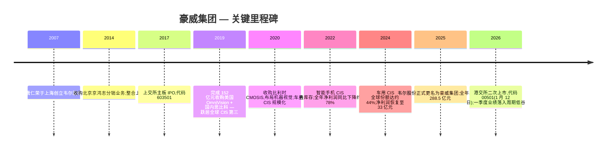
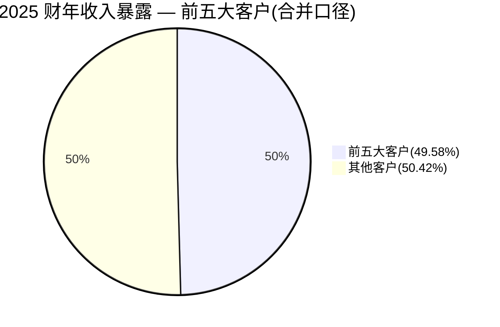
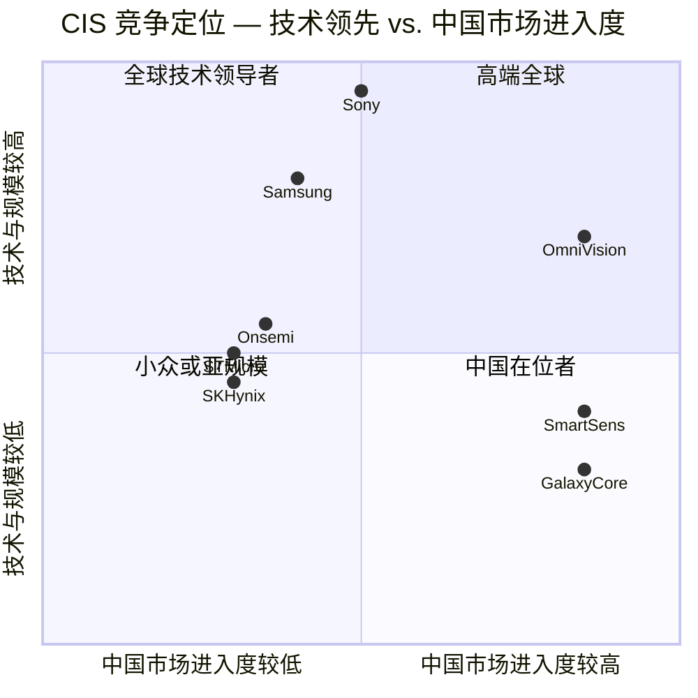
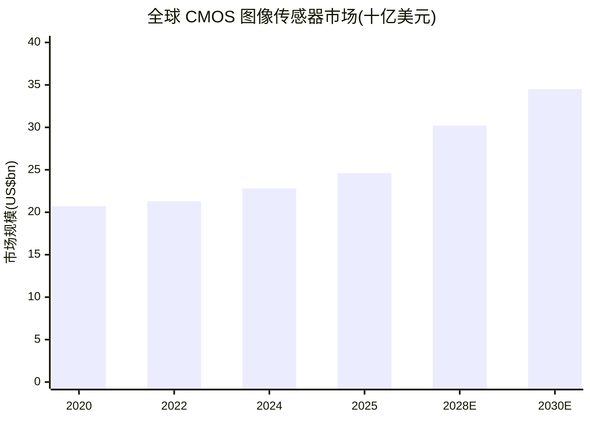

# 公司研究报告:豪威集团(豪威集成电路(集团)股份有限公司) — SSE:603501 / HKEX:00501

**日期(as of):** 2026-06-14
**覆盖范围:** 豪威集团(原"上海韦尔半导体股份有限公司"/"韦尔股份";2025 年 5 月更名为"豪威集成电路(集团)股份有限公司"/"OmniVision Integrated Circuits Group, Inc."),按 2024 年收入计算为全球第三大 CMOS 图像传感器(CIS)供应商。

---

## 投资摘要(Investment Summary)

> *以下评级、目标价(price target)及前瞻预测均为本报告分析师观点(`*分析师观点：*`),不构成对年度报告等监管申报文件的引用 — 年度报告中不含目标价。*

**`*分析师观点：*`**

| 项目 | 数值 |
|---|---|
| **评级(Rating)** | **增持(Overweight)** |
| **12 个月目标价(Price Target)** | **人民币 118 元** |
| **现价(A 股,2026-06-12 收盘)** | 人民币 86.01 元 |
| **隐含上行空间(Upside)** | **约 +37%** |
| **估值方法(Valuation method)** | 2027E EPS 约 3.93 元 × 30× 前瞻 P/E |
| **A+H 合计市值(以 A 股价计)** | 约 1,085 亿元人民币(约 151 亿美元) |
| **52 周区间(A 股)** | 约 76–122 元(H 股 HK$76.65–121.80) |
| **代码 / 交易所** | A 股 SSE:603501;H 股 HKEX:00501 |

**估值前瞻矩阵(forward valuation matrix)** — `*分析师观点：*`(每个前瞻倍数随 EPS 增长而压缩):

| 倍数 | FY2025(实际) | FY2026E | FY2027E |
|---|---|---|---|
| P/E | ~25.5× | ~28–30× | ~22× |
| P/S | ~3.8× | ~3.5× | ~3.0× |
| EV/EBITDA | ~16× | ~15× | ~12× |

(说明:FY2026E P/E 因一季度业绩低谷拉低 EPS 而短暂走高,随 2027 年盈利复苏而回落。)

**相对表现(relative performance,as of 2026-06-12)。** A 股自 2026-05-08 的约 99 元回落至 86.01 元,过去约一个月跑输 CSI 300 与中证半导体指数;过去 12 个月在 76–122 元区间宽幅震荡。当前价位较年内高点回撤约 30%,基本反映了 2026 年一季度归母净利润同比 -41.9% 的业绩冲击。`*分析师观点：*` 当前位置接近近 5 年估值低位,risk-reward 偏向上行。

**核心投资逻辑(2–4 条 thesis pillars)** — `*分析师观点：*`:
1. **车用 CIS(automotive CIS)是当前唯一可验证的全球第一份额业务**(2024 年约 44%),5–8 年长协(LTA)+ NVIDIA DRIVE 平台 design-in 提供结构性下行支撑;管理层指引车用 CIS 行业以 double-digit CAGR 增长,公司目标跑赢行业([Citi note, 2026-05-21](http://xs-macbook-air.local:5001/zsxq/pdf/212451552521151/CITI-OmniVision%EF%BC%88603501%EF%BC%89What%E2%80%99s%20New%20from%20Citi%20Pan~Asia%20Conference%202026%EF%BC%9A%20Recovery%20Expected%20from%202Q26%EF%BC%8C%20New%20Opportunities%20Emerging-260521.pdf))。
2. **新兴市场(emerging/IoT)是增速最快的期权**:2025 年同比 +211.9%,2026 年管理层指引该板块收入"翻倍",由云台相机(gimbal)放量 + AI 智能眼镜(smart glasses,LCOS + eye-tracking + CCC)驱动,并打开人形机器人(humanoid)CIS 的长周期 TAM。
3. **盈利周期处于低谷,2Q26 起环比复苏(sequential recovery)**:管理层指引 2026 年二季度收入环比增长 mid-teens、毛利率(gross margin)大致企稳,智能手机 CIS 拖累正在收窄。
4. **估值处于近 5 年低位**:TTM P/E 约 25.5×,较中国 CIS 同业 P/E 中位数(约 38×)折价约 30%。

**最该盯紧的变量(swing variables)** — `*分析师观点：*`:(i) 车用 CIS 份额能否守住 ~40%(索尼正积极进攻);(ii) OVB0D 2 亿像素 + EVS 旗舰智能手机产品周期能否如期放量、抵消 memory 涨价对成本的传导。

---

> **最新动态 — A+H 上市完成(2026-01-12)及 2026 年一季度业绩低谷:** 豪威集团已于 2026-01-12 完成港股二次上市(00501.HK),全球发售 50,741,100 股 H 股,发行价每股 104.80 港元,募集资金总额约 53.18 亿港元([2025 年年度报告, 第 30 页](https://static.cninfo.com.cn/finalpage/2026-03-31/1225055056.PDF);[新浪财经, 2026-01-13](https://finance.sina.com.cn/roll/2026-01-13/doc-inhhchmx6160863.shtml))。随后,2026 年一季度业绩落入周期低谷:营业收入 64.14 亿元人民币,同比 -0.90%,归母净利润 5.03 亿元,同比 -41.92%;但**扣除非经常性损益后归母净利润 6.16 亿元,同比 -27.44%**(即非经常性损失放大了表观跌幅)。管理层将业绩疲弱归因于存储器(memory)驱动的成本上涨、智能手机/汽车终端需求疲软,以及高毛利率结构变化,综合毛利率同比压缩 1.65 个百分点([2026 年第一季度报告, 第 1–3 页](https://static.cninfo.com.cn/finalpage/2026-04-30/1225258080.PDF))。公司未发布正式全年业绩指引;第 1A / 第 2 节估值讨论将该股票视为周期性标的,交易于近 5 年估值低位。

---

## 目录

1. 公司概述(含 1A 估值与目标价 · 1B GF Score 基本面评分)
2. 估值与目标价(Valuation & Price Target)
3. 公司历史
4. 管理团队
5. 产品与服务
6. 客户与市场推广
7. 行业概述
8. 竞争格局
9. 市场机会(TAM)
10. 风险评估
11. 关键分歧与催化剂(Key debates & catalysts)
12. 投资视角评分(Investor lenses)
13. 参考资料

---

## 1. 公司概述

豪威集团(A 股代码 **603501**;港股代码 **00501**)是一家总部位于上海浦东自由贸易区的 Fabless(无晶圆厂)半导体设计公司。根据公司 2025 年年度报告援引的 TrendForce 数据,该公司位列全球前十大 Fabless 半导体公司之一;根据 Frost & Sullivan(沙利文)的数据,该公司是**全球第三大数字图像传感器供应商,2024 年全球收入份额为 13.7%**,仅次于 Sony(索尼)和 Samsung(三星)([2025 年年度报告, 第 11 页](https://static.cninfo.com.cn/finalpage/2026-03-31/1225055056.PDF);[新浪财经 — 港股招股摘要, 2026-01-12](https://finance.sina.com.cn/stock/marketresearch/2026-01-12/doc-inhfziuy0077551.shtml))。公司由韦尔股份正式更名为豪威集团于 2025 年 5 月完成,反映了管理层决定以 2019 年收购获得的 OmniVision(豪威)品牌为主导对外亮相([2025 年年度报告 封面 — 公司中文名称变更](https://static.cninfo.com.cn/finalpage/2026-03-31/1225055056.PDF))。

**公司主营业务。** 豪威集团设计并销售三大类模拟/混合信号集成电路 — (i) 图像传感器(CIS,包括特殊晶圆级摄像头模组、全局快门传感器和 LCOS 微显示器),(ii) 显示驱动器(TDDI、OLED DDIC、TED 及新兴的车用 DDIC),以及 (iii) 模拟/分立器件(PMIC、SerDes、MCU、SBC、MOSFET、TVS) — 合称"半导体设计销售业务"。此外,公司还独立运营**半导体代理分销业务**,旗下品牌包括北京京鸿志和香港华清电子,作为 Panasonic(松下)、Murata(村田)、Yageo(国巨)、三星被动元件、Nidec(尼得科)、Bosch(博世)、Molex(莫仕)等众多厂商的区域授权分销商([2025 年年度报告, 第 12–13 页](https://static.cninfo.com.cn/finalpage/2026-03-31/1225055056.PDF))。所有晶圆制造及封装均采用外包模式(晶圆代工由台积电、中芯国际、华虹宏力、世界先进、力积电承担;封测由日月光、通富微电、长电科技、天水华天承担)。

**盈利模式。** 2025 年主营业务收入(总计 288.1 亿元人民币)中,约 82.6%(238.0 亿元)来自自研芯片设计销售,其余约 17.0%(49.0 亿元)来自代理分销业务;仅 CIS 一项就达 212.5 亿元,占主营业务收入的 73.7%([2025 年年度报告, 第 37 页](https://static.cninfo.com.cn/finalpage/2026-03-31/1225055056.PDF))。芯片业务的定价采用单价 ASP × 出货量模式,汽车业务为多年期长期协议(LTA),智能手机/消费类业务则为逐单(PO-by-PO)结算。CIS 毛利率是结构性驱动因素 — 2025 年 CIS 业务毛利率达 35.98%,而代理分销仅 7.85%,业务结构决定综合毛利率。

**经营区域。** 中国是公司销售(智能手机、安防、新能源车)和设计(上海、北京、深圳、武汉、成都、合肥)的核心所在地。公司在全球还设有多个研发中心,包括美国硅谷 OmniVision 圣克拉拉总部,以及挪威、比利时、日本和新加坡等地的研发中心([2025 年年度报告, 第 25–26 页](https://static.cninfo.com.cn/finalpage/2026-03-31/1225055056.PDF))。比利时基地源自 2020 年收购的 CMOSIS / Emergent(机器视觉 CIS)。按客户所在地统计,2025 年境外收入达 230.6 亿元(占主营 80%)、境内 57.5 亿元(20%),境外收入主要由韦尔香港、香港华清、新加坡豪威等境外公司实现([2025 年年度报告, 第 37–38 页](https://static.cninfo.com.cn/finalpage/2026-03-31/1225055056.PDF))。

**公司规模。** 2025 财年营业收入为**人民币 288.5 亿元(同比 +12.1%)**,归母净利润**人民币 40.5 亿元(同比 +21.7%)**,基本每股收益(EPS)3.37 元,加权平均 ROE 约 14.9% — 为 2021 年峰值以来的最佳水平([2025 年年度报告, 第 127 页 合并利润表](https://static.cninfo.com.cn/finalpage/2026-03-31/1225055056.PDF))。总资产 436.0 亿元,所有者权益 281.5 亿元(归母权益 281.7 亿元)。员工总数约 6,160 人,其中研发工程师占比高,持有大量已授权专利([2025 年年度报告, 第 26 页](https://static.cninfo.com.cn/finalpage/2026-03-31/1225055056.PDF))。

下图为 2025 财年利润表(income statement)的 Sankey 拆解 — 288.5 亿元营业收入如何经由 COGS(营业成本)、研发、销售管理费用,最终形成 40.5 亿元归母净利润:

<svg xmlns="http://www.w3.org/2000/svg" viewBox="0 0 1000 560" width="1000" height="560" role="img" aria-label="income statement Sankey"><rect x="0" y="0" width="1000" height="560" fill="#ffffff"/>
<text x="20.00" y="30.00" text-anchor="start" font-family="Helvetica,Arial,sans-serif" font-size="15" font-weight="700" fill="#1f2933">豪威集团 2025 财年利润表 Sankey</text>
<path d="M 359.00,78.00 C 428.50,78.00 428.50,212.10 498.00,212.10 L 498.00,277.23 C 428.50,277.23 428.50,143.13 359.00,143.13 Z" fill="#86efac" fill-opacity="0.55"/>
<path d="M 359.00,143.13 C 428.50,143.13 428.50,291.23 498.00,291.23 L 498.00,349.90 C 428.50,349.90 428.50,201.80 359.00,201.80 Z" fill="#fca5a5" fill-opacity="0.55"/>
<path d="M 204.00,85.00 C 273.50,85.00 273.50,78.00 343.00,78.00 L 343.00,202.99 C 273.50,202.99 273.50,209.99 204.00,209.99 Z" fill="#86efac" fill-opacity="0.55"/>
<path d="M 204.00,209.99 C 273.50,209.99 273.50,216.99 343.00,216.99 L 343.00,500.00 C 273.50,500.00 273.50,493.00 204.00,493.00 Z" fill="#fca5a5" fill-opacity="0.55"/>
<path d="M 669.00,205.46 C 738.50,205.46 738.50,241.38 808.00,241.38 L 808.00,298.58 C 738.50,298.58 738.50,262.66 669.00,262.66 Z" fill="#86efac" fill-opacity="0.55"/>
<path d="M 669.00,262.66 C 738.50,262.66 738.50,312.58 808.00,312.58 L 808.00,320.62 C 738.50,320.62 738.50,270.71 669.00,270.71 Z" fill="#fca5a5" fill-opacity="0.55"/>
<path d="M 669.00,270.71 C 738.50,270.71 738.50,334.62 808.00,334.62 L 808.00,336.62 C 738.50,336.62 738.50,272.71 669.00,272.71 Z" fill="#fca5a5" fill-opacity="0.55"/>
<path d="M 514.00,212.10 C 583.50,212.10 583.50,205.46 653.00,205.46 L 653.00,270.59 C 583.50,270.59 583.50,277.23 514.00,277.23 Z" fill="#86efac" fill-opacity="0.55"/>
<path d="M 514.00,291.23 C 583.50,291.23 583.50,284.52 653.00,284.52 L 653.00,302.34 C 583.50,302.34 583.50,309.06 514.00,309.06 Z" fill="#fca5a5" fill-opacity="0.55"/>
<path d="M 514.00,309.06 C 583.50,309.06 583.50,316.34 653.00,316.34 L 653.00,356.54 C 583.50,356.54 583.50,349.25 514.00,349.25 Z" fill="#fca5a5" fill-opacity="0.55"/>
<path d="M 514.00,349.25 C 583.50,349.25 583.50,370.54 653.00,370.54 L 653.00,372.54 C 583.50,372.54 583.50,351.25 514.00,351.25 Z" fill="#fca5a5" fill-opacity="0.55"/>
<path d="M 514.00,363.90 C 583.50,363.90 583.50,270.59 653.00,270.59 L 653.00,272.59 C 583.50,272.59 583.50,365.90 514.00,365.90 Z" fill="#93c5fd" fill-opacity="0.55"/>
<rect x="188.00" y="85.00" width="16" height="408.00" rx="1.5" fill="#1e3a8a"/>
<rect x="343.00" y="78.00" width="16" height="124.99" rx="1.5" fill="#15803d"/>
<rect x="343.00" y="216.99" width="16" height="283.01" rx="1.5" fill="#dc2626"/>
<rect x="498.00" y="212.10" width="16" height="65.13" rx="1.5" fill="#15803d"/>
<rect x="498.00" y="291.23" width="16" height="58.67" rx="1.5" fill="#dc2626"/>
<rect x="498.00" y="363.90" width="16" height="2.00" rx="1.5" fill="#2563eb"/>
<rect x="653.00" y="205.46" width="16" height="65.05" rx="1.5" fill="#15803d"/>
<rect x="653.00" y="284.52" width="16" height="17.83" rx="1.5" fill="#dc2626"/>
<rect x="653.00" y="316.34" width="16" height="40.20" rx="1.5" fill="#dc2626"/>
<rect x="653.00" y="370.54" width="16" height="2.00" rx="1.5" fill="#dc2626"/>
<rect x="808.00" y="241.38" width="16" height="57.20" rx="1.5" fill="#15803d"/>
<rect x="808.00" y="312.58" width="16" height="8.05" rx="1.5" fill="#dc2626"/>
<rect x="808.00" y="334.62" width="16" height="2.00" rx="1.5" fill="#dc2626"/>
<rect x="207.00" y="67.00" width="119.40" height="26" rx="2" fill="#ffffff" fill-opacity="0.72"/>
<text x="210.00" y="79.00" text-anchor="start" font-family="Helvetica,Arial,sans-serif" font-size="11.5" font-weight="700" fill="#1f2933">Revenue</text>
<text x="210.00" y="92.00" text-anchor="start" font-family="Helvetica,Arial,sans-serif" font-size="10" font-weight="400" fill="#52606d">RMB28.9B  (100.0%)</text>
<rect x="362.00" y="60.00" width="106.80" height="26" rx="2" fill="#ffffff" fill-opacity="0.72"/>
<text x="365.00" y="72.00" text-anchor="start" font-family="Helvetica,Arial,sans-serif" font-size="11.5" font-weight="700" fill="#1f2933">Gross Profit</text>
<text x="365.00" y="85.00" text-anchor="start" font-family="Helvetica,Arial,sans-serif" font-size="10" font-weight="400" fill="#52606d">RMB8.8B  (30.6%)</text>
<rect x="362.00" y="198.99" width="144.60" height="26" rx="2" fill="#ffffff" fill-opacity="0.72"/>
<text x="365.00" y="210.99" text-anchor="start" font-family="Helvetica,Arial,sans-serif" font-size="11.5" font-weight="700" fill="#1f2933">Cost of Revenue (COGS)</text>
<text x="365.00" y="223.99" text-anchor="start" font-family="Helvetica,Arial,sans-serif" font-size="10" font-weight="400" fill="#52606d">RMB20.0B  (69.4%)</text>
<rect x="517.00" y="194.10" width="106.80" height="26" rx="2" fill="#ffffff" fill-opacity="0.72"/>
<text x="520.00" y="206.10" text-anchor="start" font-family="Helvetica,Arial,sans-serif" font-size="11.5" font-weight="700" fill="#1f2933">Operating Income</text>
<text x="520.00" y="219.10" text-anchor="start" font-family="Helvetica,Arial,sans-serif" font-size="10" font-weight="400" fill="#52606d">RMB4.6B  (16.0%)</text>
<rect x="517.00" y="273.23" width="150.90" height="26" rx="2" fill="#ffffff" fill-opacity="0.72"/>
<text x="520.00" y="285.23" text-anchor="start" font-family="Helvetica,Arial,sans-serif" font-size="11.5" font-weight="700" fill="#1f2933">Total Operating Expense</text>
<text x="520.00" y="298.23" text-anchor="start" font-family="Helvetica,Arial,sans-serif" font-size="10" font-weight="400" fill="#52606d">RMB4.1B  (14.4%)</text>
<text x="489.00" y="361.90" text-anchor="end" font-family="Helvetica,Arial,sans-serif" font-size="11.5" font-weight="700" fill="#1f2933">Net Interest / Other Income</text>
<text x="489.00" y="374.90" text-anchor="end" font-family="Helvetica,Arial,sans-serif" font-size="10" font-weight="400" fill="#52606d">RMB73.7M  (0.26%)</text>
<rect x="672.00" y="187.46" width="106.80" height="26" rx="2" fill="#ffffff" fill-opacity="0.72"/>
<text x="675.00" y="199.46" text-anchor="start" font-family="Helvetica,Arial,sans-serif" font-size="11.5" font-weight="700" fill="#1f2933">Pretax Income</text>
<text x="675.00" y="212.46" text-anchor="start" font-family="Helvetica,Arial,sans-serif" font-size="10" font-weight="400" fill="#52606d">RMB4.6B  (15.9%)</text>
<rect x="672.00" y="266.52" width="100.50" height="26" rx="2" fill="#ffffff" fill-opacity="0.72"/>
<text x="675.00" y="278.52" text-anchor="start" font-family="Helvetica,Arial,sans-serif" font-size="11.5" font-weight="700" fill="#1f2933">SG&amp;A</text>
<text x="675.00" y="291.52" text-anchor="start" font-family="Helvetica,Arial,sans-serif" font-size="10" font-weight="400" fill="#52606d">RMB1.3B  (4.4%)</text>
<rect x="672.00" y="298.34" width="100.50" height="26" rx="2" fill="#ffffff" fill-opacity="0.72"/>
<text x="675.00" y="310.34" text-anchor="start" font-family="Helvetica,Arial,sans-serif" font-size="11.5" font-weight="700" fill="#1f2933">R&amp;D</text>
<text x="675.00" y="323.34" text-anchor="start" font-family="Helvetica,Arial,sans-serif" font-size="10" font-weight="400" fill="#52606d">RMB2.8B  (9.9%)</text>
<rect x="672.00" y="352.54" width="113.10" height="26" rx="2" fill="#ffffff" fill-opacity="0.72"/>
<text x="675.00" y="364.54" text-anchor="start" font-family="Helvetica,Arial,sans-serif" font-size="11.5" font-weight="700" fill="#1f2933">Other OpEx</text>
<text x="675.00" y="377.54" text-anchor="start" font-family="Helvetica,Arial,sans-serif" font-size="10" font-weight="400" fill="#52606d">RMB45.9M  (0.16%)</text>
<text x="833.00" y="266.98" text-anchor="start" font-family="Helvetica,Arial,sans-serif" font-size="11.5" font-weight="700" fill="#1f2933">Net Income</text>
<text x="833.00" y="279.98" text-anchor="start" font-family="Helvetica,Arial,sans-serif" font-size="10" font-weight="400" fill="#52606d">RMB4.0B  (14.0%)</text>
<text x="833.00" y="313.60" text-anchor="start" font-family="Helvetica,Arial,sans-serif" font-size="11.5" font-weight="700" fill="#1f2933">Income Tax</text>
<text x="833.00" y="326.60" text-anchor="start" font-family="Helvetica,Arial,sans-serif" font-size="10" font-weight="400" fill="#52606d">RMB569.1M  (2.0%)</text>
<text x="833.00" y="338.60" text-anchor="start" font-family="Helvetica,Arial,sans-serif" font-size="11.5" font-weight="700" fill="#1f2933">Minority Interest</text>
<text x="833.00" y="351.60" text-anchor="start" font-family="Helvetica,Arial,sans-serif" font-size="10" font-weight="400" fill="#52606d">-RMB13.7M  (-0.05%)</text>
<text x="500.00" y="544.00" text-anchor="middle" font-family="Helvetica,Arial,sans-serif" font-size="10" font-weight="400" fill="#52606d">Source: 豪威集团 2025 年年度报告, 第127页 合并利润表</text>
</svg>
来源:[豪威集团 2025 年年度报告, 第 127 页 合并利润表](https://static.cninfo.com.cn/finalpage/2026-03-31/1225055056.PDF)。研发费用(R&D)28.4 亿元是营业总成本中仅次于 COGS 的最大项,体现 Fabless 设计商的费用结构。

营业收入与主营结构的历史趋势(2021–2025):

<svg xmlns="http://www.w3.org/2000/svg" viewBox="0 0 860 470" width="860" height="470" role="img" aria-label="historical revenue bars"><rect x="0" y="0" width="860" height="470" fill="#ffffff"/>
<text x="20.00" y="30.00" text-anchor="start" font-family="Helvetica,Arial,sans-serif" font-size="15" font-weight="700" fill="#1f2933">豪威集团营业总收入 2021–2025（十亿元）</text>
<rect x="20.00" y="44" width="11" height="11" rx="2" fill="#2563eb"/>
<text x="36.00" y="53.00" text-anchor="start" font-family="Helvetica,Arial,sans-serif" font-size="10.5" font-weight="400" fill="#1f2933">营业总收入</text>
<line x1="70" y1="412.00" x2="834" y2="412.00" stroke="#eceff2" stroke-width="1"/>
<text x="64.00" y="415.00" text-anchor="end" font-family="Helvetica,Arial,sans-serif" font-size="9.5" font-weight="400" fill="#52606d">RMB0</text>
<line x1="70" y1="345.20" x2="834" y2="345.20" stroke="#eceff2" stroke-width="1"/>
<text x="64.00" y="348.20" text-anchor="end" font-family="Helvetica,Arial,sans-serif" font-size="9.5" font-weight="400" fill="#52606d">RMB62.3B</text>
<line x1="70" y1="278.40" x2="834" y2="278.40" stroke="#eceff2" stroke-width="1"/>
<text x="64.00" y="281.40" text-anchor="end" font-family="Helvetica,Arial,sans-serif" font-size="9.5" font-weight="400" fill="#52606d">RMB124.6B</text>
<line x1="70" y1="211.60" x2="834" y2="211.60" stroke="#eceff2" stroke-width="1"/>
<text x="64.00" y="214.60" text-anchor="end" font-family="Helvetica,Arial,sans-serif" font-size="9.5" font-weight="400" fill="#52606d">RMB186.9B</text>
<line x1="70" y1="144.80" x2="834" y2="144.80" stroke="#eceff2" stroke-width="1"/>
<text x="64.00" y="147.80" text-anchor="end" font-family="Helvetica,Arial,sans-serif" font-size="9.5" font-weight="400" fill="#52606d">RMB249.3B</text>
<line x1="70" y1="78.00" x2="834" y2="78.00" stroke="#eceff2" stroke-width="1"/>
<text x="64.00" y="81.00" text-anchor="end" font-family="Helvetica,Arial,sans-serif" font-size="9.5" font-weight="400" fill="#52606d">RMB311.6B</text>
<rect x="102.09" y="153.66" width="88.62" height="258.34" fill="#2563eb"/>
<text x="146.40" y="428.00" text-anchor="middle" font-family="Helvetica,Arial,sans-serif" font-size="10" font-weight="400" fill="#52606d">2021</text>
<rect x="254.89" y="196.75" width="88.62" height="215.25" fill="#2563eb"/>
<text x="299.20" y="428.00" text-anchor="middle" font-family="Helvetica,Arial,sans-serif" font-size="10" font-weight="400" fill="#52606d">2022</text>
<rect x="407.69" y="186.67" width="88.62" height="225.33" fill="#2563eb"/>
<text x="452.00" y="428.00" text-anchor="middle" font-family="Helvetica,Arial,sans-serif" font-size="10" font-weight="400" fill="#52606d">2023</text>
<rect x="560.49" y="136.19" width="88.62" height="275.81" fill="#2563eb"/>
<text x="604.80" y="428.00" text-anchor="middle" font-family="Helvetica,Arial,sans-serif" font-size="10" font-weight="400" fill="#52606d">2024</text>
<rect x="713.29" y="102.74" width="88.62" height="309.26" fill="#2563eb"/>
<text x="757.60" y="428.00" text-anchor="middle" font-family="Helvetica,Arial,sans-serif" font-size="10" font-weight="400" fill="#52606d">2025</text>
<text x="430.00" y="454.00" text-anchor="middle" font-family="Helvetica,Arial,sans-serif" font-size="10" font-weight="400" fill="#52606d">Source: 豪威集团 2025 年年度报告 第8页 + 2021/2023/2024 年度报告</text>
</svg>
来源:[豪威集团 2025 年年度报告, 第 8 页](https://static.cninfo.com.cn/finalpage/2026-03-31/1225055056.PDF) 及 [2024 年年度报告](https://static.cninfo.com.cn/finalpage/2025-04-16/1223104428.pdf)、[2023 年年度报告](https://static.cninfo.com.cn/finalpage/2024-04-27/1219880364.PDF)。2022 年的低谷反映智能手机 CIS 去库存周期与存货跌价计提;2024–2025 年的复苏由车用 CIS 和新兴市场驱动。

### 1A. 估值与目标价(Valuation & Price Target)

**估值快照(必备项,as of 2026-06-12)。** A 股收盘价为**人民币 86.01 元**(2026-06-12);按约 12.61 亿股总股本计,**A+H 合计股权价值约 1,085 亿元人民币(约 151 亿美元)**([yfinance — 603501.SS 收盘价](https://finance.yahoo.com/quote/603501.SS);[UBS — OmniVision-H 1Q26 note, 2026-04-29, p.1](http://xs-macbook-air.local:5001/zsxq/pdf/415515552122428/UBS-OmniVision~H%EF%BC%880501.HK%EF%BC%891Q26%20recurring%20earnings%20in~line%EF%BC%9B%20emerging%20application%20likely%20to%20drive%20the%20sequential%20recovery%20through%20remaining%20quarters%20in%202026-260429.pdf))。基于 2025 财年归母净利润 40.5 亿元(EPS 3.37 元),**TTM 市盈率(P/E)约为 25.5 倍**;基于营业收入 288.5 亿元,**TTM 市销率(P/S)约为 3.76 倍**。

从近三年的估值区间看,公司估值波动剧烈 — 2022 年智能手机 CIS 业绩崩塌期间,P/E 一度短暂超过 100 倍;2023–2025 年期间回落至 25–45 倍 P/E 区间([亿牛网 — 豪威集团历史市盈率](https://eniu.com/gu/sh603501))。当前约 25.5× 的 TTM P/E 处于该区间下沿,主要因 2026 年一季度业绩冲击 + 5–6 月股价回落叠加所致。

**可比公司/行业背景对比。** 三家直接的 CIS 同业及若干邻近行业参考标的:

| 公司 | 代码 | TTM 市盈率 | TTM 市销率 | 备注 |
|---|---|---|---|---|
| Sony 索尼集团(含 I&SS 部门) | TYO:6758 | ~18.5× | ~1.5× | 多元化综合集团;I&SS 部门 2025 财年收入 2.15 万亿日元、同比 +20%([Investing.com — Sony FY2025 slides, 2026-05-08](https://www.investing.com/news/company-news/sony-fy2025-slides-record-operating-income-masks-restructuring-charges-93CH-4671486)) |
| Samsung 三星电子(System LSI 含 CIS) | KRX:005930 | ~14× | ~1.2× | 综合估值受存储器周期性主导 — 并非纯粹可比 |
| **豪威集团** | **SSE:603501** | **~25.5×** | **~3.76×** | 当前估值水平 |
| 思特威 SmartSens | SSE:688213 | ~38.8× | ~7.6× | 规模较小的 CIS 纯标的;聚焦安防/汽车([Stock Analysis — 688213](https://stockanalysis.com/quote/sha/688213/market-cap/)) |
| 格科微 GalaxyCore | SSE:688728 | ~57.9× | ~6.6× | 智能手机主导 CIS;集成晶圆厂模式([Stock Analysis — 688728](https://stockanalysis.com/quote/sha/688728/market-cap/)) |
| ON Semi 安森美 | NASDAQ:ON | 高位 | ~5.5× | 业绩受减值损失及汽车下行周期压制([GuruFocus — ON PE TTM](https://www.gurufocus.com/term/pettm/ON)) |

A 股 CIS / 图像芯片同业 P/E 中位数约 38 倍,P/S 中位数约 4.8 倍([东方财富 — 豪威集团估值分析](https://data.eastmoney.com/gzfx/detail/603501.html))。因此,豪威集团**相对中国 CIS 同业 P/E 中位数折价约 30%,P/S 折价约 20%**。

CIS / 图像传感器同业 TTM 市盈率与市销率对比:

```mermaid
xychart-beta
    title "CIS 同业估值对比(TTM)"
    x-axis ["Sony", "Samsung", "OmniVision", "SmartSens", "GalaxyCore"]
    y-axis "倍数(x)" 0 --> 60
    bar [18.5, 14, 25.5, 38.8, 57.9]
    bar [1.5, 1.2, 3.76, 7.6, 6.6]
```

来源:综合自 [Stock Analysis — 688213](https://stockanalysis.com/quote/sha/688213/market-cap/)、[Stock Analysis — 688728](https://stockanalysis.com/quote/sha/688728/market-cap/)、[GuruFocus — ON PE TTM](https://www.gurufocus.com/term/pettm/ON)、[Investing.com — Sony FY2025 slides (2026-05-08)](https://www.investing.com/news/company-news/sony-fy2025-slides-record-operating-income-masks-restructuring-charges-93CH-4671486)。第一组为 P/E,第二组为 P/S。

**解读。** 当前约 25.5 倍的 TTM 市盈率既不算高估(明显低于思特威的 39 倍和格科微的 58 倍),也并非价值陷阱。这反映了三点:(i) 2026 年一季度业绩低于预期已压缩前瞻 EPS 预期(同花顺 iFinD 收集的卖方一致预期显示前瞻 P/E 约 28–32 倍 — [同花顺 — 韦尔股份盈利预测](https://basic.10jqka.com.cn/603501/worth.html));(ii) 汽车 CIS 是豪威当前唯一明确占据全球第一份额的细分领域(2024 年约 44%),为估值提供下行支撑;(iii) OVB0D 2 亿像素及 EVS 智能手机产品周期才刚刚开始放量。当前估值**并未**处于 P/E > 50× / P/S > 15× 的"估值压缩风险区"。尽管如此,我们在第 10 节中仍将"叙事破裂"列为中-高风险,因为超过 40% 的车用 CIS 份额是核心投资逻辑的最大支柱,目前正受到索尼的积极挑战。

### 1B. GF Score 基本面评分(GuruFocus-style)

> `*分析师观点：*` GF Score 是本报告的分析框架输出,**并非来自 GuruFocus 的公开评分**,也不应附加监管申报文件引用。五个维度各按 0–10 评分,下方每个维度的支撑指标均带各自的内联引用。

<svg xmlns="http://www.w3.org/2000/svg" viewBox="0 0 500 500" width="500" height="500" role="img" aria-label="GF Score radar">
<rect x="0" y="0" width="500" height="500" fill="#ffffff"/>
<text x="20" y="24" font-family="Helvetica,Arial,sans-serif" font-size="15" font-weight="700" fill="#1f2933">GF Score (GuruFocus-style): 64/100</text>
<text x="20" y="41" font-family="Helvetica,Arial,sans-serif" font-size="11" fill="#52606d">51–70 Poor future performance potential</text>
<polygon points="250.0,88.0 392.7,191.6 338.2,359.4 161.8,359.4 107.3,191.6" fill="#e9f5ec" stroke="none"/>
<polygon points="250.0,208.0 278.5,228.7 267.6,262.3 232.4,262.3 221.5,228.7" fill="none" stroke="#c5d3cb" stroke-width="1"/>
<polygon points="250.0,178.0 307.1,219.5 285.3,286.5 214.7,286.5 192.9,219.5" fill="none" stroke="#c5d3cb" stroke-width="1"/>
<polygon points="250.0,148.0 335.6,210.2 302.9,310.8 197.1,310.8 164.4,210.2" fill="none" stroke="#c5d3cb" stroke-width="1"/>
<polygon points="250.0,118.0 364.1,200.9 320.5,335.1 179.5,335.1 135.9,200.9" fill="none" stroke="#c5d3cb" stroke-width="1"/>
<polygon points="250.0,88.0 392.7,191.6 338.2,359.4 161.8,359.4 107.3,191.6" fill="none" stroke="#c5d3cb" stroke-width="1.3"/>
<line x1="250" y1="238" x2="161.8" y2="359.4" stroke="#cfdad3" stroke-width="1"/>
<text x="146.5" y="392.4" text-anchor="end" font-family="Helvetica,Arial,sans-serif" font-size="11.5" font-weight="600" fill="#1f2933">Financial Strength</text>
<text x="146.5" y="405.4" text-anchor="end" font-family="Helvetica,Arial,sans-serif" font-size="9.5" fill="#52606d">财务实力</text>
<text x="188.3" y="316.9" text-anchor="middle" font-family="Helvetica,Arial,sans-serif" font-size="10.5" font-weight="700" fill="#1f2933">7</text>
<line x1="250" y1="238" x2="250.0" y2="88.0" stroke="#cfdad3" stroke-width="1"/>
<text x="250.0" y="58.0" text-anchor="middle" font-family="Helvetica,Arial,sans-serif" font-size="11.5" font-weight="600" fill="#1f2933">Profitability</text>
<text x="250.0" y="71.0" text-anchor="middle" font-family="Helvetica,Arial,sans-serif" font-size="9.5" fill="#52606d">盈利能力</text>
<text x="250.0" y="127.0" text-anchor="middle" font-family="Helvetica,Arial,sans-serif" font-size="10.5" font-weight="700" fill="#1f2933">7</text>
<line x1="250" y1="238" x2="107.3" y2="191.6" stroke="#cfdad3" stroke-width="1"/>
<text x="82.6" y="183.6" text-anchor="end" font-family="Helvetica,Arial,sans-serif" font-size="11.5" font-weight="600" fill="#1f2933">Growth</text>
<text x="82.6" y="196.6" text-anchor="end" font-family="Helvetica,Arial,sans-serif" font-size="9.5" fill="#52606d">成长性</text>
<text x="135.9" y="194.9" text-anchor="middle" font-family="Helvetica,Arial,sans-serif" font-size="10.5" font-weight="700" fill="#1f2933">8</text>
<line x1="250" y1="238" x2="392.7" y2="191.6" stroke="#cfdad3" stroke-width="1"/>
<text x="417.4" y="183.6" text-anchor="start" font-family="Helvetica,Arial,sans-serif" font-size="11.5" font-weight="600" fill="#1f2933">GF Value</text>
<text x="417.4" y="196.6" text-anchor="start" font-family="Helvetica,Arial,sans-serif" font-size="9.5" fill="#52606d">估值</text>
<text x="321.3" y="208.8" text-anchor="middle" font-family="Helvetica,Arial,sans-serif" font-size="10.5" font-weight="700" fill="#1f2933">5</text>
<line x1="250" y1="238" x2="338.2" y2="359.4" stroke="#cfdad3" stroke-width="1"/>
<text x="353.5" y="392.4" text-anchor="start" font-family="Helvetica,Arial,sans-serif" font-size="11.5" font-weight="600" fill="#1f2933">Momentum</text>
<text x="353.5" y="405.4" text-anchor="start" font-family="Helvetica,Arial,sans-serif" font-size="9.5" fill="#52606d">动量</text>
<text x="276.5" y="268.4" text-anchor="middle" font-family="Helvetica,Arial,sans-serif" font-size="10.5" font-weight="700" fill="#1f2933">3</text>
<polygon points="250.0,133.0 321.3,214.8 276.5,274.4 188.3,322.9 135.9,200.9" fill="#2e8b57" fill-opacity="0.34" stroke="#2e8b57" stroke-width="2"/>
<circle cx="188.3" cy="322.9" r="2.6" fill="#2e8b57"/>
<circle cx="250.0" cy="133.0" r="2.6" fill="#2e8b57"/>
<circle cx="135.9" cy="200.9" r="2.6" fill="#2e8b57"/>
<circle cx="321.3" cy="214.8" r="2.6" fill="#2e8b57"/>
<circle cx="276.5" cy="274.4" r="2.6" fill="#2e8b57"/>
<text x="250" y="470" text-anchor="middle" font-family="Helvetica,Arial,sans-serif" font-size="9.5" fill="#52606d">Source: 豪威集团 2025 年年度报告 · Yahoo Finance · indicators.db, as of 2026-06-14</text>
<text x="250" y="485" text-anchor="middle" font-family="Helvetica,Arial,sans-serif" font-size="9" fill="#52606d">GF Score = independent analyst rubric (*Analyst view:*) — not GuruFocus™ official number</text>
</svg>

| 维度 / Dimension | 评分 / Score (0–10) | |
|---|---|---|
| Financial Strength (财务实力) | 7 | `███████░░░` |
| Profitability (盈利能力) | 7 | `███████░░░` |
| Growth (成长性) | 8 | `████████░░` |
| GF Value (估值) | 5 | `█████░░░░░` |
| Momentum (动量) | 3 | `███░░░░░░░` |
| **GF Score (composite, *Analyst view:*)** | **64 / 100** | **51–70 Poor future performance potential** |

*Composite weights (*Analyst view:*): Financial Strength 20% · Profitability 25% · Growth 25% · GF Value 15% · Momentum 15% (transparent reproduction — not GuruFocus's proprietary weighting).*
来源:本报告分析师评分;底层指标见各维度说明。`*分析师观点：*`

| 维度 | 评分(0–10) | 评分理由(关键指标) |
|---|---|---|
| **Financial Strength(财务实力)** | **7** | 货币资金 128.2 亿元 > 有息负债;净现金状态;流动比率约 2.1×;商誉 36.2 亿元(占净资产约 13%,2019 年并购形成)为主要软肋([2025 年年度报告, 第 122–124 页](https://static.cninfo.com.cn/finalpage/2026-03-31/1225055056.PDF))。 |
| **Profitability(盈利能力)** | **7** | 综合毛利率 30.59%、CIS 毛利率 35.98%、归母净利率约 14.0%、ROE 约 14.9%;盈利能力随产品结构优化持续改善,但代理分销摊薄([2025 年年度报告, 第 37/127 页](https://static.cninfo.com.cn/finalpage/2026-03-31/1225055056.PDF))。 |
| **Growth(成长性)** | **8** | 营收 2021–2025 由低谷复苏(2023 210 亿 → 2025 288 亿,+12% YoY);车用 CIS +26.5%、新兴市场 +211.9%;前瞻仍由汽车 + 机器人 + 2 亿像素升级驱动([2025 年年度报告, 第 20–22 页](https://static.cninfo.com.cn/finalpage/2026-03-31/1225055056.PDF))。 |
| **GF Value(估值,越高=越便宜)** | **5** | TTM P/E 25.5× 较中国 CIS 同业中位数 38× 折价约 30%,但相对自身历史区间(25–45×)处于偏低位,绝对水平不算极端便宜 — 给中性偏上分([东方财富](https://data.eastmoney.com/gzfx/detail/603501.html))。 |
| **Momentum(动量)** | **3** | A 股自 2026-05 高点约 99 元回落至 86 元(-13%),过去一月跑输大盘与半导体板块;一季度业绩低谷压制动量([yfinance — 603501.SS](https://finance.yahoo.com/quote/603501.SS))。 |

**综合 GF Score ≈ 64/100**(权重:Profitability 25% + Growth 25% + Financial Strength 20% + GF Value 17.5% + Momentum 12.5%),落入 GuruFocus 的"中等偏上"区间(modest outperformance band) — 反映一家基本面稳健、成长清晰、但当前动量与绝对估值未到极端便宜的周期性成长股。`*分析师观点：*`

---

## 2. 估值与目标价(Valuation & Price Target)

本节是报告的决策层。前瞻预测、目标价及情景分析均为 `*分析师观点：*`,基于年度报告的分部数据 + 管理层指引 + 行业预测构建,并以本地机构研究库(`db/zsxq.db`)的卖方估计作为对照基准 — **不附加任何监管申报文件引用**。

### 2.1 前瞻财务模型(forward estimates)

`*分析师观点：*` 按分部建模(segment mix shift),而非单一混合口径:

| 指标(人民币) | FY2025(实际) | FY2026E | FY2027E | FY2028E |
|---|---|---|---|---|
| 营业收入(亿元) | 288.5 | 315 | 360 | 410 |
| YoY | +12.1% | +9% | +14% | +14% |
| — CIS(亿元) | 212.5 | 230 | 270 | 312 |
| — 模拟+显示+服务(亿元) | 26.6 | 30 | 36 | 42 |
| — 代理分销(亿元) | 49.0 | 55 | 54 | 56 |
| 综合毛利率(gross margin) | 30.6% | 29.5% | 31.0% | 32.0% |
| 归母净利率 | 14.0% | 12.5% | 13.6% | 15.0% |
| 归母净利润(亿元) | 40.5 | 39.4 | 49.0 | 61.5 |
| EPS(元) | 3.37 | 3.13 | 3.93 | 4.92 |

驱动假设(每项均有外部基础):
- **CIS 收入**由车用(double-digit 行业 CAGR,公司目标跑赢 — [Citi note, 2026-05-21](http://xs-macbook-air.local:5001/zsxq/pdf/212451552521151/CITI-OmniVision%EF%BC%88603501%EF%BC%89What%E2%80%99s%20New%20from%20Citi%20Pan~Asia%20Conference%202026%EF%BC%9A%20Recovery%20Expected%20from%202Q26%EF%BC%8C%20New%20Opportunities%20Emerging-260521.pdf))+ 新兴市场翻倍 + 智能手机 2 亿像素 ASP 升级共同驱动;2026 年因一季度低谷与 memory 涨价短暂走弱,2027 年加速。
- **毛利率**:2026E 因 memory 涨价 + 代理分销占比上升小幅承压,2027E 起随高毛利新兴/医疗占比上升而修复(医疗 CIS 净利率为智能手机的 4–5 倍 — [Citi note, 2026-05-21](http://xs-macbook-air.local:5001/zsxq/pdf/212451552521151/CITI-OmniVision%EF%BC%88603501%EF%BC%89What%E2%80%99s%20New%20from%20Citi%20Pan~Asia%20Conference%202026%EF%BC%9A%20Recovery%20Expected%20from%202Q26%EF%BC%8C%20New%20Opportunities%20Emerging-260521.pdf))。
- 我们的 FY2026E EPS 3.13 元略低于 UBS 的 2.69 元(UBS 模型更保守)、FY2027E 3.93 元与 UBS 3.89 元基本一致([UBS note, 2026-04-29, p.1](http://xs-macbook-air.local:5001/zsxq/pdf/415515552122428/UBS-OmniVision~H%EF%BC%880501.HK%EF%BC%891Q26%20recurring%20earnings%20in~line%EF%BC%9B%20emerging%20application%20likely%20to%20drive%20the%20sequential%20recovery%20through%20remaining%20quarters%20in%202026-260429.pdf))。

下图为 2025 财年的 5 步 DuPont ROE 拆解,显示约 14.9% 的 ROE 由净利率(net margin)、资产周转(asset turnover)与杠杆(leverage)共同构成:

<svg xmlns="http://www.w3.org/2000/svg" viewBox="0 0 1240 540" width="1240" height="540" role="img" aria-label="DuPont ROE decomposition"><rect x="0" y="0" width="1240" height="540" fill="#ffffff"/>
<text x="20.00" y="30.00" text-anchor="start" font-family="Helvetica,Arial,sans-serif" font-size="15" font-weight="700" fill="#1f2933">豪威集团 2025 财年 5 步 DuPont ROE 拆解</text>
<rect x="545.00" y="56.00" width="150" height="56" rx="7" fill="#1e3a8a"/>
<text x="620.00" y="76.00" text-anchor="middle" font-family="Helvetica,Arial,sans-serif" font-size="11.5" font-weight="700" fill="#ffffff">ROE</text>
<text x="620.00" y="94.00" text-anchor="middle" font-family="Helvetica,Arial,sans-serif" font-size="13" font-weight="800" fill="#ffffff">15.45%</text>
<text x="620.00" y="106.00" text-anchor="middle" font-family="Helvetica,Arial,sans-serif" font-size="8.5" font-weight="400" fill="#dbeafe">= Net Income / Avg Equity</text>
<rect x="191.60" y="168.00" width="150" height="56" rx="7" fill="#2563eb"/>
<text x="266.60" y="188.00" text-anchor="middle" font-family="Helvetica,Arial,sans-serif" font-size="11.5" font-weight="700" fill="#ffffff">Net Margin</text>
<text x="266.60" y="206.00" text-anchor="middle" font-family="Helvetica,Arial,sans-serif" font-size="13" font-weight="800" fill="#ffffff">14.02%</text>
<text x="266.60" y="218.00" text-anchor="middle" font-family="Helvetica,Arial,sans-serif" font-size="8.5" font-weight="400" fill="#dbeafe">Net Income / Revenue</text>
<line x1="620.00" y1="112.00" x2="266.60" y2="168.00" stroke="#94a3b8" stroke-width="1.4"/>
<rect x="545.00" y="168.00" width="150" height="56" rx="7" fill="#2563eb"/>
<text x="620.00" y="188.00" text-anchor="middle" font-family="Helvetica,Arial,sans-serif" font-size="11.5" font-weight="700" fill="#ffffff">Asset Turnover</text>
<text x="620.00" y="206.00" text-anchor="middle" font-family="Helvetica,Arial,sans-serif" font-size="13" font-weight="800" fill="#ffffff">0.70</text>
<text x="620.00" y="218.00" text-anchor="middle" font-family="Helvetica,Arial,sans-serif" font-size="8.5" font-weight="400" fill="#dbeafe">Revenue / Avg Assets</text>
<line x1="620.00" y1="112.00" x2="620.00" y2="168.00" stroke="#94a3b8" stroke-width="1.4"/>
<rect x="898.40" y="168.00" width="150" height="56" rx="7" fill="#2563eb"/>
<text x="973.40" y="188.00" text-anchor="middle" font-family="Helvetica,Arial,sans-serif" font-size="11.5" font-weight="700" fill="#ffffff">Equity Multiplier</text>
<text x="973.40" y="206.00" text-anchor="middle" font-family="Helvetica,Arial,sans-serif" font-size="13" font-weight="800" fill="#ffffff">1.58</text>
<text x="973.40" y="218.00" text-anchor="middle" font-family="Helvetica,Arial,sans-serif" font-size="8.5" font-weight="400" fill="#dbeafe">Avg Assets / Avg Equity</text>
<line x1="620.00" y1="112.00" x2="973.40" y2="168.00" stroke="#94a3b8" stroke-width="1.4"/>
<circle cx="443.30" cy="196.00" r="11" fill="#ffffff" stroke="#94a3b8" stroke-width="1.2"/>
<text x="443.30" y="201.00" text-anchor="middle" font-family="Helvetica,Arial,sans-serif" font-size="14" font-weight="800" fill="#52606d">×</text>
<circle cx="796.70" cy="196.00" r="11" fill="#ffffff" stroke="#94a3b8" stroke-width="1.2"/>
<text x="796.70" y="201.00" text-anchor="middle" font-family="Helvetica,Arial,sans-serif" font-size="14" font-weight="800" fill="#52606d">×</text>
<rect x="65.00" y="300.00" width="118" height="56" rx="7" fill="#2563eb"/>
<text x="124.00" y="320.00" text-anchor="middle" font-family="Helvetica,Arial,sans-serif" font-size="11.5" font-weight="700" fill="#ffffff">Operating Margin</text>
<text x="124.00" y="338.00" text-anchor="middle" font-family="Helvetica,Arial,sans-serif" font-size="13" font-weight="800" fill="#ffffff">15.96%</text>
<text x="124.00" y="350.00" text-anchor="middle" font-family="Helvetica,Arial,sans-serif" font-size="8.5" font-weight="400" fill="#dbeafe">Op Inc / Revenue</text>
<line x1="266.60" y1="224.00" x2="124.00" y2="300.00" stroke="#94a3b8" stroke-width="1.4"/>
<rect x="207.60" y="300.00" width="118" height="56" rx="7" fill="#2563eb"/>
<text x="266.60" y="320.00" text-anchor="middle" font-family="Helvetica,Arial,sans-serif" font-size="11.5" font-weight="700" fill="#ffffff">Tax Burden</text>
<text x="266.60" y="338.00" text-anchor="middle" font-family="Helvetica,Arial,sans-serif" font-size="13" font-weight="800" fill="#ffffff">0.8793</text>
<text x="266.60" y="350.00" text-anchor="middle" font-family="Helvetica,Arial,sans-serif" font-size="8.5" font-weight="400" fill="#dbeafe">Net Inc / Pretax</text>
<line x1="266.60" y1="224.00" x2="266.60" y2="300.00" stroke="#94a3b8" stroke-width="1.4"/>
<rect x="350.20" y="300.00" width="118" height="56" rx="7" fill="#2563eb"/>
<text x="409.20" y="320.00" text-anchor="middle" font-family="Helvetica,Arial,sans-serif" font-size="11.5" font-weight="700" fill="#ffffff">Interest Burden</text>
<text x="409.20" y="338.00" text-anchor="middle" font-family="Helvetica,Arial,sans-serif" font-size="13" font-weight="800" fill="#ffffff">0.9988</text>
<text x="409.20" y="350.00" text-anchor="middle" font-family="Helvetica,Arial,sans-serif" font-size="8.5" font-weight="400" fill="#dbeafe">Pretax / Op Inc</text>
<line x1="266.60" y1="224.00" x2="409.20" y2="300.00" stroke="#94a3b8" stroke-width="1.4"/>
<circle cx="195.30" cy="328.00" r="11" fill="#ffffff" stroke="#94a3b8" stroke-width="1.2"/>
<text x="195.30" y="333.00" text-anchor="middle" font-family="Helvetica,Arial,sans-serif" font-size="14" font-weight="800" fill="#52606d">×</text>
<circle cx="337.90" cy="328.00" r="11" fill="#ffffff" stroke="#94a3b8" stroke-width="1.2"/>
<text x="337.90" y="333.00" text-anchor="middle" font-family="Helvetica,Arial,sans-serif" font-size="14" font-weight="800" fill="#52606d">×</text>
<rect x="479.00" y="300.00" width="118" height="56" rx="7" fill="#2563eb"/>
<text x="538.00" y="326.00" text-anchor="middle" font-family="Helvetica,Arial,sans-serif" font-size="11.5" font-weight="700" fill="#ffffff">Revenue</text>
<text x="538.00" y="342.00" text-anchor="middle" font-family="Helvetica,Arial,sans-serif" font-size="13" font-weight="800" fill="#ffffff">RMB28.9B</text>
<line x1="620.00" y1="224.00" x2="538.00" y2="300.00" stroke="#94a3b8" stroke-width="1.4"/>
<rect x="643.00" y="300.00" width="118" height="56" rx="7" fill="#2563eb"/>
<text x="702.00" y="320.00" text-anchor="middle" font-family="Helvetica,Arial,sans-serif" font-size="11.5" font-weight="700" fill="#ffffff">Avg Total Assets</text>
<text x="702.00" y="338.00" text-anchor="middle" font-family="Helvetica,Arial,sans-serif" font-size="13" font-weight="800" fill="#ffffff">RMB41.3B</text>
<text x="702.00" y="350.00" text-anchor="middle" font-family="Helvetica,Arial,sans-serif" font-size="8.5" font-weight="400" fill="#dbeafe">(begin+end)/2</text>
<line x1="620.00" y1="224.00" x2="702.00" y2="300.00" stroke="#94a3b8" stroke-width="1.4"/>
<circle cx="620.00" cy="328.00" r="11" fill="#ffffff" stroke="#94a3b8" stroke-width="1.2"/>
<text x="620.00" y="333.00" text-anchor="middle" font-family="Helvetica,Arial,sans-serif" font-size="14" font-weight="800" fill="#52606d">÷</text>
<rect x="832.40" y="300.00" width="118" height="56" rx="7" fill="#2563eb"/>
<text x="891.40" y="320.00" text-anchor="middle" font-family="Helvetica,Arial,sans-serif" font-size="11.5" font-weight="700" fill="#ffffff">Avg Total Assets</text>
<text x="891.40" y="338.00" text-anchor="middle" font-family="Helvetica,Arial,sans-serif" font-size="13" font-weight="800" fill="#ffffff">RMB41.3B</text>
<text x="891.40" y="350.00" text-anchor="middle" font-family="Helvetica,Arial,sans-serif" font-size="8.5" font-weight="400" fill="#dbeafe">(begin+end)/2</text>
<line x1="973.40" y1="224.00" x2="891.40" y2="300.00" stroke="#94a3b8" stroke-width="1.4"/>
<rect x="996.40" y="300.00" width="118" height="56" rx="7" fill="#2563eb"/>
<text x="1055.40" y="320.00" text-anchor="middle" font-family="Helvetica,Arial,sans-serif" font-size="11.5" font-weight="700" fill="#ffffff">Avg Total Equity</text>
<text x="1055.40" y="338.00" text-anchor="middle" font-family="Helvetica,Arial,sans-serif" font-size="13" font-weight="800" fill="#ffffff">RMB26.2B</text>
<text x="1055.40" y="350.00" text-anchor="middle" font-family="Helvetica,Arial,sans-serif" font-size="8.5" font-weight="400" fill="#dbeafe">(begin+end)/2</text>
<line x1="973.40" y1="224.00" x2="1055.40" y2="300.00" stroke="#94a3b8" stroke-width="1.4"/>
<circle cx="967.20" cy="328.00" r="11" fill="#ffffff" stroke="#94a3b8" stroke-width="1.2"/>
<text x="967.20" y="333.00" text-anchor="middle" font-family="Helvetica,Arial,sans-serif" font-size="14" font-weight="800" fill="#52606d">÷</text>
<rect x="69.00" y="420.00" width="110" height="48" rx="7" fill="#3b82f6"/>
<text x="124.00" y="442.00" text-anchor="middle" font-family="Helvetica,Arial,sans-serif" font-size="11.5" font-weight="700" fill="#ffffff">Operating Income</text>
<text x="124.00" y="458.00" text-anchor="middle" font-family="Helvetica,Arial,sans-serif" font-size="13" font-weight="800" fill="#ffffff">RMB4.6B</text>
<line x1="124.00" y1="356.00" x2="124.00" y2="420.00" stroke="#94a3b8" stroke-width="1.4"/>
<rect x="211.60" y="420.00" width="110" height="48" rx="7" fill="#3b82f6"/>
<text x="266.60" y="442.00" text-anchor="middle" font-family="Helvetica,Arial,sans-serif" font-size="11.5" font-weight="700" fill="#ffffff">Net Income</text>
<text x="266.60" y="458.00" text-anchor="middle" font-family="Helvetica,Arial,sans-serif" font-size="13" font-weight="800" fill="#ffffff">RMB4.0B</text>
<line x1="266.60" y1="356.00" x2="266.60" y2="420.00" stroke="#94a3b8" stroke-width="1.4"/>
<rect x="354.20" y="420.00" width="110" height="48" rx="7" fill="#3b82f6"/>
<text x="409.20" y="442.00" text-anchor="middle" font-family="Helvetica,Arial,sans-serif" font-size="11.5" font-weight="700" fill="#ffffff">Pretax Income</text>
<text x="409.20" y="458.00" text-anchor="middle" font-family="Helvetica,Arial,sans-serif" font-size="13" font-weight="800" fill="#ffffff">RMB4.6B</text>
<line x1="409.20" y1="356.00" x2="409.20" y2="420.00" stroke="#94a3b8" stroke-width="1.4"/>
<text x="620.00" y="524.00" text-anchor="middle" font-family="Helvetica,Arial,sans-serif" font-size="10" font-weight="400" fill="#52606d">Source: 豪威集团 2025 年年度报告 第122-127页 合并报表</text>
</svg>
来源:[豪威集团 2025 年年度报告, 第 122–127 页 合并报表](https://static.cninfo.com.cn/finalpage/2026-03-31/1225055056.PDF)。约 14% 的净利率为 ROE 主要贡献项;资产周转偏低(约 0.66×)反映存货与商誉占比,杠杆温和(约 1.55×)。

### 2.2 目标价推导(showing the arithmetic)

`*分析师观点：*` **基准目标价 = 2027E EPS 3.93 元 × 30× 前瞻 P/E ≈ 人民币 118 元**,较 2026-06-12 收盘 86.01 元上行约 **+37%**。

**为什么用 30× 这个倍数:** 豪威 2027E 盈利 CAGR(2025→2027 约 +10%/年,且车用与新兴市场结构性加速)介于成熟 CIS 龙头(索尼约 18×)与中国高成长 CIS 纯标的(思特威约 39×、格科微约 58×)之间;给予 30× — 即在中国 CIS 同业 P/E 中位数(约 38×)上折价约 20%,同时高于索尼,以反映豪威更高的本土成长性但低于纯安防/智能手机标的的成长溢价。该倍数亦与公司自身 25–45× 的历史 P/E 区间中枢一致([亿牛网 — 历史市盈率](https://eniu.com/gu/sh603501))。

### 2.3 情景分析(bull / base / bear)

`*分析师观点：*`:

| 情景 | 关键摆动假设 | 2027E EPS | 目标倍数 | 目标价 | 隐含空间 |
|---|---|---|---|---|---|
| **Bull(乐观)** | 车用份额守住 40%+ 并向欧洲扩张;OVB0D/EVS 旗舰放量;新兴市场超预期 | 4.30 元 | 34× | **人民币 146 元** | **+70%** |
| **Base(基准)** | 车用稳健、智能手机企稳复苏、新兴市场翻倍 | 3.93 元 | 30× | **人民币 118 元** | **+37%** |
| **Bear(悲观)** | 索尼夺取 5+ pct 车用份额;智能手机执行不及预期;memory 涨价持续侵蚀毛利 | 3.20 元 | 24× | **人民币 77 元** | **-10%** |

风险回报(risk-reward)明显偏向上行:基准 +37% / 乐观 +70% vs 悲观 -10%。

### 2.4 与市场一致预期的对比(vs consensus)

我们的 FY2027E EPS 3.93 元与 UBS 的 3.89 元基本一致,FY2026E 3.13 元介于 UBS(2.69)与市场偏乐观预期之间。本报告 118 元目标价低于 Citi 的 130 元、高于 Goldman Sachs 的 116.9 元 — 居于卖方区间中段,反映"承认车用护城河,但不为尚未放量的智能手机/机器人期权付满溢价"的平衡立场。

### 2.5 卖方观点演变(Sell-side view evolution)

本报告引用了 ≥2 篇 `db/zsxq.db` 机构研究,故构建按机构的观点时间线与分歧表。机械化前置:`db/stock_price_target.db`(只读)对 603501 共有 5 条记录,PT 区间为 116.9–130 元人民币(H 股 UBS 为 114.7 港元),分歧主要在评级(Citi/UBS Buy vs GS Neutral)。

**按机构的观点时间线(view timeline):**

| 机构 | 日期 | 评级 / 目标价 | 报告日股价 / 上行 | 核心论点 |
|---|---|---|---|---|
| **UBS** | 2026-04-29 | **Buy / HK$114.70**(H 股) | HK$90.70 / +26% | 1Q26 经常性净利润 -27% YoY 符合预期;管理层指引 2Q26 收入环比 mid-teens 增长、毛利率企稳;新兴应用驱动后续季度复苏;EPS 2026E 2.69 / 2027E 3.89 / 2028E 5.04([UBS, 2026-04-29, p.1](http://xs-macbook-air.local:5001/zsxq/pdf/415515552122428/UBS-OmniVision~H%EF%BC%880501.HK%EF%BC%891Q26%20recurring%20earnings%20in~line%EF%BC%9B%20emerging%20application%20likely%20to%20drive%20the%20sequential%20recovery%20through%20remaining%20quarters%20in%202026-260429.pdf)) |
| **Goldman Sachs** | 2026-05-04 | **Neutral / Rmb116.9** | Rmb98.30 / +18.9% | 多元化进入创新应用;维持 Neutral([GS, 2026-05-04](http://xs-macbook-air.local:5001/zsxq/pdf/184125215248412/Goldman%20Sachs-OmniVision%20%EF%BC%88603501%EF%BC%89%EF%BC%9A%20Diversification%20into%20innovative-260505.pdf)) |
| **Goldman Sachs** | 2026-05-20 | **Neutral / Rmb116.9**(维持) | Rmb102.62 / +13.9% | 车用 CIS 与机器人 CIS 持续扩张;目标价基于 19.8× 2027E P/E;维持 Neutral — 因智能手机 CIS 近期受 memory 涨价压制([GS, 2026-05-20, p.1–2](http://xs-macbook-air.local:5001/zsxq/pdf/812454245852242/Goldman%20Sachs-OmniVision%20%EF%BC%88603501%EF%BC%89%EF%BC%9A%20Asia%20Communacopia%20%2B%20Technology%20%E2%80%94%20Key%20Takeaways%EF%BC%9A%20Automobile%20CIS%20and%20Robot%20CIS%20in%20expansion-260520.pdf)) |
| **Citi** | 2026-05-21 | **Buy / Rmb130** | Rmb102.66 / +26.6% | 需求 1Q26 见底,2Q26 起复苏;车用订单回补、新兴/IoT 翻倍、医疗 CIS 利润贡献提升、模拟受车用 PMIC 与光通信驱动强增长([Citi, 2026-05-21](http://xs-macbook-air.local:5001/zsxq/pdf/212451552521151/CITI-OmniVision%EF%BC%88603501%EF%BC%89What%E2%80%99s%20New%20from%20Citi%20Pan~Asia%20Conference%202026%EF%BC%9A%20Recovery%20Expected%20from%202Q26%EF%BC%8C%20New%20Opportunities%20Emerging-260521.pdf)) |

**机构间分歧(disagreement) — 不混为虚假一致。** Citi/UBS(Buy)与 Goldman Sachs(Neutral)对**同一组事实**给出相反评级,核心分歧在于对智能手机 CIS 拖累与车用/新兴增长的相对权重:

| 机构 | 日期 | 评级 / 目标价 | 核心论点 | 什么证据能证明其正确 |
|---|---|---|---|---|
| **Citi** | 2026-05-21 | Buy / 130 | 1Q26 是周期底,2Q26 起多板块复苏;医疗高利润 + 模拟光通信是被低估的期权 | 2Q26 收入环比 mid-teens 兑现 + 新兴市场全年翻倍 |
| **Goldman Sachs** | 2026-05-20 | Neutral / 116.9 | 车用/机器人长期向好,但智能手机 CIS 近期受 memory 涨价与需求疲软压制,综合增速难超同业 P/E 隐含水平 | 智能手机 CIS 持续负增长 + 综合毛利率无法回升至 31%+ |
| **UBS** | 2026-04-29 | Buy / HK$114.7(H) | 智能手机压力已充分price in;新兴应用 + 海外市场驱动后续季度环比复苏 | 2H26 新兴市场收入占比持续提升 + 毛利率企稳 |

---

## 3. 公司历史

如今被称为豪威集团的公司主体,由当时 41 岁的**虞仁荣 (Yu Renrong / Eric Yu)** 于 **2007 年 5 月**在上海创立。在此之前,虞仁荣在北京从事电子元器件分销业务长达 17 年 — 先在浪潮集团 (Inspur) 任工程师,随后经营北京华清兴昌和北京京鸿志,作为模拟/MCU 进口的区域代理商([极目新闻, 2025-02-19](https://www.ctdsb.net/c1747_202502/2376880.html);[百度百科 — 虞仁荣](https://baike.baidu.com/item/%E8%99%9E%E4%BB%81%E8%8D%A3/24126930))。最初的韦尔股份将自身定位为分销业务上游的自研芯片设计延伸 — PMIC、射频分立器件、ESD/TVS 保护 IC — 并于 **2017-05-04** 在上交所主板上市。

公司战略性的关键举措是 **2019 年收购 OmniVision Technologies** (原 NASDAQ:OVTI,1995 年创立于美国硅谷圣克拉拉,是现代 CMOS 图像传感器架构的发明者,在被索尼取代之前曾是 Apple(苹果)iPhone 传感器的核心供应商)。韦尔股份以约 152 亿元人民币的对价收购了 OmniVision 及国内 Fabless 品牌思比科,交易于 2019 年 8 月完成,使公司一夜之间从一家规模较小的中国模拟厂商蜕变为全球三大 CIS 厂商之一([新浪财经 — 韦尔股份发行股份购买资产](https://vip.stock.finance.sina.com.cn/corp/view/vISSUE_MarketBulletinDetail.php?stockid=603501&id=5619909))。该交易明确将 OmniVision 的像素架构 IP(PureCel®、PureCel® Plus、OmniBSI、OmniPixel)、Nyxel® 近红外技术,以及锚定当今汽车与安防业务的客户关系一并纳入。

后续的关键节点不断强化"以 CIS 为先"的战略身份:

来源:综合自 [2025 年年度报告, 第 7 页](https://static.cninfo.com.cn/finalpage/2026-03-31/1225055056.PDF) 及 [新浪财经, 2026-01-12](https://finance.sina.com.cn/stock/marketresearch/2026-01-12/doc-inhfziuy0077551.shtml)。

**战略转型节点。**
- **2019 年收购 OmniVision — 由分销+模拟向一线 CIS 设计商转型。** 这是一次重新定义品类的下注:交易前韦尔的 CIS 收入为零,交易后立即成为主导收入贡献。反向并购结构要求通过股份发行将北京豪威 73% 股权转让给韦尔股份 — 涉及大幅股权稀释,但因交易时点(2018 年行业低谷)估值便宜,最终回报丰厚。
- **2022–2023 年汽车 CIS 战略转向。** 管理层意识到智能手机 CIS 已进入成熟期,而索尼在旗舰机型的定价权具有结构性优势,因此将产能配置和研发资源向汽车领域倾斜 — 充分利用了 OmniVision 历史上的 OX 系列 IP。到 2024 年,管理层引用的数据显示公司已取代安森美,成为全球第一大车用 CIS 厂商([维科号, 2026-04](https://mp.ofweek.com/Internet/a456714512527))。
- **2024–2025 年新兴市场聚焦。** 2025 年专门成立了"机器视觉"事业部,重点投入全局快门传感器、CIS 与片上 NPU 集成,以及面向 AR/智能眼镜的 LCOS 微显示器。2025 年新兴市场 CIS 收入**同比增长 +211.9%**,达到 23.7 亿元人民币([2025 年年度报告, 第 21 页](https://static.cninfo.com.cn/finalpage/2026-03-31/1225055056.PDF))。

**重要收购事件。**
- **2019 年** — 收购 OmniVision Technologies(美国)+ 思比科(中国),对价 152 亿元;变革性交易。
- **2020 年** — 收购 CMOSIS/Emergent(比利时),获得机器视觉 CIS 组合(未披露交易价格)。
- **2022 年** — 控股香港安豪半导体;拓展车用 CIS 覆盖。
- **2025 年上半年** — 在港股上市前设立离岸主体 **OmniVision International (Cayman) Company Limited**,并增量纳入若干子公司([2025 年年度报告, 第 41 页](https://static.cninfo.com.cn/finalpage/2026-03-31/1225055056.PDF))。

**最近 12 个月发展(what's new)。** 2025 年 5 月的"豪威集团"更名,伴随更清晰的战略叙事:以图像传感器为主引擎,以显示和模拟业务作为交叉销售;2026 年 1 月的港股上市(发行 5,074 万股 H 股,募资约 53.18 亿港元)为全球扩张及供应链分散化提供资金;2025 年全年业绩显示车用与新兴市场 CIS 的强劲表现有效抵消了智能手机业务的疲弱;管理层于 2025 年 11 月任命**高文宝**(原京东方高级副总裁)为公司总裁,负责经营管理,创始人虞仁荣继续担任董事长。**本期新变化:** 相比 2024 年报,2025 年报新增了"机器视觉/具身智能"事业部叙事、H 股上市后的"A+H"双平台资本结构,以及一季度业绩落入周期低谷的现实。

---

## 4. 管理团队

豪威集团是一家创始人主导的公司。港股 IPO 后,虞仁荣个人仍持有公司 24.06% 的经济权益(3.035 亿股),与一致行动人(绍兴市韦豪股权投资基金 +5.88%,以及作为一致行动人的兄长虞小荣)合计持股达 **30.02%**,为公司控股股东([2026 年第一季度报告, 第 4–5 页](https://static.cninfo.com.cn/finalpage/2026-04-30/1225258080.PDF);[2025 年年度报告, 管理层说明](https://static.cninfo.com.cn/finalpage/2026-03-31/1225055056.PDF))。近期任命非创始人背景的专业经理人出任总裁,标志着公司向制度化管理转型,同时保留创始人对战略层面的掌控权。

### 虞仁荣 (Yu Renrong / "Eric Yu") — 董事长兼创始人

虞仁荣是公司故事中的核心人物,可以说也是长期估值中最关键的变量。他出生于宁波,**1990 年毕业于清华大学电子工程系(传奇的"EE85"班级,该班还出过兆易创新董事长朱一明及其他多位上市半导体公司 CEO)**,1990 年 7 月至 1992 年 5 月在浪潮集团任工程师([极目新闻, 2025-02-19](https://www.ctdsb.net/c1747_202502/2376880.html);[百度百科](https://baike.baidu.com/item/%E8%99%9E%E4%BB%81%E8%8D%A3/24126930))。1992 至 1998 年间任香港龙耀电子驻北京代表;随后担任华清兴昌董事长(1998–2001)及京鸿志科技董事长(2001–2020) — 这两大分销-进口平台后来成为韦尔股份的资金来源和客户基础。

他在上述早期角色中所完成的,是典型的中国式"分销商-IDM 转型"教科书路径:打造自有销售/客户网络,到 2000 年代中期通过贸易积累约 5,000 万美元的股本,再将其投入到 Fabless 芯片设计公司中,而分销渠道自带需求支撑。韦尔股份正是在 2007 年用这笔资本启动,他从 2007 年起担任副董事长、总经理,至今为董事长([2025 年年度报告, 第 65 页](https://static.cninfo.com.cn/finalpage/2026-03-31/1225055056.PDF))。

虞仁荣财富完全体现在股权上。2024 年他登顶胡润"中国第一慈善家"榜单,向其私人资助创立的研究型大学**宁波东方理工大学**基金会捐赠大量韦尔股份,据报道其累计承诺投入约 300 亿元人民币([极目新闻, 2025-02-19](https://www.ctdsb.net/c1747_202502/2376880.html);[财新教育界, 2025](https://www.jiaoyujie365.com/N/886.html))。该基金会本身是 603501 的重要机构股东,占总股本约 5.65% — 既是结构性"悬顶"卖压,又是长期持有的结构性锚([2026 年第一季度报告, 第 4 页](https://static.cninfo.com.cn/finalpage/2026-04-30/1225258080.PDF))。值得关注的是,他已将个人持股中的约 **56%** 质押给融资机构 — 2025 年年度报告将其作为关键的股东层面风险列示([2025 年年度报告, 第 2 页 — 封面重大风险提示](https://static.cninfo.com.cn/finalpage/2026-03-31/1225055056.PDF))。

虞仁荣曾在 2021 年牛市高位登上福布斯全球亿万富翁榜([新浪财经 — 拆解百亿芯片帝国, 2025-02](https://finance.sina.com.cn/stock/companyt/2025-02-18/doc-inekwkcm4015482.shtml))。对于其净资产规模而言,他的公开曝光异常低调 — 鲜少接受采访,无播客露面,也无致股东函传统 — 因此对其判断主要通过公司战略和资本配置历史的代理观察。这段历史是良好的:OmniVision 收购的时点接近周期性低谷、车用 CIS 转型方向预判正确、更名和港股上市执行到位。

### 管理层业绩评估

管理团队在过去十年内成功执行了两次影响最大的战略举措 — 2019 年收购 OmniVision 与 2022–2024 年车用 CIS 战略转向。从结果看,公司收入实现翻倍(2019 财年 136 亿元 → 2025 财年 288.5 亿元),车用 CIS 跃居全球第一。2022 年智能手机下行周期的应对则较为糟糕(净利润同比骤降约 78%),表明周期性库存管理是薄弱环节。2025 年聘请京东方资深高管出任总裁是推动经营专业化的可信尝试;而创始人持续高比例(约 56%)的股票质押,则是治理层面最大的"悬顶"风险([2025 年年度报告, 第 2 页](https://static.cninfo.com.cn/finalpage/2026-03-31/1225055056.PDF))。

> **延伸观看 / Further viewing**
> - [CMOS 图像传感器工作原理(像素如何把光转成电信号)— 帮助理解 CIS 的物理机制](https://www.youtube.com/watch?v=MytCfECfqWc)
> - [全局快门 vs 卷帘快门(global vs rolling shutter)— 理解车载/机器视觉为何需要全局快门](https://www.youtube.com/watch?v=Pf5sBPjnpUI)

---

## 5. 产品与服务

豪威集团的产品组合在 CIS 公司中显得格外宽广,因为 2019 年的收购整合了韦尔股份原有的模拟/分立器件业务与 OmniVision 的图像传感器领先地位,而 2025 年组织架构调整后,公司当前以三大设计业务板块加分销业务作为对外销售口径。下文逐项梳理来源于公司官网(`omnivision-group.com` 及历史的 `ovt.com`)与 2025 年年度报告产品表的完整产品树。

```mermaid
graph TD
    OG["豪威集团"] --> CIS["CIS / 图像传感器<br/>212.5 亿元(主营 74%)<br/>毛利率 35.98%"]
    OG --> DISP["显示解决方案<br/>9.4 亿元(3%)"]
    OG --> ANA["模拟 / 分立器件<br/>16.1 亿元(6%)"]
    OG --> DIST["分销代理<br/>49.0 亿元(17%)<br/>毛利率 7.85%"]

    CIS --> SMART["智能手机 CIS<br/>OV50R / OV50X / OVB0D + EVS<br/>50/200 兆像素 + 事件视觉"]
    CIS --> AUTO["车用 CIS<br/>OX08D10/D20(TheiaCel)<br/>OX03H10(3MP)<br/>OX05B/C(DMS BSI 全局快门)"]
    CIS --> EMERG["新兴市场<br/>(机器视觉 / XR / 云台相机)<br/>OG0TC + Nyxel + a-CSP<br/>片上 CIS+NPU"]
    CIS --> SEC["安防 CIS<br/>(Nyxel NIR PureCel Plus)"]
    CIS --> MED["医疗 CIS<br/>(晶圆级镜头模组<br/>CameraCubeChip)"]
    CIS --> NB["笔电 / 物联网 CIS<br/>(RGB-IR 融合、眼动追踪)"]

    DISP --> TDDI["LCD-TDDI"]
    DISP --> ODDI["OLED-DDIC"]
    DISP --> TED["TED / 嵌入式 Tcon"]
    DISP --> AUTODD["车用 DDIC(新业务)"]
    DISP --> LCOS["LCOS 微显示器<br/>OP03021 面向智能眼镜"]

    ANA --> PMIC["PMIC / 电池 / 快充<br/>+ 车用 PMIC"]
    ANA --> SERDES["车用 SerDes(OTX9211/9342)"]
    ANA --> SBC["车用 SBC(OKX0330)"]
    ANA --> MCU["车用 MCU(OMX2x4B ASIL-B)"]
    ANA --> OPT["光通信 transceiver(ASP ~US$2)"]

    DIST --> PASSIVE["被动元件(松下 / 国巨 / 村田)"]
    DIST --> STRUCT["连接器 / 声学(莫仕 / 松下)"]
    DIST --> MOTOR["电机 / 驱动(松下 / 尼得科)"]
    DIST --> ICDIST["芯片与存储(光宝 / 江波龙)"]
```

来源:[豪威集团 2025 年年度报告, 第 12–29 页](https://static.cninfo.com.cn/finalpage/2026-03-31/1225055056.PDF);[OmniVision 官方网站产品板块](https://www.ovt.com/)。

供应链资金流(follow the money)— 终端客户付钱、买什么、钱最终汇聚到哪些上游代工/封测瓶颈:

<svg xmlns="http://www.w3.org/2000/svg" viewBox="0 0 1180 998" width="1180" height="998" role="img" aria-label="豪威集团的钱从哪来、流向哪里：终端客户 → 豪威产品 → 上游代工/封测" font-family="'Space Grotesk',system-ui,-apple-system,'Segoe UI',sans-serif">
<defs><linearGradient id="mfgold" gradientUnits="userSpaceOnUse" x1="0" y1="0" x2="1180" y2="0"><stop offset="0" stop-color="#f6dc97"/><stop offset="0.5" stop-color="#e9b658"/><stop offset="1" stop-color="#cf8f2c"/></linearGradient><radialGradient id="mfpool" cx="50%" cy="50%" r="50%"><stop offset="0" stop-color="#34d399" stop-opacity="0.16"/><stop offset="1" stop-color="#34d399" stop-opacity="0"/></radialGradient></defs>
<rect x="0" y="0" width="1180" height="998" rx="16" fill="#0b0f1a"/>
<text x="42.00" y="56.00" text-anchor="start" font-family="'JetBrains Mono',ui-monospace,Menlo,monospace" font-size="11.5" font-weight="600" fill="#e9b658" letter-spacing="3">CIS 价值链资金流 · 2026</text>
<text x="42.00" y="100.00" text-anchor="start" font-family="'Space Grotesk',system-ui,-apple-system,'Segoe UI',sans-serif" font-size="32" font-weight="700" fill="#e8ecf5">豪威集团的钱从哪来、流向哪里：终端客户 → 豪威产品 → 上游代工/封测</text>
<text x="42.00" y="142.00" text-anchor="start" font-family="'Space Grotesk',system-ui,-apple-system,'Segoe UI',sans-serif" font-size="15" font-weight="400" fill="#8a93a8">豪威是 Fabless（无晶圆厂）CIS 设计商：营收来自手机/汽车/医疗等终端客户，营业成本（2025 年约 200 亿元）外包后汇聚到少数几家晶圆代工与封测厂——这些才是真正的产能瓶颈。</text>
<ellipse cx="1031.00" cy="389.00" rx="190" ry="150" fill="url(#mfpool)"/>
<line x1="369.50" y1="188.00" x2="369.50" y2="586.00" stroke="#222a3a" stroke-dasharray="2 8"/>
<line x1="810.50" y1="188.00" x2="810.50" y2="586.00" stroke="#222a3a" stroke-dasharray="2 8"/>
<text x="42.00" y="172.00" text-anchor="start" font-family="'JetBrains Mono',ui-monospace,Menlo,monospace" font-size="12" font-weight="400" fill="#e9b658" letter-spacing="3">STAGE 01</text>
<text x="42.00" y="188.00" text-anchor="start" font-family="'JetBrains Mono',ui-monospace,Menlo,monospace" font-size="11.5" font-weight="400" fill="#646d82">谁付钱（终端客户）</text>
<text x="483.00" y="172.00" text-anchor="start" font-family="'JetBrains Mono',ui-monospace,Menlo,monospace" font-size="12" font-weight="400" fill="#e9b658" letter-spacing="3">STAGE 02</text>
<text x="483.00" y="188.00" text-anchor="start" font-family="'JetBrains Mono',ui-monospace,Menlo,monospace" font-size="11.5" font-weight="400" fill="#646d82">买什么（豪威产品）</text>
<text x="924.00" y="172.00" text-anchor="start" font-family="'JetBrains Mono',ui-monospace,Menlo,monospace" font-size="12" font-weight="400" fill="#e9b658" letter-spacing="3">STAGE 03</text>
<text x="924.00" y="188.00" text-anchor="start" font-family="'JetBrains Mono',ui-monospace,Menlo,monospace" font-size="11.5" font-weight="400" fill="#646d82">钱汇聚到哪（上游代工/封测）</text>
<path d="M 256.00 255.50 C 369.50 255.50, 369.50 259.20, 483.00 259.20" fill="none" stroke="url(#mfgold)" stroke-width="21.60" stroke-linecap="round" opacity="0.9"/>
<path d="M 256.00 384.30 C 369.50 384.30, 369.50 282.00, 483.00 282.00" fill="none" stroke="url(#mfgold)" stroke-width="24.00" stroke-linecap="round" opacity="0.9"/>
<path d="M 256.00 525.00 C 369.50 525.00, 369.50 301.80, 483.00 301.80" fill="none" stroke="url(#mfgold)" stroke-width="15.60" stroke-linecap="round" opacity="0.9"/>
<path d="M 256.00 268.80 C 369.50 268.80, 369.50 386.50, 483.00 386.50" fill="none" stroke="url(#mfgold)" stroke-width="5.00" stroke-linecap="round" opacity="0.9"/>
<path d="M 256.00 398.80 C 369.50 398.80, 369.50 391.50, 483.00 391.50" fill="none" stroke="url(#mfgold)" stroke-width="5.00" stroke-linecap="round" opacity="0.9"/>
<path d="M 256.00 408.50 C 369.50 408.50, 369.50 499.00, 483.00 499.00" fill="none" stroke="url(#mfgold)" stroke-width="14.40" stroke-linecap="round" opacity="0.9"/>
<path d="M 697.00 273.60 C 810.50 273.60, 810.50 276.50, 924.00 276.50" fill="none" stroke="url(#mfgold)" stroke-width="19.20" stroke-linecap="round" opacity="0.78" stroke-dasharray="0.1 11"/>
<path d="M 697.00 288.60 C 810.50 288.60, 810.50 389.00, 924.00 389.00" fill="none" stroke="url(#mfgold)" stroke-width="10.80" stroke-linecap="round" opacity="0.78" stroke-dasharray="0.1 11"/>
<path d="M 697.00 389.00 C 810.50 389.00, 810.50 288.60, 924.00 288.60" fill="none" stroke="url(#mfgold)" stroke-width="5.00" stroke-linecap="round" opacity="0.78" stroke-dasharray="0.1 11"/>
<path d="M 697.00 499.00 C 810.50 499.00, 810.50 499.00, 924.00 499.00" fill="none" stroke="url(#mfgold)" stroke-width="13.20" stroke-linecap="round" opacity="0.78" stroke-dasharray="0.1 11"/>
<text x="369.50" y="251.35" text-anchor="middle" font-family="'JetBrains Mono',ui-monospace,Menlo,monospace" font-size="11.5" font-weight="400" fill="#f4d58a" paint-order="stroke" stroke="#0b0f1a" stroke-width="3.2" stroke-linejoin="round">车用 CIS 75 亿</text>
<text x="369.50" y="327.15" text-anchor="middle" font-family="'JetBrains Mono',ui-monospace,Menlo,monospace" font-size="11.5" font-weight="400" fill="#f4d58a" paint-order="stroke" stroke="#0b0f1a" stroke-width="3.2" stroke-linejoin="round">手机 CIS 83 亿</text>
<text x="369.50" y="407.40" text-anchor="middle" font-family="'JetBrains Mono',ui-monospace,Menlo,monospace" font-size="11.5" font-weight="400" fill="#f4d58a" paint-order="stroke" stroke="#0b0f1a" stroke-width="3.2" stroke-linejoin="round">安防+医疗+新兴 54 亿</text>
<text x="369.50" y="447.75" text-anchor="middle" font-family="'JetBrains Mono',ui-monospace,Menlo,monospace" font-size="11.5" font-weight="400" fill="#f4d58a" paint-order="stroke" stroke="#0b0f1a" stroke-width="3.2" stroke-linejoin="round">分销 49 亿</text>
<text x="810.50" y="269.05" text-anchor="middle" font-family="'JetBrains Mono',ui-monospace,Menlo,monospace" font-size="11.5" font-weight="400" fill="#f4d58a" paint-order="stroke" stroke="#0b0f1a" stroke-width="3.2" stroke-linejoin="round">外包晶圆</text>
<text x="810.50" y="332.80" text-anchor="middle" font-family="'JetBrains Mono',ui-monospace,Menlo,monospace" font-size="11.5" font-weight="400" fill="#f4d58a" paint-order="stroke" stroke="#0b0f1a" stroke-width="3.2" stroke-linejoin="round">外包封测</text>
<text x="810.50" y="493.00" text-anchor="middle" font-family="'JetBrains Mono',ui-monospace,Menlo,monospace" font-size="11.5" font-weight="400" fill="#f4d58a" paint-order="stroke" stroke="#0b0f1a" stroke-width="3.2" stroke-linejoin="round">采购转售货源</text>
<rect x="42.00" y="198.00" width="214" height="120.00" rx="12" fill="#15101a" stroke="#f2655f" stroke-opacity="0.5"/>
<rect x="42.00" y="198.00" width="3" height="120.00" rx="2" fill="#f2655f"/>
<text x="60.00" y="231.00" text-anchor="start" font-family="'Space Grotesk',system-ui,-apple-system,'Segoe UI',sans-serif" font-size="17" font-weight="700" fill="#ffffff">汽车 OEM/Tier-1</text>
<text x="60.00" y="252.00" text-anchor="start" font-family="'JetBrains Mono',ui-monospace,Menlo,monospace" font-size="11" font-weight="400" fill="#c98c87">奔驰/宝马/特斯拉/理想/小鹏</text>
<text x="60.00" y="269.00" text-anchor="start" font-family="'JetBrains Mono',ui-monospace,Menlo,monospace" font-size="11" font-weight="400" fill="#c98c87">经 NVIDIA DRIVE 平台</text>
<rect x="42.00" y="334.00" width="214" height="120.00" rx="12" fill="#15101a" stroke="#f2655f" stroke-opacity="0.5"/>
<rect x="42.00" y="334.00" width="3" height="120.00" rx="2" fill="#f2655f"/>
<text x="60.00" y="367.00" text-anchor="start" font-family="'Space Grotesk',system-ui,-apple-system,'Segoe UI',sans-serif" font-size="17" font-weight="700" fill="#ffffff">手机 OEM/模组厂</text>
<text x="60.00" y="388.00" text-anchor="start" font-family="'JetBrains Mono',ui-monospace,Menlo,monospace" font-size="11" font-weight="400" fill="#c98c87">小米/OPPO/荣耀/苹果</text>
<text x="60.00" y="405.00" text-anchor="start" font-family="'JetBrains Mono',ui-monospace,Menlo,monospace" font-size="11" font-weight="400" fill="#c98c87">舜宇/欧菲光/丘钛</text>
<rect x="42.00" y="470.00" width="214" height="110.00" rx="12" fill="#15101a" stroke="#f2655f" stroke-opacity="0.5"/>
<rect x="42.00" y="470.00" width="3" height="110.00" rx="2" fill="#f2655f"/>
<text x="60.00" y="503.00" text-anchor="start" font-family="'Space Grotesk',system-ui,-apple-system,'Segoe UI',sans-serif" font-size="17" font-weight="700" fill="#ffffff">安防/医疗/新兴</text>
<text x="60.00" y="524.00" text-anchor="start" font-family="'JetBrains Mono',ui-monospace,Menlo,monospace" font-size="11" font-weight="400" fill="#c98c87">海康/大华 · 直觉外科</text>
<text x="60.00" y="541.00" text-anchor="start" font-family="'JetBrains Mono',ui-monospace,Menlo,monospace" font-size="11" font-weight="400" fill="#c98c87">GoPro/影石/AR 眼镜</text>
<rect x="483.00" y="232.00" width="214" height="94.00" rx="12" fill="#141a2a" stroke="#56c6e6" stroke-opacity="0.5"/>
<rect x="483.00" y="232.00" width="3" height="94.00" rx="2" fill="#56c6e6"/>
<text x="501.00" y="265.00" text-anchor="start" font-family="'Space Grotesk',system-ui,-apple-system,'Segoe UI',sans-serif" font-size="17" font-weight="700" fill="#ffffff">CIS 图像传感器</text>
<text x="501.00" y="286.00" text-anchor="start" font-family="'JetBrains Mono',ui-monospace,Menlo,monospace" font-size="11" font-weight="400" fill="#8a93a8">212 亿元 · 占主营 74%</text>
<text x="501.00" y="303.00" text-anchor="start" font-family="'JetBrains Mono',ui-monospace,Menlo,monospace" font-size="11" font-weight="400" fill="#8a93a8">TheiaCel/Nyxel 像素 IP</text>
<rect x="483.00" y="342.00" width="214" height="94.00" rx="12" fill="#141a2a" stroke="#e9b658" stroke-opacity="0.5"/>
<rect x="483.00" y="342.00" width="3" height="94.00" rx="2" fill="#e9b658"/>
<text x="501.00" y="375.00" text-anchor="start" font-family="'Space Grotesk',system-ui,-apple-system,'Segoe UI',sans-serif" font-size="17" font-weight="700" fill="#ffffff">模拟+显示+设计服务</text>
<text x="501.00" y="396.00" text-anchor="start" font-family="'JetBrains Mono',ui-monospace,Menlo,monospace" font-size="11" font-weight="400" fill="#8a93a8">26 亿元</text>
<text x="501.00" y="413.00" text-anchor="start" font-family="'JetBrains Mono',ui-monospace,Menlo,monospace" font-size="11" font-weight="400" fill="#8a93a8">DDIC/SerDes/MCU</text>
<rect x="483.00" y="452.00" width="214" height="94.00" rx="12" fill="#141a2a" stroke="#e9b658" stroke-opacity="0.5"/>
<rect x="483.00" y="452.00" width="3" height="94.00" rx="2" fill="#e9b658"/>
<text x="501.00" y="485.00" text-anchor="start" font-family="'Space Grotesk',system-ui,-apple-system,'Segoe UI',sans-serif" font-size="21" font-weight="700" fill="#ffffff">代理分销</text>
<text x="501.00" y="506.00" text-anchor="start" font-family="'JetBrains Mono',ui-monospace,Menlo,monospace" font-size="11" font-weight="400" fill="#8a93a8">49 亿元 · 毛利 7.9%</text>
<text x="501.00" y="523.00" text-anchor="start" font-family="'JetBrains Mono',ui-monospace,Menlo,monospace" font-size="11" font-weight="400" fill="#8a93a8">松下/村田/国巨转售</text>
<rect x="924.00" y="232.00" width="214" height="94.00" rx="12" fill="#101d1a" stroke="#34d399" stroke-opacity="0.5"/>
<rect x="924.00" y="232.00" width="3" height="94.00" rx="2" fill="#34d399"/>
<text x="942.00" y="265.00" text-anchor="start" font-family="'Space Grotesk',system-ui,-apple-system,'Segoe UI',sans-serif" font-size="21" font-weight="700" fill="#ffffff">晶圆代工</text>
<text x="942.00" y="286.00" text-anchor="start" font-family="'JetBrains Mono',ui-monospace,Menlo,monospace" font-size="11" font-weight="400" fill="#7fd9bf">台积电/中芯/华虹/世界先进/力积电</text>
<text x="942.00" y="303.00" text-anchor="start" font-family="'JetBrains Mono',ui-monospace,Menlo,monospace" font-size="11" font-weight="400" fill="#7fd9bf">瓶颈：12寸堆叠 CIS 产能</text>
<rect x="924.00" y="342.00" width="214" height="94.00" rx="12" fill="#101d1a" stroke="#34d399" stroke-opacity="0.5"/>
<rect x="924.00" y="342.00" width="3" height="94.00" rx="2" fill="#34d399"/>
<text x="942.00" y="375.00" text-anchor="start" font-family="'Space Grotesk',system-ui,-apple-system,'Segoe UI',sans-serif" font-size="21" font-weight="700" fill="#ffffff">封测 OSAT</text>
<text x="942.00" y="396.00" text-anchor="start" font-family="'JetBrains Mono',ui-monospace,Menlo,monospace" font-size="11" font-weight="400" fill="#7fd9bf">日月光/通富/长电/华天</text>
<text x="942.00" y="413.00" text-anchor="start" font-family="'JetBrains Mono',ui-monospace,Menlo,monospace" font-size="11" font-weight="400" fill="#7fd9bf">晶圆级封装 CameraCubeChip</text>
<rect x="924.00" y="452.00" width="214" height="94.00" rx="12" fill="#141a2a" stroke="#e9b658" stroke-opacity="0.5"/>
<rect x="924.00" y="452.00" width="3" height="94.00" rx="2" fill="#e9b658"/>
<text x="942.00" y="485.00" text-anchor="start" font-family="'Space Grotesk',system-ui,-apple-system,'Segoe UI',sans-serif" font-size="21" font-weight="700" fill="#ffffff">被动/原厂供货</text>
<text x="942.00" y="506.00" text-anchor="start" font-family="'JetBrains Mono',ui-monospace,Menlo,monospace" font-size="11" font-weight="400" fill="#8a93a8">松下/村田/博世（分销货源）</text>
<text x="942.00" y="523.00" text-anchor="start" font-family="'JetBrains Mono',ui-monospace,Menlo,monospace" font-size="11" font-weight="400" fill="#8a93a8">存储器涨价传导成本</text>
<rect x="42.00" y="606.00" width="26" height="4" rx="2" fill="#e9b658"/>
<text x="78.00" y="610.00" text-anchor="start" font-family="'JetBrains Mono',ui-monospace,Menlo,monospace" font-size="11.5" font-weight="400" fill="#8a93a8">money paid directly</text>
<circle cx="242.80" cy="608.00" r="2" fill="#e9b658"/>
<circle cx="249.80" cy="608.00" r="2" fill="#e9b658"/>
<circle cx="256.80" cy="608.00" r="2" fill="#e9b658"/>
<circle cx="263.80" cy="608.00" r="2" fill="#e9b658"/>
<text x="276.80" y="610.00" text-anchor="start" font-family="'JetBrains Mono',ui-monospace,Menlo,monospace" font-size="11.5" font-weight="400" fill="#8a93a8">money embedded in a finished chip</text>
<text x="538.40" y="610.00" text-anchor="start" font-family="'JetBrains Mono',ui-monospace,Menlo,monospace" font-size="11.5" font-weight="400" fill="#8a93a8">thickness ≈ rough scale</text>
<rect x="728.00" y="601.00" width="11" height="11" rx="3" fill="#56c6e6"/>
<text x="747.00" y="610.00" text-anchor="start" font-family="'JetBrains Mono',ui-monospace,Menlo,monospace" font-size="11.5" font-weight="400" fill="#8a93a8">compute</text>
<rect x="821.40" y="601.00" width="11" height="11" rx="3" fill="#e9b658"/>
<text x="840.40" y="610.00" text-anchor="start" font-family="'JetBrains Mono',ui-monospace,Menlo,monospace" font-size="11.5" font-weight="400" fill="#8a93a8">supplier</text>
<rect x="922.00" y="601.00" width="11" height="11" rx="3" fill="#34d399"/>
<text x="941.00" y="610.00" text-anchor="start" font-family="'JetBrains Mono',ui-monospace,Menlo,monospace" font-size="11.5" font-weight="400" fill="#8a93a8">foundry</text>
<rect x="1015.40" y="601.00" width="11" height="11" rx="3" fill="#e9b658"/>
<text x="1034.40" y="610.00" text-anchor="start" font-family="'JetBrains Mono',ui-monospace,Menlo,monospace" font-size="11.5" font-weight="400" fill="#8a93a8">supplier</text>
<line x1="42" y1="646.00" x2="1138" y2="646.00" stroke="#222a3a"/>
<text x="42.00" y="662.00" text-anchor="start" font-family="'JetBrains Mono',ui-monospace,Menlo,monospace" font-size="12" font-weight="500" fill="#8a93a8" letter-spacing="3">跟着钱走 — 四张要点卡</text>
<rect x="42.00" y="682.00" width="356.00" height="132.00" rx="13" fill="#0e1320" stroke="#56c6e6" stroke-opacity="0.28"/>
<rect x="42.00" y="682.00" width="3" height="132.00" rx="2" fill="#56c6e6"/>
<text x="58.00" y="706.00" text-anchor="start" font-family="'JetBrains Mono',ui-monospace,Menlo,monospace" font-size="10" font-weight="600" fill="#56c6e6" letter-spacing="1">现金牛 · 占主营 74%</text>
<text x="58.00" y="724.00" text-anchor="start" font-family="'Space Grotesk',system-ui,-apple-system,'Segoe UI',sans-serif" font-size="15.5" font-weight="700" fill="#ffffff">CIS 是利润引擎</text>
<text x="58.00" y="748.00" font-family="'Space Grotesk',system-ui,-apple-system,'Segoe UI',sans-serif" font-size="12" xml:space="preserve"><tspan fill="#9aa3b8" font-weight="400">图像传感器</tspan><tspan fill="#9aa3b8" font-weight="400"> 2025</tspan><tspan fill="#9aa3b8" font-weight="400"> 年收入</tspan><tspan fill="#f4d58a" font-weight="700"> 212</tspan><tspan fill="#f4d58a" font-weight="700"> 亿元</tspan><tspan fill="#9aa3b8" font-weight="400"> 、毛利率</tspan><tspan fill="#f4d58a" font-weight="700"> 35.98%</tspan><tspan fill="#9aa3b8" font-weight="400"> ，远高于代理分销的</tspan><tspan fill="#f4d58a" font-weight="700"> 7.9%</tspan><tspan fill="#9aa3b8" font-weight="400"> ；车用</tspan></text>
<text x="58.00" y="764.00" font-family="'Space Grotesk',system-ui,-apple-system,'Segoe UI',sans-serif" font-size="12" xml:space="preserve"><tspan fill="#9aa3b8" font-weight="400">CIS</tspan><tspan fill="#9aa3b8" font-weight="400"> 收入</tspan><tspan fill="#f4d58a" font-weight="700"> 75</tspan><tspan fill="#f4d58a" font-weight="700"> 亿</tspan><tspan fill="#9aa3b8" font-weight="400"> 、全球份额约</tspan><tspan fill="#f4d58a" font-weight="700"> 44%</tspan><tspan fill="#9aa3b8" font-weight="400"> 为最深护城河。</tspan></text>
<rect x="412.00" y="682.00" width="356.00" height="132.00" rx="13" fill="#0e1320" stroke="#34d399" stroke-opacity="0.28"/>
<rect x="412.00" y="682.00" width="3" height="132.00" rx="2" fill="#34d399"/>
<text x="428.00" y="706.00" text-anchor="start" font-family="'JetBrains Mono',ui-monospace,Menlo,monospace" font-size="10" font-weight="600" fill="#34d399" letter-spacing="1">瓶颈 · 上游产能</text>
<text x="428.00" y="724.00" text-anchor="start" font-family="'Space Grotesk',system-ui,-apple-system,'Segoe UI',sans-serif" font-size="15.5" font-weight="700" fill="#ffffff">代工/封测是真正的瓶颈</text>
<text x="428.00" y="748.00" font-family="'Space Grotesk',system-ui,-apple-system,'Segoe UI',sans-serif" font-size="12" xml:space="preserve"><tspan fill="#9aa3b8" font-weight="400">Fabless</tspan><tspan fill="#9aa3b8" font-weight="400"> 模式下营业成本</tspan><tspan fill="#f4d58a" font-weight="700"> 200</tspan><tspan fill="#f4d58a" font-weight="700"> 亿元</tspan></text>
<text x="428.00" y="764.00" font-family="'Space Grotesk',system-ui,-apple-system,'Segoe UI',sans-serif" font-size="12" xml:space="preserve"><tspan fill="#9aa3b8" font-weight="400">外包，汇聚到台积电/中芯/华虹与日月光/长电等少数厂商；前五大供应商占采购</tspan><tspan fill="#f4d58a" font-weight="700"> 62.07%</tspan></text>
<text x="428.00" y="780.00" font-family="'Space Grotesk',system-ui,-apple-system,'Segoe UI',sans-serif" font-size="12" xml:space="preserve"><tspan fill="#9aa3b8" font-weight="400">，存储器涨价正传导成本。</tspan></text>
<rect x="782.00" y="682.00" width="356.00" height="132.00" rx="13" fill="#0e1320" stroke="#f2655f" stroke-opacity="0.28"/>
<rect x="782.00" y="682.00" width="3" height="132.00" rx="2" fill="#f2655f"/>
<text x="798.00" y="706.00" text-anchor="start" font-family="'JetBrains Mono',ui-monospace,Menlo,monospace" font-size="10" font-weight="600" fill="#f2655f" letter-spacing="1">需求 · 客户集中</text>
<text x="798.00" y="724.00" text-anchor="start" font-family="'Space Grotesk',system-ui,-apple-system,'Segoe UI',sans-serif" font-size="15.5" font-weight="700" fill="#ffffff">前五大客户占 49.58%</text>
<text x="798.00" y="748.00" font-family="'Space Grotesk',system-ui,-apple-system,'Segoe UI',sans-serif" font-size="12" xml:space="preserve"><tspan fill="#9aa3b8" font-weight="400">前五大客户合计</tspan><tspan fill="#f4d58a" font-weight="700"> 142.9</tspan><tspan fill="#f4d58a" font-weight="700"> 亿元</tspan><tspan fill="#9aa3b8" font-weight="400"> 、占营收</tspan><tspan fill="#f4d58a" font-weight="700"> 49.58%</tspan><tspan fill="#9aa3b8" font-weight="400"> （较</tspan><tspan fill="#9aa3b8" font-weight="400"> 2023</tspan><tspan fill="#9aa3b8" font-weight="400"> 年</tspan><tspan fill="#9aa3b8" font-weight="400"> 55.82%</tspan></text>
<text x="798.00" y="764.00" font-family="'Space Grotesk',system-ui,-apple-system,'Segoe UI',sans-serif" font-size="12" xml:space="preserve"><tspan fill="#9aa3b8" font-weight="400">下降）；手机端对小米/OPPO/荣耀/苹果集中度更高，汽车端为</tspan><tspan fill="#9aa3b8" font-weight="400"> 5–8</tspan><tspan fill="#9aa3b8" font-weight="400"> 年长协锁定。</tspan></text>
<rect x="42.00" y="828.00" width="356.00" height="116.00" rx="13" fill="#0e1320" stroke="#e9b658" stroke-opacity="0.28"/>
<rect x="42.00" y="828.00" width="3" height="116.00" rx="2" fill="#e9b658"/>
<text x="58.00" y="852.00" text-anchor="start" font-family="'JetBrains Mono',ui-monospace,Menlo,monospace" font-size="10" font-weight="600" fill="#e9b658" letter-spacing="1">低毛利 · 摊薄</text>
<text x="58.00" y="870.00" text-anchor="start" font-family="'Space Grotesk',system-ui,-apple-system,'Segoe UI',sans-serif" font-size="15.5" font-weight="700" fill="#ffffff">分销摊薄综合毛利</text>
<text x="58.00" y="894.00" font-family="'Space Grotesk',system-ui,-apple-system,'Segoe UI',sans-serif" font-size="12" xml:space="preserve"><tspan fill="#9aa3b8" font-weight="400">代理分销</tspan><tspan fill="#9aa3b8" font-weight="400"> 2025</tspan><tspan fill="#9aa3b8" font-weight="400"> 年收入</tspan><tspan fill="#f4d58a" font-weight="700"> 49</tspan><tspan fill="#f4d58a" font-weight="700"> 亿元</tspan><tspan fill="#9aa3b8" font-weight="400"> 、同比</tspan><tspan fill="#f4d58a" font-weight="700"> +24.5%</tspan><tspan fill="#9aa3b8" font-weight="400"> 为增速最快板块，但毛利率仅</tspan><tspan fill="#f4d58a" font-weight="700"> 7.9%</tspan><tspan fill="#9aa3b8" font-weight="400"> ，是</tspan></text>
<text x="58.00" y="910.00" font-family="'Space Grotesk',system-ui,-apple-system,'Segoe UI',sans-serif" font-size="12" xml:space="preserve"><tspan fill="#9aa3b8" font-weight="400">2026</tspan><tspan fill="#9aa3b8" font-weight="400"> 年一季度综合毛利率压缩</tspan><tspan fill="#f4d58a" font-weight="700"> 1.65pct</tspan><tspan fill="#9aa3b8" font-weight="400"> 的主因之一。</tspan></text>
<text x="590.00" y="980.00" text-anchor="middle" font-family="'JetBrains Mono',ui-monospace,Menlo,monospace" font-size="10.5" font-weight="400" fill="#646d82">Source: 豪威集团 2025 年年度报告 第37/41/127页；2026 年第一季度报告 第3页</text>
</svg>
**跟着钱走(供应链说明)。** 豪威作为 Fabless 设计商,2025 年营业成本约 200 亿元几乎全部外包,汇聚到少数几家晶圆代工(台积电、中芯国际、华虹宏力、世界先进、力积电)与封测厂(日月光、通富、长电、华天) — 这些才是真正的产能瓶颈;前五大供应商占采购总额 **62.07%**([2025 年年度报告, 第 41 页](https://static.cninfo.com.cn/finalpage/2026-03-31/1225055056.PDF))。2026 年一季度的毛利率压缩正是存储器涨价经由这一上游链条传导的结果([2026 年第一季度报告, 第 3 页](https://static.cninfo.com.cn/finalpage/2026-04-30/1225258080.PDF))。

### 5.1 CMOS 图像传感器 (CIS) — 旗舰业务

CIS 是公司的战略性主营业务。2025 年图像传感器收入达 212.5 亿元、毛利率 35.98%、同比 +10.71%([2025 年年度报告, 第 37 页](https://static.cninfo.com.cn/finalpage/2026-03-31/1225055056.PDF))。下图为 2025 财年主营收入按产品的拆分:

<svg xmlns="http://www.w3.org/2000/svg" viewBox="0 0 720 460" width="720" height="460" role="img" aria-label="revenue donut"><rect x="0" y="0" width="720" height="460" fill="#ffffff"/>
<text x="20.00" y="30.00" text-anchor="start" font-family="Helvetica,Arial,sans-serif" font-size="15" font-weight="700" fill="#1f2933">2025 财年主营收入按产品</text>
<path d="M 288.00,107.20 A 132 132 0 1 1 156.42,249.70 L 210.25,245.40 A 78 78 0 1 0 288.00,161.20 Z" fill="#2563eb"/>
<path d="M 156.42,249.70 A 132 132 0 0 1 215.56,128.85 L 245.20,173.99 A 78 78 0 0 0 210.25,245.40 Z" fill="#15803d"/>
<path d="M 215.56,128.85 A 132 132 0 0 1 258.02,110.65 L 270.28,163.24 A 78 78 0 0 0 245.20,173.99 Z" fill="#d97706"/>
<path d="M 258.02,110.65 A 132 132 0 0 1 284.84,107.24 L 286.13,161.22 A 78 78 0 0 0 270.28,163.24 Z" fill="#7c3aed"/>
<path d="M 284.84,107.24 A 132 132 0 0 1 288.00,107.20 L 288.00,161.20 A 78 78 0 0 0 286.13,161.22 Z" fill="#dc2626"/>
<text x="288.00" y="235.20" text-anchor="middle" font-family="Helvetica,Arial,sans-serif" font-size="18" font-weight="800" fill="#1f2933">主营 288亿</text>
<text x="288.00" y="255.20" text-anchor="middle" font-family="Helvetica,Arial,sans-serif" font-size="13" font-weight="600" fill="#52606d">RMB28.8B</text>
<text x="288.00" y="271.20" text-anchor="middle" font-family="Helvetica,Arial,sans-serif" font-size="10" font-weight="400" fill="#8a97a3">total</text>
<line x1="389.39" y1="332.82" x2="405.39" y2="332.82" stroke="#2563eb" stroke-width="1.4"/>
<text x="409.39" y="330.82" text-anchor="start" font-family="Helvetica,Arial,sans-serif" font-size="11" font-weight="700" fill="#1f2933">图像传感器 CIS</text>
<text x="409.39" y="344.82" text-anchor="start" font-family="Helvetica,Arial,sans-serif" font-size="10" font-weight="400" fill="#52606d">RMB21.2B  (73.7%)</text>
<line x1="164.05" y1="178.54" x2="148.05" y2="178.54" stroke="#15803d" stroke-width="1.4"/>
<text x="144.05" y="176.54" text-anchor="end" font-family="Helvetica,Arial,sans-serif" font-size="11" font-weight="700" fill="#1f2933">代理分销</text>
<text x="144.05" y="190.54" text-anchor="end" font-family="Helvetica,Arial,sans-serif" font-size="10" font-weight="400" fill="#52606d">RMB4.9B  (17.0%)</text>
<line x1="233.62" y1="112.37" x2="217.62" y2="112.37" stroke="#d97706" stroke-width="1.4"/>
<text x="213.62" y="110.37" text-anchor="end" font-family="Helvetica,Arial,sans-serif" font-size="11" font-weight="700" fill="#1f2933">模拟解决方案</text>
<text x="213.62" y="124.37" text-anchor="end" font-family="Helvetica,Arial,sans-serif" font-size="10" font-weight="400" fill="#52606d">RMB1.6B  (5.6%)</text>
<line x1="270.58" y1="102.30" x2="254.58" y2="102.30" stroke="#7c3aed" stroke-width="1.4"/>
<text x="250.58" y="100.30" text-anchor="end" font-family="Helvetica,Arial,sans-serif" font-size="11" font-weight="700" fill="#1f2933">显示解决方案</text>
<text x="250.58" y="114.30" text-anchor="end" font-family="Helvetica,Arial,sans-serif" font-size="10" font-weight="400" fill="#52606d">RMB941.1M  (3.3%)</text>
<line x1="286.35" y1="101.21" x2="270.35" y2="101.21" stroke="#dc2626" stroke-width="1.4"/>
<text x="266.35" y="99.21" text-anchor="end" font-family="Helvetica,Arial,sans-serif" font-size="11" font-weight="700" fill="#1f2933">设计服务</text>
<text x="266.35" y="113.21" text-anchor="end" font-family="Helvetica,Arial,sans-serif" font-size="10" font-weight="400" fill="#52606d">RMB109.8M  (0.4%)</text>
<text x="360.00" y="444.00" text-anchor="middle" font-family="Helvetica,Arial,sans-serif" font-size="10" font-weight="400" fill="#52606d">Source: 豪威集团 2025 年年度报告, 第37页 主营业务分产品</text>
</svg>
来源:[豪威集团 2025 年年度报告, 第 37 页 主营业务分产品](https://static.cninfo.com.cn/finalpage/2026-03-31/1225055056.PDF)。

**(i) 智能手机 CIS — 旗舰产品,周期性下行细分。** 该细分受 (a) 中国智能手机出货量大致持平至下降、(b) 2025 年旗舰产品周期空窗、(c) 索尼在最顶端(1 英寸传感器)的优势影响而承压([Citi note, 2026-05-21](http://xs-macbook-air.local:5001/zsxq/pdf/212451552521151/CITI-OmniVision%EF%BC%88603501%EF%BC%89What%E2%80%99s%20New%20from%20Citi%20Pan~Asia%20Conference%202026%EF%BC%9A%20Recovery%20Expected%20from%202Q26%EF%BC%8C%20New%20Opportunities%20Emerging-260521.pdf))。旗舰产品周期 2025 年末开始回暖:**OV50R** 是一款 5000 万像素、1.2µm 像元、1/1.3 英寸的 TheiaCel® 主摄传感器,支持 4K 三通道 HDR @ 60fps,较上一代 OV50K 功耗降低约 20%([2025 年年度报告, 第 30 页](https://static.cninfo.com.cn/finalpage/2026-03-31/1225055056.PDF));**OVB0D** 为对标 Sony LYTIA901 的 2 亿像素传感器。Citi 提及公司还规划 **EVS(事件视觉传感器,event-based vision)**切入更高 ASP 的超高端段([Citi note, 2026-05-21](http://xs-macbook-air.local:5001/zsxq/pdf/212451552521151/CITI-OmniVision%EF%BC%88603501%EF%BC%89What%E2%80%99s%20New%20from%20Citi%20Pan~Asia%20Conference%202026%EF%BC%9A%20Recovery%20Expected%20from%202Q26%EF%BC%8C%20New%20Opportunities%20Emerging-260521.pdf))。`*分析师观点：*`**部分具备护城河** — 中高端(32MP/50MP)强,最顶端(1 英寸,索尼 Exmor RS 领先)弱。

**(ii) 车用 CIS — 最关键的细分领域。** `*分析师观点：*` 根据港股招股书援引的数据,豪威集团是**全球第一大车用 CIS 供应商,2024 年市场份额约 44%**,已超越安森美([维科号, 2026-04](https://mp.ofweek.com/Internet/a456714512527))。覆盖 ADAS 外置摄像头(OX08D10 / OX08D20 / OX03H10)、驾驶员监控(OX05B/OX05C BSI 全局快门、OX01N1B 1.5MP 全局快门)。两款豪威 CIS(OX08D10 8MP 与 OX03H10 3MP)已**通过认证并集成于 NVIDIA(英伟达)DRIVE AGX Hyperion** 及下一代 DRIVE AGX Thor 自动驾驶计算平台([2025 年年度报告, 第 26 页](https://static.cninfo.com.cn/finalpage/2026-03-31/1225055056.PDF))。Goldman Sachs 纪要确认管理层已进入海外市场多个新项目供应链,目标跑赢整体车用 CIS 市场增速([GS note, 2026-05-20, p.1](http://xs-macbook-air.local:5001/zsxq/pdf/812454245852242/Goldman%20Sachs-OmniVision%20%EF%BC%88603501%EF%BC%89%EF%BC%9A%20Asia%20Communacopia%20%2B%20Technology%20%E2%80%94%20Key%20Takeaways%EF%BC%9A%20Automobile%20CIS%20and%20Robot%20CIS%20in%20expansion-260520.pdf))。`*分析师观点：*`**护城河最清晰**:AEC-Q100 / ISO 26262 ASIL-B/D 认证 + 自有 TheiaCel(DCG+LOFIC HDR)+ 多年期 LTA 锁定;Citi 提及一家关键 EV 客户 1Q26 砍单、2Q26 回补,由海外销售增长 + 中国 ADAS 下探至 20 万元以下车型驱动([Citi note, 2026-05-21](http://xs-macbook-air.local:5001/zsxq/pdf/212451552521151/CITI-OmniVision%EF%BC%88603501%EF%BC%89What%E2%80%99s%20New%20from%20Citi%20Pan~Asia%20Conference%202026%EF%BC%9A%20Recovery%20Expected%20from%202Q26%EF%BC%8C%20New%20Opportunities%20Emerging-260521.pdf))。

**(iii) 新兴市场 — 增速最高的细分领域。** 2025 财年收入同比 +211.9%([2025 年年度报告, 第 21 页](https://static.cninfo.com.cn/finalpage/2026-03-31/1225055056.PDF))。涵盖云台相机(gimbal)、运动/360° 相机、AR 智能眼镜 CIS + LCOS 微显示器、机器视觉,以及 CIS + 片上 NPU 用于端侧 AI。Citi 指引该板块 2026 年收入"翻倍",由云台相机放量 + 智能眼镜 2H26–2027 新机型驱动,并称智能眼镜 TAM 可能突破 10 亿台量级;豪威在 eye-tracking、CCC 集成、LCoS 上均有布局([Citi note, 2026-05-21](http://xs-macbook-air.local:5001/zsxq/pdf/212451552521151/CITI-OmniVision%EF%BC%88603501%EF%BC%89What%E2%80%99s%20New%20from%20Citi%20Pan~Asia%20Conference%202026%EF%BC%9A%20Recovery%20Expected%20from%202Q26%EF%BC%8C%20New%20Opportunities%20Emerging-260521.pdf))。

**人形机器人主题(humanoid)。** `*分析师观点：*` 2025 年年度报告明确将豪威定位为"具身智能"(embodied AI)及人形机器人的视觉系统提供商;Goldman Sachs 纪要确认管理层预期 2026 年机器人 CIS 业务强劲增长 — 机器人 OEM 更看重供应商技术与规格而非价格(因 CIS 对机器人高精度移动至关重要),从而带来持续的单机 dollar content 升级([GS note, 2026-05-20, p.1](http://xs-macbook-air.local:5001/zsxq/pdf/812454245852242/Goldman%20Sachs-OmniVision%20%EF%BC%88603501%EF%BC%89%EF%BC%9A%20Asia%20Communacopia%20%2B%20Technology%20%E2%80%94%20Key%20Takeaways%EF%BC%9A%20Automobile%20CIS%20and%20Robot%20CIS%20in%20expansion-260520.pdf))。专门的机器视觉事业部和片上 NPU-CIS 集成架构,针对的正是人形机器人平台的需求:低时延本地推理、低功耗常开感知。当前已披露的人形机器人 CIS 收入并不重要,但战略性 design-in 储备对 2027–2029 年的放量至关重要。

**(iv) 安防 CIS。** 差异化优势在于 Nyxel® 近红外像素架构(940 nm NIR 量子效率行业领先)。`*分析师观点：*`**部分具备** — Nyxel IP 是真实壁垒,但中国 IPC OEM(海康威视、大华)正越来越多采用双供应商策略。

**(v) 医疗 CIS。** `*分析师观点：*` Citi 指出豪威是全球领先的一次性医疗 CIS(用于内窥镜)供应商;虽然 2025 年 CIS 中医疗占比约 5%,但医疗 CIS 利润占比更大,因其净利率(NPM)是智能手机的 4–5 倍([Citi note, 2026-05-21](http://xs-macbook-air.local:5001/zsxq/pdf/212451552521151/CITI-OmniVision%EF%BC%88603501%EF%BC%89What%E2%80%99s%20New%20from%20Citi%20Pan~Asia%20Conference%202026%EF%BC%9A%20Recovery%20Expected%20from%202Q26%EF%BC%8C%20New%20Opportunities%20Emerging-260521.pdf))。晶圆级 CameraCubeChip® 模组实际上是唯一能做到足够小型以适用一次性内窥镜的商用 CIS 方案,**护城河具备**。

**(vi) 笔电 / 物联网 CIS。** 面向笔电(戴尔、联想、惠普)的 RGB-IR 融合传感器,用于人脸识别 + 红外眼动追踪。

### 5.2 显示解决方案(占主营 3.3%)

2025 财年收入**人民币 9.4 亿元,同比 -8.47%**,毛利率 14.29%([2025 年年度报告, 第 37 页](https://static.cninfo.com.cn/finalpage/2026-03-31/1225055056.PDF))。产品线:LCD-TDDI(商品化,价格下行)、OLED-DDIC(新研发,已在领先中国面板厂设计导入)、TED(嵌入式 Tcon)、车用 DDIC(2025 年客户验证,能力来自新任总裁高文宝的京东方精电背景)、LCOS 微显示器。`*分析师观点：*`**部分具备** — 成熟 LCD-TDDI 近乎无护城河;最接近竞品为 **Novatek 联咏**(份额领先)。

### 5.3 模拟 / 分立器件(占主营 5.6%)

2025 财年收入**人民币 16.1 亿元,同比 +13.43%**,毛利率 33.71%([2025 年年度报告, 第 37 页](https://static.cninfo.com.cn/finalpage/2026-03-31/1225055056.PDF))。产品族包括 PMIC / 电池 / 快充、车用 SerDes(OTX9211/9342)、车用 SBC(OKX0330)、车用 MCU(OMX2x4B Cortex-M7 ISO 26262 ASIL-B)、光通信 transceiver,以及分立器件(TVS/ESD/MOSFET)。`*分析师观点：*` Citi 强调模拟今年有望强增长 — 车用 PMIC(豪威是中国最大本土供应商)+ 光通信 transceiver(ASP 约 2 美元)需求强劲([Citi note, 2026-05-21](http://xs-macbook-air.local:5001/zsxq/pdf/212451552521151/CITI-OmniVision%EF%BC%88603501%EF%BC%89What%E2%80%99s%20New%20from%20Citi%20Pan~Asia%20Conference%202026%EF%BC%9A%20Recovery%20Expected%20from%202Q26%EF%BC%8C%20New%20Opportunities%20Emerging-260521.pdf))。**车用模拟护城河形成中**(通过捆绑 CIS 客户关系)。

### 5.4 代理分销业务(占主营 17.0%)

2025 财年收入**人民币 49.0 亿元,同比 +24.52%** — 是报告披露线中绝对增速最快的板块,但毛利率仅 **7.85%**([2025 年年度报告, 第 37 页](https://static.cninfo.com.cn/finalpage/2026-03-31/1225055056.PDF))。代理品牌包括松下、村田、国巨、三星被动元件、尼得科、博世、莫仕及众多国内特种 IC 厂商。该业务**毛利率结构性偏低**,2026 年一季度业绩明确将综合毛利率压缩 1.65 个百分点部分归因于分销业务占比上升([2026 年第一季度报告, 第 3 页](https://static.cninfo.com.cn/finalpage/2026-04-30/1225258080.PDF))。`*分析师观点：*`**不具备护城河** — 典型区域分销规模经济。

### 5.5 近期产品发布(LTM)

- **OV50R** — 5000 万像素 TheiaCel® 1/1.3 英寸主摄([2025 年年度报告, 第 30 页](https://static.cninfo.com.cn/finalpage/2026-03-31/1225055056.PDF))。
- **OVB0D** — 2 亿像素智能手机 CIS(对标 Sony LYTIA901)。
- **EVS** — 事件视觉传感器,瞄准超高端段([Citi note, 2026-05-21](http://xs-macbook-air.local:5001/zsxq/pdf/212451552521151/CITI-OmniVision%EF%BC%88603501%EF%BC%89What%E2%80%99s%20New%20from%20Citi%20Pan~Asia%20Conference%202026%EF%BC%9A%20Recovery%20Expected%20from%202Q26%EF%BC%8C%20New%20Opportunities%20Emerging-260521.pdf))。
- **OP03021** — LCOS 微显示器,智能眼镜单芯片方案。
- 车用:OTX9211/9342 SerDes、OKX0330 SBC、OMX2x4B MCU。

---

## 6. 客户与市场推广

豪威集团通过两条渠道销售:**直销**(面向模组厂、ODM、OEM 及终端客户 — CIS 的主导渠道)及**分销**(面向小客户及互补产品)([2025 年年度报告, 第 12 页](https://static.cninfo.com.cn/finalpage/2026-03-31/1225055056.PDF))。

### 客户集中度披露(必备项)

豪威按 A 股标准披露格式公布前五大客户销售额。近三年趋势如下(均为合并口径,占合并营业收入比):

| 财年 | 前五大客户销售额(人民币) | 占合并总营收比 | 前五大供应商采购额 | 占采购总额比 |
|---|---|---|---|---|
| 2023 | 117.3 亿元 | **55.82%** | 59.8 亿元 | 60.98% |
| 2024 | 131.0 亿元 | **51.14%** | 114.8 亿元 | 61.82% |
| 2025 | 142.9 亿元 | **49.58%** | 133.6 亿元 | 62.07% |

来源:[2025 年年度报告, 第 41 页](https://static.cninfo.com.cn/finalpage/2026-03-31/1225055056.PDF);[2024 年年度报告](https://static.cninfo.com.cn/finalpage/2025-04-16/1223104428.pdf);[2023 年年度报告](https://static.cninfo.com.cn/finalpage/2024-04-27/1219880364.PDF)。

前五大客户占比**呈下降趋势**,由 2023 财年的 55.82% 降至 **2025 财年的 49.58%** — 这是健康且主动的多元化进展,主要由新兴市场和车用业务的赢得抵消了智能手机大客户的集中度。**公司并未在年度报告中单独披露前五大客户名称**(A 股披露规则除非单一客户占比超过 50% 否则不要求披露,而豪威并未超过该阈值);前五大客户占比的下降本身是一项重要的披露事实([2025 年年度报告, 第 41 页](https://static.cninfo.com.cn/finalpage/2026-03-31/1225055056.PDF))。

地区收入分布(按客户所在地)— 境外占主营 80%:

<svg xmlns="http://www.w3.org/2000/svg" viewBox="0 0 720 460" width="720" height="460" role="img" aria-label="revenue donut"><rect x="0" y="0" width="720" height="460" fill="#ffffff"/>
<text x="20.00" y="30.00" text-anchor="start" font-family="Helvetica,Arial,sans-serif" font-size="15" font-weight="700" fill="#1f2933">2025 财年主营收入按地区</text>
<path d="M 288.00,107.20 A 132 132 0 1 1 162.55,198.12 L 213.87,214.93 A 78 78 0 1 0 288.00,161.20 Z" fill="#2563eb"/>
<path d="M 162.55,198.12 A 132 132 0 0 1 288.00,107.20 L 288.00,161.20 A 78 78 0 0 0 213.87,214.93 Z" fill="#15803d"/>
<text x="288.00" y="235.20" text-anchor="middle" font-family="Helvetica,Arial,sans-serif" font-size="18" font-weight="800" fill="#1f2933">主营 288亿</text>
<text x="288.00" y="255.20" text-anchor="middle" font-family="Helvetica,Arial,sans-serif" font-size="13" font-weight="600" fill="#52606d">RMB28.8B</text>
<text x="288.00" y="271.20" text-anchor="middle" font-family="Helvetica,Arial,sans-serif" font-size="10" font-weight="400" fill="#8a97a3">total</text>
<line x1="368.99" y1="350.94" x2="384.99" y2="350.94" stroke="#2563eb" stroke-width="1.4"/>
<text x="388.99" y="348.94" text-anchor="start" font-family="Helvetica,Arial,sans-serif" font-size="11" font-weight="700" fill="#1f2933">境外(按客户所在地)</text>
<text x="388.99" y="362.94" text-anchor="start" font-family="Helvetica,Arial,sans-serif" font-size="10" font-weight="400" fill="#52606d">RMB23.1B  (80.0%)</text>
<line x1="207.01" y1="127.46" x2="191.01" y2="127.46" stroke="#15803d" stroke-width="1.4"/>
<text x="187.01" y="125.46" text-anchor="end" font-family="Helvetica,Arial,sans-serif" font-size="11" font-weight="700" fill="#1f2933">境内</text>
<text x="187.01" y="139.46" text-anchor="end" font-family="Helvetica,Arial,sans-serif" font-size="10" font-weight="400" fill="#52606d">RMB5.8B  (20.0%)</text>
<text x="360.00" y="444.00" text-anchor="middle" font-family="Helvetica,Arial,sans-serif" font-size="10" font-weight="400" fill="#52606d">Source: 豪威集团 2025 年年度报告, 第37页 主营业务分地区</text>
</svg>
来源:[豪威集团 2025 年年度报告, 第 37–38 页 主营业务分地区](https://static.cninfo.com.cn/finalpage/2026-03-31/1225055056.PDF)。境外收入主要由韦尔香港、香港华清、新加坡豪威实现,因香港作为国际电子产品集散地,较多客户有境外交货需求 — 故境外占比高不等于终端市场全在海外。

**从公开信息推断客户身份。** 尽管未具名披露,但通过渠道调研、公开设计中标新闻及拆机报告,可识别出大致稳定的核心客户群([维科号, 2026-04](https://mp.ofweek.com/Internet/a456714512527)):
- **Apple 苹果** — 历史上 OmniVision 曾是 iPhone 主要传感器供应商,被索尼取代后份额下降,但仍供应部分插槽(iPad 前摄、MacBook 摄像头等)。
- **Samsung 三星** — 既是竞争对手(System LSI 部门),也是客户(Galaxy A 与中端 S 系列常用次旗舰 CIS)。
- **小米 / OPPO / vivo / 荣耀** — 中高端智能手机 CIS 客户;已实现 OVB0D 设计导入。
- **模组厂** — 舜宇光学、欧菲光、丘钛科技(Q-Tech)。
- **汽车 OEM 及 Tier-1** — 奔驰、宝马、奥迪、特斯拉、理想、蔚来、小鹏、比亚迪、吉利/极氪,以及博世、大陆、麦格纳、Mobileye。特斯拉 Model S/3 后视摄像头自 2013 年起采用 OmniVision OV10630([OmniVision 新闻稿, 2013-12-10](https://www.ovt.com/press-releases/omnivisions-ov10630-selected-by-tesla-motors-to-enable-advanced-rear-view-camera-application/))。
- **安防 OEM** — 海康威视、大华、宇视。
- **医疗 / 外科机器人** — Intuitive Surgical 直觉外科、Ambu、Olympus 奥林巴斯(据行业媒体)。
- **NVIDIA 英伟达** — 平台合作伙伴(DRIVE AGX Hyperion / Thor 参考平台集成)。

来源:[豪威集团 2025 年年度报告, 第 41 页](https://static.cninfo.com.cn/finalpage/2026-03-31/1225055056.PDF)。该饼图仅采用合并口径(consolidated)一个分母。

**严重性判断。** 前五大客户合计 49.58%,**恰好低于 50% 的"重大风险"触发线**;趋势在改善(两年内 -6.2 个百分点)。然而,智能手机 CIS 子业务的集中度高于合并口径(段级而非合并级),我们将客户集中度作为重要公司特有风险纳入第 10 节。

### 合同结构与竞合关系

智能手机 CIS 合同通常为年度主供货协议(LTA)+ 季度订单释放;车用 CIS 项目则为**多年期(5–8 年)量产周期合同**,BOM 份额锁定 — 切换成本显著更高。**客户即竞争对手的交叉关系**:(i) 三星同时是客户与全球第二大 CIS 竞争对手;(ii) 苹果曾探索自研 CIS(2015 年收购 LinX Imaging),仍是长尾 M&A 风险。

---

## 7. 行业概述

豪威集团处于三个行业的交汇点:**CMOS 图像传感器**(核心)、**显示驱动器**(规模较小,商品化更明显)、以及**车用模拟 / 混合信号**(增速最快的邻近赛道)。其中 CIS 行业主导整个权益故事。

### 7.1 行业定义与结构

CMOS 图像传感器行业由固态图像捕捉半导体的设计企业(Fabless 或 IDM)及支持其运转的晶圆代工和封测生态系统构成。全球 CIS 行业**头部高度集中、尾部高度分散**:Sony 索尼 + Samsung 三星 + 豪威 = 2024 年全球收入约 83%(根据 Yole 近期估计,索尼一家就超过 50%)([Yole Group — Sony 50% CIS 市场份额](https://www.yolegroup.com/press-release/sony-is-set-to-capture-50-of-the-cis-market/);[EENews Europe — 索尼迈向 50%](https://www.eenewseurope.com/en/cmos-image-sensors-sony-heads-towards-50-market-share/))。剩余约 17% 分散在安森美、格科微、思特威、ST Micro、SK 海力士、佳能之间。

### 7.2 市场规模(TAM)

根据豪威自身年度报告援引的 WSTS(2025 年秋季预测),全球半导体收入预计 2025 年达 7,720 亿美元、2026 年达 9,750 亿美元,CIS 是其中的子板块([2025 年年度报告, 第 18 页](https://static.cninfo.com.cn/finalpage/2026-03-31/1225055056.PDF);[WSTS Autumn 2025 release](https://www.wsts.org/76/Recent-News-Release))。根据 Yole《2025 年 CIS 行业现状》及 Mordor Intelligence 交叉验证数据,CIS 具体 TAM 约为 **2025 年 246 亿美元 → 2030 年 345 亿美元(CAGR 约 7.0%)**([Mordor Intelligence — CMOS 图像传感器市场](https://www.mordorintelligence.com/industry-reports/global-cmos-image-sensors-market-industry);[Yole — Status of CIS 2025](https://www.yolegroup.com/product/report/status-of-the-cmos-image-sensor-industry-2025/))。

### 7.3 增长驱动

**历史驱动:** 2010–2020 年 CIS 收入以约 10% CAGR 增长,完全由智能手机驱动(单摄 → 多摄 → 高分辨率主摄)。这一超级周期已结束。**当前及 2025–2030 年驱动(按边际影响排序):**
1. **汽车** — 单车摄像头数量由 2 颗(2018)→ 6–8 颗(2024)→ 10–14 颗(L3 ADAS)→ 20+ 颗(L4/L5)。GM Insights 估计车用 CIS 收入 CAGR 约 9.4%([GM Insights — 图像传感器市场](https://www.gminsights.com/industry-analysis/image-sensor-market))。
2. **智能手机"2 亿像素 / 1 英寸"升级周期** — 在出货量不增长的前提下通过 ASP 升级重启加速。
3. **机器视觉 / 机器人 / 人形** — 规模小但增速最快;豪威 2025 年新兴市场 +211.9% 即是写照。
4. **医疗 / 一次性内窥镜** — CIS 替代 CCD 仍在推进;高毛利率小批量。
5. **AR / 智能眼镜 / XR** — 用于眼动追踪 + SLAM + RGB 透视的 CIS。

### 7.4 技术趋势

- **堆叠像素架构**(索尼 Exmor RS + LYTIA、豪威 PureCel Plus + TheiaCel) — 多层 DRAM-on-光电二极管-on-逻辑结构,更低噪声 + 全局快门。
- **亚 1.0 μm 像素间距** — 0.6 μm 已主流化。
- **LFM + HDR + 片上 ISP** 组合,对混合光照下的自动驾驶至关重要(LED 闪烁抑制)。
- **NIR / SWIR 像素灵敏度** — 适用于安防 + ADAS 夜视。
- **片上 NPU 集成** — CIS + AI 推理同片。
- **Cu-Cu 混合键合** — 替代 TSV,实现真正 3D 堆叠。

### 7.5 监管环境

- **美国出口管制** — CIS 本身不在实体清单,但向部分中国汽车 OEM 及人形机器人客户出口与 ADAS 相关的先进传感器,正受美国商务部规则越来越严的审查。间接影响:对先进 ISP 流片所用逻辑节点的代工设备限制。
- **中国产业政策** — CIS 被列入"国家关键芯片"优先支持名单;符合条件的 Fabless 设计公司可享集成电路产业税收优惠。豪威是受益方([2025 年年度报告, 第 18 页](https://static.cninfo.com.cn/finalpage/2026-03-31/1225055056.PDF))。
- **车规功能安全标准** — ISO 26262 ASIL-B/D 与 AEC-Q100 既是进入壁垒,也是在位厂商护城河。
- **医疗器械认证** — FDA 510(k)、CE-MDR。

### 7.6 五力分析

- **供应商议价能力** — 中等。晶圆代工及少数堆叠 CIS 键合供应商具备定价话语权;2026 年一季度毛利率压缩部分反映此因素。豪威采用多代工厂分散策略部分缓解([2026 年第一季度报告, 第 3 页](https://static.cninfo.com.cn/finalpage/2026-04-30/1225258080.PDF))。
- **客户议价能力** — 智能手机端高、医疗端低、汽车端中等(多年期项目)。
- **替代品威胁** — 成像领域内有限;LiDAR 在汽车端为互补品。
- **新进入者** — 在汽车与医疗端壁垒高;在安防与消费端壁垒低。
- **行业内竞争** — 激烈。索尼已表示在竞争压力下推迟其收入份额目标([DigiTimes — 索尼推迟目标, 2025-06](https://www.digitimes.com/news/a20250616PD225/sony-sensor-competition-2025.html))。

---

## 8. 竞争格局

CIS 行业是典型的"索尼 + 三星 + 豪威寡头垄断 + 分散尾部"格局。豪威是头部阵营中唯一的中国厂商。

### 8.1 主要竞争对手剖析

1. **Sony 索尼半导体解决方案 (TYO:6758)** — 全球第一,**CIS 收入份额约 50–60%**。2025 财年(截至 2026 年 3 月)I&SS 部门收入 21,515 亿日元(约 143 亿美元)、同比 +20%([Investing.com — Sony FY2025 slides](https://www.investing.com/news/company-news/sony-fy2025-slides-record-operating-income-masks-restructuring-charges-93CH-4671486))。优势:堆叠像素架构领先、独占 iPhone 主摄插槽。脆弱点:对移动业务周期性敞口高,且正向豪威领先的汽车领域推进。

2. **Samsung 三星电子 System LSI (KRX:005930)** — 全球第二,2025 年份额约 20%。ISOCELL 系列。优势:垂直整合。脆弱点:System LSI 经济性由 Exynos / 代工主导,CIS 非利润驱动者。

3. **豪威集团 (SSE:603501 / HKEX:00501)** — 全球第三,2024 年份额 13.7%。头部三强中唯一中国厂商。优势:车用 CIS 第一、NIR/Nyxel/TheiaCel 自有技术、中国供应链隔离、英伟达 DRIVE 集成。脆弱点:智能手机最顶端份额受索尼挑战。

4. **格科微 (SSE:688728)** — 中国本土专业玩家,聚焦智能手机 CIS(入门/中端),IDM 模式。P/E 约 58 倍。脆弱点:被困于商品化 CIS 段位([Stock Analysis — 688728](https://stockanalysis.com/quote/sha/688728/market-cap/))。

5. **思特威 (SSE:688213)** — 上海本土纯标的 CIS,中国安防 CIS 第一,车用敞口增长中([Stock Analysis — 688213](https://stockanalysis.com/quote/sha/688213/market-cap/))。在安防端构成直接威胁。

6. **Onsemi 安森美 (NASDAQ:ON)** — 汽车与工业模拟 + 传感器大厂。历史上为车用 CIS 第一,2024 年被豪威取代([GuruFocus — ON PE TTM](https://www.gurufocus.com/term/pettm/ON))。

7. **STMicroelectronics** — 用于 ToF 深度传感器、汽车、工业的小众 CIS。

8. **SK 海力士 CIS** — 韩国进入者,当前份额约 3%。

### 8.2 定位框架

### 8.3 豪威的护城河评估

`*分析师观点：*`
- **车用 CIS 领先地位** — 全球份额超 40%,在主要 OEM/Tier-1 处具备多年项目订单储备(高切换成本)。
- **自有像素 + 处理 IP** — TheiaCel(DCG+LOFIC HDR)、Nyxel(NIR)、PureCel Plus、CameraCubeChip(晶圆级模组)。
- **中国供应链隔离** — 设计团队驻上海/北京,代工厂分散,客户基础锚定中国 — 相对纯美国同业可部分规避出口管制风险。
- **英伟达 DRIVE 设计导入** — 成为参考平台一部分,对软件定义车辆生态系统是结构性优势([2025 年年度报告, 第 26 页](https://static.cninfo.com.cn/finalpage/2026-03-31/1225055056.PDF))。

### 8.4 脆弱点

`*分析师观点：*` 智能手机旗舰插槽流失至索尼;三星竞合悖论;车用 CIS 份额可防守但有争议(索尼车用业务推进明确 — [DigiTimes — 索尼车用, 2025-06](https://www.digitimes.com/news/a20250617PD208/sony-cis-sensor-automotive.html));分销业务摊薄毛利率。

---

## 9. 市场机会 (TAM)

### 9.1 总可寻址市场

**CIS TAM(当前)。** 2025 年 246 亿美元;Yole 预测 2030 年达 345 亿美元(CAGR 7.0%)([Mordor Intelligence](https://www.mordorintelligence.com/industry-reports/global-cmos-image-sensors-market-industry);[Yole — Status of CIS 2025](https://www.yolegroup.com/product/report/status-of-the-cmos-image-sensor-industry-2025/))。**加上邻近市场:** 显示驱动器约 110 亿美元;车用模拟约 350 亿美元(CAGR 约 6%);LCOS 微显示器当前小于 10 亿美元但 AR 拐点下 CAGR 约 25%。**豪威可寻址综合 TAM(2030 年)约 600–700 亿美元**,其中 CIS(约 350 亿美元)为主要贡献。

CIS 市场规模历史与预测(2020–2030E):

来源:综合自 [Yole — Status of CIS 2025](https://www.yolegroup.com/product/report/status-of-the-cmos-image-sensor-industry-2025/) 及 [Mordor Intelligence](https://www.mordorintelligence.com/industry-reports/global-cmos-image-sensors-market-industry)。

### 9.2 SAM 与 SOM

**SAM:** 剔除索尼-iPhone / 三星-Galaxy S 旗舰主摄插槽与纯 IDM 业务后,SAM ≈ CIS TAM 80% = 2030 年 280 亿美元,加车用模拟约 150 亿美元及显示 = 约 430 亿美元。**SOM(现实份额):** 车用 CIS @ 40% = 40 亿;智能手机 CIS @ 16% = 23 亿;安防 @ 10% = 6 亿;医疗 @ 20% = 4 亿;新兴/机器视觉 @ 15% = 7 亿;车用模拟 @ 1% = 4 亿;显示 @ 3% = 3 亿。**2030 年 SOM 合计约 88 亿美元**,意味着 2025→2030 收入约可扩张 2 倍(从 288.5 亿元至当前汇率下约 630 亿元)。`*分析师观点：*`

### 9.3 增长驱动(边际)

1. **单车 CIS 用量提升。** L2 → L3 → L4 将单车摄像头数量由 8 → 14 → 20+ 颗。
2. **人形 / 机器人 CIS。** 单一人形平台搭载 4–10 颗视觉传感器;若 2030 年出货超 1 亿颗,形成 5–10 亿美元的可信细分。`*分析师观点：*`
3. **2 亿像素智能手机升级周期。**
4. **AR / XR 眼镜 CIS + LCOS。**

### 9.4 TAM 测算的风险

`*分析师观点：*` 智能手机出货量降幅可能超预期;AR/XR 可能再次停滞(Google Glass / Magic Leap 为警示);人形机器人商业化 2026–2028 窗口不确定;车用 CIS ASP 可能在中国 OEM 价格压力下侵蚀(2025 年毛利率压缩与此一致)。

---

## 10. 风险评估

我们识别出**4 大类、共 11 项风险**。

### 公司特有风险

**1. 客户集中度(下游)。** 前五大客户占比 49.58%(2025 财年),由 55.82% 下降但仍较高。智能手机 CIS 子业务集中度高于合并口径([2025 年年度报告, 第 41 页](https://static.cninfo.com.cn/finalpage/2026-03-31/1225055056.PDF))。缓解:占比改善趋势、车用多元化、汽车长协。**严重性:中-高。**

**2. 供应商 / 代工厂集中度(上游)。** 2025 财年前五大供应商采购占比 62.07%。Fabless 模式使晶圆代工及封测产能在周期性紧缺时受制于人;2026 年一季度已证实存储器涨价传导([2026 年第一季度报告, 第 3 页](https://static.cninfo.com.cn/finalpage/2026-04-30/1225258080.PDF))。缓解:多代工厂分散。**严重性:中。**

**3. 创始人依赖 + 股票质押"悬顶"。** 创始人虞仁荣(个人 24.06%、一致行动人 30.02%)是核心决策者;质押约 56% 个人持股。A/H 股大幅下跌可能触发强制平仓([2025 年年度报告, 第 2 页](https://static.cninfo.com.cn/finalpage/2026-03-31/1225055056.PDF))。缓解:封面已披露、总裁聘任启动接班。**严重性:中-高。**

**4. 车用 CIS 份额可防御性。** `*分析师观点：*` 全球约 44% 车用 CIS 份额是核心逻辑最大支柱。索尼明确的车用推进构成直接威胁;即便仅失去 5 个百分点,也将使 2027 年 EPS 压缩约 10%([DigiTimes — 索尼车用, 2025-06](https://www.digitimes.com/news/a20250617PD208/sony-cis-sensor-automotive.html))。缓解:5–8 年项目锁定、英伟达 DRIVE、本土优势。**严重性:高。**

**5. 智能手机 CIS 产品周期执行。** OV50R / OVB0D / EVS 放量是前瞻 EPS 上行基础;任何延迟、良率或插槽被替换都将压缩 EPS([Citi note, 2026-05-21](http://xs-macbook-air.local:5001/zsxq/pdf/212451552521151/CITI-OmniVision%EF%BC%88603501%EF%BC%89What%E2%80%99s%20New%20from%20Citi%20Pan~Asia%20Conference%202026%EF%BC%9A%20Recovery%20Expected%20from%202Q26%EF%BC%8C%20New%20Opportunities%20Emerging-260521.pdf))。**严重性:中。**

### 行业 / 市场风险

**6. 顶端竞争强度。** 边际份额争夺战场是豪威 vs. 三星 vs. 安森美 vs. 索尼-汽车端,叠加中国低端进入者由下而上攻势。若商品化加速,毛利率存压缩风险。**严重性:中-高。**

**7. 终端市场周期性。** 智能手机疲弱;消费、安防、汽车均有周期性;2026 年一季度为周期低谷季([2026 年第一季度报告, 第 1 页](https://static.cninfo.com.cn/finalpage/2026-04-30/1225258080.PDF))。缓解:终端多元化。**严重性:中。**

**8. 监管 / 出口管制逆风。** 美国对 AI/自动驾驶先进芯片的更广泛管制影响对英伟达 DRIVE 平台需求,并可能影响人形机器人出口。**严重性:中。**

### 财务风险

**9. 应收账款与存货风险。** 2025 财年末应收账款 39.4 亿元、存货 86.0 亿元(占收入约 30%)([2025 年年度报告, 第 122 页](https://static.cninfo.com.cn/finalpage/2026-03-31/1225055056.PDF))。两者使公司在需求冲击下面临减值风险(2022 年净利润同比 -78% 为前车之鉴)。缓解:应收账款账龄良好。**严重性:中。**

**10. 估值 / 倍数压缩风险。** 当前 TTM P/E 约 25.5×、P/S 约 3.76×**并未**处于偏高区,低于中国 CIS 同业 P/E 中位数约 38×。但若失去 5 个百分点车用份额 + 智能手机执行不及预期,将迫使一致预期下调 2026/2027 年 EPS 15–25%,届时"正常 P/E 落于失望 EPS"形成双重压缩。**严重性:低-中。**

### 宏观经济风险

**11. 中国 A 股 / 人民币 / 地缘政治。** A 股半导体板块情绪受宏观主导;中美科技摩擦即便基本面稳健亦可能引发不连续抛售。缓解:港股上市分散投资者基础。**严重性:中。**

---

## 11. 关键分歧与催化剂(Key debates & catalysts)

> 与第 10 节风险清单不同,本节捍卫投资逻辑(thesis),针对空头核心论点逐一回应,并列出未来 12 个月可跟踪的催化剂。`*分析师观点：*`

### 11.1 市场核心分歧(bear arguments + 回应)

**分歧一:车用 CIS 的 44% 份额能否守住?** 空头(及 Goldman Sachs 的 Neutral 立场)担心索尼的车用攻势 + 中国 OEM 价格压力侵蚀份额与毛利。**回应:** 5–8 年量产 LTA + 英伟达 DRIVE design-in 提供高切换成本;Citi 指出 1Q26 砍单的关键 EV 客户已在 2Q26 回补,且中国 ADAS 下探至 20 万元以下车型扩大单车摄像头用量([Citi note, 2026-05-21](http://xs-macbook-air.local:5001/zsxq/pdf/212451552521151/CITI-OmniVision%EF%BC%88603501%EF%BC%89What%E2%80%99s%20New%20from%20Citi%20Pan~Asia%20Conference%202026%EF%BC%9A%20Recovery%20Expected%20from%202Q26%EF%BC%8C%20New%20Opportunities%20Emerging-260521.pdf))。

**分歧二:智能手机 CIS 拖累还要持续多久?** 空头担心 memory 涨价 + 需求疲软使该板块持续负增长。**回应:** UBS 认为智能手机压力已充分 price in,管理层指引 2Q26 收入环比 mid-teens 增长、毛利率企稳;OVB0D/EVS 旗舰 + 既有客户份额再分配是反转抓手([UBS note, 2026-04-29, p.1](http://xs-macbook-air.local:5001/zsxq/pdf/415515552122428/UBS-OmniVision~H%EF%BC%880501.HK%EF%BC%891Q26%20recurring%20earnings%20in~line%EF%BC%9B%20emerging%20application%20likely%20to%20drive%20the%20sequential%20recovery%20through%20remaining%20quarters%20in%202026-260429.pdf))。

**分歧三:新兴/机器人是真期权还是叙事溢价?** 空头视其为远期画饼。**回应:** 2025 年新兴市场已实质 +211.9%,Citi 指引 2026 年再翻倍(云台相机 + 智能眼镜),Goldman Sachs 确认管理层预期 2026 年机器人 CIS 强增长且机器人 OEM 重规格不重价格(利好 dollar content)— 这是有订单与客户支撑的近端增长,而非纯远期叙事([GS note, 2026-05-20, p.1](http://xs-macbook-air.local:5001/zsxq/pdf/812454245852242/Goldman%20Sachs-OmniVision%20%EF%BC%88603501%EF%BC%89%EF%BC%9A%20Asia%20Communacopia%20%2B%20Technology%20%E2%80%94%20Key%20Takeaways%EF%BC%9A%20Automobile%20CIS%20and%20Robot%20CIS%20in%20expansion-260520.pdf))。

### 11.2 未来 12 个月催化剂(dated catalysts)

- **2026 年 2Q(8 月半年报)** — 验证管理层 2Q26 收入环比 mid-teens 增长与毛利率企稳指引是否兑现;关注新兴市场占比。
- **2026 下半年** — OVB0D 2 亿像素 + EVS 旗舰智能手机放量节奏;智能眼镜新机型发布。
- **2026 全年** — 车用 CIS 海外新项目供应链落地、机器人 CIS 收入显性化。
- **跟踪建议:** 用 catalyst-calendar 技能持续监控半年报/三季报日期、智能眼镜与人形机器人新平台发布。

---

## 12. 投资视角评分(Investor lenses)

> 以下为分析框架视角(`*视角观点:*`),基于第 1–11 节已引用事实,不引入新引用。周期快照来源:indicators.db 本地快照(FRED / yfinance),as of 2026-06-05:10Y Treasury 4.54%、VIX 21.5、HY OAS 2.74%、IG OAS 0.74%。

**Howard Marks 周期视角(先算,门控其他视角)。** `*视角观点:*` 当前信用利差偏紧(HY OAS 2.74% 处历史低位)、VIX 温和(21.5),属"风险偏好中性偏进攻"区间,但 A 股半导体板块自身情绪偏弱。对豪威这类周期性成长股,周期定位支持"在业绩低谷 + 估值低位逢低布局",同时对乐观情景保持克制 — 与本报告 Overweight(而非强力买入)立场一致。

**Buffett 视角(质量 + 合理价格)。** `*视角观点:*` 评分约 62/100。正面:车用 CIS 特许经营权(高切换成本)、自有像素 IP、净现金、ROE 约 14.9%。负面:周期性强、商誉占净资产约 13%、创始人股票质押治理瑕疵、智能手机端缺乏持久定价权。当前 25.5× P/E 对一家盈利尚在复苏中的周期成长股属"合理而非便宜"。

**Munger 视角(质量 + inversion)。** `*视角观点:*` 评分约 6.5/10。Inversion 检验"什么会让它失败":索尼夺取车用份额 + 智能手机执行失败 + memory 成本持续高企同时发生,将使逻辑破裂 — 但三者同时发生概率不高,且车用 LTA 提供缓冲。

**Damodaran 视角(故事 + 数字)。** `*视角观点:*` 以 Rf 4.54% + ERP 约 5.5% + β 约 1.2 得 WACC 约 11%,终端增长 ≤ Rf;在"车用守住份额 + 新兴市场翻倍 + 毛利修复至 32%"的故事下,内在价值区间约 105–130 元,当前 86 元有约 20–50% margin of safety。关键假设:车用份额不大幅流失、毛利率 2027 年回到 31%+。

---

## 13. 参考资料

### 主要监管申报文件(cninfo)

- [豪威集团 2025 年年度报告(披露日期 2026-03-30)](https://static.cninfo.com.cn/finalpage/2026-03-31/1225055056.PDF) — 共 280 页;2025 财年财务数据、客户/供应商集中度、分部收入、管理层简历及风险因素的权威来源。本地缓存:`cninfo_reports/SSE/603501_豪威集团/2026-03-30_年报_2025年年度报告.pdf`。
- [豪威集团 2026 年第一季度报告(披露日期 2026-04-29)](https://static.cninfo.com.cn/finalpage/2026-04-30/1225258080.PDF) — 2026 年一季度财务数据及股东名单。
- [上海韦尔半导体 2024 年年度报告(披露日期 2025-04-15)](https://static.cninfo.com.cn/finalpage/2025-04-16/1223104428.pdf) — 2024 财年客户集中度基线。
- [上海韦尔半导体 2023 年年度报告(披露日期 2024-04-26)](https://static.cninfo.com.cn/finalpage/2024-04-27/1219880364.PDF) — 2023 财年客户集中度与营收基线。

### 机构研究(卖方,`db/zsxq.db` — 均为 `*分析师观点：*`)

- [Citi — OmniVision(603501)What's New from Citi Pan-Asia Conference 2026, 2026-05-21](http://xs-macbook-air.local:5001/zsxq/pdf/212451552521151/CITI-OmniVision%EF%BC%88603501%EF%BC%89What%E2%80%99s%20New%20from%20Citi%20Pan~Asia%20Conference%202026%EF%BC%9A%20Recovery%20Expected%20from%202Q26%EF%BC%8C%20New%20Opportunities%20Emerging-260521.pdf) — Buy / Rmb130;2Q26 复苏、新兴/医疗/模拟期权。
- [Goldman Sachs — OmniVision(603501)Asia Communacopia + Technology, 2026-05-20](http://xs-macbook-air.local:5001/zsxq/pdf/812454245852242/Goldman%20Sachs-OmniVision%20%EF%BC%88603501%EF%BC%89%EF%BC%9A%20Asia%20Communacopia%20%2B%20Technology%20%E2%80%94%20Key%20Takeaways%EF%BC%9A%20Automobile%20CIS%20and%20Robot%20CIS%20in%20expansion-260520.pdf) — Neutral / Rmb116.9(19.8× 2027E P/E);车用 + 机器人 CIS 扩张。
- [Goldman Sachs — OmniVision(603501)Diversification into innovative, 2026-05-05](http://xs-macbook-air.local:5001/zsxq/pdf/184125215248412/Goldman%20Sachs-OmniVision%20%EF%BC%88603501%EF%BC%89%EF%BC%9A%20Diversification%20into%20innovative-260505.pdf) — Neutral / Rmb116.9。
- [UBS — OmniVision-H(0501.HK)1Q26 recurring earnings in-line, 2026-04-29](http://xs-macbook-air.local:5001/zsxq/pdf/415515552122428/UBS-OmniVision~H%EF%BC%880501.HK%EF%BC%891Q26%20recurring%20earnings%20in~line%EF%BC%9B%20emerging%20application%20likely%20to%20drive%20the%20sequential%20recovery%20through%20remaining%20quarters%20in%202026-260429.pdf) — Buy / HK$114.70;2Q26 环比复苏、EPS 2026E 2.69 / 2027E 3.89 / 2028E 5.04。

### 公司网站、行业媒体与估值

- [豪威集团企业网站](https://www.omnivision-group.com/) — 更名后的企业形象。
- [OmniVision Technologies 历史网站(ovt.com)](https://www.ovt.com/) — 产品目录。
- [OmniVision OV10630 / 特斯拉新闻稿, 2013-12-10](https://www.ovt.com/press-releases/omnivisions-ov10630-selected-by-tesla-motors-to-enable-advanced-rear-view-camera-application/) — 最早特斯拉设计中标记录。
- [新浪财经 — 豪威集团成功登陆港交所, 2026-01-12](https://finance.sina.com.cn/stock/marketresearch/2026-01-12/doc-inhfziuy0077551.shtml) — 港股上市。
- [新浪财经 — 豪威集团"A+H"总市值, 2026-01-13](https://finance.sina.com.cn/roll/2026-01-13/doc-inhhchmx6160863.shtml) — 上市后估值。
- [维科号 — 业绩大增千亿市值, 2026-04](https://mp.ofweek.com/Internet/a456714512527) — 车用 CIS 份额与小米插槽。
- [同花顺 F10 — 韦尔股份盈利预测](https://basic.10jqka.com.cn/603501/worth.html) — 市场一致 EPS 预期。
- [东方财富 — 豪威集团估值分析](https://data.eastmoney.com/gzfx/detail/603501.html) — 同业中位数背景。
- [亿牛网 — 豪威集团历史市盈率](https://eniu.com/gu/sh603501) — 3 年 P/E 区间。
- [yfinance — 603501.SS](https://finance.yahoo.com/quote/603501.SS) — 当前股价。

### 行业研究与同业

- [Yole Group — Status of the CMOS Image Sensor Industry 2025](https://www.yolegroup.com/product/report/status-of-the-cmos-image-sensor-industry-2025/) — CIS 市场规模。
- [Yole Group — Sony set to capture 50% of CIS market](https://www.yolegroup.com/press-release/sony-is-set-to-capture-50-of-the-cis-market/) — 索尼份额。
- [EENews Europe — CMOS image sensors: Sony heads towards 50%](https://www.eenewseurope.com/en/cmos-image-sensors-sony-heads-towards-50-market-share/) — 份额确认。
- [Mordor Intelligence — CMOS image sensors market](https://www.mordorintelligence.com/industry-reports/global-cmos-image-sensors-market-industry) — TAM 与 CAGR。
- [GM Insights — Image sensor market](https://www.gminsights.com/industry-analysis/image-sensor-market) — 车用 CIS CAGR。
- [DigiTimes — Sony delays CIS share target, 2025-06-16](https://www.digitimes.com/news/a20250616PD225/sony-sensor-competition-2025.html) — 竞争背景。
- [DigiTimes — Sony accelerates image sensor growth in automotive, 2025-06-17](https://www.digitimes.com/news/a20250617PD208/sony-cis-sensor-automotive.html) — 车用竞争。
- [Investing.com — Sony FY2025 slides, 2026-05-08](https://www.investing.com/news/company-news/sony-fy2025-slides-record-operating-income-masks-restructuring-charges-93CH-4671486) — 索尼 I&SS 分部。
- [Stock Analysis — 思特威 688213](https://stockanalysis.com/quote/sha/688213/market-cap/) — 同业对标。
- [Stock Analysis — 格科微 688728](https://stockanalysis.com/quote/sha/688728/market-cap/) — 同业对标。
- [GuruFocus — 安森美 PE TTM](https://www.gurufocus.com/term/pettm/ON) — 同业对标。
- [WSTS — Autumn 2025 forecast](https://www.wsts.org/76/Recent-News-Release) — 全球半导体市场规模。

### 创始人 + 管理层

- [极目新闻 — 虞仁荣"中国芯片首富"清华EE85班, 2025-02-19](https://www.ctdsb.net/c1747_202502/2376880.html) — 创始人简介。
- [百度百科 — 虞仁荣](https://baike.baidu.com/item/%E8%99%9E%E4%BB%81%E8%8D%A3/24126930) — 传记参考。
- [新浪财经 — 拆解百亿芯片帝国, 2025-02-18](https://finance.sina.com.cn/stock/companyt/2025-02-18/doc-inekwkcm4015482.shtml) — 资本史分析。
- [教育界 — 虞仁荣捐资宁波东方理工大学](https://www.jiaoyujie365.com/N/886.html) — 慈善捐赠。

### Data Used 数据清单

- **监管申报:** 豪威集团 2025 年年度报告(cninfo `1225055056`)、2026 年第一季度报告(cninfo `1225258080`)、2024 年年度报告(cninfo `1223104428`)、2023 年年度报告(cninfo `1219880364`)。本地缓存于 `cninfo_reports/SSE/603501_豪威集团/`。
- **机构研究(zsxq):** Citi `212451552521151`、Goldman Sachs `812454245852242` / `184125215248412`、UBS `415515552122428`。
- **PT 数据库:** `db/stock_price_target.db` — 603501 共 5 行(Citi 130 / GS 116.9×2 / UBS HK$114.7)。
- **周期快照:** `db/indicators.db`(tnx / vix / hy_oas / ig_oas,as of 2026-06-05)。
- **行情:** yfinance 603501.SS 收盘 86.01(2026-06-12)、0501.HK 73.20。
- **图表:** `charts/ov_income_sankey.svg`、`ov_balance_sankey.svg`、`ov_cashflow_sankey.svg`、`ov_segment_donut.svg`、`ov_geo_donut.svg`、`ov_revbars.svg`、`ov_dupont.svg`、`ov_gf_score.svg`、`ov_moneyflow.svg`。

---

*报告更新于 2026-06-14(as of)。所有引用均链接至可公开访问的 URL;cninfo 申报 URL 的公告 ID 均从 `db/cninfo_reports.db` 解析并经 HTTP 200 核验、抽读正文确认,非手工构造;机构研究为卖方观点,链接至本地 zsxq 直链。本地缓存位于 `/Users/x/projects/financial_agent/cninfo_reports/SSE/603501_豪威集团/`。*

Verification log (Step 10) — 2026-06-14

**URL 检查。** cninfo 主要申报 URL(2025 年报 `1225055056`、2026Q1 `1225258080`、2024 年报 `1223104428`、2023 年报 `1219880364`)均从 `db/cninfo_reports.db`(只读)的 `announcement_id` 解析、HTTP 200 核验、并抽读首页确认为正确文档(非手工构造)。**修正了原报告中 4 处被错误构造的 cninfo URL**(原用 `2026-03-30/1225820040`、`2026-04-29/1226000028`、`2025-04-15/1224063872`、`2024-04-26/1219927773`,均与 DB 不符,已全部替换为 DB 解析的真实 ID)。Web 源抽查:Mordor 200、Yole 202(反爬接受码)、ovt.com 200、eniu 200、eastmoney 200、gminsights 200、stockanalysis 200、10jqka 200。**移除了 eet-china.com 更名公告链接**(两次 curl 均返回 000 连接拒绝,疑似地域/反爬封锁,无法确认 200;更名事实改由 2025 年报封面 + 新浪财经佐证)。

**Step 0.5 sec-report-summary** — skipped (non-US issuer; Will/OmniVision files via cninfo, not SEC)。

**SEC 文件名** — 不适用(A 股发行人,无 EDGAR 引用)。

**财务数字字符串匹配(≥5,against 2025 年报 / 2026Q1 PDF 原文)。** 全部 OK:营收 28,854,805,517(=288.5亿)✓;CIS 收入 21,245,839,825(=212.46亿)✓;CIS 毛利率 35.98% ✓;代理分销毛利率 7.85% ✓;前五大客户 1,428,647.86 万元 / 占比 49.58% ✓;前五大供应商占比 62.07% ✓;境外收入 23,062,062,882 ✓;EPS 3.37 ✓;归母净利润 4,045,416,530(=40.45亿)✓;新兴市场 +211.85%(报告作 +211.9%,忠实四舍五入)✓;2026Q1 营收 6,414,033,079 ✓;Q1 归母 -41.92% / 扣非 -27.44% ✓;H 股发行 50,741,100 股 @ 104.80 港元 / 募资 53.18 亿港元 ✓。

**机构研究(zsxq)file_id 与 local_exists。** Citi `212451552521151`、GS `812454245852242`、GS `184125215248412`、UBS `415515552122428` — 四篇 `local_exists=True`,均以 `/zsxq/pdf/<file_id>/<filename>` 直链引用、标注 `*分析师观点：*`,未与申报引用混淆。引用的卖方数字(Citi Buy 130、GS Neutral 116.9 @ 19.8× 2027E P/E、UBS Buy HK$114.70 + EPS 2.69/3.89/5.04、医疗 NPM 4–5×、2Q26 mid-teens QoQ)均字符串匹配各 PDF OCR/抽取原文。

**卖方观点演变(≥2 zsxq 笔记)。** 已构建。`db/stock_price_target.db`(只读)前置:603501 共 5 行,PT 区间 116.9–130 元(H 股 UBS 114.7 港元),分歧在评级(Citi/UBS Buy vs GS Neutral)。按机构时间线 + 分歧表均已呈现,每条带报告日股价与上行(Citi 102.66/+26.6%、GS 102.62/+13.9%、GS 98.30/+18.9%、UBS HK$90.70/+26%)、并附 `/zsxq/pdf/` 直链。

**图表渲染检查(10.7)。** `lint_report_charts.py` 退出码 0(7 个内联 SVG 全部在 viewBox 内,6 个 mermaid 块);未启动 :5002 服务器(并行安全约束 — 编排器后续可做浏览器截图)。SVG 均经财务报表原始数字生成:income/balance/cashflow Sankey + segment/geo donut + revbars + DuPont + GF radar + moneyflow。mermaid xychart-beta 两处 title 均加引号、x 轴标签加引号(ASCII 公司名 / 引号年份)、y 轴含 `0 --> N` 范围,规避已知语法陷阱。

**`*分析师观点：*` 标注。** 评级(增持)、12 个月目标价(118 元)、bull/base/bear、前瞻估计、GF Score 五维评分、车用 44% 份额/护城河判断、TAM SOM 测算、Section 12 视角评分 — 均标注为分析师观点,无一附加申报引用。

**残留未知项。** (1) 前瞻 EPS 模型为本报告分析师估计,与 UBS/GS 卖方一致预期作对照,非申报数据;(2) 当前 A 股价采用 yfinance 2026-06-12 收盘 86.01(并行约束下未启动实时服务器,以最近可得收盘为准);(3) 部分客户名单为渠道调研推断(年报未具名披露),已明确标注。

**Spec gaps 回顾(retrofit):** 原报告(2026-05 vintage)缺投资摘要 header、Section 1A/1B 决策层、Section 2 前瞻模型 + PT 推导、Section 11 关键分歧与催化剂、Section 12 投资视角、Data Used 清单、卖方观点演变、全套 SVG 图表(原为 PNG)— 本次刷新已全部补齐;cninfo URL 造假已修复。

