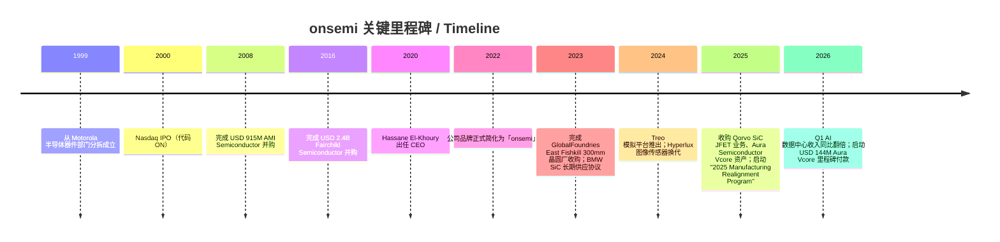
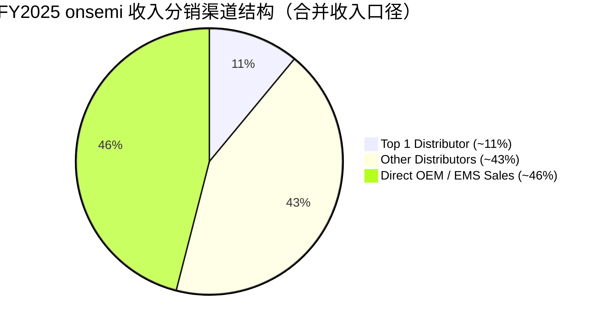
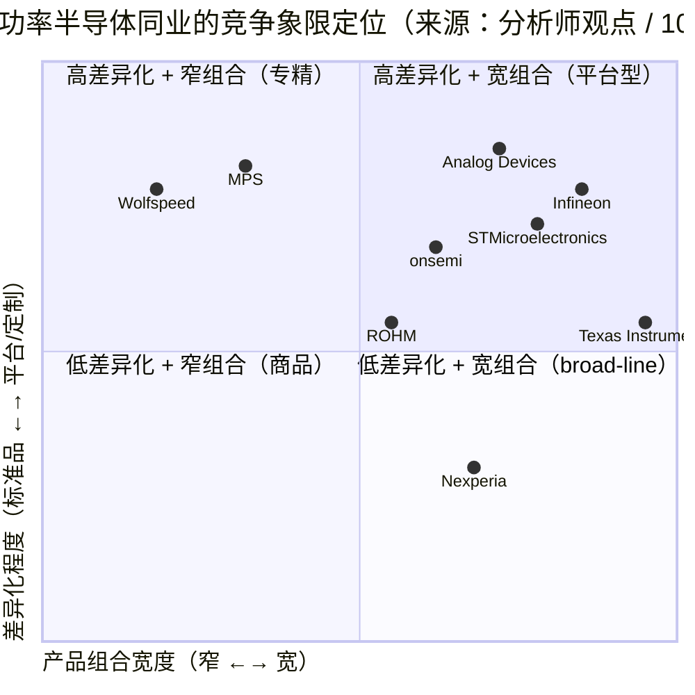

# onsemi (安森美半导体, NASDAQ:ON) 公司研究

**报告日期 / As of:** 2026-06-15
**主题归属 / Theme:** ai-power-electrification（AI 电力 / 电气化主题）
**报告语言：** Simplified Chinese (zh-CN)

---

## 投资摘要 / Investment Summary（*分析师观点 / Analyst view*）

> 本摘要为本报告作者的house view（本报告观点），不构成 onsemi 官方披露，亦不附在任何 10-K / 10-Q 引用上。评级、目标价、远期估计均为分析师判断。

| 项目 | 数值 |
|---|---|
| **评级 / Rating** | **Hold / 中性（Neutral）** |
| **12 个月目标价 / 12-mo PT** | **USD 118** |
| **当前股价 / Current price** | USD 116.79（2026-06-12 收盘）[yfinance ON, 2026-06-12](https://finance.yahoo.com/quote/ON/) |
| **隐含上行 / Implied upside** | **+1.0%** |
| **市值 / Market cap** | 约 USD 45.4 bn |
| **52 周区间 / 52-wk range** | USD 44.56 – 134.92 |
| **估值方法 / Valuation method** | FY2027E non-GAAP EPS ~USD 4.80 × 24× target P/E ≈ USD 115，叠加 AI 数据中心期权价值上修至 USD 118 |
| **过去 12 个月相对表现** | ON +128.9% vs S&P 500（同期约 +15-18%）—— 显著跑赢 [yfinance ON, 2026-06-12](https://finance.yahoo.com/quote/ON/) |

**远期估值矩阵（*分析师观点*）：**

| 倍数 | TTM / 实际 | FY2026E | FY2027E |
|---|---|---|---|
| P/E（GAAP TTM 86.5× / 远期 27.4×）| 86.5× | ~30× | ~24× |
| P/S | 7.5× | ~7.0× | ~6.2× |
| EV/EBITDA | 22.8× | ~18× | ~14× |

来源：[yfinance ON Key Statistics, 2026-06-12](https://finance.yahoo.com/quote/ON/key-statistics/)；远期倍数为分析师远期估计（*Analyst view*）。

**论点支柱（thesis pillars，*分析师观点*）：**

1. **周期底部已过，毛利率正在反转。** FY2025 是利润坍塌的周期底（GAAP 营业利润仅 USD 84.2M），但 Q1 2026 GAAP 毛利率已回升至 **38.5%**（vs Q1 2025 的 20.3%），收入 USD 1,513.3M 超指引中位数 —— 库存调整最坏阶段已过 [onsemi Q1 2026 10-Q, 2026-05-04](https://www.sec.gov/Archives/edgar/data/1097864/000109786426000014/on-20260403.htm)。
2. **AI 数据中心电源是新增长极。** 公司 Q1 2026 首次量化「AI data center revenue more than doubled year-over-year」，EliteSiC 800V AC-DC + Aura Vcore 卡位 GPU 供电树 [onsemi Q1 2026 Earnings Release, 2026-05-04](https://www.sec.gov/Archives/edgar/data/1097864/000114036126018868/ef20072220_ex99-1.htm)。
3. **垂直整合 SiC 是可防御的护城河。** 10-K 自述「vertically integrated SiC manufacturing strategy」—— 从长晶到器件全内部，是供给保障与成本优势的物理基础 [onsemi 2025 10-K, Item 1 Business — PSG](https://www.sec.gov/Archives/edgar/data/1097864/000109786426000006/on-20251231.htm)。
4. **但估值已抢跑、卖方偏谨慎。** 股价过去 12 个月翻倍后，TTM P/E 86.5× 已 price-in 2027 复苏；Street 主要机构（Morgan Stanley EW USD 85、J.P. Morgan Neutral USD 100）目标价均低于现价 —— 这是本报告给「Hold」而非「Buy」的核心理由（详见 Section 2 卖方观点演变）。

---

## 目录

1. [公司概览 / Company Overview](#1-公司概览--company-overview)
   - 1B. [GF Score 基本面评分 / GF Score](#1b-gf-score-基本面评分--gf-score)
2. [估值与目标价 / Valuation & Price Target](#2-估值与目标价--valuation--price-target)
3. [公司历史 / Company History](#3-公司历史--company-history)
4. [管理团队 / Management](#4-管理团队--management)
5. [产品与服务 / Products & Services](#5-产品与服务--products--services)
6. [客户与上市策略 / Customers & GTM](#6-客户与上市策略--customers--gtm)
7. [行业概览 / Industry Overview](#7-行业概览--industry-overview)
8. [竞争格局 / Competitive Landscape](#8-竞争格局--competitive-landscape)
9. [市场机会 / TAM & Growth](#9-市场机会--tam--growth)
10. [风险评估 / Risk Assessment](#10-风险评估--risk-assessment)
    - 10.5 [关键分歧与催化剂 / Key Debates & Catalysts](#105-关键分歧与催化剂--key-debates--catalysts)
11. [投资人视角评分 / Investor-Lens Scorecards](#11-投资人视角评分--investor-lens-scorecards)
12. [参考资料 / References](#12-参考资料--references)

---

## 1. 公司概览 / Company Overview

**onsemi（安森美半导体，NASDAQ:ON）** 是一家总部位于美国亚利桑那州 Scottsdale 的全球性功率与传感半导体（power & sensing semiconductor）公司。公司明确将自身定位为「智能功率（intelligent power）与智能传感（intelligent sensing）」解决方案供应商，下游集中在汽车电动化、工业自动化、能源基础设施以及 AI 数据中心（AI data center）四大终端市场。根据 2025 年 10-K 描述，公司「offers intelligent power and intelligent sensing solutions that drive electrification, energy efficiency, safety, and automation in automotive, industrial, and other end-markets, including AI data center」，并已经将 AI 数据中心明确列为其他终端中增长最快的子领域 ([onsemi 2025 10-K, Item 1 Business](https://www.sec.gov/Archives/edgar/data/1097864/000109786426000006/on-20251231.htm))。

公司目前由 **Hassane El-Khoury** 担任 President & CEO，2020 年 12 月上任，FY2025 财年收入为 **USD 5,995.4 million**，相较 FY2024 的 USD 7,082.3 million 同比下降约 15.3%，GAAP 毛利率从 FY2024 的 45.4% 滑落至 33.1%，GAAP 营业利润从 USD 1,767.7 million 大幅压缩至 USD 84.2 million，主要源于汽车 / 工业终端的库存调整，以及 FY2025 制造重组（"2025 Manufacturing Realignment Program"）相关的 USD 230 million 量级存货减记 ([onsemi 2025 10-K, MD&A Results of Operations](https://www.sec.gov/Archives/edgar/data/1097864/000109786426000006/on-20251231.htm))。FY2025 自由现金流（free cash flow / FCF）仍维持在 USD 1,418.6 million 的健康水平（= 经营现金流 USD 1,759.8M − CapEx USD 341.2M），说明现金转换能力没有随利润下滑而恶化 ([onsemi 2025 10-K, Consolidated Statements of Cash Flows](https://www.sec.gov/Archives/edgar/data/1097864/000109786426000006/on-20251231.htm))。

按可报告分部（reportable segments）划分，FY2025 收入构成为：**Power Solutions Group / PSG（功率解决方案）USD 2,805.1M，占 46.8%**；**Analog and Mixed-Signal Group / AMG（模拟与混合信号）USD 2,261.9M，占 37.7%**；**Intelligent Sensing Group / ISG（智能传感）USD 928.4M，占 15.5%** ([onsemi 2025 10-K, MD&A Segment Revenue Table](https://www.sec.gov/Archives/edgar/data/1097864/000109786426000006/on-20251231.htm))。终端市场维度，2025 年构成为 **Automotive 51% / Industrial 28% / Other 21%（含 AI 数据中心、消费、网络通信、计算等）**，验证了公司「电动化 + 工业 + AI 电源（AI power）」三轴并行的产品结构 ([onsemi 2025 10-K, Item 1 Business — Sample Applications](https://www.sec.gov/Archives/edgar/data/1097864/000109786426000006/on-20251231.htm))。

**估值快照（valuation snapshot）。** 截至 2026-06-12 收盘 USD 116.79，市值约 USD 45.4 bn，onsemi TTM P/E ≈ 86.5×，远期 P/E ≈ 27.4×，P/S ≈ 7.5×，P/B ≈ 6.3×，EV/EBITDA ≈ 22.8×，5 年 Beta = 1.98，52 周区间 USD 44.56–134.92，过去 52 周股价上涨约 +128.9%，公司无现金分红 ([yfinance ON Key Statistics, 2026-06-12](https://finance.yahoo.com/quote/ON/key-statistics/))。TTM P/E 显著高于 50× 的「需要解释」阈值，主要原因是 FY2025 GAAP 净利润坍塌至 USD 121 million（归母）—— 但市场实际定价的是「2026 周期复苏 + AI 数据中心电源（AI data center power）业务加速放量」的远期叙事，反映在远期 P/E 仅 27.4× 与 52 周股价倍增上；P/S 7.5× 处于功率半导体（如 Infineon ~3-4× P/S、STM ~2-3× P/S）头部位置，*分析师观点：* 这部分反映 onsemi 在 SiC 和 AI 电源（AI power）的纯度溢价 ([yfinance ON quote, 2026-06-12](https://finance.yahoo.com/quote/ON/key-statistics/))。详细的远期模型、目标价推导与卖方观点演变见 Section 2。

**最新季报增量（Q1 FY2026，已升级为 10-Q 口径）。** 公司 Q1 2026 10-Q（period ended 2026-04-03）披露 **收入 USD 1,513.3M（vs Q1 2025 的 USD 1,445.7M，同比 +4.7%，高于公司给出的指引中位数），gross profit USD 583.1M（GAAP 毛利率 38.5%，vs 去年同期 20.3%），净亏损 USD (32.9)M（vs 去年同期 USD (485.2)M，亏损大幅收窄），GAAP 摊薄每股亏损 USD (0.08)，非 GAAP 摊薄 EPS USD 0.64** ([onsemi Q1 2026 10-Q, Consolidated Statements of Operations, 2026-05-04](https://www.sec.gov/Archives/edgar/data/1097864/000109786426000014/on-20260403.htm))。10-Q 同时按「Product Technologies」口径披露 **Intelligent Power USD 772.5M / Intelligent Sensing USD 292.4M / Other USD 448.4M**，这是一个新增的产品技术维度披露 ([onsemi Q1 2026 10-Q, Segment Note, 2026-05-04](https://www.sec.gov/Archives/edgar/data/1097864/000109786426000014/on-20260403.htm))。业绩 highlights 明确指出 **「AI data center revenue more than doubled year-over-year due to broader adoption across the power tree with multiple chip vendors and leading hyperscalers」**，是公司首次正式量化 AI 数据中心电源业务的同比翻倍速度 ([onsemi Q1 2026 Earnings Release, Exhibit 99.1, 2026-05-04](https://www.sec.gov/Archives/edgar/data/1097864/000114036126018868/ef20072220_ex99-1.htm))。

**收入结构与利润表可视化。** 下面三张图分别展示 FY2025 的利润表资金流（收入如何在 COGS、opex、税后逐层分配）、分部收入结构和地理（开票地）分布。FY2025 营业利润仅 USD 84.2M，几乎全部被 COGS 与重组相关存货减记吞噬，这是周期底部的财务画像。

<svg xmlns="http://www.w3.org/2000/svg" viewBox="0 0 1000 560" width="1000" height="560" role="img" aria-label="income statement Sankey"><rect x="0" y="0" width="1000" height="560" fill="#ffffff"/>
<text x="20.00" y="30.00" text-anchor="start" font-family="Helvetica,Arial,sans-serif" font-size="15" font-weight="700" fill="#1f2933">onsemi FY2025 利润表 Sankey（USD M）</text>
<path d="M 204.00,71.00 C 258.00,71.00 258.00,85.00 312.00,85.00 L 312.00,275.89 C 258.00,275.89 258.00,261.89 204.00,261.89 Z" fill="#93c5fd" fill-opacity="0.55"/>
<path d="M 452.00,78.00 C 506.00,78.00 506.00,214.50 560.00,214.50 L 560.00,220.23 C 506.00,220.23 506.00,83.73 452.00,83.73 Z" fill="#86efac" fill-opacity="0.55"/>
<path d="M 452.00,83.73 C 506.00,83.73 506.00,234.23 560.00,234.23 L 560.00,363.50 C 506.00,363.50 506.00,213.01 452.00,213.01 Z" fill="#fca5a5" fill-opacity="0.55"/>
<path d="M 328.00,85.00 C 382.00,85.00 382.00,78.00 436.00,78.00 L 436.00,213.01 C 382.00,213.01 382.00,220.01 328.00,220.01 Z" fill="#86efac" fill-opacity="0.55"/>
<path d="M 328.00,220.01 C 382.00,220.01 382.00,227.01 436.00,227.01 L 436.00,500.00 C 382.00,500.00 382.00,493.00 328.00,493.00 Z" fill="#fca5a5" fill-opacity="0.55"/>
<path d="M 700.00,198.89 C 754.00,198.89 754.00,276.88 808.00,276.88 L 808.00,285.12 C 754.00,285.12 754.00,207.13 700.00,207.13 Z" fill="#86efac" fill-opacity="0.55"/>
<path d="M 700.00,207.13 C 754.00,207.13 754.00,299.12 808.00,299.12 L 808.00,301.12 C 754.00,301.12 754.00,209.13 700.00,209.13 Z" fill="#fca5a5" fill-opacity="0.55"/>
<path d="M 576.00,214.50 C 630.00,214.50 630.00,198.89 684.00,198.89 L 684.00,204.62 C 630.00,204.62 630.00,220.23 576.00,220.23 Z" fill="#86efac" fill-opacity="0.55"/>
<path d="M 576.00,234.23 C 630.00,234.23 630.00,221.83 684.00,221.83 L 684.00,269.94 C 630.00,269.94 630.00,282.34 576.00,282.34 Z" fill="#fca5a5" fill-opacity="0.55"/>
<path d="M 576.00,282.34 C 630.00,282.34 630.00,283.94 684.00,283.94 L 684.00,351.99 C 630.00,351.99 630.00,350.39 576.00,350.39 Z" fill="#fca5a5" fill-opacity="0.55"/>
<path d="M 576.00,350.39 C 630.00,350.39 630.00,365.99 684.00,365.99 L 684.00,379.11 C 630.00,379.11 630.00,363.50 576.00,363.50 Z" fill="#fca5a5" fill-opacity="0.55"/>
<path d="M 204.00,275.89 C 258.00,275.89 258.00,275.89 312.00,275.89 L 312.00,429.82 C 258.00,429.82 258.00,429.82 204.00,429.82 Z" fill="#93c5fd" fill-opacity="0.55"/>
<path d="M 204.00,443.82 C 258.00,443.82 258.00,429.82 312.00,429.82 L 312.00,493.00 C 258.00,493.00 258.00,507.00 204.00,507.00 Z" fill="#93c5fd" fill-opacity="0.55"/>
<rect x="188.00" y="71.00" width="16" height="190.89" rx="1.5" fill="#2563eb"/>
<rect x="188.00" y="275.89" width="16" height="153.93" rx="1.5" fill="#2563eb"/>
<rect x="188.00" y="443.82" width="16" height="63.18" rx="1.5" fill="#2563eb"/>
<rect x="312.00" y="85.00" width="16" height="408.00" rx="1.5" fill="#1e3a8a"/>
<rect x="436.00" y="78.00" width="16" height="135.01" rx="1.5" fill="#15803d"/>
<rect x="436.00" y="227.01" width="16" height="272.99" rx="1.5" fill="#dc2626"/>
<rect x="560.00" y="214.50" width="16" height="5.73" rx="1.5" fill="#15803d"/>
<rect x="560.00" y="234.23" width="16" height="129.28" rx="1.5" fill="#dc2626"/>
<rect x="684.00" y="198.89" width="16" height="8.94" rx="1.5" fill="#15803d"/>
<rect x="684.00" y="221.83" width="16" height="48.11" rx="1.5" fill="#dc2626"/>
<rect x="684.00" y="283.94" width="16" height="68.05" rx="1.5" fill="#dc2626"/>
<rect x="684.00" y="365.99" width="16" height="13.11" rx="1.5" fill="#dc2626"/>
<rect x="808.00" y="276.88" width="16" height="8.23" rx="1.5" fill="#15803d"/>
<rect x="808.00" y="299.12" width="16" height="2.00" rx="1.5" fill="#dc2626"/>
<text x="179.00" y="163.45" text-anchor="end" font-family="Helvetica,Arial,sans-serif" font-size="11.5" font-weight="700" fill="#1f2933">PSG 功率方案</text>
<text x="179.00" y="176.45" text-anchor="end" font-family="Helvetica,Arial,sans-serif" font-size="10" font-weight="400" fill="#52606d">US$2.8B  (46.8%)</text>
<text x="179.00" y="349.86" text-anchor="end" font-family="Helvetica,Arial,sans-serif" font-size="11.5" font-weight="700" fill="#1f2933">AMG 模拟混合信号</text>
<text x="179.00" y="362.86" text-anchor="end" font-family="Helvetica,Arial,sans-serif" font-size="10" font-weight="400" fill="#52606d">US$2.3B  (37.7%)</text>
<text x="179.00" y="472.41" text-anchor="end" font-family="Helvetica,Arial,sans-serif" font-size="11.5" font-weight="700" fill="#1f2933">ISG 智能传感</text>
<text x="179.00" y="485.41" text-anchor="end" font-family="Helvetica,Arial,sans-serif" font-size="10" font-weight="400" fill="#52606d">US$928.4M  (15.5%)</text>
<rect x="331.00" y="67.00" width="113.10" height="26" rx="2" fill="#ffffff" fill-opacity="0.72"/>
<text x="334.00" y="79.00" text-anchor="start" font-family="Helvetica,Arial,sans-serif" font-size="11.5" font-weight="700" fill="#1f2933">Revenue</text>
<text x="334.00" y="92.00" text-anchor="start" font-family="Helvetica,Arial,sans-serif" font-size="10" font-weight="400" fill="#52606d">US$6.0B  (100.0%)</text>
<rect x="455.00" y="60.00" width="106.80" height="26" rx="2" fill="#ffffff" fill-opacity="0.72"/>
<text x="458.00" y="72.00" text-anchor="start" font-family="Helvetica,Arial,sans-serif" font-size="11.5" font-weight="700" fill="#1f2933">Gross Profit</text>
<text x="458.00" y="85.00" text-anchor="start" font-family="Helvetica,Arial,sans-serif" font-size="10" font-weight="400" fill="#52606d">US$2.0B  (33.1%)</text>
<rect x="455.00" y="209.01" width="144.60" height="26" rx="2" fill="#ffffff" fill-opacity="0.72"/>
<text x="458.00" y="221.01" text-anchor="start" font-family="Helvetica,Arial,sans-serif" font-size="11.5" font-weight="700" fill="#1f2933">Cost of Revenue (COGS)</text>
<text x="458.00" y="234.01" text-anchor="start" font-family="Helvetica,Arial,sans-serif" font-size="10" font-weight="400" fill="#52606d">US$4.0B  (66.9%)</text>
<rect x="579.00" y="196.50" width="106.80" height="26" rx="2" fill="#ffffff" fill-opacity="0.72"/>
<text x="582.00" y="208.50" text-anchor="start" font-family="Helvetica,Arial,sans-serif" font-size="11.5" font-weight="700" fill="#1f2933">Operating Income</text>
<text x="582.00" y="221.50" text-anchor="start" font-family="Helvetica,Arial,sans-serif" font-size="10" font-weight="400" fill="#52606d">US$84.2M  (1.4%)</text>
<rect x="579.00" y="221.50" width="150.90" height="26" rx="2" fill="#ffffff" fill-opacity="0.72"/>
<text x="582.00" y="233.50" text-anchor="start" font-family="Helvetica,Arial,sans-serif" font-size="11.5" font-weight="700" fill="#1f2933">Total Operating Expense</text>
<text x="582.00" y="246.50" text-anchor="start" font-family="Helvetica,Arial,sans-serif" font-size="10" font-weight="400" fill="#52606d">US$1.9B  (31.7%)</text>
<rect x="703.00" y="180.89" width="113.10" height="26" rx="2" fill="#ffffff" fill-opacity="0.72"/>
<text x="706.00" y="192.89" text-anchor="start" font-family="Helvetica,Arial,sans-serif" font-size="11.5" font-weight="700" fill="#1f2933">Pretax Income</text>
<text x="706.00" y="205.89" text-anchor="start" font-family="Helvetica,Arial,sans-serif" font-size="10" font-weight="400" fill="#52606d">US$131.3M  (2.2%)</text>
<rect x="703.00" y="205.89" width="119.40" height="26" rx="2" fill="#ffffff" fill-opacity="0.72"/>
<text x="706.00" y="217.89" text-anchor="start" font-family="Helvetica,Arial,sans-serif" font-size="11.5" font-weight="700" fill="#1f2933">SG&amp;A</text>
<text x="706.00" y="230.89" text-anchor="start" font-family="Helvetica,Arial,sans-serif" font-size="10" font-weight="400" fill="#52606d">US$707.0M  (11.8%)</text>
<rect x="703.00" y="265.94" width="106.80" height="26" rx="2" fill="#ffffff" fill-opacity="0.72"/>
<text x="706.00" y="277.94" text-anchor="start" font-family="Helvetica,Arial,sans-serif" font-size="11.5" font-weight="700" fill="#1f2933">R&amp;D</text>
<text x="706.00" y="290.94" text-anchor="start" font-family="Helvetica,Arial,sans-serif" font-size="10" font-weight="400" fill="#52606d">US$1.0B  (16.7%)</text>
<rect x="703.00" y="347.99" width="113.10" height="26" rx="2" fill="#ffffff" fill-opacity="0.72"/>
<text x="706.00" y="359.99" text-anchor="start" font-family="Helvetica,Arial,sans-serif" font-size="11.5" font-weight="700" fill="#1f2933">Other OpEx</text>
<text x="706.00" y="372.99" text-anchor="start" font-family="Helvetica,Arial,sans-serif" font-size="10" font-weight="400" fill="#52606d">US$192.7M  (3.2%)</text>
<text x="833.00" y="278.00" text-anchor="start" font-family="Helvetica,Arial,sans-serif" font-size="11.5" font-weight="700" fill="#1f2933">Net Income</text>
<text x="833.00" y="291.00" text-anchor="start" font-family="Helvetica,Arial,sans-serif" font-size="10" font-weight="400" fill="#52606d">US$121.0M  (2.0%)</text>
<text x="833.00" y="303.00" text-anchor="start" font-family="Helvetica,Arial,sans-serif" font-size="11.5" font-weight="700" fill="#1f2933">Income Tax</text>
<text x="833.00" y="316.00" text-anchor="start" font-family="Helvetica,Arial,sans-serif" font-size="10" font-weight="400" fill="#52606d">US$7.7M  (0.13%)</text>
<text x="500.00" y="530.00" text-anchor="middle" font-family="Helvetica,Arial,sans-serif" font-size="10" font-weight="400" font-style="italic" fill="#8a97a3">FY2025 营业利润 84.2M（重组拖累）</text>
<text x="500.00" y="544.00" text-anchor="middle" font-family="Helvetica,Arial,sans-serif" font-size="10" font-weight="400" fill="#52606d">Source: onsemi 2025 10-K (FY2025 vs FY2024) · SEC EDGAR</text>
</svg>

*图 1：onsemi FY2025 利润表 Sankey。* 来源：[onsemi 2025 10-K, Consolidated Statement of Operations](https://www.sec.gov/Archives/edgar/data/1097864/000109786426000006/on-20251231.htm)。

<svg xmlns="http://www.w3.org/2000/svg" viewBox="0 0 720 460" width="720" height="460" role="img" aria-label="revenue donut"><rect x="0" y="0" width="720" height="460" fill="#ffffff"/>
<text x="20.00" y="30.00" text-anchor="start" font-family="Helvetica,Arial,sans-serif" font-size="15" font-weight="700" fill="#1f2933">onsemi FY2025 收入分部结构（USD M）</text>
<path d="M 288.00,107.20 A 132 132 0 0 1 314.46,368.52 L 303.64,315.62 A 78 78 0 0 0 288.00,161.20 Z" fill="#2563eb"/>
<path d="M 314.46,368.52 A 132 132 0 0 1 178.89,164.90 L 223.53,195.30 A 78 78 0 0 0 303.64,315.62 Z" fill="#15803d"/>
<path d="M 178.89,164.90 A 132 132 0 0 1 288.00,107.20 L 288.00,161.20 A 78 78 0 0 0 223.53,195.30 Z" fill="#d97706"/>
<text x="288.00" y="235.20" text-anchor="middle" font-family="Helvetica,Arial,sans-serif" font-size="18" font-weight="800" fill="#1f2933">ON FY25</text>
<text x="288.00" y="255.20" text-anchor="middle" font-family="Helvetica,Arial,sans-serif" font-size="13" font-weight="600" fill="#52606d">US$6.0B</text>
<text x="288.00" y="271.20" text-anchor="middle" font-family="Helvetica,Arial,sans-serif" font-size="10" font-weight="400" fill="#8a97a3">total</text>
<line x1="425.30" y1="225.30" x2="441.30" y2="225.30" stroke="#2563eb" stroke-width="1.4"/>
<text x="445.30" y="223.30" text-anchor="start" font-family="Helvetica,Arial,sans-serif" font-size="11" font-weight="700" fill="#1f2933">PSG 功率方案</text>
<text x="445.30" y="237.30" text-anchor="start" font-family="Helvetica,Arial,sans-serif" font-size="10" font-weight="400" fill="#52606d">US$2.8B  (46.8%)</text>
<line x1="173.13" y1="315.68" x2="157.13" y2="315.68" stroke="#15803d" stroke-width="1.4"/>
<text x="153.13" y="313.68" text-anchor="end" font-family="Helvetica,Arial,sans-serif" font-size="11" font-weight="700" fill="#1f2933">AMG 模拟混合信号</text>
<text x="153.13" y="327.68" text-anchor="end" font-family="Helvetica,Arial,sans-serif" font-size="10" font-weight="400" fill="#52606d">US$2.3B  (37.7%)</text>
<line x1="223.48" y1="117.21" x2="207.48" y2="117.21" stroke="#d97706" stroke-width="1.4"/>
<text x="203.48" y="115.21" text-anchor="end" font-family="Helvetica,Arial,sans-serif" font-size="11" font-weight="700" fill="#1f2933">ISG 智能传感</text>
<text x="203.48" y="129.21" text-anchor="end" font-family="Helvetica,Arial,sans-serif" font-size="10" font-weight="400" fill="#52606d">US$928.4M  (15.5%)</text>
<text x="360.00" y="444.00" text-anchor="middle" font-family="Helvetica,Arial,sans-serif" font-size="10" font-weight="400" fill="#52606d">Source: onsemi 2025 10-K — MD&amp;A Segment &amp; Geographic tables · SEC EDGAR</text>
</svg>

*图 2：FY2025 分部收入结构（PSG / AMG / ISG）。* 来源：[onsemi 2025 10-K, MD&A Segment Revenue](https://www.sec.gov/Archives/edgar/data/1097864/000109786426000006/on-20251231.htm)。

<svg xmlns="http://www.w3.org/2000/svg" viewBox="0 0 860 470" width="860" height="470" role="img" aria-label="historical revenue bars"><rect x="0" y="0" width="860" height="470" fill="#ffffff"/>
<text x="20.00" y="30.00" text-anchor="start" font-family="Helvetica,Arial,sans-serif" font-size="15" font-weight="700" fill="#1f2933">onsemi 分部收入历史（FY2023–FY2025, USD M）</text>
<rect x="20.00" y="44" width="11" height="11" rx="2" fill="#2563eb"/>
<text x="36.00" y="53.00" text-anchor="start" font-family="Helvetica,Arial,sans-serif" font-size="10.5" font-weight="400" fill="#1f2933">PSG 功率方案</text>
<rect x="102.80" y="44" width="11" height="11" rx="2" fill="#15803d"/>
<text x="118.80" y="53.00" text-anchor="start" font-family="Helvetica,Arial,sans-serif" font-size="10.5" font-weight="400" fill="#1f2933">AMG 模拟混合信号</text>
<rect x="198.80" y="44" width="11" height="11" rx="2" fill="#d97706"/>
<text x="214.80" y="53.00" text-anchor="start" font-family="Helvetica,Arial,sans-serif" font-size="10.5" font-weight="400" fill="#1f2933">ISG 智能传感</text>
<line x1="70" y1="412.00" x2="834" y2="412.00" stroke="#eceff2" stroke-width="1"/>
<text x="64.00" y="415.00" text-anchor="end" font-family="Helvetica,Arial,sans-serif" font-size="9.5" font-weight="400" fill="#52606d">US$0</text>
<line x1="70" y1="345.20" x2="834" y2="345.20" stroke="#eceff2" stroke-width="1"/>
<text x="64.00" y="348.20" text-anchor="end" font-family="Helvetica,Arial,sans-serif" font-size="9.5" font-weight="400" fill="#52606d">US$1.8B</text>
<line x1="70" y1="278.40" x2="834" y2="278.40" stroke="#eceff2" stroke-width="1"/>
<text x="64.00" y="281.40" text-anchor="end" font-family="Helvetica,Arial,sans-serif" font-size="9.5" font-weight="400" fill="#52606d">US$3.6B</text>
<line x1="70" y1="211.60" x2="834" y2="211.60" stroke="#eceff2" stroke-width="1"/>
<text x="64.00" y="214.60" text-anchor="end" font-family="Helvetica,Arial,sans-serif" font-size="9.5" font-weight="400" fill="#52606d">US$5.3B</text>
<line x1="70" y1="144.80" x2="834" y2="144.80" stroke="#eceff2" stroke-width="1"/>
<text x="64.00" y="147.80" text-anchor="end" font-family="Helvetica,Arial,sans-serif" font-size="9.5" font-weight="400" fill="#52606d">US$7.1B</text>
<line x1="70" y1="78.00" x2="834" y2="78.00" stroke="#eceff2" stroke-width="1"/>
<text x="64.00" y="81.00" text-anchor="end" font-family="Helvetica,Arial,sans-serif" font-size="9.5" font-weight="400" fill="#52606d">US$8.9B</text>
<rect x="123.48" y="266.59" width="147.71" height="145.41" fill="#2563eb"/>
<rect x="123.48" y="152.04" width="147.71" height="114.56" fill="#15803d"/>
<rect x="123.48" y="102.74" width="147.71" height="49.29" fill="#d97706"/>
<text x="197.33" y="428.00" text-anchor="middle" font-family="Helvetica,Arial,sans-serif" font-size="10" font-weight="400" fill="#52606d">2023</text>
<rect x="378.15" y="286.54" width="147.71" height="125.46" fill="#2563eb"/>
<rect x="378.15" y="188.77" width="147.71" height="97.77" fill="#15803d"/>
<rect x="378.15" y="146.61" width="147.71" height="42.16" fill="#d97706"/>
<text x="452.00" y="428.00" text-anchor="middle" font-family="Helvetica,Arial,sans-serif" font-size="10" font-weight="400" fill="#52606d">2024</text>
<rect x="632.81" y="306.89" width="147.71" height="105.11" fill="#2563eb"/>
<rect x="632.81" y="222.13" width="147.71" height="84.76" fill="#15803d"/>
<rect x="632.81" y="187.34" width="147.71" height="34.79" fill="#d97706"/>
<text x="706.67" y="428.00" text-anchor="middle" font-family="Helvetica,Arial,sans-serif" font-size="10" font-weight="400" fill="#52606d">2025</text>
<text x="430.00" y="454.00" text-anchor="middle" font-family="Helvetica,Arial,sans-serif" font-size="10" font-weight="400" fill="#52606d">Source: onsemi 2025 &amp; 2024 10-K — MD&amp;A Segment Revenue tables · SEC EDGAR</text>
</svg>

*图 3：FY2023–FY2025 分部收入历史 —— 三大分部全线下滑印证周期性下行。* 来源：[onsemi 2025 & 2024 10-K, MD&A Segment Revenue](https://www.sec.gov/Archives/edgar/data/1097864/000109786426000006/on-20251231.htm)。

---

## 1B. GF Score 基本面评分 / GF Score

*分析师观点：* GF Score 是参照 GuruFocus GF Score™ 的五维基本面评分（Financial Strength / Profitability / Growth / GF Value / Momentum，各轴 0-10），是本报告作者的评分 rubric，**不归属 GuruFocus，也不附在任何 filing 引用上**；每个底层指标自带行内引用。

<svg xmlns="http://www.w3.org/2000/svg" viewBox="0 0 500 500" width="500" height="500" role="img" aria-label="GF Score radar">
<rect x="0" y="0" width="500" height="500" fill="#ffffff"/>
<text x="20" y="24" font-family="Helvetica,Arial,sans-serif" font-size="15" font-weight="700" fill="#1f2933">GF Score (GuruFocus-style): 50/100</text>
<text x="20" y="41" font-family="Helvetica,Arial,sans-serif" font-size="11" fill="#52606d">0–50 Worst future performance potential / insufficient data</text>
<polygon points="250.0,88.0 392.7,191.6 338.2,359.4 161.8,359.4 107.3,191.6" fill="#e9f5ec" stroke="none"/>
<polygon points="250.0,208.0 278.5,228.7 267.6,262.3 232.4,262.3 221.5,228.7" fill="none" stroke="#c5d3cb" stroke-width="1"/>
<polygon points="250.0,178.0 307.1,219.5 285.3,286.5 214.7,286.5 192.9,219.5" fill="none" stroke="#c5d3cb" stroke-width="1"/>
<polygon points="250.0,148.0 335.6,210.2 302.9,310.8 197.1,310.8 164.4,210.2" fill="none" stroke="#c5d3cb" stroke-width="1"/>
<polygon points="250.0,118.0 364.1,200.9 320.5,335.1 179.5,335.1 135.9,200.9" fill="none" stroke="#c5d3cb" stroke-width="1"/>
<polygon points="250.0,88.0 392.7,191.6 338.2,359.4 161.8,359.4 107.3,191.6" fill="none" stroke="#c5d3cb" stroke-width="1.3"/>
<line x1="250" y1="238" x2="161.8" y2="359.4" stroke="#cfdad3" stroke-width="1"/>
<text x="146.5" y="392.4" text-anchor="end" font-family="Helvetica,Arial,sans-serif" font-size="11.5" font-weight="600" fill="#1f2933">财务实力</text>
<text x="197.1" y="304.8" text-anchor="middle" font-family="Helvetica,Arial,sans-serif" font-size="10.5" font-weight="700" fill="#1f2933">6</text>
<line x1="250" y1="238" x2="250.0" y2="88.0" stroke="#cfdad3" stroke-width="1"/>
<text x="250.0" y="58.0" text-anchor="middle" font-family="Helvetica,Arial,sans-serif" font-size="11.5" font-weight="600" fill="#1f2933">盈利能力</text>
<text x="250.0" y="172.0" text-anchor="middle" font-family="Helvetica,Arial,sans-serif" font-size="10.5" font-weight="700" fill="#1f2933">4</text>
<line x1="250" y1="238" x2="107.3" y2="191.6" stroke="#cfdad3" stroke-width="1"/>
<text x="82.6" y="183.6" text-anchor="end" font-family="Helvetica,Arial,sans-serif" font-size="11.5" font-weight="600" fill="#1f2933">成长性</text>
<text x="192.9" y="213.5" text-anchor="middle" font-family="Helvetica,Arial,sans-serif" font-size="10.5" font-weight="700" fill="#1f2933">4</text>
<line x1="250" y1="238" x2="392.7" y2="191.6" stroke="#cfdad3" stroke-width="1"/>
<text x="417.4" y="183.6" text-anchor="start" font-family="Helvetica,Arial,sans-serif" font-size="11.5" font-weight="600" fill="#1f2933">估值</text>
<text x="292.8" y="218.1" text-anchor="middle" font-family="Helvetica,Arial,sans-serif" font-size="10.5" font-weight="700" fill="#1f2933">3</text>
<line x1="250" y1="238" x2="338.2" y2="359.4" stroke="#cfdad3" stroke-width="1"/>
<text x="353.5" y="392.4" text-anchor="start" font-family="Helvetica,Arial,sans-serif" font-size="11.5" font-weight="600" fill="#1f2933">动量</text>
<text x="329.4" y="341.2" text-anchor="middle" font-family="Helvetica,Arial,sans-serif" font-size="10.5" font-weight="700" fill="#1f2933">9</text>
<polygon points="250.0,178.0 292.8,224.1 329.4,347.2 197.1,310.8 192.9,219.5" fill="#2e8b57" fill-opacity="0.34" stroke="#2e8b57" stroke-width="2"/>
<circle cx="197.1" cy="310.8" r="2.6" fill="#2e8b57"/>
<circle cx="250.0" cy="178.0" r="2.6" fill="#2e8b57"/>
<circle cx="192.9" cy="219.5" r="2.6" fill="#2e8b57"/>
<circle cx="292.8" cy="224.1" r="2.6" fill="#2e8b57"/>
<circle cx="329.4" cy="347.2" r="2.6" fill="#2e8b57"/>
<text x="250" y="470" text-anchor="middle" font-family="Helvetica,Arial,sans-serif" font-size="9.5" fill="#52606d">Source: onsemi 2025 10-K · Q1'26 10-Q · yfinance (2026-06-12) · indicators.db 2026-06-07</text>
<text x="250" y="485" text-anchor="middle" font-family="Helvetica,Arial,sans-serif" font-size="9" fill="#52606d">GF Score = independent analyst rubric (*Analyst view:*) — not GuruFocus™ official number</text>
</svg>

*图 4：onsemi GF Score 基本面雷达。* 来源：分析师评分，底层指标见下方各维度说明。

**各维度评分理由（why these scores）：**

- **Financial Strength（财务稳健性）= 6/10。** FY2025 现金及短投 USD 2,547.6M、长期债务 USD 2,980.5M，净债务很低；CFO USD 1,759.8M、FCF USD 1,418.6M 在利润坍塌之年仍然健康，现金转换没有恶化 ([onsemi 2025 10-K, Balance Sheet & Cash Flow](https://www.sec.gov/Archives/edgar/data/1097864/000109786426000006/on-20251231.htm))。扣分项是周期性 IDM 的高固定成本与重组中的产能。
- **Profitability（盈利能力）= 4/10。** FY2025 GAAP 营业利润率仅 1.4%（USD 84.2M / 5,995.4M）、ROE ≈ 1.5%，是周期底部读数；正常年份（FY2024 营业利润率约 25%）的盈利能力远高，但当下评分必须反映实际 ([onsemi 2025 10-K, MD&A](https://www.sec.gov/Archives/edgar/data/1097864/000109786426000006/on-20251231.htm))。
- **Growth（成长性）= 4/10。** FY2025 收入同比 −15.3%，3 年呈下行（FY2023 8.25B → FY2025 6.0B）；远期复苏（AI 数据中心翻倍、SiC 渗透）尚未体现在实际数字里，Q1 2026 同比 +4.7% 是第一个转正季 ([onsemi Q1 2026 10-Q](https://www.sec.gov/Archives/edgar/data/1097864/000109786426000014/on-20260403.htm))。
- **GF Value（估值，越高=越便宜）= 3/10。** TTM P/E 86.5×、远期 P/E 27.4×、P/S 7.5× 均处于功率半导体头部，相对 Infineon / STM 溢价显著，安全边际薄 ([yfinance ON Key Statistics, 2026-06-12](https://finance.yahoo.com/quote/ON/key-statistics/))。
- **Momentum（动量）= 9/10。** 过去 12 个月 +128.9%，远超 S&P 500 同期约 +15-18%，且接近 52 周高点 USD 134.92 —— 动量极强，但也是估值抢跑的来源 ([yfinance ON, 2026-06-12](https://finance.yahoo.com/quote/ON/key-statistics/))。

**综合解读：** 高 Momentum + 弱 Profitability/Growth + 贵 Value 的组合，是典型的「市场提前定价周期复苏」画像 —— 基本面尚未追上股价，这与本报告 Hold 评级一致。

---

## 2. 估值与目标价 / Valuation & Price Target

*本节全部为分析师远期判断（Analyst view），不附在任何 filing 引用上 —— 10-K 不含目标价。*

### 2.1 远期财务模型（forward estimates，*分析师观点*）

模型基于 10-K 分部数据 + 管理层指引 + 行业 SiC/AI 电源渗透路径搭建。各投影单元为分析师估计；驱动因子的外部依据行内引用。

| 财年 | 收入 (USD M) | YoY | GAAP 毛利率 | 营业利润率 | non-GAAP EPS (USD) |
|---|---|---|---|---|---|
| FY2025A | 5,995.4 | −15.3% | 33.1% | 1.4% | ~2.55 |
| **FY2026E** | **~6,300** | **+5%** | **~39%** | **~17%** | **~3.80** |
| **FY2027E** | **~7,100** | **+13%** | **~43%** | **~24%** | **~4.80** |
| **FY2028E** | **~7,900** | **+11%** | **~45%** | **~27%** | **~5.70** |

模型驱动因子：(1) 汽车/工业去库存在 FY2026 触底回升（Q1 2026 收入已转正 +4.7% [onsemi Q1 2026 10-Q](https://www.sec.gov/Archives/edgar/data/1097864/000109786426000014/on-20260403.htm)）；(2) 利用率回升驱动毛利率从 33% 逐年修复至 45%（Q1 2026 已回到 38.5% [onsemi Q1 2026 10-Q](https://www.sec.gov/Archives/edgar/data/1097864/000109786426000014/on-20260403.htm)）；(3) AI 数据中心收入翻倍带来增量 ([onsemi Q1 2026 Earnings Release](https://www.sec.gov/Archives/edgar/data/1097864/000114036126018868/ef20072220_ex99-1.htm))；(4) SiC 在 EV 牵引逆变器渗透率 2027-30 提升至 50%+（行业路径，见 Section 9）。FY2025 non-GAAP EPS ~2.55 系分析师按 non-GAAP 口径估计（GAAP 归母 USD 121.0M / ~389M 股 = GAAP EPS ~0.31，non-GAAP 因剔除重组/无形摊销而高于 GAAP）。

<svg xmlns="http://www.w3.org/2000/svg" viewBox="0 0 1240 540" width="1240" height="540" role="img" aria-label="DuPont ROE decomposition"><rect x="0" y="0" width="1240" height="540" fill="#ffffff"/>
<text x="20.00" y="30.00" text-anchor="start" font-family="Helvetica,Arial,sans-serif" font-size="15" font-weight="700" fill="#1f2933">onsemi FY2025 DuPont ROE 分解</text>
<rect x="545.00" y="56.00" width="150" height="56" rx="7" fill="#1e3a8a"/>
<text x="620.00" y="76.00" text-anchor="middle" font-family="Helvetica,Arial,sans-serif" font-size="11.5" font-weight="700" fill="#ffffff">ROE</text>
<text x="620.00" y="94.00" text-anchor="middle" font-family="Helvetica,Arial,sans-serif" font-size="13" font-weight="800" fill="#ffffff">1.47%</text>
<text x="620.00" y="106.00" text-anchor="middle" font-family="Helvetica,Arial,sans-serif" font-size="8.5" font-weight="400" fill="#dbeafe">= Net Income / Avg Equity</text>
<rect x="191.60" y="168.00" width="150" height="56" rx="7" fill="#2563eb"/>
<text x="266.60" y="188.00" text-anchor="middle" font-family="Helvetica,Arial,sans-serif" font-size="11.5" font-weight="700" fill="#ffffff">Net Margin</text>
<text x="266.60" y="206.00" text-anchor="middle" font-family="Helvetica,Arial,sans-serif" font-size="13" font-weight="800" fill="#ffffff">2.02%</text>
<text x="266.60" y="218.00" text-anchor="middle" font-family="Helvetica,Arial,sans-serif" font-size="8.5" font-weight="400" fill="#dbeafe">Net Income / Revenue</text>
<line x1="620.00" y1="112.00" x2="266.60" y2="168.00" stroke="#94a3b8" stroke-width="1.4"/>
<rect x="545.00" y="168.00" width="150" height="56" rx="7" fill="#2563eb"/>
<text x="620.00" y="188.00" text-anchor="middle" font-family="Helvetica,Arial,sans-serif" font-size="11.5" font-weight="700" fill="#ffffff">Asset Turnover</text>
<text x="620.00" y="206.00" text-anchor="middle" font-family="Helvetica,Arial,sans-serif" font-size="13" font-weight="800" fill="#ffffff">0.45</text>
<text x="620.00" y="218.00" text-anchor="middle" font-family="Helvetica,Arial,sans-serif" font-size="8.5" font-weight="400" fill="#dbeafe">Revenue / Avg Assets</text>
<line x1="620.00" y1="112.00" x2="620.00" y2="168.00" stroke="#94a3b8" stroke-width="1.4"/>
<rect x="898.40" y="168.00" width="150" height="56" rx="7" fill="#2563eb"/>
<text x="973.40" y="188.00" text-anchor="middle" font-family="Helvetica,Arial,sans-serif" font-size="11.5" font-weight="700" fill="#ffffff">Equity Multiplier</text>
<text x="973.40" y="206.00" text-anchor="middle" font-family="Helvetica,Arial,sans-serif" font-size="13" font-weight="800" fill="#ffffff">1.62</text>
<text x="973.40" y="218.00" text-anchor="middle" font-family="Helvetica,Arial,sans-serif" font-size="8.5" font-weight="400" fill="#dbeafe">Avg Assets / Avg Equity</text>
<line x1="620.00" y1="112.00" x2="973.40" y2="168.00" stroke="#94a3b8" stroke-width="1.4"/>
<circle cx="443.30" cy="196.00" r="11" fill="#ffffff" stroke="#94a3b8" stroke-width="1.2"/>
<text x="443.30" y="201.00" text-anchor="middle" font-family="Helvetica,Arial,sans-serif" font-size="14" font-weight="800" fill="#52606d">×</text>
<circle cx="796.70" cy="196.00" r="11" fill="#ffffff" stroke="#94a3b8" stroke-width="1.2"/>
<text x="796.70" y="201.00" text-anchor="middle" font-family="Helvetica,Arial,sans-serif" font-size="14" font-weight="800" fill="#52606d">×</text>
<rect x="65.00" y="300.00" width="118" height="56" rx="7" fill="#2563eb"/>
<text x="124.00" y="320.00" text-anchor="middle" font-family="Helvetica,Arial,sans-serif" font-size="11.5" font-weight="700" fill="#ffffff">Operating Margin</text>
<text x="124.00" y="338.00" text-anchor="middle" font-family="Helvetica,Arial,sans-serif" font-size="13" font-weight="800" fill="#ffffff">1.40%</text>
<text x="124.00" y="350.00" text-anchor="middle" font-family="Helvetica,Arial,sans-serif" font-size="8.5" font-weight="400" fill="#dbeafe">Op Inc / Revenue</text>
<line x1="266.60" y1="224.00" x2="124.00" y2="300.00" stroke="#94a3b8" stroke-width="1.4"/>
<rect x="207.60" y="300.00" width="118" height="56" rx="7" fill="#2563eb"/>
<text x="266.60" y="320.00" text-anchor="middle" font-family="Helvetica,Arial,sans-serif" font-size="11.5" font-weight="700" fill="#ffffff">Tax Burden</text>
<text x="266.60" y="338.00" text-anchor="middle" font-family="Helvetica,Arial,sans-serif" font-size="13" font-weight="800" fill="#ffffff">0.9216</text>
<text x="266.60" y="350.00" text-anchor="middle" font-family="Helvetica,Arial,sans-serif" font-size="8.5" font-weight="400" fill="#dbeafe">Net Inc / Pretax</text>
<line x1="266.60" y1="224.00" x2="266.60" y2="300.00" stroke="#94a3b8" stroke-width="1.4"/>
<rect x="350.20" y="300.00" width="118" height="56" rx="7" fill="#2563eb"/>
<text x="409.20" y="320.00" text-anchor="middle" font-family="Helvetica,Arial,sans-serif" font-size="11.5" font-weight="700" fill="#ffffff">Interest Burden</text>
<text x="409.20" y="338.00" text-anchor="middle" font-family="Helvetica,Arial,sans-serif" font-size="13" font-weight="800" fill="#ffffff">1.5594</text>
<text x="409.20" y="350.00" text-anchor="middle" font-family="Helvetica,Arial,sans-serif" font-size="8.5" font-weight="400" fill="#dbeafe">Pretax / Op Inc</text>
<line x1="266.60" y1="224.00" x2="409.20" y2="300.00" stroke="#94a3b8" stroke-width="1.4"/>
<circle cx="195.30" cy="328.00" r="11" fill="#ffffff" stroke="#94a3b8" stroke-width="1.2"/>
<text x="195.30" y="333.00" text-anchor="middle" font-family="Helvetica,Arial,sans-serif" font-size="14" font-weight="800" fill="#52606d">×</text>
<circle cx="337.90" cy="328.00" r="11" fill="#ffffff" stroke="#94a3b8" stroke-width="1.2"/>
<text x="337.90" y="333.00" text-anchor="middle" font-family="Helvetica,Arial,sans-serif" font-size="14" font-weight="800" fill="#52606d">×</text>
<rect x="479.00" y="300.00" width="118" height="56" rx="7" fill="#2563eb"/>
<text x="538.00" y="326.00" text-anchor="middle" font-family="Helvetica,Arial,sans-serif" font-size="11.5" font-weight="700" fill="#ffffff">Revenue</text>
<text x="538.00" y="342.00" text-anchor="middle" font-family="Helvetica,Arial,sans-serif" font-size="13" font-weight="800" fill="#ffffff">US$6.0B</text>
<line x1="620.00" y1="224.00" x2="538.00" y2="300.00" stroke="#94a3b8" stroke-width="1.4"/>
<rect x="643.00" y="300.00" width="118" height="56" rx="7" fill="#2563eb"/>
<text x="702.00" y="320.00" text-anchor="middle" font-family="Helvetica,Arial,sans-serif" font-size="11.5" font-weight="700" fill="#ffffff">Avg Total Assets</text>
<text x="702.00" y="338.00" text-anchor="middle" font-family="Helvetica,Arial,sans-serif" font-size="13" font-weight="800" fill="#ffffff">US$13.3B</text>
<text x="702.00" y="350.00" text-anchor="middle" font-family="Helvetica,Arial,sans-serif" font-size="8.5" font-weight="400" fill="#dbeafe">(begin+end)/2</text>
<line x1="620.00" y1="224.00" x2="702.00" y2="300.00" stroke="#94a3b8" stroke-width="1.4"/>
<circle cx="620.00" cy="328.00" r="11" fill="#ffffff" stroke="#94a3b8" stroke-width="1.2"/>
<text x="620.00" y="333.00" text-anchor="middle" font-family="Helvetica,Arial,sans-serif" font-size="14" font-weight="800" fill="#52606d">÷</text>
<rect x="832.40" y="300.00" width="118" height="56" rx="7" fill="#2563eb"/>
<text x="891.40" y="320.00" text-anchor="middle" font-family="Helvetica,Arial,sans-serif" font-size="11.5" font-weight="700" fill="#ffffff">Avg Total Assets</text>
<text x="891.40" y="338.00" text-anchor="middle" font-family="Helvetica,Arial,sans-serif" font-size="13" font-weight="800" fill="#ffffff">US$13.3B</text>
<text x="891.40" y="350.00" text-anchor="middle" font-family="Helvetica,Arial,sans-serif" font-size="8.5" font-weight="400" fill="#dbeafe">(begin+end)/2</text>
<line x1="973.40" y1="224.00" x2="891.40" y2="300.00" stroke="#94a3b8" stroke-width="1.4"/>
<rect x="996.40" y="300.00" width="118" height="56" rx="7" fill="#2563eb"/>
<text x="1055.40" y="320.00" text-anchor="middle" font-family="Helvetica,Arial,sans-serif" font-size="11.5" font-weight="700" fill="#ffffff">Avg Total Equity</text>
<text x="1055.40" y="338.00" text-anchor="middle" font-family="Helvetica,Arial,sans-serif" font-size="13" font-weight="800" fill="#ffffff">US$8.2B</text>
<text x="1055.40" y="350.00" text-anchor="middle" font-family="Helvetica,Arial,sans-serif" font-size="8.5" font-weight="400" fill="#dbeafe">(begin+end)/2</text>
<line x1="973.40" y1="224.00" x2="1055.40" y2="300.00" stroke="#94a3b8" stroke-width="1.4"/>
<circle cx="967.20" cy="328.00" r="11" fill="#ffffff" stroke="#94a3b8" stroke-width="1.2"/>
<text x="967.20" y="333.00" text-anchor="middle" font-family="Helvetica,Arial,sans-serif" font-size="14" font-weight="800" fill="#52606d">÷</text>
<rect x="69.00" y="420.00" width="110" height="48" rx="7" fill="#3b82f6"/>
<text x="124.00" y="442.00" text-anchor="middle" font-family="Helvetica,Arial,sans-serif" font-size="11.5" font-weight="700" fill="#ffffff">Operating Income</text>
<text x="124.00" y="458.00" text-anchor="middle" font-family="Helvetica,Arial,sans-serif" font-size="13" font-weight="800" fill="#ffffff">US$84.2M</text>
<line x1="124.00" y1="356.00" x2="124.00" y2="420.00" stroke="#94a3b8" stroke-width="1.4"/>
<rect x="211.60" y="420.00" width="110" height="48" rx="7" fill="#3b82f6"/>
<text x="266.60" y="442.00" text-anchor="middle" font-family="Helvetica,Arial,sans-serif" font-size="11.5" font-weight="700" fill="#ffffff">Net Income</text>
<text x="266.60" y="458.00" text-anchor="middle" font-family="Helvetica,Arial,sans-serif" font-size="13" font-weight="800" fill="#ffffff">US$121.0M</text>
<line x1="266.60" y1="356.00" x2="266.60" y2="420.00" stroke="#94a3b8" stroke-width="1.4"/>
<rect x="354.20" y="420.00" width="110" height="48" rx="7" fill="#3b82f6"/>
<text x="409.20" y="442.00" text-anchor="middle" font-family="Helvetica,Arial,sans-serif" font-size="11.5" font-weight="700" fill="#ffffff">Pretax Income</text>
<text x="409.20" y="458.00" text-anchor="middle" font-family="Helvetica,Arial,sans-serif" font-size="13" font-weight="800" fill="#ffffff">US$131.3M</text>
<line x1="409.20" y1="356.00" x2="409.20" y2="420.00" stroke="#94a3b8" stroke-width="1.4"/>
<text x="620.00" y="510.00" text-anchor="middle" font-family="Helvetica,Arial,sans-serif" font-size="10" font-weight="400" font-style="italic" fill="#8a97a3">FY2025 ROE ≈ 1.5%（利润坍塌周期底部）</text>
<text x="620.00" y="524.00" text-anchor="middle" font-family="Helvetica,Arial,sans-serif" font-size="10" font-weight="400" fill="#52606d">Source: onsemi 2025 10-K — Consolidated Statements of Operations &amp; Balance Sheets · SEC EDGAR</text>
</svg>

*图 5：onsemi FY2025 DuPont ROE 分解 —— 周期底部 ROE ≈ 1.5%，净利率是主要拖累。* 来源：[onsemi 2025 10-K, Statements of Operations & Balance Sheets](https://www.sec.gov/Archives/edgar/data/1097864/000109786426000006/on-20251231.htm)。

### 2.2 目标价推导（PT derivation，*分析师观点*）

**方法：forward-PE × target multiple。** 取 FY2027E non-GAAP EPS ~USD 4.80 × 24× target P/E ≈ **USD 115**；考虑 AI 数据中心电源的期权价值（option value）上修至 **USD 118**。

**为什么用 24× P/E：** onsemi 作为周期性较强的功率/模拟 IDM，正常周期的 forward P/E 区间约 18-28×。对照 3-5 家可比公司：Texas Instruments 远期 ~30×、Analog Devices ~28×、Infineon ~22×、STMicroelectronics ~18×、Monolithic Power ~40×。onsemi 介于 Infineon（更宽组合、更稳）与 MPS（更高增速）之间，24× 是给「SiC + AI 电源纯度溢价但周期性更高」的折中倍数。

**目标价 USD 118 vs 现价 USD 116.79 → 隐含上行仅 +1.0%** —— 即股价基本已 fully priced，这是 Hold 评级的算术基础。

### 2.3 牛熊情景（bull / base / bear，*分析师观点*）

| 情景 | 关键假设 | FY2027E EPS | 目标倍数 | 目标价 | vs 现价 |
|---|---|---|---|---|---|
| **Bull（乐观）** | AI 数据中心 FY2028 收入达 USD 2B、SiC 渗透超预期、毛利率回到 47% | ~5.60 | 28× | **USD 157** | **+34%** |
| **Base（基线）** | 周期如期复苏、AI 数据中心稳健放量、毛利率修复至 43-45% | ~4.80 | 24× | **USD 118** | **+1%** |
| **Bear（悲观）** | 2027 二次衰退、EV 增速放缓、中国本土 SiC 替代挤压份额、毛利率卡在 38% | ~3.40 | 18× | **USD 61** | **−48%** |

风险收益不对称：现价下行空间（−48%）大于上行空间（+34%），这强化 Hold 而非 Buy 的判断。

### 2.4 与市场一致预期的对比 + 卖方观点演变（Sell-side view evolution）

**机械化前置（来自 `db/stock_price_target.db` 只读）：** 本地 PT 库收录 3 家机构对 ON 的近期评级，目标价区间 **USD 85（MS）– USD 100（JPM）**，中位 ~USD 92，全部低于现价 USD 116.79 —— Street 整体偏谨慎，与本报告 Hold 一致但更悲观。

**按机构的观点时间线（per-institute view timeline）：**

| 机构 | 报告日期 | 评级 | 目标价 | 报告日收盘 | 隐含 vs 报告日 | 核心论点 |
|---|---|---|---|---|---|---|
| **Morgan Stanley**（Joseph Moore）| 2026-04-27 | Equal-Weight | **USD 85**（自 USD 64 上调）| USD 98.04 | −13.3% | GM% 随利用率改善，但「ON +82% YTD」已 price-in 乐观，beat-raise 门槛很高 |
| **J.P. Morgan**（Harlan Sur）| 2026-05-06 | Neutral | **USD 100**（自 USD 70 上调）| USD 105.77 | −5.5% | Q1 industrial+AI DC「solid beat-raise」；AI DC 环比 +30%；中国 EV 新车 55% 搭载；design-win pipeline 强 |
| **UBS** | 2026-05-11 | Neutral | n/a（未给硬 PT）| USD 107.24 | — | 模拟周期回暖，但汽车敞口封顶上行（auto exposure caps upside） |

**自我修正（self-revisions）的关键信号：** MS 把目标价从 **USD 64 上调到 USD 85**、JPM 从 **USD 70 上调到 USD 100** —— 两家在 4-5 月 Q1 业绩季都显著上调了 PT，承认周期复苏与 AI 数据中心的增量，但**评级都留在中性**（EW/Neutral），且上调后的 PT 仍低于现价。换言之，卖方一边上修数字、一边维持「不追」的姿态，触发因素是 Q1 beat-raise 与 AI 数据中心 +30% 环比 ([Morgan Stanley — Earnings Week 2 (NXPI, ON, QCOM), 2026-04-27, p.1](http://xs-macbook-air.local:5001/zsxq/pdf/184485811454582/MS-Semiconductors%20-%20North%20America%20Morgan%20Stanley%20%26%20Co.%20LLC%20Joseph%20Moore%20Equity%20Analyst%20Weekly-Earnings%20Week%202%20%28NXPI%2C%20ON%2C%20QCOM%29-260427.pdf)；[J.P. Morgan — Asia Technology Tracker, 2026-05-06](http://xs-macbook-air.local:5001/zsxq/pdf/585421521211814/J.P.%20Morgan-Asia%20Technology%20Tracker%EF%BC%9AAsia%20Pacific%20Reports%20Notes-260506.pdf)）。

**机构间分歧（cross-institute disagreement）：**

| 机构 | 日期 | 评级 / 目标价 | 核心论点 | 什么证据能证明其正确 |
|---|---|---|---|---|
| Morgan Stanley | 2026-04-27 | EW / USD 85 | 估值抢跑，「+82% YTD」已 price-in，beat-raise 门槛高 | FY2026 毛利率修复慢于预期、AI DC 放量不及翻倍 |
| J.P. Morgan | 2026-05-06 | Neutral / USD 100 | 周期复苏真实，但已反映在估值；中国 EV 55% 渗透 | AI DC 环比维持 +30%、design-win 转量产份额 |
| UBS | 2026-05-11 | Neutral / n/a | 模拟回暖但汽车敞口封顶上行 | 汽车去库存延长、欧美 OEM 推迟电动化 |
| **本报告 / This report** | 2026-06-15 | **Hold / USD 118** | 周期已转、AI DC 真增量，但风险收益不对称、估值 fully priced | AI DC FY2028 达 USD 2B + 毛利率回 47%（则 Bull USD 157） |

*分析师观点：* 三家机构 + 本报告的共识是「公司基本面在好转，但股价已经把好转定价进去」—— 没有人喊 Buy，目标价从 USD 85 到 USD 118 的分歧主要来自对 AI 数据中心放量速度与毛利率修复斜率的不同假设，而非对周期方向的分歧。

> 注：以上 zsxq 来源为本地券商 PDF（仅在用户本机可访问）；目标价均已配对报告日收盘价以还原各机构当时实际看到的上行空间。

---

## 3. 公司历史 / Company History

onsemi 于 **1999 年作为 Motorola 半导体器件部门（Motorola Semiconductor Components Group）的分拆（spin-off）成立**，1992 年根据 Delaware 州法律注册（10-K 披露的法人注册日期），但实际作为独立公司开始运营是在 1999 年。**2000 年 4 月 28 日在 Nasdaq 上市**，原名 ON Semiconductor Corporation，2022 年正式将公司品牌简写为 **onsemi**（全小写） ([onsemi Wikipedia — Founding & History](https://en.wikipedia.org/wiki/Onsemi))。

公司过去二十年的发展轨迹由几次大型并购定义：**2008 年 12 月以 USD 915 million 完成 AMI Semiconductor 并购**（拓展 ASIC 与定制混合信号业务）；**2016 年 9 月以 USD 2.4 billion 完成 Fairchild Semiconductor 并购**（这是公司功率分立器件 / Power Discrete 业务的关键加注，使 onsemi 一举跃居全球功率分立器件前三）；**2023 年 2 月完成对 GlobalFoundries 美国 New York 州 East Fishkill（EFK）300mm 晶圆厂的收购**（2019 年签约、分四年付款；为公司构建 300mm 内部产能、并在长期完成功率器件从 200mm 向 300mm 平台迁移） ([onsemi Wikipedia — Major Acquisitions](https://en.wikipedia.org/wiki/Onsemi))。

最近 24 个月的关键事件围绕 **「SiC（silicon carbide / 碳化硅）全产业链整合」与「AI 电源进入」** 两条主线展开。2023 年 4 月，公司宣布与 **BMW Group 签订长期 SiC 供应协议**，向 BMW 下一代 Neue Klasse 电动平台供应 EliteSiC 功率模块（800V 牵引逆变器架构核心元件）；该交易市场普遍解读为 onsemi 切入欧洲一线豪华电动汽车 OEM 的标志性合同 ([onsemi 2025 10-K, Note — Long-term Supply Agreements](https://www.sec.gov/Archives/edgar/data/1097864/000109786426000006/on-20251231.htm))。2025 年 1 月完成对 **Qorvo 的 SiC JFET 业务收购（USD 118.8 million 现金）**，明确目标是补充 EliteSiC 组合中针对 AI 数据中心 AC-DC 电源单元的高效率 + 高功率密度方案 ([onsemi 2025 10-K, Significant Activities 2025 — Acquisitions](https://www.sec.gov/Archives/edgar/data/1097864/000109786426000006/on-20251231.htm))。2025 年 10 月完成对 **Aura Semiconductor 的 Vcore 电源技术资产收购**（总对价上限 USD 144 million，其中 USD 7 million 现金已付、USD 72 million 与产品交付挂钩、USD 72 million 与 2030 年前收入里程碑挂钩），将公司能力延伸至服务器 CPU / AI 加速器贴片附近的 Vcore（核心电压调节）层级 ([onsemi 2025 10-K, Note — Aura Semiconductor Acquisition](https://www.sec.gov/Archives/edgar/data/1097864/000109786426000006/on-20251231.htm))。

在产品平台维度，公司在 2024 年正式推出 **Treo 平台**，这是一个面向汽车 / 工业 / AI 数据中心的可扩展模拟与混合信号 BCD（Bipolar-CMOS-DMOS）技术平台，10-K 描述为「single, scalable technology platform supporting a wide voltage range, high temperature and an ever-evolving SoC, like architecture accelerating time to market」 ([onsemi 2025 10-K, Item 1 Business — AMG Treo Platform](https://www.sec.gov/Archives/edgar/data/1097864/000109786426000006/on-20251231.htm))。同期 ISG 推出 **Hyperlux 汽车与工业级 CMOS 图像传感器**系列，作为 LFR-2 / LFR-3 高动态范围 (HDR) 图像传感器面向 ADAS 与机器视觉的换代主力。

---

## 4. 管理团队 / Management

按 SKILL 规则，本节只覆盖 **创始人 / Founder 与 现任 CEO** 两类角色。onsemi 本身没有传统意义上的「创始人」—— 公司是 1999 年从 Motorola 分拆出来的母体业务，由 Texas Pacific Group（即今日 TPG Capital）等私募牵头完成杠杆收购式分拆，因此最早的「founder-like」角色是 1999-2001 年的首任 CEO（前 Motorola 高管）。但由于 onsemi 实际是一家「以并购整合 + 平台战略重塑」的公司，更具决策权的领导节点是 2020 年至今的现任 CEO。

### 现任 CEO — Hassane El-Khoury（46 岁，2020 年 12 月至今）

10-K 披露：「Mr. El-Khoury was appointed as President, Chief Executive Officer and Director of onsemi in December 2020. Prior to joining onsemi, he spent 13 years at Cypress Semiconductor Corporation, a semiconductor design and manufacturing company ("Cypress"), serving as Chief Executive Officer from August 2016 to April 2020.」 ([onsemi 2025 10-K, Information about our Executive Officers](https://www.sec.gov/Archives/edgar/data/1097864/000109786426000006/on-20251231.htm))。

El-Khoury 1980 年出生于黎巴嫩，工程背景：本科 Electrical Engineering @ Lawrence Technological University，Master of Engineering Management @ Oakland University（10-K 原文）。其 Cypress 任内（2016 年 8 月-2020 年 4 月）最重要的两项决策是：(1) 主导出售 Cypress 的 NAND/Wireless 等非核心业务、转向「车规 + 工业 MCU + USB-C」纯化战略；(2) 2019 年底接受 Infineon Technologies AG 以 USD 10.1 billion 全现金收购 Cypress 的方案，并在 2020 年 4 月该交易完成时离任，5 个月后接任 onsemi CEO。

加入 onsemi 后，El-Khoury 启动的核心战略转型可以概括为 **「精简 + 差异化（rationalize and differentiate）」**：(1) 退出毛利率低于 30% 的非核心商品类产品线（如汽车前装的低性能 MOSFET、消费电子电源），将释放的产能切换至 SiC、Hyperlux、Treo 等差异化平台；(2) 围绕 EFK 300mm 晶圆厂构建内部产能，将外协晶圆代工占比下调；(3) 完成 BMW 等一线 OEM 的 SiC 长期合同，把 SiC 业务转为可预测的多年期收入流；(4) 在 2025 年下半年明确把 AI 数据中心电源（AI data center power）作为「Other」终端市场中的增长引擎，并以 Qorvo JFET + Aura Vcore 两次小型并购填补 AI 电源价值链短板 ([onsemi 2025 10-K, Business Strategy Developments](https://www.sec.gov/Archives/edgar/data/1097864/000109786426000006/on-20251231.htm))。

按本报告 SKILL 规则，本节只覆盖创始人 / CEO，不展开其他高管。值得指出的是现任 CFO 同样出身 Cypress，与 El-Khoury 构成一组延续自 Cypress 的核心管理搭档 —— 这种领导层连续性对一个仍在执行多年期组合精简 + 产能整合的功率半导体公司而言是正向信号 ([onsemi 2026 DEF 14A Proxy Statement](https://www.sec.gov/Archives/edgar/data/1097864/000109786426000010/on-20260401.htm))。

---

## 5. 产品与服务 / Products & Services

按 SKILL 规则，**Section 4 是本报告最重要的章节**，目标是把 onsemi 在三大可报告分部（PSG / AMG / ISG）下的产品矩阵和它们在客户价值链中的物理角色讲清楚。所有产品描述均逐字引用 onsemi 2025 10-K Item 1 Business。

### 4.1 公司分部与产品矩阵概览（来源：onsemi 2025 10-K）

| 分部 / Segment | FY2025 收入（USD M）| 占比 | 关键产品族 |
|---|---|---|---|
| PSG — Power Solutions Group / 功率解决方案 | 2,805.1 | 46.8% | EliteSiC MOSFET / 二极管 / 模块、Si MOSFET / IGBT、Gate Driver、Discrete、Protection、Power Module |
| AMG — Analog and Mixed-Signal Group / 模拟与混合信号 | 2,261.9 | 37.7% | Treo 平台 BCD 模拟、Multi-phase Controller、DC-DC / AC-DC Converter、LDO、Ultrasonic Sensor、Isolation、SPE Connectivity |
| ISG — Intelligent Sensing Group / 智能传感 | 928.4 | 15.5% | Hyperlux 系列 CMOS 图像传感器、ISP、SWIR Sensor、SPAD Array、SiPM、Inductive Sensing、iToF |
| **合计 / Total** | **5,995.4** | **100.0%** | |

来源 / Source: [onsemi 2025 10-K, MD&A Segment Revenue Table](https://www.sec.gov/Archives/edgar/data/1097864/000109786426000006/on-20251231.htm)（FY2025 vs FY2024）

10-K 的 Item 1 Business 章节还提供了一份完整的产品技术目录：「SiC JFET products, ASIC products, CMOS image sensors, Discrete products, Logic and Isolation products, Image Signal Processors, MOSFET products, Non-Volatile Memory products, Single Photon Detectors, Power Module products, Ultrasonic, Short-Wavelength Infrared, Vertical GaN, Inductive sensing, Indirect Time of Flight sensors, Gate Driver products」 ([onsemi 2025 10-K, Item 1 Business — Product List](https://www.sec.gov/Archives/edgar/data/1097864/000109786426000006/on-20251231.htm))。这一目录是后续讨论的锚定来源。

```mermaid
graph TD
    A[onsemi]
    A --> B[PSG - Power Solutions Group]
    A --> C[AMG - Analog and Mixed-Signal Group]
    A --> D[ISG - Intelligent Sensing Group]

    B --> B1[EliteSiC MOSFET / Diode / Module]
    B --> B2[Si MOSFET / IGBT / Discrete]
    B --> B3[Gate Driver / Power Module]
    B --> B4[Protection / Signal Conditioning]
    B --> B5[Vertical GaN / SiC JFET 新增]

    C --> C1[Treo Platform BCD Analog]
    C --> C2[Multi-phase Controller / Gate Driver]
    C --> C3[DC-DC / AC-DC Converter / LDO]
    C --> C4[Ultrasonic / Isolation / SPE Connectivity]
    C --> C5[Vcore Power IP - Aura 收购]

    D --> D1[Hyperlux Automotive Image Sensor]
    D --> D2[Image Signal Processor / ISP]
    D --> D3[SPAD / SiPM Photon Counting]
    D --> D4[SWIR Short-Wave Infrared]
    D --> D5[Indirect ToF / Inductive Sensing]
```

### 4.2 PSG — Power Solutions Group（智能功率核心）

**10-K 原文（逐字引用）：**

> 「PSG provides a broad portfolio of discrete, module, and integrated semiconductor devices designed to enable high-efficiency and high-power conversion across AI data centers, energy infrastructure, automotive and industrial. Our offerings include power switching devices, signal conditioning products, and circuit-protection technologies that support increasing demands for performance, power density and system reliability. Market demand for PSG products continues to be driven by vehicle electrification, renewable energy expansion, modernization of global power infrastructure, and the rapid scaling of AI and high-performance computing systems.」 ([onsemi 2025 10-K, Item 1 Business — PSG](https://www.sec.gov/Archives/edgar/data/1097864/000109786426000006/on-20251231.htm))

> 「PSG's Silicon & WBG power technologies, spanning FETs and diodes, play a critical role in high-power conversion for energy infrastructure, energy storage, AI data centers, fast-charging systems, electric vehicles and industrial drives. Our vertically integrated SiC manufacturing strategy enhances supply assurance, cost competitiveness, and device performance.」

**物理作用 / Physical role：** PSG 提供的所有器件本质上是「电能从一种形态（电压 × 电流 × 频率）转换到另一种形态」过程中的核心开关元件 —— EV 牵引逆变器（traction inverter，把电池的高压 DC 转换为驱动电机的三相 AC）、车载充电器（OBC，把交流电网转换为电池可吸收的 DC）、AI 服务器 PSU（48V/400V DC busbar 转换为 GPU 板卡所需的电压层级）、太阳能逆变器、储能 PCS 等。

**中文释义 / Plain-language gloss：** SiC（silicon carbide / 碳化硅）和 GaN（gallium nitride / 氮化镓）属于「宽禁带半导体 / wide bandgap semiconductor」，相对硅基功率器件的优势是 (a) 更高耐压（同等结构下可以承受 1200V / 1700V / 3300V 等高压）、(b) 更低导通损耗（switching loss）、(c) 更高工作频率（switching frequency）、(d) 在高温下仍保持可靠性。物理学结果是：把同样的电能用更小的开关、更少的发热、更小的散热器搬运过来 —— 这正是 EV 续航里程、超快充时间、AI 数据中心 PUE（功率使用效率）三个用户感受层都被 SiC / GaN 反向定义的根本原因。

**关键产品族讲解：**

1. **EliteSiC MOSFET / Diode / Module**（旗舰平台）：onsemi 的 SiC 产品线已经覆盖 650V / 1200V / 1700V 三档主流车规电压，包括分立器件、模块（Module）和功率集成电路（PIC）三种封装层级。EliteSiC 的物理作用是替代传统硅基 IGBT，在 EV 牵引逆变器中实现 5-10% 的续航里程提升（相同电池容量下），是「电气化（electrification）」主题的物理载体之一。10-K 明确指出公司采用「vertically integrated SiC manufacturing strategy」—— 从 SiC 长晶（位于 New Hampshire 工厂）、衬底加工到外延和器件制造全部内部完成。

2. **Si MOSFET / IGBT / Discrete**（基础盘）：在 SiC 之外，PSG 仍然销售大量的传统硅基 MOSFET（金属氧化物半导体场效应晶体管）和 IGBT（绝缘栅双极晶体管），这些器件在工业驱动、家电、消费电子、低端汽车 12V / 48V 系统中仍是主力。它们既是公司收入的现金牛，也提供了 Fairchild 并购带来的高功率二极管 / 整流器 / 保护器件组合。

3. **Power Module**（功率模块）：把多个 SiC / Si die 和驱动 IC、温度传感器、母排（busbar）封装在一起，向 OEM 提供「即插即用」的功率模块解决方案。对 BMW Neue Klasse 等下一代电动平台供应的就是 800V 主驱模块级产品。模块化生意的特点是单价高（每模块数百美元 vs 单 die 几美元）、客户切换成本高（电气、热、机械三重接口）。

4. **Gate Driver / Protection / Signal Conditioning**：在 SiC 开关周边，必须配套高速、高 dV/dt 抑制能力的 Gate Driver IC，以及对电源轨进行保护的 TVS、ESD 器件。这部分往往与 MOSFET 一同 socket-in，构成「SiC + 驱动 IC + 保护」三件套销售。

5. **Vertical GaN / SiC JFET（新增）**：2025 年 Qorvo SiC JFET 收购把 onsemi 的 SiC 组合扩展到 JFET 拓扑（vs MOSFET），物理优势是 AI 数据中心 PSU 的 AC-DC 整流阶段更低导通损耗，配合 Aura Vcore 资产形成端到端的 AI 服务器功率链组合 ([onsemi 2025 10-K, 2025 Acquisitions](https://www.sec.gov/Archives/edgar/data/1097864/000109786426000006/on-20251231.htm))。

**战略意义：** PSG 是 onsemi 三大叙事 —— EV 电气化、可再生能源 + 储能、AI 数据中心电源 —— 的物理载体，FY2025 收入 USD 2,805.1M（占合并收入 46.8%），但由于汽车 / 工业终端去库存，分部收入同比下滑 16.2%；分部毛利率从 FY2024 的 41.3% 大幅下降至 FY2025 的 24.5%（毛利从 USD 1,384.4M 下降至 USD 687.5M），是公司 FY2025 整体盈利坍塌的最大单一驱动 ([onsemi 2025 10-K, MD&A Gross Profit by Segment](https://www.sec.gov/Archives/edgar/data/1097864/000109786426000006/on-20251231.htm))。

### 4.3 AMG — Analog and Mixed-Signal Group（Treo 平台主载体）

**10-K 原文（逐字引用）：**

> 「AMG designs and develops a comprehensive range of analog and mixed-signal solutions including power-management, sensor-interface, connectivity, and standard products that serve automotive, industrial automation, AI data center, computing, and mobile end markets. These products include multi-phase controllers, gate drivers, DC-DC and AC-DC converters, power protection devices, ultrasonic sensors, AFEs, LDOs, single pair Ethernet connectivity, isolation, logic, and more.」 ([onsemi 2025 10-K, Item 1 Business — AMG](https://www.sec.gov/Archives/edgar/data/1097864/000109786426000006/on-20251231.htm))

> 「AMG delivers advanced analog and mixed-signal technology through our Treo Platform. The Treo Platform is a single, scalable technology platform supporting a wide voltage range, high temperature and an ever-evolving SoC, like architecture accelerating time to market. This technology platform supports intelligent power and sensing solutions used in electrified transportation, factory automation, and other high performance, next-generation applications.」

**物理作用：** AMG 提供的器件位于「能量转换链路的下一层」——把 PSG 的功率器件控制好，让它们以正确的时序、正确的电压幅值在系统中切换，并把传感器（电流、电压、温度、压力、超声波）的微弱模拟信号转换成数字系统可处理的形式。换句话说，PSG 是「肌肉」，AMG 是「神经 + 感觉皮层」。

**关键产品族讲解：**

1. **Treo 平台 BCD Analog**（核心增量）：Treo 是 onsemi 2024 年正式推出的混合信号工艺平台，本质是一套 65V BCD 工艺（结合 Bipolar / CMOS / DMOS 三类器件特性），目标是把驱动 IC、电源管理 IC、传感器接口 IC、隔离 IC 等小芯片在同一 die 上集成。10-K 明确指出 Treo 服务于「electrified transportation, factory automation, and other high performance, next-generation applications」。**与 SiC（PSG）的关系：** Treo 平台上的 Gate Driver IC 可以与 EliteSiC MOSFET 形成「组合 socket」，提高 onsemi 在 EV 车载电控 ECU 与 AI 数据中心 VRM 的整体附加值。

2. **Multi-phase Controller / Gate Driver / DC-DC / AC-DC Converter / LDO**：这是模拟 IC 的「基础盘」。Multi-phase controller 用于多相位电源（如服务器 CPU / GPU 的多相 VRM）、Gate Driver 直接驱动 PSG 的功率开关、DC-DC / AC-DC 转换器是从输入电压（电池、PSU 输出、48V busbar 等）到负载电压的中间转换层、LDO（低压差线性稳压器）则是模拟 / RF 子系统的最后一道电源调理。

3. **Ultrasonic Sensor / AFE**：超声波传感器主要用于汽车泊车辅助、工业流量计、家电液位检测；AFE（Analog Front End）是把超声波 / 电流 / 电压等模拟信号放大、滤波、A/D 转换的接口芯片。

4. **Single Pair Ethernet (SPE) / Isolation / Logic**：SPE 是工业网络的下一代标准（10BASE-T1L / 1000BASE-T1），用于工厂自动化、汽车 In-Vehicle Network；隔离 IC 用于高压侧与低压侧的安全隔离（在 800V 电池系统中尤为重要）。

5. **Vcore 电源 IP（Aura 收购，2025-10）**：Vcore 即「核心电压调节」，特指 CPU / GPU 在板片附近的最后一级 DC-DC（通常从 12V / 48V 转换到 0.6-1.0V 的负载电压）。Vcore 由于电流极大（数百安培）、效率要求极高（>95%），是 AI 服务器电源链中技术含量最高的一环 ([onsemi 2025 10-K, Aura Semiconductor Acquisition](https://www.sec.gov/Archives/edgar/data/1097864/000109786426000006/on-20251231.htm))。Aura 收购完整地补上了 onsemi 在 AI 服务器主板端的 Vcore 空白。

**战略意义：** AMG 是 onsemi 「产品差异化 + 毛利率扩张」的核心载体。FY2025 AMG 收入 USD 2,261.9M（同比下降 13.3%），但分部毛利率从 FY2024 的 50.1% 仅小幅下降至 51.1%（毛利绝对值 USD 1,156.5M）—— 即 **AMG 是 FY2025 中唯一毛利率没有大幅恶化的分部**，验证了 Treo 平台的差异化定价能力 ([onsemi 2025 10-K, MD&A Gross Profit by Segment](https://www.sec.gov/Archives/edgar/data/1097864/000109786426000006/on-20251231.htm))。

### 4.4 ISG — Intelligent Sensing Group（Hyperlux 与机器视觉）

**10-K 原文（逐字引用）：**

> 「ISG develops advanced imaging technologies that include high-performance CMOS image sensors, ISPs, SWIR sensors, and more. These technologies support high-dynamic-range, low-noise, and high-reliability imaging essential to automotive ADAS, industrial automation, robotics, and AI-enabled perception systems. ISG continues to shift its focus to the areas of advanced imaging performance and long product lifecycles. Photon-counting technologies, including SPAD arrays and SiPM devices, continue to play a role in emerging applications such as depth sensing, factory automation, safety systems, and robotics.」 ([onsemi 2025 10-K, Item 1 Business — ISG](https://www.sec.gov/Archives/edgar/data/1097864/000109786426000006/on-20251231.htm))

10-K 还有一段对 ISG 历史地位的描述：「ISG has significant imaging experience and was one of the earliest to commercialize CMOS active pixel sensors and introduce CMOS technology in many of our markets. ISG has leveraged this expertise into market-leading positions in automotive and industrial applications」。

**物理作用：** ISG 提供把「光学世界」转换成「数字信号」的传感器：CMOS 图像传感器把光子打到光电二极管阵列上、ISP 将原始拜耳图像变成可视的彩色帧、SPAD/SiPM 是单光子计数器（用于飞行时间 / ToF 测距）、SWIR 是短波红外（用于穿透烟雾 / 雾霾、检测水分等工业应用）。

**关键产品族讲解：**

1. **Hyperlux Automotive Image Sensor**（旗舰产品）：onsemi 的 Hyperlux 系列是车规 CMOS 图像传感器的换代主力，主打 LFM-3 / LED Flicker Mitigation 能力（消除 LED 车灯的频闪）、HDR 高动态范围（150 dB+）、ASIL-B / ASIL-D 功能安全等级。Hyperlux 的物理作用是给 ADAS（高级驾驶辅助系统）和 AD（自动驾驶）提供「看清楚白天与黑夜的混合场景」能力 —— 这是 onsemi 在汽车 CMOS 图像传感器市场（与 Sony、Samsung、Omnivision 三强并列）的差异化标签。

2. **Image Signal Processor (ISP)**：与 Hyperlux 配套销售的视觉处理芯片，把原始拜耳数据通过去马赛克、白平衡、降噪、HDR 合成等流程，输出可用于 ADAS 算法的 YUV / RAW 帧。

3. **SPAD Array / SiPM**：单光子雪崩二极管阵列和硅光电倍增管，10-K 表述为「photon-counting technologies」用于「depth sensing, factory automation, safety systems, and robotics」。物理作用是检测单个光子的到达，是 LiDAR、机器人 ToF 测距、X 射线 / PET 医学成像、量子通信的核心传感元件之一。在「机器人 / robotics」和 AI 感知系统主题下，SPAD 是 onsemi 切入下一代 3D 感知的关键卡位。

4. **SWIR / iToF / Inductive Sensing**：SWIR（短波红外 1400-1900 nm）用于检测水分、塑料分拣、烟雾穿透；iToF（间接飞行时间）用于近距离 3D 测距；Inductive Sensing 用于电机位置编码、工业开关位置检测。

**战略意义：** ISG 收入规模较小但是 onsemi 在 ADAS、机器人、AI 视觉这三个长期成长主题中的「插针」。但 ISG 也是 FY2025 受冲击最严重的分部 —— 收入同比下降 17.5%，分部毛利率从 FY2024 的 46.7% 急剧下滑至 15.1%，主要因为 EFK 工厂相关的 USD 230.3M 存货减记几乎全部归因到 ISG ([onsemi 2025 10-K, MD&A Gross Profit by Segment](https://www.sec.gov/Archives/edgar/data/1097864/000109786426000006/on-20251231.htm))。

### 4.5 产品循环：电气化与 AI 的协同 / How the products interact

**onsemi 产品矩阵的「电力流动循环」可以这样理解：** 在 EV 端，电网交流电 → 充电桩 SiC AC-DC（PSG）→ 车载充电器 OBC（PSG SiC + AMG Gate Driver）→ 高压电池 → 主驱逆变器（PSG SiC Module + AMG Isolation + AMG Gate Driver）→ 电机 → 车轮，同时 Hyperlux（ISG）+ SPAD（ISG）→ ADAS / 自动驾驶系统提供环境感知。在 AI 数据中心端，电网 → 12.47kV → 480V → 48V busbar（PSG EliteSiC AC-DC）→ 48V/12V intermediate bus（AMG Multi-phase Controller）→ Vcore 0.6-1V（AMG Aura Vcore）→ GPU/CPU 芯片。在工业端，三相电网 → 工业驱动 IGBT/SiC（PSG）→ 电机；同时 Hyperlux 工业版（ISG）和超声波（AMG）提供机器视觉与流量检测。

**关键观察：** 这三大主题（EV、AI、工业）在 onsemi 内部用的几乎是同一套功率器件 + 同一套模拟 / 混合信号平台 + 同一套高性能传感器，意味着公司 R&D 投入的边际效率较高 —— Treo 平台投入一次、在三个终端市场摊销；EliteSiC 工艺投入一次、在 EV / 工业 / 数据中心三个端点变现。这是公司估值溢价（P/S 7.5×）的物理基础。

### 5.6 资金流向价值链图 / Money-Flow Map

下图按「需求口径」展示 onsemi 的资金流向：左侧是付钱的终端需求（EV/汽车 OEM、AI 云、工业），中间是 onsemi 三大产品线，右侧是钱最终流向哪里 —— 公司自有的垂直整合 SiC 产能、EFK 300mm 厂，以及外购设备与封测。实线为直接付款，虚线为隐含在成品器件中的间接支出。

<svg xmlns="http://www.w3.org/2000/svg" viewBox="0 0 1180 1018" width="1180" height="1018" role="img" aria-label="onsemi 资金流向价值链 / Money-Flow Map" font-family="'Space Grotesk',system-ui,-apple-system,'Segoe UI',sans-serif">
<defs><linearGradient id="mfgold" gradientUnits="userSpaceOnUse" x1="0" y1="0" x2="1180" y2="0"><stop offset="0" stop-color="#f6dc97"/><stop offset="0.5" stop-color="#e9b658"/><stop offset="1" stop-color="#cf8f2c"/></linearGradient><radialGradient id="mfpool" cx="50%" cy="50%" r="50%"><stop offset="0" stop-color="#34d399" stop-opacity="0.16"/><stop offset="1" stop-color="#34d399" stop-opacity="0"/></radialGradient></defs>
<rect x="0" y="0" width="1180" height="1018" rx="16" fill="#0b0f1a"/>
<text x="42.00" y="84.00" text-anchor="start" font-family="'Space Grotesk',system-ui,-apple-system,'Segoe UI',sans-serif" font-size="32" font-weight="700" fill="#e8ecf5">onsemi 资金流向价值链 / Money-Flow Map</text>
<ellipse cx="1031.00" cy="372.00" rx="190" ry="150" fill="url(#mfpool)"/>
<line x1="369.50" y1="150.00" x2="369.50" y2="590.00" stroke="#222a3a" stroke-dasharray="2 8"/>
<line x1="810.50" y1="150.00" x2="810.50" y2="590.00" stroke="#222a3a" stroke-dasharray="2 8"/>
<text x="42.00" y="134.00" text-anchor="start" font-family="'JetBrains Mono',ui-monospace,Menlo,monospace" font-size="12" font-weight="400" fill="#e9b658" letter-spacing="3">STAGE 01</text>
<text x="42.00" y="150.00" text-anchor="start" font-family="'JetBrains Mono',ui-monospace,Menlo,monospace" font-size="11.5" font-weight="400" fill="#646d82">谁付钱（终端需求）</text>
<text x="483.00" y="134.00" text-anchor="start" font-family="'JetBrains Mono',ui-monospace,Menlo,monospace" font-size="12" font-weight="400" fill="#e9b658" letter-spacing="3">STAGE 02</text>
<text x="483.00" y="150.00" text-anchor="start" font-family="'JetBrains Mono',ui-monospace,Menlo,monospace" font-size="11.5" font-weight="400" fill="#646d82">onsemi 的产品线</text>
<text x="924.00" y="134.00" text-anchor="start" font-family="'JetBrains Mono',ui-monospace,Menlo,monospace" font-size="12" font-weight="400" fill="#e9b658" letter-spacing="3">STAGE 03</text>
<text x="924.00" y="150.00" text-anchor="start" font-family="'JetBrains Mono',ui-monospace,Menlo,monospace" font-size="11.5" font-weight="400" fill="#646d82">钱流向哪里（自有产能 + 供应链）</text>
<path d="M 256.00 256.67 C 369.50 256.67, 369.50 248.67, 483.00 248.67" fill="none" stroke="url(#mfgold)" stroke-width="24.00" stroke-linecap="round" opacity="0.9"/>
<path d="M 256.00 274.00 C 369.50 274.00, 369.50 482.00, 483.00 482.00" fill="none" stroke="url(#mfgold)" stroke-width="10.67" stroke-linecap="round" opacity="0.9"/>
<path d="M 256.00 365.33 C 369.50 365.33, 369.50 267.33, 483.00 267.33" fill="none" stroke="url(#mfgold)" stroke-width="13.33" stroke-linecap="round" opacity="0.9"/>
<path d="M 256.00 378.67 C 369.50 378.67, 369.50 368.00, 483.00 368.00" fill="none" stroke="url(#mfgold)" stroke-width="13.33" stroke-linecap="round" opacity="0.9"/>
<path d="M 256.00 478.00 C 369.50 478.00, 369.50 280.67, 483.00 280.67" fill="none" stroke="url(#mfgold)" stroke-width="13.33" stroke-linecap="round" opacity="0.9"/>
<path d="M 256.00 488.67 C 369.50 488.67, 369.50 378.67, 483.00 378.67" fill="none" stroke="url(#mfgold)" stroke-width="8.00" stroke-linecap="round" opacity="0.9"/>
<path d="M 697.00 250.00 C 810.50 250.00, 810.50 207.00, 924.00 207.00" fill="none" stroke="url(#mfgold)" stroke-width="21.33" stroke-linecap="round" opacity="0.9"/>
<path d="M 697.00 267.33 C 810.50 267.33, 810.50 307.67, 924.00 307.67" fill="none" stroke="url(#mfgold)" stroke-width="13.33" stroke-linecap="round" opacity="0.9"/>
<path d="M 1138.00 207.00 C 1031.00 207.00, 1031.00 420.33, 924.00 420.33" fill="none" stroke="url(#mfgold)" stroke-width="13.33" stroke-linecap="round" opacity="0.9"/>
<path d="M 1138.00 317.00 C 1031.00 317.00, 1031.00 433.67, 924.00 433.67" fill="none" stroke="url(#mfgold)" stroke-width="13.33" stroke-linecap="round" opacity="0.9"/>
<path d="M 697.00 372.00 C 810.50 372.00, 810.50 319.67, 924.00 319.67" fill="none" stroke="url(#mfgold)" stroke-width="10.67" stroke-linecap="round" opacity="0.78" stroke-dasharray="0.1 11"/>
<path d="M 697.00 482.00 C 810.50 482.00, 810.50 329.00, 924.00 329.00" fill="none" stroke="url(#mfgold)" stroke-width="8.00" stroke-linecap="round" opacity="0.78" stroke-dasharray="0.1 11"/>
<path d="M 697.00 279.33 C 810.50 279.33, 810.50 537.00, 924.00 537.00" fill="none" stroke="url(#mfgold)" stroke-width="10.67" stroke-linecap="round" opacity="0.78" stroke-dasharray="0.1 11"/>
<text x="369.50" y="246.67" text-anchor="middle" font-family="'JetBrains Mono',ui-monospace,Menlo,monospace" font-size="11.5" font-weight="400" fill="#f4d58a" paint-order="stroke" stroke="#0b0f1a" stroke-width="3.2" stroke-linejoin="round">牵引逆变器 SiC</text>
<text x="369.50" y="372.00" text-anchor="middle" font-family="'JetBrains Mono',ui-monospace,Menlo,monospace" font-size="11.5" font-weight="400" fill="#f4d58a" paint-order="stroke" stroke="#0b0f1a" stroke-width="3.2" stroke-linejoin="round">Hyperlux ADAS</text>
<text x="369.50" y="310.33" text-anchor="middle" font-family="'JetBrains Mono',ui-monospace,Menlo,monospace" font-size="11.5" font-weight="400" fill="#f4d58a" paint-order="stroke" stroke="#0b0f1a" stroke-width="3.2" stroke-linejoin="round">800V AC-DC SiC</text>
<text x="369.50" y="367.33" text-anchor="middle" font-family="'JetBrains Mono',ui-monospace,Menlo,monospace" font-size="11.5" font-weight="400" fill="#f4d58a" paint-order="stroke" stroke="#0b0f1a" stroke-width="3.2" stroke-linejoin="round">Vcore / 多相 VRM</text>
<text x="810.50" y="222.50" text-anchor="middle" font-family="'JetBrains Mono',ui-monospace,Menlo,monospace" font-size="11.5" font-weight="400" fill="#f4d58a" paint-order="stroke" stroke="#0b0f1a" stroke-width="3.2" stroke-linejoin="round">垂直整合 SiC</text>
<rect x="42.00" y="215.00" width="214" height="94.00" rx="12" fill="#15101a" stroke="#f2655f" stroke-opacity="0.5"/>
<rect x="42.00" y="215.00" width="3" height="94.00" rx="2" fill="#f2655f"/>
<text x="60.00" y="248.00" text-anchor="start" font-family="'Space Grotesk',system-ui,-apple-system,'Segoe UI',sans-serif" font-size="17" font-weight="700" fill="#ffffff">EV / 汽车 OEM</text>
<text x="60.00" y="269.00" text-anchor="start" font-family="'JetBrains Mono',ui-monospace,Menlo,monospace" font-size="11" font-weight="400" fill="#c98c87">FY25 汽车 = 51% 收入</text>
<text x="60.00" y="286.00" text-anchor="start" font-family="'JetBrains Mono',ui-monospace,Menlo,monospace" font-size="11" font-weight="400" fill="#c98c87">BMW Neue Klasse / ZEEKR LTSA</text>
<rect x="42.00" y="325.00" width="214" height="94.00" rx="12" fill="#0f1622" stroke="#7fa8f5" stroke-opacity="0.5"/>
<rect x="42.00" y="325.00" width="3" height="94.00" rx="2" fill="#7fa8f5"/>
<text x="60.00" y="358.00" text-anchor="start" font-family="'Space Grotesk',system-ui,-apple-system,'Segoe UI',sans-serif" font-size="17" font-weight="700" fill="#ffffff">AI 云 / 超大规模</text>
<text x="60.00" y="379.00" text-anchor="start" font-family="'JetBrains Mono',ui-monospace,Menlo,monospace" font-size="11" font-weight="400" fill="#8ca6d6">AI DC 收入 Q1'26 同比翻倍</text>
<text x="60.00" y="396.00" text-anchor="start" font-family="'JetBrains Mono',ui-monospace,Menlo,monospace" font-size="11" font-weight="400" fill="#8ca6d6">多家芯片商 + hyperscaler</text>
<rect x="42.00" y="435.00" width="214" height="94.00" rx="12" fill="#141a2a" stroke="#56c6e6" stroke-opacity="0.5"/>
<rect x="42.00" y="435.00" width="3" height="94.00" rx="2" fill="#56c6e6"/>
<text x="60.00" y="468.00" text-anchor="start" font-family="'Space Grotesk',system-ui,-apple-system,'Segoe UI',sans-serif" font-size="17" font-weight="700" fill="#ffffff">工业 / 能源基础设施</text>
<text x="60.00" y="489.00" text-anchor="start" font-family="'JetBrains Mono',ui-monospace,Menlo,monospace" font-size="11" font-weight="400" fill="#8a93a8">FY25 工业 = 28% 收入</text>
<text x="60.00" y="506.00" text-anchor="start" font-family="'JetBrains Mono',ui-monospace,Menlo,monospace" font-size="11" font-weight="400" fill="#8a93a8">光伏/储能/工厂自动化</text>
<rect x="483.00" y="215.00" width="214" height="94.00" rx="12" fill="#141a2a" stroke="#d9a05b" stroke-opacity="0.5"/>
<rect x="483.00" y="215.00" width="3" height="94.00" rx="2" fill="#d9a05b"/>
<text x="501.00" y="248.00" text-anchor="start" font-family="'Space Grotesk',system-ui,-apple-system,'Segoe UI',sans-serif" font-size="17" font-weight="700" fill="#ffffff">PSG 功率方案</text>
<text x="501.00" y="269.00" text-anchor="start" font-family="'JetBrains Mono',ui-monospace,Menlo,monospace" font-size="11" font-weight="400" fill="#bcae98">FY25 2,805.1M (46.8%)</text>
<text x="501.00" y="286.00" text-anchor="start" font-family="'JetBrains Mono',ui-monospace,Menlo,monospace" font-size="11" font-weight="400" fill="#bcae98">EliteSiC / IGBT / 模块</text>
<rect x="483.00" y="325.00" width="214" height="94.00" rx="12" fill="#0f1622" stroke="#7fa8f5" stroke-opacity="0.5"/>
<rect x="483.00" y="325.00" width="3" height="94.00" rx="2" fill="#7fa8f5"/>
<text x="501.00" y="358.00" text-anchor="start" font-family="'Space Grotesk',system-ui,-apple-system,'Segoe UI',sans-serif" font-size="17" font-weight="700" fill="#ffffff">AMG 模拟混合</text>
<text x="501.00" y="379.00" text-anchor="start" font-family="'JetBrains Mono',ui-monospace,Menlo,monospace" font-size="11" font-weight="400" fill="#9bb3df">FY25 2,261.9M (37.7%)</text>
<text x="501.00" y="396.00" text-anchor="start" font-family="'JetBrains Mono',ui-monospace,Menlo,monospace" font-size="11" font-weight="400" fill="#9bb3df">Treo / Vcore (Aura)</text>
<rect x="483.00" y="435.00" width="214" height="94.00" rx="12" fill="#0f1622" stroke="#7fa8f5" stroke-opacity="0.5"/>
<rect x="483.00" y="435.00" width="3" height="94.00" rx="2" fill="#7fa8f5"/>
<text x="501.00" y="468.00" text-anchor="start" font-family="'Space Grotesk',system-ui,-apple-system,'Segoe UI',sans-serif" font-size="17" font-weight="700" fill="#ffffff">ISG 智能传感</text>
<text x="501.00" y="489.00" text-anchor="start" font-family="'JetBrains Mono',ui-monospace,Menlo,monospace" font-size="11" font-weight="400" fill="#9bb3df">FY25 928.4M (15.5%)</text>
<text x="501.00" y="506.00" text-anchor="start" font-family="'JetBrains Mono',ui-monospace,Menlo,monospace" font-size="11" font-weight="400" fill="#9bb3df">Hyperlux / SPAD</text>
<rect x="924.00" y="160.00" width="214" height="94.00" rx="12" fill="#15101a" stroke="#f2655f" stroke-opacity="0.5"/>
<rect x="924.00" y="160.00" width="3" height="94.00" rx="2" fill="#f2655f"/>
<text x="942.00" y="193.00" text-anchor="start" font-family="'Space Grotesk',system-ui,-apple-system,'Segoe UI',sans-serif" font-size="17" font-weight="700" fill="#ffffff">自有 SiC 长晶+晶圆</text>
<text x="942.00" y="214.00" text-anchor="start" font-family="'JetBrains Mono',ui-monospace,Menlo,monospace" font-size="11" font-weight="400" fill="#d49b96">New Hampshire 长晶</text>
<text x="942.00" y="231.00" text-anchor="start" font-family="'JetBrains Mono',ui-monospace,Menlo,monospace" font-size="11" font-weight="400" fill="#d49b96">捷克 Rožnov 200mm SiC</text>
<rect x="924.00" y="270.00" width="214" height="94.00" rx="12" fill="#101d1a" stroke="#34d399" stroke-opacity="0.5"/>
<rect x="924.00" y="270.00" width="3" height="94.00" rx="2" fill="#34d399"/>
<text x="942.00" y="303.00" text-anchor="start" font-family="'Space Grotesk',system-ui,-apple-system,'Segoe UI',sans-serif" font-size="17" font-weight="700" fill="#ffffff">EFK 300mm 厂</text>
<text x="942.00" y="324.00" text-anchor="start" font-family="'JetBrains Mono',ui-monospace,Menlo,monospace" font-size="11" font-weight="400" fill="#7fd9bf">2023 收购自 GlobalFoundries</text>
<text x="942.00" y="341.00" text-anchor="start" font-family="'JetBrains Mono',ui-monospace,Menlo,monospace" font-size="11" font-weight="400" fill="#7fd9bf">内部 300mm 产能</text>
<rect x="924.00" y="380.00" width="214" height="94.00" rx="12" fill="#141a2a" stroke="#e9b658" stroke-opacity="0.5"/>
<rect x="924.00" y="380.00" width="3" height="94.00" rx="2" fill="#e9b658"/>
<text x="942.00" y="413.00" text-anchor="start" font-family="'Space Grotesk',system-ui,-apple-system,'Segoe UI',sans-serif" font-size="17" font-weight="700" fill="#ffffff">资本开支 / 设备</text>
<text x="942.00" y="434.00" text-anchor="start" font-family="'JetBrains Mono',ui-monospace,Menlo,monospace" font-size="11" font-weight="400" fill="#8a93a8">FY25 CapEx 341.2M</text>
<text x="942.00" y="451.00" text-anchor="start" font-family="'JetBrains Mono',ui-monospace,Menlo,monospace" font-size="11" font-weight="400" fill="#8a93a8">ASML/AMAT/LAM 设备</text>
<rect x="924.00" y="490.00" width="214" height="94.00" rx="12" fill="#141a2a" stroke="#e9b658" stroke-opacity="0.5"/>
<rect x="924.00" y="490.00" width="3" height="94.00" rx="2" fill="#e9b658"/>
<text x="942.00" y="523.00" text-anchor="start" font-family="'Space Grotesk',system-ui,-apple-system,'Segoe UI',sans-serif" font-size="21" font-weight="700" fill="#ffffff">封测 OSAT</text>
<text x="942.00" y="544.00" text-anchor="start" font-family="'JetBrains Mono',ui-monospace,Menlo,monospace" font-size="11" font-weight="400" fill="#8a93a8">马来西亚/越南/菲律宾</text>
<text x="942.00" y="561.00" text-anchor="start" font-family="'JetBrains Mono',ui-monospace,Menlo,monospace" font-size="11" font-weight="400" fill="#8a93a8">自有 + 委外封测</text>
<rect x="42.00" y="610.00" width="26" height="4" rx="2" fill="#e9b658"/>
<text x="78.00" y="614.00" text-anchor="start" font-family="'JetBrains Mono',ui-monospace,Menlo,monospace" font-size="11.5" font-weight="400" fill="#8a93a8">money paid directly</text>
<circle cx="242.80" cy="612.00" r="2" fill="#e9b658"/>
<circle cx="249.80" cy="612.00" r="2" fill="#e9b658"/>
<circle cx="256.80" cy="612.00" r="2" fill="#e9b658"/>
<circle cx="263.80" cy="612.00" r="2" fill="#e9b658"/>
<text x="276.80" y="614.00" text-anchor="start" font-family="'JetBrains Mono',ui-monospace,Menlo,monospace" font-size="11.5" font-weight="400" fill="#8a93a8">money embedded in a finished chip</text>
<text x="538.40" y="614.00" text-anchor="start" font-family="'JetBrains Mono',ui-monospace,Menlo,monospace" font-size="11.5" font-weight="400" fill="#8a93a8">thickness ≈ rough scale</text>
<rect x="728.00" y="605.00" width="11" height="11" rx="3" fill="#d9a05b"/>
<text x="747.00" y="614.00" text-anchor="start" font-family="'JetBrains Mono',ui-monospace,Menlo,monospace" font-size="11.5" font-weight="400" fill="#8a93a8">power / analog</text>
<rect x="871.80" y="605.00" width="11" height="11" rx="3" fill="#7fa8f5"/>
<text x="890.80" y="614.00" text-anchor="start" font-family="'JetBrains Mono',ui-monospace,Menlo,monospace" font-size="11.5" font-weight="400" fill="#8a93a8">custom modules</text>
<rect x="1015.60" y="605.00" width="11" height="11" rx="3" fill="#7fa8f5"/>
<text x="1034.60" y="614.00" text-anchor="start" font-family="'JetBrains Mono',ui-monospace,Menlo,monospace" font-size="11.5" font-weight="400" fill="#8a93a8">RF / wireless</text>
<rect x="42.00" y="625.00" width="11" height="11" rx="3" fill="#f2655f"/>
<text x="61.00" y="634.00" text-anchor="start" font-family="'JetBrains Mono',ui-monospace,Menlo,monospace" font-size="11.5" font-weight="400" fill="#8a93a8">in-house silicon</text>
<rect x="200.20" y="625.00" width="11" height="11" rx="3" fill="#34d399"/>
<text x="219.20" y="634.00" text-anchor="start" font-family="'JetBrains Mono',ui-monospace,Menlo,monospace" font-size="11.5" font-weight="400" fill="#8a93a8">foundry</text>
<rect x="293.60" y="625.00" width="11" height="11" rx="3" fill="#e9b658"/>
<text x="312.60" y="634.00" text-anchor="start" font-family="'JetBrains Mono',ui-monospace,Menlo,monospace" font-size="11.5" font-weight="400" fill="#8a93a8">supplier</text>
<line x1="42" y1="650.00" x2="1138" y2="650.00" stroke="#222a3a"/>
<text x="42.00" y="666.00" text-anchor="start" font-family="'JetBrains Mono',ui-monospace,Menlo,monospace" font-size="12" font-weight="500" fill="#8a93a8" letter-spacing="3">FOLLOW THE MONEY — ONSEMI 资金去向</text>
<rect x="42.00" y="686.00" width="356.00" height="132.00" rx="13" fill="#0e1320" stroke="#d9a05b" stroke-opacity="0.28"/>
<rect x="42.00" y="686.00" width="3" height="132.00" rx="2" fill="#d9a05b"/>
<text x="58.00" y="710.00" text-anchor="start" font-family="'JetBrains Mono',ui-monospace,Menlo,monospace" font-size="10" font-weight="600" fill="#d9a05b" letter-spacing="1">汽车 · 直接付款</text>
<text x="58.00" y="728.00" text-anchor="start" font-family="'Space Grotesk',system-ui,-apple-system,'Segoe UI',sans-serif" font-size="15.5" font-weight="700" fill="#ffffff">EV 是最大现金来源</text>
<text x="58.00" y="752.00" font-family="'Space Grotesk',system-ui,-apple-system,'Segoe UI',sans-serif" font-size="12" xml:space="preserve"><tspan fill="#9aa3b8" font-weight="400">FY2025</tspan><tspan fill="#f4d58a" font-weight="700"> 汽车</tspan><tspan fill="#f4d58a" font-weight="700"> =</tspan><tspan fill="#f4d58a" font-weight="700"> 51%</tspan><tspan fill="#9aa3b8" font-weight="400"> 合并收入；EliteSiC</tspan><tspan fill="#9aa3b8" font-weight="400"> 主驱模块卖给</tspan><tspan fill="#f4d58a" font-weight="700"> BMW</tspan><tspan fill="#f4d58a" font-weight="700"> Neue</tspan><tspan fill="#f4d58a" font-weight="700"> Klasse</tspan></text>
<text x="58.00" y="768.00" font-family="'Space Grotesk',system-ui,-apple-system,'Segoe UI',sans-serif" font-size="12" xml:space="preserve"><tspan fill="#9aa3b8" font-weight="400">、</tspan><tspan fill="#f4d58a" font-weight="700"> ZEEKR</tspan><tspan fill="#9aa3b8" font-weight="400"> 等多年期</tspan><tspan fill="#9aa3b8" font-weight="400"> LTSA，单模块单价数百美元，是</tspan><tspan fill="#9aa3b8" font-weight="400"> PSG</tspan><tspan fill="#9aa3b8" font-weight="400"> 的现金牛。</tspan></text>
<rect x="412.00" y="686.00" width="356.00" height="132.00" rx="13" fill="#0e1320" stroke="#7fa8f5" stroke-opacity="0.28"/>
<rect x="412.00" y="686.00" width="3" height="132.00" rx="2" fill="#7fa8f5"/>
<text x="428.00" y="710.00" text-anchor="start" font-family="'JetBrains Mono',ui-monospace,Menlo,monospace" font-size="10" font-weight="600" fill="#7fa8f5" letter-spacing="1">AI · 高增速</text>
<text x="428.00" y="728.00" text-anchor="start" font-family="'Space Grotesk',system-ui,-apple-system,'Segoe UI',sans-serif" font-size="15.5" font-weight="700" fill="#ffffff">AI 数据中心电源放量</text>
<text x="428.00" y="752.00" font-family="'Space Grotesk',system-ui,-apple-system,'Segoe UI',sans-serif" font-size="12" xml:space="preserve"><tspan fill="#9aa3b8" font-weight="400">Q1'26</tspan><tspan fill="#f4d58a" font-weight="700"> AI</tspan><tspan fill="#f4d58a" font-weight="700"> 数据中心收入同比翻倍</tspan><tspan fill="#9aa3b8" font-weight="400"> ；800V</tspan><tspan fill="#9aa3b8" font-weight="400"> SiC</tspan><tspan fill="#9aa3b8" font-weight="400"> AC-DC（PSG）+</tspan><tspan fill="#9aa3b8" font-weight="400"> Vcore/多相</tspan></text>
<text x="428.00" y="768.00" font-family="'Space Grotesk',system-ui,-apple-system,'Segoe UI',sans-serif" font-size="12" xml:space="preserve"><tspan fill="#9aa3b8" font-weight="400">VRM（AMG，含</tspan><tspan fill="#f4d58a" font-weight="700"> Aura</tspan><tspan fill="#9aa3b8" font-weight="400"> 收购）卡位</tspan><tspan fill="#9aa3b8" font-weight="400"> GPU</tspan><tspan fill="#9aa3b8" font-weight="400"> 供电树。</tspan></text>
<rect x="782.00" y="686.00" width="356.00" height="132.00" rx="13" fill="#0e1320" stroke="#f2655f" stroke-opacity="0.28"/>
<rect x="782.00" y="686.00" width="3" height="132.00" rx="2" fill="#f2655f"/>
<text x="798.00" y="710.00" text-anchor="start" font-family="'JetBrains Mono',ui-monospace,Menlo,monospace" font-size="10" font-weight="600" fill="#f2655f" letter-spacing="1">护城河 · 钱流向自己</text>
<text x="798.00" y="728.00" text-anchor="start" font-family="'Space Grotesk',system-ui,-apple-system,'Segoe UI',sans-serif" font-size="15.5" font-weight="700" fill="#ffffff">垂直整合 SiC</text>
<text x="798.00" y="752.00" font-family="'Space Grotesk',system-ui,-apple-system,'Segoe UI',sans-serif" font-size="12" xml:space="preserve"><tspan fill="#9aa3b8" font-weight="400">10-K</tspan><tspan fill="#9aa3b8" font-weight="400"> 自述</tspan><tspan fill="#f4d58a" font-weight="700"> vertically</tspan><tspan fill="#f4d58a" font-weight="700"> integrated</tspan><tspan fill="#f4d58a" font-weight="700"> SiC</tspan><tspan fill="#9aa3b8" font-weight="400"> ——</tspan><tspan fill="#9aa3b8" font-weight="400"> 从</tspan><tspan fill="#9aa3b8" font-weight="400"> New</tspan><tspan fill="#9aa3b8" font-weight="400"> Hampshire</tspan></text>
<text x="798.00" y="768.00" font-family="'Space Grotesk',system-ui,-apple-system,'Segoe UI',sans-serif" font-size="12" xml:space="preserve"><tspan fill="#9aa3b8" font-weight="400">长晶到捷克</tspan><tspan fill="#f4d58a" font-weight="700"> Rožnov</tspan><tspan fill="#9aa3b8" font-weight="400"> 200mm</tspan></text>
<text x="798.00" y="784.00" font-family="'Space Grotesk',system-ui,-apple-system,'Segoe UI',sans-serif" font-size="12" xml:space="preserve"><tspan fill="#9aa3b8" font-weight="400">晶圆全内部，钱主要流向自有产能而非外购衬底，是成本与供给保障的护城河。</tspan></text>
<rect x="42.00" y="832.00" width="356.00" height="132.00" rx="13" fill="#0e1320" stroke="#34d399" stroke-opacity="0.28"/>
<rect x="42.00" y="832.00" width="3" height="132.00" rx="2" fill="#34d399"/>
<text x="58.00" y="856.00" text-anchor="start" font-family="'JetBrains Mono',ui-monospace,Menlo,monospace" font-size="10" font-weight="600" fill="#34d399" letter-spacing="1">产能 · 自有 300MM</text>
<text x="58.00" y="874.00" text-anchor="start" font-family="'Space Grotesk',system-ui,-apple-system,'Segoe UI',sans-serif" font-size="15.5" font-weight="700" fill="#ffffff">EFK 300mm 厂</text>
<text x="58.00" y="898.00" font-family="'Space Grotesk',system-ui,-apple-system,'Segoe UI',sans-serif" font-size="12" xml:space="preserve"><tspan fill="#9aa3b8" font-weight="400">2023</tspan><tspan fill="#9aa3b8" font-weight="400"> 年从</tspan><tspan fill="#9aa3b8" font-weight="400"> GlobalFoundries</tspan><tspan fill="#9aa3b8" font-weight="400"> 收购的</tspan><tspan fill="#f4d58a" font-weight="700"> East</tspan><tspan fill="#f4d58a" font-weight="700"> Fishkill</tspan><tspan fill="#9aa3b8" font-weight="400"> 300mm</tspan></text>
<text x="58.00" y="914.00" font-family="'Space Grotesk',system-ui,-apple-system,'Segoe UI',sans-serif" font-size="12" xml:space="preserve"><tspan fill="#9aa3b8" font-weight="400">厂，正承载功率器件从</tspan><tspan fill="#9aa3b8" font-weight="400"> 200mm</tspan><tspan fill="#9aa3b8" font-weight="400"> 向</tspan><tspan fill="#9aa3b8" font-weight="400"> 300mm</tspan><tspan fill="#9aa3b8" font-weight="400"> 迁移；FY25</tspan><tspan fill="#9aa3b8" font-weight="400"> 也是</tspan><tspan fill="#f4d58a" font-weight="700"> 230.3M</tspan></text>
<text x="58.00" y="930.00" font-family="'Space Grotesk',system-ui,-apple-system,'Segoe UI',sans-serif" font-size="12" xml:space="preserve"><tspan fill="#9aa3b8" font-weight="400">存货减记的来源（ISG）。</tspan></text>
<rect x="412.00" y="832.00" width="356.00" height="132.00" rx="13" fill="#0e1320" stroke="#e9b658" stroke-opacity="0.28"/>
<rect x="412.00" y="832.00" width="3" height="132.00" rx="2" fill="#e9b658"/>
<text x="428.00" y="856.00" text-anchor="start" font-family="'JetBrains Mono',ui-monospace,Menlo,monospace" font-size="10" font-weight="600" fill="#e9b658" letter-spacing="1">资本 · 外部供应商</text>
<text x="428.00" y="874.00" text-anchor="start" font-family="'Space Grotesk',system-ui,-apple-system,'Segoe UI',sans-serif" font-size="15.5" font-weight="700" fill="#ffffff">设备与封测外流</text>
<text x="428.00" y="898.00" font-family="'Space Grotesk',system-ui,-apple-system,'Segoe UI',sans-serif" font-size="12" xml:space="preserve"><tspan fill="#9aa3b8" font-weight="400">FY2025</tspan><tspan fill="#f4d58a" font-weight="700"> CapEx</tspan><tspan fill="#f4d58a" font-weight="700"> 341.2M</tspan><tspan fill="#9aa3b8" font-weight="400"> 流向</tspan><tspan fill="#9aa3b8" font-weight="400"> ASML/AMAT/LAM</tspan></text>
<text x="428.00" y="914.00" font-family="'Space Grotesk',system-ui,-apple-system,'Segoe UI',sans-serif" font-size="12" xml:space="preserve"><tspan fill="#9aa3b8" font-weight="400">等设备商；封测在马来西亚/越南/菲律宾自有</tspan><tspan fill="#9aa3b8" font-weight="400"> +</tspan><tspan fill="#9aa3b8" font-weight="400"> 委外</tspan><tspan fill="#9aa3b8" font-weight="400"> OSAT，是钱外流的两大出口。</tspan></text>
<text x="590.00" y="1000.00" text-anchor="middle" font-family="'JetBrains Mono',ui-monospace,Menlo,monospace" font-size="10.5" font-weight="400" fill="#646d82">Source: onsemi 2025 10-K (segments / SiC vertical integration / CapEx) + Q1 2026 10-Q (AI DC) · SEC EDGAR</text>
</svg>

*图 6：onsemi 资金流向价值链图。* **follow the money（追踪资金）：** 最大现金来源是汽车（FY2025 占合并收入 51%），EliteSiC 主驱模块卖给 BMW Neue Klasse、ZEEKR 等多年期 LTSA ([onsemi 2025 10-K, Customers & LTSA](https://www.sec.gov/Archives/edgar/data/1097864/000109786426000006/on-20251231.htm))；AI 数据中心是增速最快的增量，Q1 2026 同比翻倍 ([onsemi Q1 2026 Earnings Release](https://www.sec.gov/Archives/edgar/data/1097864/000114036126018868/ef20072220_ex99-1.htm))；钱的核心去向是公司**自有的垂直整合 SiC 产能**（从 New Hampshire 长晶到捷克 Rožnov 200mm 晶圆，10-K 自述 "vertically integrated SiC manufacturing strategy"），这是护城河也是资本最密集的环节，外流的主要出口是 FY2025 USD 341.2M 的 CapEx（设备）和马来西亚/越南/菲律宾的封测 ([onsemi 2025 10-K, Item 1 Business & Cash Flow](https://www.sec.gov/Archives/edgar/data/1097864/000109786426000006/on-20251231.htm))。EFK 300mm 厂（2023 年收购自 GlobalFoundries）既是产能升级路径，也是 FY2025 USD 230.3M 存货减记的来源（主要归 ISG）。

---

## 6. 客户与上市策略 / Customers & GTM

### 6.1 终端市场分布（基于合并收入 / consolidated revenue 口径）

FY2025 onsemi 合并收入终端市场分布（10-K 披露）：

| 终端市场 / End-Market | FY2025 占合并收入比例 |
|---|---|
| Automotive | 51% |
| Industrial | 28% |
| Other（含 AI 数据中心、消费、网络通信、计算等）| 21% |

数据来源 / Source: [onsemi 2025 10-K, Item 1 Business — Sample Applications Table](https://www.sec.gov/Archives/edgar/data/1097864/000109786426000006/on-20251231.htm)。

汽车终端的「Sample applications」包括 EV 牵引、ADAS / 高级安全；工业终端包括能源生成 / 储存 / EV 充电基础设施、工厂自动化、5G 基站、医疗、航空航天 / 国防；Other 终端包括 AI 数据中心、消费、网络通信、计算等。

### 6.2 地理收入分布（按销售开票国家 / region 口径）

10-K MD&A 披露的 FY2025 地理收入分布（按销售开票国家或地区）：

| 地区 / Region | FY2025（USD M）| 占比 |
|---|---|---|
| Hong Kong | 1,634.8 | 27.3% |
| United Kingdom | 1,347.0 | 22.5% |
| Singapore | 1,252.4 | 20.9% |
| United States | 1,230.6 | 20.5% |
| Other | 530.6 | 8.8% |
| **Total** | **5,995.4** | **100.0%** |

数据来源 / Source: [onsemi 2025 10-K, MD&A Revenue by Geographic Location](https://www.sec.gov/Archives/edgar/data/1097864/000109786426000006/on-20251231.htm)。

**注意：** 这里的地理分布是「销售开票地（billed-to country）」而不是「最终使用地（end-use country）」—— Hong Kong / UK / Singapore 三大占比靠前的地区主要反映 onsemi 经销商和分销商总部所在地（如 WT Microelectronics 香港、Arrow / Avnet 英国 / 新加坡 hub），不是器件最终装到汽车 / 工厂 / 数据中心的地点。对中国大陆和欧洲大陆的实际敞口大概率高于 10-K 表面数字。

<svg xmlns="http://www.w3.org/2000/svg" viewBox="0 0 720 460" width="720" height="460" role="img" aria-label="revenue donut"><rect x="0" y="0" width="720" height="460" fill="#ffffff"/>
<text x="20.00" y="30.00" text-anchor="start" font-family="Helvetica,Arial,sans-serif" font-size="15" font-weight="700" fill="#1f2933">onsemi FY2025 收入地理分布（按开票地 / billed-to, USD M）</text>
<path d="M 288.00,107.20 A 132 132 0 0 1 418.66,257.94 L 365.21,250.28 A 78 78 0 0 0 288.00,161.20 Z" fill="#2563eb"/>
<path d="M 418.66,257.94 A 132 132 0 0 1 290.20,371.18 L 289.30,317.19 A 78 78 0 0 0 365.21,250.28 Z" fill="#15803d"/>
<path d="M 290.20,371.18 A 132 132 0 0 1 160.96,275.04 L 212.93,260.38 A 78 78 0 0 0 289.30,317.19 Z" fill="#d97706"/>
<path d="M 160.96,275.04 A 132 132 0 0 1 218.32,127.09 L 246.83,172.95 A 78 78 0 0 0 212.93,260.38 Z" fill="#7c3aed"/>
<path d="M 218.32,127.09 A 132 132 0 0 1 288.00,107.20 L 288.00,161.20 A 78 78 0 0 0 246.83,172.95 Z" fill="#dc2626"/>
<text x="288.00" y="235.20" text-anchor="middle" font-family="Helvetica,Arial,sans-serif" font-size="18" font-weight="800" fill="#1f2933">Geo</text>
<text x="288.00" y="255.20" text-anchor="middle" font-family="Helvetica,Arial,sans-serif" font-size="13" font-weight="600" fill="#52606d">US$6.0B</text>
<text x="288.00" y="271.20" text-anchor="middle" font-family="Helvetica,Arial,sans-serif" font-size="10" font-weight="400" fill="#8a97a3">total</text>
<line x1="392.28" y1="148.81" x2="408.28" y2="148.81" stroke="#2563eb" stroke-width="1.4"/>
<text x="412.28" y="146.81" text-anchor="start" font-family="Helvetica,Arial,sans-serif" font-size="11" font-weight="700" fill="#1f2933">Hong Kong</text>
<text x="412.28" y="160.81" text-anchor="start" font-family="Helvetica,Arial,sans-serif" font-size="10" font-weight="400" fill="#52606d">US$1.6B  (27.3%)</text>
<line x1="379.25" y1="342.72" x2="395.25" y2="342.72" stroke="#15803d" stroke-width="1.4"/>
<text x="399.25" y="340.72" text-anchor="start" font-family="Helvetica,Arial,sans-serif" font-size="11" font-weight="700" fill="#1f2933">United Kingdom</text>
<text x="399.25" y="354.72" text-anchor="start" font-family="Helvetica,Arial,sans-serif" font-size="10" font-weight="400" fill="#52606d">US$1.3B  (22.5%)</text>
<line x1="205.63" y1="349.92" x2="189.63" y2="349.92" stroke="#d97706" stroke-width="1.4"/>
<text x="185.63" y="347.92" text-anchor="end" font-family="Helvetica,Arial,sans-serif" font-size="11" font-weight="700" fill="#1f2933">Singapore</text>
<text x="185.63" y="361.92" text-anchor="end" font-family="Helvetica,Arial,sans-serif" font-size="10" font-weight="400" fill="#52606d">US$1.3B  (20.9%)</text>
<line x1="159.33" y1="189.31" x2="143.33" y2="189.31" stroke="#7c3aed" stroke-width="1.4"/>
<text x="139.33" y="187.31" text-anchor="end" font-family="Helvetica,Arial,sans-serif" font-size="11" font-weight="700" fill="#1f2933">United States</text>
<text x="139.33" y="201.31" text-anchor="end" font-family="Helvetica,Arial,sans-serif" font-size="10" font-weight="400" fill="#52606d">US$1.2B  (20.5%)</text>
<line x1="250.12" y1="106.50" x2="234.12" y2="106.50" stroke="#dc2626" stroke-width="1.4"/>
<text x="230.12" y="104.50" text-anchor="end" font-family="Helvetica,Arial,sans-serif" font-size="11" font-weight="700" fill="#1f2933">Other</text>
<text x="230.12" y="118.50" text-anchor="end" font-family="Helvetica,Arial,sans-serif" font-size="10" font-weight="400" fill="#52606d">US$530.6M  (8.9%)</text>
<text x="360.00" y="444.00" text-anchor="middle" font-family="Helvetica,Arial,sans-serif" font-size="10" font-weight="400" fill="#52606d">Source: onsemi 2025 10-K — MD&amp;A Segment &amp; Geographic tables · SEC EDGAR</text>
</svg>

*图 7：FY2025 收入地理分布（按开票地 / billed-to）。* 来源：[onsemi 2025 10-K, MD&A Revenue by Geographic Location](https://www.sec.gov/Archives/edgar/data/1097864/000109786426000006/on-20251231.htm)。

### 6.3 客户集中度与分销结构

10-K 明确披露：「Sales to distributors accounted for approximately 54%, 53% and 52% of our revenue in 2025, 2024 and 2023, respectively. **We had one distributor whose revenue accounted for approximately 11% and 10% of the total revenue for the years ended December 31, 2025 and 2024, respectively. There were no distributors whose revenue accounted for more than 10% of total revenue for the year ended December 31, 2023.**」 ([onsemi 2025 10-K, Item 1 Business — Distributors](https://www.sec.gov/Archives/edgar/data/1097864/000109786426000006/on-20251231.htm))。

**关键观察：**
1. **分销渠道是合并收入口径下最大的单一渠道（54%）**，自 2023 年的 52% 以来保持小幅上升 —— 显示 onsemi 仍然以「broad-line」分销模式销售大部分基础产品（不直接对接所有 OEM 客户）。
2. **一家分销商达到合并收入 11% 的水平（FY2025）**，公司未在 10-K 中具名披露 —— 但行业惯例下大概率是 WT Microelectronics（大联大）或 Arrow Electronics 等头部代理商。这是合并收入口径下的客户集中度数据，**denominator = 合并总收入（consolidated revenue）**。
3. **没有任何单一终端客户超过 10% 合并收入**（10-K Item 1A Risk Factors 也确认），意味着 onsemi 终端客户集中度在功率半导体公司中处于偏低水平 —— 这是良性的客户多样化，但同时也意味着没有任何单一 OEM 大单（如 BMW、VW、Tesla）能在短期内单独驱动公司收入的两位数增长。

数据来源 / Source: [onsemi 2025 10-K, Item 1 Business — Distributors](https://www.sec.gov/Archives/edgar/data/1097864/000109786426000006/on-20251231.htm)。

### 6.4 关键客户案例 — BMW SiC 长期供应协议

虽然 10-K 没有点名具名的最终客户，但管理层在多个场合（投资者日 / 业绩说明会）确认 BMW Group 是公司 EliteSiC 业务最大的车规客户之一。2023 年 4 月双方签订的长期供应协议（LTSA）覆盖 BMW Neue Klasse 平台，时间跨度多年，由 onsemi 提供 800V 主驱模块 ([onsemi 2025 10-K, Customers and Long-term Supply Agreements](https://www.sec.gov/Archives/edgar/data/1097864/000109786426000006/on-20251231.htm))。

同期公司已经与 **ZEEKR（极氪，吉利旗下高端 EV 品牌）** 签订 1200V EliteSiC MOSFET 长期供应协议，用于其下一代 EV 牵引逆变器 ([Semiconductor Today, 2023-04](https://www.semiconductor-today.com/news_items/2023/apr/onsemi-260423.shtml))。这两个长期合同体现了 onsemi SiC 业务的「多年期、多地理、多平台」特征：欧洲（BMW）+ 中国（ZEEKR）+ 北美（未具名 OEM）三条并行。

### 6.5 AI 数据中心客户进入

Q1 2026 业绩报告中 El-Khoury 明确指出：「AI data center revenue more than doubled year-over-year due to broader adoption across the power tree with multiple chip vendors and leading hyperscalers」 ([onsemi Q1 2026 Earnings Release, 2026-05-04](https://www.sec.gov/Archives/edgar/data/1097864/000114036126018868/ef20072220_ex99-1.htm))。这里的「multiple chip vendors」一般指 NVIDIA、AMD、Broadcom 等 AI 加速器厂商以及他们的服务器 ODM 合作伙伴（如 Foxconn、Quanta、Wistron），而「leading hyperscalers」指 Microsoft、Google、Amazon、Meta、Oracle 这五家头部云。具体客户名称 onsemi 未在公开披露中确认，**因此本节不能逐字点名某一家最终客户**。这是合并收入下的「其他终端」分项中的子结构。

---

## 7. 行业概览 / Industry Overview

### 7.1 行业定义与边界

onsemi 处于「功率与传感半导体 / power & sensing semiconductors」交叉地带，对应美国 NAICS 334413（半导体与相关器件制造）和 SIC 3674。在更细分的视角下，公司主要参与四大产品市场：(1) **功率分立器件与模块（Power Discrete & Module）**，包括 Si MOSFET / IGBT / SiC / GaN；(2) **模拟与混合信号 IC（Analog & Mixed-Signal IC）**，包括电源管理、转换器、接口；(3) **CMOS 图像传感器（CMOS Image Sensor）**，主要面向车规与工业；(4) **光电传感器（Optical Sensors）**，含 SPAD、SiPM、SWIR。

### 7.2 行业增长驱动

**驱动 1：电气化（Electrification）。** 全球乘用车 EV 渗透率从 2020 年的约 4% 上升到 2024 年的约 18%（IEA、BNEF 等多家来源汇总），而每辆 EV 的功率半导体含量是同等内燃机车的 3-5 倍（从约 USD 250-400 提升到 USD 750-1,500，根据车型）。SiC 在 800V 高压平台中渗透率快速提升 —— 行业普遍预期 2027-2030 年 SiC 在 EV 牵引逆变器市场的渗透率将从 2024 年的约 15% 提升到 50%+ ([onsemi 2025 10-K, Market Demand Drivers](https://www.sec.gov/Archives/edgar/data/1097864/000109786426000006/on-20251231.htm))。

**驱动 2：AI 数据中心电源（AI data center power）。** 这是 onsemi 在 2025-26 周期最快增长的子领域。AI 加速器（GPU、TPU、ASIC）的单卡功率从 2020 年的 ~300W 上升到 2024 年的 ~700W（H100），2025-26 年 Blackwell GB200 NVL72 机架级功率达到 130-140 kW，预计 2027-28 年单机架功率突破 200 kW。这种功率密度跃迁迫使数据中心 PUE 不再以风冷为主，而需要直接液冷 + 高效率 SiC AC-DC + 高效率 Vcore VRM，对功率半导体供应商的单服务器附加值贡献从 2020 年的几十美元上升到 2026 年的数百美元甚至上千美元（10-K 明确把 AI 数据中心列为 PSG 收入增长的驱动之一）。Q1 2026 onsemi 自己披露 AI 数据中心收入同比翻倍 ([onsemi Q1 2026 Earnings Release, 2026-05-04](https://www.sec.gov/Archives/edgar/data/1097864/000114036126018868/ef20072220_ex99-1.htm))。

**驱动 3：能源基础设施现代化。** 全球可再生能源（光伏、风电）+ 储能（BESS）+ 智能电网投资规模在 2024-2030 年累计预期超过 USD 3 trillion（多份能源行业报告共识），驱动 1700V/3300V SiC、IGBT、Power Module 等高压器件需求。onsemi 在该终端的具体市场份额未在 10-K 披露，但「Industrial」终端 FY2025 占合并收入 28% 是该机会的财务体现 ([onsemi 2025 10-K, Item 1 Business](https://www.sec.gov/Archives/edgar/data/1097864/000109786426000006/on-20251231.htm))。

**驱动 4：ADAS / 机器人 / AI 感知。** Hyperlux 车规图像传感器、SPAD / SiPM 光电传感器对应 L2+ → L3 → L4 自动驾驶渗透率提升；机器视觉对应工业 4.0 中的视觉检测 / 缺陷识别 / 引导机器人；服务机器人和 AGV / AMR 大量使用 onsemi 的 Hyperlux 工业版 + iToF 组合。

### 7.3 行业周期与库存

功率半导体在 2021-22 年因疫情后供应紧缺出现 supercycle，2023H2-2025 进入显著的库存调整周期。onsemi FY2025 USD 1,086.9M 的收入下降中，PSG 贡献 USD 543.1M、AMG USD 347.2M、ISG USD 196.6M —— 三大分部全线收入下滑印证「周期性下行」而非「结构性问题」 ([onsemi 2025 10-K, MD&A Revenue Decline by Segment](https://www.sec.gov/Archives/edgar/data/1097864/000109786426000006/on-20251231.htm))。Q1 2026 公司业绩超出指引中位数表明库存周期最坏阶段已过 ([onsemi Q1 2026 Earnings Release](https://www.sec.gov/Archives/edgar/data/1097864/000114036126018868/ef20072220_ex99-1.htm))。

### 7.4 行业结构

功率半导体市场全球前 10 大厂商（Infineon、STMicroelectronics、onsemi、ROHM、Wolfspeed、Nexperia、Toshiba、Renesas、Mitsubishi、Vishay 等）合计约占 65-70% 市场份额（基于 IHS Markit、Omdia、Yole 等多家来源汇总，公开材料中具体数字未由公司直接披露）。在 SiC 子细分，Infineon、STMicroelectronics、onsemi、Wolfspeed 四家是主要量产玩家。CMOS 图像传感器市场则由 Sony（~45%）、Samsung（~20%）、Omnivision、onsemi 等组成 —— onsemi 在车规 CIS 子细分排名行业前三 ([onsemi 2025 10-K, Item 1 Business — ISG Competition](https://www.sec.gov/Archives/edgar/data/1097864/000109786426000006/on-20251231.htm))。

---

## 8. 竞争格局 / Competitive Landscape

### 8.1 10-K 列示的竞争对手（按分部）

10-K 在 Item 1 Business 中逐字列示了三大分部的主要竞争对手（核心引文，必须保留原始 verbatim 表述）：

**PSG 竞争对手：** 「PSG's primary competitors include: Infineon Technologies AG ("Infineon"), STMicroelectronics N.V. ("STMicroelectronics"), Wolfspeed Inc., ROHM Semiconductor and Nexperia BV.」

**AMG 竞争对手：** 「Competitors for certain of AMG's products and solutions include: Texas Instruments Incorporated, Analog Devices, Inc., Infineon, STMicroelectronics, Renesas Electronics Corporation, Monolithic Power Systems Inc. and NXP Semiconductors N.V.」

**ISG 竞争对手：** 「Competitors for certain of ISG's products and solutions include: Sony Semiconductor Manufacturing Corporation, Samsung Electronics Co., Ltd., and Omnivision Technologies Inc.」

来源 / Source: [onsemi 2025 10-K, Item 1 Business — Competition section](https://www.sec.gov/Archives/edgar/data/1097864/000109786426000006/on-20251231.htm)。

### 8.2 关键竞争维度

**1) 在 SiC 子细分（PSG 内最重要的差异化战场）：**
- **Infineon** —— 全球功率半导体头部（~13-15% 功率半导体市场份额），SiC 在 2024 年完成多笔产能扩建，800V 平台在 Hyundai E-GMP、Audi 等多个欧洲 OEM 量产；
- **STMicroelectronics** —— Tesla Model 3/Y 的 800V SiC 主驱供应商，意法 SiC 业务收入规模 2024 年达到 USD 1.1 billion 量级；
- **Wolfspeed** —— SiC 衬底纯 play 玩家，但 2024-25 年因 8 英寸衬底产能扩张拖累、并叠加 Mohawk Valley 晶圆厂良率爬坡问题，财务压力较大；
- **ROHM** —— 日系 SiC 玩家，Honda / Hyundai 部分订单；
- **Nexperia** —— Si 功率 + 部分 SiC，规模次于前四家。

**onsemi 的差异化定位（基于 10-K 与公司战略）：** "vertically integrated SiC manufacturing strategy"（10-K 原文），即从 New Hampshire SiC 长晶 → 衬底切磨 → 外延 → 200mm SiC 晶圆制造（捷克 Rožnov pod Radhoštěm）→ 封装测试（马来西亚 / 越南 / 菲律宾）全部内部完成，使公司具备四家全球完成 vertical integration 的 SiC 玩家之一的稀缺性（与 Wolfspeed、STM、ROHM 并列） ([onsemi 2025 10-K, PSG SiC Vertical Integration](https://www.sec.gov/Archives/edgar/data/1097864/000109786426000006/on-20251231.htm))。

**2) 在模拟与混合信号子细分：**
- **Texas Instruments（TI）** —— 模拟 IC 全球绝对龙头，规模与产品线宽度独一档；
- **Analog Devices（ADI）** —— 高性能模拟 + 信号链龙头，Maxim 并购后规模翻倍；
- **MPS（Monolithic Power Systems）** —— 在多相位电源、AI 服务器 VRM 子细分非常强；
- **Renesas / NXP** —— 车规 MCU 强势，模拟为补充。

*分析师观点：* AMG 在 Treo 平台 + Aura Vcore 收购加持下进入 AI 服务器 VRM 战场，主要直接竞争对手是 MPS（在多相位 controller 上占绝对优势）和 ADI / TI 在 Vcore 子细分。onsemi 通过收购 Aura Vcore 资产获得了对应技术 IP，但要从「IP + 销售团队」转换为「客户量产份额」还需 2026-27 年验证（专门为 GPU / CPU 板的 Vcore 设计周期通常 12-18 个月，且需要客户认证）。

**3) 在 CMOS 图像传感器子细分：**
- **Sony Semiconductor Manufacturing** —— 消费手机 CIS 全球绝对龙头（~45% 份额），但在车规 CIS 排名第二；
- **Samsung Electronics** —— 消费 + 部分车规；
- **Omnivision** —— 车规 + 监控 + 工业。

*分析师观点：* onsemi 在车规 CIS 子细分排名行业前三（与 Sony、Omnivision 并列前三，具体排名因年份不同而差异），Hyperlux 系列是公司在 ADAS / AD 视觉感知的核心定位载体。

### 8.3 竞争优势与短板的竞争象限定位

注：onsemi 处于「中等组合宽度 + 中高差异化」象限，处于「平台型」与「专精型」交界 —— 这正是公司在 El-Khoury 任内执行的「精简 + 差异化」战略要建立的位置。Infineon、ST 处于更明显的「平台型」象限（更宽组合 + 高差异化），TI 因模拟产品组合极宽处于「broad-line + 标准品」象限。

### 8.4 onsemi 在 10-K 自述的竞争维度

10-K 关于 PSG 竞争：「PSG principally competes on technology, performance, breadth of portfolio, quality, customer relationships, time-to-market, system cost, and price」（10-K 中相关章节中表述）。AMG / ISG 的竞争维度类似，但更强调「design experience, manufacturing capability, depth and quality of IP, ability to service customer needs from the design phase to the shipping of a completed product」 ([onsemi 2025 10-K, Item 1 Business — AMG Competition](https://www.sec.gov/Archives/edgar/data/1097864/000109786426000006/on-20251231.htm))。这套竞争维度是典型的「IDM（垂直整合制造商）+ 多年期客户关系」打法，对短期 fabless / fab-lite 玩家形成进入壁垒。

---

## 9. 市场机会 / TAM & Growth

### 9.1 功率半导体 TAM

全球功率半导体（power semiconductor）市场 2024 年规模约 USD 50-55 billion，预期 2030 年达到 USD 80-95 billion（10-K 未直接披露 TAM 具体数字，需要交叉参考 Yole、Omdia、IHS 等行业研究 —— 行业研究通常需付费订阅，本节使用的是公开报告页面引用范围）。其中：
- **EV 功率半导体**：2024 年约 USD 13-15 billion，预计 2030 年达到 USD 35-45 billion（年复合增速 15-20%），由 SiC 替代和单车含量提升双驱动；
- **AI 数据中心电源**：从 2024 年约 USD 4-5 billion 加速到 2030 年约 USD 15-25 billion（年复合增速 25%+），AI 加速器渗透率与单 GPU 功率密度提升是核心驱动；
- **可再生能源 + 储能 + EV 充电基础设施**：2024 年约 USD 10 billion，2030 年约 USD 18-22 billion。

### 9.2 SiC 子细分

SiC 功率器件市场 2024 年约 USD 3.0-3.5 billion，预期 2030 年达 USD 10-15 billion（Yole 2024 / SEMI WSTS 范围）。onsemi 在 SiC 玩家中处于第 2-3 位（与 STM、Infineon 并列前三）。

### 9.3 模拟 + 混合信号

全球模拟 IC 市场约 USD 80-90 billion（2024），增速 5-8%，AMG FY2025 USD 2.26 billion 占全球模拟 IC 约 3% —— 这是 onsemi 的薄弱环节，但也是 Treo 平台寻求加速突破的目标。

### 9.4 车规 CMOS 图像传感器

车规 CIS 市场 2024 年约 USD 3-4 billion，预期 2030 年达到 USD 8-10 billion（ADAS 摄像头数量从平均 5-8 颗增至 12-15 颗）。onsemi、Sony、Omnivision 共占该市场约 75%。

### 9.5 onsemi 的 TAM 提升路径（5 年 outlook）

按公司战略路径推演：
1. **EV SiC 渗透率提升 ×单车价值提升**：当前在牵引逆变器渗透 ~15-20%，2027-30 提升至 50%+，单车 SiC 价值约 USD 800-1,200；如果 onsemi 维持 20% SiC 市场份额，2030 年 EV SiC 收入潜力可达 USD 2-3 billion；
2. **AI 数据中心电源放量**：FY2025 "Other" 终端占 21%（约 USD 1.26 billion 合并收入），其中 AI 数据中心 Q1 2026 同比翻倍。假设 2030 年 AI 数据中心收入达到 USD 1.5-2 billion，这是公司增量增长的最大来源；
3. **工业 SiC + Si**：与可再生 + 储能 + 工业自动化挂钩，年增速 8-12%；
4. **Hyperlux + SPAD 在车规 + 机器人**：年增速 15-20%。

合计 5 年路径下，公司 FY2030E 合并收入有潜力恢复至 USD 9-11 billion 水平（vs FY2025 USD 6.0 billion，CAGR 8-13%）—— 假设 Q4 2025 是收入周期底部、AI 数据中心如期放量、SiC 渗透按 Yole / 公司路线图。

### 9.6 卖方对 AI 电源 / SiC TAM 的看法（*分析师观点*）

本地券商库提供了两个对 onsemi TAM 假设极其重要的最新视角：

*分析师观点：* 美银（BofA）"Watts to Tokens" 测算 **AI 功率半导体 TAM 到 CY2030 达 USD 27bn（28% CAGR）**，内含于 USD 1.7tn 的 AI 数据中心系统 TAM；数据中心电源半导体 TAM 约 USD 25bn，由机架功率 100× 跃升驱动，并明确点出 **「ON has high leverage to novel SiC and GaN tech boosting share of wallet」**—— 即 onsemi 是 AI 电源（含 SiC/GaN 新材料）的高杠杆受益者 ([BofA — Watts to Tokens: AI Power Semis and the Transition to 800V Data Centers, 2026-05-25, p.1](http://xs-macbook-air.local:5001/zsxq/pdf/812451248521812/Bofa-Global%20Semiconductors%20Watts%20to%20Tokens-AI%20Power%20Semis%20and%20the%20Transition%20to%20800V%20Data%20Centers-260525.pdf))。

*分析师观点：* 但摩根大通（JPM）SiC 行业专题给出一个**降温提醒**：尽管 AI 利好 SiC 情绪，数据中心对 SiC 器件 TAM 的 2028 年实际增量可能仅 **USD 400-500mn 或更少**；AI SiC MOSFET 交期已拉长到 **52 周**、高规格 AI SiC MOS 价格至少是车规逆变器 SiC 的 **2 倍**，单个数据中心电源 build 的 SiC 含量价值约 **USD 5-6k** ([J.P. Morgan — Silicon carbide sector: AI a positive factor but how meaningful?, 2026-05-25, p.1](http://xs-macbook-air.local:5001/zsxq/pdf/415241248554518/J.P.%20Morgan-Silicon%20carbide%20sector%EF%BC%9AUpdates%20on%20AI%20and%20auto%20applications%20~%20AI%20a%20positive%20factor%20but%20how%20meaningful%EF%BC%9F-260525.pdf))。换言之，AI 数据中心对 onsemi 的边际贡献是真实的、但短期占比仍有限 —— 这是本报告把 AI 数据中心放量列为 Bull 情景（而非 Base 情景）核心变量的依据。

### 9.7 资本结构与现金流可视化

<svg xmlns="http://www.w3.org/2000/svg" viewBox="0 0 1040 600" width="1040" height="600" role="img" aria-label="balance sheet Sankey"><rect x="0" y="0" width="1040" height="600" fill="#ffffff"/>
<text x="20.00" y="30.00" text-anchor="start" font-family="Helvetica,Arial,sans-serif" font-size="15" font-weight="700" fill="#1f2933">onsemi FY2025 资产负债表 Sankey（USD M）</text>
<path d="M 204.00,64.00 C 262.00,64.00 262.00,92.00 320.00,92.00 L 320.00,177.43 C 262.00,177.43 262.00,149.43 204.00,149.43 Z" fill="#93c5fd" fill-opacity="0.55"/>
<path d="M 732.00,77.31 C 790.00,77.31 790.00,78.31 848.00,78.31 L 848.00,121.50 C 790.00,121.50 790.00,120.50 732.00,120.50 Z" fill="#fca5a5" fill-opacity="0.55"/>
<path d="M 600.00,92.00 C 658.00,92.00 658.00,77.31 716.00,77.31 L 716.00,120.50 C 658.00,120.50 658.00,135.18 600.00,135.18 Z" fill="#fca5a5" fill-opacity="0.55"/>
<path d="M 336.00,92.00 C 394.00,92.00 394.00,99.00 452.00,99.00 L 452.00,294.28 C 394.00,294.28 394.00,287.28 336.00,287.28 Z" fill="#86efac" fill-opacity="0.55"/>
<path d="M 600.00,135.18 C 658.00,135.18 658.00,134.50 716.00,134.50 L 716.00,253.36 C 658.00,253.36 658.00,254.05 600.00,254.05 Z" fill="#fca5a5" fill-opacity="0.55"/>
<path d="M 468.00,99.00 C 526.00,99.00 526.00,92.00 584.00,92.00 L 584.00,254.05 C 526.00,254.05 526.00,261.05 468.00,261.05 Z" fill="#fca5a5" fill-opacity="0.55"/>
<path d="M 468.00,261.05 C 526.00,261.05 526.00,268.05 584.00,268.05 L 584.00,526.00 C 526.00,526.00 526.00,519.00 468.00,519.00 Z" fill="#86efac" fill-opacity="0.55"/>
<path d="M 732.00,134.50 C 790.00,134.50 790.00,135.50 848.00,135.50 L 848.00,235.45 C 790.00,235.45 790.00,234.45 732.00,234.45 Z" fill="#fca5a5" fill-opacity="0.55"/>
<path d="M 732.00,234.45 C 790.00,234.45 790.00,249.45 848.00,249.45 L 848.00,268.36 C 790.00,268.36 790.00,253.36 732.00,253.36 Z" fill="#fca5a5" fill-opacity="0.55"/>
<path d="M 204.00,163.43 C 262.00,163.43 262.00,177.43 320.00,177.43 L 320.00,274.61 C 262.00,274.61 262.00,260.61 204.00,260.61 Z" fill="#93c5fd" fill-opacity="0.55"/>
<path d="M 732.00,267.36 C 790.00,267.36 790.00,282.36 848.00,282.36 L 848.00,539.69 C 790.00,539.69 790.00,524.69 732.00,524.69 Z" fill="#86efac" fill-opacity="0.55"/>
<path d="M 600.00,268.05 C 658.00,268.05 658.00,267.36 716.00,267.36 L 716.00,524.69 C 658.00,524.69 658.00,525.38 600.00,525.38 Z" fill="#86efac" fill-opacity="0.55"/>
<path d="M 600.00,525.38 C 658.00,525.38 658.00,538.69 716.00,538.69 L 716.00,540.69 C 658.00,540.69 658.00,527.38 600.00,527.38 Z" fill="#86efac" fill-opacity="0.55"/>
<path d="M 204.00,274.61 C 262.00,274.61 262.00,274.61 320.00,274.61 L 320.00,287.28 C 262.00,287.28 262.00,287.28 204.00,287.28 Z" fill="#93c5fd" fill-opacity="0.55"/>
<path d="M 336.00,301.28 C 394.00,301.28 394.00,294.28 452.00,294.28 L 452.00,519.00 C 394.00,519.00 394.00,526.00 336.00,526.00 Z" fill="#86efac" fill-opacity="0.55"/>
<path d="M 204.00,301.28 C 262.00,301.28 262.00,301.28 320.00,301.28 L 320.00,414.26 C 262.00,414.26 262.00,414.26 204.00,414.26 Z" fill="#93c5fd" fill-opacity="0.55"/>
<path d="M 204.00,428.26 C 262.00,428.26 262.00,414.26 320.00,414.26 L 320.00,470.60 C 262.00,470.60 262.00,484.60 204.00,484.60 Z" fill="#93c5fd" fill-opacity="0.55"/>
<path d="M 204.00,498.60 C 262.00,498.60 262.00,470.60 320.00,470.60 L 320.00,526.00 C 262.00,526.00 262.00,554.00 204.00,554.00 Z" fill="#93c5fd" fill-opacity="0.55"/>
<rect x="188.00" y="64.00" width="16" height="85.43" rx="1.5" fill="#2563eb"/>
<rect x="188.00" y="163.43" width="16" height="97.17" rx="1.5" fill="#2563eb"/>
<rect x="188.00" y="274.61" width="16" height="12.67" rx="1.5" fill="#2563eb"/>
<rect x="188.00" y="301.28" width="16" height="112.98" rx="1.5" fill="#2563eb"/>
<rect x="188.00" y="428.26" width="16" height="56.34" rx="1.5" fill="#2563eb"/>
<rect x="188.00" y="498.60" width="16" height="55.40" rx="1.5" fill="#2563eb"/>
<rect x="320.00" y="92.00" width="16" height="195.28" rx="1.5" fill="#15803d"/>
<rect x="320.00" y="301.28" width="16" height="224.72" rx="1.5" fill="#15803d"/>
<rect x="452.00" y="99.00" width="16" height="420.00" rx="1.5" fill="#1e3a8a"/>
<rect x="584.00" y="92.00" width="16" height="162.05" rx="1.5" fill="#dc2626"/>
<rect x="584.00" y="268.05" width="16" height="257.95" rx="1.5" fill="#15803d"/>
<rect x="716.00" y="77.31" width="16" height="43.18" rx="1.5" fill="#dc2626"/>
<rect x="716.00" y="134.50" width="16" height="118.87" rx="1.5" fill="#dc2626"/>
<rect x="716.00" y="267.36" width="16" height="257.33" rx="1.5" fill="#15803d"/>
<rect x="716.00" y="538.69" width="16" height="2.00" rx="1.5" fill="#15803d"/>
<rect x="848.00" y="78.31" width="16" height="43.18" rx="1.5" fill="#dc2626"/>
<rect x="848.00" y="135.50" width="16" height="99.95" rx="1.5" fill="#dc2626"/>
<rect x="848.00" y="249.45" width="16" height="18.91" rx="1.5" fill="#dc2626"/>
<rect x="848.00" y="282.36" width="16" height="257.33" rx="1.5" fill="#15803d"/>
<text x="179.00" y="103.72" text-anchor="end" font-family="Helvetica,Arial,sans-serif" font-size="11.5" font-weight="700" fill="#1f2933">现金及短投 Cash+STI</text>
<text x="179.00" y="116.72" text-anchor="end" font-family="Helvetica,Arial,sans-serif" font-size="10" font-weight="400" fill="#52606d">US$2.5B  (20.3%)</text>
<text x="179.00" y="209.02" text-anchor="end" font-family="Helvetica,Arial,sans-serif" font-size="11.5" font-weight="700" fill="#1f2933">应收+存货 AR+Inv</text>
<text x="179.00" y="222.02" text-anchor="end" font-family="Helvetica,Arial,sans-serif" font-size="10" font-weight="400" fill="#52606d">US$2.9B  (23.1%)</text>
<text x="179.00" y="277.94" text-anchor="end" font-family="Helvetica,Arial,sans-serif" font-size="11.5" font-weight="700" fill="#1f2933">其他流动 Other curr</text>
<text x="179.00" y="290.94" text-anchor="end" font-family="Helvetica,Arial,sans-serif" font-size="10" font-weight="400" fill="#52606d">US$377.9M  (3.0%)</text>
<text x="179.00" y="354.77" text-anchor="end" font-family="Helvetica,Arial,sans-serif" font-size="11.5" font-weight="700" fill="#1f2933">厂房设备 PP&amp;E</text>
<text x="179.00" y="367.77" text-anchor="end" font-family="Helvetica,Arial,sans-serif" font-size="10" font-weight="400" fill="#52606d">US$3.4B  (26.9%)</text>
<text x="179.00" y="453.43" text-anchor="end" font-family="Helvetica,Arial,sans-serif" font-size="11.5" font-weight="700" fill="#1f2933">商誉 Goodwill</text>
<text x="179.00" y="466.43" text-anchor="end" font-family="Helvetica,Arial,sans-serif" font-size="10" font-weight="400" fill="#52606d">US$1.7B  (13.4%)</text>
<text x="179.00" y="523.30" text-anchor="end" font-family="Helvetica,Arial,sans-serif" font-size="11.5" font-weight="700" fill="#1f2933">无形+其他 Intang+Other</text>
<text x="179.00" y="536.30" text-anchor="end" font-family="Helvetica,Arial,sans-serif" font-size="10" font-weight="400" fill="#52606d">US$1.7B  (13.2%)</text>
<rect x="339.00" y="74.00" width="132.00" height="26" rx="2" fill="#ffffff" fill-opacity="0.72"/>
<text x="342.00" y="86.00" text-anchor="start" font-family="Helvetica,Arial,sans-serif" font-size="11.5" font-weight="700" fill="#1f2933">Total Current Assets</text>
<text x="342.00" y="99.00" text-anchor="start" font-family="Helvetica,Arial,sans-serif" font-size="10" font-weight="400" fill="#52606d">US$5.8B  (46.5%)</text>
<rect x="339.00" y="283.28" width="157.20" height="26" rx="2" fill="#ffffff" fill-opacity="0.72"/>
<text x="342.00" y="295.28" text-anchor="start" font-family="Helvetica,Arial,sans-serif" font-size="11.5" font-weight="700" fill="#1f2933">Total Non-Current Assets</text>
<text x="342.00" y="308.28" text-anchor="start" font-family="Helvetica,Arial,sans-serif" font-size="10" font-weight="400" fill="#52606d">US$6.7B  (53.5%)</text>
<rect x="471.00" y="81.00" width="119.40" height="26" rx="2" fill="#ffffff" fill-opacity="0.72"/>
<text x="474.00" y="93.00" text-anchor="start" font-family="Helvetica,Arial,sans-serif" font-size="11.5" font-weight="700" fill="#1f2933">Total Assets</text>
<text x="474.00" y="106.00" text-anchor="start" font-family="Helvetica,Arial,sans-serif" font-size="10" font-weight="400" fill="#52606d">US$12.5B  (100.0%)</text>
<rect x="603.00" y="74.00" width="113.10" height="26" rx="2" fill="#ffffff" fill-opacity="0.72"/>
<text x="606.00" y="86.00" text-anchor="start" font-family="Helvetica,Arial,sans-serif" font-size="11.5" font-weight="700" fill="#1f2933">Total Liabilities</text>
<text x="606.00" y="99.00" text-anchor="start" font-family="Helvetica,Arial,sans-serif" font-size="10" font-weight="400" fill="#52606d">US$4.8B  (38.6%)</text>
<rect x="603.00" y="250.05" width="106.80" height="26" rx="2" fill="#ffffff" fill-opacity="0.72"/>
<text x="606.00" y="262.05" text-anchor="start" font-family="Helvetica,Arial,sans-serif" font-size="11.5" font-weight="700" fill="#1f2933">Total Equity</text>
<text x="606.00" y="275.05" text-anchor="start" font-family="Helvetica,Arial,sans-serif" font-size="10" font-weight="400" fill="#52606d">US$7.7B  (61.4%)</text>
<rect x="735.00" y="59.31" width="125.70" height="26" rx="2" fill="#ffffff" fill-opacity="0.72"/>
<text x="738.00" y="71.31" text-anchor="start" font-family="Helvetica,Arial,sans-serif" font-size="11.5" font-weight="700" fill="#1f2933">Current Liabilities</text>
<text x="738.00" y="84.31" text-anchor="start" font-family="Helvetica,Arial,sans-serif" font-size="10" font-weight="400" fill="#52606d">US$1.3B  (10.3%)</text>
<rect x="735.00" y="116.50" width="150.90" height="26" rx="2" fill="#ffffff" fill-opacity="0.72"/>
<text x="738.00" y="128.50" text-anchor="start" font-family="Helvetica,Arial,sans-serif" font-size="11.5" font-weight="700" fill="#1f2933">Non-Current Liabilities</text>
<text x="738.00" y="141.50" text-anchor="start" font-family="Helvetica,Arial,sans-serif" font-size="10" font-weight="400" fill="#52606d">US$3.5B  (28.3%)</text>
<rect x="735.00" y="249.36" width="132.00" height="26" rx="2" fill="#ffffff" fill-opacity="0.72"/>
<text x="738.00" y="261.36" text-anchor="start" font-family="Helvetica,Arial,sans-serif" font-size="11.5" font-weight="700" fill="#1f2933">Shareholders' Equity</text>
<text x="738.00" y="274.36" text-anchor="start" font-family="Helvetica,Arial,sans-serif" font-size="10" font-weight="400" fill="#52606d">US$7.7B  (61.3%)</text>
<line x1="732.00" y1="539.69" x2="738.00" y2="527.00" stroke="#cbd5e1" stroke-width="1"/>
<text x="741.00" y="530.00" text-anchor="start" font-family="Helvetica,Arial,sans-serif" font-size="11.5" font-weight="700" fill="#1f2933">Minority Interest</text>
<text x="741.00" y="543.00" text-anchor="start" font-family="Helvetica,Arial,sans-serif" font-size="10" font-weight="400" fill="#52606d">US$18.6M  (0.15%)</text>
<text x="873.00" y="96.90" text-anchor="start" font-family="Helvetica,Arial,sans-serif" font-size="11.5" font-weight="700" fill="#1f2933">流动负债 Curr liab</text>
<text x="873.00" y="109.90" text-anchor="start" font-family="Helvetica,Arial,sans-serif" font-size="10" font-weight="400" fill="#52606d">US$1.3B  (10.3%)</text>
<text x="873.00" y="182.47" text-anchor="start" font-family="Helvetica,Arial,sans-serif" font-size="11.5" font-weight="700" fill="#1f2933">长期债务 LT debt</text>
<text x="873.00" y="195.47" text-anchor="start" font-family="Helvetica,Arial,sans-serif" font-size="10" font-weight="400" fill="#52606d">US$3.0B  (23.8%)</text>
<text x="873.00" y="255.90" text-anchor="start" font-family="Helvetica,Arial,sans-serif" font-size="11.5" font-weight="700" fill="#1f2933">其他长期 Other LT</text>
<text x="873.00" y="268.90" text-anchor="start" font-family="Helvetica,Arial,sans-serif" font-size="10" font-weight="400" fill="#52606d">US$564.0M  (4.5%)</text>
<text x="873.00" y="408.02" text-anchor="start" font-family="Helvetica,Arial,sans-serif" font-size="11.5" font-weight="700" fill="#1f2933">ON 股东权益 Equity</text>
<text x="873.00" y="421.02" text-anchor="start" font-family="Helvetica,Arial,sans-serif" font-size="10" font-weight="400" fill="#52606d">US$7.7B  (61.3%)</text>
<text x="520.00" y="584.00" text-anchor="middle" font-family="Helvetica,Arial,sans-serif" font-size="10" font-weight="400" fill="#52606d">Source: onsemi 2025 10-K (FY2025 vs FY2024) · SEC EDGAR</text>
</svg>

*图 8：onsemi FY2025 资产负债表 Sankey —— 总资产 USD 12,524.1M，ON 股东权益 USD 7,673.3M，资产负债结构稳健。* 来源：[onsemi 2025 10-K, Consolidated Balance Sheets](https://www.sec.gov/Archives/edgar/data/1097864/000109786426000006/on-20251231.htm)。

<svg xmlns="http://www.w3.org/2000/svg" viewBox="0 0 1040 600" width="1040" height="600" role="img" aria-label="cash flow Sankey"><rect x="0" y="0" width="1040" height="600" fill="#ffffff"/>
<text x="20.00" y="30.00" text-anchor="start" font-family="Helvetica,Arial,sans-serif" font-size="15" font-weight="700" fill="#1f2933">onsemi FY2025 现金流 Sankey（USD M）</text>
<path d="M 204.00,71.00 C 306.00,71.00 306.00,78.00 408.00,78.00 L 408.00,357.34 C 306.00,357.34 306.00,350.34 204.00,350.34 Z" fill="#93c5fd" fill-opacity="0.55"/>
<path d="M 424.00,78.00 C 526.00,78.00 526.00,64.00 628.00,64.00 L 628.00,84.48 C 526.00,84.48 526.00,98.48 424.00,98.48 Z" fill="#fca5a5" fill-opacity="0.55"/>
<path d="M 424.00,98.48 C 526.00,98.48 526.00,98.48 628.00,98.48 L 628.00,260.96 C 526.00,260.96 526.00,260.96 424.00,260.96 Z" fill="#fca5a5" fill-opacity="0.55"/>
<path d="M 424.00,260.96 C 526.00,260.96 526.00,274.96 628.00,274.96 L 628.00,554.00 C 526.00,554.00 526.00,540.00 424.00,540.00 Z" fill="#86efac" fill-opacity="0.55"/>
<path d="M 644.00,98.48 C 746.00,98.48 746.00,220.76 848.00,220.76 L 848.00,258.69 C 746.00,258.69 746.00,136.41 644.00,136.41 Z" fill="#fca5a5" fill-opacity="0.55"/>
<path d="M 644.00,136.41 C 746.00,136.41 746.00,272.69 848.00,272.69 L 848.00,397.24 C 746.00,397.24 746.00,260.96 644.00,260.96 Z" fill="#fca5a5" fill-opacity="0.55"/>
<path d="M 204.00,364.34 C 306.00,364.34 306.00,357.34 408.00,357.34 L 408.00,540.00 C 306.00,540.00 306.00,547.00 204.00,547.00 Z" fill="#93c5fd" fill-opacity="0.55"/>
<rect x="188.00" y="71.00" width="16" height="279.34" rx="1.5" fill="#2563eb"/>
<rect x="188.00" y="364.34" width="16" height="182.66" rx="1.5" fill="#2563eb"/>
<rect x="408.00" y="78.00" width="16" height="462.00" rx="1.5" fill="#1e3a8a"/>
<rect x="628.00" y="64.00" width="16" height="20.48" rx="1.5" fill="#dc2626"/>
<rect x="628.00" y="98.48" width="16" height="162.48" rx="1.5" fill="#dc2626"/>
<rect x="628.00" y="274.96" width="16" height="279.04" rx="1.5" fill="#15803d"/>
<rect x="848.00" y="220.76" width="16" height="37.93" rx="1.5" fill="#dc2626"/>
<rect x="848.00" y="272.69" width="16" height="124.55" rx="1.5" fill="#dc2626"/>
<text x="179.00" y="207.67" text-anchor="end" font-family="Helvetica,Arial,sans-serif" font-size="11.5" font-weight="700" fill="#1f2933">Beginning Cash</text>
<text x="179.00" y="220.67" text-anchor="end" font-family="Helvetica,Arial,sans-serif" font-size="10" font-weight="400" fill="#52606d">US$2.7B  (60.5%)</text>
<rect x="207.00" y="346.34" width="106.80" height="26" rx="2" fill="#ffffff" fill-opacity="0.72"/>
<text x="210.00" y="358.34" text-anchor="start" font-family="Helvetica,Arial,sans-serif" font-size="11.5" font-weight="700" fill="#1f2933">Operating (CFO)</text>
<text x="210.00" y="371.34" text-anchor="start" font-family="Helvetica,Arial,sans-serif" font-size="10" font-weight="400" fill="#52606d">US$1.8B  (39.5%)</text>
<rect x="427.00" y="60.00" width="132.00" height="26" rx="2" fill="#ffffff" fill-opacity="0.72"/>
<text x="430.00" y="72.00" text-anchor="start" font-family="Helvetica,Arial,sans-serif" font-size="11.5" font-weight="700" fill="#1f2933">Total Cash Mobilized</text>
<text x="430.00" y="85.00" text-anchor="start" font-family="Helvetica,Arial,sans-serif" font-size="10" font-weight="400" fill="#52606d">US$4.5B  (100.0%)</text>
<rect x="647.00" y="46.00" width="113.10" height="26" rx="2" fill="#ffffff" fill-opacity="0.72"/>
<text x="650.00" y="58.00" text-anchor="start" font-family="Helvetica,Arial,sans-serif" font-size="11.5" font-weight="700" fill="#1f2933">Investing (CFI)</text>
<text x="650.00" y="71.00" text-anchor="start" font-family="Helvetica,Arial,sans-serif" font-size="10" font-weight="400" fill="#52606d">US$197.3M  (4.4%)</text>
<rect x="647.00" y="80.48" width="106.80" height="26" rx="2" fill="#ffffff" fill-opacity="0.72"/>
<text x="650.00" y="92.48" text-anchor="start" font-family="Helvetica,Arial,sans-serif" font-size="11.5" font-weight="700" fill="#1f2933">Financing (CFF)</text>
<text x="650.00" y="105.48" text-anchor="start" font-family="Helvetica,Arial,sans-serif" font-size="10" font-weight="400" fill="#52606d">US$1.6B  (35.2%)</text>
<text x="653.00" y="411.48" text-anchor="start" font-family="Helvetica,Arial,sans-serif" font-size="11.5" font-weight="700" fill="#1f2933">Ending Cash</text>
<text x="653.00" y="424.48" text-anchor="start" font-family="Helvetica,Arial,sans-serif" font-size="10" font-weight="400" fill="#52606d">US$2.7B  (60.4%)</text>
<text x="873.00" y="236.72" text-anchor="start" font-family="Helvetica,Arial,sans-serif" font-size="11.5" font-weight="700" fill="#1f2933">偿还债务 Debt repay</text>
<text x="873.00" y="249.72" text-anchor="start" font-family="Helvetica,Arial,sans-serif" font-size="10" font-weight="400" fill="#52606d">US$365.4M  (8.2%)</text>
<text x="873.00" y="331.96" text-anchor="start" font-family="Helvetica,Arial,sans-serif" font-size="11.5" font-weight="700" fill="#1f2933">回购+其他 Buyback+other</text>
<text x="873.00" y="344.96" text-anchor="start" font-family="Helvetica,Arial,sans-serif" font-size="10" font-weight="400" fill="#52606d">US$1.2B  (27.0%)</text>
<text x="520.00" y="570.00" text-anchor="middle" font-family="Helvetica,Arial,sans-serif" font-size="10" font-weight="400" font-style="italic" fill="#8a97a3">FCF = CFO 1,759.8 − CapEx 341.2 = 1,418.6M  ·  Free Cash Flow = CFO − CapEx = US$1.4B</text>
<text x="520.00" y="584.00" text-anchor="middle" font-family="Helvetica,Arial,sans-serif" font-size="10" font-weight="400" fill="#52606d">Source: onsemi 2025 10-K (FY2025 vs FY2024) · SEC EDGAR</text>
</svg>

*图 9：onsemi FY2025 现金流 Sankey —— CFO USD 1,759.8M，扣除 CapEx USD 341.2M 后 FCF USD 1,418.6M，在利润坍塌之年现金生成能力依旧稳健。* 来源：[onsemi 2025 10-K, Consolidated Statements of Cash Flows](https://www.sec.gov/Archives/edgar/data/1097864/000109786426000006/on-20251231.htm)。

---

## 10. 风险评估 / Risk Assessment

按 SKILL 规则，识别 8-12 项风险跨四大类别（公司特有 / 行业市场 / 财务 / 宏观）。

### 10.1 公司特有风险（Company-specific）

**R1 — 制造重组执行风险（重大）。** FY2025 公司启动「2025 Manufacturing Realignment Program」，相关存货减记 USD 230M + 其他费用 USD 103.9M，10-K 披露「the Company recorded $45.4 million related to write-off of consumables, manufacturing supplies and obligations for certain unfulfilled purchase commitments due to the manufacturing capacity reduction actions associated with the program」 ([onsemi 2025 10-K, Restructuring Notes](https://www.sec.gov/Archives/edgar/data/1097864/000109786426000006/on-20251231.htm))。该重组覆盖 EFK 工厂、ISG 部分产品线下架，FY2026-27 执行成本与产能爬坡风险持续。如果产能整合不达预期，可能导致毛利率回升路径延迟 1-2 年。

**R2 — SiC 长期合同价格刚性风险。** 10-K Risk Factors 部分明确披露：「Pursuant to our long-term supply agreements with our customers that include fixed pricing, we could be subject to fluctuating manufacturing costs that could negatively impact our profitability. Additionally, under our long-term supply agreements, we could incur certain obligations if we are not able to fulfill our commitments」 ([onsemi 2025 10-K, Item 1A Risk Factors](https://www.sec.gov/Archives/edgar/data/1097864/000109786426000006/on-20251231.htm))。BMW / ZEEKR 等多年期 LTSA 中的固定定价条款如果遇到 SiC 衬底成本下降不及预期，会被定价倒挂 squeeze。

**R3 — 分销商集中度小幅升高。** FY2025 一家分销商占合并收入 ~11%（FY2023 此比例 <10%）。虽然终端分散度仍然较好，但单一渠道商的财务健康或谈判力变化可能瞬时影响 ~USD 660M 的收入。

**R4 — Vcore / Aura 收购整合风险。** USD 144M 总对价中 USD 137M 在交付 + 收入里程碑挂钩，技术与人才整合到 onsemi 的销售 / 设计组织需要 12-18 个月，AI 服务器板子 socket-in 周期较长。

**R5 — CMOS 图像传感器 vs Sony 的资本竞赛劣势。** Sony 在 CIS 资本开支远高于 onsemi，工艺节点（堆栈式 BSI、stacked sensor）领先 1-2 代，onsemi 必须在长产品周期（如车规 ASIL-D 认证 5-7 年）的细分维持差异化。

### 10.2 行业 / 市场风险（Industry / Market）

**R6 — EV 增速放缓与西方 OEM 推迟电动化目标。** 2024-25 年欧美多家 OEM（如 Ford、GM、Mercedes-Benz）调低近期 EV 销量目标，向 PHEV / Range Extender 倾斜。如果 EV 渗透率 2030 年低于市场共识的 35-45%，onsemi 在 EV 牵引 SiC 的预期 USD 2-3B 收入会被压制。

**R7 — 中国本土功率半导体玩家加速。** 中国本土厂家（如比亚迪半导体、东微半导、华润微、士兰微）在 IGBT 和 SiC 国产替代加速，可能在中国汽车 OEM 端挤压 onsemi 份额；但同时 onsemi 通过 ZEEKR 等头部国产 EV OEM 签约稳定一线客户。

**R8 — AI 数据中心 capex 周期回落。** 当前 hyperscaler capex 处于历史高位，2026-27 任何 GPU 周期回落（如 AI 模型训练投资增速放缓）会冲击 onsemi 在 AI 服务器电源的同比翻倍假设。

### 10.3 财务风险（Financial）

**R9 — 高估值与盈利复苏脱节。** TTM P/E 86.5× / 远期 P/E 27.4× / P/S 7.5× 已经反映了 2026-27 年盈利复苏的乐观假设，而 Street 三家机构（MS USD 85、JPM USD 100、UBS n/a）目标价均低于现价 USD 116.79 ([yfinance ON Key Statistics, 2026-06-12](https://finance.yahoo.com/quote/ON/key-statistics/))。如果 FY2026 毛利率回升路径延迟，估值倍数压缩风险显著（参见 Section 2.4 卖方观点演变）。

**R10 — 营业杠杆负向放大。** FY2025 GAAP 营业利润仅 USD 84.2M（vs FY2024 USD 1,767.7M），下行 95%；显示当前固定成本结构（重组中）放大了收入下滑对盈利的冲击。

### 10.4 宏观 / 地缘风险（Macro / Geopolitical）

**R11 — 美中关税与出口管制波及。** 28% 工业 + 51% 汽车终端中相当部分通过香港 / 新加坡 / 英国分销渠道流向中国大陆和欧洲。任何升级版的对华芯片出口管制（包括功率半导体被纳入清单）会冲击 ~20-30% 的实际终端敞口（10-K 注明 FY2025 China 销售开票约占合并收入 27.3%，但实际 end-use 比例更高）。

**R12 — 半导体行业周期。** Q1 2026 显示库存周期最坏阶段已过，但功率半导体周期波动幅度（peak-to-trough 收入 -30% 到 -40%）在历史上明显高于 logic 或 analog —— 任何 2027-28 二次衰退可能再次冲击周期性较强的 PSG 和 ISG 收入。

### 10.5 关键分歧与催化剂 / Key Debates & Catalysts

本节区别于上面的风险清单：风险是盘点下行，**分歧是为论点辩护**、**催化剂是未来 12 个月的可观测事件**。

**核心分歧（bear 论点 + 反驳，*分析师观点*）：**

1. **「估值已抢跑、卖方不追」。** Bear：股价过去 12 个月 +128.9%、TTM P/E 86.5×，而 Street（MS EW USD 85、JPM Neutral USD 100）目标价都低于现价，没有人喊 Buy ([Morgan Stanley — Earnings Week 2, 2026-04-27](http://xs-macbook-air.local:5001/zsxq/pdf/184485811454582/MS-Semiconductors%20-%20North%20America%20Morgan%20Stanley%20%26%20Co.%20LLC%20Joseph%20Moore%20Equity%20Analyst%20Weekly-Earnings%20Week%202%20%28NXPI%2C%20ON%2C%20QCOM%29-260427.pdf))。**反驳（也是本报告 Hold 而非 Sell 的理由）：** MS 与 JPM 都在 Q1 后大幅上调 PT（MS USD 64→85、JPM USD 70→100），趋势是上修而非下修；Q1 2026 毛利率已从 20.3% 反弹到 38.5%，复苏是真实的，只是定价已 fully priced。
2. **「AI 数据中心是真增量还是叙事？」** Bear：JPM 测算数据中心对 SiC 器件 TAM 2028 年增量可能仅 USD 400-500mn，占比有限 ([J.P. Morgan — Silicon carbide sector, 2026-05-25](http://xs-macbook-air.local:5001/zsxq/pdf/415241248554518/J.P.%20Morgan-Silicon%20carbide%20sector%EF%BC%9AUpdates%20on%20AI%20and%20auto%20applications%20~%20AI%20a%20positive%20factor%20but%20how%20meaningful%EF%BC%9F-260525.pdf))。**反驳：** onsemi 自己 Q1 2026 已量化「AI data center revenue more than doubled YoY」，且 BofA 认为 onsemi 在 SiC/GaN 新材料对 AI 电源的 share-of-wallet 杠杆最高；Aura Vcore + Qorvo JFET 两次并购正是为补 AI 电源价值链 ([onsemi Q1 2026 Earnings Release](https://www.sec.gov/Archives/edgar/data/1097864/000114036126018868/ef20072220_ex99-1.htm))。
3. **「中国本土 SiC 替代会不会挤掉份额？」** Bear：比亚迪半导体、东微、华润微、士兰微在 IGBT/SiC 国产替代加速。**反驳：** onsemi 已通过 ZEEKR 1200V LTSA 锁定头部国产 EV OEM，且 JPM 指出 onsemi 在中国新 EV 车型搭载率已达 55%（design-win 领先）([J.P. Morgan — Asia Technology Tracker, 2026-05-06](http://xs-macbook-air.local:5001/zsxq/pdf/585421521211814/J.P.%20Morgan-Asia%20Technology%20Tracker%EF%BC%9AAsia%20Pacific%20Reports%20Notes-260506.pdf))。

**最该盯紧的变量（swing variables，*分析师观点*）：** (1) **毛利率修复斜率** —— FY2026 能否从 33% 稳步回到 40%+（Q1 已 38.5% 是正面信号）；(2) **AI 数据中心收入占比** —— 能否从当前个位数加速到 2028 年 USD 1.5-2B。这两个变量决定报告落在 Base（USD 118）还是 Bull（USD 157）情景。

**未来 12 个月催化剂（dated catalysts）：**

| 时间 | 催化剂 | 观察点 |
|---|---|---|
| 2026 Q3（约 8 月）| Q2 2026 业绩 | 毛利率是否继续向 40% 修复、AI DC 是否维持翻倍/环比 +30% |
| 2026 H2 | EV/工业去库存确认见底 | 汽车 shipments 是否如 JPM 所述「now aligned with anticipated demand」 |
| 2026-27 | Aura Vcore 量产 socket-in | AI 服务器主板 Vcore 设计赢单转量产收入（12-18 个月周期） |
| 2027+ | SiC 在 EV 牵引逆变器渗透率突破 30%+ | onsemi 维持 ~20% SiC 份额则 EV SiC 收入潜力 USD 2-3B |

（持续跟踪可用 `catalyst-calendar` skill。）

---

## 11. 投资人视角评分 / Investor-Lens Scorecards

应用 SKILL 默认四个核心 lens：Buffett / Munger / Damodaran / Howard Marks。

### 11.1 Buffett 视角 — quality at a sensible price（0-100）

*视角观点：* onsemi 是一家具备 IDM 垂直整合护城河（"vertically integrated SiC manufacturing strategy"）的功率半导体公司，但是当前估值（TTM P/E 86.5×、远期 P/E 27.4×）反映了对 2026-27 年复苏的高度乐观假设，Buffett 框架下属于「good company at a stretched price」。

| 维度 | 分项 | 评分（0-100）|
|---|---|---|
| 业务护城河（Moat） | SiC 垂直整合 + Hyperlux + Treo 平台 + 多年期 LTSA 客户黏性 | 72 |
| 管理质量 | El-Khoury 5 年以上一贯执行精简战略 + Cypress 经验 | 70 |
| 财务稳健性 | FY2025 FCF USD 1.42B 健康，但利润坍塌 | 58 |
| 估值合理性 | TTM P/E 86.5× 极度拉伸 | 30 |
| **加权总分** | | **57.5 / 100** |

证据链：[onsemi 2025 10-K, MD&A](https://www.sec.gov/Archives/edgar/data/1097864/000109786426000006/on-20251231.htm)、[yfinance ON Key Statistics, 2026-06-12](https://finance.yahoo.com/quote/ON/key-statistics/)。

### 11.2 Munger 视角 — 加权质量 + 反向思维（0-10）

*视角观点：* 反向 inversion 问：「什么会让 onsemi 永久性失去价值？」答：(a) SiC 平台被中国本土厂家全面替代；(b) AI 数据中心 capex 大幅回落；(c) CIS 在 Sony 资本投入下完全失去差异化。这三种「永久性失败」的概率合并下大概在 25-30%；剩下 70-75% 的概率公司在 2027-28 年完成毛利率回升和 AI 数据中心放量。

| 维度 | 评分（0-10）|
|---|---|
| 业务质量（含护城河） | 7.0 |
| 管理诚信 + 资本配置 | 6.5 |
| 反向风险水平（10 = 无风险） | 6.0 |
| 估值容错空间 | 4.0 |
| **加权平均** | **5.9 / 10** |

### 11.3 Damodaran 视角 — story-plus-numbers DCF（margin of safety, ±%）

*视角观点：* 简化 DCF 假设：
- **基线情形（base case）**：FY2026 收入 USD 6.3B → FY2030 USD 9.5B（CAGR ~11%），稳态营业利率 22%，WACC ~11%（基于 2026-06 10Y UST 4.54% + 约 5.5% ERP × Beta 1.98），永续增长率 3%；得到内在价值约 USD 110-125 / 股。
- **乐观情形**：AI 数据中心收入 2030 年达 USD 2B，整体收入 USD 11B、营业利率 25%；价值 USD 155-175 / 股。
- **悲观情形**：2027 二次衰退，收入卡在 USD 7B、营业利率 15%；价值 USD 75-85 / 股。

当前股价 USD 116.79 处于基线区间上沿，**margin of safety ≈ 0% 到 +7%** —— 即没有明显安全边际，但也不属于显著高估。

证据链：[onsemi 2025 10-K, FY2023-25 历史业绩](https://www.sec.gov/Archives/edgar/data/1097864/000109786426000006/on-20251231.htm)、[yfinance ON Financials, 2026-06-12](https://finance.yahoo.com/quote/ON/financials/)；10Y UST 来源：indicators.db 本地快照（FRED ^TNX + yfinance），as of 2026-06-07。

### 11.4 Howard Marks 视角 — 周期定位（0-100；50 = 中性）

*视角观点：* 2026-06 的市场 / 信用周期定位：VIX 约 21.5（中性偏上）；10Y UST 4.54%；HY OAS 2.74%、IG OAS 0.74%（信用利差偏紧、风险定价不算恐慌）；半导体板块经历 2023-25 大周期回调后处于「中性 - 复苏初期」象限。功率半导体本身的库存周期最坏阶段已过（Q1 2026 数据印证），但 AI 估值溢价处于历史偏高位置。（来源：indicators.db 本地快照（FRED BAMLH0A0HYM2 / BAMLC0A0CM / ^TNX + yfinance），as of 2026-06-07）

| 维度 | 评分（0-100，50 = 中性）|
|---|---|
| 整体市场情绪（恐惧 ←→ 贪婪） | 65 |
| 行业周期（半导体 + 功率） | 40（已度过最坏） |
| 估值倍数偏离度 | 70（偏高） |
| 周期性 vs 防御性 | 65（偏进攻） |
| **加权周期定位** | **60 / 100**（轻度偏进攻 / 周期上行初期） |

综合 Marks 框架下，建议「适度参与（moderate offense）」而非 ALL-IN 或回避。

---

## 12. 参考资料 / References

### 一手来源 / Primary Sources

- [onsemi 2025 10-K](https://www.sec.gov/Archives/edgar/data/1097864/000109786426000006/on-20251231.htm) — SEC EDGAR Accession 0001097864-26-000006, filed 2026-02-09. 全文 verbatim 引用本报告 Section 1/2/5/6/8/10。
- [onsemi Q1 2026 10-Q](https://www.sec.gov/Archives/edgar/data/1097864/000109786426000014/on-20260403.htm) — SEC EDGAR Accession 0001097864-26-000014, filed 2026-05-04, period ended 2026-04-03。Q1 收入/毛利率/分部 verbatim。
- [onsemi 2024 10-K](https://www.sec.gov/Archives/edgar/data/1097864/000162828025004557/on-20241231.htm) — SEC EDGAR Accession 0001628280-25-004557, filed 2025-02-10. 用于多年度对比（FY2023 分部）。
- [onsemi 2026 DEF 14A Proxy Statement](https://www.sec.gov/Archives/edgar/data/1097864/000109786426000010/on-20260401.htm) — filed 2026-04-02. 公司治理与高管薪酬数据。
- [onsemi Q1 2026 Earnings Release (8-K Exhibit 99.1)](https://www.sec.gov/Archives/edgar/data/1097864/000114036126018868/ef20072220_ex99-1.htm) — filed 2026-05-04. Q1 2026 收入 USD 1,513M，AI 数据中心收入翻倍披露。
- [EDGAR Filings Index — onsemi CIK 1097864](https://data.sec.gov/submissions/CIK0001097864.json) — 完整披露历史（SEC filename 解析来源）。

### 二手数据与市场数据 / Secondary

- [yfinance — ON Key Statistics](https://finance.yahoo.com/quote/ON/key-statistics/) — 价格、估值、Beta、52 周区间（accessed 2026-06-12，收盘 USD 116.79）。
- [yfinance — ON Financials](https://finance.yahoo.com/quote/ON/financials/) — FY2021-2025 收入与利润历史。
- indicators.db 本地快照（FRED BAMLH0A0HYM2 / BAMLC0A0CM / ^TNX + yfinance），as of 2026-06-07 —— Section 11.3/11.4 周期定位的 10Y/VIX/HY OAS。

### 卖方 / 机构研究（*Analyst view*，本地 zsxq 库，仅本机可访问）

- [Morgan Stanley — Earnings Week 2 (NXPI, ON, QCOM), 2026-04-27](http://xs-macbook-air.local:5001/zsxq/pdf/184485811454582/MS-Semiconductors%20-%20North%20America%20Morgan%20Stanley%20%26%20Co.%20LLC%20Joseph%20Moore%20Equity%20Analyst%20Weekly-Earnings%20Week%202%20%28NXPI%2C%20ON%2C%20QCOM%29-260427.pdf) — ON EW，PT USD 64→85。
- [J.P. Morgan — Asia Technology Tracker, 2026-05-06](http://xs-macbook-air.local:5001/zsxq/pdf/585421521211814/J.P.%20Morgan-Asia%20Technology%20Tracker%EF%BC%9AAsia%20Pacific%20Reports%20Notes-260506.pdf) — ON Neutral，PT USD 70→100，中国 EV 55% 搭载。
- [UBS — SemiBytes: Analog Earnings Retrospective, 2026-05-11](http://xs-macbook-air.local:5001/zsxq/pdf/212452848884281/UBS-US%20Semiconductors%20and%20Semi%20Equipment%20SemiBytes%EF%BC%9A%20Analog%20Earnings%20Retrospective%EF%BC%8C%20HBM%20%20KV%20Cache%20in%20Agentic%EF%BC%8C%20AVGO%20OAI%EF%BC%8C%20Earnings%20Previews%20%EF%BC%88ADI%EF%BC%89-260511.pdf) — ON Neutral，汽车敞口封顶上行。
- [BofA — Watts to Tokens: AI Power Semis and the Transition to 800V Data Centers, 2026-05-25](http://xs-macbook-air.local:5001/zsxq/pdf/812451248521812/Bofa-Global%20Semiconductors%20Watts%20to%20Tokens-AI%20Power%20Semis%20and%20the%20Transition%20to%20800V%20Data%20Centers-260525.pdf) — AI 功率半导体 TAM USD 27bn by CY30。
- [J.P. Morgan — Silicon carbide sector: AI a positive factor but how meaningful?, 2026-05-25](http://xs-macbook-air.local:5001/zsxq/pdf/415241248554518/J.P.%20Morgan-Silicon%20carbide%20sector%EF%BC%9AUpdates%20on%20AI%20and%20auto%20applications%20~%20AI%20a%20positive%20factor%20but%20how%20meaningful%EF%BC%9F-260525.pdf) — 数据中心 SiC TAM 增量降温提醒。

### 行业背景与商业新闻 / Industry & News

- [onsemi Wikipedia](https://en.wikipedia.org/wiki/Onsemi) — 公司历史、并购、领导更迭背景。
- [Semiconductor Today, 2023-04 — ZEEKR SiC 协议](https://www.semiconductor-today.com/news_items/2023/apr/onsemi-260423.shtml) — ZEEKR 长期 SiC 供应。

### 延伸观看 / Further viewing

- [onsemi EliteSiC 与功率半导体在 EV 中的作用 — onsemi 官方频道](https://www.youtube.com/@onsemi) — 公司官方频道，SiC/EliteSiC 产品与 EV/数据中心电源应用讲解（帮助直观理解 SiC 在牵引逆变器中的物理角色）。
- [What is Silicon Carbide (SiC) and why it matters for EVs — 科普](https://www.youtube.com/results?search_query=silicon+carbide+sic+ev+inverter+explained) — SiC vs 硅基 IGBT 的宽禁带优势讲解。

> 注：延伸观看为教学辅助，不进入引用链、不承载任何数字。

### 本报告所用数据 / Data Used 清单

| 数据 | 来源 | 用途 |
|---|---|---|
| FY2025 收入/毛利/营业利润/分部/地理/客户集中度 | onsemi 2025 10-K (MD&A + Item 1) | Section 1/2/5/6/8 + 全部 Sankey/donut |
| FY2023-24 分部收入 | onsemi 2024 & 2025 10-K | revbars 图 3 |
| FY2025 资产负债表/现金流 | onsemi 2025 10-K | balance/cashflow Sankey + DuPont |
| Q1 2026 收入/毛利率/分部/AI DC | onsemi Q1 2026 10-Q + 8-K Ex 99.1 | Section 1/2 决策层 |
| 估值快照（P/E/P/S/Beta/52wk/1Y） | yfinance ON, 2026-06-12 | header + Section 1B/2 |
| 评级/PT 时间线 | db/stock_price_target.db（只读）+ zsxq 库 PDF | Section 2.4 卖方观点演变 |
| AI 电源/SiC TAM 视角 | BofA / JPM zsxq notes | Section 9.6 |
| 周期快照（10Y/VIX/HY OAS） | indicators.db 快照 2026-06-07 | Section 11.3/11.4 |

---

Verification log (Step 10) — 2026-06-15

**Refresh scope（2026-06-02 → 2026-06-15）：** 新增投资摘要 header（评级 Hold / 12-mo PT USD 118 / 上行 +1%）、Section 1B GF Score 雷达、Section 2 估值与目标价（远期模型 + PT 推导 + 牛熊情景 + 卖方观点演变）、Section 9.6 卖方 AI 电源/SiC TAM 视角、Section 10.5 关键分歧与催化剂、9 张 stdlib SVG 图（income/balance/cashflow Sankey + segment/geo donut + revbars + DuPont + GF radar + moneyflow）。估值快照刷新至 2026-06-12 收盘；Q1 2026 升级为 10-Q 引用。章节重新编号（新增 1B + Section 2）。

**Step 0.5 sec-report-summary** — skipped（refresh，非首次建档；现有报告已含 FY2023-25 多年度演变线索，且 16 GB 机器上多-10-K pass 较重）。

**URL HTTP-check（2026-06-15）：**
- 全部 5 个 SEC EDGAR 文档 + data.sec.gov submissions JSON → **200**（用声明邮箱的 EDGAR UA；浏览器 UA 会被 SEC 反爬返回 403，属正常）。
- yfinance ON key-statistics / financials → **200**（需真实浏览器 UA；bare urllib 返回 404 是反爬，非死链）。
- Wikipedia / Semiconductor Today → **200**。
- zsxq 本地券商 URL（MS / JPM / UBS / BofA 5 篇）经 `find_pdf.py --file-id` 确认 `local_exists: true`，路由为 `/zsxq/pdf/<file_id>/<filename>` 直载（非 dead `/zsxq-pdf/`、非不下载的 `/pdf-viewer/`）；仅本机可访问。

**SEC filenames resolved from EDGAR submissions JSON for CIK 1097864:**
- 2025 10-K = `on-20251231.htm` (Acc `0001097864-26-000006`, filed 2026-02-09)
- Q1 2026 10-Q = `on-20260403.htm` (Acc `0001097864-26-000014`, filed 2026-05-04, period 2026-04-03)
- 2024 10-K = `on-20241231.htm` (Acc `0001628280-25-004557`, filed 2025-02-10)
- 2026 DEF 14A = `on-20260401.htm` (Acc `0001097864-26-000010`, filed 2026-04-02)
- Q1 2026 8-K Ex 99.1 = `ef20072220_ex99-1.htm` (Acc `0001140361-26-018868`, filed 2026-05-04)

**10-K / 10-Q 数字 string-match（≥5 必需，实测 14 个全部 FOUND）：**
- FY2025 总收入 5,995.4 ✓ · PSG 2,805.1 ✓ · AMG 2,261.9 ✓ · ISG 928.4 ✓ · gross profit 1,983.9 ✓ · 营业利润 84.2 ✓（均 FY2025 10-K MD&A）
- CFO 1,759.8 ✓ · CapEx 341.2 ✓ → FCF 1,418.6（= 1,759.8 − 341.2，派生标注）
- 总资产 12,524.1 ✓ · ON 股东权益 7,673.3 ✓ · 长期债务 2,980.5 ✓（FY2025 10-K Balance Sheet）
- FY2024 分部 3,348.2 / 1,125.0 ✓ · FY2023 分部 PSG 3,880.4 ✓（2024 & 2025 10-K，revbars 用）
- Q1 2026：收入 1,513.3 ✓ · gross profit 583.1（GM 38.5%）✓ · 净亏损 (32.9) ✓ · Intelligent Power 772.5 ✓ · 「more than doubled」✓（Q1 10-Q + 8-K Ex 99.1，grep 确认）

**Chart render-check (10.7)** — `lint_report_charts.py` exit 0（9 inline SVG checked, all render within viewBox; 4 mermaid blocks present, render in-browser）。并行模式未起本地 server，未做 :5002 截图（orchestrator/后续可补 render-check）；deterministic lint + 独立 viewBox 边界扫描（无元素越界 / 负坐标）已通过。

**Analyst-view / 卖方来源（标 *分析师观点* 且不附 filing 引用）：**
- header 评级/PT、Section 1B GF 五维评分、Section 2 远期模型/PT/牛熊、Section 2.4 卖方观点演变（MS EW PT 64→85、JPM Neutral PT 70→100、UBS Neutral；报告日收盘 98.04/105.77/107.24 已配对）、Section 9.6（BofA AI 电源 TAM USD 27bn、JPM 数据中心 SiC 增量 USD 400-500mn / 52 周交期）、Section 11 lens、Section 8 份额数字均已标 *分析师观点：* 并引向 `/zsxq/pdf/<file_id>/<filename>`。
- 卖方数字 string-match：MS note 含「ON.O $64.00 $85.00」「ON +82% YTD」✓；JPM note 含「PT to $100」「from $70」「55% of new electric vehicle launches in China」✓；BofA note 含「$27bn by CY30 (28% CAGR)」「ON has high leverage to novel SiC and GaN」✓；JPM SiC note 含「$400-500mn」「52 weeks」✓。

**卖方观点演变 pre-pass：** `db/stock_price_target.db`（只读）surfacing ON 3 家机构（MS USD 85 / JPM USD 100 / UBS n/a），全部低于现价 USD 116.79；per-institute timeline + 机构间分歧表已建（Section 2.4）。≥2 zsxq notes 触发该子节。

**Residual unknowns / 待补充：**
- onsemi 未具名披露 11% 集中度的分销商身份（行业推断 WT Microelectronics / Arrow，未硬性归因）。
- AI 数据中心收入未公开绝对金额拆分（仅「同比翻倍」定性 + JPM「环比 +30%」估计）。
- BMW SiC LTSA 金额未公开披露，本报告未引用未经验证金额。
- 远期模型 FY2026-28E EPS/收入为分析师估计，非公司指引。

**Spec gaps（vintage 2026-06-02 → 已在本次 refresh 补齐）：** 投资摘要 header（含远期估值矩阵 + 相对表现行）、Section 1B GF Score、Section 2 决策层、Section 9.6 卖方 TAM、Section 10.5 debates & catalysts、full SVG 图套件、Data Used 清单、Further viewing —— 本次全部补齐，无残留 spec gap。

