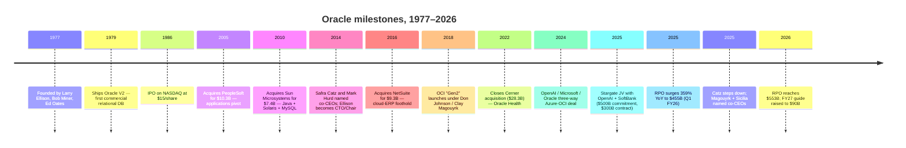
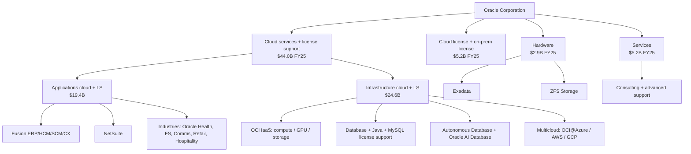
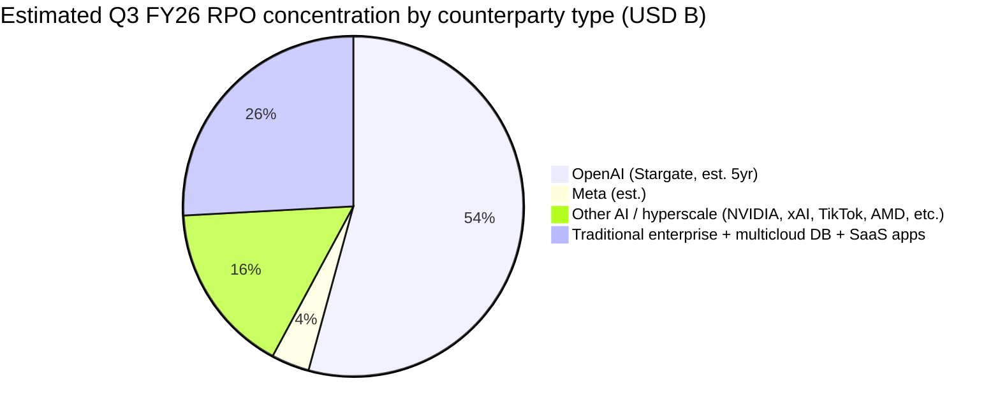
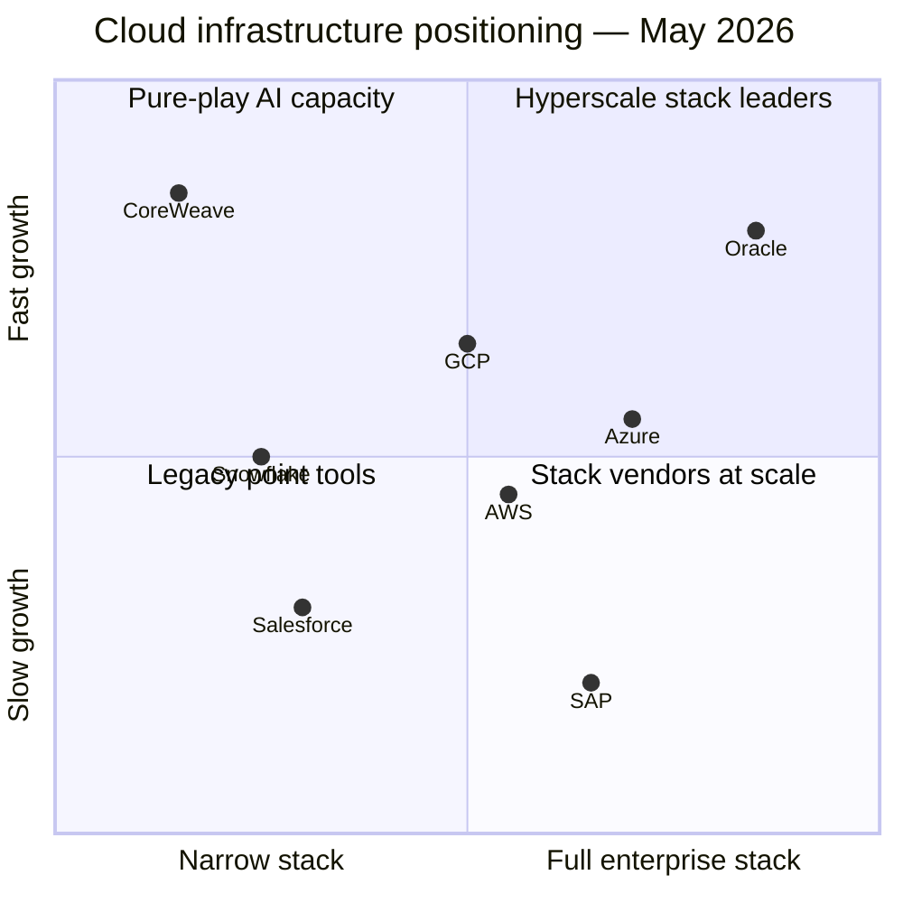
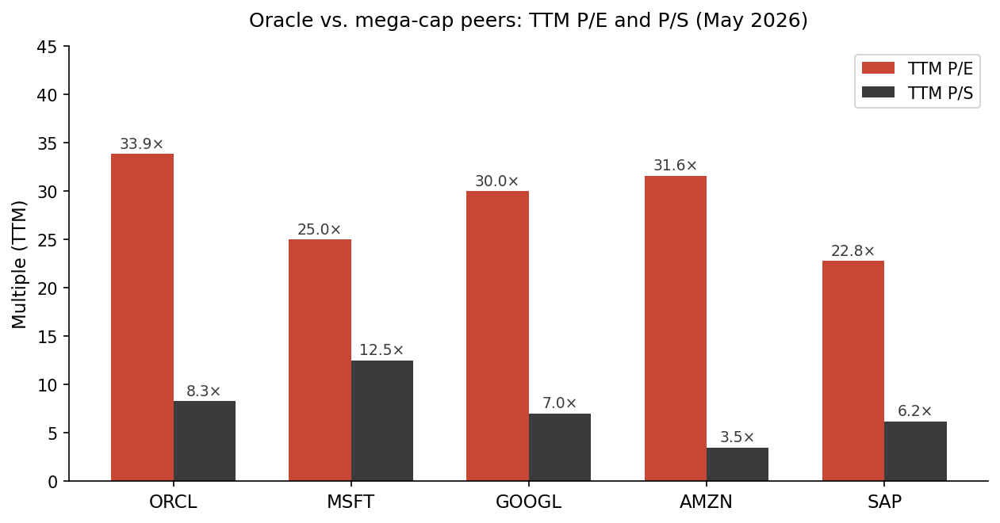
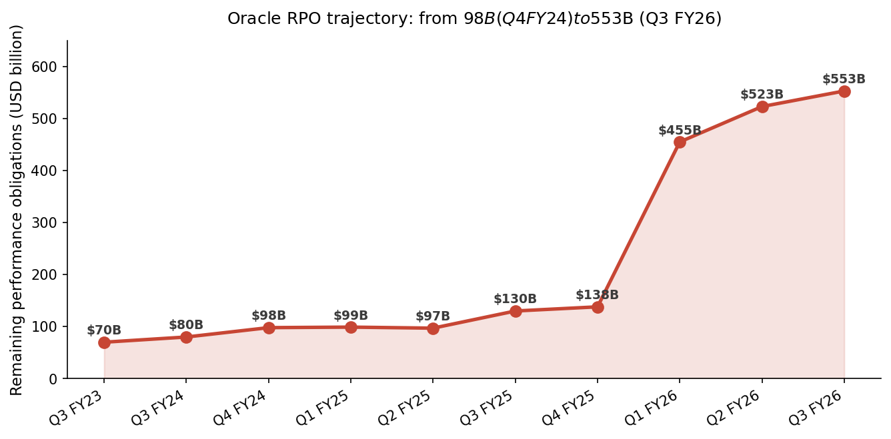
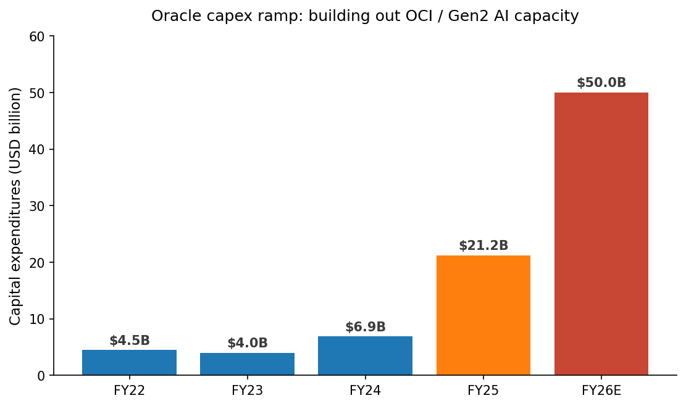

# COMPANY RESEARCH REPORT: Oracle Corporation (NYSE: ORCL)

**Date:** 2026-05-20
**Analyst coverage:** Initiation
**Ticker / exchange:** NYSE: ORCL
**Fiscal year-end:** May 31
**Headquarters:** 2300 Oracle Way, Austin, Texas
**Auditor:** Ernst & Young LLP

> **Update — FY2026 / FY2027 guidance raised (2026-03-10):** Management reiterated FY2026 revenue guidance of **$67 billion and capex of $50 billion**, and **raised FY2027 total-revenue guidance to $90 billion** (from a prior guide of ~$66B+ that had implied a smaller step). At its September 2025 Financial Analyst Meeting, Oracle laid out a five-year OCI infrastructure revenue path from **$18B in FY26 → $32B → $73B → $114B → $144B by FY30** — most of which is already booked into the $552.6B remaining performance obligation balance as of February 28, 2026.
> Source: [Oracle Q3 FY2026 earnings release (8-K), 2026-03-10](https://www.sec.gov/Archives/edgar/data/1341439/000119312526100148/d132760dex991.htm); [Oracle Q1 FY2026 earnings release (8-K), 2025-09-09](https://www.sec.gov/Archives/edgar/data/1341439/000119312525199175/d921500dex991.htm); [Oracle 10-Q for the quarter ended February 28, 2026](https://www.sec.gov/Archives/edgar/data/1341439/000119312526101045/0001193125-26-101045-index.htm).

> **Update — Co-CEO succession (2025-09-22):** Safra Catz stepped down as CEO after 11 years and was appointed Executive Vice Chair. **Clay Magouyrk** (President, OCI; ex-AWS engineer who built OCI Gen2) and **Mike Sicilia** (President, Industries / Oracle Health) were promoted to co-CEOs. **Hilary Maxson**, former Group CFO of Schneider Electric, was named CFO effective 2026-04-06.
> Source: [Oracle 8-K, 2025-09-22](https://www.sec.gov/Archives/edgar/data/1341439/000119312525210089/d921500dex991.htm); [Oracle 8-K, 2026-04-06](https://www.sec.gov/Archives/edgar/data/1341439/000119312526142939/d132760dex991.htm).

## TABLE OF CONTENTS

1. Company Overview
2. Company History
3. Management Team
4. Products & Services
5. Customers & Go-to-Market
6. Industry Overview
7. Competitive Landscape
8. Market Opportunity (TAM)
9. Risk Assessment

---

## 1. COMPANY OVERVIEW

Oracle Corporation is the world's second-largest enterprise software company and, in the last 24 months, has become the fourth hyperscale cloud-infrastructure provider — overlaid on a 48-year-old database franchise that still throws off roughly $20 billion of high-margin license-support revenue every year. The company sells (i) database software (Oracle Database, MySQL, the new Oracle AI Database), (ii) enterprise SaaS applications (Fusion ERP/HCM/SCM, NetSuite, and a portfolio of vertical "Industries" applications headlined by Oracle Health — formerly Cerner), (iii) compute, storage and networking through Oracle Cloud Infrastructure ("OCI", now in its "Gen2" generation), (iv) Java, middleware and on-premise license support, and (v) a small remnant hardware business (Exadata, ZFS Storage). It generates revenue across 175+ countries through a direct enterprise sales force complemented by channel partners, with the U.S. accounting for roughly 56–58% of consolidated revenue.

For fiscal year 2025 (ended 31 May 2025), Oracle reported **total revenue of $57.40 billion, up 8.4% YoY**, with GAAP operating income of $17.68 billion (30.8% margin), GAAP net income of $12.44 billion, and diluted EPS of $4.34 ([Oracle FY2025 10-K, p. 64 — consolidated statements of operations](https://www.sec.gov/Archives/edgar/data/1341439/000095017025087926/orcl-20250531.htm)). Free cash flow turned **negative $0.4 billion** versus $11.8 billion in FY24 because capital expenditures jumped from $6.87B to **$21.22B (+209%)** to fund the OCI capacity build-out ([FY2025 10-K, p. 53](https://www.sec.gov/Archives/edgar/data/1341439/000095017025087926/orcl-20250531.htm)). The company employed **approximately 162,000 full-time staff** at fiscal year-end, of which 50,000 were in R&D and 31,000 in sales and marketing ([FY2025 10-K, p. 12](https://www.sec.gov/Archives/edgar/data/1341439/000095017025087926/orcl-20250531.htm)).

The first three quarters of FY2026 have re-priced Oracle from a legacy software vendor into an AI-infrastructure platform. Three data points define the moment:

- **Remaining performance obligations (RPO) jumped from $138 billion at FY25 close to $455 billion in Q1 FY26 (+359% YoY), $523 billion in Q2 (+438%), and $552.6 billion in Q3** ([Q1 FY26 8-K, 2025-09-09](https://www.sec.gov/Archives/edgar/data/1341439/000119312525199175/d921500dex991.htm); [Q2 FY26 8-K, 2025-12-10](https://www.sec.gov/Archives/edgar/data/1341439/000119312525314207/orcl-ex99_1.htm); [Q3 FY26 10-Q, Note 1](https://www.sec.gov/Archives/edgar/data/1341439/000119312526101045/0001193125-26-101045-index.htm)).
- **Q3 FY26 was the first quarter in over 15 years where organic total revenue and non-GAAP EPS both grew ≥20% in USD**, with quarterly revenue of $17.19 billion (+22%), cloud revenue of $8.9 billion (+44%), and OCI/IaaS of $4.9 billion (+84%) ([Q3 FY26 8-K, 2026-03-10](https://www.sec.gov/Archives/edgar/data/1341439/000119312526100148/d132760dex991.htm)).
- **FY26E capex of $50 billion** is roughly 75% of FY26 revenue and 2.4× FY25 capex; year-to-date through Feb-28-2026 the company spent **$39.2 billion** on capex (vs. $12.2 billion in the same 9-month period a year earlier) ([Q3 FY26 10-Q, MD&A](https://www.sec.gov/Archives/edgar/data/1341439/000119312526101045/0001193125-26-101045-index.htm)).

Source: [Oracle FY2025 10-K, p. 64](https://www.sec.gov/Archives/edgar/data/1341439/000095017025087926/orcl-20250531.htm); FY26E = company guidance from [Q3 FY26 8-K, 2026-03-10](https://www.sec.gov/Archives/edgar/data/1341439/000119312526100148/d132760dex991.htm).

**Valuation snapshot (2026-05-20).** Oracle trades at **$184.97**, a market capitalization of **~$532 billion**, a TTM revenue base of ~$64.1B, and **TTM P/E of ~33.85× (24% above its 10-year median of 27.3×)** and TTM P/S of roughly **8.3×** ([Public.com — ORCL P/E](https://public.com/stocks/orcl/pe-ratio); [GuruFocus — ORCL P/E TTM, 2026-05-13](https://www.gurufocus.com/term/pettm/ORCL); [CompaniesMarketCap — ORCL P/S](https://companiesmarketcap.com/oracle/ps-ratio/)). For context, peer multiples on the same date (TTM, May 2026):

| Peer | TTM P/E | TTM P/S |
|---|---|---|
| **ORCL** | 33.9× | 8.3× |
| MSFT | 25.0× | 12.5× |
| GOOGL | 30.0× | 7.0× |
| AMZN | 31.6× | 3.5× |
| SAP | 22.8× | 6.2× |

Source: aggregated from [Public.com (MSFT, GOOGL, AMZN, SAP)](https://public.com/stocks/msft/pe-ratio); [GuruFocus](https://www.gurufocus.com/term/pettm/ORCL); peer market caps from Yahoo Finance.

The interpretation is straightforward: **Oracle is trading at growth-stock multiples because the market is paying for an OCI revenue trajectory that does not show up in the trailing twelve months but is already in the contract backlog.** The 33.9× P/E sits above the long-run median because (a) the AI-infrastructure narrative has revalued any name with a credible OCI/Stargate-type contract — the same dynamic that re-rated CRWV, NBIS and even Dell; (b) management's $90B FY27 / $144B FY30 guidance implies a ~5-year revenue CAGR above 25%, which would be the highest of any name in the table above; and (c) ~$553B of RPO is roughly 8.6× FY25 revenue, a remarkable indicator of forward visibility unique among large-cap software. The principal risk to the multiple is execution on the capex programme and the customer concentration embedded in that RPO (see Section 9).

---

## 2. COMPANY HISTORY

Oracle was founded in June 1977 in Santa Clara, California by **Lawrence J. ("Larry") Ellison**, Bob Miner and Ed Oates, initially as Software Development Laboratories. Ellison had read Edgar F. Codd's 1970 paper on the relational data model — work IBM Research had largely shelved — and bet that a commercial product built on Codd's relational algebra would beat IBM to market. SDL renamed itself Relational Software Inc. in 1979, shipped **Oracle V2** the same year (skipping V1 because Ellison thought enterprises would not buy a "version 1"), and changed its corporate name to Oracle Systems in 1982. The current Delaware holding company was incorporated in 2005 as a successor to operations originally begun in June 1977 ([FY2025 10-K, p. 3 — Business](https://www.sec.gov/Archives/edgar/data/1341439/000095017025087926/orcl-20250531.htm)).

**Strategic pivots.** Three transformations shape what Oracle is today.

1. **Applications platform (2005–2016).** Oracle was a database company until the mid-2000s. The acquisitions of PeopleSoft (2005, $10.3B), Siebel (2006, $5.8B), Hyperion (2007), BEA (2008), Sun (2010, $7.4B), Acme Packet (2013), MICROS (2014) and NetSuite (2016, $9.3B) re-bundled it into a stack vendor that could sell entire ERP/HCM/CRM suites tied to the Oracle Database. The 2010 Sun deal also brought Java, MySQL and Solaris — assets that turned out to be more strategic than the dying server business that wrapped them.

2. **Cloud — false start (2012–2017), Gen2 (2018→).** Oracle's first cloud iteration ("Gen1", largely a re-branded hosting of on-prem stack) failed against AWS and Azure. In 2016 Larry Ellison hired a team out of AWS — including the future co-CEO **Clayton Magouyrk** — to start over. The resulting OCI "Gen2" architecture (a dedicated bare-metal substrate with off-host network virtualization) launched in 2018 and is the asset around which the entire current investment thesis turns ([Oracle 8-K, 2025-09-22](https://www.sec.gov/Archives/edgar/data/1341439/000119312525210089/d921500dex991.htm)).

3. **Vertical / AI applications (2022→).** The 2022 Cerner acquisition ($28.3B, closed 2022-06-08) gave Oracle the largest U.S. healthcare-IT installed base and became the foundation of "Oracle Health" — Oracle's bet that the next decade of enterprise software is verticalized AI applications layered on top of OCI ([TechCrunch, 2022-06-07](https://techcrunch.com/2022/06/07/oracle-quietly-closes-28b-deal-to-buy-electronic-health-records-company-cerner/); [Oracle press, 2021-12-20](https://www.oracle.com/news/announcement/oracle-buys-cerner-2021-12-20/)). The 2025 promotion of Mike Sicilia (head of Industries / Health) to co-CEO institutionalises that bet.

**Key acquisitions** (year, value, rationale):

- 2005 — PeopleSoft, $10.3B — enterprise applications entry
- 2008 — BEA Systems, $8.5B — middleware
- 2010 — Sun Microsystems, $7.4B — Java, MySQL, Solaris, Sparc
- 2014 — MICROS Systems, $5.3B — hospitality / retail vertical
- 2016 — NetSuite, $9.3B — cloud ERP for SMB/mid-market
- 2022 — Cerner, $28.3B — healthcare IT / Oracle Health

**Recent developments (calendar 2025 – mid-2026).** January 2025: Stargate JV announced at the White House with SoftBank and OpenAI as a $500B AI-infrastructure programme. July 2025: Oracle and OpenAI agree to 4.5 GW of additional Stargate capacity ([OpenAI: Five new Stargate sites](https://openai.com/index/five-new-stargate-sites/)). September 2025: the $300B / 5-year OpenAI cloud contract is the headline driver of Q1 FY26's RPO surge ([Built In, 2025-09-11](https://builtin.com/articles/openai-300b-cloud-deal-oracle-20250911)). September 2025: Catz transitions to Vice Chair; Magouyrk and Sicilia named co-CEOs. December 2025: Oracle sells its remaining interest in Ampere Computing for a $2.7B pre-tax gain and adopts a "chip-neutrality" stance ([Q2 FY26 8-K, 2025-12-10](https://www.sec.gov/Archives/edgar/data/1341439/000119312525314207/orcl-ex99_1.htm)). February 2026: Oracle announces a $50B capital-raise programme and prices $30B of investment-grade bonds and mandatory-convertible preferred in days ([CNBC, 2026-02-02](https://www.cnbc.com/2026/02/02/oracle-stock-price-funding-plans.html)). April 2026: Hilary Maxson joins as CFO. May 2026: Tomislav Mihaljevic, MD (CEO of Cleveland Clinic) added to the board, growing it to 13 directors ([Oracle 8-K, 2026-05-12](https://www.sec.gov/Archives/edgar/data/1341439/000119312526219708/d76569dex991.htm)).

---

## 3. MANAGEMENT TEAM

Oracle is unusual among mega-caps in that the founder, **Larry Ellison**, still owns 40.6% of the company and personally drives technology strategy. The 2025 succession that elevated two operating CEOs while leaving Ellison as Chairman / CTO is therefore best read as a deepening — not a dilution — of founder control.

### Lawrence J. Ellison — Founder, Chairman & Chief Technology Officer (80)

Larry Ellison co-founded Oracle in June 1977, served as CEO continuously from 1977 to September 2014, has served on the board for 48 years, and was Chairman from 1995 to 2004 and again from 2014 to present ([FY2025 10-K, p. 15 — Executive Officers](https://www.sec.gov/Archives/edgar/data/1341439/000095017025087926/orcl-20250531.htm)). His Oracle ownership stake — **1,158,232,353 shares, or 40.6% of common stock outstanding** as of the 2025 record date — is the single largest insider position at any U.S. mega-cap technology company and is the structural reason ORCL governance prioritises long-horizon technology bets over consensus EPS optics ([Oracle 2025 DEF 14A — Beneficial Ownership table](https://www.sec.gov/Archives/edgar/data/1341439/000119312525220801/0001193125-25-220801-index.htm)). At a stock price of $184.97 that stake is worth approximately **$214 billion**, which is also why most third-party trackers (Bloomberg, Forbes) rank Ellison among the world's three or four richest individuals; CEOToday and Bloomberg's billionaires index put his early-2026 net worth in the $258B–$365B range, almost entirely Oracle stock ([CNBC, 2025-09-18](https://www.cnbc.com/2025/09/18/larry-ellison-365-billion-fortune-wealth-management.html); [Bloomberg Billionaires Index — Ellison](https://www.bloomberg.com/billionaires/profiles/lawrence-j-ellison/)).

Ellison's specific accomplishments inside Oracle include (i) the 1979 decision to commercialise Codd's relational model years before IBM and DEC, (ii) the 1995 pivot from client/server to a network-computing/thin-client posture that ultimately matured into Oracle's internet-first stack, (iii) the 2010 Sun Microsystems acquisition (controversial at the time, now retrospectively the source of Java's $5B+ recurring revenue), and (iv) the 2016–2018 reboot of Oracle Cloud Infrastructure after the public-cloud false start. On the September 2025 succession call he framed the AI moment as: *"Humanity is investing enormous resources in the race to advance Artificial Intelligence. Oracle Cloud Infrastructure is playing a major part in that effort"* — and made clear he would continue to drive product strategy alongside the two new CEOs ([Oracle 8-K, 2025-09-22](https://www.sec.gov/Archives/edgar/data/1341439/000119312525210089/d921500dex991.htm)). He is also chairman of Tesla's audit committee, although he resigned from the Tesla board in 2022. His public profile (interviews, the autobiographical "Softwar" by Matthew Symonds, an active presence at Stanford and Oracle CloudWorld keynotes) is consequential because his statements move ORCL price intraday — he is, in effect, the spokesperson for Oracle's AI thesis. With ~41% of the float, no major capital decision at Oracle is taken without his approval.

### Clayton M. Magouyrk — Co-Chief Executive Officer (38)

Clay Magouyrk is the technical CEO. He joined Oracle in 2014 from Amazon Web Services, where he was a senior engineer (2008–2014) on AWS's core compute and networking platform. From December 2019 to June 2025 he served as EVP, Oracle Cloud Infrastructure / OCI Engineering, then became President of OCI in June 2025, and was promoted to co-CEO on 2025-09-22 ([FY2025 10-K, p. 15](https://www.sec.gov/Archives/edgar/data/1341439/000095017025087926/orcl-20250531.htm); [8-K, 2025-09-22](https://www.sec.gov/Archives/edgar/data/1341439/000119312525210089/d921500dex991.htm)). Magouyrk is the founding architect of OCI Gen2 — the bare-metal, off-host-virtualised data plane that distinguishes OCI from EC2 and that Oracle now markets as more cost-efficient for AI training workloads than AWS or Azure. His sole previous executive credential is the OCI build-out itself, but that single track record is unusually load-bearing: in FY25 OCI/IaaS grew >50%, in Q3 FY26 it grew 84% to $4.9B/quarter, and the OpenAI / Meta / xAI / NVIDIA contracts that drove the RPO surge were closed under his architectural direction. He owns 228,695 shares — small relative to Ellison but consistent with a career-engineer-promoted-to-CEO pattern ([2025 DEF 14A](https://www.sec.gov/Archives/edgar/data/1341439/000119312525220801/0001193125-25-220801-index.htm)). At 38 he is one of the youngest CEOs in the S&P 500.

### Michael D. Sicilia — Co-Chief Executive Officer (54)

Mike Sicilia is the applications CEO. He joined Oracle in 2009 through the acquisition of Primavera Systems (where he had been CTO from 1993). From October 2019 to June 2025 he was EVP, Industries / Global Business Units, then President of Industries from June 2025, and co-CEO from 2025-09-22 ([FY2025 10-K, p. 15](https://www.sec.gov/Archives/edgar/data/1341439/000095017025087926/orcl-20250531.htm)). Sicilia ran Oracle's vertical-software portfolio — healthcare (Oracle Health / Cerner), financial services (Flexcube), communications, hospitality (MICROS), utilities and retail — which collectively generate a low-double-digit-billion of recurring revenue. Under his leadership the Industries unit re-architected its applications using "intent-based application generation" — i.e. AI-code-generated software that replaces hand-coded ERP/CRM modules — and embedded AI agents into the Cerner-derived clinical workflow. He owns 201,996 shares.

### Hilary Maxson — Chief Financial Officer (effective 2026-04-06)

Hilary Maxson was named CFO on 2026-04-06, joining from Schneider Electric where she had served as Group CFO since 2021 (and previously EVP Finance from 2017). She is a capital-markets and capital-intensity specialist: Schneider Electric is a >$45B-revenue industrial-software-and-grid company and Maxson oversaw its transition from electrical-equipment supplier into a data-center / grid-software business — a profile that closely mirrors Oracle's current pivot. Prior to Schneider, Maxson spent 12 years at AES Corporation in finance, strategy and operations leadership roles ([Oracle 8-K, 2026-04-06](https://www.sec.gov/Archives/edgar/data/1341439/000119312526142939/d132760dex991.htm)). She will be Oracle's first non-promoted-from-within CFO since Jeff Henley joined in 1991, and her industrial-CFO background is a deliberate signal that Oracle is now being run as a capital-intensive build-out, not a software vendor. Doug Kehring served as Principal Financial Officer for the six months between Catz's transition and Maxson's arrival.

### Edward Screven — Executive Vice President & Chief Corporate Architect

Edward Screven is Oracle's longest-tenured technology executive after Ellison, holds 2,741,900 shares ([2025 DEF 14A](https://www.sec.gov/Archives/edgar/data/1341439/000119312525220801/0001193125-25-220801-index.htm)), and is the principal owner of Oracle Database engineering, including the Autonomous Database and the new Oracle AI Database (announced September 2025 as the headline product of Oracle AI World). Together with Ellison, Screven is responsible for the technology direction that integrates the OCI hardware with the database — Oracle's principal differentiation over generic AWS/Azure compute.

### Governance

The board has **13 directors** (after May 2026's addition of Dr Tomislav Mihaljevic of Cleveland Clinic), with Bruce R. Chizen (independent, former Adobe CEO) as Chair of the Nomination and Governance Committee and lead independent director ([Oracle 8-K, 2026-05-12](https://www.sec.gov/Archives/edgar/data/1341439/000119312526219708/d76569dex991.htm)). Insider ownership is dominated by **Ellison at 40.6%**; all current executive officers and directors as a group hold 1.167 billion shares or **40.9%** of outstanding common stock ([2025 DEF 14A](https://www.sec.gov/Archives/edgar/data/1341439/000119312525220801/0001193125-25-220801-index.htm)). Vanguard is the only other reported holder above 5% (5.3%). Comp is heavily equity-linked and performance-tied for the NEOs (the FY25 NEO comp table in the proxy shows total comp dominated by performance-vesting RSU awards). Two governance flags to note: (i) Larry Ellison is also Chairman / CTO — a dual role unusual at this scale — and (ii) the supermajority insider holding means activist intervention is essentially infeasible. The flip side is unusually long-horizon decision-making (Ellison personally underwrote the OCI Gen2 reboot when public markets had written off Oracle Cloud).

### Track record assessment

Ellison's 48-year founder tenure with three successful pivots (DB → applications → OCI) is one of the strongest in software. The Catz era (2014–2025) delivered consistent low-single-digit revenue growth and steady EPS compounding but is rightly criticised for the late OCI start; the offsetting argument is that Oracle did, eventually, build a credible Gen2 platform. Magouyrk and Sicilia are unproven as CEOs, but the assets they have run (OCI and Industries) are exactly the assets driving the current backlog. The 2026 CFO change to Maxson reads as a deliberate match of finance leadership to the new capital intensity. Net: this is a founder-controlled company with an experienced engineering CEO and an unfamiliar capital-markets challenge — the gap is debt and capex execution, not strategy.

---

## 4. PRODUCTS & SERVICES

Oracle reports revenue in four product categories. The structure is unusually granular for a software vendor — and material because OCI/IaaS is the only line growing at hyperscaler speed; the others are slow-grower-with-large-base or declining.

### 4.1 Cloud services and license support — $44.03B in FY25 (+12% YoY), 76.7% of total revenue

This is the financial heart of Oracle. It splits into:

- **Cloud services — $24.51B (+24%)**, comprising
  - **Infrastructure cloud services (OCI / IaaS)** — bare-metal compute, GPU clusters (NVIDIA H100/H200/Blackwell), block / object storage, Exadata Cloud Service, Autonomous Database, OCI Generative AI service.
  - **Applications cloud services (SaaS)** — Fusion Cloud ERP, Fusion Cloud HCM, Fusion Cloud SCM, Fusion Cloud CX (formerly Siebel), NetSuite, and a portfolio of Industries cloud apps (Oracle Health / Cerner, Banking, Communications, Retail, Hospitality, Utilities).
- **License support — $19.52B (flat YoY)** — the recurring maintenance contracts on Oracle Database, Java, MySQL, WebLogic and other on-premise licences. This is one of the most profitable revenue streams in enterprise software (gross margin north of 90%).

By **ecosystem**, the FY25 disclosure splits cloud services + license support into **applications $19.38B (+7%) and infrastructure $24.65B (+16%)** ([FY2025 10-K, p. 45](https://www.sec.gov/Archives/edgar/data/1341439/000095017025087926/orcl-20250531.htm)). The infrastructure side then accelerated dramatically in FY26: Q1 IaaS +55%, Q2 +68%, Q3 +84%.

Source: [Oracle FY2025 10-K, pp. 44–45](https://www.sec.gov/Archives/edgar/data/1341439/000095017025087926/orcl-20250531.htm) and Oracle product pages.

**Per-product competitive-advantage assessment (flagship items only):**

- **Oracle Database / Autonomous Database — competitive advantage: YES (deep)**. Moat sources: (i) technology — 45 years of relational-DB engineering, the only enterprise DB with RAC clustering at scale, Exadata's storage-tier offload; (ii) switching costs — multi-decade installed-base lock-in; (iii) data-gravity / ecosystem lock-in via PL/SQL, Java, and the entire Oracle middleware stack. Closest competitor product: Microsoft SQL Server, AWS Aurora / Redshift, Snowflake, Databricks. Verdict: ahead on mission-critical OLTP; behind on cloud-native analytics (where Snowflake / Databricks lead). The September 2025 **Oracle AI Database** announcement, which lets users run Gemini, OpenAI and xAI Grok directly on Oracle Database data, is an attempt to plug this gap ([Q1 FY26 8-K](https://www.sec.gov/Archives/edgar/data/1341439/000119312525199175/d921500dex991.htm)).
- **Oracle Cloud Infrastructure (OCI Gen2) — competitive advantage: PARTIAL (improving)**. Moat: (i) bare-metal Gen2 architecture with off-host network virtualisation, which Magouyrk-era engineering claims provides better price-performance for AI training than AWS or Azure; (ii) Multicloud presence — OCI databases run inside Azure, Google Cloud and AWS regions, a unique architectural choice. Multicloud DB revenue grew 1,529% YoY in Q1 FY26 and 531% in Q3 FY26 ([Q1 FY26 8-K](https://www.sec.gov/Archives/edgar/data/1341439/000119312525199175/d921500dex991.htm); [Q3 FY26 8-K](https://www.sec.gov/Archives/edgar/data/1341439/000119312526100148/d132760dex991.htm)). Closest competitors: AWS EC2/SageMaker, Microsoft Azure, Google Cloud. Verdict: behind on breadth and ecosystem (fourth share), at parity on raw compute for AI training, **ahead on multicloud database**.
- **Oracle Fusion Cloud ERP — competitive advantage: YES (moderate)**. Moat: ASC 842 / IFRS 16 / multi-currency / multi-GAAP support that SAP S/4HANA can match but younger SaaS ERPs (Workday Financials, NetSuite at the SMB end) struggle to replicate at multinational scale. Growing 17% in Q1 FY26 and 17% in Q3 FY26. Closest competitor: SAP S/4HANA Cloud, Workday Financials. Verdict: at parity with SAP at the high end; ahead of Workday on financials breadth.
- **NetSuite Cloud ERP — competitive advantage: YES (strong in SMB / mid-market)**. Moat: 30,000+ installed customers, vertical depth (e-commerce, manufacturing, services), and the broadest functional footprint at the sub-$1B-revenue tier. Growing 13–16% in FY26. Closest competitor: Sage Intacct, Microsoft Dynamics 365 Business Central, SAP Business ByDesign. Verdict: ahead in SMB ERP breadth.
- **Oracle Health (Cerner) — competitive advantage: PARTIAL**. Moat: ~25% U.S. hospital EHR share (the largest, although Epic Systems is the share leader in larger systems by patient-encounter share). Vulnerability: Cerner is a complex integration that has had several high-profile rollout problems (VA Health). Sicilia's stated strategy is to rebuild Cerner's UX on AI agents — promising but unproven. Closest competitor: Epic Systems (private), Meditech, Allscripts/Veradigm. Verdict: behind Epic on user perception; ahead on cloud-readiness.
- **MySQL / HeatWave — competitive advantage: PARTIAL**. MySQL is the world's most-deployed open-source database; HeatWave is Oracle's in-memory accelerator that turns MySQL into an analytic engine. Closest competitor: Snowflake, Databricks, AWS RDS-MySQL. Verdict: behind Snowflake in analytics market mindshare but at parity on performance benchmarks the company itself publishes.
- **Java — competitive advantage: YES**. Moat: technology / IP — Java is the de facto enterprise programming language, monetised via subscription support since 2018. Closest competitor: open OpenJDK builds (Amazon Corretto, Microsoft OpenJDK, Eclipse Temurin). Verdict: cash-cow with declining differentiation but durable enterprise stickiness.

### 4.2 Cloud license and on-premise license — $5.20B in FY25 (+2% YoY), 9.1% of total revenue

New software licences sold for on-premise deployment (or as bring-your-own-licence to clouds). Material drivers: customers still running large on-prem databases plus regulated workloads that cannot move to public cloud. Growth has been low single digits for years and is expected to stay roughly flat in dollars while shrinking as a share of revenue.

### 4.3 Hardware — $2.94B in FY25 (-4% YoY), 5.1% of total revenue

Engineered systems (Exadata Database Machine, Exadata X11M), ZFS Storage Appliance, and a small remnant Sparc and StorageTek tape business inherited from Sun. Hardware revenue has declined ~5% per year for a decade; the December 2025 sale of Ampere Computing for a $2.7B pre-tax gain confirms Oracle's "chip-neutral" stance — i.e. it will buy NVIDIA, AMD, Intel and custom silicon rather than design its own ([Q2 FY26 8-K, 2025-12-10](https://www.sec.gov/Archives/edgar/data/1341439/000119312525314207/orcl-ex99_1.htm)).

### 4.4 Services — $5.23B in FY25 (-4% YoY), 9.1% of total revenue

Consulting, advanced customer services, education — used primarily as a vehicle to accelerate cloud migration. Margin is low single digits and the line is run as a strategic loss-leader rather than a profit centre.

### Flagship vs. long-tail

The 1–3 products driving the business are unmistakably **OCI/IaaS, Oracle Database (incl. Autonomous + AI Database), and the support stream attached to both**. Fusion ERP and NetSuite are mid-size growth engines (~$4B each, growing mid-teens) and Oracle Health is a strategic option on healthcare AI. Hardware, Services, and on-prem license are legacy lines.

### Roadmap and recent launches

- **Oracle AI Database** (Sep-2025) — runs Gemini / GPT / Grok directly on Oracle DB data. Strategic counter to Snowflake / Databricks for AI-on-enterprise-data workloads ([Q1 FY26 8-K](https://www.sec.gov/Archives/edgar/data/1341439/000119312525199175/d921500dex991.htm)).
- **Multicloud datacentre expansion** — 72 Oracle multicloud datacentres planned inside Amazon, Google and Microsoft clouds; over half complete by Q2 FY26 ([Q2 FY26 8-K](https://www.sec.gov/Archives/edgar/data/1341439/000119312525314207/orcl-ex99_1.htm)).
- **OCI Generative AI service** — managed inference and fine-tuning service competing with AWS Bedrock and Azure OpenAI.
- **Oracle Health redesign** — Sicilia-era rebuild of Cerner's UI on agentic AI; rollout ongoing FY26.
- **Sunset:** Ampere chip programme exited Dec-2025.

---

## 5. CUSTOMERS & GO-TO-MARKET

Oracle's customers fall into three buckets: (i) enterprise IT — the legacy database, ERP and on-prem footprint, (ii) AI hyperscale customers — the 2024–2026 vintage cloud contracts that drove the RPO surge, and (iii) SMB / mid-market via NetSuite. Geographically, FY25 was 64% Americas / 24% EMEA / 12% Asia-Pacific in the Cloud and License business ([FY2025 10-K, p. 45](https://www.sec.gov/Archives/edgar/data/1341439/000095017025087926/orcl-20250531.htm)).

### Customer concentration — material and rising

Oracle does **not** disclose any individual customer ≥10% of consolidated revenue in its FY2025 10-K, and the 10-K specifically states "no individual customer or country (other than the United States) accounted for more than 10% of our total revenues during fiscal 2025, 2024 or 2023" ([FY2025 10-K, Item 1](https://www.sec.gov/Archives/edgar/data/1341439/000095017025087926/orcl-20250531.htm)). However, **the structure of recent RPO additions makes the next two-year customer concentration unprecedented**:

- The Q1 FY26 RPO surge of +$317B was driven by **"four multi-billion-dollar contracts with three different customers"** in a single quarter ([Q1 FY26 8-K](https://www.sec.gov/Archives/edgar/data/1341439/000119312525199175/d921500dex991.htm)).
- Reuters and multiple secondary sources have identified the principal counterparty as **OpenAI, with a 5-year, ~$300 billion contract**, commencing 2027 ([Built In, 2025-09-11](https://builtin.com/articles/openai-300b-cloud-deal-oracle-20250911); [Data Center Frontier, 2025](https://www.datacenterfrontier.com/machine-learning/article/55316610/openai-and-oracles-300b-stargate-deal-building-ais-national-scale-infrastructure)).
- Q2 FY26 added "new commitments from **Meta, NVIDIA and others**" — quoted in the 2025-12-10 press release ([Q2 FY26 8-K](https://www.sec.gov/Archives/edgar/data/1341439/000119312525314207/orcl-ex99_1.htm)). The Meta deal has been reported as ~$20B over multiple years ([DCD, 2025](https://www.datacenterdynamics.com/en/news/meta-in-talks-to-sign-20bn-oracle-cloud-deal-report/)).
- xAI has been named publicly as an OCI customer by Larry Ellison; specific dollar value not disclosed by Oracle but reported as part of the same multi-billion-dollar cohort.

**Implication.** If OpenAI alone represents ~$300B of the $552.6B Q3 FY26 RPO, **roughly 54% of contracted backlog could sit with a single counterparty**. This is the single most material customer-concentration risk in U.S. mega-cap software. The mitigant Oracle has put forward — that "most of the equipment needed is either funded upfront via customer prepayments so Oracle can purchase the GPUs, or the customer buys the GPUs and supplies them to Oracle" ([Q3 FY26 8-K](https://www.sec.gov/Archives/edgar/data/1341439/000119312526100148/d132760dex991.htm)) — is significant but does not eliminate the operating, capacity-utilisation, and renewal risks if the contract is renegotiated. **We treat this as a top-tier risk; it is restated in Section 9.**

Source: estimates derived from [Built In, 2025-09-11](https://builtin.com/articles/openai-300b-cloud-deal-oracle-20250911); [DCD, 2025](https://www.datacenterdynamics.com/en/news/meta-in-talks-to-sign-20bn-oracle-cloud-deal-report/); [Q1–Q3 FY26 Oracle press releases](https://www.sec.gov/cgi-bin/browse-edgar?action=getcompany&CIK=0001341439&type=8-K).

### Customer segments and named customers

- **Enterprise IT (legacy + cloud migration).** Banks (Citi, JPMorgan), telcos (AT&T, Vodafone), pharma (Pfizer), government (U.S. Treasury, U.K. NHS digital). These customers buy Oracle Database licences, license support, Fusion ERP and increasingly OCI for new workloads.
- **AI hyperscale customers.** OpenAI, Meta, NVIDIA (also a customer for OCI compute, not just a supplier), xAI, ByteDance/TikTok, AMD. Oracle is positioned as the "merchant capacity" provider for AI labs that do not want to commit to AWS or Azure exclusivity.
- **Vertical / Industries.** Hospitals (Cerner installed base — Cleveland Clinic, Mayo Clinic, U.K. NHS Trusts), retail (MICROS POS at Burger King, KFC), hospitality (Marriott), utilities (Exelon).
- **SMB / mid-market.** ~37,000 NetSuite customers (per long-running NetSuite disclosure history; not refreshed in the FY25 10-K).

### Distribution and sales cycle

Oracle's primary channel is a **31,000-person direct sales and marketing organisation** ([FY2025 10-K, p. 12](https://www.sec.gov/Archives/edgar/data/1341439/000095017025087926/orcl-20250531.htm)), complemented by global SIs (Accenture, Deloitte, Infosys, TCS) and resellers. Enterprise sales cycles for Fusion ERP are typically 9–18 months; OCI hyperscale contracts have very long sales cycles (12–24 months) but commit large amounts of capacity at once. The Stargate / OpenAI deal type — multi-year, multi-billion-dollar capacity prepayments — is operationally closer to a project-finance contract than a SaaS subscription.

### Partnerships

Oracle's most distinctive go-to-market move is the **Oracle Database@Azure / @Google / @AWS** programme: Oracle Database and Exadata hardware physically deployed inside Microsoft, Google and Amazon datacentres, with a single bill. By Q2 FY26 Oracle was "more than halfway through building 72 Oracle Multicloud datacentres" embedded in those three clouds ([Q2 FY26 8-K](https://www.sec.gov/Archives/edgar/data/1341439/000119312525314207/orcl-ex99_1.htm)). This is the strategic answer to the historic objection that "Oracle DB customers want AWS." Multicloud DB revenue grew **531% YoY in Q3 FY26**, off a small base but now the fastest-growing single line item in the company ([Q3 FY26 8-K](https://www.sec.gov/Archives/edgar/data/1341439/000119312526100148/d132760dex991.htm)).

### Customer case studies

Recent disclosed wins: U.S. Treasury Fiscal Service consolidation on OCI; Vodafone moving its ERP to Oracle Fusion; the U.S. Department of Defense JWCC contract (Oracle one of four awardees, alongside AWS, Microsoft and Google); the Stargate Abilene, Texas campus; Cleveland Clinic on Oracle Health.

---

## 6. INDUSTRY OVERVIEW

Oracle competes in three large, partially overlapping industries: (1) enterprise database / data-platform software, (2) enterprise applications / SaaS, and (3) cloud infrastructure (IaaS / PaaS) — increasingly weighted toward AI training and inference.

### 6.1 Industry definition and structure

Following NAICS 511210 (software publishers) and 518210 (data processing, hosting, related services), the relevant addressable market is split into:

- **Enterprise database & data management.** Estimated $90B+ market in 2025, growing 12–15% on AI-driven analytics demand. Dominated by Oracle, Microsoft (SQL Server), AWS (Aurora, Redshift), Snowflake, Databricks, MongoDB and PostgreSQL-cloud providers.
- **Enterprise applications (ERP/HCM/CRM/SCM SaaS).** ~$300B addressable software market; the SaaS subset is ~$200B and growing low-to-mid-teens. Dominated by SAP, Oracle (Fusion + NetSuite), Workday, Salesforce, Microsoft Dynamics.
- **Cloud infrastructure (IaaS + PaaS).** Q1 2026 spending of approximately **$129 billion per quarter, growing 35% YoY**, with AWS at ~28% share, Azure ~21%, Google Cloud ~14%, Alibaba ~4%, Oracle in the low-to-mid single digits but with the highest absolute growth among the named hyperscalers in FY26 ([BusinessTats Cloud Market Share 2026](https://businesstats.com/big-three-hold-dominant-lead-in-accelerating-cloud-market/); [Programming Helper Tech, 2026](https://www.programming-helper.com/tech/cloud-computing-market-share-2026-aws-azure-google-cloud-analysis)).

Source: [Oracle FY2025 10-K, p. 64](https://www.sec.gov/Archives/edgar/data/1341439/000095017025087926/orcl-20250531.htm).

### 6.2 Growth rates and key trends

The dominant industry trend through 2025–2026 is **AI infrastructure capex**. Synergy Research reported 35% YoY cloud-infrastructure spending growth in Q1 2026, the highest in three years. Public AI labs (OpenAI, Anthropic, xAI, Mistral, plus internal labs at Meta, Microsoft, Google) collectively committed >$400B in 5-year cloud / data-centre deals by mid-2026. The shape of those deals — long-duration capacity prepayments, often with customer-supplied GPUs — has changed the financial profile of cloud vendors from steady-state SaaS to project-finance-like.

Secondary trends:

- **Database AI integration.** Snowflake, Databricks, MongoDB and Oracle are racing to embed LLMs as a first-class query interface on enterprise data. Oracle's September 2025 AI Database announcement is the company's principal play.
- **Multicloud.** The default assumption that customers will single-cloud is breaking. 89% of large enterprises are now multicloud. Oracle's @Azure / @AWS / @GCP database programme is a category-defining move.
- **Sovereign / regulated cloud.** Local-data-residency rules in the EU, UAE, Saudi Arabia, India and China are forcing hyperscalers to offer sovereign deployments. Oracle has been particularly aggressive (UAE Stargate site, India dedicated region, EU sovereign cloud).
- **AI-code-generated software.** Sicilia explicitly cited in the Q3 FY26 release that Oracle is "restructuring our product development teams into smaller, more agile and productive groups" because AI code-generation lets them build more software with fewer engineers ([Q3 FY26 8-K](https://www.sec.gov/Archives/edgar/data/1341439/000119312526100148/d132760dex991.htm)). This has direct implications for Oracle's R&D leverage.

### 6.3 Regulatory environment

Major regulatory threads relevant to Oracle:

- **Antitrust.** No active major antitrust action against Oracle in the U.S. or EU as of May 2026, though it has been a frequent **complainant** (Google Java case 2010–2021; Microsoft cloud-licensing complaints in EU and UK 2024–2025). Microsoft's licensing remedies in Europe (announced 2024 / refined 2025) materially favour Oracle's Multicloud strategy.
- **Data sovereignty.** EU AI Act (entered into force August 2024, full applicability August 2026), UAE data localisation, India DPDP Act 2023 — all create demand for regional deployments where Oracle has an architectural advantage.
- **Healthcare.** Cerner / Oracle Health is regulated by HIPAA (U.S.), 21st Century Cures Act EHR rules, and the U.K. NHS digital framework. The U.S. VA / Cerner roll-out has been subject to several Congressional hearings since 2022.
- **Export controls.** U.S. BIS export rules on advanced semiconductors and the January 2025 AI Diffusion Rule limit the deployment of frontier-AI compute in some jurisdictions. Oracle is exposed via its Tier-2 / Tier-3 geographic regions.

### 6.4 Industry dynamics — five-forces summary

- **Supplier power: high.** NVIDIA is the binding constraint on AI capacity build-out. Oracle disclosed in Q3 FY26 that customers themselves are increasingly buying GPUs and supplying them to Oracle for hosted operation — an unusual structure that transfers chip-supply risk to the customer.
- **Buyer power: bifurcated.** Traditional enterprise customers have meaningful switching costs (DB lock-in); AI-lab customers have all the leverage (they can re-platform to AWS/Azure/Google or build their own).
- **Threat of substitutes: high in IaaS, low in core DB.** Postgres and Snowflake are credible alternatives for new-cloud-native workloads but not yet for mission-critical OLTP.
- **Threat of new entrants: moderate.** CoreWeave, Nebius, Lambda and other GPU-cloud startups are credible AI-IaaS competitors but lack the database stack.
- **Intra-industry rivalry: extreme.** AWS, Azure, Google Cloud and now Oracle are all sized to deploy >$50B of capex per year on infrastructure; CoreWeave alone is a >$30B-RPO competitor.

---

## 7. COMPETITIVE LANDSCAPE

### 7.1 Direct competitors

**1. Microsoft (MSFT).** Azure ~21% IaaS share, $260B+ TTM revenue, the closest competitor across all three of Oracle's businesses: database (SQL Server, Cosmos), applications (Dynamics 365), and cloud (Azure). The exclusive OpenAI compute deal lapsed in 2024 when OpenAI was permitted to go multicloud — this is the single biggest gift Microsoft has ever made to Oracle. ([Tomislav: Q1 FY26 8-K context](https://www.sec.gov/Archives/edgar/data/1341439/000119312525199175/d921500dex991.htm)).

**2. Amazon (AMZN) / AWS.** AWS ~28% IaaS share, $670B+ TTM revenue (group), AWS run-rate ~$110B. Strength: developer mindshare, breadth of services, lowest cost. Weakness vs. Oracle: AWS does not run Oracle Database first-class — the Database@AWS programme launched in 2024 is Amazon's grudging admission that customers want it.

**3. Alphabet (GOOGL) / Google Cloud.** GCP ~14% share, growing in the high 30s%. Strong in AI / Gemini; weak in enterprise DB. Database@Google is part of Oracle's multicloud answer.

**4. SAP.** $35–37B revenue (CY25), the direct competitor in ERP. S/4HANA Cloud public-cloud edition has accelerated since 2024. SAP and Oracle compete fiercely for Fortune 500 ERP standardisations; Workday picks off HCM and (increasingly) Financials at the same accounts.

**5. Salesforce (CRM).** CRM and adjacent SaaS; Oracle Fusion CX is a distant fourth-place CRM but Salesforce has no DB or IaaS to upsell, which is the structural Oracle advantage in stack-wide deals.

**6. Workday (WDAY).** HCM + Financials SaaS; the only pure-play SaaS competitor in the mega-cap ERP race. Smaller than Oracle Fusion in absolute scale but growing faster on a smaller base.

**7. Snowflake (SNOW) + Databricks (private).** Cloud data-warehouse / lakehouse competitors. Both are credible substitutes for new analytic workloads and both are well ahead of Oracle in cloud-native data-engineering mindshare.

**8. CoreWeave (CRWV).** Pure-play AI-IaaS competitor; Q4 2025 RPO ~$30B, Microsoft is its largest customer. Same business model as the "OCI for AI labs" part of Oracle but without the database, applications and license-support stack.

**9. Nebius (NBIS), Lambda, Crusoe.** Smaller, capital-constrained AI-IaaS plays.

**10. Epic Systems.** Private. Dominant U.S. EHR competitor to Oracle Health / Cerner, especially at large integrated delivery networks. Not a public-cloud or database competitor, but the principal threat to Oracle's healthcare vertical thesis.

### 7.2 Positioning

### 7.3 Oracle's competitive advantages

- **Database + IaaS bundling at scale.** Only Oracle and Microsoft can sell both the database and the cloud underneath it; AWS / Google must rent the Oracle Database in to land Oracle workloads (or settle for second-tier database options).
- **Multicloud as architecture, not afterthought.** OCI@Azure / @AWS / @GCP is unique. 531% YoY growth in Multicloud DB revenue in Q3 FY26 confirms this is operating as a moat, not a marketing claim.
- **Founder-controlled capital allocation.** Ellison can underwrite multi-decade investments (OCI Gen2 in 2016 when public markets had given up on Oracle Cloud) that public-CEO-led peers cannot.
- **Industries depth (Health, Banking, Retail, Comms, Utilities, Hospitality).** No other hyperscaler has comparable vertical-app depth — the Sicilia bet.
- **High-margin license-support tail.** ~$20B/yr of high-margin support revenue subsidises the OCI build-out in a way none of the hyperscalers have.

### 7.4 Competitive vulnerabilities

- **Sub-scale in IaaS.** Oracle is still 4× smaller than AWS in raw IaaS revenue and 3× smaller than Azure. The RPO surge is a future-tense advantage; the present-tense balance sheet is debt-financing a catch-up.
- **OpenAI dependency.** ~54% of the Q3 RPO appears to sit with one customer.
- **Limited consumer / developer brand.** Oracle does not have the developer mindshare that AWS, GCP, even Microsoft enjoy. This matters at the bottom of the funnel.
- **History of failed clouds (Gen1, NetSuite Bronto, JD Edwards EnterpriseOne) means customer trust is uneven.**
- **Java licensing reputation.** The 2023 Java SE per-employee subscription change drove negative press and prompted some customers to switch to OpenJDK distributions.

### 7.5 Market share

OCI's specific Q1 2026 share is not directly reported by Synergy, but using Synergy's $129B quarterly market and Oracle's reported $3.3B Q1 FY26 IaaS revenue (which is fiscal Q1 — Aug-2025 quarter — not calendar Q1) implies a share in the mid-2% range. Oracle's clear ambition, per the company's own FY26 → FY30 OCI revenue path ($18B → $144B), is to reach the 7–9% share band by 2030, putting it within reach of Google Cloud.

Source: aggregated from [Public.com](https://public.com/stocks/orcl/pe-ratio), [GuruFocus](https://www.gurufocus.com/term/pettm/ORCL), peer pages on the same site.

---

## 8. MARKET OPPORTUNITY (TAM)

### 8.1 TAM sizing

We frame Oracle's TAM as three additive markets, sized from public industry research:

- **Cloud infrastructure (IaaS + PaaS) — ~$515B in 2025, growing to >$1.0T by 2030.** Synergy Research's Q1 2026 run-rate is $129B per quarter (= $516B annualised) growing 35% YoY ([BusinessTats — Big Three Hold Dominant Lead in Accelerating Cloud Market](https://businesstats.com/big-three-hold-dominant-lead-in-accelerating-cloud-market/)). Gartner's 2024 forecast called for the public-cloud-services market to exceed $1T by 2027; 2026 prints suggest that path is intact.
- **Enterprise applications SaaS — ~$200B in 2025, growing low-teens to ~$350B by 2030.** Oracle's addressable SaaS segments (ERP, HCM, SCM, CX, NetSuite mid-market, Industries) are ~50% of that — call it $100B today, $175B by 2030.
- **Database & data management — ~$90B in 2025, growing 12–15% to ~$170B by 2030**, driven by AI / vector / multicloud demand.

Stacked and adjusted for overlap, we estimate Oracle's **2030 TAM at ~$1.3 trillion**.

### 8.2 SAM and SOM

Oracle's **serviceable addressable market (SAM)** within that TAM is narrower:

- Cloud infrastructure focused on enterprise + AI training/inference workloads (not consumer): ~$600B 2030.
- ERP / HCM / SCM / vertical apps within the SaaS pool: ~$175B 2030.
- Mission-critical enterprise database (excluding consumer / open-source-only deployments): ~$120B 2030.

→ **SAM ~$900B by 2030.**

Oracle's stated FY30 cloud infrastructure revenue target of **$144B** implies ~24% share of the AI-capacity-heavy IaaS subsegment; layering in $25B+ from cloud applications and $20B from license support keeps the implied 2030 revenue at roughly $200B+. The market is pricing today's stock for some fraction of that path — the Q3 FY26 RPO of $552.6B says roughly $100B of it is already contracted.

### 8.3 Market growth projections

- Synergy: Q1 2026 cloud-IaaS spending +35% YoY.
- IDC and Gartner 2026 calls: AI-infrastructure capex from the top 4 hyperscalers + Oracle to clear $400B in calendar 2026 and exceed $500B in 2027 ([Fast Company — Big Tech AI spending ranked](https://www.fastcompany.com/91535369/big-tech-ai-spending-meta-google-amazon-microsoft-apple-capex-ranked)).
- The Trump administration's 2025 Stargate framework explicitly commits >$500B of U.S. AI infrastructure over four years.

### 8.4 Company's serviceable market and share opportunity

Today Oracle's IaaS share is in the mid-2% band; FY30 management guidance implies high single digits / approaching 10%. The mechanism for share gain is the multicloud DB programme, the OpenAI capacity contract, and the willingness to under-cut AWS/Azure on AI training price-performance.

### 8.5 Penetration strategy

Three vectors:

- **AI-lab capacity.** OpenAI, xAI, Meta, NVIDIA hosting. Capital-intensive but immediately RPO-generative.
- **Multicloud database.** Convert AWS/Azure/Google customers who run Oracle DB on-prem into OCI customers — without forcing them to leave their primary cloud.
- **Industries SaaS.** Use Cerner / Health, Banking, Communications, Retail as upsell anchors that pull OCI consumption alongside.

---

## 9. RISK ASSESSMENT

### 9.1 Company-specific risks

**(1) Customer concentration in RPO — top risk.** As discussed in Section 5, ~$300B / 54% of the $552.6B Q3 FY26 RPO is reported to be a single OpenAI contract; +Meta + xAI + NVIDIA increases the top-4 share to ~65%+. **Impact: if OpenAI re-platforms, defers, or restructures, the RPO and the ORCL multiple would compress meaningfully.** Mitigants: customer prepayments and customer-supplied GPUs limit Oracle's upfront capital risk on the OpenAI piece; the Dec-2025 register article cites Oracle's insistence that the contract is on schedule ([The Register, 2025-12-15](https://www.theregister.com/2025/12/15/oracle_denies_openai_delays/)).

**(2) Capex execution and capacity timing.** FY26E capex of $50B vs $21B in FY25 is unprecedented for Oracle. 9-month capex of $39.2B vs. operating cash flow of $23.5B (TTM) means free cash flow is structurally negative. Impact: any data-centre power, GPU-delivery, or construction delay translates 1:1 into deferred revenue recognition (recall that only 12% of the $552.6B RPO is expected to convert to revenue in the next 12 months — see Q3 FY26 10-Q, Note 1). Mitigant: Oracle has 10+ GW of power secured with >90% partner-funded ([Q3 FY26 earnings call commentary, 2026-03-10](https://www.fool.com/earnings/call-transcripts/2026/03/10/oracle-orcl-q3-2026-earnings-call-transcript/)).

**(3) Database commoditisation.** Postgres-cloud, Snowflake, Databricks and the open-source movement are nibbling Oracle DB's mind-share at the analytic edge. Oracle AI Database is a credible counter but unproven in production. Impact: 1–2% point reduction in license-support renewal rates would compress the high-margin tail.

**(4) Oracle Health (Cerner) integration risk.** Cerner has had high-profile installation problems at the U.S. VA. Sicilia's AI-rebuild is the bet. Impact: a high-profile failure (e.g. a major hospital system pulling out) would impair the strategic-options thesis.

**(5) Key-person concentration on Larry Ellison.** Ellison is 80; he sets product direction and personally underwrote OCI Gen2. Mitigant: Magouyrk + Sicilia are operational; Screven inherits database technical leadership.

### 9.2 Industry / market risks

**(6) AI capex bubble risk.** If LLM training capex moderates faster than forecast (e.g., DeepSeek-style efficiency gains compounded across the industry), the entire AI-IaaS comp set re-rates lower. Impact: 30–40% multiple compression historically observed in past hyperscaler cycle inflections.

**(7) Hyperscaler competitive response.** AWS announcing Database@AWS, Google's $32B Wiz acquisition (cloud-security), Azure's continued OpenAI capacity build-out — all increase price-competition for AI capacity. Impact: Oracle's reported AI capacity gross margin of 32% (above the 30% guidance — per Q3 FY26 call) could compress.

**(8) NVIDIA supply concentration.** Whether Oracle buys GPUs directly or customers supply them, the AI workload depends almost entirely on NVIDIA. Mitigants: Oracle's December 2025 "chip neutrality" stance plus AMD presence in customer mix.

### 9.3 Financial risks

**(9) Leverage. Total debt $134.6 billion at Feb-28-2026** (notes payable current $9.9B + non-current $124.7B), against equity of $38.4B and cash + securities of $39.1B ([Q3 FY26 10-Q balance sheet](https://www.sec.gov/Archives/edgar/data/1341439/000119312526101045/0001193125-26-101045-index.htm)). Net debt / EBITDA is roughly 4×. February 2026 $30B issuance was 50%+ oversubscribed but rating-agency posture is tight: Moody's downgraded ORCL to Baa2 in early 2026 with Negative outlook. Impact: a one-notch downgrade to Baa3 / BBB- would raise refinancing cost ~50bp and constrain further capex.

**(10) Free cash flow negative until FY28+.** FY25 FCF was -$0.4B; FY26 FCF is forecast to be deeply negative because of $50B capex. Mitigant: customer prepayments improve working capital optics.

**(11) Multiple compression risk.** TTM P/E 33.9× is 24% above 10-year median and ~35% above MSFT. If Q4 FY26 misses, multiple alone can take 15–20% off the stock.

### 9.4 Macroeconomic risks

**(12) Power and data-centre supply constraints.** U.S. utility interconnection queues in major data-centre markets (Northern Virginia, Phoenix, Dallas, Columbus) are 5–7 years long. Oracle is mitigating by building in Texas (Abilene), the UAE, India, and other power-rich, queue-shorter geographies. Impact: a 6–12 month delay in any single major site delays a corresponding tranche of RPO conversion.

**(13) Tariffs and supply chain.** The FY2025 10-K explicitly flags tariffs and trade-policy disruptions as a current risk ([FY2025 10-K, p. 19 — Risk Factors](https://www.sec.gov/Archives/edgar/data/1341439/000095017025087926/orcl-20250531.htm)). 2025–2026 U.S. tariffs on semiconductor imports raise the cost basis for OCI build-out.

**(14) Rate sensitivity.** With $134B of debt, a sustained 100bp rise in the U.S. 10-year would raise refinancing cost by ~$1.0B/yr at full roll-over — a material headwind to non-GAAP EPS.

Source: aggregated from quarterly earnings releases — [Q1 FY26](https://www.sec.gov/Archives/edgar/data/1341439/000119312525199175/d921500dex991.htm), [Q2 FY26](https://www.sec.gov/Archives/edgar/data/1341439/000119312525314207/orcl-ex99_1.htm), [Q3 FY26](https://www.sec.gov/Archives/edgar/data/1341439/000119312526100148/d132760dex991.htm).

Source: [FY2025 10-K cash-flow statement](https://www.sec.gov/Archives/edgar/data/1341439/000095017025087926/orcl-20250531.htm) and [Q3 FY26 10-Q](https://www.sec.gov/Archives/edgar/data/1341439/000119312526101045/0001193125-26-101045-index.htm).

Source: quarterly earnings releases FY25–Q3 FY26.

---

## REFERENCES

**Primary — Oracle SEC filings:**

- [Oracle Corporation — Form 10-K for the fiscal year ended May 31, 2025 (filed 2025-06-18)](https://www.sec.gov/Archives/edgar/data/1341439/000095017025087926/orcl-20250531.htm)
- [Oracle Corporation — Form 10-Q for the quarter ended February 28, 2026 (filed 2026-03-11)](https://www.sec.gov/Archives/edgar/data/1341439/000119312526101045/0001193125-26-101045-index.htm)
- [Oracle Corporation — Form 10-Q for the quarter ended November 30, 2025 (filed 2025-12-11)](https://www.sec.gov/Archives/edgar/data/1341439/000119312525315925/0001193125-25-315925-index.htm)
- [Oracle Corporation — Form 10-Q for the quarter ended August 31, 2025 (filed 2025-09-10)](https://www.sec.gov/Archives/edgar/data/1341439/000119312525200095/0001193125-25-200095-index.htm)
- [Oracle Corporation — DEF 14A Proxy Statement, 2025 Annual Meeting (filed 2025-09-26)](https://www.sec.gov/Archives/edgar/data/1341439/000119312525220801/0001193125-25-220801-index.htm)
- [Oracle Corporation — Form 8-K, Q1 FY2026 results, 2025-09-09](https://www.sec.gov/Archives/edgar/data/1341439/000119312525199175/d921500dex991.htm)
- [Oracle Corporation — Form 8-K, Q2 FY2026 results, 2025-12-10](https://www.sec.gov/Archives/edgar/data/1341439/000119312525314207/orcl-ex99_1.htm)
- [Oracle Corporation — Form 8-K, Q3 FY2026 results, 2026-03-10](https://www.sec.gov/Archives/edgar/data/1341439/000119312526100148/d132760dex991.htm)
- [Oracle Corporation — Form 8-K, Magouyrk/Sicilia named co-CEOs, 2025-09-22](https://www.sec.gov/Archives/edgar/data/1341439/000119312525210089/d921500dex991.htm)
- [Oracle Corporation — Form 8-K, Hilary Maxson named CFO, 2026-04-06](https://www.sec.gov/Archives/edgar/data/1341439/000119312526142939/d132760dex991.htm)
- [Oracle Corporation — Form 8-K, Dr Tomislav Mihaljevic joins board, 2026-05-12](https://www.sec.gov/Archives/edgar/data/1341439/000119312526219708/d76569dex991.htm)

**Primary — Oracle investor materials:**

- [Oracle Investor Relations — corporate news archive](https://investor.oracle.com/investor-news/default.aspx)
- [Oracle press release — "Oracle Buys Cerner", 2021-12-20](https://www.oracle.com/news/announcement/oracle-buys-cerner-2021-12-20/)

**Third-party / news (≤12 months unless landmark):**

- [Built In — "OpenAI Signs $300B Cloud Deal With Oracle to Expand Stargate Data Centers", 2025-09-11](https://builtin.com/articles/openai-300b-cloud-deal-oracle-20250911)
- [Data Center Frontier — "OpenAI and Oracle's $300B Stargate Deal", 2025](https://www.datacenterfrontier.com/machine-learning/article/55316610/openai-and-oracles-300b-stargate-deal-building-ais-national-scale-infrastructure)
- [OpenAI — "OpenAI, Oracle, and SoftBank expand Stargate with five new AI data center sites", 2025](https://openai.com/index/five-new-stargate-sites/)
- [DataCenterDynamics — "Meta in talks to sign $20bn Oracle cloud deal", 2025](https://www.datacenterdynamics.com/en/news/meta-in-talks-to-sign-20bn-oracle-cloud-deal-report/)
- [The Register — "Oracle insists its $300B contract with OpenAI is on schedule", 2025-12-15](https://www.theregister.com/2025/12/15/oracle_denies_openai_delays/)
- [CNBC — "Oracle shares rise after announcing plans to raise $50 billion", 2026-02-02](https://www.cnbc.com/2026/02/02/oracle-stock-price-funding-plans.html)
- [Constellation Research — "Oracle to raise $45 billion to $50 billion in debt, equity for data center buildout", 2026](https://www.constellationr.com/insights/news/oracle-raise-45-billion-50-billion-debt-equity-data-center-buildout)
- [DataCenterDynamics — "Oracle to raise up to $50bn in debt and equity in 2026", 2026](https://www.datacenterdynamics.com/en/news/oracle-to-raise-up-to-50bn-in-debt-and-equity-in-2026/)
- [Fortune — "Oracle under pressure from more than $100 billion in debt and massive layoffs", 2026-03-09](https://fortune.com/2026/03/09/oracle-earnings-layoffs-debt-cloud/)
- [TechCrunch — "Oracle quietly closes $28B deal to buy electronic health records company Cerner", 2022-06-07](https://techcrunch.com/2022/06/07/oracle-quietly-closes-28b-deal-to-buy-electronic-health-records-company-cerner/)
- [CNBC — "Larry Ellison made his $365 billion fortune by breaking every rule of wealth management", 2025-09-18](https://www.cnbc.com/2025/09/18/larry-ellison-365-billion-fortune-wealth-management.html)
- [Bloomberg Billionaires Index — Lawrence J. Ellison](https://www.bloomberg.com/billionaires/profiles/lawrence-j-ellison/)
- [Motley Fool — "Oracle (ORCL) Q3 2026 Earnings Call Transcript", 2026-03-10](https://www.fool.com/earnings/call-transcripts/2026/03/10/oracle-orcl-q3-2026-earnings-call-transcript/)

**Market & industry data:**

- [Synergy Research / BusinessTats — Cloud Market Share 2026](https://businesstats.com/big-three-hold-dominant-lead-in-accelerating-cloud-market/)
- [Programming Helper Tech — Cloud Computing Market Share 2026](https://www.programming-helper.com/tech/cloud-computing-market-share-2026-aws-azure-google-cloud-analysis)
- [Fast Company — "Big Tech AI spending: Meta, Google, Amazon, Microsoft capex ranked", 2026](https://www.fastcompany.com/91535369/big-tech-ai-spending-meta-google-amazon-microsoft-apple-capex-ranked)

**Valuation data:**

- [GuruFocus — Oracle PE Ratio (TTM), May 2026](https://www.gurufocus.com/term/pettm/ORCL)
- [Public.com — Oracle (ORCL) P/E Ratio](https://public.com/stocks/orcl/pe-ratio)
- [CompaniesMarketCap — Oracle (ORCL) P/S Ratio](https://companiesmarketcap.com/oracle/ps-ratio/)
- [MacroTrends — Oracle PE Ratio 2012-2026](https://www.macrotrends.net/stocks/charts/ORCL/oracle/pe-ratio)
- [Yahoo Finance — Oracle Corporation (ORCL) Key Statistics](https://finance.yahoo.com/quote/ORCL/key-statistics/)
- [Public.com — Microsoft (MSFT) P/E Ratio](https://public.com/stocks/msft/pe-ratio)
- [Public.com — Alphabet (GOOGL) P/E Ratio](https://public.com/stocks/googl/pe-ratio)
- [Public.com — Amazon (AMZN) P/E Ratio](https://public.com/stocks/amzn/pe-ratio)
- [Public.com — SAP SE P/E Ratio](https://public.com/stocks/sap/pe-ratio)
