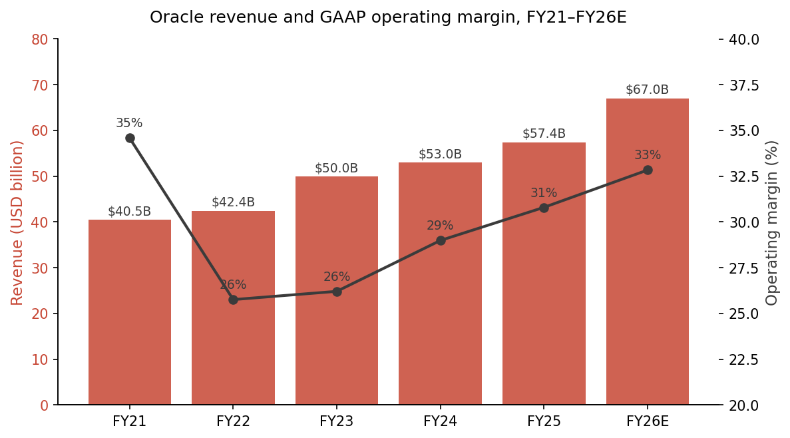
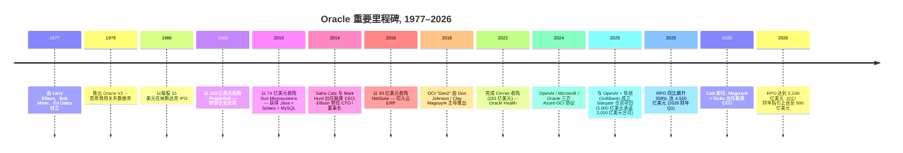
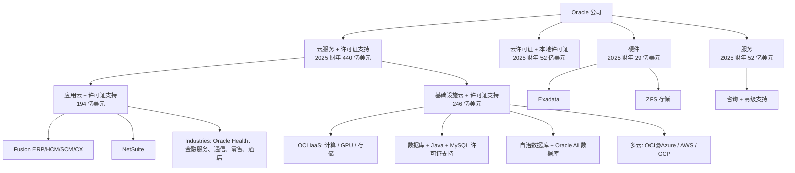
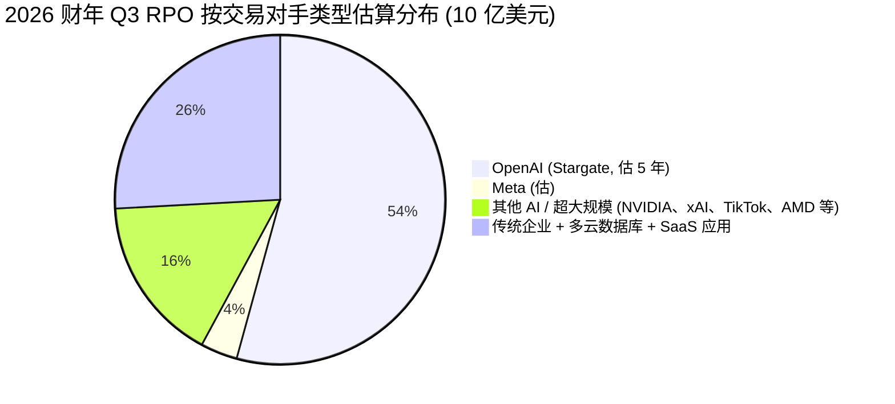
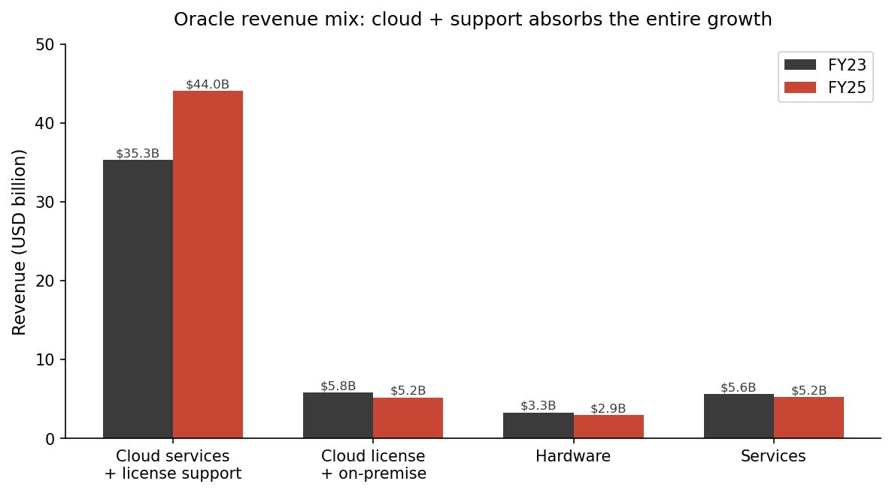
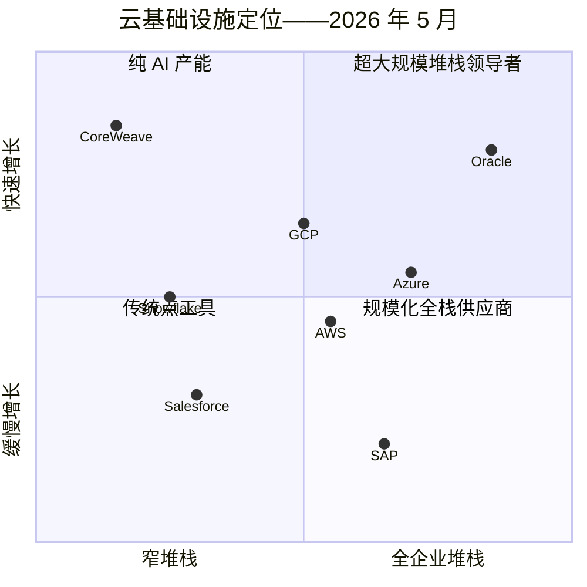
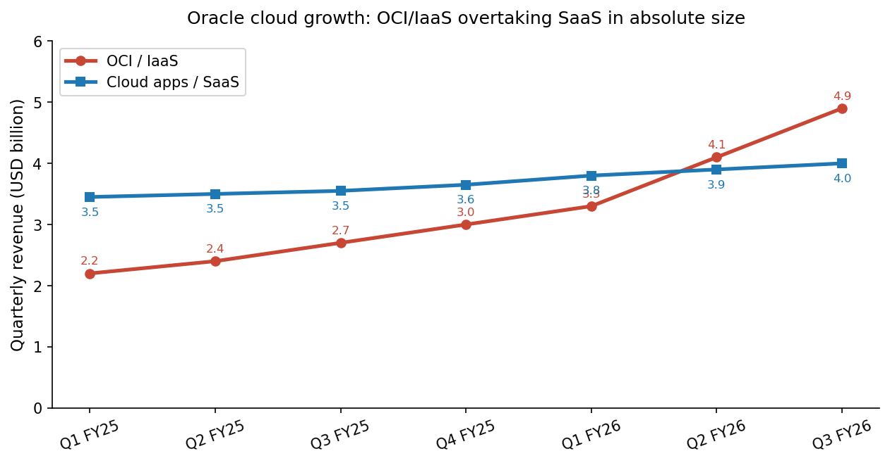

# Oracle Corporation (NYSE:ORCL) — 公司研究报告

**截至日期: 2026-05-20**
**分析师覆盖: 首次覆盖 (Initiation)**
**代码 / 交易所: NYSE: ORCL**
**财年截止日: 5 月 31 日**
**总部: 美国得克萨斯州奥斯汀, Oracle Way 2300 号**
**审计师: 安永会计师事务所 (Ernst & Young LLP)**
**报告语言: 简体中文 (英文版同时存在于本目录)**

> **更新——2026 财年 / 2027 财年指引上调 (2026-03-10):** 管理层重申 2026 财年营业收入指引为 **670 亿美元、资本开支 (capex) 500 亿美元**, 并**将 2027 财年总营业收入指引上调至 900 亿美元** (此前指引约 660 亿美元+, 隐含的环比增幅较小)。在 2025 年 9 月召开的财务分析师大会上, Oracle 公布了未来五年 OCI 基础设施 (OCI infrastructure) 营业收入路径: **2026 财年 180 亿美元 → 320 亿美元 → 730 亿美元 → 1,140 亿美元 → 2030 财年 1,440 亿美元**——其中大部分已锁定在截至 2026 年 2 月 28 日的剩余履约义务 (Remaining Performance Obligations, RPO) 5,526 亿美元余额中。
> 来源: [Oracle 2026 财年 Q3 业绩公告 (8-K), 2026-03-10](https://www.sec.gov/Archives/edgar/data/1341439/000119312526100148/d132760dex991.htm); [Oracle 2026 财年 Q1 业绩公告 (8-K), 2025-09-09](https://www.sec.gov/Archives/edgar/data/1341439/000119312525199175/d921500dex991.htm); [Oracle 截至 2026 年 2 月 28 日季度的 10-Q](https://www.sec.gov/Archives/edgar/data/1341439/000119312526101045/0001193125-26-101045-index.htm)。

> **更新——双 CEO 继任 (2025-09-22):** Safra Catz 在出任 CEO 11 年后卸任, 转任执行副董事长 (Executive Vice Chair)。**Clay Magouyrk** (OCI 总裁; 曾任 AWS 工程师, 主导构建 OCI Gen2) 与 **Mike Sicilia** (行业 / Oracle Health 总裁) 被晋升为联席 CEO。**Hilary Maxson** (原施耐德电气 (Schneider Electric) 集团 CFO) 自 2026-04-06 起担任 CFO。
> 来源: [Oracle 8-K, 2025-09-22](https://www.sec.gov/Archives/edgar/data/1341439/000119312525210089/d921500dex991.htm); [Oracle 8-K, 2026-04-06](https://www.sec.gov/Archives/edgar/data/1341439/000119312526142939/d132760dex991.htm)。

## 目录

1. 公司概览
2. 公司历史
3. 管理团队
4. 产品与服务
5. 客户与上市策略
6. 行业概览
7. 竞争格局
8. 市场机会 (TAM)
9. 风险评估

---

## 1. 公司概览

Oracle Corporation 是全球第二大企业软件公司, 并在过去 24 个月内已发展为第四家超大规模 (hyperscale) 云基础设施提供商——这一切都叠加在一项 48 年历史的数据库 (database) 业务之上, 该业务每年仍能产生约 200 亿美元的高利润率许可证支持 (license support) 营业收入。公司销售: (i) 数据库软件 (Oracle Database、MySQL、新推出的 Oracle AI 数据库 (Oracle AI Database)); (ii) 企业 SaaS 应用 (Fusion ERP/HCM/SCM、NetSuite, 以及以 Oracle Health——前身为 Cerner——为代表的垂直行业"Industries"应用组合); (iii) 通过 Oracle 云基础设施 (Oracle Cloud Infrastructure, OCI, 现为"Gen2"代) 提供的计算、存储与网络服务; (iv) Java、中间件 (middleware) 与本地部署许可证支持; (v) 一项规模较小的剩余硬件业务 (Exadata、ZFS Storage)。公司在 175 个以上国家通过直销企业销售队伍与渠道合作伙伴产生营业收入, 美国市场约占合并营业收入的 56–58%。

2025 财年 (截至 2025 年 5 月 31 日), Oracle 披露**总营业收入 574.0 亿美元, 同比增长 8.4%**, GAAP 经营业务利润 176.8 亿美元 (营业利润率 30.8%), GAAP 净利润 124.4 亿美元, 摊薄每股收益 (EPS) 4.34 美元 ([Oracle FY2025 10-K, 第 64 页——合并经营业务报表](https://www.sec.gov/Archives/edgar/data/1341439/000095017025087926/orcl-20250531.htm))。自由现金流 (free cash flow) 转为**负 4 亿美元** (2024 财年为正 118 亿美元), 原因是资本开支从 68.7 亿美元跃升至 **212.2 亿美元 (+209%)**, 以支持 OCI 产能建设 ([FY2025 10-K, 第 53 页](https://www.sec.gov/Archives/edgar/data/1341439/000095017025087926/orcl-20250531.htm))。截至财年末, 公司全职员工约**16.2 万人**, 其中研发部门 5 万人、销售与营销部门 3.1 万人 ([FY2025 10-K, 第 12 页](https://www.sec.gov/Archives/edgar/data/1341439/000095017025087926/orcl-20250531.htm))。

2026 财年的前三个季度已将 Oracle 从一家传统软件供应商重新定价为一个 AI 基础设施平台。三个数据点定义了这一时刻:

- **剩余履约义务 (RPO) 从 2025 财年末的 1,380 亿美元跃升至 2026 财年 Q1 的 4,550 亿美元 (+359% YoY), Q2 的 5,230 亿美元 (+438%), Q3 的 5,526 亿美元** ([Q1 FY26 8-K, 2025-09-09](https://www.sec.gov/Archives/edgar/data/1341439/000119312525199175/d921500dex991.htm); [Q2 FY26 8-K, 2025-12-10](https://www.sec.gov/Archives/edgar/data/1341439/000119312525314207/orcl-ex99_1.htm); [Q3 FY26 10-Q, Note 1](https://www.sec.gov/Archives/edgar/data/1341439/000119312526101045/0001193125-26-101045-index.htm))。
- **2026 财年 Q3 是过去 15 年来第一个有机总营业收入与非 GAAP EPS 均以美元计价同时增长 ≥20% 的季度**, 季度营业收入 171.9 亿美元 (+22%), 云营业收入 89 亿美元 (+44%), OCI/IaaS 营业收入 49 亿美元 (+84%) ([Q3 FY26 8-K, 2026-03-10](https://www.sec.gov/Archives/edgar/data/1341439/000119312526100148/d132760dex991.htm))。
- **2026 财年预期资本开支 500 亿美元**, 约相当于 2026 财年营业收入的 75%, 是 2025 财年资本开支的 2.4 倍; 截至 2026-02-28 的前 9 个月内, 公司已支出**392 亿美元**于资本开支 (上年同期为 122 亿美元) ([Q3 FY26 10-Q, MD&A](https://www.sec.gov/Archives/edgar/data/1341439/000119312526101045/0001193125-26-101045-index.htm))。

来源: [Oracle FY2025 10-K, 第 64 页](https://www.sec.gov/Archives/edgar/data/1341439/000095017025087926/orcl-20250531.htm); FY26E = 公司指引, 出自 [Q3 FY26 8-K, 2026-03-10](https://www.sec.gov/Archives/edgar/data/1341439/000119312526100148/d132760dex991.htm)。

**估值快照 (截至 2026-05-20)。** Oracle 股价 **184.97 美元**, 市值 **约 5,320 亿美元**, TTM (过去十二个月) 营业收入基础约 641 亿美元, **TTM 市盈率 (P/E) 约 33.85 倍 (较十年中位数 27.3 倍高出 24%)**, TTM 市销率 (P/S) 约 **8.3 倍** ([Public.com — ORCL P/E](https://public.com/stocks/orcl/pe-ratio); [GuruFocus — ORCL P/E TTM, 2026-05-13](https://www.gurufocus.com/term/pettm/ORCL); [CompaniesMarketCap — ORCL P/S](https://companiesmarketcap.com/oracle/ps-ratio/))。同期 (2026 年 5 月) 同业公司 TTM 倍数对比:

| 同业 | TTM P/E | TTM P/S |
|---|---|---|
| **ORCL** | 33.9× | 8.3× |
| MSFT | 25.0× | 12.5× |
| GOOGL | 30.0× | 7.0× |
| AMZN | 31.6× | 3.5× |
| SAP | 22.8× | 6.2× |

来源: 综合自 [Public.com (MSFT、GOOGL、AMZN、SAP)](https://public.com/stocks/msft/pe-ratio); [GuruFocus](https://www.gurufocus.com/term/pettm/ORCL); 同业市值来自 Yahoo Finance。

解释直观: **Oracle 正以成长股倍数交易, 因为市场为一条不体现在过去十二个月、但已在合同积压 (backlog) 中的 OCI 营业收入轨迹付费。** 33.9 倍 P/E 高于长期中位数, 原因在于: (a) AI 基础设施叙事重估了任何拥有可信 OCI / Stargate 型合同的标的——同一动态也重新定价了 CRWV、NBIS 乃至 Dell; (b) 管理层 2027 财年 900 亿美元 / 2030 财年 1,440 亿美元的指引隐含约 5 年营业收入年复合增长率 (CAGR) 超过 25%, 在上表中将是最高; (c) 约 5,530 亿美元 RPO 约相当于 2025 财年营业收入的 8.6 倍——这是大盘软件股中少见的远期可见度指标。倍数的主要风险是资本开支项目的执行以及 RPO 中蕴含的客户集中度 (见第 9 节)。

---

## 2. 公司历史

Oracle 由 **Lawrence J. ("Larry") Ellison**、Bob Miner 与 Ed Oates 于 1977 年 6 月在加州圣克拉拉创立, 最初名为软件开发实验室 (Software Development Laboratories, SDL)。Ellison 阅读过 Edgar F. Codd 在 1970 年发表的关系数据模型 (relational data model) 论文——IBM 研究院基本搁置了这项工作——并押注一个基于 Codd 关系代数 (relational algebra) 的商用产品能赶在 IBM 之前上市。SDL 于 1979 年更名为关系软件公司 (Relational Software Inc.), 同年发行了 **Oracle V2** (跳过 V1, 因为 Ellison 认为企业不会购买"版本 1"), 1982 年再次更名为 Oracle Systems。当前的特拉华州 (Delaware) 控股公司成立于 2005 年, 作为 1977 年 6 月最初运营业务的继承者 ([FY2025 10-K, 第 3 页——业务](https://www.sec.gov/Archives/edgar/data/1341439/000095017025087926/orcl-20250531.htm))。

**三次战略转型塑造了今天的 Oracle。**

1. **应用平台 (2005–2016)。** 直到 2000 年代中期, Oracle 仍是一家纯数据库公司。先后收购 PeopleSoft (2005, 103 亿美元)、Siebel (2006, 58 亿美元)、Hyperion (2007)、BEA (2008)、Sun (2010, 74 亿美元)、Acme Packet (2013)、MICROS (2014) 与 NetSuite (2016, 93 亿美元), 将其重新打包为一个能销售完整 ERP/HCM/CRM 套件、并与 Oracle Database 紧密绑定的全栈供应商。2010 年的 Sun 收购也带来了 Java、MySQL 与 Solaris——事后看, 这些资产比包裹它们的衰落服务器业务更具战略意义。

2. **云——失败开端 (2012–2017), Gen2 (2018→)。** Oracle 的首次云尝试 ("Gen1", 实质是对本地部署堆栈的重新品牌化托管) 在与 AWS、Azure 的竞争中失败。2016 年, Larry Ellison 从 AWS 挖来一支团队——包括未来的联席 CEO **Clayton Magouyrk**——重新开始。由此产生的 OCI "Gen2" 架构 (一个专用的裸金属底层架构 + 离主机网络虚拟化) 于 2018 年发布, 是当前整个投资逻辑围绕展开的资产 ([Oracle 8-K, 2025-09-22](https://www.sec.gov/Archives/edgar/data/1341439/000119312525210089/d921500dex991.htm))。

3. **垂直 / AI 应用 (2022→)。** 2022 年 Cerner 收购 (283 亿美元, 2022-06-08 完成) 为 Oracle 带来美国最大的医疗 IT 装机量, 成为"Oracle Health"基础——Oracle 押注未来十年的企业软件将是叠加在 OCI 之上的垂直化 AI 应用 ([TechCrunch, 2022-06-07](https://techcrunch.com/2022/06/07/oracle-quietly-closes-28b-deal-to-buy-electronic-health-records-company-cerner/); [Oracle 新闻稿, 2021-12-20](https://www.oracle.com/news/announcement/oracle-buys-cerner-2021-12-20/))。2025 年 Mike Sicilia (Industries / Health 主管) 晋升为联席 CEO 将这一押注制度化。

**主要并购** (年份、价值、理由):

- 2005 — PeopleSoft, 103 亿美元 — 切入企业应用
- 2008 — BEA Systems, 85 亿美元 — 中间件
- 2010 — Sun Microsystems, 74 亿美元 — Java、MySQL、Solaris、Sparc
- 2014 — MICROS Systems, 53 亿美元 — 酒店 / 零售垂直
- 2016 — NetSuite, 93 亿美元 — 中小企业 / 中端市场云 ERP
- 2022 — Cerner, 283 亿美元 — 医疗 IT / Oracle Health

**近期动态 (2025 年至 2026 年中)。** 2025 年 1 月: Stargate 合资项目在白宫宣布, 与软银和 OpenAI 共同推进, 作为一项 5,000 亿美元的 AI 基础设施计划。2025 年 7 月: Oracle 与 OpenAI 就额外 4.5 GW 的 Stargate 产能达成协议 ([OpenAI: 五个新 Stargate 站点](https://openai.com/index/five-new-stargate-sites/))。2025 年 9 月: 与 OpenAI 签订的 3,000 亿美元 / 5 年云合同, 是 2026 财年 Q1 RPO 飙升的头号驱动 ([Built In, 2025-09-11](https://builtin.com/articles/openai-300b-cloud-deal-oracle-20250911))。2025 年 9 月: Catz 转任副董事长; Magouyrk 与 Sicilia 任联席 CEO。2025 年 12 月: Oracle 出售其剩余的 Ampere Computing 权益, 实现 27 亿美元税前收益, 并采取"芯片中立"立场 ([Q2 FY26 8-K, 2025-12-10](https://www.sec.gov/Archives/edgar/data/1341439/000119312525314207/orcl-ex99_1.htm))。2026 年 2 月: Oracle 宣布 500 亿美元资本募集计划, 在数日内完成 300 亿美元投资级债券与强制可转换优先股定价 ([CNBC, 2026-02-02](https://www.cnbc.com/2026/02/02/oracle-stock-price-funding-plans.html))。2026 年 4 月: Hilary Maxson 加入任 CFO。2026 年 5 月: Tomislav Mihaljevic 医学博士 (克利夫兰诊所 CEO) 加入董事会, 使其扩至 13 席 ([Oracle 8-K, 2026-05-12](https://www.sec.gov/Archives/edgar/data/1341439/000119312526219708/d76569dex991.htm))。

---

## 3. 管理团队

Oracle 在巨型市值公司中独树一帜的地方在于——创始人 **Larry Ellison** 仍持有公司 40.6% 股份, 并亲自驱动技术战略。2025 年继任安排让两位运营 CEO 升任、Ellison 留任董事长 / CTO, 因此应被解读为创始人控制的**深化**——而非**稀释**。

### Lawrence J. Ellison — 创始人、董事长兼首席技术官 (CTO) (80 岁)

Larry Ellison 于 1977 年 6 月联合创立 Oracle, 自 1977 年至 2014 年 9 月持续担任 CEO, 已任董事 48 年, 1995–2004 年及 2014 年至今担任董事长 ([FY2025 10-K, 第 15 页——高管](https://www.sec.gov/Archives/edgar/data/1341439/000095017025087926/orcl-20250531.htm))。其 Oracle 持股——截至 2025 年权益登记日为 **11.58 亿股, 占已发行普通股的 40.6%**——是所有美国巨型市值科技公司中最大的内部人头寸, 是 ORCL 治理结构优先考虑长周期技术押注而非市场一致 EPS 预期的结构性原因 ([Oracle 2025 DEF 14A——受益所有权列表](https://www.sec.gov/Archives/edgar/data/1341439/000119312525220801/0001193125-25-220801-index.htm))。按 184.97 美元股价计, 该持股约价值 **2,140 亿美元**, 这也是大多数第三方榜单 (Bloomberg、Forbes) 将 Ellison 列为全球三四位首富之一的原因; CEOToday 和 Bloomberg 亿万富翁指数将其 2026 年初身家区间定为 2,580 亿—3,650 亿美元, 几乎全部为 Oracle 股票 ([CNBC, 2025-09-18](https://www.cnbc.com/2025/09/18/larry-ellison-365-billion-fortune-wealth-management.html); [Bloomberg 亿万富翁指数——Ellison](https://www.bloomberg.com/billionaires/profiles/lawrence-j-ellison/))。

Ellison 在 Oracle 内的具体成就包括: (i) 1979 年决定比 IBM 与 DEC 早数年商用化 Codd 关系模型; (ii) 1995 年从客户端/服务器架构转向网络计算 / 瘦客户机, 最终演化为 Oracle 互联网优先堆栈; (iii) 2010 年 Sun Microsystems 收购 (当时颇具争议, 事后看是 Java 50 亿美元+ 经常性营业收入的来源); (iv) 2016–2018 年公有云"开门红"失败后重启 OCI。在 2025 年 9 月继任电话会议上他将 AI 时刻定性为: *"人类正投入巨量资源在 AI 竞赛之中。Oracle 云基础设施在这一努力中发挥着重要作用。"*——并明确表示他将继续与两位新 CEO 共同驱动产品战略 ([Oracle 8-K, 2025-09-22](https://www.sec.gov/Archives/edgar/data/1341439/000119312525210089/d921500dex991.htm))。他还是 Tesla 审计委员会主席, 不过已于 2022 年从 Tesla 董事会辞职。其公共形象 (采访、Matthew Symonds 撰写的自传体著作《Softwar》、活跃于斯坦福校园与 Oracle CloudWorld 主题演讲) 颇具实质意义, 因为他的发言会盘中推动 ORCL 股价——他实际上是 Oracle AI 投资逻辑的代言人。由于持股约 41% 流通股, Oracle 任何重大资本决策都不会绕过其认可。

### Clayton M. Magouyrk — 联席首席执行官 (CEO) (38 岁)

Clay Magouyrk 是技术派 CEO。他于 2014 年从亚马逊网络服务 (AWS) 加入 Oracle, 此前 (2008–2014) 是 AWS 核心计算与网络平台的高级工程师。2019 年 12 月至 2025 年 6 月任执行副总裁 (Executive Vice President, EVP), 负责 Oracle 云基础设施 / OCI 工程; 2025 年 6 月任 OCI 总裁; 2025-09-22 升任联席 CEO ([FY2025 10-K, 第 15 页](https://www.sec.gov/Archives/edgar/data/1341439/000095017025087926/orcl-20250531.htm); [8-K, 2025-09-22](https://www.sec.gov/Archives/edgar/data/1341439/000119312525210089/d921500dex991.htm))。Magouyrk 是 OCI Gen2 的奠基架构师——即裸金属、离主机虚拟化的数据平面, 它使 OCI 区别于 EC2, 也是 Oracle 当前定位为"对 AI 训练负载比 AWS 或 Azure 更具成本效益"的关键宣传点。他唯一的过往高管资历就是 OCI 建设本身, 但这单一履历异常厚重: 2025 财年 OCI/IaaS 增速 >50%, 2026 财年 Q3 同比增长 84% 至 49 亿美元/季度, 而推动 RPO 飙升的 OpenAI / Meta / xAI / NVIDIA 合同都在他的架构指导下签订。他持有 228,695 股——相对 Ellison 较小, 但与"从工程师晋升 CEO"的常见路径一致 ([2025 DEF 14A](https://www.sec.gov/Archives/edgar/data/1341439/000119312525220801/0001193125-25-220801-index.htm))。38 岁时, 他是标普 500 (S&P 500) 最年轻的 CEO 之一。

### Michael D. Sicilia — 联席首席执行官 (CEO) (54 岁)

Mike Sicilia 是应用派 CEO。他通过 2009 年 Oracle 收购 Primavera Systems 加入 (1993 年起任 Primavera CTO)。2019 年 10 月至 2025 年 6 月任 EVP, 负责 Industries / Global Business Units; 2025 年 6 月任 Industries 总裁; 2025-09-22 升任联席 CEO ([FY2025 10-K, 第 15 页](https://www.sec.gov/Archives/edgar/data/1341439/000095017025087926/orcl-20250531.htm))。Sicilia 主管 Oracle 的垂直软件组合——医疗 (Oracle Health / Cerner)、金融服务 (Flexcube)、通信、酒店 (MICROS)、公用事业与零售——合计产生约一百多亿美元经常性营业收入。在他主导下, Industries 业务采用"基于意图的应用生成 (intent-based application generation)"重新架构其应用程序——即用 AI 代码生成的软件替代手工编码的 ERP/CRM 模块——并将 AI 智能体 (AI agents) 嵌入由 Cerner 演化而来的临床工作流。他持有 201,996 股。

### Hilary Maxson — 首席财务官 (CFO, 2026-04-06 起生效)

Hilary Maxson 于 2026-04-06 被任命为 CFO, 此前在施耐德电气 (Schneider Electric) 担任集团 CFO (2021 年起, 此前 2017 年起任 EVP 财务)。她是资本市场与资本密集度方面的专家: Schneider Electric 是一家年营业收入超过 450 亿美元的工业软件与电网公司, Maxson 主导其从电气设备供应商向数据中心 / 电网软件公司的转型——这一履历与 Oracle 当前的战略转身高度契合。在 Schneider 之前, Maxson 在 AES Corporation 财务、战略与运营领导岗位上度过 12 年 ([Oracle 8-K, 2026-04-06](https://www.sec.gov/Archives/edgar/data/1341439/000119312526142939/d132760dex991.htm))。她将是自 Jeff Henley 1991 年加入以来 Oracle 首位非内部晋升的 CFO, 其工业 CFO 背景是 Oracle 当下被作为一项资本密集型建设而非软件供应商来运营的明确信号。Doug Kehring 在 Catz 转任与 Maxson 上任之间六个月的过渡期内担任主要财务官。

### Edward Screven — 执行副总裁兼首席公司架构师

Edward Screven 是 Oracle 内仅次于 Ellison 任期最久的技术高管, 持有 2,741,900 股 ([2025 DEF 14A](https://www.sec.gov/Archives/edgar/data/1341439/000119312525220801/0001193125-25-220801-index.htm)), 是 Oracle 数据库工程的主要负责人, 包括自治数据库 (Autonomous Database) 与新发布的 Oracle AI 数据库 (2025 年 9 月在 Oracle AI World 上作为头版产品发布)。Screven 与 Ellison 共同负责将 OCI 硬件与数据库相结合的技术方向——这是 Oracle 相对于通用 AWS / Azure 计算的主要差异化优势。

### 公司治理

董事会有 **13 位董事** (在 2026 年 5 月加入克利夫兰诊所 Dr Tomislav Mihaljevic 之后), 由 Bruce R. Chizen (独立董事、原 Adobe CEO) 担任提名与治理委员会主席兼首席独立董事 ([Oracle 8-K, 2026-05-12](https://www.sec.gov/Archives/edgar/data/1341439/000119312526219708/d76569dex991.htm))。内部人持股以 **Ellison 40.6%** 为主导; 全部现任高管和董事合计持有 11.67 亿股, 即已发行普通股的 **40.9%** ([2025 DEF 14A](https://www.sec.gov/Archives/edgar/data/1341439/000119312525220801/0001193125-25-220801-index.htm))。Vanguard 是另一家持股超过 5% 的报告披露人 (5.3%)。NEO (Named Executive Officers, 命名高管) 薪酬高度股权挂钩且业绩关联 (2025 财年 NEO 薪酬表显示总薪酬以业绩归属 RSU 为主)。两项治理关注点: (i) Larry Ellison 同时担任董事长 / CTO——这种双重角色在如此规模公司中不常见; (ii) 超多数内部人持股意味着积极股东 (activist) 干预实际上不可行。其反面是异常长期的决策视野 (Ellison 在公共市场已对 Oracle Cloud 失去信心的情况下亲自支持 OCI Gen2 重启)。

### 履历评估

Ellison 48 年的创始人任期、三次成功转型 (数据库→应用→OCI) 是软件业最强者之一。Catz 时代 (2014–2025) 实现了一贯的低个位数营业收入增长与稳定 EPS 复合, 但因 OCI 起步过晚而受到合理批评; 但抵消理由是 Oracle 最终的确建成了一个可信的 Gen2 平台。Magouyrk 与 Sicilia 作为 CEO 尚未被验证, 但他们曾经管理的资产 (OCI 与 Industries) 恰是当前积压订单的驱动。2026 年 CFO 由 Maxson 接任, 解读为新资本密集度与财务领导层的有意匹配。综合: 这是一家由创始人控制、由经验丰富的工程师 CEO 领导、面临一项陌生资本市场挑战的公司——缺口在于债务与资本开支执行, 而非战略。

---

## 4. 产品与服务

Oracle 按四个产品类别披露营业收入。该结构对软件供应商而言异常细致, 这一点至关重要——因为 OCI/IaaS 是唯一以超大规模厂商速度增长的业务线; 其他线条要么是大基数低增长, 要么在下滑。

### 4.1 云服务与许可证支持 — 2025 财年 440.3 亿美元 (+12% YoY), 占总营业收入 76.7%

这是 Oracle 的财务核心。可拆分为:

- **云服务 — 245.1 亿美元 (+24%)**, 包括
  - **基础设施云服务 (OCI / IaaS)** — 裸金属计算、GPU 集群 (NVIDIA H100/H200/Blackwell)、块 / 对象存储、Exadata 云服务、自治数据库、OCI 生成式 AI 服务。
  - **应用云服务 (SaaS)** — Fusion Cloud ERP、Fusion Cloud HCM、Fusion Cloud SCM、Fusion Cloud CX (前身为 Siebel)、NetSuite, 以及 Industries 云应用组合 (Oracle Health / Cerner、Banking、Communications、Retail、Hospitality、Utilities)。
- **许可证支持 — 195.2 亿美元 (持平 YoY)** — Oracle Database、Java、MySQL、WebLogic 与其他本地许可证的经常性维护合同。这是企业软件中最盈利的营业收入流之一 (毛利率高于 90%)。

按**生态系统**划分, FY25 披露将云服务 + 许可证支持拆分为**应用 193.8 亿美元 (+7%) 与基础设施 246.5 亿美元 (+16%)** ([FY2025 10-K, 第 45 页](https://www.sec.gov/Archives/edgar/data/1341439/000095017025087926/orcl-20250531.htm))。基础设施侧在 FY26 显著加速: Q1 IaaS +55%, Q2 +68%, Q3 +84%。

来源: [Oracle FY2025 10-K, 第 44–45 页](https://www.sec.gov/Archives/edgar/data/1341439/000095017025087926/orcl-20250531.htm) 与 Oracle 产品页。

**单产品竞争优势评估 (仅旗舰条目):**

- **Oracle Database / 自治数据库——竞争优势: 是 (深)。** 护城河来源: (i) 技术——45 年的关系数据库工程, 唯一支持大规模 RAC (Real Application Clusters) 集群的企业数据库, Exadata 存储层下推优化; (ii) 切换成本——数十年的安装基础锁定; (iii) 通过 PL/SQL、Java 与整套 Oracle 中间件堆栈形成的数据重力 / 生态系统锁定。最接近的竞品: Microsoft SQL Server、AWS Aurora / Redshift、Snowflake、Databricks。结论: 在关键 OLTP 上领先; 在云原生分析上落后 (Snowflake / Databricks 领先)。2025 年 9 月**Oracle AI 数据库**发布, 允许用户在 Oracle Database 数据上直接运行 Gemini、OpenAI 和 xAI Grok, 是弥合此差距的尝试 ([Q1 FY26 8-K](https://www.sec.gov/Archives/edgar/data/1341439/000119312525199175/d921500dex991.htm))。
- **Oracle 云基础设施 (OCI Gen2)——竞争优势: 部分 (改善中)。** 护城河: (i) 裸金属 Gen2 架构搭配离主机网络虚拟化, Magouyrk 时代工程团队声称其在 AI 训练方面比 AWS 或 Azure 提供更好的性价比; (ii) 多云布局——OCI 数据库可运行于 Azure、Google Cloud 与 AWS 区域之中, 这是独特的架构选择。多云数据库营业收入 2026 财年 Q1 同比增长 1,529%, Q3 同比增长 531% ([Q1 FY26 8-K](https://www.sec.gov/Archives/edgar/data/1341439/000119312525199175/d921500dex991.htm); [Q3 FY26 8-K](https://www.sec.gov/Archives/edgar/data/1341439/000119312526100148/d132760dex991.htm))。最接近的竞品: AWS EC2/SageMaker、Microsoft Azure、Google Cloud。结论: 在广度与生态系统上落后 (排名第四), 在 AI 训练的原始计算上持平, **在多云数据库上领先**。
- **Oracle Fusion Cloud ERP——竞争优势: 是 (中等)。** 护城河: ASC 842 / IFRS 16 / 多币种 / 多 GAAP 支持, SAP S/4HANA 可以匹敌, 但较年轻的 SaaS ERP (Workday Financials、低端的 NetSuite) 在跨国规模下难以复制。2026 财年 Q1 增长 17%, Q3 增长 17%。最接近的竞品: SAP S/4HANA Cloud、Workday Financials。结论: 在高端市场与 SAP 持平; 在财务广度上领先于 Workday。
- **NetSuite Cloud ERP——竞争优势: 是 (中小企业 / 中端市场强势)。** 护城河: 3 万家以上安装客户, 垂直深度 (电商、制造、服务), 在营业收入 10 亿美元以下层级的功能广度最广。2026 财年增长 13–16%。最接近的竞品: Sage Intacct、Microsoft Dynamics 365 Business Central、SAP Business ByDesign。结论: 在中小企业 ERP 广度上领先。
- **Oracle Health (Cerner)——竞争优势: 部分。** 护城河: 美国医院 EHR (电子病历) 市场约 25% 份额 (最大份额者, 但 Epic Systems 按患者就诊次数计算在大型医疗系统中占份额领导)。脆弱性: Cerner 是一项复杂整合, 曾遇到多次高调部署问题 (VA Health)。Sicilia 公布的战略是基于 AI 智能体重建 Cerner UX——前景看好但尚未被证实。最接近的竞品: Epic Systems (私人公司)、Meditech、Allscripts/Veradigm。结论: 用户感知上落后 Epic; 云就绪度上领先。
- **MySQL / HeatWave——竞争优势: 部分。** MySQL 是全球部署最广的开源数据库; HeatWave 是 Oracle 的内存加速器, 把 MySQL 转换为分析引擎。最接近的竞品: Snowflake、Databricks、AWS RDS-MySQL。结论: 在分析市场认知度上落后 Snowflake, 但在公司自身公布的性能基准上持平。
- **Java——竞争优势: 是。** 护城河: 技术 / IP——Java 是事实上的企业编程语言, 自 2018 年起通过订阅式支持变现。最接近的竞品: 开放 OpenJDK 构建版本 (Amazon Corretto、Microsoft OpenJDK、Eclipse Temurin)。结论: 现金牛, 差异化在下降, 但企业粘性持久。

### 4.2 云许可证与本地许可证 — 2025 财年 52.0 亿美元 (+2% YoY), 占总营业收入 9.1%

为本地部署 (或作为自带许可证 BYOL 进入云端) 而销售的新软件许可证。重要驱动: 客户仍在运行大型本地数据库, 以及无法迁移至公有云的合规工作负载。多年来增长率为低个位数, 预计未来几年美元金额持平、占营业收入比例缩小。

### 4.3 硬件 — 2025 财年 29.4 亿美元 (-4% YoY), 占总营业收入 5.1%

工程系统 (Exadata Database Machine、Exadata X11M)、ZFS Storage Appliance, 以及继承自 Sun 的少量剩余 Sparc 和 StorageTek 磁带业务。硬件营业收入已连续十年每年下降约 5%; 2025 年 12 月以 27 亿美元税前收益出售 Ampere Computing 证实了 Oracle 的"芯片中立"立场——即 Oracle 将购买 NVIDIA、AMD、Intel 和定制硅, 而非设计自己的芯片 ([Q2 FY26 8-K, 2025-12-10](https://www.sec.gov/Archives/edgar/data/1341439/000119312525314207/orcl-ex99_1.htm))。

### 4.4 服务 — 2025 财年 52.3 亿美元 (-4% YoY), 占总营业收入 9.1%

咨询、高级客户服务、教育——主要用作加速云迁移的载体。利润率低个位数, 该业务线作为战略性亏损引导而非利润中心运营。

### 旗舰 vs 长尾

驱动业务的 1–3 个产品无疑是 **OCI/IaaS、Oracle Database (含自治数据库 + AI 数据库) 以及附着于两者的支持流**。Fusion ERP 与 NetSuite 是中等规模的成长引擎 (各约 40 亿美元营业收入, 增长约十几个点), Oracle Health 是医疗 AI 的战略期权。硬件、服务、本地许可证是遗留业务线。

### 路线图与近期发布

- **Oracle AI 数据库** (2025 年 9 月) — 在 Oracle Database 数据上直接运行 Gemini / GPT / Grok。作为对 Snowflake / Databricks 在 "企业数据上的 AI" 工作负载的战略反击 ([Q1 FY26 8-K](https://www.sec.gov/Archives/edgar/data/1341439/000119312525199175/d921500dex991.htm))。
- **多云数据中心扩张** — 计划在 Amazon、Google、Microsoft 云中建设 72 个 Oracle 多云数据中心; 2026 财年 Q2 完成过半 ([Q2 FY26 8-K](https://www.sec.gov/Archives/edgar/data/1341439/000119312525314207/orcl-ex99_1.htm))。
- **OCI 生成式 AI 服务** — 与 AWS Bedrock 和 Azure OpenAI 竞争的托管推理与微调服务。
- **Oracle Health 重塑** — Sicilia 时代基于智能体 AI 对 Cerner UI 的重建; 2026 财年持续推进。
- **退出:** Ampere 芯片项目于 2025 年 12 月退出。

---

## 5. 客户与上市策略

Oracle 的客户可分为三类: (i) 企业 IT——传统数据库、ERP 与本地业务的客户群, (ii) AI 超大规模客户——2024–2026 年度签订并推动 RPO 飙升的云合同, (iii) 通过 NetSuite 服务的中小企业 / 中端市场。地理上, 2025 财年云与许可证业务为 64% 美洲 / 24% EMEA (欧洲、中东、非洲) / 12% 亚太 ([FY2025 10-K, 第 45 页](https://www.sec.gov/Archives/edgar/data/1341439/000095017025087926/orcl-20250531.htm))。

### 客户集中度——重大且上升中

Oracle **未**在其 2025 财年 10-K 中披露任何单一客户占合并营业收入 ≥10%, 10-K 明确表示"2025、2024 或 2023 财年没有单一客户或国家 (美国以外) 占我们总营业收入超过 10%" ([FY2025 10-K, Item 1](https://www.sec.gov/Archives/edgar/data/1341439/000095017025087926/orcl-20250531.htm))。然而, **近期 RPO 新增结构使未来两年的客户集中度前所未有**:

- 2026 财年 Q1 的 RPO 飙升 3,170 亿美元, 由"**与三家不同客户签订的四个数十亿美元规模的合同**"在单一季度内驱动 ([Q1 FY26 8-K](https://www.sec.gov/Archives/edgar/data/1341439/000119312525199175/d921500dex991.htm))。
- 路透社及多个二手来源已将主要交易对手确定为 **OpenAI, 一份 5 年期、约 3,000 亿美元的合同**, 2027 年生效 ([Built In, 2025-09-11](https://builtin.com/articles/openai-300b-cloud-deal-oracle-20250911); [Data Center Frontier, 2025](https://www.datacenterfrontier.com/machine-learning/article/55316610/openai-and-oracles-300b-stargate-deal-building-ais-national-scale-infrastructure))。
- 2026 财年 Q2 新增"**来自 Meta、NVIDIA 与其他公司**的新承诺"——2025-12-10 新闻稿中明确引用 ([Q2 FY26 8-K](https://www.sec.gov/Archives/edgar/data/1341439/000119312525314207/orcl-ex99_1.htm))。Meta 协议据报道为多年期约 200 亿美元 ([DCD, 2025](https://www.datacenterdynamics.com/en/news/meta-in-talks-to-sign-20bn-oracle-cloud-deal-report/))。
- xAI 已被 Larry Ellison 公开点名为 OCI 客户; Oracle 未披露具体美元金额, 但报道其属于同一组数十亿美元规模合同的一部分。

**含义。** 如果仅 OpenAI 就占 2026 财年 Q3 RPO 5,526 亿美元中的约 3,000 亿美元, **约 54% 的合同积压可能集中在一个交易对手手上**。这是美国巨型市值软件中最大的客户集中度风险。Oracle 提出的缓解措施——"大部分所需设备要么通过客户预付款上前融资以便 Oracle 购买 GPU, 要么由客户购买并供给 Oracle" ([Q3 FY26 8-K](https://www.sec.gov/Archives/edgar/data/1341439/000119312526100148/d132760dex991.htm))——意义重大, 但并未消除合同被重新谈判时的运营、产能利用率和续约风险。**我们将其视为顶级风险; 第 9 节将重述。**

来源: 估算自 [Built In, 2025-09-11](https://builtin.com/articles/openai-300b-cloud-deal-oracle-20250911); [DCD, 2025](https://www.datacenterdynamics.com/en/news/meta-in-talks-to-sign-20bn-oracle-cloud-deal-report/); [2026 财年 Q1–Q3 Oracle 新闻稿](https://www.sec.gov/cgi-bin/browse-edgar?action=getcompany&CIK=0001341439&type=8-K)。

### 客户分组与署名客户

- **企业 IT (传统 + 云迁移)。** 银行 (Citi、JPMorgan)、电信 (AT&T、Vodafone)、制药 (Pfizer)、政府 (美国财政部、英国 NHS 数字)。这些客户购买 Oracle Database 许可证、许可证支持、Fusion ERP, 并越来越多地使用 OCI 承载新工作负载。
- **AI 超大规模客户。** OpenAI、Meta、NVIDIA (也是 OCI 计算的客户, 而不仅是供应商)、xAI、字节跳动/TikTok、AMD。Oracle 定位为不想与 AWS 或 Azure 排他绑定的 AI 实验室的"商家产能 (merchant capacity)"提供者。
- **垂直 / Industries。** 医院 (Cerner 装机基础——克利夫兰诊所、Mayo Clinic、英国 NHS 信托)、零售 (在 Burger King、KFC 的 MICROS POS)、酒店 (Marriott)、公用事业 (Exelon)。
- **中小企业 / 中端市场。** 约 37,000 家 NetSuite 客户 (根据 NetSuite 长期披露; 2025 财年 10-K 未刷新)。

### 渠道与销售周期

Oracle 的主要渠道是**3.1 万人的直销与营销组织** ([FY2025 10-K, 第 12 页](https://www.sec.gov/Archives/edgar/data/1341439/000095017025087926/orcl-20250531.htm)), 辅以全球 SI (Accenture、Deloitte、Infosys、TCS) 与分销商。Fusion ERP 的企业销售周期通常为 9–18 个月; OCI 超大规模合同的销售周期非常长 (12–24 个月), 但一次承诺大量产能。Stargate / OpenAI 协议类型——多年期、数十亿美元的产能预付款——在运营上更接近项目融资合同而非 SaaS 订阅。

### 合作伙伴

Oracle 最独特的上市策略是 **Oracle Database@Azure / @Google / @AWS** 项目: Oracle Database 与 Exadata 硬件物理部署在 Microsoft、Google 和 Amazon 数据中心内, 单一账单。截至 2026 财年 Q2, Oracle "完成超过一半的 72 个嵌入这三大云的 Oracle 多云数据中心建设" ([Q2 FY26 8-K](https://www.sec.gov/Archives/edgar/data/1341439/000119312525314207/orcl-ex99_1.htm))。这是对历史反对意见"Oracle DB 客户想要 AWS"的战略回应。多云数据库营业收入在 2026 财年 Q3 同比增长 **531%**, 起步基数小, 但已成为公司增速最快的单一业务线 ([Q3 FY26 8-K](https://www.sec.gov/Archives/edgar/data/1341439/000119312526100148/d132760dex991.htm))。

### 客户案例研究

近期披露的赢单: 美国财政部财政服务在 OCI 上整合; Vodafone 将 ERP 迁移至 Oracle Fusion; 美国国防部 JWCC 合同 (Oracle 是四个中标方之一, 与 AWS、Microsoft、Google 一同); Stargate 得州 Abilene 园区; 克利夫兰诊所采用 Oracle Health。

---

## 6. 行业概览

Oracle 在三个大型且部分重叠的行业内竞争: (1) 企业数据库 / 数据平台软件, (2) 企业应用 / SaaS, (3) 云基础设施 (IaaS / PaaS)——日益偏向 AI 训练与推理。

### 6.1 行业定义与结构

按 NAICS 511210 (软件出版商) 与 518210 (数据处理、托管、相关服务), 相关可寻址市场可分为:

- **企业数据库与数据管理。** 2025 年估计市场规模 900 亿美元以上, 受 AI 驱动的分析需求拉动增长 12–15%。由 Oracle、Microsoft (SQL Server)、AWS (Aurora、Redshift)、Snowflake、Databricks、MongoDB 和 PostgreSQL 云提供商主导。
- **企业应用 (ERP/HCM/CRM/SCM SaaS)。** 约 3,000 亿美元可寻址软件市场; SaaS 子集约 2,000 亿美元, 以低到中等十几个点的速度增长。由 SAP、Oracle (Fusion + NetSuite)、Workday、Salesforce、Microsoft Dynamics 主导。
- **云基础设施 (IaaS + PaaS)。** 2026 年 Q1 季度支出约**1,290 亿美元每季度, 同比增长 35%**, AWS 约 28% 份额、Azure 约 21%、Google Cloud 约 14%、Alibaba 约 4%, Oracle 在低到中个位数, 但在所列超大规模厂商中, 2026 财年的绝对增长最高 ([BusinessTats 云市场份额 2026](https://businesstats.com/big-three-hold-dominant-lead-in-accelerating-cloud-market/); [Programming Helper Tech, 2026](https://www.programming-helper.com/tech/cloud-computing-market-share-2026-aws-azure-google-cloud-analysis))。

来源: [Oracle FY2025 10-K, 第 64 页](https://www.sec.gov/Archives/edgar/data/1341439/000095017025087926/orcl-20250531.htm)。

### 6.2 增长率与关键趋势

2025–2026 年的主导行业趋势是 **AI 基础设施资本开支**。Synergy Research 报告 2026 年 Q1 云基础设施支出同比增长 35%, 三年来最高。公共 AI 实验室 (OpenAI、Anthropic、xAI、Mistral, 加上 Meta、Microsoft、Google 的内部实验室) 截至 2026 年中合计承诺超过 4,000 亿美元的 5 年云 / 数据中心协议。这些协议的形式——长期产能预付、通常配以客户自供 GPU——已将云供应商的财务画像从稳态 SaaS 转变为类项目融资。

次要趋势:

- **数据库 AI 集成。** Snowflake、Databricks、MongoDB 与 Oracle 正在竞争将 LLM 作为企业数据上的一级查询接口。Oracle 2025 年 9 月的 AI 数据库公告是该公司的主要打法。
- **多云。** 客户将单云的默认假设正在打破。89% 的大型企业现在是多云。Oracle 的 @Azure / @AWS / @GCP 数据库项目是一项类别定义性举措。
- **主权 / 受监管云。** 欧盟、阿联酋、沙特、印度、中国的本地数据驻留规则正迫使超大规模厂商提供主权部署。Oracle 在此一直特别激进 (阿联酋 Stargate 站点、印度专用区域、欧盟主权云)。
- **AI 代码生成软件。** Sicilia 在 2026 财年 Q3 发布中明确指出 Oracle 正在"将产品开发团队重组为更小、更敏捷、更高效的小组", 因为 AI 代码生成让他们能用更少的工程师构建更多软件 ([Q3 FY26 8-K](https://www.sec.gov/Archives/edgar/data/1341439/000119312526100148/d132760dex991.htm))。这对 Oracle 的研发杠杆有直接影响。

### 6.3 监管环境

与 Oracle 相关的主要监管线索:

- **反垄断 (antitrust)。** 截至 2026 年 5 月, 美国或欧盟未对 Oracle 提起任何重大反垄断诉讼, 不过 Oracle 是常见的**申诉方** (2010–2021 Google Java 诉讼; 2024–2025 欧盟与英国的 Microsoft 云许可投诉)。Microsoft 在欧洲的许可救济措施 (2024 年宣布 / 2025 年细化) 显著有利于 Oracle 的多云战略。
- **数据主权。** 欧盟 AI 法案 (Act, 2024 年 8 月生效, 2026 年 8 月全面适用)、阿联酋数据本地化、印度 DPDP 法案 2023——都为区域部署创造需求, Oracle 在架构上具有优势。
- **医疗保健。** Cerner / Oracle Health 受 HIPAA (美国)、《21st Century Cures Act》EHR 规则与英国 NHS 数字框架监管。美国 VA / Cerner 推广自 2022 年以来已受多次国会听证审查。
- **出口管制。** 美国 BIS 对先进半导体的出口规则以及 2025 年 1 月的 AI 扩散规则限制了在某些司法管辖区部署前沿 AI 算力。Oracle 通过其 Tier-2 / Tier-3 地理区域承受敞口。

### 6.4 行业动态——五力分析概要

- **供应商权力: 高。** NVIDIA 是 AI 产能建设的关键约束。Oracle 在 2026 财年 Q3 披露, 客户越来越多自己购买 GPU 并供给 Oracle 进行托管运营——这一独特结构将芯片供应风险转嫁给客户。
- **买方权力: 两极分化。** 传统企业客户有较高切换成本 (数据库锁定); AI 实验室客户拥有全部杠杆 (它们可以重新搭建于 AWS / Azure / Google 或自建)。
- **替代品威胁: IaaS 高, 核心数据库低。** Postgres 与 Snowflake 是新云原生工作负载的可信替代, 但尚不能处理关键 OLTP。
- **新进入者威胁: 中等。** CoreWeave、Nebius、Lambda 等 GPU 云初创公司是可信的 AI-IaaS 竞争者, 但缺乏数据库堆栈。
- **行业内竞争: 极端。** AWS、Azure、Google Cloud 以及现在的 Oracle 都规模化到每年部署超过 500 亿美元基础设施资本开支; 仅 CoreWeave 一家就是 RPO 超过 300 亿美元的竞争者。

---

## 7. 竞争格局

### 7.1 直接竞争者

**1. Microsoft (MSFT)。** Azure 约 21% IaaS 份额, TTM 营业收入 2,600 亿美元以上, 是 Oracle 三项业务的最近竞争者: 数据库 (SQL Server、Cosmos)、应用 (Dynamics 365) 与云 (Azure)。OpenAI 独家计算合同在 2024 年到期, OpenAI 被允许走多云——这是 Microsoft 给 Oracle 的最大馈赠。([Tomislav: Q1 FY26 8-K 背景](https://www.sec.gov/Archives/edgar/data/1341439/000119312525199175/d921500dex991.htm))。

**2. Amazon (AMZN) / AWS。** AWS 约 28% IaaS 份额, 集团 TTM 营业收入 6,700 亿美元+, AWS 运行率约 1,100 亿美元。优势: 开发者认知、服务广度、最低成本。相对 Oracle 的弱势: AWS 不作为一等公民运行 Oracle Database——2024 年发布的 Database@AWS 项目是 Amazon 不情愿承认客户需要它的表现。

**3. Alphabet (GOOGL) / Google Cloud。** GCP 约 14% 份额, 增速在 30% 多。强项在 AI / Gemini; 弱项在企业数据库。Database@Google 是 Oracle 多云答案的一部分。

**4. SAP。** 2025 日历年营业收入 350–370 亿美元, ERP 直接竞争者。S/4HANA Cloud 公共云版自 2024 年起加速。SAP 与 Oracle 为财富 500 强 ERP 标准化激烈竞争; Workday 在同一账户内蚕食 HCM 和 (越来越多的) 财务。

**5. Salesforce (CRM)。** CRM 与相邻 SaaS; Oracle Fusion CX 在 CRM 中排名遥远第四, 但 Salesforce 没有数据库或 IaaS 可以追加销售, 这正是 Oracle 在全栈交易中的结构性优势。

**6. Workday (WDAY)。** HCM + 财务 SaaS; 巨型 ERP 竞争中唯一的纯 SaaS 竞争者。相对 Oracle Fusion 绝对规模较小, 但在较小基数上增长更快。

**7. Snowflake (SNOW) + Databricks (私人公司)。** 云数据仓库 / 湖仓 (lakehouse) 竞争者。两者都是新分析工作负载的可信替代, 都在云原生数据工程认知度上远远领先于 Oracle。

**8. CoreWeave (CRWV)。** 纯 AI-IaaS 竞争者; 2025 年 Q4 RPO 约 300 亿美元, Microsoft 是其最大客户。商业模式与 Oracle 的"OCI for AI 实验室"部分相同, 但没有数据库、应用与许可证支持堆栈。

**9. Nebius (NBIS)、Lambda、Crusoe。** 规模更小、资本受限的 AI-IaaS 玩家。

**10. Epic Systems。** 私人公司。Oracle Health / Cerner 在美国的主导 EHR 竞争者, 尤其在大型整合医疗网络中。不是公有云或数据库竞争者, 但是 Oracle 医疗垂直投资逻辑的主要威胁。

### 7.2 定位

### 7.3 Oracle 的竞争优势

- **规模化的数据库 + IaaS 捆绑。** 只有 Oracle 和 Microsoft 能同时销售数据库和底层云; AWS / Google 必须租用 Oracle Database 才能承载 Oracle 工作负载 (或退而求其次选择二线数据库选项)。
- **多云作为架构而非事后补丁。** OCI@Azure / @AWS / @GCP 是独一无二的。2026 财年 Q3 多云数据库营业收入同比增长 531% 证实这是护城河而非营销口号。
- **创始人控制的资本配置。** Ellison 可以承担多年期投资 (2016 年公共市场对 Oracle Cloud 已不抱希望时启动 OCI Gen2), 而由公开 CEO 领导的同行无法这样做。
- **Industries 深度 (Health、Banking、Retail、Comms、Utilities、Hospitality)。** 没有任何其他超大规模厂商拥有可比的垂直应用深度——这是 Sicilia 的押注。
- **高利润率许可证支持长尾。** 每年约 200 亿美元的高利润率支持营业收入补贴 OCI 建设, 这是超大规模厂商所没有的。

### 7.4 竞争脆弱性

- **IaaS 规模不足。** Oracle 在原始 IaaS 营业收入上仍比 AWS 小 4 倍, 比 Azure 小 3 倍。RPO 飙升是未来时态的优势; 当下时态的资产负债表正在债务融资追赶。
- **OpenAI 依赖。** Q3 RPO 约 54% 似乎集中在一个客户。
- **有限的消费者 / 开发者品牌。** Oracle 不具备 AWS、GCP, 甚至 Microsoft 享有的开发者认知度。这在销售漏斗底部至关重要。
- **历史云失败 (Gen1、NetSuite Bronto、JD Edwards EnterpriseOne) 导致客户信任不均衡。**
- **Java 许可声誉。** 2023 年 Java SE 每员工订阅变更引发负面媒体报道, 并促使部分客户切换到 OpenJDK 发行版。

### 7.5 市场份额

OCI 在 2026 年 Q1 的具体份额未被 Synergy 直接报道, 但使用 Synergy 的 1,290 亿美元季度市场规模与 Oracle 报告的 2026 财年 Q1 IaaS 营业收入 33 亿美元 (这是财年 Q1——即 2025 年 8 月季度, 而非日历 Q1) 隐含约中等 2% 份额。Oracle 的明确目标——按公司自身的 2026 财年至 2030 财年 OCI 营业收入路径 (180 亿 → 1,440 亿美元)——是到 2030 年达到 7–9% 份额带, 使其接近 Google Cloud。

来源: 综合自 [Public.com](https://public.com/stocks/orcl/pe-ratio)、[GuruFocus](https://www.gurufocus.com/term/pettm/ORCL), 同业页同站点。

---

## 8. 市场机会 (TAM)

### 8.1 TAM 规模

我们将 Oracle 的 TAM 视为三个加总市场, 规模来自公共行业研究:

- **云基础设施 (IaaS + PaaS) — 2025 年约 5,150 亿美元, 2030 年增长至 1.0 万亿美元以上。** Synergy Research 的 2026 年 Q1 运行率为 1,290 亿美元/季度 (= 5,160 亿美元/年化), 同比增长 35% ([BusinessTats — Big Three Hold Dominant Lead in Accelerating Cloud Market](https://businesstats.com/big-three-hold-dominant-lead-in-accelerating-cloud-market/))。Gartner 2024 年预测公共云服务市场将在 2027 年突破 1 万亿美元; 2026 年的数据印证了该路径完好。
- **企业应用 SaaS — 2025 年约 2,000 亿美元, 以低十几个点增长至 2030 年的约 3,500 亿美元。** Oracle 可寻址 SaaS 分段 (ERP、HCM、SCM、CX、NetSuite 中端市场、Industries) 约占其中 50%——即今天约 1,000 亿美元, 2030 年约 1,750 亿美元。
- **数据库与数据管理 — 2025 年约 900 亿美元, 以 12–15% 增长至 2030 年约 1,700 亿美元**, 由 AI / 向量 (vector) / 多云需求驱动。

叠加并扣除重叠后, 我们估计 Oracle 的 **2030 年 TAM 约 1.3 万亿美元**。

### 8.2 SAM 与 SOM

Oracle 在该 TAM 中的**可服务可寻址市场 (Serviceable Addressable Market, SAM)** 较为狭窄:

- 聚焦企业 + AI 训练 / 推理工作负载 (而非消费者) 的云基础设施: 2030 年约 6,000 亿美元。
- SaaS 池中的 ERP / HCM / SCM / 垂直应用: 2030 年约 1,750 亿美元。
- 关键企业数据库 (排除消费者 / 仅开源部署): 2030 年约 1,200 亿美元。

→ **2030 年 SAM 约 9,000 亿美元。**

Oracle 提出的 2030 财年云基础设施营业收入目标为**1,440 亿美元**, 隐含 AI 算力密集 IaaS 子分段的约 24% 份额; 叠加 250 亿美元+ 来自云应用和 200 亿美元来自许可证支持, 隐含 2030 年营业收入约保持 2,000 亿美元+。市场今日为该路径的部分定价——2026 财年 Q3 5,526 亿美元 RPO 表明其中约 1,000 亿美元已签订。

### 8.3 市场增长预测

- Synergy: 2026 年 Q1 云 IaaS 支出 +35% YoY。
- IDC 与 Gartner 2026 年报告: 前四大超大规模厂商 + Oracle 的 AI 基础设施资本开支将在 2026 年达到 4,000 亿美元, 2027 年超过 5,000 亿美元 ([Fast Company — Big Tech AI spending ranked](https://www.fastcompany.com/91535369/big-tech-ai-spending-meta-google-amazon-microsoft-apple-capex-ranked))。
- 特朗普政府 2025 年的 Stargate 框架明确承诺在四年内投入超过 5,000 亿美元的美国 AI 基础设施。

### 8.4 公司可服务市场与份额机会

今天 Oracle 的 IaaS 份额在中等 2% 区间; 2030 财年管理层指引隐含高个位数 / 接近 10%。份额增益的机制是多云数据库项目、OpenAI 产能合同, 以及愿意在 AI 训练性价比上低于 AWS / Azure 报价。

### 8.5 渗透策略

三个方向:

- **AI 实验室产能。** OpenAI、xAI、Meta、NVIDIA 托管。资本密集但能立即生成 RPO。
- **多云数据库。** 把在本地运行 Oracle DB 的 AWS / Azure / Google 客户转化为 OCI 客户——不强迫他们离开主云。
- **Industries SaaS。** 用 Cerner / Health、Banking、Communications、Retail 作为追加销售锚, 顺势带动 OCI 消耗。

---

## 9. 风险评估

### 9.1 公司特定风险

**(1) RPO 中的客户集中度——首要风险。** 如第 5 节所述, 据报道 5,526 亿美元 Q3 FY26 RPO 中, 约 3,000 亿美元 / 54% 是与单一 OpenAI 的合同; 再加上 Meta + xAI + NVIDIA 后前四占比升至 65%+。**影响: 若 OpenAI 重新选择平台、延期或重组合同, RPO 与 ORCL 估值倍数将显著压缩。** 缓解因素: 客户预付款与客户自供 GPU 限制 Oracle 在 OpenAI 部分的前期资本风险; 2025 年 12 月的 The Register 文章援引 Oracle 坚持称合同按计划推进 ([The Register, 2025-12-15](https://www.theregister.com/2025/12/15/oracle_denies_openai_delays/))。

**(2) 资本开支执行与产能时机。** 2026 财年预期 500 亿美元资本开支 vs 2025 财年 210 亿美元, 对 Oracle 而言前所未有。9 个月资本开支 392 亿美元 vs 运营现金流 235 亿美元 (TTM) 意味着自由现金流结构性为负。影响: 任何数据中心电力、GPU 交付或建设延误都将 1:1 转化为递延的营业收入确认 (注意 5,526 亿美元 RPO 中只有 12% 预计在未来 12 个月内转化为营业收入——见 Q3 FY26 10-Q, Note 1)。缓解因素: Oracle 已确保超过 10 GW 电力, 其中超过 90% 由合作伙伴出资 ([Q3 FY26 财报电话会议, 2026-03-10](https://www.fool.com/earnings/call-transcripts/2026/03/10/oracle-orcl-q3-2026-earnings-call-transcript/))。

**(3) 数据库商品化。** Postgres-cloud、Snowflake、Databricks 与开源运动正在分析端蚕食 Oracle DB 的认知份额。Oracle AI 数据库是可信反击, 但在生产环境中尚未被证实。影响: 许可证支持续约率降低 1–2 个百分点将压缩高利润率长尾。

**(4) Oracle Health (Cerner) 整合风险。** Cerner 在美国 VA 遭遇高调安装问题。Sicilia 的 AI 重建是关键押注。影响: 高调失败 (例如重要医院系统撤出) 将损害战略期权论。

**(5) 关键人物对 Larry Ellison 的集中。** Ellison 80 岁; 他设定产品方向并亲自支持 OCI Gen2。缓解因素: Magouyrk + Sicilia 负责运营; Screven 继承数据库技术领导。

### 9.2 行业 / 市场风险

**(6) AI 资本开支泡沫风险。** 如果 LLM 训练资本开支放缓速度超过预测 (例如 DeepSeek 式效率提升在行业中复利效应), 整个 AI-IaaS 同业组将向下重估。影响: 历史上在过往超大规模周期拐点中观察到 30–40% 的估值倍数压缩。

**(7) 超大规模厂商竞争反应。** AWS 宣布 Database@AWS、Google 320 亿美元收购 Wiz (云安全)、Azure 持续构建 OpenAI 产能——都加剧 AI 产能的价格竞争。影响: Oracle 报告的 AI 产能毛利率 32% (高于 30% 指引——按 Q3 FY26 电话会议) 可能压缩。

**(8) NVIDIA 供应集中度。** 无论 Oracle 直接购买 GPU 还是客户供应, AI 工作负载几乎完全依赖 NVIDIA。缓解因素: Oracle 2025 年 12 月的"芯片中立"立场 + 客户组合中的 AMD 存在。

### 9.3 财务风险

**(9) 杠杆。截至 2026-02-28 总债务 1,346 亿美元** (一年内到期票据 99 亿美元 + 长期 1,247 亿美元), 对应权益 384 亿美元, 现金 + 证券 391 亿美元 ([Q3 FY26 10-Q 资产负债表](https://www.sec.gov/Archives/edgar/data/1341439/000119312526101045/0001193125-26-101045-index.htm))。净债务 / EBITDA 约 4 倍。2026 年 2 月 300 亿美元发行获得 50% 以上的超额认购, 但评级机构态度紧张: 穆迪 (Moody's) 在 2026 年初将 ORCL 下调至 Baa2 并将展望调为负面。影响: 进一步下调一档至 Baa3 / BBB- 将提高约 50bp 再融资成本并制约进一步资本开支。

**(10) 自由现金流持续为负, 直到 FY28 以后。** 2025 财年 FCF 为 -4 亿美元; 2026 财年 FCF 预测因 500 亿美元资本开支而深度为负。缓解因素: 客户预付款改善运营资金外观。

**(11) 估值倍数压缩风险。** TTM P/E 33.9 倍比十年中位数高 24%, 比 MSFT 高约 35%。若 2026 财年 Q4 不及预期, 仅倍数本身就可能让股价下跌 15–20%。

### 9.4 宏观风险

**(12) 电力与数据中心供给约束。** 主要数据中心市场 (北维吉尼亚、菲尼克斯、达拉斯、哥伦布) 的美国公用事业并网队列长达 5–7 年。Oracle 通过在得克萨斯州 (Abilene)、阿联酋、印度等电力丰富、排队较短的地理位置建设来缓解。影响: 任何单一主要站点 6–12 个月延迟将延后对应一档的 RPO 转换。

**(13) 关税与供应链。** 2025 财年 10-K 明确将关税与贸易政策扰动列为当前风险 ([FY2025 10-K, 第 19 页——风险因素](https://www.sec.gov/Archives/edgar/data/1341439/000095017025087926/orcl-20250531.htm))。2025–2026 年美国对半导体进口的关税抬高 OCI 建设成本基数。

**(14) 利率敏感性。** 1,340 亿美元债务, 美国 10 年期持续上行 100bp 在完全滚转时将增加约 10 亿美元/年再融资成本——对非 GAAP EPS 是重大逆风。

来源: 综合自季度业绩公告 — [Q1 FY26](https://www.sec.gov/Archives/edgar/data/1341439/000119312525199175/d921500dex991.htm)、[Q2 FY26](https://www.sec.gov/Archives/edgar/data/1341439/000119312525314207/orcl-ex99_1.htm)、[Q3 FY26](https://www.sec.gov/Archives/edgar/data/1341439/000119312526100148/d132760dex991.htm)。

来源: [FY2025 10-K 现金流量表](https://www.sec.gov/Archives/edgar/data/1341439/000095017025087926/orcl-20250531.htm) 与 [Q3 FY26 10-Q](https://www.sec.gov/Archives/edgar/data/1341439/000119312526101045/0001193125-26-101045-index.htm)。

来源: 2025 财年至 2026 财年 Q3 的季度业绩公告。

---

## 参考资料

**主要——Oracle SEC 公告:**

- [Oracle Corporation — 截至 2025 年 5 月 31 日财年的 10-K 表 (2025-06-18 提交)](https://www.sec.gov/Archives/edgar/data/1341439/000095017025087926/orcl-20250531.htm)
- [Oracle Corporation — 截至 2026 年 2 月 28 日季度的 10-Q 表 (2026-03-11 提交)](https://www.sec.gov/Archives/edgar/data/1341439/000119312526101045/0001193125-26-101045-index.htm)
- [Oracle Corporation — 截至 2025 年 11 月 30 日季度的 10-Q 表 (2025-12-11 提交)](https://www.sec.gov/Archives/edgar/data/1341439/000119312525315925/0001193125-25-315925-index.htm)
- [Oracle Corporation — 截至 2025 年 8 月 31 日季度的 10-Q 表 (2025-09-10 提交)](https://www.sec.gov/Archives/edgar/data/1341439/000119312525200095/0001193125-25-200095-index.htm)
- [Oracle Corporation — DEF 14A 委托书, 2025 年年度股东大会 (2025-09-26 提交)](https://www.sec.gov/Archives/edgar/data/1341439/000119312525220801/0001193125-25-220801-index.htm)
- [Oracle Corporation — 8-K 表, 2026 财年 Q1 业绩, 2025-09-09](https://www.sec.gov/Archives/edgar/data/1341439/000119312525199175/d921500dex991.htm)
- [Oracle Corporation — 8-K 表, 2026 财年 Q2 业绩, 2025-12-10](https://www.sec.gov/Archives/edgar/data/1341439/000119312525314207/orcl-ex99_1.htm)
- [Oracle Corporation — 8-K 表, 2026 财年 Q3 业绩, 2026-03-10](https://www.sec.gov/Archives/edgar/data/1341439/000119312526100148/d132760dex991.htm)
- [Oracle Corporation — 8-K 表, Magouyrk/Sicilia 任联席 CEO, 2025-09-22](https://www.sec.gov/Archives/edgar/data/1341439/000119312525210089/d921500dex991.htm)
- [Oracle Corporation — 8-K 表, Hilary Maxson 任 CFO, 2026-04-06](https://www.sec.gov/Archives/edgar/data/1341439/000119312526142939/d132760dex991.htm)
- [Oracle Corporation — 8-K 表, Dr Tomislav Mihaljevic 加入董事会, 2026-05-12](https://www.sec.gov/Archives/edgar/data/1341439/000119312526219708/d76569dex991.htm)

**主要——Oracle 投资者资料:**

- [Oracle Investor Relations — 公司新闻档案](https://investor.oracle.com/investor-news/default.aspx)
- [Oracle 新闻稿——"Oracle 收购 Cerner", 2021-12-20](https://www.oracle.com/news/announcement/oracle-buys-cerner-2021-12-20/)

**第三方 / 新闻 (除地标事件外, ≤12 个月):**

- [Built In — "OpenAI 与 Oracle 签订 3,000 亿美元云协议扩张 Stargate 数据中心", 2025-09-11](https://builtin.com/articles/openai-300b-cloud-deal-oracle-20250911)
- [Data Center Frontier — "OpenAI 与 Oracle 的 3,000 亿美元 Stargate 协议", 2025](https://www.datacenterfrontier.com/machine-learning/article/55316610/openai-and-oracles-300b-stargate-deal-building-ais-national-scale-infrastructure)
- [OpenAI — "OpenAI、Oracle 与软银扩张 Stargate, 增加五个新 AI 数据中心站点", 2025](https://openai.com/index/five-new-stargate-sites/)
- [DataCenterDynamics — "Meta 洽谈签订 200 亿美元 Oracle 云协议", 2025](https://www.datacenterdynamics.com/en/news/meta-in-talks-to-sign-20bn-oracle-cloud-deal-report/)
- [The Register — "Oracle 坚称与 OpenAI 的 3,000 亿美元合同按计划推进", 2025-12-15](https://www.theregister.com/2025/12/15/oracle_denies_openai_delays/)
- [CNBC — "Oracle 股价在宣布募集 500 亿美元计划后上涨", 2026-02-02](https://www.cnbc.com/2026/02/02/oracle-stock-price-funding-plans.html)
- [Constellation Research — "Oracle 将在数据中心建设上募集 450–500 亿美元债务与股权", 2026](https://www.constellationr.com/insights/news/oracle-raise-45-billion-50-billion-debt-equity-data-center-buildout)
- [DataCenterDynamics — "Oracle 计划在 2026 年通过债务与股权募集最多 500 亿美元", 2026](https://www.datacenterdynamics.com/en/news/oracle-to-raise-up-to-50bn-in-debt-and-equity-in-2026/)
- [Fortune — "Oracle 在 1,000 亿美元以上债务与大规模裁员下承压", 2026-03-09](https://fortune.com/2026/03/09/oracle-earnings-layoffs-debt-cloud/)
- [TechCrunch — "Oracle 悄然完成 280 亿美元收购电子病历公司 Cerner", 2022-06-07](https://techcrunch.com/2022/06/07/oracle-quietly-closes-28b-deal-to-buy-electronic-health-records-company-cerner/)
- [CNBC — "Larry Ellison 通过打破财富管理一切规则赚到 3,650 亿美元财富", 2025-09-18](https://www.cnbc.com/2025/09/18/larry-ellison-365-billion-fortune-wealth-management.html)
- [Bloomberg 亿万富翁指数——Lawrence J. Ellison](https://www.bloomberg.com/billionaires/profiles/lawrence-j-ellison/)
- [Motley Fool — "Oracle (ORCL) 2026 财年 Q3 财报电话会议纪要", 2026-03-10](https://www.fool.com/earnings/call-transcripts/2026/03/10/oracle-orcl-q3-2026-earnings-call-transcript/)

**市场与行业数据:**

- [Synergy Research / BusinessTats — 云市场份额 2026](https://businesstats.com/big-three-hold-dominant-lead-in-accelerating-cloud-market/)
- [Programming Helper Tech — 云计算市场份额 2026](https://www.programming-helper.com/tech/cloud-computing-market-share-2026-aws-azure-google-cloud-analysis)
- [Fast Company — "大型科技公司 AI 支出: Meta、Google、Amazon、Microsoft 资本开支排名", 2026](https://www.fastcompany.com/91535369/big-tech-ai-spending-meta-google-amazon-microsoft-apple-capex-ranked)

**估值数据:**

- [GuruFocus — Oracle PE 比率 (TTM), 2026 年 5 月](https://www.gurufocus.com/term/pettm/ORCL)
- [Public.com — Oracle (ORCL) P/E 比率](https://public.com/stocks/orcl/pe-ratio)
- [CompaniesMarketCap — Oracle (ORCL) P/S 比率](https://companiesmarketcap.com/oracle/ps-ratio/)
- [MacroTrends — Oracle PE 比率 2012-2026](https://www.macrotrends.net/stocks/charts/ORCL/oracle/pe-ratio)
- [Yahoo Finance — Oracle Corporation (ORCL) 主要统计](https://finance.yahoo.com/quote/ORCL/key-statistics/)
- [Public.com — Microsoft (MSFT) P/E 比率](https://public.com/stocks/msft/pe-ratio)
- [Public.com — Alphabet (GOOGL) P/E 比率](https://public.com/stocks/googl/pe-ratio)
- [Public.com — Amazon (AMZN) P/E 比率](https://public.com/stocks/amzn/pe-ratio)
- [Public.com — SAP SE P/E 比率](https://public.com/stocks/sap/pe-ratio)
