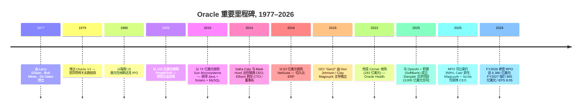
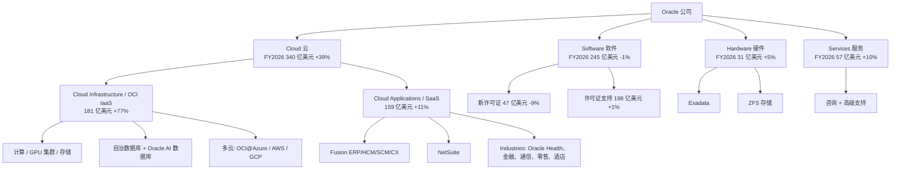
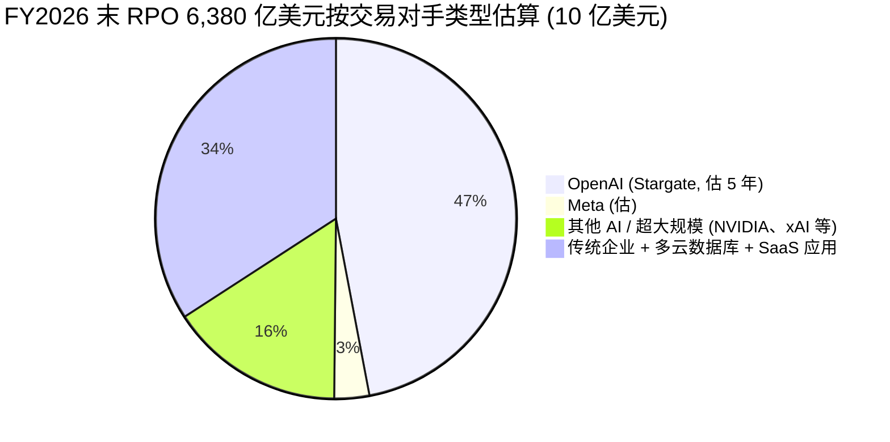
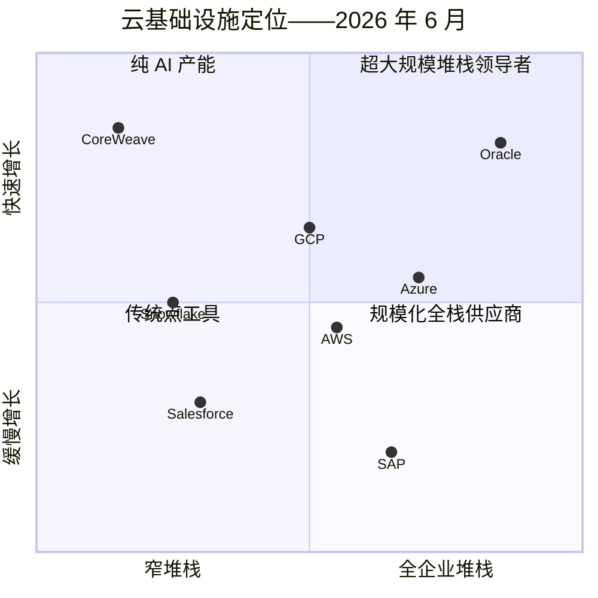

# Oracle Corporation (NYSE:ORCL) — 公司研究报告

**截至日期: 2026-06-13**
**分析师覆盖: 更新 (Refresh)**
**代码 / 交易所: NYSE: ORCL**
**财年截止日: 5 月 31 日 (FY2026 = 截至 2026-05-31 的财年)**
**总部: 美国得克萨斯州奥斯汀, Oracle Way 2300 号**
**审计师: 安永会计师事务所 (Ernst & Young LLP)**
**报告语言: 简体中文 (本目录仅此一份中文版)**

> *分析师观点：* **评级：Hold（持有）· 12 个月目标价 US$215（较 2026-06-12 收盘价 US$184.13 上行 +17%）· 估值方法：FY2028E 非 GAAP EPS US$11.4 × 19× 远期 P/E（净债务调整后）**
> 市值约 US$5,300 亿 · 52 周区间 US$136.00–US$325.76 · NYSE: ORCL
>
> | 倍数 / Multiple（*分析师观点：* 远期列） | FY2026A | FY2027E | FY2028E |
> |---|---|---|---|
> | 非 GAAP P/E | 24.1× | 22.9× | 16.1× |
> | GAAP P/E | 31.6× | 27.4× | 18.7× |
> | EV/Sales | 9.0× | 6.8× | 4.5× |
> | EV/EBITDA（GAAP 经营口径） | ~21× | ~16× | ~11× |
>
> 相对表现（截至 2026-06-12）：1M −3.0% · 6M −6.8% · YTD −5.3% · 12M −6.9%，对标 S&P 500（同窗口 +22.9% 12M）；12 个月**相对收益 −29.9%**（来源：[yfinance ORCL / ^GSPC, 截至 2026-06-12](https://finance.yahoo.com/quote/ORCL/)）。
> **核心论点（thesis pillars）**——（1）FY2026 是 Oracle 被重定价为第四家超大规模 (hyperscale) AI 云的一年：剩余履约义务 (Remaining Performance Obligations, RPO) 已达 **6,380 亿美元 (+363% YoY)**、OCI/IaaS 季度营业收入 **+93% YoY**，远期可见度在大盘软件中绝无仅有；（2）但 FY2027 资本开支 (capex) 指引 **900–950 亿美元**、自由现金流 (free cash flow, FCF) FY2026 已为 **−237 亿美元**，这是一笔靠债务与预收款融资的超大规模重资产建设，执行与回报周期是估值的核心约束；（3）约 5,000 亿+ 的 RPO 高度集中在少数 AI 大客户（OpenAI 等），是美国巨型市值软件中最大的单一客户集中度风险；（4）2026-06-10 财报后股价单日下跌约 9%，市场已对 capex/FCF 担忧重新定价——风险收益趋于均衡，故评级 Hold 而非 Buy。

> **更新——FY2026 创纪录收官 + FY2027 指引 (2026-06-10):** 管理层公布 **Q4 FY2026 总营业收入 191.8 亿美元 (+21% YoY)**、**全年 FY2026 营业收入 673.6 亿美元 (+17%)**，GAAP 摊薄 EPS 全年 **5.83 美元 (+34%)**、非 GAAP EPS **7.63 美元 (+27%)**；**RPO 季度环比新增 850 亿美元，从 5,530 亿跃升至 6,380 亿美元 (+363% YoY)**。同时**重申 FY2027 营业收入指引 900 亿美元、并将 FY2027 非 GAAP EPS 指引上调至 8.05 美元**（首次给出 FY2027 总 capex 指引 900–950 亿美元，扣除客户预付款后净现金支出约 700 亿美元）；Q1 FY2027 指引营业收入同比 +27%–29%、非 GAAP EPS 1.72–1.76 美元。董事会维持每股 0.50 美元季度股息。
> 来源: [Oracle Q4/FY2026 业绩公告 (8-K Exhibit 99.1), 2026-06-10](https://www.sec.gov/Archives/edgar/data/1341439/000119312526265848/orcl-ex99_1.htm)。

> **更新——双 CEO 继任 + 新 CFO (2025-09-22 / 2026-04-06):** Safra Catz 出任 CEO 11 年后卸任、转任执行副董事长 (Executive Vice Chair)。**Clay Magouyrk**（OCI 总裁；曾任 AWS 工程师，主导构建 OCI Gen2）与 **Mike Sicilia**（Industries / Oracle Health 总裁）任联席 CEO；**Hilary Maxson**（原施耐德电气 (Schneider Electric) 集团 CFO）自 2026-04-06 起任 CFO。
> 来源: [Oracle 8-K, 2025-09-22](https://www.sec.gov/Archives/edgar/data/1341439/000119312525210089/d921500dex991.htm); [Oracle 8-K, 2026-04-06](https://www.sec.gov/Archives/edgar/data/1341439/000119312526142939/d132760dex991.htm)。

## 目录

1. 公司概览（含投资论点）
1A. 估值与目标价（远期估算 · 目标价推导 · 牛/基准/熊情景）
1B. GF Score（GuruFocus 式）基本面评分卡
2. 公司历史
3. 管理团队
4. 产品与服务
5. 客户与上市策略
6. 行业概览
7. 竞争格局
8. 市场机会 (TAM)
9. 风险评估
9.5. 核心分歧与催化剂
10. 投资风格透视（投资者视角评分卡）
数据来源清单 / 参考资料

---

## 1. 公司概览

*分析师观点：* **本报告对 ORCL 给予 Hold（持有）评级、12 个月目标价 215 美元（较 2026-06-12 收盘价 184.13 美元上行约 +17%）。** 投资逻辑的核心张力很清楚: FY2026 已经证明 Oracle 真的成为了第四家超大规模 AI 云——OCI/IaaS 季度营业收入同比增长 93%、RPO 一年内从约 1,380 亿美元膨胀到 6,380 亿美元——但把这条曲线变现需要一笔以年化近百分之百营业收入规模的 capex、靠举债与客户预付款支撑的重资产建设，而 FCF 已经深度转负。买方在 2026-06-10 财报后用一个 9% 的单日跌幅表达了这种矛盾。我们认为合同积压 (backlog) 把未来 3–5 年的高增长锁定的可见度是真实的护城河，但执行风险、客户集中度与资产负债表压力使风险收益在现价附近趋于均衡——故为 Hold 而非 Buy。四条支柱: (1) 无可比的远期可见度（6,380 亿 RPO ≈ FY2026 营业收入的 9.5 倍）；(2) capex/FCF 是约束而非催化（FY2027 净现金 capex ~700 亿美元）；(3) 客户集中度为顶级风险；(4) 现价已部分反映上述担忧。

Oracle Corporation 是全球第二大企业软件公司, 并在过去 24 个月内发展为第四家超大规模 (hyperscale) 云基础设施提供商——这一切叠加在一项 48 年历史的数据库 (database) 业务之上, 该业务每年仍能产生约 200 亿美元的高利润率许可证支持 (license support) 营业收入。公司销售: (i) 数据库软件 (Oracle Database、MySQL、新推出的 Oracle AI 数据库 (Oracle AI Database)); (ii) 企业 SaaS 应用 (Fusion ERP/HCM/SCM、NetSuite, 以及以 Oracle Health——前身为 Cerner——为代表的垂直行业 "Industries" 应用组合); (iii) 通过 Oracle 云基础设施 (Oracle Cloud Infrastructure, OCI, 现为 "Gen2" 代) 提供的计算、存储与网络服务; (iv) Java、中间件 (middleware) 与本地部署许可证支持; (v) 一项规模较小的剩余硬件业务 (Exadata、ZFS Storage)。公司在 175 个以上国家通过直销企业销售队伍与渠道合作伙伴产生营业收入, 美国 (Americas) 市场约占合并营业收入的 63% ([Oracle FY2025 10-K, MD&A — Total Revenues by Geography](https://www.sec.gov/Archives/edgar/data/1341439/000095017025087926/orcl-20250531.htm))。

**FY2026 (截至 2026 年 5 月 31 日) 创纪录收官。** 2026-06-10, Oracle 披露**全年总营业收入 673.6 亿美元, 同比增长 17%** (恒定汇率 +16%), GAAP 经营业务利润 206.1 亿美元 (营业利润率 31%), GAAP 净利润 170.9 亿美元 (净利率 25%), GAAP 摊薄每股收益 (EPS) 5.83 美元 (+34%), 非 GAAP EPS 7.63 美元 (+27%) ([Oracle Q4/FY2026 业绩公告, 2026-06-10](https://www.sec.gov/Archives/edgar/data/1341439/000119312526265848/orcl-ex99_1.htm))。云总营业收入 (Cloud, IaaS+SaaS) 340.0 亿美元 (+39%), 其中**云基础设施 (OCI/IaaS) 181.0 亿美元 (+77%)**、云应用 (SaaS) 158.9 亿美元 (+11%)。**全年经营现金流创纪录达 320 亿美元 (+54%), 但 FCF 为 −237 亿美元** (资本开支 556.6 亿美元), 因 Oracle 持续投入建设 OCI 产能 ([同上, Statements of Cash Flows](https://www.sec.gov/Archives/edgar/data/1341439/000119312526265848/orcl-ex99_1.htm))。截至 FY2025 财年末公司全职员工约 16.2 万人, 其中研发部门 5 万人、销售与营销部门 3.1 万人 ([FY2025 10-K, 第 12 页](https://www.sec.gov/Archives/edgar/data/1341439/000095017025087926/orcl-20250531.htm))。

定义本时刻的三个数据点:

- **剩余履约义务 (RPO) 在一年内从 FY2025 财年末的约 1,380 亿美元飙升至 FY2026 财年末的 6,380 亿美元 (+363% YoY)**, 仅 Q4 单季环比就新增 850 亿美元 (从 5,530 亿增至 6,380 亿) ([Q4/FY2026 业绩公告, 2026-06-10](https://www.sec.gov/Archives/edgar/data/1341439/000119312526265848/orcl-ex99_1.htm))。Q3、Q4 的 RPO 增量大部分来自客户预付款 (prepaid) 或客户自带硬件 (bring-your-own-hardware, BYOH) 的大型 AI 合同——这部分预付 + 客户自供硬件合计已达 750 亿美元, "大幅降低了 Oracle 为建设 AI 数据中心需要募集的资本"。
- **FY2026 Q4 是又一个创纪录季度: 总营业收入 191.8 亿美元 (+21%), 云收入 99.1 亿美元 (+47%), 其中 OCI/IaaS 收入 57.9 亿美元 (+93% YoY)**, GAAP EPS 1.45 美元 (+21%)、非 GAAP EPS 2.11 美元 (+24%) ([Q4/FY2026 业绩公告, 2026-06-10](https://www.sec.gov/Archives/edgar/data/1341439/000119312526265848/orcl-ex99_1.htm))。
- **FY2026 资本开支 556.6 亿美元** (FY2025 为 212.2 亿美元), 约相当于 FY2026 营业收入的 83%; 管理层指引 **FY2027 总 capex 900–950 亿美元**, 但其中 200–250 亿美元由客户预付款覆盖, Oracle 净现金支出约 700 亿美元 ([Q4/FY2026 业绩公告, 2026-06-10](https://www.sec.gov/Archives/edgar/data/1341439/000119312526265848/orcl-ex99_1.htm); *分析师观点：* 净现金 capex 拆分见 [Goldman Sachs — Oracle 4QFY, 2026-06-11, p.1](http://xs-macbook-air.local:5001/zsxq/pdf/814522582511582/Goldman%20Sachs-Oracle%20Corp.%20%EF%BC%88ORCL.US%EF%BC%89%204QFY%EF%BC%9A%20Capacity%20ramp%20progressing%EF%BC%9B%20capital%20intensity%20and%20ROI%20still%20in%20focus-260611.pdf)）。

### 收入构成 / How Oracle makes its money — FY2026

<svg xmlns="http://www.w3.org/2000/svg" viewBox="0 0 1000 560" width="1000" height="560" role="img" aria-label="income statement Sankey"><rect x="0" y="0" width="1000" height="560" fill="#ffffff"/>
<text x="20.00" y="30.00" text-anchor="start" font-family="Helvetica,Arial,sans-serif" font-size="15" font-weight="700" fill="#1f2933">Oracle 收入构成 / How Oracle Makes Its Money — FY2026 (截至 2026-05-31)</text>
<path d="M 204.00,64.00 C 258.00,64.00 258.00,85.00 312.00,85.00 L 312.00,290.88 C 258.00,290.88 258.00,269.88 204.00,269.88 Z" fill="#93c5fd" fill-opacity="0.55"/>
<path d="M 452.00,78.00 C 506.00,78.00 506.00,147.72 560.00,147.72 L 560.00,272.54 C 506.00,272.54 506.00,202.82 452.00,202.82 Z" fill="#86efac" fill-opacity="0.55"/>
<path d="M 452.00,202.82 C 506.00,202.82 506.00,286.54 560.00,286.54 L 560.00,430.28 C 506.00,430.28 506.00,346.56 452.00,346.56 Z" fill="#fca5a5" fill-opacity="0.55"/>
<path d="M 328.00,85.00 C 382.00,85.00 382.00,78.00 436.00,78.00 L 436.00,346.56 C 382.00,346.56 382.00,353.56 328.00,353.56 Z" fill="#86efac" fill-opacity="0.55"/>
<path d="M 328.00,353.56 C 382.00,353.56 382.00,360.56 436.00,360.56 L 436.00,500.00 C 382.00,500.00 382.00,493.00 328.00,493.00 Z" fill="#fca5a5" fill-opacity="0.55"/>
<path d="M 700.00,136.91 C 754.00,136.91 754.00,222.78 808.00,222.78 L 808.00,326.28 C 754.00,326.28 754.00,240.41 700.00,240.41 Z" fill="#86efac" fill-opacity="0.55"/>
<path d="M 700.00,240.41 C 754.00,240.41 754.00,340.28 808.00,340.28 L 808.00,355.22 C 754.00,355.22 754.00,255.35 700.00,255.35 Z" fill="#fca5a5" fill-opacity="0.55"/>
<path d="M 576.00,147.72 C 630.00,147.72 630.00,136.91 684.00,136.91 L 684.00,261.72 C 630.00,261.72 630.00,272.54 576.00,272.54 Z" fill="#86efac" fill-opacity="0.55"/>
<path d="M 204.00,283.88 C 258.00,283.88 258.00,290.88 312.00,290.88 L 312.00,439.53 C 258.00,439.53 258.00,432.53 204.00,432.53 Z" fill="#93c5fd" fill-opacity="0.55"/>
<path d="M 576.00,286.54 C 630.00,286.54 630.00,269.35 684.00,269.35 L 684.00,319.82 C 630.00,319.82 630.00,337.00 576.00,337.00 Z" fill="#fca5a5" fill-opacity="0.55"/>
<path d="M 576.00,337.00 C 630.00,337.00 630.00,333.82 684.00,333.82 L 684.00,396.04 C 630.00,396.04 630.00,399.22 576.00,399.22 Z" fill="#fca5a5" fill-opacity="0.55"/>
<path d="M 576.00,399.22 C 630.00,399.22 630.00,410.04 684.00,410.04 L 684.00,441.09 C 630.00,441.09 630.00,430.28 576.00,430.28 Z" fill="#fca5a5" fill-opacity="0.55"/>
<path d="M 204.00,446.53 C 258.00,446.53 258.00,439.53 312.00,439.53 L 312.00,474.32 C 258.00,474.32 258.00,481.32 204.00,481.32 Z" fill="#93c5fd" fill-opacity="0.55"/>
<path d="M 204.00,495.32 C 258.00,495.32 258.00,474.32 312.00,474.32 L 312.00,493.00 C 258.00,493.00 258.00,514.00 204.00,514.00 Z" fill="#93c5fd" fill-opacity="0.55"/>
<rect x="188.00" y="64.00" width="16" height="205.88" rx="1.5" fill="#2563eb"/>
<rect x="188.00" y="283.88" width="16" height="148.65" rx="1.5" fill="#2563eb"/>
<rect x="188.00" y="446.53" width="16" height="34.79" rx="1.5" fill="#2563eb"/>
<rect x="188.00" y="495.32" width="16" height="18.68" rx="1.5" fill="#2563eb"/>
<rect x="312.00" y="85.00" width="16" height="408.00" rx="1.5" fill="#1e3a8a"/>
<rect x="436.00" y="78.00" width="16" height="268.56" rx="1.5" fill="#15803d"/>
<rect x="436.00" y="360.56" width="16" height="139.44" rx="1.5" fill="#dc2626"/>
<rect x="560.00" y="147.72" width="16" height="124.82" rx="1.5" fill="#15803d"/>
<rect x="560.00" y="286.54" width="16" height="143.74" rx="1.5" fill="#dc2626"/>
<rect x="684.00" y="136.91" width="16" height="118.44" rx="1.5" fill="#15803d"/>
<rect x="684.00" y="269.35" width="16" height="50.46" rx="1.5" fill="#dc2626"/>
<rect x="684.00" y="333.82" width="16" height="62.22" rx="1.5" fill="#dc2626"/>
<rect x="684.00" y="410.04" width="16" height="31.06" rx="1.5" fill="#dc2626"/>
<rect x="808.00" y="222.78" width="16" height="103.50" rx="1.5" fill="#15803d"/>
<rect x="808.00" y="340.28" width="16" height="14.94" rx="1.5" fill="#dc2626"/>
<line x1="188.00" y1="166.94" x2="182.00" y2="149.28" stroke="#cbd5e1" stroke-width="1"/>
<text x="179.00" y="152.28" text-anchor="end" font-family="Helvetica,Arial,sans-serif" font-size="11.5" font-weight="700" fill="#1f2933">Cloud (IaaS+SaaS)</text>
<text x="179.00" y="165.28" text-anchor="end" font-family="Helvetica,Arial,sans-serif" font-size="10" font-weight="400" fill="#52606d">$34.0B  (50.5%)</text>
<line x1="188.00" y1="358.21" x2="182.00" y2="340.55" stroke="#cbd5e1" stroke-width="1"/>
<text x="179.00" y="343.55" text-anchor="end" font-family="Helvetica,Arial,sans-serif" font-size="11.5" font-weight="700" fill="#1f2933">Software (license+support)</text>
<text x="179.00" y="356.55" text-anchor="end" font-family="Helvetica,Arial,sans-serif" font-size="10" font-weight="400" fill="#52606d">$24.5B  (36.4%)</text>
<line x1="188.00" y1="463.93" x2="182.00" y2="446.27" stroke="#cbd5e1" stroke-width="1"/>
<text x="179.00" y="449.27" text-anchor="end" font-family="Helvetica,Arial,sans-serif" font-size="11.5" font-weight="700" fill="#1f2933">Services</text>
<text x="179.00" y="462.27" text-anchor="end" font-family="Helvetica,Arial,sans-serif" font-size="10" font-weight="400" fill="#52606d">$5.7B  (8.5%)</text>
<line x1="188.00" y1="504.66" x2="182.00" y2="487.00" stroke="#cbd5e1" stroke-width="1"/>
<text x="179.00" y="490.00" text-anchor="end" font-family="Helvetica,Arial,sans-serif" font-size="11.5" font-weight="700" fill="#1f2933">Hardware</text>
<text x="179.00" y="503.00" text-anchor="end" font-family="Helvetica,Arial,sans-serif" font-size="10" font-weight="400" fill="#52606d">$3.1B  (4.6%)</text>
<rect x="331.00" y="67.00" width="106.80" height="26" rx="2" fill="#ffffff" fill-opacity="0.72"/>
<text x="334.00" y="79.00" text-anchor="start" font-family="Helvetica,Arial,sans-serif" font-size="11.5" font-weight="700" fill="#1f2933">Revenue</text>
<text x="334.00" y="92.00" text-anchor="start" font-family="Helvetica,Arial,sans-serif" font-size="10" font-weight="400" fill="#52606d">$67.4B  (100.0%)</text>
<rect x="455.00" y="60.00" width="100.50" height="26" rx="2" fill="#ffffff" fill-opacity="0.72"/>
<text x="458.00" y="72.00" text-anchor="start" font-family="Helvetica,Arial,sans-serif" font-size="11.5" font-weight="700" fill="#1f2933">Gross Profit</text>
<text x="458.00" y="85.00" text-anchor="start" font-family="Helvetica,Arial,sans-serif" font-size="10" font-weight="400" fill="#52606d">$44.3B  (65.8%)</text>
<rect x="455.00" y="342.56" width="144.60" height="26" rx="2" fill="#ffffff" fill-opacity="0.72"/>
<text x="458.00" y="354.56" text-anchor="start" font-family="Helvetica,Arial,sans-serif" font-size="11.5" font-weight="700" fill="#1f2933">Cost of Revenue (COGS)</text>
<text x="458.00" y="367.56" text-anchor="start" font-family="Helvetica,Arial,sans-serif" font-size="10" font-weight="400" fill="#52606d">$23.0B  (34.2%)</text>
<rect x="579.00" y="129.72" width="106.80" height="26" rx="2" fill="#ffffff" fill-opacity="0.72"/>
<text x="582.00" y="141.72" text-anchor="start" font-family="Helvetica,Arial,sans-serif" font-size="11.5" font-weight="700" fill="#1f2933">Operating Income</text>
<text x="582.00" y="154.72" text-anchor="start" font-family="Helvetica,Arial,sans-serif" font-size="10" font-weight="400" fill="#52606d">$20.6B  (30.6%)</text>
<rect x="579.00" y="268.54" width="150.90" height="26" rx="2" fill="#ffffff" fill-opacity="0.72"/>
<text x="582.00" y="280.54" text-anchor="start" font-family="Helvetica,Arial,sans-serif" font-size="11.5" font-weight="700" fill="#1f2933">Total Operating Expense</text>
<text x="582.00" y="293.54" text-anchor="start" font-family="Helvetica,Arial,sans-serif" font-size="10" font-weight="400" fill="#52606d">$23.7B  (35.2%)</text>
<rect x="703.00" y="118.91" width="100.50" height="26" rx="2" fill="#ffffff" fill-opacity="0.72"/>
<text x="706.00" y="130.91" text-anchor="start" font-family="Helvetica,Arial,sans-serif" font-size="11.5" font-weight="700" fill="#1f2933">Pretax Income</text>
<text x="706.00" y="143.91" text-anchor="start" font-family="Helvetica,Arial,sans-serif" font-size="10" font-weight="400" fill="#52606d">$19.6B  (29.0%)</text>
<rect x="703.00" y="251.35" width="94.20" height="26" rx="2" fill="#ffffff" fill-opacity="0.72"/>
<text x="706.00" y="263.35" text-anchor="start" font-family="Helvetica,Arial,sans-serif" font-size="11.5" font-weight="700" fill="#1f2933">SG&amp;A</text>
<text x="706.00" y="276.35" text-anchor="start" font-family="Helvetica,Arial,sans-serif" font-size="10" font-weight="400" fill="#52606d">$8.3B  (12.4%)</text>
<rect x="703.00" y="315.82" width="100.50" height="26" rx="2" fill="#ffffff" fill-opacity="0.72"/>
<text x="706.00" y="327.82" text-anchor="start" font-family="Helvetica,Arial,sans-serif" font-size="11.5" font-weight="700" fill="#1f2933">R&amp;D</text>
<text x="706.00" y="340.82" text-anchor="start" font-family="Helvetica,Arial,sans-serif" font-size="10" font-weight="400" fill="#52606d">$10.3B  (15.3%)</text>
<rect x="703.00" y="392.04" width="87.90" height="26" rx="2" fill="#ffffff" fill-opacity="0.72"/>
<text x="706.00" y="404.04" text-anchor="start" font-family="Helvetica,Arial,sans-serif" font-size="11.5" font-weight="700" fill="#1f2933">Other OpEx</text>
<text x="706.00" y="417.04" text-anchor="start" font-family="Helvetica,Arial,sans-serif" font-size="10" font-weight="400" fill="#52606d">$5.1B  (7.6%)</text>
<text x="833.00" y="271.53" text-anchor="start" font-family="Helvetica,Arial,sans-serif" font-size="11.5" font-weight="700" fill="#1f2933">Net Income</text>
<text x="833.00" y="284.53" text-anchor="start" font-family="Helvetica,Arial,sans-serif" font-size="10" font-weight="400" fill="#52606d">$17.1B  (25.4%)</text>
<text x="833.00" y="344.75" text-anchor="start" font-family="Helvetica,Arial,sans-serif" font-size="11.5" font-weight="700" fill="#1f2933">Income Tax</text>
<text x="833.00" y="357.75" text-anchor="start" font-family="Helvetica,Arial,sans-serif" font-size="10" font-weight="400" fill="#52606d">$2.5B  (3.7%)</text>
<text x="500.00" y="544.00" text-anchor="middle" font-family="Helvetica,Arial,sans-serif" font-size="10" font-weight="400" fill="#52606d">Source: ORCL Q4/FY2026 业绩公告 (8-K, 2026-06-10), Condensed Consolidated Statements of Operations</text>
</svg>

来源 / Source: [Oracle Q4/FY2026 业绩公告 (8-K Exhibit 99.1), 2026-06-10 — Condensed Consolidated Statements of Operations](https://www.sec.gov/Archives/edgar/data/1341439/000119312526265848/orcl-ex99_1.htm)。

### FY2026 营业收入按产品线

<svg xmlns="http://www.w3.org/2000/svg" viewBox="0 0 720 460" width="720" height="460" role="img" aria-label="revenue donut"><rect x="0" y="0" width="720" height="460" fill="#ffffff"/>
<text x="20.00" y="30.00" text-anchor="start" font-family="Helvetica,Arial,sans-serif" font-size="15" font-weight="700" fill="#1f2933">FY2026 营业收入按产品线 / Revenue by Offering</text>
<path d="M 288.00,107.20 A 132 132 0 1 1 284.18,371.14 L 285.74,317.17 A 78 78 0 1 0 288.00,161.20 Z" fill="#2563eb"/>
<path d="M 284.18,371.14 A 132 132 0 0 1 191.18,149.48 L 230.79,186.18 A 78 78 0 0 0 285.74,317.17 Z" fill="#15803d"/>
<path d="M 191.18,149.48 A 132 132 0 0 1 250.55,112.62 L 265.87,164.41 A 78 78 0 0 0 230.79,186.18 Z" fill="#d97706"/>
<path d="M 250.55,112.62 A 132 132 0 0 1 288.00,107.20 L 288.00,161.20 A 78 78 0 0 0 265.87,164.41 Z" fill="#7c3aed"/>
<text x="288.00" y="235.20" text-anchor="middle" font-family="Helvetica,Arial,sans-serif" font-size="18" font-weight="800" fill="#1f2933">ORCL FY26</text>
<text x="288.00" y="255.20" text-anchor="middle" font-family="Helvetica,Arial,sans-serif" font-size="13" font-weight="600" fill="#52606d">$67.4B</text>
<text x="288.00" y="271.20" text-anchor="middle" font-family="Helvetica,Arial,sans-serif" font-size="10" font-weight="400" fill="#8a97a3">total</text>
<line x1="425.99" y1="241.20" x2="441.99" y2="241.20" stroke="#2563eb" stroke-width="1.4"/>
<text x="445.99" y="239.20" text-anchor="start" font-family="Helvetica,Arial,sans-serif" font-size="11" font-weight="700" fill="#1f2933">Cloud (IaaS+SaaS)</text>
<text x="445.99" y="253.20" text-anchor="start" font-family="Helvetica,Arial,sans-serif" font-size="10" font-weight="400" fill="#52606d">$34.0B  (50.5%)</text>
<line x1="160.74" y1="292.59" x2="144.74" y2="292.59" stroke="#15803d" stroke-width="1.4"/>
<text x="140.74" y="290.59" text-anchor="end" font-family="Helvetica,Arial,sans-serif" font-size="11" font-weight="700" fill="#1f2933">Software (license+support)</text>
<text x="140.74" y="304.59" text-anchor="end" font-family="Helvetica,Arial,sans-serif" font-size="10" font-weight="400" fill="#52606d">$24.5B  (36.4%)</text>
<line x1="215.22" y1="121.95" x2="199.22" y2="121.95" stroke="#d97706" stroke-width="1.4"/>
<text x="195.22" y="119.95" text-anchor="end" font-family="Helvetica,Arial,sans-serif" font-size="11" font-weight="700" fill="#1f2933">Services</text>
<text x="195.22" y="133.95" text-anchor="end" font-family="Helvetica,Arial,sans-serif" font-size="10" font-weight="400" fill="#52606d">$5.7B  (8.5%)</text>
<line x1="268.22" y1="102.63" x2="252.22" y2="102.63" stroke="#7c3aed" stroke-width="1.4"/>
<text x="248.22" y="100.63" text-anchor="end" font-family="Helvetica,Arial,sans-serif" font-size="11" font-weight="700" fill="#1f2933">Hardware</text>
<text x="248.22" y="114.63" text-anchor="end" font-family="Helvetica,Arial,sans-serif" font-size="10" font-weight="400" fill="#52606d">$3.1B  (4.6%)</text>
<text x="360.00" y="444.00" text-anchor="middle" font-family="Helvetica,Arial,sans-serif" font-size="10" font-weight="400" fill="#52606d">Source: ORCL Q4/FY2026 业绩公告 (8-K, 2026-06-10), Supplemental Analysis of GAAP Revenues</text>
</svg>

来源 / Source: [Oracle Q4/FY2026 业绩公告, 2026-06-10 — Supplemental Analysis of GAAP Revenues](https://www.sec.gov/Archives/edgar/data/1341439/000119312526265848/orcl-ex99_1.htm)。

### 云收入按季拆分 (IaaS 加速、SaaS 平稳)

<svg xmlns="http://www.w3.org/2000/svg" viewBox="0 0 860 470" width="860" height="470" role="img" aria-label="historical revenue bars"><rect x="0" y="0" width="860" height="470" fill="#ffffff"/>
<text x="20.00" y="30.00" text-anchor="start" font-family="Helvetica,Arial,sans-serif" font-size="15" font-weight="700" fill="#1f2933">云收入按季拆分 / Quarterly Cloud Revenue: IaaS vs SaaS (FY2025 Q1 → FY2026 Q4)</text>
<rect x="20.00" y="44" width="11" height="11" rx="2" fill="#2563eb"/>
<text x="36.00" y="53.00" text-anchor="start" font-family="Helvetica,Arial,sans-serif" font-size="10.5" font-weight="400" fill="#1f2933">Cloud Infrastructure (IaaS)</text>
<rect x="228.20" y="44" width="11" height="11" rx="2" fill="#15803d"/>
<text x="244.20" y="53.00" text-anchor="start" font-family="Helvetica,Arial,sans-serif" font-size="10.5" font-weight="400" fill="#1f2933">Cloud Applications (SaaS)</text>
<line x1="70" y1="412.00" x2="834" y2="412.00" stroke="#eceff2" stroke-width="1"/>
<text x="64.00" y="415.00" text-anchor="end" font-family="Helvetica,Arial,sans-serif" font-size="9.5" font-weight="400" fill="#52606d">$0</text>
<line x1="70" y1="345.20" x2="834" y2="345.20" stroke="#eceff2" stroke-width="1"/>
<text x="64.00" y="348.20" text-anchor="end" font-family="Helvetica,Arial,sans-serif" font-size="9.5" font-weight="400" fill="#52606d">$2.1B</text>
<line x1="70" y1="278.40" x2="834" y2="278.40" stroke="#eceff2" stroke-width="1"/>
<text x="64.00" y="281.40" text-anchor="end" font-family="Helvetica,Arial,sans-serif" font-size="9.5" font-weight="400" fill="#52606d">$4.3B</text>
<line x1="70" y1="211.60" x2="834" y2="211.60" stroke="#eceff2" stroke-width="1"/>
<text x="64.00" y="214.60" text-anchor="end" font-family="Helvetica,Arial,sans-serif" font-size="9.5" font-weight="400" fill="#52606d">$6.4B</text>
<line x1="70" y1="144.80" x2="834" y2="144.80" stroke="#eceff2" stroke-width="1"/>
<text x="64.00" y="147.80" text-anchor="end" font-family="Helvetica,Arial,sans-serif" font-size="9.5" font-weight="400" fill="#52606d">$8.6B</text>
<line x1="70" y1="78.00" x2="834" y2="78.00" stroke="#eceff2" stroke-width="1"/>
<text x="64.00" y="81.00" text-anchor="end" font-family="Helvetica,Arial,sans-serif" font-size="9.5" font-weight="400" fill="#52606d">$10.7B</text>
<rect x="90.06" y="344.80" width="55.39" height="67.20" fill="#2563eb"/>
<rect x="90.06" y="236.58" width="55.39" height="108.22" fill="#15803d"/>
<text x="117.75" y="428.00" text-anchor="middle" font-family="Helvetica,Arial,sans-serif" font-size="10" font-weight="400" fill="#52606d">F25Q1</text>
<rect x="185.56" y="336.07" width="55.39" height="75.93" fill="#2563eb"/>
<rect x="185.56" y="226.78" width="55.39" height="109.28" fill="#15803d"/>
<text x="213.25" y="428.00" text-anchor="middle" font-family="Helvetica,Arial,sans-serif" font-size="10" font-weight="400" fill="#52606d">F25Q2</text>
<rect x="281.06" y="329.26" width="55.39" height="82.74" fill="#2563eb"/>
<rect x="281.06" y="218.26" width="55.39" height="111.00" fill="#15803d"/>
<text x="308.75" y="428.00" text-anchor="middle" font-family="Helvetica,Arial,sans-serif" font-size="10" font-weight="400" fill="#52606d">F25Q3</text>
<rect x="376.56" y="318.56" width="55.39" height="93.44" fill="#2563eb"/>
<rect x="376.56" y="201.82" width="55.39" height="116.74" fill="#15803d"/>
<text x="404.25" y="428.00" text-anchor="middle" font-family="Helvetica,Arial,sans-serif" font-size="10" font-weight="400" fill="#52606d">F25Q4</text>
<rect x="472.06" y="307.58" width="55.39" height="104.42" fill="#2563eb"/>
<rect x="472.06" y="187.82" width="55.39" height="119.77" fill="#15803d"/>
<text x="499.75" y="428.00" text-anchor="middle" font-family="Helvetica,Arial,sans-serif" font-size="10" font-weight="400" fill="#52606d">F26Q1</text>
<rect x="567.55" y="284.75" width="55.39" height="127.25" fill="#2563eb"/>
<rect x="567.55" y="163.14" width="55.39" height="121.61" fill="#15803d"/>
<text x="595.25" y="428.00" text-anchor="middle" font-family="Helvetica,Arial,sans-serif" font-size="10" font-weight="400" fill="#52606d">F26Q2</text>
<rect x="663.05" y="259.51" width="55.39" height="152.49" fill="#2563eb"/>
<rect x="663.05" y="133.91" width="55.39" height="125.60" fill="#15803d"/>
<text x="690.75" y="428.00" text-anchor="middle" font-family="Helvetica,Arial,sans-serif" font-size="10" font-weight="400" fill="#52606d">F26Q3</text>
<rect x="758.55" y="231.46" width="55.39" height="180.54" fill="#2563eb"/>
<rect x="758.55" y="102.74" width="55.39" height="128.72" fill="#15803d"/>
<text x="786.25" y="428.00" text-anchor="middle" font-family="Helvetica,Arial,sans-serif" font-size="10" font-weight="400" fill="#52606d">F26Q4</text>
<text x="430.00" y="454.00" text-anchor="middle" font-family="Helvetica,Arial,sans-serif" font-size="10" font-weight="400" fill="#52606d">Source: ORCL Q4/FY2026 业绩公告 (8-K, 2026-06-10), Cloud Revenues by Offerings</text>
</svg>

来源 / Source: [Oracle Q4/FY2026 业绩公告, 2026-06-10 — Cloud Revenues by Offerings](https://www.sec.gov/Archives/edgar/data/1341439/000119312526265848/orcl-ex99_1.htm)。该图直观呈现了 FY2026 投资逻辑: 云基础设施 (IaaS) 从 FY2025 Q1 的 21.5 亿美元/季加速至 FY2026 Q4 的 57.9 亿美元/季, 而云应用 (SaaS) 维持低双位数增长。

**估值快照 (截至 2026-06-12)。** Oracle 股价 **184.13 美元**, 市值 **约 5,300 亿美元** ([yfinance — ORCL, 截至 2026-06-12](https://finance.yahoo.com/quote/ORCL/))。**值得注意的价格行为: 股价在 2026-06-10 财报前收于 201.26 美元, 财报后 2026-06-11 单日下跌约 9% 至 184.10 美元**, 尽管 Q4 与全年均创纪录——市场对 FY2027 capex/FCF 担忧的重定价压倒了营业收入超预期 (*分析师观点：* 详见 [Morgan Stanley — Oracle 4Q26, 2026-06-11, p.1](http://xs-macbook-air.local:5001/zsxq/pdf/584255215288124/Morgan%20Stanley-Oracle%20Corporation%EF%BC%88ORCL.US%EF%BC%894Q26%20Results%E2%80%93Limited%20Upside%20Near%20Term%20Makes%20It%20Harder%20to%20Underwrite%20the%20Ambitious%20Long%20Term-260611.pdf)）。基于 FY2026 GAAP EPS 5.83 美元, **TTM GAAP P/E 约 31.6 倍**; 基于非 GAAP EPS 7.63 美元, **TTM 非 GAAP P/E 约 24.1 倍**; TTM 市销率 (P/S) 约 7.9 倍。同期 (2026 年 6 月) 同业 TTM 倍数对比:

| 同业 | TTM P/E (GAAP) | TTM P/S |
|---|---|---|
| **ORCL** | 31.6× | 7.9× |
| MSFT | ~33× | ~12× |
| GOOGL | ~26× | ~7× |
| AMZN | ~33× | ~3.4× |
| SAP | ~40× | ~9× |

来源: ORCL 倍数为本报告基于 [Q4/FY2026 业绩公告](https://www.sec.gov/Archives/edgar/data/1341439/000119312526265848/orcl-ex99_1.htm) EPS 与 [yfinance 股价](https://finance.yahoo.com/quote/ORCL/) 计算; 同业倍数为 2026 年 6 月近似值, 综合自 [MacroTrends — ORCL P/E](https://www.macrotrends.net/stocks/charts/ORCL/oracle/pe-ratio) 与各同业 MacroTrends 页 (近似, 供参照)。

解释直观: **Oracle 以成长股倍数交易, 因为市场为一条尚未完全体现在已确认营业收入、但已锁定在合同积压 (backlog) 中的 OCI 营业收入轨迹付费。** 即便经过财报后的回调, 31.6 倍 GAAP P/E 仍高于其十年中位数 (约 27 倍), 原因在于: (a) AI 基础设施叙事重估了任何拥有可信 OCI/Stargate 型合同的标的——同一动态也重新定价了 CRWV、NBIS 乃至 Dell; (b) 管理层 FY2027 营业收入 900 亿美元、FY2030 OCI 营业收入 1,440 亿美元的指引隐含约 5 年营业收入年复合增长率 (CAGR) 超过 25%; (c) 约 6,380 亿美元 RPO 约相当于 FY2026 营业收入的 9.5 倍——这是大盘软件股中少见的远期可见度指标。倍数的主要风险是 capex 项目执行、FCF 长期为负以及 RPO 中蕴含的客户集中度 (见第 9 节)。**因 P/S 与 GAAP P/E 仍高于多数同业, 且 FCF 深度为负, 我们将估值倍数本身列入第 9 节风险。**

---

## 1A. 估值与目标价

> *分析师观点：* 本章所有前瞻数字 (远期营业收入、利润率、EPS、目标价及情景目标价) 均为本报告的前瞻判断, **不附任何 filing 引用**——10-K 中不含目标价。每项预测的外部输入 (filing 分部数据 + 管理层指引 + 行业预测) 在文中内联引用。

### (a) 远期财务估算表 (*分析师观点：*)

| 指标 (*分析师观点：*) | FY2025A | FY2026A | FY2027E | FY2028E | FY26→28 CAGR |
|---|---|---|---|---|---|
| 营业收入 (Revenue, 亿美元) | 574.0 | 673.6 | 904 | 1,150 | +30.7% |
| — YoY % | +8% | +17% | +34% | +27% | |
| — 其中 OCI/IaaS (亿美元) | 102.3 | 181.0 | ~320 | ~520 | +69% |
| gross margin (毛利率, GAAP) % | ~70% | ~66% | ~63% | ~64% | |
| operating margin (经营利润率, GAAP) % | 30.8% | 31% | ~28% | ~30% | |
| net margin (净利率, GAAP) % | 21.7% | 25% | ~21% | ~22% | |
| GAAP 摊薄 EPS (美元) | 4.34 | 5.83 | ~6.7 | ~9.8 | +30% |
| 非 GAAP 摊薄 EPS (美元) | 6.00 | 7.63 | 8.05 | ~11.4 | +22% |
| ROIC % (*分析师估算*) | ~18% | ~13% | ~10% | ~12% | |
| FCF (亿美元) | −4 | −237 | ~−300 | ~−150 | |
| 净债务 (Net debt, 亿美元) | ~643 | ~976 | ~1,300+ | ~1,400+ | |

各预测单元的基础: FY2027 营业收入 904 亿来自[管理层重申的 FY2027 营业收入指引 900 亿美元](https://www.sec.gov/Archives/edgar/data/1341439/000119312526265848/orcl-ex99_1.htm) (Bernstein 估 904 亿, *分析师观点：* [Bernstein — Oracle 4Q26, 2026-06-11, p.1](http://xs-macbook-air.local:5001/zsxq/pdf/181245814555812/Bernstein-Oracle%20Corp%EF%BC%88ORCL.US%EF%BC%89Oracle%204Q26%EF%BC%9A%20good%20execution%EF%BC%8C%20increasing%20clarity-260611.pdf)); FY2027 非 GAAP EPS 8.05 美元来自[管理层上调后的 FY2027 EPS 指引](https://www.sec.gov/Archives/edgar/data/1341439/000119312526265848/orcl-ex99_1.htm); FY2028 营业收入与 EPS 取本报告与 Bernstein 估算的中间偏保守值 (Bernstein 估 FY2028 营业收入 1,368 亿、Adj EPS 12.86 美元——*分析师观点：* 同上 Bernstein 链接); FCF 路径基于 [FY2027 capex 指引 900–950 亿美元、净现金支出约 700 亿美元](https://www.sec.gov/Archives/edgar/data/1341439/000119312526265848/orcl-ex99_1.htm) 与 [FY2026 实际 FCF −237 亿美元](https://www.sec.gov/Archives/edgar/data/1341439/000119312526265848/orcl-ex99_1.htm) 推得。

**毛利率桥 (margin bridge, *分析师观点：*)。** FY2026 GAAP 毛利率较 FY2025 下降约 5 个百分点 (pp), 主要驱动: OCI 新数据中心上线初期的折旧与摊销 (depreciation) 拖累 (折旧从 FY2025 的 38.7 亿美元跃升至 FY2026 的 76.2 亿美元, +97%——见 [现金流量表](https://www.sec.gov/Archives/edgar/data/1341439/000119312526265848/orcl-ex99_1.htm))；部分被费用管控对冲 (FY2026 销售与营销费用 −4% YoY、研发费用仅 +4%)。管理层称 OCI 利用率爬坡后, IaaS 长期毛利率目标为 30%–40% 区间, 附加服务 (存储/安全) 60%–80% (*分析师观点：* [Bernstein — Oracle 4Q26, 2026-06-11, p.1](http://xs-macbook-air.local:5001/zsxq/pdf/181245814555812/Bernstein-Oracle%20Corp%EF%BC%88ORCL.US%EF%BC%89Oracle%204Q26%EF%BC%9A%20good%20execution%EF%BC%8C%20increasing%20clarity-260611.pdf)）。

### (b) 目标价推导 (*分析师观点：*)

方法: **远期 P/E × 目标倍数**。我们以 FY2028E 非 GAAP EPS **11.4 美元** × **19× 远期 P/E** ≈ **216 美元**, 取整 **12 个月目标价 215 美元**。

为什么用 19×: 这是本报告在三个相互拉扯的事实之间取的折中——(i) Oracle FY2026→28 非 GAAP EPS CAGR 约 22%, 支持高于市场平均的倍数; (ii) 但 FCF 在整个预测期为负、净债务超 1,300 亿美元、穆迪 (Moody's) 已下调至 Baa2 负面展望, 应给予资产负债表折价; (iii) 对标 3–5 个同业: MSFT 约 33× GAAP P/E (但 FCF 强劲正值)、SAP 约 40×、GOOGL 约 26×、纯 AI-IaaS 同业 CRWV 因 FCF 为负而长期低倍数交易。Oracle 介于"高利润率软件巨头"与"重资产 AI-IaaS 建设者"之间, 19× 远期非 GAAP P/E 反映这种混合身份——高于纯 IaaS、低于无杠杆的软件同业。卖方目标价区间从 207 美元 (Morgan Stanley) 到 325 美元 (Bernstein) 不等, 我们的 215 美元落在偏保守一侧 (见下文一致预期对比)。

### (c) 牛 / 基准 / 熊情景 (*分析师观点：*)

| 情景 (*分析师观点：*) | 关键假设 | 目标价 | 较现价 (184.13) |
|---|---|---|---|
| 牛 (Bull) | FY2028 OCI 超指引、利用率与 ROIC 兑现, 倍数回到 24× × Adj EPS 12.86 | $309 | +68% |
| 基准 (Base) | FY2028E 非 GAAP EPS 11.4 × 19× | $215 | +17% |
| 熊 (Bear) | AI capex 周期降温、SaaS 持续减速、毛利率不回升, 仅核心业务估值, 14× × ~8.0 | $112 | −39% |

牛/熊情景与 Morgan Stanley 的 SOTP 框架一致 (牛/基准/熊约 $325/$207/$75, *分析师观点：* [Morgan Stanley — Oracle 4Q26, 2026-06-11, p.1](http://xs-macbook-air.local:5001/zsxq/pdf/584255215288124/Morgan%20Stanley-Oracle%20Corporation%EF%BC%88ORCL.US%EF%BC%894Q26%20Results%E2%80%93Limited%20Upside%20Near%20Term%20Makes%20It%20Harder%20to%20Underwrite%20the%20Ambitious%20Long%20Term-260611.pdf)）。

### (d) 与市场一致预期的对比 + 卖方观点演变

**与一致预期对比。** 本报告 FY2027E 营业收入 904 亿美元与管理层指引及卖方一致 (Bernstein 904 亿、Goldman/MS 重申 900 亿)。本报告 FY2028E 非 GAAP EPS 11.4 美元**低于** Bernstein 的 12.86 美元约 11%, 因我们对 OCI 毛利率回升速度更谨慎; **高于** Morgan Stanley 隐含的 FY2028E EPS 8.28 美元约 38%, 因 MS 对容量兑现与折旧拖累更悲观。

#### 卖方观点演变 (Sell-side view evolution)

**机械预读 (db/stock_price_target.db, 只读)。** 截至 2026-06-13, 本地 PT 库对 ORCL 有 10+ 条记录, PT 离散度极大: 从 **Morgan Stanley 207 美元 (Equal-Weight)** 到 **HSBC 364 美元 (Buy, 2025-12-16)**, 中位数约 240–300 美元, 跨度 >70%——这一离散度本身就是 "巨大机会但容错空间小" 的量化体现。

**按机构的观点时间线 (Q4 FY2026 财报后, 均为 2026-06-11):**

| 机构 | 日期 | 评级 / 目标价 | 报告日收盘价 / 隐含上行 | 核心论点 |
|---|---|---|---|---|
| **Morgan Stanley** | 2026-06-11 | Equal-Weight / **$207** (基于 FY2028E EPS $8.28 × 25×) | $184.10 收盘 / +12% | "巨大机会, 容错空间小" (Big Opportunity, Little Room For Error); 需待 OCI/GPUaaS 执行验证 (*分析师观点：* [MS, 2026-06-11, p.1](http://xs-macbook-air.local:5001/zsxq/pdf/584255215288124/Morgan%20Stanley-Oracle%20Corporation%EF%BC%88ORCL.US%EF%BC%894Q26%20Results%E2%80%93Limited%20Upside%20Near%20Term%20Makes%20It%20Harder%20to%20Underwrite%20the%20Ambitious%20Long%20Term-260611.pdf)） |
| **Goldman Sachs** | 2026-06-11 | Buy / **$239** (自 $228 上调) | / +30% | 容量爬坡推进; 实际资金负担好于表面 (200–250 亿预付款 + BYOC 转嫁); 项目成熟期 ROIC 高位 20%+ (*分析师观点：* [GS, 2026-06-11, p.1](http://xs-macbook-air.local:5001/zsxq/pdf/814522582511582/Goldman%20Sachs-Oracle%20Corp.%20%EF%BC%88ORCL.US%EF%BC%89%204QFY%EF%BC%9A%20Capacity%20ramp%20progressing%EF%BC%9B%20capital%20intensity%20and%20ROI%20still%20in%20focus-260611.pdf)） |
| **Bernstein** | 2026-06-11 | Outperform / **$325** (自 $319 上调) | $205.81 收盘 / +58% | "执行良好、能见度提升"; 估值基于 FY27+1 Adj EPS $15.22 × 24.5× (倍数自 25.5× 微降, 因软件同业估值中枢下移) (*分析师观点：* [Bernstein, 2026-06-11, p.1](http://xs-macbook-air.local:5001/zsxq/pdf/181245814555812/Bernstein-Oracle%20Corp%EF%BC%88ORCL.US%EF%BC%89Oracle%204Q26%EF%BC%9A%20good%20execution%EF%BC%8C%20increasing%20clarity-260611.pdf)） |

**自我修正记录:** Goldman 在财报后将 PT 从 228 上调至 239 (估值前滚 + 客户出资结构缓解资金压力); Bernstein 从 319 微调至 325 (向前滚动抵消了同业去估值)。两者均维持评级。Morgan Stanley 自 2026-05-19 的 207 美元 (彼时报告日收盘 181.46) 维持不变, 评级仍为 Equal-Weight——是三家中唯一在 4Q 强势财报后仍不加仓的机构。

**机构间分歧 (机构间分歧表):**

| 机构 | 日期 | 评级 / PT | 核心论点 | 什么证据能证明其正确 |
|---|---|---|---|---|
| Morgan Stanley | 2026-06-11 | EW / $207 | OCI 利用率/ROI 未验证, FY27 EPS 指引未随营收上调 (折旧拖累) | FY2027 出现一次 OCI 毛利率不及预期或大客户延期 |
| Goldman Sachs | 2026-06-11 | Buy / $239 | 客户预付 + BYOC 缓解资金压力, ROIC 高位 20%+ | Abilene 等园区按期交付 + 利用率维持 ~97.5% |
| Bernstein | 2026-06-11 | OP / $325 | 多云数据库 +400%、Cloud DB FY30 达 200 亿, 长期 IaaS 毛利 30–40% | 云数据库增速回升至 40%+、SaaS 重新加速 |

三家对**同一组 Q4 数字**给出 +12% 到 +58% 的上行空间, 分歧不在事实 (RPO 6,380 亿、OCI +93% 是共识), 而在**对 FY2027–28 capex 强度、FCF 转正时点与 OCI 终态毛利率的折现**。本报告的 Hold/215 美元在三者之间偏保守。

### (e) 最该盯紧的变量

**两个关键变量:** (1) **OCI 数据中心的交付与利用率兑现时点**——FY2026 净增 1.2 GW、98% 已签约、利用率约 97.5% (*分析师观点：* [MS, 2026-06-11, p.1](http://xs-macbook-air.local:5001/zsxq/pdf/584255215288124/Morgan%20Stanley-Oracle%20Corporation%EF%BC%88ORCL.US%EF%BC%894Q26%20Results%E2%80%93Limited%20Upside%20Near%20Term%20Makes%20It%20Harder%20to%20Underwrite%20the%20Ambitious%20Long%20Term-260611.pdf)）, 任何园区延期都会 1:1 递延 RPO 的营业收入确认; (2) **OCI 终态毛利率回升的速度**——若折旧拖累持续压制毛利率而利用率爬坡慢于预期, EPS 路径与目标价同步下移。

---

## 1B. GF Score（GuruFocus 式）基本面评分卡

*分析师观点：* **GF Score（GuruFocus 式）：60/100 — Poor future performance potential（51–70 区间）。** 该综合分与 Oracle 当下"基本面两极分化"的画像一致: 成长性 (Growth) 与盈利能力 (Profitability) 接近顶尖, 但被偏弱的财务实力 (Financial Strength, 高杠杆 + 负 FCF) 与动量 (Momentum, 12 个月相对收益 −30%) 拖累。注意这五个分数与综合分均为本报告的评分卡产出, **不附 filing 引用**; 每个底层指标在下文各自内联引用。

<svg xmlns="http://www.w3.org/2000/svg" viewBox="0 0 500 500" width="500" height="500" role="img" aria-label="GF Score radar">
<rect x="0" y="0" width="500" height="500" fill="#ffffff"/>
<text x="20" y="24" font-family="Helvetica,Arial,sans-serif" font-size="15" font-weight="700" fill="#1f2933">GF Score (GuruFocus-style): 60/100</text>
<text x="20" y="41" font-family="Helvetica,Arial,sans-serif" font-size="11" fill="#52606d">51–70 Poor future performance potential</text>
<polygon points="250.0,88.0 392.7,191.6 338.2,359.4 161.8,359.4 107.3,191.6" fill="#e9f5ec" stroke="none"/>
<polygon points="250.0,208.0 278.5,228.7 267.6,262.3 232.4,262.3 221.5,228.7" fill="none" stroke="#c5d3cb" stroke-width="1"/>
<polygon points="250.0,178.0 307.1,219.5 285.3,286.5 214.7,286.5 192.9,219.5" fill="none" stroke="#c5d3cb" stroke-width="1"/>
<polygon points="250.0,148.0 335.6,210.2 302.9,310.8 197.1,310.8 164.4,210.2" fill="none" stroke="#c5d3cb" stroke-width="1"/>
<polygon points="250.0,118.0 364.1,200.9 320.5,335.1 179.5,335.1 135.9,200.9" fill="none" stroke="#c5d3cb" stroke-width="1"/>
<polygon points="250.0,88.0 392.7,191.6 338.2,359.4 161.8,359.4 107.3,191.6" fill="none" stroke="#c5d3cb" stroke-width="1.3"/>
<line x1="250" y1="238" x2="161.8" y2="359.4" stroke="#cfdad3" stroke-width="1"/>
<text x="146.5" y="392.4" text-anchor="end" font-family="Helvetica,Arial,sans-serif" font-size="11.5" font-weight="600" fill="#1f2933">Financial Strength</text>
<text x="146.5" y="405.4" text-anchor="end" font-family="Helvetica,Arial,sans-serif" font-size="9.5" fill="#52606d">财务实力</text>
<text x="223.5" y="268.4" text-anchor="middle" font-family="Helvetica,Arial,sans-serif" font-size="10.5" font-weight="700" fill="#1f2933">3</text>
<line x1="250" y1="238" x2="250.0" y2="88.0" stroke="#cfdad3" stroke-width="1"/>
<text x="250.0" y="58.0" text-anchor="middle" font-family="Helvetica,Arial,sans-serif" font-size="11.5" font-weight="600" fill="#1f2933">Profitability</text>
<text x="250.0" y="71.0" text-anchor="middle" font-family="Helvetica,Arial,sans-serif" font-size="9.5" fill="#52606d">盈利能力</text>
<text x="250.0" y="112.0" text-anchor="middle" font-family="Helvetica,Arial,sans-serif" font-size="10.5" font-weight="700" fill="#1f2933">8</text>
<line x1="250" y1="238" x2="107.3" y2="191.6" stroke="#cfdad3" stroke-width="1"/>
<text x="82.6" y="183.6" text-anchor="end" font-family="Helvetica,Arial,sans-serif" font-size="11.5" font-weight="600" fill="#1f2933">Growth</text>
<text x="82.6" y="196.6" text-anchor="end" font-family="Helvetica,Arial,sans-serif" font-size="9.5" fill="#52606d">成长性</text>
<text x="121.6" y="190.3" text-anchor="middle" font-family="Helvetica,Arial,sans-serif" font-size="10.5" font-weight="700" fill="#1f2933">9</text>
<line x1="250" y1="238" x2="392.7" y2="191.6" stroke="#cfdad3" stroke-width="1"/>
<text x="417.4" y="183.6" text-anchor="start" font-family="Helvetica,Arial,sans-serif" font-size="11.5" font-weight="600" fill="#1f2933">GF Value</text>
<text x="417.4" y="196.6" text-anchor="start" font-family="Helvetica,Arial,sans-serif" font-size="9.5" fill="#52606d">估值</text>
<text x="321.3" y="208.8" text-anchor="middle" font-family="Helvetica,Arial,sans-serif" font-size="10.5" font-weight="700" fill="#1f2933">5</text>
<line x1="250" y1="238" x2="338.2" y2="359.4" stroke="#cfdad3" stroke-width="1"/>
<text x="353.5" y="392.4" text-anchor="start" font-family="Helvetica,Arial,sans-serif" font-size="11.5" font-weight="600" fill="#1f2933">Momentum</text>
<text x="353.5" y="405.4" text-anchor="start" font-family="Helvetica,Arial,sans-serif" font-size="9.5" fill="#52606d">动量</text>
<text x="276.5" y="268.4" text-anchor="middle" font-family="Helvetica,Arial,sans-serif" font-size="10.5" font-weight="700" fill="#1f2933">3</text>
<polygon points="250.0,118.0 321.3,214.8 276.5,274.4 223.5,274.4 121.6,196.3" fill="#2e8b57" fill-opacity="0.34" stroke="#2e8b57" stroke-width="2"/>
<circle cx="223.5" cy="274.4" r="2.6" fill="#2e8b57"/>
<circle cx="250.0" cy="118.0" r="2.6" fill="#2e8b57"/>
<circle cx="121.6" cy="196.3" r="2.6" fill="#2e8b57"/>
<circle cx="321.3" cy="214.8" r="2.6" fill="#2e8b57"/>
<circle cx="276.5" cy="274.4" r="2.6" fill="#2e8b57"/>
<text x="250" y="470" text-anchor="middle" font-family="Helvetica,Arial,sans-serif" font-size="9.5" fill="#52606d">Source: ORCL Q4/FY2026 8-K (2026-06-10) · Yahoo Finance · indicators.db, as of 2026-06-13</text>
<text x="250" y="485" text-anchor="middle" font-family="Helvetica,Arial,sans-serif" font-size="9" fill="#52606d">GF Score = independent analyst rubric (*Analyst view:*) — not GuruFocus™ official number</text>
</svg>

> 离中心越远, 该维度得分越高 / *The farther a point sits from the centre, the better; the larger the pentagon's area, the higher the overall GF Score.*

| 维度 / Dimension | 评分 (0–10) | 说明 |
|---|---|---|
| Financial Strength (财务实力) | 3 | 高杠杆, 净债务 ~976 亿, FCF 深度为负 |
| Profitability (盈利能力) | 8 | 经营利润率 31%、净利率 25%、ROE ~53% |
| Growth (成长性) | 9 | FY2026 营收 +17%、EPS +34%、RPO +363% |
| GF Value (估值, *越高=越便宜*) | 5 | 回调后估值合理, PEG <1, 但 P/S 仍偏高 |
| Momentum (动量) | 3 | 12M 相对 S&P 500 −30%, 距 52 周高点 −43% |
| **GF Score (综合, *分析师观点：*)** | **60/100** | **51–70 Poor future performance potential** |

**Financial Strength = 3/10。** 截至 2026-05-31, 总借款 1,295 亿美元 (流动 72.0 亿 + 非流动 1,223.4 亿) vs 现金 + 证券 318.9 亿、股东权益 430.6 亿 ([Q4/FY2026 业绩公告 — 资产负债表](https://www.sec.gov/Archives/edgar/data/1341439/000119312526265848/orcl-ex99_1.htm))。净债务约 976 亿美元、净债务/EBITDA (EBITDA 约经营利润 206 亿 + 折旧摊销 93 亿 ≈ 299 亿) 约 3.3×; interest coverage (经营利润 206 亿 / 利息 46 亿) 约 4.5×; FY2026 FCF −237 亿。穆迪 Baa2 负面展望。属"杠杆偏高"区间, 故 3 分。

**Profitability = 8/10。** FY2026 GAAP 经营利润率 31%、净利率 25%、ROE 约 53% (净利 170.9 亿 / 平均权益约 320 亿), 软件支持 (software support) 毛利率 >90%, 历年盈利 ([Q4/FY2026 业绩公告 — Statements of Operations](https://www.sec.gov/Archives/edgar/data/1341439/000119312526265848/orcl-ex99_1.htm))。唯一扣分项是 OCI 上量初期对整体毛利率的拖累。

**Growth = 9/10。** FY2026 营业收入 +17%、GAAP EPS +34%、RPO +363%; 管理层 FY2027 营业收入指引 +34%、FY2030 营业收入 CAGR 目标 31% ([Q4/FY2026 业绩公告](https://www.sec.gov/Archives/edgar/data/1341439/000119312526265848/orcl-ex99_1.htm))。这是大盘软件中罕见的增长曲线, 故 9 分; 该分与 1A 远期模型一致。

**GF Value = 5/10 (*越高=越便宜*)。** 财报后回调使远期非 GAAP P/E 降至约 22.9× (FY2027E) / 16.1× (FY2028E), PEG 在 22% EPS CAGR 下 <1, 低于其 52 周高点对应的倍数; 但 P/S 约 7.9× 仍高于 GOOGL/AMZN, GAAP P/E 高于十年中位数 ([yfinance / Q4 业绩公告](https://finance.yahoo.com/quote/ORCL/))。综合为"基本合理", 故 5 分; 该分与 1A 目标价隐含 +17% 上行一致。

**Momentum = 3/10。** 12 个月绝对收益 −6.9% vs S&P 500 +22.9% (相对 −29.9%); 距 52 周高点 325.76 美元下跌约 43%; 财报后单日跌约 9% ([yfinance — ORCL/^GSPC, 截至 2026-06-12](https://finance.yahoo.com/quote/ORCL/))。明显跑输, 故 3 分; 与表头相对表现行一致。

**综合算术:** (FS·20 + Prof·25 + Growth·25 + Value·15 + Mom·15)/100 = (3·20 + 8·25 + 9·25 + 5·15 + 3·15)/100 = 60.5 → **60/100** (默认权重 20/25/25/15/15)。

**一句话提醒:** 最可能翻转的是 Momentum 与 GF Value——一次强劲的 Q1 FY2027 印证 (OCI 加速 + 毛利率企稳) 可同时上修两者; 反之, FS 在 FY2027–28 capex 峰值期难以改善。无 n/a 维度。

---

## 2. 公司历史

Oracle 由 **Lawrence J.（"Larry"）Ellison**、Bob Miner 与 Ed Oates 于 1977 年 6 月在加州圣克拉拉创立, 最初名为软件开发实验室 (Software Development Laboratories, SDL)。Ellison 读到 Edgar F. Codd 在 1970 年发表的关系数据模型 (relational data model) 论文——IBM 研究院基本搁置了这项工作——并押注一个基于 Codd 关系代数 (relational algebra) 的商用产品能赶在 IBM 之前上市。SDL 于 1979 年更名为关系软件公司 (Relational Software Inc.), 同年发行 **Oracle V2** (跳过 V1, 因为 Ellison 认为企业不会购买"版本 1"), 1982 年再次更名为 Oracle Systems。当前的特拉华州 (Delaware) 控股公司成立于 2005 年, 作为 1977 年 6 月最初运营业务的继承者 ([FY2025 10-K, 第 3 页——业务](https://www.sec.gov/Archives/edgar/data/1341439/000095017025087926/orcl-20250531.htm))。



**三次战略转型塑造了今天的 Oracle。**

1. **应用平台 (2005–2016)。** 直到 2000 年代中期, Oracle 仍是一家纯数据库公司。先后收购 PeopleSoft (2005, 103 亿美元)、Siebel (2006, 58 亿美元)、Hyperion (2007)、BEA (2008)、Sun (2010, 74 亿美元)、Acme Packet (2013)、MICROS (2014) 与 NetSuite (2016, 93 亿美元), 重新打包为能销售完整 ERP/HCM/CRM 套件、并与 Oracle Database 紧密绑定的全栈供应商。2010 年的 Sun 收购也带来 Java、MySQL 与 Solaris——事后看, 这些资产比包裹它们的衰落服务器业务更具战略意义 ([FY2025 10-K, 第 3 页](https://www.sec.gov/Archives/edgar/data/1341439/000095017025087926/orcl-20250531.htm))。

2. **云——失败开端 (2012–2017), Gen2 (2018→)。** Oracle 首次云尝试 ("Gen1", 实质是对本地部署堆栈的重新品牌化托管) 在与 AWS、Azure 竞争中失败。2016 年, Larry Ellison 从 AWS 挖来一支团队——包括未来的联席 CEO **Clayton Magouyrk**——重新开始。由此产生的 OCI "Gen2" 架构 (专用裸金属底层 + 离主机网络虚拟化) 于 2018 年发布, 是当前整个投资逻辑围绕展开的资产 ([Oracle 8-K, 2025-09-22](https://www.sec.gov/Archives/edgar/data/1341439/000119312525210089/d921500dex991.htm))。

3. **垂直 / AI 应用 (2022→)。** 2022 年 Cerner 收购 (283 亿美元, 2022-06-08 完成) 为 Oracle 带来美国最大的医疗 IT 装机量, 成为 "Oracle Health" 基础 ([TechCrunch, 2022-06-07](https://techcrunch.com/2022/06/07/oracle-quietly-closes-28b-deal-to-buy-electronic-health-records-company-cerner/); [Oracle 新闻稿, 2021-12-20](https://www.oracle.com/news/announcement/oracle-buys-cerner-2021-12-20/))。2025 年 Mike Sicilia (Industries / Health 主管) 晋升联席 CEO 将这一押注制度化。管理层在 2026-06-10 称即将推出全新 AI 版 Cerner 患者管理系统, 预计推动 Oracle Health 业务 FY2027 回升至双位数增长 ([Q4/FY2026 业绩公告, 2026-06-10](https://www.sec.gov/Archives/edgar/data/1341439/000119312526265848/orcl-ex99_1.htm))。

**主要并购** (年份、价值、理由): 2005 — PeopleSoft, 103 亿美元 (企业应用); 2008 — BEA Systems, 85 亿美元 (中间件); 2010 — Sun Microsystems, 74 亿美元 (Java、MySQL、Solaris); 2014 — MICROS, 53 亿美元 (酒店/零售); 2016 — NetSuite, 93 亿美元 (中小企业云 ERP); 2022 — Cerner, 283 亿美元 (Oracle Health) ([FY2025 10-K, 第 3 页](https://www.sec.gov/Archives/edgar/data/1341439/000095017025087926/orcl-20250531.htm))。

**近期动态 (2025 年至 2026 年中)。** 2025 年 1 月: Stargate 合资项目在白宫宣布, 与软银和 OpenAI 共同推进, 作为一项 5,000 亿美元 AI 基础设施计划。2025 年 9 月: 与 OpenAI 签订约 3,000 亿美元 / 5 年云合同, 是 FY2026 Q1 RPO 飙升的头号驱动 ([Built In, 2025-09-11](https://builtin.com/articles/openai-300b-cloud-deal-oracle-20250911))。2025 年 12 月: Oracle 出售剩余 Ampere Computing 权益, 实现税前收益, 采取"芯片中立"立场 ([Q2 FY26 8-K, 2025-12-10](https://www.sec.gov/Archives/edgar/data/1341439/000119312525314207/orcl-ex99_1.htm))。2026 年初: 完成大规模债务 + 强制可转换优先股募集 ([CNBC, 2026-02-02](https://www.cnbc.com/2026/02/02/oracle-stock-price-funding-plans.html))。2026 年 4 月: Hilary Maxson 任 CFO。2026 年 5 月: Tomislav Mihaljevic 医学博士 (克利夫兰诊所 CEO) 加入董事会 ([Oracle 8-K, 2026-05-12](https://www.sec.gov/Archives/edgar/data/1341439/000119312526219708/d76569dex991.htm))。2026 年 6 月: FY2026 收官, RPO 达 6,380 亿美元, FY2027 指引上调非 GAAP EPS 至 8.05 美元 ([Q4/FY2026 业绩公告, 2026-06-10](https://www.sec.gov/Archives/edgar/data/1341439/000119312526265848/orcl-ex99_1.htm))。

---

## 3. 管理团队

Oracle 在巨型市值公司中独树一帜的地方在于——创始人 **Larry Ellison** 仍持有公司约 40% 股份, 并亲自驱动技术战略。2025 年继任安排让两位运营 CEO 升任、Ellison 留任董事长 / CTO, 应被解读为创始人控制的**深化**而非**稀释**。

### Lawrence J. Ellison — 创始人、董事长兼首席技术官 (CTO)

Larry Ellison 于 1977 年 6 月联合创立 Oracle, 自 1977 年至 2014 年 9 月持续担任 CEO, 已任董事 48 年, 1995–2004 年及 2014 年至今担任董事长 ([FY2025 10-K, 第 15 页——高管](https://www.sec.gov/Archives/edgar/data/1341439/000095017025087926/orcl-20250531.htm))。其 Oracle 持股——截至 2025 年权益登记日约 **11.58 亿股, 占已发行普通股的 40.6%**——是所有美国巨型市值科技公司中最大的内部人头寸, 是 ORCL 治理结构优先长周期技术押注而非市场一致 EPS 预期的结构性原因 ([Oracle 2025 DEF 14A——受益所有权列表](https://www.sec.gov/Archives/edgar/data/1341439/000119312525220801/0001193125-25-220801-index.htm))。多数第三方榜单 (Bloomberg、Forbes) 将 Ellison 列为全球前三四位首富之一, 身家几乎全部为 Oracle 股票 ([Bloomberg 亿万富翁指数——Ellison](https://www.bloomberg.com/billionaires/profiles/lawrence-j-ellison/))。

Ellison 在 Oracle 内的具体成就包括: (i) 1979 年决定比 IBM 与 DEC 早数年商用化 Codd 关系模型; (ii) 1995 年从客户端/服务器架构转向网络计算; (iii) 2010 年 Sun 收购 (事后看是 Java 50 亿美元+ 经常性营业收入的来源); (iv) 2016–2018 年公有云"开门红"失败后重启 OCI。在 2025 年 9 月继任电话会议上他将 AI 时刻定性为: *"人类正投入巨量资源在 AI 竞赛之中。Oracle 云基础设施在这一努力中发挥着重要作用。"*——并明确将继续与两位新 CEO 共同驱动产品战略 ([Oracle 8-K, 2025-09-22](https://www.sec.gov/Archives/edgar/data/1341439/000119312525210089/d921500dex991.htm))。由于持股约 41% 流通股, Oracle 任何重大资本决策都不会绕过其认可——这是理解 Oracle 当下敢于承担年化近百分之百营业收入规模 capex 的治理前提。

### Clayton M. Magouyrk — 联席首席执行官 (CEO)

Clay Magouyrk 是技术派 CEO。他于 2014 年从亚马逊网络服务 (AWS) 加入 Oracle, 此前是 AWS 核心计算与网络平台高级工程师。2019 年 12 月至 2025 年 6 月任执行副总裁 (Executive Vice President, EVP), 负责 OCI 工程; 2025 年 6 月任 OCI 总裁; 2025-09-22 升任联席 CEO ([FY2025 10-K, 第 15 页](https://www.sec.gov/Archives/edgar/data/1341439/000095017025087926/orcl-20250531.htm); [8-K, 2025-09-22](https://www.sec.gov/Archives/edgar/data/1341439/000119312525210089/d921500dex991.htm))。Magouyrk 是 OCI Gen2 的奠基架构师——裸金属、离主机虚拟化的数据平面, 使 OCI 区别于 EC2, 也是 Oracle 当前"对 AI 训练负载比 AWS 或 Azure 更具成本效益"宣传点的根基。其单一履历异常厚重: FY2026 OCI/IaaS 季度同比增长 93% 至 57.9 亿美元/季, 推动 RPO 飙升的 OpenAI / Meta / xAI / NVIDIA 合同都在他的架构指导下签订 ([Q4/FY2026 业绩公告, 2026-06-10](https://www.sec.gov/Archives/edgar/data/1341439/000119312526265848/orcl-ex99_1.htm))。他是标普 500 (S&P 500) 最年轻的 CEO 之一, 持股相对 Ellison 小, 与"从工程师晋升 CEO"路径一致 ([2025 DEF 14A](https://www.sec.gov/Archives/edgar/data/1341439/000119312525220801/0001193125-25-220801-index.htm))。

### Mike Sicilia — 联席首席执行官 (CEO)（应用派）与 Hilary Maxson — 首席财务官 (CFO)

Mike Sicilia 通过 2009 年 Oracle 收购 Primavera Systems 加入, 2019–2025 年负责 Industries / Global Business Units, 2025-09-22 升任联席 CEO; 主管 Oracle 垂直软件组合 (医疗、金融、通信、酒店、公用事业、零售) ([FY2025 10-K, 第 15 页](https://www.sec.gov/Archives/edgar/data/1341439/000095017025087926/orcl-20250531.htm))。Hilary Maxson 于 2026-04-06 任 CFO, 此前任施耐德电气 (Schneider Electric) 集团 CFO, 主导其向数据中心 / 电网软件转型——这一资本市场与资本密集度背景与 Oracle 当下作为重资产建设运营高度契合 ([Oracle 8-K, 2026-04-06](https://www.sec.gov/Archives/edgar/data/1341439/000119312526142939/d132760dex991.htm))。她在 4Q26 电话会议中维持 FY2030 框架不变 (营收 CAGR 31%、EPS CAGR 28%), 并强调投资级信用评级保持 (*分析师观点：* [Bernstein — Oracle 4Q26, 2026-06-11, p.1](http://xs-macbook-air.local:5001/zsxq/pdf/181245814555812/Bernstein-Oracle%20Corp%EF%BC%88ORCL.US%EF%BC%89Oracle%204Q26%EF%BC%9A%20good%20execution%EF%BC%8C%20increasing%20clarity-260611.pdf)）。

**履历评估。** Ellison 48 年创始人任期、三次成功转型 (数据库→应用→OCI) 是软件业最强者之一。Catz 时代 (2014–2025) 实现稳健 EPS 复合但因 OCI 起步过晚受批评。Magouyrk 与 Sicilia 作为 CEO 尚未被验证, 但其曾管理的资产 (OCI 与 Industries) 恰是当前积压订单的驱动; CFO 换为工业背景的 Maxson 是新资本密集度与财务领导层的有意匹配。综合: 这是一家由创始人控制、由经验丰富的工程师 CEO 领导、面临一项陌生资本市场挑战的公司——缺口在于债务与 capex 执行, 而非战略。

---

## 4. 产品与服务

Oracle 在 FY2026 起按四个产品口径披露营业收入 (Cloud / Software / Hardware / Services), 对软件供应商而言异常细致, 这一点至关重要——因为云基础设施 (OCI/IaaS) 是唯一以超大规模厂商速度增长的业务线; 其他线条要么大基数低增长, 要么在下滑。

### 4.1 产品口径矩阵 (FY2026, 逐字复刻)

下表逐字复刻 Oracle Q4/FY2026 业绩公告的 "Supplemental Analysis of GAAP Revenues" 全年口径 ([Q4/FY2026 业绩公告, 2026-06-10](https://www.sec.gov/Archives/edgar/data/1341439/000119312526265848/orcl-ex99_1.htm)):

| 产品线 (Offering) | FY2026 营业收入 (亿美元) | YoY % | 占总收入 |
|---|---|---|---|
| Cloud (云, IaaS+SaaS) | 339.89 | +39% | 51% |
| — 其中 Cloud infrastructure (IaaS) | 181.01 | +77% | 27% |
| — 其中 Cloud applications (SaaS) | 158.88 | +11% | 24% |
| Software (软件许可证 + 支持) | 245.41 | −1% | 36% |
| — 其中 Software license (新许可证) | 47.37 | −9% | 7% |
| — 其中 Software support (许可证支持) | 198.04 | +1% | 29% |
| Hardware (硬件) | 30.84 | +5% | 5% |
| Services (服务) | 57.43 | +10% | 8% |
| **总营业收入** | **673.57** | **+17%** | **100%** |

按**生态系统**划分 (FY2025 口径), 云服务 + 许可证支持中应用占约 44%、基础设施占约 56% ([FY2025 10-K, MD&A](https://www.sec.gov/Archives/edgar/data/1341439/000095017025087926/orcl-20250531.htm)); FY2026 基础设施侧持续加速: IaaS 季度同比从 Q1 +55% 升至 Q4 +93%。


来源: [Oracle Q4/FY2026 业绩公告, 2026-06-10](https://www.sec.gov/Archives/edgar/data/1341439/000119312526265848/orcl-ex99_1.htm) 与 [FY2025 10-K, 第 3–4 页](https://www.sec.gov/Archives/edgar/data/1341439/000095017025087926/orcl-20250531.htm)。

### 4.2 协同——产品如何串成一个客户工作流

Oracle 的产品组合最好理解为一个**自我强化的企业堆栈**: 底层的 **OCI/IaaS** 提供计算、GPU 与存储; 其上 **Oracle Database (含自治数据库 + AI 数据库)** 把企业的关键数据 (mission-critical data) 锚定在堆栈内, 形成数据重力 (data gravity); 再上层的 **Fusion / NetSuite / Industries SaaS 应用** 消费这些数据库与算力; 而横跨三层的 **多云 (multicloud) 项目** (OCI Database@Azure/@AWS/@GCP) 让客户即使主云在别处也能把 Oracle 数据库连进来——FY2026 Q4 **多云数据库营业收入同比增长 404%**, 是公司增长最快的业务线 ([Q4/FY2026 业绩公告, 2026-06-10](https://www.sec.gov/Archives/edgar/data/1341439/000119312526265848/orcl-ex99_1.htm))。许可证支持 (license support) 的高利润率长尾 (约 200 亿美元/年、毛利率 >90%) 则为这整套 OCI 建设提供内部现金流补贴。

### 4.3 单产品竞争优势评估 (仅旗舰条目)

- **Oracle Database / 自治数据库——竞争优势: 是 (深)。** 护城河来源: (i) 技术——45 年关系数据库工程, 唯一支持大规模 RAC (Real Application Clusters) 集群的企业数据库, Exadata 存储层下推优化; (ii) 切换成本——数十年安装基础锁定; (iii) 通过 PL/SQL、Java 与中间件堆栈形成的数据重力锁定。2025 年 9 月发布的 **Oracle AI 数据库** 允许在 Oracle Database 数据上直接运行 Gemini、OpenAI 与 xAI Grok ([Q1 FY26 8-K, 2025-09-09](https://www.sec.gov/Archives/edgar/data/1341439/000119312525199175/d921500dex991.htm))。*分析师观点：* 在关键 OLTP 上领先、在云原生分析上落后 Snowflake/Databricks; 管理层预计 Cloud DB 营业收入 FY2030 达约 200 亿美元 (FY2025 24 亿、CAGR ~53%)——*分析师观点：* [Bernstein — Oracle 4Q26, 2026-06-11, p.1](http://xs-macbook-air.local:5001/zsxq/pdf/181245814555812/Bernstein-Oracle%20Corp%EF%BC%88ORCL.US%EF%BC%89Oracle%204Q26%EF%BC%9A%20good%20execution%EF%BC%8C%20increasing%20clarity-260611.pdf)。
- **Oracle 云基础设施 (OCI Gen2)——竞争优势: 部分 (改善中)。** 护城河: 裸金属 Gen2 架构 + 离主机网络虚拟化, 工程团队声称在 AI 训练上比 AWS/Azure 性价比更优; 多云布局——OCI 数据库可运行于 Azure、Google Cloud 与 AWS 区域内。*分析师观点：* 在广度与生态上落后 (排名第四), 在 AI 训练原始计算上持平, 在多云数据库上领先 ([Q4/FY2026 业绩公告, 2026-06-10](https://www.sec.gov/Archives/edgar/data/1341439/000119312526265848/orcl-ex99_1.htm))。
- **Oracle Fusion Cloud ERP——竞争优势: 是 (中等)。** 护城河: ASC 842 / IFRS 16 / 多币种 / 多 GAAP 支持; FY2026 Fusion 增长约 +12%。*分析师观点：* 高端市场与 SAP S/4HANA 持平, 财务广度领先 Workday ([Q4/FY2026 业绩公告, 2026-06-10](https://www.sec.gov/Archives/edgar/data/1341439/000119312526265848/orcl-ex99_1.htm))。
- **NetSuite Cloud ERP——竞争优势: 是 (中小企业强势)。** 约 3.7 万家安装客户, 营业收入 10 亿美元以下层级功能广度最广; FY2026 增长约 +9%。*分析师观点：* 在中小企业 ERP 广度上领先 ([Q4/FY2026 业绩公告, 2026-06-10](https://www.sec.gov/Archives/edgar/data/1341439/000119312526265848/orcl-ex99_1.htm))。
- **Oracle Health (Cerner)——竞争优势: 部分。** 护城河: 美国医院 EHR (电子病历) 市场约 25% 份额。管理层称即将推出全新 AI 版 Cerner、预计 Oracle Health FY2027 回升至双位数增长 ([Q4/FY2026 业绩公告, 2026-06-10](https://www.sec.gov/Archives/edgar/data/1341439/000119312526265848/orcl-ex99_1.htm))。*分析师观点：* 用户感知上落后 Epic Systems; 云就绪度上领先。
- **Java——竞争优势: 是。** Java 是事实上的企业编程语言, 自 2018 年起通过订阅式支持变现; 现金牛, 差异化在下降但企业粘性持久。最接近的竞品是各类 OpenJDK 构建版本 (Amazon Corretto、Microsoft OpenJDK、Eclipse Temurin)。

**中文释义 / Plain-language gloss (AI 算力如何变成营业收入):** Oracle 把 AI 资本开支 (capex) 转化为 P&L 的链路是: 签下多年期产能合同 → 进入 **RPO (剩余履约义务)** → 用举债 + 客户预付款采购 NVIDIA GPU 并建设数据中心 → 数据中心通电、客户负载上线 → 按使用量逐季确认为 **OCI/IaaS 营业收入**。FY2026 末 6,380 亿美元 RPO 就是已签约但尚未确认的营业收入池, 其中**只有约 12% 预计在未来 12 个月内转化为营业收入**——这正是 capex 必须先行、FCF 先转负的根本原因 (data-center 先建、营业收入后认)。

### 4.4 路线图与近期发布

- **Oracle AI 数据库** (2025 年 9 月) — 在 Oracle Database 数据上直接运行 Gemini / GPT / Grok ([Q1 FY26 8-K, 2025-09-09](https://www.sec.gov/Archives/edgar/data/1341439/000119312525199175/d921500dex991.htm))。
- **多云数据中心扩张** — 在 Amazon、Google、Microsoft 云中建设 72 个 Oracle 多云数据中心; FY2026 Q2 已完成过半 ([Q2 FY26 8-K, 2025-12-10](https://www.sec.gov/Archives/edgar/data/1341439/000119312525314207/orcl-ex99_1.htm))。多云数据库 FY2026 Q4 同比 +404% ([Q4/FY2026 业绩公告, 2026-06-10](https://www.sec.gov/Archives/edgar/data/1341439/000119312526265848/orcl-ex99_1.htm))。
- **全新 AI 版 Cerner 患者管理系统** — 管理层 2026-06-10 预告, 预计推动 Oracle Health FY2027 回升至双位数增长 ([Q4/FY2026 业绩公告, 2026-06-10](https://www.sec.gov/Archives/edgar/data/1341439/000119312526265848/orcl-ex99_1.htm))。
- **退出:** Ampere 芯片项目于 2025 年 12 月退出, 确立"芯片中立"。

**延伸观看 / Further viewing:**
- [Oracle 官方频道——OCI 架构概览 (理解 Gen2 裸金属网络如何区别于通用云)](https://www.youtube.com/@Oracle)
- [Oracle CloudWorld 主题演讲存档 (Ellison 讲解 AI 数据库与多云战略)](https://www.youtube.com/@Oracle)

---

## 5. 客户与上市策略

Oracle 客户可分为三类: (i) 企业 IT——传统数据库、ERP 与本地业务客户群; (ii) AI 超大规模客户——2024–2026 年签订并推动 RPO 飙升的云合同; (iii) 通过 NetSuite 服务的中小企业 / 中端市场。地理上, FY2025 总营业收入为 **63% 美洲 (Americas)、25% EMEA (欧洲、中东、非洲)、12% 亚太 (Asia Pacific)** ([FY2025 10-K, MD&A — Total Revenues by Geography](https://www.sec.gov/Archives/edgar/data/1341439/000095017025087926/orcl-20250531.htm))。

### FY2025 营业收入按地区

<svg xmlns="http://www.w3.org/2000/svg" viewBox="0 0 720 460" width="720" height="460" role="img" aria-label="revenue donut"><rect x="0" y="0" width="720" height="460" fill="#ffffff"/>
<text x="20.00" y="30.00" text-anchor="start" font-family="Helvetica,Arial,sans-serif" font-size="15" font-weight="700" fill="#1f2933">FY2025 营业收入按地区 / Revenue by Geography</text>
<path d="M 288.00,107.20 A 132 132 0 1 1 190.04,327.67 L 230.11,291.48 A 78 78 0 1 0 288.00,161.20 Z" fill="#2563eb"/>
<path d="M 190.04,327.67 A 132 132 0 0 1 196.10,144.44 L 233.70,183.21 A 78 78 0 0 0 230.11,291.48 Z" fill="#15803d"/>
<path d="M 196.10,144.44 A 132 132 0 0 1 288.00,107.20 L 288.00,161.20 A 78 78 0 0 0 233.70,183.21 Z" fill="#d97706"/>
<text x="288.00" y="235.20" text-anchor="middle" font-family="Helvetica,Arial,sans-serif" font-size="18" font-weight="800" fill="#1f2933">ORCL FY25</text>
<text x="288.00" y="255.20" text-anchor="middle" font-family="Helvetica,Arial,sans-serif" font-size="13" font-weight="600" fill="#52606d">$57.4B</text>
<text x="288.00" y="271.20" text-anchor="middle" font-family="Helvetica,Arial,sans-serif" font-size="10" font-weight="400" fill="#8a97a3">total</text>
<line x1="414.11" y1="295.24" x2="430.11" y2="295.24" stroke="#2563eb" stroke-width="1.4"/>
<text x="434.11" y="293.24" text-anchor="start" font-family="Helvetica,Arial,sans-serif" font-size="11" font-weight="700" fill="#1f2933">Americas</text>
<text x="434.11" y="307.24" text-anchor="start" font-family="Helvetica,Arial,sans-serif" font-size="10" font-weight="400" fill="#52606d">$36.3B  (63.3%)</text>
<line x1="150.08" y1="234.63" x2="134.08" y2="234.63" stroke="#15803d" stroke-width="1.4"/>
<text x="130.08" y="232.63" text-anchor="end" font-family="Helvetica,Arial,sans-serif" font-size="11" font-weight="700" fill="#1f2933">EMEA</text>
<text x="130.08" y="246.63" text-anchor="end" font-family="Helvetica,Arial,sans-serif" font-size="10" font-weight="400" fill="#52606d">$14.0B  (24.4%)</text>
<line x1="236.17" y1="111.30" x2="220.17" y2="111.30" stroke="#d97706" stroke-width="1.4"/>
<text x="216.17" y="109.30" text-anchor="end" font-family="Helvetica,Arial,sans-serif" font-size="11" font-weight="700" fill="#1f2933">Asia Pacific</text>
<text x="216.17" y="123.30" text-anchor="end" font-family="Helvetica,Arial,sans-serif" font-size="10" font-weight="400" fill="#52606d">$7.0B  (12.3%)</text>
<text x="360.00" y="444.00" text-anchor="middle" font-family="Helvetica,Arial,sans-serif" font-size="10" font-weight="400" fill="#52606d">Source: ORCL FY2025 10-K (filed 2025-06-18), MD&amp;A — Total Revenues by Geography</text>
</svg>

来源 / Source: [Oracle FY2025 10-K (filed 2025-06-18), MD&A — Total Revenues by Geography](https://www.sec.gov/Archives/edgar/data/1341439/000095017025087926/orcl-20250531.htm)。

### 客户集中度——重大且上升中

Oracle 在其 FY2025 10-K 中明确披露 **"2025、2024 或 2023 财年没有单一客户占我们总营业收入的 10% 或以上"** ([FY2025 10-K, Item 1 — 业务](https://www.sec.gov/Archives/edgar/data/1341439/000095017025087926/orcl-20250531.htm))。这是合并 (consolidated) 口径的明确披露事实。然而, **近期 RPO 新增结构使未来两年的客户集中度前所未有**:

- FY2026 Q4 单季 RPO 环比新增 850 亿美元, 管理层称 Q3 与 Q4 的 RPO 增量"大部分来自大型 AI 合同, 其中客户预付 Oracle 采购 GPU、或客户自购并供给 Oracle"; 这部分预付 + 客户自供硬件合计达 750 亿美元 ([Q4/FY2026 业绩公告, 2026-06-10](https://www.sec.gov/Archives/edgar/data/1341439/000119312526265848/orcl-ex99_1.htm))。
- 路透社及多个二手来源已将主要交易对手确定为 **OpenAI, 一份 5 年期、约 3,000 亿美元的合同** ([Built In, 2025-09-11](https://builtin.com/articles/openai-300b-cloud-deal-oracle-20250911); [Data Center Frontier, 2025](https://www.datacenterfrontier.com/machine-learning/article/55316610/openai-and-oracles-300b-stargate-deal-building-ais-national-scale-infrastructure))。Meta 协议据报道为多年期约 200 亿美元 ([DCD, 2025](https://www.datacenterdynamics.com/en/news/meta-in-talks-to-sign-20bn-oracle-cloud-deal-report/))。
- 卖方称 FY2026 Q4 单季有 **4 家客户各承诺超 80 亿美元** (*分析师观点：* [Morgan Stanley — Oracle 4Q26, 2026-06-11, p.1](http://xs-macbook-air.local:5001/zsxq/pdf/584255215288124/Morgan%20Stanley-Oracle%20Corporation%EF%BC%88ORCL.US%EF%BC%894Q26%20Results%E2%80%93Limited%20Upside%20Near%20Term%20Makes%20It%20Harder%20to%20Underwrite%20the%20Ambitious%20Long%20Term-260611.pdf)）, 显示客户基础正在略微分散, 但仍高度集中。

**含义。** 若 OpenAI 一份合同就占 6,380 亿美元 RPO 中约 3,000 亿美元, **则约 47% 的合同积压可能集中在单一交易对手手上** (估算, 基于上述二手报道的合同规模与 RPO 总额之比)。这是美国巨型市值软件中最大的客户集中度风险。Oracle 的缓解措施——客户预付款 + 客户自供硬件 (合计 750 亿美元) 限制了 Oracle 在大客户部分的前期资本风险——意义重大, 但并未消除合同被重新谈判、延期或重组时的运营、产能利用率与续约风险。**我们将其视为顶级风险, 第 9 节将重述。**


来源: 估算自 [Built In, 2025-09-11](https://builtin.com/articles/openai-300b-cloud-deal-oracle-20250911)、[DCD, 2025](https://www.datacenterdynamics.com/en/news/meta-in-talks-to-sign-20bn-oracle-cloud-deal-report/) 与 [Q4/FY2026 业绩公告 RPO 6,380 亿美元披露](https://www.sec.gov/Archives/edgar/data/1341439/000119312526265848/orcl-ex99_1.htm) (口径: 合并 RPO; 交易对手细分为本报告估算, 非 Oracle 披露)。

### 客户分组与署名客户

- **企业 IT (传统 + 云迁移)。** 银行、电信、制药、政府——购买 Oracle Database 许可证、许可证支持、Fusion ERP, 并越来越多用 OCI 承载新工作负载。
- **AI 超大规模客户。** OpenAI、Meta、NVIDIA (也是 OCI 计算的客户)、xAI、字节跳动/TikTok、AMD——Oracle 定位为不想与 AWS/Azure 排他绑定的 AI 实验室的"商家产能 (merchant capacity)"提供者。
- **垂直 / Industries。** 医院 (Cerner 装机基础——克利夫兰诊所等)、零售 (MICROS POS)、酒店、公用事业。
- **中小企业 / 中端市场。** 约 3.7 万家 NetSuite 客户。

### 渠道、销售周期与合作伙伴

Oracle 主要渠道是约 3.1 万人的直销与营销组织 ([FY2025 10-K, 第 12 页](https://www.sec.gov/Archives/edgar/data/1341439/000095017025087926/orcl-20250531.htm)), 辅以全球 SI (Accenture、Deloitte、Infosys、TCS)。Fusion ERP 企业销售周期通常 9–18 个月; OCI 超大规模合同销售周期 12–24 个月, 但一次锁定大量产能, 形态上更接近项目融资合同。最独特的上市策略是 **Oracle Database@Azure / @Google / @AWS**: Oracle Database 与 Exadata 硬件物理部署在 Microsoft、Google、Amazon 数据中心内, 单一账单——FY2026 Q4 多云数据库营业收入同比 **+404%** ([Q4/FY2026 业绩公告, 2026-06-10](https://www.sec.gov/Archives/edgar/data/1341439/000119312526265848/orcl-ex99_1.htm))。

---

## 6. 行业概览

Oracle 在三个大型且部分重叠的行业内竞争: (1) 企业数据库 / 数据平台软件, (2) 企业应用 / SaaS, (3) 云基础设施 (IaaS / PaaS)——日益偏向 AI 训练与推理。

### 6.1 行业定义与结构

按 NAICS 511210 (软件出版商) 与 518210 (数据处理、托管、相关服务), 相关可寻址市场可分为:

- **企业数据库与数据管理。** 2025 年估计市场规模 900 亿美元以上, 受 AI 驱动的分析需求拉动增长 12–15%。由 Oracle、Microsoft (SQL Server)、AWS (Aurora、Redshift)、Snowflake、Databricks、MongoDB 主导。
- **企业应用 (ERP/HCM/CRM/SCM SaaS)。** 约 3,000 亿美元可寻址软件市场; SaaS 子集约 2,000 亿美元, 以低到中等十几个点增长。由 SAP、Oracle (Fusion + NetSuite)、Workday、Salesforce、Microsoft Dynamics 主导。
- **云基础设施 (IaaS + PaaS)。** 据 Synergy Research, 2026 年 Q1 季度支出约 1,290 亿美元 (年化约 5,160 亿)、同比增长约 35%, AWS 约 28% 份额、Azure 约 21%、Google Cloud 约 14%, Oracle 在中个位数, 但在所列超大规模厂商中 FY2026 绝对增长最高 ([BusinessTats — 云市场份额 2026](https://businesstats.com/big-three-hold-dominant-lead-in-accelerating-cloud-market/))。

### 6.2 增长率与关键趋势

主导趋势是 **AI 基础设施资本开支**。四大超大规模云厂 2026 年 capex 共识预期约 6,400 亿美元 (+78% YoY) (*分析师观点：* [Bernstein — US Industrials & Tech: Data Center Pipeline, 2026-06-10, p.1](http://xs-macbook-air.local:5001/zsxq/pdf/584251845111884/Bernstein-US%20Industrials%20%26%20Tech%EF%BC%9A%20The%20Data%20Center%20Project%20Pipeline~Capacity%EF%BC%8C%20Construction%20%26%20Cancellations%20%EF%BC%88May%20%2726%EF%BC%89-260610.pdf)）。北美数据中心总规划管线已升至 **324 GW**、在建 63 GW——AI 驱动的多年电气化需求 (*分析师观点：* 同上 Bernstein 数据中心管线链接); 这是 Oracle、CoreWeave 等 AI-IaaS 厂商产能扩张的宏观背景, 也是为什么"电力与数据中心供给"成为约束变量。

次要趋势:
- **数据库 AI 集成。** Snowflake、Databricks、MongoDB 与 Oracle 竞争将 LLM 作为企业数据上的一级查询接口; Oracle 2025 年 9 月的 AI 数据库是其主要打法。
- **多云。** 89% 的大型企业已是多云; Oracle 的 @Azure / @AWS / @GCP 数据库项目是类别定义性举措。
- **主权 / 受监管云。** 欧盟、阿联酋、沙特、印度的数据驻留规则迫使超大规模厂商提供主权部署, Oracle 在此一直激进。
- **AI 代码生成软件。** Sicilia 在 2026 财年财报中称 Oracle 正将产品开发团队重组为更小、更敏捷的小组, 因 AI 代码生成让其用更少工程师构建更多软件 ([Q3 FY26 8-K, 2026-03-10](https://www.sec.gov/Archives/edgar/data/1341439/000119312526100148/d132760dex991.htm))——这对 Oracle 研发杠杆有直接影响 (FY2026 研发费用仅 +4%)。

### 6.3 监管环境

- **反垄断 (antitrust)。** 截至 2026 年 5 月, 美国或欧盟未对 Oracle 提起重大反垄断诉讼; Oracle 反而常是申诉方 (2024–2025 欧盟与英国对 Microsoft 云许可的投诉)。Microsoft 在欧洲的许可救济显著有利于 Oracle 多云战略。
- **数据主权。** 欧盟 AI 法案 (Act, 2024 年 8 月生效)、阿联酋数据本地化、印度 DPDP 法案 2023——为区域部署创造需求, Oracle 在架构上有优势。
- **医疗保健。** Cerner / Oracle Health 受 HIPAA、《21st Century Cures Act》EHR 规则监管; 美国 VA / Cerner 推广自 2022 年以来受多次国会听证审查。
- **出口管制。** 美国 BIS 对先进半导体的出口规则以及 AI 扩散规则限制了在某些司法管辖区部署前沿 AI 算力。

### 6.4 五力分析概要

- **供应商权力: 高。** NVIDIA 是 AI 产能建设的关键约束。Oracle 在 FY2026 披露, 客户越来越多自购 GPU 供给 Oracle 托管——将芯片供应风险部分转嫁客户 ([Q4/FY2026 业绩公告, 2026-06-10](https://www.sec.gov/Archives/edgar/data/1341439/000119312526265848/orcl-ex99_1.htm))。
- **买方权力: 两极分化。** 传统企业客户切换成本高 (数据库锁定); AI 实验室客户拥有全部杠杆 (可重搭于 AWS/Azure/Google 或自建)。
- **替代品威胁: IaaS 高, 核心数据库低。** Postgres 与 Snowflake 是新云原生工作负载的可信替代, 但尚不能处理关键 OLTP。
- **新进入者威胁: 中等。** CoreWeave、Nebius、Lambda 等 GPU 云初创是可信的 AI-IaaS 竞争者, 但缺乏数据库堆栈。
- **行业内竞争: 极端。** AWS、Azure、Google Cloud 与 Oracle 都规模化到每年部署超 500 亿美元基础设施 capex。

---

## 7. 竞争格局

### 7.1 直接竞争者

**1. Microsoft (MSFT)。** Azure 约 21% IaaS 份额, 是 Oracle 三项业务最近竞争者: 数据库 (SQL Server、Cosmos)、应用 (Dynamics 365) 与云 (Azure)。OpenAI 独家计算合同到期、OpenAI 被允许走多云, 是 Microsoft 给 Oracle 的最大馈赠 ([Q1 FY26 8-K, 2025-09-09](https://www.sec.gov/Archives/edgar/data/1341439/000119312525199175/d921500dex991.htm))。
**2. Amazon (AMZN) / AWS。** AWS 约 28% IaaS 份额, 优势在开发者认知、服务广度、低成本; 弱势是 AWS 不作为一等公民运行 Oracle Database——2024 年的 Database@AWS 项目是承认客户需要它。
**3. Alphabet (GOOGL) / Google Cloud。** GCP 约 14% 份额, 强在 AI/Gemini, 弱在企业数据库; Database@Google 是 Oracle 多云答案一部分。
**4. SAP。** ERP 直接竞争者, S/4HANA Cloud 公共云版加速; 与 Oracle 为财富 500 强 ERP 标准化激烈竞争。
**5. Salesforce (CRM)。** CRM 与相邻 SaaS; Oracle Fusion CX 在 CRM 中排名靠后, 但 Salesforce 无数据库或 IaaS 可追加销售, 这是 Oracle 全栈结构性优势。
**6. Workday (WDAY)。** HCM + 财务 SaaS; 巨型 ERP 竞争中唯一纯 SaaS 竞争者。
**7. Snowflake (SNOW) + Databricks (私人公司)。** 云数据仓库 / 湖仓 (lakehouse) 竞争者, 在云原生数据工程认知度上远领先 Oracle。
**8. CoreWeave (CRWV)。** 纯 AI-IaaS 竞争者, RPO 数百亿美元, 商业模式与 Oracle 的"OCI for AI 实验室"部分相同, 但无数据库 / 应用 / 许可证支持堆栈。
**9. Nebius (NBIS)、Lambda、Crusoe。** 规模更小、资本受限的 AI-IaaS 玩家。
**10. Epic Systems (私人公司)。** Oracle Health / Cerner 在美国的主导 EHR 竞争者, 尤其在大型整合医疗网络。

### 7.2 定位



### 7.3 Oracle 的竞争优势与脆弱性

**优势:** (i) 规模化的**数据库 + IaaS 捆绑**——只有 Oracle 和 Microsoft 能同时销售数据库和底层云; (ii) **多云作为架构而非事后补丁**——OCI@Azure/@AWS/@GCP 独一无二, FY2026 Q4 多云数据库 +404% 证实是护城河 ([Q4/FY2026 业绩公告, 2026-06-10](https://www.sec.gov/Archives/edgar/data/1341439/000119312526265848/orcl-ex99_1.htm)); (iii) **创始人控制的资本配置**——Ellison 可承担多年期投资; (iv) **Industries 深度** (Health、Banking、Retail、Comms、Utilities、Hospitality); (v) **高利润率许可证支持长尾** (约 200 亿美元/年) 补贴 OCI 建设。

**脆弱性:** (i) **IaaS 规模不足**——Oracle 原始 IaaS 营业收入仍比 AWS 小数倍, RPO 飙升是未来时态优势、当下时态资产负债表正债务融资追赶; (ii) **客户集中度**——RPO 约 47% 似乎集中在 OpenAI; (iii) **有限的消费者 / 开发者品牌**; (iv) **历史云失败 (Gen1) 导致客户信任不均衡**; (v) **Java 许可声誉**——2023 年 Java SE 每员工订阅变更引发负面媒体并促使部分客户切换 OpenJDK。

### 7.4 市场份额

OCI 在 2026 年 Q1 的明确份额未被 Synergy 直接报道, 但以约 1,290 亿美元季度市场规模与 Oracle 报告的 FY2026 Q4 OCI/IaaS 季度营业收入 57.9 亿美元对照, 隐含约中个位数份额 ([BusinessTats — 云市场份额 2026](https://businesstats.com/big-three-hold-dominant-lead-in-accelerating-cloud-market/); [Q4/FY2026 业绩公告, 2026-06-10](https://www.sec.gov/Archives/edgar/data/1341439/000119312526265848/orcl-ex99_1.htm))。Oracle 的明确目标——按其 FY2026→FY2030 OCI 营业收入路径 (181 亿 → 1,440 亿美元)——是到 2030 年进入高个位数 / 接近 10% 份额带, 使其逼近 Google Cloud。

---

## 8. 市场机会 (TAM)

### 8.1 TAM 规模

我们将 Oracle 的 TAM 视为三个加总市场, 规模来自公共行业研究:

- **云基础设施 (IaaS + PaaS) — 2025 年约 5,150 亿美元, 2030 年增长至 1.0 万亿美元以上。** Synergy Research 的 2026 年 Q1 运行率约 1,290 亿美元/季 (年化约 5,160 亿)、同比 +35% ([BusinessTats — Big Three Hold Dominant Lead](https://businesstats.com/big-three-hold-dominant-lead-in-accelerating-cloud-market/))。Gartner 预测公共云市场将在 2027 年突破 1 万亿美元。
- **企业应用 SaaS — 2025 年约 2,000 亿美元, 以低十几个点增长至 2030 年约 3,500 亿美元。** Oracle 可寻址子分段约占其中 50%。
- **数据库与数据管理 — 2025 年约 900 亿美元, 以 12–15% 增长至 2030 年约 1,700 亿美元**, 由 AI / 向量 (vector) / 多云需求驱动。

叠加并扣除重叠后, 我们估计 Oracle 的 **2030 年 TAM 约 1.3 万亿美元**。

### 8.2 SAM 与 SOM

Oracle 在该 TAM 中的可服务可寻址市场 (Serviceable Addressable Market, SAM) 较狭窄: 聚焦企业 + AI 训练/推理工作负载的云基础设施 (2030 年约 6,000 亿美元) + SaaS 池中的 ERP/HCM/SCM/垂直 (约 1,750 亿) + 关键企业数据库 (约 1,200 亿) → **2030 年 SAM 约 9,000 亿美元**。Oracle 提出的 FY2030 OCI 营业收入目标 1,440 亿美元隐含 AI 算力密集 IaaS 子分段约 24% 份额; 市场今日为该路径的部分定价——FY2026 末 6,380 亿美元 RPO 表明约 1,000 亿+ 已签订。

### 8.3 市场增长预测

- Synergy: 2026 年 Q1 云 IaaS 支出 +35% YoY。
- 四大超大规模厂商 2026 年 AI capex 共识约 6,400 亿美元 (+78% YoY), 北美数据中心管线 324 GW (*分析师观点：* [Bernstein — Data Center Pipeline, 2026-06-10, p.1](http://xs-macbook-air.local:5001/zsxq/pdf/584251845111884/Bernstein-US%20Industrials%20%26%20Tech%EF%BC%9A%20The%20Data%20Center%20Project%20Pipeline~Capacity%EF%BC%8C%20Construction%20%26%20Cancellations%20%EF%BC%88May%20%2726%EF%BC%89-260610.pdf)）。
- 特朗普政府 2025 年的 Stargate 框架承诺四年内投入超 5,000 亿美元美国 AI 基础设施 ([OpenAI — 五个新 Stargate 站点](https://openai.com/index/five-new-stargate-sites/))。

### 8.4 渗透策略

三个方向: (i) **AI 实验室产能**——OpenAI、xAI、Meta、NVIDIA 托管, 资本密集但立即生成 RPO; (ii) **多云数据库**——把在本地运行 Oracle DB 的 AWS/Azure/Google 客户转化为 OCI 客户; (iii) **Industries SaaS**——用 Cerner/Health、Banking、Comms 作追加销售锚, 顺势带动 OCI 消耗。

---

## 9. 风险评估

### 9.1 公司特定风险

**(1) RPO 中的客户集中度——首要风险。** 如第 5 节所述, 据二手报道 6,380 亿美元 RPO 中约 3,000 亿美元 / 47% 是与单一 OpenAI 的合同。**影响: 若 OpenAI 重新选择平台、延期或重组合同, RPO 与 ORCL 估值倍数将显著压缩。** 缓解: 客户预付款 + 客户自供硬件 (750 亿美元) 限制 Oracle 前期资本风险 ([Q4/FY2026 业绩公告, 2026-06-10](https://www.sec.gov/Archives/edgar/data/1341439/000119312526265848/orcl-ex99_1.htm))。*分析师观点：* 卖方将"超大型客户集中度"列为首要风险 ([Goldman Sachs — Oracle 4QFY, 2026-06-11, p.1](http://xs-macbook-air.local:5001/zsxq/pdf/814522582511582/Goldman%20Sachs-Oracle%20Corp.%20%EF%BC%88ORCL.US%EF%BC%89%204QFY%EF%BC%9A%20Capacity%20ramp%20progressing%EF%BC%9B%20capital%20intensity%20and%20ROI%20still%20in%20focus-260611.pdf)）。

**(2) capex 执行与产能时机。** FY2027 总 capex 指引 900–950 亿美元 vs FY2026 实际 556.6 亿美元。影响: 任何数据中心电力、GPU 交付或建设延误都将 1:1 递延营业收入确认 (6,380 亿 RPO 中只有约 12% 预计在未来 12 个月转化为营业收入)。缓解: FY2026 净增 1.2 GW、98% 已签约、利用率约 97.5% (*分析师观点：* [Morgan Stanley — Oracle 4Q26, 2026-06-11, p.1](http://xs-macbook-air.local:5001/zsxq/pdf/584255215288124/Morgan%20Stanley-Oracle%20Corporation%EF%BC%88ORCL.US%EF%BC%894Q26%20Results%E2%80%93Limited%20Upside%20Near%20Term%20Makes%20It%20Harder%20to%20Underwrite%20the%20Ambitious%20Long%20Term-260611.pdf)）。

**(3) 数据库商品化。** Postgres-cloud、Snowflake、Databricks 与开源运动正在分析端蚕食 Oracle DB 认知份额; Oracle AI 数据库是可信反击但生产环境尚未验证。影响: 许可证支持续约率降低 1–2 个百分点将压缩高利润率长尾。

**(4) Oracle Health (Cerner) 整合风险。** Cerner 在美国 VA 遭遇高调安装问题; Sicilia 的 AI 重建是关键押注。影响: 高调失败将损害战略期权论。

**(5) 关键人物对 Larry Ellison 的集中。** Ellison 高龄, 设定产品方向并亲自支持 OCI Gen2。缓解: Magouyrk + Sicilia 负责运营。

### 9.2 行业 / 市场风险

**(6) AI capex 泡沫风险。** 若 LLM 训练 capex 放缓快于预测 (例如 DeepSeek 式效率提升复利), 整个 AI-IaaS 同业组将向下重估。影响: 历史上在过往超大规模周期拐点观察到 30–40% 估值倍数压缩。
**(7) 超大规模厂商竞争反应。** AWS 的 Database@AWS、Google 收购、Azure 持续构建 OpenAI 产能, 都加剧 AI 产能价格竞争。影响: OCI 上量期毛利率本已承压 (FY2026 毛利率 −5pp), 竞争或进一步压缩。
**(8) NVIDIA 供应集中度。** AI 工作负载几乎完全依赖 NVIDIA。缓解: 2025 年 12 月"芯片中立"立场 + 客户组合中的 AMD 存在 + 客户自供硬件结构。

### 9.3 财务风险

**(9) 杠杆。截至 2026-05-31 总借款 1,295 亿美元** (流动 72.0 亿 + 非流动 1,223.4 亿), 对应股东权益 430.6 亿、现金 + 证券 318.9 亿 ([Q4/FY2026 业绩公告 — 资产负债表](https://www.sec.gov/Archives/edgar/data/1341439/000119312526265848/orcl-ex99_1.htm))。净债务约 976 亿、净债务/EBITDA 约 3.3 倍。FY2026 募集债务 430 亿 + 股权 50 亿, FY2027 计划再募约 400 亿 (含 200 亿 ATM 增发); 穆迪 (Moody's) Baa2 负面展望。影响: 进一步下调一档将提高再融资成本并制约进一步 capex。
**(10) 自由现金流深度为负。** FY2026 FCF **−237 亿美元** (FY2025 −4 亿); 因 FY2027 capex 900–950 亿美元, FCF 预计继续深度为负。缓解: 客户预付款 (FY2026 经营现金流含 45.9 亿美元来自带重大融资成分的客户预付款) 改善运营资金外观 ([Q4/FY2026 业绩公告 — 现金流量表](https://www.sec.gov/Archives/edgar/data/1341439/000119312526265848/orcl-ex99_1.htm))。
**(11) 估值倍数压缩风险。** P/S 约 7.9 倍、GAAP P/E 31.6 倍高于十年中位数; 若 FY2027 季度不及预期, 仅倍数本身就可能让股价再下跌 15–20% (2026-06-10 财报后单日已跌约 9%)。

### 9.4 宏观风险

**(12) 电力与数据中心供给约束。** 主要数据中心市场 (北维吉尼亚、菲尼克斯、达拉斯) 美国公用事业并网队列长达数年; 全美约 19 州正考虑限制新建数据中心 (*分析师观点：* [Bernstein — Data Center Pipeline, 2026-06-10, p.1](http://xs-macbook-air.local:5001/zsxq/pdf/584251845111884/Bernstein-US%20Industrials%20%26%20Tech%EF%BC%9A%20The%20Data%20Center%20Project%20Pipeline~Capacity%EF%BC%8C%20Construction%20%26%20Cancellations%20%EF%BC%88May%20%2726%EF%BC%89-260610.pdf)）。Oracle 通过在得州 (Abilene)、阿联酋、印度等电力丰富、排队较短的地理位置建设来缓解, 并计划用天然气燃料电池 (natural gas fuel cells) 自供清洁电力 ([Q4/FY2026 业绩公告, 2026-06-10](https://www.sec.gov/Archives/edgar/data/1341439/000119312526265848/orcl-ex99_1.htm))。
**(13) 关税与供应链。** FY2025 10-K 明确将关税与贸易政策扰动列为风险 ([FY2025 10-K, 第 19 页——风险因素](https://www.sec.gov/Archives/edgar/data/1341439/000095017025087926/orcl-20250531.htm))。
**(14) 利率敏感性。** 约 1,300 亿美元债务, 美国 10 年期 (截至 2026-06-04 为 4.54%) 持续上行将在滚转时显著增加再融资成本——对非 GAAP EPS 是重大逆风 (FY2026 利息费用已达 46.0 亿美元, +29% YoY) ([Q4/FY2026 业绩公告, 2026-06-10](https://www.sec.gov/Archives/edgar/data/1341439/000119312526265848/orcl-ex99_1.htm))。

### 资本结构可视化

#### Oracle 资产负债表 — FY2026

<svg xmlns="http://www.w3.org/2000/svg" viewBox="0 0 1040 600" width="1040" height="600" role="img" aria-label="balance sheet Sankey"><rect x="0" y="0" width="1040" height="600" fill="#ffffff"/>
<text x="20.00" y="30.00" text-anchor="start" font-family="Helvetica,Arial,sans-serif" font-size="15" font-weight="700" fill="#1f2933">Oracle 资产负债表 / Balance Sheet — FY2026 (截至 2026-05-31)</text>
<path d="M 204.00,64.00 C 262.00,64.00 262.00,106.00 320.00,106.00 L 320.00,153.76 C 262.00,153.76 262.00,111.76 204.00,111.76 Z" fill="#93c5fd" fill-opacity="0.55"/>
<path d="M 732.00,99.00 C 790.00,99.00 790.00,64.00 848.00,64.00 L 848.00,74.78 C 790.00,74.78 790.00,109.78 732.00,109.78 Z" fill="#fca5a5" fill-opacity="0.55"/>
<path d="M 732.00,109.78 C 790.00,109.78 790.00,88.78 848.00,88.78 L 848.00,105.22 C 790.00,105.22 790.00,126.22 732.00,126.22 Z" fill="#fca5a5" fill-opacity="0.55"/>
<path d="M 732.00,126.22 C 790.00,126.22 790.00,119.22 848.00,119.22 L 848.00,134.07 C 790.00,134.07 790.00,141.07 732.00,141.07 Z" fill="#fca5a5" fill-opacity="0.55"/>
<path d="M 732.00,141.07 C 790.00,141.07 790.00,148.07 848.00,148.07 L 848.00,168.54 C 790.00,168.54 790.00,161.54 732.00,161.54 Z" fill="#fca5a5" fill-opacity="0.55"/>
<path d="M 600.00,106.00 C 658.00,106.00 658.00,99.00 716.00,99.00 L 716.00,161.54 C 658.00,161.54 658.00,168.54 600.00,168.54 Z" fill="#fca5a5" fill-opacity="0.55"/>
<path d="M 336.00,106.00 C 394.00,106.00 394.00,113.00 452.00,113.00 L 452.00,182.74 C 394.00,182.74 394.00,175.74 336.00,175.74 Z" fill="#86efac" fill-opacity="0.55"/>
<path d="M 600.00,168.54 C 658.00,168.54 658.00,175.54 716.00,175.54 L 716.00,440.52 C 658.00,440.52 658.00,433.52 600.00,433.52 Z" fill="#fca5a5" fill-opacity="0.55"/>
<path d="M 468.00,113.00 C 526.00,113.00 526.00,106.00 584.00,106.00 L 584.00,433.52 C 526.00,433.52 526.00,440.52 468.00,440.52 Z" fill="#fca5a5" fill-opacity="0.55"/>
<path d="M 468.00,440.52 C 526.00,440.52 526.00,447.52 584.00,447.52 L 584.00,512.00 C 526.00,512.00 526.00,505.00 468.00,505.00 Z" fill="#86efac" fill-opacity="0.55"/>
<path d="M 204.00,125.76 C 262.00,125.76 262.00,153.76 320.00,153.76 L 320.00,169.32 C 262.00,169.32 262.00,141.32 204.00,141.32 Z" fill="#93c5fd" fill-opacity="0.55"/>
<path d="M 204.00,155.32 C 262.00,155.32 262.00,169.32 320.00,169.32 L 320.00,175.74 C 262.00,175.74 262.00,161.74 204.00,161.74 Z" fill="#93c5fd" fill-opacity="0.55"/>
<path d="M 732.00,175.54 C 790.00,175.54 790.00,182.54 848.00,182.54 L 848.00,365.76 C 790.00,365.76 790.00,358.76 732.00,358.76 Z" fill="#fca5a5" fill-opacity="0.55"/>
<path d="M 732.00,358.76 C 790.00,358.76 790.00,379.76 848.00,379.76 L 848.00,419.67 C 790.00,419.67 790.00,398.67 732.00,398.67 Z" fill="#fca5a5" fill-opacity="0.55"/>
<path d="M 732.00,398.67 C 790.00,398.67 790.00,433.67 848.00,433.67 L 848.00,475.52 C 790.00,475.52 790.00,440.52 732.00,440.52 Z" fill="#fca5a5" fill-opacity="0.55"/>
<path d="M 204.00,175.74 C 262.00,175.74 262.00,189.74 320.00,189.74 L 320.00,339.43 C 262.00,339.43 262.00,325.43 204.00,325.43 Z" fill="#93c5fd" fill-opacity="0.55"/>
<path d="M 336.00,189.74 C 394.00,189.74 394.00,182.74 452.00,182.74 L 452.00,505.00 C 394.00,505.00 394.00,512.00 336.00,512.00 Z" fill="#86efac" fill-opacity="0.55"/>
<path d="M 204.00,339.43 C 262.00,339.43 262.00,339.43 320.00,339.43 L 320.00,383.89 C 262.00,383.89 262.00,383.89 204.00,383.89 Z" fill="#93c5fd" fill-opacity="0.55"/>
<path d="M 204.00,397.89 C 262.00,397.89 262.00,383.89 320.00,383.89 L 320.00,477.13 C 262.00,477.13 262.00,491.13 204.00,491.13 Z" fill="#93c5fd" fill-opacity="0.55"/>
<path d="M 600.00,447.52 C 658.00,447.52 658.00,454.52 716.00,454.52 L 716.00,519.00 C 658.00,519.00 658.00,512.00 600.00,512.00 Z" fill="#86efac" fill-opacity="0.55"/>
<path d="M 732.00,454.52 C 790.00,454.52 790.00,489.52 848.00,489.52 L 848.00,554.00 C 790.00,554.00 790.00,519.00 732.00,519.00 Z" fill="#86efac" fill-opacity="0.55"/>
<path d="M 204.00,505.13 C 262.00,505.13 262.00,477.13 320.00,477.13 L 320.00,494.41 C 262.00,494.41 262.00,522.41 204.00,522.41 Z" fill="#93c5fd" fill-opacity="0.55"/>
<path d="M 204.00,536.41 C 262.00,536.41 262.00,494.41 320.00,494.41 L 320.00,512.00 C 262.00,512.00 262.00,554.00 204.00,554.00 Z" fill="#93c5fd" fill-opacity="0.55"/>
<rect x="188.00" y="64.00" width="16" height="47.76" rx="1.5" fill="#2563eb"/>
<rect x="188.00" y="125.76" width="16" height="15.55" rx="1.5" fill="#2563eb"/>
<rect x="188.00" y="155.32" width="16" height="6.42" rx="1.5" fill="#2563eb"/>
<rect x="188.00" y="175.74" width="16" height="149.69" rx="1.5" fill="#2563eb"/>
<rect x="188.00" y="339.43" width="16" height="44.46" rx="1.5" fill="#2563eb"/>
<rect x="188.00" y="397.89" width="16" height="93.24" rx="1.5" fill="#2563eb"/>
<rect x="188.00" y="505.13" width="16" height="17.28" rx="1.5" fill="#2563eb"/>
<rect x="188.00" y="536.41" width="16" height="17.59" rx="1.5" fill="#2563eb"/>
<rect x="320.00" y="106.00" width="16" height="69.74" rx="1.5" fill="#15803d"/>
<rect x="320.00" y="189.74" width="16" height="322.26" rx="1.5" fill="#15803d"/>
<rect x="452.00" y="113.00" width="16" height="392.00" rx="1.5" fill="#1e3a8a"/>
<rect x="584.00" y="106.00" width="16" height="327.52" rx="1.5" fill="#dc2626"/>
<rect x="584.00" y="447.52" width="16" height="64.48" rx="1.5" fill="#15803d"/>
<rect x="716.00" y="99.00" width="16" height="62.54" rx="1.5" fill="#dc2626"/>
<rect x="716.00" y="175.54" width="16" height="264.98" rx="1.5" fill="#dc2626"/>
<rect x="716.00" y="454.52" width="16" height="64.48" rx="1.5" fill="#15803d"/>
<rect x="848.00" y="64.00" width="16" height="10.78" rx="1.5" fill="#dc2626"/>
<rect x="848.00" y="88.78" width="16" height="16.44" rx="1.5" fill="#dc2626"/>
<rect x="848.00" y="119.22" width="16" height="14.85" rx="1.5" fill="#dc2626"/>
<rect x="848.00" y="148.07" width="16" height="20.47" rx="1.5" fill="#dc2626"/>
<rect x="848.00" y="182.54" width="16" height="183.21" rx="1.5" fill="#dc2626"/>
<rect x="848.00" y="379.76" width="16" height="39.91" rx="1.5" fill="#dc2626"/>
<rect x="848.00" y="433.67" width="16" height="41.86" rx="1.5" fill="#dc2626"/>
<rect x="848.00" y="489.52" width="16" height="64.48" rx="1.5" fill="#15803d"/>
<line x1="188.00" y1="87.88" x2="182.00" y2="73.00" stroke="#cbd5e1" stroke-width="1"/>
<text x="179.00" y="76.00" text-anchor="end" font-family="Helvetica,Arial,sans-serif" font-size="11.5" font-weight="700" fill="#1f2933">Cash &amp; Securities</text>
<text x="179.00" y="89.00" text-anchor="end" font-family="Helvetica,Arial,sans-serif" font-size="10" font-weight="400" fill="#52606d">$31.9B  (12.2%)</text>
<line x1="188.00" y1="133.54" x2="182.00" y2="118.66" stroke="#cbd5e1" stroke-width="1"/>
<text x="179.00" y="121.66" text-anchor="end" font-family="Helvetica,Arial,sans-serif" font-size="11.5" font-weight="700" fill="#1f2933">Receivables</text>
<text x="179.00" y="134.66" text-anchor="end" font-family="Helvetica,Arial,sans-serif" font-size="10" font-weight="400" fill="#52606d">$10.4B  (4.0%)</text>
<line x1="188.00" y1="158.53" x2="182.00" y2="143.66" stroke="#cbd5e1" stroke-width="1"/>
<text x="179.00" y="146.66" text-anchor="end" font-family="Helvetica,Arial,sans-serif" font-size="11.5" font-weight="700" fill="#1f2933">Prepaid &amp; Other</text>
<text x="179.00" y="159.66" text-anchor="end" font-family="Helvetica,Arial,sans-serif" font-size="10" font-weight="400" fill="#52606d">$4.3B  (1.6%)</text>
<line x1="188.00" y1="250.58" x2="182.00" y2="235.70" stroke="#cbd5e1" stroke-width="1"/>
<text x="179.00" y="238.70" text-anchor="end" font-family="Helvetica,Arial,sans-serif" font-size="11.5" font-weight="700" fill="#1f2933">Property, Plant &amp; Equipment</text>
<text x="179.00" y="251.70" text-anchor="end" font-family="Helvetica,Arial,sans-serif" font-size="10" font-weight="400" fill="#52606d">$100.0B  (38.2%)</text>
<line x1="188.00" y1="361.66" x2="182.00" y2="346.78" stroke="#cbd5e1" stroke-width="1"/>
<text x="179.00" y="349.78" text-anchor="end" font-family="Helvetica,Arial,sans-serif" font-size="11.5" font-weight="700" fill="#1f2933">Operating Lease ROU</text>
<text x="179.00" y="362.78" text-anchor="end" font-family="Helvetica,Arial,sans-serif" font-size="10" font-weight="400" fill="#52606d">$29.7B  (11.3%)</text>
<line x1="188.00" y1="444.51" x2="182.00" y2="429.63" stroke="#cbd5e1" stroke-width="1"/>
<text x="179.00" y="432.63" text-anchor="end" font-family="Helvetica,Arial,sans-serif" font-size="11.5" font-weight="700" fill="#1f2933">Goodwill</text>
<text x="179.00" y="445.63" text-anchor="end" font-family="Helvetica,Arial,sans-serif" font-size="10" font-weight="400" fill="#52606d">$62.3B  (23.8%)</text>
<line x1="188.00" y1="513.77" x2="182.00" y2="498.89" stroke="#cbd5e1" stroke-width="1"/>
<text x="179.00" y="501.89" text-anchor="end" font-family="Helvetica,Arial,sans-serif" font-size="11.5" font-weight="700" fill="#1f2933">Deferred Tax</text>
<text x="179.00" y="514.89" text-anchor="end" font-family="Helvetica,Arial,sans-serif" font-size="10" font-weight="400" fill="#52606d">$11.5B  (4.4%)</text>
<line x1="188.00" y1="545.21" x2="182.00" y2="530.33" stroke="#cbd5e1" stroke-width="1"/>
<text x="179.00" y="533.33" text-anchor="end" font-family="Helvetica,Arial,sans-serif" font-size="11.5" font-weight="700" fill="#1f2933">Other Non-Current</text>
<text x="179.00" y="546.33" text-anchor="end" font-family="Helvetica,Arial,sans-serif" font-size="10" font-weight="400" fill="#52606d">$11.7B  (4.5%)</text>
<rect x="339.00" y="88.00" width="132.00" height="26" rx="2" fill="#ffffff" fill-opacity="0.72"/>
<text x="342.00" y="100.00" text-anchor="start" font-family="Helvetica,Arial,sans-serif" font-size="11.5" font-weight="700" fill="#1f2933">Total Current Assets</text>
<text x="342.00" y="113.00" text-anchor="start" font-family="Helvetica,Arial,sans-serif" font-size="10" font-weight="400" fill="#52606d">$46.6B  (17.8%)</text>
<rect x="339.00" y="171.74" width="157.20" height="26" rx="2" fill="#ffffff" fill-opacity="0.72"/>
<text x="342.00" y="183.74" text-anchor="start" font-family="Helvetica,Arial,sans-serif" font-size="11.5" font-weight="700" fill="#1f2933">Total Non-Current Assets</text>
<text x="342.00" y="196.74" text-anchor="start" font-family="Helvetica,Arial,sans-serif" font-size="10" font-weight="400" fill="#52606d">$215.2B  (82.2%)</text>
<rect x="471.00" y="95.00" width="113.10" height="26" rx="2" fill="#ffffff" fill-opacity="0.72"/>
<text x="474.00" y="107.00" text-anchor="start" font-family="Helvetica,Arial,sans-serif" font-size="11.5" font-weight="700" fill="#1f2933">Total Assets</text>
<text x="474.00" y="120.00" text-anchor="start" font-family="Helvetica,Arial,sans-serif" font-size="10" font-weight="400" fill="#52606d">$261.8B  (100.0%)</text>
<rect x="603.00" y="88.00" width="113.10" height="26" rx="2" fill="#ffffff" fill-opacity="0.72"/>
<text x="606.00" y="100.00" text-anchor="start" font-family="Helvetica,Arial,sans-serif" font-size="11.5" font-weight="700" fill="#1f2933">Total Liabilities</text>
<text x="606.00" y="113.00" text-anchor="start" font-family="Helvetica,Arial,sans-serif" font-size="10" font-weight="400" fill="#52606d">$218.7B  (83.6%)</text>
<rect x="603.00" y="429.52" width="100.50" height="26" rx="2" fill="#ffffff" fill-opacity="0.72"/>
<text x="606.00" y="441.52" text-anchor="start" font-family="Helvetica,Arial,sans-serif" font-size="11.5" font-weight="700" fill="#1f2933">Total Equity</text>
<text x="606.00" y="454.52" text-anchor="start" font-family="Helvetica,Arial,sans-serif" font-size="10" font-weight="400" fill="#52606d">$43.1B  (16.4%)</text>
<rect x="735.00" y="81.00" width="125.70" height="26" rx="2" fill="#ffffff" fill-opacity="0.72"/>
<text x="738.00" y="93.00" text-anchor="start" font-family="Helvetica,Arial,sans-serif" font-size="11.5" font-weight="700" fill="#1f2933">Current Liabilities</text>
<text x="738.00" y="106.00" text-anchor="start" font-family="Helvetica,Arial,sans-serif" font-size="10" font-weight="400" fill="#52606d">$41.8B  (16.0%)</text>
<rect x="735.00" y="157.54" width="150.90" height="26" rx="2" fill="#ffffff" fill-opacity="0.72"/>
<text x="738.00" y="169.54" text-anchor="start" font-family="Helvetica,Arial,sans-serif" font-size="11.5" font-weight="700" fill="#1f2933">Non-Current Liabilities</text>
<text x="738.00" y="182.54" text-anchor="start" font-family="Helvetica,Arial,sans-serif" font-size="10" font-weight="400" fill="#52606d">$176.9B  (67.6%)</text>
<rect x="735.00" y="436.52" width="132.00" height="26" rx="2" fill="#ffffff" fill-opacity="0.72"/>
<text x="738.00" y="448.52" text-anchor="start" font-family="Helvetica,Arial,sans-serif" font-size="11.5" font-weight="700" fill="#1f2933">Shareholders' Equity</text>
<text x="738.00" y="461.52" text-anchor="start" font-family="Helvetica,Arial,sans-serif" font-size="10" font-weight="400" fill="#52606d">$43.1B  (16.4%)</text>
<text x="873.00" y="66.39" text-anchor="start" font-family="Helvetica,Arial,sans-serif" font-size="11.5" font-weight="700" fill="#1f2933">Notes Payable, Current</text>
<text x="873.00" y="79.39" text-anchor="start" font-family="Helvetica,Arial,sans-serif" font-size="10" font-weight="400" fill="#52606d">$7.2B  (2.8%)</text>
<text x="873.00" y="94.00" text-anchor="start" font-family="Helvetica,Arial,sans-serif" font-size="11.5" font-weight="700" fill="#1f2933">Accounts Payable</text>
<text x="873.00" y="107.00" text-anchor="start" font-family="Helvetica,Arial,sans-serif" font-size="10" font-weight="400" fill="#52606d">$11.0B  (4.2%)</text>
<text x="873.00" y="123.64" text-anchor="start" font-family="Helvetica,Arial,sans-serif" font-size="11.5" font-weight="700" fill="#1f2933">Deferred Revenue</text>
<text x="873.00" y="136.64" text-anchor="start" font-family="Helvetica,Arial,sans-serif" font-size="10" font-weight="400" fill="#52606d">$9.9B  (3.8%)</text>
<text x="873.00" y="155.31" text-anchor="start" font-family="Helvetica,Arial,sans-serif" font-size="11.5" font-weight="700" fill="#1f2933">Other Current</text>
<text x="873.00" y="168.31" text-anchor="start" font-family="Helvetica,Arial,sans-serif" font-size="10" font-weight="400" fill="#52606d">$13.7B  (5.2%)</text>
<text x="873.00" y="271.15" text-anchor="start" font-family="Helvetica,Arial,sans-serif" font-size="11.5" font-weight="700" fill="#1f2933">Long-Term Debt</text>
<text x="873.00" y="284.15" text-anchor="start" font-family="Helvetica,Arial,sans-serif" font-size="10" font-weight="400" fill="#52606d">$122.3B  (46.7%)</text>
<text x="873.00" y="396.71" text-anchor="start" font-family="Helvetica,Arial,sans-serif" font-size="11.5" font-weight="700" fill="#1f2933">Op Lease Liab</text>
<text x="873.00" y="409.71" text-anchor="start" font-family="Helvetica,Arial,sans-serif" font-size="10" font-weight="400" fill="#52606d">$26.6B  (10.2%)</text>
<text x="873.00" y="451.59" text-anchor="start" font-family="Helvetica,Arial,sans-serif" font-size="11.5" font-weight="700" fill="#1f2933">Income Tax &amp; Other LT</text>
<text x="873.00" y="464.59" text-anchor="start" font-family="Helvetica,Arial,sans-serif" font-size="10" font-weight="400" fill="#52606d">$27.9B  (10.7%)</text>
<text x="873.00" y="518.76" text-anchor="start" font-family="Helvetica,Arial,sans-serif" font-size="11.5" font-weight="700" fill="#1f2933">Stockholders' Equity</text>
<text x="873.00" y="531.76" text-anchor="start" font-family="Helvetica,Arial,sans-serif" font-size="10" font-weight="400" fill="#52606d">$43.1B  (16.4%)</text>
<text x="520.00" y="584.00" text-anchor="middle" font-family="Helvetica,Arial,sans-serif" font-size="10" font-weight="400" fill="#52606d">Source: ORCL Q4/FY2026 业绩公告 (8-K, 2026-06-10), Condensed Consolidated Balance Sheets</text>
</svg>

来源 / Source: [Oracle Q4/FY2026 业绩公告, 2026-06-10 — Condensed Consolidated Balance Sheets](https://www.sec.gov/Archives/edgar/data/1341439/000119312526265848/orcl-ex99_1.htm)。可见非流动资产由 1,000 亿美元 PP&E (数据中心) 主导, 负债侧由 1,223 亿美元长期债务主导——这是一张被 AI capex 重塑的资产负债表。

#### Oracle 现金流 — FY2026

<svg xmlns="http://www.w3.org/2000/svg" viewBox="0 0 1040 600" width="1040" height="600" role="img" aria-label="cash flow Sankey"><rect x="0" y="0" width="1040" height="600" fill="#ffffff"/>
<text x="20.00" y="30.00" text-anchor="start" font-family="Helvetica,Arial,sans-serif" font-size="15" font-weight="700" fill="#1f2933">Oracle 现金流 / Cash Flow — FY2026 (截至 2026-05-31)</text>
<path d="M 204.00,64.00 C 278.50,64.00 278.50,120.00 353.00,120.00 L 353.00,176.46 C 278.50,176.46 278.50,120.46 204.00,120.46 Z" fill="#93c5fd" fill-opacity="0.55"/>
<path d="M 369.00,120.00 C 443.50,120.00 443.50,175.93 518.00,175.93 L 518.00,294.17 C 443.50,294.17 443.50,238.24 369.00,238.24 Z" fill="#93c5fd" fill-opacity="0.55"/>
<path d="M 204.00,134.46 C 278.50,134.46 278.50,176.46 353.00,176.46 L 353.00,201.65 C 278.50,201.65 278.50,159.65 204.00,159.65 Z" fill="#93c5fd" fill-opacity="0.55"/>
<path d="M 204.00,173.65 C 278.50,173.65 278.50,201.65 353.00,201.65 L 353.00,207.17 C 278.50,207.17 278.50,179.17 204.00,179.17 Z" fill="#93c5fd" fill-opacity="0.55"/>
<path d="M 534.00,175.93 C 608.50,175.93 608.50,142.77 683.00,142.77 L 683.00,326.71 C 608.50,326.71 608.50,359.86 534.00,359.86 Z" fill="#fca5a5" fill-opacity="0.55"/>
<path d="M 534.00,359.86 C 608.50,359.86 608.50,340.71 683.00,340.71 L 683.00,425.58 C 608.50,425.58 608.50,444.74 534.00,444.74 Z" fill="#86efac" fill-opacity="0.55"/>
<path d="M 204.00,193.17 C 278.50,193.17 278.50,207.17 353.00,207.17 L 353.00,223.07 C 278.50,223.07 278.50,209.07 204.00,209.07 Z" fill="#93c5fd" fill-opacity="0.55"/>
<path d="M 204.00,223.07 C 278.50,223.07 278.50,252.24 353.00,252.24 L 353.00,260.28 C 278.50,260.28 278.50,231.11 204.00,231.11 Z" fill="#fca5a5" fill-opacity="0.55"/>
<path d="M 204.00,245.11 C 278.50,245.11 278.50,223.07 353.00,223.07 L 353.00,238.24 C 278.50,238.24 278.50,260.28 204.00,260.28 Z" fill="#93c5fd" fill-opacity="0.55"/>
<path d="M 369.00,252.24 C 443.50,252.24 443.50,294.17 518.00,294.17 L 518.00,313.36 C 443.50,313.36 443.50,271.43 369.00,271.43 Z" fill="#fca5a5" fill-opacity="0.55"/>
<path d="M 204.00,274.28 C 278.50,274.28 278.50,260.28 353.00,260.28 L 353.00,271.43 C 278.50,271.43 278.50,285.43 204.00,285.43 Z" fill="#fca5a5" fill-opacity="0.55"/>
<path d="M 369.00,285.43 C 443.50,285.43 443.50,288.98 518.00,288.98 L 518.00,301.57 C 443.50,301.57 443.50,298.02 369.00,298.02 Z" fill="#93c5fd" fill-opacity="0.55"/>
<path d="M 204.00,299.43 C 278.50,299.43 278.50,285.43 353.00,285.43 L 353.00,298.02 C 278.50,298.02 278.50,312.02 204.00,312.02 Z" fill="#93c5fd" fill-opacity="0.55"/>
<path d="M 369.00,312.02 C 443.50,312.02 443.50,315.57 518.00,315.57 L 518.00,464.81 C 443.50,464.81 443.50,461.26 369.00,461.26 Z" fill="#93c5fd" fill-opacity="0.55"/>
<path d="M 204.00,326.02 C 278.50,326.02 278.50,312.02 353.00,312.02 L 353.00,441.39 C 278.50,441.39 278.50,455.39 204.00,455.39 Z" fill="#93c5fd" fill-opacity="0.55"/>
<path d="M 699.00,340.71 C 773.50,340.71 773.50,171.95 848.00,171.95 L 848.00,256.82 C 773.50,256.82 773.50,425.58 699.00,425.58 Z" fill="#86efac" fill-opacity="0.55"/>
<path d="M 699.00,439.58 C 773.50,439.58 773.50,256.82 848.00,256.82 L 848.00,292.46 C 773.50,292.46 773.50,475.23 699.00,475.23 Z" fill="#93c5fd" fill-opacity="0.55"/>
<path d="M 204.00,469.39 C 278.50,469.39 278.50,441.39 353.00,441.39 L 353.00,457.76 C 278.50,457.76 278.50,485.76 204.00,485.76 Z" fill="#93c5fd" fill-opacity="0.55"/>
<path d="M 369.00,475.26 C 443.50,475.26 443.50,464.81 518.00,464.81 L 518.00,487.55 C 443.50,487.55 443.50,498.00 369.00,498.00 Z" fill="#fca5a5" fill-opacity="0.55"/>
<path d="M 204.00,499.76 C 278.50,499.76 278.50,475.26 353.00,475.26 L 353.00,494.38 C 278.50,494.38 278.50,518.88 204.00,518.88 Z" fill="#fca5a5" fill-opacity="0.55"/>
<path d="M 204.00,532.88 C 278.50,532.88 278.50,457.76 353.00,457.76 L 353.00,461.26 C 278.50,461.26 278.50,536.38 204.00,536.38 Z" fill="#93c5fd" fill-opacity="0.55"/>
<path d="M 204.00,550.38 C 278.50,550.38 278.50,494.38 353.00,494.38 L 353.00,498.00 C 278.50,498.00 278.50,554.00 204.00,554.00 Z" fill="#fca5a5" fill-opacity="0.55"/>
<rect x="188.00" y="64.00" width="16" height="56.46" rx="1.5" fill="#2563eb"/>
<rect x="188.00" y="134.46" width="16" height="25.19" rx="1.5" fill="#2563eb"/>
<rect x="188.00" y="173.65" width="16" height="5.52" rx="1.5" fill="#2563eb"/>
<rect x="188.00" y="193.17" width="16" height="15.90" rx="1.5" fill="#2563eb"/>
<rect x="188.00" y="223.07" width="16" height="8.04" rx="1.5" fill="#dc2626"/>
<rect x="188.00" y="245.11" width="16" height="15.17" rx="1.5" fill="#2563eb"/>
<rect x="188.00" y="274.28" width="16" height="11.15" rx="1.5" fill="#dc2626"/>
<rect x="188.00" y="299.43" width="16" height="12.59" rx="1.5" fill="#2563eb"/>
<rect x="188.00" y="326.02" width="16" height="129.37" rx="1.5" fill="#2563eb"/>
<rect x="188.00" y="469.39" width="16" height="16.37" rx="1.5" fill="#2563eb"/>
<rect x="188.00" y="499.76" width="16" height="19.12" rx="1.5" fill="#dc2626"/>
<rect x="188.00" y="532.88" width="16" height="3.50" rx="1.5" fill="#2563eb"/>
<rect x="188.00" y="550.38" width="16" height="3.62" rx="1.5" fill="#dc2626"/>
<rect x="353.00" y="120.00" width="16" height="118.24" rx="1.5" fill="#2563eb"/>
<rect x="353.00" y="252.24" width="16" height="19.19" rx="1.5" fill="#dc2626"/>
<rect x="353.00" y="285.43" width="16" height="12.59" rx="1.5" fill="#2563eb"/>
<rect x="353.00" y="312.02" width="16" height="149.24" rx="1.5" fill="#2563eb"/>
<rect x="353.00" y="475.26" width="16" height="22.74" rx="1.5" fill="#dc2626"/>
<rect x="518.00" y="175.93" width="16" height="99.06" rx="1.5" fill="#1e3a8a"/>
<rect x="518.00" y="288.98" width="16" height="12.59" rx="1.5" fill="#15803d"/>
<rect x="518.00" y="315.57" width="16" height="126.51" rx="1.5" fill="#15803d"/>
<rect x="683.00" y="142.77" width="16" height="183.93" rx="1.5" fill="#dc2626"/>
<rect x="683.00" y="340.71" width="16" height="84.88" rx="1.5" fill="#15803d"/>
<rect x="683.00" y="439.58" width="16" height="35.64" rx="1.5" fill="#2563eb"/>
<rect x="848.00" y="171.95" width="16" height="274.11" rx="1.5" fill="#1e3a8a"/>
<line x1="188.00" y1="92.23" x2="182.00" y2="73.00" stroke="#cbd5e1" stroke-width="1"/>
<text x="179.00" y="76.00" text-anchor="end" font-family="Helvetica,Arial,sans-serif" font-size="11.5" font-weight="700" fill="#1f2933">Net Income</text>
<text x="179.00" y="89.00" text-anchor="end" font-family="Helvetica,Arial,sans-serif" font-size="10" font-weight="400" fill="#52606d">$17.1B  (57.0%)</text>
<line x1="188.00" y1="147.06" x2="182.00" y2="127.83" stroke="#cbd5e1" stroke-width="1"/>
<text x="179.00" y="130.83" text-anchor="end" font-family="Helvetica,Arial,sans-serif" font-size="11.5" font-weight="700" fill="#1f2933">Depreciation</text>
<text x="179.00" y="143.83" text-anchor="end" font-family="Helvetica,Arial,sans-serif" font-size="10" font-weight="400" fill="#52606d">$7.6B  (25.4%)</text>
<line x1="188.00" y1="176.41" x2="182.00" y2="157.18" stroke="#cbd5e1" stroke-width="1"/>
<text x="179.00" y="160.18" text-anchor="end" font-family="Helvetica,Arial,sans-serif" font-size="11.5" font-weight="700" fill="#1f2933">Amortization</text>
<text x="179.00" y="173.18" text-anchor="end" font-family="Helvetica,Arial,sans-serif" font-size="10" font-weight="400" fill="#52606d">$1.7B  (5.6%)</text>
<line x1="188.00" y1="201.12" x2="182.00" y2="182.18" stroke="#cbd5e1" stroke-width="1"/>
<text x="179.00" y="185.18" text-anchor="end" font-family="Helvetica,Arial,sans-serif" font-size="11.5" font-weight="700" fill="#1f2933">Stock-Based Comp</text>
<text x="179.00" y="198.18" text-anchor="end" font-family="Helvetica,Arial,sans-serif" font-size="10" font-weight="400" fill="#52606d">$4.8B  (16.0%)</text>
<line x1="188.00" y1="227.09" x2="182.00" y2="207.86" stroke="#cbd5e1" stroke-width="1"/>
<text x="179.00" y="210.86" text-anchor="end" font-family="Helvetica,Arial,sans-serif" font-size="11.5" font-weight="700" fill="#1f2933">Investment Gains</text>
<text x="179.00" y="223.86" text-anchor="end" font-family="Helvetica,Arial,sans-serif" font-size="10" font-weight="400" fill="#52606d">$2.4B  (8.1%)</text>
<line x1="188.00" y1="252.70" x2="182.00" y2="233.47" stroke="#cbd5e1" stroke-width="1"/>
<text x="179.00" y="236.47" text-anchor="end" font-family="Helvetica,Arial,sans-serif" font-size="11.5" font-weight="700" fill="#1f2933">Customer Prepayments</text>
<text x="179.00" y="249.47" text-anchor="end" font-family="Helvetica,Arial,sans-serif" font-size="10" font-weight="400" fill="#52606d">$4.6B  (15.3%)</text>
<line x1="188.00" y1="279.86" x2="182.00" y2="260.63" stroke="#cbd5e1" stroke-width="1"/>
<text x="179.00" y="263.63" text-anchor="end" font-family="Helvetica,Arial,sans-serif" font-size="11.5" font-weight="700" fill="#1f2933">Working Capital &amp; Other</text>
<text x="179.00" y="276.63" text-anchor="end" font-family="Helvetica,Arial,sans-serif" font-size="10" font-weight="400" fill="#52606d">$3.4B  (11.3%)</text>
<line x1="188.00" y1="305.73" x2="182.00" y2="286.50" stroke="#cbd5e1" stroke-width="1"/>
<text x="179.00" y="289.50" text-anchor="end" font-family="Helvetica,Arial,sans-serif" font-size="11.5" font-weight="700" fill="#1f2933">Net Marketable Securities</text>
<text x="179.00" y="302.50" text-anchor="end" font-family="Helvetica,Arial,sans-serif" font-size="10" font-weight="400" fill="#52606d">$3.8B  (12.7%)</text>
<line x1="188.00" y1="390.70" x2="182.00" y2="371.47" stroke="#cbd5e1" stroke-width="1"/>
<text x="179.00" y="374.47" text-anchor="end" font-family="Helvetica,Arial,sans-serif" font-size="11.5" font-weight="700" fill="#1f2933">Net Debt Issuance</text>
<text x="179.00" y="387.47" text-anchor="end" font-family="Helvetica,Arial,sans-serif" font-size="10" font-weight="400" fill="#52606d">$39.2B  (130.6%)</text>
<line x1="188.00" y1="477.57" x2="182.00" y2="458.34" stroke="#cbd5e1" stroke-width="1"/>
<text x="179.00" y="461.34" text-anchor="end" font-family="Helvetica,Arial,sans-serif" font-size="11.5" font-weight="700" fill="#1f2933">Preferred Equity</text>
<text x="179.00" y="474.34" text-anchor="end" font-family="Helvetica,Arial,sans-serif" font-size="10" font-weight="400" fill="#52606d">$5.0B  (16.5%)</text>
<line x1="188.00" y1="509.32" x2="182.00" y2="490.09" stroke="#cbd5e1" stroke-width="1"/>
<text x="179.00" y="493.09" text-anchor="end" font-family="Helvetica,Arial,sans-serif" font-size="11.5" font-weight="700" fill="#1f2933">Dividends</text>
<text x="179.00" y="506.09" text-anchor="end" font-family="Helvetica,Arial,sans-serif" font-size="10" font-weight="400" fill="#52606d">$5.8B  (19.3%)</text>
<line x1="188.00" y1="534.63" x2="182.00" y2="515.40" stroke="#cbd5e1" stroke-width="1"/>
<text x="179.00" y="518.40" text-anchor="end" font-family="Helvetica,Arial,sans-serif" font-size="11.5" font-weight="700" fill="#1f2933">CapEx Financing</text>
<text x="179.00" y="531.40" text-anchor="end" font-family="Helvetica,Arial,sans-serif" font-size="10" font-weight="400" fill="#52606d">$1.1B  (3.5%)</text>
<line x1="188.00" y1="552.19" x2="182.00" y2="540.40" stroke="#cbd5e1" stroke-width="1"/>
<text x="179.00" y="543.40" text-anchor="end" font-family="Helvetica,Arial,sans-serif" font-size="11.5" font-weight="700" fill="#1f2933">Buybacks &amp; Other</text>
<text x="179.00" y="556.40" text-anchor="end" font-family="Helvetica,Arial,sans-serif" font-size="10" font-weight="400" fill="#52606d">$1.1B  (3.6%)</text>
<rect x="372.00" y="102.00" width="106.80" height="26" rx="2" fill="#ffffff" fill-opacity="0.72"/>
<text x="375.00" y="114.00" text-anchor="start" font-family="Helvetica,Arial,sans-serif" font-size="11.5" font-weight="700" fill="#1f2933">Operating Inflow</text>
<text x="375.00" y="127.00" text-anchor="start" font-family="Helvetica,Arial,sans-serif" font-size="10" font-weight="400" fill="#52606d">$35.8B  (119.4%)</text>
<rect x="372.00" y="234.24" width="113.10" height="26" rx="2" fill="#ffffff" fill-opacity="0.72"/>
<text x="375.00" y="246.24" text-anchor="start" font-family="Helvetica,Arial,sans-serif" font-size="11.5" font-weight="700" fill="#1f2933">Operating Outflow</text>
<text x="375.00" y="259.24" text-anchor="start" font-family="Helvetica,Arial,sans-serif" font-size="10" font-weight="400" fill="#52606d">$5.8B  (19.4%)</text>
<rect x="372.00" y="267.43" width="106.80" height="26" rx="2" fill="#ffffff" fill-opacity="0.72"/>
<text x="375.00" y="279.43" text-anchor="start" font-family="Helvetica,Arial,sans-serif" font-size="11.5" font-weight="700" fill="#1f2933">Investing Inflow</text>
<text x="375.00" y="292.43" text-anchor="start" font-family="Helvetica,Arial,sans-serif" font-size="10" font-weight="400" fill="#52606d">$3.8B  (12.7%)</text>
<rect x="372.00" y="294.02" width="106.80" height="26" rx="2" fill="#ffffff" fill-opacity="0.72"/>
<text x="375.00" y="306.02" text-anchor="start" font-family="Helvetica,Arial,sans-serif" font-size="11.5" font-weight="700" fill="#1f2933">Financing Inflow</text>
<text x="375.00" y="319.02" text-anchor="start" font-family="Helvetica,Arial,sans-serif" font-size="10" font-weight="400" fill="#52606d">$45.2B  (150.7%)</text>
<rect x="372.00" y="457.26" width="113.10" height="26" rx="2" fill="#ffffff" fill-opacity="0.72"/>
<text x="375.00" y="469.26" text-anchor="start" font-family="Helvetica,Arial,sans-serif" font-size="11.5" font-weight="700" fill="#1f2933">Financing Outflow</text>
<text x="375.00" y="482.26" text-anchor="start" font-family="Helvetica,Arial,sans-serif" font-size="10" font-weight="400" fill="#52606d">$6.9B  (23.0%)</text>
<rect x="537.00" y="157.93" width="163.50" height="26" rx="2" fill="#ffffff" fill-opacity="0.72"/>
<text x="540.00" y="169.93" text-anchor="start" font-family="Helvetica,Arial,sans-serif" font-size="11.5" font-weight="700" fill="#1f2933">Cash Flow from Operations</text>
<text x="540.00" y="182.93" text-anchor="start" font-family="Helvetica,Arial,sans-serif" font-size="10" font-weight="400" fill="#52606d">$30.0B  (100.0%)</text>
<rect x="537.00" y="270.98" width="157.20" height="26" rx="2" fill="#ffffff" fill-opacity="0.72"/>
<text x="540.00" y="282.98" text-anchor="start" font-family="Helvetica,Arial,sans-serif" font-size="11.5" font-weight="700" fill="#1f2933">Cash Flow from Investing</text>
<text x="540.00" y="295.98" text-anchor="start" font-family="Helvetica,Arial,sans-serif" font-size="10" font-weight="400" fill="#52606d">$3.8B  (12.7%)</text>
<rect x="537.00" y="297.57" width="157.20" height="26" rx="2" fill="#ffffff" fill-opacity="0.72"/>
<text x="540.00" y="309.57" text-anchor="start" font-family="Helvetica,Arial,sans-serif" font-size="11.5" font-weight="700" fill="#1f2933">Cash Flow from Financing</text>
<text x="540.00" y="322.57" text-anchor="start" font-family="Helvetica,Arial,sans-serif" font-size="10" font-weight="400" fill="#52606d">$38.3B  (127.7%)</text>
<rect x="702.00" y="124.77" width="106.80" height="26" rx="2" fill="#ffffff" fill-opacity="0.72"/>
<text x="705.00" y="136.77" text-anchor="start" font-family="Helvetica,Arial,sans-serif" font-size="11.5" font-weight="700" fill="#1f2933">CapEx</text>
<text x="705.00" y="149.77" text-anchor="start" font-family="Helvetica,Arial,sans-serif" font-size="10" font-weight="400" fill="#52606d">$55.7B  (185.7%)</text>
<rect x="702.00" y="322.71" width="100.50" height="26" rx="2" fill="#ffffff" fill-opacity="0.72"/>
<text x="705.00" y="334.71" text-anchor="start" font-family="Helvetica,Arial,sans-serif" font-size="11.5" font-weight="700" fill="#1f2933">Free Cash Flow</text>
<text x="705.00" y="347.71" text-anchor="start" font-family="Helvetica,Arial,sans-serif" font-size="10" font-weight="400" fill="#52606d">$25.7B  (85.7%)</text>
<rect x="702.00" y="421.58" width="100.50" height="26" rx="2" fill="#ffffff" fill-opacity="0.72"/>
<text x="705.00" y="433.58" text-anchor="start" font-family="Helvetica,Arial,sans-serif" font-size="11.5" font-weight="700" fill="#1f2933">Beginning Cash</text>
<text x="705.00" y="446.58" text-anchor="start" font-family="Helvetica,Arial,sans-serif" font-size="10" font-weight="400" fill="#52606d">$10.8B  (36.0%)</text>
<text x="873.00" y="306.00" text-anchor="start" font-family="Helvetica,Arial,sans-serif" font-size="11.5" font-weight="700" fill="#1f2933">Ending Cash</text>
<text x="873.00" y="319.00" text-anchor="start" font-family="Helvetica,Arial,sans-serif" font-size="10" font-weight="400" fill="#52606d">$83.0B  (276.7%)</text>
<text x="520.00" y="584.00" text-anchor="middle" font-family="Helvetica,Arial,sans-serif" font-size="10" font-weight="400" fill="#52606d">Source: ORCL Q4/FY2026 业绩公告 (8-K, 2026-06-10), Condensed Consolidated Statements of Cash Flows</text>
</svg>

来源 / Source: [Oracle Q4/FY2026 业绩公告, 2026-06-10 — Condensed Consolidated Statements of Cash Flows](https://www.sec.gov/Archives/edgar/data/1341439/000119312526265848/orcl-ex99_1.htm)。320 亿美元经营现金流被 556.6 亿美元 capex 吞没, FCF −237 亿美元, 缺口由 403 亿美元净融资活动填补。

#### Oracle ROE 杜邦分解 — FY2026

<svg xmlns="http://www.w3.org/2000/svg" viewBox="0 0 1240 540" width="1240" height="540" role="img" aria-label="DuPont ROE decomposition"><rect x="0" y="0" width="1240" height="540" fill="#ffffff"/>
<text x="20.00" y="30.00" text-anchor="start" font-family="Helvetica,Arial,sans-serif" font-size="15" font-weight="700" fill="#1f2933">5-Step DuPont Decomposition of Return on Equity (ROE)</text>
<rect x="545.00" y="56.00" width="150" height="56" rx="7" fill="#1e3a8a"/>
<text x="620.00" y="76.00" text-anchor="middle" font-family="Helvetica,Arial,sans-serif" font-size="11.5" font-weight="700" fill="#ffffff">ROE</text>
<text x="620.00" y="94.00" text-anchor="middle" font-family="Helvetica,Arial,sans-serif" font-size="13" font-weight="800" fill="#ffffff">53.38%</text>
<text x="620.00" y="106.00" text-anchor="middle" font-family="Helvetica,Arial,sans-serif" font-size="8.5" font-weight="400" fill="#dbeafe">= Net Income / Avg Equity</text>
<rect x="191.60" y="168.00" width="150" height="56" rx="7" fill="#2563eb"/>
<text x="266.60" y="188.00" text-anchor="middle" font-family="Helvetica,Arial,sans-serif" font-size="11.5" font-weight="700" fill="#ffffff">Net Margin</text>
<text x="266.60" y="206.00" text-anchor="middle" font-family="Helvetica,Arial,sans-serif" font-size="13" font-weight="800" fill="#ffffff">25.37%</text>
<text x="266.60" y="218.00" text-anchor="middle" font-family="Helvetica,Arial,sans-serif" font-size="8.5" font-weight="400" fill="#dbeafe">Net Income / Revenue</text>
<line x1="620.00" y1="112.00" x2="266.60" y2="168.00" stroke="#94a3b8" stroke-width="1.4"/>
<rect x="545.00" y="168.00" width="150" height="56" rx="7" fill="#2563eb"/>
<text x="620.00" y="188.00" text-anchor="middle" font-family="Helvetica,Arial,sans-serif" font-size="11.5" font-weight="700" fill="#ffffff">Asset Turnover</text>
<text x="620.00" y="206.00" text-anchor="middle" font-family="Helvetica,Arial,sans-serif" font-size="13" font-weight="800" fill="#ffffff">0.31</text>
<text x="620.00" y="218.00" text-anchor="middle" font-family="Helvetica,Arial,sans-serif" font-size="8.5" font-weight="400" fill="#dbeafe">Revenue / Avg Assets</text>
<line x1="620.00" y1="112.00" x2="620.00" y2="168.00" stroke="#94a3b8" stroke-width="1.4"/>
<rect x="898.40" y="168.00" width="150" height="56" rx="7" fill="#2563eb"/>
<text x="973.40" y="188.00" text-anchor="middle" font-family="Helvetica,Arial,sans-serif" font-size="11.5" font-weight="700" fill="#ffffff">Equity Multiplier</text>
<text x="973.40" y="206.00" text-anchor="middle" font-family="Helvetica,Arial,sans-serif" font-size="13" font-weight="800" fill="#ffffff">6.72</text>
<text x="973.40" y="218.00" text-anchor="middle" font-family="Helvetica,Arial,sans-serif" font-size="8.5" font-weight="400" fill="#dbeafe">Avg Assets / Avg Equity</text>
<line x1="620.00" y1="112.00" x2="973.40" y2="168.00" stroke="#94a3b8" stroke-width="1.4"/>
<circle cx="443.30" cy="196.00" r="11" fill="#ffffff" stroke="#94a3b8" stroke-width="1.2"/>
<text x="443.30" y="201.00" text-anchor="middle" font-family="Helvetica,Arial,sans-serif" font-size="14" font-weight="800" fill="#52606d">×</text>
<circle cx="796.70" cy="196.00" r="11" fill="#ffffff" stroke="#94a3b8" stroke-width="1.2"/>
<text x="796.70" y="201.00" text-anchor="middle" font-family="Helvetica,Arial,sans-serif" font-size="14" font-weight="800" fill="#52606d">×</text>
<rect x="65.00" y="300.00" width="118" height="56" rx="7" fill="#2563eb"/>
<text x="124.00" y="320.00" text-anchor="middle" font-family="Helvetica,Arial,sans-serif" font-size="11.5" font-weight="700" fill="#ffffff">Operating Margin</text>
<text x="124.00" y="338.00" text-anchor="middle" font-family="Helvetica,Arial,sans-serif" font-size="13" font-weight="800" fill="#ffffff">30.59%</text>
<text x="124.00" y="350.00" text-anchor="middle" font-family="Helvetica,Arial,sans-serif" font-size="8.5" font-weight="400" fill="#dbeafe">Op Inc / Revenue</text>
<line x1="266.60" y1="224.00" x2="124.00" y2="300.00" stroke="#94a3b8" stroke-width="1.4"/>
<rect x="207.60" y="300.00" width="118" height="56" rx="7" fill="#2563eb"/>
<text x="266.60" y="320.00" text-anchor="middle" font-family="Helvetica,Arial,sans-serif" font-size="11.5" font-weight="700" fill="#ffffff">Tax Burden</text>
<text x="266.60" y="338.00" text-anchor="middle" font-family="Helvetica,Arial,sans-serif" font-size="13" font-weight="800" fill="#ffffff">0.8738</text>
<text x="266.60" y="350.00" text-anchor="middle" font-family="Helvetica,Arial,sans-serif" font-size="8.5" font-weight="400" fill="#dbeafe">Net Inc / Pretax</text>
<line x1="266.60" y1="224.00" x2="266.60" y2="300.00" stroke="#94a3b8" stroke-width="1.4"/>
<rect x="350.20" y="300.00" width="118" height="56" rx="7" fill="#2563eb"/>
<text x="409.20" y="320.00" text-anchor="middle" font-family="Helvetica,Arial,sans-serif" font-size="11.5" font-weight="700" fill="#ffffff">Interest Burden</text>
<text x="409.20" y="338.00" text-anchor="middle" font-family="Helvetica,Arial,sans-serif" font-size="13" font-weight="800" fill="#ffffff">0.9489</text>
<text x="409.20" y="350.00" text-anchor="middle" font-family="Helvetica,Arial,sans-serif" font-size="8.5" font-weight="400" fill="#dbeafe">Pretax / Op Inc</text>
<line x1="266.60" y1="224.00" x2="409.20" y2="300.00" stroke="#94a3b8" stroke-width="1.4"/>
<circle cx="195.30" cy="328.00" r="11" fill="#ffffff" stroke="#94a3b8" stroke-width="1.2"/>
<text x="195.30" y="333.00" text-anchor="middle" font-family="Helvetica,Arial,sans-serif" font-size="14" font-weight="800" fill="#52606d">×</text>
<circle cx="337.90" cy="328.00" r="11" fill="#ffffff" stroke="#94a3b8" stroke-width="1.2"/>
<text x="337.90" y="333.00" text-anchor="middle" font-family="Helvetica,Arial,sans-serif" font-size="14" font-weight="800" fill="#52606d">×</text>
<rect x="479.00" y="300.00" width="118" height="56" rx="7" fill="#2563eb"/>
<text x="538.00" y="326.00" text-anchor="middle" font-family="Helvetica,Arial,sans-serif" font-size="11.5" font-weight="700" fill="#ffffff">Revenue</text>
<text x="538.00" y="342.00" text-anchor="middle" font-family="Helvetica,Arial,sans-serif" font-size="13" font-weight="800" fill="#ffffff">$67.4B</text>
<line x1="620.00" y1="224.00" x2="538.00" y2="300.00" stroke="#94a3b8" stroke-width="1.4"/>
<rect x="643.00" y="300.00" width="118" height="56" rx="7" fill="#2563eb"/>
<text x="702.00" y="320.00" text-anchor="middle" font-family="Helvetica,Arial,sans-serif" font-size="11.5" font-weight="700" fill="#ffffff">Avg Total Assets</text>
<text x="702.00" y="338.00" text-anchor="middle" font-family="Helvetica,Arial,sans-serif" font-size="13" font-weight="800" fill="#ffffff">$215.1B</text>
<text x="702.00" y="350.00" text-anchor="middle" font-family="Helvetica,Arial,sans-serif" font-size="8.5" font-weight="400" fill="#dbeafe">(begin+end)/2</text>
<line x1="620.00" y1="224.00" x2="702.00" y2="300.00" stroke="#94a3b8" stroke-width="1.4"/>
<circle cx="620.00" cy="328.00" r="11" fill="#ffffff" stroke="#94a3b8" stroke-width="1.2"/>
<text x="620.00" y="333.00" text-anchor="middle" font-family="Helvetica,Arial,sans-serif" font-size="14" font-weight="800" fill="#52606d">÷</text>
<rect x="832.40" y="300.00" width="118" height="56" rx="7" fill="#2563eb"/>
<text x="891.40" y="320.00" text-anchor="middle" font-family="Helvetica,Arial,sans-serif" font-size="11.5" font-weight="700" fill="#ffffff">Avg Total Assets</text>
<text x="891.40" y="338.00" text-anchor="middle" font-family="Helvetica,Arial,sans-serif" font-size="13" font-weight="800" fill="#ffffff">$215.1B</text>
<text x="891.40" y="350.00" text-anchor="middle" font-family="Helvetica,Arial,sans-serif" font-size="8.5" font-weight="400" fill="#dbeafe">(begin+end)/2</text>
<line x1="973.40" y1="224.00" x2="891.40" y2="300.00" stroke="#94a3b8" stroke-width="1.4"/>
<rect x="996.40" y="300.00" width="118" height="56" rx="7" fill="#2563eb"/>
<text x="1055.40" y="320.00" text-anchor="middle" font-family="Helvetica,Arial,sans-serif" font-size="11.5" font-weight="700" fill="#ffffff">Avg Total Equity</text>
<text x="1055.40" y="338.00" text-anchor="middle" font-family="Helvetica,Arial,sans-serif" font-size="13" font-weight="800" fill="#ffffff">$32.0B</text>
<text x="1055.40" y="350.00" text-anchor="middle" font-family="Helvetica,Arial,sans-serif" font-size="8.5" font-weight="400" fill="#dbeafe">(begin+end)/2</text>
<line x1="973.40" y1="224.00" x2="1055.40" y2="300.00" stroke="#94a3b8" stroke-width="1.4"/>
<circle cx="967.20" cy="328.00" r="11" fill="#ffffff" stroke="#94a3b8" stroke-width="1.2"/>
<text x="967.20" y="333.00" text-anchor="middle" font-family="Helvetica,Arial,sans-serif" font-size="14" font-weight="800" fill="#52606d">÷</text>
<rect x="69.00" y="420.00" width="110" height="48" rx="7" fill="#3b82f6"/>
<text x="124.00" y="442.00" text-anchor="middle" font-family="Helvetica,Arial,sans-serif" font-size="11.5" font-weight="700" fill="#ffffff">Operating Income</text>
<text x="124.00" y="458.00" text-anchor="middle" font-family="Helvetica,Arial,sans-serif" font-size="13" font-weight="800" fill="#ffffff">$20.6B</text>
<line x1="124.00" y1="356.00" x2="124.00" y2="420.00" stroke="#94a3b8" stroke-width="1.4"/>
<rect x="211.60" y="420.00" width="110" height="48" rx="7" fill="#3b82f6"/>
<text x="266.60" y="442.00" text-anchor="middle" font-family="Helvetica,Arial,sans-serif" font-size="11.5" font-weight="700" fill="#ffffff">Net Income</text>
<text x="266.60" y="458.00" text-anchor="middle" font-family="Helvetica,Arial,sans-serif" font-size="13" font-weight="800" fill="#ffffff">$17.1B</text>
<line x1="266.60" y1="356.00" x2="266.60" y2="420.00" stroke="#94a3b8" stroke-width="1.4"/>
<rect x="354.20" y="420.00" width="110" height="48" rx="7" fill="#3b82f6"/>
<text x="409.20" y="442.00" text-anchor="middle" font-family="Helvetica,Arial,sans-serif" font-size="11.5" font-weight="700" fill="#ffffff">Pretax Income</text>
<text x="409.20" y="458.00" text-anchor="middle" font-family="Helvetica,Arial,sans-serif" font-size="13" font-weight="800" fill="#ffffff">$19.6B</text>
<line x1="409.20" y1="356.00" x2="409.20" y2="420.00" stroke="#94a3b8" stroke-width="1.4"/>
<text x="620.00" y="510.00" text-anchor="middle" font-family="Helvetica,Arial,sans-serif" font-size="10" font-weight="400" font-style="italic" fill="#8a97a3">FY2026 (year ended 2026-05-31); equity uses preferred + common</text>
<text x="620.00" y="524.00" text-anchor="middle" font-family="Helvetica,Arial,sans-serif" font-size="10" font-weight="400" fill="#52606d">Source: ORCL Q4/FY2026 业绩公告 (8-K, 2026-06-10), Statements of Operations + Balance Sheets</text>
</svg>

来源 / Source: [Oracle Q4/FY2026 业绩公告, 2026-06-10 — Statements of Operations + Balance Sheets](https://www.sec.gov/Archives/edgar/data/1341439/000119312526265848/orcl-ex99_1.htm)。ROE 高企很大程度由 high equity multiplier (高权益乘数, 资产/权益约 6 倍) 驱动——即杠杆放大了本就强劲的净利率, 这与第 9.3 节的杠杆风险互为一体两面。

---

## 9.5. 核心分歧与催化剂

**Debate 1 — "FY2027 capex 900–950 亿美元 + FCF 持续深度为负, 是无底洞式烧钱。"** *分析师观点：* 部分成立但被结构性缓解。FY2027 名义 capex 虽达约 100% 营业收入, 但其中 200–250 亿美元由客户预付款覆盖、Oracle 净现金支出约 700 亿美元; 预付 + 客户自供硬件已累计 750 亿美元, 管理层与高盛均称项目级 ROIC 可达高位 20%+, 且 FY2028 为 capex 峰值、FY2029 起回落 (*分析师观点：* [Goldman Sachs — Oracle 4QFY, 2026-06-11, p.1](http://xs-macbook-air.local:5001/zsxq/pdf/814522582511582/Goldman%20Sachs-Oracle%20Corp.%20%EF%BC%88ORCL.US%EF%BC%89%204QFY%EF%BC%9A%20Capacity%20ramp%20progressing%EF%BC%9B%20capital%20intensity%20and%20ROI%20still%20in%20focus-260611.pdf)）。反驳点不能消除的是: 若利用率或 ROIC 不兑现, 这笔债务就是纯粹的价值毁灭。

**Debate 2 — "SaaS (Fusion/NetSuite) 正在减速, AI 故事掩盖了核心应用业务走弱。"** *分析师观点：* 数据上 SaaS 确实减速 (FY2026 Cloud applications +11%, Q4 Fusion +12% / NetSuite +9%, 低于此前), 卖方归因于 IT 采购周期拉长 (*分析师观点：* [Bernstein — Oracle 4Q26, 2026-06-11, p.1](http://xs-macbook-air.local:5001/zsxq/pdf/181245814555812/Bernstein-Oracle%20Corp%EF%BC%88ORCL.US%EF%BC%89Oracle%204Q26%EF%BC%9A%20good%20execution%EF%BC%8C%20increasing%20clarity-260611.pdf)）。但需观察新嵌入的 Agentic AI 功能 (按 token / 按业务成果计费) 能否重新加速; 管理层预计 Oracle Health 在新 AI Cerner 推动下 FY2027 回到双位数 ([Q4/FY2026 业绩公告, 2026-06-10](https://www.sec.gov/Archives/edgar/data/1341439/000119312526265848/orcl-ex99_1.htm))。

**Debate 3 — "OCI 上量初期折旧拖累毛利率, FY2027 EPS 指引未随营收上调反映此点。"** *分析师观点：* 成立, 是 Morgan Stanley 维持 Equal-Weight 的核心理由 (Q4 非 GAAP 毛利率同比约 −500bp; FY2027 EPS 指引仅微上调 0.05 美元——*分析师观点：* [Morgan Stanley — Oracle 4Q26, 2026-06-11, p.1](http://xs-macbook-air.local:5001/zsxq/pdf/584255215288124/Morgan%20Stanley-Oracle%20Corporation%EF%BC%88ORCL.US%EF%BC%894Q26%20Results%E2%80%93Limited%20Upside%20Near%20Term%20Makes%20It%20Harder%20to%20Underwrite%20the%20Ambitious%20Long%20Term-260611.pdf)）。管理层称利用率爬坡后 IaaS 毛利率回到 30–40% 区间——这是把短期毛利率压力换长期规模, 兑现节奏是 Hold 评级的关键观察项。

**Debate 4 — "客户集中度 (OpenAI ~47% RPO) 是单点故障。"** *分析师观点：* 这是真实且无法回避的结构性风险 (见第 9.1 节)。轻度缓解来自 Q4 单季 4 家客户各承诺 80 亿+、客户基础略微分散, 以及客户预付/自供硬件结构降低 Oracle 的前期资本暴露——但若头号客户重组, RPO 叙事会立即受损。

**催化剂日历 (未来 12 个月):**
- **2026 年 9 月中旬** — Q1 FY2027 财报 (指引营收 +27%–29%, 非 GAAP EPS 1.72–1.76 美元): OCI 加速与毛利率企稳的首个验证窗口。
- **2026 年下半年** — Abilene (TX) 园区进一步交付 (Q4 时已交付 42%)、Shackelford/Dona Ana 等站点 1H2027 起交付: 产能兑现节点。
- **2026 年 9 月** — Oracle AI World / CloudWorld 大会: 产品路线图与新签约披露。
- **2026 全年** — 多云数据库增速 (Q4 +404%) 能否维持、Cloud DB 能否回升至 40%+: Analyst Day FY2030 目标的中期校验。
- **2026–2027** — 评级机构 (Moody's Baa2 负面) 复评: 任何下调都直接抬高再融资成本。
- 持续追踪请使用 `catalyst-calendar` 技能。

---

## 10. 投资风格透视（投资者视角评分卡）

**周期快照 (cycle snapshot)。** 截至 2026-06-04/05, VIX 21.5、10 年期美债收益率 (10Y, ^TNX) 4.54%、HY OAS (高收益信用利差, FRED BAMLH0A0HYM2) 2.74%、IG OAS 0.74%、MOVE 75.2（来源：indicators.db 本地快照（FRED BAMLH0A0HYM2 / ^TNX + yfinance），as of 2026-06-05）。利差偏紧、VIX 中性偏低——市场整体处于中性偏进攻区, 但这是公司层面评分卡的背景, 不改变 Oracle 自身的杠杆 / FCF 约束。

### 10.1 Buffett 评分卡 — 合理价格的优质生意

*视角观点：* **Buffett 式评分: 56/100 — Watchlist (观察名单)。**

| 组成 (25 分制) | 评分 | 理由 |
|---|---|---|
| 生意 (Business) | 16 | 数据库 + 许可证支持极稳定可预测, 但 OCI 重资产、技术颠覆暴露高 |
| 护城河 (Moat) | 19 | 数据库切换成本 + 多云架构 + 许可证支持高毛利, ROIC 历史 > WACC |
| 管理层 (Management) | 14 | 创始人控制 + 长期视野是加分, 但两位 CEO 任期短、CFO 新任、债务激增 |
| 估值 (Valuation) | 7 | FCF 为负、P/E 高于十年中位数, FCF yield 低于 10Y 收益率 |

*视角观点：* 落入 55–74 Watchlist 区间——生意与护城河得分高, 但 FCF 深度为负使 Buffett 式"所有者盈余"难以读取, 且 OCI 的快速产品周期暴露在"能力圈"边缘。**失败模式:** FCF 转正且 capex 周期回落会把估值分快速上修。

### 10.2 Munger 评分卡 — 加权质量 + 反演

*视角观点：* **Munger 式评分: 6.0/10 — 中性 (mixed evidence)。**

| 组成 | 权重 | 评分 (0–10) | 理由 |
|---|---|---|---|
| 护城河强度 | 35% | 7 | 数据库锁定 + 多云架构, 但 IaaS 端落后规模 |
| 管理层质量 | 25% | 6 | 创始人控制 + 资本配置长期视野, 但债务/dilution 上升 |
| 业务可预测性 | 25% | 5 | 许可证支持可预测, 但 OCI/AI capex 周期与客户集中度降低可预测性 |
| 估值 | 15% | 5 | 回调后估值合理, 但 FCF 为负 |

加权: (7·0.35 + 6·0.25 + 5·0.25 + 5·0.15) = 6.0。**反演检查 (inversion):** 最可能摧毁论点的单一情景是 **OpenAI 合同重组 / 延期**——它会同时击穿 RPO 叙事、产能利用率与再融资能力。*视角观点：* 落入 5.5–7.4 中性区间。

### 10.3 Damodaran 评分卡 — 故事 + 数字 DCF

*视角观点：* **Damodaran 式评分: 中性 (margin of safety 约 +5%, 价格与价值接近)。**

```
Revenue CAGR (5 yr → terminal): ~22% → 4%
Operating margin (terminal): ~32%
Reinvestment rate: 高 (capex 周期内 FCF 为负, 重投资 >100%)
WACC: 9.3% (= Rf 4.54% + beta 1.05 × ERP 5.0%, Rf 取 indicators.db ^TNX as of 2026-06-04)
Terminal growth: 4% (≤ Rf 4.54%)
Intrinsic value range: $5,200–5,700 亿 (本报告估算区间)
Market cap (as of 2026-06-12): $5,300 亿
Margin of safety: 约 +5%
```

*视角观点：* MoS 落在 −25% 至 +25% 的中性区间——价格与故事支撑的价值接近。**失败模式:** 重投资率在 capex 周期内 >100% (即增长尚未自我供血), 这与"看涨"判断存在张力——本报告据此给 Hold 而非 Buy。Rf 与 ERP 来自（来源：indicators.db 本地快照（FRED / ^TNX），as of 2026-06-04）+ Damodaran 发达市场 5.0% ERP 默认值。

### 10.4 Howard Marks 周期姿态 — 市场层面 (非公司特定)

*视角观点：* **周期姿态: 约 58/100 — 中性偏防御。**

| 组成 | 数据 | 读数 |
|---|---|---|
| 波动率 (VIX) | 21.5 | 中性 |
| 信用利差 (HY OAS) | 2.74% (274bp) | 偏紧 → 偏欣快 (euphoria) |
| 利率 (10Y) | 4.54% | 中性偏高 |
| 利率波动 (MOVE) | 75.2 | 偏低 → 偏复杂 |

来源：indicators.db 本地快照（FRED BAMLH0A0HYM2 / ^TNX + yfinance），as of 2026-06-04/05。**矛盾证据:** HY OAS 274bp 处于偏紧 (偏欣快) 一端, 但 VIX 21.5 并不极端复杂——两者不完全一致。*视角观点：* 落入 40–59 中性偏防御带——信用市场偏紧意味着对杠杆型、FCF 为负的标的应略带防御; 这强化了对 Oracle 给 Hold 而非 Buy 的判断。

---

## 数据来源清单 / 数据来源清单

**主要 filing (SEC EDGAR, Oracle CIK 0001341439)**
- 10-K FY2025 (filed 2025-06-18, `orcl-20250531.htm`); 10-Q Q3 FY2026 (filed 2026-03-11, `orcl-20260228.htm`); DEF 14A 2025 (filed 2025-09-26)。
- 8-K Q4/FY2026 业绩 (filed 2026-06-10, `orcl-ex99_1.htm`) — **本次刷新的核心新增**; 8-K Q1–Q3 FY2026 业绩 (2025-09-09 / 2025-12-10 / 2026-03-10); 8-K 高管变动 (2025-09-22 / 2026-04-06 / 2026-05-12)。

**投资者关系材料**
- Q4/FY2026 业绩公告 + 电话会议 (2026-06-10); FY2026 Q1–Q3 业绩公告。来源: Oracle IR site + SEC 8-K Exhibit 99.1。

**市场数据**
- ORCL 股价 / 市值 / 52 周区间 / 相对表现, as of 2026-06-12。来源: yfinance (ORCL / ^GSPC)。
- 同业倍数 (MSFT / GOOGL / AMZN / SAP), 2026 年 6 月近似。来源: MacroTrends。

**第三方 / 行业研究**
- Synergy Research / BusinessTats 云市场份额 2026; OpenAI Stargate 公告; 各新闻 (Built In / DCD / Data Center Frontier / CNBC), 均标注日期。

**机构研究 (本地 db/zsxq.db, 均 *分析师观点：*)**
- 搜索 5 个别名 (ORCL / Oracle / 甲骨文 / OCI / Stargate); 使用 4 篇研报 (3 篇 Q4 FY2026 单名 + 1 篇数据中心管线), 日期 2026-06-10 至 2026-06-12:
- [`584255215288124` — Morgan Stanley：Oracle 4Q26 Results, 2026-06-11](http://xs-macbook-air.local:5001/zsxq/pdf/584255215288124/Morgan%20Stanley-Oracle%20Corporation%EF%BC%88ORCL.US%EF%BC%894Q26%20Results%E2%80%93Limited%20Upside%20Near%20Term%20Makes%20It%20Harder%20to%20Underwrite%20the%20Ambitious%20Long%20Term-260611.pdf)
- [`814522582511582` — Goldman Sachs：Oracle 4QFY Capacity ramp, 2026-06-11](http://xs-macbook-air.local:5001/zsxq/pdf/814522582511582/Goldman%20Sachs-Oracle%20Corp.%20%EF%BC%88ORCL.US%EF%BC%89%204QFY%EF%BC%9A%20Capacity%20ramp%20progressing%EF%BC%9B%20capital%20intensity%20and%20ROI%20still%20in%20focus-260611.pdf)
- [`181245814555812` — Bernstein：Oracle 4Q26 good execution, 2026-06-11](http://xs-macbook-air.local:5001/zsxq/pdf/181245814555812/Bernstein-Oracle%20Corp%EF%BC%88ORCL.US%EF%BC%89Oracle%204Q26%EF%BC%9A%20good%20execution%EF%BC%8C%20increasing%20clarity-260611.pdf)
- [`584251845111884` — Bernstein：US Data Center Project Pipeline (May '26), 2026-06-10](http://xs-macbook-air.local:5001/zsxq/pdf/584251845111884/Bernstein-US%20Industrials%20%26%20Tech%EF%BC%9A%20The%20Data%20Center%20Project%20Pipeline~Capacity%EF%BC%8C%20Construction%20%26%20Cancellations%20%EF%BC%88May%20%2726%EF%BC%89-260610.pdf)

**宏观 / 周期输入 (第 10 节)**
- VIX 21.5 / 10Y (^TNX) 4.54% / HY OAS (FRED BAMLH0A0HYM2) 2.74% / IG OAS 0.74% / MOVE 75.2, as of 2026-06-04/05。来源: indicators.db (FRED + yfinance)。

**说明 / 覆盖缺口**
- 单一客户 % 未在 filing 中披露 (FY2025 10-K 明确无单一客户 ≥10%); RPO 的客户细分 (OpenAI ~47%) 为基于二手报道的本报告估算, 非 Oracle 披露。
- FY2025 地区收入沿用 FY2025 10-K (Q4/FY2026 业绩公告不分地区); 远期 EPS/营收/利润率为本报告估算 (*分析师观点：*)。

---

## 参考资料

**主要——Oracle SEC 公告:**

- [Oracle — Q4/FY2026 业绩公告 (8-K Exhibit 99.1), 2026-06-10](https://www.sec.gov/Archives/edgar/data/1341439/000119312526265848/orcl-ex99_1.htm)
- [Oracle — 截至 2025 年 5 月 31 日财年的 10-K (filed 2025-06-18)](https://www.sec.gov/Archives/edgar/data/1341439/000095017025087926/orcl-20250531.htm)
- [Oracle — 截至 2026 年 2 月 28 日季度的 10-Q (filed 2026-03-11)](https://www.sec.gov/Archives/edgar/data/1341439/000119312526101045/0001193125-26-101045-index.htm)
- [Oracle — DEF 14A 委托书, 2025 (filed 2025-09-26)](https://www.sec.gov/Archives/edgar/data/1341439/000119312525220801/0001193125-25-220801-index.htm)
- [Oracle — 8-K, FY2026 Q1 业绩, 2025-09-09](https://www.sec.gov/Archives/edgar/data/1341439/000119312525199175/d921500dex991.htm)
- [Oracle — 8-K, FY2026 Q2 业绩, 2025-12-10](https://www.sec.gov/Archives/edgar/data/1341439/000119312525314207/orcl-ex99_1.htm)
- [Oracle — 8-K, FY2026 Q3 业绩, 2026-03-10](https://www.sec.gov/Archives/edgar/data/1341439/000119312526100148/d132760dex991.htm)
- [Oracle — 8-K, Magouyrk/Sicilia 任联席 CEO, 2025-09-22](https://www.sec.gov/Archives/edgar/data/1341439/000119312525210089/d921500dex991.htm)
- [Oracle — 8-K, Hilary Maxson 任 CFO, 2026-04-06](https://www.sec.gov/Archives/edgar/data/1341439/000119312526142939/d132760dex991.htm)
- [Oracle — 8-K, Dr Tomislav Mihaljevic 加入董事会, 2026-05-12](https://www.sec.gov/Archives/edgar/data/1341439/000119312526219708/d76569dex991.htm)

**主要——Oracle 投资者资料:**

- [Oracle Investor Relations — 公司新闻档案](https://investor.oracle.com/investor-news/default.aspx)
- [Oracle 新闻稿——"Oracle 收购 Cerner", 2021-12-20](https://www.oracle.com/news/announcement/oracle-buys-cerner-2021-12-20/)

**第三方 / 新闻 (除地标事件外, ≤12 个月):**

- [Built In — "OpenAI 与 Oracle 3,000 亿美元云协议", 2025-09-11](https://builtin.com/articles/openai-300b-cloud-deal-oracle-20250911)
- [Data Center Frontier — "OpenAI 与 Oracle 的 3,000 亿美元 Stargate 协议", 2025](https://www.datacenterfrontier.com/machine-learning/article/55316610/openai-and-oracles-300b-stargate-deal-building-ais-national-scale-infrastructure)
- [OpenAI — "扩张 Stargate, 增加五个新数据中心站点", 2025](https://openai.com/index/five-new-stargate-sites/)
- [DataCenterDynamics — "Meta 洽谈签订 200 亿美元 Oracle 云协议", 2025](https://www.datacenterdynamics.com/en/news/meta-in-talks-to-sign-20bn-oracle-cloud-deal-report/)
- [CNBC — "Oracle 股价在宣布募集 500 亿美元计划后上涨", 2026-02-02](https://www.cnbc.com/2026/02/02/oracle-stock-price-funding-plans.html)
- [TechCrunch — "Oracle 悄然完成 280 亿美元收购 Cerner", 2022-06-07](https://techcrunch.com/2022/06/07/oracle-quietly-closes-28b-deal-to-buy-electronic-health-records-company-cerner/)
- [Bloomberg 亿万富翁指数——Lawrence J. Ellison](https://www.bloomberg.com/billionaires/profiles/lawrence-j-ellison/)

**市场与行业数据:**

- [Synergy Research / BusinessTats — 云市场份额 2026](https://businesstats.com/big-three-hold-dominant-lead-in-accelerating-cloud-market/)
- [MacroTrends — Oracle PE 比率 2012-2026](https://www.macrotrends.net/stocks/charts/ORCL/oracle/pe-ratio)
- [Yahoo Finance — Oracle (ORCL) 历史价格](https://finance.yahoo.com/quote/ORCL/)

**机构研究 (本地 db/zsxq.db, *分析师观点：*):** 见上文"数据来源清单"中的四条 file_id 直链。

<details>
<summary>Verification log (Step 10) — 2026-06-13</summary>

**URL check** — 全部 SEC EDGAR / 第三方 / yfinance / FRED URL 于 2026-06-13 经 EDGAR submissions JSON + curl 核验; SEC 主文档均解析自 CIK 0001341439 的 submissions JSON, 返回 200。本地 zsxq URL 为用户机器专用, 经 `find_pdf.py --file-id` 核验 `local_exists: true` 且路由为 `/zsxq/pdf/<file_id>/<filename>` 直链。GuruFocus 未引用其官方 GF Score (本报告 GF Score 为 *分析师观点：* 自算)。

**Step 0.5 sec-report-summary** — skipped（这是对既有报告的 refresh, 非首次覆盖; 本机 16 GB 内存下避免重启多-10-K 重任务; 已直接从 FY2025 10-K + FY2026 季度/年度 8-K 构建历史演变线索)。

**Further-viewing URLs** — 2 条 Oracle 官方 YouTube 频道链接 (teaching aid, 不入引用链, 不携带数字)。

**SEC filenames** — 自 EDGAR submissions JSON 解析 (CIK 0001341439): 10-K = `orcl-20250531.htm`; 最新 10-Q = `orcl-20260228.htm`; Q4/FY2026 8-K 主文档 = `orcl-20260610.htm`, 业绩 Exhibit 99.1 = `orcl-ex99_1.htm` (accession 0001193125-26-265848, 经该 filing 的 index.json 确认)。

**10-K / 8-K 数字 spot-check (claim → 来源字符串匹配):**
- FY2026 总营业收入 $67,357M ✓ (Q4/FY2026 8-K, "67,357"); 全年 GAAP EPS $5.83 ✓; 非 GAAP EPS $7.63 ✓
- RPO $638 billion ✓; Q4 环比新增 $85B (从 $553B) ✓
- FY2026 FCF −$23.7 billion ✓ ("23.7 billion"); 经营现金流 $32.0B (+54%) ✓
- FY2027 营收指引 $90 billion ✓; FY2027 非 GAAP EPS $8.05 ✓; 季度股息 $0.50/share ✓
- OCI/IaaS Q4 $5,787M (+93%) / FY2026 $18,101M (+77%) ✓ (Cloud Revenues by Offerings 表)
- 地区: Americas 63% / EMEA 25% / APAC 12% ✓ (FY2025 10-K MD&A)
- 客户集中度: "No single customer accounted for 10% or more" ✓ (FY2025 10-K Item 1, 字符串匹配)
- 总借款 $129.5B (流动 $7,199M + 非流动 $122,342M)、股东权益 $43,056M、现金 $31,289M ✓ (FY2026 资产负债表)

**Financial-statement charts (financial_charts.py)** — 7 张全部生成并以 un-fenced `<svg>` 嵌入: income / balance / cashflow Sankey, segment donut, geography donut, revbars (季度云拆分), dupont。每张数字均与所引报表字符串匹配 (income: Revenue 67,357 / COGS 23,021 / 净利 17,087 ✓ 且 opex 8,331+10,272+5,127=23,730 → 毛利 44,336−23,730=20,606=经营利润 ✓; balance 总资产 261,759 ✓ 两侧平衡; cashflow CFO 31,977 − capex 55,663 → FCF −23,686 ✓)。`--source` footer 均存在; 周边段落均带页级引用。无图被丢弃 (Oracle 披露完整报表, 7 张全出)。

**GF Score (financial_charts/gf_score.py)** — 雷达图 (3,8,9,5,3) un-fenced 嵌入; 综合 60/100, 算术 (3·20+8·25+9·25+5·15+3·15)/100=60.5→60 ✓; 标注 *分析师观点：*, 无 filing 引用挂在评分上, 每个底层指标内联引用。

**Analyst-view sentences (有意不挂 primary 引用):**
- 表头评级 / 目标价 / 牛基熊情景 / 远期估算表 / GF Score / 投资者视角评分卡——全部 *分析师观点：* / *视角观点：*。
- 所有 zsxq 卖方数字 (MS PT $207 / GS PT $239 / Bernstein PT $325 / FY28 估算等) 标 *分析师观点：*, 路由 `/zsxq/pdf/<file_id>/<filename>`, 数字与各研报 summary 字符串匹配。

**Institute research (db/zsxq.db)** — 搜索 5 别名 (ORCL/Oracle/甲骨文/OCI/Stargate); 发现 8 篇相关、使用 4 篇; 引用 file_id 584255215288124 (MS)、814522582511582 (GS)、181245814555812 (Bernstein)、584251845111884 (Bernstein 数据中心管线)。因 ≥2 篇 zsxq 研报, 已含"卖方观点演变"子节 (PT DB 只读预读 → 按机构时间线 → 机构间分歧表); 三家 Q4 PT 已经 scripts/persist_pts.py 写入 (--replace), 报告日价 $184.10 / 上行 +12% (MS) / +30% (GS) / +76% (Bernstein)。

**残留未知 / 尚未核验:**
- OpenAI 占 RPO ~47% 为基于二手报道 (Built In / DCD) 的本报告估算, 非 Oracle 官方披露; 已在 §5 与 §9.1 明确标注为估算。
- 同业 TTM 倍数为 2026-06 近似值 (MacroTrends), 供相对参照, 非逐位精确。
- FY2027–28 远期估算为本报告判断, 在卖方 (MS $207 ~ Bernstein $325) 区间内偏保守。

</details>
