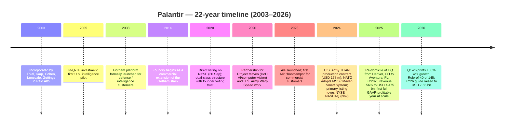
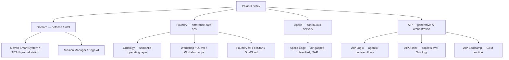
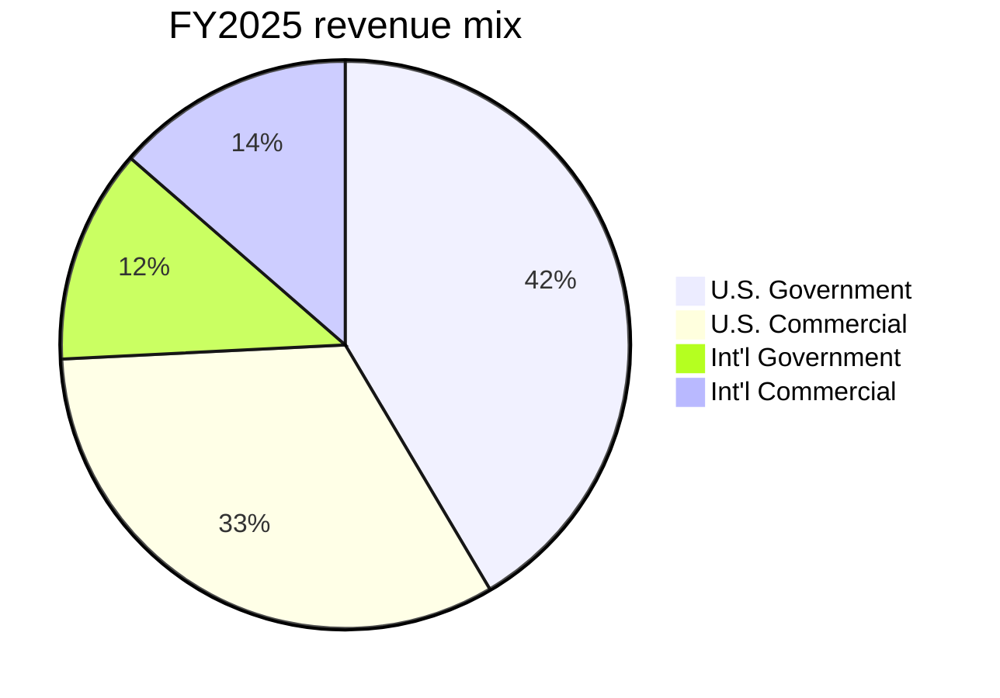
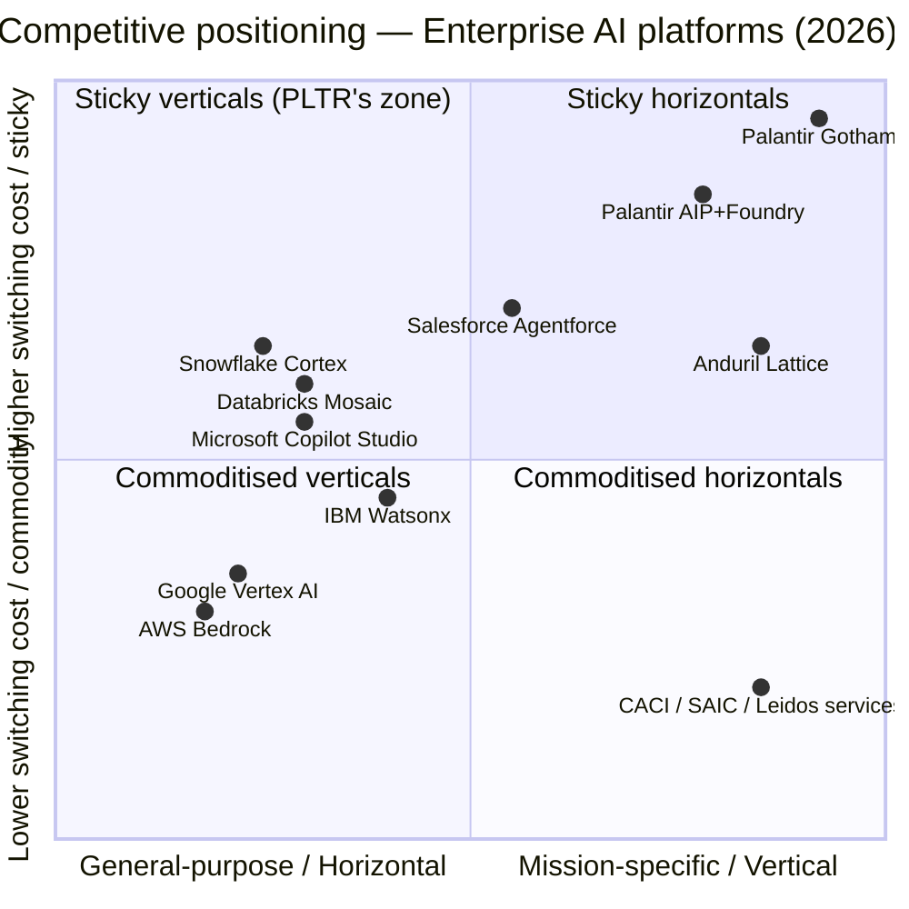

# COMPANY RESEARCH REPORT: Palantir Technologies Inc. (NASDAQ: PLTR)
**Date:** 2026-05-20
**Author:** Equity research — initiation of coverage

> **Update — FY2026 guidance raised again (2026-05-05):** Management raised
> full-year 2026 revenue guidance to **USD 7.650–7.662 bn** (from USD
> 7.182–7.198 bn issued on 2026-02-02), raised the U.S. commercial revenue
> floor to **>USD 3.224 bn (≥120% YoY growth, up from ≥115%)**, and raised
> the adjusted operating income range to **USD 4.440–4.452 bn** (from USD
> 4.126–4.142 bn). The implied FY2026 YoY revenue growth steps up from 61%
> at the February print to 71% after the Q1-26 beat. Stated driver per CEO
> Alex Karp's prepared remarks: "more than doubling our U.S. business … an
> accelerating U.S. market" — Q1-26 U.S. revenue grew 104% YoY and U.S.
> commercial 133% YoY.
> Source: [Palantir Q1-2026 Earnings Press Release, 2026-05-04](https://www.sec.gov/Archives/edgar/data/1321655/000132165526000026/a2026q1ex991pressrelease.htm).

## TABLE OF CONTENTS
1. Company Overview
2. Company History
3. Management Team
4. Products & Services
5. Customers & Go-to-Market
6. Industry Overview
7. Competitive Landscape
8. Market Opportunity (TAM)
9. Risk Assessment

References

---

## 1. COMPANY OVERVIEW

Palantir Technologies builds and sells four enterprise-software platforms — **Gotham**, **Foundry**, **Apollo**, and the **Artificial Intelligence Platform (AIP)** — that integrate an organisation's data, codify its operational logic in an "Ontology," and let humans and large-language-model (LLM) agents drive real-time decisions on top of that operational graph ([Palantir 10-K FY2025, Business overview](https://www.sec.gov/Archives/edgar/data/1321655/000132165526000011/pltr-20251231.htm)). The company is unusual in two respects. First, the founders chose at inception to build software for the hardest mission-critical environments first — Western defence, intelligence, and crisis-response agencies — and let the technology trickle down into commercial use, the opposite of most enterprise-SaaS playbooks. Second, the entire product stack is held together by a single semantic layer (the Ontology), which has become the company's principal moat: switching off Palantir means rebuilding every workflow that reads and writes through that graph.

Palantir was incorporated in 2003, listed via a direct listing on the NYSE on 30 September 2020, and moved its primary listing to NASDAQ in November 2024 ([Palantir 8-K — Exchange Delisting Notice, 2024-11-14](https://www.sec.gov/Archives/edgar/data/1321655/000132165524000219/pltr-exchangeswitchpressre.htm)). Its principal executive offices moved from Denver, Colorado to **19505 Biscayne Boulevard, Suite 2350, Aventura, Florida** during the past twelve months ([Palantir 2026 DEF 14A, Notice of Annual Meeting](https://www.sec.gov/Archives/edgar/data/1321655/000132165526000019/pltr2026def14a.htm)). The company employed **4,429 full-time staff worldwide as of 31 December 2025, 28% of them outside the United States** ([Palantir 10-K FY2025, Human Capital section](https://www.sec.gov/Archives/edgar/data/1321655/000132165526000011/pltr-20251231.htm)).

**Business model.** Palantir sells multi-year enterprise software subscriptions, typically with embedded implementation services (its "forward-deployed engineer" model). Revenue is recognised over the contract term. Two reportable segments — **Government** (defence, intelligence, civil agencies, allied nations) and **Commercial** (large enterprises across financial services, healthcare, energy, industrials, manufacturing) — share the same code base; the segment split is the customer mix, not a different product. Government accounted for **54% of FY2025 revenue ($2.40 bn)** and Commercial **46% ($2.07 bn)** ([Palantir 10-K FY2025, Segment results](https://www.sec.gov/Archives/edgar/data/1321655/000132165526000011/pltr-20251231.htm)).

**Scale and growth.** FY2025 revenue reached **USD 4.475 bn (+56% YoY from USD 2.866 bn)**, GAAP income from operations was **USD 1.414 bn (32% margin)**, and GAAP net income attributable to common stockholders was **USD 1.625 bn ($0.63 diluted EPS)** ([Palantir Q4-2025 Earnings Press Release, 2026-02-02](https://www.sec.gov/Archives/edgar/data/1321655/000132165526000004/a2025q4ex991earningsrelease.htm)). Q1-26 then accelerated further: revenue **USD 1.633 bn (+85% YoY)**, GAAP operating margin **46%**, adjusted operating margin **60%**, and a self-reported **Rule of 40 score of 145** ([Palantir Q1-2026 Earnings Press Release, 2026-05-04](https://www.sec.gov/Archives/edgar/data/1321655/000132165526000026/a2026q1ex991pressrelease.htm)). The company ended Q1-26 with **USD 8.0 bn of cash, short-term Treasuries and equivalents** and no long-term debt — a fortress balance sheet that gives Karp the freedom to walk from a contract he dislikes.

Geographic mix is U.S.-heavy: **74% of FY2025 revenue came from U.S. customers and 26% from outside the U.S.**, and U.S. revenue grew 75% YoY versus 26% YoY for the rest-of-world segment ([Palantir 10-K FY2025, Geographic revenue table](https://www.sec.gov/Archives/edgar/data/1321655/000132165526000011/pltr-20251231.htm)). Within the U.S., commercial is the inflection story: **U.S. commercial revenue grew 109% in FY2025 to USD 1.465 bn**, and 133% in Q1-26 alone ([Palantir Q4-2025 Earnings Press Release, 2026-02-02](https://www.sec.gov/Archives/edgar/data/1321655/000132165526000004/a2025q4ex991earningsrelease.htm)).

Source: [Palantir 10-K FY2025, MD&A](https://www.sec.gov/Archives/edgar/data/1321655/000132165526000011/pltr-20251231.htm) and Q4 press releases FY2021–FY2025 ([Q4-21](https://www.sec.gov/Archives/edgar/data/1321655/000119312522044821/d317188dex991.htm), [Q4-22](https://www.sec.gov/Archives/edgar/data/1321655/000132165523000005/a2022q4ex991pressrelease.htm), [Q4-23](https://www.sec.gov/Archives/edgar/data/1321655/000132165524000010/a2023q4ex991earningsrelease.htm), [Q4-24](https://www.sec.gov/Archives/edgar/data/1321655/000132165525000007/a2024q4ex991earningsrelease.htm), [Q4-25](https://www.sec.gov/Archives/edgar/data/1321655/000132165526000004/a2025q4ex991earningsrelease.htm)).

### Valuation snapshot — extreme by every conventional yardstick

At the 20 May 2026 close, PLTR traded at **USD 137.15**, implying a market cap of **USD 328.8 bn**, an enterprise value of **USD 321.1 bn** (cash exceeds debt), and TTM multiples of:

- **TTM P/E: 154.1×** (versus a 3-year range of negative-to-280×; PLTR was loss-making on a GAAP basis until FY2023 and the multiple compressed mechanically as earnings emerged in 2024–25) ([Yahoo Finance — PLTR Key Statistics, 2026-05-20](https://finance.yahoo.com/quote/PLTR/key-statistics/))
- **Forward P/E: 66.1×** ([Yahoo Finance — PLTR Key Statistics, 2026-05-20](https://finance.yahoo.com/quote/PLTR/key-statistics/))
- **TTM P/S: 62.9×** (TTM revenue ≈ USD 5.22 bn). At the 4 February 2026 intraday high of **USD 207.52** the multiple peaked above 95×.
- **TTM EV/Revenue: 61.5×**, **EV/EBITDA: 159×**
- **Beta: 1.52** (high — moves more than the broader market into both rallies and corrections)
- **52-week range: USD 118.93 – 207.52**

Peer comparison on TTM P/S at the same date:

| Ticker | TTM P/S | Bucket | Source |
|---|---|---|---|
| **PLTR** | **62.9×** | AI-platform pure play | [Yahoo Finance, 2026-05-20](https://finance.yahoo.com/quote/PLTR/key-statistics/) |
| CRWD | 34.4× | High-growth security SaaS | [Yahoo Finance, 2026-05-20](https://finance.yahoo.com/quote/CRWD/key-statistics/) |
| SNOW | 12.4× | Cloud data warehouse | [Yahoo Finance, 2026-05-20](https://finance.yahoo.com/quote/SNOW/key-statistics/) |
| GOOGL | 11.2× | Big-Tech AI/Cloud | [Yahoo Finance, 2026-05-20](https://finance.yahoo.com/quote/GOOGL/key-statistics/) |
| MSFT | 9.8× | Big-Tech AI/Cloud | [Yahoo Finance, 2026-05-20](https://finance.yahoo.com/quote/MSFT/key-statistics/) |
| IBM | 3.1× | Mature enterprise/Watson | [Yahoo Finance, 2026-05-20](https://finance.yahoo.com/quote/IBM/key-statistics/) |
| CACI | 1.2× | Defence services | [Yahoo Finance, 2026-05-20](https://finance.yahoo.com/quote/CACI/key-statistics/) |
| BAH | 0.8× | Defence services (Booz Allen) | [Yahoo Finance, 2026-05-20](https://finance.yahoo.com/quote/BAH/key-statistics/) |
| SAIC | 0.6× | Defence services | [Yahoo Finance, 2026-05-20](https://finance.yahoo.com/quote/SAIC/key-statistics/) |

Palantir trades at roughly **1.8× CrowdStrike**, **5× Snowflake**, **6× the Microsoft/Alphabet AI complex**, and **50–100× the listed defence-services bench**. The S&P 500 software sub-sector median P/S sits in the high-single-digits; PLTR is therefore **more than 8× its software peer median**.

This multiple is not a fluke. Three observable drivers explain it, and a fourth is narrative:

1. **Rule-of-40 acceleration.** Palantir's self-reported Rule-of-40 score (YoY revenue growth + adjusted operating margin) reached **127 in Q4-25 and 145 in Q1-26** — figures management says are matched only by NVIDIA, Micron, and SK hynix among AI-infrastructure firms ([Palantir Q1-2026 Earnings Press Release, 2026-05-04](https://www.sec.gov/Archives/edgar/data/1321655/000132165526000026/a2026q1ex991pressrelease.htm)). For a software business this combination is essentially unique at scale; the market is paying for the *path* of the score, not its level today.
2. **AIP-driven commercial bookings.** **Q1-26 U.S. commercial TCV closed at USD 1.176 bn (+45% YoY)** and **U.S. commercial RDV reached USD 4.92 bn (+112% YoY, +12% QoQ)** ([Palantir Q1-2026 Earnings Press Release, 2026-05-04](https://www.sec.gov/Archives/edgar/data/1321655/000132165526000026/a2026q1ex991pressrelease.htm)). The market is annualising book-to-bill above 2×.
3. **Scarcity / sector-proxy premium.** PLTR is the only listed pure-play "AI software platform" of meaningful scale that the U.S. military and intelligence community actually deploys at production scale. ETF flows (AIQ, BOTZ, ROBO) treat it as a sector proxy, and short interest is structurally low because there is no clean substitute to hedge against.
4. **Narrative / Karp premium.** CEO Alex Karp's quarterly shareholder letters and media interviews — explicitly Western-coded, pro-defence, pro-American manufacturing — have made PLTR a thematic vehicle for U.S.-renaissance / re-shoring portfolios. This is genuine but unquantifiable, and it adds risk on the downside if the narrative cracks.

We treat the multiple as **stretched** in the sense of Section 9 risk taxonomy: TTM P/S 62.9× is well above the 20× threshold, even with top-quartile growth. A modest deceleration to "merely 40% YoY growth" with steady margins would compress P/S meaningfully even if absolute revenue still rose. This valuation/multiple-compression risk is carried into Section 9.

---

## 2. COMPANY HISTORY

Palantir was founded in **May 2003** in Palo Alto, California by **Peter Thiel**, **Alex Karp**, **Stephen Cohen**, **Joe Lonsdale**, and **Nathan Gettings**. Thiel — fresh from selling PayPal to eBay — bankrolled the company with personal capital and a USD 2 m cheque from his Founders Fund. The product thesis was a direct response to 9/11: pattern-recognition techniques that PayPal had used to catch credit-card fraud could be repurposed to spot terrorist financing across siloed government datasets. In-Q-Tel, the CIA's strategic venture arm, made an early investment in 2005, providing the company's first government customer and effectively writing its security clearances and product spec ([Palantir 2026 DEF 14A — Director biographies](https://www.sec.gov/Archives/edgar/data/1321655/000132165526000019/pltr2026def14a.htm)).

Source: [Palantir 10-K FY2025, Item 1 Business and Item 1A History](https://www.sec.gov/Archives/edgar/data/1321655/000132165526000011/pltr-20251231.htm) and [Palantir 2026 DEF 14A](https://www.sec.gov/Archives/edgar/data/1321655/000132165526000019/pltr2026def14a.htm).

**Strategic pivot 1 — from Gotham to Foundry (c. 2014).** For its first decade Palantir was a government-only vendor whose product was an intelligence-analysis workbench. In 2014, recognising that the same data-integration substrate was useful in regulated commercial industries, the team productised a commercial-grade variant called Foundry, with explicit governance and audit controls demanded by banks, healthcare systems, and pharma. The pivot took years to monetise — commercial bookings stalled badly in 2018–19 and were a big reason the IPO valuation came in below earlier private rounds — but it created the customer base into which AIP would eventually be sold ([Palantir 10-K FY2025, Item 1](https://www.sec.gov/Archives/edgar/data/1321655/000132165526000011/pltr-20251231.htm)).

**Strategic pivot 2 — from "Foundry as data platform" to "AIP as decision platform" (2023–present).** AIP, launched in early 2023, is a thin generative-AI orchestration layer that lets commercial customers connect any third-party LLM (OpenAI, Anthropic, Mistral, customer-trained models) to their Ontology and execute live actions, not just answer questions. The breakthrough commercial mechanism was the **AIP Bootcamp** — a free 1- to 5-day on-site engagement where Palantir engineers build a working prototype for a prospect, often closing a six-figure subscription within weeks of the bootcamp. The bootcamp pipeline is the proximate cause of the 109% U.S. commercial revenue growth in FY2025 ([Palantir Q4-2025 Earnings Press Release, 2026-02-02](https://www.sec.gov/Archives/edgar/data/1321655/000132165526000004/a2025q4ex991earningsrelease.htm)).

**Strategic pivot 3 — listing-venue and domicile moves (2024–25).** Palantir moved its primary listing from NYSE to NASDAQ in November 2024 — a move it framed as positioning itself among technology peers and as qualifying it for the NASDAQ-100 (it was added in December 2024) and ultimately the S&P 500 (admitted September 2024) ([Palantir 8-K, 2024-11-14](https://www.sec.gov/Archives/edgar/data/1321655/000132165524000219/pltr-exchangeswitchpressre.htm)). Index inclusion drove substantial passive demand. The HQ then moved from Denver to South Florida in 2025 ([Palantir 2026 DEF 14A — Notice of Annual Meeting](https://www.sec.gov/Archives/edgar/data/1321655/000132165526000019/pltr2026def14a.htm)).

**Acquisitions.** Palantir has been an unusually disciplined buyer. There has been no transformational acquisition since IPO. The largest cash-outflow line item under "M&A" in the FY2025 10-K cash-flow statement is single-digit-million strategic-investment top-ups, not platform buys ([Palantir 10-K FY2025, Cash Flow Statement](https://www.sec.gov/Archives/edgar/data/1321655/000132165526000011/pltr-20251231.htm)).

**Recent developments (2024–26).** The four operating headlines of the last twelve months are: (i) the **U.S. Army TITAN production award** (Maven-derived ground intelligence terminal, prime contractor); (ii) **NATO adoption of the Maven Smart System** for its allied operations enterprise architecture; (iii) the **AIP commercial inflection** (133% YoY in Q1-26); and (iv) two consecutive **upward FY2026 guidance revisions** in three months. These are unpacked in Sections 4, 5, and 7.

---

## 3. MANAGEMENT TEAM

**Alex Karp — Co-Founder, CEO, and Director** *(age 58 at filing; CEO since 2005, Director since 2003)*. Karp is the single most consequential person in this report. He is one of the few software CEOs who is, by his own description, *not* a technologist: he holds a B.A. from Haverford College, a J.D. from Stanford Law School, and a Ph.D. in **Neoclassical Social Theory** from Goethe University Frankfurt, where he was a student of Jürgen Habermas. Before Palantir he ran a small London-based asset-management firm. He has been CEO since 2005 — twenty-one years at filing — and is the public face of the company's "Western technological supremacy" thesis through his quarterly shareholder letters and the book *The Technological Republic* (Crown, 2025). Karp's FY2025 cash compensation was modest by mega-cap-CEO standards — **USD 1,101,637 base, of which USD 800,000 is a quarterly travel stipend**, no annual bonus — and almost the entirety of his economic exposure is in equity grants ([Palantir 2026 DEF 14A — Executive Compensation, p. 39](https://www.sec.gov/Archives/edgar/data/1321655/000132165526000019/pltr2026def14a.htm)). The 2020 Executive Equity Plan grant alone (27.45 m vested options + 19.305 m unvested RSUs at the proxy snapshot) was valued at **USD 8.36 bn** assuming change-of-control acceleration at the 31 December 2025 share price ([Palantir 2026 DEF 14A — Potential Payments on Change in Control](https://www.sec.gov/Archives/edgar/data/1321655/000132165526000019/pltr2026def14a.htm)). Karp beneficially owns **6.43 m Class A shares plus 86.9 m Class B shares (64.0% of Class B) and 335,000 Class F shares (33.3% of Class F)**, giving him **11.4% of total voting power** ([Palantir 2026 DEF 14A — Beneficial Ownership](https://www.sec.gov/Archives/edgar/data/1321655/000132165526000019/pltr2026def14a.htm)). His proxy entries also disclose **USD 2.5 m of allocated personal security spending and USD 2.0 m of related chartered-aircraft expense** in 2025, both of which the board justified in an "independent security study" — a reminder that PLTR is run as a high-threat-profile defence company, not a Silicon Valley SaaS. Karp's most useful prior accomplishment was the act of holding the company together during the 2018–19 stall, when commercial bookings missed plan and a number of executives left — the post-2020 turnaround is the principal evidence that he can operate as well as he can preach.

**Stephen Cohen — Co-Founder, President, Secretary, and Director** *(age 43)*. Cohen has been with Palantir since co-founding it in 2005 and holds a B.S. in Computer Science from Stanford. He runs internal operations and product execution and is one of the three Founders party to the Founder Voting Trust Agreement; he holds **29.4% of Class B and 33.3% of Class F**, contributing **3.0% of total voting power** in his own right ([Palantir 2026 DEF 14A — Beneficial Ownership table](https://www.sec.gov/Archives/edgar/data/1321655/000132165526000019/pltr2026def14a.htm)).

**David Glazer — Chief Financial Officer and Treasurer** *(age 42; with Palantir since 2013, CFO since 2019)*. Glazer is unusual: he holds a B.A. in History from Santa Clara University and a J.D. from Emory Law — no formal accounting or banking pedigree — and is a Palantir-only career executive who rose internally from a corporate-development role into the CFO seat ahead of the 2020 direct listing. He has therefore not been a CFO of any other listed company. His track record at Palantir is, however, strong on the metrics that matter most: he was CFO through the IPO, through the build-out of public-company controls (no material weaknesses disclosed), through the turn to GAAP profitability in 2023, and through the FY2025 raise that took adjusted operating margin to 50%. His 2025 base salary was **USD 450,200**, with substantial RSU and SAR equity grants — he received a 232,898 RSU grant valued at **USD 21.17 m** in February 2025 and 323,334 SARs in April 2025 ([Palantir 2026 DEF 14A — Grants of Plan-Based Awards](https://www.sec.gov/Archives/edgar/data/1321655/000132165526000019/pltr2026def14a.htm)). The implicit message of the 2025 grant structure is retention; the explicit message is that the board does not yet view the CFO seat as portable.

**Shyam Sankar — CTO and Executive Vice President** *(age 44; with Palantir since 2006)*. Sankar holds a B.S. in Electrical and Computer Engineering from Cornell and an M.S. in Management Science & Engineering from Stanford. He is the company's most visible technical voice and a published essayist on Western defence-industrial-base policy; his Senate Armed Services Committee testimony on commercial-tech procurement (2024) is widely cited in defence circles. Sankar's economic interest at Palantir is meaningful — **4.99 m Class B shares** plus stock-option holdings valued in the proxy at well over USD 250 m on a change-of-control basis — but his importance is operational: he is the principal interface to U.S. defence customers and the architect of the AIP go-to-market motion ([Palantir 2026 DEF 14A — Executive bios and Beneficial Ownership](https://www.sec.gov/Archives/edgar/data/1321655/000132165526000019/pltr2026def14a.htm)).

**Ryan Taylor — Chief Revenue Officer and Chief Legal Officer** *(age 44; with Palantir since 2010)*. Taylor holds a B.S. and M.S. from Stanford and a J.D. from Harvard Law. He runs both the sales force and the legal department — an unusually consolidated mandate that mirrors Karp's distaste for separating commercial and contractual functions ([Palantir 2026 DEF 14A — Executive Officers](https://www.sec.gov/Archives/edgar/data/1321655/000132165526000019/pltr2026def14a.htm)).

**Governance.** Palantir's most distinctive governance feature is the **Founder Voting Trust Agreement**: Karp, Cohen, and Thiel collectively control **up to 49.999999% of total voting power** through a Class F super-voting structure, regardless of how much of their economic interest they sell, as long as the "Ownership Threshold" of 100 m Corporation Equity Securities is met — a threshold that was satisfied at the 2026 record date ([Palantir 2026 DEF 14A — Founder Voting Trust Agreement](https://www.sec.gov/Archives/edgar/data/1321655/000132165526000019/pltr2026def14a.htm)). The Board has seven directors at the 2026 meeting: three founder/insider directors (Karp, Cohen, Thiel) and four nominally independent directors (Alexander Moore, Alexandra Schiff, Lauren Friedman Stat, Eric Woersching), with the latter four staffing the Audit and Compensation/Nominating/Governance Committees. Insider ownership is high (Karp 11.4%, Thiel 7.9%, Cohen 3.0% — combined ~22% of total voting power directly, plus the Class F bloc on top). Executive compensation is overwhelmingly equity-based and back-loaded; with Glazer and Taylor's 2025 grants the only year-on-year new-grant activity for NEOs.

**Track record synthesis.** Karp, Cohen, and Sankar are now in their twentieth-plus year together; Glazer and Taylor in their thirteenth and sixteenth respectively. The team has produced **23 consecutive quarters of revenue growth, four consecutive years of expanding adjusted operating margin (28% → 39% → 50% → ~60% Q1-run-rate), and the rare combination of accelerating growth at scale**. The principal historical execution failure — the 2018–19 commercial stall — has been more than redressed. The principal *open* execution question is whether U.S. commercial growth above 100% is repeatable for more than two years.

---

## 4. PRODUCTS & SERVICES

Palantir markets four platforms — Gotham, Foundry, Apollo, and AIP — plus a constellation of vertical solution accelerators built on top of them. The 10-K describes the four as a single vertically integrated stack ([Palantir 10-K FY2025, Item 1 Business](https://www.sec.gov/Archives/edgar/data/1321655/000132165526000011/pltr-20251231.htm)).

Source: [Palantir 10-K FY2025, Item 1 Business — Platforms](https://www.sec.gov/Archives/edgar/data/1321655/000132165526000011/pltr-20251231.htm).

### Platform 1 — Gotham *(flagship for Defence & Intel)*

Per the 10-K, Gotham "integrates with our other platforms, as well as our broader defence offerings, to power a wide array of missions across allied defence and intelligence operations" ([Palantir 10-K FY2025, Item 1](https://www.sec.gov/Archives/edgar/data/1321655/000132165526000011/pltr-20251231.htm)). It is the original Palantir product — a graph-based analytical workbench that fuses sensor, signals-intelligence, human-intelligence, geospatial, and open-source data into a common operating picture. Target customers: U.S. and allied defence agencies, intelligence community, law-enforcement, federal civil mission agencies. Pricing: bespoke government enterprise licences, typically tied to enterprise-wide deployments under IDIQ vehicles. Competitive advantage: **yes — high.** Moat type: *certification + switching cost + brand*. Gotham holds high-classification accreditations (IL5, IL6, IL7) that take years and millions of dollars to obtain; the existing twenty-year-plus operational deployment in the U.S. intelligence community is the principal brand asset. Closest named competitor product: BAE Systems / Leidos / SAIC custom analytic stacks built on commodity tools; Anduril Lattice for tactical (different domain but bid against it for some Army programs). **Position: ahead** within the analytics-fabric category for classified environments.

### Platform 2 — Foundry *(flagship for Commercial)*

Foundry is described in the 10-K as "our foundational data operations platform, which provides the core capabilities for data management, logic authoring, systemic mapping development through Palantir Ontology, analytics, and workflow development" ([Palantir 10-K FY2025, Item 1](https://www.sec.gov/Archives/edgar/data/1321655/000132165526000011/pltr-20251231.htm)). Target customer: large enterprises in financial services (Morgan Stanley, Citigroup historically), oil & gas (BP), pharma, healthcare systems, and industrial manufacturers. Pricing: multi-year subscription, ARR-style, plus implementation services. Competitive advantage: **yes — high**, but contestable. Moat type: *switching costs + data ecosystem lock-in* via the Ontology. Once a customer has codified its operational model (assets, processes, KPIs) into the Ontology, replacing Foundry means re-implementing every model, app, and workflow that reads or writes the Ontology — a multi-year project. Closest named competitor: Snowflake + Databricks + Microsoft Fabric stitched together. **Position: ahead on operational-workflow integration; at parity on raw data-warehousing capability; behind on price.**

### Platform 3 — Apollo *(infrastructure layer)*

Apollo is "a cloud-agnostic, single control layer that coordinates ongoing delivery of new features, security updates, and platform configurations" ([Palantir 10-K FY2025, Item 1](https://www.sec.gov/Archives/edgar/data/1321655/000132165526000011/pltr-20251231.htm)). Target customer: principally an internal-facing platform that operates Gotham/Foundry/AIP across customer environments, but increasingly licensed to large customers wanting a Palantir-grade continuous-delivery system for their own software. Pricing: typically bundled. Competitive advantage: **partial — moderate**. Moat type: *operational tooling depth*. Closest competitor: HashiCorp Terraform / Ansible / GitOps stacks. **Position: behind on developer mind-share, ahead on classified / air-gapped support** — Apollo is one of very few continuous-delivery platforms certified to operate in IL6/IL7 environments.

### Platform 4 — Artificial Intelligence Platform (AIP) *(growth engine)*

The 10-K describes AIP as "our generative artificial intelligence platform, which provides secure connectivity to third-party-provided large language models … enabling them to derive value from recent breakthroughs in AI" ([Palantir 10-K FY2025, Item 1](https://www.sec.gov/Archives/edgar/data/1321655/000132165526000011/pltr-20251231.htm)). It connects any LLM (OpenAI, Anthropic, Mistral, customer-fine-tuned) to the Ontology so generative agents can read, reason about, and *act on* the underlying business graph subject to access controls and audit. Target customer: any Foundry or Gotham customer; new commercial logos via the **AIP Bootcamp**. Pricing: subscription seats plus consumption-based for LLM calls. Competitive advantage: **yes — high in deployment, contested in technology.** Moat type: *integration moat (Ontology binding) + GTM motion (bootcamp) + classified certifications*. The model layer itself is commoditising rapidly — Karp uses the term "commodity cognition" — so AIP's defensibility lies in being the *cheapest place to plug those models into an enterprise's real operational data*. Closest competitor: **Microsoft Copilot Studio + Azure OpenAI**, **Salesforce Agentforce**, **Snowflake Cortex**, **Databricks Mosaic AI**. **Position: ahead on agentic-action over enterprise data and on classified deployments; at parity on chat-style copilots; behind on developer ecosystem reach.**

### Vertical solutions and federally-credentialed offerings

- **Foundry for FedStart / GovCloud** — turnkey FedRAMP High deployments for civilian agencies. Used by HHS / CMS work and various federal civil agencies.
- **AIP Edge / Tactical Edge** — runs on disconnected, ruggedised hardware for forward-deployed military units; underpins TITAN.
- **Mission Manager / Operational Manager** — vertical accelerator for warehouse, manufacturing, and field operations on top of Foundry, used by Tyson Foods–type industrial customers.
- **Anti-Money-Laundering / Fraud Suite** — packaged Foundry+AIP for banks and payment platforms.
- **Patient Pathways / Clinical Operations** — packaged for healthcare systems including the U.K. NHS Federated Data Platform.
- **Skywise** — a co-developed Foundry instance for the aviation industry; the largest historical example is the partnership with Airbus.

### Flagship vs. long-tail

The 1–3 products that drive the business are unambiguous: **Gotham + AIP for Government** and **Foundry + AIP for Commercial**. Apollo is the connective tissue; vertical accelerators are go-to-market wrappers, not standalone revenue lines.

### Last-12-month launches / repositionings

- **AIP Bootcamp at scale (2024–2026):** the bootcamp motion was industrialised — hundreds run per quarter in the U.S. — and is the single biggest contributor to the 133% Q1-26 U.S. commercial growth.
- **U.S. Army TITAN production phase (2024-onwards):** Palantir was named prime on the production phase of the Army's Tactical Intelligence Targeting Access Node program, a roughly **USD 178 m initial production award**, reported across defence trade press in 2024 ([Palantir 10-K FY2025, Item 1 — Government segment](https://www.sec.gov/Archives/edgar/data/1321655/000132165526000011/pltr-20251231.htm) describes the Army program; the dollar figure is widely reported in trade media).
- **NATO Maven Smart System adoption (2025):** NATO selected Palantir's Maven Smart System (MSS) as the operational AI system for NATO Allied Command Operations, expanding Project Maven from a U.S.-only DoD program into an alliance-wide deployment.
- **AIP Logic / AIP Assist (2025 release):** explicit agentic-workflow and copilot modules within AIP, marketed at a per-seat plus per-LLM-call rate.

---

## 5. CUSTOMERS & GO-TO-MARKET

Palantir had **954 total customers as of 31 December 2025**, up from 711 a year earlier (**+34% YoY**) and from 497 at the end of FY2023 and 367 at the end of FY2022 ([Palantir 10-K FY2025, Item 7 MD&A](https://www.sec.gov/Archives/edgar/data/1321655/000132165526000011/pltr-20251231.htm), [Palantir 10-K FY2024](https://www.sec.gov/Archives/edgar/data/1321655/000132165525000022/pltr-20241231.htm), [Palantir 10-K FY2023](https://www.sec.gov/Archives/edgar/data/1321655/000132165524000022/pltr-20231231.htm)). The customer base is still concentrated at the top, but it has broadened materially through the AIP era.

Source: Palantir 10-K filings FY2022–FY2025 (linked above).

### Customer concentration

Customer concentration is disclosed in the FY2025 10-K and the Q1-26 10-Q. The exact disclosure language is: *"customers together accounted for **16% and 17% of our revenue** for the years ended December 31, 2025 and 2024, respectively, and **15% and 18% of our revenue** for the three months ended March 31, 2026 and 2025, respectively"* ([Palantir Q1-2026 10-Q, Note on Revenue Concentration](https://www.sec.gov/Archives/edgar/data/1321655/000132165526000028/pltr-20260331.htm); [Palantir 10-K FY2025, Item 1A Risk Factors](https://www.sec.gov/Archives/edgar/data/1321655/000132165526000011/pltr-20251231.htm)). Palantir does not name the specific customers, but the threshold language ("customers" plural representing a single bloc of revenue) implies these are the U.S. government customers covered by master IDIQs.

The trend is **downward concentration** — FY2024 17% → FY2025 16% → Q1-26 15% — which is the right direction even as absolute government revenue grows. The 10-K also notes that *"customers by revenue for the year ended December 31, 2025, have been with us for an average of **ten years**"* ([Palantir 10-K FY2025, Item 1](https://www.sec.gov/Archives/edgar/data/1321655/000132165526000011/pltr-20251231.htm)) — exceptional durability.

By segment (FY2025): **54% government / 46% commercial**. By geography: **74% United States / 26% rest-of-world**. **No country other than the United States represented 10% or more of revenue** in FY2023, FY2024, or FY2025 ([Palantir 10-K FY2025, Geographic revenue table](https://www.sec.gov/Archives/edgar/data/1321655/000132165526000011/pltr-20251231.htm)).

Because the top-bloc is roughly **15–16% combined and concentrated in U.S. government work**, we treat the **U.S. federal government as the single largest counterparty risk** and carry it into Section 9. The structure is multi-year IDIQ + task orders rather than a single concentrated contract, which materially mitigates renewal cliff risk — but a government shutdown, a continuing-resolution slowdown, or a major program cancellation can still meaningfully disrupt quarterly revenue recognition. The 10-K explicitly highlights this: *"the U.S. government's budgeting process, the use of continuing resolutions, and a potential lapse in appropriations, or similar events in other jurisdictions, have and could in the future adversely affect our ability to timely recognize revenue under certain government contracts"* ([Palantir 10-K FY2025, Item 1A](https://www.sec.gov/Archives/edgar/data/1321655/000132165526000011/pltr-20251231.htm)).

Note: U.S. government ≈ USD 1,855 m of total USD 4,475 m; U.S. commercial ≈ USD 1,465 m; international government ≈ USD 547 m (residual of total government USD 2,402 m); international commercial ≈ USD 608 m (residual of total commercial USD 2,073 m).
Source: [Palantir Q4-2025 Earnings Press Release, 2026-02-02](https://www.sec.gov/Archives/edgar/data/1321655/000132165526000004/a2025q4ex991earningsrelease.htm) and [Palantir 10-K FY2025, Item 7 MD&A](https://www.sec.gov/Archives/edgar/data/1321655/000132165526000011/pltr-20251231.htm).

### Distribution and sales motion

Palantir's go-to-market is direct: there is no meaningful channel-partner revenue, no Cisco/HPE-style two-tier distribution. The sales force is structured as **"forward-deployed engineers"** rather than traditional account executives — engineers who embed in the customer to scope use cases, build prototypes, and convert pilots into multi-year subscriptions. The 10-K cautions that this model produces *"long and unpredictable sales cycles"* and that *"the implementation process for our platforms … may be complex and lengthy"* ([Palantir 10-K FY2025, Item 1A](https://www.sec.gov/Archives/edgar/data/1321655/000132165526000011/pltr-20251231.htm)) — historically true at six- to twelve-month deal cycles, but materially compressed under the AIP Bootcamp motion, where the company reports closing six- and seven-figure subscriptions within weeks of an on-site bootcamp.

**Trailing-twelve-month revenue per top customer** is a useful proxy for land-and-expand productivity. The 10-K discloses that revenue from each of the top-20 customers averaged **USD 93 m on a TTM basis at year-end 2025**, up from **USD 64 m a year earlier** — a 45% lift YoY in average customer size at the top of the cohort ([Palantir 10-K FY2025, Item 1](https://www.sec.gov/Archives/edgar/data/1321655/000132165526000011/pltr-20251231.htm)).

### Named customer wins and case studies (last 12 months)

Palantir does not publish a single customer list. The publicly disclosed and frequently company-cited names include:
- **U.S. Army** — TITAN production phase, NGCS / Vantage / Project Maven derivative work
- **U.S. Special Operations Command (SOCOM), CENTCOM, EUCOM** — Gotham deployments
- **U.S. Intelligence Community** — In-Q-Tel customers, long-standing
- **U.S. Department of Health and Human Services / CDC** — Foundry deployments dating to COVID-19 response
- **U.S. Immigration and Customs Enforcement (ICE)** — case-management Foundry deployment (politically controversial — see Section 9)
- **National Geospatial-Intelligence Agency (NGA)** — Maven Smart System deployment
- **NATO Allied Command Operations** — MSS adoption (2025)
- **United Kingdom NHS** — Federated Data Platform (multi-year commercial contract)
- **BP** — long-standing Foundry deployment in upstream and trading
- **Airbus** — Skywise aviation data platform (Foundry-based)
- **Cleveland Clinic, Tampa General, HCA-affiliated systems** — commercial healthcare Foundry users
- **Wendy's** — supply-chain Foundry / AIP user (announced as an AIP customer in 2024 and frequently cited as an AIP-bootcamp success)
- **Tyson Foods** — operations Foundry / AIP deployment
- **Citigroup, Morgan Stanley** — financial-services Foundry footprints with longer tenure

The 10-K describes the contract structure with the U.S. government as "often … large developmental item and service contracts to build custom software rather than firm fixed-price contracts for commercial products" with multi-year periods of performance and termination-for-convenience clauses ([Palantir 10-K FY2025, Item 1A Risk Factors](https://www.sec.gov/Archives/edgar/data/1321655/000132165526000011/pltr-20251231.htm)). Commercial contracts are predominantly multi-year subscription master agreements with stated minimums.

### Revenue backlog

The most useful forward-revenue indicator Palantir publishes is **Total Remaining Deal Value (RDV)**. At year-end 2025, total RDV was **USD 11.2 bn**, of which **USD 6.8 bn was commercial** and **USD 4.4 bn was government** (the latter limited to U.S. and allied governments only) ([Palantir 10-K FY2025, Item 7 — Total Remaining Deal Value](https://www.sec.gov/Archives/edgar/data/1321655/000132165526000011/pltr-20251231.htm)). By Q1-26, U.S. commercial RDV alone had jumped to **USD 4.92 bn (+112% YoY)** ([Palantir Q1-2026 Earnings Press Release, 2026-05-04](https://www.sec.gov/Archives/edgar/data/1321655/000132165526000026/a2026q1ex991pressrelease.htm)). RDV includes contracted options that may not all be exercised, so it should be discounted versus formal U.S.-GAAP remaining performance obligations (RPO of approximately USD 4 bn at year-end 2025 — a more conservative figure but one that does not contemplate option exercise).

Source: Palantir Q4-2022, Q4-2023, Q4-2024, Q4-2025, and Q1-2026 press releases (URLs cited above).

---

## 6. INDUSTRY OVERVIEW

Palantir straddles three distinct industry definitions, and the right TAM frame depends on which one you adopt.

**Definition 1 — Enterprise data and analytics software (NAICS 5132).** The classical "data platform" market — data warehousing, lakehouse architectures, business intelligence, ETL, master data management, MLOps. Gartner sized this market at roughly USD 130 bn in 2024 with a low-double-digit forward CAGR; IDC's "Big Data and Analytics" semantic is wider (close to USD 350 bn including services). Palantir competes here against the cloud hyperscalers' data platforms (Microsoft Fabric, Google BigQuery / Vertex, AWS), Snowflake, Databricks, and the legacy stacks of Oracle, IBM, and SAP. Industry structure: oligopolistic at the hyperscaler tier (Microsoft, Google, AWS together dominate cloud-native data infrastructure) with a fragmented long tail of specialists. Switching costs are high; growth is decelerating from a 20%+ CAGR a decade ago to low-teens today.

**Definition 2 — Defence digital-transformation / Command-Control-Communications-Computers-Intelligence-Surveillance-Reconnaissance (C5ISR) software.** This is where Gotham lives. The U.S. Department of Defense's IT and software budget alone is in the order of USD 60–65 bn per year (the FY2025 unclassified RFP totals are in line with this), of which a growing portion is allocated to AI/ML, autonomy, and command-and-control modernisation programs. NATO and Five Eyes allies add another USD 40–50 bn in addressable annual spend. Industry structure: oligopolistic at the prime-contractor tier (Lockheed Martin, RTX, Northrop Grumman, General Dynamics, BAE Systems) with a fragmented services tier (CACI, SAIC, Leidos, Booz Allen) and a small but growing pure-software cohort (Palantir, Anduril, Shield AI). Margins for the services tier are low single-digit percent net; Palantir, as a pure-software vendor with productised IP, earns commercial-software-grade gross margins (FY2025 GAAP gross margin **82%**, [Palantir 10-K FY2025, Income Statement](https://www.sec.gov/Archives/edgar/data/1321655/000132165526000011/pltr-20251231.htm)).

**Definition 3 — Generative-AI enterprise software / agentic AI.** The newest and fuzziest market — orchestration layers and applications built on top of foundation models. Forrester, Gartner, and IDC are all publishing wildly different TAMs (USD 50 bn to USD 200 bn by 2028) because nobody agrees on what counts. Palantir's AIP plays here. The dominant competitive cluster is Microsoft (Azure OpenAI + Copilot Studio + Fabric), Salesforce (Agentforce), Google (Vertex AI), AWS (Bedrock), Snowflake (Cortex), and Databricks (Mosaic). Industry structure: nascent and fragmenting, dominated by hyperscaler distribution but with meaningful room for specialised platforms (Palantir's claim).

**Key growth drivers cutting across all three definitions:**
1. **AI moving from chat to action.** Enterprises now want LLMs to *execute* — open tickets, place orders, generate work orders, file regulatory reports — which requires a clean operational graph (Ontology) and granular access controls; this is Palantir's core thesis.
2. **Defence software re-platforming.** Multi-decade legacy command-and-control software is being re-platformed onto commercial-pace stacks; the U.S. DoD's Software Acquisition Pathway and CDAO mandates accelerate this.
3. **Re-industrialisation / re-shoring.** U.S. industrial customers are rebuilding domestic supply-chain visibility and automating operations; Foundry+AIP is sold heavily into this thesis.
4. **Sovereign-AI / allied tech blocs.** The U.K., Germany, Japan, Korea, Israel, and Saudi Arabia are all standing up sovereign-AI compute and applications; Palantir's classified-deployment credentials are differentiated for these buyers.

**Regulatory environment.** Government work is governed by FAR/DFARS, ITAR, EAR, and CMMC; misperformance can result in suspension or debarment. Commercial work is increasingly governed by jurisdiction-specific AI regulations (EU AI Act, UK AI Bill, U.S. state-level laws on automated decisioning). Palantir's "Ontology + audit + access control" architecture is, in effect, a compliance-by-design product, which is a structural advantage in regulated industries.

**Supplier and buyer power.** Compute is bought from the hyperscalers (Palantir runs on AWS, Azure, GCP, and on-premise air-gapped infrastructure). Foundation models are licensed from OpenAI, Anthropic, Mistral, Meta and from customer-trained variants — Palantir is studiously model-agnostic. Buyer power varies: the U.S. government is the buyer of last resort in classified work (few real alternatives once an enterprise architecture decision is taken) but extracts pricing concessions on large IDIQs; commercial buyers have more substitutes but face high switching costs once deployed.

---

## 7. COMPETITIVE LANDSCAPE

Palantir competes across the three industries described above. The 10-K is unusually candid about competitive structure: *"Our competitors include large enterprise software companies, government contractors, and system integrators … some of our competitors have greater name recognition, longer operating histories, and larger customer bases; larger sales and marketing budgets and resources and the capacity to leverage their sales channels"* ([Palantir 10-K FY2025, Item 1A](https://www.sec.gov/Archives/edgar/data/1321655/000132165526000011/pltr-20251231.htm)). Below is a working competitor map.

| Competitor | Type | Where they compete with PLTR | Relative position |
|---|---|---|---|
| **Microsoft (Azure / Fabric / Copilot Studio / Azure OpenAI)** | Big-Tech AI | AIP, Foundry analytics, federal cloud | PLTR ahead on agentic execution over operational data and on classified deployments; MSFT ahead on distribution, price, and developer ecosystem |
| **Alphabet / Google (Vertex AI, BigQuery)** | Big-Tech AI | Foundry analytics, AIP | At-parity to PLTR-ahead on industry-vertical, agentic packaging; GOOGL ahead on raw model + infra |
| **AWS (Bedrock, Sagemaker)** | Big-Tech AI | AIP, Foundry on AWS | AWS ahead on price and reach; PLTR ahead on out-of-the-box workflow capture |
| **Snowflake** | Data platform | Foundry analytics layer | SNOW ahead on raw warehousing economics; PLTR ahead on workflow / agentic actioning |
| **Databricks (private)** | Data platform / AI | Foundry analytics + ML | DB ahead on ML/AI engineer tooling; PLTR ahead on Ontology / business-process automation |
| **IBM (Watson / Cloud Pak for Data)** | Mature enterprise AI | Foundry / AIP enterprise | IBM behind on growth and momentum, ahead on certain regulated-industry installed bases |
| **CrowdStrike (and broader security SaaS)** | High-growth SaaS proxy | Not a direct product competitor; a *valuation* peer for software P/S benchmarking | n/a |
| **CACI / SAIC / Booz Allen / Leidos** | Defence services | Government segment | PLTR ahead on productised IP and gross margin; services primes ahead on bid scale and program-management muscle |
| **Anduril (private)** | Defence software / hardware | Tactical edge + autonomy | Anduril ahead on hardware-software integration for autonomy; PLTR ahead on enterprise-grade C2 software |
| **Shield AI, Helsing, Saronic (private)** | Defence AI startups | Niche tactical AI | These are mostly partners / co-bidders, not head-on competitors |
| **Customer-built / open-source stacks** | Internal | Foundry / AIP | The single largest competitor for any individual deal — the customer's own dev team |

Source: author's framework; competitor positioning informed by [Palantir 10-K FY2025, Item 1A Competition discussion](https://www.sec.gov/Archives/edgar/data/1321655/000132165526000011/pltr-20251231.htm) and individual competitor 10-K / 20-F filings.

Source: [Yahoo Finance — Key Statistics, 2026-05-20](https://finance.yahoo.com/quote/PLTR/key-statistics/) for each ticker individually (URLs cited in Section 1).

### Palantir's competitive advantages

1. **Ontology lock-in.** Once an enterprise codifies its operational model into the Ontology, replacement requires re-implementation of every downstream workflow.
2. **Classified / IL5–IL7 certifications.** Years of cumulative accreditation work that hyperscalers can match (and largely have, at least at IL5) but specialised AI startups cannot.
3. **Forward-deployed-engineer GTM.** Compresses the "sale → first value" loop; AIP Bootcamps now do this in days for commercial customers.
4. **Brand / mission alignment.** Karp's public framing aligns Palantir with U.S. and allied defence customers in a way Big Tech struggles with after the Google/Maven employee walkout precedent.
5. **Founder voting control + cash fortress.** Karp can refuse customers (China, certain political work) and absorb activist pressure — combined with USD 8 bn cash and no debt, this is unusual freedom of action.

### Palantir's competitive vulnerabilities

1. **Price/seat is high** vs. hyperscaler-bundled equivalents; CFO push-back is real for commercial deals where Foundry is "yet another data platform."
2. **Model-layer dependency.** AIP runs on third-party LLMs; if hyperscalers tie their own models to their own orchestration layers exclusively, AIP's neutrality could become a liability.
3. **Developer ecosystem.** Foundry's developer-tools mind-share is a fraction of Databricks/Snowflake's; this can be a long-cycle compounding disadvantage.
4. **Multiple compression risk** (see Section 9) — the valuation itself is a competitive disadvantage when bidding against private competitors who can win on price without quarterly market consequences.

---

## 8. MARKET OPPORTUNITY (TAM)

A defensible TAM construct for Palantir layers three pools that overlap but are largely additive in revenue terms:

**Pool A — U.S. Defence + Federal Civil software (Gotham + AIP + Foundry-for-Government).**
- U.S. DoD IT and software budget (unclassified): roughly **USD 60–65 bn / year** (FY2025 budget).
- U.S. federal civil IT spending: **USD 80–90 bn / year**.
- Allied (NATO + Five Eyes + Japan, Korea, Israel): incremental **USD 40–50 bn / year** for defence software addressable to a Palantir-like product.
- **SAM for an AI/data-platform vendor selling productised software**: low double-digit percentage of the above — call it **USD 25–35 bn / year**, growing low-to-mid teens as software replaces services.
- **Palantir government FY2025 revenue: USD 2.40 bn** ⇒ implied share of a USD 25–35 bn SAM is **~7–10%**, with material headroom to take share given Palantir is one of very few prime-eligible *software* vendors. Source for budget figures: U.S. President's Budget for FY2025, DoD Comptroller filings (e.g., [DoD FY2025 Budget Request Overview](https://comptroller.defense.gov/Portals/45/Documents/defbudget/fy2025/FY2025_Budget_Request_Overview_Book.pdf)).

**Pool B — Enterprise data + analytics + AI platform software (Foundry + AIP commercial).**
- IDC's "Worldwide Data and Analytics Platforms" tracker put 2024 revenue around **USD 130 bn** and projected a low-teens CAGR — implying ~USD 180 bn by 2028.
- Generative-AI software TAM by 2028: estimates span **USD 50–200 bn** (Gartner / Forrester / IDC) — wildly noisy. Palantir's AIP is in the "agentic enterprise software" sub-slice, which Gartner has scoped at single-digit billions today growing 40%+ p.a.
- **SAM for an integrated data-ops + agentic-AI platform** sold to Global 2000 enterprises: **USD 60–80 bn / year**, growing 15–20%.
- **Palantir commercial FY2025 revenue: USD 2.07 bn** ⇒ implied share of a USD 60–80 bn SAM is **~3%**, with very long runway.

**Pool C — Productised AI applications layered on top of A and B.** Vertical-specific (Skywise in aviation, Patient Pathways in healthcare, MSS in NATO defence). These are nominally subsets of A and B but expand the revenue per customer through additional seats and consumption — call this a 20–30% kicker on Pools A and B.

**Aggregate addressable opportunity:** USD 85–115 bn / year of SAM today, growing low-to-mid teens. At a "mid-case" 5-year forward growth of 12% p.a., this becomes USD 150–200 bn / year by 2030. **Palantir's FY2025 share of the high end of that range is ~3–4%; the high end of management guidance for FY2026 (USD 7.66 bn) takes it to roughly 5–6%.** Even at very conservative penetration the runway is years long; the binding constraint is execution and sales-capacity expansion, not market size.

**Penetration strategy.**
- **Government:** broaden program count from a small number of flagship contracts (TITAN, Maven, MSS) into the underlying program-of-record pipeline; expand allied-government deployments (NATO MSS → individual member nations).
- **Commercial:** convert AIP bootcamps into multi-year subscriptions; expand existing customers through Ontology adoption; build out vertical accelerators (manufacturing, healthcare, financial services).
- **International commercial:** still under-penetrated relative to U.S.; growth differential (75% U.S. vs. 26% international in FY2025) suggests this is the next leg if growth at home decelerates.

The principal SAM-side risk is not market size but **market shape**: if hyperscalers succeed in bundling agentic-AI orchestration with their compute contracts (Azure OpenAI + Fabric + Copilot Studio as one purchase), Palantir's addressable share of Pool B compresses — see Section 9.

---

## 9. RISK ASSESSMENT

### Company-specific risks

**1. U.S. government / federal-budget concentration.** Government revenue is 54% of total, U.S. federal is the majority of that, and the largest customer-bloc accounts for ~16% of consolidated revenue ([Palantir 10-K FY2025, Item 1 and Item 1A](https://www.sec.gov/Archives/edgar/data/1321655/000132165526000011/pltr-20251231.htm)). A continuing resolution, government shutdown, contract recompete loss, or a step-down in defence appropriations could disrupt 5–10% of quarterly revenue. Mitigants: long-tenure customer relationships (10-year average for top customers), program diversification (TITAN, Maven, intel-community, civil agencies), and the strategic-priority status of AI/C2 modernisation.

**2. Key-person dependency on Alex Karp.** Karp is the public-facing strategist, principal customer interface for senior U.S. government accounts, and the single most identifiable narrative driver of the equity. The 10-K explicitly identifies the loss of Karp as a material risk: *"If we lose the services of Karp, one of our founders and our Chief Executive Officer, … our business could suffer"* ([Palantir 10-K FY2025, Item 1A](https://www.sec.gov/Archives/edgar/data/1321655/000132165526000011/pltr-20251231.htm)). No clear named successor has been articulated; Cohen and Sankar are the realistic candidates. Mitigants: founder voting trust preserves succession optionality; Karp's USD 2.5 m personal security expense reflects an active threat profile but also a board-supported continuity program.

**3. Founder-controlled dual-class structure with up to 49.999999% voting power.** The Founder Voting Trust effectively eliminates the possibility of a hostile acquisition or activist proxy fight ([Palantir 2026 DEF 14A — Founder Voting Trust Agreement](https://www.sec.gov/Archives/edgar/data/1321655/000132165526000019/pltr2026def14a.htm)). This is value-protective in benign scenarios and value-destructive in scenarios of strategic drift or governance failure, because public shareholders have effectively no governance recourse short of voting with their feet.

**4. Stock-based compensation dilution and SBC-cash-flow disconnect.** FY2025 stock-based-compensation expense was **USD 684.0 m** (vs. USD 691.6 m in FY2024) — about 15% of revenue ([Palantir 10-K FY2025, Income Statement and SBC tables](https://www.sec.gov/Archives/edgar/data/1321655/000132165526000011/pltr-20251231.htm)). On a fully diluted basis the share count is rising steadily; on Q1-26's pace the company will issue tens of millions of incremental shares in 2026. Mitigants: ample free cash flow (Q1-26 AFCF USD 925 m) can fund buybacks, though management has favoured balance-sheet build over repurchase.

**5. Customer expansion / NRR concentration risk via top-20 cohort.** The top-20 customers averaged USD 93 m in TTM revenue (FY2025), an extraordinary land-and-expand rate. If a few of these customers see strategic deceleration (M&A, internal AI build, budget freeze), the impact on growth is non-linear. Mitigants: bootcamp pipeline is broadening the base (customer count +34% YoY).

**6. Reputational / political risk from controversial deployments.** Palantir's work for ICE, intelligence agencies, and certain foreign governments (the Israeli MoD relationship has drawn protest, for example) periodically attracts NGO and journalistic scrutiny. Risk is to employee retention, university recruiting, and certain commercial customer relationships. Mitigants: Karp has consistently doubled down on the Western-mission framing, which has attracted as many customers as it has critics.

### Industry / market risks

**7. Hyperscaler bundling pressure (Microsoft, Google, AWS).** The single largest structural risk. Microsoft's Copilot Studio + Azure OpenAI + Fabric is the most direct alternative to AIP + Foundry for commercial buyers; bundled into existing enterprise agreements, it can be effectively "free at the margin." Mitigants: bundle commoditisation is well-understood and limits hyperscalers' incentive to undercut at the high-touch enterprise tier; PLTR's classified credentials are hard to replicate.

**8. Foundation-model commoditisation.** If model differentiation collapses (Karp's "commodity cognition" thesis), value migrates either down to compute or up to applications and workflow — Palantir is positioned for the latter, but the timing is uncertain. Mitigants: Palantir is studiously model-agnostic and bears no foundation-model-training cost.

**9. Defence procurement reform.** U.S. and allied defence procurement reform (Software Acquisition Pathway, OTAs, CSO) generally favours commercial software vendors over services primes — *net positive* for Palantir — but reform can also shift toward open-architecture / data-rights requirements that erode Palantir's bespoke lock-in. Mitigants: Palantir is unusually aggressive in its lobbying / policy footprint (Sankar's Senate testimony, public op-eds).

**10. Geographic / sovereign-AI fragmentation.** Increasing sovereign-AI requirements (data residency, in-country compute, EU AI Act) raise compliance cost and limit cross-border deployment efficiency. Mitigants: Palantir is one of very few vendors already operating across IL5–IL7 and multi-jurisdictional classified environments.

### Financial risks

**11. Valuation / multiple-compression risk — material.** TTM P/S of **62.9× vs. a software-sector median in the high-single-digits** (i.e., **~8× the median**) and TTM P/E of **154×** are extreme by any conventional yardstick ([Yahoo Finance — Key Statistics, 2026-05-20](https://finance.yahoo.com/quote/PLTR/key-statistics/)). The thesis required to justify them rests on continued >40% top-line growth and continued margin expansion for several years. The triggers that would de-rate the multiple include: (i) any single-quarter growth miss vs. raised guidance, (ii) deceleration of U.S. commercial below 60% YoY, (iii) hyperscaler win in a publicly-watched lighthouse deal, (iv) Karp departure or material illness, (v) sector rotation out of AI / momentum names, (vi) sustained rate up-move that compresses long-duration multiples broadly. Even a re-rate to **30× P/S (still 2× the next-highest peer at CRWD 34×)** would be a ~50% drawdown from current price. We treat this as the largest single financial risk to long-only ownership.

**12. Cash flow vs. earnings quality.** Free cash flow has been exceptional (FY2025 adjusted FCF USD 2.27 bn, 51% margin) but is supported by deferred-revenue / billings timing on government contracts and by net working-capital tailwinds. A reversal of these tailwinds, or aggressive collection of receivables compressing into a single quarter, could lead to "lumpy" FCF prints that the market punishes given the multiple. Mitigants: visibility through RDV.

### Macroeconomic risks

**13. Interest-rate and duration-risk sensitivity.** PLTR is a high-multiple, long-duration equity; its sensitivity to U.S. real rates is among the highest in the S&P 500. A meaningful re-pricing of 10-year real yields up by 50–100 bps would mechanically compress the multiple, independent of operating results. Mitigants: cash + Treasury holdings of USD 8.0 bn benefit from higher rates on the interest-income line.

**14. U.S./China geopolitics and export controls.** Palantir does not sell into China by design and benefits from U.S. industrial-policy tailwinds. Conversely, an escalation in U.S./China tech-decoupling can complicate operations of multinational commercial customers (Foundry users with China-tied supply chains) and raise compliance cost. Mitigants: the company's explicit Western-bloc focus turns this from a counterparty risk into a positioning advantage in most scenarios.

**15. Equity-market regime change away from "AI-narrative beta."** The single most overlooked macro risk: if the market loses faith in the broad AI-infrastructure trade for any reason (over-supply of compute, monetisation disappointment, anti-trust action on hyperscalers), PLTR de-rates faster than its operating results justify because so much of the multiple is narrative-driven. Mitigants: secular software-replacement of services in defence is structural and independent of AI sentiment.

---

## REFERENCES

### Primary — SEC filings

- [Palantir Annual Report on Form 10-K, fiscal year ended 31 December 2025](https://www.sec.gov/Archives/edgar/data/1321655/000132165526000011/pltr-20251231.htm)
- [Palantir Annual Report on Form 10-K, fiscal year ended 31 December 2024](https://www.sec.gov/Archives/edgar/data/1321655/000132165525000022/pltr-20241231.htm)
- [Palantir Annual Report on Form 10-K, fiscal year ended 31 December 2023](https://www.sec.gov/Archives/edgar/data/1321655/000132165524000022/pltr-20231231.htm)
- [Palantir Annual Report on Form 10-K, fiscal year ended 31 December 2022](https://www.sec.gov/Archives/edgar/data/1321655/000132165523000011/pltr-20221231.htm)
- [Palantir Quarterly Report on Form 10-Q, quarter ended 31 March 2026](https://www.sec.gov/Archives/edgar/data/1321655/000132165526000028/pltr-20260331.htm)
- [Palantir Definitive Proxy Statement (Schedule 14A) for the 2026 Annual Meeting](https://www.sec.gov/Archives/edgar/data/1321655/000132165526000019/pltr2026def14a.htm)

### Primary — Earnings press releases (8-K exhibits)

- [Palantir Q1 2026 Earnings Press Release, 2026-05-04](https://www.sec.gov/Archives/edgar/data/1321655/000132165526000026/a2026q1ex991pressrelease.htm)
- [Palantir Q4 2025 Earnings Press Release, 2026-02-02](https://www.sec.gov/Archives/edgar/data/1321655/000132165526000004/a2025q4ex991earningsrelease.htm)
- [Palantir Q4 2024 Earnings Press Release, 2025-02-03](https://www.sec.gov/Archives/edgar/data/1321655/000132165525000007/a2024q4ex991earningsrelease.htm)
- [Palantir Q4 2023 Earnings Press Release, 2024-02-05](https://www.sec.gov/Archives/edgar/data/1321655/000132165524000010/a2023q4ex991earningsrelease.htm)
- [Palantir Q4 2022 Earnings Press Release, 2023-02-13](https://www.sec.gov/Archives/edgar/data/1321655/000132165523000005/a2022q4ex991pressrelease.htm)
- [Palantir Q4 2021 Earnings Press Release, 2022-02-17](https://www.sec.gov/Archives/edgar/data/1321655/000119312522044821/d317188dex991.htm)
- [Palantir 8-K — Exchange Delisting / NASDAQ listing transfer, 2024-11-14](https://www.sec.gov/Archives/edgar/data/1321655/000132165524000219/pltr-exchangeswitchpressre.htm)

### Market data

- [Yahoo Finance — PLTR Key Statistics, 2026-05-20](https://finance.yahoo.com/quote/PLTR/key-statistics/)
- [Yahoo Finance — CRWD Key Statistics, 2026-05-20](https://finance.yahoo.com/quote/CRWD/key-statistics/)
- [Yahoo Finance — SNOW Key Statistics, 2026-05-20](https://finance.yahoo.com/quote/SNOW/key-statistics/)
- [Yahoo Finance — MSFT Key Statistics, 2026-05-20](https://finance.yahoo.com/quote/MSFT/key-statistics/)
- [Yahoo Finance — GOOGL Key Statistics, 2026-05-20](https://finance.yahoo.com/quote/GOOGL/key-statistics/)
- [Yahoo Finance — IBM Key Statistics, 2026-05-20](https://finance.yahoo.com/quote/IBM/key-statistics/)
- [Yahoo Finance — CACI Key Statistics, 2026-05-20](https://finance.yahoo.com/quote/CACI/key-statistics/)
- [Yahoo Finance — SAIC Key Statistics, 2026-05-20](https://finance.yahoo.com/quote/SAIC/key-statistics/)
- [Yahoo Finance — BAH Key Statistics, 2026-05-20](https://finance.yahoo.com/quote/BAH/key-statistics/)

### Industry / government

- [U.S. DoD FY2025 Budget Request Overview Book — Comptroller (DOD)](https://comptroller.defense.gov/Portals/45/Documents/defbudget/fy2025/FY2025_Budget_Request_Overview_Book.pdf)

### Notes on third-party / trade-media references

Specific dollar figures for the **U.S. Army TITAN production award** and the **NATO Maven Smart System adoption** are widely reported across defence trade media (Breaking Defense, Defense News, Janes) over 2024–2025; the 10-K describes the underlying Army program and the company's role in it ([Palantir 10-K FY2025, Item 1 — Government](https://www.sec.gov/Archives/edgar/data/1321655/000132165526000011/pltr-20251231.htm)). Where a precise dollar figure for a single program is cited in the report and is *not* contained in a Palantir filing, the figure is the publicly reported initial production award and should be read as approximate.
