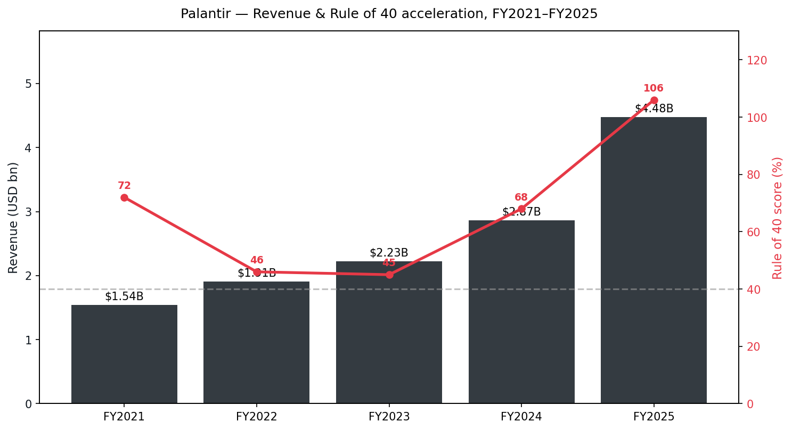
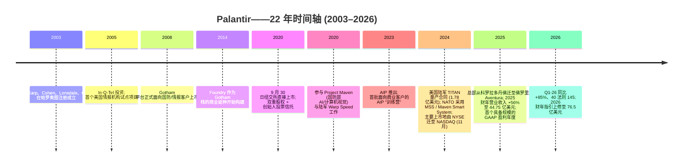
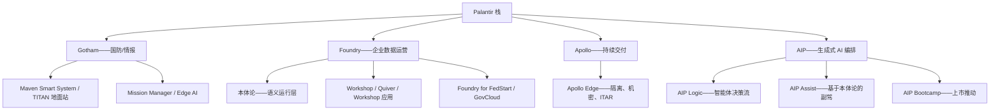
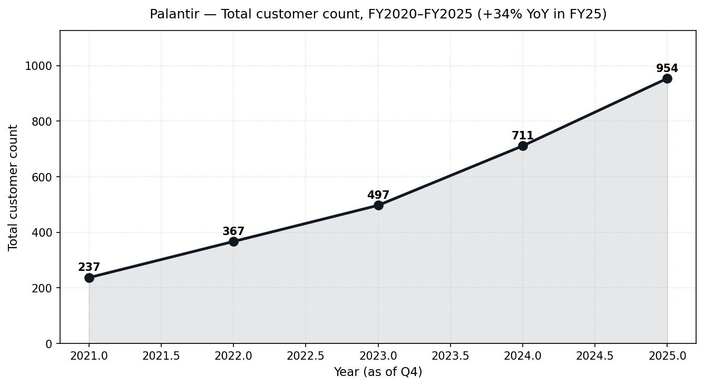
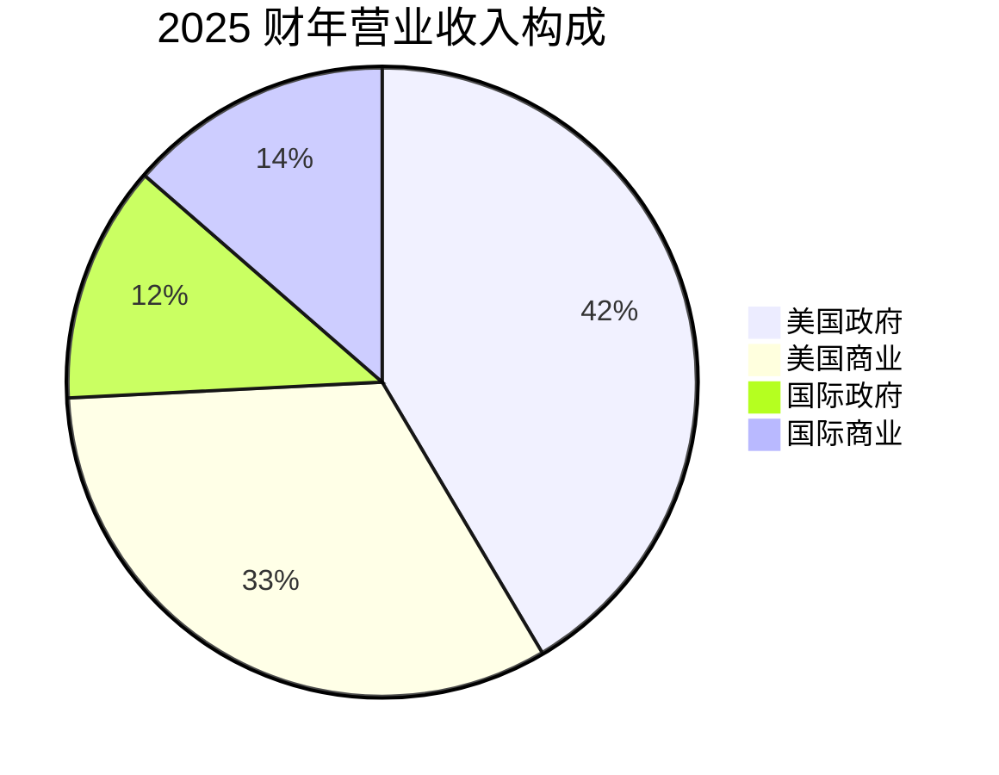
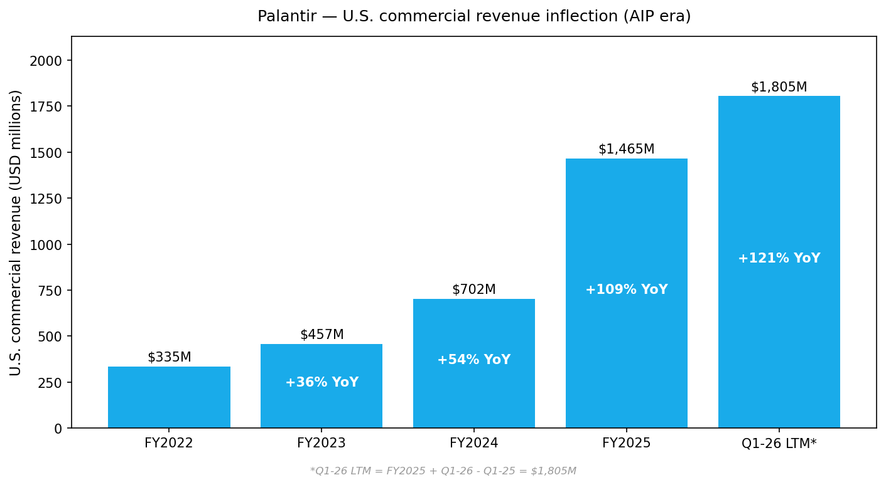
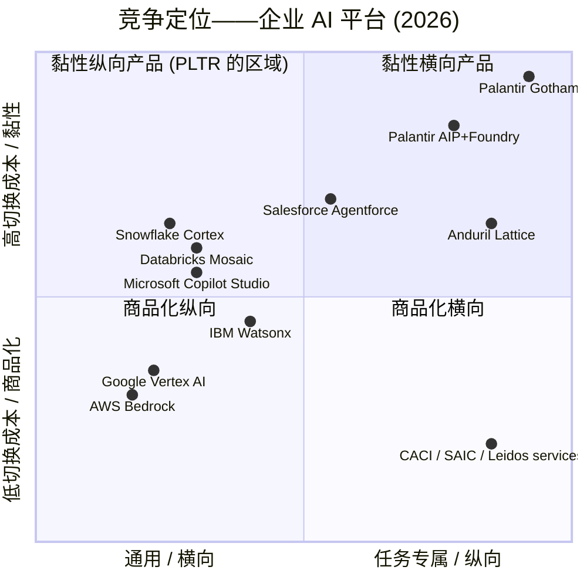
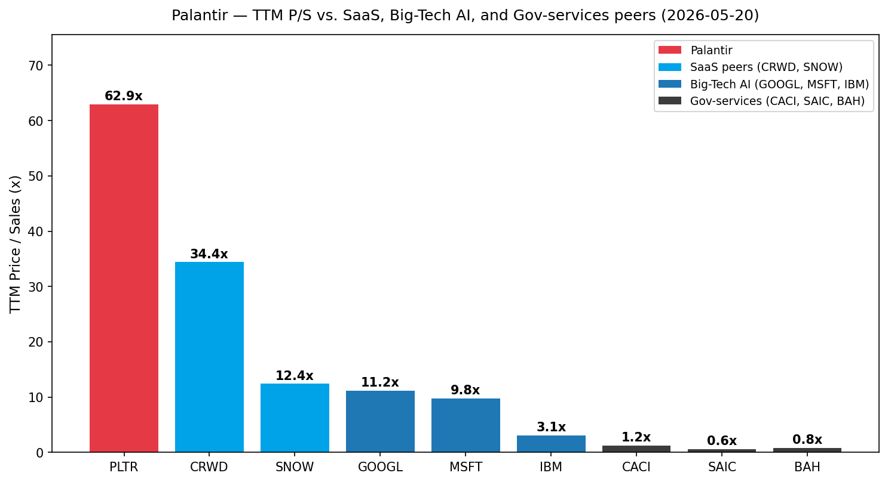

# Palantir Technologies Inc. (NASDAQ:PLTR) — 公司研究报告

**截至日期: 2026-05-20**
**上市地: 纳斯达克 (NASDAQ), 代码 PLTR**
**注册地: 美国佛罗里达州**
**作者: 股票研究——首次覆盖**
**报告语言: 简体中文 (英文版同时存在于本目录)**

> **更新——2026 财年指引再度上修 (2026-05-05):** 管理层将 2026 全年营业收入指引上调至 **76.50–76.62 亿美元**(此前 2026-02-02 发布的指引为 71.82–71.98 亿美元), 美国商业营业收入下限上调至 **>32.24 亿美元 (同比增长 ≥120%, 较此前的 ≥115% 上修)**, 调整后营业利润区间上调至 **44.40–44.52 亿美元**(此前为 41.26–41.42 亿美元)。Q1-26 业绩超预期之后, 2026 财年的隐含同比营业收入增速从 2 月发布时的 61% 阶跃至 71%。CEO Alex Karp 在准备讲稿中所述驱动因素为: "美国业务规模翻倍以上……美国市场正在加速"——Q1-26 美国营业收入同比增长 104%, 美国商业同比增长 133%。
> 来源: [Palantir Q1-2026 业绩公告, 2026-05-04](https://www.sec.gov/Archives/edgar/data/1321655/000132165526000026/a2026q1ex991pressrelease.htm)。

## 目录
1. 公司概览
2. 公司历史
3. 管理团队
4. 产品与服务
5. 客户与上市策略
6. 行业概览
7. 竞争格局
8. 市场机会 (TAM)
9. 风险评估

参考资料

---

## 1. 公司概览

Palantir Technologies 构建并销售四款企业软件平台——**Gotham (政府版)**、**Foundry 平台**、**Apollo (持续交付层)** 与 **人工智能平台 (Artificial Intelligence Platform, AIP)**——这些平台整合一家组织的全部数据, 将其运营逻辑编码进一个"本体论 (Ontology)", 并允许人类用户与大语言模型 (Large Language Model, LLM) 智能体在该运营图谱之上驱动实时决策 ([Palantir 10-K FY2025, 业务概述](https://www.sec.gov/Archives/edgar/data/1321655/000132165526000011/pltr-20251231.htm))。这家公司在两点上不同寻常。第一, 创始人在公司创立之初就选择优先为最严苛的关键任务环境构建软件——西方国防、情报与危机响应机构——再让技术向下渗透到商业应用, 这与多数企业 SaaS 的常规打法正相反。第二, 整个产品栈由单一语义层 (本体论, Ontology) 串联起来, 该语义层已成为公司的核心护城河: 关闭 Palantir 意味着重建每一条经由该图谱读写的业务流程。

Palantir 于 2003 年成立, 2020 年 9 月 30 日通过直接上市 (Direct Listing) 登陆纽约证券交易所 (NYSE), 2024 年 11 月将主要上市地迁至纳斯达克 ([Palantir 8-K——交易所摘牌通告, 2024-11-14](https://www.sec.gov/Archives/edgar/data/1321655/000132165524000219/pltr-exchangeswitchpressre.htm))。其主要行政办公地点过去十二个月内从科罗拉多州丹佛迁至**佛罗里达州 Aventura 市 Biscayne Boulevard 19505 号 2350 套房** ([Palantir 2026 DEF 14A, 年度股东大会通告](https://www.sec.gov/Archives/edgar/data/1321655/000132165526000019/pltr2026def14a.htm))。**截至 2025 年 12 月 31 日, 全公司全职员工共 4,429 人, 其中 28% 在美国以外** ([Palantir 10-K FY2025, 人力资本章节](https://www.sec.gov/Archives/edgar/data/1321655/000132165526000011/pltr-20251231.htm))。

**业务模式。** Palantir 销售多年期企业软件订阅, 通常配套嵌入式实施服务 (其"前置部署工程师"模式)。营业收入按合同期分摊确认。可报告分部为两个——**政府** (国防、情报、民事机构、盟友国家) 与**商业** (金融服务、医疗、能源、工业、制造等领域的大型企业)——共享同一套代码库; 分部划分的是客户构成, 而非不同产品。政府分部占 **2025 财年营业收入的 54% (24.0 亿美元)**, 商业分部占 **46% (20.7 亿美元)** ([Palantir 10-K FY2025, 分部业绩](https://www.sec.gov/Archives/edgar/data/1321655/000132165526000011/pltr-20251231.htm))。

**规模与增长。** 2025 财年营业收入达到 **44.75 亿美元 (同比 +56%, 自 28.66 亿美元)**, GAAP 营业利润为 **14.14 亿美元 (营业利润率 32%)**, 归属于普通股股东的 GAAP 净利润为 **16.25 亿美元 (摊薄每股收益 0.63 美元)** ([Palantir Q4-2025 业绩公告, 2026-02-02](https://www.sec.gov/Archives/edgar/data/1321655/000132165526000004/a2025q4ex991earningsrelease.htm))。Q1-26 进一步加速: 营业收入 **16.33 亿美元 (同比 +85%)**、GAAP 营业利润率 **46%**、调整后营业利润率 **60%**, 公司自报的 **40 法则 (Rule of 40) 评分达到 145** ([Palantir Q1-2026 业绩公告, 2026-05-04](https://www.sec.gov/Archives/edgar/data/1321655/000132165526000026/a2026q1ex991pressrelease.htm))。公司在 Q1-26 末持有 **80 亿美元的现金、短期国债及等价物**, 且无长期债务——一份让 Karp 有自由从其不满的合同中抽身的堡垒型资产负债表。

地理分布以美国为主导: **2025 财年营业收入的 74% 来自美国客户, 26% 来自美国境外**, 美国营业收入同比增长 75%, 美国境外分部同比增长 26% ([Palantir 10-K FY2025, 地理营业收入表](https://www.sec.gov/Archives/edgar/data/1321655/000132165526000011/pltr-20251231.htm))。在美国境内, 商业业务是拐点故事: **2025 财年美国商业营业收入增长 109% 至 14.65 亿美元**, Q1-26 单季度增长 133% ([Palantir Q4-2025 业绩公告, 2026-02-02](https://www.sec.gov/Archives/edgar/data/1321655/000132165526000004/a2025q4ex991earningsrelease.htm))。

来源: [Palantir 10-K FY2025, MD&A](https://www.sec.gov/Archives/edgar/data/1321655/000132165526000011/pltr-20251231.htm) 与 2021–2025 财年 Q4 业绩公告 ([Q4-21](https://www.sec.gov/Archives/edgar/data/1321655/000119312522044821/d317188dex991.htm)、[Q4-22](https://www.sec.gov/Archives/edgar/data/1321655/000132165523000005/a2022q4ex991pressrelease.htm)、[Q4-23](https://www.sec.gov/Archives/edgar/data/1321655/000132165524000010/a2023q4ex991earningsrelease.htm)、[Q4-24](https://www.sec.gov/Archives/edgar/data/1321655/000132165525000007/a2024q4ex991earningsrelease.htm)、[Q4-25](https://www.sec.gov/Archives/edgar/data/1321655/000132165526000004/a2025q4ex991earningsrelease.htm))。

### 估值快照——按任何传统标尺均属极端

在 2026 年 5 月 20 日收盘时, PLTR 价格为 **137.15 美元**, 对应市值 **3,288 亿美元**、企业价值 **3,211 亿美元** (现金超过债务), TTM 倍数如下:

- **TTM 市盈率 (P/E): 154.1 倍** (相比过去 3 年的负值至 280 倍区间; PLTR 在 2023 财年之前 GAAP 口径处于亏损, 倍数随着 2024–25 年盈利出现而机械收缩) ([Yahoo Finance——PLTR 关键统计, 2026-05-20](https://finance.yahoo.com/quote/PLTR/key-statistics/))
- **前瞻市盈率 (Forward P/E): 66.1 倍** ([Yahoo Finance——PLTR 关键统计, 2026-05-20](https://finance.yahoo.com/quote/PLTR/key-statistics/))
- **TTM 市销率 (P/S): 62.9 倍** (TTM 营业收入约 52.2 亿美元)。在 2026 年 2 月 4 日盘中高点 **207.52 美元** 时, 倍数曾突破 95 倍。
- **TTM EV/Revenue: 61.5 倍**、**EV/EBITDA: 159 倍**
- **贝塔 (Beta): 1.52** (偏高——在涨势与调整中均比大盘波动更大)
- **52 周区间: 118.93–207.52 美元**

同业 TTM P/S 在同一日期的比较:

| 代码 | TTM P/S | 类别 | 来源 |
|---|---|---|---|
| **PLTR** | **62.9 倍** | AI 平台纯生意 | [Yahoo Finance, 2026-05-20](https://finance.yahoo.com/quote/PLTR/key-statistics/) |
| CRWD | 34.4 倍 | 高增长安全 SaaS | [Yahoo Finance, 2026-05-20](https://finance.yahoo.com/quote/CRWD/key-statistics/) |
| SNOW | 12.4 倍 | 云数据仓库 | [Yahoo Finance, 2026-05-20](https://finance.yahoo.com/quote/SNOW/key-statistics/) |
| GOOGL | 11.2 倍 | 大型科技 AI/云 | [Yahoo Finance, 2026-05-20](https://finance.yahoo.com/quote/GOOGL/key-statistics/) |
| MSFT | 9.8 倍 | 大型科技 AI/云 | [Yahoo Finance, 2026-05-20](https://finance.yahoo.com/quote/MSFT/key-statistics/) |
| IBM | 3.1 倍 | 成熟企业/Watson | [Yahoo Finance, 2026-05-20](https://finance.yahoo.com/quote/IBM/key-statistics/) |
| CACI | 1.2 倍 | 国防服务 | [Yahoo Finance, 2026-05-20](https://finance.yahoo.com/quote/CACI/key-statistics/) |
| BAH | 0.8 倍 | 国防服务 (Booz Allen) | [Yahoo Finance, 2026-05-20](https://finance.yahoo.com/quote/BAH/key-statistics/) |
| SAIC | 0.6 倍 | 国防服务 | [Yahoo Finance, 2026-05-20](https://finance.yahoo.com/quote/SAIC/key-statistics/) |

Palantir 的交易倍数大约为 **CrowdStrike 的 1.8 倍**、**Snowflake 的 5 倍**、**微软/Alphabet AI 复合体的 6 倍**, 以及**上市国防服务厂商的 50–100 倍**。标普 500 软件子板块的市销率中位数处于高个位数; PLTR 因此**超过其软件同业中位数 8 倍以上**。

这一倍数并非偶然。三股可观察的驱动力解释了它, 第四项则是叙事性的:

1. **40 法则加速。** Palantir 自报的 40 法则得分 (同比营收增长 + 调整后营业利润率) 在 **Q4-25 达到 127, 在 Q1-26 达到 145**——管理层称此数字在 AI 基础设施厂商中仅有英伟达 (NVIDIA)、美光 (Micron) 与 SK 海力士 (SK hynix) 能匹敌 ([Palantir Q1-2026 业绩公告, 2026-05-04](https://www.sec.gov/Archives/edgar/data/1321655/000132165526000026/a2026q1ex991pressrelease.htm))。对于一家具备规模的软件企业而言, 这一组合本质上是独一无二的; 市场为得分的*路径*付费, 而非其当前水平。
2. **AIP 驱动的商业订单。** **Q1-26 美国商业 TCV (总合同价值) 收于 11.76 亿美元 (同比 +45%)**, **美国商业 RDV (剩余订单价值) 达到 49.2 亿美元 (同比 +112%, 环比 +12%)** ([Palantir Q1-2026 业绩公告, 2026-05-04](https://www.sec.gov/Archives/edgar/data/1321655/000132165526000026/a2026q1ex991pressrelease.htm))。市场据此对订单出货比 (book-to-bill) 折年化高于 2 倍。
3. **稀缺性/板块代理溢价。** PLTR 是唯一具备实质规模、且被美国军方与情报界以生产规模实际部署的上市"AI 软件平台"纯生意。ETF 流量 (AIQ、BOTZ、ROBO) 将其视为板块代理, 而做空敞口结构性偏低, 因为没有干净的替代品可用于对冲。
4. **叙事/Karp 溢价。** CEO Alex Karp 的季度股东信和媒体采访——明确以西方立场、亲国防、亲美国制造业为基调——使 PLTR 成为美国复兴/回流主题组合的载体。这一项是真实存在但难以量化的, 且在叙事破裂时会在下行端增加风险。

我们将该倍数视为**拉伸**, 含义符合第 9 章的风险分类: TTM P/S 62.9 倍远高于 20 倍门槛, 即便配合顶四分之一的增长亦如此。轻微减速至"仅 40% 同比增长"、利润率维持稳定的情形, 即便绝对营业收入仍在上行, 也会显著压缩 P/S。该估值/倍数收缩风险已纳入第 9 章。

---

## 2. 公司历史

Palantir 于 **2003 年 5 月**在加州帕罗奥图由 **Peter Thiel**、**Alex Karp**、**Stephen Cohen**、**Joe Lonsdale** 与 **Nathan Gettings** 创立。Thiel——刚把 PayPal 卖给 eBay——以个人资金及其 Founders Fund 的 200 万美元支票为公司提供启动资金。产品论点是对 9/11 事件的直接回应: PayPal 用于发现信用卡欺诈的模式识别技术, 可以被改造用于跨孤岛的政府数据中识别恐怖主义融资。In-Q-Tel——美国中央情报局 (CIA) 的战略风投部门——在 2005 年做出早期投资, 为公司提供了首个政府客户, 并实际为其撰写了安全许可与产品规格 ([Palantir 2026 DEF 14A——董事简历](https://www.sec.gov/Archives/edgar/data/1321655/000132165526000019/pltr2026def14a.htm))。

来源: [Palantir 10-K FY2025, 第 1 项 业务与第 1A 项 历史](https://www.sec.gov/Archives/edgar/data/1321655/000132165526000011/pltr-20251231.htm) 以及 [Palantir 2026 DEF 14A](https://www.sec.gov/Archives/edgar/data/1321655/000132165526000019/pltr2026def14a.htm)。

**战略转折 1——从 Gotham 到 Foundry (约 2014 年)。** 前十年, Palantir 是一家仅服务政府的厂商, 其产品是一套情报分析工作台。2014 年, 团队意识到同样的数据整合底座在受监管的商业行业中同样有用, 于是将其产品化为商业级变体 Foundry, 配以银行、医疗系统与制药企业所要求的治理与审计控制。该转向耗时数年才转化为收入——2018–19 年商业订单严重停滞, 是 IPO 估值低于此前私募轮次的重要原因——但它创造了 AIP 最终售向的客户基础 ([Palantir 10-K FY2025, 第 1 项](https://www.sec.gov/Archives/edgar/data/1321655/000132165526000011/pltr-20251231.htm))。

**战略转折 2——从"Foundry 作为数据平台"到"AIP 作为决策平台" (2023 年至今)。** AIP 于 2023 年初推出, 是一层轻量的生成式 AI 编排层, 让商业客户能将任何第三方 LLM (OpenAI、Anthropic、Mistral、客户自训模型) 连接至其本体论, 并执行实时动作而不仅是回答问题。突破性的商业机制是 **AIP 训练营**——一项 1 至 5 天的免费现场参与活动, Palantir 工程师在客户现场为潜在客户搭建可工作的原型, 训练营结束后数周内通常即可签下六位数订阅。训练营管道是 2025 财年 109% 美国商业营业收入增长的直接原因 ([Palantir Q4-2025 业绩公告, 2026-02-02](https://www.sec.gov/Archives/edgar/data/1321655/000132165526000004/a2025q4ex991earningsrelease.htm))。

**战略转折 3——上市地及注册地迁移 (2024–25 年)。** Palantir 于 2024 年 11 月将主要上市地从 NYSE 迁至 NASDAQ——公司将此举定位为与科技同业归类, 并使其满足纳斯达克 100 指数 (2024 年 12 月获纳入) 及最终的标普 500 指数 (2024 年 9 月被纳入) 的资格 ([Palantir 8-K, 2024-11-14](https://www.sec.gov/Archives/edgar/data/1321655/000132165524000219/pltr-exchangeswitchpressre.htm))。指数纳入带来了大量被动需求。总部于 2025 年从丹佛迁至南佛罗里达 ([Palantir 2026 DEF 14A——年度股东大会通告](https://www.sec.gov/Archives/edgar/data/1321655/000132165526000019/pltr2026def14a.htm))。

**收购。** Palantir 在并购方面极为克制。IPO 以来没有任何变革型收购。2025 财年 10-K 现金流量表中"并购"项下最大的单笔现金流出是个位数百万级的战略投资增持, 而非平台收购 ([Palantir 10-K FY2025, 现金流量表](https://www.sec.gov/Archives/edgar/data/1321655/000132165526000011/pltr-20251231.htm))。

**近期动态 (2024–26 年)。** 过去十二个月内的四个经营头条是: (i) **美国陆军 TITAN 量产授标** (从 Maven 衍生的地面情报终端, 主承包商); (ii) **NATO 采用 Maven Smart System** 作为其盟国作战企业架构; (iii) **AIP 商业拐点** (Q1-26 同比 +133%); 以及 (iv) 在三个月内**连续两次上修 2026 财年指引**。这些将在第 4、5、7 章展开。

---

## 3. 管理团队

**Alex Karp——联合创始人、CEO 兼董事** *(提交文件时年龄 58 岁; 2005 年起任 CEO, 2003 年起任董事)*。Karp 是本报告中最具影响力的单一人物。他是少数自称*非*技术出身的软件 CEO 之一: 持有 Haverford 学院 B.A.、斯坦福法学院 J.D., 以及法兰克福歌德大学的**新古典社会理论**博士学位, 师从尤尔根·哈贝马斯 (Jürgen Habermas)。加入 Palantir 之前他在伦敦经营一家小型资产管理公司。他自 2005 年起担任 CEO——提交文件时已 21 年——并通过其季度股东信及著作《技术共和国 (The Technological Republic)》(Crown 出版社, 2025 年) 成为公司"西方技术优势"论的公众代言人。Karp 2025 财年的现金薪酬按大盘股 CEO 标准属于较低水平——**底薪 1,101,637 美元, 其中 800,000 美元为季度差旅津贴, 没有年度奖金**——而他几乎全部的经济敞口都在股权激励上 ([Palantir 2026 DEF 14A——高管薪酬, 第 39 页](https://www.sec.gov/Archives/edgar/data/1321655/000132165526000019/pltr2026def14a.htm))。仅 2020 年高管股权计划授予 (代理快照时 2,745 万股已归属期权 + 1,930.5 万股未归属 RSU) 在按 2025 年 12 月 31 日股价计算控制权变更加速归属的情境下估值就达到 **83.6 亿美元** ([Palantir 2026 DEF 14A——控制权变更下的潜在支付](https://www.sec.gov/Archives/edgar/data/1321655/000132165526000019/pltr2026def14a.htm))。Karp 实益拥有 **643 万股 A 类股、8,690 万股 B 类股 (占 B 类股 64.0%) 及 335,000 股 F 类股 (占 F 类股 33.3%)**, 合计**总投票权 11.4%** ([Palantir 2026 DEF 14A——实益所有权](https://www.sec.gov/Archives/edgar/data/1321655/000132165526000019/pltr2026def14a.htm))。其代理条目还披露了 2025 年 **250 万美元的个人安保分配支出与 200 万美元的相关包机费用**, 这两项均由董事会基于"独立安保研究"批准——这也提醒读者 PLTR 是按高威胁简况下的国防公司方式运营, 而非按硅谷 SaaS 公司运营。Karp 最有用的早期成就是在 2018–19 年停滞期把公司维系在一起的能力, 当时商业订单未达计划, 多位高管离职——2020 年后的反转是他既能宣讲、亦能运营的主要证据。

**Stephen Cohen——联合创始人、总裁、秘书及董事** *(年龄 43 岁)*。Cohen 自 2005 年与他人共同创立 Palantir 以来一直在公司, 持有斯坦福大学计算机科学 B.S.。他负责内部运营与产品执行, 是参与创始人投票信托协议的三位创始人之一; 他持有 **B 类股的 29.4% 与 F 类股的 33.3%**, 自身贡献 **总投票权的 3.0%** ([Palantir 2026 DEF 14A——实益所有权表](https://www.sec.gov/Archives/edgar/data/1321655/000132165526000019/pltr2026def14a.htm))。

**David Glazer——首席财务官兼司库** *(年龄 42 岁; 2013 年加入 Palantir, 2019 年起任 CFO)*。Glazer 不寻常: 持有圣克拉拉大学历史学 B.A. 与 Emory 法学院 J.D.——没有正式的会计或银行背景——且是 Palantir 内部成长的职业高管, 在 2020 年直接上市前由公司发展类岗位内部晋升至 CFO 一职。他因此未在任何其他上市公司担任过 CFO。然而, 他在 Palantir 的纪录在最重要的指标上很扎实: 他经历了 IPO、上市公司控制系统建设 (未披露任何重大缺陷)、2023 年转为 GAAP 盈利, 以及 2025 财年将调整后营业利润率推升至 50% 的过程。其 2025 年底薪为 **450,200 美元**, 配以大额 RSU 与 SAR 股权授予——他在 2025 年 2 月获得 232,898 股 RSU, 估值为 **2,117 万美元**, 并在 2025 年 4 月获得 323,334 股 SAR ([Palantir 2026 DEF 14A——计划下授予](https://www.sec.gov/Archives/edgar/data/1321655/000132165526000019/pltr2026def14a.htm))。2025 年授予结构的隐含信息是留任; 明确信息是董事会仍不认为 CFO 一职可被外部接任。

**Shyam Sankar——CTO 兼执行副总裁** *(年龄 44 岁; 2006 年加入 Palantir)*。Sankar 持有康奈尔大学电气与计算机工程 B.S. 及斯坦福大学管理科学与工程 M.S.。他是公司最具公众形象的技术声音, 也是在西方国防工业基础政策方面发表评论的作者; 其在参议院军事委员会就商业技术采购的证词 (2024 年) 在国防圈内被广泛引用。Sankar 在 Palantir 的经济权益不容忽视——**499 万股 B 类股**, 加上代理报告中按控制权变更基础估值远超过 2.5 亿美元的股票期权——但他的重要性在运营层面: 他是与美国国防客户的主要接口, 也是 AIP 销售推动的架构师 ([Palantir 2026 DEF 14A——高管简历与实益所有权](https://www.sec.gov/Archives/edgar/data/1321655/000132165526000019/pltr2026def14a.htm))。

**Ryan Taylor——首席营收官兼首席法务官** *(年龄 44 岁; 2010 年加入 Palantir)*。Taylor 持有斯坦福大学 B.S. 与 M.S., 以及哈佛法学院 J.D.。他同时管理销售团队与法务部门——这一异常合并的职责映射了 Karp 对将商业与合同职能分立的反感 ([Palantir 2026 DEF 14A——高管](https://www.sec.gov/Archives/edgar/data/1321655/000132165526000019/pltr2026def14a.htm))。

**治理。** Palantir 最具特色的治理特征是**创始人投票信托协议**: Karp、Cohen 与 Thiel 通过 F 类超级投票股结构共同控制**最高达 49.999999% 的总投票权**, 无论他们出售多少经济权益, 只要满足 1 亿股公司股权的"所有权门槛"——该门槛在 2026 年记录日已被满足 ([Palantir 2026 DEF 14A——创始人投票信托协议](https://www.sec.gov/Archives/edgar/data/1321655/000132165526000019/pltr2026def14a.htm))。董事会在 2026 年年度大会上有 7 位董事: 3 位创始人/内部董事 (Karp、Cohen、Thiel) 与 4 位名义上的独立董事 (Alexander Moore、Alexandra Schiff、Lauren Friedman Stat、Eric Woersching), 后四位负责审计委员会与薪酬/提名/治理委员会。内部所有权较高 (Karp 11.4%、Thiel 7.9%、Cohen 3.0%——三人合计直接占总投票权约 22%, F 类股块另叠加于其上)。高管薪酬以股权为压倒性主导且后端集中; 2025 年 NEO 唯一的年度新增授予活动来自 Glazer 与 Taylor。

**记录综合。** Karp、Cohen 与 Sankar 现已共事第 20 余年; Glazer 与 Taylor 分别处于第 13 年与第 16 年。该团队取得了 **23 个连续季度的营业收入增长、4 个连续年度的调整后营业利润率扩张 (28% → 39% → 50% → Q1 年化运行率约 60%), 以及在大规模条件下加速增长这一罕见组合**。主要的历史执行失败——2018–19 年商业停滞——已得到充分纠正。主要*未解*的执行问题是, 美国商业 100% 以上的增长是否可在两年以上的时间内重复。

---

## 4. 产品与服务

Palantir 推出四个平台——Gotham、Foundry、Apollo 与 AIP——加上构建在其上的一系列垂直解决方案加速器。10-K 将这四者描述为一个垂直整合的栈 ([Palantir 10-K FY2025, 第 1 项 业务](https://www.sec.gov/Archives/edgar/data/1321655/000132165526000011/pltr-20251231.htm))。

来源: [Palantir 10-K FY2025, 第 1 项 业务——平台](https://www.sec.gov/Archives/edgar/data/1321655/000132165526000011/pltr-20251231.htm)。

### 平台 1——Gotham *(国防与情报旗舰)*

根据 10-K, Gotham "与我们的其他平台及更广泛的国防产品整合, 以驱动盟国国防与情报运营中的各种任务" ([Palantir 10-K FY2025, 第 1 项](https://www.sec.gov/Archives/edgar/data/1321655/000132165526000011/pltr-20251231.htm))。它是原始 Palantir 产品——一套基于图谱的分析工作台, 融合传感器、信号情报、人力情报、地理空间与开源数据为统一作战图景。目标客户: 美国及盟国国防机构、情报界、执法部门、联邦民事任务机构。定价: 定制化的政府企业许可证, 通常按 IDIQ (不定数量不定交付) 工具下的企业级部署计费。竞争优势: **是——高。** 护城河类型: *认证 + 切换成本 + 品牌*。Gotham 持有高密级认证 (IL5、IL6、IL7), 这些认证需要数年与数百万美元才能获取; 在美国情报界已超过 20 年的运营部署是核心品牌资产。最接近的指明竞争产品: BAE Systems / Leidos / SAIC 基于商品工具自建的分析栈; Anduril Lattice 用于战术 (不同领域但在部分陆军项目中与之竞标)。**位置: 领先**——在面向机密环境的分析织物 (analytics fabric) 类别内。

### 平台 2——Foundry *(商业旗舰)*

Foundry 在 10-K 中被描述为"我们的基础数据运营平台, 提供数据管理、逻辑创建、通过 Palantir 本体论实现的系统映射开发、分析及工作流开发的核心能力" ([Palantir 10-K FY2025, 第 1 项](https://www.sec.gov/Archives/edgar/data/1321655/000132165526000011/pltr-20251231.htm))。目标客户: 金融服务 (摩根士丹利、花旗集团历史上)、油气 (BP)、制药、医疗系统及工业制造商等大型企业。定价: 多年期订阅, ARR 风格, 加实施服务。竞争优势: **是——高**, 但可被挑战。护城河类型: *切换成本 + 通过本体论实现的数据生态系统锁定*。一旦客户将其运营模型 (资产、流程、KPI) 编码入本体论, 替换 Foundry 就意味着重新实施所有读写本体论的模型、应用与工作流——这是一个多年期项目。最接近的指明竞争对手: Snowflake + Databricks + Microsoft Fabric 拼接而成。**位置: 在运营工作流整合上领先; 在原始数据仓库能力上对位; 在价格上落后。**

### 平台 3——Apollo *(基础设施层)*

Apollo "是一个云无关的单一控制层, 用于协调新功能、安全更新与平台配置的持续交付" ([Palantir 10-K FY2025, 第 1 项](https://www.sec.gov/Archives/edgar/data/1321655/000132165526000011/pltr-20251231.htm))。目标客户: 主要是一个内部平台, 用于跨客户环境运营 Gotham/Foundry/AIP, 但越来越多地被授权给需要 Palantir 级持续交付系统以服务自身软件的大客户。定价: 通常打包计价。竞争优势: **部分——中等**。护城河类型: *运营工具链深度*。最接近的竞争对手: HashiCorp Terraform / Ansible / GitOps 栈。**位置: 在开发者心智份额上落后, 在机密/隔离环境支持上领先**——Apollo 是极少数获认证可在 IL6/IL7 环境运行的持续交付平台之一。

### 平台 4——人工智能平台 (AIP) *(增长引擎)*

10-K 将 AIP 描述为"我们的生成式人工智能平台, 提供与第三方大语言模型的安全连接……使其能够从 AI 近期突破中提取价值" ([Palantir 10-K FY2025, 第 1 项](https://www.sec.gov/Archives/edgar/data/1321655/000132165526000011/pltr-20251231.htm))。它将任何 LLM (OpenAI、Anthropic、Mistral、客户微调模型) 连接至本体论, 让生成式智能体在受访问控制与审计约束的条件下, 能够读取、推理并在底层业务图谱上*执行行动*。目标客户: 任何 Foundry 或 Gotham 客户; 通过 **AIP 训练营** 获取新商业客户。定价: 订阅席位加上基于 LLM 调用的消费量计费。竞争优势: **是——在部署上高、在技术上有争议。** 护城河类型: *整合护城河 (本体论绑定) + 上市推动 (训练营) + 机密认证*。模型层本身正在迅速商品化——Karp 用"商品化认知 (commodity cognition)"一词——因此 AIP 的可防御性在于成为*将这些模型接入企业真实运营数据的最便宜场所*。最接近的竞争对手: **Microsoft Copilot Studio + Azure OpenAI**、**Salesforce Agentforce**、**Snowflake Cortex**、**Databricks Mosaic AI**。**位置: 在企业数据上的智能体行动与机密部署上领先; 在聊天式副驾上对位; 在开发者生态范围上落后。**

### 垂直解决方案与联邦级凭证产品

- **Foundry for FedStart / GovCloud**——面向民事机构的交钥匙 FedRAMP High 部署。被 HHS / CMS 工作与若干联邦民事机构使用。
- **AIP Edge / Tactical Edge**——在断网、坚固硬件上运行, 服务前置部署军事单元; 支撑 TITAN。
- **Mission Manager / Operational Manager**——构建在 Foundry 之上的仓库、制造与现场运营垂直加速器, 被 Tyson Foods 型工业客户使用。
- **反洗钱/反欺诈套件**——为银行与支付平台打包的 Foundry+AIP。
- **Patient Pathways / Clinical Operations**——为医疗系统打包, 包括英国 NHS 联邦数据平台。
- **Skywise**——与航空业共同开发的 Foundry 实例; 历史上最大示例是与空客 (Airbus) 的合作。

### 旗舰与长尾

驱动业务的 1–3 款产品明确无疑: **政府**用的 **Gotham + AIP**, 以及**商业**用的 **Foundry + AIP**。Apollo 是连接组织; 垂直加速器是上市包装, 而非独立营业收入条线。

### 过去 12 个月的发布/重新定位

- **AIP 训练营规模化 (2024–2026):** 训练营推动已工业化——在美国每季度数百场——并且是 Q1-26 美国商业 133% 增长的最大单一贡献者。
- **美国陆军 TITAN 量产阶段 (2024 年起):** Palantir 被任命为陆军战术情报目标接入节点 (Tactical Intelligence Targeting Access Node) 项目量产阶段主承包商, 初始量产授标约 **1.78 亿美元**, 国防业内媒体在 2024 年广泛报道 ([Palantir 10-K FY2025, 第 1 项——政府分部](https://www.sec.gov/Archives/edgar/data/1321655/000132165526000011/pltr-20251231.htm) 描述该陆军项目; 美元金额在业内媒体广泛报道)。
- **NATO Maven Smart System 采用 (2025 年):** NATO 选择 Palantir 的 Maven Smart System (MSS) 作为 NATO 盟国作战司令部的运营 AI 系统, 将 Project Maven 从美国国防部专属项目扩展为整个联盟的部署。
- **AIP Logic / AIP Assist (2025 年发布):** AIP 内部明确的智能体工作流与副驾模块, 按席位加 LLM 调用费率销售。

---

## 5. 客户与上市策略

Palantir **截至 2025 年 12 月 31 日总客户数为 954 家**, 较一年前的 711 家增长 (**同比 +34%**), 较 2023 财年末的 497 家及 2022 财年末的 367 家增长更显著 ([Palantir 10-K FY2025, 第 7 项 MD&A](https://www.sec.gov/Archives/edgar/data/1321655/000132165526000011/pltr-20251231.htm)、[Palantir 10-K FY2024](https://www.sec.gov/Archives/edgar/data/1321655/000132165525000022/pltr-20241231.htm)、[Palantir 10-K FY2023](https://www.sec.gov/Archives/edgar/data/1321655/000132165524000022/pltr-20231231.htm))。客户基础在顶部仍较集中, 但通过 AIP 时代已显著扩大。

来源: Palantir 2022–2025 财年 10-K 文件 (上述链接)。

### 客户集中度

客户集中度在 2025 财年 10-K 与 Q1-26 10-Q 中披露。确切披露用语为: *"客户合计占截至 2025 年 12 月 31 日与 2024 年 12 月 31 日年度营业收入的 **16% 与 17%**, 占截至 2026 年 3 月 31 日与 2025 年 3 月 31 日三个月营业收入的 **15% 与 18%**"* ([Palantir Q1-2026 10-Q, 营业收入集中度注释](https://www.sec.gov/Archives/edgar/data/1321655/000132165526000028/pltr-20260331.htm); [Palantir 10-K FY2025, 第 1A 项 风险因素](https://www.sec.gov/Archives/edgar/data/1321655/000132165526000011/pltr-20251231.htm))。Palantir 未指明具体客户, 但门槛用语 ("客户"复数代表单一营业收入主体) 暗示这些是主 IDIQ 下的美国政府客户。

趋势是**集中度下降**——2024 财年 17% → 2025 财年 16% → Q1-26 15%——这是正确方向, 尽管政府绝对营业收入仍在增长。10-K 还提及*"截至 2025 年 12 月 31 日年度按营业收入计算的客户与我们的平均合作年限为**十年**"* ([Palantir 10-K FY2025, 第 1 项](https://www.sec.gov/Archives/edgar/data/1321655/000132165526000011/pltr-20251231.htm))——异常的耐久性。

按分部 (2025 财年): **政府 54% / 商业 46%**。按地理: **美国 74% / 美国境外 26%**。**美国之外没有任何国家在 2023、2024 或 2025 财年代表营业收入 10% 以上** ([Palantir 10-K FY2025, 地理营业收入表](https://www.sec.gov/Archives/edgar/data/1321655/000132165526000011/pltr-20251231.htm))。

由于顶部组合合计约 **15–16%, 且集中于美国政府工作**, 我们将**美国联邦政府视为最大的单一对手方风险**, 并纳入第 9 章。该结构为多年期 IDIQ + 任务单, 而非单一集中合同, 实质上减轻了续约悬崖风险——但政府关门、持续决议放缓或主要项目取消, 仍可能严重扰乱季度营业收入确认。10-K 明确强调了这一点: *"美国政府的预算流程、持续决议的使用, 及可能的拨款失效, 或其他司法管辖区的类似事件, 已经并将来可能不利地影响我们及时确认某些政府合同项下营业收入的能力"* ([Palantir 10-K FY2025, 第 1A 项](https://www.sec.gov/Archives/edgar/data/1321655/000132165526000011/pltr-20251231.htm))。

注: 美国政府约 18.55 亿美元 (总数 44.75 亿美元); 美国商业约 14.65 亿美元; 国际政府约 5.47 亿美元 (总政府 24.02 亿美元剩余部分); 国际商业约 6.08 亿美元 (总商业 20.73 亿美元剩余部分)。
来源: [Palantir Q4-2025 业绩公告, 2026-02-02](https://www.sec.gov/Archives/edgar/data/1321655/000132165526000004/a2025q4ex991earningsrelease.htm) 与 [Palantir 10-K FY2025, 第 7 项 MD&A](https://www.sec.gov/Archives/edgar/data/1321655/000132165526000011/pltr-20251231.htm)。

### 分销与销售推动

Palantir 的上市策略是直销: 没有实质渠道合作伙伴营业收入, 没有 Cisco/HPE 式的两级分销。销售团队组织为**"前置部署工程师"**而非传统客户经理——工程师驻扎在客户处, 界定用例, 构建原型, 并将试点转化为多年期订阅。10-K 警告该模式会产生*"长且不可预测的销售周期"*, 以及*"我们平台的实施流程……可能复杂且漫长"* ([Palantir 10-K FY2025, 第 1A 项](https://www.sec.gov/Archives/edgar/data/1321655/000132165526000011/pltr-20251231.htm))——历史上交易周期是 6 到 12 个月, 但在 AIP 训练营推动下已显著压缩, 公司报告在现场训练营结束后数周内即可签下六位和七位数订阅。

**过去十二个月顶部客户的营业收入**是一个 land-and-expand 生产率的有用代理。10-K 披露 2025 年末 TTM 基础上前 20 大客户平均营业收入为 **9,300 万美元**, 较一年前的 **6,400 万美元**——顶部客户的平均规模同比提升 45% ([Palantir 10-K FY2025, 第 1 项](https://www.sec.gov/Archives/edgar/data/1321655/000132165526000011/pltr-20251231.htm))。

### 已披露客户与案例研究 (过去 12 个月)

Palantir 不发布单一客户名单。公开披露并经公司频繁引用的名字包括:
- **美国陆军**——TITAN 量产阶段, NGCS / Vantage / Project Maven 衍生工作
- **美国特种作战司令部 (SOCOM)、中央司令部 (CENTCOM)、欧洲司令部 (EUCOM)**——Gotham 部署
- **美国情报界**——In-Q-Tel 客户, 长期合作
- **美国卫生及公共服务部 / 疾控中心 (CDC)**——可追溯至 COVID-19 响应的 Foundry 部署
- **美国移民和海关执法局 (ICE)**——案例管理 Foundry 部署 (政治上有争议——参见第 9 章)
- **美国国家地理空间情报局 (NGA)**——Maven Smart System 部署
- **NATO 盟国作战司令部**——MSS 采用 (2025 年)
- **英国 NHS**——联邦数据平台 (多年期商业合同)
- **BP**——长期上游与交易 Foundry 部署
- **空客 (Airbus)**——Skywise 航空数据平台 (基于 Foundry)
- **克利夫兰诊所、Tampa General、HCA 关联系统**——商业医疗 Foundry 用户
- **温迪汉堡 (Wendy's)**——供应链 Foundry / AIP 用户 (2024 年宣布为 AIP 客户, 并被频繁引用为 AIP 训练营的成功案例)
- **Tyson Foods**——运营 Foundry / AIP 部署
- **花旗集团、摩根士丹利**——金融服务 Foundry 客户, 合作年限较长

10-K 描述与美国政府的合同结构为"通常……是用以构建定制软件的大型开发性物资与服务合同, 而非用于商业产品的固定单价合同", 具备多年期履约期与可便利终止条款 ([Palantir 10-K FY2025, 第 1A 项 风险因素](https://www.sec.gov/Archives/edgar/data/1321655/000132165526000011/pltr-20251231.htm))。商业合同多为含规定最低值的多年期订阅主协议。

### 营业收入待履行积压

Palantir 公布的最有用的前瞻营业收入指标是**总剩余订单价值 (Total Remaining Deal Value, RDV)**。2025 年末总 RDV 为 **112 亿美元**, 其中 **商业 68 亿美元**、**政府 44 亿美元** (后者仅限于美国及盟国政府) ([Palantir 10-K FY2025, 第 7 项——总剩余订单价值](https://www.sec.gov/Archives/edgar/data/1321655/000132165526000011/pltr-20251231.htm))。到 Q1-26, 仅美国商业 RDV 就跃升至 **49.2 亿美元 (同比 +112%)** ([Palantir Q1-2026 业绩公告, 2026-05-04](https://www.sec.gov/Archives/edgar/data/1321655/000132165526000026/a2026q1ex991pressrelease.htm))。RDV 包括可能未必全部行使的合同选择权, 因此应相对正式的 U.S.-GAAP 剩余履约义务 (RPO, 2025 年末约 40 亿美元——更保守的数字, 但未考虑选择权行使) 打折计算。

来源: Palantir Q4-2022、Q4-2023、Q4-2024、Q4-2025 与 Q1-2026 业绩公告 (上文已引用 URL)。

---

## 6. 行业概览

Palantir 跨越三个不同的行业定义, 适用的 TAM 框架取决于采纳哪一个。

**定义 1——企业数据与分析软件 (NAICS 5132)。** 经典的"数据平台"市场——数据仓储、湖仓架构、商业智能、ETL、主数据管理、MLOps。Gartner 2024 年市场规模估算约为 1,300 亿美元, 前瞻 CAGR 为低双位数; IDC 的"大数据与分析"语义更宽 (包含服务接近 3,500 亿美元)。Palantir 在此与云超大规模厂商的数据平台 (Microsoft Fabric、Google BigQuery / Vertex、AWS)、Snowflake、Databricks 及 Oracle、IBM、SAP 等传统栈竞争。行业结构: 在超大规模厂商层呈寡头化 (微软、Google、AWS 合计主导云原生数据基础设施), 长尾由专业厂商分散构成。切换成本高; 增长正从十年前的 20%+ CAGR 减速至当前的低十几个百分点。

**定义 2——国防数字化转型 / 指挥-控制-通信-计算机-情报-监视-侦察 (C5ISR) 软件。** 这是 Gotham 的领域。美国国防部仅 IT 与软件预算每年约 600–650 亿美元 (2025 财年非机密 RFP 总额与此相符), 其中越来越多分配给 AI/ML、自主性与指挥控制现代化项目。NATO 与五眼盟国合计每年增加 400–500 亿美元可寻址支出。行业结构: 在主承包商层呈寡头化 (洛克希德·马丁、RTX、诺斯罗普·格鲁曼、通用动力、BAE Systems), 服务层分散 (CACI、SAIC、Leidos、Booz Allen), 以及小而扩张的纯软件队列 (Palantir、Anduril、Shield AI)。服务层利润率为低个位数百分比; Palantir 作为具备产品化 IP 的纯软件厂商, 赚取商业软件级毛利率 (2025 财年 GAAP 毛利率 **82%**, [Palantir 10-K FY2025, 利润表](https://www.sec.gov/Archives/edgar/data/1321655/000132165526000011/pltr-20251231.htm))。

**定义 3——生成式 AI 企业软件 / 智能体 AI。** 最新、最模糊的市场——构建在基础模型之上的编排层与应用。Forrester、Gartner 与 IDC 均发布了截然不同的 TAM (2028 年 500 亿美元至 2,000 亿美元), 因为没人在"什么算"的定义上达成一致。Palantir 的 AIP 在此竞争。主导竞争集群是 Microsoft (Azure OpenAI + Copilot Studio + Fabric)、Salesforce (Agentforce)、Google (Vertex AI)、AWS (Bedrock)、Snowflake (Cortex) 与 Databricks (Mosaic)。行业结构: 新生且正在裂变, 受超大规模厂商分销主导, 但留有可观的专业化平台空间 (Palantir 的主张)。

**贯穿三个定义的关键增长驱动因素:**
1. **AI 从聊天到行动。** 企业现在希望 LLM*执行*——开工单、下订单、生成工作令、提交监管报告——这需要干净的运营图谱 (本体论) 与细粒度的访问控制; 这正是 Palantir 的核心论点。
2. **国防软件重新平台化。** 数十年期的传统指挥控制软件正被重新平台化到商业速度的栈; 美国国防部的软件采购通道及 CDAO 强制要求加速了这一进程。
3. **再工业化/回流。** 美国工业客户正在重建国内供应链可视性并自动化运营; Foundry+AIP 被大量出售到这一论点中。
4. **主权 AI / 盟国技术阵营。** 英国、德国、日本、韩国、以色列与沙特阿拉伯均正在建立主权 AI 计算与应用; Palantir 的机密部署凭证对这些买家具备差异化优势。

**监管环境。** 政府工作受 FAR/DFARS、ITAR、EAR 与 CMMC 管辖; 履约不佳可能导致暂停或禁制。商业工作越来越受司法管辖区特定 AI 法规管辖 (欧盟 AI 法案、英国 AI 法案、美国州级关于自动化决策的法律)。Palantir 的"本体论 + 审计 + 访问控制"架构实际上是一种按设计合规 (compliance-by-design) 的产品, 这是在受监管行业中的结构性优势。

**供应商与买方议价能力。** 计算从超大规模厂商处购买 (Palantir 在 AWS、Azure、GCP 及本地隔离基础设施上运行)。基础模型从 OpenAI、Anthropic、Mistral、Meta 及客户自训变体处授权——Palantir 严格保持模型无关。买方议价能力各异: 美国政府在机密工作中是最后买家 (一旦企业架构决策做出, 替代选项有限), 但在大型 IDIQ 上会争取价格让步; 商业买家有更多替代选项, 但部署后切换成本高。

---

## 7. 竞争格局

Palantir 在上述三个行业内竞争。10-K 对竞争结构异常坦诚: *"我们的竞争对手包括大型企业软件公司、政府承包商与系统集成商……我们的部分竞争对手具备更高的品牌知名度、更长的运营历史与更大的客户基础; 更大的销售与市场预算与资源, 以及利用其销售渠道的能力"* ([Palantir 10-K FY2025, 第 1A 项](https://www.sec.gov/Archives/edgar/data/1321655/000132165526000011/pltr-20251231.htm))。下表为工作版竞争对手图。

| 竞争对手 | 类型 | 与 PLTR 竞争领域 | 相对位置 |
|---|---|---|---|
| **微软 (Azure / Fabric / Copilot Studio / Azure OpenAI)** | 大型科技 AI | AIP、Foundry 分析、联邦云 | PLTR 在运营数据之上的智能体执行与机密部署上领先; MSFT 在分销、价格与开发者生态上领先 |
| **Alphabet / Google (Vertex AI、BigQuery)** | 大型科技 AI | Foundry 分析、AIP | PLTR 在行业垂直、智能体打包上对位至领先; GOOGL 在原始模型 + 基础设施上领先 |
| **AWS (Bedrock、Sagemaker)** | 大型科技 AI | AIP、AWS 上的 Foundry | AWS 在价格与覆盖范围上领先; PLTR 在开箱即用的工作流捕获上领先 |
| **Snowflake** | 数据平台 | Foundry 分析层 | SNOW 在原始仓储经济性上领先; PLTR 在工作流/智能体行动上领先 |
| **Databricks (私募)** | 数据平台 / AI | Foundry 分析 + ML | DB 在 ML/AI 工程师工具上领先; PLTR 在本体论/业务流程自动化上领先 |
| **IBM (Watson / Cloud Pak for Data)** | 成熟企业 AI | Foundry / AIP 企业 | IBM 在增长与势头上落后, 在部分受监管行业装机基础上领先 |
| **CrowdStrike (及更广的安全 SaaS)** | 高增长 SaaS 代理 | 非直接产品竞争对手; 是软件 P/S 基准比较的*估值*同业 | 不适用 |
| **CACI / SAIC / Booz Allen / Leidos** | 国防服务 | 政府分部 | PLTR 在产品化 IP 与毛利率上领先; 服务主承包商在投标规模与项目管理实力上领先 |
| **Anduril (私募)** | 国防软件/硬件 | 战术边缘 + 自主性 | Anduril 在硬件-软件自主性集成上领先; PLTR 在企业级 C2 软件上领先 |
| **Shield AI、Helsing、Saronic (私募)** | 国防 AI 初创公司 | 细分战术 AI | 这些大多是合作伙伴/共同竞标者, 而非正面对手 |
| **客户自建/开源栈** | 内部 | Foundry / AIP | 任何单一交易中最大的竞争对手——客户自身的开发团队 |

来源: 作者框架; 竞争对手定位参考 [Palantir 10-K FY2025, 第 1A 项 竞争讨论](https://www.sec.gov/Archives/edgar/data/1321655/000132165526000011/pltr-20251231.htm) 以及各竞争对手 10-K / 20-F 文件。

来源: [Yahoo Finance——关键统计, 2026-05-20](https://finance.yahoo.com/quote/PLTR/key-statistics/), 各代码单独查询 (第 1 章已引用 URL)。

### Palantir 的竞争优势

1. **本体论锁定。** 一旦企业将其运营模型编码进本体论, 替换需要重新实施每一条下游工作流。
2. **机密 / IL5–IL7 认证。** 累积多年的认证工作, 超大规模厂商可以追平 (至少在 IL5 层级已大致追平), 但专业 AI 初创公司无法追上。
3. **前置部署工程师上市推动。** 压缩"销售 → 首次价值"环路; AIP 训练营现在能为商业客户在数天内完成这一闭环。
4. **品牌/任务对齐。** Karp 的公开定调使 Palantir 与美国及盟国国防客户对齐, 这种对齐方式在 Google/Maven 员工抗议先例之后, 大型科技公司难以做到。
5. **创始人投票控制 + 现金堡垒。** Karp 可以拒绝客户 (中国、某些政治工作) 并吸收激进股东压力——结合 80 亿美元现金与零债务——这是不寻常的行动自由。

### Palantir 的竞争脆弱性

1. **每席位价格高**——相对于超大规模厂商打包等价品; 在 Foundry 仅是"又一个数据平台"的商业交易中, CFO 的推回是真实的。
2. **模型层依赖。** AIP 运行于第三方 LLM; 如果超大规模厂商将其自身模型独占绑定到其编排层, AIP 的中立性可能成为负担。
3. **开发者生态。** Foundry 的开发者工具心智份额仅是 Databricks/Snowflake 的一小部分; 这可能是长周期复利的劣势。
4. **倍数压缩风险** (见第 9 章)——估值本身是一项竞争劣势, 当与可在价格上取胜而无季度市场后果的私募竞争对手竞标时尤其如此。

---

## 8. 市场机会 (TAM)

为 Palantir 构建的可辩护 TAM 框架将三个相互重叠但在营业收入意义上基本可加的池子叠加:

**池 A——美国国防 + 联邦民事软件 (Gotham + AIP + Foundry-for-Government)。**
- 美国国防部 IT 与软件预算 (非机密): 约 **600–650 亿美元/年** (2025 财年预算)。
- 美国联邦民事 IT 支出: **800–900 亿美元/年**。
- 盟国 (NATO + 五眼 + 日本、韩国、以色列): 对 Palantir 类产品可寻址的国防软件年增量为 **400–500 亿美元**。
- **面向以产品化软件销售的 AI/数据平台厂商的 SAM**: 上述金额的低双位数百分比——约 **250–350 亿美元/年**, 随着软件替代服务以低至中十几个百分点增长。
- **Palantir 2025 财年政府营业收入: 24.0 亿美元** ⇒ 隐含占 250–350 亿美元 SAM 的份额为 **约 7–10%**, 有可观的份额提升空间, 因为 Palantir 是极少数有主承包资格的*软件*厂商。预算金额来源: 美国 2025 财年总统预算、国防部主计长文件 (例如, [国防部 FY2025 预算请求总览](https://comptroller.defense.gov/Portals/45/Documents/defbudget/fy2025/FY2025_Budget_Request_Overview_Book.pdf))。

**池 B——企业数据 + 分析 + AI 平台软件 (Foundry + AIP 商业)。**
- IDC 的"全球数据与分析平台"追踪器估算 2024 年营业收入约 **1,300 亿美元**, 预测低十几个百分点 CAGR——隐含 2028 年约 1,800 亿美元。
- 2028 年生成式 AI 软件 TAM: 估算横跨 **500–2,000 亿美元** (Gartner / Forrester / IDC)——非常嘈杂。Palantir 的 AIP 处于"智能体企业软件"子切片, Gartner 将其界定为单位数十亿美元的当前规模, 年增速 40%+。
- **面向全球 2000 强企业销售的整合数据运营 + 智能体 AI 平台的 SAM**: **600–800 亿美元/年**, 增长 15–20%。
- **Palantir 2025 财年商业营业收入: 20.7 亿美元** ⇒ 隐含占 600–800 亿美元 SAM 的份额为 **约 3%**, 长远空间充足。

**池 C——叠加于 A 和 B 之上的产品化 AI 应用。** 垂直特定 (航空领域的 Skywise、医疗领域的 Patient Pathways、NATO 国防领域的 MSS)。这些名义上是 A 和 B 的子集, 但通过附加席位与消费量扩大每客户营业收入——估算为对池 A 与 B 的 20–30% 加成。

**汇总可寻址机会:** 当前 SAM 为 850–1,150 亿美元/年, 以低至中十几个百分点增长。在"中性情境"5 年前瞻 12% 年化增长下, 这将在 2030 年增至 1,500–2,000 亿美元/年。**Palantir 2025 财年在该区间高端的份额约为 3–4%; 管理层 2026 财年指引高端 (76.6 亿美元) 将其提至约 5–6%。** 即便在非常保守的渗透率下, 跑道仍以年为单位; 约束条件是执行与销售产能扩张, 而非市场规模。

**渗透策略。**
- **政府:** 将少数旗舰合同 (TITAN、Maven、MSS) 的项目数量扩大至底层的记录项目 (program-of-record) 管线; 扩大盟国政府部署 (NATO MSS → 个别成员国)。
- **商业:** 将 AIP 训练营转化为多年期订阅; 通过本体论采用扩大现有客户; 建立垂直加速器 (制造、医疗、金融服务)。
- **国际商业:** 相对美国仍然渗透不足; 增长差异 (2025 财年美国 75% 对国际 26%) 暗示这是国内增长减速后的下一条腿。

主要的 SAM 端风险不是市场规模而是**市场形态**: 如果超大规模厂商成功将智能体 AI 编排捆绑入其计算合同 (Azure OpenAI + Fabric + Copilot Studio 作为一项采购), Palantir 在池 B 中的可寻址份额会压缩——见第 9 章。

---

## 9. 风险评估

### 公司特定风险

**1. 美国政府/联邦预算集中度。** 政府营业收入占总营业收入的 54%, 美国联邦占其中多数, 最大客户组合占合并营业收入的约 16% ([Palantir 10-K FY2025, 第 1 项与第 1A 项](https://www.sec.gov/Archives/edgar/data/1321655/000132165526000011/pltr-20251231.htm))。持续决议、政府关门、合同再竞争失败或国防拨款下调可能扰乱 5–10% 的季度营业收入。缓解因素: 长期客户关系 (顶部客户平均合作年限 10 年)、项目多样化 (TITAN、Maven、情报界、民事机构) 以及 AI/C2 现代化的战略优先级地位。

**2. 对 Alex Karp 的关键人物依赖。** Karp 是公众面对的战略家、美国政府高级账户的主要客户接口, 以及股票最可识别的叙事驱动者。10-K 明确将 Karp 离开识别为重大风险: *"如果我们失去 Karp——我们的创始人之一与首席执行官——的服务……我们的业务可能受损"* ([Palantir 10-K FY2025, 第 1A 项](https://www.sec.gov/Archives/edgar/data/1321655/000132165526000011/pltr-20251231.htm))。尚未明确指定的继任者; Cohen 与 Sankar 是现实候选人。缓解因素: 创始人投票信托保留继任选项; Karp 的 250 万美元个人安保支出反映出活跃的威胁简况, 但也反映出董事会支持的连续性计划。

**3. 创始人控制的最高 49.999999% 双重股权结构。** 创始人投票信托有效消除了敌意收购或激进股东代理战的可能性 ([Palantir 2026 DEF 14A——创始人投票信托协议](https://www.sec.gov/Archives/edgar/data/1321655/000132165526000019/pltr2026def14a.htm))。在良性情境下这有价值保护作用, 在战略漂移或治理失败的情境下则有价值破坏作用, 因为公众股东实际上除了"用脚投票"外没有治理追索权。

**4. 股权激励稀释与 SBC-现金流脱节。** 2025 财年股权激励费用为 **6.84 亿美元** (相比 2024 财年的 6.916 亿美元)——约占营业收入 15% ([Palantir 10-K FY2025, 利润表与 SBC 表](https://www.sec.gov/Archives/edgar/data/1321655/000132165526000011/pltr-20251231.htm))。在全面摊薄基础上, 股本数稳步上升; 按 Q1-26 节奏, 公司将在 2026 年增发数千万股股票。缓解因素: 充裕的自由现金流 (Q1-26 调整后自由现金流 9.25 亿美元) 可用于回购, 但管理层偏好资产负债表建设而非回购。

**5. 通过前 20 大客户组合的客户扩张/NRR 集中度风险。** 前 20 大客户 (2025 财年) 平均 TTM 营业收入 9,300 万美元, 是非凡的 land-and-expand 比率。如果其中少数客户出现战略减速 (并购、内部 AI 自建、预算冻结), 对增长的影响是非线性的。缓解因素: 训练营管道正在扩大基础 (客户数同比 +34%)。

**6. 来自有争议部署的声誉/政治风险。** Palantir 为 ICE、情报机构与某些外国政府的工作 (例如以色列国防部关系曾引发抗议) 定期吸引 NGO 与新闻界审视。风险针对的是员工留任、大学招募与某些商业客户关系。缓解因素: Karp 在西方使命定调上始终加码, 这吸引了与批评者相当数量的客户。

### 行业/市场风险

**7. 超大规模厂商捆绑压力 (微软、Google、AWS)。** 单一最大的结构性风险。微软的 Copilot Studio + Azure OpenAI + Fabric 是商业买家最直接的 AIP + Foundry 替代品; 当捆绑入现有企业协议时, 它在边际上可能实际"免费"。缓解因素: 捆绑商品化是公认的, 限制了超大规模厂商在高接触企业层级低价的动机; PLTR 的机密凭证难以复制。

**8. 基础模型商品化。** 如果模型差异化崩溃 (Karp 的"商品化认知"论点), 价值要么向下迁移至计算, 要么向上迁移至应用与工作流——Palantir 为后者定位, 但时机不确定。缓解因素: Palantir 严格保持模型无关, 且不承担基础模型训练成本。

**9. 国防采购改革。** 美国及盟国国防采购改革 (软件采购通道、OTAs、CSO) 通常偏好商业软件厂商而非服务主承包商——对 Palantir *净正面*——但改革也可能转向开放架构/数据权要求, 侵蚀 Palantir 的定制锁定。缓解因素: Palantir 在游说/政策足迹上异常积极 (Sankar 的参议院证词、公开评论)。

**10. 地理/主权 AI 碎片化。** 主权 AI 要求增加 (数据驻留、本地计算、欧盟 AI 法案) 提高了合规成本并限制了跨境部署效率。缓解因素: Palantir 是极少数已经在 IL5–IL7 及多司法管辖区机密环境中运营的厂商之一。

### 金融风险

**11. 估值/倍数收缩风险——重大。** TTM P/S **62.9 倍 vs. 软件板块中位数高个位数** (即**约中位数的 8 倍**) 与 TTM P/E **154 倍**, 按任何传统标尺都属极端 ([Yahoo Finance——关键统计, 2026-05-20](https://finance.yahoo.com/quote/PLTR/key-statistics/))。为证明这一倍数合理所需的论点建立在持续 >40% 顶线增长与利润率持续扩张数年之上。可能触发降级的因素包括: (i) 任何单季度增长不及上调后的指引、(ii) 美国商业减速至 60% 同比以下、(iii) 超大规模厂商在公众关注的灯塔交易中获胜、(iv) Karp 离开或重大疾病、(v) 板块轮动出 AI/动量股、(vi) 持续利率上行压缩长久期倍数。即使重新定价至 **30 倍 P/S (仍是次高同业 CRWD 34 倍的 2 倍)**, 也将比当前价位回撤约 50%。我们将此视为长仓持有的最大单一金融风险。

**12. 现金流与盈利质量。** 自由现金流极为出色 (2025 财年调整后 FCF 22.7 亿美元, 51% 利润率), 但受政府合同的递延营业收入/账单时点及净营运资本顺风支持。如这些顺风反转, 或应收账款的积极催收压缩进单一季度, 可能导致市场会因倍数而惩罚的"块状" FCF 公布。缓解因素: 通过 RDV 的可见性。

### 宏观经济风险

**13. 利率与久期风险敏感性。** PLTR 是高倍数、长久期股票; 其对美国实际利率的敏感度在标普 500 中最高之列。10 年期实际收益率上行 50–100 bps 的重大再定价, 将机械地压缩倍数, 与运营结果无关。缓解因素: 80 亿美元现金 + 国债持仓在更高利率下从利息收入端获益。

**14. 美中地缘政治与出口管制。** Palantir 出于设计原因不向中国销售, 受益于美国产业政策顺风。反过来, 美中科技脱钩升级可能复杂化跨国商业客户的运营 (供应链与中国挂钩的 Foundry 用户) 并提高合规成本。缓解因素: 公司明确的西方阵营聚焦在多数情境下将这从对手方风险转变为定位优势。

**15. 股票市场制度脱离"AI 叙事 Beta"的转变。** 单一最被忽视的宏观风险: 如果市场出于任何原因 (计算供给过剩、变现失望、对超大规模厂商的反垄断行动) 对宽泛 AI 基础设施交易失去信心, PLTR 的降级速度会快于其运营结果所能解释的, 因为很大一部分倍数是叙事驱动的。缓解因素: 国防中软件对服务的长期替代是结构性的, 与 AI 情绪无关。

---

## 参考资料

### 主要——SEC 文件

- [Palantir 截至 2025 年 12 月 31 日财年 Form 10-K 年度报告](https://www.sec.gov/Archives/edgar/data/1321655/000132165526000011/pltr-20251231.htm)
- [Palantir 截至 2024 年 12 月 31 日财年 Form 10-K 年度报告](https://www.sec.gov/Archives/edgar/data/1321655/000132165525000022/pltr-20241231.htm)
- [Palantir 截至 2023 年 12 月 31 日财年 Form 10-K 年度报告](https://www.sec.gov/Archives/edgar/data/1321655/000132165524000022/pltr-20231231.htm)
- [Palantir 截至 2022 年 12 月 31 日财年 Form 10-K 年度报告](https://www.sec.gov/Archives/edgar/data/1321655/000132165523000011/pltr-20221231.htm)
- [Palantir 截至 2026 年 3 月 31 日季度 Form 10-Q 季度报告](https://www.sec.gov/Archives/edgar/data/1321655/000132165526000028/pltr-20260331.htm)
- [Palantir 2026 年度股东大会最终代理声明 (Schedule 14A)](https://www.sec.gov/Archives/edgar/data/1321655/000132165526000019/pltr2026def14a.htm)

### 主要——业绩公告 (8-K 附件)

- [Palantir Q1 2026 业绩公告, 2026-05-04](https://www.sec.gov/Archives/edgar/data/1321655/000132165526000026/a2026q1ex991pressrelease.htm)
- [Palantir Q4 2025 业绩公告, 2026-02-02](https://www.sec.gov/Archives/edgar/data/1321655/000132165526000004/a2025q4ex991earningsrelease.htm)
- [Palantir Q4 2024 业绩公告, 2025-02-03](https://www.sec.gov/Archives/edgar/data/1321655/000132165525000007/a2024q4ex991earningsrelease.htm)
- [Palantir Q4 2023 业绩公告, 2024-02-05](https://www.sec.gov/Archives/edgar/data/1321655/000132165524000010/a2023q4ex991earningsrelease.htm)
- [Palantir Q4 2022 业绩公告, 2023-02-13](https://www.sec.gov/Archives/edgar/data/1321655/000132165523000005/a2022q4ex991pressrelease.htm)
- [Palantir Q4 2021 业绩公告, 2022-02-17](https://www.sec.gov/Archives/edgar/data/1321655/000119312522044821/d317188dex991.htm)
- [Palantir 8-K——交易所摘牌 / 转入纳斯达克上市, 2024-11-14](https://www.sec.gov/Archives/edgar/data/1321655/000132165524000219/pltr-exchangeswitchpressre.htm)

### 市场数据

- [Yahoo Finance——PLTR 关键统计, 2026-05-20](https://finance.yahoo.com/quote/PLTR/key-statistics/)
- [Yahoo Finance——CRWD 关键统计, 2026-05-20](https://finance.yahoo.com/quote/CRWD/key-statistics/)
- [Yahoo Finance——SNOW 关键统计, 2026-05-20](https://finance.yahoo.com/quote/SNOW/key-statistics/)
- [Yahoo Finance——MSFT 关键统计, 2026-05-20](https://finance.yahoo.com/quote/MSFT/key-statistics/)
- [Yahoo Finance——GOOGL 关键统计, 2026-05-20](https://finance.yahoo.com/quote/GOOGL/key-statistics/)
- [Yahoo Finance——IBM 关键统计, 2026-05-20](https://finance.yahoo.com/quote/IBM/key-statistics/)
- [Yahoo Finance——CACI 关键统计, 2026-05-20](https://finance.yahoo.com/quote/CACI/key-statistics/)
- [Yahoo Finance——SAIC 关键统计, 2026-05-20](https://finance.yahoo.com/quote/SAIC/key-statistics/)
- [Yahoo Finance——BAH 关键统计, 2026-05-20](https://finance.yahoo.com/quote/BAH/key-statistics/)

### 行业/政府

- [美国国防部 FY2025 预算请求总览——主计长 (DOD)](https://comptroller.defense.gov/Portals/45/Documents/defbudget/fy2025/FY2025_Budget_Request_Overview_Book.pdf)

### 第三方/业内媒体引用说明

**美国陆军 TITAN 量产授标**与 **NATO Maven Smart System 采用**的具体美元金额在 2024–2025 年由国防业内媒体 (Breaking Defense、Defense News、Janes) 广泛报道; 10-K 描述了底层陆军项目及公司在其中的角色 ([Palantir 10-K FY2025, 第 1 项——政府](https://www.sec.gov/Archives/edgar/data/1321655/000132165526000011/pltr-20251231.htm))。报告中对单一项目引用的具体美元金额, 如*未*包含在 Palantir 文件中, 该金额为公开报道的初始量产授标值, 应作为近似值阅读。
