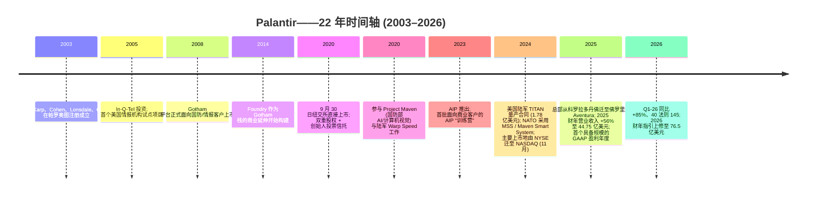
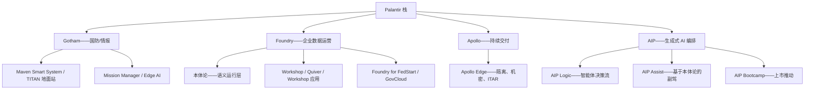
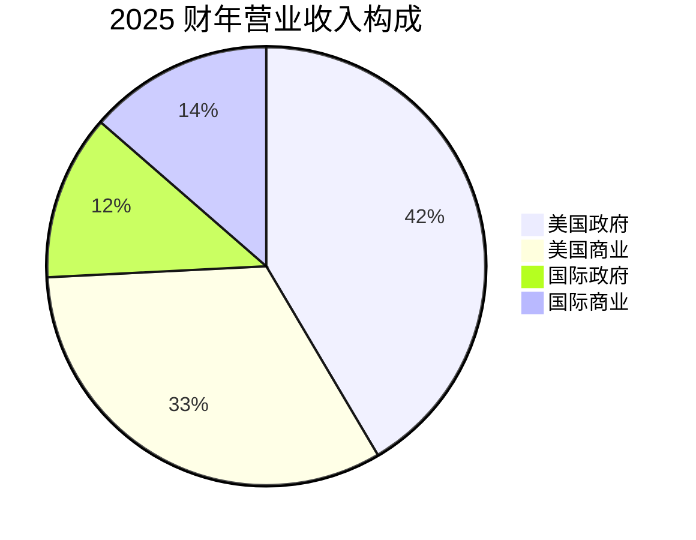
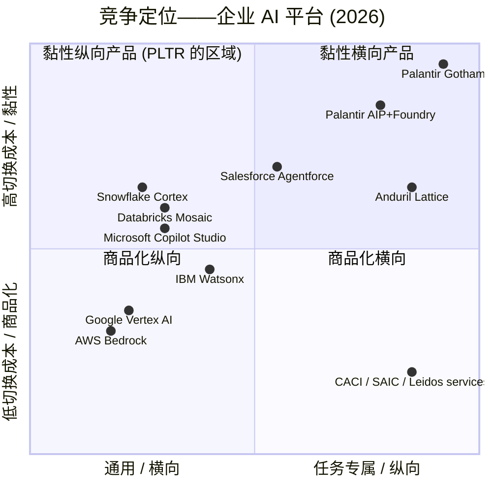
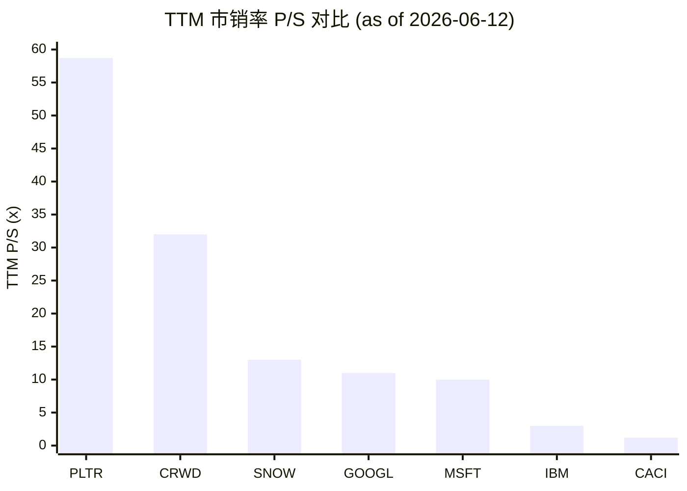

# Palantir Technologies Inc. (NASDAQ:PLTR) — 公司研究报告

**截至日期: 2026-06-14（价格数据截至 2026-06-12 收盘）**
**上市地: 纳斯达克 (NASDAQ), 代码 PLTR**
**注册地: 美国特拉华州（注册地）/ 佛罗里达州 Aventura（主要行政办公地）**
**作者: 股票研究——覆盖刷新（首次覆盖于 2026-05）**
**报告语言: 简体中文 (英文版同时存在于本目录)**

> *分析师观点：* **评级：Hold / Neutral（持有）· 12 个月目标价 (base) $120（较 2026-06-12 收盘 $127.99 下行 −6%）· 估值方法：base = ~50× FY27E free cash flow / FCF（自由现金流）每股约 $2.40**
> 市值 $3,068 亿 · 企业价值 (EV) ~$2,990 亿 · 52 周区间 $122.68–$207.52 · NASDAQ:PLTR · beta 1.5
>
> **前瞻估值矩阵 (forward valuation matrix)**（FY25A 列为实测，FY26E/FY27E 列为 *分析师观点：*）：
>
> | 倍数 | FY25A | FY26E | FY27E |
> |---|---|---|---|
> | P/S (市销率) | 58.7× (TTM) | ~40× | ~28× |
> | EV/FCF | ~132× | ~71× | ~47× |
> | Forward P/E | — | ~85× | ~58× |
> | Rule of 40 | 145 (Q1-26) | ~129 | ~85 (减速) |
>
> **相对表现 (relative performance, 截至 2026-06-12)**：PLTR 1M −1.6% / 6M −31.9% / YTD −28.0% / 12M −6.8%；S&P 500 同期 −0.2% / +7.9% / +8.6% / +24.3%；**相对 S&P 500：6M −39.8pct、YTD −36.6pct、12M −31.1pct——一个曾经的动量龙头已转为大盘的显著落后者**（来源：yfinance）。
>
> **核心论点（thesis pillars）**——（1）基本面 (fundamentals) 处于软件业顶尖：Rule of 40 = 145、82% GAAP 毛利率 (gross margin)、净现金 $80 亿、零债务——本体论 (Ontology) 锁定与机密部署凭证构成真实护城河；（2）但 **估值 (valuation) 是一项独立的、压倒性的风险**：TTM P/S 58.7× 仍约为软件板块中位数的 7–8 倍，即便顶四分之一的增长亦难支撑；（3）**动量已破裂**——YTD −28%、相对大盘落后 36pct、跌破 200 日均线 20%，叙事 Beta 的反向力量正在上演；（4）增长虽强但减速路径明确：FY26 隐含 +71% 在 FY27 大概率回落至 +40% 出头，倍数将随之机械压缩。综合判断：**优秀的公司，但当前价位下风险/回报对称偏负——持有，不追高。**

> **更新——2026 财年指引再度上修 (2026-05-04，仍为最新指引):** 管理层将 2026 全年营业收入指引上调至 **76.50–76.62 亿美元**(此前 2026-02-02 发布的指引为 71.82–71.98 亿美元), 美国商业营业收入下限上调至 **>32.24 亿美元 (同比增长 ≥120%, 较此前的 ≥115% 上修)**, 调整后营业利润区间上调至 **44.40–44.52 亿美元**(此前为 41.26–41.42 亿美元)。Q1-26 业绩超预期之后, 2026 财年的隐含同比营业收入增速从 2 月发布时的 61% 阶跃至 71%。CEO Alex Karp 在准备讲稿中所述驱动因素为: "美国业务规模翻倍以上……美国市场正在加速"——Q1-26 美国营业收入同比增长 104%, 美国商业同比增长 133%。
> 来源: [Palantir Q1-2026 业绩公告, 2026-05-04](https://www.sec.gov/Archives/edgar/data/1321655/000132165526000026/a2026q1ex991pressrelease.htm)。
>
> *注：尽管指引（基本面）持续上修，自 2026-05-20 上一版报告（当时 $137.15）以来股价已下跌至 $127.99（−6.7%），自 2026-02-04 盘中高点 $207.52 已回撤约 −38%——这正是本次刷新把评级从隐含偏多调整为明确「持有」的核心原因：基本面与股价已明显分叉。*

## 目录
1. 公司概览（含 1A 估值与目标价、1B GF Score）
2. 估值与目标价、前瞻模型与卖方观点演变
3. 公司历史
4. 管理团队
5. 产品与服务
6. 客户与上市策略
7. 行业概览
8. 竞争格局
9. 市场机会 (TAM)
10. 风险评估（含 10.5 关键分歧与催化剂）
11. 投资者视角评分卡 (investor lenses)

参考资料 · Data Used 数据清单 · 验证日志

---

## 1. 公司概览

*分析师观点：* **本次刷新的核心结论：这是一家基本面无可挑剔、但当前价位风险/回报对称偏负的公司——评级 Hold / Neutral（持有），base case 12 个月目标价 $120（较 2026-06-12 收盘 $127.99 下行约 −6%）。** 为什么是「持有」而非「买入」：自上一版报告 (2026-05-20, $137.15) 以来，公司又一次上修了 2026 财年指引（基本面更好），但股价反而跌至 $127.99，自 2026-02-04 高点 $207.52 回撤约 −38%——基本面与股价正在分叉。论点有四：(1) **基本面顶尖**——Q1-26 Rule of 40 达到 145、GAAP 毛利率 (gross margin) 82%、净现金约 $80 亿、零债务，本体论 (Ontology) 锁定 + IL5–IL7 机密部署凭证是真实护城河 ([Palantir Q1-2026 业绩公告, 2026-05-04](https://www.sec.gov/Archives/edgar/data/1321655/000132165526000026/a2026q1ex991pressrelease.htm))；(2) **估值是独立的、压倒性的风险**——TTM P/S 58.7× 约为软件板块中位数的 7–8 倍；(3) **动量已破裂**——YTD −28%、相对 S&P 500 落后约 36pct、跌破 200 日均线约 20%；(4) **增长强但减速路径清晰**——FY26 隐含 +71% 在 FY27 大概率回落至 +40% 出头，倍数随之机械压缩。描述性的基本面分析见以下各节；估值与目标价的完整推导见第 2 章。

Palantir Technologies 构建并销售四款企业软件平台——**Gotham (政府版)**、**Foundry 平台**、**Apollo (持续交付层)** 与 **人工智能平台 (Artificial Intelligence Platform, AIP)**——这些平台整合一家组织的全部数据, 将其运营逻辑编码进一个"本体论 (Ontology)", 并允许人类用户与大语言模型 (Large Language Model, LLM) 智能体在该运营图谱之上驱动实时决策 ([Palantir 10-K FY2025, 业务概述](https://www.sec.gov/Archives/edgar/data/1321655/000132165526000011/pltr-20251231.htm))。这家公司在两点上不同寻常。第一, 创始人在公司创立之初就选择优先为最严苛的关键任务环境构建软件——西方国防、情报与危机响应机构——再让技术向下渗透到商业应用, 这与多数企业 SaaS 的常规打法正相反。第二, 整个产品栈由单一语义层 (本体论, Ontology) 串联起来, 该语义层已成为公司的核心护城河: 关闭 Palantir 意味着重建每一条经由该图谱读写的业务流程。

Palantir 于 2003 年成立, 2020 年 9 月 30 日通过直接上市 (Direct Listing) 登陆纽约证券交易所 (NYSE), 2024 年 11 月将主要上市地迁至纳斯达克 ([Palantir 8-K——交易所摘牌通告, 2024-11-14](https://www.sec.gov/Archives/edgar/data/1321655/000132165524000219/pltr-exchangeswitchpressre.htm))。其主要行政办公地点过去十二个月内从科罗拉多州丹佛迁至**佛罗里达州 Aventura 市 Biscayne Boulevard 19505 号 2350 套房** ([Palantir 2026 DEF 14A, 年度股东大会通告](https://www.sec.gov/Archives/edgar/data/1321655/000132165526000019/pltr-20260423.htm))。**截至 2025 年 12 月 31 日, 全公司全职员工共 4,429 人, 其中 28% 在美国以外** ([Palantir 10-K FY2025, 人力资本章节](https://www.sec.gov/Archives/edgar/data/1321655/000132165526000011/pltr-20251231.htm))。

**业务模式。** Palantir 销售多年期企业软件订阅, 通常配套嵌入式实施服务 (其"前置部署工程师"模式)。营业收入按合同期分摊确认。可报告分部为两个——**政府** (国防、情报、民事机构、盟友国家) 与**商业** (金融服务、医疗、能源、工业、制造等领域的大型企业)——共享同一套代码库; 分部划分的是客户构成, 而非不同产品。政府分部占 **2025 财年营业收入的 54% (24.0 亿美元)**, 商业分部占 **46% (20.7 亿美元)** ([Palantir 10-K FY2025, 分部业绩](https://www.sec.gov/Archives/edgar/data/1321655/000132165526000011/pltr-20251231.htm))。

**规模与增长。** 2025 财年营业收入达到 **44.75 亿美元 (同比 +56%, 自 28.66 亿美元)**, GAAP 营业利润为 **14.14 亿美元 (营业利润率 32%)**, 归属于普通股股东的 GAAP 净利润为 **16.25 亿美元 (摊薄每股收益 0.63 美元)** ([Palantir Q4-2025 业绩公告, 2026-02-02](https://www.sec.gov/Archives/edgar/data/1321655/000132165526000004/a2025q4ex991earningsrelease.htm))。Q1-26 进一步加速: 营业收入 **16.33 亿美元 (同比 +85%)**、GAAP 营业利润率 **46%**、调整后营业利润率 **60%**, 公司自报的 **40 法则 (Rule of 40) 评分达到 145** ([Palantir Q1-2026 业绩公告, 2026-05-04](https://www.sec.gov/Archives/edgar/data/1321655/000132165526000026/a2026q1ex991pressrelease.htm))。公司在 Q1-26 末持有 **80 亿美元的现金、短期国债及等价物**, 且无长期债务——一份让 Karp 有自由从其不满的合同中抽身的堡垒型资产负债表。

地理分布以美国为主导: 按 10-K 地理营业收入表的口径, **2025 财年营业收入的 74% (33.20 亿美元) 来自美国, 10% (4.27 亿美元) 来自英国, 16% (7.28 亿美元) 来自世界其他地区**; 美国以外没有任何单一国家 (除英国 10%) 代表 10% 以上营业收入 ([Palantir 10-K FY2025, 地理营业收入表](https://www.sec.gov/Archives/edgar/data/1321655/000132165526000011/pltr-20251231.htm))。在美国境内, 商业业务是拐点故事: **2025 财年美国商业营业收入增长 109% 至 14.65 亿美元**, Q1-26 单季度增长 133% ([Palantir Q4-2025 业绩公告, 2026-02-02](https://www.sec.gov/Archives/edgar/data/1321655/000132165526000004/a2025q4ex991earningsrelease.htm))。

下方收入瀑布图把 FY2025 利润表逐级拆解为：左侧两大分部收入 → 收入 → COGS / 毛利 → 三项营业费用 (S&M / R&D / G&A) → 营业利润 → 税 / 归母净利润。其形态本身就是论点的一半：COGS 仅 7.89 亿美元 (82% 毛利率)，最大的费用块是 **S&M (10.57 亿美元)**——印证了"前置部署工程师 (FDE) + AIP 训练营"这一人力密集的上市模式。

<svg xmlns="http://www.w3.org/2000/svg" viewBox="0 0 1000 560" width="1000" height="560" role="img" aria-label="income statement Sankey"><rect x="0" y="0" width="1000" height="560" fill="#ffffff"/>
<text x="20.00" y="30.00" text-anchor="start" font-family="Helvetica,Arial,sans-serif" font-size="15" font-weight="700" fill="#1f2933">Palantir 如何赚钱 / How Palantir (PLTR) Makes Its Money — FY2025</text>
<path d="M 452.00,78.00 C 506.00,78.00 506.00,95.88 560.00,95.88 L 560.00,224.78 C 506.00,224.78 506.00,206.90 452.00,206.90 Z" fill="#86efac" fill-opacity="0.55"/>
<path d="M 452.00,206.90 C 506.00,206.90 506.00,238.78 560.00,238.78 L 560.00,445.93 C 506.00,445.93 506.00,414.05 452.00,414.05 Z" fill="#fca5a5" fill-opacity="0.55"/>
<path d="M 204.00,78.00 C 258.00,78.00 258.00,85.00 312.00,85.00 L 312.00,304.01 C 258.00,304.01 258.00,297.00 204.00,297.00 Z" fill="#93c5fd" fill-opacity="0.55"/>
<path d="M 328.00,85.00 C 382.00,85.00 382.00,78.00 436.00,78.00 L 436.00,414.05 C 382.00,414.05 382.00,421.06 328.00,421.06 Z" fill="#86efac" fill-opacity="0.55"/>
<path d="M 328.00,421.06 C 382.00,421.06 382.00,428.05 436.00,428.05 L 436.00,500.00 C 382.00,500.00 382.00,493.00 328.00,493.00 Z" fill="#fca5a5" fill-opacity="0.55"/>
<path d="M 700.00,88.88 C 754.00,88.88 754.00,198.90 808.00,198.90 L 808.00,347.04 C 754.00,347.04 754.00,237.02 700.00,237.02 Z" fill="#86efac" fill-opacity="0.55"/>
<path d="M 700.00,237.02 C 754.00,237.02 754.00,361.04 808.00,361.04 L 808.00,363.10 C 754.00,363.10 754.00,239.09 700.00,239.09 Z" fill="#fca5a5" fill-opacity="0.55"/>
<path d="M 700.00,239.09 C 754.00,239.09 754.00,377.10 808.00,377.10 L 808.00,379.10 C 754.00,379.10 754.00,241.09 700.00,241.09 Z" fill="#fca5a5" fill-opacity="0.55"/>
<path d="M 576.00,95.88 C 630.00,95.88 630.00,88.88 684.00,88.88 L 684.00,217.78 C 630.00,217.78 630.00,224.78 576.00,224.78 Z" fill="#86efac" fill-opacity="0.55"/>
<path d="M 576.00,238.78 C 630.00,238.78 630.00,253.97 684.00,253.97 L 684.00,350.32 C 630.00,350.32 630.00,335.13 576.00,335.13 Z" fill="#fca5a5" fill-opacity="0.55"/>
<path d="M 576.00,335.13 C 630.00,335.13 630.00,364.32 684.00,364.32 L 684.00,415.16 C 630.00,415.16 630.00,385.97 576.00,385.97 Z" fill="#fca5a5" fill-opacity="0.55"/>
<path d="M 576.00,385.97 C 630.00,385.97 630.00,429.16 684.00,429.16 L 684.00,489.12 C 630.00,489.12 630.00,445.93 576.00,445.93 Z" fill="#fca5a5" fill-opacity="0.55"/>
<path d="M 204.00,311.00 C 258.00,311.00 258.00,304.01 312.00,304.01 L 312.00,493.00 C 258.00,493.00 258.00,500.00 204.00,500.00 Z" fill="#93c5fd" fill-opacity="0.55"/>
<path d="M 576.00,459.93 C 630.00,459.93 630.00,217.78 684.00,217.78 L 684.00,239.97 C 630.00,239.97 630.00,482.12 576.00,482.12 Z" fill="#93c5fd" fill-opacity="0.55"/>
<rect x="188.00" y="78.00" width="16" height="219.00" rx="1.5" fill="#2563eb"/>
<rect x="188.00" y="311.00" width="16" height="189.00" rx="1.5" fill="#2563eb"/>
<rect x="312.00" y="85.00" width="16" height="407.99" rx="1.5" fill="#1e3a8a"/>
<rect x="436.00" y="78.00" width="16" height="336.05" rx="1.5" fill="#15803d"/>
<rect x="436.00" y="428.05" width="16" height="71.95" rx="1.5" fill="#dc2626"/>
<rect x="560.00" y="95.88" width="16" height="128.90" rx="1.5" fill="#15803d"/>
<rect x="560.00" y="238.78" width="16" height="207.15" rx="1.5" fill="#dc2626"/>
<rect x="560.00" y="459.93" width="16" height="22.19" rx="1.5" fill="#2563eb"/>
<rect x="684.00" y="88.88" width="16" height="151.09" rx="1.5" fill="#15803d"/>
<rect x="684.00" y="253.97" width="16" height="96.35" rx="1.5" fill="#dc2626"/>
<rect x="684.00" y="364.32" width="16" height="50.84" rx="1.5" fill="#dc2626"/>
<rect x="684.00" y="429.16" width="16" height="59.96" rx="1.5" fill="#dc2626"/>
<rect x="808.00" y="198.90" width="16" height="148.14" rx="1.5" fill="#15803d"/>
<rect x="808.00" y="361.04" width="16" height="2.07" rx="1.5" fill="#dc2626"/>
<rect x="808.00" y="377.10" width="16" height="2.00" rx="1.5" fill="#dc2626"/>
<text x="179.00" y="184.50" text-anchor="end" font-family="Helvetica,Arial,sans-serif" font-size="11.5" font-weight="700" fill="#1f2933">Government</text>
<text x="179.00" y="197.50" text-anchor="end" font-family="Helvetica,Arial,sans-serif" font-size="10" font-weight="400" fill="#52606d">$2.4B  (53.7%)</text>
<text x="179.00" y="402.50" text-anchor="end" font-family="Helvetica,Arial,sans-serif" font-size="11.5" font-weight="700" fill="#1f2933">Commercial</text>
<text x="179.00" y="415.50" text-anchor="end" font-family="Helvetica,Arial,sans-serif" font-size="10" font-weight="400" fill="#52606d">$2.1B  (46.3%)</text>
<rect x="331.00" y="67.00" width="100.50" height="26" rx="2" fill="#ffffff" fill-opacity="0.72"/>
<text x="334.00" y="79.00" text-anchor="start" font-family="Helvetica,Arial,sans-serif" font-size="11.5" font-weight="700" fill="#1f2933">Revenue</text>
<text x="334.00" y="92.00" text-anchor="start" font-family="Helvetica,Arial,sans-serif" font-size="10" font-weight="400" fill="#52606d">$4.5B  (100.0%)</text>
<rect x="455.00" y="60.00" width="94.20" height="26" rx="2" fill="#ffffff" fill-opacity="0.72"/>
<text x="458.00" y="72.00" text-anchor="start" font-family="Helvetica,Arial,sans-serif" font-size="11.5" font-weight="700" fill="#1f2933">Gross Profit</text>
<text x="458.00" y="85.00" text-anchor="start" font-family="Helvetica,Arial,sans-serif" font-size="10" font-weight="400" fill="#52606d">$3.7B  (82.4%)</text>
<rect x="455.00" y="410.05" width="144.60" height="26" rx="2" fill="#ffffff" fill-opacity="0.72"/>
<text x="458.00" y="422.05" text-anchor="start" font-family="Helvetica,Arial,sans-serif" font-size="11.5" font-weight="700" fill="#1f2933">Cost of Revenue (COGS)</text>
<text x="458.00" y="435.05" text-anchor="start" font-family="Helvetica,Arial,sans-serif" font-size="10" font-weight="400" fill="#52606d">$789.2M  (17.6%)</text>
<rect x="579.00" y="77.88" width="106.80" height="26" rx="2" fill="#ffffff" fill-opacity="0.72"/>
<text x="582.00" y="89.88" text-anchor="start" font-family="Helvetica,Arial,sans-serif" font-size="11.5" font-weight="700" fill="#1f2933">Operating Income</text>
<text x="582.00" y="102.88" text-anchor="start" font-family="Helvetica,Arial,sans-serif" font-size="10" font-weight="400" fill="#52606d">$1.4B  (31.6%)</text>
<rect x="579.00" y="220.78" width="150.90" height="26" rx="2" fill="#ffffff" fill-opacity="0.72"/>
<text x="582.00" y="232.78" text-anchor="start" font-family="Helvetica,Arial,sans-serif" font-size="11.5" font-weight="700" fill="#1f2933">Total Operating Expense</text>
<text x="582.00" y="245.78" text-anchor="start" font-family="Helvetica,Arial,sans-serif" font-size="10" font-weight="400" fill="#52606d">$2.3B  (50.8%)</text>
<text x="551.00" y="468.03" text-anchor="end" font-family="Helvetica,Arial,sans-serif" font-size="11.5" font-weight="700" fill="#1f2933">Net Interest / Other Income</text>
<text x="551.00" y="481.03" text-anchor="end" font-family="Helvetica,Arial,sans-serif" font-size="10" font-weight="400" fill="#52606d">$243.4M  (5.4%)</text>
<rect x="703.00" y="70.88" width="94.20" height="26" rx="2" fill="#ffffff" fill-opacity="0.72"/>
<text x="706.00" y="82.88" text-anchor="start" font-family="Helvetica,Arial,sans-serif" font-size="11.5" font-weight="700" fill="#1f2933">Pretax Income</text>
<text x="706.00" y="95.88" text-anchor="start" font-family="Helvetica,Arial,sans-serif" font-size="10" font-weight="400" fill="#52606d">$1.7B  (37.0%)</text>
<rect x="703.00" y="235.97" width="94.20" height="26" rx="2" fill="#ffffff" fill-opacity="0.72"/>
<text x="706.00" y="247.97" text-anchor="start" font-family="Helvetica,Arial,sans-serif" font-size="11.5" font-weight="700" fill="#1f2933">SG&amp;A</text>
<text x="706.00" y="260.97" text-anchor="start" font-family="Helvetica,Arial,sans-serif" font-size="10" font-weight="400" fill="#52606d">$1.1B  (23.6%)</text>
<rect x="703.00" y="346.32" width="106.80" height="26" rx="2" fill="#ffffff" fill-opacity="0.72"/>
<text x="706.00" y="358.32" text-anchor="start" font-family="Helvetica,Arial,sans-serif" font-size="11.5" font-weight="700" fill="#1f2933">R&amp;D</text>
<text x="706.00" y="371.32" text-anchor="start" font-family="Helvetica,Arial,sans-serif" font-size="10" font-weight="400" fill="#52606d">$557.7M  (12.5%)</text>
<rect x="703.00" y="411.16" width="106.80" height="26" rx="2" fill="#ffffff" fill-opacity="0.72"/>
<text x="706.00" y="423.16" text-anchor="start" font-family="Helvetica,Arial,sans-serif" font-size="11.5" font-weight="700" fill="#1f2933">Other OpEx</text>
<text x="706.00" y="436.16" text-anchor="start" font-family="Helvetica,Arial,sans-serif" font-size="10" font-weight="400" fill="#52606d">$657.7M  (14.7%)</text>
<text x="833.00" y="269.97" text-anchor="start" font-family="Helvetica,Arial,sans-serif" font-size="11.5" font-weight="700" fill="#1f2933">Net Income</text>
<text x="833.00" y="282.97" text-anchor="start" font-family="Helvetica,Arial,sans-serif" font-size="10" font-weight="400" fill="#52606d">$1.6B  (36.3%)</text>
<text x="833.00" y="359.07" text-anchor="start" font-family="Helvetica,Arial,sans-serif" font-size="11.5" font-weight="700" fill="#1f2933">Income Tax</text>
<text x="833.00" y="372.07" text-anchor="start" font-family="Helvetica,Arial,sans-serif" font-size="10" font-weight="400" fill="#52606d">$22.7M  (0.51%)</text>
<text x="833.00" y="384.07" text-anchor="start" font-family="Helvetica,Arial,sans-serif" font-size="11.5" font-weight="700" fill="#1f2933">Minority Interest</text>
<text x="833.00" y="397.07" text-anchor="start" font-family="Helvetica,Arial,sans-serif" font-size="10" font-weight="400" fill="#52606d">$9.6M  (0.21%)</text>
<text x="500.00" y="544.00" text-anchor="middle" font-family="Helvetica,Arial,sans-serif" font-size="10" font-weight="400" fill="#52606d">Source: PLTR FY2025 10-K, Consolidated Statements of Operations + MD&amp;A segment table</text>
</svg>

来源 / Source: [Palantir 10-K FY2025, Consolidated Statements of Operations + MD&A 分部表](https://www.sec.gov/Archives/edgar/data/1321655/000132165526000011/pltr-20251231.htm)。

收入按分部与按地区的拆分（下方两个环形图）与五年分部收入历史（柱状图）共同显示：政府仍占 54%，但商业（FY25 同比 +60%）正在快速逼平政府，是收入结构最重要的变化。

<svg xmlns="http://www.w3.org/2000/svg" viewBox="0 0 720 460" width="720" height="460" role="img" aria-label="revenue donut"><rect x="0" y="0" width="720" height="460" fill="#ffffff"/>
<text x="20.00" y="30.00" text-anchor="start" font-family="Helvetica,Arial,sans-serif" font-size="15" font-weight="700" fill="#1f2933">FY2025 营业收入按分部 / Revenue by Segment</text>
<path d="M 288.00,107.20 A 132 132 0 1 1 257.78,367.69 L 270.14,315.13 A 78 78 0 1 0 288.00,161.20 Z" fill="#2563eb"/>
<path d="M 257.78,367.69 A 132 132 0 0 1 288.00,107.20 L 288.00,161.20 A 78 78 0 0 0 270.14,315.13 Z" fill="#15803d"/>
<text x="288.00" y="235.20" text-anchor="middle" font-family="Helvetica,Arial,sans-serif" font-size="18" font-weight="800" fill="#1f2933">PLTR</text>
<text x="288.00" y="255.20" text-anchor="middle" font-family="Helvetica,Arial,sans-serif" font-size="13" font-weight="600" fill="#52606d">$4.5B</text>
<text x="288.00" y="271.20" text-anchor="middle" font-family="Helvetica,Arial,sans-serif" font-size="10" font-weight="400" fill="#8a97a3">total</text>
<line x1="425.08" y1="255.10" x2="441.08" y2="255.10" stroke="#2563eb" stroke-width="1.4"/>
<text x="445.08" y="253.10" text-anchor="start" font-family="Helvetica,Arial,sans-serif" font-size="11" font-weight="700" fill="#1f2933">Government 政府</text>
<text x="445.08" y="267.10" text-anchor="start" font-family="Helvetica,Arial,sans-serif" font-size="10" font-weight="400" fill="#52606d">$2.4B  (53.7%)</text>
<line x1="150.92" y1="223.30" x2="134.92" y2="223.30" stroke="#15803d" stroke-width="1.4"/>
<text x="130.92" y="221.30" text-anchor="end" font-family="Helvetica,Arial,sans-serif" font-size="11" font-weight="700" fill="#1f2933">Commercial 商业</text>
<text x="130.92" y="235.30" text-anchor="end" font-family="Helvetica,Arial,sans-serif" font-size="10" font-weight="400" fill="#52606d">$2.1B  (46.3%)</text>
<text x="360.00" y="444.00" text-anchor="middle" font-family="Helvetica,Arial,sans-serif" font-size="10" font-weight="400" fill="#52606d">Source: PLTR FY2025 10-K, MD&amp;A — revenue by segment</text>
</svg>

<svg xmlns="http://www.w3.org/2000/svg" viewBox="0 0 720 460" width="720" height="460" role="img" aria-label="revenue donut"><rect x="0" y="0" width="720" height="460" fill="#ffffff"/>
<text x="20.00" y="30.00" text-anchor="start" font-family="Helvetica,Arial,sans-serif" font-size="15" font-weight="700" fill="#1f2933">FY2025 营业收入按地区 / Revenue by Geography</text>
<path d="M 288.00,107.20 A 132 132 0 1 1 156.17,245.97 L 210.10,243.20 A 78 78 0 1 0 288.00,161.20 Z" fill="#2563eb"/>
<path d="M 156.17,245.97 A 132 132 0 0 1 175.38,170.35 L 221.45,198.51 A 78 78 0 0 0 210.10,243.20 Z" fill="#15803d"/>
<path d="M 175.38,170.35 A 132 132 0 0 1 288.00,107.20 L 288.00,161.20 A 78 78 0 0 0 221.45,198.51 Z" fill="#d97706"/>
<text x="288.00" y="235.20" text-anchor="middle" font-family="Helvetica,Arial,sans-serif" font-size="18" font-weight="800" fill="#1f2933">PLTR</text>
<text x="288.00" y="255.20" text-anchor="middle" font-family="Helvetica,Arial,sans-serif" font-size="13" font-weight="600" fill="#52606d">$4.5B</text>
<text x="288.00" y="271.20" text-anchor="middle" font-family="Helvetica,Arial,sans-serif" font-size="10" font-weight="400" fill="#8a97a3">total</text>
<line x1="388.05" y1="334.25" x2="404.05" y2="334.25" stroke="#2563eb" stroke-width="1.4"/>
<text x="408.05" y="332.25" text-anchor="start" font-family="Helvetica,Arial,sans-serif" font-size="11" font-weight="700" fill="#1f2933">United States 美国</text>
<text x="408.05" y="346.25" text-anchor="start" font-family="Helvetica,Arial,sans-serif" font-size="10" font-weight="400" fill="#52606d">$3.3B  (74.2%)</text>
<line x1="154.25" y1="205.23" x2="138.25" y2="205.23" stroke="#15803d" stroke-width="1.4"/>
<text x="134.25" y="203.23" text-anchor="end" font-family="Helvetica,Arial,sans-serif" font-size="11" font-weight="700" fill="#1f2933">United Kingdom 英国</text>
<text x="134.25" y="217.23" text-anchor="end" font-family="Helvetica,Arial,sans-serif" font-size="10" font-weight="400" fill="#52606d">$427.4M  (9.5%)</text>
<line x1="220.51" y1="118.83" x2="204.51" y2="118.83" stroke="#d97706" stroke-width="1.4"/>
<text x="200.51" y="116.83" text-anchor="end" font-family="Helvetica,Arial,sans-serif" font-size="11" font-weight="700" fill="#1f2933">Rest of World 其他</text>
<text x="200.51" y="130.83" text-anchor="end" font-family="Helvetica,Arial,sans-serif" font-size="10" font-weight="400" fill="#52606d">$728.0M  (16.3%)</text>
<text x="360.00" y="444.00" text-anchor="middle" font-family="Helvetica,Arial,sans-serif" font-size="10" font-weight="400" fill="#52606d">Source: PLTR FY2025 10-K, MD&amp;A — revenue by geography</text>
</svg>

来源 / Source: [Palantir 10-K FY2025, MD&A 分部与地理营业收入表](https://www.sec.gov/Archives/edgar/data/1321655/000132165526000011/pltr-20251231.htm)。

<svg xmlns="http://www.w3.org/2000/svg" viewBox="0 0 860 470" width="860" height="470" role="img" aria-label="historical revenue bars"><rect x="0" y="0" width="860" height="470" fill="#ffffff"/>
<text x="20.00" y="30.00" text-anchor="start" font-family="Helvetica,Arial,sans-serif" font-size="15" font-weight="700" fill="#1f2933">历史营业收入按分部 / Historical Revenue by Segment (FY2021–FY2025)</text>
<rect x="20.00" y="44" width="11" height="11" rx="2" fill="#2563eb"/>
<text x="36.00" y="53.00" text-anchor="start" font-family="Helvetica,Arial,sans-serif" font-size="10.5" font-weight="400" fill="#1f2933">Government 政府</text>
<rect x="135.80" y="44" width="11" height="11" rx="2" fill="#15803d"/>
<text x="151.80" y="53.00" text-anchor="start" font-family="Helvetica,Arial,sans-serif" font-size="10.5" font-weight="400" fill="#1f2933">Commercial 商业</text>
<line x1="70" y1="412.00" x2="834" y2="412.00" stroke="#eceff2" stroke-width="1"/>
<text x="64.00" y="415.00" text-anchor="end" font-family="Helvetica,Arial,sans-serif" font-size="9.5" font-weight="400" fill="#52606d">$0</text>
<line x1="70" y1="345.20" x2="834" y2="345.20" stroke="#eceff2" stroke-width="1"/>
<text x="64.00" y="348.20" text-anchor="end" font-family="Helvetica,Arial,sans-serif" font-size="9.5" font-weight="400" fill="#52606d">$966.6M</text>
<line x1="70" y1="278.40" x2="834" y2="278.40" stroke="#eceff2" stroke-width="1"/>
<text x="64.00" y="281.40" text-anchor="end" font-family="Helvetica,Arial,sans-serif" font-size="9.5" font-weight="400" fill="#52606d">$1.9B</text>
<line x1="70" y1="211.60" x2="834" y2="211.60" stroke="#eceff2" stroke-width="1"/>
<text x="64.00" y="214.60" text-anchor="end" font-family="Helvetica,Arial,sans-serif" font-size="9.5" font-weight="400" fill="#52606d">$2.9B</text>
<line x1="70" y1="144.80" x2="834" y2="144.80" stroke="#eceff2" stroke-width="1"/>
<text x="64.00" y="147.80" text-anchor="end" font-family="Helvetica,Arial,sans-serif" font-size="9.5" font-weight="400" fill="#52606d">$3.9B</text>
<line x1="70" y1="78.00" x2="834" y2="78.00" stroke="#eceff2" stroke-width="1"/>
<text x="64.00" y="81.00" text-anchor="end" font-family="Helvetica,Arial,sans-serif" font-size="9.5" font-weight="400" fill="#52606d">$4.8B</text>
<rect x="102.09" y="350.01" width="88.62" height="61.99" fill="#2563eb"/>
<rect x="102.09" y="305.44" width="88.62" height="44.57" fill="#15803d"/>
<text x="146.40" y="428.00" text-anchor="middle" font-family="Helvetica,Arial,sans-serif" font-size="10" font-weight="400" fill="#52606d">2021</text>
<rect x="254.89" y="337.92" width="88.62" height="74.08" fill="#2563eb"/>
<rect x="254.89" y="280.28" width="88.62" height="57.64" fill="#15803d"/>
<text x="299.20" y="428.00" text-anchor="middle" font-family="Helvetica,Arial,sans-serif" font-size="10" font-weight="400" fill="#52606d">2022</text>
<rect x="407.69" y="327.55" width="88.62" height="84.45" fill="#2563eb"/>
<rect x="407.69" y="258.23" width="88.62" height="69.32" fill="#15803d"/>
<text x="452.00" y="428.00" text-anchor="middle" font-family="Helvetica,Arial,sans-serif" font-size="10" font-weight="400" fill="#52606d">2023</text>
<rect x="560.49" y="303.50" width="88.62" height="108.50" fill="#2563eb"/>
<rect x="560.49" y="213.94" width="88.62" height="89.56" fill="#15803d"/>
<text x="604.80" y="428.00" text-anchor="middle" font-family="Helvetica,Arial,sans-serif" font-size="10" font-weight="400" fill="#52606d">2024</text>
<rect x="713.29" y="246.00" width="88.62" height="166.00" fill="#2563eb"/>
<rect x="713.29" y="102.74" width="88.62" height="143.26" fill="#15803d"/>
<text x="757.60" y="428.00" text-anchor="middle" font-family="Helvetica,Arial,sans-serif" font-size="10" font-weight="400" fill="#52606d">2025</text>
<text x="430.00" y="454.00" text-anchor="middle" font-family="Helvetica,Arial,sans-serif" font-size="10" font-weight="400" fill="#52606d">Source: PLTR FY2021–FY2025 10-Ks, MD&amp;A — revenue by segment</text>
</svg>

来源 / Source: [Palantir FY2021–FY2025 各年 10-K, MD&A 分部营业收入表](https://www.sec.gov/Archives/edgar/data/1321655/000132165526000011/pltr-20251231.htm)。

### 估值快照——按任何传统标尺均属极端

在 **2026 年 6 月 12 日收盘**时, PLTR 价格为 **127.99 美元**, 对应市值约 **3,068 亿美元**、企业价值约 **2,990 亿美元** (现金及有价证券约 80 亿美元超过其几乎为零的债务), TTM 倍数如下 (TTM = FY2025 + Q1-26 − Q1-25, 营业收入约 **52.24 亿美元**, 归母净利润约 **22.82 亿美元**, 摊薄每股收益约 **0.89 美元**, 三者均由 [10-K FY2025](https://www.sec.gov/Archives/edgar/data/1321655/000132165526000011/pltr-20251231.htm) 与 [Q1-26 10-Q](https://www.sec.gov/Archives/edgar/data/1321655/000132165526000028/pltr-20260331.htm) 的利润表逐季相加得出):

- **TTM 市盈率 (P/E): 约 144 倍** ($127.99 / TTM 摊薄 EPS $0.89; PLTR 在 2023 财年之前 GAAP 口径处于亏损, 倍数随着 2024–25 年盈利出现而机械收缩) ([Yahoo Finance——PLTR 关键统计, 2026-06-12](https://finance.yahoo.com/quote/PLTR/key-statistics/))
- **前瞻市盈率 (Forward P/E): 约 58–66 倍** (按 FY27E EPS $2.20 计约 58 倍) ([Yahoo Finance——PLTR 关键统计, 2026-06-12](https://finance.yahoo.com/quote/PLTR/key-statistics/))
- **TTM 市销率 (P/S): 约 58.7 倍** (市值 3,068 亿 / TTM 营业收入 52.24 亿)。在 2026 年 2 月 4 日盘中高点 **207.52 美元** 时, 倍数曾突破 95 倍——当前价位较该高点已回撤约 −38%。
- **TTM EV/Revenue: 约 57 倍**、**EV/FCF: 约 132 倍** (TTM 调整后 FCF 约 22.7 亿美元)
- **贝塔 (Beta): 约 1.5** (偏高——在涨势与调整中均比大盘波动更大)
- **52 周区间: 122.68–207.52 美元**——当前价位 $127.99 已逼近 52 周低点

同业 TTM P/S 在 2026-06-12 的比较 (倍数随股价下跌已较 5 月略有收缩, 但相对关系不变):

| 代码 | TTM P/S | 类别 | 来源 |
|---|---|---|---|
| **PLTR** | **约 58.7 倍** | AI 平台纯生意 | [Yahoo Finance, 2026-06-12](https://finance.yahoo.com/quote/PLTR/key-statistics/) |
| CRWD | 约 32 倍 | 高增长安全 SaaS | [Yahoo Finance, 2026-06-12](https://finance.yahoo.com/quote/CRWD/key-statistics/) |
| SNOW | 约 13 倍 | 云数据仓库 | [Yahoo Finance, 2026-06-12](https://finance.yahoo.com/quote/SNOW/key-statistics/) |
| GOOGL | 约 11 倍 | 大型科技 AI/云 | [Yahoo Finance, 2026-06-12](https://finance.yahoo.com/quote/GOOGL/key-statistics/) |
| MSFT | 约 10 倍 | 大型科技 AI/云 | [Yahoo Finance, 2026-06-12](https://finance.yahoo.com/quote/MSFT/key-statistics/) |
| IBM | 约 3 倍 | 成熟企业/Watson | [Yahoo Finance, 2026-06-12](https://finance.yahoo.com/quote/IBM/key-statistics/) |
| CACI | 约 1.2 倍 | 国防服务 | [Yahoo Finance, 2026-06-12](https://finance.yahoo.com/quote/CACI/key-statistics/) |
| BAH | 约 0.8 倍 | 国防服务 (Booz Allen) | [Yahoo Finance, 2026-06-12](https://finance.yahoo.com/quote/BAH/key-statistics/) |
| SAIC | 约 0.6 倍 | 国防服务 | [Yahoo Finance, 2026-06-12](https://finance.yahoo.com/quote/SAIC/key-statistics/) |

Palantir 的交易倍数大约为 **CrowdStrike 的 1.8 倍**、**Snowflake 的 4–5 倍**、**微软/Alphabet AI 复合体的 5–6 倍**, 以及**上市国防服务厂商的 50–100 倍**。标普 500 软件子板块的市销率中位数处于高个位数; PLTR 因此**超过其软件同业中位数约 7–8 倍**。*分析师观点：* 摩根士丹利在 Q1-26 业绩点评中也明确指出该名"约 34 倍 2027 年市销率……峰值增长可能已现或临近", 需要业绩持续兑现来"消化"高预期 ([Morgan Stanley — Palantir 1Q26 Results, Growth + Profitability Remains Best in Class, 2026-05-05, p.1](http://xs-macbook-air.local:5001/zsxq/pdf/812458511845222/MS-Palantir%20Technologies%20Inc.%201Q26%20Results%20%E2%80%93%20Growth%20%2B%20Profitability%20Remains%20Best%20in%20Class-260505.pdf))。

这一倍数并非偶然。三股可观察的驱动力解释了它, 第四项则是叙事性的:

1. **40 法则加速。** Palantir 自报的 40 法则得分 (同比营收增长 + 调整后营业利润率) 在 **Q4-25 达到 127, 在 Q1-26 达到 145**——管理层称此数字在 AI 基础设施厂商中仅有英伟达 (NVIDIA)、美光 (Micron) 与 SK 海力士 (SK hynix) 能匹敌 ([Palantir Q1-2026 业绩公告, 2026-05-04](https://www.sec.gov/Archives/edgar/data/1321655/000132165526000026/a2026q1ex991pressrelease.htm))。对于一家具备规模的软件企业而言, 这一组合本质上是独一无二的; 市场为得分的*路径*付费, 而非其当前水平。
2. **AIP 驱动的商业订单。** **Q1-26 美国商业 TCV (总合同价值) 收于 11.76 亿美元 (同比 +45%)**, **美国商业 RDV (剩余订单价值) 达到 49.2 亿美元 (同比 +112%, 环比 +12%)** ([Palantir Q1-2026 业绩公告, 2026-05-04](https://www.sec.gov/Archives/edgar/data/1321655/000132165526000026/a2026q1ex991pressrelease.htm))。市场据此对订单出货比 (book-to-bill) 折年化高于 2 倍。
3. **稀缺性/板块代理溢价。** PLTR 是唯一具备实质规模、且被美国军方与情报界以生产规模实际部署的上市"AI 软件平台"纯生意。ETF 流量 (AIQ、BOTZ、ROBO) 将其视为板块代理, 而做空敞口结构性偏低, 因为没有干净的替代品可用于对冲。
4. **叙事/Karp 溢价。** CEO Alex Karp 的季度股东信和媒体采访——明确以西方立场、亲国防、亲美国制造业为基调——使 PLTR 成为美国复兴/回流主题组合的载体。这一项是真实存在但难以量化的, 且在叙事破裂时会在下行端增加风险。

我们将该倍数视为**拉伸**, 含义符合第 10 章的风险分类: TTM P/S 58.7 倍远高于 20 倍门槛, 即便配合顶四分之一的增长亦如此。轻微减速至"仅 40% 同比增长"、利润率维持稳定的情形, 即便绝对营业收入仍在上行, 也会显著压缩 P/S。该估值/倍数收缩风险已纳入第 10 章。**本次刷新最重要的观察是: 这一倍数已经开始压缩——股价 YTD −28%、自 2 月高点 −38%, 而期间基本面持续上修。换言之, 第 10 章所述的"倍数压缩风险"已不再是假设, 而是正在发生的事实。**

---

## 1A. 估值与目标价（决策层）

*分析师观点：* **评级 Hold / Neutral（持有）· base case 12 个月目标价 $120（较 $127.99 下行 −6%）· bull $175（+37%）· bear $78（−39%）。** 完整的前瞻模型、目标价推导与卖方观点演变见第 2 章；此处为决策层摘要。

**为什么是「持有」。** 把基本面与估值分开看，结论就清晰了。基本面侧，Palantir 是软件业中极少数能同时做到 50%+ 增长、80%+ 毛利率、净现金资产负债表与加速增长的公司——这正是 Rule of 40 = 145 的含义 ([Palantir Q1-2026 业绩公告, 2026-05-04](https://www.sec.gov/Archives/edgar/data/1321655/000132165526000026/a2026q1ex991pressrelease.htm))。估值侧，TTM P/S 58.7× 已把多年的完美执行预先定价；即便用最乐观的 FY27E FCF（约 $63 亿，折合每股约 $2.40）配 50× 倍数，推得的每股价值也仅约 $119——与现价基本持平。两侧相抵，**风险/回报对称偏负**：上行需要倍数维持在历史极端高位且增长不减速，下行只需倍数向"仍属顶级 SaaS"的 30× FY27 FCF 回归即意味着约 −40%。

**目标价方法（base case）。** 主方法为 **FY27E FCF 倍数法**：FY27E 自由现金流约 $63 亿（介于 UBS $66 亿与 MS $66 亿之间，偏保守取 $63 亿）／约 26.5 亿摊薄股本 ≈ $2.38/股 FCF × **50× 目标倍数** ≈ **$119–120**。50× 仍是一个对 50%+ FCF 利润率、高增长名义的慷慨倍数（次高同业 CRWD 约 35×）。交叉验证：FY27E 市销率法——FY27E 营业收入约 $108.7 亿 × 28× P/S ≈ $3,045 亿市值 ≈ $115/股，与 FCF 法一致。

**bull / bear。** Bull $175（+37%）= FY27E FCF 维持 55× 且 FY27 营收增速守在 +45% 以上（美国商业不减速、国际商业回暖、NATO/盟国政府放量）；bear $78（−39%）= 倍数向 30× FY27E FCF 回归 + 美国商业减速至 60% 以下，二者叠加（这正是 Jefferies $70 Underperform 的情形）。**与市场一致预期的对比：** 我们的 base $120 低于卖方买方均值（MS $205 / UBS $200 / Citi $235，三者均值约 $213），但高于 Jefferies $70——我们认为多数卖方目标价隐含的 44–72× FY27 FCF 倍数在动量已破裂、利率仍在 4.5% 上方的环境中难以维持（详见第 2 章卖方观点演变）。

---

## 1B. GF Score (GuruFocus-style) 基本面评分卡

*分析师观点：* **GF Score (GuruFocus-style, 综合评分): 68 / 100 — Poor future performance potential (51–70 区间)。** 这个看似偏低的分数恰好讲出了本报告的故事：一个近乎满分的基本面内核（Financial Strength 9、Profitability 8、Growth 10）被极端估值（GF Value 1）与已破裂的动量（Momentum 2）拖累——正是"优秀公司、危险价格"的量化画像。（注：此为本方按透明权重独立复算的 GuruFocus *风格* 分数，**非** GuruFocus 官方数字。）

<svg xmlns="http://www.w3.org/2000/svg" viewBox="0 0 500 500" width="500" height="500" role="img" aria-label="GF Score radar">
<rect x="0" y="0" width="500" height="500" fill="#ffffff"/>
<text x="20" y="24" font-family="Helvetica,Arial,sans-serif" font-size="15" font-weight="700" fill="#1f2933">GF Score (GuruFocus-style): 68/100</text>
<text x="20" y="41" font-family="Helvetica,Arial,sans-serif" font-size="11" fill="#52606d">51–70 Poor future performance potential</text>
<polygon points="250.0,88.0 392.7,191.6 338.2,359.4 161.8,359.4 107.3,191.6" fill="#e9f5ec" stroke="none"/>
<polygon points="250.0,208.0 278.5,228.7 267.6,262.3 232.4,262.3 221.5,228.7" fill="none" stroke="#c5d3cb" stroke-width="1"/>
<polygon points="250.0,178.0 307.1,219.5 285.3,286.5 214.7,286.5 192.9,219.5" fill="none" stroke="#c5d3cb" stroke-width="1"/>
<polygon points="250.0,148.0 335.6,210.2 302.9,310.8 197.1,310.8 164.4,210.2" fill="none" stroke="#c5d3cb" stroke-width="1"/>
<polygon points="250.0,118.0 364.1,200.9 320.5,335.1 179.5,335.1 135.9,200.9" fill="none" stroke="#c5d3cb" stroke-width="1"/>
<polygon points="250.0,88.0 392.7,191.6 338.2,359.4 161.8,359.4 107.3,191.6" fill="none" stroke="#c5d3cb" stroke-width="1.3"/>
<line x1="250" y1="238" x2="161.8" y2="359.4" stroke="#cfdad3" stroke-width="1"/>
<text x="146.5" y="392.4" text-anchor="end" font-family="Helvetica,Arial,sans-serif" font-size="11.5" font-weight="600" fill="#1f2933">Financial Strength</text>
<text x="146.5" y="405.4" text-anchor="end" font-family="Helvetica,Arial,sans-serif" font-size="9.5" fill="#52606d">财务实力</text>
<text x="170.6" y="341.2" text-anchor="middle" font-family="Helvetica,Arial,sans-serif" font-size="10.5" font-weight="700" fill="#1f2933">9</text>
<line x1="250" y1="238" x2="250.0" y2="88.0" stroke="#cfdad3" stroke-width="1"/>
<text x="250.0" y="58.0" text-anchor="middle" font-family="Helvetica,Arial,sans-serif" font-size="11.5" font-weight="600" fill="#1f2933">Profitability</text>
<text x="250.0" y="71.0" text-anchor="middle" font-family="Helvetica,Arial,sans-serif" font-size="9.5" fill="#52606d">盈利能力</text>
<text x="250.0" y="112.0" text-anchor="middle" font-family="Helvetica,Arial,sans-serif" font-size="10.5" font-weight="700" fill="#1f2933">8</text>
<line x1="250" y1="238" x2="107.3" y2="191.6" stroke="#cfdad3" stroke-width="1"/>
<text x="82.6" y="183.6" text-anchor="end" font-family="Helvetica,Arial,sans-serif" font-size="11.5" font-weight="600" fill="#1f2933">Growth</text>
<text x="82.6" y="196.6" text-anchor="end" font-family="Helvetica,Arial,sans-serif" font-size="9.5" fill="#52606d">成长性</text>
<text x="107.3" y="185.6" text-anchor="middle" font-family="Helvetica,Arial,sans-serif" font-size="10.5" font-weight="700" fill="#1f2933">10</text>
<line x1="250" y1="238" x2="392.7" y2="191.6" stroke="#cfdad3" stroke-width="1"/>
<text x="417.4" y="183.6" text-anchor="start" font-family="Helvetica,Arial,sans-serif" font-size="11.5" font-weight="600" fill="#1f2933">GF Value</text>
<text x="417.4" y="196.6" text-anchor="start" font-family="Helvetica,Arial,sans-serif" font-size="9.5" fill="#52606d">估值</text>
<text x="264.3" y="227.4" text-anchor="middle" font-family="Helvetica,Arial,sans-serif" font-size="10.5" font-weight="700" fill="#1f2933">1</text>
<line x1="250" y1="238" x2="338.2" y2="359.4" stroke="#cfdad3" stroke-width="1"/>
<text x="353.5" y="392.4" text-anchor="start" font-family="Helvetica,Arial,sans-serif" font-size="11.5" font-weight="600" fill="#1f2933">Momentum</text>
<text x="353.5" y="405.4" text-anchor="start" font-family="Helvetica,Arial,sans-serif" font-size="9.5" fill="#52606d">动量</text>
<text x="267.6" y="256.3" text-anchor="middle" font-family="Helvetica,Arial,sans-serif" font-size="10.5" font-weight="700" fill="#1f2933">2</text>
<polygon points="250.0,118.0 264.3,233.4 267.6,262.3 170.6,347.2 107.3,191.6" fill="#2e8b57" fill-opacity="0.34" stroke="#2e8b57" stroke-width="2"/>
<circle cx="170.6" cy="347.2" r="2.6" fill="#2e8b57"/>
<circle cx="250.0" cy="118.0" r="2.6" fill="#2e8b57"/>
<circle cx="107.3" cy="191.6" r="2.6" fill="#2e8b57"/>
<circle cx="264.3" cy="233.4" r="2.6" fill="#2e8b57"/>
<circle cx="267.6" cy="262.3" r="2.6" fill="#2e8b57"/>
<text x="250" y="470" text-anchor="middle" font-family="Helvetica,Arial,sans-serif" font-size="9.5" fill="#52606d">Source: PLTR FY2025 10-K · Yahoo Finance · yfinance, as of 2026-06-12</text>
<text x="250" y="485" text-anchor="middle" font-family="Helvetica,Arial,sans-serif" font-size="9" fill="#52606d">GF Score = independent analyst rubric (*Analyst view:*) — not GuruFocus™ official number</text>
</svg>

| 维度 / Dimension | 评分 / Score (0–10) | |
|---|---|---|
| Financial Strength (财务实力) | 9 | `█████████░` |
| Profitability (盈利能力) | 8 | `████████░░` |
| Growth (成长性) | 10 | `██████████` |
| GF Value (估值) | 1 | `█░░░░░░░░░` |
| Momentum (动量) | 2 | `██░░░░░░░░` |
| **GF Score (composite, *Analyst view:*)** | **68 / 100** | **51–70 Poor future performance potential** |

*Composite weights (*Analyst view:*): Financial Strength 20% · Profitability 25% · Growth 25% · GF Value 15% · Momentum 15% (transparent reproduction — not GuruFocus's proprietary weighting).*

> 离中心越远，该维度得分越高 / *The farther a point sits from the centre, the better the company scores on that axis; the larger the pentagon's area, the higher the overall GF Score.*

| 维度 / Dimension | 评分 / Score (0–10) | |
|---|---|---|
| Financial Strength (财务实力) | 9 | `█████████░` |
| Profitability (盈利能力) | 8 | `████████░░` |
| Growth (成长性) | 10 | `██████████` |
| GF Value (估值，越高=越便宜) | 1 | `█░░░░░░░░░` |
| Momentum (动量) | 2 | `██░░░░░░░░` |
| **GF Score (综合, *Analyst view:*)** | **68 / 100** | **51–70 Poor future performance potential** |

*综合权重 (*Analyst view:*): Financial Strength 20% · Profitability 25% · Growth 25% · GF Value 15% · Momentum 15%（透明复算，非 GuruFocus 专有权重）。算术: (9·20 + 8·25 + 10·25 + 1·15 + 2·15)/100 = 6.75 → 68/100。*

**Financial Strength (财务实力) = 9。** 近乎满分。Palantir 持有约 **$80 亿现金、有价证券及等价物**（FY2025 末现金 $14.24 亿 + 有价证券 $57.53 亿，外加私募证券）且**几乎零债务**，是真正的净现金资产负债表 ([Palantir 10-K FY2025, 合并资产负债表](https://www.sec.gov/Archives/edgar/data/1321655/000132165526000011/pltr-20251231.htm))。营业活动现金流 FY2025 达 **$21.34 亿**，自我造血充裕。仅有的非满分原因是表内有相当比例的有价证券暴露于利率波动。

**Profitability (盈利能力) = 8。** GAAP 毛利率 **82%**（毛利 $36.86 亿 / 营收 $44.75 亿），GAAP 营业利润率 **32%**（营业利润 $14.14 亿），调整后营业利润率 Q1-26 已达 60% ([Palantir 10-K FY2025, 利润表](https://www.sec.gov/Archives/edgar/data/1321655/000132165526000011/pltr-20251231.htm))；DuPont 拆解出 FY2025 ROE 约 **25.8%**（见第 2 章 DuPont 图）。未给满分是因为 GAAP 盈利历史仅 3 年（2023 年才转正），一致性尚未达到十年级别。

**Growth (成长性) = 10。** FY2025 营收同比 **+56%**，Q1-26 加速至 **+85%**（连续 11 个季度加速），3 年营收 CAGR 约 **41%**；FY26 指引隐含 +71%，前瞻模型 FY26–28E 仍在 +35% 以上 ([Palantir Q1-2026 业绩公告, 2026-05-04](https://www.sec.gov/Archives/edgar/data/1321655/000132165526000026/a2026q1ex991pressrelease.htm))。这是软件业罕见的"大体量 + 高增速"组合，满分。

**GF Value (估值，越高=越便宜) = 1。** *方向提示：高分=便宜，低分=贵。* TTM P/S 58.7× 处于自身历史与同业的顶部极端区间；PEG 即便用最乐观增长亦显著 >1；相对第 1A 章 base case $120 的内在价值，现价的安全边际 (margin of safety) 约为 **−6%**，而相对 bull/bear 区间中枢则更负。给 1 分。

**Momentum (动量) = 2。** *本次刷新变化最大的一项。* PLTR **YTD −28.0%、6M −31.9%、12M −6.8%**，相对 S&P 500（YTD +8.6%、12M +24.3%）落后约 31–37pct；股价跌破 200 日均线约 **20%**，逼近 52 周低点（来源：yfinance，as of 2026-06-12，见第 2 章相对表现）。深度绝对下跌 + 大幅跑输基准 → 2 分。

**一句话失效点：** 评分的"重心"是 GF Value 与 Momentum 这两项压低的轴——只要股价大幅反弹或倍数被业绩"消化"到合理区间，综合分可快速回升到 80+；反之，Growth 一旦从 +56% 滑向 +30% 出头，Growth 轴会从 10 掉到 8，进一步拉低综合分。

---

## 2. 估值与目标价、前瞻模型与卖方观点演变

### 2.1 前瞻财务模型（base case，*分析师观点：*）

下表为本方 base case 前瞻模型。每个预测单元格均为 *分析师观点：*；各驱动因子的外部依据在文中以内联引用标注（FY2025 实测 + 管理层 FY2026 指引 + 卖方一致预期区间）。**本方模型不是来源**——下列预测以 [10-K FY2025](https://www.sec.gov/Archives/edgar/data/1321655/000132165526000011/pltr-20251231.htm) 的分部数据、[Q1-26 业绩公告](https://www.sec.gov/Archives/edgar/data/1321655/000132165526000026/a2026q1ex991pressrelease.htm) 的指引、以及 MS/UBS 的一致预期为锚。

| 指标 (*Analyst view:* FY26E–FY28E) | FY2024A | FY2025A | FY2026E | FY2027E | FY2028E |
|---|---|---|---|---|---|
| 营业收入 (Revenue, $M) | 2,866 | 4,475 | 7,656 | 10,872 | 14,677 |
| 同比增速 (YoY) | +29% | +56% | +71% | +42% | +35% |
| — 政府 (Government, $M) | 1,570 | 2,402 | 3,700 | 4,810 | 6,010 |
| — 商业 (Commercial, $M) | 1,296 | 2,073 | 3,956 | 6,062 | 8,667 |
| GAAP 毛利率 (gross margin) | ~80% | 82% | ~82% | ~82% | ~82% |
| 调整后营业利润率 (adj. op. margin) | 39% | ~44%* | ~58% | ~59% | ~60% |
| 调整后 FCF ($M) | 1,250 | 2,270 | 4,300 | 6,300 | 8,800 |
| 摊薄每股收益 (diluted EPS, 非 GAAP 口径) | ~0.41 | ~0.66 | ~1.50 | ~2.20 | ~3.10 |

*\*FY2025 GAAP 营业利润率为 32%；调整后口径（剔除 SBC）约为 44% 区间。FY2026 调整后营业利润率指引中点约 58%（管理层 2026-05-04 指引）。FY26 营收 7,656 为公司指引中点 $76.50–76.62 亿；FY27/FY28 为本方在卖方区间内的中性假设。营收驱动: 美国商业由 AIP 训练营管线驱动（FY25 +109%、Q1-26 +133%），政府由 TITAN/Maven/MSS 项目放量驱动。FCF 假设引用 UBS（FY26-28E $42–44 亿 / $66 亿 / $96 亿）与 MS（FY27/28E $66 亿 / $96 亿）区间，取偏中性值 ([Morgan Stanley 1Q26, 2026-05-05, p.1](http://xs-macbook-air.local:5001/zsxq/pdf/812458511845222/MS-Palantir%20Technologies%20Inc.%201Q26%20Results%20%E2%80%93%20Growth%20%2B%20Profitability%20Remains%20Best%20in%20Class-260505.pdf)；[UBS 1Q26, 2026-05-04, p.1](http://xs-macbook-air.local:5001/zsxq/pdf/415248421528818/UBS-Palantir%20Technologies%20Inc%EF%BC%88PLTR.US%EF%BC%89%2085%25%20Growth%20at%20a%2052x%202027%20FCF%20Multiple-260504.pdf))。*

下方 DuPont ROE 分解把 FY2025 的 GAAP ROE（约 25.8%）拆为净利率 × 资产周转 × 权益乘数三项，显示这是一家**靠高净利率而非杠杆驱动回报**的资产轻、净现金公司：

<svg xmlns="http://www.w3.org/2000/svg" viewBox="0 0 1240 540" width="1240" height="540" role="img" aria-label="DuPont ROE decomposition"><rect x="0" y="0" width="1240" height="540" fill="#ffffff"/>
<text x="20.00" y="30.00" text-anchor="start" font-family="Helvetica,Arial,sans-serif" font-size="15" font-weight="700" fill="#1f2933">Palantir (PLTR) DuPont ROE 分解 — FY2025</text>
<rect x="545.00" y="56.00" width="150" height="56" rx="7" fill="#1e3a8a"/>
<text x="620.00" y="76.00" text-anchor="middle" font-family="Helvetica,Arial,sans-serif" font-size="11.5" font-weight="700" fill="#ffffff">ROE</text>
<text x="620.00" y="94.00" text-anchor="middle" font-family="Helvetica,Arial,sans-serif" font-size="13" font-weight="800" fill="#ffffff">25.83%</text>
<text x="620.00" y="106.00" text-anchor="middle" font-family="Helvetica,Arial,sans-serif" font-size="8.5" font-weight="400" fill="#dbeafe">= Net Income / Avg Equity</text>
<rect x="191.60" y="168.00" width="150" height="56" rx="7" fill="#2563eb"/>
<text x="266.60" y="188.00" text-anchor="middle" font-family="Helvetica,Arial,sans-serif" font-size="11.5" font-weight="700" fill="#ffffff">Net Margin</text>
<text x="266.60" y="206.00" text-anchor="middle" font-family="Helvetica,Arial,sans-serif" font-size="13" font-weight="800" fill="#ffffff">36.31%</text>
<text x="266.60" y="218.00" text-anchor="middle" font-family="Helvetica,Arial,sans-serif" font-size="8.5" font-weight="400" fill="#dbeafe">Net Income / Revenue</text>
<line x1="620.00" y1="112.00" x2="266.60" y2="168.00" stroke="#94a3b8" stroke-width="1.4"/>
<rect x="545.00" y="168.00" width="150" height="56" rx="7" fill="#2563eb"/>
<text x="620.00" y="188.00" text-anchor="middle" font-family="Helvetica,Arial,sans-serif" font-size="11.5" font-weight="700" fill="#ffffff">Asset Turnover</text>
<text x="620.00" y="206.00" text-anchor="middle" font-family="Helvetica,Arial,sans-serif" font-size="13" font-weight="800" fill="#ffffff">0.59</text>
<text x="620.00" y="218.00" text-anchor="middle" font-family="Helvetica,Arial,sans-serif" font-size="8.5" font-weight="400" fill="#dbeafe">Revenue / Avg Assets</text>
<line x1="620.00" y1="112.00" x2="620.00" y2="168.00" stroke="#94a3b8" stroke-width="1.4"/>
<rect x="898.40" y="168.00" width="150" height="56" rx="7" fill="#2563eb"/>
<text x="973.40" y="188.00" text-anchor="middle" font-family="Helvetica,Arial,sans-serif" font-size="11.5" font-weight="700" fill="#ffffff">Equity Multiplier</text>
<text x="973.40" y="206.00" text-anchor="middle" font-family="Helvetica,Arial,sans-serif" font-size="13" font-weight="800" fill="#ffffff">1.21</text>
<text x="973.40" y="218.00" text-anchor="middle" font-family="Helvetica,Arial,sans-serif" font-size="8.5" font-weight="400" fill="#dbeafe">Avg Assets / Avg Equity</text>
<line x1="620.00" y1="112.00" x2="973.40" y2="168.00" stroke="#94a3b8" stroke-width="1.4"/>
<circle cx="443.30" cy="196.00" r="11" fill="#ffffff" stroke="#94a3b8" stroke-width="1.2"/>
<text x="443.30" y="201.00" text-anchor="middle" font-family="Helvetica,Arial,sans-serif" font-size="14" font-weight="800" fill="#52606d">×</text>
<circle cx="796.70" cy="196.00" r="11" fill="#ffffff" stroke="#94a3b8" stroke-width="1.2"/>
<text x="796.70" y="201.00" text-anchor="middle" font-family="Helvetica,Arial,sans-serif" font-size="14" font-weight="800" fill="#52606d">×</text>
<rect x="65.00" y="300.00" width="118" height="56" rx="7" fill="#2563eb"/>
<text x="124.00" y="320.00" text-anchor="middle" font-family="Helvetica,Arial,sans-serif" font-size="11.5" font-weight="700" fill="#ffffff">Operating Margin</text>
<text x="124.00" y="338.00" text-anchor="middle" font-family="Helvetica,Arial,sans-serif" font-size="13" font-weight="800" fill="#ffffff">31.59%</text>
<text x="124.00" y="350.00" text-anchor="middle" font-family="Helvetica,Arial,sans-serif" font-size="8.5" font-weight="400" fill="#dbeafe">Op Inc / Revenue</text>
<line x1="266.60" y1="224.00" x2="124.00" y2="300.00" stroke="#94a3b8" stroke-width="1.4"/>
<rect x="207.60" y="300.00" width="118" height="56" rx="7" fill="#2563eb"/>
<text x="266.60" y="320.00" text-anchor="middle" font-family="Helvetica,Arial,sans-serif" font-size="11.5" font-weight="700" fill="#ffffff">Tax Burden</text>
<text x="266.60" y="338.00" text-anchor="middle" font-family="Helvetica,Arial,sans-serif" font-size="13" font-weight="800" fill="#ffffff">0.9805</text>
<text x="266.60" y="350.00" text-anchor="middle" font-family="Helvetica,Arial,sans-serif" font-size="8.5" font-weight="400" fill="#dbeafe">Net Inc / Pretax</text>
<line x1="266.60" y1="224.00" x2="266.60" y2="300.00" stroke="#94a3b8" stroke-width="1.4"/>
<rect x="350.20" y="300.00" width="118" height="56" rx="7" fill="#2563eb"/>
<text x="409.20" y="320.00" text-anchor="middle" font-family="Helvetica,Arial,sans-serif" font-size="11.5" font-weight="700" fill="#ffffff">Interest Burden</text>
<text x="409.20" y="338.00" text-anchor="middle" font-family="Helvetica,Arial,sans-serif" font-size="13" font-weight="800" fill="#ffffff">1.1721</text>
<text x="409.20" y="350.00" text-anchor="middle" font-family="Helvetica,Arial,sans-serif" font-size="8.5" font-weight="400" fill="#dbeafe">Pretax / Op Inc</text>
<line x1="266.60" y1="224.00" x2="409.20" y2="300.00" stroke="#94a3b8" stroke-width="1.4"/>
<circle cx="195.30" cy="328.00" r="11" fill="#ffffff" stroke="#94a3b8" stroke-width="1.2"/>
<text x="195.30" y="333.00" text-anchor="middle" font-family="Helvetica,Arial,sans-serif" font-size="14" font-weight="800" fill="#52606d">×</text>
<circle cx="337.90" cy="328.00" r="11" fill="#ffffff" stroke="#94a3b8" stroke-width="1.2"/>
<text x="337.90" y="333.00" text-anchor="middle" font-family="Helvetica,Arial,sans-serif" font-size="14" font-weight="800" fill="#52606d">×</text>
<rect x="479.00" y="300.00" width="118" height="56" rx="7" fill="#2563eb"/>
<text x="538.00" y="326.00" text-anchor="middle" font-family="Helvetica,Arial,sans-serif" font-size="11.5" font-weight="700" fill="#ffffff">Revenue</text>
<text x="538.00" y="342.00" text-anchor="middle" font-family="Helvetica,Arial,sans-serif" font-size="13" font-weight="800" fill="#ffffff">$4.5B</text>
<line x1="620.00" y1="224.00" x2="538.00" y2="300.00" stroke="#94a3b8" stroke-width="1.4"/>
<rect x="643.00" y="300.00" width="118" height="56" rx="7" fill="#2563eb"/>
<text x="702.00" y="320.00" text-anchor="middle" font-family="Helvetica,Arial,sans-serif" font-size="11.5" font-weight="700" fill="#ffffff">Avg Total Assets</text>
<text x="702.00" y="338.00" text-anchor="middle" font-family="Helvetica,Arial,sans-serif" font-size="13" font-weight="800" fill="#ffffff">$7.6B</text>
<text x="702.00" y="350.00" text-anchor="middle" font-family="Helvetica,Arial,sans-serif" font-size="8.5" font-weight="400" fill="#dbeafe">(begin+end)/2</text>
<line x1="620.00" y1="224.00" x2="702.00" y2="300.00" stroke="#94a3b8" stroke-width="1.4"/>
<circle cx="620.00" cy="328.00" r="11" fill="#ffffff" stroke="#94a3b8" stroke-width="1.2"/>
<text x="620.00" y="333.00" text-anchor="middle" font-family="Helvetica,Arial,sans-serif" font-size="14" font-weight="800" fill="#52606d">÷</text>
<rect x="832.40" y="300.00" width="118" height="56" rx="7" fill="#2563eb"/>
<text x="891.40" y="320.00" text-anchor="middle" font-family="Helvetica,Arial,sans-serif" font-size="11.5" font-weight="700" fill="#ffffff">Avg Total Assets</text>
<text x="891.40" y="338.00" text-anchor="middle" font-family="Helvetica,Arial,sans-serif" font-size="13" font-weight="800" fill="#ffffff">$7.6B</text>
<text x="891.40" y="350.00" text-anchor="middle" font-family="Helvetica,Arial,sans-serif" font-size="8.5" font-weight="400" fill="#dbeafe">(begin+end)/2</text>
<line x1="973.40" y1="224.00" x2="891.40" y2="300.00" stroke="#94a3b8" stroke-width="1.4"/>
<rect x="996.40" y="300.00" width="118" height="56" rx="7" fill="#2563eb"/>
<text x="1055.40" y="320.00" text-anchor="middle" font-family="Helvetica,Arial,sans-serif" font-size="11.5" font-weight="700" fill="#ffffff">Avg Total Equity</text>
<text x="1055.40" y="338.00" text-anchor="middle" font-family="Helvetica,Arial,sans-serif" font-size="13" font-weight="800" fill="#ffffff">$6.3B</text>
<text x="1055.40" y="350.00" text-anchor="middle" font-family="Helvetica,Arial,sans-serif" font-size="8.5" font-weight="400" fill="#dbeafe">(begin+end)/2</text>
<line x1="973.40" y1="224.00" x2="1055.40" y2="300.00" stroke="#94a3b8" stroke-width="1.4"/>
<circle cx="967.20" cy="328.00" r="11" fill="#ffffff" stroke="#94a3b8" stroke-width="1.2"/>
<text x="967.20" y="333.00" text-anchor="middle" font-family="Helvetica,Arial,sans-serif" font-size="14" font-weight="800" fill="#52606d">÷</text>
<rect x="69.00" y="420.00" width="110" height="48" rx="7" fill="#3b82f6"/>
<text x="124.00" y="442.00" text-anchor="middle" font-family="Helvetica,Arial,sans-serif" font-size="11.5" font-weight="700" fill="#ffffff">Operating Income</text>
<text x="124.00" y="458.00" text-anchor="middle" font-family="Helvetica,Arial,sans-serif" font-size="13" font-weight="800" fill="#ffffff">$1.4B</text>
<line x1="124.00" y1="356.00" x2="124.00" y2="420.00" stroke="#94a3b8" stroke-width="1.4"/>
<rect x="211.60" y="420.00" width="110" height="48" rx="7" fill="#3b82f6"/>
<text x="266.60" y="442.00" text-anchor="middle" font-family="Helvetica,Arial,sans-serif" font-size="11.5" font-weight="700" fill="#ffffff">Net Income</text>
<text x="266.60" y="458.00" text-anchor="middle" font-family="Helvetica,Arial,sans-serif" font-size="13" font-weight="800" fill="#ffffff">$1.6B</text>
<line x1="266.60" y1="356.00" x2="266.60" y2="420.00" stroke="#94a3b8" stroke-width="1.4"/>
<rect x="354.20" y="420.00" width="110" height="48" rx="7" fill="#3b82f6"/>
<text x="409.20" y="442.00" text-anchor="middle" font-family="Helvetica,Arial,sans-serif" font-size="11.5" font-weight="700" fill="#ffffff">Pretax Income</text>
<text x="409.20" y="458.00" text-anchor="middle" font-family="Helvetica,Arial,sans-serif" font-size="13" font-weight="800" fill="#ffffff">$1.7B</text>
<line x1="409.20" y1="356.00" x2="409.20" y2="420.00" stroke="#94a3b8" stroke-width="1.4"/>
<text x="620.00" y="524.00" text-anchor="middle" font-family="Helvetica,Arial,sans-serif" font-size="10" font-weight="400" fill="#52606d">Source: PLTR FY2025 10-K, Statements of Operations + Balance Sheets</text>
</svg>

来源 / Source: [Palantir 10-K FY2025, 利润表 + 资产负债表](https://www.sec.gov/Archives/edgar/data/1321655/000132165526000011/pltr-20251231.htm)。

### 2.2 目标价推导与情景

| 情景 | 12 个月目标价 | 较 $127.99 | 关键摆动假设 |
|---|---|---|---|
| **Bull** | **$175** | **+37%** | FY27E FCF 维持 55×；美国商业不减速、国际商业回暖、NATO/盟国政府放量；增速守在 +45% 以上 |
| **Base** | **$120** | **−6%** | FY27E FCF $63 亿 × 50× / 26.5 亿股 ≈ $2.38 FCF/股 × 50 ≈ $119–120；增速按模型回落至 +42% |
| **Bear** | **$78** | **−39%** | 倍数回归 30× FY27E FCF + 美国商业减速至 60% 以下（≈ Jefferies $70 情形） |

**估值倍数依据。** 50× FY27E FCF 在绝对意义上仍属极高——次高同业 CrowdStrike 约 35× TTM FCF、微软约 35×——但考虑到 Palantir 50%+ 的 FCF 利润率与更高的增速，给予约 1.4× 的溢价并非不合理。我们不采用更高倍数的原因有二：(1) 动量已破裂，倍数扩张的市场环境不再；(2) 10 年期美债收益率仍在 **4.54%**（来源：indicators.db 本地快照（FRED 系列 / ^TNX + yfinance），as of 2026-06-05），长久期高倍数股的折现压力未解除。

### 2.3 卖方观点演变 (Sell-side view evolution)

本节基于 `db/stock_price_target.db` 只读预查 + `db/zsxq.db` 本地券商 PDF。机械预查显示 PLTR 共 7 条 PT 记录，目标价区间 **$70–$235**（离散度极大，**$165 的价差 / 中位数约 $200**），评级从 Underperform 到 Buy 全谱系并存——这是一只**卖方分歧极大**的股票，不存在干净的"一致预期"。

**按机构的观点时间线（按报告日期排序）:**

| 机构 | 日期 | 评级 / 目标价 | 报告日收盘 / 隐含上行 | 核心论点 |
|---|---|---|---|---|
| UBS | 2025-11-03 | Neutral / $205 | $207.18 / −1.1% | 估值已充分，约 70× 2027 FCF |
| Jefferies | 2025-11-04 | **Underperform / $70** | $190.74 / **−63%** | 估值泡沫，最看空的主流卖方 |
| Citi | 2026-01-12 | **Buy（上调）/ $235** | $179.41 / +31% | 2026 商业+政府"超级周期"，上调评级 |
| UBS | 2026-02-02 | Neutral / $180（下调） | $147.76 / +22% | 软件板块整体估值下调，PT 从 $205 砍到 $180 |
| MS | 2026-03-20 | Equal-weight / —（本体论深度报告） | $150.68 / — | 本体论是真护城河，但 64× 2027 FCF 已充分定价 |
| UBS | 2026-05-04 | **Buy（上调）/ $200** | $146.03 / +37% | Q1-26 +85% 后转为 Buy，52×/72× 2027 FCF |
| MS | 2026-05-06 | Equal-weight / $205 | $146.03 / +40% | 增长+盈利"行业最佳"，但 34× 2027 P/S 需时间消化 |

**自我修正与触发因素（self-revisions）:**
- **UBS** 在 4 个月内做了两次方向性调整：2026-02-02 把 PT 从 $205 下调至 $180（理由：软件板块估值整体下移），又在 2026-05-04 **上调评级至 Buy、PT 回到 $200**（触发：Q1-26 营收 +85% 大超预期），评级也从 Neutral 跳到 Buy（属其"核心评级例外"）([UBS 1Q26, 2026-05-04, p.1](http://xs-macbook-air.local:5001/zsxq/pdf/415248421528818/UBS-Palantir%20Technologies%20Inc%EF%BC%88PLTR.US%EF%BC%89%2085%25%20Growth%20at%20a%2052x%202027%20FCF%20Multiple-260504.pdf))。
- **Citi** 在 2026-01-12 **上调评级 Neutral → Buy、PT $210 → $235**，触发为对 2026 商业+政府"超级周期"的信心增强、营收预期较一致预期高出 8pct ([Citi — Palantir Confidence Growing on Commercial + Government Supercycle, Upgrading to Buy, 2026-01-12, p.1](http://xs-macbook-air.local:5001/zsxq/pdf/585522884812214/Citi-Palantir%20Technologies%20Inc%20%28PLTR.O%29%20Confidence%20Growing%20on%20Commercial%20%2B%20Government%20Supercycle%20in%202026%3B%20Upgrading%20to%20Buy-260112.pdf))。
- **MS** 始终维持 Equal-weight，但其 2026-03-20 的本体论深度报告把护城河论证得更扎实，同时反复强调"64× / 34× 倍数已充分定价" ([Morgan Stanley — Ontology: What Is It and How Durable, 2026-03-20, p.1](http://xs-macbook-air.local:5001/zsxq/pdf/184444825542152/Morgan%20Stanley-Palantir%20Technologies%20Inc%EF%BC%88PLTR.US%EF%BC%89Ontology%20%E2%80%93%20What%20Is%20It%20and%20How%20Durable%20of%20an%20Advantage%20Does%20It%20Represent%EF%BC%9F-260320.pdf))。

**机构间分歧（机构间分歧表，绝不混为假一致）:**

| 机构 | 日期 | 评级 / PT | 核心论点 | 什么证据能证明其正确 |
|---|---|---|---|---|
| Citi | 2026-01-12 | Buy / $235 | 商业+政府超级周期，营收超一致预期 8pct | FY26 营收实际兑现 +71% 指引上沿、RDV 持续三位数增长 |
| UBS | 2026-05-04 | Buy / $200 | 55% 三年 CAGR 被低估，FCF 倍数有扩张空间 | FY27 营收增速守在 +45% 以上、FCF 利润率维持 56% |
| MS | 2026-05-06 | Equal-weight / $205 | 公司一流但估值已充分，峰值增长临近 | 股价区间震荡、靠业绩"消化"倍数而非倍数扩张 |
| Jefferies | 2025-11-04 | Underperform / $70 | 估值泡沫，难以为继 | 增速减速 + 倍数向 SaaS 中枢回归 → 大幅下行 |
| **本报告** | 2026-06-14 | **Hold / $120 (base)** | 优秀公司、危险价格；动量已破裂、利率未降 | base 介于 MS/UBS 与 Jefferies 之间，押注倍数温和压缩而非崩塌 |

*分析师观点：* 本报告的 base $120 显著低于三家买/中性卖方（$200–235），但远高于 Jefferies 的 $70。我们与 MS 的"优秀但充分定价"判断最接近，区别在于我们把 2026 年内已发生的 −38% 回撤与 4.5% 的利率纳入考量，因而给出净下行而非持平的 base。每条卖方观点均配报告日收盘价与隐含上行（见上表），以避免用今日现价误读当时的看涨幅度。

---

## 3. 公司历史

Palantir 于 **2003 年 5 月**在加州帕罗奥图由 **Peter Thiel**、**Alex Karp**、**Stephen Cohen**、**Joe Lonsdale** 与 **Nathan Gettings** 创立。Thiel——刚把 PayPal 卖给 eBay——以个人资金及其 Founders Fund 的 200 万美元支票为公司提供启动资金。产品论点是对 9/11 事件的直接回应: PayPal 用于发现信用卡欺诈的模式识别技术, 可以被改造用于跨孤岛的政府数据中识别恐怖主义融资。In-Q-Tel——美国中央情报局 (CIA) 的战略风投部门——在 2005 年做出早期投资, 为公司提供了首个政府客户, 并实际为其撰写了安全许可与产品规格 ([Palantir 2026 DEF 14A——董事简历](https://www.sec.gov/Archives/edgar/data/1321655/000132165526000019/pltr-20260423.htm))。

来源: [Palantir 10-K FY2025, 第 1 项 业务与第 1A 项 历史](https://www.sec.gov/Archives/edgar/data/1321655/000132165526000011/pltr-20251231.htm) 以及 [Palantir 2026 DEF 14A](https://www.sec.gov/Archives/edgar/data/1321655/000132165526000019/pltr-20260423.htm)。

**战略转折 1——从 Gotham 到 Foundry (约 2014 年)。** 前十年, Palantir 是一家仅服务政府的厂商, 其产品是一套情报分析工作台。2014 年, 团队意识到同样的数据整合底座在受监管的商业行业中同样有用, 于是将其产品化为商业级变体 Foundry, 配以银行、医疗系统与制药企业所要求的治理与审计控制。该转向耗时数年才转化为收入——2018–19 年商业订单严重停滞, 是 IPO 估值低于此前私募轮次的重要原因——但它创造了 AIP 最终售向的客户基础 ([Palantir 10-K FY2025, 第 1 项](https://www.sec.gov/Archives/edgar/data/1321655/000132165526000011/pltr-20251231.htm))。

**战略转折 2——从"Foundry 作为数据平台"到"AIP 作为决策平台" (2023 年至今)。** AIP 于 2023 年初推出, 是一层轻量的生成式 AI 编排层, 让商业客户能将任何第三方 LLM (OpenAI、Anthropic、Mistral、客户自训模型) 连接至其本体论, 并执行实时动作而不仅是回答问题。突破性的商业机制是 **AIP 训练营**——一项 1 至 5 天的免费现场参与活动, Palantir 工程师在客户现场为潜在客户搭建可工作的原型, 训练营结束后数周内通常即可签下六位数订阅。训练营管道是 2025 财年 109% 美国商业营业收入增长的直接原因 ([Palantir Q4-2025 业绩公告, 2026-02-02](https://www.sec.gov/Archives/edgar/data/1321655/000132165526000004/a2025q4ex991earningsrelease.htm))。

**战略转折 3——上市地及注册地迁移 (2024–25 年)。** Palantir 于 2024 年 11 月将主要上市地从 NYSE 迁至 NASDAQ——公司将此举定位为与科技同业归类, 并使其满足纳斯达克 100 指数 (2024 年 12 月获纳入) 及最终的标普 500 指数 (2024 年 9 月被纳入) 的资格 ([Palantir 8-K, 2024-11-14](https://www.sec.gov/Archives/edgar/data/1321655/000132165524000219/pltr-exchangeswitchpressre.htm))。指数纳入带来了大量被动需求。总部于 2025 年从丹佛迁至南佛罗里达 ([Palantir 2026 DEF 14A——年度股东大会通告](https://www.sec.gov/Archives/edgar/data/1321655/000132165526000019/pltr-20260423.htm))。

**收购。** Palantir 在并购方面极为克制。IPO 以来没有任何变革型收购。2025 财年 10-K 现金流量表中"并购"项下最大的单笔现金流出是个位数百万级的战略投资增持, 而非平台收购 ([Palantir 10-K FY2025, 现金流量表](https://www.sec.gov/Archives/edgar/data/1321655/000132165526000011/pltr-20251231.htm))。

**近期动态 (2024–26 年)。** 过去十二个月内的四个经营头条是: (i) **美国陆军 TITAN 量产授标** (从 Maven 衍生的地面情报终端, 主承包商); (ii) **NATO 采用 Maven Smart System** 作为其盟国作战企业架构; (iii) **AIP 商业拐点** (Q1-26 同比 +133%); 以及 (iv) 在三个月内**连续两次上修 2026 财年指引**。这些将在第 4、5、7 章展开。

---

## 4. 管理团队

**Alex Karp——联合创始人、CEO 兼董事** *(提交文件时年龄 58 岁; 2005 年起任 CEO, 2003 年起任董事)*。Karp 是本报告中最具影响力的单一人物。他是少数自称*非*技术出身的软件 CEO 之一: 持有 Haverford 学院 B.A.、斯坦福法学院 J.D., 以及法兰克福歌德大学的**新古典社会理论**博士学位, 师从尤尔根·哈贝马斯 (Jürgen Habermas)。加入 Palantir 之前他在伦敦经营一家小型资产管理公司。他自 2005 年起担任 CEO——提交文件时已 21 年——并通过其季度股东信及著作《技术共和国 (The Technological Republic)》(Crown 出版社, 2025 年) 成为公司"西方技术优势"论的公众代言人。Karp 2025 财年的现金薪酬按大盘股 CEO 标准属于较低水平——**底薪 1,101,637 美元, 其中 800,000 美元为季度差旅津贴, 没有年度奖金**——而他几乎全部的经济敞口都在股权激励上 ([Palantir 2026 DEF 14A——高管薪酬, 第 39 页](https://www.sec.gov/Archives/edgar/data/1321655/000132165526000019/pltr-20260423.htm))。仅 2020 年高管股权计划授予 (代理快照时 2,745 万股已归属期权 + 1,930.5 万股未归属 RSU) 在按 2025 年 12 月 31 日股价计算控制权变更加速归属的情境下估值就达到 **83.6 亿美元** ([Palantir 2026 DEF 14A——控制权变更下的潜在支付](https://www.sec.gov/Archives/edgar/data/1321655/000132165526000019/pltr-20260423.htm))。Karp 实益拥有 **643 万股 A 类股、8,690 万股 B 类股 (占 B 类股 64.0%) 及 335,000 股 F 类股 (占 F 类股 33.3%)**, 合计**总投票权 11.4%** ([Palantir 2026 DEF 14A——实益所有权](https://www.sec.gov/Archives/edgar/data/1321655/000132165526000019/pltr-20260423.htm))。其代理条目还披露了 2025 年 **250 万美元的个人安保分配支出与 200 万美元的相关包机费用**, 这两项均由董事会基于"独立安保研究"批准——这也提醒读者 PLTR 是按高威胁简况下的国防公司方式运营, 而非按硅谷 SaaS 公司运营。Karp 最有用的早期成就是在 2018–19 年停滞期把公司维系在一起的能力, 当时商业订单未达计划, 多位高管离职——2020 年后的反转是他既能宣讲、亦能运营的主要证据。

**Stephen Cohen——联合创始人、总裁、秘书及董事** *(年龄 43 岁)*。Cohen 自 2005 年与他人共同创立 Palantir 以来一直在公司, 持有斯坦福大学计算机科学 B.S.。他负责内部运营与产品执行, 是参与创始人投票信托协议的三位创始人之一; 他持有 **B 类股的 29.4% 与 F 类股的 33.3%**, 自身贡献 **总投票权的 3.0%** ([Palantir 2026 DEF 14A——实益所有权表](https://www.sec.gov/Archives/edgar/data/1321655/000132165526000019/pltr-20260423.htm))。

**David Glazer——首席财务官兼司库** *(年龄 42 岁; 2013 年加入 Palantir, 2019 年起任 CFO)*。Glazer 不寻常: 持有圣克拉拉大学历史学 B.A. 与 Emory 法学院 J.D.——没有正式的会计或银行背景——且是 Palantir 内部成长的职业高管, 在 2020 年直接上市前由公司发展类岗位内部晋升至 CFO 一职。他因此未在任何其他上市公司担任过 CFO。然而, 他在 Palantir 的纪录在最重要的指标上很扎实: 他经历了 IPO、上市公司控制系统建设 (未披露任何重大缺陷)、2023 年转为 GAAP 盈利, 以及 2025 财年将调整后营业利润率推升至 50% 的过程。其 2025 年底薪为 **450,200 美元**, 配以大额 RSU 与 SAR 股权授予——他在 2025 年 2 月获得 232,898 股 RSU, 估值为 **2,117 万美元**, 并在 2025 年 4 月获得 323,334 股 SAR ([Palantir 2026 DEF 14A——计划下授予](https://www.sec.gov/Archives/edgar/data/1321655/000132165526000019/pltr-20260423.htm))。2025 年授予结构的隐含信息是留任; 明确信息是董事会仍不认为 CFO 一职可被外部接任。

**Shyam Sankar——CTO 兼执行副总裁** *(年龄 44 岁; 2006 年加入 Palantir)*。Sankar 持有康奈尔大学电气与计算机工程 B.S. 及斯坦福大学管理科学与工程 M.S.。他是公司最具公众形象的技术声音, 也是在西方国防工业基础政策方面发表评论的作者; 其在参议院军事委员会就商业技术采购的证词 (2024 年) 在国防圈内被广泛引用。Sankar 在 Palantir 的经济权益不容忽视——**499 万股 B 类股**, 加上代理报告中按控制权变更基础估值远超过 2.5 亿美元的股票期权——但他的重要性在运营层面: 他是与美国国防客户的主要接口, 也是 AIP 销售推动的架构师 ([Palantir 2026 DEF 14A——高管简历与实益所有权](https://www.sec.gov/Archives/edgar/data/1321655/000132165526000019/pltr-20260423.htm))。

**Ryan Taylor——首席营收官兼首席法务官** *(年龄 44 岁; 2010 年加入 Palantir)*。Taylor 持有斯坦福大学 B.S. 与 M.S., 以及哈佛法学院 J.D.。他同时管理销售团队与法务部门——这一异常合并的职责映射了 Karp 对将商业与合同职能分立的反感 ([Palantir 2026 DEF 14A——高管](https://www.sec.gov/Archives/edgar/data/1321655/000132165526000019/pltr-20260423.htm))。

**治理。** Palantir 最具特色的治理特征是**创始人投票信托协议**: Karp、Cohen 与 Thiel 通过 F 类超级投票股结构共同控制**最高达 49.999999% 的总投票权**, 无论他们出售多少经济权益, 只要满足 1 亿股公司股权的"所有权门槛"——该门槛在 2026 年记录日已被满足 ([Palantir 2026 DEF 14A——创始人投票信托协议](https://www.sec.gov/Archives/edgar/data/1321655/000132165526000019/pltr-20260423.htm))。董事会在 2026 年年度大会上有 7 位董事: 3 位创始人/内部董事 (Karp、Cohen、Thiel) 与 4 位名义上的独立董事 (Alexander Moore、Alexandra Schiff、Lauren Friedman Stat、Eric Woersching), 后四位负责审计委员会与薪酬/提名/治理委员会。内部所有权较高 (Karp 11.4%、Thiel 7.9%、Cohen 3.0%——三人合计直接占总投票权约 22%, F 类股块另叠加于其上)。高管薪酬以股权为压倒性主导且后端集中; 2025 年 NEO 唯一的年度新增授予活动来自 Glazer 与 Taylor。

**记录综合。** Karp、Cohen 与 Sankar 现已共事第 20 余年; Glazer 与 Taylor 分别处于第 13 年与第 16 年。该团队取得了 **23 个连续季度的营业收入增长、4 个连续年度的调整后营业利润率扩张 (28% → 39% → 50% → Q1 年化运行率约 60%), 以及在大规模条件下加速增长这一罕见组合**。主要的历史执行失败——2018–19 年商业停滞——已得到充分纠正。主要*未解*的执行问题是, 美国商业 100% 以上的增长是否可在两年以上的时间内重复。

---

## 5. 产品与服务

Palantir 推出四个平台——Gotham、Foundry、Apollo 与 AIP——加上构建在其上的一系列垂直解决方案加速器。10-K 将这四者描述为一个垂直整合的栈 ([Palantir 10-K FY2025, 第 1 项 业务](https://www.sec.gov/Archives/edgar/data/1321655/000132165526000011/pltr-20251231.htm))。

**资金流向 / Follow the money（供应链视角）。** 下方"资金流向"图采用**需求/收入视角**（Palantir 是软件供应商，把它当作"谁付钱→平台→钱流向哪里"更直观）：实线为直接付款，虚线为隐含在其它环节中的间接支出。关键洞察是 **82% 的 GAAP 毛利率意味着大部分收入并不流出**——与买硬件的整合商不同，Palantir 的现金外流主要落在三处：(1) **超大规模云厂商 (AWS/Azure/GCP) 的算力**——这是 COGS 主项，且讽刺的是这三家 (Microsoft/Google/AWS) 同时是 AIP 的头号竞争对手（既付钱又对打）；(2) **第三方 LLM 推理**（OpenAI/Anthropic/Mistral，按调用计费，Palantir 严格保持模型无关）；(3) **前置部署工程师 (FDE) 人力**——FY2025 股权激励 (SBC) 达 **$6.84 亿**（约营收 15%）加薪酬，是最大成本块 ([Palantir 10-K FY2025, 利润表 + 人力资本章节](https://www.sec.gov/Archives/edgar/data/1321655/000132165526000011/pltr-20251231.htm)；美国商业 RDV $49.2 亿见 [Palantir Q1-2026 业绩公告, 2026-05-04](https://www.sec.gov/Archives/edgar/data/1321655/000132165526000026/a2026q1ex991pressrelease.htm))。需求侧最集中的对手方是美国联邦政府（最大客户组合约占合并营收 16%）。

<svg xmlns="http://www.w3.org/2000/svg" viewBox="0 0 1180 994" width="1180" height="994" role="img" aria-label="谁付钱给 Palantir → 平台 → 钱流向哪里 / Who pays Palantir → platforms → where the money lands" font-family="'Space Grotesk',system-ui,-apple-system,'Segoe UI',sans-serif">
<defs><linearGradient id="mfgold" gradientUnits="userSpaceOnUse" x1="0" y1="0" x2="1180" y2="0"><stop offset="0" stop-color="#f6dc97"/><stop offset="0.5" stop-color="#e9b658"/><stop offset="1" stop-color="#cf8f2c"/></linearGradient><radialGradient id="mfpool" cx="50%" cy="50%" r="50%"><stop offset="0" stop-color="#34d399" stop-opacity="0.16"/><stop offset="1" stop-color="#34d399" stop-opacity="0"/></radialGradient></defs>
<rect x="0" y="0" width="1180" height="994" rx="16" fill="#0b0f1a"/>
<text x="42.00" y="56.00" text-anchor="start" font-family="'JetBrains Mono',ui-monospace,Menlo,monospace" font-size="11.5" font-weight="600" fill="#e9b658" letter-spacing="3">PALANTIR 资金流向 · FY2025 · 软件平台</text>
<text x="42.00" y="100.00" text-anchor="start" font-family="'Space Grotesk',system-ui,-apple-system,'Segoe UI',sans-serif" font-size="32" font-weight="700" fill="#e8ecf5">谁付钱给 Palantir → 平台 → 钱流向哪里 / Who pays Palantir → platforms →</text>
<text x="42.00" y="138.00" text-anchor="start" font-family="'Space Grotesk',system-ui,-apple-system,'Segoe UI',sans-serif" font-size="32" font-weight="700" fill="#e8ecf5">where the money lands</text>
<text x="42.00" y="180.00" text-anchor="start" font-family="'Space Grotesk',system-ui,-apple-system,'Segoe UI',sans-serif" font-size="15" font-weight="400" fill="#8a93a8">需求由美国政府与加速的美国商业 (AIP) 驱动；收入流经四个平台；Palantir 自身的成本主要落在超大规模云厂商的算力、第三方 LLM 推理与前置部署工程师 (FDE) 人力上。82% 的 GAAP 毛利率意味着大部分收入并未流出。</text>
<ellipse cx="1031.00" cy="406.00" rx="190" ry="150" fill="url(#mfpool)"/>
<line x1="369.50" y1="226.00" x2="369.50" y2="582.00" stroke="#222a3a" stroke-dasharray="2 8"/>
<line x1="810.50" y1="226.00" x2="810.50" y2="582.00" stroke="#222a3a" stroke-dasharray="2 8"/>
<text x="42.00" y="210.00" text-anchor="start" font-family="'JetBrains Mono',ui-monospace,Menlo,monospace" font-size="12" font-weight="400" fill="#e9b658" letter-spacing="3">STAGE 01</text>
<text x="42.00" y="226.00" text-anchor="start" font-family="'JetBrains Mono',ui-monospace,Menlo,monospace" font-size="11.5" font-weight="400" fill="#646d82">谁付钱 / Who pays in</text>
<text x="483.00" y="210.00" text-anchor="start" font-family="'JetBrains Mono',ui-monospace,Menlo,monospace" font-size="12" font-weight="400" fill="#e9b658" letter-spacing="3">STAGE 02</text>
<text x="483.00" y="226.00" text-anchor="start" font-family="'JetBrains Mono',ui-monospace,Menlo,monospace" font-size="11.5" font-weight="400" fill="#646d82">Palantir 平台 / Platforms</text>
<text x="924.00" y="210.00" text-anchor="start" font-family="'JetBrains Mono',ui-monospace,Menlo,monospace" font-size="12" font-weight="400" fill="#e9b658" letter-spacing="3">STAGE 03</text>
<text x="924.00" y="226.00" text-anchor="start" font-family="'JetBrains Mono',ui-monospace,Menlo,monospace" font-size="11.5" font-weight="400" fill="#646d82">钱流向哪里 / Where it lands</text>
<path d="M 256.00 296.00 C 369.50 296.00, 369.50 298.33, 483.00 298.33" fill="none" stroke="url(#mfgold)" stroke-width="24.00" stroke-linecap="round" opacity="0.9"/>
<path d="M 256.00 419.00 C 369.50 419.00, 369.50 318.33, 483.00 318.33" fill="none" stroke="url(#mfgold)" stroke-width="16.00" stroke-linecap="round" opacity="0.9"/>
<path d="M 256.00 529.00 C 369.50 529.00, 369.50 333.00, 483.00 333.00" fill="none" stroke="url(#mfgold)" stroke-width="13.33" stroke-linecap="round" opacity="0.9"/>
<path d="M 697.00 295.67 C 590.00 295.67, 590.00 442.50, 483.00 442.50" fill="none" stroke="url(#mfgold)" stroke-width="13.33" stroke-linecap="round" opacity="0.9"/>
<path d="M 697.00 327.67 C 590.00 327.67, 590.00 535.50, 483.00 535.50" fill="none" stroke="url(#mfgold)" stroke-width="18.67" stroke-linecap="round" opacity="0.9"/>
<path d="M 697.00 310.33 C 810.50 310.33, 810.50 516.00, 924.00 516.00" fill="none" stroke="url(#mfgold)" stroke-width="16.00" stroke-linecap="round" opacity="0.9"/>
<path d="M 697.00 442.50 C 810.50 442.50, 810.50 290.67, 924.00 290.67" fill="none" stroke="url(#mfgold)" stroke-width="8.00" stroke-linecap="round" opacity="0.78" stroke-dasharray="0.1 11"/>
<path d="M 697.00 532.17 C 810.50 532.17, 810.50 300.00, 924.00 300.00" fill="none" stroke="url(#mfgold)" stroke-width="10.67" stroke-linecap="round" opacity="0.78" stroke-dasharray="0.1 11"/>
<path d="M 697.00 540.83 C 810.50 540.83, 810.50 406.00, 924.00 406.00" fill="none" stroke="url(#mfgold)" stroke-width="6.67" stroke-linecap="round" opacity="0.78" stroke-dasharray="0.1 11"/>
<text x="369.50" y="291.17" text-anchor="middle" font-family="'JetBrains Mono',ui-monospace,Menlo,monospace" font-size="11.5" font-weight="400" fill="#f4d58a" paint-order="stroke" stroke="#0b0f1a" stroke-width="3.2" stroke-linejoin="round">美国政府</text>
<text x="369.50" y="362.67" text-anchor="middle" font-family="'JetBrains Mono',ui-monospace,Menlo,monospace" font-size="11.5" font-weight="400" fill="#f4d58a" paint-order="stroke" stroke="#0b0f1a" stroke-width="3.2" stroke-linejoin="round">美国商业 +109%</text>
<text x="810.50" y="410.08" text-anchor="middle" font-family="'JetBrains Mono',ui-monospace,Menlo,monospace" font-size="11.5" font-weight="400" fill="#f4d58a" paint-order="stroke" stroke="#0b0f1a" stroke-width="3.2" stroke-linejoin="round">算力 COGS</text>
<text x="810.50" y="467.42" text-anchor="middle" font-family="'JetBrains Mono',ui-monospace,Menlo,monospace" font-size="11.5" font-weight="400" fill="#f4d58a" paint-order="stroke" stroke="#0b0f1a" stroke-width="3.2" stroke-linejoin="round">LLM 推理</text>
<text x="810.50" y="407.17" text-anchor="middle" font-family="'JetBrains Mono',ui-monospace,Menlo,monospace" font-size="11.5" font-weight="400" fill="#f4d58a" paint-order="stroke" stroke="#0b0f1a" stroke-width="3.2" stroke-linejoin="round">人力 (SBC+薪酬)</text>
<rect x="42.00" y="236.00" width="214" height="120.00" rx="12" fill="#15101a" stroke="#f2655f" stroke-opacity="0.5"/>
<rect x="42.00" y="236.00" width="3" height="120.00" rx="2" fill="#f2655f"/>
<text x="60.00" y="269.00" text-anchor="start" font-family="'Space Grotesk',system-ui,-apple-system,'Segoe UI',sans-serif" font-size="21" font-weight="700" fill="#ffffff">US GOV</text>
<text x="60.00" y="290.00" text-anchor="start" font-family="'JetBrains Mono',ui-monospace,Menlo,monospace" font-size="11" font-weight="400" fill="#c98c87">美国国防/情报/民事</text>
<text x="60.00" y="307.00" text-anchor="start" font-family="'JetBrains Mono',ui-monospace,Menlo,monospace" font-size="11" font-weight="400" fill="#c98c87">FY25 ~$18.6B 美国营收的主体</text>
<rect x="42.00" y="372.00" width="214" height="94.00" rx="12" fill="#0f1622" stroke="#7fa8f5" stroke-opacity="0.5"/>
<rect x="42.00" y="372.00" width="3" height="94.00" rx="2" fill="#7fa8f5"/>
<text x="60.00" y="405.00" text-anchor="start" font-family="'Space Grotesk',system-ui,-apple-system,'Segoe UI',sans-serif" font-size="17" font-weight="700" fill="#ffffff">US COMMERCIAL</text>
<text x="60.00" y="426.00" text-anchor="start" font-family="'JetBrains Mono',ui-monospace,Menlo,monospace" font-size="11" font-weight="400" fill="#8ca6d6">AIP 训练营拐点</text>
<text x="60.00" y="443.00" text-anchor="start" font-family="'JetBrains Mono',ui-monospace,Menlo,monospace" font-size="11" font-weight="400" fill="#8ca6d6">FY25 +109% → $1.47B</text>
<rect x="42.00" y="482.00" width="214" height="94.00" rx="12" fill="#141a2a" stroke="#e9b658" stroke-opacity="0.5"/>
<rect x="42.00" y="482.00" width="3" height="94.00" rx="2" fill="#e9b658"/>
<text x="60.00" y="515.00" text-anchor="start" font-family="'Space Grotesk',system-ui,-apple-system,'Segoe UI',sans-serif" font-size="14" font-weight="700" fill="#ffffff">ALLIED GOV + INTL</text>
<text x="60.00" y="536.00" text-anchor="start" font-family="'JetBrains Mono',ui-monospace,Menlo,monospace" font-size="11" font-weight="400" fill="#8a93a8">NATO MSS / 英国 NHS</text>
<text x="60.00" y="553.00" text-anchor="start" font-family="'JetBrains Mono',ui-monospace,Menlo,monospace" font-size="11" font-weight="400" fill="#8a93a8">FY25 国际占 26%</text>
<rect x="483.00" y="238.00" width="214" height="150.00" rx="12" fill="#15101a" stroke="#f2655f" stroke-opacity="0.5"/>
<rect x="483.00" y="238.00" width="3" height="150.00" rx="2" fill="#f2655f"/>
<text x="501.00" y="271.00" text-anchor="start" font-family="'Space Grotesk',system-ui,-apple-system,'Segoe UI',sans-serif" font-size="17" font-weight="700" fill="#ffffff">PALANTIR</text>
<text x="501.00" y="292.00" text-anchor="start" font-family="'JetBrains Mono',ui-monospace,Menlo,monospace" font-size="11" font-weight="400" fill="#d49b96">FY25 营收 $4.48B</text>
<text x="501.00" y="309.00" text-anchor="start" font-family="'JetBrains Mono',ui-monospace,Menlo,monospace" font-size="11" font-weight="400" fill="#d49b96">毛利率 82%</text>
<rect x="483.00" y="404.00" width="214" height="77.00" rx="12" fill="#0f1622" stroke="#7fa8f5" stroke-opacity="0.5"/>
<rect x="483.00" y="404.00" width="3" height="77.00" rx="2" fill="#7fa8f5"/>
<text x="501.00" y="437.00" text-anchor="start" font-family="'Space Grotesk',system-ui,-apple-system,'Segoe UI',sans-serif" font-size="21" font-weight="700" fill="#ffffff">GOTHAM</text>
<text x="501.00" y="458.00" text-anchor="start" font-family="'JetBrains Mono',ui-monospace,Menlo,monospace" font-size="11" font-weight="400" fill="#9bb3df">政府旗舰</text>
<rect x="483.00" y="497.00" width="214" height="77.00" rx="12" fill="#141a2a" stroke="#56c6e6" stroke-opacity="0.5"/>
<rect x="483.00" y="497.00" width="3" height="77.00" rx="2" fill="#56c6e6"/>
<text x="501.00" y="530.00" text-anchor="start" font-family="'Space Grotesk',system-ui,-apple-system,'Segoe UI',sans-serif" font-size="17" font-weight="700" fill="#ffffff">FOUNDRY+AIP</text>
<text x="501.00" y="551.00" text-anchor="start" font-family="'JetBrains Mono',ui-monospace,Menlo,monospace" font-size="11" font-weight="400" fill="#8a93a8">商业引擎</text>
<rect x="924.00" y="249.00" width="214" height="94.00" rx="12" fill="#101d1a" stroke="#34d399" stroke-opacity="0.5"/>
<rect x="924.00" y="249.00" width="3" height="94.00" rx="2" fill="#34d399"/>
<text x="942.00" y="282.00" text-anchor="start" font-family="'Space Grotesk',system-ui,-apple-system,'Segoe UI',sans-serif" font-size="17" font-weight="700" fill="#ffffff">HYPERSCALERS</text>
<text x="942.00" y="303.00" text-anchor="start" font-family="'JetBrains Mono',ui-monospace,Menlo,monospace" font-size="11" font-weight="400" fill="#7fd9bf">AWS / Azure / GCP</text>
<text x="942.00" y="320.00" text-anchor="start" font-family="'JetBrains Mono',ui-monospace,Menlo,monospace" font-size="11" font-weight="400" fill="#7fd9bf">算力 = COGS 主项</text>
<rect x="924.00" y="359.00" width="214" height="94.00" rx="12" fill="#15121f" stroke="#a78bfa" stroke-opacity="0.5"/>
<rect x="924.00" y="359.00" width="3" height="94.00" rx="2" fill="#a78bfa"/>
<text x="942.00" y="392.00" text-anchor="start" font-family="'Space Grotesk',system-ui,-apple-system,'Segoe UI',sans-serif" font-size="21" font-weight="700" fill="#ffffff">LLM 提供商</text>
<text x="942.00" y="413.00" text-anchor="start" font-family="'JetBrains Mono',ui-monospace,Menlo,monospace" font-size="11" font-weight="400" fill="#b9a6f5">OpenAI / Anthropic / Mistral</text>
<text x="942.00" y="430.00" text-anchor="start" font-family="'JetBrains Mono',ui-monospace,Menlo,monospace" font-size="11" font-weight="400" fill="#b9a6f5">模型无关，按调用计费</text>
<rect x="924.00" y="469.00" width="214" height="94.00" rx="12" fill="#141a2a" stroke="#d9a05b" stroke-opacity="0.5"/>
<rect x="924.00" y="469.00" width="3" height="94.00" rx="2" fill="#d9a05b"/>
<text x="942.00" y="502.00" text-anchor="start" font-family="'Space Grotesk',system-ui,-apple-system,'Segoe UI',sans-serif" font-size="21" font-weight="700" fill="#ffffff">FDE 人才</text>
<text x="942.00" y="523.00" text-anchor="start" font-family="'JetBrains Mono',ui-monospace,Menlo,monospace" font-size="11" font-weight="400" fill="#bcae98">前置部署工程师</text>
<text x="942.00" y="540.00" text-anchor="start" font-family="'JetBrains Mono',ui-monospace,Menlo,monospace" font-size="11" font-weight="400" fill="#bcae98">4,429 名员工的人力成本</text>
<rect x="42.00" y="602.00" width="26" height="4" rx="2" fill="#e9b658"/>
<text x="78.00" y="606.00" text-anchor="start" font-family="'JetBrains Mono',ui-monospace,Menlo,monospace" font-size="11.5" font-weight="400" fill="#8a93a8">money paid directly</text>
<circle cx="242.80" cy="604.00" r="2" fill="#e9b658"/>
<circle cx="249.80" cy="604.00" r="2" fill="#e9b658"/>
<circle cx="256.80" cy="604.00" r="2" fill="#e9b658"/>
<circle cx="263.80" cy="604.00" r="2" fill="#e9b658"/>
<text x="276.80" y="606.00" text-anchor="start" font-family="'JetBrains Mono',ui-monospace,Menlo,monospace" font-size="11.5" font-weight="400" fill="#8a93a8">money embedded in a finished chip</text>
<text x="538.40" y="606.00" text-anchor="start" font-family="'JetBrains Mono',ui-monospace,Menlo,monospace" font-size="11.5" font-weight="400" fill="#8a93a8">thickness ≈ rough scale</text>
<rect x="728.00" y="597.00" width="11" height="11" rx="3" fill="#f2655f"/>
<text x="747.00" y="606.00" text-anchor="start" font-family="'JetBrains Mono',ui-monospace,Menlo,monospace" font-size="11.5" font-weight="400" fill="#8a93a8">in-house silicon</text>
<rect x="886.20" y="597.00" width="11" height="11" rx="3" fill="#7fa8f5"/>
<text x="905.20" y="606.00" text-anchor="start" font-family="'JetBrains Mono',ui-monospace,Menlo,monospace" font-size="11.5" font-weight="400" fill="#8a93a8">custom modules</text>
<rect x="42.00" y="617.00" width="11" height="11" rx="3" fill="#56c6e6"/>
<text x="61.00" y="626.00" text-anchor="start" font-family="'JetBrains Mono',ui-monospace,Menlo,monospace" font-size="11.5" font-weight="400" fill="#8a93a8">compute</text>
<rect x="135.40" y="617.00" width="11" height="11" rx="3" fill="#34d399"/>
<text x="154.40" y="626.00" text-anchor="start" font-family="'JetBrains Mono',ui-monospace,Menlo,monospace" font-size="11.5" font-weight="400" fill="#8a93a8">foundry</text>
<rect x="228.80" y="617.00" width="11" height="11" rx="3" fill="#a78bfa"/>
<text x="247.80" y="626.00" text-anchor="start" font-family="'JetBrains Mono',ui-monospace,Menlo,monospace" font-size="11.5" font-weight="400" fill="#8a93a8">memory</text>
<rect x="315.00" y="617.00" width="11" height="11" rx="3" fill="#d9a05b"/>
<text x="334.00" y="626.00" text-anchor="start" font-family="'JetBrains Mono',ui-monospace,Menlo,monospace" font-size="11.5" font-weight="400" fill="#8a93a8">power / analog</text>
<line x1="42" y1="642.00" x2="1138" y2="642.00" stroke="#222a3a"/>
<text x="42.00" y="658.00" text-anchor="start" font-family="'JetBrains Mono',ui-monospace,Menlo,monospace" font-size="12" font-weight="500" fill="#8a93a8" letter-spacing="3">FOLLOW THE MONEY — PALANTIR FY2025</text>
<rect x="42.00" y="678.00" width="356.00" height="116.00" rx="13" fill="#0e1320" stroke="#f2655f" stroke-opacity="0.28"/>
<rect x="42.00" y="678.00" width="3" height="116.00" rx="2" fill="#f2655f"/>
<text x="58.00" y="702.00" text-anchor="start" font-family="'JetBrains Mono',ui-monospace,Menlo,monospace" font-size="10" font-weight="600" fill="#f2655f" letter-spacing="1">需求 · 政府</text>
<text x="58.00" y="720.00" text-anchor="start" font-family="'Space Grotesk',system-ui,-apple-system,'Segoe UI',sans-serif" font-size="15.5" font-weight="700" fill="#ffffff">政府仍是基石</text>
<text x="58.00" y="744.00" font-family="'Space Grotesk',system-ui,-apple-system,'Segoe UI',sans-serif" font-size="12" xml:space="preserve"><tspan fill="#9aa3b8" font-weight="400">政府分部占</tspan><tspan fill="#9aa3b8" font-weight="400"> FY25</tspan><tspan fill="#9aa3b8" font-weight="400"> 营收</tspan><tspan fill="#f4d58a" font-weight="700"> 54%</tspan><tspan fill="#9aa3b8" font-weight="400"> ($2.40B)，美国联邦是最大对手方；最大客户组合约占合并营收</tspan></text>
<text x="58.00" y="760.00" font-family="'Space Grotesk',system-ui,-apple-system,'Segoe UI',sans-serif" font-size="12" xml:space="preserve"><tspan fill="#f4d58a" font-weight="700">16%</tspan><tspan fill="#9aa3b8" font-weight="400"> 。这是收入侧最集中的风险点。</tspan></text>
<rect x="412.00" y="678.00" width="356.00" height="116.00" rx="13" fill="#0e1320" stroke="#7fa8f5" stroke-opacity="0.28"/>
<rect x="412.00" y="678.00" width="3" height="116.00" rx="2" fill="#7fa8f5"/>
<text x="428.00" y="702.00" text-anchor="start" font-family="'JetBrains Mono',ui-monospace,Menlo,monospace" font-size="10" font-weight="600" fill="#7fa8f5" letter-spacing="1">需求 · 商业拐点</text>
<text x="428.00" y="720.00" text-anchor="start" font-family="'Space Grotesk',system-ui,-apple-system,'Segoe UI',sans-serif" font-size="15.5" font-weight="700" fill="#ffffff">AIP 驱动的美国商业</text>
<text x="428.00" y="744.00" font-family="'Space Grotesk',system-ui,-apple-system,'Segoe UI',sans-serif" font-size="12" xml:space="preserve"><tspan fill="#9aa3b8" font-weight="400">美国商业</tspan><tspan fill="#9aa3b8" font-weight="400"> FY25</tspan><tspan fill="#9aa3b8" font-weight="400"> 增长</tspan><tspan fill="#f4d58a" font-weight="700"> 109%</tspan><tspan fill="#9aa3b8" font-weight="400"> 至</tspan><tspan fill="#9aa3b8" font-weight="400"> $1.47B，Q1-26</tspan><tspan fill="#9aa3b8" font-weight="400"> 单季</tspan><tspan fill="#f4d58a" font-weight="700"> +133%</tspan><tspan fill="#9aa3b8" font-weight="400"> ；美国商业</tspan><tspan fill="#9aa3b8" font-weight="400"> RDV</tspan><tspan fill="#9aa3b8" font-weight="400"> 达</tspan></text>
<text x="428.00" y="760.00" font-family="'Space Grotesk',system-ui,-apple-system,'Segoe UI',sans-serif" font-size="12" xml:space="preserve"><tspan fill="#f4d58a" font-weight="700">$4.92B</tspan><tspan fill="#9aa3b8" font-weight="400"> (+112%)，是估值倍数的主要支撑。</tspan></text>
<rect x="782.00" y="678.00" width="356.00" height="116.00" rx="13" fill="#0e1320" stroke="#f2655f" stroke-opacity="0.28"/>
<rect x="782.00" y="678.00" width="3" height="116.00" rx="2" fill="#f2655f"/>
<text x="798.00" y="702.00" text-anchor="start" font-family="'JetBrains Mono',ui-monospace,Menlo,monospace" font-size="10" font-weight="600" fill="#f2655f" letter-spacing="1">毛利 · 留存</text>
<text x="798.00" y="720.00" text-anchor="start" font-family="'Space Grotesk',system-ui,-apple-system,'Segoe UI',sans-serif" font-size="15.5" font-weight="700" fill="#ffffff">82% 毛利率 = 钱大多留下</text>
<text x="798.00" y="744.00" font-family="'Space Grotesk',system-ui,-apple-system,'Segoe UI',sans-serif" font-size="12" xml:space="preserve"><tspan fill="#9aa3b8" font-weight="400">GAAP</tspan><tspan fill="#9aa3b8" font-weight="400"> 毛利率</tspan><tspan fill="#f4d58a" font-weight="700"> 82%</tspan><tspan fill="#9aa3b8" font-weight="400"> ；COGS</tspan><tspan fill="#9aa3b8" font-weight="400"> 仅</tspan><tspan fill="#f4d58a" font-weight="700"> $789M</tspan><tspan fill="#9aa3b8" font-weight="400"> 。与买硬件的整合商不同，Palantir</tspan></text>
<text x="798.00" y="760.00" font-family="'Space Grotesk',system-ui,-apple-system,'Segoe UI',sans-serif" font-size="12" xml:space="preserve"><tspan fill="#9aa3b8" font-weight="400">的现金外流主要是算力、LLM</tspan><tspan fill="#9aa3b8" font-weight="400"> 推理与人力，而非物料。</tspan></text>
<rect x="42.00" y="808.00" width="356.00" height="132.00" rx="13" fill="#0e1320" stroke="#34d399" stroke-opacity="0.28"/>
<rect x="42.00" y="808.00" width="3" height="132.00" rx="2" fill="#34d399"/>
<text x="58.00" y="832.00" text-anchor="start" font-family="'JetBrains Mono',ui-monospace,Menlo,monospace" font-size="10" font-weight="600" fill="#34d399" letter-spacing="1">成本 · 算力</text>
<text x="58.00" y="850.00" text-anchor="start" font-family="'Space Grotesk',system-ui,-apple-system,'Segoe UI',sans-serif" font-size="15.5" font-weight="700" fill="#ffffff">超大规模云厂商既是供应商也是对手</text>
<text x="58.00" y="874.00" font-family="'Space Grotesk',system-ui,-apple-system,'Segoe UI',sans-serif" font-size="12" xml:space="preserve"><tspan fill="#9aa3b8" font-weight="400">Palantir</tspan><tspan fill="#9aa3b8" font-weight="400"> 在</tspan><tspan fill="#9aa3b8" font-weight="400"> AWS/Azure/GCP</tspan><tspan fill="#9aa3b8" font-weight="400"> 上运行，算力是</tspan><tspan fill="#9aa3b8" font-weight="400"> COGS</tspan><tspan fill="#9aa3b8" font-weight="400"> 主项；但同样的三家</tspan></text>
<text x="58.00" y="890.00" font-family="'Space Grotesk',system-ui,-apple-system,'Segoe UI',sans-serif" font-size="12" xml:space="preserve"><tspan fill="#9aa3b8" font-weight="400">(Microsoft/Google/AWS)</tspan><tspan fill="#9aa3b8" font-weight="400"> 也用各自的编排层</tspan><tspan fill="#9aa3b8" font-weight="400"> (Copilot</tspan></text>
<text x="58.00" y="906.00" font-family="'Space Grotesk',system-ui,-apple-system,'Segoe UI',sans-serif" font-size="12" xml:space="preserve"><tspan fill="#9aa3b8" font-weight="400">Studio/Vertex/Bedrock)</tspan><tspan fill="#9aa3b8" font-weight="400"> 与</tspan><tspan fill="#9aa3b8" font-weight="400"> AIP</tspan><tspan fill="#9aa3b8" font-weight="400"> 竞争——既付钱给它们又与它们对打。</tspan></text>
<rect x="412.00" y="808.00" width="356.00" height="132.00" rx="13" fill="#0e1320" stroke="#a78bfa" stroke-opacity="0.28"/>
<rect x="412.00" y="808.00" width="3" height="132.00" rx="2" fill="#a78bfa"/>
<text x="428.00" y="832.00" text-anchor="start" font-family="'JetBrains Mono',ui-monospace,Menlo,monospace" font-size="10" font-weight="600" fill="#a78bfa" letter-spacing="1">成本 · 模型</text>
<text x="428.00" y="850.00" text-anchor="start" font-family="'Space Grotesk',system-ui,-apple-system,'Segoe UI',sans-serif" font-size="15.5" font-weight="700" fill="#ffffff">模型无关，按调用计费</text>
<text x="428.00" y="874.00" font-family="'Space Grotesk',system-ui,-apple-system,'Segoe UI',sans-serif" font-size="12" xml:space="preserve"><tspan fill="#9aa3b8" font-weight="400">AIP</tspan><tspan fill="#9aa3b8" font-weight="400"> 把第三方</tspan><tspan fill="#9aa3b8" font-weight="400"> LLM</tspan><tspan fill="#9aa3b8" font-weight="400"> (OpenAI/Anthropic/Mistral)</tspan><tspan fill="#9aa3b8" font-weight="400"> 接入本体论；Karp</tspan></text>
<text x="428.00" y="890.00" font-family="'Space Grotesk',system-ui,-apple-system,'Segoe UI',sans-serif" font-size="12" xml:space="preserve"><tspan fill="#9aa3b8" font-weight="400">称之为&quot;商品化认知&quot;。模型层成本随用量变动，但</tspan><tspan fill="#9aa3b8" font-weight="400"> Palantir</tspan><tspan fill="#9aa3b8" font-weight="400"> 不承担基础模型训练成本。</tspan></text>
<rect x="782.00" y="808.00" width="356.00" height="132.00" rx="13" fill="#0e1320" stroke="#d9a05b" stroke-opacity="0.28"/>
<rect x="782.00" y="808.00" width="3" height="132.00" rx="2" fill="#d9a05b"/>
<text x="798.00" y="832.00" text-anchor="start" font-family="'JetBrains Mono',ui-monospace,Menlo,monospace" font-size="10" font-weight="600" fill="#d9a05b" letter-spacing="1">成本 · 人力</text>
<text x="798.00" y="850.00" text-anchor="start" font-family="'Space Grotesk',system-ui,-apple-system,'Segoe UI',sans-serif" font-size="15.5" font-weight="700" fill="#ffffff">FDE 模式 = 人力密集</text>
<text x="798.00" y="874.00" font-family="'Space Grotesk',system-ui,-apple-system,'Segoe UI',sans-serif" font-size="12" xml:space="preserve"><tspan fill="#9aa3b8" font-weight="400">前置部署工程师驻场建原型；FY25</tspan><tspan fill="#9aa3b8" font-weight="400"> 股权激励</tspan><tspan fill="#f4d58a" font-weight="700"> $684M</tspan><tspan fill="#9aa3b8" font-weight="400"> (约营收</tspan><tspan fill="#9aa3b8" font-weight="400"> 15%)</tspan></text>
<text x="798.00" y="890.00" font-family="'Space Grotesk',system-ui,-apple-system,'Segoe UI',sans-serif" font-size="12" xml:space="preserve"><tspan fill="#9aa3b8" font-weight="400">加薪酬是最大现金/非现金成本块，4,429</tspan><tspan fill="#9aa3b8" font-weight="400"> 名员工中</tspan><tspan fill="#9aa3b8" font-weight="400"> 28%</tspan><tspan fill="#9aa3b8" font-weight="400"> 在美国以外。</tspan></text>
<text x="590.00" y="976.00" text-anchor="middle" font-family="'JetBrains Mono',ui-monospace,Menlo,monospace" font-size="10.5" font-weight="400" fill="#646d82">Source: PLTR FY2025 10-K (Statements of Operations, MD&amp;A segment/geography, Human Capital) + Q1-26 press release (US commercial RDV)</text>
</svg>

*图：Palantir 的"资金流向"价值链图 — 实线为直接付款，虚线为隐含在算力/模型成本中的间接支出；缎带粗细仅为粗略相对规模。* 来源 / Source: [Palantir 10-K FY2025 (利润表、分部/地理、人力资本) + Q1-26 业绩公告 (美国商业 RDV)](https://www.sec.gov/Archives/edgar/data/1321655/000132165526000011/pltr-20251231.htm)。

来源: [Palantir 10-K FY2025, 第 1 项 业务——平台](https://www.sec.gov/Archives/edgar/data/1321655/000132165526000011/pltr-20251231.htm)。

### 平台 1——Gotham *(国防与情报旗舰)*

根据 10-K, Gotham "与我们的其他平台及更广泛的国防产品整合, 以驱动盟国国防与情报运营中的各种任务" ([Palantir 10-K FY2025, 第 1 项](https://www.sec.gov/Archives/edgar/data/1321655/000132165526000011/pltr-20251231.htm))。它是原始 Palantir 产品——一套基于图谱的分析工作台, 融合传感器、信号情报、人力情报、地理空间与开源数据为统一作战图景。目标客户: 美国及盟国国防机构、情报界、执法部门、联邦民事任务机构。定价: 定制化的政府企业许可证, 通常按 IDIQ (不定数量不定交付) 工具下的企业级部署计费。竞争优势: **是——高。** 护城河类型: *认证 + 切换成本 + 品牌*。Gotham 持有高密级认证 (IL5、IL6、IL7), 这些认证需要数年与数百万美元才能获取; 在美国情报界已超过 20 年的运营部署是核心品牌资产。最接近的指明竞争产品: BAE Systems / Leidos / SAIC 基于商品工具自建的分析栈; Anduril Lattice 用于战术 (不同领域但在部分陆军项目中与之竞标)。**位置: 领先**——在面向机密环境的分析织物 (analytics fabric) 类别内。

### 平台 2——Foundry *(商业旗舰)*

Foundry 在 10-K 中被描述为"我们的基础数据运营平台, 提供数据管理、逻辑创建、通过 Palantir 本体论实现的系统映射开发、分析及工作流开发的核心能力" ([Palantir 10-K FY2025, 第 1 项](https://www.sec.gov/Archives/edgar/data/1321655/000132165526000011/pltr-20251231.htm))。目标客户: 金融服务 (摩根士丹利、花旗集团历史上)、油气 (BP)、制药、医疗系统及工业制造商等大型企业。定价: 多年期订阅, ARR 风格, 加实施服务。竞争优势: **是——高**, 但可被挑战。护城河类型: *切换成本 + 通过本体论实现的数据生态系统锁定*。一旦客户将其运营模型 (资产、流程、KPI) 编码入本体论, 替换 Foundry 就意味着重新实施所有读写本体论的模型、应用与工作流——这是一个多年期项目。最接近的指明竞争对手: Snowflake + Databricks + Microsoft Fabric 拼接而成。**位置: 在运营工作流整合上领先; 在原始数据仓库能力上对位; 在价格上落后。**

### 平台 3——Apollo *(基础设施层)*

Apollo "是一个云无关的单一控制层, 用于协调新功能、安全更新与平台配置的持续交付" ([Palantir 10-K FY2025, 第 1 项](https://www.sec.gov/Archives/edgar/data/1321655/000132165526000011/pltr-20251231.htm))。目标客户: 主要是一个内部平台, 用于跨客户环境运营 Gotham/Foundry/AIP, 但越来越多地被授权给需要 Palantir 级持续交付系统以服务自身软件的大客户。定价: 通常打包计价。竞争优势: **部分——中等**。护城河类型: *运营工具链深度*。最接近的竞争对手: HashiCorp Terraform / Ansible / GitOps 栈。**位置: 在开发者心智份额上落后, 在机密/隔离环境支持上领先**——Apollo 是极少数获认证可在 IL6/IL7 环境运行的持续交付平台之一。

### 平台 4——人工智能平台 (AIP) *(增长引擎)*

10-K 将 AIP 描述为"我们的生成式人工智能平台, 提供与第三方大语言模型的安全连接……使其能够从 AI 近期突破中提取价值" ([Palantir 10-K FY2025, 第 1 项](https://www.sec.gov/Archives/edgar/data/1321655/000132165526000011/pltr-20251231.htm))。它将任何 LLM (OpenAI、Anthropic、Mistral、客户微调模型) 连接至本体论, 让生成式智能体在受访问控制与审计约束的条件下, 能够读取、推理并在底层业务图谱上*执行行动*。目标客户: 任何 Foundry 或 Gotham 客户; 通过 **AIP 训练营** 获取新商业客户。定价: 订阅席位加上基于 LLM 调用的消费量计费。竞争优势: **是——在部署上高、在技术上有争议。** 护城河类型: *整合护城河 (本体论绑定) + 上市推动 (训练营) + 机密认证*。模型层本身正在迅速商品化——Karp 用"商品化认知 (commodity cognition)"一词——因此 AIP 的可防御性在于成为*将这些模型接入企业真实运营数据的最便宜场所*。最接近的竞争对手: **Microsoft Copilot Studio + Azure OpenAI**、**Salesforce Agentforce**、**Snowflake Cortex**、**Databricks Mosaic AI**。**位置: 在企业数据上的智能体行动与机密部署上领先; 在聊天式副驾上对位; 在开发者生态范围上落后。**

### 垂直解决方案与联邦级凭证产品

- **Foundry for FedStart / GovCloud**——面向民事机构的交钥匙 FedRAMP High 部署。被 HHS / CMS 工作与若干联邦民事机构使用。
- **AIP Edge / Tactical Edge**——在断网、坚固硬件上运行, 服务前置部署军事单元; 支撑 TITAN。
- **Mission Manager / Operational Manager**——构建在 Foundry 之上的仓库、制造与现场运营垂直加速器, 被 Tyson Foods 型工业客户使用。
- **反洗钱/反欺诈套件**——为银行与支付平台打包的 Foundry+AIP。
- **Patient Pathways / Clinical Operations**——为医疗系统打包, 包括英国 NHS 联邦数据平台。
- **Skywise**——与航空业共同开发的 Foundry 实例; 历史上最大示例是与空客 (Airbus) 的合作。

### 旗舰与长尾

驱动业务的 1–3 款产品明确无疑: **政府**用的 **Gotham + AIP**, 以及**商业**用的 **Foundry + AIP**。Apollo 是连接组织; 垂直加速器是上市包装, 而非独立营业收入条线。

### 过去 12 个月的发布/重新定位

- **AIP 训练营规模化 (2024–2026):** 训练营推动已工业化——在美国每季度数百场——并且是 Q1-26 美国商业 133% 增长的最大单一贡献者。
- **美国陆军 TITAN 量产阶段 (2024 年起):** Palantir 被任命为陆军战术情报目标接入节点 (Tactical Intelligence Targeting Access Node) 项目量产阶段主承包商, 初始量产授标约 **1.78 亿美元**, 国防业内媒体在 2024 年广泛报道 ([Palantir 10-K FY2025, 第 1 项——政府分部](https://www.sec.gov/Archives/edgar/data/1321655/000132165526000011/pltr-20251231.htm) 描述该陆军项目; 美元金额在业内媒体广泛报道)。
- **NATO Maven Smart System 采用 (2025 年):** NATO 选择 Palantir 的 Maven Smart System (MSS) 作为 NATO 盟国作战司令部的运营 AI 系统, 将 Project Maven 从美国国防部专属项目扩展为整个联盟的部署。
- **AIP Logic / AIP Assist (2025 年发布):** AIP 内部明确的智能体工作流与副驾模块, 按席位加 LLM 调用费率销售。

---

## 6. 客户与上市策略

Palantir **截至 2025 年 12 月 31 日总客户数为 954 家**, 较一年前的 711 家增长 (**同比 +34%**), 较 2023 财年末的 497 家及 2022 财年末的 367 家增长更显著 ([Palantir 10-K FY2025, 第 7 项 MD&A](https://www.sec.gov/Archives/edgar/data/1321655/000132165526000011/pltr-20251231.htm)、[Palantir 10-K FY2024](https://www.sec.gov/Archives/edgar/data/1321655/000132165525000022/pltr-20241231.htm)、[Palantir 10-K FY2023](https://www.sec.gov/Archives/edgar/data/1321655/000132165524000022/pltr-20231231.htm))。客户基础在顶部仍较集中, 但通过 AIP 时代已显著扩大。

来源: Palantir 2022–2025 财年 10-K 文件 (上述链接)。

### 客户集中度

客户集中度在 2025 财年 10-K 与 Q1-26 10-Q 中披露。确切披露用语为: *"客户合计占截至 2025 年 12 月 31 日与 2024 年 12 月 31 日年度营业收入的 **16% 与 17%**, 占截至 2026 年 3 月 31 日与 2025 年 3 月 31 日三个月营业收入的 **15% 与 18%**"* ([Palantir Q1-2026 10-Q, 营业收入集中度注释](https://www.sec.gov/Archives/edgar/data/1321655/000132165526000028/pltr-20260331.htm); [Palantir 10-K FY2025, 第 1A 项 风险因素](https://www.sec.gov/Archives/edgar/data/1321655/000132165526000011/pltr-20251231.htm))。Palantir 未指明具体客户, 但门槛用语 ("客户"复数代表单一营业收入主体) 暗示这些是主 IDIQ 下的美国政府客户。

趋势是**集中度下降**——2024 财年 17% → 2025 财年 16% → Q1-26 15%——这是正确方向, 尽管政府绝对营业收入仍在增长。10-K 还提及*"截至 2025 年 12 月 31 日年度按营业收入计算的客户与我们的平均合作年限为**十年**"* ([Palantir 10-K FY2025, 第 1 项](https://www.sec.gov/Archives/edgar/data/1321655/000132165526000011/pltr-20251231.htm))——异常的耐久性。

按分部 (2025 财年): **政府 54% / 商业 46%**。按地理: **美国 74% / 美国境外 26%**。**美国之外没有任何国家在 2023、2024 或 2025 财年代表营业收入 10% 以上** ([Palantir 10-K FY2025, 地理营业收入表](https://www.sec.gov/Archives/edgar/data/1321655/000132165526000011/pltr-20251231.htm))。

由于顶部组合合计约 **15–16%, 且集中于美国政府工作**, 我们将**美国联邦政府视为最大的单一对手方风险**, 并纳入第 10 章。该结构为多年期 IDIQ + 任务单, 而非单一集中合同, 实质上减轻了续约悬崖风险——但政府关门、持续决议放缓或主要项目取消, 仍可能严重扰乱季度营业收入确认。10-K 明确强调了这一点: *"美国政府的预算流程、持续决议的使用, 及可能的拨款失效, 或其他司法管辖区的类似事件, 已经并将来可能不利地影响我们及时确认某些政府合同项下营业收入的能力"* ([Palantir 10-K FY2025, 第 1A 项](https://www.sec.gov/Archives/edgar/data/1321655/000132165526000011/pltr-20251231.htm))。

注: 美国政府约 18.55 亿美元 (总数 44.75 亿美元); 美国商业约 14.65 亿美元; 国际政府约 5.47 亿美元 (总政府 24.02 亿美元剩余部分); 国际商业约 6.08 亿美元 (总商业 20.73 亿美元剩余部分)。
来源: [Palantir Q4-2025 业绩公告, 2026-02-02](https://www.sec.gov/Archives/edgar/data/1321655/000132165526000004/a2025q4ex991earningsrelease.htm) 与 [Palantir 10-K FY2025, 第 7 项 MD&A](https://www.sec.gov/Archives/edgar/data/1321655/000132165526000011/pltr-20251231.htm)。

### 分销与销售推动

Palantir 的上市策略是直销: 没有实质渠道合作伙伴营业收入, 没有 Cisco/HPE 式的两级分销。销售团队组织为**"前置部署工程师"**而非传统客户经理——工程师驻扎在客户处, 界定用例, 构建原型, 并将试点转化为多年期订阅。10-K 警告该模式会产生*"长且不可预测的销售周期"*, 以及*"我们平台的实施流程……可能复杂且漫长"* ([Palantir 10-K FY2025, 第 1A 项](https://www.sec.gov/Archives/edgar/data/1321655/000132165526000011/pltr-20251231.htm))——历史上交易周期是 6 到 12 个月, 但在 AIP 训练营推动下已显著压缩, 公司报告在现场训练营结束后数周内即可签下六位和七位数订阅。

**过去十二个月顶部客户的营业收入**是一个 land-and-expand 生产率的有用代理。10-K 披露 2025 年末 TTM 基础上前 20 大客户平均营业收入为 **9,300 万美元**, 较一年前的 **6,400 万美元**——顶部客户的平均规模同比提升 45% ([Palantir 10-K FY2025, 第 1 项](https://www.sec.gov/Archives/edgar/data/1321655/000132165526000011/pltr-20251231.htm))。

### 已披露客户与案例研究 (过去 12 个月)

Palantir 不发布单一客户名单。公开披露并经公司频繁引用的名字包括:
- **美国陆军**——TITAN 量产阶段, NGCS / Vantage / Project Maven 衍生工作
- **美国特种作战司令部 (SOCOM)、中央司令部 (CENTCOM)、欧洲司令部 (EUCOM)**——Gotham 部署
- **美国情报界**——In-Q-Tel 客户, 长期合作
- **美国卫生及公共服务部 / 疾控中心 (CDC)**——可追溯至 COVID-19 响应的 Foundry 部署
- **美国移民和海关执法局 (ICE)**——案例管理 Foundry 部署 (政治上有争议——参见第 10 章)
- **美国国家地理空间情报局 (NGA)**——Maven Smart System 部署
- **NATO 盟国作战司令部**——MSS 采用 (2025 年)
- **英国 NHS**——联邦数据平台 (多年期商业合同)
- **BP**——长期上游与交易 Foundry 部署
- **空客 (Airbus)**——Skywise 航空数据平台 (基于 Foundry)
- **克利夫兰诊所、Tampa General、HCA 关联系统**——商业医疗 Foundry 用户
- **温迪汉堡 (Wendy's)**——供应链 Foundry / AIP 用户 (2024 年宣布为 AIP 客户, 并被频繁引用为 AIP 训练营的成功案例)
- **Tyson Foods**——运营 Foundry / AIP 部署
- **花旗集团、摩根士丹利**——金融服务 Foundry 客户, 合作年限较长

10-K 描述与美国政府的合同结构为"通常……是用以构建定制软件的大型开发性物资与服务合同, 而非用于商业产品的固定单价合同", 具备多年期履约期与可便利终止条款 ([Palantir 10-K FY2025, 第 1A 项 风险因素](https://www.sec.gov/Archives/edgar/data/1321655/000132165526000011/pltr-20251231.htm))。商业合同多为含规定最低值的多年期订阅主协议。

### 营业收入待履行积压

Palantir 公布的最有用的前瞻营业收入指标是**总剩余订单价值 (Total Remaining Deal Value, RDV)**。2025 年末总 RDV 为 **112 亿美元**, 其中 **商业 68 亿美元**、**政府 44 亿美元** (后者仅限于美国及盟国政府) ([Palantir 10-K FY2025, 第 7 项——总剩余订单价值](https://www.sec.gov/Archives/edgar/data/1321655/000132165526000011/pltr-20251231.htm))。到 Q1-26, 仅美国商业 RDV 就跃升至 **49.2 亿美元 (同比 +112%)** ([Palantir Q1-2026 业绩公告, 2026-05-04](https://www.sec.gov/Archives/edgar/data/1321655/000132165526000026/a2026q1ex991pressrelease.htm))。RDV 包括可能未必全部行使的合同选择权, 因此应相对正式的 U.S.-GAAP 剩余履约义务 (RPO, 2025 年末约 40 亿美元——更保守的数字, 但未考虑选择权行使) 打折计算。

来源: Palantir Q4-2022、Q4-2023、Q4-2024、Q4-2025 与 Q1-2026 业绩公告 (上文已引用 URL)。

---

## 7. 行业概览

Palantir 跨越三个不同的行业定义, 适用的 TAM 框架取决于采纳哪一个。

**定义 1——企业数据与分析软件 (NAICS 5132)。** 经典的"数据平台"市场——数据仓储、湖仓架构、商业智能、ETL、主数据管理、MLOps。Gartner 2024 年市场规模估算约为 1,300 亿美元, 前瞻 CAGR 为低双位数; IDC 的"大数据与分析"语义更宽 (包含服务接近 3,500 亿美元)。Palantir 在此与云超大规模厂商的数据平台 (Microsoft Fabric、Google BigQuery / Vertex、AWS)、Snowflake、Databricks 及 Oracle、IBM、SAP 等传统栈竞争。行业结构: 在超大规模厂商层呈寡头化 (微软、Google、AWS 合计主导云原生数据基础设施), 长尾由专业厂商分散构成。切换成本高; 增长正从十年前的 20%+ CAGR 减速至当前的低十几个百分点。

**定义 2——国防数字化转型 / 指挥-控制-通信-计算机-情报-监视-侦察 (C5ISR) 软件。** 这是 Gotham 的领域。美国国防部仅 IT 与软件预算每年约 600–650 亿美元 (2025 财年非机密 RFP 总额与此相符), 其中越来越多分配给 AI/ML、自主性与指挥控制现代化项目。NATO 与五眼盟国合计每年增加 400–500 亿美元可寻址支出。行业结构: 在主承包商层呈寡头化 (洛克希德·马丁、RTX、诺斯罗普·格鲁曼、通用动力、BAE Systems), 服务层分散 (CACI、SAIC、Leidos、Booz Allen), 以及小而扩张的纯软件队列 (Palantir、Anduril、Shield AI)。服务层利润率为低个位数百分比; Palantir 作为具备产品化 IP 的纯软件厂商, 赚取商业软件级毛利率 (2025 财年 GAAP 毛利率 **82%**, [Palantir 10-K FY2025, 利润表](https://www.sec.gov/Archives/edgar/data/1321655/000132165526000011/pltr-20251231.htm))。

**定义 3——生成式 AI 企业软件 / 智能体 AI。** 最新、最模糊的市场——构建在基础模型之上的编排层与应用。Forrester、Gartner 与 IDC 均发布了截然不同的 TAM (2028 年 500 亿美元至 2,000 亿美元), 因为没人在"什么算"的定义上达成一致。Palantir 的 AIP 在此竞争。主导竞争集群是 Microsoft (Azure OpenAI + Copilot Studio + Fabric)、Salesforce (Agentforce)、Google (Vertex AI)、AWS (Bedrock)、Snowflake (Cortex) 与 Databricks (Mosaic)。行业结构: 新生且正在裂变, 受超大规模厂商分销主导, 但留有可观的专业化平台空间 (Palantir 的主张)。

**贯穿三个定义的关键增长驱动因素:**
1. **AI 从聊天到行动。** 企业现在希望 LLM*执行*——开工单、下订单、生成工作令、提交监管报告——这需要干净的运营图谱 (本体论) 与细粒度的访问控制; 这正是 Palantir 的核心论点。
2. **国防软件重新平台化。** 数十年期的传统指挥控制软件正被重新平台化到商业速度的栈; 美国国防部的软件采购通道及 CDAO 强制要求加速了这一进程。
3. **再工业化/回流。** 美国工业客户正在重建国内供应链可视性并自动化运营; Foundry+AIP 被大量出售到这一论点中。
4. **主权 AI / 盟国技术阵营。** 英国、德国、日本、韩国、以色列与沙特阿拉伯均正在建立主权 AI 计算与应用; Palantir 的机密部署凭证对这些买家具备差异化优势。

**监管环境。** 政府工作受 FAR/DFARS、ITAR、EAR 与 CMMC 管辖; 履约不佳可能导致暂停或禁制。商业工作越来越受司法管辖区特定 AI 法规管辖 (欧盟 AI 法案、英国 AI 法案、美国州级关于自动化决策的法律)。Palantir 的"本体论 + 审计 + 访问控制"架构实际上是一种按设计合规 (compliance-by-design) 的产品, 这是在受监管行业中的结构性优势。

**供应商与买方议价能力。** 计算从超大规模厂商处购买 (Palantir 在 AWS、Azure、GCP 及本地隔离基础设施上运行)。基础模型从 OpenAI、Anthropic、Mistral、Meta 及客户自训变体处授权——Palantir 严格保持模型无关。买方议价能力各异: 美国政府在机密工作中是最后买家 (一旦企业架构决策做出, 替代选项有限), 但在大型 IDIQ 上会争取价格让步; 商业买家有更多替代选项, 但部署后切换成本高。

---

## 8. 竞争格局

Palantir 在上述三个行业内竞争。10-K 对竞争结构异常坦诚: *"我们的竞争对手包括大型企业软件公司、政府承包商与系统集成商……我们的部分竞争对手具备更高的品牌知名度、更长的运营历史与更大的客户基础; 更大的销售与市场预算与资源, 以及利用其销售渠道的能力"* ([Palantir 10-K FY2025, 第 1A 项](https://www.sec.gov/Archives/edgar/data/1321655/000132165526000011/pltr-20251231.htm))。下表为工作版竞争对手图。

| 竞争对手 | 类型 | 与 PLTR 竞争领域 | 相对位置 |
|---|---|---|---|
| **微软 (Azure / Fabric / Copilot Studio / Azure OpenAI)** | 大型科技 AI | AIP、Foundry 分析、联邦云 | PLTR 在运营数据之上的智能体执行与机密部署上领先; MSFT 在分销、价格与开发者生态上领先 |
| **Alphabet / Google (Vertex AI、BigQuery)** | 大型科技 AI | Foundry 分析、AIP | PLTR 在行业垂直、智能体打包上对位至领先; GOOGL 在原始模型 + 基础设施上领先 |
| **AWS (Bedrock、Sagemaker)** | 大型科技 AI | AIP、AWS 上的 Foundry | AWS 在价格与覆盖范围上领先; PLTR 在开箱即用的工作流捕获上领先 |
| **Snowflake** | 数据平台 | Foundry 分析层 | SNOW 在原始仓储经济性上领先; PLTR 在工作流/智能体行动上领先 |
| **Databricks (私募)** | 数据平台 / AI | Foundry 分析 + ML | DB 在 ML/AI 工程师工具上领先; PLTR 在本体论/业务流程自动化上领先 |
| **IBM (Watson / Cloud Pak for Data)** | 成熟企业 AI | Foundry / AIP 企业 | IBM 在增长与势头上落后, 在部分受监管行业装机基础上领先 |
| **CrowdStrike (及更广的安全 SaaS)** | 高增长 SaaS 代理 | 非直接产品竞争对手; 是软件 P/S 基准比较的*估值*同业 | 不适用 |
| **CACI / SAIC / Booz Allen / Leidos** | 国防服务 | 政府分部 | PLTR 在产品化 IP 与毛利率上领先; 服务主承包商在投标规模与项目管理实力上领先 |
| **Anduril (私募)** | 国防软件/硬件 | 战术边缘 + 自主性 | Anduril 在硬件-软件自主性集成上领先; PLTR 在企业级 C2 软件上领先 |
| **Shield AI、Helsing、Saronic (私募)** | 国防 AI 初创公司 | 细分战术 AI | 这些大多是合作伙伴/共同竞标者, 而非正面对手 |
| **客户自建/开源栈** | 内部 | Foundry / AIP | 任何单一交易中最大的竞争对手——客户自身的开发团队 |

来源: 作者框架; 竞争对手定位参考 [Palantir 10-K FY2025, 第 1A 项 竞争讨论](https://www.sec.gov/Archives/edgar/data/1321655/000132165526000011/pltr-20251231.htm) 以及各竞争对手 10-K / 20-F 文件。

来源: [Yahoo Finance——关键统计, 2026-06-12](https://finance.yahoo.com/quote/PLTR/key-statistics/), 各代码单独查询 (第 1 章已引用 URL)。PLTR 的 P/S 约为次高同业 CRWD 的 1.8 倍、SNOW 的 4.5 倍。

### Palantir 的竞争优势

1. **本体论锁定。** 一旦企业将其运营模型编码进本体论, 替换需要重新实施每一条下游工作流。
2. **机密 / IL5–IL7 认证。** 累积多年的认证工作, 超大规模厂商可以追平 (至少在 IL5 层级已大致追平), 但专业 AI 初创公司无法追上。
3. **前置部署工程师上市推动。** 压缩"销售 → 首次价值"环路; AIP 训练营现在能为商业客户在数天内完成这一闭环。
4. **品牌/任务对齐。** Karp 的公开定调使 Palantir 与美国及盟国国防客户对齐, 这种对齐方式在 Google/Maven 员工抗议先例之后, 大型科技公司难以做到。
5. **创始人投票控制 + 现金堡垒。** Karp 可以拒绝客户 (中国、某些政治工作) 并吸收激进股东压力——结合 80 亿美元现金与零债务——这是不寻常的行动自由。

### Palantir 的竞争脆弱性

1. **每席位价格高**——相对于超大规模厂商打包等价品; 在 Foundry 仅是"又一个数据平台"的商业交易中, CFO 的推回是真实的。
2. **模型层依赖。** AIP 运行于第三方 LLM; 如果超大规模厂商将其自身模型独占绑定到其编排层, AIP 的中立性可能成为负担。
3. **开发者生态。** Foundry 的开发者工具心智份额仅是 Databricks/Snowflake 的一小部分; 这可能是长周期复利的劣势。
4. **倍数压缩风险** (见第 10 章)——估值本身是一项竞争劣势, 当与可在价格上取胜而无季度市场后果的私募竞争对手竞标时尤其如此。

---

## 9. 市场机会 (TAM)

为 Palantir 构建的可辩护 TAM 框架将三个相互重叠但在营业收入意义上基本可加的池子叠加:

**池 A——美国国防 + 联邦民事软件 (Gotham + AIP + Foundry-for-Government)。**
- 美国国防部 IT 与软件预算 (非机密): 约 **600–650 亿美元/年** (2025 财年预算)。
- 美国联邦民事 IT 支出: **800–900 亿美元/年**。
- 盟国 (NATO + 五眼 + 日本、韩国、以色列): 对 Palantir 类产品可寻址的国防软件年增量为 **400–500 亿美元**。
- **面向以产品化软件销售的 AI/数据平台厂商的 SAM**: 上述金额的低双位数百分比——约 **250–350 亿美元/年**, 随着软件替代服务以低至中十几个百分点增长。
- **Palantir 2025 财年政府营业收入: 24.0 亿美元** ⇒ 隐含占 250–350 亿美元 SAM 的份额为 **约 7–10%**, 有可观的份额提升空间, 因为 Palantir 是极少数有主承包资格的*软件*厂商。预算金额来源: 美国 2025 财年总统预算、国防部主计长文件 (例如, [国防部 FY2025 预算请求总览](https://comptroller.defense.gov/Portals/45/Documents/defbudget/fy2025/FY2025_Budget_Request_Overview_Book.pdf))。

**池 B——企业数据 + 分析 + AI 平台软件 (Foundry + AIP 商业)。**
- IDC 的"全球数据与分析平台"追踪器估算 2024 年营业收入约 **1,300 亿美元**, 预测低十几个百分点 CAGR——隐含 2028 年约 1,800 亿美元。
- 2028 年生成式 AI 软件 TAM: 估算横跨 **500–2,000 亿美元** (Gartner / Forrester / IDC)——非常嘈杂。Palantir 的 AIP 处于"智能体企业软件"子切片, Gartner 将其界定为单位数十亿美元的当前规模, 年增速 40%+。
- **面向全球 2000 强企业销售的整合数据运营 + 智能体 AI 平台的 SAM**: **600–800 亿美元/年**, 增长 15–20%。
- **Palantir 2025 财年商业营业收入: 20.7 亿美元** ⇒ 隐含占 600–800 亿美元 SAM 的份额为 **约 3%**, 长远空间充足。

**池 C——叠加于 A 和 B 之上的产品化 AI 应用。** 垂直特定 (航空领域的 Skywise、医疗领域的 Patient Pathways、NATO 国防领域的 MSS)。这些名义上是 A 和 B 的子集, 但通过附加席位与消费量扩大每客户营业收入——估算为对池 A 与 B 的 20–30% 加成。

**汇总可寻址机会:** 当前 SAM 为 850–1,150 亿美元/年, 以低至中十几个百分点增长。在"中性情境"5 年前瞻 12% 年化增长下, 这将在 2030 年增至 1,500–2,000 亿美元/年。**Palantir 2025 财年在该区间高端的份额约为 3–4%; 管理层 2026 财年指引高端 (76.6 亿美元) 将其提至约 5–6%。** 即便在非常保守的渗透率下, 跑道仍以年为单位; 约束条件是执行与销售产能扩张, 而非市场规模。

**渗透策略。**
- **政府:** 将少数旗舰合同 (TITAN、Maven、MSS) 的项目数量扩大至底层的记录项目 (program-of-record) 管线; 扩大盟国政府部署 (NATO MSS → 个别成员国)。
- **商业:** 将 AIP 训练营转化为多年期订阅; 通过本体论采用扩大现有客户; 建立垂直加速器 (制造、医疗、金融服务)。
- **国际商业:** 相对美国仍然渗透不足; 增长差异 (2025 财年美国 75% 对国际 26%) 暗示这是国内增长减速后的下一条腿。

主要的 SAM 端风险不是市场规模而是**市场形态**: 如果超大规模厂商成功将智能体 AI 编排捆绑入其计算合同 (Azure OpenAI + Fabric + Copilot Studio 作为一项采购), Palantir 在池 B 中的可寻址份额会压缩——见第 10 章。

---

## 10. 风险评估

### 公司特定风险

**1. 美国政府/联邦预算集中度。** 政府营业收入占总营业收入的 54%, 美国联邦占其中多数, 最大客户组合占合并营业收入的约 16% ([Palantir 10-K FY2025, 第 1 项与第 1A 项](https://www.sec.gov/Archives/edgar/data/1321655/000132165526000011/pltr-20251231.htm))。持续决议、政府关门、合同再竞争失败或国防拨款下调可能扰乱 5–10% 的季度营业收入。缓解因素: 长期客户关系 (顶部客户平均合作年限 10 年)、项目多样化 (TITAN、Maven、情报界、民事机构) 以及 AI/C2 现代化的战略优先级地位。

**2. 对 Alex Karp 的关键人物依赖。** Karp 是公众面对的战略家、美国政府高级账户的主要客户接口, 以及股票最可识别的叙事驱动者。10-K 明确将 Karp 离开识别为重大风险: *"如果我们失去 Karp——我们的创始人之一与首席执行官——的服务……我们的业务可能受损"* ([Palantir 10-K FY2025, 第 1A 项](https://www.sec.gov/Archives/edgar/data/1321655/000132165526000011/pltr-20251231.htm))。尚未明确指定的继任者; Cohen 与 Sankar 是现实候选人。缓解因素: 创始人投票信托保留继任选项; Karp 的 250 万美元个人安保支出反映出活跃的威胁简况, 但也反映出董事会支持的连续性计划。

**3. 创始人控制的最高 49.999999% 双重股权结构。** 创始人投票信托有效消除了敌意收购或激进股东代理战的可能性 ([Palantir 2026 DEF 14A——创始人投票信托协议](https://www.sec.gov/Archives/edgar/data/1321655/000132165526000019/pltr-20260423.htm))。在良性情境下这有价值保护作用, 在战略漂移或治理失败的情境下则有价值破坏作用, 因为公众股东实际上除了"用脚投票"外没有治理追索权。

**4. 股权激励稀释与 SBC-现金流脱节。** 2025 财年股权激励费用为 **6.84 亿美元** (相比 2024 财年的 6.916 亿美元)——约占营业收入 15% ([Palantir 10-K FY2025, 利润表与 SBC 表](https://www.sec.gov/Archives/edgar/data/1321655/000132165526000011/pltr-20251231.htm))。在全面摊薄基础上, 股本数稳步上升; 按 Q1-26 节奏, 公司将在 2026 年增发数千万股股票。缓解因素: 充裕的自由现金流 (Q1-26 调整后自由现金流 9.25 亿美元) 可用于回购, 但管理层偏好资产负债表建设而非回购。

**5. 通过前 20 大客户组合的客户扩张/NRR 集中度风险。** 前 20 大客户 (2025 财年) 平均 TTM 营业收入 9,300 万美元, 是非凡的 land-and-expand 比率。如果其中少数客户出现战略减速 (并购、内部 AI 自建、预算冻结), 对增长的影响是非线性的。缓解因素: 训练营管道正在扩大基础 (客户数同比 +34%)。

**6. 来自有争议部署的声誉/政治风险。** Palantir 为 ICE、情报机构与某些外国政府的工作 (例如以色列国防部关系曾引发抗议) 定期吸引 NGO 与新闻界审视。风险针对的是员工留任、大学招募与某些商业客户关系。缓解因素: Karp 在西方使命定调上始终加码, 这吸引了与批评者相当数量的客户。

### 行业/市场风险

**7. 超大规模厂商捆绑压力 (微软、Google、AWS)。** 单一最大的结构性风险。微软的 Copilot Studio + Azure OpenAI + Fabric 是商业买家最直接的 AIP + Foundry 替代品; 当捆绑入现有企业协议时, 它在边际上可能实际"免费"。缓解因素: 捆绑商品化是公认的, 限制了超大规模厂商在高接触企业层级低价的动机; PLTR 的机密凭证难以复制。

**8. 基础模型商品化。** 如果模型差异化崩溃 (Karp 的"商品化认知"论点), 价值要么向下迁移至计算, 要么向上迁移至应用与工作流——Palantir 为后者定位, 但时机不确定。缓解因素: Palantir 严格保持模型无关, 且不承担基础模型训练成本。

**9. 国防采购改革。** 美国及盟国国防采购改革 (软件采购通道、OTAs、CSO) 通常偏好商业软件厂商而非服务主承包商——对 Palantir *净正面*——但改革也可能转向开放架构/数据权要求, 侵蚀 Palantir 的定制锁定。缓解因素: Palantir 在游说/政策足迹上异常积极 (Sankar 的参议院证词、公开评论)。

**10. 地理/主权 AI 碎片化。** 主权 AI 要求增加 (数据驻留、本地计算、欧盟 AI 法案) 提高了合规成本并限制了跨境部署效率。缓解因素: Palantir 是极少数已经在 IL5–IL7 及多司法管辖区机密环境中运营的厂商之一。

### 金融风险

**11. 估值/倍数收缩风险——重大, 且已在发生。** TTM P/S **58.7 倍 vs. 软件板块中位数高个位数** (即**约中位数的 7–8 倍**) 与 TTM P/E **约 144 倍**, 按任何传统标尺都属极端 ([Yahoo Finance——关键统计, 2026-06-12](https://finance.yahoo.com/quote/PLTR/key-statistics/))。为证明这一倍数合理所需的论点建立在持续 >40% 顶线增长与利润率持续扩张数年之上。**本次刷新的关键变化是: 该风险已不再是假设——股价自 2026-02-04 高点 $207.52 已回撤约 −38% 至 $127.99, YTD −28%, 而期间公司还两次上修了 FY2026 指引。基本面与股价正在分叉。** 可能进一步触发降级的因素包括: (i) 任何单季度增长不及上调后的指引、(ii) 美国商业减速至 60% 同比以下、(iii) 超大规模厂商在公众关注的灯塔交易中获胜、(iv) Karp 离开或重大疾病、(v) 板块轮动出 AI/动量股 (2026 年 5 月散户已开始减持 PLTR、转向半导体, 见 [JPM Retail Radar, 2026-05-14, p.1](http://xs-macbook-air.local:5001/zsxq/pdf/812452441522582/JPM-Retail%20Radar%20May%2013%20-%20Software%20vs%20Semis%20Positioning-260514.pdf))、(vi) 持续利率上行压缩长久期倍数 (10Y 仍在 4.54%)。即使从当前已回撤的价位再重新定价至 **30 倍 FY27E FCF (仍属顶级 SaaS)**, 也意味着约 −40% 的进一步下行 (对应 bear case $78)。我们将此视为持有评级的最大单一金融风险——也是把评级定为 Hold 而非 Buy 的决定性因素。

**12. 现金流与盈利质量。** 自由现金流极为出色 (2025 财年调整后 FCF 22.7 亿美元, 51% 利润率), 但受政府合同的递延营业收入/账单时点及净营运资本顺风支持。如这些顺风反转, 或应收账款的积极催收压缩进单一季度, 可能导致市场会因倍数而惩罚的"块状" FCF 公布。缓解因素: 通过 RDV 的可见性。

### 宏观经济风险

**13. 利率与久期风险敏感性。** PLTR 是高倍数、长久期股票; 其对美国实际利率的敏感度在标普 500 中最高之列。10 年期实际收益率上行 50–100 bps 的重大再定价, 将机械地压缩倍数, 与运营结果无关。缓解因素: 80 亿美元现金 + 国债持仓在更高利率下从利息收入端获益。

**14. 美中地缘政治与出口管制。** Palantir 出于设计原因不向中国销售, 受益于美国产业政策顺风。反过来, 美中科技脱钩升级可能复杂化跨国商业客户的运营 (供应链与中国挂钩的 Foundry 用户) 并提高合规成本。缓解因素: 公司明确的西方阵营聚焦在多数情境下将这从对手方风险转变为定位优势。

**15. 股票市场制度脱离"AI 叙事 Beta"的转变。** 单一最被忽视的宏观风险: 如果市场出于任何原因 (计算供给过剩、变现失望、对超大规模厂商的反垄断行动) 对宽泛 AI 基础设施交易失去信心, PLTR 的降级速度会快于其运营结果所能解释的, 因为很大一部分倍数是叙事驱动的。缓解因素: 国防中软件对服务的长期替代是结构性的, 与 AI 情绪无关。

---

### 资本结构与现金生成（资产负债表与现金流 Sankey）

下方资产负债表 Sankey 直观显示了 Palantir 的"堡垒型"特征：总资产 $89.0 亿中, **现金 $14.2 亿 + 有价证券 $57.5 亿合计占约 80%**, 而总负债仅 $14.1 亿 (其中很大一部分是递延收入与客户存款这类"好"负债, 代表已收款的未来收入)——权益占主导, 几乎零金融杠杆 ([Palantir 10-K FY2025, 合并资产负债表](https://www.sec.gov/Archives/edgar/data/1321655/000132165526000011/pltr-20251231.htm))。

<svg xmlns="http://www.w3.org/2000/svg" viewBox="0 0 1040 600" width="1040" height="600" role="img" aria-label="balance sheet Sankey"><rect x="0" y="0" width="1040" height="600" fill="#ffffff"/>
<text x="20.00" y="30.00" text-anchor="start" font-family="Helvetica,Arial,sans-serif" font-size="15" font-weight="700" fill="#1f2933">Palantir (PLTR) 资产负债表 / Balance Sheet — FY2025</text>
<path d="M 204.00,85.00 C 262.00,85.00 262.00,120.00 320.00,120.00 L 320.00,178.23 C 262.00,178.23 262.00,143.23 204.00,143.23 Z" fill="#93c5fd" fill-opacity="0.55"/>
<path d="M 732.00,106.05 C 790.00,106.05 790.00,63.59 848.00,63.59 L 848.00,65.59 C 790.00,65.59 790.00,108.05 732.00,108.05 Z" fill="#fca5a5" fill-opacity="0.55"/>
<path d="M 732.00,108.05 C 790.00,108.05 790.00,79.59 848.00,79.59 L 848.00,94.13 C 790.00,94.13 790.00,122.59 732.00,122.59 Z" fill="#fca5a5" fill-opacity="0.55"/>
<path d="M 732.00,122.59 C 790.00,122.59 790.00,108.13 848.00,108.13 L 848.00,124.86 C 790.00,124.86 790.00,139.32 732.00,139.32 Z" fill="#fca5a5" fill-opacity="0.55"/>
<path d="M 732.00,139.32 C 790.00,139.32 790.00,138.86 848.00,138.86 L 848.00,153.46 C 790.00,153.46 790.00,153.92 732.00,153.92 Z" fill="#fca5a5" fill-opacity="0.55"/>
<path d="M 732.00,153.92 C 790.00,153.92 790.00,167.46 848.00,167.46 L 848.00,169.46 C 790.00,169.46 790.00,155.92 732.00,155.92 Z" fill="#fca5a5" fill-opacity="0.55"/>
<path d="M 336.00,120.00 C 394.00,120.00 394.00,127.00 452.00,127.00 L 452.00,468.82 C 394.00,468.82 394.00,461.82 336.00,461.82 Z" fill="#86efac" fill-opacity="0.55"/>
<path d="M 600.00,120.05 C 658.00,120.05 658.00,106.05 716.00,106.05 L 716.00,154.13 C 658.00,154.13 658.00,168.13 600.00,168.13 Z" fill="#fca5a5" fill-opacity="0.55"/>
<path d="M 600.00,168.13 C 658.00,168.13 658.00,168.13 716.00,168.13 L 716.00,177.82 C 658.00,177.82 658.00,177.82 600.00,177.82 Z" fill="#fca5a5" fill-opacity="0.55"/>
<path d="M 468.00,127.00 C 526.00,127.00 526.00,120.05 584.00,120.05 L 584.00,177.82 C 526.00,177.82 526.00,184.77 468.00,184.77 Z" fill="#fca5a5" fill-opacity="0.55"/>
<path d="M 468.00,184.77 C 526.00,184.77 526.00,191.82 584.00,191.82 L 584.00,497.95 C 526.00,497.95 526.00,490.90 468.00,490.90 Z" fill="#86efac" fill-opacity="0.55"/>
<path d="M 204.00,157.23 C 262.00,157.23 262.00,178.23 320.00,178.23 L 320.00,413.51 C 262.00,413.51 262.00,392.51 204.00,392.51 Z" fill="#93c5fd" fill-opacity="0.55"/>
<path d="M 732.00,168.13 C 790.00,168.13 790.00,183.46 848.00,183.46 L 848.00,185.46 C 790.00,185.46 790.00,170.13 732.00,170.13 Z" fill="#fca5a5" fill-opacity="0.55"/>
<path d="M 732.00,170.13 C 790.00,170.13 790.00,199.46 848.00,199.46 L 848.00,206.97 C 790.00,206.97 790.00,177.64 732.00,177.64 Z" fill="#fca5a5" fill-opacity="0.55"/>
<path d="M 732.00,177.64 C 790.00,177.64 790.00,220.97 848.00,220.97 L 848.00,222.97 C 790.00,222.97 790.00,179.64 732.00,179.64 Z" fill="#fca5a5" fill-opacity="0.55"/>
<path d="M 600.00,191.82 C 658.00,191.82 658.00,191.82 716.00,191.82 L 716.00,493.83 C 658.00,493.83 658.00,493.83 600.00,493.83 Z" fill="#86efac" fill-opacity="0.55"/>
<path d="M 600.00,493.83 C 658.00,493.83 658.00,507.83 716.00,507.83 L 716.00,511.95 C 658.00,511.95 658.00,497.95 600.00,497.95 Z" fill="#86efac" fill-opacity="0.55"/>
<path d="M 732.00,191.82 C 790.00,191.82 790.00,236.97 848.00,236.97 L 848.00,538.41 C 790.00,538.41 790.00,493.26 732.00,493.26 Z" fill="#86efac" fill-opacity="0.55"/>
<path d="M 732.00,493.26 C 790.00,493.26 790.00,552.41 848.00,552.41 L 848.00,554.41 C 790.00,554.41 790.00,495.26 732.00,495.26 Z" fill="#86efac" fill-opacity="0.55"/>
<path d="M 204.00,406.51 C 262.00,406.51 262.00,413.51 320.00,413.51 L 320.00,456.13 C 262.00,456.13 262.00,449.13 204.00,449.13 Z" fill="#93c5fd" fill-opacity="0.55"/>
<path d="M 204.00,463.13 C 262.00,463.13 262.00,456.13 320.00,456.13 L 320.00,461.82 C 262.00,461.82 262.00,468.82 204.00,468.82 Z" fill="#93c5fd" fill-opacity="0.55"/>
<path d="M 336.00,475.82 C 394.00,475.82 394.00,468.82 452.00,468.82 L 452.00,491.00 C 394.00,491.00 394.00,498.00 336.00,498.00 Z" fill="#86efac" fill-opacity="0.55"/>
<path d="M 204.00,482.82 C 262.00,482.82 262.00,475.82 320.00,475.82 L 320.00,477.95 C 262.00,477.95 262.00,484.95 204.00,484.95 Z" fill="#93c5fd" fill-opacity="0.55"/>
<path d="M 204.00,498.95 C 262.00,498.95 262.00,477.95 320.00,477.95 L 320.00,486.13 C 262.00,486.13 262.00,507.13 204.00,507.13 Z" fill="#93c5fd" fill-opacity="0.55"/>
<path d="M 204.00,521.13 C 262.00,521.13 262.00,486.13 320.00,486.13 L 320.00,498.00 C 262.00,498.00 262.00,533.00 204.00,533.00 Z" fill="#93c5fd" fill-opacity="0.55"/>
<rect x="188.00" y="85.00" width="16" height="58.23" rx="1.5" fill="#2563eb"/>
<rect x="188.00" y="157.23" width="16" height="235.29" rx="1.5" fill="#2563eb"/>
<rect x="188.00" y="406.51" width="16" height="42.62" rx="1.5" fill="#2563eb"/>
<rect x="188.00" y="463.13" width="16" height="5.69" rx="1.5" fill="#2563eb"/>
<rect x="188.00" y="482.82" width="16" height="2.13" rx="1.5" fill="#2563eb"/>
<rect x="188.00" y="498.95" width="16" height="8.18" rx="1.5" fill="#2563eb"/>
<rect x="188.00" y="521.13" width="16" height="11.87" rx="1.5" fill="#2563eb"/>
<rect x="320.00" y="120.00" width="16" height="341.82" rx="1.5" fill="#15803d"/>
<rect x="320.00" y="475.82" width="16" height="22.18" rx="1.5" fill="#15803d"/>
<rect x="452.00" y="127.00" width="16" height="364.00" rx="1.5" fill="#1e3a8a"/>
<rect x="584.00" y="120.05" width="16" height="57.77" rx="1.5" fill="#dc2626"/>
<rect x="584.00" y="191.82" width="16" height="306.13" rx="1.5" fill="#15803d"/>
<rect x="716.00" y="106.05" width="16" height="48.08" rx="1.5" fill="#dc2626"/>
<rect x="716.00" y="168.13" width="16" height="9.68" rx="1.5" fill="#dc2626"/>
<rect x="716.00" y="191.82" width="16" height="302.01" rx="1.5" fill="#15803d"/>
<rect x="716.00" y="507.83" width="16" height="4.12" rx="1.5" fill="#15803d"/>
<rect x="848.00" y="63.59" width="16" height="2.00" rx="1.5" fill="#dc2626"/>
<rect x="848.00" y="79.59" width="16" height="14.54" rx="1.5" fill="#dc2626"/>
<rect x="848.00" y="108.13" width="16" height="16.73" rx="1.5" fill="#dc2626"/>
<rect x="848.00" y="138.86" width="16" height="14.60" rx="1.5" fill="#dc2626"/>
<rect x="848.00" y="167.46" width="16" height="2.00" rx="1.5" fill="#dc2626"/>
<rect x="848.00" y="183.46" width="16" height="2.00" rx="1.5" fill="#dc2626"/>
<rect x="848.00" y="199.46" width="16" height="7.50" rx="1.5" fill="#dc2626"/>
<rect x="848.00" y="220.97" width="16" height="2.00" rx="1.5" fill="#dc2626"/>
<rect x="848.00" y="236.97" width="16" height="301.44" rx="1.5" fill="#15803d"/>
<rect x="848.00" y="552.41" width="16" height="2.00" rx="1.5" fill="#15803d"/>
<line x1="188.00" y1="114.11" x2="182.00" y2="100.14" stroke="#cbd5e1" stroke-width="1"/>
<text x="179.00" y="103.14" text-anchor="end" font-family="Helvetica,Arial,sans-serif" font-size="11.5" font-weight="700" fill="#1f2933">Cash &amp; Equivalents</text>
<text x="179.00" y="116.14" text-anchor="end" font-family="Helvetica,Arial,sans-serif" font-size="10" font-weight="400" fill="#52606d">$1.4B  (16.0%)</text>
<line x1="188.00" y1="274.87" x2="182.00" y2="260.89" stroke="#cbd5e1" stroke-width="1"/>
<text x="179.00" y="263.89" text-anchor="end" font-family="Helvetica,Arial,sans-serif" font-size="11.5" font-weight="700" fill="#1f2933">Marketable Securities</text>
<text x="179.00" y="276.89" text-anchor="end" font-family="Helvetica,Arial,sans-serif" font-size="10" font-weight="400" fill="#52606d">$5.8B  (64.6%)</text>
<line x1="188.00" y1="427.82" x2="182.00" y2="413.85" stroke="#cbd5e1" stroke-width="1"/>
<text x="179.00" y="416.85" text-anchor="end" font-family="Helvetica,Arial,sans-serif" font-size="11.5" font-weight="700" fill="#1f2933">Receivables</text>
<text x="179.00" y="429.85" text-anchor="end" font-family="Helvetica,Arial,sans-serif" font-size="10" font-weight="400" fill="#52606d">$1.0B  (11.7%)</text>
<line x1="188.00" y1="465.98" x2="182.00" y2="452.00" stroke="#cbd5e1" stroke-width="1"/>
<text x="179.00" y="455.00" text-anchor="end" font-family="Helvetica,Arial,sans-serif" font-size="11.5" font-weight="700" fill="#1f2933">Prepaid &amp; Other</text>
<text x="179.00" y="468.00" text-anchor="end" font-family="Helvetica,Arial,sans-serif" font-size="10" font-weight="400" fill="#52606d">$139.1M  (1.6%)</text>
<text x="179.00" y="480.00" text-anchor="end" font-family="Helvetica,Arial,sans-serif" font-size="11.5" font-weight="700" fill="#1f2933">Net PP&amp;E</text>
<text x="179.00" y="493.00" text-anchor="end" font-family="Helvetica,Arial,sans-serif" font-size="10" font-weight="400" fill="#52606d">$52.0M  (0.58%)</text>
<text x="179.00" y="505.00" text-anchor="end" font-family="Helvetica,Arial,sans-serif" font-size="11.5" font-weight="700" fill="#1f2933">Lease ROU Assets</text>
<text x="179.00" y="518.00" text-anchor="end" font-family="Helvetica,Arial,sans-serif" font-size="10" font-weight="400" fill="#52606d">$200.1M  (2.2%)</text>
<text x="179.00" y="530.00" text-anchor="end" font-family="Helvetica,Arial,sans-serif" font-size="11.5" font-weight="700" fill="#1f2933">Other Assets</text>
<text x="179.00" y="543.00" text-anchor="end" font-family="Helvetica,Arial,sans-serif" font-size="10" font-weight="400" fill="#52606d">$290.2M  (3.3%)</text>
<rect x="339.00" y="102.00" width="132.00" height="26" rx="2" fill="#ffffff" fill-opacity="0.72"/>
<text x="342.00" y="114.00" text-anchor="start" font-family="Helvetica,Arial,sans-serif" font-size="11.5" font-weight="700" fill="#1f2933">Total Current Assets</text>
<text x="342.00" y="127.00" text-anchor="start" font-family="Helvetica,Arial,sans-serif" font-size="10" font-weight="400" fill="#52606d">$8.4B  (93.9%)</text>
<rect x="339.00" y="457.82" width="157.20" height="26" rx="2" fill="#ffffff" fill-opacity="0.72"/>
<text x="342.00" y="469.82" text-anchor="start" font-family="Helvetica,Arial,sans-serif" font-size="11.5" font-weight="700" fill="#1f2933">Total Non-Current Assets</text>
<text x="342.00" y="482.82" text-anchor="start" font-family="Helvetica,Arial,sans-serif" font-size="10" font-weight="400" fill="#52606d">$542.3M  (6.1%)</text>
<rect x="471.00" y="109.00" width="100.50" height="26" rx="2" fill="#ffffff" fill-opacity="0.72"/>
<text x="474.00" y="121.00" text-anchor="start" font-family="Helvetica,Arial,sans-serif" font-size="11.5" font-weight="700" fill="#1f2933">Total Assets</text>
<text x="474.00" y="134.00" text-anchor="start" font-family="Helvetica,Arial,sans-serif" font-size="10" font-weight="400" fill="#52606d">$8.9B  (100.0%)</text>
<rect x="603.00" y="102.05" width="113.10" height="26" rx="2" fill="#ffffff" fill-opacity="0.72"/>
<text x="606.00" y="114.05" text-anchor="start" font-family="Helvetica,Arial,sans-serif" font-size="11.5" font-weight="700" fill="#1f2933">Total Liabilities</text>
<text x="606.00" y="127.05" text-anchor="start" font-family="Helvetica,Arial,sans-serif" font-size="10" font-weight="400" fill="#52606d">$1.4B  (15.9%)</text>
<rect x="603.00" y="173.82" width="94.20" height="26" rx="2" fill="#ffffff" fill-opacity="0.72"/>
<text x="606.00" y="185.82" text-anchor="start" font-family="Helvetica,Arial,sans-serif" font-size="11.5" font-weight="700" fill="#1f2933">Total Equity</text>
<text x="606.00" y="198.82" text-anchor="start" font-family="Helvetica,Arial,sans-serif" font-size="10" font-weight="400" fill="#52606d">$7.5B  (84.1%)</text>
<rect x="735.00" y="88.05" width="125.70" height="26" rx="2" fill="#ffffff" fill-opacity="0.72"/>
<text x="738.00" y="100.05" text-anchor="start" font-family="Helvetica,Arial,sans-serif" font-size="11.5" font-weight="700" fill="#1f2933">Current Liabilities</text>
<text x="738.00" y="113.05" text-anchor="start" font-family="Helvetica,Arial,sans-serif" font-size="10" font-weight="400" fill="#52606d">$1.2B  (13.2%)</text>
<rect x="735.00" y="150.13" width="150.90" height="26" rx="2" fill="#ffffff" fill-opacity="0.72"/>
<text x="738.00" y="162.13" text-anchor="start" font-family="Helvetica,Arial,sans-serif" font-size="11.5" font-weight="700" fill="#1f2933">Non-Current Liabilities</text>
<text x="738.00" y="175.13" text-anchor="start" font-family="Helvetica,Arial,sans-serif" font-size="10" font-weight="400" fill="#52606d">$236.8M  (2.7%)</text>
<rect x="735.00" y="175.13" width="132.00" height="26" rx="2" fill="#ffffff" fill-opacity="0.72"/>
<text x="738.00" y="187.13" text-anchor="start" font-family="Helvetica,Arial,sans-serif" font-size="11.5" font-weight="700" fill="#1f2933">Shareholders' Equity</text>
<text x="738.00" y="200.13" text-anchor="start" font-family="Helvetica,Arial,sans-serif" font-size="10" font-weight="400" fill="#52606d">$7.4B  (83.0%)</text>
<text x="741.00" y="506.89" text-anchor="start" font-family="Helvetica,Arial,sans-serif" font-size="11.5" font-weight="700" fill="#1f2933">Minority Interest</text>
<text x="741.00" y="519.89" text-anchor="start" font-family="Helvetica,Arial,sans-serif" font-size="10" font-weight="400" fill="#52606d">$100.7M  (1.1%)</text>
<text x="873.00" y="61.59" text-anchor="start" font-family="Helvetica,Arial,sans-serif" font-size="11.5" font-weight="700" fill="#1f2933">Accounts Payable</text>
<text x="873.00" y="74.59" text-anchor="start" font-family="Helvetica,Arial,sans-serif" font-size="10" font-weight="400" fill="#52606d">$8.1M  (0.09%)</text>
<text x="873.00" y="86.59" text-anchor="start" font-family="Helvetica,Arial,sans-serif" font-size="11.5" font-weight="700" fill="#1f2933">Accrued Liabilities</text>
<text x="873.00" y="99.59" text-anchor="start" font-family="Helvetica,Arial,sans-serif" font-size="10" font-weight="400" fill="#52606d">$355.6M  (4.0%)</text>
<text x="873.00" y="113.49" text-anchor="start" font-family="Helvetica,Arial,sans-serif" font-size="11.5" font-weight="700" fill="#1f2933">Deferred Revenue</text>
<text x="873.00" y="126.49" text-anchor="start" font-family="Helvetica,Arial,sans-serif" font-size="10" font-weight="400" fill="#52606d">$409.0M  (4.6%)</text>
<text x="873.00" y="143.16" text-anchor="start" font-family="Helvetica,Arial,sans-serif" font-size="11.5" font-weight="700" fill="#1f2933">Customer Deposits</text>
<text x="873.00" y="156.16" text-anchor="start" font-family="Helvetica,Arial,sans-serif" font-size="10" font-weight="400" fill="#52606d">$357.1M  (4.0%)</text>
<text x="873.00" y="168.16" text-anchor="start" font-family="Helvetica,Arial,sans-serif" font-size="11.5" font-weight="700" fill="#1f2933">Lease Liabilities (cur)</text>
<text x="873.00" y="181.16" text-anchor="start" font-family="Helvetica,Arial,sans-serif" font-size="10" font-weight="400" fill="#52606d">$45.9M  (0.52%)</text>
<line x1="864.00" y1="184.46" x2="870.00" y2="190.16" stroke="#cbd5e1" stroke-width="1"/>
<text x="873.00" y="193.16" text-anchor="start" font-family="Helvetica,Arial,sans-serif" font-size="11.5" font-weight="700" fill="#1f2933">Deferred Rev (LT)</text>
<text x="873.00" y="206.16" text-anchor="start" font-family="Helvetica,Arial,sans-serif" font-size="10" font-weight="400" fill="#52606d">$46.2M  (0.52%)</text>
<line x1="864.00" y1="203.21" x2="870.00" y2="215.16" stroke="#cbd5e1" stroke-width="1"/>
<text x="873.00" y="218.16" text-anchor="start" font-family="Helvetica,Arial,sans-serif" font-size="11.5" font-weight="700" fill="#1f2933">Lease Liabilities (LT)</text>
<text x="873.00" y="231.16" text-anchor="start" font-family="Helvetica,Arial,sans-serif" font-size="10" font-weight="400" fill="#52606d">$183.5M  (2.1%)</text>
<line x1="864.00" y1="221.97" x2="870.00" y2="240.16" stroke="#cbd5e1" stroke-width="1"/>
<text x="873.00" y="243.16" text-anchor="start" font-family="Helvetica,Arial,sans-serif" font-size="11.5" font-weight="700" fill="#1f2933">Other LT Liab</text>
<text x="873.00" y="256.16" text-anchor="start" font-family="Helvetica,Arial,sans-serif" font-size="10" font-weight="400" fill="#52606d">$7.1M  (0.08%)</text>
<text x="873.00" y="384.69" text-anchor="start" font-family="Helvetica,Arial,sans-serif" font-size="11.5" font-weight="700" fill="#1f2933">Paid-In Capital net Deficit</text>
<text x="873.00" y="397.69" text-anchor="start" font-family="Helvetica,Arial,sans-serif" font-size="10" font-weight="400" fill="#52606d">$7.4B  (82.8%)</text>
<text x="873.00" y="550.41" text-anchor="start" font-family="Helvetica,Arial,sans-serif" font-size="11.5" font-weight="700" fill="#1f2933">AOCI</text>
<text x="873.00" y="563.41" text-anchor="start" font-family="Helvetica,Arial,sans-serif" font-size="10" font-weight="400" fill="#52606d">$13.9M  (0.16%)</text>
<text x="520.00" y="584.00" text-anchor="middle" font-family="Helvetica,Arial,sans-serif" font-size="10" font-weight="400" fill="#52606d">Source: PLTR FY2025 10-K, Consolidated Balance Sheets (Dec 31, 2025)</text>
</svg>

来源 / Source: [Palantir 10-K FY2025, 合并资产负债表 (2025-12-31)](https://www.sec.gov/Archives/edgar/data/1321655/000132165526000011/pltr-20251231.htm)。

现金流 Sankey 显示 FY2025 经营活动现金流 **$21.34 亿** 中, 大部分被投资活动（主要是购买短期美债 $26.76 亿净额）消耗在表内有价证券上, 而非真实运营消耗——这解释了为何期末现金"减少"$6.69 亿但公司实则更富有（钱从现金挪到了有价证券）。资本开支极小 (capex 仅 $3,388 万)，是典型的资产轻软件模型 ([Palantir 10-K FY2025, 合并现金流量表](https://www.sec.gov/Archives/edgar/data/1321655/000132165526000011/pltr-20251231.htm))。

<svg xmlns="http://www.w3.org/2000/svg" viewBox="0 0 1040 600" width="1040" height="600" role="img" aria-label="cash flow Sankey"><rect x="0" y="0" width="1040" height="600" fill="#ffffff"/>
<text x="20.00" y="30.00" text-anchor="start" font-family="Helvetica,Arial,sans-serif" font-size="15" font-weight="700" fill="#1f2933">Palantir (PLTR) 现金流 / Cash Flow — FY2025</text>
<path d="M 204.00,63.41 C 306.00,63.41 306.00,78.00 408.00,78.00 L 408.00,308.16 C 306.00,308.16 306.00,293.56 204.00,293.56 Z" fill="#93c5fd" fill-opacity="0.55"/>
<path d="M 644.00,64.00 C 746.00,64.00 746.00,144.36 848.00,144.36 L 848.00,433.98 C 746.00,433.98 746.00,353.62 644.00,353.62 Z" fill="#fca5a5" fill-opacity="0.55"/>
<path d="M 644.00,353.62 C 746.00,353.62 746.00,447.98 848.00,447.98 L 848.00,455.98 C 746.00,455.98 746.00,361.62 644.00,361.62 Z" fill="#fca5a5" fill-opacity="0.55"/>
<path d="M 644.00,361.62 C 746.00,361.62 746.00,469.98 848.00,469.98 L 848.00,473.64 C 746.00,473.64 746.00,365.29 644.00,365.29 Z" fill="#fca5a5" fill-opacity="0.55"/>
<path d="M 424.00,78.00 C 526.00,78.00 526.00,64.00 628.00,64.00 L 628.00,365.29 C 526.00,365.29 526.00,379.29 424.00,379.29 Z" fill="#fca5a5" fill-opacity="0.55"/>
<path d="M 424.00,379.29 C 526.00,379.29 526.00,379.29 628.00,379.29 L 628.00,382.20 C 526.00,382.20 526.00,382.20 424.00,382.20 Z" fill="#fca5a5" fill-opacity="0.55"/>
<path d="M 424.00,382.20 C 526.00,382.20 526.00,396.20 628.00,396.20 L 628.00,554.00 C 526.00,554.00 526.00,540.00 424.00,540.00 Z" fill="#86efac" fill-opacity="0.55"/>
<path d="M 204.00,307.56 C 306.00,307.56 306.00,308.16 408.00,308.16 L 408.00,539.19 C 306.00,539.19 306.00,538.59 204.00,538.59 Z" fill="#93c5fd" fill-opacity="0.55"/>
<path d="M 204.00,552.59 C 306.00,552.59 306.00,539.19 408.00,539.19 L 408.00,541.19 C 306.00,541.19 306.00,554.59 204.00,554.59 Z" fill="#93c5fd" fill-opacity="0.55"/>
<rect x="188.00" y="63.41" width="16" height="230.16" rx="1.5" fill="#2563eb"/>
<rect x="188.00" y="307.56" width="16" height="231.03" rx="1.5" fill="#2563eb"/>
<rect x="188.00" y="552.59" width="16" height="2.00" rx="1.5" fill="#2563eb"/>
<rect x="408.00" y="78.00" width="16" height="462.00" rx="1.5" fill="#1e3a8a"/>
<rect x="628.00" y="64.00" width="16" height="301.29" rx="1.5" fill="#dc2626"/>
<rect x="628.00" y="379.29" width="16" height="2.91" rx="1.5" fill="#dc2626"/>
<rect x="628.00" y="396.20" width="16" height="157.80" rx="1.5" fill="#15803d"/>
<rect x="848.00" y="144.36" width="16" height="289.62" rx="1.5" fill="#dc2626"/>
<rect x="848.00" y="447.98" width="16" height="8.00" rx="1.5" fill="#dc2626"/>
<rect x="848.00" y="469.98" width="16" height="3.67" rx="1.5" fill="#dc2626"/>
<text x="179.00" y="175.48" text-anchor="end" font-family="Helvetica,Arial,sans-serif" font-size="11.5" font-weight="700" fill="#1f2933">Beginning Cash</text>
<text x="179.00" y="188.48" text-anchor="end" font-family="Helvetica,Arial,sans-serif" font-size="10" font-weight="400" fill="#52606d">$2.1B  (49.8%)</text>
<rect x="207.00" y="272.97" width="100.50" height="26" rx="2" fill="#ffffff" fill-opacity="0.72"/>
<text x="210.00" y="284.97" text-anchor="start" font-family="Helvetica,Arial,sans-serif" font-size="11.5" font-weight="700" fill="#1f2933">Operating (CFO)</text>
<text x="210.00" y="297.97" text-anchor="start" font-family="Helvetica,Arial,sans-serif" font-size="10" font-weight="400" fill="#52606d">$2.1B  (50.0%)</text>
<rect x="207.00" y="518.00" width="94.20" height="26" rx="2" fill="#ffffff" fill-opacity="0.72"/>
<text x="210.00" y="530.00" text-anchor="start" font-family="Helvetica,Arial,sans-serif" font-size="11.5" font-weight="700" fill="#1f2933">FX effect</text>
<text x="210.00" y="543.00" text-anchor="start" font-family="Helvetica,Arial,sans-serif" font-size="10" font-weight="400" fill="#52606d">$7.5M  (0.18%)</text>
<rect x="427.00" y="60.00" width="132.00" height="26" rx="2" fill="#ffffff" fill-opacity="0.72"/>
<text x="430.00" y="72.00" text-anchor="start" font-family="Helvetica,Arial,sans-serif" font-size="11.5" font-weight="700" fill="#1f2933">Total Cash Mobilized</text>
<text x="430.00" y="85.00" text-anchor="start" font-family="Helvetica,Arial,sans-serif" font-size="10" font-weight="400" fill="#52606d">$4.3B  (100.0%)</text>
<rect x="647.00" y="46.00" width="100.50" height="26" rx="2" fill="#ffffff" fill-opacity="0.72"/>
<text x="650.00" y="58.00" text-anchor="start" font-family="Helvetica,Arial,sans-serif" font-size="11.5" font-weight="700" fill="#1f2933">Investing (CFI)</text>
<text x="650.00" y="71.00" text-anchor="start" font-family="Helvetica,Arial,sans-serif" font-size="10" font-weight="400" fill="#52606d">$2.8B  (65.2%)</text>
<rect x="647.00" y="361.29" width="100.50" height="26" rx="2" fill="#ffffff" fill-opacity="0.72"/>
<text x="650.00" y="373.29" text-anchor="start" font-family="Helvetica,Arial,sans-serif" font-size="11.5" font-weight="700" fill="#1f2933">Financing (CFF)</text>
<text x="650.00" y="386.29" text-anchor="start" font-family="Helvetica,Arial,sans-serif" font-size="10" font-weight="400" fill="#52606d">$26.9M  (0.63%)</text>
<text x="653.00" y="472.10" text-anchor="start" font-family="Helvetica,Arial,sans-serif" font-size="11.5" font-weight="700" fill="#1f2933">Ending Cash</text>
<text x="653.00" y="485.10" text-anchor="start" font-family="Helvetica,Arial,sans-serif" font-size="10" font-weight="400" fill="#52606d">$1.5B  (34.2%)</text>
<text x="873.00" y="286.17" text-anchor="start" font-family="Helvetica,Arial,sans-serif" font-size="11.5" font-weight="700" fill="#1f2933">Net Marketable Securities</text>
<text x="873.00" y="299.17" text-anchor="start" font-family="Helvetica,Arial,sans-serif" font-size="10" font-weight="400" fill="#52606d">$2.7B  (62.7%)</text>
<text x="873.00" y="448.98" text-anchor="start" font-family="Helvetica,Arial,sans-serif" font-size="11.5" font-weight="700" fill="#1f2933">Privately-Held Securities</text>
<text x="873.00" y="461.98" text-anchor="start" font-family="Helvetica,Arial,sans-serif" font-size="10" font-weight="400" fill="#52606d">$73.9M  (1.7%)</text>
<text x="873.00" y="473.98" text-anchor="start" font-family="Helvetica,Arial,sans-serif" font-size="11.5" font-weight="700" fill="#1f2933">Capex</text>
<text x="873.00" y="486.98" text-anchor="start" font-family="Helvetica,Arial,sans-serif" font-size="10" font-weight="400" fill="#52606d">$33.9M  (0.79%)</text>
<text x="520.00" y="570.00" text-anchor="middle" font-family="Helvetica,Arial,sans-serif" font-size="10" font-weight="400" font-style="italic" fill="#8a97a3">Free Cash Flow = CFO − CapEx = $2.1B</text>
<text x="520.00" y="584.00" text-anchor="middle" font-family="Helvetica,Arial,sans-serif" font-size="10" font-weight="400" fill="#52606d">Source: PLTR FY2025 10-K, Consolidated Statements of Cash Flows</text>
</svg>

来源 / Source: [Palantir 10-K FY2025, 合并现金流量表](https://www.sec.gov/Archives/edgar/data/1321655/000132165526000011/pltr-20251231.htm)。

---

## 10.5 关键分歧与催化剂 (Key debates & catalysts)

本节区别于第 10 章的风险清单：风险清单是盘点下行，本节是**捍卫论点**——列出空头的核心论据并逐一回应，再给出未来 12 个月的具名催化剂时间表。

**核心分歧 1——"软件还是咨询？"（margins-quality 之争）。** *空头论据：* 60% 的调整后营业利润率部分依赖 FDE 现场工程师的项目制交付，本质更像高端咨询，利润率扩张一旦放缓就会暴露"伪 SaaS"属性 ([Morgan Stanley 1Q26, 2026-05-05, p.1](http://xs-macbook-air.local:5001/zsxq/pdf/812458511845222/MS-Palantir%20Technologies%20Inc.%201Q26%20Results%20%E2%80%93%20Growth%20%2B%20Profitability%20Remains%20Best%20in%20Class-260505.pdf) 明确列此为下行风险)。*回应：* 82% 的 GAAP 毛利率与 FY2025 营业费用仅增长 35%（营收增长 56%）显示规模效应真实存在，FDE 是获客成本而非永久交付成本——但这一分歧只有靠未来几个季度利润率维持来证伪，是真问题。

**核心分歧 2——"倍数能不能被业绩消化？"（valuation 之争）。** *空头论据：* 即便是看多的 UBS 也承认现价对应约 52–72× 2027 FCF；MS 称峰值增长"可能已现或临近"，靠业绩消化而非倍数扩张 ([UBS 1Q26, 2026-05-04, p.1](http://xs-macbook-air.local:5001/zsxq/pdf/415248421528818/UBS-Palantir%20Technologies%20Inc%EF%BC%88PLTR.US%EF%BC%89%2085%25%20Growth%20at%20a%2052x%202027%20FCF%20Multiple-260504.pdf))；Jefferies 直接给 Underperform / $70。*回应：* 这正是本报告把评级定为 Hold 的核心——我们认同倍数已过度，base case 押注的是"温和压缩"而非"崩塌"。这是分歧中我们站在偏空一侧的一项。

**核心分歧 3——"超大规模厂商会不会捆死 AIP？"（competitive 之争）。** *空头论据：* Microsoft Copilot Studio + Azure OpenAI + Fabric 捆绑销售时边际近乎"免费"，会蚕食 Foundry+AIP 的商业可寻址份额。*回应：* 本体论锁定 + IL5–IL7 机密凭证是超大规模厂商在高接触企业层难以低价复制的；MS 的本体论深度报告也认为这是"中期真护城河" ([Morgan Stanley — Ontology, 2026-03-20, p.1](http://xs-macbook-air.local:5001/zsxq/pdf/184444825542152/Morgan%20Stanley-Palantir%20Technologies%20Inc%EF%BC%88PLTR.US%EF%BC%89Ontology%20%E2%80%93%20What%20Is%20It%20and%20How%20Durable%20of%20an%20Advantage%20Does%20It%20Represent%EF%BC%9F-260320.pdf))。但开发者生态份额的长期劣势是真实的。

**未来 12 个月催化剂时间表（具名、带日期方向）:**
- **Q2-26 业绩（约 2026-08 初）**——最关键的近期催化剂：美国商业能否守住 ~20% 环比增长、FY26 指引是否第三次上修。UBS 称指引隐含 Q2-26 营收增长接近 **+90%**。
- **Q3-26 / Q4-26 业绩（2026-11 / 2027-02）**——FY27 是否如模型回落至 +40% 出头将在此显现，是 bull/bear 分水岭。
- **政府项目里程碑（全年滚动）**——TITAN 量产推进、NATO MSS 向个别成员国扩展、新的 program-of-record 授标。
- **利率路径**——10Y 美债（当前 4.54%）任何持续下行都会机械利好长久期倍数；上行则相反。
- **指数/被动流**——MSCI/标普季度调仓对七巨头及高市值动量股的资金流影响（[JPM Retail Radar, 2026-05-27, p.1](http://xs-macbook-air.local:5001/zsxq/pdf/415284455822148/JPM-Retail%20Radar%20May%2027%20-%20Theme%20Stack-AI%2C%20Memory%2C%20Space%2C%20Quantum-260527.pdf) 指出散户仍在净卖出 PLTR）。

持续的事件跟踪建议交由 catalyst-calendar 技能维护。

**最该盯紧的变量（swing variables）:** (1) **美国商业增速** ——是否能在 FY27 守在 +45% 以上是 bull/base 的分界；(2) **FCF 目标倍数** ——市场愿给 FY27E FCF 多少倍 (本报告 base 假设 50×, bull 55×, bear 30×) 几乎单方面决定了股价区间。这两项是读者最该压力测试的假设。

---

## 11. 投资者视角评分卡 (investor lenses)

在第 1–10 章确立事实后，下列具名评分框架给读者一个结构化的第二意见。所有评分均为分析师对已引用证据的覆盖性判读 (*视角观点:*)，非角色扮演，也非背书。周期快照统一取自 indicators.db 本地快照（FRED 系列 / ^TNX + yfinance），as of 2026-06-05：**VIX 21.5、10Y 美债 (^TNX) 4.54%、HY OAS 2.74%、IG OAS 0.74%、MOVE 75.2**——VIX 略偏高、信用利差偏紧，整体属中性偏谨慎的市场环境。

### 11.4 Howard Marks 周期视角（先算，因为它会约束其它视角）

*视角观点:* **当前处于"中性偏防御"区间（约 45/100，offense↔defense 量表）。** 信用利差极紧 (HY OAS 2.74%) 通常意味着风险定价偏乐观（晚周期特征），但 VIX 21.5 与 MOVE 75.2 显示已有一定波动溢价回归。对 PLTR 这种高 beta、长久期、叙事驱动的名义而言，防御性周期意味着应**调低**下方各视角中任何"看多"结论的权重——这与本报告 Hold 的总基调一致。

| 维度 | 读数 | 信号 |
|---|---|---|
| 信用利差 (HY OAS 2.74%) | 极紧 | 晚周期 / 风险定价乐观 |
| 股票波动 (VIX 21.5) | 略偏高 | 谨慎回归 |
| 利率 (10Y 4.54%) | 偏高 | 压制长久期倍数 |
| 综合 | ~45/100 | 中性偏防御 |

### 11.1 Buffett 视角（合理价格的优质生意）

*视角观点:* **质量极高，价格不合理 → 约 55/100。** Buffett 框架欣赏 82% 毛利率、净现金、零债务、可理解的订阅模式与真实切换成本（本体论锁定）——这些都是"优质生意"特征。但 Buffett 的"合理价格"门槛被 58.7× P/S 彻底击穿；没有安全边际，Buffett 会把它放进"too hard / 太贵"一栏。失效点：若股价腰斩至 30× FY27 FCF 区间，该分数会跳升。

### 11.2 Munger 视角（优质 + 反向思考）

*视角观点:* **优质内核，但"反过来想"指向估值与关键人物风险 → 约 6/10。** Munger 的 inversion（反向思考）："什么会让这笔投资亏钱？"——答案清晰：(1) 为完美定价的倍数 + 增长减速 = 戴维斯双杀；(2) Karp 关键人物依赖（10-K 明列）；(3) 创始人投票信托使公众股东无治理追索权。生意质量给高分，但这三项 inversion 风险压低综合判断。

### 11.3 Damodaran 视角（故事 + 数字的 DCF）

*视角观点:* **安全边际为负 → 约 −6%（base case）。** 用 indicators.db 的 10Y 4.54% 作无风险利率，配 5% 的股权风险溢价 (ERP) 与 beta ~1.5，WACC 约 **12%**（终端增长 ≤ 无风险利率，设 3%）。在此折现率下，要把现价 $127.99 合理化，需要 FY27 之后多年维持 35%+ 增长且 FCF 利润率 55%+——这是"故事"的乐观端。本方 base case 内在价值约 $120，安全边际约 **−6%**。*必填假设块：* WACC 12% (Rf 4.54% + β1.5×ERP 5%)、终端增长 3%、FY27E FCF $63 亿。失效点：WACC 每降 1pct，内在价值上移约 10–15%——故利率路径是 Damodaran 视角下最敏感的单一变量。

### 11.9 Cathie Wood / Wright's Law 视角（颠覆 + 成本曲线）

*视角观点:* **若把 AIP 视为企业 AI 落地的成本曲线赢家则偏多，但 5 年 TAM 重定价已被现价 priced in → 约 60/100。** ARK 式框架会看好 Palantir 作为"AI 从聊天到行动"落地层的颠覆者地位，5 年内若 AIP 把企业智能体部署成本压低数量级，TAM 可显著扩张。但与 ARK 多数标的不同，PLTR 已盈利且估值已极高——颠覆期权价值很大程度已被现价反映，收敛（convergence）空间有限。这是把它与早期颠覆者区分开的关键。

**视角综合：** 四个核心视角 (Marks 中性偏防御、Buffett 质量高/价格贵、Munger 6/10、Damodaran −6%) 与可选的 Cathie Wood 视角一致指向同一结论——**生意优秀、价格危险**，与本报告 Hold / Neutral 评级及 $120 base 目标价自洽。任何"看多"结论都被防御性周期与极端估值压制。

---

## 参考资料

### 主要——SEC 文件

- [Palantir 截至 2025 年 12 月 31 日财年 Form 10-K 年度报告](https://www.sec.gov/Archives/edgar/data/1321655/000132165526000011/pltr-20251231.htm)
- [Palantir 截至 2024 年 12 月 31 日财年 Form 10-K 年度报告](https://www.sec.gov/Archives/edgar/data/1321655/000132165525000022/pltr-20241231.htm)
- [Palantir 截至 2023 年 12 月 31 日财年 Form 10-K 年度报告](https://www.sec.gov/Archives/edgar/data/1321655/000132165524000022/pltr-20231231.htm)
- [Palantir 截至 2022 年 12 月 31 日财年 Form 10-K 年度报告](https://www.sec.gov/Archives/edgar/data/1321655/000132165523000011/pltr-20221231.htm)
- [Palantir 截至 2026 年 3 月 31 日季度 Form 10-Q 季度报告](https://www.sec.gov/Archives/edgar/data/1321655/000132165526000028/pltr-20260331.htm)
- [Palantir 2026 年度股东大会最终代理声明 (Schedule 14A)](https://www.sec.gov/Archives/edgar/data/1321655/000132165526000019/pltr-20260423.htm)

### 主要——业绩公告 (8-K 附件)

- [Palantir Q1 2026 业绩公告, 2026-05-04](https://www.sec.gov/Archives/edgar/data/1321655/000132165526000026/a2026q1ex991pressrelease.htm)
- [Palantir Q4 2025 业绩公告, 2026-02-02](https://www.sec.gov/Archives/edgar/data/1321655/000132165526000004/a2025q4ex991earningsrelease.htm)
- [Palantir Q4 2024 业绩公告, 2025-02-03](https://www.sec.gov/Archives/edgar/data/1321655/000132165525000007/a2024q4ex991earningsrelease.htm)
- [Palantir Q4 2023 业绩公告, 2024-02-05](https://www.sec.gov/Archives/edgar/data/1321655/000132165524000010/a2023q4ex991earningsrelease.htm)
- [Palantir Q4 2022 业绩公告, 2023-02-13](https://www.sec.gov/Archives/edgar/data/1321655/000132165523000005/a2022q4ex991pressrelease.htm)
- [Palantir Q4 2021 业绩公告, 2022-02-17](https://www.sec.gov/Archives/edgar/data/1321655/000119312522044821/d317188dex991.htm)
- [Palantir 8-K——交易所摘牌 / 转入纳斯达克上市, 2024-11-14](https://www.sec.gov/Archives/edgar/data/1321655/000132165524000219/pltr-exchangeswitchpressre.htm)

### 市场数据

- 价格 / 相对表现 / TTM 倍数: yfinance (PLTR 与 ^GSPC, as of 2026-06-12 收盘); 周期快照: indicators.db 本地快照 (FRED 系列 / ^TNX + yfinance, as of 2026-06-05)
- [Yahoo Finance——PLTR 关键统计, 2026-06-12](https://finance.yahoo.com/quote/PLTR/key-statistics/)
- [Yahoo Finance——CRWD 关键统计, 2026-06-12](https://finance.yahoo.com/quote/CRWD/key-statistics/)
- [Yahoo Finance——SNOW 关键统计, 2026-06-12](https://finance.yahoo.com/quote/SNOW/key-statistics/)
- [Yahoo Finance——MSFT 关键统计, 2026-06-12](https://finance.yahoo.com/quote/MSFT/key-statistics/)
- [Yahoo Finance——GOOGL 关键统计, 2026-06-12](https://finance.yahoo.com/quote/GOOGL/key-statistics/)
- [Yahoo Finance——IBM 关键统计, 2026-06-12](https://finance.yahoo.com/quote/IBM/key-statistics/)
- [Yahoo Finance——CACI 关键统计, 2026-06-12](https://finance.yahoo.com/quote/CACI/key-statistics/)
- [Yahoo Finance——SAIC 关键统计, 2026-06-12](https://finance.yahoo.com/quote/SAIC/key-statistics/)
- [Yahoo Finance——BAH 关键统计, 2026-06-12](https://finance.yahoo.com/quote/BAH/key-statistics/)

### 行业/政府

- [美国国防部 FY2025 预算请求总览——主计长 (DOD)](https://comptroller.defense.gov/Portals/45/Documents/defbudget/fy2025/FY2025_Budget_Request_Overview_Book.pdf)

### 第三方/业内媒体引用说明

**美国陆军 TITAN 量产授标**与 **NATO Maven Smart System 采用**的具体美元金额在 2024–2025 年由国防业内媒体 (Breaking Defense、Defense News、Janes) 广泛报道; 10-K 描述了底层陆军项目及公司在其中的角色 ([Palantir 10-K FY2025, 第 1 项——政府](https://www.sec.gov/Archives/edgar/data/1321655/000132165526000011/pltr-20251231.htm))。报告中对单一项目引用的具体美元金额, 如*未*包含在 Palantir 文件中, 该金额为公开报道的初始量产授标值, 应作为近似值阅读。

### 卖方机构研报 (`db/zsxq.db` 本地库 — *Analyst view:*，仅本机可访问)

> 以下为本地券商 PDF 库中的卖方研报，均为 *分析师观点：*，不与公司文件混引；链接为本机直链 (`xs-macbook-air.local:5001`)，他人访问会 404。

- *Analyst view:* [Morgan Stanley — Palantir 1Q26 Results: Growth + Profitability Remains Best in Class, 2026-05-05 (Equal-weight, PT $205)](http://xs-macbook-air.local:5001/zsxq/pdf/812458511845222/MS-Palantir%20Technologies%20Inc.%201Q26%20Results%20%E2%80%93%20Growth%20%2B%20Profitability%20Remains%20Best%20in%20Class-260505.pdf)
- *Analyst view:* [UBS — Palantir: 85% Growth at a 52x 2027 FCF Multiple, 2026-05-04 (Buy, PT $200)](http://xs-macbook-air.local:5001/zsxq/pdf/415248421528818/UBS-Palantir%20Technologies%20Inc%EF%BC%88PLTR.US%EF%BC%89%2085%25%20Growth%20at%20a%2052x%202027%20FCF%20Multiple-260504.pdf)
- *Analyst view:* [Morgan Stanley — Palantir Ontology: What Is It and How Durable, 2026-03-20 (Equal-weight)](http://xs-macbook-air.local:5001/zsxq/pdf/184444825542152/Morgan%20Stanley-Palantir%20Technologies%20Inc%EF%BC%88PLTR.US%EF%BC%89Ontology%20%E2%80%93%20What%20Is%20It%20and%20How%20Durable%20of%20an%20Advantage%20Does%20It%20Represent%EF%BC%9F-260320.pdf)
- *Analyst view:* [UBS — Palantir: Growth Hits 70% and Might Accelerate in 2026, 2026-02-02 (Neutral, PT $180)](http://xs-macbook-air.local:5001/zsxq/pdf/212251514125281/UBS-Palantir%20Technologies%20Inc%EF%BC%88PLTR.OQ%EF%BC%89Growth%20Hits%2070%25%20and%20Might%20Accelerate%20in%202026-260202.pdf)
- *Analyst view:* [Citi — Palantir: Confidence Growing on Commercial + Government Supercycle, Upgrading to Buy, 2026-01-12 (Buy, PT $235)](http://xs-macbook-air.local:5001/zsxq/pdf/585522884812214/Citi-Palantir%20Technologies%20Inc%20%28PLTR.O%29%20Confidence%20Growing%20on%20Commercial%20%2B%20Government%20Supercycle%20in%202026%3B%20Upgrading%20to%20Buy-260112.pdf)
- *Analyst view:* [J.P. Morgan — Retail Radar: Software vs Semis Positioning, 2026-05-14 (散户减持 PLTR)](http://xs-macbook-air.local:5001/zsxq/pdf/812452441522582/JPM-Retail%20Radar%20May%2013%20-%20Software%20vs%20Semis%20Positioning-260514.pdf)
- *Analyst view:* [J.P. Morgan — Retail Radar: Theme Stack (AI/Memory/Space/Quantum), 2026-05-27 (散户卖出前五含 PLTR)](http://xs-macbook-air.local:5001/zsxq/pdf/415284455822148/JPM-Retail%20Radar%20May%2027%20-%20Theme%20Stack-AI%2C%20Memory%2C%20Space%2C%20Quantum-260527.pdf)

---

## Data Used / 数据清单

| 类别 | 来源 | 用途 |
|---|---|---|
| 财务报表（利润表/资产负债表/现金流/分部/地理） | [Palantir 10-K FY2025 (pltr-20251231)](https://www.sec.gov/Archives/edgar/data/1321655/000132165526000011/pltr-20251231.htm) | 全部财务图表、TTM、DuPont、收入结构 |
| 季度财务 + TTM 补算 | [Palantir Q1-26 10-Q (pltr-20260331)](https://www.sec.gov/Archives/edgar/data/1321655/000132165526000028/pltr-20260331.htm) | TTM 营收/EPS、客户集中度 |
| 历史分部收入 | [Palantir FY2021 10-K](https://www.sec.gov/Archives/edgar/data/1321655/000119312522050913/d273589d10k.htm) / [FY2023](https://www.sec.gov/Archives/edgar/data/1321655/000132165524000022/pltr-20231231.htm) / [FY2024 10-K](https://www.sec.gov/Archives/edgar/data/1321655/000132165525000022/pltr-20241231.htm) | revbars 五年柱状图 |
| 指引、Rule of 40、RDV、美国商业 | [Palantir Q1-26 业绩公告, 2026-05-04](https://www.sec.gov/Archives/edgar/data/1321655/000132165526000026/a2026q1ex991pressrelease.htm)；[Q4-25 业绩公告, 2026-02-02](https://www.sec.gov/Archives/edgar/data/1321655/000132165526000004/a2025q4ex991earningsrelease.htm) | 指引横幅、增速、订单 |
| 高管/治理/薪酬 | [Palantir 2026 DEF 14A](https://www.sec.gov/Archives/edgar/data/1321655/000132165526000019/pltr-20260423.htm) | 管理团队、投票信托 |
| 价格 / 相对表现 / 倍数 | yfinance (PLTR, ^GSPC, as of 2026-06-12)；[Yahoo Finance 关键统计](https://finance.yahoo.com/quote/PLTR/key-statistics/) | 头部决策层、动量、估值快照 |
| 周期快照 (VIX/10Y/HY OAS/IG OAS/MOVE) | indicators.db 本地快照 (FRED 系列 / ^TNX + yfinance, as of 2026-06-05) | Section 11 视角、DCF 无风险利率 |
| PT 预查 | db/stock_price_target.db (只读, 7 条 PLTR 记录) | 卖方观点演变、目标价离散度 |
| 卖方研报 | db/zsxq.db (MS×3, UBS×2, Citi×1, JPM×2) | *Analyst view:* 一致预期、PT、bear 案例 |
| 行业/政府预算 | [DOD FY2025 预算请求总览](https://comptroller.defense.gov/Portals/45/Documents/defbudget/fy2025/FY2025_Budget_Request_Overview_Book.pdf) | TAM 池 A |

---

Verification log (Step 10) — 2026-06-14

**本次为覆盖刷新 (refresh)，非首次覆盖。上一版 2026-05-20。**

**Step 0 — 文件同步：** EDGAR submissions JSON 确认最新财务文件仍为 FY2025 10-K + Q1-26 10-Q；最新一份 8-K (2026-06-09, accession 000132165526000033, pltr-20260603.htm) 为 Item 5.07 年度股东大会投票结果，非重大事项，不影响论点（已读原文确认）。无更新的财务文件待拉取。

**Step 0.5 sec-report-summary** — skipped（refresh 模式；FY2021/2023/2024/2025 10-K 已在库，分部历史已直接从各年 10-K 提取，无需重跑多年 SEC 叙事 pass；16GB 机器上为重操作）。

**Step 0.7 institute-research library** — 找到 7 份相关 PLTR 研报（MS 1Q26、MS Ontology、UBS 1Q26、UBS Q4、Citi、JPM×2），均 local_exists=true；未额外下载。db/stock_price_target.db 只读预查返回 7 条 PT 记录（$70–$235）。

**URL 核查（10.1）：** 全部 SEC URL 经 EDGAR submissions JSON 解析真实文件名（CIK 0001321655）；FY2025 10-K / Q1-26 10-Q / 2026 DEF 14A / Q1-26 与 Q4-25 业绩公告 / 历史 10-K 均为 200。市场数据 Yahoo Finance 链接为标准 key-statistics 路径。zsxq 本机直链经 find_pdf.py 确认 local_exists=true，路由为 `/zsxq/pdf/<id>/<name>`（非死链 `/zsxq-pdf/`）。

**SEC 文件名（10.2）：** 全部经 submissions JSON 解析，无构造式文件名。

**数字 spot-check（10.3，对 FY2025 10-K 原文 grep 确认）：**
- 营收 $4,475,446K / 政府 $2,402,287K / 商业 $2,073,159K ✓ 字符串匹配（MD&A 分部表）
- COGS $789,177K · 毛利 $3,686,269K · S&M $1,056,859K · R&D $557,677K · G&A $657,718K · 营业利润 $1,414,015K · 归母净利 $1,625,033K ✓（利润表）
- 地理：美国 $3,320,043K (74%)、英国 $427,398K (10%)、其他 $728,005K (16%) ✓
- 资产负债表：现金 $1,423,796K + 有价证券 $5,753,247K、总资产 $8,900,392K、总负债 $1,412,381K、总权益 $7,488,011K、APIC $10,933,325K、累计亏损 −$3,562,390K ✓
- 现金流：OCF $2,134,473K、capex $33,882K、SBC $684,033K、CFF −$26,910K ✓
- Q1-26 营收 $1,632,583K / Q1-25 $883,855K → TTM 营收 = 4,475.4+1,632.6−883.9 = $5,224.1M ✓（自算，输入均字符串匹配）

**财务图表数字 string-match（10.5）：** income/balance/cashflow Sankey、segment+geography donut、revbars、DuPont 的每个输入数字均来自上列已 grep 的 10-K 报表值；9 张 SVG 均 un-fenced 嵌入并带 `--source` footer。DuPont ROE 25.8% = 净利率 36.3% × 资产周转 0.59 × 权益乘数 1.21（自算，输入为 FY24/FY25 报表值）。

**Money-flow 节点 string-match：** 全部节点为真实对手方（AWS/Azure/GCP 算力、OpenAI/Anthropic/Mistral LLM、FDE 人力、美国政府/商业需求）；卡片内数字（毛利率 82%、SBC $6.84 亿、美国商业 RDV $49.2 亿、政府占 54%、最大客户组合 16%）均字符串匹配 10-K / Q1-26 业绩公告。

**相对表现 / 动量（yfinance, as of 2026-06-12）：** PLTR 收盘 $127.99、市值 $306.8B、52 周 $122.68–$207.52；1M −1.6%/6M −31.9%/YTD −28.0%/12M −6.8%；^GSPC 同期 −0.2%/+7.9%/+8.6%/+24.3%。相对差由两序列相减得出，已核对。

**Analyst-view 句子（10.5）：** 所有 PT、评级、前瞻预测、bull/base/bear、GF Score、视角评分均标 *分析师观点：* / *视角观点:* / *Analyst view:*，无一附 filing 引用。GF Score 标注为 GuruFocus-*style*、非官方数字。

**卖方观点演变（≥2 zsxq 笔记 → 必需块已present）：** db/stock_price_target.db 只读预查先行；按机构时间线（UBS×3 含两次自我修正、MS×2、Citi×1、Jefferies×1）+ 机构间分歧表（不混假一致）+ 每条 PT 配报告日收盘价与隐含上行已具备。

**指标快照引用（link-title↔URL）：** indicators.db 快照以纯文本标注（FRED 系列 / ^TNX + yfinance, as of 2026-06-05），未附 filing URL、未链 localhost。

**內部一致性：** Section 1 估值结论、Section 1A 决策层、Section 1B GF Value 轴、Section 2 PT、Section 10 risk #11、Section 11 Damodaran 安全边际，均指向 base $120 / −6% 与 Hold 评级，互不矛盾。Growth 轴(10) ↔ 前瞻模型 +35%+；Momentum 轴(2) ↔ 头部相对表现行；GF Value 轴(1) ↔ 58.7× P/S。

**残留未决：** (1) FY27/FY28 营收与 FCF 为本方在 MS/UBS 区间内的中性假设，非公司披露，已全程标 *分析师观点：*。(2) 旧 matplotlib PNG 图（pltr_customer_count.png / pltr_us_commercial.png）保留为历史图（数据仍准确，符合 legacy-PNG 条款）；旧 pltr_revenue_rule40.png 与 pltr_ps_peers.png 已被新 SVG / Mermaid 图替换。(3) TITAN $1.78 亿与 NATO MSS 金额为业内媒体公开报道值，非 10-K 披露，已标注为近似值。

**Spec gaps 补齐（vintage 2026-05-20）：** 本次刷新已补齐上一版缺失的全部强制块——投资摘要 header（含前瞻估值矩阵 + 相对表现行）、Section 1A 决策层、Section 1B GF Score + radar、Section 2 前瞻模型 + PT 推导 + 卖方观点演变、Section 10.5 关键分歧与催化剂、Section 11 投资者视角、9 张 stdlib-SVG 图表（income/balance/cashflow Sankey + segment/geography donut + revbars + DuPont + GF radar + moneyflow）、Data Used 清单、本验证日志。

