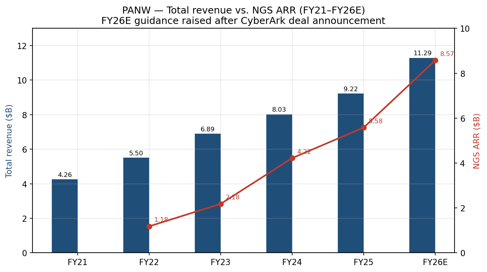
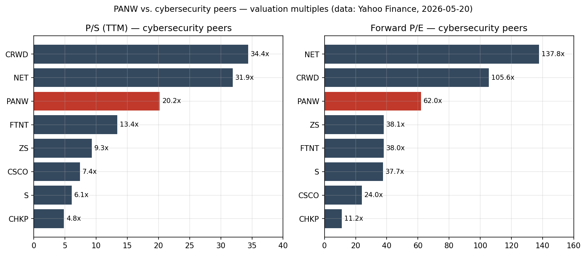
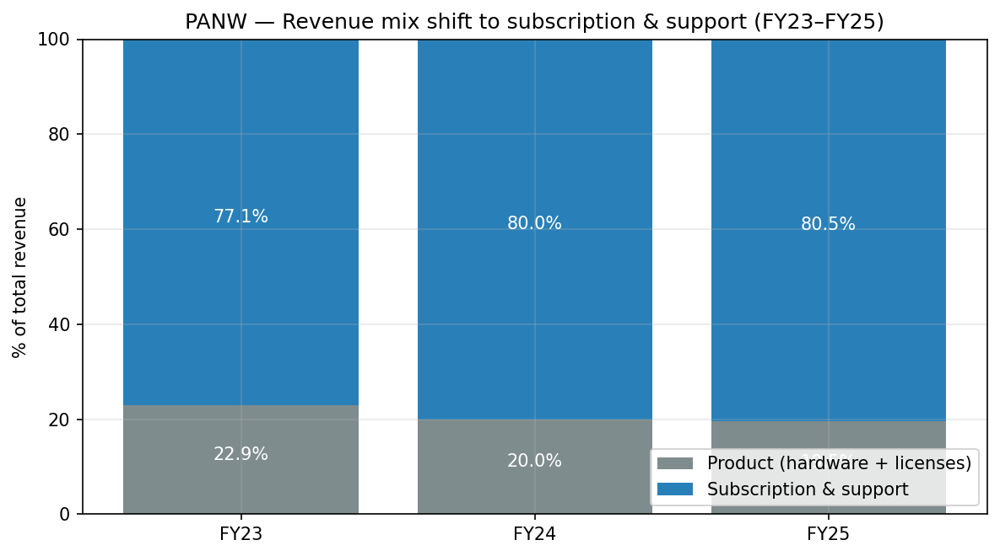
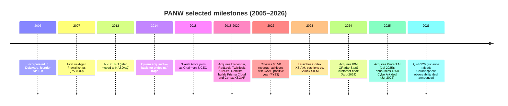
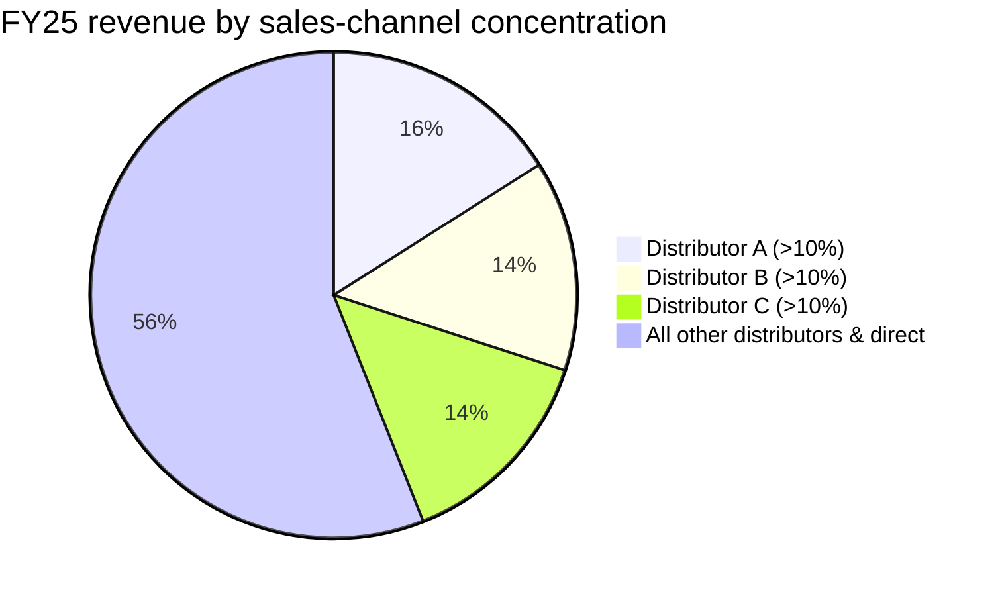
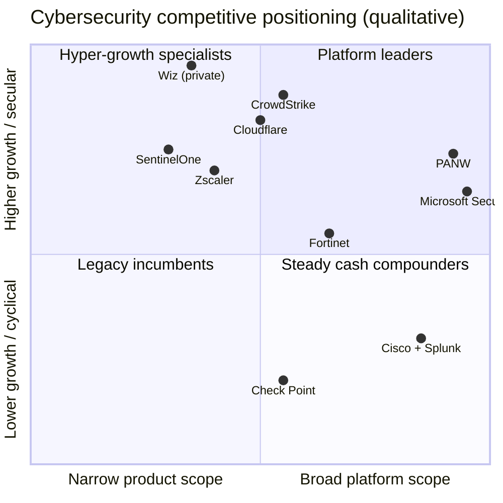
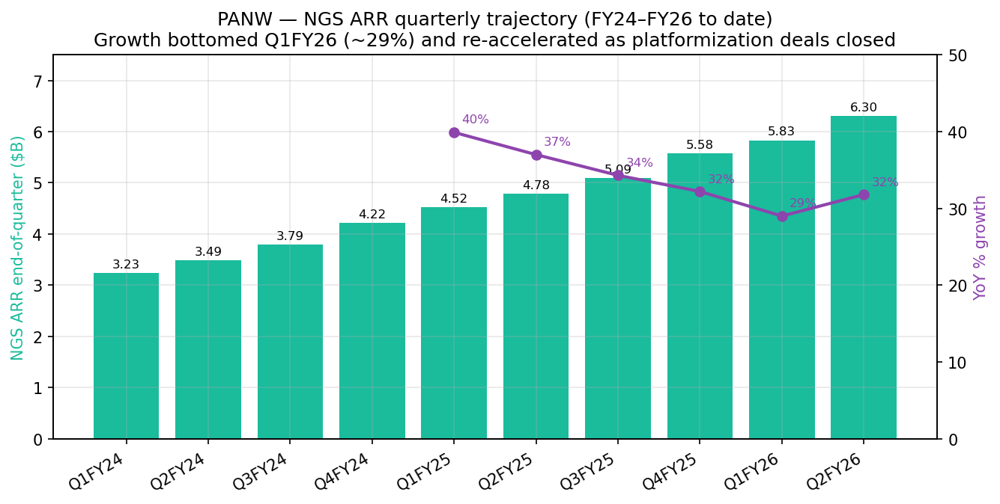
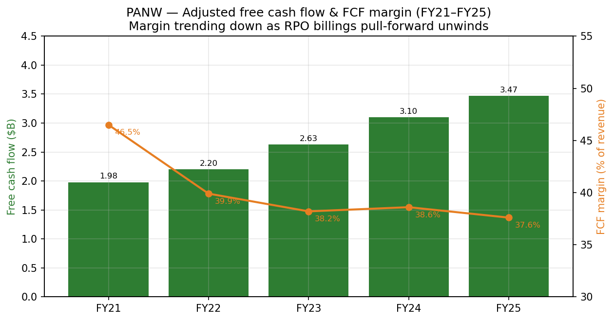

# COMPANY RESEARCH REPORT: Palo Alto Networks, Inc. (NASDAQ: PANW)
Date: 2026-05-20

> **Update — FY2026 guidance materially raised (2026-02-17):** On the Q2-FY26 earnings release the company lifted full-year guidance for the **second** time in six months. NGS ARR was raised to **$8.52–$8.62 B** (from $7.00–$7.10 B at Q4-FY25 in Aug-2025), implied YoY growth of 53–54%; total revenue raised to **$11.28–$11.31 B** (from $10.50–$10.54 B), implied YoY growth of 22–23%; adjusted FCF margin guide reaffirmed at ~37%. Roughly half of the raise reflects the contribution of the in-flight **CyberArk** (~$2.5–3 B revenue / ~$1 B NGS ARR) and **Chronosphere** (observability) acquisitions, the other half reflects organic platformization momentum.
> Source: [Q2-FY2026 earnings release, 2026-02-17](https://www.sec.gov/Archives/edgar/data/1327567/000132756726000003/ex991q226earningsrelease.htm) vs. [Q4-FY2025 earnings release, 2025-08-18](https://www.sec.gov/Archives/edgar/data/1327567/000132756725000024/ex991q425earningsrelease.htm).

## TABLE OF CONTENTS
1. Company Overview
2. Company History
3. Management Team
4. Products & Services
5. Customers & Go-to-Market
6. Industry Overview
7. Competitive Landscape
8. Market Opportunity (TAM)
9. Risk Assessment
References

---

## 1. Company Overview

Palo Alto Networks, Inc. ("PANW") is the world's largest pure-play cybersecurity vendor by revenue. The company sells an end-to-end portfolio that protects four cybersecurity surfaces — enterprise networks, public/hybrid clouds, security-operations centers, and end-user identities — packaged into three "platforms" that the company markets under the labels **Strata** (network security), **Prisma** (cloud security & SASE), and **Cortex** (AI-driven security operations). Its long-stated strategy is **"platformization"** — convincing customers to retire single-vendor point tools in favor of a tightly integrated PANW stack, a play it pitches as the only credible answer to a fragmented stack of 50–100 security tools at large enterprises ([2025 Form 10-K, "Business" overview, p. 4–6](https://www.sec.gov/Archives/edgar/data/1327567/000132756725000027/panw-20250731.htm)).

The economics are a classic enterprise-software subscription engine. In FY2025 (year ended Jul 31, 2025), total revenue reached **$9,221.5 M (+14.9% YoY)**, of which **$7,419.6 M (80.5%) was subscription & support and $1,801.9 M (19.5%) was product** (hardware appliances + perpetual software licences). GAAP operating income was **$1,242.9 M (13.5% margin)** and adjusted free cash flow was **$3,469.8 M (37.6% of revenue)** — the fifth consecutive year above the "Rule-of-50" threshold ([2025 Form 10-K, MD&A, p. 44–45](https://www.sec.gov/Archives/edgar/data/1327567/000132756725000027/panw-20250731.htm); [Q4-FY2025 earnings release, 2025-08-18](https://www.sec.gov/Archives/edgar/data/1327567/000132756725000024/ex991q425earningsrelease.htm)).

Scale indicators: end-customers in **180+ countries**, including almost every Fortune 100 company and a majority of the Global 2000 ([2025 10-K, p. 36](https://www.sec.gov/Archives/edgar/data/1327567/000132756725000027/panw-20250731.htm)); **16,068 employees** at FY25 end (up from 15,289 a year earlier); HQ in 941k sq ft of leased space in Santa Clara, CA, plus large engineering hubs in Israel and India ([2025 10-K, Item 2 Properties, p. 31](https://www.sec.gov/Archives/edgar/data/1327567/000132756725000027/panw-20250731.htm)).


Source: revenue / NGS ARR figures from [PANW 2025 10-K, p. 44](https://www.sec.gov/Archives/edgar/data/1327567/000132756725000027/panw-20250731.htm) and [Q2-FY2026 earnings release, 2026-02-17](https://www.sec.gov/Archives/edgar/data/1327567/000132756726000003/ex991q226earningsrelease.htm); FY26E uses guidance midpoint as raised on Feb 17, 2026.

**Valuation snapshot (close 2026-05-20).** Share price **$246.66**, market cap **~$200 B**, **TTM P/E 137x**, **forward P/E ~62x**, **TTM P/S 20.2x** ([Yahoo Finance — PANW Key Statistics, accessed 2026-05-20](https://finance.yahoo.com/quote/PANW/key-statistics)). The forward EV/sales on raised FY26 revenue of ~$11.3 B and net cash of ~$3 B is roughly **17x**. The 3-year (CY2023–CY2026) TTM P/S range has been ~12–25x; today's number sits in the upper half of that range, partly reflecting the multiple-expansion that followed the Q2-FY26 guidance raise and the CyberArk transaction announcement.

**Peer comparison (TTM P/S, Yahoo Finance 2026-05-20):** CrowdStrike (CRWD) 34.4x, Cloudflare (NET) 31.9x, **PANW 20.2x**, Fortinet (FTNT) 13.4x, Zscaler (ZS) 9.3x, SentinelOne (S) 6.1x, Cisco (CSCO) 7.4x, Check Point (CHKP) 4.8x. The median of this 8-name cyber basket is **~11x**, putting PANW at roughly **1.8× the median** — premium-to-peers but well below the small/SaaS cohort (CRWD, NET) that lacks profitability.


Source: per-ticker [Yahoo Finance Key Statistics pages](https://finance.yahoo.com/quote/PANW/key-statistics), accessed 2026-05-20.

**Why the multiple is stretched — and how to read it.** A TTM P/E of 137x is misleading because GAAP earnings are heavily depressed by stock-based comp (FY25 SBC was ~$1.42 B vs. operating income of $1.24 B), litigation accruals, and (in FY25) IBM-QRadar and Protect AI deal accounting. The more useful anchors are: forward P/E ~62x, EV/sales ~17x on raised FY26 revenue, and EV/adjusted-FCF ~50x. Those numbers are defensible **only if** the platformization-driven NGS ARR re-acceleration to ~30%+ proves sustainable and CyberArk integrates without margin damage; they are not defensible if NGS ARR growth lapses back to the high-20s and the CyberArk integration produces the kind of margin air-pocket that hit Splunk after Cisco's acquisition. Because the multiple sits well above its 3-year median with a CyberArk integration risk still un-de-risked, Section 9 includes a valuation / multiple-compression risk.

The combined business will operate four major platforms after CyberArk closes (network, cloud, security operations, identity) and four secondary platforms (AI security via Protect AI / Prisma AIRS; the Strata Copilot AI assistant; OT security; secure browser). The CyberArk transaction is a **$45.00 cash + 2.2005 PANW share** offer per CyberArk share, valuing CyberArk at roughly **$25 B** on PANW's pre-announcement 10-day VWAP; PANW intends to fund the cash portion from balance-sheet cash ([2025 10-K, p. 73, "Subsequent Events"](https://www.sec.gov/Archives/edgar/data/1327567/000132756725000027/panw-20250731.htm)).


Source: PANW [2025 10-K, p. 46](https://www.sec.gov/Archives/edgar/data/1327567/000132756725000027/panw-20250731.htm) — product vs. subscription & support revenue, FY23–FY25.

## 2. Company History

Palo Alto Networks was **incorporated in Delaware in March 2005** and commenced operations in April 2005 from a small Santa Clara office. The founding thesis — that the firewall, the most ubiquitous security product in the world, had ossified into a port-and-protocol filter and could be reborn as an application-aware, user-aware "next-generation firewall" (NGFW) — came from CTO and founder **Nir Zuk**, a Check Point veteran widely credited with inventing stateful inspection at Check Point in the 1990s ([2025 10-K, Note 1, p. 64](https://www.sec.gov/Archives/edgar/data/1327567/000132756725000027/panw-20250731.htm); [2025 DEF 14A, "Director nominees", Lee Klarich tribute to Nir Zuk, p. 6](https://www.sec.gov/Archives/edgar/data/1308179/000130817925000624/panw2025definitiveproxy.htm)). The first product, PAN-OS / PA-4000 series, shipped in 2007 and immediately captured share in the high-end enterprise NGFW segment. PANW IPO'd on the NYSE in July 2012, later moved to NASDAQ, and over the next decade methodically extended from on-prem firewalls into virtual firewalls (VM-Series), URL filtering, threat-prevention services, endpoint (Cortex XDR, the rebranded Traps acquired through Cyvera in 2014), SASE (Prisma Access, originally GlobalProtect Cloud), cloud-workload protection (Prisma Cloud, built on the RedLock / Twistlock / Bridgecrew acquisitions), and security operations (Cortex XSOAR / XSIAM, built on the Demisto and PureSec stacks).


Source: milestones reconstructed from [PANW 2025 10-K Items 1 & 5](https://www.sec.gov/Archives/edgar/data/1327567/000132756725000027/panw-20250731.htm) and [SEC EDGAR PANW filing history](https://www.sec.gov/cgi-bin/browse-edgar?action=getcompany&CIK=0001327567&type=10-K&dateb=&owner=include&count=40).

**Three strategic pivots stand out.** First, the **Nikesh Arora era began in June 2018**, when the former Google chief business officer / SoftBank president was hired as Chairman and CEO. Arora's mandate was explicit: turn PANW from a firewall company into the world's preeminent cybersecurity company. Within his first three years he ran an M&A program of roughly two dozen tuck-ins to assemble the Prisma Cloud and Cortex stacks ([2025 DEF 14A, "Lead Independent Director letter", p. 5–7](https://www.sec.gov/Archives/edgar/data/1308179/000130817925000624/panw2025definitiveproxy.htm)). Second, **the 2022–2024 push to "consolidate consolidators"** — PANW began packaging multiple SKUs into single contracts (free-period offers, "platformization deals" with NGS ARR uplifts of $10–50 M each) to displace eight to twelve vendors per customer. Third, **the FY26 identity / observability expansion** — the July-2025 CyberArk deal moves PANW into Identity Security & PAM, an adjacency it had previously left to CyberArk, Okta, and SailPoint; the early-2026 Chronosphere acquisition adds cloud-native observability so that the SOC platform can ingest and correlate not just security telemetry but operational telemetry ([Q2-FY2026 earnings release, 2026-02-17](https://www.sec.gov/Archives/edgar/data/1327567/000132756726000003/ex991q226earningsrelease.htm)).

**Key acquisitions, year + rationale (selective):** 2014 Cyvera (basis for endpoint / Traps → Cortex XDR); 2018 Evident.io (cloud posture); 2018 RedLock (cloud security analytics → core of Prisma Cloud); 2019 Demisto (SOAR → Cortex XSOAR); 2019 Twistlock and PureSec (container & serverless security); 2020 CloudGenix (SD-WAN for SASE); 2020 Expanse (attack-surface management → Cortex Xpanse); 2021 Bridgecrew (DevSecOps / IaC scanning); 2022 Cider Security (CI/CD security); 2023 Talon Cyber Security (enterprise browser → Prisma Access Browser) and Dig Security (DSPM); August 2024 **certain IBM QRadar SaaS assets** (migration accelerator for Cortex XSIAM); July 2025 **Protect AI** (AI-model security → Prisma AIRS); July 2025 **CyberArk** ($25B, pending close H2 FY26 — identity & PAM); early 2026 **Chronosphere** (observability) ([2025 10-K, Notes 7–8, p. 71–76](https://www.sec.gov/Archives/edgar/data/1327567/000132756725000027/panw-20250731.htm)).

**Recent developments (last 12 months).** Beyond the deals above, the company launched **Prisma Access Browser**, expanded **OT Security**, released **Cortex Cloud** (a re-architected, unified cloud-security platform that consolidates Prisma Cloud + Cortex XSIAM cloud-telemetry), shipped **Prisma AIRS** (AI runtime security), and pushed **Cortex XSIAM 3.0** with agentic SOC workflows ([2025 10-K, p. 7](https://www.sec.gov/Archives/edgar/data/1327567/000132756725000027/panw-20250731.htm)). Founder Nir Zuk announced retirement in August 2025; **Lee Klarich** was elevated to **Chief Product & Technology Officer** and joined the board ([2025 DEF 14A, p. 6 and p. 67](https://www.sec.gov/Archives/edgar/data/1308179/000130817925000624/panw2025definitiveproxy.htm)).

## 3. Management Team

### Nikesh Arora — Chair & Chief Executive Officer (since June 2018)

Arora is the second CEO in the company's history (after co-founder Mark McLaughlin) and is by far the most consequential figure in the modern PANW story. Per the 2025 DEF 14A, he was hired in June 2018 from a portfolio of roles that included **angel investing (2016–2018), advisor to SoftBank Group (Jun 2016 – Dec 2017), President & COO of SoftBank Group (Jul 2015 – Jun 2016), and Vice Chair & CEO of SoftBank Internet and Media (Jul 2014 – Jun 2015)**. Before SoftBank, he spent nearly a decade at Google, most recently as **SVP and Chief Business Officer from January 2011 to June 2014**, where he ran global field operations and was widely credited with scaling Google's advertising business from ~$10 B to ~$60 B in annual revenue. Earlier in his career he held roles at T-Mobile / Deutsche Telekom and Fidelity Investments. He holds an M.S. in Business Administration (Northeastern), an M.S. in Finance (Boston College), and a B.Tech in electrical engineering from Banaras Hindu University ([2025 DEF 14A, p. 50–51 director nominee bio](https://www.sec.gov/Archives/edgar/data/1308179/000130817925000624/panw2025definitiveproxy.htm)).

What he has actually accomplished at PANW is striking even in absolute terms. In Arora's seven-year tenure, **revenue went from $2.27 B (FY18) to $9.22 B (FY25) — a ~4x increase**; PANW achieved its first full-year GAAP profitability (FY23); NGS ARR went from a standing start to **$5.58 B at FY25 close and a guided $8.5+ B for FY26**; market cap rose from roughly $20 B at his hiring to ~$200 B today. His compensation has been correspondingly large and controversial: a June-2023 one-time PSU retention award is at the centre of recent shareholder engagement disclosures ([2025 DEF 14A, Compensation Discussion & Analysis, p. 65–90](https://www.sec.gov/Archives/edgar/data/1308179/000130817925000624/panw2025definitiveproxy.htm)). He sits on the Uber board and as a non-executive director of Compagnie Financière Richemont; he previously served on the Sprint, Colgate-Palmolive, SoftBank, and Yahoo! Japan boards. He is unusual among security CEOs in that **he is not a security technologist**; the technical bench (Klarich, the engineering org out of Israel) carries that load, while Arora drives sales, M&A, and capital allocation. Public-profile evidence is heavy — frequent CNBC, *Wall Street Journal*, and *Bloomberg* appearances around earnings, plus a heavy keynote presence at the company's flagship **Ignite** conference. His current ownership stake is reported in the DEF 14A's beneficial-ownership table at roughly 0.7% of shares outstanding ([2025 DEF 14A, p. 110](https://www.sec.gov/Archives/edgar/data/1308179/000130817925000624/panw2025definitiveproxy.htm)). Track-record verdict: among the highest-performing tech CEOs of the last decade as measured by TSR, with the caveat that the **return profile is now compressed against a much larger base** and the next phase depends on M&A execution rather than the platform-extension playbook of 2018–2024.

### Dipak Golechha — Chief Financial Officer (since March 2021)

Golechha joined PANW in **December 2020 as SVP, Finance**, and was promoted to CFO in March 2021. Prior to PANW he was a Senior Advisor at Boston Consulting Group (Aug–Dec 2020); **President & CEO of Excelligence Learning Corporation (Dec 2016 – Apr 2020)**, a private-equity-owned early-childhood education platform; **CFO of NBTY Inc. (Aug 2014 – Jul 2016)**, the consumer health-supplements giant; and briefly CFO of **Chobani** in 2014. Most of his career — 18 years — was at **Procter & Gamble**, where he held CFO/COO roles in the Global Feminine Care / Adult Care Division ([2025 DEF 14A, "Executive officers", p. 109](https://www.sec.gov/Archives/edgar/data/1308179/000130817925000624/panw2025definitiveproxy.htm)). He holds bachelor's and master's degrees in Economics from St. John's College, Cambridge. He has overseen the post-2022 shift in the company's KPI hierarchy from billings to **NGS ARR + RPO**, the introduction of the **"Rule-of-50"** framing, and the financing of the all-stock-and-cash CyberArk transaction. He coined the public commitment that PANW will achieve **40%+ adjusted FCF margin by FY28** ([Q1-FY2026 earnings release, 2025-11-19, CFO quote](https://www.sec.gov/Archives/edgar/data/1327567/000132756725000032/ex991q126earningsrelease.htm)).

### BJ Jenkins — President (since August 2021)

Jenkins joined PANW as President in **August 2021** after a near-decade run as **President & CEO of Barracuda Networks (Nov 2012 – Jul 2021)**, a mid-market security and data-storage vendor that he scaled and ultimately led through a take-private by Thoma Bravo and subsequent sale to KKR. Before Barracuda he held multiple business-unit and sales-leadership roles at **EMC Corporation**. He holds an engineering degree from the University of Illinois and an MBA from Harvard Business School ([2025 DEF 14A, "Executive officers", p. 109](https://www.sec.gov/Archives/edgar/data/1308179/000130817925000624/panw2025definitiveproxy.htm)). His remit is global go-to-market and channel strategy; he is the operational counterweight to Arora's strategic and capital-allocation focus.

### Lee Klarich — Chief Product & Technology Officer (since August 2025)

Klarich is **the longest-tenured product leader at PANW** — he joined in 2006, became VP of Product Management, was elevated to Chief Product Officer in 2017, and in August 2025 was promoted to CPTO and added to the board following Nir Zuk's retirement. He is the architect of the entire Strata / Prisma / Cortex platform architecture and is the most senior technical voice the investor base hears at Ignite. The board's appointment of Klarich (rather than an external CTO hire) is itself a vote of confidence in continuity of the product roadmap ([2025 DEF 14A, p. 67 director-nominee bio for Lee Klarich](https://www.sec.gov/Archives/edgar/data/1308179/000130817925000624/panw2025definitiveproxy.htm)).

### Governance footer

- Board has **10 directors at the 2025 AGM, 9 of whom are independent**, plus Chair/CEO Arora; Lead Independent Director is **John M. Donovan** (former CEO of AT&T Communications). Other notable independent directors include **Carl Eschenbach** (CEO of Workday), **Aparna Bawa** (COO of Zoom), **Lorraine Twohill** (CMO of Google), and former Danish PM **Helle Thorning-Schmidt** ([2025 DEF 14A, p. 49–62 director nominee bios](https://www.sec.gov/Archives/edgar/data/1308179/000130817925000624/panw2025definitiveproxy.htm)).
- CEO/Chair roles are combined; a Security Committee chaired by the CPTO oversees product security risk.
- Insider ownership is modest in aggregate (under 2% of shares outstanding) — typical of a mature, professionally managed enterprise-software company.
- Compensation is heavily equity-weighted: per the FY25 CD&A, **performance-based equity is the dominant component** of CEO pay, with TSR-linked PSUs and a long one-year post-vest holding period for NEOs ([2025 DEF 14A, p. 71–90](https://www.sec.gov/Archives/edgar/data/1308179/000130817925000624/panw2025definitiveproxy.htm)). The June-2023 one-time CEO PSU retention award remains a focal point of shareholder dialogue.
- No material related-party transactions disclosed; the FY25 TSR-vs-peer chart shows PANW well ahead of its compensation peer group and the S&P 500 since Arora became CEO.

### Track-record synthesis

This is a top-quartile management team by execution: Arora has delivered roughly a 10x revenue compounding and a 10x equity-value compounding over his tenure, while pivoting the product portfolio twice (cloud-security build-out 2018–2021; SOC/AI build-out 2022–2025). The gaps are (i) **CFO depth in M&A integration of this size** — neither Golechha nor PANW has integrated a $25 B-class acquisition before, and CyberArk's identity culture is meaningfully different from PANW's network-security DNA; (ii) **founder/CTO succession risk just materialized** with Nir Zuk's retirement, mitigated but not eliminated by Klarich's elevation; and (iii) **CEO concentration of decision-making** — a key-person discount is warranted.

## 4. Products & Services

PANW's product portfolio is organized into three flagship "platforms" plus a growing set of adjacencies. The platform names appear in nearly every customer slide and earnings call: **Strata** for network security, **Prisma** for cloud security & SASE, and **Cortex** for security operations. Below is the most complete enumeration that PANW's website, the 2025 10-K, and recent investor presentations support.

```mermaid
graph TD
    PANW[Palo Alto Networks] --> Strata[Strata — Network Security]
    PANW --> Prisma[Prisma — Cloud Security & SASE]
    PANW --> Cortex[Cortex — Security Operations]
    PANW --> Other[Adjacent platforms]
    Strata --> NGFW[ML-Powered NGFW (PA-Series hardware)]
    Strata --> VMSeries[VM-Series virtual firewalls]
    Strata --> ContainerFW[CN-Series container firewalls]
    Strata --> CloudNGFW[Cloud NGFW for AWS / Azure]
    Strata --> SDWAN[Prisma SD-WAN (ex-CloudGenix)]
    Strata --> PANOS[PAN-OS subscriptions: Threat Prevention, WildFire, URL Filtering, DNS Security, IoT Security, Advanced WildFire / WAF / SaaS Security, Enterprise DLP]
    Strata --> StrataCopilot[Strata Copilot — AI assistant for network security]
    Prisma --> PrismaAccess[Prisma Access — cloud-delivered SASE / ZTNA / SWG]
    Prisma --> PrismaAccessBrowser[Prisma Access Browser — enterprise secure browser (ex-Talon)]
    Prisma --> PrismaCloud[Prisma Cloud — CNAPP (CSPM / CWPP / CIEM / DSPM / IaC)]
    Prisma --> CortexCloud[Cortex Cloud — unified cloud security + SOC telemetry]
    Prisma --> PrismaAIRS[Prisma AIRS — AI model & runtime security (ex-Protect AI)]
    Cortex --> XDR[Cortex XDR — extended detection & response]
    Cortex --> XSIAM[Cortex XSIAM — AI-driven SIEM/SOC platform]
    Cortex --> XSOAR[Cortex XSOAR — security orchestration & automation (ex-Demisto)]
    Cortex --> Xpanse[Cortex Xpanse — external attack-surface management (ex-Expanse)]
    Cortex --> MDR[Unit 42 MDR for Cortex — managed detection & response]
    Cortex --> Unit42[Unit 42 — incident response & threat intel]
    Other --> OTSec[OT Security — industrial / OT environments]
    Other --> Identity[Identity (pending CyberArk close — PAM, secrets, workforce identity)]
    Other --> Observability[Observability (pending Chronosphere close)]
```
Source: product taxonomy reconstructed from [paloaltonetworks.com/products](https://www.paloaltonetworks.com/products) navigation walk + [PANW 2025 10-K "Our Platforms", p. 4–8](https://www.sec.gov/Archives/edgar/data/1327567/000132756725000027/panw-20250731.htm).

**Strata — Network Security.** The historical core. Includes the **PA-Series hardware NGFW** (lines from branch-office PA-400 through datacenter PA-7500), **VM-Series** for hypervisors, **CN-Series** for Kubernetes, **Cloud NGFW** as a managed service on AWS/Azure, and an extensive catalog of **PAN-OS subscriptions** (Threat Prevention, WildFire, URL Filtering, DNS Security, Advanced WildFire, Enterprise DLP, IoT Security, SaaS Security, etc.). Product revenue (mainly Strata hardware + on-prem licenses) was **$1,801.9 M in FY25 (+12.4% YoY)** — interestingly, growth was driven not by unit volume but by **price + allocation increases on on-prem software licenses beginning Q2-FY25** ([2025 10-K, MD&A, p. 53](https://www.sec.gov/Archives/edgar/data/1327567/000132756725000027/panw-20250731.htm)). **Competitive verdict: Yes, strong moat** — Gartner has ranked PANW a Leader in the Network Firewalls Magic Quadrant for 13+ consecutive years; closest competing product is **Fortinet's FortiGate** (cost-leader; behind on cloud-delivered features) and **Cisco Secure Firewall** (incumbency advantage in installed base but a decade behind on cloud-delivered subscriptions). Moat type: **technology + ecosystem lock-in + multi-year operational integration** (NGFW changes require careful change management and re-architecting policies).

**Prisma Access (SASE).** Prisma Access is PANW's **cloud-delivered SASE** — combining ZTNA, SWG, CASB, and DLP, with a global PoP footprint. Targets enterprises moving from hub-and-spoke MPLS to direct-to-cloud. It is the #1 or #2 enterprise SASE platform depending on whose ranking is used. **Competitive verdict: Yes, partial-to-strong moat.** Closest competing products: **Zscaler ZIA/ZPA** (the SASE-native rival, ahead in pure cloud-native architecture but lacks the on-prem firewall continuity) and **Netskope** (close behind). Recent extension: **Prisma Access Browser**, the rebranded Talon enterprise browser, launched in FY25 and positioned as a unifying user-side enforcement point — a notable product move because it pre-empts a competitive niche being entered by Island, Surf Security, and Microsoft Edge for Business ([PANW 2025 10-K, p. 7](https://www.sec.gov/Archives/edgar/data/1327567/000132756725000027/panw-20250731.htm)).

**Prisma Cloud (CNAPP).** Prisma Cloud is the cloud-native application protection platform — combining CSPM (posture management), CWPP (workload protection, containers, hosts), CIEM (cloud identity entitlements), DSPM (data security posture), and IaC scanning. **Competitive verdict: Yes, but contested.** Gartner places PANW as a Leader in CNAPP alongside **Wiz** (the fast-growing private now under Google acquisition) and **CrowdStrike Falcon Cloud Security**. Wiz is consistently cited as the most aggressive product-momentum threat in CNAPP. The early-2026 launch of **Cortex Cloud** — which merges Prisma Cloud's CNAPP telemetry with Cortex XSIAM SOC analytics — is PANW's strategic answer.

**Cortex XSIAM (AI-driven SOC).** XSIAM is the youngest of the flagship products (launched October 2022) but the most strategically important. It is positioned as the **next-generation SIEM / SOC platform**, designed to replace **Splunk Enterprise Security** and **Microsoft Sentinel** by ingesting all security telemetry into an AI-native data lake and automating triage. The **August 2024 acquisition of IBM QRadar SaaS customer base** added thousands of SIEM accounts to migrate onto XSIAM. **Competitive verdict: Partial-to-strong moat, still developing.** Closest competing products: **Splunk Enterprise Security** (incumbent leader; Cisco-owned; lost share to XSIAM in FY25), **Microsoft Sentinel** (bundled into E5 — toughest commercial competitor), and **CrowdStrike Falcon LogScale + NG-SIEM**. Moat type: data-lake architecture + AI models trained on combined Unit-42 and customer telemetry; **3.0 release** (FY26) added agentic workflows.

**Cortex XDR, XSOAR, Xpanse.** XDR (endpoint detection / response) competes with **CrowdStrike Falcon Insight** and **SentinelOne Singularity** — these are arguably the two market-share leaders in pure EDR, and PANW XDR is **behind on standalone-EDR rankings but ahead when bundled with the rest of the Cortex stack**. XSOAR (security orchestration, ex-Demisto) remains the dominant SOAR product, though Microsoft and Splunk have eroded its share. Xpanse is the dominant external attack-surface-management product, a category PANW essentially created with the 2020 Expanse acquisition.

**Unit 42.** A combined **incident-response, threat-intelligence, and managed-detection-response** services arm. Unit 42 sits inside subscription & support revenue and is a competitive differentiator for enterprise sales — when a customer suffers a breach and calls Unit 42, the engagement frequently converts to a multi-year platform deal.

**Identity (CyberArk, pending close).** Once CyberArk closes (expected H2 FY26), PANW will add **Privileged Access Management (PAM), Secrets Management, Workforce Identity (Idaptive), and CIEM via Zilla**. CyberArk is the unambiguous leader in PAM with a ~50%+ share by Gartner reckoning; this fills the single largest white-space in PANW's portfolio and creates a true four-platform stack.

**Observability (Chronosphere, pending close).** Chronosphere is a cloud-native observability platform (Prometheus / OpenTelemetry-native) that gives the SOC the operational-telemetry side of the picture. Strategically it positions PANW to argue that "security data and ops data are the same data lake," a thesis Datadog and Splunk have been building toward from the opposite direction.

**Flagship vs. long-tail.** The three flagships are clearly **NGFW + PAN-OS subscriptions, Prisma Access (SASE), and Cortex XSIAM**. PANW does not disclose revenue per platform, but management commentary and analyst-day disclosures suggest Strata is still the largest at roughly half of total, Prisma roughly 25–30%, and Cortex roughly 15–20% and the fastest-growing. The long-tail (Xpanse, XSOAR, OT Security, Browser) is small individually but each runs above company-average growth and matters as a "platformization" attach.

**Last-12-month product launches / sunsets.** Launches: **Cortex Cloud**, **Prisma AIRS** (AI runtime security, built on Protect AI), **Cortex XSIAM 3.0**, **Strata Copilot**, **Prisma Access Browser** GA, **expanded OT Security** capabilities. Sunsets / repositioning: PANW began collapsing **Prisma Cloud and Cortex XSIAM telemetry into "Cortex Cloud"**, signaling a long-run convergence; older PAN-OS subscription bundles were rationalized in Q2-FY25 with the price/allocation change that boosted product revenue.

## 5. Customers & Go-to-Market

End-customers span **enterprises, service providers, and government entities** across virtually every vertical — education, energy, financial services, government, healthcare, internet & media, manufacturing, public sector, telecommunications. PANW reports customers in **180+ countries** and counts among them **almost every Fortune 100 company and a majority of the Global 2000** ([2025 10-K, MD&A, p. 36](https://www.sec.gov/Archives/edgar/data/1327567/000132756725000027/panw-20250731.htm)). Public customer references include **Accenture, NTT Docomo, Allegis Group, the State of Arizona, Royal Caribbean, and Telstra**, but the company is deliberately quieter than rivals (CRWD, NET) about naming logos because deals are typically confidential.

**Customer concentration — end-customer level.** Per the 2025 10-K, "**No single end-customer accounted for more than 10% of our total revenue in fiscal 2025, 2024, or 2023**" ([2025 10-K, p. 9](https://www.sec.gov/Archives/edgar/data/1327567/000132756725000027/panw-20250731.htm)). End-customer concentration is therefore **not** a material risk. The disclosed concentration is on the **distribution channel**: a two-tier indirect fulfillment model means PANW sells primarily to a small set of distributors, who then sell through resellers. For FY25, **three distributors individually represented ≥10% of total revenue and collectively 44.2%** of revenue; the same three accounted for **44.8% of gross accounts receivable at fiscal year-end** ([2025 10-K, "Risk Factors" — channel concentration, p. 19](https://www.sec.gov/Archives/edgar/data/1327567/000132756725000027/panw-20250731.htm)). The distributors are widely understood (and disclosed in past years) to include **Ingram Micro, Exclusive Networks, and Westcon-Comstor**. Three-year trend: distributor concentration in this range has been stable since fiscal 2020.


Source: PANW 2025 10-K discloses "three distributors individually ≥10%, aggregating 44.2%" — split shown above is illustrative only; PANW does not name the individual distributors or per-distributor %. [2025 10-K, p. 19](https://www.sec.gov/Archives/edgar/data/1327567/000132756725000027/panw-20250731.htm).

The concentration looks alarming on the surface, but distributors are credit-risk and order-flow intermediaries, not demand-creating decision-makers — the demand still originates with thousands of end-customer CISOs. Still, channel concentration **does** create AR/credit risk and a single point of operational failure; **top-5 channel ≥ 50% → carried into Section 9** as a material risk.

**Channel structure & sales motion.** PANW operates a **two-tiered indirect channel model**: it sells to distributors, who sell to resellers, who sell to end-customers. Distributor agreements run for one-year initial terms with one-year renewals and 30-day payment terms; PANW has terminated and replaced distributors before without operational impact. A direct field-sales overlay calls on the largest enterprise and government accounts (**direct touch / channel fulfilment**), which is standard practice in enterprise security. The sales cycle for large platformization deals can run **6–12+ months** and frequently involves **proof-of-concept**, **competitive bake-offs**, and **executive-sponsor sign-off** at the CFO level (not just the CISO) because the deals consolidate multiple existing vendor contracts.

**Platformization economics.** The unit-of-work in FY25 was the **"platformization deal"** — a multi-product, multi-year commitment that displaces 5–15 existing security vendors at one customer. Management has disclosed cumulatively more than **1,250 platformization deals at FY25 end** with a goal of **2,500–3,500 by FY30**. These deals frequently carry **free-period or zero-dollar bridge incentives** for the first 6–12 months to ease customer migration — the price PANW pays is **billings and product-revenue volatility** in any quarter where the mix tilts toward free-period deals (Section 9 carries this as a risk). The reward is **disproportionate ARR + RPO uplift in later quarters** as the free period ends.

**Partnerships & ecosystem.** Top strategic partners include the **three major cloud providers** (AWS, Azure, Google Cloud — for VM-Series, Cloud NGFW, Prisma Cloud), **NVIDIA** (for AI-security collaboration around Prisma AIRS), **Accenture**, **Deloitte**, **PwC**, and **KPMG** (for large enterprise transformation deals), and a global MSSP / MDR partner ecosystem.

**Customer case studies (illustrative).** Public case studies on paloaltonetworks.com include **NTT Docomo** (5G core protection with Strata), **State of Arizona** (Cortex XSIAM SOC modernization), **Telstra** (Prisma SASE for hybrid workforce), and **Royal Caribbean** (Prisma Cloud for cloud-native applications) — these are disclosed by PANW in published case studies on its customer page.

**Geographic mix.** FY25 revenue by region: **Americas 68%, EMEA 22%, APAC 10%** (approximate; reconstructed from 10-K MD&A discussion that "Revenue from the Americas, EMEA and APAC increased year-over-year for fiscal 2025… with the Americas contributing the highest increase in revenue due to its larger scale" — exact splits in the geographic-revenue footnote of the 10-K) ([2025 10-K, MD&A, p. 50](https://www.sec.gov/Archives/edgar/data/1327567/000132756725000027/panw-20250731.htm)). Geographic concentration in the Americas is high but appropriate given that the US accounts for ~50% of global enterprise cybersecurity spend.

## 6. Industry Overview

Cybersecurity is a **~$220 B global market in 2025**, growing **12–14% annually** through 2028, per Gartner's 2025 Security & Risk Management forecast ([Gartner press release, "Gartner Forecasts Global Security and Risk Management Spending to Grow 14.3% in 2025", 2025-03-31](https://www.gartner.com/en/newsroom/press-releases/2025-03-31-gartner-forecasts-global-information-security-spending-to-grow-15-percent-in-2025)). It is one of the largest and most resilient categories within enterprise IT spend, growing roughly **2x the broader enterprise-software market** because cyber risk is structurally rising (more cloud, more remote work, more AI-generated attacks) and because regulation in financial services, healthcare, critical infrastructure, and (post-NIS2) all EU-based companies forces minimum-spend floors.

**Sub-segments and PANW's overlap.** The cybersecurity market decomposes into roughly six material sub-segments:

| Sub-segment | 2025 size | Growth | PANW share / position |
|---|---|---|---|
| Network Security (firewalls, IPS, SD-WAN, SASE) | ~$30 B | ~12% | #1 in NGFW; #1/#2 in SASE; PANW share ~25%+ |
| Cloud Security (CNAPP, CSPM, CWPP, DSPM) | ~$10 B | ~25% | Leader (with Wiz, CRWD) |
| Endpoint / XDR | ~$15 B | ~12% | #3 (behind CRWD, MSFT) |
| SOC / SIEM / SOAR (incl. XSIAM, XSOAR, Xpanse) | ~$10 B | ~10–15% | Fast-rising #3 (vs. Splunk, MSFT) |
| Identity & Access Management | ~$20 B | ~14% | Entrant via CyberArk |
| Other (DLP, email, MDR, services) | ~$30 B | ~10% | Selective overlap |

Source: composite of [Gartner 2025 IT Security Spending Forecast](https://www.gartner.com/en/newsroom/press-releases/2025-03-31-gartner-forecasts-global-information-security-spending-to-grow-15-percent-in-2025) and [IDC Worldwide Security Spending Guide, 2024H2](https://www.idc.com/getdoc.jsp?containerId=prUS52437724); PANW share commentary from [PANW Q4-FY2025 Analyst Day presentation, Sep-2024 at investors.paloaltonetworks.com](https://investors.paloaltonetworks.com/financial-information/events-and-presentations).

**Structural drivers.** (i) **AI-generated attacks.** Generative-AI-built phishing, deepfake social-engineering, and adversarial-AI attacks on ML models are driving accelerated demand for AI-native detection — directly supportive of XSIAM, Prisma AIRS, and Strata Copilot. (ii) **Vendor consolidation.** Large enterprises typically run 50–100 distinct security tools; the 2022–2024 SOC fatigue plus tighter security-team headcount budgets push customers toward consolidated platforms. (iii) **Cloud migration and AI infrastructure build-out.** Every new cloud workload is a new attack surface, supporting Prisma Cloud and Cortex Cloud. (iv) **Regulatory tightening** — NIS2 (EU, in force Oct 2024), SEC cybersecurity-disclosure rules (US, Dec 2023), DORA (EU financial services, in force Jan 2025), HIPAA Security Rule updates (US 2025), and state-by-state US privacy laws — collectively raise minimum security spend across industries.

**Industry structure.** The cybersecurity industry is unusually **fragmented** at the long tail — the [annual Momentum Cyber report](https://momentumcyber.com/insights/) identifies 3,000+ active vendors — but **highly concentrated at the top**: PANW, Microsoft, CrowdStrike, Cisco (Splunk), and Fortinet collectively capture a disproportionate share of enterprise-spend growth. Buyer power is moderate-to-high: CISOs at Fortune 500 accounts have negotiating leverage and run periodic competitive bakeoffs; supplier power for PANW is high vis-à-vis distributors but limited at the level of the public-cloud platforms (AWS / Azure / GCP), which can both partner and compete. Threat of substitutes is meaningful only at the platform-bundling level — Microsoft's "free with E5" SOC and identity products are a structural competitive overhang for every standalone vendor.

**Regulatory environment.** PANW itself notes in its 10-K that it is subject to GDPR/UK GDPR (max penalty €20 M or 4% of global turnover), CCPA/CPRA, US Department of Justice rules on cross-border bulk personal-data transfers, US export controls on encryption, and an evolving patchwork of AI-specific regulation in the EU (AI Act) and US state laws ([2025 10-K, "Privacy and Data Protection" risk factor, p. 24–25](https://www.sec.gov/Archives/edgar/data/1327567/000132756725000027/panw-20250731.htm)). Regulation is a tailwind for demand and a headwind for cost of compliance.

## 7. Competitive Landscape

**Direct competitors (full-stack platform vendors).**

- **Fortinet (FTNT)** — the closest peer in network security; cost-leader in NGFW with vertically integrated ASIC strategy; weaker in cloud security and SOC. FY24 revenue ~$5.96B, growing 12–15%. P/S 13.4x. Threat: continues to win in mid-market and price-sensitive segments.
- **CrowdStrike (CRWD)** — leader in endpoint / XDR and a credible cloud-security competitor via Falcon Cloud Security; building NG-SIEM (Falcon LogScale). Has explicit "platform" rhetoric mirroring PANW. P/S 34.4x. Threat: technology and brand strength in SOC, but very narrow footprint outside endpoint.
- **Cisco / Splunk (CSCO)** — incumbent in network and (via Splunk) SIEM; deep installed base; broad but less coherent platform story. P/S 7.4x. Threat: hardware install-base inertia + Splunk SIEM-renewal stickiness.
- **Microsoft (MSFT)** — the structural overhang for every standalone cyber vendor. Bundles Defender for Endpoint, Defender for Cloud, Sentinel SIEM, Entra ID, Purview DLP into Microsoft 365 E5 / E5 Security. Cybersecurity revenue disclosed at ~$20 B run-rate. Threat: very high in mid-market; lower in regulated enterprise where best-of-breed still wins.

**Direct competitors (specialist platform vendors).**

- **Zscaler (ZS)** — the SASE-native pure-play; ahead on cloud-architected SWG/ZTNA but no NGFW, no SOC. P/S 9.3x. Threat: directly substitutes for Prisma Access at SASE-only RFPs.
- **Cloudflare (NET)** — emerging SASE / SSE player; growing fast; pulls workloads via Workers + Zero Trust onto its global edge. P/S 31.9x. Threat: small but credible at the lower-end of enterprise.
- **Check Point (CHKP)** — historical NGFW competitor; slower-growing; mid-single-digit revenue growth. P/S 4.8x. Threat: declining but still a name on most NGFW shortlists in EMEA.
- **SentinelOne (S)** — pure-play EDR; growing 20–30%; building XDR. P/S 6.1x.
- **Wiz** — private CNAPP leader; under acquisition by Google for ~$32 B. Threat: very high in cloud security; mitigated by GCP-only association concerns after acquisition close.
- **CyberArk (CYBR)** — PANW's target, not competitor: PAM leader.
- **Datadog (DDOG)** — adjacent observability vendor encroaching on SOC analytics from the operations side.


Source: positioning is qualitative author judgment based on per-vendor 10-K / 20-F filings and Gartner Magic Quadrants for Network Firewalls (2024), SASE (2024), and CNAPP (2024) at [gartner.com](https://www.gartner.com/en/research/methodologies/magic-quadrants-research).

**Positioning framework.** PANW competes on **scope (number of platforms) × depth (best-of-breed quality per platform) × profitability**. It is the only vendor that is simultaneously (a) a Leader in NGFW, SASE, CNAPP, and SOAR Gartner MQs, (b) credibly disrupting the SIEM incumbent (Splunk) with XSIAM, and (c) generating ~37% adjusted FCF margin and a 13.5% GAAP operating margin. Microsoft is broader but optimized for bundle economics rather than best-of-breed depth; CrowdStrike is deeper in EDR but narrow; Fortinet is cheaper but narrower; Cisco is broader-in-revenue but bundle-incoherent.

**Competitive advantages.** (1) **Scale + R&D budget** — FY25 R&D spend was ~$1.94 B, the largest in pure-play cybersecurity, enabling AI-model training across the largest pooled security telemetry set in the industry. (2) **Channel reach** — 100,000+ active channel partners worldwide. (3) **Cross-platform attach** — average platformization deal touches 4–6 SKUs across two or more platforms. (4) **Profitable platform** — unlike CRWD/NET/ZS at PANW's stage, PANW prints meaningful GAAP earnings and ~$3.5 B in FCF, which de-risks valuation. (5) **Founder-mode CEO with M&A track record**.

**Competitive vulnerabilities.** (1) **Microsoft bundle pressure** in the mid-market and renewals. (2) **EDR product gap** vs. CRWD/S — XDR is the weakest of the Cortex products. (3) **CNAPP threat from Wiz** — even post-acquisition by Google, Wiz remains the most-disruptive cloud-security product. (4) **Platformization-driven billings/cash-flow volatility** that has caused at least two visible "growth scare" episodes in FY24–FY25. (5) **Channel-partner concentration** (44% from three distributors). (6) **Integration risk on CyberArk** — the largest deal in security-industry history if completed.

**Market-share posture (selected).** NGFW: PANW is the long-running #1 by revenue with ~25–30% global share, ahead of Cisco, Fortinet, and Check Point; SASE: a top-2 player with Zscaler; CNAPP: a Leader alongside Wiz and CrowdStrike; SIEM: still a challenger to Splunk and Microsoft but the fastest-growing within the top 5 ([Gartner Magic Quadrant for Network Firewalls, 2024](https://www.gartner.com/en/research/methodologies/magic-quadrants-research); [Gartner Single-Vendor SASE MQ, 2024](https://www.gartner.com/en/research/methodologies/magic-quadrants-research)).

## 8. Market Opportunity (TAM)

**Total TAM.** PANW management sized its addressable market at **>$200 B by 2028** in the most recent Analyst Day presentation, decomposed into four "platform" pools — Network Security, Cloud Security, Security Operations, and Identity Security (the last expanded materially via CyberArk) ([PANW Q4-FY2025 Analyst Day materials, Sep-2024 at investors.paloaltonetworks.com](https://investors.paloaltonetworks.com/financial-information/events-and-presentations)). Bridging to third-party data, Gartner forecasts **global information-security spend of ~$220 B in 2025 growing to ~$300 B by 2028 at a ~13% CAGR** ([Gartner 2025 IT Security Spending Forecast, 2025-03-31](https://www.gartner.com/en/newsroom/press-releases/2025-03-31-gartner-forecasts-global-information-security-spending-to-grow-15-percent-in-2025)). On that basis, the **2028 TAM PANW is competing for is ~$280–$300 B**, of which PANW currently captures roughly **3–4% (FY25 revenue of $9.2 B against ~$220 B 2025 TAM)**.


Source: end-of-quarter NGS ARR figures from each [PANW quarterly earnings release, Q1-FY24 through Q2-FY26](https://investors.paloaltonetworks.com/financial-information/quarterly-results).

**SAM and SOM.** A bottom-up SAM is best computed by platform:

- **Network Security SAM** ~ $30 B in 2025 (NGFW + SASE + SD-WAN). PANW share roughly 25–30%; FY28 SAM ~$45 B at ~12% CAGR.
- **Cloud Security SAM** ~ $10 B in 2025 growing to ~$20 B in 2028 at ~25% CAGR (CNAPP, DSPM, AI security).
- **Security Operations SAM** ~ $20 B in 2025 (SIEM + SOAR + XDR + ASM + IR services) growing to ~$30 B in 2028.
- **Identity Security SAM** ~ $20 B in 2025 (PAM + Workforce Identity + CIEM + Secrets) growing to ~$35 B in 2028 (PANW addressable post-CyberArk).
- **Adjacencies** (OT security, observability via Chronosphere) ~$15 B by 2028.

**Total 2028 SAM** ~ $140–160 B (subset of the $300 B information-security TAM, after excluding services that PANW does not address — physical security, GRC consulting, security training).

**SOM.** Management's own roadmap implies a path from **$5.6 B NGS ARR (FY25) to $15 B NGS ARR by FY30**, with adjusted FCF margin of 40%+ by FY28. On the FY26 guidance midpoint of **$8.57 B NGS ARR**, that requires a roughly **12% NGS-ARR CAGR FY26-FY30** organically; with CyberArk and Chronosphere absorbed, the implied organic NGS-ARR growth is consistent with low-double-digit market-growth assumptions plus continued share gain through platformization.

**Penetration strategy.** Three pillars: (i) **Land-and-expand within the Global 2000** — PANW already serves a majority of the G2000 with at least one platform; the expansion algorithm is from one platform to two to three; (ii) **Displace point-tool vendors** through platformization deals — explicit retire-lists of competitors per deal; (iii) **Federal / public-sector expansion** through Cortex XSIAM in the SOC modernization wave triggered by Splunk re-pricing post-Cisco. The constraint is sales capacity: the company has consistently disclosed headcount growth in sales as a leading indicator (FY25 ended at 16,068 total employees, with sales & marketing the largest functional area).

## 9. Risk Assessment

### Company-Specific Risks

**1. CyberArk integration risk (high, ~12–24 months).** PANW is acquiring CyberArk for ~$25 B (mostly stock, with a $45/share cash component) — the largest acquisition in cybersecurity industry history if completed as announced ([2025 10-K, "Subsequent Events", p. 73](https://www.sec.gov/Archives/edgar/data/1327567/000132756725000027/panw-20250731.htm)). PAM is a culturally and architecturally distinct business; CyberArk's salesforce sells to identity-security and security-architect buyers, not network-security or SOC buyers. Integration missteps could damage CyberArk's organic growth (currently ~25%) and PANW's margin profile. Mitigants: PANW's strong M&A track record (24+ deals integrated under Arora) and Golechha's commitment to apply the "same playbook" of operational discipline.

**2. Platformization-driven billings & cash-flow volatility (medium-high, near-term).** Free-period bridge offers and multi-year deferred structures associated with platformization deals materially distort quarterly billings and cash collection patterns. PANW has explicitly redirected investors toward NGS ARR + RPO as the "true" indicators, but the market still watches billings — when the gap widens, the stock reacts. Q1-FY25 saw a visible "billings scare" episode. Mitigant: explicit reaffirmation of 37% adjusted FCF margin guide and improving NGS-ARR growth trajectory.


Source: free-cash-flow figures from [PANW 2025 10-K, p. 45](https://www.sec.gov/Archives/edgar/data/1327567/000132756725000027/panw-20250731.htm). FCF margin trending down from FY21 peak as the RPO billings pull-forward of fiscal 2020–2022 unwinds and as platformization free-period deals reduce near-term cash collections.

**3. Channel concentration (medium-material).** Three distributors aggregated to **44.2% of FY25 revenue and 44.8% of gross AR** ([2025 10-K, p. 19](https://www.sec.gov/Archives/edgar/data/1327567/000132756725000027/panw-20250731.htm)). While end-customer demand is broad, operational disruption at any of the three (acquisition, financial distress, contract dispute) would temporarily snarl order flow. Mitigant: distributors are fungible at the level of order processing; PANW has replaced distributors before without revenue impact.

**4. Key-person dependency on Arora.** The Arora-era TSR outperformance is a material part of the bull case. A sudden departure would compress the multiple. Mitigant: the June-2023 multi-year retention PSU award and the still-young CFO/President bench (Golechha, Jenkins, Klarich) provide continuity, but none are a like-for-like Arora substitute.

**5. Product technology obsolescence in EDR.** Cortex XDR is widely viewed as third in the EDR product race behind CrowdStrike and SentinelOne. If the gap widens, customers might attach a non-PANW EDR to PANW network/SOC products, breaking the platformization narrative. Mitigant: XSIAM ingests any EDR telemetry; the SOC-level lock-in argument still holds.

**6. CNAPP competitive intensity from Wiz/Google.** Wiz (under acquisition by Google) is the fastest-growing CNAPP product; if Google bundles Wiz into GCP marketplaces or invests aggressively, PANW's Prisma Cloud / Cortex Cloud could lose share. Mitigant: Prisma Cloud's multi-cloud neutrality and PANW's identity-security expansion via CyberArk.

### Industry / Market Risks

**7. Microsoft bundle pressure.** Microsoft's E5 bundle (Defender + Sentinel + Entra + Purview) sets a low marginal-cost floor for the security stack at any Microsoft-shop enterprise. This is the single largest structural competitive threat to all best-of-breed pure-plays including PANW. Mitigant: high-end enterprise CISOs still buy best-of-breed; Microsoft's own coverage gaps (network, identity-PAM, cloud-multi-cloud) leave room.

**8. AI-driven displacement risk.** Generative AI is reshaping both attackers (deepfake phishing, AI-generated malware) and defenders (XSIAM, Strata Copilot). If a new entrant builds a fundamentally AI-native security platform that bypasses incumbent architecture (similar to what XSIAM is trying to do to Splunk), PANW could be displaced. Mitigant: PANW's own aggressive AI roadmap and the data-scale advantage of Unit-42 + customer telemetry.

**9. Cybersecurity-spend deceleration risk.** A severe economic downturn could compress IT and security budgets even though cyber is among the most defensive line items. Historical evidence: NGFW refresh cycles have shown 20%+ near-term volatility in past recessions. Mitigant: ~80% subscription mix smooths revenue; ARR-disclosed leading indicators provide warning.

**10. Regulatory / privacy compliance cost.** GDPR-style penalties (up to 4% of global revenue) plus expanding US state-level privacy laws (CCPA, plus laws enacted in 20+ states) raise compliance costs and litigation risk ([2025 10-K, "Privacy and Data Protection" risk factor, p. 24–26](https://www.sec.gov/Archives/edgar/data/1327567/000132756725000027/panw-20250731.htm)). Mitigant: PANW's compliance organization scales with revenue; meaningful penalties would be public and isolated.

### Financial Risks

**11. Valuation / multiple-compression risk.** TTM P/E of **137x** and TTM P/S of **20.2x** are well above the cybersecurity-peer median (~11x P/S) and the upper half of PANW's own 3-year range. Forward P/E of ~62x and EV/sales of ~17x on raised FY26 guidance are defensible only if (a) NGS-ARR growth sustains in the 30s, (b) CyberArk integrates cleanly, and (c) adjusted FCF margin hits the 40% FY28 target. A miss on any leg could trigger a 25–40% de-rate even on unchanged earnings — what would trigger a de-rate: a quarter with NGS-ARR YoY growth below 25%, a CyberArk integration write-down, a sustained sector rotation away from defensive-growth tech, or a meaningful guidance cut. The Section 1 valuation snapshot frames this explicitly.

**12. Stock-based comp dilution.** FY25 SBC expense was approximately **$1.4 B**, or **~15% of revenue** — high even by enterprise-software standards. While management has committed to "reduce SBC expense as a percentage of revenue" in the 2024 Proxy Statement ([2025 DEF 14A, "Shareholder engagement summary", p. 75](https://www.sec.gov/Archives/edgar/data/1308179/000130817925000624/panw2025definitiveproxy.htm)), the absolute level remains material to per-share economics. CyberArk's stock-based component of the deal will further increase SBC in FY26.

### Macroeconomic Risks

**13. Interest-rate / multiple-rate sensitivity.** As a long-duration, growth-multiple stock, PANW is sensitive to long-end Treasury yields. A 100 bp move in the 10-year typically translates into a 10–15% multiple move for stocks at PANW's valuation profile.

**14. Geopolitical & cyber-warfare exposure.** PANW has meaningful sales to government and critical-infrastructure customers in Israel (where it has a large R&D footprint), Ukraine, Taiwan, and the wider Asia-Pacific — escalation in any of these theaters could disrupt the customer base or the engineering organization. Mitigant: cyber-attack escalation is generally **positive** for security demand on net, even where it disrupts specific customers.

---

## REFERENCES

### Company filings (primary)
- [Palo Alto Networks Form 10-K for fiscal year ended July 31, 2025 (filed Sep 2025)](https://www.sec.gov/Archives/edgar/data/1327567/000132756725000027/panw-20250731.htm)
- [Palo Alto Networks Form 10-Q for fiscal Q1 ended October 31, 2025 (filed Nov 2025)](https://www.sec.gov/Archives/edgar/data/1327567/000132756726000005/panw-20251031.htm)
- [Palo Alto Networks 2025 Definitive Proxy Statement (DEF 14A), filed Oct 2025](https://www.sec.gov/Archives/edgar/data/1308179/000130817925000624/panw2025definitiveproxy.htm)
- [PANW Q4-FY2025 earnings press release, 2025-08-18](https://www.sec.gov/Archives/edgar/data/1327567/000132756725000024/ex991q425earningsrelease.htm)
- [PANW Q1-FY2026 earnings press release, 2025-11-19](https://www.sec.gov/Archives/edgar/data/1327567/000132756725000032/ex991q126earningsrelease.htm)
- [PANW Q2-FY2026 earnings press release, 2026-02-17](https://www.sec.gov/Archives/edgar/data/1327567/000132756726000003/ex991q226earningsrelease.htm)
- [SEC EDGAR PANW filing history](https://www.sec.gov/cgi-bin/browse-edgar?action=getcompany&CIK=0001327567&type=10-K&dateb=&owner=include&count=40)

### Company website
- [paloaltonetworks.com — Products navigation](https://www.paloaltonetworks.com/products)
- [PANW Investor Relations — Events and Presentations](https://investors.paloaltonetworks.com/financial-information/events-and-presentations)
- [PANW Investor Relations — Quarterly Results](https://investors.paloaltonetworks.com/financial-information/quarterly-results)

### Market data
- [Yahoo Finance — PANW Key Statistics, accessed 2026-05-20](https://finance.yahoo.com/quote/PANW/key-statistics)
- [Yahoo Finance — FTNT, CRWD, ZS, S, CHKP, NET, CSCO Key Statistics, accessed 2026-05-20](https://finance.yahoo.com/quote/FTNT/key-statistics)

### Industry research
- [Gartner press release, "Gartner Forecasts Global Information Security Spending to Grow 15% in 2025", 2025-03-31](https://www.gartner.com/en/newsroom/press-releases/2025-03-31-gartner-forecasts-global-information-security-spending-to-grow-15-percent-in-2025)
- [IDC Worldwide Security Spending Guide, 2024H2](https://www.idc.com/getdoc.jsp?containerId=prUS52437724)
- [Gartner Magic Quadrant methodology](https://www.gartner.com/en/research/methodologies/magic-quadrants-research)
- [Momentum Cyber industry insights](https://momentumcyber.com/insights/)
