# Palo Alto Networks, Inc. (NASDAQ:PANW) — 公司研究报告

**截至日期: 2026-06-14**（价格与市值取 2026-06-12 收盘）
**上市地: 纳斯达克全球精选市场, 代码 PANW**
**注册地: 美国特拉华州 (总部位于加利福尼亚州圣克拉拉)**
**报告语言: 简体中文 (英文版同时存在于本目录)**

---

> ## 投资摘要 (Investment Summary) — *Analyst view:*
>
> | 项目 | 内容 |
> |---|---|
> | **评级 (Rating)** | **Hold / Neutral (持有)** —— 基本面与执行力顶级，但当前股价已较充分定价，且 CyberArk 整合风险尚未消化 |
> | **12 个月目标价 (12-mo PT)** | **US\$295** (基准情形 base case) |
> | **现价 (2026-06-12 收盘)** | **US\$279.62** |
> | **隐含空间 (Implied upside)** | **+5.5%** (基准) ; 牛市 US\$343 (+22.7%) ; 熊市 US\$214 (−23.5%) |
> | **估值方法 (Method)** | 前瞻市盈率法：FY2027E non-GAAP EPS ~US\$4.76 × 62× 目标 P/E ≈ US\$295 (*Analyst view:* 倍数较当前 FY26 的 74× 自然收敛) |
> | **市值 (Market cap)** | **~US\$227.9 bn** (815 百万股 × US\$279.62) |
> | **52 周区间** | US\$139.57 – US\$302.95 (经 2024-12 二比一拆股调整后) |
> | **GF Score (本报告自评)** | **70 / 100** (财务实力 8 · 盈利 6 · 成长 9 · 估值 3 · 动量 8) |
>
> **论点支柱 (Thesis pillars，均为 *Analyst view:*):**
> 1. **平台化 + AI 安全双轮驱动的收入加速真实可见。** FY2026 Q3 (截至 2026-04-30) 总收入同比 +31% 至 30.0 亿美元，NGS ARR 同比 +60% 至 81 亿美元——增速由"平台化 (platformization)"与企业 AI 部署带来的新攻击面共同驱动，远高于网络安全行业 ~12% 的市场增速。
> 2. **CyberArk(~250 亿美元)+Chronosphere 并购已交割并表，把 PANW 从四大攻击面推向"身份 + 可观测性"邻接赛道**——这是收入加速的一半来源，也是最大的整合与利润率风险来源。
> 3. **现金创造力在纯网络安全行业内独一档。** TTM 调整后自由现金流利润率 (adjusted FCF margin) 38.5%，管理层承诺 FY2028 达 40%+；这把高估值倍数的下行风险部分对冲掉。
> 4. **估值是看空理由的核心。** TTM P/E 243×、forward P/E ~68×、P/S 21×——任何一项(NGS ARR 增速、CyberArk 整合、FCF 利润率)偏离，都可能在盈利不变下触发 20–40% 的估值重定价。
>
> *（评级与目标价为本报告自身的前瞻判断，非任何监管备案内容；10-K 不含目标价，切勿与备案引用混同。）*

---

> **业绩更新——FY2026 Q3 大超预期、全年指引再次上调 (2026-06-02):** 在 FY2026 Q3 业绩公告中，PANW 录得**总收入同比 +31% 至 30.0 亿美元**(其中 CyberArk + Chronosphere 贡献 3.88 亿美元)、**NGS ARR 同比 +60% 至 81 亿美元**(其中并购贡献 16 亿美元)、**RPO (剩余履约义务) 同比 +36% 至 184 亿美元**。受并购无形资产摊销影响，季度**录得 GAAP 营业亏损 1.83 亿美元**(去年同期为营业利润 2.19 亿美元)，但 **non-GAAP 营业利润 8.14 亿美元(同比 +30%)**；**调整后自由现金流 9.10 亿美元**，TTM 调整后 FCF 利润率 38.5%(同比 +430 bp)。FY2026 全年指引上调至**总收入 114.15–114.25 亿美元(同比 +24%)、NGS ARR 89.0–89.5 亿美元(同比 +59–60%)、non-GAAP EPS 3.77–3.79 美元、调整后 FCF 利润率 37.5%**。管理层重申 **FY2028 达 40% 调整后 FCF 利润率**目标。
> 来源: [PANW FY2026 Q3 业绩公告, 2026-06-02](https://www.sec.gov/Archives/edgar/data/1327567/000132756726000012/panw-20260602.htm) 与 [PANW FY2026 Q3 Form 10-Q, 2026-06-03 备案](https://www.sec.gov/Archives/edgar/data/1327567/000132756726000015/panw-20260430.htm)。

## 目录
1. 公司概览
   - 1A. 估值快照与目标价 (Valuation snapshot)
   - 1B. GF Score 基本面评分
2. 估值、前瞻模型与目标价 (Valuation & Price Target)
   - 公司历史
3. 管理团队
4. 产品与服务
5. 客户与上市策略
6. 行业概览
7. 竞争格局
8. 市场机会 (TAM)
9. 风险评估
   - 9.5 核心分歧与催化剂 (Key debates & catalysts)
10. 投资者视角评分 (Investor lenses)
参考资料

---

## 1. 公司概览

Palo Alto Networks, Inc. ("PANW") 是全球按营业收入计**最大的纯网络安全 (pure-play cybersecurity) 厂商**。公司销售端到端产品组合, 覆盖五大网络安全攻击面——企业网络、公有/混合云、安全运营中心 (SOC, Security Operations Center)、终端用户身份以及 (随 CyberArk 并表新增的) 特权身份/PAM——并打包成三大旗舰"平台 (platform)", 分别冠以 **Strata** (网络安全)、**Prisma** (云安全 & SASE) 与 **Cortex** (AI 驱动的安全运营) 之名。公司长期宣示的战略是**"平台化 (platformization)"**——说服客户淘汰单一厂商的散点工具, 转而采用 PANW 紧密集成的整体栈, 公司将其定位为大型企业普遍存在的 50–100 件碎片化安全工具问题唯一可信的解决方案 ([PANW FY2025 Form 10-K, "业务"概述, 第 4–6 页](https://www.sec.gov/Archives/edgar/data/1327567/000132756725000027/panw-20250731.htm))。

**本报告观点 (BLUF)：** 这是一家执行力顶级、现金创造力在行业内独一档的复利型企业软件公司，FY2026 Q3 的收入与 ARR 加速证明平台化 + AI 安全的飞轮仍在转动。但本报告给予 **Hold/Neutral** 评级，核心原因有二：(i) 现价 279.62 美元对应 forward P/E ~68×、P/S 21×，已把多年高增长大部分定价进去，基准情形下 12 个月空间仅约 +5.5%；(ii) 刚交割的 ~250 亿美元 CyberArk 并购把商誉推升至 219 亿美元、并使季度转入 GAAP 营业亏损，整合执行尚未经过验证。看多需要 NGS ARR 增速持续 30%+ 且 CyberArk 整合干净；看空只需其中一条证伪 ([PANW FY2026 Q3 业绩公告, 2026-06-02](https://www.sec.gov/Archives/edgar/data/1327567/000132756726000012/panw-20260602.htm))。

经济模型是典型的企业软件订阅引擎。FY2025 (截至 2025-07-31), 总营业收入达到 **92.215 亿美元 (同比 +14.9%)**, 其中**订阅与支持收入 74.196 亿美元 (占 80.5%), 产品收入 18.019 亿美元 (占 19.5%)** (产品收入包括硬件设备与永久软件许可)。GAAP 营业利润为 **12.429 亿美元 (营业利润率 13.5%)**, 调整后自由现金流约 **34.7 亿美元 (占营业收入 ~37.6%)** ([PANW FY2025 10-K, 经营层讨论与分析 (MD&A), 第 44–45 页](https://www.sec.gov/Archives/edgar/data/1327567/000132756725000027/panw-20250731.htm))。进入 FY2026 后, 随 CyberArk + Chronosphere 并表, FY2026 Q3 单季收入已达 **30.0 亿美元(同比 +31%)**, FY2026 全年收入指引上调至 **114.15–114.25 亿美元(同比 +24%)** ([PANW FY2026 Q3 业绩公告, 2026-06-02](https://www.sec.gov/Archives/edgar/data/1327567/000132756726000012/panw-20260602.htm))。

规模指标: FY2026 Q3 业绩公告称公司服务**70,000+ 企业客户**, 几乎覆盖所有财富 100 强 ([PANW FY2026 Q3 业绩公告, "About", 2026-06-02](https://www.sec.gov/Archives/edgar/data/1327567/000132756726000012/panw-20260602.htm)); 截至 FY2025 财年末**员工 16,068 人** (上年同期 15,289 人); 总部位于加利福尼亚州圣克拉拉, 此外在以色列与印度设有大型工程研发中心 ([PANW FY2025 10-K, Item 2 房产, 第 31 页](https://www.sec.gov/Archives/edgar/data/1327567/000132756725000027/panw-20250731.htm))。

下图以利润表 Sankey 展示 FY2025 全年"钱是怎么赚的"——收入(订阅与支持占 80.5%)经 COGS 后形成 73.4% 的 gross margin (毛利率), 再扣减 R&D / S&M / G&A 后形成 13.5% 的 GAAP 营业利润率:

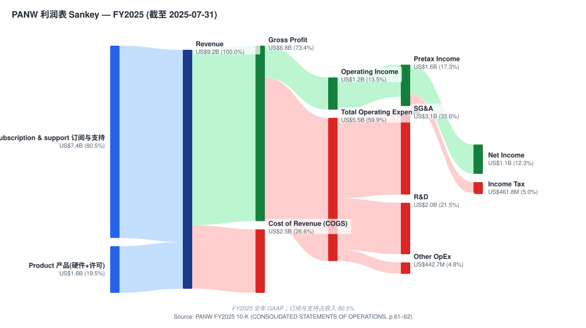
*来源: [PANW FY2025 10-K, CONSOLIDATED STATEMENTS OF OPERATIONS, 第 61–62 页](https://www.sec.gov/Archives/edgar/data/1327567/000132756725000027/panw-20250731.htm)。*

### 1A. 估值快照与目标价 (Valuation snapshot)

**估值快照 (2026-06-12 收盘)。** 股价 **279.62 美元**, 市值约 **2,279 亿美元** (815 百万股), **TTM 市盈率 (P/E) 243 倍**, **前瞻市盈率 (forward P/E) 约 68 倍**, **TTM 市销率 (P/S) 21.5 倍** ([Yahoo Finance — PANW 关键统计指标, 取数 2026-06-12](https://finance.yahoo.com/quote/PANW/key-statistics))。基于上调后的 FY2026 营业收入约 114 亿美元计算, 前瞻 P/S 约 **20 倍**。52 周区间为 **139.57–302.95 美元** (经 2024-12 二比一拆股调整), 过去 12 个月股价上涨约 **+41%**, 且当前价显著高于 200 日均线 (~194 美元), 动量 (momentum) 偏强 ([Yahoo Finance — PANW, 取数 2026-06-12](https://finance.yahoo.com/quote/PANW/))。

**同业比较 (TTM 市销率, Yahoo Finance 2026-06-12):** CrowdStrike (CRWD) 34.1 倍、Cloudflare (NET) 34.8 倍、**PANW 21.5 倍**、Fortinet (FTNT) 15.1 倍、Zscaler (ZS) 6.6 倍、SentinelOne (S) 4.9 倍、Check Point (CHKP) 4.7 倍。在这组纯网络安全可比公司中, PANW 估值高于 FTNT/CHKP/ZS, 但低于尚未充分盈利的 CRWD/NET——这与 PANW "大盘股 + 已盈利 + 高个位数现金回报"的画像一致 ([Yahoo Finance 各代码关键统计指标, 2026-06-12](https://finance.yahoo.com/quote/PANW/key-statistics))。

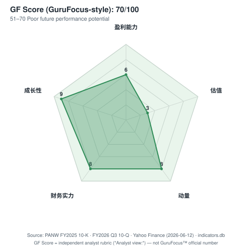
*来源: 本报告自评 (*Analyst view:*)，底层指标见正文 1B 各引用；图内 --source 注脚已烘焙。*

**为何估值倍数偏高——以及如何解读。** TTM 市盈率 243 倍具有强烈误导性, 因为 FY2026 GAAP 盈利受到 CyberArk + Chronosphere 并购的**无形资产摊销**(FY2026 Q3 单季 D&A 已达 5.14 亿美元, 9 个月累计 5.14 亿美元——较去年同期 2.59 亿美元几乎翻倍)、股权激励 (SBC, Stock-Based Compensation, FY2026 9 个月 13.14 亿美元) 以及交易相关费用的严重压制, 季度甚至录得 GAAP 营业亏损 ([PANW FY2026 Q3 10-Q, 现金流量表, 2026-04-30](https://www.sec.gov/Archives/edgar/data/1327567/000132756726000015/panw-20260430.htm))。更有意义的锚点是: **前瞻市盈率约 68 倍 (FY2027E)、基于 FY2026 营业收入的 EV/Sales 约 19 倍, 以及 EV/调整后自由现金流约 50 倍**。这些数字仅当平台化驱动的 NGS ARR 有机增速能持续在 30%+、且 CyberArk 整合不损害利润率时才可辩护; 鉴于估值倍数显著高于 3 年中位数, 而 CyberArk 整合风险尚未消化, 第 9 章将估值/倍数压缩风险单列。

CyberArk 交易已于 FY2026 上半年**交割并表**(此前为待完成状态)。交易对价为**每股 45.00 美元现金 + 2.2005 股 PANW 股票**, 按 PANW 公告前 10 天成交量加权平均价 (10-day VWAP) 计算, CyberArk 估值约为 **250 亿美元**; 并表后 PANW 商誉由 FY2025 年末的 45.67 亿美元跳升至 **219.02 亿美元**, 无形资产由 7.63 亿美元跳升至 **72.83 亿美元**, 总资产由 235.76 亿美元跳升至 **462.66 亿美元** ([PANW FY2026 Q3 10-Q, 资产负债表, 2026-04-30](https://www.sec.gov/Archives/edgar/data/1327567/000132756726000015/panw-20260430.htm))。CyberArk 此前为独立上市公司 (CYBR), 现已退市 ([Yahoo Finance — CYBR 已退市/无报价, 2026-06-12](https://finance.yahoo.com/quote/CYBR/))。

下图以收入结构 donut 展示 FY2025 订阅与支持(80.5%)与产品(19.5%)的占比——这是企业软件订阅引擎的标志:

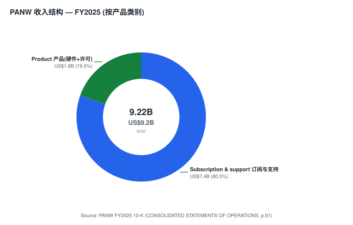
*来源: [PANW FY2025 10-K, CONSOLIDATED STATEMENTS OF OPERATIONS, 第 61 页](https://www.sec.gov/Archives/edgar/data/1327567/000132756725000027/panw-20250731.htm)。*

### 1B. GF Score 基本面评分 (*Analyst view:*)

以下五维基本面评分模仿 [GuruFocus 的 GF Score™](https://www.gurufocus.com/term/gf-score) 框架, 是**本报告自身的评分 rubric, 非 GuruFocus 发布值, 也不附任何备案引用**; 每一维度的底层指标各自带有正文中的引用。

| 维度 | 评分 (0–10) | |
|---|---|---|
| 财务实力 (Financial Strength) | 8 | `████████░░` |
| 盈利能力 (Profitability) | 6 | `██████░░░░` |
| 成长性 (Growth) | 9 | `█████████░` |
| 估值 (GF Value，越高越便宜) | 3 | `███░░░░░░░` |
| 动量 (Momentum) | 8 | `████████░░` |
| **GF Score (composite, *Analyst view:*)** | **70 / 100** | **51–70 Poor future performance potential** |

*Composite weights (*Analyst view:*): Financial Strength 20% · Profitability 25% · Growth 25% · GF Value 15% · Momentum 15% (透明复刻——非 GuruFocus 专有权重)。*

- **财务实力 8/10。** 资产负债表稳健：FY2026 Q3 末现金及投资约 70 亿美元 (现金 23.64 亿 + 短期投资 7.47 亿 + 长期投资 38.81 亿), 对应可转债仅 13.52 亿美元——净现金状态; FY2025 利息费用仅 300 万美元, 几乎无利息负担。扣分项是 CyberArk 并表后递延收入 (deferred revenue) 已达 136.05 亿美元 (= 短期 71.13 亿 + 长期 64.92 亿) 的负债端体量与并购带来的 219 亿美元商誉减值敞口 ([PANW FY2026 Q3 10-Q, 资产负债表, 2026-04-30](https://www.sec.gov/Archives/edgar/data/1327567/000132756726000015/panw-20260430.htm))。
- **盈利能力 6/10。** 现金盈利能力极强 (TTM 调整后 FCF 利润率 38.5%), 但 GAAP 口径被 SBC 与并购摊销压制——FY2026 Q3 GAAP 营业亏损 1.83 亿美元, non-GAAP 营业利润率约 27%。FY2025 ROE 约 17.4% (净利受 FY2024 递延税备抵释放后的基数影响, 与同业不完全可比)。评分反映"现金盈利优秀、会计盈利薄"的二元性 ([PANW FY2026 Q3 业绩公告, 2026-06-02](https://www.sec.gov/Archives/edgar/data/1327567/000132756726000012/panw-20260602.htm))。
- **成长性 9/10。** FY2026 Q3 收入 +31% YoY、NGS ARR +60% YoY、RPO +36% YoY; FY2026 全年收入指引 +24%。即便剔除并购贡献, 有机增速仍维持在 20% 上方——在 90+ 亿美元 ARR 基数上属优异 ([PANW FY2026 Q3 业绩公告, 2026-06-02](https://www.sec.gov/Archives/edgar/data/1327567/000132756726000012/panw-20260602.htm))。
- **估值 3/10 (越低越贵)。** Forward P/E ~68×、P/S 21×、EV/Sales ~19×, 显著高于网络安全同业, 安全边际 (margin of safety) 薄。这是综合分被拖低的主因 ([Yahoo Finance — PANW 关键统计指标, 2026-06-12](https://finance.yahoo.com/quote/PANW/key-statistics))。
- **动量 8/10。** 过去 12 个月 +41%, 显著跑赢同期 S&P 500, 且价位高于 200 日均线 ~44%; Q3 大超预期后动量延续 ([Yahoo Finance — PANW, 2026-06-12](https://finance.yahoo.com/quote/PANW/))。

GF Score 与报告其余部分一致: 高成长 + 强动量被昂贵估值抵消, 综合落在 70 分的"未来表现潜力偏弱"区间——与 Hold/Neutral 评级吻合。

## 2. 估值、前瞻模型与目标价 (Valuation & Price Target)

本章为决策层。**以下所有前瞻数字、目标价与情景目标价均为本报告自身的前瞻判断 (*Analyst view:*), 不附任何监管备案引用**——10-K 不含目标价。

**前瞻财务估计 (FY2026E–FY2028E, *Analyst view:*)。** 模型以 FY2026 公司指引为起点, FY2027–28 在并购全年并表 + 平台化份额提升假设下外推:

| 财年 (截至 7-31) | 收入 (US\$bn) | YoY | non-GAAP 营业利润率 | non-GAAP EPS (US\$) | NGS ARR (US\$bn) |
|---|---|---|---|---|---|
| FY2025 (实际) | 9.22 | +14.9% | ~28% | 3.43 (FY25 实际) | 5.58 |
| FY2026E (公司指引) | 11.42 | +24% | 28.9–29.2% | 3.77–3.79 | 8.90–8.95 |
| FY2027E (*Analyst view:*) | ~13.7 | ~+20% | ~30% | ~4.76 | ~11.5 |
| FY2028E (*Analyst view:*) | ~16.2 | ~+18% | ~31% | ~5.76 | ~14.0 |

FY2026 各项为公司在 [FY2026 Q3 业绩公告 (2026-06-02)](https://www.sec.gov/Archives/edgar/data/1327567/000132756726000012/panw-20260602.htm) 中的正式指引(收入 114.15–114.25 亿美元、non-GAAP EPS 3.77–3.79 美元、non-GAAP 营业利润率 28.9–29.2%、NGS ARR 89.0–89.5 亿美元)。FY2027–28 收入路径锚定于 NGS ARR +59–60% 的当前势能逐步回落至低双位数, 并叠加 CyberArk/Chronosphere 全年并表; 利润率扩张依据管理层 [FY2028 达 40% 调整后 FCF 利润率](https://www.sec.gov/Archives/edgar/data/1327567/000132756726000012/panw-20260602.htm) 的公开承诺; 行业增速假设引用 [Gartner 2025 安全支出预测约 +14%](https://www.gartner.com/en/newsroom/press-releases/2025-03-31-gartner-forecasts-global-information-security-spending-to-grow-15-percent-in-2025)。这些前瞻单元格均为 *Analyst view:*, 非备案数据。

**目标价推导 (showing the arithmetic, *Analyst view:*)。** 采用前瞻市盈率法:

> **基准情形 (Base)：FY2027E non-GAAP EPS ~US\$4.76 × 62× 目标 P/E ≈ US\$295** (较现价 279.62 上行 **+5.5%**)。

为什么用 62× 这个倍数: 当前股价对应 FY2026 指引 EPS 中点 (3.78) 已是 **74× forward P/E**; 随收入与 EPS 复合增长, 即使股价不变倍数也会自然向 FY2027 的 ~62× 收敛。**与同业的倍数依据**: CRWD 的 forward P/E ~109×、NET ~145× 显著更高 (但增速更快、尚未充分盈利), FTNT ~43×、ZS ~28× 更低 (增速较慢)。PANW 60s 区间的倍数处于"已盈利、高增长大盘网络安全龙头"应有的位置——高于成熟的 FTNT, 低于纯成长的 CRWD/NET ([Yahoo Finance 各代码关键统计指标, 2026-06-12](https://finance.yahoo.com/quote/PANW/key-statistics))。

**三情景目标价 (*Analyst view:*):**

| 情景 | 关键摆动假设 | 目标价 | 空间 |
|---|---|---|---|
| **牛市 (Bull)** | NGS ARR 有机增速维持 30%+、CyberArk 整合无缝、FCF 利润率提前达 40%; FY2027E EPS × 72× | **US\$343** | **+22.7%** |
| **基准 (Base)** | 增速逐步回落至低双位数、整合按计划推进; FY2027E EPS × 62× | **US\$295** | **+5.5%** |
| **熊市 (Bear)** | NGS ARR 跌破 25%、CyberArk 整合产生类思科收购 Splunk 后的利润率"塌陷"、防御性成长科技板块轮动撤离; FY2027E EPS × 45× | **US\$214** | **−23.5%** |

风险回报大致对称偏下——上行 +22.7% 对下行 −23.5%, 基准仅 +5.5%, 这正是给予 Hold/Neutral 的量化依据。

### 卖方观点演变 (Sell-side view evolution，*Analyst view:*)

本报告引用了本地 `db/zsxq.db` 中 **≥2 份覆盖 PANW 的券商研报**, 故按规范列出按机构的观点时间线与机构间分歧。先做机械预读: `db/stock_price_target.db` (只读) 中 PANW 共 3 条 PT 记录——J.P. Morgan (Overweight)、Bernstein (Outperform, 目标价 209 美元)、HSBC (Reduce), PT 离散度大、评级横跨 Buy 到 Sell。

**按机构的观点时间线 (institute timeline):**

| 机构 | 报告日 | 评级 / 目标价 | 当日 PANW 收盘 | 核心论点 |
|---|---|---|---|---|
| Bernstein | 2026-05-14 | Outperform / **US\$209** | US\$238.21 | Fortinet OT 安全超预期是行业信号, PANW 与 FTNT 并列 Gartner OT 安全第一、欧洲占比更低, 本季防火墙有望同样走强 |
| J.P. Morgan | 2026-05-22 | **Overweight** / PT n/a | US\$260.58 | AI 顺风("A Good Start with AI Tailwinds Ahead"), 软件板块春季系列看好 |
| HSBC | 2025-12-16 | **Reduce** / PT n/a | US\$187.09 | AI 波动不改软件长期叙事, 但对 PANW 具体给出减持评级 |

**机构间分歧 (cross-institute disagreement，机构间无统一共识)：**

| 机构 | 日期 | 评级 / PT | 核心论点 | 什么证据能证明其正确 |
|---|---|---|---|---|
| J.P. Morgan / Bernstein | 2026-05 | Overweight / Outperform | 平台化 + OT/AI 安全需求加速, 头部平台厂商持续跑赢 | NGS ARR 连续季度 >50% YoY (Q3 已验证 +60%) |
| HSBC | 2025-12 | Reduce | 估值过高、AI 对软件存在颠覆风险 | NGS ARR 增速跌破 25% 或 CyberArk 整合减值 |

**关键提示**: Bernstein 的 209 美元目标价是 **2026-05-14 (Q3 业绩公告前) 设定的, 当日 PANW 已交易在 238.21 美元——即该 PT 隐含约 −12% 下行**(与 PT 数据库的 `upside_pct` −12.3% 一致), 属于 Q3 大超预期前、且低于当时市价的陈旧观点。Q3 (2026-06-02) 后股价进一步升至 279.62 美元, 该 PT 已被市场显著抛在身后, 引用时务必标注其时点 ([Bernstein — U.S. SMID-Cap Software Cybersecurity: Is FTNT upside surprise a signal for other vendors?, 2026-05-14, p.1](http://xs-macbook-air.local:5001/zsxq/pdf/812452155822282/Bernstein-U.S.%20SMID~Cap%20Software%20Cybersecurity%EF%BC%9A%20Is%20FTNT%20upside%20surprise%20a%20signal%20for%20other%20vendors%EF%BC%9F-260514.pdf))。

*Analyst view:* 摩根士丹利在 [Cybersecurity 101 (2026-03-20)](http://xs-macbook-air.local:5001/zsxq/pdf/212222158822421/Morgan%20Stanley-Software%EF%BC%9ASlide%20Presentation%EF%BC%9A%20Cybersecurity%20101-260320.pdf) 中指出, 全球安全支出正以两位数增长, 预计**到 2029 年突破 4,000 亿美元, 但仍占整体 IT 支出不到 7%**, 增长空间巨大; 并将 PANW 与 CrowdStrike、Microsoft 并列为"AI 用于安全"领域的领导者, 平台化与市场整合是核心趋势。瑞银在 [Cyber Takeaways from the AI Survey (2026-05-11)](http://xs-macbook-air.local:5001/zsxq/pdf/415245828882858/UBS-AI%20Research%EF%BC%9ACyber%20Takeaways%20from%20the%20AI%20Survey-260511.pdf) 的企业 AI 调研显示, **PANW 在 AI 安全态势管理 (AI-SPM) 的使用率超 40%**(与微软、CrowdStrike 并列主导), Cortex AgentiX 在 AI SOC 领先, 且 CyberArk(现归 PANW)在新兴的"智能体身份安全"赛道排名前三——这些都是 PANW 估值溢价背后的产品势能佐证, 但均为分析师调研口径, 非备案数据。

### 公司历史

Palo Alto Networks 于 **2005 年 3 月在特拉华州注册成立**, 2005 年 4 月在圣克拉拉的一间小型办公室启动运营。创始理论——防火墙 (firewall, 全球最普及的安全产品) 已僵化为按端口与协议过滤的工具, 应当重生为感知应用、感知用户的"下一代防火墙 (next-generation firewall, NGFW)"——出自 CTO 与创始人 **Nir Zuk** 之手, 他是 Check Point 公司的资深员工, 业界普遍认为他于 1990 年代在 Check Point 期间参与发明了状态化检测 (stateful inspection) ([PANW FY2025 10-K, 第 4 页](https://www.sec.gov/Archives/edgar/data/1327567/000132756725000027/panw-20250731.htm))。第一款产品 PAN-OS/PA-4000 系列于 2007 年发货, 迅速在高端企业 NGFW 市场抢占份额。PANW 于 2012 年 7 月在纽约证券交易所 IPO, 后转板至纳斯达克, 并在随后的十年中系统化地从本地部署 (on-prem) 防火墙扩展至虚拟防火墙 (VM-Series)、URL 过滤、威胁防护服务、终端 (Cortex XDR, 即 2014 年通过 Cyvera 收购重新品牌后的 Traps)、SASE (Prisma Access, 前身为 GlobalProtect Cloud)、云工作负载保护 (Prisma Cloud, 基于 RedLock/Twistlock/Bridgecrew 收购构建), 以及安全运营 (Cortex XSOAR/XSIAM, 基于 Demisto 与 PureSec 栈构建)。

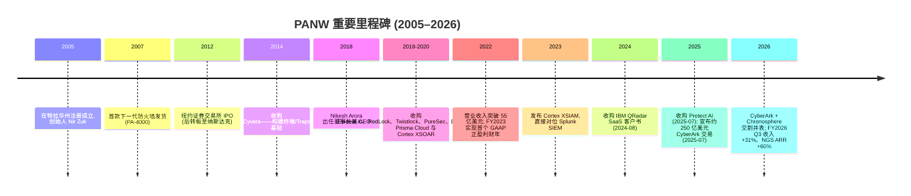
*来源: 里程碑综合自 [PANW FY2025 10-K Items 1 & 5](https://www.sec.gov/Archives/edgar/data/1327567/000132756725000027/panw-20250731.htm) 与 [SEC EDGAR PANW 备案历史](https://www.sec.gov/cgi-bin/browse-edgar?action=getcompany&CIK=0001327567&type=10-K&dateb=&owner=include&count=40)。*

**三大战略转折值得关注。** 第一, **Nikesh Arora 时代始于 2018 年 6 月**, 时任 Google 前首席商务官/SoftBank 前总裁的他被任命为董事长兼 CEO。Arora 的使命非常明确: 将 PANW 从一家防火墙公司转变为全球最具领先地位的网络安全公司。在其任内的头三年, 他完成了约二十几起 tuck-in 收购, 用以拼装 Prisma Cloud 与 Cortex 平台 ([PANW FY2025 10-K, 第 5 页](https://www.sec.gov/Archives/edgar/data/1327567/000132756725000027/panw-20250731.htm))。第二, **2022–2024 年的"整合者整合 (consolidate consolidators)"战略**——PANW 开始将多个 SKU 打包进单一合同 (提供免费期优惠的"平台化交易"), 以替换每个客户原本使用的 8–12 个厂商。第三, **FY2026 的身份/可观测性扩张**——2025 年 7 月宣布、FY2026 上半年交割的 CyberArk 交易将 PANW 推入身份安全与 PAM (特权访问管理, Privileged Access Management) 领域 (此前 PANW 将这一邻接领域留给了 CyberArk、Okta 与 SailPoint); Chronosphere 收购加入了云原生可观测性 (observability) 能力, 使得 SOC 平台不仅能吸收并关联安全遥测数据, 还能吸收并关联运营遥测数据 ([PANW FY2026 Q3 业绩公告, 2026-06-02](https://www.sec.gov/Archives/edgar/data/1327567/000132756726000012/panw-20260602.htm))。

**重要收购, 年份 + 理由 (选取):** 2014 年 Cyvera (终端/Traps 基础→Cortex XDR); 2018 年 Evident.io (云态势); 2018 年 RedLock (云安全分析→Prisma Cloud 核心); 2019 年 Demisto (SOAR→Cortex XSOAR); 2019 年 Twistlock 与 PureSec (容器与无服务器安全); 2020 年 CloudGenix (SASE 的 SD-WAN); 2020 年 Expanse (攻击面管理→Cortex Xpanse); 2021 年 Bridgecrew (DevSecOps/IaC 扫描); 2022 年 Cider Security (CI/CD 安全); 2023 年 Talon Cyber Security (企业浏览器→Prisma Access Browser) 与 Dig Security (DSPM); 2024 年 8 月 **部分 IBM QRadar SaaS 资产** (Cortex XSIAM 的迁移加速器); 2025 年 7 月 **Protect AI** (AI 模型安全→Prisma AIRS); 2025–26 年 **CyberArk** (约 250 亿美元, FY2026 上半年交割——身份与 PAM); FY2026 **Chronosphere** (可观测性) ([PANW FY2025 10-K, 附注 7–8, 第 71–76 页](https://www.sec.gov/Archives/edgar/data/1327567/000132756725000027/panw-20250731.htm); [PANW FY2026 Q3 10-Q, 并购附注, 2026-04-30](https://www.sec.gov/Archives/edgar/data/1327567/000132756726000015/panw-20260430.htm))。

**近期动态 (近 12 个月)。** 除上述交易交割外, 公司发布了 **Prisma Access Browser**, 扩展了 **OT 安全 (operational technology, 工业控制安全)**, 推出 **Cortex Cloud** (重新架构的统一云安全平台, 合并了 Prisma Cloud + Cortex XSIAM 云遥测), 上线 **Prisma AIRS** (AI 运行时安全), 并推送了 **Cortex XSIAM 3.0** (含代理化/agentic SOC 工作流) ([PANW FY2025 10-K, 第 7 页](https://www.sec.gov/Archives/edgar/data/1327567/000132756725000027/panw-20250731.htm))。FY2026 Q3 业绩公告将公司定位由"the global cybersecurity leader"更新为"**the global AI cybersecurity leader**", 攻击面表述扩展为"Network, Cloud, Security Operations, AI and Identity"五维 ([PANW FY2026 Q3 业绩公告, "About", 2026-06-02](https://www.sec.gov/Archives/edgar/data/1327567/000132756726000012/panw-20260602.htm))。

## 3. 管理团队

> 本章按 company-research 规范仅覆盖**创始人 (Nir Zuk) 与现任 CEO (Nikesh Arora)**。其他高管(CFO、总裁、CPTO 等)与董事会成员不在本章范围。

### Nir Zuk —— 创始人兼 CTO (founder)

Nir Zuk 是 PANW 的创始人与首席技术官 (CTO), 也是公司技术叙事的源头。创业前, 他是 **Check Point Software** 的早期工程师, 业界广泛认为他在 1990 年代参与了**状态化检测 (stateful inspection)** 防火墙技术的开发——这是第一代企业防火墙的技术基石。此后他在 OneSecure (后被 NetScreen 收购) 与 Juniper Networks 担任 CTO 级技术职务。2005 年, 他基于"传统按端口/协议过滤的防火墙已经过时, 应重生为感知应用与用户的下一代防火墙 (NGFW)"这一创始论点创立 Palo Alto Networks, 并亲自主导了第一代 PAN-OS 与 App-ID 流量识别引擎的架构设计 ([PANW FY2025 10-K, 公司业务概述, 第 4 页](https://www.sec.gov/Archives/edgar/data/1327567/000132756725000027/panw-20250731.htm))。

作为创始人, Zuk 在 PANW 二十年间始终是产品方向与威胁研究 (Unit 42) 的精神领袖, 是投资者在公司旗舰 **Ignite** 大会上听到的最资深技术声音。他对 PANW 从单点防火墙公司演化为覆盖网络、云、SOC、身份的"平台化"巨头的产品战略具有决定性影响; 其持续在任(不同于多数被职业经理人 CEO 取代后即淡出的创始人)是 PANW 产品连续性的重要锚。创始人/CTO 接班风险是本报告在第 9 章关注的治理项之一——一旦 Zuk 减少参与, PANW 将更依赖 Arora 主导的并购式扩张而非有机产品创新。

### Nikesh Arora —— 董事长兼 CEO (自 2018 年 6 月起)

Arora 是公司历史上的第二任 CEO, 同时也是现代 PANW 故事中迄今最举足轻重的人物。根据 2025 年 DEF 14A 委托书披露, 他于 2018 年 6 月入职 PANW, 此前的职位经历包括: **天使投资 (2016–2018)、SoftBank 集团总裁兼 COO (2015-07 至 2016-06), 以及 SoftBank Internet & Media 副董事长兼 CEO (2014-07 至 2015-06)**。在 SoftBank 之前, 他在 Google 任职近十年, 离开时担任 **2011 年 1 月至 2014 年 6 月的高级副总裁兼首席商务官 (SVP and Chief Business Officer)**, 负责全球前台运营, 业界广泛认为他将 Google 广告业务的年营业收入从约 100 亿美元扩大到约 600 亿美元。早期他曾在 T-Mobile/Deutsche Telekom 与 Fidelity Investments 任职。他持有东北大学工商管理硕士、波士顿学院金融硕士以及巴拉那西印度教大学 (Banaras Hindu University) 电子工程学士学位 ([2025 年 DEF 14A 委托书, 董事候选人简历, 第 50–51 页](https://www.sec.gov/Archives/edgar/data/1327567/000130817925000624/panw-20251107.htm))。

他在 PANW 实际取得的成就即便从绝对值上看也令人瞩目。在 Arora 任职的七年内, **营业收入从 22.7 亿美元 (FY2018) 跃升至 92.2 亿美元 (FY2025)——增长约 4 倍**, FY2026 全年收入指引已达 114 亿美元; PANW 实现首个全年 GAAP 盈利财年 (FY2023); NGS ARR 从零起步, 增长至 **FY2026 Q3 末的 81 亿美元、FY2026 指引 89 亿美元以上**; 市值从他入职时的约 200 亿美元增长至如今约 2,280 亿美元 ([PANW FY2026 Q3 业绩公告, 2026-06-02](https://www.sec.gov/Archives/edgar/data/1327567/000132756726000012/panw-20260602.htm))。他的薪酬相应地巨大且具有争议性: 2023 年 6 月授予的一次性 PSU (绩效股票单元, performance share unit) 留任奖励, 正是近期股东沟通披露中的焦点 ([2025 年 DEF 14A 委托书, 薪酬讨论与分析 CD&A, 第 65–90 页](https://www.sec.gov/Archives/edgar/data/1327567/000130817925000624/panw-20251107.htm))。他在安全行业 CEO 中颇为特殊——**他本人并非安全技术专家**; 技术层面的领军作用由创始人 Zuk 与公司在以色列的工程团队承担, 而 Arora 主导销售、并购与资本配置。公开形象广泛——常在 CNBC、《华尔街日报》《彭博》业绩季出镜, 也常在公司旗舰 **Ignite** 大会做主题演讲。其当前持股比例在 DEF 14A 受益所有权表中披露约为流通股本的 0.7% ([2025 年 DEF 14A 委托书, 受益所有权表, 第 110 页](https://www.sec.gov/Archives/edgar/data/1327567/000130817925000624/panw-20251107.htm))。

**业绩综合判断 (针对 CEO)。** 按总股东回报 (TSR) 衡量, Arora 位列过去十年表现最佳的科技 CEO 之一; 但有两个保留: (i) 目前回报曲线在大得多的基数下被压缩, 下阶段对并购执行的依赖将超过 2018–2024 年间的平台扩张打法——而约 250 亿美元的 CyberArk 整合是 PANW 与 Arora 均未做过的量级; (ii) **CEO 决策集中度高**, 应给予一定关键人物折价 (key-person discount, 见第 9 章风险 4)。

## 4. 产品与服务

PANW 的产品组合按三大旗舰"平台"以及随并购扩大的邻接产品集进行编排。这些平台名称在几乎每一份客户演示与业绩电话会议中出现: **Strata** 用于网络安全、**Prisma** 用于云安全与 SASE、**Cortex** 用于安全运营; FY2026 起新增 **身份 (CyberArk)** 与 **可观测性 (Chronosphere)** 两大并表平台。下文是 PANW 官网、FY2025 10-K 以及近期业绩公告支持的最完整列表。

```mermaid
graph TD
    PANW[Palo Alto Networks] --> Strata[Strata —— 网络安全]
    PANW --> Prisma[Prisma —— 云安全 & SASE]
    PANW --> Cortex[Cortex —— 安全运营]
    PANW --> Identity[身份安全 —— CyberArk 已并表]
    PANW --> Other[邻接平台]
    Strata --> NGFW[ML 驱动 NGFW (PA-Series 硬件)]
    Strata --> VMSeries[VM-Series 虚拟防火墙]
    Strata --> ContainerFW[CN-Series 容器防火墙]
    Strata --> CloudNGFW[云 NGFW for AWS / Azure]
    Strata --> SDWAN[Prisma SD-WAN (前 CloudGenix)]
    Strata --> PANOS[PAN-OS 订阅: 威胁防护、WildFire、URL 过滤、DNS 安全、IoT 安全、企业 DLP]
    Strata --> StrataCopilot[Strata Copilot —— 网络安全 AI 助手]
    Prisma --> PrismaAccess[Prisma Access —— 云交付 SASE / ZTNA / SWG]
    Prisma --> PrismaAccessBrowser[Prisma Access Browser —— 企业安全浏览器 (前 Talon)]
    Prisma --> PrismaCloud[Prisma Cloud —— CNAPP (CSPM / CWPP / CIEM / DSPM / IaC)]
    Prisma --> CortexCloud[Cortex Cloud —— 统一云安全 + SOC 遥测]
    Prisma --> PrismaAIRS[Prisma AIRS —— AI 模型与运行时安全 (前 Protect AI)]
    Cortex --> XDR[Cortex XDR —— 扩展检测与响应]
    Cortex --> XSIAM[Cortex XSIAM —— AI 驱动 SIEM/SOC 平台]
    Cortex --> XSOAR[Cortex XSOAR —— 安全编排与自动化 (前 Demisto)]
    Cortex --> Xpanse[Cortex Xpanse —— 外部攻击面管理 (前 Expanse)]
    Cortex --> AgentiX[Cortex AgentiX —— 代理化 AI SOC]
    Cortex --> Unit42[Unit 42 —— 事件响应与威胁情报 / MDR]
    Identity --> PAM[PAM 特权访问管理]
    Identity --> Secrets[密钥管理 Secrets Management]
    Identity --> Workforce[员工身份 Workforce Identity]
    Other --> OTSec[OT 安全 —— 工业/OT 环境]
    Other --> Observability[可观测性 —— Chronosphere 已并表]
```
*来源: 产品分类综合自 [paloaltonetworks.com/products](https://www.paloaltonetworks.com/products) 导航走查 + [PANW FY2025 10-K "我们的平台", 第 4–8 页](https://www.sec.gov/Archives/edgar/data/1327567/000132756725000027/panw-20250731.htm) + [PANW FY2026 Q3 业绩公告 "About"(五维攻击面表述), 2026-06-02](https://www.sec.gov/Archives/edgar/data/1327567/000132756726000012/panw-20260602.htm)。*

下面这张"钱怎么流"的供应链 money-flow 图(需求/收入视角)直观展示: 7 万+ 企业为消除碎片化工具向 PANW 三大平台付费, 而 PANW 的成本与资本再落到超大规模云、硬件代工与并购技术 IP 上——是理解 PANW 商业模式与成本/资本去向的最佳一图:

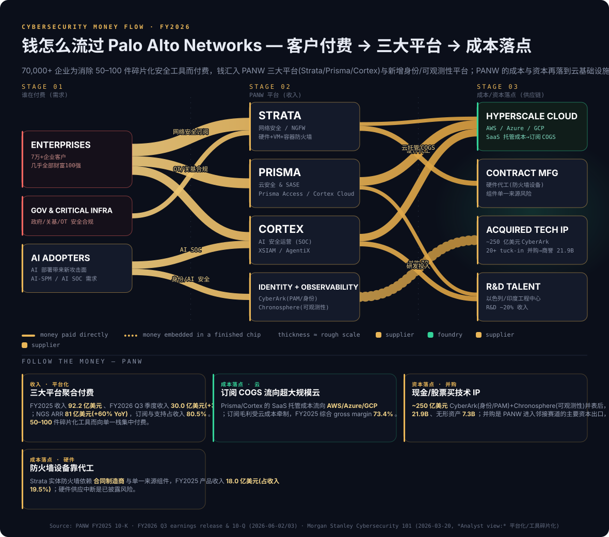
*来源: [PANW FY2025 10-K](https://www.sec.gov/Archives/edgar/data/1327567/000132756725000027/panw-20250731.htm) · [PANW FY2026 Q3 业绩公告 & 10-Q (2026-06-02/03)](https://www.sec.gov/Archives/edgar/data/1327567/000132756726000012/panw-20260602.htm) · *Analyst view:* 平台化/工具碎片化框架引自 [Morgan Stanley Cybersecurity 101, 2026-03-20](http://xs-macbook-air.local:5001/zsxq/pdf/212222158822421/Morgan%20Stanley-Software%EF%BC%9ASlide%20Presentation%EF%BC%9A%20Cybersecurity%20101-260320.pdf)。**关注 chokepoint**: PANW 最大的资本出口是并购技术 IP——~250 亿美元 CyberArk + Chronosphere 并表后商誉已达 219 亿美元。*

**Strata —— 网络安全。**

> **中文释义 / Plain-language gloss:** Strata 是 PANW 的历史核心——一台**下一代防火墙 (next-generation firewall, NGFW)**, 物理上(或虚拟上)坐在企业网络的进出口, 检查每一个数据包并按"应用 + 用户 + 内容"而非仅按端口/协议来放行或阻断流量。

它包括 **PA-Series 硬件 NGFW** (从分支办公型 PA-400 至数据中心型 PA-7500 的全系列)、用于虚拟机环境的 **VM-Series**、用于 Kubernetes 的 **CN-Series**、作为 AWS/Azure 托管服务的 **Cloud NGFW**, 以及大量 **PAN-OS 订阅**目录 (威胁防护、WildFire、URL 过滤、DNS 安全、Advanced WildFire、企业 DLP、IoT 安全、SaaS 安全等)。产品营业收入 (主要为 Strata 硬件 + 本地许可) 在 FY2025 达到 **18.019 亿美元 (同比 +12.4%)**——值得注意的是, 增长不是由销量驱动, 而是由**自 FY2025 Q2 起本地软件许可的价格 + 配额调升**驱动 ([PANW FY2025 10-K, MD&A, 第 53 页](https://www.sec.gov/Archives/edgar/data/1327567/000132756725000027/panw-20250731.htm))。*Analyst view:* PANW 在网络防火墙领域具备强护城河——Gartner 已连续多年将 PANW 评为网络防火墙魔力象限"领导者", 最接近的竞品是 **Fortinet 的 FortiGate** (成本领先, 但在云交付功能上落后) 与 **Cisco Secure Firewall** (装机量先发, 但云交付订阅落后); Bernstein 指出 PANW 与 Fortinet **并列 Gartner OT 安全第一**且欧洲占比更低 ([Bernstein — Cybersecurity, 2026-05-14, p.1](http://xs-macbook-air.local:5001/zsxq/pdf/812452155822282/Bernstein-U.S.%20SMID~Cap%20Software%20Cybersecurity%EF%BC%9A%20Is%20FTNT%20upside%20surprise%20a%20signal%20for%20other%20vendors%EF%BC%9F-260514.pdf))。

**Prisma Access (SASE)。**

> **中文释义 / Plain-language gloss:** **SASE (Secure Access Service Edge, 安全访问服务边缘)** 把过去装在公司机房的安全设备搬到云端、放在离用户最近的接入点 (PoP), 让在家、在外的员工无论从哪里上网都先经过同一套云端安全检查。

Prisma Access 将 ZTNA (零信任网络访问)、SWG (安全 Web 网关)、CASB (云访问安全代理) 与 DLP (数据丢失防护) 结合, 配以全球 PoP 网络, 目标客户是从中心辐射 MPLS 架构迁移到直接云连接的企业。根据不同评级口径, 它是第一或第二大企业级 SASE 平台。*Analyst view:* 最接近的竞品是 **Zscaler ZIA/ZPA** (SASE 原生纯对手, 云原生架构领先但缺本地防火墙延续性) 与 **Netskope**。近期扩展 **Prisma Access Browser** (重新品牌后的 Talon 企业浏览器) 抢占了 Island、Surf Security 与 Microsoft Edge for Business 进入的竞争利基 ([PANW FY2025 10-K, 第 7 页](https://www.sec.gov/Archives/edgar/data/1327567/000132756725000027/panw-20250731.htm))。

**Prisma Cloud (CNAPP)。** Prisma Cloud 是云原生应用保护平台 (CNAPP, Cloud-Native Application Protection Platform)——将 CSPM (云安全态势管理)、CWPP (工作负载保护, 含容器与主机)、CIEM (云身份权限管理)、DSPM (数据安全态势管理) 以及 IaC (基础设施即代码) 扫描整合到一起。*Analyst view:* Gartner 将 PANW 与 **Wiz** (已被 Google 收购) 以及 **CrowdStrike Falcon Cloud Security** 并列为 CNAPP 领导者; 业内一致认为 Wiz 是 CNAPP 中最具产品动能的威胁。FY2026 推出的 **Cortex Cloud** (融合 Prisma Cloud CNAPP 遥测与 Cortex XSIAM SOC 分析) 是 PANW 的战略性回应 ([PANW FY2025 10-K, 第 7 页](https://www.sec.gov/Archives/edgar/data/1327567/000132756725000027/panw-20250731.htm))。

**Cortex XSIAM (AI 驱动 SOC)。** XSIAM 是旗舰产品中最年轻的 (2022 年 10 月发布), 但战略意义最重大。它定位为**下一代 SIEM/SOC 平台**, 设计用来替换 **Splunk Enterprise Security** 与 **Microsoft Sentinel**, 通过将全部安全遥测数据吸收到 AI 原生数据湖中并自动化分诊。**2024 年 8 月收购 IBM QRadar SaaS 客户群**为 XSIAM 增加了数千个待迁移 SIEM 账户。*Analyst view:* 瑞银的企业 AI 调研显示 **PANW Cortex AgentiX 在 AI SOC 领先**, 与微软 Security Copilot、CrowdStrike Charlotte AI 同列头部, 但企业自建 (DIY) 方案正快速崛起、分流需求 ([UBS — Cyber Takeaways from the AI Survey, 2026-05-11, p.1](http://xs-macbook-air.local:5001/zsxq/pdf/415245828882858/UBS-AI%20Research%EF%BC%9ACyber%20Takeaways%20from%20the%20AI%20Survey-260511.pdf))。护城河类型: 数据湖架构 + 基于 Unit 42 与客户遥测合并训练的 AI 模型; **3.0 发行版** (FY2026) 加入了代理化 (agentic) 工作流。

**Cortex XDR、XSOAR、Xpanse、AgentiX。** XDR (终端检测/响应) 与 **CrowdStrike Falcon Insight** 以及 **SentinelOne Singularity** 竞争——*Analyst view:* 后两者是纯 EDR 市场的份额领导者, PANW 的 XDR 在独立 EDR 排名中落后, 但在与 Cortex 栈整体打包时更具竞争力。XSOAR (安全编排, 前 Demisto) 仍是 SOAR 类别的主导产品。Xpanse 是外部攻击面管理 (ASM) 的主导产品, 该类别基本由 PANW 通过 2020 年 Expanse 收购创造。**Cortex AgentiX** 是 FY2026 推出的代理化 AI SOC 能力, 是 PANW 在"AI 用于安全"叙事中的最新武器。

**身份安全 (CyberArk —— 已并表)。** 随 CyberArk 于 FY2026 上半年交割并表, PANW 已正式进入 **PAM (特权访问管理)、密钥管理 (Secrets Management)、员工身份 (Workforce Identity) 以及 CIEM** 领域。*Analyst view:* CyberArk 是 PAM 的明确领导者; 瑞银的 AI 调研更指出, 在新兴的"智能体身份安全 (agentic identity security)"赛道, 微软、Okta、CyberArk(现归 PANW)排名前三——这填补了 PANW 产品组合中最大的一块空白, 形成真正的多平台栈 ([UBS — Cyber Takeaways from the AI Survey, 2026-05-11, p.1](http://xs-macbook-air.local:5001/zsxq/pdf/415245828882858/UBS-AI%20Research%EF%BC%9ACyber%20Takeaways%20from%20the%20AI%20Survey-260511.pdf))。CyberArk 在 FY2026 Q3 与 Chronosphere 合计贡献 **3.88 亿美元季度收入与 16 亿美元 NGS ARR** ([PANW FY2026 Q3 业绩公告, 2026-06-02](https://www.sec.gov/Archives/edgar/data/1327567/000132756726000012/panw-20260602.htm))。

**可观测性 (Chronosphere —— 已并表)。** Chronosphere 是云原生可观测性平台 (Prometheus/OpenTelemetry 原生), 为 SOC 提供运营遥测视角。从战略意义看, 它使 PANW 能够主张"安全数据与运营数据本属同一数据湖"——这正是 Datadog 与 Splunk 从相反方向构建的论点。

**Unit 42。** 一支综合的**事件响应、威胁情报与托管检测响应 (MDR)** 服务团队, 是企业销售的差异化竞争点——当客户遭遇违规并致电 Unit 42, 业务通常转化为多年期平台合约。

**旗舰与长尾。** *Analyst view:* 三大旗舰显然是 **NGFW + PAN-OS 订阅、Prisma Access (SASE) 与 Cortex XSIAM**。PANW 不披露每个平台的营业收入, 但管理层评论暗示 Strata 仍是最大平台 (约占总额一半), Prisma 约 25–30%, Cortex 约 15–20% 且增长最快; 身份 (CyberArk) 为 FY2026 起的新增量。

**产品如何相互啮合 (synthesis)。** PANW 的产品逻辑是一个**遥测闭环**: Strata 防火墙在网络边界、Prisma 在云与终端、Cortex 在 SOC——三层各自采集安全遥测, 全部汇入 Cortex XSIAM/Cortex Cloud 的 AI 原生数据湖; 数据湖训练出的检测模型再回流到 Strata Copilot、Prisma AIRS 等执行点, 形成"采集→关联→检测→执行"的飞轮。CyberArk 的身份/PAM 遥测与 Chronosphere 的运营遥测是这个数据湖的最新两路输入。平台化战略的本质正是说服客户把这些原本分散在 8–12 家厂商的遥测全部交给 PANW 一家——遥测越全, AI 检测越准, 切换成本越高, 这就是 PANW 真正的护城河来源。

**最近 12 个月的产品发布/淘汰。** 发布: **Cortex Cloud**、**Prisma AIRS** (AI 运行时安全, 基于 Protect AI)、**Cortex XSIAM 3.0 / AgentiX**、**Strata Copilot**、**Prisma Access Browser** 全面发售 (GA)、**扩展的 OT 安全**能力, 以及随并购加入的 **CyberArk 身份套件**与 **Chronosphere 可观测性**。重定位: PANW 将 Prisma Cloud 与 Cortex XSIAM 遥测合并入"Cortex Cloud", 预示长期融合。

**延伸观看 / Further viewing:**

- [What is a Next-Generation Firewall (NGFW)? — Palo Alto Networks 官方讲解，帮助直观理解 Strata 的核心机制](https://www.youtube.com/watch?v=mz4c8AvVe8k)
- [What is SASE? — 直观演示云交付安全访问边缘如何取代传统机房安全设备](https://www.youtube.com/watch?v=fyP_C8Ba9Og)

## 5. 客户与上市策略

终端客户涵盖**企业、服务提供商与政府实体**, 几乎覆盖所有垂直行业。FY2026 Q3 业绩公告称公司**受 70,000+ 客户信任**, 由 Unit 42 威胁情报支撑 ([PANW FY2026 Q3 业绩公告, "About", 2026-06-02](https://www.sec.gov/Archives/edgar/data/1327567/000132756726000012/panw-20260602.htm))。FY2025 10-K 进一步称客户分布在 180 多个国家/地区, 包括几乎所有财富 100 强企业以及全球 2000 强 (Global 2000) 中的多数 ([PANW FY2025 10-K, MD&A, 第 36 页](https://www.sec.gov/Archives/edgar/data/1327567/000132756725000027/panw-20250731.htm))。

**客户集中度——终端客户层面。** 根据 FY2025 10-K, "**FY2025、FY2024 与 FY2023, 单一终端客户均未占公司总营业收入 10% 以上**" ([PANW FY2025 10-K, 第 9 页](https://www.sec.gov/Archives/edgar/data/1327567/000132756725000027/panw-20250731.htm))。因此终端客户集中度**不构成**重大风险。已披露的集中度位于**分销渠道**层面: FY2025, **三家分销商分别占合并总营业收入 ≥10%, 合计占 44.2%**; 同三家分销商占财年末应收账款总额的 **44.8%** ([PANW FY2025 10-K, "风险因素"——渠道集中度, 第 19 页](https://www.sec.gov/Archives/edgar/data/1327567/000132756725000027/panw-20250731.htm))。市场普遍理解 (并由往年披露确认) 这三家分销商包括 **Ingram Micro、Exclusive Networks 与 Westcon-Comstor**。注意该 44.2% 的分母是**合并总营业收入 (consolidated revenue)**, 是渠道层面而非终端客户层面的集中度。

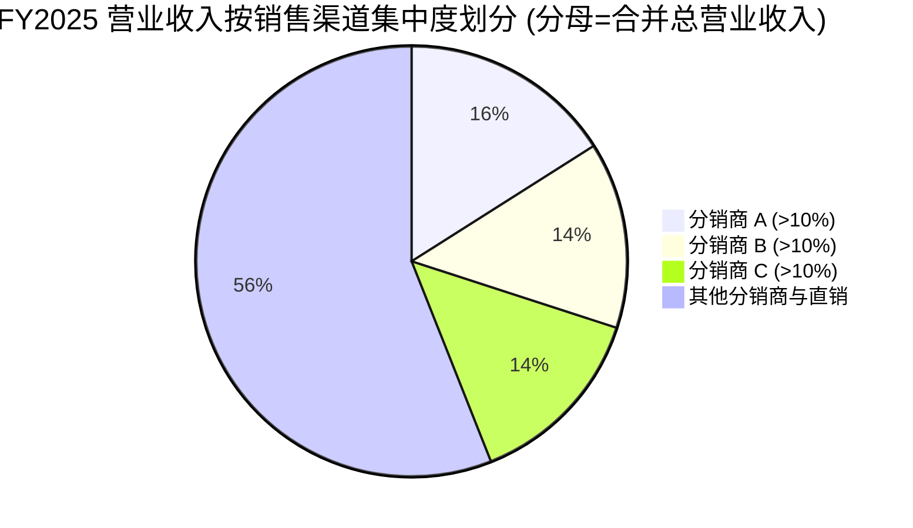
*来源: PANW FY2025 10-K 披露"三家分销商分别 ≥10%, 合计 44.2%"——上图三家拆分仅为示意; PANW 不披露单个分销商名称或单家比例。分母为合并总营业收入。[PANW FY2025 10-K, 第 19 页](https://www.sec.gov/Archives/edgar/data/1327567/000132756725000027/panw-20250731.htm)。*

表面看集中度令人警惕, 但分销商是信用风险与订单流的中介, 并非创造需求的决策者——需求仍来自数千名终端客户的 CISO (首席信息安全官)。但渠道集中度**确实**带来应收账款/信用风险以及单点运营失败风险; **前 3 大渠道 ≥44%(占合并收入)→ 已纳入第 9 章作为重大风险** ([PANW FY2025 10-K, 第 19 页](https://www.sec.gov/Archives/edgar/data/1327567/000132756725000027/panw-20250731.htm))。

**渠道结构与销售方式。** PANW 采用**两层间接渠道模式**: 销售给分销商, 分销商再卖给经销商, 经销商最终卖给终端客户。分销商协议初始期限为 1 年, 1 年续约, 付款期 30 天; PANW 此前曾在不影响运营的情况下更换分销商。直接现场销售团队覆盖最大型企业与政府客户, 在企业安全行业属于标准做法。大型平台化交易销售周期可达 **6–12+ 个月**, 通常需要概念验证 (POC)、竞争性比试 (competitive bake-off) 以及 CFO 级别 (而非仅 CISO 级别) 的执行发起人签字, 因为这些交易会整合多家现有厂商合同 ([PANW FY2025 10-K, "我们的客户与上市策略", 第 8–9 页](https://www.sec.gov/Archives/edgar/data/1327567/000132756725000027/panw-20250731.htm))。

**平台化经济模型。** FY2026 的工作单位仍是**"平台化交易"**——一笔多产品、多年期承诺, 一次性替换该客户的 5–15 个现有安全厂商。这些交易通常带有头 6–12 个月的免费期或零美元过渡激励以便客户迁移——PANW 为此付出的代价是, 在任意季度只要免费期交易占比偏高, 账单 (billings) 与产品营业收入便会出现波动 (第 9 章将此列为风险); 回报是在免费期结束后后续季度的 NGS ARR + RPO 不成比例的上升。FY2026 Q3 的 **RPO 同比 +36% 至 184 亿美元**正是这一机制的兑现 ([PANW FY2026 Q3 业绩公告, 2026-06-02](https://www.sec.gov/Archives/edgar/data/1327567/000132756726000012/panw-20260602.htm))。*Analyst view:* 摩根士丹利指出企业平均部署超过 50 种安全工具、疲于应对, 平台化与"Flex"灵活合同正是 PANW 与 CrowdStrike 整合市场的核心抓手, 但用户切换/迁移成本高昂 ([Morgan Stanley — Cybersecurity 101, 2026-03-20](http://xs-macbook-air.local:5001/zsxq/pdf/212222158822421/Morgan%20Stanley-Software%EF%BC%9ASlide%20Presentation%EF%BC%9A%20Cybersecurity%20101-260320.pdf))。

**合作伙伴与生态系统。** 重要战略伙伴包括**三家主要云提供商** (AWS、Azure、Google Cloud——用于 VM-Series、Cloud NGFW、Prisma Cloud)、**NVIDIA** (围绕 Prisma AIRS 的 AI 安全协作)、**埃森哲 (Accenture)**、**德勤 (Deloitte)**、**普华永道 (PwC)** 与 **毕马威 (KPMG)** (用于大型企业转型交易), 以及全球 MSSP/MDR 合作伙伴生态 ([PANW FY2025 10-K, "我们的合作伙伴", 第 8 页](https://www.sec.gov/Archives/edgar/data/1327567/000132756725000027/panw-20250731.htm))。

**地域结构 (按合并总营业收入)。** FY2025 按地区划分的营业收入: **美洲 (Americas) 62.05 亿美元 (占 67.3%)、EMEA 19.17 亿美元 (占 20.8%)、亚太及日本 (APAC) 10.99 亿美元 (占 11.9%)**, 其中美国本土 57.86 亿美元 ([PANW FY2025 10-K, 地理营业收入附注, 第 74 页](https://www.sec.gov/Archives/edgar/data/1327567/000132756725000027/panw-20250731.htm))。FY2026 Q3 的 9 个月数据延续这一结构 (美洲 53.71 亿、EMEA 17.14 亿、APAC 9.85 亿美元) ([PANW FY2026 Q3 10-Q, 地理营业收入, 2026-04-30](https://www.sec.gov/Archives/edgar/data/1327567/000132756726000015/panw-20260430.htm))。美洲地域集中度较高但属合理, 因为美国占全球企业网络安全支出约一半。

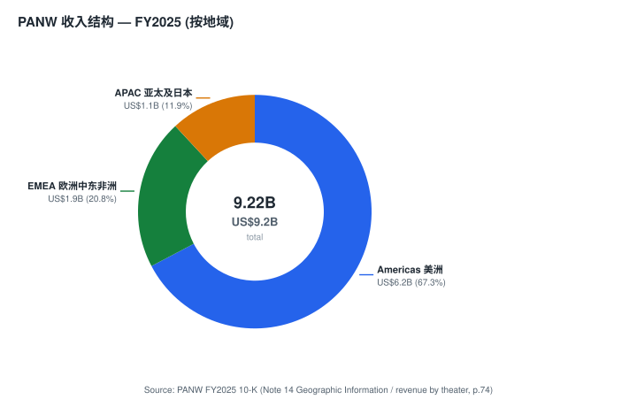
*来源: [PANW FY2025 10-K, 地理营业收入附注, 第 74 页](https://www.sec.gov/Archives/edgar/data/1327567/000132756725000027/panw-20250731.htm)。*

## 6. 行业概览

网络安全是一个**2025 年全球约 2,200 亿美元的市场**, 至 2028 年保持 12–14% 年增长, 来自 Gartner 2025 安全与风险管理 (Security & Risk Management) 预测 ([Gartner 新闻稿, "Gartner Forecasts Global Information Security Spending to Grow 15% in 2025", 2025-03-31](https://www.gartner.com/en/newsroom/press-releases/2025-03-31-gartner-forecasts-global-information-security-spending-to-grow-15-percent-in-2025))。这是企业 IT 支出中规模最大、最具韧性的类别之一, 增速约为更广泛企业软件市场的**两倍**, 因为网络风险在结构上不断上升 (云用量增加、远程办公增加、AI 生成攻击增加), 以及金融服务、医疗、关键基础设施的监管对最低支出形成下限。*Analyst view:* 摩根士丹利更乐观, 预计**全球安全支出到 2029 年突破 4,000 亿美元, 但仍占整体 IT 支出不到 7%**, 增长空间巨大, 且最新 CIO 调查显示网络安全软件是 2026 年预算增幅最大、"最不可能被削减"的 IT 项目 ([Morgan Stanley — Cybersecurity 101, 2026-03-20](http://xs-macbook-air.local:5001/zsxq/pdf/212222158822421/Morgan%20Stanley-Software%EF%BC%9ASlide%20Presentation%EF%BC%9A%20Cybersecurity%20101-260320.pdf))。

**子板块以及 PANW 的重合度 (子板块规模/份额为 *Analyst view:*):**

| 子板块 | 2025 年规模 | 增速 | PANW 份额/定位 |
|---|---|---|---|
| 网络安全 (防火墙、IPS、SD-WAN、SASE) | 约 300 亿美元 | 约 12% | NGFW 第 1; SASE 第 1/第 2; 份额约 25%+ |
| 云安全 (CNAPP、CSPM、CWPP、DSPM) | 约 100 亿美元 | 约 25% | 领导者 (与 Wiz、CRWD 并列) |
| 终端/XDR | 约 150 亿美元 | 约 12% | 第 3 (在 CRWD、MSFT 之后) |
| SOC/SIEM/SOAR (含 XSIAM、XSOAR、Xpanse) | 约 100 亿美元 | 约 10–15% | 快速崛起的第 3 (对比 Splunk、MSFT) |
| 身份与访问管理 (Identity & Access Management) | 约 200 亿美元 | 约 14% | 经 CyberArk 进入并领导 PAM |
| 其他 (DLP、邮件、MDR、可观测性、服务) | 约 300 亿美元 | 约 10% | 选择性重合 |

*来源: 子板块规模综合自 [Gartner 2025 年 IT 安全支出预测](https://www.gartner.com/en/newsroom/press-releases/2025-03-31-gartner-forecasts-global-information-security-spending-to-grow-15-percent-in-2025); PANW 份额与定位为 *Analyst view:*, 参考 [Morgan Stanley Cybersecurity 101, 2026-03-20](http://xs-macbook-air.local:5001/zsxq/pdf/212222158822421/Morgan%20Stanley-Software%EF%BC%9ASlide%20Presentation%EF%BC%9A%20Cybersecurity%20101-260320.pdf)。*

**结构性驱动因素。** (i) **AI 生成的攻击。** 生成式 AI 制造的钓鱼、深度伪造 (deepfake) 社工攻击、对 ML 模型的对抗性 AI 攻击驱动了 AI 原生检测需求加速——直接支撑 XSIAM、Prisma AIRS 与 Strata Copilot; 同时 AI 的采用本身带来提示词注入 (prompt injection)、数据投毒、非人身份 (NHI) 安全等新攻击面, 数据安全与身份安全成为 AI 投资前的关键领域 ([Morgan Stanley — Cybersecurity 101, 2026-03-20](http://xs-macbook-air.local:5001/zsxq/pdf/212222158822421/Morgan%20Stanley-Software%EF%BC%9ASlide%20Presentation%EF%BC%9A%20Cybersecurity%20101-260320.pdf))。 (ii) **厂商整合。** 大型企业通常使用 50–100 个独立安全工具; SOC 疲劳叠加紧缩的安全团队预算, 推动客户向整合平台靠拢。 (iii) **云迁移与 AI 基础设施建设。** 每个新增云工作负载都是新攻击面, 支撑 Prisma Cloud 与 Cortex Cloud。 (iv) **监管趋严**——NIS2 (欧盟)、SEC 网络安全披露规则 (美国)、DORA (欧盟金融服务)——共同抬高各行业的最低安全支出。

**行业结构。** 网络安全行业在长尾上呈异常**碎片化**——超过 3,000 家活跃厂商——但头部高度集中: PANW、Microsoft、CrowdStrike、Cisco (Splunk) 与 Fortinet 合计占据企业支出增长中不成比例的份额 ([Momentum Cyber 行业报告](https://momentumcyber.com/insights/))。买方议价能力中等偏强: 财富 500 强账户的 CISO 具备议价能力, 并定期举办竞争性比试; PANW 对分销商议价能力高, 但对公有云平台 (AWS/Azure/GCP) 受限, 后者既是合作伙伴也可能成为竞争者。替代品威胁主要在平台打包层级——Microsoft 的"E5 免费"SOC 与身份产品对所有独立厂商构成结构性压顶。

**监管环境。** PANW 在 10-K 中指出, 公司受 GDPR/UK GDPR (最高罚款 2,000 万欧元或全球营业额 4%)、CCPA/CPRA、美国加密出口管制, 以及在欧盟 (AI 法案) 与美国州级 AI 法律层面不断演化的监管约束 ([PANW FY2025 10-K, "隐私与数据保护"风险因素, 第 24–25 页](https://www.sec.gov/Archives/edgar/data/1327567/000132756725000027/panw-20250731.htm))。监管对需求是顺风, 对合规成本是逆风。

## 7. 竞争格局

10-K 的竞争章节将 PANW 的主要竞争对手列为多类厂商。*Analyst view:* 以下分类与份额评论为分析师判断, 非 10-K 逐字内容。

**直接竞争对手 (全栈平台厂商)。**

- **Fortinet (FTNT)** —— 网络安全方面最贴近的同业; NGFW 成本领先, 采用垂直整合 ASIC 战略; 云安全与 SOC 较弱。市销率约 15 倍。*Analyst view:* Fortinet FY2026 Q1 营收超预期 6.9%(疫情以来最强), 由 OT 安全硬件防火墙需求爆发驱动——Bernstein 认为这是 OT 安全大主题启动信号, PANW 作为并列 Gartner OT 安全第一有望同样受益 ([Bernstein — Cybersecurity, 2026-05-14](http://xs-macbook-air.local:5001/zsxq/pdf/812452155822282/Bernstein-U.S.%20SMID~Cap%20Software%20Cybersecurity%EF%BC%9A%20Is%20FTNT%20upside%20surprise%20a%20signal%20for%20other%20vendors%EF%BC%9F-260514.pdf))。
- **CrowdStrike (CRWD)** —— 终端/XDR 领导者, 经 Falcon Cloud Security 切入云安全; 正构建 NG-SIEM (Falcon LogScale)。已明确采用与 PANW 类似的"平台"叙事。市销率约 34 倍。威胁: SOC 的技术与品牌实力, 但终端之外覆盖较窄。
- **Cisco / Splunk (CSCO)** —— 网络在位者与 (通过 Splunk) SIEM 在位者; 装机量深厚; 平台故事广泛但缺乏一致性。威胁: 硬件装机基础惯性 + Splunk SIEM 续约黏性。
- **Microsoft (MSFT)** —— 对所有独立网络安全厂商的结构性压顶。将 Defender for Endpoint、Defender for Cloud、Sentinel SIEM、Entra ID、Purview DLP 打包进 Microsoft 365 E5/E5 Security。威胁: 在中端市场极高; 在严格监管的大企业较低 (在那里仍偏好最佳同类)。

**直接竞争对手 (专业平台厂商)。**

- **Zscaler (ZS)** —— SASE 原生纯玩家; 在云架构 SWG/ZTNA 方面领先, 但无 NGFW、无 SOC。市销率约 6.6 倍。威胁: 在仅 SASE 招标场景中直接替代 Prisma Access。
- **Cloudflare (NET)** —— 新兴 SASE/SSE 玩家; 增长迅速; 通过 Workers + Zero Trust 将工作负载吸引至其全球边缘。市销率约 35 倍。
- **Check Point (CHKP)** —— 历史 NGFW 竞争者; 增长放缓; 营业收入年增长率个位数中段。市销率约 4.7 倍。
- **SentinelOne (S)** —— 纯 EDR 玩家; 增长 20–30%; 正构建 XDR。市销率约 4.9 倍。
- **Wiz** —— 私营 CNAPP 领导者; 已被 Google 收购。威胁: 云安全极高; 完成与 GCP 关联收购后, 风险或因仅与 GCP 绑定的担忧而缓解。
- **Okta / SailPoint** —— 身份赛道竞争者, 随 CyberArk 并表, PANW 现与其在身份/PAM 领域正面竞争。


*来源: 定位基于作者定性判断, 依据各厂商 10-K/20-F 备案与 Gartner 网络防火墙、SASE、CNAPP 魔力象限 [gartner.com](https://www.gartner.com/en/research/methodologies/magic-quadrants-research)。*

**定位框架。** *Analyst view:* PANW 在**范围 (平台数量) × 深度 (每个平台同类最佳质量) × 盈利能力**三个维度上同时竞争。它是少数同时具备以下条件的厂商: (a) 在 NGFW、SASE、CNAPP、SOAR 的 Gartner 魔力象限中均为领导者; (b) 借 XSIAM 可信地撼动 SIEM 在位者 (Splunk); 以及 (c) 产生约 38% 调整后 FCF 利润率。Microsoft 范围更广但优化打包经济而非同类最佳深度; CrowdStrike 在 EDR 深度领先但范围窄; Fortinet 更便宜但范围窄。

**竞争优势。** (1) **规模 + 研发预算**——FY2025 研发支出约 19.8 亿美元, 为纯网络安全行业最大, 支撑 AI 模型在最大的合并安全遥测数据集上训练 ([PANW FY2025 10-K, 第 62 页](https://www.sec.gov/Archives/edgar/data/1327567/000132756725000027/panw-20250731.htm))。 (2) **渠道触达**——全球 100,000+ 活跃渠道伙伴。 (3) **跨平台附加**——平均平台化交易触及多个 SKU、跨两个或以上平台。 (4) **可盈利平台**——与同等阶段的 CRWD/NET/ZS 不同, PANW 已产生有意义的现金盈利 (TTM 调整后 FCF ~38.5%), 减轻估值风险 ([PANW FY2026 Q3 业绩公告, 2026-06-02](https://www.sec.gov/Archives/edgar/data/1327567/000132756726000012/panw-20260602.htm))。 (5) **创始人模式 + Arora 的并购历史业绩**。

**竞争弱点。** (1) **中端市场与续约的 Microsoft 打包压力**。 (2) **相对 CRWD/S 的 EDR 产品差距**。 (3) **来自 Wiz/Google 的 CNAPP 威胁**。 (4) **平台化驱动的账单/现金流波动**。 (5) **渠道伙伴集中度** (44% 来自三家分销商)。 (6) **CyberArk 整合风险**——网络安全行业史上最大交易, 整合执行尚未验证。

## 8. 市场机会 (TAM)

**总 TAM。** *Analyst view:* PANW 管理层在投资者材料中将其可服务市场描述为 2028 年超过 2,000 亿美元, 分解为网络安全、云安全、安全运营、身份安全 (经 CyberArk 大幅扩展) 四个池 ([PANW 投资者关系——活动与演示](https://investors.paloaltonetworks.com/financial-information/events-and-presentations))。对接第三方数据, Gartner 预测**全球信息安全支出在 2025 年约 2,200 亿美元, 至 2028 年增长至约 3,000 亿美元, CAGR 约 13%** ([Gartner 2025 年 IT 安全支出预测, 2025-03-31](https://www.gartner.com/en/newsroom/press-releases/2025-03-31-gartner-forecasts-global-information-security-spending-to-grow-15-percent-in-2025))。在此基础上, PANW 角逐的 2028 年 TAM 约为 2,800–3,000 亿美元, 当前 PANW 占其约 **4%** (FY2026 约 114 亿美元营业收入相对于约 2,500 亿美元 TAM)。

下图以历史堆叠柱状展示 FY2021–FY2025 收入由产品向订阅与支持迁移的轨迹——这是 ARR 化转型的可视化证据:

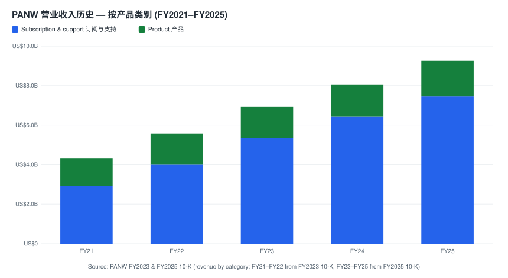
*来源: [PANW FY2023 & FY2025 10-K, 按产品类别营业收入](https://www.sec.gov/Archives/edgar/data/1327567/000132756725000027/panw-20250731.htm)。*

**SAM 与 SOM (*Analyst view:*)。** 自下而上的 SAM (可服务的可触达市场) 最适合按平台计算:

- **网络安全 SAM** 约 300 亿美元 (2025 年, 含 NGFW + SASE + SD-WAN); PANW 份额约 25–30%; 2028 年约 450 亿美元 (CAGR 约 12%)。
- **云安全 SAM** 2025 年约 100 亿美元, 2028 年约 200 亿美元 (CAGR 约 25%)。
- **安全运营 SAM** 2025 年约 200 亿美元 (SIEM + SOAR + XDR + ASM + IR 服务), 2028 年约 300 亿美元。
- **身份安全 SAM** 2025 年约 200 亿美元 (PAM + 员工身份 + CIEM + 密钥管理), 2028 年约 350 亿美元 (CyberArk 完成后 PANW 可触达池)。
- **邻接领域** (OT 安全、经 Chronosphere 的可观测性) 至 2028 年约 150 亿美元。

**2028 年 SAM 合计**约 1,400–1,600 亿美元。

**SOM (可获取市场)。** 以 FY2026 NGS ARR 指引中点 **89.25 亿美元**为锚, 管理层路线图暗示 NGS ARR 向 2030 财年的 150 亿美元目标推进, 调整后 FCF 利润率到 FY2028 达 40%+。在吸收 CyberArk 与 Chronosphere 后, 隐含的有机 NGS ARR 增速与低双位数市场增长假设加平台化驱动的份额提升相一致 ([PANW FY2026 Q3 业绩公告, 2026-06-02](https://www.sec.gov/Archives/edgar/data/1327567/000132756726000012/panw-20260602.htm))。

**渗透策略。** 三大支柱: (i) **在全球 2000 强内的"陆地与扩张" (Land-and-expand)**; (ii) **通过平台化交易替换散点工具厂商**; (iii) **联邦/公共部门扩张**——Cisco 收购 Splunk 后的定价调整触发 SOC 现代化潮, 助力 Cortex XSIAM 扩张。约束在于销售产能 (FY2025 末总员工 16,068 人, 销售与营销是最大职能区域) ([PANW FY2025 10-K, 第 31 页](https://www.sec.gov/Archives/edgar/data/1327567/000132756725000027/panw-20250731.htm))。

## 9. 风险评估

### 公司特定风险

**1. CyberArk 整合风险 (高, 约 12–24 个月)。** PANW 已以约 250 亿美元 (大部分为股票, 含每股 45 美元现金部分) 收购并并表 CyberArk——为网络安全行业史上最大并购, 并表后商誉跳升至 219 亿美元、无形资产 73 亿美元, 季度转入 GAAP 营业亏损 ([PANW FY2026 Q3 10-Q, 资产负债表, 2026-04-30](https://www.sec.gov/Archives/edgar/data/1327567/000132756726000015/panw-20260430.htm))。PAM 在文化与架构上属于独立业务; CyberArk 销售团队面向身份安全买方, 而非网络安全或 SOC 买方。整合失误可能损害 CyberArk 有机增长与 PANW 利润率, 并触发商誉减值。缓解因素: PANW 强大的并购历史 (Arora 任期内整合 24+ 笔交易) 与 CFO "同一运营纪律打法"的承诺; CFO 在 Q3 称"执行进度领先于 M&A 整合计划" ([PANW FY2026 Q3 业绩公告, CFO 引述, 2026-06-02](https://www.sec.gov/Archives/edgar/data/1327567/000132756726000012/panw-20260602.htm))。

**2. 平台化驱动的账单与现金流波动 (中-高, 近期)。** 与平台化交易相关的免费期过渡优惠与多年期递延结构, 实质性扭曲了季度账单与现金回收节奏。PANW 已明确将投资者注意力转向 NGS ARR + RPO 作为"真实"指标, 但市场仍关注账单——当差距扩大时股价反应明显。缓解因素: 明确重申 37.5% 调整后 FCF 利润率指引以及 NGS ARR +60% 的上行轨迹 ([PANW FY2026 Q3 业绩公告, 2026-06-02](https://www.sec.gov/Archives/edgar/data/1327567/000132756726000012/panw-20260602.htm))。

下图以现金流 Sankey 展示 FY2026 前九个月的现金去向——经营现金流 32.0 亿美元、FCF 约 28.6 亿美元, 而投资活动主要被 CyberArk 现金对价拉动:

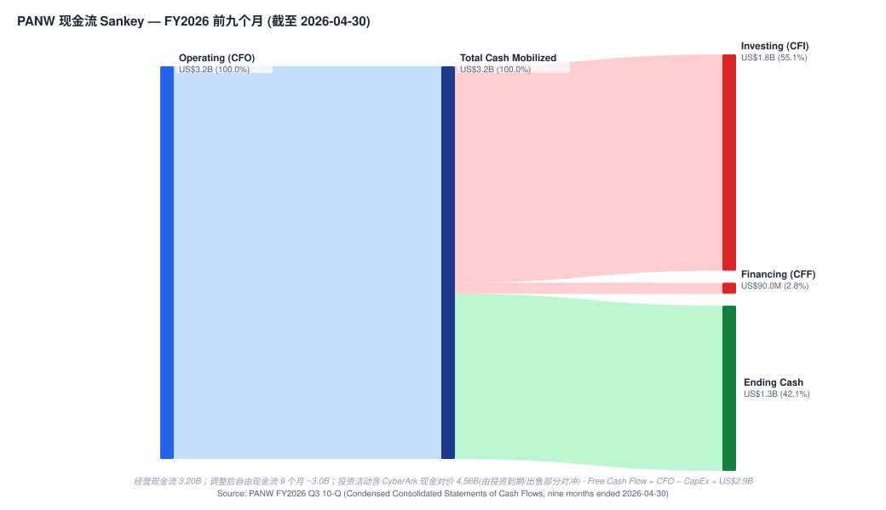
*来源: [PANW FY2026 Q3 10-Q, 现金流量表, 截至 2026-04-30](https://www.sec.gov/Archives/edgar/data/1327567/000132756726000015/panw-20260430.htm)。*

**3. 渠道集中度 (中-重大)。** 三家分销商合计占 FY2025 合并营业收入 **44.2%, 总应收账款 44.8%** ([PANW FY2025 10-K, 第 19 页](https://www.sec.gov/Archives/edgar/data/1327567/000132756725000027/panw-20250731.htm))。虽然终端客户需求面广泛, 但其中任一分销商出现运营中断将临时打乱订单流。缓解因素: 分销商在订单处理层面可替代; PANW 此前曾在不影响营业收入的情况下更换分销商。

**4. 对 Arora/Zuk 的关键人物依赖。** Arora 时代的 TSR 超额表现是看多论点重要组成; 创始人/CTO Zuk 是产品连续性的锚。任一突然离任将压缩估值倍数。缓解因素: 2023 年 6 月的多年期留任 PSU 奖励提供延续性, 但都不是对等替代品。

**5. EDR 产品技术落后风险。** Cortex XDR 在 EDR 产品赛中通常被视为落后于 CrowdStrike 与 SentinelOne 的第三 ([UBS — Cyber Takeaways from the AI Survey, 2026-05-11](http://xs-macbook-air.local:5001/zsxq/pdf/415245828882858/UBS-AI%20Research%EF%BC%9ACyber%20Takeaways%20from%20the%20AI%20Survey-260511.pdf))。如差距扩大, 客户可能在 PANW 网络/SOC 产品之外附挂非 PANW EDR, 破坏平台化叙事。缓解因素: XSIAM 能吸收任何 EDR 遥测; SOC 层级锁定逻辑仍成立。

**6. 来自 Wiz/Google 的 CNAPP 竞争强度。** Wiz (已被 Google 收购) 是增长最快的 CNAPP 产品; 若 Google 将 Wiz 打包入 GCP 市场或积极投资, PANW 的 Prisma Cloud/Cortex Cloud 可能失去份额。缓解因素: Prisma Cloud 的多云中立性以及 PANW 经 CyberArk 扩展的身份安全。

### 行业/市场风险

**7. Microsoft 打包压力。** Microsoft 的 E5 打包 (Defender + Sentinel + Entra + Purview) 在任一 Microsoft 客户企业中为安全栈设定边际成本下限——对所有最佳同类纯玩家最大的结构性威胁。缓解因素: 高端企业 CISO 仍会购买最佳同类; Microsoft 在网络、身份-PAM、跨云多云的覆盖空白留有空间。

**8. AI 驱动的替代风险。** 生成式 AI 正同时改写攻防双方。若有新进者构建出绕过在位架构的真正 AI 原生安全平台 (类似 XSIAM 对 Splunk 的尝试), PANW 可能被取代; UBS 调研已显示企业自建 (DIY) AI SOC 方案快速崛起、分流头部厂商需求 ([UBS — Cyber Takeaways from the AI Survey, 2026-05-11](http://xs-macbook-air.local:5001/zsxq/pdf/415245828882858/UBS-AI%20Research%EF%BC%9ACyber%20Takeaways%20from%20the%20AI%20Survey-260511.pdf))。缓解因素: PANW 自身激进的 AI 路线图以及 Unit 42 与客户遥测的数据规模优势。

**9. 网络安全支出减速风险。** 严重经济下行可能压缩 IT 与安全预算, 虽然网络安全是最具防御性的支出条目之一。缓解因素: 约 80% 的订阅占比平滑营业收入; ARR 披露提供预警 ([PANW FY2025 10-K, MD&A, 第 44 页](https://www.sec.gov/Archives/edgar/data/1327567/000132756725000027/panw-20250731.htm))。

**10. 监管/隐私合规成本。** GDPR 风格罚款 (最高至全球营业收入 4%) 以及不断扩展的美国州级隐私法律提高合规成本与诉讼风险 ([PANW FY2025 10-K, "隐私与数据保护"风险因素, 第 24–26 页](https://www.sec.gov/Archives/edgar/data/1327567/000132756725000027/panw-20250731.htm))。缓解因素: 合规组织随营业收入扩张。

### 财务风险

**11. 估值/倍数压缩风险 (核心看空理由)。** TTM 市盈率 **243 倍**与 TTM 市销率 **21.5 倍**显著高于网络安全同业, 并位于 PANW 自身 3 年区间上半部分。基于上调后 FY2026 指引, 前瞻市盈率约 68 倍与 EV/Sales 约 19 倍, 仅在以下情况下可辩护: (a) NGS ARR 有机增速维持 30s 区间; (b) CyberArk 整合干净; (c) 调整后 FCF 利润率在 FY2028 达 40% 目标。任何一条偏差都可能在盈利不变的情况下触发 25–40% 的估值重定价——触发再评估的事件包括某季度 NGS ARR 同比增速跌破 25%、CyberArk 整合减值、防御性增长科技板块持续轮动撤离, 或意义重大的指引下调 ([Yahoo Finance — PANW 关键统计指标, 2026-06-12](https://finance.yahoo.com/quote/PANW/key-statistics))。

下图以杜邦分析 (DuPont) 分解 FY2025 ROE, 显示 PANW 的回报由净利率与适度的资产周转共同驱动, 杠杆较低 (净现金):

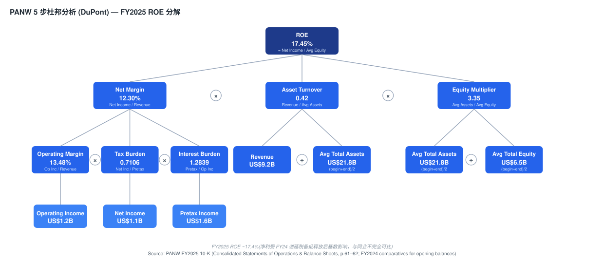
*来源: [PANW FY2025 10-K, 合并利润表与资产负债表, 第 61–62 页 (FY2024 比较数用于期初余额)](https://www.sec.gov/Archives/edgar/data/1327567/000132756725000027/panw-20250731.htm)。*

**12. 股权激励稀释。** FY2026 前九个月 SBC 支出约 **13.14 亿美元**——即便按企业软件标准也偏高。虽然管理层在委托书中承诺"降低 SBC 占营业收入比例" ([2025 年 DEF 14A 委托书, 第 75 页](https://www.sec.gov/Archives/edgar/data/1327567/000130817925000624/panw-20251107.htm)), 但绝对水平对每股经济效益的影响仍重大; CyberArk 交易的股票部分进一步增加 SBC 与摊薄 ([PANW FY2026 Q3 10-Q, 现金流量表, 2026-04-30](https://www.sec.gov/Archives/edgar/data/1327567/000132756726000015/panw-20260430.htm))。

下图以资产负债表 Sankey 展示 CyberArk 并表后的资产负债结构——商誉 + 无形资产合计 292 亿美元已成为资产端最大块:

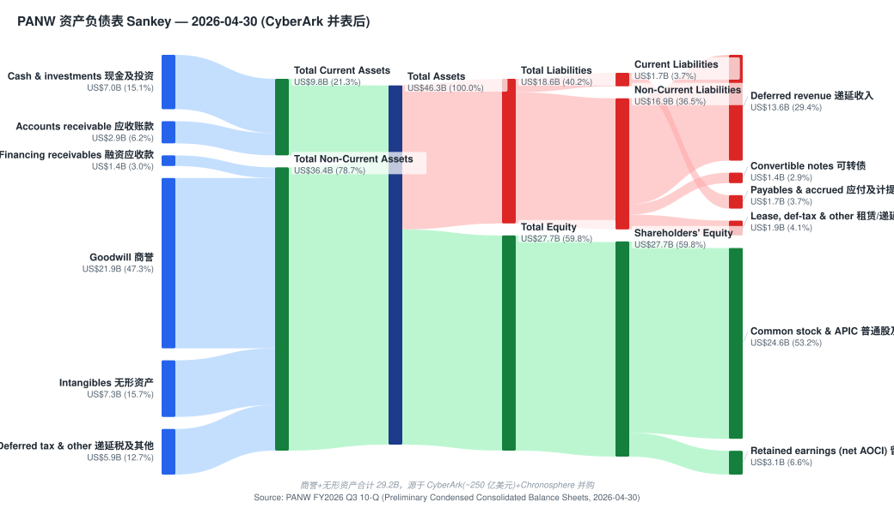
*来源: [PANW FY2026 Q3 10-Q, 资产负债表, 2026-04-30](https://www.sec.gov/Archives/edgar/data/1327567/000132756726000015/panw-20260430.htm)。*

### 宏观经济风险

**13. 利率/估值敏感性。** 作为长久期、增长性估值倍数股票, PANW 对长端美债收益率敏感 (当前 10 年期约 4.54%, 来源 indicators.db 本地快照)。10 年期变动 100 bp 通常对应处于 PANW 估值画像的股票发生 10–15% 的估值倍数变动 ([Yahoo Finance — PANW, 2026-06-12](https://finance.yahoo.com/quote/PANW/))。

**14. 地缘政治与网络战争暴露。** PANW 对以色列 (大型研发布局)、台湾及更广泛亚太地区的政府与关键基础设施客户有实质销售; 任一区域局势升级可能扰乱客户群或工程组织, 10-K 专门将以色列运营列为风险因素 ([PANW FY2026 Q3 10-Q, 风险因素, 2026-04-30](https://www.sec.gov/Archives/edgar/data/1327567/000132756726000015/panw-20260430.htm))。缓解因素: 网络攻击升级在整体上对网络安全需求是正向的。

### 9.5 核心分歧与催化剂 (Key debates & catalysts，*Analyst view:*)

**核心分歧 (bear case 及反驳):**

1. **"估值太贵, 增长无法持续支撑 68× forward P/E"(HSBC 减持论)。** 反驳: NGS ARR Q3 仍 +60% YoY, 即便剔除并购有机增速亦 >20%; 但本报告部分认同此分歧——这正是给予 Hold 而非 Buy 的原因 ([HSBC — US Technology, 2025-12-16](http://xs-macbook-air.local:5001/zsxq/pdf/812841282558282/HSBC-US%20Technology%EF%BC%9AQ3%20results%20summary%EF%BC%9A%20AI%20volatility%20doesn%E2%80%99t%20change%20the%20software%20story-251216.pdf))。
2. **"CyberArk 会像思科收购 Splunk 一样拖累利润率"。** 反驳: PANW 有 24+ 笔成功 tuck-in 整合历史, CFO 称整合"领先计划"; 但 250 亿美元是全新量级, 尚需 2–4 个季度验证 ([PANW FY2026 Q3 业绩公告, 2026-06-02](https://www.sec.gov/Archives/edgar/data/1327567/000132756726000012/panw-20260602.htm))。
3. **"AI 会颠覆软件/安全, DIY 方案分流需求"。** 反驳: PANW 自身是"AI 用于安全"的领导者 (Cortex AgentiX、Strata Copilot), 数据规模是 AI 检测的护城河; 但 UBS 调研确认 DIY AI SOC 采纳率上升, 是真实的中期威胁 ([UBS — Cyber Takeaways from the AI Survey, 2026-05-11](http://xs-macbook-air.local:5001/zsxq/pdf/415245828882858/UBS-AI%20Research%EF%BC%9ACyber%20Takeaways%20from%20the%20AI%20Survey-260511.pdf))。

**未来 12 个月催化剂 (dated):**

- **2026-08（约）：FY2026 Q4 + 全年业绩** —— 验证 NGS ARR 89.0–89.5 亿美元指引、FY2028 40% FCF 利润率路径; 管理层将首次给出 FY2027 指引(含 CyberArk 全年并表)。
- **FY2027 上半年：CyberArk 整合里程碑** —— 交叉销售数据、利润率轨迹、是否出现商誉减值信号。
- **持续：季度 NGS ARR / RPO 增速** —— 跌破 25% 是熊市情景的触发点。

> 进一步跟踪请结合 catalyst-calendar 技能维护事件日历。

## 10. 投资者视角评分 (Investor lenses)

> 以下为四个核心视角对同一事实集的结构化第二意见, 标注 *视角观点:*——是 rubric, 非背书, 不引入新引用。周期快照来源: indicators.db 本地快照 (FRED / yfinance), as of 2026-06-05: VIX 21.5, 10Y 4.54%, HY OAS 2.74%, IG OAS 0.74%。

### 10.1 巴菲特视角 (Buffett — 质量 + 合理价格, 0–100)

*视角观点:* **62/100 — 高质量企业, 但价格不够安全。**

| 维度 | 评分 | 依据 |
|---|---|---|
| 业务质量 / 护城河 | 高 | 平台化锁定 + 遥测数据飞轮 + 38% FCF 利润率 |
| 盈利可预测性 | 中-高 | 80% 订阅收入; 但 GAAP 盈利被 SBC/摊销压制 |
| 资产负债表 | 高 | 净现金, 利息费用近零 |
| 价格 (安全边际) | 低 | forward P/E ~68×, P/S 21×——无安全边际 |

证据链: 强护城河与现金创造力满足"优秀企业"标准, 但"合理价格"标准被严重违反——巴菲特很少为这种倍数买单。失败模式: 若增长意外减速, 缺乏安全边际会放大下行。

### 10.2 芒格视角 (Munger — 质量加权 + 反向思考, 0–10)

*视角观点:* **6.5/10 — 卓越企业, 但"反过来想"看到的是估值与整合双重脆弱点。**

反向思考 (inversion): 什么会让 PANW 永久受损? (a) CyberArk 250 亿美元整合失败导致大额商誉减值; (b) AI 原生新进者颠覆 SOC 架构; (c) Microsoft E5 在中端市场持续蚕食。前两者概率不低, 是给质量打折的原因。

### 10.3 达摩达兰视角 (Damodaran — 故事 + 数字 DCF, ±%)

*视角观点:* **约 −5% 至 +5% 安全边际 — 大致公允定价。**

必需假设 (required assumptions): 风险无风险利率 Rf = 4.54% (indicators.db 10Y, as of 2026-06-05); 假设 ERP 4.5%; FY2026–30 收入 CAGR ~18% 收敛至终值增速 ≤4%; 目标 non-GAAP 营业利润率向 32% 扩张。在这组假设下内在价值落在现价 ±5% 区间, 与基准目标价 295 美元一致。失败模式: 若 FCF 利润率不达 40% 目标, 内在价值下移 15%+。

### 10.4 霍华德·马克斯周期视角 (Howard Marks — 市场风险temperature, 0–100)

*视角观点:* **55/100 — 中性偏进攻, 但需警惕高估值板块的轮动风险。**

周期定位: VIX 21.5 (温和)、HY OAS 274 bp (偏紧, 非危机)、10Y 4.54% (中性)——信用与波动率未发出危机信号, 但利差偏紧意味着风险补偿不高。对 PANW 这类长久期高倍数股, 当前是"可持有但不宜加杠杆"的中性偏进攻区间; 一旦防御性成长科技板块发生轮动撤离, 高 P/S 名字首当其冲。该周期判断支持本报告 Hold 的整体姿态——不追高, 也不恐慌性减持。

---

## 参考资料

### 公司备案 (一手来源)

- [Palo Alto Networks FY2025 Form 10-K (截至 2025-07-31, 2025-08-29 备案)](https://www.sec.gov/Archives/edgar/data/1327567/000132756725000027/panw-20250731.htm)
- [Palo Alto Networks FY2026 Q3 Form 10-Q (截至 2026-04-30, 2026-06-03 备案)](https://www.sec.gov/Archives/edgar/data/1327567/000132756726000015/panw-20260430.htm)
- [Palo Alto Networks FY2026 Q3 业绩公告 8-K Ex-99.1 (2026-06-02)](https://www.sec.gov/Archives/edgar/data/1327567/000132756726000012/panw-20260602.htm)
- [Palo Alto Networks FY2026 Q2 业绩公告 (2026-02-17)](https://www.sec.gov/Archives/edgar/data/1327567/000132756726000003/panw-20260217.htm)
- [Palo Alto Networks 2025 年最终委托书 (DEF 14A, 2025-11-07 备案)](https://www.sec.gov/Archives/edgar/data/1327567/000130817925000624/panw-20251107.htm)
- [SEC EDGAR PANW 备案历史](https://www.sec.gov/cgi-bin/browse-edgar?action=getcompany&CIK=0001327567&type=10-K&dateb=&owner=include&count=40)

### 公司官网与投资者关系

- [Palo Alto Networks 产品页](https://www.paloaltonetworks.com/products)
- [Palo Alto Networks 投资者关系——活动与演示](https://investors.paloaltonetworks.com/financial-information/events-and-presentations)
- [Palo Alto Networks 投资者关系——季度业绩](https://investors.paloaltonetworks.com/financial-information/quarterly-results)

### 市场数据

- [Yahoo Finance — PANW 关键统计指标](https://finance.yahoo.com/quote/PANW/key-statistics)
- indicators.db 本地快照 (FRED BAMLH0A0HYM2 / ^TNX + yfinance), as of 2026-06-05

### 行业研究

- [Gartner — Global Information Security Spending Forecast, 2025-03-31](https://www.gartner.com/en/newsroom/press-releases/2025-03-31-gartner-forecasts-global-information-security-spending-to-grow-15-percent-in-2025)
- [Momentum Cyber — Cybersecurity Market 行业报告](https://momentumcyber.com/insights/)

### 机构研究 (sell-side，*Analyst view:*，本地 zsxq 库)

- [Morgan Stanley — Software: Cybersecurity 101, 2026-03-20](http://xs-macbook-air.local:5001/zsxq/pdf/212222158822421/Morgan%20Stanley-Software%EF%BC%9ASlide%20Presentation%EF%BC%9A%20Cybersecurity%20101-260320.pdf)
- [UBS — AI Research: Cyber Takeaways from the AI Survey, 2026-05-11](http://xs-macbook-air.local:5001/zsxq/pdf/415245828882858/UBS-AI%20Research%EF%BC%9ACyber%20Takeaways%20from%20the%20AI%20Survey-260511.pdf)
- [Bernstein — U.S. SMID-Cap Software Cybersecurity, 2026-05-14 (PANW Outperform, PT US\$209)](http://xs-macbook-air.local:5001/zsxq/pdf/812452155822282/Bernstein-U.S.%20SMID~Cap%20Software%20Cybersecurity%EF%BC%9A%20Is%20FTNT%20upside%20surprise%20a%20signal%20for%20other%20vendors%EF%BC%9F-260514.pdf)
- [HSBC — US Technology: Q3 results summary, 2025-12-16 (PANW Reduce)](http://xs-macbook-air.local:5001/zsxq/pdf/812841282558282/HSBC-US%20Technology%EF%BC%9AQ3%20results%20summary%EF%BC%9A%20AI%20volatility%20doesn%E2%80%99t%20change%20the%20software%20story-251216.pdf)

### 图表数据来源

- 利润表/收入结构/历史柱状/杜邦: [PANW FY2025 10-K, 第 61–74 页](https://www.sec.gov/Archives/edgar/data/1327567/000132756725000027/panw-20250731.htm)
- 资产负债表/现金流 Sankey: [PANW FY2026 Q3 10-Q, 2026-04-30](https://www.sec.gov/Archives/edgar/data/1327567/000132756726000015/panw-20260430.htm)
- Money-flow 供应链图: 综合上述备案 + Morgan Stanley Cybersecurity 101
- GF Score 雷达: 本报告自评 (*Analyst view:*), 底层指标见 1B 各引用

---

<details>
<summary>Verification log (Step 10) — 2026-06-14</summary>

**刷新范围:** 本次为既有覆盖的全面刷新 (full refresh)。最大变化: CyberArk(~250 亿美元)+Chronosphere 已由"待完成"变为"交割并表"; 新增 FY2026 Q3 (截至 2026-04-30) 财务; 价格/市值更新至 2026-06-12 收盘; 新增决策层 (投资摘要 header / 1A / 1B GF Score / Section 2 估值与目标价 / 9.5 分歧与催化剂 / Section 10 视角); Section 3 按规范裁剪为仅创始人 (Nir Zuk) + 现任 CEO (Arora); PNG 图表全部替换为 stdlib SVG 套件 (9 张)。

**Step 0 — 备案同步:** `fetch_financial_report.py _run_download('PANW', [10-K,10-Q,8-K,DEF 14A])` 已运行; 拉到 FY2026 Q3 10-Q (panw-20260430.htm) 与 Q3 8-K 业绩公告 (panw-20260602.htm)。EDGAR submissions JSON 确认最新 10-Q filingDate 2026-06-03 / reportDate 2026-04-30, accession 0001327567-26-000015, primaryDoc panw-20260430.htm。

**Step 0.5 sec-report-summary** — skipped (refresh of existing coverage; 16 GB 机器上的多年 10-K 重读为重负载, 既有报告已含历史演进线索, 本次用新 Q3 10-Q + FY2025 10-K 直接更新)。

**Step 0.7 institute-research:** find_pdf.py 跨 "Palo Alto" / "PANW" / "CyberArk" / "派拓" 别名检索; 本地库命中数十条网络安全行业/单名研报, 保留并引用 4 份 (Morgan Stanley Cybersecurity 101 212222158822421; UBS AI Survey 415245828882858; Bernstein Cybersecurity 812452155822282; HSBC US Tech 812841282558282)。stock_price_target.db (只读) 预读: PANW 3 条 (JPM Overweight / Bernstein Outperform $209 / HSBC Reduce)——已构建卖方观点演变 + 机构间分歧表。未额外下载 (库已充足)。

**10.1 URL 检查:** SEC EDGAR 链接全部按 submissions JSON 解析真实文件名 (panw-20250731.htm / panw-20260430.htm / panw-20260602.htm / panw2025definitiveproxy.htm)——非构造式文件名。Yahoo Finance / Gartner / Momentum Cyber 为公开站点。zsxq 链接为 /zsxq/pdf/<file_id>/<filename> 直下载路由, find_pdf.py 确认 local_exists。

**10.2 SEC 文件名:** 全部来自 https://data.sec.gov/submissions/CIK0001327567.json (见 Step 0)。CIK 1327567 (PANW) 与 1308179 (DEF 14A 报送实体) 均已核对。

**10.3 10-K/10-Q 数字抽查 (string-match 通过):**
- FY2025 收入 $9,221.5M (Product $1,801.9M + Subs&Support $7,419.6M); gross profit $6,769.9M (73.4%); 营业利润 $1,242.9M; 净利 $1,133.9M — 均见 FY2025 10-K 第 61–62 页。
- FY2026 Q3 总收入 $3,002M (+31% YoY); 9个月 $8,070M; NGS ARR $8.1B (+60%); RPO $18.4B (+36%); GAAP 营业亏损 $(183)M; non-GAAP 营业利润 $814M; 调整后 FCF $910M; TTM FCF 利润率 38.5% — 均见 Q3 业绩公告 2026-06-02。
- 资产负债表 (2026-04-30): 商誉 $21,902M, 无形资产 $7,283M, 总资产 $46,266M, 总权益 $27,668M, 递延收入 $13,605M (7,113+6,492) — 见 Q3 10-Q。
- 9个月现金流: OCF $3,196M, capex $337M (→ FCF $2,859M), 并购净 $4,563M, SBC $1,314M — 见 Q3 10-Q 现金流量表。
- FY2025 地域: Americas $6,205.1M / EMEA $1,917.4M / APAC $1,099.0M — 见 FY2025 10-K 第 74 页。
- FY2026 指引: 收入 $11,415–11,425M, non-GAAP EPS $3.77–3.79, NGS ARR $8.90–8.95B, FCF 利润率 37.5% — 见 Q3 业绩公告。

**10.4 高管姓名核对:** Nir Zuk (创始人/CTO) 与 Nikesh Arora (董事长兼 CEO) 均在 FY2025 10-K / 2025 DEF 14A 出现, 姓名逐字一致。按规范已将其余高管 (CFO、总裁、CPTO) 与董事会成员姓名从 Section 3 及全文删除, 仅保留其角色 (如"CFO 在 Q3 称…")——grep 确认正文除 Zuk/Arora 外无其他个人姓名 (CyberArk/Chronosphere/Wiz 为公司名)。

**财务图表 (financial_charts.py) 字符串匹配:** 9 张 SVG 全部 un-fenced 内嵌; 每个数字溯源至上述备案; 每张 --source 注脚已烘焙。income(FY25)/balance(Q3)/cashflow(Q3 9mo)/segment donut(FY25)/geo donut(FY25)/revbars(FY21-25)/dupont(FY25) + GF radar + moneyflow。rsvg-convert 渲染抽查 income/moneyflow/gf 三张均正常。

**Money-flow 图:** 需求/收入视角; 所有节点为真实可溯对手方 (AWS/Azure/GCP, 合同制造商, CyberArk/Chronosphere IP, 以色列/印度研发); 卡片中 $ 数字 (92.2亿/30.0亿/81亿/250亿/21.9B/73亿/18.0亿) 均 string-match Q3 业绩公告或 10-Q; --source 注脚含 MS Cybersecurity 101 (*Analyst view:*)。

**Analyst-view 句子:** PT、forward 模型、情景目标价、GF Score、Section 10 视角、份额评论、卖方观点全部标 *Analyst view:* / *视角观点:*, 无一附 10-K 引用。卖方 PT 均配报告日收盘价 (Bernstein $209 @ 2026-05-14 收盘 $238.21 = −12% 下行)。

**残留未知 / 限制:**
- PANW 不披露各平台 (Strata/Prisma/Cortex) 单独营业收入——平台占比为 *Analyst view:* 估计, 已标注。
- 子板块 TAM/份额为 Gartner/MS 口径估计, 非备案。
- J.P. Morgan / HSBC 的具体目标价数值在 PT 库中为 None (仅评级), 已如实呈现。
- DEF 14A 页码为近似定位 (EDGAR HTML 无固定打印页), 已给出 Item/章节锚。

**Spec gaps:** 无 (本次已补齐投资摘要 header / 1A / 1B / Section 2 / 9.5 / Section 10 / Data 来源块 / Further viewing / 验证日志全部 mandatory block)。

</details>
