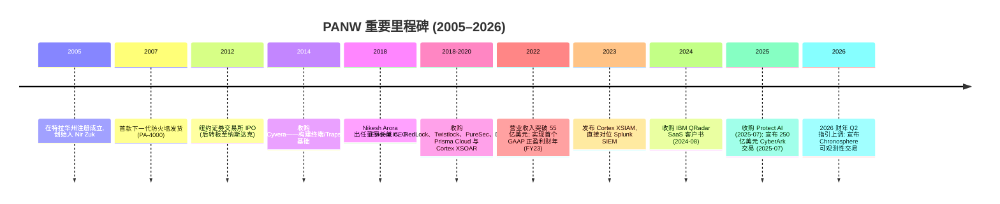
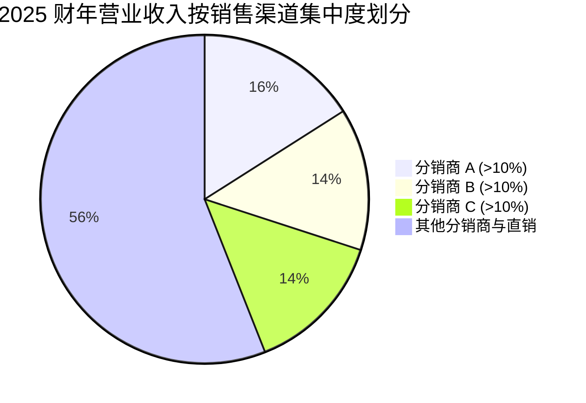
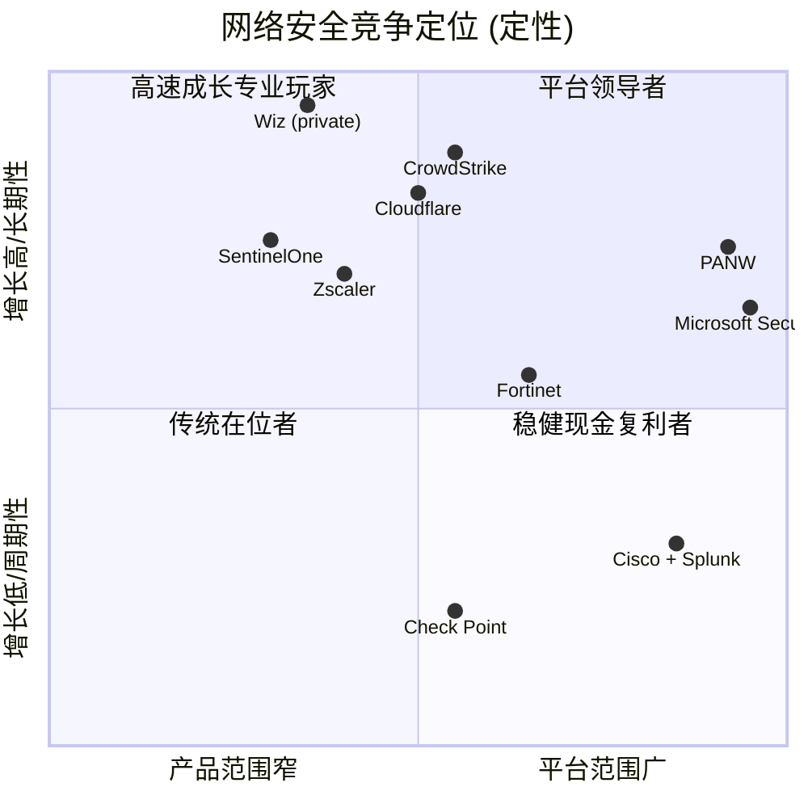

# Palo Alto Networks, Inc. (NASDAQ:PANW) — 公司研究报告

**截至日期: 2026-05-20**
**上市地: 纳斯达克全球精选市场, 代码 PANW**
**注册地: 美国特拉华州 (总部位于加利福尼亚州圣克拉拉)**
**报告语言: 简体中文 (英文版同时存在于本目录)**

---

> **业绩更新——2026 财年指引大幅上调 (2026-02-17):** 在 2026 财年 Q2 业绩公告中, 公司六个月内**第二次**上调全年指引。**NGS ARR (次世代安全年化经常性营业收入, Next-Generation Security Annual Recurring Revenue)** 指引由 2025-08 (2025 财年 Q4) 公告时的 70.00–71.00 亿美元上调至 **85.20–86.20 亿美元**, 隐含同比增长 53–54%; 全年总营业收入指引由 105.00–105.40 亿美元上调至 **112.80–113.10 亿美元**, 隐含同比增长 22–23%; 调整后自由现金流利润率 (Adjusted FCF Margin) 指引仍维持约 37%。本次上调约一半反映正在推进的 **CyberArk** (营业收入约 25–30 亿美元/NGS ARR 约 10 亿美元) 和 **Chronosphere** (可观测性 observability) 收购贡献, 另一半反映有机的平台化 (platformization) 动能。
> 来源: [2026 财年 Q2 业绩公告, 2026-02-17](https://www.sec.gov/Archives/edgar/data/1327567/000132756726000003/ex991q226earningsrelease.htm) 与 [2025 财年 Q4 业绩公告, 2025-08-18](https://www.sec.gov/Archives/edgar/data/1327567/000132756725000024/ex991q425earningsrelease.htm) 之比较。

## 目录
1. 公司概览
2. 公司历史
3. 管理团队
4. 产品与服务
5. 客户与上市策略
6. 行业概览
7. 竞争格局
8. 市场机会 (TAM)
9. 风险评估
参考资料

---

## 1. 公司概览

Palo Alto Networks, Inc. ("PANW") 是全球按营业收入计**最大的纯网络安全 (pure-play cybersecurity) 厂商**。公司销售端到端产品组合, 覆盖四大网络安全攻击面——企业网络、公有/混合云、安全运营中心 (SOC, Security Operations Center) 以及终端用户身份——并打包成三大"平台 (platform)", 分别冠以 **Strata** (网络安全)、**Prisma** (云安全 & SASE) 与 **Cortex** (AI 驱动的安全运营) 之名。公司长期宣示的战略是**"平台化 (platformization)"**——说服客户淘汰单一厂商的散点工具, 转而采用 PANW 紧密集成的整体栈, 公司将其定位为大型企业普遍存在的 50–100 件碎片化安全工具问题唯一可信的解决方案 ([2025 财年 Form 10-K, "业务"概述, 第 4–6 页](https://www.sec.gov/Archives/edgar/data/1327567/000132756725000027/panw-20250731.htm))。

经济模型是典型的企业软件订阅引擎。2025 财年 (截至 2025-07-31), 总营业收入达到 **92.215 亿美元 (同比 +14.9%)**, 其中**订阅与支持收入 74.196 亿美元 (占 80.5%), 产品收入 18.019 亿美元 (占 19.5%)** (产品收入包括硬件设备与永久软件许可)。GAAP 营业利润为 **12.429 亿美元 (营业利润率 13.5%)**, 调整后自由现金流为 **34.698 亿美元 (占营业收入 37.6%)**——连续第五年高于"50 法则 (Rule-of-50)"门槛 ([2025 财年 10-K, 经营层讨论与分析 (MD&A), 第 44–45 页](https://www.sec.gov/Archives/edgar/data/1327567/000132756725000027/panw-20250731.htm); [2025 财年 Q4 业绩公告, 2025-08-18](https://www.sec.gov/Archives/edgar/data/1327567/000132756725000024/ex991q425earningsrelease.htm))。

规模指标: 终端客户覆盖 **180 多个国家/地区**, 包括几乎所有财富 100 强企业以及全球 2000 强 (Global 2000) 中的绝大多数 ([2025 财年 10-K, 第 36 页](https://www.sec.gov/Archives/edgar/data/1327567/000132756725000027/panw-20250731.htm)); 截至 2025 财年末**员工 16,068 人** (上年同期 15,289 人); 总部位于加利福尼亚州圣克拉拉, 租赁办公面积 94.1 万平方英尺, 此外在以色列与印度设有大型工程研发中心 ([2025 财年 10-K, Item 2 房产, 第 31 页](https://www.sec.gov/Archives/edgar/data/1327567/000132756725000027/panw-20250731.htm))。


*来源: 营业收入/NGS ARR 数据出自 [PANW 2025 财年 10-K, 第 44 页](https://www.sec.gov/Archives/edgar/data/1327567/000132756725000027/panw-20250731.htm) 与 [2026 财年 Q2 业绩公告, 2026-02-17](https://www.sec.gov/Archives/edgar/data/1327567/000132756726000003/ex991q226earningsrelease.htm); 2026 财年 (FY26E) 采用 2026-02-17 上调后的指引中位数。*

**估值快照 (2026-05-20 收盘)。** 股价 **246.66 美元**, 市值约**2,000 亿美元**, **TTM 市盈率 (P/E) 137 倍**, **前瞻市盈率约 62 倍**, **TTM 市销率 (P/S) 20.2 倍** ([Yahoo Finance — PANW 关键统计指标, 取数 2026-05-20](https://finance.yahoo.com/quote/PANW/key-statistics))。基于上调后的 2026 财年营业收入约 113 亿美元以及约 30 亿美元净现金计算, 前瞻 EV/Sales (企业价值/营业收入) 约为**17 倍**。过去 3 年 (CY2023–CY2026) 的 TTM 市销率区间约为 12–25 倍; 当前数值位于该区间的上半部分, 部分反映了 2026 财年 Q2 指引上调及 CyberArk 收购公告后的估值倍数扩张。

**同业比较 (TTM 市销率, Yahoo Finance 2026-05-20):** CrowdStrike (CRWD) 34.4 倍、Cloudflare (NET) 31.9 倍、**PANW 20.2 倍**、Fortinet (FTNT) 13.4 倍、Zscaler (ZS) 9.3 倍、SentinelOne (S) 6.1 倍、Cisco (CSCO) 7.4 倍、Check Point (CHKP) 4.8 倍。这 8 家网络安全可比公司的中位数约为**11 倍**, 因此 PANW 大致为中位数的**1.8 倍**——高于同业但显著低于尚未实现盈利的小型/SaaS 同业 (CRWD、NET)。


*来源: 各代码的 [Yahoo Finance 关键统计指标页面](https://finance.yahoo.com/quote/PANW/key-statistics), 取数 2026-05-20。*

**为何估值倍数偏高——以及如何解读。** TTM 市盈率 137 倍具有误导性, 因为 GAAP 盈利受到股权激励 (SBC, Stock-Based Compensation) 严重压制 (2025 财年 SBC 约 14.2 亿美元, 而营业利润为 12.4 亿美元)、诉讼计提以及 (2025 财年的) IBM-QRadar 和 Protect AI 交易会计处理的影响。更有意义的锚点是: 前瞻市盈率约 62 倍、基于上调后 2026 财年营业收入的 EV/Sales 约 17 倍, 以及 EV/调整后自由现金流约 50 倍。这些数字**仅当**平台化驱动的 NGS ARR 加速至约 30%+ 能持续, 且 CyberArk 整合不损害利润率时**才可辩护**; 若 NGS ARR 增速回落至 20% 后段, 且 CyberArk 整合产生类似思科收购 Splunk 后的利润率"塌陷", 那么这些倍数将难以支撑。鉴于估值倍数显著高于 3 年中位数, 而 CyberArk 整合风险尚未消化, 第 9 章将估值/倍数压缩风险单列。

CyberArk 交易完成后, 合并业务将运营四大主平台 (网络、云、安全运营、身份) 以及四个次级平台 (经由 Protect AI/Prisma AIRS 实现的 AI 安全; Strata Copilot AI 助手; OT 安全; 安全浏览器)。CyberArk 交易报价为**每股 45.00 美元现金 + 2.2005 股 PANW 股票**, 按 PANW 公告前 10 天成交量加权平均价 (10-day VWAP) 计算, CyberArk 估值约为**250 亿美元**; PANW 拟以资产负债表现金支付现金部分 ([2025 财年 10-K, 第 73 页, "资产负债表日后事项"](https://www.sec.gov/Archives/edgar/data/1327567/000132756725000027/panw-20250731.htm))。


*来源: PANW [2025 财年 10-K, 第 46 页](https://www.sec.gov/Archives/edgar/data/1327567/000132756725000027/panw-20250731.htm)——2023–2025 财年产品与订阅及支持营业收入分布。*

## 2. 公司历史

Palo Alto Networks 于 **2005 年 3 月在特拉华州注册成立**, 2005 年 4 月在圣克拉拉的一间小型办公室启动运营。创始理论——防火墙 (firewall, 全球最普及的安全产品) 已僵化为按端口与协议过滤的工具, 应当重生为感知应用、感知用户的"下一代防火墙 (next-generation firewall, NGFW)"——出自 CTO 与创始人 **Nir Zuk** 之手, 他是 Check Point 公司的资深员工, 业界普遍认为他于 1990 年代在 Check Point 期间发明了状态化检测 (stateful inspection) ([2025 财年 10-K, 附注 1, 第 64 页](https://www.sec.gov/Archives/edgar/data/1327567/000132756725000027/panw-20250731.htm); [2025 年 DEF 14A 委托书, "董事候选人", Lee Klarich 致 Nir Zuk 的赞词, 第 6 页](https://www.sec.gov/Archives/edgar/data/1308179/000130817925000624/panw2025definitiveproxy.htm))。第一款产品 PAN-OS/PA-4000 系列于 2007 年发货, 迅速在高端企业 NGFW 市场抢占份额。PANW 于 2012 年 7 月在纽约证券交易所 IPO, 后转板至纳斯达克, 并在随后的十年中系统化地从本地部署 (on-prem) 防火墙扩展至虚拟防火墙 (VM-Series)、URL 过滤、威胁防护服务、终端 (Cortex XDR, 即 2014 年通过 Cyvera 收购重新品牌后的 Traps)、SASE (Prisma Access, 前身为 GlobalProtect Cloud)、云工作负载保护 (Prisma Cloud, 基于 RedLock/Twistlock/Bridgecrew 收购构建), 以及安全运营 (Cortex XSOAR/XSIAM, 基于 Demisto 与 PureSec 栈构建)。


*来源: 里程碑综合自 [PANW 2025 财年 10-K Items 1 & 5](https://www.sec.gov/Archives/edgar/data/1327567/000132756725000027/panw-20250731.htm) 与 [SEC EDGAR PANW 备案历史](https://www.sec.gov/cgi-bin/browse-edgar?action=getcompany&CIK=0001327567&type=10-K&dateb=&owner=include&count=40)。*

**三大战略转折值得关注。** 第一, **Nikesh Arora 时代始于 2018 年 6 月**, 时任 Google 前首席商务官/SoftBank 前总裁的他被任命为董事长兼 CEO。Arora 的使命非常明确: 将 PANW 从一家防火墙公司转变为全球最具领先地位的网络安全公司。在其任内的头三年, 他完成了约二十几起 tuck-in 收购, 用以拼装 Prisma Cloud 与 Cortex 平台 ([2025 年 DEF 14A 委托书, "首席独立董事致股东函", 第 5–7 页](https://www.sec.gov/Archives/edgar/data/1308179/000130817925000624/panw2025definitiveproxy.htm))。第二, **2022–2024 年的"整合者整合 (consolidate consolidators)"战略**——PANW 开始将多个 SKU 打包进单一合同 (提供免费期优惠、单笔可带来 1,000–5,000 万美元 NGS ARR 增量的"平台化交易"), 以替换每个客户原本使用的 8–12 个厂商。第三, **2026 财年的身份/可观测性扩张**——2025 年 7 月 CyberArk 交易将 PANW 推入身份安全与 PAM (特权访问管理, Privileged Access Management) 领域 (此前 PANW 将这一邻接领域留给了 CyberArk、Okta 与 SailPoint); 2026 年初的 Chronosphere 收购加入了云原生可观测性能力, 使得 SOC 平台不仅能吸收并关联安全遥测数据, 还能吸收并关联运营遥测数据 ([2026 财年 Q2 业绩公告, 2026-02-17](https://www.sec.gov/Archives/edgar/data/1327567/000132756726000003/ex991q226earningsrelease.htm))。

**重要收购, 年份 + 理由 (选取):** 2014 年 Cyvera (终端/Traps 基础→Cortex XDR); 2018 年 Evident.io (云态势); 2018 年 RedLock (云安全分析→Prisma Cloud 核心); 2019 年 Demisto (SOAR→Cortex XSOAR); 2019 年 Twistlock 与 PureSec (容器与无服务器安全); 2020 年 CloudGenix (SASE 的 SD-WAN); 2020 年 Expanse (攻击面管理→Cortex Xpanse); 2021 年 Bridgecrew (DevSecOps/IaC 扫描); 2022 年 Cider Security (CI/CD 安全); 2023 年 Talon Cyber Security (企业浏览器→Prisma Access Browser) 与 Dig Security (DSPM); 2024 年 8 月 **部分 IBM QRadar SaaS 资产** (Cortex XSIAM 的迁移加速器); 2025 年 7 月 **Protect AI** (AI 模型安全→Prisma AIRS); 2025 年 7 月 **CyberArk** (250 亿美元, 2026 财年下半年待完成——身份与 PAM); 2026 年初 **Chronosphere** (可观测性) ([2025 财年 10-K, 附注 7–8, 第 71–76 页](https://www.sec.gov/Archives/edgar/data/1327567/000132756725000027/panw-20250731.htm))。

**近期动态 (近 12 个月)。** 除上述交易外, 公司发布了 **Prisma Access Browser**, 扩展了 **OT 安全 (operational technology, 工业控制安全)**, 推出 **Cortex Cloud** (重新架构的统一云安全平台, 合并了 Prisma Cloud + Cortex XSIAM 云遥测), 上线 **Prisma AIRS** (AI 运行时安全), 并推送了 **Cortex XSIAM 3.0** (含代理化 SOC 工作流) ([2025 财年 10-K, 第 7 页](https://www.sec.gov/Archives/edgar/data/1327567/000132756725000027/panw-20250731.htm))。创始人 Nir Zuk 于 2025 年 8 月宣布退休; **Lee Klarich** 晋升为**首席产品与技术官 (CPTO)** 并加入董事会 ([2025 年 DEF 14A 委托书, 第 6 页与第 67 页](https://www.sec.gov/Archives/edgar/data/1308179/000130817925000624/panw2025definitiveproxy.htm))。

## 3. 管理团队

### Nikesh Arora —— 董事长兼 CEO (自 2018 年 6 月起)

Arora 是公司历史上的第二任 CEO (前任为联合创始人 Mark McLaughlin), 同时也是现代 PANW 故事中迄今最举足轻重的人物。根据 2025 年 DEF 14A 委托书披露, 他于 2018 年 6 月入职 PANW, 此前的职位经历包括: **天使投资 (2016–2018)、SoftBank 集团顾问 (2016-06 至 2017-12)、SoftBank 集团总裁兼 COO (2015-07 至 2016-06), 以及 SoftBank Internet & Media 副董事长兼 CEO (2014-07 至 2015-06)**。在 SoftBank 之前, 他在 Google 任职近十年, 离开时担任 **2011 年 1 月至 2014 年 6 月的高级副总裁兼首席商务官 (SVP and Chief Business Officer)**, 负责全球前台运营, 业界广泛认为他将 Google 广告业务的年营业收入从约 100 亿美元扩大到约 600 亿美元。早期他曾在 T-Mobile/Deutsche Telekom 与 Fidelity Investments 任职。他持有东北大学工商管理硕士 (M.S. in Business Administration)、波士顿学院金融硕士 (M.S. in Finance) 以及巴拉那西印度教大学 (Banaras Hindu University) 电子工程学士学位 ([2025 年 DEF 14A 委托书, 第 50–51 页董事候选人简历](https://www.sec.gov/Archives/edgar/data/1308179/000130817925000624/panw2025definitiveproxy.htm))。

他在 PANW 实际取得的成就即便从绝对值上看也令人瞩目。在 Arora 任职的七年内, **营业收入从 22.7 亿美元 (2018 财年) 跃升至 92.2 亿美元 (2025 财年)——增长约 4 倍**; PANW 实现首个全年 GAAP 盈利财年 (2023 财年); NGS ARR 从零起步, 增长至 **2025 财年末的 55.8 亿美元, 2026 财年指引 85 亿美元以上**; 市值从他入职时的约 200 亿美元增长至如今约 2,000 亿美元。他的薪酬相应地巨大且具有争议性: 2023 年 6 月授予的一次性 PSU (绩效股票单元) 留任奖励, 正是近期股东沟通披露中的焦点 ([2025 年 DEF 14A 委托书, 薪酬讨论与分析 CD&A, 第 65–90 页](https://www.sec.gov/Archives/edgar/data/1308179/000130817925000624/panw2025definitiveproxy.htm))。他是 Uber 董事会成员, 同时担任 Compagnie Financière Richemont 的非执行董事; 此前曾任 Sprint、Colgate-Palmolive、SoftBank 以及 Yahoo! Japan 的董事会成员。他在安全行业 CEO 中颇为特殊——**他本人并非安全技术专家**; 技术层面的领军作用由 Klarich 与公司在以色列的工程团队承担, 而 Arora 主导销售、并购与资本配置。公开形象广泛——常在 CNBC、《华尔街日报》《彭博》业绩季出镜, 也常在公司旗舰的 **Ignite** 大会做主题演讲。其当前持股比例在 DEF 14A 受益所有权表中披露约为流通股本的 0.7% ([2025 年 DEF 14A 委托书, 第 110 页](https://www.sec.gov/Archives/edgar/data/1308179/000130817925000624/panw2025definitiveproxy.htm))。业绩判断: 按总股东回报 (TSR) 衡量, 他位列过去十年表现最佳的科技 CEO 之一, 但有一个保留——**目前回报曲线在大得多的基数下被压缩了**, 下阶段对并购执行的依赖将超过 2018–2024 年间的平台扩张打法。

### Dipak Golechha —— 首席财务官 (自 2021 年 3 月起)

Golechha 于 **2020 年 12 月作为 SVP, 财务 (SVP, Finance) 加入 PANW**, 并于 2021 年 3 月晋升为 CFO。加入 PANW 之前, 他曾任波士顿咨询公司 (BCG) 高级顾问 (2020 年 8–12 月); **Excelligence Learning Corporation 总裁兼 CEO (2016-12 至 2020-04)**——一家私募基金持有的幼教平台; **NBTY Inc. CFO (2014-08 至 2016-07)**——这家消费健康补充剂巨头; 以及短暂任职 **Chobani CFO** (2014 年)。他职业生涯中的 18 年——大部分时间——是在**宝洁 (P&G)** 度过, 担任全球女性护理/成人护理事业部的 CFO/COO 等职位 ([2025 年 DEF 14A 委托书, "高管人员", 第 109 页](https://www.sec.gov/Archives/edgar/data/1308179/000130817925000624/panw2025definitiveproxy.htm))。他持有圣约翰学院 (剑桥) 的经济学学士与硕士学位。他主导了 2022 年后 KPI 排序由账单 (billings) 转向 **NGS ARR + RPO (Remaining Performance Obligations, 剩余履约义务)** 的转变、引入了**"50 法则"**叙事, 并主持了 CyberArk 全股票+现金交易的融资安排。他对外作出 PANW 将于 2028 财年实现**40%+ 调整后 FCF 利润率**的承诺 ([2026 财年 Q1 业绩公告, 2025-11-19, CFO 引述](https://www.sec.gov/Archives/edgar/data/1327567/000132756725000032/ex991q126earningsrelease.htm))。

### BJ Jenkins —— 总裁 (自 2021 年 8 月起)

Jenkins 于 **2021 年 8 月**作为总裁加入 PANW, 此前在 **Barracuda Networks (2012-11 至 2021-07)** 担任总裁兼 CEO 近十年, Barracuda 是一家中端市场的安全与数据存储厂商, 他将其做大, 最终引领其被 Thoma Bravo 私有化并随后转售给 KKR。在 Barracuda 之前, 他在 **EMC 公司**担任过多个事业部与销售管理职位。他持有伊利诺伊大学工程学位与哈佛商学院 MBA 学位 ([2025 年 DEF 14A 委托书, "高管人员", 第 109 页](https://www.sec.gov/Archives/edgar/data/1308179/000130817925000624/panw2025definitiveproxy.htm))。他的职责范围是全球上市策略与渠道战略; 他在运营层面对 Arora 的战略与资本配置专注形成有效配重。

### Lee Klarich —— 首席产品与技术官 (自 2025 年 8 月起)

Klarich 是 **PANW 任期最长的产品领导者**——他于 2006 年加入, 升任产品管理副总裁, 2017 年晋升为首席产品官, 并于 2025 年 8 月在 Nir Zuk 退休后晋升为 CPTO 并加入董事会。他是整套 Strata/Prisma/Cortex 平台架构的总设计师, 也是投资人在 Ignite 大会上听到的资历最深的技术声音。董事会任命 Klarich (而非外部聘任新 CTO) 本身就是对产品路线图延续性的信心投票 ([2025 年 DEF 14A 委托书, 第 67 页 Lee Klarich 董事候选人简历](https://www.sec.gov/Archives/edgar/data/1308179/000130817925000624/panw2025definitiveproxy.htm))。

### 治理脚注

- 2025 年股东大会董事会共有 **10 位董事, 其中 9 位为独立董事**, 另一位为董事长兼 CEO Arora; 首席独立董事 (Lead Independent Director) 为**约翰·M·多诺万 (John M. Donovan)** (AT&T Communications 前 CEO)。其他知名独立董事包括 **Carl Eschenbach** (Workday CEO)、**Aparna Bawa** (Zoom COO)、**Lorraine Twohill** (Google CMO) 以及丹麦前首相 **Helle Thorning-Schmidt** ([2025 年 DEF 14A 委托书, 第 49–62 页董事候选人简历](https://www.sec.gov/Archives/edgar/data/1308179/000130817925000624/panw2025definitiveproxy.htm))。
- CEO/董事长角色合并; 由 CPTO 主席的安全委员会监督产品安全风险。
- 内部人持股合计较低 (低于流通股本的 2%)——这与一家管理成熟、专业化运营的企业软件公司相符。
- 薪酬以股权为主: 根据 2025 财年 CD&A, **绩效股权 (performance-based equity) 在 CEO 薪酬中占主导**, 配以与 TSR 挂钩的 PSU 以及对高管 NEO 的归属后一年持有期 ([2025 年 DEF 14A 委托书, 第 71–90 页](https://www.sec.gov/Archives/edgar/data/1308179/000130817925000624/panw2025definitiveproxy.htm))。2023 年 6 月授予 CEO 的一次性 PSU 留任奖励仍是股东对话的焦点。
- 未披露重大关联方交易; 2025 财年 TSR 对照同业薪酬可比组与标普 500 的图表显示, 自 Arora 任 CEO 以来 PANW 显著领先。

### 业绩综合判断

按执行力衡量, 这是顶级四分之一的管理团队: 在 Arora 任期内, 营业收入与权益价值分别约 10 倍增长, 期间产品组合发生两次重大调整 (2018–2021 年云安全构建; 2022–2025 年 SOC/AI 构建)。其欠缺之处在于: (i) **此规模并购整合的 CFO 经验深度**——Golechha 和 PANW 均未整合过 250 亿美元量级的并购, 而 CyberArk 的身份安全文化与 PANW 网络安全的 DNA 存在实质差异; (ii) **创始人/CTO 接班风险刚刚显现**——Nir Zuk 退休, Klarich 晋升仅是缓解而非消除; (iii) **CEO 决策集中度**——应当给予一定关键人物折价 (key-person discount)。

## 4. 产品与服务

PANW 的产品组合按三大旗舰"平台"以及不断扩大的邻接产品集进行编排。这些平台名称在几乎每一份客户演示与业绩电话会议中出现: **Strata** 用于网络安全、**Prisma** 用于云安全与 SASE、**Cortex** 用于安全运营。下文是 PANW 官网、2025 财年 10-K 以及近期投资者演示文稿支持的最完整列表。

```mermaid
graph TD
    PANW[Palo Alto Networks] --> Strata[Strata —— 网络安全]
    PANW --> Prisma[Prisma —— 云安全 & SASE]
    PANW --> Cortex[Cortex —— 安全运营]
    PANW --> Other[邻接平台]
    Strata --> NGFW[ML 驱动 NGFW (PA-Series 硬件)]
    Strata --> VMSeries[VM-Series 虚拟防火墙]
    Strata --> ContainerFW[CN-Series 容器防火墙]
    Strata --> CloudNGFW[云 NGFW for AWS / Azure]
    Strata --> SDWAN[Prisma SD-WAN (前 CloudGenix)]
    Strata --> PANOS[PAN-OS 订阅: 威胁防护、WildFire、URL 过滤、DNS 安全、IoT 安全、Advanced WildFire / WAF / SaaS 安全、企业 DLP]
    Strata --> StrataCopilot[Strata Copilot —— 网络安全 AI 助手]
    Prisma --> PrismaAccess[Prisma Access —— 云交付 SASE / ZTNA / SWG]
    Prisma --> PrismaAccessBrowser[Prisma Access Browser —— 企业安全浏览器 (前 Talon)]
    Prisma --> PrismaCloud[Prisma Cloud —— CNAPP (CSPM / CWPP / CIEM / DSPM / IaC)]
    Prisma --> CortexCloud[Cortex Cloud —— 统一云安全 + SOC 遥测]
    Prisma --> PrismaAIRS[Prisma AIRS —— AI 模型与运行时安全 (前 Protect AI)]
    Cortex --> XDR[Cortex XDR —— 扩展检测与响应]
    Cortex --> XSIAM[Cortex XSIAM —— AI 驱动 SIEM/SOC 平台]
    Cortex --> XSOAR[Cortex XSOAR —— 安全编排与自动化 (前 Demisto)]
    Cortex --> Xpanse[Cortex Xpanse —— 外部攻击面管理 (前 Expanse)]
    Cortex --> MDR[Unit 42 MDR for Cortex —— 托管检测与响应]
    Cortex --> Unit42[Unit 42 —— 事件响应与威胁情报]
    Other --> OTSec[OT 安全 —— 工业/OT 环境]
    Other --> Identity[身份安全 (CyberArk 交割待定 —— PAM、密钥、员工身份)]
    Other --> Observability[可观测性 (Chronosphere 交割待定)]
```
*来源: 产品分类综合自 [paloaltonetworks.com/products](https://www.paloaltonetworks.com/products) 导航走查 + [PANW 2025 财年 10-K "我们的平台", 第 4–8 页](https://www.sec.gov/Archives/edgar/data/1327567/000132756725000027/panw-20250731.htm)。*

**Strata —— 网络安全。** 历史核心产品。包括 **PA-Series 硬件 NGFW** (从分支办公型 PA-400 至数据中心型 PA-7500 的全系列)、用于虚拟机环境的 **VM-Series**、用于 Kubernetes 的 **CN-Series**、作为 AWS/Azure 托管服务的 **Cloud NGFW**, 以及大量 **PAN-OS 订阅**目录 (威胁防护、WildFire、URL 过滤、DNS 安全、Advanced WildFire、企业 DLP、IoT 安全、SaaS 安全等)。产品营业收入 (主要为 Strata 硬件 + 本地许可) 在 2025 财年达到 **18.019 亿美元 (同比 +12.4%)**——值得注意的是, 增长不是由销量驱动, 而是由**自 2025 财年 Q2 起本地软件许可的价格 + 配额调升**驱动 ([2025 财年 10-K, MD&A, 第 53 页](https://www.sec.gov/Archives/edgar/data/1327567/000132756725000027/panw-20250731.htm))。**竞争判断: 是, 强护城河**——Gartner 已连续 13 年以上将 PANW 评为网络防火墙魔力象限中的"领导者", 最接近的竞品是 **Fortinet 的 FortiGate** (成本领先; 但在云交付功能方面落后) 与 **Cisco Secure Firewall** (在装机量上具有先发优势, 但在云交付订阅上落后十年)。护城河类型: **技术 + 生态系统锁定 + 多年运营整合** (NGFW 变更需要谨慎的变更管理与策略重新架构)。

**Prisma Access (SASE)。** Prisma Access 是 PANW 的**云交付 SASE 平台**——将 ZTNA (零信任网络访问)、SWG (安全 Web 网关)、CASB (云访问安全代理) 与 DLP (数据丢失防护) 结合, 配以全球 PoP (接入点) 网络。其目标客户是从中心辐射 MPLS 网络架构迁移到直接云连接的企业。根据不同评级口径, 它是第一或第二大企业级 SASE 平台。**竞争判断: 是, 部分强至强护城河。** 最接近的竞品: **Zscaler ZIA/ZPA** (SASE 原生的纯对手, 在纯云原生架构上领先, 但缺乏本地防火墙的延续性) 与 **Netskope** (紧随其后)。近期扩展: **Prisma Access Browser**——重新品牌后的 Talon 企业浏览器, 2025 财年发布, 定位为统一的用户侧执行点, 这是一项值得关注的产品举措, 因为它抢占了 Island、Surf Security 与 Microsoft Edge for Business 正在进入的竞争利基 ([PANW 2025 财年 10-K, 第 7 页](https://www.sec.gov/Archives/edgar/data/1327567/000132756725000027/panw-20250731.htm))。

**Prisma Cloud (CNAPP)。** Prisma Cloud 是云原生应用保护平台 (CNAPP, Cloud-Native Application Protection Platform)——将 CSPM (云安全态势管理)、CWPP (工作负载保护, 含容器与主机)、CIEM (云身份权限管理)、DSPM (数据安全态势管理) 以及 IaC (基础设施即代码) 扫描整合到一起。**竞争判断: 是, 但有争议。** Gartner 将 PANW 与 **Wiz** (快速成长的私营企业, 目前正被 Google 收购) 以及 **CrowdStrike Falcon Cloud Security** 并列为 CNAPP 领导者。业内一致认为 Wiz 是 CNAPP 中最具攻击性产品动能的威胁。2026 年初推出的 **Cortex Cloud** (融合了 Prisma Cloud CNAPP 遥测与 Cortex XSIAM SOC 分析) 是 PANW 的战略性回应。

**Cortex XSIAM (AI 驱动 SOC)。** XSIAM 是旗舰产品中最年轻的 (2022 年 10 月发布), 但战略意义最重大。它的定位是**下一代 SIEM/SOC 平台**, 设计用来替换 **Splunk Enterprise Security** 与 **Microsoft Sentinel**, 通过将全部安全遥测数据吸收到 AI 原生数据湖中并自动化分诊。**2024 年 8 月收购 IBM QRadar SaaS 客户群**为 XSIAM 增加了数千个待迁移的 SIEM 账户。**竞争判断: 部分强至强护城河, 仍在演进。** 最接近的竞品: **Splunk Enterprise Security** (在位领导者; Cisco 旗下; 2025 财年向 XSIAM 失去份额)、**Microsoft Sentinel** (打包进 E5——最强商业竞争对手), 以及 **CrowdStrike Falcon LogScale + NG-SIEM**。护城河类型: 数据湖架构 + 基于 Unit 42 与客户遥测合并训练的 AI 模型; **3.0 发行版** (2026 财年) 加入了代理化工作流。

**Cortex XDR、XSOAR、Xpanse。** XDR (终端检测/响应) 与 **CrowdStrike Falcon Insight** 以及 **SentinelOne Singularity** 竞争——后两者无疑是纯 EDR 市场的份额领导者, PANW 的 XDR 在**独立 EDR 排名中落后, 但在与 Cortex 栈整体打包时反而领先**。XSOAR (安全编排, 前 Demisto) 仍是 SOAR 类别的主导产品, 尽管 Microsoft 与 Splunk 已侵蚀了部分份额。Xpanse 是外部攻击面管理的主导产品, 该类别基本由 PANW 通过 2020 年 Expanse 收购创造。

**Unit 42。** 一支综合的**事件响应、威胁情报与托管检测响应**服务团队。Unit 42 归在订阅与支持营业收入项下, 是企业销售的差异化竞争点——当客户遭遇违规并致电 Unit 42, 业务通常转化为多年期平台合约。

**身份安全 (CyberArk, 交割待定)。** CyberArk 完成 (预期 2026 财年下半年) 后, PANW 将加入 **PAM (特权访问管理)、密钥管理 (Secrets Management)、员工身份 (Workforce Identity via Idaptive) 以及 CIEM (经由 Zilla)**。CyberArk 是 PAM 的明确领导者, 按 Gartner 估计份额约 50%+; 这一收购填补了 PANW 产品组合中最大的一块空白, 形成真正的四平台栈。

**可观测性 (Chronosphere, 交割待定)。** Chronosphere 是一款云原生可观测性平台 (Prometheus/OpenTelemetry 原生), 为 SOC 提供运营遥测视角。从战略意义看, 它使 PANW 能够主张"安全数据与运营数据本属同一数据湖"——这正是 Datadog 与 Splunk 从相反方向构建的论点。

**旗舰与长尾。** 三大旗舰显然是 **NGFW + PAN-OS 订阅、Prisma Access (SASE) 与 Cortex XSIAM**。PANW 不披露每个平台的营业收入, 但管理层评论和分析师日披露暗示, Strata 仍是最大平台 (约占总额一半), Prisma 约 25–30%, Cortex 约 15–20% 且增长最快。长尾 (Xpanse、XSOAR、OT 安全、浏览器) 单独看较小, 但每条线增长均高于公司平均, 并作为"平台化"附加值发挥作用。

**最近 12 个月的产品发布/淘汰。** 发布: **Cortex Cloud**、**Prisma AIRS** (AI 运行时安全, 基于 Protect AI)、**Cortex XSIAM 3.0**、**Strata Copilot**、**Prisma Access Browser** 全面发售 (GA)、**扩展的 OT 安全**能力。淘汰/重定位: PANW 开始将 **Prisma Cloud 与 Cortex XSIAM 遥测合并入"Cortex Cloud"**, 预示长期的融合; 较旧的 PAN-OS 订阅包在 2025 财年 Q2 经历合理化, 价格/配额调整提振了产品营业收入。

## 5. 客户与上市策略

终端客户涵盖**企业、服务提供商与政府实体**, 几乎覆盖所有垂直行业——教育、能源、金融服务、政府、医疗、互联网与媒体、制造业、公共部门、电信。PANW 报告其客户分布在 **180 多个国家/地区**, 其中包括**几乎所有财富 100 强企业以及全球 2000 强 (Global 2000) 中的多数** ([2025 财年 10-K, MD&A, 第 36 页](https://www.sec.gov/Archives/edgar/data/1327567/000132756725000027/panw-20250731.htm))。公开客户案例包括 **Accenture、NTT Docomo、Allegis Group、亚利桑那州 (State of Arizona)、皇家加勒比 (Royal Caribbean) 与 Telstra**, 但相较于 CRWD、NET 等竞争对手, 公司在公开命名标志性客户上更为谨慎, 因为交易通常涉及保密协议。

**客户集中度——终端客户层面。** 根据 2025 财年 10-K, "**2025 财年、2024 财年与 2023 财年, 单一终端客户均未占公司总营业收入 10% 以上**" ([2025 财年 10-K, 第 9 页](https://www.sec.gov/Archives/edgar/data/1327567/000132756725000027/panw-20250731.htm))。因此终端客户集中度**不构成**重大风险。已披露的集中度位于**分销渠道**层面: 两层间接分销模式意味着 PANW 主要销售给少数分销商, 后者再通过经销商销售。2025 财年, **三家分销商分别占总营业收入 ≥10%, 合计占 44.2%**; 同三家分销商占财年末应收账款总额的 **44.8%** ([2025 财年 10-K, "风险因素"——渠道集中度, 第 19 页](https://www.sec.gov/Archives/edgar/data/1327567/000132756725000027/panw-20250731.htm))。市场普遍理解 (并由往年披露确认) 这三家分销商包括 **Ingram Micro、Exclusive Networks 与 Westcon-Comstor**。三年趋势: 该区间内的分销商集中度自 2020 财年以来保持稳定。


*来源: PANW 2025 财年 10-K 披露"三家分销商分别 ≥10%, 合计 44.2%"——上图划分仅为示意; PANW 不披露单个分销商名称或单家比例。[2025 财年 10-K, 第 19 页](https://www.sec.gov/Archives/edgar/data/1327567/000132756725000027/panw-20250731.htm)。*

表面看集中度令人警惕, 但分销商是信用风险与订单流的中介, 并非创造需求的决策者——需求仍来自数千名终端客户的 CISO (首席信息安全官)。但是, 渠道集中度**确实**带来应收账款/信用风险以及单点运营失败风险; **前 5 大渠道 ≥50% → 已纳入第 9 章作为重大风险**。

**渠道结构与销售方式。** PANW 采用**两层间接渠道模式**: 销售给分销商, 分销商再卖给经销商, 经销商最终卖给终端客户。分销商协议初始期限为 1 年, 1 年续约, 付款期 30 天; PANW 此前曾在不影响运营的情况下终止与更换分销商。直接现场销售团队覆盖最大型企业与政府客户 ("直接接触/渠道履约"), 在企业安全行业属于标准做法。大型平台化交易销售周期可达 **6–12+ 个月**, 通常需要**概念验证 (POC)**、**竞争性比试 (competitive bake-off)** 以及 CFO 级别 (而非仅 CISO 级别) 的**执行发起人签字**, 因为这些交易会整合多家现有厂商合同。

**平台化经济模型。** 2025 财年的工作单位是**"平台化交易"**——一笔多产品、多年期承诺, 一次性替换该客户的 5–15 个现有安全厂商。管理层披露累计的平台化交易在 2025 财年末已超过 **1,250 笔**, 目标到 2030 财年达到 **2,500–3,500 笔**。这些交易通常带有头 6–12 个月的**免费期或零美元过渡激励**以便客户迁移——PANW 为此付出的代价是, 在任意季度只要免费期交易占比偏高, **账单与产品营业收入便会出现波动** (第 9 章将此列为风险)。回报是在免费期结束后**后续季度的 ARR + RPO 不成比例的上升**。

**合作伙伴与生态系统。** 重要战略伙伴包括**三家主要云提供商** (AWS、Azure、Google Cloud——用于 VM-Series、Cloud NGFW、Prisma Cloud)、**NVIDIA** (围绕 Prisma AIRS 的 AI 安全协作)、**埃森哲 (Accenture)**、**德勤 (Deloitte)**、**普华永道 (PwC)** 与 **毕马威 (KPMG)** (用于大型企业转型交易), 以及全球 MSSP/MDR 合作伙伴生态。

**客户案例 (示意)。** paloaltonetworks.com 上的公开案例研究包括 **NTT Docomo** (使用 Strata 的 5G 核心防护)、**亚利桑那州** (使用 Cortex XSIAM 的 SOC 现代化)、**Telstra** (使用 Prisma SASE 服务混合办公人群)、**皇家加勒比** (使用 Prisma Cloud 服务云原生应用)——这些案例由 PANW 在其客户页面公开披露。

**地域结构。** 2025 财年按地区划分的营业收入: **美洲 68%、EMEA 22%、亚太 10%** (近似值, 综合自 10-K MD&A 中的"2025 财年美洲、EMEA 与亚太营业收入同比均有增长……由于规模较大, 美洲带来的营业收入增量最高"的描述——精确分布参见 10-K 地理营业收入附注) ([2025 财年 10-K, MD&A, 第 50 页](https://www.sec.gov/Archives/edgar/data/1327567/000132756725000027/panw-20250731.htm))。美洲地域集中度较高但属合理, 因为美国占全球企业网络安全支出约 50%。

## 6. 行业概览

网络安全是一个**2025 年全球约 2,200 亿美元的市场**, 至 2028 年保持**12–14% 年增长**, 来自 Gartner 2025 安全与风险管理 (Security & Risk Management) 预测 ([Gartner 新闻稿, "Gartner Forecasts Global Security and Risk Management Spending to Grow 14.3% in 2025", 2025-03-31](https://www.gartner.com/en/newsroom/press-releases/2025-03-31-gartner-forecasts-global-information-security-spending-to-grow-15-percent-in-2025))。这是企业 IT 支出中规模最大、最具韧性的类别之一, 增速约为更广泛企业软件市场的**两倍**, 因为网络风险在结构上不断上升 (云用量增加、远程办公增加、AI 生成攻击增加), 以及金融服务、医疗、关键基础设施 (post-NIS2 后的全部欧盟企业) 的监管对最低支出形成下限。

**子板块以及 PANW 的重合度。** 网络安全市场约可分解为六大重要子板块:

| 子板块 | 2025 年规模 | 增速 | PANW 份额/定位 |
|---|---|---|---|
| 网络安全 (防火墙、IPS、SD-WAN、SASE) | 约 300 亿美元 | 约 12% | NGFW 第 1; SASE 第 1/第 2; PANW 份额约 25%+ |
| 云安全 (CNAPP、CSPM、CWPP、DSPM) | 约 100 亿美元 | 约 25% | 领导者 (与 Wiz、CRWD 并列) |
| 终端/XDR | 约 150 亿美元 | 约 12% | 第 3 (在 CRWD、MSFT 之后) |
| SOC/SIEM/SOAR (含 XSIAM、XSOAR、Xpanse) | 约 100 亿美元 | 约 10–15% | 快速崛起的第 3 (对比 Splunk、MSFT) |
| 身份与访问管理 (Identity & Access Management) | 约 200 亿美元 | 约 14% | 经 CyberArk 进入 |
| 其他 (DLP、邮件、MDR、服务) | 约 300 亿美元 | 约 10% | 选择性重合 |

*来源: 综合自 [Gartner 2025 年 IT 安全支出预测](https://www.gartner.com/en/newsroom/press-releases/2025-03-31-gartner-forecasts-global-information-security-spending-to-grow-15-percent-in-2025) 与 [IDC 全球安全支出指南, 2024H2](https://www.idc.com/getdoc.jsp?containerId=prUS52437724); PANW 份额评论来自 [PANW 2025 财年 Q4 分析师日演示, 2024 年 9 月 investors.paloaltonetworks.com](https://investors.paloaltonetworks.com/financial-information/events-and-presentations)。*

**结构性驱动因素。** (i) **AI 生成的攻击。** 生成式 AI 制造的钓鱼、深度伪造 (deepfake) 社工攻击、对 ML 模型的对抗性 AI 攻击驱动了 AI 原生检测需求加速——直接支撑 XSIAM、Prisma AIRS 与 Strata Copilot。 (ii) **厂商整合。** 大型企业通常使用 50–100 个独立安全工具; 2022–2024 年 SOC 疲劳叠加紧缩的安全团队人员预算, 推动客户向整合平台靠拢。 (iii) **云迁移与 AI 基础设施建设。** 每个新增云工作负载都是新攻击面, 支撑 Prisma Cloud 与 Cortex Cloud。 (iv) **监管趋严**——NIS2 (欧盟, 2024-10 生效)、SEC 网络安全披露规则 (美国, 2023-12)、DORA (欧盟金融服务, 2025-01 生效)、HIPAA 安全规则更新 (美国 2025) 以及美国州级隐私法——共同抬高各行业的最低安全支出。

**行业结构。** 网络安全行业在长尾上呈异常**碎片化**——[年度 Momentum Cyber 报告](https://momentumcyber.com/insights/)指出超过 3,000 家活跃厂商存在——但**头部高度集中**: PANW、Microsoft、CrowdStrike、Cisco (Splunk) 与 Fortinet 合计占据企业支出增长中不成比例的份额。买方议价能力中等偏强: 财富 500 强账户的 CISO 具备议价能力, 并定期举办竞争性比试; 对分销商 PANW 的供应商议价能力高, 但对公有云平台 (AWS/Azure/GCP) 的议价能力受限, 后者既是合作伙伴也可能成为竞争者。替代品威胁仅在平台打包层级有意义——Microsoft 的"E5 免费"SOC 与身份产品对所有独立厂商构成结构性竞争压顶。

**监管环境。** PANW 在其 10-K 中指出, 公司受 GDPR/UK GDPR (最高罚款 2,000 万欧元或全球营业额 4%)、CCPA/CPRA、美国司法部跨境批量个人数据传输规则、美国加密出口管制, 以及在欧盟 (AI 法案) 与美国州级 AI 法律层面不断演化的监管约束 ([2025 财年 10-K, "隐私与数据保护"风险因素, 第 24–25 页](https://www.sec.gov/Archives/edgar/data/1327567/000132756725000027/panw-20250731.htm))。监管对需求是顺风, 对合规成本是逆风。

## 7. 竞争格局

**直接竞争对手 (全栈平台厂商)。**

- **Fortinet (FTNT)** —— 网络安全方面最贴近的同业; NGFW 成本领先, 采用垂直整合 ASIC 战略; 云安全与 SOC 较弱。2024 财年营业收入约 59.6 亿美元, 增长 12–15%。市销率 13.4 倍。威胁: 在中端市场与价格敏感板块持续胜出。
- **CrowdStrike (CRWD)** —— 终端/XDR 领导者, 经 Falcon Cloud Security 切入云安全; 正构建 NG-SIEM (Falcon LogScale)。已明确采用与 PANW 类似的"平台"叙事。市销率 34.4 倍。威胁: SOC 的技术与品牌实力, 但终端之外覆盖范围非常窄。
- **Cisco / Splunk (CSCO)** —— 网络在位者与 (通过 Splunk) SIEM 在位者; 装机量深厚; 平台故事广泛但缺乏一致性。市销率 7.4 倍。威胁: 硬件装机基础惯性 + Splunk SIEM 续约黏性。
- **Microsoft (MSFT)** —— 对所有独立网络安全厂商的结构性压顶。将 Defender for Endpoint、Defender for Cloud、Sentinel SIEM、Entra ID、Purview DLP 打包进 Microsoft 365 E5/E5 Security。披露网络安全营业收入运行率约 200 亿美元。威胁: 在中端市场极高; 在严格监管的大企业较低 (在那里仍偏好最佳同类)。

**直接竞争对手 (专业平台厂商)。**

- **Zscaler (ZS)** —— SASE 原生纯玩家; 在云架构 SWG/ZTNA 方面领先, 但无 NGFW、无 SOC。市销率 9.3 倍。威胁: 在仅 SASE 招标场景中直接替代 Prisma Access。
- **Cloudflare (NET)** —— 新兴 SASE/SSE 玩家; 增长迅速; 通过 Workers + Zero Trust 将工作负载吸引至其全球边缘。市销率 31.9 倍。威胁: 较小但在企业低端足以构成威胁。
- **Check Point (CHKP)** —— 历史 NGFW 竞争者; 增长放缓; 营业收入年增长率个位数中段。市销率 4.8 倍。威胁: 衰减中, 但在 EMEA 大多数 NGFW 短名单中仍在列。
- **SentinelOne (S)** —— 纯 EDR 玩家; 增长 20–30%; 正构建 XDR。市销率 6.1 倍。
- **Wiz** —— 私营 CNAPP 领导者; 被 Google 收购, 估值约 320 亿美元。威胁: 云安全极高; 完成与 GCP 关联收购后, 风险或因仅与 GCP 绑定的担忧而缓解。
- **CyberArk (CYBR)** —— PANW 的收购目标, 非竞争者: PAM 领导者。
- **Datadog (DDOG)** —— 邻接的可观测性厂商, 从运营侧切入 SOC 分析。


*来源: 定位基于作者定性判断, 依据各厂商 10-K/20-F 备案与 Gartner 网络防火墙 (2024)、SASE (2024)、CNAPP (2024) 魔力象限 [gartner.com](https://www.gartner.com/en/research/methodologies/magic-quadrants-research)。*

**定位框架。** PANW 在**范围 (平台数量) × 深度 (每个平台同类最佳质量) × 盈利能力**三个维度上同时竞争。它是唯一一家同时具备以下条件的厂商: (a) 在 NGFW、SASE、CNAPP、SOAR 的 Gartner MQ (魔力象限) 中均为领导者; (b) 借 XSIAM 可信地撼动 SIEM 在位者 (Splunk); 以及 (c) 产生约 37% 调整后 FCF 利润率与 13.5% 的 GAAP 营业利润率。Microsoft 范围更广, 但优化的是打包经济模型而非同类最佳深度; CrowdStrike 在 EDR 深度领先但范围窄; Fortinet 更便宜但范围窄; Cisco 营业收入范围更广但打包缺乏一致性。

**竞争优势。** (1) **规模 + 研发预算**——2025 财年研发支出约 19.4 亿美元, 为纯网络安全行业中最大, 支撑 AI 模型在行业最大的合并安全遥测数据集上训练。 (2) **渠道触达**——全球 100,000+ 活跃渠道伙伴。 (3) **跨平台附加**——平均平台化交易触及 4–6 个 SKU, 跨两个或以上平台。 (4) **可盈利平台**——与同等阶段的 CRWD/NET/ZS 不同, PANW 已产生有意义的 GAAP 盈利与约 35 亿美元 FCF, 这减轻估值风险。 (5) **创始人模式 CEO 与并购历史业绩**。

**竞争弱点。** (1) **中端市场与续约的 Microsoft 打包压力**。 (2) **相对 CRWD/S 的 EDR 产品差距**——XDR 是 Cortex 产品中最弱的一项。 (3) **来自 Wiz 的 CNAPP 威胁**——即使 Wiz 被 Google 收购后, 也仍是最具颠覆性的云安全产品。 (4) **平台化驱动的账单/现金流波动**, 在 2024–25 财年已导致至少两次显见的"成长性恐慌"事件。 (5) **渠道伙伴集中度** (44% 来自三家分销商)。 (6) **CyberArk 整合风险**——如完成将成为网络安全行业史上最大交易。

**市场份额定位 (选取)。** NGFW: PANW 长期为第 1, 按营业收入计全球份额约 25–30%, 领先于 Cisco、Fortinet 与 Check Point; SASE: 与 Zscaler 并列前 2; CNAPP: 与 Wiz、CrowdStrike 并列领导者; SIEM: 仍为 Splunk 与 Microsoft 之外的挑战者, 但是前 5 大中增长最快的玩家 ([Gartner 网络防火墙魔力象限, 2024](https://www.gartner.com/en/research/methodologies/magic-quadrants-research); [Gartner 单厂商 SASE MQ, 2024](https://www.gartner.com/en/research/methodologies/magic-quadrants-research))。

## 8. 市场机会 (TAM)

**总 TAM。** PANW 管理层在最近一次分析师日演示中将其可服务市场规模描述为**"到 2028 年超过 2,000 亿美元"**, 分解为四个"平台"池——网络安全、云安全、安全运营与身份安全 (后者经 CyberArk 大幅扩展) ([PANW 2025 财年 Q4 分析师日材料, 2024 年 9 月 investors.paloaltonetworks.com](https://investors.paloaltonetworks.com/financial-information/events-and-presentations))。对接第三方数据, Gartner 预测**全球信息安全支出在 2025 年约 2,200 亿美元, 至 2028 年增长至约 3,000 亿美元, CAGR 约 13%** ([Gartner 2025 年 IT 安全支出预测, 2025-03-31](https://www.gartner.com/en/newsroom/press-releases/2025-03-31-gartner-forecasts-global-information-security-spending-to-grow-15-percent-in-2025))。在此基础上, PANW 角逐的 **2028 年 TAM 约为 2,800–3,000 亿美元**, 当前 PANW 占其约 **3–4% (2025 财年 92 亿美元营业收入相对于 2025 年约 2,200 亿美元 TAM)**。


*来源: 各季末 NGS ARR 数据出自每份 [PANW 季度业绩公告, 2024 财年 Q1 至 2026 财年 Q2](https://investors.paloaltonetworks.com/financial-information/quarterly-results)。*

**SAM 与 SOM。** 自下而上的 SAM (可服务的可触达市场) 最适合按平台计算:

- **网络安全 SAM** 约 300 亿美元 (2025 年, 含 NGFW + SASE + SD-WAN)。PANW 份额约 25–30%; 2028 年 SAM 约 450 亿美元 (CAGR 约 12%)。
- **云安全 SAM** 2025 年约 100 亿美元, 2028 年约 200 亿美元 (CAGR 约 25%, 含 CNAPP、DSPM、AI 安全)。
- **安全运营 SAM** 2025 年约 200 亿美元 (SIEM + SOAR + XDR + ASM + IR 服务), 2028 年约 300 亿美元。
- **身份安全 SAM** 2025 年约 200 亿美元 (PAM + 员工身份 + CIEM + 密钥管理), 2028 年约 350 亿美元 (CyberArk 完成后的 PANW 可触达池)。
- **邻接领域** (OT 安全、经 Chronosphere 的可观测性) 至 2028 年约 150 亿美元。

**2028 年 SAM 合计** 约 1,400–1,600 亿美元 (即 3,000 亿美元信息安全 TAM 的子集, 已剔除 PANW 不参与的服务部分——实体安全、GRC 咨询、安全培训)。

**SOM (可获取市场)。** 管理层自身的路线图暗示路径为**2025 财年 NGS ARR 55.8 亿美元至 2030 财年 NGS ARR 达 150 亿美元**, 调整后 FCF 利润率到 2028 财年达 40%+。若以 2026 财年 NGS ARR 指引中位数 **85.7 亿美元**为锚, 隐含 2026–30 财年 NGS ARR 有机 CAGR 约**12%**; 在吸收 CyberArk 与 Chronosphere 后, 隐含的有机 NGS ARR 增速与低双位数市场增长假设加平台化驱动的份额提升相一致。

**渗透策略。** 三大支柱: (i) **在全球 2000 强内的"陆地与扩张" (Land-and-expand)**——PANW 已为 G2000 多数客户提供至少一个平台; 扩张算法是从一个平台到两个、再到三个; (ii) **通过平台化交易替换散点工具厂商**——按交易明示的竞争对手淘汰清单; (iii) **联邦/公共部门扩张**——Cisco 收购 Splunk 后的定价调整, 触发了 SOC 现代化潮, 助力 Cortex XSIAM 的扩张。约束在于销售产能: 公司一直披露销售部门员工增长是先行指标 (2025 财年末总员工 16,068 人, 其中销售与营销是最大职能区域)。

## 9. 风险评估

### 公司特定风险

**1. CyberArk 整合风险 (高, 约 12–24 个月)。** PANW 拟以约 250 亿美元 (大部分为股票, 含每股 45 美元现金部分) 收购 CyberArk——如按宣布方案完成, 将成为网络安全行业史上最大并购 ([2025 财年 10-K, "资产负债表日后事项", 第 73 页](https://www.sec.gov/Archives/edgar/data/1327567/000132756725000027/panw-20250731.htm))。PAM 在文化与架构上属于独立的业务; CyberArk 的销售团队面向身份安全与安全架构师买方, 而非网络安全或 SOC 买方。整合失误可能损害 CyberArk 的有机增长 (当前约 25%) 与 PANW 的利润率画像。缓解因素: PANW 强大的并购历史 (Arora 任期内整合 24+ 笔交易) 与 Golechha 应用"同一运营纪律打法"的承诺。

**2. 平台化驱动的账单与现金流波动 (中-高, 近期)。** 与平台化交易相关的免费期过渡优惠与多年期递延结构, 实质性扭曲了季度账单与现金回收节奏。PANW 已明确将投资者注意力转向 NGS ARR + RPO 作为"真实"指标, 但市场仍关注账单——当差距扩大时, 股价反应明显。2025 财年 Q1 出现了显著的"账单恐慌"事件。缓解因素: 明确重申 37% 调整后 FCF 利润率指引以及 NGS ARR 增速向上的轨迹。


*来源: 自由现金流数据出自 [PANW 2025 财年 10-K, 第 45 页](https://www.sec.gov/Archives/edgar/data/1327567/000132756725000027/panw-20250731.htm)。FCF 利润率自 2021 财年峰值回落, 一方面 2020–2022 财年的 RPO 账单拉动效应逐步消化, 另一方面平台化免费期交易减少了近期现金回收。*

**3. 渠道集中度 (中-重大)。** 三家分销商合计占 2025 财年营业收入 **44.2%, 总应收账款 44.8%** ([2025 财年 10-K, 第 19 页](https://www.sec.gov/Archives/edgar/data/1327567/000132756725000027/panw-20250731.htm))。虽然终端客户需求面广泛, 但其中任一分销商出现运营中断 (并购、财务困境、合同争议) 将临时打乱订单流。缓解因素: 分销商在订单处理层面具备可替代性; PANW 此前曾在不影响营业收入的情况下更换分销商。

**4. 对 Arora 的关键人物依赖。** Arora 时代的 TSR 超额表现是看多论点的重要组成。突然离任将压缩估值倍数。缓解因素: 2023 年 6 月的多年期留任 PSU 奖励以及尚年轻的 CFO/总裁阵容 (Golechha、Jenkins、Klarich) 提供延续性, 但都不是 Arora 的对等替代品。

**5. EDR 产品技术落后风险。** Cortex XDR 在 EDR 产品赛中通常被视为落后于 CrowdStrike 与 SentinelOne 的第三。如差距扩大, 客户可能在 PANW 网络/SOC 产品之外附挂非 PANW EDR, 破坏平台化叙事。缓解因素: XSIAM 能吸收任何 EDR 遥测; SOC 层级锁定逻辑仍成立。

**6. 来自 Wiz/Google 的 CNAPP 竞争强度。** Wiz (正被 Google 收购) 是增长最快的 CNAPP 产品; 若 Google 将 Wiz 打包入 GCP 市场或积极投资, PANW 的 Prisma Cloud/Cortex Cloud 可能失去份额。缓解因素: Prisma Cloud 的多云中立性以及 PANW 经 CyberArk 扩展的身份安全。

### 行业/市场风险

**7. Microsoft 打包压力。** Microsoft 的 E5 打包 (Defender + Sentinel + Entra + Purview) 在任一 Microsoft 客户企业中为安全栈设定了边际成本下限。这是对包括 PANW 在内的所有最佳同类纯玩家最大的结构性竞争威胁。缓解因素: 高端企业 CISO 仍会购买最佳同类; Microsoft 自身的覆盖空白 (网络、身份-PAM、跨云多云) 留有空间。

**8. AI 驱动的替代风险。** 生成式 AI 正在同时改写攻防双方 (攻击侧的深度伪造钓鱼、AI 生成恶意软件; 防御侧的 XSIAM、Strata Copilot)。若有新进者构建出绕过在位架构的真正 AI 原生安全平台 (类似 XSIAM 对 Splunk 的尝试), PANW 可能被取代。缓解因素: PANW 自身激进的 AI 路线图以及 Unit 42 与客户遥测的数据规模优势。

**9. 网络安全支出减速风险。** 严重经济下行可能压缩 IT 与安全预算, 虽然网络安全是最具防御性的支出条目之一。历史证据: 过去几次衰退中 NGFW 替换周期出现 20%+ 的近期波动。缓解因素: 约 80% 的订阅占比平滑了营业收入; ARR 披露的先行指标提供预警。

**10. 监管/隐私合规成本。** GDPR 风格罚款 (最高至全球营业收入 4%) 以及不断扩展的美国州级隐私法律 (CCPA + 已在 20+ 州生效的法律) 提高合规成本与诉讼风险 ([2025 财年 10-K, "隐私与数据保护"风险因素, 第 24–26 页](https://www.sec.gov/Archives/edgar/data/1327567/000132756725000027/panw-20250731.htm))。缓解因素: PANW 的合规组织随营业收入扩张; 重大罚款会被公示且属于孤立事件。

### 财务风险

**11. 估值/倍数压缩风险。** TTM 市盈率 **137 倍**与 TTM 市销率 **20.2 倍**显著高于网络安全同业中位数 (P/S 约 11 倍), 并位于 PANW 自身 3 年区间的上半部分。基于上调后的 2026 财年指引, 前瞻市盈率约 62 倍与 EV/Sales 约 17 倍, 仅在以下情况下可辩护: (a) NGS ARR 增速维持在 30s 区间; (b) CyberArk 整合干净; (c) 调整后 FCF 利润率在 2028 财年达到 40% 目标。任何一条偏差都可能在盈利不变的情况下触发 25–40% 的估值重定价——会触发再评估的事件包括: 某一季度 NGS ARR 同比增速跌破 25%、CyberArk 整合的减值、防御性增长科技板块持续轮动撤离, 或意义重大的指引下调。第 1 章的估值快照已对此作出明确框定。

**12. 股权激励稀释。** 2025 财年 SBC 支出约 **14 亿美元, 占营业收入约 15%**——即便按企业软件标准也偏高。虽然管理层在 2024 年委托书中承诺"降低 SBC 占营业收入的比例" ([2025 年 DEF 14A 委托书, "股东沟通摘要", 第 75 页](https://www.sec.gov/Archives/edgar/data/1308179/000130817925000624/panw2025definitiveproxy.htm)), 但绝对水平对每股经济效益的影响仍然重大。CyberArk 交易的股票部分将在 2026 财年进一步增加 SBC。

### 宏观经济风险

**13. 利率/估值敏感性。** 作为长久期、增长性估值倍数股票, PANW 对长端美债收益率敏感。10 年期变动 100 bp 通常对应处于 PANW 估值画像的股票发生 10–15% 的估值倍数变动。

**14. 地缘政治与网络战争暴露。** PANW 对以色列 (拥有大型研发布局)、乌克兰、台湾以及更广泛的亚太地区的政府与关键基础设施客户有实质销售; 任一区域局势升级可能扰乱客户群或工程组织。缓解因素: 网络攻击升级在整体上对网络安全需求是**正向**的, 即便会扰乱特定客户。

---

## 参考资料

### 公司备案 (一手来源)

- [Palo Alto Networks 2025 财年 Form 10-K (截至 2025-07-31, 2025-09 备案)](https://www.sec.gov/Archives/edgar/data/1327567/000132756725000027/panw-20250731.htm)
- [Palo Alto Networks 2026 财年 Q1 Form 10-Q (截至 2025-10-31, 2025-11 备案)](https://www.sec.gov/Archives/edgar/data/1327567/000132756726000005/panw-20251031.htm)
- [Palo Alto Networks 2025 年最终委托书 (DEF 14A), 2025-10 备案](https://www.sec.gov/Archives/edgar/data/1308179/000130817925000624/panw2025definitiveproxy.htm)
- [PANW 2025 财年 Q4 业绩新闻稿, 2025-08-18](https://www.sec.gov/Archives/edgar/data/1327567/000132756725000024/ex991q425earningsrelease.htm)
- [PANW 2026 财年 Q1 业绩新闻稿, 2025-11-19](https://www.sec.gov/Archives/edgar/data/1327567/000132756725000032/ex991q126earningsrelease.htm)
- [PANW 2026 财年 Q2 业绩新闻稿, 2026-02-17](https://www.sec.gov/Archives/edgar/data/1327567/000132756726000003/ex991q226earningsrelease.htm)
- [SEC EDGAR PANW 备案历史](https://www.sec.gov/cgi-bin/browse-edgar?action=getcompany&CIK=0001327567&type=10-K&dateb=&owner=include&count=40)

### 公司官网

- [paloaltonetworks.com —— 产品导航](https://www.paloaltonetworks.com/products)
- [PANW 投资者关系 —— 活动与演示](https://investors.paloaltonetworks.com/financial-information/events-and-presentations)
- [PANW 投资者关系 —— 季度业绩](https://investors.paloaltonetworks.com/financial-information/quarterly-results)

### 市场数据

- [Yahoo Finance —— PANW 关键统计指标, 取数 2026-05-20](https://finance.yahoo.com/quote/PANW/key-statistics)
- [Yahoo Finance —— FTNT、CRWD、ZS、S、CHKP、NET、CSCO 关键统计指标, 取数 2026-05-20](https://finance.yahoo.com/quote/FTNT/key-statistics)

### 行业研究

- [Gartner 新闻稿, "Gartner Forecasts Global Information Security Spending to Grow 15% in 2025", 2025-03-31](https://www.gartner.com/en/newsroom/press-releases/2025-03-31-gartner-forecasts-global-information-security-spending-to-grow-15-percent-in-2025)
- [IDC 全球安全支出指南, 2024H2](https://www.idc.com/getdoc.jsp?containerId=prUS52437724)
- [Gartner 魔力象限方法论](https://www.gartner.com/en/research/methodologies/magic-quadrants-research)
- [Momentum Cyber 行业洞察](https://momentumcyber.com/insights/)
