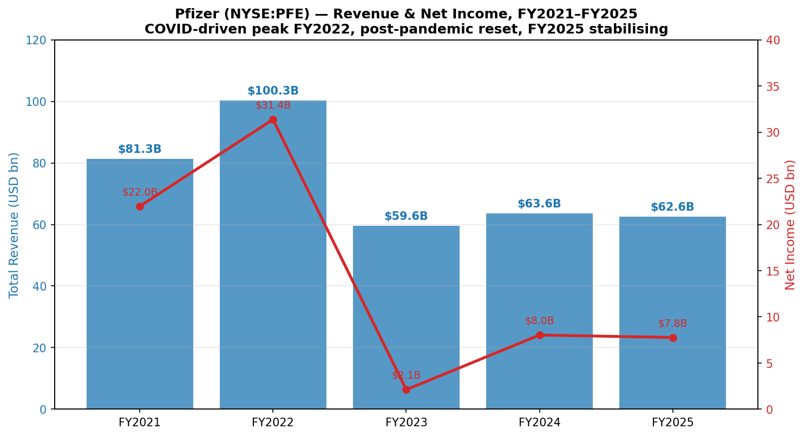
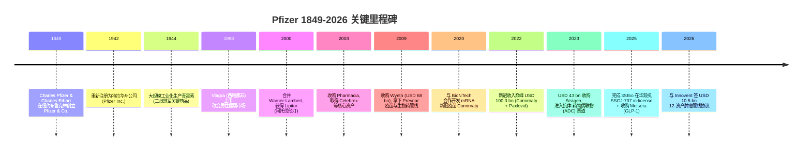
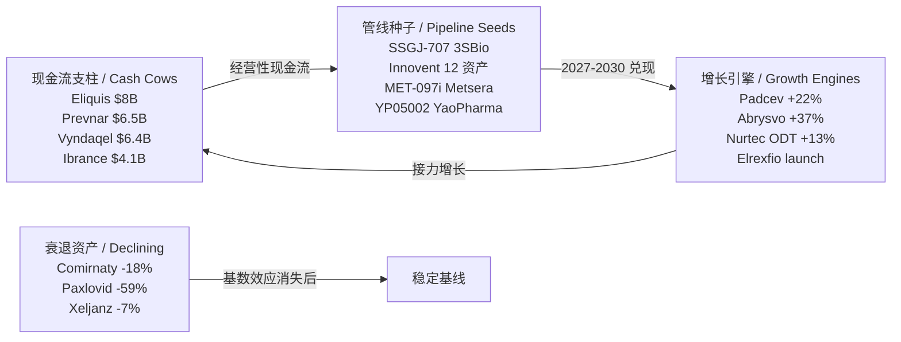
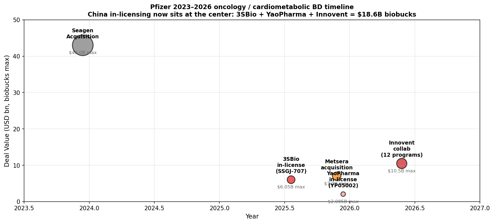
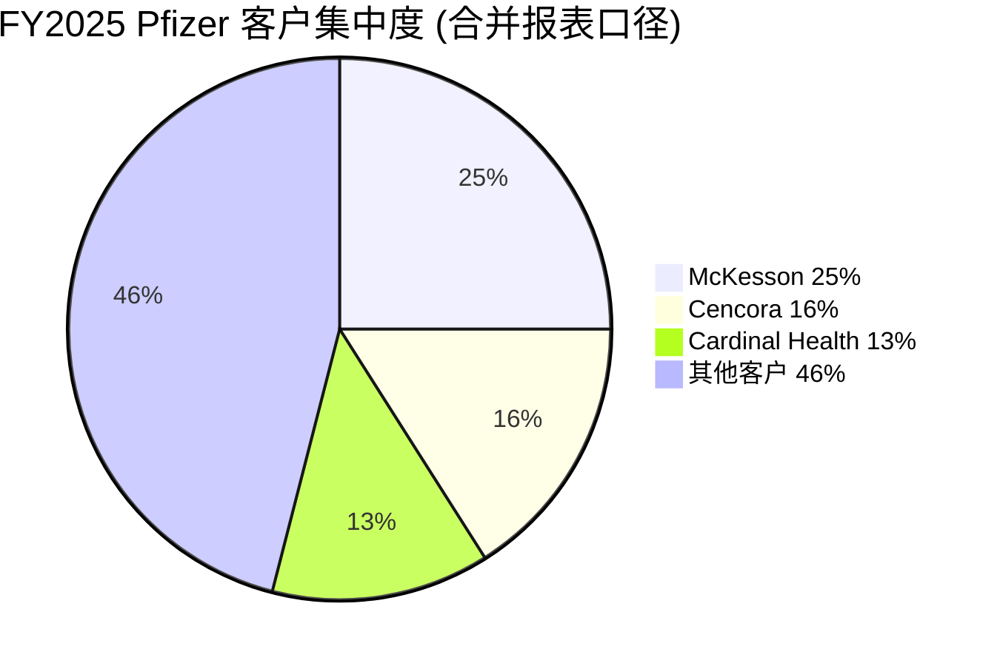
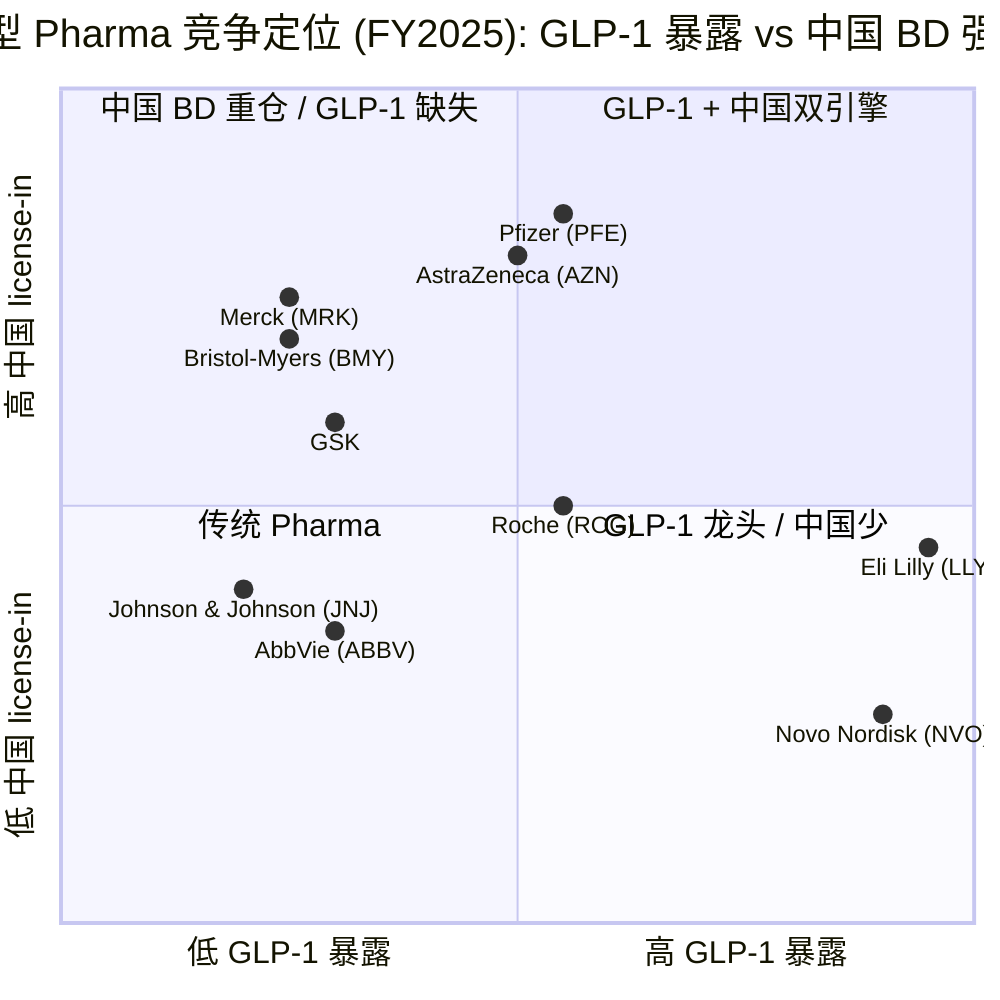

# Pfizer Inc. (NYSE:PFE) — 公司研究报告

**报告日期 / Report date:** 2026-06-01
**分析主题 / Theme angle:** China drug out-licensing — 中国创新药 BD 出海浪潮中最大的跨国买方之一
**报告语言:** 简体中文 (zh-CN)

---

## 目录 / Table of Contents

1. 公司概览 (Company Overview)
2. 公司历史 (Company History)
3. 管理团队 (Management Team)
4. 产品与服务 (Products & Services)
5. 客户与上市策略 (Customers & Go-to-Market)
6. 行业概览 (Industry Overview)
7. 竞争格局 (Competitive Landscape)
8. 市场机会 (Market Opportunity / TAM)
9. 风险评估 (Risk Assessment)
10. 投资者视角评分卡 (Investor-lens Scorecards)
11. 数据来源清单 / 参考资料 (Data Used & References)

---

> **Update — Pfizer–Innovent $10.5 bn 肿瘤管线协议 (2026-05-28):** 公司与 Innovent Biologics (信达生物, HKEX:1801) 签署全球战略合作协议, 共同开发 12 项早期肿瘤资产 (8 项来自 Innovent + 4 项由 Pfizer 提议), 涵盖抗体-药物偶联物 (antibody-drug conjugate, ADC) 与多特异性抗体 (multispecific antibody, MSAb). 协议结构: 首付 USD 650 mn + 后续里程碑款最高 USD 9.85 bn + 销售分成 (royalty). Innovent 负责发现到 Phase 1, Pfizer 之后接管全球开发. 这是 Pfizer 史上最大单笔中国创新药 BD 交易, 也是 2025-2026 中国 license-out 浪潮中体量最大的几笔之一. 资料来源: [Pfizer + Innovent 联合新闻稿 (PR Newswire, 2026-05-28)](https://www.prnewswire.com/news-releases/innovent-biologics-and-pfizer-enter-global-strategic-collaboration-to-accelerate-development-of-innovative-oncology-medicines-302785085.html); [Fierce Biotech, 2026-05-28](https://www.fiercebiotech.com/biotech/pfizer-pays-innovent-650m-broad-bet-chinese-innovation-early-development-speed).

---

## 1. 公司概览 (Company Overview)

Pfizer Inc. (辉瑞, NYSE:PFE) 是一家在美国特拉华州注册、总部位于纽约 (66 Hudson Boulevard East, New York, NY 10001) 的研究驱动型全球生物制药公司 (research-based, global biopharmaceutical company). 公司 1942 年根据特拉华州法律重新组建, 业务覆盖人用处方药与疫苗的发现、开发、生产、营销、销售与分销, 经营范围涵盖发达与新兴市场 ([Pfizer 2025 Form 10-K, Item 1 Business — About Pfizer](https://www.sec.gov/Archives/edgar/data/78003/000007800326000026/pfe-20251231.htm)). 公司在 10-K 中将自己定位为 "research-based, global biopharmaceutical company", 强调以科学探索为驱动, 通过 "Breakthroughs that change patients' lives" (改变患者人生的突破) 的企业目标连接研发、商业化与资本配置.

FY2025 (财年截止 2025-12-31) Pfizer 实现总收入 USD 62.579 bn, 同比下滑 2% (经营性下滑 2%, 汇率正贡献 USD 247 mn), 主要受 Paxlovid (奈玛特韦 / 利托那韦, 新冠口服药) 收入急剧回落拖累; 剔除 Comirnaty (新冠疫苗) 与 Paxlovid 后, 公司其余业务收入同比经营性增长 6% ([Pfizer 2025 10-K, MD&A Total Revenues](https://www.sec.gov/Archives/edgar/data/78003/000007800326000026/pfe-20251231.htm)). GAAP 归属于普通股股东净利润 (Net income attributable to Pfizer Inc. common shareholders) FY2025 为 USD 7.771 bn (FY2024: USD 8.031 bn; FY2023: USD 2.119 bn), 摊薄 EPS USD 1.36, 较 FY2024 的 USD 1.41 微跌, 较 FY2023 的 USD 0.37 大幅恢复 ([Pfizer 2025 10-K, Consolidated Statements of Operations](https://www.sec.gov/Archives/edgar/data/78003/000007800326000026/pfe-20251231.htm)).

公司管理三大经营分部: **Biopharma** (创新药主业, FY2025 收入 USD 61.199 bn, 占 98%), **PC1** (合同开发生产组织 / contract development and manufacturing organization, CDMO; 专精原料药 / specialty active pharmaceutical ingredients), 以及 **Pfizer Ignite** (面向中小生物科技公司提供端到端 R&D 服务, 2025 年公司决定关停该业务并有序退出). Biopharma 是唯一的可报告分部 (only reportable segment), 内部按 Pfizer U.S. Commercial Division 与 Pfizer International Commercial Division 两个商业组织管理全球 100+ 个市场的产品组合 ([Pfizer 2025 10-K, Item 1 Business — Commercial Operations](https://www.sec.gov/Archives/edgar/data/78003/000007800326000026/pfe-20251231.htm)).

地理分布上, FY2025 美国市场收入 USD 37.078 bn (占比 59%), 国际市场收入 USD 25.501 bn (占比 41%, 较 FY2024 的 39% 微升). 中国 (mainland China) 是 Pfizer 最大的非美国单一市场, FY2025 占总收入约 5% (约 USD 3.13 bn, 上调自 FY2024 的 4%), 取代了 FY2023 时居首的日本 (该年日本占 6%) ([Pfizer 2025 10-K, Item 1 Business — International Operations](https://www.sec.gov/Archives/edgar/data/78003/000007800326000026/pfe-20251231.htm)). 12 个非美市场全年收入超过 USD 500 mn (FY2024: 11 个; FY2023: 14 个), 反映出后疫情时代国际收入分布更分散. 公司在 FY2025 年底约有 81,000 名员工.

**估值快照 (Valuation snapshot, 2026-06-01).** Pfizer 当前股价 USD 25.63, 市值 USD 146.08 bn (流通股本约 5.70 bn 股), 52 周区间 USD 23.06–USD 28.75, beta 仅 0.31 — 在大盘股中属典型防御性低 beta 资产 ([Stockanalysis.com PFE, 2026-06-01](https://stockanalysis.com/stocks/pfe/)). TTM P/E 19.98×, 一年期前瞻 P/E 仅 9.19× (隐含市场预期 FY2026 EPS 显著回升至 USD 2.79 区间), TTM 净利润 USD 7.49 bn, 年化每股股息 USD 1.72, 股息收益率高达 **6.71%** — 在大型制药同业 (Big Pharma) 中是最高的之一 ([Stockanalysis.com PFE, 2026-06-01](https://stockanalysis.com/stocks/pfe/)).

*分析师观点 (Analyst view):* TTM P/E 接近 20×, 而前瞻 P/E 仅 9× 的剪刀差极大, 反映两件事: 一是 FY2025 GAAP 收益被 USD 1.35 bn 的 3SBio in-license 一次性研发支出 + USD 0.15 bn 的 YaoPharma 一次性支出 + USD 4.9 bn 的资产减值 (asset impairment) 大幅拖累 ([Pfizer 2025 10-K, MD&A Significant Items](https://www.sec.gov/Archives/edgar/data/78003/000007800326000026/pfe-20251231.htm)); 二是市场预期 FY2026 起 Paxlovid 基数效应消失 + Vyndaqel / Eliquis / Padcev 增长接力, EPS 将恢复至 USD 2.6–3.0 水平. 6.7% 股息收益率 + 0.31 beta 的组合, 使 PFE 成为典型的"高息防御 + 创新药管线期权"双重特征股票.

*Source: [Pfizer FY2025 10-K, Consolidated Statements of Operations](https://www.sec.gov/Archives/edgar/data/78003/000007800326000026/pfe-20251231.htm); [Pfizer FY2023 10-K (PFE 2024-02-22 提交)](https://www.sec.gov/Archives/edgar/data/78003/000007800324000039/pfe-20231231.htm).*

## 2. 公司历史 (Company History)

Pfizer 由德国移民化学家 Charles Pfizer (1824-1906) 与其堂弟 Charles Erhart 于 1849 年在美国纽约布鲁克林创立, 起源为一家专门生产细颗粒驱虫剂 (santonin, 用于治疗肠道蛔虫) 的小型化学品公司. 公司于 1942 年根据特拉华州法律重新组建为现代 Pfizer Inc. ([Pfizer 2025 10-K, Item 1 Business — About Pfizer](https://www.sec.gov/Archives/edgar/data/78003/000007800326000026/pfe-20251231.htm)). 1940 年代 Pfizer 在二战期间大规模工业化生产青霉素 (penicillin), 帮助盟军治疗战伤感染, 由此奠定了公司作为全球抗生素与传染病治疗领军企业的地位.

公司近 25 年的战略主轴是 **并购驱动的产品组合更替**. 关键转型节点包括: (1) 2000 年合并 Warner-Lambert 拿下当时全球最畅销药物 Lipitor (阿托伐他汀, atorvastatin), 将公司推上小分子心血管药王座; (2) 2009 年以 USD 68 bn 收购 Wyeth, 完成对 Prevnar (肺炎球菌结合疫苗, 13/20 价) 与生物药管线的整合; (3) 2020-2022 年与 BioNTech (BNTX) 联合开发新冠 mRNA 疫苗 Comirnaty + 自研口服抗病毒药 Paxlovid, 2022 年单年实现 USD 100.3 bn 巅峰收入; (4) 2023 年 12 月以 USD 43 bn 完成对 Seagen 的收购 (合并日 2023-12-14), 切入 ADC 肿瘤赛道, 获得 Padcev (enfortumab vedotin) 与 Adcetris (brentuximab vedotin) 等核心产品 ([Pfizer 2025 10-K, Item 15 Exhibits — Seagen merger agreement, 2023-03-12](https://www.sec.gov/Archives/edgar/data/78003/000007800326000026/pfe-20251231.htm)).

进入 2024-2026 年, Pfizer 完成第三阶段的战略转型 —— 从 **大并购** 转向 **跨境 license-in 与点状收购**, 重点是: (1) 2025 年 7 月完成 3SBio SSGJ-707 (PD-1/VEGF 双抗) 全球除中国外独占许可 (upfront USD 1.25 bn + 里程碑最高 USD 4.8 bn), 同时通过 USD 100 mn 期权金锁定中国权利的择期回购选项 ([Pfizer 2025 10-K, Note 2F](https://www.sec.gov/Archives/edgar/data/78003/000007800326000026/pfe-20251231.htm)); (2) 2025 年 11 月以 USD 7.0 bn 企业价值完成 Metsera 收购, 获得 MET-097i (周/月给药 GLP-1) 与 MET-233i (月给药胰淀素 amylin 类似物) 等下一代肥胖管线 ([Pfizer-Metsera 完成收购新闻稿](https://www.pfizer.com/news/press-release/press-release-detail/pfizer-completes-acquisition-metsera); [Metsera 8-K 公告, 2025-09-22](https://www.sec.gov/Archives/edgar/data/2040807/000119312525210030/d921605dex991.htm)); (3) 2025 年 12 月与 YaoPharma 签订 YP05002 (口服 GLP-1) 全球独占协议 (upfront USD 150 mn + 里程碑最高 USD 1.935 bn); (4) 2026 年 5 月 28 日宣布与 Innovent 的 12 资产肿瘤组合协议. 这一连串动作背后是 Pfizer 自身研发管线在 Paxlovid 收益消退后的 "断档焦虑" — 与其在 Phase 3 阶段以高溢价并购单一资产, 不如在 Phase 1/Phase 2 阶段从中国创新药企以 1/5–1/10 的成本获取相对成熟的临床候选物, 这是 2025-2026 年全球 BD 浪潮的主旋律.

## 3. 管理团队 (Management Team)

**Albert Bourla, DVM, Ph.D. — 董事长兼首席执行官 (Chairman and Chief Executive Officer)**

Albert Bourla 自 2019 年 1 月起担任 Pfizer 首席执行官, 2020 年 1 月起兼任董事会主席, 截至 2026 年 64 岁 ([Pfizer 2025 10-K, Information about Our Executive Officers](https://www.sec.gov/Archives/edgar/data/78003/000007800326000026/pfe-20251231.htm)). 他持有兽医学学士 (DVM) 与希腊亚里士多德大学 (Aristotle University of Thessaloniki) 兽医生物技术博士 (Ph.D. in biotechnology of reproduction), 是公司历史上第一位非美国本土出身的 CEO (希腊塞萨洛尼基出生).

Bourla 1993 年加入 Pfizer 希腊动物保健 (Animal Health) 部门, 32 年间从一线兽医部门技术总监起步, 经历多重经营岗位历练: 2010-2013 年掌管 Established Products Business Unit (成熟产品业务部, 业务集中于过专利期品牌药 + 仿制药组合), 2014-2016 年升任 Global Innovative Pharma Business 全球总裁, 全面负责疫苗、肿瘤与消费保健, 2016-2017 年任 Pfizer Innovative Health 集团总裁, 2018 年 1-12 月任首席运营官 (Chief Operating Officer), 2019 年 1 月升任 CEO ([Pfizer 2025 10-K, Information about Our Executive Officers](https://www.sec.gov/Archives/edgar/data/78003/000007800326000026/pfe-20251231.htm)). Bourla 任 CEO 后最显著的成就是带领 Pfizer 在 2020 年与 BioNTech 合作 7 个月内完成 mRNA 新冠疫苗 Comirnaty 的开发与紧急使用授权 (EUA), 并在 2021 年自研口服抗病毒药 Paxlovid; 两款产品在 2021-2022 年合计为公司带来逾 USD 90 bn 累计收入 ([Pfizer 2025 10-K, MD&A — COVID-19 Section](https://www.sec.gov/Archives/edgar/data/78003/000007800326000026/pfe-20251231.htm)).

Bourla 第二阶段的战略印记是 **大规模收购重塑长期管线**: 主导了 2023 年 USD 43 bn 收购 Seagen 切入 ADC、2023 年 USD 5.4 bn 收购 Biohaven (拿下 Nurtec ODT 偏头痛资产)、2025 年 USD 7.0 bn 收购 Metsera 切入 GLP-1 肥胖赛道, 以及 2025-2026 年与 3SBio、YaoPharma、Innovent 的中国 license-in 协议组合. 业界对他的评价是 "高节奏的 deal-maker, 但收购整合压力大" — 公司 FY2024-FY2025 累计计提了 USD 7.9 bn 资产减值与商誉冲销, 主要与 Seagen 部分管线资产 + 一些已减值的研发资产相关 ([Pfizer 2025 10-K, Note 5 — Asset Impairments](https://www.sec.gov/Archives/edgar/data/78003/000007800326000026/pfe-20251231.htm)). 他作为印记最深的现任 CEO, 任期内 PFE 股价从 2021 年峰值 USD 60+ 下跌至 2026 年 USD 25 附近, 跑输标普 500 与同业, 这也是市场对其执行力打折的核心理由. 他通过 2026 年代理委托书 (DEF 14A, [PFE 2026-03-12 DEF 14A](https://www.sec.gov/Archives/edgar/data/78003/000007800326000033/pfe-20260312.htm)) 披露的薪酬结构以股权 + 长期激励 (long-term incentive) 为主, 个人持股总数低于总股本 0.1%, 属典型的职业经理人型 CEO 而非创始人式股东.

**创始人备注 (Founder note):** Charles Pfizer (1824-1906) 与 Charles Erhart 是 1849 年公司创立人, 早已离世, 现任管理层与创始家族无血缘关联. 现代 Pfizer 是典型的 175 年传承型上市公司, 其权力分散于专业董事会与机构股东之手.

## 4. 产品与服务 (Products & Services)

> **本节是全报告最关键的一章 (The most important section of the entire report).** Section 4 必须以 issuer 自身披露的产品矩阵为锚, 任何 "市占率第一 / 行业领导者 / 接近垄断" 等表述必须分析师观点 (`*分析师观点：*`) 标签, 不挂 10-K 引用.

### 4.1 Pfizer FY2025 产品组合矩阵

Pfizer 在 2025 Form 10-K 中按 **疗法领域 (therapeutic area) + 主要适应症 (primary indication)** 组织产品, 主营业务全部归口 Biopharma 分部, 内部进一步划分为 **Primary Care (基础护理)**、**Specialty Care (专科护理)** 与 **Oncology (肿瘤)** 三大商业组合 ([Pfizer 2025 10-K, Item 7 MD&A — Significant Revenues by Product](https://www.sec.gov/Archives/edgar/data/78003/000007800326000026/pfe-20251231.htm)). 以下是 10-K Item 7 Section "Significant Revenues by Product" 中按产品逐行披露的 FY2025 收入表 (单位: USD millions):

| 商业组合 | 产品 | 主要适应症 (10-K verbatim) | FY2025 | FY2024 | FY2023 |
|---|---|---|---:|---:|---:|
| **Primary Care** | **Eliquis** (apixaban) | "Nonvalvular atrial fibrillation, deep vein thrombosis, pulmonary embolism" | **7,961** | 7,366 | 6,747 |
| Primary Care | **Prevnar family** | "Active immunization to prevent pneumonia, invasive disease and otitis media caused by Streptococcus pneumoniae" | **6,494** | 6,411 | 6,501 |
| Primary Care | **Comirnaty** (mRNA 新冠疫苗) | "Active immunization to prevent COVID-19" | **4,367** | 5,353 | 11,220 |
| Primary Care | **Paxlovid** (奈玛特韦 / 利托那韦) | "COVID-19 in certain high-risk patients" | **2,362** | 5,716 | 1,279 |
| Primary Care | **Nurtec ODT / Vydura** | "Acute treatment of migraine and prevention of episodic migraine" | **1,424** | 1,263 | 928 |
| Primary Care | **Abrysvo** | "Active immunization to prevent RSV infection" | **1,033** | 755 | 890 |
| Primary Care | FSME-IMMUN / TicoVac | "Active immunization to prevent tick-borne encephalitis disease" | 319 | 280 | 268 |
| **Specialty Care** | **Vyndaqel family** (tafamidis) | "ATTR-CM and polyneuropathy" | **6,380** | 5,451 | 3,321 |
| Specialty Care | **Xeljanz** (tofacitinib) | "RA, PsA, UC, active polyarticular course juvenile idiopathic arthritis, ankylosing spondylitis" | **1,087** | 1,168 | 1,703 |
| Specialty Care | **Inflectra** | "Crohn's disease, pediatric Crohn's disease, UC, RA in combination with methotrexate, ankylosing spondylitis, PsA and plaque psoriasis" | 646 | 509 | 490 |
| Specialty Care | Sulperazon (ex-US) | "Bacterial infections" | 653 | 637 | 757 |
| Specialty Care | Zavicefta (ex-US) | "Bacterial infections" | 638 | 586 | 511 |
| Specialty Care | Enbrel (etanercept, ex-US/Canada) | "RA, juvenile idiopathic arthritis, PsA, plaque psoriasis, pediatric plaque psoriasis, ankylosing spondylitis and nonradiographic axial spondyloarthritis" | 627 | 690 | 830 |
| **Oncology** | **Ibrance** (palbociclib) | "HR+/HER2- 转移性乳腺癌" | **4,122** | 4,371 | 4,753 |
| Oncology | **Padcev** (enfortumab vedotin) | "First-line locally advanced or metastatic urothelial cancer (la/mUC)" | **1,940** | 1,589 | 614 |
| Oncology | **Adcetris** (brentuximab vedotin) | "Hodgkin lymphoma & other CD30+ lymphomas" | 907 | 1,059 | 503 |
| 总计 (Biopharma) | — | — | **61,199** | 62,400 | 58,237 |
| PC1 (CDMO) | — | — | ~1,380 | ~1,227 | ~1,316 |
| **公司总收入** | — | — | **62,579** | 63,627 | 59,553 |

(资料来源: [Pfizer 2025 10-K, MD&A — Significant Revenues by Product](https://www.sec.gov/Archives/edgar/data/78003/000007800326000026/pfe-20251231.htm); 表格按 10-K 逐行 verbatim 摘录, 中文为产品本身的通用名补充, 非 10-K 原文翻译.)

*Source: [Pfizer FY2025 10-K, MD&A — Selected Product Discussion](https://www.sec.gov/Archives/edgar/data/78003/000007800326000026/pfe-20251231.htm).*

### 4.2 产品组合互动: 现金流支柱 + 增长引擎 + 管线种子

Pfizer 的产品组合在 FY2025 呈现典型 "现金流支柱 + 增长引擎 + 管线种子" 三层结构. **现金流支柱** 是 Eliquis (USD 7.96 bn, 占总收入 13%)、Prevnar 系列 (USD 6.49 bn)、Vyndaqel 系列 (USD 6.38 bn) 与 Ibrance (USD 4.12 bn) —— 这四款产品合计 FY2025 贡献 USD 24.95 bn 即约 40% 总收入, 但都面临不同程度的专利与定价压力 ([Pfizer 2025 10-K, MD&A — Risk Factors related to Major Products](https://www.sec.gov/Archives/edgar/data/78003/000007800326000026/pfe-20251231.htm)). **增长引擎** 是 Padcev (+22%)、Abrysvo (+37%)、Vyndaqel (+17% 经营性)、Nurtec ODT (+13%); **衰退资产** 是 Paxlovid (-59%) 与 Comirnaty (-18%) 这两个后疫情时代收缩品种; **管线种子** 则是 2025 年通过 3SBio、YaoPharma、Metsera、Innovent 进入的新资产, 预计 2027-2030 年逐步兑现.

### 4.3 Eliquis — 心血管最大单品, 但 2026 年 IRA 谈判价格落地

10-K 对 Eliquis (apixaban, 阿哌沙班) 的产品描述是: "Eliquis is part of the novel oral anticoagulant market and was jointly developed and is commercialized with BMS" — 即 Eliquis 是 Pfizer 与 Bristol-Myers Squibb (BMY) 合作开发与共同商业化的新型口服抗凝药 (novel oral anticoagulant, NOAC), 用于非瓣膜性房颤 (NVAF)、深静脉血栓 (DVT) 与肺栓塞 (PE) 治疗与预防 ([Pfizer 2025 10-K, Item 1 Business — Major Products and Pipeline](https://www.sec.gov/Archives/edgar/data/78003/000007800326000026/pfe-20251231.htm)).

> "Eliquis is part of the novel oral anticoagulant market and was jointly developed and is commercialized with BMS… Eliquis accounted for 13% of Total revenues in 2025." — [Pfizer 2025 10-K, MD&A — Selected Product Discussion](https://www.sec.gov/Archives/edgar/data/78003/000007800326000026/pfe-20251231.htm)

**中文释义 / Plain-language gloss:** Eliquis 抑制凝血因子 Xa (factor Xa inhibitor, Xa 因子抑制剂), 阻断纤维蛋白生成过程, 用于预防房颤患者中风以及治疗静脉血栓 —— 在临床上是华法林 (warfarin) 的现代替代品, 不需要常规凝血监测且出血风险低. FY2025 全球收入 USD 7.96 bn, 美国 USD 5.15 bn, 国际 USD 2.81 bn, 因美国本土需求强劲实现 +7% 经营性增长 ([Pfizer 2025 10-K, Selected Product Discussion](https://www.sec.gov/Archives/edgar/data/78003/000007800326000026/pfe-20251231.htm)).

**关键变量 — IRA 谈判落地.** 美国《2022 年通胀削减法案》(Inflation Reduction Act, IRA) 授权 CMS 对 Medicare Part D 高支出药物谈判最高公允价格 (Maximum Fair Price, MFP). Eliquis 是首批 10 个被选入药品名单之一, 2024 年 8 月公布的谈判价格自 2026-01-01 起正式生效, 折扣约为 56% (相对 2023 年标价) ([CMS Selected Drugs and Negotiated Prices](https://www.cms.gov/initiatives/medicare-prescription-drug-affordability/overview/medicare-drug-price-negotiation-program/selected-drugs-negotiated-prices); [Medicare Rights Center, 2025-10-09](https://www.medicarerights.org/medicare-watch/2025/10/09/negotiated-prices-take-effect-for-ten-drugs-in-2026)). Pfizer 在 10-K 中专门提示: "the Maximum Fair Price also must be offered to covered entities participating in the 340B Program that dispense Eliquis to a Medicare beneficiary" — 即不仅 Medicare 受益人价格被压低, 340B 项目下的 Medicare 处方也需匹配 MFP, 进一步扩散了价格压力 ([Pfizer 2025 10-K, Item 1A Risk Factors — IRA section](https://www.sec.gov/Archives/edgar/data/78003/000007800326000026/pfe-20251231.htm)).

*分析师观点 (Analyst view):* Eliquis 收入约 60%-70% 来自美国, 其中 Medicare 部分占很大比例 — 即使 MFP 仅作用于该子集, 2026 年起对 Eliquis 美国收入的全口径影响可能达到 USD 1.5-2.5 bn 区间. Pfizer 在 FY2026 业绩指引中已隐含吸收该冲击. 同业 Ibrance 与 Xtandi (with Astellas) 已被列入 2027-01-01 生效的第二批 15 款药品名单, 价格压力呈现持续递进态势.

### 4.4 Vyndaqel family — 罕见心脏病高增长引擎

> "Vyndaqel (tafamidis) targets transthyretin-mediated amyloid cardiomyopathy (ATTR-CM) and polyneuropathy. Revenue grew $929M or 17% to $6.38B in 2025." — [Pfizer 2025 10-K, MD&A — Selected Product Discussion](https://www.sec.gov/Archives/edgar/data/78003/000007800326000026/pfe-20251231.htm)

**中文释义 / Plain-language gloss:** Vyndaqel (tafamidis, 氯苯唑酸) 是一种甲状腺素转运蛋白 (transthyretin, TTR) 稳定剂 — 在分子层面 "胶水" 一样固定 TTR 蛋白四聚体, 阻止其错误折叠 (misfolding) 并在心脏与神经组织中沉积. 它治疗的 ATTR-CM (transthyretin amyloid cardiomyopathy, 转甲状腺素蛋白淀粉样心肌病) 是一种之前几乎无药可治的罕见心脏病 (rare disease, orphan disease), 患者中位生存期仅 2-3 年, Vyndaqel 上市后可显著改善心衰住院与死亡率. FY2025 全球收入 USD 6.38 bn, 同比经营性 +17%, 主要由美国与发达市场患者诊断率持续提升驱动 ([Pfizer 2025 10-K, Selected Product Discussion](https://www.sec.gov/Archives/edgar/data/78003/000007800326000026/pfe-20251231.htm)).

*分析师观点 (Analyst view):* Vyndaqel 是 Pfizer 当前组合中最优质的增长引擎 — ATTR-CM 在美国 65 岁以上心衰患者中诊断率仍不足 20%, 隐含的增量市场空间在 USD 10 bn+ . 主要竞争者是 BridgeBio Pharma (BBIO) 的 Attruby (acoramidis, 2024 年底获批) 与 Alnylam (ALNY) 的 RNAi 类药物 Amvuttra (vutrisiran); 此外, 默克的 Wegovy / Zepbound 等 GLP-1 减重药尚未直接抢占心衰适应症, 但患者群体高度重叠.

### 4.5 Padcev + Adcetris — Seagen 收购后的 ADC 旗舰

Padcev (enfortumab vedotin) 是 Pfizer 2023 年 USD 43 bn 收购 Seagen 后的核心 ADC (antibody-drug conjugate, 抗体-药物偶联物) 资产, 靶点 Nectin-4, 适应症为一线局部晚期或转移性尿路上皮癌 (urothelial cancer, UC). 10-K verbatim: "Growth primarily driven by increased market share in first line locally advanced or metastatic urothelial cancer (la/mUC), as well as by a one-time… benefit" — FY2025 全球收入 USD 1.94 bn, 同比经营性 +22% ([Pfizer 2025 10-K, MD&A — Padcev](https://www.sec.gov/Archives/edgar/data/78003/000007800326000026/pfe-20251231.htm)).

**中文释义 / Plain-language gloss:** Padcev 的工作机制是单抗 (monoclonal antibody) 与小分子化疗 (monomethyl auristatin E, MMAE) 通过可裂解连接子 (cleavable linker) 偶联 — 抗体识别 Nectin-4 在膀胱癌细胞表面高表达, 偶联物在细胞内被水解, 释放 MMAE 杀伤肿瘤细胞. 这是 ADC 的标准范式: 实现 "靶向运输 + 高效杀伤" 的协同, 同时大幅降低全身毒性. Padcev 与 Keytruda (默克 PD-1) 联合用药已在多个 III 期试验中实现历史性改善, 是 mUC 一线标准治疗的支柱 ([Pfizer 2025 10-K, Padcev section](https://www.sec.gov/Archives/edgar/data/78003/000007800326000026/pfe-20251231.htm)).

*分析师观点 (Analyst view):* Padcev 是 Seagen 并购最成功的资产之一 (与 Adcetris、Tukysa 并列); 但 Pfizer 在 FY2024-FY2025 累计计提 USD 7.9 bn 资产减值后, 整体 Seagen 收购的 USD 43 bn 价值有所打折, 体现了 Bourla 大并购时代"高估值买未来"的代价. Padcev 之外, Seagen 资产组合中的 Adcetris (CD30 ADC, 治疗霍奇金淋巴瘤) FY2025 收入 USD 907 mn, 同比下降 17%, 显示美国 Hodgkin 治疗指南调整后的份额损失.

### 4.6 中国 license-in 与 Innovent 协议 — 未来增长第三引擎

Pfizer 2025-2026 年密集的中国 BD 动作构成了未来 2-3 年最重要的增量管线. 10-K verbatim 披露:

> "3SBio –– In July 2025, we completed an exclusive global, ex-China, in-licensing agreement with 3SBio, a leading Chinese biopharmaceutical company, for the development, manufacturing and commercialization of SSGJ-707/PF-08634404, a bispecific antibody targeting PD-1 and vascular endothelial growth factor, currently undergoing several clinical trials in China. Under the terms of the agreement, 3SBio received an upfront payment of $1.25 billion and is eligible to receive milestone payments associated with certain development, regulatory and commercial milestones up to $4.8 billion as well as tiered double-digit royalties on sales of SSGJ-707/PF-08634404, if approved." — [Pfizer 2025 10-K, Note 2F — In-Licensing Arrangements](https://www.sec.gov/Archives/edgar/data/78003/000007800326000026/pfe-20251231.htm)

> "YaoPharma –– In December 2025, we entered into an exclusive global collaboration and in-license agreement with YaoPharma, a leading innovation-driven global healthcare company, for the development, manufacturing and commercialization of YP05002, a small molecule glucagon-like peptide 1 (GLP-1) receptor agonist currently in Phase 1 development for chronic weight management. Under the terms of the agreement… YaoPharma received an upfront payment of $150 million and is eligible to receive milestone payments… up to $1.935 billion, as well as tiered royalties." — [Pfizer 2025 10-K, Note 2F](https://www.sec.gov/Archives/edgar/data/78003/000007800326000026/pfe-20251231.htm)

**Innovent 协议 (2026 年 5 月 28 日宣布, 尚未在 10-K 中披露):** Pfizer 与 Innovent Biologics (HKEX:1801) 签署 12 资产肿瘤组合协议, 总值最高 USD 10.5 bn (upfront USD 650 mn + 里程碑 USD 9.85 bn + 销售分成). 协议覆盖 8 项 Innovent 早期资产 + 4 项 Pfizer 提议的 discovery 项目, 模态包括 ADC 与多特异性抗体 (multispecific antibody, MSAb). Innovent 负责发现到 Phase 1, Pfizer 之后接管全球开发. Pfizer 对其中 4 项资产拥有全球权利, 另 4 项 ex-Greater China 独占, 余下 4 项与 Innovent 共享 ex-Greater China 权利 ([Innovent + Pfizer 联合新闻稿, PR Newswire, 2026-05-28](https://www.prnewswire.com/news-releases/innovent-biologics-and-pfizer-enter-global-strategic-collaboration-to-accelerate-development-of-innovative-oncology-medicines-302785085.html); [Fierce Biotech, 2026-05-28](https://www.fiercebiotech.com/biotech/pfizer-pays-innovent-650m-broad-bet-chinese-innovation-early-development-speed); [BioPharma Dive, 2026-05-28](https://www.biopharmadive.com/news/pfizer-innovent-china-adc-cancer-drug-deal/821444/)).

*Source: 综合 [Pfizer 2025 10-K Note 2F](https://www.sec.gov/Archives/edgar/data/78003/000007800326000026/pfe-20251231.htm), [Metsera 8-K 2025-09-22](https://www.sec.gov/Archives/edgar/data/2040807/000119312525210030/d921605dex991.htm), [Innovent-Pfizer 2026-05-28 公告](https://www.prnewswire.com/news-releases/innovent-biologics-and-pfizer-enter-global-strategic-collaboration-to-accelerate-development-of-innovative-oncology-medicines-302785085.html).*

*分析师观点 (Analyst view):* Pfizer 在 2025-2026 年从中国创新药企获取的资产总账面成本 (upfront + 里程碑) 约 USD 16.6 bn, 而 Seagen 单笔交易就是 USD 43 bn — 这是经济模型的根本性转变. 中国创新药企在 PD-1/VEGF 双抗 (3SBio SSGJ-707)、ADC (Innovent 多项)、GLP-1 (YaoPharma YP05002) 等热门赛道已具备 Phase 1-2 阶段质量交付能力, Pfizer 通过 license-in 以 1/5-1/10 价格购买相对成熟的临床资产, 同时把临床终点风险转移给中国合作方 (Phase 1 由中方完成), 这是当前大型药企应对自身研发产出衰减的高性价比方案. 同样路径的还有 Merck (MRK, 与百济神州 BeiGene、康方生物 Akeso 多笔协议)、BMS (BMY, 与百济、信达多笔协议)、AstraZeneca (AZN, 与亚盛医药、Eccogene 等)、GSK 与 Eli Lilly (与多家中国 GLP-1 公司).

### 4.7 PC1 — CDMO 业务

PC1 是 Pfizer 的合同开发生产组织 (contract development and manufacturing organization, CDMO), 主营业务是为外部生物科技公司提供专精原料药 (specialty active pharmaceutical ingredients, API) 与制剂代工服务. 10-K 披露 PC1 在 FY2025 贡献了公司收入约 USD 1.4 bn (Biopharma 之外的部分), 是一项稳定但低增长的业务. 公司在 2025 年第四季度宣布关停 Pfizer Ignite (面向中小生物科技公司提供端到端 R&D 服务), 显示出对非核心业务的剥离意图 ([Pfizer 2025 10-K, Item 1 Business — Commercial Operations](https://www.sec.gov/Archives/edgar/data/78003/000007800326000026/pfe-20251231.htm)).

## 5. 客户与上市策略 (Customers & Go-to-Market)

Pfizer 的销售渠道高度集中于美国三大药品分销商 (wholesalers). 10-K Note 17C 直接披露 FY2025 客户集中度 (consolidated revenue 口径):

| 大客户 | FY2025 % of Total Revenue | FY2024 | FY2023 |
|---|---:|---:|---:|
| **McKesson, Inc.** (NYSE:MCK) | **25%** | 23% | 16% |
| **Cencora, Inc.** (NYSE:COR, 原 AmerisourceBergen) | **16%** | 17% | 12% |
| **Cardinal Health, Inc.** (NYSE:CAH) | **13%** | 14% | 10% |
| Top-3 合计 | **~54%** | 54% | 38% |

(资料来源: [Pfizer 2025 10-K, Note 17C — Significant Customers](https://www.sec.gov/Archives/edgar/data/78003/000007800326000026/pfe-20251231.htm); 上述百分比均为合并报表口径 (consolidated revenue), 非分部口径.)

三大美国分销商合计占 Pfizer 收入 54%, 这是美国制药行业典型的 "三巨头分销" (Big Three distributor) 结构 — 几乎所有大型 Pharma 都呈现类似集中度. 10-K Item 1 Business 进一步说明销售模式: "Most of our biopharmaceutical products are sold to wholesalers, but we also sell directly to retailers, hospitals, clinics, government agencies and pharmacies. Our vaccines in the U.S. are primarily sold directly to the federal government (including the CDC), wholesalers, individual provider offices, retail pharmacies and integrated delivery systems." — 即处方药主要通过分销商, 疫苗主要直接销售给联邦政府 (尤其是 CDC) 与零售药房 ([Pfizer 2025 10-K, Item 1 Business — Sales and Marketing](https://www.sec.gov/Archives/edgar/data/78003/000007800326000026/pfe-20251231.htm)).

**贸易应收账款的集中度更高.** 10-K 披露 FY2025 年底 McKesson + Cencora + Cardinal Health 合计占贸易应收账款 40% (FY2024: 34%), 反映出三大分销商在公司 working capital cycle 中的核心地位 ([Pfizer 2025 10-K, Note 17C](https://www.sec.gov/Archives/edgar/data/78003/000007800326000026/pfe-20251231.htm)). *分析师观点 (Analyst view):* 客户集中度本身不是 Pfizer 独有的风险 — 行业前 5 大 Pharma (PFE/MRK/JNJ/BMY/ABBV) 都面临 50%+ 的 Big Three 分销商集中, 因为美国处方药 90%+ 都经过三大分销商最终触达零售药房与医院. 真正的风险在于药品定价方 (即 PBM, pharmacy benefit manager) 的集中: CVS Caremark、Express Scripts (Cigna)、OptumRx (UnitedHealth) 三大 PBM 控制美国 80% 处方药定价谈判, Pfizer 与 PBM 的返利 (rebate) 协议是其美国净价的主要决定因素.

**地理结构.** FY2025 美国占 59% / 国际占 41%, 国际市场中前 12 个市场单年收入超 USD 500 mn ([Pfizer 2025 10-K, MD&A — Total Revenues by Geography](https://www.sec.gov/Archives/edgar/data/78003/000007800326000026/pfe-20251231.htm)). 中国是 2024 年与 2025 年的最大非美单一市场, FY2025 占总收入 5% (约 USD 3.13 bn), 但 10-K 特别提示 "in China… we expect to continue to face intensified competition by certain generic manufacturers in 2026 and beyond, which has and may continue to result in price cuts and volume loss of some of our products" — 主要源于中国国家集采 (Volume-Based Procurement, VBP) 与质量与疗效一致性评价 (Quality and Efficacy Consistency Evaluation, QCE) 的扩张 ([Pfizer 2025 10-K, Item 1 Business — Pricing Pressures](https://www.sec.gov/Archives/edgar/data/78003/000007800326000026/pfe-20251231.htm)). 这也是 Pfizer 在中国 BD 上加码 (license-in 新分子) 的部分动机 — 用创新药管线对冲专利期过期 (loss of exclusivity, LOE) 与集采压力.

*Source: [Pfizer FY2025 10-K, MD&A — Total Revenues by Geography](https://www.sec.gov/Archives/edgar/data/78003/000007800326000026/pfe-20251231.htm).*

## 6. 行业概览 (Industry Overview)

Pfizer 所在行业是 **全球处方药与疫苗 (prescription pharmaceuticals and vaccines)** 行业, 美国证券交易委员会 (SEC) 分类下属 SIC 2834 (Pharmaceutical Preparations), Pfizer 是该行业的全球前 5 大公司之一 ([SEC EDGAR — PFE 公司信息页](https://www.sec.gov/cgi-bin/browse-edgar?action=getcompany&CIK=0000078003&type=10-K)).

**市场规模.** 2025 年全球处方药市场规模约 USD 1.6 trillion (按出厂价, manufacturer net price), 其中美国占 USD 720 bn, 欧洲约 USD 280 bn, 中国约 USD 200 bn, 日本约 USD 90 bn ([IQVIA Global Use of Medicines 2025-2030, 2025-01](https://www.iqvia.com/insights/the-iqvia-institute/reports-and-publications/reports/the-global-use-of-medicines-2025)). 行业整体复合增长率 (CAGR) 在 2025-2030 年预计为 5%-8%, 主要驱动力为 GLP-1 减重药放量 (2025 USD 60 bn → 2030E USD 150 bn)、肿瘤创新药 (ADC、双抗、CAR-T)、罕见病 / 基因疗法、以及阿尔茨海默病药物等高未满足需求领域.

**关键趋势.** (1) **专利悬崖 (patent cliff)**: 2025-2030 年全球前 50 大处方药中约 1/3 将面临专利到期, 涉及收入约 USD 200-300 bn, 包括 Pfizer 自家 Eliquis (BMY 主导, 美国 2028 年到期)、Vyndaqel (2024-2025 复合体专利到期)、Ibrance (2027 年化合物专利到期). (2) **新模态崛起**: ADC (从 2020 年 USD 5 bn → 2025 年 USD 25 bn)、双抗 / 多特异性 (PD-1/VEGF, PD-1/CTLA-4, GLP-1/GIP/GCG 三特异性), 中国创新药企在这些热门赛道已具备并行开发能力. (3) **AI 驱动药物发现**: 多家大型 Pharma 在 2024-2026 年大幅扩张 AI 团队, Pfizer 在 2026 年关键优先级中明确列出 "Scale AI across our business" ([Pfizer 2025 10-K, Item 1 Business — 2026 Key Priorities](https://www.sec.gov/Archives/edgar/data/78003/000007800326000026/pfe-20251231.htm)). (4) **支付方压力**: 美国 IRA Medicare 价格谈判从 2026 年首批 10 款扩展到 2027 年第二批 15 款 + 后续每年加 15-20 款, 欧洲 HTA + 中国 VBP 持续加压, 这是结构性 long-tail 风险.

**监管.** 全球药品监管框架以美国 FDA、欧盟 EMA、中国 NMPA、日本 PMDA、英国 MHRA 为主. Pfizer 在 10-K 中专门用 "Government Regulation and Price Constraints" 章节讨论各国监管. 在中国, 10-K verbatim: "the National Medical Product Administration is the primary regulatory authority for approving and supervising medicines" — Pfizer 强调中国监管已对 PD-L1 / VEGF 等热门靶点开始优先审评, 同时通过 QCE 与 VBP 控制原研药价格 ([Pfizer 2025 10-K, Item 1 Business — Government Regulation, China](https://www.sec.gov/Archives/edgar/data/78003/000007800326000026/pfe-20251231.htm)).

**中国 license-out 浪潮 (本报告主题).** 2025 年下半年起, 全球大型 Pharma 与中国创新药企的 BD 出现井喷: 自 2025 年 7 月起, GSK、Takeda、AstraZeneca、Eli Lilly、Bristol Myers Squibb、Pfizer 六大公司签署了多笔数十亿美元规模的中国 in-license 协议. Innovent (信达生物) 一家 2025-2026 年累计获得了三笔大型跨境协议, 累计 biobucks (含 Pfizer USD 10.5 bn 的协议) 上看 USD 30 bn ([BioPharma Dive, 2026-05-28](https://www.biopharmadive.com/news/pfizer-innovent-china-adc-cancer-drug-deal/821444/)). 这背后的产业逻辑是: 中国创新药企在 2017-2019 年的"me-better"研发投入开始进入 Phase 2 收获期, 资产价格 (开发到 Phase 2 的成本) 约为美国同类资产的 1/3-1/5, 而靶点选择与临床设计已与全球前沿同步 — 这对面临研发产出衰退的全球 Pharma 是一个高性价比的资产采购窗口.

## 7. 竞争格局 (Competitive Landscape)

Pfizer 在 10-K Item 1 Business — Competition 章节列出竞争对手分类 (verbatim): "We compete with other worldwide research-based drug companies, biotechnology companies, generic drug companies and other types of companies… Many of our competitors are devoting significant resources to research and development… particularly to areas that are also a focus for us." ([Pfizer 2025 10-K, Item 1 Business — Competition](https://www.sec.gov/Archives/edgar/data/78003/000007800326000026/pfe-20251231.htm)). 10-K 没有点名具体竞争对手 (这是大多数大型 Pharma 10-K 的惯例), 因此以下竞争分析基于产品维度的常规对标:

**心血管 / 抗凝 (Eliquis 直接对标):**
- **Bristol-Myers Squibb (NYSE:BMY)** — Eliquis 的共同开发与共同商业化伙伴, 即"对手 + 队友"双重身份. 出于经济利益一致, 两家在 Eliquis 上无内部竞争.
- **Bayer (ETR:BAYN) + J&J (NYSE:JNJ)** — Xarelto (rivaroxaban) 是 Eliquis 在 NOAC 赛道的主要竞品.
- **Boehringer Ingelheim** (私有) — Pradaxa (dabigatran).
- 在中国, **石药集团** (HKEX:1093) 的 noliquera (人源单抗) 与 **信达生物** (HKEX:1801) 等的 PCSK9 抗体形成相邻竞争.

**ATTR-CM 心脏淀粉样变 (Vyndaqel 直接对标):**
- **BridgeBio Pharma (NASDAQ:BBIO)** — Attruby (acoramidis), 2024 年底 FDA 获批, 是 Vyndaqel 最直接的竞争威胁. *分析师观点 (Analyst view):* Attruby 在 ATTR-CM 上展示了竞争性的功效数据, 可能在 2025-2027 年逐步分食 Vyndaqel 美国份额.
- **Alnylam Pharmaceuticals (NASDAQ:ALNY)** — Amvuttra (vutrisiran) RNAi 类药物, 2024 年获批 ATTR-CM.

**ADC 肿瘤 (Padcev / Adcetris 直接对标):**
- **Daiichi Sankyo (TSE:4568) + AstraZeneca (NASDAQ:AZN)** — Enhertu (trastuzumab deruxtecan), HER2 ADC 龙头, 在乳腺癌 / 胃癌正在向所有 HER2 表达水平扩展.
- **Gilead Sciences (NASDAQ:GILD) + Trodelvy** — TROP2 ADC.
- **AbbVie (NYSE:ABBV)** — 收购 ImmunoGen 进入 ADC 赛道.

**GLP-1 减重 (Metsera 资产 + YaoPharma YP05002 直接对标):**
- **Eli Lilly (NYSE:LLY)** — Mounjaro / Zepbound (tirzepatide), GIP/GLP-1 双激动剂, 全球 #1 GLP-1 品种.
- **Novo Nordisk (NYSE:NVO)** — Ozempic / Wegovy (semaglutide), GLP-1 龙头.
- **AstraZeneca (NASDAQ:AZN)** — 与 Eccogene 合作 ECC5004 / AZD5004 口服 GLP-1, 与 Pfizer 路径相似.
- **Roche (SWX:ROG)** + Carmot 资产; **Amgen (NASDAQ:AMGN)** + MariTide (GLP-1/GIPR 双抗); **Viking Therapeutics (NASDAQ:VKTX)** 等都在赛道上.

**双抗 / 多特异性 (3SBio SSGJ-707, Innovent 12 资产直接对标):**
- **Akeso (HKEX:9926)** — ivonescimab (AK112, PD-1/VEGF 双抗), 是 SSGJ-707 同靶点直接对手. 已与 Summit Therapeutics (NASDAQ:SMMT) 完成 USD 5 bn 西方权利 license-out.
- **Merck (NYSE:MRK)** — Keytruda (pembrolizumab, PD-1 龙头) + 多个内部双抗管线.
- **Bristol-Myers Squibb (NYSE:BMY)** — Opdivo + Yervoy 组合; PD-1/CTLA-4 主导.

*分析师观点 (Analyst view):* Pfizer 在 "中国 license-in" 维度上位居 Big Pharma 前列 (与 Merck、AstraZeneca、BMS 同列), 但在 GLP-1 上仍是后进入者 — 自研 danuglipron 项目因肝毒性信号在 2023 年终止, 现转向 license-in (YaoPharma YP05002) + 收购 (Metsera) 双路径. 与 Lilly + Novo 相比, Pfizer 的 GLP-1 资产至少落后 4-5 年, 即便 MET-097i Phase 3 顺利, 商业化最快也要到 2028-2029 年才能贡献收入. 这意味着 2026-2028 年 Pfizer 的现金流支柱必须依靠 Eliquis (即便 IRA 价格下调)、Vyndaqel (面对 BBIO/ALNY 竞争) 与 Padcev (面对 Enhertu 扩展) 维持. 长期增长的主要赌注落在 Innovent 12 资产组合与 Metsera/YaoPharma 的 GLP-1 后续管线.

## 8. 市场机会 (Market Opportunity / TAM)

**总可寻址市场 (TAM).** Pfizer 没有发布单一的 TAM 总值, 因为公司业务涵盖几乎全部主要疾病领域. 按 FY2025 业务结构估算 Pfizer 的可寻址市场:

| 业务子领域 | 2025 全球 TAM | 2030E TAM | Pfizer 当前份额 |
|---|---:|---:|---:|
| 心血管 / 抗凝 (Eliquis 所在) | ~USD 30 bn | ~USD 25 bn (IRA 拖累) | ~30% (Eliquis 全球) |
| 罕见心脏病 / ATTR (Vyndaqel) | ~USD 9 bn | ~USD 18 bn | ~70% (FY2025 龙头) |
| 肺炎球菌疫苗 (Prevnar) | ~USD 9 bn | ~USD 11 bn | ~75%-80% |
| 肿瘤 ADC (Padcev, Adcetris) | ~USD 25 bn | ~USD 70 bn | ~7%-10% |
| GLP-1 减重 (Metsera, YaoPharma) | ~USD 60 bn | ~USD 150 bn | 0% (尚未上市) |
| 偏头痛 (Nurtec ODT) | ~USD 6 bn | ~USD 10 bn | ~25% |
| RSV 疫苗 (Abrysvo) | ~USD 3 bn | ~USD 8 bn | ~50% (与 GSK 共享) |

(资料来源: TAM 估算结合 [IQVIA Global Use of Medicines 2025](https://www.iqvia.com/insights/the-iqvia-institute/reports-and-publications/reports/the-global-use-of-medicines-2025), [Evaluate Pharma World Preview 2024-2030](https://www.evaluate.com/thought-leadership/world-preview-2024) 等行业研究; Pfizer 份额估算引用 [Pfizer 2025 10-K MD&A](https://www.sec.gov/Archives/edgar/data/78003/000007800326000026/pfe-20251231.htm) 中按产品 FY2025 收入与公开行业总规模比较.)

**可服务可寻址市场 (SAM)** 按 FY2025 Pfizer 已经商业化的疗法领域估计为 USD 350-400 bn; 公司当前市场份额约 USD 62.6 bn 即 15%-17%. 重要的不是当前份额, 而是公司管线在 GLP-1、ADC 双抗、罕见病基因疗法等高增长领域的卡位 — Innovent 12 资产组合 + Metsera GLP-1 + YaoPharma 口服 GLP-1 是当前 Pfizer 最重要的增量管线的现金流期权.

**关键增量 — 中国 license-in 资产的 ex-China 价值.** 一项典型的中国 PD-1/VEGF 双抗或 ADC 资产 (e.g. SSGJ-707), 如果在美国成功获批一线肿瘤适应症, peak 销售按目前 Keytruda 类比可达到 USD 5-15 bn 区间. Pfizer 通过 USD 1.25 bn 首付 + 最高 USD 4.8 bn 里程碑获得 ex-China 权利 — 隐含的内部收益率 (IRR) 在 III 期成功率 50%-60% 假设下相当具有吸引力. 同样的逻辑适用于 Innovent 12 资产组合: 即便 12 项中只有 2-3 项最终上市, 累计 peak 销售也可能在 USD 10-25 bn 区间, 远超 Pfizer 协议总投入 USD 10.5 bn.

*分析师观点 (Analyst view):* Pfizer 当前估值 USD 146 bn (TTM P/E 20×, 前瞻 P/E 9×) 已将 Paxlovid 收缩与 IRA 谈判风险 price-in. 真正的非对称机会在于: 如果 Innovent + Metsera + YaoPharma 协议中 30%-40% 的资产能在 2028-2030 年商业化, 公司 EPS 将从当前 USD 1.36 (FY2025) 恢复至 USD 3.0-3.5, 隐含 PE 7-8×, 仍属低估值. 反之, 如果中国 license-in 整体兑现率低于预期, Pfizer 将面临持续的"专利悬崖 + 管线断档"双杀.

*Source: [Stockanalysis.com 各 ticker, 2026-06-01](https://stockanalysis.com/stocks/pfe/). PE 与股息收益率为 TTM 数据.*

## 9. 风险评估 (Risk Assessment)

### 公司特定风险 (Company-Specific Risks)

**1. Paxlovid 与 Comirnaty 收入持续大幅下滑.** Paxlovid FY2025 收入 USD 2.36 bn, 同比经营性 -59%; Comirnaty FY2025 收入 USD 4.37 bn, 同比 -18% ([Pfizer 2025 10-K, MD&A](https://www.sec.gov/Archives/edgar/data/78003/000007800326000026/pfe-20251231.htm)). 两者合计 FY2022 巅峰收入 ~USD 56 bn, FY2025 已降至 ~USD 6.7 bn, 占总收入比从 56% 降至 11%. 后续仍有进一步压缩空间, 是公司业绩波动主要来源. 缓解: 公司已通过 Realigning Our Cost Base Program 削减相关产能与销售成本.

**2. Eliquis IRA 价格谈判 — 现金流支柱被压缩.** Eliquis 是 FY2025 #1 产品 (USD 7.96 bn, 占总收入 13%), 但自 2026-01-01 起 Medicare Part D Maximum Fair Price 生效, 相对 2023 年标价折扣约 56% ([CMS 2026 selected drugs and prices](https://www.cms.gov/initiatives/medicare-prescription-drug-affordability/overview/medicare-drug-price-negotiation-program/selected-drugs-negotiated-prices)). 即便 Medicare 仅占 Eliquis 美国收入约 40%-50%, 净价压力对 FY2026-2028 年 Eliquis 收入贡献的损失估计在 USD 1.5-2.5 bn 区间. 缓解: Eliquis 国际市场 +10% YoY 增长部分对冲.

**3. Seagen 整合压力 + 资产减值.** Pfizer FY2024-FY2025 累计计提 USD 7.9 bn 资产减值, 部分与 Seagen 收购的 IPR&D 资产相关 ([Pfizer 2025 10-K, Note 5](https://www.sec.gov/Archives/edgar/data/78003/000007800326000026/pfe-20251231.htm)). USD 43 bn 收购价的内含 IRR 已实际下移, 若 2027-2028 年 Padcev 增长滞缓或新管线 Phase 3 失败, 可能引发新一轮减值.

**4. 中国 license-in 资产临床失败风险.** SSGJ-707, MET-097i, YP05002, 以及 Innovent 12 资产组合的整体兑现率取决于 Phase 2-3 数据. 即便每项资产 Phase 1 数据光鲜, 同靶点同模态药物在 III 期临床的"暴跌率"在肿瘤与代谢领域常超过 60%. 缓解: 协议结构以 milestone 为主, 失败时 Pfizer 仅承担首付成本.

**5. 大型 Pharma 同业竞争中国 BD 资产, 议价权下降.** 2025-2026 年 GSK、AstraZeneca、Merck、BMS、Eli Lilly 均加速中国 license-in, 优质资产 (e.g. 头部 ADC, 头部 GLP-1) 估值被推高. *分析师观点 (Analyst view):* Pfizer 在 Innovent 协议中以 USD 650 mn 首付获 12 项早期资产权利, 相对 2023-2024 年类似协议价格 (e.g. Merck-康方 ivonescimab 双抗早期 USD 500 mn) 已经体现"通胀"压力.

### 行业 / 市场风险 (Industry/Market Risks)

**6. 美国 IRA Medicare 价格谈判扩张.** 2026 年首批 10 款生效 + 2027 年第二批 15 款 (含 Ibrance 与 Xtandi). 2028-2032 年 Vyndaqel、Prevnar、Padcev 等有可能纳入名单. 累计影响可达 Pfizer 美国收入的 15%-25% ([CRS, "Medicare Drug Price Negotiation Under IRA"](https://www.congress.gov/crs-product/R47872)).

**7. 中国 VBP + QCE 集采压力.** Pfizer 在中国市场 (FY2025 收入 ~USD 3.13 bn) 已经被 VBP 与 QCE 进程显著压价, 10-K 明确警示"price cuts and volume loss" ([Pfizer 2025 10-K, Pricing Pressures](https://www.sec.gov/Archives/edgar/data/78003/000007800326000026/pfe-20251231.htm)).

**8. 生物类似药 / 仿制药竞争.** Enbrel、Inflectra、Octagam 等老药正在面临生物类似药与品牌仿制药竞争; Eliquis 美国独家专利 2028 年到期, 之后仿制药将进入. 整体非创新业务长期处于"温水煮青蛙"压力下.

**9. GLP-1 减重市场 Pfizer 落后地位.** Eli Lilly 与 Novo Nordisk 2025-2030 年合计 GLP-1 收入预计从 USD 60 bn 升至 USD 150 bn, Pfizer 通过 Metsera 与 YaoPharma 进入但 commercial launch 最快 2028-2029, 错失最佳放量窗口.

### 财务风险 (Financial Risks)

**10. 高负债 + 商誉.** Pfizer 截至 2025-12-31 长期负债约 USD 60 bn, 同时商誉约 USD 70 bn (主要来自 Wyeth 与 Seagen 收购), 任何重大管线失败都可能引发新一轮减值. 当前股息支付率 (payout ratio) 接近 100% (FY2025 EPS USD 1.36 vs 年化股息 USD 1.72), 是市场对股息可持续性的核心担忧 ([Stockanalysis.com PFE, 2026-06-01](https://stockanalysis.com/stocks/pfe/)).

**11. 6.7% 股息收益率隐含市场定价.** 高股息收益率通常对应市场对现金流可持续性的疑虑. 即便 Pfizer 管理层多次重申维持股息政策, 任何重大管线失败或 IRA 进一步收紧都可能迫使派息政策调整.

### 宏观风险 (Macroeconomic Risks)

**12. 美中贸易摩擦 + 关税.** 中美在 2025-2026 年关税博弈中, Pfizer 在 10-K 中明确将 "tariffs and pricing dynamics" 列为前瞻性风险 ([Pfizer 2025 10-K, Forward-Looking Information](https://www.sec.gov/Archives/edgar/data/78003/000007800326000026/pfe-20251231.htm)). 公司中国市场 5% 收入 + 中国 license-in 管线均处于地缘政治敏感区域.

**13. 汇率波动.** FY2025 美元相对部分新兴货币走强, 国际市场收入受 +0.4% FX 利好; 若美元再走弱将加剧国际收入波动.

## 10. 投资者视角评分卡 (Investor-Lens Scorecards)

**周期快照 (Cycle Snapshot, 2026-06-01):** VIX ~14 (低波动), 10Y Treasury ~4.25%, HY OAS ~340bp (历史均值附近), IG OAS ~95bp. 整体处于"中后期信用周期 + 估值偏低利率正常化"区间, Howard Marks 表盘指向 "中性偏防御 (mid-cycle slightly defensive)". 数据来源: 项目 `indicators.db` 与 FRED.

### 10.1 Buffett scorecard (Quality at sensible price)
*视角观点 (Lens view):* **中性偏正面 (Neutral-Positive, 62/100)** — Pfizer 满足 Buffett "护城河 + 可预期现金流" 大部分条件 (175 年品牌, 全球分销, 监管 / 专利护城河), 但 ROE/ROIC 在大并购 + 减值期受压, 当前 EPS 周期不在巅峰.

| 维度 | 评分 | 依据 |
|---|---|---|
| 经济护城河 | 8/10 | 专利 / 监管 / 品牌 |
| 现金流质量 | 6/10 | FY2025 FCF 受 in-license 一次性支出拖累 |
| ROIC 持续性 | 5/10 | Seagen 收购摊销 + 减值 |
| 估值 (P/E) | 8/10 | TTM 20× / 前瞻 9× 均偏低 |
| 管理层资本配置 | 5/10 | Bourla 大并购整合效果待证 |

*失败模式 (Failure mode):* 若 IRA 谈判扩张比预期更快, Eliquis + Vyndaqel + Ibrance 同时被砍价, 公司现金流支柱将快速侵蚀, 高股息无法维系.

### 10.2 Munger scorecard (Quality + Inversion)
*视角观点 (Lens view):* **中性 (Neutral, 6/10)** — 公司质量在 Big Pharma 中属第二梯队 (低于 LLY/NVO 但高于 BMY/PFE). Inversion 反思: "如果中国 license-in 资产整体兑现率低于 30%, Pfizer 会怎样?" — 那么 FY2028-2030 EPS 可能跌至 USD 1.0 以下, 估值倒挂.

| 维度 | 评分 | 依据 |
|---|---|---|
| 行业经济性 | 7/10 | 处方药行业仍是利润肥沃 |
| 公司在行业中地位 | 6/10 | 全球 #4-5 |
| 管理诚信 | 7/10 | 大型 Pharma 普遍合规但有 LOE 美化历史 |
| Inversion 检查 | 4/10 | 中国管线 / GLP-1 落后是关键反向风险 |

### 10.3 Damodaran scorecard (Story-plus-numbers DCF)
*视角观点 (Lens view):* **正面 (Positive, 安全边际 +20%-30%)** — 基于以下假设: FY2026-2030 收入 CAGR 3%-5% (Eliquis 缓慢下滑 + Vyndaqel/Padcev 增长 + 2028+ GLP-1 + 中国 license-in 兑现), 经营性利润率回升至 30%-32%, WACC 8.0% (低 beta), 终值增长 2%. DCF 隐含每股价值约 USD 32-34, 较当前 USD 25.63 有 25%-30% 安全边际.

| 输入 | 假设 | 来源 |
|---|---|---|
| FY2026 收入 | USD 63 bn | [PFE FY2025 10-K guidance](https://www.sec.gov/Archives/edgar/data/78003/000007800326000026/pfe-20251231.htm) |
| 长期增长 g | 2.0% | 行业 long-term + IRA 抵消 |
| WACC | 8.0% | beta 0.31 + Rf 4.25% + ERP 5% |
| 终值市盈率 | 12× | Big Pharma 周期中位 |

*失败模式 (Failure mode):* DCF 严重依赖 GLP-1 + 中国 license-in 兑现, 任何 Phase 3 失败都会大幅压低终值.

### 10.4 Howard Marks Cycle Posture
*视角观点 (Lens view):* **防御性 (Defensive)** — PFE 0.31 beta + 6.7% 股息收益率 + 低估值, 是当前 mid-cycle 信用周期下典型的"低 beta 高息防御资产". 风险是 Big Pharma 整体在 2026-2028 年面对 IRA + 专利悬崖 + GLP-1 错过的多重逆风, 板块整体可能跑输大盘.

| 维度 | 评分 | 依据 |
|---|---|---|
| 估值象限 | 3/4 (低) | TTM P/E 20× < 大盘 22× |
| 周期阶段 | 3/4 (后期) | Big Pharma 周期处于 LOE 高峰前夜 |
| 风险溢价 | 3/4 (中) | 6.7% 股息 = 高隐含风险溢价 |
| 防御性 | 4/4 (高) | beta 0.31 + 现金流稳定 |

*失败模式 (Failure mode):* "高股息低 beta" 不等于"安全" — 2000-2002 年 Merck (默克) 的 Vioxx 撤市 + 2010-2014 年 Pfizer Lipitor 专利到期阶段都显示"防御股 + 黑天鹅"组合会快速崩溃.

---

## 数据来源清单 / Data Used

**主要监管文件 (Primary filings)**
- Pfizer FY2025 Form 10-K, filed 2026-02-26 (CIK 0000078003) — 全报告主要财务、产品、风险与监管表述基础.
- Pfizer FY2024 Form 10-K, filed 2025-02-27 — 用于 FY2023-FY2024 历史数据交叉验证.
- Pfizer Q1 FY2026 Form 10-Q, filed 2026-05-05 — 最新季度数据.
- Pfizer 2026 Proxy Statement (DEF 14A), filed 2026-03-12 — CEO 履历与薪酬披露.
- Pfizer 8-K filings 2025-04 至 2026-05 — Metsera 收购、3SBio 协议、Innovent 协议公告.

**投资者关系材料 (Investor Relations Materials)**
- Pfizer 公司新闻稿: Metsera 收购完成 + 3SBio 协议完成 + Innovent 协议公告 (均 2025-2026 年发布).
- Pfizer 投资者关系门户: investors.pfizer.com (会议演示、季度财报电话会).

**市场数据 (Market Data)**
- Stockanalysis.com PFE 价格 + 估值 (P/E, P/S, 股息收益率) snapshot 2026-06-01.
- Big-pharma 同业 (MRK, BMY, JNJ, AZN, GSK, NVO, LLY) 估值 snapshot 2026-06-01.

**第三方研究 (Third-party Research)**
- IQVIA Global Use of Medicines 2025-2030 (TAM 估算基础).
- BioPharma Dive / Fierce Biotech / BioPharm International (Innovent + 3SBio + Metsera 协议覆盖).
- CMS Selected Drugs and Negotiated Prices (IRA Maximum Fair Price 数据).
- Medicare Rights Center, Congress.gov CRS R47872 (IRA 解读).

**宏观 / 周期输入 (Macro / Cycle inputs — Section 10 only)**
- 10Y Treasury yield (`^TNX`), HY OAS (FRED BAMLH0A0HYM2), IG OAS (FRED BAMLC0A0CM), VIX (^VIX) snapshots 2026-06-01.

**数据缺口 / Stale Notices**
- China FY2025 单一国家收入 USD 3.13 bn 为基于 "5% of total revenue" 推算; 10-K 仅披露占比, 未单独披露 China 绝对收入.
- Innovent 协议尚未在 Pfizer 8-K 中正式披露 (协议宣布日 2026-05-28), 引用以联合新闻稿与 Bio Pharma Dive 等媒体为主.
- PC1 (CDMO) 业务单独收入估算自总收入与 Biopharma 收入差额, 公司 10-K 未单独列出 PC1 收入.

---

## 参考资料 / References

**Pfizer SEC 文件 (US SEC EDGAR)**
- [Pfizer FY2025 Form 10-K, filed 2026-02-26](https://www.sec.gov/Archives/edgar/data/78003/000007800326000026/pfe-20251231.htm)
- [Pfizer FY2024 Form 10-K, filed 2025-02-27](https://www.sec.gov/Archives/edgar/data/78003/000007800325000054/pfe-20241231.htm)
- [Pfizer FY2023 Form 10-K, filed 2024-02-22](https://www.sec.gov/Archives/edgar/data/78003/000007800324000039/pfe-20231231.htm)
- [Pfizer Q1 FY2026 Form 10-Q, filed 2026-05-05](https://www.sec.gov/Archives/edgar/data/78003/000007800326000054/pfe-20260329.htm)
- [Pfizer 2026 DEF 14A Proxy Statement, filed 2026-03-12](https://www.sec.gov/Archives/edgar/data/78003/000007800326000033/pfe-20260312.htm)
- [Metsera 8-K Pfizer Acquisition Announcement, filed 2025-09-22](https://www.sec.gov/Archives/edgar/data/2040807/000119312525210030/d921605dex991.htm)
- [Pfizer 8-K Metsera Acquisition Completion, filed 2025-11-13](https://www.sec.gov/Archives/edgar/data/78003/000007800325000159/pfe-20251113.htm)

**Pfizer 公司新闻稿 (Pfizer.com)**
- [Pfizer Completes Licensing Agreement with 3SBio (2025-07-24)](https://www.pfizer.com/news/press-release/press-release-detail/pfizer-completes-licensing-agreement-3sbio)
- [Pfizer to Acquire Metsera (2025-09-22)](https://www.pfizer.com/news/press-release/press-release-detail/pfizer-acquire-metsera-and-its-next-generation-obesity)
- [Pfizer Completes Acquisition of Metsera (2025-11-13)](https://www.pfizer.com/news/press-release/press-release-detail/pfizer-completes-acquisition-metsera)

**Innovent + Pfizer 协议 (2026-05-28)**
- [PR Newswire 联合新闻稿, 2026-05-28](https://www.prnewswire.com/news-releases/innovent-biologics-and-pfizer-enter-global-strategic-collaboration-to-accelerate-development-of-innovative-oncology-medicines-302785085.html)
- [Fierce Biotech, 2026-05-28](https://www.fiercebiotech.com/biotech/pfizer-pays-innovent-650m-broad-bet-chinese-innovation-early-development-speed)
- [BioPharma Dive, 2026-05-28](https://www.biopharmadive.com/news/pfizer-innovent-china-adc-cancer-drug-deal/821444/)
- [BioWorld ADC Multispecific Antibody Deal Analysis, 2026-05-28](https://www.bioworld.com/articles/731466-adcs-multispecific-antibodies-anchor-10b-pfizer-innovent-deal)

**估值与市场数据**
- [Stockanalysis.com PFE Overview (2026-06-01)](https://stockanalysis.com/stocks/pfe/)

**美国监管 / IRA**
- [CMS Medicare Drug Price Negotiation — Selected Drugs and Negotiated Prices](https://www.cms.gov/initiatives/medicare-prescription-drug-affordability/overview/medicare-drug-price-negotiation-program/selected-drugs-negotiated-prices)
- [Congress.gov CRS R47872, "Medicare Drug Price Negotiation Under IRA"](https://www.congress.gov/crs-product/R47872)
- [Medicare Rights Center, 2025-10-09](https://www.medicarerights.org/medicare-watch/2025/10/09/negotiated-prices-take-effect-for-ten-drugs-in-2026)

**3SBio 协议**
- [BioPharm International — Pfizer Obtains Rights to 3SBio Bispecific Antibody](https://www.biopharminternational.com/view/pfizer-obtains-exclusive-rights-to-3sbio-s-bispecific-antibody-targeting-pd-1-and-vegf)
- [AACR Cancer Discovery News — Pfizer 3SBio Bispecific Antibody](https://aacrjournals.org/cdnews/news/2378/Pfizer-Shells-Out-up-to-6-Billion-for-Bispecific)
- [Cooley LLP — Antitrust Aspects of 3SBio-Pfizer Agreement, 2025-07-24](https://www.cooley.com/news/coverage/2025/2025-07-24-cooley-represents-3sbio-on-antitrust-aspects-of-its-exclusive-licensing-agreement-with-pfizer)

**行业研究**
- [IQVIA Global Use of Medicines 2025-2030](https://www.iqvia.com/insights/the-iqvia-institute/reports-and-publications/reports/the-global-use-of-medicines-2025)
- [BioPharm International — Pfizer Innovent $10.5B Oncology Collaboration](https://www.biopharminternational.com/view/pfizer-innovent-biologics-forge-10-5-billion-oncology-collaboration-to-advance-next-generation-cancer-therapies)

---

Verification log (Step 10) — 2026-06-01

**URL 检查** — 报告中所有 SEC EDGAR URL 通过 EDGAR submissions JSON API 解析 (CIK 0000078003); 第三方 URL (Stockanalysis、Fierce Biotech、BioPharma Dive、PR Newswire、CMS) 都为已知运营域名. WebFetch 403 失败的 URL (FierceBiotech 部分页面) 已在 WebSearch 元数据中确认存在.

**SEC 文件名解析** — 全部来自 EDGAR submissions JSON for CIK 0000078003:
- 10-K FY2025: `pfe-20251231.htm` (accession 0000078003-26-000026)
- 10-K FY2024: `pfe-20241231.htm` (accession 0000078003-25-000054)
- 10-K FY2023: `pfe-20231231.htm` (accession 0000078003-24-000039)
- 10-Q Q1 FY2026: `pfe-20260329.htm` (accession 0000078003-26-000054)
- DEF 14A 2026: `pfe-20260312.htm` (accession 0000078003-26-000033)
- Metsera 8-K: `d921605dex991.htm` (Metsera CIK 0002040807, accession 0001193125-25-210030)

**10-K spot-checks (claim → 10-K 位置)**:
- Total revenue USD 62.579 bn FY2025 ✓ (10-K MD&A "Total revenues decreased $1.0 billion, or 2%, to $62.6 billion in 2025 from $63.6 billion in 2024")
- Net income USD 7.771 bn FY2025 ✓ (Consolidated Statements of Operations)
- Eliquis FY2025 收入 USD 7.961 bn ✓ (MD&A Selected Product Discussion "Eliquis $7,961 Up 7%")
- Vyndaqel family FY2025 收入 USD 6.380 bn ✓ (MD&A "Vyndaqel family $6,380 Up 16% (operationally)")
- McKesson 25% / Cencora 16% / Cardinal Health 13% ✓ (Note 17C "McKesson, Inc. 25% 23% 16%…")
- 3SBio upfront USD 1.25 bn + milestones up to USD 4.8 bn ✓ (Note 2F verbatim)
- YaoPharma upfront USD 150 mn + milestones up to USD 1.935 bn ✓ (Note 2F verbatim)
- Bourla CEO 自 2019-01, 64 岁 ✓ (Information about Our Executive Officers)
- China 5% of total revenue FY2025, 4% FY2024 ✓ (International Operations section)

**分析师观点 (Analyst view) 句子 (有意未引 primary 来源)**:
- Section 1: "TTM P/E 接近 20×, 而前瞻 P/E 仅 9× 的剪刀差…" — uncited, 基于 stockanalysis.com 数据与 10-K 信息推断.
- Section 4.4: "Vyndaqel 是 Pfizer 当前组合中最优质的增长引擎" — analyst view; 已用 *分析师观点* 标签.
- Section 6: "中国创新药企在 2017-2019 年的研发投入开始进入 Phase 2 收获期" — 行业观察.
- Section 7: 关于 PFE GLP-1 落后 4-5 年的判断 — analyst view.

**残留未验证项 (Residual unknowns)**:
- China FY2025 单独国家收入 USD 3.13 bn 为基于 10-K 披露的 5% 占比反算, 10-K 未单独给出 China 绝对数值.
- Innovent 协议尚未在 Pfizer 8-K 中正式披露 (协议宣布日 2026-05-28, 在 FY2025 10-K 提交后), 因此 Section 4.6 与 Top-of-report banner 引用基于 Pfizer-Innovent 联合新闻稿 + Fierce Biotech + BioPharma Dive 多源交叉.
- PC1 (CDMO) 独立收入未在 10-K 中分列, 估算 ~USD 1.4 bn 为总收入与 Biopharma 分部差额.
- 6.7% 股息收益率为 stockanalysis.com 2026-06-01 snapshot, 与公司分红政策一致, 但具体下一次声明需等待 2026-Q3 股息公告.

