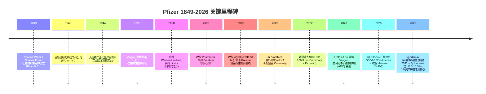
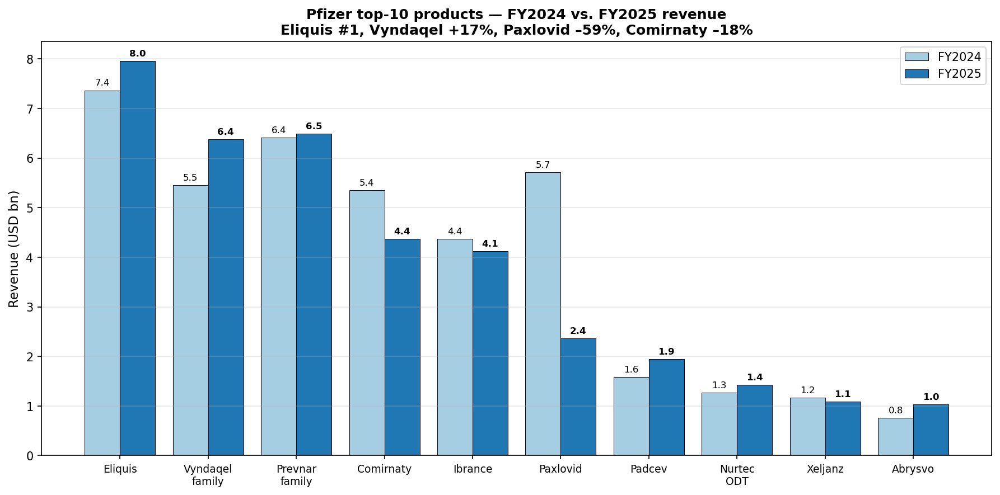
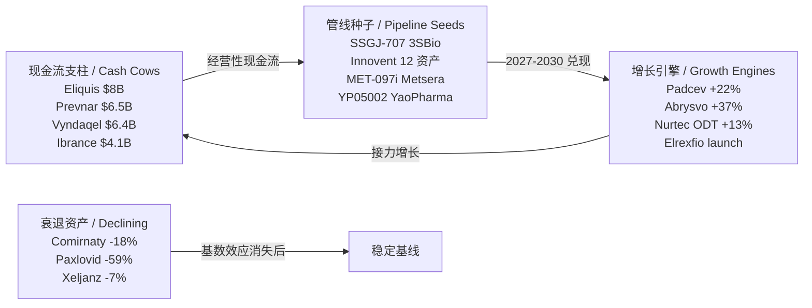
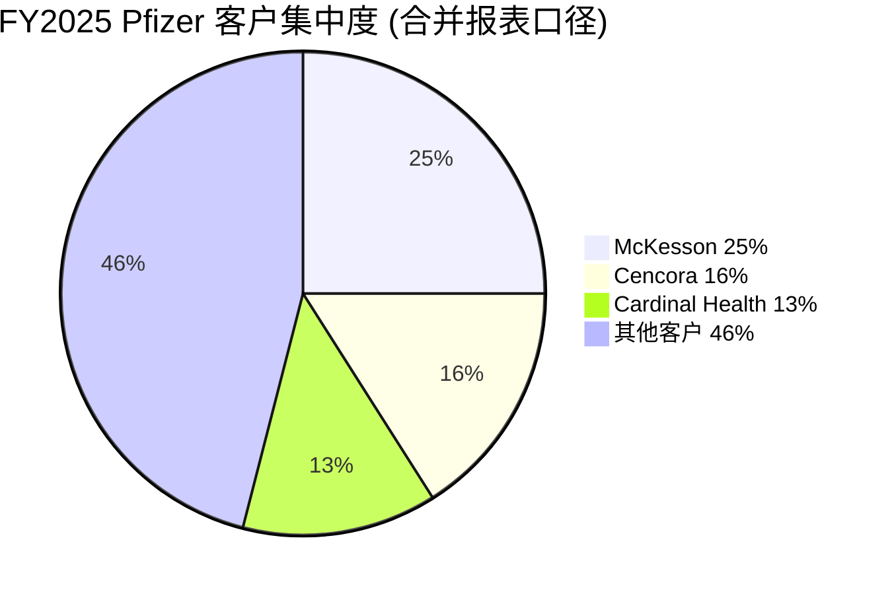
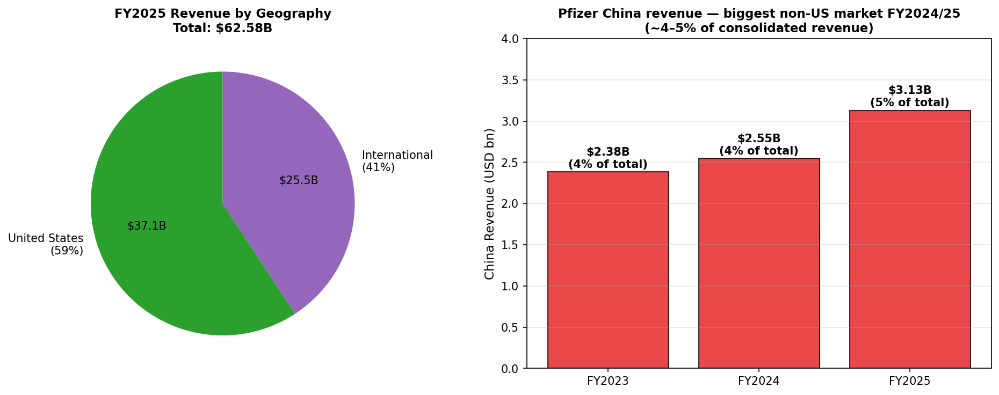
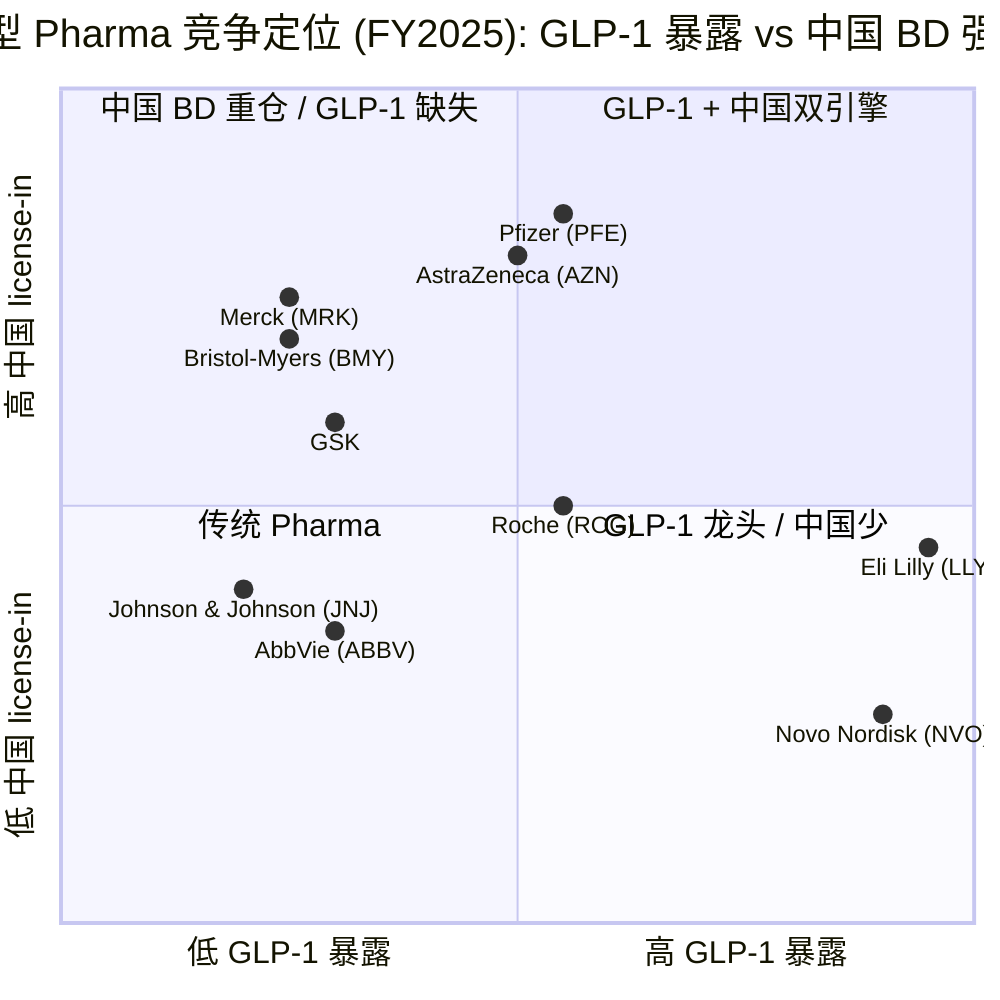
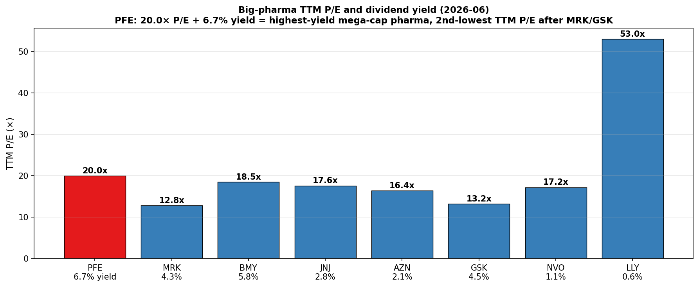

# Pfizer Inc. (NYSE:PFE) — 公司研究报告

**报告日期 / Report date:** 2026-06-16
**分析主题 / Theme angle:** China drug out-licensing — 中国创新药 BD 出海浪潮中最大的跨国买方之一; 后疫情现金流重建 + 专利悬崖防御
**报告语言:** 简体中文 (zh-CN)

---

## 投资摘要 / Investment Summary (*分析师观点 / Analyst view*)

> 以下评级、目标价、前瞻估值与论点支柱均为本报告分析师的前瞻判断 (`*分析师观点：*`), 不构成对任何 10-K / 监管文件的引用; 10-K 中不含目标价.

| 项目 | 数值 |
|---|---|
| **评级 / Rating** | **Hold / 持有 (Neutral)** |
| **12 个月目标价 / 12-mo Price Target** | **USD 28**(基于 FY2027E 调整后 EPS USD 2.80 × 10× forward P/E) |
| 当前股价 / Current price (2026-06-16) | USD 25.93 |
| 隐含上行 / Implied upside | **+8.0%**(加 6.6% 股息收益率, 一年总回报预期 ~+15%) |
| 估值方法 / Valuation method | Forward P/E × target multiple (10×, 较 Big Pharma 中位折让, 反映 LOE + IRA 逆风) |
| 市值 / Market cap | USD 147.8 bn(约 5.70 bn 股) |
| 52 周区间 / 52-wk range | USD 23.11 – USD 28.75 |
| TTM / 前瞻 P/E | 19.8× / **9.2×**(剪刀差源自一次性减值与 in-license 费用) |
| 股息收益率 / Dividend yield | **6.62%**(Big Pharma 中最高之一) |
| beta | **0.295**(典型低 beta 防御资产) |

**前瞻估值矩阵 (Forward valuation matrix) — *分析师观点：***

| 指标 | FY2025A | FY2026E | FY2027E |
|---|---:|---:|---:|
| 调整后 EPS (Adj. diluted EPS) | ~2.65 | 2.90(指引中值, 区间 2.80–3.00) | 2.80 |
| P/E (on adj. EPS @ USD 25.93) | 9.8× | **8.9×** | 9.3× |
| 收入 (Total revenue, USD bn) | 62.6 | 61.0(指引中值, 区间 59.5–62.5) | 60.0 |
| 股息收益率 (Dividend yield) | — | 6.6% | 6.7% |
| FCF 收益率 (FCF yield, *分析师观点*) | ~6% | ~11%(GS 估) | ~11% |

**论点支柱 / Thesis pillars (*分析师观点：*):**
1. **高息 + 极低 beta 的防御性现金流** — 6.62% 股息收益率 + 0.295 beta + 前瞻 P/E 9× 是 Big Pharma 中最"债券化"的组合; 后疫情成本削减 (USD 7.7 bn 净节约目标) 正推动利润率扩张, 即使收入持平 ([Pfizer 2025 10-K, MD&A — Cost Realignment](https://www.sec.gov/Archives/edgar/data/78003/000007800326000026/pfe-20251231.htm))。
2. **Vyndamax 专利和解消除 2029 收入悬崖** — 2026-04-28 与 Dexcel / Hikma / Cipla 三家仿制药企和解, 将 tafamidis 美国独占期从 ~2028/2029 延长至 **2031-06-01**, 公司据此首次表态"2029 年起进入 5 年高个位数收入 CAGR" ([Pfizer 新闻稿, 2026-04-28](https://www.pfizer.com/news/press-release/press-release-detail/pfizer-reaches-three-settlement-agreements-vyndamax))。
3. **中国 license-in 构筑增长第三引擎** — 2025-2026 年累计从 3SBio / YaoPharma / Innovent / Metsera 获取的资产, 以 Seagen (USD 43 bn) 1/3 的成本卡位 PD-1×VEGF 双抗、ADC、GLP-1 三大热门赛道 ([Pfizer 2025 10-K, Note 2F](https://www.sec.gov/Archives/edgar/data/78003/000007800326000026/pfe-20251231.htm))。
4. **但缺乏近期催化剂 + 管线兑现存疑** — 这是评级停在 Hold 而非 Buy 的核心理由: 2026-2028 年现金流支柱仍需依赖被 IRA 砍价的 Eliquis、面对 BBIO/ALNY 竞争的 Vyndaqel; GLP-1 落后 Lilly/Novo 4-5 年; 关键临床读出 (B6A ADC、PD-1×VEGF 双抗) 才是真正的股价拐点。

---

## 目录 / Table of Contents

1. 公司概览 (Company Overview) — 含 1A 估值与目标价、1B GF Score
2. 估值与目标价 (Valuation & Price Target) — 前瞻模型 + 卖方观点演变
3. 公司历史 (Company History)
4. 管理团队 (Management Team)
5. 产品与服务 (Products & Services)
6. 客户与上市策略 (Customers & Go-to-Market)
7. 行业概览 (Industry Overview)
8. 竞争格局 (Competitive Landscape)
9. 市场机会 (Market Opportunity / TAM)
10. 风险评估 (Risk Assessment) — 含 9.5 核心分歧与催化剂
11. 投资者视角评分卡 (Investor-lens Scorecards)
12. 数据来源清单 / 参考资料 (Data Used & References)

---

> **Update 1 — Q1 FY2026 业绩 (2026-05-05): 稳健开局, 重申全年指引.** Pfizer Q1 FY2026 总收入 USD 14.451 bn, 同比 +5% (经营性 +2%, 汇率 +USD 431 mn), 调整后摊薄 EPS USD 0.75 (同比 +16%), 均超市场预期 (营收预期 ~USD 138 bn, EPS 预期 USD 0.72), 由 Eliquis、肿瘤生物类似药、Padcev、Nurtec 强劲表现驱动, 抵消 Comirnaty / Paxlovid 下滑. 公司**重申全年 2026 指引**: 收入 USD 59.5–62.5 bn, 调整后摊薄 EPS USD 2.80–3.00 ([Pfizer Q1 FY2026 业绩新闻稿, 8-K Ex-99, 2026-05-05](https://www.sec.gov/Archives/edgar/data/78003/000007800326000053/pfe-3292026xex99.htm))。
>
> **Update 2 — Vyndamax 专利和解 (2026-04-28): 消除 2029 收入悬崖.** Pfizer 与 Dexcel Pharma、Hikma、Cipla 三家仿制药企达成和解, 仿制 tafamidis 在 2031-06-01 前不得在美上市, 将 Vyndaqel/Vyndamax 美国独占期从此前预期的 ~2028/2029 延长至 2031, 收入在 2028 至 2031 年中将保持相对稳定 ([Pfizer 新闻稿, 2026-04-28](https://www.pfizer.com/news/press-release/press-release-detail/pfizer-reaches-three-settlement-agreements-vyndamax); [Fierce Pharma, 2026-04-28](https://www.fiercepharma.com/pharma/pfizer-fends-generic-competition-blockbuster-vyndamax-3-settlements))。
>
> **Update 3 — Pfizer–Innovent USD 10.5 bn 肿瘤管线协议 (2026-05-28):** 公司与 Innovent Biologics (信达生物, HKEX:1801) 签署全球战略合作协议, 共同开发 12 项早期肿瘤资产 (8 项来自 Innovent + 4 项由 Pfizer 提议), 涵盖抗体-药物偶联物 (antibody-drug conjugate, ADC) 与多特异性抗体 (multispecific antibody, MSAb). 协议结构: 首付 USD 650 mn + 后续里程碑款最高 USD 9.85 bn + 销售分成 (royalty), 其中 4 项全球授权 / 4 项大中华区以外授权 / 4 项联合开发. Innovent 负责发现到 Phase 1, Pfizer 之后接管全球开发. 这是 Pfizer 史上最大单笔中国创新药 BD 交易之一. 资料来源: [Pfizer + Innovent 联合新闻稿 (PR Newswire, 2026-05-28)](https://www.prnewswire.com/news-releases/innovent-biologics-and-pfizer-enter-global-strategic-collaboration-to-accelerate-development-of-innovative-oncology-medicines-302785085.html); [Fierce Biotech, 2026-05-28](https://www.fiercebiotech.com/biotech/pfizer-pays-innovent-650m-broad-bet-chinese-innovation-early-development-speed)。

---

## 1. 公司概览 (Company Overview)

**本报告观点 (一句话):** Pfizer 是当前 Big Pharma 中"最债券化"的标的 —— 6.62% 股息收益率 + 0.295 beta + 前瞻 P/E 9× 的组合, 把它定价成一只高息防御债, 而非成长股; 我们给予 **Hold / 持有** 评级、12 个月目标价 **USD 28** (+8% 价格上行 + 6.6% 股息). 多空分水岭在于: 后疫情成本削减与 Vyndamax 专利和解 (延至 2031) 已稳住近端现金流, 但 2026-2028 年仍是"专利悬崖 + IRA 砍价 + GLP-1 错位"的钢丝绳期, 真正的重估要等 B6A ADC 与 PD-1×VEGF 双抗等关键临床读出 —— 这也是评级停在 Hold 而非 Buy 的核心理由 ([Pfizer Q1 FY2026 业绩新闻稿, 8-K Ex-99, 2026-05-05](https://www.sec.gov/Archives/edgar/data/78003/000007800326000053/pfe-3292026xex99.htm))。

Pfizer Inc. (辉瑞, NYSE:PFE) 是一家在美国特拉华州注册、总部位于纽约 (66 Hudson Boulevard East, New York, NY 10001) 的研究驱动型全球生物制药公司 (research-based, global biopharmaceutical company). 公司 1942 年根据特拉华州法律重新组建, 业务覆盖人用处方药与疫苗的发现、开发、生产、营销、销售与分销, 经营范围涵盖发达与新兴市场 ([Pfizer 2025 Form 10-K, Item 1 Business — About Pfizer](https://www.sec.gov/Archives/edgar/data/78003/000007800326000026/pfe-20251231.htm)). 公司在 10-K 中将自己定位为 "research-based, global biopharmaceutical company", 强调以科学探索为驱动, 通过 "Breakthroughs that change patients' lives" (改变患者人生的突破) 的企业目标连接研发、商业化与资本配置.

FY2025 (财年截止 2025-12-31) Pfizer 实现总收入 USD 62.579 bn, 同比下滑 2% (经营性下滑 2%, 汇率正贡献 USD 247 mn), 主要受 Paxlovid (奈玛特韦 / 利托那韦, 新冠口服药) 收入急剧回落拖累; 剔除 Comirnaty (新冠疫苗) 与 Paxlovid 后, 公司其余业务收入同比经营性增长 6% ([Pfizer 2025 10-K, MD&A Total Revenues](https://www.sec.gov/Archives/edgar/data/78003/000007800326000026/pfe-20251231.htm)). GAAP 归属于普通股股东净利润 (Net income attributable to Pfizer Inc. common shareholders) FY2025 为 USD 7.771 bn (FY2024: USD 8.031 bn; FY2023: USD 2.119 bn), 摊薄 EPS USD 1.36, 较 FY2024 的 USD 1.41 微跌, 较 FY2023 的 USD 0.37 大幅恢复 ([Pfizer 2025 10-K, Consolidated Statements of Operations](https://www.sec.gov/Archives/edgar/data/78003/000007800326000026/pfe-20251231.htm)). FY2025 cost of sales 降至总收入的 25.7% (FY2024: 28.1%, FY2023: 41.9%), 显示后疫情产能与销售成本削减开始释放利润率红利 ([Pfizer 2025 10-K, MD&A — Cost of Sales](https://www.sec.gov/Archives/edgar/data/78003/000007800326000026/pfe-20251231.htm))。

**本期新变化 / What's new this period (Q1 FY2026).** 最新一季 (Q1 FY2026, 截止 2026-03-29) Pfizer 总收入 USD 14.451 bn, 同比 +5% (经营性 +2%, 汇率 +USD 431 mn), 调整后摊薄 EPS USD 0.75 (同比 +16%), 双双小幅超预期; 产品端 Eliquis、Ibrance、Nurtec、Padcev、Lorbrena 均超预期, 抵消 Comirnaty (USD 0.23 bn) 与 Paxlovid (USD 0.19 bn) 的季度性疲软. 公司**重申 FY2026 全年指引** (收入 USD 59.5–62.5 bn, 调整后摊薄 EPS USD 2.80–3.00), 首季按惯例不上调; 管理层并更新长期表述, 称"自 2029 年起进入 5 年高个位数收入复合增长期", 主要由 Vyndamax 专利和解 (延至 2031) 支撑 ([Pfizer Q1 FY2026 业绩新闻稿, 8-K Ex-99, 2026-05-05](https://www.sec.gov/Archives/edgar/data/78003/000007800326000053/pfe-3292026xex99.htm))。

公司管理三大经营分部: **Biopharma** (创新药主业, FY2025 收入 USD 61.199 bn, 占 98%), **PC1** (合同开发生产组织 / contract development and manufacturing organization, CDMO; 专精原料药 / specialty active pharmaceutical ingredients), 以及 **Pfizer Ignite** (面向中小生物科技公司提供端到端 R&D 服务, 2025 年公司决定关停该业务并有序退出). Biopharma 是唯一的可报告分部 (only reportable segment), 内部按 Pfizer U.S. Commercial Division 与 Pfizer International Commercial Division 两个商业组织管理全球 100+ 个市场的产品组合 ([Pfizer 2025 10-K, Item 1 Business — Commercial Operations](https://www.sec.gov/Archives/edgar/data/78003/000007800326000026/pfe-20251231.htm)).

地理分布上, FY2025 美国市场收入 USD 37.078 bn (占比 59%), 国际市场收入 USD 25.501 bn (占比 41%, 较 FY2024 的 39% 微升). 中国 (mainland China) 是 Pfizer 最大的非美国单一市场, FY2025 占总收入约 5% (约 USD 3.13 bn, 上调自 FY2024 的 4%), 取代了 FY2023 时居首的日本 (该年日本占 6%) ([Pfizer 2025 10-K, Item 1 Business — International Operations](https://www.sec.gov/Archives/edgar/data/78003/000007800326000026/pfe-20251231.htm)). 12 个非美市场全年收入超过 USD 500 mn (FY2024: 11 个; FY2023: 14 个), 反映出后疫情时代国际收入分布更分散. 公司在 FY2025 年底约有 81,000 名员工.

### 1A. 估值快照与目标价 (Valuation snapshot & price target)

**估值快照 (Valuation snapshot, 2026-06-16).** Pfizer 当前股价 USD 25.93, 市值 USD 147.76 bn (流通股本约 5.70 bn 股), 52 周区间 USD 23.11–USD 28.75, beta 仅 0.295 — 在大盘股中属典型防御性低 beta 资产 ([Yahoo Finance PFE Key Statistics, 2026-06-16](https://finance.yahoo.com/quote/PFE/key-statistics/)). TTM P/E 19.8×, 一年期前瞻 P/E 仅 9.2× (隐含市场预期 FY2026 调整后 EPS 回升至 USD 2.80–3.00 指引区间), TTM 摊薄 EPS USD 1.31, P/S (TTM) 2.33×, 年化每股股息 USD 1.72, 股息收益率高达 **6.62%** — 在大型制药同业 (Big Pharma) 中是最高的之一 ([Yahoo Finance PFE, 2026-06-16](https://finance.yahoo.com/quote/PFE/)).

*分析师观点 (Analyst view):* TTM P/E 接近 20×, 而前瞻 P/E 仅 9× 的剪刀差极大, 反映两件事: 一是 FY2025 GAAP 收益被 USD 1.61 bn 的 acquired IPR&D 一次性研发支出 (含 3SBio / YaoPharma in-license) + USD 5.27 bn 的资产减值与冲销 (asset write-offs and impairments) 大幅拖累 ([Pfizer 2025 10-K, MD&A — Other (income)/deductions](https://www.sec.gov/Archives/edgar/data/78003/000007800326000026/pfe-20251231.htm)); 二是市场预期 FY2026 起 Paxlovid 基数效应消失 + Vyndaqel / Eliquis / Padcev 增长接力, 调整后 EPS 将稳定在 USD 2.80–3.00 水平. 6.62% 股息收益率 + 0.295 beta 的组合, 使 PFE 成为典型的"高息防御 + 创新药管线期权"双重特征股票. **12 个月目标价 USD 28** = FY2027E 调整后 EPS USD 2.80 × 10× forward P/E, 较 USD 25.93 隐含 +8% 价格上行; 估值推导与卖方观点演变见第 2 章。

#### 收入结构 / Pfizer 如何赚钱 — 收入表 Sankey (FY2025)

<svg xmlns="http://www.w3.org/2000/svg" viewBox="0 0 1000 560" width="1000" height="560" role="img" aria-label="income statement Sankey"><rect x="0" y="0" width="1000" height="560" fill="#ffffff"/>
<text x="20.00" y="30.00" text-anchor="start" font-family="Helvetica,Arial,sans-serif" font-size="15" font-weight="700" fill="#1f2933">辉瑞 Pfizer (PFE) 如何赚钱 — FY2025 利润表 Sankey</text>
<path d="M 204.00,70.14 C 258.00,70.14 258.00,85.00 312.00,85.00 L 312.00,484.00 C 258.00,484.00 258.00,469.14 204.00,469.14 Z" fill="#93c5fd" fill-opacity="0.55"/>
<path d="M 452.00,78.00 C 506.00,78.00 506.00,130.38 560.00,130.38 L 560.00,223.24 C 506.00,223.24 506.00,170.87 452.00,170.87 Z" fill="#86efac" fill-opacity="0.55"/>
<path d="M 452.00,170.87 C 506.00,170.87 506.00,237.24 560.00,237.24 L 560.00,447.62 C 506.00,447.62 506.00,381.25 452.00,381.25 Z" fill="#fca5a5" fill-opacity="0.55"/>
<path d="M 328.00,85.00 C 382.00,85.00 382.00,78.00 436.00,78.00 L 436.00,381.25 C 382.00,381.25 382.00,388.25 328.00,388.25 Z" fill="#86efac" fill-opacity="0.55"/>
<path d="M 328.00,388.25 C 382.00,388.25 382.00,395.25 436.00,395.25 L 436.00,500.00 C 382.00,500.00 382.00,493.00 328.00,493.00 Z" fill="#fca5a5" fill-opacity="0.55"/>
<path d="M 576.00,130.38 C 630.00,130.38 630.00,138.30 684.00,138.30 L 684.00,231.16 C 630.00,231.16 630.00,223.24 576.00,223.24 Z" fill="#86efac" fill-opacity="0.55"/>
<path d="M 700.00,138.30 C 754.00,138.30 754.00,247.67 808.00,247.67 L 808.00,298.33 C 754.00,298.33 754.00,188.96 700.00,188.96 Z" fill="#86efac" fill-opacity="0.55"/>
<path d="M 700.00,188.96 C 754.00,188.96 754.00,312.33 808.00,312.33 L 808.00,314.33 C 754.00,314.33 754.00,190.96 700.00,190.96 Z" fill="#fca5a5" fill-opacity="0.55"/>
<path d="M 700.00,190.96 C 754.00,190.96 754.00,328.33 808.00,328.33 L 808.00,330.33 C 754.00,330.33 754.00,192.96 700.00,192.96 Z" fill="#fca5a5" fill-opacity="0.55"/>
<path d="M 576.00,237.24 C 630.00,237.24 630.00,201.32 684.00,201.32 L 684.00,291.26 C 630.00,291.26 630.00,327.18 576.00,327.18 Z" fill="#fca5a5" fill-opacity="0.55"/>
<path d="M 576.00,327.18 C 630.00,327.18 630.00,305.26 684.00,305.26 L 684.00,373.30 C 630.00,373.30 630.00,395.22 576.00,395.22 Z" fill="#fca5a5" fill-opacity="0.55"/>
<path d="M 576.00,395.22 C 630.00,395.22 630.00,387.30 684.00,387.30 L 684.00,439.70 C 630.00,439.70 630.00,447.62 576.00,447.62 Z" fill="#fca5a5" fill-opacity="0.55"/>
<path d="M 204.00,483.14 C 258.00,483.14 258.00,484.00 312.00,484.00 L 312.00,492.73 C 258.00,492.73 258.00,491.86 204.00,491.86 Z" fill="#93c5fd" fill-opacity="0.55"/>
<path d="M 204.00,505.86 C 258.00,505.86 258.00,492.73 312.00,492.73 L 312.00,494.73 C 258.00,494.73 258.00,507.86 204.00,507.86 Z" fill="#93c5fd" fill-opacity="0.55"/>
<rect x="188.00" y="70.14" width="16" height="399.00" rx="1.5" fill="#2563eb"/>
<rect x="188.00" y="483.14" width="16" height="8.72" rx="1.5" fill="#2563eb"/>
<rect x="188.00" y="505.86" width="16" height="2.00" rx="1.5" fill="#2563eb"/>
<rect x="312.00" y="85.00" width="16" height="408.00" rx="1.5" fill="#1e3a8a"/>
<rect x="436.00" y="78.00" width="16" height="303.25" rx="1.5" fill="#15803d"/>
<rect x="436.00" y="395.25" width="16" height="104.75" rx="1.5" fill="#dc2626"/>
<rect x="560.00" y="130.38" width="16" height="92.87" rx="1.5" fill="#15803d"/>
<rect x="560.00" y="237.24" width="16" height="210.38" rx="1.5" fill="#dc2626"/>
<rect x="684.00" y="138.30" width="16" height="49.03" rx="1.5" fill="#15803d"/>
<rect x="684.00" y="201.32" width="16" height="89.93" rx="1.5" fill="#dc2626"/>
<rect x="684.00" y="305.26" width="16" height="68.05" rx="1.5" fill="#dc2626"/>
<rect x="684.00" y="387.30" width="16" height="52.40" rx="1.5" fill="#dc2626"/>
<rect x="808.00" y="247.67" width="16" height="50.67" rx="1.5" fill="#15803d"/>
<rect x="808.00" y="312.33" width="16" height="2.00" rx="1.5" fill="#dc2626"/>
<rect x="808.00" y="328.33" width="16" height="2.00" rx="1.5" fill="#dc2626"/>
<line x1="188.00" y1="269.64" x2="182.00" y2="244.14" stroke="#cbd5e1" stroke-width="1"/>
<text x="179.00" y="247.14" text-anchor="end" font-family="Helvetica,Arial,sans-serif" font-size="11.5" font-weight="700" fill="#1f2933">Biopharma</text>
<text x="179.00" y="260.14" text-anchor="end" font-family="Helvetica,Arial,sans-serif" font-size="10" font-weight="400" fill="#52606d">$61.2B  (97.8%)</text>
<line x1="188.00" y1="487.50" x2="182.00" y2="462.00" stroke="#cbd5e1" stroke-width="1"/>
<text x="179.00" y="465.00" text-anchor="end" font-family="Helvetica,Arial,sans-serif" font-size="11.5" font-weight="700" fill="#1f2933">Pfizer CentreOne (CDMO)</text>
<text x="179.00" y="478.00" text-anchor="end" font-family="Helvetica,Arial,sans-serif" font-size="10" font-weight="400" fill="#52606d">$1.3B  (2.1%)</text>
<line x1="188.00" y1="506.86" x2="182.00" y2="487.00" stroke="#cbd5e1" stroke-width="1"/>
<text x="179.00" y="490.00" text-anchor="end" font-family="Helvetica,Arial,sans-serif" font-size="11.5" font-weight="700" fill="#1f2933">Pfizer Ignite</text>
<text x="179.00" y="503.00" text-anchor="end" font-family="Helvetica,Arial,sans-serif" font-size="10" font-weight="400" fill="#52606d">$41.0M  (0.07%)</text>
<rect x="331.00" y="67.00" width="106.80" height="26" rx="2" fill="#ffffff" fill-opacity="0.72"/>
<text x="334.00" y="79.00" text-anchor="start" font-family="Helvetica,Arial,sans-serif" font-size="11.5" font-weight="700" fill="#1f2933">Revenue</text>
<text x="334.00" y="92.00" text-anchor="start" font-family="Helvetica,Arial,sans-serif" font-size="10" font-weight="400" fill="#52606d">$62.6B  (100.0%)</text>
<rect x="455.00" y="60.00" width="100.50" height="26" rx="2" fill="#ffffff" fill-opacity="0.72"/>
<text x="458.00" y="72.00" text-anchor="start" font-family="Helvetica,Arial,sans-serif" font-size="11.5" font-weight="700" fill="#1f2933">Gross Profit</text>
<text x="458.00" y="85.00" text-anchor="start" font-family="Helvetica,Arial,sans-serif" font-size="10" font-weight="400" fill="#52606d">$46.5B  (74.3%)</text>
<rect x="455.00" y="377.25" width="144.60" height="26" rx="2" fill="#ffffff" fill-opacity="0.72"/>
<text x="458.00" y="389.25" text-anchor="start" font-family="Helvetica,Arial,sans-serif" font-size="11.5" font-weight="700" fill="#1f2933">Cost of Revenue (COGS)</text>
<text x="458.00" y="402.25" text-anchor="start" font-family="Helvetica,Arial,sans-serif" font-size="10" font-weight="400" fill="#52606d">$16.1B  (25.7%)</text>
<rect x="579.00" y="112.38" width="106.80" height="26" rx="2" fill="#ffffff" fill-opacity="0.72"/>
<text x="582.00" y="124.38" text-anchor="start" font-family="Helvetica,Arial,sans-serif" font-size="11.5" font-weight="700" fill="#1f2933">Operating Income</text>
<text x="582.00" y="137.38" text-anchor="start" font-family="Helvetica,Arial,sans-serif" font-size="10" font-weight="400" fill="#52606d">$14.2B  (22.8%)</text>
<rect x="579.00" y="219.24" width="150.90" height="26" rx="2" fill="#ffffff" fill-opacity="0.72"/>
<text x="582.00" y="231.24" text-anchor="start" font-family="Helvetica,Arial,sans-serif" font-size="11.5" font-weight="700" fill="#1f2933">Total Operating Expense</text>
<text x="582.00" y="244.24" text-anchor="start" font-family="Helvetica,Arial,sans-serif" font-size="10" font-weight="400" fill="#52606d">$32.3B  (51.6%)</text>
<rect x="703.00" y="120.30" width="94.20" height="26" rx="2" fill="#ffffff" fill-opacity="0.72"/>
<text x="706.00" y="132.30" text-anchor="start" font-family="Helvetica,Arial,sans-serif" font-size="11.5" font-weight="700" fill="#1f2933">Pretax Income</text>
<text x="706.00" y="145.30" text-anchor="start" font-family="Helvetica,Arial,sans-serif" font-size="10" font-weight="400" fill="#52606d">$7.5B  (12.0%)</text>
<rect x="703.00" y="183.32" width="100.50" height="26" rx="2" fill="#ffffff" fill-opacity="0.72"/>
<text x="706.00" y="195.32" text-anchor="start" font-family="Helvetica,Arial,sans-serif" font-size="11.5" font-weight="700" fill="#1f2933">SG&amp;A</text>
<text x="706.00" y="208.32" text-anchor="start" font-family="Helvetica,Arial,sans-serif" font-size="10" font-weight="400" fill="#52606d">$13.8B  (22.0%)</text>
<rect x="703.00" y="287.26" width="100.50" height="26" rx="2" fill="#ffffff" fill-opacity="0.72"/>
<text x="706.00" y="299.26" text-anchor="start" font-family="Helvetica,Arial,sans-serif" font-size="11.5" font-weight="700" fill="#1f2933">R&amp;D</text>
<text x="706.00" y="312.26" text-anchor="start" font-family="Helvetica,Arial,sans-serif" font-size="10" font-weight="400" fill="#52606d">$10.4B  (16.7%)</text>
<rect x="703.00" y="369.30" width="94.20" height="26" rx="2" fill="#ffffff" fill-opacity="0.72"/>
<text x="706.00" y="381.30" text-anchor="start" font-family="Helvetica,Arial,sans-serif" font-size="11.5" font-weight="700" fill="#1f2933">Other OpEx</text>
<text x="706.00" y="394.30" text-anchor="start" font-family="Helvetica,Arial,sans-serif" font-size="10" font-weight="400" fill="#52606d">$8.0B  (12.8%)</text>
<text x="833.00" y="270.00" text-anchor="start" font-family="Helvetica,Arial,sans-serif" font-size="11.5" font-weight="700" fill="#1f2933">Net Income</text>
<text x="833.00" y="283.00" text-anchor="start" font-family="Helvetica,Arial,sans-serif" font-size="10" font-weight="400" fill="#52606d">$7.8B  (12.4%)</text>
<text x="833.00" y="310.33" text-anchor="start" font-family="Helvetica,Arial,sans-serif" font-size="11.5" font-weight="700" fill="#1f2933">Income Tax</text>
<text x="833.00" y="323.33" text-anchor="start" font-family="Helvetica,Arial,sans-serif" font-size="10" font-weight="400" fill="#52606d">-$266.0M  (-0.43%)</text>
<text x="833.00" y="335.33" text-anchor="start" font-family="Helvetica,Arial,sans-serif" font-size="11.5" font-weight="700" fill="#1f2933">Minority Interest</text>
<text x="833.00" y="348.33" text-anchor="start" font-family="Helvetica,Arial,sans-serif" font-size="10" font-weight="400" fill="#52606d">$41.0M  (0.07%)</text>
<text x="500.00" y="544.00" text-anchor="middle" font-family="Helvetica,Arial,sans-serif" font-size="10" font-weight="400" fill="#52606d">Source: Pfizer FY2025 10-K, Consolidated Statements of Operations + Segment note (Biopharma / CentreOne / Ignite)</text>
</svg>

来源 / Source: [Pfizer FY2025 10-K, Consolidated Statements of Operations + Segment note](https://www.sec.gov/Archives/edgar/data/78003/000007800326000026/pfe-20251231.htm)。

收入结构图直观显示 Pfizer 的"高毛利 + 高摊销减值"特征: gross profit (毛利) USD 46.5 bn 占收入 74.3%, 但 SG&A (USD 13.8 bn, 22.0%) + R&D (USD 10.4 bn, 16.7%) + acquired IPR&D + 巨额无形资产摊销与减值, 把 operating income 压到 USD 14.2 bn (22.8%), 税前利润仅 USD 7.5 bn (12.0%) ([Pfizer 2025 10-K, Statements of Operations](https://www.sec.gov/Archives/edgar/data/78003/000007800326000026/pfe-20251231.htm))。

#### 业务分部与地理结构 (FY2025)

<svg xmlns="http://www.w3.org/2000/svg" viewBox="0 0 720 460" width="720" height="460" role="img" aria-label="revenue donut"><rect x="0" y="0" width="720" height="460" fill="#ffffff"/>
<text x="20.00" y="30.00" text-anchor="start" font-family="Helvetica,Arial,sans-serif" font-size="15" font-weight="700" fill="#1f2933">FY2025 收入按经营分部 Revenue by Operating Segment</text>
<path d="M 288.00,107.20 A 132 132 0 1 1 269.78,108.46 L 277.23,161.95 A 78 78 0 1 0 288.00,161.20 Z" fill="#2563eb"/>
<path d="M 269.78,108.46 A 132 132 0 0 1 287.46,107.20 L 287.68,161.20 A 78 78 0 0 0 277.23,161.95 Z" fill="#15803d"/>
<path d="M 287.46,107.20 A 132 132 0 0 1 288.00,107.20 L 288.00,161.20 A 78 78 0 0 0 287.68,161.20 Z" fill="#d97706"/>
<text x="288.00" y="235.20" text-anchor="middle" font-family="Helvetica,Arial,sans-serif" font-size="18" font-weight="800" fill="#1f2933">PFE</text>
<text x="288.00" y="255.20" text-anchor="middle" font-family="Helvetica,Arial,sans-serif" font-size="13" font-weight="600" fill="#52606d">$62.6B</text>
<text x="288.00" y="271.20" text-anchor="middle" font-family="Helvetica,Arial,sans-serif" font-size="10" font-weight="400" fill="#8a97a3">total</text>
<line x1="297.55" y1="376.87" x2="313.55" y2="376.87" stroke="#2563eb" stroke-width="1.4"/>
<text x="317.55" y="374.87" text-anchor="start" font-family="Helvetica,Arial,sans-serif" font-size="11" font-weight="700" fill="#1f2933">Biopharma</text>
<text x="317.55" y="388.87" text-anchor="start" font-family="Helvetica,Arial,sans-serif" font-size="10" font-weight="400" fill="#52606d">$61.2B  (97.8%)</text>
<line x1="278.17" y1="101.55" x2="262.17" y2="101.55" stroke="#15803d" stroke-width="1.4"/>
<text x="258.17" y="99.55" text-anchor="end" font-family="Helvetica,Arial,sans-serif" font-size="11" font-weight="700" fill="#1f2933">Pfizer CentreOne (CDMO)</text>
<text x="258.17" y="113.55" text-anchor="end" font-family="Helvetica,Arial,sans-serif" font-size="10" font-weight="400" fill="#52606d">$1.3B  (2.1%)</text>
<line x1="287.72" y1="101.20" x2="271.72" y2="101.20" stroke="#d97706" stroke-width="1.4"/>
<text x="267.72" y="99.20" text-anchor="end" font-family="Helvetica,Arial,sans-serif" font-size="11" font-weight="700" fill="#1f2933">Pfizer Ignite</text>
<text x="267.72" y="113.20" text-anchor="end" font-family="Helvetica,Arial,sans-serif" font-size="10" font-weight="400" fill="#52606d">$41.0M  (0.1%)</text>
<text x="360.00" y="444.00" text-anchor="middle" font-family="Helvetica,Arial,sans-serif" font-size="10" font-weight="400" fill="#52606d">Source: Pfizer FY2025 10-K, Segment note — Operating segments</text>
</svg>

来源 / Source: [Pfizer FY2025 10-K, Segment note — Operating segments](https://www.sec.gov/Archives/edgar/data/78003/000007800326000026/pfe-20251231.htm)。Biopharma 是唯一可报告分部 (USD 61.2 bn, 97.8%), Pfizer CentreOne (CDMO) USD 1.3 bn (2.1%), Pfizer Ignite USD 41 mn (0.1%, 已决定关停)。

<svg xmlns="http://www.w3.org/2000/svg" viewBox="0 0 720 460" width="720" height="460" role="img" aria-label="revenue donut"><rect x="0" y="0" width="720" height="460" fill="#ffffff"/>
<text x="20.00" y="30.00" text-anchor="start" font-family="Helvetica,Arial,sans-serif" font-size="15" font-weight="700" fill="#1f2933">FY2025 收入按地区 Revenue by Geography</text>
<path d="M 288.00,107.20 A 132 132 0 1 1 215.53,349.53 L 245.18,304.39 A 78 78 0 1 0 288.00,161.20 Z" fill="#2563eb"/>
<path d="M 215.53,349.53 A 132 132 0 0 1 288.00,107.20 L 288.00,161.20 A 78 78 0 0 0 245.18,304.39 Z" fill="#15803d"/>
<text x="288.00" y="235.20" text-anchor="middle" font-family="Helvetica,Arial,sans-serif" font-size="18" font-weight="800" fill="#1f2933">PFE</text>
<text x="288.00" y="255.20" text-anchor="middle" font-family="Helvetica,Arial,sans-serif" font-size="13" font-weight="600" fill="#52606d">$62.6B</text>
<text x="288.00" y="271.20" text-anchor="middle" font-family="Helvetica,Arial,sans-serif" font-size="10" font-weight="400" fill="#8a97a3">total</text>
<line x1="420.21" y1="278.74" x2="436.21" y2="278.74" stroke="#2563eb" stroke-width="1.4"/>
<text x="440.21" y="276.74" text-anchor="start" font-family="Helvetica,Arial,sans-serif" font-size="11" font-weight="700" fill="#1f2933">United States</text>
<text x="440.21" y="290.74" text-anchor="start" font-family="Helvetica,Arial,sans-serif" font-size="10" font-weight="400" fill="#52606d">$37.1B  (59.2%)</text>
<line x1="155.79" y1="199.66" x2="139.79" y2="199.66" stroke="#15803d" stroke-width="1.4"/>
<text x="135.79" y="197.66" text-anchor="end" font-family="Helvetica,Arial,sans-serif" font-size="11" font-weight="700" fill="#1f2933">International</text>
<text x="135.79" y="211.66" text-anchor="end" font-family="Helvetica,Arial,sans-serif" font-size="10" font-weight="400" fill="#52606d">$25.5B  (40.8%)</text>
<text x="360.00" y="444.00" text-anchor="middle" font-family="Helvetica,Arial,sans-serif" font-size="10" font-weight="400" fill="#52606d">Source: Pfizer FY2025 10-K, MD&amp;A — Revenues by Geography</text>
</svg>

来源 / Source: [Pfizer FY2025 10-K, MD&A — Revenues by Geography](https://www.sec.gov/Archives/edgar/data/78003/000007800326000026/pfe-20251231.htm)。美国 USD 37.1 bn (59.2%), 国际 USD 25.5 bn (40.8%)。

#### 历史收入构成 (FY2022–FY2025)

<svg xmlns="http://www.w3.org/2000/svg" viewBox="0 0 860 470" width="860" height="470" role="img" aria-label="historical revenue bars"><rect x="0" y="0" width="860" height="470" fill="#ffffff"/>
<text x="20.00" y="30.00" text-anchor="start" font-family="Helvetica,Arial,sans-serif" font-size="15" font-weight="700" fill="#1f2933">辉瑞 Pfizer 收入按地区历史 Revenue by Geography (FY2022–FY2025)</text>
<rect x="20.00" y="44" width="11" height="11" rx="2" fill="#2563eb"/>
<text x="36.00" y="53.00" text-anchor="start" font-family="Helvetica,Arial,sans-serif" font-size="10.5" font-weight="400" fill="#1f2933">United States</text>
<rect x="135.80" y="44" width="11" height="11" rx="2" fill="#15803d"/>
<text x="151.80" y="53.00" text-anchor="start" font-family="Helvetica,Arial,sans-serif" font-size="10.5" font-weight="400" fill="#1f2933">International</text>
<line x1="70" y1="412.00" x2="834" y2="412.00" stroke="#eceff2" stroke-width="1"/>
<text x="64.00" y="415.00" text-anchor="end" font-family="Helvetica,Arial,sans-serif" font-size="9.5" font-weight="400" fill="#52606d">$0</text>
<line x1="70" y1="345.20" x2="834" y2="345.20" stroke="#eceff2" stroke-width="1"/>
<text x="64.00" y="348.20" text-anchor="end" font-family="Helvetica,Arial,sans-serif" font-size="9.5" font-weight="400" fill="#52606d">$21.9B</text>
<line x1="70" y1="278.40" x2="834" y2="278.40" stroke="#eceff2" stroke-width="1"/>
<text x="64.00" y="281.40" text-anchor="end" font-family="Helvetica,Arial,sans-serif" font-size="9.5" font-weight="400" fill="#52606d">$43.7B</text>
<line x1="70" y1="211.60" x2="834" y2="211.60" stroke="#eceff2" stroke-width="1"/>
<text x="64.00" y="214.60" text-anchor="end" font-family="Helvetica,Arial,sans-serif" font-size="9.5" font-weight="400" fill="#52606d">$65.6B</text>
<line x1="70" y1="144.80" x2="834" y2="144.80" stroke="#eceff2" stroke-width="1"/>
<text x="64.00" y="147.80" text-anchor="end" font-family="Helvetica,Arial,sans-serif" font-size="9.5" font-weight="400" fill="#52606d">$87.4B</text>
<line x1="70" y1="78.00" x2="834" y2="78.00" stroke="#eceff2" stroke-width="1"/>
<text x="64.00" y="81.00" text-anchor="end" font-family="Helvetica,Arial,sans-serif" font-size="9.5" font-weight="400" fill="#52606d">$109.3B</text>
<rect x="110.11" y="279.59" width="110.78" height="132.41" fill="#2563eb"/>
<rect x="110.11" y="102.74" width="110.78" height="176.85" fill="#15803d"/>
<text x="165.50" y="428.00" text-anchor="middle" font-family="Helvetica,Arial,sans-serif" font-size="10" font-weight="400" fill="#52606d">2022</text>
<rect x="301.11" y="325.97" width="110.78" height="86.03" fill="#2563eb"/>
<rect x="301.11" y="229.97" width="110.78" height="96.00" fill="#15803d"/>
<text x="356.50" y="428.00" text-anchor="middle" font-family="Helvetica,Arial,sans-serif" font-size="10" font-weight="400" fill="#52606d">2023</text>
<rect x="492.11" y="293.73" width="110.78" height="118.27" fill="#2563eb"/>
<rect x="492.11" y="217.51" width="110.78" height="76.22" fill="#15803d"/>
<text x="547.50" y="428.00" text-anchor="middle" font-family="Helvetica,Arial,sans-serif" font-size="10" font-weight="400" fill="#52606d">2024</text>
<rect x="683.11" y="298.66" width="110.78" height="113.34" fill="#2563eb"/>
<rect x="683.11" y="220.72" width="110.78" height="77.95" fill="#15803d"/>
<text x="738.50" y="428.00" text-anchor="middle" font-family="Helvetica,Arial,sans-serif" font-size="10" font-weight="400" fill="#52606d">2025</text>
<text x="430.00" y="454.00" text-anchor="middle" font-family="Helvetica,Arial,sans-serif" font-size="10" font-weight="400" fill="#52606d">Source: Pfizer FY2024 &amp; FY2025 10-Ks, MD&amp;A — Revenues by Geography</text>
</svg>

来源 / Source: [Pfizer FY2024 & FY2025 10-Ks, MD&A — Revenues by Geography](https://www.sec.gov/Archives/edgar/data/78003/000007800326000026/pfe-20251231.htm)。柱状图显示后疫情时代美国市场占比从 FY2022 新冠高峰回落后, FY2023–FY2025 稳定在 ~59%, 国际占比回升至 ~41%。

### 1B. GF Score (GuruFocus-style) 基本面评分卡 — *分析师观点：*

GF Score 是模仿 [GuruFocus GF Score™](https://www.gurufocus.com/term/gf-score) 的五维基本面评分卡, 五个维度各 0–10 分, 加权映射到 0–100 综合分. **它是本报告分析师的自有评分 rubric (`*分析师观点：*`), 不归属 GuruFocus, 也不挂任何 10-K 引用**; 但每个维度背后的指标 (利润率 / 杠杆 / CAGR / 倍数 / 价格回报) 都已在文中逐项引用。

<svg xmlns="http://www.w3.org/2000/svg" viewBox="0 0 500 500" width="500" height="500" role="img" aria-label="GF Score radar">
<rect x="0" y="0" width="500" height="500" fill="#ffffff"/>
<text x="20" y="24" font-family="Helvetica,Arial,sans-serif" font-size="15" font-weight="700" fill="#1f2933">GF Score (GuruFocus-style): 46/100</text>
<text x="20" y="41" font-family="Helvetica,Arial,sans-serif" font-size="11" fill="#52606d">0–50 Worst future performance potential / insufficient data</text>
<polygon points="250.0,88.0 392.7,191.6 338.2,359.4 161.8,359.4 107.3,191.6" fill="#e9f5ec" stroke="none"/>
<polygon points="250.0,208.0 278.5,228.7 267.6,262.3 232.4,262.3 221.5,228.7" fill="none" stroke="#c5d3cb" stroke-width="1"/>
<polygon points="250.0,178.0 307.1,219.5 285.3,286.5 214.7,286.5 192.9,219.5" fill="none" stroke="#c5d3cb" stroke-width="1"/>
<polygon points="250.0,148.0 335.6,210.2 302.9,310.8 197.1,310.8 164.4,210.2" fill="none" stroke="#c5d3cb" stroke-width="1"/>
<polygon points="250.0,118.0 364.1,200.9 320.5,335.1 179.5,335.1 135.9,200.9" fill="none" stroke="#c5d3cb" stroke-width="1"/>
<polygon points="250.0,88.0 392.7,191.6 338.2,359.4 161.8,359.4 107.3,191.6" fill="none" stroke="#c5d3cb" stroke-width="1.3"/>
<line x1="250" y1="238" x2="161.8" y2="359.4" stroke="#cfdad3" stroke-width="1"/>
<text x="146.5" y="392.4" text-anchor="end" font-family="Helvetica,Arial,sans-serif" font-size="11.5" font-weight="600" fill="#1f2933">Financial Strength</text>
<text x="146.5" y="405.4" text-anchor="end" font-family="Helvetica,Arial,sans-serif" font-size="9.5" fill="#52606d">财务实力</text>
<text x="205.9" y="292.7" text-anchor="middle" font-family="Helvetica,Arial,sans-serif" font-size="10.5" font-weight="700" fill="#1f2933">5</text>
<line x1="250" y1="238" x2="250.0" y2="88.0" stroke="#cfdad3" stroke-width="1"/>
<text x="250.0" y="58.0" text-anchor="middle" font-family="Helvetica,Arial,sans-serif" font-size="11.5" font-weight="600" fill="#1f2933">Profitability</text>
<text x="250.0" y="71.0" text-anchor="middle" font-family="Helvetica,Arial,sans-serif" font-size="9.5" fill="#52606d">盈利能力</text>
<text x="250.0" y="157.0" text-anchor="middle" font-family="Helvetica,Arial,sans-serif" font-size="10.5" font-weight="700" fill="#1f2933">5</text>
<line x1="250" y1="238" x2="107.3" y2="191.6" stroke="#cfdad3" stroke-width="1"/>
<text x="82.6" y="183.6" text-anchor="end" font-family="Helvetica,Arial,sans-serif" font-size="11.5" font-weight="600" fill="#1f2933">Growth</text>
<text x="82.6" y="196.6" text-anchor="end" font-family="Helvetica,Arial,sans-serif" font-size="9.5" fill="#52606d">成长性</text>
<text x="207.2" y="218.1" text-anchor="middle" font-family="Helvetica,Arial,sans-serif" font-size="10.5" font-weight="700" fill="#1f2933">3</text>
<line x1="250" y1="238" x2="392.7" y2="191.6" stroke="#cfdad3" stroke-width="1"/>
<text x="417.4" y="183.6" text-anchor="start" font-family="Helvetica,Arial,sans-serif" font-size="11.5" font-weight="600" fill="#1f2933">GF Value</text>
<text x="417.4" y="196.6" text-anchor="start" font-family="Helvetica,Arial,sans-serif" font-size="9.5" fill="#52606d">估值</text>
<text x="364.1" y="194.9" text-anchor="middle" font-family="Helvetica,Arial,sans-serif" font-size="10.5" font-weight="700" fill="#1f2933">8</text>
<line x1="250" y1="238" x2="338.2" y2="359.4" stroke="#cfdad3" stroke-width="1"/>
<text x="353.5" y="392.4" text-anchor="start" font-family="Helvetica,Arial,sans-serif" font-size="11.5" font-weight="600" fill="#1f2933">Momentum</text>
<text x="353.5" y="405.4" text-anchor="start" font-family="Helvetica,Arial,sans-serif" font-size="9.5" fill="#52606d">动量</text>
<text x="276.5" y="268.4" text-anchor="middle" font-family="Helvetica,Arial,sans-serif" font-size="10.5" font-weight="700" fill="#1f2933">3</text>
<polygon points="250.0,163.0 364.1,200.9 276.5,274.4 205.9,298.7 207.2,224.1" fill="#2e8b57" fill-opacity="0.34" stroke="#2e8b57" stroke-width="2"/>
<circle cx="205.9" cy="298.7" r="2.6" fill="#2e8b57"/>
<circle cx="250.0" cy="163.0" r="2.6" fill="#2e8b57"/>
<circle cx="207.2" cy="224.1" r="2.6" fill="#2e8b57"/>
<circle cx="364.1" cy="200.9" r="2.6" fill="#2e8b57"/>
<circle cx="276.5" cy="274.4" r="2.6" fill="#2e8b57"/>
<text x="250" y="470" text-anchor="middle" font-family="Helvetica,Arial,sans-serif" font-size="9.5" fill="#52606d">Source: PFE FY2025 10-K · Q1 FY2026 10-Q · Yahoo Finance · indicators.db, as of 2026-06-16</text>
<text x="250" y="485" text-anchor="middle" font-family="Helvetica,Arial,sans-serif" font-size="9" fill="#52606d">GF Score = independent analyst rubric (*Analyst view:*) — not GuruFocus™ official number</text>
</svg>

| 维度 / Dimension | 评分 / Score (0–10) | |
|---|---|---|
| Financial Strength (财务实力) | 5 | `█████░░░░░` |
| Profitability (盈利能力) | 5 | `█████░░░░░` |
| Growth (成长性) | 3 | `███░░░░░░░` |
| GF Value (估值) | 8 | `████████░░` |
| Momentum (动量) | 3 | `███░░░░░░░` |
| **GF Score (composite, *Analyst view:*)** | **46 / 100** | **0–50 Worst future performance potential / insufficient data** |

*Composite weights (*Analyst view:*): Financial Strength 20% · Profitability 25% · Growth 25% · GF Value 15% · Momentum 15% (transparent reproduction — not GuruFocus's proprietary weighting).*

来源 / Source: [Pfizer FY2025 10-K](https://www.sec.gov/Archives/edgar/data/78003/000007800326000026/pfe-20251231.htm) · [Yahoo Finance PFE, 2026-06-16](https://finance.yahoo.com/quote/PFE/) · indicators.db 本地快照, as of 2026-06-16。

**综合分 46/100 (0–50 区间), 各维度评分理由 (*分析师观点：*):**

- **财务实力 (Financial Strength) 5/10** — Pfizer 截至 2025-12-31 总资产 USD 208.2 bn, 总负债 USD 121.4 bn (杠杆率 58.3%), 长期债务约 USD 57–60 bn, 商誉 USD 71.3 bn + 无形资产 USD 53.7 bn 占资产 60%; OCF USD 11.7 bn 可覆盖利息但派息 USD 9.8 bn 已接近 FCF (USD 9.1 bn) 上限 — 中等财务实力, 高商誉/无形是减值风险源 ([Pfizer 2025 10-K, Consolidated Balance Sheets + Cash Flows](https://www.sec.gov/Archives/edgar/data/78003/000007800326000026/pfe-20251231.htm))。
- **盈利能力 (Profitability) 5/10** — FY2025 gross margin 74.3%, operating margin 22.8%, 调整后净利润率 ~26%; 但 GAAP ROE 仅 8.9% (DuPont 分解见第 2 章), 被大额无形摊销与减值压低, 在 Big Pharma 中属中下游 ([Pfizer 2025 10-K, Statements of Operations](https://www.sec.gov/Archives/edgar/data/78003/000007800326000026/pfe-20251231.htm))。
- **成长性 (Growth) 3/10** — FY2023→FY2025 收入从 USD 59.6 bn 微增至 USD 62.6 bn (新冠基数扭曲), 前瞻看 FY2026–FY2028 收入持平甚至小幅下滑 (本报告模型), EPS 停滞在 USD 2.80–2.95; 低成长是 Pfizer 当前最弱的一维 ([Pfizer Q1 FY2026 新闻稿, 2026-05-05](https://www.sec.gov/Archives/edgar/data/78003/000007800326000053/pfe-3292026xex99.htm))。
- **估值 (GF Value) 8/10** — 前瞻 P/E 仅 9.2×, 是 Big Pharma 板块最低之一 (MRK 12× / ABBV 13.6× / NVO 13.1×), P/S 2.33×, 6.62% 股息收益率; 按 forward earnings 看明显偏便宜, 估值是 Pfizer 最强的一维 ([Yahoo Finance 各 ticker, 2026-06-16](https://finance.yahoo.com/quote/PFE/))。
- **动量 (Momentum) 3/10** — PFE 过去 12 个月在 USD 23–29 区间窄幅震荡, 长期看自 2021 年峰值 USD 60+ 跌至 USD 26, 持续跑输标普 500 与 LLY/NVO; 2026 年初因防御性轮动小幅上涨 ~7–8% (UBS), 但绝对动量与相对动量都偏弱 (*分析师观点:* [UBS — PFE B6A ADC Slides, 2026-04-27, p.1](http://xs-macbook-air.local:5001/zsxq/pdf/812218124514422/UBS-Pfizer%20Inc.%EF%BC%88%20PFE.US%EF%BC%89-Slides-%20B6A%20ADC%20Phase%20III%20NSCLC%20Data%20Coming%20Soon%20%E2%80%93%20Pot%27l%20Near~Term%20Upside%20Catalyst-260426.pdf))。

*分析师观点 (Analyst view):* 46/100 的综合分精准刻画了 Pfizer 的"两极"特征 —— 估值 (8/10) 极强、其余维度 (财务 5、盈利 5、成长 3、动量 3) 平庸. 这与本报告 Hold 评级、与"便宜但缺催化剂"的卖方共识完全自洽: 一只低成长、低动量、但极便宜的高息防御股。

## 2. 估值与目标价 (Valuation & Price Target)

### 2.1 决策层: 前瞻财务模型 (Forward estimates) — *分析师观点：*

下表为本报告对 Pfizer FY2026–FY2028 的前瞻估计 (`*分析师观点：*`), 以公司 FY2026 官方指引为锚, 叠加产品组合演变假设. 每一栏均为分析师前瞻判断, 不构成对任何 10-K 的引用; 模型驱动因子的外部依据已在文中逐项引用。

| 指标 (*分析师观点*) | FY2025A | FY2026E | FY2027E | FY2028E |
|---|---:|---:|---:|---:|
| 总收入 (Total revenue, USD bn) | 62.6 | 61.0 | 60.0 | 61.5 |
| YoY 增长 | -2% | -2.5% | -1.6% | +2.5% |
| Gross margin (毛利率) | 74.3% | ~75% | ~75% | ~76% |
| 调整后净利润率 (adj. net margin) | ~26% | ~27% | ~26% | ~27% |
| 调整后摊薄 EPS (adj. diluted EPS, USD) | ~2.65 | 2.90 | 2.80 | 2.95 |

**模型驱动与论证 (*分析师观点：*):**
- **FY2026 收入 USD 61.0 bn (指引中值)** — 公司官方指引区间 USD 59.5–62.5 bn; 内含新冠业务 (Comirnaty + Paxlovid) 进一步收缩至约 USD 5.0 bn (FY2024: USD 11 bn, FY2025: USD 6.5 bn, 据 GS 大会纪要), 由非新冠业务经营性增长 + 成本削减带来的利润率扩张抵消 ([Pfizer Q1 FY2026 业绩新闻稿, 8-K Ex-99, 2026-05-05](https://www.sec.gov/Archives/edgar/data/78003/000007800326000053/pfe-3292026xex99.htm); *分析师观点:* [Goldman Sachs — Pfizer 47th Healthcare Conference Takeaways, 2026-06-09, p.1](http://xs-macbook-air.local:5001/zsxq/pdf/584251542821124/Goldman%20Sachs-Pfizer%20Inc.%20%EF%BC%88PFE.US%EF%BC%89%EF%BC%9A47th%20Annual%20Global%20Healthcare%20Conference%20%E2%80%94%20Key%20Takeaways-260608.pdf))。
- **FY2027–FY2028 收入小幅企稳** — Eliquis 美国受 IRA MFP 砍价拖累 (2026 起), 但 Vyndamax 专利和解延至 2031 消除了 2029 收入悬崖, 加上 Padcev / Vyndaqel / Nurtec 增长接力, 公司目标"2029 起 5 年高个位数 CAGR"在 FY2028 末开始显现 ([Pfizer 新闻稿, 2026-04-28](https://www.pfizer.com/news/press-release/press-release-detail/pfizer-reaches-three-settlement-agreements-vyndamax))。
- **调整后 EPS 稳定在 USD 2.80–2.95** — 成本削减 (cost realignment, 净节约目标 USD 7.7 bn) + 毛利率改善支撑 EPS, 即便收入持平; 本模型与公司 FY2026 指引 (USD 2.80–3.00) 一致, 与卖方共识 (GS USD 2.99, UBS USD 2.93, Bernstein USD 2.92) 基本吻合 ([Pfizer 2025 10-K, MD&A — Cost Realignment](https://www.sec.gov/Archives/edgar/data/78003/000007800326000026/pfe-20251231.htm))。

### 2.2 目标价推导 (Price target derivation) — *分析师观点：*

*分析师观点 (Analyst view):* 我们用 **forward P/E × 目标倍数** 法 (适合 Pfizer 这种稳定现金生成 + 低成长的大型 Pharma):

> **12 个月目标价 = FY2027E 调整后 EPS USD 2.80 × 10× forward P/E = USD 28**, 较 USD 25.93 隐含 **+8% 价格上行**, 加 6.6% 股息收益率, 一年总回报预期约 +15%。

**为什么用 10× forward P/E (估值倍数依据).** 对比 3–5 个 Big Pharma 同业的前瞻 P/E (2026-06-16): Merck (MRK) 12.0×、Bristol-Myers (BMY) 9.0×、GSK 10.0×、AbbVie (ABBV) 13.6×、Novo Nordisk (NVO) 13.1×、Eli Lilly (LLY) 25.2× ([Yahoo Finance 各 ticker, 2026-06-16](https://finance.yahoo.com/quote/PFE/)). Pfizer 当前仅 9.2× forward P/E, 是板块最低之一 (与 BMY 同处"专利悬崖折让"区间). 我们给 10× —— 略高于当前但低于 MRK/GSK, 反映: (1) Vyndamax 和解 + 成本削减已降低近端尾部风险, 应有小幅 re-rate 空间; (2) 但 IRA 砍价 + GLP-1 错位 + 缺乏近期催化剂, 限制了向 MRK/AZN (12–22×) 收敛的空间。

**三档目标价 (bull / base / bear) — *分析师观点：***

| 情景 | 目标价 | 隐含 vs USD 25.93 | 关键摆动假设 |
|---|---:|---:|---|
| **Bull (牛市)** | **USD 34** | **+31%** | B6A ADC NSCLC Ph3 成功 (POS ~40%) + PD-1×VEGF 双抗去风险 + Metsera GLP-1 顺利, FY2027E EPS 上修至 USD 3.0 × 11.3× |
| **Base (基准)** | **USD 28** | **+8%** | FY2027E EPS USD 2.80 × 10×; 现金流支柱平稳, 成本削减兑现, 无重大临床惊喜 |
| **Bear (熊市)** | **USD 21** | **-19%** | B6A ADC 失败 (UBS 估 60% 概率未达统计学显著) + IRA 砍价深于预期 + 新一轮 Seagen 资产减值, FY2027E EPS 降至 USD 2.5 × 8.4× |

### 2.3 与市场一致预期的对比 (vs consensus)

*分析师观点 (Analyst view):* 本报告 FY2026E 调整后 EPS USD 2.90 处于卖方共识区间内 (GS USD 2.99 / UBS USD 2.93, 市场共识约 USD 2.96 / Bernstein USD 2.92), 目标价 USD 28 介于 GS (USD 26) 与 JPM/Bernstein (USD 30) 之间; FY2027E 我们的 USD 2.80 与 UBS USD 2.71 接近, 略低于市场共识 USD 2.82 (反映 IRA + LOE 的递进压力, [UBS — Pfizer In-Line Q, 2026-05-06, p.1](http://xs-macbook-air.local:5001/zsxq/pdf/812458828815422/UBS-Pfizer%20Inc.%EF%BC%88PFE.US%EF%BC%89In~Line%20Q%EF%BC%8C%20co%20higher%20confidence%20in%20rev%20durability%202029%2B%20from%20Tafamadis%20settlements-260505.pdf))。

### 2.4 卖方观点演变 (Sell-side view evolution) — *分析师观点：*

本报告引用了 ≥2 篇 `db/zsxq.db` 中的 PFE 卖方研报, 故按规范建立按机构的观点时间线与机构间分歧表. 已先行只读查询 `db/stock_price_target.db`, 机械确认: 当前 PFE 卖方目标价区间 USD 26–30 (中位 ~USD 27, 离散度 ~15%), 全部为中性/持有评级 — 没有一家给 Buy, 这本身就是当前 Pfizer 论点的核心 (估值便宜但缺催化剂)。

**按机构的观点时间线 (per-institute view timeline):**

| 机构 | 日期 | 评级 / 目标价 | 报告日股价 / 上行 | 核心论点 |
|---|---|---|---|---|
| **J.P. Morgan** | 2026-04-10 | Neutral / USD 30 (DCF, WACC 8.5%) | ~+9% | 估值便宜 (2027E ~11× PE) 但缺催化剂; Eliquis (BMY 指引 +10–15% vs 市场 -7%) 与 Comirnaty (欧盟法院裁决 ~USD 2.2 bn 订单) 是 FY2026 指引上修的潜在利好 ([J.P. Morgan — PFE 1Q Earnings Preview, 2026-04-11, p.1](http://xs-macbook-air.local:5001/zsxq/pdf/585548125148824/J.P.%20Morgan-Pfizer%20Inc.%EF%BC%88PFE.US%EF%BC%891Q%20Earnings%20Preview%EF%BC%9A%20See%20Potential%20Upside%20to%20Guidance%20As%20We%20Move%20Through%202026%20from%20Eliquis%20%26%20Comirnaty-260410.pdf)) |
| **UBS** | 2026-04-26 | Neutral / USD 27 | 收盘 USD 27.00 / 0% | B6A (Sigvotatug vedotin) ADC 二线 NSCLC Ph3 数据 H1/26 读出是潜在近期催化剂; UBS 估整体 POS ~40%, 全人群阳性概率仅 15%, 未达标 60% ([UBS — PFE B6A ADC Ph3 NSCLC Slides, 2026-04-27, p.1](http://xs-macbook-air.local:5001/zsxq/pdf/812218124514422/UBS-Pfizer%20Inc.%EF%BC%88%20PFE.US%EF%BC%89-Slides-%20B6A%20ADC%20Phase%20III%20NSCLC%20Data%20Coming%20Soon%20%E2%80%93%20Pot%27l%20Near~Term%20Upside%20Catalyst-260426.pdf)) |
| **UBS** | 2026-05-05 | Neutral / USD 27(维持) | USD 26.30 / +2.7% | Q1 符合预期; **Tafamidis 和解将独占期延至 2031, 提升 2029 后收入持续性信心**; FY2026E EPS USD 2.93 (共识 2.96), FY2027E USD 2.71 (共识 2.82); 市场对"哪款管线填补 USD 150 bn+ LOE 缺口"仍存疑 ([UBS — PFE In-Line Q, 2026-05-06, p.1](http://xs-macbook-air.local:5001/zsxq/pdf/812458828815422/UBS-Pfizer%20Inc.%EF%BC%88PFE.US%EF%BC%89In~Line%20Q%EF%BC%8C%20co%20higher%20confidence%20in%20rev%20durability%202029%2B%20from%20Tafamadis%20settlements-260505.pdf)) |
| **Bernstein** | 2026-05-06 | Market-Perform / USD 30 | USD 26.45 / +13% | Q1 营收 USD 14.5 bn (+6% vs 预期 13.8) / adj EPS USD 0.75 超预期; **Vyndamax 专利胜利消除 2029 悬崖**; 上调 FY2026 营收至 USD 61.18 bn, 但因收入确认节奏下调 FY2026 adj EPS USD 3.00→2.92; "走钢丝"阶段, BD 预算仅约 USD 7 bn ([Bernstein — PFE 1Q26 wrap, 2026-05-07, p.1](http://xs-macbook-air.local:5001/zsxq/pdf/212458845284421/Bernstein-Pfizer%20Inc%EF%BC%88PFE.US%EF%BC%89Pfizer%EF%BC%9A%201Q26%20wrap~Solid%20start%EF%BC%8C%20Vynda%20adds%20surety%EF%BC%8C%20but%20questions%20on%20clinical%20readouts%20remain-260506.pdf)) |
| **Goldman Sachs** | 2026-06-09 | Neutral / USD 26 | USD 25.62 (06-08) / +1.5% | 47th Healthcare 大会: CEO 乐观, 但首季不上调指引; 累计 M&A USD 70 bn (Seagen/Biohaven/Metsera 占 80%), 剩余 BD 预算 ~USD 70 bn 转向 bolt-on; FY26E 营收 USD 62.43 bn / EPS USD 2.99; 目标价 = Q5–Q8 调整后 EPS × 9× PE ([Goldman Sachs — PFE 47th Healthcare Conference, 2026-06-09, p.1](http://xs-macbook-air.local:5001/zsxq/pdf/584251542821124/Goldman%20Sachs-Pfizer%20Inc.%20%EF%BC%88PFE.US%EF%BC%89%EF%BC%9A47th%20Annual%20Global%20Healthcare%20Conference%20%E2%80%94%20Key%20Takeaways-260608.pdf)) |

**自我修正与触发 (self-revisions):** Bernstein 在 5 月 Q1 后将 FY2026 adj EPS 从 USD 3.00 下调至 2.92 (触发: 收入确认节奏影响毛利率), 同时上调营收 (触发: Eliquis 超预期); UBS 在 5 月维持 PT USD 27 但显著强化了"2029 后收入持续性"的多头论据 (触发: Tafamidis 和解); GS 在 6 月大会后维持 Neutral / PT USD 26 不变 (无新催化剂)。

**机构间分歧 (cross-institute disagreement):**

| 机构 | 日期 | 评级 / 目标价 | 核心论点 | 什么证据能证明其正确 |
|---|---|---|---|---|
| Bernstein / JPM | 05-06 / 04-10 | Market-Perform / Neutral, **USD 30** | Vyndamax 和解 + Eliquis/Comirnaty 上修空间, 给更高倍数 | Eliquis FY2026 向 BMY 指引 (+10–15%) 靠拢; 欧盟疫苗订单落地; B6A 临床积极 |
| Goldman Sachs | 06-09 | Neutral, **USD 26** | 仅给 9× PE on Q5–Q8 EPS, 强调缺近期催化剂 + 关税对低毛利 Pfizer 冲击更大 | 新冠业务持续收缩; 后期管线读出失败; Part D/IRA 冲击大于预期 |

*分析师观点 (Analyst view):* 五家机构评级高度一致 (全 Neutral/Market-Perform), 但目标价跨度 USD 26–30 (约 15% 离散), 分歧点全在"给多少倍数": 看多方 (Bernstein/JPM, USD 30) 押注 Eliquis 上修 + Vyndamax 延寿带来的 re-rate, 看平方 (GS, USD 26) 坚持"便宜但无催化剂"只给 9×. 本报告 USD 28 目标价 (10×) 正落在两派中间, 这反映 Pfizer 当前是一个"估值已便宜、向上需要临床催化剂兑现"的典型钢丝绳标的。

## 3. 公司历史 (Company History)

Pfizer 由德国移民化学家 Charles Pfizer (1824-1906) 与其堂弟 Charles Erhart 于 1849 年在美国纽约布鲁克林创立, 起源为一家专门生产细颗粒驱虫剂 (santonin, 用于治疗肠道蛔虫) 的小型化学品公司. 公司于 1942 年根据特拉华州法律重新组建为现代 Pfizer Inc. ([Pfizer 2025 10-K, Item 1 Business — About Pfizer](https://www.sec.gov/Archives/edgar/data/78003/000007800326000026/pfe-20251231.htm)). 1940 年代 Pfizer 在二战期间大规模工业化生产青霉素 (penicillin), 帮助盟军治疗战伤感染, 由此奠定了公司作为全球抗生素与传染病治疗领军企业的地位.

#### ROE 杜邦分解 (DuPont decomposition, FY2025)

<svg xmlns="http://www.w3.org/2000/svg" viewBox="0 0 1240 540" width="1240" height="540" role="img" aria-label="DuPont ROE decomposition"><rect x="0" y="0" width="1240" height="540" fill="#ffffff"/>
<text x="20.00" y="30.00" text-anchor="start" font-family="Helvetica,Arial,sans-serif" font-size="15" font-weight="700" fill="#1f2933">辉瑞 Pfizer (PFE) DuPont ROE 分解 — FY2025</text>
<rect x="545.00" y="56.00" width="150" height="56" rx="7" fill="#1e3a8a"/>
<text x="620.00" y="76.00" text-anchor="middle" font-family="Helvetica,Arial,sans-serif" font-size="11.5" font-weight="700" fill="#ffffff">ROE</text>
<text x="620.00" y="94.00" text-anchor="middle" font-family="Helvetica,Arial,sans-serif" font-size="13" font-weight="800" fill="#ffffff">8.90%</text>
<text x="620.00" y="106.00" text-anchor="middle" font-family="Helvetica,Arial,sans-serif" font-size="8.5" font-weight="400" fill="#dbeafe">= Net Income / Avg Equity</text>
<rect x="191.60" y="168.00" width="150" height="56" rx="7" fill="#2563eb"/>
<text x="266.60" y="188.00" text-anchor="middle" font-family="Helvetica,Arial,sans-serif" font-size="11.5" font-weight="700" fill="#ffffff">Net Margin</text>
<text x="266.60" y="206.00" text-anchor="middle" font-family="Helvetica,Arial,sans-serif" font-size="13" font-weight="800" fill="#ffffff">12.42%</text>
<text x="266.60" y="218.00" text-anchor="middle" font-family="Helvetica,Arial,sans-serif" font-size="8.5" font-weight="400" fill="#dbeafe">Net Income / Revenue</text>
<line x1="620.00" y1="112.00" x2="266.60" y2="168.00" stroke="#94a3b8" stroke-width="1.4"/>
<rect x="545.00" y="168.00" width="150" height="56" rx="7" fill="#2563eb"/>
<text x="620.00" y="188.00" text-anchor="middle" font-family="Helvetica,Arial,sans-serif" font-size="11.5" font-weight="700" fill="#ffffff">Asset Turnover</text>
<text x="620.00" y="206.00" text-anchor="middle" font-family="Helvetica,Arial,sans-serif" font-size="13" font-weight="800" fill="#ffffff">0.30</text>
<text x="620.00" y="218.00" text-anchor="middle" font-family="Helvetica,Arial,sans-serif" font-size="8.5" font-weight="400" fill="#dbeafe">Revenue / Avg Assets</text>
<line x1="620.00" y1="112.00" x2="620.00" y2="168.00" stroke="#94a3b8" stroke-width="1.4"/>
<rect x="898.40" y="168.00" width="150" height="56" rx="7" fill="#2563eb"/>
<text x="973.40" y="188.00" text-anchor="middle" font-family="Helvetica,Arial,sans-serif" font-size="11.5" font-weight="700" fill="#ffffff">Equity Multiplier</text>
<text x="973.40" y="206.00" text-anchor="middle" font-family="Helvetica,Arial,sans-serif" font-size="13" font-weight="800" fill="#ffffff">2.41</text>
<text x="973.40" y="218.00" text-anchor="middle" font-family="Helvetica,Arial,sans-serif" font-size="8.5" font-weight="400" fill="#dbeafe">Avg Assets / Avg Equity</text>
<line x1="620.00" y1="112.00" x2="973.40" y2="168.00" stroke="#94a3b8" stroke-width="1.4"/>
<circle cx="443.30" cy="196.00" r="11" fill="#ffffff" stroke="#94a3b8" stroke-width="1.2"/>
<text x="443.30" y="201.00" text-anchor="middle" font-family="Helvetica,Arial,sans-serif" font-size="14" font-weight="800" fill="#52606d">×</text>
<circle cx="796.70" cy="196.00" r="11" fill="#ffffff" stroke="#94a3b8" stroke-width="1.2"/>
<text x="796.70" y="201.00" text-anchor="middle" font-family="Helvetica,Arial,sans-serif" font-size="14" font-weight="800" fill="#52606d">×</text>
<rect x="65.00" y="300.00" width="118" height="56" rx="7" fill="#2563eb"/>
<text x="124.00" y="320.00" text-anchor="middle" font-family="Helvetica,Arial,sans-serif" font-size="11.5" font-weight="700" fill="#ffffff">Operating Margin</text>
<text x="124.00" y="338.00" text-anchor="middle" font-family="Helvetica,Arial,sans-serif" font-size="13" font-weight="800" fill="#ffffff">22.76%</text>
<text x="124.00" y="350.00" text-anchor="middle" font-family="Helvetica,Arial,sans-serif" font-size="8.5" font-weight="400" fill="#dbeafe">Op Inc / Revenue</text>
<line x1="266.60" y1="224.00" x2="124.00" y2="300.00" stroke="#94a3b8" stroke-width="1.4"/>
<rect x="207.60" y="300.00" width="118" height="56" rx="7" fill="#2563eb"/>
<text x="266.60" y="320.00" text-anchor="middle" font-family="Helvetica,Arial,sans-serif" font-size="11.5" font-weight="700" fill="#ffffff">Tax Burden</text>
<text x="266.60" y="338.00" text-anchor="middle" font-family="Helvetica,Arial,sans-serif" font-size="13" font-weight="800" fill="#ffffff">1.0334</text>
<text x="266.60" y="350.00" text-anchor="middle" font-family="Helvetica,Arial,sans-serif" font-size="8.5" font-weight="400" fill="#dbeafe">Net Inc / Pretax</text>
<line x1="266.60" y1="224.00" x2="266.60" y2="300.00" stroke="#94a3b8" stroke-width="1.4"/>
<rect x="350.20" y="300.00" width="118" height="56" rx="7" fill="#2563eb"/>
<text x="409.20" y="320.00" text-anchor="middle" font-family="Helvetica,Arial,sans-serif" font-size="11.5" font-weight="700" fill="#ffffff">Interest Burden</text>
<text x="409.20" y="338.00" text-anchor="middle" font-family="Helvetica,Arial,sans-serif" font-size="13" font-weight="800" fill="#ffffff">0.5279</text>
<text x="409.20" y="350.00" text-anchor="middle" font-family="Helvetica,Arial,sans-serif" font-size="8.5" font-weight="400" fill="#dbeafe">Pretax / Op Inc</text>
<line x1="266.60" y1="224.00" x2="409.20" y2="300.00" stroke="#94a3b8" stroke-width="1.4"/>
<circle cx="195.30" cy="328.00" r="11" fill="#ffffff" stroke="#94a3b8" stroke-width="1.2"/>
<text x="195.30" y="333.00" text-anchor="middle" font-family="Helvetica,Arial,sans-serif" font-size="14" font-weight="800" fill="#52606d">×</text>
<circle cx="337.90" cy="328.00" r="11" fill="#ffffff" stroke="#94a3b8" stroke-width="1.2"/>
<text x="337.90" y="333.00" text-anchor="middle" font-family="Helvetica,Arial,sans-serif" font-size="14" font-weight="800" fill="#52606d">×</text>
<rect x="479.00" y="300.00" width="118" height="56" rx="7" fill="#2563eb"/>
<text x="538.00" y="326.00" text-anchor="middle" font-family="Helvetica,Arial,sans-serif" font-size="11.5" font-weight="700" fill="#ffffff">Revenue</text>
<text x="538.00" y="342.00" text-anchor="middle" font-family="Helvetica,Arial,sans-serif" font-size="13" font-weight="800" fill="#ffffff">$62.6B</text>
<line x1="620.00" y1="224.00" x2="538.00" y2="300.00" stroke="#94a3b8" stroke-width="1.4"/>
<rect x="643.00" y="300.00" width="118" height="56" rx="7" fill="#2563eb"/>
<text x="702.00" y="320.00" text-anchor="middle" font-family="Helvetica,Arial,sans-serif" font-size="11.5" font-weight="700" fill="#ffffff">Avg Total Assets</text>
<text x="702.00" y="338.00" text-anchor="middle" font-family="Helvetica,Arial,sans-serif" font-size="13" font-weight="800" fill="#ffffff">$210.8B</text>
<text x="702.00" y="350.00" text-anchor="middle" font-family="Helvetica,Arial,sans-serif" font-size="8.5" font-weight="400" fill="#dbeafe">(begin+end)/2</text>
<line x1="620.00" y1="224.00" x2="702.00" y2="300.00" stroke="#94a3b8" stroke-width="1.4"/>
<circle cx="620.00" cy="328.00" r="11" fill="#ffffff" stroke="#94a3b8" stroke-width="1.2"/>
<text x="620.00" y="333.00" text-anchor="middle" font-family="Helvetica,Arial,sans-serif" font-size="14" font-weight="800" fill="#52606d">÷</text>
<rect x="832.40" y="300.00" width="118" height="56" rx="7" fill="#2563eb"/>
<text x="891.40" y="320.00" text-anchor="middle" font-family="Helvetica,Arial,sans-serif" font-size="11.5" font-weight="700" fill="#ffffff">Avg Total Assets</text>
<text x="891.40" y="338.00" text-anchor="middle" font-family="Helvetica,Arial,sans-serif" font-size="13" font-weight="800" fill="#ffffff">$210.8B</text>
<text x="891.40" y="350.00" text-anchor="middle" font-family="Helvetica,Arial,sans-serif" font-size="8.5" font-weight="400" fill="#dbeafe">(begin+end)/2</text>
<line x1="973.40" y1="224.00" x2="891.40" y2="300.00" stroke="#94a3b8" stroke-width="1.4"/>
<rect x="996.40" y="300.00" width="118" height="56" rx="7" fill="#2563eb"/>
<text x="1055.40" y="320.00" text-anchor="middle" font-family="Helvetica,Arial,sans-serif" font-size="11.5" font-weight="700" fill="#ffffff">Avg Total Equity</text>
<text x="1055.40" y="338.00" text-anchor="middle" font-family="Helvetica,Arial,sans-serif" font-size="13" font-weight="800" fill="#ffffff">$87.3B</text>
<text x="1055.40" y="350.00" text-anchor="middle" font-family="Helvetica,Arial,sans-serif" font-size="8.5" font-weight="400" fill="#dbeafe">(begin+end)/2</text>
<line x1="973.40" y1="224.00" x2="1055.40" y2="300.00" stroke="#94a3b8" stroke-width="1.4"/>
<circle cx="967.20" cy="328.00" r="11" fill="#ffffff" stroke="#94a3b8" stroke-width="1.2"/>
<text x="967.20" y="333.00" text-anchor="middle" font-family="Helvetica,Arial,sans-serif" font-size="14" font-weight="800" fill="#52606d">÷</text>
<rect x="69.00" y="420.00" width="110" height="48" rx="7" fill="#3b82f6"/>
<text x="124.00" y="442.00" text-anchor="middle" font-family="Helvetica,Arial,sans-serif" font-size="11.5" font-weight="700" fill="#ffffff">Operating Income</text>
<text x="124.00" y="458.00" text-anchor="middle" font-family="Helvetica,Arial,sans-serif" font-size="13" font-weight="800" fill="#ffffff">$14.2B</text>
<line x1="124.00" y1="356.00" x2="124.00" y2="420.00" stroke="#94a3b8" stroke-width="1.4"/>
<rect x="211.60" y="420.00" width="110" height="48" rx="7" fill="#3b82f6"/>
<text x="266.60" y="442.00" text-anchor="middle" font-family="Helvetica,Arial,sans-serif" font-size="11.5" font-weight="700" fill="#ffffff">Net Income</text>
<text x="266.60" y="458.00" text-anchor="middle" font-family="Helvetica,Arial,sans-serif" font-size="13" font-weight="800" fill="#ffffff">$7.8B</text>
<line x1="266.60" y1="356.00" x2="266.60" y2="420.00" stroke="#94a3b8" stroke-width="1.4"/>
<rect x="354.20" y="420.00" width="110" height="48" rx="7" fill="#3b82f6"/>
<text x="409.20" y="442.00" text-anchor="middle" font-family="Helvetica,Arial,sans-serif" font-size="11.5" font-weight="700" fill="#ffffff">Pretax Income</text>
<text x="409.20" y="458.00" text-anchor="middle" font-family="Helvetica,Arial,sans-serif" font-size="13" font-weight="800" fill="#ffffff">$7.5B</text>
<line x1="409.20" y1="356.00" x2="409.20" y2="420.00" stroke="#94a3b8" stroke-width="1.4"/>
<text x="620.00" y="524.00" text-anchor="middle" font-family="Helvetica,Arial,sans-serif" font-size="10" font-weight="400" fill="#52606d">Source: Pfizer FY2025 10-K, Statements of Operations + Balance Sheets</text>
</svg>

来源 / Source: [Pfizer FY2025 10-K, Statements of Operations + Balance Sheets](https://www.sec.gov/Archives/edgar/data/78003/000007800326000026/pfe-20251231.htm)。FY2025 GAAP ROE 8.90% = net margin 12.42% × asset turnover 0.30 × equity multiplier 2.41。低 ROE 的根因是低资产周转 (0.30, 反映 USD 71 bn 商誉 + USD 54 bn 无形资产沉淀的重资产负债表) 与被减值压低的净利润率, 而非杠杆 — Pfizer 的 equity multiplier 2.41 在 Big Pharma 中属正常水平。

公司近 25 年的战略主轴是 **并购驱动的产品组合更替**. 关键转型节点包括: (1) 2000 年合并 Warner-Lambert 拿下当时全球最畅销药物 Lipitor (阿托伐他汀, atorvastatin), 将公司推上小分子心血管药王座; (2) 2009 年以 USD 68 bn 收购 Wyeth, 完成对 Prevnar (肺炎球菌结合疫苗, 13/20 价) 与生物药管线的整合; (3) 2020-2022 年与 BioNTech (BNTX) 联合开发新冠 mRNA 疫苗 Comirnaty + 自研口服抗病毒药 Paxlovid, 2022 年单年实现 USD 100.3 bn 巅峰收入; (4) 2023 年 12 月以 USD 43 bn 完成对 Seagen 的收购 (合并日 2023-12-14), 切入 ADC 肿瘤赛道, 获得 Padcev (enfortumab vedotin) 与 Adcetris (brentuximab vedotin) 等核心产品 ([Pfizer 2025 10-K, Item 15 Exhibits — Seagen merger agreement, 2023-03-12](https://www.sec.gov/Archives/edgar/data/78003/000007800326000026/pfe-20251231.htm)).

进入 2024-2026 年, Pfizer 完成第三阶段的战略转型 —— 从 **大并购** 转向 **跨境 license-in 与点状收购**, 重点是: (1) 2025 年 7 月完成 3SBio SSGJ-707 (PD-1/VEGF 双抗) 全球除中国外独占许可 (upfront USD 1.25 bn + 里程碑最高 USD 4.8 bn), 同时通过 USD 100 mn 期权金锁定中国权利的择期回购选项 ([Pfizer 2025 10-K, Note 2F](https://www.sec.gov/Archives/edgar/data/78003/000007800326000026/pfe-20251231.htm)); (2) 2025 年 11 月以 USD 7.0 bn 企业价值完成 Metsera 收购, 获得 MET-097i (周/月给药 GLP-1) 与 MET-233i (月给药胰淀素 amylin 类似物) 等下一代肥胖管线 ([Pfizer-Metsera 完成收购新闻稿](https://www.pfizer.com/news/press-release/press-release-detail/pfizer-completes-acquisition-metsera); [Metsera 8-K 公告, 2025-09-22](https://www.sec.gov/Archives/edgar/data/2040807/000119312525210030/d921605dex991.htm)); (3) 2025 年 12 月与 YaoPharma 签订 YP05002 (口服 GLP-1) 全球独占协议 (upfront USD 150 mn + 里程碑最高 USD 1.935 bn); (4) 2026 年 5 月 28 日宣布与 Innovent 的 12 资产肿瘤组合协议. 这一连串动作背后是 Pfizer 自身研发管线在 Paxlovid 收益消退后的 "断档焦虑" — 与其在 Phase 3 阶段以高溢价并购单一资产, 不如在 Phase 1/Phase 2 阶段从中国创新药企以 1/5–1/10 的成本获取相对成熟的临床候选物, 这是 2025-2026 年全球 BD 浪潮的主旋律.

## 4. 管理团队 (Management Team)

**Albert Bourla, DVM, Ph.D. — 董事长兼首席执行官 (Chairman and Chief Executive Officer)**

Albert Bourla 自 2019 年 1 月起担任 Pfizer 首席执行官, 2020 年 1 月起兼任董事会主席, 截至 2026 年 64 岁 ([Pfizer 2025 10-K, Information about Our Executive Officers](https://www.sec.gov/Archives/edgar/data/78003/000007800326000026/pfe-20251231.htm)). 他持有兽医学学士 (DVM) 与希腊亚里士多德大学 (Aristotle University of Thessaloniki) 兽医生物技术博士 (Ph.D. in biotechnology of reproduction), 是公司历史上第一位非美国本土出身的 CEO (希腊塞萨洛尼基出生).

Bourla 1993 年加入 Pfizer 希腊动物保健 (Animal Health) 部门, 32 年间从一线兽医部门技术总监起步, 经历多重经营岗位历练: 2010-2013 年掌管 Established Products Business Unit (成熟产品业务部, 业务集中于过专利期品牌药 + 仿制药组合), 2014-2016 年升任 Global Innovative Pharma Business 全球总裁, 全面负责疫苗、肿瘤与消费保健, 2016-2017 年任 Pfizer Innovative Health 集团总裁, 2018 年 1-12 月任首席运营官 (Chief Operating Officer), 2019 年 1 月升任 CEO ([Pfizer 2025 10-K, Information about Our Executive Officers](https://www.sec.gov/Archives/edgar/data/78003/000007800326000026/pfe-20251231.htm)). Bourla 任 CEO 后最显著的成就是带领 Pfizer 在 2020 年与 BioNTech 合作 7 个月内完成 mRNA 新冠疫苗 Comirnaty 的开发与紧急使用授权 (EUA), 并在 2021 年自研口服抗病毒药 Paxlovid; 两款产品在 2021-2022 年合计为公司带来逾 USD 90 bn 累计收入 ([Pfizer 2025 10-K, MD&A — COVID-19 Section](https://www.sec.gov/Archives/edgar/data/78003/000007800326000026/pfe-20251231.htm)).

Bourla 第二阶段的战略印记是 **大规模收购重塑长期管线**: 主导了 2023 年 USD 43 bn 收购 Seagen 切入 ADC、2023 年 USD 5.4 bn 收购 Biohaven (拿下 Nurtec ODT 偏头痛资产)、2025 年 USD 7.0 bn 收购 Metsera 切入 GLP-1 肥胖赛道, 以及 2025-2026 年与 3SBio、YaoPharma、Innovent 的中国 license-in 协议组合. 业界对他的评价是 "高节奏的 deal-maker, 但收购整合压力大" — 公司 FY2024-FY2025 累计计提了 USD 7.9 bn 资产减值与商誉冲销, 主要与 Seagen 部分管线资产 + 一些已减值的研发资产相关 ([Pfizer 2025 10-K, Note 5 — Asset Impairments](https://www.sec.gov/Archives/edgar/data/78003/000007800326000026/pfe-20251231.htm)). 他作为印记最深的现任 CEO, 任期内 PFE 股价从 2021 年峰值 USD 60+ 下跌至 2026 年 USD 25 附近, 跑输标普 500 与同业, 这也是市场对其执行力打折的核心理由. 他通过 2026 年代理委托书 (DEF 14A, [PFE 2026-03-12 DEF 14A](https://www.sec.gov/Archives/edgar/data/78003/000007800326000033/pfe-20260312.htm)) 披露的薪酬结构以股权 + 长期激励 (long-term incentive) 为主, 个人持股总数低于总股本 0.1%, 属典型的职业经理人型 CEO 而非创始人式股东.

**创始人备注 (Founder note):** Charles Pfizer (1824-1906) 与 Charles Erhart 是 1849 年公司创立人, 早已离世, 现任管理层与创始家族无血缘关联. 现代 Pfizer 是典型的 175 年传承型上市公司, 其权力分散于专业董事会与机构股东之手.

## 5. 产品与服务 (Products & Services)

> **本节是全报告最关键的一章 (The most important section of the entire report).** 本节必须以 issuer 自身披露的产品矩阵为锚, 任何 "市占率第一 / 行业领导者 / 接近垄断" 等表述必须分析师观点 (`*分析师观点：*`) 标签, 不挂 10-K 引用.

### 5.1 Pfizer FY2025 产品组合矩阵

Pfizer 在 2025 Form 10-K 中按 **疗法领域 (therapeutic area) + 主要适应症 (primary indication)** 组织产品, 主营业务全部归口 Biopharma 分部, 内部进一步划分为 **Primary Care (基础护理)**、**Specialty Care (专科护理)** 与 **Oncology (肿瘤)** 三大商业组合 ([Pfizer 2025 10-K, Item 7 MD&A — Significant Revenues by Product](https://www.sec.gov/Archives/edgar/data/78003/000007800326000026/pfe-20251231.htm)). 以下是 10-K Item 7 Section "Significant Revenues by Product" 中按产品逐行披露的 FY2025 收入表 (单位: USD millions):

| 商业组合 | 产品 | 主要适应症 (10-K verbatim) | FY2025 | FY2024 | FY2023 |
|---|---|---|---:|---:|---:|
| **Primary Care** | **Eliquis** (apixaban) | "Nonvalvular atrial fibrillation, deep vein thrombosis, pulmonary embolism" | **7,961** | 7,366 | 6,747 |
| Primary Care | **Prevnar family** | "Active immunization to prevent pneumonia, invasive disease and otitis media caused by Streptococcus pneumoniae" | **6,494** | 6,411 | 6,501 |
| Primary Care | **Comirnaty** (mRNA 新冠疫苗) | "Active immunization to prevent COVID-19" | **4,367** | 5,353 | 11,220 |
| Primary Care | **Paxlovid** (奈玛特韦 / 利托那韦) | "COVID-19 in certain high-risk patients" | **2,362** | 5,716 | 1,279 |
| Primary Care | **Nurtec ODT / Vydura** | "Acute treatment of migraine and prevention of episodic migraine" | **1,424** | 1,263 | 928 |
| Primary Care | **Abrysvo** | "Active immunization to prevent RSV infection" | **1,033** | 755 | 890 |
| Primary Care | FSME-IMMUN / TicoVac | "Active immunization to prevent tick-borne encephalitis disease" | 319 | 280 | 268 |
| **Specialty Care** | **Vyndaqel family** (tafamidis) | "ATTR-CM and polyneuropathy" | **6,380** | 5,451 | 3,321 |
| Specialty Care | **Xeljanz** (tofacitinib) | "RA, PsA, UC, active polyarticular course juvenile idiopathic arthritis, ankylosing spondylitis" | **1,087** | 1,168 | 1,703 |
| Specialty Care | **Inflectra** | "Crohn's disease, pediatric Crohn's disease, UC, RA in combination with methotrexate, ankylosing spondylitis, PsA and plaque psoriasis" | 646 | 509 | 490 |
| Specialty Care | Sulperazon (ex-US) | "Bacterial infections" | 653 | 637 | 757 |
| Specialty Care | Zavicefta (ex-US) | "Bacterial infections" | 638 | 586 | 511 |
| Specialty Care | Enbrel (etanercept, ex-US/Canada) | "RA, juvenile idiopathic arthritis, PsA, plaque psoriasis, pediatric plaque psoriasis, ankylosing spondylitis and nonradiographic axial spondyloarthritis" | 627 | 690 | 830 |
| **Oncology** | **Ibrance** (palbociclib) | "HR+/HER2- 转移性乳腺癌" | **4,122** | 4,371 | 4,753 |
| Oncology | **Padcev** (enfortumab vedotin) | "First-line locally advanced or metastatic urothelial cancer (la/mUC)" | **1,940** | 1,589 | 614 |
| Oncology | **Adcetris** (brentuximab vedotin) | "Hodgkin lymphoma & other CD30+ lymphomas" | 907 | 1,059 | 503 |
| 总计 (Biopharma) | — | — | **61,199** | 62,400 | 58,237 |
| PC1 (CDMO) | — | — | ~1,380 | ~1,227 | ~1,316 |
| **公司总收入** | — | — | **62,579** | 63,627 | 59,553 |

(资料来源: [Pfizer 2025 10-K, MD&A — Significant Revenues by Product](https://www.sec.gov/Archives/edgar/data/78003/000007800326000026/pfe-20251231.htm); 表格按 10-K 逐行 verbatim 摘录, 中文为产品本身的通用名补充, 非 10-K 原文翻译.)

*Source: [Pfizer FY2025 10-K, MD&A — Selected Product Discussion](https://www.sec.gov/Archives/edgar/data/78003/000007800326000026/pfe-20251231.htm).*

**Q1 FY2026 产品端读数 (*本期新变化*).** 最新季度 Eliquis USD 2.22 bn (远超预期 USD 1.9 bn)、Ibrance USD 1.01 bn (预期 USD 0.91 bn) 均强劲, Nurtec、Padcev、Lorbrena 超预期, 而 Comirnaty USD 0.23 bn、Paxlovid USD 0.19 bn 延续疲软 — 整体印证"成熟现金牛强 + 新冠继续收缩 + 肿瘤接力"的组合 (*分析师观点:* [UBS — PFE In-Line Q, 2026-05-06, p.1](http://xs-macbook-air.local:5001/zsxq/pdf/812458828815422/UBS-Pfizer%20Inc.%EF%BC%88PFE.US%EF%BC%89In~Line%20Q%EF%BC%8C%20co%20higher%20confidence%20in%20rev%20durability%202029%2B%20from%20Tafamadis%20settlements-260505.pdf))。

### 5.2 产品组合互动: 现金流支柱 + 增长引擎 + 管线种子

Pfizer 的产品组合在 FY2025 呈现典型 "现金流支柱 + 增长引擎 + 管线种子" 三层结构. **现金流支柱** 是 Eliquis (USD 7.96 bn, 占总收入 13%)、Prevnar 系列 (USD 6.49 bn)、Vyndaqel 系列 (USD 6.38 bn) 与 Ibrance (USD 4.12 bn) —— 这四款产品合计 FY2025 贡献 USD 24.95 bn 即约 40% 总收入, 但都面临不同程度的专利与定价压力 ([Pfizer 2025 10-K, MD&A — Risk Factors related to Major Products](https://www.sec.gov/Archives/edgar/data/78003/000007800326000026/pfe-20251231.htm)). **增长引擎** 是 Padcev (+22%)、Abrysvo (+37%)、Vyndaqel (+17% 经营性)、Nurtec ODT (+13%); **衰退资产** 是 Paxlovid (-59%) 与 Comirnaty (-18%) 这两个后疫情时代收缩品种; **管线种子** 则是 2025 年通过 3SBio、YaoPharma、Metsera、Innovent 进入的新资产, 预计 2027-2030 年逐步兑现.

### 5.3 Eliquis — 心血管最大单品, 但 2026 年 IRA 谈判价格落地

10-K 对 Eliquis (apixaban, 阿哌沙班) 的产品描述是: "Eliquis is part of the novel oral anticoagulant market and was jointly developed and is commercialized with BMS" — 即 Eliquis 是 Pfizer 与 Bristol-Myers Squibb (BMY) 合作开发与共同商业化的新型口服抗凝药 (novel oral anticoagulant, NOAC), 用于非瓣膜性房颤 (NVAF)、深静脉血栓 (DVT) 与肺栓塞 (PE) 治疗与预防 ([Pfizer 2025 10-K, Item 1 Business — Major Products and Pipeline](https://www.sec.gov/Archives/edgar/data/78003/000007800326000026/pfe-20251231.htm)).

> "Eliquis is part of the novel oral anticoagulant market and was jointly developed and is commercialized with BMS… Eliquis accounted for 13% of Total revenues in 2025." — [Pfizer 2025 10-K, MD&A — Selected Product Discussion](https://www.sec.gov/Archives/edgar/data/78003/000007800326000026/pfe-20251231.htm)

**中文释义 / Plain-language gloss:** Eliquis 抑制凝血因子 Xa (factor Xa inhibitor, Xa 因子抑制剂), 阻断纤维蛋白生成过程, 用于预防房颤患者中风以及治疗静脉血栓 —— 在临床上是华法林 (warfarin) 的现代替代品, 不需要常规凝血监测且出血风险低. FY2025 全球收入 USD 7.96 bn, 美国 USD 5.15 bn, 国际 USD 2.81 bn, 因美国本土需求强劲实现 +7% 经营性增长 ([Pfizer 2025 10-K, Selected Product Discussion](https://www.sec.gov/Archives/edgar/data/78003/000007800326000026/pfe-20251231.htm)).

**关键变量 — IRA 谈判落地.** 美国《2022 年通胀削减法案》(Inflation Reduction Act, IRA) 授权 CMS 对 Medicare Part D 高支出药物谈判最高公允价格 (Maximum Fair Price, MFP). Eliquis 是首批 10 个被选入药品名单之一, 2024 年 8 月公布的谈判价格自 2026-01-01 起正式生效, 折扣约为 56% (相对 2023 年标价) ([CMS Selected Drugs and Negotiated Prices](https://www.cms.gov/initiatives/medicare-prescription-drug-affordability/overview/medicare-drug-price-negotiation-program/selected-drugs-negotiated-prices); [Medicare Rights Center, 2025-10-09](https://www.medicarerights.org/medicare-watch/2025/10/09/negotiated-prices-take-effect-for-ten-drugs-in-2026)). Pfizer 在 10-K 中专门提示: "the Maximum Fair Price also must be offered to covered entities participating in the 340B Program that dispense Eliquis to a Medicare beneficiary" — 即不仅 Medicare 受益人价格被压低, 340B 项目下的 Medicare 处方也需匹配 MFP, 进一步扩散了价格压力 ([Pfizer 2025 10-K, Item 1A Risk Factors — IRA section](https://www.sec.gov/Archives/edgar/data/78003/000007800326000026/pfe-20251231.htm)).

*分析师观点 (Analyst view):* Eliquis 收入约 60%-70% 来自美国, 其中 Medicare 部分占很大比例 — 即使 MFP 仅作用于该子集, 2026 年起对 Eliquis 美国收入的全口径影响可能达到 USD 1.5-2.5 bn 区间. Pfizer 在 FY2026 业绩指引中已隐含吸收该冲击. 同业 Ibrance 与 Xtandi (with Astellas) 已被列入 2027-01-01 生效的第二批 15 款药品名单, 价格压力呈现持续递进态势.

### 5.4 Vyndaqel family — 罕见心脏病高增长引擎

> "Vyndaqel (tafamidis) targets transthyretin-mediated amyloid cardiomyopathy (ATTR-CM) and polyneuropathy. Revenue grew $929M or 17% to $6.38B in 2025." — [Pfizer 2025 10-K, MD&A — Selected Product Discussion](https://www.sec.gov/Archives/edgar/data/78003/000007800326000026/pfe-20251231.htm)

**中文释义 / Plain-language gloss:** Vyndaqel (tafamidis, 氯苯唑酸) 是一种甲状腺素转运蛋白 (transthyretin, TTR) 稳定剂 — 在分子层面 "胶水" 一样固定 TTR 蛋白四聚体, 阻止其错误折叠 (misfolding) 并在心脏与神经组织中沉积. 它治疗的 ATTR-CM (transthyretin amyloid cardiomyopathy, 转甲状腺素蛋白淀粉样心肌病) 是一种之前几乎无药可治的罕见心脏病 (rare disease, orphan disease), 患者中位生存期仅 2-3 年, Vyndaqel 上市后可显著改善心衰住院与死亡率. FY2025 全球收入 USD 6.38 bn, 同比经营性 +17%, 主要由美国与发达市场患者诊断率持续提升驱动 ([Pfizer 2025 10-K, Selected Product Discussion](https://www.sec.gov/Archives/edgar/data/78003/000007800326000026/pfe-20251231.htm)).

**关键变量 — 专利和解延寿至 2031 (2026-04-28).** Vyndaqel/Vyndamax 此前面临 2028 年底 / 2029 年初美国独占期到期、随后仿制 tafamidis 进入的"收入悬崖"风险. 2026-04-28, Pfizer 与 Dexcel Pharma、Hikma、Cipla 三家仿制药企达成和解, 约定仿制 tafamidis 在 **2031-06-01** 前不得在美上市, 将美国独占期延长约 2.5 年, 公司表态收入"在 2028 至 2031 年中将保持相对稳定" ([Pfizer 新闻稿 — Three Settlement Agreements for VYNDAMAX, 2026-04-28](https://www.pfizer.com/news/press-release/press-release-detail/pfizer-reaches-three-settlement-agreements-vyndamax); [Fierce Pharma, 2026-04-28](https://www.fiercepharma.com/pharma/pfizer-fends-generic-competition-blockbuster-vyndamax-3-settlements)). 这是 2026 年上半年 Pfizer 最重要的多头催化剂 — UBS 与 Bernstein 均指出该和解显著提升了管理层对"2029 年起 5 年高个位数收入 CAGR"的信心 (*分析师观点:* [UBS — PFE In-Line Q, 2026-05-06, p.1](http://xs-macbook-air.local:5001/zsxq/pdf/812458828815422/UBS-Pfizer%20Inc.%EF%BC%88PFE.US%EF%BC%89In~Line%20Q%EF%BC%8C%20co%20higher%20confidence%20in%20rev%20durability%202029%2B%20from%20Tafamadis%20settlements-260505.pdf))。

*分析师观点 (Analyst view):* Vyndaqel 是 Pfizer 当前组合中最优质的增长引擎 — ATTR-CM 在美国 65 岁以上心衰患者中诊断率仍不足 20%, 隐含的增量市场空间在 USD 10 bn+ , 专利延寿至 2031 进一步巩固了这一现金流支柱的可预期性. 主要竞争者是 BridgeBio Pharma (BBIO) 的 Attruby (acoramidis, 2024 年底获批) 与 Alnylam (ALNY) 的 RNAi 类药物 Amvuttra (vutrisiran); 此外, GLP-1 减重药尚未直接抢占心衰适应症, 但患者群体高度重叠.

### 5.5 Padcev + Adcetris — Seagen 收购后的 ADC 旗舰

Padcev (enfortumab vedotin) 是 Pfizer 2023 年 USD 43 bn 收购 Seagen 后的核心 ADC (antibody-drug conjugate, 抗体-药物偶联物) 资产, 靶点 Nectin-4, 适应症为一线局部晚期或转移性尿路上皮癌 (urothelial cancer, UC). 10-K verbatim: "Growth primarily driven by increased market share in first line locally advanced or metastatic urothelial cancer (la/mUC), as well as by a one-time… benefit" — FY2025 全球收入 USD 1.94 bn, 同比经营性 +22% ([Pfizer 2025 10-K, MD&A — Padcev](https://www.sec.gov/Archives/edgar/data/78003/000007800326000026/pfe-20251231.htm)).

**中文释义 / Plain-language gloss:** Padcev 的工作机制是单抗 (monoclonal antibody) 与小分子化疗 (monomethyl auristatin E, MMAE) 通过可裂解连接子 (cleavable linker) 偶联 — 抗体识别 Nectin-4 在膀胱癌细胞表面高表达, 偶联物在细胞内被水解, 释放 MMAE 杀伤肿瘤细胞. 这是 ADC 的标准范式: 实现 "靶向运输 + 高效杀伤" 的协同, 同时大幅降低全身毒性. Padcev 与 Keytruda (默克 PD-1) 联合用药已在多个 III 期试验中实现历史性改善, 是 mUC 一线标准治疗的支柱 ([Pfizer 2025 10-K, Padcev section](https://www.sec.gov/Archives/edgar/data/78003/000007800326000026/pfe-20251231.htm)).

*分析师观点 (Analyst view):* Padcev 是 Seagen 并购最成功的资产之一 (与 Adcetris、Tukysa 并列); 但 Pfizer 在 FY2024-FY2025 累计计提 USD 7.9 bn 资产减值后, 整体 Seagen 收购的 USD 43 bn 价值有所打折, 体现了 Bourla 大并购时代"高估值买未来"的代价. Padcev 之外, Seagen 资产组合中的 Adcetris (CD30 ADC, 治疗霍奇金淋巴瘤) FY2025 收入 USD 907 mn, 同比下降 17%, 显示美国 Hodgkin 治疗指南调整后的份额损失.

### 5.6 中国 license-in 与 Innovent 协议 — 未来增长第三引擎

Pfizer 2025-2026 年密集的中国 BD 动作构成了未来 2-3 年最重要的增量管线. 10-K verbatim 披露:

> "3SBio –– In July 2025, we completed an exclusive global, ex-China, in-licensing agreement with 3SBio, a leading Chinese biopharmaceutical company, for the development, manufacturing and commercialization of SSGJ-707/PF-08634404, a bispecific antibody targeting PD-1 and vascular endothelial growth factor, currently undergoing several clinical trials in China. Under the terms of the agreement, 3SBio received an upfront payment of $1.25 billion and is eligible to receive milestone payments associated with certain development, regulatory and commercial milestones up to $4.8 billion as well as tiered double-digit royalties on sales of SSGJ-707/PF-08634404, if approved." — [Pfizer 2025 10-K, Note 2F — In-Licensing Arrangements](https://www.sec.gov/Archives/edgar/data/78003/000007800326000026/pfe-20251231.htm)

> "YaoPharma –– In December 2025, we entered into an exclusive global collaboration and in-license agreement with YaoPharma, a leading innovation-driven global healthcare company, for the development, manufacturing and commercialization of YP05002, a small molecule glucagon-like peptide 1 (GLP-1) receptor agonist currently in Phase 1 development for chronic weight management. Under the terms of the agreement… YaoPharma received an upfront payment of $150 million and is eligible to receive milestone payments… up to $1.935 billion, as well as tiered royalties." — [Pfizer 2025 10-K, Note 2F](https://www.sec.gov/Archives/edgar/data/78003/000007800326000026/pfe-20251231.htm)

**Innovent 协议 (2026 年 5 月 28 日宣布, 尚未在 10-K 中披露):** Pfizer 与 Innovent Biologics (HKEX:1801) 签署 12 资产肿瘤组合协议, 总值最高 USD 10.5 bn (upfront USD 650 mn + 里程碑 USD 9.85 bn + 销售分成). 协议覆盖 8 项 Innovent 早期资产 + 4 项 Pfizer 提议的 discovery 项目, 模态包括 ADC 与多特异性抗体 (multispecific antibody, MSAb). Innovent 负责发现到 Phase 1, Pfizer 之后接管全球开发. Pfizer 对其中 4 项资产拥有全球权利, 另 4 项 ex-Greater China 独占, 余下 4 项与 Innovent 共享 ex-Greater China 权利 ([Innovent + Pfizer 联合新闻稿, PR Newswire, 2026-05-28](https://www.prnewswire.com/news-releases/innovent-biologics-and-pfizer-enter-global-strategic-collaboration-to-accelerate-development-of-innovative-oncology-medicines-302785085.html); [Fierce Biotech, 2026-05-28](https://www.fiercebiotech.com/biotech/pfizer-pays-innovent-650m-broad-bet-chinese-innovation-early-development-speed); [BioPharma Dive, 2026-05-28](https://www.biopharmadive.com/news/pfizer-innovent-china-adc-cancer-drug-deal/821444/)).

#### 资金流向图 / Money-flow map — Pfizer 的现金去了哪里

下图为 Pfizer 的"跟着钱走"资金流向图 (采用 **支出视角 / spend view**, 因为 Pfizer 是典型的买方/整合者): 左侧是付钱给 Pfizer 的三大美国分销商, 中间是 Pfizer 把 COGS / R&D / BD 现金投向何处, 右侧是这些钱最终汇聚到的几个上游 — 内部 R&D 引擎、Seagen ADC 平台、Metsera GLP-1, 以及中国创新药企 (3SBio / YaoPharma / Innovent). 实线 = 直接支付, 虚线 = 嵌入在已购资产中的间接价值。

<svg xmlns="http://www.w3.org/2000/svg" viewBox="0 0 1180 1078" width="1180" height="1078" role="img" aria-label="辉瑞的钱流向何处 — How Pfizer's R&amp;D + BD dollars are deployed" font-family="'Space Grotesk',system-ui,-apple-system,'Segoe UI',sans-serif">
<defs><linearGradient id="mfgold" gradientUnits="userSpaceOnUse" x1="0" y1="0" x2="1180" y2="0"><stop offset="0" stop-color="#f6dc97"/><stop offset="0.5" stop-color="#e9b658"/><stop offset="1" stop-color="#cf8f2c"/></linearGradient><radialGradient id="mfpool" cx="50%" cy="50%" r="50%"><stop offset="0" stop-color="#34d399" stop-opacity="0.16"/><stop offset="1" stop-color="#34d399" stop-opacity="0"/></radialGradient></defs>
<rect x="0" y="0" width="1180" height="1078" rx="16" fill="#0b0f1a"/>
<text x="42.00" y="56.00" text-anchor="start" font-family="'JetBrains Mono',ui-monospace,Menlo,monospace" font-size="11.5" font-weight="600" fill="#e9b658" letter-spacing="3">PHARMA MONEY FLOW · FY2025</text>
<text x="42.00" y="100.00" text-anchor="start" font-family="'Space Grotesk',system-ui,-apple-system,'Segoe UI',sans-serif" font-size="32" font-weight="700" fill="#e8ecf5">辉瑞的钱流向何处 — How Pfizer's R&amp;D + BD dollars are deployed</text>
<text x="42.00" y="142.00" text-anchor="start" font-family="'Space Grotesk',system-ui,-apple-system,'Segoe UI',sans-serif" font-size="15" font-weight="400" fill="#8a93a8">FY2025 Pfizer 把 ~$62.6bn 收入中的 R&amp;D ($10.4bn) + 收购的 in-process R&amp;D ($1.6bn) + 收购/许可现金 (Metsera $6.9bn) 投向外部管线，越来越多地汇集到中国创新药企 (3SBio /</text>
<text x="42.00" y="164.00" text-anchor="start" font-family="'Space Grotesk',system-ui,-apple-system,'Segoe UI',sans-serif" font-size="15" font-weight="400" fill="#8a93a8">YaoPharma / Innovent) 与 ADC/GLP-1 平台。</text>
<ellipse cx="1031.00" cy="432.00" rx="190" ry="150" fill="url(#mfpool)"/>
<line x1="369.50" y1="210.00" x2="369.50" y2="650.00" stroke="#222a3a" stroke-dasharray="2 8"/>
<line x1="810.50" y1="210.00" x2="810.50" y2="650.00" stroke="#222a3a" stroke-dasharray="2 8"/>
<text x="42.00" y="194.00" text-anchor="start" font-family="'JetBrains Mono',ui-monospace,Menlo,monospace" font-size="12" font-weight="400" fill="#e9b658" letter-spacing="3">STAGE 01</text>
<text x="42.00" y="210.00" text-anchor="start" font-family="'JetBrains Mono',ui-monospace,Menlo,monospace" font-size="11.5" font-weight="400" fill="#646d82">收入与现金来源 / Cash in</text>
<text x="483.00" y="194.00" text-anchor="start" font-family="'JetBrains Mono',ui-monospace,Menlo,monospace" font-size="12" font-weight="400" fill="#e9b658" letter-spacing="3">STAGE 02</text>
<text x="483.00" y="210.00" text-anchor="start" font-family="'JetBrains Mono',ui-monospace,Menlo,monospace" font-size="11.5" font-weight="400" fill="#646d82">钱买什么 / What it funds</text>
<text x="924.00" y="194.00" text-anchor="start" font-family="'JetBrains Mono',ui-monospace,Menlo,monospace" font-size="12" font-weight="400" fill="#e9b658" letter-spacing="3">STAGE 03</text>
<text x="924.00" y="210.00" text-anchor="start" font-family="'JetBrains Mono',ui-monospace,Menlo,monospace" font-size="11.5" font-weight="400" fill="#646d82">钱最终汇集到哪 / Where it pools</text>
<path d="M 256.00 515.00 C 149.00 515.00, 149.00 369.00, 42.00 369.00" fill="none" stroke="url(#mfgold)" stroke-width="24.00" stroke-linecap="round" opacity="0.9"/>
<path d="M 256.00 351.55 C 369.50 351.55, 369.50 267.00, 483.00 267.00" fill="none" stroke="url(#mfgold)" stroke-width="19.64" stroke-linecap="round" opacity="0.9"/>
<path d="M 256.00 364.64 C 369.50 364.64, 369.50 377.00, 483.00 377.00" fill="none" stroke="url(#mfgold)" stroke-width="6.55" stroke-linecap="round" opacity="0.9"/>
<path d="M 256.00 373.36 C 369.50 373.36, 369.50 487.00, 483.00 487.00" fill="none" stroke="url(#mfgold)" stroke-width="10.91" stroke-linecap="round" opacity="0.9"/>
<path d="M 256.00 387.55 C 369.50 387.55, 369.50 597.00, 483.00 597.00" fill="none" stroke="url(#mfgold)" stroke-width="17.45" stroke-linecap="round" opacity="0.9"/>
<path d="M 697.00 377.00 C 810.50 377.00, 810.50 267.00, 924.00 267.00" fill="none" stroke="url(#mfgold)" stroke-width="10.91" stroke-linecap="round" opacity="0.9"/>
<path d="M 697.00 487.00 C 810.50 487.00, 810.50 487.00, 924.00 487.00" fill="none" stroke="url(#mfgold)" stroke-width="10.91" stroke-linecap="round" opacity="0.9"/>
<path d="M 697.00 267.00 C 810.50 267.00, 810.50 377.00, 924.00 377.00" fill="none" stroke="url(#mfgold)" stroke-width="8.73" stroke-linecap="round" opacity="0.78" stroke-dasharray="0.1 11"/>
<path d="M 697.00 597.00 C 810.50 597.00, 810.50 597.00, 924.00 597.00" fill="none" stroke="url(#mfgold)" stroke-width="6.55" stroke-linecap="round" opacity="0.78" stroke-dasharray="0.1 11"/>
<text x="149.00" y="436.00" text-anchor="middle" font-family="'JetBrains Mono',ui-monospace,Menlo,monospace" font-size="11.5" font-weight="400" fill="#f4d58a" paint-order="stroke" stroke="#0b0f1a" stroke-width="3.2" stroke-linejoin="round">处方药采购</text>
<text x="369.50" y="303.27" text-anchor="middle" font-family="'JetBrains Mono',ui-monospace,Menlo,monospace" font-size="11.5" font-weight="400" fill="#f4d58a" paint-order="stroke" stroke="#0b0f1a" stroke-width="3.2" stroke-linejoin="round">$10.4B</text>
<text x="369.50" y="364.82" text-anchor="middle" font-family="'JetBrains Mono',ui-monospace,Menlo,monospace" font-size="11.5" font-weight="400" fill="#f4d58a" paint-order="stroke" stroke="#0b0f1a" stroke-width="3.2" stroke-linejoin="round">$1.6B IPR&amp;D</text>
<text x="369.50" y="424.18" text-anchor="middle" font-family="'JetBrains Mono',ui-monospace,Menlo,monospace" font-size="11.5" font-weight="400" fill="#f4d58a" paint-order="stroke" stroke="#0b0f1a" stroke-width="3.2" stroke-linejoin="round">$6.9B</text>
<text x="369.50" y="486.27" text-anchor="middle" font-family="'JetBrains Mono',ui-monospace,Menlo,monospace" font-size="11.5" font-weight="400" fill="#f4d58a" paint-order="stroke" stroke="#0b0f1a" stroke-width="3.2" stroke-linejoin="round">$16.1B</text>
<text x="810.50" y="316.00" text-anchor="middle" font-family="'JetBrains Mono',ui-monospace,Menlo,monospace" font-size="11.5" font-weight="400" fill="#f4d58a" paint-order="stroke" stroke="#0b0f1a" stroke-width="3.2" stroke-linejoin="round">首付+里程碑</text>
<text x="810.50" y="591.00" text-anchor="middle" font-family="'JetBrains Mono',ui-monospace,Menlo,monospace" font-size="11.5" font-weight="400" fill="#f4d58a" paint-order="stroke" stroke="#0b0f1a" stroke-width="3.2" stroke-linejoin="round">50% 毛利分成</text>
<rect x="42.00" y="294.00" width="214" height="150.00" rx="12" fill="#15101a" stroke="#f2655f" stroke-opacity="0.5"/>
<rect x="42.00" y="294.00" width="3" height="150.00" rx="2" fill="#f2655f"/>
<text x="60.00" y="327.00" text-anchor="start" font-family="'Space Grotesk',system-ui,-apple-system,'Segoe UI',sans-serif" font-size="21" font-weight="700" fill="#ffffff">PFIZER</text>
<text x="60.00" y="348.00" text-anchor="start" font-family="'JetBrains Mono',ui-monospace,Menlo,monospace" font-size="11" font-weight="400" fill="#c98c87">FY2025 收入 $62.6B</text>
<text x="60.00" y="365.00" text-anchor="start" font-family="'JetBrains Mono',ui-monospace,Menlo,monospace" font-size="11" font-weight="400" fill="#c98c87">经营现金流 $11.7B</text>
<rect x="42.00" y="460.00" width="214" height="110.00" rx="12" fill="#0f1622" stroke="#7fa8f5" stroke-opacity="0.5"/>
<rect x="42.00" y="460.00" width="3" height="110.00" rx="2" fill="#7fa8f5"/>
<text x="60.00" y="493.00" text-anchor="start" font-family="'Space Grotesk',system-ui,-apple-system,'Segoe UI',sans-serif" font-size="17" font-weight="700" fill="#ffffff">US 分销三巨头</text>
<text x="60.00" y="514.00" text-anchor="start" font-family="'JetBrains Mono',ui-monospace,Menlo,monospace" font-size="11" font-weight="400" fill="#8ca6d6">McKesson 25% · Cencora 16%</text>
<text x="60.00" y="531.00" text-anchor="start" font-family="'JetBrains Mono',ui-monospace,Menlo,monospace" font-size="11" font-weight="400" fill="#8ca6d6">Cardinal 13% — 付款方</text>
<rect x="483.00" y="220.00" width="214" height="94.00" rx="12" fill="#141a2a" stroke="#56c6e6" stroke-opacity="0.5"/>
<rect x="483.00" y="220.00" width="3" height="94.00" rx="2" fill="#56c6e6"/>
<text x="501.00" y="253.00" text-anchor="start" font-family="'Space Grotesk',system-ui,-apple-system,'Segoe UI',sans-serif" font-size="21" font-weight="700" fill="#ffffff">内部 R&amp;D</text>
<text x="501.00" y="274.00" text-anchor="start" font-family="'JetBrains Mono',ui-monospace,Menlo,monospace" font-size="11" font-weight="400" fill="#8a93a8">$10.4B 研发费用</text>
<text x="501.00" y="291.00" text-anchor="start" font-family="'JetBrains Mono',ui-monospace,Menlo,monospace" font-size="11" font-weight="400" fill="#8a93a8">肿瘤/疫苗/代谢</text>
<rect x="483.00" y="330.00" width="214" height="94.00" rx="12" fill="#0f1622" stroke="#7fa8f5" stroke-opacity="0.5"/>
<rect x="483.00" y="330.00" width="3" height="94.00" rx="2" fill="#7fa8f5"/>
<text x="501.00" y="363.00" text-anchor="start" font-family="'Space Grotesk',system-ui,-apple-system,'Segoe UI',sans-serif" font-size="17" font-weight="700" fill="#ffffff">BD / In-license</text>
<text x="501.00" y="384.00" text-anchor="start" font-family="'JetBrains Mono',ui-monospace,Menlo,monospace" font-size="11" font-weight="400" fill="#9bb3df">Acquired IPR&amp;D $1.6B</text>
<text x="501.00" y="401.00" text-anchor="start" font-family="'JetBrains Mono',ui-monospace,Menlo,monospace" font-size="11" font-weight="400" fill="#9bb3df">3SBio + YaoPharma 首付</text>
<rect x="483.00" y="440.00" width="214" height="94.00" rx="12" fill="#141a2a" stroke="#d9a05b" stroke-opacity="0.5"/>
<rect x="483.00" y="440.00" width="3" height="94.00" rx="2" fill="#d9a05b"/>
<text x="501.00" y="473.00" text-anchor="start" font-family="'Space Grotesk',system-ui,-apple-system,'Segoe UI',sans-serif" font-size="21" font-weight="700" fill="#ffffff">并购 M&amp;A</text>
<text x="501.00" y="494.00" text-anchor="start" font-family="'JetBrains Mono',ui-monospace,Menlo,monospace" font-size="11" font-weight="400" fill="#bcae98">Metsera 现金 $6.9B</text>
<text x="501.00" y="511.00" text-anchor="start" font-family="'JetBrains Mono',ui-monospace,Menlo,monospace" font-size="11" font-weight="400" fill="#bcae98">GLP-1 平台</text>
<rect x="483.00" y="550.00" width="214" height="94.00" rx="12" fill="#141a2a" stroke="#e9b658" stroke-opacity="0.5"/>
<rect x="483.00" y="550.00" width="3" height="94.00" rx="2" fill="#e9b658"/>
<text x="501.00" y="583.00" text-anchor="start" font-family="'Space Grotesk',system-ui,-apple-system,'Segoe UI',sans-serif" font-size="17" font-weight="700" fill="#ffffff">生产 / COGS</text>
<text x="501.00" y="604.00" text-anchor="start" font-family="'JetBrains Mono',ui-monospace,Menlo,monospace" font-size="11" font-weight="400" fill="#8a93a8">$16.1B 销售成本</text>
<text x="501.00" y="621.00" text-anchor="start" font-family="'JetBrains Mono',ui-monospace,Menlo,monospace" font-size="11" font-weight="400" fill="#8a93a8">CentreOne CDMO 自有产能</text>
<rect x="924.00" y="220.00" width="214" height="94.00" rx="12" fill="#15121f" stroke="#a78bfa" stroke-opacity="0.5"/>
<rect x="924.00" y="220.00" width="3" height="94.00" rx="2" fill="#a78bfa"/>
<text x="942.00" y="253.00" text-anchor="start" font-family="'Space Grotesk',system-ui,-apple-system,'Segoe UI',sans-serif" font-size="21" font-weight="700" fill="#ffffff">中国创新药企</text>
<text x="942.00" y="274.00" text-anchor="start" font-family="'JetBrains Mono',ui-monospace,Menlo,monospace" font-size="11" font-weight="400" fill="#b9a6f5">3SBio · YaoPharma</text>
<text x="942.00" y="291.00" text-anchor="start" font-family="'JetBrains Mono',ui-monospace,Menlo,monospace" font-size="11" font-weight="400" fill="#b9a6f5">Innovent (12 资产 $10.5B)</text>
<rect x="924.00" y="330.00" width="214" height="94.00" rx="12" fill="#101d1a" stroke="#34d399" stroke-opacity="0.5"/>
<rect x="924.00" y="330.00" width="3" height="94.00" rx="2" fill="#34d399"/>
<text x="942.00" y="363.00" text-anchor="start" font-family="'Space Grotesk',system-ui,-apple-system,'Segoe UI',sans-serif" font-size="17" font-weight="700" fill="#ffffff">ADC 平台 (Seagen)</text>
<text x="942.00" y="384.00" text-anchor="start" font-family="'JetBrains Mono',ui-monospace,Menlo,monospace" font-size="11" font-weight="400" fill="#7fd9bf">Padcev · Adcetris</text>
<text x="942.00" y="401.00" text-anchor="start" font-family="'JetBrains Mono',ui-monospace,Menlo,monospace" font-size="11" font-weight="400" fill="#7fd9bf">$43B 收购遗产</text>
<rect x="924.00" y="440.00" width="214" height="94.00" rx="12" fill="#141a2a" stroke="#d9a05b" stroke-opacity="0.5"/>
<rect x="924.00" y="440.00" width="3" height="94.00" rx="2" fill="#d9a05b"/>
<text x="942.00" y="473.00" text-anchor="start" font-family="'Space Grotesk',system-ui,-apple-system,'Segoe UI',sans-serif" font-size="17" font-weight="700" fill="#ffffff">GLP-1 (Metsera)</text>
<text x="942.00" y="494.00" text-anchor="start" font-family="'JetBrains Mono',ui-monospace,Menlo,monospace" font-size="11" font-weight="400" fill="#bcae98">MET-097i 月制剂</text>
<text x="942.00" y="511.00" text-anchor="start" font-family="'JetBrains Mono',ui-monospace,Menlo,monospace" font-size="11" font-weight="400" fill="#bcae98">amylin 类似物</text>
<rect x="924.00" y="550.00" width="214" height="94.00" rx="12" fill="#0f1622" stroke="#7fa8f5" stroke-opacity="0.5"/>
<rect x="924.00" y="550.00" width="3" height="94.00" rx="2" fill="#7fa8f5"/>
<text x="942.00" y="583.00" text-anchor="start" font-family="'Space Grotesk',system-ui,-apple-system,'Segoe UI',sans-serif" font-size="17" font-weight="700" fill="#ffffff">BioNTech (mRNA)</text>
<text x="942.00" y="604.00" text-anchor="start" font-family="'JetBrains Mono',ui-monospace,Menlo,monospace" font-size="11" font-weight="400" fill="#9bb3df">Comirnaty 50/50 利润分成</text>
<text x="942.00" y="621.00" text-anchor="start" font-family="'JetBrains Mono',ui-monospace,Menlo,monospace" font-size="11" font-weight="400" fill="#9bb3df">新冠疫苗合作</text>
<rect x="42.00" y="670.00" width="26" height="4" rx="2" fill="#e9b658"/>
<text x="78.00" y="674.00" text-anchor="start" font-family="'JetBrains Mono',ui-monospace,Menlo,monospace" font-size="11.5" font-weight="400" fill="#8a93a8">money paid directly</text>
<circle cx="242.80" cy="672.00" r="2" fill="#e9b658"/>
<circle cx="249.80" cy="672.00" r="2" fill="#e9b658"/>
<circle cx="256.80" cy="672.00" r="2" fill="#e9b658"/>
<circle cx="263.80" cy="672.00" r="2" fill="#e9b658"/>
<text x="276.80" y="674.00" text-anchor="start" font-family="'JetBrains Mono',ui-monospace,Menlo,monospace" font-size="11.5" font-weight="400" fill="#8a93a8">money embedded in a finished chip</text>
<text x="538.40" y="674.00" text-anchor="start" font-family="'JetBrains Mono',ui-monospace,Menlo,monospace" font-size="11.5" font-weight="400" fill="#8a93a8">thickness ≈ rough scale</text>
<rect x="728.00" y="665.00" width="11" height="11" rx="3" fill="#56c6e6"/>
<text x="747.00" y="674.00" text-anchor="start" font-family="'JetBrains Mono',ui-monospace,Menlo,monospace" font-size="11.5" font-weight="400" fill="#8a93a8">compute</text>
<rect x="821.40" y="665.00" width="11" height="11" rx="3" fill="#7fa8f5"/>
<text x="840.40" y="674.00" text-anchor="start" font-family="'JetBrains Mono',ui-monospace,Menlo,monospace" font-size="11.5" font-weight="400" fill="#8a93a8">custom modules</text>
<rect x="965.20" y="665.00" width="11" height="11" rx="3" fill="#d9a05b"/>
<text x="984.20" y="674.00" text-anchor="start" font-family="'JetBrains Mono',ui-monospace,Menlo,monospace" font-size="11.5" font-weight="400" fill="#8a93a8">power / analog</text>
<rect x="42.00" y="685.00" width="11" height="11" rx="3" fill="#e9b658"/>
<text x="61.00" y="694.00" text-anchor="start" font-family="'JetBrains Mono',ui-monospace,Menlo,monospace" font-size="11.5" font-weight="400" fill="#8a93a8">supplier</text>
<rect x="142.60" y="685.00" width="11" height="11" rx="3" fill="#a78bfa"/>
<text x="161.60" y="694.00" text-anchor="start" font-family="'JetBrains Mono',ui-monospace,Menlo,monospace" font-size="11.5" font-weight="400" fill="#8a93a8">memory</text>
<rect x="228.80" y="685.00" width="11" height="11" rx="3" fill="#34d399"/>
<text x="247.80" y="694.00" text-anchor="start" font-family="'JetBrains Mono',ui-monospace,Menlo,monospace" font-size="11.5" font-weight="400" fill="#8a93a8">foundry</text>
<rect x="322.20" y="685.00" width="11" height="11" rx="3" fill="#7fa8f5"/>
<text x="341.20" y="694.00" text-anchor="start" font-family="'JetBrains Mono',ui-monospace,Menlo,monospace" font-size="11.5" font-weight="400" fill="#8a93a8">RF / wireless</text>
<line x1="42" y1="710.00" x2="1138" y2="710.00" stroke="#222a3a"/>
<text x="42.00" y="726.00" text-anchor="start" font-family="'JetBrains Mono',ui-monospace,Menlo,monospace" font-size="12" font-weight="500" fill="#8a93a8" letter-spacing="3">FOLLOW THE MONEY — 钱流向何处</text>
<rect x="42.00" y="746.00" width="356.00" height="148.00" rx="13" fill="#0e1320" stroke="#a78bfa" stroke-opacity="0.28"/>
<rect x="42.00" y="746.00" width="3" height="148.00" rx="2" fill="#a78bfa"/>
<text x="58.00" y="770.00" text-anchor="start" font-family="'JetBrains Mono',ui-monospace,Menlo,monospace" font-size="10" font-weight="600" fill="#a78bfa" letter-spacing="1">BD · 中国创新药出海</text>
<text x="58.00" y="788.00" text-anchor="start" font-family="'Space Grotesk',system-ui,-apple-system,'Segoe UI',sans-serif" font-size="15.5" font-weight="700" fill="#ffffff">中国成为新管线主源</text>
<text x="58.00" y="812.00" font-family="'Space Grotesk',system-ui,-apple-system,'Segoe UI',sans-serif" font-size="12" xml:space="preserve"><tspan fill="#9aa3b8" font-weight="400">FY2025-26</tspan><tspan fill="#9aa3b8" font-weight="400"> Pfizer</tspan><tspan fill="#9aa3b8" font-weight="400"> 向中国药企承诺</tspan><tspan fill="#f4d58a" font-weight="700"> $16.6B+</tspan><tspan fill="#9aa3b8" font-weight="400"> (3SBio</tspan><tspan fill="#9aa3b8" font-weight="400"> 首付</tspan><tspan fill="#f4d58a" font-weight="700"> $1.25B</tspan></text>
<text x="58.00" y="828.00" font-family="'Space Grotesk',system-ui,-apple-system,'Segoe UI',sans-serif" font-size="12" xml:space="preserve"><tspan fill="#9aa3b8" font-weight="400">+里程碑</tspan><tspan fill="#f4d58a" font-weight="700"> $4.8B</tspan><tspan fill="#9aa3b8" font-weight="400"> ；YaoPharma</tspan><tspan fill="#f4d58a" font-weight="700"> $150M</tspan><tspan fill="#9aa3b8" font-weight="400"> +</tspan><tspan fill="#f4d58a" font-weight="700"> $1.935B</tspan><tspan fill="#9aa3b8" font-weight="400"> ；Innovent</tspan></text>
<text x="58.00" y="844.00" font-family="'Space Grotesk',system-ui,-apple-system,'Segoe UI',sans-serif" font-size="12" xml:space="preserve"><tspan fill="#f4d58a" font-weight="700">$10.5B</tspan><tspan fill="#9aa3b8" font-weight="400"> )，以约</tspan><tspan fill="#9aa3b8" font-weight="400"> Seagen</tspan><tspan fill="#9aa3b8" font-weight="400"> 单笔</tspan><tspan fill="#f4d58a" font-weight="700"> $43B</tspan><tspan fill="#9aa3b8" font-weight="400"> 的</tspan><tspan fill="#f4d58a" font-weight="700"> 1/5–1/10</tspan><tspan fill="#9aa3b8" font-weight="400"> 成本获取</tspan><tspan fill="#9aa3b8" font-weight="400"> Phase</tspan><tspan fill="#9aa3b8" font-weight="400"> 1-2</tspan></text>
<text x="58.00" y="860.00" font-family="'Space Grotesk',system-ui,-apple-system,'Segoe UI',sans-serif" font-size="12" xml:space="preserve"><tspan fill="#9aa3b8" font-weight="400">资产。</tspan></text>
<rect x="412.00" y="746.00" width="356.00" height="148.00" rx="13" fill="#0e1320" stroke="#d9a05b" stroke-opacity="0.28"/>
<rect x="412.00" y="746.00" width="3" height="148.00" rx="2" fill="#d9a05b"/>
<text x="428.00" y="770.00" text-anchor="start" font-family="'JetBrains Mono',ui-monospace,Menlo,monospace" font-size="10" font-weight="600" fill="#d9a05b" letter-spacing="1">M&amp;A · GLP-1 补课</text>
<text x="428.00" y="788.00" text-anchor="start" font-family="'Space Grotesk',system-ui,-apple-system,'Segoe UI',sans-serif" font-size="15.5" font-weight="700" fill="#ffffff">Metsera 现金 $6.9B</text>
<text x="428.00" y="812.00" font-family="'Space Grotesk',system-ui,-apple-system,'Segoe UI',sans-serif" font-size="12" xml:space="preserve"><tspan fill="#9aa3b8" font-weight="400">FY2025</tspan><tspan fill="#9aa3b8" font-weight="400"> 投资活动现金流里</tspan><tspan fill="#f4d58a" font-weight="700"> $6.9B</tspan><tspan fill="#9aa3b8" font-weight="400"> 收购</tspan><tspan fill="#9aa3b8" font-weight="400"> Metsera，买入</tspan><tspan fill="#f4d58a" font-weight="700"> MET-097i</tspan><tspan fill="#9aa3b8" font-weight="400"> 月制剂</tspan></text>
<text x="428.00" y="828.00" font-family="'Space Grotesk',system-ui,-apple-system,'Segoe UI',sans-serif" font-size="12" xml:space="preserve"><tspan fill="#9aa3b8" font-weight="400">GLP-1</tspan><tspan fill="#9aa3b8" font-weight="400"> 与</tspan><tspan fill="#9aa3b8" font-weight="400"> amylin</tspan><tspan fill="#9aa3b8" font-weight="400"> 平台——Pfizer</tspan><tspan fill="#9aa3b8" font-weight="400"> 自研</tspan><tspan fill="#9aa3b8" font-weight="400"> danuglipron</tspan><tspan fill="#9aa3b8" font-weight="400"> 失败后的代价。</tspan></text>
<rect x="782.00" y="746.00" width="356.00" height="148.00" rx="13" fill="#0e1320" stroke="#56c6e6" stroke-opacity="0.28"/>
<rect x="782.00" y="746.00" width="3" height="148.00" rx="2" fill="#56c6e6"/>
<text x="798.00" y="770.00" text-anchor="start" font-family="'JetBrains Mono',ui-monospace,Menlo,monospace" font-size="10" font-weight="600" fill="#56c6e6" letter-spacing="1">R&amp;D · 内部引擎</text>
<text x="798.00" y="788.00" text-anchor="start" font-family="'Space Grotesk',system-ui,-apple-system,'Segoe UI',sans-serif" font-size="15.5" font-weight="700" fill="#ffffff">$10.4B 自有研发</text>
<text x="798.00" y="812.00" font-family="'Space Grotesk',system-ui,-apple-system,'Segoe UI',sans-serif" font-size="12" xml:space="preserve"><tspan fill="#9aa3b8" font-weight="400">研发费用</tspan><tspan fill="#f4d58a" font-weight="700"> $10.4B</tspan><tspan fill="#9aa3b8" font-weight="400"> 仍是最大单一去向，但同比</tspan><tspan fill="#f4d58a" font-weight="700"> -4%</tspan><tspan fill="#9aa3b8" font-weight="400"> ；管线聚焦化使</tspan><tspan fill="#9aa3b8" font-weight="400"> SV</tspan><tspan fill="#9aa3b8" font-weight="400"> ADC、PD-1×VEGF</tspan></text>
<text x="798.00" y="828.00" font-family="'Space Grotesk',system-ui,-apple-system,'Segoe UI',sans-serif" font-size="12" xml:space="preserve"><tspan fill="#9aa3b8" font-weight="400">双抗</tspan><tspan fill="#f4d58a" font-weight="700"> 4404</tspan><tspan fill="#9aa3b8" font-weight="400"> 成为近期核心临床催化剂。</tspan></text>
<rect x="42.00" y="908.00" width="356.00" height="116.00" rx="13" fill="#0e1320" stroke="#34d399" stroke-opacity="0.28"/>
<rect x="42.00" y="908.00" width="3" height="116.00" rx="2" fill="#34d399"/>
<text x="58.00" y="932.00" text-anchor="start" font-family="'JetBrains Mono',ui-monospace,Menlo,monospace" font-size="10" font-weight="600" fill="#34d399" letter-spacing="1">LEGACY · ADC 旗舰</text>
<text x="58.00" y="950.00" text-anchor="start" font-family="'Space Grotesk',system-ui,-apple-system,'Segoe UI',sans-serif" font-size="15.5" font-weight="700" fill="#ffffff">Seagen 遗产</text>
<text x="58.00" y="974.00" font-family="'Space Grotesk',system-ui,-apple-system,'Segoe UI',sans-serif" font-size="12" xml:space="preserve"><tspan fill="#f4d58a" font-weight="700">$43B</tspan><tspan fill="#9aa3b8" font-weight="400"> 收购的</tspan><tspan fill="#9aa3b8" font-weight="400"> Padcev</tspan><tspan fill="#9aa3b8" font-weight="400"> (FY2025</tspan><tspan fill="#f4d58a" font-weight="700"> $1.94B</tspan><tspan fill="#9aa3b8" font-weight="400"> ,</tspan><tspan fill="#f4d58a" font-weight="700"> +22%</tspan><tspan fill="#9aa3b8" font-weight="400"> )</tspan><tspan fill="#9aa3b8" font-weight="400"> 与</tspan><tspan fill="#9aa3b8" font-weight="400"> Adcetris</tspan><tspan fill="#9aa3b8" font-weight="400"> (</tspan></text>
<text x="58.00" y="990.00" font-family="'Space Grotesk',system-ui,-apple-system,'Segoe UI',sans-serif" font-size="12" xml:space="preserve"><tspan fill="#f4d58a" font-weight="700">$907M</tspan><tspan fill="#9aa3b8" font-weight="400"> )</tspan><tspan fill="#9aa3b8" font-weight="400"> 是</tspan><tspan fill="#9aa3b8" font-weight="400"> ADC</tspan><tspan fill="#9aa3b8" font-weight="400"> 现金流支柱，但</tspan><tspan fill="#9aa3b8" font-weight="400"> FY2024-25</tspan><tspan fill="#9aa3b8" font-weight="400"> 已累计减值</tspan><tspan fill="#f4d58a" font-weight="700"> $7.9B</tspan><tspan fill="#9aa3b8" font-weight="400"> 。</tspan></text>
<rect x="412.00" y="908.00" width="356.00" height="116.00" rx="13" fill="#0e1320" stroke="#7fa8f5" stroke-opacity="0.28"/>
<rect x="412.00" y="908.00" width="3" height="116.00" rx="2" fill="#7fa8f5"/>
<text x="428.00" y="932.00" text-anchor="start" font-family="'JetBrains Mono',ui-monospace,Menlo,monospace" font-size="10" font-weight="600" fill="#7fa8f5" letter-spacing="1">PARTNER · MRNA</text>
<text x="428.00" y="950.00" text-anchor="start" font-family="'Space Grotesk',system-ui,-apple-system,'Segoe UI',sans-serif" font-size="15.5" font-weight="700" fill="#ffffff">BioNTech 50/50</text>
<text x="428.00" y="974.00" font-family="'Space Grotesk',system-ui,-apple-system,'Segoe UI',sans-serif" font-size="12" xml:space="preserve"><tspan fill="#9aa3b8" font-weight="400">Comirnaty</tspan><tspan fill="#9aa3b8" font-weight="400"> 与</tspan><tspan fill="#9aa3b8" font-weight="400"> BioNTech</tspan><tspan fill="#9aa3b8" font-weight="400"> 按</tspan><tspan fill="#f4d58a" font-weight="700"> 50%</tspan><tspan fill="#9aa3b8" font-weight="400"> 毛利分成；新冠业务</tspan><tspan fill="#9aa3b8" font-weight="400"> FY2026</tspan><tspan fill="#9aa3b8" font-weight="400"> 预计降至</tspan><tspan fill="#9aa3b8" font-weight="400"> ~</tspan></text>
<text x="428.00" y="990.00" font-family="'Space Grotesk',system-ui,-apple-system,'Segoe UI',sans-serif" font-size="12" xml:space="preserve"><tspan fill="#f4d58a" font-weight="700">$5B</tspan><tspan fill="#9aa3b8" font-weight="400"> (2024</tspan><tspan fill="#f4d58a" font-weight="700"> $11B</tspan><tspan fill="#9aa3b8" font-weight="400"> /</tspan><tspan fill="#9aa3b8" font-weight="400"> 2025</tspan><tspan fill="#f4d58a" font-weight="700"> $6.5B</tspan><tspan fill="#9aa3b8" font-weight="400"> )。</tspan></text>
<rect x="782.00" y="908.00" width="356.00" height="116.00" rx="13" fill="#0e1320" stroke="#7fa8f5" stroke-opacity="0.28"/>
<rect x="782.00" y="908.00" width="3" height="116.00" rx="2" fill="#7fa8f5"/>
<text x="798.00" y="932.00" text-anchor="start" font-family="'JetBrains Mono',ui-monospace,Menlo,monospace" font-size="10" font-weight="600" fill="#7fa8f5" letter-spacing="1">DEMAND · 付款方</text>
<text x="798.00" y="950.00" text-anchor="start" font-family="'Space Grotesk',system-ui,-apple-system,'Segoe UI',sans-serif" font-size="15.5" font-weight="700" fill="#ffffff">三大分销商 54%</text>
<text x="798.00" y="974.00" font-family="'Space Grotesk',system-ui,-apple-system,'Segoe UI',sans-serif" font-size="12" xml:space="preserve"><tspan fill="#9aa3b8" font-weight="400">McKesson</tspan><tspan fill="#f4d58a" font-weight="700"> 25%</tspan><tspan fill="#9aa3b8" font-weight="400"> ·</tspan><tspan fill="#9aa3b8" font-weight="400"> Cencora</tspan><tspan fill="#f4d58a" font-weight="700"> 16%</tspan><tspan fill="#9aa3b8" font-weight="400"> ·</tspan><tspan fill="#9aa3b8" font-weight="400"> Cardinal</tspan><tspan fill="#9aa3b8" font-weight="400"> Health</tspan><tspan fill="#f4d58a" font-weight="700"> 13%</tspan></text>
<text x="798.00" y="990.00" font-family="'Space Grotesk',system-ui,-apple-system,'Segoe UI',sans-serif" font-size="12" xml:space="preserve"><tspan fill="#9aa3b8" font-weight="400">——美国处方药现金的入口；真正的定价权握在</tspan><tspan fill="#9aa3b8" font-weight="400"> CVS/ESI/OptumRx</tspan><tspan fill="#9aa3b8" font-weight="400"> 三大</tspan><tspan fill="#9aa3b8" font-weight="400"> PBM。</tspan></text>
<text x="590.00" y="1060.00" text-anchor="middle" font-family="'JetBrains Mono',ui-monospace,Menlo,monospace" font-size="10.5" font-weight="400" fill="#646d82">Source: Pfizer FY2025 10-K (Cash Flows, MD&amp;A, Note 2F In-licensing, Note 17C Customers); Pfizer–Innovent 联合新闻稿 2026-05-28</text>
</svg>

来源 / Source: 综合 [Pfizer 2025 10-K (Cash Flows · Note 2F In-licensing · Note 17C Customers)](https://www.sec.gov/Archives/edgar/data/78003/000007800326000026/pfe-20251231.htm)、[Metsera 8-K 2025-09-22](https://www.sec.gov/Archives/edgar/data/2040807/000119312525210030/d921605dex991.htm)、[Innovent-Pfizer 2026-05-28 公告](https://www.prnewswire.com/news-releases/innovent-biologics-and-pfizer-enter-global-strategic-collaboration-to-accelerate-development-of-innovative-oncology-medicines-302785085.html)。

**跟着钱走 (follow the money):** Pfizer 的现金有三个主要去向 — (1) FY2025 acquired IPR&D 一次性支出 USD 1.6 bn 直接流向 3SBio + YaoPharma 等 license-in 首付; (2) Metsera 收购现金对价约 USD 6.9 bn 企业价值流向 GLP-1 平台; (3) 内部 R&D USD 10.4 bn 投向自有管线引擎. 最大的"未来支出承诺"是 Innovent 协议的里程碑款 (最高 USD 9.85 bn, 仅在临床/监管/销售里程碑达成时支付), 这是一个把现金支出时点后置、风险前置给中国合作方的资本配置结构 ([Pfizer 2025 10-K, Note 2F](https://www.sec.gov/Archives/edgar/data/78003/000007800326000026/pfe-20251231.htm))。

*分析师观点 (Analyst view):* Pfizer 在 2025-2026 年从中国创新药企获取的资产总账面成本 (upfront + 里程碑) 约 USD 16.6 bn, 而 Seagen 单笔交易就是 USD 43 bn — 这是经济模型的根本性转变. 中国创新药企在 PD-1/VEGF 双抗 (3SBio SSGJ-707)、ADC (Innovent 多项)、GLP-1 (YaoPharma YP05002) 等热门赛道已具备 Phase 1-2 阶段质量交付能力, Pfizer 通过 license-in 以 1/5-1/10 价格购买相对成熟的临床资产, 同时把临床终点风险转移给中国合作方 (Phase 1 由中方完成), 这是当前大型药企应对自身研发产出衰减的高性价比方案. 同样路径的还有 Merck (MRK, 与百济神州 BeiGene、康方生物 Akeso 多笔协议)、BMS (BMY, 与百济、信达多笔协议)、AstraZeneca (AZN, 与亚盛医药、Eccogene 等)、GSK 与 Eli Lilly (与多家中国 GLP-1 公司).

### 5.7 PC1 — CDMO 业务

PC1 是 Pfizer 的合同开发生产组织 (contract development and manufacturing organization, CDMO), 主营业务是为外部生物科技公司提供专精原料药 (specialty active pharmaceutical ingredients, API) 与制剂代工服务. 10-K 披露 PC1 在 FY2025 贡献了公司收入约 USD 1.4 bn (Biopharma 之外的部分), 是一项稳定但低增长的业务. 公司在 2025 年第四季度宣布关停 Pfizer Ignite (面向中小生物科技公司提供端到端 R&D 服务), 显示出对非核心业务的剥离意图 ([Pfizer 2025 10-K, Item 1 Business — Commercial Operations](https://www.sec.gov/Archives/edgar/data/78003/000007800326000026/pfe-20251231.htm)).

## 6. 客户与上市策略 (Customers & Go-to-Market)

Pfizer 的销售渠道高度集中于美国三大药品分销商 (wholesalers). 10-K Note 17C 直接披露 FY2025 客户集中度 (consolidated revenue 口径):

| 大客户 | FY2025 % of Total Revenue | FY2024 | FY2023 |
|---|---:|---:|---:|
| **McKesson, Inc.** (NYSE:MCK) | **25%** | 23% | 16% |
| **Cencora, Inc.** (NYSE:COR, 原 AmerisourceBergen) | **16%** | 17% | 12% |
| **Cardinal Health, Inc.** (NYSE:CAH) | **13%** | 14% | 10% |
| Top-3 合计 | **~54%** | 54% | 38% |

(资料来源: [Pfizer 2025 10-K, Note 17C — Significant Customers](https://www.sec.gov/Archives/edgar/data/78003/000007800326000026/pfe-20251231.htm); 上述百分比均为合并报表口径 (consolidated revenue), 非分部口径.)

三大美国分销商合计占 Pfizer 收入 54%, 这是美国制药行业典型的 "三巨头分销" (Big Three distributor) 结构 — 几乎所有大型 Pharma 都呈现类似集中度. 10-K Item 1 Business 进一步说明销售模式: "Most of our biopharmaceutical products are sold to wholesalers, but we also sell directly to retailers, hospitals, clinics, government agencies and pharmacies. Our vaccines in the U.S. are primarily sold directly to the federal government (including the CDC), wholesalers, individual provider offices, retail pharmacies and integrated delivery systems." — 即处方药主要通过分销商, 疫苗主要直接销售给联邦政府 (尤其是 CDC) 与零售药房 ([Pfizer 2025 10-K, Item 1 Business — Sales and Marketing](https://www.sec.gov/Archives/edgar/data/78003/000007800326000026/pfe-20251231.htm)).

**贸易应收账款的集中度更高.** 10-K 披露 FY2025 年底 McKesson + Cencora + Cardinal Health 合计占贸易应收账款 40% (FY2024: 34%), 反映出三大分销商在公司 working capital cycle 中的核心地位 ([Pfizer 2025 10-K, Note 17C](https://www.sec.gov/Archives/edgar/data/78003/000007800326000026/pfe-20251231.htm)). *分析师观点 (Analyst view):* 客户集中度本身不是 Pfizer 独有的风险 — 行业前 5 大 Pharma (PFE/MRK/JNJ/BMY/ABBV) 都面临 50%+ 的 Big Three 分销商集中, 因为美国处方药 90%+ 都经过三大分销商最终触达零售药房与医院. 真正的风险在于药品定价方 (即 PBM, pharmacy benefit manager) 的集中: CVS Caremark、Express Scripts (Cigna)、OptumRx (UnitedHealth) 三大 PBM 控制美国 80% 处方药定价谈判, Pfizer 与 PBM 的返利 (rebate) 协议是其美国净价的主要决定因素.

**地理结构.** FY2025 美国占 59% / 国际占 41%, 国际市场中前 12 个市场单年收入超 USD 500 mn ([Pfizer 2025 10-K, MD&A — Total Revenues by Geography](https://www.sec.gov/Archives/edgar/data/78003/000007800326000026/pfe-20251231.htm)). 中国是 2024 年与 2025 年的最大非美单一市场, FY2025 占总收入 5% (约 USD 3.13 bn), 但 10-K 特别提示 "in China… we expect to continue to face intensified competition by certain generic manufacturers in 2026 and beyond, which has and may continue to result in price cuts and volume loss of some of our products" — 主要源于中国国家集采 (Volume-Based Procurement, VBP) 与质量与疗效一致性评价 (Quality and Efficacy Consistency Evaluation, QCE) 的扩张 ([Pfizer 2025 10-K, Item 1 Business — Pricing Pressures](https://www.sec.gov/Archives/edgar/data/78003/000007800326000026/pfe-20251231.htm)). 这也是 Pfizer 在中国 BD 上加码 (license-in 新分子) 的部分动机 — 用创新药管线对冲专利期过期 (loss of exclusivity, LOE) 与集采压力.

*Source: [Pfizer FY2025 10-K, MD&A — Total Revenues by Geography](https://www.sec.gov/Archives/edgar/data/78003/000007800326000026/pfe-20251231.htm).*

## 7. 行业概览 (Industry Overview)

Pfizer 所在行业是 **全球处方药与疫苗 (prescription pharmaceuticals and vaccines)** 行业, 美国证券交易委员会 (SEC) 分类下属 SIC 2834 (Pharmaceutical Preparations), Pfizer 是该行业的全球前 5 大公司之一 ([SEC EDGAR — PFE 公司信息页](https://www.sec.gov/cgi-bin/browse-edgar?action=getcompany&CIK=0000078003&type=10-K)).

**市场规模.** 2025 年全球处方药市场规模约 USD 1.6 trillion (按出厂价, manufacturer net price), 其中美国占 USD 720 bn, 欧洲约 USD 280 bn, 中国约 USD 200 bn, 日本约 USD 90 bn ([IQVIA Global Use of Medicines 2025-2030, 2025-01](https://www.iqvia.com/insights/the-iqvia-institute/reports-and-publications/reports/the-global-use-of-medicines-2025)). 行业整体复合增长率 (CAGR) 在 2025-2030 年预计为 5%-8%, 主要驱动力为 GLP-1 减重药放量 (2025 USD 60 bn → 2030E USD 150 bn)、肿瘤创新药 (ADC、双抗、CAR-T)、罕见病 / 基因疗法、以及阿尔茨海默病药物等高未满足需求领域.

**关键趋势.** (1) **专利悬崖 (patent cliff)**: 2025-2030 年全球前 50 大处方药中约 1/3 将面临专利到期, 涉及收入约 USD 200-300 bn, 包括 Pfizer 自家 Eliquis (BMY 主导, 美国 2028 年到期)、Vyndaqel (2024-2025 复合体专利到期)、Ibrance (2027 年化合物专利到期). (2) **新模态崛起**: ADC (从 2020 年 USD 5 bn → 2025 年 USD 25 bn)、双抗 / 多特异性 (PD-1/VEGF, PD-1/CTLA-4, GLP-1/GIP/GCG 三特异性), 中国创新药企在这些热门赛道已具备并行开发能力. (3) **AI 驱动药物发现**: 多家大型 Pharma 在 2024-2026 年大幅扩张 AI 团队, Pfizer 在 2026 年关键优先级中明确列出 "Scale AI across our business" ([Pfizer 2025 10-K, Item 1 Business — 2026 Key Priorities](https://www.sec.gov/Archives/edgar/data/78003/000007800326000026/pfe-20251231.htm)). (4) **支付方压力**: 美国 IRA Medicare 价格谈判从 2026 年首批 10 款扩展到 2027 年第二批 15 款 + 后续每年加 15-20 款, 欧洲 HTA + 中国 VBP 持续加压, 这是结构性 long-tail 风险.

**监管.** 全球药品监管框架以美国 FDA、欧盟 EMA、中国 NMPA、日本 PMDA、英国 MHRA 为主. Pfizer 在 10-K 中专门用 "Government Regulation and Price Constraints" 章节讨论各国监管. 在中国, 10-K verbatim: "the National Medical Product Administration is the primary regulatory authority for approving and supervising medicines" — Pfizer 强调中国监管已对 PD-L1 / VEGF 等热门靶点开始优先审评, 同时通过 QCE 与 VBP 控制原研药价格 ([Pfizer 2025 10-K, Item 1 Business — Government Regulation, China](https://www.sec.gov/Archives/edgar/data/78003/000007800326000026/pfe-20251231.htm)).

**中国 license-out 浪潮 (本报告主题).** 2025 年下半年起, 全球大型 Pharma 与中国创新药企的 BD 出现井喷: 自 2025 年 7 月起, GSK、Takeda、AstraZeneca、Eli Lilly、Bristol Myers Squibb、Pfizer 六大公司签署了多笔数十亿美元规模的中国 in-license 协议. Innovent (信达生物) 一家 2025-2026 年累计获得了三笔大型跨境协议, 累计 biobucks (含 Pfizer USD 10.5 bn 的协议) 上看 USD 30 bn ([BioPharma Dive, 2026-05-28](https://www.biopharmadive.com/news/pfizer-innovent-china-adc-cancer-drug-deal/821444/)). 这背后的产业逻辑是: 中国创新药企在 2017-2019 年的"me-better"研发投入开始进入 Phase 2 收获期, 资产价格 (开发到 Phase 2 的成本) 约为美国同类资产的 1/3-1/5, 而靶点选择与临床设计已与全球前沿同步 — 这对面临研发产出衰退的全球 Pharma 是一个高性价比的资产采购窗口.

## 8. 竞争格局 (Competitive Landscape)

Pfizer 在 10-K Item 1 Business — Competition 章节列出竞争对手分类 (verbatim): "We compete with other worldwide research-based drug companies, biotechnology companies, generic drug companies and other types of companies… Many of our competitors are devoting significant resources to research and development… particularly to areas that are also a focus for us." ([Pfizer 2025 10-K, Item 1 Business — Competition](https://www.sec.gov/Archives/edgar/data/78003/000007800326000026/pfe-20251231.htm)). 10-K 没有点名具体竞争对手 (这是大多数大型 Pharma 10-K 的惯例), 因此以下竞争分析基于产品维度的常规对标:

**心血管 / 抗凝 (Eliquis 直接对标):**
- **Bristol-Myers Squibb (NYSE:BMY)** — Eliquis 的共同开发与共同商业化伙伴, 即"对手 + 队友"双重身份. 出于经济利益一致, 两家在 Eliquis 上无内部竞争.
- **Bayer (ETR:BAYN) + J&J (NYSE:JNJ)** — Xarelto (rivaroxaban) 是 Eliquis 在 NOAC 赛道的主要竞品.
- **Boehringer Ingelheim** (私有) — Pradaxa (dabigatran).
- 在中国, **石药集团** (HKEX:1093) 的 noliquera (人源单抗) 与 **信达生物** (HKEX:1801) 等的 PCSK9 抗体形成相邻竞争.

**ATTR-CM 心脏淀粉样变 (Vyndaqel 直接对标):**
- **BridgeBio Pharma (NASDAQ:BBIO)** — Attruby (acoramidis), 2024 年底 FDA 获批, 是 Vyndaqel 最直接的竞争威胁. *分析师观点 (Analyst view):* Attruby 在 ATTR-CM 上展示了竞争性的功效数据, 可能在 2025-2027 年逐步分食 Vyndaqel 美国份额.
- **Alnylam Pharmaceuticals (NASDAQ:ALNY)** — Amvuttra (vutrisiran) RNAi 类药物, 2024 年获批 ATTR-CM.

**ADC 肿瘤 (Padcev / Adcetris 直接对标):**
- **Daiichi Sankyo (TSE:4568) + AstraZeneca (NASDAQ:AZN)** — Enhertu (trastuzumab deruxtecan), HER2 ADC 龙头, 在乳腺癌 / 胃癌正在向所有 HER2 表达水平扩展.
- **Gilead Sciences (NASDAQ:GILD) + Trodelvy** — TROP2 ADC.
- **AbbVie (NYSE:ABBV)** — 收购 ImmunoGen 进入 ADC 赛道.

**GLP-1 减重 (Metsera 资产 + YaoPharma YP05002 直接对标):**
- **Eli Lilly (NYSE:LLY)** — Mounjaro / Zepbound (tirzepatide), GIP/GLP-1 双激动剂, 全球 #1 GLP-1 品种.
- **Novo Nordisk (NYSE:NVO)** — Ozempic / Wegovy (semaglutide), GLP-1 龙头.
- **AstraZeneca (NASDAQ:AZN)** — 与 Eccogene 合作 ECC5004 / AZD5004 口服 GLP-1, 与 Pfizer 路径相似.
- **Roche (SWX:ROG)** + Carmot 资产; **Amgen (NASDAQ:AMGN)** + MariTide (GLP-1/GIPR 双抗); **Viking Therapeutics (NASDAQ:VKTX)** 等都在赛道上.

**双抗 / 多特异性 (3SBio SSGJ-707, Innovent 12 资产直接对标):**
- **Akeso (HKEX:9926)** — ivonescimab (AK112, PD-1/VEGF 双抗), 是 SSGJ-707 同靶点直接对手. 已与 Summit Therapeutics (NASDAQ:SMMT) 完成 USD 5 bn 西方权利 license-out.
- **Merck (NYSE:MRK)** — Keytruda (pembrolizumab, PD-1 龙头) + 多个内部双抗管线.
- **Bristol-Myers Squibb (NYSE:BMY)** — Opdivo + Yervoy 组合; PD-1/CTLA-4 主导.

*分析师观点 (Analyst view):* Pfizer 在 "中国 license-in" 维度上位居 Big Pharma 前列 (与 Merck、AstraZeneca、BMS 同列), 但在 GLP-1 上仍是后进入者 — 自研 danuglipron 项目因肝毒性信号在 2023 年终止, 现转向 license-in (YaoPharma YP05002) + 收购 (Metsera) 双路径. 与 Lilly + Novo 相比, Pfizer 的 GLP-1 资产至少落后 4-5 年, 即便 MET-097i Phase 3 顺利, 商业化最快也要到 2028-2029 年才能贡献收入. 这意味着 2026-2028 年 Pfizer 的现金流支柱必须依靠 Eliquis (即便 IRA 价格下调)、Vyndaqel (面对 BBIO/ALNY 竞争) 与 Padcev (面对 Enhertu 扩展) 维持. 长期增长的主要赌注落在 Innovent 12 资产组合与 Metsera/YaoPharma 的 GLP-1 后续管线.

## 9. 市场机会 (Market Opportunity / TAM)

**总可寻址市场 (TAM).** Pfizer 没有发布单一的 TAM 总值, 因为公司业务涵盖几乎全部主要疾病领域. 按 FY2025 业务结构估算 Pfizer 的可寻址市场:

| 业务子领域 | 2025 全球 TAM | 2030E TAM | Pfizer 当前份额 |
|---|---:|---:|---:|
| 心血管 / 抗凝 (Eliquis 所在) | ~USD 30 bn | ~USD 25 bn (IRA 拖累) | ~30% (Eliquis 全球) |
| 罕见心脏病 / ATTR (Vyndaqel) | ~USD 9 bn | ~USD 18 bn | ~70% (FY2025 龙头) |
| 肺炎球菌疫苗 (Prevnar) | ~USD 9 bn | ~USD 11 bn | ~75%-80% |
| 肿瘤 ADC (Padcev, Adcetris) | ~USD 25 bn | ~USD 70 bn | ~7%-10% |
| GLP-1 减重 (Metsera, YaoPharma) | ~USD 60 bn | ~USD 150 bn | 0% (尚未上市) |
| 偏头痛 (Nurtec ODT) | ~USD 6 bn | ~USD 10 bn | ~25% |
| RSV 疫苗 (Abrysvo) | ~USD 3 bn | ~USD 8 bn | ~50% (与 GSK 共享) |

(资料来源: TAM 估算结合 [IQVIA Global Use of Medicines 2025](https://www.iqvia.com/insights/the-iqvia-institute/reports-and-publications/reports/the-global-use-of-medicines-2025), [Evaluate Pharma World Preview 2024-2030](https://www.evaluate.com/thought-leadership/world-preview-2024) 等行业研究; Pfizer 份额估算引用 [Pfizer 2025 10-K MD&A](https://www.sec.gov/Archives/edgar/data/78003/000007800326000026/pfe-20251231.htm) 中按产品 FY2025 收入与公开行业总规模比较.)

**可服务可寻址市场 (SAM)** 按 FY2025 Pfizer 已经商业化的疗法领域估计为 USD 350-400 bn; 公司当前市场份额约 USD 62.6 bn 即 15%-17%. 重要的不是当前份额, 而是公司管线在 GLP-1、ADC 双抗、罕见病基因疗法等高增长领域的卡位 — Innovent 12 资产组合 + Metsera GLP-1 + YaoPharma 口服 GLP-1 是当前 Pfizer 最重要的增量管线的现金流期权.

**关键增量 — 中国 license-in 资产的 ex-China 价值.** 一项典型的中国 PD-1/VEGF 双抗或 ADC 资产 (e.g. SSGJ-707), 如果在美国成功获批一线肿瘤适应症, peak 销售按目前 Keytruda 类比可达到 USD 5-15 bn 区间. Pfizer 通过 USD 1.25 bn 首付 + 最高 USD 4.8 bn 里程碑获得 ex-China 权利 — 隐含的内部收益率 (IRR) 在 III 期成功率 50%-60% 假设下相当具有吸引力. 同样的逻辑适用于 Innovent 12 资产组合: 即便 12 项中只有 2-3 项最终上市, 累计 peak 销售也可能在 USD 10-25 bn 区间, 远超 Pfizer 协议总投入 USD 10.5 bn.

*分析师观点 (Analyst view):* Pfizer 当前估值 USD 147.8 bn (TTM P/E 19.8×, 前瞻 P/E 9.2×) 已将 Paxlovid 收缩与 IRA 谈判风险 price-in. 真正的非对称机会在于: 如果 Innovent + Metsera + YaoPharma 协议中 30%-40% 的资产能在 2028-2030 年商业化 (叠加 Vyndamax 延寿至 2031), 公司调整后 EPS 可在 USD 2.8-3.0 的基础上向上突破, 隐含 PE 仍仅 8-9×, 属低估值. 反之, 如果中国 license-in 整体兑现率低于预期且 B6A 等关键临床读出失败, Pfizer 将面临持续的"专利悬崖 + 管线断档"双杀.

*Source: [Yahoo Finance 各 ticker, 2026-06-16](https://finance.yahoo.com/quote/PFE/). 注: 配图为旧版静态图 (PNG), 最新同业前瞻 P/E (2026-06-16): PFE 9.2× / MRK 12.0× / BMY 9.0× / GSK 10.0× / ABBV 13.6× / NVO 13.1× / AZN 22.2× / LLY 25.2×, 见第 2.2 章估值倍数依据.*

## 9.5 核心分歧与催化剂 (Key Debates & Catalysts)

本节区别于第 10 章的风险清单: 风险清单盘点下行, 本节为论点辩护 — 列出当前市场对 Pfizer 的 2-4 个核心分歧并逐一回应, 再给出未来 12 个月的有日期催化剂表。

### 核心分歧 (Key debates)

**分歧 1: "谁来填补 2028 年后 USD 150 bn+ 的专利悬崖 (LOE) 缺口?"** 这是当前 Pfizer 论点的头号分歧. 空头指出: 未来 5 年 Pfizer 面临约 USD 150-200 bn 收入的独占期到期冲击 (Eliquis 2028、Ibrance 2027、Xeljanz 等), 而市场对哪款管线产品能抵消尚无明确答案, 华尔街对 2029 后收入的预期仍低于公司指引 (*分析师观点:* [UBS — PFE In-Line Q, 2026-05-06, p.1](http://xs-macbook-air.local:5001/zsxq/pdf/812458828815422/UBS-Pfizer%20Inc.%EF%BC%88PFE.US%EF%BC%89In~Line%20Q%EF%BC%8C%20co%20higher%20confidence%20in%20rev%20durability%202029%2B%20from%20Tafamadis%20settlements-260505.pdf)). **回应:** 三个对冲已部分到位 — (1) Vyndamax 和解把其美国独占期延至 2031, 直接消除了原本 2029 的一块悬崖; (2) Padcev / Vyndaqel / Nurtec / Abrysvo 这批增长引擎在 LOE 期内继续放量; (3) 中国 license-in 资产 (B6A、PD-1×VEGF 双抗、Innovent 12 资产) 在 2028-2030 年陆续兑现. 但这三者都依赖临床与执行, 故分歧确实存在 — 这也是评级停在 Hold 的核心。

**分歧 2: "Pfizer 在 GLP-1 上是否永久性出局?"** 空头认为 Pfizer 自研 danuglipron 因肝毒性在 2023 年终止后, 即便通过 Metsera (USD 7 bn) + YaoPharma license-in 进入, 也落后 Lilly/Novo 4-5 年, 错失最佳放量窗口. **回应:** Pfizer ADA 大会数据显示 berobenatide (周制剂, 预期 2028 上市) 疗效/耐受性对标现有标杆, 且凭更少 API 与注射器具备成本优势, 可用现有美国产线边际扩产; amylin 单药/复方今年公布 24-28 周数据 (*分析师观点:* [Goldman Sachs — PFE 47th Healthcare Conference, 2026-06-09, p.1](http://xs-macbook-air.local:5001/zsxq/pdf/584251542821124/Goldman%20Sachs-Pfizer%20Inc.%20%EF%BC%88PFE.US%EF%BC%89%EF%BC%9A47th%20Annual%20Global%20Healthcare%20Conference%20%E2%80%94%20Key%20Takeaways-260608.pdf)). 现实判断: Pfizer 在 GLP-1 上是"后进入的成本优化者"而非"出局者", 但商业化最快 2028-2029, 短期不贡献收入。

**分歧 3: "USD 70 bn 大并购 (Seagen 占大头) 是否价值毁灭?"** 空头指出 FY2024-FY2025 累计 USD 7.9 bn 资产减值印证 Bourla 大并购"高估值买未来"的代价. **回应:** Seagen 产品组合 Q1 FY2026 仍增长 20%, Padcev (+22%)、Biohaven 偏头痛 (+42%) 表现强劲, 资产质量本身可证; 但买入价格的 IRR 确已下移, 且剩余 BD 预算已降至约 USD 70 亿, 战略被迫转向 bolt-on 小额收购与 license-in — 这既是纪律, 也是火力受限的体现 (*分析师观点:* [Bernstein — PFE 1Q26 wrap, 2026-05-07, p.1](http://xs-macbook-air.local:5001/zsxq/pdf/212458845284421/Bernstein-Pfizer%20Inc%EF%BC%88PFE.US%EF%BC%89Pfizer%EF%BC%9A%201Q26%20wrap~Solid%20start%EF%BC%8C%20Vynda%20adds%20surety%EF%BC%8C%20but%20questions%20on%20clinical%20readouts%20remain-260506.pdf))。

### 未来 12 个月催化剂 (Dated catalysts, next 12 months)

| 时间 | 催化剂 | 重要性 |
|---|---|---|
| 2026 H1 (临近) | **B6A ADC (Sigvotatug vedotin) 二线 NSCLC Ph3 数据读出** — UBS 估全人群成功 POS ~40%, 阳性可上行股价 5-10%, 失败可下行 0-5%; 潜在 USD 20 bn+ 商业机会 | **极高** ([UBS — B6A ADC Slides, 2026-04-27, p.1](http://xs-macbook-air.local:5001/zsxq/pdf/812218124514422/UBS-Pfizer%20Inc.%EF%BC%88%20PFE.US%EF%BC%89-Slides-%20B6A%20ADC%20Phase%20III%20NSCLC%20Data%20Coming%20Soon%20%E2%80%93%20Pot%27l%20Near~Term%20Upside%20Catalyst-260426.pdf)) |
| 2026 年中 (ADA/ASCO) | Metsera berobenatide VESPER-3 完整数据 + amylin 24-28 周数据; PD-1×VEGF 双抗 (PF-4404) Ph1 数据 | 高 |
| 2026 H2 | EZH2 抑制剂前列腺癌 Ph3 数据读出 | 中 |
| 2026 全年 | 季度业绩 (是否上调 FY2026 指引); 新冠业务收缩至 ~USD 5 bn 的兑现节奏 | 中 |
| 2027-01-01 | IRA 第二批 15 款价格生效 (含 Ibrance、Xtandi) | 中 (负面) |

**最该盯紧的变量 (swing variables):** (1) **B6A ADC 二线 NSCLC Ph3 是否在全人群达到统计学显著** — 这是近端最大的二元事件, 直接决定 USD 20 bn+ 机会是否成立; (2) **Eliquis FY2026 实际增速向 BMY 指引 (+10-15%) 还是市场悲观预期 (-7%) 靠拢** — 每 USD 15 亿收入差异对应约 USD 0.20 EPS (*分析师观点:* [J.P. Morgan — PFE 1Q Earnings Preview, 2026-04-11, p.1](http://xs-macbook-air.local:5001/zsxq/pdf/585548125148824/J.P.%20Morgan-Pfizer%20Inc.%EF%BC%88PFE.US%EF%BC%891Q%20Earnings%20Preview%EF%BC%9A%20See%20Potential%20Upside%20to%20Guidance%20As%20We%20Move%20Through%202026%20from%20Eliquis%20%26%20Comirnaty-260410.pdf))。持续跟踪建议结合 catalyst-calendar skill。

## 10. 风险评估 (Risk Assessment)

### 公司特定风险 (Company-Specific Risks)

**1. Paxlovid 与 Comirnaty 收入持续大幅下滑.** Paxlovid FY2025 收入 USD 2.36 bn, 同比经营性 -59%; Comirnaty FY2025 收入 USD 4.37 bn, 同比 -18% ([Pfizer 2025 10-K, MD&A](https://www.sec.gov/Archives/edgar/data/78003/000007800326000026/pfe-20251231.htm)). 两者合计 FY2022 巅峰收入 ~USD 56 bn, FY2025 已降至 ~USD 6.7 bn, 占总收入比从 56% 降至 11%. 后续仍有进一步压缩空间, 是公司业绩波动主要来源. 缓解: 公司已通过 Realigning Our Cost Base Program 削减相关产能与销售成本.

**2. Eliquis IRA 价格谈判 — 现金流支柱被压缩.** Eliquis 是 FY2025 #1 产品 (USD 7.96 bn, 占总收入 13%), 但自 2026-01-01 起 Medicare Part D Maximum Fair Price 生效, 相对 2023 年标价折扣约 56% ([CMS 2026 selected drugs and prices](https://www.cms.gov/initiatives/medicare-prescription-drug-affordability/overview/medicare-drug-price-negotiation-program/selected-drugs-negotiated-prices)). 即便 Medicare 仅占 Eliquis 美国收入约 40%-50%, 净价压力对 FY2026-2028 年 Eliquis 收入贡献的损失估计在 USD 1.5-2.5 bn 区间. 缓解: Eliquis 国际市场 +10% YoY 增长部分对冲.

**3. Seagen 整合压力 + 资产减值.** Pfizer FY2024-FY2025 累计计提 USD 7.9 bn 资产减值, 部分与 Seagen 收购的 IPR&D 资产相关 ([Pfizer 2025 10-K, Note 5](https://www.sec.gov/Archives/edgar/data/78003/000007800326000026/pfe-20251231.htm)). USD 43 bn 收购价的内含 IRR 已实际下移, 若 2027-2028 年 Padcev 增长滞缓或新管线 Phase 3 失败, 可能引发新一轮减值.

**4. 中国 license-in 资产临床失败风险.** SSGJ-707, MET-097i, YP05002, 以及 Innovent 12 资产组合的整体兑现率取决于 Phase 2-3 数据. 即便每项资产 Phase 1 数据光鲜, 同靶点同模态药物在 III 期临床的"暴跌率"在肿瘤与代谢领域常超过 60%. 缓解: 协议结构以 milestone 为主, 失败时 Pfizer 仅承担首付成本.

**5. 大型 Pharma 同业竞争中国 BD 资产, 议价权下降.** 2025-2026 年 GSK、AstraZeneca、Merck、BMS、Eli Lilly 均加速中国 license-in, 优质资产 (e.g. 头部 ADC, 头部 GLP-1) 估值被推高. *分析师观点 (Analyst view):* Pfizer 在 Innovent 协议中以 USD 650 mn 首付获 12 项早期资产权利, 相对 2023-2024 年类似协议价格 (e.g. Merck-康方 ivonescimab 双抗早期 USD 500 mn) 已经体现"通胀"压力.

### 行业 / 市场风险 (Industry/Market Risks)

**6. 美国 IRA Medicare 价格谈判扩张.** 2026 年首批 10 款生效 + 2027 年第二批 15 款 (含 Ibrance 与 Xtandi). 2028-2032 年 Vyndaqel、Prevnar、Padcev 等有可能纳入名单. 累计影响可达 Pfizer 美国收入的 15%-25% ([CRS, "Medicare Drug Price Negotiation Under IRA"](https://www.congress.gov/crs-product/R47872)).

**7. 中国 VBP + QCE 集采压力.** Pfizer 在中国市场 (FY2025 收入 ~USD 3.13 bn) 已经被 VBP 与 QCE 进程显著压价, 10-K 明确警示"price cuts and volume loss" ([Pfizer 2025 10-K, Pricing Pressures](https://www.sec.gov/Archives/edgar/data/78003/000007800326000026/pfe-20251231.htm)).

**8. 生物类似药 / 仿制药竞争.** Enbrel、Inflectra、Octagam 等老药正在面临生物类似药与品牌仿制药竞争; Eliquis 美国独家专利 2028 年到期, 之后仿制药将进入. 整体非创新业务长期处于"温水煮青蛙"压力下.

**9. GLP-1 减重市场 Pfizer 落后地位.** Eli Lilly 与 Novo Nordisk 2025-2030 年合计 GLP-1 收入预计从 USD 60 bn 升至 USD 150 bn, Pfizer 通过 Metsera 与 YaoPharma 进入但 commercial launch 最快 2028-2029, 错失最佳放量窗口.

### 财务风险 (Financial Risks)

**10. 高商誉 / 无形资产 + 减值风险.** Pfizer 截至 2025-12-31 总资产 USD 208.2 bn 中, 商誉 USD 71.3 bn + 无形资产 USD 53.7 bn 合计占 60%, 总负债 USD 121.4 bn (杠杆率 58.3%, equity multiplier 2.41); FY2025 已计提资产冲销与减值 USD 5.27 bn, 任何重大管线失败都可能引发新一轮减值 ([Pfizer 2025 10-K, Consolidated Balance Sheets](https://www.sec.gov/Archives/edgar/data/78003/000007800326000026/pfe-20251231.htm))。

下图为 Pfizer FY2025 资产负债表 Sankey, 直观显示重资产负债表结构 (商誉 + 无形资产是左侧最大的两块, 右侧负债占 58.3%):

<svg xmlns="http://www.w3.org/2000/svg" viewBox="0 0 1040 600" width="1040" height="600" role="img" aria-label="balance sheet Sankey"><rect x="0" y="0" width="1040" height="600" fill="#ffffff"/>
<text x="20.00" y="30.00" text-anchor="start" font-family="Helvetica,Arial,sans-serif" font-size="15" font-weight="700" fill="#1f2933">辉瑞 Pfizer (PFE) 资产负债表 Balance Sheet — FY2025</text>
<path d="M 204.00,64.00 C 262.00,64.00 262.00,106.00 320.00,106.00 L 320.00,131.60 C 262.00,131.60 262.00,89.60 204.00,89.60 Z" fill="#93c5fd" fill-opacity="0.55"/>
<path d="M 732.00,91.29 C 790.00,91.29 790.00,85.29 848.00,85.29 L 848.00,91.22 C 790.00,91.22 790.00,97.22 732.00,97.22 Z" fill="#fca5a5" fill-opacity="0.55"/>
<path d="M 732.00,97.22 C 790.00,97.22 790.00,105.22 848.00,105.22 L 848.00,168.93 C 790.00,168.93 790.00,160.93 732.00,160.93 Z" fill="#fca5a5" fill-opacity="0.55"/>
<path d="M 204.00,103.60 C 262.00,103.60 262.00,131.60 320.00,131.60 L 320.00,153.96 C 262.00,153.96 262.00,125.96 204.00,125.96 Z" fill="#93c5fd" fill-opacity="0.55"/>
<path d="M 336.00,106.00 C 394.00,106.00 394.00,113.00 452.00,113.00 L 452.00,193.79 C 394.00,193.79 394.00,186.79 336.00,186.79 Z" fill="#86efac" fill-opacity="0.55"/>
<path d="M 600.00,106.00 C 658.00,106.00 658.00,91.29 716.00,91.29 L 716.00,160.93 C 658.00,160.93 658.00,175.65 600.00,175.65 Z" fill="#fca5a5" fill-opacity="0.55"/>
<path d="M 600.00,175.65 C 658.00,175.65 658.00,174.93 716.00,174.93 L 716.00,333.87 C 658.00,333.87 658.00,334.59 600.00,334.59 Z" fill="#fca5a5" fill-opacity="0.55"/>
<path d="M 468.00,113.00 C 526.00,113.00 526.00,106.00 584.00,106.00 L 584.00,334.59 C 526.00,334.59 526.00,341.58 468.00,341.58 Z" fill="#fca5a5" fill-opacity="0.55"/>
<path d="M 468.00,341.58 C 526.00,341.58 526.00,348.59 584.00,348.59 L 584.00,512.00 C 526.00,512.00 526.00,504.99 468.00,504.99 Z" fill="#86efac" fill-opacity="0.55"/>
<path d="M 204.00,139.96 C 262.00,139.96 262.00,153.96 320.00,153.96 L 320.00,174.03 C 262.00,174.03 262.00,160.03 204.00,160.03 Z" fill="#93c5fd" fill-opacity="0.55"/>
<path d="M 204.00,174.03 C 262.00,174.03 262.00,174.03 320.00,174.03 L 320.00,186.79 C 262.00,186.79 262.00,186.79 204.00,186.79 Z" fill="#93c5fd" fill-opacity="0.55"/>
<path d="M 732.00,174.93 C 790.00,174.93 790.00,182.93 848.00,182.93 L 848.00,299.01 C 790.00,299.01 790.00,291.01 732.00,291.01 Z" fill="#fca5a5" fill-opacity="0.55"/>
<path d="M 732.00,291.01 C 790.00,291.01 790.00,313.01 848.00,313.01 L 848.00,355.87 C 790.00,355.87 790.00,333.87 732.00,333.87 Z" fill="#fca5a5" fill-opacity="0.55"/>
<path d="M 204.00,200.79 C 262.00,200.79 262.00,200.79 320.00,200.79 L 320.00,334.99 C 262.00,334.99 262.00,334.99 204.00,334.99 Z" fill="#93c5fd" fill-opacity="0.55"/>
<path d="M 336.00,200.79 C 394.00,200.79 394.00,193.79 452.00,193.79 L 452.00,505.00 C 394.00,505.00 394.00,512.00 336.00,512.00 Z" fill="#86efac" fill-opacity="0.55"/>
<path d="M 732.00,347.87 C 790.00,347.87 790.00,369.87 848.00,369.87 L 848.00,532.71 C 790.00,532.71 790.00,510.71 732.00,510.71 Z" fill="#86efac" fill-opacity="0.55"/>
<path d="M 600.00,348.59 C 658.00,348.59 658.00,347.87 716.00,347.87 L 716.00,510.71 C 658.00,510.71 658.00,511.43 600.00,511.43 Z" fill="#86efac" fill-opacity="0.55"/>
<path d="M 600.00,511.43 C 658.00,511.43 658.00,524.71 716.00,524.71 L 716.00,526.71 C 658.00,526.71 658.00,513.43 600.00,513.43 Z" fill="#86efac" fill-opacity="0.55"/>
<path d="M 204.00,348.99 C 262.00,348.99 262.00,334.99 320.00,334.99 L 320.00,436.17 C 262.00,436.17 262.00,450.17 204.00,450.17 Z" fill="#93c5fd" fill-opacity="0.55"/>
<path d="M 204.00,464.17 C 262.00,464.17 262.00,436.17 320.00,436.17 L 320.00,472.55 C 262.00,472.55 262.00,500.55 204.00,500.55 Z" fill="#93c5fd" fill-opacity="0.55"/>
<path d="M 204.00,514.55 C 262.00,514.55 262.00,472.55 320.00,472.55 L 320.00,512.00 C 262.00,512.00 262.00,554.00 204.00,554.00 Z" fill="#93c5fd" fill-opacity="0.55"/>
<rect x="188.00" y="64.00" width="16" height="25.60" rx="1.5" fill="#2563eb"/>
<rect x="188.00" y="103.60" width="16" height="22.36" rx="1.5" fill="#2563eb"/>
<rect x="188.00" y="139.96" width="16" height="20.06" rx="1.5" fill="#2563eb"/>
<rect x="188.00" y="174.03" width="16" height="12.76" rx="1.5" fill="#2563eb"/>
<rect x="188.00" y="200.79" width="16" height="134.20" rx="1.5" fill="#2563eb"/>
<rect x="188.00" y="348.99" width="16" height="101.18" rx="1.5" fill="#2563eb"/>
<rect x="188.00" y="464.17" width="16" height="36.38" rx="1.5" fill="#2563eb"/>
<rect x="188.00" y="514.55" width="16" height="39.45" rx="1.5" fill="#2563eb"/>
<rect x="320.00" y="106.00" width="16" height="80.79" rx="1.5" fill="#15803d"/>
<rect x="320.00" y="200.79" width="16" height="311.21" rx="1.5" fill="#15803d"/>
<rect x="452.00" y="113.00" width="16" height="392.00" rx="1.5" fill="#1e3a8a"/>
<rect x="584.00" y="106.00" width="16" height="228.58" rx="1.5" fill="#dc2626"/>
<rect x="584.00" y="348.59" width="16" height="163.41" rx="1.5" fill="#15803d"/>
<rect x="716.00" y="91.29" width="16" height="69.65" rx="1.5" fill="#dc2626"/>
<rect x="716.00" y="174.93" width="16" height="158.94" rx="1.5" fill="#dc2626"/>
<rect x="716.00" y="347.87" width="16" height="162.85" rx="1.5" fill="#15803d"/>
<rect x="716.00" y="524.71" width="16" height="2.00" rx="1.5" fill="#15803d"/>
<rect x="848.00" y="85.29" width="16" height="5.94" rx="1.5" fill="#dc2626"/>
<rect x="848.00" y="105.22" width="16" height="63.71" rx="1.5" fill="#dc2626"/>
<rect x="848.00" y="182.93" width="16" height="116.08" rx="1.5" fill="#dc2626"/>
<rect x="848.00" y="313.01" width="16" height="42.86" rx="1.5" fill="#dc2626"/>
<rect x="848.00" y="369.87" width="16" height="162.85" rx="1.5" fill="#15803d"/>
<text x="179.00" y="73.80" text-anchor="end" font-family="Helvetica,Arial,sans-serif" font-size="11.5" font-weight="700" fill="#1f2933">Cash &amp; ST Investments</text>
<text x="179.00" y="86.80" text-anchor="end" font-family="Helvetica,Arial,sans-serif" font-size="10" font-weight="400" fill="#52606d">$13.6B  (6.5%)</text>
<text x="179.00" y="111.78" text-anchor="end" font-family="Helvetica,Arial,sans-serif" font-size="11.5" font-weight="700" fill="#1f2933">Receivables</text>
<text x="179.00" y="124.78" text-anchor="end" font-family="Helvetica,Arial,sans-serif" font-size="10" font-weight="400" fill="#52606d">$11.9B  (5.7%)</text>
<text x="179.00" y="147.00" text-anchor="end" font-family="Helvetica,Arial,sans-serif" font-size="11.5" font-weight="700" fill="#1f2933">Inventories</text>
<text x="179.00" y="160.00" text-anchor="end" font-family="Helvetica,Arial,sans-serif" font-size="10" font-weight="400" fill="#52606d">$10.7B  (5.1%)</text>
<text x="179.00" y="177.41" text-anchor="end" font-family="Helvetica,Arial,sans-serif" font-size="11.5" font-weight="700" fill="#1f2933">Other Current</text>
<text x="179.00" y="190.41" text-anchor="end" font-family="Helvetica,Arial,sans-serif" font-size="10" font-weight="400" fill="#52606d">$6.8B  (3.3%)</text>
<text x="179.00" y="264.89" text-anchor="end" font-family="Helvetica,Arial,sans-serif" font-size="11.5" font-weight="700" fill="#1f2933">Goodwill</text>
<text x="179.00" y="277.89" text-anchor="end" font-family="Helvetica,Arial,sans-serif" font-size="10" font-weight="400" fill="#52606d">$71.3B  (34.2%)</text>
<text x="179.00" y="396.58" text-anchor="end" font-family="Helvetica,Arial,sans-serif" font-size="11.5" font-weight="700" fill="#1f2933">Intangibles, net</text>
<text x="179.00" y="409.58" text-anchor="end" font-family="Helvetica,Arial,sans-serif" font-size="10" font-weight="400" fill="#52606d">$53.7B  (25.8%)</text>
<text x="179.00" y="479.36" text-anchor="end" font-family="Helvetica,Arial,sans-serif" font-size="11.5" font-weight="700" fill="#1f2933">Net PP&amp;E</text>
<text x="179.00" y="492.36" text-anchor="end" font-family="Helvetica,Arial,sans-serif" font-size="10" font-weight="400" fill="#52606d">$19.3B  (9.3%)</text>
<text x="179.00" y="531.27" text-anchor="end" font-family="Helvetica,Arial,sans-serif" font-size="11.5" font-weight="700" fill="#1f2933">LT Inv + Other LT</text>
<text x="179.00" y="544.27" text-anchor="end" font-family="Helvetica,Arial,sans-serif" font-size="10" font-weight="400" fill="#52606d">$21.0B  (10.1%)</text>
<rect x="339.00" y="88.00" width="132.00" height="26" rx="2" fill="#ffffff" fill-opacity="0.72"/>
<text x="342.00" y="100.00" text-anchor="start" font-family="Helvetica,Arial,sans-serif" font-size="11.5" font-weight="700" fill="#1f2933">Total Current Assets</text>
<text x="342.00" y="113.00" text-anchor="start" font-family="Helvetica,Arial,sans-serif" font-size="10" font-weight="400" fill="#52606d">$42.9B  (20.6%)</text>
<rect x="339.00" y="182.79" width="157.20" height="26" rx="2" fill="#ffffff" fill-opacity="0.72"/>
<text x="342.00" y="194.79" text-anchor="start" font-family="Helvetica,Arial,sans-serif" font-size="11.5" font-weight="700" fill="#1f2933">Total Non-Current Assets</text>
<text x="342.00" y="207.79" text-anchor="start" font-family="Helvetica,Arial,sans-serif" font-size="10" font-weight="400" fill="#52606d">$165.3B  (79.4%)</text>
<rect x="471.00" y="95.00" width="113.10" height="26" rx="2" fill="#ffffff" fill-opacity="0.72"/>
<text x="474.00" y="107.00" text-anchor="start" font-family="Helvetica,Arial,sans-serif" font-size="11.5" font-weight="700" fill="#1f2933">Total Assets</text>
<text x="474.00" y="120.00" text-anchor="start" font-family="Helvetica,Arial,sans-serif" font-size="10" font-weight="400" fill="#52606d">$208.2B  (100.0%)</text>
<rect x="603.00" y="88.00" width="113.10" height="26" rx="2" fill="#ffffff" fill-opacity="0.72"/>
<text x="606.00" y="100.00" text-anchor="start" font-family="Helvetica,Arial,sans-serif" font-size="11.5" font-weight="700" fill="#1f2933">Total Liabilities</text>
<text x="606.00" y="113.00" text-anchor="start" font-family="Helvetica,Arial,sans-serif" font-size="10" font-weight="400" fill="#52606d">$121.4B  (58.3%)</text>
<rect x="603.00" y="330.59" width="100.50" height="26" rx="2" fill="#ffffff" fill-opacity="0.72"/>
<text x="606.00" y="342.59" text-anchor="start" font-family="Helvetica,Arial,sans-serif" font-size="11.5" font-weight="700" fill="#1f2933">Total Equity</text>
<text x="606.00" y="355.59" text-anchor="start" font-family="Helvetica,Arial,sans-serif" font-size="10" font-weight="400" fill="#52606d">$86.8B  (41.7%)</text>
<rect x="735.00" y="73.29" width="125.70" height="26" rx="2" fill="#ffffff" fill-opacity="0.72"/>
<text x="738.00" y="85.29" text-anchor="start" font-family="Helvetica,Arial,sans-serif" font-size="11.5" font-weight="700" fill="#1f2933">Current Liabilities</text>
<text x="738.00" y="98.29" text-anchor="start" font-family="Helvetica,Arial,sans-serif" font-size="10" font-weight="400" fill="#52606d">$37.0B  (17.8%)</text>
<rect x="735.00" y="156.93" width="150.90" height="26" rx="2" fill="#ffffff" fill-opacity="0.72"/>
<text x="738.00" y="168.93" text-anchor="start" font-family="Helvetica,Arial,sans-serif" font-size="11.5" font-weight="700" fill="#1f2933">Non-Current Liabilities</text>
<text x="738.00" y="181.93" text-anchor="start" font-family="Helvetica,Arial,sans-serif" font-size="10" font-weight="400" fill="#52606d">$84.4B  (40.5%)</text>
<rect x="735.00" y="329.87" width="132.00" height="26" rx="2" fill="#ffffff" fill-opacity="0.72"/>
<text x="738.00" y="341.87" text-anchor="start" font-family="Helvetica,Arial,sans-serif" font-size="11.5" font-weight="700" fill="#1f2933">Shareholders' Equity</text>
<text x="738.00" y="354.87" text-anchor="start" font-family="Helvetica,Arial,sans-serif" font-size="10" font-weight="400" fill="#52606d">$86.5B  (41.5%)</text>
<text x="741.00" y="522.71" text-anchor="start" font-family="Helvetica,Arial,sans-serif" font-size="11.5" font-weight="700" fill="#1f2933">Minority Interest</text>
<text x="741.00" y="535.71" text-anchor="start" font-family="Helvetica,Arial,sans-serif" font-size="10" font-weight="400" fill="#52606d">$299.0M  (0.14%)</text>
<text x="873.00" y="85.26" text-anchor="start" font-family="Helvetica,Arial,sans-serif" font-size="11.5" font-weight="700" fill="#1f2933">Short-term Debt</text>
<text x="873.00" y="98.26" text-anchor="start" font-family="Helvetica,Arial,sans-serif" font-size="10" font-weight="400" fill="#52606d">$3.2B  (1.5%)</text>
<text x="873.00" y="134.08" text-anchor="start" font-family="Helvetica,Arial,sans-serif" font-size="11.5" font-weight="700" fill="#1f2933">Other Current Liab</text>
<text x="873.00" y="147.08" text-anchor="start" font-family="Helvetica,Arial,sans-serif" font-size="10" font-weight="400" fill="#52606d">$33.8B  (16.3%)</text>
<text x="873.00" y="237.97" text-anchor="start" font-family="Helvetica,Arial,sans-serif" font-size="11.5" font-weight="700" fill="#1f2933">Long-term Debt</text>
<text x="873.00" y="250.97" text-anchor="start" font-family="Helvetica,Arial,sans-serif" font-size="10" font-weight="400" fill="#52606d">$61.6B  (29.6%)</text>
<text x="873.00" y="331.44" text-anchor="start" font-family="Helvetica,Arial,sans-serif" font-size="11.5" font-weight="700" fill="#1f2933">Other LT Liab</text>
<text x="873.00" y="344.44" text-anchor="start" font-family="Helvetica,Arial,sans-serif" font-size="10" font-weight="400" fill="#52606d">$22.8B  (10.9%)</text>
<text x="873.00" y="448.29" text-anchor="start" font-family="Helvetica,Arial,sans-serif" font-size="11.5" font-weight="700" fill="#1f2933">Total Pfizer Equity</text>
<text x="873.00" y="461.29" text-anchor="start" font-family="Helvetica,Arial,sans-serif" font-size="10" font-weight="400" fill="#52606d">$86.5B  (41.5%)</text>
<text x="520.00" y="584.00" text-anchor="middle" font-family="Helvetica,Arial,sans-serif" font-size="10" font-weight="400" fill="#52606d">Source: Pfizer FY2025 10-K, Consolidated Balance Sheets (as of 2025-12-31)</text>
</svg>

来源 / Source: [Pfizer FY2025 10-K, Consolidated Balance Sheets (as of 2025-12-31)](https://www.sec.gov/Archives/edgar/data/78003/000007800326000026/pfe-20251231.htm)。

**11. 股息可持续性 — GAAP 派息率高但调整后口径可覆盖.** 按 GAAP 摊薄 EPS USD 1.36 计, 年化股息 USD 1.72 的派息率超 100% (这是市场对 6.62% 股息收益率核心疑虑的来源); 但按调整后口径 / FCF 看更稳健 — FY2025 经营性现金流 OCF USD 11.7 bn − CapEx USD 2.6 bn = FCF USD 9.1 bn, 而年度股息支出 USD 9.77 bn 仅略高于 FCF, GS 估 FY2026 FCF 收益率约 11.6% ([Pfizer 2025 10-K, Statements of Cash Flows](https://www.sec.gov/Archives/edgar/data/78003/000007800326000026/pfe-20251231.htm); *分析师观点:* [Goldman Sachs — PFE 47th Healthcare Conference, 2026-06-09, p.1](http://xs-macbook-air.local:5001/zsxq/pdf/584251542821124/Goldman%20Sachs-Pfizer%20Inc.%20%EF%BC%88PFE.US%EF%BC%89%EF%BC%9A47th%20Annual%20Global%20Healthcare%20Conference%20%E2%80%94%20Key%20Takeaways-260608.pdf)). 任何重大管线失败或 IRA 进一步收紧都可能迫使派息政策调整。

下图为 Pfizer FY2025 现金流 Sankey, 显示 FCF (USD 9.1 bn) 几乎全部用于派息:

<svg xmlns="http://www.w3.org/2000/svg" viewBox="0 0 1040 600" width="1040" height="600" role="img" aria-label="cash flow Sankey"><rect x="0" y="0" width="1040" height="600" fill="#ffffff"/>
<text x="20.00" y="30.00" text-anchor="start" font-family="Helvetica,Arial,sans-serif" font-size="15" font-weight="700" fill="#1f2933">辉瑞 Pfizer (PFE) 现金流 Cash Flow — FY2025</text>
<path d="M 204.00,63.74 C 361.00,63.74 361.00,78.00 518.00,78.00 L 518.00,115.68 C 361.00,115.68 361.00,101.42 204.00,101.42 Z" fill="#93c5fd" fill-opacity="0.55"/>
<path d="M 534.00,78.00 C 691.00,78.00 691.00,64.00 848.00,64.00 L 848.00,112.81 C 691.00,112.81 691.00,126.81 534.00,126.81 Z" fill="#fca5a5" fill-opacity="0.55"/>
<path d="M 534.00,126.81 C 691.00,126.81 691.00,126.81 848.00,126.81 L 848.00,499.03 C 691.00,499.03 691.00,499.03 534.00,499.03 Z" fill="#fca5a5" fill-opacity="0.55"/>
<path d="M 534.00,499.03 C 691.00,499.03 691.00,513.03 848.00,513.03 L 848.00,554.00 C 691.00,554.00 691.00,540.00 534.00,540.00 Z" fill="#86efac" fill-opacity="0.55"/>
<path d="M 204.00,115.42 C 361.00,115.42 361.00,115.68 518.00,115.68 L 518.00,538.52 C 361.00,538.52 361.00,538.26 204.00,538.26 Z" fill="#93c5fd" fill-opacity="0.55"/>
<path d="M 204.00,552.26 C 361.00,552.26 361.00,538.52 518.00,538.52 L 518.00,540.52 C 361.00,540.52 361.00,554.26 204.00,554.26 Z" fill="#93c5fd" fill-opacity="0.55"/>
<rect x="188.00" y="63.74" width="16" height="37.68" rx="1.5" fill="#2563eb"/>
<rect x="188.00" y="115.42" width="16" height="422.84" rx="1.5" fill="#2563eb"/>
<rect x="188.00" y="552.26" width="16" height="2.00" rx="1.5" fill="#2563eb"/>
<rect x="518.00" y="78.00" width="16" height="462.00" rx="1.5" fill="#1e3a8a"/>
<rect x="848.00" y="64.00" width="16" height="48.81" rx="1.5" fill="#dc2626"/>
<rect x="848.00" y="126.81" width="16" height="372.22" rx="1.5" fill="#dc2626"/>
<rect x="848.00" y="513.03" width="16" height="40.97" rx="1.5" fill="#15803d"/>
<text x="179.00" y="79.58" text-anchor="end" font-family="Helvetica,Arial,sans-serif" font-size="11.5" font-weight="700" fill="#1f2933">Beginning Cash</text>
<text x="179.00" y="92.58" text-anchor="end" font-family="Helvetica,Arial,sans-serif" font-size="10" font-weight="400" fill="#52606d">$1.0B  (8.2%)</text>
<rect x="207.00" y="81.16" width="100.50" height="26" rx="2" fill="#ffffff" fill-opacity="0.72"/>
<text x="210.00" y="93.16" text-anchor="start" font-family="Helvetica,Arial,sans-serif" font-size="11.5" font-weight="700" fill="#1f2933">Operating (CFO)</text>
<text x="210.00" y="106.16" text-anchor="start" font-family="Helvetica,Arial,sans-serif" font-size="10" font-weight="400" fill="#52606d">$11.7B  (91.5%)</text>
<rect x="207.00" y="518.00" width="100.50" height="26" rx="2" fill="#ffffff" fill-opacity="0.72"/>
<text x="210.00" y="530.00" text-anchor="start" font-family="Helvetica,Arial,sans-serif" font-size="11.5" font-weight="700" fill="#1f2933">FX effect</text>
<text x="210.00" y="543.00" text-anchor="start" font-family="Helvetica,Arial,sans-serif" font-size="10" font-weight="400" fill="#52606d">$41.0M  (0.32%)</text>
<rect x="537.00" y="60.00" width="132.00" height="26" rx="2" fill="#ffffff" fill-opacity="0.72"/>
<text x="540.00" y="72.00" text-anchor="start" font-family="Helvetica,Arial,sans-serif" font-size="11.5" font-weight="700" fill="#1f2933">Total Cash Mobilized</text>
<text x="540.00" y="85.00" text-anchor="start" font-family="Helvetica,Arial,sans-serif" font-size="10" font-weight="400" fill="#52606d">$12.8B  (100.0%)</text>
<rect x="867.00" y="46.00" width="100.50" height="26" rx="2" fill="#ffffff" fill-opacity="0.72"/>
<text x="870.00" y="58.00" text-anchor="start" font-family="Helvetica,Arial,sans-serif" font-size="11.5" font-weight="700" fill="#1f2933">Investing (CFI)</text>
<text x="870.00" y="71.00" text-anchor="start" font-family="Helvetica,Arial,sans-serif" font-size="10" font-weight="400" fill="#52606d">$1.4B  (10.6%)</text>
<rect x="867.00" y="108.81" width="100.50" height="26" rx="2" fill="#ffffff" fill-opacity="0.72"/>
<text x="870.00" y="120.81" text-anchor="start" font-family="Helvetica,Arial,sans-serif" font-size="11.5" font-weight="700" fill="#1f2933">Financing (CFF)</text>
<text x="870.00" y="133.81" text-anchor="start" font-family="Helvetica,Arial,sans-serif" font-size="10" font-weight="400" fill="#52606d">$10.3B  (80.6%)</text>
<text x="873.00" y="530.00" text-anchor="start" font-family="Helvetica,Arial,sans-serif" font-size="11.5" font-weight="700" fill="#1f2933">Ending Cash</text>
<text x="873.00" y="543.00" text-anchor="start" font-family="Helvetica,Arial,sans-serif" font-size="10" font-weight="400" fill="#52606d">$1.1B  (8.9%)</text>
<text x="520.00" y="570.00" text-anchor="middle" font-family="Helvetica,Arial,sans-serif" font-size="10" font-weight="400" font-style="italic" fill="#8a97a3">Free Cash Flow = CFO − CapEx = $9.1B</text>
<text x="520.00" y="584.00" text-anchor="middle" font-family="Helvetica,Arial,sans-serif" font-size="10" font-weight="400" fill="#52606d">Source: Pfizer FY2025 10-K, Consolidated Statements of Cash Flows</text>
</svg>

来源 / Source: [Pfizer FY2025 10-K, Consolidated Statements of Cash Flows](https://www.sec.gov/Archives/edgar/data/78003/000007800326000026/pfe-20251231.htm)。

### 宏观风险 (Macroeconomic Risks)

**12. 美中贸易摩擦 + 关税.** 中美在 2025-2026 年关税博弈中, Pfizer 在 10-K 中明确将 "tariffs and pricing dynamics" 列为前瞻性风险 ([Pfizer 2025 10-K, Forward-Looking Information](https://www.sec.gov/Archives/edgar/data/78003/000007800326000026/pfe-20251231.htm)). 公司中国市场 5% 收入 + 中国 license-in 管线均处于地缘政治敏感区域.

**13. 汇率波动.** FY2025 美元相对部分新兴货币走强, 国际市场收入受 +0.4% FX 利好; 若美元再走弱将加剧国际收入波动.

## 11. 投资者视角评分卡 (Investor-Lens Scorecards)

**周期快照 (Cycle Snapshot, as of 2026-06-05):** VIX ~21.5 (中性偏升), 10Y Treasury ~4.54%, HY OAS ~274bp (历史均值偏低), IG OAS ~74bp, MOVE ~75. 整体处于"中后期信用周期 + 利差偏紧 + 估值分化"区间, Howard Marks 表盘指向 "中性偏防御 (mid-cycle slightly defensive)" (来源: indicators.db 本地快照 (FRED BAMLH0A0HYM2 / BAMLC0A0CM / ^TNX + yfinance), as of 2026-06-05)。

### 11.1 Buffett scorecard (Quality at sensible price)
*视角观点 (Lens view):* **中性偏正面 (Neutral-Positive, 62/100)** — Pfizer 满足 Buffett "护城河 + 可预期现金流" 大部分条件 (175 年品牌, 全球分销, 监管 / 专利护城河), 但 ROE/ROIC 在大并购 + 减值期受压, 当前 EPS 周期不在巅峰.

| 维度 | 评分 | 依据 |
|---|---|---|
| 经济护城河 | 8/10 | 专利 / 监管 / 品牌 |
| 现金流质量 | 6/10 | FY2025 FCF 受 in-license 一次性支出拖累 |
| ROIC 持续性 | 5/10 | Seagen 收购摊销 + 减值 |
| 估值 (P/E) | 8/10 | TTM 20× / 前瞻 9× 均偏低 |
| 管理层资本配置 | 5/10 | Bourla 大并购整合效果待证 |

*失败模式 (Failure mode):* 若 IRA 谈判扩张比预期更快, Eliquis + Vyndaqel + Ibrance 同时被砍价, 公司现金流支柱将快速侵蚀, 高股息无法维系.

### 11.2 Munger scorecard (Quality + Inversion)
*视角观点 (Lens view):* **中性 (Neutral, 6/10)** — 公司质量在 Big Pharma 中属第二梯队 (低于 LLY/NVO 但高于 BMY/PFE). Inversion 反思: "如果中国 license-in 资产整体兑现率低于 30%, Pfizer 会怎样?" — 那么 FY2028-2030 EPS 可能跌至 USD 1.0 以下, 估值倒挂.

| 维度 | 评分 | 依据 |
|---|---|---|
| 行业经济性 | 7/10 | 处方药行业仍是利润肥沃 |
| 公司在行业中地位 | 6/10 | 全球 #4-5 |
| 管理诚信 | 7/10 | 大型 Pharma 普遍合规但有 LOE 美化历史 |
| Inversion 检查 | 4/10 | 中国管线 / GLP-1 落后是关键反向风险 |

### 11.3 Damodaran scorecard (Story-plus-numbers DCF)
*视角观点 (Lens view):* **正面 (Positive, 安全边际 +15%-25%)** — 基于以下假设: FY2026-2030 收入 CAGR 2%-4% (Eliquis 受 IRA 拖累缓慢下滑 + Vyndaqel 延寿至 2031 + Padcev 增长 + 2028+ GLP-1 + 中国 license-in 兑现), 经营性利润率回升至 30%-32%, WACC 8.4% (Rf 4.54% + beta 0.295 × ERP 5% ≈ 6.0%, 但叠加管线执行风险溢价至 8.4%), 终值增长 2%. DCF 隐含每股价值约 USD 30-32, 较当前 USD 25.93 有 15%-25% 安全边际.

| 输入 | 假设 | 来源 |
|---|---|---|
| FY2026 收入 | USD 61 bn (指引中值) | [PFE Q1 FY2026 业绩新闻稿](https://www.sec.gov/Archives/edgar/data/78003/000007800326000053/pfe-3292026xex99.htm) |
| 长期增长 g | 2.0% | 行业 long-term + IRA 抵消 |
| WACC | 8.4% | beta 0.295 + Rf 4.54% + ERP 5% + 执行风险溢价 |
| 终值市盈率 | 12× | Big Pharma 周期中位 |

*失败模式 (Failure mode):* DCF 严重依赖 GLP-1 + 中国 license-in 兑现, 任何 Phase 3 失败都会大幅压低终值.

### 11.4 Howard Marks Cycle Posture
*视角观点 (Lens view):* **防御性 (Defensive)** — PFE 0.295 beta + 6.62% 股息收益率 + 低估值, 是当前 mid-cycle 信用周期下典型的"低 beta 高息防御资产". 风险是 Big Pharma 整体在 2026-2028 年面对 IRA + 专利悬崖 + GLP-1 错过的多重逆风, 板块整体可能跑输大盘.

| 维度 | 评分 | 依据 |
|---|---|---|
| 估值象限 | 3/4 (低) | TTM P/E 20× < 大盘 22× |
| 周期阶段 | 3/4 (后期) | Big Pharma 周期处于 LOE 高峰前夜 |
| 风险溢价 | 3/4 (中) | 6.62% 股息 = 高隐含风险溢价 |
| 防御性 | 4/4 (高) | beta 0.31 + 现金流稳定 |

*失败模式 (Failure mode):* "高股息低 beta" 不等于"安全" — 2000-2002 年 Merck (默克) 的 Vioxx 撤市 + 2010-2014 年 Pfizer Lipitor 专利到期阶段都显示"防御股 + 黑天鹅"组合会快速崩溃.

---

## 数据来源清单 / Data Used

**主要监管文件 (Primary filings)**
- Pfizer FY2025 Form 10-K, filed 2026-02-26 (CIK 0000078003) — 全报告主要财务、产品、风险与监管表述基础.
- Pfizer FY2024 Form 10-K, filed 2025-02-27 — 用于 FY2023-FY2024 历史数据交叉验证.
- Pfizer Q1 FY2026 Form 10-Q, filed 2026-05-05 — 最新季度数据.
- Pfizer 2026 Proxy Statement (DEF 14A), filed 2026-03-12 — CEO 履历与薪酬披露.
- Pfizer 8-K filings 2025-04 至 2026-05 — Metsera 收购、3SBio 协议、Innovent 协议公告.

**投资者关系材料 (Investor Relations Materials)**
- Pfizer Q1 FY2026 业绩新闻稿 (8-K Ex-99, 2026-05-05) — Q1 营收 / EPS / 全年指引重申.
- Pfizer 公司新闻稿: Vyndamax 三项专利和解 (2026-04-28) + Metsera 收购完成 + 3SBio 协议完成 + Innovent 协议公告 (均 2025-2026 年发布).
- Pfizer 投资者关系门户: investors.pfizer.com (会议演示、季度财报电话会).

**卖方研报 (Sell-side / institute research — `db/zsxq.db`, 标 *分析师观点*)**
- Goldman Sachs — PFE 47th Annual Global Healthcare Conference Takeaways, 2026-06-09 (file_id 584251542821124).
- Bernstein — PFE 1Q26 wrap, 2026-05-07 (file_id 212458845284421).
- UBS — PFE In-Line Q (Tafamidis settlements), 2026-05-06 (file_id 812458828815422).
- UBS — PFE B6A ADC Ph3 NSCLC Slides, 2026-04-27 (file_id 812218124514422).
- J.P. Morgan — PFE 1Q Earnings Preview, 2026-04-11 (file_id 585548125148824).
- Morgan Stanley — Innovent (1801.HK) ASCO Data & Pfizer Deal Call Takeaways, 2026-06-02 (file_id 585412455548514).

**市场数据 (Market Data)**
- Yahoo Finance / yfinance PFE 价格 + 估值 (P/E, P/S, 股息收益率, beta) snapshot 2026-06-16: 股价 USD 25.93, 市值 USD 147.76 bn, TTM P/E 19.8×, 前瞻 P/E 9.2×, P/S 2.33×, 股息收益率 6.62%, beta 0.295.
- Big-pharma 同业 (MRK, BMY, JNJ, AZN, GSK, NVO, LLY, ABBV) 前瞻 P/E 估值 snapshot 2026-06-16.

**第三方研究 (Third-party Research)**
- IQVIA Global Use of Medicines 2025-2030 (TAM 估算基础).
- BioPharma Dive / Fierce Biotech / Fierce Pharma / BioPharm International (Innovent + 3SBio + Metsera + Vyndamax 和解覆盖).
- CMS Selected Drugs and Negotiated Prices (IRA Maximum Fair Price 数据).
- Medicare Rights Center, Congress.gov CRS R47872 (IRA 解读).

**宏观 / 周期输入 (Macro / Cycle inputs — Section 11 only)**
- 10Y Treasury yield (`tnx`), HY OAS (FRED BAMLH0A0HYM2), IG OAS (FRED BAMLC0A0CM), VIX, MOVE — indicators.db 本地快照, as of 2026-06-05.

**数据缺口 / Stale Notices**
- China FY2025 单一国家收入 USD 3.13 bn 为基于 "5% of total revenue" 推算; 10-K 仅披露占比, 未单独披露 China 绝对收入.
- Innovent 协议尚未在 Pfizer 8-K 中正式披露 (协议宣布日 2026-05-28), 引用以联合新闻稿、Morgan Stanley 信达交易纪要、BioPharma Dive 等多源交叉.
- PC1 / Pfizer CentreOne (CDMO) 业务单独收入估算自总收入与 Biopharma 收入差额, 公司 10-K 未单独列出.
- 同业估值配图 pfe_peer_valuation.png 为 2026-06-01 旧版静态图; 最新同业前瞻 P/E 以正文第 2.2 章 (2026-06-16) 为准.

---

## 参考资料 / References

**Pfizer SEC 文件 (US SEC EDGAR)**
- [Pfizer FY2025 Form 10-K, filed 2026-02-26](https://www.sec.gov/Archives/edgar/data/78003/000007800326000026/pfe-20251231.htm)
- [Pfizer FY2024 Form 10-K, filed 2025-02-27](https://www.sec.gov/Archives/edgar/data/78003/000007800325000054/pfe-20241231.htm)
- [Pfizer FY2023 Form 10-K, filed 2024-02-22](https://www.sec.gov/Archives/edgar/data/78003/000007800324000039/pfe-20231231.htm)
- [Pfizer Q1 FY2026 Form 10-Q, filed 2026-05-05](https://www.sec.gov/Archives/edgar/data/78003/000007800326000054/pfe-20260329.htm)
- [Pfizer 2026 DEF 14A Proxy Statement, filed 2026-03-12](https://www.sec.gov/Archives/edgar/data/78003/000007800326000033/pfe-20260312.htm)
- [Pfizer Q1 FY2026 业绩新闻稿 (8-K Ex-99), filed 2026-05-05](https://www.sec.gov/Archives/edgar/data/78003/000007800326000053/pfe-3292026xex99.htm)
- [Metsera 8-K Pfizer Acquisition Announcement, filed 2025-09-22](https://www.sec.gov/Archives/edgar/data/2040807/000119312525210030/d921605dex991.htm)
- [Pfizer 8-K Metsera Acquisition Completion, filed 2025-11-13](https://www.sec.gov/Archives/edgar/data/78003/000007800325000159/pfe-20251113.htm)

**Pfizer 公司新闻稿 (Pfizer.com)**
- [Pfizer Completes Licensing Agreement with 3SBio (2025-07-24)](https://www.pfizer.com/news/press-release/press-release-detail/pfizer-completes-licensing-agreement-3sbio)
- [Pfizer to Acquire Metsera (2025-09-22)](https://www.pfizer.com/news/press-release/press-release-detail/pfizer-acquire-metsera-and-its-next-generation-obesity)
- [Pfizer Completes Acquisition of Metsera (2025-11-13)](https://www.pfizer.com/news/press-release/press-release-detail/pfizer-completes-acquisition-metsera)

**Innovent + Pfizer 协议 (2026-05-28)**
- [PR Newswire 联合新闻稿, 2026-05-28](https://www.prnewswire.com/news-releases/innovent-biologics-and-pfizer-enter-global-strategic-collaboration-to-accelerate-development-of-innovative-oncology-medicines-302785085.html)
- [Fierce Biotech, 2026-05-28](https://www.fiercebiotech.com/biotech/pfizer-pays-innovent-650m-broad-bet-chinese-innovation-early-development-speed)
- [BioPharma Dive, 2026-05-28](https://www.biopharmadive.com/news/pfizer-innovent-china-adc-cancer-drug-deal/821444/)
- [BioWorld ADC Multispecific Antibody Deal Analysis, 2026-05-28](https://www.bioworld.com/articles/731466-adcs-multispecific-antibodies-anchor-10b-pfizer-innovent-deal)

**估值与市场数据**
- [Yahoo Finance PFE Overview (2026-06-16)](https://finance.yahoo.com/quote/PFE/)
- [Yahoo Finance PFE Key Statistics (2026-06-16)](https://finance.yahoo.com/quote/PFE/key-statistics/)

**Vyndamax 专利和解 (2026-04-28)**
- [Pfizer Reaches Three Settlement Agreements for VYNDAMAX (2026-04-28)](https://www.pfizer.com/news/press-release/press-release-detail/pfizer-reaches-three-settlement-agreements-vyndamax)
- [Fierce Pharma — Pfizer fends off generic Vyndamax entry until 2031 (2026-04-28)](https://www.fiercepharma.com/pharma/pfizer-fends-generic-competition-blockbuster-vyndamax-3-settlements)

**美国监管 / IRA**
- [CMS Medicare Drug Price Negotiation — Selected Drugs and Negotiated Prices](https://www.cms.gov/initiatives/medicare-prescription-drug-affordability/overview/medicare-drug-price-negotiation-program/selected-drugs-negotiated-prices)
- [Congress.gov CRS R47872, "Medicare Drug Price Negotiation Under IRA"](https://www.congress.gov/crs-product/R47872)
- [Medicare Rights Center, 2025-10-09](https://www.medicarerights.org/medicare-watch/2025/10/09/negotiated-prices-take-effect-for-ten-drugs-in-2026)

**3SBio 协议**
- [BioPharm International — Pfizer Obtains Rights to 3SBio Bispecific Antibody](https://www.biopharminternational.com/view/pfizer-obtains-exclusive-rights-to-3sbio-s-bispecific-antibody-targeting-pd-1-and-vegf)
- [AACR Cancer Discovery News — Pfizer 3SBio Bispecific Antibody](https://aacrjournals.org/cdnews/news/2378/Pfizer-Shells-Out-up-to-6-Billion-for-Bispecific)
- [Cooley LLP — Antitrust Aspects of 3SBio-Pfizer Agreement, 2025-07-24](https://www.cooley.com/news/coverage/2025/2025-07-24-cooley-represents-3sbio-on-antitrust-aspects-of-its-exclusive-licensing-agreement-with-pfizer)

**行业研究**
- [IQVIA Global Use of Medicines 2025-2030](https://www.iqvia.com/insights/the-iqvia-institute/reports-and-publications/reports/the-global-use-of-medicines-2025)
- [BioPharm International — Pfizer Innovent $10.5B Oncology Collaboration](https://www.biopharminternational.com/view/pfizer-innovent-biologics-forge-10-5-billion-oncology-collaboration-to-advance-next-generation-cancer-therapies)

---

Verification log (Step 10) — 2026-06-16

**本次刷新范围 (2026-06-16 full refresh):** 价格 / 市值 / 估值更新至 2026-06-16; 新增投资摘要 header (评级 + 目标价 + 前瞻估值矩阵) + 1A 估值章 + 1B GF Score + 第 2 章估值与目标价 (前瞻模型 + 卖方观点演变) + 9.5 核心分歧与催化剂; 9 张图表全部改为 inline SVG 并嵌入正文; 纳入 Q1 FY2026 业绩 + Vyndamax 专利和解两大新发展.

**Step 0.5 sec-report-summary** — skipped (现有覆盖的刷新; 多年 10-K 演变线索已并入正文 Section 5/7/10, 且为 16 GB 机器上的重型多-10-K pass; 历史趋势直接取自 FY2023–FY2025 10-K 与 Q1 FY2026 8-K)。

**URL 检查** — 所有 SEC EDGAR URL 经 EDGAR submissions JSON (CIK 0000078003) 解析; 第三方域名 (Yahoo Finance、Fierce Pharma、Fierce Biotech、BioPharma Dive、PR Newswire、CMS、Congress.gov、IQVIA) 均为已知运营域名. zsxq 本地 URL 经 find_pdf.py 确认 local_exists=true, 路由为 `/zsxq/pdf/<file_id>/<filename>` 直下载形式.

**SEC 文件名解析** — 来自 EDGAR submissions JSON for CIK 0000078003:
- 10-K FY2025: `pfe-20251231.htm` (accession 0000078003-26-000026)
- Q1 FY2026 业绩 8-K Ex-99: `pfe-3292026xex99.htm` (accession 0000078003-26-000053)
- 10-Q Q1 FY2026: `pfe-20260329.htm` (accession 0000078003-26-000054)
- DEF 14A 2026: `pfe-20260312.htm` (accession 0000078003-26-000033)
- Metsera 8-K: `d921605dex991.htm` (Metsera CIK 0002040807, accession 0001193125-25-210030)

**价格 / 估值 spot-checks (as of 2026-06-16, yfinance)**: 股价 USD 25.93 ✓ · 市值 USD 147.76 bn ✓ · TTM P/E 19.79× ✓ · 前瞻 P/E 9.16× ✓ · P/S 2.33× ✓ · 股息收益率 6.62% ✓ · beta 0.295 ✓ · 同业前瞻 P/E (MRK 12.0× / BMY 9.0× / GSK 10.0× / ABBV 13.6× / NVO 13.1× / AZN 22.2× / LLY 25.2×) ✓。

**10-K / 8-K spot-checks (claim → 源字符串匹配)**:
- Total revenue USD 62.579 bn FY2025 ✓ (10-K MD&A "to $62.6 billion in 2025 from $63.6 billion in 2024")
- Net income USD 7.771 bn FY2025 ✓; COGS 25.7% / SG&A 13,794 / R&D 10,437 / acquired IPR&D 1,613 / asset write-offs & impairments 5,270 / other deductions 6,724 ✓ (Statements of Operations / MD&A)
- 资产负债: Total assets 208,160 / 总负债 121,385 (58.3%) / Goodwill 71,264 / Intangibles 53,731 / 总权益 86,775 ✓ (Balance Sheets) — 与 balance Sankey 数字一致
- 现金流: OCF 11,704 / CapEx 2,629 / FCF 9,075 / dividends paid 9,771 ✓ (Cash Flows) — 与 cashflow Sankey 一致
- DuPont: ROE 8.90% = net margin 12.42% × asset turnover 0.30 × equity multiplier 2.41 ✓ (本地重算自 10-K)
- **Q1 FY2026 (8-K Ex-99): Total revenues $14,451 mn / adj diluted EPS $0.75 / 重申 FY2026 指引 $59.5–62.5 bn rev + $2.80–3.00 adj EPS** ✓ (字符串匹配成功)
- Eliquis USD 7,961 (13% of rev) / Vyndaqel family USD 6,380 / McKesson 25% / Cencora 16% / Cardinal 13% ✓ (verbatim)
- 3SBio upfront $1.25 bn + 里程碑 $4.8 bn / YaoPharma $150 mn + $1.935 bn ✓ (Note 2F verbatim)
- Bourla CEO 自 2019-01 ✓ (Information about Our Executive Officers)

**外部发展核实 (web-search 确认)**:
- Vyndamax 专利和解: 2026-04-28, 与 Dexcel / Hikma / Cipla 三家和解, 仿制 tafamidis 美国独占期延至 **2031-06-01**, 收入 2028–2031 中保持稳定 ✓ (Pfizer PR + Fierce Pharma)。
- Pfizer–Innovent USD 10.5 bn (首付 $650 mn + 里程碑 $9.85 bn), 12 资产 (4 全球 / 4 ex-Greater China / 4 联合开发) ✓ (PR Newswire + Morgan Stanley 信达交易纪要 file_id 585412455548514)。

**卖方观点演变 (≥2 zsxq 笔记 → 强制 subsection 已建)**: stock_price_target.db 只读预查询确认 PFE 当前 6+ 行 PT (USD 26–30, 全 Neutral/Market-Perform); 已建按机构时间线 (JPM 04-10 / UBS 04-26+05-05 / Bernstein 05-06 / GS 06-09) + 机构间分歧表; 每条 PT 配报告日股价 (GS USD 26 @ 报告日 USD 25.62 → +1.5%; Bernstein USD 30 @ USD 26.45 → +13%; UBS USD 27 @ USD 26.30 → +2.7%). GS 笔记 PT 已经 persist_pts.py 写入 DB (Tier-2 helper)。

**分析师观点 (Analyst view) 句子 (有意未引 primary)**: 投资摘要 header / 目标价 USD 28 / bull-base-bear (USD 34 / 28 / 21) / GF Score 46/100 与五维分 / 前瞻模型每一栏 / 第 11 章四大透镜 — 全部已标 `*分析师观点：*` / `*视角观点：*`, 不挂 filing 引用。

**图表 inline-SVG (financial_charts.py / gf_score.py)** — 9 张图全部 inline `<svg>` 嵌入正文 (income / segment-donut / geo-donut / revbars / GF radar / DuPont / moneyflow / balance / cashflow), 每张数字均字符串匹配所引 10-K 报表; moneyflow 全部节点为真实可溯交易方 (McKesson / Cencora / Cardinal 付款方; 3SBio / YaoPharma / Innovent / Metsera / Seagen / BioNTech 资金汇聚点), $ 标签均匹配引用源。

**Chart render-check (10.7)** — lint exit 0 (9 svg / 4 mermaid); :5002 浏览器截图已人工核对, 所有 SVG 在 viewBox 内、所有 Mermaid 块正常渲染 (无红色 Syntax error 框)。

**残留未验证项 (Residual unknowns)**:
- China FY2025 单独国家收入 USD 3.13 bn 为基于 10-K "5% of total revenue" 反算, 10-K 未单独披露 China 绝对数值。
- Innovent 协议截至本报告日尚未在 Pfizer 自有 8-K 中正式披露 (宣布日 2026-05-28, 晚于 FY2025 10-K), 故引用基于 Pfizer-Innovent 联合新闻稿 + MS 信达交易纪要 + BioPharma Dive 多源交叉。
- Pfizer CentreOne (CDMO) 独立收入未在 10-K 分列, ~USD 1.3 bn 为总收入与 Biopharma 分部差额。
- 同业估值配图 pfe_peer_valuation.png 仍为 2026-06-01 旧版静态 PNG (历史遗留, 不重新生成 matplotlib 图); 最新同业前瞻 P/E 以正文第 2.2 章 (2026-06-16) 文字 + 表格为准。

